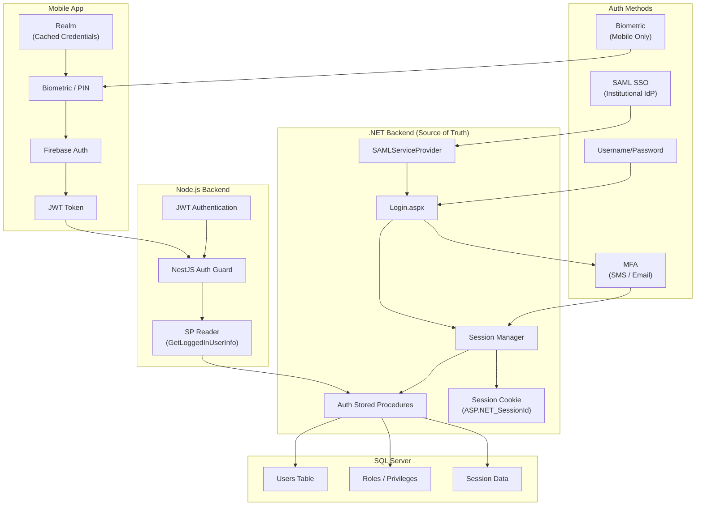
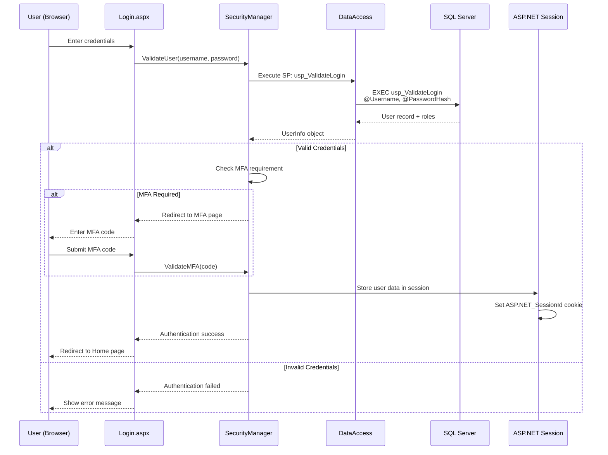
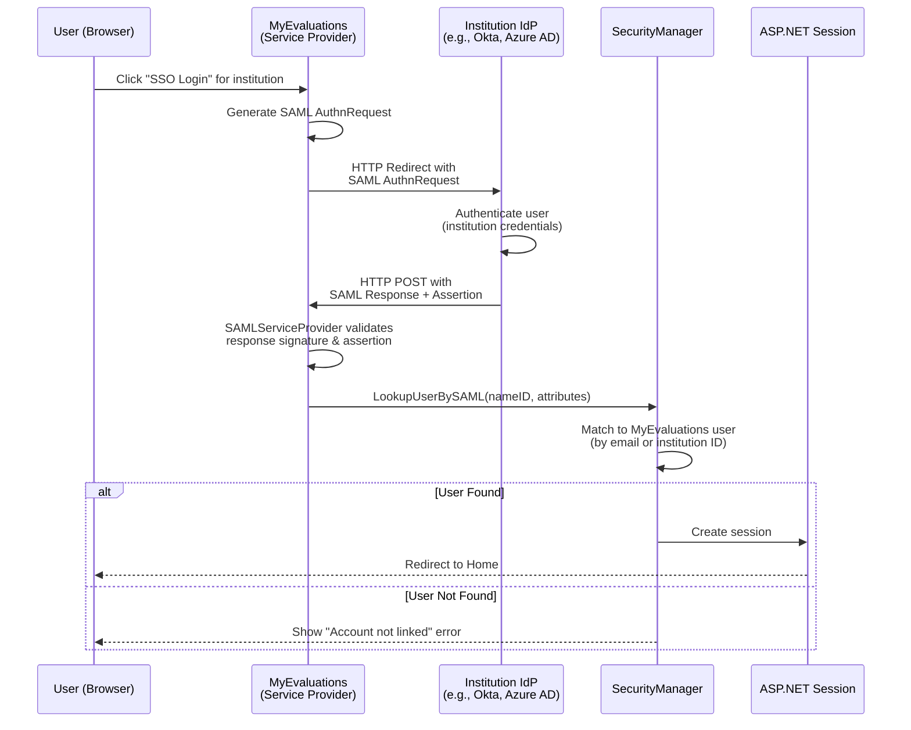
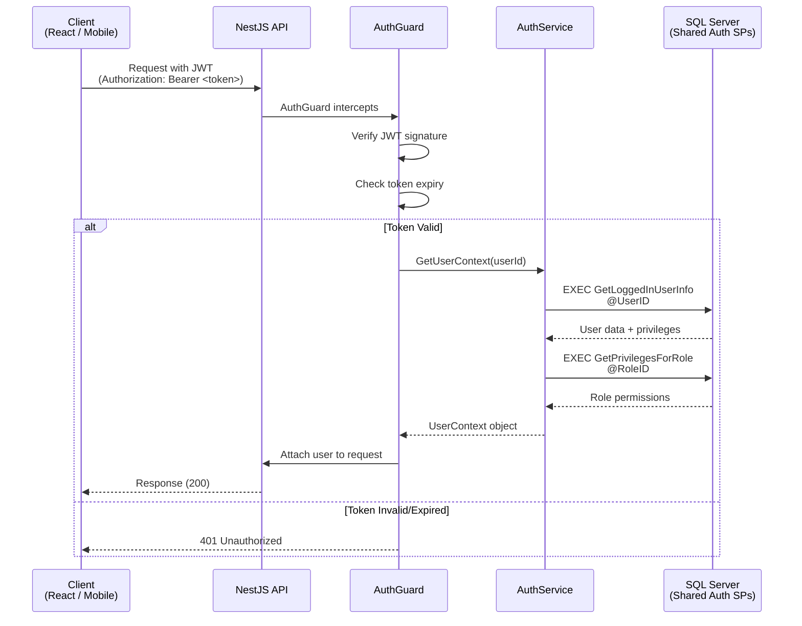
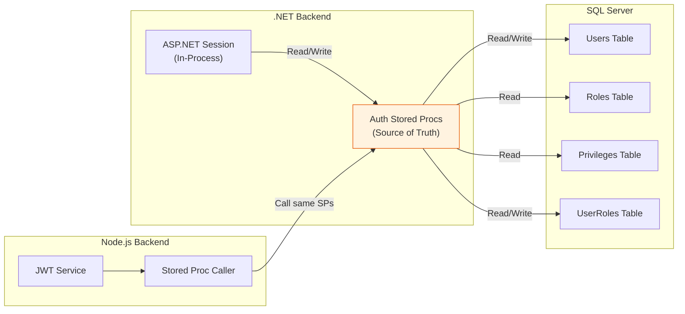
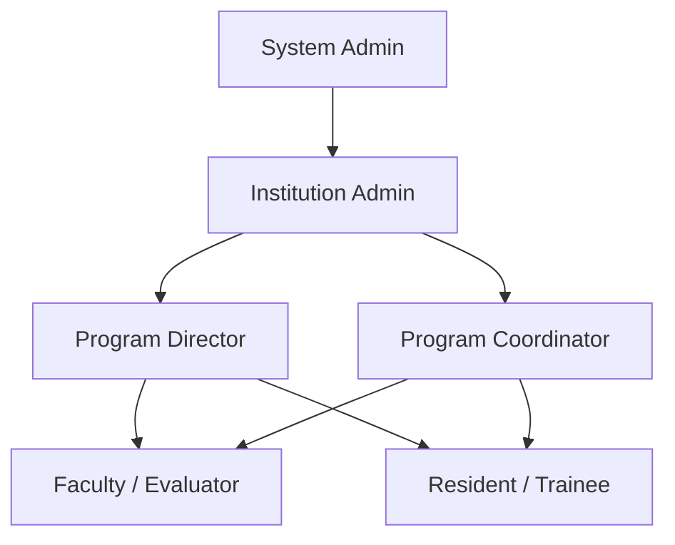
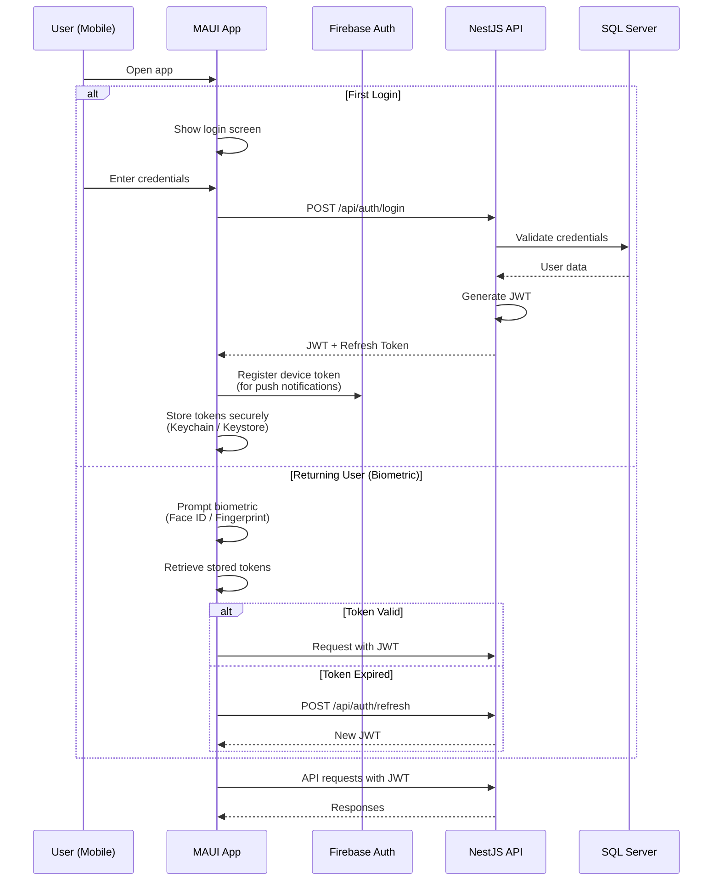
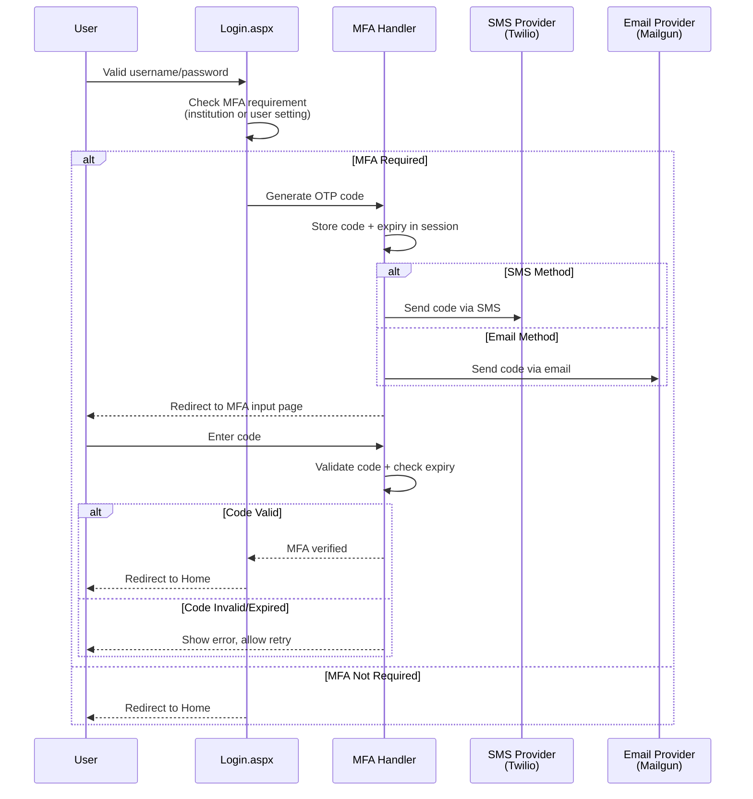

# Authentication & Authorization

MyEvaluations supports multiple authentication mechanisms across its four systems. The .NET backend is the source of truth for authentication, with other systems reading from its session/auth infrastructure via stored procedures.

## Authentication Overview



## .NET Session-Based Authentication

The .NET backend uses classic ASP.NET session-based authentication with server-side session state.

### Login Flow



### Session Data Structure

The .NET session stores the following user information after successful authentication:

<!-- AUTO-GENERATED: Specific session keys will be enriched from .NET backend analysis -->

| Session Key | Type | Description |
|-------------|------|-------------|
| `UserID` | `int` | Primary user identifier |
| `UserName` | `string` | Login username |
| `InstitutionID` | `int` | User's institution |
| `RoleID` | `int` | Primary role identifier |
| `Privileges` | `List<string>` | Granted privileges/permissions |
| `ProgramIDs` | `List<int>` | Associated program IDs |
| `IsAdmin` | `bool` | Administrative access flag |
| `IsSSOUser` | `bool` | Whether user authenticated via SSO |

### Session Configuration

```xml
<!-- Web.config session settings -->
<sessionState
  mode="InProc"
  timeout="60"
  cookieless="false"
  cookieName="ASP.NET_SessionId" />
```

- **Mode:** InProc (in-process, stored in IIS worker process memory)
- **Timeout:** 60 minutes of inactivity
- **Cookie:** `ASP.NET_SessionId` (HTTP-only, secure in production)

## SAML SSO Integration

MyEvaluations supports SAML 2.0 Single Sign-On for institutional authentication, allowing users to log in via their institution's Identity Provider (IdP).

### SAML Flow



### SAML Configuration

Each institution can have its own SAML IdP configuration stored in the database:

| Field | Description |
|-------|-------------|
| `InstitutionID` | Links to institution record |
| `IdPEntityID` | Identity Provider Entity ID |
| `IdPSSOUrl` | IdP Single Sign-On URL |
| `IdPCertificate` | IdP X.509 signing certificate |
| `SPEntityID` | MyEvaluations Service Provider Entity ID |
| `NameIDFormat` | Expected NameID format (email, persistent, etc.) |
| `AttributeMapping` | Maps SAML attributes to MyEvaluations fields |

### SAMLServiceProvider Project

The `SAMLServiceProvider` project in the .NET solution handles:

- SAML AuthnRequest generation
- SAML Response parsing and validation
- XML signature verification
- Assertion extraction and attribute mapping
- IdP metadata parsing

<!-- AUTO-GENERATED: Specific class names and methods will be enriched from .NET backend parsing -->

## JWT Tokens (Node.js Backend)

The Node.js backend uses JWT (JSON Web Tokens) for stateless API authentication.

### JWT Authentication Flow



### JWT Token Structure

```json
{
  "sub": "12345",
  "username": "john.doe",
  "institutionId": 67,
  "roleId": 3,
  "iat": 1700000000,
  "exp": 1700086400
}
```

### Key Stored Procedures for Auth Sharing

The Node.js backend calls these .NET stored procedures to share authentication state:

| Stored Procedure | Purpose |
|-----------------|---------|
| `GetLoggedInUserInfo` | Retrieves user profile, institution, and basic permissions |
| `GetPrivilegesForRole` | Returns all privileges/permissions for a given role |
| `ValidateSessionToken` | Validates an existing .NET session token |
| `GetUserInstitutions` | Returns institutions a user has access to |

This approach ensures that both backends enforce the same authorization rules and that permission changes take effect immediately across both systems.

## How Auth State Is Shared Between Backends



### Shared Auth Contract

The "contract" between the two backends is the set of stored procedures that manage authentication and authorization. Both systems:

1. **Read user data** from the same `Users` table
2. **Check permissions** using the same `Privileges` and `Roles` tables
3. **Call the same stored procedures** for permission lookups
4. **Respect the same RBAC model** (roles, privileges, program-level access)

### Role-Based Access Control (RBAC)

MyEvaluations uses a hierarchical RBAC model:



<!-- AUTO-GENERATED: Specific role names and privilege lists will be enriched from database analysis -->

| Role Level | Description | Typical Privileges |
|------------|-------------|-------------------|
| System Admin | MyEvaluations staff | Full system access, institution management |
| Institution Admin | Hospital/school admin | Manage all programs, users, and settings within their institution |
| Program Director | Residency/program director | Manage evaluations, rotations, milestones for their program |
| Program Coordinator | Administrative coordinator | Manage schedules, compliance, reports for their program |
| Faculty | Attending physician/instructor | Complete evaluations, view assigned trainees |
| Resident/Trainee | Medical resident, student | Submit duty hours, complete self-evaluations, view feedback |

## Mobile App Authentication

The MAUI mobile app uses Firebase Authentication combined with JWT tokens for API access.

### Mobile Auth Flow



### Mobile Security Features

| Feature | Implementation |
|---------|---------------|
| Token Storage | iOS Keychain / Android Keystore |
| Biometric Auth | Face ID, Touch ID, Fingerprint |
| PIN Fallback | 4-6 digit PIN as biometric alternative |
| Session Timeout | Configurable inactivity timeout |
| Push Notifications | Firebase Cloud Messaging (FCM) |
| Offline Access | Realm local database with cached credentials |
| Certificate Pinning | SSL certificate pinning for API requests |

## Multi-Factor Authentication (MFA)

MFA can be enabled per institution or per user in MyEvaluations.

### MFA Methods

| Method | Details |
|--------|---------|
| SMS | One-time code sent via SMS (Twilio) |
| Email | One-time code sent to registered email |
| Authenticator App | TOTP-compatible (Google Authenticator, Authy) |

### MFA Flow



<!-- AUTO-GENERATED: Specific MFA configuration options and institution settings will be enriched from .NET backend analysis -->
