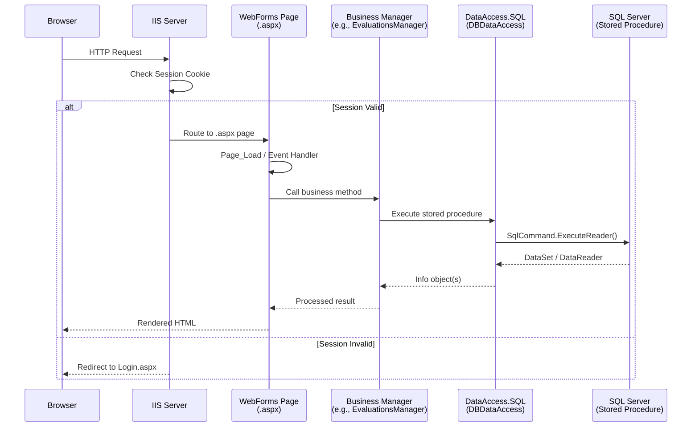
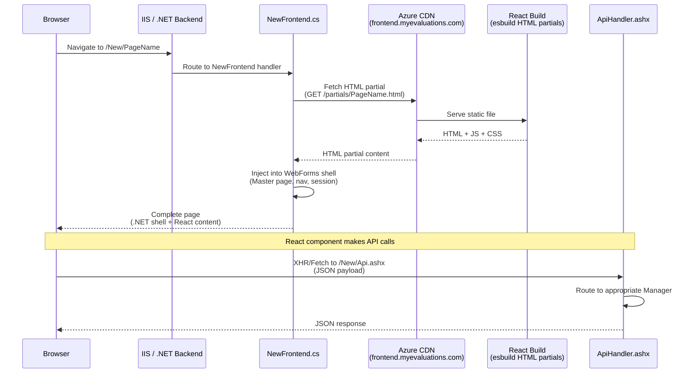
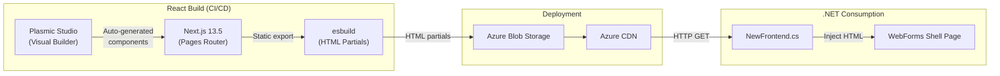
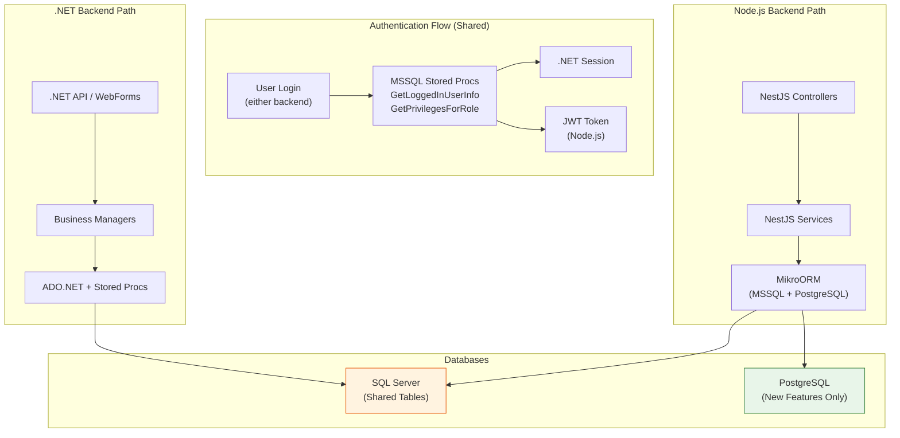
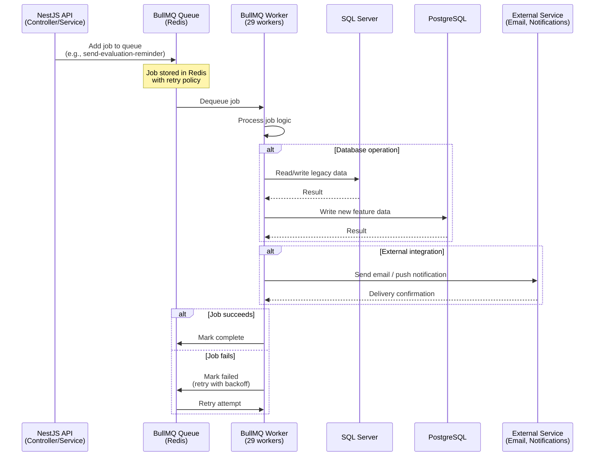
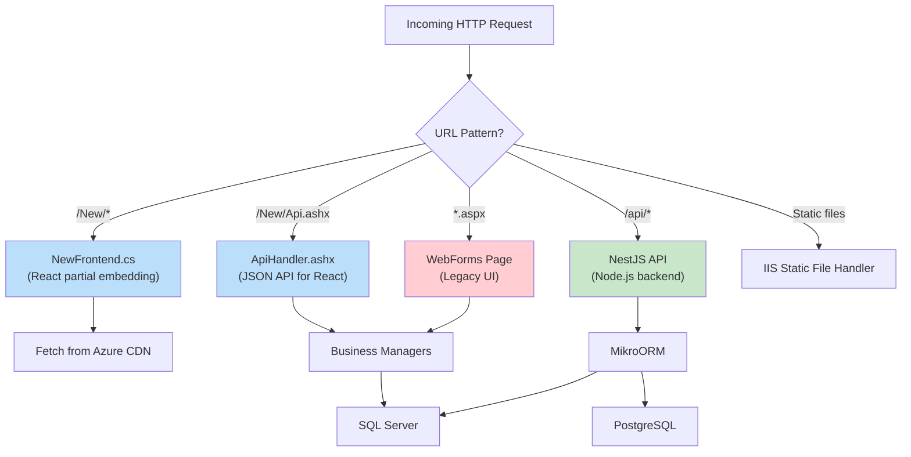
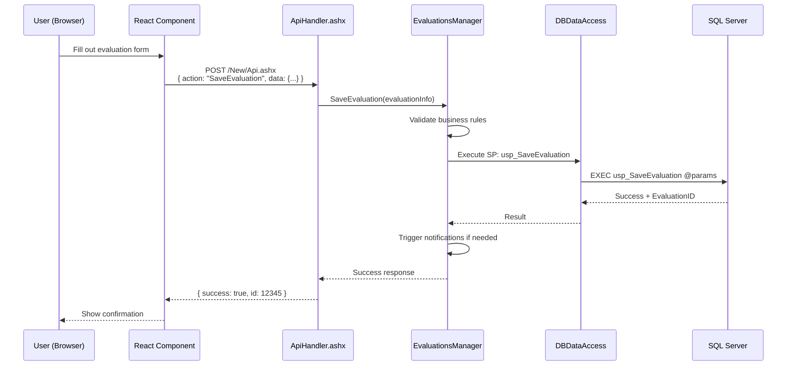
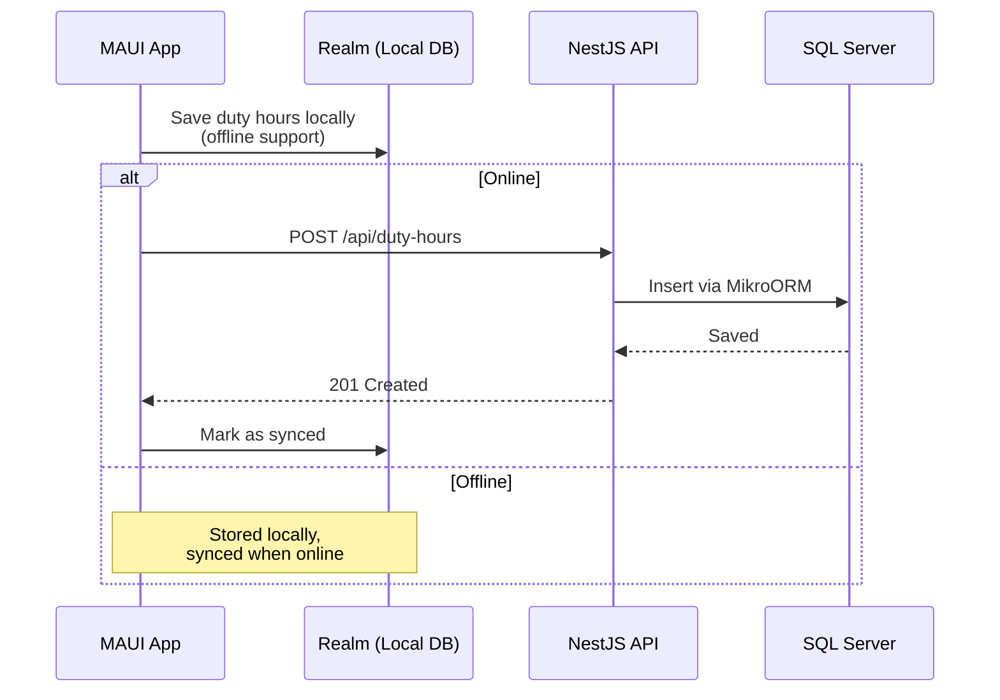

# Data Flow

This page documents how data flows through the MyEvaluations platform in common scenarios: legacy .NET request handling, React frontend embedding, dual-backend coexistence, and background job processing.

## .NET Backend Request Flow

The .NET WebForms backend handles requests through IIS with session-based authentication and stored procedure data access.

### Key Classes in the Flow

| Layer | Class | Role |
|-------|-------|------|
| Web | `*.aspx` + `*.aspx.cs` | WebForms page + code-behind |
| Business | `*Manager.cs` | Service/business logic (e.g., `EvaluationsManager`) |
| DTO | `*Info.cs` | Data Transfer Object (e.g., `EvaluationsInfo`) |
| Data Access | `DBDataAccess.cs` | ADO.NET wrapper for stored procedure execution |
| Data Access | `CustomCommand.cs` | SqlCommand builder with parameter handling |
| Database | Stored Procedures | All data operations (SELECT, INSERT, UPDATE, DELETE) |

## React Frontend Embedding in .NET Shell

The React frontend is served as HTML partials via Azure CDN and embedded within the .NET WebForms shell page. This allows progressive page-by-page migration.

### The Embedding Mechanism

1. **NewFrontend.cs** in the .NET backend fetches pre-built HTML partials from Azure CDN
2. The HTML is injected into the WebForms master page, preserving navigation, header, and session context
3. React components within the partial make API calls back to `ApiHandler.ashx` on the .NET backend
4. After a new React build is deployed, `/New/Revalidate.ashx` is called to clear the .NET-side cache

### Build Pipeline

## Dual-Backend Coexistence on MSSQL

Both the .NET and Node.js backends operate on the same MSSQL database. This diagram shows how they coexist without conflicts.

### Coexistence Rules

| Rule | Details |
|------|---------|
| **Shared tables** | Both backends read/write to legacy MSSQL tables (users, evaluations, programs, etc.) |
| **New tables** | Node.js creates new tables in PostgreSQL only; never adds tables to MSSQL |
| **Stored procedures** | .NET uses stored procs for all operations; Node.js uses MikroORM queries for most operations but calls auth stored procs |
| **Transactions** | Each backend manages its own transactions; no cross-backend transactions |
| **Schema changes** | MSSQL schema changes require coordination between both teams |
| **Auth contract** | Node.js reads .NET session data via stored procedures (`GetLoggedInUserInfo`) |

## BullMQ Worker Job Flow

The Node.js backend uses BullMQ with Redis for asynchronous job processing. There are 29 workers handling various background tasks.

### Worker Categories

<!-- AUTO-GENERATED: This section will be enriched with actual worker names from the Node.js backend parsing scripts -->

| Category | Examples | Database |
|----------|----------|----------|
| Evaluation Processing | Evaluation reminders, auto-filing, scoring | MSSQL |
| Notifications | Email digests, push notifications | MSSQL + External |
| Data Sync | Schedule imports, integration syncs | MSSQL + PostgreSQL |
| Report Generation | PDF reports, export jobs | MSSQL + Blob Storage |
| Onboarding | New user setup, credential verification | PostgreSQL |

## Request Routing Overview

This diagram shows how incoming requests are routed to the appropriate backend based on the URL pattern.

## Data Flow for Common Operations

### Completing an Evaluation

### Duty Hours Logging (Mobile)

<!-- AUTO-GENERATED: Additional data flow diagrams will be generated based on specific module analysis from parse scripts -->
