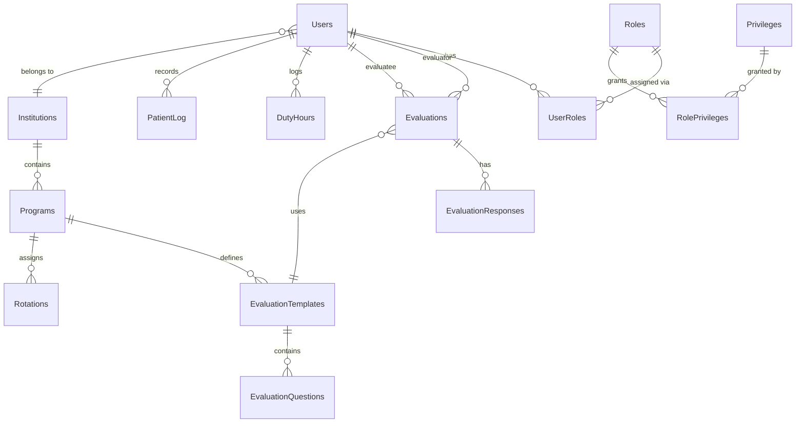

# Database Schema

:::tip Full Database Documentation
For interactive schema exploration, per-module table references, and SP reconciliation, see the **[Database Schema](/docs/database/overview)** section — 2,242 tables across 23 modules with Mermaid ER diagrams and expandable detail.
:::

MyEvaluations uses a dual-database architecture: a shared **SQL Server** database that both the .NET and Node.js backends access, and a **PostgreSQL** database used exclusively by the Node.js backend for new features.

## Database Architecture

```mermaid
graph TB
    subgraph "Applications"
        DotNet[".NET Backend<br/>(ADO.NET + Stored Procs)"]
        NodeJS["Node.js Backend<br/>(MikroORM)"]
        Schedulers["Windows Services<br/>(70+ Schedulers)"]
        Workers["BullMQ Workers<br/>(29 Workers)"]
    end

    subgraph "SQL Server (Primary, Shared)"
        direction TB
        Core["Core Tables<br/>(Users, Institutions, Programs)"]
        Eval["Evaluation Tables<br/>(Evaluations, Templates, Responses)"]
        Clinical["Clinical Tables<br/>(DutyHours, PatientLog, Procedures)"]
        Academic["Academic Tables<br/>(CME, Curriculum, Rotations)"]
        Auth["Auth Tables<br/>(Sessions, Roles, Privileges)"]
        Config["Config Tables<br/>(Settings, LookupValues)"]
        SPs["1000+ Stored Procedures"]
    end

    subgraph "PostgreSQL (Node.js Only)"
        direction TB
        APE["APE Tables<br/>(Annual Program Evaluation)"]
        CAW["CAW Tables<br/>(Clinical Assessment Workspace)"]
        Perf["Performance Tables"]
        Onboard["Onboarding Tables"]
        Posts["Posts / Feed Tables"]
        SIMPL["SIMPL Tables"]
    end

    DotNet --> Core
    DotNet --> Eval
    DotNet --> Clinical
    DotNet --> Academic
    DotNet --> Auth
    DotNet --> Config
    DotNet --> SPs

    NodeJS --> Core
    NodeJS --> Eval
    NodeJS --> Auth
    NodeJS --> APE
    NodeJS --> CAW
    NodeJS --> Perf
    NodeJS --> Onboard

    Schedulers --> Core
    Schedulers --> Eval
    Schedulers --> Clinical
    Schedulers --> SPs

    Workers --> Core
    Workers --> APE
    Workers --> Posts

    style Core fill:#e3f2fd
    style Auth fill:#e3f2fd
    style APE fill:#e8f5e9
    style CAW fill:#e8f5e9
    style Perf fill:#e8f5e9
```



## MSSQL Schema Overview

The SQL Server database is the primary data store, shared between the .NET and Node.js backends. It has evolved over 17+ years and contains **2,242 tables** across 2 schemas (`dbo`, `perf`), organized into 23 modules by naming prefix.

### Core Entity Groups

> **Real counts from schema analysis (Feb 2026):** 2,242 tables · 5,028 stored procedures · 3,703 indexes · 1,029 foreign keys · 17 triggers

#### User & Organization

| Table | Description | Key Columns |
|-------|-------------|-------------|
| `Users` | All platform users (trainees, faculty, admins) | `UserID`, `Username`, `Email`, `InstitutionID` |
| `Institutions` | Hospitals, medical schools, programs | `InstitutionID`, `Name`, `Type`, `IsActive` |
| `Programs` | Training programs within institutions | `ProgramID`, `InstitutionID`, `Name`, `AccreditationID` |
| `UserRoles` | User-to-role assignments | `UserID`, `RoleID`, `ProgramID` |
| `Roles` | System roles (Admin, Director, Resident, etc.) | `RoleID`, `RoleName`, `Level` |
| `Privileges` | Granular permissions | `PrivilegeID`, `Name`, `Category` |
| `RolePrivileges` | Role-to-privilege mappings | `RoleID`, `PrivilegeID` |

#### Evaluations

| Table | Description | Key Columns |
|-------|-------------|-------------|
| `Evaluations` | Individual evaluation records | `EvaluationID`, `TemplateID`, `EvaluatorID`, `EvaluateeID`, `Status` |
| `EvaluationTemplates` | Evaluation form definitions | `TemplateID`, `Name`, `ProgramID`, `FormType` |
| `EvaluationQuestions` | Questions within templates | `QuestionID`, `TemplateID`, `Text`, `Type`, `Order` |
| `EvaluationResponses` | Answers to evaluation questions | `ResponseID`, `EvaluationID`, `QuestionID`, `Value` |
| `EvaluationSchedules` | Auto-assignment schedules | `ScheduleID`, `TemplateID`, `Frequency`, `StartDate` |

#### Clinical Tracking

| Table | Description | Key Columns |
|-------|-------------|-------------|
| `DutyHours` | Duty hours log entries | `DutyHourID`, `UserID`, `Date`, `StartTime`, `EndTime`, `Type` |
| `PatientLog` | Patient encounter records | `PatientLogID`, `UserID`, `Date`, `DiagnosisCode`, `ProcedureCode` |
| `Procedures` | Procedure tracking | `ProcedureID`, `UserID`, `ProcedureTypeID`, `Date`, `Supervisor` |
| `Rotations` | Rotation assignments | `RotationID`, `UserID`, `ProgramID`, `Site`, `StartDate`, `EndDate` |

#### Academic & CME

| Table | Description | Key Columns |
|-------|-------------|-------------|
| `CMECredits` | CME credit records | `CreditID`, `UserID`, `ActivityType`, `Hours`, `Date` |
| `LearningAssignments` | Assigned learning activities | `AssignmentID`, `UserID`, `Title`, `DueDate`, `Status` |
| `Milestones` | ACGME milestone assessments | `MilestoneID`, `UserID`, `CompetencyID`, `Level`, `Period` |
| `Curriculum` | Curriculum definitions | `CurriculumID`, `ProgramID`, `Name`, `Year` |

#### Configuration & Lookup

| Table | Description | Key Columns |
|-------|-------------|-------------|
| `LookupValues` | System-wide lookup/dropdown values | `LookupID`, `Category`, `Value`, `DisplayOrder` |
| `SystemSettings` | Global configuration settings | `SettingKey`, `SettingValue`, `Category` |
| `InstitutionSettings` | Per-institution settings | `InstitutionID`, `SettingKey`, `SettingValue` |
| `AuditLog` | System audit trail | `AuditID`, `UserID`, `Action`, `TableName`, `RecordID`, `Timestamp` |

### Key Relationships



## PostgreSQL Schema (Node.js Only)

The PostgreSQL database is managed by **MikroORM** and contains tables for features built exclusively on the Node.js backend. These tables have no .NET dependencies.

### Feature Schemas


#### APE (Annual Program Evaluation)

| Table | Description |
|-------|-------------|
| `ape_evaluations` | Annual program evaluation records |
| `ape_questions` | APE-specific questions and criteria |
| `ape_responses` | Responses to APE evaluations |
| `ape_action_items` | Follow-up action items from APE reviews |

#### CAW (Clinical Assessment Workspace)

| Table | Description |
|-------|-------------|
| `caw_assessments` | Clinical assessment records |
| `caw_templates` | Assessment workspace templates |
| `caw_milestones` | Milestone tracking within CAW |

#### Performance

| Table | Description |
|-------|-------------|
| `performance_reviews` | Performance review records |
| `performance_goals` | Goal setting and tracking |
| `performance_feedback` | 360-degree feedback entries |

#### Onboarding

| Table | Description |
|-------|-------------|
| `onboarding_checklists` | New user onboarding checklists |
| `onboarding_tasks` | Individual onboarding tasks |
| `onboarding_progress` | Task completion tracking |

### MikroORM Configuration

The Node.js backend uses MikroORM with two separate database connections:

```typescript
// Simplified MikroORM configuration
{
  // MSSQL connection (shared with .NET)
  mssql: {
    type: 'mssql',
    host: process.env.MSSQL_HOST,
    dbName: process.env.MSSQL_DATABASE,
    // Read-heavy, uses connection pool
    pool: { min: 2, max: 10 }
  },
  // PostgreSQL connection (Node.js only)
  postgresql: {
    type: 'postgresql',
    host: process.env.PG_HOST,
    dbName: process.env.PG_DATABASE,
    // MikroORM manages migrations
    migrations: { path: './migrations' }
  }
}
```

## Stored Procedures Overview

The .NET backend uses **5,028 stored procedures** for all data access. These are the primary API contract between the application and database. Of these, **3,894 are confirmed called from .NET code** (matched via [SP Reconciliation](/docs/database/sproc-reconciliation)), while 1,134 exist only in the database (potential dead code or archive-only).

### Stored Procedure Categories

> **From schema analysis:** 81% of SPs use plain names (no `usp_` prefix). Only 282 use the `usp_` convention.

| Category | SP Count | Key Examples |
|----------|:--------:|--------------|
| Security (`SEC_`) | 1,261 | `GetUsersByDepartment`, `AuthenticateUser` |
| Evaluations (`EVAL_`) | 960 | `GetEvaluationsByTemplate`, `SaveEvaluation` |
| Duty Hours (`DH_`) | 611 | `GetDutyHoursForUser`, `SaveDutyHourEntry` |
| Portfolio (`PF_`) | 388 | `GetPortfolioByUser`, `SavePortfolioEntry` |
| Procedures (`PRC_`) | 321 | `GetProceduresByUser`, `SaveProcedureLog` |
| CME (`CME_`) | 289 | `GetCMECredits`, `SaveCMEActivity` |
| Other 15 modules | 1,198 | Various across scheduling, quizzes, patient logs, etc. |

### Stored Procedure Naming Conventions

```
usp_[Module][Action][Details]

Examples:
  usp_EvalGetByTemplate       -- Get evaluations by template
  usp_UserInsert               -- Insert a new user
  usp_DutyHourGetWeeklyReport  -- Get weekly duty hours report
  usp_PatientLogSearchByDate   -- Search patient logs by date range
```

### How Stored Procedures Are Called

From the .NET backend using `DBDataAccess` and `CustomCommand`:

```csharp
// Example: Getting evaluations for a user
public List<EvaluationsInfo> GetEvaluationsByUser(int userId)
{
    CustomCommand cmd = new CustomCommand("usp_EvalGetByUser");
    cmd.AddParameter("@UserID", userId, SqlDbType.Int);

    DataSet ds = DBDataAccess.ExecuteDataSet(cmd);

    List<EvaluationsInfo> evaluations = new List<EvaluationsInfo>();
    foreach (DataRow row in ds.Tables[0].Rows)
    {
        evaluations.Add(EvaluationsInfo.FromDataRow(row));
    }
    return evaluations;
}
```

From the Node.js backend using MikroORM raw queries:

```typescript
// Example: Calling a shared stored procedure from Node.js
async getLoggedInUserInfo(userId: number): Promise<UserInfo> {
  const result = await this.em.execute(
    'EXEC GetLoggedInUserInfo @UserID = ?',
    [userId]
  );
  return this.mapToUserInfo(result[0]);
}
```

## Connection Management

### .NET Backend Connections

The .NET backend manages database connections through connection strings in `Web.config`:

```xml
<!-- Web.config (production values not in source control) -->
<connectionStrings>
  <add name="MyEvalsConnectionString"
       connectionString="Server=...;Database=MyEvaluations;
       User ID=...;Password=...;
       MultipleActiveResultSets=true;
       Connection Timeout=30;"
       providerName="System.Data.SqlClient" />
</connectionStrings>
```

Connection management details:

| Setting | Value | Notes |
|---------|-------|-------|
| Provider | `System.Data.SqlClient` | ADO.NET SQL Server provider |
| Pooling | Enabled (default) | ADO.NET connection pool |
| Min Pool Size | 0 (default) | Connections created on demand |
| Max Pool Size | 100 (default) | Maximum concurrent connections |
| Connection Timeout | 30 seconds | Time to wait for a connection |
| MARS | Enabled | Multiple Active Result Sets for concurrent readers |

### Node.js Backend Connections

```typescript
// MikroORM connection pool configuration
{
  pool: {
    min: 2,
    max: 10,
    acquireTimeoutMillis: 30000,
    idleTimeoutMillis: 30000,
  }
}
```

### Environment-Specific Connections

| Environment | MSSQL Host | PostgreSQL Host | Access Method |
|-------------|-----------|-----------------|---------------|
| Local Dev | `localhost` (VPN required) | `localhost` | Direct connection |
| Development | Azure-hosted SQL Server | Azure PostgreSQL | Docker network |
| Production | Azure-hosted SQL Server | Azure PostgreSQL | Docker Swarm network |

### Connection Security

- **VPN Required:** Developers must connect to VPN to access the development and production SQL Server instances
- **Encrypted Connections:** TLS 1.2 required for all database connections
- **Service Accounts:** Each application uses a dedicated service account (not shared credentials)
- **Key Vault:** Node.js backend retrieves connection strings from Azure Key Vault at startup

## Database Maintenance

### Backup Strategy


| Database | Backup Frequency | Retention | Method |
|----------|-----------------|-----------|--------|
| SQL Server (Prod) | Daily full + hourly transaction log | 30 days | Azure automated backups |
| PostgreSQL (Prod) | Daily full | 14 days | Azure managed PostgreSQL backup |
| SQL Server (Dev) | Weekly | 7 days | Manual backup |

### Index Management

The SQL Server database has extensive indexing due to its 25+ year history. Key considerations:

- Stored procedures are the primary optimization target (query plan caching)
- Index fragmentation is managed through scheduled maintenance jobs
- New indexes require careful evaluation due to the high write volume from 70+ schedulers
- **3,703 indexes** exist (2,235 nonclustered, 1,468 clustered)
- **196 indexes are disabled** (all nonclustered, all on `SEC_Users` — appear to be SQL Server missing index recommendations that were created but disabled)
- **813 tables (36.3%) lack a primary key** — see [Schema Health](/docs/database/health) for the full list
- **2 tables** use monthly partitioning (`Api_Response_Audit`, `Api_Response_Audit_Archive`)
