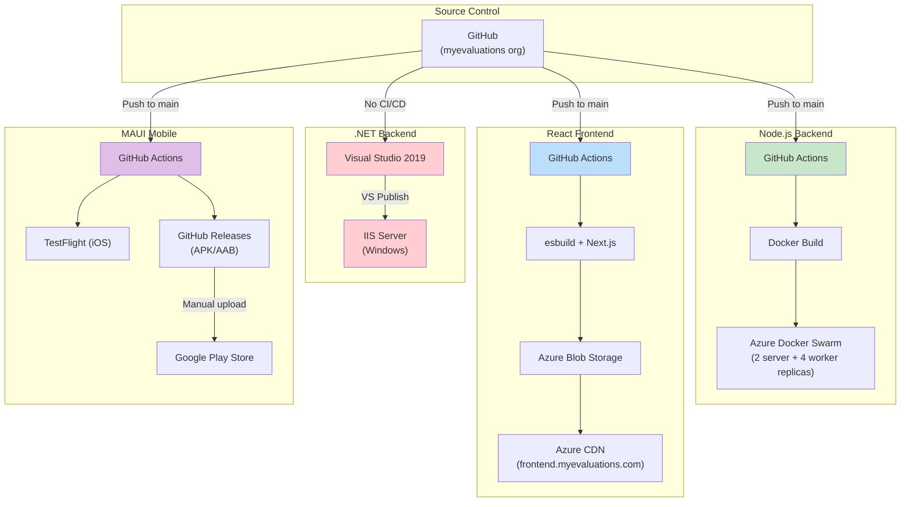
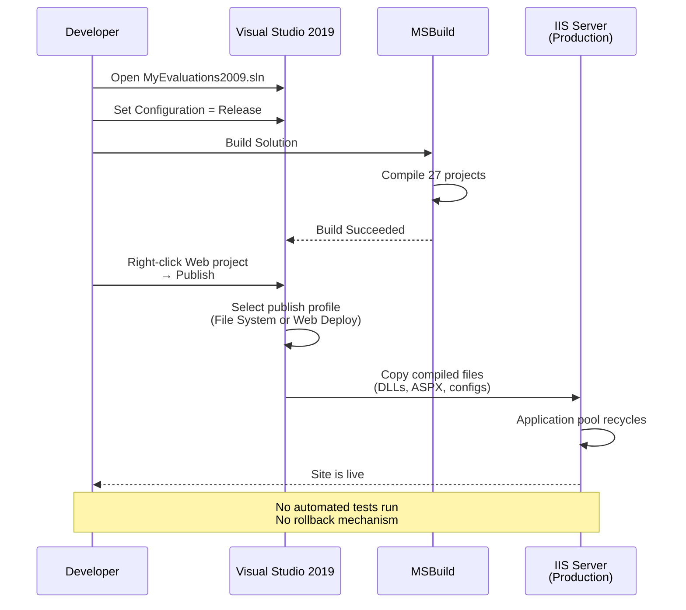
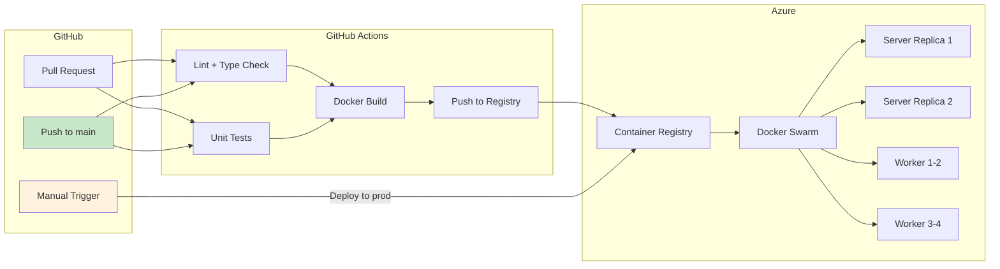
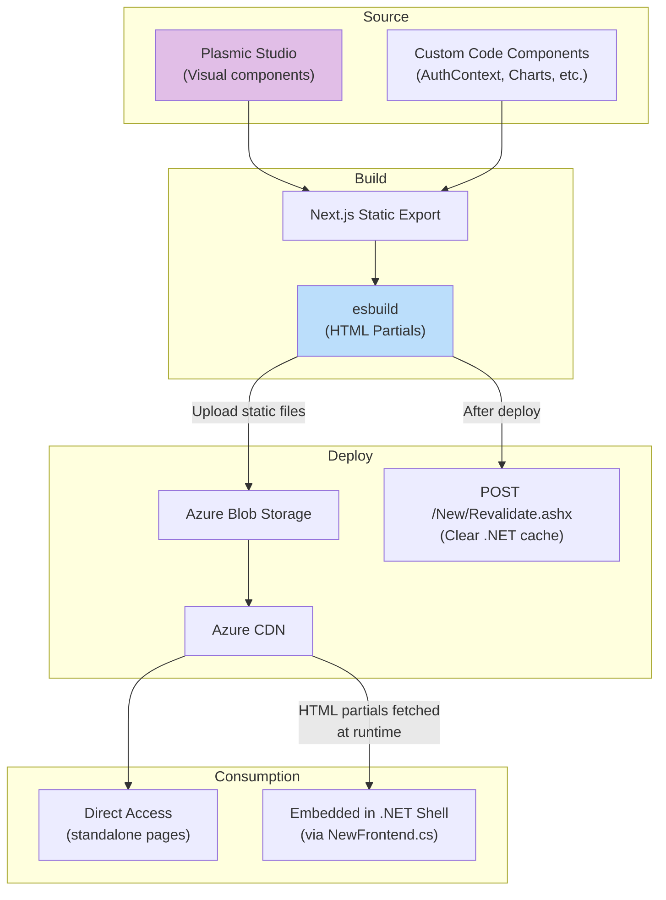
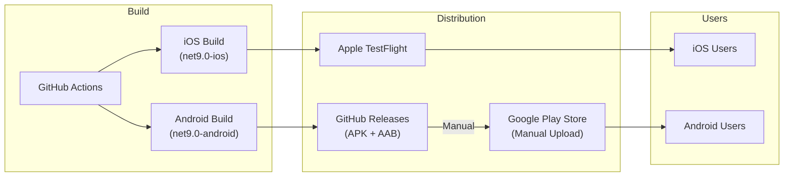

# Deployment Architecture

Each of the four MyEvaluations systems has its own deployment pipeline, reflecting the platform's evolutionary architecture. The .NET backend uses manual deployment, while the modern systems use GitHub Actions CI/CD.

## Deployment Overview



## .NET Backend Deployment

The .NET backend has **no CI/CD pipeline**. Deployment is a manual process using Visual Studio's publish feature.

### Deployment Process



### Prerequisites

| Requirement | Details |
|-------------|---------|
| IDE | Visual Studio 2019 (Professional or Enterprise) |
| Framework | .NET Framework 4.6.1 Targeting Pack |
| Database | SQL Server connection (VPN required for production) |
| Publish Profile | Pre-configured `.pubxml` file in the Web project |
| Access | Windows credentials for IIS server |

### Post-Deployment

After publishing to IIS:

1. The IIS application pool recycles automatically
2. Sessions are invalidated (users must re-login)
3. Verify the site loads at the production URL
4. Check Windows Event Viewer for startup errors
5. Monitor New Relic for error spikes

### Key Files Not in Source Control

These files must exist on the server but are never committed to git:

- `key.txt` -- Encryption key
- `Encryptkey.txt` -- Secondary encryption key
- `Vectorkey.txt` -- Encryption initialization vector
- `Web.config` connection strings (production values)

## Node.js Backend Deployment

The Node.js backend uses GitHub Actions for CI/CD with Docker Swarm for orchestration.

### CI/CD Pipeline



### Deployment Environments

| Environment | Trigger | Branch | Details |
|-------------|---------|--------|---------|
| Development | Automatic | `main` | Auto-deploy on merge |
| Production | Manual | `main` | Requires manual GitHub Actions workflow dispatch |

### Docker Swarm Configuration

```
Docker Swarm Cluster (Azure VMs)
├── Manager Node
├── Server Service (2 replicas)
│   ├── NestJS API server
│   └── Health check: GET /api/health
└── Worker Service (4 replicas)
    ├── BullMQ job processors (29 workers)
    └── Redis connection for queue management
```

### Infrastructure as Code

The Node.js infrastructure is managed with **CDKTF** (Terraform CDK):

| Resource | Provider | Details |
|----------|----------|---------|
| Azure VMs | `azurerm` | Docker Swarm nodes |
| PostgreSQL | `azurerm` | Managed PostgreSQL instance |
| Blob Storage | `azurerm` | Document and file storage |
| Key Vault | `azurerm` | Secrets management |
| Networking | `azurerm` | VNet, subnets, NSGs |

## React Frontend Deployment

The React frontend has a dual build process and deploys to Azure Blob Storage with CDN.

### Build and Deploy Pipeline



### Deployment Steps

1. **Plasmic sync** -- Pull latest visual components from Plasmic Studio
2. **Next.js build** -- Static export of all pages
3. **esbuild** -- Generate HTML partials for .NET embedding
4. **Upload** -- Push to Azure Blob Storage
5. **CDN purge** -- Invalidate CDN cache
6. **Revalidate** -- Call `/New/Revalidate.ashx` on .NET backend to clear its local cache of HTML partials

### CDN Configuration

| Setting | Value |
|---------|-------|
| Origin | Azure Blob Storage |
| Domain | `frontend.myevaluations.com` |
| Caching | Standard CDN rules with query string caching |
| SSL | Azure-managed certificate |
| Compression | Enabled for HTML, CSS, JS |

## MAUI Mobile App Deployment

The .NET MAUI app deploys through GitHub Actions to TestFlight (iOS) and GitHub Releases (Android).

### Release Pipeline



### Release Details

| Platform | Format | Distribution | Version |
|----------|--------|-------------|---------|
| iOS | IPA | TestFlight (automatic via CI) | v5.5.7 (build 265) |
| Android | APK + AAB | GitHub Releases, then manual Play Store upload | v5.5.7 (build 265) |

### Release Cadence

- Multiple releases per week during active development
- 2 primary developers (vitalii-smal, yaroslav-tsapiv)
- Version bumped in `Directory.Build.props`

## Environment Management

### Environment Variables

| System | Secret Storage | Details |
|--------|---------------|---------|
| .NET Backend | `Web.config` (on server, not in git) | Connection strings, API keys |
| Node.js Backend | Azure Key Vault | Accessed via CDKTF-managed identity |
| React Frontend | Build-time `.env` files | Public-only variables embedded in build |
| MAUI App | Build-time secrets | Firebase config, API endpoints |

### Monitoring and Observability

| System | Monitoring | Error Tracking | APM |
|--------|-----------|---------------|-----|
| .NET Backend | Windows Event Viewer | New Relic | New Relic |
| Node.js Backend | Docker logs, Prometheus | Sentry | New Relic |
| React Frontend | Browser console | Sentry (client-side) | -- |
| MAUI App | Firebase Crashlytics | Firebase Crashlytics | -- |

## Rollback Procedures

| System | Rollback Method |
|--------|----------------|
| .NET Backend | Re-publish previous version from Visual Studio (or restore from file backup) |
| Node.js Backend | `docker service rollback` on Swarm, or redeploy previous Docker image tag |
| React Frontend | Redeploy previous build to Blob Storage, purge CDN |
| MAUI App | Submit hotfix build; cannot rollback app store releases |

<!-- AUTO-GENERATED: Specific GitHub Actions workflow details will be enriched from the Node.js and React repo analysis -->
