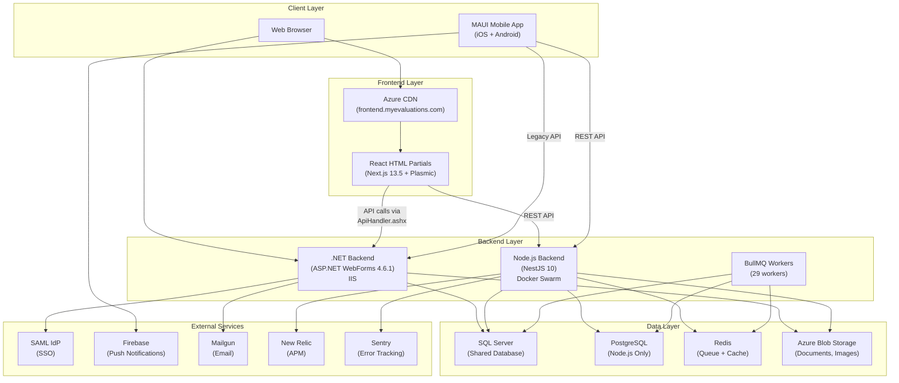
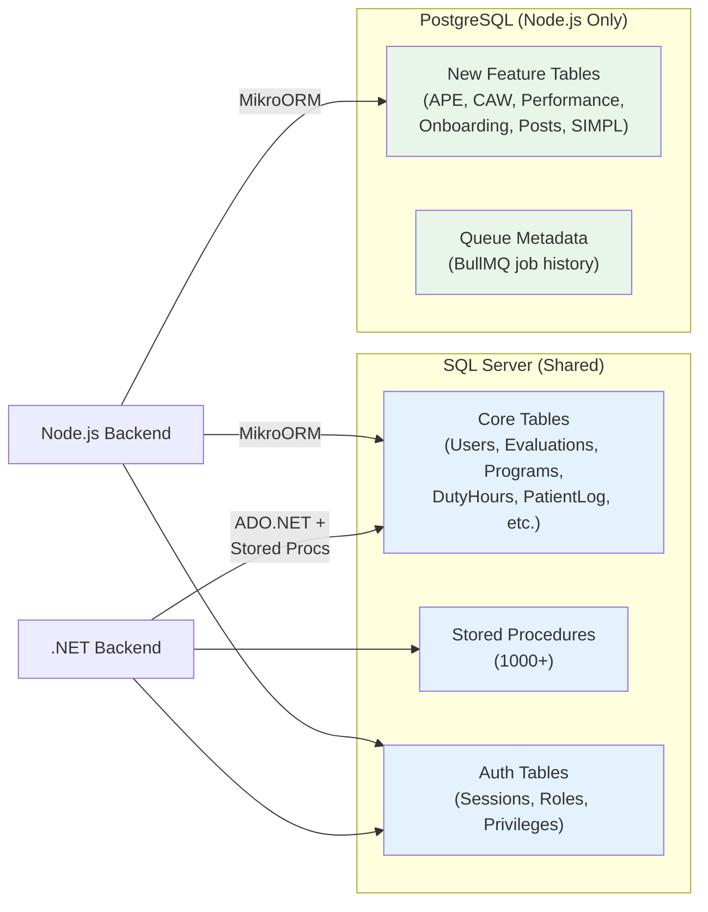
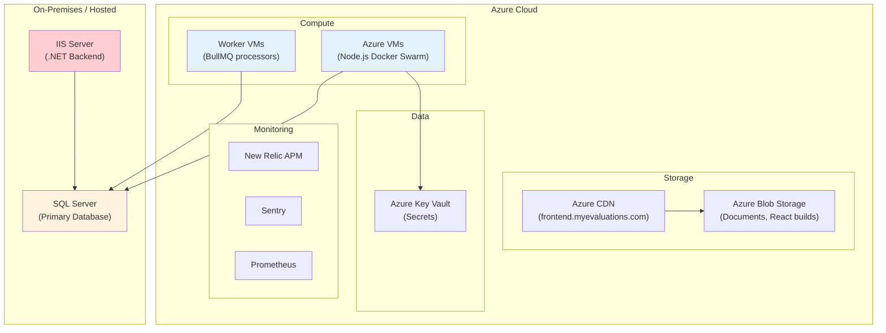

# Architecture Overview

MyEvaluations is a multi-system platform that has evolved over 25+ years from a classic ASP.NET WebForms monolith into a hybrid architecture where modern Node.js and React layers progressively replace legacy functionality.

## System Landscape

The platform consists of four core systems that work together to serve healthcare education institutions:

## How the Systems Interact

### .NET Backend (Legacy Monolith)

The .NET backend is the original system and still handles the majority of traffic. It serves WebForms pages directly and acts as a JSON API router for the React frontend via `ApiHandler.ashx`. Key characteristics:

- **27 projects** in a single Visual Studio solution (`MyEvaluations2009.sln`)
- **70+ Windows Services** (schedulers) running evaluation reminders, data integrations, and compliance workflows
- **Stored procedures** for all data access via ADO.NET
- **Session-based authentication** with SAML SSO support
- Hosts the shell page that embeds React HTML partials

### Node.js Backend (Modern Replacement)

The NestJS backend progressively replaces .NET functionality using the Strangler Fig pattern:

- **80+ controllers**, **200+ services**, **29 BullMQ workers**
- Reads from .NET's MSSQL stored procedures for authentication (`GetLoggedInUserInfo`, `GetPrivilegesForRole`)
- New features (APE, CAW, Performance, Onboarding) built exclusively here
- Dual database: MSSQL (shared legacy data) + PostgreSQL (new feature data)

### React Frontend (Modern UI)

The React frontend replaces WebForms pages one at a time:

- Built with Next.js 13.5 and Plasmic visual builder (500+ auto-generated components)
- Dual build output: standalone Next.js app + esbuild HTML partials
- HTML partials are fetched by `NewFrontend.cs` in the .NET backend and embedded in the WebForms shell
- Approximately 20+ pages have been migrated to React

### MAUI Mobile App

Cross-platform mobile app providing field access:

- .NET MAUI 9 targeting iOS and Android
- MVVM architecture with Realm local database
- Features: evaluations, clinical hours, geofencing (MyQuickPass), QR codes
- Communicates primarily with the Node.js backend

## Database Architecture

**Key principle:** The MSSQL database is the single source of truth for all legacy data. Both backends read and write to it. PostgreSQL is used exclusively by the Node.js backend for new features that have no .NET dependency.

## The Strangler Fig Migration Pattern

MyEvaluations follows the [Strangler Fig](https://martinfowler.com/bliki/StranglerFigApplication.html) pattern to incrementally replace the .NET monolith without a risky full rewrite.

```mermaid
graph TB
    subgraph "Phase 1: Coexistence (Current)"
        direction LR
        User1["User Request"] --> Router1["IIS / Routing"]
        Router1 -->|"Legacy pages"| DotNet1[".NET WebForms"]
        Router1 -->|"New pages"| React1["React (via CDN)"]
        React1 -->|"API calls"| DotNet1
        React1 -->|"New API"| Node1["Node.js"]
        DotNet1 --> DB1["MSSQL"]
        Node1 --> DB1
        Node1 --> PG1["PostgreSQL"]
    end

    subgraph "Phase 2: Progressive Replacement"
        direction LR
        User2["User Request"] --> Router2["Routing Layer"]
        Router2 -->|"Shrinking"| DotNet2[".NET<br/>(fewer pages)"]
        Router2 -->|"Growing"| React2["React<br/>(more pages)"]
        React2 --> Node2["Node.js<br/>(more endpoints)"]
        DotNet2 --> DB2["MSSQL"]
        Node2 --> DB2
        Node2 --> PG2["PostgreSQL<br/>(more data)"]
    end

    subgraph "Phase 3: Future Target"
        direction LR
        User3["User Request"] --> React3["React SPA"]
        React3 --> Node3["Node.js<br/>(all endpoints)"]
        Node3 --> DB3["MSSQL + PostgreSQL"]
    end

    style DotNet1 fill:#ffcdd2
    style DotNet2 fill:#ffcdd2,stroke-dasharray: 5 5
    style Node1 fill:#c8e6c9
    style Node2 fill:#c8e6c9
    style Node3 fill:#c8e6c9
    style React1 fill:#bbdefb
    style React2 fill:#bbdefb
    style React3 fill:#bbdefb
```

### Migration Rules

1. **New features** are built exclusively on Node.js + PostgreSQL
2. **Migrated features** keep reading from MSSQL (shared data) but move business logic to Node.js
3. **Authentication** is shared -- Node.js reads from .NET's MSSQL auth stored procedures
4. **UI migration** happens page-by-page -- React partials replace individual WebForms pages
5. The .NET backend is **never modified** for new features; it only receives bug fixes

## Azure Infrastructure

### Infrastructure Details

| Component | Technology | Details |
|-----------|-----------|---------|
| .NET Hosting | IIS on Windows Server | Manual deployment via Visual Studio publish |
| Node.js Hosting | Docker Swarm on Azure VMs | 2 server replicas, 4 worker replicas |
| Frontend Hosting | Azure Blob + CDN | Static files at `frontend.myevaluations.com` |
| Infrastructure as Code | CDKTF (Terraform CDK) | Azure VMs, PostgreSQL, Blob Storage, Key Vault |
| CI/CD (.NET) | None | Manual Visual Studio publish |
| CI/CD (Node.js) | GitHub Actions | Auto-deploy `main` to dev, manual to prod |
| CI/CD (React) | GitHub Actions | Auto-deploy `main` to dev, manual to prod |
| CI/CD (MAUI) | GitHub Actions | TestFlight (iOS), GitHub Releases (Android) |

## Key Architectural Decisions

1. **Shared MSSQL Database:** Both backends share the same SQL Server database. This enables incremental migration but requires careful coordination to avoid data conflicts.

2. **Stored Procedures as API Contract:** The .NET backend's stored procedures effectively serve as an API contract between the two backends. Node.js calls the same stored procs for authentication and legacy data access.

3. **React-in-WebForms Embedding:** Rather than running React as a standalone SPA, HTML partials are embedded within the .NET WebForms shell page. This preserves the existing navigation, session management, and authentication flow.

4. **Dual Database Strategy:** New features use PostgreSQL (via MikroORM) to avoid coupling to the legacy MSSQL schema, while shared/migrated features continue using MSSQL.

5. **No .NET CI/CD:** The .NET backend is deployed manually via Visual Studio publish. This is a known limitation but reflects the system's stability and the focus on migrating away from it rather than modernizing its deployment.

<!-- AUTO-GENERATED: This section will be enriched with specific counts and metrics from the parse-dotnet scripts -->
