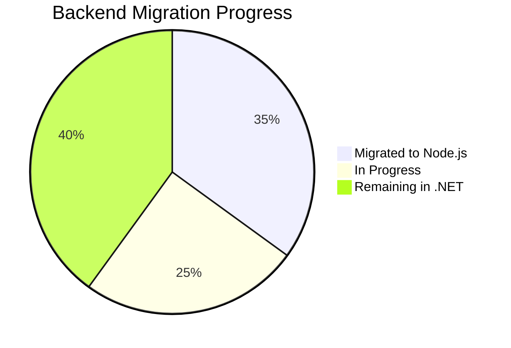

import MigrationTracker from '@site/src/components/MigrationTracker';

# System-Wide Migration Status

This page provides a holistic view of the MyEvaluations platform migration from legacy systems to modern technologies. The migration spans three major workstreams:

1. **Backend**: .NET WebForms to Node.js (NestJS)
2. **Frontend**: ASP.NET WebForms pages to React (Next.js + Plasmic)
3. **Background Jobs**: Windows Services (74 schedulers) to BullMQ workers (29 and growing)

## Migration Dashboard

<MigrationTracker />

## Migration by Layer

### Backend Migration (.NET to Node.js)

| Category | .NET (Legacy) | Node.js (Modern) | Status |
|----------|--------------|-------------------|--------|
| Authentication & SSO | Stored procs + SAML | JWT + shared stored procs | Shared |
| User Management | Managers + stored procs | NestJS module + MikroORM | Largely Migrated |
| Evaluations | 35+ classes, complex logic | NestJS module, partial | In Progress |
| Duty Hours | 55+ classes, ACGME rules | NestJS module, partial | In Progress |
| Patient Log | 20+ classes | NestJS module, partial | In Progress |
| Notifications | Windows Services | BullMQ workers | In Progress |
| Reports | Stored procs + FusionCharts | NestJS + new charting | In Progress |
| CME Tracking | 25+ classes | Not started | Planned |
| Conference | Windows Services | Not started | Not Started |
| Scheduling | Complex rotation logic | Not started | Not Started |

### Frontend Migration (WebForms to React)

| Page Category | WebForms Pages | React Replacements | Status |
|--------------|----------------|-------------------|--------|
| Evaluations | 10+ ASPX pages | React partials via CDN | Partial |
| Duty Hours | 5+ ASPX pages | React partials via CDN | Partial |
| Patient Log | 5+ ASPX pages | React partials via CDN | Partial |
| User Profile | 3+ ASPX pages | React partials via CDN | Complete |
| Dashboard | 1 ASPX page | React partial via CDN | Complete |
| CME Tracking | 50+ ASPX pages | Not started | Not Started |
| Preceptor/Admin | 50+ ASPX pages | Not started | Not Started |
| Reports | 20+ ASPX pages | Not started | Not Started |

### Background Job Migration (Windows Services to BullMQ)

| Scheduler Category | Windows Services | BullMQ Workers | Status |
|-------------------|-----------------|----------------|--------|
| Evaluation & Assessment | 6 services | 2 workers | In Progress |
| Communication | 6 services | 3 workers | In Progress |
| Data Integration | 12 services | 2 workers | In Progress |
| Clinical & Patient Care | 7 services | 1 worker | In Progress |
| Duty Hours & Compliance | 3 services | 1 worker | In Progress |
| License & Certification | 6 services | 0 workers | Not Started |
| Administrative | 8 services | 0 workers | Not Started |
| Conference | 4 services | 0 workers | Not Started |
| Learning & Academic | 8 services | 0 workers | Not Started |

## Migration Principles

1. **New features are Node.js + PostgreSQL only** -- No new code in the .NET backend
2. **.NET gets bug fixes only** -- Critical fixes are still applied to the legacy codebase
3. **Shared MSSQL is the bridge** -- Both backends read/write the same SQL Server database
4. **Page-by-page UI migration** -- React HTML partials replace individual WebForms pages
5. **Worker-by-worker job migration** -- BullMQ workers replace Windows Services one at a time

## How to Read This Page

- **Shared** means both systems handle the functionality and will coexist indefinitely (e.g., auth)
- **Largely Migrated** means Node.js handles most traffic but .NET still has some paths
- **In Progress** means active development is happening on the Node.js replacement
- **Planned** means the migration is scoped but development has not started
- **Not Started** means no migration plan exists yet

For detailed feature-by-feature status, see the [.NET Migration Status](/docs/dotnet-backend/migration/status) page.

<!-- AUTO-GENERATED: Migration percentages and counts will be enriched from parse-dotnet and repo-sync scripts -->
