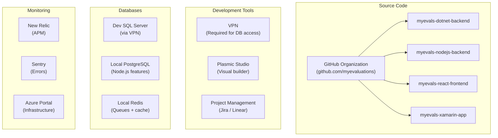
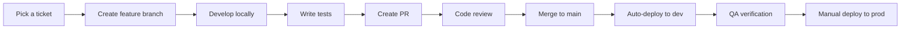

# Developer Onboarding

Welcome to the MyEvaluations development team. This guide will help you get set up with all the access and tools you need to start contributing.

## Week 1 Checklist

### Day 1: Access and Accounts

| Step | Action | Who to Ask |
|------|--------|-----------|
| 1 | Get added to the `myevaluations` GitHub organization | Team Lead |
| 2 | Request VPN credentials and configuration | IT / Team Lead |
| 3 | Get SQL Server credentials for the dev database | Team Lead |
| 4 | Request Plasmic studio access (if working on frontend) | Frontend Lead |
| 5 | Get Azure portal access (if working on infrastructure) | Team Lead |
| 6 | Request access to New Relic and Sentry dashboards | Team Lead |
| 7 | Request access to the project management tool (Jira/Linear) | Team Lead |

### Day 2-3: Environment Setup

Set up your local development environment for the systems you will work on:

| System | Getting Started Guide | Time Estimate |
|--------|----------------------|---------------|
| .NET Backend | [.NET Getting Started](/docs/dotnet-backend/getting-started) | 2-4 hours |
| Node.js Backend | [Node.js Getting Started](/docs/nodejs-backend/getting-started) | 1-2 hours |
| React Frontend | [React Getting Started](/docs/react-frontend/getting-started) | 1-2 hours |
| MAUI Mobile App | [MAUI Getting Started](/docs/maui-app/getting-started) | 2-4 hours |

:::tip
Most developers work primarily on one or two systems. Set up the systems you will work on first, then explore others as needed.
:::

### Day 4-5: Understanding the Platform

Read these documentation pages to understand the platform:

1. [Architecture Overview](/docs/architecture/overview) -- How all four systems fit together
2. [Migration Strategy](/docs/dotnet-backend/migration/strategy) -- Why and how we are migrating from .NET to Node.js
3. [Feature Matrix](/docs/cross-cutting/feature-matrix) -- Which features exist in which systems
4. [Coding Standards](/docs/cross-cutting/coding-standards) -- Conventions for each tech stack

## Access Map



## Key Contacts

| Role | Responsibility |
|------|---------------|
| Team Lead | Access requests, architecture decisions, code reviews |
| Frontend Lead | Plasmic access, React component guidance |
| .NET Lead | Legacy codebase questions, stored procedure guidance |
| DevOps | VPN setup, Azure access, deployment issues |

## Repository Overview

The MyEvaluations GitHub organization has 22 repositories. The 4 core repos receive daily commits:

| Repository | Stack | Branch | Description |
|-----------|-------|--------|-------------|
| `myevals-dotnet-backend` | C# .NET 4.6.1 | `master` | Legacy WebForms monolith |
| `myevals-nodejs-backend` | TypeScript NestJS | `main` | Modern backend (replacing .NET) |
| `myevals-react-frontend` | TypeScript Next.js | `main` | Modern frontend (replacing WebForms) |
| `myevals-xamarin-app` | C# .NET MAUI | `main` | Cross-platform mobile app |

The remaining 18 repositories include infrastructure, shared libraries, documentation, and deprecated projects.

## VPN Setup

The VPN is required to access:

- Development SQL Server database
- Internal documentation and wikis
- Staging environments

### VPN Configuration Steps

1. Receive VPN credentials from IT
2. Install the VPN client (specific client varies -- ask IT)
3. Import the configuration file
4. Connect to the VPN before starting development

:::warning
Without VPN, you can still work on:
- Node.js features that only use local PostgreSQL
- React frontend components (with mocked API data)
- MAUI app UI (with mocked data)

But you cannot access the shared SQL Server database.
:::

## Development Workflow



### Branch Naming

```
feature/ME-123-add-evaluation-export
fix/ME-456-duty-hours-calculation-error
chore/ME-789-update-dependencies
```

### PR Guidelines

- Include a description of what changed and why
- Link the ticket number
- Add screenshots for UI changes
- Ensure all CI checks pass
- Request review from at least one team member

## Common First Tasks

Good first tasks for new developers:

| Task Type | System | Description |
|-----------|--------|-------------|
| Bug fix | .NET | Fix a display issue on a WebForms page |
| Bug fix | Node.js | Fix a validation error in an API endpoint |
| Small feature | React | Add a column to an existing table component |
| Documentation | Any | Improve inline code documentation |
| Test | Node.js | Add unit tests for an existing service |

## Questions?

- Check this documentation site first
- Ask in the team Slack/Teams channel
- Reach out to your assigned mentor or team lead

<!-- AUTO-GENERATED: Access request links and team contact details will be enriched from project configuration -->
