import TableDetail from '@site/src/components/TableDetail';

# Activity Logs Database Tables

**80 tables** · **53 with PK** (66.3%) · **42 FKs** · **168 indexes**

## Entity Relationships

```mermaid
erDiagram
    ACT_ActivityLog {
        bigint StudentAcitivityLogID PK
        bigint StudentID FK
        bigint CourseRegistrationID FK
        bigint CourseInstructorID FK
        bigint CourseSessionID FK
    }
    ACT_Behaviour {
        bigint BehaviorID PK
    }
    ACT_BehaviourActions {
        bigint BehaviourActionID PK
        bigint BehaviorID FK
    }
    ACT_BehaviourComments {
        bigint BehaviourCommentID PK
        bigint BehaviorID FK
    }
    ACT_ClinicalLog {
        bigint ClinicalLogID PK
        int FNPActivityID FK
    }
    ACT_ClinicalPerformance {
        bigint ClinicalPerformanceID PK
        bigint CourseRegistrationID FK
        bigint StudentID FK
        bigint BehaviorID FK
        bigint BehaviourCommentID FK
    }
    ACT_Course {
        bigint CourseRegistrationID PK
        bigint CourseInstructorID FK
        bigint ProgramID FK
        bigint DepartmentID FK
    }
    ACT_CourseObjective {
        bigint CourseObjectiveID PK
    }
    ACT_CourseObjectiveAcknowledgement {
        bigint CourseObjectiveAcknowledgementID PK
        bigint CourseObjectiveID FK
    }
    ACT_CourseSessions {
        bigint CourseSessionID PK
        bigint CourseRegistrationID FK
        bigint SessionID FK
    }
    ACT_DiagnosticsType {
        int DianosticsTypeID PK
    }
    ACT_DiagnosticsTypeOrder {
        int DiagnosticsTypeOrderID PK
        int DianosticsTypeID FK
    }
    ACT_DNPPrograms {
        bigint ProgramID PK
    }
    ACT_FNPActivity {
        int FNPActivityID PK
    }
    ACT_Instructor {
        bigint CourseInstructorID PK
        bigint UserID FK
    }
    ACT_PIPAssignment {
        bigint PIPAssignmentID PK
        bigint SessionID FK
        bigint CourseRegistrationID FK
        bigint StudentID FK
    }
    ACT_PIPAssignmentUser {
        bigint PIPAssignmentUserID PK
        bigint PIPAssignmentID FK
        bigint EvaluationID FK
    }
    ACT_Sessions {
        bigint SessionID PK
        bigint DepartmentID FK
    }
    ACT_StudentActivityLog {
        bigint StudentAcitivityLogID PK
        bigint StudentID FK
        bigint CourseRegistrationID FK
        bigint CourseInstructorID FK
        bigint CourseSessionID FK
    }
    ACT_TypeOfCare {
        int TypeOfCareID PK
        int AreaOfCareID FK
    }
    ACT_Instructor ||--o{ ACT_ActivityLog : "CourseInstructorID"
    ACT_Course ||--o{ ACT_ActivityLog : "CourseRegistrationID"
    ACT_CourseSessions ||--o{ ACT_ActivityLog : "CourseSessionID"
    ACT_DNPPrograms ||--o{ ACT_ActivityLog : "ProgramID"
    ACT_Behaviour ||--o{ ACT_BehaviourActions : "BehaviorID"
    ACT_Behaviour ||--o{ ACT_BehaviourComments : "BehaviorID"
    ACT_FNPActivity ||--o{ ACT_ClinicalLog : "FNPActivityID"
    ACT_Behaviour ||--o{ ACT_ClinicalPerformance : "BehaviorID"
    ACT_BehaviourActions ||--o{ ACT_ClinicalPerformance : "BehaviourActionID"
    ACT_BehaviourComments ||--o{ ACT_ClinicalPerformance : "BehaviourCommentID"
    ACT_Course ||--o{ ACT_ClinicalPerformance : "CourseRegistrationID"
    ACT_PIPAssignmentUser ||--o{ ACT_ClinicalPerformance : "PIPAssignmentUserID"
    ACT_Instructor ||--o{ ACT_Course : "CourseInstructorID"
    ACT_DNPPrograms ||--o{ ACT_Course : "ProgramID"
    ACT_CourseObjective ||--o{ ACT_CourseObjectiveAcknowledgement : "CourseObjectiveID"
    ACT_Course ||--o{ ACT_CourseSessions : "CourseRegistrationID"
    ACT_Sessions ||--o{ ACT_CourseSessions : "SessionID"
    ACT_DiagnosticsType ||--o{ ACT_DiagnosticsTypeOrder : "DianosticsTypeID"
    ACT_Course ||--o{ ACT_PIPAssignment : "CourseRegistrationID"
    ACT_Sessions ||--o{ ACT_PIPAssignment : "SessionID"
    ACT_PIPAssignment ||--o{ ACT_PIPAssignmentUser : "PIPAssignmentID"
    ACT_Instructor ||--o{ ACT_StudentActivityLog : "CourseInstructorID"
    ACT_Course ||--o{ ACT_StudentActivityLog : "CourseRegistrationID"
    ACT_CourseSessions ||--o{ ACT_StudentActivityLog : "CourseSessionID"
    ACT_DNPPrograms ||--o{ ACT_StudentActivityLog : "ProgramID"
```

## Table Reference

<TableDetail
  dataUrl="/table-detail-data/activity-logs.json"
  generatedAt="2026-02-28T06:03:57.118Z"
/>

## Stored Procedures

See the [Activity Logs Stored Procedures](./sprocs/activity-logs-sprocs) reference page for detailed documentation of all stored procedures in this module, including parameters, anti-pattern analysis, and optimization recommendations.

## Related Code Documentation

- [Essential Activities (.NET Business Module)](/docs/dotnet-backend/business/essential-activities)
