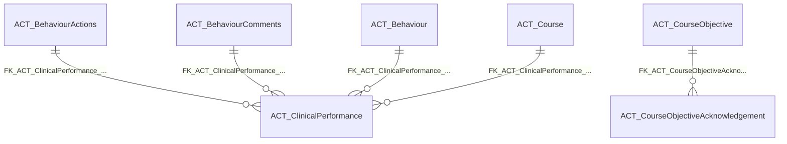

import TableDetail from '@site/src/components/TableDetail';

# Activity Logs Database Tables

**80 tables** · **53 with PK** (66.3%) · **42 FKs** · **168 indexes**

## Entity Relationships

## Table Reference

<TableDetail
  tables={[{"name":"ACT_ActivityLog","schema":"dbo","fullName":"dbo.ACT_ActivityLog","hasPrimaryKey":true,"primaryKeyColumns":["StudentAcitivityLogID"],"foreignKeys":[{"constraintName":"FK_ACT_ActivityLog_StudentID","referencedTable":"StudentID"},{"constraintName":"FK_ACT_ActivityLog_ProgramID","referencedTable":"ProgramID"},{"constraintName":"FK_ACT_ActivityLog_ProcedureID","referencedTable":"ProcedureID"},{"constraintName":"FK_ACT_ActivityLog_ProcedureCategoriesID","referencedTable":"ProcedureCategoriesID"},{"constraintName":"FK_ACT_ActivityLog_CourseSessionID","referencedTable":"CourseSessionID"},{"constraintName":"FK_ACT_ActivityLog_CourseRegistrationID","referencedTable":"CourseRegistrationID"},{"constraintName":"FK_ACT_ActivityLog_CourseInstructorID","referencedTable":"CourseInstructorID"}],"indexes":[{"name":"ACT_ActivityLog_PK","type":"CLUSTERED","isPrimaryKey":true,"isUnique":true,"isDisabled":false,"keyColumns":["StudentAcitivityLogID"],"includedColumns":[]},{"name":"IX_ACT_ActivityLog_ProcedureID","type":"NONCLUSTERED","isPrimaryKey":false,"isUnique":false,"isDisabled":false,"keyColumns":["ProcedureID"],"includedColumns":[]}],"checkConstraints":[],"defaultConstraints":2,"triggers":[]},{"name":"ACT_ActivityLogForPreceptors","schema":"dbo","fullName":"dbo.ACT_ActivityLogForPreceptors","hasPrimaryKey":false,"primaryKeyColumns":[],"foreignKeys":[],"indexes":[],"checkConstraints":[],"defaultConstraints":0,"triggers":[]},{"name":"ACT_AgeRange","schema":"dbo","fullName":"dbo.ACT_AgeRange","hasPrimaryKey":true,"primaryKeyColumns":["AgeRangeID"],"foreignKeys":[],"indexes":[{"name":"PK_ACT_AgeRange_AgeRangeID","type":"CLUSTERED","isPrimaryKey":true,"isUnique":true,"isDisabled":false,"keyColumns":["AgeRangeID"],"includedColumns":[]}],"checkConstraints":[],"defaultConstraints":0,"triggers":[]},{"name":"ACT_ArchivingUserHistory","schema":"dbo","fullName":"dbo.ACT_ArchivingUserHistory","hasPrimaryKey":false,"primaryKeyColumns":[],"foreignKeys":[],"indexes":[],"checkConstraints":[],"defaultConstraints":0,"triggers":[]},{"name":"ACT_AreaOfCare","schema":"dbo","fullName":"dbo.ACT_AreaOfCare","hasPrimaryKey":true,"primaryKeyColumns":["AreaOfCareID"],"foreignKeys":[],"indexes":[{"name":"PK_ACT_AreaOfCare_AreaOfCareID","type":"CLUSTERED","isPrimaryKey":true,"isUnique":true,"isDisabled":false,"keyColumns":["AreaOfCareID"],"includedColumns":[]}],"checkConstraints":[],"defaultConstraints":0,"triggers":[]},{"name":"ACT_BaseCourse","schema":"dbo","fullName":"dbo.ACT_BaseCourse","hasPrimaryKey":true,"primaryKeyColumns":["CourseID"],"foreignKeys":[],"indexes":[{"name":"ACT_BaseCourse_PK","type":"CLUSTERED","isPrimaryKey":true,"isUnique":true,"isDisabled":false,"keyColumns":["CourseID"],"includedColumns":[]}],"checkConstraints":[],"defaultConstraints":0,"triggers":[]},{"name":"ACT_Behaviour","schema":"dbo","fullName":"dbo.ACT_Behaviour","hasPrimaryKey":true,"primaryKeyColumns":["BehaviorID"],"foreignKeys":[],"indexes":[{"name":"PK__ACT_Beha__361B2187F6BD73B9","type":"CLUSTERED","isPrimaryKey":true,"isUnique":true,"isDisabled":false,"keyColumns":["BehaviorID"],"includedColumns":[]}],"checkConstraints":[],"defaultConstraints":0,"triggers":[]},{"name":"ACT_BehaviourActions","schema":"dbo","fullName":"dbo.ACT_BehaviourActions","hasPrimaryKey":true,"primaryKeyColumns":["BehaviourActionID"],"foreignKeys":[{"constraintName":"FK_ACT_Behaviour_ACT_BehaviourActions","referencedTable":"FK_ACT_Behaviour_ACT_BehaviourActions"}],"indexes":[{"name":"PK__ACT_Beha__1477FFB4F05BBE30","type":"CLUSTERED","isPrimaryKey":true,"isUnique":true,"isDisabled":false,"keyColumns":["BehaviourActionID"],"includedColumns":[]}],"checkConstraints":[],"defaultConstraints":0,"triggers":[]},{"name":"ACT_BehaviourComments","schema":"dbo","fullName":"dbo.ACT_BehaviourComments","hasPrimaryKey":true,"primaryKeyColumns":["BehaviourCommentID"],"foreignKeys":[{"constraintName":"FK_ACT_Behaviour_ACT_BehaviourComments","referencedTable":"FK_ACT_Behaviour_ACT_BehaviourComments"}],"indexes":[{"name":"PK__ACT_Beha__6C244506206F6321","type":"CLUSTERED","isPrimaryKey":true,"isUnique":true,"isDisabled":false,"keyColumns":["BehaviourCommentID"],"includedColumns":[]}],"checkConstraints":[],"defaultConstraints":0,"triggers":[]},{"name":"ACT_BSNEvaluationAssignmentVersions","schema":"dbo","fullName":"dbo.ACT_BSNEvaluationAssignmentVersions","hasPrimaryKey":false,"primaryKeyColumns":[],"foreignKeys":[],"indexes":[],"checkConstraints":[],"defaultConstraints":0,"triggers":[]},{"name":"ACT_ChamberlainType","schema":"dbo","fullName":"dbo.ACT_ChamberlainType","hasPrimaryKey":true,"primaryKeyColumns":["ChamberlainTypeID"],"foreignKeys":[],"indexes":[{"name":"PK__ACT_Cham__7385B44056464743","type":"CLUSTERED","isPrimaryKey":true,"isUnique":true,"isDisabled":false,"keyColumns":["ChamberlainTypeID"],"includedColumns":[]}],"checkConstraints":[],"defaultConstraints":0,"triggers":[]},{"name":"ACT_ClientComplexity","schema":"dbo","fullName":"dbo.ACT_ClientComplexity","hasPrimaryKey":true,"primaryKeyColumns":["ClientComplexityID"],"foreignKeys":[],"indexes":[{"name":"PK_ClientComplexityID","type":"CLUSTERED","isPrimaryKey":true,"isUnique":true,"isDisabled":false,"keyColumns":["ClientComplexityID"],"includedColumns":[]}],"checkConstraints":[],"defaultConstraints":0,"triggers":[]},{"name":"ACT_ClinicalLog","schema":"dbo","fullName":"dbo.ACT_ClinicalLog","hasPrimaryKey":true,"primaryKeyColumns":["ClinicalLogID"],"foreignKeys":[{"constraintName":"FK_ACT_ClinicalLog_ACT_FNPActivity_FNPActivityID","referencedTable":"ACT_FNPActivity_FNPActivityID"}],"indexes":[{"name":"PK_ACT_ClinicalLog_ClinicalLogID","type":"CLUSTERED","isPrimaryKey":true,"isUnique":true,"isDisabled":false,"keyColumns":["ClinicalLogID"],"includedColumns":[]}],"checkConstraints":[],"defaultConstraints":2,"triggers":[]},{"name":"ACT_ClinicalLogForCompetencies","schema":"dbo","fullName":"dbo.ACT_ClinicalLogForCompetencies","hasPrimaryKey":false,"primaryKeyColumns":[],"foreignKeys":[],"indexes":[],"checkConstraints":[],"defaultConstraints":0,"triggers":[]},{"name":"ACT_ClinicalLogForDiagnosisList","schema":"dbo","fullName":"dbo.ACT_ClinicalLogForDiagnosisList","hasPrimaryKey":false,"primaryKeyColumns":[],"foreignKeys":[],"indexes":[],"checkConstraints":[],"defaultConstraints":0,"triggers":[]},{"name":"ACT_ClinicalLogForPatient","schema":"dbo","fullName":"dbo.ACT_ClinicalLogForPatient","hasPrimaryKey":false,"primaryKeyColumns":[],"foreignKeys":[],"indexes":[],"checkConstraints":[],"defaultConstraints":0,"triggers":[]},{"name":"ACT_ClinicalLogForPreceptors","schema":"dbo","fullName":"dbo.ACT_ClinicalLogForPreceptors","hasPrimaryKey":false,"primaryKeyColumns":[],"foreignKeys":[],"indexes":[],"checkConstraints":[],"defaultConstraints":0,"triggers":[]},{"name":"ACT_ClinicalLogForVisit","schema":"dbo","fullName":"dbo.ACT_ClinicalLogForVisit","hasPrimaryKey":false,"primaryKeyColumns":[],"foreignKeys":[],"indexes":[],"checkConstraints":[],"defaultConstraints":0,"triggers":[]},{"name":"ACT_ClinicalPerformance","schema":"dbo","fullName":"dbo.ACT_ClinicalPerformance","hasPrimaryKey":true,"primaryKeyColumns":["ClinicalPerformanceID"],"foreignKeys":[{"constraintName":"FK_ACT_ClinicalPerformance_PIPAssignmentUserID","referencedTable":"PIPAssignmentUserID"},{"constraintName":"FK_ACT_ClinicalPerformance_ACT_BehaviourActions","referencedTable":"ACT_BehaviourActions"},{"constraintName":"FK_ACT_ClinicalPerformance_ACT_BehaviourComments","referencedTable":"ACT_BehaviourComments"},{"constraintName":"FK_ACT_ClinicalPerformance_ACT_Behaviour","referencedTable":"ACT_Behaviour"},{"constraintName":"FK_ACT_ClinicalPerformance_SEC_Users","referencedTable":"SEC_Users"},{"constraintName":"FK_ACT_ClinicalPerformance_ACT_Course","referencedTable":"ACT_Course"}],"indexes":[{"name":"IDX_ACT_ClinicalPerformance1","type":"NONCLUSTERED","isPrimaryKey":false,"isUnique":false,"isDisabled":false,"keyColumns":["CourseRegistrationID"],"includedColumns":["SessionID","StudentID","ClinicalSiteID","SubmittedDate","BehaviorID","BehaviourCommentID","BehaviourActionID","DateOfReEvaluation","IsSuccessFul","IsDeleted","OtherComments","IsCommentsOther","OtherActions","IsActionsOther"]},{"name":"IDX_MissingOn_ACT_ClinicalPerformance_ACAB52FBA1084B8EACC6999B814E157F","type":"NONCLUSTERED","isPrimaryKey":false,"isUnique":false,"isDisabled":false,"keyColumns":["StudentID"],"includedColumns":["SessionID","CourseRegistrationID","SubmittedDate","BehaviorID","BehaviourCommentID","BehaviourActionID","IsDeleted","OtherComments","IsCommentsOther","OtherActions","IsActionsOther","PIPAssignmentUserID"]},{"name":"IDX_MissingOn_ACT_ClinicalPerformance_D9EA917BD0024D1C910FE8A1F903BC9C","type":"NONCLUSTERED","isPrimaryKey":false,"isUnique":false,"isDisabled":false,"keyColumns":["PIPAssignmentUserID"],"includedColumns":[]},{"name":"IDX_MissingOn_ACT_ClinicalPerformance_F708D206529E4540AD6B46C77BB333DC","type":"NONCLUSTERED","isPrimaryKey":false,"isUnique":false,"isDisabled":false,"keyColumns":["PIPAssignmentUserID"],"includedColumns":["ClinicalSiteID","SubmittedDate"]},{"name":"PK__ACT_Clin__B0BC4A5F3F1A8682","type":"CLUSTERED","isPrimaryKey":true,"isUnique":true,"isDisabled":false,"keyColumns":["ClinicalPerformanceID"],"includedColumns":[]}],"checkConstraints":[],"defaultConstraints":1,"triggers":[]},{"name":"ACT_ClinicalSite","schema":"dbo","fullName":"dbo.ACT_ClinicalSite","hasPrimaryKey":false,"primaryKeyColumns":[],"foreignKeys":[],"indexes":[{"name":"IDX_ACT_ClinicalSite1","type":"NONCLUSTERED","isPrimaryKey":false,"isUnique":false,"isDisabled":false,"keyColumns":["ClinicalSiteID"],"includedColumns":["ClinicalSiteName"]},{"name":"IDX_ACT_ClinicalSite3","type":"NONCLUSTERED","isPrimaryKey":false,"isUnique":false,"isDisabled":false,"keyColumns":["DepartmentID"],"includedColumns":["ClinicalSiteID","ClinicalSiteName"]},{"name":"IX_ACT_ClinicalSite2","type":"NONCLUSTERED","isPrimaryKey":false,"isUnique":false,"isDisabled":false,"keyColumns":["ClinicalSiteName","DepartmentID"],"includedColumns":[]}],"checkConstraints":[],"defaultConstraints":0,"triggers":[]},{"name":"ACT_Course","schema":"dbo","fullName":"dbo.ACT_Course","hasPrimaryKey":true,"primaryKeyColumns":["CourseRegistrationID"],"foreignKeys":[{"constraintName":"FK_ACT_Course_CourseInstructorID","referencedTable":"CourseInstructorID"},{"constraintName":"FK_ACT_Course_DepartmentID","referencedTable":"DepartmentID"},{"constraintName":"FK_ACT_Course_ProgramID","referencedTable":"ProgramID"}],"indexes":[{"name":"ACT_Course_PK","type":"CLUSTERED","isPrimaryKey":true,"isUnique":true,"isDisabled":false,"keyColumns":["CourseRegistrationID"],"includedColumns":[]},{"name":"IDX_MissingOn_ACT_Course_9CE797B9514C496B87FEEB3547804AE3","type":"NONCLUSTERED","isPrimaryKey":false,"isUnique":false,"isDisabled":false,"keyColumns":["CourseCode","DepartmentID"],"includedColumns":["CourseName"]},{"name":"IX_ACT_Course_1","type":"NONCLUSTERED","isPrimaryKey":false,"isUnique":false,"isDisabled":false,"keyColumns":["ProgramID"],"includedColumns":["CourseRegistrationID"]},{"name":"IX_ACT_Course_CourseInstructorID","type":"NONCLUSTERED","isPrimaryKey":false,"isUnique":false,"isDisabled":false,"keyColumns":["CourseInstructorID","DepartmentID"],"includedColumns":["CourseRegistrationID","CourseName","IsDeleted"]},{"name":"IX_ACT_Course_CourseName","type":"NONCLUSTERED","isPrimaryKey":false,"isUnique":false,"isDisabled":false,"keyColumns":["DepartmentID","CourseName"],"includedColumns":["CourseRegistrationID","CourseInstructorID","IsDeleted"]},{"name":"IX_ACT_Course_CourseRegistrationID","type":"NONCLUSTERED","isPrimaryKey":false,"isUnique":false,"isDisabled":false,"keyColumns":["DepartmentID","CourseName"],"includedColumns":["CourseRegistrationID","CourseSection","CourseCode","CRN","CourseInstructorID","IsDeleted"]},{"name":"IX_ACT_Course1","type":"NONCLUSTERED","isPrimaryKey":false,"isUnique":false,"isDisabled":false,"keyColumns":["CourseCode","CourseName"],"includedColumns":["CourseRegistrationID"]},{"name":"IX_ACT_Course2","type":"NONCLUSTERED","isPrimaryKey":false,"isUnique":false,"isDisabled":false,"keyColumns":["DepartmentID","CourseName"],"includedColumns":["CourseRegistrationID","CourseSection","CourseCode","CRN","CourseInstructorID","ProgramID","IsDeleted"]},{"name":"IX_ACT_Course3","type":"NONCLUSTERED","isPrimaryKey":false,"isUnique":false,"isDisabled":false,"keyColumns":["CourseCode","CRN","DepartmentID"],"includedColumns":[]}],"checkConstraints":[],"defaultConstraints":2,"triggers":[]},{"name":"ACT_CourseObjective","schema":"dbo","fullName":"dbo.ACT_CourseObjective","hasPrimaryKey":true,"primaryKeyColumns":["CourseObjectiveID"],"foreignKeys":[],"indexes":[{"name":"PK__ACT_Cour__9521CEFF3FBF50A4","type":"CLUSTERED","isPrimaryKey":true,"isUnique":true,"isDisabled":false,"keyColumns":["CourseObjectiveID"],"includedColumns":[]}],"checkConstraints":[],"defaultConstraints":0,"triggers":[]},{"name":"ACT_CourseObjectiveAcknowledgement","schema":"dbo","fullName":"dbo.ACT_CourseObjectiveAcknowledgement","hasPrimaryKey":true,"primaryKeyColumns":["CourseObjectiveAcknowledgementID"],"foreignKeys":[{"constraintName":"FK_ACT_CourseObjectiveAcknowledgement_ACT_CourseObjective","referencedTable":"ACT_CourseObjective"}],"indexes":[{"name":"IDX_ACT_CourseObjectiveAcknowledgement1","type":"NONCLUSTERED","isPrimaryKey":false,"isUnique":false,"isDisabled":false,"keyColumns":["CourseObjectiveID","UserID"],"includedColumns":["AcknowledgeDate"]},{"name":"PK__ACT_Cour__3AD148518B4EBE5C","type":"CLUSTERED","isPrimaryKey":true,"isUnique":true,"isDisabled":false,"keyColumns":["CourseObjectiveAcknowledgementID"],"includedColumns":[]}],"checkConstraints":[],"defaultConstraints":0,"triggers":[]},{"name":"ACT_CourseSessions","schema":"dbo","fullName":"dbo.ACT_CourseSessions","hasPrimaryKey":true,"primaryKeyColumns":["CourseSessionID"],"foreignKeys":[{"constraintName":"FK_ACT_CourseSessions_CourseRegistrationID","referencedTable":"CourseRegistrationID"},{"constraintName":"FK_ACT_CourseSessions_SessionID","referencedTable":"SessionID"}],"indexes":[{"name":"IDX_ACT_CourseSessions2","type":"NONCLUSTERED","isPrimaryKey":false,"isUnique":false,"isDisabled":false,"keyColumns":["CourseRegistrationID"],"includedColumns":["SessionID"]},{"name":"IDX_ACT_CourseSessions3","type":"NONCLUSTERED","isPrimaryKey":false,"isUnique":false,"isDisabled":false,"keyColumns":["SessionID"],"includedColumns":["CourseRegistrationID"]},{"name":"PK_ACT_CourseSessions_CourseSessionID","type":"CLUSTERED","isPrimaryKey":true,"isUnique":true,"isDisabled":false,"keyColumns":["CourseSessionID"],"includedColumns":[]}],"checkConstraints":[],"defaultConstraints":0,"triggers":[]},{"name":"ACT_DeletedLog","schema":"dbo","fullName":"dbo.ACT_DeletedLog","hasPrimaryKey":false,"primaryKeyColumns":[],"foreignKeys":[],"indexes":[],"checkConstraints":[],"defaultConstraints":0,"triggers":[]},{"name":"ACT_DevryImportData","schema":"dbo","fullName":"dbo.ACT_DevryImportData","hasPrimaryKey":false,"primaryKeyColumns":[],"foreignKeys":[],"indexes":[],"checkConstraints":[],"defaultConstraints":0,"triggers":[]},{"name":"ACT_DiagnosticsType","schema":"dbo","fullName":"dbo.ACT_DiagnosticsType","hasPrimaryKey":true,"primaryKeyColumns":["DianosticsTypeID"],"foreignKeys":[],"indexes":[{"name":"PK_ACT_DiagnosticsType_DianosticsTypeID","type":"CLUSTERED","isPrimaryKey":true,"isUnique":true,"isDisabled":false,"keyColumns":["DianosticsTypeID"],"includedColumns":[]}],"checkConstraints":[],"defaultConstraints":0,"triggers":[]},{"name":"ACT_DiagnosticsTypeOrder","schema":"dbo","fullName":"dbo.ACT_DiagnosticsTypeOrder","hasPrimaryKey":true,"primaryKeyColumns":["DiagnosticsTypeOrderID"],"foreignKeys":[{"constraintName":"FK_ACT_DiagnosticsTypeOrder_ACT_DiagnosticsType_DianosticsTypeID","referencedTable":"ACT_DiagnosticsType_DianosticsTypeID"}],"indexes":[{"name":"PK_ACT_DiagnosticsTypeOrder_DiagnosticsTypeOrderID","type":"CLUSTERED","isPrimaryKey":true,"isUnique":true,"isDisabled":false,"keyColumns":["DiagnosticsTypeOrderID"],"includedColumns":[]}],"checkConstraints":[],"defaultConstraints":1,"triggers":[]},{"name":"ACT_DNPMoveLogs","schema":"dbo","fullName":"dbo.ACT_DNPMoveLogs","hasPrimaryKey":false,"primaryKeyColumns":[],"foreignKeys":[],"indexes":[],"checkConstraints":[],"defaultConstraints":0,"triggers":[]},{"name":"ACT_DNPPrograms","schema":"dbo","fullName":"dbo.ACT_DNPPrograms","hasPrimaryKey":true,"primaryKeyColumns":["ProgramID"],"foreignKeys":[],"indexes":[{"name":"ACT_DNPPrograms_PK","type":"CLUSTERED","isPrimaryKey":true,"isUnique":true,"isDisabled":false,"keyColumns":["ProgramID"],"includedColumns":[]}],"checkConstraints":[],"defaultConstraints":1,"triggers":[]},{"name":"ACT_DNPStudentsCourse","schema":"dbo","fullName":"dbo.ACT_DNPStudentsCourse","hasPrimaryKey":false,"primaryKeyColumns":[],"foreignKeys":[],"indexes":[],"checkConstraints":[],"defaultConstraints":0,"triggers":[]},{"name":"ACT_ELogFailedRecords","schema":"dbo","fullName":"dbo.ACT_ELogFailedRecords","hasPrimaryKey":false,"primaryKeyColumns":[],"foreignKeys":[],"indexes":[],"checkConstraints":[],"defaultConstraints":0,"triggers":[]},{"name":"ACT_EvaluationAssignmentVersions","schema":"dbo","fullName":"dbo.ACT_EvaluationAssignmentVersions","hasPrimaryKey":false,"primaryKeyColumns":[],"foreignKeys":[],"indexes":[],"checkConstraints":[],"defaultConstraints":0,"triggers":[]},{"name":"ACT_Evaluations","schema":"dbo","fullName":"dbo.ACT_Evaluations","hasPrimaryKey":false,"primaryKeyColumns":[],"foreignKeys":[],"indexes":[{"name":"IDX_ACT_Evaluations1","type":"NONCLUSTERED","isPrimaryKey":false,"isUnique":false,"isDisabled":false,"keyColumns":["EvaluationID"],"includedColumns":["SessionID"]},{"name":"IDX_ACT_Evaluations2","type":"NONCLUSTERED","isPrimaryKey":false,"isUnique":false,"isDisabled":false,"keyColumns":["SessionID","CourseID","FacultyID","Student"],"includedColumns":["EvaluationID","IsMidTerm","StartDate","OrginalCompletedDate","IsDeleted"]},{"name":"IDX_ACT_Evaluations3","type":"NONCLUSTERED","isPrimaryKey":false,"isUnique":false,"isDisabled":false,"keyColumns":["CourseID"],"includedColumns":["EvaluationID"]},{"name":"IDX_ACT_Evaluations4","type":"NONCLUSTERED","isPrimaryKey":false,"isUnique":false,"isDisabled":false,"keyColumns":["FacultyID"],"includedColumns":[]},{"name":"IDX_MissingOn_ACT_Evaluations_78FCEE326FFA478CB91096BA84BD00BA","type":"NONCLUSTERED","isPrimaryKey":false,"isUnique":false,"isDisabled":false,"keyColumns":["IsMidTerm"],"includedColumns":["DepartmentID"]}],"checkConstraints":[],"defaultConstraints":1,"triggers":[]},{"name":"ACT_FacultyStudentsCourse","schema":"dbo","fullName":"dbo.ACT_FacultyStudentsCourse","hasPrimaryKey":true,"primaryKeyColumns":["SessionFacultyID"],"foreignKeys":[],"indexes":[{"name":"ACT_FacultyStudentsCourse_PK","type":"CLUSTERED","isPrimaryKey":true,"isUnique":true,"isDisabled":false,"keyColumns":["SessionFacultyID"],"includedColumns":[]}],"checkConstraints":[],"defaultConstraints":0,"triggers":[]},{"name":"ACT_FNPActivity","schema":"dbo","fullName":"dbo.ACT_FNPActivity","hasPrimaryKey":true,"primaryKeyColumns":["FNPActivityID"],"foreignKeys":[],"indexes":[{"name":"PK_ACT_FNPActivity_FNPActivityID","type":"CLUSTERED","isPrimaryKey":true,"isUnique":true,"isDisabled":false,"keyColumns":["FNPActivityID"],"includedColumns":[]}],"checkConstraints":[],"defaultConstraints":0,"triggers":[]},{"name":"ACT_FNPBannerClinicalLog","schema":"dbo","fullName":"dbo.ACT_FNPBannerClinicalLog","hasPrimaryKey":true,"primaryKeyColumns":["FNPBannerClinicalLogID"],"foreignKeys":[],"indexes":[{"name":"IDX_ACT_FNPBannerClinicalLog1","type":"NONCLUSTERED","isPrimaryKey":false,"isUnique":false,"isDisabled":false,"keyColumns":["CourseRegistrationID"],"includedColumns":["StudentID","IsBannerData"]},{"name":"IDX_ACT_FNPBannerClinicalLog2","type":"NONCLUSTERED","isPrimaryKey":false,"isUnique":false,"isDisabled":false,"keyColumns":["StudentID"],"includedColumns":[]},{"name":"IDX_ACT_FNPBannerClinicalLog4","type":"NONCLUSTERED","isPrimaryKey":false,"isUnique":false,"isDisabled":false,"keyColumns":["CourseInstructorID","RSTSStatus"],"includedColumns":["StudentID","CourseSessionID","CourseRegistrationID","IsBannerData"]},{"name":"IDX_ACT_FNPBannerClinicalLog5","type":"NONCLUSTERED","isPrimaryKey":false,"isUnique":false,"isDisabled":false,"keyColumns":["IsActive"],"includedColumns":["StudentID","CourseRegistrationID","CourseInstructorID","IsBannerData"]},{"name":"IDX_ACT_FNPBannerClinicalLog6","type":"NONCLUSTERED","isPrimaryKey":false,"isUnique":false,"isDisabled":false,"keyColumns":["CourseSessionID"],"includedColumns":["CourseRegistrationID","CourseInstructorID","IsBannerData"]},{"name":"IDX_ACT_FNPBannerClinicalLog7","type":"NONCLUSTERED","isPrimaryKey":false,"isUnique":false,"isDisabled":false,"keyColumns":["IsActive"],"includedColumns":["StudentID","CourseSessionID","CourseRegistrationID","IsBannerData"]},{"name":"IX_ACT_FNPBannerClinicalLog3","type":"NONCLUSTERED","isPrimaryKey":false,"isUnique":false,"isDisabled":false,"keyColumns":["RSTSStatus"],"includedColumns":["StudentID","CourseSessionID","CourseRegistrationID","CourseInstructorID","IsBannerData"]},{"name":"PK_ACT_FNPBannerClinicalLog_FNPBannerClinicalLogID","type":"CLUSTERED","isPrimaryKey":true,"isUnique":true,"isDisabled":false,"keyColumns":["FNPBannerClinicalLogID"],"includedColumns":[]}],"checkConstraints":[],"defaultConstraints":0,"triggers":[]},{"name":"ACT_FNPBannerClinicalLogForPreceptors","schema":"dbo","fullName":"dbo.ACT_FNPBannerClinicalLogForPreceptors","hasPrimaryKey":true,"primaryKeyColumns":["FNPBannerClinicalLogForPreceptorID"],"foreignKeys":[],"indexes":[{"name":"IDX_ACT_FNPBannerClinicalLogForPreceptors1","type":"NONCLUSTERED","isPrimaryKey":false,"isUnique":false,"isDisabled":false,"keyColumns":["FNPBannerClinicalLogID"],"includedColumns":["PreceptorID","IsDeleted"]},{"name":"IDX_ACT_FNPBannerClinicalLogForPreceptors2","type":"NONCLUSTERED","isPrimaryKey":false,"isUnique":false,"isDisabled":false,"keyColumns":["PreceptorID"],"includedColumns":[]},{"name":"PK_ACT_FNPBannerClinicalLogForPreceptors_FNPBannerClinicalLogForPreceptorID","type":"CLUSTERED","isPrimaryKey":true,"isUnique":true,"isDisabled":false,"keyColumns":["FNPBannerClinicalLogForPreceptorID"],"includedColumns":[]}],"checkConstraints":[],"defaultConstraints":0,"triggers":[]},{"name":"ACT_FNPClinicalLog","schema":"dbo","fullName":"dbo.ACT_FNPClinicalLog","hasPrimaryKey":true,"primaryKeyColumns":["FNPClinicalLogID"],"foreignKeys":[{"constraintName":"FK_FNPClinicalLog_ACT_FNPActivity_FNPActivityID","referencedTable":"FK_FNPClinicalLog_ACT_FNPActivity_FNPActivityID"}],"indexes":[{"name":"IDX_ACT_FNPClinicalLog1","type":"NONCLUSTERED","isPrimaryKey":false,"isUnique":false,"isDisabled":false,"keyColumns":["IsActive","IsDeleted"],"includedColumns":["FNPClinicalLogID","StudentID","ProgramID","CourseSessionID","CourseRegistrationID","CourseInstructorID","Status","IsAlternativeEncounterLog","IsBannerData"]},{"name":"IDX_ACT_FNPClinicalLog2","type":"NONCLUSTERED","isPrimaryKey":false,"isUnique":false,"isDisabled":false,"keyColumns":["CourseInstructorID"],"includedColumns":["CourseRegistrationID"]},{"name":"IDX_ACT_FNPClinicalLog20","type":"NONCLUSTERED","isPrimaryKey":false,"isUnique":false,"isDisabled":false,"keyColumns":["StudentID","CourseRegistrationID","IsBannerData"],"includedColumns":["TimeSpent","Status","IsDeleted"]},{"name":"IDX_ACT_FNPClinicalLog21","type":"NONCLUSTERED","isPrimaryKey":false,"isUnique":false,"isDisabled":false,"keyColumns":["CourseInstructorID"],"includedColumns":["StudentID","CourseSessionID","CourseRegistrationID","IsBannerData"]},{"name":"IDX_ACT_FNPclinicalLogIsUpdate","type":"NONCLUSTERED","isPrimaryKey":false,"isUnique":false,"isDisabled":false,"keyColumns":["IsUpdate"],"includedColumns":[]},{"name":"IDX_ACT_FPClinicalLog11","type":"NONCLUSTERED","isPrimaryKey":false,"isUnique":false,"isDisabled":false,"keyColumns":["IsActive","Status","IsDeleted"],"includedColumns":["FNPClinicalLogID","StudentID","CourseSessionID","CourseRegistrationID","LogDate","TimeSpent","IsAlternativeEncounterLog","RSTSStatus","IsSenttoSalesForce","IsBannerData","TransferHours","DateOfEncounter","DateOfClinical"]},{"name":"IDX_ACT_FPClinicalLog12","type":"NONCLUSTERED","isPrimaryKey":false,"isUnique":false,"isDisabled":false,"keyColumns":["CourseSessionID","IsActive","Status","IsDeleted"],"includedColumns":["FNPClinicalLogID","StudentID","CourseRegistrationID","LogDate","TimeSpent","IsAlternativeEncounterLog","RSTSStatus","IsSenttoSalesForce","IsBannerData","TransferHours","DateOfEncounter","DateOfClinical"]},{"name":"IDX_ACT_FPClinicalLog14","type":"NONCLUSTERED","isPrimaryKey":false,"isUnique":false,"isDisabled":false,"keyColumns":["StudentID","RSTSStatus"],"includedColumns":["CourseRegistrationID","IsBannerData"]},{"name":"IDX_ACT_FPClinicalLog15","type":"NONCLUSTERED","isPrimaryKey":false,"isUnique":false,"isDisabled":false,"keyColumns":["StudentID","IsActive"],"includedColumns":["ProgramID","CourseSessionID","CourseRegistrationID","IsBannerData"]},{"name":"IDX_ACT_FPClinicalLog16","type":"NONCLUSTERED","isPrimaryKey":false,"isUnique":false,"isDisabled":false,"keyColumns":["StudentID","CourseSessionID","IsActive"],"includedColumns":["ProgramID","CourseRegistrationID","IsBannerData"]},{"name":"IDX_ACT_FPClinicalLog18","type":"NONCLUSTERED","isPrimaryKey":false,"isUnique":false,"isDisabled":false,"keyColumns":["CourseRegistrationID"],"includedColumns":["FNPClinicalLogID","StudentID","CourseSessionID","IsBannerData"]},{"name":"IDX_ACT_FPClinicalLog19","type":"NONCLUSTERED","isPrimaryKey":false,"isUnique":false,"isDisabled":false,"keyColumns":["CourseSessionID","RSTSStatus"],"includedColumns":["StudentID","CourseRegistrationID","IsBannerData"]},{"name":"IDX_ACT_FPClinicalLog20","type":"NONCLUSTERED","isPrimaryKey":false,"isUnique":false,"isDisabled":false,"keyColumns":["StudentID","CourseRegistrationID"],"includedColumns":["TimeSpent","ApprovedDate","Status","IsBannerData"]},{"name":"IDX_ACT_FPClinicalLog21","type":"NONCLUSTERED","isPrimaryKey":false,"isUnique":false,"isDisabled":false,"keyColumns":["StudentID","CourseRegistrationID"],"includedColumns":["TimeSpent","ApprovedDate","Status","IsAlternativeEncounterLog","IsBannerData"]},{"name":"IDX_ACT_FPClinicalLog22","type":"NONCLUSTERED","isPrimaryKey":false,"isUnique":false,"isDisabled":false,"keyColumns":["IsDeleted"],"includedColumns":["StudentID","CourseRegistrationID","Status","IsAlternativeEncounterLog","IsBannerData","SessionID","FacultyID","PreceptorID","AcademicYear"]},{"name":"IDX_ACT_FPClinicalLog23","type":"NONCLUSTERED","isPrimaryKey":false,"isUnique":false,"isDisabled":false,"keyColumns":["IsActive","FacultyID"],"includedColumns":["StudentID","CourseRegistrationID","Status","IsAlternativeEncounterLog","IsDeleted","IsBannerData","SessionID","PreceptorID","AcademicYear"]},{"name":"IDX_ACT_FPClinicalLog25","type":"NONCLUSTERED","isPrimaryKey":false,"isUnique":false,"isDisabled":false,"keyColumns":["AcademicYear"],"includedColumns":["StudentID","CourseSessionID","CourseRegistrationID","IsDeleted","IsBannerData"]},{"name":"IDX_ACT_FPClinicalLog26","type":"NONCLUSTERED","isPrimaryKey":false,"isUnique":false,"isDisabled":false,"keyColumns":["StudentID","CourseSessionID","AcademicYear"],"includedColumns":["CourseRegistrationID","IsDeleted","IsBannerData"]},{"name":"IDX_ACT_FPClinicalLog27","type":"NONCLUSTERED","isPrimaryKey":false,"isUnique":false,"isDisabled":false,"keyColumns":["StudentID","IsActive","IsDeleted"],"includedColumns":["ProgramID","CourseSessionID","CourseRegistrationID","IsBannerData"]},{"name":"IDX_ACT_FPClinicalLog28","type":"NONCLUSTERED","isPrimaryKey":false,"isUnique":false,"isDisabled":false,"keyColumns":["IsActive","Status","IsDeleted","IsSenttoSalesForce"],"includedColumns":["StudentID","CourseSessionID","CourseRegistrationID","LogDate","TimeSpent","IsAlternativeEncounterLog","RSTSStatus","IsBannerData","TransferHours","SenttoSalesForceDate","DateOfEncounter","DateOfClinical"]},{"name":"IDX_ACT_FPClinicalLog5","type":"NONCLUSTERED","isPrimaryKey":false,"isUnique":false,"isDisabled":false,"keyColumns":["CourseSessionID","CourseRegistrationID","IsActive"],"includedColumns":["StudentID","ProgramID","CourseInstructorID","Track","TimeSpent","ApprovedDate","Status","IsAlternativeEncounterLog","IsDeleted","RSTSStatus","IsBannerData","TransferHours"]},{"name":"IDX_ACT_FPClinicalLog6","type":"NONCLUSTERED","isPrimaryKey":false,"isUnique":false,"isDisabled":false,"keyColumns":["CourseRegistrationID"],"includedColumns":["FNPClinicalLogID","CourseInstructorID"]},{"name":"IDX_ACT_FPClinicalLog9","type":"NONCLUSTERED","isPrimaryKey":false,"isUnique":false,"isDisabled":false,"keyColumns":["StudentID","CourseRegistrationID"],"includedColumns":["FNPClinicalLogID"]},{"name":"IDX_MissingOn_ACT_FNPClinicalLog_7DA58AF1ECB8425CB1A3F86CEA626E2D","type":"NONCLUSTERED","isPrimaryKey":false,"isUnique":false,"isDisabled":false,"keyColumns":["CourseRegistrationID"],"includedColumns":["CourseSessionID","CourseInstructorID"]},{"name":"IDX_MissingOn_ACT_FNPClinicalLog_E44F2264FDBA44B9A48C8BBC4FB76182","type":"NONCLUSTERED","isPrimaryKey":false,"isUnique":false,"isDisabled":false,"keyColumns":["CourseInstructorID"],"includedColumns":["CourseRegistrationID","RSTSStatus"]},{"name":"IDX_MissingOn_ACT_FNPClinicalLog_FFFB9DCBE5E54CA0A201A1DC75131E0F","type":"NONCLUSTERED","isPrimaryKey":false,"isUnique":false,"isDisabled":false,"keyColumns":["StudentID"],"includedColumns":["CourseRegistrationID","RSTSStatus","IsBannerData","FinalGrade"]},{"name":"IX_ACT_FNPClinicalLog_1","type":"NONCLUSTERED","isPrimaryKey":false,"isUnique":false,"isDisabled":false,"keyColumns":["CourseRegistrationID","IsActive"],"includedColumns":["RSTSStatus"]},{"name":"IX_ACT_FNPClinicalLog_IsActive","type":"NONCLUSTERED","isPrimaryKey":false,"isUnique":false,"isDisabled":false,"keyColumns":["IsActive"],"includedColumns":["CourseRegistrationID","RSTSStatus"]},{"name":"IX_ACT_FNPClinicalLog_StudentID","type":"NONCLUSTERED","isPrimaryKey":false,"isUnique":false,"isDisabled":false,"keyColumns":["StudentID"],"includedColumns":["CourseSessionID","CourseRegistrationID"]},{"name":"PK_ACT_FNPClinicalLog_FNPClinicalLogID","type":"CLUSTERED","isPrimaryKey":true,"isUnique":true,"isDisabled":false,"keyColumns":["FNPClinicalLogID"],"includedColumns":[]}],"checkConstraints":[],"defaultConstraints":2,"triggers":[]},{"name":"ACT_FnpClinicallog_Import","schema":"dbo","fullName":"dbo.ACT_FnpClinicallog_Import","hasPrimaryKey":false,"primaryKeyColumns":[],"foreignKeys":[],"indexes":[],"checkConstraints":[],"defaultConstraints":0,"triggers":[]},{"name":"ACT_FNPClinicalLogCache","schema":"dbo","fullName":"dbo.ACT_FNPClinicalLogCache","hasPrimaryKey":true,"primaryKeyColumns":["FNPClinicalLogCacheID"],"foreignKeys":[],"indexes":[{"name":"IDX_ACT_FNPClinicalLogCache1","type":"NONCLUSTERED","isPrimaryKey":false,"isUnique":false,"isDisabled":false,"keyColumns":["IsUpdateFromInterface"],"includedColumns":["SessionID"]},{"name":"IDX_ACT_FNPClinicalLogCache2","type":"NONCLUSTERED","isPrimaryKey":false,"isUnique":false,"isDisabled":false,"keyColumns":["SessionID"],"includedColumns":["IsUpdateFromInterface","IsDeleted"]},{"name":"IDX_FNPClinicalLogID","type":"NONCLUSTERED","isPrimaryKey":false,"isUnique":false,"isDisabled":false,"keyColumns":["FNPClinicalLogID"],"includedColumns":[]},{"name":"IDX_FNPClinicalLogSessionID","type":"NONCLUSTERED","isPrimaryKey":false,"isUnique":false,"isDisabled":false,"keyColumns":["SessionID"],"includedColumns":[]},{"name":"IDX_FNPClinicalLogStudentID","type":"NONCLUSTERED","isPrimaryKey":false,"isUnique":false,"isDisabled":false,"keyColumns":["StudentID"],"includedColumns":[]},{"name":"PK__ACT_FNPC__7D4C3D4C645A7AD5","type":"CLUSTERED","isPrimaryKey":true,"isUnique":true,"isDisabled":false,"keyColumns":["FNPClinicalLogCacheID"],"includedColumns":[]}],"checkConstraints":[],"defaultConstraints":0,"triggers":[]},{"name":"ACT_FNPClinicalLogForCompetencies","schema":"dbo","fullName":"dbo.ACT_FNPClinicalLogForCompetencies","hasPrimaryKey":false,"primaryKeyColumns":[],"foreignKeys":[],"indexes":[{"name":"IDX_ACT_FNPClinicalLogForCompetencies1","type":"NONCLUSTERED","isPrimaryKey":false,"isUnique":false,"isDisabled":false,"keyColumns":["FNPClinicalLogID"],"includedColumns":["AreaOfCareID","TypeOfCareID","KnowledgeID","SkillProcedureID"]}],"checkConstraints":[],"defaultConstraints":0,"triggers":[]},{"name":"ACT_FNPClinicalLogForDiagnosisList","schema":"dbo","fullName":"dbo.ACT_FNPClinicalLogForDiagnosisList","hasPrimaryKey":false,"primaryKeyColumns":[],"foreignKeys":[],"indexes":[{"name":"IDX_ACT_FNPClinicalLogForDiagnosisList1","type":"NONCLUSTERED","isPrimaryKey":false,"isUnique":false,"isDisabled":false,"keyColumns":["FNPClinicalLogID"],"includedColumns":["IsPrimary"]}],"checkConstraints":[],"defaultConstraints":0,"triggers":[]},{"name":"ACT_FNPClinicalLogForPatient","schema":"dbo","fullName":"dbo.ACT_FNPClinicalLogForPatient","hasPrimaryKey":false,"primaryKeyColumns":[],"foreignKeys":[],"indexes":[{"name":"IDX_ACT_FNPClinicalLogForPatient1","type":"NONCLUSTERED","isPrimaryKey":false,"isUnique":false,"isDisabled":false,"keyColumns":["FNPClinicalLogID"],"includedColumns":["PatientInitials","AgeRangeID","GenderID","EthnicityID"]}],"checkConstraints":[],"defaultConstraints":0,"triggers":[]},{"name":"ACT_FNPClinicalLogForPreceptors","schema":"dbo","fullName":"dbo.ACT_FNPClinicalLogForPreceptors","hasPrimaryKey":false,"primaryKeyColumns":[],"foreignKeys":[],"indexes":[{"name":"<Name of Missing Index, sysname,>","type":"NONCLUSTERED","isPrimaryKey":false,"isUnique":false,"isDisabled":false,"keyColumns":["PreceptorID"],"includedColumns":["FNPClinicalLogID","IsDeleted"]},{"name":"IDX_ACT_FNPClinicalLogForPreceptors1","type":"NONCLUSTERED","isPrimaryKey":false,"isUnique":false,"isDisabled":false,"keyColumns":["FNPClinicalLogID"],"includedColumns":["PreceptorID","ClinicalSiteID"]},{"name":"IDX_ACT_FNPClinicalLogForPreceptors2","type":"NONCLUSTERED","isPrimaryKey":false,"isUnique":false,"isDisabled":false,"keyColumns":["FNPClinicalLogForPreceptorID"],"includedColumns":["PreceptorID","ClinicalSiteID","IsDeleted"]},{"name":"IDX_ACT_FNPClinicalLogForPreceptors3","type":"NONCLUSTERED","isPrimaryKey":false,"isUnique":false,"isDisabled":false,"keyColumns":["PreceptorID","ClinicalSiteID"],"includedColumns":["FNPClinicalLogID","IsDeleted"]}],"checkConstraints":[],"defaultConstraints":0,"triggers":[]},{"name":"ACT_FNPClinicalLogForPreceptorsHistory","schema":"dbo","fullName":"dbo.ACT_FNPClinicalLogForPreceptorsHistory","hasPrimaryKey":true,"primaryKeyColumns":["FNPClinicalLogForPreceptorsHistoryID"],"foreignKeys":[],"indexes":[{"name":"PK__ACT_FNPC__F3C5676640D170C4","type":"CLUSTERED","isPrimaryKey":true,"isUnique":true,"isDisabled":false,"keyColumns":["FNPClinicalLogForPreceptorsHistoryID"],"includedColumns":[]}],"checkConstraints":[],"defaultConstraints":1,"triggers":[]},{"name":"ACT_FNPClinicalLogForVisit","schema":"dbo","fullName":"dbo.ACT_FNPClinicalLogForVisit","hasPrimaryKey":false,"primaryKeyColumns":[],"foreignKeys":[],"indexes":[{"name":"IDX_ACT_FNPClinicalLogForVisit1","type":"NONCLUSTERED","isPrimaryKey":false,"isUnique":false,"isDisabled":false,"keyColumns":["FNPClinicalLogID"],"includedColumns":["ClientComplexityID","StudentLevelofFunctionID","SiteTypeID","SiteTypeVisitID"]}],"checkConstraints":[],"defaultConstraints":0,"triggers":[]},{"name":"ACT_FNPClinicalReportRequests","schema":"dbo","fullName":"dbo.ACT_FNPClinicalReportRequests","hasPrimaryKey":true,"primaryKeyColumns":["FNPClinicalReportRequestID"],"foreignKeys":[],"indexes":[{"name":"PK__ACT_FNPC__0AF2ABADFECD68C8","type":"CLUSTERED","isPrimaryKey":true,"isUnique":true,"isDisabled":false,"keyColumns":["FNPClinicalReportRequestID"],"includedColumns":[]}],"checkConstraints":[],"defaultConstraints":0,"triggers":[]},{"name":"ACT_FNPMoveLogs","schema":"dbo","fullName":"dbo.ACT_FNPMoveLogs","hasPrimaryKey":false,"primaryKeyColumns":[],"foreignKeys":[],"indexes":[],"checkConstraints":[],"defaultConstraints":0,"triggers":[]},{"name":"ACT_FNPStudentFailedData","schema":"dbo","fullName":"dbo.ACT_FNPStudentFailedData","hasPrimaryKey":false,"primaryKeyColumns":[],"foreignKeys":[],"indexes":[],"checkConstraints":[],"defaultConstraints":0,"triggers":[]},{"name":"ACT_FollowUp","schema":"dbo","fullName":"dbo.ACT_FollowUp","hasPrimaryKey":true,"primaryKeyColumns":["FollowUpID"],"foreignKeys":[],"indexes":[{"name":"PK_FollowUpID","type":"CLUSTERED","isPrimaryKey":true,"isUnique":true,"isDisabled":false,"keyColumns":["FollowUpID"],"includedColumns":[]}],"checkConstraints":[],"defaultConstraints":0,"triggers":[]},{"name":"ACT_Group","schema":"dbo","fullName":"dbo.ACT_Group","hasPrimaryKey":true,"primaryKeyColumns":["GroupID"],"foreignKeys":[],"indexes":[{"name":"PK__ACT_Grou__149AF30A1D7C4B03","type":"CLUSTERED","isPrimaryKey":true,"isUnique":true,"isDisabled":false,"keyColumns":["GroupID"],"includedColumns":[]}],"checkConstraints":[],"defaultConstraints":0,"triggers":[]},{"name":"ACT_Instructor","schema":"dbo","fullName":"dbo.ACT_Instructor","hasPrimaryKey":true,"primaryKeyColumns":["CourseInstructorID"],"foreignKeys":[{"constraintName":"FK_ACT_Instructor_UserID","referencedTable":"UserID"}],"indexes":[{"name":"ACT_Instructor_PK","type":"CLUSTERED","isPrimaryKey":true,"isUnique":true,"isDisabled":false,"keyColumns":["CourseInstructorID"],"includedColumns":[]}],"checkConstraints":[],"defaultConstraints":1,"triggers":[]},{"name":"ACT_Knowledge","schema":"dbo","fullName":"dbo.ACT_Knowledge","hasPrimaryKey":true,"primaryKeyColumns":["KnowledgeID"],"foreignKeys":[{"constraintName":"FK_ACT_Knowledge_ACT_TypeOfCare_TypeOfCareID","referencedTable":"ACT_TypeOfCare_TypeOfCareID"}],"indexes":[{"name":"PK_ACT_Knowledge_KnowledgeID","type":"CLUSTERED","isPrimaryKey":true,"isUnique":true,"isDisabled":false,"keyColumns":["KnowledgeID"],"includedColumns":[]}],"checkConstraints":[],"defaultConstraints":0,"triggers":[]},{"name":"ACT_LinkEvaluationsToCourses","schema":"dbo","fullName":"dbo.ACT_LinkEvaluationsToCourses","hasPrimaryKey":true,"primaryKeyColumns":["LinkEvaluationID"],"foreignKeys":[],"indexes":[{"name":"PK__ACT_Link__661580D928FA2738","type":"CLUSTERED","isPrimaryKey":true,"isUnique":true,"isDisabled":false,"keyColumns":["LinkEvaluationID"],"includedColumns":[]}],"checkConstraints":[],"defaultConstraints":0,"triggers":[]},{"name":"ACT_Medications","schema":"dbo","fullName":"dbo.ACT_Medications","hasPrimaryKey":true,"primaryKeyColumns":["MedicationsID"],"foreignKeys":[],"indexes":[{"name":"PK_ACT_Medications_MedicationsID","type":"CLUSTERED","isPrimaryKey":true,"isUnique":true,"isDisabled":false,"keyColumns":["MedicationsID"],"includedColumns":[]}],"checkConstraints":[],"defaultConstraints":0,"triggers":[]},{"name":"ACT_OnboardingEmailQueue","schema":"dbo","fullName":"dbo.ACT_OnboardingEmailQueue","hasPrimaryKey":true,"primaryKeyColumns":["OnboardingEmailQueueID"],"foreignKeys":[],"indexes":[{"name":"IDX_ACT_OnboardingEmailQueue1","type":"NONCLUSTERED","isPrimaryKey":false,"isUnique":false,"isDisabled":false,"keyColumns":["DepartmentID"],"includedColumns":["UserID","IsPreceptor","IsEmailSent"]},{"name":"PK__ACT_Onbo__4CE948CC1A7EAB87","type":"CLUSTERED","isPrimaryKey":true,"isUnique":true,"isDisabled":false,"keyColumns":["OnboardingEmailQueueID"],"includedColumns":[]}],"checkConstraints":[],"defaultConstraints":1,"triggers":[]},{"name":"ACT_PhysicalExam","schema":"dbo","fullName":"dbo.ACT_PhysicalExam","hasPrimaryKey":true,"primaryKeyColumns":["PhysicalExamID"],"foreignKeys":[],"indexes":[{"name":"PK_PhysicalExamID","type":"CLUSTERED","isPrimaryKey":true,"isUnique":true,"isDisabled":false,"keyColumns":["PhysicalExamID"],"includedColumns":[]}],"checkConstraints":[],"defaultConstraints":0,"triggers":[]},{"name":"ACT_PIPAssignment","schema":"dbo","fullName":"dbo.ACT_PIPAssignment","hasPrimaryKey":true,"primaryKeyColumns":["PIPAssignmentID"],"foreignKeys":[{"constraintName":"FK_PIPAssignment_StudentID","referencedTable":"FK_PIPAssignment_StudentID"},{"constraintName":"FK_PIPAssignment_Course","referencedTable":"FK_PIPAssignment_Course"},{"constraintName":"FK_PIPAssignment_Sessions","referencedTable":"FK_PIPAssignment_Sessions"}],"indexes":[{"name":"PK__ACT_PIPA__8DB0630363C11BD2","type":"CLUSTERED","isPrimaryKey":true,"isUnique":true,"isDisabled":false,"keyColumns":["PIPAssignmentID"],"includedColumns":[]}],"checkConstraints":[],"defaultConstraints":0,"triggers":[]},{"name":"ACT_PIPAssignmentUser","schema":"dbo","fullName":"dbo.ACT_PIPAssignmentUser","hasPrimaryKey":true,"primaryKeyColumns":["PIPAssignmentUserID"],"foreignKeys":[{"constraintName":"FK_PIPAssignmentUser_EvaluationID","referencedTable":"FK_PIPAssignmentUser_EvaluationID"},{"constraintName":"FK_PIPAssignmentUser_PIPAssignmentID","referencedTable":"FK_PIPAssignmentUser_PIPAssignmentID"}],"indexes":[{"name":"IDX_MissingOn_ACT_PIPAssignmentUser_31AD2FBD5EFF4157BBAD5AD1F8B41A37","type":"NONCLUSTERED","isPrimaryKey":false,"isUnique":false,"isDisabled":false,"keyColumns":["EvaluationID"],"includedColumns":["IsDeleted","IsComplete"]},{"name":"IDX_MissingOn_ACT_PIPAssignmentUser_D8D88A853A184DCEB4D2367EB011DFAC","type":"NONCLUSTERED","isPrimaryKey":false,"isUnique":false,"isDisabled":false,"keyColumns":["PIPAssignmentID","IsDeleted"],"includedColumns":["UserID"]},{"name":"IDX_MissingOn_ACT_PIPAssignmentUser_DC49B1E31496400EA8278BA5D353BF8A","type":"NONCLUSTERED","isPrimaryKey":false,"isUnique":false,"isDisabled":false,"keyColumns":["PIPAssignmentID"],"includedColumns":[]},{"name":"PK__ACT_PIPA__6B1758D4988411C1","type":"CLUSTERED","isPrimaryKey":true,"isUnique":true,"isDisabled":false,"keyColumns":["PIPAssignmentUserID"],"includedColumns":[]}],"checkConstraints":[],"defaultConstraints":3,"triggers":[]},{"name":"ACT_PreceptorCourse","schema":"dbo","fullName":"dbo.ACT_PreceptorCourse","hasPrimaryKey":true,"primaryKeyColumns":["PreceptorCourseID"],"foreignKeys":[{"constraintName":"FK_ACT_PreceptorCourse_LA_Preceptors","referencedTable":"LA_Preceptors"}],"indexes":[{"name":"IX_ACT_PreceptorCourse_CourseRegistrationID","type":"NONCLUSTERED","isPrimaryKey":false,"isUnique":false,"isDisabled":false,"keyColumns":["UserID"],"includedColumns":["CourseRegistrationID"]},{"name":"IX_ACT_PreceptorCourse1","type":"NONCLUSTERED","isPrimaryKey":false,"isUnique":false,"isDisabled":false,"keyColumns":["PreceptorID"],"includedColumns":["CourseRegistrationID"]},{"name":"IX_ACT_PreceptorCourse2","type":"NONCLUSTERED","isPrimaryKey":false,"isUnique":false,"isDisabled":false,"keyColumns":["CourseRegistrationID"],"includedColumns":["UserID"]},{"name":"PK__ACT_Prec__09671C5CF800DFC2","type":"CLUSTERED","isPrimaryKey":true,"isUnique":true,"isDisabled":false,"keyColumns":["PreceptorCourseID"],"includedColumns":[]}],"checkConstraints":[],"defaultConstraints":2,"triggers":[]},{"name":"ACT_PreceptorData","schema":"dbo","fullName":"dbo.ACT_PreceptorData","hasPrimaryKey":true,"primaryKeyColumns":["PreceptorDataID"],"foreignKeys":[{"constraintName":"FK_ACT_PreceptorData_LA_Preceptors","referencedTable":"LA_Preceptors"}],"indexes":[{"name":"IDX_ACT_PreceptorData1","type":"NONCLUSTERED","isPrimaryKey":false,"isUnique":false,"isDisabled":false,"keyColumns":["ClinicalSiteID"],"includedColumns":[]},{"name":"IX_ACT_PreceptorData1","type":"NONCLUSTERED","isPrimaryKey":false,"isUnique":false,"isDisabled":false,"keyColumns":["UserID","ClinicalSiteID"],"includedColumns":["SiteState","PreceptorTitle","UnitType"]},{"name":"IX_ACT_PreceptorData2","type":"NONCLUSTERED","isPrimaryKey":false,"isUnique":false,"isDisabled":false,"keyColumns":["PreceptorID"],"includedColumns":["PreceptorDataID","ClinicalSiteID","CreatedDate","ModifiedDate"]},{"name":"PK__ACT_Prec__147AD7BEAE8355F6","type":"CLUSTERED","isPrimaryKey":true,"isUnique":true,"isDisabled":false,"keyColumns":["PreceptorDataID"],"includedColumns":[]}],"checkConstraints":[],"defaultConstraints":0,"triggers":[]},{"name":"ACT_PreceptorLog","schema":"dbo","fullName":"dbo.ACT_PreceptorLog","hasPrimaryKey":false,"primaryKeyColumns":[],"foreignKeys":[],"indexes":[{"name":"IDX_ACT_PreceptorLog1","type":"NONCLUSTERED","isPrimaryKey":false,"isUnique":false,"isDisabled":false,"keyColumns":["StudentDSI","ClinicalSite","CourseNumber","Session","CancelledIncident"],"includedColumns":["ActivityDate","CreatedDate","PreceptorUniqueID"]}],"checkConstraints":[],"defaultConstraints":0,"triggers":[]},{"name":"ACT_PreceptorStudentCourse","schema":"dbo","fullName":"dbo.ACT_PreceptorStudentCourse","hasPrimaryKey":true,"primaryKeyColumns":["PreceptorStudentCourseID"],"foreignKeys":[],"indexes":[{"name":"IX_ACT_PreceptorStudentCourse1","type":"NONCLUSTERED","isPrimaryKey":false,"isUnique":false,"isDisabled":false,"keyColumns":["UserID","StudentID","CourseNumber","SessionID"],"includedColumns":[]},{"name":"IX_ACT_PreceptorStudentCourse2","type":"NONCLUSTERED","isPrimaryKey":false,"isUnique":false,"isDisabled":false,"keyColumns":["SessionID"],"includedColumns":["PreceptorStudentCourseID","StudentID","CourseRegistrationID","IsMainDelete"]},{"name":"IX_ACT_PreceptorStudentCourse3","type":"NONCLUSTERED","isPrimaryKey":false,"isUnique":false,"isDisabled":false,"keyColumns":["StudentID","CourseRegistrationID"],"includedColumns":[]},{"name":"PK__ACT_Prec__F6D47690B97FEA47","type":"CLUSTERED","isPrimaryKey":true,"isUnique":true,"isDisabled":false,"keyColumns":["PreceptorStudentCourseID"],"includedColumns":[]}],"checkConstraints":[],"defaultConstraints":0,"triggers":[]},{"name":"ACT_Referrals","schema":"dbo","fullName":"dbo.ACT_Referrals","hasPrimaryKey":false,"primaryKeyColumns":[],"foreignKeys":[],"indexes":[],"checkConstraints":[],"defaultConstraints":0,"triggers":[]},{"name":"ACT_SAMLResponse","schema":"dbo","fullName":"dbo.ACT_SAMLResponse","hasPrimaryKey":true,"primaryKeyColumns":["SAMLResponseID"],"foreignKeys":[],"indexes":[{"name":"PK__ACT_SAML__50E5351A94419B35","type":"CLUSTERED","isPrimaryKey":true,"isUnique":true,"isDisabled":false,"keyColumns":["SAMLResponseID"],"includedColumns":[]}],"checkConstraints":[],"defaultConstraints":0,"triggers":[]},{"name":"ACT_SchedulerSettings","schema":"dbo","fullName":"dbo.ACT_SchedulerSettings","hasPrimaryKey":true,"primaryKeyColumns":["SchedulerSetting"],"foreignKeys":[],"indexes":[{"name":"PK__ACT_Sche__3DD656BE6B9CCC11","type":"CLUSTERED","isPrimaryKey":true,"isUnique":true,"isDisabled":false,"keyColumns":["SchedulerSetting"],"includedColumns":[]}],"checkConstraints":[],"defaultConstraints":1,"triggers":[]},{"name":"ACT_SessionCourses","schema":"dbo","fullName":"dbo.ACT_SessionCourses","hasPrimaryKey":true,"primaryKeyColumns":["CourseID"],"foreignKeys":[],"indexes":[{"name":"ACT_SessionCourse_PK","type":"CLUSTERED","isPrimaryKey":true,"isUnique":true,"isDisabled":false,"keyColumns":["CourseID"],"includedColumns":[]}],"checkConstraints":[],"defaultConstraints":0,"triggers":[]},{"name":"ACT_SessionFormat","schema":"dbo","fullName":"dbo.ACT_SessionFormat","hasPrimaryKey":true,"primaryKeyColumns":["SessionFormatID"],"foreignKeys":[],"indexes":[{"name":"PK__ACT_Sess__D5BBB46F0543B4AC","type":"CLUSTERED","isPrimaryKey":true,"isUnique":true,"isDisabled":false,"keyColumns":["SessionFormatID"],"includedColumns":[]}],"checkConstraints":[],"defaultConstraints":0,"triggers":[]},{"name":"ACT_Sessions","schema":"dbo","fullName":"dbo.ACT_Sessions","hasPrimaryKey":true,"primaryKeyColumns":["SessionID"],"foreignKeys":[{"constraintName":"FK_ACT_Sessions_DepartmentID","referencedTable":"DepartmentID"}],"indexes":[{"name":"ACT_Sessions_PK","type":"CLUSTERED","isPrimaryKey":true,"isUnique":true,"isDisabled":false,"keyColumns":["SessionID"],"includedColumns":[]},{"name":"IDX_ACT_Sessions1","type":"NONCLUSTERED","isPrimaryKey":false,"isUnique":false,"isDisabled":false,"keyColumns":["CalenderYear","DepartmentID"],"includedColumns":[]}],"checkConstraints":[],"defaultConstraints":1,"triggers":[]},{"name":"ACT_SiteType","schema":"dbo","fullName":"dbo.ACT_SiteType","hasPrimaryKey":true,"primaryKeyColumns":["SiteTypeID"],"foreignKeys":[],"indexes":[{"name":"PK_SiteTypeID","type":"CLUSTERED","isPrimaryKey":true,"isUnique":true,"isDisabled":false,"keyColumns":["SiteTypeID"],"includedColumns":[]}],"checkConstraints":[],"defaultConstraints":0,"triggers":[]},{"name":"ACT_SiteTypeVisit","schema":"dbo","fullName":"dbo.ACT_SiteTypeVisit","hasPrimaryKey":true,"primaryKeyColumns":["SiteTypeVisitID"],"foreignKeys":[],"indexes":[{"name":"PK_SiteTypeVisitID","type":"CLUSTERED","isPrimaryKey":true,"isUnique":true,"isDisabled":false,"keyColumns":["SiteTypeVisitID"],"includedColumns":[]}],"checkConstraints":[],"defaultConstraints":0,"triggers":[]},{"name":"ACT_SkillsProcedures","schema":"dbo","fullName":"dbo.ACT_SkillsProcedures","hasPrimaryKey":true,"primaryKeyColumns":["SkillProcedureID"],"foreignKeys":[],"indexes":[{"name":"PK_SkillProcedureID","type":"CLUSTERED","isPrimaryKey":true,"isUnique":true,"isDisabled":false,"keyColumns":["SkillProcedureID"],"includedColumns":[]}],"checkConstraints":[],"defaultConstraints":0,"triggers":[]},{"name":"ACT_StudentActivityLog","schema":"dbo","fullName":"dbo.ACT_StudentActivityLog","hasPrimaryKey":true,"primaryKeyColumns":["StudentAcitivityLogID"],"foreignKeys":[{"constraintName":"FK_ACT_StudentActivityLog_ProcedureID","referencedTable":"ProcedureID"},{"constraintName":"FK_ACT_StudentActivityLog_StudentID","referencedTable":"StudentID"},{"constraintName":"FK_ACT_StudentActivityLog_ProgramID","referencedTable":"ProgramID"},{"constraintName":"FK_ACT_StudentActivityLog_CourseRegistrationID","referencedTable":"CourseRegistrationID"},{"constraintName":"FK_ACT_StudentActivityLog_CourseInstructorID","referencedTable":"CourseInstructorID"},{"constraintName":"FK_ACT_StudentActivityLog_CourseSessionID","referencedTable":"CourseSessionID"}],"indexes":[{"name":"ACT_StudentActivityLog_PK","type":"CLUSTERED","isPrimaryKey":true,"isUnique":true,"isDisabled":false,"keyColumns":["StudentAcitivityLogID"],"includedColumns":[]},{"name":"IDX_ACT_StudentActivityLog","type":"NONCLUSTERED","isPrimaryKey":false,"isUnique":false,"isDisabled":false,"keyColumns":["CourseRegistrationID"],"includedColumns":["RSTSStatus"]},{"name":"IDX_ACT_StudentActivityLog10","type":"NONCLUSTERED","isPrimaryKey":false,"isUnique":false,"isDisabled":false,"keyColumns":["RSTSStatus"],"includedColumns":["StudentID","CourseRegistrationID","CourseSessionID","IsBannerData"]},{"name":"IDX_ACT_StudentActivityLog11","type":"NONCLUSTERED","isPrimaryKey":false,"isUnique":false,"isDisabled":false,"keyColumns":["CourseSessionID"],"includedColumns":["StudentID","CourseRegistrationID","RSTSStatus"]},{"name":"IDX_ACT_StudentActivityLog12","type":"NONCLUSTERED","isPrimaryKey":false,"isUnique":false,"isDisabled":false,"keyColumns":["StudentID"],"includedColumns":["CourseRegistrationID","ProcedureCategoriesID","IsActive","RSTSStatus","IsBannerData"]},{"name":"IDX_ACT_StudentActivityLog13","type":"NONCLUSTERED","isPrimaryKey":false,"isUnique":false,"isDisabled":false,"keyColumns":["CourseSessionID","RSTSStatus"],"includedColumns":["StudentID","CourseRegistrationID","IsBannerData"]},{"name":"IDX_ACT_StudentActivityLog14","type":"NONCLUSTERED","isPrimaryKey":false,"isUnique":false,"isDisabled":false,"keyColumns":["CourseSessionID"],"includedColumns":["StudentID","CourseRegistrationID","CourseInstructorID","ProgramID","Track","ProcedureCategoriesID","IsActive","TimeSpent","ApprovedDate","Status","IsDeleted","IsBannerData","TransferHours"]},{"name":"IDX_ACT_StudentActivityLog15","type":"NONCLUSTERED","isPrimaryKey":false,"isUnique":false,"isDisabled":false,"keyColumns":["StudentID"],"includedColumns":["CourseRegistrationID","CourseInstructorID","ProgramID","Track","ProcedureID","ProcedureCategoriesID","IsActive","TimeSpent","ApprovedDate","Status","IsDeleted","IsBannerData","TransferHours"]},{"name":"IDX_ACT_StudentActivityLog7","type":"NONCLUSTERED","isPrimaryKey":false,"isUnique":false,"isDisabled":false,"keyColumns":["CourseSessionID"],"includedColumns":["StudentID","CourseRegistrationID","CourseInstructorID","IsBannerData"]},{"name":"IDX_ACT_StudentActivityLog8","type":"NONCLUSTERED","isPrimaryKey":false,"isUnique":false,"isDisabled":false,"keyColumns":["StudentID","IsBannerData","RSTSStatus"],"includedColumns":["CourseRegistrationID","CourseSessionID"]},{"name":"IDX_ACT_StudentActivityLog9","type":"NONCLUSTERED","isPrimaryKey":false,"isUnique":false,"isDisabled":false,"keyColumns":["StudentID","IsActive","IsDeleted"],"includedColumns":["CourseRegistrationID","CourseInstructorID","CourseSessionID","ProgramID","Track","ProcedureID","ProcedureCategoriesID","TimeSpent","ActivityDate","ActivitySubmittedDate","Notes","Status","AddedDate","ModifiedDate","IsBannerData","TransferHours"]},{"name":"IDX_MissingOn_ACT_StudentActivityLog_1280DDF58C4B4DBD87272A09CE68CEB8","type":"NONCLUSTERED","isPrimaryKey":false,"isUnique":false,"isDisabled":false,"keyColumns":["StudentID"],"includedColumns":["CourseRegistrationID","CourseInstructorID","CourseSessionID","RSTSStatus","IsBannerData"]},{"name":"IDX_MissingOn_ACT_StudentActivityLog_9FCF64C426704F7585757D4C73C8ACA3","type":"NONCLUSTERED","isPrimaryKey":false,"isUnique":false,"isDisabled":false,"keyColumns":["CourseRegistrationID","IsActive","IsDeleted"],"includedColumns":["StudentID","CourseInstructorID","CourseSessionID","ProgramID","Track","ProcedureID","ProcedureCategoriesID","TimeSpent","ActivityDate","ActivitySubmittedDate","Notes","Status","AddedDate","ModifiedDate","IsBannerData","TransferHours"]},{"name":"IDX_MissingOn_ACT_StudentActivityLog_A3EE65C20DA24BBF88120F8E3F619E0A","type":"NONCLUSTERED","isPrimaryKey":false,"isUnique":false,"isDisabled":false,"keyColumns":["StudentID","CourseRegistrationID","CourseSessionID"],"includedColumns":["CourseInstructorID","Track","ProcedureID","ProcedureCategoriesID","IsActive","TimeSpent","ActivityDate","ActivitySubmittedDate","ApprovedDate","Status","ModifiedDate","IsDeleted","RSTSStatus","IsBannerData","TransferHours"]},{"name":"IDX_MissingOn_ACT_StudentActivityLog_C3CF8A07D8744CFCBCC6FFD4F257CC6D","type":"NONCLUSTERED","isPrimaryKey":false,"isUnique":false,"isDisabled":false,"keyColumns":["StudentID"],"includedColumns":["CourseRegistrationID","CourseInstructorID","CourseSessionID","ProgramID","Track","ProcedureID","ProcedureCategoriesID","IsActive","TimeSpent","ApprovedDate","Status","IsDeleted","RSTSStatus","IsBannerData","TransferHours"]},{"name":"IDX_MissingOn_ACT_StudentActivityLog_FA67E4F1C8734CCBB5D3D974701F880D","type":"NONCLUSTERED","isPrimaryKey":false,"isUnique":false,"isDisabled":false,"keyColumns":["CourseRegistrationID"],"includedColumns":["StudentID","CourseInstructorID","CourseSessionID","ProgramID","Track","ProcedureID","ProcedureCategoriesID","IsActive","TimeSpent","ApprovedDate","Status","IsDeleted","RSTSStatus","IsBannerData","TransferHours"]},{"name":"IX_ACT_StudentActivityLog_1","type":"NONCLUSTERED","isPrimaryKey":false,"isUnique":false,"isDisabled":false,"keyColumns":["IsActive"],"includedColumns":["StudentID","CourseRegistrationID","CourseInstructorID","ProgramID","Track","ProcedureID","ProcedureCategoriesID","TimeSpent","ApprovedDate","Status","IsDeleted","RSTSStatus","IsBannerData","TransferHours"]},{"name":"IX_ACT_StudentActivityLog_2","type":"NONCLUSTERED","isPrimaryKey":false,"isUnique":false,"isDisabled":false,"keyColumns":["StudentID"],"includedColumns":["CourseRegistrationID","CourseInstructorID","CourseSessionID"]},{"name":"IX_ACT_StudentActivityLog_3","type":"NONCLUSTERED","isPrimaryKey":false,"isUnique":false,"isDisabled":false,"keyColumns":["CourseInstructorID"],"includedColumns":["StudentID","CourseRegistrationID","CourseSessionID"]},{"name":"IX_ACT_StudentActivityLog_4","type":"NONCLUSTERED","isPrimaryKey":false,"isUnique":false,"isDisabled":false,"keyColumns":["StudentID","ProcedureCategoriesID","IsActive","IsDeleted"],"includedColumns":["RSTSStatus","TransferHours"]},{"name":"IX_ACT_StudentActivityLog_5","type":"NONCLUSTERED","isPrimaryKey":false,"isUnique":false,"isDisabled":false,"keyColumns":["RSTSStatus"],"includedColumns":["StudentID","CourseRegistrationID","CourseSessionID"]},{"name":"IX_ACT_StudentActivityLog_6","type":"NONCLUSTERED","isPrimaryKey":false,"isUnique":false,"isDisabled":false,"keyColumns":["IsBannerData","RSTSStatus"],"includedColumns":["StudentID","CourseRegistrationID"]},{"name":"IX_ACT_StudentActivityLog_ProcedureID","type":"NONCLUSTERED","isPrimaryKey":false,"isUnique":false,"isDisabled":false,"keyColumns":["ProcedureID"],"includedColumns":[]},{"name":"IX2_ACT_StudentActivityLog","type":"NONCLUSTERED","isPrimaryKey":false,"isUnique":false,"isDisabled":false,"keyColumns":["CourseInstructorID","IsActive"],"includedColumns":["StudentID","CourseRegistrationID","ProgramID","Track","ProcedureID","ProcedureCategoriesID","TimeSpent","ApprovedDate","Status","IsDeleted","RSTSStatus","IsBannerData","TransferHours"]}],"checkConstraints":[],"defaultConstraints":3,"triggers":[]},{"name":"ACT_StudentClinicalSites","schema":"dbo","fullName":"dbo.ACT_StudentClinicalSites","hasPrimaryKey":true,"primaryKeyColumns":["StudentClinicalSiteID"],"foreignKeys":[{"constraintName":"FK_ACT_PreceptorData_ACT_StudentClinicalSites","referencedTable":"FK_ACT_PreceptorData_ACT_StudentClinicalSites"}],"indexes":[{"name":"IX_ACT_StudentClinicalSites_test1","type":"NONCLUSTERED","isPrimaryKey":false,"isUnique":false,"isDisabled":false,"keyColumns":["CourseNumber"],"includedColumns":["PreceptorDataID","UserID","SessionID"]},{"name":"IX_ACT_StudentClinicalSites_UserID","type":"NONCLUSTERED","isPrimaryKey":false,"isUnique":false,"isDisabled":false,"keyColumns":["UserID"],"includedColumns":[]},{"name":"PK__ACT_Stud__C36992C40544AA3C","type":"CLUSTERED","isPrimaryKey":true,"isUnique":true,"isDisabled":false,"keyColumns":["StudentClinicalSiteID"],"includedColumns":[]}],"checkConstraints":[],"defaultConstraints":0,"triggers":[]},{"name":"ACT_StudentLevelofFunction","schema":"dbo","fullName":"dbo.ACT_StudentLevelofFunction","hasPrimaryKey":true,"primaryKeyColumns":["StudentLevelofFunctionID"],"foreignKeys":[],"indexes":[{"name":"PK_StudentLevelofFunctionID","type":"CLUSTERED","isPrimaryKey":true,"isUnique":true,"isDisabled":false,"keyColumns":["StudentLevelofFunctionID"],"includedColumns":[]}],"checkConstraints":[],"defaultConstraints":0,"triggers":[]},{"name":"ACT_TestActivityDate","schema":"dbo","fullName":"dbo.ACT_TestActivityDate","hasPrimaryKey":false,"primaryKeyColumns":[],"foreignKeys":[],"indexes":[],"checkConstraints":[],"defaultConstraints":0,"triggers":[]},{"name":"ACT_Therapeutics","schema":"dbo","fullName":"dbo.ACT_Therapeutics","hasPrimaryKey":true,"primaryKeyColumns":["TherapeuticsID"],"foreignKeys":[],"indexes":[{"name":"PK_ACT_Therapeutics_TherapeuticsID","type":"CLUSTERED","isPrimaryKey":true,"isUnique":true,"isDisabled":false,"keyColumns":["TherapeuticsID"],"includedColumns":[]}],"checkConstraints":[],"defaultConstraints":0,"triggers":[]},{"name":"ACT_TypeOfCare","schema":"dbo","fullName":"dbo.ACT_TypeOfCare","hasPrimaryKey":true,"primaryKeyColumns":["TypeOfCareID"],"foreignKeys":[{"constraintName":"FK_ACT_TypeOfCare_ACT_AreaOfCare_AreaOfCareID","referencedTable":"ACT_AreaOfCare_AreaOfCareID"}],"indexes":[{"name":"PK_ACT_TypeOfCare_TypeOfCareID","type":"CLUSTERED","isPrimaryKey":true,"isUnique":true,"isDisabled":false,"keyColumns":["TypeOfCareID"],"includedColumns":[]}],"checkConstraints":[],"defaultConstraints":0,"triggers":[]},{"name":"ACT_VisitStatus","schema":"dbo","fullName":"dbo.ACT_VisitStatus","hasPrimaryKey":true,"primaryKeyColumns":["VisitStatusID"],"foreignKeys":[],"indexes":[{"name":"PK_ACT_VisitStatus_VisitStatusID","type":"CLUSTERED","isPrimaryKey":true,"isUnique":true,"isDisabled":false,"keyColumns":["VisitStatusID"],"includedColumns":[]}],"checkConstraints":[],"defaultConstraints":0,"triggers":[]}]}
  generatedAt="2026-02-26T17:19:19.959Z"
/>
