import TableDetail from '@site/src/components/TableDetail';

# Annual Program Evaluation Database Tables

**124 tables** · **99 with PK** (79.8%) · **66 FKs** · **162 indexes**

## Entity Relationships

```mermaid
erDiagram
    APE_CaseLogData {
        bigint CaseLogDataID PK
    }
    APE_CaseLogRRCMinimum {
        bigint CaseLogDataID FK
        bigint CaseLogSettingsID FK
    }
    APE_CaseLogRRCNationalAverage {
        bigint CaseLogRRCNationalAverageID PK
        bigint CaseLogSettingsID FK
        bigint CaseLogDataID FK
        bigint ParticipationTypeID FK
    }
    APE_CaseLogRRCProcedure {
        bigint CaseLogRRCProcedureID PK
        bigint CaseLogDataID FK
    }
    APE_CaseLogs {
        bigint CaseLogID PK
        bigint CaseLogSettingsID FK
        bigint CaseLogRRCProcedureID FK
    }
    APE_CaseLogSettings {
        bigint CaseLogSettingsID PK
        bigint DepartmentID FK
        bigint ProgramID FK
    }
    APE_Category {
        bigint CategoryID PK
        bigint CategorySettingsID FK
    }
    APE_CommonProgramRequirement {
        bigint CommonProgramRequirementID PK
        bigint CommonProgramRequirementSettingID FK
        bigint SubSectionTabID FK
    }
    APE_CommonProgramRequirementData {
        bigint CommonProgramRequirementDataID PK
        bigint CommonProgramRequirementID FK
    }
    APE_Completion {
        bigint CompletionID PK
        bigint APEID FK
        bigint SubSectionID FK
        bigint SubSectionTabID FK
    }
    APE_DepartmentACGMESurvey {
        bigint DepartmentACGMESurveyID PK
    }
    APE_Fields {
        bigint FieldID PK
        bigint SubSectionTabID FK
    }
    APE_InstitutionProgramRequirement {
        bigint InstitutionProgramRequirementID PK
        bigint InstitutionProgramRequirementSettingID FK
        bigint SubSectionTabID FK
    }
    APE_InTrainingExamPerformance {
        bigint InTrainingExamPerformanceID PK
        bigint APEID FK
        bigint CategoryID FK
    }
    APE_Main {
        bigint APEID PK
    }
    APE_MyInsightsRotation {
        bigint RotationID PK
    }
    APE_ParticipationTypes {
        bigint ParticipationTypeID PK
        bigint DepartmentID FK
    }
    APE_SubSections {
        bigint SubSectionID PK
    }
    APE_SubSectionTabs {
        bigint SubSectionTabID PK
    }
    APE_TakeAction {
        bigint TakeActionID PK
        bigint CommonProgramRequirementDataID FK
        bigint CategoryID FK
        bigint InstitutionProgramRequirementDataID FK
    }
    APE_CaseLogData ||--o{ APE_CaseLogRRCMinimum : "CaseLogDataID"
    APE_CaseLogSettings ||--o{ APE_CaseLogRRCMinimum : "CaseLogSettingsID"
    APE_CaseLogData ||--o{ APE_CaseLogRRCNationalAverage : "CaseLogDataID"
    APE_CaseLogSettings ||--o{ APE_CaseLogRRCNationalAverage : "CaseLogSettingsID"
    APE_ParticipationTypes ||--o{ APE_CaseLogRRCNationalAverage : "ParticipationTypeID"
    APE_CaseLogData ||--o{ APE_CaseLogRRCProcedure : "CaseLogDataID"
    APE_CaseLogRRCProcedure ||--o{ APE_CaseLogs : "CaseLogRRCProcedureID"
    APE_CaseLogSettings ||--o{ APE_CaseLogs : "CaseLogSettingsID"
    APE_SubSectionTabs ||--o{ APE_CommonProgramRequirement : "SubSectionTabID"
    APE_CommonProgramRequirement ||--o{ APE_CommonProgramRequirementData : "CommonProgramRequirementID"
    APE_Main ||--o{ APE_Completion : "APEID"
    APE_SubSections ||--o{ APE_Completion : "SubSectionID"
    APE_SubSectionTabs ||--o{ APE_Completion : "SubSectionTabID"
    APE_SubSectionTabs ||--o{ APE_Fields : "SubSectionTabID"
    APE_SubSectionTabs ||--o{ APE_InstitutionProgramRequirement : "SubSectionTabID"
    APE_Category ||--o{ APE_InTrainingExamPerformance : "CategoryID"
    APE_Main ||--o{ APE_InTrainingExamPerformance : "APEID"
    APE_Category ||--o{ APE_TakeAction : "CategoryID"
    APE_CommonProgramRequirementData ||--o{ APE_TakeAction : "CommonProgramRequirementDataID"
```

## Table Reference

<TableDetail
  tables={[{"name":"APE_ACGMESurvey","schema":"dbo","fullName":"dbo.APE_ACGMESurvey","hasPrimaryKey":true,"primaryKeyColumns":["ACGMESurveyID"],"columns":[{"name":"ACGMESurveyID","dataType":"bigint","rawType":"CounterNumber","maxLength":null,"isNullable":false,"isIdentity":true,"isPrimaryKey":true,"defaultValue":null,"ordinalPosition":1},{"name":"ProgramID","dataType":"bigint","rawType":"LargeNumber","maxLength":null,"isNullable":true,"isIdentity":false,"isPrimaryKey":false,"defaultValue":null,"ordinalPosition":2},{"name":"DepartmentID","dataType":"bigint","rawType":"LargeNumber","maxLength":null,"isNullable":true,"isIdentity":false,"isPrimaryKey":false,"defaultValue":null,"ordinalPosition":3},{"name":"ACGMESurvey","dataType":"varchar","rawType":"LargeText","maxLength":"8000","isNullable":true,"isIdentity":false,"isPrimaryKey":false,"defaultValue":null,"ordinalPosition":4},{"name":"DocumentName","dataType":"varchar","rawType":"LargeText","maxLength":"8000","isNullable":true,"isIdentity":false,"isPrimaryKey":false,"defaultValue":null,"ordinalPosition":5},{"name":"DocumentSize","dataType":"decimal","rawType":"ScoreNumber","maxLength":"10, 2","isNullable":true,"isIdentity":false,"isPrimaryKey":false,"defaultValue":null,"ordinalPosition":6},{"name":"IsResident","dataType":"tinyint","rawType":"VerySmallNumber","maxLength":null,"isNullable":true,"isIdentity":false,"isPrimaryKey":false,"defaultValue":null,"ordinalPosition":7},{"name":"CreatedBy","dataType":"bigint","rawType":"LargeNumber","maxLength":null,"isNullable":true,"isIdentity":false,"isPrimaryKey":false,"defaultValue":null,"ordinalPosition":8},{"name":"CreatedDate","dataType":"datetime","rawType":"LargeDate","maxLength":null,"isNullable":true,"isIdentity":false,"isPrimaryKey":false,"defaultValue":null,"ordinalPosition":9},{"name":"ModifiedBy","dataType":"bigint","rawType":"LargeNumber","maxLength":null,"isNullable":true,"isIdentity":false,"isPrimaryKey":false,"defaultValue":null,"ordinalPosition":10},{"name":"ModifiedDate","dataType":"datetime","rawType":"LargeDate","maxLength":null,"isNullable":true,"isIdentity":false,"isPrimaryKey":false,"defaultValue":null,"ordinalPosition":11},{"name":"FilePath","dataType":"varchar","rawType":"LargeText","maxLength":"8000","isNullable":true,"isIdentity":false,"isPrimaryKey":false,"defaultValue":null,"ordinalPosition":12},{"name":"IsDelete","dataType":"tinyint","rawType":"VerySmallNumber","maxLength":null,"isNullable":true,"isIdentity":false,"isPrimaryKey":false,"defaultValue":null,"ordinalPosition":13},{"name":"AcademicYear","dataType":"smallint","rawType":"SmallNumber","maxLength":null,"isNullable":true,"isIdentity":false,"isPrimaryKey":false,"defaultValue":null,"ordinalPosition":14},{"name":"ReferenceACGMESurveyID","dataType":"bigint","rawType":"LargeNumber","maxLength":null,"isNullable":true,"isIdentity":false,"isPrimaryKey":false,"defaultValue":null,"ordinalPosition":15}],"foreignKeys":[{"constraintName":"FK_APE_ACGMESurvey_SEC_Departments","columns":["DepartmentID"],"referencedTable":"dbo.SEC_Departments","referencedColumns":["DepartmentID"]},{"constraintName":"FK_APE_ACGMESurvey_SEC_Programs","columns":["ProgramID"],"referencedTable":"dbo.SEC_Programs","referencedColumns":["ProgramID"]}],"indexes":[{"name":"PK_APE_ACGMESurvey","type":"CLUSTERED","isPrimaryKey":true,"isUnique":true,"isDisabled":false,"keyColumns":["ACGMESurveyID"],"includedColumns":[]}],"checkConstraints":[],"defaultConstraints":0,"triggers":[]},{"name":"APE_CaseLogData","schema":"dbo","fullName":"dbo.APE_CaseLogData","hasPrimaryKey":true,"primaryKeyColumns":["CaseLogDataID"],"columns":[{"name":"CaseLogDataID","dataType":"bigint","rawType":"CounterNumber","maxLength":null,"isNullable":false,"isIdentity":true,"isPrimaryKey":true,"defaultValue":null,"ordinalPosition":1},{"name":"RRCAreaID","dataType":"bigint","rawType":"LargeNumber","maxLength":null,"isNullable":true,"isIdentity":false,"isPrimaryKey":false,"defaultValue":null,"ordinalPosition":2},{"name":"ProgramID","dataType":"bigint","rawType":"LargeNumber","maxLength":null,"isNullable":true,"isIdentity":false,"isPrimaryKey":false,"defaultValue":null,"ordinalPosition":3},{"name":"DepartmentID","dataType":"bigint","rawType":"LargeNumber","maxLength":null,"isNullable":true,"isIdentity":false,"isPrimaryKey":false,"defaultValue":null,"ordinalPosition":4},{"name":"CreatedBy","dataType":"bigint","rawType":"LargeNumber","maxLength":null,"isNullable":true,"isIdentity":false,"isPrimaryKey":false,"defaultValue":null,"ordinalPosition":5},{"name":"CreatedDate","dataType":"datetime","rawType":"LargeDate","maxLength":null,"isNullable":true,"isIdentity":false,"isPrimaryKey":false,"defaultValue":null,"ordinalPosition":6},{"name":"ModifiedBy","dataType":"bigint","rawType":"LargeNumber","maxLength":null,"isNullable":true,"isIdentity":false,"isPrimaryKey":false,"defaultValue":null,"ordinalPosition":7},{"name":"ModifiedDate","dataType":"datetime","rawType":"LargeDate","maxLength":null,"isNullable":true,"isIdentity":false,"isPrimaryKey":false,"defaultValue":null,"ordinalPosition":8},{"name":"ReferenceCaseLogDataID","dataType":"bigint","rawType":"LargeNumber","maxLength":null,"isNullable":true,"isIdentity":false,"isPrimaryKey":false,"defaultValue":null,"ordinalPosition":9},{"name":"IsDeleted","dataType":"tinyint","rawType":"VerySmallNumber","maxLength":null,"isNullable":true,"isIdentity":false,"isPrimaryKey":false,"defaultValue":null,"ordinalPosition":10}],"foreignKeys":[],"indexes":[{"name":"PK_APE_CaseLogData","type":"CLUSTERED","isPrimaryKey":true,"isUnique":true,"isDisabled":false,"keyColumns":["CaseLogDataID"],"includedColumns":[]}],"checkConstraints":[],"defaultConstraints":0,"triggers":[]},{"name":"APE_CaseLogRRCMinimum","schema":"dbo","fullName":"dbo.APE_CaseLogRRCMinimum","hasPrimaryKey":false,"primaryKeyColumns":[],"columns":[{"name":"CaseLogRRCMinimumID","dataType":"bigint","rawType":"CounterNumber","maxLength":null,"isNullable":false,"isIdentity":true,"isPrimaryKey":false,"defaultValue":null,"ordinalPosition":1},{"name":"CaseLogDataID","dataType":"bigint","rawType":"LargeNumber","maxLength":null,"isNullable":true,"isIdentity":false,"isPrimaryKey":false,"defaultValue":null,"ordinalPosition":2},{"name":"TotalRRCMinimum","dataType":"bigint","rawType":"LargeNumber","maxLength":null,"isNullable":true,"isIdentity":false,"isPrimaryKey":false,"defaultValue":null,"ordinalPosition":3},{"name":"CaseLogSettingsID","dataType":"bigint","rawType":"LargeNumber","maxLength":null,"isNullable":true,"isIdentity":false,"isPrimaryKey":false,"defaultValue":null,"ordinalPosition":4}],"foreignKeys":[{"constraintName":"FK_APE_CaseLogData_APE_CaseLogRRCMinimum_CaseLogID","columns":["CaseLogDataID"],"referencedTable":"dbo.APE_CaseLogData","referencedColumns":["CaseLogDataID"]},{"constraintName":"FK_APE_CaseLogRRCMinimum_CaseLogSettingsID","columns":["CaseLogSettingsID"],"referencedTable":"dbo.APE_CaseLogSettings","referencedColumns":["CaseLogSettingsID"]}],"indexes":[],"checkConstraints":[],"defaultConstraints":0,"triggers":[]},{"name":"APE_CaseLogRRCNationalAverage","schema":"dbo","fullName":"dbo.APE_CaseLogRRCNationalAverage","hasPrimaryKey":true,"primaryKeyColumns":["CaseLogRRCNationalAverageID"],"columns":[{"name":"CaseLogRRCNationalAverageID","dataType":"bigint","rawType":"LargeNumber","maxLength":null,"isNullable":false,"isIdentity":true,"isPrimaryKey":true,"defaultValue":null,"ordinalPosition":1},{"name":"CaseLogSettingsID","dataType":"bigint","rawType":"LargeNumber","maxLength":null,"isNullable":true,"isIdentity":false,"isPrimaryKey":false,"defaultValue":null,"ordinalPosition":2},{"name":"CaseLogDataID","dataType":"bigint","rawType":"LargeNumber","maxLength":null,"isNullable":true,"isIdentity":false,"isPrimaryKey":false,"defaultValue":null,"ordinalPosition":3},{"name":"ParticipationTypeID","dataType":"bigint","rawType":"LargeNumber","maxLength":null,"isNullable":true,"isIdentity":false,"isPrimaryKey":false,"defaultValue":null,"ordinalPosition":4},{"name":"RRCNationalAverage","dataType":"decimal","rawType":"ScoreNumber","maxLength":"10, 2","isNullable":true,"isIdentity":false,"isPrimaryKey":false,"defaultValue":null,"ordinalPosition":5}],"foreignKeys":[{"constraintName":"FK_APE_CaseLogRRCNationalAverage_APE_CaseLogData_CaseLogDataID","columns":["CaseLogDataID"],"referencedTable":"dbo.APE_CaseLogData","referencedColumns":["CaseLogDataID"]},{"constraintName":"FK_APE_CaseLogRRCNationalAverage_APE_CaseLogSettings_CaseLogSettingsID","columns":["CaseLogSettingsID"],"referencedTable":"dbo.APE_CaseLogSettings","referencedColumns":["CaseLogSettingsID"]},{"constraintName":"FK_APE_CaseLogRRCNationalAverage_APE_ParticipationTypes_ParticipationTypeID","columns":["ParticipationTypeID"],"referencedTable":"dbo.APE_ParticipationTypes","referencedColumns":["ParticipationTypeID"]}],"indexes":[{"name":"PK_APE_CaseLogRRCNationalAverage","type":"CLUSTERED","isPrimaryKey":true,"isUnique":true,"isDisabled":false,"keyColumns":["CaseLogRRCNationalAverageID"],"includedColumns":[]}],"checkConstraints":[],"defaultConstraints":0,"triggers":[]},{"name":"APE_CaseLogRRCProcedure","schema":"dbo","fullName":"dbo.APE_CaseLogRRCProcedure","hasPrimaryKey":true,"primaryKeyColumns":["CaseLogRRCProcedureID"],"columns":[{"name":"CaseLogRRCProcedureID","dataType":"bigint","rawType":"CounterNumber","maxLength":null,"isNullable":false,"isIdentity":true,"isPrimaryKey":true,"defaultValue":null,"ordinalPosition":1},{"name":"CaseLogDataID","dataType":"bigint","rawType":"LargeNumber","maxLength":null,"isNullable":true,"isIdentity":false,"isPrimaryKey":false,"defaultValue":null,"ordinalPosition":2},{"name":"ProcedureID","dataType":"bigint","rawType":"LargeNumber","maxLength":null,"isNullable":true,"isIdentity":false,"isPrimaryKey":false,"defaultValue":null,"ordinalPosition":3},{"name":"CreatedBy","dataType":"bigint","rawType":"LargeNumber","maxLength":null,"isNullable":true,"isIdentity":false,"isPrimaryKey":false,"defaultValue":null,"ordinalPosition":4},{"name":"CreatedDate","dataType":"datetime","rawType":"LargeDate","maxLength":null,"isNullable":true,"isIdentity":false,"isPrimaryKey":false,"defaultValue":null,"ordinalPosition":5},{"name":"ModifiedBy","dataType":"bigint","rawType":"LargeNumber","maxLength":null,"isNullable":true,"isIdentity":false,"isPrimaryKey":false,"defaultValue":null,"ordinalPosition":6},{"name":"ModifiedDate","dataType":"datetime","rawType":"LargeDate","maxLength":null,"isNullable":true,"isIdentity":false,"isPrimaryKey":false,"defaultValue":null,"ordinalPosition":7},{"name":"IsDeleted","dataType":"tinyint","rawType":"VerySmallNumber","maxLength":null,"isNullable":true,"isIdentity":false,"isPrimaryKey":false,"defaultValue":null,"ordinalPosition":8}],"foreignKeys":[{"constraintName":"FK_APE_CaseLogRRCProcedure_APE_CaseLogData_CaseLogDataID","columns":["CaseLogDataID"],"referencedTable":"dbo.APE_CaseLogData","referencedColumns":["CaseLogDataID"]}],"indexes":[{"name":"PK_APE_CaseLogRRCProcedure","type":"CLUSTERED","isPrimaryKey":true,"isUnique":true,"isDisabled":false,"keyColumns":["CaseLogRRCProcedureID"],"includedColumns":[]}],"checkConstraints":[],"defaultConstraints":0,"triggers":[]},{"name":"APE_CaseLogs","schema":"dbo","fullName":"dbo.APE_CaseLogs","hasPrimaryKey":true,"primaryKeyColumns":["CaseLogID"],"columns":[{"name":"CaseLogID","dataType":"bigint","rawType":"CounterNumber","maxLength":null,"isNullable":false,"isIdentity":true,"isPrimaryKey":true,"defaultValue":null,"ordinalPosition":1},{"name":"CaseLogSettingsID","dataType":"bigint","rawType":"LargeNumber","maxLength":null,"isNullable":true,"isIdentity":false,"isPrimaryKey":false,"defaultValue":null,"ordinalPosition":2},{"name":"RRCMinimum","dataType":"bigint","rawType":"LargeNumber","maxLength":null,"isNullable":true,"isIdentity":false,"isPrimaryKey":false,"defaultValue":null,"ordinalPosition":3},{"name":"RRCNationalAvg","dataType":"decimal","rawType":"ScoreNumber","maxLength":"10, 2","isNullable":true,"isIdentity":false,"isPrimaryKey":false,"defaultValue":null,"ordinalPosition":4},{"name":"CreatedDate","dataType":"datetime","rawType":"LargeDate","maxLength":null,"isNullable":true,"isIdentity":false,"isPrimaryKey":false,"defaultValue":null,"ordinalPosition":5},{"name":"CreatedBy","dataType":"bigint","rawType":"LargeNumber","maxLength":null,"isNullable":true,"isIdentity":false,"isPrimaryKey":false,"defaultValue":null,"ordinalPosition":6},{"name":"ModifiedDate","dataType":"datetime","rawType":"LargeDate","maxLength":null,"isNullable":true,"isIdentity":false,"isPrimaryKey":false,"defaultValue":null,"ordinalPosition":7},{"name":"ModifiedBy","dataType":"bigint","rawType":"LargeNumber","maxLength":null,"isNullable":true,"isIdentity":false,"isPrimaryKey":false,"defaultValue":null,"ordinalPosition":8},{"name":"IsDeleted","dataType":"tinyint","rawType":"VerySmallNumber","maxLength":null,"isNullable":true,"isIdentity":false,"isPrimaryKey":false,"defaultValue":null,"ordinalPosition":9},{"name":"CaseLogRRCProcedureID","dataType":"bigint","rawType":"LargeNumber","maxLength":null,"isNullable":true,"isIdentity":false,"isPrimaryKey":false,"defaultValue":null,"ordinalPosition":10}],"foreignKeys":[{"constraintName":"FK_APE_CaseLogs_APE_CaseLogRRCProcedure_CaseLogRRCProcedureID","columns":["CaseLogRRCProcedureID"],"referencedTable":"dbo.APE_CaseLogRRCProcedure","referencedColumns":["CaseLogRRCProcedureID"]},{"constraintName":"FK_APE_CaseLogSettings_APE_CaseLogs_CaseLogSettingsID","columns":["CaseLogSettingsID"],"referencedTable":"dbo.APE_CaseLogSettings","referencedColumns":["CaseLogSettingsID"]}],"indexes":[{"name":"PK_APE_CaseLogs","type":"CLUSTERED","isPrimaryKey":true,"isUnique":true,"isDisabled":false,"keyColumns":["CaseLogID"],"includedColumns":[]}],"checkConstraints":[],"defaultConstraints":0,"triggers":[]},{"name":"APE_CaseLogSettings","schema":"dbo","fullName":"dbo.APE_CaseLogSettings","hasPrimaryKey":true,"primaryKeyColumns":["CaseLogSettingsID"],"columns":[{"name":"CaseLogSettingsID","dataType":"bigint","rawType":"CounterNumber","maxLength":null,"isNullable":false,"isIdentity":true,"isPrimaryKey":true,"defaultValue":null,"ordinalPosition":1},{"name":"DepartmentID","dataType":"bigint","rawType":"LargeNumber","maxLength":null,"isNullable":true,"isIdentity":false,"isPrimaryKey":false,"defaultValue":null,"ordinalPosition":2},{"name":"ProgramID","dataType":"bigint","rawType":"LargeNumber","maxLength":null,"isNullable":true,"isIdentity":false,"isPrimaryKey":false,"defaultValue":null,"ordinalPosition":3},{"name":"AcademicYear","dataType":"bigint","rawType":"LargeNumber","maxLength":null,"isNullable":true,"isIdentity":false,"isPrimaryKey":false,"defaultValue":null,"ordinalPosition":4},{"name":"CreatedDate","dataType":"datetime","rawType":"LargeDate","maxLength":null,"isNullable":true,"isIdentity":false,"isPrimaryKey":false,"defaultValue":null,"ordinalPosition":5},{"name":"CreatedBy","dataType":"bigint","rawType":"LargeNumber","maxLength":null,"isNullable":true,"isIdentity":false,"isPrimaryKey":false,"defaultValue":null,"ordinalPosition":6},{"name":"ModifiedDate","dataType":"datetime","rawType":"LargeDate","maxLength":null,"isNullable":true,"isIdentity":false,"isPrimaryKey":false,"defaultValue":null,"ordinalPosition":7},{"name":"ModifiedBy","dataType":"bigint","rawType":"LargeNumber","maxLength":null,"isNullable":true,"isIdentity":false,"isPrimaryKey":false,"defaultValue":null,"ordinalPosition":8}],"foreignKeys":[{"constraintName":"FK_SEC_Departments_APE_CaseLogSettings_DepartmentID","columns":["DepartmentID"],"referencedTable":"dbo.SEC_Departments","referencedColumns":["DepartmentID"]},{"constraintName":"FK_SEC_Programs_APE_CaseLogSettings_ProgramID","columns":["ProgramID"],"referencedTable":"dbo.SEC_Programs","referencedColumns":["ProgramID"]}],"indexes":[{"name":"PK_APE_CaseLogSettings","type":"CLUSTERED","isPrimaryKey":true,"isUnique":true,"isDisabled":false,"keyColumns":["CaseLogSettingsID"],"includedColumns":[]}],"checkConstraints":[],"defaultConstraints":0,"triggers":[]},{"name":"APE_Category","schema":"dbo","fullName":"dbo.APE_Category","hasPrimaryKey":true,"primaryKeyColumns":["CategoryID"],"columns":[{"name":"CategoryID","dataType":"bigint","rawType":"CounterNumber","maxLength":null,"isNullable":false,"isIdentity":true,"isPrimaryKey":true,"defaultValue":null,"ordinalPosition":1},{"name":"CategorySettingsID","dataType":"bigint","rawType":"LargeNumber","maxLength":null,"isNullable":true,"isIdentity":false,"isPrimaryKey":false,"defaultValue":null,"ordinalPosition":2},{"name":"CategoryName","dataType":"varchar","rawType":"LargeText","maxLength":"8000","isNullable":true,"isIdentity":false,"isPrimaryKey":false,"defaultValue":null,"ordinalPosition":3},{"name":"IsDeleted","dataType":"tinyint","rawType":"VerySmallNumber","maxLength":null,"isNullable":true,"isIdentity":false,"isPrimaryKey":false,"defaultValue":null,"ordinalPosition":4},{"name":"SortOrder","dataType":"bigint","rawType":"LargeNumber","maxLength":null,"isNullable":true,"isIdentity":false,"isPrimaryKey":false,"defaultValue":null,"ordinalPosition":5},{"name":"CreatedDate","dataType":"datetime","rawType":"LargeDate","maxLength":null,"isNullable":true,"isIdentity":false,"isPrimaryKey":false,"defaultValue":null,"ordinalPosition":6},{"name":"CreatedBy","dataType":"bigint","rawType":"LargeNumber","maxLength":null,"isNullable":true,"isIdentity":false,"isPrimaryKey":false,"defaultValue":null,"ordinalPosition":7},{"name":"ModifiedDate","dataType":"datetime","rawType":"LargeDate","maxLength":null,"isNullable":true,"isIdentity":false,"isPrimaryKey":false,"defaultValue":null,"ordinalPosition":8},{"name":"ModifiedBy","dataType":"bigint","rawType":"LargeNumber","maxLength":null,"isNullable":true,"isIdentity":false,"isPrimaryKey":false,"defaultValue":null,"ordinalPosition":9},{"name":"ReferenceCategoryID","dataType":"bigint","rawType":"LargeNumber","maxLength":null,"isNullable":true,"isIdentity":false,"isPrimaryKey":false,"defaultValue":null,"ordinalPosition":10},{"name":"EffectiveDate","dataType":"datetime","rawType":"LargeDate","maxLength":null,"isNullable":true,"isIdentity":false,"isPrimaryKey":false,"defaultValue":null,"ordinalPosition":11},{"name":"ExpirationDate","dataType":"datetime","rawType":"LargeDate","maxLength":null,"isNullable":true,"isIdentity":false,"isPrimaryKey":false,"defaultValue":null,"ordinalPosition":12}],"foreignKeys":[{"constraintName":"FK_APE_Categories_APE_CategorySettiings","columns":["CategorySettingsID"],"referencedTable":"dbo.APE_CategorySettings","referencedColumns":["CategorySettingsID"]}],"indexes":[{"name":"PK_APE_Category","type":"CLUSTERED","isPrimaryKey":true,"isUnique":true,"isDisabled":false,"keyColumns":["CategoryID"],"includedColumns":[]},{"name":"IDX_APE_Category1","type":"NONCLUSTERED","isPrimaryKey":false,"isUnique":false,"isDisabled":false,"keyColumns":["CategorySettingsID"],"includedColumns":["ReferenceCategoryID"]}],"checkConstraints":[],"defaultConstraints":0,"triggers":[]},{"name":"APE_CategorySettings","schema":"dbo","fullName":"dbo.APE_CategorySettings","hasPrimaryKey":true,"primaryKeyColumns":["CategorySettingsID"],"columns":[{"name":"CategorySettingsID","dataType":"bigint","rawType":"CounterNumber","maxLength":null,"isNullable":false,"isIdentity":true,"isPrimaryKey":true,"defaultValue":null,"ordinalPosition":1},{"name":"DepartmentID","dataType":"bigint","rawType":"LargeNumber","maxLength":null,"isNullable":true,"isIdentity":false,"isPrimaryKey":false,"defaultValue":null,"ordinalPosition":2},{"name":"ProgramID","dataType":"bigint","rawType":"LargeNumber","maxLength":null,"isNullable":true,"isIdentity":false,"isPrimaryKey":false,"defaultValue":null,"ordinalPosition":3},{"name":"CreatedDate","dataType":"datetime","rawType":"LargeDate","maxLength":null,"isNullable":true,"isIdentity":false,"isPrimaryKey":false,"defaultValue":null,"ordinalPosition":4},{"name":"CreatedBy","dataType":"bigint","rawType":"LargeNumber","maxLength":null,"isNullable":true,"isIdentity":false,"isPrimaryKey":false,"defaultValue":null,"ordinalPosition":5},{"name":"ModifiedDate","dataType":"datetime","rawType":"LargeDate","maxLength":null,"isNullable":true,"isIdentity":false,"isPrimaryKey":false,"defaultValue":null,"ordinalPosition":6},{"name":"ModifiedBy","dataType":"bigint","rawType":"LargeNumber","maxLength":null,"isNullable":true,"isIdentity":false,"isPrimaryKey":false,"defaultValue":null,"ordinalPosition":7}],"foreignKeys":[{"constraintName":"FK_APE_CategorySettiings_SEC_Departments","columns":["DepartmentID"],"referencedTable":"dbo.SEC_Departments","referencedColumns":["DepartmentID"]},{"constraintName":"FK_APE_CategorySettiings_SEC_Programs","columns":["ProgramID"],"referencedTable":"dbo.SEC_Programs","referencedColumns":["ProgramID"]}],"indexes":[{"name":"PK_APE_CategorySettings","type":"CLUSTERED","isPrimaryKey":true,"isUnique":true,"isDisabled":false,"keyColumns":["CategorySettingsID"],"includedColumns":[]}],"checkConstraints":[],"defaultConstraints":0,"triggers":[]},{"name":"APE_Committee","schema":"dbo","fullName":"dbo.APE_Committee","hasPrimaryKey":true,"primaryKeyColumns":["CommitteeID"],"columns":[{"name":"CommitteeID","dataType":"bigint","rawType":"CounterNumber","maxLength":null,"isNullable":false,"isIdentity":true,"isPrimaryKey":true,"defaultValue":null,"ordinalPosition":1},{"name":"APEID","dataType":"bigint","rawType":"LargeNumber","maxLength":null,"isNullable":false,"isIdentity":false,"isPrimaryKey":false,"defaultValue":null,"ordinalPosition":2},{"name":"ReviewMeetingDate","dataType":"datetime","rawType":"LargeDate","maxLength":null,"isNullable":true,"isIdentity":false,"isPrimaryKey":false,"defaultValue":null,"ordinalPosition":3},{"name":"AnnualReviewDate","dataType":"datetime","rawType":"LargeDate","maxLength":null,"isNullable":true,"isIdentity":false,"isPrimaryKey":false,"defaultValue":null,"ordinalPosition":4},{"name":"PolicyEffectiveDate","dataType":"datetime","rawType":"LargeDate","maxLength":null,"isNullable":true,"isIdentity":false,"isPrimaryKey":false,"defaultValue":null,"ordinalPosition":5},{"name":"NextReviewDate","dataType":"datetime","rawType":"LargeDate","maxLength":null,"isNullable":true,"isIdentity":false,"isPrimaryKey":false,"defaultValue":null,"ordinalPosition":6},{"name":"DepartmentID","dataType":"bigint","rawType":"LargeNumber","maxLength":null,"isNullable":false,"isIdentity":false,"isPrimaryKey":false,"defaultValue":null,"ordinalPosition":7},{"name":"Purpose","dataType":"varchar","rawType":"LargeText","maxLength":"8000","isNullable":true,"isIdentity":false,"isPrimaryKey":false,"defaultValue":null,"ordinalPosition":8},{"name":"Policy","dataType":"varchar","rawType":"LargeText","maxLength":"8000","isNullable":true,"isIdentity":false,"isPrimaryKey":false,"defaultValue":null,"ordinalPosition":9},{"name":"ProgramEvaluationCommittee","dataType":"varchar","rawType":"LargeText","maxLength":"8000","isNullable":true,"isIdentity":false,"isPrimaryKey":false,"defaultValue":null,"ordinalPosition":10},{"name":"AnnualProgramEvaluation","dataType":"varchar","rawType":"LargeText","maxLength":"8000","isNullable":true,"isIdentity":false,"isPrimaryKey":false,"defaultValue":null,"ordinalPosition":11},{"name":"CreatedBy","dataType":"bigint","rawType":"LargeNumber","maxLength":null,"isNullable":true,"isIdentity":false,"isPrimaryKey":false,"defaultValue":null,"ordinalPosition":12},{"name":"CreatedDate","dataType":"datetime","rawType":"LargeDate","maxLength":null,"isNullable":true,"isIdentity":false,"isPrimaryKey":false,"defaultValue":null,"ordinalPosition":13},{"name":"ModifiedBy","dataType":"bigint","rawType":"LargeNumber","maxLength":null,"isNullable":true,"isIdentity":false,"isPrimaryKey":false,"defaultValue":null,"ordinalPosition":14},{"name":"ModifiedDate","dataType":"datetime","rawType":"LargeDate","maxLength":null,"isNullable":true,"isIdentity":false,"isPrimaryKey":false,"defaultValue":null,"ordinalPosition":15},{"name":"Status","dataType":"tinyint","rawType":"VerySmallNumber","maxLength":null,"isNullable":true,"isIdentity":false,"isPrimaryKey":false,"defaultValue":null,"ordinalPosition":16},{"name":"SelfStudyFirstMeetingDate","dataType":"datetime","rawType":"LargeDate","maxLength":null,"isNullable":true,"isIdentity":false,"isPrimaryKey":false,"defaultValue":null,"ordinalPosition":17},{"name":"SelfStudy10YearSiteVisitDate","dataType":"datetime","rawType":"LargeDate","maxLength":null,"isNullable":true,"isIdentity":false,"isPrimaryKey":false,"defaultValue":null,"ordinalPosition":18},{"name":"SelfStudyNextSubmissionDate","dataType":"datetime","rawType":"LargeDate","maxLength":null,"isNullable":true,"isIdentity":false,"isPrimaryKey":false,"defaultValue":null,"ordinalPosition":19},{"name":"SelfStudyMeetingFrequencyID","dataType":"bigint","rawType":"LargeNumber","maxLength":null,"isNullable":true,"isIdentity":false,"isPrimaryKey":false,"defaultValue":null,"ordinalPosition":20},{"name":"SelfStudyStatus","dataType":"tinyint","rawType":"VerySmallNumber","maxLength":null,"isNullable":true,"isIdentity":false,"isPrimaryKey":false,"defaultValue":null,"ordinalPosition":21},{"name":"SelfStudySummary","dataType":"varchar","rawType":"LargeText","maxLength":"8000","isNullable":true,"isIdentity":false,"isPrimaryKey":false,"defaultValue":null,"ordinalPosition":22},{"name":"SelfStudyProgramDescription","dataType":"varchar","rawType":"LargeText","maxLength":"8000","isNullable":true,"isIdentity":false,"isPrimaryKey":false,"defaultValue":null,"ordinalPosition":23},{"name":"SelfStudyProgramAims","dataType":"varchar","rawType":"LargeText","maxLength":"8000","isNullable":true,"isIdentity":false,"isPrimaryKey":false,"defaultValue":null,"ordinalPosition":24},{"name":"SelfStudyOverviewofActions","dataType":"varchar","rawType":"LargeText","maxLength":"8000","isNullable":true,"isIdentity":false,"isPrimaryKey":false,"defaultValue":null,"ordinalPosition":25},{"name":"SelfStudyOverviewofOpportunities","dataType":"varchar","rawType":"LargeText","maxLength":"8000","isNullable":true,"isIdentity":false,"isPrimaryKey":false,"defaultValue":null,"ordinalPosition":26},{"name":"SelfStudyOverviewofThreats","dataType":"varchar","rawType":"LargeText","maxLength":"8000","isNullable":true,"isIdentity":false,"isPrimaryKey":false,"defaultValue":null,"ordinalPosition":27},{"name":"SelfStudyOverviewofOutcomes","dataType":"varchar","rawType":"LargeText","maxLength":"8000","isNullable":true,"isIdentity":false,"isPrimaryKey":false,"defaultValue":null,"ordinalPosition":28}],"foreignKeys":[{"constraintName":"FK_APE_Committee_APE_Main","columns":["APEID"],"referencedTable":"dbo.APE_Main","referencedColumns":["APEID"]}],"indexes":[{"name":"PK_APE_Committee","type":"CLUSTERED","isPrimaryKey":true,"isUnique":true,"isDisabled":false,"keyColumns":["CommitteeID"],"includedColumns":[]},{"name":"IX_APE_Committee_1","type":"NONCLUSTERED","isPrimaryKey":false,"isUnique":false,"isDisabled":false,"keyColumns":["APEID"],"includedColumns":[]}],"checkConstraints":[],"defaultConstraints":0,"triggers":[]},{"name":"APE_CommitteeMembers","schema":"dbo","fullName":"dbo.APE_CommitteeMembers","hasPrimaryKey":true,"primaryKeyColumns":["CommitteeMemberID"],"columns":[{"name":"CommitteeMemberID","dataType":"bigint","rawType":"CounterNumber","maxLength":null,"isNullable":false,"isIdentity":true,"isPrimaryKey":true,"defaultValue":null,"ordinalPosition":1},{"name":"CommitteeID","dataType":"bigint","rawType":"LargeNumber","maxLength":null,"isNullable":false,"isIdentity":false,"isPrimaryKey":false,"defaultValue":null,"ordinalPosition":2},{"name":"UserID","dataType":"bigint","rawType":"LargeNumber","maxLength":null,"isNullable":false,"isIdentity":false,"isPrimaryKey":false,"defaultValue":null,"ordinalPosition":3},{"name":"SectionID","dataType":"bigint","rawType":"LargeNumber","maxLength":null,"isNullable":false,"isIdentity":false,"isPrimaryKey":false,"defaultValue":null,"ordinalPosition":4},{"name":"IsEmailSent","dataType":"tinyint","rawType":"VerySmallNumber","maxLength":null,"isNullable":true,"isIdentity":false,"isPrimaryKey":false,"defaultValue":null,"ordinalPosition":5},{"name":"EmailSentDate","dataType":"datetime","rawType":"LargeDate","maxLength":null,"isNullable":true,"isIdentity":false,"isPrimaryKey":false,"defaultValue":null,"ordinalPosition":6}],"foreignKeys":[],"indexes":[{"name":"PK_APE_CommitteeMembers","type":"CLUSTERED","isPrimaryKey":true,"isUnique":true,"isDisabled":false,"keyColumns":["CommitteeMemberID"],"includedColumns":[]},{"name":"IDX_APE_CommitteeMembers1","type":"NONCLUSTERED","isPrimaryKey":false,"isUnique":false,"isDisabled":false,"keyColumns":["UserID"],"includedColumns":[]},{"name":"IDX_APE_CommitteeMembers2","type":"NONCLUSTERED","isPrimaryKey":false,"isUnique":false,"isDisabled":false,"keyColumns":["SectionID"],"includedColumns":["CommitteeID","UserID"]},{"name":"IDX_APE_CommitteeMembers3","type":"NONCLUSTERED","isPrimaryKey":false,"isUnique":false,"isDisabled":false,"keyColumns":["CommitteeID"],"includedColumns":[]},{"name":"IDX_APE_CommitteeMembers4","type":"NONCLUSTERED","isPrimaryKey":false,"isUnique":false,"isDisabled":false,"keyColumns":["CommitteeID","SectionID"],"includedColumns":["UserID"]}],"checkConstraints":[],"defaultConstraints":0,"triggers":[]},{"name":"APE_CommonProgramRequirement","schema":"dbo","fullName":"dbo.APE_CommonProgramRequirement","hasPrimaryKey":true,"primaryKeyColumns":["CommonProgramRequirementID"],"columns":[{"name":"CommonProgramRequirementID","dataType":"bigint","rawType":"CounterNumber","maxLength":null,"isNullable":false,"isIdentity":true,"isPrimaryKey":true,"defaultValue":null,"ordinalPosition":1},{"name":"CommonProgramRequirementSettingID","dataType":"bigint","rawType":"LargeNumber","maxLength":null,"isNullable":true,"isIdentity":false,"isPrimaryKey":false,"defaultValue":null,"ordinalPosition":2},{"name":"CPRID","dataType":"varchar","rawType":"ShortText","maxLength":"100","isNullable":true,"isIdentity":false,"isPrimaryKey":false,"defaultValue":null,"ordinalPosition":3},{"name":"CPRACGMEID","dataType":"varchar","rawType":"ShortText","maxLength":"100","isNullable":true,"isIdentity":false,"isPrimaryKey":false,"defaultValue":null,"ordinalPosition":4},{"name":"ExpirationDate","dataType":"datetime","rawType":"LargeDate","maxLength":null,"isNullable":true,"isIdentity":false,"isPrimaryKey":false,"defaultValue":null,"ordinalPosition":5},{"name":"Requirement","dataType":"varchar","rawType":"LargeText","maxLength":"8000","isNullable":true,"isIdentity":false,"isPrimaryKey":false,"defaultValue":null,"ordinalPosition":6},{"name":"ReviewQuestion","dataType":"varchar","rawType":"LargeText","maxLength":"8000","isNullable":true,"isIdentity":false,"isPrimaryKey":false,"defaultValue":null,"ordinalPosition":7},{"name":"Response","dataType":"smallint","rawType":"SmallNumber","maxLength":null,"isNullable":true,"isIdentity":false,"isPrimaryKey":false,"defaultValue":null,"ordinalPosition":8},{"name":"Documentation","dataType":"varchar","rawType":"LargeText","maxLength":"8000","isNullable":true,"isIdentity":false,"isPrimaryKey":false,"defaultValue":null,"ordinalPosition":9},{"name":"IsDeleted","dataType":"tinyint","rawType":"VerySmallNumber","maxLength":null,"isNullable":true,"isIdentity":false,"isPrimaryKey":false,"defaultValue":null,"ordinalPosition":10},{"name":"CreatedDate","dataType":"datetime","rawType":"LargeDate","maxLength":null,"isNullable":true,"isIdentity":false,"isPrimaryKey":false,"defaultValue":null,"ordinalPosition":11},{"name":"CreatedBy","dataType":"bigint","rawType":"LargeNumber","maxLength":null,"isNullable":true,"isIdentity":false,"isPrimaryKey":false,"defaultValue":null,"ordinalPosition":12},{"name":"ModifiedDate","dataType":"datetime","rawType":"LargeDate","maxLength":null,"isNullable":true,"isIdentity":false,"isPrimaryKey":false,"defaultValue":null,"ordinalPosition":13},{"name":"ModifiedBy","dataType":"bigint","rawType":"LargeNumber","maxLength":null,"isNullable":true,"isIdentity":false,"isPrimaryKey":false,"defaultValue":null,"ordinalPosition":14},{"name":"SubSectionTabID","dataType":"bigint","rawType":"LargeNumber","maxLength":null,"isNullable":true,"isIdentity":false,"isPrimaryKey":false,"defaultValue":null,"ordinalPosition":15},{"name":"AcademicYear","dataType":"bigint","rawType":"bigint","maxLength":null,"isNullable":true,"isIdentity":false,"isPrimaryKey":false,"defaultValue":null,"ordinalPosition":16}],"foreignKeys":[{"constraintName":"FK_APE_CommonProgramRequirement_APE_CommonProgramRequirementSettings","columns":["CommonProgramRequirementSettingID"],"referencedTable":"dbo.APE_CommonProgramRequirementSettings","referencedColumns":["CommonProgramRequirementSettingID"]},{"constraintName":"FK_APE_CommonProgramRequirement_APE_SubSectionTabs","columns":["SubSectionTabID"],"referencedTable":"dbo.APE_SubSectionTabs","referencedColumns":["SubSectionTabID"]}],"indexes":[{"name":"PK_APE_CommonProgramRequirement","type":"CLUSTERED","isPrimaryKey":true,"isUnique":true,"isDisabled":false,"keyColumns":["CommonProgramRequirementID"],"includedColumns":[]}],"checkConstraints":[],"defaultConstraints":0,"triggers":[]},{"name":"APE_CommonProgramRequirementData","schema":"dbo","fullName":"dbo.APE_CommonProgramRequirementData","hasPrimaryKey":true,"primaryKeyColumns":["CommonProgramRequirementDataID"],"columns":[{"name":"CommonProgramRequirementDataID","dataType":"bigint","rawType":"CounterNumber","maxLength":null,"isNullable":false,"isIdentity":true,"isPrimaryKey":true,"defaultValue":null,"ordinalPosition":1},{"name":"CommonProgramRequirementID","dataType":"bigint","rawType":"LargeNumber","maxLength":null,"isNullable":true,"isIdentity":false,"isPrimaryKey":false,"defaultValue":null,"ordinalPosition":2},{"name":"APEID","dataType":"bigint","rawType":"LargeNumber","maxLength":null,"isNullable":true,"isIdentity":false,"isPrimaryKey":false,"defaultValue":null,"ordinalPosition":3},{"name":"SubSectionTabID","dataType":"bigint","rawType":"LargeNumber","maxLength":null,"isNullable":true,"isIdentity":false,"isPrimaryKey":false,"defaultValue":null,"ordinalPosition":4},{"name":"Response","dataType":"smallint","rawType":"SmallNumber","maxLength":null,"isNullable":true,"isIdentity":false,"isPrimaryKey":false,"defaultValue":null,"ordinalPosition":5},{"name":"CreatedDate","dataType":"datetime","rawType":"LargeDate","maxLength":null,"isNullable":true,"isIdentity":false,"isPrimaryKey":false,"defaultValue":null,"ordinalPosition":6},{"name":"CreatedBy","dataType":"bigint","rawType":"LargeNumber","maxLength":null,"isNullable":true,"isIdentity":false,"isPrimaryKey":false,"defaultValue":null,"ordinalPosition":7},{"name":"ModifiedDate","dataType":"datetime","rawType":"LargeDate","maxLength":null,"isNullable":true,"isIdentity":false,"isPrimaryKey":false,"defaultValue":null,"ordinalPosition":8},{"name":"ModifiedBy","dataType":"bigint","rawType":"LargeNumber","maxLength":null,"isNullable":true,"isIdentity":false,"isPrimaryKey":false,"defaultValue":null,"ordinalPosition":9},{"name":"DocumentName","dataType":"varchar","rawType":"LargeText","maxLength":"8000","isNullable":true,"isIdentity":false,"isPrimaryKey":false,"defaultValue":null,"ordinalPosition":10},{"name":"DocumentFileSize","dataType":"decimal","rawType":"ScoreNumber","maxLength":"10, 2","isNullable":true,"isIdentity":false,"isPrimaryKey":false,"defaultValue":null,"ordinalPosition":11},{"name":"DocumentFilePath","dataType":"varchar","rawType":"LargeText","maxLength":"8000","isNullable":true,"isIdentity":false,"isPrimaryKey":false,"defaultValue":null,"ordinalPosition":12}],"foreignKeys":[{"constraintName":"FK_APE_CommonProgramRequirementData_APE_CommonProgramRequirement","columns":["CommonProgramRequirementID"],"referencedTable":"dbo.APE_CommonProgramRequirement","referencedColumns":["CommonProgramRequirementID"]}],"indexes":[{"name":"PK_APE_CommonProgramRequirementData","type":"CLUSTERED","isPrimaryKey":true,"isUnique":true,"isDisabled":false,"keyColumns":["CommonProgramRequirementDataID"],"includedColumns":[]}],"checkConstraints":[],"defaultConstraints":0,"triggers":[]},{"name":"APE_CommonProgramRequirements","schema":"dbo","fullName":"dbo.APE_CommonProgramRequirements","hasPrimaryKey":true,"primaryKeyColumns":["CPRID"],"columns":[{"name":"CPRID","dataType":"bigint","rawType":"CounterNumber","maxLength":null,"isNullable":false,"isIdentity":true,"isPrimaryKey":true,"defaultValue":null,"ordinalPosition":1},{"name":"APEID","dataType":"bigint","rawType":"LargeNumber","maxLength":null,"isNullable":false,"isIdentity":false,"isPrimaryKey":false,"defaultValue":null,"ordinalPosition":2},{"name":"SubSectionID","dataType":"bigint","rawType":"LargeNumber","maxLength":null,"isNullable":true,"isIdentity":false,"isPrimaryKey":false,"defaultValue":null,"ordinalPosition":3},{"name":"SubSectionTabID","dataType":"bigint","rawType":"LargeNumber","maxLength":null,"isNullable":true,"isIdentity":false,"isPrimaryKey":false,"defaultValue":null,"ordinalPosition":4},{"name":"CPRACGMEID","dataType":"varchar","rawType":"LargeText","maxLength":"8000","isNullable":true,"isIdentity":false,"isPrimaryKey":false,"defaultValue":null,"ordinalPosition":5},{"name":"Expiration","dataType":"datetime","rawType":"LargeDate","maxLength":null,"isNullable":true,"isIdentity":false,"isPrimaryKey":false,"defaultValue":null,"ordinalPosition":6},{"name":"Documentation","dataType":"varchar","rawType":"LargeText","maxLength":"8000","isNullable":true,"isIdentity":false,"isPrimaryKey":false,"defaultValue":null,"ordinalPosition":7},{"name":"CreatedBy","dataType":"bigint","rawType":"LargeNumber","maxLength":null,"isNullable":true,"isIdentity":false,"isPrimaryKey":false,"defaultValue":null,"ordinalPosition":8},{"name":"CreatedDate","dataType":"datetime","rawType":"LargeDate","maxLength":null,"isNullable":true,"isIdentity":false,"isPrimaryKey":false,"defaultValue":null,"ordinalPosition":9},{"name":"ModifiedBy","dataType":"bigint","rawType":"LargeNumber","maxLength":null,"isNullable":true,"isIdentity":false,"isPrimaryKey":false,"defaultValue":null,"ordinalPosition":10},{"name":"ModifiedDate","dataType":"datetime","rawType":"LargeDate","maxLength":null,"isNullable":true,"isIdentity":false,"isPrimaryKey":false,"defaultValue":null,"ordinalPosition":11}],"foreignKeys":[{"constraintName":"FK_APE_CommonProgramRequirements_APE_Main","columns":["APEID"],"referencedTable":"dbo.APE_Main","referencedColumns":["APEID"]}],"indexes":[{"name":"PK_APE_CommonProgramRequirements","type":"CLUSTERED","isPrimaryKey":true,"isUnique":true,"isDisabled":false,"keyColumns":["CPRID"],"includedColumns":[]}],"checkConstraints":[],"defaultConstraints":0,"triggers":[]},{"name":"APE_CommonProgramRequirementSettings","schema":"dbo","fullName":"dbo.APE_CommonProgramRequirementSettings","hasPrimaryKey":true,"primaryKeyColumns":["CommonProgramRequirementSettingID"],"columns":[{"name":"CommonProgramRequirementSettingID","dataType":"bigint","rawType":"CounterNumber","maxLength":null,"isNullable":false,"isIdentity":true,"isPrimaryKey":true,"defaultValue":null,"ordinalPosition":1},{"name":"ProgramID","dataType":"bigint","rawType":"LargeNumber","maxLength":null,"isNullable":true,"isIdentity":false,"isPrimaryKey":false,"defaultValue":null,"ordinalPosition":2},{"name":"CreatedDate","dataType":"datetime","rawType":"LargeDate","maxLength":null,"isNullable":true,"isIdentity":false,"isPrimaryKey":false,"defaultValue":null,"ordinalPosition":3},{"name":"CreatedBy","dataType":"bigint","rawType":"LargeNumber","maxLength":null,"isNullable":true,"isIdentity":false,"isPrimaryKey":false,"defaultValue":null,"ordinalPosition":4},{"name":"ModifiedDate","dataType":"datetime","rawType":"LargeDate","maxLength":null,"isNullable":true,"isIdentity":false,"isPrimaryKey":false,"defaultValue":null,"ordinalPosition":5},{"name":"ModifiedBy","dataType":"bigint","rawType":"LargeNumber","maxLength":null,"isNullable":true,"isIdentity":false,"isPrimaryKey":false,"defaultValue":null,"ordinalPosition":6}],"foreignKeys":[],"indexes":[{"name":"PK_APE_CommonProgramRequirementSettings","type":"CLUSTERED","isPrimaryKey":true,"isUnique":true,"isDisabled":false,"keyColumns":["CommonProgramRequirementSettingID"],"includedColumns":[]}],"checkConstraints":[],"defaultConstraints":0,"triggers":[]},{"name":"APE_Completion","schema":"dbo","fullName":"dbo.APE_Completion","hasPrimaryKey":true,"primaryKeyColumns":["CompletionID"],"columns":[{"name":"CompletionID","dataType":"bigint","rawType":"CounterNumber","maxLength":null,"isNullable":false,"isIdentity":true,"isPrimaryKey":true,"defaultValue":null,"ordinalPosition":1},{"name":"APEID","dataType":"bigint","rawType":"LargeNumber","maxLength":null,"isNullable":false,"isIdentity":false,"isPrimaryKey":false,"defaultValue":null,"ordinalPosition":2},{"name":"SubSectionID","dataType":"bigint","rawType":"LargeNumber","maxLength":null,"isNullable":false,"isIdentity":false,"isPrimaryKey":false,"defaultValue":null,"ordinalPosition":3},{"name":"SubSectionTabID","dataType":"bigint","rawType":"LargeNumber","maxLength":null,"isNullable":false,"isIdentity":false,"isPrimaryKey":false,"defaultValue":null,"ordinalPosition":4},{"name":"CreatedBy","dataType":"bigint","rawType":"LargeNumber","maxLength":null,"isNullable":false,"isIdentity":false,"isPrimaryKey":false,"defaultValue":null,"ordinalPosition":5},{"name":"CreatedDate","dataType":"datetime","rawType":"LargeDate","maxLength":null,"isNullable":false,"isIdentity":false,"isPrimaryKey":false,"defaultValue":null,"ordinalPosition":6},{"name":"ModifiedBy","dataType":"bigint","rawType":"LargeNumber","maxLength":null,"isNullable":true,"isIdentity":false,"isPrimaryKey":false,"defaultValue":null,"ordinalPosition":7},{"name":"ModifiedDate","dataType":"datetime","rawType":"LargeDate","maxLength":null,"isNullable":true,"isIdentity":false,"isPrimaryKey":false,"defaultValue":null,"ordinalPosition":8}],"foreignKeys":[{"constraintName":"FK_APE_Completion_APE_Main","columns":["APEID"],"referencedTable":"dbo.APE_Main","referencedColumns":["APEID"]},{"constraintName":"FK_APE_Completion_APE_SubSections","columns":["SubSectionID"],"referencedTable":"dbo.APE_SubSections","referencedColumns":["SubSectionID"]},{"constraintName":"FK_APE_Completion_APE_SubSectionTabs","columns":["SubSectionTabID"],"referencedTable":"dbo.APE_SubSectionTabs","referencedColumns":["SubSectionTabID"]}],"indexes":[{"name":"PK_APE_Completion","type":"CLUSTERED","isPrimaryKey":true,"isUnique":true,"isDisabled":false,"keyColumns":["CompletionID"],"includedColumns":[]},{"name":"IDX_APE_Completion1","type":"NONCLUSTERED","isPrimaryKey":false,"isUnique":false,"isDisabled":false,"keyColumns":["APEID"],"includedColumns":[]}],"checkConstraints":[],"defaultConstraints":0,"triggers":[]},{"name":"APE_CompletionData","schema":"dbo","fullName":"dbo.APE_CompletionData","hasPrimaryKey":false,"primaryKeyColumns":[],"columns":[{"name":"CompletionID","dataType":"bigint","rawType":"LargeNumber","maxLength":null,"isNullable":false,"isIdentity":false,"isPrimaryKey":false,"defaultValue":null,"ordinalPosition":1},{"name":"TrainingLevelID","dataType":"bigint","rawType":"LargeNumber","maxLength":null,"isNullable":false,"isIdentity":false,"isPrimaryKey":false,"defaultValue":null,"ordinalPosition":2},{"name":"TrainingLevel","dataType":"varchar","rawType":"ShortText","maxLength":"100","isNullable":true,"isIdentity":false,"isPrimaryKey":false,"defaultValue":null,"ordinalPosition":3},{"name":"AutoSubmittedCount","dataType":"decimal","rawType":"ScoreNumber","maxLength":"10, 2","isNullable":true,"isIdentity":false,"isPrimaryKey":false,"defaultValue":"(0)","ordinalPosition":4},{"name":"AutoRequiredCount","dataType":"decimal","rawType":"ScoreNumber","maxLength":"10, 2","isNullable":true,"isIdentity":false,"isPrimaryKey":false,"defaultValue":"(0)","ordinalPosition":5},{"name":"ManualSubmittedCount","dataType":"decimal","rawType":"ScoreNumber","maxLength":"10, 2","isNullable":true,"isIdentity":false,"isPrimaryKey":false,"defaultValue":null,"ordinalPosition":6},{"name":"ManualRequiredCount","dataType":"decimal","rawType":"ScoreNumber","maxLength":"10, 2","isNullable":true,"isIdentity":false,"isPrimaryKey":false,"defaultValue":null,"ordinalPosition":7},{"name":"ManuallyUpdatedBy","dataType":"bigint","rawType":"LargeNumber","maxLength":null,"isNullable":true,"isIdentity":false,"isPrimaryKey":false,"defaultValue":null,"ordinalPosition":8},{"name":"ManuallyUpdatedDate","dataType":"datetime","rawType":"LargeDate","maxLength":null,"isNullable":true,"isIdentity":false,"isPrimaryKey":false,"defaultValue":null,"ordinalPosition":9}],"foreignKeys":[{"constraintName":"FK_APE_Completion_APE_CompletionData","columns":["CompletionID"],"referencedTable":"dbo.APE_Completion","referencedColumns":["CompletionID"]}],"indexes":[{"name":"IDX_APE_CompletionData1","type":"NONCLUSTERED","isPrimaryKey":false,"isUnique":false,"isDisabled":false,"keyColumns":["CompletionID"],"includedColumns":[]}],"checkConstraints":[],"defaultConstraints":2,"triggers":[]},{"name":"APE_CompletionFieldsData","schema":"dbo","fullName":"dbo.APE_CompletionFieldsData","hasPrimaryKey":true,"primaryKeyColumns":["FieldID","CompletionID"],"columns":[{"name":"CompletionID","dataType":"bigint","rawType":"LargeNumber","maxLength":null,"isNullable":false,"isIdentity":false,"isPrimaryKey":true,"defaultValue":null,"ordinalPosition":1},{"name":"FieldID","dataType":"bigint","rawType":"LargeNumber","maxLength":null,"isNullable":false,"isIdentity":false,"isPrimaryKey":true,"defaultValue":null,"ordinalPosition":2},{"name":"AutoNumberOfCount","dataType":"decimal","rawType":"ScoreNumber","maxLength":"10, 2","isNullable":false,"isIdentity":false,"isPrimaryKey":false,"defaultValue":null,"ordinalPosition":3},{"name":"ManualNumberOfCount","dataType":"decimal","rawType":"ScoreNumber","maxLength":"10, 2","isNullable":false,"isIdentity":false,"isPrimaryKey":false,"defaultValue":null,"ordinalPosition":4}],"foreignKeys":[{"constraintName":"FK_APE_CompletionFieldsData_APE_Fields","columns":["FieldID"],"referencedTable":"dbo.APE_Fields","referencedColumns":["FieldID"]}],"indexes":[{"name":"PK_APE_CompletionFieldsData","type":"CLUSTERED","isPrimaryKey":true,"isUnique":true,"isDisabled":false,"keyColumns":["FieldID","CompletionID"],"includedColumns":[]},{"name":"IDX_APE_CompletionFieldsData1","type":"NONCLUSTERED","isPrimaryKey":false,"isUnique":false,"isDisabled":false,"keyColumns":["CompletionID"],"includedColumns":["AutoNumberOfCount","ManualNumberOfCount"]}],"checkConstraints":[],"defaultConstraints":0,"triggers":[]},{"name":"APE_CorePersonnel","schema":"dbo","fullName":"dbo.APE_CorePersonnel","hasPrimaryKey":true,"primaryKeyColumns":["CorePersonnelID"],"columns":[{"name":"CorePersonnelID","dataType":"bigint","rawType":"CounterNumber","maxLength":null,"isNullable":false,"isIdentity":true,"isPrimaryKey":true,"defaultValue":null,"ordinalPosition":1},{"name":"DepartmentID","dataType":"bigint","rawType":"bigint","maxLength":null,"isNullable":false,"isIdentity":false,"isPrimaryKey":false,"defaultValue":null,"ordinalPosition":2},{"name":"UserID","dataType":"bigint","rawType":"LargeNumber","maxLength":null,"isNullable":false,"isIdentity":false,"isPrimaryKey":false,"defaultValue":null,"ordinalPosition":3},{"name":"DateModified","dataType":"datetime","rawType":"LargeDate","maxLength":null,"isNullable":true,"isIdentity":false,"isPrimaryKey":false,"defaultValue":null,"ordinalPosition":4},{"name":"IsDeleted","dataType":"tinyint","rawType":"VerySmallNumber","maxLength":null,"isNullable":false,"isIdentity":false,"isPrimaryKey":false,"defaultValue":"(0)","ordinalPosition":5},{"name":"CreatedInDepartmentID","dataType":"bigint","rawType":"LargeNumber","maxLength":null,"isNullable":true,"isIdentity":false,"isPrimaryKey":false,"defaultValue":null,"ordinalPosition":6},{"name":"AcademicYear","dataType":"smallint","rawType":"smallint","maxLength":null,"isNullable":false,"isIdentity":false,"isPrimaryKey":false,"defaultValue":null,"ordinalPosition":7},{"name":"IsModified","dataType":"tinyint","rawType":"VerySmallNumber","maxLength":null,"isNullable":true,"isIdentity":false,"isPrimaryKey":false,"defaultValue":null,"ordinalPosition":8}],"foreignKeys":[{"constraintName":"FK_APE_CorePersonnel_SEC_Users","columns":["UserID"],"referencedTable":"dbo.SEC_Users","referencedColumns":["UserID"]}],"indexes":[{"name":"PK_APE_CorePersonnel","type":"CLUSTERED","isPrimaryKey":true,"isUnique":true,"isDisabled":false,"keyColumns":["CorePersonnelID"],"includedColumns":[]},{"name":"IX_APE_CorePersonnel_Dept_Year_Active","type":"NONCLUSTERED","isPrimaryKey":false,"isUnique":false,"isDisabled":false,"keyColumns":["DepartmentID","AcademicYear","IsDeleted"],"includedColumns":["CorePersonnelID"]}],"checkConstraints":[],"defaultConstraints":1,"triggers":[]},{"name":"APE_CorePersonnelUsers","schema":"dbo","fullName":"dbo.APE_CorePersonnelUsers","hasPrimaryKey":true,"primaryKeyColumns":["CorePersonnelUserID"],"columns":[{"name":"CorePersonnelUserID","dataType":"bigint","rawType":"bigint","maxLength":null,"isNullable":false,"isIdentity":true,"isPrimaryKey":true,"defaultValue":null,"ordinalPosition":1},{"name":"CorePersonnelID","dataType":"bigint","rawType":"bigint","maxLength":null,"isNullable":false,"isIdentity":false,"isPrimaryKey":false,"defaultValue":null,"ordinalPosition":2},{"name":"UserID","dataType":"bigint","rawType":"bigint","maxLength":null,"isNullable":false,"isIdentity":false,"isPrimaryKey":false,"defaultValue":null,"ordinalPosition":3}],"foreignKeys":[{"constraintName":"FK_APE_CorePersonnelUsers_CorePersonnelID","columns":["CorePersonnelID"],"referencedTable":"dbo.APE_CorePersonnel","referencedColumns":["CorePersonnelID"]},{"constraintName":"FK_APE_CorePersonnelUsers_SEC_Users","columns":["UserID"],"referencedTable":"dbo.SEC_Users","referencedColumns":["UserID"]}],"indexes":[{"name":"PK_APE_CorePersonnelUsers","type":"CLUSTERED","isPrimaryKey":true,"isUnique":true,"isDisabled":false,"keyColumns":["CorePersonnelUserID"],"includedColumns":[]},{"name":"IDX_APE_CorePersonnelUsers1","type":"NONCLUSTERED","isPrimaryKey":false,"isUnique":false,"isDisabled":false,"keyColumns":["CorePersonnelID"],"includedColumns":[]},{"name":"IX_APE_CorePersonnelUsers_CorePersonnel","type":"NONCLUSTERED","isPrimaryKey":false,"isUnique":false,"isDisabled":false,"keyColumns":["CorePersonnelID"],"includedColumns":["UserID"]}],"checkConstraints":[],"defaultConstraints":0,"triggers":[]},{"name":"APE_CPRReviewAnswers","schema":"dbo","fullName":"dbo.APE_CPRReviewAnswers","hasPrimaryKey":false,"primaryKeyColumns":[],"columns":[{"name":"CPRID","dataType":"bigint","rawType":"LargeNumber","maxLength":null,"isNullable":true,"isIdentity":false,"isPrimaryKey":false,"defaultValue":null,"ordinalPosition":1},{"name":"CPRReviewQuestionID","dataType":"bigint","rawType":"LargeNumber","maxLength":null,"isNullable":true,"isIdentity":false,"isPrimaryKey":false,"defaultValue":null,"ordinalPosition":2},{"name":"AnswerChoice","dataType":"tinyint","rawType":"VerySmallNumber","maxLength":null,"isNullable":true,"isIdentity":false,"isPrimaryKey":false,"defaultValue":null,"ordinalPosition":3}],"foreignKeys":[],"indexes":[],"checkConstraints":[],"defaultConstraints":0,"triggers":[]},{"name":"APE_CPRReviewQuestions","schema":"dbo","fullName":"dbo.APE_CPRReviewQuestions","hasPrimaryKey":true,"primaryKeyColumns":["CPRReviewQuestionID"],"columns":[{"name":"CPRReviewQuestionID","dataType":"bigint","rawType":"CounterNumber","maxLength":null,"isNullable":false,"isIdentity":true,"isPrimaryKey":true,"defaultValue":null,"ordinalPosition":1},{"name":"SubSectionTabID","dataType":"bigint","rawType":"LargeNumber","maxLength":null,"isNullable":true,"isIdentity":false,"isPrimaryKey":false,"defaultValue":null,"ordinalPosition":2},{"name":"RequirementDescription","dataType":"varchar","rawType":"LargeText","maxLength":"8000","isNullable":true,"isIdentity":false,"isPrimaryKey":false,"defaultValue":null,"ordinalPosition":3},{"name":"ReviewQuestion","dataType":"varchar","rawType":"LargeText","maxLength":"8000","isNullable":true,"isIdentity":false,"isPrimaryKey":false,"defaultValue":null,"ordinalPosition":4},{"name":"SortOrder","dataType":"smallint","rawType":"SmallNumber","maxLength":null,"isNullable":true,"isIdentity":false,"isPrimaryKey":false,"defaultValue":null,"ordinalPosition":5}],"foreignKeys":[],"indexes":[{"name":"PK_APE_CPRReviewQuestions","type":"CLUSTERED","isPrimaryKey":true,"isUnique":true,"isDisabled":false,"keyColumns":["CPRReviewQuestionID"],"includedColumns":[]}],"checkConstraints":[],"defaultConstraints":0,"triggers":[]},{"name":"APE_DashBoard","schema":"dbo","fullName":"dbo.APE_DashBoard","hasPrimaryKey":false,"primaryKeyColumns":[],"columns":[{"name":"DepartmentID","dataType":"bigint","rawType":"LargeNumber","maxLength":null,"isNullable":false,"isIdentity":false,"isPrimaryKey":false,"defaultValue":null,"ordinalPosition":1},{"name":"AcadamicYear","dataType":"bigint","rawType":"LargeNumber","maxLength":null,"isNullable":false,"isIdentity":false,"isPrimaryKey":false,"defaultValue":null,"ordinalPosition":2},{"name":"APEGroupID","dataType":"bigint","rawType":"LargeNumber","maxLength":null,"isNullable":false,"isIdentity":false,"isPrimaryKey":false,"defaultValue":null,"ordinalPosition":3},{"name":"SubSectionTabCode","dataType":"varchar","rawType":"ShortText","maxLength":"100","isNullable":false,"isIdentity":false,"isPrimaryKey":false,"defaultValue":null,"ordinalPosition":4},{"name":"TrainingLevelID","dataType":"bigint","rawType":"LargeNumber","maxLength":null,"isNullable":true,"isIdentity":false,"isPrimaryKey":false,"defaultValue":null,"ordinalPosition":5},{"name":"TrainingLevelText","dataType":"varchar","rawType":"ShortText","maxLength":"100","isNullable":true,"isIdentity":false,"isPrimaryKey":false,"defaultValue":null,"ordinalPosition":6},{"name":"TotalSubmitted","dataType":"decimal","rawType":"ScoreNumber","maxLength":"10, 2","isNullable":false,"isIdentity":false,"isPrimaryKey":false,"defaultValue":"(0)","ordinalPosition":7},{"name":"TotalRequired","dataType":"decimal","rawType":"ScoreNumber","maxLength":"10, 2","isNullable":false,"isIdentity":false,"isPrimaryKey":false,"defaultValue":"(0)","ordinalPosition":8},{"name":"AddedDate","dataType":"datetime","rawType":"LargeDate","maxLength":null,"isNullable":false,"isIdentity":false,"isPrimaryKey":false,"defaultValue":null,"ordinalPosition":9}],"foreignKeys":[],"indexes":[{"name":"IX_APE_DashBoard_1","type":"NONCLUSTERED","isPrimaryKey":false,"isUnique":false,"isDisabled":false,"keyColumns":["DepartmentID","AcadamicYear","APEGroupID","SubSectionTabCode"],"includedColumns":[]}],"checkConstraints":[],"defaultConstraints":2,"triggers":[]},{"name":"APE_DashboardFieldsData","schema":"dbo","fullName":"dbo.APE_DashboardFieldsData","hasPrimaryKey":false,"primaryKeyColumns":[],"columns":[{"name":"DepartmentID","dataType":"bigint","rawType":"LargeNumber","maxLength":null,"isNullable":true,"isIdentity":false,"isPrimaryKey":false,"defaultValue":null,"ordinalPosition":1},{"name":"AcadamicYear","dataType":"bigint","rawType":"LargeNumber","maxLength":null,"isNullable":true,"isIdentity":false,"isPrimaryKey":false,"defaultValue":null,"ordinalPosition":2},{"name":"APEGroupID","dataType":"bigint","rawType":"LargeNumber","maxLength":null,"isNullable":true,"isIdentity":false,"isPrimaryKey":false,"defaultValue":null,"ordinalPosition":3},{"name":"SubSectionTabCode","dataType":"varchar","rawType":"ShortText","maxLength":"100","isNullable":true,"isIdentity":false,"isPrimaryKey":false,"defaultValue":null,"ordinalPosition":4},{"name":"FieldID","dataType":"bigint","rawType":"LargeNumber","maxLength":null,"isNullable":true,"isIdentity":false,"isPrimaryKey":false,"defaultValue":null,"ordinalPosition":5},{"name":"NumberOfCount","dataType":"decimal","rawType":"ScoreNumber","maxLength":"10, 2","isNullable":true,"isIdentity":false,"isPrimaryKey":false,"defaultValue":"(0)","ordinalPosition":6}],"foreignKeys":[{"constraintName":"FK_APE_DashboardFieldsData_APE_Fields","columns":["FieldID"],"referencedTable":"dbo.APE_Fields","referencedColumns":["FieldID"]}],"indexes":[{"name":"IX_APE_DashboardFieldsData_1","type":"NONCLUSTERED","isPrimaryKey":false,"isUnique":false,"isDisabled":false,"keyColumns":["DepartmentID","AcadamicYear","APEGroupID","SubSectionTabCode"],"includedColumns":[]}],"checkConstraints":[],"defaultConstraints":1,"triggers":[]},{"name":"APE_DefaultValue","schema":"dbo","fullName":"dbo.APE_DefaultValue","hasPrimaryKey":false,"primaryKeyColumns":[],"columns":[{"name":"Id","dataType":"bigint","rawType":"CounterNumber","maxLength":null,"isNullable":false,"isIdentity":true,"isPrimaryKey":false,"defaultValue":null,"ordinalPosition":1},{"name":"FieldName","dataType":"varchar","rawType":"LongText","maxLength":"250","isNullable":true,"isIdentity":false,"isPrimaryKey":false,"defaultValue":null,"ordinalPosition":2},{"name":"FieldValue","dataType":"varchar","rawType":"LargeText","maxLength":"8000","isNullable":true,"isIdentity":false,"isPrimaryKey":false,"defaultValue":null,"ordinalPosition":3}],"foreignKeys":[],"indexes":[],"checkConstraints":[],"defaultConstraints":0,"triggers":[]},{"name":"APE_DepartmentACGMESurvey","schema":"dbo","fullName":"dbo.APE_DepartmentACGMESurvey","hasPrimaryKey":true,"primaryKeyColumns":["DepartmentACGMESurveyID"],"columns":[{"name":"DepartmentACGMESurveyID","dataType":"bigint","rawType":"CounterNumber","maxLength":null,"isNullable":false,"isIdentity":true,"isPrimaryKey":true,"defaultValue":null,"ordinalPosition":1},{"name":"ACGMESurveyID","dataType":"bigint","rawType":"LargeNumber","maxLength":null,"isNullable":true,"isIdentity":false,"isPrimaryKey":false,"defaultValue":null,"ordinalPosition":2},{"name":"ACGMESurvey","dataType":"varchar","rawType":"LargeText","maxLength":"8000","isNullable":true,"isIdentity":false,"isPrimaryKey":false,"defaultValue":null,"ordinalPosition":3},{"name":"DocumentName","dataType":"varchar","rawType":"LargeText","maxLength":"8000","isNullable":true,"isIdentity":false,"isPrimaryKey":false,"defaultValue":null,"ordinalPosition":4},{"name":"DocumentSize","dataType":"decimal","rawType":"ScoreNumber","maxLength":"10, 2","isNullable":true,"isIdentity":false,"isPrimaryKey":false,"defaultValue":null,"ordinalPosition":5},{"name":"FilePath","dataType":"varchar","rawType":"LargeText","maxLength":"8000","isNullable":true,"isIdentity":false,"isPrimaryKey":false,"defaultValue":null,"ordinalPosition":6},{"name":"IsResident","dataType":"tinyint","rawType":"VerySmallNumber","maxLength":null,"isNullable":true,"isIdentity":false,"isPrimaryKey":false,"defaultValue":null,"ordinalPosition":7},{"name":"IsDeleted","dataType":"tinyint","rawType":"VerySmallNumber","maxLength":null,"isNullable":true,"isIdentity":false,"isPrimaryKey":false,"defaultValue":null,"ordinalPosition":8},{"name":"CreatedDate","dataType":"datetime","rawType":"LargeDate","maxLength":null,"isNullable":true,"isIdentity":false,"isPrimaryKey":false,"defaultValue":null,"ordinalPosition":9},{"name":"CreatedBy","dataType":"bigint","rawType":"LargeNumber","maxLength":null,"isNullable":true,"isIdentity":false,"isPrimaryKey":false,"defaultValue":null,"ordinalPosition":10},{"name":"ModifiedDate","dataType":"datetime","rawType":"LargeDate","maxLength":null,"isNullable":true,"isIdentity":false,"isPrimaryKey":false,"defaultValue":null,"ordinalPosition":11},{"name":"ModifiedBy","dataType":"bigint","rawType":"LargeNumber","maxLength":null,"isNullable":true,"isIdentity":false,"isPrimaryKey":false,"defaultValue":null,"ordinalPosition":12},{"name":"DepartmentID","dataType":"bigint","rawType":"LargeNumber","maxLength":null,"isNullable":true,"isIdentity":false,"isPrimaryKey":false,"defaultValue":null,"ordinalPosition":13},{"name":"AcademicYear","dataType":"smallint","rawType":"SmallNumber","maxLength":null,"isNullable":true,"isIdentity":false,"isPrimaryKey":false,"defaultValue":null,"ordinalPosition":14}],"foreignKeys":[],"indexes":[{"name":"PK_APE_DepartmentACGMESurvey","type":"CLUSTERED","isPrimaryKey":true,"isUnique":true,"isDisabled":false,"keyColumns":["DepartmentACGMESurveyID"],"includedColumns":[]}],"checkConstraints":[],"defaultConstraints":0,"triggers":[]},{"name":"APE_DepartmentACGMESurveyNotes","schema":"dbo","fullName":"dbo.APE_DepartmentACGMESurveyNotes","hasPrimaryKey":true,"primaryKeyColumns":["DepartmentACGMESurveyNoteID"],"columns":[{"name":"DepartmentACGMESurveyNoteID","dataType":"bigint","rawType":"CounterNumber","maxLength":null,"isNullable":false,"isIdentity":true,"isPrimaryKey":true,"defaultValue":null,"ordinalPosition":1},{"name":"DepartmentACGMESurveyID","dataType":"bigint","rawType":"LargeNumber","maxLength":null,"isNullable":true,"isIdentity":false,"isPrimaryKey":false,"defaultValue":null,"ordinalPosition":2},{"name":"APEID","dataType":"bigint","rawType":"LargeNumber","maxLength":null,"isNullable":true,"isIdentity":false,"isPrimaryKey":false,"defaultValue":null,"ordinalPosition":3},{"name":"Notes","dataType":"varchar","rawType":"LargeText","maxLength":"8000","isNullable":true,"isIdentity":false,"isPrimaryKey":false,"defaultValue":null,"ordinalPosition":4}],"foreignKeys":[{"constraintName":"FK_APE_DepartmentACGMESurveyNotes_APE_DepartmentACGMESurvey","columns":["DepartmentACGMESurveyID"],"referencedTable":"dbo.APE_DepartmentACGMESurvey","referencedColumns":["DepartmentACGMESurveyID"]}],"indexes":[{"name":"PK_APE_DepartmentACGMESurveyNotes","type":"CLUSTERED","isPrimaryKey":true,"isUnique":true,"isDisabled":false,"keyColumns":["DepartmentACGMESurveyNoteID"],"includedColumns":[]}],"checkConstraints":[],"defaultConstraints":0,"triggers":[]},{"name":"APE_DepartmentalSummary","schema":"dbo","fullName":"dbo.APE_DepartmentalSummary","hasPrimaryKey":true,"primaryKeyColumns":["ID"],"columns":[{"name":"ID","dataType":"bigint","rawType":"bigint","maxLength":null,"isNullable":false,"isIdentity":true,"isPrimaryKey":true,"defaultValue":null,"ordinalPosition":1},{"name":"DepartmentID","dataType":"bigint","rawType":"bigint","maxLength":null,"isNullable":false,"isIdentity":false,"isPrimaryKey":false,"defaultValue":null,"ordinalPosition":2},{"name":"AcademicYear","dataType":"int","rawType":"int","maxLength":null,"isNullable":false,"isIdentity":false,"isPrimaryKey":false,"defaultValue":null,"ordinalPosition":3},{"name":"DepartmentSummaryNarrative","dataType":"nvarchar","rawType":"nvarchar","maxLength":"max","isNullable":true,"isIdentity":false,"isPrimaryKey":false,"defaultValue":null,"ordinalPosition":4},{"name":"CreatedDate","dataType":"datetime","rawType":"datetime","maxLength":null,"isNullable":true,"isIdentity":false,"isPrimaryKey":false,"defaultValue":null,"ordinalPosition":5},{"name":"CreatedBy","dataType":"bigint","rawType":"bigint","maxLength":null,"isNullable":true,"isIdentity":false,"isPrimaryKey":false,"defaultValue":null,"ordinalPosition":6},{"name":"ModifiedDate","dataType":"datetime","rawType":"datetime","maxLength":null,"isNullable":true,"isIdentity":false,"isPrimaryKey":false,"defaultValue":null,"ordinalPosition":7},{"name":"ModifiedBy","dataType":"bigint","rawType":"bigint","maxLength":null,"isNullable":true,"isIdentity":false,"isPrimaryKey":false,"defaultValue":null,"ordinalPosition":8}],"foreignKeys":[],"indexes":[{"name":"PK_APE_DepartmentalSummary","type":"CLUSTERED","isPrimaryKey":true,"isUnique":true,"isDisabled":false,"keyColumns":["ID"],"includedColumns":[]}],"checkConstraints":[],"defaultConstraints":0,"triggers":[]},{"name":"APE_DepartmentDeficiencies","schema":"dbo","fullName":"dbo.APE_DepartmentDeficiencies","hasPrimaryKey":true,"primaryKeyColumns":["ID"],"columns":[{"name":"ID","dataType":"bigint","rawType":"bigint","maxLength":null,"isNullable":false,"isIdentity":true,"isPrimaryKey":true,"defaultValue":null,"ordinalPosition":1},{"name":"DepartmentSummaryID","dataType":"bigint","rawType":"bigint","maxLength":null,"isNullable":false,"isIdentity":false,"isPrimaryKey":false,"defaultValue":null,"ordinalPosition":2},{"name":"Title","dataType":"nvarchar","rawType":"nvarchar","maxLength":"1500","isNullable":false,"isIdentity":false,"isPrimaryKey":false,"defaultValue":null,"ordinalPosition":3},{"name":"Description","dataType":"nvarchar","rawType":"nvarchar","maxLength":"max","isNullable":true,"isIdentity":false,"isPrimaryKey":false,"defaultValue":null,"ordinalPosition":4},{"name":"ItemOrder","dataType":"int","rawType":"int","maxLength":null,"isNullable":true,"isIdentity":false,"isPrimaryKey":false,"defaultValue":null,"ordinalPosition":5},{"name":"CreatedDate","dataType":"datetime","rawType":"datetime","maxLength":null,"isNullable":true,"isIdentity":false,"isPrimaryKey":false,"defaultValue":null,"ordinalPosition":6},{"name":"CreatedBy","dataType":"bigint","rawType":"bigint","maxLength":null,"isNullable":true,"isIdentity":false,"isPrimaryKey":false,"defaultValue":null,"ordinalPosition":7},{"name":"ModifiedDate","dataType":"datetime","rawType":"datetime","maxLength":null,"isNullable":true,"isIdentity":false,"isPrimaryKey":false,"defaultValue":null,"ordinalPosition":8},{"name":"ModifiedBy","dataType":"bigint","rawType":"bigint","maxLength":null,"isNullable":true,"isIdentity":false,"isPrimaryKey":false,"defaultValue":null,"ordinalPosition":9}],"foreignKeys":[],"indexes":[{"name":"PK_APE_DepartmentDeficiencies","type":"CLUSTERED","isPrimaryKey":true,"isUnique":true,"isDisabled":false,"keyColumns":["ID"],"includedColumns":[]},{"name":"IX_APE_DepartmentDeficiencies_DepartmentSummaryID","type":"NONCLUSTERED","isPrimaryKey":false,"isUnique":false,"isDisabled":false,"keyColumns":["DepartmentSummaryID"],"includedColumns":[]}],"checkConstraints":[],"defaultConstraints":0,"triggers":[]},{"name":"APE_DepartmentStrengths","schema":"dbo","fullName":"dbo.APE_DepartmentStrengths","hasPrimaryKey":true,"primaryKeyColumns":["ID"],"columns":[{"name":"ID","dataType":"bigint","rawType":"bigint","maxLength":null,"isNullable":false,"isIdentity":true,"isPrimaryKey":true,"defaultValue":null,"ordinalPosition":1},{"name":"DepartmentSummaryID","dataType":"bigint","rawType":"bigint","maxLength":null,"isNullable":false,"isIdentity":false,"isPrimaryKey":false,"defaultValue":null,"ordinalPosition":2},{"name":"Title","dataType":"nvarchar","rawType":"nvarchar","maxLength":"1500","isNullable":false,"isIdentity":false,"isPrimaryKey":false,"defaultValue":null,"ordinalPosition":3},{"name":"Description","dataType":"nvarchar","rawType":"nvarchar","maxLength":"max","isNullable":true,"isIdentity":false,"isPrimaryKey":false,"defaultValue":null,"ordinalPosition":4},{"name":"ItemOrder","dataType":"int","rawType":"int","maxLength":null,"isNullable":true,"isIdentity":false,"isPrimaryKey":false,"defaultValue":null,"ordinalPosition":5},{"name":"CreatedDate","dataType":"datetime","rawType":"datetime","maxLength":null,"isNullable":true,"isIdentity":false,"isPrimaryKey":false,"defaultValue":null,"ordinalPosition":6},{"name":"CreatedBy","dataType":"bigint","rawType":"bigint","maxLength":null,"isNullable":true,"isIdentity":false,"isPrimaryKey":false,"defaultValue":null,"ordinalPosition":7},{"name":"ModifiedDate","dataType":"datetime","rawType":"datetime","maxLength":null,"isNullable":true,"isIdentity":false,"isPrimaryKey":false,"defaultValue":null,"ordinalPosition":8},{"name":"ModifiedBy","dataType":"bigint","rawType":"bigint","maxLength":null,"isNullable":true,"isIdentity":false,"isPrimaryKey":false,"defaultValue":null,"ordinalPosition":9}],"foreignKeys":[],"indexes":[{"name":"PK_APE_DepartmentStrengths","type":"CLUSTERED","isPrimaryKey":true,"isUnique":true,"isDisabled":false,"keyColumns":["ID"],"includedColumns":[]},{"name":"IX_APE_DepartmentStrengths_DepartmentSummaryID","type":"NONCLUSTERED","isPrimaryKey":false,"isUnique":false,"isDisabled":false,"keyColumns":["DepartmentSummaryID"],"includedColumns":[]}],"checkConstraints":[],"defaultConstraints":0,"triggers":[]},{"name":"APE_DomainGuidance","schema":"dbo","fullName":"dbo.APE_DomainGuidance","hasPrimaryKey":true,"primaryKeyColumns":["ID"],"columns":[{"name":"ID","dataType":"bigint","rawType":"bigint","maxLength":null,"isNullable":false,"isIdentity":true,"isPrimaryKey":true,"defaultValue":null,"ordinalPosition":1},{"name":"DomainDetailID","dataType":"bigint","rawType":"bigint","maxLength":null,"isNullable":false,"isIdentity":false,"isPrimaryKey":false,"defaultValue":null,"ordinalPosition":2},{"name":"GuidanceText","dataType":"nvarchar","rawType":"nvarchar","maxLength":"max","isNullable":false,"isIdentity":false,"isPrimaryKey":false,"defaultValue":null,"ordinalPosition":3},{"name":"ItemOrder","dataType":"int","rawType":"int","maxLength":null,"isNullable":true,"isIdentity":false,"isPrimaryKey":false,"defaultValue":null,"ordinalPosition":4},{"name":"CreatedDate","dataType":"datetime","rawType":"datetime","maxLength":null,"isNullable":true,"isIdentity":false,"isPrimaryKey":false,"defaultValue":null,"ordinalPosition":5},{"name":"CreatedBy","dataType":"bigint","rawType":"bigint","maxLength":null,"isNullable":true,"isIdentity":false,"isPrimaryKey":false,"defaultValue":null,"ordinalPosition":6},{"name":"ModifiedDate","dataType":"datetime","rawType":"datetime","maxLength":null,"isNullable":true,"isIdentity":false,"isPrimaryKey":false,"defaultValue":null,"ordinalPosition":7},{"name":"ModifiedBy","dataType":"bigint","rawType":"bigint","maxLength":null,"isNullable":true,"isIdentity":false,"isPrimaryKey":false,"defaultValue":null,"ordinalPosition":8}],"foreignKeys":[],"indexes":[{"name":"PK_APE_DomainGuidance","type":"CLUSTERED","isPrimaryKey":true,"isUnique":true,"isDisabled":false,"keyColumns":["ID"],"includedColumns":[]},{"name":"IX_APE_DomainGuidance_DomainDetailID","type":"NONCLUSTERED","isPrimaryKey":false,"isUnique":false,"isDisabled":false,"keyColumns":["DomainDetailID"],"includedColumns":[]}],"checkConstraints":[],"defaultConstraints":0,"triggers":[]},{"name":"APE_EmailTemplate","schema":"dbo","fullName":"dbo.APE_EmailTemplate","hasPrimaryKey":false,"primaryKeyColumns":[],"columns":[{"name":"EmailTemplateID","dataType":"bigint","rawType":"CounterNumber","maxLength":null,"isNullable":true,"isIdentity":false,"isPrimaryKey":false,"defaultValue":null,"ordinalPosition":1},{"name":"TemplateName","dataType":"varchar","rawType":"LargeText","maxLength":"8000","isNullable":true,"isIdentity":false,"isPrimaryKey":false,"defaultValue":null,"ordinalPosition":2},{"name":"Subject","dataType":"varchar","rawType":"LargeText","maxLength":"8000","isNullable":true,"isIdentity":false,"isPrimaryKey":false,"defaultValue":null,"ordinalPosition":3},{"name":"HtmlTemplate","dataType":"varchar","rawType":"LargeText","maxLength":"8000","isNullable":true,"isIdentity":false,"isPrimaryKey":false,"defaultValue":null,"ordinalPosition":4},{"name":"TextTemplate","dataType":"varchar","rawType":"LargeText","maxLength":"8000","isNullable":true,"isIdentity":false,"isPrimaryKey":false,"defaultValue":null,"ordinalPosition":5}],"foreignKeys":[],"indexes":[],"checkConstraints":[],"defaultConstraints":0,"triggers":[]},{"name":"APE_Faculty","schema":"dbo","fullName":"dbo.APE_Faculty","hasPrimaryKey":true,"primaryKeyColumns":["FacultyID"],"columns":[{"name":"FacultyID","dataType":"bigint","rawType":"CounterNumber","maxLength":null,"isNullable":false,"isIdentity":true,"isPrimaryKey":true,"defaultValue":null,"ordinalPosition":1},{"name":"APEID","dataType":"bigint","rawType":"LargeNumber","maxLength":null,"isNullable":true,"isIdentity":false,"isPrimaryKey":false,"defaultValue":null,"ordinalPosition":2},{"name":"FacultyDevelopmentOutlinePrograms","dataType":"varchar","rawType":"LargeText","maxLength":"8000","isNullable":true,"isIdentity":false,"isPrimaryKey":false,"defaultValue":null,"ordinalPosition":3},{"name":"ACGMEReportedAveragePMIDperFaculty","dataType":"smallint","rawType":"SmallNumber","maxLength":null,"isNullable":true,"isIdentity":false,"isPrimaryKey":false,"defaultValue":null,"ordinalPosition":4},{"name":"CreatedBy","dataType":"bigint","rawType":"LargeNumber","maxLength":null,"isNullable":true,"isIdentity":false,"isPrimaryKey":false,"defaultValue":null,"ordinalPosition":5},{"name":"CreatedDate","dataType":"datetime","rawType":"LargeDate","maxLength":null,"isNullable":true,"isIdentity":false,"isPrimaryKey":false,"defaultValue":null,"ordinalPosition":6},{"name":"ModifiedBy","dataType":"bigint","rawType":"LargeNumber","maxLength":null,"isNullable":true,"isIdentity":false,"isPrimaryKey":false,"defaultValue":null,"ordinalPosition":7},{"name":"ModifiedDate","dataType":"datetime","rawType":"LargeDate","maxLength":null,"isNullable":true,"isIdentity":false,"isPrimaryKey":false,"defaultValue":null,"ordinalPosition":8},{"name":"Status","dataType":"tinyint","rawType":"VerySmallNumber","maxLength":null,"isNullable":true,"isIdentity":false,"isPrimaryKey":false,"defaultValue":null,"ordinalPosition":9}],"foreignKeys":[{"constraintName":"FK_APE_Faculty_APE_Main","columns":["APEID"],"referencedTable":"dbo.APE_Main","referencedColumns":["APEID"]}],"indexes":[{"name":"PK_APE_Faculty","type":"CLUSTERED","isPrimaryKey":true,"isUnique":true,"isDisabled":false,"keyColumns":["FacultyID"],"includedColumns":[]}],"checkConstraints":[],"defaultConstraints":0,"triggers":[]},{"name":"APE_FacultyAcademicYearAppointments","schema":"dbo","fullName":"dbo.APE_FacultyAcademicYearAppointments","hasPrimaryKey":false,"primaryKeyColumns":[],"columns":[{"name":"FacultyAcademicYearAppointmentID","dataType":"bigint","rawType":"CounterNumber","maxLength":null,"isNullable":false,"isIdentity":true,"isPrimaryKey":false,"defaultValue":null,"ordinalPosition":1},{"name":"APEID","dataType":"bigint","rawType":"LargeNumber","maxLength":null,"isNullable":false,"isIdentity":false,"isPrimaryKey":false,"defaultValue":null,"ordinalPosition":2},{"name":"FacultyAppointmentID","dataType":"bigint","rawType":"LargeNumber","maxLength":null,"isNullable":false,"isIdentity":false,"isPrimaryKey":false,"defaultValue":null,"ordinalPosition":3},{"name":"AcademicYear","dataType":"smallint","rawType":"SmallNumber","maxLength":null,"isNullable":true,"isIdentity":false,"isPrimaryKey":false,"defaultValue":null,"ordinalPosition":4},{"name":"AcademicYearValue","dataType":"smallint","rawType":"SmallNumber","maxLength":null,"isNullable":true,"isIdentity":false,"isPrimaryKey":false,"defaultValue":null,"ordinalPosition":5},{"name":"PreviousAcademicYear1","dataType":"smallint","rawType":"SmallNumber","maxLength":null,"isNullable":true,"isIdentity":false,"isPrimaryKey":false,"defaultValue":null,"ordinalPosition":6},{"name":"PreviousAcademicYearValue1","dataType":"smallint","rawType":"SmallNumber","maxLength":null,"isNullable":true,"isIdentity":false,"isPrimaryKey":false,"defaultValue":null,"ordinalPosition":7},{"name":"PreviousAcademicYear2","dataType":"smallint","rawType":"SmallNumber","maxLength":null,"isNullable":true,"isIdentity":false,"isPrimaryKey":false,"defaultValue":null,"ordinalPosition":8},{"name":"PreviousAcademicYearValue2","dataType":"smallint","rawType":"SmallNumber","maxLength":null,"isNullable":true,"isIdentity":false,"isPrimaryKey":false,"defaultValue":null,"ordinalPosition":9}],"foreignKeys":[],"indexes":[{"name":"IDX_APE_FacultyAcademicYearAppointments1","type":"NONCLUSTERED","isPrimaryKey":false,"isUnique":false,"isDisabled":false,"keyColumns":["APEID","AcademicYear"],"includedColumns":[]}],"checkConstraints":[],"defaultConstraints":0,"triggers":[]},{"name":"APE_FacultyAppointments","schema":"dbo","fullName":"dbo.APE_FacultyAppointments","hasPrimaryKey":true,"primaryKeyColumns":["FacultyAppointmentID"],"columns":[{"name":"FacultyAppointmentID","dataType":"bigint","rawType":"CounterNumber","maxLength":null,"isNullable":false,"isIdentity":true,"isPrimaryKey":true,"defaultValue":null,"ordinalPosition":1},{"name":"Positions","dataType":"varchar","rawType":"LargeText","maxLength":"8000","isNullable":true,"isIdentity":false,"isPrimaryKey":false,"defaultValue":null,"ordinalPosition":2},{"name":"IsCustomPosition","dataType":"tinyint","rawType":"VerySmallNumber","maxLength":null,"isNullable":true,"isIdentity":false,"isPrimaryKey":false,"defaultValue":null,"ordinalPosition":3}],"foreignKeys":[],"indexes":[{"name":"PK_APE_FacultyAppointments","type":"CLUSTERED","isPrimaryKey":true,"isUnique":true,"isDisabled":false,"keyColumns":["FacultyAppointmentID"],"includedColumns":[]}],"checkConstraints":[],"defaultConstraints":0,"triggers":[]},{"name":"APE_FacultyEvent","schema":"dbo","fullName":"dbo.APE_FacultyEvent","hasPrimaryKey":true,"primaryKeyColumns":["FacultyEventID"],"columns":[{"name":"FacultyEventID","dataType":"bigint","rawType":"CounterNumber","maxLength":null,"isNullable":false,"isIdentity":true,"isPrimaryKey":true,"defaultValue":null,"ordinalPosition":1},{"name":"FacultyID","dataType":"bigint","rawType":"LargeNumber","maxLength":null,"isNullable":true,"isIdentity":false,"isPrimaryKey":false,"defaultValue":null,"ordinalPosition":2},{"name":"EventDescription","dataType":"varchar","rawType":"LargeText","maxLength":"8000","isNullable":true,"isIdentity":false,"isPrimaryKey":false,"defaultValue":null,"ordinalPosition":3},{"name":"EventDate","dataType":"datetime","rawType":"LargeDate","maxLength":null,"isNullable":true,"isIdentity":false,"isPrimaryKey":false,"defaultValue":null,"ordinalPosition":4},{"name":"Topic","dataType":"varchar","rawType":"LargeText","maxLength":"8000","isNullable":true,"isIdentity":false,"isPrimaryKey":false,"defaultValue":null,"ordinalPosition":5},{"name":"FacultyTopicCategoryID","dataType":"bigint","rawType":"LargeNumber","maxLength":null,"isNullable":true,"isIdentity":false,"isPrimaryKey":false,"defaultValue":null,"ordinalPosition":6},{"name":"SubSectionTabID","dataType":"bigint","rawType":"LargeNumber","maxLength":null,"isNullable":true,"isIdentity":false,"isPrimaryKey":false,"defaultValue":null,"ordinalPosition":7},{"name":"Attendees","dataType":"varchar","rawType":"LargeText","maxLength":"8000","isNullable":true,"isIdentity":false,"isPrimaryKey":false,"defaultValue":null,"ordinalPosition":8},{"name":"DepartmentConferenceScheduleID","dataType":"bigint","rawType":"LargeNumber","maxLength":null,"isNullable":true,"isIdentity":false,"isPrimaryKey":false,"defaultValue":null,"ordinalPosition":9}],"foreignKeys":[],"indexes":[{"name":"PK_APE_FacultyEvent","type":"CLUSTERED","isPrimaryKey":true,"isUnique":true,"isDisabled":false,"keyColumns":["FacultyEventID"],"includedColumns":[]},{"name":"IDX_APE_FacultyEvent1","type":"NONCLUSTERED","isPrimaryKey":false,"isUnique":false,"isDisabled":false,"keyColumns":["FacultyID"],"includedColumns":[]}],"checkConstraints":[],"defaultConstraints":0,"triggers":[]},{"name":"APE_FacultyEventAttendees","schema":"dbo","fullName":"dbo.APE_FacultyEventAttendees","hasPrimaryKey":false,"primaryKeyColumns":[],"columns":[{"name":"EventAttendeeID","dataType":"bigint","rawType":"CounterNumber","maxLength":null,"isNullable":false,"isIdentity":true,"isPrimaryKey":false,"defaultValue":null,"ordinalPosition":1},{"name":"FacultyEventID","dataType":"bigint","rawType":"LargeNumber","maxLength":null,"isNullable":false,"isIdentity":false,"isPrimaryKey":false,"defaultValue":null,"ordinalPosition":2},{"name":"UserID","dataType":"bigint","rawType":"LargeNumber","maxLength":null,"isNullable":false,"isIdentity":false,"isPrimaryKey":false,"defaultValue":null,"ordinalPosition":3}],"foreignKeys":[],"indexes":[],"checkConstraints":[],"defaultConstraints":0,"triggers":[]},{"name":"APE_FacultyTopicCategories","schema":"dbo","fullName":"dbo.APE_FacultyTopicCategories","hasPrimaryKey":true,"primaryKeyColumns":["FacultyTopicCategoryID"],"columns":[{"name":"FacultyTopicCategoryID","dataType":"bigint","rawType":"CounterNumber","maxLength":null,"isNullable":false,"isIdentity":true,"isPrimaryKey":true,"defaultValue":null,"ordinalPosition":1},{"name":"DepartmentID","dataType":"bigint","rawType":"LargeNumber","maxLength":null,"isNullable":true,"isIdentity":false,"isPrimaryKey":false,"defaultValue":null,"ordinalPosition":2},{"name":"Name","dataType":"varchar","rawType":"LongText","maxLength":"250","isNullable":true,"isIdentity":false,"isPrimaryKey":false,"defaultValue":null,"ordinalPosition":3},{"name":"DateAdded","dataType":"datetime","rawType":"LargeDate","maxLength":null,"isNullable":true,"isIdentity":false,"isPrimaryKey":false,"defaultValue":null,"ordinalPosition":4},{"name":"IsDeleted","dataType":"tinyint","rawType":"VerySmallNumber","maxLength":null,"isNullable":true,"isIdentity":false,"isPrimaryKey":false,"defaultValue":null,"ordinalPosition":5},{"name":"DateModified","dataType":"datetime","rawType":"LargeDate","maxLength":null,"isNullable":true,"isIdentity":false,"isPrimaryKey":false,"defaultValue":null,"ordinalPosition":6},{"name":"DateDeleted","dataType":"datetime","rawType":"LargeDate","maxLength":null,"isNullable":true,"isIdentity":false,"isPrimaryKey":false,"defaultValue":null,"ordinalPosition":7},{"name":"AddedBy","dataType":"bigint","rawType":"LargeNumber","maxLength":null,"isNullable":true,"isIdentity":false,"isPrimaryKey":false,"defaultValue":null,"ordinalPosition":8},{"name":"ModifiedBy","dataType":"bigint","rawType":"LargeNumber","maxLength":null,"isNullable":true,"isIdentity":false,"isPrimaryKey":false,"defaultValue":null,"ordinalPosition":9},{"name":"DeletedBy","dataType":"bigint","rawType":"LargeNumber","maxLength":null,"isNullable":true,"isIdentity":false,"isPrimaryKey":false,"defaultValue":null,"ordinalPosition":10},{"name":"SectionCode","dataType":"varchar","rawType":"LargeText","maxLength":"8000","isNullable":true,"isIdentity":false,"isPrimaryKey":false,"defaultValue":null,"ordinalPosition":11}],"foreignKeys":[],"indexes":[{"name":"PK_APE_FacultyTopicCategories","type":"CLUSTERED","isPrimaryKey":true,"isUnique":true,"isDisabled":false,"keyColumns":["FacultyTopicCategoryID"],"includedColumns":[]}],"checkConstraints":[],"defaultConstraints":0,"triggers":[]},{"name":"APE_Fields","schema":"dbo","fullName":"dbo.APE_Fields","hasPrimaryKey":true,"primaryKeyColumns":["FieldID"],"columns":[{"name":"FieldID","dataType":"bigint","rawType":"CounterNumber","maxLength":null,"isNullable":false,"isIdentity":true,"isPrimaryKey":true,"defaultValue":null,"ordinalPosition":1},{"name":"FieldName","dataType":"varchar","rawType":"LongText","maxLength":"250","isNullable":false,"isIdentity":false,"isPrimaryKey":false,"defaultValue":null,"ordinalPosition":2},{"name":"SubSectionTabID","dataType":"bigint","rawType":"LargeNumber","maxLength":null,"isNullable":false,"isIdentity":false,"isPrimaryKey":false,"defaultValue":null,"ordinalPosition":3},{"name":"SortOrder","dataType":"smallint","rawType":"SmallNumber","maxLength":null,"isNullable":false,"isIdentity":false,"isPrimaryKey":false,"defaultValue":null,"ordinalPosition":4}],"foreignKeys":[{"constraintName":"FK_APE_Fields_APE_SubSectionTabs","columns":["SubSectionTabID"],"referencedTable":"dbo.APE_SubSectionTabs","referencedColumns":["SubSectionTabID"]}],"indexes":[{"name":"PK_APE_Fields","type":"CLUSTERED","isPrimaryKey":true,"isUnique":true,"isDisabled":false,"keyColumns":["FieldID"],"includedColumns":[]}],"checkConstraints":[],"defaultConstraints":0,"triggers":[]},{"name":"APE_Graduate","schema":"dbo","fullName":"dbo.APE_Graduate","hasPrimaryKey":true,"primaryKeyColumns":["GraduateID"],"columns":[{"name":"GraduateID","dataType":"bigint","rawType":"CounterNumber","maxLength":null,"isNullable":false,"isIdentity":true,"isPrimaryKey":true,"defaultValue":null,"ordinalPosition":1},{"name":"APEID","dataType":"bigint","rawType":"LargeNumber","maxLength":null,"isNullable":true,"isIdentity":false,"isPrimaryKey":false,"defaultValue":null,"ordinalPosition":2},{"name":"GraduateSurveyResults","dataType":"varchar","rawType":"LargeText","maxLength":"8000","isNullable":true,"isIdentity":false,"isPrimaryKey":false,"defaultValue":null,"ordinalPosition":3},{"name":"PostGraduationCareerTrends","dataType":"varchar","rawType":"LargeText","maxLength":"8000","isNullable":true,"isIdentity":false,"isPrimaryKey":false,"defaultValue":null,"ordinalPosition":4},{"name":"GraduatePerformanceNotes","dataType":"varchar","rawType":"LargeText","maxLength":"8000","isNullable":true,"isIdentity":false,"isPrimaryKey":false,"defaultValue":null,"ordinalPosition":5},{"name":"CreatedBy","dataType":"bigint","rawType":"LargeNumber","maxLength":null,"isNullable":true,"isIdentity":false,"isPrimaryKey":false,"defaultValue":null,"ordinalPosition":6},{"name":"CreatedDate","dataType":"datetime","rawType":"LargeDate","maxLength":null,"isNullable":true,"isIdentity":false,"isPrimaryKey":false,"defaultValue":null,"ordinalPosition":7},{"name":"ModifiedBy","dataType":"bigint","rawType":"LargeNumber","maxLength":null,"isNullable":true,"isIdentity":false,"isPrimaryKey":false,"defaultValue":null,"ordinalPosition":8},{"name":"ModifiedDate","dataType":"datetime","rawType":"LargeDate","maxLength":null,"isNullable":true,"isIdentity":false,"isPrimaryKey":false,"defaultValue":null,"ordinalPosition":9},{"name":"Status","dataType":"tinyint","rawType":"VerySmallNumber","maxLength":null,"isNullable":true,"isIdentity":false,"isPrimaryKey":false,"defaultValue":null,"ordinalPosition":10},{"name":"SelectedTemplates","dataType":"varchar","rawType":"LargeText","maxLength":"8000","isNullable":true,"isIdentity":false,"isPrimaryKey":false,"defaultValue":null,"ordinalPosition":11}],"foreignKeys":[{"constraintName":"FK_APE_Graduate_APE_Main","columns":["APEID"],"referencedTable":"dbo.APE_Main","referencedColumns":["APEID"]}],"indexes":[{"name":"PK_APE_Graduate","type":"CLUSTERED","isPrimaryKey":true,"isUnique":true,"isDisabled":false,"keyColumns":["GraduateID"],"includedColumns":[]}],"checkConstraints":[],"defaultConstraints":0,"triggers":[]},{"name":"APE_GraduatePerformance","schema":"dbo","fullName":"dbo.APE_GraduatePerformance","hasPrimaryKey":false,"primaryKeyColumns":[],"columns":[{"name":"GraduateID","dataType":"bigint","rawType":"LargeNumber","maxLength":null,"isNullable":false,"isIdentity":false,"isPrimaryKey":false,"defaultValue":null,"ordinalPosition":1},{"name":"APE_GroupMetricID","dataType":"bigint","rawType":"LargeNumber","maxLength":null,"isNullable":false,"isIdentity":false,"isPrimaryKey":false,"defaultValue":null,"ordinalPosition":2},{"name":"AcademicYear","dataType":"bigint","rawType":"LargeNumber","maxLength":null,"isNullable":true,"isIdentity":false,"isPrimaryKey":false,"defaultValue":null,"ordinalPosition":3},{"name":"AcademicYearValue","dataType":"decimal","rawType":"ScoreNumber","maxLength":"10, 2","isNullable":true,"isIdentity":false,"isPrimaryKey":false,"defaultValue":null,"ordinalPosition":4}],"foreignKeys":[],"indexes":[],"checkConstraints":[],"defaultConstraints":0,"triggers":[]},{"name":"APE_GraphDashBoard","schema":"dbo","fullName":"dbo.APE_GraphDashBoard","hasPrimaryKey":false,"primaryKeyColumns":[],"columns":[{"name":"DepartmentID","dataType":"bigint","rawType":"LargeNumber","maxLength":null,"isNullable":false,"isIdentity":false,"isPrimaryKey":false,"defaultValue":null,"ordinalPosition":1},{"name":"AcadamicYear","dataType":"bigint","rawType":"LargeNumber","maxLength":null,"isNullable":false,"isIdentity":false,"isPrimaryKey":false,"defaultValue":null,"ordinalPosition":2},{"name":"APEGroupID","dataType":"bigint","rawType":"LargeNumber","maxLength":null,"isNullable":false,"isIdentity":false,"isPrimaryKey":false,"defaultValue":null,"ordinalPosition":3},{"name":"ProcCompAverage","dataType":"decimal","rawType":"ScoreNumber","maxLength":"10, 2","isNullable":true,"isIdentity":false,"isPrimaryKey":false,"defaultValue":"(0.00)","ordinalPosition":4},{"name":"ProcCompAccepted","dataType":"decimal","rawType":"ScoreNumber","maxLength":"10, 2","isNullable":true,"isIdentity":false,"isPrimaryKey":false,"defaultValue":"(0.00)","ordinalPosition":5},{"name":"ProcCompRejected","dataType":"decimal","rawType":"ScoreNumber","maxLength":"10, 2","isNullable":true,"isIdentity":false,"isPrimaryKey":false,"defaultValue":"(0.00)","ordinalPosition":6},{"name":"ProcCompNotSigned","dataType":"decimal","rawType":"ScoreNumber","maxLength":"10, 2","isNullable":true,"isIdentity":false,"isPrimaryKey":false,"defaultValue":"(0.00)","ordinalPosition":7},{"name":"PTLCompAverage","dataType":"decimal","rawType":"ScoreNumber","maxLength":"10, 2","isNullable":true,"isIdentity":false,"isPrimaryKey":false,"defaultValue":"(0.00)","ordinalPosition":8},{"name":"PTLCompTotalSubmitted","dataType":"decimal","rawType":"ScoreNumber","maxLength":"10, 2","isNullable":true,"isIdentity":false,"isPrimaryKey":false,"defaultValue":"(0.00)","ordinalPosition":9},{"name":"PTLCompCaseReviews","dataType":"decimal","rawType":"ScoreNumber","maxLength":"10, 2","isNullable":true,"isIdentity":false,"isPrimaryKey":false,"defaultValue":"(0.00)","ordinalPosition":10},{"name":"PTLCompEBMCases","dataType":"decimal","rawType":"ScoreNumber","maxLength":"10, 2","isNullable":true,"isIdentity":false,"isPrimaryKey":false,"defaultValue":"(0.00)","ordinalPosition":11},{"name":"PTLCompMiniCEX","dataType":"decimal","rawType":"ScoreNumber","maxLength":"10, 2","isNullable":true,"isIdentity":false,"isPrimaryKey":false,"defaultValue":"(0.00)","ordinalPosition":12},{"name":"AddedDate","dataType":"datetime","rawType":"LargeDate","maxLength":null,"isNullable":false,"isIdentity":false,"isPrimaryKey":false,"defaultValue":null,"ordinalPosition":13}],"foreignKeys":[],"indexes":[],"checkConstraints":[],"defaultConstraints":9,"triggers":[]},{"name":"APE_Group","schema":"dbo","fullName":"dbo.APE_Group","hasPrimaryKey":true,"primaryKeyColumns":["APEGroupID"],"columns":[{"name":"APEGroupID","dataType":"bigint","rawType":"CounterNumber","maxLength":null,"isNullable":false,"isIdentity":true,"isPrimaryKey":true,"defaultValue":null,"ordinalPosition":1},{"name":"APEGroupName","dataType":"varchar","rawType":"ShortText","maxLength":"100","isNullable":true,"isIdentity":false,"isPrimaryKey":false,"defaultValue":null,"ordinalPosition":2},{"name":"DepartmentID","dataType":"bigint","rawType":"LargeNumber","maxLength":null,"isNullable":true,"isIdentity":false,"isPrimaryKey":false,"defaultValue":null,"ordinalPosition":3},{"name":"ProgramID","dataType":"bigint","rawType":"LargeNumber","maxLength":null,"isNullable":true,"isIdentity":false,"isPrimaryKey":false,"defaultValue":null,"ordinalPosition":4},{"name":"IsResident","dataType":"tinyint","rawType":"VerySmallNumber","maxLength":null,"isNullable":true,"isIdentity":false,"isPrimaryKey":false,"defaultValue":null,"ordinalPosition":5},{"name":"IsFellow","dataType":"tinyint","rawType":"VerySmallNumber","maxLength":null,"isNullable":true,"isIdentity":false,"isPrimaryKey":false,"defaultValue":null,"ordinalPosition":6},{"name":"IsStudent","dataType":"tinyint","rawType":"VerySmallNumber","maxLength":null,"isNullable":true,"isIdentity":false,"isPrimaryKey":false,"defaultValue":null,"ordinalPosition":7},{"name":"IsAttending","dataType":"tinyint","rawType":"VerySmallNumber","maxLength":null,"isNullable":true,"isIdentity":false,"isPrimaryKey":false,"defaultValue":null,"ordinalPosition":8},{"name":"IsNurse","dataType":"tinyint","rawType":"VerySmallNumber","maxLength":null,"isNullable":true,"isIdentity":false,"isPrimaryKey":false,"defaultValue":null,"ordinalPosition":9},{"name":"IsPA_NP_Tech_Other","dataType":"tinyint","rawType":"VerySmallNumber","maxLength":null,"isNullable":true,"isIdentity":false,"isPrimaryKey":false,"defaultValue":null,"ordinalPosition":10},{"name":"IsGlobalAdministrator","dataType":"tinyint","rawType":"VerySmallNumber","maxLength":null,"isNullable":true,"isIdentity":false,"isPrimaryKey":false,"defaultValue":null,"ordinalPosition":11},{"name":"TrackedYears","dataType":"smallint","rawType":"SmallNumber","maxLength":null,"isNullable":true,"isIdentity":false,"isPrimaryKey":false,"defaultValue":null,"ordinalPosition":12},{"name":"CommonProgramRequirements","dataType":"varchar","rawType":"LargeText","maxLength":"8000","isNullable":true,"isIdentity":false,"isPrimaryKey":false,"defaultValue":null,"ordinalPosition":13}],"foreignKeys":[],"indexes":[{"name":"PK_APE_Group","type":"CLUSTERED","isPrimaryKey":true,"isUnique":true,"isDisabled":false,"keyColumns":["APEGroupID"],"includedColumns":[]}],"checkConstraints":[],"defaultConstraints":0,"triggers":[]},{"name":"APE_GroupMetrics","schema":"dbo","fullName":"dbo.APE_GroupMetrics","hasPrimaryKey":true,"primaryKeyColumns":["APE_GroupMetricID"],"columns":[{"name":"APE_GroupMetricID","dataType":"bigint","rawType":"CounterNumber","maxLength":null,"isNullable":false,"isIdentity":true,"isPrimaryKey":true,"defaultValue":null,"ordinalPosition":1},{"name":"APEGroupID","dataType":"bigint","rawType":"LargeNumber","maxLength":null,"isNullable":true,"isIdentity":false,"isPrimaryKey":false,"defaultValue":null,"ordinalPosition":2},{"name":"Metric","dataType":"varchar","rawType":"LongText","maxLength":"250","isNullable":true,"isIdentity":false,"isPrimaryKey":false,"defaultValue":null,"ordinalPosition":3}],"foreignKeys":[],"indexes":[{"name":"PK_APE_GroupMetrics","type":"CLUSTERED","isPrimaryKey":true,"isUnique":true,"isDisabled":false,"keyColumns":["APE_GroupMetricID"],"includedColumns":[]}],"checkConstraints":[],"defaultConstraints":0,"triggers":[]},{"name":"APE_GroupMetricValues","schema":"dbo","fullName":"dbo.APE_GroupMetricValues","hasPrimaryKey":false,"primaryKeyColumns":[],"columns":[{"name":"APEGroupID","dataType":"bigint","rawType":"LargeNumber","maxLength":null,"isNullable":false,"isIdentity":false,"isPrimaryKey":false,"defaultValue":null,"ordinalPosition":1},{"name":"APE_GroupMetricID","dataType":"bigint","rawType":"LargeNumber","maxLength":null,"isNullable":true,"isIdentity":false,"isPrimaryKey":false,"defaultValue":null,"ordinalPosition":2},{"name":"ProgramSpecificRequirements","dataType":"varchar","rawType":"LargeText","maxLength":"8000","isNullable":true,"isIdentity":false,"isPrimaryKey":false,"defaultValue":null,"ordinalPosition":3},{"name":"MinimumRate","dataType":"smallint","rawType":"SmallNumber","maxLength":null,"isNullable":true,"isIdentity":false,"isPrimaryKey":false,"defaultValue":null,"ordinalPosition":4},{"name":"DefinedPeriod","dataType":"smallint","rawType":"SmallNumber","maxLength":null,"isNullable":true,"isIdentity":false,"isPrimaryKey":false,"defaultValue":null,"ordinalPosition":5},{"name":"IsSpecificReqChecked","dataType":"tinyint","rawType":"VerySmallNumber","maxLength":null,"isNullable":true,"isIdentity":false,"isPrimaryKey":false,"defaultValue":null,"ordinalPosition":6},{"name":"IsDeleted","dataType":"tinyint","rawType":"VerySmallNumber","maxLength":null,"isNullable":true,"isIdentity":false,"isPrimaryKey":false,"defaultValue":null,"ordinalPosition":7}],"foreignKeys":[],"indexes":[],"checkConstraints":[],"defaultConstraints":0,"triggers":[]},{"name":"APE_InsightCPRReferences","schema":"dbo","fullName":"dbo.APE_InsightCPRReferences","hasPrimaryKey":true,"primaryKeyColumns":["ID"],"columns":[{"name":"ID","dataType":"bigint","rawType":"bigint","maxLength":null,"isNullable":false,"isIdentity":true,"isPrimaryKey":true,"defaultValue":null,"ordinalPosition":1},{"name":"InsightPITActionPlanID","dataType":"bigint","rawType":"bigint","maxLength":null,"isNullable":false,"isIdentity":false,"isPrimaryKey":false,"defaultValue":null,"ordinalPosition":2},{"name":"CPRReference","dataType":"nvarchar","rawType":"nvarchar","maxLength":"1000","isNullable":true,"isIdentity":false,"isPrimaryKey":false,"defaultValue":null,"ordinalPosition":3},{"name":"CreatedDate","dataType":"datetime","rawType":"datetime","maxLength":null,"isNullable":true,"isIdentity":false,"isPrimaryKey":false,"defaultValue":null,"ordinalPosition":4},{"name":"CreatedBy","dataType":"bigint","rawType":"bigint","maxLength":null,"isNullable":true,"isIdentity":false,"isPrimaryKey":false,"defaultValue":null,"ordinalPosition":5}],"foreignKeys":[],"indexes":[{"name":"PK_APE_InsightCPRReferences","type":"CLUSTERED","isPrimaryKey":true,"isUnique":true,"isDisabled":false,"keyColumns":["ID"],"includedColumns":[]},{"name":"IX_APE_InsightCPRReferences_InsightPITActionPlanID","type":"NONCLUSTERED","isPrimaryKey":false,"isUnique":false,"isDisabled":false,"keyColumns":["InsightPITActionPlanID"],"includedColumns":[]}],"checkConstraints":[],"defaultConstraints":0,"triggers":[]},{"name":"APE_InstitutionProgramGMEC","schema":"dbo","fullName":"dbo.APE_InstitutionProgramGMEC","hasPrimaryKey":true,"primaryKeyColumns":["InstitutionProgramGMECID"],"columns":[{"name":"InstitutionProgramGMECID","dataType":"bigint","rawType":"CounterNumber","maxLength":null,"isNullable":false,"isIdentity":true,"isPrimaryKey":true,"defaultValue":null,"ordinalPosition":1},{"name":"APEID","dataType":"bigint","rawType":"LargeNumber","maxLength":null,"isNullable":true,"isIdentity":false,"isPrimaryKey":false,"defaultValue":null,"ordinalPosition":2},{"name":"IsDIO","dataType":"tinyint","rawType":"VerySmallNumber","maxLength":null,"isNullable":true,"isIdentity":false,"isPrimaryKey":false,"defaultValue":null,"ordinalPosition":3},{"name":"CreatedDate","dataType":"datetime","rawType":"LargeDate","maxLength":null,"isNullable":true,"isIdentity":false,"isPrimaryKey":false,"defaultValue":null,"ordinalPosition":4},{"name":"CreatedBy","dataType":"bigint","rawType":"LargeNumber","maxLength":null,"isNullable":true,"isIdentity":false,"isPrimaryKey":false,"defaultValue":null,"ordinalPosition":5},{"name":"ModifiedDate","dataType":"datetime","rawType":"LargeDate","maxLength":null,"isNullable":true,"isIdentity":false,"isPrimaryKey":false,"defaultValue":null,"ordinalPosition":6},{"name":"ModifiedBy","dataType":"bigint","rawType":"LargeNumber","maxLength":null,"isNullable":true,"isIdentity":false,"isPrimaryKey":false,"defaultValue":null,"ordinalPosition":7}],"foreignKeys":[],"indexes":[{"name":"PK_APE_InstitutionProgramGMEC","type":"CLUSTERED","isPrimaryKey":true,"isUnique":true,"isDisabled":false,"keyColumns":["InstitutionProgramGMECID"],"includedColumns":[]}],"checkConstraints":[],"defaultConstraints":0,"triggers":[]},{"name":"APE_InstitutionProgramGMECData","schema":"dbo","fullName":"dbo.APE_InstitutionProgramGMECData","hasPrimaryKey":true,"primaryKeyColumns":["InstitutionProgramGMECDataID"],"columns":[{"name":"InstitutionProgramGMECDataID","dataType":"bigint","rawType":"CounterNumber","maxLength":null,"isNullable":false,"isIdentity":true,"isPrimaryKey":true,"defaultValue":null,"ordinalPosition":1},{"name":"InstitutionProgramGMECID","dataType":"bigint","rawType":"LargeNumber","maxLength":null,"isNullable":true,"isIdentity":false,"isPrimaryKey":false,"defaultValue":null,"ordinalPosition":2},{"name":"UserID","dataType":"bigint","rawType":"LargeNumber","maxLength":null,"isNullable":true,"isIdentity":false,"isPrimaryKey":false,"defaultValue":null,"ordinalPosition":3},{"name":"StartDate","dataType":"datetime","rawType":"LargeDate","maxLength":null,"isNullable":true,"isIdentity":false,"isPrimaryKey":false,"defaultValue":null,"ordinalPosition":4},{"name":"EndDate","dataType":"datetime","rawType":"LargeDate","maxLength":null,"isNullable":true,"isIdentity":false,"isPrimaryKey":false,"defaultValue":null,"ordinalPosition":5}],"foreignKeys":[{"constraintName":"FK_APE_InstitutionProgramGMECData_APE_InstitutionProgramGMEC","columns":["InstitutionProgramGMECID"],"referencedTable":"dbo.APE_InstitutionProgramGMEC","referencedColumns":["InstitutionProgramGMECID"]}],"indexes":[{"name":"PK_APE_InstitutionProgramGMECData","type":"CLUSTERED","isPrimaryKey":true,"isUnique":true,"isDisabled":false,"keyColumns":["InstitutionProgramGMECDataID"],"includedColumns":[]}],"checkConstraints":[],"defaultConstraints":0,"triggers":[]},{"name":"APE_InstitutionProgramPolicy","schema":"dbo","fullName":"dbo.APE_InstitutionProgramPolicy","hasPrimaryKey":true,"primaryKeyColumns":["InstitutionProgramPolicyID"],"columns":[{"name":"InstitutionProgramPolicyID","dataType":"bigint","rawType":"CounterNumber","maxLength":null,"isNullable":false,"isIdentity":true,"isPrimaryKey":true,"defaultValue":null,"ordinalPosition":1},{"name":"APEID","dataType":"bigint","rawType":"LargeNumber","maxLength":null,"isNullable":true,"isIdentity":false,"isPrimaryKey":false,"defaultValue":null,"ordinalPosition":2},{"name":"PolicyAppointment","dataType":"varchar","rawType":"LargeText","maxLength":"8000","isNullable":true,"isIdentity":false,"isPrimaryKey":false,"defaultValue":null,"ordinalPosition":3},{"name":"ProcedureAppointment","dataType":"varchar","rawType":"LargeText","maxLength":"8000","isNullable":true,"isIdentity":false,"isPrimaryKey":false,"defaultValue":null,"ordinalPosition":4},{"name":"ProcedureCommittee","dataType":"varchar","rawType":"LargeText","maxLength":"8000","isNullable":true,"isIdentity":false,"isPrimaryKey":false,"defaultValue":null,"ordinalPosition":5},{"name":"CreatedDate","dataType":"datetime","rawType":"LargeDate","maxLength":null,"isNullable":true,"isIdentity":false,"isPrimaryKey":false,"defaultValue":null,"ordinalPosition":6},{"name":"CreatedBy","dataType":"bigint","rawType":"LargeNumber","maxLength":null,"isNullable":true,"isIdentity":false,"isPrimaryKey":false,"defaultValue":null,"ordinalPosition":7},{"name":"ModifiedDate","dataType":"datetime","rawType":"LargeDate","maxLength":null,"isNullable":true,"isIdentity":false,"isPrimaryKey":false,"defaultValue":null,"ordinalPosition":8},{"name":"ModifiedBy","dataType":"bigint","rawType":"LargeNumber","maxLength":null,"isNullable":true,"isIdentity":false,"isPrimaryKey":false,"defaultValue":null,"ordinalPosition":9}],"foreignKeys":[],"indexes":[{"name":"PK_APE_InstitutionProgramPolicy","type":"CLUSTERED","isPrimaryKey":true,"isUnique":true,"isDisabled":false,"keyColumns":["InstitutionProgramPolicyID"],"includedColumns":[]}],"checkConstraints":[],"defaultConstraints":0,"triggers":[]},{"name":"APE_InstitutionProgramRequirement","schema":"dbo","fullName":"dbo.APE_InstitutionProgramRequirement","hasPrimaryKey":true,"primaryKeyColumns":["InstitutionProgramRequirementID"],"columns":[{"name":"InstitutionProgramRequirementID","dataType":"bigint","rawType":"CounterNumber","maxLength":null,"isNullable":false,"isIdentity":true,"isPrimaryKey":true,"defaultValue":null,"ordinalPosition":1},{"name":"InstitutionProgramRequirementSettingID","dataType":"bigint","rawType":"LargeNumber","maxLength":null,"isNullable":true,"isIdentity":false,"isPrimaryKey":false,"defaultValue":null,"ordinalPosition":2},{"name":"Extension","dataType":"smallint","rawType":"SmallNumber","maxLength":null,"isNullable":true,"isIdentity":false,"isPrimaryKey":false,"defaultValue":null,"ordinalPosition":3},{"name":"IRID","dataType":"varchar","rawType":"ShortText","maxLength":"100","isNullable":true,"isIdentity":false,"isPrimaryKey":false,"defaultValue":null,"ordinalPosition":4},{"name":"IRACGMEID","dataType":"varchar","rawType":"ShortText","maxLength":"100","isNullable":true,"isIdentity":false,"isPrimaryKey":false,"defaultValue":null,"ordinalPosition":5},{"name":"ExpirationDate","dataType":"datetime","rawType":"LargeDate","maxLength":null,"isNullable":true,"isIdentity":false,"isPrimaryKey":false,"defaultValue":null,"ordinalPosition":6},{"name":"Requirement","dataType":"varchar","rawType":"LargeText","maxLength":"8000","isNullable":true,"isIdentity":false,"isPrimaryKey":false,"defaultValue":null,"ordinalPosition":7},{"name":"ReviewQuestion","dataType":"varchar","rawType":"LargeText","maxLength":"8000","isNullable":true,"isIdentity":false,"isPrimaryKey":false,"defaultValue":null,"ordinalPosition":8},{"name":"Response","dataType":"smallint","rawType":"SmallNumber","maxLength":null,"isNullable":true,"isIdentity":false,"isPrimaryKey":false,"defaultValue":null,"ordinalPosition":9},{"name":"Documentation","dataType":"varchar","rawType":"LargeText","maxLength":"8000","isNullable":true,"isIdentity":false,"isPrimaryKey":false,"defaultValue":null,"ordinalPosition":10},{"name":"IsDeleted","dataType":"tinyint","rawType":"VerySmallNumber","maxLength":null,"isNullable":true,"isIdentity":false,"isPrimaryKey":false,"defaultValue":null,"ordinalPosition":11},{"name":"CreatedDate","dataType":"datetime","rawType":"LargeDate","maxLength":null,"isNullable":true,"isIdentity":false,"isPrimaryKey":false,"defaultValue":null,"ordinalPosition":12},{"name":"CreatedBy","dataType":"bigint","rawType":"LargeNumber","maxLength":null,"isNullable":true,"isIdentity":false,"isPrimaryKey":false,"defaultValue":null,"ordinalPosition":13},{"name":"ModifiedDate","dataType":"datetime","rawType":"LargeDate","maxLength":null,"isNullable":true,"isIdentity":false,"isPrimaryKey":false,"defaultValue":null,"ordinalPosition":14},{"name":"ModifiedBy","dataType":"bigint","rawType":"LargeNumber","maxLength":null,"isNullable":true,"isIdentity":false,"isPrimaryKey":false,"defaultValue":null,"ordinalPosition":15},{"name":"SubSectionTabID","dataType":"bigint","rawType":"LargeNumber","maxLength":null,"isNullable":true,"isIdentity":false,"isPrimaryKey":false,"defaultValue":null,"ordinalPosition":16},{"name":"AcademicYear","dataType":"bigint","rawType":"bigint","maxLength":null,"isNullable":true,"isIdentity":false,"isPrimaryKey":false,"defaultValue":null,"ordinalPosition":17}],"foreignKeys":[{"constraintName":"FK_APE_InstitutionProgramRequirement_APE_InstitutionProgramRequirementSettings","columns":["InstitutionProgramRequirementSettingID"],"referencedTable":"dbo.APE_InstitutionProgramRequirementSettings","referencedColumns":["InstitutionProgramRequirementSettingID"]},{"constraintName":"FK_APE_InstitutionProgramRequirement_APE_SubSectionTabs","columns":["SubSectionTabID"],"referencedTable":"dbo.APE_SubSectionTabs","referencedColumns":["SubSectionTabID"]}],"indexes":[{"name":"PK_APE_InstitutionProgramRequirement","type":"CLUSTERED","isPrimaryKey":true,"isUnique":true,"isDisabled":false,"keyColumns":["InstitutionProgramRequirementID"],"includedColumns":[]},{"name":"IDX_APE_InstitutionProgramRequirement1","type":"NONCLUSTERED","isPrimaryKey":false,"isUnique":false,"isDisabled":false,"keyColumns":["InstitutionProgramRequirementSettingID"],"includedColumns":["Extension","IRID","IRACGMEID","ExpirationDate","Requirement","ReviewQuestion","Response","Documentation","IsDeleted","SubSectionTabID"]}],"checkConstraints":[],"defaultConstraints":0,"triggers":[]},{"name":"APE_InstitutionProgramRequirementData","schema":"dbo","fullName":"dbo.APE_InstitutionProgramRequirementData","hasPrimaryKey":true,"primaryKeyColumns":["InstitutionProgramRequirementDataID"],"columns":[{"name":"InstitutionProgramRequirementDataID","dataType":"bigint","rawType":"CounterNumber","maxLength":null,"isNullable":false,"isIdentity":true,"isPrimaryKey":true,"defaultValue":null,"ordinalPosition":1},{"name":"InstitutionProgramRequirementID","dataType":"bigint","rawType":"LargeNumber","maxLength":null,"isNullable":true,"isIdentity":false,"isPrimaryKey":false,"defaultValue":null,"ordinalPosition":2},{"name":"APEID","dataType":"bigint","rawType":"LargeNumber","maxLength":null,"isNullable":true,"isIdentity":false,"isPrimaryKey":false,"defaultValue":null,"ordinalPosition":3},{"name":"SubSectionTabID","dataType":"bigint","rawType":"LargeNumber","maxLength":null,"isNullable":true,"isIdentity":false,"isPrimaryKey":false,"defaultValue":null,"ordinalPosition":4},{"name":"Response","dataType":"smallint","rawType":"SmallNumber","maxLength":null,"isNullable":true,"isIdentity":false,"isPrimaryKey":false,"defaultValue":null,"ordinalPosition":5},{"name":"CreatedDate","dataType":"datetime","rawType":"LargeDate","maxLength":null,"isNullable":true,"isIdentity":false,"isPrimaryKey":false,"defaultValue":null,"ordinalPosition":6},{"name":"CreatedBy","dataType":"bigint","rawType":"LargeNumber","maxLength":null,"isNullable":true,"isIdentity":false,"isPrimaryKey":false,"defaultValue":null,"ordinalPosition":7},{"name":"ModifiedDate","dataType":"datetime","rawType":"LargeDate","maxLength":null,"isNullable":true,"isIdentity":false,"isPrimaryKey":false,"defaultValue":null,"ordinalPosition":8},{"name":"ModifiedBy","dataType":"bigint","rawType":"LargeNumber","maxLength":null,"isNullable":true,"isIdentity":false,"isPrimaryKey":false,"defaultValue":null,"ordinalPosition":9},{"name":"DocumentName","dataType":"varchar","rawType":"LargeText","maxLength":"8000","isNullable":true,"isIdentity":false,"isPrimaryKey":false,"defaultValue":null,"ordinalPosition":10},{"name":"DocumentFileSize","dataType":"decimal","rawType":"ScoreNumber","maxLength":"10, 2","isNullable":true,"isIdentity":false,"isPrimaryKey":false,"defaultValue":null,"ordinalPosition":11},{"name":"DocumentFilePath","dataType":"varchar","rawType":"LargeText","maxLength":"8000","isNullable":true,"isIdentity":false,"isPrimaryKey":false,"defaultValue":null,"ordinalPosition":12}],"foreignKeys":[{"constraintName":"FK_APE_InstitutionProgramRequirementData_APE_InstitutionProgramRequirement","columns":["InstitutionProgramRequirementID"],"referencedTable":"dbo.APE_InstitutionProgramRequirement","referencedColumns":["InstitutionProgramRequirementID"]}],"indexes":[{"name":"PK_APE_InstitutionProgramRequirementData","type":"CLUSTERED","isPrimaryKey":true,"isUnique":true,"isDisabled":false,"keyColumns":["InstitutionProgramRequirementDataID"],"includedColumns":[]}],"checkConstraints":[],"defaultConstraints":0,"triggers":[]},{"name":"APE_InstitutionProgramRequirementSettings","schema":"dbo","fullName":"dbo.APE_InstitutionProgramRequirementSettings","hasPrimaryKey":true,"primaryKeyColumns":["InstitutionProgramRequirementSettingID"],"columns":[{"name":"InstitutionProgramRequirementSettingID","dataType":"bigint","rawType":"CounterNumber","maxLength":null,"isNullable":false,"isIdentity":true,"isPrimaryKey":true,"defaultValue":null,"ordinalPosition":1},{"name":"ProgramID","dataType":"bigint","rawType":"LargeNumber","maxLength":null,"isNullable":true,"isIdentity":false,"isPrimaryKey":false,"defaultValue":null,"ordinalPosition":2},{"name":"CreatedDate","dataType":"datetime","rawType":"LargeDate","maxLength":null,"isNullable":true,"isIdentity":false,"isPrimaryKey":false,"defaultValue":null,"ordinalPosition":3},{"name":"CreatedBy","dataType":"bigint","rawType":"LargeNumber","maxLength":null,"isNullable":true,"isIdentity":false,"isPrimaryKey":false,"defaultValue":null,"ordinalPosition":4},{"name":"ModifiedDate","dataType":"datetime","rawType":"LargeDate","maxLength":null,"isNullable":true,"isIdentity":false,"isPrimaryKey":false,"defaultValue":null,"ordinalPosition":5},{"name":"ModifiedBy","dataType":"bigint","rawType":"LargeNumber","maxLength":null,"isNullable":true,"isIdentity":false,"isPrimaryKey":false,"defaultValue":null,"ordinalPosition":6}],"foreignKeys":[],"indexes":[{"name":"PK_APE_InstitutionProgramRequirementSettings","type":"CLUSTERED","isPrimaryKey":true,"isUnique":true,"isDisabled":false,"keyColumns":["InstitutionProgramRequirementSettingID"],"includedColumns":[]}],"checkConstraints":[],"defaultConstraints":0,"triggers":[]},{"name":"APE_InTrainingExamPerformance","schema":"dbo","fullName":"dbo.APE_InTrainingExamPerformance","hasPrimaryKey":true,"primaryKeyColumns":["InTrainingExamPerformanceID"],"columns":[{"name":"InTrainingExamPerformanceID","dataType":"bigint","rawType":"CounterNumber","maxLength":null,"isNullable":false,"isIdentity":true,"isPrimaryKey":true,"defaultValue":null,"ordinalPosition":1},{"name":"APEID","dataType":"bigint","rawType":"LargeNumber","maxLength":null,"isNullable":true,"isIdentity":false,"isPrimaryKey":false,"defaultValue":null,"ordinalPosition":2},{"name":"CategoryID","dataType":"bigint","rawType":"LargeNumber","maxLength":null,"isNullable":true,"isIdentity":false,"isPrimaryKey":false,"defaultValue":null,"ordinalPosition":3},{"name":"CreatedDate","dataType":"datetime","rawType":"LargeDate","maxLength":null,"isNullable":true,"isIdentity":false,"isPrimaryKey":false,"defaultValue":null,"ordinalPosition":4},{"name":"CreatedBy","dataType":"bigint","rawType":"LargeNumber","maxLength":null,"isNullable":true,"isIdentity":false,"isPrimaryKey":false,"defaultValue":null,"ordinalPosition":5},{"name":"ModifiedDate","dataType":"datetime","rawType":"LargeDate","maxLength":null,"isNullable":true,"isIdentity":false,"isPrimaryKey":false,"defaultValue":null,"ordinalPosition":6},{"name":"ModifiedBy","dataType":"bigint","rawType":"LargeNumber","maxLength":null,"isNullable":true,"isIdentity":false,"isPrimaryKey":false,"defaultValue":null,"ordinalPosition":7}],"foreignKeys":[{"constraintName":"FK_APE_InserviceExamPerformance_APE_Category","columns":["CategoryID"],"referencedTable":"dbo.APE_Category","referencedColumns":["CategoryID"]},{"constraintName":"FK_APE_InserviceExamPerformance_APE_Main","columns":["APEID"],"referencedTable":"dbo.APE_Main","referencedColumns":["APEID"]}],"indexes":[{"name":"PK_APE_InTrainingExamPerformance","type":"CLUSTERED","isPrimaryKey":true,"isUnique":true,"isDisabled":false,"keyColumns":["InTrainingExamPerformanceID"],"includedColumns":[]},{"name":"IDX_APE_InTrainingExamPerformance1","type":"NONCLUSTERED","isPrimaryKey":false,"isUnique":false,"isDisabled":false,"keyColumns":["APEID"],"includedColumns":[]}],"checkConstraints":[],"defaultConstraints":0,"triggers":[]},{"name":"APE_InTrainingExamPerformanceLevels","schema":"dbo","fullName":"dbo.APE_InTrainingExamPerformanceLevels","hasPrimaryKey":true,"primaryKeyColumns":["InTrainingExamPerformanceLevelsID"],"columns":[{"name":"InTrainingExamPerformanceLevelsID","dataType":"bigint","rawType":"CounterNumber","maxLength":null,"isNullable":false,"isIdentity":true,"isPrimaryKey":true,"defaultValue":null,"ordinalPosition":1},{"name":"InTrainingExamPerformanceID","dataType":"bigint","rawType":"LargeNumber","maxLength":null,"isNullable":true,"isIdentity":false,"isPrimaryKey":false,"defaultValue":null,"ordinalPosition":2},{"name":"LevelID","dataType":"smallint","rawType":"SmallNumber","maxLength":null,"isNullable":true,"isIdentity":false,"isPrimaryKey":false,"defaultValue":null,"ordinalPosition":3},{"name":"LevelName","dataType":"varchar","rawType":"ShortText","maxLength":"100","isNullable":true,"isIdentity":false,"isPrimaryKey":false,"defaultValue":null,"ordinalPosition":4},{"name":"CreatedDate","dataType":"datetime","rawType":"LargeDate","maxLength":null,"isNullable":true,"isIdentity":false,"isPrimaryKey":false,"defaultValue":null,"ordinalPosition":5},{"name":"CreatedBy","dataType":"bigint","rawType":"LargeNumber","maxLength":null,"isNullable":true,"isIdentity":false,"isPrimaryKey":false,"defaultValue":null,"ordinalPosition":6},{"name":"ModifiedDate","dataType":"datetime","rawType":"LargeDate","maxLength":null,"isNullable":true,"isIdentity":false,"isPrimaryKey":false,"defaultValue":null,"ordinalPosition":7},{"name":"ModifiedBy","dataType":"bigint","rawType":"LargeNumber","maxLength":null,"isNullable":true,"isIdentity":false,"isPrimaryKey":false,"defaultValue":null,"ordinalPosition":8}],"foreignKeys":[{"constraintName":"FK_APE_InTrainingExamPerformanceLevels_APE_InTrainingExamPerformance","columns":["InTrainingExamPerformanceID"],"referencedTable":"dbo.APE_InTrainingExamPerformance","referencedColumns":["InTrainingExamPerformanceID"]}],"indexes":[{"name":"PK_APE_InTrainingExamPerformanceLevels","type":"CLUSTERED","isPrimaryKey":true,"isUnique":true,"isDisabled":false,"keyColumns":["InTrainingExamPerformanceLevelsID"],"includedColumns":[]},{"name":"IDX_InTrainingExamPerformanceLevels1","type":"NONCLUSTERED","isPrimaryKey":false,"isUnique":false,"isDisabled":false,"keyColumns":["InTrainingExamPerformanceID","LevelID"],"includedColumns":["InTrainingExamPerformanceLevelsID"]}],"checkConstraints":[],"defaultConstraints":0,"triggers":[]},{"name":"APE_InTrainingExamPerformanceScore","schema":"dbo","fullName":"dbo.APE_InTrainingExamPerformanceScore","hasPrimaryKey":true,"primaryKeyColumns":["InTrainingExamPerformanceScoreID"],"columns":[{"name":"InTrainingExamPerformanceScoreID","dataType":"bigint","rawType":"CounterNumber","maxLength":null,"isNullable":false,"isIdentity":true,"isPrimaryKey":true,"defaultValue":null,"ordinalPosition":1},{"name":"InTrainingExamPerformanceLevelsID","dataType":"bigint","rawType":"LargeNumber","maxLength":null,"isNullable":true,"isIdentity":false,"isPrimaryKey":false,"defaultValue":null,"ordinalPosition":2},{"name":"AllProgramsScore","dataType":"decimal","rawType":"ScoreNumber","maxLength":"10, 2","isNullable":true,"isIdentity":false,"isPrimaryKey":false,"defaultValue":null,"ordinalPosition":3},{"name":"YourProgramsScore","dataType":"decimal","rawType":"ScoreNumber","maxLength":"10, 2","isNullable":true,"isIdentity":false,"isPrimaryKey":false,"defaultValue":null,"ordinalPosition":4},{"name":"YourPercentileRank","dataType":"decimal","rawType":"ScoreNumber","maxLength":"10, 2","isNullable":true,"isIdentity":false,"isPrimaryKey":false,"defaultValue":null,"ordinalPosition":5},{"name":"CreatedDate","dataType":"datetime","rawType":"LargeDate","maxLength":null,"isNullable":true,"isIdentity":false,"isPrimaryKey":false,"defaultValue":null,"ordinalPosition":6},{"name":"CreatedBy","dataType":"bigint","rawType":"LargeNumber","maxLength":null,"isNullable":true,"isIdentity":false,"isPrimaryKey":false,"defaultValue":null,"ordinalPosition":7},{"name":"ModifiedDate","dataType":"datetime","rawType":"LargeDate","maxLength":null,"isNullable":true,"isIdentity":false,"isPrimaryKey":false,"defaultValue":null,"ordinalPosition":8},{"name":"ModifiedBy","dataType":"bigint","rawType":"LargeNumber","maxLength":null,"isNullable":true,"isIdentity":false,"isPrimaryKey":false,"defaultValue":null,"ordinalPosition":9},{"name":"ScoreType","dataType":"tinyint","rawType":"VerySmallNumber","maxLength":null,"isNullable":true,"isIdentity":false,"isPrimaryKey":false,"defaultValue":null,"ordinalPosition":10},{"name":"AllProgramsScoreInScore","dataType":"decimal","rawType":"ScoreNumber","maxLength":"10, 2","isNullable":true,"isIdentity":false,"isPrimaryKey":false,"defaultValue":null,"ordinalPosition":11},{"name":"YourProgramsScoreInScore","dataType":"decimal","rawType":"ScoreNumber","maxLength":"10, 2","isNullable":true,"isIdentity":false,"isPrimaryKey":false,"defaultValue":null,"ordinalPosition":12},{"name":"YourPercentileRankInScore","dataType":"decimal","rawType":"ScoreNumber","maxLength":"10, 2","isNullable":true,"isIdentity":false,"isPrimaryKey":false,"defaultValue":null,"ordinalPosition":13}],"foreignKeys":[{"constraintName":"FK_APE_InTrainingExamPerformanceScore_APE_InTrainingExamPerformanceLevels","columns":["InTrainingExamPerformanceLevelsID"],"referencedTable":"dbo.APE_InTrainingExamPerformanceLevels","referencedColumns":["InTrainingExamPerformanceLevelsID"]}],"indexes":[{"name":"PK_APE_InTrainingExamPerformanceScore","type":"CLUSTERED","isPrimaryKey":true,"isUnique":true,"isDisabled":false,"keyColumns":["InTrainingExamPerformanceScoreID"],"includedColumns":[]},{"name":"IX_APE_InTrainingExamPerformanceScore_1","type":"NONCLUSTERED","isPrimaryKey":false,"isUnique":false,"isDisabled":false,"keyColumns":["InTrainingExamPerformanceLevelsID"],"includedColumns":["InTrainingExamPerformanceScoreID","AllProgramsScore","YourProgramsScore","YourPercentileRank"]}],"checkConstraints":[],"defaultConstraints":0,"triggers":[]},{"name":"APE_Main","schema":"dbo","fullName":"dbo.APE_Main","hasPrimaryKey":true,"primaryKeyColumns":["APEID"],"columns":[{"name":"APEID","dataType":"bigint","rawType":"CounterNumber","maxLength":null,"isNullable":false,"isIdentity":true,"isPrimaryKey":true,"defaultValue":null,"ordinalPosition":1},{"name":"APEGroupID","dataType":"bigint","rawType":"LargeNumber","maxLength":null,"isNullable":false,"isIdentity":false,"isPrimaryKey":false,"defaultValue":null,"ordinalPosition":2},{"name":"AcademicYear","dataType":"smallint","rawType":"SmallNumber","maxLength":null,"isNullable":true,"isIdentity":false,"isPrimaryKey":false,"defaultValue":null,"ordinalPosition":3},{"name":"SectionID","dataType":"bigint","rawType":"LargeNumber","maxLength":null,"isNullable":false,"isIdentity":false,"isPrimaryKey":false,"defaultValue":null,"ordinalPosition":4},{"name":"DepartmentID","dataType":"bigint","rawType":"LargeNumber","maxLength":null,"isNullable":false,"isIdentity":false,"isPrimaryKey":false,"defaultValue":null,"ordinalPosition":5},{"name":"LastReviewed","dataType":"datetime","rawType":"LargeDate","maxLength":null,"isNullable":false,"isIdentity":false,"isPrimaryKey":false,"defaultValue":null,"ordinalPosition":6},{"name":"CreatedBy","dataType":"bigint","rawType":"LargeNumber","maxLength":null,"isNullable":true,"isIdentity":false,"isPrimaryKey":false,"defaultValue":null,"ordinalPosition":7},{"name":"ModifiedBy","dataType":"bigint","rawType":"LargeNumber","maxLength":null,"isNullable":true,"isIdentity":false,"isPrimaryKey":false,"defaultValue":null,"ordinalPosition":8},{"name":"CreatedDate","dataType":"datetime","rawType":"LargeDate","maxLength":null,"isNullable":true,"isIdentity":false,"isPrimaryKey":false,"defaultValue":null,"ordinalPosition":9},{"name":"ModifiedDate","dataType":"datetime","rawType":"LargeDate","maxLength":null,"isNullable":true,"isIdentity":false,"isPrimaryKey":false,"defaultValue":null,"ordinalPosition":10},{"name":"IsSaveFinishLater","dataType":"smallint","rawType":"SmallNumber","maxLength":null,"isNullable":true,"isIdentity":false,"isPrimaryKey":false,"defaultValue":null,"ordinalPosition":11},{"name":"SelfStudyLastReviewed","dataType":"datetime","rawType":"LargeDate","maxLength":null,"isNullable":true,"isIdentity":false,"isPrimaryKey":false,"defaultValue":null,"ordinalPosition":12},{"name":"SelfStudyCreatedBy","dataType":"bigint","rawType":"LargeNumber","maxLength":null,"isNullable":true,"isIdentity":false,"isPrimaryKey":false,"defaultValue":null,"ordinalPosition":13},{"name":"SelfStudyModifiedBy","dataType":"bigint","rawType":"LargeNumber","maxLength":null,"isNullable":true,"isIdentity":false,"isPrimaryKey":false,"defaultValue":null,"ordinalPosition":14},{"name":"SelfStudyCreatedDate","dataType":"datetime","rawType":"LargeDate","maxLength":null,"isNullable":true,"isIdentity":false,"isPrimaryKey":false,"defaultValue":null,"ordinalPosition":15},{"name":"SelfStudyModifiedDate","dataType":"datetime","rawType":"LargeDate","maxLength":null,"isNullable":true,"isIdentity":false,"isPrimaryKey":false,"defaultValue":null,"ordinalPosition":16},{"name":"SelfStudyIsSaveFinishLater","dataType":"smallint","rawType":"SmallNumber","maxLength":null,"isNullable":true,"isIdentity":false,"isPrimaryKey":false,"defaultValue":null,"ordinalPosition":17}],"foreignKeys":[],"indexes":[{"name":"PK_APE_Main","type":"CLUSTERED","isPrimaryKey":true,"isUnique":true,"isDisabled":false,"keyColumns":["APEID"],"includedColumns":[]}],"checkConstraints":[],"defaultConstraints":0,"triggers":[]},{"name":"APE_MeetingFrequency","schema":"dbo","fullName":"dbo.APE_MeetingFrequency","hasPrimaryKey":false,"primaryKeyColumns":[],"columns":[{"name":"MeetingFrequencyID","dataType":"bigint","rawType":"CounterNumber","maxLength":null,"isNullable":false,"isIdentity":true,"isPrimaryKey":false,"defaultValue":null,"ordinalPosition":1},{"name":"MeetingFrequencyName","dataType":"varchar","rawType":"ShortText","maxLength":"100","isNullable":true,"isIdentity":false,"isPrimaryKey":false,"defaultValue":null,"ordinalPosition":2},{"name":"SortOrder","dataType":"smallint","rawType":"SmallNumber","maxLength":null,"isNullable":true,"isIdentity":false,"isPrimaryKey":false,"defaultValue":null,"ordinalPosition":3}],"foreignKeys":[],"indexes":[],"checkConstraints":[],"defaultConstraints":0,"triggers":[]},{"name":"APE_Monitoring","schema":"dbo","fullName":"dbo.APE_Monitoring","hasPrimaryKey":true,"primaryKeyColumns":["MonitoringID"],"columns":[{"name":"MonitoringID","dataType":"bigint","rawType":"CounterNumber","maxLength":null,"isNullable":false,"isIdentity":true,"isPrimaryKey":true,"defaultValue":null,"ordinalPosition":1},{"name":"APEID","dataType":"bigint","rawType":"LargeNumber","maxLength":null,"isNullable":false,"isIdentity":false,"isPrimaryKey":false,"defaultValue":null,"ordinalPosition":2},{"name":"SummaryProgramStrengths","dataType":"varchar","rawType":"LargeText","maxLength":"8000","isNullable":true,"isIdentity":false,"isPrimaryKey":false,"defaultValue":null,"ordinalPosition":3},{"name":"SummaryProgramWeaknesses","dataType":"varchar","rawType":"LargeText","maxLength":"8000","isNullable":true,"isIdentity":false,"isPrimaryKey":false,"defaultValue":null,"ordinalPosition":4},{"name":"ProgramImprovementOpportunities","dataType":"varchar","rawType":"LargeText","maxLength":"8000","isNullable":true,"isIdentity":false,"isPrimaryKey":false,"defaultValue":null,"ordinalPosition":5},{"name":"ConcernsForTheProgram","dataType":"varchar","rawType":"LargeText","maxLength":"8000","isNullable":true,"isIdentity":false,"isPrimaryKey":false,"defaultValue":null,"ordinalPosition":6},{"name":"CreatedBy","dataType":"bigint","rawType":"LargeNumber","maxLength":null,"isNullable":true,"isIdentity":false,"isPrimaryKey":false,"defaultValue":null,"ordinalPosition":7},{"name":"CreatedDate","dataType":"datetime","rawType":"LargeDate","maxLength":null,"isNullable":true,"isIdentity":false,"isPrimaryKey":false,"defaultValue":null,"ordinalPosition":8},{"name":"ModifiedBy","dataType":"bigint","rawType":"LargeNumber","maxLength":null,"isNullable":true,"isIdentity":false,"isPrimaryKey":false,"defaultValue":null,"ordinalPosition":9},{"name":"ModifiedDate","dataType":"datetime","rawType":"LargeDate","maxLength":null,"isNullable":true,"isIdentity":false,"isPrimaryKey":false,"defaultValue":null,"ordinalPosition":10},{"name":"Status","dataType":"tinyint","rawType":"VerySmallNumber","maxLength":null,"isNullable":true,"isIdentity":false,"isPrimaryKey":false,"defaultValue":null,"ordinalPosition":11},{"name":"SummaryProgramAims","dataType":"varchar","rawType":"LargeText","maxLength":"8000","isNullable":true,"isIdentity":false,"isPrimaryKey":false,"defaultValue":null,"ordinalPosition":12}],"foreignKeys":[{"constraintName":"FK_APE_Monitoring_APE_Main","columns":["APEID"],"referencedTable":"dbo.APE_Main","referencedColumns":["APEID"]}],"indexes":[{"name":"PK_APE_Monitoring","type":"CLUSTERED","isPrimaryKey":true,"isUnique":true,"isDisabled":false,"keyColumns":["MonitoringID"],"includedColumns":[]},{"name":"IDX_APE_Monitoring1","type":"NONCLUSTERED","isPrimaryKey":false,"isUnique":false,"isDisabled":false,"keyColumns":["APEID"],"includedColumns":[]}],"checkConstraints":[],"defaultConstraints":0,"triggers":[]},{"name":"APE_MyInsights","schema":"dbo","fullName":"dbo.APE_MyInsights","hasPrimaryKey":true,"primaryKeyColumns":["ID"],"columns":[{"name":"ID","dataType":"bigint","rawType":"bigint","maxLength":null,"isNullable":false,"isIdentity":true,"isPrimaryKey":true,"defaultValue":null,"ordinalPosition":1},{"name":"DepartmentID","dataType":"bigint","rawType":"bigint","maxLength":null,"isNullable":true,"isIdentity":false,"isPrimaryKey":false,"defaultValue":null,"ordinalPosition":2},{"name":"AcademicYear","dataType":"int","rawType":"int","maxLength":null,"isNullable":true,"isIdentity":false,"isPrimaryKey":false,"defaultValue":null,"ordinalPosition":3},{"name":"StartDate","dataType":"datetime","rawType":"datetime","maxLength":null,"isNullable":true,"isIdentity":false,"isPrimaryKey":false,"defaultValue":null,"ordinalPosition":4},{"name":"EndDate","dataType":"datetime","rawType":"datetime","maxLength":null,"isNullable":true,"isIdentity":false,"isPrimaryKey":false,"defaultValue":null,"ordinalPosition":5},{"name":"CreatedDate","dataType":"datetime","rawType":"datetime","maxLength":null,"isNullable":true,"isIdentity":false,"isPrimaryKey":false,"defaultValue":null,"ordinalPosition":6},{"name":"CreatedBy","dataType":"bigint","rawType":"bigint","maxLength":null,"isNullable":true,"isIdentity":false,"isPrimaryKey":false,"defaultValue":null,"ordinalPosition":7},{"name":"ModifiedDate","dataType":"datetime","rawType":"datetime","maxLength":null,"isNullable":true,"isIdentity":false,"isPrimaryKey":false,"defaultValue":null,"ordinalPosition":8},{"name":"ModifiedBy","dataType":"bigint","rawType":"bigint","maxLength":null,"isNullable":true,"isIdentity":false,"isPrimaryKey":false,"defaultValue":null,"ordinalPosition":9}],"foreignKeys":[],"indexes":[{"name":"PK_APE_MyInsights","type":"CLUSTERED","isPrimaryKey":true,"isUnique":true,"isDisabled":false,"keyColumns":["ID"],"includedColumns":[]},{"name":"IX_APE_MyInsights_DateRange","type":"NONCLUSTERED","isPrimaryKey":false,"isUnique":false,"isDisabled":false,"keyColumns":["StartDate","EndDate"],"includedColumns":[]},{"name":"IX_APE_MyInsights_DepartmentID_AcademicYear","type":"NONCLUSTERED","isPrimaryKey":false,"isUnique":false,"isDisabled":false,"keyColumns":["DepartmentID","AcademicYear"],"includedColumns":["StartDate","EndDate","CreatedDate","ModifiedDate"]}],"checkConstraints":[],"defaultConstraints":0,"triggers":[]},{"name":"APE_MyInsightsCompetency","schema":"dbo","fullName":"dbo.APE_MyInsightsCompetency","hasPrimaryKey":true,"primaryKeyColumns":["ID"],"columns":[{"name":"ID","dataType":"bigint","rawType":"bigint","maxLength":null,"isNullable":false,"isIdentity":true,"isPrimaryKey":true,"defaultValue":null,"ordinalPosition":1},{"name":"MyInsightsID","dataType":"bigint","rawType":"bigint","maxLength":null,"isNullable":true,"isIdentity":false,"isPrimaryKey":false,"defaultValue":null,"ordinalPosition":2},{"name":"CompetencyID","dataType":"bigint","rawType":"bigint","maxLength":null,"isNullable":true,"isIdentity":false,"isPrimaryKey":false,"defaultValue":null,"ordinalPosition":3},{"name":"CompetencyName","dataType":"nvarchar","rawType":"nvarchar","maxLength":"max","isNullable":true,"isIdentity":false,"isPrimaryKey":false,"defaultValue":null,"ordinalPosition":4},{"name":"CreatedDate","dataType":"datetime","rawType":"datetime","maxLength":null,"isNullable":true,"isIdentity":false,"isPrimaryKey":false,"defaultValue":null,"ordinalPosition":5},{"name":"CreatedBy","dataType":"bigint","rawType":"bigint","maxLength":null,"isNullable":true,"isIdentity":false,"isPrimaryKey":false,"defaultValue":null,"ordinalPosition":6},{"name":"ModifiedDate","dataType":"datetime","rawType":"datetime","maxLength":null,"isNullable":true,"isIdentity":false,"isPrimaryKey":false,"defaultValue":null,"ordinalPosition":7},{"name":"ModifiedBy","dataType":"bigint","rawType":"bigint","maxLength":null,"isNullable":true,"isIdentity":false,"isPrimaryKey":false,"defaultValue":null,"ordinalPosition":8}],"foreignKeys":[],"indexes":[{"name":"PK_APE_MyInsightsCompetency","type":"CLUSTERED","isPrimaryKey":true,"isUnique":true,"isDisabled":false,"keyColumns":["ID"],"includedColumns":[]},{"name":"IX_APE_MyInsightsCompetency_CompetencyID","type":"NONCLUSTERED","isPrimaryKey":false,"isUnique":false,"isDisabled":false,"keyColumns":["CompetencyID"],"includedColumns":[]},{"name":"IX_APE_MyInsightsCompetency_MyInsightsID","type":"NONCLUSTERED","isPrimaryKey":false,"isUnique":false,"isDisabled":false,"keyColumns":["MyInsightsID"],"includedColumns":[]},{"name":"IX_APE_MyInsightsCompetency_MyInsightsID_CompetencyID","type":"NONCLUSTERED","isPrimaryKey":false,"isUnique":false,"isDisabled":false,"keyColumns":["MyInsightsID","CompetencyID"],"includedColumns":[]}],"checkConstraints":[],"defaultConstraints":0,"triggers":[]},{"name":"APE_MyInsightsCompetencyData","schema":"dbo","fullName":"dbo.APE_MyInsightsCompetencyData","hasPrimaryKey":true,"primaryKeyColumns":["ID"],"columns":[{"name":"ID","dataType":"uniqueidentifier","rawType":"uniqueidentifier","maxLength":null,"isNullable":false,"isIdentity":false,"isPrimaryKey":true,"defaultValue":null,"ordinalPosition":1},{"name":"PITTitle","dataType":"nvarchar","rawType":"nvarchar","maxLength":"max","isNullable":false,"isIdentity":false,"isPrimaryKey":false,"defaultValue":null,"ordinalPosition":2},{"name":"PITDefinition","dataType":"nvarchar","rawType":"nvarchar","maxLength":"max","isNullable":false,"isIdentity":false,"isPrimaryKey":false,"defaultValue":null,"ordinalPosition":3},{"name":"Frequency","dataType":"int","rawType":"int","maxLength":null,"isNullable":false,"isIdentity":false,"isPrimaryKey":false,"defaultValue":null,"ordinalPosition":4},{"name":"Justification","dataType":"nvarchar","rawType":"nvarchar","maxLength":"max","isNullable":false,"isIdentity":false,"isPrimaryKey":false,"defaultValue":null,"ordinalPosition":5},{"name":"CPRReferences","dataType":"nvarchar","rawType":"nvarchar","maxLength":"max","isNullable":false,"isIdentity":false,"isPrimaryKey":false,"defaultValue":null,"ordinalPosition":6},{"name":"ActionPlanModel","dataType":"nvarchar","rawType":"nvarchar","maxLength":"max","isNullable":false,"isIdentity":false,"isPrimaryKey":false,"defaultValue":null,"ordinalPosition":7},{"name":"ModelJustification","dataType":"nvarchar","rawType":"nvarchar","maxLength":"max","isNullable":false,"isIdentity":false,"isPrimaryKey":false,"defaultValue":null,"ordinalPosition":8},{"name":"Plan","dataType":"nvarchar","rawType":"nvarchar","maxLength":"max","isNullable":true,"isIdentity":false,"isPrimaryKey":false,"defaultValue":null,"ordinalPosition":9},{"name":"Do","dataType":"nvarchar","rawType":"nvarchar","maxLength":"max","isNullable":true,"isIdentity":false,"isPrimaryKey":false,"defaultValue":null,"ordinalPosition":10},{"name":"Check","dataType":"nvarchar","rawType":"nvarchar","maxLength":"max","isNullable":true,"isIdentity":false,"isPrimaryKey":false,"defaultValue":null,"ordinalPosition":11},{"name":"Act","dataType":"nvarchar","rawType":"nvarchar","maxLength":"max","isNullable":true,"isIdentity":false,"isPrimaryKey":false,"defaultValue":null,"ordinalPosition":12},{"name":"Define","dataType":"nvarchar","rawType":"nvarchar","maxLength":"max","isNullable":true,"isIdentity":false,"isPrimaryKey":false,"defaultValue":null,"ordinalPosition":13},{"name":"Measure","dataType":"nvarchar","rawType":"nvarchar","maxLength":"max","isNullable":true,"isIdentity":false,"isPrimaryKey":false,"defaultValue":null,"ordinalPosition":14},{"name":"Analyze","dataType":"nvarchar","rawType":"nvarchar","maxLength":"max","isNullable":true,"isIdentity":false,"isPrimaryKey":false,"defaultValue":null,"ordinalPosition":15},{"name":"Improve","dataType":"nvarchar","rawType":"nvarchar","maxLength":"max","isNullable":true,"isIdentity":false,"isPrimaryKey":false,"defaultValue":null,"ordinalPosition":16},{"name":"Control","dataType":"nvarchar","rawType":"nvarchar","maxLength":"max","isNullable":true,"isIdentity":false,"isPrimaryKey":false,"defaultValue":null,"ordinalPosition":17},{"name":"Strength","dataType":"nvarchar","rawType":"nvarchar","maxLength":"max","isNullable":true,"isIdentity":false,"isPrimaryKey":false,"defaultValue":null,"ordinalPosition":18},{"name":"Weakness","dataType":"nvarchar","rawType":"nvarchar","maxLength":"max","isNullable":true,"isIdentity":false,"isPrimaryKey":false,"defaultValue":null,"ordinalPosition":19},{"name":"Opportunity","dataType":"nvarchar","rawType":"nvarchar","maxLength":"max","isNullable":true,"isIdentity":false,"isPrimaryKey":false,"defaultValue":null,"ordinalPosition":20},{"name":"Threat","dataType":"nvarchar","rawType":"nvarchar","maxLength":"max","isNullable":true,"isIdentity":false,"isPrimaryKey":false,"defaultValue":null,"ordinalPosition":21},{"name":"CreatedDate","dataType":"datetime","rawType":"datetime","maxLength":null,"isNullable":false,"isIdentity":false,"isPrimaryKey":false,"defaultValue":null,"ordinalPosition":22},{"name":"CreatedBy","dataType":"bigint","rawType":"bigint","maxLength":null,"isNullable":false,"isIdentity":false,"isPrimaryKey":false,"defaultValue":null,"ordinalPosition":23},{"name":"ModifiedDate","dataType":"datetime","rawType":"datetime","maxLength":null,"isNullable":true,"isIdentity":false,"isPrimaryKey":false,"defaultValue":null,"ordinalPosition":24},{"name":"ModifiedBy","dataType":"bigint","rawType":"bigint","maxLength":null,"isNullable":true,"isIdentity":false,"isPrimaryKey":false,"defaultValue":null,"ordinalPosition":25},{"name":"MyInsightsID","dataType":"bigint","rawType":"bigint","maxLength":null,"isNullable":false,"isIdentity":false,"isPrimaryKey":false,"defaultValue":null,"ordinalPosition":26},{"name":"CompetencyName","dataType":"nvarchar","rawType":"nvarchar","maxLength":"4000","isNullable":false,"isIdentity":false,"isPrimaryKey":false,"defaultValue":null,"ordinalPosition":27},{"name":"Rotations","dataType":"nvarchar","rawType":"nvarchar","maxLength":"max","isNullable":false,"isIdentity":false,"isPrimaryKey":false,"defaultValue":null,"ordinalPosition":28}],"foreignKeys":[{"constraintName":"FK_APE_MyInsights_MyInsightsID_APE_MyInsightsCompetencyData","columns":["MyInsightsID"],"referencedTable":"dbo.APE_MyInsights","referencedColumns":["ID"]}],"indexes":[{"name":"PK_APE_MyInsightsCompetencyData","type":"CLUSTERED","isPrimaryKey":true,"isUnique":true,"isDisabled":false,"keyColumns":["ID"],"includedColumns":[]},{"name":"IX_APE_MyInsightsCompetencyData_MyInsightsID","type":"NONCLUSTERED","isPrimaryKey":false,"isUnique":false,"isDisabled":false,"keyColumns":["MyInsightsID"],"includedColumns":[]}],"checkConstraints":[],"defaultConstraints":0,"triggers":[]},{"name":"APE_MyInsightsCPR","schema":"dbo","fullName":"dbo.APE_MyInsightsCPR","hasPrimaryKey":true,"primaryKeyColumns":["ID"],"columns":[{"name":"ID","dataType":"bigint","rawType":"bigint","maxLength":null,"isNullable":false,"isIdentity":true,"isPrimaryKey":true,"defaultValue":null,"ordinalPosition":1},{"name":"CPRReference","dataType":"nvarchar","rawType":"nvarchar","maxLength":"100","isNullable":true,"isIdentity":false,"isPrimaryKey":false,"defaultValue":null,"ordinalPosition":2},{"name":"CreatedDate","dataType":"datetime","rawType":"datetime","maxLength":null,"isNullable":true,"isIdentity":false,"isPrimaryKey":false,"defaultValue":null,"ordinalPosition":3},{"name":"CreatedBy","dataType":"bigint","rawType":"bigint","maxLength":null,"isNullable":true,"isIdentity":false,"isPrimaryKey":false,"defaultValue":null,"ordinalPosition":4}],"foreignKeys":[],"indexes":[{"name":"PK_APE_MyInsightsCPR","type":"CLUSTERED","isPrimaryKey":true,"isUnique":true,"isDisabled":false,"keyColumns":["ID"],"includedColumns":[]}],"checkConstraints":[],"defaultConstraints":0,"triggers":[]},{"name":"APE_MyInsightsRotation","schema":"dbo","fullName":"dbo.APE_MyInsightsRotation","hasPrimaryKey":true,"primaryKeyColumns":["RotationID"],"columns":[{"name":"RotationID","dataType":"bigint","rawType":"bigint","maxLength":null,"isNullable":false,"isIdentity":true,"isPrimaryKey":true,"defaultValue":null,"ordinalPosition":1},{"name":"RotationName","dataType":"nvarchar","rawType":"nvarchar","maxLength":"1000","isNullable":false,"isIdentity":false,"isPrimaryKey":false,"defaultValue":null,"ordinalPosition":2},{"name":"CreatedDate","dataType":"datetime","rawType":"datetime","maxLength":null,"isNullable":true,"isIdentity":false,"isPrimaryKey":false,"defaultValue":null,"ordinalPosition":3},{"name":"CreatedBy","dataType":"bigint","rawType":"bigint","maxLength":null,"isNullable":true,"isIdentity":false,"isPrimaryKey":false,"defaultValue":null,"ordinalPosition":4},{"name":"ModifiedDate","dataType":"datetime","rawType":"datetime","maxLength":null,"isNullable":true,"isIdentity":false,"isPrimaryKey":false,"defaultValue":null,"ordinalPosition":5},{"name":"ModifiedBy","dataType":"bigint","rawType":"bigint","maxLength":null,"isNullable":true,"isIdentity":false,"isPrimaryKey":false,"defaultValue":null,"ordinalPosition":6}],"foreignKeys":[],"indexes":[{"name":"PK_APE_MyInsightsRotation","type":"CLUSTERED","isPrimaryKey":true,"isUnique":true,"isDisabled":false,"keyColumns":["RotationID"],"includedColumns":[]}],"checkConstraints":[],"defaultConstraints":0,"triggers":[]},{"name":"APE_MyInsightSummaryCompetency","schema":"dbo","fullName":"dbo.APE_MyInsightSummaryCompetency","hasPrimaryKey":true,"primaryKeyColumns":["ID"],"columns":[{"name":"ID","dataType":"bigint","rawType":"bigint","maxLength":null,"isNullable":false,"isIdentity":true,"isPrimaryKey":true,"defaultValue":null,"ordinalPosition":1},{"name":"CompetencyName","dataType":"nvarchar","rawType":"nvarchar","maxLength":"1000","isNullable":true,"isIdentity":false,"isPrimaryKey":false,"defaultValue":null,"ordinalPosition":2},{"name":"CreatedDate","dataType":"datetime","rawType":"datetime","maxLength":null,"isNullable":true,"isIdentity":false,"isPrimaryKey":false,"defaultValue":null,"ordinalPosition":3},{"name":"CreatedBy","dataType":"bigint","rawType":"bigint","maxLength":null,"isNullable":true,"isIdentity":false,"isPrimaryKey":false,"defaultValue":null,"ordinalPosition":4}],"foreignKeys":[],"indexes":[{"name":"PK_APE_MyInsightSummaryCompetency","type":"CLUSTERED","isPrimaryKey":true,"isUnique":true,"isDisabled":false,"keyColumns":["ID"],"includedColumns":[]}],"checkConstraints":[],"defaultConstraints":0,"triggers":[]},{"name":"APE_OverallDashboard","schema":"dbo","fullName":"dbo.APE_OverallDashboard","hasPrimaryKey":false,"primaryKeyColumns":[],"columns":[{"name":"DepartmentID","dataType":"bigint","rawType":"LargeNumber","maxLength":null,"isNullable":false,"isIdentity":false,"isPrimaryKey":false,"defaultValue":null,"ordinalPosition":1},{"name":"AcadamicYear","dataType":"bigint","rawType":"LargeNumber","maxLength":null,"isNullable":false,"isIdentity":false,"isPrimaryKey":false,"defaultValue":null,"ordinalPosition":2},{"name":"APEGroupID","dataType":"bigint","rawType":"LargeNumber","maxLength":null,"isNullable":false,"isIdentity":false,"isPrimaryKey":false,"defaultValue":null,"ordinalPosition":3},{"name":"SubSectionID","dataType":"bigint","rawType":"LargeNumber","maxLength":null,"isNullable":false,"isIdentity":false,"isPrimaryKey":false,"defaultValue":null,"ordinalPosition":4},{"name":"SectionID","dataType":"bigint","rawType":"LargeNumber","maxLength":null,"isNullable":false,"isIdentity":false,"isPrimaryKey":false,"defaultValue":null,"ordinalPosition":5},{"name":"EvalCompletionLess15","dataType":"decimal","rawType":"ScoreNumber","maxLength":"10, 2","isNullable":true,"isIdentity":false,"isPrimaryKey":false,"defaultValue":null,"ordinalPosition":6},{"name":"EvalCompletion16_30","dataType":"decimal","rawType":"ScoreNumber","maxLength":"10, 2","isNullable":true,"isIdentity":false,"isPrimaryKey":false,"defaultValue":null,"ordinalPosition":7},{"name":"EvalCompletion31_60","dataType":"decimal","rawType":"ScoreNumber","maxLength":"10, 2","isNullable":true,"isIdentity":false,"isPrimaryKey":false,"defaultValue":null,"ordinalPosition":8},{"name":"EvalCompletion61_90","dataType":"decimal","rawType":"ScoreNumber","maxLength":"10, 2","isNullable":true,"isIdentity":false,"isPrimaryKey":false,"defaultValue":null,"ordinalPosition":9},{"name":"EvalCompletionOver90","dataType":"decimal","rawType":"ScoreNumber","maxLength":"10, 2","isNullable":true,"isIdentity":false,"isPrimaryKey":false,"defaultValue":null,"ordinalPosition":10},{"name":"EvalPending","dataType":"decimal","rawType":"ScoreNumber","maxLength":"10, 2","isNullable":true,"isIdentity":false,"isPrimaryKey":false,"defaultValue":null,"ordinalPosition":11},{"name":"DHComp_10_HrRest","dataType":"decimal","rawType":"ScoreNumber","maxLength":"10, 2","isNullable":true,"isIdentity":false,"isPrimaryKey":false,"defaultValue":null,"ordinalPosition":12},{"name":"DHComp_1in7","dataType":"decimal","rawType":"ScoreNumber","maxLength":"10, 2","isNullable":true,"isIdentity":false,"isPrimaryKey":false,"defaultValue":null,"ordinalPosition":13},{"name":"DHComp_24plus6","dataType":"decimal","rawType":"ScoreNumber","maxLength":"10, 2","isNullable":true,"isIdentity":false,"isPrimaryKey":false,"defaultValue":null,"ordinalPosition":14},{"name":"DHComp_80_Hr","dataType":"decimal","rawType":"ScoreNumber","maxLength":"10, 2","isNullable":true,"isIdentity":false,"isPrimaryKey":false,"defaultValue":null,"ordinalPosition":15},{"name":"DHComp_CallFrequency","dataType":"decimal","rawType":"ScoreNumber","maxLength":"10, 2","isNullable":true,"isIdentity":false,"isPrimaryKey":false,"defaultValue":null,"ordinalPosition":16},{"name":"DHComp_NightFloat","dataType":"decimal","rawType":"ScoreNumber","maxLength":"10, 2","isNullable":true,"isIdentity":false,"isPrimaryKey":false,"defaultValue":null,"ordinalPosition":17},{"name":"AddedDate","dataType":"datetime","rawType":"LargeDate","maxLength":null,"isNullable":false,"isIdentity":false,"isPrimaryKey":false,"defaultValue":null,"ordinalPosition":18}],"foreignKeys":[],"indexes":[{"name":"IX_APE_OverallDashboard_1","type":"NONCLUSTERED","isPrimaryKey":false,"isUnique":false,"isDisabled":false,"keyColumns":["DepartmentID","AcadamicYear","APEGroupID","SubSectionID","SectionID"],"includedColumns":[]}],"checkConstraints":[],"defaultConstraints":0,"triggers":[]},{"name":"APE_OverallMyInsightsDetail","schema":"dbo","fullName":"dbo.APE_OverallMyInsightsDetail","hasPrimaryKey":true,"primaryKeyColumns":["ID"],"columns":[{"name":"ID","dataType":"bigint","rawType":"bigint","maxLength":null,"isNullable":false,"isIdentity":true,"isPrimaryKey":true,"defaultValue":null,"ordinalPosition":1},{"name":"OverallRotationInsightID","dataType":"bigint","rawType":"bigint","maxLength":null,"isNullable":false,"isIdentity":false,"isPrimaryKey":false,"defaultValue":null,"ordinalPosition":2},{"name":"Category","dataType":"nvarchar","rawType":"nvarchar","maxLength":"100","isNullable":false,"isIdentity":false,"isPrimaryKey":false,"defaultValue":null,"ordinalPosition":3},{"name":"Description","dataType":"nvarchar","rawType":"nvarchar","maxLength":"max","isNullable":false,"isIdentity":false,"isPrimaryKey":false,"defaultValue":null,"ordinalPosition":4},{"name":"ItemOrder","dataType":"int","rawType":"int","maxLength":null,"isNullable":true,"isIdentity":false,"isPrimaryKey":false,"defaultValue":null,"ordinalPosition":5},{"name":"CreatedBy","dataType":"bigint","rawType":"bigint","maxLength":null,"isNullable":true,"isIdentity":false,"isPrimaryKey":false,"defaultValue":null,"ordinalPosition":6},{"name":"ModifiedDate","dataType":"datetime","rawType":"datetime","maxLength":null,"isNullable":true,"isIdentity":false,"isPrimaryKey":false,"defaultValue":null,"ordinalPosition":7},{"name":"ModifiedBy","dataType":"bigint","rawType":"bigint","maxLength":null,"isNullable":true,"isIdentity":false,"isPrimaryKey":false,"defaultValue":null,"ordinalPosition":8},{"name":"CreatedDate","dataType":"datetime","rawType":"datetime","maxLength":null,"isNullable":true,"isIdentity":false,"isPrimaryKey":false,"defaultValue":null,"ordinalPosition":9}],"foreignKeys":[],"indexes":[{"name":"PK_APE_OverallMyInsightsDetail","type":"CLUSTERED","isPrimaryKey":true,"isUnique":true,"isDisabled":false,"keyColumns":["ID"],"includedColumns":[]},{"name":"IX_OverallMyInsightsDetail_OverallRotation","type":"NONCLUSTERED","isPrimaryKey":false,"isUnique":false,"isDisabled":false,"keyColumns":["OverallRotationInsightID"],"includedColumns":[]}],"checkConstraints":[],"defaultConstraints":0,"triggers":[]},{"name":"APE_OverallRotationMyInsights","schema":"dbo","fullName":"dbo.APE_OverallRotationMyInsights","hasPrimaryKey":true,"primaryKeyColumns":["ID"],"columns":[{"name":"ID","dataType":"bigint","rawType":"bigint","maxLength":null,"isNullable":false,"isIdentity":true,"isPrimaryKey":true,"defaultValue":null,"ordinalPosition":1},{"name":"SummaryID","dataType":"bigint","rawType":"bigint","maxLength":null,"isNullable":false,"isIdentity":false,"isPrimaryKey":false,"defaultValue":null,"ordinalPosition":2},{"name":"CreatedDate","dataType":"datetime","rawType":"datetime","maxLength":null,"isNullable":true,"isIdentity":false,"isPrimaryKey":false,"defaultValue":null,"ordinalPosition":3},{"name":"CreatedBy","dataType":"bigint","rawType":"bigint","maxLength":null,"isNullable":true,"isIdentity":false,"isPrimaryKey":false,"defaultValue":null,"ordinalPosition":4},{"name":"ModifiedDate","dataType":"datetime","rawType":"datetime","maxLength":null,"isNullable":true,"isIdentity":false,"isPrimaryKey":false,"defaultValue":null,"ordinalPosition":5},{"name":"ModifiedBy","dataType":"bigint","rawType":"bigint","maxLength":null,"isNullable":true,"isIdentity":false,"isPrimaryKey":false,"defaultValue":null,"ordinalPosition":6},{"name":"RotationID","dataType":"bigint","rawType":"bigint","maxLength":null,"isNullable":true,"isIdentity":false,"isPrimaryKey":false,"defaultValue":null,"ordinalPosition":7}],"foreignKeys":[{"constraintName":"FK_OverallRotationMyInsights_Rotation","columns":["RotationID"],"referencedTable":"dbo.APE_MyInsightsRotation","referencedColumns":["RotationID"]}],"indexes":[{"name":"PK_APE_OverallRotationMyInsights","type":"CLUSTERED","isPrimaryKey":true,"isUnique":true,"isDisabled":false,"keyColumns":["ID"],"includedColumns":[]},{"name":"IX_OverallRotationMyInsights_Summary","type":"NONCLUSTERED","isPrimaryKey":false,"isUnique":false,"isDisabled":false,"keyColumns":["SummaryID"],"includedColumns":[]}],"checkConstraints":[],"defaultConstraints":0,"triggers":[]},{"name":"APE_ParticipationTypes","schema":"dbo","fullName":"dbo.APE_ParticipationTypes","hasPrimaryKey":true,"primaryKeyColumns":["ParticipationTypeID"],"columns":[{"name":"ParticipationTypeID","dataType":"bigint","rawType":"CounterNumber","maxLength":null,"isNullable":false,"isIdentity":true,"isPrimaryKey":true,"defaultValue":null,"ordinalPosition":1},{"name":"ProgramID","dataType":"bigint","rawType":"LargeNumber","maxLength":null,"isNullable":true,"isIdentity":false,"isPrimaryKey":false,"defaultValue":null,"ordinalPosition":2},{"name":"Description","dataType":"varchar","rawType":"LongText","maxLength":"250","isNullable":true,"isIdentity":false,"isPrimaryKey":false,"defaultValue":null,"ordinalPosition":3},{"name":"SortOrder","dataType":"bigint","rawType":"LargeNumber","maxLength":null,"isNullable":true,"isIdentity":false,"isPrimaryKey":false,"defaultValue":null,"ordinalPosition":4},{"name":"DepartmentID","dataType":"bigint","rawType":"LargeNumber","maxLength":null,"isNullable":true,"isIdentity":false,"isPrimaryKey":false,"defaultValue":null,"ordinalPosition":5},{"name":"ReferenceParticipationTypeID","dataType":"bigint","rawType":"LargeNumber","maxLength":null,"isNullable":true,"isIdentity":false,"isPrimaryKey":false,"defaultValue":null,"ordinalPosition":6},{"name":"CreatedBy","dataType":"bigint","rawType":"LargeNumber","maxLength":null,"isNullable":true,"isIdentity":false,"isPrimaryKey":false,"defaultValue":null,"ordinalPosition":7},{"name":"CreatedDate","dataType":"datetime","rawType":"LargeDate","maxLength":null,"isNullable":true,"isIdentity":false,"isPrimaryKey":false,"defaultValue":null,"ordinalPosition":8},{"name":"ModifiedBy","dataType":"bigint","rawType":"LargeNumber","maxLength":null,"isNullable":true,"isIdentity":false,"isPrimaryKey":false,"defaultValue":null,"ordinalPosition":9},{"name":"ModifiedDate","dataType":"datetime","rawType":"LargeDate","maxLength":null,"isNullable":true,"isIdentity":false,"isPrimaryKey":false,"defaultValue":null,"ordinalPosition":10},{"name":"IsDeleted","dataType":"tinyint","rawType":"VerySmallNumber","maxLength":null,"isNullable":true,"isIdentity":false,"isPrimaryKey":false,"defaultValue":null,"ordinalPosition":11}],"foreignKeys":[{"constraintName":"FK_APE_ParticipationTypes_SEC_Departments_DepartmentID","columns":["DepartmentID"],"referencedTable":"dbo.SEC_Departments","referencedColumns":["DepartmentID"]}],"indexes":[{"name":"PK_APE_ParticipationTypes","type":"CLUSTERED","isPrimaryKey":true,"isUnique":true,"isDisabled":false,"keyColumns":["ParticipationTypeID"],"includedColumns":[]}],"checkConstraints":[],"defaultConstraints":0,"triggers":[]},{"name":"APE_PECSections","schema":"dbo","fullName":"dbo.APE_PECSections","hasPrimaryKey":true,"primaryKeyColumns":["ID"],"columns":[{"name":"ID","dataType":"bigint","rawType":"bigint","maxLength":null,"isNullable":false,"isIdentity":true,"isPrimaryKey":true,"defaultValue":null,"ordinalPosition":1},{"name":"SectionName","dataType":"nvarchar","rawType":"nvarchar","maxLength":"200","isNullable":false,"isIdentity":false,"isPrimaryKey":false,"defaultValue":null,"ordinalPosition":2},{"name":"DisplayTitle","dataType":"nvarchar","rawType":"nvarchar","maxLength":"500","isNullable":true,"isIdentity":false,"isPrimaryKey":false,"defaultValue":null,"ordinalPosition":3},{"name":"CreatedDate","dataType":"datetime","rawType":"datetime","maxLength":null,"isNullable":true,"isIdentity":false,"isPrimaryKey":false,"defaultValue":null,"ordinalPosition":4},{"name":"CreatedBy","dataType":"bigint","rawType":"bigint","maxLength":null,"isNullable":true,"isIdentity":false,"isPrimaryKey":false,"defaultValue":null,"ordinalPosition":5}],"foreignKeys":[],"indexes":[{"name":"PK_APE_PECSections","type":"CLUSTERED","isPrimaryKey":true,"isUnique":true,"isDisabled":false,"keyColumns":["ID"],"includedColumns":[]}],"checkConstraints":[],"defaultConstraints":0,"triggers":[]},{"name":"APE_PMIDSettings","schema":"dbo","fullName":"dbo.APE_PMIDSettings","hasPrimaryKey":true,"primaryKeyColumns":["PMIDSettingsID"],"columns":[{"name":"PMIDSettingsID","dataType":"bigint","rawType":"CounterNumber","maxLength":null,"isNullable":false,"isIdentity":true,"isPrimaryKey":true,"defaultValue":null,"ordinalPosition":1},{"name":"DepartmentID","dataType":"bigint","rawType":"LargeNumber","maxLength":null,"isNullable":true,"isIdentity":false,"isPrimaryKey":false,"defaultValue":null,"ordinalPosition":2},{"name":"AcademicYear","dataType":"bigint","rawType":"LargeNumber","maxLength":null,"isNullable":true,"isIdentity":false,"isPrimaryKey":false,"defaultValue":null,"ordinalPosition":3},{"name":"APEGroupID","dataType":"bigint","rawType":"LargeNumber","maxLength":null,"isNullable":true,"isIdentity":false,"isPrimaryKey":false,"defaultValue":null,"ordinalPosition":4},{"name":"FieldID","dataType":"bigint","rawType":"LargeNumber","maxLength":null,"isNullable":true,"isIdentity":false,"isPrimaryKey":false,"defaultValue":null,"ordinalPosition":5},{"name":"IsUpdateFromPrevYear","dataType":"tinyint","rawType":"VerySmallNumber","maxLength":null,"isNullable":true,"isIdentity":false,"isPrimaryKey":false,"defaultValue":null,"ordinalPosition":6},{"name":"IsRequired","dataType":"tinyint","rawType":"VerySmallNumber","maxLength":null,"isNullable":true,"isIdentity":false,"isPrimaryKey":false,"defaultValue":null,"ordinalPosition":7}],"foreignKeys":[],"indexes":[{"name":"PK_APE_PMIDSettings","type":"CLUSTERED","isPrimaryKey":true,"isUnique":true,"isDisabled":false,"keyColumns":["PMIDSettingsID"],"includedColumns":[]}],"checkConstraints":[],"defaultConstraints":0,"triggers":[]},{"name":"APE_PriorityActions","schema":"dbo","fullName":"dbo.APE_PriorityActions","hasPrimaryKey":true,"primaryKeyColumns":["ID"],"columns":[{"name":"ID","dataType":"bigint","rawType":"bigint","maxLength":null,"isNullable":false,"isIdentity":true,"isPrimaryKey":true,"defaultValue":null,"ordinalPosition":1},{"name":"DepartmentSummaryID","dataType":"bigint","rawType":"bigint","maxLength":null,"isNullable":false,"isIdentity":false,"isPrimaryKey":false,"defaultValue":null,"ordinalPosition":2},{"name":"ActionText","dataType":"nvarchar","rawType":"nvarchar","maxLength":"max","isNullable":false,"isIdentity":false,"isPrimaryKey":false,"defaultValue":null,"ordinalPosition":3},{"name":"ItemOrder","dataType":"int","rawType":"int","maxLength":null,"isNullable":true,"isIdentity":false,"isPrimaryKey":false,"defaultValue":null,"ordinalPosition":4},{"name":"CreatedDate","dataType":"datetime","rawType":"datetime","maxLength":null,"isNullable":true,"isIdentity":false,"isPrimaryKey":false,"defaultValue":null,"ordinalPosition":5},{"name":"CreatedBy","dataType":"bigint","rawType":"bigint","maxLength":null,"isNullable":true,"isIdentity":false,"isPrimaryKey":false,"defaultValue":null,"ordinalPosition":6},{"name":"ModifiedDate","dataType":"datetime","rawType":"datetime","maxLength":null,"isNullable":true,"isIdentity":false,"isPrimaryKey":false,"defaultValue":null,"ordinalPosition":7},{"name":"ModifiedBy","dataType":"bigint","rawType":"bigint","maxLength":null,"isNullable":true,"isIdentity":false,"isPrimaryKey":false,"defaultValue":null,"ordinalPosition":8}],"foreignKeys":[],"indexes":[{"name":"PK_APE_PriorityActions","type":"CLUSTERED","isPrimaryKey":true,"isUnique":true,"isDisabled":false,"keyColumns":["ID"],"includedColumns":[]},{"name":"IX_APE_PriorityActions_DepartmentSummaryID","type":"NONCLUSTERED","isPrimaryKey":false,"isUnique":false,"isDisabled":false,"keyColumns":["DepartmentSummaryID"],"includedColumns":[]}],"checkConstraints":[],"defaultConstraints":0,"triggers":[]},{"name":"APE_Program","schema":"dbo","fullName":"dbo.APE_Program","hasPrimaryKey":true,"primaryKeyColumns":["ProgramID"],"columns":[{"name":"ProgramID","dataType":"bigint","rawType":"CounterNumber","maxLength":null,"isNullable":false,"isIdentity":true,"isPrimaryKey":true,"defaultValue":null,"ordinalPosition":1},{"name":"APEID","dataType":"bigint","rawType":"LargeNumber","maxLength":null,"isNullable":false,"isIdentity":false,"isPrimaryKey":false,"defaultValue":null,"ordinalPosition":2},{"name":"EvaluationPerformanceNotes","dataType":"varchar","rawType":"LargeText","maxLength":"8000","isNullable":true,"isIdentity":false,"isPrimaryKey":false,"defaultValue":null,"ordinalPosition":3},{"name":"ACGMECitations","dataType":"varchar","rawType":"LargeText","maxLength":"8000","isNullable":true,"isIdentity":false,"isPrimaryKey":false,"defaultValue":null,"ordinalPosition":4},{"name":"InternalReviewCitations","dataType":"varchar","rawType":"LargeText","maxLength":"8000","isNullable":true,"isIdentity":false,"isPrimaryKey":false,"defaultValue":null,"ordinalPosition":5},{"name":"DutyHourComplianceNotes","dataType":"varchar","rawType":"LargeText","maxLength":"8000","isNullable":true,"isIdentity":false,"isPrimaryKey":false,"defaultValue":null,"ordinalPosition":6},{"name":"DocumentContributionParticipatingSitesToProgram","dataType":"varchar","rawType":"LargeText","maxLength":"8000","isNullable":true,"isIdentity":false,"isPrimaryKey":false,"defaultValue":null,"ordinalPosition":7},{"name":"DocumentElectivesOffered","dataType":"varchar","rawType":"LargeText","maxLength":"8000","isNullable":true,"isIdentity":false,"isPrimaryKey":false,"defaultValue":null,"ordinalPosition":8},{"name":"StudentEvaluationOfClerkship","dataType":"varchar","rawType":"LargeText","maxLength":"8000","isNullable":true,"isIdentity":false,"isPrimaryKey":false,"defaultValue":null,"ordinalPosition":9},{"name":"StudentPerformanceOnExamsAndEvaluations","dataType":"varchar","rawType":"LargeText","maxLength":"8000","isNullable":true,"isIdentity":false,"isPrimaryKey":false,"defaultValue":null,"ordinalPosition":10},{"name":"ACGMEAnnualProgramReport","dataType":"varchar","rawType":"LargeText","maxLength":"8000","isNullable":true,"isIdentity":false,"isPrimaryKey":false,"defaultValue":null,"ordinalPosition":11},{"name":"CreatedBy","dataType":"bigint","rawType":"LargeNumber","maxLength":null,"isNullable":true,"isIdentity":false,"isPrimaryKey":false,"defaultValue":null,"ordinalPosition":12},{"name":"CreatedDate","dataType":"datetime","rawType":"LargeDate","maxLength":null,"isNullable":true,"isIdentity":false,"isPrimaryKey":false,"defaultValue":null,"ordinalPosition":13},{"name":"ModifiedBy","dataType":"bigint","rawType":"LargeNumber","maxLength":null,"isNullable":true,"isIdentity":false,"isPrimaryKey":false,"defaultValue":null,"ordinalPosition":14},{"name":"ModifiedDate","dataType":"datetime","rawType":"LargeDate","maxLength":null,"isNullable":true,"isIdentity":false,"isPrimaryKey":false,"defaultValue":null,"ordinalPosition":15},{"name":"Status","dataType":"tinyint","rawType":"VerySmallNumber","maxLength":null,"isNullable":true,"isIdentity":false,"isPrimaryKey":false,"defaultValue":null,"ordinalPosition":16},{"name":"ResidentEvaluationPerformanceNotes","dataType":"varchar","rawType":"LargeText","maxLength":"8000","isNullable":true,"isIdentity":false,"isPrimaryKey":false,"defaultValue":null,"ordinalPosition":17},{"name":"ProgramEvaluationPerformanceNotes","dataType":"varchar","rawType":"LargeText","maxLength":"8000","isNullable":true,"isIdentity":false,"isPrimaryKey":false,"defaultValue":null,"ordinalPosition":18},{"name":"HandoffPolicy","dataType":"varchar","rawType":"LargeText","maxLength":"8000","isNullable":true,"isIdentity":false,"isPrimaryKey":false,"defaultValue":null,"ordinalPosition":19},{"name":"ScheduleDesign","dataType":"varchar","rawType":"LargeText","maxLength":"8000","isNullable":true,"isIdentity":false,"isPrimaryKey":false,"defaultValue":null,"ordinalPosition":20},{"name":"Monitoring","dataType":"varchar","rawType":"LargeText","maxLength":"8000","isNullable":true,"isIdentity":false,"isPrimaryKey":false,"defaultValue":null,"ordinalPosition":21},{"name":"Policy","dataType":"varchar","rawType":"LargeText","maxLength":"8000","isNullable":true,"isIdentity":false,"isPrimaryKey":false,"defaultValue":null,"ordinalPosition":22},{"name":"MitigationProcess","dataType":"varchar","rawType":"LargeText","maxLength":"8000","isNullable":true,"isIdentity":false,"isPrimaryKey":false,"defaultValue":null,"ordinalPosition":23},{"name":"SupervisionPolicy","dataType":"varchar","rawType":"LargeText","maxLength":"8000","isNullable":true,"isIdentity":false,"isPrimaryKey":false,"defaultValue":null,"ordinalPosition":24},{"name":"TraineePolicy","dataType":"varchar","rawType":"LargeText","maxLength":"8000","isNullable":true,"isIdentity":false,"isPrimaryKey":false,"defaultValue":null,"ordinalPosition":25},{"name":"CriticalEventPolicy","dataType":"varchar","rawType":"LargeText","maxLength":"8000","isNullable":true,"isIdentity":false,"isPrimaryKey":false,"defaultValue":null,"ordinalPosition":26},{"name":"IsProgramCommTOResidents","dataType":"tinyint","rawType":"VerySmallNumber","maxLength":null,"isNullable":true,"isIdentity":false,"isPrimaryKey":false,"defaultValue":null,"ordinalPosition":27},{"name":"IsProgramEducateAllResidents","dataType":"tinyint","rawType":"VerySmallNumber","maxLength":null,"isNullable":true,"isIdentity":false,"isPrimaryKey":false,"defaultValue":null,"ordinalPosition":28},{"name":"IsTrackingOfSupervisionRequirements","dataType":"tinyint","rawType":"VerySmallNumber","maxLength":null,"isNullable":true,"isIdentity":false,"isPrimaryKey":false,"defaultValue":null,"ordinalPosition":29},{"name":"IsTrackingOfSupervisionRequirementsCAW","dataType":"tinyint","rawType":"VerySmallNumber","maxLength":null,"isNullable":true,"isIdentity":false,"isPrimaryKey":false,"defaultValue":null,"ordinalPosition":30},{"name":"IsAlertnessManagementAndFatigueMitigation","dataType":"tinyint","rawType":"VerySmallNumber","maxLength":null,"isNullable":true,"isIdentity":false,"isPrimaryKey":false,"defaultValue":null,"ordinalPosition":31},{"name":"SelfStudyProgramEvaluationPerformanceNotes","dataType":"varchar","rawType":"LargeText","maxLength":"8000","isNullable":true,"isIdentity":false,"isPrimaryKey":false,"defaultValue":null,"ordinalPosition":32},{"name":"SelectedSSSRProgramTemplates","dataType":"varchar","rawType":"LargeText","maxLength":"8000","isNullable":true,"isIdentity":false,"isPrimaryKey":false,"defaultValue":null,"ordinalPosition":33},{"name":"SelectedPAMFMProgramTemplates","dataType":"varchar","rawType":"LargeText","maxLength":"8000","isNullable":true,"isIdentity":false,"isPrimaryKey":false,"defaultValue":null,"ordinalPosition":34}],"foreignKeys":[{"constraintName":"FK_APE_Program_APE_Main","columns":["APEID"],"referencedTable":"dbo.APE_Main","referencedColumns":["APEID"]}],"indexes":[{"name":"PK_APE_Program","type":"CLUSTERED","isPrimaryKey":true,"isUnique":true,"isDisabled":false,"keyColumns":["ProgramID"],"includedColumns":[]},{"name":"IDX_APE_Program1","type":"NONCLUSTERED","isPrimaryKey":false,"isUnique":false,"isDisabled":false,"keyColumns":["APEID"],"includedColumns":["HandoffPolicy","ScheduleDesign","Monitoring","Policy","MitigationProcess","SupervisionPolicy","TraineePolicy","CriticalEventPolicy"]}],"checkConstraints":[],"defaultConstraints":0,"triggers":[]},{"name":"APE_ProgramACGME","schema":"dbo","fullName":"dbo.APE_ProgramACGME","hasPrimaryKey":false,"primaryKeyColumns":[],"columns":[{"name":"ACGMEID","dataType":"bigint","rawType":"CounterNumber","maxLength":null,"isNullable":false,"isIdentity":true,"isPrimaryKey":false,"defaultValue":null,"ordinalPosition":1},{"name":"APEID","dataType":"bigint","rawType":"LargeNumber","maxLength":null,"isNullable":true,"isIdentity":false,"isPrimaryKey":false,"defaultValue":null,"ordinalPosition":2},{"name":"IsResident","dataType":"tinyint","rawType":"VerySmallNumber","maxLength":null,"isNullable":true,"isIdentity":false,"isPrimaryKey":false,"defaultValue":null,"ordinalPosition":3},{"name":"Notes","dataType":"varchar","rawType":"LargeText","maxLength":"8000","isNullable":true,"isIdentity":false,"isPrimaryKey":false,"defaultValue":null,"ordinalPosition":4}],"foreignKeys":[],"indexes":[],"checkConstraints":[],"defaultConstraints":0,"triggers":[]},{"name":"APE_ProgramACGMESpecificRequirements","schema":"dbo","fullName":"dbo.APE_ProgramACGMESpecificRequirements","hasPrimaryKey":true,"primaryKeyColumns":["RequirementID"],"columns":[{"name":"RequirementID","dataType":"bigint","rawType":"CounterNumber","maxLength":null,"isNullable":false,"isIdentity":true,"isPrimaryKey":true,"defaultValue":null,"ordinalPosition":1},{"name":"SpecificRequirement","dataType":"varchar","rawType":"LargeText","maxLength":"8000","isNullable":true,"isIdentity":false,"isPrimaryKey":false,"defaultValue":null,"ordinalPosition":2},{"name":"IsResident","dataType":"tinyint","rawType":"VerySmallNumber","maxLength":null,"isNullable":true,"isIdentity":false,"isPrimaryKey":false,"defaultValue":null,"ordinalPosition":3},{"name":"SortOrder","dataType":"smallint","rawType":"SmallNumber","maxLength":null,"isNullable":true,"isIdentity":false,"isPrimaryKey":false,"defaultValue":null,"ordinalPosition":4}],"foreignKeys":[],"indexes":[{"name":"PK_APE_ProgramACGMESpecificRequirements","type":"CLUSTERED","isPrimaryKey":true,"isUnique":true,"isDisabled":false,"keyColumns":["RequirementID"],"includedColumns":[]}],"checkConstraints":[],"defaultConstraints":0,"triggers":[]},{"name":"APE_ProgramACGMESurvey","schema":"dbo","fullName":"dbo.APE_ProgramACGMESurvey","hasPrimaryKey":false,"primaryKeyColumns":[],"columns":[{"name":"SurveyID","dataType":"bigint","rawType":"CounterNumber","maxLength":null,"isNullable":false,"isIdentity":true,"isPrimaryKey":false,"defaultValue":null,"ordinalPosition":1},{"name":"RequirementID","dataType":"bigint","rawType":"LargeNumber","maxLength":null,"isNullable":true,"isIdentity":false,"isPrimaryKey":false,"defaultValue":null,"ordinalPosition":2},{"name":"ACGMEID","dataType":"bigint","rawType":"LargeNumber","maxLength":null,"isNullable":true,"isIdentity":false,"isPrimaryKey":false,"defaultValue":null,"ordinalPosition":3},{"name":"AcademicYear","dataType":"smallint","rawType":"SmallNumber","maxLength":null,"isNullable":true,"isIdentity":false,"isPrimaryKey":false,"defaultValue":null,"ordinalPosition":4},{"name":"AcademicYearValue","dataType":"decimal","rawType":"ScoreNumber","maxLength":"10, 2","isNullable":true,"isIdentity":false,"isPrimaryKey":false,"defaultValue":null,"ordinalPosition":5},{"name":"DepartmentACGMESurveyID","dataType":"bigint","rawType":"LargeNumber","maxLength":null,"isNullable":true,"isIdentity":false,"isPrimaryKey":false,"defaultValue":null,"ordinalPosition":6}],"foreignKeys":[{"constraintName":"FK_APE_ProgramACGMESurvey_APE_DepartmentACGMESurvey","columns":["DepartmentACGMESurveyID"],"referencedTable":"dbo.APE_DepartmentACGMESurvey","referencedColumns":["DepartmentACGMESurveyID"]}],"indexes":[],"checkConstraints":[],"defaultConstraints":0,"triggers":[]},{"name":"APE_ProgramEvaluationAnswers","schema":"dbo","fullName":"dbo.APE_ProgramEvaluationAnswers","hasPrimaryKey":false,"primaryKeyColumns":[],"columns":[{"name":"ProgramEvaluationQuestionID","dataType":"bigint","rawType":"LargeNumber","maxLength":null,"isNullable":false,"isIdentity":false,"isPrimaryKey":false,"defaultValue":null,"ordinalPosition":1},{"name":"ProgramID","dataType":"bigint","rawType":"LargeNumber","maxLength":null,"isNullable":false,"isIdentity":false,"isPrimaryKey":false,"defaultValue":null,"ordinalPosition":2},{"name":"QuestionAnswer","dataType":"tinyint","rawType":"VerySmallNumber","maxLength":null,"isNullable":true,"isIdentity":false,"isPrimaryKey":false,"defaultValue":null,"ordinalPosition":3}],"foreignKeys":[],"indexes":[{"name":"IDX_APE_ProgramEvaluationAnswers1","type":"NONCLUSTERED","isPrimaryKey":false,"isUnique":false,"isDisabled":false,"keyColumns":["ProgramID"],"includedColumns":["ProgramEvaluationQuestionID"]}],"checkConstraints":[],"defaultConstraints":0,"triggers":[]},{"name":"APE_ProgramEvaluationQuestions","schema":"dbo","fullName":"dbo.APE_ProgramEvaluationQuestions","hasPrimaryKey":true,"primaryKeyColumns":["ProgramEvaluationQuestionID"],"columns":[{"name":"ProgramEvaluationQuestionID","dataType":"bigint","rawType":"CounterNumber","maxLength":null,"isNullable":false,"isIdentity":true,"isPrimaryKey":true,"defaultValue":null,"ordinalPosition":1},{"name":"Question","dataType":"varchar","rawType":"varchar","maxLength":"max","isNullable":false,"isIdentity":false,"isPrimaryKey":false,"defaultValue":null,"ordinalPosition":2},{"name":"SortOrder","dataType":"smallint","rawType":"smallint","maxLength":null,"isNullable":false,"isIdentity":false,"isPrimaryKey":false,"defaultValue":null,"ordinalPosition":3},{"name":"QuestionAdditionalInfo","dataType":"varchar","rawType":"varchar","maxLength":"100","isNullable":true,"isIdentity":false,"isPrimaryKey":false,"defaultValue":null,"ordinalPosition":4}],"foreignKeys":[],"indexes":[{"name":"PK_APE_ProgramEvaluationQuestions","type":"CLUSTERED","isPrimaryKey":true,"isUnique":true,"isDisabled":false,"keyColumns":["ProgramEvaluationQuestionID"],"includedColumns":[]}],"checkConstraints":[],"defaultConstraints":0,"triggers":[]},{"name":"APE_ProgramStatus","schema":"dbo","fullName":"dbo.APE_ProgramStatus","hasPrimaryKey":false,"primaryKeyColumns":[],"columns":[{"name":"ProgramStatusID","dataType":"bigint","rawType":"CounterNumber","maxLength":null,"isNullable":false,"isIdentity":true,"isPrimaryKey":false,"defaultValue":null,"ordinalPosition":1},{"name":"Status","dataType":"varchar","rawType":"ShortText","maxLength":"100","isNullable":true,"isIdentity":false,"isPrimaryKey":false,"defaultValue":null,"ordinalPosition":2}],"foreignKeys":[],"indexes":[],"checkConstraints":[],"defaultConstraints":0,"triggers":[]},{"name":"APE_ProgramTopicCategories","schema":"dbo","fullName":"dbo.APE_ProgramTopicCategories","hasPrimaryKey":true,"primaryKeyColumns":["ProgramTopicCategoryID"],"columns":[{"name":"ProgramTopicCategoryID","dataType":"bigint","rawType":"CounterNumber","maxLength":null,"isNullable":false,"isIdentity":true,"isPrimaryKey":true,"defaultValue":null,"ordinalPosition":1},{"name":"DepartmentID","dataType":"bigint","rawType":"LargeNumber","maxLength":null,"isNullable":true,"isIdentity":false,"isPrimaryKey":false,"defaultValue":null,"ordinalPosition":2},{"name":"Name","dataType":"varchar","rawType":"LongText","maxLength":"250","isNullable":true,"isIdentity":false,"isPrimaryKey":false,"defaultValue":null,"ordinalPosition":3},{"name":"DateAdded","dataType":"datetime","rawType":"LargeDate","maxLength":null,"isNullable":true,"isIdentity":false,"isPrimaryKey":false,"defaultValue":null,"ordinalPosition":4},{"name":"IsDeleted","dataType":"tinyint","rawType":"VerySmallNumber","maxLength":null,"isNullable":true,"isIdentity":false,"isPrimaryKey":false,"defaultValue":null,"ordinalPosition":5},{"name":"DateModified","dataType":"datetime","rawType":"LargeDate","maxLength":null,"isNullable":true,"isIdentity":false,"isPrimaryKey":false,"defaultValue":null,"ordinalPosition":6},{"name":"DateDeleted","dataType":"datetime","rawType":"LargeDate","maxLength":null,"isNullable":true,"isIdentity":false,"isPrimaryKey":false,"defaultValue":null,"ordinalPosition":7},{"name":"AddedBy","dataType":"bigint","rawType":"LargeNumber","maxLength":null,"isNullable":true,"isIdentity":false,"isPrimaryKey":false,"defaultValue":null,"ordinalPosition":8},{"name":"ModifiedBy","dataType":"bigint","rawType":"LargeNumber","maxLength":null,"isNullable":true,"isIdentity":false,"isPrimaryKey":false,"defaultValue":null,"ordinalPosition":9},{"name":"DeletedBy","dataType":"bigint","rawType":"LargeNumber","maxLength":null,"isNullable":true,"isIdentity":false,"isPrimaryKey":false,"defaultValue":null,"ordinalPosition":10}],"foreignKeys":[],"indexes":[{"name":"PK_APE_ProgramTopicCategories","type":"CLUSTERED","isPrimaryKey":true,"isUnique":true,"isDisabled":false,"keyColumns":["ProgramTopicCategoryID"],"includedColumns":[]}],"checkConstraints":[],"defaultConstraints":0,"triggers":[]},{"name":"APE_Projects","schema":"dbo","fullName":"dbo.APE_Projects","hasPrimaryKey":true,"primaryKeyColumns":["ProjectID"],"columns":[{"name":"ProjectID","dataType":"bigint","rawType":"CounterNumber","maxLength":null,"isNullable":false,"isIdentity":true,"isPrimaryKey":true,"defaultValue":null,"ordinalPosition":1},{"name":"APEID","dataType":"bigint","rawType":"LargeNumber","maxLength":null,"isNullable":true,"isIdentity":false,"isPrimaryKey":false,"defaultValue":null,"ordinalPosition":2},{"name":"SubSectionID","dataType":"bigint","rawType":"LargeNumber","maxLength":null,"isNullable":false,"isIdentity":false,"isPrimaryKey":false,"defaultValue":null,"ordinalPosition":3},{"name":"SubSectionTabID","dataType":"bigint","rawType":"LargeNumber","maxLength":null,"isNullable":true,"isIdentity":false,"isPrimaryKey":false,"defaultValue":null,"ordinalPosition":4},{"name":"QIProjectDescription","dataType":"varchar","rawType":"LargeText","maxLength":"8000","isNullable":true,"isIdentity":false,"isPrimaryKey":false,"defaultValue":null,"ordinalPosition":5},{"name":"QINumberofTrainees","dataType":"smallint","rawType":"SmallNumber","maxLength":null,"isNullable":true,"isIdentity":false,"isPrimaryKey":false,"defaultValue":null,"ordinalPosition":6},{"name":"ProjectSourceOfConcern","dataType":"varchar","rawType":"LargeText","maxLength":"8000","isNullable":true,"isIdentity":false,"isPrimaryKey":false,"defaultValue":null,"ordinalPosition":7},{"name":"DateProjectInitiated","dataType":"datetime","rawType":"LargeDate","maxLength":null,"isNullable":true,"isIdentity":false,"isPrimaryKey":false,"defaultValue":null,"ordinalPosition":8},{"name":"ProjectImpact","dataType":"varchar","rawType":"LargeText","maxLength":"8000","isNullable":true,"isIdentity":false,"isPrimaryKey":false,"defaultValue":null,"ordinalPosition":9},{"name":"ProjectLeaderDepartmentID","dataType":"bigint","rawType":"LargeNumber","maxLength":null,"isNullable":true,"isIdentity":false,"isPrimaryKey":false,"defaultValue":null,"ordinalPosition":10},{"name":"ProjectLeaderUserTypeID","dataType":"smallint","rawType":"SmallNumber","maxLength":null,"isNullable":true,"isIdentity":false,"isPrimaryKey":false,"defaultValue":null,"ordinalPosition":11},{"name":"ParticipantDepartmentID","dataType":"bigint","rawType":"LargeNumber","maxLength":null,"isNullable":true,"isIdentity":false,"isPrimaryKey":false,"defaultValue":null,"ordinalPosition":12},{"name":"ParticipantUserTypeID","dataType":"smallint","rawType":"SmallNumber","maxLength":null,"isNullable":true,"isIdentity":false,"isPrimaryKey":false,"defaultValue":null,"ordinalPosition":13},{"name":"ProjectLeaders","dataType":"varchar","rawType":"LargeText","maxLength":"8000","isNullable":true,"isIdentity":false,"isPrimaryKey":false,"defaultValue":null,"ordinalPosition":14},{"name":"Participants","dataType":"varchar","rawType":"LargeText","maxLength":"8000","isNullable":true,"isIdentity":false,"isPrimaryKey":false,"defaultValue":null,"ordinalPosition":15},{"name":"CategoryID","dataType":"bigint","rawType":"LargeNumber","maxLength":null,"isNullable":true,"isIdentity":false,"isPrimaryKey":false,"defaultValue":null,"ordinalPosition":16},{"name":"CreatedDate","dataType":"datetime","rawType":"LargeDate","maxLength":null,"isNullable":true,"isIdentity":false,"isPrimaryKey":false,"defaultValue":"getdate()","ordinalPosition":17},{"name":"Status","dataType":"bigint","rawType":"LargeNumber","maxLength":null,"isNullable":true,"isIdentity":false,"isPrimaryKey":false,"defaultValue":null,"ordinalPosition":18},{"name":"DueDate","dataType":"datetime","rawType":"LargeDate","maxLength":null,"isNullable":true,"isIdentity":false,"isPrimaryKey":false,"defaultValue":null,"ordinalPosition":19},{"name":"AdminAssignedTo","dataType":"bigint","rawType":"LargeNumber","maxLength":null,"isNullable":true,"isIdentity":false,"isPrimaryKey":false,"defaultValue":null,"ordinalPosition":20},{"name":"IsDeleted","dataType":"tinyint","rawType":"VerySmallNumber","maxLength":null,"isNullable":true,"isIdentity":false,"isPrimaryKey":false,"defaultValue":null,"ordinalPosition":21},{"name":"UserID","dataType":"bigint","rawType":"LargeNumber","maxLength":null,"isNullable":true,"isIdentity":false,"isPrimaryKey":false,"defaultValue":null,"ordinalPosition":22},{"name":"CreatedBy","dataType":"bigint","rawType":"LargeNumber","maxLength":null,"isNullable":true,"isIdentity":false,"isPrimaryKey":false,"defaultValue":null,"ordinalPosition":23},{"name":"LoggedInDepartmentID","dataType":"bigint","rawType":"LargeNumber","maxLength":null,"isNullable":true,"isIdentity":false,"isPrimaryKey":false,"defaultValue":null,"ordinalPosition":24},{"name":"QIProjectID","dataType":"bigint","rawType":"LargeNumber","maxLength":null,"isNullable":true,"isIdentity":false,"isPrimaryKey":false,"defaultValue":null,"ordinalPosition":25}],"foreignKeys":[{"constraintName":"FK_APE_Projects_APE_QIProjects","columns":["QIProjectID"],"referencedTable":"dbo.APE_QIProjects","referencedColumns":["QIProjectID"]}],"indexes":[{"name":"PK_APE_Projects","type":"CLUSTERED","isPrimaryKey":true,"isUnique":true,"isDisabled":false,"keyColumns":["ProjectID"],"includedColumns":[]},{"name":"IDX_APE_Projects1","type":"NONCLUSTERED","isPrimaryKey":false,"isUnique":false,"isDisabled":false,"keyColumns":["APEID","SubSectionID","SubSectionTabID"],"includedColumns":[]},{"name":"IDX_APE_Projects2","type":"NONCLUSTERED","isPrimaryKey":false,"isUnique":false,"isDisabled":false,"keyColumns":["SubSectionID","SubSectionTabID"],"includedColumns":["ProjectID"]},{"name":"IDX_APE_Projects3","type":"NONCLUSTERED","isPrimaryKey":false,"isUnique":false,"isDisabled":false,"keyColumns":["SubSectionID","SubSectionTabID"],"includedColumns":["ProjectID","APEID"]},{"name":"IDX_APE_Projects4","type":"NONCLUSTERED","isPrimaryKey":false,"isUnique":false,"isDisabled":false,"keyColumns":["ProjectID","SubSectionID"],"includedColumns":["APEID","SubSectionTabID"]},{"name":"IDX_MissingOn_APE_Projects_7DB06F4295AB4659968B9ECB0F39543A","type":"NONCLUSTERED","isPrimaryKey":false,"isUnique":false,"isDisabled":false,"keyColumns":["ProjectID"],"includedColumns":["APEID","SubSectionID","SubSectionTabID","QIProjectDescription","QINumberofTrainees","ProjectSourceOfConcern","DateProjectInitiated","ProjectImpact","ProjectLeaderDepartmentID","ProjectLeaderUserTypeID","ParticipantDepartmentID","ParticipantUserTypeID","ProjectLeaders","Participants","CategoryID","DueDate","AdminAssignedTo","IsDeleted","UserID","CreatedBy"]}],"checkConstraints":[],"defaultConstraints":1,"triggers":[]},{"name":"APE_ProjectsLeaders","schema":"dbo","fullName":"dbo.APE_ProjectsLeaders","hasPrimaryKey":true,"primaryKeyColumns":["ProjectsLeaderID"],"columns":[{"name":"ProjectsLeaderID","dataType":"bigint","rawType":"CounterNumber","maxLength":null,"isNullable":false,"isIdentity":true,"isPrimaryKey":true,"defaultValue":null,"ordinalPosition":1},{"name":"ProjectID","dataType":"bigint","rawType":"LargeNumber","maxLength":null,"isNullable":true,"isIdentity":false,"isPrimaryKey":false,"defaultValue":null,"ordinalPosition":2},{"name":"UserID","dataType":"bigint","rawType":"LargeNumber","maxLength":null,"isNullable":true,"isIdentity":false,"isPrimaryKey":false,"defaultValue":null,"ordinalPosition":3}],"foreignKeys":[],"indexes":[{"name":"PK_APE_ProjectsLeaders","type":"CLUSTERED","isPrimaryKey":true,"isUnique":true,"isDisabled":false,"keyColumns":["ProjectsLeaderID"],"includedColumns":[]}],"checkConstraints":[],"defaultConstraints":0,"triggers":[]},{"name":"APE_ProjectsParticipants","schema":"dbo","fullName":"dbo.APE_ProjectsParticipants","hasPrimaryKey":true,"primaryKeyColumns":["ProjectsParticipantID"],"columns":[{"name":"ProjectsParticipantID","dataType":"bigint","rawType":"CounterNumber","maxLength":null,"isNullable":false,"isIdentity":true,"isPrimaryKey":true,"defaultValue":null,"ordinalPosition":1},{"name":"ProjectID","dataType":"bigint","rawType":"LargeNumber","maxLength":null,"isNullable":true,"isIdentity":false,"isPrimaryKey":false,"defaultValue":null,"ordinalPosition":2},{"name":"UserID","dataType":"bigint","rawType":"LargeNumber","maxLength":null,"isNullable":true,"isIdentity":false,"isPrimaryKey":false,"defaultValue":null,"ordinalPosition":3}],"foreignKeys":[],"indexes":[{"name":"PK_APE_ProjectsParticipants","type":"CLUSTERED","isPrimaryKey":true,"isUnique":true,"isDisabled":false,"keyColumns":["ProjectsParticipantID"],"includedColumns":[]}],"checkConstraints":[],"defaultConstraints":0,"triggers":[]},{"name":"APE_QIProjectLeaders","schema":"dbo","fullName":"dbo.APE_QIProjectLeaders","hasPrimaryKey":true,"primaryKeyColumns":["QIProjectLeaderID"],"columns":[{"name":"QIProjectLeaderID","dataType":"bigint","rawType":"LargeNumber","maxLength":null,"isNullable":false,"isIdentity":true,"isPrimaryKey":true,"defaultValue":null,"ordinalPosition":1},{"name":"QIProjectID","dataType":"bigint","rawType":"LargeNumber","maxLength":null,"isNullable":true,"isIdentity":false,"isPrimaryKey":false,"defaultValue":null,"ordinalPosition":2},{"name":"UserID","dataType":"bigint","rawType":"LargeNumber","maxLength":null,"isNullable":true,"isIdentity":false,"isPrimaryKey":false,"defaultValue":null,"ordinalPosition":3}],"foreignKeys":[],"indexes":[{"name":"PK_APE_QIProjectLeaders","type":"CLUSTERED","isPrimaryKey":true,"isUnique":true,"isDisabled":false,"keyColumns":["QIProjectLeaderID"],"includedColumns":[]}],"checkConstraints":[],"defaultConstraints":0,"triggers":[]},{"name":"APE_QIProjectParticipants","schema":"dbo","fullName":"dbo.APE_QIProjectParticipants","hasPrimaryKey":true,"primaryKeyColumns":["QIProjectParticipantID"],"columns":[{"name":"QIProjectParticipantID","dataType":"bigint","rawType":"LargeNumber","maxLength":null,"isNullable":false,"isIdentity":true,"isPrimaryKey":true,"defaultValue":null,"ordinalPosition":1},{"name":"QIProjectID","dataType":"bigint","rawType":"LargeNumber","maxLength":null,"isNullable":true,"isIdentity":false,"isPrimaryKey":false,"defaultValue":null,"ordinalPosition":2},{"name":"UserID","dataType":"bigint","rawType":"LargeNumber","maxLength":null,"isNullable":true,"isIdentity":false,"isPrimaryKey":false,"defaultValue":null,"ordinalPosition":3}],"foreignKeys":[],"indexes":[{"name":"PK_APE_QIProjectParticipants","type":"CLUSTERED","isPrimaryKey":true,"isUnique":true,"isDisabled":false,"keyColumns":["QIProjectParticipantID"],"includedColumns":[]}],"checkConstraints":[],"defaultConstraints":0,"triggers":[]},{"name":"APE_QIProjects","schema":"dbo","fullName":"dbo.APE_QIProjects","hasPrimaryKey":true,"primaryKeyColumns":["QIProjectID"],"columns":[{"name":"QIProjectID","dataType":"bigint","rawType":"LargeNumber","maxLength":null,"isNullable":false,"isIdentity":true,"isPrimaryKey":true,"defaultValue":null,"ordinalPosition":1},{"name":"QIProjectDescription","dataType":"varchar","rawType":"LargeText","maxLength":"8000","isNullable":true,"isIdentity":false,"isPrimaryKey":false,"defaultValue":null,"ordinalPosition":2},{"name":"ProjectSourceOfConcern","dataType":"varchar","rawType":"LargeText","maxLength":"8000","isNullable":true,"isIdentity":false,"isPrimaryKey":false,"defaultValue":null,"ordinalPosition":3},{"name":"DateProjectInitiated","dataType":"datetime","rawType":"LargeDate","maxLength":null,"isNullable":true,"isIdentity":false,"isPrimaryKey":false,"defaultValue":null,"ordinalPosition":4},{"name":"ProjectImpact","dataType":"varchar","rawType":"LargeText","maxLength":"8000","isNullable":true,"isIdentity":false,"isPrimaryKey":false,"defaultValue":null,"ordinalPosition":5},{"name":"ProjectLeaderDepartmentID","dataType":"bigint","rawType":"LargeNumber","maxLength":null,"isNullable":true,"isIdentity":false,"isPrimaryKey":false,"defaultValue":null,"ordinalPosition":6},{"name":"ProjectLeaderUserTypeID","dataType":"smallint","rawType":"SmallNumber","maxLength":null,"isNullable":true,"isIdentity":false,"isPrimaryKey":false,"defaultValue":null,"ordinalPosition":7},{"name":"ParticipantDepartmentID","dataType":"bigint","rawType":"LargeNumber","maxLength":null,"isNullable":true,"isIdentity":false,"isPrimaryKey":false,"defaultValue":null,"ordinalPosition":8},{"name":"ParticipantUserTypeID","dataType":"smallint","rawType":"SmallNumber","maxLength":null,"isNullable":true,"isIdentity":false,"isPrimaryKey":false,"defaultValue":null,"ordinalPosition":9},{"name":"ProjectLeaders","dataType":"varchar","rawType":"LargeText","maxLength":"8000","isNullable":true,"isIdentity":false,"isPrimaryKey":false,"defaultValue":null,"ordinalPosition":10},{"name":"Participants","dataType":"varchar","rawType":"LargeText","maxLength":"8000","isNullable":true,"isIdentity":false,"isPrimaryKey":false,"defaultValue":null,"ordinalPosition":11},{"name":"ProjectCategoryID","dataType":"bigint","rawType":"LargeNumber","maxLength":null,"isNullable":true,"isIdentity":false,"isPrimaryKey":false,"defaultValue":null,"ordinalPosition":12},{"name":"Status","dataType":"smallint","rawType":"SmallNumber","maxLength":null,"isNullable":true,"isIdentity":false,"isPrimaryKey":false,"defaultValue":null,"ordinalPosition":13},{"name":"DueDate","dataType":"datetime","rawType":"LargeDate","maxLength":null,"isNullable":true,"isIdentity":false,"isPrimaryKey":false,"defaultValue":null,"ordinalPosition":14},{"name":"AdminAssignTo","dataType":"bigint","rawType":"LargeNumber","maxLength":null,"isNullable":true,"isIdentity":false,"isPrimaryKey":false,"defaultValue":null,"ordinalPosition":15},{"name":"IsDeleted","dataType":"tinyint","rawType":"VerySmallNumber","maxLength":null,"isNullable":true,"isIdentity":false,"isPrimaryKey":false,"defaultValue":null,"ordinalPosition":16},{"name":"LevelType","dataType":"smallint","rawType":"SmallNumber","maxLength":null,"isNullable":true,"isIdentity":false,"isPrimaryKey":false,"defaultValue":null,"ordinalPosition":17},{"name":"CreatedDate","dataType":"datetime","rawType":"LargeDate","maxLength":null,"isNullable":true,"isIdentity":false,"isPrimaryKey":false,"defaultValue":null,"ordinalPosition":18},{"name":"CreatedBy","dataType":"bigint","rawType":"LargeNumber","maxLength":null,"isNullable":true,"isIdentity":false,"isPrimaryKey":false,"defaultValue":null,"ordinalPosition":19},{"name":"ModifiedDate","dataType":"datetime","rawType":"LargeDate","maxLength":null,"isNullable":true,"isIdentity":false,"isPrimaryKey":false,"defaultValue":null,"ordinalPosition":20},{"name":"ModifiedBy","dataType":"bigint","rawType":"LargeNumber","maxLength":null,"isNullable":true,"isIdentity":false,"isPrimaryKey":false,"defaultValue":null,"ordinalPosition":21},{"name":"DepartmentID","dataType":"bigint","rawType":"LargeNumber","maxLength":null,"isNullable":true,"isIdentity":false,"isPrimaryKey":false,"defaultValue":null,"ordinalPosition":22},{"name":"IsDutyHoursCategory","dataType":"tinyint","rawType":"VerySmallNumber","maxLength":null,"isNullable":true,"isIdentity":false,"isPrimaryKey":false,"defaultValue":null,"ordinalPosition":23},{"name":"ReferenceID","dataType":"bigint","rawType":"LargeNumber","maxLength":null,"isNullable":true,"isIdentity":false,"isPrimaryKey":false,"defaultValue":null,"ordinalPosition":24},{"name":"SWOT","dataType":"smallint","rawType":"SmallNumber","maxLength":null,"isNullable":true,"isIdentity":false,"isPrimaryKey":false,"defaultValue":null,"ordinalPosition":25}],"foreignKeys":[],"indexes":[{"name":"PK_APE_QIProjects","type":"CLUSTERED","isPrimaryKey":true,"isUnique":true,"isDisabled":false,"keyColumns":["QIProjectID"],"includedColumns":[]}],"checkConstraints":[],"defaultConstraints":0,"triggers":[]},{"name":"APE_ResidentEvent","schema":"dbo","fullName":"dbo.APE_ResidentEvent","hasPrimaryKey":true,"primaryKeyColumns":["ResidentEventID"],"columns":[{"name":"ResidentEventID","dataType":"bigint","rawType":"CounterNumber","maxLength":null,"isNullable":false,"isIdentity":true,"isPrimaryKey":true,"defaultValue":null,"ordinalPosition":1},{"name":"ResidentID","dataType":"bigint","rawType":"LargeNumber","maxLength":null,"isNullable":true,"isIdentity":false,"isPrimaryKey":false,"defaultValue":null,"ordinalPosition":2},{"name":"EventDescription","dataType":"varchar","rawType":"LargeText","maxLength":"8000","isNullable":true,"isIdentity":false,"isPrimaryKey":false,"defaultValue":null,"ordinalPosition":3},{"name":"EventDate","dataType":"datetime","rawType":"LargeDate","maxLength":null,"isNullable":true,"isIdentity":false,"isPrimaryKey":false,"defaultValue":null,"ordinalPosition":4},{"name":"Topic","dataType":"varchar","rawType":"LargeText","maxLength":"8000","isNullable":true,"isIdentity":false,"isPrimaryKey":false,"defaultValue":null,"ordinalPosition":5},{"name":"ResidentTopicCategoryID","dataType":"bigint","rawType":"LargeNumber","maxLength":null,"isNullable":true,"isIdentity":false,"isPrimaryKey":false,"defaultValue":null,"ordinalPosition":6},{"name":"SubSectionTabID","dataType":"bigint","rawType":"LargeNumber","maxLength":null,"isNullable":true,"isIdentity":false,"isPrimaryKey":false,"defaultValue":null,"ordinalPosition":7}],"foreignKeys":[],"indexes":[{"name":"PK_APE_ResidentEvent","type":"CLUSTERED","isPrimaryKey":true,"isUnique":true,"isDisabled":false,"keyColumns":["ResidentEventID"],"includedColumns":[]}],"checkConstraints":[],"defaultConstraints":0,"triggers":[]},{"name":"APE_ResidentEventAttendees","schema":"dbo","fullName":"dbo.APE_ResidentEventAttendees","hasPrimaryKey":false,"primaryKeyColumns":[],"columns":[{"name":"EventAttendeeID","dataType":"bigint","rawType":"CounterNumber","maxLength":null,"isNullable":false,"isIdentity":true,"isPrimaryKey":false,"defaultValue":null,"ordinalPosition":1},{"name":"ResidentEventID","dataType":"bigint","rawType":"LargeNumber","maxLength":null,"isNullable":false,"isIdentity":false,"isPrimaryKey":false,"defaultValue":null,"ordinalPosition":2},{"name":"UserID","dataType":"bigint","rawType":"LargeNumber","maxLength":null,"isNullable":false,"isIdentity":false,"isPrimaryKey":false,"defaultValue":null,"ordinalPosition":3}],"foreignKeys":[],"indexes":[],"checkConstraints":[],"defaultConstraints":0,"triggers":[]},{"name":"APE_Residents","schema":"dbo","fullName":"dbo.APE_Residents","hasPrimaryKey":true,"primaryKeyColumns":["ResidentID"],"columns":[{"name":"ResidentID","dataType":"bigint","rawType":"CounterNumber","maxLength":null,"isNullable":false,"isIdentity":true,"isPrimaryKey":true,"defaultValue":null,"ordinalPosition":1},{"name":"APEID","dataType":"bigint","rawType":"LargeNumber","maxLength":null,"isNullable":true,"isIdentity":false,"isPrimaryKey":false,"defaultValue":null,"ordinalPosition":2},{"name":"ProgramAverage","dataType":"smallint","rawType":"SmallNumber","maxLength":null,"isNullable":true,"isIdentity":false,"isPrimaryKey":false,"defaultValue":null,"ordinalPosition":3},{"name":"NationalAverage","dataType":"smallint","rawType":"SmallNumber","maxLength":null,"isNullable":true,"isIdentity":false,"isPrimaryKey":false,"defaultValue":null,"ordinalPosition":4},{"name":"CreatedBy","dataType":"bigint","rawType":"LargeNumber","maxLength":null,"isNullable":true,"isIdentity":false,"isPrimaryKey":false,"defaultValue":null,"ordinalPosition":5},{"name":"CreatedDate","dataType":"datetime","rawType":"LargeDate","maxLength":null,"isNullable":true,"isIdentity":false,"isPrimaryKey":false,"defaultValue":null,"ordinalPosition":6},{"name":"ModifiedBy","dataType":"bigint","rawType":"LargeNumber","maxLength":null,"isNullable":true,"isIdentity":false,"isPrimaryKey":false,"defaultValue":null,"ordinalPosition":7},{"name":"ModifiedDate","dataType":"datetime","rawType":"LargeDate","maxLength":null,"isNullable":true,"isIdentity":false,"isPrimaryKey":false,"defaultValue":null,"ordinalPosition":8},{"name":"Status","dataType":"tinyint","rawType":"VerySmallNumber","maxLength":null,"isNullable":true,"isIdentity":false,"isPrimaryKey":false,"defaultValue":null,"ordinalPosition":9},{"name":"ScoreType","dataType":"tinyint","rawType":"VerySmallNumber","maxLength":null,"isNullable":true,"isIdentity":false,"isPrimaryKey":false,"defaultValue":null,"ordinalPosition":10},{"name":"ProgramAverageScore","dataType":"smallint","rawType":"SmallNumber","maxLength":null,"isNullable":true,"isIdentity":false,"isPrimaryKey":false,"defaultValue":null,"ordinalPosition":11},{"name":"NationalAverageScore","dataType":"smallint","rawType":"SmallNumber","maxLength":null,"isNullable":true,"isIdentity":false,"isPrimaryKey":false,"defaultValue":null,"ordinalPosition":12}],"foreignKeys":[{"constraintName":"FK_APE_Residents_APE_Main","columns":["APEID"],"referencedTable":"dbo.APE_Main","referencedColumns":["APEID"]}],"indexes":[{"name":"PK_APE_Residents","type":"CLUSTERED","isPrimaryKey":true,"isUnique":true,"isDisabled":false,"keyColumns":["ResidentID"],"includedColumns":[]}],"checkConstraints":[],"defaultConstraints":0,"triggers":[]},{"name":"APE_RotationActionableFeedback","schema":"dbo","fullName":"dbo.APE_RotationActionableFeedback","hasPrimaryKey":true,"primaryKeyColumns":["ID"],"columns":[{"name":"ID","dataType":"bigint","rawType":"bigint","maxLength":null,"isNullable":false,"isIdentity":true,"isPrimaryKey":true,"defaultValue":null,"ordinalPosition":1},{"name":"SummaryID","dataType":"bigint","rawType":"bigint","maxLength":null,"isNullable":false,"isIdentity":false,"isPrimaryKey":false,"defaultValue":null,"ordinalPosition":2},{"name":"CompetencyID","dataType":"bigint","rawType":"bigint","maxLength":null,"isNullable":false,"isIdentity":false,"isPrimaryKey":false,"defaultValue":null,"ordinalPosition":3},{"name":"FeedbackText","dataType":"nvarchar","rawType":"nvarchar","maxLength":"max","isNullable":false,"isIdentity":false,"isPrimaryKey":false,"defaultValue":null,"ordinalPosition":4},{"name":"FeedbackOrder","dataType":"int","rawType":"int","maxLength":null,"isNullable":true,"isIdentity":false,"isPrimaryKey":false,"defaultValue":null,"ordinalPosition":5},{"name":"CreatedDate","dataType":"datetime","rawType":"datetime","maxLength":null,"isNullable":true,"isIdentity":false,"isPrimaryKey":false,"defaultValue":null,"ordinalPosition":6},{"name":"CreatedBy","dataType":"bigint","rawType":"bigint","maxLength":null,"isNullable":true,"isIdentity":false,"isPrimaryKey":false,"defaultValue":null,"ordinalPosition":7},{"name":"ModifiedDate","dataType":"datetime","rawType":"datetime","maxLength":null,"isNullable":true,"isIdentity":false,"isPrimaryKey":false,"defaultValue":null,"ordinalPosition":8},{"name":"ModifiedBy","dataType":"bigint","rawType":"bigint","maxLength":null,"isNullable":true,"isIdentity":false,"isPrimaryKey":false,"defaultValue":null,"ordinalPosition":9},{"name":"RotationID","dataType":"bigint","rawType":"bigint","maxLength":null,"isNullable":true,"isIdentity":false,"isPrimaryKey":false,"defaultValue":null,"ordinalPosition":10}],"foreignKeys":[{"constraintName":"FK_APE_RotationActionableFeedback_MyInsightsRotation","columns":["RotationID"],"referencedTable":"dbo.APE_MyInsightsRotation","referencedColumns":["RotationID"]}],"indexes":[{"name":"PK_APE_RotationActionableFeedback","type":"CLUSTERED","isPrimaryKey":true,"isUnique":true,"isDisabled":false,"keyColumns":["ID"],"includedColumns":[]},{"name":"IX_RotationActionableFeedback_Summary_Competency","type":"NONCLUSTERED","isPrimaryKey":false,"isUnique":false,"isDisabled":false,"keyColumns":["SummaryID","CompetencyID"],"includedColumns":[]}],"checkConstraints":[],"defaultConstraints":0,"triggers":[]},{"name":"APE_RotationCompetencyDetail","schema":"dbo","fullName":"dbo.APE_RotationCompetencyDetail","hasPrimaryKey":true,"primaryKeyColumns":["ID"],"columns":[{"name":"ID","dataType":"bigint","rawType":"bigint","maxLength":null,"isNullable":false,"isIdentity":true,"isPrimaryKey":true,"defaultValue":null,"ordinalPosition":1},{"name":"SummaryID","dataType":"bigint","rawType":"bigint","maxLength":null,"isNullable":false,"isIdentity":false,"isPrimaryKey":false,"defaultValue":null,"ordinalPosition":2},{"name":"CompetencyID","dataType":"bigint","rawType":"bigint","maxLength":null,"isNullable":false,"isIdentity":false,"isPrimaryKey":false,"defaultValue":null,"ordinalPosition":3},{"name":"InitialSummary","dataType":"nvarchar","rawType":"nvarchar","maxLength":"max","isNullable":true,"isIdentity":false,"isPrimaryKey":false,"defaultValue":null,"ordinalPosition":4},{"name":"InitialDateRange","dataType":"nvarchar","rawType":"nvarchar","maxLength":"100","isNullable":true,"isIdentity":false,"isPrimaryKey":false,"defaultValue":null,"ordinalPosition":5},{"name":"RecentSummary","dataType":"nvarchar","rawType":"nvarchar","maxLength":"max","isNullable":true,"isIdentity":false,"isPrimaryKey":false,"defaultValue":null,"ordinalPosition":6},{"name":"RecentDateRange","dataType":"nvarchar","rawType":"nvarchar","maxLength":"100","isNullable":true,"isIdentity":false,"isPrimaryKey":false,"defaultValue":null,"ordinalPosition":7},{"name":"CreatedDate","dataType":"datetime","rawType":"datetime","maxLength":null,"isNullable":true,"isIdentity":false,"isPrimaryKey":false,"defaultValue":null,"ordinalPosition":8},{"name":"CreatedBy","dataType":"bigint","rawType":"bigint","maxLength":null,"isNullable":true,"isIdentity":false,"isPrimaryKey":false,"defaultValue":null,"ordinalPosition":9},{"name":"ModifiedDate","dataType":"datetime","rawType":"datetime","maxLength":null,"isNullable":true,"isIdentity":false,"isPrimaryKey":false,"defaultValue":null,"ordinalPosition":10},{"name":"ModifiedBy","dataType":"bigint","rawType":"bigint","maxLength":null,"isNullable":true,"isIdentity":false,"isPrimaryKey":false,"defaultValue":null,"ordinalPosition":11},{"name":"RotationID","dataType":"bigint","rawType":"bigint","maxLength":null,"isNullable":true,"isIdentity":false,"isPrimaryKey":false,"defaultValue":null,"ordinalPosition":12}],"foreignKeys":[{"constraintName":"FK_APE_RotationCompetencyDetail_MyInsightsRotation","columns":["RotationID"],"referencedTable":"dbo.APE_MyInsightsRotation","referencedColumns":["RotationID"]}],"indexes":[{"name":"PK_APE_RotationCompetencyDetail","type":"CLUSTERED","isPrimaryKey":true,"isUnique":true,"isDisabled":false,"keyColumns":["ID"],"includedColumns":[]},{"name":"IX_RotationCompetencyDetail_Summary_Competency","type":"NONCLUSTERED","isPrimaryKey":false,"isUnique":false,"isDisabled":false,"keyColumns":["SummaryID","CompetencyID"],"includedColumns":[]}],"checkConstraints":[],"defaultConstraints":0,"triggers":[]},{"name":"APE_RRCArea","schema":"dbo","fullName":"dbo.APE_RRCArea","hasPrimaryKey":true,"primaryKeyColumns":["RRCAreaID"],"columns":[{"name":"RRCAreaID","dataType":"bigint","rawType":"CounterNumber","maxLength":null,"isNullable":false,"isIdentity":true,"isPrimaryKey":true,"defaultValue":null,"ordinalPosition":1},{"name":"AreaDesc","dataType":"varchar","rawType":"LargeText","maxLength":"8000","isNullable":true,"isIdentity":false,"isPrimaryKey":false,"defaultValue":null,"ordinalPosition":2},{"name":"AcademicYear","dataType":"bigint","rawType":"LargeNumber","maxLength":null,"isNullable":true,"isIdentity":false,"isPrimaryKey":false,"defaultValue":null,"ordinalPosition":3},{"name":"DepartmentID","dataType":"bigint","rawType":"LargeNumber","maxLength":null,"isNullable":true,"isIdentity":false,"isPrimaryKey":false,"defaultValue":null,"ordinalPosition":4},{"name":"CreatedBy","dataType":"bigint","rawType":"LargeNumber","maxLength":null,"isNullable":true,"isIdentity":false,"isPrimaryKey":false,"defaultValue":null,"ordinalPosition":5},{"name":"CreatedDate","dataType":"datetime","rawType":"LargeDate","maxLength":null,"isNullable":true,"isIdentity":false,"isPrimaryKey":false,"defaultValue":null,"ordinalPosition":6},{"name":"ModifiedBy","dataType":"bigint","rawType":"LargeNumber","maxLength":null,"isNullable":true,"isIdentity":false,"isPrimaryKey":false,"defaultValue":null,"ordinalPosition":7},{"name":"ModifiedDate","dataType":"datetime","rawType":"LargeDate","maxLength":null,"isNullable":true,"isIdentity":false,"isPrimaryKey":false,"defaultValue":null,"ordinalPosition":8},{"name":"IsDeleted","dataType":"tinyint","rawType":"VerySmallNumber","maxLength":null,"isNullable":true,"isIdentity":false,"isPrimaryKey":false,"defaultValue":null,"ordinalPosition":9},{"name":"DeletedBy","dataType":"bigint","rawType":"LargeNumber","maxLength":null,"isNullable":true,"isIdentity":false,"isPrimaryKey":false,"defaultValue":null,"ordinalPosition":10},{"name":"DeletedDate","dataType":"datetime","rawType":"LargeDate","maxLength":null,"isNullable":true,"isIdentity":false,"isPrimaryKey":false,"defaultValue":null,"ordinalPosition":11},{"name":"ProgramID","dataType":"bigint","rawType":"LargeNumber","maxLength":null,"isNullable":true,"isIdentity":false,"isPrimaryKey":false,"defaultValue":null,"ordinalPosition":12},{"name":"RestoreBy","dataType":"bigint","rawType":"LargeNumber","maxLength":null,"isNullable":true,"isIdentity":false,"isPrimaryKey":false,"defaultValue":null,"ordinalPosition":13},{"name":"RestoredDate","dataType":"datetime","rawType":"LargeDate","maxLength":null,"isNullable":true,"isIdentity":false,"isPrimaryKey":false,"defaultValue":null,"ordinalPosition":14},{"name":"ReferenceRRCAreaID","dataType":"bigint","rawType":"LargeNumber","maxLength":null,"isNullable":true,"isIdentity":false,"isPrimaryKey":false,"defaultValue":null,"ordinalPosition":15}],"foreignKeys":[{"constraintName":"FK_SEC_Departments_APE_RRCArea_DepartmentID","columns":["DepartmentID"],"referencedTable":"dbo.SEC_Departments","referencedColumns":["DepartmentID"]},{"constraintName":"FK_SEC_Programs_APE_RRCArea_ProgramID","columns":["ProgramID"],"referencedTable":"dbo.SEC_Programs","referencedColumns":["ProgramID"]}],"indexes":[{"name":"PK_APE_RRCArea","type":"CLUSTERED","isPrimaryKey":true,"isUnique":true,"isDisabled":false,"keyColumns":["RRCAreaID"],"includedColumns":[]}],"checkConstraints":[],"defaultConstraints":0,"triggers":[]},{"name":"APE_RRCNationalAverage","schema":"dbo","fullName":"dbo.APE_RRCNationalAverage","hasPrimaryKey":false,"primaryKeyColumns":[],"columns":[{"name":"RRCNationalAverageID","dataType":"bigint","rawType":"CounterNumber","maxLength":null,"isNullable":false,"isIdentity":true,"isPrimaryKey":false,"defaultValue":null,"ordinalPosition":1},{"name":"CaseLogID","dataType":"bigint","rawType":"LargeNumber","maxLength":null,"isNullable":true,"isIdentity":false,"isPrimaryKey":false,"defaultValue":null,"ordinalPosition":2},{"name":"RRCNationalAverage","dataType":"decimal","rawType":"ScoreNumber","maxLength":"10, 2","isNullable":true,"isIdentity":false,"isPrimaryKey":false,"defaultValue":null,"ordinalPosition":3},{"name":"ParticipationTypeID","dataType":"bigint","rawType":"LargeNumber","maxLength":null,"isNullable":true,"isIdentity":false,"isPrimaryKey":false,"defaultValue":null,"ordinalPosition":4}],"foreignKeys":[{"constraintName":"FK_APE_CaseLogs_APE_RRCNationalAverage_CaseLogID","columns":["CaseLogID"],"referencedTable":"dbo.APE_CaseLogs","referencedColumns":["CaseLogID"]},{"constraintName":"FK_APE_ParticipationTypes_APE_RRCNationalAverage_ParticipationTypeID","columns":["ParticipationTypeID"],"referencedTable":"dbo.APE_ParticipationTypes","referencedColumns":["ParticipationTypeID"]}],"indexes":[],"checkConstraints":[],"defaultConstraints":0,"triggers":[]},{"name":"APE_SCAGraphDashBoard","schema":"dbo","fullName":"dbo.APE_SCAGraphDashBoard","hasPrimaryKey":false,"primaryKeyColumns":[],"columns":[{"name":"DepartmentID","dataType":"bigint","rawType":"LargeNumber","maxLength":null,"isNullable":false,"isIdentity":false,"isPrimaryKey":false,"defaultValue":null,"ordinalPosition":1},{"name":"AcadamicYear","dataType":"bigint","rawType":"LargeNumber","maxLength":null,"isNullable":false,"isIdentity":false,"isPrimaryKey":false,"defaultValue":null,"ordinalPosition":2},{"name":"APEGroupID","dataType":"bigint","rawType":"LargeNumber","maxLength":null,"isNullable":false,"isIdentity":false,"isPrimaryKey":false,"defaultValue":null,"ordinalPosition":3},{"name":"SubSectionTabCode","dataType":"varchar","rawType":"ShortText","maxLength":"100","isNullable":false,"isIdentity":false,"isPrimaryKey":false,"defaultValue":null,"ordinalPosition":4},{"name":"TotalPMIDPublished","dataType":"bigint","rawType":"LargeNumber","maxLength":null,"isNullable":true,"isIdentity":false,"isPrimaryKey":false,"defaultValue":"(0)","ordinalPosition":5},{"name":"TotalPMIDSubmitted","dataType":"bigint","rawType":"LargeNumber","maxLength":null,"isNullable":true,"isIdentity":false,"isPrimaryKey":false,"defaultValue":"(0)","ordinalPosition":6},{"name":"TotalPMIDNotSubmitted","dataType":"bigint","rawType":"LargeNumber","maxLength":null,"isNullable":true,"isIdentity":false,"isPrimaryKey":false,"defaultValue":"(0)","ordinalPosition":7},{"name":"PMIDCount","dataType":"bigint","rawType":"LargeNumber","maxLength":null,"isNullable":true,"isIdentity":false,"isPrimaryKey":false,"defaultValue":"(0)","ordinalPosition":8},{"name":"ConferencePresentations","dataType":"bigint","rawType":"LargeNumber","maxLength":null,"isNullable":true,"isIdentity":false,"isPrimaryKey":false,"defaultValue":"(0)","ordinalPosition":9},{"name":"OtherPresentations","dataType":"bigint","rawType":"LargeNumber","maxLength":null,"isNullable":true,"isIdentity":false,"isPrimaryKey":false,"defaultValue":"(0)","ordinalPosition":10},{"name":"ChaptersOrTextBooks","dataType":"bigint","rawType":"LargeNumber","maxLength":null,"isNullable":true,"isIdentity":false,"isPrimaryKey":false,"defaultValue":"(0)","ordinalPosition":11},{"name":"GrantLeadership","dataType":"bigint","rawType":"LargeNumber","maxLength":null,"isNullable":true,"isIdentity":false,"isPrimaryKey":false,"defaultValue":"(0)","ordinalPosition":12},{"name":"LeadershipOrPeerReviewRole","dataType":"bigint","rawType":"LargeNumber","maxLength":null,"isNullable":true,"isIdentity":false,"isPrimaryKey":false,"defaultValue":"(0)","ordinalPosition":13},{"name":"TeachingFormalCourses","dataType":"bigint","rawType":"LargeNumber","maxLength":null,"isNullable":true,"isIdentity":false,"isPrimaryKey":false,"defaultValue":"(0)","ordinalPosition":14},{"name":"AddedDate","dataType":"datetime","rawType":"LargeDate","maxLength":null,"isNullable":false,"isIdentity":false,"isPrimaryKey":false,"defaultValue":null,"ordinalPosition":15}],"foreignKeys":[],"indexes":[],"checkConstraints":[],"defaultConstraints":10,"triggers":[]},{"name":"APE_ScholarlyActivity","schema":"dbo","fullName":"dbo.APE_ScholarlyActivity","hasPrimaryKey":true,"primaryKeyColumns":["ScholarlyActivityID"],"columns":[{"name":"ScholarlyActivityID","dataType":"bigint","rawType":"CounterNumber","maxLength":null,"isNullable":false,"isIdentity":true,"isPrimaryKey":true,"defaultValue":null,"ordinalPosition":1},{"name":"APEID","dataType":"bigint","rawType":"LargeNumber","maxLength":null,"isNullable":true,"isIdentity":false,"isPrimaryKey":false,"defaultValue":null,"ordinalPosition":2},{"name":"SubSectionID","dataType":"bigint","rawType":"LargeNumber","maxLength":null,"isNullable":true,"isIdentity":false,"isPrimaryKey":false,"defaultValue":null,"ordinalPosition":3},{"name":"UserID","dataType":"bigint","rawType":"LargeNumber","maxLength":null,"isNullable":true,"isIdentity":false,"isPrimaryKey":false,"defaultValue":null,"ordinalPosition":4},{"name":"PMID1","dataType":"varchar","rawType":"ShortText","maxLength":"100","isNullable":true,"isIdentity":false,"isPrimaryKey":false,"defaultValue":null,"ordinalPosition":5},{"name":"PMID2","dataType":"varchar","rawType":"ShortText","maxLength":"100","isNullable":true,"isIdentity":false,"isPrimaryKey":false,"defaultValue":null,"ordinalPosition":6},{"name":"PMID3","dataType":"varchar","rawType":"ShortText","maxLength":"100","isNullable":true,"isIdentity":false,"isPrimaryKey":false,"defaultValue":null,"ordinalPosition":7},{"name":"PMID4","dataType":"varchar","rawType":"ShortText","maxLength":"100","isNullable":true,"isIdentity":false,"isPrimaryKey":false,"defaultValue":null,"ordinalPosition":8},{"name":"ConferencePresentation","dataType":"bigint","rawType":"LargeNumber","maxLength":null,"isNullable":true,"isIdentity":false,"isPrimaryKey":false,"defaultValue":null,"ordinalPosition":9},{"name":"OtherPresentation","dataType":"bigint","rawType":"LargeNumber","maxLength":null,"isNullable":true,"isIdentity":false,"isPrimaryKey":false,"defaultValue":null,"ordinalPosition":10},{"name":"ChaptersORTextbooks","dataType":"bigint","rawType":"LargeNumber","maxLength":null,"isNullable":true,"isIdentity":false,"isPrimaryKey":false,"defaultValue":null,"ordinalPosition":11},{"name":"GrantLeadership","dataType":"bigint","rawType":"LargeNumber","maxLength":null,"isNullable":true,"isIdentity":false,"isPrimaryKey":false,"defaultValue":null,"ordinalPosition":12},{"name":"IsReviewPeerRole","dataType":"tinyint","rawType":"VerySmallNumber","maxLength":null,"isNullable":true,"isIdentity":false,"isPrimaryKey":false,"defaultValue":null,"ordinalPosition":13},{"name":"IsTeachingFormalCourses","dataType":"tinyint","rawType":"VerySmallNumber","maxLength":null,"isNullable":true,"isIdentity":false,"isPrimaryKey":false,"defaultValue":null,"ordinalPosition":14},{"name":"CreatedDate","dataType":"datetime","rawType":"LargeDate","maxLength":null,"isNullable":true,"isIdentity":false,"isPrimaryKey":false,"defaultValue":null,"ordinalPosition":15},{"name":"CreatedBy","dataType":"bigint","rawType":"LargeNumber","maxLength":null,"isNullable":true,"isIdentity":false,"isPrimaryKey":false,"defaultValue":null,"ordinalPosition":16},{"name":"ModifiedDate","dataType":"datetime","rawType":"LargeDate","maxLength":null,"isNullable":true,"isIdentity":false,"isPrimaryKey":false,"defaultValue":null,"ordinalPosition":17},{"name":"ModifiedBy","dataType":"bigint","rawType":"LargeNumber","maxLength":null,"isNullable":true,"isIdentity":false,"isPrimaryKey":false,"defaultValue":null,"ordinalPosition":18},{"name":"AcademicYear","dataType":"bigint","rawType":"LargeNumber","maxLength":null,"isNullable":true,"isIdentity":false,"isPrimaryKey":false,"defaultValue":null,"ordinalPosition":19},{"name":"IsScholarlyActivity","dataType":"tinyint","rawType":"VerySmallNumber","maxLength":null,"isNullable":true,"isIdentity":false,"isPrimaryKey":false,"defaultValue":null,"ordinalPosition":20}],"foreignKeys":[{"constraintName":"FK_APE_ScholarlyActivity_APE_Main","columns":["APEID"],"referencedTable":"dbo.APE_Main","referencedColumns":["APEID"]},{"constraintName":"FK_APE_ScholarlyActivity_APE_SubSections","columns":["SubSectionID"],"referencedTable":"dbo.APE_SubSections","referencedColumns":["SubSectionID"]}],"indexes":[{"name":"PK_APE_ScholarlyActivity","type":"CLUSTERED","isPrimaryKey":true,"isUnique":true,"isDisabled":false,"keyColumns":["ScholarlyActivityID"],"includedColumns":[]},{"name":"IDX_APE_ScholarlyActivity1","type":"NONCLUSTERED","isPrimaryKey":false,"isUnique":false,"isDisabled":false,"keyColumns":["APEID","SubSectionID"],"includedColumns":["UserID","ConferencePresentation","OtherPresentation","ChaptersORTextbooks","GrantLeadership","IsReviewPeerRole","IsTeachingFormalCourses","IsScholarlyActivity"]}],"checkConstraints":[],"defaultConstraints":0,"triggers":[]},{"name":"APE_Sections","schema":"dbo","fullName":"dbo.APE_Sections","hasPrimaryKey":true,"primaryKeyColumns":["SectionID"],"columns":[{"name":"SectionID","dataType":"bigint","rawType":"CounterNumber","maxLength":null,"isNullable":false,"isIdentity":true,"isPrimaryKey":true,"defaultValue":null,"ordinalPosition":1},{"name":"SectionName","dataType":"varchar","rawType":"ShortText","maxLength":"100","isNullable":true,"isIdentity":false,"isPrimaryKey":false,"defaultValue":null,"ordinalPosition":2},{"name":"SortOrder","dataType":"smallint","rawType":"SmallNumber","maxLength":null,"isNullable":true,"isIdentity":false,"isPrimaryKey":false,"defaultValue":null,"ordinalPosition":3}],"foreignKeys":[],"indexes":[{"name":"PK_APE_Sections","type":"CLUSTERED","isPrimaryKey":true,"isUnique":true,"isDisabled":false,"keyColumns":["SectionID"],"includedColumns":[]}],"checkConstraints":[],"defaultConstraints":0,"triggers":[]},{"name":"APE_SpecificActivity","schema":"dbo","fullName":"dbo.APE_SpecificActivity","hasPrimaryKey":true,"primaryKeyColumns":["SpecificID"],"columns":[{"name":"SpecificID","dataType":"bigint","rawType":"CounterNumber","maxLength":null,"isNullable":false,"isIdentity":true,"isPrimaryKey":true,"defaultValue":null,"ordinalPosition":1},{"name":"APEID","dataType":"bigint","rawType":"LargeNumber","maxLength":null,"isNullable":false,"isIdentity":false,"isPrimaryKey":false,"defaultValue":null,"ordinalPosition":2},{"name":"ActivityName","dataType":"varchar","rawType":"LargeText","maxLength":"8000","isNullable":true,"isIdentity":false,"isPrimaryKey":false,"defaultValue":null,"ordinalPosition":3},{"name":"ActivityDescription","dataType":"varchar","rawType":"LargeText","maxLength":"8000","isNullable":true,"isIdentity":false,"isPrimaryKey":false,"defaultValue":null,"ordinalPosition":4},{"name":"NumberOfTraineesParticipating","dataType":"smallint","rawType":"SmallNumber","maxLength":null,"isNullable":true,"isIdentity":false,"isPrimaryKey":false,"defaultValue":null,"ordinalPosition":5},{"name":"Notes","dataType":"varchar","rawType":"LargeText","maxLength":"8000","isNullable":true,"isIdentity":false,"isPrimaryKey":false,"defaultValue":null,"ordinalPosition":6},{"name":"IsParticipating","dataType":"tinyint","rawType":"VerySmallNumber","maxLength":null,"isNullable":true,"isIdentity":false,"isPrimaryKey":false,"defaultValue":null,"ordinalPosition":7},{"name":"HasThisRequirementBeenAchieved","dataType":"smallint","rawType":"SmallNumber","maxLength":null,"isNullable":true,"isIdentity":false,"isPrimaryKey":false,"defaultValue":null,"ordinalPosition":8},{"name":"CreatedBy","dataType":"bigint","rawType":"LargeNumber","maxLength":null,"isNullable":true,"isIdentity":false,"isPrimaryKey":false,"defaultValue":null,"ordinalPosition":9},{"name":"CreatedDate","dataType":"datetime","rawType":"LargeDate","maxLength":null,"isNullable":true,"isIdentity":false,"isPrimaryKey":false,"defaultValue":null,"ordinalPosition":10},{"name":"ModifiedBy","dataType":"bigint","rawType":"LargeNumber","maxLength":null,"isNullable":true,"isIdentity":false,"isPrimaryKey":false,"defaultValue":null,"ordinalPosition":11},{"name":"ModifiedDate","dataType":"datetime","rawType":"LargeDate","maxLength":null,"isNullable":true,"isIdentity":false,"isPrimaryKey":false,"defaultValue":null,"ordinalPosition":12},{"name":"Status","dataType":"smallint","rawType":"SmallNumber","maxLength":null,"isNullable":true,"isIdentity":false,"isPrimaryKey":false,"defaultValue":null,"ordinalPosition":13},{"name":"MinimumRate","dataType":"smallint","rawType":"SmallNumber","maxLength":null,"isNullable":true,"isIdentity":false,"isPrimaryKey":false,"defaultValue":null,"ordinalPosition":14},{"name":"MetricID","dataType":"bigint","rawType":"LargeNumber","maxLength":null,"isNullable":true,"isIdentity":false,"isPrimaryKey":false,"defaultValue":null,"ordinalPosition":15}],"foreignKeys":[{"constraintName":"FK_APE_SpecificActivity_APE_Main","columns":["APEID"],"referencedTable":"dbo.APE_Main","referencedColumns":["APEID"]}],"indexes":[{"name":"PK_APE_SpecificActivity","type":"CLUSTERED","isPrimaryKey":true,"isUnique":true,"isDisabled":false,"keyColumns":["SpecificID"],"includedColumns":[]},{"name":"IDX_APE_SpecificActivity1","type":"NONCLUSTERED","isPrimaryKey":false,"isUnique":false,"isDisabled":false,"keyColumns":["APEID"],"includedColumns":[]}],"checkConstraints":[],"defaultConstraints":0,"triggers":[]},{"name":"APE_Stability","schema":"dbo","fullName":"dbo.APE_Stability","hasPrimaryKey":false,"primaryKeyColumns":[],"columns":[{"name":"APEID","dataType":"bigint","rawType":"LargeNumber","maxLength":null,"isNullable":false,"isIdentity":false,"isPrimaryKey":false,"defaultValue":null,"ordinalPosition":1},{"name":"Status","dataType":"tinyint","rawType":"VerySmallNumber","maxLength":null,"isNullable":true,"isIdentity":false,"isPrimaryKey":false,"defaultValue":null,"ordinalPosition":2}],"foreignKeys":[],"indexes":[],"checkConstraints":[],"defaultConstraints":0,"triggers":[]},{"name":"APE_StabilitySectionRequirementData","schema":"dbo","fullName":"dbo.APE_StabilitySectionRequirementData","hasPrimaryKey":false,"primaryKeyColumns":[],"columns":[{"name":"RequirementID","dataType":"bigint","rawType":"LargeNumber","maxLength":null,"isNullable":false,"isIdentity":false,"isPrimaryKey":false,"defaultValue":null,"ordinalPosition":1},{"name":"APEID","dataType":"bigint","rawType":"LargeNumber","maxLength":null,"isNullable":false,"isIdentity":false,"isPrimaryKey":false,"defaultValue":null,"ordinalPosition":2},{"name":"StabilitySectionID","dataType":"bigint","rawType":"LargeNumber","maxLength":null,"isNullable":true,"isIdentity":false,"isPrimaryKey":false,"defaultValue":null,"ordinalPosition":3},{"name":"AcademicYear","dataType":"bigint","rawType":"LargeNumber","maxLength":null,"isNullable":true,"isIdentity":false,"isPrimaryKey":false,"defaultValue":null,"ordinalPosition":4},{"name":"AcademicYearValue","dataType":"bigint","rawType":"LargeNumber","maxLength":null,"isNullable":true,"isIdentity":false,"isPrimaryKey":false,"defaultValue":null,"ordinalPosition":5},{"name":"CreatedBy","dataType":"bigint","rawType":"LargeNumber","maxLength":null,"isNullable":true,"isIdentity":false,"isPrimaryKey":false,"defaultValue":null,"ordinalPosition":6},{"name":"CreatedDate","dataType":"datetime","rawType":"LargeDate","maxLength":null,"isNullable":true,"isIdentity":false,"isPrimaryKey":false,"defaultValue":null,"ordinalPosition":7},{"name":"ModifiedBy","dataType":"bigint","rawType":"LargeNumber","maxLength":null,"isNullable":true,"isIdentity":false,"isPrimaryKey":false,"defaultValue":null,"ordinalPosition":8},{"name":"ModifiedDate","dataType":"datetime","rawType":"LargeDate","maxLength":null,"isNullable":true,"isIdentity":false,"isPrimaryKey":false,"defaultValue":null,"ordinalPosition":9}],"foreignKeys":[{"constraintName":"FK_APE_StabilitySectionRequirementData_APE_Main","columns":["APEID"],"referencedTable":"dbo.APE_Main","referencedColumns":["APEID"]}],"indexes":[{"name":"IDX_APE_StabilitySectionRequirementData1","type":"NONCLUSTERED","isPrimaryKey":false,"isUnique":false,"isDisabled":false,"keyColumns":["APEID","AcademicYear"],"includedColumns":[]},{"name":"IDX_APE_StabilitySectionRequirementData2","type":"NONCLUSTERED","isPrimaryKey":false,"isUnique":false,"isDisabled":false,"keyColumns":["AcademicYear"],"includedColumns":["RequirementID","APEID","AcademicYearValue"]}],"checkConstraints":[],"defaultConstraints":0,"triggers":[]},{"name":"APE_StabilitySectionRequirements","schema":"dbo","fullName":"dbo.APE_StabilitySectionRequirements","hasPrimaryKey":true,"primaryKeyColumns":["RequirementID"],"columns":[{"name":"RequirementID","dataType":"bigint","rawType":"CounterNumber","maxLength":null,"isNullable":false,"isIdentity":true,"isPrimaryKey":true,"defaultValue":null,"ordinalPosition":1},{"name":"StabilitySectionID","dataType":"bigint","rawType":"LargeNumber","maxLength":null,"isNullable":true,"isIdentity":false,"isPrimaryKey":false,"defaultValue":null,"ordinalPosition":2},{"name":"Requirement","dataType":"varchar","rawType":"LargeText","maxLength":"8000","isNullable":true,"isIdentity":false,"isPrimaryKey":false,"defaultValue":null,"ordinalPosition":3}],"foreignKeys":[],"indexes":[{"name":"PK_APE_StabilitySectionRequirements","type":"CLUSTERED","isPrimaryKey":true,"isUnique":true,"isDisabled":false,"keyColumns":["RequirementID"],"includedColumns":[]}],"checkConstraints":[],"defaultConstraints":0,"triggers":[]},{"name":"APE_StabilitySections","schema":"dbo","fullName":"dbo.APE_StabilitySections","hasPrimaryKey":true,"primaryKeyColumns":["StabilitySectionID"],"columns":[{"name":"StabilitySectionID","dataType":"bigint","rawType":"CounterNumber","maxLength":null,"isNullable":false,"isIdentity":true,"isPrimaryKey":true,"defaultValue":null,"ordinalPosition":1},{"name":"Section","dataType":"varchar","rawType":"LargeText","maxLength":"8000","isNullable":true,"isIdentity":false,"isPrimaryKey":false,"defaultValue":null,"ordinalPosition":2},{"name":"SortOrder","dataType":"smallint","rawType":"SmallNumber","maxLength":null,"isNullable":true,"isIdentity":false,"isPrimaryKey":false,"defaultValue":null,"ordinalPosition":3}],"foreignKeys":[],"indexes":[{"name":"PK_APE_StabilitySections","type":"CLUSTERED","isPrimaryKey":true,"isUnique":true,"isDisabled":false,"keyColumns":["StabilitySectionID"],"includedColumns":[]}],"checkConstraints":[],"defaultConstraints":0,"triggers":[]},{"name":"APE_SubSections","schema":"dbo","fullName":"dbo.APE_SubSections","hasPrimaryKey":true,"primaryKeyColumns":["SubSectionID"],"columns":[{"name":"SubSectionID","dataType":"bigint","rawType":"CounterNumber","maxLength":null,"isNullable":false,"isIdentity":true,"isPrimaryKey":true,"defaultValue":null,"ordinalPosition":1},{"name":"SectionID","dataType":"bigint","rawType":"LargeNumber","maxLength":null,"isNullable":false,"isIdentity":false,"isPrimaryKey":false,"defaultValue":null,"ordinalPosition":2},{"name":"SubSectionName","dataType":"varchar","rawType":"ShortText","maxLength":"100","isNullable":true,"isIdentity":false,"isPrimaryKey":false,"defaultValue":null,"ordinalPosition":3},{"name":"SortOrder","dataType":"smallint","rawType":"SmallNumber","maxLength":null,"isNullable":true,"isIdentity":false,"isPrimaryKey":false,"defaultValue":null,"ordinalPosition":4}],"foreignKeys":[],"indexes":[{"name":"PK_APE_SubSections","type":"CLUSTERED","isPrimaryKey":true,"isUnique":true,"isDisabled":false,"keyColumns":["SubSectionID"],"includedColumns":[]}],"checkConstraints":[],"defaultConstraints":0,"triggers":[]},{"name":"APE_SubSectionTabs","schema":"dbo","fullName":"dbo.APE_SubSectionTabs","hasPrimaryKey":true,"primaryKeyColumns":["SubSectionTabID"],"columns":[{"name":"SubSectionTabID","dataType":"bigint","rawType":"CounterNumber","maxLength":null,"isNullable":false,"isIdentity":true,"isPrimaryKey":true,"defaultValue":null,"ordinalPosition":1},{"name":"SubSectionID","dataType":"bigint","rawType":"LargeNumber","maxLength":null,"isNullable":false,"isIdentity":false,"isPrimaryKey":false,"defaultValue":null,"ordinalPosition":2},{"name":"SubSectionTabName","dataType":"varchar","rawType":"LongText","maxLength":"250","isNullable":true,"isIdentity":false,"isPrimaryKey":false,"defaultValue":null,"ordinalPosition":3},{"name":"SubSectionTabCode","dataType":"varchar","rawType":"ShortText","maxLength":"100","isNullable":true,"isIdentity":false,"isPrimaryKey":false,"defaultValue":null,"ordinalPosition":4},{"name":"SortOrder","dataType":"smallint","rawType":"SmallNumber","maxLength":null,"isNullable":true,"isIdentity":false,"isPrimaryKey":false,"defaultValue":null,"ordinalPosition":5}],"foreignKeys":[],"indexes":[{"name":"PK_APE_SubSectionTabs","type":"CLUSTERED","isPrimaryKey":true,"isUnique":true,"isDisabled":false,"keyColumns":["SubSectionTabID"],"includedColumns":[]}],"checkConstraints":[],"defaultConstraints":0,"triggers":[]},{"name":"APE_SummaryForDomains","schema":"dbo","fullName":"dbo.APE_SummaryForDomains","hasPrimaryKey":true,"primaryKeyColumns":["ID"],"columns":[{"name":"ID","dataType":"bigint","rawType":"bigint","maxLength":null,"isNullable":false,"isIdentity":true,"isPrimaryKey":true,"defaultValue":null,"ordinalPosition":1},{"name":"SummaryForPECID","dataType":"bigint","rawType":"bigint","maxLength":null,"isNullable":false,"isIdentity":false,"isPrimaryKey":false,"defaultValue":null,"ordinalPosition":2},{"name":"WhatStoodOut","dataType":"nvarchar","rawType":"nvarchar","maxLength":"max","isNullable":false,"isIdentity":false,"isPrimaryKey":false,"defaultValue":null,"ordinalPosition":3},{"name":"StabilityReliability","dataType":"nvarchar","rawType":"nvarchar","maxLength":"max","isNullable":false,"isIdentity":false,"isPrimaryKey":false,"defaultValue":null,"ordinalPosition":4},{"name":"ItemOrder","dataType":"int","rawType":"int","maxLength":null,"isNullable":true,"isIdentity":false,"isPrimaryKey":false,"defaultValue":null,"ordinalPosition":5},{"name":"CreatedDate","dataType":"datetime","rawType":"datetime","maxLength":null,"isNullable":true,"isIdentity":false,"isPrimaryKey":false,"defaultValue":null,"ordinalPosition":6},{"name":"CreatedBy","dataType":"bigint","rawType":"bigint","maxLength":null,"isNullable":true,"isIdentity":false,"isPrimaryKey":false,"defaultValue":null,"ordinalPosition":7},{"name":"ModifiedDate","dataType":"datetime","rawType":"datetime","maxLength":null,"isNullable":true,"isIdentity":false,"isPrimaryKey":false,"defaultValue":null,"ordinalPosition":8},{"name":"ModifiedBy","dataType":"bigint","rawType":"bigint","maxLength":null,"isNullable":true,"isIdentity":false,"isPrimaryKey":false,"defaultValue":null,"ordinalPosition":9}],"foreignKeys":[],"indexes":[{"name":"PK_APE_SummaryForDomains","type":"CLUSTERED","isPrimaryKey":true,"isUnique":true,"isDisabled":false,"keyColumns":["ID"],"includedColumns":[]},{"name":"IX_APE_SummaryForDomains_SummaryForPECID","type":"NONCLUSTERED","isPrimaryKey":false,"isUnique":false,"isDisabled":false,"keyColumns":["SummaryForPECID"],"includedColumns":[]}],"checkConstraints":[],"defaultConstraints":0,"triggers":[]},{"name":"APE_SummaryForPEC","schema":"dbo","fullName":"dbo.APE_SummaryForPEC","hasPrimaryKey":true,"primaryKeyColumns":["ID"],"columns":[{"name":"ID","dataType":"bigint","rawType":"bigint","maxLength":null,"isNullable":false,"isIdentity":true,"isPrimaryKey":true,"defaultValue":null,"ordinalPosition":1},{"name":"DepartmentSummaryID","dataType":"bigint","rawType":"bigint","maxLength":null,"isNullable":false,"isIdentity":false,"isPrimaryKey":false,"defaultValue":null,"ordinalPosition":2},{"name":"SectionID","dataType":"bigint","rawType":"bigint","maxLength":null,"isNullable":false,"isIdentity":false,"isPrimaryKey":false,"defaultValue":null,"ordinalPosition":3},{"name":"CreatedDate","dataType":"datetime","rawType":"datetime","maxLength":null,"isNullable":true,"isIdentity":false,"isPrimaryKey":false,"defaultValue":null,"ordinalPosition":4},{"name":"CreatedBy","dataType":"bigint","rawType":"bigint","maxLength":null,"isNullable":true,"isIdentity":false,"isPrimaryKey":false,"defaultValue":null,"ordinalPosition":5}],"foreignKeys":[],"indexes":[{"name":"PK_APE_SummaryForPEC","type":"CLUSTERED","isPrimaryKey":true,"isUnique":true,"isDisabled":false,"keyColumns":["ID"],"includedColumns":[]},{"name":"IX_APE_SummaryForPEC_DepartmentSummaryID","type":"NONCLUSTERED","isPrimaryKey":false,"isUnique":false,"isDisabled":false,"keyColumns":["DepartmentSummaryID"],"includedColumns":[]},{"name":"IX_APE_SummaryForPEC_SectionID","type":"NONCLUSTERED","isPrimaryKey":false,"isUnique":false,"isDisabled":false,"keyColumns":["SectionID"],"includedColumns":[]}],"checkConstraints":[],"defaultConstraints":0,"triggers":[]},{"name":"APE_SummaryForPECDetails","schema":"dbo","fullName":"dbo.APE_SummaryForPECDetails","hasPrimaryKey":true,"primaryKeyColumns":["ID"],"columns":[{"name":"ID","dataType":"bigint","rawType":"bigint","maxLength":null,"isNullable":false,"isIdentity":true,"isPrimaryKey":true,"defaultValue":null,"ordinalPosition":1},{"name":"SummaryForPECID","dataType":"bigint","rawType":"bigint","maxLength":null,"isNullable":false,"isIdentity":false,"isPrimaryKey":false,"defaultValue":null,"ordinalPosition":2},{"name":"Description","dataType":"nvarchar","rawType":"nvarchar","maxLength":"max","isNullable":false,"isIdentity":false,"isPrimaryKey":false,"defaultValue":null,"ordinalPosition":3},{"name":"ItemOrder","dataType":"int","rawType":"int","maxLength":null,"isNullable":true,"isIdentity":false,"isPrimaryKey":false,"defaultValue":null,"ordinalPosition":4},{"name":"CreatedDate","dataType":"datetime","rawType":"datetime","maxLength":null,"isNullable":true,"isIdentity":false,"isPrimaryKey":false,"defaultValue":null,"ordinalPosition":5},{"name":"CreatedBy","dataType":"bigint","rawType":"bigint","maxLength":null,"isNullable":true,"isIdentity":false,"isPrimaryKey":false,"defaultValue":null,"ordinalPosition":6},{"name":"ModifiedDate","dataType":"datetime","rawType":"datetime","maxLength":null,"isNullable":true,"isIdentity":false,"isPrimaryKey":false,"defaultValue":null,"ordinalPosition":7},{"name":"ModifiedBy","dataType":"bigint","rawType":"bigint","maxLength":null,"isNullable":true,"isIdentity":false,"isPrimaryKey":false,"defaultValue":null,"ordinalPosition":8}],"foreignKeys":[],"indexes":[{"name":"PK_APE_SummaryForPECDetails","type":"CLUSTERED","isPrimaryKey":true,"isUnique":true,"isDisabled":false,"keyColumns":["ID"],"includedColumns":[]},{"name":"IX_APE_SummaryForPECDetails_SummaryForPECID","type":"NONCLUSTERED","isPrimaryKey":false,"isUnique":false,"isDisabled":false,"keyColumns":["SummaryForPECID"],"includedColumns":[]}],"checkConstraints":[],"defaultConstraints":0,"triggers":[]},{"name":"APE_SurveyCategories","schema":"dbo","fullName":"dbo.APE_SurveyCategories","hasPrimaryKey":true,"primaryKeyColumns":["SurveyCategoryID"],"columns":[{"name":"SurveyCategoryID","dataType":"bigint","rawType":"LargeNumber","maxLength":null,"isNullable":false,"isIdentity":true,"isPrimaryKey":true,"defaultValue":null,"ordinalPosition":1},{"name":"CategoryName","dataType":"varchar","rawType":"LargeText","maxLength":"8000","isNullable":true,"isIdentity":false,"isPrimaryKey":false,"defaultValue":null,"ordinalPosition":2},{"name":"CreatedDate","dataType":"datetime","rawType":"LargeDate","maxLength":null,"isNullable":true,"isIdentity":false,"isPrimaryKey":false,"defaultValue":null,"ordinalPosition":3},{"name":"CreatedBy","dataType":"bigint","rawType":"LargeNumber","maxLength":null,"isNullable":true,"isIdentity":false,"isPrimaryKey":false,"defaultValue":null,"ordinalPosition":4},{"name":"IsDeleted","dataType":"tinyint","rawType":"VerySmallNumber","maxLength":null,"isNullable":true,"isIdentity":false,"isPrimaryKey":false,"defaultValue":null,"ordinalPosition":5}],"foreignKeys":[],"indexes":[{"name":"PK_APE_SurveyCategories","type":"CLUSTERED","isPrimaryKey":true,"isUnique":true,"isDisabled":false,"keyColumns":["SurveyCategoryID"],"includedColumns":[]}],"checkConstraints":[],"defaultConstraints":0,"triggers":[]},{"name":"APE_SurveyCategoryAliasNames","schema":"dbo","fullName":"dbo.APE_SurveyCategoryAliasNames","hasPrimaryKey":true,"primaryKeyColumns":["SurveyCategoryAliasNameID"],"columns":[{"name":"SurveyCategoryAliasNameID","dataType":"bigint","rawType":"LargeNumber","maxLength":null,"isNullable":false,"isIdentity":true,"isPrimaryKey":true,"defaultValue":null,"ordinalPosition":1},{"name":"SurveyCategoryID","dataType":"bigint","rawType":"LargeNumber","maxLength":null,"isNullable":true,"isIdentity":false,"isPrimaryKey":false,"defaultValue":null,"ordinalPosition":2},{"name":"CategoryName","dataType":"varchar","rawType":"LargeText","maxLength":"8000","isNullable":true,"isIdentity":false,"isPrimaryKey":false,"defaultValue":null,"ordinalPosition":3},{"name":"CreatedDate","dataType":"datetime","rawType":"LargeDate","maxLength":null,"isNullable":true,"isIdentity":false,"isPrimaryKey":false,"defaultValue":null,"ordinalPosition":4},{"name":"CreatedBy","dataType":"bigint","rawType":"LargeNumber","maxLength":null,"isNullable":true,"isIdentity":false,"isPrimaryKey":false,"defaultValue":null,"ordinalPosition":5},{"name":"IsDeleted","dataType":"tinyint","rawType":"VerySmallNumber","maxLength":null,"isNullable":true,"isIdentity":false,"isPrimaryKey":false,"defaultValue":null,"ordinalPosition":6}],"foreignKeys":[],"indexes":[{"name":"PK_APE_SurveyCategoryAliasNames","type":"CLUSTERED","isPrimaryKey":true,"isUnique":true,"isDisabled":false,"keyColumns":["SurveyCategoryAliasNameID"],"includedColumns":[]}],"checkConstraints":[],"defaultConstraints":0,"triggers":[]},{"name":"APE_SurveyGeneratedHistory","schema":"dbo","fullName":"dbo.APE_SurveyGeneratedHistory","hasPrimaryKey":true,"primaryKeyColumns":["ID"],"columns":[{"name":"ID","dataType":"uniqueidentifier","rawType":"uniqueidentifier","maxLength":null,"isNullable":false,"isIdentity":false,"isPrimaryKey":true,"defaultValue":null,"ordinalPosition":1},{"name":"DepartmentID","dataType":"bigint","rawType":"bigint","maxLength":null,"isNullable":true,"isIdentity":false,"isPrimaryKey":false,"defaultValue":null,"ordinalPosition":2},{"name":"AcademicYear","dataType":"int","rawType":"int","maxLength":null,"isNullable":true,"isIdentity":false,"isPrimaryKey":false,"defaultValue":null,"ordinalPosition":3},{"name":"IsResident","dataType":"tinyint","rawType":"tinyint","maxLength":null,"isNullable":true,"isIdentity":false,"isPrimaryKey":false,"defaultValue":null,"ordinalPosition":4},{"name":"Stage1Prompt","dataType":"nvarchar","rawType":"nvarchar","maxLength":"max","isNullable":true,"isIdentity":false,"isPrimaryKey":false,"defaultValue":null,"ordinalPosition":5},{"name":"Stage2Prompt","dataType":"nvarchar","rawType":"nvarchar","maxLength":"max","isNullable":true,"isIdentity":false,"isPrimaryKey":false,"defaultValue":null,"ordinalPosition":6},{"name":"Stage1JSON","dataType":"nvarchar","rawType":"nvarchar","maxLength":"max","isNullable":true,"isIdentity":false,"isPrimaryKey":false,"defaultValue":null,"ordinalPosition":7},{"name":"Stage2JSON","dataType":"nvarchar","rawType":"nvarchar","maxLength":"max","isNullable":true,"isIdentity":false,"isPrimaryKey":false,"defaultValue":null,"ordinalPosition":8},{"name":"CreatedDate","dataType":"datetime","rawType":"datetime","maxLength":null,"isNullable":true,"isIdentity":false,"isPrimaryKey":false,"defaultValue":null,"ordinalPosition":9},{"name":"SurveyID","dataType":"bigint","rawType":"bigint","maxLength":null,"isNullable":true,"isIdentity":false,"isPrimaryKey":false,"defaultValue":null,"ordinalPosition":10}],"foreignKeys":[],"indexes":[{"name":"PK_APE_SurveyGeneratedHistory","type":"CLUSTERED","isPrimaryKey":true,"isUnique":true,"isDisabled":false,"keyColumns":["ID"],"includedColumns":[]}],"checkConstraints":[],"defaultConstraints":0,"triggers":[]},{"name":"APE_SurveyImportingFieldAliasNames","schema":"dbo","fullName":"dbo.APE_SurveyImportingFieldAliasNames","hasPrimaryKey":true,"primaryKeyColumns":["SurveyImportingFieldAliasNameID"],"columns":[{"name":"SurveyImportingFieldAliasNameID","dataType":"bigint","rawType":"LargeNumber","maxLength":null,"isNullable":false,"isIdentity":true,"isPrimaryKey":true,"defaultValue":null,"ordinalPosition":1},{"name":"SurveyImportingFieldID","dataType":"bigint","rawType":"LargeNumber","maxLength":null,"isNullable":true,"isIdentity":false,"isPrimaryKey":false,"defaultValue":null,"ordinalPosition":2},{"name":"AliasName","dataType":"varchar","rawType":"ShortText","maxLength":"100","isNullable":true,"isIdentity":false,"isPrimaryKey":false,"defaultValue":null,"ordinalPosition":3}],"foreignKeys":[{"constraintName":"FK_APE_SurveyImportingFields_SurveyImportingFieldID","columns":["SurveyImportingFieldID"],"referencedTable":"dbo.APE_SurveyImportingFields","referencedColumns":["SurveyImportingFieldID"]}],"indexes":[{"name":"PK_APE_SurveyImportingFieldAliasNames","type":"CLUSTERED","isPrimaryKey":true,"isUnique":true,"isDisabled":false,"keyColumns":["SurveyImportingFieldAliasNameID"],"includedColumns":[]}],"checkConstraints":[],"defaultConstraints":0,"triggers":[]},{"name":"APE_SurveyImportingFields","schema":"dbo","fullName":"dbo.APE_SurveyImportingFields","hasPrimaryKey":true,"primaryKeyColumns":["SurveyImportingFieldID"],"columns":[{"name":"SurveyImportingFieldID","dataType":"bigint","rawType":"LargeNumber","maxLength":null,"isNullable":false,"isIdentity":true,"isPrimaryKey":true,"defaultValue":null,"ordinalPosition":1},{"name":"SurveyFieldsValue","dataType":"varchar","rawType":"ShortText","maxLength":"100","isNullable":true,"isIdentity":false,"isPrimaryKey":false,"defaultValue":null,"ordinalPosition":2},{"name":"SurveyFieldsDataType","dataType":"varchar","rawType":"ShortText","maxLength":"100","isNullable":true,"isIdentity":false,"isPrimaryKey":false,"defaultValue":null,"ordinalPosition":3},{"name":"DisplayText","dataType":"varchar","rawType":"ShortText","maxLength":"100","isNullable":true,"isIdentity":false,"isPrimaryKey":false,"defaultValue":null,"ordinalPosition":4},{"name":"SortOrder","dataType":"smallint","rawType":"SmallNumber","maxLength":null,"isNullable":true,"isIdentity":false,"isPrimaryKey":false,"defaultValue":null,"ordinalPosition":5}],"foreignKeys":[],"indexes":[{"name":"PK_APE_SurveyImportingFields","type":"CLUSTERED","isPrimaryKey":true,"isUnique":true,"isDisabled":false,"keyColumns":["SurveyImportingFieldID"],"includedColumns":[]}],"checkConstraints":[],"defaultConstraints":0,"triggers":[]},{"name":"APE_SurveyImportingHistory","schema":"dbo","fullName":"dbo.APE_SurveyImportingHistory","hasPrimaryKey":false,"primaryKeyColumns":[],"columns":[{"name":"ReportCategory","dataType":"varchar","rawType":"LongText","maxLength":"250","isNullable":true,"isIdentity":false,"isPrimaryKey":false,"defaultValue":null,"ordinalPosition":1},{"name":"QuestionText","dataType":"varchar","rawType":"LargeText","maxLength":"8000","isNullable":true,"isIdentity":false,"isPrimaryKey":false,"defaultValue":null,"ordinalPosition":2},{"name":"ProgramCompliant","dataType":"varchar","rawType":"ShortText","maxLength":"100","isNullable":true,"isIdentity":false,"isPrimaryKey":false,"defaultValue":null,"ordinalPosition":3},{"name":"ProgramMean","dataType":"varchar","rawType":"ShortText","maxLength":"100","isNullable":true,"isIdentity":false,"isPrimaryKey":false,"defaultValue":null,"ordinalPosition":4},{"name":"NationalCompliant","dataType":"varchar","rawType":"ShortText","maxLength":"100","isNullable":true,"isIdentity":false,"isPrimaryKey":false,"defaultValue":null,"ordinalPosition":5},{"name":"NationalMean","dataType":"varchar","rawType":"ShortText","maxLength":"100","isNullable":true,"isIdentity":false,"isPrimaryKey":false,"defaultValue":null,"ordinalPosition":6},{"name":"DepartmentID","dataType":"bigint","rawType":"LargeNumber","maxLength":null,"isNullable":true,"isIdentity":false,"isPrimaryKey":false,"defaultValue":null,"ordinalPosition":7},{"name":"AcademicYear","dataType":"bigint","rawType":"LargeNumber","maxLength":null,"isNullable":true,"isIdentity":false,"isPrimaryKey":false,"defaultValue":null,"ordinalPosition":8},{"name":"APEGroupID","dataType":"bigint","rawType":"LargeNumber","maxLength":null,"isNullable":true,"isIdentity":false,"isPrimaryKey":false,"defaultValue":null,"ordinalPosition":9},{"name":"APEID","dataType":"bigint","rawType":"LargeNumber","maxLength":null,"isNullable":true,"isIdentity":false,"isPrimaryKey":false,"defaultValue":null,"ordinalPosition":10},{"name":"LoginUserID","dataType":"bigint","rawType":"LargeNumber","maxLength":null,"isNullable":true,"isIdentity":false,"isPrimaryKey":false,"defaultValue":null,"ordinalPosition":11},{"name":"DocName","dataType":"varchar","rawType":"LongText","maxLength":"250","isNullable":true,"isIdentity":false,"isPrimaryKey":false,"defaultValue":null,"ordinalPosition":12},{"name":"IsResident","dataType":"smallint","rawType":"SmallNumber","maxLength":null,"isNullable":true,"isIdentity":false,"isPrimaryKey":false,"defaultValue":null,"ordinalPosition":13},{"name":"CreatedDate","dataType":"datetime","rawType":"LargeDate","maxLength":null,"isNullable":true,"isIdentity":false,"isPrimaryKey":false,"defaultValue":null,"ordinalPosition":14},{"name":"CreatedBy","dataType":"bigint","rawType":"LargeNumber","maxLength":null,"isNullable":true,"isIdentity":false,"isPrimaryKey":false,"defaultValue":null,"ordinalPosition":15},{"name":"SpecialtyMean","dataType":"varchar","rawType":"ShortText","maxLength":"100","isNullable":true,"isIdentity":false,"isPrimaryKey":false,"defaultValue":null,"ordinalPosition":16},{"name":"SpecialtyCompliant","dataType":"varchar","rawType":"ShortText","maxLength":"100","isNullable":true,"isIdentity":false,"isPrimaryKey":false,"defaultValue":null,"ordinalPosition":17},{"name":"StronglyAgree","dataType":"varchar","rawType":"ShortText","maxLength":"100","isNullable":true,"isIdentity":false,"isPrimaryKey":false,"defaultValue":null,"ordinalPosition":18},{"name":"Agree","dataType":"varchar","rawType":"ShortText","maxLength":"100","isNullable":true,"isIdentity":false,"isPrimaryKey":false,"defaultValue":null,"ordinalPosition":19},{"name":"Disagree","dataType":"varchar","rawType":"ShortText","maxLength":"100","isNullable":true,"isIdentity":false,"isPrimaryKey":false,"defaultValue":null,"ordinalPosition":20},{"name":"StronglyDisagree","dataType":"varchar","rawType":"ShortText","maxLength":"100","isNullable":true,"isIdentity":false,"isPrimaryKey":false,"defaultValue":null,"ordinalPosition":21}],"foreignKeys":[],"indexes":[],"checkConstraints":[],"defaultConstraints":0,"triggers":[]},{"name":"APE_SurveyInsightHistory","schema":"dbo","fullName":"dbo.APE_SurveyInsightHistory","hasPrimaryKey":true,"primaryKeyColumns":["ID"],"columns":[{"name":"ID","dataType":"bigint","rawType":"bigint","maxLength":null,"isNullable":false,"isIdentity":true,"isPrimaryKey":true,"defaultValue":null,"ordinalPosition":1},{"name":"DepartmentID","dataType":"bigint","rawType":"bigint","maxLength":null,"isNullable":false,"isIdentity":false,"isPrimaryKey":false,"defaultValue":null,"ordinalPosition":2},{"name":"AcademicYear","dataType":"int","rawType":"int","maxLength":null,"isNullable":false,"isIdentity":false,"isPrimaryKey":false,"defaultValue":null,"ordinalPosition":3},{"name":"IsResident","dataType":"tinyint","rawType":"tinyint","maxLength":null,"isNullable":false,"isIdentity":false,"isPrimaryKey":false,"defaultValue":null,"ordinalPosition":4},{"name":"Stage1Prompt","dataType":"nvarchar","rawType":"nvarchar","maxLength":"max","isNullable":true,"isIdentity":false,"isPrimaryKey":false,"defaultValue":null,"ordinalPosition":5},{"name":"Stage2Prompt","dataType":"nvarchar","rawType":"nvarchar","maxLength":"max","isNullable":true,"isIdentity":false,"isPrimaryKey":false,"defaultValue":null,"ordinalPosition":6},{"name":"Stage1JSON","dataType":"nvarchar","rawType":"nvarchar","maxLength":"max","isNullable":true,"isIdentity":false,"isPrimaryKey":false,"defaultValue":null,"ordinalPosition":7},{"name":"Stage2JSON","dataType":"nvarchar","rawType":"nvarchar","maxLength":"max","isNullable":true,"isIdentity":false,"isPrimaryKey":false,"defaultValue":null,"ordinalPosition":8},{"name":"CompletedDate","dataType":"datetime","rawType":"datetime","maxLength":null,"isNullable":true,"isIdentity":false,"isPrimaryKey":false,"defaultValue":null,"ordinalPosition":9},{"name":"CreatedDate","dataType":"datetime","rawType":"datetime","maxLength":null,"isNullable":true,"isIdentity":false,"isPrimaryKey":false,"defaultValue":null,"ordinalPosition":10},{"name":"CreatedBy","dataType":"bigint","rawType":"bigint","maxLength":null,"isNullable":true,"isIdentity":false,"isPrimaryKey":false,"defaultValue":null,"ordinalPosition":11},{"name":"ModifiedDate","dataType":"datetime","rawType":"datetime","maxLength":null,"isNullable":true,"isIdentity":false,"isPrimaryKey":false,"defaultValue":null,"ordinalPosition":12},{"name":"ModifiedBy","dataType":"bigint","rawType":"bigint","maxLength":null,"isNullable":true,"isIdentity":false,"isPrimaryKey":false,"defaultValue":null,"ordinalPosition":13},{"name":"SurveyLastUpdatedDate","dataType":"datetime2","rawType":"datetime2","maxLength":"7","isNullable":true,"isIdentity":false,"isPrimaryKey":false,"defaultValue":null,"ordinalPosition":14},{"name":"SurveyID","dataType":"bigint","rawType":"bigint","maxLength":null,"isNullable":true,"isIdentity":false,"isPrimaryKey":false,"defaultValue":null,"ordinalPosition":15},{"name":"SurveyType","dataType":"nvarchar","rawType":"nvarchar","maxLength":"100","isNullable":true,"isIdentity":false,"isPrimaryKey":false,"defaultValue":null,"ordinalPosition":16},{"name":"SurveyFor","dataType":"nvarchar","rawType":"nvarchar","maxLength":"50","isNullable":true,"isIdentity":false,"isPrimaryKey":false,"defaultValue":null,"ordinalPosition":17},{"name":"SurveyAssessmentType","dataType":"nvarchar","rawType":"nvarchar","maxLength":"30","isNullable":true,"isIdentity":false,"isPrimaryKey":false,"defaultValue":null,"ordinalPosition":18},{"name":"IsScheduled","dataType":"tinyint","rawType":"tinyint","maxLength":null,"isNullable":true,"isIdentity":false,"isPrimaryKey":false,"defaultValue":null,"ordinalPosition":19}],"foreignKeys":[],"indexes":[{"name":"PK_APE_SurveyInsightHistory","type":"CLUSTERED","isPrimaryKey":true,"isUnique":true,"isDisabled":false,"keyColumns":["ID"],"includedColumns":[]}],"checkConstraints":[],"defaultConstraints":0,"triggers":[]},{"name":"APE_SurveyInsightPITActionPlans","schema":"dbo","fullName":"dbo.APE_SurveyInsightPITActionPlans","hasPrimaryKey":true,"primaryKeyColumns":["ID"],"columns":[{"name":"ID","dataType":"bigint","rawType":"bigint","maxLength":null,"isNullable":false,"isIdentity":true,"isPrimaryKey":true,"defaultValue":null,"ordinalPosition":1},{"name":"SurveyInsightID","dataType":"bigint","rawType":"bigint","maxLength":null,"isNullable":false,"isIdentity":false,"isPrimaryKey":false,"defaultValue":null,"ordinalPosition":2},{"name":"Severity","dataType":"nvarchar","rawType":"nvarchar","maxLength":"20","isNullable":false,"isIdentity":false,"isPrimaryKey":false,"defaultValue":null,"ordinalPosition":3},{"name":"ReportCategory","dataType":"nvarchar","rawType":"nvarchar","maxLength":"200","isNullable":false,"isIdentity":false,"isPrimaryKey":false,"defaultValue":null,"ordinalPosition":4},{"name":"PITTitle","dataType":"nvarchar","rawType":"nvarchar","maxLength":"500","isNullable":false,"isIdentity":false,"isPrimaryKey":false,"defaultValue":null,"ordinalPosition":5},{"name":"PITDefinition","dataType":"nvarchar","rawType":"nvarchar","maxLength":"max","isNullable":false,"isIdentity":false,"isPrimaryKey":false,"defaultValue":null,"ordinalPosition":6},{"name":"Frequency","dataType":"int","rawType":"int","maxLength":null,"isNullable":true,"isIdentity":false,"isPrimaryKey":false,"defaultValue":null,"ordinalPosition":7},{"name":"Justification","dataType":"nvarchar","rawType":"nvarchar","maxLength":"max","isNullable":false,"isIdentity":false,"isPrimaryKey":false,"defaultValue":null,"ordinalPosition":8},{"name":"ActionPlanModel","dataType":"nvarchar","rawType":"nvarchar","maxLength":"50","isNullable":false,"isIdentity":false,"isPrimaryKey":false,"defaultValue":null,"ordinalPosition":9},{"name":"ModelJustification","dataType":"nvarchar","rawType":"nvarchar","maxLength":"max","isNullable":false,"isIdentity":false,"isPrimaryKey":false,"defaultValue":null,"ordinalPosition":10},{"name":"Plan","dataType":"nvarchar","rawType":"nvarchar","maxLength":"max","isNullable":true,"isIdentity":false,"isPrimaryKey":false,"defaultValue":null,"ordinalPosition":11},{"name":"Do","dataType":"nvarchar","rawType":"nvarchar","maxLength":"max","isNullable":true,"isIdentity":false,"isPrimaryKey":false,"defaultValue":null,"ordinalPosition":12},{"name":"Study","dataType":"nvarchar","rawType":"nvarchar","maxLength":"max","isNullable":true,"isIdentity":false,"isPrimaryKey":false,"defaultValue":null,"ordinalPosition":13},{"name":"Act","dataType":"nvarchar","rawType":"nvarchar","maxLength":"max","isNullable":true,"isIdentity":false,"isPrimaryKey":false,"defaultValue":null,"ordinalPosition":14},{"name":"Define","dataType":"nvarchar","rawType":"nvarchar","maxLength":"max","isNullable":true,"isIdentity":false,"isPrimaryKey":false,"defaultValue":null,"ordinalPosition":15},{"name":"Measure","dataType":"nvarchar","rawType":"nvarchar","maxLength":"max","isNullable":true,"isIdentity":false,"isPrimaryKey":false,"defaultValue":null,"ordinalPosition":16},{"name":"Analyze","dataType":"nvarchar","rawType":"nvarchar","maxLength":"max","isNullable":true,"isIdentity":false,"isPrimaryKey":false,"defaultValue":null,"ordinalPosition":17},{"name":"Improve","dataType":"nvarchar","rawType":"nvarchar","maxLength":"max","isNullable":true,"isIdentity":false,"isPrimaryKey":false,"defaultValue":null,"ordinalPosition":18},{"name":"Control","dataType":"nvarchar","rawType":"nvarchar","maxLength":"max","isNullable":true,"isIdentity":false,"isPrimaryKey":false,"defaultValue":null,"ordinalPosition":19},{"name":"Strength","dataType":"nvarchar","rawType":"nvarchar","maxLength":"max","isNullable":true,"isIdentity":false,"isPrimaryKey":false,"defaultValue":null,"ordinalPosition":20},{"name":"Weakness","dataType":"nvarchar","rawType":"nvarchar","maxLength":"max","isNullable":true,"isIdentity":false,"isPrimaryKey":false,"defaultValue":null,"ordinalPosition":21},{"name":"Opportunity","dataType":"nvarchar","rawType":"nvarchar","maxLength":"max","isNullable":true,"isIdentity":false,"isPrimaryKey":false,"defaultValue":null,"ordinalPosition":22},{"name":"Threat","dataType":"nvarchar","rawType":"nvarchar","maxLength":"max","isNullable":true,"isIdentity":false,"isPrimaryKey":false,"defaultValue":null,"ordinalPosition":23},{"name":"CreatedDate","dataType":"datetime","rawType":"datetime","maxLength":null,"isNullable":true,"isIdentity":false,"isPrimaryKey":false,"defaultValue":null,"ordinalPosition":24},{"name":"ModifiedDate","dataType":"datetime","rawType":"datetime","maxLength":null,"isNullable":true,"isIdentity":false,"isPrimaryKey":false,"defaultValue":null,"ordinalPosition":25},{"name":"CreatedBy","dataType":"bigint","rawType":"bigint","maxLength":null,"isNullable":true,"isIdentity":false,"isPrimaryKey":false,"defaultValue":null,"ordinalPosition":26},{"name":"ModifiedBy","dataType":"bigint","rawType":"bigint","maxLength":null,"isNullable":true,"isIdentity":false,"isPrimaryKey":false,"defaultValue":null,"ordinalPosition":27}],"foreignKeys":[],"indexes":[{"name":"PK_APE_SurveyInsightPITActionPlans","type":"CLUSTERED","isPrimaryKey":true,"isUnique":true,"isDisabled":false,"keyColumns":["ID"],"includedColumns":[]},{"name":"IX_APE_SurveyInsightPITActionPlans_SurveyInsightID","type":"NONCLUSTERED","isPrimaryKey":false,"isUnique":false,"isDisabled":false,"keyColumns":["SurveyInsightID"],"includedColumns":[]}],"checkConstraints":[],"defaultConstraints":0,"triggers":[]},{"name":"APE_SurveyInsightPITCPRReferences","schema":"dbo","fullName":"dbo.APE_SurveyInsightPITCPRReferences","hasPrimaryKey":true,"primaryKeyColumns":["ID"],"columns":[{"name":"ID","dataType":"bigint","rawType":"bigint","maxLength":null,"isNullable":false,"isIdentity":true,"isPrimaryKey":true,"defaultValue":null,"ordinalPosition":1},{"name":"SurveyInsightPITID","dataType":"bigint","rawType":"bigint","maxLength":null,"isNullable":false,"isIdentity":false,"isPrimaryKey":false,"defaultValue":null,"ordinalPosition":2},{"name":"CPRReference","dataType":"nvarchar","rawType":"nvarchar","maxLength":"1000","isNullable":true,"isIdentity":false,"isPrimaryKey":false,"defaultValue":null,"ordinalPosition":3},{"name":"CreatedDate","dataType":"datetime","rawType":"datetime","maxLength":null,"isNullable":true,"isIdentity":false,"isPrimaryKey":false,"defaultValue":null,"ordinalPosition":4},{"name":"CreatedBy","dataType":"bigint","rawType":"bigint","maxLength":null,"isNullable":true,"isIdentity":false,"isPrimaryKey":false,"defaultValue":null,"ordinalPosition":5}],"foreignKeys":[],"indexes":[{"name":"PK_APE_SurveyInsightPITCPRReferences","type":"CLUSTERED","isPrimaryKey":true,"isUnique":true,"isDisabled":false,"keyColumns":["ID"],"includedColumns":[]},{"name":"IX_APE_SurveyInsightPITCPRReferences_SurveyInsightPITID","type":"NONCLUSTERED","isPrimaryKey":false,"isUnique":false,"isDisabled":false,"keyColumns":["SurveyInsightPITID"],"includedColumns":[]}],"checkConstraints":[],"defaultConstraints":0,"triggers":[]},{"name":"APE_SurveyInsightPITs","schema":"dbo","fullName":"dbo.APE_SurveyInsightPITs","hasPrimaryKey":true,"primaryKeyColumns":["ID"],"columns":[{"name":"ID","dataType":"bigint","rawType":"bigint","maxLength":null,"isNullable":false,"isIdentity":true,"isPrimaryKey":true,"defaultValue":null,"ordinalPosition":1},{"name":"SurveyInsightID","dataType":"bigint","rawType":"bigint","maxLength":null,"isNullable":false,"isIdentity":false,"isPrimaryKey":false,"defaultValue":null,"ordinalPosition":2},{"name":"Severity","dataType":"nvarchar","rawType":"nvarchar","maxLength":"100","isNullable":true,"isIdentity":false,"isPrimaryKey":false,"defaultValue":null,"ordinalPosition":3},{"name":"ReportCategory","dataType":"nvarchar","rawType":"nvarchar","maxLength":"1000","isNullable":true,"isIdentity":false,"isPrimaryKey":false,"defaultValue":null,"ordinalPosition":4},{"name":"PITTitle","dataType":"nvarchar","rawType":"nvarchar","maxLength":"max","isNullable":true,"isIdentity":false,"isPrimaryKey":false,"defaultValue":null,"ordinalPosition":5},{"name":"PITDefinition","dataType":"nvarchar","rawType":"nvarchar","maxLength":"max","isNullable":true,"isIdentity":false,"isPrimaryKey":false,"defaultValue":null,"ordinalPosition":6},{"name":"Frequency","dataType":"int","rawType":"int","maxLength":null,"isNullable":true,"isIdentity":false,"isPrimaryKey":false,"defaultValue":null,"ordinalPosition":7},{"name":"Justification","dataType":"nvarchar","rawType":"nvarchar","maxLength":"max","isNullable":true,"isIdentity":false,"isPrimaryKey":false,"defaultValue":null,"ordinalPosition":8},{"name":"CreatedDate","dataType":"datetime","rawType":"datetime","maxLength":null,"isNullable":true,"isIdentity":false,"isPrimaryKey":false,"defaultValue":null,"ordinalPosition":9},{"name":"CreatedBy","dataType":"bigint","rawType":"bigint","maxLength":null,"isNullable":true,"isIdentity":false,"isPrimaryKey":false,"defaultValue":null,"ordinalPosition":10}],"foreignKeys":[],"indexes":[{"name":"PK_APE_SurveyInsightPITs","type":"CLUSTERED","isPrimaryKey":true,"isUnique":true,"isDisabled":false,"keyColumns":["ID"],"includedColumns":[]},{"name":"IX_APE_SurveyInsightPITs_SurveyInsightID","type":"NONCLUSTERED","isPrimaryKey":false,"isUnique":false,"isDisabled":false,"keyColumns":["SurveyInsightID"],"includedColumns":[]}],"checkConstraints":[],"defaultConstraints":0,"triggers":[]},{"name":"APE_SurveyInsights","schema":"dbo","fullName":"dbo.APE_SurveyInsights","hasPrimaryKey":true,"primaryKeyColumns":["ID"],"columns":[{"name":"ID","dataType":"bigint","rawType":"bigint","maxLength":null,"isNullable":false,"isIdentity":true,"isPrimaryKey":true,"defaultValue":null,"ordinalPosition":1},{"name":"DepartmentID","dataType":"bigint","rawType":"bigint","maxLength":null,"isNullable":false,"isIdentity":false,"isPrimaryKey":false,"defaultValue":null,"ordinalPosition":2},{"name":"AcademicYear","dataType":"int","rawType":"int","maxLength":null,"isNullable":false,"isIdentity":false,"isPrimaryKey":false,"defaultValue":null,"ordinalPosition":3},{"name":"IsResident","dataType":"tinyint","rawType":"tinyint","maxLength":null,"isNullable":false,"isIdentity":false,"isPrimaryKey":false,"defaultValue":null,"ordinalPosition":4},{"name":"CreatedDate","dataType":"datetime","rawType":"datetime","maxLength":null,"isNullable":true,"isIdentity":false,"isPrimaryKey":false,"defaultValue":null,"ordinalPosition":5},{"name":"CreatedBy","dataType":"bigint","rawType":"bigint","maxLength":null,"isNullable":true,"isIdentity":false,"isPrimaryKey":false,"defaultValue":null,"ordinalPosition":6},{"name":"ModifiedDate","dataType":"datetime","rawType":"datetime","maxLength":null,"isNullable":true,"isIdentity":false,"isPrimaryKey":false,"defaultValue":null,"ordinalPosition":7},{"name":"ModifiedBy","dataType":"bigint","rawType":"bigint","maxLength":null,"isNullable":true,"isIdentity":false,"isPrimaryKey":false,"defaultValue":null,"ordinalPosition":8},{"name":"SurveyType","dataType":"nvarchar","rawType":"nvarchar","maxLength":"100","isNullable":false,"isIdentity":false,"isPrimaryKey":false,"defaultValue":null,"ordinalPosition":9},{"name":"SurveyFor","dataType":"nvarchar","rawType":"nvarchar","maxLength":"50","isNullable":false,"isIdentity":false,"isPrimaryKey":false,"defaultValue":null,"ordinalPosition":10},{"name":"SurveyAssessmentType","dataType":"nvarchar","rawType":"nvarchar","maxLength":"50","isNullable":false,"isIdentity":false,"isPrimaryKey":false,"defaultValue":"''","ordinalPosition":11}],"foreignKeys":[],"indexes":[{"name":"PK_APE_SurveyInsights","type":"CLUSTERED","isPrimaryKey":true,"isUnique":true,"isDisabled":false,"keyColumns":["ID"],"includedColumns":[]}],"checkConstraints":[],"defaultConstraints":1,"triggers":[]},{"name":"APE_SurveyQuestions","schema":"dbo","fullName":"dbo.APE_SurveyQuestions","hasPrimaryKey":true,"primaryKeyColumns":["SurveyQuestionID"],"columns":[{"name":"SurveyQuestionID","dataType":"bigint","rawType":"LargeNumber","maxLength":null,"isNullable":false,"isIdentity":true,"isPrimaryKey":true,"defaultValue":null,"ordinalPosition":1},{"name":"SurveyCategoryID","dataType":"bigint","rawType":"LargeNumber","maxLength":null,"isNullable":true,"isIdentity":false,"isPrimaryKey":false,"defaultValue":null,"ordinalPosition":2},{"name":"Question","dataType":"varchar","rawType":"LargeText","maxLength":"8000","isNullable":true,"isIdentity":false,"isPrimaryKey":false,"defaultValue":null,"ordinalPosition":3},{"name":"CreatedDate","dataType":"datetime","rawType":"LargeDate","maxLength":null,"isNullable":true,"isIdentity":false,"isPrimaryKey":false,"defaultValue":null,"ordinalPosition":4},{"name":"CreatedBy","dataType":"bigint","rawType":"LargeNumber","maxLength":null,"isNullable":true,"isIdentity":false,"isPrimaryKey":false,"defaultValue":null,"ordinalPosition":5},{"name":"IsDeleted","dataType":"tinyint","rawType":"VerySmallNumber","maxLength":null,"isNullable":true,"isIdentity":false,"isPrimaryKey":false,"defaultValue":null,"ordinalPosition":6}],"foreignKeys":[{"constraintName":"FK_APE_SurveyQuestions_SurveyCategoryID","columns":["SurveyCategoryID"],"referencedTable":"dbo.APE_SurveyCategories","referencedColumns":["SurveyCategoryID"]}],"indexes":[{"name":"PK_APE_SurveyQuestions","type":"CLUSTERED","isPrimaryKey":true,"isUnique":true,"isDisabled":false,"keyColumns":["SurveyQuestionID"],"includedColumns":[]}],"checkConstraints":[],"defaultConstraints":0,"triggers":[]},{"name":"APE_SurveyQuestionScores","schema":"dbo","fullName":"dbo.APE_SurveyQuestionScores","hasPrimaryKey":true,"primaryKeyColumns":["SurveyQuestionScoreID"],"columns":[{"name":"SurveyQuestionScoreID","dataType":"bigint","rawType":"LargeNumber","maxLength":null,"isNullable":false,"isIdentity":true,"isPrimaryKey":true,"defaultValue":null,"ordinalPosition":1},{"name":"SurveyQuestionID","dataType":"bigint","rawType":"LargeNumber","maxLength":null,"isNullable":true,"isIdentity":false,"isPrimaryKey":false,"defaultValue":null,"ordinalPosition":2},{"name":"APEGroupID","dataType":"bigint","rawType":"LargeNumber","maxLength":null,"isNullable":true,"isIdentity":false,"isPrimaryKey":false,"defaultValue":null,"ordinalPosition":3},{"name":"AcademicYear","dataType":"bigint","rawType":"LargeNumber","maxLength":null,"isNullable":true,"isIdentity":false,"isPrimaryKey":false,"defaultValue":null,"ordinalPosition":4},{"name":"DepartmentID","dataType":"bigint","rawType":"LargeNumber","maxLength":null,"isNullable":true,"isIdentity":false,"isPrimaryKey":false,"defaultValue":null,"ordinalPosition":5},{"name":"APEID","dataType":"bigint","rawType":"LargeNumber","maxLength":null,"isNullable":true,"isIdentity":false,"isPrimaryKey":false,"defaultValue":null,"ordinalPosition":6},{"name":"ProgramCompliant","dataType":"decimal","rawType":"ScoreNumber","maxLength":"10, 2","isNullable":true,"isIdentity":false,"isPrimaryKey":false,"defaultValue":null,"ordinalPosition":7},{"name":"ProgramMean","dataType":"decimal","rawType":"ScoreNumber","maxLength":"10, 2","isNullable":true,"isIdentity":false,"isPrimaryKey":false,"defaultValue":null,"ordinalPosition":8},{"name":"NationalCompliant","dataType":"decimal","rawType":"ScoreNumber","maxLength":"10, 2","isNullable":true,"isIdentity":false,"isPrimaryKey":false,"defaultValue":null,"ordinalPosition":9},{"name":"NationalMean","dataType":"decimal","rawType":"ScoreNumber","maxLength":"10, 2","isNullable":true,"isIdentity":false,"isPrimaryKey":false,"defaultValue":null,"ordinalPosition":10},{"name":"CreatedDate","dataType":"datetime","rawType":"LargeDate","maxLength":null,"isNullable":true,"isIdentity":false,"isPrimaryKey":false,"defaultValue":null,"ordinalPosition":11},{"name":"CreatedBy","dataType":"bigint","rawType":"LargeNumber","maxLength":null,"isNullable":true,"isIdentity":false,"isPrimaryKey":false,"defaultValue":null,"ordinalPosition":12},{"name":"ModifiedDate","dataType":"datetime","rawType":"LargeDate","maxLength":null,"isNullable":true,"isIdentity":false,"isPrimaryKey":false,"defaultValue":null,"ordinalPosition":13},{"name":"ModifiedBy","dataType":"bigint","rawType":"LargeNumber","maxLength":null,"isNullable":true,"isIdentity":false,"isPrimaryKey":false,"defaultValue":null,"ordinalPosition":14},{"name":"IsResident","dataType":"smallint","rawType":"SmallNumber","maxLength":null,"isNullable":true,"isIdentity":false,"isPrimaryKey":false,"defaultValue":null,"ordinalPosition":15},{"name":"SpecialtyMean","dataType":"decimal","rawType":"ScoreNumber","maxLength":"10, 2","isNullable":true,"isIdentity":false,"isPrimaryKey":false,"defaultValue":null,"ordinalPosition":16},{"name":"SpecialtyCompliant","dataType":"decimal","rawType":"ScoreNumber","maxLength":"10, 2","isNullable":true,"isIdentity":false,"isPrimaryKey":false,"defaultValue":null,"ordinalPosition":17},{"name":"StronglyAgree","dataType":"decimal","rawType":"ScoreNumber","maxLength":"10, 2","isNullable":true,"isIdentity":false,"isPrimaryKey":false,"defaultValue":null,"ordinalPosition":18},{"name":"Agree","dataType":"decimal","rawType":"ScoreNumber","maxLength":"10, 2","isNullable":true,"isIdentity":false,"isPrimaryKey":false,"defaultValue":null,"ordinalPosition":19},{"name":"Disagree","dataType":"decimal","rawType":"ScoreNumber","maxLength":"10, 2","isNullable":true,"isIdentity":false,"isPrimaryKey":false,"defaultValue":null,"ordinalPosition":20},{"name":"StronglyDisagree","dataType":"decimal","rawType":"ScoreNumber","maxLength":"10, 2","isNullable":true,"isIdentity":false,"isPrimaryKey":false,"defaultValue":null,"ordinalPosition":21}],"foreignKeys":[{"constraintName":"FK_APE_SurveyQuestionScores_SurveyQuestionID","columns":["SurveyQuestionID"],"referencedTable":"dbo.APE_SurveyQuestions","referencedColumns":["SurveyQuestionID"]}],"indexes":[{"name":"PK_APE_SurveyQuestionScores","type":"CLUSTERED","isPrimaryKey":true,"isUnique":true,"isDisabled":false,"keyColumns":["SurveyQuestionScoreID"],"includedColumns":[]},{"name":"IDX_APE_SurveyQuestionScores1","type":"NONCLUSTERED","isPrimaryKey":false,"isUnique":false,"isDisabled":false,"keyColumns":["APEGroupID","DepartmentID"],"includedColumns":["SurveyQuestionID","AcademicYear","ProgramCompliant","IsResident"]},{"name":"IDX_APE_SurveyQuestionScores2","type":"NONCLUSTERED","isPrimaryKey":false,"isUnique":false,"isDisabled":false,"keyColumns":["APEGroupID","DepartmentID"],"includedColumns":["SurveyQuestionID","AcademicYear","ProgramMean","NationalMean","IsResident"]},{"name":"IDX_APE_SurveyQuestionScores3","type":"NONCLUSTERED","isPrimaryKey":false,"isUnique":false,"isDisabled":false,"keyColumns":["APEGroupID","AcademicYear","DepartmentID","IsResident"],"includedColumns":["SurveyQuestionID","ProgramMean","NationalMean"]}],"checkConstraints":[],"defaultConstraints":0,"triggers":[]},{"name":"APE_SurveySummaryScores","schema":"dbo","fullName":"dbo.APE_SurveySummaryScores","hasPrimaryKey":true,"primaryKeyColumns":["SurveySummaryScoreID"],"columns":[{"name":"SurveySummaryScoreID","dataType":"bigint","rawType":"LargeNumber","maxLength":null,"isNullable":false,"isIdentity":true,"isPrimaryKey":true,"defaultValue":null,"ordinalPosition":1},{"name":"SurveyCategoryID","dataType":"bigint","rawType":"LargeNumber","maxLength":null,"isNullable":true,"isIdentity":false,"isPrimaryKey":false,"defaultValue":null,"ordinalPosition":2},{"name":"APEGroupID","dataType":"bigint","rawType":"LargeNumber","maxLength":null,"isNullable":true,"isIdentity":false,"isPrimaryKey":false,"defaultValue":null,"ordinalPosition":3},{"name":"AcademicYear","dataType":"bigint","rawType":"LargeNumber","maxLength":null,"isNullable":true,"isIdentity":false,"isPrimaryKey":false,"defaultValue":null,"ordinalPosition":4},{"name":"DepartmentID","dataType":"bigint","rawType":"LargeNumber","maxLength":null,"isNullable":true,"isIdentity":false,"isPrimaryKey":false,"defaultValue":null,"ordinalPosition":5},{"name":"APEID","dataType":"bigint","rawType":"LargeNumber","maxLength":null,"isNullable":true,"isIdentity":false,"isPrimaryKey":false,"defaultValue":null,"ordinalPosition":6},{"name":"Score","dataType":"decimal","rawType":"ScoreNumber","maxLength":"10, 2","isNullable":true,"isIdentity":false,"isPrimaryKey":false,"defaultValue":null,"ordinalPosition":7},{"name":"DocumentName","dataType":"varchar","rawType":"LargeText","maxLength":"8000","isNullable":true,"isIdentity":false,"isPrimaryKey":false,"defaultValue":null,"ordinalPosition":8},{"name":"CreatedDate","dataType":"datetime","rawType":"LargeDate","maxLength":null,"isNullable":true,"isIdentity":false,"isPrimaryKey":false,"defaultValue":null,"ordinalPosition":9},{"name":"CreatedBy","dataType":"bigint","rawType":"LargeNumber","maxLength":null,"isNullable":true,"isIdentity":false,"isPrimaryKey":false,"defaultValue":null,"ordinalPosition":10},{"name":"ModifiedDate","dataType":"datetime","rawType":"LargeDate","maxLength":null,"isNullable":true,"isIdentity":false,"isPrimaryKey":false,"defaultValue":null,"ordinalPosition":11},{"name":"ModifiedBy","dataType":"bigint","rawType":"LargeNumber","maxLength":null,"isNullable":true,"isIdentity":false,"isPrimaryKey":false,"defaultValue":null,"ordinalPosition":12},{"name":"IsDeleted","dataType":"tinyint","rawType":"VerySmallNumber","maxLength":null,"isNullable":true,"isIdentity":false,"isPrimaryKey":false,"defaultValue":null,"ordinalPosition":13},{"name":"IsResident","dataType":"smallint","rawType":"SmallNumber","maxLength":null,"isNullable":true,"isIdentity":false,"isPrimaryKey":false,"defaultValue":null,"ordinalPosition":14}],"foreignKeys":[{"constraintName":"FK_APE_SurveySummaryScores_SurveyCategoryID","columns":["SurveyCategoryID"],"referencedTable":"dbo.APE_SurveyCategories","referencedColumns":["SurveyCategoryID"]}],"indexes":[{"name":"PK_APE_SurveySummaryScores","type":"CLUSTERED","isPrimaryKey":true,"isUnique":true,"isDisabled":false,"keyColumns":["SurveySummaryScoreID"],"includedColumns":[]}],"checkConstraints":[],"defaultConstraints":0,"triggers":[]},{"name":"APE_SurveyToGenerateInsightsHistory","schema":"dbo","fullName":"dbo.APE_SurveyToGenerateInsightsHistory","hasPrimaryKey":false,"primaryKeyColumns":[],"columns":[{"name":"SurveyID","dataType":"bigint","rawType":"bigint","maxLength":null,"isNullable":false,"isIdentity":false,"isPrimaryKey":false,"defaultValue":null,"ordinalPosition":1},{"name":"DepartmentID","dataType":"bigint","rawType":"bigint","maxLength":null,"isNullable":false,"isIdentity":false,"isPrimaryKey":false,"defaultValue":null,"ordinalPosition":2},{"name":"AcademicYearID","dataType":"int","rawType":"int","maxLength":null,"isNullable":false,"isIdentity":false,"isPrimaryKey":false,"defaultValue":null,"ordinalPosition":3},{"name":"SurveyType","dataType":"varchar","rawType":"varchar","maxLength":"100","isNullable":false,"isIdentity":false,"isPrimaryKey":false,"defaultValue":null,"ordinalPosition":4},{"name":"SurveyFor","dataType":"varchar","rawType":"varchar","maxLength":"50","isNullable":false,"isIdentity":false,"isPrimaryKey":false,"defaultValue":null,"ordinalPosition":5},{"name":"SurveyAssessmentType","dataType":"varchar","rawType":"varchar","maxLength":"30","isNullable":false,"isIdentity":false,"isPrimaryKey":false,"defaultValue":null,"ordinalPosition":6},{"name":"CreatedAt","dataType":"datetime2","rawType":"datetime2","maxLength":"7","isNullable":false,"isIdentity":false,"isPrimaryKey":false,"defaultValue":null,"ordinalPosition":7},{"name":"CreatedBy","dataType":"bigint","rawType":"bigint","maxLength":null,"isNullable":false,"isIdentity":false,"isPrimaryKey":false,"defaultValue":null,"ordinalPosition":8}],"foreignKeys":[],"indexes":[],"checkConstraints":[],"defaultConstraints":0,"triggers":[]},{"name":"APE_TakeAction","schema":"dbo","fullName":"dbo.APE_TakeAction","hasPrimaryKey":true,"primaryKeyColumns":["TakeActionID"],"columns":[{"name":"TakeActionID","dataType":"bigint","rawType":"CounterNumber","maxLength":null,"isNullable":false,"isIdentity":true,"isPrimaryKey":true,"defaultValue":null,"ordinalPosition":1},{"name":"APEID","dataType":"bigint","rawType":"LargeNumber","maxLength":null,"isNullable":false,"isIdentity":false,"isPrimaryKey":false,"defaultValue":null,"ordinalPosition":2},{"name":"SubSectionID","dataType":"bigint","rawType":"LargeNumber","maxLength":null,"isNullable":false,"isIdentity":false,"isPrimaryKey":false,"defaultValue":null,"ordinalPosition":3},{"name":"SubSectionTabID","dataType":"bigint","rawType":"LargeNumber","maxLength":null,"isNullable":true,"isIdentity":false,"isPrimaryKey":false,"defaultValue":null,"ordinalPosition":4},{"name":"QuestionID","dataType":"bigint","rawType":"LargeNumber","maxLength":null,"isNullable":true,"isIdentity":false,"isPrimaryKey":false,"defaultValue":null,"ordinalPosition":5},{"name":"AreaofConcern","dataType":"varchar","rawType":"LargeText","maxLength":"8000","isNullable":true,"isIdentity":false,"isPrimaryKey":false,"defaultValue":null,"ordinalPosition":6},{"name":"ActionPlan","dataType":"varchar","rawType":"LargeText","maxLength":"8000","isNullable":true,"isIdentity":false,"isPrimaryKey":false,"defaultValue":null,"ordinalPosition":7},{"name":"MeasurementPlan","dataType":"varchar","rawType":"LargeText","maxLength":"8000","isNullable":true,"isIdentity":false,"isPrimaryKey":false,"defaultValue":null,"ordinalPosition":8},{"name":"MonitoringPlan","dataType":"varchar","rawType":"LargeText","maxLength":"8000","isNullable":true,"isIdentity":false,"isPrimaryKey":false,"defaultValue":null,"ordinalPosition":9},{"name":"AdminAssignedTo","dataType":"bigint","rawType":"LargeNumber","maxLength":null,"isNullable":true,"isIdentity":false,"isPrimaryKey":false,"defaultValue":null,"ordinalPosition":10},{"name":"DueDate","dataType":"datetime","rawType":"LargeDate","maxLength":null,"isNullable":true,"isIdentity":false,"isPrimaryKey":false,"defaultValue":null,"ordinalPosition":11},{"name":"TakeActionStatusID","dataType":"smallint","rawType":"SmallNumber","maxLength":null,"isNullable":false,"isIdentity":false,"isPrimaryKey":false,"defaultValue":null,"ordinalPosition":12},{"name":"IsDeleted","dataType":"tinyint","rawType":"VerySmallNumber","maxLength":null,"isNullable":true,"isIdentity":false,"isPrimaryKey":false,"defaultValue":null,"ordinalPosition":13},{"name":"CreatedBy","dataType":"bigint","rawType":"LargeNumber","maxLength":null,"isNullable":true,"isIdentity":false,"isPrimaryKey":false,"defaultValue":null,"ordinalPosition":14},{"name":"CreatedDate","dataType":"datetime","rawType":"LargeDate","maxLength":null,"isNullable":true,"isIdentity":false,"isPrimaryKey":false,"defaultValue":null,"ordinalPosition":15},{"name":"ModifiedBy","dataType":"bigint","rawType":"LargeNumber","maxLength":null,"isNullable":true,"isIdentity":false,"isPrimaryKey":false,"defaultValue":null,"ordinalPosition":16},{"name":"ModifiedDate","dataType":"datetime","rawType":"LargeDate","maxLength":null,"isNullable":true,"isIdentity":false,"isPrimaryKey":false,"defaultValue":null,"ordinalPosition":17},{"name":"IsSummary","dataType":"tinyint","rawType":"VerySmallNumber","maxLength":null,"isNullable":true,"isIdentity":false,"isPrimaryKey":false,"defaultValue":null,"ordinalPosition":18},{"name":"CommonProgramRequirementDataID","dataType":"bigint","rawType":"LargeNumber","maxLength":null,"isNullable":true,"isIdentity":false,"isPrimaryKey":false,"defaultValue":null,"ordinalPosition":19},{"name":"CategoryID","dataType":"bigint","rawType":"LargeNumber","maxLength":null,"isNullable":true,"isIdentity":false,"isPrimaryKey":false,"defaultValue":null,"ordinalPosition":20},{"name":"InstitutionProgramRequirementDataID","dataType":"bigint","rawType":"LargeNumber","maxLength":null,"isNullable":true,"isIdentity":false,"isPrimaryKey":false,"defaultValue":null,"ordinalPosition":21},{"name":"MetricID","dataType":"bigint","rawType":"LargeNumber","maxLength":null,"isNullable":true,"isIdentity":false,"isPrimaryKey":false,"defaultValue":null,"ordinalPosition":22},{"name":"SurveyID","dataType":"bigint","rawType":"LargeNumber","maxLength":null,"isNullable":true,"isIdentity":false,"isPrimaryKey":false,"defaultValue":null,"ordinalPosition":23},{"name":"TransitionsOfCareType","dataType":"smallint","rawType":"SmallNumber","maxLength":null,"isNullable":true,"isIdentity":false,"isPrimaryKey":false,"defaultValue":null,"ordinalPosition":24},{"name":"TakeActionType","dataType":"smallint","rawType":"SmallNumber","maxLength":null,"isNullable":true,"isIdentity":false,"isPrimaryKey":false,"defaultValue":null,"ordinalPosition":25},{"name":"ReferenceTakeActionID","dataType":"bigint","rawType":"LargeNumber","maxLength":null,"isNullable":true,"isIdentity":false,"isPrimaryKey":false,"defaultValue":null,"ordinalPosition":26},{"name":"DevelopmentType","dataType":"smallint","rawType":"SmallNumber","maxLength":null,"isNullable":true,"isIdentity":false,"isPrimaryKey":false,"defaultValue":null,"ordinalPosition":27},{"name":"Opportunity","dataType":"smallint","rawType":"SmallNumber","maxLength":null,"isNullable":true,"isIdentity":false,"isPrimaryKey":false,"defaultValue":null,"ordinalPosition":28},{"name":"Threat","dataType":"smallint","rawType":"SmallNumber","maxLength":null,"isNullable":true,"isIdentity":false,"isPrimaryKey":false,"defaultValue":null,"ordinalPosition":29},{"name":"LastUpdatedTakeAction","dataType":"tinyint","rawType":"VerySmallNumber","maxLength":null,"isNullable":true,"isIdentity":false,"isPrimaryKey":false,"defaultValue":null,"ordinalPosition":30},{"name":"CaseLogID","dataType":"bigint","rawType":"LargeNumber","maxLength":null,"isNullable":true,"isIdentity":false,"isPrimaryKey":false,"defaultValue":null,"ordinalPosition":31},{"name":"DocumentName","dataType":"varchar","rawType":"LargeText","maxLength":"8000","isNullable":true,"isIdentity":false,"isPrimaryKey":false,"defaultValue":null,"ordinalPosition":32},{"name":"SortOrder","dataType":"bigint","rawType":"LargeNumber","maxLength":null,"isNullable":true,"isIdentity":false,"isPrimaryKey":false,"defaultValue":null,"ordinalPosition":33},{"name":"QIProjectID","dataType":"bigint","rawType":"LargeNumber","maxLength":null,"isNullable":true,"isIdentity":false,"isPrimaryKey":false,"defaultValue":null,"ordinalPosition":34}],"foreignKeys":[{"constraintName":"FK_APE_TakeAction_APE_Category","columns":["CategoryID"],"referencedTable":"dbo.APE_Category","referencedColumns":["CategoryID"]},{"constraintName":"FK_APE_TakeAction_APE_CommonProgramRequirementData","columns":["CommonProgramRequirementDataID"],"referencedTable":"dbo.APE_CommonProgramRequirementData","referencedColumns":["CommonProgramRequirementDataID"]},{"constraintName":"FK_APE_TakeAction_APE_InstitutionProgramRequirementData","columns":["InstitutionProgramRequirementDataID"],"referencedTable":"dbo.APE_InstitutionProgramRequirementData","referencedColumns":["InstitutionProgramRequirementDataID"]}],"indexes":[{"name":"PK_APE_TakeAction","type":"CLUSTERED","isPrimaryKey":true,"isUnique":true,"isDisabled":false,"keyColumns":["TakeActionID"],"includedColumns":[]},{"name":"IDX_APE_TakeAction1","type":"NONCLUSTERED","isPrimaryKey":false,"isUnique":false,"isDisabled":false,"keyColumns":["APEID","SubSectionID","SubSectionTabID","IsDeleted"],"includedColumns":[]},{"name":"IDX_APE_TakeAction2","type":"NONCLUSTERED","isPrimaryKey":false,"isUnique":false,"isDisabled":false,"keyColumns":["APEID","SubSectionID","SubSectionTabID","IsDeleted"],"includedColumns":[]},{"name":"IDX_APE_TakeAction3","type":"NONCLUSTERED","isPrimaryKey":false,"isUnique":false,"isDisabled":false,"keyColumns":["AdminAssignedTo"],"includedColumns":[]},{"name":"IDX_APE_TakeAction4","type":"NONCLUSTERED","isPrimaryKey":false,"isUnique":false,"isDisabled":false,"keyColumns":["QuestionID"],"includedColumns":[]}],"checkConstraints":[],"defaultConstraints":0,"triggers":[]},{"name":"APE_TakeActionEmailAdmin","schema":"dbo","fullName":"dbo.APE_TakeActionEmailAdmin","hasPrimaryKey":true,"primaryKeyColumns":["TakeActionEmailAdminID"],"columns":[{"name":"TakeActionEmailAdminID","dataType":"bigint","rawType":"CounterNumber","maxLength":null,"isNullable":false,"isIdentity":true,"isPrimaryKey":true,"defaultValue":null,"ordinalPosition":1},{"name":"TakeActionID","dataType":"bigint","rawType":"LargeNumber","maxLength":null,"isNullable":false,"isIdentity":false,"isPrimaryKey":false,"defaultValue":null,"ordinalPosition":2},{"name":"DepartmentID","dataType":"bigint","rawType":"LargeNumber","maxLength":null,"isNullable":false,"isIdentity":false,"isPrimaryKey":false,"defaultValue":null,"ordinalPosition":3},{"name":"UserID","dataType":"bigint","rawType":"LargeNumber","maxLength":null,"isNullable":false,"isIdentity":false,"isPrimaryKey":false,"defaultValue":null,"ordinalPosition":4},{"name":"IsGMEA","dataType":"tinyint","rawType":"VerySmallNumber","maxLength":null,"isNullable":true,"isIdentity":false,"isPrimaryKey":false,"defaultValue":null,"ordinalPosition":5},{"name":"EmailNoticesFrequency","dataType":"varchar","rawType":"ShortText","maxLength":"100","isNullable":true,"isIdentity":false,"isPrimaryKey":false,"defaultValue":null,"ordinalPosition":6},{"name":"IsMailSend","dataType":"tinyint","rawType":"VerySmallNumber","maxLength":null,"isNullable":true,"isIdentity":false,"isPrimaryKey":false,"defaultValue":null,"ordinalPosition":7},{"name":"LastEmailSent","dataType":"datetime","rawType":"LargeDate","maxLength":null,"isNullable":true,"isIdentity":false,"isPrimaryKey":false,"defaultValue":null,"ordinalPosition":8}],"foreignKeys":[],"indexes":[{"name":"PK_APE_TakeActionEmailAdmin","type":"CLUSTERED","isPrimaryKey":true,"isUnique":true,"isDisabled":false,"keyColumns":["TakeActionEmailAdminID"],"includedColumns":[]}],"checkConstraints":[],"defaultConstraints":0,"triggers":[]},{"name":"APE_TakeActionStatus","schema":"dbo","fullName":"dbo.APE_TakeActionStatus","hasPrimaryKey":true,"primaryKeyColumns":["TakeActionStatusID"],"columns":[{"name":"TakeActionStatusID","dataType":"bigint","rawType":"CounterNumber","maxLength":null,"isNullable":false,"isIdentity":true,"isPrimaryKey":true,"defaultValue":null,"ordinalPosition":1},{"name":"Status","dataType":"varchar","rawType":"ShortText","maxLength":"100","isNullable":true,"isIdentity":false,"isPrimaryKey":false,"defaultValue":null,"ordinalPosition":2},{"name":"IsProgram","dataType":"tinyint","rawType":"VerySmallNumber","maxLength":null,"isNullable":true,"isIdentity":false,"isPrimaryKey":false,"defaultValue":null,"ordinalPosition":3}],"foreignKeys":[],"indexes":[{"name":"PK_APE_TakeActionStatus","type":"CLUSTERED","isPrimaryKey":true,"isUnique":true,"isDisabled":false,"keyColumns":["TakeActionStatusID"],"includedColumns":[]}],"checkConstraints":[],"defaultConstraints":0,"triggers":[]},{"name":"APE_Tracker","schema":"dbo","fullName":"dbo.APE_Tracker","hasPrimaryKey":true,"primaryKeyColumns":["TrackerID"],"columns":[{"name":"TrackerID","dataType":"bigint","rawType":"CounterNumber","maxLength":null,"isNullable":false,"isIdentity":true,"isPrimaryKey":true,"defaultValue":null,"ordinalPosition":1},{"name":"APEID","dataType":"bigint","rawType":"LargeNumber","maxLength":null,"isNullable":true,"isIdentity":false,"isPrimaryKey":false,"defaultValue":null,"ordinalPosition":2},{"name":"SectionID","dataType":"bigint","rawType":"LargeNumber","maxLength":null,"isNullable":true,"isIdentity":false,"isPrimaryKey":false,"defaultValue":null,"ordinalPosition":3},{"name":"SubSectionID","dataType":"bigint","rawType":"LargeNumber","maxLength":null,"isNullable":true,"isIdentity":false,"isPrimaryKey":false,"defaultValue":null,"ordinalPosition":4},{"name":"SubSectionTabID","dataType":"bigint","rawType":"LargeNumber","maxLength":null,"isNullable":true,"isIdentity":false,"isPrimaryKey":false,"defaultValue":null,"ordinalPosition":5},{"name":"PreviousContent","dataType":"varchar","rawType":"FreeText","maxLength":"max","isNullable":true,"isIdentity":false,"isPrimaryKey":false,"defaultValue":null,"ordinalPosition":6},{"name":"RevisedContent","dataType":"varchar","rawType":"FreeText","maxLength":"max","isNullable":true,"isIdentity":false,"isPrimaryKey":false,"defaultValue":null,"ordinalPosition":7},{"name":"ModifiedBy","dataType":"bigint","rawType":"LargeNumber","maxLength":null,"isNullable":true,"isIdentity":false,"isPrimaryKey":false,"defaultValue":null,"ordinalPosition":8},{"name":"ModifiedDate","dataType":"datetime","rawType":"LargeDate","maxLength":null,"isNullable":true,"isIdentity":false,"isPrimaryKey":false,"defaultValue":null,"ordinalPosition":9},{"name":"SubmitStatus","dataType":"smallint","rawType":"SmallNumber","maxLength":null,"isNullable":true,"isIdentity":false,"isPrimaryKey":false,"defaultValue":null,"ordinalPosition":10}],"foreignKeys":[],"indexes":[{"name":"PK_APE_Tracker","type":"CLUSTERED","isPrimaryKey":true,"isUnique":true,"isDisabled":false,"keyColumns":["TrackerID"],"includedColumns":[]},{"name":"IDX_APE_Tracker1","type":"NONCLUSTERED","isPrimaryKey":false,"isUnique":false,"isDisabled":false,"keyColumns":["APEID","SectionID"],"includedColumns":["SubSectionID","SubSectionTabID","PreviousContent","RevisedContent","ModifiedBy","ModifiedDate","SubmitStatus"]}],"checkConstraints":[],"defaultConstraints":0,"triggers":[]}]}
  generatedAt="2026-02-27T13:41:46.788Z"
/>

## Stored Procedures

See the [Annual Program Evaluation Stored Procedures](./sprocs/annual-program-evaluation-sprocs) reference page for detailed documentation of all stored procedures in this module, including parameters, anti-pattern analysis, and optimization recommendations.
