import TableDetail from '@site/src/components/TableDetail';

# Annual Program Evaluation Database Tables

**124 tables** · **99 with PK** (79.8%) · **86 FKs** · **162 indexes**

## Entity Relationships

```mermaid
erDiagram
    APE_Main ||--o{ APE_Committee : "FK_APE_Committee_APE_Main"
    APE_CommonProgramRequirementSettings ||--o{ APE_CommonProgramRequirement : "FK_APE_CommonProgramRequire..."
    APE_SubSectionTabs ||--o{ APE_CommonProgramRequirement : "FK_APE_CommonProgramRequire..."
    APE_CommonProgramRequirement ||--o{ APE_CommonProgramRequirementData : "FK_APE_CommonProgramRequire..."
    APE_Main ||--o{ APE_CommonProgramRequirements : "FK_APE_CommonProgramRequire..."
    APE_Main ||--o{ APE_Completion : "FK_APE_Completion_APE_Main"
    APE_SubSections ||--o{ APE_Completion : "FK_APE_Completion_APE_SubSe..."
    APE_SubSectionTabs ||--o{ APE_Completion : "FK_APE_Completion_APE_SubSe..."
    APE_Fields ||--o{ APE_CompletionFieldsData : "FK_APE_CompletionFieldsData..."
    APE_Fields ||--o{ APE_DashboardFieldsData : "FK_APE_DashboardFieldsData_..."
    APE_DepartmentACGMESurvey ||--o{ APE_DepartmentACGMESurveyNotes : "FK_APE_DepartmentACGMESurve..."
    APE_Main ||--o{ APE_Faculty : "FK_APE_Faculty_APE_Main"
    APE_SubSectionTabs ||--o{ APE_Fields : "FK_APE_Fields_APE_SubSectio..."
    APE_SubSectionTabs ||--o{ APE_InstitutionProgramRequirement : "FK_APE_InstitutionProgramRe..."
    APE_InstitutionProgramRequirement ||--o{ APE_InstitutionProgramRequirementData : "FK_APE_InstitutionProgramRe..."
    APE_Main ||--o{ APE_ScholarlyActivity : "FK_APE_ScholarlyActivity_AP..."
    APE_SubSections ||--o{ APE_ScholarlyActivity : "FK_APE_ScholarlyActivity_AP..."
    APE_CommonProgramRequirementData ||--o{ APE_TakeAction : "FK_APE_TakeAction_APE_Commo..."
    APE_InstitutionProgramRequirementData ||--o{ APE_TakeAction : "FK_APE_TakeAction_APE_Insti..."
```

## Table Reference

<TableDetail
  tables={[{"name":"APE_ACGMESurvey","schema":"dbo","fullName":"dbo.APE_ACGMESurvey","hasPrimaryKey":true,"primaryKeyColumns":["ACGMESurveyID"],"foreignKeys":[{"constraintName":"FK_APE_ACGMESurvey_SEC_Departments","referencedTable":"SEC_Departments"},{"constraintName":"FK_APE_ACGMESurvey_SEC_Programs","referencedTable":"SEC_Programs"}],"indexes":[{"name":"PK__APE_ACGM__6E1E136274EE605F","type":"CLUSTERED","isPrimaryKey":true,"isUnique":true,"isDisabled":false,"keyColumns":["ACGMESurveyID"],"includedColumns":[]}],"checkConstraints":[],"defaultConstraints":1,"triggers":[]},{"name":"APE_CaseLogData","schema":"dbo","fullName":"dbo.APE_CaseLogData","hasPrimaryKey":true,"primaryKeyColumns":["CaseLogDataID"],"foreignKeys":[],"indexes":[{"name":"PK__APE_Case__EEA9AB6FDF22BB3C","type":"CLUSTERED","isPrimaryKey":true,"isUnique":true,"isDisabled":false,"keyColumns":["CaseLogDataID"],"includedColumns":[]}],"checkConstraints":[],"defaultConstraints":1,"triggers":[]},{"name":"APE_CaseLogRRCMinimum","schema":"dbo","fullName":"dbo.APE_CaseLogRRCMinimum","hasPrimaryKey":false,"primaryKeyColumns":[],"foreignKeys":[{"constraintName":"FK_APE_CaseLogRRCMinimum_CaseLogSettingsID","referencedTable":"CaseLogSettingsID"},{"constraintName":"FK_APE_CaseLogData_APE_CaseLogRRCMinimum_CaseLogID","referencedTable":"FK_APE_CaseLogData_APE_CaseLogRRCMinimum_CaseLogID"}],"indexes":[],"checkConstraints":[],"defaultConstraints":0,"triggers":[]},{"name":"APE_CaseLogRRCNationalAverage","schema":"dbo","fullName":"dbo.APE_CaseLogRRCNationalAverage","hasPrimaryKey":true,"primaryKeyColumns":["CaseLogRRCNationalAverageID"],"foreignKeys":[{"constraintName":"FK_APE_CaseLogRRCNationalAverage_APE_CaseLogSettings_CaseLogSettingsID","referencedTable":"APE_CaseLogSettings_CaseLogSettingsID"},{"constraintName":"FK_APE_CaseLogRRCNationalAverage_APE_CaseLogData_CaseLogDataID","referencedTable":"APE_CaseLogData_CaseLogDataID"},{"constraintName":"FK_APE_CaseLogRRCNationalAverage_APE_ParticipationTypes_ParticipationTypeID","referencedTable":"APE_ParticipationTypes_ParticipationTypeID"}],"indexes":[{"name":"PK__APE_Case__8353ECA5CEA63CAE","type":"CLUSTERED","isPrimaryKey":true,"isUnique":true,"isDisabled":false,"keyColumns":["CaseLogRRCNationalAverageID"],"includedColumns":[]}],"checkConstraints":[],"defaultConstraints":0,"triggers":[]},{"name":"APE_CaseLogRRCProcedure","schema":"dbo","fullName":"dbo.APE_CaseLogRRCProcedure","hasPrimaryKey":true,"primaryKeyColumns":["CaseLogRRCProcedureID"],"foreignKeys":[{"constraintName":"FK_APE_CaseLogRRCProcedure_APE_CaseLogData_CaseLogDataID","referencedTable":"APE_CaseLogData_CaseLogDataID"}],"indexes":[{"name":"PK__APE_Case__4AB7996E292D14FF","type":"CLUSTERED","isPrimaryKey":true,"isUnique":true,"isDisabled":false,"keyColumns":["CaseLogRRCProcedureID"],"includedColumns":[]}],"checkConstraints":[],"defaultConstraints":1,"triggers":[]},{"name":"APE_CaseLogs","schema":"dbo","fullName":"dbo.APE_CaseLogs","hasPrimaryKey":true,"primaryKeyColumns":["CaseLogID"],"foreignKeys":[{"constraintName":"FK_APE_CaseLogs_APE_CaseLogRRCProcedure_CaseLogRRCProcedureID","referencedTable":"APE_CaseLogRRCProcedure_CaseLogRRCProcedureID"},{"constraintName":"FK_APE_CaseLogSettings_APE_CaseLogs_CaseLogSettingsID","referencedTable":"FK_APE_CaseLogSettings_APE_CaseLogs_CaseLogSettingsID"}],"indexes":[{"name":"PK_APE_CaseLogs_CaseLogID","type":"CLUSTERED","isPrimaryKey":true,"isUnique":true,"isDisabled":false,"keyColumns":["CaseLogID"],"includedColumns":[]}],"checkConstraints":[],"defaultConstraints":0,"triggers":[]},{"name":"APE_CaseLogSettings","schema":"dbo","fullName":"dbo.APE_CaseLogSettings","hasPrimaryKey":true,"primaryKeyColumns":["CaseLogSettingsID"],"foreignKeys":[{"constraintName":"FK_SEC_Departments_APE_CaseLogSettings_DepartmentID","referencedTable":"FK_SEC_Departments_APE_CaseLogSettings_DepartmentID"},{"constraintName":"FK_SEC_Programs_APE_CaseLogSettings_ProgramID","referencedTable":"FK_SEC_Programs_APE_CaseLogSettings_ProgramID"}],"indexes":[{"name":"PK_APE_CaseLogSettings_CaseLogSettingsID","type":"CLUSTERED","isPrimaryKey":true,"isUnique":true,"isDisabled":false,"keyColumns":["CaseLogSettingsID"],"includedColumns":[]}],"checkConstraints":[],"defaultConstraints":0,"triggers":[]},{"name":"APE_Category","schema":"dbo","fullName":"dbo.APE_Category","hasPrimaryKey":true,"primaryKeyColumns":["CategoryID"],"foreignKeys":[{"constraintName":"FK_APE_Categories_APE_CategorySettiings","referencedTable":"FK_APE_Categories_APE_CategorySettiings"}],"indexes":[{"name":"IDX_APE_Category1","type":"NONCLUSTERED","isPrimaryKey":false,"isUnique":false,"isDisabled":false,"keyColumns":["CategorySettingsID"],"includedColumns":["ReferenceCategoryID"]},{"name":"PK__APE_Cate__19093A2B537E2BB3","type":"CLUSTERED","isPrimaryKey":true,"isUnique":true,"isDisabled":false,"keyColumns":["CategoryID"],"includedColumns":[]}],"checkConstraints":[],"defaultConstraints":0,"triggers":[]},{"name":"APE_CategorySettings","schema":"dbo","fullName":"dbo.APE_CategorySettings","hasPrimaryKey":true,"primaryKeyColumns":["CategorySettingsID"],"foreignKeys":[{"constraintName":"FK_APE_CategorySettiings_SEC_Programs","referencedTable":"FK_APE_CategorySettiings_SEC_Programs"},{"constraintName":"FK_APE_CategorySettiings_SEC_Departments","referencedTable":"FK_APE_CategorySettiings_SEC_Departments"}],"indexes":[{"name":"PK__APE_Cate__A92A3D934DC5525D","type":"CLUSTERED","isPrimaryKey":true,"isUnique":true,"isDisabled":false,"keyColumns":["CategorySettingsID"],"includedColumns":[]}],"checkConstraints":[],"defaultConstraints":0,"triggers":[]},{"name":"APE_Committee","schema":"dbo","fullName":"dbo.APE_Committee","hasPrimaryKey":true,"primaryKeyColumns":["CommitteeID"],"foreignKeys":[{"constraintName":"FK_APE_Committee_APE_Main","referencedTable":"APE_Main"}],"indexes":[{"name":"IX_APE_Committee_1","type":"NONCLUSTERED","isPrimaryKey":false,"isUnique":false,"isDisabled":false,"keyColumns":["APEID"],"includedColumns":[]},{"name":"PK_APE_Committee","type":"CLUSTERED","isPrimaryKey":true,"isUnique":true,"isDisabled":false,"keyColumns":["CommitteeID"],"includedColumns":[]}],"checkConstraints":[],"defaultConstraints":0,"triggers":[]},{"name":"APE_CommitteeMembers","schema":"dbo","fullName":"dbo.APE_CommitteeMembers","hasPrimaryKey":true,"primaryKeyColumns":["CommitteeMemberID"],"foreignKeys":[],"indexes":[{"name":"IDX_APE_CommitteeMembers1","type":"NONCLUSTERED","isPrimaryKey":false,"isUnique":false,"isDisabled":false,"keyColumns":["UserID"],"includedColumns":[]},{"name":"IDX_APE_CommitteeMembers2","type":"NONCLUSTERED","isPrimaryKey":false,"isUnique":false,"isDisabled":false,"keyColumns":["SectionID"],"includedColumns":["CommitteeID","UserID"]},{"name":"IDX_APE_CommitteeMembers3","type":"NONCLUSTERED","isPrimaryKey":false,"isUnique":false,"isDisabled":false,"keyColumns":["CommitteeID"],"includedColumns":[]},{"name":"IDX_APE_CommitteeMembers4","type":"NONCLUSTERED","isPrimaryKey":false,"isUnique":false,"isDisabled":false,"keyColumns":["CommitteeID","SectionID"],"includedColumns":["UserID"]},{"name":"PK_APE_CommitteeMembers","type":"CLUSTERED","isPrimaryKey":true,"isUnique":true,"isDisabled":false,"keyColumns":["CommitteeMemberID"],"includedColumns":[]}],"checkConstraints":[],"defaultConstraints":1,"triggers":[]},{"name":"APE_CommonProgramRequirement","schema":"dbo","fullName":"dbo.APE_CommonProgramRequirement","hasPrimaryKey":true,"primaryKeyColumns":["CommonProgramRequirementID"],"foreignKeys":[{"constraintName":"FK_APE_CommonProgramRequirement_APE_CommonProgramRequirementSettings","referencedTable":"APE_CommonProgramRequirementSettings"},{"constraintName":"FK_APE_CommonProgramRequirement_APE_SubSectionTabs","referencedTable":"APE_SubSectionTabs"}],"indexes":[{"name":"PK__APE_Comm__D81FA7F35D0795ED","type":"CLUSTERED","isPrimaryKey":true,"isUnique":true,"isDisabled":false,"keyColumns":["CommonProgramRequirementID"],"includedColumns":[]}],"checkConstraints":[],"defaultConstraints":0,"triggers":[]},{"name":"APE_CommonProgramRequirementData","schema":"dbo","fullName":"dbo.APE_CommonProgramRequirementData","hasPrimaryKey":true,"primaryKeyColumns":["CommonProgramRequirementDataID"],"foreignKeys":[{"constraintName":"FK_APE_CommonProgramRequirementData_APE_CommonProgramRequirement","referencedTable":"APE_CommonProgramRequirement"}],"indexes":[{"name":"PK__APE_Comm__9702F72961CC4B0A","type":"CLUSTERED","isPrimaryKey":true,"isUnique":true,"isDisabled":false,"keyColumns":["CommonProgramRequirementDataID"],"includedColumns":[]}],"checkConstraints":[],"defaultConstraints":0,"triggers":[]},{"name":"APE_CommonProgramRequirements","schema":"dbo","fullName":"dbo.APE_CommonProgramRequirements","hasPrimaryKey":true,"primaryKeyColumns":["CPRID"],"foreignKeys":[{"constraintName":"FK_APE_CommonProgramRequirements_APE_Main","referencedTable":"APE_Main"}],"indexes":[{"name":"PK_APE_CommonProgramRequirements","type":"CLUSTERED","isPrimaryKey":true,"isUnique":true,"isDisabled":false,"keyColumns":["CPRID"],"includedColumns":[]}],"checkConstraints":[],"defaultConstraints":0,"triggers":[]},{"name":"APE_CommonProgramRequirementSettings","schema":"dbo","fullName":"dbo.APE_CommonProgramRequirementSettings","hasPrimaryKey":true,"primaryKeyColumns":["CommonProgramRequirementSettingID"],"foreignKeys":[],"indexes":[{"name":"PK__APE_Comm__AB2FF07C59370509","type":"CLUSTERED","isPrimaryKey":true,"isUnique":true,"isDisabled":false,"keyColumns":["CommonProgramRequirementSettingID"],"includedColumns":[]}],"checkConstraints":[],"defaultConstraints":0,"triggers":[]},{"name":"APE_Completion","schema":"dbo","fullName":"dbo.APE_Completion","hasPrimaryKey":true,"primaryKeyColumns":["CompletionID"],"foreignKeys":[{"constraintName":"FK_APE_Completion_APE_Main","referencedTable":"APE_Main"},{"constraintName":"FK_APE_Completion_APE_SubSections","referencedTable":"APE_SubSections"},{"constraintName":"FK_APE_Completion_APE_SubSectionTabs","referencedTable":"APE_SubSectionTabs"}],"indexes":[{"name":"IDX_APE_Completion1","type":"NONCLUSTERED","isPrimaryKey":false,"isUnique":false,"isDisabled":false,"keyColumns":["APEID"],"includedColumns":[]},{"name":"PK_APE_Completion_CompletionID","type":"CLUSTERED","isPrimaryKey":true,"isUnique":true,"isDisabled":false,"keyColumns":["CompletionID"],"includedColumns":[]}],"checkConstraints":[],"defaultConstraints":0,"triggers":[]},{"name":"APE_CompletionData","schema":"dbo","fullName":"dbo.APE_CompletionData","hasPrimaryKey":false,"primaryKeyColumns":[],"foreignKeys":[{"constraintName":"FK_APE_Completion_APE_CompletionData","referencedTable":"FK_APE_Completion_APE_CompletionData"}],"indexes":[{"name":"IDX_APE_CompletionData1","type":"NONCLUSTERED","isPrimaryKey":false,"isUnique":false,"isDisabled":false,"keyColumns":["CompletionID"],"includedColumns":[]}],"checkConstraints":[],"defaultConstraints":2,"triggers":[]},{"name":"APE_CompletionFieldsData","schema":"dbo","fullName":"dbo.APE_CompletionFieldsData","hasPrimaryKey":true,"primaryKeyColumns":["FieldID","CompletionID"],"foreignKeys":[{"constraintName":"FK_APE_CompletionFieldsData_APE_Fields","referencedTable":"APE_Fields"}],"indexes":[{"name":"IDX_APE_CompletionFieldsData1","type":"NONCLUSTERED","isPrimaryKey":false,"isUnique":false,"isDisabled":false,"keyColumns":["CompletionID"],"includedColumns":["AutoNumberOfCount","ManualNumberOfCount"]},{"name":"PK_APE_CompletionFieldsData_FieldID_CompletionID","type":"CLUSTERED","isPrimaryKey":true,"isUnique":true,"isDisabled":false,"keyColumns":["FieldID","CompletionID"],"includedColumns":[]}],"checkConstraints":[],"defaultConstraints":0,"triggers":[]},{"name":"APE_CorePersonnel","schema":"dbo","fullName":"dbo.APE_CorePersonnel","hasPrimaryKey":true,"primaryKeyColumns":["CorePersonnelID"],"foreignKeys":[{"constraintName":"FK_APE_CorePersonnel_SEC_Users","referencedTable":"SEC_Users"}],"indexes":[{"name":"IX_APE_CorePersonnel_Dept_Year_Active","type":"NONCLUSTERED","isPrimaryKey":false,"isUnique":false,"isDisabled":false,"keyColumns":["DepartmentID","AcademicYear","IsDeleted"],"includedColumns":["CorePersonnelID"]},{"name":"LEARN_CorePersonnel_PK","type":"CLUSTERED","isPrimaryKey":true,"isUnique":true,"isDisabled":false,"keyColumns":["CorePersonnelID"],"includedColumns":[]}],"checkConstraints":[],"defaultConstraints":1,"triggers":[]},{"name":"APE_CorePersonnelUsers","schema":"dbo","fullName":"dbo.APE_CorePersonnelUsers","hasPrimaryKey":true,"primaryKeyColumns":["CorePersonnelUserID"],"foreignKeys":[{"constraintName":"FK_APE_CorePersonnelUsers_CorePersonnelID","referencedTable":"CorePersonnelID"},{"constraintName":"FK_APE_CorePersonnelUsers_SEC_Users","referencedTable":"SEC_Users"}],"indexes":[{"name":"IDX_APE_CorePersonnelUsers1","type":"NONCLUSTERED","isPrimaryKey":false,"isUnique":false,"isDisabled":false,"keyColumns":["CorePersonnelID"],"includedColumns":[]},{"name":"IX_APE_CorePersonnelUsers_CorePersonnel","type":"NONCLUSTERED","isPrimaryKey":false,"isUnique":false,"isDisabled":false,"keyColumns":["CorePersonnelID"],"includedColumns":["UserID"]},{"name":"PK__APE_Core__1E709A3EA3B68F87","type":"CLUSTERED","isPrimaryKey":true,"isUnique":true,"isDisabled":false,"keyColumns":["CorePersonnelUserID"],"includedColumns":[]}],"checkConstraints":[],"defaultConstraints":0,"triggers":[]},{"name":"APE_CPRReviewAnswers","schema":"dbo","fullName":"dbo.APE_CPRReviewAnswers","hasPrimaryKey":false,"primaryKeyColumns":[],"foreignKeys":[],"indexes":[],"checkConstraints":[],"defaultConstraints":0,"triggers":[]},{"name":"APE_CPRReviewQuestions","schema":"dbo","fullName":"dbo.APE_CPRReviewQuestions","hasPrimaryKey":true,"primaryKeyColumns":["CPRReviewQuestionID"],"foreignKeys":[],"indexes":[{"name":"PK_APE_CPRReviewQuestions","type":"CLUSTERED","isPrimaryKey":true,"isUnique":true,"isDisabled":false,"keyColumns":["CPRReviewQuestionID"],"includedColumns":[]}],"checkConstraints":[],"defaultConstraints":0,"triggers":[]},{"name":"APE_DashBoard","schema":"dbo","fullName":"dbo.APE_DashBoard","hasPrimaryKey":false,"primaryKeyColumns":[],"foreignKeys":[],"indexes":[{"name":"IX_APE_DashBoard_1","type":"NONCLUSTERED","isPrimaryKey":false,"isUnique":false,"isDisabled":false,"keyColumns":["DepartmentID","AcadamicYear","APEGroupID","SubSectionTabCode"],"includedColumns":[]}],"checkConstraints":[],"defaultConstraints":3,"triggers":[]},{"name":"APE_DashboardFieldsData","schema":"dbo","fullName":"dbo.APE_DashboardFieldsData","hasPrimaryKey":false,"primaryKeyColumns":[],"foreignKeys":[{"constraintName":"FK_APE_DashboardFieldsData_APE_Fields","referencedTable":"APE_Fields"}],"indexes":[{"name":"IX_APE_DashboardFieldsData_1","type":"NONCLUSTERED","isPrimaryKey":false,"isUnique":false,"isDisabled":false,"keyColumns":["DepartmentID","AcadamicYear","APEGroupID","SubSectionTabCode"],"includedColumns":[]}],"checkConstraints":[],"defaultConstraints":1,"triggers":[]},{"name":"APE_DefaultValue","schema":"dbo","fullName":"dbo.APE_DefaultValue","hasPrimaryKey":false,"primaryKeyColumns":[],"foreignKeys":[],"indexes":[],"checkConstraints":[],"defaultConstraints":0,"triggers":[]},{"name":"APE_DepartmentACGMESurvey","schema":"dbo","fullName":"dbo.APE_DepartmentACGMESurvey","hasPrimaryKey":true,"primaryKeyColumns":["DepartmentACGMESurveyID"],"foreignKeys":[],"indexes":[{"name":"PK__APE_Depa__27CE10C9417E9F25","type":"CLUSTERED","isPrimaryKey":true,"isUnique":true,"isDisabled":false,"keyColumns":["DepartmentACGMESurveyID"],"includedColumns":[]}],"checkConstraints":[],"defaultConstraints":0,"triggers":[]},{"name":"APE_DepartmentACGMESurveyNotes","schema":"dbo","fullName":"dbo.APE_DepartmentACGMESurveyNotes","hasPrimaryKey":true,"primaryKeyColumns":["DepartmentACGMESurveyNoteID"],"foreignKeys":[{"constraintName":"FK_APE_DepartmentACGMESurveyNotes_APE_DepartmentACGMESurvey","referencedTable":"APE_DepartmentACGMESurvey"}],"indexes":[{"name":"PK__APE_Depa__7D07E52146435442","type":"CLUSTERED","isPrimaryKey":true,"isUnique":true,"isDisabled":false,"keyColumns":["DepartmentACGMESurveyNoteID"],"includedColumns":[]}],"checkConstraints":[],"defaultConstraints":0,"triggers":[]},{"name":"APE_DepartmentalSummary","schema":"dbo","fullName":"dbo.APE_DepartmentalSummary","hasPrimaryKey":true,"primaryKeyColumns":["ID"],"foreignKeys":[],"indexes":[{"name":"PK__APE_Depa__3214EC27BB7BE1B7","type":"CLUSTERED","isPrimaryKey":true,"isUnique":true,"isDisabled":false,"keyColumns":["ID"],"includedColumns":[]}],"checkConstraints":[],"defaultConstraints":0,"triggers":[]},{"name":"APE_DepartmentDeficiencies","schema":"dbo","fullName":"dbo.APE_DepartmentDeficiencies","hasPrimaryKey":true,"primaryKeyColumns":["ID"],"foreignKeys":[{"constraintName":"FK__APE_Depar__Depar__3F3F7EEF","referencedTable":"(system-named)"}],"indexes":[{"name":"IX_APE_DepartmentDeficiencies_DepartmentSummaryID","type":"NONCLUSTERED","isPrimaryKey":false,"isUnique":false,"isDisabled":false,"keyColumns":["DepartmentSummaryID"],"includedColumns":[]},{"name":"PK__APE_Depa__3214EC27442889EE","type":"CLUSTERED","isPrimaryKey":true,"isUnique":true,"isDisabled":false,"keyColumns":["ID"],"includedColumns":[]}],"checkConstraints":[],"defaultConstraints":0,"triggers":[]},{"name":"APE_DepartmentStrengths","schema":"dbo","fullName":"dbo.APE_DepartmentStrengths","hasPrimaryKey":true,"primaryKeyColumns":["ID"],"foreignKeys":[{"constraintName":"FK__APE_Depar__Depar__3C631244","referencedTable":"(system-named)"}],"indexes":[{"name":"IX_APE_DepartmentStrengths_DepartmentSummaryID","type":"NONCLUSTERED","isPrimaryKey":false,"isUnique":false,"isDisabled":false,"keyColumns":["DepartmentSummaryID"],"includedColumns":[]},{"name":"PK__APE_Depa__3214EC27B7DD5633","type":"CLUSTERED","isPrimaryKey":true,"isUnique":true,"isDisabled":false,"keyColumns":["ID"],"includedColumns":[]}],"checkConstraints":[],"defaultConstraints":0,"triggers":[]},{"name":"APE_DomainGuidance","schema":"dbo","fullName":"dbo.APE_DomainGuidance","hasPrimaryKey":true,"primaryKeyColumns":["ID"],"foreignKeys":[{"constraintName":"FK__APE_Domai__Domai__543A9BD5","referencedTable":"(system-named)"}],"indexes":[{"name":"IX_APE_DomainGuidance_DomainDetailID","type":"NONCLUSTERED","isPrimaryKey":false,"isUnique":false,"isDisabled":false,"keyColumns":["DomainDetailID"],"includedColumns":[]},{"name":"PK__APE_Doma__3214EC279B8F4CFE","type":"CLUSTERED","isPrimaryKey":true,"isUnique":true,"isDisabled":false,"keyColumns":["ID"],"includedColumns":[]}],"checkConstraints":[],"defaultConstraints":1,"triggers":[]},{"name":"APE_EmailTemplate","schema":"dbo","fullName":"dbo.APE_EmailTemplate","hasPrimaryKey":false,"primaryKeyColumns":[],"foreignKeys":[],"indexes":[],"checkConstraints":[],"defaultConstraints":0,"triggers":[]},{"name":"APE_Faculty","schema":"dbo","fullName":"dbo.APE_Faculty","hasPrimaryKey":true,"primaryKeyColumns":["FacultyID"],"foreignKeys":[{"constraintName":"FK_APE_Faculty_APE_Main","referencedTable":"APE_Main"}],"indexes":[{"name":"PK_APE_Faculty","type":"CLUSTERED","isPrimaryKey":true,"isUnique":true,"isDisabled":false,"keyColumns":["FacultyID"],"includedColumns":[]}],"checkConstraints":[],"defaultConstraints":0,"triggers":[]},{"name":"APE_FacultyAcademicYearAppointments","schema":"dbo","fullName":"dbo.APE_FacultyAcademicYearAppointments","hasPrimaryKey":false,"primaryKeyColumns":[],"foreignKeys":[],"indexes":[{"name":"IDX_APE_FacultyAcademicYearAppointments1","type":"NONCLUSTERED","isPrimaryKey":false,"isUnique":false,"isDisabled":false,"keyColumns":["APEID","AcademicYear"],"includedColumns":[]}],"checkConstraints":[],"defaultConstraints":0,"triggers":[]},{"name":"APE_FacultyAppointments","schema":"dbo","fullName":"dbo.APE_FacultyAppointments","hasPrimaryKey":true,"primaryKeyColumns":["FacultyAppointmentID"],"foreignKeys":[],"indexes":[{"name":"PK_APE_FacultyAppointments","type":"CLUSTERED","isPrimaryKey":true,"isUnique":true,"isDisabled":false,"keyColumns":["FacultyAppointmentID"],"includedColumns":[]}],"checkConstraints":[],"defaultConstraints":0,"triggers":[]},{"name":"APE_FacultyEvent","schema":"dbo","fullName":"dbo.APE_FacultyEvent","hasPrimaryKey":true,"primaryKeyColumns":["FacultyEventID"],"foreignKeys":[],"indexes":[{"name":"IDX_APE_FacultyEvent1","type":"NONCLUSTERED","isPrimaryKey":false,"isUnique":false,"isDisabled":false,"keyColumns":["FacultyID"],"includedColumns":[]},{"name":"PK_APE_FacultyEvent","type":"CLUSTERED","isPrimaryKey":true,"isUnique":true,"isDisabled":false,"keyColumns":["FacultyEventID"],"includedColumns":[]}],"checkConstraints":[],"defaultConstraints":0,"triggers":[]},{"name":"APE_FacultyEventAttendees","schema":"dbo","fullName":"dbo.APE_FacultyEventAttendees","hasPrimaryKey":false,"primaryKeyColumns":[],"foreignKeys":[],"indexes":[],"checkConstraints":[],"defaultConstraints":0,"triggers":[]},{"name":"APE_FacultyTopicCategories","schema":"dbo","fullName":"dbo.APE_FacultyTopicCategories","hasPrimaryKey":true,"primaryKeyColumns":["FacultyTopicCategoryID"],"foreignKeys":[],"indexes":[{"name":"PK_APE_FacultyTopicCategories","type":"CLUSTERED","isPrimaryKey":true,"isUnique":true,"isDisabled":false,"keyColumns":["FacultyTopicCategoryID"],"includedColumns":[]}],"checkConstraints":[],"defaultConstraints":0,"triggers":[]},{"name":"APE_Fields","schema":"dbo","fullName":"dbo.APE_Fields","hasPrimaryKey":true,"primaryKeyColumns":["FieldID"],"foreignKeys":[{"constraintName":"FK_APE_Fields_APE_SubSectionTabs","referencedTable":"APE_SubSectionTabs"}],"indexes":[{"name":"PK_APE_Fields_FieldID","type":"CLUSTERED","isPrimaryKey":true,"isUnique":true,"isDisabled":false,"keyColumns":["FieldID"],"includedColumns":[]}],"checkConstraints":[],"defaultConstraints":0,"triggers":[]},{"name":"APE_Graduate","schema":"dbo","fullName":"dbo.APE_Graduate","hasPrimaryKey":true,"primaryKeyColumns":["GraduateID"],"foreignKeys":[{"constraintName":"FK_APE_Graduate_APE_Main","referencedTable":"APE_Main"}],"indexes":[{"name":"PK_APE_Graduate","type":"CLUSTERED","isPrimaryKey":true,"isUnique":true,"isDisabled":false,"keyColumns":["GraduateID"],"includedColumns":[]}],"checkConstraints":[],"defaultConstraints":0,"triggers":[]},{"name":"APE_GraduatePerformance","schema":"dbo","fullName":"dbo.APE_GraduatePerformance","hasPrimaryKey":false,"primaryKeyColumns":[],"foreignKeys":[],"indexes":[],"checkConstraints":[],"defaultConstraints":0,"triggers":[]},{"name":"APE_GraphDashBoard","schema":"dbo","fullName":"dbo.APE_GraphDashBoard","hasPrimaryKey":false,"primaryKeyColumns":[],"foreignKeys":[],"indexes":[],"checkConstraints":[],"defaultConstraints":10,"triggers":[]},{"name":"APE_Group","schema":"dbo","fullName":"dbo.APE_Group","hasPrimaryKey":true,"primaryKeyColumns":["APEGroupID"],"foreignKeys":[],"indexes":[{"name":"PK_APE_Group","type":"CLUSTERED","isPrimaryKey":true,"isUnique":true,"isDisabled":false,"keyColumns":["APEGroupID"],"includedColumns":[]}],"checkConstraints":[],"defaultConstraints":0,"triggers":[]},{"name":"APE_GroupMetrics","schema":"dbo","fullName":"dbo.APE_GroupMetrics","hasPrimaryKey":true,"primaryKeyColumns":["APE_GroupMetricID"],"foreignKeys":[],"indexes":[{"name":"PK_APE_GroupMetrics","type":"CLUSTERED","isPrimaryKey":true,"isUnique":true,"isDisabled":false,"keyColumns":["APE_GroupMetricID"],"includedColumns":[]}],"checkConstraints":[],"defaultConstraints":0,"triggers":[]},{"name":"APE_GroupMetricValues","schema":"dbo","fullName":"dbo.APE_GroupMetricValues","hasPrimaryKey":false,"primaryKeyColumns":[],"foreignKeys":[],"indexes":[],"checkConstraints":[],"defaultConstraints":0,"triggers":[]},{"name":"APE_InsightCPRReferences","schema":"dbo","fullName":"dbo.APE_InsightCPRReferences","hasPrimaryKey":true,"primaryKeyColumns":["ID"],"foreignKeys":[{"constraintName":"FK__APE_Insig__Insig__2634A55A","referencedTable":"(system-named)"}],"indexes":[{"name":"IX_APE_InsightCPRReferences_InsightPITActionPlanID","type":"NONCLUSTERED","isPrimaryKey":false,"isUnique":false,"isDisabled":false,"keyColumns":["InsightPITActionPlanID"],"includedColumns":[]},{"name":"PK__APE_Insi__3214EC27CA1EE277","type":"CLUSTERED","isPrimaryKey":true,"isUnique":true,"isDisabled":false,"keyColumns":["ID"],"includedColumns":[]}],"checkConstraints":[],"defaultConstraints":0,"triggers":[]},{"name":"APE_InstitutionProgramGMEC","schema":"dbo","fullName":"dbo.APE_InstitutionProgramGMEC","hasPrimaryKey":true,"primaryKeyColumns":["InstitutionProgramGMECID"],"foreignKeys":[],"indexes":[{"name":"PK__APE_Inst__87DE5C40748EDDCD","type":"CLUSTERED","isPrimaryKey":true,"isUnique":true,"isDisabled":false,"keyColumns":["InstitutionProgramGMECID"],"includedColumns":[]}],"checkConstraints":[],"defaultConstraints":0,"triggers":[]},{"name":"APE_InstitutionProgramGMECData","schema":"dbo","fullName":"dbo.APE_InstitutionProgramGMECData","hasPrimaryKey":true,"primaryKeyColumns":["InstitutionProgramGMECDataID"],"foreignKeys":[{"constraintName":"FK_APE_InstitutionProgramGMECData_APE_InstitutionProgramGMEC","referencedTable":"APE_InstitutionProgramGMEC"}],"indexes":[{"name":"PK__APE_Inst__29CBAF5A785F6EB1","type":"CLUSTERED","isPrimaryKey":true,"isUnique":true,"isDisabled":false,"keyColumns":["InstitutionProgramGMECDataID"],"includedColumns":[]}],"checkConstraints":[],"defaultConstraints":0,"triggers":[]},{"name":"APE_InstitutionProgramPolicy","schema":"dbo","fullName":"dbo.APE_InstitutionProgramPolicy","hasPrimaryKey":true,"primaryKeyColumns":["InstitutionProgramPolicyID"],"foreignKeys":[],"indexes":[{"name":"PK__APE_Inst__32A5BF707E1AAA0C","type":"CLUSTERED","isPrimaryKey":true,"isUnique":true,"isDisabled":false,"keyColumns":["InstitutionProgramPolicyID"],"includedColumns":[]}],"checkConstraints":[],"defaultConstraints":0,"triggers":[]},{"name":"APE_InstitutionProgramRequirement","schema":"dbo","fullName":"dbo.APE_InstitutionProgramRequirement","hasPrimaryKey":true,"primaryKeyColumns":["InstitutionProgramRequirementID"],"foreignKeys":[{"constraintName":"FK_APE_InstitutionProgramRequirement_APE_InstitutionProgramRequirementSettings","referencedTable":"APE_InstitutionProgramRequirementSettings"},{"constraintName":"FK_APE_InstitutionProgramRequirement_APE_SubSectionTabs","referencedTable":"APE_SubSectionTabs"}],"indexes":[{"name":"IDX_APE_InstitutionProgramRequirement1","type":"NONCLUSTERED","isPrimaryKey":false,"isUnique":false,"isDisabled":false,"keyColumns":["InstitutionProgramRequirementSettingID"],"includedColumns":["Extension","IRID","IRACGMEID","ExpirationDate","Requirement","ReviewQuestion","Response","Documentation","IsDeleted","SubSectionTabID"]},{"name":"PK__APE_Inst__AD1387722A5DB13D","type":"CLUSTERED","isPrimaryKey":true,"isUnique":true,"isDisabled":false,"keyColumns":["InstitutionProgramRequirementID"],"includedColumns":[]}],"checkConstraints":[],"defaultConstraints":0,"triggers":[]},{"name":"APE_InstitutionProgramRequirementData","schema":"dbo","fullName":"dbo.APE_InstitutionProgramRequirementData","hasPrimaryKey":true,"primaryKeyColumns":["InstitutionProgramRequirementDataID"],"foreignKeys":[{"constraintName":"FK_APE_InstitutionProgramRequirementData_APE_InstitutionProgramRequirement","referencedTable":"APE_InstitutionProgramRequirement"}],"indexes":[{"name":"PK__APE_Inst__F8A684032F22665A","type":"CLUSTERED","isPrimaryKey":true,"isUnique":true,"isDisabled":false,"keyColumns":["InstitutionProgramRequirementDataID"],"includedColumns":[]}],"checkConstraints":[],"defaultConstraints":0,"triggers":[]},{"name":"APE_InstitutionProgramRequirementSettings","schema":"dbo","fullName":"dbo.APE_InstitutionProgramRequirementSettings","hasPrimaryKey":true,"primaryKeyColumns":["InstitutionProgramRequirementSettingID"],"foreignKeys":[],"indexes":[{"name":"PK__APE_Inst__6A6FFDE01EEBFE91","type":"CLUSTERED","isPrimaryKey":true,"isUnique":true,"isDisabled":false,"keyColumns":["InstitutionProgramRequirementSettingID"],"includedColumns":[]}],"checkConstraints":[],"defaultConstraints":0,"triggers":[]},{"name":"APE_InTrainingExamPerformance","schema":"dbo","fullName":"dbo.APE_InTrainingExamPerformance","hasPrimaryKey":true,"primaryKeyColumns":["InTrainingExamPerformanceID"],"foreignKeys":[{"constraintName":"FK_APE_InserviceExamPerformance_APE_Category","referencedTable":"FK_APE_InserviceExamPerformance_APE_Category"},{"constraintName":"FK_APE_InserviceExamPerformance_APE_Main","referencedTable":"FK_APE_InserviceExamPerformance_APE_Main"}],"indexes":[{"name":"IDX_APE_InTrainingExamPerformance1","type":"NONCLUSTERED","isPrimaryKey":false,"isUnique":false,"isDisabled":false,"keyColumns":["APEID"],"includedColumns":[]},{"name":"PK__APE_InTr__2715CCF66A61910B","type":"CLUSTERED","isPrimaryKey":true,"isUnique":true,"isDisabled":false,"keyColumns":["InTrainingExamPerformanceID"],"includedColumns":[]}],"checkConstraints":[],"defaultConstraints":0,"triggers":[]},{"name":"APE_InTrainingExamPerformanceLevels","schema":"dbo","fullName":"dbo.APE_InTrainingExamPerformanceLevels","hasPrimaryKey":true,"primaryKeyColumns":["InTrainingExamPerformanceLevelsID"],"foreignKeys":[{"constraintName":"FK_APE_InTrainingExamPerformanceLevels_APE_InTrainingExamPerformance","referencedTable":"APE_InTrainingExamPerformance"}],"indexes":[{"name":"IDX_InTrainingExamPerformanceLevels1","type":"NONCLUSTERED","isPrimaryKey":false,"isUnique":false,"isDisabled":false,"keyColumns":["InTrainingExamPerformanceID","LevelID"],"includedColumns":["InTrainingExamPerformanceLevelsID"]},{"name":"PK__APE_InTr__3C27AFB6701A6A61","type":"CLUSTERED","isPrimaryKey":true,"isUnique":true,"isDisabled":false,"keyColumns":["InTrainingExamPerformanceLevelsID"],"includedColumns":[]}],"checkConstraints":[],"defaultConstraints":0,"triggers":[]},{"name":"APE_InTrainingExamPerformanceScore","schema":"dbo","fullName":"dbo.APE_InTrainingExamPerformanceScore","hasPrimaryKey":true,"primaryKeyColumns":["InTrainingExamPerformanceScoreID"],"foreignKeys":[{"constraintName":"FK_APE_InTrainingExamPerformanceScore_APE_InTrainingExamPerformanceLevels","referencedTable":"APE_InTrainingExamPerformanceLevels"}],"indexes":[{"name":"IX_APE_InTrainingExamPerformanceScore_1","type":"NONCLUSTERED","isPrimaryKey":false,"isUnique":false,"isDisabled":false,"keyColumns":["InTrainingExamPerformanceLevelsID"],"includedColumns":["InTrainingExamPerformanceScoreID","AllProgramsScore","YourProgramsScore","YourPercentileRank"]},{"name":"PK__APE_InTr__2497EAB874DF1F7E","type":"CLUSTERED","isPrimaryKey":true,"isUnique":true,"isDisabled":false,"keyColumns":["InTrainingExamPerformanceScoreID"],"includedColumns":[]}],"checkConstraints":[],"defaultConstraints":0,"triggers":[]},{"name":"APE_Main","schema":"dbo","fullName":"dbo.APE_Main","hasPrimaryKey":true,"primaryKeyColumns":["APEID"],"foreignKeys":[],"indexes":[{"name":"PK_APE_Main","type":"CLUSTERED","isPrimaryKey":true,"isUnique":true,"isDisabled":false,"keyColumns":["APEID"],"includedColumns":[]}],"checkConstraints":[],"defaultConstraints":0,"triggers":[]},{"name":"APE_MeetingFrequency","schema":"dbo","fullName":"dbo.APE_MeetingFrequency","hasPrimaryKey":false,"primaryKeyColumns":[],"foreignKeys":[],"indexes":[],"checkConstraints":[],"defaultConstraints":0,"triggers":[]},{"name":"APE_Monitoring","schema":"dbo","fullName":"dbo.APE_Monitoring","hasPrimaryKey":true,"primaryKeyColumns":["MonitoringID"],"foreignKeys":[{"constraintName":"FK_APE_Monitoring_APE_Main","referencedTable":"APE_Main"}],"indexes":[{"name":"IDX_APE_Monitoring1","type":"NONCLUSTERED","isPrimaryKey":false,"isUnique":false,"isDisabled":false,"keyColumns":["APEID"],"includedColumns":[]},{"name":"PK_APE_Monitoring","type":"CLUSTERED","isPrimaryKey":true,"isUnique":true,"isDisabled":false,"keyColumns":["MonitoringID"],"includedColumns":[]}],"checkConstraints":[],"defaultConstraints":0,"triggers":[]},{"name":"APE_MyInsights","schema":"dbo","fullName":"dbo.APE_MyInsights","hasPrimaryKey":true,"primaryKeyColumns":["ID"],"foreignKeys":[],"indexes":[{"name":"IX_APE_MyInsights_DateRange","type":"NONCLUSTERED","isPrimaryKey":false,"isUnique":false,"isDisabled":false,"keyColumns":["StartDate","EndDate"],"includedColumns":[]},{"name":"IX_APE_MyInsights_DepartmentID_AcademicYear","type":"NONCLUSTERED","isPrimaryKey":false,"isUnique":false,"isDisabled":false,"keyColumns":["DepartmentID","AcademicYear"],"includedColumns":["StartDate","EndDate","CreatedDate","ModifiedDate"]},{"name":"PK__APE_MyIn__3214EC27A8666ED5","type":"CLUSTERED","isPrimaryKey":true,"isUnique":true,"isDisabled":false,"keyColumns":["ID"],"includedColumns":[]}],"checkConstraints":[],"defaultConstraints":0,"triggers":[]},{"name":"APE_MyInsightsCompetency","schema":"dbo","fullName":"dbo.APE_MyInsightsCompetency","hasPrimaryKey":true,"primaryKeyColumns":["ID"],"foreignKeys":[{"constraintName":"FK__APE_MyIns__MyIns__075658A4","referencedTable":"(system-named)"},{"constraintName":"FK__APE_MyIns__Modif__0662346B","referencedTable":"(system-named)"}],"indexes":[{"name":"IX_APE_MyInsightsCompetency_CompetencyID","type":"NONCLUSTERED","isPrimaryKey":false,"isUnique":false,"isDisabled":false,"keyColumns":["CompetencyID"],"includedColumns":[]},{"name":"IX_APE_MyInsightsCompetency_MyInsightsID","type":"NONCLUSTERED","isPrimaryKey":false,"isUnique":false,"isDisabled":false,"keyColumns":["MyInsightsID"],"includedColumns":[]},{"name":"IX_APE_MyInsightsCompetency_MyInsightsID_CompetencyID","type":"NONCLUSTERED","isPrimaryKey":false,"isUnique":false,"isDisabled":false,"keyColumns":["MyInsightsID","CompetencyID"],"includedColumns":[]},{"name":"PK__APE_MyIn__3214EC273D24075D","type":"CLUSTERED","isPrimaryKey":true,"isUnique":true,"isDisabled":false,"keyColumns":["ID"],"includedColumns":[]}],"checkConstraints":[],"defaultConstraints":0,"triggers":[]},{"name":"APE_MyInsightsCompetencyData","schema":"dbo","fullName":"dbo.APE_MyInsightsCompetencyData","hasPrimaryKey":true,"primaryKeyColumns":["ID"],"foreignKeys":[{"constraintName":"FK_APE_MyInsights_MyInsightsID_APE_MyInsightsCompetencyData","referencedTable":"FK_APE_MyInsights_MyInsightsID_APE_MyInsightsCompetencyData"}],"indexes":[{"name":"IX_APE_MyInsightsCompetencyData_MyInsightsID","type":"NONCLUSTERED","isPrimaryKey":false,"isUnique":false,"isDisabled":false,"keyColumns":["MyInsightsID"],"includedColumns":[]},{"name":"PK__APE_MyIn__3214EC27D6E1323C","type":"CLUSTERED","isPrimaryKey":true,"isUnique":true,"isDisabled":false,"keyColumns":["ID"],"includedColumns":[]}],"checkConstraints":[],"defaultConstraints":1,"triggers":[]},{"name":"APE_MyInsightsCPR","schema":"dbo","fullName":"dbo.APE_MyInsightsCPR","hasPrimaryKey":true,"primaryKeyColumns":["ID"],"foreignKeys":[],"indexes":[{"name":"PK__APE_MyIn__3214EC2768CC248D","type":"CLUSTERED","isPrimaryKey":true,"isUnique":true,"isDisabled":false,"keyColumns":["ID"],"includedColumns":[]}],"checkConstraints":[],"defaultConstraints":0,"triggers":[]},{"name":"APE_MyInsightsRotation","schema":"dbo","fullName":"dbo.APE_MyInsightsRotation","hasPrimaryKey":true,"primaryKeyColumns":["RotationID"],"foreignKeys":[],"indexes":[{"name":"PK__APE_MyIn__A9CF939C9601FF6D","type":"CLUSTERED","isPrimaryKey":true,"isUnique":true,"isDisabled":false,"keyColumns":["RotationID"],"includedColumns":[]}],"checkConstraints":[],"defaultConstraints":0,"triggers":[]},{"name":"APE_MyInsightSummaryCompetency","schema":"dbo","fullName":"dbo.APE_MyInsightSummaryCompetency","hasPrimaryKey":true,"primaryKeyColumns":["ID"],"foreignKeys":[],"indexes":[{"name":"PK__APE_MyIn__3214EC27800C67AB","type":"CLUSTERED","isPrimaryKey":true,"isUnique":true,"isDisabled":false,"keyColumns":["ID"],"includedColumns":[]}],"checkConstraints":[],"defaultConstraints":0,"triggers":[]},{"name":"APE_OverallDashboard","schema":"dbo","fullName":"dbo.APE_OverallDashboard","hasPrimaryKey":false,"primaryKeyColumns":[],"foreignKeys":[],"indexes":[{"name":"IX_APE_OverallDashboard_1","type":"NONCLUSTERED","isPrimaryKey":false,"isUnique":false,"isDisabled":false,"keyColumns":["DepartmentID","AcadamicYear","APEGroupID","SubSectionID","SectionID"],"includedColumns":[]}],"checkConstraints":[],"defaultConstraints":1,"triggers":[]},{"name":"APE_OverallMyInsightsDetail","schema":"dbo","fullName":"dbo.APE_OverallMyInsightsDetail","hasPrimaryKey":true,"primaryKeyColumns":["ID"],"foreignKeys":[{"constraintName":"FK__APE_Overa__Overa__622731CB","referencedTable":"(system-named)"}],"indexes":[{"name":"IX_OverallMyInsightsDetail_OverallRotation","type":"NONCLUSTERED","isPrimaryKey":false,"isUnique":false,"isDisabled":false,"keyColumns":["OverallRotationInsightID"],"includedColumns":[]},{"name":"PK__APE_Over__3214EC27A7FE9D0E","type":"CLUSTERED","isPrimaryKey":true,"isUnique":true,"isDisabled":false,"keyColumns":["ID"],"includedColumns":[]}],"checkConstraints":[],"defaultConstraints":0,"triggers":[]},{"name":"APE_OverallRotationMyInsights","schema":"dbo","fullName":"dbo.APE_OverallRotationMyInsights","hasPrimaryKey":true,"primaryKeyColumns":["ID"],"foreignKeys":[{"constraintName":"FK__APE_Overa__Summa__5F4AC520","referencedTable":"(system-named)"},{"constraintName":"FK_OverallRotationMyInsights_Rotation","referencedTable":"FK_OverallRotationMyInsights_Rotation"}],"indexes":[{"name":"IX_OverallRotationMyInsights_Summary","type":"NONCLUSTERED","isPrimaryKey":false,"isUnique":false,"isDisabled":false,"keyColumns":["SummaryID"],"includedColumns":[]},{"name":"PK__APE_Over__3214EC27D6275AD0","type":"CLUSTERED","isPrimaryKey":true,"isUnique":true,"isDisabled":false,"keyColumns":["ID"],"includedColumns":[]}],"checkConstraints":[],"defaultConstraints":0,"triggers":[]},{"name":"APE_ParticipationTypes","schema":"dbo","fullName":"dbo.APE_ParticipationTypes","hasPrimaryKey":true,"primaryKeyColumns":["ParticipationTypeID"],"foreignKeys":[{"constraintName":"FK_APE_ParticipationTypes_SEC_Departments_DepartmentID","referencedTable":"SEC_Departments_DepartmentID"}],"indexes":[{"name":"PK_APE_ParticipationTypes_ParticipationTypeID","type":"CLUSTERED","isPrimaryKey":true,"isUnique":true,"isDisabled":false,"keyColumns":["ParticipationTypeID"],"includedColumns":[]}],"checkConstraints":[],"defaultConstraints":0,"triggers":[]},{"name":"APE_PECSections","schema":"dbo","fullName":"dbo.APE_PECSections","hasPrimaryKey":true,"primaryKeyColumns":["ID"],"foreignKeys":[],"indexes":[{"name":"PK__APE_PECS__3214EC2779E97549","type":"CLUSTERED","isPrimaryKey":true,"isUnique":true,"isDisabled":false,"keyColumns":["ID"],"includedColumns":[]}],"checkConstraints":[],"defaultConstraints":0,"triggers":[]},{"name":"APE_PMIDSettings","schema":"dbo","fullName":"dbo.APE_PMIDSettings","hasPrimaryKey":true,"primaryKeyColumns":["PMIDSettingsID"],"foreignKeys":[],"indexes":[{"name":"PK__APE_PMID__2D647419097CE3B1","type":"CLUSTERED","isPrimaryKey":true,"isUnique":true,"isDisabled":false,"keyColumns":["PMIDSettingsID"],"includedColumns":[]}],"checkConstraints":[],"defaultConstraints":0,"triggers":[]},{"name":"APE_PriorityActions","schema":"dbo","fullName":"dbo.APE_PriorityActions","hasPrimaryKey":true,"primaryKeyColumns":["ID"],"foreignKeys":[{"constraintName":"FK__APE_Prior__Depar__421BEB9A","referencedTable":"(system-named)"}],"indexes":[{"name":"IX_APE_PriorityActions_DepartmentSummaryID","type":"NONCLUSTERED","isPrimaryKey":false,"isUnique":false,"isDisabled":false,"keyColumns":["DepartmentSummaryID"],"includedColumns":[]},{"name":"PK__APE_Prio__3214EC27A2D429C0","type":"CLUSTERED","isPrimaryKey":true,"isUnique":true,"isDisabled":false,"keyColumns":["ID"],"includedColumns":[]}],"checkConstraints":[],"defaultConstraints":0,"triggers":[]},{"name":"APE_Program","schema":"dbo","fullName":"dbo.APE_Program","hasPrimaryKey":true,"primaryKeyColumns":["ProgramID"],"foreignKeys":[{"constraintName":"FK_APE_Program_APE_Main","referencedTable":"APE_Main"}],"indexes":[{"name":"IDX_APE_Program1","type":"NONCLUSTERED","isPrimaryKey":false,"isUnique":false,"isDisabled":false,"keyColumns":["APEID"],"includedColumns":["HandoffPolicy","ScheduleDesign","Monitoring","Policy","MitigationProcess","SupervisionPolicy","TraineePolicy","CriticalEventPolicy"]},{"name":"PK_APE_Program","type":"CLUSTERED","isPrimaryKey":true,"isUnique":true,"isDisabled":false,"keyColumns":["ProgramID"],"includedColumns":[]}],"checkConstraints":[],"defaultConstraints":0,"triggers":[]},{"name":"APE_ProgramACGME","schema":"dbo","fullName":"dbo.APE_ProgramACGME","hasPrimaryKey":false,"primaryKeyColumns":[],"foreignKeys":[],"indexes":[],"checkConstraints":[],"defaultConstraints":0,"triggers":[]},{"name":"APE_ProgramACGMESpecificRequirements","schema":"dbo","fullName":"dbo.APE_ProgramACGMESpecificRequirements","hasPrimaryKey":true,"primaryKeyColumns":["RequirementID"],"foreignKeys":[],"indexes":[{"name":"PK_APE_ACGMESpecificRequirements","type":"CLUSTERED","isPrimaryKey":true,"isUnique":true,"isDisabled":false,"keyColumns":["RequirementID"],"includedColumns":[]}],"checkConstraints":[],"defaultConstraints":0,"triggers":[]},{"name":"APE_ProgramACGMESurvey","schema":"dbo","fullName":"dbo.APE_ProgramACGMESurvey","hasPrimaryKey":false,"primaryKeyColumns":[],"foreignKeys":[{"constraintName":"FK_APE_ProgramACGMESurvey_APE_DepartmentACGMESurvey","referencedTable":"APE_DepartmentACGMESurvey"}],"indexes":[],"checkConstraints":[],"defaultConstraints":0,"triggers":[]},{"name":"APE_ProgramEvaluationAnswers","schema":"dbo","fullName":"dbo.APE_ProgramEvaluationAnswers","hasPrimaryKey":false,"primaryKeyColumns":[],"foreignKeys":[],"indexes":[{"name":"IDX_APE_ProgramEvaluationAnswers1","type":"NONCLUSTERED","isPrimaryKey":false,"isUnique":false,"isDisabled":false,"keyColumns":["ProgramID"],"includedColumns":["ProgramEvaluationQuestionID"]}],"checkConstraints":[],"defaultConstraints":0,"triggers":[]},{"name":"APE_ProgramEvaluationQuestions","schema":"dbo","fullName":"dbo.APE_ProgramEvaluationQuestions","hasPrimaryKey":true,"primaryKeyColumns":["ProgramEvaluationQuestionID"],"foreignKeys":[],"indexes":[{"name":"PK_APE_ProgramEvaluationQuestions","type":"CLUSTERED","isPrimaryKey":true,"isUnique":true,"isDisabled":false,"keyColumns":["ProgramEvaluationQuestionID"],"includedColumns":[]}],"checkConstraints":[],"defaultConstraints":0,"triggers":[]},{"name":"APE_ProgramStatus","schema":"dbo","fullName":"dbo.APE_ProgramStatus","hasPrimaryKey":false,"primaryKeyColumns":[],"foreignKeys":[],"indexes":[],"checkConstraints":[],"defaultConstraints":0,"triggers":[]},{"name":"APE_ProgramTopicCategories","schema":"dbo","fullName":"dbo.APE_ProgramTopicCategories","hasPrimaryKey":true,"primaryKeyColumns":["ProgramTopicCategoryID"],"foreignKeys":[],"indexes":[{"name":"PK_APE_ProgramTopicCategories","type":"CLUSTERED","isPrimaryKey":true,"isUnique":true,"isDisabled":false,"keyColumns":["ProgramTopicCategoryID"],"includedColumns":[]}],"checkConstraints":[],"defaultConstraints":0,"triggers":[]},{"name":"APE_Projects","schema":"dbo","fullName":"dbo.APE_Projects","hasPrimaryKey":true,"primaryKeyColumns":["ProjectID"],"foreignKeys":[{"constraintName":"FK_APE_Projects_APE_QIProjects","referencedTable":"APE_QIProjects"}],"indexes":[{"name":"IDX_APE_Projects1","type":"NONCLUSTERED","isPrimaryKey":false,"isUnique":false,"isDisabled":false,"keyColumns":["APEID","SubSectionID","SubSectionTabID"],"includedColumns":[]},{"name":"IDX_APE_Projects2","type":"NONCLUSTERED","isPrimaryKey":false,"isUnique":false,"isDisabled":false,"keyColumns":["SubSectionID","SubSectionTabID"],"includedColumns":["ProjectID"]},{"name":"IDX_APE_Projects3","type":"NONCLUSTERED","isPrimaryKey":false,"isUnique":false,"isDisabled":false,"keyColumns":["SubSectionID","SubSectionTabID"],"includedColumns":["ProjectID","APEID"]},{"name":"IDX_APE_Projects4","type":"NONCLUSTERED","isPrimaryKey":false,"isUnique":false,"isDisabled":false,"keyColumns":["ProjectID","SubSectionID"],"includedColumns":["APEID","SubSectionTabID"]},{"name":"IDX_MissingOn_APE_Projects_7DB06F4295AB4659968B9ECB0F39543A","type":"NONCLUSTERED","isPrimaryKey":false,"isUnique":false,"isDisabled":false,"keyColumns":["ProjectID"],"includedColumns":["APEID","SubSectionID","SubSectionTabID","QIProjectDescription","QINumberofTrainees","ProjectSourceOfConcern","DateProjectInitiated","ProjectImpact","ProjectLeaderDepartmentID","ProjectLeaderUserTypeID","ParticipantDepartmentID","ParticipantUserTypeID","ProjectLeaders","Participants","CategoryID","DueDate","AdminAssignedTo","IsDeleted","UserID","CreatedBy"]},{"name":"PK_APE_Projects_ProjectID","type":"CLUSTERED","isPrimaryKey":true,"isUnique":true,"isDisabled":false,"keyColumns":["ProjectID"],"includedColumns":[]}],"checkConstraints":[],"defaultConstraints":1,"triggers":[]},{"name":"APE_ProjectsLeaders","schema":"dbo","fullName":"dbo.APE_ProjectsLeaders","hasPrimaryKey":true,"primaryKeyColumns":["ProjectsLeaderID"],"foreignKeys":[],"indexes":[{"name":"PK__APE_Proj__7C8B47D646243095","type":"CLUSTERED","isPrimaryKey":true,"isUnique":true,"isDisabled":false,"keyColumns":["ProjectsLeaderID"],"includedColumns":[]}],"checkConstraints":[],"defaultConstraints":0,"triggers":[]},{"name":"APE_ProjectsParticipants","schema":"dbo","fullName":"dbo.APE_ProjectsParticipants","hasPrimaryKey":true,"primaryKeyColumns":["ProjectsParticipantID"],"foreignKeys":[],"indexes":[{"name":"PK__APE_Proj__A0D42FD649F4C179","type":"CLUSTERED","isPrimaryKey":true,"isUnique":true,"isDisabled":false,"keyColumns":["ProjectsParticipantID"],"includedColumns":[]}],"checkConstraints":[],"defaultConstraints":0,"triggers":[]},{"name":"APE_QIProjectLeaders","schema":"dbo","fullName":"dbo.APE_QIProjectLeaders","hasPrimaryKey":true,"primaryKeyColumns":["QIProjectLeaderID"],"foreignKeys":[],"indexes":[{"name":"PK__APE_QIPr__C81F702FC88B3713","type":"CLUSTERED","isPrimaryKey":true,"isUnique":true,"isDisabled":false,"keyColumns":["QIProjectLeaderID"],"includedColumns":[]}],"checkConstraints":[],"defaultConstraints":0,"triggers":[]},{"name":"APE_QIProjectParticipants","schema":"dbo","fullName":"dbo.APE_QIProjectParticipants","hasPrimaryKey":true,"primaryKeyColumns":["QIProjectParticipantID"],"foreignKeys":[],"indexes":[{"name":"PK__APE_QIPr__D0267E5928410634","type":"CLUSTERED","isPrimaryKey":true,"isUnique":true,"isDisabled":false,"keyColumns":["QIProjectParticipantID"],"includedColumns":[]}],"checkConstraints":[],"defaultConstraints":0,"triggers":[]},{"name":"APE_QIProjects","schema":"dbo","fullName":"dbo.APE_QIProjects","hasPrimaryKey":true,"primaryKeyColumns":["QIProjectID"],"foreignKeys":[],"indexes":[{"name":"PK__APE_QIPr__A7F4809DD89DD47A","type":"CLUSTERED","isPrimaryKey":true,"isUnique":true,"isDisabled":false,"keyColumns":["QIProjectID"],"includedColumns":[]}],"checkConstraints":[],"defaultConstraints":0,"triggers":[]},{"name":"APE_ResidentEvent","schema":"dbo","fullName":"dbo.APE_ResidentEvent","hasPrimaryKey":true,"primaryKeyColumns":["ResidentEventID"],"foreignKeys":[],"indexes":[{"name":"PK_APE_ResidentEvent","type":"CLUSTERED","isPrimaryKey":true,"isUnique":true,"isDisabled":false,"keyColumns":["ResidentEventID"],"includedColumns":[]}],"checkConstraints":[],"defaultConstraints":0,"triggers":[]},{"name":"APE_ResidentEventAttendees","schema":"dbo","fullName":"dbo.APE_ResidentEventAttendees","hasPrimaryKey":false,"primaryKeyColumns":[],"foreignKeys":[],"indexes":[],"checkConstraints":[],"defaultConstraints":0,"triggers":[]},{"name":"APE_Residents","schema":"dbo","fullName":"dbo.APE_Residents","hasPrimaryKey":true,"primaryKeyColumns":["ResidentID"],"foreignKeys":[{"constraintName":"FK_APE_Residents_APE_Main","referencedTable":"APE_Main"}],"indexes":[{"name":"PK_APE_Residents","type":"CLUSTERED","isPrimaryKey":true,"isUnique":true,"isDisabled":false,"keyColumns":["ResidentID"],"includedColumns":[]}],"checkConstraints":[],"defaultConstraints":0,"triggers":[]},{"name":"APE_RotationActionableFeedback","schema":"dbo","fullName":"dbo.APE_RotationActionableFeedback","hasPrimaryKey":true,"primaryKeyColumns":["ID"],"foreignKeys":[{"constraintName":"FK_APE_RotationActionableFeedback_MyInsightsRotation","referencedTable":"MyInsightsRotation"},{"constraintName":"FK__APE_Rotat__Compe__4F145D57","referencedTable":"(system-named)"},{"constraintName":"FK__APE_Rotat__Summa__4E20391E","referencedTable":"(system-named)"}],"indexes":[{"name":"IX_RotationActionableFeedback_Summary_Competency","type":"NONCLUSTERED","isPrimaryKey":false,"isUnique":false,"isDisabled":false,"keyColumns":["SummaryID","CompetencyID"],"includedColumns":[]},{"name":"PK__APE_Rota__3214EC2790C53418","type":"CLUSTERED","isPrimaryKey":true,"isUnique":true,"isDisabled":false,"keyColumns":["ID"],"includedColumns":[]}],"checkConstraints":[],"defaultConstraints":0,"triggers":[]},{"name":"APE_RotationCompetencyDetail","schema":"dbo","fullName":"dbo.APE_RotationCompetencyDetail","hasPrimaryKey":true,"primaryKeyColumns":["ID"],"foreignKeys":[{"constraintName":"FK_APE_RotationCompetencyDetail_MyInsightsRotation","referencedTable":"MyInsightsRotation"},{"constraintName":"FK__APE_Rotat__Compe__55C15AE6","referencedTable":"(system-named)"},{"constraintName":"FK__APE_Rotat__Summa__54CD36AD","referencedTable":"(system-named)"}],"indexes":[{"name":"IX_RotationCompetencyDetail_Summary_Competency","type":"NONCLUSTERED","isPrimaryKey":false,"isUnique":false,"isDisabled":false,"keyColumns":["SummaryID","CompetencyID"],"includedColumns":[]},{"name":"PK__APE_Rota__3214EC272BB851E5","type":"CLUSTERED","isPrimaryKey":true,"isUnique":true,"isDisabled":false,"keyColumns":["ID"],"includedColumns":[]}],"checkConstraints":[],"defaultConstraints":0,"triggers":[]},{"name":"APE_RRCArea","schema":"dbo","fullName":"dbo.APE_RRCArea","hasPrimaryKey":true,"primaryKeyColumns":["RRCAreaID"],"foreignKeys":[{"constraintName":"FK_SEC_Programs_APE_RRCArea_ProgramID","referencedTable":"FK_SEC_Programs_APE_RRCArea_ProgramID"},{"constraintName":"FK_SEC_Departments_APE_RRCArea_DepartmentID","referencedTable":"FK_SEC_Departments_APE_RRCArea_DepartmentID"}],"indexes":[{"name":"PK_APE_RRCArea_RRCAreaID","type":"CLUSTERED","isPrimaryKey":true,"isUnique":true,"isDisabled":false,"keyColumns":["RRCAreaID"],"includedColumns":[]}],"checkConstraints":[],"defaultConstraints":0,"triggers":[]},{"name":"APE_RRCNationalAverage","schema":"dbo","fullName":"dbo.APE_RRCNationalAverage","hasPrimaryKey":false,"primaryKeyColumns":[],"foreignKeys":[{"constraintName":"FK_APE_ParticipationTypes_APE_RRCNationalAverage_ParticipationTypeID","referencedTable":"FK_APE_ParticipationTypes_APE_RRCNationalAverage_ParticipationTypeID"},{"constraintName":"FK_APE_CaseLogs_APE_RRCNationalAverage_CaseLogID","referencedTable":"FK_APE_CaseLogs_APE_RRCNationalAverage_CaseLogID"}],"indexes":[],"checkConstraints":[],"defaultConstraints":0,"triggers":[]},{"name":"APE_SCAGraphDashBoard","schema":"dbo","fullName":"dbo.APE_SCAGraphDashBoard","hasPrimaryKey":false,"primaryKeyColumns":[],"foreignKeys":[],"indexes":[],"checkConstraints":[],"defaultConstraints":10,"triggers":[]},{"name":"APE_ScholarlyActivity","schema":"dbo","fullName":"dbo.APE_ScholarlyActivity","hasPrimaryKey":true,"primaryKeyColumns":["ScholarlyActivityID"],"foreignKeys":[{"constraintName":"FK_APE_ScholarlyActivity_APE_Main","referencedTable":"APE_Main"},{"constraintName":"FK_APE_ScholarlyActivity_APE_SubSections","referencedTable":"APE_SubSections"}],"indexes":[{"name":"IDX_APE_ScholarlyActivity1","type":"NONCLUSTERED","isPrimaryKey":false,"isUnique":false,"isDisabled":false,"keyColumns":["APEID","SubSectionID"],"includedColumns":["UserID","ConferencePresentation","OtherPresentation","ChaptersORTextbooks","GrantLeadership","IsReviewPeerRole","IsTeachingFormalCourses","IsScholarlyActivity"]},{"name":"PK__APE_Scho__F55B5D0A79A3D49B","type":"CLUSTERED","isPrimaryKey":true,"isUnique":true,"isDisabled":false,"keyColumns":["ScholarlyActivityID"],"includedColumns":[]}],"checkConstraints":[],"defaultConstraints":1,"triggers":[]},{"name":"APE_Sections","schema":"dbo","fullName":"dbo.APE_Sections","hasPrimaryKey":true,"primaryKeyColumns":["SectionID"],"foreignKeys":[],"indexes":[{"name":"PK_APE_Sections","type":"CLUSTERED","isPrimaryKey":true,"isUnique":true,"isDisabled":false,"keyColumns":["SectionID"],"includedColumns":[]}],"checkConstraints":[],"defaultConstraints":0,"triggers":[]},{"name":"APE_SpecificActivity","schema":"dbo","fullName":"dbo.APE_SpecificActivity","hasPrimaryKey":true,"primaryKeyColumns":["SpecificID"],"foreignKeys":[{"constraintName":"FK_APE_SpecificActivity_APE_Main","referencedTable":"APE_Main"}],"indexes":[{"name":"IDX_APE_SpecificActivity1","type":"NONCLUSTERED","isPrimaryKey":false,"isUnique":false,"isDisabled":false,"keyColumns":["APEID"],"includedColumns":[]},{"name":"PK_APE_SpecificActivity","type":"CLUSTERED","isPrimaryKey":true,"isUnique":true,"isDisabled":false,"keyColumns":["SpecificID"],"includedColumns":[]}],"checkConstraints":[],"defaultConstraints":0,"triggers":[]},{"name":"APE_Stability","schema":"dbo","fullName":"dbo.APE_Stability","hasPrimaryKey":false,"primaryKeyColumns":[],"foreignKeys":[],"indexes":[],"checkConstraints":[],"defaultConstraints":0,"triggers":[]},{"name":"APE_StabilitySectionRequirementData","schema":"dbo","fullName":"dbo.APE_StabilitySectionRequirementData","hasPrimaryKey":false,"primaryKeyColumns":[],"foreignKeys":[{"constraintName":"FK_APE_StabilitySectionRequirementData_APE_Main","referencedTable":"APE_Main"}],"indexes":[{"name":"IDX_APE_StabilitySectionRequirementData1","type":"NONCLUSTERED","isPrimaryKey":false,"isUnique":false,"isDisabled":false,"keyColumns":["APEID","AcademicYear"],"includedColumns":[]},{"name":"IDX_APE_StabilitySectionRequirementData2","type":"NONCLUSTERED","isPrimaryKey":false,"isUnique":false,"isDisabled":false,"keyColumns":["AcademicYear"],"includedColumns":["RequirementID","APEID","AcademicYearValue"]}],"checkConstraints":[],"defaultConstraints":0,"triggers":[]},{"name":"APE_StabilitySectionRequirements","schema":"dbo","fullName":"dbo.APE_StabilitySectionRequirements","hasPrimaryKey":true,"primaryKeyColumns":["RequirementID"],"foreignKeys":[],"indexes":[{"name":"PK_APE_StabilitySectionRequirements","type":"CLUSTERED","isPrimaryKey":true,"isUnique":true,"isDisabled":false,"keyColumns":["RequirementID"],"includedColumns":[]}],"checkConstraints":[],"defaultConstraints":0,"triggers":[]},{"name":"APE_StabilitySections","schema":"dbo","fullName":"dbo.APE_StabilitySections","hasPrimaryKey":true,"primaryKeyColumns":["StabilitySectionID"],"foreignKeys":[],"indexes":[{"name":"PK_APE_StabilitySections","type":"CLUSTERED","isPrimaryKey":true,"isUnique":true,"isDisabled":false,"keyColumns":["StabilitySectionID"],"includedColumns":[]}],"checkConstraints":[],"defaultConstraints":0,"triggers":[]},{"name":"APE_SubSections","schema":"dbo","fullName":"dbo.APE_SubSections","hasPrimaryKey":true,"primaryKeyColumns":["SubSectionID"],"foreignKeys":[],"indexes":[{"name":"PK_APE_SubSections","type":"CLUSTERED","isPrimaryKey":true,"isUnique":true,"isDisabled":false,"keyColumns":["SubSectionID"],"includedColumns":[]}],"checkConstraints":[],"defaultConstraints":0,"triggers":[]},{"name":"APE_SubSectionTabs","schema":"dbo","fullName":"dbo.APE_SubSectionTabs","hasPrimaryKey":true,"primaryKeyColumns":["SubSectionTabID"],"foreignKeys":[],"indexes":[{"name":"PK_APE_SubSectionTabs","type":"CLUSTERED","isPrimaryKey":true,"isUnique":true,"isDisabled":false,"keyColumns":["SubSectionTabID"],"includedColumns":[]}],"checkConstraints":[],"defaultConstraints":0,"triggers":[]},{"name":"APE_SummaryForDomains","schema":"dbo","fullName":"dbo.APE_SummaryForDomains","hasPrimaryKey":true,"primaryKeyColumns":["ID"],"foreignKeys":[{"constraintName":"FK__APE_Summa__Summa__515E2F2A","referencedTable":"(system-named)"}],"indexes":[{"name":"IX_APE_SummaryForDomains_SummaryForPECID","type":"NONCLUSTERED","isPrimaryKey":false,"isUnique":false,"isDisabled":false,"keyColumns":["SummaryForPECID"],"includedColumns":[]},{"name":"PK__APE_Summ__3214EC276997BC8C","type":"CLUSTERED","isPrimaryKey":true,"isUnique":true,"isDisabled":false,"keyColumns":["ID"],"includedColumns":[]}],"checkConstraints":[],"defaultConstraints":0,"triggers":[]},{"name":"APE_SummaryForPEC","schema":"dbo","fullName":"dbo.APE_SummaryForPEC","hasPrimaryKey":true,"primaryKeyColumns":["ID"],"foreignKeys":[{"constraintName":"FK__APE_Summa__Secti__4BA555D4","referencedTable":"(system-named)"},{"constraintName":"FK__APE_Summa__Depar__4AB1319B","referencedTable":"(system-named)"}],"indexes":[{"name":"IX_APE_SummaryForPEC_DepartmentSummaryID","type":"NONCLUSTERED","isPrimaryKey":false,"isUnique":false,"isDisabled":false,"keyColumns":["DepartmentSummaryID"],"includedColumns":[]},{"name":"IX_APE_SummaryForPEC_SectionID","type":"NONCLUSTERED","isPrimaryKey":false,"isUnique":false,"isDisabled":false,"keyColumns":["SectionID"],"includedColumns":[]},{"name":"PK__APE_Summ__3214EC27553B240F","type":"CLUSTERED","isPrimaryKey":true,"isUnique":true,"isDisabled":false,"keyColumns":["ID"],"includedColumns":[]}],"checkConstraints":[],"defaultConstraints":0,"triggers":[]},{"name":"APE_SummaryForPECDetails","schema":"dbo","fullName":"dbo.APE_SummaryForPECDetails","hasPrimaryKey":true,"primaryKeyColumns":["ID"],"foreignKeys":[{"constraintName":"FK__APE_Summa__Summa__4E81C27F","referencedTable":"(system-named)"}],"indexes":[{"name":"IX_APE_SummaryForPECDetails_SummaryForPECID","type":"NONCLUSTERED","isPrimaryKey":false,"isUnique":false,"isDisabled":false,"keyColumns":["SummaryForPECID"],"includedColumns":[]},{"name":"PK__APE_Summ__3214EC274A5777B3","type":"CLUSTERED","isPrimaryKey":true,"isUnique":true,"isDisabled":false,"keyColumns":["ID"],"includedColumns":[]}],"checkConstraints":[],"defaultConstraints":0,"triggers":[]},{"name":"APE_SurveyCategories","schema":"dbo","fullName":"dbo.APE_SurveyCategories","hasPrimaryKey":true,"primaryKeyColumns":["SurveyCategoryID"],"foreignKeys":[],"indexes":[{"name":"PK__APE_Surv__46DC5E76D51C11E6","type":"CLUSTERED","isPrimaryKey":true,"isUnique":true,"isDisabled":false,"keyColumns":["SurveyCategoryID"],"includedColumns":[]}],"checkConstraints":[],"defaultConstraints":0,"triggers":[]},{"name":"APE_SurveyCategoryAliasNames","schema":"dbo","fullName":"dbo.APE_SurveyCategoryAliasNames","hasPrimaryKey":true,"primaryKeyColumns":["SurveyCategoryAliasNameID"],"foreignKeys":[],"indexes":[{"name":"PK__APE_Surv__7C11A80B981DE3E8","type":"CLUSTERED","isPrimaryKey":true,"isUnique":true,"isDisabled":false,"keyColumns":["SurveyCategoryAliasNameID"],"includedColumns":[]}],"checkConstraints":[],"defaultConstraints":0,"triggers":[]},{"name":"APE_SurveyGeneratedHistory","schema":"dbo","fullName":"dbo.APE_SurveyGeneratedHistory","hasPrimaryKey":true,"primaryKeyColumns":["ID"],"foreignKeys":[],"indexes":[{"name":"PK__APE_Surv__3214EC27C7E51426","type":"CLUSTERED","isPrimaryKey":true,"isUnique":true,"isDisabled":false,"keyColumns":["ID"],"includedColumns":[]}],"checkConstraints":[],"defaultConstraints":1,"triggers":[]},{"name":"APE_SurveyImportingFieldAliasNames","schema":"dbo","fullName":"dbo.APE_SurveyImportingFieldAliasNames","hasPrimaryKey":true,"primaryKeyColumns":["SurveyImportingFieldAliasNameID"],"foreignKeys":[{"constraintName":"FK_APE_SurveyImportingFields_SurveyImportingFieldID","referencedTable":"FK_APE_SurveyImportingFields_SurveyImportingFieldID"}],"indexes":[{"name":"PK__APE_Surv__6EB031BDB4B4F8B7","type":"CLUSTERED","isPrimaryKey":true,"isUnique":true,"isDisabled":false,"keyColumns":["SurveyImportingFieldAliasNameID"],"includedColumns":[]}],"checkConstraints":[],"defaultConstraints":0,"triggers":[]},{"name":"APE_SurveyImportingFields","schema":"dbo","fullName":"dbo.APE_SurveyImportingFields","hasPrimaryKey":true,"primaryKeyColumns":["SurveyImportingFieldID"],"foreignKeys":[],"indexes":[{"name":"PK__APE_Surv__448F7A14E5ECE280","type":"CLUSTERED","isPrimaryKey":true,"isUnique":true,"isDisabled":false,"keyColumns":["SurveyImportingFieldID"],"includedColumns":[]}],"checkConstraints":[],"defaultConstraints":0,"triggers":[]},{"name":"APE_SurveyImportingHistory","schema":"dbo","fullName":"dbo.APE_SurveyImportingHistory","hasPrimaryKey":false,"primaryKeyColumns":[],"foreignKeys":[],"indexes":[],"checkConstraints":[],"defaultConstraints":0,"triggers":[]},{"name":"APE_SurveyInsightHistory","schema":"dbo","fullName":"dbo.APE_SurveyInsightHistory","hasPrimaryKey":true,"primaryKeyColumns":["ID"],"foreignKeys":[],"indexes":[{"name":"PK__APE_Surv__3214EC2766408F8D","type":"CLUSTERED","isPrimaryKey":true,"isUnique":true,"isDisabled":false,"keyColumns":["ID"],"includedColumns":[]}],"checkConstraints":[],"defaultConstraints":0,"triggers":[]},{"name":"APE_SurveyInsightPITActionPlans","schema":"dbo","fullName":"dbo.APE_SurveyInsightPITActionPlans","hasPrimaryKey":true,"primaryKeyColumns":["ID"],"foreignKeys":[{"constraintName":"FK__APE_Surve__Surve__235838AF","referencedTable":"(system-named)"}],"indexes":[{"name":"IX_APE_SurveyInsightPITActionPlans_SurveyInsightID","type":"NONCLUSTERED","isPrimaryKey":false,"isUnique":false,"isDisabled":false,"keyColumns":["SurveyInsightID"],"includedColumns":[]},{"name":"PK__APE_Surv__3214EC27B0F552F4","type":"CLUSTERED","isPrimaryKey":true,"isUnique":true,"isDisabled":false,"keyColumns":["ID"],"includedColumns":[]}],"checkConstraints":[],"defaultConstraints":0,"triggers":[]},{"name":"APE_SurveyInsightPITCPRReferences","schema":"dbo","fullName":"dbo.APE_SurveyInsightPITCPRReferences","hasPrimaryKey":true,"primaryKeyColumns":["ID"],"foreignKeys":[{"constraintName":"FK__APE_Surve__Surve__2CE1A2E9","referencedTable":"(system-named)"}],"indexes":[{"name":"IX_APE_SurveyInsightPITCPRReferences_SurveyInsightPITID","type":"NONCLUSTERED","isPrimaryKey":false,"isUnique":false,"isDisabled":false,"keyColumns":["SurveyInsightPITID"],"includedColumns":[]},{"name":"PK__APE_Surv__3214EC27871F97B0","type":"CLUSTERED","isPrimaryKey":true,"isUnique":true,"isDisabled":false,"keyColumns":["ID"],"includedColumns":[]}],"checkConstraints":[],"defaultConstraints":0,"triggers":[]},{"name":"APE_SurveyInsightPITs","schema":"dbo","fullName":"dbo.APE_SurveyInsightPITs","hasPrimaryKey":true,"primaryKeyColumns":["ID"],"foreignKeys":[{"constraintName":"FK__APE_Surve__Surve__2A05363E","referencedTable":"(system-named)"}],"indexes":[{"name":"IX_APE_SurveyInsightPITs_SurveyInsightID","type":"NONCLUSTERED","isPrimaryKey":false,"isUnique":false,"isDisabled":false,"keyColumns":["SurveyInsightID"],"includedColumns":[]},{"name":"PK__APE_Surv__3214EC271CB901F5","type":"CLUSTERED","isPrimaryKey":true,"isUnique":true,"isDisabled":false,"keyColumns":["ID"],"includedColumns":[]}],"checkConstraints":[],"defaultConstraints":0,"triggers":[]},{"name":"APE_SurveyInsights","schema":"dbo","fullName":"dbo.APE_SurveyInsights","hasPrimaryKey":true,"primaryKeyColumns":["ID"],"foreignKeys":[],"indexes":[{"name":"PK__APE_Surv__3214EC27D7F6E685","type":"CLUSTERED","isPrimaryKey":true,"isUnique":true,"isDisabled":false,"keyColumns":["ID"],"includedColumns":[]}],"checkConstraints":[],"defaultConstraints":1,"triggers":[]},{"name":"APE_SurveyQuestions","schema":"dbo","fullName":"dbo.APE_SurveyQuestions","hasPrimaryKey":true,"primaryKeyColumns":["SurveyQuestionID"],"foreignKeys":[{"constraintName":"FK_APE_SurveyQuestions_SurveyCategoryID","referencedTable":"SurveyCategoryID"}],"indexes":[{"name":"PK__APE_Surv__01A9994FEDA14435","type":"CLUSTERED","isPrimaryKey":true,"isUnique":true,"isDisabled":false,"keyColumns":["SurveyQuestionID"],"includedColumns":[]}],"checkConstraints":[],"defaultConstraints":0,"triggers":[]},{"name":"APE_SurveyQuestionScores","schema":"dbo","fullName":"dbo.APE_SurveyQuestionScores","hasPrimaryKey":true,"primaryKeyColumns":["SurveyQuestionScoreID"],"foreignKeys":[{"constraintName":"FK_APE_SurveyQuestionScores_SurveyQuestionID","referencedTable":"SurveyQuestionID"}],"indexes":[{"name":"IDX_APE_SurveyQuestionScores1","type":"NONCLUSTERED","isPrimaryKey":false,"isUnique":false,"isDisabled":false,"keyColumns":["APEGroupID","DepartmentID"],"includedColumns":["SurveyQuestionID","AcademicYear","ProgramCompliant","IsResident"]},{"name":"IDX_APE_SurveyQuestionScores2","type":"NONCLUSTERED","isPrimaryKey":false,"isUnique":false,"isDisabled":false,"keyColumns":["APEGroupID","DepartmentID"],"includedColumns":["SurveyQuestionID","AcademicYear","ProgramMean","NationalMean","IsResident"]},{"name":"IDX_APE_SurveyQuestionScores3","type":"NONCLUSTERED","isPrimaryKey":false,"isUnique":false,"isDisabled":false,"keyColumns":["APEGroupID","AcademicYear","DepartmentID","IsResident"],"includedColumns":["SurveyQuestionID","ProgramMean","NationalMean"]},{"name":"PK__APE_Surv__DB2C7E86DABF4BF2","type":"CLUSTERED","isPrimaryKey":true,"isUnique":true,"isDisabled":false,"keyColumns":["SurveyQuestionScoreID"],"includedColumns":[]}],"checkConstraints":[],"defaultConstraints":0,"triggers":[]},{"name":"APE_SurveySummaryScores","schema":"dbo","fullName":"dbo.APE_SurveySummaryScores","hasPrimaryKey":true,"primaryKeyColumns":["SurveySummaryScoreID"],"foreignKeys":[{"constraintName":"FK_APE_SurveySummaryScores_SurveyCategoryID","referencedTable":"SurveyCategoryID"}],"indexes":[{"name":"PK__APE_Surv__E18C963DE85D5E0E","type":"CLUSTERED","isPrimaryKey":true,"isUnique":true,"isDisabled":false,"keyColumns":["SurveySummaryScoreID"],"includedColumns":[]}],"checkConstraints":[],"defaultConstraints":0,"triggers":[]},{"name":"APE_SurveyToGenerateInsightsHistory","schema":"dbo","fullName":"dbo.APE_SurveyToGenerateInsightsHistory","hasPrimaryKey":false,"primaryKeyColumns":[],"foreignKeys":[],"indexes":[],"checkConstraints":[],"defaultConstraints":0,"triggers":[]},{"name":"APE_TakeAction","schema":"dbo","fullName":"dbo.APE_TakeAction","hasPrimaryKey":true,"primaryKeyColumns":["TakeActionID"],"foreignKeys":[{"constraintName":"FK_APE_TakeAction_APE_Category","referencedTable":"APE_Category"},{"constraintName":"FK_APE_TakeAction_APE_CommonProgramRequirementData","referencedTable":"APE_CommonProgramRequirementData"},{"constraintName":"FK_APE_TakeAction_APE_InstitutionProgramRequirementData","referencedTable":"APE_InstitutionProgramRequirementData"}],"indexes":[{"name":"IDX_APE_TakeAction1","type":"NONCLUSTERED","isPrimaryKey":false,"isUnique":false,"isDisabled":false,"keyColumns":["APEID","SubSectionID","SubSectionTabID","IsDeleted"],"includedColumns":[]},{"name":"IDX_APE_TakeAction2","type":"NONCLUSTERED","isPrimaryKey":false,"isUnique":false,"isDisabled":false,"keyColumns":["APEID","SubSectionID","SubSectionTabID","IsDeleted"],"includedColumns":[]},{"name":"IDX_APE_TakeAction3","type":"NONCLUSTERED","isPrimaryKey":false,"isUnique":false,"isDisabled":false,"keyColumns":["AdminAssignedTo"],"includedColumns":[]},{"name":"IDX_APE_TakeAction4","type":"NONCLUSTERED","isPrimaryKey":false,"isUnique":false,"isDisabled":false,"keyColumns":["QuestionID"],"includedColumns":[]},{"name":"PK_APE_TakeAction","type":"CLUSTERED","isPrimaryKey":true,"isUnique":true,"isDisabled":false,"keyColumns":["TakeActionID"],"includedColumns":[]}],"checkConstraints":[],"defaultConstraints":0,"triggers":[]},{"name":"APE_TakeActionEmailAdmin","schema":"dbo","fullName":"dbo.APE_TakeActionEmailAdmin","hasPrimaryKey":true,"primaryKeyColumns":["TakeActionEmailAdminID"],"foreignKeys":[],"indexes":[{"name":"PK_APE_TakeActionEmailAdmin","type":"CLUSTERED","isPrimaryKey":true,"isUnique":true,"isDisabled":false,"keyColumns":["TakeActionEmailAdminID"],"includedColumns":[]}],"checkConstraints":[],"defaultConstraints":0,"triggers":[]},{"name":"APE_TakeActionStatus","schema":"dbo","fullName":"dbo.APE_TakeActionStatus","hasPrimaryKey":true,"primaryKeyColumns":["TakeActionStatusID"],"foreignKeys":[],"indexes":[{"name":"PK_APE_TakeActionStatus","type":"CLUSTERED","isPrimaryKey":true,"isUnique":true,"isDisabled":false,"keyColumns":["TakeActionStatusID"],"includedColumns":[]}],"checkConstraints":[],"defaultConstraints":0,"triggers":[]},{"name":"APE_Tracker","schema":"dbo","fullName":"dbo.APE_Tracker","hasPrimaryKey":true,"primaryKeyColumns":["TrackerID"],"foreignKeys":[],"indexes":[{"name":"IDX_APE_Tracker1","type":"NONCLUSTERED","isPrimaryKey":false,"isUnique":false,"isDisabled":false,"keyColumns":["APEID","SectionID"],"includedColumns":["SubSectionID","SubSectionTabID","PreviousContent","RevisedContent","ModifiedBy","ModifiedDate","SubmitStatus"]},{"name":"PK_APE_Tracker1","type":"CLUSTERED","isPrimaryKey":true,"isUnique":true,"isDisabled":false,"keyColumns":["TrackerID"],"includedColumns":[]}],"checkConstraints":[],"defaultConstraints":0,"triggers":[]}]}
  generatedAt="2026-02-26T17:19:19.959Z"
/>
