import TableDetail from '@site/src/components/TableDetail';

# APE v2 Database Tables

**42 tables** · **41 with PK** (97.6%) · **37 FKs** · **55 indexes**

## Entity Relationships

```mermaid
erDiagram
    APE2_AccreditationDocumentation {
        bigint AccreditationDocumentationID PK
        bigint DepartmentID FK
        bigint CreatedBy FK
    }
    APE2_AccreditationDocumentationDepartmentalAlertRecipient {
        bigint AccreditationDocumentationRevisionID PK
        bigint UserID PK
    }
    APE2_AccreditationDocumentationDocument {
        bigint AccreditationDocumentationRevisionID PK
        uniqueidentifier FileID PK
    }
    APE2_AccreditationDocumentationInstitutionalAlertRecipient {
        bigint AccreditationDocumentationRevisionID PK
        bigint UserID PK
    }
    APE2_AccreditationDocumentationRevision {
        bigint AccreditationDocumentationRevisionID PK
        bigint AccreditationDocumentationID FK
        bigint LetterRecipient FK
        bigint CreatedBy FK
        bigint DeactivatedBy FK
    }
    APE2_ActionPlans {
        bigint ActionPlanID PK
        bigint ActionPlanSourceID FK
    }
    APE2_ActionPlanSource {
        bigint ActionPlanSourceID PK
        bigint AssessmentID FK
        bigint SectionID FK
    }
    APE2_Citation {
        bigint CitationID PK
        bigint AccreditationDocumentationID FK
    }
    APE2_CitationRevision {
        bigint CitationRevisionID PK
        bigint AccreditationDocumentationID FK
        bigint PreviousCitationID FK
        bigint CreatedBy FK
        bigint DeactivatedBy FK
    }
    APE2_DataRevisions {
        bigint RevisionID PK
        bigint SectionID FK
    }
    APE2_Notes {
        bigint NoteID PK
        bigint SectionID FK
    }
    APE2_ProgramAssessment {
        bigint AssessmentID PK
    }
    APE2_ProgramAssessmentSectionDefinitions {
        bigint ParentSectionID FK
        bigint SectionID PK
    }
    APE2_ProgramAssessmentSections {
        bigint AssessmentID PK
        bigint SectionID PK
    }
    APE2_RequirementAssessmentGroup {
        bigint RequirementAssessmentGroupID PK
        bigint SectionID FK
    }
    APE2_SummaryShareHistory {
        bigint SummaryShareHistoryID PK
        bigint AssessmentID FK
        bigint SharedBy FK
    }
    APE2_Survey {
        bigint SurveyID PK
        uniqueidentifier SurveyResultFileID FK
        bigint DepartmentID FK
        bigint CreatedBy FK
        bigint ModifiedBy FK
    }
    APE2_SurveyResult {
        bigint SurveyResultID PK
        bigint SurveyID FK
    }
    APE2_SurveyToGenerateInsightsFor {
        bigint SurveyID PK
        bigint DepartmentID FK
        bigint CreatedBy FK
    }
    APE2_AccreditationDocumentationRevision ||--o{ APE2_AccreditationDocumentationDepartmentalAlertRecipient : "AccreditationDocumentationR..."
    APE2_AccreditationDocumentationRevision ||--o{ APE2_AccreditationDocumentationDocument : "AccreditationDocumentationR..."
    APE2_AccreditationDocumentationRevision ||--o{ APE2_AccreditationDocumentationInstitutionalAlertRecipient : "AccreditationDocumentationR..."
    APE2_AccreditationDocumentation ||--o{ APE2_AccreditationDocumentationRevision : "AccreditationDocumentationID"
    APE2_ActionPlanSource ||--o{ APE2_ActionPlans : "ActionPlanSourceID"
    APE2_ProgramAssessment ||--o{ APE2_ActionPlanSource : "AssessmentID"
    APE2_ProgramAssessmentSectionDefinitions ||--o{ APE2_ActionPlanSource : "SectionID"
    APE2_AccreditationDocumentation ||--o{ APE2_Citation : "AccreditationDocumentationID"
    APE2_AccreditationDocumentation ||--o{ APE2_CitationRevision : "AccreditationDocumentationID"
    APE2_Citation ||--o{ APE2_CitationRevision : "PreviousCitationID"
    APE2_ProgramAssessmentSectionDefinitions ||--o{ APE2_DataRevisions : "SectionID"
    APE2_ProgramAssessmentSectionDefinitions ||--o{ APE2_Notes : "SectionID"
    APE2_ProgramAssessmentSectionDefinitions ||--o{ APE2_ProgramAssessmentSectionDefinitions : "ParentSectionID"
    APE2_ProgramAssessmentSectionDefinitions ||--o{ APE2_ProgramAssessmentSections : "SectionID"
    APE2_ProgramAssessmentSectionDefinitions ||--o{ APE2_RequirementAssessmentGroup : "SectionID"
    APE2_ProgramAssessment ||--o{ APE2_SummaryShareHistory : "AssessmentID"
    APE2_Survey ||--o{ APE2_SurveyResult : "SurveyID"
    APE2_Survey ||--o{ APE2_SurveyToGenerateInsightsFor : "SurveyID"
```

## Table Reference

<TableDetail
  tables={[{"name":"APE2_AcademicYearConfiguration","schema":"dbo","fullName":"dbo.APE2_AcademicYearConfiguration","hasPrimaryKey":true,"primaryKeyColumns":["AcademicYearID"],"columns":[{"name":"AcademicYearID","dataType":"int","rawType":"int","maxLength":null,"isNullable":false,"isIdentity":false,"isPrimaryKey":true,"defaultValue":null,"ordinalPosition":1},{"name":"ResidencyRequirementSetID","dataType":"bigint","rawType":"bigint","maxLength":null,"isNullable":false,"isIdentity":false,"isPrimaryKey":false,"defaultValue":null,"ordinalPosition":2},{"name":"FellowshipRequirementSetID","dataType":"bigint","rawType":"bigint","maxLength":null,"isNullable":false,"isIdentity":false,"isPrimaryKey":false,"defaultValue":null,"ordinalPosition":3},{"name":"InstitutionalRequirementSetID","dataType":"bigint","rawType":"bigint","maxLength":null,"isNullable":false,"isIdentity":false,"isPrimaryKey":false,"defaultValue":null,"ordinalPosition":4},{"name":"CreatedDate","dataType":"datetime","rawType":"datetime","maxLength":null,"isNullable":false,"isIdentity":false,"isPrimaryKey":false,"defaultValue":null,"ordinalPosition":5},{"name":"CreatedBy","dataType":"bigint","rawType":"bigint","maxLength":null,"isNullable":false,"isIdentity":false,"isPrimaryKey":false,"defaultValue":null,"ordinalPosition":6},{"name":"UpdatedDate","dataType":"datetime","rawType":"datetime","maxLength":null,"isNullable":false,"isIdentity":false,"isPrimaryKey":false,"defaultValue":null,"ordinalPosition":7},{"name":"UpdatedBy","dataType":"bigint","rawType":"bigint","maxLength":null,"isNullable":false,"isIdentity":false,"isPrimaryKey":false,"defaultValue":null,"ordinalPosition":8},{"name":"DeletedDate","dataType":"datetime","rawType":"datetime","maxLength":null,"isNullable":true,"isIdentity":false,"isPrimaryKey":false,"defaultValue":null,"ordinalPosition":9},{"name":"DeletedBy","dataType":"bigint","rawType":"bigint","maxLength":null,"isNullable":true,"isIdentity":false,"isPrimaryKey":false,"defaultValue":null,"ordinalPosition":10}],"foreignKeys":[{"constraintName":"FK_APE2_AcademicYearConfiguration_DeletedBy","columns":["DeletedBy"],"referencedTable":"dbo.SEC_Users","referencedColumns":["UserID"]}],"indexes":[{"name":"PK_APE2_AcademicYearConfiguration","type":"CLUSTERED","isPrimaryKey":true,"isUnique":true,"isDisabled":false,"keyColumns":["AcademicYearID"],"includedColumns":[]}],"checkConstraints":[],"defaultConstraints":0,"triggers":[]},{"name":"APE2_AcademicYearConfigurationSettings","schema":"dbo","fullName":"dbo.APE2_AcademicYearConfigurationSettings","hasPrimaryKey":true,"primaryKeyColumns":["ID"],"columns":[{"name":"ID","dataType":"bigint","rawType":"bigint","maxLength":null,"isNullable":false,"isIdentity":false,"isPrimaryKey":true,"defaultValue":null,"ordinalPosition":1},{"name":"IsAutoConfigEnabled","dataType":"bit","rawType":"bit","maxLength":null,"isNullable":false,"isIdentity":false,"isPrimaryKey":false,"defaultValue":null,"ordinalPosition":2},{"name":"AutoConfigMonth","dataType":"int","rawType":"int","maxLength":null,"isNullable":false,"isIdentity":false,"isPrimaryKey":false,"defaultValue":null,"ordinalPosition":3},{"name":"AutoConfigDay","dataType":"int","rawType":"int","maxLength":null,"isNullable":false,"isIdentity":false,"isPrimaryKey":false,"defaultValue":null,"ordinalPosition":4},{"name":"UpdatedDate","dataType":"datetime","rawType":"datetime","maxLength":null,"isNullable":false,"isIdentity":false,"isPrimaryKey":false,"defaultValue":null,"ordinalPosition":5},{"name":"UpdatedBy","dataType":"bigint","rawType":"bigint","maxLength":null,"isNullable":false,"isIdentity":false,"isPrimaryKey":false,"defaultValue":null,"ordinalPosition":6}],"foreignKeys":[],"indexes":[{"name":"PK_APE2_AcademicYearConfigurationSettings","type":"CLUSTERED","isPrimaryKey":true,"isUnique":true,"isDisabled":false,"keyColumns":["ID"],"includedColumns":[]}],"checkConstraints":[],"defaultConstraints":0,"triggers":[]},{"name":"APE2_AccreditationDocumentation","schema":"dbo","fullName":"dbo.APE2_AccreditationDocumentation","hasPrimaryKey":true,"primaryKeyColumns":["AccreditationDocumentationID"],"columns":[{"name":"AccreditationDocumentationID","dataType":"bigint","rawType":"bigint","maxLength":null,"isNullable":false,"isIdentity":true,"isPrimaryKey":true,"defaultValue":null,"ordinalPosition":1},{"name":"DepartmentID","dataType":"bigint","rawType":"bigint","maxLength":null,"isNullable":false,"isIdentity":false,"isPrimaryKey":false,"defaultValue":null,"ordinalPosition":2},{"name":"CreatedDate","dataType":"datetime","rawType":"datetime","maxLength":null,"isNullable":false,"isIdentity":false,"isPrimaryKey":false,"defaultValue":null,"ordinalPosition":3},{"name":"CreatedBy","dataType":"bigint","rawType":"bigint","maxLength":null,"isNullable":false,"isIdentity":false,"isPrimaryKey":false,"defaultValue":null,"ordinalPosition":4},{"name":"IsMigrated","dataType":"bit","rawType":"bit","maxLength":null,"isNullable":false,"isIdentity":false,"isPrimaryKey":false,"defaultValue":null,"ordinalPosition":5}],"foreignKeys":[{"constraintName":"FK_APE2_AccreditationDocumentation_CreatedBy","columns":["CreatedBy"],"referencedTable":"dbo.SEC_Users","referencedColumns":["UserID"]},{"constraintName":"FK_APE2_AccreditationDocumentation_DepartmentID","columns":["DepartmentID"],"referencedTable":"dbo.SEC_Departments","referencedColumns":["DepartmentID"]}],"indexes":[{"name":"PK_APE2_AccreditationDocumentation","type":"CLUSTERED","isPrimaryKey":true,"isUnique":true,"isDisabled":false,"keyColumns":["AccreditationDocumentationID"],"includedColumns":[]}],"checkConstraints":[],"defaultConstraints":0,"triggers":[]},{"name":"APE2_AccreditationDocumentationDepartmentalAlertRecipient","schema":"dbo","fullName":"dbo.APE2_AccreditationDocumentationDepartmentalAlertRecipient","hasPrimaryKey":true,"primaryKeyColumns":["AccreditationDocumentationRevisionID","UserID"],"columns":[{"name":"AccreditationDocumentationRevisionID","dataType":"bigint","rawType":"bigint","maxLength":null,"isNullable":false,"isIdentity":false,"isPrimaryKey":true,"defaultValue":null,"ordinalPosition":1},{"name":"UserID","dataType":"bigint","rawType":"bigint","maxLength":null,"isNullable":false,"isIdentity":false,"isPrimaryKey":true,"defaultValue":null,"ordinalPosition":2}],"foreignKeys":[{"constraintName":"FK_APE2_AccreditationDocumentationDepartmentalAlertRecipient_AccreditationDocumentationRevisionID","columns":["AccreditationDocumentationRevisionID"],"referencedTable":"dbo.APE2_AccreditationDocumentationRevision","referencedColumns":["AccreditationDocumentationRevisionID"]},{"constraintName":"FK_APE2_AccreditationDocumentationDepartmentalAlertRecipient_UserID","columns":["UserID"],"referencedTable":"dbo.SEC_Users","referencedColumns":["UserID"]}],"indexes":[{"name":"PK_APE2_AccreditationDocumentationDepartmentalAlertRecipient","type":"CLUSTERED","isPrimaryKey":true,"isUnique":true,"isDisabled":false,"keyColumns":["AccreditationDocumentationRevisionID","UserID"],"includedColumns":[]}],"checkConstraints":[],"defaultConstraints":0,"triggers":[]},{"name":"APE2_AccreditationDocumentationDocument","schema":"dbo","fullName":"dbo.APE2_AccreditationDocumentationDocument","hasPrimaryKey":true,"primaryKeyColumns":["AccreditationDocumentationRevisionID","FileID"],"columns":[{"name":"AccreditationDocumentationRevisionID","dataType":"bigint","rawType":"bigint","maxLength":null,"isNullable":false,"isIdentity":false,"isPrimaryKey":true,"defaultValue":null,"ordinalPosition":1},{"name":"FileID","dataType":"uniqueidentifier","rawType":"uniqueidentifier","maxLength":null,"isNullable":false,"isIdentity":false,"isPrimaryKey":true,"defaultValue":null,"ordinalPosition":2},{"name":"IsActive","dataType":"bit","rawType":"bit","maxLength":null,"isNullable":false,"isIdentity":false,"isPrimaryKey":false,"defaultValue":null,"ordinalPosition":3}],"foreignKeys":[{"constraintName":"FK_APE2_AccreditationDocumentationDocument_AccreditationDocumentationRevisionID","columns":["AccreditationDocumentationRevisionID"],"referencedTable":"dbo.APE2_AccreditationDocumentationRevision","referencedColumns":["AccreditationDocumentationRevisionID"]},{"constraintName":"FK_APE2_AccreditationDocumentationDocument_FileID","columns":["FileID"],"referencedTable":"dbo.FILE_File","referencedColumns":["FileID"]}],"indexes":[{"name":"PK_APE2_AccreditationDocumentationDocument","type":"CLUSTERED","isPrimaryKey":true,"isUnique":true,"isDisabled":false,"keyColumns":["AccreditationDocumentationRevisionID","FileID"],"includedColumns":[]}],"checkConstraints":[],"defaultConstraints":0,"triggers":[]},{"name":"APE2_AccreditationDocumentationInstitutionalAlertRecipient","schema":"dbo","fullName":"dbo.APE2_AccreditationDocumentationInstitutionalAlertRecipient","hasPrimaryKey":true,"primaryKeyColumns":["AccreditationDocumentationRevisionID","UserID"],"columns":[{"name":"AccreditationDocumentationRevisionID","dataType":"bigint","rawType":"bigint","maxLength":null,"isNullable":false,"isIdentity":false,"isPrimaryKey":true,"defaultValue":null,"ordinalPosition":1},{"name":"UserID","dataType":"bigint","rawType":"bigint","maxLength":null,"isNullable":false,"isIdentity":false,"isPrimaryKey":true,"defaultValue":null,"ordinalPosition":2}],"foreignKeys":[{"constraintName":"FK_APE2_AccreditationDocumentationInstitutionalAlertRecipient_AccreditationDocumentationRevisionID","columns":["AccreditationDocumentationRevisionID"],"referencedTable":"dbo.APE2_AccreditationDocumentationRevision","referencedColumns":["AccreditationDocumentationRevisionID"]},{"constraintName":"FK_APE2_AccreditationDocumentationInstitutionalAlertRecipient_UserID","columns":["UserID"],"referencedTable":"dbo.SEC_Users","referencedColumns":["UserID"]}],"indexes":[{"name":"PK_APE2_AccreditationDocumentationInstitutionalAlertRecipient","type":"CLUSTERED","isPrimaryKey":true,"isUnique":true,"isDisabled":false,"keyColumns":["AccreditationDocumentationRevisionID","UserID"],"includedColumns":[]}],"checkConstraints":[],"defaultConstraints":0,"triggers":[]},{"name":"APE2_AccreditationDocumentationRevision","schema":"dbo","fullName":"dbo.APE2_AccreditationDocumentationRevision","hasPrimaryKey":true,"primaryKeyColumns":["AccreditationDocumentationRevisionID"],"columns":[{"name":"AccreditationDocumentationRevisionID","dataType":"bigint","rawType":"bigint","maxLength":null,"isNullable":false,"isIdentity":true,"isPrimaryKey":true,"defaultValue":null,"ordinalPosition":1},{"name":"AccreditationDocumentationID","dataType":"bigint","rawType":"bigint","maxLength":null,"isNullable":false,"isIdentity":false,"isPrimaryKey":false,"defaultValue":null,"ordinalPosition":2},{"name":"LetterDate","dataType":"date","rawType":"date","maxLength":null,"isNullable":false,"isIdentity":false,"isPrimaryKey":false,"defaultValue":null,"ordinalPosition":3},{"name":"LetterType","dataType":"varchar","rawType":"varchar","maxLength":"50","isNullable":false,"isIdentity":false,"isPrimaryKey":false,"defaultValue":null,"ordinalPosition":4},{"name":"LetterRecipient","dataType":"bigint","rawType":"bigint","maxLength":null,"isNullable":false,"isIdentity":false,"isPrimaryKey":false,"defaultValue":null,"ordinalPosition":5},{"name":"DateOfAction","dataType":"date","rawType":"date","maxLength":null,"isNullable":false,"isIdentity":false,"isPrimaryKey":false,"defaultValue":null,"ordinalPosition":6},{"name":"ActionTaken","dataType":"varchar","rawType":"varchar","maxLength":"50","isNullable":false,"isIdentity":false,"isPrimaryKey":false,"defaultValue":null,"ordinalPosition":7},{"name":"ReasonForAction","dataType":"varchar","rawType":"varchar","maxLength":"50","isNullable":false,"isIdentity":false,"isPrimaryKey":false,"defaultValue":null,"ordinalPosition":8},{"name":"ActionDetails","dataType":"varchar","rawType":"varchar","maxLength":"max","isNullable":true,"isIdentity":false,"isPrimaryKey":false,"defaultValue":null,"ordinalPosition":9},{"name":"AccreditationEffectiveDate","dataType":"date","rawType":"date","maxLength":null,"isNullable":false,"isIdentity":false,"isPrimaryKey":false,"defaultValue":null,"ordinalPosition":10},{"name":"AccreditationStatus","dataType":"varchar","rawType":"varchar","maxLength":"50","isNullable":false,"isIdentity":false,"isPrimaryKey":false,"defaultValue":null,"ordinalPosition":11},{"name":"AccreditationCycleYears","dataType":"int","rawType":"int","maxLength":null,"isNullable":false,"isIdentity":false,"isPrimaryKey":false,"defaultValue":null,"ordinalPosition":12},{"name":"EstimatedNextReview","dataType":"date","rawType":"date","maxLength":null,"isNullable":false,"isIdentity":false,"isPrimaryKey":false,"defaultValue":null,"ordinalPosition":13},{"name":"NextSelfStudy","dataType":"date","rawType":"date","maxLength":null,"isNullable":false,"isIdentity":false,"isPrimaryKey":false,"defaultValue":null,"ordinalPosition":14},{"name":"MaxTrainees","dataType":"int","rawType":"int","maxLength":null,"isNullable":true,"isIdentity":false,"isPrimaryKey":false,"defaultValue":null,"ordinalPosition":15},{"name":"LengthOfTraining","dataType":"int","rawType":"int","maxLength":null,"isNullable":true,"isIdentity":false,"isPrimaryKey":false,"defaultValue":null,"ordinalPosition":16},{"name":"DepartmentalAlertFrequency","dataType":"varchar","rawType":"varchar","maxLength":"50","isNullable":true,"isIdentity":false,"isPrimaryKey":false,"defaultValue":null,"ordinalPosition":17},{"name":"InstitutionalAlertFrequency","dataType":"varchar","rawType":"varchar","maxLength":"50","isNullable":true,"isIdentity":false,"isPrimaryKey":false,"defaultValue":null,"ordinalPosition":18},{"name":"Notes","dataType":"varchar","rawType":"varchar","maxLength":"max","isNullable":true,"isIdentity":false,"isPrimaryKey":false,"defaultValue":null,"ordinalPosition":19},{"name":"CreatedDate","dataType":"datetime","rawType":"datetime","maxLength":null,"isNullable":false,"isIdentity":false,"isPrimaryKey":false,"defaultValue":null,"ordinalPosition":20},{"name":"CreatedBy","dataType":"bigint","rawType":"bigint","maxLength":null,"isNullable":false,"isIdentity":false,"isPrimaryKey":false,"defaultValue":null,"ordinalPosition":21},{"name":"DeactivatedDate","dataType":"datetime","rawType":"datetime","maxLength":null,"isNullable":true,"isIdentity":false,"isPrimaryKey":false,"defaultValue":null,"ordinalPosition":22},{"name":"DeactivatedBy","dataType":"bigint","rawType":"bigint","maxLength":null,"isNullable":true,"isIdentity":false,"isPrimaryKey":false,"defaultValue":null,"ordinalPosition":23},{"name":"RevisionNumber","dataType":"int","rawType":"int","maxLength":null,"isNullable":false,"isIdentity":false,"isPrimaryKey":false,"defaultValue":null,"ordinalPosition":24},{"name":"IsNewestRevision","dataType":"bit","rawType":"bit","maxLength":null,"isNullable":false,"isIdentity":false,"isPrimaryKey":false,"defaultValue":null,"ordinalPosition":25},{"name":"RequirementSetType","dataType":"varchar","rawType":"varchar","maxLength":"255","isNullable":false,"isIdentity":false,"isPrimaryKey":false,"defaultValue":null,"ordinalPosition":26},{"name":"Event","dataType":"varchar","rawType":"varchar","maxLength":"max","isNullable":false,"isIdentity":false,"isPrimaryKey":false,"defaultValue":null,"ordinalPosition":27}],"foreignKeys":[{"constraintName":"FK_APE2_AccreditationDocumentationRevision_AccreditationDocumentationID","columns":["AccreditationDocumentationID"],"referencedTable":"dbo.APE2_AccreditationDocumentation","referencedColumns":["AccreditationDocumentationID"]},{"constraintName":"FK_APE2_AccreditationDocumentationRevision_CreatedBy","columns":["CreatedBy"],"referencedTable":"dbo.SEC_Users","referencedColumns":["UserID"]},{"constraintName":"FK_APE2_AccreditationDocumentationRevision_DeactivatedBy","columns":["DeactivatedBy"],"referencedTable":"dbo.SEC_Users","referencedColumns":["UserID"]},{"constraintName":"FK_APE2_AccreditationDocumentationRevision_LetterRecipient","columns":["LetterRecipient"],"referencedTable":"dbo.SEC_Users","referencedColumns":["UserID"]}],"indexes":[{"name":"PK_APE2_AccreditationDocumentationRevision","type":"CLUSTERED","isPrimaryKey":true,"isUnique":true,"isDisabled":false,"keyColumns":["AccreditationDocumentationRevisionID"],"includedColumns":[]},{"name":"UQ_AccreditationDocumentation_RevisionNumber","type":"NONCLUSTERED","isPrimaryKey":false,"isUnique":true,"isDisabled":false,"keyColumns":[],"includedColumns":[]}],"checkConstraints":[],"defaultConstraints":0,"triggers":[]},{"name":"APE2_ActionPlanDepartmentalAlertRecipients","schema":"dbo","fullName":"dbo.APE2_ActionPlanDepartmentalAlertRecipients","hasPrimaryKey":true,"primaryKeyColumns":["ActionPlanRevisionID","UserID"],"columns":[{"name":"ActionPlanRevisionID","dataType":"bigint","rawType":"bigint","maxLength":null,"isNullable":false,"isIdentity":false,"isPrimaryKey":true,"defaultValue":null,"ordinalPosition":1},{"name":"UserID","dataType":"bigint","rawType":"bigint","maxLength":null,"isNullable":false,"isIdentity":false,"isPrimaryKey":true,"defaultValue":null,"ordinalPosition":2}],"foreignKeys":[],"indexes":[{"name":"PK_APE2_ActionPlanDepartmentalAlertRecipients","type":"CLUSTERED","isPrimaryKey":true,"isUnique":true,"isDisabled":false,"keyColumns":["ActionPlanRevisionID","UserID"],"includedColumns":[]}],"checkConstraints":[],"defaultConstraints":0,"triggers":[]},{"name":"APE2_ActionPlanDocuments","schema":"dbo","fullName":"dbo.APE2_ActionPlanDocuments","hasPrimaryKey":true,"primaryKeyColumns":["ActionPlanRevisionID","FileID"],"columns":[{"name":"ActionPlanRevisionID","dataType":"bigint","rawType":"bigint","maxLength":null,"isNullable":false,"isIdentity":false,"isPrimaryKey":true,"defaultValue":null,"ordinalPosition":1},{"name":"FileID","dataType":"uniqueidentifier","rawType":"uniqueidentifier","maxLength":null,"isNullable":false,"isIdentity":false,"isPrimaryKey":true,"defaultValue":null,"ordinalPosition":2},{"name":"Active","dataType":"bit","rawType":"bit","maxLength":null,"isNullable":false,"isIdentity":false,"isPrimaryKey":false,"defaultValue":null,"ordinalPosition":3}],"foreignKeys":[],"indexes":[{"name":"PK_APE2_ActionPlanDocuments","type":"CLUSTERED","isPrimaryKey":true,"isUnique":true,"isDisabled":false,"keyColumns":["ActionPlanRevisionID","FileID"],"includedColumns":[]}],"checkConstraints":[],"defaultConstraints":0,"triggers":[]},{"name":"APE2_ActionPlanInstitutionalAlertRecipients","schema":"dbo","fullName":"dbo.APE2_ActionPlanInstitutionalAlertRecipients","hasPrimaryKey":true,"primaryKeyColumns":["ActionPlanRevisionID","UserID"],"columns":[{"name":"ActionPlanRevisionID","dataType":"bigint","rawType":"bigint","maxLength":null,"isNullable":false,"isIdentity":false,"isPrimaryKey":true,"defaultValue":null,"ordinalPosition":1},{"name":"UserID","dataType":"bigint","rawType":"bigint","maxLength":null,"isNullable":false,"isIdentity":false,"isPrimaryKey":true,"defaultValue":null,"ordinalPosition":2}],"foreignKeys":[],"indexes":[{"name":"PK_APE2_ActionPlanInstitutionalAlertRecipients","type":"CLUSTERED","isPrimaryKey":true,"isUnique":true,"isDisabled":false,"keyColumns":["ActionPlanRevisionID","UserID"],"includedColumns":[]}],"checkConstraints":[],"defaultConstraints":0,"triggers":[]},{"name":"APE2_ActionPlanRevisions","schema":"dbo","fullName":"dbo.APE2_ActionPlanRevisions","hasPrimaryKey":true,"primaryKeyColumns":["ActionPlanRevisionID"],"columns":[{"name":"ActionPlanRevisionID","dataType":"bigint","rawType":"bigint","maxLength":null,"isNullable":false,"isIdentity":true,"isPrimaryKey":true,"defaultValue":null,"ordinalPosition":1},{"name":"RevisionNumber","dataType":"int","rawType":"int","maxLength":null,"isNullable":false,"isIdentity":false,"isPrimaryKey":false,"defaultValue":null,"ordinalPosition":2},{"name":"ActionPlanID","dataType":"bigint","rawType":"bigint","maxLength":null,"isNullable":false,"isIdentity":false,"isPrimaryKey":false,"defaultValue":null,"ordinalPosition":3},{"name":"Status","dataType":"varchar","rawType":"varchar","maxLength":"25","isNullable":false,"isIdentity":false,"isPrimaryKey":false,"defaultValue":null,"ordinalPosition":4},{"name":"Type","dataType":"varchar","rawType":"varchar","maxLength":"10","isNullable":false,"isIdentity":false,"isPrimaryKey":false,"defaultValue":null,"ordinalPosition":5},{"name":"DepartmentAlertFrequency","dataType":"varchar","rawType":"varchar","maxLength":"20","isNullable":true,"isIdentity":false,"isPrimaryKey":false,"defaultValue":null,"ordinalPosition":6},{"name":"InstitutionalAlertFrequency","dataType":"varchar","rawType":"varchar","maxLength":"20","isNullable":true,"isIdentity":false,"isPrimaryKey":false,"defaultValue":null,"ordinalPosition":7},{"name":"AssignedUserID","dataType":"bigint","rawType":"bigint","maxLength":null,"isNullable":false,"isIdentity":false,"isPrimaryKey":false,"defaultValue":null,"ordinalPosition":8},{"name":"DueDate","dataType":"date","rawType":"date","maxLength":null,"isNullable":false,"isIdentity":false,"isPrimaryKey":false,"defaultValue":null,"ordinalPosition":9},{"name":"CreatedBy","dataType":"bigint","rawType":"bigint","maxLength":null,"isNullable":false,"isIdentity":false,"isPrimaryKey":false,"defaultValue":null,"ordinalPosition":10},{"name":"CreatedDate","dataType":"datetime","rawType":"datetime","maxLength":null,"isNullable":false,"isIdentity":false,"isPrimaryKey":false,"defaultValue":null,"ordinalPosition":11},{"name":"PDSA_Plan","dataType":"varchar","rawType":"varchar","maxLength":"max","isNullable":true,"isIdentity":false,"isPrimaryKey":false,"defaultValue":null,"ordinalPosition":12},{"name":"PDSA_Do","dataType":"varchar","rawType":"varchar","maxLength":"max","isNullable":true,"isIdentity":false,"isPrimaryKey":false,"defaultValue":null,"ordinalPosition":13},{"name":"PDSA_Study","dataType":"varchar","rawType":"varchar","maxLength":"max","isNullable":true,"isIdentity":false,"isPrimaryKey":false,"defaultValue":null,"ordinalPosition":14},{"name":"PDSA_Act","dataType":"varchar","rawType":"varchar","maxLength":"max","isNullable":true,"isIdentity":false,"isPrimaryKey":false,"defaultValue":null,"ordinalPosition":15},{"name":"SWOT_Weakness","dataType":"varchar","rawType":"varchar","maxLength":"max","isNullable":true,"isIdentity":false,"isPrimaryKey":false,"defaultValue":null,"ordinalPosition":16},{"name":"SWOT_Strength","dataType":"varchar","rawType":"varchar","maxLength":"max","isNullable":true,"isIdentity":false,"isPrimaryKey":false,"defaultValue":null,"ordinalPosition":17},{"name":"SWOT_Opportunity","dataType":"varchar","rawType":"varchar","maxLength":"max","isNullable":true,"isIdentity":false,"isPrimaryKey":false,"defaultValue":null,"ordinalPosition":18},{"name":"SWOT_Threat","dataType":"varchar","rawType":"varchar","maxLength":"max","isNullable":true,"isIdentity":false,"isPrimaryKey":false,"defaultValue":null,"ordinalPosition":19},{"name":"SIGMA_Define","dataType":"varchar","rawType":"varchar","maxLength":"max","isNullable":true,"isIdentity":false,"isPrimaryKey":false,"defaultValue":null,"ordinalPosition":20},{"name":"SIGMA_Measure","dataType":"varchar","rawType":"varchar","maxLength":"max","isNullable":true,"isIdentity":false,"isPrimaryKey":false,"defaultValue":null,"ordinalPosition":21},{"name":"SIGMA_Analyze","dataType":"varchar","rawType":"varchar","maxLength":"max","isNullable":true,"isIdentity":false,"isPrimaryKey":false,"defaultValue":null,"ordinalPosition":22},{"name":"SIGMA_Improve","dataType":"varchar","rawType":"varchar","maxLength":"max","isNullable":true,"isIdentity":false,"isPrimaryKey":false,"defaultValue":null,"ordinalPosition":23},{"name":"SIGMA_Control","dataType":"varchar","rawType":"varchar","maxLength":"max","isNullable":true,"isIdentity":false,"isPrimaryKey":false,"defaultValue":null,"ordinalPosition":24},{"name":"Active","dataType":"bit","rawType":"bit","maxLength":null,"isNullable":false,"isIdentity":false,"isPrimaryKey":false,"defaultValue":null,"ordinalPosition":25},{"name":"IsNewestRevision","dataType":"bit","rawType":"bit","maxLength":null,"isNullable":false,"isIdentity":false,"isPrimaryKey":false,"defaultValue":null,"ordinalPosition":26},{"name":"Event","dataType":"varchar","rawType":"varchar","maxLength":"max","isNullable":false,"isIdentity":false,"isPrimaryKey":false,"defaultValue":null,"ordinalPosition":27}],"foreignKeys":[],"indexes":[{"name":"PK_APE2_ActionPlanRevisions","type":"CLUSTERED","isPrimaryKey":true,"isUnique":true,"isDisabled":false,"keyColumns":["ActionPlanRevisionID"],"includedColumns":[]},{"name":"UQ_APE2_ActionPlanRevisions_ActionPlanID_RevisionNumber","type":"NONCLUSTERED","isPrimaryKey":false,"isUnique":true,"isDisabled":false,"keyColumns":[],"includedColumns":[]}],"checkConstraints":[],"defaultConstraints":0,"triggers":[]},{"name":"APE2_ActionPlans","schema":"dbo","fullName":"dbo.APE2_ActionPlans","hasPrimaryKey":true,"primaryKeyColumns":["ActionPlanID"],"columns":[{"name":"ActionPlanID","dataType":"bigint","rawType":"bigint","maxLength":null,"isNullable":false,"isIdentity":true,"isPrimaryKey":true,"defaultValue":null,"ordinalPosition":1},{"name":"ActionPlanSourceID","dataType":"bigint","rawType":"bigint","maxLength":null,"isNullable":false,"isIdentity":false,"isPrimaryKey":false,"defaultValue":null,"ordinalPosition":2},{"name":"Type","dataType":"varchar","rawType":"varchar","maxLength":"10","isNullable":false,"isIdentity":false,"isPrimaryKey":false,"defaultValue":null,"ordinalPosition":3},{"name":"DeactivatedDate","dataType":"datetime","rawType":"datetime","maxLength":null,"isNullable":true,"isIdentity":false,"isPrimaryKey":false,"defaultValue":null,"ordinalPosition":4},{"name":"DeactivatedBy","dataType":"bigint","rawType":"bigint","maxLength":null,"isNullable":true,"isIdentity":false,"isPrimaryKey":false,"defaultValue":null,"ordinalPosition":5},{"name":"CreatedDate","dataType":"datetime","rawType":"datetime","maxLength":null,"isNullable":false,"isIdentity":false,"isPrimaryKey":false,"defaultValue":null,"ordinalPosition":6},{"name":"CreatedBy","dataType":"bigint","rawType":"bigint","maxLength":null,"isNullable":false,"isIdentity":false,"isPrimaryKey":false,"defaultValue":null,"ordinalPosition":7},{"name":"CompletedDate","dataType":"datetime","rawType":"datetime","maxLength":null,"isNullable":true,"isIdentity":false,"isPrimaryKey":false,"defaultValue":null,"ordinalPosition":8}],"foreignKeys":[{"constraintName":"FK_APE2_ActionPlans_ActionPlanSourceID","columns":["ActionPlanSourceID"],"referencedTable":"dbo.APE2_ActionPlanSource","referencedColumns":["ActionPlanSourceID"]}],"indexes":[{"name":"PK_APE2_ActionPlans","type":"CLUSTERED","isPrimaryKey":true,"isUnique":true,"isDisabled":false,"keyColumns":["ActionPlanID"],"includedColumns":[]},{"name":"UQ_APE2_ActionPlans_Active","type":"NONCLUSTERED","isPrimaryKey":false,"isUnique":true,"isDisabled":false,"keyColumns":["ActionPlanSourceID","Type"],"includedColumns":[]}],"checkConstraints":[],"defaultConstraints":0,"triggers":[]},{"name":"APE2_ActionPlanSource","schema":"dbo","fullName":"dbo.APE2_ActionPlanSource","hasPrimaryKey":true,"primaryKeyColumns":["ActionPlanSourceID"],"columns":[{"name":"ActionPlanSourceID","dataType":"bigint","rawType":"bigint","maxLength":null,"isNullable":false,"isIdentity":true,"isPrimaryKey":true,"defaultValue":null,"ordinalPosition":1},{"name":"CitationID","dataType":"bigint","rawType":"bigint","maxLength":null,"isNullable":true,"isIdentity":false,"isPrimaryKey":false,"defaultValue":null,"ordinalPosition":2},{"name":"AssessmentID","dataType":"bigint","rawType":"bigint","maxLength":null,"isNullable":true,"isIdentity":false,"isPrimaryKey":false,"defaultValue":null,"ordinalPosition":3},{"name":"SectionID","dataType":"bigint","rawType":"bigint","maxLength":null,"isNullable":true,"isIdentity":false,"isPrimaryKey":false,"defaultValue":null,"ordinalPosition":4},{"name":"ContentURI","dataType":"varchar","rawType":"varchar","maxLength":"255","isNullable":true,"isIdentity":false,"isPrimaryKey":false,"defaultValue":null,"ordinalPosition":5}],"foreignKeys":[{"constraintName":"FK_APE2_ActionPlanSource_AssessmentID","columns":["AssessmentID"],"referencedTable":"dbo.APE2_ProgramAssessment","referencedColumns":["AssessmentID"]},{"constraintName":"FK_APE2_ActionPlanSource_SectionID","columns":["SectionID"],"referencedTable":"dbo.APE2_ProgramAssessmentSectionDefinitions","referencedColumns":["SectionID"]}],"indexes":[{"name":"PK_APE2_ActionPlanSource","type":"CLUSTERED","isPrimaryKey":true,"isUnique":true,"isDisabled":false,"keyColumns":["ActionPlanSourceID"],"includedColumns":[]}],"checkConstraints":[],"defaultConstraints":0,"triggers":[]},{"name":"APE2_Citation","schema":"dbo","fullName":"dbo.APE2_Citation","hasPrimaryKey":true,"primaryKeyColumns":["CitationID"],"columns":[{"name":"CitationID","dataType":"bigint","rawType":"bigint","maxLength":null,"isNullable":false,"isIdentity":true,"isPrimaryKey":true,"defaultValue":null,"ordinalPosition":1},{"name":"CreatedBy","dataType":"bigint","rawType":"bigint","maxLength":null,"isNullable":false,"isIdentity":false,"isPrimaryKey":false,"defaultValue":null,"ordinalPosition":2},{"name":"CreatedDate","dataType":"datetime","rawType":"datetime","maxLength":null,"isNullable":false,"isIdentity":false,"isPrimaryKey":false,"defaultValue":null,"ordinalPosition":3},{"name":"AccreditationDocumentationID","dataType":"bigint","rawType":"bigint","maxLength":null,"isNullable":true,"isIdentity":false,"isPrimaryKey":false,"defaultValue":null,"ordinalPosition":4}],"foreignKeys":[{"constraintName":"FK_APE2_Citation_AccreditationDocumentationID","columns":["AccreditationDocumentationID"],"referencedTable":"dbo.APE2_AccreditationDocumentation","referencedColumns":["AccreditationDocumentationID"]}],"indexes":[{"name":"PK_APE2_Citation","type":"CLUSTERED","isPrimaryKey":true,"isUnique":true,"isDisabled":false,"keyColumns":["CitationID"],"includedColumns":[]}],"checkConstraints":[],"defaultConstraints":0,"triggers":[]},{"name":"APE2_CitationRevision","schema":"dbo","fullName":"dbo.APE2_CitationRevision","hasPrimaryKey":true,"primaryKeyColumns":["CitationRevisionID"],"columns":[{"name":"CitationRevisionID","dataType":"bigint","rawType":"bigint","maxLength":null,"isNullable":false,"isIdentity":true,"isPrimaryKey":true,"defaultValue":null,"ordinalPosition":1},{"name":"CitationID","dataType":"bigint","rawType":"bigint","maxLength":null,"isNullable":false,"isIdentity":false,"isPrimaryKey":false,"defaultValue":null,"ordinalPosition":2},{"name":"RevisionNumber","dataType":"int","rawType":"int","maxLength":null,"isNullable":false,"isIdentity":false,"isPrimaryKey":false,"defaultValue":null,"ordinalPosition":3},{"name":"AccreditationDocumentationID","dataType":"bigint","rawType":"bigint","maxLength":null,"isNullable":false,"isIdentity":false,"isPrimaryKey":false,"defaultValue":null,"ordinalPosition":4},{"name":"CitationOrdinalNumber","dataType":"int","rawType":"int","maxLength":null,"isNullable":false,"isIdentity":false,"isPrimaryKey":false,"defaultValue":null,"ordinalPosition":5},{"name":"Type","dataType":"varchar","rawType":"varchar","maxLength":"50","isNullable":false,"isIdentity":false,"isPrimaryKey":false,"defaultValue":null,"ordinalPosition":6},{"name":"RequirementID","dataType":"bigint","rawType":"bigint","maxLength":null,"isNullable":false,"isIdentity":false,"isPrimaryKey":false,"defaultValue":null,"ordinalPosition":7},{"name":"IsFollowup","dataType":"bit","rawType":"bit","maxLength":null,"isNullable":false,"isIdentity":false,"isPrimaryKey":false,"defaultValue":null,"ordinalPosition":8},{"name":"PreviousCitationID","dataType":"bigint","rawType":"bigint","maxLength":null,"isNullable":true,"isIdentity":false,"isPrimaryKey":false,"defaultValue":null,"ordinalPosition":9},{"name":"Status","dataType":"varchar","rawType":"varchar","maxLength":"50","isNullable":false,"isIdentity":false,"isPrimaryKey":false,"defaultValue":null,"ordinalPosition":10},{"name":"CreatedBy","dataType":"bigint","rawType":"bigint","maxLength":null,"isNullable":false,"isIdentity":false,"isPrimaryKey":false,"defaultValue":null,"ordinalPosition":11},{"name":"CreatedDate","dataType":"datetime","rawType":"datetime","maxLength":null,"isNullable":false,"isIdentity":false,"isPrimaryKey":false,"defaultValue":"getdate()","ordinalPosition":12},{"name":"DeactivatedBy","dataType":"bigint","rawType":"bigint","maxLength":null,"isNullable":true,"isIdentity":false,"isPrimaryKey":false,"defaultValue":null,"ordinalPosition":13},{"name":"DeactivatedDate","dataType":"datetime","rawType":"datetime","maxLength":null,"isNullable":true,"isIdentity":false,"isPrimaryKey":false,"defaultValue":null,"ordinalPosition":14},{"name":"Details","dataType":"varchar","rawType":"varchar","maxLength":"max","isNullable":false,"isIdentity":false,"isPrimaryKey":false,"defaultValue":null,"ordinalPosition":15},{"name":"PreviousCitationDetails","dataType":"varchar","rawType":"varchar","maxLength":"max","isNullable":true,"isIdentity":false,"isPrimaryKey":false,"defaultValue":null,"ordinalPosition":16},{"name":"IsNewestRevision","dataType":"bit","rawType":"bit","maxLength":null,"isNullable":false,"isIdentity":false,"isPrimaryKey":false,"defaultValue":null,"ordinalPosition":17},{"name":"Event","dataType":"varchar","rawType":"varchar","maxLength":"max","isNullable":false,"isIdentity":false,"isPrimaryKey":false,"defaultValue":null,"ordinalPosition":18}],"foreignKeys":[{"constraintName":"FK_APE2_CitationRevision_AccreditationDocumentationID","columns":["AccreditationDocumentationID"],"referencedTable":"dbo.APE2_AccreditationDocumentation","referencedColumns":["AccreditationDocumentationID"]},{"constraintName":"FK_APE2_CitationRevision_CreatedBy","columns":["CreatedBy"],"referencedTable":"dbo.SEC_Users","referencedColumns":["UserID"]},{"constraintName":"FK_APE2_CitationRevision_DeactivatedBy","columns":["DeactivatedBy"],"referencedTable":"dbo.SEC_Users","referencedColumns":["UserID"]},{"constraintName":"FK_APE2_CitationRevision_PreviousCitationID","columns":["PreviousCitationID"],"referencedTable":"dbo.APE2_Citation","referencedColumns":["CitationID"]}],"indexes":[{"name":"PK_APE2_CitationRevision","type":"CLUSTERED","isPrimaryKey":true,"isUnique":true,"isDisabled":false,"keyColumns":["CitationRevisionID"],"includedColumns":[]},{"name":"UQ_CitationRevisionNumber","type":"NONCLUSTERED","isPrimaryKey":false,"isUnique":true,"isDisabled":false,"keyColumns":[],"includedColumns":[]}],"checkConstraints":[],"defaultConstraints":1,"triggers":[]},{"name":"APE2_DataRevisions","schema":"dbo","fullName":"dbo.APE2_DataRevisions","hasPrimaryKey":true,"primaryKeyColumns":["RevisionID"],"columns":[{"name":"RevisionID","dataType":"bigint","rawType":"bigint","maxLength":null,"isNullable":false,"isIdentity":true,"isPrimaryKey":true,"defaultValue":null,"ordinalPosition":1},{"name":"AssessmentID","dataType":"bigint","rawType":"bigint","maxLength":null,"isNullable":false,"isIdentity":false,"isPrimaryKey":false,"defaultValue":null,"ordinalPosition":2},{"name":"SectionID","dataType":"bigint","rawType":"bigint","maxLength":null,"isNullable":true,"isIdentity":false,"isPrimaryKey":false,"defaultValue":null,"ordinalPosition":3},{"name":"IsNewestRevision","dataType":"bit","rawType":"bit","maxLength":null,"isNullable":false,"isIdentity":false,"isPrimaryKey":false,"defaultValue":null,"ordinalPosition":4},{"name":"Data","dataType":"varchar","rawType":"varchar","maxLength":"max","isNullable":true,"isIdentity":false,"isPrimaryKey":false,"defaultValue":null,"ordinalPosition":5},{"name":"Event","dataType":"varchar","rawType":"varchar","maxLength":"max","isNullable":false,"isIdentity":false,"isPrimaryKey":false,"defaultValue":null,"ordinalPosition":6},{"name":"IsAssessmentFinalized","dataType":"bit","rawType":"bit","maxLength":null,"isNullable":false,"isIdentity":false,"isPrimaryKey":false,"defaultValue":null,"ordinalPosition":7},{"name":"IsSectionComplete","dataType":"bit","rawType":"bit","maxLength":null,"isNullable":false,"isIdentity":false,"isPrimaryKey":false,"defaultValue":null,"ordinalPosition":8},{"name":"CreatedBy","dataType":"bigint","rawType":"bigint","maxLength":null,"isNullable":false,"isIdentity":false,"isPrimaryKey":false,"defaultValue":null,"ordinalPosition":9},{"name":"CreatedDate","dataType":"datetime","rawType":"datetime","maxLength":null,"isNullable":false,"isIdentity":false,"isPrimaryKey":false,"defaultValue":null,"ordinalPosition":10},{"name":"RevisionNumber","dataType":"int","rawType":"int","maxLength":null,"isNullable":false,"isIdentity":false,"isPrimaryKey":false,"defaultValue":null,"ordinalPosition":11},{"name":"IsSectionRequired","dataType":"bit","rawType":"bit","maxLength":null,"isNullable":true,"isIdentity":false,"isPrimaryKey":false,"defaultValue":null,"ordinalPosition":12}],"foreignKeys":[{"constraintName":"FK_APE2_DataRevisions_SectionID","columns":["SectionID"],"referencedTable":"dbo.APE2_ProgramAssessmentSectionDefinitions","referencedColumns":["SectionID"]}],"indexes":[{"name":"PK_APE2_DataRevisions","type":"CLUSTERED","isPrimaryKey":true,"isUnique":true,"isDisabled":false,"keyColumns":["RevisionID"],"includedColumns":[]},{"name":"UQ_APE2_DataRevisions_RevisionNumber","type":"NONCLUSTERED","isPrimaryKey":false,"isUnique":true,"isDisabled":false,"keyColumns":["AssessmentID","SectionID","RevisionNumber"],"includedColumns":[]}],"checkConstraints":[],"defaultConstraints":0,"triggers":[]},{"name":"APE2_EndpointDataRevisions","schema":"dbo","fullName":"dbo.APE2_EndpointDataRevisions","hasPrimaryKey":true,"primaryKeyColumns":["RevisionID"],"columns":[{"name":"RevisionID","dataType":"bigint","rawType":"bigint","maxLength":null,"isNullable":false,"isIdentity":true,"isPrimaryKey":true,"defaultValue":null,"ordinalPosition":1},{"name":"AssessmentID","dataType":"bigint","rawType":"bigint","maxLength":null,"isNullable":false,"isIdentity":false,"isPrimaryKey":false,"defaultValue":null,"ordinalPosition":2},{"name":"SectionID","dataType":"bigint","rawType":"bigint","maxLength":null,"isNullable":false,"isIdentity":false,"isPrimaryKey":false,"defaultValue":null,"ordinalPosition":3},{"name":"Endpoint","dataType":"nvarchar","rawType":"nvarchar","maxLength":"500","isNullable":false,"isIdentity":false,"isPrimaryKey":false,"defaultValue":null,"ordinalPosition":4},{"name":"RevisionNumber","dataType":"int","rawType":"int","maxLength":null,"isNullable":false,"isIdentity":false,"isPrimaryKey":false,"defaultValue":null,"ordinalPosition":5},{"name":"IsNewestRevision","dataType":"bit","rawType":"bit","maxLength":null,"isNullable":false,"isIdentity":false,"isPrimaryKey":false,"defaultValue":null,"ordinalPosition":6},{"name":"Data","dataType":"nvarchar","rawType":"nvarchar","maxLength":"max","isNullable":false,"isIdentity":false,"isPrimaryKey":false,"defaultValue":null,"ordinalPosition":7},{"name":"CreatedAt","dataType":"datetime","rawType":"datetime","maxLength":null,"isNullable":false,"isIdentity":false,"isPrimaryKey":false,"defaultValue":null,"ordinalPosition":8},{"name":"CreatedBy","dataType":"bigint","rawType":"bigint","maxLength":null,"isNullable":false,"isIdentity":false,"isPrimaryKey":false,"defaultValue":null,"ordinalPosition":9}],"foreignKeys":[],"indexes":[{"name":"PK_APE2_EndpointDataRevisions","type":"CLUSTERED","isPrimaryKey":true,"isUnique":true,"isDisabled":false,"keyColumns":["RevisionID"],"includedColumns":[]}],"checkConstraints":[],"defaultConstraints":0,"triggers":[]},{"name":"APE2_EvaluationPerformanceInsightsOverwrites","schema":"dbo","fullName":"dbo.APE2_EvaluationPerformanceInsightsOverwrites","hasPrimaryKey":true,"primaryKeyColumns":["AssessmentID","Uri"],"columns":[{"name":"AssessmentID","dataType":"bigint","rawType":"bigint","maxLength":null,"isNullable":false,"isIdentity":false,"isPrimaryKey":true,"defaultValue":null,"ordinalPosition":1},{"name":"Uri","dataType":"nvarchar","rawType":"nvarchar","maxLength":"500","isNullable":false,"isIdentity":false,"isPrimaryKey":true,"defaultValue":null,"ordinalPosition":2},{"name":"Content","dataType":"nvarchar","rawType":"nvarchar","maxLength":"max","isNullable":false,"isIdentity":false,"isPrimaryKey":false,"defaultValue":null,"ordinalPosition":3},{"name":"UpdatedDate","dataType":"datetime2","rawType":"datetime2","maxLength":"7","isNullable":false,"isIdentity":false,"isPrimaryKey":false,"defaultValue":null,"ordinalPosition":4},{"name":"UpdatedBy","dataType":"bigint","rawType":"bigint","maxLength":null,"isNullable":false,"isIdentity":false,"isPrimaryKey":false,"defaultValue":null,"ordinalPosition":5}],"foreignKeys":[],"indexes":[{"name":"PK_APE2_EvaluationPerformanceInsightsOverwrites","type":"CLUSTERED","isPrimaryKey":true,"isUnique":true,"isDisabled":false,"keyColumns":["AssessmentID","Uri"],"includedColumns":[]}],"checkConstraints":[],"defaultConstraints":0,"triggers":[]},{"name":"APE2_FacultyAppointmentPositions","schema":"dbo","fullName":"dbo.APE2_FacultyAppointmentPositions","hasPrimaryKey":true,"primaryKeyColumns":["DepartmentID","Name","AcademicYearID"],"columns":[{"name":"DepartmentID","dataType":"bigint","rawType":"bigint","maxLength":null,"isNullable":false,"isIdentity":false,"isPrimaryKey":true,"defaultValue":null,"ordinalPosition":1},{"name":"Name","dataType":"nvarchar","rawType":"nvarchar","maxLength":"255","isNullable":false,"isIdentity":false,"isPrimaryKey":true,"defaultValue":null,"ordinalPosition":2},{"name":"AcademicYearID","dataType":"int","rawType":"int","maxLength":null,"isNullable":false,"isIdentity":false,"isPrimaryKey":true,"defaultValue":null,"ordinalPosition":3},{"name":"Amount","dataType":"int","rawType":"int","maxLength":null,"isNullable":false,"isIdentity":false,"isPrimaryKey":false,"defaultValue":null,"ordinalPosition":4},{"name":"IsDeleted","dataType":"bit","rawType":"bit","maxLength":null,"isNullable":false,"isIdentity":false,"isPrimaryKey":false,"defaultValue":null,"ordinalPosition":5},{"name":"CreatedDate","dataType":"datetime","rawType":"datetime","maxLength":null,"isNullable":false,"isIdentity":false,"isPrimaryKey":false,"defaultValue":null,"ordinalPosition":6},{"name":"CreatedBy","dataType":"bigint","rawType":"bigint","maxLength":null,"isNullable":false,"isIdentity":false,"isPrimaryKey":false,"defaultValue":null,"ordinalPosition":7},{"name":"UpdatedDate","dataType":"datetime","rawType":"datetime","maxLength":null,"isNullable":false,"isIdentity":false,"isPrimaryKey":false,"defaultValue":null,"ordinalPosition":8},{"name":"UpdatedBy","dataType":"bigint","rawType":"bigint","maxLength":null,"isNullable":false,"isIdentity":false,"isPrimaryKey":false,"defaultValue":null,"ordinalPosition":9}],"foreignKeys":[],"indexes":[{"name":"PK_APE2_FacultyAppointmentPositions","type":"CLUSTERED","isPrimaryKey":true,"isUnique":true,"isDisabled":false,"keyColumns":["DepartmentID","Name","AcademicYearID"],"includedColumns":[]}],"checkConstraints":[],"defaultConstraints":0,"triggers":[]},{"name":"APE2_Meeting","schema":"dbo","fullName":"dbo.APE2_Meeting","hasPrimaryKey":true,"primaryKeyColumns":["MeetingID"],"columns":[{"name":"MeetingID","dataType":"bigint","rawType":"bigint","maxLength":null,"isNullable":false,"isIdentity":true,"isPrimaryKey":true,"defaultValue":null,"ordinalPosition":1},{"name":"Title","dataType":"text","rawType":"text","maxLength":null,"isNullable":false,"isIdentity":false,"isPrimaryKey":false,"defaultValue":null,"ordinalPosition":2},{"name":"Agenda","dataType":"text","rawType":"text","maxLength":null,"isNullable":false,"isIdentity":false,"isPrimaryKey":false,"defaultValue":null,"ordinalPosition":3},{"name":"ScheduledDate","dataType":"datetime","rawType":"datetime","maxLength":null,"isNullable":false,"isIdentity":false,"isPrimaryKey":false,"defaultValue":null,"ordinalPosition":4},{"name":"CreatedDate","dataType":"datetime","rawType":"datetime","maxLength":null,"isNullable":false,"isIdentity":false,"isPrimaryKey":false,"defaultValue":null,"ordinalPosition":5},{"name":"CreatedBy","dataType":"bigint","rawType":"bigint","maxLength":null,"isNullable":false,"isIdentity":false,"isPrimaryKey":false,"defaultValue":null,"ordinalPosition":6},{"name":"DeletedDate","dataType":"datetime","rawType":"datetime","maxLength":null,"isNullable":true,"isIdentity":false,"isPrimaryKey":false,"defaultValue":null,"ordinalPosition":7},{"name":"DeletedBy","dataType":"bigint","rawType":"bigint","maxLength":null,"isNullable":true,"isIdentity":false,"isPrimaryKey":false,"defaultValue":null,"ordinalPosition":8},{"name":"AssessmentID","dataType":"bigint","rawType":"bigint","maxLength":null,"isNullable":true,"isIdentity":false,"isPrimaryKey":false,"defaultValue":null,"ordinalPosition":9},{"name":"UpdatedBy","dataType":"bigint","rawType":"bigint","maxLength":null,"isNullable":false,"isIdentity":false,"isPrimaryKey":false,"defaultValue":null,"ordinalPosition":10},{"name":"UpdatedDate","dataType":"datetime","rawType":"datetime","maxLength":null,"isNullable":false,"isIdentity":false,"isPrimaryKey":false,"defaultValue":null,"ordinalPosition":11},{"name":"Location","dataType":"varchar","rawType":"varchar","maxLength":"max","isNullable":true,"isIdentity":false,"isPrimaryKey":false,"defaultValue":null,"ordinalPosition":12},{"name":"EndDate","dataType":"datetime","rawType":"datetime","maxLength":null,"isNullable":false,"isIdentity":false,"isPrimaryKey":false,"defaultValue":null,"ordinalPosition":13}],"foreignKeys":[],"indexes":[{"name":"PK_APE2_Meeting","type":"CLUSTERED","isPrimaryKey":true,"isUnique":true,"isDisabled":false,"keyColumns":["MeetingID"],"includedColumns":[]}],"checkConstraints":[],"defaultConstraints":0,"triggers":[]},{"name":"APE2_MeetingParticipant","schema":"dbo","fullName":"dbo.APE2_MeetingParticipant","hasPrimaryKey":true,"primaryKeyColumns":["MeetingID","UserID"],"columns":[{"name":"MeetingID","dataType":"bigint","rawType":"bigint","maxLength":null,"isNullable":false,"isIdentity":false,"isPrimaryKey":true,"defaultValue":null,"ordinalPosition":1},{"name":"UserID","dataType":"bigint","rawType":"bigint","maxLength":null,"isNullable":false,"isIdentity":false,"isPrimaryKey":true,"defaultValue":null,"ordinalPosition":2},{"name":"Attended","dataType":"bit","rawType":"bit","maxLength":null,"isNullable":false,"isIdentity":false,"isPrimaryKey":false,"defaultValue":null,"ordinalPosition":3}],"foreignKeys":[],"indexes":[{"name":"PK_APE2_MeetingParticipant","type":"CLUSTERED","isPrimaryKey":true,"isUnique":true,"isDisabled":false,"keyColumns":["MeetingID","UserID"],"includedColumns":[]}],"checkConstraints":[],"defaultConstraints":0,"triggers":[]},{"name":"APE2_Notes","schema":"dbo","fullName":"dbo.APE2_Notes","hasPrimaryKey":true,"primaryKeyColumns":["NoteID"],"columns":[{"name":"NoteID","dataType":"bigint","rawType":"bigint","maxLength":null,"isNullable":false,"isIdentity":true,"isPrimaryKey":true,"defaultValue":null,"ordinalPosition":1},{"name":"MeetingID","dataType":"bigint","rawType":"bigint","maxLength":null,"isNullable":true,"isIdentity":false,"isPrimaryKey":false,"defaultValue":null,"ordinalPosition":2},{"name":"AssessmentID","dataType":"bigint","rawType":"bigint","maxLength":null,"isNullable":true,"isIdentity":false,"isPrimaryKey":false,"defaultValue":null,"ordinalPosition":3},{"name":"SectionID","dataType":"bigint","rawType":"bigint","maxLength":null,"isNullable":true,"isIdentity":false,"isPrimaryKey":false,"defaultValue":null,"ordinalPosition":4},{"name":"ActionPlanID","dataType":"bigint","rawType":"bigint","maxLength":null,"isNullable":true,"isIdentity":false,"isPrimaryKey":false,"defaultValue":null,"ordinalPosition":5},{"name":"Content","dataType":"text","rawType":"text","maxLength":null,"isNullable":false,"isIdentity":false,"isPrimaryKey":false,"defaultValue":null,"ordinalPosition":6},{"name":"CreatedBy","dataType":"bigint","rawType":"bigint","maxLength":null,"isNullable":false,"isIdentity":false,"isPrimaryKey":false,"defaultValue":null,"ordinalPosition":7},{"name":"CreatedDate","dataType":"datetime","rawType":"datetime","maxLength":null,"isNullable":false,"isIdentity":false,"isPrimaryKey":false,"defaultValue":null,"ordinalPosition":8},{"name":"UpdatedBy","dataType":"bigint","rawType":"bigint","maxLength":null,"isNullable":false,"isIdentity":false,"isPrimaryKey":false,"defaultValue":null,"ordinalPosition":9},{"name":"UpdatedDate","dataType":"datetime","rawType":"datetime","maxLength":null,"isNullable":false,"isIdentity":false,"isPrimaryKey":false,"defaultValue":null,"ordinalPosition":10},{"name":"DeletedBy","dataType":"bigint","rawType":"bigint","maxLength":null,"isNullable":true,"isIdentity":false,"isPrimaryKey":false,"defaultValue":null,"ordinalPosition":11},{"name":"DeletedDate","dataType":"datetime","rawType":"datetime","maxLength":null,"isNullable":true,"isIdentity":false,"isPrimaryKey":false,"defaultValue":null,"ordinalPosition":12}],"foreignKeys":[{"constraintName":"FK_APE2_Notes_SectionID","columns":["SectionID"],"referencedTable":"dbo.APE2_ProgramAssessmentSectionDefinitions","referencedColumns":["SectionID"]}],"indexes":[{"name":"PK_APE2_Notes","type":"CLUSTERED","isPrimaryKey":true,"isUnique":true,"isDisabled":false,"keyColumns":["NoteID"],"includedColumns":[]}],"checkConstraints":[],"defaultConstraints":0,"triggers":[]},{"name":"APE2_OldSystemRequirementMapping","schema":"dbo","fullName":"dbo.APE2_OldSystemRequirementMapping","hasPrimaryKey":true,"primaryKeyColumns":["OldSystemRequirementMappingID"],"columns":[{"name":"RequirementID","dataType":"bigint","rawType":"bigint","maxLength":null,"isNullable":false,"isIdentity":false,"isPrimaryKey":false,"defaultValue":null,"ordinalPosition":1},{"name":"ProgramRequirementUniqueID","dataType":"bigint","rawType":"bigint","maxLength":null,"isNullable":true,"isIdentity":false,"isPrimaryKey":false,"defaultValue":null,"ordinalPosition":2},{"name":"RequirementSetType","dataType":"varchar","rawType":"varchar","maxLength":"50","isNullable":false,"isIdentity":false,"isPrimaryKey":false,"defaultValue":null,"ordinalPosition":3},{"name":"OldSystemRequirementMappingID","dataType":"bigint","rawType":"bigint","maxLength":null,"isNullable":false,"isIdentity":true,"isPrimaryKey":true,"defaultValue":null,"ordinalPosition":4},{"name":"ApeRequirementID","dataType":"bigint","rawType":"bigint","maxLength":null,"isNullable":true,"isIdentity":false,"isPrimaryKey":false,"defaultValue":null,"ordinalPosition":5}],"foreignKeys":[],"indexes":[{"name":"PK_APE2_OldSystemRequirementMapping","type":"CLUSTERED","isPrimaryKey":true,"isUnique":true,"isDisabled":false,"keyColumns":["OldSystemRequirementMappingID"],"includedColumns":[]},{"name":"UQ_APE2_OldSystemRequirementMapping_ProgramRequirementUniqueID_ApeRequirementID_RequirementSetType","type":"NONCLUSTERED","isPrimaryKey":false,"isUnique":true,"isDisabled":false,"keyColumns":[],"includedColumns":[]},{"name":"APE2_OldSystemRequirementMapping_RequirementID_IX","type":"NONCLUSTERED","isPrimaryKey":false,"isUnique":false,"isDisabled":false,"keyColumns":["RequirementID"],"includedColumns":[]}],"checkConstraints":[],"defaultConstraints":0,"triggers":[]},{"name":"APE2_ProgramAssessment","schema":"dbo","fullName":"dbo.APE2_ProgramAssessment","hasPrimaryKey":true,"primaryKeyColumns":["AssessmentID"],"columns":[{"name":"AssessmentID","dataType":"bigint","rawType":"bigint","maxLength":null,"isNullable":false,"isIdentity":true,"isPrimaryKey":true,"defaultValue":null,"ordinalPosition":1},{"name":"DepartmentID","dataType":"bigint","rawType":"bigint","maxLength":null,"isNullable":false,"isIdentity":false,"isPrimaryKey":false,"defaultValue":null,"ordinalPosition":2},{"name":"AcademicYearID","dataType":"int","rawType":"int","maxLength":null,"isNullable":false,"isIdentity":false,"isPrimaryKey":false,"defaultValue":null,"ordinalPosition":3},{"name":"AssessmentType","dataType":"varchar","rawType":"varchar","maxLength":"30","isNullable":false,"isIdentity":false,"isPrimaryKey":false,"defaultValue":null,"ordinalPosition":4},{"name":"AssessmentFor","dataType":"varchar","rawType":"varchar","maxLength":"20","isNullable":true,"isIdentity":false,"isPrimaryKey":false,"defaultValue":null,"ordinalPosition":5},{"name":"FinalizedDate","dataType":"datetime","rawType":"datetime","maxLength":null,"isNullable":true,"isIdentity":false,"isPrimaryKey":false,"defaultValue":null,"ordinalPosition":6},{"name":"FinalizedBy","dataType":"bigint","rawType":"bigint","maxLength":null,"isNullable":true,"isIdentity":false,"isPrimaryKey":false,"defaultValue":null,"ordinalPosition":7},{"name":"UpdatedDate","dataType":"datetime","rawType":"datetime","maxLength":null,"isNullable":false,"isIdentity":false,"isPrimaryKey":false,"defaultValue":null,"ordinalPosition":8},{"name":"UpdatedBy","dataType":"bigint","rawType":"bigint","maxLength":null,"isNullable":false,"isIdentity":false,"isPrimaryKey":false,"defaultValue":null,"ordinalPosition":9},{"name":"CreatedDate","dataType":"datetime","rawType":"datetime","maxLength":null,"isNullable":false,"isIdentity":false,"isPrimaryKey":false,"defaultValue":null,"ordinalPosition":10},{"name":"CreatedBy","dataType":"bigint","rawType":"bigint","maxLength":null,"isNullable":false,"isIdentity":false,"isPrimaryKey":false,"defaultValue":null,"ordinalPosition":11}],"foreignKeys":[],"indexes":[{"name":"PK_APE2_ProgramAssessment","type":"CLUSTERED","isPrimaryKey":true,"isUnique":true,"isDisabled":false,"keyColumns":["AssessmentID"],"includedColumns":[]},{"name":"UQ_ProgramAssessmentDepartmentIDAcademicYearIDAssessmentTypeAssessmentFor","type":"NONCLUSTERED","isPrimaryKey":false,"isUnique":true,"isDisabled":false,"keyColumns":[],"includedColumns":[]}],"checkConstraints":[],"defaultConstraints":0,"triggers":[]},{"name":"APE2_ProgramAssessmentCommitteeMember","schema":"dbo","fullName":"dbo.APE2_ProgramAssessmentCommitteeMember","hasPrimaryKey":true,"primaryKeyColumns":["RevisionID","UserID","Type"],"columns":[{"name":"RevisionID","dataType":"bigint","rawType":"bigint","maxLength":null,"isNullable":false,"isIdentity":false,"isPrimaryKey":true,"defaultValue":null,"ordinalPosition":1},{"name":"UserID","dataType":"bigint","rawType":"bigint","maxLength":null,"isNullable":false,"isIdentity":false,"isPrimaryKey":true,"defaultValue":null,"ordinalPosition":2},{"name":"EffectiveDate","dataType":"date","rawType":"date","maxLength":null,"isNullable":true,"isIdentity":false,"isPrimaryKey":false,"defaultValue":null,"ordinalPosition":3},{"name":"EndDate","dataType":"date","rawType":"date","maxLength":null,"isNullable":true,"isIdentity":false,"isPrimaryKey":false,"defaultValue":null,"ordinalPosition":4},{"name":"Type","dataType":"nvarchar","rawType":"nvarchar","maxLength":"10","isNullable":false,"isIdentity":false,"isPrimaryKey":true,"defaultValue":"'member'","ordinalPosition":5}],"foreignKeys":[],"indexes":[{"name":"PK_APE2_ProgramAssessmentCommitteeMember","type":"CLUSTERED","isPrimaryKey":true,"isUnique":true,"isDisabled":false,"keyColumns":["RevisionID","UserID","Type"],"includedColumns":[]}],"checkConstraints":[],"defaultConstraints":1,"triggers":[]},{"name":"APE2_ProgramAssessmentCommitteeMember01202026","schema":"dbo","fullName":"dbo.APE2_ProgramAssessmentCommitteeMember01202026","hasPrimaryKey":false,"primaryKeyColumns":[],"columns":[{"name":"RevisionID","dataType":"bigint","rawType":"bigint","maxLength":null,"isNullable":false,"isIdentity":false,"isPrimaryKey":false,"defaultValue":null,"ordinalPosition":1},{"name":"UserID","dataType":"bigint","rawType":"bigint","maxLength":null,"isNullable":false,"isIdentity":false,"isPrimaryKey":false,"defaultValue":null,"ordinalPosition":2},{"name":"EffectiveDate","dataType":"date","rawType":"date","maxLength":null,"isNullable":true,"isIdentity":false,"isPrimaryKey":false,"defaultValue":null,"ordinalPosition":3},{"name":"EndDate","dataType":"date","rawType":"date","maxLength":null,"isNullable":true,"isIdentity":false,"isPrimaryKey":false,"defaultValue":null,"ordinalPosition":4},{"name":"Type","dataType":"nvarchar","rawType":"nvarchar","maxLength":"10","isNullable":false,"isIdentity":false,"isPrimaryKey":false,"defaultValue":null,"ordinalPosition":5}],"foreignKeys":[],"indexes":[],"checkConstraints":[],"defaultConstraints":0,"triggers":[]},{"name":"APE2_ProgramAssessmentCommitteeRevisions","schema":"dbo","fullName":"dbo.APE2_ProgramAssessmentCommitteeRevisions","hasPrimaryKey":true,"primaryKeyColumns":["RevisionID"],"columns":[{"name":"RevisionID","dataType":"bigint","rawType":"bigint","maxLength":null,"isNullable":false,"isIdentity":true,"isPrimaryKey":true,"defaultValue":null,"ordinalPosition":1},{"name":"AssessmentID","dataType":"bigint","rawType":"bigint","maxLength":null,"isNullable":true,"isIdentity":false,"isPrimaryKey":false,"defaultValue":null,"ordinalPosition":2},{"name":"IsNewestRevision","dataType":"bit","rawType":"bit","maxLength":null,"isNullable":false,"isIdentity":false,"isPrimaryKey":false,"defaultValue":null,"ordinalPosition":3},{"name":"AnnualReviewDate","dataType":"date","rawType":"date","maxLength":null,"isNullable":true,"isIdentity":false,"isPrimaryKey":false,"defaultValue":null,"ordinalPosition":4},{"name":"DueDate","dataType":"date","rawType":"date","maxLength":null,"isNullable":false,"isIdentity":false,"isPrimaryKey":false,"defaultValue":null,"ordinalPosition":5},{"name":"ApePurpose","dataType":"text","rawType":"text","maxLength":null,"isNullable":true,"isIdentity":false,"isPrimaryKey":false,"defaultValue":null,"ordinalPosition":6},{"name":"ApePolicy","dataType":"text","rawType":"text","maxLength":null,"isNullable":true,"isIdentity":false,"isPrimaryKey":false,"defaultValue":null,"ordinalPosition":7},{"name":"ApeResponsibilities","dataType":"text","rawType":"text","maxLength":null,"isNullable":true,"isIdentity":false,"isPrimaryKey":false,"defaultValue":null,"ordinalPosition":8},{"name":"ApeProcedure","dataType":"text","rawType":"text","maxLength":null,"isNullable":true,"isIdentity":false,"isPrimaryKey":false,"defaultValue":null,"ordinalPosition":9},{"name":"RevisionNumber","dataType":"int","rawType":"int","maxLength":null,"isNullable":false,"isIdentity":false,"isPrimaryKey":false,"defaultValue":null,"ordinalPosition":10},{"name":"CreatedBy","dataType":"bigint","rawType":"bigint","maxLength":null,"isNullable":false,"isIdentity":false,"isPrimaryKey":false,"defaultValue":null,"ordinalPosition":11},{"name":"CreatedDate","dataType":"datetime","rawType":"datetime","maxLength":null,"isNullable":false,"isIdentity":false,"isPrimaryKey":false,"defaultValue":null,"ordinalPosition":12},{"name":"SelfStudyProcessSummary","dataType":"nvarchar","rawType":"nvarchar","maxLength":"max","isNullable":true,"isIdentity":false,"isPrimaryKey":false,"defaultValue":null,"ordinalPosition":13},{"name":"SelfStudyProgramDescription","dataType":"nvarchar","rawType":"nvarchar","maxLength":"max","isNullable":true,"isIdentity":false,"isPrimaryKey":false,"defaultValue":null,"ordinalPosition":14},{"name":"SiteVisitDate","dataType":"date","rawType":"date","maxLength":null,"isNullable":true,"isIdentity":false,"isPrimaryKey":false,"defaultValue":null,"ordinalPosition":15}],"foreignKeys":[],"indexes":[{"name":"PK_APE2_ProgramAssessmentCommitteeRevisions","type":"CLUSTERED","isPrimaryKey":true,"isUnique":true,"isDisabled":false,"keyColumns":["RevisionID"],"includedColumns":[]},{"name":"Unique_APE2_ProgramAssessmentCommitteeRevisions_AssessmentID_RevisionNumber","type":"NONCLUSTERED","isPrimaryKey":false,"isUnique":true,"isDisabled":false,"keyColumns":[],"includedColumns":[]}],"checkConstraints":[],"defaultConstraints":0,"triggers":[]},{"name":"APE2_ProgramAssessmentSectionDefinitions","schema":"dbo","fullName":"dbo.APE2_ProgramAssessmentSectionDefinitions","hasPrimaryKey":true,"primaryKeyColumns":["SectionID"],"columns":[{"name":"AssessmentType","dataType":"varchar","rawType":"varchar","maxLength":"30","isNullable":false,"isIdentity":false,"isPrimaryKey":false,"defaultValue":null,"ordinalPosition":1},{"name":"ParentSectionID","dataType":"bigint","rawType":"bigint","maxLength":null,"isNullable":true,"isIdentity":false,"isPrimaryKey":false,"defaultValue":null,"ordinalPosition":2},{"name":"Name","dataType":"varchar","rawType":"varchar","maxLength":"120","isNullable":false,"isIdentity":false,"isPrimaryKey":false,"defaultValue":null,"ordinalPosition":3},{"name":"IsStatic","dataType":"bit","rawType":"bit","maxLength":null,"isNullable":false,"isIdentity":false,"isPrimaryKey":false,"defaultValue":null,"ordinalPosition":4},{"name":"SortOrder","dataType":"int","rawType":"int","maxLength":null,"isNullable":false,"isIdentity":false,"isPrimaryKey":false,"defaultValue":null,"ordinalPosition":5},{"name":"UrlSlug","dataType":"varchar","rawType":"varchar","maxLength":"100","isNullable":false,"isIdentity":false,"isPrimaryKey":false,"defaultValue":null,"ordinalPosition":6},{"name":"SectionID","dataType":"bigint","rawType":"bigint","maxLength":null,"isNullable":false,"isIdentity":false,"isPrimaryKey":true,"defaultValue":null,"ordinalPosition":7},{"name":"FullName","dataType":"varchar","rawType":"varchar","maxLength":"255","isNullable":false,"isIdentity":false,"isPrimaryKey":false,"defaultValue":null,"ordinalPosition":8},{"name":"IsAlwaysRequired","dataType":"bit","rawType":"bit","maxLength":null,"isNullable":false,"isIdentity":false,"isPrimaryKey":false,"defaultValue":"(0)","ordinalPosition":9},{"name":"DefaultEnabled","dataType":"bit","rawType":"bit","maxLength":null,"isNullable":false,"isIdentity":false,"isPrimaryKey":false,"defaultValue":null,"ordinalPosition":10},{"name":"DefaultRequired","dataType":"bit","rawType":"bit","maxLength":null,"isNullable":false,"isIdentity":false,"isPrimaryKey":false,"defaultValue":null,"ordinalPosition":11}],"foreignKeys":[{"constraintName":"FK_APE2_ProgramAssessmentSectionDefinitions_ParentSectionID","columns":["ParentSectionID"],"referencedTable":"dbo.APE2_ProgramAssessmentSectionDefinitions","referencedColumns":["SectionID"]}],"indexes":[{"name":"PK_APE2_ProgramAssessmentSectionDefinitions","type":"CLUSTERED","isPrimaryKey":true,"isUnique":true,"isDisabled":false,"keyColumns":["SectionID"],"includedColumns":[]},{"name":"UQ_APE2_ProgramAssessmentSectionDefinitions_UrlSlug","type":"NONCLUSTERED","isPrimaryKey":false,"isUnique":true,"isDisabled":false,"keyColumns":["UrlSlug"],"includedColumns":[]}],"checkConstraints":[],"defaultConstraints":1,"triggers":[]},{"name":"APE2_ProgramAssessmentSections","schema":"dbo","fullName":"dbo.APE2_ProgramAssessmentSections","hasPrimaryKey":true,"primaryKeyColumns":["AssessmentID","SectionID"],"columns":[{"name":"AssessmentID","dataType":"bigint","rawType":"bigint","maxLength":null,"isNullable":false,"isIdentity":false,"isPrimaryKey":true,"defaultValue":null,"ordinalPosition":1},{"name":"SectionID","dataType":"bigint","rawType":"bigint","maxLength":null,"isNullable":false,"isIdentity":false,"isPrimaryKey":true,"defaultValue":null,"ordinalPosition":2},{"name":"IsEnabled","dataType":"bit","rawType":"bit","maxLength":null,"isNullable":false,"isIdentity":false,"isPrimaryKey":false,"defaultValue":null,"ordinalPosition":3},{"name":"IsRequired","dataType":"bit","rawType":"bit","maxLength":null,"isNullable":false,"isIdentity":false,"isPrimaryKey":false,"defaultValue":null,"ordinalPosition":4}],"foreignKeys":[{"constraintName":"FK_APE2_ProgramAssessmentSections_SectionID","columns":["SectionID"],"referencedTable":"dbo.APE2_ProgramAssessmentSectionDefinitions","referencedColumns":["SectionID"]}],"indexes":[{"name":"PK_APE2_ProgramAssessmentSections","type":"CLUSTERED","isPrimaryKey":true,"isUnique":true,"isDisabled":false,"keyColumns":["AssessmentID","SectionID"],"includedColumns":[]}],"checkConstraints":[],"defaultConstraints":0,"triggers":[]},{"name":"APE2_Requirement","schema":"dbo","fullName":"dbo.APE2_Requirement","hasPrimaryKey":true,"primaryKeyColumns":["RequirementID"],"columns":[{"name":"RequirementID","dataType":"bigint","rawType":"bigint","maxLength":null,"isNullable":false,"isIdentity":true,"isPrimaryKey":true,"defaultValue":null,"ordinalPosition":1},{"name":"RequirementSetID","dataType":"bigint","rawType":"bigint","maxLength":null,"isNullable":false,"isIdentity":false,"isPrimaryKey":false,"defaultValue":null,"ordinalPosition":2},{"name":"BaseRequirementID","dataType":"bigint","rawType":"bigint","maxLength":null,"isNullable":true,"isIdentity":false,"isPrimaryKey":false,"defaultValue":null,"ordinalPosition":3},{"name":"Identifier","dataType":"varchar","rawType":"varchar","maxLength":"255","isNullable":false,"isIdentity":false,"isPrimaryKey":false,"defaultValue":null,"ordinalPosition":4},{"name":"Type","dataType":"varchar","rawType":"varchar","maxLength":"50","isNullable":false,"isIdentity":false,"isPrimaryKey":false,"defaultValue":null,"ordinalPosition":5},{"name":"RequirementCategoryID","dataType":"bigint","rawType":"bigint","maxLength":null,"isNullable":false,"isIdentity":false,"isPrimaryKey":false,"defaultValue":null,"ordinalPosition":6},{"name":"CreatedBy","dataType":"bigint","rawType":"bigint","maxLength":null,"isNullable":false,"isIdentity":false,"isPrimaryKey":false,"defaultValue":null,"ordinalPosition":7},{"name":"CreatedDate","dataType":"datetime","rawType":"datetime","maxLength":null,"isNullable":false,"isIdentity":false,"isPrimaryKey":false,"defaultValue":null,"ordinalPosition":8},{"name":"UpdatedBy","dataType":"bigint","rawType":"bigint","maxLength":null,"isNullable":false,"isIdentity":false,"isPrimaryKey":false,"defaultValue":null,"ordinalPosition":9},{"name":"UpdatedDate","dataType":"datetime","rawType":"datetime","maxLength":null,"isNullable":false,"isIdentity":false,"isPrimaryKey":false,"defaultValue":null,"ordinalPosition":10},{"name":"DeletedBy","dataType":"bigint","rawType":"bigint","maxLength":null,"isNullable":true,"isIdentity":false,"isPrimaryKey":false,"defaultValue":null,"ordinalPosition":11},{"name":"DeletedDate","dataType":"datetime","rawType":"datetime","maxLength":null,"isNullable":true,"isIdentity":false,"isPrimaryKey":false,"defaultValue":null,"ordinalPosition":12},{"name":"Description","dataType":"varchar","rawType":"varchar","maxLength":"max","isNullable":false,"isIdentity":false,"isPrimaryKey":false,"defaultValue":null,"ordinalPosition":13}],"foreignKeys":[],"indexes":[{"name":"PK_APE2_Requirement","type":"CLUSTERED","isPrimaryKey":true,"isUnique":true,"isDisabled":false,"keyColumns":["RequirementID"],"includedColumns":[]},{"name":"APE2_Requirement_BaseRequirementID_IX","type":"NONCLUSTERED","isPrimaryKey":false,"isUnique":false,"isDisabled":false,"keyColumns":["BaseRequirementID"],"includedColumns":[]},{"name":"UQ_APE2_Requirement_RequirementSetID_BaseRequirementID","type":"NONCLUSTERED","isPrimaryKey":false,"isUnique":true,"isDisabled":false,"keyColumns":["RequirementSetID","BaseRequirementID"],"includedColumns":[]}],"checkConstraints":[],"defaultConstraints":0,"triggers":[]},{"name":"APE2_RequirementAssessment","schema":"dbo","fullName":"dbo.APE2_RequirementAssessment","hasPrimaryKey":true,"primaryKeyColumns":["RequirementID"],"columns":[{"name":"RequirementID","dataType":"bigint","rawType":"bigint","maxLength":null,"isNullable":false,"isIdentity":false,"isPrimaryKey":true,"defaultValue":null,"ordinalPosition":1},{"name":"RequirementAssessmentGroupID","dataType":"bigint","rawType":"bigint","maxLength":null,"isNullable":false,"isIdentity":false,"isPrimaryKey":false,"defaultValue":null,"ordinalPosition":2},{"name":"Question","dataType":"text","rawType":"text","maxLength":null,"isNullable":false,"isIdentity":false,"isPrimaryKey":false,"defaultValue":null,"ordinalPosition":3},{"name":"IsAnswerRequired","dataType":"bit","rawType":"bit","maxLength":null,"isNullable":false,"isIdentity":false,"isPrimaryKey":false,"defaultValue":null,"ordinalPosition":4},{"name":"CorrectAnswerID","dataType":"bigint","rawType":"bigint","maxLength":null,"isNullable":false,"isIdentity":false,"isPrimaryKey":false,"defaultValue":null,"ordinalPosition":5}],"foreignKeys":[],"indexes":[{"name":"PK_APE2_RequirementAssessment","type":"CLUSTERED","isPrimaryKey":true,"isUnique":true,"isDisabled":false,"keyColumns":["RequirementID"],"includedColumns":[]}],"checkConstraints":[],"defaultConstraints":0,"triggers":[]},{"name":"APE2_RequirementAssessmentGroup","schema":"dbo","fullName":"dbo.APE2_RequirementAssessmentGroup","hasPrimaryKey":true,"primaryKeyColumns":["RequirementAssessmentGroupID"],"columns":[{"name":"RequirementAssessmentGroupID","dataType":"bigint","rawType":"bigint","maxLength":null,"isNullable":false,"isIdentity":true,"isPrimaryKey":true,"defaultValue":null,"ordinalPosition":1},{"name":"Name","dataType":"varchar","rawType":"varchar","maxLength":"255","isNullable":false,"isIdentity":false,"isPrimaryKey":false,"defaultValue":null,"ordinalPosition":2},{"name":"SectionID","dataType":"bigint","rawType":"bigint","maxLength":null,"isNullable":false,"isIdentity":false,"isPrimaryKey":false,"defaultValue":null,"ordinalPosition":3}],"foreignKeys":[{"constraintName":"FK_APE2_RequirementAssessmentGroup_SectionID","columns":["SectionID"],"referencedTable":"dbo.APE2_ProgramAssessmentSectionDefinitions","referencedColumns":["SectionID"]}],"indexes":[{"name":"PK_APE2_RequirementAssessmentGroup","type":"CLUSTERED","isPrimaryKey":true,"isUnique":true,"isDisabled":false,"keyColumns":["RequirementAssessmentGroupID"],"includedColumns":[]}],"checkConstraints":[],"defaultConstraints":0,"triggers":[]},{"name":"APE2_RequirementCategory","schema":"dbo","fullName":"dbo.APE2_RequirementCategory","hasPrimaryKey":true,"primaryKeyColumns":["RequirementCategoryID"],"columns":[{"name":"RequirementCategoryID","dataType":"bigint","rawType":"bigint","maxLength":null,"isNullable":false,"isIdentity":true,"isPrimaryKey":true,"defaultValue":null,"ordinalPosition":1},{"name":"RequirementSetID","dataType":"bigint","rawType":"bigint","maxLength":null,"isNullable":true,"isIdentity":false,"isPrimaryKey":false,"defaultValue":null,"ordinalPosition":2},{"name":"Name","dataType":"varchar","rawType":"varchar","maxLength":"255","isNullable":false,"isIdentity":false,"isPrimaryKey":false,"defaultValue":null,"ordinalPosition":3},{"name":"BaseRequirementCategoryID","dataType":"bigint","rawType":"bigint","maxLength":null,"isNullable":true,"isIdentity":false,"isPrimaryKey":false,"defaultValue":null,"ordinalPosition":4},{"name":"CreatedBy","dataType":"bigint","rawType":"bigint","maxLength":null,"isNullable":false,"isIdentity":false,"isPrimaryKey":false,"defaultValue":null,"ordinalPosition":5},{"name":"CreatedDate","dataType":"datetime","rawType":"datetime","maxLength":null,"isNullable":false,"isIdentity":false,"isPrimaryKey":false,"defaultValue":null,"ordinalPosition":6},{"name":"UpdatedBy","dataType":"bigint","rawType":"bigint","maxLength":null,"isNullable":false,"isIdentity":false,"isPrimaryKey":false,"defaultValue":null,"ordinalPosition":7},{"name":"UpdatedDate","dataType":"datetime","rawType":"datetime","maxLength":null,"isNullable":false,"isIdentity":false,"isPrimaryKey":false,"defaultValue":null,"ordinalPosition":8},{"name":"DeletedBy","dataType":"bigint","rawType":"bigint","maxLength":null,"isNullable":true,"isIdentity":false,"isPrimaryKey":false,"defaultValue":null,"ordinalPosition":9},{"name":"DeletedDate","dataType":"datetime","rawType":"datetime","maxLength":null,"isNullable":true,"isIdentity":false,"isPrimaryKey":false,"defaultValue":null,"ordinalPosition":10}],"foreignKeys":[],"indexes":[{"name":"PK_APE2_RequirementCategory","type":"CLUSTERED","isPrimaryKey":true,"isUnique":true,"isDisabled":false,"keyColumns":["RequirementCategoryID"],"includedColumns":[]}],"checkConstraints":[],"defaultConstraints":0,"triggers":[]},{"name":"APE2_RequirementDeletion","schema":"dbo","fullName":"dbo.APE2_RequirementDeletion","hasPrimaryKey":true,"primaryKeyColumns":["RequirementSetID","DeletedBaseRequirementID"],"columns":[{"name":"RequirementSetID","dataType":"bigint","rawType":"bigint","maxLength":null,"isNullable":false,"isIdentity":false,"isPrimaryKey":true,"defaultValue":null,"ordinalPosition":1},{"name":"DeletedBaseRequirementID","dataType":"bigint","rawType":"bigint","maxLength":null,"isNullable":false,"isIdentity":false,"isPrimaryKey":true,"defaultValue":null,"ordinalPosition":2}],"foreignKeys":[],"indexes":[{"name":"PK_APE2_RequirementDeletion","type":"CLUSTERED","isPrimaryKey":true,"isUnique":true,"isDisabled":false,"keyColumns":["RequirementSetID","DeletedBaseRequirementID"],"includedColumns":[]}],"checkConstraints":[],"defaultConstraints":0,"triggers":[]},{"name":"APE2_RequirementSet","schema":"dbo","fullName":"dbo.APE2_RequirementSet","hasPrimaryKey":true,"primaryKeyColumns":["RequirementSetID"],"columns":[{"name":"RequirementSetID","dataType":"bigint","rawType":"bigint","maxLength":null,"isNullable":false,"isIdentity":true,"isPrimaryKey":true,"defaultValue":null,"ordinalPosition":1},{"name":"Type","dataType":"varchar","rawType":"varchar","maxLength":"255","isNullable":false,"isIdentity":false,"isPrimaryKey":false,"defaultValue":null,"ordinalPosition":2},{"name":"EffectiveDate","dataType":"date","rawType":"date","maxLength":null,"isNullable":true,"isIdentity":false,"isPrimaryKey":false,"defaultValue":null,"ordinalPosition":3},{"name":"ApplicableTo","dataType":"varchar","rawType":"varchar","maxLength":"255","isNullable":true,"isIdentity":false,"isPrimaryKey":false,"defaultValue":null,"ordinalPosition":4},{"name":"GeneralRequirementSetID","dataType":"bigint","rawType":"bigint","maxLength":null,"isNullable":true,"isIdentity":false,"isPrimaryKey":false,"defaultValue":null,"ordinalPosition":5},{"name":"ProgramID","dataType":"bigint","rawType":"bigint","maxLength":null,"isNullable":true,"isIdentity":false,"isPrimaryKey":false,"defaultValue":null,"ordinalPosition":6},{"name":"PublishDate","dataType":"datetime2","rawType":"datetime2","maxLength":"7","isNullable":true,"isIdentity":false,"isPrimaryKey":false,"defaultValue":null,"ordinalPosition":7},{"name":"PublishedBy","dataType":"bigint","rawType":"bigint","maxLength":null,"isNullable":true,"isIdentity":false,"isPrimaryKey":false,"defaultValue":null,"ordinalPosition":8},{"name":"CreatedDate","dataType":"datetime2","rawType":"datetime2","maxLength":"7","isNullable":false,"isIdentity":false,"isPrimaryKey":false,"defaultValue":null,"ordinalPosition":9},{"name":"CreatedBy","dataType":"bigint","rawType":"bigint","maxLength":null,"isNullable":false,"isIdentity":false,"isPrimaryKey":false,"defaultValue":null,"ordinalPosition":10},{"name":"UpdatedDate","dataType":"datetime2","rawType":"datetime2","maxLength":"7","isNullable":false,"isIdentity":false,"isPrimaryKey":false,"defaultValue":null,"ordinalPosition":11},{"name":"UpdatedBy","dataType":"bigint","rawType":"bigint","maxLength":null,"isNullable":false,"isIdentity":false,"isPrimaryKey":false,"defaultValue":null,"ordinalPosition":12},{"name":"DeletedDate","dataType":"datetime2","rawType":"datetime2","maxLength":"7","isNullable":true,"isIdentity":false,"isPrimaryKey":false,"defaultValue":null,"ordinalPosition":13},{"name":"DeletedBy","dataType":"bigint","rawType":"bigint","maxLength":null,"isNullable":true,"isIdentity":false,"isPrimaryKey":false,"defaultValue":null,"ordinalPosition":14},{"name":"IsMigrated","dataType":"bit","rawType":"bit","maxLength":null,"isNullable":false,"isIdentity":false,"isPrimaryKey":false,"defaultValue":null,"ordinalPosition":15}],"foreignKeys":[],"indexes":[{"name":"PK_APE2_RequirementSet","type":"CLUSTERED","isPrimaryKey":true,"isUnique":true,"isDisabled":false,"keyColumns":["RequirementSetID"],"includedColumns":[]},{"name":"UQ_RequirementSetForEffectiveDate","type":"NONCLUSTERED","isPrimaryKey":false,"isUnique":true,"isDisabled":false,"keyColumns":["Type","EffectiveDate","ApplicableTo","GeneralRequirementSetID","ProgramID"],"includedColumns":[]}],"checkConstraints":[],"defaultConstraints":0,"triggers":[]},{"name":"APE2_RequirementSetFile","schema":"dbo","fullName":"dbo.APE2_RequirementSetFile","hasPrimaryKey":true,"primaryKeyColumns":["RequirementSetID","FileID"],"columns":[{"name":"RequirementSetID","dataType":"bigint","rawType":"bigint","maxLength":null,"isNullable":false,"isIdentity":false,"isPrimaryKey":true,"defaultValue":null,"ordinalPosition":1},{"name":"FileID","dataType":"uniqueidentifier","rawType":"uniqueidentifier","maxLength":null,"isNullable":false,"isIdentity":false,"isPrimaryKey":true,"defaultValue":null,"ordinalPosition":2},{"name":"DeletedDate","dataType":"datetime","rawType":"datetime","maxLength":null,"isNullable":true,"isIdentity":false,"isPrimaryKey":false,"defaultValue":null,"ordinalPosition":3},{"name":"DeletedBy","dataType":"bigint","rawType":"bigint","maxLength":null,"isNullable":true,"isIdentity":false,"isPrimaryKey":false,"defaultValue":null,"ordinalPosition":4}],"foreignKeys":[],"indexes":[{"name":"PK_APE2_RequirementSetFile","type":"CLUSTERED","isPrimaryKey":true,"isUnique":true,"isDisabled":false,"keyColumns":["RequirementSetID","FileID"],"includedColumns":[]}],"checkConstraints":[],"defaultConstraints":0,"triggers":[]},{"name":"APE2_SpecialtyRequirement","schema":"dbo","fullName":"dbo.APE2_SpecialtyRequirement","hasPrimaryKey":true,"primaryKeyColumns":["RequirementID"],"columns":[{"name":"RequirementID","dataType":"bigint","rawType":"bigint","maxLength":null,"isNullable":false,"isIdentity":false,"isPrimaryKey":true,"defaultValue":null,"ordinalPosition":1},{"name":"Name","dataType":"varchar","rawType":"varchar","maxLength":"255","isNullable":false,"isIdentity":false,"isPrimaryKey":false,"defaultValue":null,"ordinalPosition":2},{"name":"Description","dataType":"text","rawType":"text","maxLength":null,"isNullable":false,"isIdentity":false,"isPrimaryKey":false,"defaultValue":null,"ordinalPosition":3},{"name":"MinimumRate","dataType":"decimal","rawType":"decimal","maxLength":"5, 2","isNullable":false,"isIdentity":false,"isPrimaryKey":false,"defaultValue":null,"ordinalPosition":4},{"name":"DefinedPeriod","dataType":"int","rawType":"int","maxLength":null,"isNullable":false,"isIdentity":false,"isPrimaryKey":false,"defaultValue":null,"ordinalPosition":5},{"name":"Section","dataType":"varchar","rawType":"varchar","maxLength":"100","isNullable":false,"isIdentity":false,"isPrimaryKey":false,"defaultValue":null,"ordinalPosition":6}],"foreignKeys":[],"indexes":[{"name":"PK_APE2_SpecialtyRequirement","type":"CLUSTERED","isPrimaryKey":true,"isUnique":true,"isDisabled":false,"keyColumns":["RequirementID"],"includedColumns":[]}],"checkConstraints":[],"defaultConstraints":0,"triggers":[]},{"name":"APE2_SummaryShareHistory","schema":"dbo","fullName":"dbo.APE2_SummaryShareHistory","hasPrimaryKey":true,"primaryKeyColumns":["SummaryShareHistoryID"],"columns":[{"name":"SummaryShareHistoryID","dataType":"bigint","rawType":"bigint","maxLength":null,"isNullable":false,"isIdentity":true,"isPrimaryKey":true,"defaultValue":null,"ordinalPosition":1},{"name":"AssessmentID","dataType":"bigint","rawType":"bigint","maxLength":null,"isNullable":false,"isIdentity":false,"isPrimaryKey":false,"defaultValue":null,"ordinalPosition":2},{"name":"InputBody","dataType":"nvarchar","rawType":"nvarchar","maxLength":"max","isNullable":false,"isIdentity":false,"isPrimaryKey":false,"defaultValue":null,"ordinalPosition":3},{"name":"SentTo","dataType":"nvarchar","rawType":"nvarchar","maxLength":"max","isNullable":false,"isIdentity":false,"isPrimaryKey":false,"defaultValue":null,"ordinalPosition":4},{"name":"SharedBy","dataType":"bigint","rawType":"bigint","maxLength":null,"isNullable":false,"isIdentity":false,"isPrimaryKey":false,"defaultValue":null,"ordinalPosition":5},{"name":"SharedDate","dataType":"datetime","rawType":"datetime","maxLength":null,"isNullable":false,"isIdentity":false,"isPrimaryKey":false,"defaultValue":null,"ordinalPosition":6}],"foreignKeys":[{"constraintName":"FK_APE2_SummaryShareHistory_AssessmentID","columns":["AssessmentID"],"referencedTable":"dbo.APE2_ProgramAssessment","referencedColumns":["AssessmentID"]},{"constraintName":"FK_APE2_SummaryShareHistory_SharedBy","columns":["SharedBy"],"referencedTable":"dbo.SEC_Users","referencedColumns":["UserID"]}],"indexes":[{"name":"PK_APE2_SummaryShareHistory","type":"CLUSTERED","isPrimaryKey":true,"isUnique":true,"isDisabled":false,"keyColumns":["SummaryShareHistoryID"],"includedColumns":[]}],"checkConstraints":[],"defaultConstraints":0,"triggers":[]},{"name":"APE2_Survey","schema":"dbo","fullName":"dbo.APE2_Survey","hasPrimaryKey":true,"primaryKeyColumns":["SurveyID"],"columns":[{"name":"SurveyID","dataType":"bigint","rawType":"bigint","maxLength":null,"isNullable":false,"isIdentity":true,"isPrimaryKey":true,"defaultValue":null,"ordinalPosition":1},{"name":"SurveyType","dataType":"varchar","rawType":"varchar","maxLength":"100","isNullable":false,"isIdentity":false,"isPrimaryKey":false,"defaultValue":null,"ordinalPosition":2},{"name":"SurveyResultFileID","dataType":"uniqueidentifier","rawType":"uniqueidentifier","maxLength":null,"isNullable":false,"isIdentity":false,"isPrimaryKey":false,"defaultValue":null,"ordinalPosition":3},{"name":"IsFullyImported","dataType":"bit","rawType":"bit","maxLength":null,"isNullable":false,"isIdentity":false,"isPrimaryKey":false,"defaultValue":null,"ordinalPosition":4},{"name":"AcademicYearID","dataType":"int","rawType":"int","maxLength":null,"isNullable":false,"isIdentity":false,"isPrimaryKey":false,"defaultValue":null,"ordinalPosition":5},{"name":"DepartmentID","dataType":"bigint","rawType":"bigint","maxLength":null,"isNullable":false,"isIdentity":false,"isPrimaryKey":false,"defaultValue":null,"ordinalPosition":6},{"name":"SurveyFor","dataType":"varchar","rawType":"varchar","maxLength":"50","isNullable":false,"isIdentity":false,"isPrimaryKey":false,"defaultValue":null,"ordinalPosition":7},{"name":"Surveyed","dataType":"int","rawType":"int","maxLength":null,"isNullable":false,"isIdentity":false,"isPrimaryKey":false,"defaultValue":null,"ordinalPosition":8},{"name":"Responded","dataType":"int","rawType":"int","maxLength":null,"isNullable":false,"isIdentity":false,"isPrimaryKey":false,"defaultValue":null,"ordinalPosition":9},{"name":"ResponseRate","dataType":"decimal","rawType":"decimal","maxLength":"3, 2","isNullable":false,"isIdentity":false,"isPrimaryKey":false,"defaultValue":null,"ordinalPosition":10},{"name":"CreatedBy","dataType":"bigint","rawType":"bigint","maxLength":null,"isNullable":false,"isIdentity":false,"isPrimaryKey":false,"defaultValue":null,"ordinalPosition":11},{"name":"CreatedDate","dataType":"datetime","rawType":"datetime","maxLength":null,"isNullable":false,"isIdentity":false,"isPrimaryKey":false,"defaultValue":null,"ordinalPosition":12},{"name":"ModifiedBy","dataType":"bigint","rawType":"bigint","maxLength":null,"isNullable":false,"isIdentity":false,"isPrimaryKey":false,"defaultValue":null,"ordinalPosition":13},{"name":"ModifiedDate","dataType":"datetime","rawType":"datetime","maxLength":null,"isNullable":false,"isIdentity":false,"isPrimaryKey":false,"defaultValue":null,"ordinalPosition":14},{"name":"SurveyAssessmentType","dataType":"varchar","rawType":"varchar","maxLength":"30","isNullable":false,"isIdentity":false,"isPrimaryKey":false,"defaultValue":null,"ordinalPosition":15},{"name":"IsMigrated","dataType":"bit","rawType":"bit","maxLength":null,"isNullable":false,"isIdentity":false,"isPrimaryKey":false,"defaultValue":null,"ordinalPosition":16}],"foreignKeys":[{"constraintName":"FK_APE2_Survey_CreatedBy","columns":["CreatedBy"],"referencedTable":"dbo.SEC_Users","referencedColumns":["UserID"]},{"constraintName":"FK_APE2_Survey_DepartmentID","columns":["DepartmentID"],"referencedTable":"dbo.SEC_Departments","referencedColumns":["DepartmentID"]},{"constraintName":"FK_APE2_Survey_ModifiedBy","columns":["ModifiedBy"],"referencedTable":"dbo.SEC_Users","referencedColumns":["UserID"]},{"constraintName":"FK_APE2_Survey_SurveyResultFileID","columns":["SurveyResultFileID"],"referencedTable":"dbo.FILE_File","referencedColumns":["FileID"]}],"indexes":[{"name":"PK_APE2_Survey","type":"CLUSTERED","isPrimaryKey":true,"isUnique":true,"isDisabled":false,"keyColumns":["SurveyID"],"includedColumns":[]},{"name":"UQ_APE2_Survey","type":"NONCLUSTERED","isPrimaryKey":false,"isUnique":true,"isDisabled":false,"keyColumns":[],"includedColumns":[]}],"checkConstraints":[],"defaultConstraints":0,"triggers":[]},{"name":"APE2_SurveyGeneratedInsights","schema":"dbo","fullName":"dbo.APE2_SurveyGeneratedInsights","hasPrimaryKey":true,"primaryKeyColumns":["DepartmentID","AcademicYearID","SurveyType","SurveyFor","SurveyAssessmentType"],"columns":[{"name":"DepartmentID","dataType":"bigint","rawType":"bigint","maxLength":null,"isNullable":false,"isIdentity":false,"isPrimaryKey":true,"defaultValue":null,"ordinalPosition":1},{"name":"AcademicYearID","dataType":"int","rawType":"int","maxLength":null,"isNullable":false,"isIdentity":false,"isPrimaryKey":true,"defaultValue":null,"ordinalPosition":2},{"name":"SurveyType","dataType":"varchar","rawType":"varchar","maxLength":"100","isNullable":false,"isIdentity":false,"isPrimaryKey":true,"defaultValue":null,"ordinalPosition":3},{"name":"SurveyFor","dataType":"varchar","rawType":"varchar","maxLength":"50","isNullable":false,"isIdentity":false,"isPrimaryKey":true,"defaultValue":null,"ordinalPosition":4},{"name":"SurveyAssessmentType","dataType":"varchar","rawType":"varchar","maxLength":"30","isNullable":false,"isIdentity":false,"isPrimaryKey":true,"defaultValue":null,"ordinalPosition":5},{"name":"CreatedAt","dataType":"datetime2","rawType":"datetime2","maxLength":"7","isNullable":false,"isIdentity":false,"isPrimaryKey":false,"defaultValue":null,"ordinalPosition":6}],"foreignKeys":[{"constraintName":"FK_APE2_SurveyGeneratedInsights_DepartmentID","columns":["DepartmentID"],"referencedTable":"dbo.SEC_Departments","referencedColumns":["DepartmentID"]}],"indexes":[{"name":"PK_APE2_SurveyGeneratedInsights","type":"CLUSTERED","isPrimaryKey":true,"isUnique":true,"isDisabled":false,"keyColumns":["DepartmentID","AcademicYearID","SurveyType","SurveyFor","SurveyAssessmentType"],"includedColumns":[]}],"checkConstraints":[],"defaultConstraints":0,"triggers":[]},{"name":"APE2_SurveyResult","schema":"dbo","fullName":"dbo.APE2_SurveyResult","hasPrimaryKey":true,"primaryKeyColumns":["SurveyResultID"],"columns":[{"name":"SurveyResultID","dataType":"bigint","rawType":"bigint","maxLength":null,"isNullable":false,"isIdentity":true,"isPrimaryKey":true,"defaultValue":null,"ordinalPosition":1},{"name":"SurveyID","dataType":"bigint","rawType":"bigint","maxLength":null,"isNullable":false,"isIdentity":false,"isPrimaryKey":false,"defaultValue":null,"ordinalPosition":2},{"name":"Category","dataType":"varchar","rawType":"varchar","maxLength":"255","isNullable":false,"isIdentity":false,"isPrimaryKey":false,"defaultValue":null,"ordinalPosition":3},{"name":"Question","dataType":"varchar","rawType":"varchar","maxLength":"255","isNullable":false,"isIdentity":false,"isPrimaryKey":false,"defaultValue":null,"ordinalPosition":4},{"name":"ProgramMean","dataType":"decimal","rawType":"decimal","maxLength":"4, 2","isNullable":true,"isIdentity":false,"isPrimaryKey":false,"defaultValue":null,"ordinalPosition":5},{"name":"NationalMean","dataType":"decimal","rawType":"decimal","maxLength":"4, 2","isNullable":true,"isIdentity":false,"isPrimaryKey":false,"defaultValue":null,"ordinalPosition":6},{"name":"ScoreDetails","dataType":"varchar","rawType":"varchar","maxLength":"max","isNullable":true,"isIdentity":false,"isPrimaryKey":false,"defaultValue":null,"ordinalPosition":7},{"name":"SpecialtyMean","dataType":"decimal","rawType":"decimal","maxLength":"4, 2","isNullable":true,"isIdentity":false,"isPrimaryKey":false,"defaultValue":null,"ordinalPosition":8}],"foreignKeys":[{"constraintName":"FK_APE2_SurveyResult_SurveyID","columns":["SurveyID"],"referencedTable":"dbo.APE2_Survey","referencedColumns":["SurveyID"]}],"indexes":[{"name":"PK_APE2_SurveyResult","type":"CLUSTERED","isPrimaryKey":true,"isUnique":true,"isDisabled":false,"keyColumns":["SurveyResultID"],"includedColumns":[]}],"checkConstraints":[],"defaultConstraints":0,"triggers":[]},{"name":"APE2_SurveyToGenerateInsightsFor","schema":"dbo","fullName":"dbo.APE2_SurveyToGenerateInsightsFor","hasPrimaryKey":true,"primaryKeyColumns":["SurveyID"],"columns":[{"name":"SurveyID","dataType":"bigint","rawType":"bigint","maxLength":null,"isNullable":false,"isIdentity":false,"isPrimaryKey":true,"defaultValue":null,"ordinalPosition":1},{"name":"DepartmentID","dataType":"bigint","rawType":"bigint","maxLength":null,"isNullable":false,"isIdentity":false,"isPrimaryKey":false,"defaultValue":null,"ordinalPosition":2},{"name":"AcademicYearID","dataType":"int","rawType":"int","maxLength":null,"isNullable":false,"isIdentity":false,"isPrimaryKey":false,"defaultValue":null,"ordinalPosition":3},{"name":"SurveyType","dataType":"varchar","rawType":"varchar","maxLength":"100","isNullable":false,"isIdentity":false,"isPrimaryKey":false,"defaultValue":null,"ordinalPosition":4},{"name":"SurveyFor","dataType":"varchar","rawType":"varchar","maxLength":"50","isNullable":false,"isIdentity":false,"isPrimaryKey":false,"defaultValue":null,"ordinalPosition":5},{"name":"SurveyAssessmentType","dataType":"varchar","rawType":"varchar","maxLength":"30","isNullable":false,"isIdentity":false,"isPrimaryKey":false,"defaultValue":null,"ordinalPosition":6},{"name":"CreatedAt","dataType":"datetime2","rawType":"datetime2","maxLength":"7","isNullable":false,"isIdentity":false,"isPrimaryKey":false,"defaultValue":null,"ordinalPosition":7},{"name":"CreatedBy","dataType":"bigint","rawType":"bigint","maxLength":null,"isNullable":false,"isIdentity":false,"isPrimaryKey":false,"defaultValue":null,"ordinalPosition":8}],"foreignKeys":[{"constraintName":"FK_APE2_SurveyToGenerateInsightsFor_CreatedBy","columns":["CreatedBy"],"referencedTable":"dbo.SEC_Users","referencedColumns":["UserID"]},{"constraintName":"FK_APE2_SurveyToGenerateInsightsFor_DepartmentID","columns":["DepartmentID"],"referencedTable":"dbo.SEC_Departments","referencedColumns":["DepartmentID"]},{"constraintName":"FK_APE2_SurveyToGenerateInsightsFor_SurveyID","columns":["SurveyID"],"referencedTable":"dbo.APE2_Survey","referencedColumns":["SurveyID"]}],"indexes":[{"name":"PK_APE2_SurveyToGenerateInsightsFor","type":"CLUSTERED","isPrimaryKey":true,"isUnique":true,"isDisabled":false,"keyColumns":["SurveyID"],"includedColumns":[]}],"checkConstraints":[],"defaultConstraints":0,"triggers":[]}]}
  generatedAt="2026-02-27T08:16:31.045Z"
/>
