import TableDetail from '@site/src/components/TableDetail';

# APE v2 Database Tables

**42 tables** · **41 with PK** (97.6%) · **37 FKs** · **55 indexes**

## Entity Relationships

```mermaid
erDiagram
    APE2_AccreditationDocumentation {
        bigint AccreditationDocumentationID PK
        bigint DepartmentID FK
        bigint CreatedBy FK
    }
    APE2_AccreditationDocumentationDepartmentalAlertRecipient {
        bigint AccreditationDocumentationRevisionID PK
        bigint UserID PK
    }
    APE2_AccreditationDocumentationDocument {
        bigint AccreditationDocumentationRevisionID PK
        uniqueidentifier FileID PK
    }
    APE2_AccreditationDocumentationInstitutionalAlertRecipient {
        bigint AccreditationDocumentationRevisionID PK
        bigint UserID PK
    }
    APE2_AccreditationDocumentationRevision {
        bigint AccreditationDocumentationRevisionID PK
        bigint AccreditationDocumentationID FK
        bigint LetterRecipient FK
        bigint CreatedBy FK
        bigint DeactivatedBy FK
    }
    APE2_ActionPlans {
        bigint ActionPlanID PK
        bigint ActionPlanSourceID FK
    }
    APE2_ActionPlanSource {
        bigint ActionPlanSourceID PK
        bigint AssessmentID FK
        bigint SectionID FK
    }
    APE2_Citation {
        bigint CitationID PK
        bigint AccreditationDocumentationID FK
    }
    APE2_CitationRevision {
        bigint CitationRevisionID PK
        bigint AccreditationDocumentationID FK
        bigint PreviousCitationID FK
        bigint CreatedBy FK
        bigint DeactivatedBy FK
    }
    APE2_DataRevisions {
        bigint RevisionID PK
        bigint SectionID FK
    }
    APE2_Notes {
        bigint NoteID PK
        bigint SectionID FK
    }
    APE2_ProgramAssessment {
        bigint AssessmentID PK
    }
    APE2_ProgramAssessmentSectionDefinitions {
        bigint ParentSectionID FK
        bigint SectionID PK
    }
    APE2_ProgramAssessmentSections {
        bigint AssessmentID PK
        bigint SectionID PK
    }
    APE2_RequirementAssessmentGroup {
        bigint RequirementAssessmentGroupID PK
        bigint SectionID FK
    }
    APE2_SummaryShareHistory {
        bigint SummaryShareHistoryID PK
        bigint AssessmentID FK
        bigint SharedBy FK
    }
    APE2_Survey {
        bigint SurveyID PK
        uniqueidentifier SurveyResultFileID FK
        bigint DepartmentID FK
        bigint CreatedBy FK
        bigint ModifiedBy FK
    }
    APE2_SurveyResult {
        bigint SurveyResultID PK
        bigint SurveyID FK
    }
    APE2_SurveyToGenerateInsightsFor {
        bigint SurveyID PK
        bigint DepartmentID FK
        bigint CreatedBy FK
    }
    APE2_AccreditationDocumentationRevision ||--o{ APE2_AccreditationDocumentationDepartmentalAlertRecipient : "AccreditationDocumentationR..."
    APE2_AccreditationDocumentationRevision ||--o{ APE2_AccreditationDocumentationDocument : "AccreditationDocumentationR..."
    APE2_AccreditationDocumentationRevision ||--o{ APE2_AccreditationDocumentationInstitutionalAlertRecipient : "AccreditationDocumentationR..."
    APE2_AccreditationDocumentation ||--o{ APE2_AccreditationDocumentationRevision : "AccreditationDocumentationID"
    APE2_ActionPlanSource ||--o{ APE2_ActionPlans : "ActionPlanSourceID"
    APE2_ProgramAssessment ||--o{ APE2_ActionPlanSource : "AssessmentID"
    APE2_ProgramAssessmentSectionDefinitions ||--o{ APE2_ActionPlanSource : "SectionID"
    APE2_AccreditationDocumentation ||--o{ APE2_Citation : "AccreditationDocumentationID"
    APE2_AccreditationDocumentation ||--o{ APE2_CitationRevision : "AccreditationDocumentationID"
    APE2_Citation ||--o{ APE2_CitationRevision : "PreviousCitationID"
    APE2_ProgramAssessmentSectionDefinitions ||--o{ APE2_DataRevisions : "SectionID"
    APE2_ProgramAssessmentSectionDefinitions ||--o{ APE2_Notes : "SectionID"
    APE2_ProgramAssessmentSectionDefinitions ||--o{ APE2_ProgramAssessmentSectionDefinitions : "ParentSectionID"
    APE2_ProgramAssessmentSectionDefinitions ||--o{ APE2_ProgramAssessmentSections : "SectionID"
    APE2_ProgramAssessmentSectionDefinitions ||--o{ APE2_RequirementAssessmentGroup : "SectionID"
    APE2_ProgramAssessment ||--o{ APE2_SummaryShareHistory : "AssessmentID"
    APE2_Survey ||--o{ APE2_SurveyResult : "SurveyID"
    APE2_Survey ||--o{ APE2_SurveyToGenerateInsightsFor : "SurveyID"
```

## Table Reference

<TableDetail
  dataUrl="/table-detail-data/ape-v2.json"
  generatedAt="2026-02-28T06:03:57.118Z"
/>

