import TableDetail from '@site/src/components/TableDetail';

# Clinical Assessment Database Tables

**65 tables** · **45 with PK** (69.2%) · **58 FKs** · **133 indexes**

## Entity Relationships

```mermaid
erDiagram
    OBC_CustomFields {
        bigint CustomFieldID PK
        bigint DepartmentID FK
        int VisibilityTypeID FK
        int FieldTypeInfoID FK
        bigint MappingSectionID FK
    }
    OBC_CustomFormFields {
        bigint CustomFormFieldID PK
        bigint DepartmentID FK
    }
    OBC_DashBoardAdminPrivileges {
        bigint AdminPrivilegeID PK
        bigint DepartmentID FK
    }
    OBC_DocumentType {
        bigint DocumentTypeID PK
    }
    OBC_EmailReminderSettings {
        bigint EmailReminderSettingID PK
    }
    OBC_FormOrDocumentRequiredStatus {
        bigint ID PK
        bigint RequirementGroupID FK
        bigint RequirementGroupAssignmentID FK
    }
    OBC_RequirementGroup {
        bigint RequirementGroupID PK
        bigint RequirementGroupTypeID FK
        bigint DepartmentID FK
    }
    OBC_RequirementGroupAssignment {
        bigint RequirementGroupAssignmentID PK
    }
    OBC_RequirementGroupAssignmentNotes {
        bigint RequirementGroupAssignmentNotesID PK
        bigint RequirementGroupAssignmentID FK
        bigint LiteratureID FK
    }
    OBC_RequirementGroupAssignmentSpecificDocumentType {
        bigint RequirementGroupAssignmentID FK
        bigint RequirementGroupSpecificDocumentTypeID FK
    }
    OBC_RequirementGroupAssignmentSpecificForms {
        bigint RequirementGroupAssignmentID FK
        bigint RequirementGroupSpecificFormID FK
    }
    OBC_RequirementGroupSpecificDocumentType {
        bigint RequirementGroupSpecificDocumentTypeID PK
        bigint RequirementGroupID FK
        bigint DocumentTypeID FK
    }
    OBC_RGADocumentTypeValues {
        bigint DocumentTypeValueID PK
        bigint RequirementGroupAssignmentID FK
        bigint DocumentTypeID FK
    }
    OBC_RGAFreeTextFieldValues {
        bigint FreeTextFieldValueID PK
        bigint RequirementGroupAssignmentID FK
        bigint CustomFormFieldID FK
    }
    OBC_RGALargeDateFieldValues {
        bigint LargeDateFieldValueID PK
        bigint RequirementGroupAssignmentID FK
        bigint CustomFormFieldID FK
    }
    OBC_RGALargeNumberFieldValues {
        bigint LargeNumberFieldValueID PK
        bigint RequirementGroupAssignmentID FK
        bigint CustomFormFieldID FK
    }
    OBC_RGALongTextFieldValues {
        bigint LongTextFieldValueID PK
        bigint RequirementGroupAssignmentID FK
        bigint CustomFormFieldID FK
    }
    OBC_RGALookupFieldValues {
        bigint LookupFieldValueID PK
        bigint RequirementGroupAssignmentID FK
        bigint CustomFormFieldID FK
    }
    OBC_RGAScoreNumberFieldValues {
        bigint ScoreNumberFieldValueID PK
        bigint RequirementGroupAssignmentID FK
        bigint CustomFormFieldID FK
    }
    OBC_RGAShortTextValues {
        bigint ShortTextValueID PK
        bigint RequirementGroupAssignmentID FK
        bigint CustomFormFieldID FK
    }
    OBC_RequirementGroupAssignment ||--o{ OBC_FormOrDocumentRequiredStatus : "RequirementGroupAssignmentID"
    OBC_RequirementGroup ||--o{ OBC_FormOrDocumentRequiredStatus : "RequirementGroupID"
    OBC_RequirementGroupAssignment ||--o{ OBC_RequirementGroupAssignmentNotes : "RequirementGroupAssignmentID"
    OBC_RequirementGroupSpecificDocumentType ||--o{ OBC_RequirementGroupAssignmentSpecificDocumentType : "RequirementGroupSpecificDoc..."
    OBC_RequirementGroupAssignment ||--o{ OBC_RequirementGroupAssignmentSpecificDocumentType : "RequirementGroupAssignmentID"
    OBC_RequirementGroupAssignment ||--o{ OBC_RequirementGroupAssignmentSpecificForms : "RequirementGroupAssignmentID"
    OBC_DocumentType ||--o{ OBC_RequirementGroupSpecificDocumentType : "DocumentTypeID"
    OBC_RequirementGroup ||--o{ OBC_RequirementGroupSpecificDocumentType : "RequirementGroupID"
    OBC_DocumentType ||--o{ OBC_RGADocumentTypeValues : "DocumentTypeID"
    OBC_RequirementGroupAssignment ||--o{ OBC_RGADocumentTypeValues : "RequirementGroupAssignmentID"
    OBC_CustomFormFields ||--o{ OBC_RGAFreeTextFieldValues : "CustomFormFieldID"
    OBC_RequirementGroupAssignment ||--o{ OBC_RGAFreeTextFieldValues : "RequirementGroupAssignmentID"
    OBC_CustomFormFields ||--o{ OBC_RGALargeDateFieldValues : "CustomFormFieldID"
    OBC_RequirementGroupAssignment ||--o{ OBC_RGALargeDateFieldValues : "RequirementGroupAssignmentID"
    OBC_CustomFormFields ||--o{ OBC_RGALargeNumberFieldValues : "CustomFormFieldID"
    OBC_RequirementGroupAssignment ||--o{ OBC_RGALargeNumberFieldValues : "RequirementGroupAssignmentID"
    OBC_CustomFormFields ||--o{ OBC_RGALongTextFieldValues : "CustomFormFieldID"
    OBC_RequirementGroupAssignment ||--o{ OBC_RGALongTextFieldValues : "RequirementGroupAssignmentID"
    OBC_CustomFormFields ||--o{ OBC_RGALookupFieldValues : "CustomFormFieldID"
    OBC_RequirementGroupAssignment ||--o{ OBC_RGALookupFieldValues : "RequirementGroupAssignmentID"
    OBC_CustomFormFields ||--o{ OBC_RGAScoreNumberFieldValues : "CustomFormFieldID"
    OBC_RequirementGroupAssignment ||--o{ OBC_RGAScoreNumberFieldValues : "RequirementGroupAssignmentID"
    OBC_CustomFormFields ||--o{ OBC_RGAShortTextValues : "CustomFormFieldID"
    OBC_RequirementGroupAssignment ||--o{ OBC_RGAShortTextValues : "RequirementGroupAssignmentID"
```

## Table Reference

<TableDetail
  dataUrl="/table-detail-data/clinical-assessment.json"
  generatedAt="2026-02-28T06:03:57.118Z"
/>

## Stored Procedures

See the [Clinical Assessment Stored Procedures](./sprocs/clinical-assessment-sprocs) reference page for detailed documentation of all stored procedures in this module, including parameters, anti-pattern analysis, and optimization recommendations.

## Related Code Documentation

- [ICC / Clinical Assessment (.NET Business Module)](/docs/dotnet-backend/business/icc)
