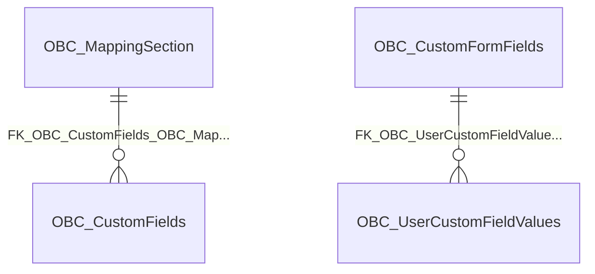

import TableDetail from '@site/src/components/TableDetail';

# Clinical Assessment Database Tables

**65 tables** · **45 with PK** (69.2%) · **58 FKs** · **133 indexes**

## Entity Relationships

## Table Reference

<TableDetail
  tables={[{"name":"OBC_AdminMembers","schema":"dbo","fullName":"dbo.OBC_AdminMembers","hasPrimaryKey":true,"primaryKeyColumns":["AdminMemberID"],"foreignKeys":[],"indexes":[{"name":"PK_OBC_AdminMembers_AdminMemberID","type":"CLUSTERED","isPrimaryKey":true,"isUnique":true,"isDisabled":false,"keyColumns":["AdminMemberID"],"includedColumns":[]}],"checkConstraints":[],"defaultConstraints":1,"triggers":[]},{"name":"OBC_CustomFields","schema":"dbo","fullName":"dbo.OBC_CustomFields","hasPrimaryKey":true,"primaryKeyColumns":["CustomFieldID"],"foreignKeys":[{"constraintName":"FK_OBC_CustomFields_OBC_MappingSection","referencedTable":"OBC_MappingSection"},{"constraintName":"FK_OBC_CustomFields_SEC_Departments_DepartmentID","referencedTable":"SEC_Departments_DepartmentID"},{"constraintName":"FK_OBC_CustomFields_OBC_FieldTypeInfo_FieldTypeInfoID","referencedTable":"OBC_FieldTypeInfo_FieldTypeInfoID"},{"constraintName":"FK_OBC_CustomFields_MGMT_VisibilityTypes_VisibilityTypeID","referencedTable":"MGMT_VisibilityTypes_VisibilityTypeID"}],"indexes":[{"name":"IX_OBC_CustomFields_1","type":"NONCLUSTERED","isPrimaryKey":false,"isUnique":false,"isDisabled":false,"keyColumns":["DepartmentID","IsDeleted"],"includedColumns":[]},{"name":"IX_OBC_CustomFields_2","type":"NONCLUSTERED","isPrimaryKey":false,"isUnique":false,"isDisabled":false,"keyColumns":["FieldTypeInfoID","IsDeleted"],"includedColumns":["CustomFieldID","DepartmentID","CustomFieldName","DisplayName","VisibilityTypeID","MappingSectionID","LayoutFieldsID"]},{"name":"IX_OBC_CustomFields_3","type":"NONCLUSTERED","isPrimaryKey":false,"isUnique":false,"isDisabled":false,"keyColumns":["VisibilityTypeID","IsDeleted"],"includedColumns":["CustomFieldID","CustomFieldName","DisplayName","FieldTypeInfoID","MappingSectionID","LayoutFieldsID"]},{"name":"IX_OBC_CustomFields_4","type":"NONCLUSTERED","isPrimaryKey":false,"isUnique":false,"isDisabled":false,"keyColumns":["LayoutFieldsID"],"includedColumns":["CustomFieldID"]},{"name":"IX_OBC_CustomFields_5","type":"NONCLUSTERED","isPrimaryKey":false,"isUnique":false,"isDisabled":false,"keyColumns":["VisibilityTypeID","IsDeleted"],"includedColumns":["DepartmentID","DisplayName","FieldTypeInfoID"]},{"name":"IX_OBC_CustomFields_6","type":"NONCLUSTERED","isPrimaryKey":false,"isUnique":false,"isDisabled":false,"keyColumns":["IsEMR"],"includedColumns":["DepartmentID"]},{"name":"PK_OBC_CustomFields_CustomFieldID","type":"CLUSTERED","isPrimaryKey":true,"isUnique":true,"isDisabled":false,"keyColumns":["CustomFieldID"],"includedColumns":[]}],"checkConstraints":[],"defaultConstraints":5,"triggers":[]},{"name":"OBC_CustomFormFields","schema":"dbo","fullName":"dbo.OBC_CustomFormFields","hasPrimaryKey":true,"primaryKeyColumns":["CustomFormFieldID"],"foreignKeys":[{"constraintName":"FK_OBC_CustomFormFields_SEC_Departments_DepartmentID","referencedTable":"SEC_Departments_DepartmentID"}],"indexes":[{"name":"PK_OBC_CustomFormFields_CustomFormFieldID","type":"CLUSTERED","isPrimaryKey":true,"isUnique":true,"isDisabled":false,"keyColumns":["CustomFormFieldID"],"includedColumns":[]}],"checkConstraints":[],"defaultConstraints":3,"triggers":[]},{"name":"OBC_CustomFormFieldStatus","schema":"dbo","fullName":"dbo.OBC_CustomFormFieldStatus","hasPrimaryKey":false,"primaryKeyColumns":[],"foreignKeys":[],"indexes":[],"checkConstraints":[],"defaultConstraints":0,"triggers":[]},{"name":"OBC_CustomFormSpecificDemographicFields","schema":"dbo","fullName":"dbo.OBC_CustomFormSpecificDemographicFields","hasPrimaryKey":true,"primaryKeyColumns":["CustomFormSpecificFieldID"],"foreignKeys":[],"indexes":[{"name":"PK_OBC_CustomFormSpecificDemographicFields_CustomFormSpecificFieldID","type":"CLUSTERED","isPrimaryKey":true,"isUnique":true,"isDisabled":false,"keyColumns":["CustomFormSpecificFieldID"],"includedColumns":[]}],"checkConstraints":[],"defaultConstraints":0,"triggers":[]},{"name":"OBC_CustomFormSpecificFields","schema":"dbo","fullName":"dbo.OBC_CustomFormSpecificFields","hasPrimaryKey":true,"primaryKeyColumns":["CustomFormSpecificFieldID"],"foreignKeys":[],"indexes":[{"name":"PK_OBC_CustomFormSpecificFields_CustomFormSpecificFieldID","type":"CLUSTERED","isPrimaryKey":true,"isUnique":true,"isDisabled":false,"keyColumns":["CustomFormSpecificFieldID"],"includedColumns":[]}],"checkConstraints":[],"defaultConstraints":2,"triggers":[]},{"name":"OBC_DashBoardAdminPrivileges","schema":"dbo","fullName":"dbo.OBC_DashBoardAdminPrivileges","hasPrimaryKey":true,"primaryKeyColumns":["AdminPrivilegeID"],"foreignKeys":[{"constraintName":"FK_SEC_Departments_OBC_DashBoardAdminPrivileges_DepartmentID","referencedTable":"FK_SEC_Departments_OBC_DashBoardAdminPrivileges_DepartmentID"}],"indexes":[{"name":"PK_OBC_DashBoardAdminPrivileges_AdminPrivilegeID","type":"CLUSTERED","isPrimaryKey":true,"isUnique":true,"isDisabled":false,"keyColumns":["AdminPrivilegeID"],"includedColumns":[]}],"checkConstraints":[],"defaultConstraints":0,"triggers":[]},{"name":"OBC_DashBoardChangeAdminMembers","schema":"dbo","fullName":"dbo.OBC_DashBoardChangeAdminMembers","hasPrimaryKey":true,"primaryKeyColumns":["AdminMemeberID"],"foreignKeys":[{"constraintName":"FK_SEC_Users_OBC_DashBoardChangeAdminMembers_UserID","referencedTable":"FK_SEC_Users_OBC_DashBoardChangeAdminMembers_UserID"},{"constraintName":"FK_OBC_DashBoardAdminPrivileges_OBC_DashBoardChangeAdminMembers_AdminPrivilegeID","referencedTable":"FK_OBC_DashBoardAdminPrivileges_OBC_DashBoardChangeAdminMembers_AdminPrivilegeID"}],"indexes":[{"name":"IDX_OBC_DashBoardChangeAdminMembers1","type":"NONCLUSTERED","isPrimaryKey":false,"isUnique":false,"isDisabled":false,"keyColumns":["UserID"],"includedColumns":[]},{"name":"PK_OBC_DashBoardChangeAdminMembers_AdminMemeberID","type":"CLUSTERED","isPrimaryKey":true,"isUnique":true,"isDisabled":false,"keyColumns":["AdminMemeberID"],"includedColumns":[]}],"checkConstraints":[],"defaultConstraints":0,"triggers":[]},{"name":"OBC_DashBoardDeleteAdminMembers","schema":"dbo","fullName":"dbo.OBC_DashBoardDeleteAdminMembers","hasPrimaryKey":true,"primaryKeyColumns":["AdminMemeberID"],"foreignKeys":[{"constraintName":"FK_SEC_Users_OBC_DashBoardDeleteAdminMembers_UserID","referencedTable":"FK_SEC_Users_OBC_DashBoardDeleteAdminMembers_UserID"},{"constraintName":"FK_OBC_DashBoardAdminPrivileges_OBC_DashBoardDeleteAdminMembers_AdminPrivilegeID","referencedTable":"FK_OBC_DashBoardAdminPrivileges_OBC_DashBoardDeleteAdminMembers_AdminPrivilegeID"}],"indexes":[{"name":"IDX_OBC_DashBoardDeleteAdminMembers1","type":"NONCLUSTERED","isPrimaryKey":false,"isUnique":false,"isDisabled":false,"keyColumns":["UserID"],"includedColumns":["AdminPrivilegeID"]},{"name":"PK_OBC_DashBoardDeleteAdminMembers_AdminMemeberID","type":"CLUSTERED","isPrimaryKey":true,"isUnique":true,"isDisabled":false,"keyColumns":["AdminMemeberID"],"includedColumns":[]}],"checkConstraints":[],"defaultConstraints":0,"triggers":[]},{"name":"OBC_DashBoardReviewAdminMembers","schema":"dbo","fullName":"dbo.OBC_DashBoardReviewAdminMembers","hasPrimaryKey":true,"primaryKeyColumns":["AdminMemeberID"],"foreignKeys":[{"constraintName":"FK_SEC_Users_OBC_DashBoardReviewAdminMembers_UserID","referencedTable":"FK_SEC_Users_OBC_DashBoardReviewAdminMembers_UserID"},{"constraintName":"FK_OBC_DashBoardAdminPrivileges_OBC_DashBoardReviewAdminMembers_AdminPrivilegeID","referencedTable":"FK_OBC_DashBoardAdminPrivileges_OBC_DashBoardReviewAdminMembers_AdminPrivilegeID"}],"indexes":[{"name":"IDX_OBC_DashBoardReviewAdminMembers1","type":"NONCLUSTERED","isPrimaryKey":false,"isUnique":false,"isDisabled":false,"keyColumns":["UserID"],"includedColumns":[]},{"name":"PK_OBC_DashBoardReviewAdminMembers_AdminMemeberID","type":"CLUSTERED","isPrimaryKey":true,"isUnique":true,"isDisabled":false,"keyColumns":["AdminMemeberID"],"includedColumns":[]}],"checkConstraints":[],"defaultConstraints":0,"triggers":[]},{"name":"OBC_DepartmentGroup","schema":"dbo","fullName":"dbo.OBC_DepartmentGroup","hasPrimaryKey":true,"primaryKeyColumns":["DepartmentGroupID"],"foreignKeys":[{"constraintName":"FK_SEC_Departments_OBC_DepartmentGroup_DepartmentID","referencedTable":"FK_SEC_Departments_OBC_DepartmentGroup_DepartmentID"}],"indexes":[{"name":"PK_OBC_DepartmentGroup_DepartmentGroupID","type":"CLUSTERED","isPrimaryKey":true,"isUnique":true,"isDisabled":false,"keyColumns":["DepartmentGroupID"],"includedColumns":[]}],"checkConstraints":[],"defaultConstraints":0,"triggers":[]},{"name":"OBC_DepartmentGroupUsers","schema":"dbo","fullName":"dbo.OBC_DepartmentGroupUsers","hasPrimaryKey":true,"primaryKeyColumns":["DepartmentGroupUserID"],"foreignKeys":[{"constraintName":"FK_OBC_DepartmentGroup_OBC_DepartmentGroupUsers_DepartmentGroupID","referencedTable":"FK_OBC_DepartmentGroup_OBC_DepartmentGroupUsers_DepartmentGroupID"}],"indexes":[{"name":"PK_OBC_DepartmentGroupUsers_DepartmentGroupUserID","type":"CLUSTERED","isPrimaryKey":true,"isUnique":true,"isDisabled":false,"keyColumns":["DepartmentGroupUserID"],"includedColumns":[]}],"checkConstraints":[],"defaultConstraints":0,"triggers":[]},{"name":"OBC_DocumentType","schema":"dbo","fullName":"dbo.OBC_DocumentType","hasPrimaryKey":true,"primaryKeyColumns":["DocumentTypeID"],"foreignKeys":[],"indexes":[{"name":"IX_OBC_DocumentType_1","type":"NONCLUSTERED","isPrimaryKey":false,"isUnique":false,"isDisabled":false,"keyColumns":["IsDeleted"],"includedColumns":["DocumentTypeID","DocumentWorkFlowType"]},{"name":"IX_OBC_DocumentType_2","type":"NONCLUSTERED","isPrimaryKey":false,"isUnique":false,"isDisabled":false,"keyColumns":["VerifiedDocumentLocationID"],"includedColumns":["DocumentTypeID"]},{"name":"IX_OBC_DocumentType_3","type":"NONCLUSTERED","isPrimaryKey":false,"isUnique":false,"isDisabled":false,"keyColumns":["IsDeleted"],"includedColumns":["DocumentName","DocumentTitle","DepartmentID"]},{"name":"IX_OBC_DocumentType_4","type":"NONCLUSTERED","isPrimaryKey":false,"isUnique":false,"isDisabled":false,"keyColumns":["DepartmentID","IsDeleted"],"includedColumns":[]},{"name":"PK_OBC_DocumentType_DocumentTypeID","type":"CLUSTERED","isPrimaryKey":true,"isUnique":true,"isDisabled":false,"keyColumns":["DocumentTypeID"],"includedColumns":[]}],"checkConstraints":[],"defaultConstraints":4,"triggers":[]},{"name":"OBC_DocumentTypeHistory","schema":"dbo","fullName":"dbo.OBC_DocumentTypeHistory","hasPrimaryKey":false,"primaryKeyColumns":[],"foreignKeys":[],"indexes":[],"checkConstraints":[],"defaultConstraints":1,"triggers":[]},{"name":"OBC_DocumentUploadHistory","schema":"dbo","fullName":"dbo.OBC_DocumentUploadHistory","hasPrimaryKey":true,"primaryKeyColumns":["DocumentUploadHistoryID"],"foreignKeys":[],"indexes":[{"name":"IDX_OBC_DocumentUploadHistory1","type":"NONCLUSTERED","isPrimaryKey":false,"isUnique":false,"isDisabled":false,"keyColumns":["DocumentTypeValueID"],"includedColumns":[]},{"name":"PK__OBC_Docu__C735443F0856A251","type":"CLUSTERED","isPrimaryKey":true,"isUnique":true,"isDisabled":false,"keyColumns":["DocumentUploadHistoryID"],"includedColumns":[]}],"checkConstraints":[],"defaultConstraints":1,"triggers":[]},{"name":"OBC_EmailInfo","schema":"dbo","fullName":"dbo.OBC_EmailInfo","hasPrimaryKey":false,"primaryKeyColumns":[],"foreignKeys":[],"indexes":[],"checkConstraints":[],"defaultConstraints":0,"triggers":[]},{"name":"OBC_EmailReminderSettings","schema":"dbo","fullName":"dbo.OBC_EmailReminderSettings","hasPrimaryKey":true,"primaryKeyColumns":["EmailReminderSettingID"],"foreignKeys":[],"indexes":[{"name":"PK_OBC_EmailReminderSettings_EmailReminderSettingID","type":"CLUSTERED","isPrimaryKey":true,"isUnique":true,"isDisabled":false,"keyColumns":["EmailReminderSettingID"],"includedColumns":[]}],"checkConstraints":[],"defaultConstraints":7,"triggers":[]},{"name":"OBC_FieldTypeInfo","schema":"dbo","fullName":"dbo.OBC_FieldTypeInfo","hasPrimaryKey":true,"primaryKeyColumns":["FieldTypeInfoID"],"foreignKeys":[],"indexes":[{"name":"PK_OBC_FieldTypeInfo_FieldTypeInfoID","type":"CLUSTERED","isPrimaryKey":true,"isUnique":true,"isDisabled":false,"keyColumns":["FieldTypeInfoID"],"includedColumns":[]}],"checkConstraints":[],"defaultConstraints":0,"triggers":[]},{"name":"OBC_FormOrDocumentRequiredStatus","schema":"dbo","fullName":"dbo.OBC_FormOrDocumentRequiredStatus","hasPrimaryKey":true,"primaryKeyColumns":["ID"],"foreignKeys":[{"constraintName":"FK_OBC_FormOrDocumentRequiredStatus_RequirementGroupAssignmentID","referencedTable":"RequirementGroupAssignmentID"},{"constraintName":"FK_OBC_FormOrDocumentRequiredStatus_RequirementGroupID","referencedTable":"RequirementGroupID"}],"indexes":[{"name":"IDX_OBC_FormOrDocumentRequiredStatus1","type":"NONCLUSTERED","isPrimaryKey":false,"isUnique":false,"isDisabled":false,"keyColumns":["CustomFormID","RequirementGroupID","RequirementGroupAssignmentID","IsCustomForm"],"includedColumns":[]},{"name":"IDX_OBC_FormOrDocumentRequiredStatus2","type":"NONCLUSTERED","isPrimaryKey":false,"isUnique":false,"isDisabled":false,"keyColumns":["RequirementGroupAssignmentID"],"includedColumns":[]},{"name":"PK_OBC_FormOrDocumentRequiredStatus_ID","type":"CLUSTERED","isPrimaryKey":true,"isUnique":true,"isDisabled":false,"keyColumns":["ID"],"includedColumns":[]}],"checkConstraints":[],"defaultConstraints":0,"triggers":[]},{"name":"OBC_HelloSignDocumentsHistory","schema":"dbo","fullName":"dbo.OBC_HelloSignDocumentsHistory","hasPrimaryKey":false,"primaryKeyColumns":[],"foreignKeys":[],"indexes":[],"checkConstraints":[],"defaultConstraints":0,"triggers":[]},{"name":"OBC_LoaGapsData","schema":"dbo","fullName":"dbo.OBC_LoaGapsData","hasPrimaryKey":true,"primaryKeyColumns":["LoaGapsDataID"],"foreignKeys":[],"indexes":[{"name":"PK__OBC_LoaG__721B1E29244855A1","type":"CLUSTERED","isPrimaryKey":true,"isUnique":true,"isDisabled":false,"keyColumns":["LoaGapsDataID"],"includedColumns":[]}],"checkConstraints":[],"defaultConstraints":1,"triggers":[]},{"name":"OBC_LookupItems","schema":"dbo","fullName":"dbo.OBC_LookupItems","hasPrimaryKey":true,"primaryKeyColumns":["LookupItemID"],"foreignKeys":[{"constraintName":"FK_OBC_LookupItems_OBC_Lookups_LookupID","referencedTable":"OBC_Lookups_LookupID"}],"indexes":[{"name":"IDX_OBC_LookupItems1","type":"NONCLUSTERED","isPrimaryKey":false,"isUnique":false,"isDisabled":false,"keyColumns":["LookupID"],"includedColumns":["LookupItemID","Value","SortOrder"]},{"name":"PK_OBC_LookupItems_LookupItemID","type":"CLUSTERED","isPrimaryKey":true,"isUnique":true,"isDisabled":false,"keyColumns":["LookupItemID"],"includedColumns":[]}],"checkConstraints":[],"defaultConstraints":0,"triggers":[]},{"name":"OBC_Lookups","schema":"dbo","fullName":"dbo.OBC_Lookups","hasPrimaryKey":true,"primaryKeyColumns":["LookupID"],"foreignKeys":[{"constraintName":"FK_OBC_Lookups_SEC_Departments_DepartmentID","referencedTable":"SEC_Departments_DepartmentID"}],"indexes":[{"name":"PK_OBC_Lookups_LookupID","type":"CLUSTERED","isPrimaryKey":true,"isUnique":true,"isDisabled":false,"keyColumns":["LookupID"],"includedColumns":[]}],"checkConstraints":[],"defaultConstraints":0,"triggers":[]},{"name":"OBC_MappingSection","schema":"dbo","fullName":"dbo.OBC_MappingSection","hasPrimaryKey":true,"primaryKeyColumns":["MappingSectionID"],"foreignKeys":[],"indexes":[{"name":"PK__OBC_Mapp__8B10CC97725A3FD0","type":"CLUSTERED","isPrimaryKey":true,"isUnique":true,"isDisabled":false,"keyColumns":["MappingSectionID"],"includedColumns":[]}],"checkConstraints":[],"defaultConstraints":0,"triggers":[]},{"name":"OBC_MergeBatchUsersLogged","schema":"dbo","fullName":"dbo.OBC_MergeBatchUsersLogged","hasPrimaryKey":false,"primaryKeyColumns":[],"foreignKeys":[],"indexes":[],"checkConstraints":[],"defaultConstraints":0,"triggers":[]},{"name":"OBC_MergedBatchesLogged","schema":"dbo","fullName":"dbo.OBC_MergedBatchesLogged","hasPrimaryKey":false,"primaryKeyColumns":[],"foreignKeys":[],"indexes":[],"checkConstraints":[],"defaultConstraints":0,"triggers":[]},{"name":"OBC_NewSubmissionNoticeAdmins","schema":"dbo","fullName":"dbo.OBC_NewSubmissionNoticeAdmins","hasPrimaryKey":false,"primaryKeyColumns":[],"foreignKeys":[{"constraintName":"FK_OBC_EmailReminderSettings_OBC_NewSubmissionNoticeAdmins_EmailReminderSettingID","referencedTable":"FK_OBC_EmailReminderSettings_OBC_NewSubmissionNoticeAdmins_EmailReminderSettingID"}],"indexes":[],"checkConstraints":[],"defaultConstraints":0,"triggers":[]},{"name":"OBC_OverdueReminderAdmins","schema":"dbo","fullName":"dbo.OBC_OverdueReminderAdmins","hasPrimaryKey":false,"primaryKeyColumns":[],"foreignKeys":[{"constraintName":"FK_OBC_EmailReminderSettings_OBC_OverdueReminderAdmins_EmailReminderSettingID","referencedTable":"FK_OBC_EmailReminderSettings_OBC_OverdueReminderAdmins_EmailReminderSettingID"}],"indexes":[],"checkConstraints":[],"defaultConstraints":0,"triggers":[]},{"name":"OBC_ReportSettings","schema":"dbo","fullName":"dbo.OBC_ReportSettings","hasPrimaryKey":false,"primaryKeyColumns":[],"foreignKeys":[],"indexes":[],"checkConstraints":[],"defaultConstraints":0,"triggers":[]},{"name":"OBC_RequirementGroup","schema":"dbo","fullName":"dbo.OBC_RequirementGroup","hasPrimaryKey":true,"primaryKeyColumns":["RequirementGroupID"],"foreignKeys":[{"constraintName":"FK_OBC_RequirementGroup_SEC_Departments_DepartmentID","referencedTable":"SEC_Departments_DepartmentID"},{"constraintName":"FK_OBC_RequirementGroup_OBC_RequirementGroupType_RequirementGroupTypeID","referencedTable":"OBC_RequirementGroupType_RequirementGroupTypeID"}],"indexes":[{"name":"IDX_OBC_RequirementGroup_1","type":"NONCLUSTERED","isPrimaryKey":false,"isUnique":false,"isDisabled":false,"keyColumns":["IsDeleted"],"includedColumns":["DepartmentID"]},{"name":"IDX_OBC_RequirementGroup_2","type":"NONCLUSTERED","isPrimaryKey":false,"isUnique":false,"isDisabled":false,"keyColumns":["DepartmentID","IsDeleted"],"includedColumns":[]},{"name":"IDX_OBC_RequirementGroup3","type":"NONCLUSTERED","isPrimaryKey":false,"isUnique":false,"isDisabled":false,"keyColumns":["RequirementGroupName"],"includedColumns":[]},{"name":"IDX_OBC_RequirementGroup4","type":"NONCLUSTERED","isPrimaryKey":false,"isUnique":false,"isDisabled":false,"keyColumns":["IsSystem","IsDeleted"],"includedColumns":["RequirementGroupName","RequirementGroupTypeID"]},{"name":"PK_OBC_RequirementGroup_RequirementGroupID","type":"CLUSTERED","isPrimaryKey":true,"isUnique":true,"isDisabled":false,"keyColumns":["RequirementGroupID"],"includedColumns":[]}],"checkConstraints":[],"defaultConstraints":3,"triggers":[]},{"name":"OBC_RequirementGroupAssignment","schema":"dbo","fullName":"dbo.OBC_RequirementGroupAssignment","hasPrimaryKey":true,"primaryKeyColumns":["RequirementGroupAssignmentID"],"foreignKeys":[],"indexes":[{"name":"IDX_MissingOn_OBC_RequirementGroupAssignment_723320E69E134C28B6B3B696EE1D28D2","type":"NONCLUSTERED","isPrimaryKey":false,"isUnique":false,"isDisabled":false,"keyColumns":["IsDeleted"],"includedColumns":["RequirementGroupID","UserID","AccessDate","CreatedBy","ModifiedBy","IsSentAssignmentEmail"]},{"name":"IDX_MissingOn_OBC_RequirementGroupAssignment_8E3BC3501B2E4250AA01AE752D6FF2AB","type":"NONCLUSTERED","isPrimaryKey":false,"isUnique":false,"isDisabled":false,"keyColumns":["IsDeleted","DeletedDate"],"includedColumns":["RequirementGroupID","UserID","PeriodStartDate","PeriodEndDate","AccessDate","DueDate","IsCompletionRequired","CreatedDate","CreatedBy","DeletedBy","ModifiedBy","ModifiedDate","IsSendMailToAdmin","IsMailSentToUser","CreatedByDepartment"]},{"name":"IDX_OBC_RequirementGroupAssignment1","type":"NONCLUSTERED","isPrimaryKey":false,"isUnique":false,"isDisabled":false,"keyColumns":["IsDeleted","DeletedDate"],"includedColumns":[]},{"name":"IX_OBC_RequirementGroupAssignment_1","type":"NONCLUSTERED","isPrimaryKey":false,"isUnique":false,"isDisabled":false,"keyColumns":["IsDeleted"],"includedColumns":["RequirementGroupID","UserID","PeriodStartDate","PeriodEndDate","CreatedBy","ModifiedBy"]},{"name":"IX_OBC_RequirementGroupAssignment_5","type":"NONCLUSTERED","isPrimaryKey":false,"isUnique":false,"isDisabled":false,"keyColumns":["IsDeleted","UserID"],"includedColumns":["RequirementGroupID","PeriodStartDate","PeriodEndDate","AccessDate","DueDate","CreatedDate","CreatedBy","DeletedDate","DeletedBy","BatchID","CreatedByDepartment"]},{"name":"IX_OBC_RequirementGroupAssignment_6","type":"NONCLUSTERED","isPrimaryKey":false,"isUnique":false,"isDisabled":false,"keyColumns":["IsDeleted","DeletedDate"],"includedColumns":["RequirementGroupID","UserID","PeriodStartDate","PeriodEndDate","AccessDate","DueDate","IsCompletionRequired","CreatedDate","ModifiedDate"]},{"name":"IX_OBC_RequirementGroupAssignment_7","type":"NONCLUSTERED","isPrimaryKey":false,"isUnique":false,"isDisabled":false,"keyColumns":["PreceptorOrganizationID"],"includedColumns":["RequirementGroupID","UserID"]},{"name":"IX_OBC_RequirementGroupAssignment_8","type":"NONCLUSTERED","isPrimaryKey":false,"isUnique":false,"isDisabled":false,"keyColumns":["IsDeleted","CreatedDate"],"includedColumns":["RequirementGroupID","UserID"]},{"name":"IX_OBC_RequirementGroupAssignment_9","type":"NONCLUSTERED","isPrimaryKey":false,"isUnique":false,"isDisabled":false,"keyColumns":["IsDeleted"],"includedColumns":["RequirementGroupID","UserID","PeriodStartDate","PeriodEndDate","AccessDate","DueDate","IsCompletionRequired","CreatedDate","ModifiedDate","CreatedByDepartment","PreceptorOrganizationID"]},{"name":"IX_OBC_RequirementGroupAssignment_BatchID_IsCompletionRequired1","type":"NONCLUSTERED","isPrimaryKey":false,"isUnique":false,"isDisabled":false,"keyColumns":["BatchID"],"includedColumns":["IsCompletionRequired"]},{"name":"IX_OBC_RequirementGroupAssignment_BatchID1","type":"NONCLUSTERED","isPrimaryKey":false,"isUnique":false,"isDisabled":false,"keyColumns":["IsDeleted","UserID"],"includedColumns":["RequirementGroupID","CreatedBy","BatchID"]},{"name":"IX_OBC_RequirementGroupAssignment_CreatedByDepartment1","type":"NONCLUSTERED","isPrimaryKey":false,"isUnique":false,"isDisabled":false,"keyColumns":["CreatedByDepartment"],"includedColumns":[]},{"name":"IX_OBC_RequirementGroupAssignment_IsDeleted_BatchID1","type":"NONCLUSTERED","isPrimaryKey":false,"isUnique":false,"isDisabled":false,"keyColumns":["IsDeleted"],"includedColumns":["RequirementGroupID","UserID","PeriodStartDate","PeriodEndDate","AccessDate","DueDate","CreatedDate","CreatedBy","DeletedDate","DeletedBy","BatchID"]},{"name":"IX_OBC_RequirementGroupAssignment_Ps1","type":"NONCLUSTERED","isPrimaryKey":false,"isUnique":false,"isDisabled":false,"keyColumns":["PeriodStartDate","PeriodEndDate"],"includedColumns":["RequirementGroupAssignmentID","RequirementGroupID","UserID","DueDate"]},{"name":"IX_OBC_RequirementGroupAssignment_RequirementGroupID1","type":"NONCLUSTERED","isPrimaryKey":false,"isUnique":false,"isDisabled":false,"keyColumns":["RequirementGroupID","IsDeleted"],"includedColumns":[]},{"name":"IX_OBC_RequirementGroupAssignment_RequirementGroupID2","type":"NONCLUSTERED","isPrimaryKey":false,"isUnique":false,"isDisabled":false,"keyColumns":["RequirementGroupID","IsDeleted","UserID"],"includedColumns":["CreatedDate","CreatedBy"]},{"name":"IX_OBC_RequirementGroupAssignment_RequirementGroupID3","type":"NONCLUSTERED","isPrimaryKey":false,"isUnique":false,"isDisabled":false,"keyColumns":["IsDeleted"],"includedColumns":["RequirementGroupID","UserID","PeriodStartDate","PeriodEndDate","AccessDate","DueDate","CreatedDate","CreatedBy","DeletedDate","DeletedBy"]},{"name":"IX_OBC_RequirementGroupAssignment_RequirementGroupID4","type":"NONCLUSTERED","isPrimaryKey":false,"isUnique":false,"isDisabled":false,"keyColumns":["IsDeleted","UserID"],"includedColumns":["RequirementGroupID","CreatedDate","CreatedBy"]},{"name":"IX_OBC_RequirementGroupAssignment_UserID12","type":"NONCLUSTERED","isPrimaryKey":false,"isUnique":false,"isDisabled":false,"keyColumns":["UserID"],"includedColumns":["RequirementGroupAssignmentID","RequirementGroupID","PeriodStartDate","PeriodEndDate","AccessDate","DueDate","CreatedDate","CreatedBy","IsDeleted","DeletedDate","DeletedBy","BatchID"]},{"name":"IX_OBC_RequirementGroupAssignment_UserID1RG","type":"NONCLUSTERED","isPrimaryKey":false,"isUnique":false,"isDisabled":false,"keyColumns":["UserID"],"includedColumns":["RequirementGroupID"]},{"name":"PK_OBC_RequirementGroupAssignment_RequirementGroupAssignmentID","type":"CLUSTERED","isPrimaryKey":true,"isUnique":true,"isDisabled":false,"keyColumns":["RequirementGroupAssignmentID"],"includedColumns":[]}],"checkConstraints":[],"defaultConstraints":4,"triggers":[]},{"name":"OBC_RequirementGroupAssignmentAdminNotes","schema":"dbo","fullName":"dbo.OBC_RequirementGroupAssignmentAdminNotes","hasPrimaryKey":false,"primaryKeyColumns":[],"foreignKeys":[{"constraintName":"FK_OBC_RequirementGroupAssignmentAdminNotes_OBC_RequirementGroupAssignmentNotes_RequirementGroupAssignmentNotesID","referencedTable":"OBC_RequirementGroupAssignmentNotes_RequirementGroupAssignmentNotesID"}],"indexes":[{"name":"IDX_OBC_RequirementGroupAssignmentAdminNotes1","type":"NONCLUSTERED","isPrimaryKey":false,"isUnique":false,"isDisabled":false,"keyColumns":["RequirementGroupAssignmentNotesID"],"includedColumns":[]}],"checkConstraints":[],"defaultConstraints":0,"triggers":[]},{"name":"OBC_RequirementGroupAssignmentNotes","schema":"dbo","fullName":"dbo.OBC_RequirementGroupAssignmentNotes","hasPrimaryKey":true,"primaryKeyColumns":["RequirementGroupAssignmentNotesID"],"foreignKeys":[{"constraintName":"OBC_RequirementGroupAssignmentNotes_LA_Literature","referencedTable":"LA_Literature"},{"constraintName":"FK_OBC_RequirementGroupAssignmentNotes_OBC_RequirementGroupAssignment_RequirementGroupAssignmentID","referencedTable":"OBC_RequirementGroupAssignment_RequirementGroupAssignmentID"}],"indexes":[{"name":"IDX_OBC_RequirementGroupAssignmentNotes1","type":"NONCLUSTERED","isPrimaryKey":false,"isUnique":false,"isDisabled":false,"keyColumns":["IsReviewRequiredByUser"],"includedColumns":["RequirementGroupAssignmentID","ReviewDate","LiteratureID"]},{"name":"IDX_OBC_RequirementGroupAssignmentNotes2","type":"NONCLUSTERED","isPrimaryKey":false,"isUnique":false,"isDisabled":false,"keyColumns":["IsReviewRequiredByAdmin"],"includedColumns":["RequirementGroupAssignmentID","ReviewDate","LiteratureID"]},{"name":"IDX_OBC_RequirementGroupAssignmentNotes3","type":"NONCLUSTERED","isPrimaryKey":false,"isUnique":false,"isDisabled":false,"keyColumns":["RequirementGroupAssignmentID","IsReviewRequiredByUser","LiteratureID"],"includedColumns":["ReviewDate"]},{"name":"PK_OBC_RequirementGroupAssignmentNotes_RequirementGroupAssignmentNotesID","type":"CLUSTERED","isPrimaryKey":true,"isUnique":true,"isDisabled":false,"keyColumns":["RequirementGroupAssignmentNotesID"],"includedColumns":[]}],"checkConstraints":[],"defaultConstraints":0,"triggers":[]},{"name":"OBC_RequirementGroupAssignmentSpecificDocumentType","schema":"dbo","fullName":"dbo.OBC_RequirementGroupAssignmentSpecificDocumentType","hasPrimaryKey":false,"primaryKeyColumns":[],"foreignKeys":[{"constraintName":"FK_OBC_RequirementGroupAssignmentSpecificDocumentType_OBC_RequirementGroupAssignment_RequirementGroupAssignmentID","referencedTable":"OBC_RequirementGroupAssignment_RequirementGroupAssignmentID"},{"constraintName":"FK_OBC_RequirementGroupAssignmentDocumentType_OBC_RequirementGroupSpecificDocumentType_RequirementGroupSpecificDocumentTypeID","referencedTable":"FK_OBC_RequirementGroupAssignmentDocumentType_OBC_RequirementGroupSpecificDocumentType_RequirementGroupSpecificDocumentTypeID"}],"indexes":[{"name":"IX_OBC_RequirementGroupAssignmentSpecificDocumentType_AssignmentID1","type":"NONCLUSTERED","isPrimaryKey":false,"isUnique":false,"isDisabled":false,"keyColumns":["RequirementGroupAssignmentID","RequirementGroupSpecificDocumentTypeID","IsReviewedByUser"],"includedColumns":["ReviewDate","ReviewedBy","IsDeleted"]},{"name":"IX_OBC_RequirementGroupAssignmentSpecificDocumentType_IsReviewedByUser1","type":"NONCLUSTERED","isPrimaryKey":false,"isUnique":false,"isDisabled":false,"keyColumns":["IsReviewedByUser"],"includedColumns":["RequirementGroupAssignmentID","RequirementGroupSpecificDocumentTypeID","ReviewDate","ReviewedBy","IsDeleted"]}],"checkConstraints":[],"defaultConstraints":1,"triggers":[]},{"name":"OBC_RequirementGroupAssignmentSpecificForms","schema":"dbo","fullName":"dbo.OBC_RequirementGroupAssignmentSpecificForms","hasPrimaryKey":false,"primaryKeyColumns":[],"foreignKeys":[{"constraintName":"FK_OBC_RequirementGroupAssignmentSpecificForms_OBC_RequirementGroupSpecificForms_RequirementGroupSpecificFormID","referencedTable":"OBC_RequirementGroupSpecificForms_RequirementGroupSpecificFormID"},{"constraintName":"FK_OBC_RequirementGroupAssignmentSpecificForms_OBC_RequirementGroupAssignment_RequirementGroupAssignmentID","referencedTable":"OBC_RequirementGroupAssignment_RequirementGroupAssignmentID"}],"indexes":[{"name":"IDX_OBC_RequirementGroupAssignmentSpecificForms1","type":"NONCLUSTERED","isPrimaryKey":false,"isUnique":false,"isDisabled":false,"keyColumns":["RequirementGroupAssignmentID","RequirementGroupSpecificFormID","IsReviewedByUser"],"includedColumns":[]},{"name":"IDX_OBC_RequirementGroupAssignmentSpecificForms2","type":"NONCLUSTERED","isPrimaryKey":false,"isUnique":false,"isDisabled":false,"keyColumns":["ReviewDate"],"includedColumns":["RequirementGroupAssignmentID","RequirementGroupSpecificFormID"]},{"name":"IDX_OBC_RequirementGroupAssignmentSpecificForms3","type":"NONCLUSTERED","isPrimaryKey":false,"isUnique":false,"isDisabled":false,"keyColumns":["RequirementGroupSpecificFormID","ReviewDate"],"includedColumns":["RequirementGroupAssignmentID"]}],"checkConstraints":[],"defaultConstraints":1,"triggers":[]},{"name":"OBC_RequirementGroupAssignmentSpecificLearningAssignment","schema":"dbo","fullName":"dbo.OBC_RequirementGroupAssignmentSpecificLearningAssignment","hasPrimaryKey":false,"primaryKeyColumns":[],"foreignKeys":[{"constraintName":"FK_OBC_RequirementGroupAssignmentSpecificLearningAssignment_LA_Literature","referencedTable":"LA_Literature"}],"indexes":[{"name":"IDX_OBC_RequirementGroupAssignmentSpecificLearningAssignment1","type":"NONCLUSTERED","isPrimaryKey":false,"isUnique":false,"isDisabled":false,"keyColumns":["RequirementGroupAssignmentID","LiteratureID","IsReviewedByUser"],"includedColumns":["ReviewDate","ReviewedBy","IsDeleted"]}],"checkConstraints":[],"defaultConstraints":0,"triggers":[]},{"name":"OBC_RequirementGroupAssignmentUserNotes","schema":"dbo","fullName":"dbo.OBC_RequirementGroupAssignmentUserNotes","hasPrimaryKey":false,"primaryKeyColumns":[],"foreignKeys":[{"constraintName":"FK_OBC_RequirementGroupAssignmentUserNotes_OBC_RequirementGroupAssignmentNotes_RequirementGroupAssignmentNotesID","referencedTable":"OBC_RequirementGroupAssignmentNotes_RequirementGroupAssignmentNotesID"}],"indexes":[{"name":"IDX_OBC_RequirementGroupAssignmentUserNotes1","type":"NONCLUSTERED","isPrimaryKey":false,"isUnique":false,"isDisabled":false,"keyColumns":["RequirementGroupAssignmentNotesID"],"includedColumns":[]}],"checkConstraints":[],"defaultConstraints":0,"triggers":[]},{"name":"OBC_RequirementGroupEmailQueue","schema":"dbo","fullName":"dbo.OBC_RequirementGroupEmailQueue","hasPrimaryKey":false,"primaryKeyColumns":[],"foreignKeys":[],"indexes":[],"checkConstraints":[],"defaultConstraints":0,"triggers":[]},{"name":"OBC_RequirementGroupLiteraturesDetails","schema":"dbo","fullName":"dbo.OBC_RequirementGroupLiteraturesDetails","hasPrimaryKey":false,"primaryKeyColumns":[],"foreignKeys":[{"constraintName":"FK_OBC_RequirementGroupLiteraturesDetails_LA_Literature_LiteratureID","referencedTable":"LA_Literature_LiteratureID"}],"indexes":[{"name":"OBC_RequirementGroupLiteraturesDetails_IX1","type":"NONCLUSTERED","isPrimaryKey":false,"isUnique":true,"isDisabled":false,"keyColumns":["LiteratureID","RequirementGroupID"],"includedColumns":[]}],"checkConstraints":[],"defaultConstraints":0,"triggers":[]},{"name":"OBC_RequirementGroupQuizDetails","schema":"dbo","fullName":"dbo.OBC_RequirementGroupQuizDetails","hasPrimaryKey":false,"primaryKeyColumns":[],"foreignKeys":[{"constraintName":"FK_OBC_requirementGroupQuizDetails_LA_Literature_LiteratureID","referencedTable":"FK_OBC_requirementGroupQuizDetails_LA_Literature_LiteratureID"},{"constraintName":"FK_OBC_RequirementGroupQuizDetails_QUIZ_Template_QuizID","referencedTable":"QUIZ_Template_QuizID"}],"indexes":[{"name":"OBC_RequirementGroupQuizDetails_IX1","type":"NONCLUSTERED","isPrimaryKey":false,"isUnique":true,"isDisabled":false,"keyColumns":["QuizID","LiteratureID","RequirementGroupID"],"includedColumns":[]}],"checkConstraints":[],"defaultConstraints":0,"triggers":[]},{"name":"OBC_RequirementGroupSpecificDocumentType","schema":"dbo","fullName":"dbo.OBC_RequirementGroupSpecificDocumentType","hasPrimaryKey":true,"primaryKeyColumns":["RequirementGroupSpecificDocumentTypeID"],"foreignKeys":[{"constraintName":"FK_OBC_RequirementGroupSpecificDocumentType_OBC_DocumentType_DocumentTypeID","referencedTable":"OBC_DocumentType_DocumentTypeID"},{"constraintName":"FK_OBC_RequirementGroupSpecificDocumentType_OBC_RequirementGroup_RequirementGroupID","referencedTable":"OBC_RequirementGroup_RequirementGroupID"}],"indexes":[{"name":"IDX_OBC_RequirementGroupSpecificDocumentType1","type":"NONCLUSTERED","isPrimaryKey":false,"isUnique":false,"isDisabled":false,"keyColumns":["DocumentTypeID"],"includedColumns":["RequirementGroupID"]},{"name":"IDX_OBC_RequirementGroupSpecificDocumentType2","type":"NONCLUSTERED","isPrimaryKey":false,"isUnique":false,"isDisabled":false,"keyColumns":["RequirementGroupID","IsActive"],"includedColumns":["DocumentTypeID","IsRequired","SortOrder","IsDeleted"]},{"name":"PK_OBC_RequirementGroupSpecificDocumentType_RequirementGroupSpecificDocumentTypeID","type":"CLUSTERED","isPrimaryKey":true,"isUnique":true,"isDisabled":false,"keyColumns":["RequirementGroupSpecificDocumentTypeID"],"includedColumns":[]}],"checkConstraints":[],"defaultConstraints":2,"triggers":[]},{"name":"OBC_RequirementGroupSpecificForms","schema":"dbo","fullName":"dbo.OBC_RequirementGroupSpecificForms","hasPrimaryKey":true,"primaryKeyColumns":["RequirementGroupSpecificFormID"],"foreignKeys":[],"indexes":[{"name":"PK_OBC_RequirementGroupSpecificForms_RequirementGroupSpecificFormID","type":"CLUSTERED","isPrimaryKey":true,"isUnique":true,"isDisabled":false,"keyColumns":["RequirementGroupSpecificFormID"],"includedColumns":[]}],"checkConstraints":[],"defaultConstraints":0,"triggers":[]},{"name":"OBC_RequirementGroupType","schema":"dbo","fullName":"dbo.OBC_RequirementGroupType","hasPrimaryKey":true,"primaryKeyColumns":["RequirementGroupTypeID"],"foreignKeys":[],"indexes":[{"name":"PK_OBC_RequirementGroupType_RequirementGroupTypeID","type":"CLUSTERED","isPrimaryKey":true,"isUnique":true,"isDisabled":false,"keyColumns":["RequirementGroupTypeID"],"includedColumns":[]}],"checkConstraints":[],"defaultConstraints":0,"triggers":[]},{"name":"OBC_RGADocumentTypeValues","schema":"dbo","fullName":"dbo.OBC_RGADocumentTypeValues","hasPrimaryKey":true,"primaryKeyColumns":["DocumentTypeValueID"],"foreignKeys":[{"constraintName":"FK_OBC_RGADocumentTypeValues_OBC_DocumentType_DocumentTypeID","referencedTable":"OBC_DocumentType_DocumentTypeID"},{"constraintName":"FK_OBC_RGADocumentTypeValues_OBC_RequirementGroupAssignment_RequirementGroupAssignmentID","referencedTable":"OBC_RequirementGroupAssignment_RequirementGroupAssignmentID"}],"indexes":[{"name":"IDX_MissingOn_OBC_RGADocumentTypeValues_7AC94EBC4EF94605A6673170C72CAF52","type":"NONCLUSTERED","isPrimaryKey":false,"isUnique":false,"isDisabled":false,"keyColumns":["DocumentTypeID","DocumentTypeValueID"],"includedColumns":["RequirementGroupAssignmentID","DocumentFilePath"]},{"name":"IX_OBC_RGADocumentTypeValues_RGA_DocTypID","type":"NONCLUSTERED","isPrimaryKey":false,"isUnique":false,"isDisabled":false,"keyColumns":["RequirementGroupAssignmentID","DocumentTypeID"],"includedColumns":["CompletedDate"]},{"name":"PK_OBC_RGADocumentTypeValues_DocumentTypeValueID","type":"CLUSTERED","isPrimaryKey":true,"isUnique":true,"isDisabled":false,"keyColumns":["DocumentTypeValueID"],"includedColumns":[]}],"checkConstraints":[],"defaultConstraints":3,"triggers":[]},{"name":"OBC_RGAFreeTextFieldValues","schema":"dbo","fullName":"dbo.OBC_RGAFreeTextFieldValues","hasPrimaryKey":true,"primaryKeyColumns":["FreeTextFieldValueID"],"foreignKeys":[{"constraintName":"FK_OBC_RGAFreeTextFieldValues_OBC_CustomFormFields_CustomFormFieldID","referencedTable":"OBC_CustomFormFields_CustomFormFieldID"},{"constraintName":"FK_OBC_RGAFreeTextFieldValues_OBC_RequirementGroupAssignment_RequirementGroupAssignmentID","referencedTable":"OBC_RequirementGroupAssignment_RequirementGroupAssignmentID"}],"indexes":[{"name":"IDX_MissingOn_OBC_RGAFreeTextFieldValues_B51E00800FC14D4CB341BD5B8A2B77D9","type":"NONCLUSTERED","isPrimaryKey":false,"isUnique":false,"isDisabled":false,"keyColumns":["CustomFormFieldID","FieldID"],"includedColumns":["RequirementGroupAssignmentID","IsCustom","Value"]},{"name":"IX_OBC_RGAFreeTextFieldValues_1","type":"NONCLUSTERED","isPrimaryKey":false,"isUnique":false,"isDisabled":false,"keyColumns":["RequirementGroupAssignmentID","CustomFormFieldID","FieldID"],"includedColumns":["FreeTextFieldValueID","Value"]},{"name":"PK_OBC_RGAFreeTextFieldValues_FreeTextFieldValueID","type":"CLUSTERED","isPrimaryKey":true,"isUnique":true,"isDisabled":false,"keyColumns":["FreeTextFieldValueID"],"includedColumns":[]}],"checkConstraints":[],"defaultConstraints":1,"triggers":[]},{"name":"OBC_RGALargeDateFieldValues","schema":"dbo","fullName":"dbo.OBC_RGALargeDateFieldValues","hasPrimaryKey":true,"primaryKeyColumns":["LargeDateFieldValueID"],"foreignKeys":[{"constraintName":"FK_OBC_RGALargeDateFieldValues_OBC_RequirementGroupAssignment_RequirementGroupAssignmentID","referencedTable":"OBC_RequirementGroupAssignment_RequirementGroupAssignmentID"},{"constraintName":"FK_OBC_RGALargeDateFieldValues_OBC_CustomFormFields_CustomFormFieldID","referencedTable":"OBC_CustomFormFields_CustomFormFieldID"}],"indexes":[{"name":"IX_OBC_RGALargeDateFieldValues_1","type":"NONCLUSTERED","isPrimaryKey":false,"isUnique":false,"isDisabled":false,"keyColumns":["RequirementGroupAssignmentID","CustomFormFieldID","FieldID"],"includedColumns":["LargeDateFieldValueID","Value"]},{"name":"IX_OBC_RGALargeDateFieldValues_2","type":"NONCLUSTERED","isPrimaryKey":false,"isUnique":false,"isDisabled":false,"keyColumns":["CustomFormFieldID","FieldID"],"includedColumns":["RequirementGroupAssignmentID","IsCustom","Value"]},{"name":"IX_OBC_RGALargeDateFieldValues_RGAID_CUID","type":"NONCLUSTERED","isPrimaryKey":false,"isUnique":false,"isDisabled":false,"keyColumns":["RequirementGroupAssignmentID","CustomFormFieldID"],"includedColumns":["IsCustom","FieldID","Value"]},{"name":"PK_OBC_RGALargeDateFieldValues_LargeDateFieldValueID","type":"CLUSTERED","isPrimaryKey":true,"isUnique":true,"isDisabled":false,"keyColumns":["LargeDateFieldValueID"],"includedColumns":[]}],"checkConstraints":[],"defaultConstraints":1,"triggers":[]},{"name":"OBC_RGALargeNumberFieldValues","schema":"dbo","fullName":"dbo.OBC_RGALargeNumberFieldValues","hasPrimaryKey":true,"primaryKeyColumns":["LargeNumberFieldValueID"],"foreignKeys":[{"constraintName":"FK_OBC_RGALargeNumberFieldValues_OBC_RequirementGroupAssignment_RequirementGroupAssignmentID","referencedTable":"OBC_RequirementGroupAssignment_RequirementGroupAssignmentID"},{"constraintName":"FK_OBC_RGALargeNumberFieldValues_OBC_CustomFormFields_CustomFormFieldID","referencedTable":"OBC_CustomFormFields_CustomFormFieldID"}],"indexes":[{"name":"IX_OBC_RGALargeNumberFieldValues_1","type":"NONCLUSTERED","isPrimaryKey":false,"isUnique":false,"isDisabled":false,"keyColumns":["RequirementGroupAssignmentID","CustomFormFieldID","FieldID"],"includedColumns":["LargeNumberFieldValueID","Value"]},{"name":"IX_OBC_RGALargeNumberFieldValues_2","type":"NONCLUSTERED","isPrimaryKey":false,"isUnique":false,"isDisabled":false,"keyColumns":["CustomFormFieldID","FieldID"],"includedColumns":["RequirementGroupAssignmentID","IsCustom","Value"]},{"name":"PK_OBC_RGALargeNumberFieldValues_LargeNumberFieldValueID","type":"CLUSTERED","isPrimaryKey":true,"isUnique":true,"isDisabled":false,"keyColumns":["LargeNumberFieldValueID"],"includedColumns":[]}],"checkConstraints":[],"defaultConstraints":1,"triggers":[]},{"name":"OBC_RGALongTextFieldValues","schema":"dbo","fullName":"dbo.OBC_RGALongTextFieldValues","hasPrimaryKey":true,"primaryKeyColumns":["LongTextFieldValueID"],"foreignKeys":[{"constraintName":"FK_OBC_RGALongTextFieldValues_OBC_RequirementGroupAssignment_RequirementGroupAssignmentID","referencedTable":"OBC_RequirementGroupAssignment_RequirementGroupAssignmentID"},{"constraintName":"FK_OBC_RGALongTextFieldValues_OBC_CustomFormFields_CustomFormFieldID","referencedTable":"OBC_CustomFormFields_CustomFormFieldID"}],"indexes":[{"name":"IX_OBC_RGALongTextFieldValues_1","type":"NONCLUSTERED","isPrimaryKey":false,"isUnique":false,"isDisabled":false,"keyColumns":["RequirementGroupAssignmentID","CustomFormFieldID","FieldID"],"includedColumns":["LongTextFieldValueID","Value"]},{"name":"IX_OBC_RGALongTextFieldValues_2","type":"NONCLUSTERED","isPrimaryKey":false,"isUnique":false,"isDisabled":false,"keyColumns":["CustomFormFieldID","FieldID"],"includedColumns":["RequirementGroupAssignmentID","IsCustom","Value"]},{"name":"PK_OBC_RGALongTextFieldValues_LongTextFieldValueID","type":"CLUSTERED","isPrimaryKey":true,"isUnique":true,"isDisabled":false,"keyColumns":["LongTextFieldValueID"],"includedColumns":[]}],"checkConstraints":[],"defaultConstraints":1,"triggers":[]},{"name":"OBC_RGALookupFieldValues","schema":"dbo","fullName":"dbo.OBC_RGALookupFieldValues","hasPrimaryKey":true,"primaryKeyColumns":["LookupFieldValueID"],"foreignKeys":[{"constraintName":"FK_OBC_RGALookupFieldValues_OBC_RequirementGroupAssignment_RequirementGroupAssignmentID","referencedTable":"OBC_RequirementGroupAssignment_RequirementGroupAssignmentID"},{"constraintName":"FK_OBC_RGALookupFieldValues_OBC_CustomFormFields_CustomFormFieldID","referencedTable":"OBC_CustomFormFields_CustomFormFieldID"}],"indexes":[{"name":"IX_OBC_RGALookupFieldValues_1","type":"NONCLUSTERED","isPrimaryKey":false,"isUnique":false,"isDisabled":false,"keyColumns":["RequirementGroupAssignmentID","CustomFormFieldID","FieldID"],"includedColumns":["LookupFieldValueID","Value"]},{"name":"PK_OBC_RGALookupFieldValues_LookupFieldValueID","type":"CLUSTERED","isPrimaryKey":true,"isUnique":true,"isDisabled":false,"keyColumns":["LookupFieldValueID"],"includedColumns":[]}],"checkConstraints":[],"defaultConstraints":1,"triggers":[]},{"name":"OBC_RGAScoreNumberFieldValues","schema":"dbo","fullName":"dbo.OBC_RGAScoreNumberFieldValues","hasPrimaryKey":true,"primaryKeyColumns":["ScoreNumberFieldValueID"],"foreignKeys":[{"constraintName":"FK_OBC_RGAScoreNumberFieldValues_OBC_RequirementGroupAssignment_RequirementGroupAssignmentID","referencedTable":"OBC_RequirementGroupAssignment_RequirementGroupAssignmentID"},{"constraintName":"FK_OBC_RGAScoreNumberFieldValues_OBC_CustomFormFields_CustomFormFieldID","referencedTable":"OBC_CustomFormFields_CustomFormFieldID"}],"indexes":[{"name":"IX_OBC_RGAScoreNumberFieldValues_1","type":"NONCLUSTERED","isPrimaryKey":false,"isUnique":false,"isDisabled":false,"keyColumns":["RequirementGroupAssignmentID","CustomFormFieldID","FieldID"],"includedColumns":["ScoreNumberFieldValueID","Value"]},{"name":"PK_OBC_RGAScoreNumberFieldValues_ScoreNumberFieldValueID","type":"CLUSTERED","isPrimaryKey":true,"isUnique":true,"isDisabled":false,"keyColumns":["ScoreNumberFieldValueID"],"includedColumns":[]}],"checkConstraints":[],"defaultConstraints":1,"triggers":[]},{"name":"OBC_RGAShortTextValues","schema":"dbo","fullName":"dbo.OBC_RGAShortTextValues","hasPrimaryKey":true,"primaryKeyColumns":["ShortTextValueID"],"foreignKeys":[{"constraintName":"FK_OBC_RGAShortTextValues_OBC_RequirementGroupAssignment_RequirementGroupAssignmentID","referencedTable":"OBC_RequirementGroupAssignment_RequirementGroupAssignmentID"},{"constraintName":"FK_OBC_RGAShortTextValues_OBC_CustomFormFields_CustomFormFieldID","referencedTable":"OBC_CustomFormFields_CustomFormFieldID"}],"indexes":[{"name":"IX_OBC_RGAShortTextValues_1","type":"NONCLUSTERED","isPrimaryKey":false,"isUnique":false,"isDisabled":false,"keyColumns":["RequirementGroupAssignmentID","CustomFormFieldID","FieldID"],"includedColumns":["ShortTextValueID","Value"]},{"name":"IX_OBC_RGAShortTextValues_RGACustomFormAndFieldID1","type":"NONCLUSTERED","isPrimaryKey":false,"isUnique":false,"isDisabled":false,"keyColumns":["RequirementGroupAssignmentID","CustomFormFieldID","FieldID"],"includedColumns":[]},{"name":"PK_OBC_RGAShortTextValues_ShortTextValueID","type":"CLUSTERED","isPrimaryKey":true,"isUnique":true,"isDisabled":false,"keyColumns":["ShortTextValueID"],"includedColumns":[]}],"checkConstraints":[],"defaultConstraints":1,"triggers":[]},{"name":"OBC_RGAUploadFieldValues","schema":"dbo","fullName":"dbo.OBC_RGAUploadFieldValues","hasPrimaryKey":true,"primaryKeyColumns":["UploadFieldValueID"],"foreignKeys":[{"constraintName":"FK_OBC_RGAUploadFieldValues_OBC_RequirementGroupAssignment_RequirementGroupAssignmentID","referencedTable":"OBC_RequirementGroupAssignment_RequirementGroupAssignmentID"},{"constraintName":"FK_OBC_RGAUploadFieldValues_OBC_CustomFormFields_CustomFormFieldID","referencedTable":"OBC_CustomFormFields_CustomFormFieldID"}],"indexes":[{"name":"IX_OBC_RGAUploadFieldValues_1","type":"NONCLUSTERED","isPrimaryKey":false,"isUnique":false,"isDisabled":false,"keyColumns":["RequirementGroupAssignmentID","CustomFormFieldID","FieldID"],"includedColumns":["UploadFieldValueID","Value"]},{"name":"PK_OBC_RGAUploadFieldValues_UploadFieldValueID","type":"CLUSTERED","isPrimaryKey":true,"isUnique":true,"isDisabled":false,"keyColumns":["UploadFieldValueID"],"includedColumns":[]}],"checkConstraints":[],"defaultConstraints":1,"triggers":[]},{"name":"OBC_RightSignatureDocument","schema":"dbo","fullName":"dbo.OBC_RightSignatureDocument","hasPrimaryKey":true,"primaryKeyColumns":["RightSignatureDocumentID"],"foreignKeys":[],"indexes":[{"name":"IDX_OBC_RightSignatureDocument1","type":"NONCLUSTERED","isPrimaryKey":false,"isUnique":false,"isDisabled":false,"keyColumns":["RequirementGroupAssignmentID","DocumentTypeID"],"includedColumns":["IsClosed"]},{"name":"PK__OBC_Righ__4EA7832C20979E4B","type":"CLUSTERED","isPrimaryKey":true,"isUnique":true,"isDisabled":false,"keyColumns":["RightSignatureDocumentID"],"includedColumns":[]}],"checkConstraints":[],"defaultConstraints":3,"triggers":[]},{"name":"OBC_SignatureAdmin","schema":"dbo","fullName":"dbo.OBC_SignatureAdmin","hasPrimaryKey":true,"primaryKeyColumns":["SignatureAdminID"],"foreignKeys":[],"indexes":[{"name":"IDX_OBC_SignatureStatus1","type":"NONCLUSTERED","isPrimaryKey":false,"isUnique":false,"isDisabled":false,"keyColumns":["RequirementGroupAssignmentID","UserID","DocumentTypeID"],"includedColumns":[]},{"name":"PK__OBC_Sign__69E2EEE391F0D171","type":"CLUSTERED","isPrimaryKey":true,"isUnique":true,"isDisabled":false,"keyColumns":["SignatureAdminID"],"includedColumns":[]}],"checkConstraints":[],"defaultConstraints":0,"triggers":[]},{"name":"OBC_SignatureDocumentHistory","schema":"dbo","fullName":"dbo.OBC_SignatureDocumentHistory","hasPrimaryKey":true,"primaryKeyColumns":["SignatureDocumentHistoryID"],"foreignKeys":[],"indexes":[{"name":"PK__OBC_Sign__FEE8C16267A01D08","type":"CLUSTERED","isPrimaryKey":true,"isUnique":true,"isDisabled":false,"keyColumns":["SignatureDocumentHistoryID"],"includedColumns":[]}],"checkConstraints":[],"defaultConstraints":0,"triggers":[]},{"name":"OBC_SignatureStatus","schema":"dbo","fullName":"dbo.OBC_SignatureStatus","hasPrimaryKey":true,"primaryKeyColumns":["SignatureStatusID"],"foreignKeys":[],"indexes":[{"name":"IDX_OBC_SignatureStatus1","type":"NONCLUSTERED","isPrimaryKey":false,"isUnique":false,"isDisabled":false,"keyColumns":["CompletedDate"],"includedColumns":[]},{"name":"IDX_OBC_SignatureStatus2","type":"NONCLUSTERED","isPrimaryKey":false,"isUnique":false,"isDisabled":false,"keyColumns":["RequirementGroupAssignmentID","DocumentTypeID","CompletedDate"],"includedColumns":[]},{"name":"IDX_OBC_SignatureStatus3","type":"NONCLUSTERED","isPrimaryKey":false,"isUnique":false,"isDisabled":false,"keyColumns":["CompletedDate"],"includedColumns":["RequirementGroupAssignmentID","UserID","DocumentTypeID","SortNumber"]},{"name":"PK__OBC_Sign__057D9ACA72CEDBE1","type":"CLUSTERED","isPrimaryKey":true,"isUnique":true,"isDisabled":false,"keyColumns":["SignatureStatusID"],"includedColumns":[]}],"checkConstraints":[],"defaultConstraints":0,"triggers":[]},{"name":"OBC_SignatureTemplateRoles","schema":"dbo","fullName":"dbo.OBC_SignatureTemplateRoles","hasPrimaryKey":true,"primaryKeyColumns":["SignatureTemplateRoleID"],"foreignKeys":[],"indexes":[{"name":"PK__OBC_Sign__801535E0C4A1399D","type":"CLUSTERED","isPrimaryKey":true,"isUnique":true,"isDisabled":false,"keyColumns":["SignatureTemplateRoleID"],"includedColumns":[]}],"checkConstraints":[],"defaultConstraints":0,"triggers":[]},{"name":"OBC_SignatureTemplates","schema":"dbo","fullName":"dbo.OBC_SignatureTemplates","hasPrimaryKey":true,"primaryKeyColumns":["SignatureTemplateID"],"foreignKeys":[],"indexes":[{"name":"PK__OBC_Sign__C8DF7D8AE2CE06ED","type":"CLUSTERED","isPrimaryKey":true,"isUnique":true,"isDisabled":false,"keyColumns":["SignatureTemplateID"],"includedColumns":[]}],"checkConstraints":[],"defaultConstraints":2,"triggers":[]},{"name":"OBC_SignedDocuments","schema":"dbo","fullName":"dbo.OBC_SignedDocuments","hasPrimaryKey":true,"primaryKeyColumns":["SignedDocumentID"],"foreignKeys":[],"indexes":[{"name":"PK__OBC_Sign__9E860ADED4E7BFAA","type":"CLUSTERED","isPrimaryKey":true,"isUnique":true,"isDisabled":false,"keyColumns":["SignedDocumentID"],"includedColumns":[]}],"checkConstraints":[],"defaultConstraints":0,"triggers":[]},{"name":"OBC_StipendLevelSettings","schema":"dbo","fullName":"dbo.OBC_StipendLevelSettings","hasPrimaryKey":true,"primaryKeyColumns":["StipendLevelSettingID"],"foreignKeys":[{"constraintName":"FK_OBC_StipendLevelSettings_SEC_Users_UserID","referencedTable":"SEC_Users_UserID"}],"indexes":[{"name":"IX_OBC_StipendLevelSettings_AcademicYear","type":"NONCLUSTERED","isPrimaryKey":false,"isUnique":false,"isDisabled":false,"keyColumns":["AcademicYear"],"includedColumns":[]},{"name":"IX_OBC_StipendLevelSettings_AY_Dept_Active","type":"NONCLUSTERED","isPrimaryKey":false,"isUnique":false,"isDisabled":false,"keyColumns":["AcademicYear","DepartmentID"],"includedColumns":["StipendLevelSettingID"]},{"name":"IX_OBC_StipendLevelSettings_DepartmentID","type":"NONCLUSTERED","isPrimaryKey":false,"isUnique":false,"isDisabled":false,"keyColumns":["DepartmentID"],"includedColumns":[]},{"name":"IX_OBC_StipendLevelSettings_InstitutionID","type":"NONCLUSTERED","isPrimaryKey":false,"isUnique":false,"isDisabled":false,"keyColumns":["InstitutionID"],"includedColumns":[]},{"name":"PK_OBC_StipendLevelSettings_StipendLevelSettingID","type":"CLUSTERED","isPrimaryKey":true,"isUnique":true,"isDisabled":false,"keyColumns":["StipendLevelSettingID"],"includedColumns":[]}],"checkConstraints":[],"defaultConstraints":1,"triggers":[]},{"name":"OBC_StipendPGYLevelSettings","schema":"dbo","fullName":"dbo.OBC_StipendPGYLevelSettings","hasPrimaryKey":false,"primaryKeyColumns":[],"foreignKeys":[{"constraintName":"FK_OBC_StipendPGYLevelSettings_OBC_StipendLevelSettings_StipendLevelSettingID","referencedTable":"OBC_StipendLevelSettings_StipendLevelSettingID"}],"indexes":[{"name":"IDX_MissingOn_OBC_StipendPGYLevelSettings_33A003D5B07747898DE0282BACE31965","type":"NONCLUSTERED","isPrimaryKey":false,"isUnique":false,"isDisabled":false,"keyColumns":["StipendLevelSettingID","UserTypeID"],"includedColumns":["StipendLevel","StipendAmount"]},{"name":"IDX_MissingOn_OBC_StipendPGYLevelSettings_348403BFBFB84150AC9F8D3D950B1181","type":"NONCLUSTERED","isPrimaryKey":false,"isUnique":false,"isDisabled":false,"keyColumns":["StipendLevelSettingID","UserTypeID"],"includedColumns":[]},{"name":"IX_OBC_StipendPGYLevelSettings_DepartmentID","type":"NONCLUSTERED","isPrimaryKey":false,"isUnique":false,"isDisabled":false,"keyColumns":["DepartmentID"],"includedColumns":[]},{"name":"IX_OBC_StipendPGYLevelSettings_Dept_User_PGY_Level","type":"NONCLUSTERED","isPrimaryKey":false,"isUnique":false,"isDisabled":false,"keyColumns":["DepartmentID","UserTypeID","PGYLevel","StipendLevel"],"includedColumns":["StipendAmount"]},{"name":"IX_OBC_StipendPGYLevelSettings_StipendLevelSettingID","type":"NONCLUSTERED","isPrimaryKey":false,"isUnique":false,"isDisabled":false,"keyColumns":["StipendLevelSettingID"],"includedColumns":["UserTypeID","PGYLevel","StipendLevel","StipendAmount","DepartmentID"]}],"checkConstraints":[],"defaultConstraints":0,"triggers":[]},{"name":"OBC_StipendSettingsSource","schema":"dbo","fullName":"dbo.OBC_StipendSettingsSource","hasPrimaryKey":false,"primaryKeyColumns":[],"foreignKeys":[],"indexes":[],"checkConstraints":[],"defaultConstraints":0,"triggers":[]},{"name":"OBC_UserCustomFieldValues","schema":"dbo","fullName":"dbo.OBC_UserCustomFieldValues","hasPrimaryKey":true,"primaryKeyColumns":["UserCustomFieldValueID"],"foreignKeys":[{"constraintName":"FK_OBC_UserCustomFieldValues_OBC_CustomFormFields","referencedTable":"OBC_CustomFormFields"}],"indexes":[{"name":"IX_OBC_UserCustomFieldValues_1","type":"NONCLUSTERED","isPrimaryKey":false,"isUnique":false,"isDisabled":false,"keyColumns":["UserID","CustomFieldID"],"includedColumns":["Value"]},{"name":"IX_OBC_UserCustomFieldValues_2","type":"NONCLUSTERED","isPrimaryKey":false,"isUnique":false,"isDisabled":false,"keyColumns":["CustomFieldID"],"includedColumns":["UserID","Value"]},{"name":"PK__OBC_User__BDB52A9B54608FBD","type":"CLUSTERED","isPrimaryKey":true,"isUnique":true,"isDisabled":false,"keyColumns":["UserCustomFieldValueID"],"includedColumns":[]}],"checkConstraints":[],"defaultConstraints":0,"triggers":[]},{"name":"OBC_VerificationReminderAdmins","schema":"dbo","fullName":"dbo.OBC_VerificationReminderAdmins","hasPrimaryKey":false,"primaryKeyColumns":[],"foreignKeys":[{"constraintName":"FK_OBC_EmailReminderSettings_OBC_VerificationReminderAdmins_EmailReminderSettingID","referencedTable":"FK_OBC_EmailReminderSettings_OBC_VerificationReminderAdmins_EmailReminderSettingID"}],"indexes":[],"checkConstraints":[],"defaultConstraints":0,"triggers":[]},{"name":"OBC_VerifiedDocumentLocation","schema":"dbo","fullName":"dbo.OBC_VerifiedDocumentLocation","hasPrimaryKey":true,"primaryKeyColumns":["VerifiedDocumentLocationID"],"foreignKeys":[],"indexes":[{"name":"PK_OBC_VerifiedDocumentLocation_VerifiedDocumentLocationID","type":"CLUSTERED","isPrimaryKey":true,"isUnique":true,"isDisabled":false,"keyColumns":["VerifiedDocumentLocationID"],"includedColumns":[]}],"checkConstraints":[],"defaultConstraints":0,"triggers":[]}]}
  generatedAt="2026-02-27T02:35:03.344Z"
/>
