import TableDetail from '@site/src/components/TableDetail';

# Clinical Assessment Database Tables

**65 tables** · **45 with PK** (69.2%) · **58 FKs** · **133 indexes**

## Entity Relationships

```mermaid
erDiagram
    OBC_CustomFields {
        bigint CustomFieldID PK
        bigint DepartmentID FK
        int VisibilityTypeID FK
        int FieldTypeInfoID FK
        bigint MappingSectionID FK
    }
    OBC_CustomFormFields {
        bigint CustomFormFieldID PK
        bigint DepartmentID FK
    }
    OBC_DashBoardAdminPrivileges {
        bigint AdminPrivilegeID PK
        bigint DepartmentID FK
    }
    OBC_DocumentType {
        bigint DocumentTypeID PK
    }
    OBC_EmailReminderSettings {
        bigint EmailReminderSettingID PK
    }
    OBC_FormOrDocumentRequiredStatus {
        bigint ID PK
        bigint RequirementGroupID FK
        bigint RequirementGroupAssignmentID FK
    }
    OBC_RequirementGroup {
        bigint RequirementGroupID PK
        bigint RequirementGroupTypeID FK
        bigint DepartmentID FK
    }
    OBC_RequirementGroupAssignment {
        bigint RequirementGroupAssignmentID PK
    }
    OBC_RequirementGroupAssignmentNotes {
        bigint RequirementGroupAssignmentNotesID PK
        bigint RequirementGroupAssignmentID FK
        bigint LiteratureID FK
    }
    OBC_RequirementGroupAssignmentSpecificDocumentType {
        bigint RequirementGroupAssignmentID FK
        bigint RequirementGroupSpecificDocumentTypeID FK
    }
    OBC_RequirementGroupAssignmentSpecificForms {
        bigint RequirementGroupAssignmentID FK
        bigint RequirementGroupSpecificFormID FK
    }
    OBC_RequirementGroupSpecificDocumentType {
        bigint RequirementGroupSpecificDocumentTypeID PK
        bigint RequirementGroupID FK
        bigint DocumentTypeID FK
    }
    OBC_RGADocumentTypeValues {
        bigint DocumentTypeValueID PK
        bigint RequirementGroupAssignmentID FK
        bigint DocumentTypeID FK
    }
    OBC_RGAFreeTextFieldValues {
        bigint FreeTextFieldValueID PK
        bigint RequirementGroupAssignmentID FK
        bigint CustomFormFieldID FK
    }
    OBC_RGALargeDateFieldValues {
        bigint LargeDateFieldValueID PK
        bigint RequirementGroupAssignmentID FK
        bigint CustomFormFieldID FK
    }
    OBC_RGALargeNumberFieldValues {
        bigint LargeNumberFieldValueID PK
        bigint RequirementGroupAssignmentID FK
        bigint CustomFormFieldID FK
    }
    OBC_RGALongTextFieldValues {
        bigint LongTextFieldValueID PK
        bigint RequirementGroupAssignmentID FK
        bigint CustomFormFieldID FK
    }
    OBC_RGALookupFieldValues {
        bigint LookupFieldValueID PK
        bigint RequirementGroupAssignmentID FK
        bigint CustomFormFieldID FK
    }
    OBC_RGAScoreNumberFieldValues {
        bigint ScoreNumberFieldValueID PK
        bigint RequirementGroupAssignmentID FK
        bigint CustomFormFieldID FK
    }
    OBC_RGAShortTextValues {
        bigint ShortTextValueID PK
        bigint RequirementGroupAssignmentID FK
        bigint CustomFormFieldID FK
    }
    OBC_RequirementGroupAssignment ||--o{ OBC_FormOrDocumentRequiredStatus : "RequirementGroupAssignmentID"
    OBC_RequirementGroup ||--o{ OBC_FormOrDocumentRequiredStatus : "RequirementGroupID"
    OBC_RequirementGroupAssignment ||--o{ OBC_RequirementGroupAssignmentNotes : "RequirementGroupAssignmentID"
    OBC_RequirementGroupSpecificDocumentType ||--o{ OBC_RequirementGroupAssignmentSpecificDocumentType : "RequirementGroupSpecificDoc..."
    OBC_RequirementGroupAssignment ||--o{ OBC_RequirementGroupAssignmentSpecificDocumentType : "RequirementGroupAssignmentID"
    OBC_RequirementGroupAssignment ||--o{ OBC_RequirementGroupAssignmentSpecificForms : "RequirementGroupAssignmentID"
    OBC_DocumentType ||--o{ OBC_RequirementGroupSpecificDocumentType : "DocumentTypeID"
    OBC_RequirementGroup ||--o{ OBC_RequirementGroupSpecificDocumentType : "RequirementGroupID"
    OBC_DocumentType ||--o{ OBC_RGADocumentTypeValues : "DocumentTypeID"
    OBC_RequirementGroupAssignment ||--o{ OBC_RGADocumentTypeValues : "RequirementGroupAssignmentID"
    OBC_CustomFormFields ||--o{ OBC_RGAFreeTextFieldValues : "CustomFormFieldID"
    OBC_RequirementGroupAssignment ||--o{ OBC_RGAFreeTextFieldValues : "RequirementGroupAssignmentID"
    OBC_CustomFormFields ||--o{ OBC_RGALargeDateFieldValues : "CustomFormFieldID"
    OBC_RequirementGroupAssignment ||--o{ OBC_RGALargeDateFieldValues : "RequirementGroupAssignmentID"
    OBC_CustomFormFields ||--o{ OBC_RGALargeNumberFieldValues : "CustomFormFieldID"
    OBC_RequirementGroupAssignment ||--o{ OBC_RGALargeNumberFieldValues : "RequirementGroupAssignmentID"
    OBC_CustomFormFields ||--o{ OBC_RGALongTextFieldValues : "CustomFormFieldID"
    OBC_RequirementGroupAssignment ||--o{ OBC_RGALongTextFieldValues : "RequirementGroupAssignmentID"
    OBC_CustomFormFields ||--o{ OBC_RGALookupFieldValues : "CustomFormFieldID"
    OBC_RequirementGroupAssignment ||--o{ OBC_RGALookupFieldValues : "RequirementGroupAssignmentID"
    OBC_CustomFormFields ||--o{ OBC_RGAScoreNumberFieldValues : "CustomFormFieldID"
    OBC_RequirementGroupAssignment ||--o{ OBC_RGAScoreNumberFieldValues : "RequirementGroupAssignmentID"
    OBC_CustomFormFields ||--o{ OBC_RGAShortTextValues : "CustomFormFieldID"
    OBC_RequirementGroupAssignment ||--o{ OBC_RGAShortTextValues : "RequirementGroupAssignmentID"
```

## Table Reference

<TableDetail
  tables={[{"name":"OBC_AdminMembers","schema":"dbo","fullName":"dbo.OBC_AdminMembers","hasPrimaryKey":true,"primaryKeyColumns":["AdminMemberID"],"columns":[{"name":"AdminMemberID","dataType":"bigint","rawType":"CounterNumber","maxLength":null,"isNullable":false,"isIdentity":true,"isPrimaryKey":true,"defaultValue":null,"ordinalPosition":1},{"name":"DepartmentID","dataType":"bigint","rawType":"LargeNumber","maxLength":null,"isNullable":false,"isIdentity":false,"isPrimaryKey":false,"defaultValue":null,"ordinalPosition":2},{"name":"UserID","dataType":"bigint","rawType":"LargeNumber","maxLength":null,"isNullable":false,"isIdentity":false,"isPrimaryKey":false,"defaultValue":null,"ordinalPosition":3},{"name":"DateAdded","dataType":"smalldatetime","rawType":"SmallDate","maxLength":null,"isNullable":true,"isIdentity":false,"isPrimaryKey":false,"defaultValue":null,"ordinalPosition":4},{"name":"DateModified","dataType":"smalldatetime","rawType":"SmallDate","maxLength":null,"isNullable":true,"isIdentity":false,"isPrimaryKey":false,"defaultValue":null,"ordinalPosition":5},{"name":"AddedBy","dataType":"bigint","rawType":"LargeNumber","maxLength":null,"isNullable":true,"isIdentity":false,"isPrimaryKey":false,"defaultValue":null,"ordinalPosition":6},{"name":"ModifiedBy","dataType":"bigint","rawType":"LargeNumber","maxLength":null,"isNullable":true,"isIdentity":false,"isPrimaryKey":false,"defaultValue":null,"ordinalPosition":7},{"name":"IsDeleted","dataType":"tinyint","rawType":"VerySmallNumber","maxLength":null,"isNullable":false,"isIdentity":false,"isPrimaryKey":false,"defaultValue":"(0)","ordinalPosition":8}],"foreignKeys":[],"indexes":[{"name":"PK_OBC_AdminMembers","type":"CLUSTERED","isPrimaryKey":true,"isUnique":true,"isDisabled":false,"keyColumns":["AdminMemberID"],"includedColumns":[]}],"checkConstraints":[],"defaultConstraints":1,"triggers":[]},{"name":"OBC_CustomFields","schema":"dbo","fullName":"dbo.OBC_CustomFields","hasPrimaryKey":true,"primaryKeyColumns":["CustomFieldID"],"columns":[{"name":"CustomFieldID","dataType":"bigint","rawType":"CounterNumber","maxLength":null,"isNullable":false,"isIdentity":true,"isPrimaryKey":true,"defaultValue":null,"ordinalPosition":1},{"name":"DepartmentID","dataType":"bigint","rawType":"LargeNumber","maxLength":null,"isNullable":true,"isIdentity":false,"isPrimaryKey":false,"defaultValue":null,"ordinalPosition":2},{"name":"CustomFieldName","dataType":"varchar","rawType":"ShortText","maxLength":"100","isNullable":false,"isIdentity":false,"isPrimaryKey":false,"defaultValue":null,"ordinalPosition":3},{"name":"DisplayName","dataType":"varchar","rawType":"ShortText","maxLength":"100","isNullable":false,"isIdentity":false,"isPrimaryKey":false,"defaultValue":null,"ordinalPosition":4},{"name":"VisibilityTypeID","dataType":"int","rawType":"ShortCounterNumber","maxLength":null,"isNullable":false,"isIdentity":false,"isPrimaryKey":false,"defaultValue":null,"ordinalPosition":5},{"name":"FieldTypeInfoID","dataType":"int","rawType":"ShortCounterNumber","maxLength":null,"isNullable":false,"isIdentity":false,"isPrimaryKey":false,"defaultValue":null,"ordinalPosition":6},{"name":"IsSystem","dataType":"tinyint","rawType":"VerySmallNumber","maxLength":null,"isNullable":false,"isIdentity":false,"isPrimaryKey":false,"defaultValue":"(0)","ordinalPosition":7},{"name":"IsValidateRequired","dataType":"tinyint","rawType":"VerySmallNumber","maxLength":null,"isNullable":false,"isIdentity":false,"isPrimaryKey":false,"defaultValue":"(0)","ordinalPosition":8},{"name":"DefaultValue","dataType":"varchar","rawType":"ShortText","maxLength":"100","isNullable":true,"isIdentity":false,"isPrimaryKey":false,"defaultValue":null,"ordinalPosition":9},{"name":"UpperBound","dataType":"varchar","rawType":"ShortText","maxLength":"100","isNullable":true,"isIdentity":false,"isPrimaryKey":false,"defaultValue":null,"ordinalPosition":10},{"name":"LowerBound","dataType":"varchar","rawType":"ShortText","maxLength":"100","isNullable":true,"isIdentity":false,"isPrimaryKey":false,"defaultValue":null,"ordinalPosition":11},{"name":"LookupID","dataType":"bigint","rawType":"LargeNumber","maxLength":null,"isNullable":true,"isIdentity":false,"isPrimaryKey":false,"defaultValue":null,"ordinalPosition":12},{"name":"SortOrder","dataType":"bigint","rawType":"LargeNumber","maxLength":null,"isNullable":false,"isIdentity":false,"isPrimaryKey":false,"defaultValue":"(0)","ordinalPosition":13},{"name":"IsDeleted","dataType":"tinyint","rawType":"VerySmallNumber","maxLength":null,"isNullable":false,"isIdentity":false,"isPrimaryKey":false,"defaultValue":"(0)","ordinalPosition":14},{"name":"AddedDate","dataType":"datetime","rawType":"LargeDate","maxLength":null,"isNullable":false,"isIdentity":false,"isPrimaryKey":false,"defaultValue":null,"ordinalPosition":15},{"name":"AddedBy","dataType":"bigint","rawType":"LargeNumber","maxLength":null,"isNullable":false,"isIdentity":false,"isPrimaryKey":false,"defaultValue":null,"ordinalPosition":16},{"name":"ModifiedDate","dataType":"datetime","rawType":"LargeDate","maxLength":null,"isNullable":true,"isIdentity":false,"isPrimaryKey":false,"defaultValue":null,"ordinalPosition":17},{"name":"ModifiedBy","dataType":"bigint","rawType":"LargeNumber","maxLength":null,"isNullable":true,"isIdentity":false,"isPrimaryKey":false,"defaultValue":null,"ordinalPosition":18},{"name":"UserInstructionsInfo","dataType":"varchar","rawType":"FreeText","maxLength":"max","isNullable":true,"isIdentity":false,"isPrimaryKey":false,"defaultValue":null,"ordinalPosition":19},{"name":"MappingSectionID","dataType":"bigint","rawType":"LargeNumber","maxLength":null,"isNullable":true,"isIdentity":false,"isPrimaryKey":false,"defaultValue":null,"ordinalPosition":20},{"name":"LayoutFieldsID","dataType":"bigint","rawType":"LargeNumber","maxLength":null,"isNullable":true,"isIdentity":false,"isPrimaryKey":false,"defaultValue":null,"ordinalPosition":21},{"name":"IsLocked","dataType":"tinyint","rawType":"VerySmallNumber","maxLength":null,"isNullable":true,"isIdentity":false,"isPrimaryKey":false,"defaultValue":null,"ordinalPosition":22},{"name":"IsEncrypt","dataType":"tinyint","rawType":"VerySmallNumber","maxLength":null,"isNullable":true,"isIdentity":false,"isPrimaryKey":false,"defaultValue":null,"ordinalPosition":23},{"name":"IsEMR","dataType":"tinyint","rawType":"VerySmallNumber","maxLength":null,"isNullable":true,"isIdentity":false,"isPrimaryKey":false,"defaultValue":null,"ordinalPosition":24}],"foreignKeys":[{"constraintName":"FK_OBC_CustomFields_MGMT_VisibilityTypes_VisibilityTypeID","columns":["VisibilityTypeID"],"referencedTable":"dbo.MGMT_VisibilityTypes","referencedColumns":["VisibilityTypeID"]},{"constraintName":"FK_OBC_CustomFields_OBC_FieldTypeInfo_FieldTypeInfoID","columns":["FieldTypeInfoID"],"referencedTable":"dbo.OBC_FieldTypeInfo","referencedColumns":["FieldTypeInfoID"]},{"constraintName":"FK_OBC_CustomFields_OBC_MappingSection","columns":["MappingSectionID"],"referencedTable":"dbo.OBC_MappingSection","referencedColumns":["MappingSectionID"]},{"constraintName":"FK_OBC_CustomFields_SEC_Departments_DepartmentID","columns":["DepartmentID"],"referencedTable":"dbo.SEC_Departments","referencedColumns":["DepartmentID"]}],"indexes":[{"name":"PK_OBC_CustomFields","type":"CLUSTERED","isPrimaryKey":true,"isUnique":true,"isDisabled":false,"keyColumns":["CustomFieldID"],"includedColumns":[]},{"name":"IX_OBC_CustomFields_1","type":"NONCLUSTERED","isPrimaryKey":false,"isUnique":false,"isDisabled":false,"keyColumns":["DepartmentID","IsDeleted"],"includedColumns":[]},{"name":"IX_OBC_CustomFields_2","type":"NONCLUSTERED","isPrimaryKey":false,"isUnique":false,"isDisabled":false,"keyColumns":["FieldTypeInfoID","IsDeleted"],"includedColumns":["CustomFieldID","DepartmentID","CustomFieldName","DisplayName","VisibilityTypeID","MappingSectionID","LayoutFieldsID"]},{"name":"IX_OBC_CustomFields_3","type":"NONCLUSTERED","isPrimaryKey":false,"isUnique":false,"isDisabled":false,"keyColumns":["VisibilityTypeID","IsDeleted"],"includedColumns":["CustomFieldID","CustomFieldName","DisplayName","FieldTypeInfoID","MappingSectionID","LayoutFieldsID"]},{"name":"IX_OBC_CustomFields_4","type":"NONCLUSTERED","isPrimaryKey":false,"isUnique":false,"isDisabled":false,"keyColumns":["LayoutFieldsID"],"includedColumns":["CustomFieldID"]},{"name":"IX_OBC_CustomFields_5","type":"NONCLUSTERED","isPrimaryKey":false,"isUnique":false,"isDisabled":false,"keyColumns":["VisibilityTypeID","IsDeleted"],"includedColumns":["DepartmentID","DisplayName","FieldTypeInfoID"]},{"name":"IX_OBC_CustomFields_6","type":"NONCLUSTERED","isPrimaryKey":false,"isUnique":false,"isDisabled":false,"keyColumns":["IsEMR"],"includedColumns":["DepartmentID"]}],"checkConstraints":[],"defaultConstraints":4,"triggers":[]},{"name":"OBC_CustomFormFields","schema":"dbo","fullName":"dbo.OBC_CustomFormFields","hasPrimaryKey":true,"primaryKeyColumns":["CustomFormFieldID"],"columns":[{"name":"CustomFormFieldID","dataType":"bigint","rawType":"CounterNumber","maxLength":null,"isNullable":false,"isIdentity":true,"isPrimaryKey":true,"defaultValue":null,"ordinalPosition":1},{"name":"CustomFormName","dataType":"varchar","rawType":"ShortText","maxLength":"100","isNullable":true,"isIdentity":false,"isPrimaryKey":false,"defaultValue":null,"ordinalPosition":2},{"name":"DepartmentID","dataType":"bigint","rawType":"LargeNumber","maxLength":null,"isNullable":true,"isIdentity":false,"isPrimaryKey":false,"defaultValue":null,"ordinalPosition":3},{"name":"IsSystem","dataType":"tinyint","rawType":"VerySmallNumber","maxLength":null,"isNullable":false,"isIdentity":false,"isPrimaryKey":false,"defaultValue":"(0)","ordinalPosition":4},{"name":"IsInstitution","dataType":"tinyint","rawType":"VerySmallNumber","maxLength":null,"isNullable":false,"isIdentity":false,"isPrimaryKey":false,"defaultValue":"(0)","ordinalPosition":5},{"name":"LayoutFieldsIDs","dataType":"varchar","rawType":"FreeText","maxLength":"max","isNullable":true,"isIdentity":false,"isPrimaryKey":false,"defaultValue":null,"ordinalPosition":6},{"name":"CustomFieldIDs","dataType":"varchar","rawType":"FreeText","maxLength":"max","isNullable":true,"isIdentity":false,"isPrimaryKey":false,"defaultValue":null,"ordinalPosition":7},{"name":"AddedDate","dataType":"datetime","rawType":"LargeDate","maxLength":null,"isNullable":true,"isIdentity":false,"isPrimaryKey":false,"defaultValue":null,"ordinalPosition":8},{"name":"AddedBy","dataType":"bigint","rawType":"LargeNumber","maxLength":null,"isNullable":true,"isIdentity":false,"isPrimaryKey":false,"defaultValue":null,"ordinalPosition":9},{"name":"ModifiedDate","dataType":"datetime","rawType":"LargeDate","maxLength":null,"isNullable":true,"isIdentity":false,"isPrimaryKey":false,"defaultValue":null,"ordinalPosition":10},{"name":"ModifiedBy","dataType":"bigint","rawType":"LargeNumber","maxLength":null,"isNullable":true,"isIdentity":false,"isPrimaryKey":false,"defaultValue":null,"ordinalPosition":11},{"name":"IsDeleted","dataType":"tinyint","rawType":"VerySmallNumber","maxLength":null,"isNullable":false,"isIdentity":false,"isPrimaryKey":false,"defaultValue":"(0)","ordinalPosition":12},{"name":"UserInstructionsInfo","dataType":"varchar","rawType":"FreeText","maxLength":"max","isNullable":true,"isIdentity":false,"isPrimaryKey":false,"defaultValue":null,"ordinalPosition":13}],"foreignKeys":[{"constraintName":"FK_OBC_CustomFormFields_SEC_Departments_DepartmentID","columns":["DepartmentID"],"referencedTable":"dbo.SEC_Departments","referencedColumns":["DepartmentID"]}],"indexes":[{"name":"PK_OBC_CustomFormFields","type":"CLUSTERED","isPrimaryKey":true,"isUnique":true,"isDisabled":false,"keyColumns":["CustomFormFieldID"],"includedColumns":[]}],"checkConstraints":[],"defaultConstraints":3,"triggers":[]},{"name":"OBC_CustomFormFieldStatus","schema":"dbo","fullName":"dbo.OBC_CustomFormFieldStatus","hasPrimaryKey":false,"primaryKeyColumns":[],"columns":[{"name":"RequirementGroupAssignmentID","dataType":"bigint","rawType":"LargeNumber","maxLength":null,"isNullable":true,"isIdentity":false,"isPrimaryKey":false,"defaultValue":null,"ordinalPosition":1},{"name":"CustomFormFieldID","dataType":"bigint","rawType":"LargeNumber","maxLength":null,"isNullable":true,"isIdentity":false,"isPrimaryKey":false,"defaultValue":null,"ordinalPosition":2},{"name":"IsComplete","dataType":"tinyint","rawType":"VerySmallNumber","maxLength":null,"isNullable":true,"isIdentity":false,"isPrimaryKey":false,"defaultValue":null,"ordinalPosition":3},{"name":"IsCustom","dataType":"tinyint","rawType":"VerySmallNumber","maxLength":null,"isNullable":true,"isIdentity":false,"isPrimaryKey":false,"defaultValue":null,"ordinalPosition":4},{"name":"MethodName","dataType":"varchar","rawType":"LargeText","maxLength":"8000","isNullable":true,"isIdentity":false,"isPrimaryKey":false,"defaultValue":null,"ordinalPosition":5},{"name":"DateAdded","dataType":"datetime","rawType":"LargeDate","maxLength":null,"isNullable":true,"isIdentity":false,"isPrimaryKey":false,"defaultValue":null,"ordinalPosition":6},{"name":"AddedBy","dataType":"bigint","rawType":"LargeNumber","maxLength":null,"isNullable":true,"isIdentity":false,"isPrimaryKey":false,"defaultValue":null,"ordinalPosition":7}],"foreignKeys":[],"indexes":[],"checkConstraints":[],"defaultConstraints":0,"triggers":[]},{"name":"OBC_CustomFormSpecificDemographicFields","schema":"dbo","fullName":"dbo.OBC_CustomFormSpecificDemographicFields","hasPrimaryKey":true,"primaryKeyColumns":["CustomFormSpecificFieldID"],"columns":[{"name":"CustomFormSpecificFieldID","dataType":"bigint","rawType":"CounterNumber","maxLength":null,"isNullable":false,"isIdentity":true,"isPrimaryKey":true,"defaultValue":null,"ordinalPosition":1},{"name":"CustomFormFieldID","dataType":"bigint","rawType":"LargeNumber","maxLength":null,"isNullable":true,"isIdentity":false,"isPrimaryKey":false,"defaultValue":null,"ordinalPosition":2},{"name":"LayoutFieldsID","dataType":"bigint","rawType":"LargeNumber","maxLength":null,"isNullable":true,"isIdentity":false,"isPrimaryKey":false,"defaultValue":null,"ordinalPosition":3},{"name":"IsRequired","dataType":"tinyint","rawType":"VerySmallNumber","maxLength":null,"isNullable":false,"isIdentity":false,"isPrimaryKey":false,"defaultValue":null,"ordinalPosition":4},{"name":"IsActive","dataType":"tinyint","rawType":"VerySmallNumber","maxLength":null,"isNullable":false,"isIdentity":false,"isPrimaryKey":false,"defaultValue":null,"ordinalPosition":5},{"name":"SortOrder","dataType":"int","rawType":"BigNumber","maxLength":null,"isNullable":true,"isIdentity":false,"isPrimaryKey":false,"defaultValue":null,"ordinalPosition":6}],"foreignKeys":[],"indexes":[{"name":"PK_OBC_CustomFormSpecificDemographicFields","type":"CLUSTERED","isPrimaryKey":true,"isUnique":true,"isDisabled":false,"keyColumns":["CustomFormSpecificFieldID"],"includedColumns":[]}],"checkConstraints":[],"defaultConstraints":0,"triggers":[]},{"name":"OBC_CustomFormSpecificFields","schema":"dbo","fullName":"dbo.OBC_CustomFormSpecificFields","hasPrimaryKey":true,"primaryKeyColumns":["CustomFormSpecificFieldID"],"columns":[{"name":"CustomFormSpecificFieldID","dataType":"bigint","rawType":"CounterNumber","maxLength":null,"isNullable":false,"isIdentity":true,"isPrimaryKey":true,"defaultValue":null,"ordinalPosition":1},{"name":"CustomFormFieldID","dataType":"bigint","rawType":"LargeNumber","maxLength":null,"isNullable":true,"isIdentity":false,"isPrimaryKey":false,"defaultValue":null,"ordinalPosition":2},{"name":"CustomFieldID","dataType":"bigint","rawType":"LargeNumber","maxLength":null,"isNullable":true,"isIdentity":false,"isPrimaryKey":false,"defaultValue":null,"ordinalPosition":3},{"name":"IsRequired","dataType":"tinyint","rawType":"VerySmallNumber","maxLength":null,"isNullable":false,"isIdentity":false,"isPrimaryKey":false,"defaultValue":"(0)","ordinalPosition":4},{"name":"IsActive","dataType":"tinyint","rawType":"VerySmallNumber","maxLength":null,"isNullable":false,"isIdentity":false,"isPrimaryKey":false,"defaultValue":"(0)","ordinalPosition":5},{"name":"SortOrder","dataType":"int","rawType":"BigNumber","maxLength":null,"isNullable":true,"isIdentity":false,"isPrimaryKey":false,"defaultValue":null,"ordinalPosition":6}],"foreignKeys":[],"indexes":[{"name":"PK_OBC_CustomFormSpecificFields","type":"CLUSTERED","isPrimaryKey":true,"isUnique":true,"isDisabled":false,"keyColumns":["CustomFormSpecificFieldID"],"includedColumns":[]}],"checkConstraints":[],"defaultConstraints":2,"triggers":[]},{"name":"OBC_DashBoardAdminPrivileges","schema":"dbo","fullName":"dbo.OBC_DashBoardAdminPrivileges","hasPrimaryKey":true,"primaryKeyColumns":["AdminPrivilegeID"],"columns":[{"name":"AdminPrivilegeID","dataType":"bigint","rawType":"CounterNumber","maxLength":null,"isNullable":false,"isIdentity":true,"isPrimaryKey":true,"defaultValue":null,"ordinalPosition":1},{"name":"DepartmentID","dataType":"bigint","rawType":"LargeNumber","maxLength":null,"isNullable":false,"isIdentity":false,"isPrimaryKey":false,"defaultValue":null,"ordinalPosition":2},{"name":"RequirementGroupAssignmentID","dataType":"varchar","rawType":"FreeText","maxLength":"max","isNullable":false,"isIdentity":false,"isPrimaryKey":false,"defaultValue":null,"ordinalPosition":3},{"name":"DateAdded","dataType":"smalldatetime","rawType":"SmallDate","maxLength":null,"isNullable":false,"isIdentity":false,"isPrimaryKey":false,"defaultValue":null,"ordinalPosition":4},{"name":"DateModified","dataType":"smalldatetime","rawType":"SmallDate","maxLength":null,"isNullable":true,"isIdentity":false,"isPrimaryKey":false,"defaultValue":null,"ordinalPosition":5},{"name":"AddedBy","dataType":"bigint","rawType":"LargeNumber","maxLength":null,"isNullable":true,"isIdentity":false,"isPrimaryKey":false,"defaultValue":null,"ordinalPosition":6},{"name":"ModifiedBy","dataType":"bigint","rawType":"LargeNumber","maxLength":null,"isNullable":true,"isIdentity":false,"isPrimaryKey":false,"defaultValue":null,"ordinalPosition":7}],"foreignKeys":[{"constraintName":"FK_SEC_Departments_OBC_DashBoardAdminPrivileges_DepartmentID","columns":["DepartmentID"],"referencedTable":"dbo.SEC_Departments","referencedColumns":["DepartmentID"]}],"indexes":[{"name":"PK_OBC_DashBoardAdminPrivileges","type":"CLUSTERED","isPrimaryKey":true,"isUnique":true,"isDisabled":false,"keyColumns":["AdminPrivilegeID"],"includedColumns":[]}],"checkConstraints":[],"defaultConstraints":0,"triggers":[]},{"name":"OBC_DashBoardChangeAdminMembers","schema":"dbo","fullName":"dbo.OBC_DashBoardChangeAdminMembers","hasPrimaryKey":true,"primaryKeyColumns":["AdminMemeberID"],"columns":[{"name":"AdminMemeberID","dataType":"bigint","rawType":"CounterNumber","maxLength":null,"isNullable":false,"isIdentity":true,"isPrimaryKey":true,"defaultValue":null,"ordinalPosition":1},{"name":"AdminPrivilegeID","dataType":"bigint","rawType":"LargeNumber","maxLength":null,"isNullable":false,"isIdentity":false,"isPrimaryKey":false,"defaultValue":null,"ordinalPosition":2},{"name":"UserID","dataType":"bigint","rawType":"LargeNumber","maxLength":null,"isNullable":false,"isIdentity":false,"isPrimaryKey":false,"defaultValue":null,"ordinalPosition":3},{"name":"DateAdded","dataType":"smalldatetime","rawType":"SmallDate","maxLength":null,"isNullable":false,"isIdentity":false,"isPrimaryKey":false,"defaultValue":null,"ordinalPosition":4},{"name":"DateModified","dataType":"smalldatetime","rawType":"SmallDate","maxLength":null,"isNullable":true,"isIdentity":false,"isPrimaryKey":false,"defaultValue":null,"ordinalPosition":5},{"name":"AddedBy","dataType":"bigint","rawType":"LargeNumber","maxLength":null,"isNullable":true,"isIdentity":false,"isPrimaryKey":false,"defaultValue":null,"ordinalPosition":6},{"name":"ModifiedBy","dataType":"bigint","rawType":"LargeNumber","maxLength":null,"isNullable":true,"isIdentity":false,"isPrimaryKey":false,"defaultValue":null,"ordinalPosition":7}],"foreignKeys":[{"constraintName":"FK_OBC_DashBoardAdminPrivileges_OBC_DashBoardChangeAdminMembers_AdminPrivilegeID","columns":["AdminPrivilegeID"],"referencedTable":"dbo.OBC_DashBoardAdminPrivileges","referencedColumns":["AdminPrivilegeID"]},{"constraintName":"FK_SEC_Users_OBC_DashBoardChangeAdminMembers_UserID","columns":["UserID"],"referencedTable":"dbo.SEC_Users","referencedColumns":["UserID"]}],"indexes":[{"name":"PK_OBC_DashBoardChangeAdminMembers","type":"CLUSTERED","isPrimaryKey":true,"isUnique":true,"isDisabled":false,"keyColumns":["AdminMemeberID"],"includedColumns":[]},{"name":"IDX_OBC_DashBoardChangeAdminMembers1","type":"NONCLUSTERED","isPrimaryKey":false,"isUnique":false,"isDisabled":false,"keyColumns":["UserID"],"includedColumns":[]}],"checkConstraints":[],"defaultConstraints":0,"triggers":[]},{"name":"OBC_DashBoardDeleteAdminMembers","schema":"dbo","fullName":"dbo.OBC_DashBoardDeleteAdminMembers","hasPrimaryKey":true,"primaryKeyColumns":["AdminMemeberID"],"columns":[{"name":"AdminMemeberID","dataType":"bigint","rawType":"CounterNumber","maxLength":null,"isNullable":false,"isIdentity":true,"isPrimaryKey":true,"defaultValue":null,"ordinalPosition":1},{"name":"AdminPrivilegeID","dataType":"bigint","rawType":"LargeNumber","maxLength":null,"isNullable":false,"isIdentity":false,"isPrimaryKey":false,"defaultValue":null,"ordinalPosition":2},{"name":"UserID","dataType":"bigint","rawType":"LargeNumber","maxLength":null,"isNullable":false,"isIdentity":false,"isPrimaryKey":false,"defaultValue":null,"ordinalPosition":3},{"name":"DateAdded","dataType":"smalldatetime","rawType":"SmallDate","maxLength":null,"isNullable":false,"isIdentity":false,"isPrimaryKey":false,"defaultValue":null,"ordinalPosition":4},{"name":"DateModified","dataType":"smalldatetime","rawType":"SmallDate","maxLength":null,"isNullable":true,"isIdentity":false,"isPrimaryKey":false,"defaultValue":null,"ordinalPosition":5},{"name":"AddedBy","dataType":"bigint","rawType":"LargeNumber","maxLength":null,"isNullable":true,"isIdentity":false,"isPrimaryKey":false,"defaultValue":null,"ordinalPosition":6},{"name":"ModifiedBy","dataType":"bigint","rawType":"LargeNumber","maxLength":null,"isNullable":true,"isIdentity":false,"isPrimaryKey":false,"defaultValue":null,"ordinalPosition":7}],"foreignKeys":[{"constraintName":"FK_OBC_DashBoardAdminPrivileges_OBC_DashBoardDeleteAdminMembers_AdminPrivilegeID","columns":["AdminPrivilegeID"],"referencedTable":"dbo.OBC_DashBoardAdminPrivileges","referencedColumns":["AdminPrivilegeID"]},{"constraintName":"FK_SEC_Users_OBC_DashBoardDeleteAdminMembers_UserID","columns":["UserID"],"referencedTable":"dbo.SEC_Users","referencedColumns":["UserID"]}],"indexes":[{"name":"PK_OBC_DashBoardDeleteAdminMembers","type":"CLUSTERED","isPrimaryKey":true,"isUnique":true,"isDisabled":false,"keyColumns":["AdminMemeberID"],"includedColumns":[]},{"name":"IDX_OBC_DashBoardDeleteAdminMembers1","type":"NONCLUSTERED","isPrimaryKey":false,"isUnique":false,"isDisabled":false,"keyColumns":["UserID"],"includedColumns":["AdminPrivilegeID"]}],"checkConstraints":[],"defaultConstraints":0,"triggers":[]},{"name":"OBC_DashBoardReviewAdminMembers","schema":"dbo","fullName":"dbo.OBC_DashBoardReviewAdminMembers","hasPrimaryKey":true,"primaryKeyColumns":["AdminMemeberID"],"columns":[{"name":"AdminMemeberID","dataType":"bigint","rawType":"CounterNumber","maxLength":null,"isNullable":false,"isIdentity":true,"isPrimaryKey":true,"defaultValue":null,"ordinalPosition":1},{"name":"AdminPrivilegeID","dataType":"bigint","rawType":"LargeNumber","maxLength":null,"isNullable":false,"isIdentity":false,"isPrimaryKey":false,"defaultValue":null,"ordinalPosition":2},{"name":"UserID","dataType":"bigint","rawType":"LargeNumber","maxLength":null,"isNullable":false,"isIdentity":false,"isPrimaryKey":false,"defaultValue":null,"ordinalPosition":3},{"name":"DateAdded","dataType":"smalldatetime","rawType":"SmallDate","maxLength":null,"isNullable":false,"isIdentity":false,"isPrimaryKey":false,"defaultValue":null,"ordinalPosition":4},{"name":"DateModified","dataType":"smalldatetime","rawType":"SmallDate","maxLength":null,"isNullable":true,"isIdentity":false,"isPrimaryKey":false,"defaultValue":null,"ordinalPosition":5},{"name":"AddedBy","dataType":"bigint","rawType":"LargeNumber","maxLength":null,"isNullable":true,"isIdentity":false,"isPrimaryKey":false,"defaultValue":null,"ordinalPosition":6},{"name":"ModifiedBy","dataType":"bigint","rawType":"LargeNumber","maxLength":null,"isNullable":true,"isIdentity":false,"isPrimaryKey":false,"defaultValue":null,"ordinalPosition":7}],"foreignKeys":[{"constraintName":"FK_OBC_DashBoardAdminPrivileges_OBC_DashBoardReviewAdminMembers_AdminPrivilegeID","columns":["AdminPrivilegeID"],"referencedTable":"dbo.OBC_DashBoardAdminPrivileges","referencedColumns":["AdminPrivilegeID"]},{"constraintName":"FK_SEC_Users_OBC_DashBoardReviewAdminMembers_UserID","columns":["UserID"],"referencedTable":"dbo.SEC_Users","referencedColumns":["UserID"]}],"indexes":[{"name":"PK_OBC_DashBoardReviewAdminMembers","type":"CLUSTERED","isPrimaryKey":true,"isUnique":true,"isDisabled":false,"keyColumns":["AdminMemeberID"],"includedColumns":[]},{"name":"IDX_OBC_DashBoardReviewAdminMembers1","type":"NONCLUSTERED","isPrimaryKey":false,"isUnique":false,"isDisabled":false,"keyColumns":["UserID"],"includedColumns":[]}],"checkConstraints":[],"defaultConstraints":0,"triggers":[]},{"name":"OBC_DepartmentGroup","schema":"dbo","fullName":"dbo.OBC_DepartmentGroup","hasPrimaryKey":true,"primaryKeyColumns":["DepartmentGroupID"],"columns":[{"name":"DepartmentGroupID","dataType":"bigint","rawType":"CounterNumber","maxLength":null,"isNullable":false,"isIdentity":true,"isPrimaryKey":true,"defaultValue":null,"ordinalPosition":1},{"name":"DepartmentID","dataType":"bigint","rawType":"LargeNumber","maxLength":null,"isNullable":false,"isIdentity":false,"isPrimaryKey":false,"defaultValue":null,"ordinalPosition":2},{"name":"Name","dataType":"varchar","rawType":"LongText","maxLength":"250","isNullable":false,"isIdentity":false,"isPrimaryKey":false,"defaultValue":null,"ordinalPosition":3},{"name":"DateAdded","dataType":"smalldatetime","rawType":"SmallDate","maxLength":null,"isNullable":false,"isIdentity":false,"isPrimaryKey":false,"defaultValue":null,"ordinalPosition":4},{"name":"DateModified","dataType":"smalldatetime","rawType":"SmallDate","maxLength":null,"isNullable":true,"isIdentity":false,"isPrimaryKey":false,"defaultValue":null,"ordinalPosition":5},{"name":"AddedBy","dataType":"bigint","rawType":"LargeNumber","maxLength":null,"isNullable":true,"isIdentity":false,"isPrimaryKey":false,"defaultValue":null,"ordinalPosition":6},{"name":"ModifiedBy","dataType":"bigint","rawType":"LargeNumber","maxLength":null,"isNullable":true,"isIdentity":false,"isPrimaryKey":false,"defaultValue":null,"ordinalPosition":7}],"foreignKeys":[{"constraintName":"FK_SEC_Departments_OBC_DepartmentGroup_DepartmentID","columns":["DepartmentID"],"referencedTable":"dbo.SEC_Departments","referencedColumns":["DepartmentID"]}],"indexes":[{"name":"PK_OBC_DepartmentGroup","type":"CLUSTERED","isPrimaryKey":true,"isUnique":true,"isDisabled":false,"keyColumns":["DepartmentGroupID"],"includedColumns":[]}],"checkConstraints":[],"defaultConstraints":0,"triggers":[]},{"name":"OBC_DepartmentGroupUsers","schema":"dbo","fullName":"dbo.OBC_DepartmentGroupUsers","hasPrimaryKey":true,"primaryKeyColumns":["DepartmentGroupUserID"],"columns":[{"name":"DepartmentGroupUserID","dataType":"bigint","rawType":"CounterNumber","maxLength":null,"isNullable":false,"isIdentity":true,"isPrimaryKey":true,"defaultValue":null,"ordinalPosition":1},{"name":"DepartmentGroupID","dataType":"bigint","rawType":"LargeNumber","maxLength":null,"isNullable":false,"isIdentity":false,"isPrimaryKey":false,"defaultValue":null,"ordinalPosition":2},{"name":"UserID","dataType":"bigint","rawType":"LargeNumber","maxLength":null,"isNullable":false,"isIdentity":false,"isPrimaryKey":false,"defaultValue":null,"ordinalPosition":3}],"foreignKeys":[{"constraintName":"FK_OBC_DepartmentGroup_OBC_DepartmentGroupUsers_DepartmentGroupID","columns":["DepartmentGroupID"],"referencedTable":"dbo.OBC_DepartmentGroup","referencedColumns":["DepartmentGroupID"]}],"indexes":[{"name":"PK_OBC_DepartmentGroupUsers","type":"CLUSTERED","isPrimaryKey":true,"isUnique":true,"isDisabled":false,"keyColumns":["DepartmentGroupUserID"],"includedColumns":[]}],"checkConstraints":[],"defaultConstraints":0,"triggers":[]},{"name":"OBC_DocumentType","schema":"dbo","fullName":"dbo.OBC_DocumentType","hasPrimaryKey":true,"primaryKeyColumns":["DocumentTypeID"],"columns":[{"name":"DocumentTypeID","dataType":"bigint","rawType":"CounterNumber","maxLength":null,"isNullable":false,"isIdentity":true,"isPrimaryKey":true,"defaultValue":null,"ordinalPosition":1},{"name":"DocumentName","dataType":"varchar","rawType":"LargeText","maxLength":"8000","isNullable":true,"isIdentity":false,"isPrimaryKey":false,"defaultValue":null,"ordinalPosition":2},{"name":"DocumentTitle","dataType":"varchar","rawType":"LargeText","maxLength":"8000","isNullable":true,"isIdentity":false,"isPrimaryKey":false,"defaultValue":null,"ordinalPosition":3},{"name":"DocumentDescription","dataType":"varchar","rawType":"LargeText","maxLength":"8000","isNullable":true,"isIdentity":false,"isPrimaryKey":false,"defaultValue":null,"ordinalPosition":4},{"name":"DocumentFilePath","dataType":"varchar","rawType":"LargeText","maxLength":"8000","isNullable":true,"isIdentity":false,"isPrimaryKey":false,"defaultValue":null,"ordinalPosition":5},{"name":"DocumentFileSize","dataType":"decimal","rawType":"ScoreNumber","maxLength":"10, 2","isNullable":true,"isIdentity":false,"isPrimaryKey":false,"defaultValue":null,"ordinalPosition":6},{"name":"DepartmentID","dataType":"bigint","rawType":"LargeNumber","maxLength":null,"isNullable":true,"isIdentity":false,"isPrimaryKey":false,"defaultValue":null,"ordinalPosition":7},{"name":"DocumentDate","dataType":"datetime","rawType":"LargeDate","maxLength":null,"isNullable":true,"isIdentity":false,"isPrimaryKey":false,"defaultValue":null,"ordinalPosition":8},{"name":"AddedDate","dataType":"datetime","rawType":"LargeDate","maxLength":null,"isNullable":true,"isIdentity":false,"isPrimaryKey":false,"defaultValue":null,"ordinalPosition":9},{"name":"AddedBy","dataType":"bigint","rawType":"LargeNumber","maxLength":null,"isNullable":true,"isIdentity":false,"isPrimaryKey":false,"defaultValue":null,"ordinalPosition":10},{"name":"ModifiedDate","dataType":"datetime","rawType":"LargeDate","maxLength":null,"isNullable":true,"isIdentity":false,"isPrimaryKey":false,"defaultValue":null,"ordinalPosition":11},{"name":"ModifiedBy","dataType":"bigint","rawType":"LargeNumber","maxLength":null,"isNullable":true,"isIdentity":false,"isPrimaryKey":false,"defaultValue":null,"ordinalPosition":12},{"name":"VerifiedDocumentLocationID","dataType":"bigint","rawType":"LargeNumber","maxLength":null,"isNullable":true,"isIdentity":false,"isPrimaryKey":false,"defaultValue":null,"ordinalPosition":13},{"name":"IsDeleted","dataType":"tinyint","rawType":"VerySmallNumber","maxLength":null,"isNullable":false,"isIdentity":false,"isPrimaryKey":false,"defaultValue":"(0)","ordinalPosition":14},{"name":"DocumentUserID","dataType":"bigint","rawType":"LargeNumber","maxLength":null,"isNullable":true,"isIdentity":false,"isPrimaryKey":false,"defaultValue":null,"ordinalPosition":15},{"name":"UserInstructionsInfo","dataType":"varchar","rawType":"FreeText","maxLength":"max","isNullable":true,"isIdentity":false,"isPrimaryKey":false,"defaultValue":null,"ordinalPosition":16},{"name":"DocumentWorkFlowType","dataType":"tinyint","rawType":"VerySmallNumber","maxLength":null,"isNullable":true,"isIdentity":false,"isPrimaryKey":false,"defaultValue":null,"ordinalPosition":17},{"name":"RightSignatureTemplateID","dataType":"varchar","rawType":"LargeText","maxLength":"8000","isNullable":true,"isIdentity":false,"isPrimaryKey":false,"defaultValue":null,"ordinalPosition":18},{"name":"UpdateType","dataType":"smallint","rawType":"SmallNumber","maxLength":null,"isNullable":true,"isIdentity":false,"isPrimaryKey":false,"defaultValue":null,"ordinalPosition":19},{"name":"IsInstitution","dataType":"tinyint","rawType":"VerySmallNumber","maxLength":null,"isNullable":true,"isIdentity":false,"isPrimaryKey":false,"defaultValue":null,"ordinalPosition":20}],"foreignKeys":[],"indexes":[{"name":"PK_OBC_DocumentType","type":"CLUSTERED","isPrimaryKey":true,"isUnique":true,"isDisabled":false,"keyColumns":["DocumentTypeID"],"includedColumns":[]},{"name":"IX_OBC_DocumentType_1","type":"NONCLUSTERED","isPrimaryKey":false,"isUnique":false,"isDisabled":false,"keyColumns":["IsDeleted"],"includedColumns":["DocumentTypeID","DocumentWorkFlowType"]},{"name":"IX_OBC_DocumentType_2","type":"NONCLUSTERED","isPrimaryKey":false,"isUnique":false,"isDisabled":false,"keyColumns":["VerifiedDocumentLocationID"],"includedColumns":["DocumentTypeID"]},{"name":"IX_OBC_DocumentType_3","type":"NONCLUSTERED","isPrimaryKey":false,"isUnique":false,"isDisabled":false,"keyColumns":["IsDeleted"],"includedColumns":["DocumentName","DocumentTitle","DepartmentID"]},{"name":"IX_OBC_DocumentType_4","type":"NONCLUSTERED","isPrimaryKey":false,"isUnique":false,"isDisabled":false,"keyColumns":["DepartmentID","IsDeleted"],"includedColumns":[]}],"checkConstraints":[],"defaultConstraints":1,"triggers":[]},{"name":"OBC_DocumentTypeHistory","schema":"dbo","fullName":"dbo.OBC_DocumentTypeHistory","hasPrimaryKey":false,"primaryKeyColumns":[],"columns":[{"name":"DocumentTypeID","dataType":"bigint","rawType":"LargeNumber","maxLength":null,"isNullable":true,"isIdentity":false,"isPrimaryKey":false,"defaultValue":null,"ordinalPosition":1},{"name":"DocumentTitle","dataType":"varchar","rawType":"LargeText","maxLength":"8000","isNullable":true,"isIdentity":false,"isPrimaryKey":false,"defaultValue":null,"ordinalPosition":2},{"name":"DocumentName","dataType":"varchar","rawType":"LargeText","maxLength":"8000","isNullable":true,"isIdentity":false,"isPrimaryKey":false,"defaultValue":null,"ordinalPosition":3},{"name":"RightSignatureTemplateID","dataType":"varchar","rawType":"LargeText","maxLength":"8000","isNullable":true,"isIdentity":false,"isPrimaryKey":false,"defaultValue":null,"ordinalPosition":4},{"name":"CreatedBy","dataType":"bigint","rawType":"LargeNumber","maxLength":null,"isNullable":true,"isIdentity":false,"isPrimaryKey":false,"defaultValue":null,"ordinalPosition":5},{"name":"CreatedDate","dataType":"datetime","rawType":"LargeDate","maxLength":null,"isNullable":true,"isIdentity":false,"isPrimaryKey":false,"defaultValue":null,"ordinalPosition":6},{"name":"UpdateType","dataType":"smallint","rawType":"SmallNumber","maxLength":null,"isNullable":true,"isIdentity":false,"isPrimaryKey":false,"defaultValue":null,"ordinalPosition":7}],"foreignKeys":[],"indexes":[],"checkConstraints":[],"defaultConstraints":0,"triggers":[]},{"name":"OBC_DocumentUploadHistory","schema":"dbo","fullName":"dbo.OBC_DocumentUploadHistory","hasPrimaryKey":true,"primaryKeyColumns":["DocumentUploadHistoryID"],"columns":[{"name":"DocumentUploadHistoryID","dataType":"bigint","rawType":"CounterNumber","maxLength":null,"isNullable":false,"isIdentity":true,"isPrimaryKey":true,"defaultValue":null,"ordinalPosition":1},{"name":"DocumentTypeValueID","dataType":"bigint","rawType":"LargeNumber","maxLength":null,"isNullable":true,"isIdentity":false,"isPrimaryKey":false,"defaultValue":null,"ordinalPosition":2},{"name":"FileVersion","dataType":"smallint","rawType":"SmallNumber","maxLength":null,"isNullable":true,"isIdentity":false,"isPrimaryKey":false,"defaultValue":null,"ordinalPosition":3},{"name":"DocumentName","dataType":"varchar","rawType":"LargeText","maxLength":"8000","isNullable":true,"isIdentity":false,"isPrimaryKey":false,"defaultValue":null,"ordinalPosition":4},{"name":"UploadedBy","dataType":"bigint","rawType":"LargeNumber","maxLength":null,"isNullable":true,"isIdentity":false,"isPrimaryKey":false,"defaultValue":null,"ordinalPosition":5},{"name":"CreatedDate","dataType":"datetime","rawType":"LargeDate","maxLength":null,"isNullable":true,"isIdentity":false,"isPrimaryKey":false,"defaultValue":null,"ordinalPosition":6},{"name":"IsDeleted","dataType":"tinyint","rawType":"VerySmallNumber","maxLength":null,"isNullable":true,"isIdentity":false,"isPrimaryKey":false,"defaultValue":null,"ordinalPosition":7},{"name":"ModifiedBy","dataType":"bigint","rawType":"LargeNumber","maxLength":null,"isNullable":true,"isIdentity":false,"isPrimaryKey":false,"defaultValue":null,"ordinalPosition":8},{"name":"ModifiedDate","dataType":"datetime","rawType":"LargeDate","maxLength":null,"isNullable":true,"isIdentity":false,"isPrimaryKey":false,"defaultValue":null,"ordinalPosition":9},{"name":"SavedFileName","dataType":"varchar","rawType":"LargeText","maxLength":"8000","isNullable":true,"isIdentity":false,"isPrimaryKey":false,"defaultValue":null,"ordinalPosition":10}],"foreignKeys":[],"indexes":[{"name":"PK_OBC_DocumentUploadHistory","type":"CLUSTERED","isPrimaryKey":true,"isUnique":true,"isDisabled":false,"keyColumns":["DocumentUploadHistoryID"],"includedColumns":[]},{"name":"IDX_OBC_DocumentUploadHistory1","type":"NONCLUSTERED","isPrimaryKey":false,"isUnique":false,"isDisabled":false,"keyColumns":["DocumentTypeValueID"],"includedColumns":[]}],"checkConstraints":[],"defaultConstraints":0,"triggers":[]},{"name":"OBC_EmailInfo","schema":"dbo","fullName":"dbo.OBC_EmailInfo","hasPrimaryKey":false,"primaryKeyColumns":[],"columns":[{"name":"Subject","dataType":"varchar","rawType":"varchar","maxLength":"50","isNullable":true,"isIdentity":false,"isPrimaryKey":false,"defaultValue":null,"ordinalPosition":1},{"name":"HtmlTemplate","dataType":"varchar","rawType":"FreeText","maxLength":"max","isNullable":true,"isIdentity":false,"isPrimaryKey":false,"defaultValue":null,"ordinalPosition":2},{"name":"ToEmail","dataType":"varchar","rawType":"LargeText","maxLength":"8000","isNullable":true,"isIdentity":false,"isPrimaryKey":false,"defaultValue":null,"ordinalPosition":3},{"name":"FROMEmail","dataType":"varchar","rawType":"LongText","maxLength":"250","isNullable":true,"isIdentity":false,"isPrimaryKey":false,"defaultValue":null,"ordinalPosition":4},{"name":"UserID","dataType":"bigint","rawType":"LargeNumber","maxLength":null,"isNullable":true,"isIdentity":false,"isPrimaryKey":false,"defaultValue":null,"ordinalPosition":5},{"name":"AssignedAdminEmail","dataType":"varchar","rawType":"LargeText","maxLength":"8000","isNullable":true,"isIdentity":false,"isPrimaryKey":false,"defaultValue":null,"ordinalPosition":6},{"name":"RecordIdentity","dataType":"varchar","rawType":"LargeText","maxLength":"8000","isNullable":true,"isIdentity":false,"isPrimaryKey":false,"defaultValue":null,"ordinalPosition":7},{"name":"AdminUserID","dataType":"bigint","rawType":"LargeNumber","maxLength":null,"isNullable":true,"isIdentity":false,"isPrimaryKey":false,"defaultValue":null,"ordinalPosition":8},{"name":"DepartmentID","dataType":"bigint","rawType":"LargeNumber","maxLength":null,"isNullable":true,"isIdentity":false,"isPrimaryKey":false,"defaultValue":null,"ordinalPosition":9}],"foreignKeys":[],"indexes":[],"checkConstraints":[],"defaultConstraints":0,"triggers":[]},{"name":"OBC_EmailReminderSettings","schema":"dbo","fullName":"dbo.OBC_EmailReminderSettings","hasPrimaryKey":true,"primaryKeyColumns":["EmailReminderSettingID"],"columns":[{"name":"EmailReminderSettingID","dataType":"bigint","rawType":"CounterNumber","maxLength":null,"isNullable":false,"isIdentity":true,"isPrimaryKey":true,"defaultValue":null,"ordinalPosition":1},{"name":"DepartmentID","dataType":"bigint","rawType":"LargeNumber","maxLength":null,"isNullable":true,"isIdentity":false,"isPrimaryKey":false,"defaultValue":null,"ordinalPosition":2},{"name":"EnableUserAssignmentNotice","dataType":"tinyint","rawType":"VerySmallNumber","maxLength":null,"isNullable":false,"isIdentity":false,"isPrimaryKey":false,"defaultValue":"(0)","ordinalPosition":3},{"name":"EnableUserAssignmentReminder","dataType":"tinyint","rawType":"VerySmallNumber","maxLength":null,"isNullable":false,"isIdentity":false,"isPrimaryKey":false,"defaultValue":"(0)","ordinalPosition":4},{"name":"EnableUserOverdueReminder","dataType":"tinyint","rawType":"VerySmallNumber","maxLength":null,"isNullable":false,"isIdentity":false,"isPrimaryKey":false,"defaultValue":"(0)","ordinalPosition":5},{"name":"EnableAdminOverdueReminder","dataType":"tinyint","rawType":"VerySmallNumber","maxLength":null,"isNullable":false,"isIdentity":false,"isPrimaryKey":false,"defaultValue":"(0)","ordinalPosition":6},{"name":"EnableAdminVerificationReminder","dataType":"tinyint","rawType":"VerySmallNumber","maxLength":null,"isNullable":false,"isIdentity":false,"isPrimaryKey":false,"defaultValue":"(0)","ordinalPosition":7},{"name":"EnableAdminNoticesForNewSubmission","dataType":"tinyint","rawType":"VerySmallNumber","maxLength":null,"isNullable":false,"isIdentity":false,"isPrimaryKey":false,"defaultValue":"(0)","ordinalPosition":8},{"name":"AddedDate","dataType":"datetime","rawType":"LargeDate","maxLength":null,"isNullable":true,"isIdentity":false,"isPrimaryKey":false,"defaultValue":null,"ordinalPosition":9},{"name":"AddedBy","dataType":"bigint","rawType":"LargeNumber","maxLength":null,"isNullable":true,"isIdentity":false,"isPrimaryKey":false,"defaultValue":null,"ordinalPosition":10},{"name":"ModifiedDate","dataType":"datetime","rawType":"LargeDate","maxLength":null,"isNullable":true,"isIdentity":false,"isPrimaryKey":false,"defaultValue":null,"ordinalPosition":11},{"name":"ModifiedBy","dataType":"bigint","rawType":"LargeNumber","maxLength":null,"isNullable":true,"isIdentity":false,"isPrimaryKey":false,"defaultValue":null,"ordinalPosition":12},{"name":"AssignmentReminderFrequency","dataType":"tinyint","rawType":"VerySmallNumber","maxLength":null,"isNullable":true,"isIdentity":false,"isPrimaryKey":false,"defaultValue":null,"ordinalPosition":13},{"name":"UserOverDueFrequency","dataType":"tinyint","rawType":"VerySmallNumber","maxLength":null,"isNullable":true,"isIdentity":false,"isPrimaryKey":false,"defaultValue":null,"ordinalPosition":14},{"name":"AdminOverDueFrequency","dataType":"tinyint","rawType":"VerySmallNumber","maxLength":null,"isNullable":true,"isIdentity":false,"isPrimaryKey":false,"defaultValue":null,"ordinalPosition":15},{"name":"AdminVerificationFrequency","dataType":"tinyint","rawType":"VerySmallNumber","maxLength":null,"isNullable":true,"isIdentity":false,"isPrimaryKey":false,"defaultValue":null,"ordinalPosition":16},{"name":"EnableDisContinueOverdueReminders","dataType":"tinyint","rawType":"VerySmallNumber","maxLength":null,"isNullable":true,"isIdentity":false,"isPrimaryKey":false,"defaultValue":null,"ordinalPosition":17},{"name":"DisContinueOverdueFrequency","dataType":"smallint","rawType":"SmallNumber","maxLength":null,"isNullable":true,"isIdentity":false,"isPrimaryKey":false,"defaultValue":null,"ordinalPosition":18},{"name":"IsDisplayDueDate","dataType":"tinyint","rawType":"VerySmallNumber","maxLength":null,"isNullable":true,"isIdentity":false,"isPrimaryKey":false,"defaultValue":null,"ordinalPosition":19}],"foreignKeys":[],"indexes":[{"name":"PK_OBC_EmailReminderSettings","type":"CLUSTERED","isPrimaryKey":true,"isUnique":true,"isDisabled":false,"keyColumns":["EmailReminderSettingID"],"includedColumns":[]}],"checkConstraints":[],"defaultConstraints":6,"triggers":[]},{"name":"OBC_FieldTypeInfo","schema":"dbo","fullName":"dbo.OBC_FieldTypeInfo","hasPrimaryKey":true,"primaryKeyColumns":["FieldTypeInfoID"],"columns":[{"name":"FieldTypeInfoID","dataType":"int","rawType":"ShortCounterNumber","maxLength":null,"isNullable":false,"isIdentity":true,"isPrimaryKey":true,"defaultValue":null,"ordinalPosition":1},{"name":"FieldTypeID","dataType":"tinyint","rawType":"VerySmallNumber","maxLength":null,"isNullable":false,"isIdentity":false,"isPrimaryKey":false,"defaultValue":null,"ordinalPosition":2},{"name":"TableName","dataType":"varchar","rawType":"ShortText","maxLength":"100","isNullable":false,"isIdentity":false,"isPrimaryKey":false,"defaultValue":null,"ordinalPosition":3}],"foreignKeys":[],"indexes":[{"name":"PK_OBC_FieldTypeInfo","type":"CLUSTERED","isPrimaryKey":true,"isUnique":true,"isDisabled":false,"keyColumns":["FieldTypeInfoID"],"includedColumns":[]}],"checkConstraints":[],"defaultConstraints":0,"triggers":[]},{"name":"OBC_FormOrDocumentRequiredStatus","schema":"dbo","fullName":"dbo.OBC_FormOrDocumentRequiredStatus","hasPrimaryKey":true,"primaryKeyColumns":["ID"],"columns":[{"name":"ID","dataType":"bigint","rawType":"CounterNumber","maxLength":null,"isNullable":false,"isIdentity":true,"isPrimaryKey":true,"defaultValue":null,"ordinalPosition":1},{"name":"CustomFormID","dataType":"bigint","rawType":"LargeNumber","maxLength":null,"isNullable":false,"isIdentity":false,"isPrimaryKey":false,"defaultValue":null,"ordinalPosition":2},{"name":"RequirementGroupID","dataType":"bigint","rawType":"LargeNumber","maxLength":null,"isNullable":false,"isIdentity":false,"isPrimaryKey":false,"defaultValue":null,"ordinalPosition":3},{"name":"RequirementGroupAssignmentID","dataType":"bigint","rawType":"LargeNumber","maxLength":null,"isNullable":false,"isIdentity":false,"isPrimaryKey":false,"defaultValue":null,"ordinalPosition":4},{"name":"IsCustomForm","dataType":"tinyint","rawType":"VerySmallNumber","maxLength":null,"isNullable":false,"isIdentity":false,"isPrimaryKey":false,"defaultValue":null,"ordinalPosition":5},{"name":"IsRequired","dataType":"tinyint","rawType":"VerySmallNumber","maxLength":null,"isNullable":false,"isIdentity":false,"isPrimaryKey":false,"defaultValue":null,"ordinalPosition":6},{"name":"DateAdded","dataType":"smalldatetime","rawType":"SmallDate","maxLength":null,"isNullable":false,"isIdentity":false,"isPrimaryKey":false,"defaultValue":null,"ordinalPosition":7},{"name":"DateModified","dataType":"smalldatetime","rawType":"SmallDate","maxLength":null,"isNullable":true,"isIdentity":false,"isPrimaryKey":false,"defaultValue":null,"ordinalPosition":8},{"name":"AddedBy","dataType":"bigint","rawType":"LargeNumber","maxLength":null,"isNullable":true,"isIdentity":false,"isPrimaryKey":false,"defaultValue":null,"ordinalPosition":9},{"name":"ModifiedBy","dataType":"bigint","rawType":"LargeNumber","maxLength":null,"isNullable":true,"isIdentity":false,"isPrimaryKey":false,"defaultValue":null,"ordinalPosition":10}],"foreignKeys":[{"constraintName":"FK_OBC_FormOrDocumentRequiredStatus_RequirementGroupAssignmentID","columns":["RequirementGroupAssignmentID"],"referencedTable":"dbo.OBC_RequirementGroupAssignment","referencedColumns":["RequirementGroupAssignmentID"]},{"constraintName":"FK_OBC_FormOrDocumentRequiredStatus_RequirementGroupID","columns":["RequirementGroupID"],"referencedTable":"dbo.OBC_RequirementGroup","referencedColumns":["RequirementGroupID"]}],"indexes":[{"name":"PK_OBC_FormOrDocumentRequiredStatus","type":"CLUSTERED","isPrimaryKey":true,"isUnique":true,"isDisabled":false,"keyColumns":["ID"],"includedColumns":[]},{"name":"IDX_OBC_FormOrDocumentRequiredStatus1","type":"NONCLUSTERED","isPrimaryKey":false,"isUnique":false,"isDisabled":false,"keyColumns":["CustomFormID","RequirementGroupID","RequirementGroupAssignmentID","IsCustomForm"],"includedColumns":[]},{"name":"IDX_OBC_FormOrDocumentRequiredStatus2","type":"NONCLUSTERED","isPrimaryKey":false,"isUnique":false,"isDisabled":false,"keyColumns":["RequirementGroupAssignmentID"],"includedColumns":[]}],"checkConstraints":[],"defaultConstraints":0,"triggers":[]},{"name":"OBC_HelloSignDocumentsHistory","schema":"dbo","fullName":"dbo.OBC_HelloSignDocumentsHistory","hasPrimaryKey":false,"primaryKeyColumns":[],"columns":[{"name":"SignatureUniqueID","dataType":"varchar","rawType":"LargeText","maxLength":"8000","isNullable":true,"isIdentity":false,"isPrimaryKey":false,"defaultValue":null,"ordinalPosition":1},{"name":"DocumentTypeID","dataType":"bigint","rawType":"LargeNumber","maxLength":null,"isNullable":true,"isIdentity":false,"isPrimaryKey":false,"defaultValue":null,"ordinalPosition":2},{"name":"UserID","dataType":"bigint","rawType":"LargeNumber","maxLength":null,"isNullable":true,"isIdentity":false,"isPrimaryKey":false,"defaultValue":null,"ordinalPosition":3},{"name":"RequirementGroupAssignmentIDs","dataType":"varchar","rawType":"LargeText","maxLength":"8000","isNullable":true,"isIdentity":false,"isPrimaryKey":false,"defaultValue":null,"ordinalPosition":4},{"name":"CreatedBy","dataType":"bigint","rawType":"LargeNumber","maxLength":null,"isNullable":true,"isIdentity":false,"isPrimaryKey":false,"defaultValue":null,"ordinalPosition":5},{"name":"CreatedDate","dataType":"datetime","rawType":"LargeDate","maxLength":null,"isNullable":true,"isIdentity":false,"isPrimaryKey":false,"defaultValue":null,"ordinalPosition":6}],"foreignKeys":[],"indexes":[],"checkConstraints":[],"defaultConstraints":0,"triggers":[]},{"name":"OBC_LoaGapsData","schema":"dbo","fullName":"dbo.OBC_LoaGapsData","hasPrimaryKey":true,"primaryKeyColumns":["LoaGapsDataID"],"columns":[{"name":"LoaGapsDataID","dataType":"bigint","rawType":"LargeNumber","maxLength":null,"isNullable":false,"isIdentity":true,"isPrimaryKey":true,"defaultValue":null,"ordinalPosition":1},{"name":"RequirementGroupAssignmentID","dataType":"bigint","rawType":"LargeNumber","maxLength":null,"isNullable":true,"isIdentity":false,"isPrimaryKey":false,"defaultValue":null,"ordinalPosition":2},{"name":"CustomFormFieldID","dataType":"bigint","rawType":"LargeNumber","maxLength":null,"isNullable":true,"isIdentity":false,"isPrimaryKey":false,"defaultValue":null,"ordinalPosition":3},{"name":"StartDate","dataType":"datetime","rawType":"LargeDate","maxLength":null,"isNullable":true,"isIdentity":false,"isPrimaryKey":false,"defaultValue":null,"ordinalPosition":4},{"name":"EndDate","dataType":"datetime","rawType":"LargeDate","maxLength":null,"isNullable":true,"isIdentity":false,"isPrimaryKey":false,"defaultValue":null,"ordinalPosition":5},{"name":"GapType","dataType":"bigint","rawType":"LargeNumber","maxLength":null,"isNullable":true,"isIdentity":false,"isPrimaryKey":false,"defaultValue":null,"ordinalPosition":6},{"name":"IsRemediate","dataType":"tinyint","rawType":"VerySmallNumber","maxLength":null,"isNullable":true,"isIdentity":false,"isPrimaryKey":false,"defaultValue":null,"ordinalPosition":7},{"name":"Comments","dataType":"varchar","rawType":"LargeText","maxLength":"8000","isNullable":true,"isIdentity":false,"isPrimaryKey":false,"defaultValue":null,"ordinalPosition":8},{"name":"IsApproved","dataType":"tinyint","rawType":"VerySmallNumber","maxLength":null,"isNullable":true,"isIdentity":false,"isPrimaryKey":false,"defaultValue":null,"ordinalPosition":9},{"name":"ApprovedDate","dataType":"datetime","rawType":"LargeDate","maxLength":null,"isNullable":true,"isIdentity":false,"isPrimaryKey":false,"defaultValue":null,"ordinalPosition":10},{"name":"ApprovedBy","dataType":"bigint","rawType":"LargeNumber","maxLength":null,"isNullable":true,"isIdentity":false,"isPrimaryKey":false,"defaultValue":null,"ordinalPosition":11},{"name":"CreatedDate","dataType":"datetime","rawType":"LargeDate","maxLength":null,"isNullable":true,"isIdentity":false,"isPrimaryKey":false,"defaultValue":null,"ordinalPosition":12},{"name":"CreatedBy","dataType":"bigint","rawType":"LargeNumber","maxLength":null,"isNullable":true,"isIdentity":false,"isPrimaryKey":false,"defaultValue":null,"ordinalPosition":13},{"name":"ModifiedDate","dataType":"datetime","rawType":"LargeDate","maxLength":null,"isNullable":true,"isIdentity":false,"isPrimaryKey":false,"defaultValue":null,"ordinalPosition":14},{"name":"ModifiedBy","dataType":"bigint","rawType":"LargeNumber","maxLength":null,"isNullable":true,"isIdentity":false,"isPrimaryKey":false,"defaultValue":null,"ordinalPosition":15}],"foreignKeys":[],"indexes":[{"name":"PK_OBC_LoaGapsData","type":"CLUSTERED","isPrimaryKey":true,"isUnique":true,"isDisabled":false,"keyColumns":["LoaGapsDataID"],"includedColumns":[]}],"checkConstraints":[],"defaultConstraints":0,"triggers":[]},{"name":"OBC_LookupItems","schema":"dbo","fullName":"dbo.OBC_LookupItems","hasPrimaryKey":true,"primaryKeyColumns":["LookupItemID"],"columns":[{"name":"LookupItemID","dataType":"bigint","rawType":"CounterNumber","maxLength":null,"isNullable":false,"isIdentity":true,"isPrimaryKey":true,"defaultValue":null,"ordinalPosition":1},{"name":"LookupID","dataType":"bigint","rawType":"LargeNumber","maxLength":null,"isNullable":true,"isIdentity":false,"isPrimaryKey":false,"defaultValue":null,"ordinalPosition":2},{"name":"Value","dataType":"varchar","rawType":"ShortText","maxLength":"100","isNullable":false,"isIdentity":false,"isPrimaryKey":false,"defaultValue":null,"ordinalPosition":3},{"name":"SortOrder","dataType":"bigint","rawType":"LargeNumber","maxLength":null,"isNullable":true,"isIdentity":false,"isPrimaryKey":false,"defaultValue":null,"ordinalPosition":4}],"foreignKeys":[{"constraintName":"FK_OBC_LookupItems_OBC_Lookups_LookupID","columns":["LookupID"],"referencedTable":"dbo.OBC_Lookups","referencedColumns":["LookupID"]}],"indexes":[{"name":"PK_OBC_LookupItems","type":"CLUSTERED","isPrimaryKey":true,"isUnique":true,"isDisabled":false,"keyColumns":["LookupItemID"],"includedColumns":[]},{"name":"IDX_OBC_LookupItems1","type":"NONCLUSTERED","isPrimaryKey":false,"isUnique":false,"isDisabled":false,"keyColumns":["LookupID"],"includedColumns":["LookupItemID","Value","SortOrder"]}],"checkConstraints":[],"defaultConstraints":0,"triggers":[]},{"name":"OBC_Lookups","schema":"dbo","fullName":"dbo.OBC_Lookups","hasPrimaryKey":true,"primaryKeyColumns":["LookupID"],"columns":[{"name":"LookupID","dataType":"bigint","rawType":"CounterNumber","maxLength":null,"isNullable":false,"isIdentity":true,"isPrimaryKey":true,"defaultValue":null,"ordinalPosition":1},{"name":"DepartmentID","dataType":"bigint","rawType":"LargeNumber","maxLength":null,"isNullable":true,"isIdentity":false,"isPrimaryKey":false,"defaultValue":null,"ordinalPosition":2},{"name":"Name","dataType":"varchar","rawType":"ShortText","maxLength":"100","isNullable":false,"isIdentity":false,"isPrimaryKey":false,"defaultValue":null,"ordinalPosition":3}],"foreignKeys":[{"constraintName":"FK_OBC_Lookups_SEC_Departments_DepartmentID","columns":["DepartmentID"],"referencedTable":"dbo.SEC_Departments","referencedColumns":["DepartmentID"]}],"indexes":[{"name":"PK_OBC_Lookups","type":"CLUSTERED","isPrimaryKey":true,"isUnique":true,"isDisabled":false,"keyColumns":["LookupID"],"includedColumns":[]}],"checkConstraints":[],"defaultConstraints":0,"triggers":[]},{"name":"OBC_MappingSection","schema":"dbo","fullName":"dbo.OBC_MappingSection","hasPrimaryKey":true,"primaryKeyColumns":["MappingSectionID"],"columns":[{"name":"MappingSectionID","dataType":"bigint","rawType":"CounterNumber","maxLength":null,"isNullable":false,"isIdentity":true,"isPrimaryKey":true,"defaultValue":null,"ordinalPosition":1},{"name":"MappingSectionName","dataType":"varchar","rawType":"LongText","maxLength":"250","isNullable":true,"isIdentity":false,"isPrimaryKey":false,"defaultValue":null,"ordinalPosition":2},{"name":"DisplayName","dataType":"varchar","rawType":"LongText","maxLength":"250","isNullable":true,"isIdentity":false,"isPrimaryKey":false,"defaultValue":null,"ordinalPosition":3}],"foreignKeys":[],"indexes":[{"name":"PK_OBC_MappingSection","type":"CLUSTERED","isPrimaryKey":true,"isUnique":true,"isDisabled":false,"keyColumns":["MappingSectionID"],"includedColumns":[]}],"checkConstraints":[],"defaultConstraints":0,"triggers":[]},{"name":"OBC_MergeBatchUsersLogged","schema":"dbo","fullName":"dbo.OBC_MergeBatchUsersLogged","hasPrimaryKey":false,"primaryKeyColumns":[],"columns":[{"name":"ID","dataType":"bigint","rawType":"CounterNumber","maxLength":null,"isNullable":false,"isIdentity":true,"isPrimaryKey":false,"defaultValue":null,"ordinalPosition":1},{"name":"SourceRGAID","dataType":"bigint","rawType":"LargeNumber","maxLength":null,"isNullable":true,"isIdentity":false,"isPrimaryKey":false,"defaultValue":null,"ordinalPosition":2},{"name":"SourceStatus","dataType":"smallint","rawType":"SmallNumber","maxLength":null,"isNullable":true,"isIdentity":false,"isPrimaryKey":false,"defaultValue":null,"ordinalPosition":3},{"name":"DestinationRGAID","dataType":"bigint","rawType":"LargeNumber","maxLength":null,"isNullable":true,"isIdentity":false,"isPrimaryKey":false,"defaultValue":null,"ordinalPosition":4},{"name":"DestinationStatus","dataType":"smallint","rawType":"SmallNumber","maxLength":null,"isNullable":true,"isIdentity":false,"isPrimaryKey":false,"defaultValue":null,"ordinalPosition":5},{"name":"AddedBy","dataType":"bigint","rawType":"LargeNumber","maxLength":null,"isNullable":true,"isIdentity":false,"isPrimaryKey":false,"defaultValue":null,"ordinalPosition":6},{"name":"CreatedDate","dataType":"datetime","rawType":"LargeDate","maxLength":null,"isNullable":true,"isIdentity":false,"isPrimaryKey":false,"defaultValue":null,"ordinalPosition":7}],"foreignKeys":[],"indexes":[],"checkConstraints":[],"defaultConstraints":0,"triggers":[]},{"name":"OBC_MergedBatchesLogged","schema":"dbo","fullName":"dbo.OBC_MergedBatchesLogged","hasPrimaryKey":false,"primaryKeyColumns":[],"columns":[{"name":"ID","dataType":"bigint","rawType":"CounterNumber","maxLength":null,"isNullable":false,"isIdentity":true,"isPrimaryKey":false,"defaultValue":null,"ordinalPosition":1},{"name":"SourceBatchID","dataType":"bigint","rawType":"LargeNumber","maxLength":null,"isNullable":true,"isIdentity":false,"isPrimaryKey":false,"defaultValue":null,"ordinalPosition":2},{"name":"DestinationBatchID","dataType":"bigint","rawType":"LargeNumber","maxLength":null,"isNullable":true,"isIdentity":false,"isPrimaryKey":false,"defaultValue":null,"ordinalPosition":3},{"name":"PeriodStartDate","dataType":"datetime","rawType":"LargeDate","maxLength":null,"isNullable":true,"isIdentity":false,"isPrimaryKey":false,"defaultValue":null,"ordinalPosition":4},{"name":"PeriodEndDate","dataType":"datetime","rawType":"LargeDate","maxLength":null,"isNullable":true,"isIdentity":false,"isPrimaryKey":false,"defaultValue":null,"ordinalPosition":5},{"name":"SourcBatchAssignments","dataType":"varchar","rawType":"FreeText","maxLength":"max","isNullable":true,"isIdentity":false,"isPrimaryKey":false,"defaultValue":null,"ordinalPosition":6},{"name":"DestinationBatchAssignments","dataType":"varchar","rawType":"FreeText","maxLength":"max","isNullable":true,"isIdentity":false,"isPrimaryKey":false,"defaultValue":null,"ordinalPosition":7},{"name":"AddedBy","dataType":"bigint","rawType":"LargeNumber","maxLength":null,"isNullable":true,"isIdentity":false,"isPrimaryKey":false,"defaultValue":null,"ordinalPosition":8},{"name":"CreatedDate","dataType":"datetime","rawType":"LargeDate","maxLength":null,"isNullable":true,"isIdentity":false,"isPrimaryKey":false,"defaultValue":null,"ordinalPosition":9}],"foreignKeys":[],"indexes":[],"checkConstraints":[],"defaultConstraints":0,"triggers":[]},{"name":"OBC_NewSubmissionNoticeAdmins","schema":"dbo","fullName":"dbo.OBC_NewSubmissionNoticeAdmins","hasPrimaryKey":false,"primaryKeyColumns":[],"columns":[{"name":"EmailReminderSettingID","dataType":"bigint","rawType":"LargeNumber","maxLength":null,"isNullable":false,"isIdentity":false,"isPrimaryKey":false,"defaultValue":null,"ordinalPosition":1},{"name":"UserID","dataType":"bigint","rawType":"LargeNumber","maxLength":null,"isNullable":true,"isIdentity":false,"isPrimaryKey":false,"defaultValue":null,"ordinalPosition":2}],"foreignKeys":[{"constraintName":"FK_OBC_EmailReminderSettings_OBC_NewSubmissionNoticeAdmins_EmailReminderSettingID","columns":["EmailReminderSettingID"],"referencedTable":"dbo.OBC_EmailReminderSettings","referencedColumns":["EmailReminderSettingID"]}],"indexes":[],"checkConstraints":[],"defaultConstraints":0,"triggers":[]},{"name":"OBC_OverdueReminderAdmins","schema":"dbo","fullName":"dbo.OBC_OverdueReminderAdmins","hasPrimaryKey":false,"primaryKeyColumns":[],"columns":[{"name":"EmailReminderSettingID","dataType":"bigint","rawType":"LargeNumber","maxLength":null,"isNullable":false,"isIdentity":false,"isPrimaryKey":false,"defaultValue":null,"ordinalPosition":1},{"name":"UserID","dataType":"bigint","rawType":"LargeNumber","maxLength":null,"isNullable":true,"isIdentity":false,"isPrimaryKey":false,"defaultValue":null,"ordinalPosition":2}],"foreignKeys":[{"constraintName":"FK_OBC_EmailReminderSettings_OBC_OverdueReminderAdmins_EmailReminderSettingID","columns":["EmailReminderSettingID"],"referencedTable":"dbo.OBC_EmailReminderSettings","referencedColumns":["EmailReminderSettingID"]}],"indexes":[],"checkConstraints":[],"defaultConstraints":0,"triggers":[]},{"name":"OBC_ReportSettings","schema":"dbo","fullName":"dbo.OBC_ReportSettings","hasPrimaryKey":false,"primaryKeyColumns":[],"columns":[{"name":"ReportSettingID","dataType":"bigint","rawType":"CounterNumber","maxLength":null,"isNullable":false,"isIdentity":true,"isPrimaryKey":false,"defaultValue":null,"ordinalPosition":1},{"name":"DepartmentID","dataType":"bigint","rawType":"LargeNumber","maxLength":null,"isNullable":false,"isIdentity":false,"isPrimaryKey":false,"defaultValue":null,"ordinalPosition":2},{"name":"UserID","dataType":"bigint","rawType":"LargeNumber","maxLength":null,"isNullable":false,"isIdentity":false,"isPrimaryKey":false,"defaultValue":null,"ordinalPosition":3},{"name":"DateAdded","dataType":"smalldatetime","rawType":"SmallDate","maxLength":null,"isNullable":false,"isIdentity":false,"isPrimaryKey":false,"defaultValue":null,"ordinalPosition":4},{"name":"DateModified","dataType":"smalldatetime","rawType":"SmallDate","maxLength":null,"isNullable":true,"isIdentity":false,"isPrimaryKey":false,"defaultValue":null,"ordinalPosition":5},{"name":"AddedBy","dataType":"bigint","rawType":"LargeNumber","maxLength":null,"isNullable":false,"isIdentity":false,"isPrimaryKey":false,"defaultValue":null,"ordinalPosition":6},{"name":"ModifiedBy","dataType":"bigint","rawType":"LargeNumber","maxLength":null,"isNullable":true,"isIdentity":false,"isPrimaryKey":false,"defaultValue":null,"ordinalPosition":7},{"name":"ReportSettingInfo","dataType":"varchar","rawType":"FreeText","maxLength":"max","isNullable":true,"isIdentity":false,"isPrimaryKey":false,"defaultValue":null,"ordinalPosition":8},{"name":"CustomReportName","dataType":"varchar","rawType":"ShortText","maxLength":"100","isNullable":true,"isIdentity":false,"isPrimaryKey":false,"defaultValue":null,"ordinalPosition":9}],"foreignKeys":[],"indexes":[],"checkConstraints":[],"defaultConstraints":0,"triggers":[]},{"name":"OBC_RequirementGroup","schema":"dbo","fullName":"dbo.OBC_RequirementGroup","hasPrimaryKey":true,"primaryKeyColumns":["RequirementGroupID"],"columns":[{"name":"RequirementGroupID","dataType":"bigint","rawType":"CounterNumber","maxLength":null,"isNullable":false,"isIdentity":true,"isPrimaryKey":true,"defaultValue":null,"ordinalPosition":1},{"name":"RequirementGroupName","dataType":"varchar","rawType":"ShortText","maxLength":"100","isNullable":true,"isIdentity":false,"isPrimaryKey":false,"defaultValue":null,"ordinalPosition":2},{"name":"RequirementGroupTypeID","dataType":"bigint","rawType":"LargeNumber","maxLength":null,"isNullable":true,"isIdentity":false,"isPrimaryKey":false,"defaultValue":null,"ordinalPosition":3},{"name":"DepartmentID","dataType":"bigint","rawType":"LargeNumber","maxLength":null,"isNullable":true,"isIdentity":false,"isPrimaryKey":false,"defaultValue":null,"ordinalPosition":4},{"name":"IsSystem","dataType":"tinyint","rawType":"VerySmallNumber","maxLength":null,"isNullable":false,"isIdentity":false,"isPrimaryKey":false,"defaultValue":"(0)","ordinalPosition":5},{"name":"IsInstitution","dataType":"tinyint","rawType":"VerySmallNumber","maxLength":null,"isNullable":false,"isIdentity":false,"isPrimaryKey":false,"defaultValue":"(0)","ordinalPosition":6},{"name":"CustomFormFieldIDs","dataType":"varchar","rawType":"FreeText","maxLength":"max","isNullable":true,"isIdentity":false,"isPrimaryKey":false,"defaultValue":null,"ordinalPosition":7},{"name":"DocumentTypeIDs","dataType":"varchar","rawType":"FreeText","maxLength":"max","isNullable":true,"isIdentity":false,"isPrimaryKey":false,"defaultValue":null,"ordinalPosition":8},{"name":"AddedDate","dataType":"datetime","rawType":"LargeDate","maxLength":null,"isNullable":true,"isIdentity":false,"isPrimaryKey":false,"defaultValue":null,"ordinalPosition":9},{"name":"AddedBy","dataType":"bigint","rawType":"LargeNumber","maxLength":null,"isNullable":true,"isIdentity":false,"isPrimaryKey":false,"defaultValue":null,"ordinalPosition":10},{"name":"ModifiedDate","dataType":"datetime","rawType":"LargeDate","maxLength":null,"isNullable":true,"isIdentity":false,"isPrimaryKey":false,"defaultValue":null,"ordinalPosition":11},{"name":"ModifiedBy","dataType":"bigint","rawType":"LargeNumber","maxLength":null,"isNullable":true,"isIdentity":false,"isPrimaryKey":false,"defaultValue":null,"ordinalPosition":12},{"name":"IsDeleted","dataType":"tinyint","rawType":"VerySmallNumber","maxLength":null,"isNullable":false,"isIdentity":false,"isPrimaryKey":false,"defaultValue":"(0)","ordinalPosition":13},{"name":"LiteratureIDs","dataType":"varchar","rawType":"FreeText","maxLength":"max","isNullable":true,"isIdentity":false,"isPrimaryKey":false,"defaultValue":null,"ordinalPosition":14},{"name":"ArchivedDate","dataType":"datetime","rawType":"LargeDate","maxLength":null,"isNullable":true,"isIdentity":false,"isPrimaryKey":false,"defaultValue":null,"ordinalPosition":15}],"foreignKeys":[{"constraintName":"FK_OBC_RequirementGroup_OBC_RequirementGroupType_RequirementGroupTypeID","columns":["RequirementGroupTypeID"],"referencedTable":"dbo.OBC_RequirementGroupType","referencedColumns":["RequirementGroupTypeID"]},{"constraintName":"FK_OBC_RequirementGroup_SEC_Departments_DepartmentID","columns":["DepartmentID"],"referencedTable":"dbo.SEC_Departments","referencedColumns":["DepartmentID"]}],"indexes":[{"name":"PK_OBC_RequirementGroup","type":"CLUSTERED","isPrimaryKey":true,"isUnique":true,"isDisabled":false,"keyColumns":["RequirementGroupID"],"includedColumns":[]},{"name":"IDX_OBC_RequirementGroup_1","type":"NONCLUSTERED","isPrimaryKey":false,"isUnique":false,"isDisabled":false,"keyColumns":["IsDeleted"],"includedColumns":["DepartmentID"]},{"name":"IDX_OBC_RequirementGroup_2","type":"NONCLUSTERED","isPrimaryKey":false,"isUnique":false,"isDisabled":false,"keyColumns":["DepartmentID","IsDeleted"],"includedColumns":[]},{"name":"IDX_OBC_RequirementGroup3","type":"NONCLUSTERED","isPrimaryKey":false,"isUnique":false,"isDisabled":false,"keyColumns":["RequirementGroupName"],"includedColumns":[]},{"name":"IDX_OBC_RequirementGroup4","type":"NONCLUSTERED","isPrimaryKey":false,"isUnique":false,"isDisabled":false,"keyColumns":["IsSystem","IsDeleted"],"includedColumns":["RequirementGroupName","RequirementGroupTypeID"]}],"checkConstraints":[],"defaultConstraints":3,"triggers":[]},{"name":"OBC_RequirementGroupAssignment","schema":"dbo","fullName":"dbo.OBC_RequirementGroupAssignment","hasPrimaryKey":true,"primaryKeyColumns":["RequirementGroupAssignmentID"],"columns":[{"name":"RequirementGroupAssignmentID","dataType":"bigint","rawType":"CounterNumber","maxLength":null,"isNullable":false,"isIdentity":true,"isPrimaryKey":true,"defaultValue":null,"ordinalPosition":1},{"name":"RequirementGroupID","dataType":"bigint","rawType":"LargeNumber","maxLength":null,"isNullable":true,"isIdentity":false,"isPrimaryKey":false,"defaultValue":null,"ordinalPosition":2},{"name":"UserID","dataType":"bigint","rawType":"LargeNumber","maxLength":null,"isNullable":true,"isIdentity":false,"isPrimaryKey":false,"defaultValue":null,"ordinalPosition":3},{"name":"PeriodStartDate","dataType":"datetime","rawType":"LargeDate","maxLength":null,"isNullable":true,"isIdentity":false,"isPrimaryKey":false,"defaultValue":null,"ordinalPosition":4},{"name":"PeriodEndDate","dataType":"datetime","rawType":"LargeDate","maxLength":null,"isNullable":true,"isIdentity":false,"isPrimaryKey":false,"defaultValue":null,"ordinalPosition":5},{"name":"AccessDate","dataType":"datetime","rawType":"LargeDate","maxLength":null,"isNullable":true,"isIdentity":false,"isPrimaryKey":false,"defaultValue":null,"ordinalPosition":6},{"name":"DueDate","dataType":"datetime","rawType":"LargeDate","maxLength":null,"isNullable":true,"isIdentity":false,"isPrimaryKey":false,"defaultValue":null,"ordinalPosition":7},{"name":"IsCompletionRequired","dataType":"tinyint","rawType":"VerySmallNumber","maxLength":null,"isNullable":false,"isIdentity":false,"isPrimaryKey":false,"defaultValue":"(1)","ordinalPosition":8},{"name":"CreatedDate","dataType":"datetime","rawType":"LargeDate","maxLength":null,"isNullable":true,"isIdentity":false,"isPrimaryKey":false,"defaultValue":null,"ordinalPosition":9},{"name":"CreatedBy","dataType":"bigint","rawType":"LargeNumber","maxLength":null,"isNullable":true,"isIdentity":false,"isPrimaryKey":false,"defaultValue":null,"ordinalPosition":10},{"name":"IsDeleted","dataType":"tinyint","rawType":"VerySmallNumber","maxLength":null,"isNullable":false,"isIdentity":false,"isPrimaryKey":false,"defaultValue":"(0)","ordinalPosition":11},{"name":"DeletedDate","dataType":"datetime","rawType":"LargeDate","maxLength":null,"isNullable":true,"isIdentity":false,"isPrimaryKey":false,"defaultValue":null,"ordinalPosition":12},{"name":"DeletedBy","dataType":"bigint","rawType":"LargeNumber","maxLength":null,"isNullable":true,"isIdentity":false,"isPrimaryKey":false,"defaultValue":null,"ordinalPosition":13},{"name":"ModifiedBy","dataType":"bigint","rawType":"LargeNumber","maxLength":null,"isNullable":true,"isIdentity":false,"isPrimaryKey":false,"defaultValue":null,"ordinalPosition":14},{"name":"ModifiedDate","dataType":"datetime","rawType":"LargeDate","maxLength":null,"isNullable":true,"isIdentity":false,"isPrimaryKey":false,"defaultValue":null,"ordinalPosition":15},{"name":"IsSendMailToAdmin","dataType":"tinyint","rawType":"VerySmallNumber","maxLength":null,"isNullable":false,"isIdentity":false,"isPrimaryKey":false,"defaultValue":"(0)","ordinalPosition":16},{"name":"IsMailSentToUser","dataType":"tinyint","rawType":"VerySmallNumber","maxLength":null,"isNullable":true,"isIdentity":false,"isPrimaryKey":false,"defaultValue":null,"ordinalPosition":17},{"name":"BatchID","dataType":"bigint","rawType":"LargeNumber","maxLength":null,"isNullable":true,"isIdentity":false,"isPrimaryKey":false,"defaultValue":null,"ordinalPosition":18},{"name":"CreatedByDepartment","dataType":"bigint","rawType":"LargeNumber","maxLength":null,"isNullable":true,"isIdentity":false,"isPrimaryKey":false,"defaultValue":null,"ordinalPosition":19},{"name":"UserEmail","dataType":"varchar","rawType":"LargeText","maxLength":"8000","isNullable":true,"isIdentity":false,"isPrimaryKey":false,"defaultValue":null,"ordinalPosition":20},{"name":"IsSentAssignmentEmail","dataType":"tinyint","rawType":"VerySmallNumber","maxLength":null,"isNullable":true,"isIdentity":false,"isPrimaryKey":false,"defaultValue":null,"ordinalPosition":21},{"name":"PreceptorOrganizationID","dataType":"bigint","rawType":"LargeNumber","maxLength":null,"isNullable":true,"isIdentity":false,"isPrimaryKey":false,"defaultValue":null,"ordinalPosition":22}],"foreignKeys":[],"indexes":[{"name":"PK_OBC_RequirementGroupAssignment","type":"CLUSTERED","isPrimaryKey":true,"isUnique":true,"isDisabled":false,"keyColumns":["RequirementGroupAssignmentID"],"includedColumns":[]},{"name":"IDX_MissingOn_OBC_RequirementGroupAssignment_723320E69E134C28B6B3B696EE1D28D2","type":"NONCLUSTERED","isPrimaryKey":false,"isUnique":false,"isDisabled":false,"keyColumns":["IsDeleted"],"includedColumns":["RequirementGroupID","UserID","AccessDate","CreatedBy","ModifiedBy","IsSentAssignmentEmail"]},{"name":"IDX_MissingOn_OBC_RequirementGroupAssignment_8E3BC3501B2E4250AA01AE752D6FF2AB","type":"NONCLUSTERED","isPrimaryKey":false,"isUnique":false,"isDisabled":false,"keyColumns":["IsDeleted","DeletedDate"],"includedColumns":["RequirementGroupID","UserID","PeriodStartDate","PeriodEndDate","AccessDate","DueDate","IsCompletionRequired","CreatedDate","CreatedBy","DeletedBy","ModifiedBy","ModifiedDate","IsSendMailToAdmin","IsMailSentToUser","CreatedByDepartment"]},{"name":"IDX_OBC_RequirementGroupAssignment1","type":"NONCLUSTERED","isPrimaryKey":false,"isUnique":false,"isDisabled":false,"keyColumns":["IsDeleted","DeletedDate"],"includedColumns":[]},{"name":"IX_OBC_RequirementGroupAssignment_1","type":"NONCLUSTERED","isPrimaryKey":false,"isUnique":false,"isDisabled":false,"keyColumns":["IsDeleted"],"includedColumns":["RequirementGroupID","UserID","PeriodStartDate","PeriodEndDate","CreatedBy","ModifiedBy"]},{"name":"IX_OBC_RequirementGroupAssignment_5","type":"NONCLUSTERED","isPrimaryKey":false,"isUnique":false,"isDisabled":false,"keyColumns":["IsDeleted","UserID"],"includedColumns":["RequirementGroupID","PeriodStartDate","PeriodEndDate","AccessDate","DueDate","CreatedDate","CreatedBy","DeletedDate","DeletedBy","BatchID","CreatedByDepartment"]},{"name":"IX_OBC_RequirementGroupAssignment_6","type":"NONCLUSTERED","isPrimaryKey":false,"isUnique":false,"isDisabled":false,"keyColumns":["IsDeleted","DeletedDate"],"includedColumns":["RequirementGroupID","UserID","PeriodStartDate","PeriodEndDate","AccessDate","DueDate","IsCompletionRequired","CreatedDate","ModifiedDate"]},{"name":"IX_OBC_RequirementGroupAssignment_7","type":"NONCLUSTERED","isPrimaryKey":false,"isUnique":false,"isDisabled":false,"keyColumns":["PreceptorOrganizationID"],"includedColumns":["RequirementGroupID","UserID"]},{"name":"IX_OBC_RequirementGroupAssignment_8","type":"NONCLUSTERED","isPrimaryKey":false,"isUnique":false,"isDisabled":false,"keyColumns":["IsDeleted","CreatedDate"],"includedColumns":["RequirementGroupID","UserID"]},{"name":"IX_OBC_RequirementGroupAssignment_9","type":"NONCLUSTERED","isPrimaryKey":false,"isUnique":false,"isDisabled":false,"keyColumns":["IsDeleted"],"includedColumns":["RequirementGroupID","UserID","PeriodStartDate","PeriodEndDate","AccessDate","DueDate","IsCompletionRequired","CreatedDate","ModifiedDate","CreatedByDepartment","PreceptorOrganizationID"]},{"name":"IX_OBC_RequirementGroupAssignment_BatchID_IsCompletionRequired1","type":"NONCLUSTERED","isPrimaryKey":false,"isUnique":false,"isDisabled":false,"keyColumns":["BatchID"],"includedColumns":["IsCompletionRequired"]},{"name":"IX_OBC_RequirementGroupAssignment_BatchID1","type":"NONCLUSTERED","isPrimaryKey":false,"isUnique":false,"isDisabled":false,"keyColumns":["IsDeleted","UserID"],"includedColumns":["RequirementGroupID","CreatedBy","BatchID"]},{"name":"IX_OBC_RequirementGroupAssignment_CreatedByDepartment1","type":"NONCLUSTERED","isPrimaryKey":false,"isUnique":false,"isDisabled":false,"keyColumns":["CreatedByDepartment"],"includedColumns":[]},{"name":"IX_OBC_RequirementGroupAssignment_IsDeleted_BatchID1","type":"NONCLUSTERED","isPrimaryKey":false,"isUnique":false,"isDisabled":false,"keyColumns":["IsDeleted"],"includedColumns":["RequirementGroupID","UserID","PeriodStartDate","PeriodEndDate","AccessDate","DueDate","CreatedDate","CreatedBy","DeletedDate","DeletedBy","BatchID"]},{"name":"IX_OBC_RequirementGroupAssignment_Ps1","type":"NONCLUSTERED","isPrimaryKey":false,"isUnique":false,"isDisabled":false,"keyColumns":["PeriodStartDate","PeriodEndDate"],"includedColumns":["RequirementGroupAssignmentID","RequirementGroupID","UserID","DueDate"]},{"name":"IX_OBC_RequirementGroupAssignment_RequirementGroupID1","type":"NONCLUSTERED","isPrimaryKey":false,"isUnique":false,"isDisabled":false,"keyColumns":["RequirementGroupID","IsDeleted"],"includedColumns":[]},{"name":"IX_OBC_RequirementGroupAssignment_RequirementGroupID2","type":"NONCLUSTERED","isPrimaryKey":false,"isUnique":false,"isDisabled":false,"keyColumns":["RequirementGroupID","IsDeleted","UserID"],"includedColumns":["CreatedDate","CreatedBy"]},{"name":"IX_OBC_RequirementGroupAssignment_RequirementGroupID3","type":"NONCLUSTERED","isPrimaryKey":false,"isUnique":false,"isDisabled":false,"keyColumns":["IsDeleted"],"includedColumns":["RequirementGroupID","UserID","PeriodStartDate","PeriodEndDate","AccessDate","DueDate","CreatedDate","CreatedBy","DeletedDate","DeletedBy"]},{"name":"IX_OBC_RequirementGroupAssignment_RequirementGroupID4","type":"NONCLUSTERED","isPrimaryKey":false,"isUnique":false,"isDisabled":false,"keyColumns":["IsDeleted","UserID"],"includedColumns":["RequirementGroupID","CreatedDate","CreatedBy"]},{"name":"IX_OBC_RequirementGroupAssignment_UserID12","type":"NONCLUSTERED","isPrimaryKey":false,"isUnique":false,"isDisabled":false,"keyColumns":["UserID"],"includedColumns":["RequirementGroupAssignmentID","RequirementGroupID","PeriodStartDate","PeriodEndDate","AccessDate","DueDate","CreatedDate","CreatedBy","IsDeleted","DeletedDate","DeletedBy","BatchID"]},{"name":"IX_OBC_RequirementGroupAssignment_UserID1RG","type":"NONCLUSTERED","isPrimaryKey":false,"isUnique":false,"isDisabled":false,"keyColumns":["UserID"],"includedColumns":["RequirementGroupID"]}],"checkConstraints":[],"defaultConstraints":3,"triggers":[]},{"name":"OBC_RequirementGroupAssignmentAdminNotes","schema":"dbo","fullName":"dbo.OBC_RequirementGroupAssignmentAdminNotes","hasPrimaryKey":false,"primaryKeyColumns":[],"columns":[{"name":"RequirementGroupAssignmentNotesID","dataType":"bigint","rawType":"LargeNumber","maxLength":null,"isNullable":false,"isIdentity":false,"isPrimaryKey":false,"defaultValue":null,"ordinalPosition":1},{"name":"AdminReviewComments","dataType":"varchar","rawType":"LargeText","maxLength":"8000","isNullable":true,"isIdentity":false,"isPrimaryKey":false,"defaultValue":null,"ordinalPosition":2},{"name":"CreatedBy","dataType":"bigint","rawType":"LargeNumber","maxLength":null,"isNullable":false,"isIdentity":false,"isPrimaryKey":false,"defaultValue":null,"ordinalPosition":3},{"name":"CreatedDate","dataType":"datetime","rawType":"LargeDate","maxLength":null,"isNullable":false,"isIdentity":false,"isPrimaryKey":false,"defaultValue":null,"ordinalPosition":4}],"foreignKeys":[{"constraintName":"FK_OBC_RequirementGroupAssignmentAdminNotes_OBC_RequirementGroupAssignmentNotes_RequirementGroupAssignmentNotesID","columns":["RequirementGroupAssignmentNotesID"],"referencedTable":"dbo.OBC_RequirementGroupAssignmentNotes","referencedColumns":["RequirementGroupAssignmentNotesID"]}],"indexes":[{"name":"IDX_OBC_RequirementGroupAssignmentAdminNotes1","type":"NONCLUSTERED","isPrimaryKey":false,"isUnique":false,"isDisabled":false,"keyColumns":["RequirementGroupAssignmentNotesID"],"includedColumns":[]}],"checkConstraints":[],"defaultConstraints":0,"triggers":[]},{"name":"OBC_RequirementGroupAssignmentNotes","schema":"dbo","fullName":"dbo.OBC_RequirementGroupAssignmentNotes","hasPrimaryKey":true,"primaryKeyColumns":["RequirementGroupAssignmentNotesID"],"columns":[{"name":"RequirementGroupAssignmentNotesID","dataType":"bigint","rawType":"CounterNumber","maxLength":null,"isNullable":false,"isIdentity":true,"isPrimaryKey":true,"defaultValue":null,"ordinalPosition":1},{"name":"RequirementGroupAssignmentID","dataType":"bigint","rawType":"LargeNumber","maxLength":null,"isNullable":false,"isIdentity":false,"isPrimaryKey":false,"defaultValue":null,"ordinalPosition":2},{"name":"CustomFormFieldID","dataType":"bigint","rawType":"LargeNumber","maxLength":null,"isNullable":true,"isIdentity":false,"isPrimaryKey":false,"defaultValue":null,"ordinalPosition":3},{"name":"DocumentTypeID","dataType":"bigint","rawType":"LargeNumber","maxLength":null,"isNullable":true,"isIdentity":false,"isPrimaryKey":false,"defaultValue":null,"ordinalPosition":4},{"name":"ReviewDate","dataType":"datetime","rawType":"LargeDate","maxLength":null,"isNullable":true,"isIdentity":false,"isPrimaryKey":false,"defaultValue":null,"ordinalPosition":5},{"name":"IsReviewRequiredByAdmin","dataType":"tinyint","rawType":"VerySmallNumber","maxLength":null,"isNullable":true,"isIdentity":false,"isPrimaryKey":false,"defaultValue":null,"ordinalPosition":6},{"name":"IsReviewRequiredByUser","dataType":"tinyint","rawType":"VerySmallNumber","maxLength":null,"isNullable":true,"isIdentity":false,"isPrimaryKey":false,"defaultValue":null,"ordinalPosition":7},{"name":"LiteratureID","dataType":"bigint","rawType":"LargeNumber","maxLength":null,"isNullable":true,"isIdentity":false,"isPrimaryKey":false,"defaultValue":null,"ordinalPosition":8}],"foreignKeys":[{"constraintName":"FK_OBC_RequirementGroupAssignmentNotes_OBC_RequirementGroupAssignment_RequirementGroupAssignmentID","columns":["RequirementGroupAssignmentID"],"referencedTable":"dbo.OBC_RequirementGroupAssignment","referencedColumns":["RequirementGroupAssignmentID"]},{"constraintName":"OBC_RequirementGroupAssignmentNotes_LA_Literature","columns":["LiteratureID"],"referencedTable":"dbo.LA_Literature","referencedColumns":["LiteratureID"]}],"indexes":[{"name":"PK_OBC_RequirementGroupAssignmentNotes","type":"CLUSTERED","isPrimaryKey":true,"isUnique":true,"isDisabled":false,"keyColumns":["RequirementGroupAssignmentNotesID"],"includedColumns":[]},{"name":"IDX_OBC_RequirementGroupAssignmentNotes1","type":"NONCLUSTERED","isPrimaryKey":false,"isUnique":false,"isDisabled":false,"keyColumns":["IsReviewRequiredByUser"],"includedColumns":["RequirementGroupAssignmentID","ReviewDate","LiteratureID"]},{"name":"IDX_OBC_RequirementGroupAssignmentNotes2","type":"NONCLUSTERED","isPrimaryKey":false,"isUnique":false,"isDisabled":false,"keyColumns":["IsReviewRequiredByAdmin"],"includedColumns":["RequirementGroupAssignmentID","ReviewDate","LiteratureID"]},{"name":"IDX_OBC_RequirementGroupAssignmentNotes3","type":"NONCLUSTERED","isPrimaryKey":false,"isUnique":false,"isDisabled":false,"keyColumns":["RequirementGroupAssignmentID","IsReviewRequiredByUser","LiteratureID"],"includedColumns":["ReviewDate"]}],"checkConstraints":[],"defaultConstraints":0,"triggers":[]},{"name":"OBC_RequirementGroupAssignmentSpecificDocumentType","schema":"dbo","fullName":"dbo.OBC_RequirementGroupAssignmentSpecificDocumentType","hasPrimaryKey":false,"primaryKeyColumns":[],"columns":[{"name":"RequirementGroupAssignmentID","dataType":"bigint","rawType":"LargeNumber","maxLength":null,"isNullable":false,"isIdentity":false,"isPrimaryKey":false,"defaultValue":null,"ordinalPosition":1},{"name":"RequirementGroupSpecificDocumentTypeID","dataType":"bigint","rawType":"LargeNumber","maxLength":null,"isNullable":false,"isIdentity":false,"isPrimaryKey":false,"defaultValue":null,"ordinalPosition":2},{"name":"ReviewDate","dataType":"datetime","rawType":"LargeDate","maxLength":null,"isNullable":true,"isIdentity":false,"isPrimaryKey":false,"defaultValue":null,"ordinalPosition":3},{"name":"ReviewedBy","dataType":"bigint","rawType":"LargeNumber","maxLength":null,"isNullable":true,"isIdentity":false,"isPrimaryKey":false,"defaultValue":null,"ordinalPosition":4},{"name":"IsReviewedByUser","dataType":"tinyint","rawType":"VerySmallNumber","maxLength":null,"isNullable":false,"isIdentity":false,"isPrimaryKey":false,"defaultValue":null,"ordinalPosition":5},{"name":"IsDeleted","dataType":"tinyint","rawType":"VerySmallNumber","maxLength":null,"isNullable":false,"isIdentity":false,"isPrimaryKey":false,"defaultValue":"(0)","ordinalPosition":6},{"name":"DeletedDate","dataType":"datetime","rawType":"LargeDate","maxLength":null,"isNullable":true,"isIdentity":false,"isPrimaryKey":false,"defaultValue":null,"ordinalPosition":7},{"name":"DeletedBy","dataType":"bigint","rawType":"LargeNumber","maxLength":null,"isNullable":true,"isIdentity":false,"isPrimaryKey":false,"defaultValue":null,"ordinalPosition":8},{"name":"UnVerifiedBy","dataType":"bigint","rawType":"LargeNumber","maxLength":null,"isNullable":true,"isIdentity":false,"isPrimaryKey":false,"defaultValue":null,"ordinalPosition":9},{"name":"UnVerifiedDate","dataType":"datetime","rawType":"LargeDate","maxLength":null,"isNullable":true,"isIdentity":false,"isPrimaryKey":false,"defaultValue":null,"ordinalPosition":10},{"name":"IsAutoUpdate","dataType":"smallint","rawType":"SmallNumber","maxLength":null,"isNullable":true,"isIdentity":false,"isPrimaryKey":false,"defaultValue":null,"ordinalPosition":11},{"name":"AutoUpdatedDate","dataType":"datetime","rawType":"LargeDate","maxLength":null,"isNullable":true,"isIdentity":false,"isPrimaryKey":false,"defaultValue":null,"ordinalPosition":12}],"foreignKeys":[{"constraintName":"FK_OBC_RequirementGroupAssignmentDocumentType_OBC_RequirementGroupSpecificDocumentType_RequirementGroupSpecificDocumentTypeID","columns":["RequirementGroupSpecificDocumentTypeID"],"referencedTable":"dbo.OBC_RequirementGroupSpecificDocumentType","referencedColumns":["RequirementGroupSpecificDocumentTypeID"]},{"constraintName":"FK_OBC_RequirementGroupAssignmentSpecificDocumentType_OBC_RequirementGroupAssignment_RequirementGroupAssignmentID","columns":["RequirementGroupAssignmentID"],"referencedTable":"dbo.OBC_RequirementGroupAssignment","referencedColumns":["RequirementGroupAssignmentID"]}],"indexes":[{"name":"IX_OBC_RequirementGroupAssignmentSpecificDocumentType_AssignmentID1","type":"NONCLUSTERED","isPrimaryKey":false,"isUnique":false,"isDisabled":false,"keyColumns":["RequirementGroupAssignmentID","RequirementGroupSpecificDocumentTypeID","IsReviewedByUser"],"includedColumns":["ReviewDate","ReviewedBy","IsDeleted"]},{"name":"IX_OBC_RequirementGroupAssignmentSpecificDocumentType_IsReviewedByUser1","type":"NONCLUSTERED","isPrimaryKey":false,"isUnique":false,"isDisabled":false,"keyColumns":["IsReviewedByUser"],"includedColumns":["RequirementGroupAssignmentID","RequirementGroupSpecificDocumentTypeID","ReviewDate","ReviewedBy","IsDeleted"]}],"checkConstraints":[],"defaultConstraints":1,"triggers":[]},{"name":"OBC_RequirementGroupAssignmentSpecificForms","schema":"dbo","fullName":"dbo.OBC_RequirementGroupAssignmentSpecificForms","hasPrimaryKey":false,"primaryKeyColumns":[],"columns":[{"name":"RequirementGroupAssignmentID","dataType":"bigint","rawType":"LargeNumber","maxLength":null,"isNullable":false,"isIdentity":false,"isPrimaryKey":false,"defaultValue":null,"ordinalPosition":1},{"name":"RequirementGroupSpecificFormID","dataType":"bigint","rawType":"LargeNumber","maxLength":null,"isNullable":false,"isIdentity":false,"isPrimaryKey":false,"defaultValue":null,"ordinalPosition":2},{"name":"ReviewDate","dataType":"datetime","rawType":"LargeDate","maxLength":null,"isNullable":true,"isIdentity":false,"isPrimaryKey":false,"defaultValue":null,"ordinalPosition":3},{"name":"ReviewedBy","dataType":"bigint","rawType":"LargeNumber","maxLength":null,"isNullable":true,"isIdentity":false,"isPrimaryKey":false,"defaultValue":null,"ordinalPosition":4},{"name":"IsReviewedByUser","dataType":"tinyint","rawType":"VerySmallNumber","maxLength":null,"isNullable":false,"isIdentity":false,"isPrimaryKey":false,"defaultValue":null,"ordinalPosition":5},{"name":"IsDeleted","dataType":"tinyint","rawType":"VerySmallNumber","maxLength":null,"isNullable":false,"isIdentity":false,"isPrimaryKey":false,"defaultValue":"(0)","ordinalPosition":6},{"name":"DeletedDate","dataType":"datetime","rawType":"LargeDate","maxLength":null,"isNullable":true,"isIdentity":false,"isPrimaryKey":false,"defaultValue":null,"ordinalPosition":7},{"name":"DeletedBy","dataType":"bigint","rawType":"LargeNumber","maxLength":null,"isNullable":true,"isIdentity":false,"isPrimaryKey":false,"defaultValue":null,"ordinalPosition":8},{"name":"UnVerifiedBy","dataType":"bigint","rawType":"LargeNumber","maxLength":null,"isNullable":true,"isIdentity":false,"isPrimaryKey":false,"defaultValue":null,"ordinalPosition":9},{"name":"UnVerifiedDate","dataType":"datetime","rawType":"LargeDate","maxLength":null,"isNullable":true,"isIdentity":false,"isPrimaryKey":false,"defaultValue":null,"ordinalPosition":10},{"name":"IsAutoUpdate","dataType":"smallint","rawType":"SmallNumber","maxLength":null,"isNullable":true,"isIdentity":false,"isPrimaryKey":false,"defaultValue":null,"ordinalPosition":11},{"name":"AutoUpdatedDate","dataType":"datetime","rawType":"LargeDate","maxLength":null,"isNullable":true,"isIdentity":false,"isPrimaryKey":false,"defaultValue":null,"ordinalPosition":12}],"foreignKeys":[{"constraintName":"FK_OBC_RequirementGroupAssignmentSpecificForms_OBC_RequirementGroupAssignment_RequirementGroupAssignmentID","columns":["RequirementGroupAssignmentID"],"referencedTable":"dbo.OBC_RequirementGroupAssignment","referencedColumns":["RequirementGroupAssignmentID"]},{"constraintName":"FK_OBC_RequirementGroupAssignmentSpecificForms_OBC_RequirementGroupSpecificForms_RequirementGroupSpecificFormID","columns":["RequirementGroupSpecificFormID"],"referencedTable":"dbo.OBC_RequirementGroupSpecificForms","referencedColumns":["RequirementGroupSpecificFormID"]}],"indexes":[{"name":"IDX_OBC_RequirementGroupAssignmentSpecificForms1","type":"NONCLUSTERED","isPrimaryKey":false,"isUnique":false,"isDisabled":false,"keyColumns":["RequirementGroupAssignmentID","RequirementGroupSpecificFormID","IsReviewedByUser"],"includedColumns":[]},{"name":"IDX_OBC_RequirementGroupAssignmentSpecificForms2","type":"NONCLUSTERED","isPrimaryKey":false,"isUnique":false,"isDisabled":false,"keyColumns":["ReviewDate"],"includedColumns":["RequirementGroupAssignmentID","RequirementGroupSpecificFormID"]},{"name":"IDX_OBC_RequirementGroupAssignmentSpecificForms3","type":"NONCLUSTERED","isPrimaryKey":false,"isUnique":false,"isDisabled":false,"keyColumns":["RequirementGroupSpecificFormID","ReviewDate"],"includedColumns":["RequirementGroupAssignmentID"]}],"checkConstraints":[],"defaultConstraints":1,"triggers":[]},{"name":"OBC_RequirementGroupAssignmentSpecificLearningAssignment","schema":"dbo","fullName":"dbo.OBC_RequirementGroupAssignmentSpecificLearningAssignment","hasPrimaryKey":false,"primaryKeyColumns":[],"columns":[{"name":"RequirementGroupAssignmentID","dataType":"bigint","rawType":"LargeNumber","maxLength":null,"isNullable":true,"isIdentity":false,"isPrimaryKey":false,"defaultValue":null,"ordinalPosition":1},{"name":"LiteratureID","dataType":"bigint","rawType":"LargeNumber","maxLength":null,"isNullable":true,"isIdentity":false,"isPrimaryKey":false,"defaultValue":null,"ordinalPosition":2},{"name":"ReviewDate","dataType":"datetime","rawType":"LargeDate","maxLength":null,"isNullable":true,"isIdentity":false,"isPrimaryKey":false,"defaultValue":null,"ordinalPosition":3},{"name":"ReviewedBy","dataType":"bigint","rawType":"LargeNumber","maxLength":null,"isNullable":true,"isIdentity":false,"isPrimaryKey":false,"defaultValue":null,"ordinalPosition":4},{"name":"IsReviewedByUser","dataType":"tinyint","rawType":"VerySmallNumber","maxLength":null,"isNullable":true,"isIdentity":false,"isPrimaryKey":false,"defaultValue":null,"ordinalPosition":5},{"name":"IsDeleted","dataType":"tinyint","rawType":"VerySmallNumber","maxLength":null,"isNullable":true,"isIdentity":false,"isPrimaryKey":false,"defaultValue":null,"ordinalPosition":6},{"name":"DeletedDate","dataType":"datetime","rawType":"LargeDate","maxLength":null,"isNullable":true,"isIdentity":false,"isPrimaryKey":false,"defaultValue":null,"ordinalPosition":7},{"name":"DeletedBy","dataType":"bigint","rawType":"LargeNumber","maxLength":null,"isNullable":true,"isIdentity":false,"isPrimaryKey":false,"defaultValue":null,"ordinalPosition":8},{"name":"UnVerifiedBy","dataType":"bigint","rawType":"LargeNumber","maxLength":null,"isNullable":true,"isIdentity":false,"isPrimaryKey":false,"defaultValue":null,"ordinalPosition":9},{"name":"UnVerifiedDate","dataType":"datetime","rawType":"LargeDate","maxLength":null,"isNullable":true,"isIdentity":false,"isPrimaryKey":false,"defaultValue":null,"ordinalPosition":10}],"foreignKeys":[{"constraintName":"FK_OBC_RequirementGroupAssignmentSpecificLearningAssignment_LA_Literature","columns":["LiteratureID"],"referencedTable":"dbo.LA_Literature","referencedColumns":["LiteratureID"]}],"indexes":[{"name":"IDX_OBC_RequirementGroupAssignmentSpecificLearningAssignment1","type":"NONCLUSTERED","isPrimaryKey":false,"isUnique":false,"isDisabled":false,"keyColumns":["RequirementGroupAssignmentID","LiteratureID","IsReviewedByUser"],"includedColumns":["ReviewDate","ReviewedBy","IsDeleted"]}],"checkConstraints":[],"defaultConstraints":0,"triggers":[]},{"name":"OBC_RequirementGroupAssignmentUserNotes","schema":"dbo","fullName":"dbo.OBC_RequirementGroupAssignmentUserNotes","hasPrimaryKey":false,"primaryKeyColumns":[],"columns":[{"name":"RequirementGroupAssignmentNotesID","dataType":"bigint","rawType":"LargeNumber","maxLength":null,"isNullable":false,"isIdentity":false,"isPrimaryKey":false,"defaultValue":null,"ordinalPosition":1},{"name":"UserReviewComments","dataType":"varchar","rawType":"LargeText","maxLength":"8000","isNullable":true,"isIdentity":false,"isPrimaryKey":false,"defaultValue":null,"ordinalPosition":2},{"name":"CreatedBy","dataType":"bigint","rawType":"LargeNumber","maxLength":null,"isNullable":false,"isIdentity":false,"isPrimaryKey":false,"defaultValue":null,"ordinalPosition":3},{"name":"CreatedDate","dataType":"datetime","rawType":"LargeDate","maxLength":null,"isNullable":false,"isIdentity":false,"isPrimaryKey":false,"defaultValue":null,"ordinalPosition":4}],"foreignKeys":[{"constraintName":"FK_OBC_RequirementGroupAssignmentUserNotes_OBC_RequirementGroupAssignmentNotes_RequirementGroupAssignmentNotesID","columns":["RequirementGroupAssignmentNotesID"],"referencedTable":"dbo.OBC_RequirementGroupAssignmentNotes","referencedColumns":["RequirementGroupAssignmentNotesID"]}],"indexes":[{"name":"IDX_OBC_RequirementGroupAssignmentUserNotes1","type":"NONCLUSTERED","isPrimaryKey":false,"isUnique":false,"isDisabled":false,"keyColumns":["RequirementGroupAssignmentNotesID"],"includedColumns":[]}],"checkConstraints":[],"defaultConstraints":0,"triggers":[]},{"name":"OBC_RequirementGroupEmailQueue","schema":"dbo","fullName":"dbo.OBC_RequirementGroupEmailQueue","hasPrimaryKey":false,"primaryKeyColumns":[],"columns":[{"name":"EmailQueueID","dataType":"bigint","rawType":"CounterNumber","maxLength":null,"isNullable":false,"isIdentity":true,"isPrimaryKey":false,"defaultValue":null,"ordinalPosition":1},{"name":"RequirementGroupID","dataType":"bigint","rawType":"LargeNumber","maxLength":null,"isNullable":true,"isIdentity":false,"isPrimaryKey":false,"defaultValue":null,"ordinalPosition":2},{"name":"OldCustomFormFieldIDs","dataType":"varchar","rawType":"FreeText","maxLength":"max","isNullable":true,"isIdentity":false,"isPrimaryKey":false,"defaultValue":null,"ordinalPosition":3},{"name":"OldDocumentTypeIDs","dataType":"varchar","rawType":"FreeText","maxLength":"max","isNullable":true,"isIdentity":false,"isPrimaryKey":false,"defaultValue":null,"ordinalPosition":4},{"name":"OldLiteratureIDs","dataType":"varchar","rawType":"FreeText","maxLength":"max","isNullable":true,"isIdentity":false,"isPrimaryKey":false,"defaultValue":null,"ordinalPosition":5},{"name":"NewCustomFormFieldIDs","dataType":"varchar","rawType":"FreeText","maxLength":"max","isNullable":true,"isIdentity":false,"isPrimaryKey":false,"defaultValue":null,"ordinalPosition":6},{"name":"NewDocumentTypeIDs","dataType":"varchar","rawType":"FreeText","maxLength":"max","isNullable":true,"isIdentity":false,"isPrimaryKey":false,"defaultValue":null,"ordinalPosition":7},{"name":"NewLiteratureIDs","dataType":"varchar","rawType":"FreeText","maxLength":"max","isNullable":true,"isIdentity":false,"isPrimaryKey":false,"defaultValue":null,"ordinalPosition":8},{"name":"ModifiedDate","dataType":"datetime","rawType":"LargeDate","maxLength":null,"isNullable":true,"isIdentity":false,"isPrimaryKey":false,"defaultValue":null,"ordinalPosition":9},{"name":"ModifiedBy","dataType":"bigint","rawType":"LargeNumber","maxLength":null,"isNullable":true,"isIdentity":false,"isPrimaryKey":false,"defaultValue":null,"ordinalPosition":10},{"name":"IsMailGenerated","dataType":"tinyint","rawType":"VerySmallNumber","maxLength":null,"isNullable":true,"isIdentity":false,"isPrimaryKey":false,"defaultValue":null,"ordinalPosition":11}],"foreignKeys":[],"indexes":[],"checkConstraints":[],"defaultConstraints":0,"triggers":[]},{"name":"OBC_RequirementGroupLiteraturesDetails","schema":"dbo","fullName":"dbo.OBC_RequirementGroupLiteraturesDetails","hasPrimaryKey":false,"primaryKeyColumns":[],"columns":[{"name":"ID","dataType":"bigint","rawType":"CounterNumber","maxLength":null,"isNullable":false,"isIdentity":true,"isPrimaryKey":false,"defaultValue":null,"ordinalPosition":1},{"name":"LiteratureID","dataType":"bigint","rawType":"LargeNumber","maxLength":null,"isNullable":true,"isIdentity":false,"isPrimaryKey":false,"defaultValue":null,"ordinalPosition":2},{"name":"AssignmentDetails","dataType":"varchar","rawType":"LargeText","maxLength":"8000","isNullable":true,"isIdentity":false,"isPrimaryKey":false,"defaultValue":null,"ordinalPosition":3},{"name":"CreatedBy","dataType":"bigint","rawType":"LargeNumber","maxLength":null,"isNullable":false,"isIdentity":false,"isPrimaryKey":false,"defaultValue":null,"ordinalPosition":4},{"name":"CreatedDateTime","dataType":"datetime","rawType":"LargeDate","maxLength":null,"isNullable":false,"isIdentity":false,"isPrimaryKey":false,"defaultValue":null,"ordinalPosition":5},{"name":"ModifiedBy","dataType":"bigint","rawType":"LargeNumber","maxLength":null,"isNullable":true,"isIdentity":false,"isPrimaryKey":false,"defaultValue":null,"ordinalPosition":6},{"name":"DateModified","dataType":"datetime","rawType":"LargeDate","maxLength":null,"isNullable":true,"isIdentity":false,"isPrimaryKey":false,"defaultValue":null,"ordinalPosition":7},{"name":"VideoID","dataType":"bigint","rawType":"LargeNumber","maxLength":null,"isNullable":true,"isIdentity":false,"isPrimaryKey":false,"defaultValue":null,"ordinalPosition":8},{"name":"IsReviewRequired","dataType":"tinyint","rawType":"VerySmallNumber","maxLength":null,"isNullable":false,"isIdentity":false,"isPrimaryKey":false,"defaultValue":null,"ordinalPosition":9},{"name":"IsDeleted","dataType":"smallint","rawType":"SmallNumber","maxLength":null,"isNullable":true,"isIdentity":false,"isPrimaryKey":false,"defaultValue":null,"ordinalPosition":10},{"name":"RequirementGroupID","dataType":"bigint","rawType":"LargeNumber","maxLength":null,"isNullable":false,"isIdentity":false,"isPrimaryKey":false,"defaultValue":null,"ordinalPosition":11},{"name":"PFUserDocumentID","dataType":"bigint","rawType":"LargeNumber","maxLength":null,"isNullable":true,"isIdentity":false,"isPrimaryKey":false,"defaultValue":null,"ordinalPosition":12},{"name":"DocumentName","dataType":"varchar","rawType":"LargeText","maxLength":"8000","isNullable":true,"isIdentity":false,"isPrimaryKey":false,"defaultValue":null,"ordinalPosition":13},{"name":"DocumentFilePath","dataType":"varchar","rawType":"LargeText","maxLength":"8000","isNullable":true,"isIdentity":false,"isPrimaryKey":false,"defaultValue":null,"ordinalPosition":14},{"name":"SortOrder","dataType":"int","rawType":"BigNumber","maxLength":null,"isNullable":true,"isIdentity":false,"isPrimaryKey":false,"defaultValue":null,"ordinalPosition":15},{"name":"IsActive","dataType":"tinyint","rawType":"VerySmallNumber","maxLength":null,"isNullable":true,"isIdentity":false,"isPrimaryKey":false,"defaultValue":null,"ordinalPosition":16}],"foreignKeys":[{"constraintName":"FK_OBC_RequirementGroupLiteraturesDetails_LA_Literature_LiteratureID","columns":["LiteratureID"],"referencedTable":"dbo.LA_Literature","referencedColumns":["LiteratureID"]}],"indexes":[{"name":"OBC_RequirementGroupLiteraturesDetails_IX1","type":"NONCLUSTERED","isPrimaryKey":false,"isUnique":true,"isDisabled":false,"keyColumns":["LiteratureID","RequirementGroupID"],"includedColumns":[]}],"checkConstraints":[],"defaultConstraints":0,"triggers":[]},{"name":"OBC_RequirementGroupQuizDetails","schema":"dbo","fullName":"dbo.OBC_RequirementGroupQuizDetails","hasPrimaryKey":false,"primaryKeyColumns":[],"columns":[{"name":"ID","dataType":"bigint","rawType":"CounterNumber","maxLength":null,"isNullable":false,"isIdentity":true,"isPrimaryKey":false,"defaultValue":null,"ordinalPosition":1},{"name":"QuizID","dataType":"bigint","rawType":"LargeNumber","maxLength":null,"isNullable":true,"isIdentity":false,"isPrimaryKey":false,"defaultValue":null,"ordinalPosition":2},{"name":"DepartmentRotationID","dataType":"bigint","rawType":"LargeNumber","maxLength":null,"isNullable":true,"isIdentity":false,"isPrimaryKey":false,"defaultValue":null,"ordinalPosition":3},{"name":"PassPercentage","dataType":"decimal","rawType":"ScoreNumber","maxLength":"10, 2","isNullable":true,"isIdentity":false,"isPrimaryKey":false,"defaultValue":null,"ordinalPosition":4},{"name":"AnswersDisplay","dataType":"smallint","rawType":"SmallNumber","maxLength":null,"isNullable":true,"isIdentity":false,"isPrimaryKey":false,"defaultValue":null,"ordinalPosition":5},{"name":"QuestionDisplay","dataType":"tinyint","rawType":"VerySmallNumber","maxLength":null,"isNullable":false,"isIdentity":false,"isPrimaryKey":false,"defaultValue":null,"ordinalPosition":6},{"name":"NumberOfTimesRetakeAllowed","dataType":"smallint","rawType":"SmallNumber","maxLength":null,"isNullable":true,"isIdentity":false,"isPrimaryKey":false,"defaultValue":null,"ordinalPosition":7},{"name":"MaxTimeLimit","dataType":"int","rawType":"BigNumber","maxLength":null,"isNullable":true,"isIdentity":false,"isPrimaryKey":false,"defaultValue":null,"ordinalPosition":8},{"name":"RequirementGroupID","dataType":"bigint","rawType":"LargeNumber","maxLength":null,"isNullable":false,"isIdentity":false,"isPrimaryKey":false,"defaultValue":null,"ordinalPosition":9},{"name":"LiteratureID","dataType":"bigint","rawType":"LargeNumber","maxLength":null,"isNullable":true,"isIdentity":false,"isPrimaryKey":false,"defaultValue":null,"ordinalPosition":10}],"foreignKeys":[{"constraintName":"FK_OBC_requirementGroupQuizDetails_LA_Literature_LiteratureID","columns":["LiteratureID"],"referencedTable":"dbo.LA_Literature","referencedColumns":["LiteratureID"]},{"constraintName":"FK_OBC_RequirementGroupQuizDetails_QUIZ_Template_QuizID","columns":["QuizID"],"referencedTable":"dbo.QUIZ_Template","referencedColumns":["QuizID"]}],"indexes":[{"name":"OBC_RequirementGroupQuizDetails_IX1","type":"NONCLUSTERED","isPrimaryKey":false,"isUnique":true,"isDisabled":false,"keyColumns":["QuizID","LiteratureID","RequirementGroupID"],"includedColumns":[]}],"checkConstraints":[],"defaultConstraints":0,"triggers":[]},{"name":"OBC_RequirementGroupSpecificDocumentType","schema":"dbo","fullName":"dbo.OBC_RequirementGroupSpecificDocumentType","hasPrimaryKey":true,"primaryKeyColumns":["RequirementGroupSpecificDocumentTypeID"],"columns":[{"name":"RequirementGroupSpecificDocumentTypeID","dataType":"bigint","rawType":"CounterNumber","maxLength":null,"isNullable":false,"isIdentity":true,"isPrimaryKey":true,"defaultValue":null,"ordinalPosition":1},{"name":"RequirementGroupID","dataType":"bigint","rawType":"LargeNumber","maxLength":null,"isNullable":true,"isIdentity":false,"isPrimaryKey":false,"defaultValue":null,"ordinalPosition":2},{"name":"DocumentTypeID","dataType":"bigint","rawType":"LargeNumber","maxLength":null,"isNullable":true,"isIdentity":false,"isPrimaryKey":false,"defaultValue":null,"ordinalPosition":3},{"name":"IsRequired","dataType":"tinyint","rawType":"VerySmallNumber","maxLength":null,"isNullable":false,"isIdentity":false,"isPrimaryKey":false,"defaultValue":"(0)","ordinalPosition":4},{"name":"IsActive","dataType":"tinyint","rawType":"VerySmallNumber","maxLength":null,"isNullable":false,"isIdentity":false,"isPrimaryKey":false,"defaultValue":"(0)","ordinalPosition":5},{"name":"SortOrder","dataType":"int","rawType":"BigNumber","maxLength":null,"isNullable":true,"isIdentity":false,"isPrimaryKey":false,"defaultValue":null,"ordinalPosition":6},{"name":"IsDeleted","dataType":"smallint","rawType":"SmallNumber","maxLength":null,"isNullable":true,"isIdentity":false,"isPrimaryKey":false,"defaultValue":null,"ordinalPosition":7}],"foreignKeys":[{"constraintName":"FK_OBC_RequirementGroupSpecificDocumentType_OBC_DocumentType_DocumentTypeID","columns":["DocumentTypeID"],"referencedTable":"dbo.OBC_DocumentType","referencedColumns":["DocumentTypeID"]},{"constraintName":"FK_OBC_RequirementGroupSpecificDocumentType_OBC_RequirementGroup_RequirementGroupID","columns":["RequirementGroupID"],"referencedTable":"dbo.OBC_RequirementGroup","referencedColumns":["RequirementGroupID"]}],"indexes":[{"name":"PK_OBC_RequirementGroupSpecificDocumentType","type":"CLUSTERED","isPrimaryKey":true,"isUnique":true,"isDisabled":false,"keyColumns":["RequirementGroupSpecificDocumentTypeID"],"includedColumns":[]},{"name":"IDX_OBC_RequirementGroupSpecificDocumentType1","type":"NONCLUSTERED","isPrimaryKey":false,"isUnique":false,"isDisabled":false,"keyColumns":["DocumentTypeID"],"includedColumns":["RequirementGroupID"]},{"name":"IDX_OBC_RequirementGroupSpecificDocumentType2","type":"NONCLUSTERED","isPrimaryKey":false,"isUnique":false,"isDisabled":false,"keyColumns":["RequirementGroupID","IsActive"],"includedColumns":["DocumentTypeID","IsRequired","SortOrder","IsDeleted"]}],"checkConstraints":[],"defaultConstraints":2,"triggers":[]},{"name":"OBC_RequirementGroupSpecificForms","schema":"dbo","fullName":"dbo.OBC_RequirementGroupSpecificForms","hasPrimaryKey":true,"primaryKeyColumns":["RequirementGroupSpecificFormID"],"columns":[{"name":"RequirementGroupSpecificFormID","dataType":"bigint","rawType":"CounterNumber","maxLength":null,"isNullable":false,"isIdentity":true,"isPrimaryKey":true,"defaultValue":null,"ordinalPosition":1},{"name":"RequirementGroupID","dataType":"bigint","rawType":"LargeNumber","maxLength":null,"isNullable":true,"isIdentity":false,"isPrimaryKey":false,"defaultValue":null,"ordinalPosition":2},{"name":"CustomFormFieldID","dataType":"bigint","rawType":"LargeNumber","maxLength":null,"isNullable":true,"isIdentity":false,"isPrimaryKey":false,"defaultValue":null,"ordinalPosition":3},{"name":"CustomFieldID","dataType":"bigint","rawType":"LargeNumber","maxLength":null,"isNullable":true,"isIdentity":false,"isPrimaryKey":false,"defaultValue":null,"ordinalPosition":4},{"name":"IsRequired","dataType":"tinyint","rawType":"VerySmallNumber","maxLength":null,"isNullable":false,"isIdentity":false,"isPrimaryKey":false,"defaultValue":null,"ordinalPosition":5},{"name":"IsActive","dataType":"tinyint","rawType":"VerySmallNumber","maxLength":null,"isNullable":false,"isIdentity":false,"isPrimaryKey":false,"defaultValue":null,"ordinalPosition":6},{"name":"SortOrder","dataType":"int","rawType":"BigNumber","maxLength":null,"isNullable":true,"isIdentity":false,"isPrimaryKey":false,"defaultValue":null,"ordinalPosition":7},{"name":"IsDeleted","dataType":"smallint","rawType":"SmallNumber","maxLength":null,"isNullable":true,"isIdentity":false,"isPrimaryKey":false,"defaultValue":null,"ordinalPosition":8}],"foreignKeys":[],"indexes":[{"name":"PK_OBC_RequirementGroupSpecificForms","type":"CLUSTERED","isPrimaryKey":true,"isUnique":true,"isDisabled":false,"keyColumns":["RequirementGroupSpecificFormID"],"includedColumns":[]}],"checkConstraints":[],"defaultConstraints":0,"triggers":[]},{"name":"OBC_RequirementGroupType","schema":"dbo","fullName":"dbo.OBC_RequirementGroupType","hasPrimaryKey":true,"primaryKeyColumns":["RequirementGroupTypeID"],"columns":[{"name":"RequirementGroupTypeID","dataType":"bigint","rawType":"CounterNumber","maxLength":null,"isNullable":false,"isIdentity":true,"isPrimaryKey":true,"defaultValue":null,"ordinalPosition":1},{"name":"GroupTypeName","dataType":"varchar","rawType":"ShortText","maxLength":"100","isNullable":true,"isIdentity":false,"isPrimaryKey":false,"defaultValue":null,"ordinalPosition":2},{"name":"SortOrder","dataType":"int","rawType":"BigNumber","maxLength":null,"isNullable":true,"isIdentity":false,"isPrimaryKey":false,"defaultValue":null,"ordinalPosition":3}],"foreignKeys":[],"indexes":[{"name":"PK_OBC_RequirementGroupType","type":"CLUSTERED","isPrimaryKey":true,"isUnique":true,"isDisabled":false,"keyColumns":["RequirementGroupTypeID"],"includedColumns":[]}],"checkConstraints":[],"defaultConstraints":0,"triggers":[]},{"name":"OBC_RGADocumentTypeValues","schema":"dbo","fullName":"dbo.OBC_RGADocumentTypeValues","hasPrimaryKey":true,"primaryKeyColumns":["DocumentTypeValueID"],"columns":[{"name":"DocumentTypeValueID","dataType":"bigint","rawType":"CounterNumber","maxLength":null,"isNullable":false,"isIdentity":true,"isPrimaryKey":true,"defaultValue":null,"ordinalPosition":1},{"name":"RequirementGroupAssignmentID","dataType":"bigint","rawType":"LargeNumber","maxLength":null,"isNullable":false,"isIdentity":false,"isPrimaryKey":false,"defaultValue":null,"ordinalPosition":2},{"name":"DocumentTypeID","dataType":"bigint","rawType":"LargeNumber","maxLength":null,"isNullable":false,"isIdentity":false,"isPrimaryKey":false,"defaultValue":null,"ordinalPosition":3},{"name":"CompletedDate","dataType":"datetime","rawType":"LargeDate","maxLength":null,"isNullable":true,"isIdentity":false,"isPrimaryKey":false,"defaultValue":null,"ordinalPosition":4},{"name":"Uploadeddate","dataType":"datetime","rawType":"LargeDate","maxLength":null,"isNullable":true,"isIdentity":false,"isPrimaryKey":false,"defaultValue":null,"ordinalPosition":5},{"name":"IsPartialCompleted","dataType":"tinyint","rawType":"VerySmallNumber","maxLength":null,"isNullable":false,"isIdentity":false,"isPrimaryKey":false,"defaultValue":"(0)","ordinalPosition":6},{"name":"PartialCompletedDate","dataType":"datetime","rawType":"LargeDate","maxLength":null,"isNullable":true,"isIdentity":false,"isPrimaryKey":false,"defaultValue":null,"ordinalPosition":7},{"name":"DocumentName","dataType":"varchar","rawType":"LargeText","maxLength":"8000","isNullable":true,"isIdentity":false,"isPrimaryKey":false,"defaultValue":null,"ordinalPosition":8},{"name":"DocumentFilePath","dataType":"varchar","rawType":"LargeText","maxLength":"8000","isNullable":true,"isIdentity":false,"isPrimaryKey":false,"defaultValue":null,"ordinalPosition":9},{"name":"DocumentFileSize","dataType":"decimal","rawType":"ScoreNumber","maxLength":"10, 2","isNullable":true,"isIdentity":false,"isPrimaryKey":false,"defaultValue":null,"ordinalPosition":10},{"name":"PassDate","dataType":"datetime","rawType":"LargeDate","maxLength":null,"isNullable":true,"isIdentity":false,"isPrimaryKey":false,"defaultValue":null,"ordinalPosition":11},{"name":"ExpDate","dataType":"datetime","rawType":"LargeDate","maxLength":null,"isNullable":true,"isIdentity":false,"isPrimaryKey":false,"defaultValue":null,"ordinalPosition":12},{"name":"IsDocumentUploaded","dataType":"tinyint","rawType":"VerySmallNumber","maxLength":null,"isNullable":true,"isIdentity":false,"isPrimaryKey":false,"defaultValue":null,"ordinalPosition":13},{"name":"UploadedBy","dataType":"bigint","rawType":"LargeNumber","maxLength":null,"isNullable":true,"isIdentity":false,"isPrimaryKey":false,"defaultValue":null,"ordinalPosition":14},{"name":"IsPositive","dataType":"tinyint","rawType":"VerySmallNumber","maxLength":null,"isNullable":true,"isIdentity":false,"isPrimaryKey":false,"defaultValue":null,"ordinalPosition":15},{"name":"SuperVisorName","dataType":"varchar","rawType":"LargeText","maxLength":"8000","isNullable":true,"isIdentity":false,"isPrimaryKey":false,"defaultValue":null,"ordinalPosition":16},{"name":"SubjectDocumentName","dataType":"varchar","rawType":"LargeText","maxLength":"8000","isNullable":true,"isIdentity":false,"isPrimaryKey":false,"defaultValue":null,"ordinalPosition":17},{"name":"PMID","dataType":"varchar","rawType":"LargeText","maxLength":"8000","isNullable":true,"isIdentity":false,"isPrimaryKey":false,"defaultValue":null,"ordinalPosition":18},{"name":"DatePublished","dataType":"datetime","rawType":"LargeDate","maxLength":null,"isNullable":true,"isIdentity":false,"isPrimaryKey":false,"defaultValue":null,"ordinalPosition":19},{"name":"ExternalLink","dataType":"varchar","rawType":"LargeText","maxLength":"8000","isNullable":true,"isIdentity":false,"isPrimaryKey":false,"defaultValue":null,"ordinalPosition":20},{"name":"PublicationType","dataType":"varchar","rawType":"LargeText","maxLength":"8000","isNullable":true,"isIdentity":false,"isPrimaryKey":false,"defaultValue":null,"ordinalPosition":21},{"name":"UserAccessLevel","dataType":"varchar","rawType":"LargeText","maxLength":"8000","isNullable":true,"isIdentity":false,"isPrimaryKey":false,"defaultValue":null,"ordinalPosition":22},{"name":"DocumentDomain","dataType":"varchar","rawType":"LargeText","maxLength":"8000","isNullable":true,"isIdentity":false,"isPrimaryKey":false,"defaultValue":null,"ordinalPosition":23},{"name":"FundingNumber","dataType":"varchar","rawType":"LargeText","maxLength":"8000","isNullable":true,"isIdentity":false,"isPrimaryKey":false,"defaultValue":null,"ordinalPosition":24},{"name":"FundingSource","dataType":"varchar","rawType":"LargeText","maxLength":"8000","isNullable":true,"isIdentity":false,"isPrimaryKey":false,"defaultValue":null,"ordinalPosition":25},{"name":"FundingAmount","dataType":"varchar","rawType":"LargeText","maxLength":"8000","isNullable":true,"isIdentity":false,"isPrimaryKey":false,"defaultValue":null,"ordinalPosition":26},{"name":"PGYLevel","dataType":"varchar","rawType":"LargeText","maxLength":"8000","isNullable":true,"isIdentity":false,"isPrimaryKey":false,"defaultValue":null,"ordinalPosition":27},{"name":"RequiredLevel","dataType":"varchar","rawType":"LargeText","maxLength":"8000","isNullable":true,"isIdentity":false,"isPrimaryKey":false,"defaultValue":null,"ordinalPosition":28},{"name":"OptionalLevel","dataType":"varchar","rawType":"LargeText","maxLength":"8000","isNullable":true,"isIdentity":false,"isPrimaryKey":false,"defaultValue":null,"ordinalPosition":29},{"name":"Membership","dataType":"varchar","rawType":"LargeText","maxLength":"8000","isNullable":true,"isIdentity":false,"isPrimaryKey":false,"defaultValue":null,"ordinalPosition":30},{"name":"MembershipOrganization","dataType":"varchar","rawType":"LargeText","maxLength":"8000","isNullable":true,"isIdentity":false,"isPrimaryKey":false,"defaultValue":null,"ordinalPosition":31},{"name":"DriverLicenseNumber","dataType":"varchar","rawType":"ShortText","maxLength":"100","isNullable":true,"isIdentity":false,"isPrimaryKey":false,"defaultValue":null,"ordinalPosition":32},{"name":"DriverStateID","dataType":"bigint","rawType":"LargeNumber","maxLength":null,"isNullable":true,"isIdentity":false,"isPrimaryKey":false,"defaultValue":null,"ordinalPosition":33},{"name":"DriverFullName","dataType":"varchar","rawType":"LargeText","maxLength":"8000","isNullable":true,"isIdentity":false,"isPrimaryKey":false,"defaultValue":null,"ordinalPosition":34}],"foreignKeys":[{"constraintName":"FK_OBC_RGADocumentTypeValues_OBC_DocumentType_DocumentTypeID","columns":["DocumentTypeID"],"referencedTable":"dbo.OBC_DocumentType","referencedColumns":["DocumentTypeID"]},{"constraintName":"FK_OBC_RGADocumentTypeValues_OBC_RequirementGroupAssignment_RequirementGroupAssignmentID","columns":["RequirementGroupAssignmentID"],"referencedTable":"dbo.OBC_RequirementGroupAssignment","referencedColumns":["RequirementGroupAssignmentID"]}],"indexes":[{"name":"PK_OBC_RGADocumentTypeValues","type":"CLUSTERED","isPrimaryKey":true,"isUnique":true,"isDisabled":false,"keyColumns":["DocumentTypeValueID"],"includedColumns":[]},{"name":"IDX_MissingOn_OBC_RGADocumentTypeValues_7AC94EBC4EF94605A6673170C72CAF52","type":"NONCLUSTERED","isPrimaryKey":false,"isUnique":false,"isDisabled":false,"keyColumns":["DocumentTypeID","DocumentTypeValueID"],"includedColumns":["RequirementGroupAssignmentID","DocumentFilePath"]},{"name":"IX_OBC_RGADocumentTypeValues_RGA_DocTypID","type":"NONCLUSTERED","isPrimaryKey":false,"isUnique":false,"isDisabled":false,"keyColumns":["RequirementGroupAssignmentID","DocumentTypeID"],"includedColumns":["CompletedDate"]}],"checkConstraints":[],"defaultConstraints":1,"triggers":[]},{"name":"OBC_RGAFreeTextFieldValues","schema":"dbo","fullName":"dbo.OBC_RGAFreeTextFieldValues","hasPrimaryKey":true,"primaryKeyColumns":["FreeTextFieldValueID"],"columns":[{"name":"FreeTextFieldValueID","dataType":"bigint","rawType":"CounterNumber","maxLength":null,"isNullable":false,"isIdentity":true,"isPrimaryKey":true,"defaultValue":null,"ordinalPosition":1},{"name":"RequirementGroupAssignmentID","dataType":"bigint","rawType":"LargeNumber","maxLength":null,"isNullable":false,"isIdentity":false,"isPrimaryKey":false,"defaultValue":null,"ordinalPosition":2},{"name":"CustomFormFieldID","dataType":"bigint","rawType":"LargeNumber","maxLength":null,"isNullable":false,"isIdentity":false,"isPrimaryKey":false,"defaultValue":null,"ordinalPosition":3},{"name":"IsCustom","dataType":"tinyint","rawType":"VerySmallNumber","maxLength":null,"isNullable":false,"isIdentity":false,"isPrimaryKey":false,"defaultValue":null,"ordinalPosition":4},{"name":"FieldID","dataType":"bigint","rawType":"LargeNumber","maxLength":null,"isNullable":false,"isIdentity":false,"isPrimaryKey":false,"defaultValue":null,"ordinalPosition":5},{"name":"Value","dataType":"varchar","rawType":"FreeText","maxLength":"max","isNullable":true,"isIdentity":false,"isPrimaryKey":false,"defaultValue":null,"ordinalPosition":6},{"name":"CompletedDate","dataType":"datetime","rawType":"LargeDate","maxLength":null,"isNullable":true,"isIdentity":false,"isPrimaryKey":false,"defaultValue":null,"ordinalPosition":7},{"name":"UploadedDate","dataType":"datetime","rawType":"LargeDate","maxLength":null,"isNullable":true,"isIdentity":false,"isPrimaryKey":false,"defaultValue":null,"ordinalPosition":8},{"name":"IsPartialCompleted","dataType":"tinyint","rawType":"VerySmallNumber","maxLength":null,"isNullable":false,"isIdentity":false,"isPrimaryKey":false,"defaultValue":"(0)","ordinalPosition":9},{"name":"PartialCompletedDate","dataType":"datetime","rawType":"LargeDate","maxLength":null,"isNullable":true,"isIdentity":false,"isPrimaryKey":false,"defaultValue":null,"ordinalPosition":10},{"name":"ModifiedDate","dataType":"datetime","rawType":"LargeDate","maxLength":null,"isNullable":true,"isIdentity":false,"isPrimaryKey":false,"defaultValue":null,"ordinalPosition":11},{"name":"CreatedBy","dataType":"bigint","rawType":"LargeNumber","maxLength":null,"isNullable":true,"isIdentity":false,"isPrimaryKey":false,"defaultValue":null,"ordinalPosition":12},{"name":"ModifiedBy","dataType":"bigint","rawType":"LargeNumber","maxLength":null,"isNullable":true,"isIdentity":false,"isPrimaryKey":false,"defaultValue":null,"ordinalPosition":13}],"foreignKeys":[{"constraintName":"FK_OBC_RGAFreeTextFieldValues_OBC_CustomFormFields_CustomFormFieldID","columns":["CustomFormFieldID"],"referencedTable":"dbo.OBC_CustomFormFields","referencedColumns":["CustomFormFieldID"]},{"constraintName":"FK_OBC_RGAFreeTextFieldValues_OBC_RequirementGroupAssignment_RequirementGroupAssignmentID","columns":["RequirementGroupAssignmentID"],"referencedTable":"dbo.OBC_RequirementGroupAssignment","referencedColumns":["RequirementGroupAssignmentID"]}],"indexes":[{"name":"PK_OBC_RGAFreeTextFieldValues","type":"CLUSTERED","isPrimaryKey":true,"isUnique":true,"isDisabled":false,"keyColumns":["FreeTextFieldValueID"],"includedColumns":[]},{"name":"IDX_MissingOn_OBC_RGAFreeTextFieldValues_B51E00800FC14D4CB341BD5B8A2B77D9","type":"NONCLUSTERED","isPrimaryKey":false,"isUnique":false,"isDisabled":false,"keyColumns":["CustomFormFieldID","FieldID"],"includedColumns":["RequirementGroupAssignmentID","IsCustom","Value"]},{"name":"IX_OBC_RGAFreeTextFieldValues_1","type":"NONCLUSTERED","isPrimaryKey":false,"isUnique":false,"isDisabled":false,"keyColumns":["RequirementGroupAssignmentID","CustomFormFieldID","FieldID"],"includedColumns":["FreeTextFieldValueID","Value"]}],"checkConstraints":[],"defaultConstraints":1,"triggers":[]},{"name":"OBC_RGALargeDateFieldValues","schema":"dbo","fullName":"dbo.OBC_RGALargeDateFieldValues","hasPrimaryKey":true,"primaryKeyColumns":["LargeDateFieldValueID"],"columns":[{"name":"LargeDateFieldValueID","dataType":"bigint","rawType":"CounterNumber","maxLength":null,"isNullable":false,"isIdentity":true,"isPrimaryKey":true,"defaultValue":null,"ordinalPosition":1},{"name":"RequirementGroupAssignmentID","dataType":"bigint","rawType":"LargeNumber","maxLength":null,"isNullable":false,"isIdentity":false,"isPrimaryKey":false,"defaultValue":null,"ordinalPosition":2},{"name":"CustomFormFieldID","dataType":"bigint","rawType":"LargeNumber","maxLength":null,"isNullable":false,"isIdentity":false,"isPrimaryKey":false,"defaultValue":null,"ordinalPosition":3},{"name":"IsCustom","dataType":"tinyint","rawType":"VerySmallNumber","maxLength":null,"isNullable":false,"isIdentity":false,"isPrimaryKey":false,"defaultValue":null,"ordinalPosition":4},{"name":"FieldID","dataType":"bigint","rawType":"LargeNumber","maxLength":null,"isNullable":false,"isIdentity":false,"isPrimaryKey":false,"defaultValue":null,"ordinalPosition":5},{"name":"Value","dataType":"datetime","rawType":"LargeDate","maxLength":null,"isNullable":true,"isIdentity":false,"isPrimaryKey":false,"defaultValue":null,"ordinalPosition":6},{"name":"CompletedDate","dataType":"datetime","rawType":"LargeDate","maxLength":null,"isNullable":true,"isIdentity":false,"isPrimaryKey":false,"defaultValue":null,"ordinalPosition":7},{"name":"UploadedDate","dataType":"datetime","rawType":"LargeDate","maxLength":null,"isNullable":true,"isIdentity":false,"isPrimaryKey":false,"defaultValue":null,"ordinalPosition":8},{"name":"IsPartialCompleted","dataType":"tinyint","rawType":"VerySmallNumber","maxLength":null,"isNullable":false,"isIdentity":false,"isPrimaryKey":false,"defaultValue":"(0)","ordinalPosition":9},{"name":"PartialCompletedDate","dataType":"datetime","rawType":"LargeDate","maxLength":null,"isNullable":true,"isIdentity":false,"isPrimaryKey":false,"defaultValue":null,"ordinalPosition":10},{"name":"ModifiedDate","dataType":"datetime","rawType":"LargeDate","maxLength":null,"isNullable":true,"isIdentity":false,"isPrimaryKey":false,"defaultValue":null,"ordinalPosition":11},{"name":"CreatedBy","dataType":"bigint","rawType":"LargeNumber","maxLength":null,"isNullable":true,"isIdentity":false,"isPrimaryKey":false,"defaultValue":null,"ordinalPosition":12},{"name":"ModifiedBy","dataType":"bigint","rawType":"LargeNumber","maxLength":null,"isNullable":true,"isIdentity":false,"isPrimaryKey":false,"defaultValue":null,"ordinalPosition":13}],"foreignKeys":[{"constraintName":"FK_OBC_RGALargeDateFieldValues_OBC_CustomFormFields_CustomFormFieldID","columns":["CustomFormFieldID"],"referencedTable":"dbo.OBC_CustomFormFields","referencedColumns":["CustomFormFieldID"]},{"constraintName":"FK_OBC_RGALargeDateFieldValues_OBC_RequirementGroupAssignment_RequirementGroupAssignmentID","columns":["RequirementGroupAssignmentID"],"referencedTable":"dbo.OBC_RequirementGroupAssignment","referencedColumns":["RequirementGroupAssignmentID"]}],"indexes":[{"name":"PK_OBC_RGALargeDateFieldValues","type":"CLUSTERED","isPrimaryKey":true,"isUnique":true,"isDisabled":false,"keyColumns":["LargeDateFieldValueID"],"includedColumns":[]},{"name":"IX_OBC_RGALargeDateFieldValues_1","type":"NONCLUSTERED","isPrimaryKey":false,"isUnique":false,"isDisabled":false,"keyColumns":["RequirementGroupAssignmentID","CustomFormFieldID","FieldID"],"includedColumns":["LargeDateFieldValueID","Value"]},{"name":"IX_OBC_RGALargeDateFieldValues_2","type":"NONCLUSTERED","isPrimaryKey":false,"isUnique":false,"isDisabled":false,"keyColumns":["CustomFormFieldID","FieldID"],"includedColumns":["RequirementGroupAssignmentID","IsCustom","Value"]},{"name":"IX_OBC_RGALargeDateFieldValues_RGAID_CUID","type":"NONCLUSTERED","isPrimaryKey":false,"isUnique":false,"isDisabled":false,"keyColumns":["RequirementGroupAssignmentID","CustomFormFieldID"],"includedColumns":["IsCustom","FieldID","Value"]}],"checkConstraints":[],"defaultConstraints":1,"triggers":[]},{"name":"OBC_RGALargeNumberFieldValues","schema":"dbo","fullName":"dbo.OBC_RGALargeNumberFieldValues","hasPrimaryKey":true,"primaryKeyColumns":["LargeNumberFieldValueID"],"columns":[{"name":"LargeNumberFieldValueID","dataType":"bigint","rawType":"CounterNumber","maxLength":null,"isNullable":false,"isIdentity":true,"isPrimaryKey":true,"defaultValue":null,"ordinalPosition":1},{"name":"RequirementGroupAssignmentID","dataType":"bigint","rawType":"LargeNumber","maxLength":null,"isNullable":false,"isIdentity":false,"isPrimaryKey":false,"defaultValue":null,"ordinalPosition":2},{"name":"CustomFormFieldID","dataType":"bigint","rawType":"LargeNumber","maxLength":null,"isNullable":false,"isIdentity":false,"isPrimaryKey":false,"defaultValue":null,"ordinalPosition":3},{"name":"IsCustom","dataType":"tinyint","rawType":"VerySmallNumber","maxLength":null,"isNullable":false,"isIdentity":false,"isPrimaryKey":false,"defaultValue":null,"ordinalPosition":4},{"name":"FieldID","dataType":"bigint","rawType":"LargeNumber","maxLength":null,"isNullable":false,"isIdentity":false,"isPrimaryKey":false,"defaultValue":null,"ordinalPosition":5},{"name":"Value","dataType":"varchar","rawType":"LargeText","maxLength":"8000","isNullable":true,"isIdentity":false,"isPrimaryKey":false,"defaultValue":null,"ordinalPosition":6},{"name":"CompletedDate","dataType":"datetime","rawType":"LargeDate","maxLength":null,"isNullable":true,"isIdentity":false,"isPrimaryKey":false,"defaultValue":null,"ordinalPosition":7},{"name":"UploadedDate","dataType":"datetime","rawType":"LargeDate","maxLength":null,"isNullable":true,"isIdentity":false,"isPrimaryKey":false,"defaultValue":null,"ordinalPosition":8},{"name":"IsPartialCompleted","dataType":"tinyint","rawType":"VerySmallNumber","maxLength":null,"isNullable":false,"isIdentity":false,"isPrimaryKey":false,"defaultValue":"(0)","ordinalPosition":9},{"name":"PartialCompletedDate","dataType":"datetime","rawType":"LargeDate","maxLength":null,"isNullable":true,"isIdentity":false,"isPrimaryKey":false,"defaultValue":null,"ordinalPosition":10},{"name":"ModifiedDate","dataType":"datetime","rawType":"LargeDate","maxLength":null,"isNullable":true,"isIdentity":false,"isPrimaryKey":false,"defaultValue":null,"ordinalPosition":11},{"name":"CreatedBy","dataType":"bigint","rawType":"LargeNumber","maxLength":null,"isNullable":true,"isIdentity":false,"isPrimaryKey":false,"defaultValue":null,"ordinalPosition":12},{"name":"ModifiedBy","dataType":"bigint","rawType":"LargeNumber","maxLength":null,"isNullable":true,"isIdentity":false,"isPrimaryKey":false,"defaultValue":null,"ordinalPosition":13}],"foreignKeys":[{"constraintName":"FK_OBC_RGALargeNumberFieldValues_OBC_CustomFormFields_CustomFormFieldID","columns":["CustomFormFieldID"],"referencedTable":"dbo.OBC_CustomFormFields","referencedColumns":["CustomFormFieldID"]},{"constraintName":"FK_OBC_RGALargeNumberFieldValues_OBC_RequirementGroupAssignment_RequirementGroupAssignmentID","columns":["RequirementGroupAssignmentID"],"referencedTable":"dbo.OBC_RequirementGroupAssignment","referencedColumns":["RequirementGroupAssignmentID"]}],"indexes":[{"name":"PK_OBC_RGALargeNumberFieldValues","type":"CLUSTERED","isPrimaryKey":true,"isUnique":true,"isDisabled":false,"keyColumns":["LargeNumberFieldValueID"],"includedColumns":[]},{"name":"IX_OBC_RGALargeNumberFieldValues_1","type":"NONCLUSTERED","isPrimaryKey":false,"isUnique":false,"isDisabled":false,"keyColumns":["RequirementGroupAssignmentID","CustomFormFieldID","FieldID"],"includedColumns":["LargeNumberFieldValueID","Value"]},{"name":"IX_OBC_RGALargeNumberFieldValues_2","type":"NONCLUSTERED","isPrimaryKey":false,"isUnique":false,"isDisabled":false,"keyColumns":["CustomFormFieldID","FieldID"],"includedColumns":["RequirementGroupAssignmentID","IsCustom","Value"]}],"checkConstraints":[],"defaultConstraints":1,"triggers":[]},{"name":"OBC_RGALongTextFieldValues","schema":"dbo","fullName":"dbo.OBC_RGALongTextFieldValues","hasPrimaryKey":true,"primaryKeyColumns":["LongTextFieldValueID"],"columns":[{"name":"LongTextFieldValueID","dataType":"bigint","rawType":"CounterNumber","maxLength":null,"isNullable":false,"isIdentity":true,"isPrimaryKey":true,"defaultValue":null,"ordinalPosition":1},{"name":"RequirementGroupAssignmentID","dataType":"bigint","rawType":"LargeNumber","maxLength":null,"isNullable":false,"isIdentity":false,"isPrimaryKey":false,"defaultValue":null,"ordinalPosition":2},{"name":"CustomFormFieldID","dataType":"bigint","rawType":"LargeNumber","maxLength":null,"isNullable":false,"isIdentity":false,"isPrimaryKey":false,"defaultValue":null,"ordinalPosition":3},{"name":"IsCustom","dataType":"tinyint","rawType":"VerySmallNumber","maxLength":null,"isNullable":false,"isIdentity":false,"isPrimaryKey":false,"defaultValue":null,"ordinalPosition":4},{"name":"FieldID","dataType":"bigint","rawType":"LargeNumber","maxLength":null,"isNullable":false,"isIdentity":false,"isPrimaryKey":false,"defaultValue":null,"ordinalPosition":5},{"name":"Value","dataType":"varchar","rawType":"LongText","maxLength":"250","isNullable":true,"isIdentity":false,"isPrimaryKey":false,"defaultValue":null,"ordinalPosition":6},{"name":"CompletedDate","dataType":"datetime","rawType":"LargeDate","maxLength":null,"isNullable":true,"isIdentity":false,"isPrimaryKey":false,"defaultValue":null,"ordinalPosition":7},{"name":"UploadedDate","dataType":"datetime","rawType":"LargeDate","maxLength":null,"isNullable":true,"isIdentity":false,"isPrimaryKey":false,"defaultValue":null,"ordinalPosition":8},{"name":"IsPartialCompleted","dataType":"tinyint","rawType":"VerySmallNumber","maxLength":null,"isNullable":false,"isIdentity":false,"isPrimaryKey":false,"defaultValue":"(0)","ordinalPosition":9},{"name":"PartialCompletedDate","dataType":"datetime","rawType":"LargeDate","maxLength":null,"isNullable":true,"isIdentity":false,"isPrimaryKey":false,"defaultValue":null,"ordinalPosition":10},{"name":"ModifiedDate","dataType":"datetime","rawType":"LargeDate","maxLength":null,"isNullable":true,"isIdentity":false,"isPrimaryKey":false,"defaultValue":null,"ordinalPosition":11},{"name":"CreatedBy","dataType":"bigint","rawType":"LargeNumber","maxLength":null,"isNullable":true,"isIdentity":false,"isPrimaryKey":false,"defaultValue":null,"ordinalPosition":12},{"name":"ModifiedBy","dataType":"bigint","rawType":"LargeNumber","maxLength":null,"isNullable":true,"isIdentity":false,"isPrimaryKey":false,"defaultValue":null,"ordinalPosition":13}],"foreignKeys":[{"constraintName":"FK_OBC_RGALongTextFieldValues_OBC_CustomFormFields_CustomFormFieldID","columns":["CustomFormFieldID"],"referencedTable":"dbo.OBC_CustomFormFields","referencedColumns":["CustomFormFieldID"]},{"constraintName":"FK_OBC_RGALongTextFieldValues_OBC_RequirementGroupAssignment_RequirementGroupAssignmentID","columns":["RequirementGroupAssignmentID"],"referencedTable":"dbo.OBC_RequirementGroupAssignment","referencedColumns":["RequirementGroupAssignmentID"]}],"indexes":[{"name":"PK_OBC_RGALongTextFieldValues","type":"CLUSTERED","isPrimaryKey":true,"isUnique":true,"isDisabled":false,"keyColumns":["LongTextFieldValueID"],"includedColumns":[]},{"name":"IX_OBC_RGALongTextFieldValues_1","type":"NONCLUSTERED","isPrimaryKey":false,"isUnique":false,"isDisabled":false,"keyColumns":["RequirementGroupAssignmentID","CustomFormFieldID","FieldID"],"includedColumns":["LongTextFieldValueID","Value"]},{"name":"IX_OBC_RGALongTextFieldValues_2","type":"NONCLUSTERED","isPrimaryKey":false,"isUnique":false,"isDisabled":false,"keyColumns":["CustomFormFieldID","FieldID"],"includedColumns":["RequirementGroupAssignmentID","IsCustom","Value"]}],"checkConstraints":[],"defaultConstraints":1,"triggers":[]},{"name":"OBC_RGALookupFieldValues","schema":"dbo","fullName":"dbo.OBC_RGALookupFieldValues","hasPrimaryKey":true,"primaryKeyColumns":["LookupFieldValueID"],"columns":[{"name":"LookupFieldValueID","dataType":"bigint","rawType":"CounterNumber","maxLength":null,"isNullable":false,"isIdentity":true,"isPrimaryKey":true,"defaultValue":null,"ordinalPosition":1},{"name":"RequirementGroupAssignmentID","dataType":"bigint","rawType":"LargeNumber","maxLength":null,"isNullable":false,"isIdentity":false,"isPrimaryKey":false,"defaultValue":null,"ordinalPosition":2},{"name":"CustomFormFieldID","dataType":"bigint","rawType":"LargeNumber","maxLength":null,"isNullable":false,"isIdentity":false,"isPrimaryKey":false,"defaultValue":null,"ordinalPosition":3},{"name":"IsCustom","dataType":"tinyint","rawType":"VerySmallNumber","maxLength":null,"isNullable":false,"isIdentity":false,"isPrimaryKey":false,"defaultValue":null,"ordinalPosition":4},{"name":"FieldID","dataType":"bigint","rawType":"LargeNumber","maxLength":null,"isNullable":false,"isIdentity":false,"isPrimaryKey":false,"defaultValue":null,"ordinalPosition":5},{"name":"Value","dataType":"varchar","rawType":"LargeText","maxLength":"8000","isNullable":true,"isIdentity":false,"isPrimaryKey":false,"defaultValue":null,"ordinalPosition":6},{"name":"CompletedDate","dataType":"datetime","rawType":"LargeDate","maxLength":null,"isNullable":true,"isIdentity":false,"isPrimaryKey":false,"defaultValue":null,"ordinalPosition":7},{"name":"UploadedDate","dataType":"datetime","rawType":"LargeDate","maxLength":null,"isNullable":true,"isIdentity":false,"isPrimaryKey":false,"defaultValue":null,"ordinalPosition":8},{"name":"IsPartialCompleted","dataType":"tinyint","rawType":"VerySmallNumber","maxLength":null,"isNullable":false,"isIdentity":false,"isPrimaryKey":false,"defaultValue":"(0)","ordinalPosition":9},{"name":"PartialCompletedDate","dataType":"datetime","rawType":"LargeDate","maxLength":null,"isNullable":true,"isIdentity":false,"isPrimaryKey":false,"defaultValue":null,"ordinalPosition":10},{"name":"ModifiedDate","dataType":"datetime","rawType":"LargeDate","maxLength":null,"isNullable":true,"isIdentity":false,"isPrimaryKey":false,"defaultValue":null,"ordinalPosition":11},{"name":"CreatedBy","dataType":"bigint","rawType":"LargeNumber","maxLength":null,"isNullable":true,"isIdentity":false,"isPrimaryKey":false,"defaultValue":null,"ordinalPosition":12},{"name":"ModifiedBy","dataType":"bigint","rawType":"LargeNumber","maxLength":null,"isNullable":true,"isIdentity":false,"isPrimaryKey":false,"defaultValue":null,"ordinalPosition":13}],"foreignKeys":[{"constraintName":"FK_OBC_RGALookupFieldValues_OBC_CustomFormFields_CustomFormFieldID","columns":["CustomFormFieldID"],"referencedTable":"dbo.OBC_CustomFormFields","referencedColumns":["CustomFormFieldID"]},{"constraintName":"FK_OBC_RGALookupFieldValues_OBC_RequirementGroupAssignment_RequirementGroupAssignmentID","columns":["RequirementGroupAssignmentID"],"referencedTable":"dbo.OBC_RequirementGroupAssignment","referencedColumns":["RequirementGroupAssignmentID"]}],"indexes":[{"name":"PK_OBC_RGALookupFieldValues","type":"CLUSTERED","isPrimaryKey":true,"isUnique":true,"isDisabled":false,"keyColumns":["LookupFieldValueID"],"includedColumns":[]},{"name":"IX_OBC_RGALookupFieldValues_1","type":"NONCLUSTERED","isPrimaryKey":false,"isUnique":false,"isDisabled":false,"keyColumns":["RequirementGroupAssignmentID","CustomFormFieldID","FieldID"],"includedColumns":["LookupFieldValueID","Value"]}],"checkConstraints":[],"defaultConstraints":1,"triggers":[]},{"name":"OBC_RGAScoreNumberFieldValues","schema":"dbo","fullName":"dbo.OBC_RGAScoreNumberFieldValues","hasPrimaryKey":true,"primaryKeyColumns":["ScoreNumberFieldValueID"],"columns":[{"name":"ScoreNumberFieldValueID","dataType":"bigint","rawType":"CounterNumber","maxLength":null,"isNullable":false,"isIdentity":true,"isPrimaryKey":true,"defaultValue":null,"ordinalPosition":1},{"name":"RequirementGroupAssignmentID","dataType":"bigint","rawType":"LargeNumber","maxLength":null,"isNullable":false,"isIdentity":false,"isPrimaryKey":false,"defaultValue":null,"ordinalPosition":2},{"name":"CustomFormFieldID","dataType":"bigint","rawType":"LargeNumber","maxLength":null,"isNullable":false,"isIdentity":false,"isPrimaryKey":false,"defaultValue":null,"ordinalPosition":3},{"name":"IsCustom","dataType":"tinyint","rawType":"VerySmallNumber","maxLength":null,"isNullable":false,"isIdentity":false,"isPrimaryKey":false,"defaultValue":null,"ordinalPosition":4},{"name":"FieldID","dataType":"bigint","rawType":"LargeNumber","maxLength":null,"isNullable":false,"isIdentity":false,"isPrimaryKey":false,"defaultValue":null,"ordinalPosition":5},{"name":"Value","dataType":"decimal","rawType":"ScoreNumber","maxLength":"10, 2","isNullable":true,"isIdentity":false,"isPrimaryKey":false,"defaultValue":null,"ordinalPosition":6},{"name":"CompletedDate","dataType":"datetime","rawType":"LargeDate","maxLength":null,"isNullable":true,"isIdentity":false,"isPrimaryKey":false,"defaultValue":null,"ordinalPosition":7},{"name":"UploadedDate","dataType":"datetime","rawType":"LargeDate","maxLength":null,"isNullable":true,"isIdentity":false,"isPrimaryKey":false,"defaultValue":null,"ordinalPosition":8},{"name":"IsPartialCompleted","dataType":"tinyint","rawType":"VerySmallNumber","maxLength":null,"isNullable":false,"isIdentity":false,"isPrimaryKey":false,"defaultValue":"(0)","ordinalPosition":9},{"name":"PartialCompletedDate","dataType":"datetime","rawType":"LargeDate","maxLength":null,"isNullable":true,"isIdentity":false,"isPrimaryKey":false,"defaultValue":null,"ordinalPosition":10},{"name":"ModifiedDate","dataType":"datetime","rawType":"LargeDate","maxLength":null,"isNullable":true,"isIdentity":false,"isPrimaryKey":false,"defaultValue":null,"ordinalPosition":11},{"name":"CreatedBy","dataType":"bigint","rawType":"LargeNumber","maxLength":null,"isNullable":true,"isIdentity":false,"isPrimaryKey":false,"defaultValue":null,"ordinalPosition":12},{"name":"ModifiedBy","dataType":"bigint","rawType":"LargeNumber","maxLength":null,"isNullable":true,"isIdentity":false,"isPrimaryKey":false,"defaultValue":null,"ordinalPosition":13}],"foreignKeys":[{"constraintName":"FK_OBC_RGAScoreNumberFieldValues_OBC_CustomFormFields_CustomFormFieldID","columns":["CustomFormFieldID"],"referencedTable":"dbo.OBC_CustomFormFields","referencedColumns":["CustomFormFieldID"]},{"constraintName":"FK_OBC_RGAScoreNumberFieldValues_OBC_RequirementGroupAssignment_RequirementGroupAssignmentID","columns":["RequirementGroupAssignmentID"],"referencedTable":"dbo.OBC_RequirementGroupAssignment","referencedColumns":["RequirementGroupAssignmentID"]}],"indexes":[{"name":"PK_OBC_RGAScoreNumberFieldValues","type":"CLUSTERED","isPrimaryKey":true,"isUnique":true,"isDisabled":false,"keyColumns":["ScoreNumberFieldValueID"],"includedColumns":[]},{"name":"IX_OBC_RGAScoreNumberFieldValues_1","type":"NONCLUSTERED","isPrimaryKey":false,"isUnique":false,"isDisabled":false,"keyColumns":["RequirementGroupAssignmentID","CustomFormFieldID","FieldID"],"includedColumns":["ScoreNumberFieldValueID","Value"]}],"checkConstraints":[],"defaultConstraints":1,"triggers":[]},{"name":"OBC_RGAShortTextValues","schema":"dbo","fullName":"dbo.OBC_RGAShortTextValues","hasPrimaryKey":true,"primaryKeyColumns":["ShortTextValueID"],"columns":[{"name":"ShortTextValueID","dataType":"bigint","rawType":"CounterNumber","maxLength":null,"isNullable":false,"isIdentity":true,"isPrimaryKey":true,"defaultValue":null,"ordinalPosition":1},{"name":"RequirementGroupAssignmentID","dataType":"bigint","rawType":"LargeNumber","maxLength":null,"isNullable":false,"isIdentity":false,"isPrimaryKey":false,"defaultValue":null,"ordinalPosition":2},{"name":"CustomFormFieldID","dataType":"bigint","rawType":"LargeNumber","maxLength":null,"isNullable":false,"isIdentity":false,"isPrimaryKey":false,"defaultValue":null,"ordinalPosition":3},{"name":"IsCustom","dataType":"tinyint","rawType":"VerySmallNumber","maxLength":null,"isNullable":false,"isIdentity":false,"isPrimaryKey":false,"defaultValue":null,"ordinalPosition":4},{"name":"FieldID","dataType":"bigint","rawType":"LargeNumber","maxLength":null,"isNullable":false,"isIdentity":false,"isPrimaryKey":false,"defaultValue":null,"ordinalPosition":5},{"name":"Value","dataType":"varchar","rawType":"LongText","maxLength":"250","isNullable":true,"isIdentity":false,"isPrimaryKey":false,"defaultValue":null,"ordinalPosition":6},{"name":"CompletedDate","dataType":"datetime","rawType":"LargeDate","maxLength":null,"isNullable":true,"isIdentity":false,"isPrimaryKey":false,"defaultValue":null,"ordinalPosition":7},{"name":"UploadedDate","dataType":"datetime","rawType":"LargeDate","maxLength":null,"isNullable":true,"isIdentity":false,"isPrimaryKey":false,"defaultValue":null,"ordinalPosition":8},{"name":"IsPartialCompleted","dataType":"tinyint","rawType":"VerySmallNumber","maxLength":null,"isNullable":false,"isIdentity":false,"isPrimaryKey":false,"defaultValue":"(0)","ordinalPosition":9},{"name":"PartialCompletedDate","dataType":"datetime","rawType":"LargeDate","maxLength":null,"isNullable":true,"isIdentity":false,"isPrimaryKey":false,"defaultValue":null,"ordinalPosition":10},{"name":"ModifiedDate","dataType":"datetime","rawType":"LargeDate","maxLength":null,"isNullable":true,"isIdentity":false,"isPrimaryKey":false,"defaultValue":null,"ordinalPosition":11},{"name":"CreatedBy","dataType":"bigint","rawType":"LargeNumber","maxLength":null,"isNullable":true,"isIdentity":false,"isPrimaryKey":false,"defaultValue":null,"ordinalPosition":12},{"name":"ModifiedBy","dataType":"bigint","rawType":"LargeNumber","maxLength":null,"isNullable":true,"isIdentity":false,"isPrimaryKey":false,"defaultValue":null,"ordinalPosition":13}],"foreignKeys":[{"constraintName":"FK_OBC_RGAShortTextValues_OBC_CustomFormFields_CustomFormFieldID","columns":["CustomFormFieldID"],"referencedTable":"dbo.OBC_CustomFormFields","referencedColumns":["CustomFormFieldID"]},{"constraintName":"FK_OBC_RGAShortTextValues_OBC_RequirementGroupAssignment_RequirementGroupAssignmentID","columns":["RequirementGroupAssignmentID"],"referencedTable":"dbo.OBC_RequirementGroupAssignment","referencedColumns":["RequirementGroupAssignmentID"]}],"indexes":[{"name":"PK_OBC_RGAShortTextValues","type":"CLUSTERED","isPrimaryKey":true,"isUnique":true,"isDisabled":false,"keyColumns":["ShortTextValueID"],"includedColumns":[]},{"name":"IX_OBC_RGAShortTextValues_1","type":"NONCLUSTERED","isPrimaryKey":false,"isUnique":false,"isDisabled":false,"keyColumns":["RequirementGroupAssignmentID","CustomFormFieldID","FieldID"],"includedColumns":["ShortTextValueID","Value"]},{"name":"IX_OBC_RGAShortTextValues_RGACustomFormAndFieldID1","type":"NONCLUSTERED","isPrimaryKey":false,"isUnique":false,"isDisabled":false,"keyColumns":["RequirementGroupAssignmentID","CustomFormFieldID","FieldID"],"includedColumns":[]}],"checkConstraints":[],"defaultConstraints":1,"triggers":[]},{"name":"OBC_RGAUploadFieldValues","schema":"dbo","fullName":"dbo.OBC_RGAUploadFieldValues","hasPrimaryKey":true,"primaryKeyColumns":["UploadFieldValueID"],"columns":[{"name":"UploadFieldValueID","dataType":"bigint","rawType":"CounterNumber","maxLength":null,"isNullable":false,"isIdentity":true,"isPrimaryKey":true,"defaultValue":null,"ordinalPosition":1},{"name":"RequirementGroupAssignmentID","dataType":"bigint","rawType":"LargeNumber","maxLength":null,"isNullable":false,"isIdentity":false,"isPrimaryKey":false,"defaultValue":null,"ordinalPosition":2},{"name":"CustomFormFieldID","dataType":"bigint","rawType":"LargeNumber","maxLength":null,"isNullable":false,"isIdentity":false,"isPrimaryKey":false,"defaultValue":null,"ordinalPosition":3},{"name":"IsCustom","dataType":"tinyint","rawType":"VerySmallNumber","maxLength":null,"isNullable":false,"isIdentity":false,"isPrimaryKey":false,"defaultValue":null,"ordinalPosition":4},{"name":"FieldID","dataType":"bigint","rawType":"LargeNumber","maxLength":null,"isNullable":false,"isIdentity":false,"isPrimaryKey":false,"defaultValue":null,"ordinalPosition":5},{"name":"Value","dataType":"varchar","rawType":"LargeText","maxLength":"8000","isNullable":true,"isIdentity":false,"isPrimaryKey":false,"defaultValue":null,"ordinalPosition":6},{"name":"CompletedDate","dataType":"datetime","rawType":"LargeDate","maxLength":null,"isNullable":true,"isIdentity":false,"isPrimaryKey":false,"defaultValue":null,"ordinalPosition":7},{"name":"UploadedDate","dataType":"datetime","rawType":"LargeDate","maxLength":null,"isNullable":true,"isIdentity":false,"isPrimaryKey":false,"defaultValue":null,"ordinalPosition":8},{"name":"IsPartialCompleted","dataType":"tinyint","rawType":"VerySmallNumber","maxLength":null,"isNullable":false,"isIdentity":false,"isPrimaryKey":false,"defaultValue":"(0)","ordinalPosition":9},{"name":"PartialCompletedDate","dataType":"datetime","rawType":"LargeDate","maxLength":null,"isNullable":true,"isIdentity":false,"isPrimaryKey":false,"defaultValue":null,"ordinalPosition":10},{"name":"ModifiedDate","dataType":"datetime","rawType":"LargeDate","maxLength":null,"isNullable":true,"isIdentity":false,"isPrimaryKey":false,"defaultValue":null,"ordinalPosition":11},{"name":"CreatedBy","dataType":"bigint","rawType":"LargeNumber","maxLength":null,"isNullable":true,"isIdentity":false,"isPrimaryKey":false,"defaultValue":null,"ordinalPosition":12},{"name":"ModifiedBy","dataType":"bigint","rawType":"LargeNumber","maxLength":null,"isNullable":true,"isIdentity":false,"isPrimaryKey":false,"defaultValue":null,"ordinalPosition":13}],"foreignKeys":[{"constraintName":"FK_OBC_RGAUploadFieldValues_OBC_CustomFormFields_CustomFormFieldID","columns":["CustomFormFieldID"],"referencedTable":"dbo.OBC_CustomFormFields","referencedColumns":["CustomFormFieldID"]},{"constraintName":"FK_OBC_RGAUploadFieldValues_OBC_RequirementGroupAssignment_RequirementGroupAssignmentID","columns":["RequirementGroupAssignmentID"],"referencedTable":"dbo.OBC_RequirementGroupAssignment","referencedColumns":["RequirementGroupAssignmentID"]}],"indexes":[{"name":"PK_OBC_RGAUploadFieldValues","type":"CLUSTERED","isPrimaryKey":true,"isUnique":true,"isDisabled":false,"keyColumns":["UploadFieldValueID"],"includedColumns":[]},{"name":"IX_OBC_RGAUploadFieldValues_1","type":"NONCLUSTERED","isPrimaryKey":false,"isUnique":false,"isDisabled":false,"keyColumns":["RequirementGroupAssignmentID","CustomFormFieldID","FieldID"],"includedColumns":["UploadFieldValueID","Value"]}],"checkConstraints":[],"defaultConstraints":1,"triggers":[]},{"name":"OBC_RightSignatureDocument","schema":"dbo","fullName":"dbo.OBC_RightSignatureDocument","hasPrimaryKey":true,"primaryKeyColumns":["RightSignatureDocumentID"],"columns":[{"name":"RightSignatureDocumentID","dataType":"bigint","rawType":"CounterNumber","maxLength":null,"isNullable":false,"isIdentity":true,"isPrimaryKey":true,"defaultValue":null,"ordinalPosition":1},{"name":"RequirementGroupAssignmentID","dataType":"bigint","rawType":"LargeNumber","maxLength":null,"isNullable":true,"isIdentity":false,"isPrimaryKey":false,"defaultValue":null,"ordinalPosition":2},{"name":"SignatureUniqueID","dataType":"varchar","rawType":"LargeText","maxLength":"8000","isNullable":true,"isIdentity":false,"isPrimaryKey":false,"defaultValue":null,"ordinalPosition":3},{"name":"DocumentTypeID","dataType":"bigint","rawType":"LargeNumber","maxLength":null,"isNullable":true,"isIdentity":false,"isPrimaryKey":false,"defaultValue":null,"ordinalPosition":4},{"name":"UserID","dataType":"bigint","rawType":"LargeNumber","maxLength":null,"isNullable":true,"isIdentity":false,"isPrimaryKey":false,"defaultValue":null,"ordinalPosition":5},{"name":"CreatedBy","dataType":"bigint","rawType":"LargeNumber","maxLength":null,"isNullable":true,"isIdentity":false,"isPrimaryKey":false,"defaultValue":null,"ordinalPosition":6},{"name":"CreatedDate","dataType":"datetime","rawType":"LargeDate","maxLength":null,"isNullable":true,"isIdentity":false,"isPrimaryKey":false,"defaultValue":null,"ordinalPosition":7},{"name":"ModifiedBy","dataType":"bigint","rawType":"LargeNumber","maxLength":null,"isNullable":true,"isIdentity":false,"isPrimaryKey":false,"defaultValue":null,"ordinalPosition":8},{"name":"ModifiedDate","dataType":"datetime","rawType":"LargeDate","maxLength":null,"isNullable":true,"isIdentity":false,"isPrimaryKey":false,"defaultValue":null,"ordinalPosition":9},{"name":"IsDeleted","dataType":"tinyint","rawType":"VerySmallNumber","maxLength":null,"isNullable":true,"isIdentity":false,"isPrimaryKey":false,"defaultValue":null,"ordinalPosition":10},{"name":"IsClosed","dataType":"tinyint","rawType":"VerySmallNumber","maxLength":null,"isNullable":true,"isIdentity":false,"isPrimaryKey":false,"defaultValue":null,"ordinalPosition":11},{"name":"IsRemoveFromPending","dataType":"smallint","rawType":"SmallNumber","maxLength":null,"isNullable":true,"isIdentity":false,"isPrimaryKey":false,"defaultValue":null,"ordinalPosition":12},{"name":"ClosedDate","dataType":"datetime","rawType":"LargeDate","maxLength":null,"isNullable":true,"isIdentity":false,"isPrimaryKey":false,"defaultValue":null,"ordinalPosition":13}],"foreignKeys":[],"indexes":[{"name":"PK_OBC_RightSignatureDocument","type":"CLUSTERED","isPrimaryKey":true,"isUnique":true,"isDisabled":false,"keyColumns":["RightSignatureDocumentID"],"includedColumns":[]},{"name":"IDX_OBC_RightSignatureDocument1","type":"NONCLUSTERED","isPrimaryKey":false,"isUnique":false,"isDisabled":false,"keyColumns":["RequirementGroupAssignmentID","DocumentTypeID"],"includedColumns":["IsClosed"]}],"checkConstraints":[],"defaultConstraints":0,"triggers":[]},{"name":"OBC_SignatureAdmin","schema":"dbo","fullName":"dbo.OBC_SignatureAdmin","hasPrimaryKey":true,"primaryKeyColumns":["SignatureAdminID"],"columns":[{"name":"SignatureAdminID","dataType":"bigint","rawType":"LargeNumber","maxLength":null,"isNullable":false,"isIdentity":true,"isPrimaryKey":true,"defaultValue":null,"ordinalPosition":1},{"name":"RequirementGroupAssignmentID","dataType":"bigint","rawType":"LargeNumber","maxLength":null,"isNullable":true,"isIdentity":false,"isPrimaryKey":false,"defaultValue":null,"ordinalPosition":2},{"name":"UserID","dataType":"bigint","rawType":"LargeNumber","maxLength":null,"isNullable":true,"isIdentity":false,"isPrimaryKey":false,"defaultValue":null,"ordinalPosition":3},{"name":"Email","dataType":"varchar","rawType":"LargeText","maxLength":"8000","isNullable":true,"isIdentity":false,"isPrimaryKey":false,"defaultValue":null,"ordinalPosition":4},{"name":"DocumentTypeID","dataType":"bigint","rawType":"LargeNumber","maxLength":null,"isNullable":true,"isIdentity":false,"isPrimaryKey":false,"defaultValue":null,"ordinalPosition":5},{"name":"CreatedBy","dataType":"bigint","rawType":"LargeNumber","maxLength":null,"isNullable":true,"isIdentity":false,"isPrimaryKey":false,"defaultValue":null,"ordinalPosition":6},{"name":"CreatedDate","dataType":"datetime","rawType":"LargeDate","maxLength":null,"isNullable":true,"isIdentity":false,"isPrimaryKey":false,"defaultValue":null,"ordinalPosition":7}],"foreignKeys":[],"indexes":[{"name":"PK_OBC_SignatureAdmin","type":"CLUSTERED","isPrimaryKey":true,"isUnique":true,"isDisabled":false,"keyColumns":["SignatureAdminID"],"includedColumns":[]},{"name":"IDX_OBC_SignatureStatus1","type":"NONCLUSTERED","isPrimaryKey":false,"isUnique":false,"isDisabled":false,"keyColumns":["RequirementGroupAssignmentID","UserID","DocumentTypeID"],"includedColumns":[]}],"checkConstraints":[],"defaultConstraints":0,"triggers":[]},{"name":"OBC_SignatureDocumentHistory","schema":"dbo","fullName":"dbo.OBC_SignatureDocumentHistory","hasPrimaryKey":true,"primaryKeyColumns":["SignatureDocumentHistoryID"],"columns":[{"name":"SignatureDocumentHistoryID","dataType":"bigint","rawType":"LargeNumber","maxLength":null,"isNullable":false,"isIdentity":true,"isPrimaryKey":true,"defaultValue":null,"ordinalPosition":1},{"name":"RequirementGroupAssignmentID","dataType":"bigint","rawType":"LargeNumber","maxLength":null,"isNullable":true,"isIdentity":false,"isPrimaryKey":false,"defaultValue":null,"ordinalPosition":2},{"name":"SignatureUniqueID","dataType":"varchar","rawType":"LargeText","maxLength":"8000","isNullable":true,"isIdentity":false,"isPrimaryKey":false,"defaultValue":null,"ordinalPosition":3},{"name":"DownloadURL","dataType":"varchar","rawType":"LargeText","maxLength":"8000","isNullable":true,"isIdentity":false,"isPrimaryKey":false,"defaultValue":null,"ordinalPosition":4},{"name":"LoginUserID","dataType":"bigint","rawType":"LargeNumber","maxLength":null,"isNullable":true,"isIdentity":false,"isPrimaryKey":false,"defaultValue":null,"ordinalPosition":5},{"name":"CreatedDate","dataType":"datetime","rawType":"LargeDate","maxLength":null,"isNullable":true,"isIdentity":false,"isPrimaryKey":false,"defaultValue":null,"ordinalPosition":6},{"name":"DepartmentID","dataType":"bigint","rawType":"LargeNumber","maxLength":null,"isNullable":true,"isIdentity":false,"isPrimaryKey":false,"defaultValue":null,"ordinalPosition":7},{"name":"DocumentStatus","dataType":"varchar","rawType":"ShortText","maxLength":"100","isNullable":true,"isIdentity":false,"isPrimaryKey":false,"defaultValue":null,"ordinalPosition":8}],"foreignKeys":[],"indexes":[{"name":"PK_OBC_SignatureDocumentHistory","type":"CLUSTERED","isPrimaryKey":true,"isUnique":true,"isDisabled":false,"keyColumns":["SignatureDocumentHistoryID"],"includedColumns":[]}],"checkConstraints":[],"defaultConstraints":0,"triggers":[]},{"name":"OBC_SignatureStatus","schema":"dbo","fullName":"dbo.OBC_SignatureStatus","hasPrimaryKey":true,"primaryKeyColumns":["SignatureStatusID"],"columns":[{"name":"SignatureStatusID","dataType":"bigint","rawType":"LargeNumber","maxLength":null,"isNullable":false,"isIdentity":true,"isPrimaryKey":true,"defaultValue":null,"ordinalPosition":1},{"name":"RequirementGroupAssignmentID","dataType":"bigint","rawType":"LargeNumber","maxLength":null,"isNullable":true,"isIdentity":false,"isPrimaryKey":false,"defaultValue":null,"ordinalPosition":2},{"name":"UserID","dataType":"bigint","rawType":"LargeNumber","maxLength":null,"isNullable":true,"isIdentity":false,"isPrimaryKey":false,"defaultValue":null,"ordinalPosition":3},{"name":"DocumentTypeID","dataType":"bigint","rawType":"LargeNumber","maxLength":null,"isNullable":true,"isIdentity":false,"isPrimaryKey":false,"defaultValue":null,"ordinalPosition":4},{"name":"CompletedDate","dataType":"datetime","rawType":"LargeDate","maxLength":null,"isNullable":true,"isIdentity":false,"isPrimaryKey":false,"defaultValue":null,"ordinalPosition":5},{"name":"SortNumber","dataType":"bigint","rawType":"LargeNumber","maxLength":null,"isNullable":true,"isIdentity":false,"isPrimaryKey":false,"defaultValue":null,"ordinalPosition":6},{"name":"CreatedDate","dataType":"datetime","rawType":"LargeDate","maxLength":null,"isNullable":true,"isIdentity":false,"isPrimaryKey":false,"defaultValue":null,"ordinalPosition":7},{"name":"CreatedBy","dataType":"bigint","rawType":"LargeNumber","maxLength":null,"isNullable":true,"isIdentity":false,"isPrimaryKey":false,"defaultValue":null,"ordinalPosition":8},{"name":"ModifiedBy","dataType":"bigint","rawType":"LargeNumber","maxLength":null,"isNullable":true,"isIdentity":false,"isPrimaryKey":false,"defaultValue":null,"ordinalPosition":9},{"name":"ModifiedDate","dataType":"datetime","rawType":"LargeDate","maxLength":null,"isNullable":true,"isIdentity":false,"isPrimaryKey":false,"defaultValue":null,"ordinalPosition":10},{"name":"IsUpdateFromScheduler","dataType":"tinyint","rawType":"tinyint","maxLength":null,"isNullable":true,"isIdentity":false,"isPrimaryKey":false,"defaultValue":null,"ordinalPosition":11}],"foreignKeys":[],"indexes":[{"name":"PK_OBC_SignatureStatus","type":"CLUSTERED","isPrimaryKey":true,"isUnique":true,"isDisabled":false,"keyColumns":["SignatureStatusID"],"includedColumns":[]},{"name":"IDX_OBC_SignatureStatus1","type":"NONCLUSTERED","isPrimaryKey":false,"isUnique":false,"isDisabled":false,"keyColumns":["CompletedDate"],"includedColumns":[]},{"name":"IDX_OBC_SignatureStatus2","type":"NONCLUSTERED","isPrimaryKey":false,"isUnique":false,"isDisabled":false,"keyColumns":["RequirementGroupAssignmentID","DocumentTypeID","CompletedDate"],"includedColumns":[]},{"name":"IDX_OBC_SignatureStatus3","type":"NONCLUSTERED","isPrimaryKey":false,"isUnique":false,"isDisabled":false,"keyColumns":["CompletedDate"],"includedColumns":["RequirementGroupAssignmentID","UserID","DocumentTypeID","SortNumber"]}],"checkConstraints":[],"defaultConstraints":0,"triggers":[]},{"name":"OBC_SignatureTemplateRoles","schema":"dbo","fullName":"dbo.OBC_SignatureTemplateRoles","hasPrimaryKey":true,"primaryKeyColumns":["SignatureTemplateRoleID"],"columns":[{"name":"SignatureTemplateRoleID","dataType":"bigint","rawType":"LargeNumber","maxLength":null,"isNullable":false,"isIdentity":true,"isPrimaryKey":true,"defaultValue":null,"ordinalPosition":1},{"name":"SignatureTemplateID","dataType":"bigint","rawType":"LargeNumber","maxLength":null,"isNullable":true,"isIdentity":false,"isPrimaryKey":false,"defaultValue":null,"ordinalPosition":2},{"name":"TemplateID","dataType":"varchar","rawType":"LargeText","maxLength":"8000","isNullable":true,"isIdentity":false,"isPrimaryKey":false,"defaultValue":null,"ordinalPosition":3},{"name":"RoleName","dataType":"varchar","rawType":"ShortText","maxLength":"100","isNullable":true,"isIdentity":false,"isPrimaryKey":false,"defaultValue":null,"ordinalPosition":4},{"name":"RoleID","dataType":"bigint","rawType":"LargeNumber","maxLength":null,"isNullable":true,"isIdentity":false,"isPrimaryKey":false,"defaultValue":null,"ordinalPosition":5},{"name":"CreatedDate","dataType":"datetime","rawType":"LargeDate","maxLength":null,"isNullable":true,"isIdentity":false,"isPrimaryKey":false,"defaultValue":null,"ordinalPosition":6},{"name":"CreatedBy","dataType":"bigint","rawType":"LargeNumber","maxLength":null,"isNullable":true,"isIdentity":false,"isPrimaryKey":false,"defaultValue":null,"ordinalPosition":7}],"foreignKeys":[],"indexes":[{"name":"PK_OBC_SignatureTemplateRoles","type":"CLUSTERED","isPrimaryKey":true,"isUnique":true,"isDisabled":false,"keyColumns":["SignatureTemplateRoleID"],"includedColumns":[]}],"checkConstraints":[],"defaultConstraints":0,"triggers":[]},{"name":"OBC_SignatureTemplates","schema":"dbo","fullName":"dbo.OBC_SignatureTemplates","hasPrimaryKey":true,"primaryKeyColumns":["SignatureTemplateID"],"columns":[{"name":"SignatureTemplateID","dataType":"bigint","rawType":"CounterNumber","maxLength":null,"isNullable":false,"isIdentity":true,"isPrimaryKey":true,"defaultValue":null,"ordinalPosition":1},{"name":"TemplateID","dataType":"varchar","rawType":"LargeText","maxLength":"8000","isNullable":true,"isIdentity":false,"isPrimaryKey":false,"defaultValue":null,"ordinalPosition":2},{"name":"DepartmentID","dataType":"bigint","rawType":"LargeNumber","maxLength":null,"isNullable":true,"isIdentity":false,"isPrimaryKey":false,"defaultValue":null,"ordinalPosition":3},{"name":"IsInstitution","dataType":"tinyint","rawType":"VerySmallNumber","maxLength":null,"isNullable":true,"isIdentity":false,"isPrimaryKey":false,"defaultValue":null,"ordinalPosition":4},{"name":"Identifier","dataType":"varchar","rawType":"LargeText","maxLength":"8000","isNullable":true,"isIdentity":false,"isPrimaryKey":false,"defaultValue":null,"ordinalPosition":5},{"name":"CreatedBy","dataType":"bigint","rawType":"LargeNumber","maxLength":null,"isNullable":true,"isIdentity":false,"isPrimaryKey":false,"defaultValue":null,"ordinalPosition":6},{"name":"CreatedDate","dataType":"datetime","rawType":"LargeDate","maxLength":null,"isNullable":true,"isIdentity":false,"isPrimaryKey":false,"defaultValue":null,"ordinalPosition":7},{"name":"IsDeleted","dataType":"tinyint","rawType":"VerySmallNumber","maxLength":null,"isNullable":true,"isIdentity":false,"isPrimaryKey":false,"defaultValue":null,"ordinalPosition":8},{"name":"DeletedBy","dataType":"bigint","rawType":"LargeNumber","maxLength":null,"isNullable":true,"isIdentity":false,"isPrimaryKey":false,"defaultValue":null,"ordinalPosition":9},{"name":"DeletedDate","dataType":"datetime","rawType":"LargeDate","maxLength":null,"isNullable":true,"isIdentity":false,"isPrimaryKey":false,"defaultValue":null,"ordinalPosition":10},{"name":"TemplateName","dataType":"varchar","rawType":"LargeText","maxLength":"8000","isNullable":true,"isIdentity":false,"isPrimaryKey":false,"defaultValue":null,"ordinalPosition":11},{"name":"EditURL","dataType":"varchar","rawType":"LargeText","maxLength":"8000","isNullable":true,"isIdentity":false,"isPrimaryKey":false,"defaultValue":null,"ordinalPosition":12},{"name":"DocumentName","dataType":"varchar","rawType":"LargeText","maxLength":"8000","isNullable":true,"isIdentity":false,"isPrimaryKey":false,"defaultValue":null,"ordinalPosition":13}],"foreignKeys":[],"indexes":[{"name":"PK_OBC_SignatureTemplates","type":"CLUSTERED","isPrimaryKey":true,"isUnique":true,"isDisabled":false,"keyColumns":["SignatureTemplateID"],"includedColumns":[]}],"checkConstraints":[],"defaultConstraints":0,"triggers":[]},{"name":"OBC_SignedDocuments","schema":"dbo","fullName":"dbo.OBC_SignedDocuments","hasPrimaryKey":true,"primaryKeyColumns":["SignedDocumentID"],"columns":[{"name":"SignedDocumentID","dataType":"bigint","rawType":"CounterNumber","maxLength":null,"isNullable":false,"isIdentity":true,"isPrimaryKey":true,"defaultValue":null,"ordinalPosition":1},{"name":"DocumentID","dataType":"varchar","rawType":"LargeText","maxLength":"8000","isNullable":true,"isIdentity":false,"isPrimaryKey":false,"defaultValue":null,"ordinalPosition":2},{"name":"IsSigned","dataType":"tinyint","rawType":"VerySmallNumber","maxLength":null,"isNullable":true,"isIdentity":false,"isPrimaryKey":false,"defaultValue":null,"ordinalPosition":3},{"name":"IsUpdatedFromScheduler","dataType":"tinyint","rawType":"VerySmallNumber","maxLength":null,"isNullable":true,"isIdentity":false,"isPrimaryKey":false,"defaultValue":null,"ordinalPosition":4},{"name":"CreatedBy","dataType":"bigint","rawType":"LargeNumber","maxLength":null,"isNullable":true,"isIdentity":false,"isPrimaryKey":false,"defaultValue":null,"ordinalPosition":5},{"name":"CreatedDate","dataType":"datetime","rawType":"LargeDate","maxLength":null,"isNullable":true,"isIdentity":false,"isPrimaryKey":false,"defaultValue":null,"ordinalPosition":6},{"name":"ModifiedDate","dataType":"datetime","rawType":"LargeDate","maxLength":null,"isNullable":true,"isIdentity":false,"isPrimaryKey":false,"defaultValue":null,"ordinalPosition":7},{"name":"ModifiedBy","dataType":"bigint","rawType":"LargeNumber","maxLength":null,"isNullable":true,"isIdentity":false,"isPrimaryKey":false,"defaultValue":null,"ordinalPosition":8}],"foreignKeys":[],"indexes":[{"name":"PK_OBC_SignedDocuments","type":"CLUSTERED","isPrimaryKey":true,"isUnique":true,"isDisabled":false,"keyColumns":["SignedDocumentID"],"includedColumns":[]}],"checkConstraints":[],"defaultConstraints":0,"triggers":[]},{"name":"OBC_StipendLevelSettings","schema":"dbo","fullName":"dbo.OBC_StipendLevelSettings","hasPrimaryKey":true,"primaryKeyColumns":["StipendLevelSettingID"],"columns":[{"name":"StipendLevelSettingID","dataType":"bigint","rawType":"CounterNumber","maxLength":null,"isNullable":false,"isIdentity":true,"isPrimaryKey":true,"defaultValue":null,"ordinalPosition":1},{"name":"DepartmentID","dataType":"bigint","rawType":"LargeNumber","maxLength":null,"isNullable":false,"isIdentity":false,"isPrimaryKey":false,"defaultValue":null,"ordinalPosition":2},{"name":"UserID","dataType":"bigint","rawType":"LargeNumber","maxLength":null,"isNullable":true,"isIdentity":false,"isPrimaryKey":false,"defaultValue":null,"ordinalPosition":3},{"name":"IsGMEA","dataType":"tinyint","rawType":"VerySmallNumber","maxLength":null,"isNullable":false,"isIdentity":false,"isPrimaryKey":false,"defaultValue":null,"ordinalPosition":4},{"name":"AcademicYear","dataType":"smallint","rawType":"SmallNumber","maxLength":null,"isNullable":false,"isIdentity":false,"isPrimaryKey":false,"defaultValue":null,"ordinalPosition":5},{"name":"DateAdded","dataType":"smalldatetime","rawType":"SmallDate","maxLength":null,"isNullable":true,"isIdentity":false,"isPrimaryKey":false,"defaultValue":null,"ordinalPosition":6},{"name":"DateModified","dataType":"smalldatetime","rawType":"SmallDate","maxLength":null,"isNullable":true,"isIdentity":false,"isPrimaryKey":false,"defaultValue":null,"ordinalPosition":7},{"name":"AddedBy","dataType":"bigint","rawType":"LargeNumber","maxLength":null,"isNullable":true,"isIdentity":false,"isPrimaryKey":false,"defaultValue":null,"ordinalPosition":8},{"name":"ModifiedBy","dataType":"bigint","rawType":"LargeNumber","maxLength":null,"isNullable":true,"isIdentity":false,"isPrimaryKey":false,"defaultValue":null,"ordinalPosition":9},{"name":"IsDeleted","dataType":"tinyint","rawType":"VerySmallNumber","maxLength":null,"isNullable":false,"isIdentity":false,"isPrimaryKey":false,"defaultValue":"(0)","ordinalPosition":10},{"name":"InstitutionID","dataType":"bigint","rawType":"LargeNumber","maxLength":null,"isNullable":true,"isIdentity":false,"isPrimaryKey":false,"defaultValue":null,"ordinalPosition":11},{"name":"DeletedBy","dataType":"bigint","rawType":"LargeNumber","maxLength":null,"isNullable":true,"isIdentity":false,"isPrimaryKey":false,"defaultValue":null,"ordinalPosition":12},{"name":"DeletedDate","dataType":"datetime","rawType":"LargeDate","maxLength":null,"isNullable":true,"isIdentity":false,"isPrimaryKey":false,"defaultValue":null,"ordinalPosition":13}],"foreignKeys":[{"constraintName":"FK_OBC_StipendLevelSettings_SEC_Users_UserID","columns":["UserID"],"referencedTable":"dbo.SEC_Users","referencedColumns":["UserID"]}],"indexes":[{"name":"PK_OBC_StipendLevelSettings","type":"CLUSTERED","isPrimaryKey":true,"isUnique":true,"isDisabled":false,"keyColumns":["StipendLevelSettingID"],"includedColumns":[]},{"name":"IX_OBC_StipendLevelSettings_AcademicYear","type":"NONCLUSTERED","isPrimaryKey":false,"isUnique":false,"isDisabled":false,"keyColumns":["AcademicYear"],"includedColumns":[]},{"name":"IX_OBC_StipendLevelSettings_AY_Dept_Active","type":"NONCLUSTERED","isPrimaryKey":false,"isUnique":false,"isDisabled":false,"keyColumns":["AcademicYear","DepartmentID"],"includedColumns":["StipendLevelSettingID"]},{"name":"IX_OBC_StipendLevelSettings_DepartmentID","type":"NONCLUSTERED","isPrimaryKey":false,"isUnique":false,"isDisabled":false,"keyColumns":["DepartmentID"],"includedColumns":[]},{"name":"IX_OBC_StipendLevelSettings_InstitutionID","type":"NONCLUSTERED","isPrimaryKey":false,"isUnique":false,"isDisabled":false,"keyColumns":["InstitutionID"],"includedColumns":[]}],"checkConstraints":[],"defaultConstraints":1,"triggers":[]},{"name":"OBC_StipendPGYLevelSettings","schema":"dbo","fullName":"dbo.OBC_StipendPGYLevelSettings","hasPrimaryKey":false,"primaryKeyColumns":[],"columns":[{"name":"StipendLevelSettingID","dataType":"bigint","rawType":"LargeNumber","maxLength":null,"isNullable":false,"isIdentity":false,"isPrimaryKey":false,"defaultValue":null,"ordinalPosition":1},{"name":"UserTypeID","dataType":"bigint","rawType":"LargeNumber","maxLength":null,"isNullable":false,"isIdentity":false,"isPrimaryKey":false,"defaultValue":null,"ordinalPosition":2},{"name":"PGYLevel","dataType":"tinyint","rawType":"VerySmallNumber","maxLength":null,"isNullable":false,"isIdentity":false,"isPrimaryKey":false,"defaultValue":null,"ordinalPosition":3},{"name":"StipendLevel","dataType":"varchar","rawType":"LongText","maxLength":"250","isNullable":true,"isIdentity":false,"isPrimaryKey":false,"defaultValue":null,"ordinalPosition":4},{"name":"StipendAmount","dataType":"varchar","rawType":"LongText","maxLength":"250","isNullable":true,"isIdentity":false,"isPrimaryKey":false,"defaultValue":null,"ordinalPosition":5},{"name":"DepartmentID","dataType":"bigint","rawType":"LargeNumber","maxLength":null,"isNullable":false,"isIdentity":false,"isPrimaryKey":false,"defaultValue":null,"ordinalPosition":6}],"foreignKeys":[{"constraintName":"FK_OBC_StipendPGYLevelSettings_OBC_StipendLevelSettings_StipendLevelSettingID","columns":["StipendLevelSettingID"],"referencedTable":"dbo.OBC_StipendLevelSettings","referencedColumns":["StipendLevelSettingID"]}],"indexes":[{"name":"IDX_MissingOn_OBC_StipendPGYLevelSettings_33A003D5B07747898DE0282BACE31965","type":"NONCLUSTERED","isPrimaryKey":false,"isUnique":false,"isDisabled":false,"keyColumns":["StipendLevelSettingID","UserTypeID"],"includedColumns":["StipendLevel","StipendAmount"]},{"name":"IDX_MissingOn_OBC_StipendPGYLevelSettings_348403BFBFB84150AC9F8D3D950B1181","type":"NONCLUSTERED","isPrimaryKey":false,"isUnique":false,"isDisabled":false,"keyColumns":["StipendLevelSettingID","UserTypeID"],"includedColumns":[]},{"name":"IX_OBC_StipendPGYLevelSettings_DepartmentID","type":"NONCLUSTERED","isPrimaryKey":false,"isUnique":false,"isDisabled":false,"keyColumns":["DepartmentID"],"includedColumns":[]},{"name":"IX_OBC_StipendPGYLevelSettings_Dept_User_PGY_Level","type":"NONCLUSTERED","isPrimaryKey":false,"isUnique":false,"isDisabled":false,"keyColumns":["DepartmentID","UserTypeID","PGYLevel","StipendLevel"],"includedColumns":["StipendAmount"]},{"name":"IX_OBC_StipendPGYLevelSettings_StipendLevelSettingID","type":"NONCLUSTERED","isPrimaryKey":false,"isUnique":false,"isDisabled":false,"keyColumns":["StipendLevelSettingID"],"includedColumns":["UserTypeID","PGYLevel","StipendLevel","StipendAmount","DepartmentID"]}],"checkConstraints":[],"defaultConstraints":0,"triggers":[]},{"name":"OBC_StipendSettingsSource","schema":"dbo","fullName":"dbo.OBC_StipendSettingsSource","hasPrimaryKey":false,"primaryKeyColumns":[],"columns":[{"name":"StipendSettingsSourceID","dataType":"bigint","rawType":"CounterNumber","maxLength":null,"isNullable":false,"isIdentity":true,"isPrimaryKey":false,"defaultValue":null,"ordinalPosition":1},{"name":"SourceName","dataType":"varchar","rawType":"LongText","maxLength":"250","isNullable":false,"isIdentity":false,"isPrimaryKey":false,"defaultValue":null,"ordinalPosition":2}],"foreignKeys":[],"indexes":[],"checkConstraints":[],"defaultConstraints":0,"triggers":[]},{"name":"OBC_UserCustomFieldValues","schema":"dbo","fullName":"dbo.OBC_UserCustomFieldValues","hasPrimaryKey":true,"primaryKeyColumns":["UserCustomFieldValueID"],"columns":[{"name":"UserCustomFieldValueID","dataType":"bigint","rawType":"CounterNumber","maxLength":null,"isNullable":false,"isIdentity":true,"isPrimaryKey":true,"defaultValue":null,"ordinalPosition":1},{"name":"UserID","dataType":"bigint","rawType":"LargeNumber","maxLength":null,"isNullable":true,"isIdentity":false,"isPrimaryKey":false,"defaultValue":null,"ordinalPosition":2},{"name":"CustomFormFieldID","dataType":"bigint","rawType":"LargeNumber","maxLength":null,"isNullable":true,"isIdentity":false,"isPrimaryKey":false,"defaultValue":null,"ordinalPosition":3},{"name":"CustomFieldID","dataType":"bigint","rawType":"LargeNumber","maxLength":null,"isNullable":true,"isIdentity":false,"isPrimaryKey":false,"defaultValue":null,"ordinalPosition":4},{"name":"Value","dataType":"varchar","rawType":"FreeText","maxLength":"max","isNullable":true,"isIdentity":false,"isPrimaryKey":false,"defaultValue":null,"ordinalPosition":5},{"name":"CreatedBy","dataType":"bigint","rawType":"LargeNumber","maxLength":null,"isNullable":true,"isIdentity":false,"isPrimaryKey":false,"defaultValue":null,"ordinalPosition":6},{"name":"CreatedDate","dataType":"datetime","rawType":"LargeDate","maxLength":null,"isNullable":true,"isIdentity":false,"isPrimaryKey":false,"defaultValue":null,"ordinalPosition":7},{"name":"ModifiedBy","dataType":"bigint","rawType":"LargeNumber","maxLength":null,"isNullable":true,"isIdentity":false,"isPrimaryKey":false,"defaultValue":null,"ordinalPosition":8},{"name":"ModifiedDate","dataType":"datetime","rawType":"LargeDate","maxLength":null,"isNullable":true,"isIdentity":false,"isPrimaryKey":false,"defaultValue":null,"ordinalPosition":9}],"foreignKeys":[{"constraintName":"FK_OBC_UserCustomFieldValues_OBC_CustomFormFields","columns":["CustomFormFieldID"],"referencedTable":"dbo.OBC_CustomFormFields","referencedColumns":["CustomFormFieldID"]}],"indexes":[{"name":"PK_OBC_UserCustomFieldValues","type":"CLUSTERED","isPrimaryKey":true,"isUnique":true,"isDisabled":false,"keyColumns":["UserCustomFieldValueID"],"includedColumns":[]},{"name":"IX_OBC_UserCustomFieldValues_1","type":"NONCLUSTERED","isPrimaryKey":false,"isUnique":false,"isDisabled":false,"keyColumns":["UserID","CustomFieldID"],"includedColumns":["Value"]},{"name":"IX_OBC_UserCustomFieldValues_2","type":"NONCLUSTERED","isPrimaryKey":false,"isUnique":false,"isDisabled":false,"keyColumns":["CustomFieldID"],"includedColumns":["UserID","Value"]}],"checkConstraints":[],"defaultConstraints":0,"triggers":[]},{"name":"OBC_VerificationReminderAdmins","schema":"dbo","fullName":"dbo.OBC_VerificationReminderAdmins","hasPrimaryKey":false,"primaryKeyColumns":[],"columns":[{"name":"EmailReminderSettingID","dataType":"bigint","rawType":"LargeNumber","maxLength":null,"isNullable":false,"isIdentity":false,"isPrimaryKey":false,"defaultValue":null,"ordinalPosition":1},{"name":"UserID","dataType":"bigint","rawType":"LargeNumber","maxLength":null,"isNullable":true,"isIdentity":false,"isPrimaryKey":false,"defaultValue":null,"ordinalPosition":2}],"foreignKeys":[{"constraintName":"FK_OBC_EmailReminderSettings_OBC_VerificationReminderAdmins_EmailReminderSettingID","columns":["EmailReminderSettingID"],"referencedTable":"dbo.OBC_EmailReminderSettings","referencedColumns":["EmailReminderSettingID"]}],"indexes":[],"checkConstraints":[],"defaultConstraints":0,"triggers":[]},{"name":"OBC_VerifiedDocumentLocation","schema":"dbo","fullName":"dbo.OBC_VerifiedDocumentLocation","hasPrimaryKey":true,"primaryKeyColumns":["VerifiedDocumentLocationID"],"columns":[{"name":"VerifiedDocumentLocationID","dataType":"bigint","rawType":"CounterNumber","maxLength":null,"isNullable":false,"isIdentity":true,"isPrimaryKey":true,"defaultValue":null,"ordinalPosition":1},{"name":"DocumentLocationName","dataType":"varchar","rawType":"ShortText","maxLength":"100","isNullable":true,"isIdentity":false,"isPrimaryKey":false,"defaultValue":null,"ordinalPosition":2},{"name":"SectionCode","dataType":"varchar","rawType":"ShortText","maxLength":"100","isNullable":true,"isIdentity":false,"isPrimaryKey":false,"defaultValue":null,"ordinalPosition":3},{"name":"SortOrder","dataType":"int","rawType":"BigNumber","maxLength":null,"isNullable":true,"isIdentity":false,"isPrimaryKey":false,"defaultValue":null,"ordinalPosition":4},{"name":"CertificateCode","dataType":"varchar","rawType":"ShortText","maxLength":"100","isNullable":true,"isIdentity":false,"isPrimaryKey":false,"defaultValue":null,"ordinalPosition":5},{"name":"DocumentSubject","dataType":"varchar","rawType":"LargeText","maxLength":"8000","isNullable":true,"isIdentity":false,"isPrimaryKey":false,"defaultValue":null,"ordinalPosition":6}],"foreignKeys":[],"indexes":[{"name":"PK_OBC_VerifiedDocumentLocation","type":"CLUSTERED","isPrimaryKey":true,"isUnique":true,"isDisabled":false,"keyColumns":["VerifiedDocumentLocationID"],"includedColumns":[]}],"checkConstraints":[],"defaultConstraints":0,"triggers":[]}]}
  generatedAt="2026-02-28T04:30:47.105Z"
/>

## Stored Procedures

See the [Clinical Assessment Stored Procedures](./sprocs/clinical-assessment-sprocs) reference page for detailed documentation of all stored procedures in this module, including parameters, anti-pattern analysis, and optimization recommendations.

## Related Code Documentation

- [ICC / Clinical Assessment (.NET Business Module)](/docs/dotnet-backend/business/icc)
