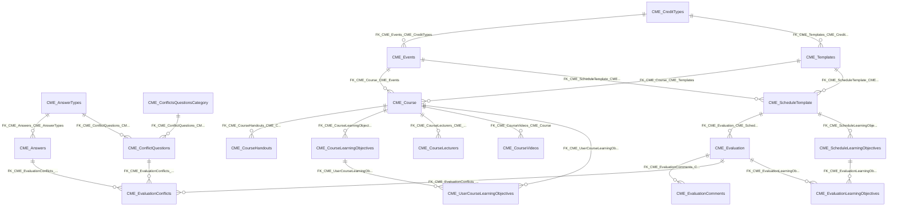

import TableDetail from '@site/src/components/TableDetail';

# CME Credits Database Tables

**61 tables** · **50 with PK** (82.0%) · **53 FKs** · **86 indexes**

## Entity Relationships

## Table Reference

<TableDetail
  tables={[{"name":"CME_ActivityTypes","schema":"dbo","fullName":"dbo.CME_ActivityTypes","hasPrimaryKey":true,"primaryKeyColumns":["ActivityTypeID"],"foreignKeys":[],"indexes":[{"name":"PK__CME_Acti__95CEDE6EA016781C","type":"CLUSTERED","isPrimaryKey":true,"isUnique":true,"isDisabled":false,"keyColumns":["ActivityTypeID"],"includedColumns":[]}],"checkConstraints":[],"defaultConstraints":0,"triggers":[]},{"name":"CME_Answers","schema":"dbo","fullName":"dbo.CME_Answers","hasPrimaryKey":true,"primaryKeyColumns":["AnswerID"],"foreignKeys":[{"constraintName":"FK_CME_Answers_CME_AnswerTypes","referencedTable":"CME_AnswerTypes"}],"indexes":[{"name":"PK_CME_Answers","type":"CLUSTERED","isPrimaryKey":true,"isUnique":true,"isDisabled":false,"keyColumns":["AnswerID"],"includedColumns":[]}],"checkConstraints":[],"defaultConstraints":0,"triggers":[]},{"name":"CME_AnswerTypes","schema":"dbo","fullName":"dbo.CME_AnswerTypes","hasPrimaryKey":true,"primaryKeyColumns":["AnswerTypeID"],"foreignKeys":[],"indexes":[{"name":"PK_CME_AnswerTypes","type":"CLUSTERED","isPrimaryKey":true,"isUnique":true,"isDisabled":false,"keyColumns":["AnswerTypeID"],"includedColumns":[]}],"checkConstraints":[],"defaultConstraints":0,"triggers":[]},{"name":"CME_BarrierQuestions","schema":"dbo","fullName":"dbo.CME_BarrierQuestions","hasPrimaryKey":true,"primaryKeyColumns":["BarrierQuestionID"],"foreignKeys":[],"indexes":[{"name":"PK__CME_Barr__C3D1293425DAB950","type":"CLUSTERED","isPrimaryKey":true,"isUnique":true,"isDisabled":false,"keyColumns":["BarrierQuestionID"],"includedColumns":[]}],"checkConstraints":[],"defaultConstraints":0,"triggers":[]},{"name":"CME_BaseTopicCategories","schema":"dbo","fullName":"dbo.CME_BaseTopicCategories","hasPrimaryKey":false,"primaryKeyColumns":[],"foreignKeys":[],"indexes":[],"checkConstraints":[],"defaultConstraints":0,"triggers":[]},{"name":"CME_CertificateSetup","schema":"dbo","fullName":"dbo.CME_CertificateSetup","hasPrimaryKey":true,"primaryKeyColumns":["CertificateID"],"foreignKeys":[],"indexes":[{"name":"PK_CME_CertificateSetup","type":"CLUSTERED","isPrimaryKey":true,"isUnique":true,"isDisabled":false,"keyColumns":["CertificateID"],"includedColumns":[]}],"checkConstraints":[],"defaultConstraints":0,"triggers":[]},{"name":"CME_CompetencyImprovementQuestions","schema":"dbo","fullName":"dbo.CME_CompetencyImprovementQuestions","hasPrimaryKey":true,"primaryKeyColumns":["CompetencyImprovementQuestionID"],"foreignKeys":[],"indexes":[{"name":"PK__CME_Comp__7BB023CFAA8CD261","type":"CLUSTERED","isPrimaryKey":true,"isUnique":true,"isDisabled":false,"keyColumns":["CompetencyImprovementQuestionID"],"includedColumns":[]}],"checkConstraints":[],"defaultConstraints":0,"triggers":[]},{"name":"CME_ConflictQuestions","schema":"dbo","fullName":"dbo.CME_ConflictQuestions","hasPrimaryKey":true,"primaryKeyColumns":["ConflictQuestionID"],"foreignKeys":[{"constraintName":"FK_CME_ConflictQuestions_CME_ConflictsQuestionsCategory","referencedTable":"CME_ConflictsQuestionsCategory"},{"constraintName":"FK_CME_ConflictQuestions_CME_AnswerTypes","referencedTable":"CME_AnswerTypes"}],"indexes":[{"name":"PK_CME_ConflictQuestions","type":"CLUSTERED","isPrimaryKey":true,"isUnique":true,"isDisabled":false,"keyColumns":["ConflictQuestionID"],"includedColumns":[]}],"checkConstraints":[],"defaultConstraints":0,"triggers":[]},{"name":"CME_ConflictsQuestionsCategory","schema":"dbo","fullName":"dbo.CME_ConflictsQuestionsCategory","hasPrimaryKey":true,"primaryKeyColumns":["QuestionsCategoryID"],"foreignKeys":[],"indexes":[{"name":"PK_CME_ConflictsQuestionsCategory","type":"CLUSTERED","isPrimaryKey":true,"isUnique":true,"isDisabled":false,"keyColumns":["QuestionsCategoryID"],"includedColumns":[]}],"checkConstraints":[],"defaultConstraints":0,"triggers":[]},{"name":"CME_ConnectivityCategories","schema":"dbo","fullName":"dbo.CME_ConnectivityCategories","hasPrimaryKey":true,"primaryKeyColumns":["ConnectivityCategoryID"],"foreignKeys":[],"indexes":[{"name":"PK__CME_Conn__D8AD56E95321C861","type":"CLUSTERED","isPrimaryKey":true,"isUnique":true,"isDisabled":false,"keyColumns":["ConnectivityCategoryID"],"includedColumns":[]}],"checkConstraints":[],"defaultConstraints":0,"triggers":[]},{"name":"CME_ConnectivityDetails","schema":"dbo","fullName":"dbo.CME_ConnectivityDetails","hasPrimaryKey":true,"primaryKeyColumns":["ConnectivityDetailsID"],"foreignKeys":[],"indexes":[{"name":"PK__CME_Conn__C557679A52D514AD","type":"CLUSTERED","isPrimaryKey":true,"isUnique":true,"isDisabled":false,"keyColumns":["ConnectivityDetailsID"],"includedColumns":[]}],"checkConstraints":[],"defaultConstraints":0,"triggers":[]},{"name":"CME_Course","schema":"dbo","fullName":"dbo.CME_Course","hasPrimaryKey":true,"primaryKeyColumns":["CourseID"],"foreignKeys":[{"constraintName":"FK_CME_Course_CME_Templates","referencedTable":"CME_Templates"},{"constraintName":"FK_CME_Course_CME_Events","referencedTable":"CME_Events"},{"constraintName":"FK_CME_Course_SEC_Specialty","referencedTable":"SEC_Specialty"},{"constraintName":"FK_CME_Course_Quiz_Template","referencedTable":"Quiz_Template"}],"indexes":[{"name":"PK_CME_Course","type":"CLUSTERED","isPrimaryKey":true,"isUnique":true,"isDisabled":false,"keyColumns":["CourseID"],"includedColumns":[]}],"checkConstraints":[],"defaultConstraints":0,"triggers":[]},{"name":"CME_CourseHandouts","schema":"dbo","fullName":"dbo.CME_CourseHandouts","hasPrimaryKey":true,"primaryKeyColumns":["HandoutID"],"foreignKeys":[{"constraintName":"FK_CME_CourseHandouts_CME_Course","referencedTable":"CME_Course"}],"indexes":[{"name":"PK_CME_CourseHandouts","type":"CLUSTERED","isPrimaryKey":true,"isUnique":true,"isDisabled":false,"keyColumns":["HandoutID"],"includedColumns":[]}],"checkConstraints":[],"defaultConstraints":1,"triggers":[]},{"name":"CME_CourseLearningObjectives","schema":"dbo","fullName":"dbo.CME_CourseLearningObjectives","hasPrimaryKey":true,"primaryKeyColumns":["LearningObjectiveID"],"foreignKeys":[{"constraintName":"FK_CME_CourseLearningObjectives_CME_Course","referencedTable":"CME_Course"},{"constraintName":"FK_CME_CourseLearningObjectives_EVAL_AnswerScales","referencedTable":"EVAL_AnswerScales"},{"constraintName":"FK_CME_CourseLearningObjectives_EVAL_AnswerTypes","referencedTable":"EVAL_AnswerTypes"}],"indexes":[{"name":"PK_CME_CourseLearningObjectives","type":"CLUSTERED","isPrimaryKey":true,"isUnique":true,"isDisabled":false,"keyColumns":["LearningObjectiveID"],"includedColumns":[]}],"checkConstraints":[],"defaultConstraints":1,"triggers":[]},{"name":"CME_CourseLecturers","schema":"dbo","fullName":"dbo.CME_CourseLecturers","hasPrimaryKey":true,"primaryKeyColumns":["LecturerID"],"foreignKeys":[{"constraintName":"FK_CME_CourseLecturers_CME_Course","referencedTable":"CME_Course"}],"indexes":[{"name":"PK_CME_CourseLecturers","type":"CLUSTERED","isPrimaryKey":true,"isUnique":true,"isDisabled":false,"keyColumns":["LecturerID"],"includedColumns":[]}],"checkConstraints":[],"defaultConstraints":2,"triggers":[]},{"name":"CME_CourseVideos","schema":"dbo","fullName":"dbo.CME_CourseVideos","hasPrimaryKey":true,"primaryKeyColumns":["VideoID"],"foreignKeys":[{"constraintName":"FK_CME_CourseVideos_CME_Course","referencedTable":"CME_Course"}],"indexes":[{"name":"PK_CME_CourseVideos","type":"CLUSTERED","isPrimaryKey":true,"isUnique":true,"isDisabled":false,"keyColumns":["VideoID"],"includedColumns":[]}],"checkConstraints":[],"defaultConstraints":1,"triggers":[]},{"name":"CME_CredentialingInformation","schema":"dbo","fullName":"dbo.CME_CredentialingInformation","hasPrimaryKey":true,"primaryKeyColumns":["ID"],"foreignKeys":[],"indexes":[{"name":"PK_CME_CredentialingInformation","type":"CLUSTERED","isPrimaryKey":true,"isUnique":true,"isDisabled":false,"keyColumns":["ID"],"includedColumns":[]}],"checkConstraints":[],"defaultConstraints":0,"triggers":[]},{"name":"CME_CreditTypes","schema":"dbo","fullName":"dbo.CME_CreditTypes","hasPrimaryKey":true,"primaryKeyColumns":["CreditTypeID"],"foreignKeys":[],"indexes":[{"name":"PK_CME_CreditTypes","type":"CLUSTERED","isPrimaryKey":true,"isUnique":true,"isDisabled":false,"keyColumns":["CreditTypeID"],"includedColumns":[]}],"checkConstraints":[],"defaultConstraints":1,"triggers":[]},{"name":"CME_CreditTypes_Completed","schema":"dbo","fullName":"dbo.CME_CreditTypes_Completed","hasPrimaryKey":false,"primaryKeyColumns":[],"foreignKeys":[],"indexes":[{"name":"IDX_MissingOn_CME_CreditTypes_Completed_7C32A8A9532346B38269495A7A44DE04","type":"NONCLUSTERED","isPrimaryKey":false,"isUnique":false,"isDisabled":false,"keyColumns":["EvaluationID"],"includedColumns":[]}],"checkConstraints":[],"defaultConstraints":0,"triggers":[]},{"name":"CME_CreditTypesHistory","schema":"dbo","fullName":"dbo.CME_CreditTypesHistory","hasPrimaryKey":false,"primaryKeyColumns":[],"foreignKeys":[],"indexes":[],"checkConstraints":[],"defaultConstraints":0,"triggers":[]},{"name":"CME_CretificateBoardTypes","schema":"dbo","fullName":"dbo.CME_CretificateBoardTypes","hasPrimaryKey":true,"primaryKeyColumns":["CretificateBoardTypeID"],"foreignKeys":[],"indexes":[{"name":"PK__CME_Cret__2AC70B611B52C5C3","type":"CLUSTERED","isPrimaryKey":true,"isUnique":true,"isDisabled":false,"keyColumns":["CretificateBoardTypeID"],"includedColumns":[]}],"checkConstraints":[],"defaultConstraints":0,"triggers":[]},{"name":"CME_Evaluation","schema":"dbo","fullName":"dbo.CME_Evaluation","hasPrimaryKey":true,"primaryKeyColumns":["EvaluationID"],"foreignKeys":[{"constraintName":"FK_CME_Evaluation_SEC_Users","referencedTable":"SEC_Users"},{"constraintName":"FK_CME_Evaluation_CME_ScheduleTemplate","referencedTable":"CME_ScheduleTemplate"}],"indexes":[{"name":"CME_Evaluation_FullyCompleted_IDX","type":"NONCLUSTERED","isPrimaryKey":false,"isUnique":false,"isDisabled":false,"keyColumns":["IsExempted","IsPartialCompleted","DeclinedDate","CompletedDate","IsDeleted","UserID"],"includedColumns":["EvaluationID","ScheduleID"]},{"name":"IDX_CME_Evaluation_AUTO1","type":"NONCLUSTERED","isPrimaryKey":false,"isUnique":false,"isDisabled":false,"keyColumns":["IsExempted","IsPartialCompleted","DeclinedDate","IsDeleted","CompletedDate"],"includedColumns":["EvaluationID","ScheduleID","UserID"]},{"name":"IDX_CME_Evaluation_CompletedDate","type":"NONCLUSTERED","isPrimaryKey":false,"isUnique":false,"isDisabled":false,"keyColumns":["CompletedDate"],"includedColumns":["EvaluationID","ScheduleID","UserID","IsDeleted"]},{"name":"IDX_CME_Evaluation_ScheduleID_CompletedDate","type":"NONCLUSTERED","isPrimaryKey":false,"isUnique":false,"isDisabled":false,"keyColumns":["ScheduleID","CompletedDate"],"includedColumns":["EvaluationID","UserID","IsDeleted"]},{"name":"IDX_CME_Evaluation_UserID","type":"NONCLUSTERED","isPrimaryKey":false,"isUnique":false,"isDisabled":false,"keyColumns":["UserID"],"includedColumns":["ScheduleID","IsDeleted"]},{"name":"IDX_CME_Evaluation1","type":"NONCLUSTERED","isPrimaryKey":false,"isUnique":false,"isDisabled":false,"keyColumns":["ScheduleID"],"includedColumns":["UserID","EventCredits","CompletedDate","IsExempted","IsVoluntary","IsPartialCompleted","DeclinedDate","VerifiedDate","IsAuto","AssignmentID","PartialCompletedDate","IsDeleted","DateDeleted","DeletedBy"]},{"name":"PK_CME_Evaluation","type":"CLUSTERED","isPrimaryKey":true,"isUnique":true,"isDisabled":false,"keyColumns":["EvaluationID"],"includedColumns":[]}],"checkConstraints":[],"defaultConstraints":12,"triggers":[]},{"name":"CME_EvaluationAnswer","schema":"dbo","fullName":"dbo.CME_EvaluationAnswer","hasPrimaryKey":true,"primaryKeyColumns":["EvaluationAnswerID"],"foreignKeys":[],"indexes":[{"name":"CME_EvaluationAnswer_BaseAnswerInfo_IDX","type":"NONCLUSTERED","isPrimaryKey":false,"isUnique":false,"isDisabled":false,"keyColumns":["EvaluationID","QuestionID"],"includedColumns":["AnswerID"]},{"name":"CME_EvaluationAnswer_IDX_EvaluationID","type":"NONCLUSTERED","isPrimaryKey":false,"isUnique":false,"isDisabled":false,"keyColumns":["EvaluationID"],"includedColumns":[]},{"name":"IDX_CME_EvaluationAnswer1","type":"NONCLUSTERED","isPrimaryKey":false,"isUnique":false,"isDisabled":false,"keyColumns":["QuestionID"],"includedColumns":[]},{"name":"IDX_CME_EvaluationAnswer2","type":"NONCLUSTERED","isPrimaryKey":false,"isUnique":false,"isDisabled":false,"keyColumns":["AnswerID"],"includedColumns":[]},{"name":"IDX_CME_EvaluationAnswer3","type":"NONCLUSTERED","isPrimaryKey":false,"isUnique":false,"isDisabled":false,"keyColumns":["TopicID"],"includedColumns":[]},{"name":"IDX_CME_EvaluationAnswer4","type":"NONCLUSTERED","isPrimaryKey":false,"isUnique":false,"isDisabled":false,"keyColumns":["LecturerID"],"includedColumns":[]},{"name":"PK_CME_EvaluationAnswerID","type":"CLUSTERED","isPrimaryKey":true,"isUnique":true,"isDisabled":false,"keyColumns":["EvaluationAnswerID"],"includedColumns":[]}],"checkConstraints":[],"defaultConstraints":1,"triggers":[]},{"name":"CME_EvaluationBarrier","schema":"dbo","fullName":"dbo.CME_EvaluationBarrier","hasPrimaryKey":false,"primaryKeyColumns":[],"foreignKeys":[],"indexes":[],"checkConstraints":[],"defaultConstraints":0,"triggers":[]},{"name":"CME_EvaluationComments","schema":"dbo","fullName":"dbo.CME_EvaluationComments","hasPrimaryKey":true,"primaryKeyColumns":["EvaluationID"],"foreignKeys":[{"constraintName":"FK_CME_EvaluationComments_CME_Evaluation","referencedTable":"CME_Evaluation"}],"indexes":[{"name":"PK_CME_EvaluationComments","type":"CLUSTERED","isPrimaryKey":true,"isUnique":true,"isDisabled":false,"keyColumns":["EvaluationID"],"includedColumns":[]}],"checkConstraints":[],"defaultConstraints":1,"triggers":[]},{"name":"CME_EvaluationCompetency","schema":"dbo","fullName":"dbo.CME_EvaluationCompetency","hasPrimaryKey":false,"primaryKeyColumns":[],"foreignKeys":[],"indexes":[],"checkConstraints":[],"defaultConstraints":0,"triggers":[]},{"name":"CME_EvaluationConflicts","schema":"dbo","fullName":"dbo.CME_EvaluationConflicts","hasPrimaryKey":true,"primaryKeyColumns":["EvaluationID","ConflictQuestionID"],"foreignKeys":[{"constraintName":"FK_CME_EvaluationConflicts_CME_ConflictQuestions","referencedTable":"CME_ConflictQuestions"},{"constraintName":"FK_CME_EvaluationConflicts_CME_Answers","referencedTable":"CME_Answers"},{"constraintName":"FK_CME_EvaluationConflicts_CME_Evaluation","referencedTable":"CME_Evaluation"}],"indexes":[{"name":"PK_CME_EvaluationConflicts","type":"CLUSTERED","isPrimaryKey":true,"isUnique":true,"isDisabled":false,"keyColumns":["EvaluationID","ConflictQuestionID"],"includedColumns":[]}],"checkConstraints":[],"defaultConstraints":1,"triggers":[]},{"name":"CME_EvaluationLearningObjectives","schema":"dbo","fullName":"dbo.CME_EvaluationLearningObjectives","hasPrimaryKey":true,"primaryKeyColumns":["EvaluationID","LearningObjectiveID"],"foreignKeys":[{"constraintName":"FK_CME_EvaluationLearningObjectives_CME_ScheduleLearningObjectives","referencedTable":"CME_ScheduleLearningObjectives"},{"constraintName":"FK_CME_EvaluationLearningObjectives_CME_Evaluation","referencedTable":"CME_Evaluation"},{"constraintName":"FK_CME_ScheduleTemplateTopics_CME_EvaluationLearningObjectives_TopicID","referencedTable":"FK_CME_ScheduleTemplateTopics_CME_EvaluationLearningObjectives_TopicID"},{"constraintName":"FK_CME_EvaluationLearningObjectives_EVAL_Answers","referencedTable":"EVAL_Answers"}],"indexes":[{"name":"IX_CME_EvaluationLearningObjectives_LearningObjectiveID","type":"NONCLUSTERED","isPrimaryKey":false,"isUnique":false,"isDisabled":false,"keyColumns":["LearningObjectiveID"],"includedColumns":[]},{"name":"IX1_CME_EvaluationLearningObjectives","type":"NONCLUSTERED","isPrimaryKey":false,"isUnique":false,"isDisabled":false,"keyColumns":["AnswerID"],"includedColumns":[]},{"name":"PK_CME_EvaluationLearningObjectives","type":"CLUSTERED","isPrimaryKey":true,"isUnique":true,"isDisabled":false,"keyColumns":["EvaluationID","LearningObjectiveID"],"includedColumns":[]}],"checkConstraints":[],"defaultConstraints":2,"triggers":[]},{"name":"CME_EvaluationQuestionComments","schema":"dbo","fullName":"dbo.CME_EvaluationQuestionComments","hasPrimaryKey":false,"primaryKeyColumns":[],"foreignKeys":[{"constraintName":"FK_CME_EvaluationQuestionComments_EVAL_Evaluations","referencedTable":"EVAL_Evaluations"},{"constraintName":"FK_CME_EvaluationQuestionComments_EVAL_Questions","referencedTable":"EVAL_Questions"}],"indexes":[{"name":"IDX_MissingOn_CME_EvaluationQuestionComments_01690D5037E441418B87B8872933633E","type":"NONCLUSTERED","isPrimaryKey":false,"isUnique":false,"isDisabled":false,"keyColumns":["EvaluationID","LecturerID","TopicID"],"includedColumns":[]},{"name":"IDX_MissingOn_CME_EvaluationQuestionComments_D9D63AC99E724BB29862E3D6DCBDAD0A","type":"NONCLUSTERED","isPrimaryKey":false,"isUnique":false,"isDisabled":false,"keyColumns":["EvaluationID","QuestionID","LecturerID","TopicID"],"includedColumns":[]}],"checkConstraints":[],"defaultConstraints":2,"triggers":[]},{"name":"CME_EvaluationTopicCredits","schema":"dbo","fullName":"dbo.CME_EvaluationTopicCredits","hasPrimaryKey":true,"primaryKeyColumns":["EvaluationID","TopicID"],"foreignKeys":[{"constraintName":"FK_CME_EvaluationTopicCredits_CME_ScheduleTemplateTopics","referencedTable":"CME_ScheduleTemplateTopics"}],"indexes":[{"name":"IDX_CME_EvaluationTopicCredits1","type":"NONCLUSTERED","isPrimaryKey":false,"isUnique":false,"isDisabled":false,"keyColumns":["TopicID"],"includedColumns":["Credits","Claimed"]},{"name":"PK_CME_EvaluationTopicCredits","type":"CLUSTERED","isPrimaryKey":true,"isUnique":true,"isDisabled":false,"keyColumns":["EvaluationID","TopicID"],"includedColumns":[]}],"checkConstraints":[],"defaultConstraints":3,"triggers":[]},{"name":"CME_EventCompetencies","schema":"dbo","fullName":"dbo.CME_EventCompetencies","hasPrimaryKey":true,"primaryKeyColumns":["EventCompetenciesID"],"foreignKeys":[],"indexes":[{"name":"PK__CME_Even__454CB2F3021CEE48","type":"CLUSTERED","isPrimaryKey":true,"isUnique":true,"isDisabled":false,"keyColumns":["EventCompetenciesID"],"includedColumns":[]}],"checkConstraints":[],"defaultConstraints":0,"triggers":[]},{"name":"CME_EventCredits","schema":"dbo","fullName":"dbo.CME_EventCredits","hasPrimaryKey":true,"primaryKeyColumns":["CreditID"],"foreignKeys":[],"indexes":[{"name":"PK_CME_EventCredits","type":"CLUSTERED","isPrimaryKey":true,"isUnique":true,"isDisabled":false,"keyColumns":["CreditID"],"includedColumns":[]}],"checkConstraints":[],"defaultConstraints":0,"triggers":[]},{"name":"CME_EventLearningObjectives","schema":"dbo","fullName":"dbo.CME_EventLearningObjectives","hasPrimaryKey":true,"primaryKeyColumns":["LearningObjectiveID"],"foreignKeys":[{"constraintName":"FK_CME_EventLearningObjectives_EVAL_AnswerTypes","referencedTable":"EVAL_AnswerTypes"},{"constraintName":"FK_CME_EventLearningObjectives_EVAL_AnswerScales","referencedTable":"EVAL_AnswerScales"},{"constraintName":"FK_CME_EventLearningObjectives_CME_Events","referencedTable":"CME_Events"}],"indexes":[{"name":"PK_CME_EventLearningObjectives","type":"CLUSTERED","isPrimaryKey":true,"isUnique":true,"isDisabled":false,"keyColumns":["LearningObjectiveID"],"includedColumns":[]}],"checkConstraints":[],"defaultConstraints":1,"triggers":[]},{"name":"CME_Events","schema":"dbo","fullName":"dbo.CME_Events","hasPrimaryKey":true,"primaryKeyColumns":["EventID"],"foreignKeys":[{"constraintName":"FK_CME_Events_CME_CreditTypes","referencedTable":"CME_CreditTypes"}],"indexes":[{"name":"IDX_CME_Events1","type":"NONCLUSTERED","isPrimaryKey":false,"isUnique":false,"isDisabled":false,"keyColumns":["DateDeleted"],"includedColumns":[]},{"name":"IDX_CME_Events2","type":"NONCLUSTERED","isPrimaryKey":false,"isUnique":false,"isDisabled":false,"keyColumns":["DepartmentID","DateDeleted"],"includedColumns":[]},{"name":"PK_CME_Events","type":"CLUSTERED","isPrimaryKey":true,"isUnique":true,"isDisabled":false,"keyColumns":["EventID"],"includedColumns":[]}],"checkConstraints":[],"defaultConstraints":35,"triggers":[]},{"name":"CME_EventSupportSources","schema":"dbo","fullName":"dbo.CME_EventSupportSources","hasPrimaryKey":true,"primaryKeyColumns":["SupportSourceDetailsID"],"foreignKeys":[],"indexes":[{"name":"PK__CME_Even__B205C1A313DA86B3","type":"CLUSTERED","isPrimaryKey":true,"isUnique":true,"isDisabled":false,"keyColumns":["SupportSourceDetailsID"],"includedColumns":[]}],"checkConstraints":[],"defaultConstraints":1,"triggers":[]},{"name":"CME_FileDatabase","schema":"dbo","fullName":"dbo.CME_FileDatabase","hasPrimaryKey":true,"primaryKeyColumns":["FileID"],"foreignKeys":[],"indexes":[{"name":"PK__CME_File__6F0F989F4A4E14CE","type":"CLUSTERED","isPrimaryKey":true,"isUnique":true,"isDisabled":false,"keyColumns":["FileID"],"includedColumns":[]}],"checkConstraints":[],"defaultConstraints":0,"triggers":[]},{"name":"CME_MerchantServiceDetails","schema":"dbo","fullName":"dbo.CME_MerchantServiceDetails","hasPrimaryKey":true,"primaryKeyColumns":["MerchantServiceDetailsID"],"foreignKeys":[],"indexes":[{"name":"PK__CME_Merc__DD0F47CDD9B5A237","type":"CLUSTERED","isPrimaryKey":true,"isUnique":true,"isDisabled":false,"keyColumns":["MerchantServiceDetailsID"],"includedColumns":[]}],"checkConstraints":[],"defaultConstraints":8,"triggers":[]},{"name":"CME_MerchantServices","schema":"dbo","fullName":"dbo.CME_MerchantServices","hasPrimaryKey":true,"primaryKeyColumns":["MerchantServiceID"],"foreignKeys":[],"indexes":[{"name":"PK__CME_Merc__BDD814787BFCD033","type":"CLUSTERED","isPrimaryKey":true,"isUnique":true,"isDisabled":false,"keyColumns":["MerchantServiceID"],"includedColumns":[]}],"checkConstraints":[],"defaultConstraints":0,"triggers":[]},{"name":"CME_MOCCreditTypes","schema":"dbo","fullName":"dbo.CME_MOCCreditTypes","hasPrimaryKey":true,"primaryKeyColumns":["MOCCreditTypeID"],"foreignKeys":[],"indexes":[{"name":"PK__CME_MOCC__5B304D5AA9A4FC23","type":"CLUSTERED","isPrimaryKey":true,"isUnique":true,"isDisabled":false,"keyColumns":["MOCCreditTypeID"],"includedColumns":[]}],"checkConstraints":[],"defaultConstraints":0,"triggers":[]},{"name":"CME_PARResponses","schema":"dbo","fullName":"dbo.CME_PARResponses","hasPrimaryKey":true,"primaryKeyColumns":["PARResponseID"],"foreignKeys":[],"indexes":[{"name":"PK__CME_PARR__B5AB4E9E0BEA2260","type":"CLUSTERED","isPrimaryKey":true,"isUnique":true,"isDisabled":false,"keyColumns":["PARResponseID"],"includedColumns":[]}],"checkConstraints":[],"defaultConstraints":0,"triggers":[]},{"name":"CME_ProviderShipNames","schema":"dbo","fullName":"dbo.CME_ProviderShipNames","hasPrimaryKey":true,"primaryKeyColumns":["ProviderShipID"],"foreignKeys":[],"indexes":[{"name":"PK__CME_Prov__12A912F59D91A276","type":"CLUSTERED","isPrimaryKey":true,"isUnique":true,"isDisabled":false,"keyColumns":["ProviderShipID"],"includedColumns":[]}],"checkConstraints":[],"defaultConstraints":0,"triggers":[]},{"name":"CME_SatelliteProgramDepartments","schema":"dbo","fullName":"dbo.CME_SatelliteProgramDepartments","hasPrimaryKey":true,"primaryKeyColumns":["SatelliteProgramListID"],"foreignKeys":[],"indexes":[{"name":"PK__CME_Sate__E0B74673E6E81B0B","type":"CLUSTERED","isPrimaryKey":true,"isUnique":true,"isDisabled":false,"keyColumns":["SatelliteProgramListID"],"includedColumns":[]}],"checkConstraints":[],"defaultConstraints":0,"triggers":[]},{"name":"CME_ScheduleGuests","schema":"dbo","fullName":"dbo.CME_ScheduleGuests","hasPrimaryKey":true,"primaryKeyColumns":["ScheduleGuestID"],"foreignKeys":[],"indexes":[{"name":"PK_CME_ScheduleGuests","type":"CLUSTERED","isPrimaryKey":true,"isUnique":true,"isDisabled":false,"keyColumns":["ScheduleGuestID"],"includedColumns":[]}],"checkConstraints":[],"defaultConstraints":0,"triggers":[]},{"name":"CME_ScheduleLearningObjectives","schema":"dbo","fullName":"dbo.CME_ScheduleLearningObjectives","hasPrimaryKey":true,"primaryKeyColumns":["LearningObjectiveID"],"foreignKeys":[{"constraintName":"FK_CME_ScheduleLearningObjectives_EVAL_AnswerTypes","referencedTable":"EVAL_AnswerTypes"},{"constraintName":"FK_CME_ScheduleLearningObjectives_CME_ScheduleTemplate","referencedTable":"CME_ScheduleTemplate"},{"constraintName":"FK_CME_ScheduleLearningObjectives_EVAL_AnswerScales","referencedTable":"EVAL_AnswerScales"}],"indexes":[{"name":"IX_CME_ScheduleLearningObjectives_ScheduleID","type":"NONCLUSTERED","isPrimaryKey":false,"isUnique":false,"isDisabled":false,"keyColumns":["ScheduleID"],"includedColumns":[]},{"name":"IX1_CME_ScheduleLearningObjectives","type":"NONCLUSTERED","isPrimaryKey":false,"isUnique":false,"isDisabled":false,"keyColumns":["AnswerTypeID"],"includedColumns":[]},{"name":"PK_CME_ScheduleLearningObjectives","type":"CLUSTERED","isPrimaryKey":true,"isUnique":true,"isDisabled":false,"keyColumns":["LearningObjectiveID"],"includedColumns":[]}],"checkConstraints":[],"defaultConstraints":1,"triggers":[]},{"name":"CME_ScheduleList","schema":"dbo","fullName":"dbo.CME_ScheduleList","hasPrimaryKey":true,"primaryKeyColumns":["ScheduleListID"],"foreignKeys":[],"indexes":[{"name":"PK__CME_Sche__97E81A1AB8702488","type":"CLUSTERED","isPrimaryKey":true,"isUnique":true,"isDisabled":false,"keyColumns":["ScheduleListID"],"includedColumns":[]}],"checkConstraints":[],"defaultConstraints":0,"triggers":[]},{"name":"CME_ScheduleLogInfo","schema":"dbo","fullName":"dbo.CME_ScheduleLogInfo","hasPrimaryKey":false,"primaryKeyColumns":[],"foreignKeys":[],"indexes":[],"checkConstraints":[],"defaultConstraints":0,"triggers":[]},{"name":"CME_ScheduleReminderQueue","schema":"dbo","fullName":"dbo.CME_ScheduleReminderQueue","hasPrimaryKey":true,"primaryKeyColumns":["CMEQueueID"],"foreignKeys":[{"constraintName":"FK_CME_ScheduleReminderQueue_CMEScheduleID","referencedTable":"CMEScheduleID"}],"indexes":[{"name":"PK__CME_Sche__209104D82AFD1476","type":"CLUSTERED","isPrimaryKey":true,"isUnique":true,"isDisabled":false,"keyColumns":["CMEQueueID"],"includedColumns":[]}],"checkConstraints":[],"defaultConstraints":1,"triggers":[]},{"name":"CME_ScheduleSupportSources","schema":"dbo","fullName":"dbo.CME_ScheduleSupportSources","hasPrimaryKey":true,"primaryKeyColumns":["SupportSourceDetailsID"],"foreignKeys":[],"indexes":[{"name":"PK__CME_Sche__B205C1A38DBBDA1D","type":"CLUSTERED","isPrimaryKey":true,"isUnique":true,"isDisabled":false,"keyColumns":["SupportSourceDetailsID"],"includedColumns":[]}],"checkConstraints":[],"defaultConstraints":1,"triggers":[]},{"name":"CME_ScheduleTemplate","schema":"dbo","fullName":"dbo.CME_ScheduleTemplate","hasPrimaryKey":true,"primaryKeyColumns":["ScheduleID"],"foreignKeys":[{"constraintName":"FK_CME_ScheduleTemplate_DH_ConferenceScheduleTemplates","referencedTable":"DH_ConferenceScheduleTemplates"},{"constraintName":"FK_CME_ScheduleTemplate_DH_ConferenceSchedules","referencedTable":"DH_ConferenceSchedules"},{"constraintName":"FK_CME_ScheduleTemplate_CME_Events","referencedTable":"CME_Events"},{"constraintName":"FK_CME_ScheduleTemplate_CME_Templates","referencedTable":"CME_Templates"}],"indexes":[{"name":"IDX_CME_ScheduleTemplate_StartDate_EndDate","type":"NONCLUSTERED","isPrimaryKey":false,"isUnique":false,"isDisabled":false,"keyColumns":["StartDate","EndDate"],"includedColumns":["ScheduleID","EventID","EventCredits","IsDeleted"]},{"name":"Ix_CME_ScheduleTemplate_1","type":"NONCLUSTERED","isPrimaryKey":false,"isUnique":false,"isDisabled":false,"keyColumns":["TemplateID","CreatedBy","CreatedDateTime"],"includedColumns":[]},{"name":"Ix_CME_ScheduleTemplate_2","type":"NONCLUSTERED","isPrimaryKey":false,"isUnique":false,"isDisabled":false,"keyColumns":["EventID"],"includedColumns":["StartDate","EndDate","EventCredits","ExpiryDate","TemplateID","Topic","Location","CreatedBy","CreatedDateTime","DepartmentConferenceScheduleID","IsDeleted","IsPartialScheduled","IsOnline"]},{"name":"IX_CME_ScheduleTemplate_DepartmentConferenceScheduleID","type":"NONCLUSTERED","isPrimaryKey":false,"isUnique":false,"isDisabled":false,"keyColumns":["DepartmentConferenceScheduleID"],"includedColumns":[]},{"name":"PK_CME_ScheduleTemplate","type":"CLUSTERED","isPrimaryKey":true,"isUnique":true,"isDisabled":false,"keyColumns":["ScheduleID"],"includedColumns":[]}],"checkConstraints":[],"defaultConstraints":41,"triggers":[]},{"name":"CME_ScheduleTemplateLecturers","schema":"dbo","fullName":"dbo.CME_ScheduleTemplateLecturers","hasPrimaryKey":true,"primaryKeyColumns":["LecturerID"],"foreignKeys":[{"constraintName":"FK_CME_ScheduleTemplateTopics_CME_ScheduleTemplateLecturers_TopicID","referencedTable":"FK_CME_ScheduleTemplateTopics_CME_ScheduleTemplateLecturers_TopicID"},{"constraintName":"FK_CME_ScheduleTemplateLecturers_CME_ScheduleTemplate","referencedTable":"CME_ScheduleTemplate"}],"indexes":[{"name":"IDX_MissingOn_CME_ScheduleTemplateLecturers_0853D3B9399740778F33BA7D4F43E980","type":"NONCLUSTERED","isPrimaryKey":false,"isUnique":false,"isDisabled":false,"keyColumns":["UserID","IsGuest"],"includedColumns":[]},{"name":"IDX_MissingOn_CME_ScheduleTemplateLecturers_6B84138BDCB44FDE8BA2AD75B610654F","type":"NONCLUSTERED","isPrimaryKey":false,"isUnique":false,"isDisabled":false,"keyColumns":["UserID","IsGuest"],"includedColumns":["IsDeleted"]},{"name":"IX_CME_ScheduleTemplateLecturers_ScheduleID_IsGuest","type":"NONCLUSTERED","isPrimaryKey":false,"isUnique":false,"isDisabled":false,"keyColumns":["ScheduleID","IsGuest"],"includedColumns":[]},{"name":"IX_CME_ScheduleTemplateLecturers_ScheduleID_IsGuest_IsDeleted","type":"NONCLUSTERED","isPrimaryKey":false,"isUnique":false,"isDisabled":false,"keyColumns":["ScheduleID","IsGuest","IsDeleted"],"includedColumns":[]},{"name":"PK_CME_ScheduleTemplateLecturers","type":"CLUSTERED","isPrimaryKey":true,"isUnique":true,"isDisabled":false,"keyColumns":["LecturerID"],"includedColumns":[]},{"name":"ScheduleTemplateLecturers_IsGuest","type":"NONCLUSTERED","isPrimaryKey":false,"isUnique":false,"isDisabled":false,"keyColumns":["IsGuest"],"includedColumns":["LecturerID","ScheduleID","UserID","TopicID"]}],"checkConstraints":[],"defaultConstraints":2,"triggers":[]},{"name":"CME_ScheduleTemplateSpeakerCredits","schema":"dbo","fullName":"dbo.CME_ScheduleTemplateSpeakerCredits","hasPrimaryKey":true,"primaryKeyColumns":["SpeakerCreditID"],"foreignKeys":[{"constraintName":"FK_CME_ScheduleTemplateSpeakerCredits_CME_ScheduleTemplate","referencedTable":"CME_ScheduleTemplate"}],"indexes":[{"name":"IX_Schedule_UserID_IsGuest","type":"NONCLUSTERED","isPrimaryKey":false,"isUnique":false,"isDisabled":false,"keyColumns":["ScheduleID","UserID","IsGuest"],"includedColumns":["EventCredits"]},{"name":"PK_CME_ScheduleTemplateSpeakerCredits","type":"CLUSTERED","isPrimaryKey":true,"isUnique":true,"isDisabled":false,"keyColumns":["SpeakerCreditID"],"includedColumns":[]}],"checkConstraints":[],"defaultConstraints":3,"triggers":[]},{"name":"CME_ScheduleTemplateSpeakerCredits_Deleted","schema":"dbo","fullName":"dbo.CME_ScheduleTemplateSpeakerCredits_Deleted","hasPrimaryKey":false,"primaryKeyColumns":[],"foreignKeys":[],"indexes":[],"checkConstraints":[],"defaultConstraints":0,"triggers":[]},{"name":"CME_ScheduleTemplateTopics","schema":"dbo","fullName":"dbo.CME_ScheduleTemplateTopics","hasPrimaryKey":true,"primaryKeyColumns":["TopicID"],"foreignKeys":[{"constraintName":"FK_CME_ScheduleTemplate_CME_ScheduleTemplateTopics_ScheduleID","referencedTable":"FK_CME_ScheduleTemplate_CME_ScheduleTemplateTopics_ScheduleID"}],"indexes":[{"name":"IX_CME_ScheduleTemplateTopics_ScheduleID","type":"NONCLUSTERED","isPrimaryKey":false,"isUnique":false,"isDisabled":false,"keyColumns":["ScheduleID"],"includedColumns":[]},{"name":"PK_CME_ScheduleTemplateTopics","type":"CLUSTERED","isPrimaryKey":true,"isUnique":true,"isDisabled":false,"keyColumns":["TopicID"],"includedColumns":[]}],"checkConstraints":[],"defaultConstraints":2,"triggers":[]},{"name":"CME_Speciality","schema":"dbo","fullName":"dbo.CME_Speciality","hasPrimaryKey":true,"primaryKeyColumns":["SpecialityID"],"foreignKeys":[],"indexes":[{"name":"PK__CME_Spec__67ED60FB4A343DBD","type":"CLUSTERED","isPrimaryKey":true,"isUnique":true,"isDisabled":false,"keyColumns":["SpecialityID"],"includedColumns":[]}],"checkConstraints":[],"defaultConstraints":0,"triggers":[]},{"name":"CME_SubActivityTypes","schema":"dbo","fullName":"dbo.CME_SubActivityTypes","hasPrimaryKey":true,"primaryKeyColumns":["SubActivityTypeID"],"foreignKeys":[],"indexes":[{"name":"PK__CME_SubA__B9756C9E5BDE51D3","type":"CLUSTERED","isPrimaryKey":true,"isUnique":true,"isDisabled":false,"keyColumns":["SubActivityTypeID"],"includedColumns":[]}],"checkConstraints":[],"defaultConstraints":0,"triggers":[]},{"name":"CME_TemplateQuestion","schema":"dbo","fullName":"dbo.CME_TemplateQuestion","hasPrimaryKey":false,"primaryKeyColumns":[],"foreignKeys":[{"constraintName":"FK_CME_TemplateQuestion_EVAL_Questions","referencedTable":"EVAL_Questions"},{"constraintName":"FK_CME_TemplateQuestion_EVAL_AnswerTypes","referencedTable":"EVAL_AnswerTypes"},{"constraintName":"FK_CME_TemplateQuestion_EVAL_AnswerScales","referencedTable":"EVAL_AnswerScales"},{"constraintName":"FK_CME_TemplateQuestion_CME_Templates","referencedTable":"CME_Templates"}],"indexes":[{"name":"IDX_CME_TemplateQuestion_1","type":"NONCLUSTERED","isPrimaryKey":false,"isUnique":false,"isDisabled":false,"keyColumns":["TemplateID"],"includedColumns":["QuestionID","AnswerScaleID"]},{"name":"IDX_CME_TemplateQuestion_2","type":"NONCLUSTERED","isPrimaryKey":false,"isUnique":false,"isDisabled":false,"keyColumns":["QuestionID"],"includedColumns":[]}],"checkConstraints":[],"defaultConstraints":0,"triggers":[]},{"name":"CME_Templates","schema":"dbo","fullName":"dbo.CME_Templates","hasPrimaryKey":true,"primaryKeyColumns":["TemplateID"],"foreignKeys":[{"constraintName":"FK_CME_Templates_CME_CreditTypes","referencedTable":"CME_CreditTypes"}],"indexes":[{"name":"PK_CME_Templates","type":"CLUSTERED","isPrimaryKey":true,"isUnique":true,"isDisabled":false,"keyColumns":["TemplateID"],"includedColumns":[]}],"checkConstraints":[],"defaultConstraints":4,"triggers":[]},{"name":"CME_TopicCategories","schema":"dbo","fullName":"dbo.CME_TopicCategories","hasPrimaryKey":false,"primaryKeyColumns":[],"foreignKeys":[],"indexes":[{"name":"IDX_CMETopicCategoryID1","type":"NONCLUSTERED","isPrimaryKey":false,"isUnique":false,"isDisabled":false,"keyColumns":["CMETopicCategoryID"],"includedColumns":["Name"]}],"checkConstraints":[],"defaultConstraints":0,"triggers":[]},{"name":"CME_UploadList","schema":"dbo","fullName":"dbo.CME_UploadList","hasPrimaryKey":true,"primaryKeyColumns":["UploadID"],"foreignKeys":[{"constraintName":"FK__CME_Uploa__FileI__4BBAE5B4","referencedTable":"(system-named)"}],"indexes":[{"name":"PK__CME_Uplo__6D16C86DDD5299B6","type":"CLUSTERED","isPrimaryKey":true,"isUnique":true,"isDisabled":false,"keyColumns":["UploadID"],"includedColumns":[]}],"checkConstraints":[],"defaultConstraints":0,"triggers":[]},{"name":"CME_UserCompletedCourse","schema":"dbo","fullName":"dbo.CME_UserCompletedCourse","hasPrimaryKey":true,"primaryKeyColumns":["UserCourseID"],"foreignKeys":[{"constraintName":"FK_CME_UserCompletedCourse_SEC_Users","referencedTable":"SEC_Users"},{"constraintName":"FK_CME_UserCompletedCourse_CME_Course","referencedTable":"CME_Course"}],"indexes":[{"name":"PK_CME_UserCompletedCourse","type":"CLUSTERED","isPrimaryKey":true,"isUnique":true,"isDisabled":false,"keyColumns":["UserCourseID"],"includedColumns":[]}],"checkConstraints":[],"defaultConstraints":0,"triggers":[]},{"name":"CME_UserCourseLearningObjectives","schema":"dbo","fullName":"dbo.CME_UserCourseLearningObjectives","hasPrimaryKey":false,"primaryKeyColumns":[],"foreignKeys":[{"constraintName":"FK_CME_UserCourseLearningObjectives_EVAL_Answers","referencedTable":"EVAL_Answers"},{"constraintName":"FK_CME_UserCourseLearningObjectives_CME_CourseLearningObjectives","referencedTable":"CME_CourseLearningObjectives"},{"constraintName":"FK_CME_UserCourseLearningObjectives_CME_Course","referencedTable":"CME_Course"}],"indexes":[],"checkConstraints":[],"defaultConstraints":0,"triggers":[]}]}
  generatedAt="2026-02-27T00:56:56.204Z"
/>
