import TableDetail from '@site/src/components/TableDetail';

# CME Credits Database Tables

**61 tables** · **50 with PK** (82.0%) · **52 FKs** · **86 indexes**

## Entity Relationships

```mermaid
erDiagram
    CME_Answers {
        bigint AnswerID PK
        bigint AnswerTypeID FK
    }
    CME_AnswerTypes {
        bigint AnswerTypeID PK
    }
    CME_ConflictQuestions {
        bigint ConflictQuestionID PK
        bigint AnswerTypeID FK
        bigint QuestionsCategoryID FK
    }
    CME_ConflictsQuestionsCategory {
        bigint QuestionsCategoryID PK
    }
    CME_Course {
        bigint CourseID PK
        bigint EventID FK
        bigint TemplateID FK
        bigint QuizID FK
        int CategoryID FK
    }
    CME_CourseHandouts {
        bigint HandoutID PK
        bigint CourseID FK
    }
    CME_CourseLearningObjectives {
        bigint LearningObjectiveID PK
        bigint CourseID FK
        bigint AnswerTypeID FK
        bigint AnswerScaleID FK
    }
    CME_CourseLecturers {
        bigint LecturerID PK
        bigint CourseID FK
    }
    CME_CourseVideos {
        bigint VideoID PK
        bigint CourseID FK
    }
    CME_CreditTypes {
        bigint CreditTypeID PK
    }
    CME_Evaluation {
        bigint EvaluationID PK
        bigint ScheduleID FK
        bigint UserID FK
    }
    CME_EvaluationConflicts {
        bigint EvaluationID PK
        bigint ConflictQuestionID PK
        bigint AnswerID FK
    }
    CME_EvaluationLearningObjectives {
        bigint EvaluationID PK
        bigint LearningObjectiveID PK
        bigint AnswerID FK
        bigint TopicID FK
    }
    CME_Events {
        bigint EventID PK
        bigint CreditTypeID FK
    }
    CME_ScheduleLearningObjectives {
        bigint LearningObjectiveID PK
        bigint ScheduleID FK
        bigint AnswerTypeID FK
        bigint AnswerScaleID FK
    }
    CME_ScheduleTemplate {
        bigint ScheduleID PK
        bigint EventID FK
        bigint TemplateID FK
        bigint DepartmentConferenceScheduleID FK
        bigint ConferenceScheduleTemplateID FK
    }
    CME_ScheduleTemplateLecturers {
        bigint LecturerID PK
        bigint ScheduleID FK
        bigint TopicID FK
    }
    CME_ScheduleTemplateTopics {
        bigint TopicID PK
        bigint ScheduleID FK
    }
    CME_Templates {
        bigint TemplateID PK
        bigint CreditTypeID FK
    }
    CME_UserCourseLearningObjectives {
        bigint CourseID FK
        bigint LearningObjectiveID FK
        bigint AnswerID FK
    }
    CME_AnswerTypes ||--o{ CME_Answers : "AnswerTypeID"
    CME_AnswerTypes ||--o{ CME_ConflictQuestions : "AnswerTypeID"
    CME_ConflictsQuestionsCategory ||--o{ CME_ConflictQuestions : "QuestionsCategoryID"
    CME_Events ||--o{ CME_Course : "EventID"
    CME_Templates ||--o{ CME_Course : "TemplateID"
    CME_Course ||--o{ CME_CourseHandouts : "CourseID"
    CME_Course ||--o{ CME_CourseLearningObjectives : "CourseID"
    CME_Course ||--o{ CME_CourseLecturers : "CourseID"
    CME_Course ||--o{ CME_CourseVideos : "CourseID"
    CME_ScheduleTemplate ||--o{ CME_Evaluation : "ScheduleID"
    CME_Answers ||--o{ CME_EvaluationConflicts : "AnswerID"
    CME_ConflictQuestions ||--o{ CME_EvaluationConflicts : "ConflictQuestionID"
    CME_Evaluation ||--o{ CME_EvaluationConflicts : "EvaluationID"
    CME_Evaluation ||--o{ CME_EvaluationLearningObjectives : "EvaluationID"
    CME_ScheduleLearningObjectives ||--o{ CME_EvaluationLearningObjectives : "LearningObjectiveID"
    CME_ScheduleTemplateTopics ||--o{ CME_EvaluationLearningObjectives : "TopicID"
    CME_CreditTypes ||--o{ CME_Events : "CreditTypeID"
    CME_ScheduleTemplate ||--o{ CME_ScheduleLearningObjectives : "ScheduleID"
    CME_Events ||--o{ CME_ScheduleTemplate : "EventID"
    CME_Templates ||--o{ CME_ScheduleTemplate : "TemplateID"
    CME_ScheduleTemplate ||--o{ CME_ScheduleTemplateLecturers : "ScheduleID"
    CME_ScheduleTemplateTopics ||--o{ CME_ScheduleTemplateLecturers : "TopicID"
    CME_ScheduleTemplate ||--o{ CME_ScheduleTemplateTopics : "ScheduleID"
    CME_CreditTypes ||--o{ CME_Templates : "CreditTypeID"
    CME_Course ||--o{ CME_UserCourseLearningObjectives : "CourseID"
    CME_CourseLearningObjectives ||--o{ CME_UserCourseLearningObjectives : "LearningObjectiveID"
```

## Table Reference

<TableDetail
  dataUrl="/table-detail-data/cme-credits.json"
  generatedAt="2026-02-28T06:03:57.118Z"
/>

## Stored Procedures

See the [CME Credits Stored Procedures](./sprocs/cme-credits-sprocs) reference page for detailed documentation of all stored procedures in this module, including parameters, anti-pattern analysis, and optimization recommendations.

## Related Code Documentation

- [CME Tracking (.NET Business Module)](/docs/dotnet-backend/business/cme-tracking)
