import TableDetail from '@site/src/components/TableDetail';

# Duty Hours Database Tables

**182 tables** · **117 with PK** (64.3%) · **82 FKs** · **413 indexes**

## Entity Relationships

```mermaid
erDiagram
    DH_DepartmentActivities ||--o{ DH_AmionScheduleActivities : "FK_DH_AmionScheduleActiviti..."
    DH_AmionSchedule ||--o{ DH_AmionScheduleCallAssignments : "FK_DH_AmionScheduleCallAssi..."
    DH_AmionSchedule ||--o{ DH_AmionScheduleClinicAssignments : "FK_DH_AmionScheduleClinicAs..."
    DH_AmionSchedule ||--o{ DH_AmionScheduleCrossCoverAssignments : "FK_DH_AmionScheduleCrossCov..."
    DH_AmionSchedule ||--o{ DH_AmionScheduleRotationAssignments : "FK_DH_AmionScheduleRotation..."
    DH_DepartmentRotations ||--o{ DH_AveragedForViolations : "FK_DH_AveragedForViolations..."
    DH_CCConferenceScheduleTemplate ||--o{ DH_CCConferenceScheduleLearningObjectives : "FK_DH_CCConferenceScheduleL..."
    DH_CCEvaluation ||--o{ DH_CCEvaluationLearningObjectives : "FK_DH_CCEvaluationLearningO..."
    DH_CCConferenceScheduleLearningObjectives ||--o{ DH_CCEvaluationLearningObjectives : "FK_DH_CCEvaluationLearningO..."
    DH_ConferenceDailyRecurring ||--o{ DH_ConferenceDailyRecurring : "FK_DH_ConferenceDailyRecurr..."
    DH_ConferenceScheduleTemplates ||--o{ DH_ConferenceMonthlyRecurring : "FK_DH_ConferenceMonthlyRecu..."
    DH_ConferenceSchedules ||--o{ DH_ConferenceSchedulePresenters : "FK_DH_ConferenceSchedulePre..."
    DH_DepartmentConferences ||--o{ DH_ConferenceSchedules : "FK_DH_ConferenceSchedules_D..."
    DH_ConferenceScheduleTemplates ||--o{ DH_ConferenceSchedules : "FK_DH_ConferenceSchedules_D..."
    DH_DepartmentConferences ||--o{ DH_ConferenceScheduleTemplates : "FK_DH_ConferenceScheduleTem..."
```

## Table Reference

<TableDetail
  tables={[{"name":"DH_ACGMERules","schema":"dbo","fullName":"dbo.DH_ACGMERules","hasPrimaryKey":true,"primaryKeyColumns":["ACGMERuleID","PGYLevel"],"foreignKeys":[],"indexes":[{"name":"IX_DH_ACGMERuleAvg","type":"NONCLUSTERED","isPrimaryKey":false,"isUnique":false,"isDisabled":false,"keyColumns":["ACGMERuleID","PGYLevel","IsAveraged"],"includedColumns":[]},{"name":"IX_DH_ACGMERuleValue","type":"NONCLUSTERED","isPrimaryKey":false,"isUnique":false,"isDisabled":false,"keyColumns":["ACGMERuleID","PGYLevel","DefaultValue"],"includedColumns":[]},{"name":"PK_DH_ACGMERules","type":"CLUSTERED","isPrimaryKey":true,"isUnique":true,"isDisabled":false,"keyColumns":["ACGMERuleID","PGYLevel"],"includedColumns":[]}],"checkConstraints":[],"defaultConstraints":2,"triggers":[]},{"name":"DH_ActivitiesBase","schema":"dbo","fullName":"dbo.DH_ActivitiesBase","hasPrimaryKey":true,"primaryKeyColumns":["ActivityBaseID"],"foreignKeys":[{"constraintName":"DH_ActivityCategorySettings_DH_ActivitiesBase_FK1","referencedTable":"DH_ActivityCategorySettings_DH_ActivitiesBase"}],"indexes":[{"name":"DH_ActivitiesBase_PK","type":"CLUSTERED","isPrimaryKey":true,"isUnique":true,"isDisabled":false,"keyColumns":["ActivityBaseID"],"includedColumns":[]}],"checkConstraints":[],"defaultConstraints":1,"triggers":[]},{"name":"DH_ActivityCategories","schema":"dbo","fullName":"dbo.DH_ActivityCategories","hasPrimaryKey":true,"primaryKeyColumns":["ActivityCategoryID"],"foreignKeys":[],"indexes":[{"name":"DH_ActivityCategories_PK","type":"CLUSTERED","isPrimaryKey":true,"isUnique":true,"isDisabled":false,"keyColumns":["ActivityCategoryID"],"includedColumns":[]}],"checkConstraints":[],"defaultConstraints":0,"triggers":[]},{"name":"DH_ActivityCategorySettings","schema":"dbo","fullName":"dbo.DH_ActivityCategorySettings","hasPrimaryKey":true,"primaryKeyColumns":["ActivityCategorySettingsID"],"foreignKeys":[{"constraintName":"DH_ActivitySettings_DH_ActivityCategorySettings_FK1","referencedTable":"DH_ActivitySettings_DH_ActivityCategorySettings"},{"constraintName":"DH_ActivityCategories_DH_ActivityCategorySettings_FK1","referencedTable":"DH_ActivityCategories_DH_ActivityCategorySettings"}],"indexes":[{"name":"DH_ActivityCategorySettings_PK","type":"CLUSTERED","isPrimaryKey":true,"isUnique":true,"isDisabled":false,"keyColumns":["ActivityCategorySettingsID"],"includedColumns":[]},{"name":"NONCI_ActivityCategoryID","type":"NONCLUSTERED","isPrimaryKey":false,"isUnique":false,"isDisabled":false,"keyColumns":["ActivityCategoryID"],"includedColumns":[]}],"checkConstraints":[],"defaultConstraints":0,"triggers":[]},{"name":"DH_ActivityColors","schema":"dbo","fullName":"dbo.DH_ActivityColors","hasPrimaryKey":false,"primaryKeyColumns":[],"foreignKeys":[],"indexes":[],"checkConstraints":[],"defaultConstraints":0,"triggers":[]},{"name":"DH_ActivityGeoLocationEvents","schema":"dbo","fullName":"dbo.DH_ActivityGeoLocationEvents","hasPrimaryKey":false,"primaryKeyColumns":[],"foreignKeys":[],"indexes":[{"name":"IDX_DH_ActivityGeoLocationEvents_GeoEventsID","type":"NONCLUSTERED","isPrimaryKey":false,"isUnique":false,"isDisabled":false,"keyColumns":["GeoEventsID"],"includedColumns":[]}],"checkConstraints":[],"defaultConstraints":0,"triggers":[]},{"name":"DH_ActivityScannedQRCodesDetails","schema":"dbo","fullName":"dbo.DH_ActivityScannedQRCodesDetails","hasPrimaryKey":true,"primaryKeyColumns":["DepartmentScannedQRID"],"foreignKeys":[],"indexes":[{"name":"PK__DH_Activ__E718795D09624C36","type":"CLUSTERED","isPrimaryKey":true,"isUnique":true,"isDisabled":false,"keyColumns":["DepartmentScannedQRID"],"includedColumns":[]}],"checkConstraints":[],"defaultConstraints":0,"triggers":[]},{"name":"DH_ActivityScannedQRCodesDetails_History","schema":"dbo","fullName":"dbo.DH_ActivityScannedQRCodesDetails_History","hasPrimaryKey":false,"primaryKeyColumns":[],"foreignKeys":[],"indexes":[],"checkConstraints":[],"defaultConstraints":0,"triggers":[]},{"name":"DH_ActivitySettings","schema":"dbo","fullName":"dbo.DH_ActivitySettings","hasPrimaryKey":true,"primaryKeyColumns":["ActivitySettingID"],"foreignKeys":[],"indexes":[{"name":"DH_ActivitySettings_PK","type":"CLUSTERED","isPrimaryKey":true,"isUnique":true,"isDisabled":false,"keyColumns":["ActivitySettingID"],"includedColumns":[]}],"checkConstraints":[],"defaultConstraints":0,"triggers":[]},{"name":"DH_AmionSchedule","schema":"dbo","fullName":"dbo.DH_AmionSchedule","hasPrimaryKey":true,"primaryKeyColumns":["AmionScheduleID"],"foreignKeys":[],"indexes":[{"name":"IDX_MissingOn_DH_AmionSchedule_EC61FCABCF284F37B4E97077248EABF4","type":"NONCLUSTERED","isPrimaryKey":false,"isUnique":false,"isDisabled":false,"keyColumns":["DepartmentID","IsManual"],"includedColumns":["LastUpdatedDate","FetchedDateTime"]},{"name":"IX_DH_AmionSchedule","type":"NONCLUSTERED","isPrimaryKey":false,"isUnique":false,"isDisabled":false,"keyColumns":["DepartmentID","AcademicYear"],"includedColumns":[]},{"name":"IX_DH_AmionSchedule_1","type":"NONCLUSTERED","isPrimaryKey":false,"isUnique":false,"isDisabled":false,"keyColumns":["DepartmentID","AcademicYear","LastUpdatedDate","AmionScheduleID"],"includedColumns":[]},{"name":"IX_DH_AmionSchedule_2","type":"NONCLUSTERED","isPrimaryKey":false,"isUnique":false,"isDisabled":false,"keyColumns":["DepartmentID","LastUpdatedDate","AcademicYear"],"includedColumns":[]},{"name":"IX_DH_AmionSchedule_4","type":"NONCLUSTERED","isPrimaryKey":false,"isUnique":false,"isDisabled":false,"keyColumns":["DepartmentID","FetchedDateTime"],"includedColumns":["AcademicYear"]},{"name":"PK_DH_AmionSchedule","type":"CLUSTERED","isPrimaryKey":true,"isUnique":true,"isDisabled":false,"keyColumns":["AmionScheduleID"],"includedColumns":[]}],"checkConstraints":[],"defaultConstraints":4,"triggers":[]},{"name":"DH_AmionSchedule_LogEvent","schema":"dbo","fullName":"dbo.DH_AmionSchedule_LogEvent","hasPrimaryKey":false,"primaryKeyColumns":[],"foreignKeys":[],"indexes":[],"checkConstraints":[],"defaultConstraints":0,"triggers":[]},{"name":"DH_AmionScheduleActivities","schema":"dbo","fullName":"dbo.DH_AmionScheduleActivities","hasPrimaryKey":true,"primaryKeyColumns":["AmionScheduleActivityID"],"foreignKeys":[{"constraintName":"FK_DH_AmionScheduleActivities_DH_DepartmentActivities","referencedTable":"DH_DepartmentActivities"}],"indexes":[{"name":"IDX_MissingOn_DH_AmionScheduleActivities_8296B0FD7F6C489B921E7707E98B974B","type":"NONCLUSTERED","isPrimaryKey":false,"isUnique":false,"isDisabled":false,"keyColumns":["DepartmentID","PGYLevel"],"includedColumns":["DepartmentRotationID"]},{"name":"PK_DH_AmionScheduleActivities","type":"CLUSTERED","isPrimaryKey":true,"isUnique":true,"isDisabled":false,"keyColumns":["AmionScheduleActivityID"],"includedColumns":[]}],"checkConstraints":[],"defaultConstraints":1,"triggers":[]},{"name":"DH_AmionScheduleCallAssignments","schema":"dbo","fullName":"dbo.DH_AmionScheduleCallAssignments","hasPrimaryKey":true,"primaryKeyColumns":["AmionScheduleCallAssignmentID"],"foreignKeys":[{"constraintName":"FK_DH_AmionScheduleCallAssignments_DH_AmionSchedule","referencedTable":"DH_AmionSchedule"}],"indexes":[{"name":"IDX_MissingOn_DH_AmionScheduleCallAssignments_F3FC6D303E6845A4A0ED8514197BF196","type":"NONCLUSTERED","isPrimaryKey":false,"isUnique":false,"isDisabled":false,"keyColumns":["AmionScheduleID"],"includedColumns":["AmionUserID","AmionRotationID","FromDate","ToDate","AmionCallUniqueID","AmionCallBackupID","AmionCallName","AmionRotationName","AmionTypeCallName","UserName"]},{"name":"IX_DH_AmionScheduleCallAssignments","type":"NONCLUSTERED","isPrimaryKey":false,"isUnique":false,"isDisabled":false,"keyColumns":["AmionScheduleID"],"includedColumns":[]},{"name":"IX_DH_AmionScheduleCallAssignments_1","type":"NONCLUSTERED","isPrimaryKey":false,"isUnique":false,"isDisabled":false,"keyColumns":["AmionUserID","AmionScheduleID","FromDate","ToDate","AmionCallUniqueID"],"includedColumns":[]},{"name":"IX_DH_AmionScheduleCallAssignments_2","type":"NONCLUSTERED","isPrimaryKey":false,"isUnique":false,"isDisabled":false,"keyColumns":["AmionUserID","AmionScheduleID","FromDate","ToDate","AmionRotationID"],"includedColumns":[]},{"name":"PK_DH_AmionScheduleCallAssignments","type":"CLUSTERED","isPrimaryKey":true,"isUnique":true,"isDisabled":false,"keyColumns":["AmionScheduleCallAssignmentID"],"includedColumns":[]}],"checkConstraints":[],"defaultConstraints":1,"triggers":[]},{"name":"DH_AmionScheduleCallAssignments_History","schema":"dbo","fullName":"dbo.DH_AmionScheduleCallAssignments_History","hasPrimaryKey":false,"primaryKeyColumns":[],"foreignKeys":[],"indexes":[],"checkConstraints":[],"defaultConstraints":0,"triggers":[]},{"name":"DH_AmionScheduleClinicAssignments","schema":"dbo","fullName":"dbo.DH_AmionScheduleClinicAssignments","hasPrimaryKey":true,"primaryKeyColumns":["AmionScheduleClinicAssignmentID"],"foreignKeys":[{"constraintName":"FK_DH_AmionScheduleClinicAssignments_DH_AmionSchedule","referencedTable":"DH_AmionSchedule"}],"indexes":[{"name":"IX_DH_AmionScheduleClinicAssignments","type":"NONCLUSTERED","isPrimaryKey":false,"isUnique":false,"isDisabled":false,"keyColumns":["AmionScheduleID"],"includedColumns":[]},{"name":"IX_DH_AmionScheduleClinicAssignments_1","type":"NONCLUSTERED","isPrimaryKey":false,"isUnique":false,"isDisabled":false,"keyColumns":["AmionUserID","AmionScheduleID","FromDate","ToDate","AmionClinicID"],"includedColumns":[]},{"name":"IX_DH_AmionScheduleClinicAssignments_2","type":"NONCLUSTERED","isPrimaryKey":false,"isUnique":false,"isDisabled":false,"keyColumns":["AmionUserID","UserName"],"includedColumns":["AmionScheduleID","AmionRotationID","FromDate","ToDate","AmionClinicID","AmionRotationName","AmionTypeClinicName"]},{"name":"PK_DH_AmionScheduleClinicAssignments","type":"CLUSTERED","isPrimaryKey":true,"isUnique":true,"isDisabled":false,"keyColumns":["AmionScheduleClinicAssignmentID"],"includedColumns":[]}],"checkConstraints":[],"defaultConstraints":1,"triggers":[]},{"name":"DH_AmionScheduleClinicAssignments_History","schema":"dbo","fullName":"dbo.DH_AmionScheduleClinicAssignments_History","hasPrimaryKey":false,"primaryKeyColumns":[],"foreignKeys":[],"indexes":[],"checkConstraints":[],"defaultConstraints":0,"triggers":[]},{"name":"DH_AmionScheduleCrossCoverAssignments","schema":"dbo","fullName":"dbo.DH_AmionScheduleCrossCoverAssignments","hasPrimaryKey":true,"primaryKeyColumns":["AmionScheduleCrossCoverAssignmentID"],"foreignKeys":[{"constraintName":"FK_DH_AmionScheduleCrossCoverAssignments_DH_AmionSchedule","referencedTable":"DH_AmionSchedule"}],"indexes":[{"name":"IX_DH_AmionCrossCoverAssignments_AmionRotationID","type":"NONCLUSTERED","isPrimaryKey":false,"isUnique":false,"isDisabled":false,"keyColumns":["AmionScheduleID","AmionRotationID"],"includedColumns":["FromDate","ToDate"]},{"name":"IX_DH_AmionScheduleCrossCoverAssignments","type":"NONCLUSTERED","isPrimaryKey":false,"isUnique":false,"isDisabled":false,"keyColumns":["AmionScheduleID"],"includedColumns":[]},{"name":"IX_DH_AmionScheduleCrossCoverAssignments_1","type":"NONCLUSTERED","isPrimaryKey":false,"isUnique":false,"isDisabled":false,"keyColumns":["AmionRotationID","AmionScheduleID","FromDate","ToDate"],"includedColumns":[]},{"name":"IX_DH_AmionScheduleCrossCoverAssignments_2","type":"NONCLUSTERED","isPrimaryKey":false,"isUnique":false,"isDisabled":false,"keyColumns":["AmionUserID","UserName"],"includedColumns":["AmionScheduleID","AmionRotationID","FromDate","ToDate","AmionRotationName"]},{"name":"IX_DH_AmionScheduleCrossCoverAssignments_3","type":"NONCLUSTERED","isPrimaryKey":false,"isUnique":false,"isDisabled":false,"keyColumns":["AmionScheduleID"],"includedColumns":["AmionUserID","AmionRotationID","FromDate","ToDate","AmionRotationName","UserName"]},{"name":"PK_DH_AmionScheduleCrossCoverAssignments","type":"CLUSTERED","isPrimaryKey":true,"isUnique":true,"isDisabled":false,"keyColumns":["AmionScheduleCrossCoverAssignmentID"],"includedColumns":[]}],"checkConstraints":[],"defaultConstraints":0,"triggers":[]},{"name":"DH_AmionScheduleCrossCoverAssignments_History","schema":"dbo","fullName":"dbo.DH_AmionScheduleCrossCoverAssignments_History","hasPrimaryKey":false,"primaryKeyColumns":[],"foreignKeys":[],"indexes":[],"checkConstraints":[],"defaultConstraints":0,"triggers":[]},{"name":"DH_AmionScheduleOneWeekResults","schema":"dbo","fullName":"dbo.DH_AmionScheduleOneWeekResults","hasPrimaryKey":true,"primaryKeyColumns":["AmionScheduleOneWeekResultID"],"foreignKeys":[],"indexes":[{"name":"IX_DH_AmionScheduleOneWeekResults","type":"NONCLUSTERED","isPrimaryKey":false,"isUnique":false,"isDisabled":false,"keyColumns":["DepartmentID","DepartmentRotationID","CombinationID","MoonlightCount","ShiftCount"],"includedColumns":[]},{"name":"IX_DH_AmionScheduleOneWeekResults_1","type":"NONCLUSTERED","isPrimaryKey":false,"isUnique":false,"isDisabled":false,"keyColumns":["DepartmentRotationID","PGYLevel"],"includedColumns":["ShiftCount","MoonlightCount"]},{"name":"PK_DH_AmionScheduleOneWeekResults","type":"CLUSTERED","isPrimaryKey":true,"isUnique":true,"isDisabled":false,"keyColumns":["AmionScheduleOneWeekResultID"],"includedColumns":[]}],"checkConstraints":[],"defaultConstraints":1,"triggers":[]},{"name":"DH_AmionScheduleRotationAssignments","schema":"dbo","fullName":"dbo.DH_AmionScheduleRotationAssignments","hasPrimaryKey":true,"primaryKeyColumns":["AmionScheduleRotationAssignmentID"],"foreignKeys":[{"constraintName":"FK_DH_AmionScheduleRotationAssignments_DH_AmionSchedule","referencedTable":"DH_AmionSchedule"}],"indexes":[{"name":"IDX_DH_AmionScheduleRotationAssignments_AssigneeByRotation","type":"NONCLUSTERED","isPrimaryKey":false,"isUnique":false,"isDisabled":false,"keyColumns":["AmionRotationID","AmionRotationName"],"includedColumns":["AmionUserID","AmionUserName"]},{"name":"IDX_MissingOn_DH_AmionScheduleRotationAssignments_FD1832AA28B94D6E88543ED41F10D071","type":"NONCLUSTERED","isPrimaryKey":false,"isUnique":false,"isDisabled":false,"keyColumns":["AmionScheduleID"],"includedColumns":["AmionUserID","AmionRotationID","FromDate","ToDate","AmionRotationName","AmionRotationBackupID","AmionUserName","AmionUserBackupID","AmionStaffTypeUniqID","IsShiftSchedule"]},{"name":"IX_DH_AmionRotationAssignments_AmionRotationID","type":"NONCLUSTERED","isPrimaryKey":false,"isUnique":false,"isDisabled":false,"keyColumns":["AmionScheduleID","AmionRotationID"],"includedColumns":["FromDate","ToDate","IsShiftSchedule"]},{"name":"IX_DH_AmionScheduleRotationAssignments","type":"NONCLUSTERED","isPrimaryKey":false,"isUnique":false,"isDisabled":false,"keyColumns":["AmionScheduleID"],"includedColumns":[]},{"name":"IX_DH_AmionScheduleRotationAssignments_1","type":"NONCLUSTERED","isPrimaryKey":false,"isUnique":false,"isDisabled":false,"keyColumns":["AmionRotationID","AmionUserID","AmionScheduleID","FromDate","ToDate"],"includedColumns":[]},{"name":"IX_DH_AmionScheduleRotationAssignments_2","type":"NONCLUSTERED","isPrimaryKey":false,"isUnique":false,"isDisabled":false,"keyColumns":["AmionRotationID","AmionScheduleID","FromDate","ToDate"],"includedColumns":[]},{"name":"IX_DH_AmionScheduleRotationAssignments_3","type":"NONCLUSTERED","isPrimaryKey":false,"isUnique":false,"isDisabled":false,"keyColumns":["AmionScheduleID"],"includedColumns":["AmionUserID","AmionRotationID","FromDate","ToDate"]},{"name":"IX_DH_AmionScheduleRotationAssignments_4","type":"NONCLUSTERED","isPrimaryKey":false,"isUnique":false,"isDisabled":false,"keyColumns":["AmionScheduleID","AmionUserID"],"includedColumns":["AmionRotationID","FromDate","ToDate"]},{"name":"IX_DH_AmionScheduleRotationAssignments_5","type":"NONCLUSTERED","isPrimaryKey":false,"isUnique":false,"isDisabled":false,"keyColumns":["AmionUserID","AmionUserName"],"includedColumns":["AmionScheduleID","AmionRotationID","FromDate","ToDate","AmionRotationName","IsShiftSchedule"]},{"name":"PK_DH_AmionScheduleRotationAssignments","type":"CLUSTERED","isPrimaryKey":true,"isUnique":true,"isDisabled":false,"keyColumns":["AmionScheduleRotationAssignmentID"],"includedColumns":[]}],"checkConstraints":[],"defaultConstraints":1,"triggers":[]},{"name":"DH_AmionScheduleRotationAssignments_History","schema":"dbo","fullName":"dbo.DH_AmionScheduleRotationAssignments_History","hasPrimaryKey":false,"primaryKeyColumns":[],"foreignKeys":[],"indexes":[],"checkConstraints":[],"defaultConstraints":0,"triggers":[]},{"name":"DH_AmionScheduleRotationAssignments_History_20260105_802398","schema":"dbo","fullName":"dbo.DH_AmionScheduleRotationAssignments_History_20260105_802398","hasPrimaryKey":false,"primaryKeyColumns":[],"foreignKeys":[],"indexes":[],"checkConstraints":[],"defaultConstraints":0,"triggers":[]},{"name":"DH_AmionScheduleRotationAssignments_History_20260105_802399","schema":"dbo","fullName":"dbo.DH_AmionScheduleRotationAssignments_History_20260105_802399","hasPrimaryKey":false,"primaryKeyColumns":[],"foreignKeys":[],"indexes":[],"checkConstraints":[],"defaultConstraints":0,"triggers":[]},{"name":"DH_AmionScheduleRotationAssignments_History_20260105_802400","schema":"dbo","fullName":"dbo.DH_AmionScheduleRotationAssignments_History_20260105_802400","hasPrimaryKey":false,"primaryKeyColumns":[],"foreignKeys":[],"indexes":[],"checkConstraints":[],"defaultConstraints":0,"triggers":[]},{"name":"DH_AmionScheduleRotationAssignments_History_20260105_803397","schema":"dbo","fullName":"dbo.DH_AmionScheduleRotationAssignments_History_20260105_803397","hasPrimaryKey":false,"primaryKeyColumns":[],"foreignKeys":[],"indexes":[],"checkConstraints":[],"defaultConstraints":0,"triggers":[]},{"name":"DH_AmionScheduleRotationBlocks","schema":"dbo","fullName":"dbo.DH_AmionScheduleRotationBlocks","hasPrimaryKey":true,"primaryKeyColumns":["AmionScheduleRotationBlockID"],"foreignKeys":[],"indexes":[{"name":"PK_DH_AmionScheduleRotationBlocks","type":"CLUSTERED","isPrimaryKey":true,"isUnique":true,"isDisabled":false,"keyColumns":["AmionScheduleRotationBlockID"],"includedColumns":[]}],"checkConstraints":[],"defaultConstraints":0,"triggers":[]},{"name":"DH_AmionScheduleShiftAssignments","schema":"dbo","fullName":"dbo.DH_AmionScheduleShiftAssignments","hasPrimaryKey":false,"primaryKeyColumns":[],"foreignKeys":[],"indexes":[{"name":"IDX_MissingOn_DH_AmionScheduleShiftAssignments_2B3C754B95894870AD03AAB6A1710F9D","type":"NONCLUSTERED","isPrimaryKey":false,"isUnique":false,"isDisabled":false,"keyColumns":["AmionScheduleID"],"includedColumns":["AmionScheduleShiftAssignmentID","FromDate","Hren","DurationHours"]},{"name":"IDX_MissingOn_DH_AmionScheduleShiftAssignments_7F14F7B9F576442C82C4120735B62A09","type":"NONCLUSTERED","isPrimaryKey":false,"isUnique":false,"isDisabled":false,"keyColumns":["AmionScheduleID"],"includedColumns":["AmionUserID","AmionRotationID","FromDate","ToDate","Hren","DurationHours","ParentAmionRotationID","AmionRotationName","AmionUserName"]},{"name":"IDX_MissingOn_DH_AmionScheduleShiftAssignments_932F4D8D154241108B47C2791D939A3E","type":"NONCLUSTERED","isPrimaryKey":false,"isUnique":false,"isDisabled":false,"keyColumns":["AmionScheduleID","AmionRotationID"],"includedColumns":["AmionUserID","FromDate","ToDate"]},{"name":"IDX_MissingOn_DH_AmionScheduleShiftAssignments_FC1D93FBC7ED4CD0A5F3B56F90618E26","type":"NONCLUSTERED","isPrimaryKey":false,"isUnique":false,"isDisabled":false,"keyColumns":["AmionScheduleShiftAssignmentID"],"includedColumns":["FromDate","ToDate"]},{"name":"IX_DH_AmionScheduleShiftAssignments_1","type":"NONCLUSTERED","isPrimaryKey":false,"isUnique":false,"isDisabled":false,"keyColumns":["AmionUserID"],"includedColumns":["AmionScheduleID","AmionRotationID","FromDate","ToDate"]},{"name":"IX_DH_AmionScheduleShiftAssignments_2","type":"NONCLUSTERED","isPrimaryKey":false,"isUnique":false,"isDisabled":false,"keyColumns":["AmionScheduleID","AmionUserID"],"includedColumns":["AmionRotationID","FromDate","ToDate"]}],"checkConstraints":[],"defaultConstraints":0,"triggers":[]},{"name":"DH_AmionScheduleShiftAssignments_History","schema":"dbo","fullName":"dbo.DH_AmionScheduleShiftAssignments_History","hasPrimaryKey":false,"primaryKeyColumns":[],"foreignKeys":[],"indexes":[],"checkConstraints":[],"defaultConstraints":0,"triggers":[]},{"name":"DH_AmionTangierCalls","schema":"dbo","fullName":"dbo.DH_AmionTangierCalls","hasPrimaryKey":true,"primaryKeyColumns":["AmionTangierCallID"],"foreignKeys":[],"indexes":[{"name":"IX_AmionScheduleID","type":"NONCLUSTERED","isPrimaryKey":false,"isUnique":false,"isDisabled":false,"keyColumns":["AmionScheduleID"],"includedColumns":[]},{"name":"IX2_DH_AmionTangierCalls","type":"NONCLUSTERED","isPrimaryKey":false,"isUnique":false,"isDisabled":false,"keyColumns":["CallUniqueID"],"includedColumns":[]},{"name":"PK_DH_AmionTangierCalls","type":"CLUSTERED","isPrimaryKey":true,"isUnique":true,"isDisabled":false,"keyColumns":["AmionTangierCallID"],"includedColumns":[]}],"checkConstraints":[],"defaultConstraints":1,"triggers":[]},{"name":"DH_AmionTangierClinics","schema":"dbo","fullName":"dbo.DH_AmionTangierClinics","hasPrimaryKey":true,"primaryKeyColumns":["AmionTangierClinicID"],"foreignKeys":[],"indexes":[{"name":"IX_AmionScheduleID","type":"NONCLUSTERED","isPrimaryKey":false,"isUnique":false,"isDisabled":false,"keyColumns":["AmionScheduleID"],"includedColumns":[]},{"name":"PK_DH_AmionTangierClinics","type":"CLUSTERED","isPrimaryKey":true,"isUnique":true,"isDisabled":false,"keyColumns":["AmionTangierClinicID"],"includedColumns":[]}],"checkConstraints":[],"defaultConstraints":1,"triggers":[]},{"name":"DH_AmionTangierRotations","schema":"dbo","fullName":"dbo.DH_AmionTangierRotations","hasPrimaryKey":true,"primaryKeyColumns":["AmionTangierRotationID"],"foreignKeys":[],"indexes":[{"name":"IDX_DH_AmionTangierRotations1","type":"NONCLUSTERED","isPrimaryKey":false,"isUnique":false,"isDisabled":false,"keyColumns":["AmionScheduleID"],"includedColumns":["RotationUniqueID","RotationName","RotationBackupID","AmionPasswordType","IsShift"]},{"name":"IX_AmionScheduleID","type":"NONCLUSTERED","isPrimaryKey":false,"isUnique":false,"isDisabled":false,"keyColumns":["AmionScheduleID"],"includedColumns":[]},{"name":"IX_AmionScheduleID_AmionPasswordType","type":"NONCLUSTERED","isPrimaryKey":false,"isUnique":false,"isDisabled":false,"keyColumns":["AmionScheduleID","AmionPasswordType"],"includedColumns":["RotationName","AmionReferenceForRotationUniqueID"]},{"name":"IX2_DH_AmionTangierRotations","type":"NONCLUSTERED","isPrimaryKey":false,"isUnique":false,"isDisabled":false,"keyColumns":["RotationUniqueID"],"includedColumns":[]},{"name":"IX3_DH_AmionTangierRotations","type":"NONCLUSTERED","isPrimaryKey":false,"isUnique":false,"isDisabled":false,"keyColumns":["AmionScheduleID","RotationBackupID"],"includedColumns":["RotationUniqueID","RotationName","AmionPasswordType"]},{"name":"PK_DH_AmionTangierRotations","type":"CLUSTERED","isPrimaryKey":true,"isUnique":true,"isDisabled":false,"keyColumns":["AmionTangierRotationID"],"includedColumns":[]}],"checkConstraints":[],"defaultConstraints":1,"triggers":[]},{"name":"DH_AmionTangierUsers","schema":"dbo","fullName":"dbo.DH_AmionTangierUsers","hasPrimaryKey":true,"primaryKeyColumns":["AmionTangierUserID"],"foreignKeys":[],"indexes":[{"name":"IDX_DH_AmionTangierUsers1","type":"NONCLUSTERED","isPrimaryKey":false,"isUnique":false,"isDisabled":false,"keyColumns":["AmionScheduleID"],"includedColumns":["UserName"]},{"name":"IDX_DH_AmionTangierUsers2","type":"NONCLUSTERED","isPrimaryKey":false,"isUnique":false,"isDisabled":false,"keyColumns":["AmionScheduleID"],"includedColumns":["UserUniqueID","UserName","UserBackupID","UserTypeUniqueID","AmionReferenceForUserUniqueID","AmionPasswordType"]},{"name":"IX_AmionScheduleID","type":"NONCLUSTERED","isPrimaryKey":false,"isUnique":false,"isDisabled":false,"keyColumns":["AmionScheduleID"],"includedColumns":[]},{"name":"IX1_DH_AmionTangierUsers","type":"NONCLUSTERED","isPrimaryKey":false,"isUnique":false,"isDisabled":false,"keyColumns":["UserName"],"includedColumns":["AmionScheduleID","UserUniqueID"]},{"name":"IX2_DH_AmionTangierUsers","type":"NONCLUSTERED","isPrimaryKey":false,"isUnique":false,"isDisabled":false,"keyColumns":["UserUniqueID"],"includedColumns":[]},{"name":"PK_DH_AmionTangierUsers","type":"CLUSTERED","isPrimaryKey":true,"isUnique":true,"isDisabled":false,"keyColumns":["AmionTangierUserID"],"includedColumns":[]}],"checkConstraints":[],"defaultConstraints":1,"triggers":[]},{"name":"DH_AveragedForViolations","schema":"dbo","fullName":"dbo.DH_AveragedForViolations","hasPrimaryKey":true,"primaryKeyColumns":["AveragedForViolationID"],"foreignKeys":[{"constraintName":"FK_DH_AveragedForViolations_SEC_Users","referencedTable":"SEC_Users"},{"constraintName":"FK_DH_AveragedForViolations_DH_DepartmentRotations","referencedTable":"DH_DepartmentRotations"}],"indexes":[{"name":"IDX_DH_AveragedForViolations1","type":"NONCLUSTERED","isPrimaryKey":false,"isUnique":false,"isDisabled":false,"keyColumns":["RotationID"],"includedColumns":[]},{"name":"IX_DH_AFV1","type":"NONCLUSTERED","isPrimaryKey":false,"isUnique":false,"isDisabled":false,"keyColumns":["UserID","ACGMERuleID","RotationStartDate","RotationEndDate","IsAveraged"],"includedColumns":[]},{"name":"PK_DH_AveragedForViolations","type":"CLUSTERED","isPrimaryKey":true,"isUnique":true,"isDisabled":false,"keyColumns":["AveragedForViolationID"],"includedColumns":[]}],"checkConstraints":[],"defaultConstraints":2,"triggers":[]},{"name":"DH_AveragedForViolationsHistory","schema":"dbo","fullName":"dbo.DH_AveragedForViolationsHistory","hasPrimaryKey":true,"primaryKeyColumns":["AveragedForViolationHistoryID"],"foreignKeys":[],"indexes":[{"name":"IDX_MissingOn_DH_AveragedForViolationsHistory_5CEE7F16E8894EC7ABBFE109BB6A6714","type":"NONCLUSTERED","isPrimaryKey":false,"isUnique":false,"isDisabled":false,"keyColumns":["UserID"],"includedColumns":[]},{"name":"PK_DH_AveragedForViolationsHistory","type":"CLUSTERED","isPrimaryKey":true,"isUnique":true,"isDisabled":false,"keyColumns":["AveragedForViolationHistoryID"],"includedColumns":[]}],"checkConstraints":[],"defaultConstraints":1,"triggers":[]},{"name":"DH_BaseCCTopicCategories","schema":"dbo","fullName":"dbo.DH_BaseCCTopicCategories","hasPrimaryKey":true,"primaryKeyColumns":["BaseCCTopicCategoryID"],"foreignKeys":[],"indexes":[{"name":"DH_BaseCCTopicCategories_PK","type":"CLUSTERED","isPrimaryKey":true,"isUnique":true,"isDisabled":false,"keyColumns":["BaseCCTopicCategoryID"],"includedColumns":[]}],"checkConstraints":[],"defaultConstraints":0,"triggers":[]},{"name":"DH_BSNUserTimesheet","schema":"dbo","fullName":"dbo.DH_BSNUserTimesheet","hasPrimaryKey":true,"primaryKeyColumns":["BSNUserTimesheetID"],"foreignKeys":[{"constraintName":"FK__DH_BSNUse__UserI__1644F802","referencedTable":"(system-named)"},{"constraintName":"FK__DH_BSNUse__Cours__1550D3C9","referencedTable":"(system-named)"},{"constraintName":"FK__DH_BSNUse__IsOve__145CAF90","referencedTable":"(system-named)"}],"indexes":[{"name":"IDX_DH_BSNUserTimesheet1","type":"NONCLUSTERED","isPrimaryKey":false,"isUnique":false,"isDisabled":false,"keyColumns":["UserID","CourseID"],"includedColumns":["DepartmentActivityID","ActivityHours"]},{"name":"PK__DH_BSNUs__C0D4E33A79FC2DE7","type":"CLUSTERED","isPrimaryKey":true,"isUnique":true,"isDisabled":false,"keyColumns":["BSNUserTimesheetID"],"includedColumns":[]}],"checkConstraints":[],"defaultConstraints":0,"triggers":[]},{"name":"DH_BSNUserTimesheet_History","schema":"dbo","fullName":"dbo.DH_BSNUserTimesheet_History","hasPrimaryKey":false,"primaryKeyColumns":[],"foreignKeys":[],"indexes":[],"checkConstraints":[],"defaultConstraints":0,"triggers":[]},{"name":"DH_BSNUserTimesheetDeleteLog","schema":"dbo","fullName":"dbo.DH_BSNUserTimesheetDeleteLog","hasPrimaryKey":false,"primaryKeyColumns":[],"foreignKeys":[],"indexes":[],"checkConstraints":[],"defaultConstraints":0,"triggers":[]},{"name":"DH_BSNUserTimesheetLog","schema":"dbo","fullName":"dbo.DH_BSNUserTimesheetLog","hasPrimaryKey":false,"primaryKeyColumns":[],"foreignKeys":[],"indexes":[],"checkConstraints":[],"defaultConstraints":0,"triggers":[]},{"name":"DH_BSNUserTimeSheetNoActivities","schema":"dbo","fullName":"dbo.DH_BSNUserTimeSheetNoActivities","hasPrimaryKey":true,"primaryKeyColumns":["BSNUserTimeSheetNoActivityID"],"foreignKeys":[{"constraintName":"FK__DH_BSNUse__Modif__1CF1F591","referencedTable":"(system-named)"}],"indexes":[{"name":"PK__DH_BSNUs__5FB44BB93FC4AB8D","type":"CLUSTERED","isPrimaryKey":true,"isUnique":true,"isDisabled":false,"keyColumns":["BSNUserTimeSheetNoActivityID"],"includedColumns":[]}],"checkConstraints":[],"defaultConstraints":0,"triggers":[]},{"name":"DH_BSNUserTimesheetSub","schema":"dbo","fullName":"dbo.DH_BSNUserTimesheetSub","hasPrimaryKey":true,"primaryKeyColumns":["BSNUserTimesheetSubID"],"foreignKeys":[{"constraintName":"FK__DH_BSNUse__Activ__1A1588E6","referencedTable":"(system-named)"}],"indexes":[{"name":"PK__DH_BSNUs__39EC2B3E88B028AB","type":"CLUSTERED","isPrimaryKey":true,"isUnique":true,"isDisabled":false,"keyColumns":["BSNUserTimesheetSubID"],"includedColumns":[]}],"checkConstraints":[],"defaultConstraints":0,"triggers":[]},{"name":"DH_BSNUserTimesheetSub_History","schema":"dbo","fullName":"dbo.DH_BSNUserTimesheetSub_History","hasPrimaryKey":false,"primaryKeyColumns":[],"foreignKeys":[],"indexes":[],"checkConstraints":[],"defaultConstraints":0,"triggers":[]},{"name":"DH_BSNUserVerification","schema":"dbo","fullName":"dbo.DH_BSNUserVerification","hasPrimaryKey":true,"primaryKeyColumns":["BSNUserVerificationID"],"foreignKeys":[],"indexes":[{"name":"IDX_DH_BSNUserVerification1","type":"NONCLUSTERED","isPrimaryKey":false,"isUnique":false,"isDisabled":false,"keyColumns":["BSNUserTimesheetID"],"includedColumns":["ConfirmedDate","DeniedDate","IsDeleted"]},{"name":"IDX_DH_BSNUserVerification2","type":"NONCLUSTERED","isPrimaryKey":false,"isUnique":false,"isDisabled":false,"keyColumns":["ConfirmedBy","ConfirmedDate","DeniedBy","DeniedDate","IsDeleted"],"includedColumns":[]},{"name":"IDX_DH_BSNUserVerification3","type":"NONCLUSTERED","isPrimaryKey":false,"isUnique":false,"isDisabled":false,"keyColumns":["VerifiedToUserID","CourseID","ConfirmedBy","ConfirmedDate","DeniedBy","DeniedDate","IsDeleted"],"includedColumns":["DepartmentActivityID","StartDateTime","EndDateTime"]},{"name":"IDX_DH_BSNUserVerification4","type":"NONCLUSTERED","isPrimaryKey":false,"isUnique":false,"isDisabled":false,"keyColumns":["VerifiedByUserID","ConfirmedBy","ConfirmedDate","DeniedBy","DeniedDate","IsDeleted"],"includedColumns":[]},{"name":"PK__DH_BSNUs__5980BC2444D2790D","type":"CLUSTERED","isPrimaryKey":true,"isUnique":true,"isDisabled":false,"keyColumns":["BSNUserVerificationID"],"includedColumns":[]}],"checkConstraints":[],"defaultConstraints":0,"triggers":[]},{"name":"DH_CCConferenceImportingMyEvalsAliasNameFields","schema":"dbo","fullName":"dbo.DH_CCConferenceImportingMyEvalsAliasNameFields","hasPrimaryKey":false,"primaryKeyColumns":[],"foreignKeys":[],"indexes":[],"checkConstraints":[],"defaultConstraints":0,"triggers":[]},{"name":"DH_CCConferenceImportingMyEvalsFields","schema":"dbo","fullName":"dbo.DH_CCConferenceImportingMyEvalsFields","hasPrimaryKey":false,"primaryKeyColumns":[],"foreignKeys":[],"indexes":[],"checkConstraints":[],"defaultConstraints":0,"triggers":[]},{"name":"DH_CCConferenceScheduleLearningObjectives","schema":"dbo","fullName":"dbo.DH_CCConferenceScheduleLearningObjectives","hasPrimaryKey":true,"primaryKeyColumns":["LearningObjectiveID"],"foreignKeys":[{"constraintName":"FK_DH_CCConferenceScheduleLearningObjectives_EVAL_AnswerTypes","referencedTable":"EVAL_AnswerTypes"},{"constraintName":"FK_DH_CCConferenceScheduleLearningObjectives_EVAL_AnswerScales","referencedTable":"EVAL_AnswerScales"},{"constraintName":"FK_DH_CCConferenceScheduleLearningObjectives_DH_CCConferenceScheduleTemplate","referencedTable":"DH_CCConferenceScheduleTemplate"}],"indexes":[{"name":"PK_DH_CCConferenceScheduleLearningObjectives","type":"CLUSTERED","isPrimaryKey":true,"isUnique":true,"isDisabled":false,"keyColumns":["LearningObjectiveID"],"includedColumns":[]}],"checkConstraints":[],"defaultConstraints":0,"triggers":[]},{"name":"DH_CCConferenceSchedulePresenters","schema":"dbo","fullName":"dbo.DH_CCConferenceSchedulePresenters","hasPrimaryKey":true,"primaryKeyColumns":["ConferenceSchedulePresenterID"],"foreignKeys":[],"indexes":[{"name":"PK_DH_CCConferenceSchedulePresenters","type":"CLUSTERED","isPrimaryKey":true,"isUnique":true,"isDisabled":false,"keyColumns":["ConferenceSchedulePresenterID"],"includedColumns":[]}],"checkConstraints":[],"defaultConstraints":1,"triggers":[]},{"name":"DH_CCConferenceScheduleTemplate","schema":"dbo","fullName":"dbo.DH_CCConferenceScheduleTemplate","hasPrimaryKey":true,"primaryKeyColumns":["ScheduleID"],"foreignKeys":[],"indexes":[{"name":"IX_DH_CCConferenceScheduleTemplate","type":"NONCLUSTERED","isPrimaryKey":false,"isUnique":false,"isDisabled":false,"keyColumns":["TemplateID"],"includedColumns":["ScheduleID","DepartmentConferenceScheduleID"]},{"name":"IX_DH_CCConferenceScheduleTemplate_1","type":"NONCLUSTERED","isPrimaryKey":false,"isUnique":false,"isDisabled":false,"keyColumns":["DepartmentConferenceScheduleID"],"includedColumns":["ScheduleID","TemplateID"]},{"name":"PK_DH_CCConferenceScheduleTemplate","type":"CLUSTERED","isPrimaryKey":true,"isUnique":true,"isDisabled":false,"keyColumns":["ScheduleID"],"includedColumns":[]}],"checkConstraints":[],"defaultConstraints":0,"triggers":[]},{"name":"DH_CCConferenceTemplate","schema":"dbo","fullName":"dbo.DH_CCConferenceTemplate","hasPrimaryKey":true,"primaryKeyColumns":["TemplateID"],"foreignKeys":[{"constraintName":"FK_DH_CCConferenceTemplate_Sec_Departments","referencedTable":"Sec_Departments"}],"indexes":[{"name":"IX_DH_CCConferenceTemplate_1","type":"NONCLUSTERED","isPrimaryKey":false,"isUnique":false,"isDisabled":false,"keyColumns":["DepartmentID"],"includedColumns":[]},{"name":"IX_DH_CCConferenceTemplate_2","type":"NONCLUSTERED","isPrimaryKey":false,"isUnique":false,"isDisabled":false,"keyColumns":["DeletedDate"],"includedColumns":["TemplateID"]},{"name":"PK_DH_CCConferenceTemplate","type":"CLUSTERED","isPrimaryKey":true,"isUnique":true,"isDisabled":false,"keyColumns":["TemplateID"],"includedColumns":[]}],"checkConstraints":[],"defaultConstraints":3,"triggers":[]},{"name":"DH_CCConferenceTemplateQuestion","schema":"dbo","fullName":"dbo.DH_CCConferenceTemplateQuestion","hasPrimaryKey":true,"primaryKeyColumns":["TemplateID","QuestionID"],"foreignKeys":[],"indexes":[{"name":"IDX_MissingOn_DH_CCConferenceTemplateQuestion_1F759F82C8634FE9B1685DD299193371","type":"NONCLUSTERED","isPrimaryKey":false,"isUnique":false,"isDisabled":false,"keyColumns":["QuestionID"],"includedColumns":[]},{"name":"IDX_MissingOn_DH_CCConferenceTemplateQuestion_A7C26609AAAE4CB3906C75CA3990EBFD","type":"NONCLUSTERED","isPrimaryKey":false,"isUnique":false,"isDisabled":false,"keyColumns":["QuestionID"],"includedColumns":["AnswerScaleID"]},{"name":"PK_DH_CCConferenceTemplateQuestion","type":"CLUSTERED","isPrimaryKey":true,"isUnique":true,"isDisabled":false,"keyColumns":["TemplateID","QuestionID"],"includedColumns":[]}],"checkConstraints":[],"defaultConstraints":1,"triggers":[]},{"name":"DH_CCEvaluation","schema":"dbo","fullName":"dbo.DH_CCEvaluation","hasPrimaryKey":true,"primaryKeyColumns":["EvaluationID"],"foreignKeys":[],"indexes":[{"name":"DH_CCEvaluation_FullyCompleted_IDX","type":"NONCLUSTERED","isPrimaryKey":false,"isUnique":false,"isDisabled":false,"keyColumns":["IsExempted","IsPartialCompleted","DeclinedDate","CompletedDate","StartDate","EndDate","DepartmentConferenceScheduleID"],"includedColumns":["EvaluationID","TemplateID"]},{"name":"IDX_MissingOn_DH_CCEvaluation_19EE8169D77B4376B2A749C3209E6972","type":"NONCLUSTERED","isPrimaryKey":false,"isUnique":false,"isDisabled":false,"keyColumns":["DepartmentConferenceScheduleID","ClosedDate","CompletedDate"],"includedColumns":["ScheduleID","UserID"]},{"name":"IDX_MissingOn_DH_CCEvaluation_3123C2377898419A8288EFC214D1E9C0","type":"NONCLUSTERED","isPrimaryKey":false,"isUnique":false,"isDisabled":false,"keyColumns":["CompletedDate","IsExempted","DeclinedDate"],"includedColumns":[]},{"name":"IDX_MissingOn_DH_CCEvaluation_618C214C6E9D4274AF8B88E0C0FD1E16","type":"NONCLUSTERED","isPrimaryKey":false,"isUnique":false,"isDisabled":false,"keyColumns":["CompletedDate","DeclinedDate","IsEmailSent","EMailSentDate","TemplateID"],"includedColumns":[]},{"name":"IDX_MissingOn_DH_CCEvaluation_742C15D3E7C54AE385BE278E7D8371A4","type":"NONCLUSTERED","isPrimaryKey":false,"isUnique":false,"isDisabled":false,"keyColumns":["ClosedDate","CompletedDate"],"includedColumns":["ScheduleID","UserID","DepartmentConferenceScheduleID"]},{"name":"IDX_MissingOn_DH_CCEvaluation_BE11A206011C46E3AB01D8D4F081395B","type":"NONCLUSTERED","isPrimaryKey":false,"isUnique":false,"isDisabled":false,"keyColumns":["DepartmentConferenceScheduleID"],"includedColumns":["IsDeleted"]},{"name":"IDX_MissingOn_DH_CCEvaluation_D910311E79EF48B8BB47CB72DC02E5B9","type":"NONCLUSTERED","isPrimaryKey":false,"isUnique":false,"isDisabled":false,"keyColumns":["DepartmentConferenceScheduleID","IsDeleted"],"includedColumns":[]},{"name":"IDX_MissingOn_DH_CCEvaluation_DC3A773112EC441AB6542DBC5CC515DB","type":"NONCLUSTERED","isPrimaryKey":false,"isUnique":false,"isDisabled":false,"keyColumns":["TemplateID","UserID","IsExempted","DeclinedDate"],"includedColumns":["ScheduleID","StartDate","EndDate","CompletedDate","IsDeleted","ClosedDate"]},{"name":"IX_DH_CCEvaluation","type":"NONCLUSTERED","isPrimaryKey":false,"isUnique":false,"isDisabled":false,"keyColumns":["UserID","CompletedDate","IsExempted"],"includedColumns":[]},{"name":"IX_DH_CCEvaluation_0001","type":"NONCLUSTERED","isPrimaryKey":false,"isUnique":false,"isDisabled":false,"keyColumns":["TemplateID"],"includedColumns":["ScheduleID","CompletedDate","IsExempted","IsPartialCompleted","DeclinedDate","IsAuto","DepartmentConferenceScheduleID","PartialCompletedDate","IsDeleted","ClosedDate","DeletedDate","DeletedBy"]},{"name":"IX_DH_CCEvaluation_1","type":"NONCLUSTERED","isPrimaryKey":false,"isUnique":false,"isDisabled":false,"keyColumns":["IsExempted"],"includedColumns":["EvaluationID","ScheduleID","TemplateID","StartDate","EndDate","UserID","CompletedDate","DeclinedDate","IsDeleted","ClosedDate"]},{"name":"IX_DH_CCEvaluation_2","type":"NONCLUSTERED","isPrimaryKey":false,"isUnique":false,"isDisabled":false,"keyColumns":["CompletedDate","IsExempted"],"includedColumns":[]},{"name":"IX_DH_CCEvaluation_3","type":"NONCLUSTERED","isPrimaryKey":false,"isUnique":false,"isDisabled":false,"keyColumns":["IsExempted","ClosedDate","CompletedDate"],"includedColumns":["EvaluationID","ScheduleID","TemplateID","UserID","IsDeleted","IsCompletedByProxy","Proxy"]},{"name":"IX_DH_CCEvaluation_4","type":"NONCLUSTERED","isPrimaryKey":false,"isUnique":false,"isDisabled":false,"keyColumns":["StartDate"],"includedColumns":["ScheduleID","TemplateID","EndDate","CompletedDate","IsExempted","IsPartialCompleted","DeclinedDate","IsAuto","DepartmentConferenceScheduleID","PartialCompletedDate","IsDeleted","ClosedDate","DeletedDate","DeletedBy"]},{"name":"IX_DH_CCEvaluation_5","type":"NONCLUSTERED","isPrimaryKey":false,"isUnique":false,"isDisabled":false,"keyColumns":["TemplateID","StartDate"],"includedColumns":["ScheduleID","EndDate","CompletedDate","IsExempted","IsPartialCompleted","DeclinedDate","IsAuto","DepartmentConferenceScheduleID","PartialCompletedDate","IsDeleted","ClosedDate","DeletedDate","DeletedBy"]},{"name":"IX_DH_CCEvaluation_6","type":"NONCLUSTERED","isPrimaryKey":false,"isUnique":false,"isDisabled":false,"keyColumns":["IsExempted","IsPartialCompleted","DeclinedDate","CompletedDate"],"includedColumns":["EvaluationID","TemplateID","StartDate","EndDate","DepartmentConferenceScheduleID"]},{"name":"IX_DH_CCEvaluation_7","type":"NONCLUSTERED","isPrimaryKey":false,"isUnique":false,"isDisabled":false,"keyColumns":["IsExempted","IsPartialCompleted","DeclinedDate","DepartmentConferenceScheduleID","CompletedDate"],"includedColumns":["EvaluationID","TemplateID","StartDate","EndDate"]},{"name":"IX_DH_CCEvaluation_8","type":"NONCLUSTERED","isPrimaryKey":false,"isUnique":false,"isDisabled":false,"keyColumns":["IsExempted","IsPartialCompleted","DeclinedDate","CompletedDate"],"includedColumns":["UserID","DepartmentConferenceScheduleID"]},{"name":"IX2_DH_CCEvaluation","type":"NONCLUSTERED","isPrimaryKey":false,"isUnique":false,"isDisabled":false,"keyColumns":["ScheduleID","TemplateID","IsExempted"],"includedColumns":["EvaluationID","StartDate","EndDate","UserID","CompletedDate","DeclinedDate","IsDeleted"]},{"name":"IX3_DH_CCEvaluation","type":"NONCLUSTERED","isPrimaryKey":false,"isUnique":false,"isDisabled":false,"keyColumns":["CompletedDate","IsExempted","DeletedDate"],"includedColumns":[]},{"name":"PK_DH_CCEvaluation","type":"CLUSTERED","isPrimaryKey":true,"isUnique":true,"isDisabled":false,"keyColumns":["EvaluationID"],"includedColumns":[]}],"checkConstraints":[],"defaultConstraints":9,"triggers":[]},{"name":"DH_CCEvaluationAnswer","schema":"dbo","fullName":"dbo.DH_CCEvaluationAnswer","hasPrimaryKey":true,"primaryKeyColumns":["EvaluationAnswerID"],"foreignKeys":[],"indexes":[{"name":"DH_CCEvaluationAnswer_BaseAnswerInfo_IDX","type":"NONCLUSTERED","isPrimaryKey":false,"isUnique":false,"isDisabled":false,"keyColumns":["EvaluationID","QuestionID"],"includedColumns":["AnswerID"]},{"name":"DH_CCEvaluationAnswer_EvaluationID_with_QuestionID_IDX","type":"NONCLUSTERED","isPrimaryKey":false,"isUnique":false,"isDisabled":false,"keyColumns":["EvaluationID"],"includedColumns":["QuestionID"]},{"name":"DH_CCEvaluationAnswer_IDX_AnswerID","type":"NONCLUSTERED","isPrimaryKey":false,"isUnique":false,"isDisabled":false,"keyColumns":["AnswerID"],"includedColumns":[]},{"name":"DH_CCEvaluationAnswer_IDX_EvaluationID","type":"NONCLUSTERED","isPrimaryKey":false,"isUnique":false,"isDisabled":false,"keyColumns":["EvaluationID"],"includedColumns":[]},{"name":"DH_CCEvaluationAnswer_IDX_QuestionID","type":"NONCLUSTERED","isPrimaryKey":false,"isUnique":false,"isDisabled":false,"keyColumns":["QuestionID"],"includedColumns":[]},{"name":"PK_DH_CCEvaluationAnswerEvaluationAnswerID","type":"CLUSTERED","isPrimaryKey":true,"isUnique":true,"isDisabled":false,"keyColumns":["EvaluationAnswerID"],"includedColumns":[]}],"checkConstraints":[],"defaultConstraints":1,"triggers":[]},{"name":"DH_CCEvaluationComments","schema":"dbo","fullName":"dbo.DH_CCEvaluationComments","hasPrimaryKey":true,"primaryKeyColumns":["EvaluationID"],"foreignKeys":[],"indexes":[{"name":"PK_DH_CCEvaluationComments","type":"CLUSTERED","isPrimaryKey":true,"isUnique":true,"isDisabled":false,"keyColumns":["EvaluationID"],"includedColumns":[]}],"checkConstraints":[],"defaultConstraints":0,"triggers":[]},{"name":"DH_CCEvaluationLearningObjectives","schema":"dbo","fullName":"dbo.DH_CCEvaluationLearningObjectives","hasPrimaryKey":true,"primaryKeyColumns":["EvaluationID","LearningObjectiveID"],"foreignKeys":[{"constraintName":"FK_DH_CCEvaluationLearningObjectives_EVAL_Answers","referencedTable":"EVAL_Answers"},{"constraintName":"FK_DH_CCEvaluationLearningObjectives_DH_CCEvaluation","referencedTable":"DH_CCEvaluation"},{"constraintName":"FK_DH_CCEvaluationLearningObjectives_DH_CCConferenceScheduleLearningObjectives","referencedTable":"DH_CCConferenceScheduleLearningObjectives"}],"indexes":[{"name":"PK_DH_CCEvaluationLearningObjectives","type":"CLUSTERED","isPrimaryKey":true,"isUnique":true,"isDisabled":false,"keyColumns":["EvaluationID","LearningObjectiveID"],"includedColumns":[]}],"checkConstraints":[],"defaultConstraints":0,"triggers":[]},{"name":"DH_CCTopicCategories","schema":"dbo","fullName":"dbo.DH_CCTopicCategories","hasPrimaryKey":true,"primaryKeyColumns":["CCTopicCategoryID"],"foreignKeys":[{"constraintName":"FK_DH_CCTopicCategories_SEC_Departments","referencedTable":"SEC_Departments"}],"indexes":[{"name":"DH_CCTopicCategories_PK","type":"CLUSTERED","isPrimaryKey":true,"isUnique":true,"isDisabled":false,"keyColumns":["CCTopicCategoryID"],"includedColumns":[]},{"name":"IX_DH_CCTopicCategories_DepartmentID","type":"NONCLUSTERED","isPrimaryKey":false,"isUnique":false,"isDisabled":false,"keyColumns":["DepartmentID"],"includedColumns":[]},{"name":"IX_DH_CCTopicCategories_IsSystemCategory1","type":"NONCLUSTERED","isPrimaryKey":false,"isUnique":false,"isDisabled":false,"keyColumns":["IsSystemCategory"],"includedColumns":["CCTopicCategoryID","DepartmentID","Name","IsDeleted"]},{"name":"IX_DH_CCTopicCategories_Name","type":"NONCLUSTERED","isPrimaryKey":false,"isUnique":false,"isDisabled":false,"keyColumns":["Name"],"includedColumns":[]}],"checkConstraints":[],"defaultConstraints":1,"triggers":[]},{"name":"DH_ClinicalImportingHoursDataHistory","schema":"dbo","fullName":"dbo.DH_ClinicalImportingHoursDataHistory","hasPrimaryKey":true,"primaryKeyColumns":["ClinicalImportingHoursDataHistoryID"],"foreignKeys":[],"indexes":[{"name":"PK__DH_Clini__4BF8FD4810CF61C0","type":"CLUSTERED","isPrimaryKey":true,"isUnique":true,"isDisabled":false,"keyColumns":["ClinicalImportingHoursDataHistoryID"],"includedColumns":[]}],"checkConstraints":[],"defaultConstraints":0,"triggers":[]},{"name":"DH_CompletionQueue","schema":"dbo","fullName":"dbo.DH_CompletionQueue","hasPrimaryKey":true,"primaryKeyColumns":["CompletionQueueID"],"foreignKeys":[],"indexes":[{"name":"IDX_MissingOn_DH_CompletionQueue_5D40790159C44C9E81DE8AFAE8C33C46","type":"NONCLUSTERED","isPrimaryKey":false,"isUnique":false,"isDisabled":false,"keyColumns":["QueueStatus"],"includedColumns":["DepartmentID"]},{"name":"IDX_MissingOn_DH_CompletionQueue_7EAA4DF133F5428BB07D3A29BED962BE","type":"NONCLUSTERED","isPrimaryKey":false,"isUnique":false,"isDisabled":false,"keyColumns":["DepartmentID","QueueStatus"],"includedColumns":["DepartmentRotationID","PGYLevel"]},{"name":"PK_CompletionQueue","type":"CLUSTERED","isPrimaryKey":true,"isUnique":true,"isDisabled":false,"keyColumns":["CompletionQueueID"],"includedColumns":[]}],"checkConstraints":[],"defaultConstraints":4,"triggers":[]},{"name":"DH_ComplianceAdmin","schema":"dbo","fullName":"dbo.DH_ComplianceAdmin","hasPrimaryKey":true,"primaryKeyColumns":["ComplianceAdminID"],"foreignKeys":[{"constraintName":"SEC_Users_DH_ComplianceAdmin_FK1","referencedTable":"SEC_Users_DH_ComplianceAdmin"}],"indexes":[{"name":"DH_ComplianceAdmin_PK","type":"CLUSTERED","isPrimaryKey":true,"isUnique":true,"isDisabled":false,"keyColumns":["ComplianceAdminID"],"includedColumns":[]}],"checkConstraints":[],"defaultConstraints":1,"triggers":[]},{"name":"DH_ComplianceSettingBase","schema":"dbo","fullName":"dbo.DH_ComplianceSettingBase","hasPrimaryKey":true,"primaryKeyColumns":["ComplianceSettingID"],"foreignKeys":[{"constraintName":"DH_ActivityCategorySettings_DH_ComplianceSettingBase_FK1","referencedTable":"DH_ActivityCategorySettings_DH_ComplianceSettingBase"}],"indexes":[{"name":"DH_ComplianceSettingBase_PK","type":"CLUSTERED","isPrimaryKey":true,"isUnique":true,"isDisabled":false,"keyColumns":["ComplianceSettingID"],"includedColumns":[]}],"checkConstraints":[],"defaultConstraints":0,"triggers":[]},{"name":"DH_ConferenceAttendanceQueueForDutyHours","schema":"dbo","fullName":"dbo.DH_ConferenceAttendanceQueueForDutyHours","hasPrimaryKey":false,"primaryKeyColumns":[],"foreignKeys":[{"constraintName":"FK_SEC_Departments_DH_ConferenceAttendanceQueueForDutyHours_DepartmentID","referencedTable":"FK_SEC_Departments_DH_ConferenceAttendanceQueueForDutyHours_DepartmentID"}],"indexes":[{"name":"IDX_MissingOn_DH_ConferenceAttendanceQueueForDutyHours_1BF94D1D25E84D4C806B7EE6B905427C","type":"NONCLUSTERED","isPrimaryKey":false,"isUnique":false,"isDisabled":false,"keyColumns":["DepartmentID"],"includedColumns":["LastUpdatedDateTime"]},{"name":"IDX_MissingOn_DH_ConferenceAttendanceQueueForDutyHours_43051EC4CE9443B8A489DD315994F03D","type":"NONCLUSTERED","isPrimaryKey":false,"isUnique":false,"isDisabled":false,"keyColumns":["LastUpdatedDateTime","Status"],"includedColumns":[]},{"name":"IDX_MissingOn_DH_ConferenceAttendanceQueueForDutyHours_7A299126F25F432ABC8A7134605E24D0","type":"NONCLUSTERED","isPrimaryKey":false,"isUnique":false,"isDisabled":false,"keyColumns":["DepartmentConferenceScheduleID","LastUpdatedDateTime","Status","AttendanceSubmittedBy"],"includedColumns":[]},{"name":"IDX_MissingOn_DH_ConferenceAttendanceQueueForDutyHours_B88121F0CB3A4172A27EF69AE3D0CDA7","type":"NONCLUSTERED","isPrimaryKey":false,"isUnique":false,"isDisabled":false,"keyColumns":["DutyHoursQueueID","DepartmentConferenceScheduleID"],"includedColumns":[]},{"name":"IDX_MissingOn_DH_ConferenceAttendanceQueueForDutyHours_BB56A31299F5450DB6830351F7E12BC6","type":"NONCLUSTERED","isPrimaryKey":false,"isUnique":false,"isDisabled":false,"keyColumns":["DepartmentConferenceScheduleID","LastUpdatedDateTime","Status"],"includedColumns":[]}],"checkConstraints":[],"defaultConstraints":0,"triggers":[]},{"name":"DH_ConferenceAttendanceStatus","schema":"dbo","fullName":"dbo.DH_ConferenceAttendanceStatus","hasPrimaryKey":true,"primaryKeyColumns":["ConferenceAttendanceStatusID"],"foreignKeys":[],"indexes":[{"name":"PK_DH_ConferenceAttendanceStatus","type":"CLUSTERED","isPrimaryKey":true,"isUnique":true,"isDisabled":false,"keyColumns":["ConferenceAttendanceStatusID"],"includedColumns":[]}],"checkConstraints":[],"defaultConstraints":0,"triggers":[]},{"name":"DH_ConferenceDailyRecurring","schema":"dbo","fullName":"dbo.DH_ConferenceDailyRecurring","hasPrimaryKey":true,"primaryKeyColumns":["ConferenceDailyRecurringID"],"foreignKeys":[{"constraintName":"FK_DH_ConferenceDailyRecurring_DH_ConferenceDailyRecurring","referencedTable":"DH_ConferenceDailyRecurring"}],"indexes":[{"name":"PK_DH_ConferenceDailyRecurring","type":"CLUSTERED","isPrimaryKey":true,"isUnique":true,"isDisabled":false,"keyColumns":["ConferenceDailyRecurringID"],"includedColumns":[]}],"checkConstraints":[],"defaultConstraints":3,"triggers":[]},{"name":"DH_ConferenceGuests","schema":"dbo","fullName":"dbo.DH_ConferenceGuests","hasPrimaryKey":true,"primaryKeyColumns":["ConferenceGuestID"],"foreignKeys":[{"constraintName":"FK_DH_ConferenceGuests_SEC_Titles","referencedTable":"SEC_Titles"}],"indexes":[{"name":"PK_DH_ConferenceGuests","type":"CLUSTERED","isPrimaryKey":true,"isUnique":true,"isDisabled":false,"keyColumns":["ConferenceGuestID"],"includedColumns":[]}],"checkConstraints":[],"defaultConstraints":0,"triggers":[]},{"name":"DH_ConferenceMonthlyRecurring","schema":"dbo","fullName":"dbo.DH_ConferenceMonthlyRecurring","hasPrimaryKey":true,"primaryKeyColumns":["ConferenceMonthlyRecurringID"],"foreignKeys":[{"constraintName":"FK_DH_ConferenceMonthlyRecurring_DH_ConferenceScheduleTemplates","referencedTable":"DH_ConferenceScheduleTemplates"}],"indexes":[{"name":"PK_DH_ConferenceMonthlyRecurring","type":"CLUSTERED","isPrimaryKey":true,"isUnique":true,"isDisabled":false,"keyColumns":["ConferenceMonthlyRecurringID"],"includedColumns":[]}],"checkConstraints":[],"defaultConstraints":3,"triggers":[]},{"name":"DH_ConferenceMonthlyRepeat","schema":"dbo","fullName":"dbo.DH_ConferenceMonthlyRepeat","hasPrimaryKey":true,"primaryKeyColumns":["ConferenceMonthlyRepeatTypeID"],"foreignKeys":[],"indexes":[{"name":"PK_DH_ConferenceMonthlyRepeat","type":"CLUSTERED","isPrimaryKey":true,"isUnique":true,"isDisabled":false,"keyColumns":["ConferenceMonthlyRepeatTypeID"],"includedColumns":[]}],"checkConstraints":[],"defaultConstraints":0,"triggers":[]},{"name":"DH_ConferenceRecurringType","schema":"dbo","fullName":"dbo.DH_ConferenceRecurringType","hasPrimaryKey":true,"primaryKeyColumns":["ConferenceRecurringTypeID"],"foreignKeys":[],"indexes":[{"name":"PK_DH_ConferenceRecurringType","type":"CLUSTERED","isPrimaryKey":true,"isUnique":true,"isDisabled":false,"keyColumns":["ConferenceRecurringTypeID"],"includedColumns":[]}],"checkConstraints":[],"defaultConstraints":0,"triggers":[]},{"name":"DH_ConferenceSchedulePresenters","schema":"dbo","fullName":"dbo.DH_ConferenceSchedulePresenters","hasPrimaryKey":true,"primaryKeyColumns":["ConferenceSchedulePresenterID"],"foreignKeys":[{"constraintName":"FK_DH_ConferenceSchedulePresenters_DH_ConferenceSchedules","referencedTable":"DH_ConferenceSchedules"}],"indexes":[{"name":"IDX_DH_ConferenceSchedulePresenters_ScheduleDeleted","type":"NONCLUSTERED","isPrimaryKey":false,"isUnique":false,"isDisabled":false,"keyColumns":["IsDeleted","DepartmentConferenceScheduleID"],"includedColumns":["IsGuest","UserID"]},{"name":"IX_DH_ConferenceSchedulePresenters_1","type":"NONCLUSTERED","isPrimaryKey":false,"isUnique":false,"isDisabled":false,"keyColumns":["DepartmentConferenceScheduleID","IsGuest","UserID"],"includedColumns":[]},{"name":"IX_DH_ConferenceSchedulePresenters_2","type":"NONCLUSTERED","isPrimaryKey":false,"isUnique":false,"isDisabled":false,"keyColumns":["UserID"],"includedColumns":["DepartmentConferenceScheduleID"]},{"name":"PK_DH_ConferenceSchedulePresenters","type":"CLUSTERED","isPrimaryKey":true,"isUnique":true,"isDisabled":false,"keyColumns":["ConferenceSchedulePresenterID"],"includedColumns":[]}],"checkConstraints":[],"defaultConstraints":2,"triggers":[]},{"name":"DH_ConferenceSchedules","schema":"dbo","fullName":"dbo.DH_ConferenceSchedules","hasPrimaryKey":true,"primaryKeyColumns":["DepartmentConferenceScheduleID"],"foreignKeys":[{"constraintName":"FK_DH_ConferenceSchedules_DH_CCTopicCategories_CCTopicCategoryID","referencedTable":"DH_CCTopicCategories_CCTopicCategoryID"},{"constraintName":"FK_DH_ConferenceSchedules_DH_DepartmentConferences","referencedTable":"DH_DepartmentConferences"},{"constraintName":"FK_DH_ConferenceSchedules_DH_ConferenceScheduleTemplates","referencedTable":"DH_ConferenceScheduleTemplates"}],"indexes":[{"name":"DH_ConferenceSchedules_PK","type":"CLUSTERED","isPrimaryKey":true,"isUnique":true,"isDisabled":false,"keyColumns":["DepartmentConferenceScheduleID"],"includedColumns":[]},{"name":"IDX_MissingOn_DH_ConferenceSchedules_1E3FCEE9AFC94F83841F0D838C183D51","type":"NONCLUSTERED","isPrimaryKey":false,"isUnique":false,"isDisabled":false,"keyColumns":["PFDocumentID"],"includedColumns":["ConferenceDate"]},{"name":"IDX_MissingOn_DH_ConferenceSchedules_24143351599D4958804562FEDC61CCBF","type":"NONCLUSTERED","isPrimaryKey":false,"isUnique":false,"isDisabled":false,"keyColumns":["CMEScheduleId"],"includedColumns":[]},{"name":"IDX_MissingOn_DH_ConferenceSchedules_2438AB9479404D1A88A8E8653055D084","type":"NONCLUSTERED","isPrimaryKey":false,"isUnique":false,"isDisabled":false,"keyColumns":["ConferenceDate"],"includedColumns":["DepartmentConferenceID","CCTopicCategoryID"]},{"name":"IDX_MissingOn_DH_ConferenceSchedules_79C2A7DBFCDF4ABB847D1D2BAFB9FAC3","type":"NONCLUSTERED","isPrimaryKey":false,"isUnique":false,"isDisabled":false,"keyColumns":["CCTopicCategoryID","ConferenceDate"],"includedColumns":["DepartmentConferenceID"]},{"name":"IDX_MissingOn_DH_ConferenceSchedules_81C3895BC68E42328F38694B07F2BFA9","type":"NONCLUSTERED","isPrimaryKey":false,"isUnique":false,"isDisabled":false,"keyColumns":["ConferenceDate"],"includedColumns":["CCTopicCategoryID"]},{"name":"IDX_MissingOn_DH_ConferenceSchedules_96AA7F8A98CA456CB12DEA9E88028DE4","type":"NONCLUSTERED","isPrimaryKey":false,"isUnique":false,"isDisabled":false,"keyColumns":["CCTopicCategoryID"],"includedColumns":["DepartmentConferenceID","ConferenceDate","Topic"]},{"name":"IDX_MissingOn_DH_ConferenceSchedules_AA621CEED9F644E99FCC964DD9B28514","type":"NONCLUSTERED","isPrimaryKey":false,"isUnique":false,"isDisabled":false,"keyColumns":["ConferenceDate"],"includedColumns":["DepartmentConferenceID","StartTime","EndTime"]},{"name":"IDX_MissingOn_DH_ConferenceSchedules_AC0B89E7040641DD8B6CDA39460F21D4","type":"NONCLUSTERED","isPrimaryKey":false,"isUnique":false,"isDisabled":false,"keyColumns":["PFDocumentID"],"includedColumns":[]},{"name":"IDX_MissingOn_DH_ConferenceSchedules_AC5CA05413C24D43B335C586995FC6C8","type":"NONCLUSTERED","isPrimaryKey":false,"isUnique":false,"isDisabled":false,"keyColumns":["IsDeleted","QrCode"],"includedColumns":[]},{"name":"IDX_MissingOn_DH_ConferenceSchedules_CB5C37BC4C8F4D03B965CC2FCFE3BCC8","type":"NONCLUSTERED","isPrimaryKey":false,"isUnique":false,"isDisabled":false,"keyColumns":["IsDeleted"],"includedColumns":["ConferenceScheduleTemplateID"]},{"name":"IX_DH_ConferenceSchedules_1","type":"NONCLUSTERED","isPrimaryKey":false,"isUnique":false,"isDisabled":false,"keyColumns":["ConferenceDate"],"includedColumns":["DepartmentConferenceScheduleID"]},{"name":"IX_DH_ConferenceSchedules_2","type":"NONCLUSTERED","isPrimaryKey":false,"isUnique":false,"isDisabled":false,"keyColumns":["ConferenceDate"],"includedColumns":["DepartmentConferenceScheduleID","DepartmentConferenceID","Topic"]},{"name":"IX_DH_ConferenceSchedules_3","type":"NONCLUSTERED","isPrimaryKey":false,"isUnique":false,"isDisabled":false,"keyColumns":["IsDeleted","ConferenceDate"],"includedColumns":["DepartmentConferenceScheduleID","DepartmentConferenceID"]},{"name":"IX_DH_ConferenceSchedules_4","type":"NONCLUSTERED","isPrimaryKey":false,"isUnique":false,"isDisabled":false,"keyColumns":["DepartmentConferenceID","IsDeleted","ConferenceDate"],"includedColumns":[]},{"name":"IX_DH_ConferenceSchedules_5","type":"NONCLUSTERED","isPrimaryKey":false,"isUnique":false,"isDisabled":false,"keyColumns":["IsDeleted","CMEScheduleId"],"includedColumns":["DateAdded","IncludeSignField"]},{"name":"IX_DH_ConferenceSchedules_6","type":"NONCLUSTERED","isPrimaryKey":false,"isUnique":false,"isDisabled":false,"keyColumns":["IsDeleted","ConferenceDate"],"includedColumns":["DepartmentConferenceID","StartTime","EndTime","Topic","CMEScheduleId"]},{"name":"IX_DH_ConferenceSchedules_ConferenceScheduleTemplateID","type":"NONCLUSTERED","isPrimaryKey":false,"isUnique":false,"isDisabled":false,"keyColumns":["ConferenceScheduleTemplateID"],"includedColumns":[]},{"name":"IX_DH_ConferenceSchedules_IsDeleted","type":"NONCLUSTERED","isPrimaryKey":false,"isUnique":false,"isDisabled":false,"keyColumns":["IsDeleted"],"includedColumns":["ConferenceDate","DepartmentConferenceID","CCTopicCategoryID","CMEScheduleId","LocalStartTime"]}],"checkConstraints":[],"defaultConstraints":3,"triggers":[]},{"name":"DH_ConferenceSchedules_181113","schema":"dbo","fullName":"dbo.DH_ConferenceSchedules_181113","hasPrimaryKey":false,"primaryKeyColumns":[],"foreignKeys":[],"indexes":[],"checkConstraints":[],"defaultConstraints":0,"triggers":[]},{"name":"DH_ConferenceScheduleTemplatePresenters","schema":"dbo","fullName":"dbo.DH_ConferenceScheduleTemplatePresenters","hasPrimaryKey":true,"primaryKeyColumns":["ConferenceScheduleTemplatePresenterID"],"foreignKeys":[{"constraintName":"FK_DH_ConferenceScheduleTemplatePresenters_DH_ConferenceScheduleTemplates","referencedTable":"DH_ConferenceScheduleTemplates"}],"indexes":[{"name":"IX_DH_ConferenceScheduleTemplatePresenters_ConferenceScheduleTemplateID","type":"NONCLUSTERED","isPrimaryKey":false,"isUnique":false,"isDisabled":false,"keyColumns":["ConferenceScheduleTemplateID"],"includedColumns":[]},{"name":"PK_DH_ConferenceScheduleTemplatePresenters","type":"CLUSTERED","isPrimaryKey":true,"isUnique":true,"isDisabled":false,"keyColumns":["ConferenceScheduleTemplatePresenterID"],"includedColumns":[]}],"checkConstraints":[],"defaultConstraints":2,"triggers":[]},{"name":"DH_ConferenceScheduleTemplates","schema":"dbo","fullName":"dbo.DH_ConferenceScheduleTemplates","hasPrimaryKey":true,"primaryKeyColumns":["ConferenceScheduleTemplateID"],"foreignKeys":[{"constraintName":"FK_DH_ConferenceScheduleTemplates_DH_DepartmentConferences","referencedTable":"DH_DepartmentConferences"},{"constraintName":"FK_DH_ConferenceScheduleTemplates_DH_ConferenceRecurringType","referencedTable":"DH_ConferenceRecurringType"}],"indexes":[{"name":"DH_ConferenceScheduleTemplates_IX1","type":"NONCLUSTERED","isPrimaryKey":false,"isUnique":false,"isDisabled":false,"keyColumns":["DepartmentConferenceID"],"includedColumns":["Topic"]},{"name":"PK_DH_ConferenceScheduleTemplates","type":"CLUSTERED","isPrimaryKey":true,"isUnique":true,"isDisabled":false,"keyColumns":["ConferenceScheduleTemplateID"],"includedColumns":[]}],"checkConstraints":[],"defaultConstraints":0,"triggers":[]},{"name":"DH_ConferenceScheduleTemplateUsers","schema":"dbo","fullName":"dbo.DH_ConferenceScheduleTemplateUsers","hasPrimaryKey":true,"primaryKeyColumns":["ConferenceScheduleTemplateUserID"],"foreignKeys":[{"constraintName":"FK_DH_ConferenceScheduleTemplateUsers_DH_ConferenceScheduleTemplates","referencedTable":"DH_ConferenceScheduleTemplates"}],"indexes":[{"name":"IDX_MissingOn_DH_ConferenceScheduleTemplateUsers_3B25E65E5C854B8EAFA86942DAF6D4A6","type":"NONCLUSTERED","isPrimaryKey":false,"isUnique":false,"isDisabled":false,"keyColumns":["ConferenceScheduleTemplateID","UserID"],"includedColumns":[]},{"name":"IDX_MissingOn_DH_ConferenceScheduleTemplateUsers_A5BE95B389BA47AEB6F3FDF616870EEA","type":"NONCLUSTERED","isPrimaryKey":false,"isUnique":false,"isDisabled":false,"keyColumns":["ConferenceScheduleTemplateID"],"includedColumns":["UserID"]},{"name":"IX_DH_ConferenceScheduleTemplateUsers_ConferenceScheduleTemplateID","type":"NONCLUSTERED","isPrimaryKey":false,"isUnique":false,"isDisabled":false,"keyColumns":["ConferenceScheduleTemplateID"],"includedColumns":[]},{"name":"PK_DH_ConferenceScheduleTemplateUsers","type":"CLUSTERED","isPrimaryKey":true,"isUnique":true,"isDisabled":false,"keyColumns":["ConferenceScheduleTemplateUserID"],"includedColumns":[]}],"checkConstraints":[],"defaultConstraints":1,"triggers":[]},{"name":"DH_ConferenceUserAttendance","schema":"dbo","fullName":"dbo.DH_ConferenceUserAttendance","hasPrimaryKey":true,"primaryKeyColumns":["ConferenceUserAtendanceID"],"foreignKeys":[{"constraintName":"DH_ConferenceSchedules_DH_ConferenceUserAttendance_FK1","referencedTable":"DH_ConferenceSchedules_DH_ConferenceUserAttendance"},{"constraintName":"FK_DH_ConferenceUserAttendance_DH_ConferenceAttendanceStatus","referencedTable":"DH_ConferenceAttendanceStatus"},{"constraintName":"SEC_Users_DH_ConferenceUserAttendance_FK2","referencedTable":"SEC_Users_DH_ConferenceUserAttendance"}],"indexes":[{"name":"DH_ConferenceUserAttendance_DCID","type":"NONCLUSTERED","isPrimaryKey":false,"isUnique":false,"isDisabled":false,"keyColumns":["DepartmentConferenceScheduleID"],"includedColumns":[]},{"name":"DH_ConferenceUserAttendance_PK","type":"CLUSTERED","isPrimaryKey":true,"isUnique":true,"isDisabled":false,"keyColumns":["ConferenceUserAtendanceID"],"includedColumns":[]},{"name":"IDX_MissingOn_DH_ConferenceUserAttendance_E3D8E40A5D444ADA85147B54CE67E374","type":"NONCLUSTERED","isPrimaryKey":false,"isUnique":false,"isDisabled":false,"keyColumns":["DepartmentConferenceScheduleID"],"includedColumns":["UserID"]},{"name":"IX_DH_ConferenceUserAttendance_2","type":"NONCLUSTERED","isPrimaryKey":false,"isUnique":false,"isDisabled":false,"keyColumns":["UserID","AttendanceCode"],"includedColumns":[]},{"name":"IX_DH_ConferenceUserAttendance_3","type":"NONCLUSTERED","isPrimaryKey":false,"isUnique":false,"isDisabled":false,"keyColumns":["UserID","ConferenceAttendanceStatusID"],"includedColumns":["DepartmentConferenceScheduleID","AttendanceSubmitDate","CheckInDate","CheckOutDate"]},{"name":"IX_DH_ConferenceUserAttendance_UserID_IsDeleted","type":"NONCLUSTERED","isPrimaryKey":false,"isUnique":false,"isDisabled":false,"keyColumns":["UserID","IsDeleted"],"includedColumns":["DepartmentConferenceScheduleID","ConferenceAttendanceStatusID","ConferenceUserAtendanceID"]}],"checkConstraints":[],"defaultConstraints":6,"triggers":[{"name":"tr_OnConferenceUserAttendanceUpdateOrDelete","isDisabled":false,"isInsteadOf":false}]},{"name":"DH_ConferenceUserAttendanceDeleted","schema":"dbo","fullName":"dbo.DH_ConferenceUserAttendanceDeleted","hasPrimaryKey":false,"primaryKeyColumns":[],"foreignKeys":[],"indexes":[],"checkConstraints":[],"defaultConstraints":1,"triggers":[]},{"name":"DH_ConferenceUserAttendanceInsertLog","schema":"dbo","fullName":"dbo.DH_ConferenceUserAttendanceInsertLog","hasPrimaryKey":false,"primaryKeyColumns":[],"foreignKeys":[],"indexes":[],"checkConstraints":[],"defaultConstraints":0,"triggers":[]},{"name":"DH_ConferenceUserAttendanceLogged","schema":"dbo","fullName":"dbo.DH_ConferenceUserAttendanceLogged","hasPrimaryKey":false,"primaryKeyColumns":[],"foreignKeys":[],"indexes":[],"checkConstraints":[],"defaultConstraints":0,"triggers":[]},{"name":"DH_ConferenceUserAttendanceUsersLog","schema":"dbo","fullName":"dbo.DH_ConferenceUserAttendanceUsersLog","hasPrimaryKey":true,"primaryKeyColumns":["ConferenceUserAttendanceUsersLogID"],"foreignKeys":[],"indexes":[{"name":"PK__DH_Confe__E2329DC439A0B642","type":"CLUSTERED","isPrimaryKey":true,"isUnique":true,"isDisabled":false,"keyColumns":["ConferenceUserAttendanceUsersLogID"],"includedColumns":[]}],"checkConstraints":[],"defaultConstraints":0,"triggers":[]},{"name":"DH_ConferenceUsersListLogged","schema":"dbo","fullName":"dbo.DH_ConferenceUsersListLogged","hasPrimaryKey":false,"primaryKeyColumns":[],"foreignKeys":[],"indexes":[],"checkConstraints":[],"defaultConstraints":0,"triggers":[]},{"name":"DH_ConferenceWeeklyRecurring","schema":"dbo","fullName":"dbo.DH_ConferenceWeeklyRecurring","hasPrimaryKey":true,"primaryKeyColumns":["ConferenceWeeklyRecurringID"],"foreignKeys":[{"constraintName":"FK_DH_ConferenceWeeklyRecurring_DH_ConferenceScheduleTemplates","referencedTable":"DH_ConferenceScheduleTemplates"}],"indexes":[{"name":"IDX_MissingOn_DH_ConferenceWeeklyRecurring_708D43E80D8142699F7352500A574DF8","type":"NONCLUSTERED","isPrimaryKey":false,"isUnique":false,"isDisabled":false,"keyColumns":["ConferenceScheduleTemplateID"],"includedColumns":[]},{"name":"PK_DH_ConferenceWeeklyRecurring","type":"CLUSTERED","isPrimaryKey":true,"isUnique":true,"isDisabled":false,"keyColumns":["ConferenceWeeklyRecurringID"],"includedColumns":[]}],"checkConstraints":[],"defaultConstraints":10,"triggers":[]},{"name":"DH_ConfigurationRulesSettingTypes","schema":"dbo","fullName":"dbo.DH_ConfigurationRulesSettingTypes","hasPrimaryKey":false,"primaryKeyColumns":[],"foreignKeys":[],"indexes":[],"checkConstraints":[],"defaultConstraints":1,"triggers":[]},{"name":"DH_DefaultExplanations","schema":"dbo","fullName":"dbo.DH_DefaultExplanations","hasPrimaryKey":true,"primaryKeyColumns":["DefaultExplanationID"],"foreignKeys":[],"indexes":[{"name":"PK_DH_DefaultViolations","type":"CLUSTERED","isPrimaryKey":true,"isUnique":true,"isDisabled":false,"keyColumns":["DefaultExplanationID"],"includedColumns":[]}],"checkConstraints":[],"defaultConstraints":0,"triggers":[]},{"name":"DH_DepartmentACGMERules","schema":"dbo","fullName":"dbo.DH_DepartmentACGMERules","hasPrimaryKey":true,"primaryKeyColumns":["DepartmentACGMERuleID"],"foreignKeys":[],"indexes":[{"name":"DH_DepartmentACGMERules_PK","type":"CLUSTERED","isPrimaryKey":true,"isUnique":true,"isDisabled":false,"keyColumns":["DepartmentACGMERuleID"],"includedColumns":[]},{"name":"IX_DH_DAR1","type":"NONCLUSTERED","isPrimaryKey":false,"isUnique":false,"isDisabled":false,"keyColumns":["DepartmentID","AcademicStartYear","PGYLevel","RotationID"],"includedColumns":[]},{"name":"IX_DH_DAR2","type":"NONCLUSTERED","isPrimaryKey":false,"isUnique":false,"isDisabled":false,"keyColumns":["DepartmentID","AcademicStartYear","PGYLevel","RotationID","ACGMERuleID","RuleValue"],"includedColumns":[]},{"name":"IX_DH_DAR3","type":"NONCLUSTERED","isPrimaryKey":false,"isUnique":false,"isDisabled":false,"keyColumns":["DepartmentID","AcademicStartYear","ACGMERuleID","PGYLevel","RotationID","IsAveraged"],"includedColumns":[]},{"name":"IX_DH_DAR4","type":"NONCLUSTERED","isPrimaryKey":false,"isUnique":false,"isDisabled":false,"keyColumns":["DepartmentID","AcademicStartYear","RotationID","PGYLevel","ACGMERuleID"],"includedColumns":[]}],"checkConstraints":[],"defaultConstraints":5,"triggers":[]},{"name":"DH_DepartmentActivities","schema":"dbo","fullName":"dbo.DH_DepartmentActivities","hasPrimaryKey":true,"primaryKeyColumns":["DepartmentActivityID"],"foreignKeys":[{"constraintName":"DH_ActivityCategorySettings_DH_DepartmentActivities_FK1","referencedTable":"DH_ActivityCategorySettings_DH_DepartmentActivities"}],"indexes":[{"name":"DH_DepartmentActivities_PK","type":"CLUSTERED","isPrimaryKey":true,"isUnique":true,"isDisabled":false,"keyColumns":["DepartmentActivityID"],"includedColumns":[]},{"name":"IDX_DH_DepartmentActivities`","type":"NONCLUSTERED","isPrimaryKey":false,"isUnique":false,"isDisabled":false,"keyColumns":["IsDisabled"],"includedColumns":[]},{"name":"IX_DH_DepartmentActivities_DepartmentActivityIDWithDepartmentID","type":"NONCLUSTERED","isPrimaryKey":false,"isUnique":false,"isDisabled":false,"keyColumns":["DepartmentActivityID","DepartmentID","IsDisabled"],"includedColumns":["ActivityCategorySettingsID"]},{"name":"NONCI_ActivityCategorySettingsID","type":"NONCLUSTERED","isPrimaryKey":false,"isUnique":false,"isDisabled":false,"keyColumns":["ActivityCategorySettingsID"],"includedColumns":[]},{"name":"NONCI_DepartmentID","type":"NONCLUSTERED","isPrimaryKey":false,"isUnique":false,"isDisabled":false,"keyColumns":["DepartmentID"],"includedColumns":["DepartmentActivityID","ActivityCategorySettingsID"]}],"checkConstraints":[],"defaultConstraints":4,"triggers":[]},{"name":"DH_DepartmentBlocks","schema":"dbo","fullName":"dbo.DH_DepartmentBlocks","hasPrimaryKey":true,"primaryKeyColumns":["DepartmentBlockID"],"foreignKeys":[{"constraintName":"SEC_Departments_DH_DepartmentBlocks_FK1","referencedTable":"SEC_Departments_DH_DepartmentBlocks"}],"indexes":[{"name":"IDX_DepartmentBlocks1","type":"NONCLUSTERED","isPrimaryKey":false,"isUnique":false,"isDisabled":false,"keyColumns":["DepartmentID","PGY","AcademicStartYear"],"includedColumns":["BlockStartdate","BlockEnddate"]},{"name":"IDX_DepartmentBlocks2","type":"NONCLUSTERED","isPrimaryKey":false,"isUnique":false,"isDisabled":false,"keyColumns":["DepartmentID","BlockStartdate","BlockEnddate"],"includedColumns":["BlockNum","PGY","AcademicStartYear"]},{"name":"IDX_DepartmentBlocks3","type":"NONCLUSTERED","isPrimaryKey":false,"isUnique":false,"isDisabled":false,"keyColumns":["DepartmentID","PGY","IsDeleted"],"includedColumns":["BlockNum","BlockStartdate","BlockEnddate","AcademicStartYear","DefaultRotationBlockCount"]},{"name":"IDX_DepartmentBlocks4","type":"NONCLUSTERED","isPrimaryKey":false,"isUnique":false,"isDisabled":false,"keyColumns":["DepartmentID","PGY","AcademicStartYear"],"includedColumns":["BlockNum","BlockStartdate","BlockEnddate","IsManuallyUpdated","DefaultRotationBlockCount","IsDeleted"]},{"name":"IDX_DepartmentBlocks5","type":"NONCLUSTERED","isPrimaryKey":false,"isUnique":false,"isDisabled":false,"keyColumns":["DepartmentID","AcademicStartYear"],"includedColumns":["BlockNum","PGY"]},{"name":"IDX_MissingOn_DH_DepartmentBlocks_EB05566D27914B99A5F7887A24E13235","type":"NONCLUSTERED","isPrimaryKey":false,"isUnique":false,"isDisabled":false,"keyColumns":["DepartmentID","IsDeleted"],"includedColumns":["BlockNum","BlockStartdate","BlockEnddate","PGY","AcademicStartYear"]},{"name":"PK_DH_Department_Blocks","type":"CLUSTERED","isPrimaryKey":true,"isUnique":true,"isDisabled":false,"keyColumns":["DepartmentBlockID"],"includedColumns":[]}],"checkConstraints":[],"defaultConstraints":3,"triggers":[]},{"name":"DH_DepartmentBlocks_Deleted","schema":"dbo","fullName":"dbo.DH_DepartmentBlocks_Deleted","hasPrimaryKey":false,"primaryKeyColumns":[],"foreignKeys":[],"indexes":[],"checkConstraints":[],"defaultConstraints":0,"triggers":[]},{"name":"DH_DepartmentClinics","schema":"dbo","fullName":"dbo.DH_DepartmentClinics","hasPrimaryKey":true,"primaryKeyColumns":["DepartmentClinicID"],"foreignKeys":[{"constraintName":"DH_DepartmentActivities_DH_DepartmentClinics_FK1","referencedTable":"DH_DepartmentActivities_DH_DepartmentClinics"}],"indexes":[{"name":"DH_DepartmentClinics_PK","type":"CLUSTERED","isPrimaryKey":true,"isUnique":true,"isDisabled":false,"keyColumns":["DepartmentClinicID"],"includedColumns":[]},{"name":"NONCI_DepartmentActivityID","type":"NONCLUSTERED","isPrimaryKey":false,"isUnique":false,"isDisabled":false,"keyColumns":["DepartmentActivityID"],"includedColumns":[]},{"name":"NONCI_DepartmentID","type":"NONCLUSTERED","isPrimaryKey":false,"isUnique":false,"isDisabled":false,"keyColumns":["DepartmentID"],"includedColumns":[]}],"checkConstraints":[],"defaultConstraints":8,"triggers":[]},{"name":"DH_DepartmentCMEGroup","schema":"dbo","fullName":"dbo.DH_DepartmentCMEGroup","hasPrimaryKey":true,"primaryKeyColumns":["DepartmentGroupID"],"foreignKeys":[{"constraintName":"FK_DH_DepartmentCMEGroup_DepartmentID","referencedTable":"DepartmentID"}],"indexes":[{"name":"DH_DepartmentCMEGroup_PK","type":"CLUSTERED","isPrimaryKey":true,"isUnique":true,"isDisabled":false,"keyColumns":["DepartmentGroupID"],"includedColumns":[]},{"name":"IDX_MissingOn_DH_DepartmentCMEGroup_007595FF0FAF40CFA444EFC270BED070","type":"NONCLUSTERED","isPrimaryKey":false,"isUnique":false,"isDisabled":false,"keyColumns":["DepartmentID"],"includedColumns":[]}],"checkConstraints":[],"defaultConstraints":2,"triggers":[]},{"name":"DH_DepartmentCMEGroupUsers","schema":"dbo","fullName":"dbo.DH_DepartmentCMEGroupUsers","hasPrimaryKey":true,"primaryKeyColumns":["DepartmentGroupUserID"],"foreignKeys":[{"constraintName":"SEC_Users_DH_DepartmentCMEGroupUsers_FK2","referencedTable":"SEC_Users_DH_DepartmentCMEGroupUsers"},{"constraintName":"DH_DepartmentCMEGroup_DH_DepartmentCMEGroupUsers_FK1","referencedTable":"DH_DepartmentCMEGroup_DH_DepartmentCMEGroupUsers"}],"indexes":[{"name":"DH_DepartmentCMEGroupUsers_PK","type":"CLUSTERED","isPrimaryKey":true,"isUnique":true,"isDisabled":false,"keyColumns":["DepartmentGroupUserID"],"includedColumns":[]},{"name":"IDX_MissingOn_DH_DepartmentCMEGroupUsers_E3A6FF70C5BD44A38E2150B4F0A5D20E","type":"NONCLUSTERED","isPrimaryKey":false,"isUnique":false,"isDisabled":false,"keyColumns":["DepartmentGroupID"],"includedColumns":["UserID"]},{"name":"IDX_MissingOn_DH_DepartmentCMEGroupUsers_FC9729D955A143B09BD8B7B7B0951DBE","type":"NONCLUSTERED","isPrimaryKey":false,"isUnique":false,"isDisabled":false,"keyColumns":["DepartmentGroupID"],"includedColumns":[]},{"name":"IX_DH_DepartmentCMEGroupUsers_UserID","type":"NONCLUSTERED","isPrimaryKey":false,"isUnique":false,"isDisabled":false,"keyColumns":["UserID"],"includedColumns":[]}],"checkConstraints":[],"defaultConstraints":0,"triggers":[]},{"name":"DH_DepartmentComplianceSettings","schema":"dbo","fullName":"dbo.DH_DepartmentComplianceSettings","hasPrimaryKey":true,"primaryKeyColumns":["DepartmentComplianceSettingID"],"foreignKeys":[{"constraintName":"DH_ActivityCategorySettings_DH_DepartmentComplianceSettings_FK1","referencedTable":"DH_ActivityCategorySettings_DH_DepartmentComplianceSettings"},{"constraintName":"SEC_Departments_DH_DepartmentComplianceSettings_FK1","referencedTable":"SEC_Departments_DH_DepartmentComplianceSettings"}],"indexes":[{"name":"DH_DepartmentComplianceSettings_PK","type":"CLUSTERED","isPrimaryKey":true,"isUnique":true,"isDisabled":false,"keyColumns":["DepartmentComplianceSettingID"],"includedColumns":[]},{"name":"IX_DH_DCS1","type":"NONCLUSTERED","isPrimaryKey":false,"isUnique":false,"isDisabled":false,"keyColumns":["DepartmentID","AcademicStartYear","RotationID"],"includedColumns":[]},{"name":"IX_DH_DCS2","type":"NONCLUSTERED","isPrimaryKey":false,"isUnique":false,"isDisabled":false,"keyColumns":["DepartmentID","AcademicStartYear","RotationID","ACGMERuleID"],"includedColumns":[]},{"name":"IX_DH_DCS3","type":"NONCLUSTERED","isPrimaryKey":false,"isUnique":false,"isDisabled":false,"keyColumns":["DepartmentID","RotationID","AcademicStartYear","ACGMERuleID","ActivityCategorySettingsID"],"includedColumns":[]},{"name":"IX_DH_DepartmentComplianceSettings1","type":"NONCLUSTERED","isPrimaryKey":false,"isUnique":false,"isDisabled":false,"keyColumns":["DepartmentID","AcademicStartYear"],"includedColumns":["RotationID","ACGMERuleID","ActivityCategorySettingsID","AddedBy","RotationCalculationRuleID"]}],"checkConstraints":[],"defaultConstraints":4,"triggers":[]},{"name":"DH_DepartmentComplianceSettings_2017oldRules","schema":"dbo","fullName":"dbo.DH_DepartmentComplianceSettings_2017oldRules","hasPrimaryKey":false,"primaryKeyColumns":[],"foreignKeys":[],"indexes":[],"checkConstraints":[],"defaultConstraints":0,"triggers":[]},{"name":"DH_DepartmentComplianceSettings_History","schema":"dbo","fullName":"dbo.DH_DepartmentComplianceSettings_History","hasPrimaryKey":false,"primaryKeyColumns":[],"foreignKeys":[],"indexes":[],"checkConstraints":[],"defaultConstraints":0,"triggers":[]},{"name":"DH_DepartmentConferences","schema":"dbo","fullName":"dbo.DH_DepartmentConferences","hasPrimaryKey":true,"primaryKeyColumns":["DepartmentConferenceID"],"foreignKeys":[{"constraintName":"SEC_Departments_DH_DepartmentConferences_FK1","referencedTable":"SEC_Departments_DH_DepartmentConferences"},{"constraintName":"DH_DepartmentActivities_DH_DepartmentConferences_FK1","referencedTable":"DH_DepartmentActivities_DH_DepartmentConferences"},{"constraintName":"FK__DH_Depart__Clini__280264BD","referencedTable":"(system-named)"}],"indexes":[{"name":"DH_DepartmentConferences_PK","type":"CLUSTERED","isPrimaryKey":true,"isUnique":true,"isDisabled":false,"keyColumns":["DepartmentConferenceID"],"includedColumns":[]},{"name":"IDX_MissingOn_DH_DepartmentConferences_BBAEB9F16F0B469EA8139AF7538BCB86","type":"NONCLUSTERED","isPrimaryKey":false,"isUnique":false,"isDisabled":false,"keyColumns":["IsDeleted"],"includedColumns":["Name","StartTime","EndTime"]},{"name":"IX_DH_DepartmentConferences_1","type":"NONCLUSTERED","isPrimaryKey":false,"isUnique":false,"isDisabled":false,"keyColumns":["DepartmentID","IsDeleted"],"includedColumns":[]},{"name":"IX_DH_DepartmentConferences_2","type":"NONCLUSTERED","isPrimaryKey":false,"isUnique":false,"isDisabled":false,"keyColumns":["IsDeleted"],"includedColumns":["Name","IsRequired"]},{"name":"IX_DH_DepartmentConferences_3","type":"NONCLUSTERED","isPrimaryKey":false,"isUnique":false,"isDisabled":false,"keyColumns":["IsDisabled"],"includedColumns":["DepartmentActivityID","Name","StartTime","EndTime","EnableMonday","EnableTuesday","EnableWednesday","EnableThursday","EnableFriday","EnableSaturday","EnableSunday"]},{"name":"IX_DH_DepartmentConferences_IsDeleted","type":"NONCLUSTERED","isPrimaryKey":false,"isUnique":false,"isDisabled":false,"keyColumns":["IsDeleted"],"includedColumns":["DepartmentID","DepartmentConferenceID","IsRequired"]},{"name":"NONCI_DepartmentActivityID","type":"NONCLUSTERED","isPrimaryKey":false,"isUnique":false,"isDisabled":false,"keyColumns":["DepartmentActivityID"],"includedColumns":[]}],"checkConstraints":[],"defaultConstraints":11,"triggers":[]},{"name":"DH_DepartmentConferencesRotations","schema":"dbo","fullName":"dbo.DH_DepartmentConferencesRotations","hasPrimaryKey":false,"primaryKeyColumns":[],"foreignKeys":[{"constraintName":"FK_DH_DepartmentConferences_DH_DepartmentConferencesRotations_DepartmentConferenceID","referencedTable":"FK_DH_DepartmentConferences_DH_DepartmentConferencesRotations_DepartmentConferenceID"}],"indexes":[{"name":"IX_DH_DepartmentConferencesRotations_AC_ConferenceID","type":"NONCLUSTERED","isPrimaryKey":false,"isUnique":false,"isDisabled":false,"keyColumns":["AcademicYear"],"includedColumns":["DepartmentConferenceID"]},{"name":"IX_DH_DepartmentConferencesRotations_AC_DC_DR","type":"NONCLUSTERED","isPrimaryKey":false,"isUnique":false,"isDisabled":false,"keyColumns":["AcademicYear"],"includedColumns":["DepartmentConferenceID","DepartmentRotationID"]}],"checkConstraints":[],"defaultConstraints":0,"triggers":[]},{"name":"DH_DepartmentDutyHoursSetupGroups","schema":"dbo","fullName":"dbo.DH_DepartmentDutyHoursSetupGroups","hasPrimaryKey":true,"primaryKeyColumns":["DepartmentDutyHoursSetupGroupID"],"foreignKeys":[],"indexes":[{"name":"PK_DH_DepartmentDutyHoursSetupGroups","type":"CLUSTERED","isPrimaryKey":true,"isUnique":true,"isDisabled":false,"keyColumns":["DepartmentDutyHoursSetupGroupID"],"includedColumns":[]}],"checkConstraints":[],"defaultConstraints":1,"triggers":[]},{"name":"DH_DepartmentExplanations","schema":"dbo","fullName":"dbo.DH_DepartmentExplanations","hasPrimaryKey":true,"primaryKeyColumns":["DepartmentExplanationID"],"foreignKeys":[],"indexes":[{"name":"PK_DH_DepartmentViolations","type":"CLUSTERED","isPrimaryKey":true,"isUnique":true,"isDisabled":false,"keyColumns":["DepartmentExplanationID"],"includedColumns":[]}],"checkConstraints":[],"defaultConstraints":1,"triggers":[]},{"name":"DH_DepartmentGeofenceNames","schema":"dbo","fullName":"dbo.DH_DepartmentGeofenceNames","hasPrimaryKey":true,"primaryKeyColumns":["DepartmentGeofenceNameID"],"foreignKeys":[],"indexes":[{"name":"PK__DH_Depar__FAAC418ECB711E7B","type":"CLUSTERED","isPrimaryKey":true,"isUnique":true,"isDisabled":false,"keyColumns":["DepartmentGeofenceNameID"],"includedColumns":[]}],"checkConstraints":[],"defaultConstraints":2,"triggers":[]},{"name":"DH_DepartmentLockSettings","schema":"dbo","fullName":"dbo.DH_DepartmentLockSettings","hasPrimaryKey":true,"primaryKeyColumns":["DepartmentLockSettingID"],"foreignKeys":[{"constraintName":"FK_DH_DepartmentLockSettings_DepartmentID","referencedTable":"DepartmentID"}],"indexes":[{"name":"PK_DH_DepartmentLockSettings_DepartmentLockSettingID","type":"CLUSTERED","isPrimaryKey":true,"isUnique":true,"isDisabled":false,"keyColumns":["DepartmentLockSettingID"],"includedColumns":[]}],"checkConstraints":[],"defaultConstraints":1,"triggers":[]},{"name":"DH_DepartmentMostUsedActivities","schema":"dbo","fullName":"dbo.DH_DepartmentMostUsedActivities","hasPrimaryKey":true,"primaryKeyColumns":["DepartmentMostUsedActivityID"],"foreignKeys":[{"constraintName":"FK_DH_DepartmentMostUsedActivities_DH_DepartmentActivities","referencedTable":"DH_DepartmentActivities"}],"indexes":[{"name":"IX_Dept","type":"NONCLUSTERED","isPrimaryKey":false,"isUnique":false,"isDisabled":false,"keyColumns":["DepartmentId"],"includedColumns":[]},{"name":"IX_Dept_Activity","type":"NONCLUSTERED","isPrimaryKey":false,"isUnique":false,"isDisabled":false,"keyColumns":["DepartmentId","ActivityId"],"includedColumns":[]},{"name":"PK_DeptActivityMostUsed","type":"CLUSTERED","isPrimaryKey":true,"isUnique":true,"isDisabled":false,"keyColumns":["DepartmentMostUsedActivityID"],"includedColumns":[]}],"checkConstraints":[],"defaultConstraints":0,"triggers":[]},{"name":"DH_DepartmentRotationActivities","schema":"dbo","fullName":"dbo.DH_DepartmentRotationActivities","hasPrimaryKey":true,"primaryKeyColumns":["DepartmentRotationActivityID"],"foreignKeys":[{"constraintName":"DH_DepartmentActivities_DH_DepartmentRotationActivities_FK1","referencedTable":"DH_DepartmentActivities_DH_DepartmentRotationActivities"},{"constraintName":"DH_DepartmentRotations_DH_DepartmentRotationActivities_FK1","referencedTable":"DH_DepartmentRotations_DH_DepartmentRotationActivities"}],"indexes":[{"name":"DH_DepartmentRotationActivities_PK","type":"CLUSTERED","isPrimaryKey":true,"isUnique":true,"isDisabled":false,"keyColumns":["DepartmentRotationActivityID"],"includedColumns":[]},{"name":"NONCI_DepartmentActivityID","type":"NONCLUSTERED","isPrimaryKey":false,"isUnique":false,"isDisabled":false,"keyColumns":["DepartmentActivityID"],"includedColumns":[]},{"name":"NONCI_DepartmentRotationID","type":"NONCLUSTERED","isPrimaryKey":false,"isUnique":false,"isDisabled":false,"keyColumns":["DepartmentRotationID"],"includedColumns":[]}],"checkConstraints":[],"defaultConstraints":10,"triggers":[]},{"name":"DH_DepartmentRotations","schema":"dbo","fullName":"dbo.DH_DepartmentRotations","hasPrimaryKey":true,"primaryKeyColumns":["DepartmentRotationID"],"foreignKeys":[],"indexes":[{"name":"DH_DepartmentRotations_PK","type":"CLUSTERED","isPrimaryKey":true,"isUnique":true,"isDisabled":false,"keyColumns":["DepartmentRotationID"],"includedColumns":[]},{"name":"IDX_MissingOn_DH_DepartmentRotations_6C2BAE8CD5DD43868C39C68EE9ED1E1F","type":"NONCLUSTERED","isPrimaryKey":false,"isUnique":false,"isDisabled":false,"keyColumns":["DepartmentID","IsDisabled"],"includedColumns":[]},{"name":"IX_DepartmentRotations_Dept_Campus","type":"NONCLUSTERED","isPrimaryKey":false,"isUnique":false,"isDisabled":false,"keyColumns":["DepartmentID","CampusLocationId"],"includedColumns":["DepartmentRotationID","Name","ParentRotationID","AcademicYear","IsDisabled","IsDeleted"]},{"name":"IX_DH_DepartmentRotations","type":"NONCLUSTERED","isPrimaryKey":false,"isUnique":false,"isDisabled":false,"keyColumns":["DepartmentID"],"includedColumns":["DepartmentRotationID","Name"]},{"name":"IX_DH_DepartmentRotations_1","type":"NONCLUSTERED","isPrimaryKey":false,"isUnique":false,"isDisabled":false,"keyColumns":["DepartmentID"],"includedColumns":[]},{"name":"IX_DH_DepartmentRotations_2","type":"NONCLUSTERED","isPrimaryKey":false,"isUnique":false,"isDisabled":false,"keyColumns":["IsDisabled"],"includedColumns":["IsDeleted"]},{"name":"IX_DH_DepartmentRotations_3","type":"NONCLUSTERED","isPrimaryKey":false,"isUnique":false,"isDisabled":false,"keyColumns":["DepartmentID"],"includedColumns":["Name","DateAdded","AcademicYear","CampusLocationId"]},{"name":"IX_DH_DepartmentRotations_4","type":"NONCLUSTERED","isPrimaryKey":false,"isUnique":false,"isDisabled":false,"keyColumns":["AcademicYear","ParentRotationID"],"includedColumns":["Name","CampusLocationId"]},{"name":"IX_DH_DepartmentRotations_5","type":"NONCLUSTERED","isPrimaryKey":false,"isUnique":false,"isDisabled":false,"keyColumns":["DepartmentID"],"includedColumns":["Name","AcademicYear","CampusLocationId","AbbreviatedName"]},{"name":"IX_DH_DepartmentRotations_6","type":"NONCLUSTERED","isPrimaryKey":false,"isUnique":false,"isDisabled":false,"keyColumns":["DepartmentID","AcademicYear"],"includedColumns":["CampusLocationId","ParentRotationID"]},{"name":"IX_DH_DepartmentRotations_7","type":"NONCLUSTERED","isPrimaryKey":false,"isUnique":false,"isDisabled":false,"keyColumns":["DepartmentID","AcademicYear"],"includedColumns":["IsDeleted","CampusLocationId","ParentRotationID"]},{"name":"IX_DH_DepartmentRotations_8","type":"NONCLUSTERED","isPrimaryKey":false,"isUnique":false,"isDisabled":false,"keyColumns":["DepartmentID"],"includedColumns":["Name","DateAdded","DateModified","DateDisabled","AddedBy","ModifiedBy","DisabledBy","IsDisabled","IsDeleted","AcademicYear","CampusLocationId","ParentRotationID","AbbreviatedName","DeletedDate"]}],"checkConstraints":[],"defaultConstraints":3,"triggers":[]},{"name":"DH_DepartmentRotationVerification","schema":"dbo","fullName":"dbo.DH_DepartmentRotationVerification","hasPrimaryKey":true,"primaryKeyColumns":["DepartmentRotationVerificationID"],"foreignKeys":[],"indexes":[{"name":"PK__DH_Depar__0F31360551DE4C3C","type":"CLUSTERED","isPrimaryKey":true,"isUnique":true,"isDisabled":false,"keyColumns":["DepartmentRotationVerificationID"],"includedColumns":[]}],"checkConstraints":[],"defaultConstraints":8,"triggers":[]},{"name":"DH_DepartmentRotationVerificationActivities","schema":"dbo","fullName":"dbo.DH_DepartmentRotationVerificationActivities","hasPrimaryKey":false,"primaryKeyColumns":[],"foreignKeys":[{"constraintName":"FK__DH_Depart__Depar__5C5BDAAF","referencedTable":"(system-named)"}],"indexes":[],"checkConstraints":[],"defaultConstraints":0,"triggers":[]},{"name":"DH_dhQuestionaire","schema":"dbo","fullName":"dbo.DH_dhQuestionaire","hasPrimaryKey":true,"primaryKeyColumns":["ID"],"foreignKeys":[],"indexes":[{"name":"PK_DH_dhQuestionaire","type":"CLUSTERED","isPrimaryKey":true,"isUnique":true,"isDisabled":false,"keyColumns":["ID"],"includedColumns":[]}],"checkConstraints":[],"defaultConstraints":1,"triggers":[]},{"name":"DH_DutyHoursSetupItems","schema":"dbo","fullName":"dbo.DH_DutyHoursSetupItems","hasPrimaryKey":true,"primaryKeyColumns":["DutyHoursSetupItemID"],"foreignKeys":[],"indexes":[{"name":"PK_DH_DutyHoursSetupItems","type":"CLUSTERED","isPrimaryKey":true,"isUnique":true,"isDisabled":false,"keyColumns":["DutyHoursSetupItemID"],"includedColumns":[]}],"checkConstraints":[],"defaultConstraints":0,"triggers":[]},{"name":"DH_ExcludedActivityCategoryForPGY","schema":"dbo","fullName":"dbo.DH_ExcludedActivityCategoryForPGY","hasPrimaryKey":true,"primaryKeyColumns":["UID"],"foreignKeys":[{"constraintName":"FK_DH_ExcludedActivityCategoryForPGY_DH_ActivityCategories","referencedTable":"DH_ActivityCategories"}],"indexes":[{"name":"IDX_MissingOn_DH_ExcludedActivityCategoryForPGY_590003DC416146EE8CE33733957E33DD","type":"NONCLUSTERED","isPrimaryKey":false,"isUnique":false,"isDisabled":false,"keyColumns":["DepartmentID","IsEnabled","AcademicStartYear"],"includedColumns":["ActivityCategoryID","PGYLevel"]},{"name":"IDX_MissingOn_DH_ExcludedActivityCategoryForPGY_9610D4803DAA4FE69DE6EF74D613D6BC","type":"NONCLUSTERED","isPrimaryKey":false,"isUnique":false,"isDisabled":false,"keyColumns":["DepartmentID","PGYLevel","AcademicStartYear"],"includedColumns":[]},{"name":"PK_DH_ExcludedActivityCategoryForPGY","type":"CLUSTERED","isPrimaryKey":true,"isUnique":true,"isDisabled":false,"keyColumns":["UID"],"includedColumns":[]}],"checkConstraints":[],"defaultConstraints":3,"triggers":[]},{"name":"DH_GenerateAttendanceCodeLogged","schema":"dbo","fullName":"dbo.DH_GenerateAttendanceCodeLogged","hasPrimaryKey":false,"primaryKeyColumns":[],"foreignKeys":[],"indexes":[],"checkConstraints":[],"defaultConstraints":0,"triggers":[]},{"name":"DH_GeofenceShapes","schema":"dbo","fullName":"dbo.DH_GeofenceShapes","hasPrimaryKey":true,"primaryKeyColumns":["DepartmentGeofenceShapesID"],"foreignKeys":[],"indexes":[{"name":"PK__DH_Geofe__CE5EBCA4EBC6621D","type":"CLUSTERED","isPrimaryKey":true,"isUnique":true,"isDisabled":false,"keyColumns":["DepartmentGeofenceShapesID"],"includedColumns":[]}],"checkConstraints":[],"defaultConstraints":0,"triggers":[]},{"name":"DH_GeofenceShapesHistory","schema":"dbo","fullName":"dbo.DH_GeofenceShapesHistory","hasPrimaryKey":true,"primaryKeyColumns":["DepartmentGeofenceShapesHistoryID"],"foreignKeys":[],"indexes":[{"name":"PK__DH_Geofe__2F485ED063ACC14A","type":"CLUSTERED","isPrimaryKey":true,"isUnique":true,"isDisabled":false,"keyColumns":["DepartmentGeofenceShapesHistoryID"],"includedColumns":[]}],"checkConstraints":[],"defaultConstraints":0,"triggers":[]},{"name":"DH_IndividualConference","schema":"dbo","fullName":"dbo.DH_IndividualConference","hasPrimaryKey":true,"primaryKeyColumns":["IndividualConferenceID"],"foreignKeys":[{"constraintName":"FK_DH_IndividualConference_DH_ConferenceScheduleTemplates","referencedTable":"DH_ConferenceScheduleTemplates"}],"indexes":[{"name":"PK_DH_IndividualConference","type":"CLUSTERED","isPrimaryKey":true,"isUnique":true,"isDisabled":false,"keyColumns":["IndividualConferenceID"],"includedColumns":[]}],"checkConstraints":[],"defaultConstraints":1,"triggers":[]},{"name":"DH_LightingBoltAssignments","schema":"dbo","fullName":"dbo.DH_LightingBoltAssignments","hasPrimaryKey":true,"primaryKeyColumns":["LightingBoltAssignmentID"],"foreignKeys":[],"indexes":[{"name":"PK__DH_Light__20868D3DB02BB946","type":"CLUSTERED","isPrimaryKey":true,"isUnique":true,"isDisabled":false,"keyColumns":["LightingBoltAssignmentID"],"includedColumns":[]}],"checkConstraints":[],"defaultConstraints":0,"triggers":[]},{"name":"DH_LightingBoltDepartments","schema":"dbo","fullName":"dbo.DH_LightingBoltDepartments","hasPrimaryKey":true,"primaryKeyColumns":["LightingBoltDepartmentID"],"foreignKeys":[],"indexes":[{"name":"PK__DH_Light__86F4410E2943A11C","type":"CLUSTERED","isPrimaryKey":true,"isUnique":true,"isDisabled":false,"keyColumns":["LightingBoltDepartmentID"],"includedColumns":[]}],"checkConstraints":[],"defaultConstraints":0,"triggers":[]},{"name":"DH_LightingBoltDepartmentTemplates","schema":"dbo","fullName":"dbo.DH_LightingBoltDepartmentTemplates","hasPrimaryKey":true,"primaryKeyColumns":["LightingBoltDepartmentTemplateID"],"foreignKeys":[],"indexes":[{"name":"PK__DH_Light__B408F5C4576DCFCF","type":"CLUSTERED","isPrimaryKey":true,"isUnique":true,"isDisabled":false,"keyColumns":["LightingBoltDepartmentTemplateID"],"includedColumns":[]}],"checkConstraints":[],"defaultConstraints":0,"triggers":[]},{"name":"DH_LightingBoltHistory","schema":"dbo","fullName":"dbo.DH_LightingBoltHistory","hasPrimaryKey":true,"primaryKeyColumns":["LightingBoltHistoryID"],"foreignKeys":[],"indexes":[{"name":"PK__DH_Light__537EF2CD75E19E9A","type":"CLUSTERED","isPrimaryKey":true,"isUnique":true,"isDisabled":false,"keyColumns":["LightingBoltHistoryID"],"includedColumns":[]}],"checkConstraints":[],"defaultConstraints":0,"triggers":[]},{"name":"DH_LightingBoltPersonnel","schema":"dbo","fullName":"dbo.DH_LightingBoltPersonnel","hasPrimaryKey":true,"primaryKeyColumns":["LightingBoltPersonnelID"],"foreignKeys":[],"indexes":[{"name":"IDX_DH_LightingBoltPersonnel1","type":"NONCLUSTERED","isPrimaryKey":false,"isUnique":false,"isDisabled":false,"keyColumns":["LightingBoltScheduleID","UserUniqueID"],"includedColumns":["EmpID","IsDeleted"]},{"name":"IDX_DH_LightingBoltPersonnel2","type":"NONCLUSTERED","isPrimaryKey":false,"isUnique":false,"isDisabled":false,"keyColumns":["LightingBoltScheduleID"],"includedColumns":["FirstName","LastName","IsDeleted","PasswordType","UserUniqueID"]},{"name":"IDX_DH_LightingBoltPersonnel3","type":"NONCLUSTERED","isPrimaryKey":false,"isUnique":false,"isDisabled":false,"keyColumns":["LightingBoltScheduleID","EmpID"],"includedColumns":["IsDeleted","UserUniqueID"]},{"name":"IDX_MissingOn_DH_LightingBoltPersonnel_700B34EBC02A4DDFA313945A64E1FFAA","type":"NONCLUSTERED","isPrimaryKey":false,"isUnique":false,"isDisabled":false,"keyColumns":["UserUniqueID"],"includedColumns":["LightingBoltScheduleID","EmpID","IsDeleted"]},{"name":"PK__DH_Light__B8CCEF77AF688163","type":"CLUSTERED","isPrimaryKey":true,"isUnique":true,"isDisabled":false,"keyColumns":["LightingBoltPersonnelID"],"includedColumns":[]}],"checkConstraints":[],"defaultConstraints":0,"triggers":[]},{"name":"DH_LightingBoltPersonnelDepartments","schema":"dbo","fullName":"dbo.DH_LightingBoltPersonnelDepartments","hasPrimaryKey":true,"primaryKeyColumns":["LightingBoltPersonnelDepartmentID"],"foreignKeys":[],"indexes":[{"name":"PK__DH_Light__7F6A65DE26E50A2A","type":"CLUSTERED","isPrimaryKey":true,"isUnique":true,"isDisabled":false,"keyColumns":["LightingBoltPersonnelDepartmentID"],"includedColumns":[]}],"checkConstraints":[],"defaultConstraints":0,"triggers":[]},{"name":"DH_LightingBoltRequestRange","schema":"dbo","fullName":"dbo.DH_LightingBoltRequestRange","hasPrimaryKey":true,"primaryKeyColumns":["LightingBoltRequestRangeID"],"foreignKeys":[],"indexes":[{"name":"PK__DH_Light__B5F76C0FF02AB08B","type":"CLUSTERED","isPrimaryKey":true,"isUnique":true,"isDisabled":false,"keyColumns":["LightingBoltRequestRangeID"],"includedColumns":[]}],"checkConstraints":[],"defaultConstraints":0,"triggers":[]},{"name":"DH_LightingBoltRotations","schema":"dbo","fullName":"dbo.DH_LightingBoltRotations","hasPrimaryKey":true,"primaryKeyColumns":["LightingBoltRotationsID"],"foreignKeys":[],"indexes":[{"name":"PK__DH_Light__F1353543AE747379","type":"CLUSTERED","isPrimaryKey":true,"isUnique":true,"isDisabled":false,"keyColumns":["LightingBoltRotationsID"],"includedColumns":[]}],"checkConstraints":[],"defaultConstraints":0,"triggers":[]},{"name":"DH_LightingBoltSchedule","schema":"dbo","fullName":"dbo.DH_LightingBoltSchedule","hasPrimaryKey":true,"primaryKeyColumns":["LightingBoltScheduleID"],"foreignKeys":[],"indexes":[{"name":"PK__DH_Light__663B13A85484E85F","type":"CLUSTERED","isPrimaryKey":true,"isUnique":true,"isDisabled":false,"keyColumns":["LightingBoltScheduleID"],"includedColumns":[]}],"checkConstraints":[],"defaultConstraints":1,"triggers":[]},{"name":"DH_LightingBoltScheduleRange","schema":"dbo","fullName":"dbo.DH_LightingBoltScheduleRange","hasPrimaryKey":true,"primaryKeyColumns":["LightingBoltScheduleRangeID"],"foreignKeys":[],"indexes":[{"name":"IDX_DH_LightingBoltScheduleRange1","type":"NONCLUSTERED","isPrimaryKey":false,"isUnique":false,"isDisabled":false,"keyColumns":["LightingBoltScheduleID","EmpID"],"includedColumns":["StartTime","StopTime","AssignDisplayName","PasswordType"]},{"name":"IDX_DH_LightingBoltScheduleRange2","type":"NONCLUSTERED","isPrimaryKey":false,"isUnique":false,"isDisabled":false,"keyColumns":["AssignDisplayName"],"includedColumns":["EmpID","StartTime","StopTime","PasswordType"]},{"name":"IDX_MissingOn_DH_LightingBoltScheduleRange_26DB633ADCE843A5A7EC16EA7BB130FF","type":"NONCLUSTERED","isPrimaryKey":false,"isUnique":false,"isDisabled":false,"keyColumns":["LightingBoltScheduleID"],"includedColumns":["LastModifiedDate"]},{"name":"IDX_MissingOn_DH_LightingBoltScheduleRange_711C79D80AAA44D9A19A28B133B55EB9","type":"NONCLUSTERED","isPrimaryKey":false,"isUnique":false,"isDisabled":false,"keyColumns":["LightingBoltScheduleID","PasswordType"],"includedColumns":["SlotID","EmpID","AssignID","TemplateID","StartTime","StopTime","AssignDisplayName","DepartmentID","StartDate","EndDate"]},{"name":"IDX_MissingOn_DH_LightingBoltScheduleRange_7D425C2385B74433A0E5C38B4FF0996F","type":"NONCLUSTERED","isPrimaryKey":false,"isUnique":false,"isDisabled":false,"keyColumns":["LightingBoltScheduleID","PasswordType"],"includedColumns":["SlotID","EmpID","AssignID","TemplateID","DepartmentID","StartDate","EndDate"]},{"name":"IDX_MissingOn_DH_LightingBoltScheduleRange_DA29DD0722234768AEE9BCFD36410095","type":"NONCLUSTERED","isPrimaryKey":false,"isUnique":false,"isDisabled":false,"keyColumns":["LightingBoltScheduleID","PasswordType"],"includedColumns":["SlotID","EmpID","AssignID","TemplateID","DepartmentID","EndDate"]},{"name":"IDX_MissingOn_DH_LightingBoltScheduleRange_DDC307F5F0394ADC94377BAEDD9347D0","type":"NONCLUSTERED","isPrimaryKey":false,"isUnique":false,"isDisabled":false,"keyColumns":["LightingBoltScheduleID"],"includedColumns":["AssignDisplayName","IsDeleted"]},{"name":"PK__DH_Light__FC3245AE8792F8D4","type":"CLUSTERED","isPrimaryKey":true,"isUnique":true,"isDisabled":false,"keyColumns":["LightingBoltScheduleRangeID"],"includedColumns":[]}],"checkConstraints":[],"defaultConstraints":0,"triggers":[]},{"name":"DH_LightingBoltScheduleRangeLocations","schema":"dbo","fullName":"dbo.DH_LightingBoltScheduleRangeLocations","hasPrimaryKey":true,"primaryKeyColumns":["LightingBoltScheduleRangeLocationID"],"foreignKeys":[],"indexes":[{"name":"PK__DH_Light__75B22570E53FC4F2","type":"CLUSTERED","isPrimaryKey":true,"isUnique":true,"isDisabled":false,"keyColumns":["LightingBoltScheduleRangeLocationID"],"includedColumns":[]}],"checkConstraints":[],"defaultConstraints":0,"triggers":[]},{"name":"DH_LightingBoltTasks","schema":"dbo","fullName":"dbo.DH_LightingBoltTasks","hasPrimaryKey":true,"primaryKeyColumns":["LightingBoltTaskID"],"foreignKeys":[{"constraintName":"FK__DH_Lighti__Depar__4D20B8A0","referencedTable":"(system-named)"}],"indexes":[{"name":"PK__DH_Light__05932233C46985FB","type":"CLUSTERED","isPrimaryKey":true,"isUnique":true,"isDisabled":false,"keyColumns":["LightingBoltTaskID"],"includedColumns":[]}],"checkConstraints":[],"defaultConstraints":0,"triggers":[]},{"name":"DH_MomentumSchedule","schema":"dbo","fullName":"dbo.DH_MomentumSchedule","hasPrimaryKey":true,"primaryKeyColumns":["MomentumScheduleID"],"foreignKeys":[],"indexes":[{"name":"IDX_DH_MomentumSchedule1","type":"NONCLUSTERED","isPrimaryKey":false,"isUnique":false,"isDisabled":false,"keyColumns":["DepartmentID","AcademicYear"],"includedColumns":[]},{"name":"PK__DH_Momen__6C1FFC4E736E56CC","type":"CLUSTERED","isPrimaryKey":true,"isUnique":true,"isDisabled":false,"keyColumns":["MomentumScheduleID"],"includedColumns":[]}],"checkConstraints":[],"defaultConstraints":1,"triggers":[]},{"name":"DH_MomentumScheduleHistory","schema":"dbo","fullName":"dbo.DH_MomentumScheduleHistory","hasPrimaryKey":false,"primaryKeyColumns":[],"foreignKeys":[],"indexes":[],"checkConstraints":[],"defaultConstraints":0,"triggers":[]},{"name":"DH_MomentumTaskRoles","schema":"dbo","fullName":"dbo.DH_MomentumTaskRoles","hasPrimaryKey":true,"primaryKeyColumns":["MomentumTaskRoleID"],"foreignKeys":[{"constraintName":"FK__DH_Moment__Modif__5B316C3B","referencedTable":"(system-named)"}],"indexes":[{"name":"IDX_DH_MomentumTaskRoles4","type":"NONCLUSTERED","isPrimaryKey":false,"isUnique":false,"isDisabled":false,"keyColumns":["DepartmentID","TaskRoleID"],"includedColumns":["RoleHashKey","IsDeleted"]},{"name":"PK__DH_Momen__C782F3D4CCBCFB83","type":"CLUSTERED","isPrimaryKey":true,"isUnique":true,"isDisabled":false,"keyColumns":["MomentumTaskRoleID"],"includedColumns":[]}],"checkConstraints":[],"defaultConstraints":1,"triggers":[]},{"name":"DH_MyGMEAssignments","schema":"dbo","fullName":"dbo.DH_MyGMEAssignments","hasPrimaryKey":true,"primaryKeyColumns":["ID"],"foreignKeys":[],"indexes":[{"name":"PK__DH_MyGME__3214EC27EDBF86F0","type":"CLUSTERED","isPrimaryKey":true,"isUnique":true,"isDisabled":false,"keyColumns":["ID"],"includedColumns":[]}],"checkConstraints":[],"defaultConstraints":1,"triggers":[]},{"name":"DH_OnCallServiceAssignments","schema":"dbo","fullName":"dbo.DH_OnCallServiceAssignments","hasPrimaryKey":false,"primaryKeyColumns":[],"foreignKeys":[],"indexes":[{"name":"IDX_DH_OnCallServiceAssignments1","type":"NONCLUSTERED","isPrimaryKey":false,"isUnique":false,"isDisabled":false,"keyColumns":["ScheduleID","DepartmentID","IsPGYSpecific"],"includedColumns":["AmionUniqueID","UserID","UserName","UserTypeID","TemplateID","From","To","DepartmentRotationID","StartDate","EndDate","NoofDays","UserTypeName","CreatedDate","TypeNumber","AcademicYear","NextTypeNumber","EvaluatorPGYLevel","EvaluateePGYLevel"]},{"name":"IDX_DH_OnCallServiceAssignments2","type":"NONCLUSTERED","isPrimaryKey":false,"isUnique":false,"isDisabled":false,"keyColumns":["UserID"],"includedColumns":["DepartmentID"]}],"checkConstraints":[],"defaultConstraints":0,"triggers":[]},{"name":"DH_OnCallServices","schema":"dbo","fullName":"dbo.DH_OnCallServices","hasPrimaryKey":false,"primaryKeyColumns":[],"foreignKeys":[],"indexes":[],"checkConstraints":[],"defaultConstraints":0,"triggers":[]},{"name":"DH_PayTypeToMap","schema":"dbo","fullName":"dbo.DH_PayTypeToMap","hasPrimaryKey":true,"primaryKeyColumns":["PayTypeToMapID"],"foreignKeys":[],"indexes":[{"name":"PK__DH_PayTy__DC99CF78F65B5D1C","type":"CLUSTERED","isPrimaryKey":true,"isUnique":true,"isDisabled":false,"keyColumns":["PayTypeToMapID"],"includedColumns":[]}],"checkConstraints":[],"defaultConstraints":0,"triggers":[]},{"name":"DH_ProgramACGMERules","schema":"dbo","fullName":"dbo.DH_ProgramACGMERules","hasPrimaryKey":true,"primaryKeyColumns":["ProgramACGMERuleID"],"foreignKeys":[{"constraintName":"FK_DH_ProgramACGMERules_SEC_Programs","referencedTable":"SEC_Programs"}],"indexes":[{"name":"IX_DH_PAR1","type":"NONCLUSTERED","isPrimaryKey":false,"isUnique":false,"isDisabled":false,"keyColumns":["ProgramID","PGYLevel","ACGMERuleID"],"includedColumns":[]},{"name":"IX_DH_PAR2","type":"NONCLUSTERED","isPrimaryKey":false,"isUnique":false,"isDisabled":false,"keyColumns":["ProgramID","PGYLevel","ACGMERuleID","RuleValue"],"includedColumns":[]},{"name":"IX_DH_PAR3","type":"NONCLUSTERED","isPrimaryKey":false,"isUnique":false,"isDisabled":false,"keyColumns":["ProgramID","PGYLevel","ACGMERuleID","IsAveraged"],"includedColumns":[]},{"name":"IX_DH_ProgramACGMERules_ProgramIDYearLevel","type":"NONCLUSTERED","isPrimaryKey":false,"isUnique":false,"isDisabled":false,"keyColumns":["ProgramID","PGYLevel"],"includedColumns":["ProgramACGMERuleID","ACGMERuleID","RuleValue","IsAveraged"]},{"name":"PK_DH_ProgramACGMERules","type":"CLUSTERED","isPrimaryKey":true,"isUnique":true,"isDisabled":false,"keyColumns":["ProgramACGMERuleID"],"includedColumns":[]}],"checkConstraints":[],"defaultConstraints":3,"triggers":[]},{"name":"DH_ProgramExcludedCategory","schema":"dbo","fullName":"dbo.DH_ProgramExcludedCategory","hasPrimaryKey":true,"primaryKeyColumns":["UID"],"foreignKeys":[{"constraintName":"FK_DH_ProgramExcludedCategory_DH_ActivityCategories","referencedTable":"DH_ActivityCategories"},{"constraintName":"FK_DH_ProgramExcludedCategory_SEC_Programs","referencedTable":"SEC_Programs"}],"indexes":[{"name":"PK_DH_ProgramExcludedCategory","type":"CLUSTERED","isPrimaryKey":true,"isUnique":true,"isDisabled":false,"keyColumns":["UID"],"includedColumns":[]}],"checkConstraints":[],"defaultConstraints":2,"triggers":[]},{"name":"DH_QgendaCompKeyDepartments","schema":"dbo","fullName":"dbo.DH_QgendaCompKeyDepartments","hasPrimaryKey":false,"primaryKeyColumns":[],"foreignKeys":[],"indexes":[],"checkConstraints":[],"defaultConstraints":0,"triggers":[]},{"name":"DH_QgendaRoles","schema":"dbo","fullName":"dbo.DH_QgendaRoles","hasPrimaryKey":false,"primaryKeyColumns":[],"foreignKeys":[],"indexes":[],"checkConstraints":[],"defaultConstraints":0,"triggers":[]},{"name":"DH_QGendaSchedule","schema":"dbo","fullName":"dbo.DH_QGendaSchedule","hasPrimaryKey":false,"primaryKeyColumns":[],"foreignKeys":[],"indexes":[{"name":"IDX_MissingOn_DH_QGendaSchedule_5DF7853C475A472A9A1042F4A251DC43","type":"NONCLUSTERED","isPrimaryKey":false,"isUnique":false,"isDisabled":false,"keyColumns":["DepartmentID","IsManual"],"includedColumns":["QGendaScheduleID","LastUpdatedDate","FetchedDateTime","ErrorMessage"]},{"name":"IDX_QGendaSchedule3","type":"NONCLUSTERED","isPrimaryKey":false,"isUnique":false,"isDisabled":false,"keyColumns":["DepartmentID","AcademicYear"],"includedColumns":["QGendaScheduleID","FetchedDateTime"]},{"name":"IX_DH_QGendaSchedule_QGendaScheduleID","type":"NONCLUSTERED","isPrimaryKey":false,"isUnique":false,"isDisabled":false,"keyColumns":["DepartmentID","AcademicYear"],"includedColumns":["QGendaScheduleID"]},{"name":"IX_DH_QGendaSchedule_QGendaScheduleID_1","type":"NONCLUSTERED","isPrimaryKey":false,"isUnique":false,"isDisabled":false,"keyColumns":["QGendaScheduleID"],"includedColumns":[]},{"name":"IX_DH_QGendaSchedule_QGendaScheduleID_2","type":"NONCLUSTERED","isPrimaryKey":false,"isUnique":false,"isDisabled":false,"keyColumns":["DepartmentID","AcademicYear"],"includedColumns":["QGendaScheduleID","LastUpdatedDate"]},{"name":"IX_DH_QGendaSchedule_QGendaScheduleID_3","type":"NONCLUSTERED","isPrimaryKey":false,"isUnique":false,"isDisabled":false,"keyColumns":["DepartmentID","AcademicYear"],"includedColumns":["QGendaScheduleID","LastUpdatedDate","FetchedDateTime"]},{"name":"IX_DH_QGendaSchedule_QGendaScheduleID_4","type":"NONCLUSTERED","isPrimaryKey":false,"isUnique":false,"isDisabled":false,"keyColumns":["AcademicYear"],"includedColumns":["QGendaScheduleID","DepartmentID"]}],"checkConstraints":[],"defaultConstraints":2,"triggers":[]},{"name":"DH_QgendaScheduleEntry","schema":"dbo","fullName":"dbo.DH_QgendaScheduleEntry","hasPrimaryKey":false,"primaryKeyColumns":[],"foreignKeys":[],"indexes":[{"name":"IDX_DH_QgendaScheduleEntry1","type":"NONCLUSTERED","isPrimaryKey":false,"isUnique":false,"isDisabled":false,"keyColumns":["QgendaScheduleID","MD5CompKey","MD5StaffKey"],"includedColumns":["MD5TaskKey","StartDate","EndDate"]},{"name":"IDX_DH_QgendaScheduleEntry2","type":"NONCLUSTERED","isPrimaryKey":false,"isUnique":false,"isDisabled":false,"keyColumns":["QgendaScheduleID","MD5StaffKey"],"includedColumns":["MD5TaskKey","StartDate","EndDate","StaffFName","StaffLName"]},{"name":"IDX_MissingOn_DH_QgendaScheduleEntry_598DEB203B7048539F071B59A6E371FF","type":"NONCLUSTERED","isPrimaryKey":false,"isUnique":false,"isDisabled":false,"keyColumns":["StartDate"],"includedColumns":["QgendaScheduleID","MD5StaffKey","MD5TaskKey","EndDate"]},{"name":"IDX_MissingOn_DH_QgendaScheduleEntry_77F3FDE0333F41FE861303C22DED0CB8","type":"NONCLUSTERED","isPrimaryKey":false,"isUnique":false,"isDisabled":false,"keyColumns":["MD5TaskKey"],"includedColumns":["QgendaScheduleID","MD5StaffKey","StartDate","EndDate"]},{"name":"IDX_MissingOn_DH_QgendaScheduleEntry_9AACA3DC87F24CA39ABDD4D38AA358F9","type":"NONCLUSTERED","isPrimaryKey":false,"isUnique":false,"isDisabled":false,"keyColumns":["QgendaScheduleID"],"includedColumns":["MD5TaskKey","RowNum"]},{"name":"idx1_QgendaScheduleID","type":"NONCLUSTERED","isPrimaryKey":false,"isUnique":false,"isDisabled":false,"keyColumns":["QgendaScheduleID"],"includedColumns":["QgendaScheduleEntryID","CallRole","CompKey","MD5CompKey","StaffKey","MD5StaffKey","TaskKey","MD5TaskKey","Date","StartTime","EndTime","StartDate","EndDate","TaskName","TaskAbbrev","TaskBillSysId","TaskExtCallSysId","TaskPayrollId","TaskId","StaffAbbrev","StaffBillSysId","StaffEmrId","StaffEmail","StaffExtCallSysId","StaffFName","StaffLName","StaffMobilePhone","StaffPager","StaffPayrollId","StaffId","StaffNpi","Credit","TaskIsPrintEnd","TaskIsPrintStart","IsCred","IsPublished","IsLocked","IsStruck","Notes","TaskEmrId","TaskShiftKey"]},{"name":"IX_DH_QgendaScheduleEntry_MD5TaskKey","type":"NONCLUSTERED","isPrimaryKey":false,"isUnique":false,"isDisabled":false,"keyColumns":["QgendaScheduleID","MD5TaskKey","MD5StaffKey"],"includedColumns":["StartDate","EndDate"]}],"checkConstraints":[],"defaultConstraints":0,"triggers":[]},{"name":"DH_QgendaScheduleEntry_DeletedHistory","schema":"dbo","fullName":"dbo.DH_QgendaScheduleEntry_DeletedHistory","hasPrimaryKey":false,"primaryKeyColumns":[],"foreignKeys":[],"indexes":[],"checkConstraints":[],"defaultConstraints":0,"triggers":[]},{"name":"DH_QGendaScheduleLocationTags","schema":"dbo","fullName":"dbo.DH_QGendaScheduleLocationTags","hasPrimaryKey":false,"primaryKeyColumns":[],"foreignKeys":[],"indexes":[],"checkConstraints":[],"defaultConstraints":0,"triggers":[]},{"name":"DH_QGendaScheduleRotations","schema":"dbo","fullName":"dbo.DH_QGendaScheduleRotations","hasPrimaryKey":false,"primaryKeyColumns":[],"foreignKeys":[],"indexes":[{"name":"IDX_MissingOn_DH_QGendaScheduleRotations_5405A87C68604B24A96BE32006F59A43","type":"NONCLUSTERED","isPrimaryKey":false,"isUnique":false,"isDisabled":false,"keyColumns":["QgendaScheduleID"],"includedColumns":["TaskKey"]}],"checkConstraints":[],"defaultConstraints":0,"triggers":[]},{"name":"DH_QGendaScheduleStaffTags","schema":"dbo","fullName":"dbo.DH_QGendaScheduleStaffTags","hasPrimaryKey":false,"primaryKeyColumns":[],"foreignKeys":[],"indexes":[],"checkConstraints":[],"defaultConstraints":0,"triggers":[]},{"name":"DH_QGendaScheduleTaskTags","schema":"dbo","fullName":"dbo.DH_QGendaScheduleTaskTags","hasPrimaryKey":false,"primaryKeyColumns":[],"foreignKeys":[],"indexes":[{"name":"IDX_MissingOn_DH_QGendaScheduleTaskTags_979EF7AB1785476B9DC67F687916E1F4","type":"NONCLUSTERED","isPrimaryKey":false,"isUnique":false,"isDisabled":false,"keyColumns":["QgendaScheduleID"],"includedColumns":["TaskTagsName","RowNum"]}],"checkConstraints":[],"defaultConstraints":0,"triggers":[]},{"name":"DH_QgendaStaffmember","schema":"dbo","fullName":"dbo.DH_QgendaStaffmember","hasPrimaryKey":false,"primaryKeyColumns":[],"foreignKeys":[],"indexes":[{"name":"IDX_DH_QgendaStaffmember1","type":"NONCLUSTERED","isPrimaryKey":false,"isUnique":false,"isDisabled":false,"keyColumns":["QgendaScheduleID"],"includedColumns":["MD5StaffKey"]},{"name":"IDX_DH_QgendaStaffmember2","type":"NONCLUSTERED","isPrimaryKey":false,"isUnique":false,"isDisabled":false,"keyColumns":["MD5StaffKey"],"includedColumns":[]},{"name":"IDX_DH_QgendaStaffmember3","type":"NONCLUSTERED","isPrimaryKey":false,"isUnique":false,"isDisabled":false,"keyColumns":["QgendaScheduleID"],"includedColumns":["QgendaStaffmemberID","MD5CompKey","FirstName","LastName","MD5StaffKey"]},{"name":"IDX_DH_QgendaStaffmember4","type":"NONCLUSTERED","isPrimaryKey":false,"isUnique":false,"isDisabled":false,"keyColumns":["QgendaScheduleID"],"includedColumns":["Abbrev","MD5CompKey","FirstName","LastName","MD5StaffKey"]},{"name":"IDX_MissingOn_DH_QgendaStaffmember_13FE1F5A33B04303B4812948D89615CA","type":"NONCLUSTERED","isPrimaryKey":false,"isUnique":false,"isDisabled":false,"keyColumns":["QgendaScheduleID","MD5CompKey"],"includedColumns":["QgendaStaffmemberID","FirstName","LastName","MD5StaffKey","PasswordType"]},{"name":"IDX_MissingOn_DH_QgendaStaffmember_2C7CB909A249458ABECC40AC69C92F8D","type":"NONCLUSTERED","isPrimaryKey":false,"isUnique":false,"isDisabled":false,"keyColumns":["QgendaScheduleID","MD5CompKey"],"includedColumns":["Abbrev","FirstName","LastName","MD5StaffKey"]},{"name":"IDX_MissingOn_DH_QgendaStaffmember_97D6D15F5E5B4163B27AA2007872207D","type":"NONCLUSTERED","isPrimaryKey":false,"isUnique":false,"isDisabled":false,"keyColumns":["QgendaScheduleID"],"includedColumns":["QgendaStaffmemberID","MD5CompKey","FirstName","LastName","MD5StaffKey","PasswordType"]}],"checkConstraints":[],"defaultConstraints":0,"triggers":[]},{"name":"DH_QgendaTaskRoles","schema":"dbo","fullName":"dbo.DH_QgendaTaskRoles","hasPrimaryKey":false,"primaryKeyColumns":[],"foreignKeys":[],"indexes":[{"name":"IDX_DH_QgendaTaskRoles2","type":"NONCLUSTERED","isPrimaryKey":false,"isUnique":false,"isDisabled":false,"keyColumns":["TaskRoleID"],"includedColumns":["MD5TaskKey"]},{"name":"IDX_DH_QgendaTaskRoles3","type":"NONCLUSTERED","isPrimaryKey":false,"isUnique":false,"isDisabled":false,"keyColumns":["MD5TaskKey","TaskRoleID"],"includedColumns":[]},{"name":"IDX_DH_QgendaTaskRoles4","type":"NONCLUSTERED","isPrimaryKey":false,"isUnique":false,"isDisabled":false,"keyColumns":["DepartmentID","TaskRoleID"],"includedColumns":["MD5TaskKey","IsDeleted"]}],"checkConstraints":[],"defaultConstraints":0,"triggers":[]},{"name":"DH_QgendaTasks","schema":"dbo","fullName":"dbo.DH_QgendaTasks","hasPrimaryKey":false,"primaryKeyColumns":[],"foreignKeys":[],"indexes":[{"name":"IDX_MissingOn_DH_QgendaTasks_32F8488B59124C4D9511CA559C9A5B51","type":"NONCLUSTERED","isPrimaryKey":false,"isUnique":false,"isDisabled":false,"keyColumns":["QgendaScheduleID"],"includedColumns":["QgendaTasksID","TaskName","MD5TaskKey"]},{"name":"IDX_MissingOn_DH_QgendaTasks_51175E3CA213465F859DAE67F5148093","type":"NONCLUSTERED","isPrimaryKey":false,"isUnique":false,"isDisabled":false,"keyColumns":["QgendaScheduleID"],"includedColumns":["TaskName","TaskKey","MD5TaskKey"]},{"name":"IDX_MissingOn_DH_QgendaTasks_5F49EADAC0A242EB98F7B2CE0AB772FF","type":"NONCLUSTERED","isPrimaryKey":false,"isUnique":false,"isDisabled":false,"keyColumns":["QgendaScheduleID"],"includedColumns":["MD5CompKey","TaskName","MD5TaskKey"]},{"name":"IDX_MissingOn_DH_QgendaTasks_E6173231E08A4A4B87C1D9FC4FEAA67A","type":"NONCLUSTERED","isPrimaryKey":false,"isUnique":false,"isDisabled":false,"keyColumns":["QgendaScheduleID","MD5TaskKey"],"includedColumns":["MD5CompKey","TaskName"]},{"name":"IX_QgendaScheduleID","type":"NONCLUSTERED","isPrimaryKey":false,"isUnique":false,"isDisabled":false,"keyColumns":["QgendaScheduleID"],"includedColumns":["TaskName","MD5TaskKey"]}],"checkConstraints":[],"defaultConstraints":0,"triggers":[]},{"name":"DH_QRCodes","schema":"dbo","fullName":"dbo.DH_QRCodes","hasPrimaryKey":true,"primaryKeyColumns":["QRCodeID"],"foreignKeys":[{"constraintName":"FK__DH_QRCode__QRCod__29DBCC1D","referencedTable":"(system-named)"}],"indexes":[{"name":"IDX_MissingOn_DH_QRCodes_1E95BEFCCCFE4E9CBD495D1783169737","type":"NONCLUSTERED","isPrimaryKey":false,"isUnique":false,"isDisabled":false,"keyColumns":["QRCodeTypeID","ID","QRCode"],"includedColumns":[]},{"name":"IDX_MissingOn_DH_QRCodes_8F57D41DBFD840ACBC8F8BA9F0152345","type":"NONCLUSTERED","isPrimaryKey":false,"isUnique":false,"isDisabled":false,"keyColumns":["QRCode"],"includedColumns":[]},{"name":"PK__DH_QRCod__62FECDF218F22B67","type":"CLUSTERED","isPrimaryKey":true,"isUnique":true,"isDisabled":false,"keyColumns":["QRCodeID"],"includedColumns":[]}],"checkConstraints":[],"defaultConstraints":0,"triggers":[]},{"name":"DH_QRCodeTypes","schema":"dbo","fullName":"dbo.DH_QRCodeTypes","hasPrimaryKey":true,"primaryKeyColumns":["QRCodeTypeID"],"foreignKeys":[],"indexes":[{"name":"PK__DH_QRCod__0302CCE83A87C85C","type":"CLUSTERED","isPrimaryKey":true,"isUnique":true,"isDisabled":false,"keyColumns":["QRCodeTypeID"],"includedColumns":[]}],"checkConstraints":[],"defaultConstraints":0,"triggers":[]},{"name":"DH_ResetClinicalHoursLogs","schema":"dbo","fullName":"dbo.DH_ResetClinicalHoursLogs","hasPrimaryKey":true,"primaryKeyColumns":["ResetID"],"foreignKeys":[],"indexes":[{"name":"PK__DH_Reset__783CF7AD74BF53F9","type":"CLUSTERED","isPrimaryKey":true,"isUnique":true,"isDisabled":false,"keyColumns":["ResetID"],"includedColumns":[]}],"checkConstraints":[],"defaultConstraints":0,"triggers":[]},{"name":"DH_RotationBase","schema":"dbo","fullName":"dbo.DH_RotationBase","hasPrimaryKey":true,"primaryKeyColumns":["RotationBaseID"],"foreignKeys":[],"indexes":[{"name":"DH_RotationBase_PK","type":"CLUSTERED","isPrimaryKey":true,"isUnique":true,"isDisabled":false,"keyColumns":["RotationBaseID"],"includedColumns":[]}],"checkConstraints":[],"defaultConstraints":0,"triggers":[]},{"name":"DH_RotationCalculationRule","schema":"dbo","fullName":"dbo.DH_RotationCalculationRule","hasPrimaryKey":false,"primaryKeyColumns":[],"foreignKeys":[],"indexes":[],"checkConstraints":[],"defaultConstraints":0,"triggers":[]},{"name":"DH_RotationsLinkedDepartments","schema":"dbo","fullName":"dbo.DH_RotationsLinkedDepartments","hasPrimaryKey":true,"primaryKeyColumns":["RotationsLinkedDepartmentID"],"foreignKeys":[],"indexes":[{"name":"PK__DH_Rotat__93EBAF6AE1A814DF","type":"CLUSTERED","isPrimaryKey":true,"isUnique":true,"isDisabled":false,"keyColumns":["RotationsLinkedDepartmentID"],"includedColumns":[]}],"checkConstraints":[],"defaultConstraints":0,"triggers":[]},{"name":"DH_SyncAMIONCalls","schema":"dbo","fullName":"dbo.DH_SyncAMIONCalls","hasPrimaryKey":true,"primaryKeyColumns":["SyncID"],"foreignKeys":[{"constraintName":"DH_DepartmentActivities_DH_SyncAMIONCalls_FK1","referencedTable":"DH_DepartmentActivities_DH_SyncAMIONCalls"}],"indexes":[{"name":"DH_SyncAMIONCalls_PK","type":"CLUSTERED","isPrimaryKey":true,"isUnique":true,"isDisabled":false,"keyColumns":["SyncID"],"includedColumns":[]},{"name":"IX_DH_SyncAMIONCalls","type":"NONCLUSTERED","isPrimaryKey":false,"isUnique":false,"isDisabled":false,"keyColumns":["DepartmentID","AcademicYear"],"includedColumns":[]},{"name":"IX_DH_SyncAMIONCalls_1","type":"NONCLUSTERED","isPrimaryKey":false,"isUnique":false,"isDisabled":false,"keyColumns":["DepartmentActivityID","AcademicYear"],"includedColumns":[]},{"name":"IX_DH_SyncAMIONCalls_2","type":"NONCLUSTERED","isPrimaryKey":false,"isUnique":false,"isDisabled":false,"keyColumns":["DepartmentID","AMIONUniqueID","AcademicYear"],"includedColumns":[]}],"checkConstraints":[],"defaultConstraints":1,"triggers":[]},{"name":"DH_SyncAMIONCalls_History","schema":"dbo","fullName":"dbo.DH_SyncAMIONCalls_History","hasPrimaryKey":false,"primaryKeyColumns":[],"foreignKeys":[],"indexes":[],"checkConstraints":[],"defaultConstraints":0,"triggers":[]},{"name":"DH_SyncAMIONClinics","schema":"dbo","fullName":"dbo.DH_SyncAMIONClinics","hasPrimaryKey":true,"primaryKeyColumns":["SyncID"],"foreignKeys":[],"indexes":[{"name":"DH_SyncAMIONClinics_PK","type":"CLUSTERED","isPrimaryKey":true,"isUnique":true,"isDisabled":false,"keyColumns":["SyncID"],"includedColumns":[]},{"name":"IX_DH_SyncAMIONClinics","type":"NONCLUSTERED","isPrimaryKey":false,"isUnique":false,"isDisabled":false,"keyColumns":["DepartmentID","AcademicYear"],"includedColumns":[]},{"name":"IX_DH_SyncAMIONClinics_1","type":"NONCLUSTERED","isPrimaryKey":false,"isUnique":false,"isDisabled":false,"keyColumns":["DepartmentClinicID","AcademicYear"],"includedColumns":[]},{"name":"IX_DH_SyncAMIONClinics_2","type":"NONCLUSTERED","isPrimaryKey":false,"isUnique":false,"isDisabled":false,"keyColumns":["DepartmentID","AMIONUniqueID","AcademicYear"],"includedColumns":[]}],"checkConstraints":[],"defaultConstraints":1,"triggers":[]},{"name":"DH_SyncAMIONClinics_History","schema":"dbo","fullName":"dbo.DH_SyncAMIONClinics_History","hasPrimaryKey":false,"primaryKeyColumns":[],"foreignKeys":[],"indexes":[],"checkConstraints":[],"defaultConstraints":0,"triggers":[]},{"name":"DH_SyncAMIONRotations","schema":"dbo","fullName":"dbo.DH_SyncAMIONRotations","hasPrimaryKey":true,"primaryKeyColumns":["SyncID"],"foreignKeys":[{"constraintName":"DH_DepartmentRotations_DH_SyncAMIONRotations_FK1","referencedTable":"DH_DepartmentRotations_DH_SyncAMIONRotations"}],"indexes":[{"name":"DH_SyncAMIONRotations_PK","type":"CLUSTERED","isPrimaryKey":true,"isUnique":true,"isDisabled":false,"keyColumns":["SyncID"],"includedColumns":[]},{"name":"IDX_DH_SyncAMIONRotations","type":"NONCLUSTERED","isPrimaryKey":false,"isUnique":false,"isDisabled":false,"keyColumns":["AcademicYear"],"includedColumns":["AMIONRotationName","AMIONUniqueID","DepartmentRotationID"]},{"name":"IDX_DH_SyncAMIONRotations_RotationAssignmentByRotation","type":"NONCLUSTERED","isPrimaryKey":false,"isUnique":false,"isDisabled":false,"keyColumns":["DepartmentRotationID"],"includedColumns":["AMIONUniqueID","AMIONRotationName","DepartmentID"]},{"name":"IDX_MissingOn_DH_SyncAMIONRotations_54C88FA1854943ECB46C6F06EF03A6BD","type":"NONCLUSTERED","isPrimaryKey":false,"isUnique":false,"isDisabled":false,"keyColumns":["DepartmentID","AcademicYear"],"includedColumns":["AMIONRotationName","AMIONUniqueID","AMIONBackupID","DepartmentRotationID"]},{"name":"IDX_MissingOn_DH_SyncAMIONRotations_9F4B596016114B5C8A70CC2933702380","type":"NONCLUSTERED","isPrimaryKey":false,"isUnique":false,"isDisabled":false,"keyColumns":["DepartmentID","AcademicYear"],"includedColumns":["AddedDate"]},{"name":"IX_DH_SyncAMIONRotations","type":"NONCLUSTERED","isPrimaryKey":false,"isUnique":false,"isDisabled":false,"keyColumns":["DepartmentID","AcademicYear"],"includedColumns":[]},{"name":"IX_DH_SyncAMIONRotations_1","type":"NONCLUSTERED","isPrimaryKey":false,"isUnique":false,"isDisabled":false,"keyColumns":["DepartmentRotationID","AcademicYear"],"includedColumns":[]},{"name":"IX_DH_SyncAMIONRotations_2","type":"NONCLUSTERED","isPrimaryKey":false,"isUnique":false,"isDisabled":false,"keyColumns":["DepartmentID","AMIONUniqueID","AcademicYear"],"includedColumns":[]},{"name":"IX_DH_SyncAMIONRotations_3","type":"NONCLUSTERED","isPrimaryKey":false,"isUnique":false,"isDisabled":false,"keyColumns":["AMIONUniqueID"],"includedColumns":["DepartmentRotationID"]},{"name":"IX_DH_SyncAMIONRotations_4","type":"NONCLUSTERED","isPrimaryKey":false,"isUnique":false,"isDisabled":false,"keyColumns":["DepartmentID"],"includedColumns":["AMIONRotationName","AMIONUniqueID","DepartmentRotationID","AcademicYear"]}],"checkConstraints":[],"defaultConstraints":2,"triggers":[{"name":"trgUpdateEvalAmionScheduleByAmionRotation","isDisabled":false,"isInsteadOf":false},{"name":"trgUpdateEvalAmionScheduleByAmionRotationDelete","isDisabled":false,"isInsteadOf":false}]},{"name":"DH_SyncAMIONRotations_History","schema":"dbo","fullName":"dbo.DH_SyncAMIONRotations_History","hasPrimaryKey":false,"primaryKeyColumns":[],"foreignKeys":[],"indexes":[],"checkConstraints":[],"defaultConstraints":0,"triggers":[]},{"name":"DH_SyncAMIONUsers","schema":"dbo","fullName":"dbo.DH_SyncAMIONUsers","hasPrimaryKey":true,"primaryKeyColumns":["SyncID"],"foreignKeys":[{"constraintName":"SEC_Users_DH_SyncAMIONUsers_FK1","referencedTable":"SEC_Users_DH_SyncAMIONUsers"}],"indexes":[{"name":"DH_SyncAMIONUsers_PK","type":"CLUSTERED","isPrimaryKey":true,"isUnique":true,"isDisabled":false,"keyColumns":["SyncID"],"includedColumns":[]},{"name":"IDX_MissingOn_DH_SyncAMIONUsers_89DDD6C027D945B99765C37E9481D391","type":"NONCLUSTERED","isPrimaryKey":false,"isUnique":false,"isDisabled":false,"keyColumns":["AcademicYear"],"includedColumns":["UserID","DepartmentID"]},{"name":"IX_DH_SyncAMIONUsers","type":"NONCLUSTERED","isPrimaryKey":false,"isUnique":false,"isDisabled":false,"keyColumns":["DepartmentID","AcademicYear"],"includedColumns":[]},{"name":"IX_DH_SyncAMIONUsers_1","type":"NONCLUSTERED","isPrimaryKey":false,"isUnique":false,"isDisabled":false,"keyColumns":["DepartmentID","UserID","AcademicYear"],"includedColumns":[]},{"name":"IX_DH_SyncAMIONUsers_2","type":"NONCLUSTERED","isPrimaryKey":false,"isUnique":false,"isDisabled":false,"keyColumns":["DepartmentID","AMIONUniqueID","AcademicYear"],"includedColumns":[]},{"name":"IX_DH_SyncAMIONUsers_3","type":"NONCLUSTERED","isPrimaryKey":false,"isUnique":false,"isDisabled":false,"keyColumns":["AMIONUniqueID"],"includedColumns":["UserID"]},{"name":"IX_DH_SyncAMIONUsers_4","type":"NONCLUSTERED","isPrimaryKey":false,"isUnique":false,"isDisabled":false,"keyColumns":["DepartmentID"],"includedColumns":["SyncID","UserID","AMIONUserName","AMIONUniqueID","AMIONBackupID","AMIONStaffTypeUniqueID","OnCallServiceID","AcademicYear"]},{"name":"IX_DH_SyncAMIONUsers_5","type":"NONCLUSTERED","isPrimaryKey":false,"isUnique":false,"isDisabled":false,"keyColumns":["DepartmentID"],"includedColumns":["UserID","AMIONUserName","AMIONUniqueID","AMIONBackupID","AMIONStaffTypeUniqueID","OnCallServiceID","AcademicYear","AMIONUserNameWithType"]},{"name":"IX_DH_SyncAMIONUsers_UserID_ACYear1","type":"NONCLUSTERED","isPrimaryKey":false,"isUnique":false,"isDisabled":false,"keyColumns":["UserID","AcademicYear"],"includedColumns":[]}],"checkConstraints":[],"defaultConstraints":1,"triggers":[{"name":"trgUpdateEvalAmionScheduleByAmionUser","isDisabled":false,"isInsteadOf":false},{"name":"trgUpdateEvalAmionScheduleByAmionUserDelete","isDisabled":false,"isInsteadOf":false}]},{"name":"DH_SyncAMIONUsers_history","schema":"dbo","fullName":"dbo.DH_SyncAMIONUsers_history","hasPrimaryKey":false,"primaryKeyColumns":[],"foreignKeys":[],"indexes":[],"checkConstraints":[],"defaultConstraints":0,"triggers":[]},{"name":"DH_TangierLocationSites","schema":"dbo","fullName":"dbo.DH_TangierLocationSites","hasPrimaryKey":true,"primaryKeyColumns":["TangierLocationSiteID"],"foreignKeys":[],"indexes":[{"name":"PK_DH_TangierLocationSites","type":"CLUSTERED","isPrimaryKey":true,"isUnique":true,"isDisabled":false,"keyColumns":["TangierLocationSiteID"],"includedColumns":[]}],"checkConstraints":[],"defaultConstraints":1,"triggers":[]},{"name":"DH_TempDuplcateRegistrationCodes","schema":"dbo","fullName":"dbo.DH_TempDuplcateRegistrationCodes","hasPrimaryKey":false,"primaryKeyColumns":[],"foreignKeys":[],"indexes":[],"checkConstraints":[],"defaultConstraints":0,"triggers":[]},{"name":"DH_TemPImportConferenceSchedules","schema":"dbo","fullName":"dbo.DH_TemPImportConferenceSchedules","hasPrimaryKey":false,"primaryKeyColumns":[],"foreignKeys":[],"indexes":[],"checkConstraints":[],"defaultConstraints":0,"triggers":[]},{"name":"DH_TrackUserTypes","schema":"dbo","fullName":"dbo.DH_TrackUserTypes","hasPrimaryKey":true,"primaryKeyColumns":["TrackUserTypeID"],"foreignKeys":[],"indexes":[{"name":"IX_DH_TrackUserTypes","type":"NONCLUSTERED","isPrimaryKey":false,"isUnique":false,"isDisabled":false,"keyColumns":["UserTypeID"],"includedColumns":[]},{"name":"PK_DH_TrackUserTypes","type":"CLUSTERED","isPrimaryKey":true,"isUnique":true,"isDisabled":false,"keyColumns":["TrackUserTypeID"],"includedColumns":[]}],"checkConstraints":[],"defaultConstraints":0,"triggers":[]},{"name":"DH_UserRegistrationCodes","schema":"dbo","fullName":"dbo.DH_UserRegistrationCodes","hasPrimaryKey":false,"primaryKeyColumns":[],"foreignKeys":[],"indexes":[],"checkConstraints":[],"defaultConstraints":0,"triggers":[]},{"name":"DH_UserTimesheet","schema":"dbo","fullName":"dbo.DH_UserTimesheet","hasPrimaryKey":true,"primaryKeyColumns":["UserTimesheetID"],"foreignKeys":[{"constraintName":"SEC_Users_DH_UserTimesheet_FK1","referencedTable":"SEC_Users_DH_UserTimesheet"},{"constraintName":"DH_DepartmentRotations_DH_UserTimesheet_FK1","referencedTable":"DH_DepartmentRotations_DH_UserTimesheet"},{"constraintName":"DH_DepartmentActivities_DH_UserTimesheet_FK1","referencedTable":"DH_DepartmentActivities_DH_UserTimesheet"}],"indexes":[{"name":"DH_UserTimesheet_PK","type":"CLUSTERED","isPrimaryKey":true,"isUnique":true,"isDisabled":false,"keyColumns":["UserTimesheetID"],"includedColumns":[]},{"name":"IDX_DH_UserTimesheet_UserID_GEOEVENTSID","type":"NONCLUSTERED","isPrimaryKey":false,"isUnique":false,"isDisabled":false,"keyColumns":["UserID","GEOEVENTSID"],"includedColumns":[]},{"name":"IDX_DH_UserTimesheetGEOEVENTSID_001","type":"NONCLUSTERED","isPrimaryKey":false,"isUnique":false,"isDisabled":false,"keyColumns":["GEOEVENTSID"],"includedColumns":["DepartmentActivityID","StartDateTime","EndDateTime","ActivityHours","DateModified","ModifiedBy"]},{"name":"IDX_MissingOn_DH_UserTimesheet_931A2B6D6AFC471A905035A97ED9396F","type":"NONCLUSTERED","isPrimaryKey":false,"isUnique":false,"isDisabled":false,"keyColumns":["UserID","DepartmentRotationID","StartDateTime"],"includedColumns":["DepartmentActivityID","EndDateTime"]},{"name":"IX_DH_UserTimesheet","type":"NONCLUSTERED","isPrimaryKey":false,"isUnique":false,"isDisabled":false,"keyColumns":["UserID","StartDateTime","DepartmentActivityID","DepartmentRotationID"],"includedColumns":[]},{"name":"IX_DH_UserTimesheet_1","type":"NONCLUSTERED","isPrimaryKey":false,"isUnique":false,"isDisabled":false,"keyColumns":["UserID","StartDateTime"],"includedColumns":[]},{"name":"IX_DH_UserTimesheet_2","type":"NONCLUSTERED","isPrimaryKey":false,"isUnique":false,"isDisabled":false,"keyColumns":["UserTimesheetID","UserID","DepartmentActivityID","DepartmentRotationID","StartDateTime"],"includedColumns":[]},{"name":"IX_DH_UserTimesheet_3","type":"NONCLUSTERED","isPrimaryKey":false,"isUnique":false,"isDisabled":false,"keyColumns":["UserID","DepartmentActivityID","ActivityHours"],"includedColumns":["UserTimesheetID","DepartmentRotationID","StartDateTime","EndDateTime","DateSubmitted","DateModified","AddedBy","ModifiedBy","IsOverNight"]},{"name":"IX_DH_UserTimesheet_4","type":"NONCLUSTERED","isPrimaryKey":false,"isUnique":false,"isDisabled":false,"keyColumns":["DepartmentActivityID"],"includedColumns":["UserTimesheetID","UserID","DepartmentRotationID"]},{"name":"IX_DH_UserTimesheet_5","type":"NONCLUSTERED","isPrimaryKey":false,"isUnique":false,"isDisabled":false,"keyColumns":["DepartmentRotationID"],"includedColumns":[]},{"name":"IX_DH_UserTimesheet_6","type":"NONCLUSTERED","isPrimaryKey":false,"isUnique":false,"isDisabled":false,"keyColumns":["UserID"],"includedColumns":["DepartmentRotationID","DepartmentActivityID","StartDateTime","EndDateTime","ISGEOFENCEDATA"]},{"name":"IX_DH_UserTimesheet_UserID_AH1","type":"NONCLUSTERED","isPrimaryKey":false,"isUnique":false,"isDisabled":false,"keyColumns":["UserID","ActivityHours"],"includedColumns":["UserTimesheetID","DepartmentRotationID","DepartmentActivityID","StartDateTime","EndDateTime","DateSubmitted","DateModified","AddedBy","ModifiedBy","IsOverNight"]},{"name":"IX_DH_UserTimesheet_UserID_IsOverNight_Time1","type":"NONCLUSTERED","isPrimaryKey":false,"isUnique":false,"isDisabled":false,"keyColumns":["UserID","IsOverNight","EndDateTime"],"includedColumns":["UserTimesheetID"]}],"checkConstraints":[],"defaultConstraints":7,"triggers":[]},{"name":"DH_UserTimesheet_History","schema":"dbo","fullName":"dbo.DH_UserTimesheet_History","hasPrimaryKey":false,"primaryKeyColumns":[],"foreignKeys":[],"indexes":[{"name":"IDX_DH_UserTimesheet_History1","type":"NONCLUSTERED","isPrimaryKey":false,"isUnique":false,"isDisabled":false,"keyColumns":["UserID"],"includedColumns":[]}],"checkConstraints":[],"defaultConstraints":0,"triggers":[]},{"name":"DH_UserTimesheet_IncorrectRID","schema":"dbo","fullName":"dbo.DH_UserTimesheet_IncorrectRID","hasPrimaryKey":false,"primaryKeyColumns":[],"foreignKeys":[],"indexes":[],"checkConstraints":[],"defaultConstraints":0,"triggers":[]},{"name":"DH_UserTimesheet12252025","schema":"dbo","fullName":"dbo.DH_UserTimesheet12252025","hasPrimaryKey":false,"primaryKeyColumns":[],"foreignKeys":[],"indexes":[],"checkConstraints":[],"defaultConstraints":0,"triggers":[]},{"name":"DH_UserTimesheetAMION","schema":"dbo","fullName":"dbo.DH_UserTimesheetAMION","hasPrimaryKey":true,"primaryKeyColumns":["UserTimesheetAmionID"],"foreignKeys":[{"constraintName":"SEC_Users_DH_UserTimesheetAmion_FK1","referencedTable":"SEC_Users_DH_UserTimesheetAmion"},{"constraintName":"DH_DepartmentRotations_DH_UserTimesheetAmion_FK1","referencedTable":"DH_DepartmentRotations_DH_UserTimesheetAmion"},{"constraintName":"DH_DepartmentActivities_DH_UserTimesheetAmion_FK1","referencedTable":"DH_DepartmentActivities_DH_UserTimesheetAmion"}],"indexes":[{"name":"DH_UserTimesheetAmion_PK","type":"CLUSTERED","isPrimaryKey":true,"isUnique":true,"isDisabled":false,"keyColumns":["UserTimesheetAmionID"],"includedColumns":[]},{"name":"IX_DH_UserTimesheetAMION_uSERID","type":"NONCLUSTERED","isPrimaryKey":false,"isUnique":false,"isDisabled":false,"keyColumns":["UserID"],"includedColumns":[]}],"checkConstraints":[],"defaultConstraints":1,"triggers":[]},{"name":"DH_UserTimesheetConference","schema":"dbo","fullName":"dbo.DH_UserTimesheetConference","hasPrimaryKey":true,"primaryKeyColumns":["UserTimesheetConferenceID"],"foreignKeys":[],"indexes":[{"name":"PK_DH_UserTimesheetConference","type":"CLUSTERED","isPrimaryKey":true,"isUnique":true,"isDisabled":false,"keyColumns":["UserTimesheetConferenceID"],"includedColumns":[]}],"checkConstraints":[],"defaultConstraints":1,"triggers":[]},{"name":"DH_UserTimesheetDeleteLog","schema":"dbo","fullName":"dbo.DH_UserTimesheetDeleteLog","hasPrimaryKey":false,"primaryKeyColumns":[],"foreignKeys":[],"indexes":[],"checkConstraints":[],"defaultConstraints":0,"triggers":[]},{"name":"DH_UserTimeSheetDuplicateData","schema":"dbo","fullName":"dbo.DH_UserTimeSheetDuplicateData","hasPrimaryKey":true,"primaryKeyColumns":["ID"],"foreignKeys":[],"indexes":[{"name":"PK__DH_UserT__3214EC27C5205E2F","type":"CLUSTERED","isPrimaryKey":true,"isUnique":true,"isDisabled":false,"keyColumns":["ID"],"includedColumns":[]}],"checkConstraints":[],"defaultConstraints":0,"triggers":[]},{"name":"DH_UserTimesheetImportLog","schema":"dbo","fullName":"dbo.DH_UserTimesheetImportLog","hasPrimaryKey":true,"primaryKeyColumns":["ImportLogID"],"foreignKeys":[],"indexes":[{"name":"PK__DH_UserT__1C3F5BC573A05243","type":"CLUSTERED","isPrimaryKey":true,"isUnique":true,"isDisabled":false,"keyColumns":["ImportLogID"],"includedColumns":[]}],"checkConstraints":[],"defaultConstraints":1,"triggers":[]},{"name":"DH_UserTimesheetLog","schema":"dbo","fullName":"dbo.DH_UserTimesheetLog","hasPrimaryKey":false,"primaryKeyColumns":[],"foreignKeys":[],"indexes":[],"checkConstraints":[],"defaultConstraints":0,"triggers":[]},{"name":"DH_UserTimeSheetNoActivities","schema":"dbo","fullName":"dbo.DH_UserTimeSheetNoActivities","hasPrimaryKey":true,"primaryKeyColumns":["UserTimeSheetNoActivityID"],"foreignKeys":[{"constraintName":"FK_DH_UserTimeSheetNoActivities_DH_DepartmentRotations","referencedTable":"DH_DepartmentRotations"},{"constraintName":"FK_DH_UserTimeSheetNoActivities_SEC_Users","referencedTable":"SEC_Users"}],"indexes":[{"name":"IDX_DH_UserTimeSheetNoActivities1","type":"NONCLUSTERED","isPrimaryKey":false,"isUnique":false,"isDisabled":false,"keyColumns":["DepartmentRotationID"],"includedColumns":[]},{"name":"IX_UserID_NoActivityDate","type":"NONCLUSTERED","isPrimaryKey":false,"isUnique":false,"isDisabled":false,"keyColumns":["UserID","NoActivityDate"],"includedColumns":[]},{"name":"IX_UserID_NoActivityDate_Rotation","type":"NONCLUSTERED","isPrimaryKey":false,"isUnique":false,"isDisabled":false,"keyColumns":["UserID","NoActivityDate","DepartmentRotationID"],"includedColumns":[]},{"name":"PK_UserTimeSheetNoActivityID","type":"CLUSTERED","isPrimaryKey":true,"isUnique":true,"isDisabled":false,"keyColumns":["UserTimeSheetNoActivityID"],"includedColumns":[]}],"checkConstraints":[],"defaultConstraints":2,"triggers":[]},{"name":"DH_UserTimesheetSub","schema":"dbo","fullName":"dbo.DH_UserTimesheetSub","hasPrimaryKey":true,"primaryKeyColumns":["UserTimesheetSubID"],"foreignKeys":[{"constraintName":"FK_DH_UserTimesheetSub_SEC_Users1","referencedTable":"SEC_Users1"},{"constraintName":"DH_UserTimesheet_DH_UserTimesheetSub_FK1","referencedTable":"DH_UserTimesheet_DH_UserTimesheetSub"}],"indexes":[{"name":"DH_UserTimesheetSub_PK","type":"CLUSTERED","isPrimaryKey":true,"isUnique":true,"isDisabled":false,"keyColumns":["UserTimesheetSubID"],"includedColumns":[]},{"name":"IDX_DH_UserTimesheetSub_StartDateTime","type":"NONCLUSTERED","isPrimaryKey":false,"isUnique":false,"isDisabled":false,"keyColumns":["StartDateTime"],"includedColumns":["UserID","UserTimesheetID","EndDateTime","ActivityHours"]},{"name":"IDX_DH_UserTimesheetSubGEOEVENTSID_002","type":"NONCLUSTERED","isPrimaryKey":false,"isUnique":false,"isDisabled":false,"keyColumns":["GEOEVENTSID"],"includedColumns":["StartDateTime","EndDateTime","ActivityHours"]},{"name":"IX_DH_UserTimeSheetSub_SubTimesheetTimesheetId","type":"NONCLUSTERED","isPrimaryKey":false,"isUnique":false,"isDisabled":false,"keyColumns":["UserTimesheetID"],"includedColumns":["UserTimesheetSubID","StartDateTime","EndDateTime","ActivityHours"]},{"name":"IX_DH_UserTimesheetSub_UserID_DateTime1","type":"NONCLUSTERED","isPrimaryKey":false,"isUnique":false,"isDisabled":false,"keyColumns":["UserID","StartDateTime","EndDateTime"],"includedColumns":[]},{"name":"IX_DH_UTSS1","type":"NONCLUSTERED","isPrimaryKey":false,"isUnique":false,"isDisabled":false,"keyColumns":["UserTimesheetID","UserID"],"includedColumns":[]},{"name":"IX_DH_UTSS2","type":"NONCLUSTERED","isPrimaryKey":false,"isUnique":false,"isDisabled":false,"keyColumns":["UserID","UserTimesheetID","StartDateTime","EndDateTime"],"includedColumns":[]}],"checkConstraints":[],"defaultConstraints":2,"triggers":[]},{"name":"DH_UserTimesheetSub_History","schema":"dbo","fullName":"dbo.DH_UserTimesheetSub_History","hasPrimaryKey":false,"primaryKeyColumns":[],"foreignKeys":[],"indexes":[{"name":"IDX_DH_UserTimesheetSub_History1","type":"NONCLUSTERED","isPrimaryKey":false,"isUnique":false,"isDisabled":false,"keyColumns":["UserID"],"includedColumns":[]}],"checkConstraints":[],"defaultConstraints":0,"triggers":[]},{"name":"DH_UserTimesheetSubAMION","schema":"dbo","fullName":"dbo.DH_UserTimesheetSubAMION","hasPrimaryKey":true,"primaryKeyColumns":["UserTimesheetSubAmionID"],"foreignKeys":[{"constraintName":"FK_DH_UserTimesheetSubAmion_SEC_Users","referencedTable":"FK_DH_UserTimesheetSubAmion_SEC_Users"},{"constraintName":"DH_UserTimesheetAmion_DH_UserTimesheetSubAmion_FK1","referencedTable":"DH_UserTimesheetAmion_DH_UserTimesheetSubAmion"}],"indexes":[{"name":"DH_UserTimesheetSubAmion_PK","type":"CLUSTERED","isPrimaryKey":true,"isUnique":true,"isDisabled":false,"keyColumns":["UserTimesheetSubAmionID"],"includedColumns":[]}],"checkConstraints":[],"defaultConstraints":0,"triggers":[]},{"name":"DH_UserTimeSheetViolations","schema":"dbo","fullName":"dbo.DH_UserTimeSheetViolations","hasPrimaryKey":true,"primaryKeyColumns":["UserTimeSheetViolationID"],"foreignKeys":[{"constraintName":"FK_DH_TimesheetViolations_SEC_Users","referencedTable":"FK_DH_TimesheetViolations_SEC_Users"}],"indexes":[{"name":"IDX_DH_UserTimeSheetViolations1","type":"NONCLUSTERED","isPrimaryKey":false,"isUnique":false,"isDisabled":false,"keyColumns":["ReviewedBy"],"includedColumns":["UserTimesheetID","UserID","StartDateTime","EndDateTime","ShiftRestHours","ACGMERuleID","ACGMERuleValue"]},{"name":"IX_DH_UTSV1","type":"NONCLUSTERED","isPrimaryKey":false,"isUnique":false,"isDisabled":false,"keyColumns":["UserID","UserTimesheetID"],"includedColumns":[]},{"name":"IX_DH_UTSV2","type":"NONCLUSTERED","isPrimaryKey":false,"isUnique":false,"isDisabled":false,"keyColumns":["UserID","ACGMERuleID","StartDateTime","UserTimesheetID"],"includedColumns":[]},{"name":"PK_DH_UserTimeSheetViolations","type":"CLUSTERED","isPrimaryKey":true,"isUnique":true,"isDisabled":false,"keyColumns":["UserTimeSheetViolationID"],"includedColumns":[]}],"checkConstraints":[],"defaultConstraints":1,"triggers":[]},{"name":"DH_UserTimeSheetViolations_09042020","schema":"dbo","fullName":"dbo.DH_UserTimeSheetViolations_09042020","hasPrimaryKey":true,"primaryKeyColumns":["UserTimeSheetViolationIDTest"],"foreignKeys":[],"indexes":[{"name":"PK_DH_UserTimeSheetViolations_09042020","type":"CLUSTERED","isPrimaryKey":true,"isUnique":true,"isDisabled":false,"keyColumns":["UserTimeSheetViolationIDTest"],"includedColumns":[]}],"checkConstraints":[],"defaultConstraints":0,"triggers":[]},{"name":"DH_UserTimeSheetViolations_09072020","schema":"dbo","fullName":"dbo.DH_UserTimeSheetViolations_09072020","hasPrimaryKey":false,"primaryKeyColumns":[],"foreignKeys":[],"indexes":[],"checkConstraints":[],"defaultConstraints":0,"triggers":[]},{"name":"DH_UserTimeSheetViolations08032020","schema":"dbo","fullName":"dbo.DH_UserTimeSheetViolations08032020","hasPrimaryKey":false,"primaryKeyColumns":[],"foreignKeys":[],"indexes":[],"checkConstraints":[],"defaultConstraints":0,"triggers":[]},{"name":"DH_UserTimeSheetViolationsHistory","schema":"dbo","fullName":"dbo.DH_UserTimeSheetViolationsHistory","hasPrimaryKey":true,"primaryKeyColumns":["UserTimeSheetViolationHistoryID"],"foreignKeys":[],"indexes":[{"name":"IDX_MissingOn_DH_UserTimeSheetViolationsHistory_E4972E5A6372481484F64A3A1D8B54E2","type":"NONCLUSTERED","isPrimaryKey":false,"isUnique":false,"isDisabled":false,"keyColumns":["UserTimesheetID"],"includedColumns":[]},{"name":"PK_DH_UserTimeSheetViolationsHistory","type":"CLUSTERED","isPrimaryKey":true,"isUnique":true,"isDisabled":false,"keyColumns":["UserTimeSheetViolationHistoryID"],"includedColumns":[]}],"checkConstraints":[],"defaultConstraints":1,"triggers":[]},{"name":"DH_UserVerification","schema":"dbo","fullName":"dbo.DH_UserVerification","hasPrimaryKey":true,"primaryKeyColumns":["UserVerificationID"],"foreignKeys":[],"indexes":[{"name":"IDX_MissingOn_DH_UserVerification_1AC349253DEA4849B595E3CE991C0212","type":"NONCLUSTERED","isPrimaryKey":false,"isUnique":false,"isDisabled":false,"keyColumns":["VerifiedByUserID","IsDeleted","StartDateTime","EndDateTime"],"includedColumns":[]},{"name":"IDX_MissingOn_DH_UserVerification_1DD208724FD549B0BF7481F66A83FBA5","type":"NONCLUSTERED","isPrimaryKey":false,"isUnique":false,"isDisabled":false,"keyColumns":["ConfirmedBy","ConfirmedDate","DeniedBy","DeniedDate","IsDeleted","DeletedDate"],"includedColumns":[]},{"name":"IDX_MissingOn_DH_UserVerification_48C8623DBF7B480095B78494530A9FB1","type":"NONCLUSTERED","isPrimaryKey":false,"isUnique":false,"isDisabled":false,"keyColumns":["VerifiedToUserID","ConfirmedDate","DeniedDate","IsDeleted"],"includedColumns":[]},{"name":"IDX_MissingOn_DH_UserVerification_67A7071D12EF42D9B92D7DA466BD8DC5","type":"NONCLUSTERED","isPrimaryKey":false,"isUnique":false,"isDisabled":false,"keyColumns":["VerifiedToUserID"],"includedColumns":["DepartmentRotationID","DepartmentActivityID","StartDateTime","EndDateTime","ConfirmedBy","ConfirmedDate","DeniedBy","DeniedDate","IsDeleted"]},{"name":"IDX_MissingOn_DH_UserVerification_8879418B58BE4502B04CDD8412F64C64","type":"NONCLUSTERED","isPrimaryKey":false,"isUnique":false,"isDisabled":false,"keyColumns":["ConfirmedBy","ConfirmedDate","DeniedBy","DeniedDate","IsDeleted","VerificationTypeID"],"includedColumns":[]},{"name":"IDX_MissingOn_DH_UserVerification_8D050C48FBAD4E3B8EAC44C3C68E634F","type":"NONCLUSTERED","isPrimaryKey":false,"isUnique":false,"isDisabled":false,"keyColumns":["DepartmentRotationID","ConfirmedBy","ConfirmedDate","DeniedBy","DeniedDate","IsDeleted","DeletedDate"],"includedColumns":[]},{"name":"IDX_MissingOn_DH_UserVerification_9B9E50BBAEC4424ABDE21FB509374289","type":"NONCLUSTERED","isPrimaryKey":false,"isUnique":false,"isDisabled":false,"keyColumns":["VerifiedToUserID","IsDeleted"],"includedColumns":["VerifiedByUserID","DepartmentRotationID","DepartmentActivityID","StartDateTime","EndDateTime","ConfirmedDate","DeniedDate","VerificationTypeID"]},{"name":"IDX_MissingOn_DH_UserVerification_9DC22D77362E4AEF80C8C59DA1A480A0","type":"NONCLUSTERED","isPrimaryKey":false,"isUnique":false,"isDisabled":false,"keyColumns":["VerifiedByUserID","ConfirmedBy","ConfirmedDate","DeniedBy","DeniedDate","IsDeleted","DeletedDate"],"includedColumns":[]},{"name":"IDX_MissingOn_DH_UserVerification_DCEC8448E2984D469908A23A6EC55A5B","type":"NONCLUSTERED","isPrimaryKey":false,"isUnique":false,"isDisabled":false,"keyColumns":["VerifiedByUserID","IsDeleted","StartDateTime","EndDateTime"],"includedColumns":["ConfirmedBy","DeniedBy"]},{"name":"IDX_MissingOn_DH_UserVerification_E64B47D2FE47464E826E1C5C81CC5D02","type":"NONCLUSTERED","isPrimaryKey":false,"isUnique":false,"isDisabled":false,"keyColumns":["VerifiedByUserID","IsDeleted"],"includedColumns":["VerifiedToUserID","DepartmentRotationID","StartDateTime","EndDateTime","ConfirmedDate","DeniedDate","AddedDate"]},{"name":"PK__DH_UserV__DED5BC5D6D3B8297","type":"CLUSTERED","isPrimaryKey":true,"isUnique":true,"isDisabled":false,"keyColumns":["UserVerificationID"],"includedColumns":[]}],"checkConstraints":[],"defaultConstraints":1,"triggers":[]},{"name":"DH_VerificationType","schema":"dbo","fullName":"dbo.DH_VerificationType","hasPrimaryKey":false,"primaryKeyColumns":[],"foreignKeys":[],"indexes":[],"checkConstraints":[],"defaultConstraints":0,"triggers":[]}]}
  generatedAt="2026-02-27T00:56:56.204Z"
/>
