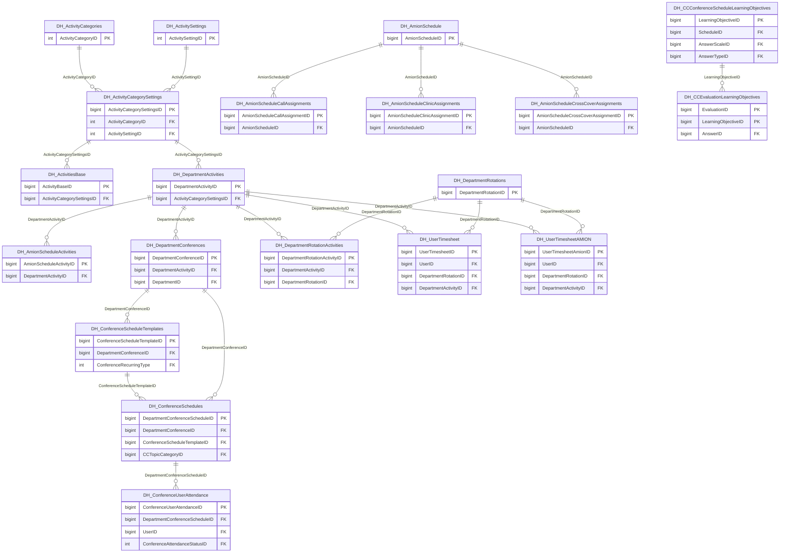

import TableDetail from '@site/src/components/TableDetail';

# Duty Hours Database Tables

**182 tables** · **117 with PK** (64.3%) · **72 FKs** · **413 indexes**

## Entity Relationships

## Table Reference

<TableDetail
  dataUrl="/table-detail-data/duty-hours.json"
  generatedAt="2026-02-28T06:03:57.118Z"
/>

## Stored Procedures

See the [Duty Hours Stored Procedures](./sprocs/duty-hours-sprocs) reference page for detailed documentation of all stored procedures in this module, including parameters, anti-pattern analysis, and optimization recommendations.

## Related Code Documentation

- [Duty Hours (.NET Business Module)](/docs/dotnet-backend/business/duty-hours)
