import TableDetail from '@site/src/components/TableDetail';

# Evaluations Database Tables

**331 tables** · **229 with PK** (69.2%) · **187 FKs** · **649 indexes**

## Entity Relationships

```mermaid
erDiagram
    EVAL_ACGMEAnswerTypes {
        bigint AnswerTypeID PK
        bigint AnswerScaleID FK
    }
    EVAL_AnswerScales {
        bigint AnswerScaleID PK
    }
    EVAL_AnswerTypes {
        bigint AnswerTypeID PK
        bigint AnswerScaleID FK
    }
    EVAL_Audiences {
        bigint AudienceID PK
    }
    EVAL_Competencies {
        bigint CompetencyID PK
    }
    EVAL_CurricularWorksheetData {
        bigint CurricularWorksheetDataID PK
        bigint DepartmentID FK
        bigint OutcomeGroupID FK
        bigint MilestonePeriodID FK
        bigint UserDepartmentID FK
    }
    EVAL_CurricularWorksheetScores {
        bigint CurricularWorksheetScoresID PK
        bigint CurricularWorksheetDataID FK
        bigint OutcomeNarrativeID FK
        bigint CompetencyID FK
    }
    EVAL_EBMee {
        bigint EBMeeId PK
        bigint EvaluationID FK
        bigint FocusTaskId FK
        bigint FocusMainSrcId FK
        bigint FocusTeachId FK
    }
    EVAL_EBMor {
        bigint EBMorId PK
        bigint EvaluationID FK
        bigint FocusTaskId FK
        bigint FocusMainSrcId FK
        bigint FocusTeachId FK
    }
    EVAL_Evaluations {
        bigint EvaluationID PK
        bigint EvaluationTypeID FK
        bigint TemplateID FK
        bigint EvaluationPeriodID FK
    }
    EVAL_MilestoneGroupAnwerType {
        bigint MilestoneGroupAnwerTypeID PK
        bigint AnswerScaleID FK
        bigint AnswerTypeID FK
        bigint OutcomeGroupID FK
        bigint DepartmentID FK
    }
    Eval_MilestoneRotationSettings {
        bigint MilestoneRotationSettingsID PK
        bigint DepartmentID FK
        bigint ProgramID FK
        bigint DepartmentRotationID FK
    }
    Eval_MilestoneSubCompetency {
        bigint MilestoneSubCompetencyID PK
        bigint MilestoneCompetencyID FK
        bigint SourceMilestoneSubCompetencyID FK
    }
    EVAL_OutcomeGroups {
        bigint OutcomeGroupID PK
        bigint DepartmentID FK
        bigint ProgramID FK
    }
    EVAL_OutcomeNarrative {
        bigint OutcomeNarrativeID PK
        bigint OutcomeCompetencyID FK
    }
    EVAL_OutcomeSubCompetency {
        bigint OutcomeSubCompetencyID PK
        bigint OutcomeNarrativeID FK
        bigint MilestoneSubCompetencyID FK
        bigint QuestionID FK
    }
    Eval_ProxyDeparmentPartialEvalaution {
        bigint ProxyPartialID PK
    }
    EVAL_Questions {
        bigint QuestionID PK
        bigint QuestionsCategoryID FK
    }
    EVAL_TemplateQuestion {
        bigint TemplateID PK
        bigint QuestionID PK
        bigint AnswerTypeID FK
        bigint AnswerScaleID FK
        bigint SubCompetencyID PK
    }
    EVAL_Templates {
        bigint TemplateID PK
        bigint AudienceID FK
    }
    EVAL_AnswerScales ||--o{ EVAL_ACGMEAnswerTypes : "AnswerScaleID"
    EVAL_AnswerScales ||--o{ EVAL_AnswerTypes : "AnswerScaleID"
    EVAL_OutcomeGroups ||--o{ EVAL_CurricularWorksheetData : "OutcomeGroupID"
    EVAL_Competencies ||--o{ EVAL_CurricularWorksheetScores : "CompetencyID"
    EVAL_CurricularWorksheetData ||--o{ EVAL_CurricularWorksheetScores : "CurricularWorksheetDataID"
    EVAL_OutcomeNarrative ||--o{ EVAL_CurricularWorksheetScores : "OutcomeNarrativeID"
    EVAL_Evaluations ||--o{ EVAL_EBMee : "EvaluationID"
    EVAL_Evaluations ||--o{ EVAL_EBMor : "EvaluationID"
    EVAL_Templates ||--o{ EVAL_Evaluations : "TemplateID"
    EVAL_AnswerScales ||--o{ EVAL_MilestoneGroupAnwerType : "AnswerScaleID"
    EVAL_AnswerTypes ||--o{ EVAL_MilestoneGroupAnwerType : "AnswerTypeID"
    EVAL_OutcomeGroups ||--o{ EVAL_MilestoneGroupAnwerType : "OutcomeGroupID"
    Eval_MilestoneSubCompetency ||--o{ Eval_MilestoneSubCompetency : "SourceMilestoneSubCompetencyID"
    Eval_MilestoneSubCompetency ||--o{ EVAL_OutcomeSubCompetency : "MilestoneSubCompetencyID"
    EVAL_OutcomeNarrative ||--o{ EVAL_OutcomeSubCompetency : "OutcomeNarrativeID"
    EVAL_Questions ||--o{ EVAL_OutcomeSubCompetency : "QuestionID"
    EVAL_AnswerScales ||--o{ EVAL_TemplateQuestion : "AnswerScaleID"
    EVAL_AnswerTypes ||--o{ EVAL_TemplateQuestion : "AnswerTypeID"
    EVAL_Questions ||--o{ EVAL_TemplateQuestion : "QuestionID"
    EVAL_Templates ||--o{ EVAL_TemplateQuestion : "TemplateID"
    EVAL_Audiences ||--o{ EVAL_Templates : "AudienceID"
```

## Table Reference

<TableDetail
  tables={[{"name":"Eval_20250422","schema":"dbo","fullName":"dbo.Eval_20250422","hasPrimaryKey":false,"primaryKeyColumns":[],"columns":[{"name":"EvaluationID","dataType":"bigint","rawType":"bigint","maxLength":null,"isNullable":true,"isIdentity":false,"isPrimaryKey":false,"defaultValue":null,"ordinalPosition":1}],"foreignKeys":[],"indexes":[],"checkConstraints":[],"defaultConstraints":0,"triggers":[]},{"name":"EVAL_ACGMEAnswers","schema":"dbo","fullName":"dbo.EVAL_ACGMEAnswers","hasPrimaryKey":true,"primaryKeyColumns":["AnswerID"],"columns":[{"name":"AnswerID","dataType":"bigint","rawType":"CounterNumber","maxLength":null,"isNullable":false,"isIdentity":true,"isPrimaryKey":true,"defaultValue":null,"ordinalPosition":1},{"name":"AnswerTypeID","dataType":"bigint","rawType":"LargeNumber","maxLength":null,"isNullable":false,"isIdentity":false,"isPrimaryKey":false,"defaultValue":null,"ordinalPosition":2},{"name":"Score","dataType":"smallint","rawType":"SmallNumber","maxLength":null,"isNullable":false,"isIdentity":false,"isPrimaryKey":false,"defaultValue":null,"ordinalPosition":3},{"name":"Name","dataType":"varchar","rawType":"LongText","maxLength":"250","isNullable":false,"isIdentity":false,"isPrimaryKey":false,"defaultValue":null,"ordinalPosition":4},{"name":"SortOrder","dataType":"bigint","rawType":"LargeNumber","maxLength":null,"isNullable":false,"isIdentity":false,"isPrimaryKey":false,"defaultValue":null,"ordinalPosition":5}],"foreignKeys":[{"constraintName":"FK_EVAL_ACGMEAnswers_EVAL_ACGMEAnswerTypes","columns":["AnswerTypeID"],"referencedTable":"dbo.EVAL_ACGMEAnswerTypes","referencedColumns":["AnswerTypeID"]}],"indexes":[{"name":"PK_EVAL_ACGMEAnswers","type":"CLUSTERED","isPrimaryKey":true,"isUnique":true,"isDisabled":false,"keyColumns":["AnswerID"],"includedColumns":[]}],"checkConstraints":[],"defaultConstraints":0,"triggers":[]},{"name":"EVAL_ACGMEAnswerTypes","schema":"dbo","fullName":"dbo.EVAL_ACGMEAnswerTypes","hasPrimaryKey":true,"primaryKeyColumns":["AnswerTypeID"],"columns":[{"name":"AnswerTypeID","dataType":"bigint","rawType":"CounterNumber","maxLength":null,"isNullable":false,"isIdentity":false,"isPrimaryKey":true,"defaultValue":null,"ordinalPosition":1},{"name":"Code","dataType":"varchar","rawType":"ShortText","maxLength":"100","isNullable":false,"isIdentity":false,"isPrimaryKey":false,"defaultValue":null,"ordinalPosition":2},{"name":"Name","dataType":"varchar","rawType":"ShortText","maxLength":"100","isNullable":false,"isIdentity":false,"isPrimaryKey":false,"defaultValue":null,"ordinalPosition":3},{"name":"AnswerScaleID","dataType":"bigint","rawType":"LargeNumber","maxLength":null,"isNullable":false,"isIdentity":false,"isPrimaryKey":false,"defaultValue":null,"ordinalPosition":4}],"foreignKeys":[{"constraintName":"FK_EVAL_ACGMEAnswerTypes_EVAL_AnswerScales","columns":["AnswerScaleID"],"referencedTable":"dbo.EVAL_AnswerScales","referencedColumns":["AnswerScaleID"]}],"indexes":[{"name":"PK_EVAL_ACGMEAnswerTypes","type":"CLUSTERED","isPrimaryKey":true,"isUnique":true,"isDisabled":false,"keyColumns":["AnswerTypeID"],"includedColumns":[]}],"checkConstraints":[],"defaultConstraints":0,"triggers":[]},{"name":"EVAL_ACGMEQuestionInfo","schema":"dbo","fullName":"dbo.EVAL_ACGMEQuestionInfo","hasPrimaryKey":true,"primaryKeyColumns":["QuestionInfoID"],"columns":[{"name":"QuestionInfoID","dataType":"bigint","rawType":"CounterNumber","maxLength":null,"isNullable":false,"isIdentity":true,"isPrimaryKey":true,"defaultValue":null,"ordinalPosition":1},{"name":"DisplayOrder","dataType":"bigint","rawType":"LargeNumber","maxLength":null,"isNullable":false,"isIdentity":false,"isPrimaryKey":false,"defaultValue":null,"ordinalPosition":2},{"name":"ProgramRequirementCode","dataType":"varchar","rawType":"ShortText","maxLength":"100","isNullable":true,"isIdentity":false,"isPrimaryKey":false,"defaultValue":null,"ordinalPosition":3},{"name":"StandardValue","dataType":"int","rawType":"BigNumber","maxLength":null,"isNullable":true,"isIdentity":false,"isPrimaryKey":false,"defaultValue":null,"ordinalPosition":4},{"name":"NonCompliantText","dataType":"varchar","rawType":"ShortText","maxLength":"100","isNullable":true,"isIdentity":false,"isPrimaryKey":false,"defaultValue":null,"ordinalPosition":5},{"name":"AnswerRangeValue","dataType":"smallint","rawType":"SmallNumber","maxLength":null,"isNullable":true,"isIdentity":false,"isPrimaryKey":false,"defaultValue":null,"ordinalPosition":6},{"name":"SubQuestionCode","dataType":"varchar","rawType":"ShortText","maxLength":"100","isNullable":true,"isIdentity":false,"isPrimaryKey":false,"defaultValue":null,"ordinalPosition":7},{"name":"ACGMEReportVersion","dataType":"smallint","rawType":"SmallNumber","maxLength":null,"isNullable":true,"isIdentity":false,"isPrimaryKey":false,"defaultValue":"(4)","ordinalPosition":8},{"name":"ACGMEReportType","dataType":"varchar","rawType":"ShortText","maxLength":"100","isNullable":true,"isIdentity":false,"isPrimaryKey":false,"defaultValue":"'Survey'","ordinalPosition":9}],"foreignKeys":[],"indexes":[{"name":"PK_EVAL_ACGMEQuestionInfo","type":"CLUSTERED","isPrimaryKey":true,"isUnique":true,"isDisabled":false,"keyColumns":["QuestionInfoID"],"includedColumns":[]}],"checkConstraints":[],"defaultConstraints":2,"triggers":[]},{"name":"EVAL_ACGMEQuestionMapping","schema":"dbo","fullName":"dbo.EVAL_ACGMEQuestionMapping","hasPrimaryKey":false,"primaryKeyColumns":[],"columns":[{"name":"ACGMETypeID","dataType":"bigint","rawType":"LargeNumber","maxLength":null,"isNullable":false,"isIdentity":false,"isPrimaryKey":false,"defaultValue":null,"ordinalPosition":1},{"name":"QuestionCode","dataType":"varchar","rawType":"ShortText","maxLength":"100","isNullable":false,"isIdentity":false,"isPrimaryKey":false,"defaultValue":null,"ordinalPosition":2},{"name":"AnswerTypeID","dataType":"bigint","rawType":"LargeNumber","maxLength":null,"isNullable":false,"isIdentity":false,"isPrimaryKey":false,"defaultValue":null,"ordinalPosition":3}],"foreignKeys":[{"constraintName":"FK_EVAL_ACGMEQuestionMapping_EVAL_ACGMEAnswerTypes","columns":["AnswerTypeID"],"referencedTable":"dbo.EVAL_ACGMEAnswerTypes","referencedColumns":["AnswerTypeID"]},{"constraintName":"FK_EVAL_ACGMEQuestionMapping_EVAL_ACGMETypes","columns":["ACGMETypeID"],"referencedTable":"dbo.EVAL_ACGMETypes","referencedColumns":["ACGMETypeID"]}],"indexes":[],"checkConstraints":[],"defaultConstraints":0,"triggers":[]},{"name":"EVAL_ACGMETemplateLink","schema":"dbo","fullName":"dbo.EVAL_ACGMETemplateLink","hasPrimaryKey":false,"primaryKeyColumns":[],"columns":[{"name":"ACGMETypeID","dataType":"bigint","rawType":"LargeNumber","maxLength":null,"isNullable":false,"isIdentity":false,"isPrimaryKey":false,"defaultValue":null,"ordinalPosition":1},{"name":"TemplateID","dataType":"bigint","rawType":"LargeNumber","maxLength":null,"isNullable":false,"isIdentity":false,"isPrimaryKey":false,"defaultValue":null,"ordinalPosition":2}],"foreignKeys":[{"constraintName":"FK_EVAL_ACGMETemplateLink_EVAL_ACGMETypes","columns":["ACGMETypeID"],"referencedTable":"dbo.EVAL_ACGMETypes","referencedColumns":["ACGMETypeID"]},{"constraintName":"FK_EVAL_ACGMETemplateLink_EVAL_Templates","columns":["TemplateID"],"referencedTable":"dbo.EVAL_Templates","referencedColumns":["TemplateID"]}],"indexes":[{"name":"IX_EVAL_ACGMETemplateLink_TemplateID","type":"NONCLUSTERED","isPrimaryKey":false,"isUnique":false,"isDisabled":false,"keyColumns":["TemplateID"],"includedColumns":[]}],"checkConstraints":[],"defaultConstraints":0,"triggers":[]},{"name":"EVAL_ACGMETypes","schema":"dbo","fullName":"dbo.EVAL_ACGMETypes","hasPrimaryKey":true,"primaryKeyColumns":["ACGMETypeID"],"columns":[{"name":"ACGMETypeID","dataType":"bigint","rawType":"CounterNumber","maxLength":null,"isNullable":false,"isIdentity":false,"isPrimaryKey":true,"defaultValue":null,"ordinalPosition":1},{"name":"Name","dataType":"varchar","rawType":"ShortText","maxLength":"100","isNullable":false,"isIdentity":false,"isPrimaryKey":false,"defaultValue":null,"ordinalPosition":2},{"name":"Description","dataType":"varchar","rawType":"ShortText","maxLength":"100","isNullable":true,"isIdentity":false,"isPrimaryKey":false,"defaultValue":null,"ordinalPosition":3}],"foreignKeys":[],"indexes":[{"name":"PK_EVAL_ACGMETypes","type":"CLUSTERED","isPrimaryKey":true,"isUnique":true,"isDisabled":false,"keyColumns":["ACGMETypeID"],"includedColumns":[]}],"checkConstraints":[],"defaultConstraints":0,"triggers":[]},{"name":"EVAL_AINPVScores","schema":"dbo","fullName":"dbo.EVAL_AINPVScores","hasPrimaryKey":true,"primaryKeyColumns":["ID"],"columns":[{"name":"ID","dataType":"bigint","rawType":"bigint","maxLength":null,"isNullable":false,"isIdentity":true,"isPrimaryKey":true,"defaultValue":null,"ordinalPosition":1},{"name":"AINPVResponseID","dataType":"uniqueidentifier","rawType":"uniqueidentifier","maxLength":null,"isNullable":true,"isIdentity":false,"isPrimaryKey":false,"defaultValue":null,"ordinalPosition":2},{"name":"UserID","dataType":"bigint","rawType":"LargeNumber","maxLength":null,"isNullable":true,"isIdentity":false,"isPrimaryKey":false,"defaultValue":null,"ordinalPosition":3},{"name":"CoreCompetency","dataType":"varchar","rawType":"LargeText","maxLength":"8000","isNullable":true,"isIdentity":false,"isPrimaryKey":false,"defaultValue":null,"ordinalPosition":4},{"name":"SubCompetency","dataType":"varchar","rawType":"LargeText","maxLength":"8000","isNullable":true,"isIdentity":false,"isPrimaryKey":false,"defaultValue":null,"ordinalPosition":5},{"name":"PredictedScore","dataType":"decimal","rawType":"decimal","maxLength":"14, 2","isNullable":true,"isIdentity":false,"isPrimaryKey":false,"defaultValue":null,"ordinalPosition":6},{"name":"Justification","dataType":"varchar","rawType":"LargeText","maxLength":"8000","isNullable":true,"isIdentity":false,"isPrimaryKey":false,"defaultValue":null,"ordinalPosition":7},{"name":"CompetencyID","dataType":"bigint","rawType":"LargeNumber","maxLength":null,"isNullable":true,"isIdentity":false,"isPrimaryKey":false,"defaultValue":null,"ordinalPosition":8},{"name":"CreatedBy","dataType":"bigint","rawType":"LargeNumber","maxLength":null,"isNullable":true,"isIdentity":false,"isPrimaryKey":false,"defaultValue":null,"ordinalPosition":9},{"name":"CreatedDate","dataType":"datetime","rawType":"LargeDate","maxLength":null,"isNullable":true,"isIdentity":false,"isPrimaryKey":false,"defaultValue":null,"ordinalPosition":10},{"name":"ModifiedBy","dataType":"bigint","rawType":"LargeNumber","maxLength":null,"isNullable":true,"isIdentity":false,"isPrimaryKey":false,"defaultValue":null,"ordinalPosition":11},{"name":"ModifiedDate","dataType":"datetime","rawType":"LargeDate","maxLength":null,"isNullable":true,"isIdentity":false,"isPrimaryKey":false,"defaultValue":null,"ordinalPosition":12},{"name":"OutcomeNarrativeID","dataType":"bigint","rawType":"LargeNumber","maxLength":null,"isNullable":true,"isIdentity":false,"isPrimaryKey":false,"defaultValue":null,"ordinalPosition":13},{"name":"StartDate","dataType":"datetime","rawType":"LargeDate","maxLength":null,"isNullable":true,"isIdentity":false,"isPrimaryKey":false,"defaultValue":null,"ordinalPosition":14},{"name":"EndDate","dataType":"datetime","rawType":"LargeDate","maxLength":null,"isNullable":true,"isIdentity":false,"isPrimaryKey":false,"defaultValue":null,"ordinalPosition":15},{"name":"OutcomeGroupID","dataType":"bigint","rawType":"LargeNumber","maxLength":null,"isNullable":true,"isIdentity":false,"isPrimaryKey":false,"defaultValue":null,"ordinalPosition":16},{"name":"DepartmentID","dataType":"bigint","rawType":"LargeNumber","maxLength":null,"isNullable":true,"isIdentity":false,"isPrimaryKey":false,"defaultValue":null,"ordinalPosition":17}],"foreignKeys":[],"indexes":[{"name":"PK_EVAL_AINPVScores","type":"CLUSTERED","isPrimaryKey":true,"isUnique":true,"isDisabled":false,"keyColumns":["ID"],"includedColumns":[]},{"name":"IDX_EVAL_AINPVScores1","type":"NONCLUSTERED","isPrimaryKey":false,"isUnique":false,"isDisabled":false,"keyColumns":["AINPVResponseID"],"includedColumns":[]},{"name":"IX_EVAL_AINPVScores1","type":"NONCLUSTERED","isPrimaryKey":false,"isUnique":false,"isDisabled":false,"keyColumns":["UserID"],"includedColumns":[]},{"name":"IX_EVAL_AINPVScores2","type":"NONCLUSTERED","isPrimaryKey":false,"isUnique":false,"isDisabled":false,"keyColumns":["CompetencyID"],"includedColumns":[]},{"name":"IX_EVAL_AINPVScores3","type":"NONCLUSTERED","isPrimaryKey":false,"isUnique":false,"isDisabled":false,"keyColumns":["OutcomeGroupID"],"includedColumns":[]},{"name":"IX_EVAL_AINPVScores4","type":"NONCLUSTERED","isPrimaryKey":false,"isUnique":false,"isDisabled":false,"keyColumns":["OutcomeNarrativeID"],"includedColumns":[]},{"name":"IX_EVAL_AINPVScores5","type":"NONCLUSTERED","isPrimaryKey":false,"isUnique":false,"isDisabled":false,"keyColumns":["DepartmentID"],"includedColumns":[]},{"name":"IX_EVAL_AINPVScores6","type":"NONCLUSTERED","isPrimaryKey":false,"isUnique":false,"isDisabled":false,"keyColumns":["DepartmentID"],"includedColumns":["UserID","PredictedScore","OutcomeNarrativeID","StartDate","EndDate","OutcomeGroupID"]},{"name":"IX_EVAL_AINPVScores7","type":"NONCLUSTERED","isPrimaryKey":false,"isUnique":false,"isDisabled":false,"keyColumns":["OutcomeGroupID","DepartmentID"],"includedColumns":["UserID","PredictedScore","OutcomeNarrativeID","StartDate","EndDate"]},{"name":"IX_EVAL_AINPVScores8","type":"NONCLUSTERED","isPrimaryKey":false,"isUnique":false,"isDisabled":false,"keyColumns":["StartDate"],"includedColumns":["UserID","PredictedScore","CompetencyID","EndDate","DepartmentID"]}],"checkConstraints":[],"defaultConstraints":0,"triggers":[]},{"name":"EVAL_AmionSchedule","schema":"dbo","fullName":"dbo.EVAL_AmionSchedule","hasPrimaryKey":true,"primaryKeyColumns":["AmionScheduleID"],"columns":[{"name":"AmionScheduleID","dataType":"bigint","rawType":"CounterNumber","maxLength":null,"isNullable":false,"isIdentity":true,"isPrimaryKey":true,"defaultValue":null,"ordinalPosition":1},{"name":"DepartmentID","dataType":"bigint","rawType":"LargeNumber","maxLength":null,"isNullable":false,"isIdentity":false,"isPrimaryKey":false,"defaultValue":null,"ordinalPosition":2},{"name":"LastUpdatedDate","dataType":"smalldatetime","rawType":"SmallDate","maxLength":null,"isNullable":false,"isIdentity":false,"isPrimaryKey":false,"defaultValue":null,"ordinalPosition":3},{"name":"FetchedDateTime","dataType":"smalldatetime","rawType":"SmallDate","maxLength":null,"isNullable":false,"isIdentity":false,"isPrimaryKey":false,"defaultValue":"getdate()","ordinalPosition":4},{"name":"IsDeleted","dataType":"tinyint","rawType":"VerySmallNumber","maxLength":null,"isNullable":false,"isIdentity":false,"isPrimaryKey":false,"defaultValue":null,"ordinalPosition":5},{"name":"AcademicYear","dataType":"smallint","rawType":"SmallNumber","maxLength":null,"isNullable":false,"isIdentity":false,"isPrimaryKey":false,"defaultValue":null,"ordinalPosition":6}],"foreignKeys":[],"indexes":[{"name":"PK_EVAL_AmionSchedule","type":"CLUSTERED","isPrimaryKey":true,"isUnique":true,"isDisabled":false,"keyColumns":["AmionScheduleID"],"includedColumns":[]},{"name":"IX_EVAL_AmionSchedule","type":"NONCLUSTERED","isPrimaryKey":false,"isUnique":false,"isDisabled":false,"keyColumns":["DepartmentID","AcademicYear"],"includedColumns":[]},{"name":"IX_EVAL_AmionSchedule_1","type":"NONCLUSTERED","isPrimaryKey":false,"isUnique":false,"isDisabled":false,"keyColumns":["DepartmentID","AcademicYear","LastUpdatedDate","AmionScheduleID"],"includedColumns":[]}],"checkConstraints":[],"defaultConstraints":1,"triggers":[]},{"name":"EVAL_Answers","schema":"dbo","fullName":"dbo.EVAL_Answers","hasPrimaryKey":true,"primaryKeyColumns":["AnswerID"],"columns":[{"name":"AnswerID","dataType":"bigint","rawType":"CounterNumber","maxLength":null,"isNullable":false,"isIdentity":true,"isPrimaryKey":true,"defaultValue":null,"ordinalPosition":1},{"name":"AnswerTypeID","dataType":"bigint","rawType":"LargeNumber","maxLength":null,"isNullable":false,"isIdentity":false,"isPrimaryKey":false,"defaultValue":null,"ordinalPosition":2},{"name":"Score","dataType":"decimal","rawType":"ScoreNumber","maxLength":"10, 2","isNullable":false,"isIdentity":false,"isPrimaryKey":false,"defaultValue":null,"ordinalPosition":3},{"name":"Name","dataType":"varchar","rawType":"LongText","maxLength":"250","isNullable":true,"isIdentity":false,"isPrimaryKey":false,"defaultValue":null,"ordinalPosition":4},{"name":"SortOrder","dataType":"bigint","rawType":"bigint","maxLength":null,"isNullable":false,"isIdentity":false,"isPrimaryKey":false,"defaultValue":null,"ordinalPosition":5},{"name":"IsExclude","dataType":"tinyint","rawType":"VerySmallNumber","maxLength":null,"isNullable":true,"isIdentity":false,"isPrimaryKey":false,"defaultValue":null,"ordinalPosition":6}],"foreignKeys":[{"constraintName":"FK_EVAL_Answers_EVAL_AnswerTypes","columns":["AnswerTypeID"],"referencedTable":"dbo.EVAL_AnswerTypes","referencedColumns":["AnswerTypeID"]}],"indexes":[{"name":"PK_EVAL_Answers","type":"CLUSTERED","isPrimaryKey":true,"isUnique":true,"isDisabled":false,"keyColumns":["AnswerID"],"includedColumns":[]},{"name":"EVAL_Answers_IX1","type":"NONCLUSTERED","isPrimaryKey":false,"isUnique":false,"isDisabled":false,"keyColumns":["IsExclude","Score"],"includedColumns":["AnswerTypeID","SortOrder"]},{"name":"EVAL_Answers_IX2","type":"NONCLUSTERED","isPrimaryKey":false,"isUnique":false,"isDisabled":false,"keyColumns":["AnswerTypeID","IsExclude","Score"],"includedColumns":["SortOrder"]},{"name":"Eval_UniqueAnswer","type":"NONCLUSTERED","isPrimaryKey":false,"isUnique":true,"isDisabled":false,"keyColumns":["AnswerID","AnswerTypeID"],"includedColumns":[]},{"name":"IDX_EVAL_Answers1","type":"NONCLUSTERED","isPrimaryKey":false,"isUnique":false,"isDisabled":false,"keyColumns":["Score"],"includedColumns":["AnswerTypeID"]},{"name":"IDX_MissingOn_EVAL_Answers_AE3DADD5FE8648AA9C639B209719A0D3","type":"NONCLUSTERED","isPrimaryKey":false,"isUnique":false,"isDisabled":false,"keyColumns":["AnswerTypeID","IsExclude"],"includedColumns":["Score","Name"]},{"name":"IX_EVAL_Answers_AnswerID","type":"NONCLUSTERED","isPrimaryKey":false,"isUnique":false,"isDisabled":false,"keyColumns":["AnswerID"],"includedColumns":["Score","AnswerTypeID"]}],"checkConstraints":[],"defaultConstraints":0,"triggers":[]},{"name":"EVAL_AnswerScales","schema":"dbo","fullName":"dbo.EVAL_AnswerScales","hasPrimaryKey":true,"primaryKeyColumns":["AnswerScaleID"],"columns":[{"name":"AnswerScaleID","dataType":"bigint","rawType":"CounterNumber","maxLength":null,"isNullable":false,"isIdentity":true,"isPrimaryKey":true,"defaultValue":null,"ordinalPosition":1},{"name":"Code","dataType":"varchar","rawType":"ShortText","maxLength":"100","isNullable":false,"isIdentity":false,"isPrimaryKey":false,"defaultValue":null,"ordinalPosition":2},{"name":"Name","dataType":"varchar","rawType":"ShortText","maxLength":"100","isNullable":false,"isIdentity":false,"isPrimaryKey":false,"defaultValue":null,"ordinalPosition":3},{"name":"Description","dataType":"varchar","rawType":"LongText","maxLength":"250","isNullable":false,"isIdentity":false,"isPrimaryKey":false,"defaultValue":null,"ordinalPosition":4},{"name":"SortOrder","dataType":"bigint","rawType":"LargeNumber","maxLength":null,"isNullable":false,"isIdentity":false,"isPrimaryKey":false,"defaultValue":null,"ordinalPosition":5},{"name":"AnswerCount","dataType":"smallint","rawType":"SmallNumber","maxLength":null,"isNullable":false,"isIdentity":false,"isPrimaryKey":false,"defaultValue":null,"ordinalPosition":6},{"name":"MaxScore","dataType":"smallint","rawType":"SmallNumber","maxLength":null,"isNullable":true,"isIdentity":false,"isPrimaryKey":false,"defaultValue":null,"ordinalPosition":7},{"name":"IsDelete","dataType":"bit","rawType":"bit","maxLength":null,"isNullable":true,"isIdentity":false,"isPrimaryKey":false,"defaultValue":null,"ordinalPosition":8}],"foreignKeys":[],"indexes":[{"name":"PK_EVAL_AnswerScales","type":"CLUSTERED","isPrimaryKey":true,"isUnique":true,"isDisabled":false,"keyColumns":["AnswerScaleID"],"includedColumns":[]},{"name":"IX_EVAL_AnswerScales_1","type":"NONCLUSTERED","isPrimaryKey":false,"isUnique":false,"isDisabled":false,"keyColumns":["Code"],"includedColumns":[]},{"name":"IX_EVAL_AnswerScales_AnswerScaleID","type":"NONCLUSTERED","isPrimaryKey":false,"isUnique":false,"isDisabled":false,"keyColumns":["AnswerScaleID","Code"],"includedColumns":[]}],"checkConstraints":[],"defaultConstraints":0,"triggers":[]},{"name":"EVAL_AnswerTypes","schema":"dbo","fullName":"dbo.EVAL_AnswerTypes","hasPrimaryKey":true,"primaryKeyColumns":["AnswerTypeID"],"columns":[{"name":"AnswerTypeID","dataType":"bigint","rawType":"CounterNumber","maxLength":null,"isNullable":false,"isIdentity":true,"isPrimaryKey":true,"defaultValue":null,"ordinalPosition":1},{"name":"Code","dataType":"varchar","rawType":"ShortText","maxLength":"100","isNullable":false,"isIdentity":false,"isPrimaryKey":false,"defaultValue":null,"ordinalPosition":2},{"name":"Name","dataType":"varchar","rawType":"ShortText","maxLength":"100","isNullable":false,"isIdentity":false,"isPrimaryKey":false,"defaultValue":null,"ordinalPosition":3},{"name":"AnswerScaleID","dataType":"bigint","rawType":"LargeNumber","maxLength":null,"isNullable":false,"isIdentity":false,"isPrimaryKey":false,"defaultValue":null,"ordinalPosition":4},{"name":"IsDisplayNumbers","dataType":"tinyint","rawType":"VerySmallNumber","maxLength":null,"isNullable":false,"isIdentity":false,"isPrimaryKey":false,"defaultValue":"(0)","ordinalPosition":5},{"name":"EarlyWarningIndex","dataType":"tinyint","rawType":"VerySmallNumber","maxLength":null,"isNullable":true,"isIdentity":false,"isPrimaryKey":false,"defaultValue":"(0)","ordinalPosition":6},{"name":"IsSliding","dataType":"tinyint","rawType":"VerySmallNumber","maxLength":null,"isNullable":false,"isIdentity":false,"isPrimaryKey":false,"defaultValue":"(0)","ordinalPosition":7},{"name":"DepartmentID","dataType":"bigint","rawType":"LargeNumber","maxLength":null,"isNullable":true,"isIdentity":false,"isPrimaryKey":false,"defaultValue":null,"ordinalPosition":8},{"name":"VisibilityTypeId","dataType":"tinyint","rawType":"VerySmallNumber","maxLength":null,"isNullable":false,"isIdentity":false,"isPrimaryKey":false,"defaultValue":"(1)","ordinalPosition":9},{"name":"IsDeleted","dataType":"tinyint","rawType":"VerySmallNumber","maxLength":null,"isNullable":true,"isIdentity":false,"isPrimaryKey":false,"defaultValue":"(0)","ordinalPosition":10},{"name":"IsCustom","dataType":"tinyint","rawType":"VerySmallNumber","maxLength":null,"isNullable":true,"isIdentity":false,"isPrimaryKey":false,"defaultValue":"(0)","ordinalPosition":11},{"name":"MarginalValue","dataType":"decimal","rawType":"ScoreNumber","maxLength":"10, 2","isNullable":true,"isIdentity":false,"isPrimaryKey":false,"defaultValue":"(0.00)","ordinalPosition":12},{"name":"IsExceedExpectation","dataType":"tinyint","rawType":"VerySmallNumber","maxLength":null,"isNullable":true,"isIdentity":false,"isPrimaryKey":false,"defaultValue":null,"ordinalPosition":13},{"name":"EEMarginalValue","dataType":"decimal","rawType":"ScoreNumber","maxLength":"10, 2","isNullable":true,"isIdentity":false,"isPrimaryKey":false,"defaultValue":null,"ordinalPosition":14},{"name":"IsGrouping","dataType":"varchar","rawType":"ShortText","maxLength":"100","isNullable":true,"isIdentity":false,"isPrimaryKey":false,"defaultValue":null,"ordinalPosition":15},{"name":"IsHideEmptyScores","dataType":"tinyint","rawType":"VerySmallNumber","maxLength":null,"isNullable":true,"isIdentity":false,"isPrimaryKey":false,"defaultValue":"(0)","ordinalPosition":16},{"name":"Order","dataType":"bigint","rawType":"LargeNumber","maxLength":null,"isNullable":true,"isIdentity":false,"isPrimaryKey":false,"defaultValue":null,"ordinalPosition":17},{"name":"NumberOfCounts","dataType":"decimal","rawType":"ScoreNumber","maxLength":"10, 2","isNullable":true,"isIdentity":false,"isPrimaryKey":false,"defaultValue":null,"ordinalPosition":18},{"name":"CountInterval","dataType":"decimal","rawType":"ScoreNumber","maxLength":"10, 2","isNullable":true,"isIdentity":false,"isPrimaryKey":false,"defaultValue":null,"ordinalPosition":19},{"name":"DecimalPosition","dataType":"tinyint","rawType":"VerySmallNumber","maxLength":null,"isNullable":true,"isIdentity":false,"isPrimaryKey":false,"defaultValue":null,"ordinalPosition":20},{"name":"CreatedDate","dataType":"datetime","rawType":"LargeDate","maxLength":null,"isNullable":true,"isIdentity":false,"isPrimaryKey":false,"defaultValue":"getdate()","ordinalPosition":21},{"name":"CreatedBy","dataType":"bigint","rawType":"LargeNumber","maxLength":null,"isNullable":true,"isIdentity":false,"isPrimaryKey":false,"defaultValue":null,"ordinalPosition":22},{"name":"ModifiedBy","dataType":"bigint","rawType":"LargeNumber","maxLength":null,"isNullable":true,"isIdentity":false,"isPrimaryKey":false,"defaultValue":null,"ordinalPosition":23},{"name":"ModifiedDate","dataType":"datetime","rawType":"LargeDate","maxLength":null,"isNullable":true,"isIdentity":false,"isPrimaryKey":false,"defaultValue":null,"ordinalPosition":24},{"name":"IsCopied","dataType":"bigint","rawType":"LargeNumber","maxLength":null,"isNullable":true,"isIdentity":false,"isPrimaryKey":false,"defaultValue":null,"ordinalPosition":25},{"name":"IsMultiSelectOption","dataType":"tinyint","rawType":"VerySmallNumber","maxLength":null,"isNullable":true,"isIdentity":false,"isPrimaryKey":false,"defaultValue":null,"ordinalPosition":26}],"foreignKeys":[{"constraintName":"FK_EVAL_AnswerTypes_EVAL_AnswerScales","columns":["AnswerScaleID"],"referencedTable":"dbo.EVAL_AnswerScales","referencedColumns":["AnswerScaleID"]}],"indexes":[{"name":"PK_EVAL_AnswerTypes","type":"CLUSTERED","isPrimaryKey":true,"isUnique":true,"isDisabled":false,"keyColumns":["AnswerTypeID"],"includedColumns":[]},{"name":"EvalUniqueAnswerTypes","type":"NONCLUSTERED","isPrimaryKey":false,"isUnique":true,"isDisabled":false,"keyColumns":["AnswerTypeID","AnswerScaleID"],"includedColumns":[]},{"name":"IDX_EVAL_AnswerTypes1","type":"NONCLUSTERED","isPrimaryKey":false,"isUnique":false,"isDisabled":false,"keyColumns":["Name","DepartmentID"],"includedColumns":[]},{"name":"IDX_MissingOn_EVAL_AnswerTypes_15588B233DC048799598CDAE0ABEDF09","type":"NONCLUSTERED","isPrimaryKey":false,"isUnique":false,"isDisabled":false,"keyColumns":["DepartmentID","IsDeleted"],"includedColumns":["Code","Name","AnswerScaleID","IsDisplayNumbers","EarlyWarningIndex","IsSliding","MarginalValue","Order"]},{"name":"IDX_MissingOn_EVAL_AnswerTypes_6002B74383684E98B842D5055D4E7437","type":"NONCLUSTERED","isPrimaryKey":false,"isUnique":false,"isDisabled":false,"keyColumns":["Code"],"includedColumns":[]},{"name":"IX1_EVAL_AnswerTypes","type":"NONCLUSTERED","isPrimaryKey":false,"isUnique":false,"isDisabled":false,"keyColumns":["DepartmentID"],"includedColumns":[]},{"name":"IX2_EVAL_AnswerTypes","type":"NONCLUSTERED","isPrimaryKey":false,"isUnique":false,"isDisabled":false,"keyColumns":["AnswerScaleID"],"includedColumns":["AnswerTypeID"]},{"name":"IX3_EVAL_AnswerTypes","type":"NONCLUSTERED","isPrimaryKey":false,"isUnique":false,"isDisabled":false,"keyColumns":["DepartmentID"],"includedColumns":["Name"]},{"name":"IX4_EVAL_AnswerTypes","type":"NONCLUSTERED","isPrimaryKey":false,"isUnique":false,"isDisabled":false,"keyColumns":["AnswerScaleID","DepartmentID"],"includedColumns":[]}],"checkConstraints":[],"defaultConstraints":9,"triggers":[]},{"name":"EVAL_Appointments","schema":"dbo","fullName":"dbo.EVAL_Appointments","hasPrimaryKey":true,"primaryKeyColumns":["ID"],"columns":[{"name":"ID","dataType":"bigint","rawType":"bigint","maxLength":null,"isNullable":false,"isIdentity":true,"isPrimaryKey":true,"defaultValue":null,"ordinalPosition":1},{"name":"UniqueID","dataType":"bigint","rawType":"bigint","maxLength":null,"isNullable":true,"isIdentity":false,"isPrimaryKey":false,"defaultValue":null,"ordinalPosition":2},{"name":"PatientID","dataType":"bigint","rawType":"bigint","maxLength":null,"isNullable":true,"isIdentity":false,"isPrimaryKey":false,"defaultValue":null,"ordinalPosition":3},{"name":"PatientUniqueID","dataType":"varchar","rawType":"varchar","maxLength":"100","isNullable":true,"isIdentity":false,"isPrimaryKey":false,"defaultValue":null,"ordinalPosition":4},{"name":"EMRID","dataType":"varchar","rawType":"varchar","maxLength":"100","isNullable":true,"isIdentity":false,"isPrimaryKey":false,"defaultValue":null,"ordinalPosition":5},{"name":"ScheduledDate","dataType":"datetimeoffset","rawType":"datetimeoffset","maxLength":"7","isNullable":true,"isIdentity":false,"isPrimaryKey":false,"defaultValue":null,"ordinalPosition":6},{"name":"AppointmentType","dataType":"varchar","rawType":"varchar","maxLength":"500","isNullable":true,"isIdentity":false,"isPrimaryKey":false,"defaultValue":null,"ordinalPosition":7},{"name":"DoctorID","dataType":"varchar","rawType":"varchar","maxLength":"100","isNullable":true,"isIdentity":false,"isPrimaryKey":false,"defaultValue":null,"ordinalPosition":8},{"name":"DoctorEMRID","dataType":"varchar","rawType":"varchar","maxLength":"100","isNullable":true,"isIdentity":false,"isPrimaryKey":false,"defaultValue":null,"ordinalPosition":9},{"name":"LocationID","dataType":"bigint","rawType":"bigint","maxLength":null,"isNullable":true,"isIdentity":false,"isPrimaryKey":false,"defaultValue":null,"ordinalPosition":10},{"name":"LocationUniqueID","dataType":"varchar","rawType":"varchar","maxLength":"100","isNullable":true,"isIdentity":false,"isPrimaryKey":false,"defaultValue":null,"ordinalPosition":11},{"name":"LocationEMRID","dataType":"varchar","rawType":"varchar","maxLength":"100","isNullable":true,"isIdentity":false,"isPrimaryKey":false,"defaultValue":null,"ordinalPosition":12},{"name":"CreatedBy","dataType":"bigint","rawType":"bigint","maxLength":null,"isNullable":true,"isIdentity":false,"isPrimaryKey":false,"defaultValue":null,"ordinalPosition":13},{"name":"CreatedDate","dataType":"datetime","rawType":"datetime","maxLength":null,"isNullable":true,"isIdentity":false,"isPrimaryKey":false,"defaultValue":null,"ordinalPosition":14},{"name":"ModifiedBy","dataType":"bigint","rawType":"bigint","maxLength":null,"isNullable":true,"isIdentity":false,"isPrimaryKey":false,"defaultValue":null,"ordinalPosition":15},{"name":"ModifiedDate","dataType":"datetime","rawType":"datetime","maxLength":null,"isNullable":true,"isIdentity":false,"isPrimaryKey":false,"defaultValue":null,"ordinalPosition":16},{"name":"DepartmentID","dataType":"bigint","rawType":"bigint","maxLength":null,"isNullable":true,"isIdentity":false,"isPrimaryKey":false,"defaultValue":null,"ordinalPosition":17}],"foreignKeys":[],"indexes":[{"name":"PK_EVAL_Appointments","type":"CLUSTERED","isPrimaryKey":true,"isUnique":true,"isDisabled":false,"keyColumns":["ID"],"includedColumns":[]}],"checkConstraints":[],"defaultConstraints":0,"triggers":[]},{"name":"EVAL_AppointmentsHistory","schema":"dbo","fullName":"dbo.EVAL_AppointmentsHistory","hasPrimaryKey":true,"primaryKeyColumns":["ID"],"columns":[{"name":"ID","dataType":"uniqueidentifier","rawType":"uniqueidentifier","maxLength":null,"isNullable":false,"isIdentity":false,"isPrimaryKey":true,"defaultValue":null,"ordinalPosition":1},{"name":"UniqueID","dataType":"bigint","rawType":"bigint","maxLength":null,"isNullable":true,"isIdentity":false,"isPrimaryKey":false,"defaultValue":null,"ordinalPosition":2},{"name":"PatientUniqueID","dataType":"varchar","rawType":"varchar","maxLength":"100","isNullable":true,"isIdentity":false,"isPrimaryKey":false,"defaultValue":null,"ordinalPosition":3},{"name":"EMRID","dataType":"varchar","rawType":"varchar","maxLength":"100","isNullable":true,"isIdentity":false,"isPrimaryKey":false,"defaultValue":null,"ordinalPosition":4},{"name":"ScheduledDate","dataType":"datetimeoffset","rawType":"datetimeoffset","maxLength":"7","isNullable":true,"isIdentity":false,"isPrimaryKey":false,"defaultValue":null,"ordinalPosition":5},{"name":"AppointmentType","dataType":"varchar","rawType":"varchar","maxLength":"500","isNullable":true,"isIdentity":false,"isPrimaryKey":false,"defaultValue":null,"ordinalPosition":6},{"name":"DoctorID","dataType":"varchar","rawType":"varchar","maxLength":"100","isNullable":true,"isIdentity":false,"isPrimaryKey":false,"defaultValue":null,"ordinalPosition":7},{"name":"DoctorEMRID","dataType":"varchar","rawType":"varchar","maxLength":"100","isNullable":true,"isIdentity":false,"isPrimaryKey":false,"defaultValue":null,"ordinalPosition":8},{"name":"LocationUniqueID","dataType":"varchar","rawType":"varchar","maxLength":"100","isNullable":true,"isIdentity":false,"isPrimaryKey":false,"defaultValue":null,"ordinalPosition":9},{"name":"LocationEMRID","dataType":"varchar","rawType":"varchar","maxLength":"100","isNullable":true,"isIdentity":false,"isPrimaryKey":false,"defaultValue":null,"ordinalPosition":10},{"name":"CreatedBy","dataType":"bigint","rawType":"bigint","maxLength":null,"isNullable":true,"isIdentity":false,"isPrimaryKey":false,"defaultValue":null,"ordinalPosition":11},{"name":"CreatedDate","dataType":"datetime","rawType":"datetime","maxLength":null,"isNullable":true,"isIdentity":false,"isPrimaryKey":false,"defaultValue":null,"ordinalPosition":12},{"name":"DepartmentID","dataType":"bigint","rawType":"bigint","maxLength":null,"isNullable":true,"isIdentity":false,"isPrimaryKey":false,"defaultValue":null,"ordinalPosition":13}],"foreignKeys":[],"indexes":[{"name":"PK_EVAL_AppointmentsHistory","type":"CLUSTERED","isPrimaryKey":true,"isUnique":true,"isDisabled":false,"keyColumns":["ID"],"includedColumns":[]}],"checkConstraints":[],"defaultConstraints":0,"triggers":[]},{"name":"EVAL_AssignVoluntaryUsers","schema":"dbo","fullName":"dbo.EVAL_AssignVoluntaryUsers","hasPrimaryKey":true,"primaryKeyColumns":["EvaluationID","SubjectUserID"],"columns":[{"name":"EvaluationID","dataType":"bigint","rawType":"LargeNumber","maxLength":null,"isNullable":false,"isIdentity":false,"isPrimaryKey":true,"defaultValue":null,"ordinalPosition":1},{"name":"SubjectUserID","dataType":"bigint","rawType":"LargeNumber","maxLength":null,"isNullable":false,"isIdentity":false,"isPrimaryKey":true,"defaultValue":null,"ordinalPosition":2}],"foreignKeys":[{"constraintName":"FK_EVAL_evaluations_EVAL_AssignVoluntaryUsers","columns":["EvaluationID"],"referencedTable":"dbo.EVAL_Evaluations","referencedColumns":["EvaluationID"]}],"indexes":[{"name":"PK_EVAL_AssignVoluntaryUsers","type":"CLUSTERED","isPrimaryKey":true,"isUnique":true,"isDisabled":false,"keyColumns":["EvaluationID","SubjectUserID"],"includedColumns":[]},{"name":"IDX_EVAL_AssignVoluntaryUsers1","type":"NONCLUSTERED","isPrimaryKey":false,"isUnique":false,"isDisabled":false,"keyColumns":["SubjectUserID"],"includedColumns":[]}],"checkConstraints":[],"defaultConstraints":0,"triggers":[]},{"name":"Eval_AudienceRotations","schema":"dbo","fullName":"dbo.Eval_AudienceRotations","hasPrimaryKey":true,"primaryKeyColumns":["AudienceRotationID"],"columns":[{"name":"AudienceRotationID","dataType":"bigint","rawType":"CounterNumber","maxLength":null,"isNullable":false,"isIdentity":true,"isPrimaryKey":true,"defaultValue":null,"ordinalPosition":1},{"name":"TargetID","dataType":"int","rawType":"BigNumber","maxLength":null,"isNullable":false,"isIdentity":false,"isPrimaryKey":false,"defaultValue":null,"ordinalPosition":2},{"name":"SubjectID","dataType":"int","rawType":"BigNumber","maxLength":null,"isNullable":false,"isIdentity":false,"isPrimaryKey":false,"defaultValue":null,"ordinalPosition":3},{"name":"IsVoluntary","dataType":"tinyint","rawType":"VerySmallNumber","maxLength":null,"isNullable":false,"isIdentity":false,"isPrimaryKey":false,"defaultValue":null,"ordinalPosition":4},{"name":"IsRotationRequired","dataType":"tinyint","rawType":"VerySmallNumber","maxLength":null,"isNullable":false,"isIdentity":false,"isPrimaryKey":false,"defaultValue":null,"ordinalPosition":5}],"foreignKeys":[],"indexes":[{"name":"PK_Eval_AudienceRotations","type":"CLUSTERED","isPrimaryKey":true,"isUnique":true,"isDisabled":false,"keyColumns":["AudienceRotationID"],"includedColumns":[]}],"checkConstraints":[],"defaultConstraints":0,"triggers":[]},{"name":"EVAL_Audiences","schema":"dbo","fullName":"dbo.EVAL_Audiences","hasPrimaryKey":true,"primaryKeyColumns":["AudienceID"],"columns":[{"name":"AudienceID","dataType":"bigint","rawType":"CounterNumber","maxLength":null,"isNullable":false,"isIdentity":true,"isPrimaryKey":true,"defaultValue":null,"ordinalPosition":1},{"name":"AudienceCode","dataType":"varchar","rawType":"VeryShortText","maxLength":"10","isNullable":false,"isIdentity":false,"isPrimaryKey":false,"defaultValue":null,"ordinalPosition":2},{"name":"AudienceName","dataType":"varchar","rawType":"ShortText","maxLength":"100","isNullable":true,"isIdentity":false,"isPrimaryKey":false,"defaultValue":null,"ordinalPosition":3},{"name":"AbbreviatedName","dataType":"varchar","rawType":"LongText","maxLength":"250","isNullable":false,"isIdentity":false,"isPrimaryKey":false,"defaultValue":null,"ordinalPosition":4},{"name":"TargetCode","dataType":"varchar","rawType":"VeryShortText","maxLength":"10","isNullable":false,"isIdentity":false,"isPrimaryKey":false,"defaultValue":null,"ordinalPosition":5},{"name":"Description","dataType":"varchar","rawType":"FreeText","maxLength":"max","isNullable":false,"isIdentity":false,"isPrimaryKey":false,"defaultValue":null,"ordinalPosition":6},{"name":"SortOrder","dataType":"tinyint","rawType":"VerySmallNumber","maxLength":null,"isNullable":false,"isIdentity":false,"isPrimaryKey":false,"defaultValue":"(0)","ordinalPosition":7},{"name":"TargetID","dataType":"bigint","rawType":"LargeNumber","maxLength":null,"isNullable":true,"isIdentity":false,"isPrimaryKey":false,"defaultValue":null,"ordinalPosition":8},{"name":"SubjectID","dataType":"bigint","rawType":"LargeNumber","maxLength":null,"isNullable":true,"isIdentity":false,"isPrimaryKey":false,"defaultValue":null,"ordinalPosition":9},{"name":"IsAnonymous","dataType":"tinyint","rawType":"VerySmallNumber","maxLength":null,"isNullable":true,"isIdentity":false,"isPrimaryKey":false,"defaultValue":null,"ordinalPosition":10},{"name":"IsEnableRadioButton","dataType":"tinyint","rawType":"VerySmallNumber","maxLength":null,"isNullable":false,"isIdentity":false,"isPrimaryKey":false,"defaultValue":null,"ordinalPosition":11},{"name":"MenuName","dataType":"varchar","rawType":"ShortText","maxLength":"100","isNullable":true,"isIdentity":false,"isPrimaryKey":false,"defaultValue":null,"ordinalPosition":12},{"name":"SAGEDescription","dataType":"nvarchar","rawType":"nvarchar","maxLength":"max","isNullable":true,"isIdentity":false,"isPrimaryKey":false,"defaultValue":null,"ordinalPosition":13}],"foreignKeys":[],"indexes":[{"name":"PK_EVAL_Audiences","type":"CLUSTERED","isPrimaryKey":true,"isUnique":true,"isDisabled":false,"keyColumns":["AudienceID"],"includedColumns":[]},{"name":"IX_EVAL_Audiences","type":"NONCLUSTERED","isPrimaryKey":false,"isUnique":false,"isDisabled":false,"keyColumns":["SubjectID"],"includedColumns":[]},{"name":"IX_EVAL_Audiences_1","type":"NONCLUSTERED","isPrimaryKey":false,"isUnique":false,"isDisabled":false,"keyColumns":["TargetID"],"includedColumns":[]}],"checkConstraints":[],"defaultConstraints":1,"triggers":[]},{"name":"EVAL_AudienceUserTypeMapping","schema":"dbo","fullName":"dbo.EVAL_AudienceUserTypeMapping","hasPrimaryKey":false,"primaryKeyColumns":[],"columns":[{"name":"AudienceCode","dataType":"varchar","rawType":"VeryShortText","maxLength":"10","isNullable":true,"isIdentity":false,"isPrimaryKey":false,"defaultValue":null,"ordinalPosition":1},{"name":"AudienceID","dataType":"bigint","rawType":"LargeNumber","maxLength":null,"isNullable":true,"isIdentity":false,"isPrimaryKey":false,"defaultValue":null,"ordinalPosition":2},{"name":"UserTypeCode","dataType":"varchar","rawType":"VeryShortText","maxLength":"10","isNullable":true,"isIdentity":false,"isPrimaryKey":false,"defaultValue":null,"ordinalPosition":3},{"name":"UserTypeID","dataType":"int","rawType":"BigNumber","maxLength":null,"isNullable":true,"isIdentity":false,"isPrimaryKey":false,"defaultValue":null,"ordinalPosition":4},{"name":"From","dataType":"varchar","rawType":"VeryShortText","maxLength":"10","isNullable":true,"isIdentity":false,"isPrimaryKey":false,"defaultValue":null,"ordinalPosition":5},{"name":"FromUserTypeID","dataType":"bigint","rawType":"LargeNumber","maxLength":null,"isNullable":true,"isIdentity":false,"isPrimaryKey":false,"defaultValue":null,"ordinalPosition":6},{"name":"To","dataType":"varchar","rawType":"VeryShortText","maxLength":"10","isNullable":true,"isIdentity":false,"isPrimaryKey":false,"defaultValue":null,"ordinalPosition":7},{"name":"ToUserTypeID","dataType":"bigint","rawType":"LargeNumber","maxLength":null,"isNullable":true,"isIdentity":false,"isPrimaryKey":false,"defaultValue":null,"ordinalPosition":8},{"name":"Name","dataType":"varchar","rawType":"ShortText","maxLength":"100","isNullable":true,"isIdentity":false,"isPrimaryKey":false,"defaultValue":null,"ordinalPosition":9}],"foreignKeys":[{"constraintName":"FK_EVAL_AudienceUserTypeMapping_EVAL_Audiences","columns":["AudienceID"],"referencedTable":"dbo.EVAL_Audiences","referencedColumns":["AudienceID"]},{"constraintName":"FK_EVAL_AudienceUserTypeMapping_SEC_UserTypes","columns":["UserTypeID"],"referencedTable":"dbo.SEC_UserTypes","referencedColumns":["UserTypeID"]}],"indexes":[{"name":"NONCI_UserTypeID","type":"NONCLUSTERED","isPrimaryKey":false,"isUnique":false,"isDisabled":false,"keyColumns":["UserTypeID"],"includedColumns":[]}],"checkConstraints":[],"defaultConstraints":0,"triggers":[]},{"name":"EVAL_AutoEvalReminderLog","schema":"dbo","fullName":"dbo.EVAL_AutoEvalReminderLog","hasPrimaryKey":false,"primaryKeyColumns":[],"columns":[{"name":"AutoEvalReminderLogID","dataType":"bigint","rawType":"CounterNumber","maxLength":null,"isNullable":false,"isIdentity":true,"isPrimaryKey":false,"defaultValue":null,"ordinalPosition":1},{"name":"DepartmentID","dataType":"bigint","rawType":"LargeNumber","maxLength":null,"isNullable":true,"isIdentity":false,"isPrimaryKey":false,"defaultValue":null,"ordinalPosition":2},{"name":"ScheduledDate","dataType":"datetime","rawType":"LargeDate","maxLength":null,"isNullable":true,"isIdentity":false,"isPrimaryKey":false,"defaultValue":null,"ordinalPosition":3},{"name":"TotalUserCount","dataType":"bigint","rawType":"LargeNumber","maxLength":null,"isNullable":true,"isIdentity":false,"isPrimaryKey":false,"defaultValue":null,"ordinalPosition":4},{"name":"Status","dataType":"varchar","rawType":"ShortText","maxLength":"100","isNullable":true,"isIdentity":false,"isPrimaryKey":false,"defaultValue":null,"ordinalPosition":5}],"foreignKeys":[],"indexes":[{"name":"IDX_MissingOn_EVAL_AutoEvalReminderLog_7B88A34D42E3475EBEFD8F2B81617742","type":"NONCLUSTERED","isPrimaryKey":false,"isUnique":false,"isDisabled":false,"keyColumns":["Status"],"includedColumns":["DepartmentID","ScheduledDate"]}],"checkConstraints":[],"defaultConstraints":0,"triggers":[]},{"name":"Eval_AutoEvalRemindersQueue","schema":"dbo","fullName":"dbo.Eval_AutoEvalRemindersQueue","hasPrimaryKey":true,"primaryKeyColumns":["AutoEvalRemindersQueueID"],"columns":[{"name":"AutoEvalRemindersQueueID","dataType":"bigint","rawType":"LargeNumber","maxLength":null,"isNullable":false,"isIdentity":true,"isPrimaryKey":true,"defaultValue":null,"ordinalPosition":1},{"name":"DepartmentID","dataType":"bigint","rawType":"LargeNumber","maxLength":null,"isNullable":true,"isIdentity":false,"isPrimaryKey":false,"defaultValue":null,"ordinalPosition":2},{"name":"Status","dataType":"tinyint","rawType":"VerySmallNumber","maxLength":null,"isNullable":true,"isIdentity":false,"isPrimaryKey":false,"defaultValue":null,"ordinalPosition":3},{"name":"CreatedDate","dataType":"datetime","rawType":"LargeDate","maxLength":null,"isNullable":true,"isIdentity":false,"isPrimaryKey":false,"defaultValue":null,"ordinalPosition":4},{"name":"UpdatedDate","dataType":"datetime","rawType":"LargeDate","maxLength":null,"isNullable":true,"isIdentity":false,"isPrimaryKey":false,"defaultValue":null,"ordinalPosition":5}],"foreignKeys":[],"indexes":[{"name":"PK_Eval_AutoEvalRemindersQueue","type":"CLUSTERED","isPrimaryKey":true,"isUnique":true,"isDisabled":false,"keyColumns":["AutoEvalRemindersQueueID"],"includedColumns":[]},{"name":"IDX_MissingOn_Eval_AutoEvalRemindersQueue_2C22CA7F3CDE45888ACBBEDFC19E2A2D","type":"NONCLUSTERED","isPrimaryKey":false,"isUnique":false,"isDisabled":false,"keyColumns":["Status","UpdatedDate"],"includedColumns":["DepartmentID"]},{"name":"IDX_MissingOn_Eval_AutoEvalRemindersQueue_4FF73C86A3E14ABE9820759AA2417E77","type":"NONCLUSTERED","isPrimaryKey":false,"isUnique":false,"isDisabled":false,"keyColumns":["Status","DepartmentID","CreatedDate"],"includedColumns":[]}],"checkConstraints":[],"defaultConstraints":0,"triggers":[]},{"name":"EVAL_BaseAnswers","schema":"dbo","fullName":"dbo.EVAL_BaseAnswers","hasPrimaryKey":true,"primaryKeyColumns":["BaseAnswerID"],"columns":[{"name":"BaseAnswerID","dataType":"bigint","rawType":"CounterNumber","maxLength":null,"isNullable":false,"isIdentity":true,"isPrimaryKey":true,"defaultValue":null,"ordinalPosition":1},{"name":"BaseAnswerTypeID","dataType":"bigint","rawType":"LargeNumber","maxLength":null,"isNullable":false,"isIdentity":false,"isPrimaryKey":false,"defaultValue":null,"ordinalPosition":2},{"name":"Score","dataType":"decimal","rawType":"ScoreNumber","maxLength":"10, 2","isNullable":false,"isIdentity":false,"isPrimaryKey":false,"defaultValue":null,"ordinalPosition":3},{"name":"Name","dataType":"varchar","rawType":"LongText","maxLength":"250","isNullable":true,"isIdentity":false,"isPrimaryKey":false,"defaultValue":null,"ordinalPosition":4},{"name":"SortOrder","dataType":"bigint","rawType":"LargeNumber","maxLength":null,"isNullable":true,"isIdentity":false,"isPrimaryKey":false,"defaultValue":null,"ordinalPosition":5},{"name":"IsExclude","dataType":"tinyint","rawType":"VerySmallNumber","maxLength":null,"isNullable":true,"isIdentity":false,"isPrimaryKey":false,"defaultValue":null,"ordinalPosition":6}],"foreignKeys":[{"constraintName":"FK_EVAL_BaseAnswers_EVAL_BaseAnswerTypes","columns":["BaseAnswerTypeID"],"referencedTable":"dbo.EVAL_BaseAnswerTypes","referencedColumns":["BaseAnswerTypeID"]}],"indexes":[{"name":"PK_EVAL_BaseAnswers","type":"CLUSTERED","isPrimaryKey":true,"isUnique":true,"isDisabled":false,"keyColumns":["BaseAnswerID"],"includedColumns":[]}],"checkConstraints":[],"defaultConstraints":0,"triggers":[]},{"name":"EVAL_BaseAnswerTypes","schema":"dbo","fullName":"dbo.EVAL_BaseAnswerTypes","hasPrimaryKey":true,"primaryKeyColumns":["BaseAnswerTypeID"],"columns":[{"name":"BaseAnswerTypeID","dataType":"bigint","rawType":"CounterNumber","maxLength":null,"isNullable":false,"isIdentity":true,"isPrimaryKey":true,"defaultValue":null,"ordinalPosition":1},{"name":"Code","dataType":"varchar","rawType":"ShortText","maxLength":"100","isNullable":false,"isIdentity":false,"isPrimaryKey":false,"defaultValue":null,"ordinalPosition":2},{"name":"Name","dataType":"varchar","rawType":"ShortText","maxLength":"100","isNullable":false,"isIdentity":false,"isPrimaryKey":false,"defaultValue":null,"ordinalPosition":3},{"name":"AnswerScaleID","dataType":"bigint","rawType":"LargeNumber","maxLength":null,"isNullable":false,"isIdentity":false,"isPrimaryKey":false,"defaultValue":null,"ordinalPosition":4},{"name":"IsDisplayNumbers","dataType":"tinyint","rawType":"VerySmallNumber","maxLength":null,"isNullable":false,"isIdentity":false,"isPrimaryKey":false,"defaultValue":null,"ordinalPosition":5},{"name":"EarlyWarningIndex","dataType":"tinyint","rawType":"VerySmallNumber","maxLength":null,"isNullable":false,"isIdentity":false,"isPrimaryKey":false,"defaultValue":null,"ordinalPosition":6},{"name":"IsSliding","dataType":"tinyint","rawType":"VerySmallNumber","maxLength":null,"isNullable":false,"isIdentity":false,"isPrimaryKey":false,"defaultValue":"(0)","ordinalPosition":7},{"name":"Order","dataType":"bigint","rawType":"LargeNumber","maxLength":null,"isNullable":false,"isIdentity":false,"isPrimaryKey":false,"defaultValue":null,"ordinalPosition":8},{"name":"MarginalValue","dataType":"decimal","rawType":"ScoreNumber","maxLength":"10, 2","isNullable":true,"isIdentity":false,"isPrimaryKey":false,"defaultValue":"(0.00)","ordinalPosition":9},{"name":"IsExceedExpectation","dataType":"tinyint","rawType":"VerySmallNumber","maxLength":null,"isNullable":true,"isIdentity":false,"isPrimaryKey":false,"defaultValue":null,"ordinalPosition":10},{"name":"EEMarginalValue","dataType":"decimal","rawType":"ScoreNumber","maxLength":"10, 2","isNullable":true,"isIdentity":false,"isPrimaryKey":false,"defaultValue":null,"ordinalPosition":11},{"name":"IsGrouping","dataType":"varchar","rawType":"ShortText","maxLength":"100","isNullable":true,"isIdentity":false,"isPrimaryKey":false,"defaultValue":null,"ordinalPosition":12},{"name":"NumberOfCounts","dataType":"decimal","rawType":"ScoreNumber","maxLength":"10, 2","isNullable":true,"isIdentity":false,"isPrimaryKey":false,"defaultValue":null,"ordinalPosition":13},{"name":"CountInterval","dataType":"decimal","rawType":"ScoreNumber","maxLength":"10, 2","isNullable":true,"isIdentity":false,"isPrimaryKey":false,"defaultValue":null,"ordinalPosition":14},{"name":"DecimalPosition","dataType":"tinyint","rawType":"VerySmallNumber","maxLength":null,"isNullable":true,"isIdentity":false,"isPrimaryKey":false,"defaultValue":null,"ordinalPosition":15},{"name":"IsMultiSelectOption","dataType":"tinyint","rawType":"VerySmallNumber","maxLength":null,"isNullable":true,"isIdentity":false,"isPrimaryKey":false,"defaultValue":null,"ordinalPosition":16}],"foreignKeys":[{"constraintName":"FK_EVAL_BaseAnswerTypes_EVAL_AnswerScales","columns":["AnswerScaleID"],"referencedTable":"dbo.EVAL_AnswerScales","referencedColumns":["AnswerScaleID"]}],"indexes":[{"name":"PK_EVAL_BaseAnswerTypes","type":"CLUSTERED","isPrimaryKey":true,"isUnique":true,"isDisabled":false,"keyColumns":["BaseAnswerTypeID"],"includedColumns":[]}],"checkConstraints":[],"defaultConstraints":2,"triggers":[]},{"name":"Eval_BaseAudience","schema":"dbo","fullName":"dbo.Eval_BaseAudience","hasPrimaryKey":true,"primaryKeyColumns":["BaseAudienceID"],"columns":[{"name":"BaseAudienceID","dataType":"bigint","rawType":"LargeNumber","maxLength":null,"isNullable":false,"isIdentity":true,"isPrimaryKey":true,"defaultValue":null,"ordinalPosition":1},{"name":"AudienceCode","dataType":"varchar","rawType":"VeryShortText","maxLength":"10","isNullable":false,"isIdentity":false,"isPrimaryKey":false,"defaultValue":null,"ordinalPosition":2},{"name":"Name","dataType":"varchar","rawType":"ShortText","maxLength":"100","isNullable":false,"isIdentity":false,"isPrimaryKey":false,"defaultValue":null,"ordinalPosition":3},{"name":"Description","dataType":"varchar","rawType":"FreeText","maxLength":"max","isNullable":true,"isIdentity":false,"isPrimaryKey":false,"defaultValue":null,"ordinalPosition":4},{"name":"ParentID","dataType":"bigint","rawType":"LargeNumber","maxLength":null,"isNullable":false,"isIdentity":false,"isPrimaryKey":false,"defaultValue":null,"ordinalPosition":5},{"name":"SubjectOfType","dataType":"bigint","rawType":"LargeNumber","maxLength":null,"isNullable":false,"isIdentity":false,"isPrimaryKey":false,"defaultValue":null,"ordinalPosition":6},{"name":"SortOrder","dataType":"smallint","rawType":"SmallNumber","maxLength":null,"isNullable":false,"isIdentity":false,"isPrimaryKey":false,"defaultValue":null,"ordinalPosition":7}],"foreignKeys":[],"indexes":[{"name":"PK_Eval_BaseAudience","type":"CLUSTERED","isPrimaryKey":true,"isUnique":true,"isDisabled":false,"keyColumns":["BaseAudienceID"],"includedColumns":[]}],"checkConstraints":[],"defaultConstraints":0,"triggers":[]},{"name":"EVAL_BaseCriteria","schema":"dbo","fullName":"dbo.EVAL_BaseCriteria","hasPrimaryKey":false,"primaryKeyColumns":[],"columns":[{"name":"BaseCriterionID","dataType":"bigint","rawType":"CounterNumber","maxLength":null,"isNullable":false,"isIdentity":true,"isPrimaryKey":false,"defaultValue":null,"ordinalPosition":1},{"name":"Name","dataType":"varchar","rawType":"LongText","maxLength":"250","isNullable":true,"isIdentity":false,"isPrimaryKey":false,"defaultValue":null,"ordinalPosition":2},{"name":"UserID","dataType":"bigint","rawType":"LargeNumber","maxLength":null,"isNullable":true,"isIdentity":false,"isPrimaryKey":false,"defaultValue":null,"ordinalPosition":3},{"name":"CreatedDate","dataType":"datetime","rawType":"LargeDate","maxLength":null,"isNullable":true,"isIdentity":false,"isPrimaryKey":false,"defaultValue":null,"ordinalPosition":4},{"name":"DeletedDate","dataType":"datetime","rawType":"LargeDate","maxLength":null,"isNullable":true,"isIdentity":false,"isPrimaryKey":false,"defaultValue":null,"ordinalPosition":5},{"name":"ModifiedBy","dataType":"bigint","rawType":"LargeNumber","maxLength":null,"isNullable":true,"isIdentity":false,"isPrimaryKey":false,"defaultValue":null,"ordinalPosition":6}],"foreignKeys":[],"indexes":[],"checkConstraints":[],"defaultConstraints":0,"triggers":[]},{"name":"EVAL_BaseMilestoneRoundingRules","schema":"dbo","fullName":"dbo.EVAL_BaseMilestoneRoundingRules","hasPrimaryKey":true,"primaryKeyColumns":["BaseMilestoneRoundingRuleID"],"columns":[{"name":"BaseMilestoneRoundingRuleID","dataType":"bigint","rawType":"CounterNumber","maxLength":null,"isNullable":false,"isIdentity":true,"isPrimaryKey":true,"defaultValue":null,"ordinalPosition":1},{"name":"AnswerScaleID","dataType":"bigint","rawType":"LargeNumber","maxLength":null,"isNullable":true,"isIdentity":false,"isPrimaryKey":false,"defaultValue":null,"ordinalPosition":2},{"name":"Score","dataType":"decimal","rawType":"ScoreNumber","maxLength":"10, 2","isNullable":true,"isIdentity":false,"isPrimaryKey":false,"defaultValue":null,"ordinalPosition":3},{"name":"FromNumber","dataType":"decimal","rawType":"ScoreNumber","maxLength":"10, 2","isNullable":true,"isIdentity":false,"isPrimaryKey":false,"defaultValue":null,"ordinalPosition":4},{"name":"ToNumber","dataType":"decimal","rawType":"ScoreNumber","maxLength":"10, 2","isNullable":true,"isIdentity":false,"isPrimaryKey":false,"defaultValue":null,"ordinalPosition":5},{"name":"CreatedBy","dataType":"bigint","rawType":"LargeNumber","maxLength":null,"isNullable":true,"isIdentity":false,"isPrimaryKey":false,"defaultValue":null,"ordinalPosition":6},{"name":"ModifiedBy","dataType":"bigint","rawType":"LargeNumber","maxLength":null,"isNullable":true,"isIdentity":false,"isPrimaryKey":false,"defaultValue":null,"ordinalPosition":7},{"name":"CreatedDate","dataType":"datetime","rawType":"LargeDate","maxLength":null,"isNullable":true,"isIdentity":false,"isPrimaryKey":false,"defaultValue":null,"ordinalPosition":8},{"name":"ModifiedDate","dataType":"datetime","rawType":"LargeDate","maxLength":null,"isNullable":true,"isIdentity":false,"isPrimaryKey":false,"defaultValue":null,"ordinalPosition":9}],"foreignKeys":[{"constraintName":"FK_EVAL_BaseMilestoneRoundingRules_EVAL_AnswerScales","columns":["AnswerScaleID"],"referencedTable":"dbo.EVAL_AnswerScales","referencedColumns":["AnswerScaleID"]}],"indexes":[{"name":"PK_EVAL_BaseMilestoneRoundingRules","type":"CLUSTERED","isPrimaryKey":true,"isUnique":true,"isDisabled":false,"keyColumns":["BaseMilestoneRoundingRuleID"],"includedColumns":[]}],"checkConstraints":[],"defaultConstraints":0,"triggers":[]},{"name":"EVAL_BaseOutcomeNarratives","schema":"dbo","fullName":"dbo.EVAL_BaseOutcomeNarratives","hasPrimaryKey":true,"primaryKeyColumns":["OutcomeNarrativeID"],"columns":[{"name":"OutcomeNarrativeID","dataType":"bigint","rawType":"CounterNumber","maxLength":null,"isNullable":false,"isIdentity":true,"isPrimaryKey":true,"defaultValue":null,"ordinalPosition":1},{"name":"OutcomeNarrativeCode","dataType":"varchar","rawType":"ShortText","maxLength":"100","isNullable":true,"isIdentity":false,"isPrimaryKey":false,"defaultValue":null,"ordinalPosition":2},{"name":"Name","dataType":"varchar","rawType":"LargeText","maxLength":"8000","isNullable":true,"isIdentity":false,"isPrimaryKey":false,"defaultValue":null,"ordinalPosition":3},{"name":"CreatedBy","dataType":"bigint","rawType":"LargeNumber","maxLength":null,"isNullable":true,"isIdentity":false,"isPrimaryKey":false,"defaultValue":null,"ordinalPosition":4},{"name":"ModifiedBy","dataType":"bigint","rawType":"LargeNumber","maxLength":null,"isNullable":true,"isIdentity":false,"isPrimaryKey":false,"defaultValue":null,"ordinalPosition":5},{"name":"CreatedDate","dataType":"datetime","rawType":"LargeDate","maxLength":null,"isNullable":true,"isIdentity":false,"isPrimaryKey":false,"defaultValue":null,"ordinalPosition":6},{"name":"ModifiedDate","dataType":"datetime","rawType":"LargeDate","maxLength":null,"isNullable":true,"isIdentity":false,"isPrimaryKey":false,"defaultValue":null,"ordinalPosition":7},{"name":"OutcomeGroupID","dataType":"bigint","rawType":"LargeNumber","maxLength":null,"isNullable":true,"isIdentity":false,"isPrimaryKey":false,"defaultValue":null,"ordinalPosition":8},{"name":"GroupID","dataType":"int","rawType":"BigNumber","maxLength":null,"isNullable":true,"isIdentity":false,"isPrimaryKey":false,"defaultValue":null,"ordinalPosition":9},{"name":"CompetencyID","dataType":"bigint","rawType":"LargeNumber","maxLength":null,"isNullable":true,"isIdentity":false,"isPrimaryKey":false,"defaultValue":null,"ordinalPosition":10},{"name":"IsEnabled","dataType":"tinyint","rawType":"VerySmallNumber","maxLength":null,"isNullable":true,"isIdentity":false,"isPrimaryKey":false,"defaultValue":null,"ordinalPosition":11},{"name":"IsDeleted","dataType":"tinyint","rawType":"VerySmallNumber","maxLength":null,"isNullable":true,"isIdentity":false,"isPrimaryKey":false,"defaultValue":null,"ordinalPosition":12}],"foreignKeys":[{"constraintName":"FK_EVAL_BaseOutcomeNarratives_EVAL_Competencies","columns":["CompetencyID"],"referencedTable":"dbo.EVAL_Competencies","referencedColumns":["CompetencyID"]},{"constraintName":"FK_EVAL_BaseOutcomeNarratives_EVAL_OutcomeGroups","columns":["OutcomeGroupID"],"referencedTable":"dbo.EVAL_OutcomeGroups","referencedColumns":["OutcomeGroupID"]}],"indexes":[{"name":"PK_EVAL_BaseOutcomeNarratives","type":"CLUSTERED","isPrimaryKey":true,"isUnique":true,"isDisabled":false,"keyColumns":["OutcomeNarrativeID"],"includedColumns":[]}],"checkConstraints":[],"defaultConstraints":0,"triggers":[]},{"name":"EVAL_BaseQuestions","schema":"dbo","fullName":"dbo.EVAL_BaseQuestions","hasPrimaryKey":true,"primaryKeyColumns":["QuestionID"],"columns":[{"name":"QuestionID","dataType":"bigint","rawType":"CounterNumber","maxLength":null,"isNullable":false,"isIdentity":true,"isPrimaryKey":true,"defaultValue":null,"ordinalPosition":1},{"name":"QuestionCode","dataType":"varchar","rawType":"ShortText","maxLength":"100","isNullable":false,"isIdentity":false,"isPrimaryKey":false,"defaultValue":null,"ordinalPosition":2},{"name":"QuestionsCategoryID","dataType":"bigint","rawType":"LargeNumber","maxLength":null,"isNullable":false,"isIdentity":false,"isPrimaryKey":false,"defaultValue":null,"ordinalPosition":3},{"name":"QuestionDescription","dataType":"varchar","rawType":"FreeText","maxLength":"max","isNullable":false,"isIdentity":false,"isPrimaryKey":false,"defaultValue":null,"ordinalPosition":4},{"name":"IsSlidingScale","dataType":"tinyint","rawType":"VerySmallNumber","maxLength":null,"isNullable":false,"isIdentity":false,"isPrimaryKey":false,"defaultValue":"(0)","ordinalPosition":5}],"foreignKeys":[{"constraintName":"EVAL_BaseQuestions_EVAL_QuestionsCategories_FK1","columns":["QuestionsCategoryID"],"referencedTable":"dbo.EVAL_QuestionsCategories","referencedColumns":["QuestionsCategoryID"]}],"indexes":[{"name":"PK_EVAL_BaseQuestions","type":"CLUSTERED","isPrimaryKey":true,"isUnique":true,"isDisabled":false,"keyColumns":["QuestionID"],"includedColumns":[]}],"checkConstraints":[],"defaultConstraints":1,"triggers":[]},{"name":"Eval_BaseTemplateOptions","schema":"dbo","fullName":"dbo.Eval_BaseTemplateOptions","hasPrimaryKey":true,"primaryKeyColumns":["BaseTemplateOptionID"],"columns":[{"name":"BaseTemplateOptionID","dataType":"bigint","rawType":"LargeNumber","maxLength":null,"isNullable":false,"isIdentity":true,"isPrimaryKey":true,"defaultValue":null,"ordinalPosition":1},{"name":"Name","dataType":"varchar","rawType":"ShortText","maxLength":"100","isNullable":false,"isIdentity":false,"isPrimaryKey":false,"defaultValue":null,"ordinalPosition":2},{"name":"BaseDescription","dataType":"varchar","rawType":"FreeText","maxLength":"max","isNullable":false,"isIdentity":false,"isPrimaryKey":false,"defaultValue":null,"ordinalPosition":3},{"name":"MandatoryOption","dataType":"tinyint","rawType":"VerySmallNumber","maxLength":null,"isNullable":false,"isIdentity":false,"isPrimaryKey":false,"defaultValue":null,"ordinalPosition":4},{"name":"DefaultForAll","dataType":"tinyint","rawType":"VerySmallNumber","maxLength":null,"isNullable":false,"isIdentity":false,"isPrimaryKey":false,"defaultValue":null,"ordinalPosition":5},{"name":"DefaultValue","dataType":"tinyint","rawType":"VerySmallNumber","maxLength":null,"isNullable":false,"isIdentity":false,"isPrimaryKey":false,"defaultValue":null,"ordinalPosition":6},{"name":"IsVisibleInDesign","dataType":"tinyint","rawType":"VerySmallNumber","maxLength":null,"isNullable":false,"isIdentity":false,"isPrimaryKey":false,"defaultValue":"(1)","ordinalPosition":7},{"name":"KeyValue","dataType":"varchar","rawType":"LongText","maxLength":"250","isNullable":true,"isIdentity":false,"isPrimaryKey":false,"defaultValue":null,"ordinalPosition":8},{"name":"SortOrder","dataType":"smallint","rawType":"SmallNumber","maxLength":null,"isNullable":true,"isIdentity":false,"isPrimaryKey":false,"defaultValue":null,"ordinalPosition":9},{"name":"KeyID","dataType":"bigint","rawType":"LargeNumber","maxLength":null,"isNullable":true,"isIdentity":false,"isPrimaryKey":false,"defaultValue":null,"ordinalPosition":10},{"name":"UpdateKeyID","dataType":"bigint","rawType":"LargeNumber","maxLength":null,"isNullable":true,"isIdentity":false,"isPrimaryKey":false,"defaultValue":null,"ordinalPosition":11},{"name":"LayoutName","dataType":"varchar","rawType":"varchar","maxLength":"50","isNullable":true,"isIdentity":false,"isPrimaryKey":false,"defaultValue":null,"ordinalPosition":12}],"foreignKeys":[],"indexes":[{"name":"PK_Eval_BaseTemplateOptions","type":"CLUSTERED","isPrimaryKey":true,"isUnique":true,"isDisabled":false,"keyColumns":["BaseTemplateOptionID"],"includedColumns":[]}],"checkConstraints":[],"defaultConstraints":1,"triggers":[]},{"name":"EVAL_BehaviorSettings","schema":"dbo","fullName":"dbo.EVAL_BehaviorSettings","hasPrimaryKey":true,"primaryKeyColumns":["BehaviorSettingID"],"columns":[{"name":"BehaviorSettingID","dataType":"bigint","rawType":"LargeNumber","maxLength":null,"isNullable":false,"isIdentity":true,"isPrimaryKey":true,"defaultValue":null,"ordinalPosition":1},{"name":"DepartmentID","dataType":"bigint","rawType":"LargeNumber","maxLength":null,"isNullable":true,"isIdentity":false,"isPrimaryKey":false,"defaultValue":null,"ordinalPosition":2},{"name":"ProgramID","dataType":"bigint","rawType":"LargeNumber","maxLength":null,"isNullable":true,"isIdentity":false,"isPrimaryKey":false,"defaultValue":null,"ordinalPosition":3},{"name":"CompetencyID","dataType":"bigint","rawType":"LargeNumber","maxLength":null,"isNullable":true,"isIdentity":false,"isPrimaryKey":false,"defaultValue":null,"ordinalPosition":4},{"name":"CreatedBy","dataType":"bigint","rawType":"LargeNumber","maxLength":null,"isNullable":true,"isIdentity":false,"isPrimaryKey":false,"defaultValue":null,"ordinalPosition":5},{"name":"CreatedDate","dataType":"datetime","rawType":"LargeDate","maxLength":null,"isNullable":true,"isIdentity":false,"isPrimaryKey":false,"defaultValue":null,"ordinalPosition":6},{"name":"ModifiedBy","dataType":"bigint","rawType":"LargeNumber","maxLength":null,"isNullable":true,"isIdentity":false,"isPrimaryKey":false,"defaultValue":null,"ordinalPosition":7},{"name":"ModifiedDate","dataType":"datetime","rawType":"LargeDate","maxLength":null,"isNullable":true,"isIdentity":false,"isPrimaryKey":false,"defaultValue":null,"ordinalPosition":8}],"foreignKeys":[],"indexes":[{"name":"PK_EVAL_BehaviorSettings","type":"CLUSTERED","isPrimaryKey":true,"isUnique":true,"isDisabled":false,"keyColumns":["BehaviorSettingID"],"includedColumns":[]}],"checkConstraints":[],"defaultConstraints":0,"triggers":[]},{"name":"Eval_Behaviour","schema":"dbo","fullName":"dbo.Eval_Behaviour","hasPrimaryKey":true,"primaryKeyColumns":["BehaviorID"],"columns":[{"name":"BehaviorID","dataType":"bigint","rawType":"LargeNumber","maxLength":null,"isNullable":false,"isIdentity":true,"isPrimaryKey":true,"defaultValue":null,"ordinalPosition":1},{"name":"BehaviourName","dataType":"varchar","rawType":"LargeText","maxLength":"8000","isNullable":true,"isIdentity":false,"isPrimaryKey":false,"defaultValue":null,"ordinalPosition":2},{"name":"CreatedDate","dataType":"datetime","rawType":"LargeDate","maxLength":null,"isNullable":true,"isIdentity":false,"isPrimaryKey":false,"defaultValue":null,"ordinalPosition":3},{"name":"CreatedBy","dataType":"bigint","rawType":"LargeNumber","maxLength":null,"isNullable":true,"isIdentity":false,"isPrimaryKey":false,"defaultValue":null,"ordinalPosition":4},{"name":"ModifiedDate","dataType":"datetime","rawType":"LargeDate","maxLength":null,"isNullable":true,"isIdentity":false,"isPrimaryKey":false,"defaultValue":null,"ordinalPosition":5},{"name":"ModifiedBy","dataType":"bigint","rawType":"LargeNumber","maxLength":null,"isNullable":true,"isIdentity":false,"isPrimaryKey":false,"defaultValue":null,"ordinalPosition":6},{"name":"IsDeleted","dataType":"tinyint","rawType":"VerySmallNumber","maxLength":null,"isNullable":true,"isIdentity":false,"isPrimaryKey":false,"defaultValue":null,"ordinalPosition":7},{"name":"SortOrder","dataType":"bigint","rawType":"LargeNumber","maxLength":null,"isNullable":true,"isIdentity":false,"isPrimaryKey":false,"defaultValue":null,"ordinalPosition":8},{"name":"DepartmentID","dataType":"bigint","rawType":"LargeNumber","maxLength":null,"isNullable":true,"isIdentity":false,"isPrimaryKey":false,"defaultValue":null,"ordinalPosition":9},{"name":"TempBehaviorID","dataType":"bigint","rawType":"LargeNumber","maxLength":null,"isNullable":true,"isIdentity":false,"isPrimaryKey":false,"defaultValue":null,"ordinalPosition":10},{"name":"ProgramID","dataType":"bigint","rawType":"LargeNumber","maxLength":null,"isNullable":true,"isIdentity":false,"isPrimaryKey":false,"defaultValue":null,"ordinalPosition":11},{"name":"RefBehaviorID","dataType":"bigint","rawType":"LargeNumber","maxLength":null,"isNullable":true,"isIdentity":false,"isPrimaryKey":false,"defaultValue":null,"ordinalPosition":12},{"name":"BehaviorSettingID","dataType":"bigint","rawType":"LargeNumber","maxLength":null,"isNullable":true,"isIdentity":false,"isPrimaryKey":false,"defaultValue":null,"ordinalPosition":13}],"foreignKeys":[],"indexes":[{"name":"PK_Eval_Behaviour","type":"CLUSTERED","isPrimaryKey":true,"isUnique":true,"isDisabled":false,"keyColumns":["BehaviorID"],"includedColumns":[]}],"checkConstraints":[],"defaultConstraints":0,"triggers":[]},{"name":"Eval_BehaviourActions","schema":"dbo","fullName":"dbo.Eval_BehaviourActions","hasPrimaryKey":true,"primaryKeyColumns":["BehaviourActionID"],"columns":[{"name":"BehaviourActionID","dataType":"bigint","rawType":"LargeNumber","maxLength":null,"isNullable":false,"isIdentity":true,"isPrimaryKey":true,"defaultValue":null,"ordinalPosition":1},{"name":"BehaviorID","dataType":"bigint","rawType":"LargeNumber","maxLength":null,"isNullable":true,"isIdentity":false,"isPrimaryKey":false,"defaultValue":null,"ordinalPosition":2},{"name":"ActionName","dataType":"varchar","rawType":"LargeText","maxLength":"8000","isNullable":true,"isIdentity":false,"isPrimaryKey":false,"defaultValue":null,"ordinalPosition":3},{"name":"CreatedBy","dataType":"bigint","rawType":"LargeNumber","maxLength":null,"isNullable":true,"isIdentity":false,"isPrimaryKey":false,"defaultValue":null,"ordinalPosition":4},{"name":"CreatedDate","dataType":"datetime","rawType":"LargeDate","maxLength":null,"isNullable":true,"isIdentity":false,"isPrimaryKey":false,"defaultValue":null,"ordinalPosition":5},{"name":"ModifiedDate","dataType":"datetime","rawType":"LargeDate","maxLength":null,"isNullable":true,"isIdentity":false,"isPrimaryKey":false,"defaultValue":null,"ordinalPosition":6},{"name":"ModifiedBy","dataType":"bigint","rawType":"LargeNumber","maxLength":null,"isNullable":true,"isIdentity":false,"isPrimaryKey":false,"defaultValue":null,"ordinalPosition":7},{"name":"IsDeleted","dataType":"tinyint","rawType":"VerySmallNumber","maxLength":null,"isNullable":true,"isIdentity":false,"isPrimaryKey":false,"defaultValue":null,"ordinalPosition":8},{"name":"SortOrder","dataType":"bigint","rawType":"LargeNumber","maxLength":null,"isNullable":true,"isIdentity":false,"isPrimaryKey":false,"defaultValue":null,"ordinalPosition":9},{"name":"IsOpenTextArea","dataType":"tinyint","rawType":"VerySmallNumber","maxLength":null,"isNullable":true,"isIdentity":false,"isPrimaryKey":false,"defaultValue":null,"ordinalPosition":10},{"name":"RefBehaviourActionID","dataType":"bigint","rawType":"LargeNumber","maxLength":null,"isNullable":true,"isIdentity":false,"isPrimaryKey":false,"defaultValue":null,"ordinalPosition":11}],"foreignKeys":[{"constraintName":"FK_Eval_Behaviour_Eval_BehaviourActionss","columns":["BehaviorID"],"referencedTable":"dbo.Eval_Behaviour","referencedColumns":["BehaviorID"]}],"indexes":[{"name":"PK_Eval_BehaviourActions","type":"CLUSTERED","isPrimaryKey":true,"isUnique":true,"isDisabled":false,"keyColumns":["BehaviourActionID"],"includedColumns":[]}],"checkConstraints":[],"defaultConstraints":0,"triggers":[]},{"name":"Eval_BehaviourComments","schema":"dbo","fullName":"dbo.Eval_BehaviourComments","hasPrimaryKey":true,"primaryKeyColumns":["BehaviourCommentID"],"columns":[{"name":"BehaviourCommentID","dataType":"bigint","rawType":"LargeNumber","maxLength":null,"isNullable":false,"isIdentity":true,"isPrimaryKey":true,"defaultValue":null,"ordinalPosition":1},{"name":"BehaviorID","dataType":"bigint","rawType":"LargeNumber","maxLength":null,"isNullable":true,"isIdentity":false,"isPrimaryKey":false,"defaultValue":null,"ordinalPosition":2},{"name":"CommentName","dataType":"varchar","rawType":"LargeText","maxLength":"8000","isNullable":true,"isIdentity":false,"isPrimaryKey":false,"defaultValue":null,"ordinalPosition":3},{"name":"CreatedBy","dataType":"bigint","rawType":"LargeNumber","maxLength":null,"isNullable":true,"isIdentity":false,"isPrimaryKey":false,"defaultValue":null,"ordinalPosition":4},{"name":"CreatedDate","dataType":"datetime","rawType":"LargeDate","maxLength":null,"isNullable":true,"isIdentity":false,"isPrimaryKey":false,"defaultValue":null,"ordinalPosition":5},{"name":"ModifiedDate","dataType":"datetime","rawType":"LargeDate","maxLength":null,"isNullable":true,"isIdentity":false,"isPrimaryKey":false,"defaultValue":null,"ordinalPosition":6},{"name":"ModifiedBy","dataType":"bigint","rawType":"LargeNumber","maxLength":null,"isNullable":true,"isIdentity":false,"isPrimaryKey":false,"defaultValue":null,"ordinalPosition":7},{"name":"IsDeleted","dataType":"tinyint","rawType":"VerySmallNumber","maxLength":null,"isNullable":true,"isIdentity":false,"isPrimaryKey":false,"defaultValue":null,"ordinalPosition":8},{"name":"SortOrder","dataType":"bigint","rawType":"LargeNumber","maxLength":null,"isNullable":true,"isIdentity":false,"isPrimaryKey":false,"defaultValue":null,"ordinalPosition":9},{"name":"IsOpenTextArea","dataType":"tinyint","rawType":"VerySmallNumber","maxLength":null,"isNullable":true,"isIdentity":false,"isPrimaryKey":false,"defaultValue":null,"ordinalPosition":10},{"name":"RefBehaviourCommentID","dataType":"bigint","rawType":"LargeNumber","maxLength":null,"isNullable":true,"isIdentity":false,"isPrimaryKey":false,"defaultValue":null,"ordinalPosition":11}],"foreignKeys":[{"constraintName":"FK_Eval_Behaviour_Eval_BehaviourComments","columns":["BehaviorID"],"referencedTable":"dbo.Eval_Behaviour","referencedColumns":["BehaviorID"]}],"indexes":[{"name":"PK_Eval_BehaviourComments","type":"CLUSTERED","isPrimaryKey":true,"isUnique":true,"isDisabled":false,"keyColumns":["BehaviourCommentID"],"includedColumns":[]}],"checkConstraints":[],"defaultConstraints":0,"triggers":[]},{"name":"EVAL_CallServiceDetails","schema":"dbo","fullName":"dbo.EVAL_CallServiceDetails","hasPrimaryKey":false,"primaryKeyColumns":[],"columns":[{"name":"AmionCallUniqueID","dataType":"bigint","rawType":"LargeNumber","maxLength":null,"isNullable":false,"isIdentity":false,"isPrimaryKey":false,"defaultValue":null,"ordinalPosition":1},{"name":"UserID","dataType":"bigint","rawType":"LargeNumber","maxLength":null,"isNullable":false,"isIdentity":false,"isPrimaryKey":false,"defaultValue":null,"ordinalPosition":2},{"name":"DateofCall","dataType":"datetime","rawType":"LargeDate","maxLength":null,"isNullable":false,"isIdentity":false,"isPrimaryKey":false,"defaultValue":null,"ordinalPosition":3},{"name":"UserTypeID","dataType":"smallint","rawType":"SmallNumber","maxLength":null,"isNullable":false,"isIdentity":false,"isPrimaryKey":false,"defaultValue":null,"ordinalPosition":4}],"foreignKeys":[],"indexes":[],"checkConstraints":[],"defaultConstraints":0,"triggers":[]},{"name":"EVAL_CallServiceDetailsAuto","schema":"dbo","fullName":"dbo.EVAL_CallServiceDetailsAuto","hasPrimaryKey":false,"primaryKeyColumns":[],"columns":[{"name":"AmionCallUniqueID","dataType":"bigint","rawType":"LargeNumber","maxLength":null,"isNullable":false,"isIdentity":false,"isPrimaryKey":false,"defaultValue":null,"ordinalPosition":1},{"name":"UserID","dataType":"bigint","rawType":"LargeNumber","maxLength":null,"isNullable":false,"isIdentity":false,"isPrimaryKey":false,"defaultValue":null,"ordinalPosition":2},{"name":"DateofCall","dataType":"datetime","rawType":"LargeDate","maxLength":null,"isNullable":false,"isIdentity":false,"isPrimaryKey":false,"defaultValue":null,"ordinalPosition":3},{"name":"UserTypeID","dataType":"smallint","rawType":"SmallNumber","maxLength":null,"isNullable":false,"isIdentity":false,"isPrimaryKey":false,"defaultValue":null,"ordinalPosition":4}],"foreignKeys":[],"indexes":[],"checkConstraints":[],"defaultConstraints":0,"triggers":[]},{"name":"EVAL_CallServiceMaster","schema":"dbo","fullName":"dbo.EVAL_CallServiceMaster","hasPrimaryKey":false,"primaryKeyColumns":[],"columns":[{"name":"AmionCallUniqueID","dataType":"bigint","rawType":"LargeNumber","maxLength":null,"isNullable":false,"isIdentity":false,"isPrimaryKey":false,"defaultValue":null,"ordinalPosition":1},{"name":"AmionName","dataType":"varchar","rawType":"ShortText","maxLength":"100","isNullable":true,"isIdentity":false,"isPrimaryKey":false,"defaultValue":null,"ordinalPosition":2},{"name":"DepartmentRotationName","dataType":"varchar","rawType":"ShortText","maxLength":"100","isNullable":true,"isIdentity":false,"isPrimaryKey":false,"defaultValue":null,"ordinalPosition":3},{"name":"AmionUniqueID","dataType":"smallint","rawType":"SmallNumber","maxLength":null,"isNullable":false,"isIdentity":false,"isPrimaryKey":false,"defaultValue":null,"ordinalPosition":4},{"name":"AmionBackupID","dataType":"smallint","rawType":"SmallNumber","maxLength":null,"isNullable":false,"isIdentity":false,"isPrimaryKey":false,"defaultValue":null,"ordinalPosition":5},{"name":"DateofFirstCall","dataType":"datetime","rawType":"LargeDate","maxLength":null,"isNullable":false,"isIdentity":false,"isPrimaryKey":false,"defaultValue":null,"ordinalPosition":6}],"foreignKeys":[],"indexes":[],"checkConstraints":[],"defaultConstraints":0,"triggers":[]},{"name":"EVAL_CallServiceMasterAuto","schema":"dbo","fullName":"dbo.EVAL_CallServiceMasterAuto","hasPrimaryKey":false,"primaryKeyColumns":[],"columns":[{"name":"AmionCallUniqueID","dataType":"bigint","rawType":"LargeNumber","maxLength":null,"isNullable":false,"isIdentity":false,"isPrimaryKey":false,"defaultValue":null,"ordinalPosition":1},{"name":"AmionName","dataType":"varchar","rawType":"ShortText","maxLength":"100","isNullable":true,"isIdentity":false,"isPrimaryKey":false,"defaultValue":null,"ordinalPosition":2},{"name":"DepartmentRotationName","dataType":"varchar","rawType":"ShortText","maxLength":"100","isNullable":true,"isIdentity":false,"isPrimaryKey":false,"defaultValue":null,"ordinalPosition":3},{"name":"AmionUniqueID","dataType":"smallint","rawType":"SmallNumber","maxLength":null,"isNullable":false,"isIdentity":false,"isPrimaryKey":false,"defaultValue":null,"ordinalPosition":4},{"name":"AmionBackupID","dataType":"smallint","rawType":"SmallNumber","maxLength":null,"isNullable":false,"isIdentity":false,"isPrimaryKey":false,"defaultValue":null,"ordinalPosition":5},{"name":"DateofFirstCall","dataType":"datetime","rawType":"LargeDate","maxLength":null,"isNullable":false,"isIdentity":false,"isPrimaryKey":false,"defaultValue":null,"ordinalPosition":6}],"foreignKeys":[],"indexes":[],"checkConstraints":[],"defaultConstraints":0,"triggers":[]},{"name":"Eval_Capstone","schema":"dbo","fullName":"dbo.Eval_Capstone","hasPrimaryKey":true,"primaryKeyColumns":["CapstoneID"],"columns":[{"name":"CapstoneID","dataType":"bigint","rawType":"CounterNumber","maxLength":null,"isNullable":false,"isIdentity":true,"isPrimaryKey":true,"defaultValue":null,"ordinalPosition":1},{"name":"Name","dataType":"varchar","rawType":"ShortText","maxLength":"100","isNullable":false,"isIdentity":false,"isPrimaryKey":false,"defaultValue":null,"ordinalPosition":2},{"name":"SortOrder","dataType":"int","rawType":"BigNumber","maxLength":null,"isNullable":false,"isIdentity":false,"isPrimaryKey":false,"defaultValue":null,"ordinalPosition":3},{"name":"VersionNo","dataType":"tinyint","rawType":"VerySmallNumber","maxLength":null,"isNullable":true,"isIdentity":false,"isPrimaryKey":false,"defaultValue":null,"ordinalPosition":4},{"name":"NumberofAttempts","dataType":"tinyint","rawType":"VerySmallNumber","maxLength":null,"isNullable":true,"isIdentity":false,"isPrimaryKey":false,"defaultValue":null,"ordinalPosition":5}],"foreignKeys":[],"indexes":[{"name":"PK_Eval_Capstone","type":"CLUSTERED","isPrimaryKey":true,"isUnique":true,"isDisabled":false,"keyColumns":["CapstoneID"],"includedColumns":[]}],"checkConstraints":[],"defaultConstraints":0,"triggers":[]},{"name":"EVAL_ClinicalTasks","schema":"dbo","fullName":"dbo.EVAL_ClinicalTasks","hasPrimaryKey":true,"primaryKeyColumns":["ClinicalTaskId"],"columns":[{"name":"ClinicalTaskId","dataType":"bigint","rawType":"LargeNumber","maxLength":null,"isNullable":false,"isIdentity":true,"isPrimaryKey":true,"defaultValue":null,"ordinalPosition":1},{"name":"Name","dataType":"varchar","rawType":"ShortText","maxLength":"100","isNullable":false,"isIdentity":false,"isPrimaryKey":false,"defaultValue":null,"ordinalPosition":2}],"foreignKeys":[],"indexes":[{"name":"PK_EVAL_ClinicalTasks","type":"CLUSTERED","isPrimaryKey":true,"isUnique":true,"isDisabled":false,"keyColumns":["ClinicalTaskId"],"includedColumns":[]}],"checkConstraints":[],"defaultConstraints":0,"triggers":[]},{"name":"EVAL_ClinicDetails","schema":"dbo","fullName":"dbo.EVAL_ClinicDetails","hasPrimaryKey":false,"primaryKeyColumns":[],"columns":[{"name":"AmionUniqueID","dataType":"bigint","rawType":"LargeNumber","maxLength":null,"isNullable":false,"isIdentity":false,"isPrimaryKey":false,"defaultValue":null,"ordinalPosition":1},{"name":"UserID","dataType":"bigint","rawType":"LargeNumber","maxLength":null,"isNullable":false,"isIdentity":false,"isPrimaryKey":false,"defaultValue":null,"ordinalPosition":2},{"name":"AmionClinicID","dataType":"bigint","rawType":"LargeNumber","maxLength":null,"isNullable":false,"isIdentity":false,"isPrimaryKey":false,"defaultValue":null,"ordinalPosition":3},{"name":"StartDateofClinic","dataType":"datetime","rawType":"LargeDate","maxLength":null,"isNullable":false,"isIdentity":false,"isPrimaryKey":false,"defaultValue":null,"ordinalPosition":4},{"name":"EndDateofClinic","dataType":"datetime","rawType":"LargeDate","maxLength":null,"isNullable":false,"isIdentity":false,"isPrimaryKey":false,"defaultValue":null,"ordinalPosition":5},{"name":"Numberofdays","dataType":"smallint","rawType":"SmallNumber","maxLength":null,"isNullable":true,"isIdentity":false,"isPrimaryKey":false,"defaultValue":null,"ordinalPosition":6}],"foreignKeys":[],"indexes":[],"checkConstraints":[],"defaultConstraints":0,"triggers":[]},{"name":"EVAL_ClinicDetailsAuto","schema":"dbo","fullName":"dbo.EVAL_ClinicDetailsAuto","hasPrimaryKey":false,"primaryKeyColumns":[],"columns":[{"name":"AmionUniqueID","dataType":"bigint","rawType":"LargeNumber","maxLength":null,"isNullable":false,"isIdentity":false,"isPrimaryKey":false,"defaultValue":null,"ordinalPosition":1},{"name":"UserID","dataType":"bigint","rawType":"LargeNumber","maxLength":null,"isNullable":false,"isIdentity":false,"isPrimaryKey":false,"defaultValue":null,"ordinalPosition":2},{"name":"AmionClinicID","dataType":"bigint","rawType":"LargeNumber","maxLength":null,"isNullable":false,"isIdentity":false,"isPrimaryKey":false,"defaultValue":null,"ordinalPosition":3},{"name":"StartDateofClinic","dataType":"datetime","rawType":"LargeDate","maxLength":null,"isNullable":false,"isIdentity":false,"isPrimaryKey":false,"defaultValue":null,"ordinalPosition":4},{"name":"EndDateofClinic","dataType":"datetime","rawType":"LargeDate","maxLength":null,"isNullable":false,"isIdentity":false,"isPrimaryKey":false,"defaultValue":null,"ordinalPosition":5},{"name":"Numberofdays","dataType":"smallint","rawType":"SmallNumber","maxLength":null,"isNullable":true,"isIdentity":false,"isPrimaryKey":false,"defaultValue":null,"ordinalPosition":6}],"foreignKeys":[],"indexes":[],"checkConstraints":[],"defaultConstraints":0,"triggers":[]},{"name":"EVAL_ClinicMaster","schema":"dbo","fullName":"dbo.EVAL_ClinicMaster","hasPrimaryKey":false,"primaryKeyColumns":[],"columns":[{"name":"AmionUserName","dataType":"varchar","rawType":"ShortText","maxLength":"100","isNullable":false,"isIdentity":false,"isPrimaryKey":false,"defaultValue":null,"ordinalPosition":1},{"name":"AmionUniqueID","dataType":"bigint","rawType":"LargeNumber","maxLength":null,"isNullable":false,"isIdentity":false,"isPrimaryKey":false,"defaultValue":null,"ordinalPosition":2},{"name":"UserTypeID","dataType":"smallint","rawType":"SmallNumber","maxLength":null,"isNullable":false,"isIdentity":false,"isPrimaryKey":false,"defaultValue":null,"ordinalPosition":3},{"name":"DateofFirstClinic","dataType":"datetime","rawType":"LargeDate","maxLength":null,"isNullable":false,"isIdentity":false,"isPrimaryKey":false,"defaultValue":null,"ordinalPosition":4}],"foreignKeys":[],"indexes":[],"checkConstraints":[],"defaultConstraints":0,"triggers":[]},{"name":"EVAL_ClinicMasterAuto","schema":"dbo","fullName":"dbo.EVAL_ClinicMasterAuto","hasPrimaryKey":false,"primaryKeyColumns":[],"columns":[{"name":"AmionUserName","dataType":"varchar","rawType":"ShortText","maxLength":"100","isNullable":false,"isIdentity":false,"isPrimaryKey":false,"defaultValue":null,"ordinalPosition":1},{"name":"AmionUniqueID","dataType":"bigint","rawType":"LargeNumber","maxLength":null,"isNullable":false,"isIdentity":false,"isPrimaryKey":false,"defaultValue":null,"ordinalPosition":2},{"name":"UserTypeID","dataType":"smallint","rawType":"SmallNumber","maxLength":null,"isNullable":false,"isIdentity":false,"isPrimaryKey":false,"defaultValue":null,"ordinalPosition":3},{"name":"DateofFirstClinic","dataType":"datetime","rawType":"LargeDate","maxLength":null,"isNullable":false,"isIdentity":false,"isPrimaryKey":false,"defaultValue":null,"ordinalPosition":4}],"foreignKeys":[],"indexes":[],"checkConstraints":[],"defaultConstraints":0,"triggers":[]},{"name":"EVAL_Competencies","schema":"dbo","fullName":"dbo.EVAL_Competencies","hasPrimaryKey":true,"primaryKeyColumns":["CompetencyID"],"columns":[{"name":"CompetencyID","dataType":"bigint","rawType":"CounterNumber","maxLength":null,"isNullable":false,"isIdentity":true,"isPrimaryKey":true,"defaultValue":null,"ordinalPosition":1},{"name":"CompetencyCategoryName","dataType":"varchar","rawType":"LongText","maxLength":"250","isNullable":false,"isIdentity":false,"isPrimaryKey":false,"defaultValue":null,"ordinalPosition":2},{"name":"Code","dataType":"varchar","rawType":"VeryShortText","maxLength":"10","isNullable":true,"isIdentity":false,"isPrimaryKey":false,"defaultValue":null,"ordinalPosition":3},{"name":"KeyID","dataType":"bigint","rawType":"LargeNumber","maxLength":null,"isNullable":true,"isIdentity":false,"isPrimaryKey":false,"defaultValue":null,"ordinalPosition":4},{"name":"UpdateKeyID","dataType":"bigint","rawType":"LargeNumber","maxLength":null,"isNullable":true,"isIdentity":false,"isPrimaryKey":false,"defaultValue":null,"ordinalPosition":5},{"name":"ACGMEType","dataType":"tinyint","rawType":"VerySmallNumber","maxLength":null,"isNullable":true,"isIdentity":false,"isPrimaryKey":false,"defaultValue":null,"ordinalPosition":6},{"name":"IsCawSummary","dataType":"bit","rawType":"bit","maxLength":null,"isNullable":false,"isIdentity":false,"isPrimaryKey":false,"defaultValue":null,"ordinalPosition":7}],"foreignKeys":[],"indexes":[{"name":"PK_EVAL_Competencies","type":"CLUSTERED","isPrimaryKey":true,"isUnique":true,"isDisabled":false,"keyColumns":["CompetencyID"],"includedColumns":[]},{"name":"CompetencyName_IDX","type":"NONCLUSTERED","isPrimaryKey":false,"isUnique":false,"isDisabled":false,"keyColumns":["CompetencyCategoryName"],"includedColumns":["CompetencyID"]}],"checkConstraints":[],"defaultConstraints":0,"triggers":[]},{"name":"EVAL_CompetencyAliasNames","schema":"dbo","fullName":"dbo.EVAL_CompetencyAliasNames","hasPrimaryKey":true,"primaryKeyColumns":["CompetencyAliasNameID"],"columns":[{"name":"CompetencyAliasNameID","dataType":"bigint","rawType":"LargeNumber","maxLength":null,"isNullable":false,"isIdentity":true,"isPrimaryKey":true,"defaultValue":null,"ordinalPosition":1},{"name":"CompetencyID","dataType":"bigint","rawType":"LargeNumber","maxLength":null,"isNullable":true,"isIdentity":false,"isPrimaryKey":false,"defaultValue":null,"ordinalPosition":2},{"name":"AliasName","dataType":"varchar","rawType":"LargeText","maxLength":"8000","isNullable":true,"isIdentity":false,"isPrimaryKey":false,"defaultValue":null,"ordinalPosition":3}],"foreignKeys":[],"indexes":[{"name":"PK_EVAL_CompetencyAliasNames","type":"CLUSTERED","isPrimaryKey":true,"isUnique":true,"isDisabled":false,"keyColumns":["CompetencyAliasNameID"],"includedColumns":[]}],"checkConstraints":[],"defaultConstraints":0,"triggers":[]},{"name":"Eval_CompetencyGuidance","schema":"dbo","fullName":"dbo.Eval_CompetencyGuidance","hasPrimaryKey":true,"primaryKeyColumns":["GuidanceId"],"columns":[{"name":"GuidanceId","dataType":"bigint","rawType":"bigint","maxLength":null,"isNullable":false,"isIdentity":true,"isPrimaryKey":true,"defaultValue":null,"ordinalPosition":1},{"name":"SummaryCompetencyId","dataType":"bigint","rawType":"bigint","maxLength":null,"isNullable":false,"isIdentity":false,"isPrimaryKey":false,"defaultValue":null,"ordinalPosition":2},{"name":"GuidanceText","dataType":"nvarchar","rawType":"nvarchar","maxLength":"max","isNullable":true,"isIdentity":false,"isPrimaryKey":false,"defaultValue":null,"ordinalPosition":3},{"name":"SummaryId","dataType":"bigint","rawType":"bigint","maxLength":null,"isNullable":true,"isIdentity":false,"isPrimaryKey":false,"defaultValue":null,"ordinalPosition":4}],"foreignKeys":[],"indexes":[{"name":"PK_Eval_CompetencyGuidance","type":"CLUSTERED","isPrimaryKey":true,"isUnique":true,"isDisabled":false,"keyColumns":["GuidanceId"],"includedColumns":[]},{"name":"Eval_CompetencyGuidance_SummaryId","type":"NONCLUSTERED","isPrimaryKey":false,"isUnique":false,"isDisabled":false,"keyColumns":["SummaryId"],"includedColumns":[]},{"name":"IX_Eval_CompetencyGuidance_SummaryCompetencyId","type":"NONCLUSTERED","isPrimaryKey":false,"isUnique":false,"isDisabled":false,"keyColumns":["SummaryCompetencyId"],"includedColumns":[]}],"checkConstraints":[],"defaultConstraints":0,"triggers":[]},{"name":"EVAL_CompetencyMyInsightComments","schema":"dbo","fullName":"dbo.EVAL_CompetencyMyInsightComments","hasPrimaryKey":true,"primaryKeyColumns":["CompetencyMyInsightCommentID"],"columns":[{"name":"CompetencyMyInsightCommentID","dataType":"bigint","rawType":"LargeNumber","maxLength":null,"isNullable":false,"isIdentity":true,"isPrimaryKey":true,"defaultValue":null,"ordinalPosition":1},{"name":"AIResponseID","dataType":"uniqueidentifier","rawType":"uniqueidentifier","maxLength":null,"isNullable":true,"isIdentity":false,"isPrimaryKey":false,"defaultValue":null,"ordinalPosition":2},{"name":"CompetencyID","dataType":"bigint","rawType":"LargeNumber","maxLength":null,"isNullable":true,"isIdentity":false,"isPrimaryKey":false,"defaultValue":null,"ordinalPosition":3},{"name":"CreatedDate","dataType":"datetime","rawType":"LargeDate","maxLength":null,"isNullable":true,"isIdentity":false,"isPrimaryKey":false,"defaultValue":null,"ordinalPosition":4},{"name":"CreatedBy","dataType":"bigint","rawType":"LargeNumber","maxLength":null,"isNullable":true,"isIdentity":false,"isPrimaryKey":false,"defaultValue":null,"ordinalPosition":5},{"name":"ModifiedBy","dataType":"bigint","rawType":"LargeNumber","maxLength":null,"isNullable":true,"isIdentity":false,"isPrimaryKey":false,"defaultValue":null,"ordinalPosition":6},{"name":"ModifiedDate","dataType":"datetime","rawType":"LargeDate","maxLength":null,"isNullable":true,"isIdentity":false,"isPrimaryKey":false,"defaultValue":null,"ordinalPosition":7},{"name":"Comments","dataType":"varchar","rawType":"FreeText","maxLength":"max","isNullable":true,"isIdentity":false,"isPrimaryKey":false,"defaultValue":null,"ordinalPosition":8}],"foreignKeys":[],"indexes":[{"name":"PK_EVAL_CompetencyMyInsightComments","type":"CLUSTERED","isPrimaryKey":true,"isUnique":true,"isDisabled":false,"keyColumns":["CompetencyMyInsightCommentID"],"includedColumns":[]},{"name":"IDX_EVAL_CompetencyMyInsightComments1","type":"NONCLUSTERED","isPrimaryKey":false,"isUnique":false,"isDisabled":false,"keyColumns":["AIResponseID","CompetencyID"],"includedColumns":[]},{"name":"IX_EVAL_CompetencyMyInsightComments_AIResponseID","type":"NONCLUSTERED","isPrimaryKey":false,"isUnique":false,"isDisabled":false,"keyColumns":["AIResponseID"],"includedColumns":[]},{"name":"IX_EVAL_CompetencyMyInsightComments_CompetencyID","type":"NONCLUSTERED","isPrimaryKey":false,"isUnique":false,"isDisabled":false,"keyColumns":["CompetencyID"],"includedColumns":[]}],"checkConstraints":[],"defaultConstraints":0,"triggers":[]},{"name":"EVAL_CompetencyMyInsightComments1","schema":"dbo","fullName":"dbo.EVAL_CompetencyMyInsightComments1","hasPrimaryKey":false,"primaryKeyColumns":[],"columns":[{"name":"CompetencyMyInsightCommentID","dataType":"bigint","rawType":"LargeNumber","maxLength":null,"isNullable":false,"isIdentity":true,"isPrimaryKey":false,"defaultValue":null,"ordinalPosition":1},{"name":"AIResponseID","dataType":"uniqueidentifier","rawType":"uniqueidentifier","maxLength":null,"isNullable":true,"isIdentity":false,"isPrimaryKey":false,"defaultValue":null,"ordinalPosition":2},{"name":"CompetencyID","dataType":"bigint","rawType":"LargeNumber","maxLength":null,"isNullable":true,"isIdentity":false,"isPrimaryKey":false,"defaultValue":null,"ordinalPosition":3},{"name":"CreatedDate","dataType":"datetime","rawType":"LargeDate","maxLength":null,"isNullable":true,"isIdentity":false,"isPrimaryKey":false,"defaultValue":null,"ordinalPosition":4},{"name":"CreatedBy","dataType":"bigint","rawType":"LargeNumber","maxLength":null,"isNullable":true,"isIdentity":false,"isPrimaryKey":false,"defaultValue":null,"ordinalPosition":5},{"name":"ModifiedBy","dataType":"bigint","rawType":"LargeNumber","maxLength":null,"isNullable":true,"isIdentity":false,"isPrimaryKey":false,"defaultValue":null,"ordinalPosition":6},{"name":"ModifiedDate","dataType":"datetime","rawType":"LargeDate","maxLength":null,"isNullable":true,"isIdentity":false,"isPrimaryKey":false,"defaultValue":null,"ordinalPosition":7},{"name":"Comments","dataType":"varchar","rawType":"FreeText","maxLength":"max","isNullable":true,"isIdentity":false,"isPrimaryKey":false,"defaultValue":null,"ordinalPosition":8}],"foreignKeys":[],"indexes":[],"checkConstraints":[],"defaultConstraints":0,"triggers":[]},{"name":"Eval_CompetencyProgression","schema":"dbo","fullName":"dbo.Eval_CompetencyProgression","hasPrimaryKey":true,"primaryKeyColumns":["ProgressionId"],"columns":[{"name":"ProgressionId","dataType":"bigint","rawType":"bigint","maxLength":null,"isNullable":false,"isIdentity":true,"isPrimaryKey":true,"defaultValue":null,"ordinalPosition":1},{"name":"SummaryCompetencyId","dataType":"bigint","rawType":"bigint","maxLength":null,"isNullable":false,"isIdentity":false,"isPrimaryKey":false,"defaultValue":null,"ordinalPosition":2},{"name":"TrainingLevel","dataType":"nvarchar","rawType":"nvarchar","maxLength":"50","isNullable":true,"isIdentity":false,"isPrimaryKey":false,"defaultValue":null,"ordinalPosition":3},{"name":"Description","dataType":"nvarchar","rawType":"nvarchar","maxLength":"max","isNullable":true,"isIdentity":false,"isPrimaryKey":false,"defaultValue":null,"ordinalPosition":4},{"name":"SummaryId","dataType":"bigint","rawType":"bigint","maxLength":null,"isNullable":true,"isIdentity":false,"isPrimaryKey":false,"defaultValue":null,"ordinalPosition":5}],"foreignKeys":[],"indexes":[{"name":"PK_Eval_CompetencyProgression","type":"CLUSTERED","isPrimaryKey":true,"isUnique":true,"isDisabled":false,"keyColumns":["ProgressionId"],"includedColumns":[]},{"name":"Eval_CompetencyProgression_SummaryId","type":"NONCLUSTERED","isPrimaryKey":false,"isUnique":false,"isDisabled":false,"keyColumns":["SummaryId"],"includedColumns":[]},{"name":"IX_Eval_CompetencyProgression_SummaryCompetencyId","type":"NONCLUSTERED","isPrimaryKey":false,"isUnique":false,"isDisabled":false,"keyColumns":["SummaryCompetencyId"],"includedColumns":[]}],"checkConstraints":[],"defaultConstraints":0,"triggers":[]},{"name":"EVAL_CompetencySecondaryAliasNames","schema":"dbo","fullName":"dbo.EVAL_CompetencySecondaryAliasNames","hasPrimaryKey":true,"primaryKeyColumns":["CompetencySecondaryAliasNameID"],"columns":[{"name":"CompetencySecondaryAliasNameID","dataType":"bigint","rawType":"bigint","maxLength":null,"isNullable":false,"isIdentity":true,"isPrimaryKey":true,"defaultValue":null,"ordinalPosition":1},{"name":"CompetencyID","dataType":"bigint","rawType":"bigint","maxLength":null,"isNullable":true,"isIdentity":false,"isPrimaryKey":false,"defaultValue":null,"ordinalPosition":2},{"name":"AliasName","dataType":"nvarchar","rawType":"nvarchar","maxLength":"500","isNullable":true,"isIdentity":false,"isPrimaryKey":false,"defaultValue":null,"ordinalPosition":3}],"foreignKeys":[],"indexes":[{"name":"PK_EVAL_CompetencySecondaryAliasNames","type":"CLUSTERED","isPrimaryKey":true,"isUnique":true,"isDisabled":false,"keyColumns":["CompetencySecondaryAliasNameID"],"includedColumns":[]}],"checkConstraints":[],"defaultConstraints":0,"triggers":[]},{"name":"EVAL_CopiedEvaluations","schema":"dbo","fullName":"dbo.EVAL_CopiedEvaluations","hasPrimaryKey":true,"primaryKeyColumns":["ID"],"columns":[{"name":"ID","dataType":"bigint","rawType":"bigint","maxLength":null,"isNullable":false,"isIdentity":true,"isPrimaryKey":true,"defaultValue":null,"ordinalPosition":1},{"name":"EvaluationID","dataType":"bigint","rawType":"bigint","maxLength":null,"isNullable":true,"isIdentity":false,"isPrimaryKey":false,"defaultValue":null,"ordinalPosition":2},{"name":"TEvaluationID","dataType":"bigint","rawType":"bigint","maxLength":null,"isNullable":true,"isIdentity":false,"isPrimaryKey":false,"defaultValue":null,"ordinalPosition":3},{"name":"CreatedDate","dataType":"datetime","rawType":"datetime","maxLength":null,"isNullable":true,"isIdentity":false,"isPrimaryKey":false,"defaultValue":null,"ordinalPosition":4}],"foreignKeys":[],"indexes":[{"name":"PK_EVAL_CopiedEvaluations","type":"CLUSTERED","isPrimaryKey":true,"isUnique":true,"isDisabled":false,"keyColumns":["ID"],"includedColumns":[]}],"checkConstraints":[],"defaultConstraints":0,"triggers":[]},{"name":"EVAL_Criteria","schema":"dbo","fullName":"dbo.EVAL_Criteria","hasPrimaryKey":true,"primaryKeyColumns":["CriterionID"],"columns":[{"name":"CriterionID","dataType":"bigint","rawType":"CounterNumber","maxLength":null,"isNullable":false,"isIdentity":true,"isPrimaryKey":true,"defaultValue":null,"ordinalPosition":1},{"name":"Name","dataType":"varchar","rawType":"LongText","maxLength":"250","isNullable":true,"isIdentity":false,"isPrimaryKey":false,"defaultValue":null,"ordinalPosition":2},{"name":"DepartmentID","dataType":"bigint","rawType":"LargeNumber","maxLength":null,"isNullable":true,"isIdentity":false,"isPrimaryKey":false,"defaultValue":null,"ordinalPosition":3},{"name":"UserID","dataType":"bigint","rawType":"LargeNumber","maxLength":null,"isNullable":false,"isIdentity":false,"isPrimaryKey":false,"defaultValue":null,"ordinalPosition":4},{"name":"CreatedDate","dataType":"datetime","rawType":"LargeDate","maxLength":null,"isNullable":false,"isIdentity":false,"isPrimaryKey":false,"defaultValue":null,"ordinalPosition":5},{"name":"DeletedDate","dataType":"datetime","rawType":"LargeDate","maxLength":null,"isNullable":true,"isIdentity":false,"isPrimaryKey":false,"defaultValue":null,"ordinalPosition":6},{"name":"ModifiedBy","dataType":"bigint","rawType":"LargeNumber","maxLength":null,"isNullable":true,"isIdentity":false,"isPrimaryKey":false,"defaultValue":null,"ordinalPosition":7}],"foreignKeys":[{"constraintName":"FK_EVAL_Criteria_SEC_Users","columns":["UserID"],"referencedTable":"dbo.SEC_Users","referencedColumns":["UserID"]}],"indexes":[{"name":"PK_EVAL_Criteria","type":"CLUSTERED","isPrimaryKey":true,"isUnique":true,"isDisabled":false,"keyColumns":["CriterionID"],"includedColumns":[]},{"name":"IDX_EVAL_Criteria_UserID","type":"NONCLUSTERED","isPrimaryKey":false,"isUnique":false,"isDisabled":false,"keyColumns":["UserID"],"includedColumns":[]},{"name":"IX_EVAL_Criteria_DepartmentID","type":"NONCLUSTERED","isPrimaryKey":false,"isUnique":false,"isDisabled":false,"keyColumns":["DepartmentID","DeletedDate"],"includedColumns":[]}],"checkConstraints":[],"defaultConstraints":0,"triggers":[]},{"name":"EVAL_CriteriaDeptDelete","schema":"dbo","fullName":"dbo.EVAL_CriteriaDeptDelete","hasPrimaryKey":false,"primaryKeyColumns":[],"columns":[{"name":"CID","dataType":"bigint","rawType":"LargeNumber","maxLength":null,"isNullable":false,"isIdentity":false,"isPrimaryKey":false,"defaultValue":null,"ordinalPosition":1},{"name":"DepartmentID","dataType":"bigint","rawType":"LargeNumber","maxLength":null,"isNullable":false,"isIdentity":false,"isPrimaryKey":false,"defaultValue":null,"ordinalPosition":2},{"name":"DeletedDate","dataType":"datetime","rawType":"LargeDate","maxLength":null,"isNullable":false,"isIdentity":false,"isPrimaryKey":false,"defaultValue":"getdate()","ordinalPosition":3},{"name":"ModifiedBy","dataType":"bigint","rawType":"LargeNumber","maxLength":null,"isNullable":false,"isIdentity":false,"isPrimaryKey":false,"defaultValue":null,"ordinalPosition":4}],"foreignKeys":[],"indexes":[],"checkConstraints":[],"defaultConstraints":1,"triggers":[]},{"name":"EVAL_CurriculaAssignmentsDetailAuto","schema":"dbo","fullName":"dbo.EVAL_CurriculaAssignmentsDetailAuto","hasPrimaryKey":false,"primaryKeyColumns":[],"columns":[{"name":"AmionUserID","dataType":"bigint","rawType":"LargeNumber","maxLength":null,"isNullable":true,"isIdentity":false,"isPrimaryKey":false,"defaultValue":null,"ordinalPosition":1},{"name":"AmionRotationID","dataType":"bigint","rawType":"LargeNumber","maxLength":null,"isNullable":true,"isIdentity":false,"isPrimaryKey":false,"defaultValue":null,"ordinalPosition":2},{"name":"FromDate","dataType":"datetime","rawType":"LargeDate","maxLength":null,"isNullable":true,"isIdentity":false,"isPrimaryKey":false,"defaultValue":null,"ordinalPosition":3},{"name":"ToDate","dataType":"datetime","rawType":"LargeDate","maxLength":null,"isNullable":true,"isIdentity":false,"isPrimaryKey":false,"defaultValue":null,"ordinalPosition":4},{"name":"NoofDays","dataType":"bigint","rawType":"LargeNumber","maxLength":null,"isNullable":true,"isIdentity":false,"isPrimaryKey":false,"defaultValue":null,"ordinalPosition":5},{"name":"IsShiftSchedule","dataType":"tinyint","rawType":"VerySmallNumber","maxLength":null,"isNullable":false,"isIdentity":false,"isPrimaryKey":false,"defaultValue":null,"ordinalPosition":6},{"name":"AmionUserName","dataType":"varchar","rawType":"LargeText","maxLength":"8000","isNullable":true,"isIdentity":false,"isPrimaryKey":false,"defaultValue":null,"ordinalPosition":7}],"foreignKeys":[],"indexes":[{"name":"IDX_MissingOn_EVAL_CurriculaAssignmentsDetailAuto_0650DC9472214D9CBD05462FD159BAFE","type":"NONCLUSTERED","isPrimaryKey":false,"isUnique":false,"isDisabled":false,"keyColumns":["AmionRotationID"],"includedColumns":["AmionUserID","FromDate","ToDate","AmionUserName"]},{"name":"IDX_MissingOn_EVAL_CurriculaAssignmentsDetailAuto_458800965A5A426C97F6EAB25CDA60EF","type":"NONCLUSTERED","isPrimaryKey":false,"isUnique":false,"isDisabled":false,"keyColumns":["AmionRotationID"],"includedColumns":["AmionUserID"]},{"name":"IDX_MissingOn_EVAL_CurriculaAssignmentsDetailAuto_9BCE0842B97A4AEAB9239B5C2DA095B1","type":"NONCLUSTERED","isPrimaryKey":false,"isUnique":false,"isDisabled":false,"keyColumns":["AmionUserID","AmionRotationID"],"includedColumns":[]},{"name":"IDX_MissingOn_EVAL_CurriculaAssignmentsDetailAuto_A646EB88272E41F7BD582EED2CEAD1EC","type":"NONCLUSTERED","isPrimaryKey":false,"isUnique":false,"isDisabled":false,"keyColumns":["AmionUserID","AmionRotationID"],"includedColumns":["FromDate","ToDate","AmionUserName"]},{"name":"IDX_MissingOn_EVAL_CurriculaAssignmentsDetailAuto_F2E906C328B445B5BE866C318573BE2A","type":"NONCLUSTERED","isPrimaryKey":false,"isUnique":false,"isDisabled":false,"keyColumns":["AmionRotationID"],"includedColumns":[]}],"checkConstraints":[],"defaultConstraints":0,"triggers":[]},{"name":"EVAL_CurricularWorksheetComments","schema":"dbo","fullName":"dbo.EVAL_CurricularWorksheetComments","hasPrimaryKey":true,"primaryKeyColumns":["CurricularWorksheetDataID"],"columns":[{"name":"CurricularWorksheetCommentID","dataType":"bigint","rawType":"LargeNumber","maxLength":null,"isNullable":false,"isIdentity":true,"isPrimaryKey":false,"defaultValue":null,"ordinalPosition":1},{"name":"CurricularWorksheetDataID","dataType":"bigint","rawType":"LargeNumber","maxLength":null,"isNullable":false,"isIdentity":false,"isPrimaryKey":true,"defaultValue":null,"ordinalPosition":2},{"name":"AcknowledgedComments","dataType":"varchar","rawType":"LargeText","maxLength":"8000","isNullable":true,"isIdentity":false,"isPrimaryKey":false,"defaultValue":null,"ordinalPosition":3},{"name":"ReviewComments","dataType":"varchar","rawType":"LargeText","maxLength":"8000","isNullable":true,"isIdentity":false,"isPrimaryKey":false,"defaultValue":null,"ordinalPosition":4},{"name":"ProgramDirectorComments","dataType":"varchar","rawType":"LargeText","maxLength":"8000","isNullable":true,"isIdentity":false,"isPrimaryKey":false,"defaultValue":null,"ordinalPosition":5},{"name":"AdministratorComments","dataType":"varchar","rawType":"LargeText","maxLength":"8000","isNullable":true,"isIdentity":false,"isPrimaryKey":false,"defaultValue":null,"ordinalPosition":6},{"name":"GMEAdminComments","dataType":"varchar","rawType":"LargeText","maxLength":"8000","isNullable":true,"isIdentity":false,"isPrimaryKey":false,"defaultValue":null,"ordinalPosition":7},{"name":"CreatedBy","dataType":"bigint","rawType":"LargeNumber","maxLength":null,"isNullable":false,"isIdentity":false,"isPrimaryKey":false,"defaultValue":null,"ordinalPosition":8},{"name":"CreatedDate","dataType":"datetime","rawType":"LargeDate","maxLength":null,"isNullable":false,"isIdentity":false,"isPrimaryKey":false,"defaultValue":null,"ordinalPosition":9},{"name":"UpdatedBy","dataType":"bigint","rawType":"LargeNumber","maxLength":null,"isNullable":true,"isIdentity":false,"isPrimaryKey":false,"defaultValue":null,"ordinalPosition":10},{"name":"UpdatedDate","dataType":"datetime","rawType":"LargeDate","maxLength":null,"isNullable":true,"isIdentity":false,"isPrimaryKey":false,"defaultValue":null,"ordinalPosition":11}],"foreignKeys":[{"constraintName":"FK_EVAL_CurricularWorksheetComments_EVAL_CurricularWorksheetData","columns":["CurricularWorksheetDataID"],"referencedTable":"dbo.EVAL_CurricularWorksheetData","referencedColumns":["CurricularWorksheetDataID"]}],"indexes":[{"name":"PK_EVAL_CurricularWorksheetComments","type":"CLUSTERED","isPrimaryKey":true,"isUnique":true,"isDisabled":false,"keyColumns":["CurricularWorksheetDataID"],"includedColumns":[]}],"checkConstraints":[],"defaultConstraints":0,"triggers":[]},{"name":"EVAL_CurricularWorksheetCommentsHistory","schema":"dbo","fullName":"dbo.EVAL_CurricularWorksheetCommentsHistory","hasPrimaryKey":true,"primaryKeyColumns":["CurricularWorksheetCommentsHistoryID"],"columns":[{"name":"CurricularWorksheetCommentsHistoryID","dataType":"bigint","rawType":"LargeNumber","maxLength":null,"isNullable":false,"isIdentity":true,"isPrimaryKey":true,"defaultValue":null,"ordinalPosition":1},{"name":"CurricularWorksheetDataID","dataType":"bigint","rawType":"LargeNumber","maxLength":null,"isNullable":true,"isIdentity":false,"isPrimaryKey":false,"defaultValue":null,"ordinalPosition":2},{"name":"AcknowledgedComments","dataType":"varchar","rawType":"LargeText","maxLength":"8000","isNullable":true,"isIdentity":false,"isPrimaryKey":false,"defaultValue":null,"ordinalPosition":3},{"name":"ReviewComments","dataType":"varchar","rawType":"LargeText","maxLength":"8000","isNullable":true,"isIdentity":false,"isPrimaryKey":false,"defaultValue":null,"ordinalPosition":4},{"name":"ProgramDirectorComments","dataType":"varchar","rawType":"LargeText","maxLength":"8000","isNullable":true,"isIdentity":false,"isPrimaryKey":false,"defaultValue":null,"ordinalPosition":5},{"name":"AdministratorComments","dataType":"varchar","rawType":"LargeText","maxLength":"8000","isNullable":true,"isIdentity":false,"isPrimaryKey":false,"defaultValue":null,"ordinalPosition":6},{"name":"GMEAdminComments","dataType":"varchar","rawType":"LargeText","maxLength":"8000","isNullable":true,"isIdentity":false,"isPrimaryKey":false,"defaultValue":null,"ordinalPosition":7},{"name":"CreatedBy","dataType":"bigint","rawType":"LargeNumber","maxLength":null,"isNullable":true,"isIdentity":false,"isPrimaryKey":false,"defaultValue":null,"ordinalPosition":8},{"name":"CreatedDate","dataType":"datetime","rawType":"LargeDate","maxLength":null,"isNullable":true,"isIdentity":false,"isPrimaryKey":false,"defaultValue":null,"ordinalPosition":9}],"foreignKeys":[{"constraintName":"FK_EVAL_CurricularWorksheetCommentsHistory_EVAL_CurricularWorksheetData","columns":["CurricularWorksheetDataID"],"referencedTable":"dbo.EVAL_CurricularWorksheetData","referencedColumns":["CurricularWorksheetDataID"]}],"indexes":[{"name":"PK_EVAL_CurricularWorksheetCommentsHistory","type":"CLUSTERED","isPrimaryKey":true,"isUnique":true,"isDisabled":false,"keyColumns":["CurricularWorksheetCommentsHistoryID"],"includedColumns":[]}],"checkConstraints":[],"defaultConstraints":0,"triggers":[]},{"name":"EVAL_CurricularWorksheetCompetencyRediness","schema":"dbo","fullName":"dbo.EVAL_CurricularWorksheetCompetencyRediness","hasPrimaryKey":true,"primaryKeyColumns":["CurricularWorksheetCompetencyRedinessID"],"columns":[{"name":"CurricularWorksheetCompetencyRedinessID","dataType":"bigint","rawType":"CounterNumber","maxLength":null,"isNullable":false,"isIdentity":true,"isPrimaryKey":true,"defaultValue":null,"ordinalPosition":1},{"name":"CurricularWorksheetDataID","dataType":"bigint","rawType":"LargeNumber","maxLength":null,"isNullable":true,"isIdentity":false,"isPrimaryKey":false,"defaultValue":null,"ordinalPosition":2},{"name":"CompetencyID","dataType":"bigint","rawType":"LargeNumber","maxLength":null,"isNullable":true,"isIdentity":false,"isPrimaryKey":false,"defaultValue":null,"ordinalPosition":3},{"name":"Rediness","dataType":"smallint","rawType":"SmallNumber","maxLength":null,"isNullable":true,"isIdentity":false,"isPrimaryKey":false,"defaultValue":null,"ordinalPosition":4},{"name":"CreatedBy","dataType":"bigint","rawType":"LargeNumber","maxLength":null,"isNullable":true,"isIdentity":false,"isPrimaryKey":false,"defaultValue":null,"ordinalPosition":5},{"name":"ModifiedBy","dataType":"bigint","rawType":"LargeNumber","maxLength":null,"isNullable":true,"isIdentity":false,"isPrimaryKey":false,"defaultValue":null,"ordinalPosition":6},{"name":"CreatedDate","dataType":"datetime","rawType":"LargeDate","maxLength":null,"isNullable":true,"isIdentity":false,"isPrimaryKey":false,"defaultValue":null,"ordinalPosition":7},{"name":"ModifiedDate","dataType":"datetime","rawType":"LargeDate","maxLength":null,"isNullable":true,"isIdentity":false,"isPrimaryKey":false,"defaultValue":null,"ordinalPosition":8}],"foreignKeys":[{"constraintName":"FK_EVAL_CurricularWorksheetCompetencyRediness_EVAL_CurricularWorksheetData","columns":["CurricularWorksheetDataID"],"referencedTable":"dbo.EVAL_CurricularWorksheetData","referencedColumns":["CurricularWorksheetDataID"]},{"constraintName":"FK_EVAL_CurricularWorksheetCompetencyRedinessa_EVAL_Competencies","columns":["CompetencyID"],"referencedTable":"dbo.EVAL_Competencies","referencedColumns":["CompetencyID"]}],"indexes":[{"name":"PK_EVAL_CurricularWorksheetCompetencyRediness","type":"CLUSTERED","isPrimaryKey":true,"isUnique":true,"isDisabled":false,"keyColumns":["CurricularWorksheetCompetencyRedinessID"],"includedColumns":[]},{"name":"IX_EVAL_CurricularWorksheetCompetencyRediness_1","type":"NONCLUSTERED","isPrimaryKey":false,"isUnique":false,"isDisabled":false,"keyColumns":["CurricularWorksheetDataID"],"includedColumns":["CurricularWorksheetCompetencyRedinessID","CompetencyID","Rediness"]}],"checkConstraints":[],"defaultConstraints":0,"triggers":[]},{"name":"EVAL_CurricularWorksheetCompetencyRediness12192025","schema":"dbo","fullName":"dbo.EVAL_CurricularWorksheetCompetencyRediness12192025","hasPrimaryKey":false,"primaryKeyColumns":[],"columns":[{"name":"CurricularWorksheetCompetencyRedinessID","dataType":"bigint","rawType":"CounterNumber","maxLength":null,"isNullable":false,"isIdentity":false,"isPrimaryKey":false,"defaultValue":null,"ordinalPosition":1},{"name":"CurricularWorksheetDataID","dataType":"bigint","rawType":"LargeNumber","maxLength":null,"isNullable":true,"isIdentity":false,"isPrimaryKey":false,"defaultValue":null,"ordinalPosition":2},{"name":"CompetencyID","dataType":"bigint","rawType":"LargeNumber","maxLength":null,"isNullable":true,"isIdentity":false,"isPrimaryKey":false,"defaultValue":null,"ordinalPosition":3},{"name":"Rediness","dataType":"smallint","rawType":"SmallNumber","maxLength":null,"isNullable":true,"isIdentity":false,"isPrimaryKey":false,"defaultValue":null,"ordinalPosition":4},{"name":"CreatedBy","dataType":"bigint","rawType":"LargeNumber","maxLength":null,"isNullable":true,"isIdentity":false,"isPrimaryKey":false,"defaultValue":null,"ordinalPosition":5},{"name":"ModifiedBy","dataType":"bigint","rawType":"LargeNumber","maxLength":null,"isNullable":true,"isIdentity":false,"isPrimaryKey":false,"defaultValue":null,"ordinalPosition":6},{"name":"CreatedDate","dataType":"datetime","rawType":"LargeDate","maxLength":null,"isNullable":true,"isIdentity":false,"isPrimaryKey":false,"defaultValue":null,"ordinalPosition":7},{"name":"ModifiedDate","dataType":"datetime","rawType":"LargeDate","maxLength":null,"isNullable":true,"isIdentity":false,"isPrimaryKey":false,"defaultValue":null,"ordinalPosition":8}],"foreignKeys":[],"indexes":[],"checkConstraints":[],"defaultConstraints":0,"triggers":[]},{"name":"EVAL_CurricularWorksheetCompetencyRedinessHistory","schema":"dbo","fullName":"dbo.EVAL_CurricularWorksheetCompetencyRedinessHistory","hasPrimaryKey":false,"primaryKeyColumns":[],"columns":[{"name":"CurricularWorksheetDataID","dataType":"bigint","rawType":"LargeNumber","maxLength":null,"isNullable":true,"isIdentity":false,"isPrimaryKey":false,"defaultValue":null,"ordinalPosition":1},{"name":"CompetencyID","dataType":"bigint","rawType":"LargeNumber","maxLength":null,"isNullable":true,"isIdentity":false,"isPrimaryKey":false,"defaultValue":null,"ordinalPosition":2},{"name":"Rediness","dataType":"smallint","rawType":"SmallNumber","maxLength":null,"isNullable":true,"isIdentity":false,"isPrimaryKey":false,"defaultValue":null,"ordinalPosition":3},{"name":"CreatedBy","dataType":"bigint","rawType":"LargeNumber","maxLength":null,"isNullable":true,"isIdentity":false,"isPrimaryKey":false,"defaultValue":null,"ordinalPosition":4},{"name":"CreatedDate","dataType":"datetime","rawType":"LargeDate","maxLength":null,"isNullable":true,"isIdentity":false,"isPrimaryKey":false,"defaultValue":null,"ordinalPosition":5}],"foreignKeys":[],"indexes":[{"name":"IX_EVAL_CurricularWorksheetCompetencyRedinessHistory_1","type":"NONCLUSTERED","isPrimaryKey":false,"isUnique":false,"isDisabled":false,"keyColumns":["CompetencyID"],"includedColumns":["CurricularWorksheetDataID","Rediness","CreatedBy","CreatedDate"]},{"name":"IX_EVAL_CurricularWorksheetCompetencyRedinessHistory_2","type":"NONCLUSTERED","isPrimaryKey":false,"isUnique":false,"isDisabled":false,"keyColumns":["CurricularWorksheetDataID","CompetencyID"],"includedColumns":["Rediness","CreatedBy","CreatedDate"]}],"checkConstraints":[],"defaultConstraints":0,"triggers":[]},{"name":"EVAL_CurricularWorksheetCompetencyRedinessHistory12192025","schema":"dbo","fullName":"dbo.EVAL_CurricularWorksheetCompetencyRedinessHistory12192025","hasPrimaryKey":false,"primaryKeyColumns":[],"columns":[{"name":"CurricularWorksheetDataID","dataType":"bigint","rawType":"LargeNumber","maxLength":null,"isNullable":true,"isIdentity":false,"isPrimaryKey":false,"defaultValue":null,"ordinalPosition":1},{"name":"CompetencyID","dataType":"bigint","rawType":"LargeNumber","maxLength":null,"isNullable":true,"isIdentity":false,"isPrimaryKey":false,"defaultValue":null,"ordinalPosition":2},{"name":"Rediness","dataType":"smallint","rawType":"SmallNumber","maxLength":null,"isNullable":true,"isIdentity":false,"isPrimaryKey":false,"defaultValue":null,"ordinalPosition":3},{"name":"CreatedBy","dataType":"bigint","rawType":"LargeNumber","maxLength":null,"isNullable":true,"isIdentity":false,"isPrimaryKey":false,"defaultValue":null,"ordinalPosition":4},{"name":"CreatedDate","dataType":"datetime","rawType":"LargeDate","maxLength":null,"isNullable":true,"isIdentity":false,"isPrimaryKey":false,"defaultValue":null,"ordinalPosition":5}],"foreignKeys":[],"indexes":[],"checkConstraints":[],"defaultConstraints":0,"triggers":[]},{"name":"EVAL_CurricularWorksheetData","schema":"dbo","fullName":"dbo.EVAL_CurricularWorksheetData","hasPrimaryKey":true,"primaryKeyColumns":["CurricularWorksheetDataID"],"columns":[{"name":"CurricularWorksheetDataID","dataType":"bigint","rawType":"CounterNumber","maxLength":null,"isNullable":false,"isIdentity":true,"isPrimaryKey":true,"defaultValue":null,"ordinalPosition":1},{"name":"DepartmentID","dataType":"bigint","rawType":"LargeNumber","maxLength":null,"isNullable":true,"isIdentity":false,"isPrimaryKey":false,"defaultValue":null,"ordinalPosition":2},{"name":"OutcomeGroupID","dataType":"bigint","rawType":"LargeNumber","maxLength":null,"isNullable":true,"isIdentity":false,"isPrimaryKey":false,"defaultValue":null,"ordinalPosition":3},{"name":"AcademicYear","dataType":"bigint","rawType":"LargeNumber","maxLength":null,"isNullable":true,"isIdentity":false,"isPrimaryKey":false,"defaultValue":null,"ordinalPosition":4},{"name":"GroupID","dataType":"bigint","rawType":"LargeNumber","maxLength":null,"isNullable":true,"isIdentity":false,"isPrimaryKey":false,"defaultValue":null,"ordinalPosition":5},{"name":"MilestonePeriodID","dataType":"bigint","rawType":"LargeNumber","maxLength":null,"isNullable":true,"isIdentity":false,"isPrimaryKey":false,"defaultValue":null,"ordinalPosition":6},{"name":"UserID","dataType":"bigint","rawType":"LargeNumber","maxLength":null,"isNullable":true,"isIdentity":false,"isPrimaryKey":false,"defaultValue":null,"ordinalPosition":7},{"name":"Comments","dataType":"varchar","rawType":"LargeText","maxLength":"8000","isNullable":true,"isIdentity":false,"isPrimaryKey":false,"defaultValue":null,"ordinalPosition":8},{"name":"IsSaveFinishLater","dataType":"tinyint","rawType":"VerySmallNumber","maxLength":null,"isNullable":true,"isIdentity":false,"isPrimaryKey":false,"defaultValue":null,"ordinalPosition":9},{"name":"CreatedBy","dataType":"bigint","rawType":"LargeNumber","maxLength":null,"isNullable":true,"isIdentity":false,"isPrimaryKey":false,"defaultValue":null,"ordinalPosition":10},{"name":"ModifiedBy","dataType":"bigint","rawType":"LargeNumber","maxLength":null,"isNullable":true,"isIdentity":false,"isPrimaryKey":false,"defaultValue":null,"ordinalPosition":11},{"name":"CreatedDate","dataType":"datetime","rawType":"LargeDate","maxLength":null,"isNullable":true,"isIdentity":false,"isPrimaryKey":false,"defaultValue":null,"ordinalPosition":12},{"name":"ModifiedDate","dataType":"datetime","rawType":"LargeDate","maxLength":null,"isNullable":true,"isIdentity":false,"isPrimaryKey":false,"defaultValue":null,"ordinalPosition":13},{"name":"CommentsForWeakness","dataType":"varchar","rawType":"LargeText","maxLength":"8000","isNullable":true,"isIdentity":false,"isPrimaryKey":false,"defaultValue":null,"ordinalPosition":14},{"name":"CommentsForRecommendations","dataType":"varchar","rawType":"LargeText","maxLength":"8000","isNullable":true,"isIdentity":false,"isPrimaryKey":false,"defaultValue":null,"ordinalPosition":15},{"name":"ConfidentialComments","dataType":"varchar","rawType":"LargeText","maxLength":"8000","isNullable":true,"isIdentity":false,"isPrimaryKey":false,"defaultValue":null,"ordinalPosition":16},{"name":"AcknowledgedDate","dataType":"datetime","rawType":"LargeDate","maxLength":null,"isNullable":true,"isIdentity":false,"isPrimaryKey":false,"defaultValue":null,"ordinalPosition":17},{"name":"AcknowledgedBy","dataType":"bigint","rawType":"LargeNumber","maxLength":null,"isNullable":true,"isIdentity":false,"isPrimaryKey":false,"defaultValue":null,"ordinalPosition":18},{"name":"ReviewedDate","dataType":"datetime","rawType":"LargeDate","maxLength":null,"isNullable":true,"isIdentity":false,"isPrimaryKey":false,"defaultValue":null,"ordinalPosition":19},{"name":"ReviewedBy","dataType":"bigint","rawType":"LargeNumber","maxLength":null,"isNullable":true,"isIdentity":false,"isPrimaryKey":false,"defaultValue":null,"ordinalPosition":20},{"name":"IsAcknowledgedFeedback","dataType":"smallint","rawType":"SmallNumber","maxLength":null,"isNullable":true,"isIdentity":false,"isPrimaryKey":false,"defaultValue":null,"ordinalPosition":21},{"name":"IsReviewFeedback","dataType":"smallint","rawType":"SmallNumber","maxLength":null,"isNullable":true,"isIdentity":false,"isPrimaryKey":false,"defaultValue":null,"ordinalPosition":22},{"name":"UserDepartmentID","dataType":"bigint","rawType":"LargeNumber","maxLength":null,"isNullable":true,"isIdentity":false,"isPrimaryKey":false,"defaultValue":null,"ordinalPosition":23},{"name":"UserOverallComments","dataType":"varchar","rawType":"LargeText","maxLength":"8000","isNullable":true,"isIdentity":false,"isPrimaryKey":false,"defaultValue":null,"ordinalPosition":24},{"name":"IsUnDo","dataType":"tinyint","rawType":"VerySmallNumber","maxLength":null,"isNullable":true,"isIdentity":false,"isPrimaryKey":false,"defaultValue":null,"ordinalPosition":25},{"name":"UnDoDate","dataType":"datetime","rawType":"LargeDate","maxLength":null,"isNullable":true,"isIdentity":false,"isPrimaryKey":false,"defaultValue":null,"ordinalPosition":26},{"name":"UpdatedType","dataType":"varchar","rawType":"ShortText","maxLength":"100","isNullable":true,"isIdentity":false,"isPrimaryKey":false,"defaultValue":null,"ordinalPosition":27},{"name":"SelfAssessmentDate","dataType":"datetime","rawType":"LargeDate","maxLength":null,"isNullable":true,"isIdentity":false,"isPrimaryKey":false,"defaultValue":null,"ordinalPosition":28},{"name":"LevelUpdatedUpdate","dataType":"datetime","rawType":"LargeDate","maxLength":null,"isNullable":true,"isIdentity":false,"isPrimaryKey":false,"defaultValue":null,"ordinalPosition":29},{"name":"PeriodUpdatedDate","dataType":"datetime","rawType":"LargeDate","maxLength":null,"isNullable":true,"isIdentity":false,"isPrimaryKey":false,"defaultValue":null,"ordinalPosition":30}],"foreignKeys":[{"constraintName":"FK_EVAL_CurricularWorksheetData_EVAL_MilestonePeriod","columns":["MilestonePeriodID"],"referencedTable":"dbo.EVAL_MilestonePeriod","referencedColumns":["MilestonePeriodID"]},{"constraintName":"FK_EVAL_CurricularWorksheetData_EVAL_OutcomeGroups","columns":["OutcomeGroupID"],"referencedTable":"dbo.EVAL_OutcomeGroups","referencedColumns":["OutcomeGroupID"]},{"constraintName":"FK_EVAL_CurricularWorksheetData_SEC_Departments","columns":["DepartmentID"],"referencedTable":"dbo.SEC_Departments","referencedColumns":["DepartmentID"]},{"constraintName":"FK_EVAL_CurricularWorksheetData_Sec_Departments1","columns":["UserDepartmentID"],"referencedTable":"dbo.SEC_Departments","referencedColumns":["DepartmentID"]}],"indexes":[{"name":"PK_EVAL_CurricularWorksheetData","type":"CLUSTERED","isPrimaryKey":true,"isUnique":true,"isDisabled":false,"keyColumns":["CurricularWorksheetDataID"],"includedColumns":[]},{"name":"EVAL_CurricularWorksheetData_DepartmentOutcomeGroupInAcademicYear_with_MilestonePeriodID_IDX","type":"NONCLUSTERED","isPrimaryKey":false,"isUnique":false,"isDisabled":false,"keyColumns":["DepartmentID","OutcomeGroupID","GroupID","AcademicYear"],"includedColumns":["MilestonePeriodID"]},{"name":"IDX_EVAL_CurricularWorksheetData_AcknowledgedBy","type":"NONCLUSTERED","isPrimaryKey":false,"isUnique":false,"isDisabled":false,"keyColumns":["AcknowledgedBy"],"includedColumns":["DepartmentID","OutcomeGroupID","AcademicYear","GroupID","MilestonePeriodID","UserID","IsSaveFinishLater","CreatedBy","AcknowledgedDate","UserDepartmentID","IsUnDo"]},{"name":"IDX_EVAL_CurricularWorksheetData14","type":"NONCLUSTERED","isPrimaryKey":false,"isUnique":false,"isDisabled":false,"keyColumns":["DepartmentID","AcknowledgedBy"],"includedColumns":["OutcomeGroupID","AcademicYear","GroupID","MilestonePeriodID","UserID","IsSaveFinishLater","CreatedBy","AcknowledgedDate","IsUnDo"]},{"name":"IDX_EVAL_CurricularWorksheetData15","type":"NONCLUSTERED","isPrimaryKey":false,"isUnique":false,"isDisabled":false,"keyColumns":["GroupID"],"includedColumns":[]},{"name":"IDX_EVAL_CurricularWorksheetData16","type":"NONCLUSTERED","isPrimaryKey":false,"isUnique":false,"isDisabled":false,"keyColumns":["DepartmentID"],"includedColumns":[]},{"name":"IDX_EVAL_CurricularWorksheetData17","type":"NONCLUSTERED","isPrimaryKey":false,"isUnique":false,"isDisabled":false,"keyColumns":["UserDepartmentID"],"includedColumns":["OutcomeGroupID","AcademicYear","MilestonePeriodID","UserID"]},{"name":"IDX_MissingOn_EVAL_CurricularWorksheetData_6A1DC636FC5C465DBFAC0C0851D565FD","type":"NONCLUSTERED","isPrimaryKey":false,"isUnique":false,"isDisabled":false,"keyColumns":["PeriodUpdatedDate"],"includedColumns":["UserID"]},{"name":"IX_EVAL_CurricularWorksheetData_1","type":"NONCLUSTERED","isPrimaryKey":false,"isUnique":false,"isDisabled":false,"keyColumns":["DepartmentID","OutcomeGroupID","AcademicYear","GroupID","UserID"],"includedColumns":[]},{"name":"IX_EVAL_CurricularWorksheetData_11","type":"NONCLUSTERED","isPrimaryKey":false,"isUnique":false,"isDisabled":false,"keyColumns":["UserDepartmentID"],"includedColumns":["MilestonePeriodID","UserID"]},{"name":"IX_EVAL_CurricularWorksheetData_12","type":"NONCLUSTERED","isPrimaryKey":false,"isUnique":false,"isDisabled":false,"keyColumns":["UserID","AcknowledgedBy"],"includedColumns":[]},{"name":"IX_EVAL_CurricularWorksheetData_13","type":"NONCLUSTERED","isPrimaryKey":false,"isUnique":false,"isDisabled":false,"keyColumns":["DepartmentID","OutcomeGroupID","GroupID"],"includedColumns":["AcademicYear","MilestonePeriodID","UserID","IsSaveFinishLater"]},{"name":"IX_EVAL_CurricularWorksheetData_2","type":"NONCLUSTERED","isPrimaryKey":false,"isUnique":false,"isDisabled":false,"keyColumns":["AcademicYear"],"includedColumns":["CurricularWorksheetDataID","OutcomeGroupID","MilestonePeriodID","UserID","IsSaveFinishLater","CreatedBy","ModifiedBy","CreatedDate","ModifiedDate","AcknowledgedDate","IsAcknowledgedFeedback","IsReviewFeedback"]},{"name":"IX_EVAL_CurricularWorksheetData_3","type":"NONCLUSTERED","isPrimaryKey":false,"isUnique":false,"isDisabled":false,"keyColumns":["UserDepartmentID"],"includedColumns":["AcademicYear","MilestonePeriodID"]},{"name":"IX_EVAL_CurricularWorksheetData_4","type":"NONCLUSTERED","isPrimaryKey":false,"isUnique":false,"isDisabled":false,"keyColumns":["OutcomeGroupID"],"includedColumns":["CurricularWorksheetDataID","AcademicYear","MilestonePeriodID","UserID"]},{"name":"IX_EVAL_CurricularWorksheetData_5","type":"NONCLUSTERED","isPrimaryKey":false,"isUnique":false,"isDisabled":false,"keyColumns":["AcademicYear","UserID"],"includedColumns":["CurricularWorksheetDataID","MilestonePeriodID"]},{"name":"IX_EVAL_CurricularWorksheetData_6","type":"NONCLUSTERED","isPrimaryKey":false,"isUnique":false,"isDisabled":false,"keyColumns":["DepartmentID","OutcomeGroupID","GroupID"],"includedColumns":["CurricularWorksheetDataID","AcademicYear","MilestonePeriodID","UserID","CreatedDate","ModifiedDate"]},{"name":"IX_EVAL_EVAL_MilestonePeriod_10","type":"NONCLUSTERED","isPrimaryKey":false,"isUnique":false,"isDisabled":false,"keyColumns":["MilestonePeriodID","SelfAssessmentDate"],"includedColumns":["UserID"]},{"name":"IX_EVAL_EVAL_MilestonePeriod_9","type":"NONCLUSTERED","isPrimaryKey":false,"isUnique":false,"isDisabled":false,"keyColumns":["SelfAssessmentDate"],"includedColumns":["MilestonePeriodID","UserID"]}],"checkConstraints":[],"defaultConstraints":0,"triggers":[]},{"name":"EVAL_CurricularWorksheetData12192025","schema":"dbo","fullName":"dbo.EVAL_CurricularWorksheetData12192025","hasPrimaryKey":false,"primaryKeyColumns":[],"columns":[{"name":"CurricularWorksheetDataID","dataType":"bigint","rawType":"CounterNumber","maxLength":null,"isNullable":false,"isIdentity":false,"isPrimaryKey":false,"defaultValue":null,"ordinalPosition":1},{"name":"DepartmentID","dataType":"bigint","rawType":"LargeNumber","maxLength":null,"isNullable":true,"isIdentity":false,"isPrimaryKey":false,"defaultValue":null,"ordinalPosition":2},{"name":"OutcomeGroupID","dataType":"bigint","rawType":"LargeNumber","maxLength":null,"isNullable":true,"isIdentity":false,"isPrimaryKey":false,"defaultValue":null,"ordinalPosition":3},{"name":"AcademicYear","dataType":"bigint","rawType":"LargeNumber","maxLength":null,"isNullable":true,"isIdentity":false,"isPrimaryKey":false,"defaultValue":null,"ordinalPosition":4},{"name":"GroupID","dataType":"bigint","rawType":"LargeNumber","maxLength":null,"isNullable":true,"isIdentity":false,"isPrimaryKey":false,"defaultValue":null,"ordinalPosition":5},{"name":"MilestonePeriodID","dataType":"bigint","rawType":"LargeNumber","maxLength":null,"isNullable":true,"isIdentity":false,"isPrimaryKey":false,"defaultValue":null,"ordinalPosition":6},{"name":"UserID","dataType":"bigint","rawType":"LargeNumber","maxLength":null,"isNullable":true,"isIdentity":false,"isPrimaryKey":false,"defaultValue":null,"ordinalPosition":7},{"name":"Comments","dataType":"varchar","rawType":"LargeText","maxLength":"8000","isNullable":true,"isIdentity":false,"isPrimaryKey":false,"defaultValue":null,"ordinalPosition":8},{"name":"IsSaveFinishLater","dataType":"tinyint","rawType":"VerySmallNumber","maxLength":null,"isNullable":true,"isIdentity":false,"isPrimaryKey":false,"defaultValue":null,"ordinalPosition":9},{"name":"CreatedBy","dataType":"bigint","rawType":"LargeNumber","maxLength":null,"isNullable":true,"isIdentity":false,"isPrimaryKey":false,"defaultValue":null,"ordinalPosition":10},{"name":"ModifiedBy","dataType":"bigint","rawType":"LargeNumber","maxLength":null,"isNullable":true,"isIdentity":false,"isPrimaryKey":false,"defaultValue":null,"ordinalPosition":11},{"name":"CreatedDate","dataType":"datetime","rawType":"LargeDate","maxLength":null,"isNullable":true,"isIdentity":false,"isPrimaryKey":false,"defaultValue":null,"ordinalPosition":12},{"name":"ModifiedDate","dataType":"datetime","rawType":"LargeDate","maxLength":null,"isNullable":true,"isIdentity":false,"isPrimaryKey":false,"defaultValue":null,"ordinalPosition":13},{"name":"CommentsForWeakness","dataType":"varchar","rawType":"LargeText","maxLength":"8000","isNullable":true,"isIdentity":false,"isPrimaryKey":false,"defaultValue":null,"ordinalPosition":14},{"name":"CommentsForRecommendations","dataType":"varchar","rawType":"LargeText","maxLength":"8000","isNullable":true,"isIdentity":false,"isPrimaryKey":false,"defaultValue":null,"ordinalPosition":15},{"name":"ConfidentialComments","dataType":"varchar","rawType":"LargeText","maxLength":"8000","isNullable":true,"isIdentity":false,"isPrimaryKey":false,"defaultValue":null,"ordinalPosition":16},{"name":"AcknowledgedDate","dataType":"datetime","rawType":"LargeDate","maxLength":null,"isNullable":true,"isIdentity":false,"isPrimaryKey":false,"defaultValue":null,"ordinalPosition":17},{"name":"AcknowledgedBy","dataType":"bigint","rawType":"LargeNumber","maxLength":null,"isNullable":true,"isIdentity":false,"isPrimaryKey":false,"defaultValue":null,"ordinalPosition":18},{"name":"ReviewedDate","dataType":"datetime","rawType":"LargeDate","maxLength":null,"isNullable":true,"isIdentity":false,"isPrimaryKey":false,"defaultValue":null,"ordinalPosition":19},{"name":"ReviewedBy","dataType":"bigint","rawType":"LargeNumber","maxLength":null,"isNullable":true,"isIdentity":false,"isPrimaryKey":false,"defaultValue":null,"ordinalPosition":20},{"name":"IsAcknowledgedFeedback","dataType":"smallint","rawType":"SmallNumber","maxLength":null,"isNullable":true,"isIdentity":false,"isPrimaryKey":false,"defaultValue":null,"ordinalPosition":21},{"name":"IsReviewFeedback","dataType":"smallint","rawType":"SmallNumber","maxLength":null,"isNullable":true,"isIdentity":false,"isPrimaryKey":false,"defaultValue":null,"ordinalPosition":22},{"name":"UserDepartmentID","dataType":"bigint","rawType":"LargeNumber","maxLength":null,"isNullable":true,"isIdentity":false,"isPrimaryKey":false,"defaultValue":null,"ordinalPosition":23},{"name":"UserOverallComments","dataType":"varchar","rawType":"LargeText","maxLength":"8000","isNullable":true,"isIdentity":false,"isPrimaryKey":false,"defaultValue":null,"ordinalPosition":24},{"name":"IsUnDo","dataType":"tinyint","rawType":"VerySmallNumber","maxLength":null,"isNullable":true,"isIdentity":false,"isPrimaryKey":false,"defaultValue":null,"ordinalPosition":25},{"name":"UnDoDate","dataType":"datetime","rawType":"LargeDate","maxLength":null,"isNullable":true,"isIdentity":false,"isPrimaryKey":false,"defaultValue":null,"ordinalPosition":26},{"name":"UpdatedType","dataType":"varchar","rawType":"ShortText","maxLength":"100","isNullable":true,"isIdentity":false,"isPrimaryKey":false,"defaultValue":null,"ordinalPosition":27},{"name":"SelfAssessmentDate","dataType":"datetime","rawType":"LargeDate","maxLength":null,"isNullable":true,"isIdentity":false,"isPrimaryKey":false,"defaultValue":null,"ordinalPosition":28},{"name":"LevelUpdatedUpdate","dataType":"datetime","rawType":"LargeDate","maxLength":null,"isNullable":true,"isIdentity":false,"isPrimaryKey":false,"defaultValue":null,"ordinalPosition":29},{"name":"PeriodUpdatedDate","dataType":"datetime","rawType":"LargeDate","maxLength":null,"isNullable":true,"isIdentity":false,"isPrimaryKey":false,"defaultValue":null,"ordinalPosition":30}],"foreignKeys":[],"indexes":[],"checkConstraints":[],"defaultConstraints":0,"triggers":[]},{"name":"EVAL_CurricularWorkSheetHistory","schema":"dbo","fullName":"dbo.EVAL_CurricularWorkSheetHistory","hasPrimaryKey":true,"primaryKeyColumns":["CurricularWorkSheetHistoryID"],"columns":[{"name":"CurricularWorkSheetHistoryID","dataType":"bigint","rawType":"CounterNumber","maxLength":null,"isNullable":false,"isIdentity":true,"isPrimaryKey":true,"defaultValue":null,"ordinalPosition":1},{"name":"CurricularWorksheetDataID","dataType":"bigint","rawType":"LargeNumber","maxLength":null,"isNullable":true,"isIdentity":false,"isPrimaryKey":false,"defaultValue":null,"ordinalPosition":2},{"name":"OutcomeNarrativeID","dataType":"bigint","rawType":"LargeNumber","maxLength":null,"isNullable":true,"isIdentity":false,"isPrimaryKey":false,"defaultValue":null,"ordinalPosition":3},{"name":"Comments","dataType":"varchar","rawType":"LargeText","maxLength":"8000","isNullable":true,"isIdentity":false,"isPrimaryKey":false,"defaultValue":null,"ordinalPosition":4},{"name":"ProvisionalScore","dataType":"decimal","rawType":"ScoreNumber","maxLength":"10, 2","isNullable":true,"isIdentity":false,"isPrimaryKey":false,"defaultValue":null,"ordinalPosition":5},{"name":"FinalScore","dataType":"decimal","rawType":"ScoreNumber","maxLength":"10, 2","isNullable":true,"isIdentity":false,"isPrimaryKey":false,"defaultValue":null,"ordinalPosition":6},{"name":"FirstReview","dataType":"datetime","rawType":"LargeDate","maxLength":null,"isNullable":true,"isIdentity":false,"isPrimaryKey":false,"defaultValue":null,"ordinalPosition":7},{"name":"LastReview","dataType":"datetime","rawType":"LargeDate","maxLength":null,"isNullable":true,"isIdentity":false,"isPrimaryKey":false,"defaultValue":null,"ordinalPosition":8},{"name":"FinalReview","dataType":"datetime","rawType":"LargeDate","maxLength":null,"isNullable":true,"isIdentity":false,"isPrimaryKey":false,"defaultValue":null,"ordinalPosition":9},{"name":"CreatedBy","dataType":"bigint","rawType":"LargeNumber","maxLength":null,"isNullable":true,"isIdentity":false,"isPrimaryKey":false,"defaultValue":null,"ordinalPosition":10},{"name":"ModifiedBy","dataType":"bigint","rawType":"LargeNumber","maxLength":null,"isNullable":true,"isIdentity":false,"isPrimaryKey":false,"defaultValue":null,"ordinalPosition":11},{"name":"CreatedDate","dataType":"datetime","rawType":"LargeDate","maxLength":null,"isNullable":true,"isIdentity":false,"isPrimaryKey":false,"defaultValue":null,"ordinalPosition":12},{"name":"ModifiedDate","dataType":"datetime","rawType":"LargeDate","maxLength":null,"isNullable":true,"isIdentity":false,"isPrimaryKey":false,"defaultValue":null,"ordinalPosition":13},{"name":"IsSaveFinishLater","dataType":"tinyint","rawType":"VerySmallNumber","maxLength":null,"isNullable":true,"isIdentity":false,"isPrimaryKey":false,"defaultValue":null,"ordinalPosition":14},{"name":"OptionalComments","dataType":"varchar","rawType":"LargeText","maxLength":"8000","isNullable":true,"isIdentity":false,"isPrimaryKey":false,"defaultValue":null,"ordinalPosition":15},{"name":"IsNoInteraction","dataType":"tinyint","rawType":"VerySmallNumber","maxLength":null,"isNullable":true,"isIdentity":false,"isPrimaryKey":false,"defaultValue":null,"ordinalPosition":16},{"name":"CommentsForWeakness","dataType":"varchar","rawType":"LargeText","maxLength":"8000","isNullable":true,"isIdentity":false,"isPrimaryKey":false,"defaultValue":null,"ordinalPosition":17},{"name":"CommentsForRecommendations","dataType":"varchar","rawType":"LargeText","maxLength":"8000","isNullable":true,"isIdentity":false,"isPrimaryKey":false,"defaultValue":null,"ordinalPosition":18},{"name":"ConfidentialComments","dataType":"varchar","rawType":"LargeText","maxLength":"8000","isNullable":true,"isIdentity":false,"isPrimaryKey":false,"defaultValue":null,"ordinalPosition":19},{"name":"IsReviewFeedback","dataType":"smallint","rawType":"SmallNumber","maxLength":null,"isNullable":true,"isIdentity":false,"isPrimaryKey":false,"defaultValue":null,"ordinalPosition":20},{"name":"SelfScore","dataType":"decimal","rawType":"ScoreNumber","maxLength":"10, 2","isNullable":true,"isIdentity":false,"isPrimaryKey":false,"defaultValue":null,"ordinalPosition":21},{"name":"OptionalUserComments","dataType":"varchar","rawType":"LargeText","maxLength":"8000","isNullable":true,"isIdentity":false,"isPrimaryKey":false,"defaultValue":null,"ordinalPosition":22},{"name":"UserOverallComments","dataType":"varchar","rawType":"LargeText","maxLength":"8000","isNullable":true,"isIdentity":false,"isPrimaryKey":false,"defaultValue":null,"ordinalPosition":23},{"name":"NpvScore","dataType":"decimal","rawType":"ScoreNumber","maxLength":"10, 2","isNullable":true,"isIdentity":false,"isPrimaryKey":false,"defaultValue":null,"ordinalPosition":24},{"name":"IsAutoSave","dataType":"bit","rawType":"bit","maxLength":null,"isNullable":true,"isIdentity":false,"isPrimaryKey":false,"defaultValue":null,"ordinalPosition":25}],"foreignKeys":[{"constraintName":"FK_EVAL_CurricularWorkSheetHistory_EVAL_CurricularWorksheetData","columns":["CurricularWorksheetDataID"],"referencedTable":"dbo.EVAL_CurricularWorksheetData","referencedColumns":["CurricularWorksheetDataID"]},{"constraintName":"FK_EVAL_CurricularWorkSheetHistory_EVAL_OutcomeNarrative","columns":["OutcomeNarrativeID"],"referencedTable":"dbo.EVAL_OutcomeNarrative","referencedColumns":["OutcomeNarrativeID"]}],"indexes":[{"name":"PK_EVAL_CurricularWorkSheetHistory","type":"CLUSTERED","isPrimaryKey":true,"isUnique":true,"isDisabled":false,"keyColumns":["CurricularWorkSheetHistoryID"],"includedColumns":[]},{"name":"IX_EVAL_CurricularWorksheetHistory_1","type":"NONCLUSTERED","isPrimaryKey":false,"isUnique":false,"isDisabled":false,"keyColumns":["CurricularWorksheetDataID"],"includedColumns":[]}],"checkConstraints":[],"defaultConstraints":0,"triggers":[]},{"name":"EVAL_CurricularWorkSheetHistory12192025","schema":"dbo","fullName":"dbo.EVAL_CurricularWorkSheetHistory12192025","hasPrimaryKey":false,"primaryKeyColumns":[],"columns":[{"name":"CurricularWorkSheetHistoryID","dataType":"bigint","rawType":"CounterNumber","maxLength":null,"isNullable":false,"isIdentity":false,"isPrimaryKey":false,"defaultValue":null,"ordinalPosition":1},{"name":"CurricularWorksheetDataID","dataType":"bigint","rawType":"LargeNumber","maxLength":null,"isNullable":true,"isIdentity":false,"isPrimaryKey":false,"defaultValue":null,"ordinalPosition":2},{"name":"OutcomeNarrativeID","dataType":"bigint","rawType":"LargeNumber","maxLength":null,"isNullable":true,"isIdentity":false,"isPrimaryKey":false,"defaultValue":null,"ordinalPosition":3},{"name":"Comments","dataType":"varchar","rawType":"LargeText","maxLength":"8000","isNullable":true,"isIdentity":false,"isPrimaryKey":false,"defaultValue":null,"ordinalPosition":4},{"name":"ProvisionalScore","dataType":"decimal","rawType":"ScoreNumber","maxLength":"10, 2","isNullable":true,"isIdentity":false,"isPrimaryKey":false,"defaultValue":null,"ordinalPosition":5},{"name":"FinalScore","dataType":"decimal","rawType":"ScoreNumber","maxLength":"10, 2","isNullable":true,"isIdentity":false,"isPrimaryKey":false,"defaultValue":null,"ordinalPosition":6},{"name":"FirstReview","dataType":"datetime","rawType":"LargeDate","maxLength":null,"isNullable":true,"isIdentity":false,"isPrimaryKey":false,"defaultValue":null,"ordinalPosition":7},{"name":"LastReview","dataType":"datetime","rawType":"LargeDate","maxLength":null,"isNullable":true,"isIdentity":false,"isPrimaryKey":false,"defaultValue":null,"ordinalPosition":8},{"name":"FinalReview","dataType":"datetime","rawType":"LargeDate","maxLength":null,"isNullable":true,"isIdentity":false,"isPrimaryKey":false,"defaultValue":null,"ordinalPosition":9},{"name":"CreatedBy","dataType":"bigint","rawType":"LargeNumber","maxLength":null,"isNullable":true,"isIdentity":false,"isPrimaryKey":false,"defaultValue":null,"ordinalPosition":10},{"name":"ModifiedBy","dataType":"bigint","rawType":"LargeNumber","maxLength":null,"isNullable":true,"isIdentity":false,"isPrimaryKey":false,"defaultValue":null,"ordinalPosition":11},{"name":"CreatedDate","dataType":"datetime","rawType":"LargeDate","maxLength":null,"isNullable":true,"isIdentity":false,"isPrimaryKey":false,"defaultValue":null,"ordinalPosition":12},{"name":"ModifiedDate","dataType":"datetime","rawType":"LargeDate","maxLength":null,"isNullable":true,"isIdentity":false,"isPrimaryKey":false,"defaultValue":null,"ordinalPosition":13},{"name":"IsSaveFinishLater","dataType":"tinyint","rawType":"VerySmallNumber","maxLength":null,"isNullable":true,"isIdentity":false,"isPrimaryKey":false,"defaultValue":null,"ordinalPosition":14},{"name":"OptionalComments","dataType":"varchar","rawType":"LargeText","maxLength":"8000","isNullable":true,"isIdentity":false,"isPrimaryKey":false,"defaultValue":null,"ordinalPosition":15},{"name":"IsNoInteraction","dataType":"tinyint","rawType":"VerySmallNumber","maxLength":null,"isNullable":true,"isIdentity":false,"isPrimaryKey":false,"defaultValue":null,"ordinalPosition":16},{"name":"CommentsForWeakness","dataType":"varchar","rawType":"LargeText","maxLength":"8000","isNullable":true,"isIdentity":false,"isPrimaryKey":false,"defaultValue":null,"ordinalPosition":17},{"name":"CommentsForRecommendations","dataType":"varchar","rawType":"LargeText","maxLength":"8000","isNullable":true,"isIdentity":false,"isPrimaryKey":false,"defaultValue":null,"ordinalPosition":18},{"name":"ConfidentialComments","dataType":"varchar","rawType":"LargeText","maxLength":"8000","isNullable":true,"isIdentity":false,"isPrimaryKey":false,"defaultValue":null,"ordinalPosition":19},{"name":"IsReviewFeedback","dataType":"smallint","rawType":"SmallNumber","maxLength":null,"isNullable":true,"isIdentity":false,"isPrimaryKey":false,"defaultValue":null,"ordinalPosition":20},{"name":"SelfScore","dataType":"decimal","rawType":"ScoreNumber","maxLength":"10, 2","isNullable":true,"isIdentity":false,"isPrimaryKey":false,"defaultValue":null,"ordinalPosition":21},{"name":"OptionalUserComments","dataType":"varchar","rawType":"LargeText","maxLength":"8000","isNullable":true,"isIdentity":false,"isPrimaryKey":false,"defaultValue":null,"ordinalPosition":22},{"name":"UserOverallComments","dataType":"varchar","rawType":"LargeText","maxLength":"8000","isNullable":true,"isIdentity":false,"isPrimaryKey":false,"defaultValue":null,"ordinalPosition":23},{"name":"NpvScore","dataType":"decimal","rawType":"ScoreNumber","maxLength":"10, 2","isNullable":true,"isIdentity":false,"isPrimaryKey":false,"defaultValue":null,"ordinalPosition":24},{"name":"IsAutoSave","dataType":"bit","rawType":"bit","maxLength":null,"isNullable":true,"isIdentity":false,"isPrimaryKey":false,"defaultValue":null,"ordinalPosition":25}],"foreignKeys":[],"indexes":[],"checkConstraints":[],"defaultConstraints":0,"triggers":[]},{"name":"EVAL_CurricularWorksheetMyInsights","schema":"dbo","fullName":"dbo.EVAL_CurricularWorksheetMyInsights","hasPrimaryKey":true,"primaryKeyColumns":["CurricularWorksheetMyInsightID"],"columns":[{"name":"CurricularWorksheetMyInsightID","dataType":"bigint","rawType":"LargeNumber","maxLength":null,"isNullable":false,"isIdentity":true,"isPrimaryKey":true,"defaultValue":null,"ordinalPosition":1},{"name":"CurricularWorksheetDataID","dataType":"bigint","rawType":"LargeNumber","maxLength":null,"isNullable":true,"isIdentity":false,"isPrimaryKey":false,"defaultValue":null,"ordinalPosition":2},{"name":"CompetencyID","dataType":"bigint","rawType":"LargeNumber","maxLength":null,"isNullable":true,"isIdentity":false,"isPrimaryKey":false,"defaultValue":null,"ordinalPosition":3},{"name":"CreatedDate","dataType":"datetime","rawType":"LargeDate","maxLength":null,"isNullable":true,"isIdentity":false,"isPrimaryKey":false,"defaultValue":null,"ordinalPosition":4},{"name":"CreatedBy","dataType":"bigint","rawType":"LargeNumber","maxLength":null,"isNullable":true,"isIdentity":false,"isPrimaryKey":false,"defaultValue":null,"ordinalPosition":5},{"name":"ModifiedBy","dataType":"bigint","rawType":"LargeNumber","maxLength":null,"isNullable":true,"isIdentity":false,"isPrimaryKey":false,"defaultValue":null,"ordinalPosition":6},{"name":"ModifiedDate","dataType":"datetime","rawType":"LargeDate","maxLength":null,"isNullable":true,"isIdentity":false,"isPrimaryKey":false,"defaultValue":null,"ordinalPosition":7},{"name":"Comments","dataType":"varchar","rawType":"FreeText","maxLength":"max","isNullable":true,"isIdentity":false,"isPrimaryKey":false,"defaultValue":null,"ordinalPosition":8}],"foreignKeys":[{"constraintName":"FK_CompetencyID","columns":["CompetencyID"],"referencedTable":"dbo.EVAL_Competencies","referencedColumns":["CompetencyID"]},{"constraintName":"FK_CurricularWorksheetDataID","columns":["CurricularWorksheetDataID"],"referencedTable":"dbo.EVAL_CurricularWorksheetData","referencedColumns":["CurricularWorksheetDataID"]}],"indexes":[{"name":"PK_EVAL_CurricularWorksheetMyInsights","type":"CLUSTERED","isPrimaryKey":true,"isUnique":true,"isDisabled":false,"keyColumns":["CurricularWorksheetMyInsightID"],"includedColumns":[]},{"name":"IX_EVAL_CurricularWorksheetMyInsights_CompetencyID","type":"NONCLUSTERED","isPrimaryKey":false,"isUnique":false,"isDisabled":false,"keyColumns":["CompetencyID"],"includedColumns":[]},{"name":"IX_EVAL_CurricularWorksheetMyInsights_CurricularWorksheetDataID","type":"NONCLUSTERED","isPrimaryKey":false,"isUnique":false,"isDisabled":false,"keyColumns":["CurricularWorksheetDataID"],"includedColumns":[]}],"checkConstraints":[],"defaultConstraints":0,"triggers":[]},{"name":"EVAL_CurricularWorksheetMyInsightsBackup11202025","schema":"dbo","fullName":"dbo.EVAL_CurricularWorksheetMyInsightsBackup11202025","hasPrimaryKey":false,"primaryKeyColumns":[],"columns":[{"name":"ID","dataType":"uniqueidentifier","rawType":"uniqueidentifier","maxLength":null,"isNullable":false,"isIdentity":false,"isPrimaryKey":false,"defaultValue":null,"ordinalPosition":1},{"name":"DepartmentID","dataType":"bigint","rawType":"LargeNumber","maxLength":null,"isNullable":false,"isIdentity":false,"isPrimaryKey":false,"defaultValue":null,"ordinalPosition":2},{"name":"UserID","dataType":"bigint","rawType":"LargeNumber","maxLength":null,"isNullable":false,"isIdentity":false,"isPrimaryKey":false,"defaultValue":null,"ordinalPosition":3},{"name":"CompetencyID","dataType":"bigint","rawType":"LargeNumber","maxLength":null,"isNullable":false,"isIdentity":false,"isPrimaryKey":false,"defaultValue":null,"ordinalPosition":4},{"name":"PeriodStartDate","dataType":"date","rawType":"date","maxLength":null,"isNullable":false,"isIdentity":false,"isPrimaryKey":false,"defaultValue":null,"ordinalPosition":5},{"name":"PeriodEndDate","dataType":"date","rawType":"date","maxLength":null,"isNullable":false,"isIdentity":false,"isPrimaryKey":false,"defaultValue":null,"ordinalPosition":6},{"name":"CreatedDate","dataType":"datetime","rawType":"LargeDate","maxLength":null,"isNullable":false,"isIdentity":false,"isPrimaryKey":false,"defaultValue":null,"ordinalPosition":7},{"name":"CreatedBy","dataType":"bigint","rawType":"LargeNumber","maxLength":null,"isNullable":false,"isIdentity":false,"isPrimaryKey":false,"defaultValue":null,"ordinalPosition":8},{"name":"ModifiedDate","dataType":"datetime","rawType":"LargeDate","maxLength":null,"isNullable":false,"isIdentity":false,"isPrimaryKey":false,"defaultValue":null,"ordinalPosition":9},{"name":"ModifiedBy","dataType":"bigint","rawType":"LargeNumber","maxLength":null,"isNullable":false,"isIdentity":false,"isPrimaryKey":false,"defaultValue":null,"ordinalPosition":10},{"name":"Modified","dataType":"tinyint","rawType":"VerySmallNumber","maxLength":null,"isNullable":false,"isIdentity":false,"isPrimaryKey":false,"defaultValue":null,"ordinalPosition":11},{"name":"PublishedDate","dataType":"datetime","rawType":"LargeDate","maxLength":null,"isNullable":true,"isIdentity":false,"isPrimaryKey":false,"defaultValue":null,"ordinalPosition":12},{"name":"Content","dataType":"text","rawType":"text","maxLength":null,"isNullable":false,"isIdentity":false,"isPrimaryKey":false,"defaultValue":null,"ordinalPosition":13},{"name":"CurricularWorksheetDataID","dataType":"bigint","rawType":"LargeNumber","maxLength":null,"isNullable":true,"isIdentity":false,"isPrimaryKey":false,"defaultValue":null,"ordinalPosition":14}],"foreignKeys":[],"indexes":[],"checkConstraints":[],"defaultConstraints":0,"triggers":[]},{"name":"EVAL_CurricularWorksheetMyInsightsHistory","schema":"dbo","fullName":"dbo.EVAL_CurricularWorksheetMyInsightsHistory","hasPrimaryKey":true,"primaryKeyColumns":["ID"],"columns":[{"name":"ID","dataType":"uniqueidentifier","rawType":"uniqueidentifier","maxLength":null,"isNullable":false,"isIdentity":false,"isPrimaryKey":true,"defaultValue":null,"ordinalPosition":1},{"name":"CurricularWorksheetDataID","dataType":"bigint","rawType":"LargeNumber","maxLength":null,"isNullable":true,"isIdentity":false,"isPrimaryKey":false,"defaultValue":null,"ordinalPosition":2},{"name":"CompetencyID","dataType":"bigint","rawType":"LargeNumber","maxLength":null,"isNullable":true,"isIdentity":false,"isPrimaryKey":false,"defaultValue":null,"ordinalPosition":3},{"name":"Comments","dataType":"varchar","rawType":"FreeText","maxLength":"max","isNullable":true,"isIdentity":false,"isPrimaryKey":false,"defaultValue":null,"ordinalPosition":4},{"name":"CreatedDate","dataType":"datetime","rawType":"LargeDate","maxLength":null,"isNullable":true,"isIdentity":false,"isPrimaryKey":false,"defaultValue":null,"ordinalPosition":5},{"name":"CreatedBy","dataType":"bigint","rawType":"LargeNumber","maxLength":null,"isNullable":true,"isIdentity":false,"isPrimaryKey":false,"defaultValue":null,"ordinalPosition":6}],"foreignKeys":[],"indexes":[{"name":"PK_EVAL_CurricularWorksheetMyInsightsHistory","type":"CLUSTERED","isPrimaryKey":true,"isUnique":true,"isDisabled":false,"keyColumns":["ID"],"includedColumns":[]}],"checkConstraints":[],"defaultConstraints":0,"triggers":[]},{"name":"EVAL_CurricularWorksheetMyInsightsV2","schema":"dbo","fullName":"dbo.EVAL_CurricularWorksheetMyInsightsV2","hasPrimaryKey":true,"primaryKeyColumns":["ID"],"columns":[{"name":"ID","dataType":"uniqueidentifier","rawType":"uniqueidentifier","maxLength":null,"isNullable":false,"isIdentity":false,"isPrimaryKey":true,"defaultValue":null,"ordinalPosition":1},{"name":"DepartmentID","dataType":"bigint","rawType":"LargeNumber","maxLength":null,"isNullable":false,"isIdentity":false,"isPrimaryKey":false,"defaultValue":null,"ordinalPosition":2},{"name":"UserID","dataType":"bigint","rawType":"LargeNumber","maxLength":null,"isNullable":false,"isIdentity":false,"isPrimaryKey":false,"defaultValue":null,"ordinalPosition":3},{"name":"CompetencyID","dataType":"bigint","rawType":"LargeNumber","maxLength":null,"isNullable":false,"isIdentity":false,"isPrimaryKey":false,"defaultValue":null,"ordinalPosition":4},{"name":"PeriodStartDate","dataType":"date","rawType":"date","maxLength":null,"isNullable":false,"isIdentity":false,"isPrimaryKey":false,"defaultValue":null,"ordinalPosition":5},{"name":"PeriodEndDate","dataType":"date","rawType":"date","maxLength":null,"isNullable":false,"isIdentity":false,"isPrimaryKey":false,"defaultValue":null,"ordinalPosition":6},{"name":"CreatedDate","dataType":"datetime","rawType":"LargeDate","maxLength":null,"isNullable":false,"isIdentity":false,"isPrimaryKey":false,"defaultValue":null,"ordinalPosition":7},{"name":"CreatedBy","dataType":"bigint","rawType":"LargeNumber","maxLength":null,"isNullable":false,"isIdentity":false,"isPrimaryKey":false,"defaultValue":null,"ordinalPosition":8},{"name":"ModifiedDate","dataType":"datetime","rawType":"LargeDate","maxLength":null,"isNullable":false,"isIdentity":false,"isPrimaryKey":false,"defaultValue":null,"ordinalPosition":9},{"name":"ModifiedBy","dataType":"bigint","rawType":"LargeNumber","maxLength":null,"isNullable":false,"isIdentity":false,"isPrimaryKey":false,"defaultValue":null,"ordinalPosition":10},{"name":"Modified","dataType":"tinyint","rawType":"VerySmallNumber","maxLength":null,"isNullable":false,"isIdentity":false,"isPrimaryKey":false,"defaultValue":null,"ordinalPosition":11},{"name":"PublishedDate","dataType":"datetime","rawType":"LargeDate","maxLength":null,"isNullable":true,"isIdentity":false,"isPrimaryKey":false,"defaultValue":null,"ordinalPosition":12},{"name":"Content","dataType":"text","rawType":"text","maxLength":null,"isNullable":false,"isIdentity":false,"isPrimaryKey":false,"defaultValue":null,"ordinalPosition":13},{"name":"CurricularWorksheetDataID","dataType":"bigint","rawType":"LargeNumber","maxLength":null,"isNullable":true,"isIdentity":false,"isPrimaryKey":false,"defaultValue":null,"ordinalPosition":14}],"foreignKeys":[{"constraintName":"FK_EVAL_CurricularWorksheetMyInsightsV2_EVAL_Competencies","columns":["CompetencyID"],"referencedTable":"dbo.EVAL_Competencies","referencedColumns":["CompetencyID"]},{"constraintName":"FK_EVAL_CurricularWorksheetMyInsightsV2_EVAL_CurricularWorksheetData","columns":["CurricularWorksheetDataID"],"referencedTable":"dbo.EVAL_CurricularWorksheetData","referencedColumns":["CurricularWorksheetDataID"]},{"constraintName":"FK_EVAL_CurricularWorksheetMyInsightsV2_SEC_Departments","columns":["DepartmentID"],"referencedTable":"dbo.SEC_Departments","referencedColumns":["DepartmentID"]},{"constraintName":"FK_EVAL_CurricularWorksheetMyInsightsV2_SEC_Users","columns":["UserID"],"referencedTable":"dbo.SEC_Users","referencedColumns":["UserID"]}],"indexes":[{"name":"PK_EVAL_CurricularWorksheetMyInsightsV2","type":"CLUSTERED","isPrimaryKey":true,"isUnique":true,"isDisabled":false,"keyColumns":["ID"],"includedColumns":[]},{"name":"IX_EVAL_CurricularWorksheetMyInsightsV2_Department_User_Competency","type":"NONCLUSTERED","isPrimaryKey":false,"isUnique":false,"isDisabled":false,"keyColumns":["DepartmentID","UserID","CompetencyID"],"includedColumns":[]}],"checkConstraints":[],"defaultConstraints":0,"triggers":[]},{"name":"EVAL_CurricularWorksheetMyInsightsV2History","schema":"dbo","fullName":"dbo.EVAL_CurricularWorksheetMyInsightsV2History","hasPrimaryKey":true,"primaryKeyColumns":["ID"],"columns":[{"name":"ID","dataType":"uniqueidentifier","rawType":"uniqueidentifier","maxLength":null,"isNullable":false,"isIdentity":false,"isPrimaryKey":true,"defaultValue":null,"ordinalPosition":1},{"name":"DepartmentID","dataType":"bigint","rawType":"LargeNumber","maxLength":null,"isNullable":false,"isIdentity":false,"isPrimaryKey":false,"defaultValue":null,"ordinalPosition":2},{"name":"UserID","dataType":"bigint","rawType":"LargeNumber","maxLength":null,"isNullable":false,"isIdentity":false,"isPrimaryKey":false,"defaultValue":null,"ordinalPosition":3},{"name":"CompetencyID","dataType":"bigint","rawType":"LargeNumber","maxLength":null,"isNullable":false,"isIdentity":false,"isPrimaryKey":false,"defaultValue":null,"ordinalPosition":4},{"name":"PeriodStartDate","dataType":"date","rawType":"date","maxLength":null,"isNullable":false,"isIdentity":false,"isPrimaryKey":false,"defaultValue":null,"ordinalPosition":5},{"name":"PeriodEndDate","dataType":"date","rawType":"date","maxLength":null,"isNullable":false,"isIdentity":false,"isPrimaryKey":false,"defaultValue":null,"ordinalPosition":6},{"name":"CreatedDate","dataType":"datetime","rawType":"LargeDate","maxLength":null,"isNullable":false,"isIdentity":false,"isPrimaryKey":false,"defaultValue":null,"ordinalPosition":7},{"name":"CreatedBy","dataType":"bigint","rawType":"LargeNumber","maxLength":null,"isNullable":false,"isIdentity":false,"isPrimaryKey":false,"defaultValue":null,"ordinalPosition":8},{"name":"Modified","dataType":"tinyint","rawType":"VerySmallNumber","maxLength":null,"isNullable":false,"isIdentity":false,"isPrimaryKey":false,"defaultValue":null,"ordinalPosition":9},{"name":"PublishedDate","dataType":"datetime","rawType":"LargeDate","maxLength":null,"isNullable":true,"isIdentity":false,"isPrimaryKey":false,"defaultValue":null,"ordinalPosition":10},{"name":"Content","dataType":"text","rawType":"text","maxLength":null,"isNullable":false,"isIdentity":false,"isPrimaryKey":false,"defaultValue":null,"ordinalPosition":11},{"name":"CurricularWorksheetDataID","dataType":"bigint","rawType":"LargeNumber","maxLength":null,"isNullable":true,"isIdentity":false,"isPrimaryKey":false,"defaultValue":null,"ordinalPosition":12}],"foreignKeys":[{"constraintName":"FK_EVAL_CurricularWorksheetMyInsightsV2History_EVAL_Competencies","columns":["CompetencyID"],"referencedTable":"dbo.EVAL_Competencies","referencedColumns":["CompetencyID"]},{"constraintName":"FK_EVAL_CurricularWorksheetMyInsightsV2History_SEC_Departments","columns":["DepartmentID"],"referencedTable":"dbo.SEC_Departments","referencedColumns":["DepartmentID"]},{"constraintName":"FK_EVAL_CurricularWorksheetMyInsightsV2History_SEC_Users","columns":["UserID"],"referencedTable":"dbo.SEC_Users","referencedColumns":["UserID"]}],"indexes":[{"name":"PK_EVAL_CurricularWorksheetMyInsightsV2History","type":"CLUSTERED","isPrimaryKey":true,"isUnique":true,"isDisabled":false,"keyColumns":["ID"],"includedColumns":[]},{"name":"IX_EVAL_EVAL_CurricularWorksheetMyInsightsV2History_Department_User_Competency","type":"NONCLUSTERED","isPrimaryKey":false,"isUnique":false,"isDisabled":false,"keyColumns":["DepartmentID","UserID","CompetencyID"],"includedColumns":[]}],"checkConstraints":[],"defaultConstraints":0,"triggers":[]},{"name":"EVAL_CurricularWorksheetScores","schema":"dbo","fullName":"dbo.EVAL_CurricularWorksheetScores","hasPrimaryKey":true,"primaryKeyColumns":["CurricularWorksheetScoresID"],"columns":[{"name":"CurricularWorksheetScoresID","dataType":"bigint","rawType":"CounterNumber","maxLength":null,"isNullable":false,"isIdentity":true,"isPrimaryKey":true,"defaultValue":null,"ordinalPosition":1},{"name":"CurricularWorksheetDataID","dataType":"bigint","rawType":"LargeNumber","maxLength":null,"isNullable":true,"isIdentity":false,"isPrimaryKey":false,"defaultValue":null,"ordinalPosition":2},{"name":"OutcomeNarrativeID","dataType":"bigint","rawType":"LargeNumber","maxLength":null,"isNullable":true,"isIdentity":false,"isPrimaryKey":false,"defaultValue":null,"ordinalPosition":3},{"name":"ProvisionalAnswerID","dataType":"bigint","rawType":"LargeNumber","maxLength":null,"isNullable":true,"isIdentity":false,"isPrimaryKey":false,"defaultValue":null,"ordinalPosition":4},{"name":"ProvisionalScore","dataType":"decimal","rawType":"ScoreNumber","maxLength":"10, 2","isNullable":true,"isIdentity":false,"isPrimaryKey":false,"defaultValue":null,"ordinalPosition":5},{"name":"FinalAnswerID","dataType":"bigint","rawType":"LargeNumber","maxLength":null,"isNullable":true,"isIdentity":false,"isPrimaryKey":false,"defaultValue":null,"ordinalPosition":6},{"name":"FinalScore","dataType":"decimal","rawType":"ScoreNumber","maxLength":"10, 2","isNullable":true,"isIdentity":false,"isPrimaryKey":false,"defaultValue":null,"ordinalPosition":7},{"name":"OptionalComments","dataType":"varchar","rawType":"LargeText","maxLength":"8000","isNullable":true,"isIdentity":false,"isPrimaryKey":false,"defaultValue":null,"ordinalPosition":8},{"name":"CreatedBy","dataType":"bigint","rawType":"LargeNumber","maxLength":null,"isNullable":true,"isIdentity":false,"isPrimaryKey":false,"defaultValue":null,"ordinalPosition":9},{"name":"ModifiedBy","dataType":"bigint","rawType":"LargeNumber","maxLength":null,"isNullable":true,"isIdentity":false,"isPrimaryKey":false,"defaultValue":null,"ordinalPosition":10},{"name":"CreatedDate","dataType":"datetime","rawType":"LargeDate","maxLength":null,"isNullable":true,"isIdentity":false,"isPrimaryKey":false,"defaultValue":null,"ordinalPosition":11},{"name":"ModifiedDate","dataType":"datetime","rawType":"LargeDate","maxLength":null,"isNullable":true,"isIdentity":false,"isPrimaryKey":false,"defaultValue":null,"ordinalPosition":12},{"name":"IsNoInteraction","dataType":"tinyint","rawType":"VerySmallNumber","maxLength":null,"isNullable":true,"isIdentity":false,"isPrimaryKey":false,"defaultValue":null,"ordinalPosition":13},{"name":"CompetencyID","dataType":"bigint","rawType":"LargeNumber","maxLength":null,"isNullable":true,"isIdentity":false,"isPrimaryKey":false,"defaultValue":null,"ordinalPosition":14},{"name":"OptionalUserComments","dataType":"varchar","rawType":"LargeText","maxLength":"8000","isNullable":true,"isIdentity":false,"isPrimaryKey":false,"defaultValue":null,"ordinalPosition":15},{"name":"SelfScore","dataType":"decimal","rawType":"ScoreNumber","maxLength":"10, 2","isNullable":true,"isIdentity":false,"isPrimaryKey":false,"defaultValue":null,"ordinalPosition":16},{"name":"SelfAnswerID","dataType":"bigint","rawType":"LargeNumber","maxLength":null,"isNullable":true,"isIdentity":false,"isPrimaryKey":false,"defaultValue":null,"ordinalPosition":17}],"foreignKeys":[{"constraintName":"FK_EVAL_CurricularWorksheetScores_EVAL_Competencies","columns":["CompetencyID"],"referencedTable":"dbo.EVAL_Competencies","referencedColumns":["CompetencyID"]},{"constraintName":"FK_EVAL_CurricularWorksheetScores_EVAL_CurricularWorksheetData","columns":["CurricularWorksheetDataID"],"referencedTable":"dbo.EVAL_CurricularWorksheetData","referencedColumns":["CurricularWorksheetDataID"]},{"constraintName":"FK_EVAL_CurricularWorksheetScores_EVAL_OutcomeNarrative","columns":["OutcomeNarrativeID"],"referencedTable":"dbo.EVAL_OutcomeNarrative","referencedColumns":["OutcomeNarrativeID"]}],"indexes":[{"name":"PK_EVAL_CurricularWorksheetScores","type":"CLUSTERED","isPrimaryKey":true,"isUnique":true,"isDisabled":false,"keyColumns":["CurricularWorksheetScoresID"],"includedColumns":[]},{"name":"IX_EVAL_CurricularWorksheetScores_1","type":"NONCLUSTERED","isPrimaryKey":false,"isUnique":false,"isDisabled":false,"keyColumns":["CurricularWorksheetDataID"],"includedColumns":["OutcomeNarrativeID","FinalScore"]},{"name":"IX_EVAL_CurricularWorksheetScores_2","type":"NONCLUSTERED","isPrimaryKey":false,"isUnique":false,"isDisabled":false,"keyColumns":["CurricularWorksheetDataID"],"includedColumns":["OutcomeNarrativeID","ProvisionalAnswerID","ProvisionalScore","FinalAnswerID","FinalScore","OptionalComments","IsNoInteraction","CompetencyID","OptionalUserComments","SelfScore","SelfAnswerID"]}],"checkConstraints":[],"defaultConstraints":0,"triggers":[]},{"name":"EVAL_CurricularWorkSheetScores12192025","schema":"dbo","fullName":"dbo.EVAL_CurricularWorkSheetScores12192025","hasPrimaryKey":false,"primaryKeyColumns":[],"columns":[{"name":"CurricularWorksheetScoresID","dataType":"bigint","rawType":"CounterNumber","maxLength":null,"isNullable":false,"isIdentity":false,"isPrimaryKey":false,"defaultValue":null,"ordinalPosition":1},{"name":"CurricularWorksheetDataID","dataType":"bigint","rawType":"LargeNumber","maxLength":null,"isNullable":true,"isIdentity":false,"isPrimaryKey":false,"defaultValue":null,"ordinalPosition":2},{"name":"OutcomeNarrativeID","dataType":"bigint","rawType":"LargeNumber","maxLength":null,"isNullable":true,"isIdentity":false,"isPrimaryKey":false,"defaultValue":null,"ordinalPosition":3},{"name":"ProvisionalAnswerID","dataType":"bigint","rawType":"LargeNumber","maxLength":null,"isNullable":true,"isIdentity":false,"isPrimaryKey":false,"defaultValue":null,"ordinalPosition":4},{"name":"ProvisionalScore","dataType":"decimal","rawType":"ScoreNumber","maxLength":"10, 2","isNullable":true,"isIdentity":false,"isPrimaryKey":false,"defaultValue":null,"ordinalPosition":5},{"name":"FinalAnswerID","dataType":"bigint","rawType":"LargeNumber","maxLength":null,"isNullable":true,"isIdentity":false,"isPrimaryKey":false,"defaultValue":null,"ordinalPosition":6},{"name":"FinalScore","dataType":"decimal","rawType":"ScoreNumber","maxLength":"10, 2","isNullable":true,"isIdentity":false,"isPrimaryKey":false,"defaultValue":null,"ordinalPosition":7},{"name":"OptionalComments","dataType":"varchar","rawType":"LargeText","maxLength":"8000","isNullable":true,"isIdentity":false,"isPrimaryKey":false,"defaultValue":null,"ordinalPosition":8},{"name":"CreatedBy","dataType":"bigint","rawType":"LargeNumber","maxLength":null,"isNullable":true,"isIdentity":false,"isPrimaryKey":false,"defaultValue":null,"ordinalPosition":9},{"name":"ModifiedBy","dataType":"bigint","rawType":"LargeNumber","maxLength":null,"isNullable":true,"isIdentity":false,"isPrimaryKey":false,"defaultValue":null,"ordinalPosition":10},{"name":"CreatedDate","dataType":"datetime","rawType":"LargeDate","maxLength":null,"isNullable":true,"isIdentity":false,"isPrimaryKey":false,"defaultValue":null,"ordinalPosition":11},{"name":"ModifiedDate","dataType":"datetime","rawType":"LargeDate","maxLength":null,"isNullable":true,"isIdentity":false,"isPrimaryKey":false,"defaultValue":null,"ordinalPosition":12},{"name":"IsNoInteraction","dataType":"tinyint","rawType":"VerySmallNumber","maxLength":null,"isNullable":true,"isIdentity":false,"isPrimaryKey":false,"defaultValue":null,"ordinalPosition":13},{"name":"CompetencyID","dataType":"bigint","rawType":"LargeNumber","maxLength":null,"isNullable":true,"isIdentity":false,"isPrimaryKey":false,"defaultValue":null,"ordinalPosition":14},{"name":"OptionalUserComments","dataType":"varchar","rawType":"LargeText","maxLength":"8000","isNullable":true,"isIdentity":false,"isPrimaryKey":false,"defaultValue":null,"ordinalPosition":15},{"name":"SelfScore","dataType":"decimal","rawType":"ScoreNumber","maxLength":"10, 2","isNullable":true,"isIdentity":false,"isPrimaryKey":false,"defaultValue":null,"ordinalPosition":16},{"name":"SelfAnswerID","dataType":"bigint","rawType":"LargeNumber","maxLength":null,"isNullable":true,"isIdentity":false,"isPrimaryKey":false,"defaultValue":null,"ordinalPosition":17}],"foreignKeys":[],"indexes":[],"checkConstraints":[],"defaultConstraints":0,"triggers":[]},{"name":"EVAL_CurricularWorkSheetTimeHistory","schema":"dbo","fullName":"dbo.EVAL_CurricularWorkSheetTimeHistory","hasPrimaryKey":true,"primaryKeyColumns":["CurricularWorkSheetTimeHistoryID"],"columns":[{"name":"CurricularWorkSheetTimeHistoryID","dataType":"bigint","rawType":"CounterNumber","maxLength":null,"isNullable":false,"isIdentity":true,"isPrimaryKey":true,"defaultValue":null,"ordinalPosition":1},{"name":"CurricularWorksheetDataID","dataType":"bigint","rawType":"LargeNumber","maxLength":null,"isNullable":true,"isIdentity":false,"isPrimaryKey":false,"defaultValue":null,"ordinalPosition":2},{"name":"LoginUserID","dataType":"bigint","rawType":"LargeNumber","maxLength":null,"isNullable":true,"isIdentity":false,"isPrimaryKey":false,"defaultValue":null,"ordinalPosition":3},{"name":"UserID","dataType":"bigint","rawType":"LargeNumber","maxLength":null,"isNullable":true,"isIdentity":false,"isPrimaryKey":false,"defaultValue":null,"ordinalPosition":4},{"name":"Hours","dataType":"smallint","rawType":"SmallNumber","maxLength":null,"isNullable":true,"isIdentity":false,"isPrimaryKey":false,"defaultValue":null,"ordinalPosition":5},{"name":"Minutes","dataType":"smallint","rawType":"SmallNumber","maxLength":null,"isNullable":true,"isIdentity":false,"isPrimaryKey":false,"defaultValue":null,"ordinalPosition":6},{"name":"Seconds","dataType":"smallint","rawType":"SmallNumber","maxLength":null,"isNullable":true,"isIdentity":false,"isPrimaryKey":false,"defaultValue":null,"ordinalPosition":7},{"name":"StartDate","dataType":"datetime","rawType":"LargeDate","maxLength":null,"isNullable":true,"isIdentity":false,"isPrimaryKey":false,"defaultValue":null,"ordinalPosition":8},{"name":"IsSaveLater","dataType":"tinyint","rawType":"VerySmallNumber","maxLength":null,"isNullable":true,"isIdentity":false,"isPrimaryKey":false,"defaultValue":null,"ordinalPosition":9},{"name":"CreatedBy","dataType":"bigint","rawType":"LargeNumber","maxLength":null,"isNullable":true,"isIdentity":false,"isPrimaryKey":false,"defaultValue":null,"ordinalPosition":10},{"name":"CreatedDate","dataType":"datetime","rawType":"LargeDate","maxLength":null,"isNullable":true,"isIdentity":false,"isPrimaryKey":false,"defaultValue":null,"ordinalPosition":11},{"name":"IsReview","dataType":"tinyint","rawType":"VerySmallNumber","maxLength":null,"isNullable":true,"isIdentity":false,"isPrimaryKey":false,"defaultValue":null,"ordinalPosition":12}],"foreignKeys":[{"constraintName":"FK_EVAL_CurricularWorkSheetTimeHistory_EVAL_CurricularWorksheetData","columns":["CurricularWorksheetDataID"],"referencedTable":"dbo.EVAL_CurricularWorksheetData","referencedColumns":["CurricularWorksheetDataID"]}],"indexes":[{"name":"PK_EVAL_CurricularWorkSheetTimeHistory","type":"CLUSTERED","isPrimaryKey":true,"isUnique":true,"isDisabled":false,"keyColumns":["CurricularWorkSheetTimeHistoryID"],"includedColumns":[]},{"name":"IX_EVAL_CurricularWorkSheetTimeHistory_1","type":"NONCLUSTERED","isPrimaryKey":false,"isUnique":false,"isDisabled":false,"keyColumns":["CurricularWorksheetDataID"],"includedColumns":["Hours","Minutes"]}],"checkConstraints":[],"defaultConstraints":0,"triggers":[]},{"name":"EVAL_CurricularWorkSheetTimeHistory12192025","schema":"dbo","fullName":"dbo.EVAL_CurricularWorkSheetTimeHistory12192025","hasPrimaryKey":false,"primaryKeyColumns":[],"columns":[{"name":"CurricularWorkSheetTimeHistoryID","dataType":"bigint","rawType":"CounterNumber","maxLength":null,"isNullable":false,"isIdentity":false,"isPrimaryKey":false,"defaultValue":null,"ordinalPosition":1},{"name":"CurricularWorksheetDataID","dataType":"bigint","rawType":"LargeNumber","maxLength":null,"isNullable":true,"isIdentity":false,"isPrimaryKey":false,"defaultValue":null,"ordinalPosition":2},{"name":"LoginUserID","dataType":"bigint","rawType":"LargeNumber","maxLength":null,"isNullable":true,"isIdentity":false,"isPrimaryKey":false,"defaultValue":null,"ordinalPosition":3},{"name":"UserID","dataType":"bigint","rawType":"LargeNumber","maxLength":null,"isNullable":true,"isIdentity":false,"isPrimaryKey":false,"defaultValue":null,"ordinalPosition":4},{"name":"Hours","dataType":"smallint","rawType":"SmallNumber","maxLength":null,"isNullable":true,"isIdentity":false,"isPrimaryKey":false,"defaultValue":null,"ordinalPosition":5},{"name":"Minutes","dataType":"smallint","rawType":"SmallNumber","maxLength":null,"isNullable":true,"isIdentity":false,"isPrimaryKey":false,"defaultValue":null,"ordinalPosition":6},{"name":"Seconds","dataType":"smallint","rawType":"SmallNumber","maxLength":null,"isNullable":true,"isIdentity":false,"isPrimaryKey":false,"defaultValue":null,"ordinalPosition":7},{"name":"StartDate","dataType":"datetime","rawType":"LargeDate","maxLength":null,"isNullable":true,"isIdentity":false,"isPrimaryKey":false,"defaultValue":null,"ordinalPosition":8},{"name":"IsSaveLater","dataType":"tinyint","rawType":"VerySmallNumber","maxLength":null,"isNullable":true,"isIdentity":false,"isPrimaryKey":false,"defaultValue":null,"ordinalPosition":9},{"name":"CreatedBy","dataType":"bigint","rawType":"LargeNumber","maxLength":null,"isNullable":true,"isIdentity":false,"isPrimaryKey":false,"defaultValue":null,"ordinalPosition":10},{"name":"CreatedDate","dataType":"datetime","rawType":"LargeDate","maxLength":null,"isNullable":true,"isIdentity":false,"isPrimaryKey":false,"defaultValue":null,"ordinalPosition":11},{"name":"IsReview","dataType":"tinyint","rawType":"VerySmallNumber","maxLength":null,"isNullable":true,"isIdentity":false,"isPrimaryKey":false,"defaultValue":null,"ordinalPosition":12}],"foreignKeys":[],"indexes":[],"checkConstraints":[],"defaultConstraints":0,"triggers":[]},{"name":"Eval_CurricularWorksheetUndoHistory","schema":"dbo","fullName":"dbo.Eval_CurricularWorksheetUndoHistory","hasPrimaryKey":true,"primaryKeyColumns":["CurricularWorksheetUndoHistoryID"],"columns":[{"name":"CurricularWorksheetUndoHistoryID","dataType":"bigint","rawType":"CounterNumber","maxLength":null,"isNullable":false,"isIdentity":true,"isPrimaryKey":true,"defaultValue":null,"ordinalPosition":1},{"name":"CurricularWorksheetDataID","dataType":"bigint","rawType":"LargeNumber","maxLength":null,"isNullable":true,"isIdentity":false,"isPrimaryKey":false,"defaultValue":null,"ordinalPosition":2},{"name":"CreatedBy","dataType":"bigint","rawType":"LargeNumber","maxLength":null,"isNullable":true,"isIdentity":false,"isPrimaryKey":false,"defaultValue":null,"ordinalPosition":3},{"name":"CreatedDate","dataType":"datetime","rawType":"LargeDate","maxLength":null,"isNullable":true,"isIdentity":false,"isPrimaryKey":false,"defaultValue":null,"ordinalPosition":4}],"foreignKeys":[],"indexes":[{"name":"PK_Eval_CurricularWorksheetUndoHistory","type":"CLUSTERED","isPrimaryKey":true,"isUnique":true,"isDisabled":false,"keyColumns":["CurricularWorksheetUndoHistoryID"],"includedColumns":[]}],"checkConstraints":[],"defaultConstraints":0,"triggers":[]},{"name":"Eval_CurricularWorksheetUserInbox","schema":"dbo","fullName":"dbo.Eval_CurricularWorksheetUserInbox","hasPrimaryKey":true,"primaryKeyColumns":["CurricularWorksheetUserInboxID"],"columns":[{"name":"CurricularWorksheetDataID","dataType":"bigint","rawType":"LargeNumber","maxLength":null,"isNullable":false,"isIdentity":false,"isPrimaryKey":false,"defaultValue":null,"ordinalPosition":1},{"name":"Comments","dataType":"varchar","rawType":"FreeText","maxLength":"max","isNullable":true,"isIdentity":false,"isPrimaryKey":false,"defaultValue":null,"ordinalPosition":2},{"name":"UserID","dataType":"bigint","rawType":"LargeNumber","maxLength":null,"isNullable":false,"isIdentity":false,"isPrimaryKey":false,"defaultValue":null,"ordinalPosition":3},{"name":"UserRoleID","dataType":"bigint","rawType":"LargeNumber","maxLength":null,"isNullable":false,"isIdentity":false,"isPrimaryKey":false,"defaultValue":null,"ordinalPosition":4},{"name":"IsFile","dataType":"smallint","rawType":"SmallNumber","maxLength":null,"isNullable":true,"isIdentity":false,"isPrimaryKey":false,"defaultValue":null,"ordinalPosition":5},{"name":"FileDate","dataType":"datetime","rawType":"LargeDate","maxLength":null,"isNullable":true,"isIdentity":false,"isPrimaryKey":false,"defaultValue":null,"ordinalPosition":6},{"name":"CreatedBy","dataType":"bigint","rawType":"LargeNumber","maxLength":null,"isNullable":false,"isIdentity":false,"isPrimaryKey":false,"defaultValue":null,"ordinalPosition":7},{"name":"CreatedDate","dataType":"datetime","rawType":"LargeDate","maxLength":null,"isNullable":false,"isIdentity":false,"isPrimaryKey":false,"defaultValue":null,"ordinalPosition":8},{"name":"UpdatedBy","dataType":"bigint","rawType":"LargeNumber","maxLength":null,"isNullable":true,"isIdentity":false,"isPrimaryKey":false,"defaultValue":null,"ordinalPosition":9},{"name":"UpdatedDate","dataType":"datetime","rawType":"LargeDate","maxLength":null,"isNullable":true,"isIdentity":false,"isPrimaryKey":false,"defaultValue":null,"ordinalPosition":10},{"name":"CurricularWorksheetUserInboxID","dataType":"uniqueidentifier","rawType":"uniqueidentifier","maxLength":null,"isNullable":false,"isIdentity":false,"isPrimaryKey":true,"defaultValue":null,"ordinalPosition":11}],"foreignKeys":[],"indexes":[{"name":"PK_Eval_CurricularWorksheetUserInbox","type":"CLUSTERED","isPrimaryKey":true,"isUnique":true,"isDisabled":false,"keyColumns":["CurricularWorksheetUserInboxID"],"includedColumns":[]},{"name":"Eval_CurricularWorksheetUserInbox_IX1","type":"NONCLUSTERED","isPrimaryKey":false,"isUnique":false,"isDisabled":false,"keyColumns":["CurricularWorksheetDataID","UserRoleID"],"includedColumns":[]}],"checkConstraints":[],"defaultConstraints":0,"triggers":[]},{"name":"EVAL_CustCEX","schema":"dbo","fullName":"dbo.EVAL_CustCEX","hasPrimaryKey":true,"primaryKeyColumns":["CID"],"columns":[{"name":"CID","dataType":"bigint","rawType":"LargeNumber","maxLength":null,"isNullable":false,"isIdentity":true,"isPrimaryKey":true,"defaultValue":null,"ordinalPosition":1},{"name":"DepartmentID","dataType":"bigint","rawType":"LargeNumber","maxLength":null,"isNullable":false,"isIdentity":false,"isPrimaryKey":false,"defaultValue":null,"ordinalPosition":2},{"name":"Type","dataType":"tinyint","rawType":"VerySmallNumber","maxLength":null,"isNullable":false,"isIdentity":false,"isPrimaryKey":false,"defaultValue":null,"ordinalPosition":3},{"name":"Active","dataType":"tinyint","rawType":"VerySmallNumber","maxLength":null,"isNullable":false,"isIdentity":false,"isPrimaryKey":false,"defaultValue":null,"ordinalPosition":4},{"name":"DateModified","dataType":"datetime","rawType":"LargeDate","maxLength":null,"isNullable":false,"isIdentity":false,"isPrimaryKey":false,"defaultValue":"getdate()","ordinalPosition":5}],"foreignKeys":[],"indexes":[{"name":"PK_EVAL_CustCEX","type":"CLUSTERED","isPrimaryKey":true,"isUnique":true,"isDisabled":false,"keyColumns":["CID"],"includedColumns":[]}],"checkConstraints":[],"defaultConstraints":1,"triggers":[]},{"name":"EVAL_CustDML","schema":"dbo","fullName":"dbo.EVAL_CustDML","hasPrimaryKey":true,"primaryKeyColumns":["CustDMLID"],"columns":[{"name":"CustDMLID","dataType":"int","rawType":"ShortCounterNumber","maxLength":null,"isNullable":false,"isIdentity":true,"isPrimaryKey":true,"defaultValue":null,"ordinalPosition":1},{"name":"Name","dataType":"varchar","rawType":"ShortText","maxLength":"100","isNullable":false,"isIdentity":false,"isPrimaryKey":false,"defaultValue":null,"ordinalPosition":2},{"name":"valReferences","dataType":"varchar","rawType":"LongText","maxLength":"250","isNullable":true,"isIdentity":false,"isPrimaryKey":false,"defaultValue":null,"ordinalPosition":3},{"name":"SortOrder","dataType":"int","rawType":"BigNumber","maxLength":null,"isNullable":false,"isIdentity":false,"isPrimaryKey":false,"defaultValue":null,"ordinalPosition":4}],"foreignKeys":[],"indexes":[{"name":"PK_EVAL_CustDML","type":"CLUSTERED","isPrimaryKey":true,"isUnique":true,"isDisabled":false,"keyColumns":["CustDMLID"],"includedColumns":[]}],"checkConstraints":[],"defaultConstraints":0,"triggers":[]},{"name":"EVAL_CustDMLcategory","schema":"dbo","fullName":"dbo.EVAL_CustDMLcategory","hasPrimaryKey":true,"primaryKeyColumns":["CustDMLcategoryID"],"columns":[{"name":"CustDMLcategoryID","dataType":"bigint","rawType":"LargeNumber","maxLength":null,"isNullable":false,"isIdentity":true,"isPrimaryKey":true,"defaultValue":null,"ordinalPosition":1},{"name":"Name","dataType":"varchar","rawType":"ShortText","maxLength":"100","isNullable":false,"isIdentity":false,"isPrimaryKey":false,"defaultValue":null,"ordinalPosition":2},{"name":"DebriefingCard","dataType":"int","rawType":"BigNumber","maxLength":null,"isNullable":false,"isIdentity":false,"isPrimaryKey":false,"defaultValue":null,"ordinalPosition":3},{"name":"SortOrder","dataType":"int","rawType":"BigNumber","maxLength":null,"isNullable":false,"isIdentity":false,"isPrimaryKey":false,"defaultValue":null,"ordinalPosition":4}],"foreignKeys":[],"indexes":[{"name":"PK_EVAL_CustDMLcategory","type":"CLUSTERED","isPrimaryKey":true,"isUnique":true,"isDisabled":false,"keyColumns":["CustDMLcategoryID"],"includedColumns":[]}],"checkConstraints":[],"defaultConstraints":0,"triggers":[]},{"name":"EVAL_CustDMLquestion","schema":"dbo","fullName":"dbo.EVAL_CustDMLquestion","hasPrimaryKey":true,"primaryKeyColumns":["CustDMLquestionID"],"columns":[{"name":"CustDMLquestionID","dataType":"int","rawType":"ShortCounterNumber","maxLength":null,"isNullable":false,"isIdentity":true,"isPrimaryKey":true,"defaultValue":null,"ordinalPosition":1},{"name":"Question","dataType":"varchar","rawType":"LongText","maxLength":"250","isNullable":false,"isIdentity":false,"isPrimaryKey":false,"defaultValue":null,"ordinalPosition":2},{"name":"CategoryID","dataType":"bigint","rawType":"LargeNumber","maxLength":null,"isNullable":false,"isIdentity":false,"isPrimaryKey":false,"defaultValue":null,"ordinalPosition":3},{"name":"SortOrder","dataType":"bigint","rawType":"LargeNumber","maxLength":null,"isNullable":false,"isIdentity":false,"isPrimaryKey":false,"defaultValue":null,"ordinalPosition":4},{"name":"SortCount","dataType":"bigint","rawType":"LargeNumber","maxLength":null,"isNullable":false,"isIdentity":false,"isPrimaryKey":false,"defaultValue":"(0)","ordinalPosition":5},{"name":"valIndent","dataType":"tinyint","rawType":"VerySmallNumber","maxLength":null,"isNullable":false,"isIdentity":false,"isPrimaryKey":false,"defaultValue":"(0)","ordinalPosition":6},{"name":"valNumber","dataType":"tinyint","rawType":"VerySmallNumber","maxLength":null,"isNullable":false,"isIdentity":false,"isPrimaryKey":false,"defaultValue":"(0)","ordinalPosition":7},{"name":"valType","dataType":"tinyint","rawType":"VerySmallNumber","maxLength":null,"isNullable":false,"isIdentity":false,"isPrimaryKey":false,"defaultValue":"(0)","ordinalPosition":8},{"name":"valText","dataType":"tinyint","rawType":"VerySmallNumber","maxLength":null,"isNullable":false,"isIdentity":false,"isPrimaryKey":false,"defaultValue":"(0)","ordinalPosition":9},{"name":"valOther","dataType":"tinyint","rawType":"VerySmallNumber","maxLength":null,"isNullable":false,"isIdentity":false,"isPrimaryKey":false,"defaultValue":"(0)","ordinalPosition":10}],"foreignKeys":[],"indexes":[{"name":"PK_EVAL_CustDMLquestion","type":"CLUSTERED","isPrimaryKey":true,"isUnique":true,"isDisabled":false,"keyColumns":["CustDMLquestionID"],"includedColumns":[]}],"checkConstraints":[],"defaultConstraints":6,"triggers":[]},{"name":"EVAL_CustEvalType","schema":"dbo","fullName":"dbo.EVAL_CustEvalType","hasPrimaryKey":true,"primaryKeyColumns":["CustEvalTypeID"],"columns":[{"name":"CustEvalTypeID","dataType":"bigint","rawType":"LargeNumber","maxLength":null,"isNullable":false,"isIdentity":true,"isPrimaryKey":true,"defaultValue":null,"ordinalPosition":1},{"name":"Name","dataType":"varchar","rawType":"ShortText","maxLength":"100","isNullable":false,"isIdentity":false,"isPrimaryKey":false,"defaultValue":null,"ordinalPosition":2},{"name":"Location","dataType":"varchar","rawType":"FreeText","maxLength":"max","isNullable":false,"isIdentity":false,"isPrimaryKey":false,"defaultValue":null,"ordinalPosition":3}],"foreignKeys":[],"indexes":[{"name":"PK_EVAL_CustEvalType","type":"CLUSTERED","isPrimaryKey":true,"isUnique":true,"isDisabled":false,"keyColumns":["CustEvalTypeID"],"includedColumns":[]}],"checkConstraints":[],"defaultConstraints":0,"triggers":[]},{"name":"EVAL_CustSrvAnswer","schema":"dbo","fullName":"dbo.EVAL_CustSrvAnswer","hasPrimaryKey":true,"primaryKeyColumns":["EvaluationID","QuestionID"],"columns":[{"name":"EvaluationID","dataType":"bigint","rawType":"LargeNumber","maxLength":null,"isNullable":false,"isIdentity":false,"isPrimaryKey":true,"defaultValue":null,"ordinalPosition":1},{"name":"QuestionID","dataType":"varchar","rawType":"VeryShortText","maxLength":"10","isNullable":false,"isIdentity":false,"isPrimaryKey":true,"defaultValue":null,"ordinalPosition":2},{"name":"AnswerIndex1","dataType":"decimal","rawType":"ScoreNumber","maxLength":"10, 2","isNullable":true,"isIdentity":false,"isPrimaryKey":false,"defaultValue":null,"ordinalPosition":3},{"name":"AnswerIndex2","dataType":"decimal","rawType":"ScoreNumber","maxLength":"10, 2","isNullable":true,"isIdentity":false,"isPrimaryKey":false,"defaultValue":null,"ordinalPosition":4},{"name":"SubjectUserID","dataType":"bigint","rawType":"LargeNumber","maxLength":null,"isNullable":false,"isIdentity":false,"isPrimaryKey":false,"defaultValue":null,"ordinalPosition":5}],"foreignKeys":[],"indexes":[{"name":"PK_EVAL_CustSrvAnswer","type":"CLUSTERED","isPrimaryKey":true,"isUnique":true,"isDisabled":false,"keyColumns":["EvaluationID","QuestionID"],"includedColumns":[]}],"checkConstraints":[],"defaultConstraints":0,"triggers":[]},{"name":"Eval_DepartmentalSummary","schema":"dbo","fullName":"dbo.Eval_DepartmentalSummary","hasPrimaryKey":true,"primaryKeyColumns":["SummaryId"],"columns":[{"name":"SummaryId","dataType":"bigint","rawType":"bigint","maxLength":null,"isNullable":false,"isIdentity":true,"isPrimaryKey":true,"defaultValue":null,"ordinalPosition":1},{"name":"PeriodInfo","dataType":"nvarchar","rawType":"nvarchar","maxLength":"100","isNullable":false,"isIdentity":false,"isPrimaryKey":false,"defaultValue":null,"ordinalPosition":2},{"name":"AcademicYear","dataType":"int","rawType":"int","maxLength":null,"isNullable":false,"isIdentity":false,"isPrimaryKey":false,"defaultValue":null,"ordinalPosition":3},{"name":"TraineeDeidentificationNote","dataType":"nvarchar","rawType":"nvarchar","maxLength":"max","isNullable":true,"isIdentity":false,"isPrimaryKey":false,"defaultValue":null,"ordinalPosition":4},{"name":"OverallSummary","dataType":"nvarchar","rawType":"nvarchar","maxLength":"max","isNullable":true,"isIdentity":false,"isPrimaryKey":false,"defaultValue":null,"ordinalPosition":5},{"name":"DepartmentID","dataType":"bigint","rawType":"bigint","maxLength":null,"isNullable":true,"isIdentity":false,"isPrimaryKey":false,"defaultValue":null,"ordinalPosition":6},{"name":"IsFaculty","dataType":"tinyint","rawType":"tinyint","maxLength":null,"isNullable":true,"isIdentity":false,"isPrimaryKey":false,"defaultValue":null,"ordinalPosition":7},{"name":"CreatedDate","dataType":"datetime2","rawType":"datetime2","maxLength":"7","isNullable":false,"isIdentity":false,"isPrimaryKey":false,"defaultValue":null,"ordinalPosition":8}],"foreignKeys":[],"indexes":[{"name":"PK_Eval_DepartmentalSummary","type":"CLUSTERED","isPrimaryKey":true,"isUnique":true,"isDisabled":false,"keyColumns":["SummaryId"],"includedColumns":[]},{"name":"IX_DepartmentalSummary_DepartmentID","type":"NONCLUSTERED","isPrimaryKey":false,"isUnique":false,"isDisabled":false,"keyColumns":["DepartmentID"],"includedColumns":[]},{"name":"IX_DepartmentalSummary_Year","type":"NONCLUSTERED","isPrimaryKey":false,"isUnique":false,"isDisabled":false,"keyColumns":["AcademicYear"],"includedColumns":[]}],"checkConstraints":[],"defaultConstraints":0,"triggers":[]},{"name":"EVAL_DepartmentAnswerTypeOrder","schema":"dbo","fullName":"dbo.EVAL_DepartmentAnswerTypeOrder","hasPrimaryKey":true,"primaryKeyColumns":["DepartmentAnswerTypeOrderId"],"columns":[{"name":"DepartmentAnswerTypeOrderId","dataType":"bigint","rawType":"CounterNumber","maxLength":null,"isNullable":false,"isIdentity":true,"isPrimaryKey":true,"defaultValue":null,"ordinalPosition":1},{"name":"DepartmentId","dataType":"bigint","rawType":"LargeNumber","maxLength":null,"isNullable":false,"isIdentity":false,"isPrimaryKey":false,"defaultValue":null,"ordinalPosition":2},{"name":"AnswerTypeId","dataType":"bigint","rawType":"LargeNumber","maxLength":null,"isNullable":false,"isIdentity":false,"isPrimaryKey":false,"defaultValue":null,"ordinalPosition":3},{"name":"Order","dataType":"bigint","rawType":"LargeNumber","maxLength":null,"isNullable":false,"isIdentity":false,"isPrimaryKey":false,"defaultValue":null,"ordinalPosition":4}],"foreignKeys":[{"constraintName":"FK_EVAL_DepartmentAnswerTypeOrder_EVAL_AnswerTypes","columns":["AnswerTypeId"],"referencedTable":"dbo.EVAL_AnswerTypes","referencedColumns":["AnswerTypeID"]}],"indexes":[{"name":"PK_EVAL_DepartmentAnswerTypeOrder","type":"CLUSTERED","isPrimaryKey":true,"isUnique":true,"isDisabled":false,"keyColumns":["DepartmentAnswerTypeOrderId"],"includedColumns":[]}],"checkConstraints":[],"defaultConstraints":0,"triggers":[]},{"name":"Eval_DepartmentDeficiency","schema":"dbo","fullName":"dbo.Eval_DepartmentDeficiency","hasPrimaryKey":true,"primaryKeyColumns":["DeficiencyId"],"columns":[{"name":"DeficiencyId","dataType":"bigint","rawType":"bigint","maxLength":null,"isNullable":false,"isIdentity":true,"isPrimaryKey":true,"defaultValue":null,"ordinalPosition":1},{"name":"SummaryId","dataType":"bigint","rawType":"bigint","maxLength":null,"isNullable":false,"isIdentity":false,"isPrimaryKey":false,"defaultValue":null,"ordinalPosition":2},{"name":"Header","dataType":"nvarchar","rawType":"nvarchar","maxLength":"1000","isNullable":true,"isIdentity":false,"isPrimaryKey":false,"defaultValue":null,"ordinalPosition":3},{"name":"Description","dataType":"nvarchar","rawType":"nvarchar","maxLength":"max","isNullable":true,"isIdentity":false,"isPrimaryKey":false,"defaultValue":null,"ordinalPosition":4}],"foreignKeys":[],"indexes":[{"name":"PK_Eval_DepartmentDeficiency","type":"CLUSTERED","isPrimaryKey":true,"isUnique":true,"isDisabled":false,"keyColumns":["DeficiencyId"],"includedColumns":[]},{"name":"IX_DepartmentDeficiency_SummaryId","type":"NONCLUSTERED","isPrimaryKey":false,"isUnique":false,"isDisabled":false,"keyColumns":["SummaryId"],"includedColumns":[]}],"checkConstraints":[],"defaultConstraints":0,"triggers":[]},{"name":"Eval_DepartmentEPANormilizedScore","schema":"dbo","fullName":"dbo.Eval_DepartmentEPANormilizedScore","hasPrimaryKey":true,"primaryKeyColumns":["DepartmentEPAScoreID"],"columns":[{"name":"DepartmentEPAScoreID","dataType":"int","rawType":"int","maxLength":null,"isNullable":false,"isIdentity":true,"isPrimaryKey":true,"defaultValue":null,"ordinalPosition":1},{"name":"DepartmentID","dataType":"bigint","rawType":"bigint","maxLength":null,"isNullable":false,"isIdentity":false,"isPrimaryKey":false,"defaultValue":null,"ordinalPosition":2},{"name":"NormilizedScore","dataType":"int","rawType":"int","maxLength":null,"isNullable":false,"isIdentity":false,"isPrimaryKey":false,"defaultValue":null,"ordinalPosition":3},{"name":"CreatedBy","dataType":"bigint","rawType":"bigint","maxLength":null,"isNullable":false,"isIdentity":false,"isPrimaryKey":false,"defaultValue":null,"ordinalPosition":4},{"name":"CreatedDate","dataType":"datetime","rawType":"datetime","maxLength":null,"isNullable":false,"isIdentity":false,"isPrimaryKey":false,"defaultValue":null,"ordinalPosition":5},{"name":"ModifiedBy","dataType":"bigint","rawType":"bigint","maxLength":null,"isNullable":true,"isIdentity":false,"isPrimaryKey":false,"defaultValue":null,"ordinalPosition":6},{"name":"ModifiedDate","dataType":"datetime","rawType":"datetime","maxLength":null,"isNullable":true,"isIdentity":false,"isPrimaryKey":false,"defaultValue":null,"ordinalPosition":7},{"name":"IsEnableSelfAssessmentofEPAPerformanceDashboard","dataType":"tinyint","rawType":"tinyint","maxLength":null,"isNullable":false,"isIdentity":false,"isPrimaryKey":false,"defaultValue":"(1)","ordinalPosition":8},{"name":"SmartScoreEmphasis","dataType":"varchar","rawType":"varchar","maxLength":"50","isNullable":false,"isIdentity":false,"isPrimaryKey":false,"defaultValue":null,"ordinalPosition":9}],"foreignKeys":[{"constraintName":"FK_Eval_DepartmentEPANormilizedScoreDepartmentID","columns":["DepartmentID"],"referencedTable":"dbo.SEC_Departments","referencedColumns":["DepartmentID"]}],"indexes":[{"name":"PK_Eval_DepartmentEPANormilizedScore","type":"CLUSTERED","isPrimaryKey":true,"isUnique":true,"isDisabled":false,"keyColumns":["DepartmentEPAScoreID"],"includedColumns":[]}],"checkConstraints":[],"defaultConstraints":1,"triggers":[]},{"name":"Eval_DepartmentStrength","schema":"dbo","fullName":"dbo.Eval_DepartmentStrength","hasPrimaryKey":true,"primaryKeyColumns":["StrengthId"],"columns":[{"name":"StrengthId","dataType":"bigint","rawType":"bigint","maxLength":null,"isNullable":false,"isIdentity":true,"isPrimaryKey":true,"defaultValue":null,"ordinalPosition":1},{"name":"SummaryId","dataType":"bigint","rawType":"bigint","maxLength":null,"isNullable":false,"isIdentity":false,"isPrimaryKey":false,"defaultValue":null,"ordinalPosition":2},{"name":"Header","dataType":"nvarchar","rawType":"nvarchar","maxLength":"1000","isNullable":true,"isIdentity":false,"isPrimaryKey":false,"defaultValue":null,"ordinalPosition":3},{"name":"Description","dataType":"nvarchar","rawType":"nvarchar","maxLength":"max","isNullable":true,"isIdentity":false,"isPrimaryKey":false,"defaultValue":null,"ordinalPosition":4}],"foreignKeys":[],"indexes":[{"name":"PK_Eval_DepartmentStrength","type":"CLUSTERED","isPrimaryKey":true,"isUnique":true,"isDisabled":false,"keyColumns":["StrengthId"],"includedColumns":[]},{"name":"IX_DepartmentStrength_SummaryId","type":"NONCLUSTERED","isPrimaryKey":false,"isUnique":false,"isDisabled":false,"keyColumns":["SummaryId"],"includedColumns":[]}],"checkConstraints":[],"defaultConstraints":0,"triggers":[]},{"name":"Eval_DepartmentTemplateOptions","schema":"dbo","fullName":"dbo.Eval_DepartmentTemplateOptions","hasPrimaryKey":false,"primaryKeyColumns":[],"columns":[{"name":"DepartmentID","dataType":"bigint","rawType":"LargeNumber","maxLength":null,"isNullable":true,"isIdentity":false,"isPrimaryKey":false,"defaultValue":null,"ordinalPosition":1},{"name":"BaseTemplateOptionID","dataType":"bigint","rawType":"LargeNumber","maxLength":null,"isNullable":true,"isIdentity":false,"isPrimaryKey":false,"defaultValue":null,"ordinalPosition":2}],"foreignKeys":[{"constraintName":"FK_EVAL_DepartmentTemplateOptions_Eval_BaseTemplateOptions","columns":["BaseTemplateOptionID"],"referencedTable":"dbo.Eval_BaseTemplateOptions","referencedColumns":["BaseTemplateOptionID"]},{"constraintName":"FK_EVAL_DepartmentTemplateOptions_SEC_Departments","columns":["DepartmentID"],"referencedTable":"dbo.SEC_Departments","referencedColumns":["DepartmentID"]}],"indexes":[],"checkConstraints":[],"defaultConstraints":0,"triggers":[]},{"name":"Eval_DepressionLevel","schema":"dbo","fullName":"dbo.Eval_DepressionLevel","hasPrimaryKey":true,"primaryKeyColumns":["DepressionLevelID"],"columns":[{"name":"DepressionLevelID","dataType":"bigint","rawType":"CounterNumber","maxLength":null,"isNullable":false,"isIdentity":false,"isPrimaryKey":true,"defaultValue":null,"ordinalPosition":1},{"name":"Score","dataType":"varchar","rawType":"ShortText","maxLength":"100","isNullable":false,"isIdentity":false,"isPrimaryKey":false,"defaultValue":null,"ordinalPosition":2},{"name":"DepressionName","dataType":"varchar","rawType":"ShortText","maxLength":"100","isNullable":false,"isIdentity":false,"isPrimaryKey":false,"defaultValue":null,"ordinalPosition":3},{"name":"SortOrder","dataType":"int","rawType":"BigNumber","maxLength":null,"isNullable":true,"isIdentity":false,"isPrimaryKey":false,"defaultValue":null,"ordinalPosition":4},{"name":"MinScore","dataType":"bigint","rawType":"LargeNumber","maxLength":null,"isNullable":true,"isIdentity":false,"isPrimaryKey":false,"defaultValue":null,"ordinalPosition":5},{"name":"MaxScore","dataType":"bigint","rawType":"LargeNumber","maxLength":null,"isNullable":true,"isIdentity":false,"isPrimaryKey":false,"defaultValue":null,"ordinalPosition":6}],"foreignKeys":[],"indexes":[{"name":"PK_Eval_DepressionLevel","type":"CLUSTERED","isPrimaryKey":true,"isUnique":true,"isDisabled":false,"keyColumns":["DepressionLevelID"],"includedColumns":[]}],"checkConstraints":[],"defaultConstraints":0,"triggers":[]},{"name":"EVAL_EBMee","schema":"dbo","fullName":"dbo.EVAL_EBMee","hasPrimaryKey":true,"primaryKeyColumns":["EBMeeId"],"columns":[{"name":"EBMeeId","dataType":"bigint","rawType":"LargeNumber","maxLength":null,"isNullable":false,"isIdentity":true,"isPrimaryKey":true,"defaultValue":null,"ordinalPosition":1},{"name":"EvaluationID","dataType":"bigint","rawType":"LargeNumber","maxLength":null,"isNullable":false,"isIdentity":false,"isPrimaryKey":false,"defaultValue":null,"ordinalPosition":2},{"name":"ClinScen","dataType":"varchar","rawType":"FreeText","maxLength":"max","isNullable":true,"isIdentity":false,"isPrimaryKey":false,"defaultValue":null,"ordinalPosition":3},{"name":"FocusPat","dataType":"varchar","rawType":"FreeText","maxLength":"max","isNullable":true,"isIdentity":false,"isPrimaryKey":false,"defaultValue":null,"ordinalPosition":4},{"name":"FocusInt","dataType":"varchar","rawType":"FreeText","maxLength":"max","isNullable":true,"isIdentity":false,"isPrimaryKey":false,"defaultValue":null,"ordinalPosition":5},{"name":"FocusCmp","dataType":"varchar","rawType":"FreeText","maxLength":"max","isNullable":true,"isIdentity":false,"isPrimaryKey":false,"defaultValue":null,"ordinalPosition":6},{"name":"FocusOut","dataType":"varchar","rawType":"FreeText","maxLength":"max","isNullable":true,"isIdentity":false,"isPrimaryKey":false,"defaultValue":null,"ordinalPosition":7},{"name":"FocusTaskId","dataType":"bigint","rawType":"LargeNumber","maxLength":null,"isNullable":true,"isIdentity":false,"isPrimaryKey":false,"defaultValue":null,"ordinalPosition":8},{"name":"FocusMainSrcId","dataType":"bigint","rawType":"LargeNumber","maxLength":null,"isNullable":true,"isIdentity":false,"isPrimaryKey":false,"defaultValue":null,"ordinalPosition":9},{"name":"Other","dataType":"varchar","rawType":"FreeText","maxLength":"max","isNullable":true,"isIdentity":false,"isPrimaryKey":false,"defaultValue":null,"ordinalPosition":10},{"name":"FocusEvd","dataType":"varchar","rawType":"FreeText","maxLength":"max","isNullable":true,"isIdentity":false,"isPrimaryKey":false,"defaultValue":null,"ordinalPosition":11},{"name":"FocusAns","dataType":"varchar","rawType":"FreeText","maxLength":"max","isNullable":true,"isIdentity":false,"isPrimaryKey":false,"defaultValue":null,"ordinalPosition":12},{"name":"FocusExp","dataType":"varchar","rawType":"FreeText","maxLength":"max","isNullable":true,"isIdentity":false,"isPrimaryKey":false,"defaultValue":null,"ordinalPosition":13},{"name":"FocusTeachId","dataType":"bigint","rawType":"LargeNumber","maxLength":null,"isNullable":true,"isIdentity":false,"isPrimaryKey":false,"defaultValue":null,"ordinalPosition":14},{"name":"FocusSupCom","dataType":"varchar","rawType":"FreeText","maxLength":"max","isNullable":true,"isIdentity":false,"isPrimaryKey":false,"defaultValue":null,"ordinalPosition":15},{"name":"TraineeComments","dataType":"varchar","rawType":"FreeText","maxLength":"max","isNullable":true,"isIdentity":false,"isPrimaryKey":false,"defaultValue":null,"ordinalPosition":16},{"name":"Pend","dataType":"tinyint","rawType":"VerySmallNumber","maxLength":null,"isNullable":true,"isIdentity":false,"isPrimaryKey":false,"defaultValue":"(0)","ordinalPosition":17},{"name":"DateModified","dataType":"datetime","rawType":"LargeDate","maxLength":null,"isNullable":true,"isIdentity":false,"isPrimaryKey":false,"defaultValue":"getdate()","ordinalPosition":18},{"name":"ModifiedBy","dataType":"bigint","rawType":"LargeNumber","maxLength":null,"isNullable":true,"isIdentity":false,"isPrimaryKey":false,"defaultValue":null,"ordinalPosition":19}],"foreignKeys":[{"constraintName":"FK_EVAL_EBMee_EVAL_ClinicalTasks","columns":["FocusTaskId"],"referencedTable":"dbo.EVAL_ClinicalTasks","referencedColumns":["ClinicalTaskId"]},{"constraintName":"FK_EVAL_EBMee_EVAL_Evaluations","columns":["EvaluationID"],"referencedTable":"dbo.EVAL_Evaluations","referencedColumns":["EvaluationID"]},{"constraintName":"FK_EVAL_EBMee_EVAL_InformationSource","columns":["FocusMainSrcId"],"referencedTable":"dbo.EVAL_InformationSource","referencedColumns":["InformationSourceId"]},{"constraintName":"FK_EVAL_EBMee_EVAL_MainTeachingPoints","columns":["FocusTeachId"],"referencedTable":"dbo.EVAL_MainTeachingPoints","referencedColumns":["MainTeachingPointsId"]}],"indexes":[{"name":"PK_EVAL_EBMee","type":"CLUSTERED","isPrimaryKey":true,"isUnique":true,"isDisabled":false,"keyColumns":["EBMeeId"],"includedColumns":[]},{"name":"IX_EVAL_EBMee","type":"NONCLUSTERED","isPrimaryKey":false,"isUnique":false,"isDisabled":false,"keyColumns":["EvaluationID","Pend"],"includedColumns":[]}],"checkConstraints":[],"defaultConstraints":2,"triggers":[]},{"name":"EVAL_EBMor","schema":"dbo","fullName":"dbo.EVAL_EBMor","hasPrimaryKey":true,"primaryKeyColumns":["EBMorId"],"columns":[{"name":"EBMorId","dataType":"bigint","rawType":"LargeNumber","maxLength":null,"isNullable":false,"isIdentity":true,"isPrimaryKey":true,"defaultValue":null,"ordinalPosition":1},{"name":"EvaluationID","dataType":"bigint","rawType":"LargeNumber","maxLength":null,"isNullable":false,"isIdentity":false,"isPrimaryKey":false,"defaultValue":null,"ordinalPosition":2},{"name":"ClinScen","dataType":"varchar","rawType":"FreeText","maxLength":"max","isNullable":true,"isIdentity":false,"isPrimaryKey":false,"defaultValue":null,"ordinalPosition":3},{"name":"FocusPat","dataType":"varchar","rawType":"FreeText","maxLength":"max","isNullable":true,"isIdentity":false,"isPrimaryKey":false,"defaultValue":null,"ordinalPosition":4},{"name":"FocusInt","dataType":"varchar","rawType":"FreeText","maxLength":"max","isNullable":true,"isIdentity":false,"isPrimaryKey":false,"defaultValue":null,"ordinalPosition":5},{"name":"FocusCmp","dataType":"varchar","rawType":"FreeText","maxLength":"max","isNullable":true,"isIdentity":false,"isPrimaryKey":false,"defaultValue":null,"ordinalPosition":6},{"name":"FocusOut","dataType":"varchar","rawType":"FreeText","maxLength":"max","isNullable":true,"isIdentity":false,"isPrimaryKey":false,"defaultValue":null,"ordinalPosition":7},{"name":"FocusTaskId","dataType":"bigint","rawType":"LargeNumber","maxLength":null,"isNullable":true,"isIdentity":false,"isPrimaryKey":false,"defaultValue":null,"ordinalPosition":8},{"name":"FocusMainSrcId","dataType":"bigint","rawType":"LargeNumber","maxLength":null,"isNullable":true,"isIdentity":false,"isPrimaryKey":false,"defaultValue":null,"ordinalPosition":9},{"name":"Other","dataType":"varchar","rawType":"FreeText","maxLength":"max","isNullable":true,"isIdentity":false,"isPrimaryKey":false,"defaultValue":null,"ordinalPosition":10},{"name":"FocusEvd","dataType":"varchar","rawType":"FreeText","maxLength":"max","isNullable":true,"isIdentity":false,"isPrimaryKey":false,"defaultValue":null,"ordinalPosition":11},{"name":"FocusAns","dataType":"varchar","rawType":"FreeText","maxLength":"max","isNullable":true,"isIdentity":false,"isPrimaryKey":false,"defaultValue":null,"ordinalPosition":12},{"name":"FocusExp","dataType":"varchar","rawType":"FreeText","maxLength":"max","isNullable":true,"isIdentity":false,"isPrimaryKey":false,"defaultValue":null,"ordinalPosition":13},{"name":"FocusTeachId","dataType":"bigint","rawType":"LargeNumber","maxLength":null,"isNullable":true,"isIdentity":false,"isPrimaryKey":false,"defaultValue":null,"ordinalPosition":14},{"name":"FocusSupCom","dataType":"varchar","rawType":"FreeText","maxLength":"max","isNullable":true,"isIdentity":false,"isPrimaryKey":false,"defaultValue":null,"ordinalPosition":15},{"name":"DateModified","dataType":"datetime","rawType":"LargeDate","maxLength":null,"isNullable":true,"isIdentity":false,"isPrimaryKey":false,"defaultValue":"getdate()","ordinalPosition":16},{"name":"ModifiedBy","dataType":"bigint","rawType":"LargeNumber","maxLength":null,"isNullable":true,"isIdentity":false,"isPrimaryKey":false,"defaultValue":null,"ordinalPosition":17}],"foreignKeys":[{"constraintName":"FK_EVAL_EBMor_EVAL_ClinicalTasks","columns":["FocusTaskId"],"referencedTable":"dbo.EVAL_ClinicalTasks","referencedColumns":["ClinicalTaskId"]},{"constraintName":"FK_EVAL_EBMor_EVAL_Evaluations","columns":["EvaluationID"],"referencedTable":"dbo.EVAL_Evaluations","referencedColumns":["EvaluationID"]},{"constraintName":"FK_EVAL_EBMor_EVAL_InformationSource","columns":["FocusMainSrcId"],"referencedTable":"dbo.EVAL_InformationSource","referencedColumns":["InformationSourceId"]},{"constraintName":"FK_EVAL_EBMor_EVAL_MainTeachingPoints","columns":["FocusTeachId"],"referencedTable":"dbo.EVAL_MainTeachingPoints","referencedColumns":["MainTeachingPointsId"]}],"indexes":[{"name":"PK_EVAL_EBMor","type":"CLUSTERED","isPrimaryKey":true,"isUnique":true,"isDisabled":false,"keyColumns":["EBMorId"],"includedColumns":[]},{"name":"IDX_MissingOn_EVAL_EBMor_CD577F95B8614B748BAB3E37C01D5514","type":"NONCLUSTERED","isPrimaryKey":false,"isUnique":false,"isDisabled":false,"keyColumns":["EvaluationID"],"includedColumns":[]}],"checkConstraints":[],"defaultConstraints":1,"triggers":[]},{"name":"EVAL_EmailTemplate","schema":"dbo","fullName":"dbo.EVAL_EmailTemplate","hasPrimaryKey":true,"primaryKeyColumns":["EmailTemplateID"],"columns":[{"name":"TemplateName","dataType":"varchar","rawType":"LargeText","maxLength":"8000","isNullable":true,"isIdentity":false,"isPrimaryKey":false,"defaultValue":null,"ordinalPosition":1},{"name":"Subject","dataType":"varchar","rawType":"LargeText","maxLength":"8000","isNullable":true,"isIdentity":false,"isPrimaryKey":false,"defaultValue":null,"ordinalPosition":2},{"name":"HtmlTemplate","dataType":"varchar","rawType":"LargeText","maxLength":"8000","isNullable":true,"isIdentity":false,"isPrimaryKey":false,"defaultValue":null,"ordinalPosition":3},{"name":"TextTemplate","dataType":"varchar","rawType":"LargeText","maxLength":"8000","isNullable":true,"isIdentity":false,"isPrimaryKey":false,"defaultValue":null,"ordinalPosition":4},{"name":"EmailTemplateID","dataType":"bigint","rawType":"CounterNumber","maxLength":null,"isNullable":false,"isIdentity":true,"isPrimaryKey":true,"defaultValue":null,"ordinalPosition":5}],"foreignKeys":[],"indexes":[{"name":"PK_EVAL_EmailTemplate","type":"CLUSTERED","isPrimaryKey":true,"isUnique":true,"isDisabled":false,"keyColumns":["EmailTemplateID"],"includedColumns":[]}],"checkConstraints":[],"defaultConstraints":0,"triggers":[]},{"name":"EVAL_EmailTemplate28082020","schema":"dbo","fullName":"dbo.EVAL_EmailTemplate28082020","hasPrimaryKey":false,"primaryKeyColumns":[],"columns":[{"name":"TemplateName","dataType":"varchar","rawType":"LargeText","maxLength":"8000","isNullable":true,"isIdentity":false,"isPrimaryKey":false,"defaultValue":null,"ordinalPosition":1},{"name":"Subject","dataType":"varchar","rawType":"LargeText","maxLength":"8000","isNullable":true,"isIdentity":false,"isPrimaryKey":false,"defaultValue":null,"ordinalPosition":2},{"name":"HtmlTemplate","dataType":"varchar","rawType":"LargeText","maxLength":"8000","isNullable":true,"isIdentity":false,"isPrimaryKey":false,"defaultValue":null,"ordinalPosition":3},{"name":"TextTemplate","dataType":"varchar","rawType":"LargeText","maxLength":"8000","isNullable":true,"isIdentity":false,"isPrimaryKey":false,"defaultValue":null,"ordinalPosition":4},{"name":"EmailTemplateID","dataType":"bigint","rawType":"CounterNumber","maxLength":null,"isNullable":false,"isIdentity":true,"isPrimaryKey":false,"defaultValue":null,"ordinalPosition":5}],"foreignKeys":[],"indexes":[],"checkConstraints":[],"defaultConstraints":0,"triggers":[]},{"name":"Eval_EPAGroups","schema":"dbo","fullName":"dbo.Eval_EPAGroups","hasPrimaryKey":true,"primaryKeyColumns":["EPAGroupID"],"columns":[{"name":"EPAGroupID","dataType":"bigint","rawType":"LargeNumber","maxLength":null,"isNullable":false,"isIdentity":true,"isPrimaryKey":true,"defaultValue":null,"ordinalPosition":1},{"name":"DepartmentID","dataType":"bigint","rawType":"LargeNumber","maxLength":null,"isNullable":true,"isIdentity":false,"isPrimaryKey":false,"defaultValue":null,"ordinalPosition":2},{"name":"EPAGroupName","dataType":"varchar","rawType":"LargeText","maxLength":"8000","isNullable":true,"isIdentity":false,"isPrimaryKey":false,"defaultValue":null,"ordinalPosition":3},{"name":"Abbreviation","dataType":"varchar","rawType":"LargeText","maxLength":"8000","isNullable":true,"isIdentity":false,"isPrimaryKey":false,"defaultValue":null,"ordinalPosition":4},{"name":"CreatedBy","dataType":"bigint","rawType":"LargeNumber","maxLength":null,"isNullable":true,"isIdentity":false,"isPrimaryKey":false,"defaultValue":null,"ordinalPosition":5},{"name":"CreatedDate","dataType":"datetime","rawType":"LargeDate","maxLength":null,"isNullable":true,"isIdentity":false,"isPrimaryKey":false,"defaultValue":null,"ordinalPosition":6},{"name":"ModifiedBy","dataType":"bigint","rawType":"LargeNumber","maxLength":null,"isNullable":true,"isIdentity":false,"isPrimaryKey":false,"defaultValue":null,"ordinalPosition":7},{"name":"ModifiedDate","dataType":"datetime","rawType":"LargeDate","maxLength":null,"isNullable":true,"isIdentity":false,"isPrimaryKey":false,"defaultValue":null,"ordinalPosition":8},{"name":"IsDeleted","dataType":"tinyint","rawType":"VerySmallNumber","maxLength":null,"isNullable":true,"isIdentity":false,"isPrimaryKey":false,"defaultValue":null,"ordinalPosition":9},{"name":"DeletedBy","dataType":"bigint","rawType":"LargeNumber","maxLength":null,"isNullable":true,"isIdentity":false,"isPrimaryKey":false,"defaultValue":null,"ordinalPosition":10},{"name":"DeletedDate","dataType":"datetime","rawType":"LargeDate","maxLength":null,"isNullable":true,"isIdentity":false,"isPrimaryKey":false,"defaultValue":null,"ordinalPosition":11}],"foreignKeys":[],"indexes":[{"name":"PK_Eval_EPAGroups","type":"CLUSTERED","isPrimaryKey":true,"isUnique":true,"isDisabled":false,"keyColumns":["EPAGroupID"],"includedColumns":[]}],"checkConstraints":[],"defaultConstraints":0,"triggers":[]},{"name":"EVAL_ErrorAnswers","schema":"dbo","fullName":"dbo.EVAL_ErrorAnswers","hasPrimaryKey":false,"primaryKeyColumns":[],"columns":[{"name":"EvaluationID","dataType":"bigint","rawType":"LargeNumber","maxLength":null,"isNullable":false,"isIdentity":false,"isPrimaryKey":false,"defaultValue":null,"ordinalPosition":1},{"name":"QuestionID","dataType":"varchar","rawType":"ShortText","maxLength":"100","isNullable":false,"isIdentity":false,"isPrimaryKey":false,"defaultValue":null,"ordinalPosition":2},{"name":"AnswerIndex","dataType":"decimal","rawType":"ScoreNumber","maxLength":"10, 2","isNullable":false,"isIdentity":false,"isPrimaryKey":false,"defaultValue":null,"ordinalPosition":3},{"name":"FreeForm","dataType":"varchar","rawType":"FreeText","maxLength":"max","isNullable":true,"isIdentity":false,"isPrimaryKey":false,"defaultValue":null,"ordinalPosition":4},{"name":"SubjectUserID","dataType":"bigint","rawType":"LargeNumber","maxLength":null,"isNullable":true,"isIdentity":false,"isPrimaryKey":false,"defaultValue":null,"ordinalPosition":5}],"foreignKeys":[],"indexes":[],"checkConstraints":[],"defaultConstraints":0,"triggers":[]},{"name":"EVAL_ErrorQuestions","schema":"dbo","fullName":"dbo.EVAL_ErrorQuestions","hasPrimaryKey":false,"primaryKeyColumns":[],"columns":[{"name":"TemplateID","dataType":"bigint","rawType":"LargeNumber","maxLength":null,"isNullable":false,"isIdentity":false,"isPrimaryKey":false,"defaultValue":null,"ordinalPosition":1},{"name":"QuestionID","dataType":"varchar","rawType":"ShortText","maxLength":"100","isNullable":false,"isIdentity":false,"isPrimaryKey":false,"defaultValue":null,"ordinalPosition":2},{"name":"DisplayOrder","dataType":"int","rawType":"BigNumber","maxLength":null,"isNullable":false,"isIdentity":false,"isPrimaryKey":false,"defaultValue":null,"ordinalPosition":3},{"name":"QuestionCategoryID","dataType":"varchar","rawType":"VeryShortText","maxLength":"10","isNullable":true,"isIdentity":false,"isPrimaryKey":false,"defaultValue":null,"ordinalPosition":4},{"name":"AnswerTypeID","dataType":"varchar","rawType":"VeryShortText","maxLength":"10","isNullable":true,"isIdentity":false,"isPrimaryKey":false,"defaultValue":null,"ordinalPosition":5},{"name":"AnswerScaleID","dataType":"varchar","rawType":"VeryShortText","maxLength":"10","isNullable":true,"isIdentity":false,"isPrimaryKey":false,"defaultValue":null,"ordinalPosition":6}],"foreignKeys":[],"indexes":[],"checkConstraints":[],"defaultConstraints":0,"triggers":[]},{"name":"EVAL_EvaluaionStatusAuditTrail","schema":"dbo","fullName":"dbo.EVAL_EvaluaionStatusAuditTrail","hasPrimaryKey":true,"primaryKeyColumns":["EvaluaionStatusAuditTrailID"],"columns":[{"name":"EvaluaionStatusAuditTrailID","dataType":"uniqueidentifier","rawType":"uniqueidentifier","maxLength":null,"isNullable":false,"isIdentity":false,"isPrimaryKey":true,"defaultValue":null,"ordinalPosition":1},{"name":"LoginUserID","dataType":"bigint","rawType":"LargeNumber","maxLength":null,"isNullable":true,"isIdentity":false,"isPrimaryKey":false,"defaultValue":null,"ordinalPosition":2},{"name":"CreatedDate","dataType":"datetime","rawType":"LargeDate","maxLength":null,"isNullable":true,"isIdentity":false,"isPrimaryKey":false,"defaultValue":null,"ordinalPosition":3},{"name":"EvaluationID","dataType":"bigint","rawType":"LargeNumber","maxLength":null,"isNullable":true,"isIdentity":false,"isPrimaryKey":false,"defaultValue":null,"ordinalPosition":4},{"name":"OptionStatus","dataType":"varchar","rawType":"ShortText","maxLength":"100","isNullable":true,"isIdentity":false,"isPrimaryKey":false,"defaultValue":null,"ordinalPosition":5},{"name":"BatchID","dataType":"bigint","rawType":"LargeNumber","maxLength":null,"isNullable":true,"isIdentity":false,"isPrimaryKey":false,"defaultValue":null,"ordinalPosition":6}],"foreignKeys":[],"indexes":[{"name":"PK_EVAL_EvaluaionStatusAuditTrail","type":"CLUSTERED","isPrimaryKey":true,"isUnique":true,"isDisabled":false,"keyColumns":["EvaluaionStatusAuditTrailID"],"includedColumns":[]}],"checkConstraints":[],"defaultConstraints":0,"triggers":[]},{"name":"EVAL_EvaluateEvaluation","schema":"dbo","fullName":"dbo.EVAL_EvaluateEvaluation","hasPrimaryKey":true,"primaryKeyColumns":["ID"],"columns":[{"name":"ID","dataType":"bigint","rawType":"LargeNumber","maxLength":null,"isNullable":false,"isIdentity":true,"isPrimaryKey":true,"defaultValue":null,"ordinalPosition":1},{"name":"ProcedureName","dataType":"varchar","rawType":"ShortText","maxLength":"100","isNullable":true,"isIdentity":false,"isPrimaryKey":false,"defaultValue":null,"ordinalPosition":2},{"name":"Params","dataType":"nvarchar","rawType":"nvarchar","maxLength":"max","isNullable":true,"isIdentity":false,"isPrimaryKey":false,"defaultValue":null,"ordinalPosition":3},{"name":"CreatedDate","dataType":"datetime","rawType":"LargeDate","maxLength":null,"isNullable":true,"isIdentity":false,"isPrimaryKey":false,"defaultValue":null,"ordinalPosition":4},{"name":"ExecutionTimeinMilliSeconds","dataType":"varchar","rawType":"ShortText","maxLength":"100","isNullable":true,"isIdentity":false,"isPrimaryKey":false,"defaultValue":null,"ordinalPosition":5},{"name":"DepartmentID","dataType":"bigint","rawType":"bigint","maxLength":null,"isNullable":true,"isIdentity":false,"isPrimaryKey":false,"defaultValue":null,"ordinalPosition":6}],"foreignKeys":[],"indexes":[{"name":"PK_EVAL_EvaluateEvaluation","type":"CLUSTERED","isPrimaryKey":true,"isUnique":true,"isDisabled":false,"keyColumns":["ID"],"includedColumns":[]},{"name":"IX_EVAL_CreatedDate","type":"NONCLUSTERED","isPrimaryKey":false,"isUnique":false,"isDisabled":false,"keyColumns":["CreatedDate"],"includedColumns":[]},{"name":"IX_EVAL_ProcedureName_CreatedDate","type":"NONCLUSTERED","isPrimaryKey":false,"isUnique":false,"isDisabled":false,"keyColumns":["ProcedureName","CreatedDate"],"includedColumns":["ExecutionTimeinMilliSeconds"]}],"checkConstraints":[],"defaultConstraints":0,"triggers":[]},{"name":"EVAL_EvaluationAnswer","schema":"dbo","fullName":"dbo.EVAL_EvaluationAnswer","hasPrimaryKey":true,"primaryKeyColumns":["EvaluationAnswerID"],"columns":[{"name":"EvaluationAnswerID","dataType":"bigint","rawType":"LargeNumber","maxLength":null,"isNullable":false,"isIdentity":true,"isPrimaryKey":true,"defaultValue":null,"ordinalPosition":1},{"name":"EvaluationID","dataType":"bigint","rawType":"LargeNumber","maxLength":null,"isNullable":false,"isIdentity":false,"isPrimaryKey":false,"defaultValue":null,"ordinalPosition":2},{"name":"QuestionID","dataType":"bigint","rawType":"LargeNumber","maxLength":null,"isNullable":false,"isIdentity":false,"isPrimaryKey":false,"defaultValue":null,"ordinalPosition":3},{"name":"AnswerID","dataType":"bigint","rawType":"LargeNumber","maxLength":null,"isNullable":true,"isIdentity":false,"isPrimaryKey":false,"defaultValue":null,"ordinalPosition":4},{"name":"SubCompetencyID","dataType":"bigint","rawType":"LargeNumber","maxLength":null,"isNullable":false,"isIdentity":false,"isPrimaryKey":false,"defaultValue":null,"ordinalPosition":5},{"name":"IsCollapseDetails","dataType":"tinyint","rawType":"VerySmallNumber","maxLength":null,"isNullable":true,"isIdentity":false,"isPrimaryKey":false,"defaultValue":null,"ordinalPosition":6},{"name":"EPAAnswerID","dataType":"bigint","rawType":"LargeNumber","maxLength":null,"isNullable":true,"isIdentity":false,"isPrimaryKey":false,"defaultValue":null,"ordinalPosition":7},{"name":"EPAAnswerIDs","dataType":"varchar","rawType":"LargeText","maxLength":"8000","isNullable":true,"isIdentity":false,"isPrimaryKey":false,"defaultValue":null,"ordinalPosition":8},{"name":"Comments","dataType":"nvarchar","rawType":"nvarchar","maxLength":"max","isNullable":true,"isIdentity":false,"isPrimaryKey":false,"defaultValue":null,"ordinalPosition":9},{"name":"EWComments","dataType":"nvarchar","rawType":"nvarchar","maxLength":"max","isNullable":true,"isIdentity":false,"isPrimaryKey":false,"defaultValue":null,"ordinalPosition":10},{"name":"EEComments","dataType":"nvarchar","rawType":"nvarchar","maxLength":"max","isNullable":true,"isIdentity":false,"isPrimaryKey":false,"defaultValue":null,"ordinalPosition":11},{"name":"EPAEWComments","dataType":"nvarchar","rawType":"nvarchar","maxLength":"max","isNullable":true,"isIdentity":false,"isPrimaryKey":false,"defaultValue":null,"ordinalPosition":12},{"name":"EPAEEComments","dataType":"nvarchar","rawType":"nvarchar","maxLength":"max","isNullable":true,"isIdentity":false,"isPrimaryKey":false,"defaultValue":null,"ordinalPosition":13},{"name":"EPAComments","dataType":"nvarchar","rawType":"nvarchar","maxLength":"max","isNullable":true,"isIdentity":false,"isPrimaryKey":false,"defaultValue":null,"ordinalPosition":14},{"name":"IsEvaluationDeleted","dataType":"tinyint","rawType":"tinyint","maxLength":null,"isNullable":true,"isIdentity":false,"isPrimaryKey":false,"defaultValue":null,"ordinalPosition":15}],"foreignKeys":[{"constraintName":"FK_EVAL_EvaluationAnswer_AnswerID1","columns":["AnswerID"],"referencedTable":"dbo.EVAL_Answers","referencedColumns":["AnswerID"]},{"constraintName":"FK_EVAL_EvaluationAnswer_QuestionID1","columns":["QuestionID"],"referencedTable":"dbo.EVAL_Questions","referencedColumns":["QuestionID"]}],"indexes":[{"name":"PK_EVAL_EvaluationAnswer","type":"CLUSTERED","isPrimaryKey":true,"isUnique":true,"isDisabled":false,"keyColumns":["EvaluationAnswerID"],"includedColumns":[]},{"name":"IDX_EVAL_EvaluationAnswer_EvaluationSubCompetencyWithQuestionAnswer","type":"NONCLUSTERED","isPrimaryKey":false,"isUnique":false,"isDisabled":false,"keyColumns":["EvaluationID","SubCompetencyID"],"includedColumns":["QuestionID","AnswerID"]},{"name":"IDX_EVAL_EvaluationAnswer_SubCompetencyID","type":"NONCLUSTERED","isPrimaryKey":false,"isUnique":false,"isDisabled":false,"keyColumns":["SubCompetencyID"],"includedColumns":[]},{"name":"IDX_EVAL_EvaluationAnswerEvaluationID","type":"NONCLUSTERED","isPrimaryKey":false,"isUnique":false,"isDisabled":false,"keyColumns":["EvaluationID"],"includedColumns":["EWComments","EPAEWComments","EPAEEComments"]},{"name":"IDX_EVAL_EvaluationAnswerEvaluationIDAnswerIDIsEvaluationDeleted","type":"NONCLUSTERED","isPrimaryKey":false,"isUnique":false,"isDisabled":false,"keyColumns":["EvaluationID"],"includedColumns":["AnswerID","IsEvaluationDeleted"]},{"name":"IDX_MissingOn_EVAL_EvaluationAnswer_E58C25245D194694ABCA182DFDAC4885","type":"NONCLUSTERED","isPrimaryKey":false,"isUnique":false,"isDisabled":false,"keyColumns":["QuestionID"],"includedColumns":[]},{"name":"IX_EVAL_EvaluationAnswer","type":"NONCLUSTERED","isPrimaryKey":false,"isUnique":false,"isDisabled":false,"keyColumns":["EvaluationID"],"includedColumns":[]},{"name":"IX_EVAL_EvaluationAnswer_Eval_Question","type":"NONCLUSTERED","isPrimaryKey":false,"isUnique":false,"isDisabled":false,"keyColumns":["EvaluationID","QuestionID"],"includedColumns":["AnswerID"]},{"name":"IX1_EVAL_EvaluationAnswer","type":"NONCLUSTERED","isPrimaryKey":false,"isUnique":false,"isDisabled":false,"keyColumns":["AnswerID"],"includedColumns":[]}],"checkConstraints":[],"defaultConstraints":0,"triggers":["MDT_EVALEvaluationAnswer"]},{"name":"EVAL_EvaluationAnswer_Log_Event","schema":"dbo","fullName":"dbo.EVAL_EvaluationAnswer_Log_Event","hasPrimaryKey":false,"primaryKeyColumns":[],"columns":[{"name":"EventRaisedButton","dataType":"varchar","rawType":"varchar","maxLength":"50","isNullable":true,"isIdentity":false,"isPrimaryKey":false,"defaultValue":null,"ordinalPosition":1},{"name":"EvaluationID","dataType":"bigint","rawType":"LargeNumber","maxLength":null,"isNullable":true,"isIdentity":false,"isPrimaryKey":false,"defaultValue":null,"ordinalPosition":2},{"name":"CompletedDate","dataType":"datetime","rawType":"LargeDate","maxLength":null,"isNullable":true,"isIdentity":false,"isPrimaryKey":false,"defaultValue":null,"ordinalPosition":3},{"name":"DeclinedDate","dataType":"datetime","rawType":"LargeDate","maxLength":null,"isNullable":true,"isIdentity":false,"isPrimaryKey":false,"defaultValue":null,"ordinalPosition":4},{"name":"AcknowledgedDate","dataType":"datetime","rawType":"LargeDate","maxLength":null,"isNullable":true,"isIdentity":false,"isPrimaryKey":false,"defaultValue":null,"ordinalPosition":5},{"name":"AcknowledgedBy","dataType":"bigint","rawType":"LargeNumber","maxLength":null,"isNullable":true,"isIdentity":false,"isPrimaryKey":false,"defaultValue":null,"ordinalPosition":6},{"name":"ReviewedDate","dataType":"datetime","rawType":"LargeDate","maxLength":null,"isNullable":true,"isIdentity":false,"isPrimaryKey":false,"defaultValue":null,"ordinalPosition":7},{"name":"ReviewedBy","dataType":"bigint","rawType":"LargeNumber","maxLength":null,"isNullable":true,"isIdentity":false,"isPrimaryKey":false,"defaultValue":null,"ordinalPosition":8},{"name":"FeedbackDate","dataType":"datetime","rawType":"LargeDate","maxLength":null,"isNullable":true,"isIdentity":false,"isPrimaryKey":false,"defaultValue":null,"ordinalPosition":9},{"name":"FeedbackReviewedDate","dataType":"datetime","rawType":"LargeDate","maxLength":null,"isNullable":true,"isIdentity":false,"isPrimaryKey":false,"defaultValue":null,"ordinalPosition":10},{"name":"IsPartialCompleted","dataType":"tinyint","rawType":"VerySmallNumber","maxLength":null,"isNullable":true,"isIdentity":false,"isPrimaryKey":false,"defaultValue":null,"ordinalPosition":11},{"name":"IsExempted","dataType":"tinyint","rawType":"VerySmallNumber","maxLength":null,"isNullable":true,"isIdentity":false,"isPrimaryKey":false,"defaultValue":null,"ordinalPosition":12},{"name":"PartialCompletedDate","dataType":"datetime","rawType":"LargeDate","maxLength":null,"isNullable":true,"isIdentity":false,"isPrimaryKey":false,"defaultValue":null,"ordinalPosition":13},{"name":"IsDeleted","dataType":"tinyint","rawType":"VerySmallNumber","maxLength":null,"isNullable":true,"isIdentity":false,"isPrimaryKey":false,"defaultValue":null,"ordinalPosition":14},{"name":"EvaluationAnswerCount","dataType":"bigint","rawType":"LargeNumber","maxLength":null,"isNullable":true,"isIdentity":false,"isPrimaryKey":false,"defaultValue":null,"ordinalPosition":15},{"name":"ID","dataType":"bigint","rawType":"CounterNumber","maxLength":null,"isNullable":false,"isIdentity":true,"isPrimaryKey":false,"defaultValue":null,"ordinalPosition":16},{"name":"AddedDate","dataType":"datetime","rawType":"LargeDate","maxLength":null,"isNullable":true,"isIdentity":false,"isPrimaryKey":false,"defaultValue":null,"ordinalPosition":17}],"foreignKeys":[],"indexes":[],"checkConstraints":[],"defaultConstraints":0,"triggers":[]},{"name":"EVAL_EvaluationAnswer20252303","schema":"dbo","fullName":"dbo.EVAL_EvaluationAnswer20252303","hasPrimaryKey":false,"primaryKeyColumns":[],"columns":[{"name":"EvaluationAnswerID","dataType":"bigint","rawType":"LargeNumber","maxLength":null,"isNullable":false,"isIdentity":true,"isPrimaryKey":false,"defaultValue":null,"ordinalPosition":1},{"name":"EvaluationID","dataType":"bigint","rawType":"LargeNumber","maxLength":null,"isNullable":false,"isIdentity":false,"isPrimaryKey":false,"defaultValue":null,"ordinalPosition":2},{"name":"QuestionID","dataType":"bigint","rawType":"LargeNumber","maxLength":null,"isNullable":false,"isIdentity":false,"isPrimaryKey":false,"defaultValue":null,"ordinalPosition":3},{"name":"AnswerID","dataType":"bigint","rawType":"LargeNumber","maxLength":null,"isNullable":true,"isIdentity":false,"isPrimaryKey":false,"defaultValue":null,"ordinalPosition":4},{"name":"Comments","dataType":"varchar","rawType":"LargeText","maxLength":"8000","isNullable":true,"isIdentity":false,"isPrimaryKey":false,"defaultValue":null,"ordinalPosition":5},{"name":"EWComments","dataType":"varchar","rawType":"LargeText","maxLength":"8000","isNullable":true,"isIdentity":false,"isPrimaryKey":false,"defaultValue":null,"ordinalPosition":6},{"name":"EEComments","dataType":"varchar","rawType":"LargeText","maxLength":"8000","isNullable":true,"isIdentity":false,"isPrimaryKey":false,"defaultValue":null,"ordinalPosition":7},{"name":"SubCompetencyID","dataType":"bigint","rawType":"LargeNumber","maxLength":null,"isNullable":false,"isIdentity":false,"isPrimaryKey":false,"defaultValue":null,"ordinalPosition":8},{"name":"EPAEWComments","dataType":"varchar","rawType":"LargeText","maxLength":"8000","isNullable":true,"isIdentity":false,"isPrimaryKey":false,"defaultValue":null,"ordinalPosition":9},{"name":"EPAEEComments","dataType":"varchar","rawType":"LargeText","maxLength":"8000","isNullable":true,"isIdentity":false,"isPrimaryKey":false,"defaultValue":null,"ordinalPosition":10},{"name":"IsCollapseDetails","dataType":"tinyint","rawType":"VerySmallNumber","maxLength":null,"isNullable":true,"isIdentity":false,"isPrimaryKey":false,"defaultValue":null,"ordinalPosition":11},{"name":"EPAAnswerID","dataType":"bigint","rawType":"LargeNumber","maxLength":null,"isNullable":true,"isIdentity":false,"isPrimaryKey":false,"defaultValue":null,"ordinalPosition":12},{"name":"EPAComments","dataType":"varchar","rawType":"LargeText","maxLength":"8000","isNullable":true,"isIdentity":false,"isPrimaryKey":false,"defaultValue":null,"ordinalPosition":13},{"name":"EPAAnswerIDs","dataType":"varchar","rawType":"LargeText","maxLength":"8000","isNullable":true,"isIdentity":false,"isPrimaryKey":false,"defaultValue":null,"ordinalPosition":14}],"foreignKeys":[],"indexes":[],"checkConstraints":[],"defaultConstraints":0,"triggers":[]},{"name":"EVAL_EvaluationBadges","schema":"dbo","fullName":"dbo.EVAL_EvaluationBadges","hasPrimaryKey":true,"primaryKeyColumns":["BadgeID"],"columns":[{"name":"BadgeID","dataType":"bigint","rawType":"LargeNumber","maxLength":null,"isNullable":false,"isIdentity":true,"isPrimaryKey":true,"defaultValue":null,"ordinalPosition":1},{"name":"BadgeName","dataType":"varchar","rawType":"ShortText","maxLength":"100","isNullable":true,"isIdentity":false,"isPrimaryKey":false,"defaultValue":null,"ordinalPosition":2},{"name":"Description","dataType":"varchar","rawType":"LargeText","maxLength":"8000","isNullable":true,"isIdentity":false,"isPrimaryKey":false,"defaultValue":null,"ordinalPosition":3},{"name":"Weightage","dataType":"bigint","rawType":"LargeNumber","maxLength":null,"isNullable":true,"isIdentity":false,"isPrimaryKey":false,"defaultValue":null,"ordinalPosition":4},{"name":"SortOrder","dataType":"bigint","rawType":"LargeNumber","maxLength":null,"isNullable":true,"isIdentity":false,"isPrimaryKey":false,"defaultValue":null,"ordinalPosition":5}],"foreignKeys":[],"indexes":[{"name":"PK_EVAL_EvaluationBadges","type":"CLUSTERED","isPrimaryKey":true,"isUnique":true,"isDisabled":false,"keyColumns":["BadgeID"],"includedColumns":[]}],"checkConstraints":[],"defaultConstraints":0,"triggers":[]},{"name":"EVAL_EvaluationCapstoneMain","schema":"dbo","fullName":"dbo.EVAL_EvaluationCapstoneMain","hasPrimaryKey":true,"primaryKeyColumns":["CapstoneMainID"],"columns":[{"name":"CapstoneMainID","dataType":"bigint","rawType":"CounterNumber","maxLength":null,"isNullable":false,"isIdentity":true,"isPrimaryKey":true,"defaultValue":null,"ordinalPosition":1},{"name":"UserID","dataType":"bigint","rawType":"LargeNumber","maxLength":null,"isNullable":false,"isIdentity":false,"isPrimaryKey":false,"defaultValue":null,"ordinalPosition":2},{"name":"EvaluationID","dataType":"bigint","rawType":"LargeNumber","maxLength":null,"isNullable":false,"isIdentity":false,"isPrimaryKey":false,"defaultValue":null,"ordinalPosition":3},{"name":"CapstoneID","dataType":"bigint","rawType":"LargeNumber","maxLength":null,"isNullable":false,"isIdentity":false,"isPrimaryKey":false,"defaultValue":null,"ordinalPosition":4},{"name":"Status","dataType":"tinyint","rawType":"VerySmallNumber","maxLength":null,"isNullable":false,"isIdentity":false,"isPrimaryKey":false,"defaultValue":"(0)","ordinalPosition":5},{"name":"Score","dataType":"decimal","rawType":"ScoreNumber","maxLength":"10, 2","isNullable":true,"isIdentity":false,"isPrimaryKey":false,"defaultValue":null,"ordinalPosition":6}],"foreignKeys":[{"constraintName":"FK_EVAL_EvaluationCapstoneMain_Eval_Capstone","columns":["CapstoneID"],"referencedTable":"dbo.Eval_Capstone","referencedColumns":["CapstoneID"]}],"indexes":[{"name":"PK_EVAL_EvaluationCapstoneMain","type":"CLUSTERED","isPrimaryKey":true,"isUnique":true,"isDisabled":false,"keyColumns":["CapstoneMainID"],"includedColumns":[]}],"checkConstraints":[],"defaultConstraints":1,"triggers":[]},{"name":"EVAL_EvaluationCapstoneSub","schema":"dbo","fullName":"dbo.EVAL_EvaluationCapstoneSub","hasPrimaryKey":true,"primaryKeyColumns":["CapstoneSubID"],"columns":[{"name":"CapstoneSubID","dataType":"bigint","rawType":"CounterNumber","maxLength":null,"isNullable":false,"isIdentity":true,"isPrimaryKey":true,"defaultValue":null,"ordinalPosition":1},{"name":"UserID","dataType":"bigint","rawType":"LargeNumber","maxLength":null,"isNullable":false,"isIdentity":false,"isPrimaryKey":false,"defaultValue":null,"ordinalPosition":2},{"name":"EvaluationID","dataType":"bigint","rawType":"LargeNumber","maxLength":null,"isNullable":false,"isIdentity":false,"isPrimaryKey":false,"defaultValue":null,"ordinalPosition":3},{"name":"CapstoneID","dataType":"bigint","rawType":"LargeNumber","maxLength":null,"isNullable":false,"isIdentity":false,"isPrimaryKey":false,"defaultValue":null,"ordinalPosition":4},{"name":"Status","dataType":"tinyint","rawType":"VerySmallNumber","maxLength":null,"isNullable":false,"isIdentity":false,"isPrimaryKey":false,"defaultValue":"(0)","ordinalPosition":5},{"name":"Score","dataType":"decimal","rawType":"ScoreNumber","maxLength":"10, 2","isNullable":false,"isIdentity":false,"isPrimaryKey":false,"defaultValue":null,"ordinalPosition":6}],"foreignKeys":[{"constraintName":"FK_Eval_EvaluationCapstoneSub_Eval_Capstone","columns":["CapstoneID"],"referencedTable":"dbo.Eval_Capstone","referencedColumns":["CapstoneID"]}],"indexes":[{"name":"PK_EVAL_EvaluationCapstoneSub","type":"CLUSTERED","isPrimaryKey":true,"isUnique":true,"isDisabled":false,"keyColumns":["CapstoneSubID"],"includedColumns":[]}],"checkConstraints":[],"defaultConstraints":1,"triggers":[]},{"name":"EVAL_EvaluationComments","schema":"dbo","fullName":"dbo.EVAL_EvaluationComments","hasPrimaryKey":true,"primaryKeyColumns":["EvaluationID"],"columns":[{"name":"EvaluationID","dataType":"bigint","rawType":"LargeNumber","maxLength":null,"isNullable":false,"isIdentity":false,"isPrimaryKey":true,"defaultValue":null,"ordinalPosition":1},{"name":"EvaluatorComments","dataType":"nvarchar","rawType":"nvarchar","maxLength":"max","isNullable":true,"isIdentity":false,"isPrimaryKey":false,"defaultValue":null,"ordinalPosition":2},{"name":"OptionalComments","dataType":"nvarchar","rawType":"nvarchar","maxLength":"max","isNullable":true,"isIdentity":false,"isPrimaryKey":false,"defaultValue":null,"ordinalPosition":3},{"name":"AcknowledgedComments","dataType":"nvarchar","rawType":"nvarchar","maxLength":"max","isNullable":true,"isIdentity":false,"isPrimaryKey":false,"defaultValue":null,"ordinalPosition":4},{"name":"ReviewComments","dataType":"nvarchar","rawType":"nvarchar","maxLength":"max","isNullable":true,"isIdentity":false,"isPrimaryKey":false,"defaultValue":null,"ordinalPosition":5},{"name":"DeclineComment","dataType":"nvarchar","rawType":"nvarchar","maxLength":"max","isNullable":true,"isIdentity":false,"isPrimaryKey":false,"defaultValue":null,"ordinalPosition":6},{"name":"AdministratorComments","dataType":"nvarchar","rawType":"nvarchar","maxLength":"max","isNullable":true,"isIdentity":false,"isPrimaryKey":false,"defaultValue":null,"ordinalPosition":7},{"name":"ProgramDirectorComments","dataType":"nvarchar","rawType":"nvarchar","maxLength":"max","isNullable":true,"isIdentity":false,"isPrimaryKey":false,"defaultValue":null,"ordinalPosition":8},{"name":"GAComments","dataType":"nvarchar","rawType":"nvarchar","maxLength":"max","isNullable":true,"isIdentity":false,"isPrimaryKey":false,"defaultValue":null,"ordinalPosition":9},{"name":"GAFinalGradeComments","dataType":"nvarchar","rawType":"nvarchar","maxLength":"max","isNullable":true,"isIdentity":false,"isPrimaryKey":false,"defaultValue":null,"ordinalPosition":10},{"name":"FacultyReviewComments","dataType":"nvarchar","rawType":"nvarchar","maxLength":"max","isNullable":true,"isIdentity":false,"isPrimaryKey":false,"defaultValue":null,"ordinalPosition":11},{"name":"PreceptorComments","dataType":"nvarchar","rawType":"nvarchar","maxLength":"max","isNullable":true,"isIdentity":false,"isPrimaryKey":false,"defaultValue":null,"ordinalPosition":12},{"name":"UndoComments","dataType":"nvarchar","rawType":"nvarchar","maxLength":"max","isNullable":true,"isIdentity":false,"isPrimaryKey":false,"defaultValue":null,"ordinalPosition":13},{"name":"IsEvaluationDeleted","dataType":"tinyint","rawType":"tinyint","maxLength":null,"isNullable":true,"isIdentity":false,"isPrimaryKey":false,"defaultValue":null,"ordinalPosition":14}],"foreignKeys":[{"constraintName":"FK_EVAL_EvaluationComments_EVAL_Evaluations","columns":["EvaluationID"],"referencedTable":"dbo.EVAL_Evaluations","referencedColumns":["EvaluationID"]}],"indexes":[{"name":"PK_EVAL_EvaluationComments","type":"CLUSTERED","isPrimaryKey":true,"isUnique":true,"isDisabled":false,"keyColumns":["EvaluationID"],"includedColumns":[]},{"name":"IX_EVAL_EvaluationComments","type":"NONCLUSTERED","isPrimaryKey":false,"isUnique":false,"isDisabled":false,"keyColumns":["EvaluationID"],"includedColumns":[]}],"checkConstraints":[],"defaultConstraints":0,"triggers":[]},{"name":"EVAL_EvaluationComments20252303","schema":"dbo","fullName":"dbo.EVAL_EvaluationComments20252303","hasPrimaryKey":false,"primaryKeyColumns":[],"columns":[{"name":"EvaluationID","dataType":"bigint","rawType":"LargeNumber","maxLength":null,"isNullable":false,"isIdentity":false,"isPrimaryKey":false,"defaultValue":null,"ordinalPosition":1},{"name":"EvaluatorComments","dataType":"varchar","rawType":"FreeText","maxLength":"max","isNullable":true,"isIdentity":false,"isPrimaryKey":false,"defaultValue":null,"ordinalPosition":2},{"name":"OptionalComments","dataType":"varchar","rawType":"LargeText","maxLength":"8000","isNullable":true,"isIdentity":false,"isPrimaryKey":false,"defaultValue":null,"ordinalPosition":3},{"name":"AcknowledgedComments","dataType":"varchar","rawType":"LargeText","maxLength":"8000","isNullable":true,"isIdentity":false,"isPrimaryKey":false,"defaultValue":null,"ordinalPosition":4},{"name":"ReviewComments","dataType":"varchar","rawType":"LargeText","maxLength":"8000","isNullable":true,"isIdentity":false,"isPrimaryKey":false,"defaultValue":null,"ordinalPosition":5},{"name":"DeclineComment","dataType":"varchar","rawType":"LargeText","maxLength":"8000","isNullable":true,"isIdentity":false,"isPrimaryKey":false,"defaultValue":null,"ordinalPosition":6},{"name":"AdministratorComments","dataType":"varchar","rawType":"LargeText","maxLength":"8000","isNullable":true,"isIdentity":false,"isPrimaryKey":false,"defaultValue":null,"ordinalPosition":7},{"name":"ProgramDirectorComments","dataType":"varchar","rawType":"LargeText","maxLength":"8000","isNullable":true,"isIdentity":false,"isPrimaryKey":false,"defaultValue":null,"ordinalPosition":8},{"name":"GAComments","dataType":"varchar","rawType":"LargeText","maxLength":"8000","isNullable":true,"isIdentity":false,"isPrimaryKey":false,"defaultValue":null,"ordinalPosition":9},{"name":"GAFinalGradeComments","dataType":"varchar","rawType":"LargeText","maxLength":"8000","isNullable":true,"isIdentity":false,"isPrimaryKey":false,"defaultValue":null,"ordinalPosition":10},{"name":"FacultyReviewComments","dataType":"varchar","rawType":"LargeText","maxLength":"8000","isNullable":true,"isIdentity":false,"isPrimaryKey":false,"defaultValue":null,"ordinalPosition":11},{"name":"PreceptorComments","dataType":"varchar","rawType":"LargeText","maxLength":"8000","isNullable":true,"isIdentity":false,"isPrimaryKey":false,"defaultValue":null,"ordinalPosition":12},{"name":"UndoComments","dataType":"varchar","rawType":"LargeText","maxLength":"8000","isNullable":true,"isIdentity":false,"isPrimaryKey":false,"defaultValue":null,"ordinalPosition":13},{"name":"EvaluatorComments_New","dataType":"nvarchar","rawType":"nvarchar","maxLength":"max","isNullable":true,"isIdentity":false,"isPrimaryKey":false,"defaultValue":null,"ordinalPosition":14},{"name":"OptionalComments_New","dataType":"nvarchar","rawType":"nvarchar","maxLength":"max","isNullable":true,"isIdentity":false,"isPrimaryKey":false,"defaultValue":null,"ordinalPosition":15},{"name":"AcknowledgedComments_New","dataType":"nvarchar","rawType":"nvarchar","maxLength":"max","isNullable":true,"isIdentity":false,"isPrimaryKey":false,"defaultValue":null,"ordinalPosition":16},{"name":"ReviewComments_New","dataType":"nvarchar","rawType":"nvarchar","maxLength":"max","isNullable":true,"isIdentity":false,"isPrimaryKey":false,"defaultValue":null,"ordinalPosition":17},{"name":"DeclineComment_New","dataType":"nvarchar","rawType":"nvarchar","maxLength":"max","isNullable":true,"isIdentity":false,"isPrimaryKey":false,"defaultValue":null,"ordinalPosition":18},{"name":"AdministratorComments_New","dataType":"nvarchar","rawType":"nvarchar","maxLength":"max","isNullable":true,"isIdentity":false,"isPrimaryKey":false,"defaultValue":null,"ordinalPosition":19},{"name":"ProgramDirectorComments_New","dataType":"nvarchar","rawType":"nvarchar","maxLength":"max","isNullable":true,"isIdentity":false,"isPrimaryKey":false,"defaultValue":null,"ordinalPosition":20},{"name":"GAComments_New","dataType":"nvarchar","rawType":"nvarchar","maxLength":"max","isNullable":true,"isIdentity":false,"isPrimaryKey":false,"defaultValue":null,"ordinalPosition":21},{"name":"GAFinalGradeComments_New","dataType":"nvarchar","rawType":"nvarchar","maxLength":"max","isNullable":true,"isIdentity":false,"isPrimaryKey":false,"defaultValue":null,"ordinalPosition":22},{"name":"FacultyReviewComments_New","dataType":"nvarchar","rawType":"nvarchar","maxLength":"max","isNullable":true,"isIdentity":false,"isPrimaryKey":false,"defaultValue":null,"ordinalPosition":23},{"name":"PreceptorComments_New","dataType":"nvarchar","rawType":"nvarchar","maxLength":"max","isNullable":true,"isIdentity":false,"isPrimaryKey":false,"defaultValue":null,"ordinalPosition":24},{"name":"UndoComments_New","dataType":"nvarchar","rawType":"nvarchar","maxLength":"max","isNullable":true,"isIdentity":false,"isPrimaryKey":false,"defaultValue":null,"ordinalPosition":25},{"name":"IsUpdated","dataType":"tinyint","rawType":"tinyint","maxLength":null,"isNullable":true,"isIdentity":false,"isPrimaryKey":false,"defaultValue":null,"ordinalPosition":26}],"foreignKeys":[],"indexes":[],"checkConstraints":[],"defaultConstraints":0,"triggers":[]},{"name":"EVAL_EvaluationCommentsStatus","schema":"dbo","fullName":"dbo.EVAL_EvaluationCommentsStatus","hasPrimaryKey":true,"primaryKeyColumns":["EvaluationAnswerCommentStatusID"],"columns":[{"name":"EvaluationAnswerCommentStatusID","dataType":"bigint","rawType":"bigint","maxLength":null,"isNullable":false,"isIdentity":true,"isPrimaryKey":true,"defaultValue":null,"ordinalPosition":1},{"name":"EvaluationID","dataType":"bigint","rawType":"bigint","maxLength":null,"isNullable":false,"isIdentity":false,"isPrimaryKey":false,"defaultValue":null,"ordinalPosition":2},{"name":"RefreshData","dataType":"tinyint","rawType":"tinyint","maxLength":null,"isNullable":false,"isIdentity":false,"isPrimaryKey":false,"defaultValue":null,"ordinalPosition":3},{"name":"RefreshedDate","dataType":"datetime","rawType":"datetime","maxLength":null,"isNullable":true,"isIdentity":false,"isPrimaryKey":false,"defaultValue":null,"ordinalPosition":4},{"name":"IsCommentsExists","dataType":"tinyint","rawType":"tinyint","maxLength":null,"isNullable":false,"isIdentity":false,"isPrimaryKey":false,"defaultValue":null,"ordinalPosition":5},{"name":"IsEWCommentsExists","dataType":"tinyint","rawType":"tinyint","maxLength":null,"isNullable":false,"isIdentity":false,"isPrimaryKey":false,"defaultValue":null,"ordinalPosition":6},{"name":"IsEECommentsExist","dataType":"tinyint","rawType":"tinyint","maxLength":null,"isNullable":false,"isIdentity":false,"isPrimaryKey":false,"defaultValue":null,"ordinalPosition":7},{"name":"IsEPAEWCommentsExists","dataType":"tinyint","rawType":"tinyint","maxLength":null,"isNullable":false,"isIdentity":false,"isPrimaryKey":false,"defaultValue":null,"ordinalPosition":8},{"name":"IsEPAEECommentsExists","dataType":"tinyint","rawType":"tinyint","maxLength":null,"isNullable":false,"isIdentity":false,"isPrimaryKey":false,"defaultValue":null,"ordinalPosition":9},{"name":"IsEPACommentsExists","dataType":"tinyint","rawType":"tinyint","maxLength":null,"isNullable":false,"isIdentity":false,"isPrimaryKey":false,"defaultValue":null,"ordinalPosition":10},{"name":"IsEvaluatorCommentsExists","dataType":"tinyint","rawType":"tinyint","maxLength":null,"isNullable":false,"isIdentity":false,"isPrimaryKey":false,"defaultValue":null,"ordinalPosition":11},{"name":"IsOptionalCommentsExists","dataType":"tinyint","rawType":"tinyint","maxLength":null,"isNullable":false,"isIdentity":false,"isPrimaryKey":false,"defaultValue":null,"ordinalPosition":12},{"name":"NewColumn3","dataType":"tinyint","rawType":"tinyint","maxLength":null,"isNullable":false,"isIdentity":false,"isPrimaryKey":false,"defaultValue":null,"ordinalPosition":13},{"name":"NewColumn4","dataType":"tinyint","rawType":"tinyint","maxLength":null,"isNullable":false,"isIdentity":false,"isPrimaryKey":false,"defaultValue":null,"ordinalPosition":14},{"name":"NewColumn5","dataType":"tinyint","rawType":"tinyint","maxLength":null,"isNullable":false,"isIdentity":false,"isPrimaryKey":false,"defaultValue":null,"ordinalPosition":15},{"name":"NewColumn6","dataType":"tinyint","rawType":"tinyint","maxLength":null,"isNullable":false,"isIdentity":false,"isPrimaryKey":false,"defaultValue":null,"ordinalPosition":16},{"name":"NewColumn7","dataType":"tinyint","rawType":"tinyint","maxLength":null,"isNullable":false,"isIdentity":false,"isPrimaryKey":false,"defaultValue":null,"ordinalPosition":17},{"name":"NewColumn8","dataType":"tinyint","rawType":"tinyint","maxLength":null,"isNullable":false,"isIdentity":false,"isPrimaryKey":false,"defaultValue":null,"ordinalPosition":18},{"name":"NewColumn9","dataType":"tinyint","rawType":"tinyint","maxLength":null,"isNullable":false,"isIdentity":false,"isPrimaryKey":false,"defaultValue":null,"ordinalPosition":19},{"name":"IsEvaluationDeleted","dataType":"tinyint","rawType":"tinyint","maxLength":null,"isNullable":false,"isIdentity":false,"isPrimaryKey":false,"defaultValue":null,"ordinalPosition":20},{"name":"CreatedBy","dataType":"bigint","rawType":"bigint","maxLength":null,"isNullable":false,"isIdentity":false,"isPrimaryKey":false,"defaultValue":null,"ordinalPosition":21},{"name":"CreatedDate","dataType":"datetime","rawType":"datetime","maxLength":null,"isNullable":false,"isIdentity":false,"isPrimaryKey":false,"defaultValue":null,"ordinalPosition":22},{"name":"ModifiedBy","dataType":"bigint","rawType":"bigint","maxLength":null,"isNullable":true,"isIdentity":false,"isPrimaryKey":false,"defaultValue":null,"ordinalPosition":23},{"name":"ModifiedDate","dataType":"datetime","rawType":"datetime","maxLength":null,"isNullable":true,"isIdentity":false,"isPrimaryKey":false,"defaultValue":null,"ordinalPosition":24}],"foreignKeys":[{"constraintName":"EVAL_EvaluationAnswerStatus_EvaluationID_FK","columns":["EvaluationID"],"referencedTable":"dbo.EVAL_Evaluations","referencedColumns":["EvaluationID"]}],"indexes":[{"name":"PK_EVAL_EvaluationCommentsStatus","type":"CLUSTERED","isPrimaryKey":true,"isUnique":true,"isDisabled":false,"keyColumns":["EvaluationAnswerCommentStatusID"],"includedColumns":[]},{"name":"IDX_EVAL_EvaluationAnswerCommentsStatus_EvaluationID","type":"NONCLUSTERED","isPrimaryKey":false,"isUnique":false,"isDisabled":false,"keyColumns":["EvaluationID"],"includedColumns":["IsCommentsExists","IsEWCommentsExists","IsEECommentsExist","IsEPAEWCommentsExists","IsEPAEECommentsExists","IsEPACommentsExists"]}],"checkConstraints":[],"defaultConstraints":0,"triggers":[]},{"name":"EVAL_EvaluationCriterion","schema":"dbo","fullName":"dbo.EVAL_EvaluationCriterion","hasPrimaryKey":true,"primaryKeyColumns":["EvaluationID","CriterionID"],"columns":[{"name":"EvaluationID","dataType":"bigint","rawType":"LargeNumber","maxLength":null,"isNullable":false,"isIdentity":false,"isPrimaryKey":true,"defaultValue":null,"ordinalPosition":1},{"name":"CriterionID","dataType":"bigint","rawType":"LargeNumber","maxLength":null,"isNullable":false,"isIdentity":false,"isPrimaryKey":true,"defaultValue":null,"ordinalPosition":2},{"name":"CriterionName","dataType":"varchar","rawType":"LargeText","maxLength":"8000","isNullable":true,"isIdentity":false,"isPrimaryKey":false,"defaultValue":null,"ordinalPosition":3}],"foreignKeys":[{"constraintName":"FK_EVAL_EvaluationCriterion_EVAL_Evaluations","columns":["EvaluationID"],"referencedTable":"dbo.EVAL_Evaluations","referencedColumns":["EvaluationID"]}],"indexes":[{"name":"PK_EVAL_EvaluationCriterion","type":"CLUSTERED","isPrimaryKey":true,"isUnique":true,"isDisabled":false,"keyColumns":["EvaluationID","CriterionID"],"includedColumns":[]}],"checkConstraints":[],"defaultConstraints":0,"triggers":[]},{"name":"EVAL_EvaluationGrade","schema":"dbo","fullName":"dbo.EVAL_EvaluationGrade","hasPrimaryKey":true,"primaryKeyColumns":["EvaluationID"],"columns":[{"name":"EvaluationID","dataType":"bigint","rawType":"LargeNumber","maxLength":null,"isNullable":false,"isIdentity":false,"isPrimaryKey":true,"defaultValue":null,"ordinalPosition":1},{"name":"OverallGrade","dataType":"decimal","rawType":"ScoreNumber","maxLength":"10, 2","isNullable":false,"isIdentity":false,"isPrimaryKey":false,"defaultValue":null,"ordinalPosition":2},{"name":"FinalGrade","dataType":"decimal","rawType":"ScoreNumber","maxLength":"10, 2","isNullable":true,"isIdentity":false,"isPrimaryKey":false,"defaultValue":null,"ordinalPosition":3},{"name":"FGmodID","dataType":"bigint","rawType":"LargeNumber","maxLength":null,"isNullable":true,"isIdentity":false,"isPrimaryKey":false,"defaultValue":null,"ordinalPosition":4},{"name":"FGmodDate","dataType":"datetime","rawType":"LargeDate","maxLength":null,"isNullable":true,"isIdentity":false,"isPrimaryKey":false,"defaultValue":null,"ordinalPosition":5},{"name":"GAFinalGradeComments","dataType":"varchar","rawType":"FreeText","maxLength":"max","isNullable":true,"isIdentity":false,"isPrimaryKey":false,"defaultValue":null,"ordinalPosition":6},{"name":"GAResponse","dataType":"varchar","rawType":"LargeText","maxLength":"8000","isNullable":true,"isIdentity":false,"isPrimaryKey":false,"defaultValue":null,"ordinalPosition":7},{"name":"GAFinalGradeSignedBy","dataType":"bigint","rawType":"LargeNumber","maxLength":null,"isNullable":true,"isIdentity":false,"isPrimaryKey":false,"defaultValue":null,"ordinalPosition":8},{"name":"GAFinalGradeSignedDate","dataType":"datetime","rawType":"LargeDate","maxLength":null,"isNullable":true,"isIdentity":false,"isPrimaryKey":false,"defaultValue":null,"ordinalPosition":9},{"name":"GAFinalGrade","dataType":"tinyint","rawType":"VerySmallNumber","maxLength":null,"isNullable":true,"isIdentity":false,"isPrimaryKey":false,"defaultValue":null,"ordinalPosition":10}],"foreignKeys":[{"constraintName":"FK_EVAL_EvaluationGrade_EVAL_Evaluations","columns":["EvaluationID"],"referencedTable":"dbo.EVAL_Evaluations","referencedColumns":["EvaluationID"]}],"indexes":[{"name":"PK_EVAL_EvaluationGrade","type":"CLUSTERED","isPrimaryKey":true,"isUnique":true,"isDisabled":false,"keyColumns":["EvaluationID"],"includedColumns":[]}],"checkConstraints":[],"defaultConstraints":0,"triggers":[]},{"name":"Eval_EvaluationMPASReport","schema":"dbo","fullName":"dbo.Eval_EvaluationMPASReport","hasPrimaryKey":true,"primaryKeyColumns":["MPASReportID"],"columns":[{"name":"MPASReportID","dataType":"bigint","rawType":"CounterNumber","maxLength":null,"isNullable":false,"isIdentity":true,"isPrimaryKey":true,"defaultValue":null,"ordinalPosition":1},{"name":"EvaluationID","dataType":"bigint","rawType":"LargeNumber","maxLength":null,"isNullable":false,"isIdentity":false,"isPrimaryKey":false,"defaultValue":null,"ordinalPosition":2},{"name":"ScoreCap1","dataType":"decimal","rawType":"ScoreNumber","maxLength":"10, 2","isNullable":false,"isIdentity":false,"isPrimaryKey":false,"defaultValue":null,"ordinalPosition":3},{"name":"ScoreCap2","dataType":"decimal","rawType":"ScoreNumber","maxLength":"10, 2","isNullable":false,"isIdentity":false,"isPrimaryKey":false,"defaultValue":null,"ordinalPosition":4},{"name":"ScoreCap3","dataType":"decimal","rawType":"ScoreNumber","maxLength":"10, 2","isNullable":false,"isIdentity":false,"isPrimaryKey":false,"defaultValue":null,"ordinalPosition":5},{"name":"ScoreCap4","dataType":"decimal","rawType":"ScoreNumber","maxLength":"10, 2","isNullable":false,"isIdentity":false,"isPrimaryKey":false,"defaultValue":null,"ordinalPosition":6},{"name":"ScoreCap5","dataType":"decimal","rawType":"ScoreNumber","maxLength":"10, 2","isNullable":false,"isIdentity":false,"isPrimaryKey":false,"defaultValue":null,"ordinalPosition":7},{"name":"Status","dataType":"tinyint","rawType":"VerySmallNumber","maxLength":null,"isNullable":false,"isIdentity":false,"isPrimaryKey":false,"defaultValue":"(0)","ordinalPosition":8},{"name":"ScoreCap6","dataType":"decimal","rawType":"ScoreNumber","maxLength":"10, 2","isNullable":false,"isIdentity":false,"isPrimaryKey":false,"defaultValue":null,"ordinalPosition":9}],"foreignKeys":[{"constraintName":"FK_Eval_EvaluationMPASReport_EvaluationID","columns":["EvaluationID"],"referencedTable":"dbo.EVAL_Evaluations","referencedColumns":["EvaluationID"]}],"indexes":[{"name":"PK_Eval_EvaluationMPASReport","type":"CLUSTERED","isPrimaryKey":true,"isUnique":true,"isDisabled":false,"keyColumns":["MPASReportID"],"includedColumns":[]}],"checkConstraints":[],"defaultConstraints":1,"triggers":[]},{"name":"EVAL_EvaluationPeriods","schema":"dbo","fullName":"dbo.EVAL_EvaluationPeriods","hasPrimaryKey":true,"primaryKeyColumns":["EvaluationPeriodID"],"columns":[{"name":"EvaluationPeriodID","dataType":"bigint","rawType":"CounterNumber","maxLength":null,"isNullable":false,"isIdentity":true,"isPrimaryKey":true,"defaultValue":null,"ordinalPosition":1},{"name":"Name","dataType":"varchar","rawType":"ShortText","maxLength":"100","isNullable":false,"isIdentity":false,"isPrimaryKey":false,"defaultValue":null,"ordinalPosition":2}],"foreignKeys":[],"indexes":[{"name":"PK_EVAL_EvaluationPeriods","type":"CLUSTERED","isPrimaryKey":true,"isUnique":true,"isDisabled":false,"keyColumns":["EvaluationPeriodID"],"includedColumns":[]}],"checkConstraints":[],"defaultConstraints":0,"triggers":[]},{"name":"EVAL_EvaluationQuestionComments","schema":"dbo","fullName":"dbo.EVAL_EvaluationQuestionComments","hasPrimaryKey":true,"primaryKeyColumns":["EvaluationID","QuestionID"],"columns":[{"name":"EvaluationID","dataType":"bigint","rawType":"LargeNumber","maxLength":null,"isNullable":false,"isIdentity":false,"isPrimaryKey":true,"defaultValue":null,"ordinalPosition":1},{"name":"QuestionID","dataType":"bigint","rawType":"LargeNumber","maxLength":null,"isNullable":false,"isIdentity":false,"isPrimaryKey":true,"defaultValue":null,"ordinalPosition":2},{"name":"Comments","dataType":"nvarchar","rawType":"nvarchar","maxLength":"max","isNullable":true,"isIdentity":false,"isPrimaryKey":false,"defaultValue":null,"ordinalPosition":3}],"foreignKeys":[{"constraintName":"FK_EVAL_EvaluationQuestionComments_EVAL_Evaluations","columns":["EvaluationID"],"referencedTable":"dbo.EVAL_Evaluations","referencedColumns":["EvaluationID"]},{"constraintName":"FK_EVAL_EvaluationQuestionComments_EVAL_Questions","columns":["QuestionID"],"referencedTable":"dbo.EVAL_Questions","referencedColumns":["QuestionID"]}],"indexes":[{"name":"PK_EVAL_EvaluationQuestionComments","type":"CLUSTERED","isPrimaryKey":true,"isUnique":true,"isDisabled":false,"keyColumns":["EvaluationID","QuestionID"],"includedColumns":[]},{"name":"IX_EVAL_EvaluationQuestionComments_25","type":"NONCLUSTERED","isPrimaryKey":false,"isUnique":false,"isDisabled":false,"keyColumns":["QuestionID"],"includedColumns":[]}],"checkConstraints":[],"defaultConstraints":0,"triggers":[]},{"name":"EVAL_EvaluationQuestionComments20252303","schema":"dbo","fullName":"dbo.EVAL_EvaluationQuestionComments20252303","hasPrimaryKey":false,"primaryKeyColumns":[],"columns":[{"name":"EvaluationID","dataType":"bigint","rawType":"LargeNumber","maxLength":null,"isNullable":false,"isIdentity":false,"isPrimaryKey":false,"defaultValue":null,"ordinalPosition":1},{"name":"QuestionID","dataType":"bigint","rawType":"LargeNumber","maxLength":null,"isNullable":false,"isIdentity":false,"isPrimaryKey":false,"defaultValue":null,"ordinalPosition":2},{"name":"Comments","dataType":"varchar","rawType":"LargeText","maxLength":"8000","isNullable":true,"isIdentity":false,"isPrimaryKey":false,"defaultValue":null,"ordinalPosition":3}],"foreignKeys":[],"indexes":[],"checkConstraints":[],"defaultConstraints":0,"triggers":[]},{"name":"EVAL_Evaluations","schema":"dbo","fullName":"dbo.EVAL_Evaluations","hasPrimaryKey":true,"primaryKeyColumns":["EvaluationID"],"columns":[{"name":"EvaluationID","dataType":"bigint","rawType":"CounterNumber","maxLength":null,"isNullable":false,"isIdentity":true,"isPrimaryKey":true,"defaultValue":null,"ordinalPosition":1},{"name":"EvaluationTypeID","dataType":"bigint","rawType":"LargeNumber","maxLength":null,"isNullable":true,"isIdentity":false,"isPrimaryKey":false,"defaultValue":null,"ordinalPosition":2},{"name":"TemplateID","dataType":"bigint","rawType":"LargeNumber","maxLength":null,"isNullable":false,"isIdentity":false,"isPrimaryKey":false,"defaultValue":null,"ordinalPosition":3},{"name":"EvaluationPeriodID","dataType":"bigint","rawType":"LargeNumber","maxLength":null,"isNullable":false,"isIdentity":false,"isPrimaryKey":false,"defaultValue":null,"ordinalPosition":4},{"name":"DepartmentRotationID","dataType":"bigint","rawType":"LargeNumber","maxLength":null,"isNullable":true,"isIdentity":false,"isPrimaryKey":false,"defaultValue":null,"ordinalPosition":5},{"name":"TargetUserID","dataType":"bigint","rawType":"LargeNumber","maxLength":null,"isNullable":true,"isIdentity":false,"isPrimaryKey":false,"defaultValue":null,"ordinalPosition":6},{"name":"SubjectUserID","dataType":"bigint","rawType":"LargeNumber","maxLength":null,"isNullable":false,"isIdentity":false,"isPrimaryKey":false,"defaultValue":null,"ordinalPosition":7},{"name":"StartDate","dataType":"datetime","rawType":"LargeDate","maxLength":null,"isNullable":false,"isIdentity":false,"isPrimaryKey":false,"defaultValue":null,"ordinalPosition":8},{"name":"ExpirationDate","dataType":"datetime","rawType":"LargeDate","maxLength":null,"isNullable":false,"isIdentity":false,"isPrimaryKey":false,"defaultValue":null,"ordinalPosition":9},{"name":"CompletedDate","dataType":"datetime","rawType":"LargeDate","maxLength":null,"isNullable":true,"isIdentity":false,"isPrimaryKey":false,"defaultValue":null,"ordinalPosition":10},{"name":"DeclinedDate","dataType":"datetime","rawType":"LargeDate","maxLength":null,"isNullable":true,"isIdentity":false,"isPrimaryKey":false,"defaultValue":null,"ordinalPosition":11},{"name":"AcknowledgedDate","dataType":"datetime","rawType":"LargeDate","maxLength":null,"isNullable":true,"isIdentity":false,"isPrimaryKey":false,"defaultValue":null,"ordinalPosition":12},{"name":"AcknowledgedBy","dataType":"bigint","rawType":"LargeNumber","maxLength":null,"isNullable":true,"isIdentity":false,"isPrimaryKey":false,"defaultValue":null,"ordinalPosition":13},{"name":"CreatedDate","dataType":"datetime","rawType":"LargeDate","maxLength":null,"isNullable":false,"isIdentity":false,"isPrimaryKey":false,"defaultValue":null,"ordinalPosition":14},{"name":"CreatedBy","dataType":"bigint","rawType":"LargeNumber","maxLength":null,"isNullable":true,"isIdentity":false,"isPrimaryKey":false,"defaultValue":null,"ordinalPosition":15},{"name":"ReviewedDate","dataType":"datetime","rawType":"LargeDate","maxLength":null,"isNullable":true,"isIdentity":false,"isPrimaryKey":false,"defaultValue":null,"ordinalPosition":16},{"name":"ReviewedBy","dataType":"bigint","rawType":"LargeNumber","maxLength":null,"isNullable":true,"isIdentity":false,"isPrimaryKey":false,"defaultValue":null,"ordinalPosition":17},{"name":"IsEmailSent","dataType":"tinyint","rawType":"VerySmallNumber","maxLength":null,"isNullable":true,"isIdentity":false,"isPrimaryKey":false,"defaultValue":"(0)","ordinalPosition":18},{"name":"IsDiscussEvaluation","dataType":"tinyint","rawType":"VerySmallNumber","maxLength":null,"isNullable":true,"isIdentity":false,"isPrimaryKey":false,"defaultValue":null,"ordinalPosition":19},{"name":"IsFace2Face","dataType":"tinyint","rawType":"VerySmallNumber","maxLength":null,"isNullable":true,"isIdentity":false,"isPrimaryKey":false,"defaultValue":null,"ordinalPosition":20},{"name":"RotationInteractionTypeID","dataType":"bigint","rawType":"LargeNumber","maxLength":null,"isNullable":false,"isIdentity":false,"isPrimaryKey":false,"defaultValue":null,"ordinalPosition":21},{"name":"IsVoluntary","dataType":"tinyint","rawType":"VerySmallNumber","maxLength":null,"isNullable":false,"isIdentity":false,"isPrimaryKey":false,"defaultValue":"(0)","ordinalPosition":22},{"name":"Is360Evaluation","dataType":"tinyint","rawType":"VerySmallNumber","maxLength":null,"isNullable":false,"isIdentity":false,"isPrimaryKey":false,"defaultValue":"(0)","ordinalPosition":23},{"name":"FeedbackDate","dataType":"datetime","rawType":"LargeDate","maxLength":null,"isNullable":true,"isIdentity":false,"isPrimaryKey":false,"defaultValue":null,"ordinalPosition":24},{"name":"FeedbackReviewedDate","dataType":"datetime","rawType":"LargeDate","maxLength":null,"isNullable":true,"isIdentity":false,"isPrimaryKey":false,"defaultValue":null,"ordinalPosition":25},{"name":"IsPartialCompleted","dataType":"tinyint","rawType":"VerySmallNumber","maxLength":null,"isNullable":false,"isIdentity":false,"isPrimaryKey":false,"defaultValue":"(0)","ordinalPosition":26},{"name":"IsExempted","dataType":"tinyint","rawType":"VerySmallNumber","maxLength":null,"isNullable":false,"isIdentity":false,"isPrimaryKey":false,"defaultValue":"(0)","ordinalPosition":27},{"name":"OverlapStartDate","dataType":"datetime","rawType":"LargeDate","maxLength":null,"isNullable":true,"isIdentity":false,"isPrimaryKey":false,"defaultValue":null,"ordinalPosition":28},{"name":"OverLapEndDate","dataType":"datetime","rawType":"LargeDate","maxLength":null,"isNullable":true,"isIdentity":false,"isPrimaryKey":false,"defaultValue":null,"ordinalPosition":29},{"name":"IsAuto","dataType":"tinyint","rawType":"VerySmallNumber","maxLength":null,"isNullable":true,"isIdentity":false,"isPrimaryKey":false,"defaultValue":"(0)","ordinalPosition":30},{"name":"AssignmentID","dataType":"bigint","rawType":"LargeNumber","maxLength":null,"isNullable":true,"isIdentity":false,"isPrimaryKey":false,"defaultValue":null,"ordinalPosition":31},{"name":"PartialCompletedDate","dataType":"datetime","rawType":"LargeDate","maxLength":null,"isNullable":true,"isIdentity":false,"isPrimaryKey":false,"defaultValue":null,"ordinalPosition":32},{"name":"IsDeleted","dataType":"tinyint","rawType":"VerySmallNumber","maxLength":null,"isNullable":true,"isIdentity":false,"isPrimaryKey":false,"defaultValue":"(0)","ordinalPosition":33},{"name":"IsSendImmediatePDNotice","dataType":"tinyint","rawType":"VerySmallNumber","maxLength":null,"isNullable":true,"isIdentity":false,"isPrimaryKey":false,"defaultValue":null,"ordinalPosition":34},{"name":"ClosedDate","dataType":"datetime","rawType":"LargeDate","maxLength":null,"isNullable":true,"isIdentity":false,"isPrimaryKey":false,"defaultValue":null,"ordinalPosition":35},{"name":"ClosedBy","dataType":"varchar","rawType":"varchar","maxLength":"50","isNullable":true,"isIdentity":false,"isPrimaryKey":false,"defaultValue":null,"ordinalPosition":36},{"name":"DeletedDate","dataType":"datetime","rawType":"LargeDate","maxLength":null,"isNullable":true,"isIdentity":false,"isPrimaryKey":false,"defaultValue":null,"ordinalPosition":37},{"name":"DeletedBy","dataType":"bigint","rawType":"LargeNumber","maxLength":null,"isNullable":true,"isIdentity":false,"isPrimaryKey":false,"defaultValue":null,"ordinalPosition":38},{"name":"ModifiedBy","dataType":"bigint","rawType":"LargeNumber","maxLength":null,"isNullable":true,"isIdentity":false,"isPrimaryKey":false,"defaultValue":null,"ordinalPosition":39},{"name":"ModifiedDate","dataType":"datetime","rawType":"LargeDate","maxLength":null,"isNullable":true,"isIdentity":false,"isPrimaryKey":false,"defaultValue":null,"ordinalPosition":40},{"name":"IsArchivedAssignment","dataType":"tinyint","rawType":"VerySmallNumber","maxLength":null,"isNullable":true,"isIdentity":false,"isPrimaryKey":false,"defaultValue":null,"ordinalPosition":41},{"name":"IsCompletedByProxy","dataType":"tinyint","rawType":"VerySmallNumber","maxLength":null,"isNullable":true,"isIdentity":false,"isPrimaryKey":false,"defaultValue":null,"ordinalPosition":42},{"name":"Proxy","dataType":"bigint","rawType":"LargeNumber","maxLength":null,"isNullable":true,"isIdentity":false,"isPrimaryKey":false,"defaultValue":null,"ordinalPosition":43},{"name":"IsUndo","dataType":"tinyint","rawType":"VerySmallNumber","maxLength":null,"isNullable":true,"isIdentity":false,"isPrimaryKey":false,"defaultValue":null,"ordinalPosition":44},{"name":"IsManuallyUpdated","dataType":"tinyint","rawType":"VerySmallNumber","maxLength":null,"isNullable":false,"isIdentity":false,"isPrimaryKey":false,"defaultValue":"(0)","ordinalPosition":45},{"name":"AnonymousReviewedBy","dataType":"bigint","rawType":"LargeNumber","maxLength":null,"isNullable":true,"isIdentity":false,"isPrimaryKey":false,"defaultValue":null,"ordinalPosition":46},{"name":"AnonymousReviewedDate","dataType":"datetime","rawType":"LargeDate","maxLength":null,"isNullable":true,"isIdentity":false,"isPrimaryKey":false,"defaultValue":null,"ordinalPosition":47},{"name":"IsAutoEvalReAssigned","dataType":"tinyint","rawType":"VerySmallNumber","maxLength":null,"isNullable":false,"isIdentity":false,"isPrimaryKey":false,"defaultValue":"(0)","ordinalPosition":48},{"name":"BadgeID","dataType":"bigint","rawType":"LargeNumber","maxLength":null,"isNullable":true,"isIdentity":false,"isPrimaryKey":false,"defaultValue":null,"ordinalPosition":49},{"name":"IsManual","dataType":"tinyint","rawType":"VerySmallNumber","maxLength":null,"isNullable":true,"isIdentity":false,"isPrimaryKey":false,"defaultValue":null,"ordinalPosition":50},{"name":"IsFNPEvaluations","dataType":"tinyint","rawType":"VerySmallNumber","maxLength":null,"isNullable":true,"isIdentity":false,"isPrimaryKey":false,"defaultValue":null,"ordinalPosition":51},{"name":"IsMidtermEvaluation","dataType":"tinyint","rawType":"VerySmallNumber","maxLength":null,"isNullable":true,"isIdentity":false,"isPrimaryKey":false,"defaultValue":null,"ordinalPosition":52},{"name":"ActSessionID","dataType":"bigint","rawType":"LargeNumber","maxLength":null,"isNullable":true,"isIdentity":false,"isPrimaryKey":false,"defaultValue":null,"ordinalPosition":53},{"name":"ActCourseRegistrationID","dataType":"bigint","rawType":"LargeNumber","maxLength":null,"isNullable":true,"isIdentity":false,"isPrimaryKey":false,"defaultValue":null,"ordinalPosition":54},{"name":"ClinicalSite","dataType":"bigint","rawType":"LargeNumber","maxLength":null,"isNullable":true,"isIdentity":false,"isPrimaryKey":false,"defaultValue":null,"ordinalPosition":55},{"name":"Dropped","dataType":"tinyint","rawType":"VerySmallNumber","maxLength":null,"isNullable":true,"isIdentity":false,"isPrimaryKey":false,"defaultValue":null,"ordinalPosition":56},{"name":"IsManualRestore","dataType":"smallint","rawType":"SmallNumber","maxLength":null,"isNullable":false,"isIdentity":false,"isPrimaryKey":false,"defaultValue":null,"ordinalPosition":57},{"name":"CreatedDepartmentID","dataType":"bigint","rawType":"LargeNumber","maxLength":null,"isNullable":true,"isIdentity":false,"isPrimaryKey":false,"defaultValue":null,"ordinalPosition":58},{"name":"CourseInstructorID","dataType":"bigint","rawType":"LargeNumber","maxLength":null,"isNullable":true,"isIdentity":false,"isPrimaryKey":false,"defaultValue":null,"ordinalPosition":59},{"name":"FacultyReviewedBy","dataType":"bigint","rawType":"LargeNumber","maxLength":null,"isNullable":true,"isIdentity":false,"isPrimaryKey":false,"defaultValue":null,"ordinalPosition":60},{"name":"FacultyReviewedDate","dataType":"datetime","rawType":"LargeDate","maxLength":null,"isNullable":true,"isIdentity":false,"isPrimaryKey":false,"defaultValue":null,"ordinalPosition":61},{"name":"IsUnsyncRotation","dataType":"tinyint","rawType":"VerySmallNumber","maxLength":null,"isNullable":true,"isIdentity":false,"isPrimaryKey":false,"defaultValue":null,"ordinalPosition":62},{"name":"RefEvaluationID","dataType":"bigint","rawType":"LargeNumber","maxLength":null,"isNullable":true,"isIdentity":false,"isPrimaryKey":false,"defaultValue":null,"ordinalPosition":63},{"name":"IsFromVoluntaryPage","dataType":"bit","rawType":"bit","maxLength":null,"isNullable":true,"isIdentity":false,"isPrimaryKey":false,"defaultValue":null,"ordinalPosition":64},{"name":"IsSubmitedByEvalutee","dataType":"smallint","rawType":"smallint","maxLength":null,"isNullable":true,"isIdentity":false,"isPrimaryKey":false,"defaultValue":null,"ordinalPosition":65},{"name":"SessionStartDate","dataType":"datetime","rawType":"LargeDate","maxLength":null,"isNullable":true,"isIdentity":false,"isPrimaryKey":false,"defaultValue":null,"ordinalPosition":66},{"name":"SessionEndDate","dataType":"datetime","rawType":"LargeDate","maxLength":null,"isNullable":true,"isIdentity":false,"isPrimaryKey":false,"defaultValue":null,"ordinalPosition":67},{"name":"IsMoved","dataType":"tinyint","rawType":"VerySmallNumber","maxLength":null,"isNullable":true,"isIdentity":false,"isPrimaryKey":false,"defaultValue":null,"ordinalPosition":68},{"name":"ClinicalUnitID","dataType":"bigint","rawType":"LargeNumber","maxLength":null,"isNullable":true,"isIdentity":false,"isPrimaryKey":false,"defaultValue":null,"ordinalPosition":69},{"name":"CampusCodeID","dataType":"bigint","rawType":"LargeNumber","maxLength":null,"isNullable":true,"isIdentity":false,"isPrimaryKey":false,"defaultValue":null,"ordinalPosition":70},{"name":"IsReciprocal","dataType":"tinyint","rawType":"VerySmallNumber","maxLength":null,"isNullable":true,"isIdentity":false,"isPrimaryKey":false,"defaultValue":null,"ordinalPosition":71},{"name":"IsObservationRequired","dataType":"int","rawType":"int","maxLength":null,"isNullable":true,"isIdentity":false,"isPrimaryKey":false,"defaultValue":null,"ordinalPosition":72},{"name":"ObservationRowNo","dataType":"int","rawType":"int","maxLength":null,"isNullable":true,"isIdentity":false,"isPrimaryKey":false,"defaultValue":null,"ordinalPosition":73},{"name":"IsDyadSecondaryEvaluation","dataType":"smallint","rawType":"SmallNumber","maxLength":null,"isNullable":true,"isIdentity":false,"isPrimaryKey":false,"defaultValue":null,"ordinalPosition":74},{"name":"PrimaryEvaluationID","dataType":"bigint","rawType":"LargeNumber","maxLength":null,"isNullable":true,"isIdentity":false,"isPrimaryKey":false,"defaultValue":null,"ordinalPosition":75},{"name":"TemplateDepartmentID","dataType":"bigint","rawType":"bigint","maxLength":null,"isNullable":true,"isIdentity":false,"isPrimaryKey":false,"defaultValue":null,"ordinalPosition":76},{"name":"SIteNameId","dataType":"bigint","rawType":"LargeNumber","maxLength":null,"isNullable":true,"isIdentity":false,"isPrimaryKey":false,"defaultValue":null,"ordinalPosition":77},{"name":"IsTemplateDepartmentClosed","dataType":"tinyint","rawType":"tinyint","maxLength":null,"isNullable":true,"isIdentity":false,"isPrimaryKey":false,"defaultValue":null,"ordinalPosition":78},{"name":"TotalSections","dataType":"int","rawType":"int","maxLength":null,"isNullable":true,"isIdentity":false,"isPrimaryKey":false,"defaultValue":null,"ordinalPosition":79},{"name":"CampusID","dataType":"bigint","rawType":"bigint","maxLength":null,"isNullable":true,"isIdentity":false,"isPrimaryKey":false,"defaultValue":null,"ordinalPosition":80},{"name":"AcademicYear","dataType":"int","rawType":"int","maxLength":null,"isNullable":true,"isIdentity":false,"isPrimaryKey":false,"defaultValue":null,"ordinalPosition":81},{"name":"ShiftId","dataType":"bigint","rawType":"bigint","maxLength":null,"isNullable":true,"isIdentity":false,"isPrimaryKey":false,"defaultValue":null,"ordinalPosition":82},{"name":"ClinicId","dataType":"bigint","rawType":"bigint","maxLength":null,"isNullable":true,"isIdentity":false,"isPrimaryKey":false,"defaultValue":null,"ordinalPosition":83},{"name":"CallId","dataType":"bigint","rawType":"bigint","maxLength":null,"isNullable":true,"isIdentity":false,"isPrimaryKey":false,"defaultValue":null,"ordinalPosition":84},{"name":"IsSubmittedFromWeb","dataType":"tinyint","rawType":"VerySmallNumber","maxLength":null,"isNullable":true,"isIdentity":false,"isPrimaryKey":false,"defaultValue":null,"ordinalPosition":85},{"name":"IsDefaultCopy","dataType":"tinyint","rawType":"tinyint","maxLength":null,"isNullable":true,"isIdentity":false,"isPrimaryKey":false,"defaultValue":null,"ordinalPosition":86}],"foreignKeys":[{"constraintName":"FK_EVAL_Evaluations_EVAL_EvaluationPeriods","columns":["EvaluationPeriodID"],"referencedTable":"dbo.EVAL_EvaluationPeriods","referencedColumns":["EvaluationPeriodID"]},{"constraintName":"FK_EVAL_Evaluations_EVAL_EvaluationTypes","columns":["EvaluationTypeID"],"referencedTable":"dbo.EVAL_EvaluationTypes","referencedColumns":["EvaluationTypeID"]},{"constraintName":"FK_EVAL_Evaluations_EVAL_Templates","columns":["TemplateID"],"referencedTable":"dbo.EVAL_Templates","referencedColumns":["TemplateID"]}],"indexes":[{"name":"PK_EVAL_Evaluations","type":"CLUSTERED","isPrimaryKey":true,"isUnique":true,"isDisabled":false,"keyColumns":["EvaluationID"],"includedColumns":[]},{"name":"EVAL_Evaluations_CalculateUserArithmeticMeanEpaScores_IX","type":"NONCLUSTERED","isPrimaryKey":false,"isUnique":false,"isDisabled":false,"keyColumns":["SubjectUserID","IsPartialCompleted","IsExempted","IsDeleted","ClosedDate","CreatedDepartmentID","CompletedDate"],"includedColumns":["TemplateID","TargetUserID","StartDate","ExpirationDate","OverlapStartDate","OverLapEndDate"]},{"name":"EVAL_Evaluations_Index6","type":"NONCLUSTERED","isPrimaryKey":false,"isUnique":false,"isDisabled":false,"keyColumns":["TemplateID","IsPartialCompleted","IsExempted","PartialCompletedDate"],"includedColumns":["EvaluationID","DepartmentRotationID","TargetUserID","SubjectUserID","StartDate","ExpirationDate","CompletedDate","IsVoluntary","OverlapStartDate","OverLapEndDate","IsDeleted"]},{"name":"EVAL_Evaluations_IX1","type":"NONCLUSTERED","isPrimaryKey":false,"isUnique":true,"isDisabled":false,"keyColumns":["CreatedBy","EvaluationID"],"includedColumns":[]},{"name":"EVAL_Evaluations_RP01","type":"NONCLUSTERED","isPrimaryKey":false,"isUnique":false,"isDisabled":false,"keyColumns":["TemplateID","IsExempted","StartDate","ExpirationDate"],"includedColumns":["SubjectUserID","IsVoluntary","TargetUserID","EvaluationID"]},{"name":"EVAL_Evaluations_RP02","type":"NONCLUSTERED","isPrimaryKey":false,"isUnique":false,"isDisabled":false,"keyColumns":["SubjectUserID","IsExempted","StartDate","ExpirationDate","CompletedDate"],"includedColumns":["IsVoluntary","TemplateID"]},{"name":"EVAL_Evaluations_RP03","type":"NONCLUSTERED","isPrimaryKey":false,"isUnique":false,"isDisabled":false,"keyColumns":["TargetUserID","IsExempted","StartDate","ExpirationDate","CompletedDate"],"includedColumns":["SubjectUserID","IsDiscussEvaluation"]},{"name":"IDX_CompletedDate44","type":"NONCLUSTERED","isPrimaryKey":false,"isUnique":false,"isDisabled":false,"keyColumns":["StartDate"],"includedColumns":[]},{"name":"IDX_CompletedDate45","type":"NONCLUSTERED","isPrimaryKey":false,"isUnique":false,"isDisabled":false,"keyColumns":["ExpirationDate"],"includedColumns":[]},{"name":"IDX_CompletedDate46","type":"NONCLUSTERED","isPrimaryKey":false,"isUnique":false,"isDisabled":false,"keyColumns":["OverlapStartDate"],"includedColumns":[]},{"name":"IDX_CompletedDate47","type":"NONCLUSTERED","isPrimaryKey":false,"isUnique":false,"isDisabled":false,"keyColumns":["OverLapEndDate"],"includedColumns":[]},{"name":"IDX_EVAL_Evaluations_20241011","type":"NONCLUSTERED","isPrimaryKey":false,"isUnique":false,"isDisabled":false,"keyColumns":["TemplateID","IsPartialCompleted","IsExempted","IsDeleted","ClosedDate","PartialCompletedDate","IsTemplateDepartmentClosed"],"includedColumns":["TemplateDepartmentID","DepartmentRotationID","TargetUserID","SubjectUserID","StartDate","ExpirationDate","CompletedDate","AcknowledgedDate","AcknowledgedBy","OverlapStartDate","OverLapEndDate"]},{"name":"IDX_EVAL_Evaluations_IsTemplateDepartmentClosed","type":"NONCLUSTERED","isPrimaryKey":false,"isUnique":false,"isDisabled":false,"keyColumns":["IsTemplateDepartmentClosed"],"includedColumns":[]},{"name":"IDX_EVAL_Evaluations43","type":"NONCLUSTERED","isPrimaryKey":false,"isUnique":false,"isDisabled":false,"keyColumns":["RefEvaluationID"],"includedColumns":[]},{"name":"IDX_MissingOn_EVAL_Evaluations_04377190FAD343C097DEDAB47FB7597D","type":"NONCLUSTERED","isPrimaryKey":false,"isUnique":false,"isDisabled":false,"keyColumns":["TargetUserID","CompletedDate"],"includedColumns":["TemplateID","DepartmentRotationID","SubjectUserID","StartDate","ExpirationDate","OverlapStartDate","OverLapEndDate"]},{"name":"IDX_MissingOn_EVAL_Evaluations_16A144B3064945F7A247CDC3B00C76EA","type":"NONCLUSTERED","isPrimaryKey":false,"isUnique":false,"isDisabled":false,"keyColumns":["TargetUserID","SubjectUserID","CompletedDate"],"includedColumns":["TemplateID","StartDate","ExpirationDate","IsDeleted","IsMidtermEvaluation"]},{"name":"IDX_MissingOn_EVAL_Evaluations_187E77A25BB6459B8D59367BF2F25899","type":"NONCLUSTERED","isPrimaryKey":false,"isUnique":false,"isDisabled":false,"keyColumns":["CompletedDate","StartDate"],"includedColumns":["TemplateID","DepartmentRotationID","TargetUserID","SubjectUserID","ExpirationDate","DeclinedDate","CreatedDate","IsVoluntary","IsPartialCompleted"]},{"name":"IDX_MissingOn_EVAL_Evaluations_1A9AF694D33A41F9B20FFF73E441B80F","type":"NONCLUSTERED","isPrimaryKey":false,"isUnique":false,"isDisabled":false,"keyColumns":["TemplateID","CompletedDate","DeclinedDate"],"includedColumns":["DepartmentRotationID","TargetUserID","SubjectUserID","StartDate","ExpirationDate","CreatedDate","CreatedBy","IsEmailSent","IsVoluntary","IsPartialCompleted","OverlapStartDate","OverLapEndDate","IsAuto","IsDeleted","IsAutoEvalReAssigned"]},{"name":"IDX_MissingOn_EVAL_Evaluations_1C86DB2F802145EA9E1EF4FA8DC3EB8D","type":"NONCLUSTERED","isPrimaryKey":false,"isUnique":false,"isDisabled":false,"keyColumns":["TemplateID","IsPartialCompleted","IsExempted","IsDeleted","ClosedDate","CompletedDate"],"includedColumns":["SubjectUserID"]},{"name":"IDX_MissingOn_EVAL_Evaluations_25B6CFBC5BD54176A1FF1C9342EDE616","type":"NONCLUSTERED","isPrimaryKey":false,"isUnique":false,"isDisabled":false,"keyColumns":["IsPartialCompleted","IsExempted","IsDeleted","ClosedDate","PartialCompletedDate"],"includedColumns":["TemplateID","TargetUserID","SubjectUserID","StartDate","CompletedDate"]},{"name":"IDX_MissingOn_EVAL_Evaluations_3C551023D189430C9E728B8B2232A798","type":"NONCLUSTERED","isPrimaryKey":false,"isUnique":false,"isDisabled":false,"keyColumns":["TemplateID","TargetUserID","CompletedDate"],"includedColumns":["DepartmentRotationID","SubjectUserID","ExpirationDate","DeclinedDate","IsExempted","OverLapEndDate","PartialCompletedDate","IsDeleted","ClosedDate"]},{"name":"IDX_MissingOn_EVAL_Evaluations_46161191D1664C2FB1B50B1F784D5A87","type":"NONCLUSTERED","isPrimaryKey":false,"isUnique":false,"isDisabled":false,"keyColumns":["TemplateID","TargetUserID","CompletedDate"],"includedColumns":["DepartmentRotationID","SubjectUserID","StartDate","DeclinedDate","IsExempted","OverlapStartDate","PartialCompletedDate","IsDeleted","ClosedDate"]},{"name":"IDX_MissingOn_EVAL_Evaluations_6F73BEFE026641AA8FC93E3052A2DBD5","type":"NONCLUSTERED","isPrimaryKey":false,"isUnique":false,"isDisabled":false,"keyColumns":["SubjectUserID","IsExempted","ClosedDate","StartDate","ExpirationDate","CompletedDate","PartialCompletedDate"],"includedColumns":["TemplateID","DepartmentRotationID","IsDeleted"]},{"name":"IDX_MissingOn_EVAL_Evaluations_7189F37E1A644C9EB62E247E008D45C0","type":"NONCLUSTERED","isPrimaryKey":false,"isUnique":false,"isDisabled":false,"keyColumns":["TemplateID","SubjectUserID","IsExempted","ClosedDate","StartDate","ExpirationDate","CompletedDate","PartialCompletedDate"],"includedColumns":[]},{"name":"IDX_MissingOn_EVAL_Evaluations_7E70320B323946968833D82702F9B7FA","type":"NONCLUSTERED","isPrimaryKey":false,"isUnique":false,"isDisabled":false,"keyColumns":["TargetUserID","IsPartialCompleted","IsExempted","ClosedDate","CompletedDate"],"includedColumns":["TemplateID","SubjectUserID"]},{"name":"IDX_MissingOn_EVAL_Evaluations_85087E83D86E4A6D9E5E4D443EA78E49","type":"NONCLUSTERED","isPrimaryKey":false,"isUnique":false,"isDisabled":false,"keyColumns":["SubjectUserID","CompletedDate","ClosedDate"],"includedColumns":["IsDeleted"]},{"name":"IDX_MissingOn_EVAL_Evaluations_890C3A34D0BF479BB51C6E3B540E2C7E","type":"NONCLUSTERED","isPrimaryKey":false,"isUnique":false,"isDisabled":false,"keyColumns":["TargetUserID","CompletedDate"],"includedColumns":["TemplateID","DepartmentRotationID","SubjectUserID","StartDate","ExpirationDate","DeclinedDate","IsExempted","OverlapStartDate","OverLapEndDate","PartialCompletedDate","IsDeleted","ClosedDate"]},{"name":"IDX_MissingOn_EVAL_Evaluations_8B558E7735C64C1AAF777B1F8AA8609A","type":"NONCLUSTERED","isPrimaryKey":false,"isUnique":false,"isDisabled":false,"keyColumns":["TemplateID","SubjectUserID","IsExempted","ClosedDate","StartDate","ExpirationDate","CompletedDate","PartialCompletedDate"],"includedColumns":["IsDeleted"]},{"name":"IDX_MissingOn_EVAL_Evaluations_9F668C67CC2A4A3AB3F5A70DD28B5407","type":"NONCLUSTERED","isPrimaryKey":false,"isUnique":false,"isDisabled":false,"keyColumns":["CompletedDate","DeclinedDate"],"includedColumns":["TemplateID","DepartmentRotationID","TargetUserID","SubjectUserID","StartDate","ExpirationDate","CreatedDate","CreatedBy","IsEmailSent","IsVoluntary","IsPartialCompleted","OverlapStartDate","OverLapEndDate","IsAuto","IsDeleted","IsAutoEvalReAssigned"]},{"name":"IDX_MissingOn_EVAL_Evaluations_A0EE36DC36A643BFA01BE8D268F5AF7E","type":"NONCLUSTERED","isPrimaryKey":false,"isUnique":false,"isDisabled":false,"keyColumns":["TemplateID","TargetUserID"],"includedColumns":["DepartmentRotationID","SubjectUserID","StartDate","ExpirationDate","CompletedDate","OverlapStartDate","OverLapEndDate","PartialCompletedDate","IsDeleted"]},{"name":"IDX_MissingOn_EVAL_Evaluations_A7936DB640A54C46BBC135CFED506821","type":"NONCLUSTERED","isPrimaryKey":false,"isUnique":false,"isDisabled":false,"keyColumns":["TemplateID","SubjectUserID","IsExempted","ClosedDate","StartDate","ExpirationDate","CompletedDate","PartialCompletedDate"],"includedColumns":["DepartmentRotationID","IsDeleted"]},{"name":"IDX_MissingOn_EVAL_Evaluations_ACEC8DCFBE3A46B8BC5BD10DDD313C4E","type":"NONCLUSTERED","isPrimaryKey":false,"isUnique":false,"isDisabled":false,"keyColumns":["TemplateID","SubjectUserID","DeclinedDate","IsExempted","ClosedDate","AnonymousReviewedDate","CompletedDate"],"includedColumns":["StartDate","ExpirationDate","IsDeleted"]},{"name":"IDX_MissingOn_EVAL_Evaluations_AD36874287E84092A3ADB912C1CDF897","type":"NONCLUSTERED","isPrimaryKey":false,"isUnique":false,"isDisabled":false,"keyColumns":["TemplateID","IsPartialCompleted","IsExempted","IsDeleted","ClosedDate","PartialCompletedDate"],"includedColumns":["TargetUserID","SubjectUserID","StartDate","CompletedDate"]},{"name":"IDX_MissingOn_EVAL_Evaluations_B3DC13180214453FB55E02192A566F5F","type":"NONCLUSTERED","isPrimaryKey":false,"isUnique":false,"isDisabled":false,"keyColumns":["TemplateID"],"includedColumns":["StartDate","ExpirationDate","CompletedDate","DeclinedDate","IsExempted","IsDeleted","ClosedDate"]},{"name":"IDX_MissingOn_EVAL_Evaluations_CC4245CB094247E39669B1049CFDE33C","type":"NONCLUSTERED","isPrimaryKey":false,"isUnique":false,"isDisabled":false,"keyColumns":["CompletedDate","IsExempted","IsManuallyUpdated"],"includedColumns":["EvaluationTypeID","TemplateID","EvaluationPeriodID","DepartmentRotationID","TargetUserID","SubjectUserID","StartDate","ExpirationDate","DeclinedDate","AcknowledgedDate","AcknowledgedBy","CreatedDate","CreatedBy","ReviewedDate","ReviewedBy","IsEmailSent","IsDiscussEvaluation","IsFace2Face","RotationInteractionTypeID","IsVoluntary","Is360Evaluation","FeedbackDate","FeedbackReviewedDate","IsPartialCompleted","OverlapStartDate","OverLapEndDate","IsAuto","AssignmentID","PartialCompletedDate","IsDeleted","IsSendImmediatePDNotice","ClosedDate","ClosedBy","DeletedDate","DeletedBy","ModifiedBy","ModifiedDate","IsArchivedAssignment","IsCompletedByProxy","Proxy","IsUndo","AnonymousReviewedBy","AnonymousReviewedDate","IsAutoEvalReAssigned","BadgeID","IsManual","IsFNPEvaluations","IsMidtermEvaluation","ActSessionID","ActCourseRegistrationID","ClinicalSite","Dropped","IsManualRestore","CreatedDepartmentID","CourseInstructorID","FacultyReviewedBy","FacultyReviewedDate","IsUnsyncRotation","RefEvaluationID","IsFromVoluntaryPage","IsSubmitedByEvalutee","SessionStartDate","SessionEndDate","IsMoved","ClinicalUnitID","CampusCodeID","IsReciprocal"]},{"name":"IDX_MissingOn_EVAL_Evaluations_D55C5E8F5C164A1EBB1A838246AB459D","type":"NONCLUSTERED","isPrimaryKey":false,"isUnique":false,"isDisabled":false,"keyColumns":["TemplateID","SubjectUserID","IsDeleted","ClosedDate","StartDate","ExpirationDate"],"includedColumns":["CompletedDate"]},{"name":"IDX_MissingOn_EVAL_Evaluations_DC364C7A49CB40F4A5496DCE1B79E52A","type":"NONCLUSTERED","isPrimaryKey":false,"isUnique":false,"isDisabled":false,"keyColumns":["TemplateID","IsPartialCompleted","ClosedDate","CompletedDate"],"includedColumns":["DepartmentRotationID","TargetUserID","SubjectUserID","StartDate","ExpirationDate","AcknowledgedDate","CreatedDate","CreatedBy","ReviewedDate","OverlapStartDate","OverLapEndDate","IsDeleted"]},{"name":"IDX_MissingOn_EVAL_Evaluations_F5A733B99366489CA69CF8372C158846","type":"NONCLUSTERED","isPrimaryKey":false,"isUnique":false,"isDisabled":false,"keyColumns":["SubjectUserID"],"includedColumns":["TargetUserID","CompletedDate","ReviewedDate","IsDeleted","FacultyReviewedDate"]},{"name":"IDX_TemplateDepartmentID_IsTemplateDepartmentClosed","type":"NONCLUSTERED","isPrimaryKey":false,"isUnique":false,"isDisabled":false,"keyColumns":["TemplateDepartmentID","IsTemplateDepartmentClosed","TargetUserID"],"includedColumns":["TemplateID","DepartmentRotationID","SubjectUserID","StartDate","ExpirationDate","CreatedDate","CreatedBy","IsDeleted","IsManual"]},{"name":"IX_EVAL_Evaluations_1","type":"NONCLUSTERED","isPrimaryKey":false,"isUnique":false,"isDisabled":false,"keyColumns":["TargetUserID","OverlapStartDate"],"includedColumns":[]},{"name":"IX_EVAL_Evaluations_10","type":"NONCLUSTERED","isPrimaryKey":false,"isUnique":false,"isDisabled":false,"keyColumns":["TemplateID","DeclinedDate","IsExempted"],"includedColumns":["StartDate","OverlapStartDate","IsDeleted"]},{"name":"IX_EVAL_Evaluations_11","type":"NONCLUSTERED","isPrimaryKey":false,"isUnique":false,"isDisabled":false,"keyColumns":["DeclinedDate","IsExempted","ClosedDate","CompletedDate"],"includedColumns":["TemplateID","StartDate","OverlapStartDate","IsDeleted"]},{"name":"IX_EVAL_Evaluations_12","type":"NONCLUSTERED","isPrimaryKey":false,"isUnique":false,"isDisabled":false,"keyColumns":["TemplateID","DeclinedDate","IsExempted","ClosedDate","CompletedDate"],"includedColumns":["StartDate","OverlapStartDate","IsDeleted"]},{"name":"IX_EVAL_Evaluations_13","type":"NONCLUSTERED","isPrimaryKey":false,"isUnique":false,"isDisabled":false,"keyColumns":["TargetUserID","DeclinedDate","IsExempted"],"includedColumns":["EvaluationID","TemplateID","StartDate","ExpirationDate","CompletedDate","OverlapStartDate","OverLapEndDate","IsDeleted","ClosedDate"]},{"name":"IX_EVAL_Evaluations_14","type":"NONCLUSTERED","isPrimaryKey":false,"isUnique":false,"isDisabled":false,"keyColumns":["IsExempted","ClosedDate","StartDate","ExpirationDate","CompletedDate"],"includedColumns":["TargetUserID","SubjectUserID","IsDiscussEvaluation","IsDeleted"]},{"name":"IX_EVAL_Evaluations_15","type":"NONCLUSTERED","isPrimaryKey":false,"isUnique":false,"isDisabled":false,"keyColumns":["CompletedDate","IsExempted","StartDate"],"includedColumns":[]},{"name":"IX_EVAL_Evaluations_17","type":"NONCLUSTERED","isPrimaryKey":false,"isUnique":false,"isDisabled":false,"keyColumns":["TargetUserID","CompletedDate","IsExempted","ClosedDate","StartDate","OverlapStartDate"],"includedColumns":[]},{"name":"IX_EVAL_Evaluations_18","type":"NONCLUSTERED","isPrimaryKey":false,"isUnique":false,"isDisabled":false,"keyColumns":["IsExempted"],"includedColumns":["EvaluationID","TemplateID","TargetUserID","SubjectUserID","StartDate","CompletedDate","IsDeleted"]},{"name":"IX_EVAL_Evaluations_21","type":"NONCLUSTERED","isPrimaryKey":false,"isUnique":false,"isDisabled":false,"keyColumns":["CompletedDate"],"includedColumns":[]},{"name":"IX_EVAL_Evaluations_22","type":"NONCLUSTERED","isPrimaryKey":false,"isUnique":false,"isDisabled":false,"keyColumns":["ClosedDate"],"includedColumns":["EvaluationID","TemplateID","DepartmentRotationID","TargetUserID","SubjectUserID","StartDate","ExpirationDate","DeclinedDate","OverlapStartDate","OverLapEndDate","IsDeleted","ClosedBy","IsCompletedByProxy","Proxy"]},{"name":"IX_EVAL_Evaluations_23","type":"NONCLUSTERED","isPrimaryKey":false,"isUnique":false,"isDisabled":false,"keyColumns":["TemplateID","TargetUserID","StartDate"],"includedColumns":["DepartmentRotationID","CreatedDate","CreatedBy","IsDeleted"]},{"name":"IX_EVAL_Evaluations_24","type":"NONCLUSTERED","isPrimaryKey":false,"isUnique":false,"isDisabled":false,"keyColumns":["IsPartialCompleted","IsDeleted","ClosedDate","PartialCompletedDate"],"includedColumns":["EvaluationID","TemplateID","SubjectUserID","StartDate","CompletedDate"]},{"name":"IX_EVAL_Evaluations_25","type":"NONCLUSTERED","isPrimaryKey":false,"isUnique":false,"isDisabled":false,"keyColumns":["IsPartialCompleted","IsExempted","IsDeleted","ClosedDate","PartialCompletedDate"],"includedColumns":["EvaluationID","TemplateID","SubjectUserID","StartDate","CompletedDate"]},{"name":"IX_EVAL_Evaluations_26","type":"NONCLUSTERED","isPrimaryKey":false,"isUnique":false,"isDisabled":false,"keyColumns":["TemplateID","IsPartialCompleted","IsExempted","IsDeleted","ClosedDate","PartialCompletedDate"],"includedColumns":["EvaluationID","SubjectUserID","StartDate","CompletedDate"]},{"name":"IX_EVAL_Evaluations_27","type":"NONCLUSTERED","isPrimaryKey":false,"isUnique":false,"isDisabled":false,"keyColumns":["SubjectUserID","IsPartialCompleted","IsExempted","IsDeleted","ClosedDate","CompletedDate"],"includedColumns":["EvaluationID","TemplateID","TargetUserID","StartDate","ExpirationDate","OverlapStartDate","OverLapEndDate"]},{"name":"IX_EVAL_Evaluations_28","type":"NONCLUSTERED","isPrimaryKey":false,"isUnique":false,"isDisabled":false,"keyColumns":["TargetUserID","CompletedDate","StartDate","OverlapStartDate"],"includedColumns":["EvaluationID","TemplateID","DepartmentRotationID","SubjectUserID","ExpirationDate","DeclinedDate","CreatedDate","IsVoluntary","IsPartialCompleted","IsDeleted"]},{"name":"IX_EVAL_Evaluations_29","type":"NONCLUSTERED","isPrimaryKey":false,"isUnique":false,"isDisabled":false,"keyColumns":["TemplateID","DepartmentRotationID","TargetUserID","SubjectUserID"],"includedColumns":["EvaluationID","OverlapStartDate","OverLapEndDate"]},{"name":"IX_EVAL_Evaluations_3","type":"NONCLUSTERED","isPrimaryKey":false,"isUnique":false,"isDisabled":false,"keyColumns":["IsExempted","StartDate","ExpirationDate","CompletedDate"],"includedColumns":["TargetUserID","SubjectUserID","IsDiscussEvaluation"]},{"name":"IX_EVAL_Evaluations_30","type":"NONCLUSTERED","isPrimaryKey":false,"isUnique":false,"isDisabled":false,"keyColumns":["DepartmentRotationID","CompletedDate","IsExempted","PartialCompletedDate","IsDeleted","IsAuto","IsManualRestore"],"includedColumns":["EvaluationID","StartDate","ExpirationDate","OverlapStartDate","OverLapEndDate"]},{"name":"IX_EVAL_Evaluations_32","type":"NONCLUSTERED","isPrimaryKey":false,"isUnique":false,"isDisabled":false,"keyColumns":["SubjectUserID","CompletedDate","DeclinedDate","IsExempted","StartDate","ExpirationDate"],"includedColumns":["TemplateID"]},{"name":"IX_EVAL_Evaluations_33","type":"NONCLUSTERED","isPrimaryKey":false,"isUnique":false,"isDisabled":false,"keyColumns":["SubjectUserID","DeclinedDate","IsExempted","ClosedDate","AnonymousReviewedDate","CompletedDate"],"includedColumns":["TemplateID","StartDate","ExpirationDate","IsDeleted"]},{"name":"IX_EVAL_Evaluations_34","type":"NONCLUSTERED","isPrimaryKey":false,"isUnique":false,"isDisabled":false,"keyColumns":["IsDiscussEvaluation","IsExempted","ClosedDate","StartDate","ExpirationDate","CompletedDate"],"includedColumns":["SubjectUserID","IsDeleted"]},{"name":"IX_EVAL_Evaluations_35","type":"NONCLUSTERED","isPrimaryKey":false,"isUnique":false,"isDisabled":false,"keyColumns":["SubjectUserID","IsPartialCompleted","IsExempted","ClosedDate","StartDate","ExpirationDate","CompletedDate"],"includedColumns":["TemplateID","DepartmentRotationID","TargetUserID","AcknowledgedDate","ReviewedDate","IsDiscussEvaluation","IsFace2Face","RotationInteractionTypeID"]},{"name":"IX_EVAL_Evaluations_36","type":"NONCLUSTERED","isPrimaryKey":false,"isUnique":false,"isDisabled":false,"keyColumns":["IsDiscussEvaluation","IsExempted","ClosedDate","StartDate","ExpirationDate","CompletedDate"],"includedColumns":["TargetUserID","IsDeleted"]},{"name":"IX_EVAL_Evaluations_37","type":"NONCLUSTERED","isPrimaryKey":false,"isUnique":false,"isDisabled":false,"keyColumns":["ReviewedBy"],"includedColumns":[]},{"name":"IX_EVAL_Evaluations_38","type":"NONCLUSTERED","isPrimaryKey":false,"isUnique":false,"isDisabled":false,"keyColumns":["AcknowledgedBy"],"includedColumns":[]},{"name":"IX_EVAL_Evaluations_39","type":"NONCLUSTERED","isPrimaryKey":false,"isUnique":false,"isDisabled":false,"keyColumns":["SubjectUserID","ActSessionID","ActCourseRegistrationID","ClinicalSite"],"includedColumns":["TargetUserID","StartDate","ExpirationDate","ClinicalUnitID"]},{"name":"IX_EVAL_Evaluations_4","type":"NONCLUSTERED","isPrimaryKey":false,"isUnique":false,"isDisabled":false,"keyColumns":["CompletedDate","IsExempted"],"includedColumns":[]},{"name":"IX_EVAL_Evaluations_40","type":"NONCLUSTERED","isPrimaryKey":false,"isUnique":false,"isDisabled":false,"keyColumns":["IsPartialCompleted","IsExempted","IsDeleted","ClosedDate","CompletedDate"],"includedColumns":["TemplateID","SubjectUserID"]},{"name":"IX_EVAL_Evaluations_41","type":"NONCLUSTERED","isPrimaryKey":false,"isUnique":false,"isDisabled":false,"keyColumns":["SubjectUserID","IsPartialCompleted","ClosedDate","PartialCompletedDate"],"includedColumns":["TemplateID","StartDate","ExpirationDate","AcknowledgedDate","AcknowledgedBy","IsFace2Face","RotationInteractionTypeID","IsDeleted"]},{"name":"IX_EVAL_Evaluations_42","type":"NONCLUSTERED","isPrimaryKey":false,"isUnique":false,"isDisabled":false,"keyColumns":["IsPartialCompleted","IsDeleted","ClosedDate","CreatedDepartmentID","StartDate","ExpirationDate","CompletedDate"],"includedColumns":["SubjectUserID"]},{"name":"IX_EVAL_Evaluations_43","type":"NONCLUSTERED","isPrimaryKey":false,"isUnique":false,"isDisabled":false,"keyColumns":["TemplateID","DepartmentRotationID","SubjectUserID"],"includedColumns":["TargetUserID","StartDate","ExpirationDate","OverlapStartDate","OverLapEndDate"]},{"name":"IX_EVAL_Evaluations_44","type":"NONCLUSTERED","isPrimaryKey":false,"isUnique":false,"isDisabled":false,"keyColumns":["IsPartialCompleted","PartialCompletedDate"],"includedColumns":["TemplateID","StartDate","ExpirationDate","OverlapStartDate","OverLapEndDate"]},{"name":"IX_EVAL_Evaluations_45","type":"NONCLUSTERED","isPrimaryKey":false,"isUnique":false,"isDisabled":false,"keyColumns":["IsPartialCompleted","PartialCompletedDate"],"includedColumns":["TemplateID","DepartmentRotationID","StartDate","ExpirationDate","OverlapStartDate","OverLapEndDate"]},{"name":"IX_EVAL_Evaluations_46","type":"NONCLUSTERED","isPrimaryKey":false,"isUnique":false,"isDisabled":false,"keyColumns":["TemplateDepartmentID","CompletedDate"],"includedColumns":["TemplateID"]},{"name":"IX_EVAL_Evaluations_5","type":"NONCLUSTERED","isPrimaryKey":false,"isUnique":false,"isDisabled":false,"keyColumns":["TemplateID","IsExempted","CompletedDate"],"includedColumns":["EvaluationID","TargetUserID","SubjectUserID","StartDate","ExpirationDate","IsVoluntary","OverlapStartDate","OverLapEndDate","IsDeleted"]},{"name":"IX_Eval_Evaluations_7","type":"NONCLUSTERED","isPrimaryKey":false,"isUnique":false,"isDisabled":false,"keyColumns":["IsExempted","CompletedDate"],"includedColumns":["EvaluationID","TemplateID","SubjectUserID","TargetUserID","StartDate","ExpirationDate","OverlapStartDate","OverLapEndDate"]},{"name":"IX_EVAL_Evaluations_8","type":"NONCLUSTERED","isPrimaryKey":false,"isUnique":false,"isDisabled":false,"keyColumns":["TemplateID","CreatedDate","CreatedBy","TargetUserID"],"includedColumns":["DepartmentRotationID","CompletedDate","DeclinedDate","IsPartialCompleted","IsDeleted","ClosedDate"]},{"name":"IX_EVAL_Evaluations_9","type":"NONCLUSTERED","isPrimaryKey":false,"isUnique":false,"isDisabled":false,"keyColumns":["DeclinedDate","IsExempted"],"includedColumns":["TemplateID","StartDate","OverlapStartDate","IsDeleted"]},{"name":"IX_EVAL_Evaluations_Composite","type":"NONCLUSTERED","isPrimaryKey":false,"isUnique":false,"isDisabled":false,"keyColumns":["IsPartialCompleted","IsExempted","IsDeleted","ClosedDate","CreatedDepartmentID","CompletedDate"],"includedColumns":["TemplateID","TargetUserID","SubjectUserID","StartDate","ExpirationDate","OverlapStartDate","OverLapEndDate"]},{"name":"IX_EVAL_Evaluations_Department_IsDeleted","type":"NONCLUSTERED","isPrimaryKey":false,"isUnique":false,"isDisabled":false,"keyColumns":["CreatedDepartmentID","IsDeleted"],"includedColumns":[]}],"checkConstraints":[],"defaultConstraints":9,"triggers":["MDT_EvalEvaluations_Insert"]},{"name":"Eval_Evaluations_DuplicateLog","schema":"dbo","fullName":"dbo.Eval_Evaluations_DuplicateLog","hasPrimaryKey":true,"primaryKeyColumns":["LogId"],"columns":[{"name":"LogId","dataType":"int","rawType":"int","maxLength":null,"isNullable":false,"isIdentity":true,"isPrimaryKey":true,"defaultValue":null,"ordinalPosition":1},{"name":"EvaluationId","dataType":"int","rawType":"int","maxLength":null,"isNullable":false,"isIdentity":false,"isPrimaryKey":false,"defaultValue":null,"ordinalPosition":2},{"name":"OriginalEvaluationId","dataType":"int","rawType":"int","maxLength":null,"isNullable":true,"isIdentity":false,"isPrimaryKey":false,"defaultValue":null,"ordinalPosition":3},{"name":"DepartmentId","dataType":"bigint","rawType":"bigint","maxLength":null,"isNullable":true,"isIdentity":false,"isPrimaryKey":false,"defaultValue":null,"ordinalPosition":4},{"name":"LoggedDate","dataType":"datetime","rawType":"datetime","maxLength":null,"isNullable":true,"isIdentity":false,"isPrimaryKey":false,"defaultValue":null,"ordinalPosition":5},{"name":"InsertSource","dataType":"nvarchar","rawType":"nvarchar","maxLength":"100","isNullable":true,"isIdentity":false,"isPrimaryKey":false,"defaultValue":null,"ordinalPosition":6},{"name":"Notes","dataType":"nvarchar","rawType":"nvarchar","maxLength":"500","isNullable":true,"isIdentity":false,"isPrimaryKey":false,"defaultValue":null,"ordinalPosition":7}],"foreignKeys":[],"indexes":[{"name":"PK_Eval_Evaluations_DuplicateLog","type":"CLUSTERED","isPrimaryKey":true,"isUnique":true,"isDisabled":false,"keyColumns":["LogId"],"includedColumns":[]}],"checkConstraints":[],"defaultConstraints":0,"triggers":[]},{"name":"eval_evaluations10012025","schema":"dbo","fullName":"dbo.eval_evaluations10012025","hasPrimaryKey":false,"primaryKeyColumns":[],"columns":[{"name":"EvaluationID","dataType":"bigint","rawType":"CounterNumber","maxLength":null,"isNullable":false,"isIdentity":false,"isPrimaryKey":false,"defaultValue":null,"ordinalPosition":1},{"name":"EvaluationTypeID","dataType":"bigint","rawType":"LargeNumber","maxLength":null,"isNullable":true,"isIdentity":false,"isPrimaryKey":false,"defaultValue":null,"ordinalPosition":2},{"name":"TemplateID","dataType":"bigint","rawType":"LargeNumber","maxLength":null,"isNullable":false,"isIdentity":false,"isPrimaryKey":false,"defaultValue":null,"ordinalPosition":3},{"name":"EvaluationPeriodID","dataType":"bigint","rawType":"LargeNumber","maxLength":null,"isNullable":false,"isIdentity":false,"isPrimaryKey":false,"defaultValue":null,"ordinalPosition":4},{"name":"DepartmentRotationID","dataType":"bigint","rawType":"LargeNumber","maxLength":null,"isNullable":true,"isIdentity":false,"isPrimaryKey":false,"defaultValue":null,"ordinalPosition":5},{"name":"TargetUserID","dataType":"bigint","rawType":"LargeNumber","maxLength":null,"isNullable":true,"isIdentity":false,"isPrimaryKey":false,"defaultValue":null,"ordinalPosition":6},{"name":"SubjectUserID","dataType":"bigint","rawType":"LargeNumber","maxLength":null,"isNullable":false,"isIdentity":false,"isPrimaryKey":false,"defaultValue":null,"ordinalPosition":7},{"name":"StartDate","dataType":"datetime","rawType":"LargeDate","maxLength":null,"isNullable":false,"isIdentity":false,"isPrimaryKey":false,"defaultValue":null,"ordinalPosition":8},{"name":"ExpirationDate","dataType":"datetime","rawType":"LargeDate","maxLength":null,"isNullable":false,"isIdentity":false,"isPrimaryKey":false,"defaultValue":null,"ordinalPosition":9},{"name":"CompletedDate","dataType":"datetime","rawType":"LargeDate","maxLength":null,"isNullable":true,"isIdentity":false,"isPrimaryKey":false,"defaultValue":null,"ordinalPosition":10},{"name":"DeclinedDate","dataType":"datetime","rawType":"LargeDate","maxLength":null,"isNullable":true,"isIdentity":false,"isPrimaryKey":false,"defaultValue":null,"ordinalPosition":11},{"name":"AcknowledgedDate","dataType":"datetime","rawType":"LargeDate","maxLength":null,"isNullable":true,"isIdentity":false,"isPrimaryKey":false,"defaultValue":null,"ordinalPosition":12},{"name":"AcknowledgedBy","dataType":"bigint","rawType":"LargeNumber","maxLength":null,"isNullable":true,"isIdentity":false,"isPrimaryKey":false,"defaultValue":null,"ordinalPosition":13},{"name":"CreatedDate","dataType":"datetime","rawType":"LargeDate","maxLength":null,"isNullable":false,"isIdentity":false,"isPrimaryKey":false,"defaultValue":null,"ordinalPosition":14},{"name":"CreatedBy","dataType":"bigint","rawType":"LargeNumber","maxLength":null,"isNullable":true,"isIdentity":false,"isPrimaryKey":false,"defaultValue":null,"ordinalPosition":15},{"name":"ReviewedDate","dataType":"datetime","rawType":"LargeDate","maxLength":null,"isNullable":true,"isIdentity":false,"isPrimaryKey":false,"defaultValue":null,"ordinalPosition":16},{"name":"ReviewedBy","dataType":"bigint","rawType":"LargeNumber","maxLength":null,"isNullable":true,"isIdentity":false,"isPrimaryKey":false,"defaultValue":null,"ordinalPosition":17},{"name":"IsEmailSent","dataType":"tinyint","rawType":"VerySmallNumber","maxLength":null,"isNullable":true,"isIdentity":false,"isPrimaryKey":false,"defaultValue":null,"ordinalPosition":18},{"name":"IsDiscussEvaluation","dataType":"tinyint","rawType":"VerySmallNumber","maxLength":null,"isNullable":true,"isIdentity":false,"isPrimaryKey":false,"defaultValue":null,"ordinalPosition":19},{"name":"IsFace2Face","dataType":"tinyint","rawType":"VerySmallNumber","maxLength":null,"isNullable":true,"isIdentity":false,"isPrimaryKey":false,"defaultValue":null,"ordinalPosition":20},{"name":"RotationInteractionTypeID","dataType":"bigint","rawType":"LargeNumber","maxLength":null,"isNullable":false,"isIdentity":false,"isPrimaryKey":false,"defaultValue":null,"ordinalPosition":21},{"name":"IsVoluntary","dataType":"tinyint","rawType":"VerySmallNumber","maxLength":null,"isNullable":false,"isIdentity":false,"isPrimaryKey":false,"defaultValue":null,"ordinalPosition":22},{"name":"Is360Evaluation","dataType":"tinyint","rawType":"VerySmallNumber","maxLength":null,"isNullable":false,"isIdentity":false,"isPrimaryKey":false,"defaultValue":null,"ordinalPosition":23},{"name":"FeedbackDate","dataType":"datetime","rawType":"LargeDate","maxLength":null,"isNullable":true,"isIdentity":false,"isPrimaryKey":false,"defaultValue":null,"ordinalPosition":24},{"name":"FeedbackReviewedDate","dataType":"datetime","rawType":"LargeDate","maxLength":null,"isNullable":true,"isIdentity":false,"isPrimaryKey":false,"defaultValue":null,"ordinalPosition":25},{"name":"IsPartialCompleted","dataType":"tinyint","rawType":"VerySmallNumber","maxLength":null,"isNullable":false,"isIdentity":false,"isPrimaryKey":false,"defaultValue":null,"ordinalPosition":26},{"name":"IsExempted","dataType":"tinyint","rawType":"VerySmallNumber","maxLength":null,"isNullable":false,"isIdentity":false,"isPrimaryKey":false,"defaultValue":null,"ordinalPosition":27},{"name":"OverlapStartDate","dataType":"datetime","rawType":"LargeDate","maxLength":null,"isNullable":true,"isIdentity":false,"isPrimaryKey":false,"defaultValue":null,"ordinalPosition":28},{"name":"OverLapEndDate","dataType":"datetime","rawType":"LargeDate","maxLength":null,"isNullable":true,"isIdentity":false,"isPrimaryKey":false,"defaultValue":null,"ordinalPosition":29},{"name":"IsAuto","dataType":"tinyint","rawType":"VerySmallNumber","maxLength":null,"isNullable":true,"isIdentity":false,"isPrimaryKey":false,"defaultValue":null,"ordinalPosition":30},{"name":"AssignmentID","dataType":"bigint","rawType":"LargeNumber","maxLength":null,"isNullable":true,"isIdentity":false,"isPrimaryKey":false,"defaultValue":null,"ordinalPosition":31},{"name":"PartialCompletedDate","dataType":"datetime","rawType":"LargeDate","maxLength":null,"isNullable":true,"isIdentity":false,"isPrimaryKey":false,"defaultValue":null,"ordinalPosition":32},{"name":"IsDeleted","dataType":"tinyint","rawType":"VerySmallNumber","maxLength":null,"isNullable":true,"isIdentity":false,"isPrimaryKey":false,"defaultValue":null,"ordinalPosition":33},{"name":"IsSendImmediatePDNotice","dataType":"tinyint","rawType":"VerySmallNumber","maxLength":null,"isNullable":true,"isIdentity":false,"isPrimaryKey":false,"defaultValue":null,"ordinalPosition":34},{"name":"ClosedDate","dataType":"datetime","rawType":"LargeDate","maxLength":null,"isNullable":true,"isIdentity":false,"isPrimaryKey":false,"defaultValue":null,"ordinalPosition":35},{"name":"ClosedBy","dataType":"varchar","rawType":"varchar","maxLength":"50","isNullable":true,"isIdentity":false,"isPrimaryKey":false,"defaultValue":null,"ordinalPosition":36},{"name":"DeletedDate","dataType":"datetime","rawType":"LargeDate","maxLength":null,"isNullable":true,"isIdentity":false,"isPrimaryKey":false,"defaultValue":null,"ordinalPosition":37},{"name":"DeletedBy","dataType":"bigint","rawType":"LargeNumber","maxLength":null,"isNullable":true,"isIdentity":false,"isPrimaryKey":false,"defaultValue":null,"ordinalPosition":38},{"name":"ModifiedBy","dataType":"bigint","rawType":"LargeNumber","maxLength":null,"isNullable":true,"isIdentity":false,"isPrimaryKey":false,"defaultValue":null,"ordinalPosition":39},{"name":"ModifiedDate","dataType":"datetime","rawType":"LargeDate","maxLength":null,"isNullable":true,"isIdentity":false,"isPrimaryKey":false,"defaultValue":null,"ordinalPosition":40},{"name":"IsArchivedAssignment","dataType":"tinyint","rawType":"VerySmallNumber","maxLength":null,"isNullable":true,"isIdentity":false,"isPrimaryKey":false,"defaultValue":null,"ordinalPosition":41},{"name":"IsCompletedByProxy","dataType":"tinyint","rawType":"VerySmallNumber","maxLength":null,"isNullable":true,"isIdentity":false,"isPrimaryKey":false,"defaultValue":null,"ordinalPosition":42},{"name":"Proxy","dataType":"bigint","rawType":"LargeNumber","maxLength":null,"isNullable":true,"isIdentity":false,"isPrimaryKey":false,"defaultValue":null,"ordinalPosition":43},{"name":"IsUndo","dataType":"tinyint","rawType":"VerySmallNumber","maxLength":null,"isNullable":true,"isIdentity":false,"isPrimaryKey":false,"defaultValue":null,"ordinalPosition":44},{"name":"IsManuallyUpdated","dataType":"tinyint","rawType":"VerySmallNumber","maxLength":null,"isNullable":false,"isIdentity":false,"isPrimaryKey":false,"defaultValue":null,"ordinalPosition":45},{"name":"AnonymousReviewedBy","dataType":"bigint","rawType":"LargeNumber","maxLength":null,"isNullable":true,"isIdentity":false,"isPrimaryKey":false,"defaultValue":null,"ordinalPosition":46},{"name":"AnonymousReviewedDate","dataType":"datetime","rawType":"LargeDate","maxLength":null,"isNullable":true,"isIdentity":false,"isPrimaryKey":false,"defaultValue":null,"ordinalPosition":47},{"name":"IsAutoEvalReAssigned","dataType":"tinyint","rawType":"VerySmallNumber","maxLength":null,"isNullable":false,"isIdentity":false,"isPrimaryKey":false,"defaultValue":null,"ordinalPosition":48},{"name":"BadgeID","dataType":"bigint","rawType":"LargeNumber","maxLength":null,"isNullable":true,"isIdentity":false,"isPrimaryKey":false,"defaultValue":null,"ordinalPosition":49},{"name":"IsManual","dataType":"tinyint","rawType":"VerySmallNumber","maxLength":null,"isNullable":true,"isIdentity":false,"isPrimaryKey":false,"defaultValue":null,"ordinalPosition":50},{"name":"IsFNPEvaluations","dataType":"tinyint","rawType":"VerySmallNumber","maxLength":null,"isNullable":true,"isIdentity":false,"isPrimaryKey":false,"defaultValue":null,"ordinalPosition":51},{"name":"IsMidtermEvaluation","dataType":"tinyint","rawType":"VerySmallNumber","maxLength":null,"isNullable":true,"isIdentity":false,"isPrimaryKey":false,"defaultValue":null,"ordinalPosition":52},{"name":"ActSessionID","dataType":"bigint","rawType":"LargeNumber","maxLength":null,"isNullable":true,"isIdentity":false,"isPrimaryKey":false,"defaultValue":null,"ordinalPosition":53},{"name":"ActCourseRegistrationID","dataType":"bigint","rawType":"LargeNumber","maxLength":null,"isNullable":true,"isIdentity":false,"isPrimaryKey":false,"defaultValue":null,"ordinalPosition":54},{"name":"ClinicalSite","dataType":"bigint","rawType":"LargeNumber","maxLength":null,"isNullable":true,"isIdentity":false,"isPrimaryKey":false,"defaultValue":null,"ordinalPosition":55},{"name":"Dropped","dataType":"tinyint","rawType":"VerySmallNumber","maxLength":null,"isNullable":true,"isIdentity":false,"isPrimaryKey":false,"defaultValue":null,"ordinalPosition":56},{"name":"IsManualRestore","dataType":"smallint","rawType":"SmallNumber","maxLength":null,"isNullable":false,"isIdentity":false,"isPrimaryKey":false,"defaultValue":null,"ordinalPosition":57},{"name":"CreatedDepartmentID","dataType":"bigint","rawType":"LargeNumber","maxLength":null,"isNullable":true,"isIdentity":false,"isPrimaryKey":false,"defaultValue":null,"ordinalPosition":58},{"name":"CourseInstructorID","dataType":"bigint","rawType":"LargeNumber","maxLength":null,"isNullable":true,"isIdentity":false,"isPrimaryKey":false,"defaultValue":null,"ordinalPosition":59},{"name":"FacultyReviewedBy","dataType":"bigint","rawType":"LargeNumber","maxLength":null,"isNullable":true,"isIdentity":false,"isPrimaryKey":false,"defaultValue":null,"ordinalPosition":60},{"name":"FacultyReviewedDate","dataType":"datetime","rawType":"LargeDate","maxLength":null,"isNullable":true,"isIdentity":false,"isPrimaryKey":false,"defaultValue":null,"ordinalPosition":61},{"name":"IsUnsyncRotation","dataType":"tinyint","rawType":"VerySmallNumber","maxLength":null,"isNullable":true,"isIdentity":false,"isPrimaryKey":false,"defaultValue":null,"ordinalPosition":62},{"name":"RefEvaluationID","dataType":"bigint","rawType":"LargeNumber","maxLength":null,"isNullable":true,"isIdentity":false,"isPrimaryKey":false,"defaultValue":null,"ordinalPosition":63},{"name":"IsFromVoluntaryPage","dataType":"bit","rawType":"bit","maxLength":null,"isNullable":true,"isIdentity":false,"isPrimaryKey":false,"defaultValue":null,"ordinalPosition":64},{"name":"IsSubmitedByEvalutee","dataType":"smallint","rawType":"smallint","maxLength":null,"isNullable":true,"isIdentity":false,"isPrimaryKey":false,"defaultValue":null,"ordinalPosition":65},{"name":"SessionStartDate","dataType":"datetime","rawType":"LargeDate","maxLength":null,"isNullable":true,"isIdentity":false,"isPrimaryKey":false,"defaultValue":null,"ordinalPosition":66},{"name":"SessionEndDate","dataType":"datetime","rawType":"LargeDate","maxLength":null,"isNullable":true,"isIdentity":false,"isPrimaryKey":false,"defaultValue":null,"ordinalPosition":67},{"name":"IsMoved","dataType":"tinyint","rawType":"VerySmallNumber","maxLength":null,"isNullable":true,"isIdentity":false,"isPrimaryKey":false,"defaultValue":null,"ordinalPosition":68},{"name":"ClinicalUnitID","dataType":"bigint","rawType":"LargeNumber","maxLength":null,"isNullable":true,"isIdentity":false,"isPrimaryKey":false,"defaultValue":null,"ordinalPosition":69},{"name":"CampusCodeID","dataType":"bigint","rawType":"LargeNumber","maxLength":null,"isNullable":true,"isIdentity":false,"isPrimaryKey":false,"defaultValue":null,"ordinalPosition":70},{"name":"IsReciprocal","dataType":"tinyint","rawType":"VerySmallNumber","maxLength":null,"isNullable":true,"isIdentity":false,"isPrimaryKey":false,"defaultValue":null,"ordinalPosition":71},{"name":"IsObservationRequired","dataType":"int","rawType":"int","maxLength":null,"isNullable":true,"isIdentity":false,"isPrimaryKey":false,"defaultValue":null,"ordinalPosition":72},{"name":"ObservationRowNo","dataType":"int","rawType":"int","maxLength":null,"isNullable":true,"isIdentity":false,"isPrimaryKey":false,"defaultValue":null,"ordinalPosition":73},{"name":"IsDyadSecondaryEvaluation","dataType":"smallint","rawType":"SmallNumber","maxLength":null,"isNullable":true,"isIdentity":false,"isPrimaryKey":false,"defaultValue":null,"ordinalPosition":74},{"name":"PrimaryEvaluationID","dataType":"bigint","rawType":"LargeNumber","maxLength":null,"isNullable":true,"isIdentity":false,"isPrimaryKey":false,"defaultValue":null,"ordinalPosition":75},{"name":"TemplateDepartmentID","dataType":"bigint","rawType":"bigint","maxLength":null,"isNullable":true,"isIdentity":false,"isPrimaryKey":false,"defaultValue":null,"ordinalPosition":76},{"name":"SIteNameId","dataType":"bigint","rawType":"LargeNumber","maxLength":null,"isNullable":true,"isIdentity":false,"isPrimaryKey":false,"defaultValue":null,"ordinalPosition":77},{"name":"IsTemplateDepartmentClosed","dataType":"tinyint","rawType":"tinyint","maxLength":null,"isNullable":true,"isIdentity":false,"isPrimaryKey":false,"defaultValue":null,"ordinalPosition":78},{"name":"TotalSections","dataType":"int","rawType":"int","maxLength":null,"isNullable":true,"isIdentity":false,"isPrimaryKey":false,"defaultValue":null,"ordinalPosition":79},{"name":"CampusID","dataType":"bigint","rawType":"bigint","maxLength":null,"isNullable":true,"isIdentity":false,"isPrimaryKey":false,"defaultValue":null,"ordinalPosition":80},{"name":"AcademicYear","dataType":"int","rawType":"int","maxLength":null,"isNullable":true,"isIdentity":false,"isPrimaryKey":false,"defaultValue":null,"ordinalPosition":81},{"name":"ShiftId","dataType":"bigint","rawType":"bigint","maxLength":null,"isNullable":true,"isIdentity":false,"isPrimaryKey":false,"defaultValue":null,"ordinalPosition":82},{"name":"ClinicId","dataType":"bigint","rawType":"bigint","maxLength":null,"isNullable":true,"isIdentity":false,"isPrimaryKey":false,"defaultValue":null,"ordinalPosition":83},{"name":"CallId","dataType":"bigint","rawType":"bigint","maxLength":null,"isNullable":true,"isIdentity":false,"isPrimaryKey":false,"defaultValue":null,"ordinalPosition":84},{"name":"IsSubmittedFromWeb","dataType":"tinyint","rawType":"VerySmallNumber","maxLength":null,"isNullable":true,"isIdentity":false,"isPrimaryKey":false,"defaultValue":null,"ordinalPosition":85}],"foreignKeys":[],"indexes":[],"checkConstraints":[],"defaultConstraints":0,"triggers":[]},{"name":"EVAL_EvaluationSageAIResponse","schema":"dbo","fullName":"dbo.EVAL_EvaluationSageAIResponse","hasPrimaryKey":true,"primaryKeyColumns":["ID"],"columns":[{"name":"ID","dataType":"bigint","rawType":"bigint","maxLength":null,"isNullable":false,"isIdentity":true,"isPrimaryKey":true,"defaultValue":null,"ordinalPosition":1},{"name":"EvaluationID","dataType":"bigint","rawType":"bigint","maxLength":null,"isNullable":true,"isIdentity":false,"isPrimaryKey":false,"defaultValue":null,"ordinalPosition":2},{"name":"AIResponse","dataType":"nvarchar","rawType":"nvarchar","maxLength":"max","isNullable":true,"isIdentity":false,"isPrimaryKey":false,"defaultValue":null,"ordinalPosition":3},{"name":"ResponseJSON","dataType":"nvarchar","rawType":"nvarchar","maxLength":"max","isNullable":true,"isIdentity":false,"isPrimaryKey":false,"defaultValue":null,"ordinalPosition":4},{"name":"CreatedDate","dataType":"datetime","rawType":"datetime","maxLength":null,"isNullable":true,"isIdentity":false,"isPrimaryKey":false,"defaultValue":null,"ordinalPosition":5},{"name":"CreatedBy","dataType":"bigint","rawType":"bigint","maxLength":null,"isNullable":true,"isIdentity":false,"isPrimaryKey":false,"defaultValue":null,"ordinalPosition":6},{"name":"ModifiedDate","dataType":"datetime","rawType":"datetime","maxLength":null,"isNullable":true,"isIdentity":false,"isPrimaryKey":false,"defaultValue":null,"ordinalPosition":7},{"name":"ModifiedBy","dataType":"bigint","rawType":"bigint","maxLength":null,"isNullable":true,"isIdentity":false,"isPrimaryKey":false,"defaultValue":null,"ordinalPosition":8},{"name":"LastUpdatedDateOffSet","dataType":"datetimeoffset","rawType":"datetimeoffset","maxLength":"7","isNullable":true,"isIdentity":false,"isPrimaryKey":false,"defaultValue":null,"ordinalPosition":9},{"name":"LastUpdatedDateTime","dataType":"datetime","rawType":"datetime","maxLength":null,"isNullable":true,"isIdentity":false,"isPrimaryKey":false,"defaultValue":null,"ordinalPosition":10},{"name":"AIPrompt","dataType":"nvarchar","rawType":"nvarchar","maxLength":"max","isNullable":true,"isIdentity":false,"isPrimaryKey":false,"defaultValue":null,"ordinalPosition":11},{"name":"TotalSeconds","dataType":"float","rawType":"float","maxLength":null,"isNullable":true,"isIdentity":false,"isPrimaryKey":false,"defaultValue":null,"ordinalPosition":12},{"name":"PromptSeconds","dataType":"float","rawType":"float","maxLength":null,"isNullable":true,"isIdentity":false,"isPrimaryKey":false,"defaultValue":null,"ordinalPosition":13},{"name":"CommentsSeconds","dataType":"float","rawType":"float","maxLength":null,"isNullable":true,"isIdentity":false,"isPrimaryKey":false,"defaultValue":null,"ordinalPosition":14},{"name":"TotalAttempts","dataType":"int","rawType":"int","maxLength":null,"isNullable":true,"isIdentity":false,"isPrimaryKey":false,"defaultValue":null,"ordinalPosition":15},{"name":"AIResponseSeconds","dataType":"float","rawType":"float","maxLength":null,"isNullable":true,"isIdentity":false,"isPrimaryKey":false,"defaultValue":null,"ordinalPosition":16},{"name":"DepartmentID","dataType":"bigint","rawType":"bigint","maxLength":null,"isNullable":true,"isIdentity":false,"isPrimaryKey":false,"defaultValue":null,"ordinalPosition":17}],"foreignKeys":[],"indexes":[{"name":"PK_EVAL_EvaluationSageAIResponse","type":"CLUSTERED","isPrimaryKey":true,"isUnique":true,"isDisabled":false,"keyColumns":["ID"],"includedColumns":[]},{"name":"IX_EVAL_EvaluationSageAIResponse_EvaluationID","type":"NONCLUSTERED","isPrimaryKey":false,"isUnique":false,"isDisabled":false,"keyColumns":["EvaluationID"],"includedColumns":["ResponseJSON"]}],"checkConstraints":[],"defaultConstraints":0,"triggers":[]},{"name":"EVAL_EvaluationSageAIResponse01282026","schema":"dbo","fullName":"dbo.EVAL_EvaluationSageAIResponse01282026","hasPrimaryKey":false,"primaryKeyColumns":[],"columns":[{"name":"ID","dataType":"bigint","rawType":"bigint","maxLength":null,"isNullable":false,"isIdentity":false,"isPrimaryKey":false,"defaultValue":null,"ordinalPosition":1},{"name":"EvaluationID","dataType":"bigint","rawType":"bigint","maxLength":null,"isNullable":true,"isIdentity":false,"isPrimaryKey":false,"defaultValue":null,"ordinalPosition":2},{"name":"AIResponse","dataType":"nvarchar","rawType":"nvarchar","maxLength":"max","isNullable":true,"isIdentity":false,"isPrimaryKey":false,"defaultValue":null,"ordinalPosition":3},{"name":"ResponseJSON","dataType":"nvarchar","rawType":"nvarchar","maxLength":"max","isNullable":true,"isIdentity":false,"isPrimaryKey":false,"defaultValue":null,"ordinalPosition":4},{"name":"CreatedDate","dataType":"datetime","rawType":"datetime","maxLength":null,"isNullable":true,"isIdentity":false,"isPrimaryKey":false,"defaultValue":null,"ordinalPosition":5},{"name":"CreatedBy","dataType":"bigint","rawType":"bigint","maxLength":null,"isNullable":true,"isIdentity":false,"isPrimaryKey":false,"defaultValue":null,"ordinalPosition":6},{"name":"ModifiedDate","dataType":"datetime","rawType":"datetime","maxLength":null,"isNullable":true,"isIdentity":false,"isPrimaryKey":false,"defaultValue":null,"ordinalPosition":7},{"name":"ModifiedBy","dataType":"bigint","rawType":"bigint","maxLength":null,"isNullable":true,"isIdentity":false,"isPrimaryKey":false,"defaultValue":null,"ordinalPosition":8},{"name":"LastUpdatedDateOffSet","dataType":"datetimeoffset","rawType":"datetimeoffset","maxLength":"7","isNullable":true,"isIdentity":false,"isPrimaryKey":false,"defaultValue":null,"ordinalPosition":9},{"name":"LastUpdatedDateTime","dataType":"datetime","rawType":"datetime","maxLength":null,"isNullable":true,"isIdentity":false,"isPrimaryKey":false,"defaultValue":null,"ordinalPosition":10},{"name":"AIPrompt","dataType":"nvarchar","rawType":"nvarchar","maxLength":"max","isNullable":true,"isIdentity":false,"isPrimaryKey":false,"defaultValue":null,"ordinalPosition":11},{"name":"TotalSeconds","dataType":"float","rawType":"float","maxLength":null,"isNullable":true,"isIdentity":false,"isPrimaryKey":false,"defaultValue":null,"ordinalPosition":12},{"name":"PromptSeconds","dataType":"float","rawType":"float","maxLength":null,"isNullable":true,"isIdentity":false,"isPrimaryKey":false,"defaultValue":null,"ordinalPosition":13},{"name":"CommentsSeconds","dataType":"float","rawType":"float","maxLength":null,"isNullable":true,"isIdentity":false,"isPrimaryKey":false,"defaultValue":null,"ordinalPosition":14},{"name":"TotalAttempts","dataType":"int","rawType":"int","maxLength":null,"isNullable":true,"isIdentity":false,"isPrimaryKey":false,"defaultValue":null,"ordinalPosition":15},{"name":"AIResponseSeconds","dataType":"float","rawType":"float","maxLength":null,"isNullable":true,"isIdentity":false,"isPrimaryKey":false,"defaultValue":null,"ordinalPosition":16}],"foreignKeys":[],"indexes":[],"checkConstraints":[],"defaultConstraints":0,"triggers":[]},{"name":"EVAL_EvaluationSageAIResponse01302026","schema":"dbo","fullName":"dbo.EVAL_EvaluationSageAIResponse01302026","hasPrimaryKey":false,"primaryKeyColumns":[],"columns":[{"name":"ID","dataType":"bigint","rawType":"bigint","maxLength":null,"isNullable":false,"isIdentity":true,"isPrimaryKey":false,"defaultValue":null,"ordinalPosition":1},{"name":"EvaluationID","dataType":"bigint","rawType":"bigint","maxLength":null,"isNullable":true,"isIdentity":false,"isPrimaryKey":false,"defaultValue":null,"ordinalPosition":2},{"name":"AIResponse","dataType":"nvarchar","rawType":"nvarchar","maxLength":"max","isNullable":true,"isIdentity":false,"isPrimaryKey":false,"defaultValue":null,"ordinalPosition":3},{"name":"ResponseJSON","dataType":"nvarchar","rawType":"nvarchar","maxLength":"max","isNullable":true,"isIdentity":false,"isPrimaryKey":false,"defaultValue":null,"ordinalPosition":4},{"name":"CreatedDate","dataType":"datetime","rawType":"datetime","maxLength":null,"isNullable":true,"isIdentity":false,"isPrimaryKey":false,"defaultValue":null,"ordinalPosition":5},{"name":"CreatedBy","dataType":"bigint","rawType":"bigint","maxLength":null,"isNullable":true,"isIdentity":false,"isPrimaryKey":false,"defaultValue":null,"ordinalPosition":6},{"name":"ModifiedDate","dataType":"datetime","rawType":"datetime","maxLength":null,"isNullable":true,"isIdentity":false,"isPrimaryKey":false,"defaultValue":null,"ordinalPosition":7},{"name":"ModifiedBy","dataType":"bigint","rawType":"bigint","maxLength":null,"isNullable":true,"isIdentity":false,"isPrimaryKey":false,"defaultValue":null,"ordinalPosition":8},{"name":"LastUpdatedDateOffSet","dataType":"datetimeoffset","rawType":"datetimeoffset","maxLength":"7","isNullable":true,"isIdentity":false,"isPrimaryKey":false,"defaultValue":null,"ordinalPosition":9},{"name":"LastUpdatedDateTime","dataType":"datetime","rawType":"datetime","maxLength":null,"isNullable":true,"isIdentity":false,"isPrimaryKey":false,"defaultValue":null,"ordinalPosition":10},{"name":"AIPrompt","dataType":"nvarchar","rawType":"nvarchar","maxLength":"max","isNullable":true,"isIdentity":false,"isPrimaryKey":false,"defaultValue":null,"ordinalPosition":11},{"name":"TotalSeconds","dataType":"float","rawType":"float","maxLength":null,"isNullable":true,"isIdentity":false,"isPrimaryKey":false,"defaultValue":null,"ordinalPosition":12},{"name":"PromptSeconds","dataType":"float","rawType":"float","maxLength":null,"isNullable":true,"isIdentity":false,"isPrimaryKey":false,"defaultValue":null,"ordinalPosition":13},{"name":"CommentsSeconds","dataType":"float","rawType":"float","maxLength":null,"isNullable":true,"isIdentity":false,"isPrimaryKey":false,"defaultValue":null,"ordinalPosition":14},{"name":"TotalAttempts","dataType":"int","rawType":"int","maxLength":null,"isNullable":true,"isIdentity":false,"isPrimaryKey":false,"defaultValue":null,"ordinalPosition":15},{"name":"AIResponseSeconds","dataType":"float","rawType":"float","maxLength":null,"isNullable":true,"isIdentity":false,"isPrimaryKey":false,"defaultValue":null,"ordinalPosition":16},{"name":"DepartmentID","dataType":"bigint","rawType":"bigint","maxLength":null,"isNullable":true,"isIdentity":false,"isPrimaryKey":false,"defaultValue":null,"ordinalPosition":17}],"foreignKeys":[],"indexes":[],"checkConstraints":[],"defaultConstraints":0,"triggers":[]},{"name":"EVAL_EvaluationSageAIResponse11132025","schema":"dbo","fullName":"dbo.EVAL_EvaluationSageAIResponse11132025","hasPrimaryKey":false,"primaryKeyColumns":[],"columns":[{"name":"ID","dataType":"bigint","rawType":"bigint","maxLength":null,"isNullable":false,"isIdentity":false,"isPrimaryKey":false,"defaultValue":null,"ordinalPosition":1},{"name":"EvaluationID","dataType":"bigint","rawType":"bigint","maxLength":null,"isNullable":true,"isIdentity":false,"isPrimaryKey":false,"defaultValue":null,"ordinalPosition":2},{"name":"AIResponse","dataType":"nvarchar","rawType":"nvarchar","maxLength":"max","isNullable":true,"isIdentity":false,"isPrimaryKey":false,"defaultValue":null,"ordinalPosition":3},{"name":"ResponseJSON","dataType":"nvarchar","rawType":"nvarchar","maxLength":"max","isNullable":true,"isIdentity":false,"isPrimaryKey":false,"defaultValue":null,"ordinalPosition":4},{"name":"CreatedDate","dataType":"datetime","rawType":"datetime","maxLength":null,"isNullable":true,"isIdentity":false,"isPrimaryKey":false,"defaultValue":null,"ordinalPosition":5},{"name":"CreatedBy","dataType":"bigint","rawType":"bigint","maxLength":null,"isNullable":true,"isIdentity":false,"isPrimaryKey":false,"defaultValue":null,"ordinalPosition":6},{"name":"ModifiedDate","dataType":"datetime","rawType":"datetime","maxLength":null,"isNullable":true,"isIdentity":false,"isPrimaryKey":false,"defaultValue":null,"ordinalPosition":7},{"name":"ModifiedBy","dataType":"bigint","rawType":"bigint","maxLength":null,"isNullable":true,"isIdentity":false,"isPrimaryKey":false,"defaultValue":null,"ordinalPosition":8},{"name":"LastUpdatedDateOffSet","dataType":"datetimeoffset","rawType":"datetimeoffset","maxLength":"7","isNullable":true,"isIdentity":false,"isPrimaryKey":false,"defaultValue":null,"ordinalPosition":9},{"name":"LastUpdatedDateTime","dataType":"datetime","rawType":"datetime","maxLength":null,"isNullable":true,"isIdentity":false,"isPrimaryKey":false,"defaultValue":null,"ordinalPosition":10},{"name":"AIPrompt","dataType":"nvarchar","rawType":"nvarchar","maxLength":"max","isNullable":true,"isIdentity":false,"isPrimaryKey":false,"defaultValue":null,"ordinalPosition":11},{"name":"TotalSeconds","dataType":"float","rawType":"float","maxLength":null,"isNullable":true,"isIdentity":false,"isPrimaryKey":false,"defaultValue":null,"ordinalPosition":12},{"name":"PromptSeconds","dataType":"float","rawType":"float","maxLength":null,"isNullable":true,"isIdentity":false,"isPrimaryKey":false,"defaultValue":null,"ordinalPosition":13},{"name":"CommentsSeconds","dataType":"float","rawType":"float","maxLength":null,"isNullable":true,"isIdentity":false,"isPrimaryKey":false,"defaultValue":null,"ordinalPosition":14},{"name":"TotalAttempts","dataType":"int","rawType":"int","maxLength":null,"isNullable":true,"isIdentity":false,"isPrimaryKey":false,"defaultValue":null,"ordinalPosition":15},{"name":"AIResponseSeconds","dataType":"float","rawType":"float","maxLength":null,"isNullable":true,"isIdentity":false,"isPrimaryKey":false,"defaultValue":null,"ordinalPosition":16}],"foreignKeys":[],"indexes":[],"checkConstraints":[],"defaultConstraints":0,"triggers":[]},{"name":"EVAL_EvaluationSageAIResponse11152025","schema":"dbo","fullName":"dbo.EVAL_EvaluationSageAIResponse11152025","hasPrimaryKey":false,"primaryKeyColumns":[],"columns":[{"name":"ID","dataType":"bigint","rawType":"bigint","maxLength":null,"isNullable":false,"isIdentity":true,"isPrimaryKey":false,"defaultValue":null,"ordinalPosition":1},{"name":"EvaluationID","dataType":"bigint","rawType":"bigint","maxLength":null,"isNullable":true,"isIdentity":false,"isPrimaryKey":false,"defaultValue":null,"ordinalPosition":2},{"name":"AIResponse","dataType":"nvarchar","rawType":"nvarchar","maxLength":"max","isNullable":true,"isIdentity":false,"isPrimaryKey":false,"defaultValue":null,"ordinalPosition":3},{"name":"ResponseJSON","dataType":"nvarchar","rawType":"nvarchar","maxLength":"max","isNullable":true,"isIdentity":false,"isPrimaryKey":false,"defaultValue":null,"ordinalPosition":4},{"name":"CreatedDate","dataType":"datetime","rawType":"datetime","maxLength":null,"isNullable":true,"isIdentity":false,"isPrimaryKey":false,"defaultValue":null,"ordinalPosition":5},{"name":"CreatedBy","dataType":"bigint","rawType":"bigint","maxLength":null,"isNullable":true,"isIdentity":false,"isPrimaryKey":false,"defaultValue":null,"ordinalPosition":6},{"name":"ModifiedDate","dataType":"datetime","rawType":"datetime","maxLength":null,"isNullable":true,"isIdentity":false,"isPrimaryKey":false,"defaultValue":null,"ordinalPosition":7},{"name":"ModifiedBy","dataType":"bigint","rawType":"bigint","maxLength":null,"isNullable":true,"isIdentity":false,"isPrimaryKey":false,"defaultValue":null,"ordinalPosition":8},{"name":"LastUpdatedDateOffSet","dataType":"datetimeoffset","rawType":"datetimeoffset","maxLength":"7","isNullable":true,"isIdentity":false,"isPrimaryKey":false,"defaultValue":null,"ordinalPosition":9},{"name":"LastUpdatedDateTime","dataType":"datetime","rawType":"datetime","maxLength":null,"isNullable":true,"isIdentity":false,"isPrimaryKey":false,"defaultValue":null,"ordinalPosition":10},{"name":"AIPrompt","dataType":"nvarchar","rawType":"nvarchar","maxLength":"max","isNullable":true,"isIdentity":false,"isPrimaryKey":false,"defaultValue":null,"ordinalPosition":11},{"name":"TotalSeconds","dataType":"float","rawType":"float","maxLength":null,"isNullable":true,"isIdentity":false,"isPrimaryKey":false,"defaultValue":null,"ordinalPosition":12},{"name":"PromptSeconds","dataType":"float","rawType":"float","maxLength":null,"isNullable":true,"isIdentity":false,"isPrimaryKey":false,"defaultValue":null,"ordinalPosition":13},{"name":"CommentsSeconds","dataType":"float","rawType":"float","maxLength":null,"isNullable":true,"isIdentity":false,"isPrimaryKey":false,"defaultValue":null,"ordinalPosition":14},{"name":"TotalAttempts","dataType":"int","rawType":"int","maxLength":null,"isNullable":true,"isIdentity":false,"isPrimaryKey":false,"defaultValue":null,"ordinalPosition":15},{"name":"AIResponseSeconds","dataType":"float","rawType":"float","maxLength":null,"isNullable":true,"isIdentity":false,"isPrimaryKey":false,"defaultValue":null,"ordinalPosition":16}],"foreignKeys":[],"indexes":[],"checkConstraints":[],"defaultConstraints":0,"triggers":[]},{"name":"EVAL_EvaluationSageAIResponse11262025","schema":"dbo","fullName":"dbo.EVAL_EvaluationSageAIResponse11262025","hasPrimaryKey":false,"primaryKeyColumns":[],"columns":[{"name":"ID","dataType":"bigint","rawType":"bigint","maxLength":null,"isNullable":false,"isIdentity":false,"isPrimaryKey":false,"defaultValue":null,"ordinalPosition":1},{"name":"EvaluationID","dataType":"bigint","rawType":"bigint","maxLength":null,"isNullable":true,"isIdentity":false,"isPrimaryKey":false,"defaultValue":null,"ordinalPosition":2},{"name":"AIResponse","dataType":"nvarchar","rawType":"nvarchar","maxLength":"max","isNullable":true,"isIdentity":false,"isPrimaryKey":false,"defaultValue":null,"ordinalPosition":3},{"name":"ResponseJSON","dataType":"nvarchar","rawType":"nvarchar","maxLength":"max","isNullable":true,"isIdentity":false,"isPrimaryKey":false,"defaultValue":null,"ordinalPosition":4},{"name":"CreatedDate","dataType":"datetime","rawType":"datetime","maxLength":null,"isNullable":true,"isIdentity":false,"isPrimaryKey":false,"defaultValue":null,"ordinalPosition":5},{"name":"CreatedBy","dataType":"bigint","rawType":"bigint","maxLength":null,"isNullable":true,"isIdentity":false,"isPrimaryKey":false,"defaultValue":null,"ordinalPosition":6},{"name":"ModifiedDate","dataType":"datetime","rawType":"datetime","maxLength":null,"isNullable":true,"isIdentity":false,"isPrimaryKey":false,"defaultValue":null,"ordinalPosition":7},{"name":"ModifiedBy","dataType":"bigint","rawType":"bigint","maxLength":null,"isNullable":true,"isIdentity":false,"isPrimaryKey":false,"defaultValue":null,"ordinalPosition":8},{"name":"LastUpdatedDateOffSet","dataType":"datetimeoffset","rawType":"datetimeoffset","maxLength":"7","isNullable":true,"isIdentity":false,"isPrimaryKey":false,"defaultValue":null,"ordinalPosition":9},{"name":"LastUpdatedDateTime","dataType":"datetime","rawType":"datetime","maxLength":null,"isNullable":true,"isIdentity":false,"isPrimaryKey":false,"defaultValue":null,"ordinalPosition":10},{"name":"AIPrompt","dataType":"nvarchar","rawType":"nvarchar","maxLength":"max","isNullable":true,"isIdentity":false,"isPrimaryKey":false,"defaultValue":null,"ordinalPosition":11},{"name":"TotalSeconds","dataType":"float","rawType":"float","maxLength":null,"isNullable":true,"isIdentity":false,"isPrimaryKey":false,"defaultValue":null,"ordinalPosition":12},{"name":"PromptSeconds","dataType":"float","rawType":"float","maxLength":null,"isNullable":true,"isIdentity":false,"isPrimaryKey":false,"defaultValue":null,"ordinalPosition":13},{"name":"CommentsSeconds","dataType":"float","rawType":"float","maxLength":null,"isNullable":true,"isIdentity":false,"isPrimaryKey":false,"defaultValue":null,"ordinalPosition":14},{"name":"TotalAttempts","dataType":"int","rawType":"int","maxLength":null,"isNullable":true,"isIdentity":false,"isPrimaryKey":false,"defaultValue":null,"ordinalPosition":15},{"name":"AIResponseSeconds","dataType":"float","rawType":"float","maxLength":null,"isNullable":true,"isIdentity":false,"isPrimaryKey":false,"defaultValue":null,"ordinalPosition":16}],"foreignKeys":[],"indexes":[],"checkConstraints":[],"defaultConstraints":0,"triggers":[]},{"name":"EVAL_EvaluationSageAIResponseHistory","schema":"dbo","fullName":"dbo.EVAL_EvaluationSageAIResponseHistory","hasPrimaryKey":true,"primaryKeyColumns":["ID"],"columns":[{"name":"ID","dataType":"uniqueidentifier","rawType":"uniqueidentifier","maxLength":null,"isNullable":false,"isIdentity":false,"isPrimaryKey":true,"defaultValue":null,"ordinalPosition":1},{"name":"EvaluationID","dataType":"bigint","rawType":"bigint","maxLength":null,"isNullable":true,"isIdentity":false,"isPrimaryKey":false,"defaultValue":null,"ordinalPosition":2},{"name":"AIResponse","dataType":"nvarchar","rawType":"nvarchar","maxLength":"max","isNullable":true,"isIdentity":false,"isPrimaryKey":false,"defaultValue":null,"ordinalPosition":3},{"name":"ResponseJSON","dataType":"nvarchar","rawType":"nvarchar","maxLength":"max","isNullable":true,"isIdentity":false,"isPrimaryKey":false,"defaultValue":null,"ordinalPosition":4},{"name":"CreatedDate","dataType":"datetime","rawType":"datetime","maxLength":null,"isNullable":true,"isIdentity":false,"isPrimaryKey":false,"defaultValue":null,"ordinalPosition":5},{"name":"CreatedBy","dataType":"bigint","rawType":"bigint","maxLength":null,"isNullable":true,"isIdentity":false,"isPrimaryKey":false,"defaultValue":null,"ordinalPosition":6},{"name":"ModifiedDate","dataType":"datetime","rawType":"datetime","maxLength":null,"isNullable":true,"isIdentity":false,"isPrimaryKey":false,"defaultValue":null,"ordinalPosition":7},{"name":"ModifiedBy","dataType":"bigint","rawType":"bigint","maxLength":null,"isNullable":true,"isIdentity":false,"isPrimaryKey":false,"defaultValue":null,"ordinalPosition":8},{"name":"LastUpdatedDateOffSet","dataType":"datetimeoffset","rawType":"datetimeoffset","maxLength":"7","isNullable":true,"isIdentity":false,"isPrimaryKey":false,"defaultValue":null,"ordinalPosition":9},{"name":"LastUpdatedDateTime","dataType":"datetime","rawType":"datetime","maxLength":null,"isNullable":true,"isIdentity":false,"isPrimaryKey":false,"defaultValue":null,"ordinalPosition":10},{"name":"AIPrompt","dataType":"nvarchar","rawType":"nvarchar","maxLength":"max","isNullable":true,"isIdentity":false,"isPrimaryKey":false,"defaultValue":null,"ordinalPosition":11},{"name":"TotalSeconds","dataType":"float","rawType":"float","maxLength":null,"isNullable":true,"isIdentity":false,"isPrimaryKey":false,"defaultValue":null,"ordinalPosition":12},{"name":"PromptSeconds","dataType":"float","rawType":"float","maxLength":null,"isNullable":true,"isIdentity":false,"isPrimaryKey":false,"defaultValue":null,"ordinalPosition":13},{"name":"CommentsSeconds","dataType":"float","rawType":"float","maxLength":null,"isNullable":true,"isIdentity":false,"isPrimaryKey":false,"defaultValue":null,"ordinalPosition":14},{"name":"TotalAttempts","dataType":"int","rawType":"int","maxLength":null,"isNullable":true,"isIdentity":false,"isPrimaryKey":false,"defaultValue":null,"ordinalPosition":15},{"name":"AIResponseSeconds","dataType":"float","rawType":"float","maxLength":null,"isNullable":true,"isIdentity":false,"isPrimaryKey":false,"defaultValue":null,"ordinalPosition":16}],"foreignKeys":[],"indexes":[{"name":"PK_EVAL_EvaluationSageAIResponseHistory","type":"CLUSTERED","isPrimaryKey":true,"isUnique":true,"isDisabled":false,"keyColumns":["ID"],"includedColumns":[]},{"name":"IX_EVAL_EvaluationSageAIResponseHistory_EvaluationID","type":"NONCLUSTERED","isPrimaryKey":false,"isUnique":false,"isDisabled":false,"keyColumns":["EvaluationID"],"includedColumns":[]}],"checkConstraints":[],"defaultConstraints":0,"triggers":[]},{"name":"EVAL_EvaluationSageQuestions","schema":"dbo","fullName":"dbo.EVAL_EvaluationSageQuestions","hasPrimaryKey":true,"primaryKeyColumns":["ID"],"columns":[{"name":"ID","dataType":"bigint","rawType":"bigint","maxLength":null,"isNullable":false,"isIdentity":true,"isPrimaryKey":true,"defaultValue":null,"ordinalPosition":1},{"name":"EvaluationID","dataType":"bigint","rawType":"bigint","maxLength":null,"isNullable":true,"isIdentity":false,"isPrimaryKey":false,"defaultValue":null,"ordinalPosition":2},{"name":"QuestionID","dataType":"bigint","rawType":"bigint","maxLength":null,"isNullable":true,"isIdentity":false,"isPrimaryKey":false,"defaultValue":null,"ordinalPosition":3},{"name":"Answer","dataType":"nvarchar","rawType":"nvarchar","maxLength":"max","isNullable":true,"isIdentity":false,"isPrimaryKey":false,"defaultValue":null,"ordinalPosition":4},{"name":"SectionNumber","dataType":"int","rawType":"int","maxLength":null,"isNullable":true,"isIdentity":false,"isPrimaryKey":false,"defaultValue":null,"ordinalPosition":5},{"name":"CreatedDate","dataType":"datetime","rawType":"datetime","maxLength":null,"isNullable":true,"isIdentity":false,"isPrimaryKey":false,"defaultValue":null,"ordinalPosition":6},{"name":"CreatedBy","dataType":"bigint","rawType":"bigint","maxLength":null,"isNullable":true,"isIdentity":false,"isPrimaryKey":false,"defaultValue":null,"ordinalPosition":7},{"name":"ModifiedDate","dataType":"datetime","rawType":"datetime","maxLength":null,"isNullable":true,"isIdentity":false,"isPrimaryKey":false,"defaultValue":null,"ordinalPosition":8},{"name":"ModifiedBy","dataType":"bigint","rawType":"bigint","maxLength":null,"isNullable":true,"isIdentity":false,"isPrimaryKey":false,"defaultValue":null,"ordinalPosition":9},{"name":"LastUpdatedDateOffSet","dataType":"datetimeoffset","rawType":"datetimeoffset","maxLength":"7","isNullable":true,"isIdentity":false,"isPrimaryKey":false,"defaultValue":null,"ordinalPosition":10},{"name":"LastUpdatedDateTime","dataType":"datetime","rawType":"datetime","maxLength":null,"isNullable":true,"isIdentity":false,"isPrimaryKey":false,"defaultValue":null,"ordinalPosition":11},{"name":"SectionID","dataType":"bigint","rawType":"bigint","maxLength":null,"isNullable":true,"isIdentity":false,"isPrimaryKey":false,"defaultValue":null,"ordinalPosition":12},{"name":"MainQuestionID","dataType":"bigint","rawType":"bigint","maxLength":null,"isNullable":true,"isIdentity":false,"isPrimaryKey":false,"defaultValue":null,"ordinalPosition":13}],"foreignKeys":[],"indexes":[{"name":"PK_EVAL_EvaluationSageQuestions","type":"CLUSTERED","isPrimaryKey":true,"isUnique":true,"isDisabled":false,"keyColumns":["ID"],"includedColumns":[]},{"name":"IDX_EVAL_EvaluationSageQuestions1","type":"NONCLUSTERED","isPrimaryKey":false,"isUnique":false,"isDisabled":false,"keyColumns":["EvaluationID"],"includedColumns":[]},{"name":"IX_EQ_Evaluation_Section_Question","type":"NONCLUSTERED","isPrimaryKey":false,"isUnique":false,"isDisabled":false,"keyColumns":["EvaluationID","SectionID","QuestionID"],"includedColumns":[]},{"name":"IX_EVAL_EvaluationSageQuestions_MainQuestionID","type":"NONCLUSTERED","isPrimaryKey":false,"isUnique":false,"isDisabled":false,"keyColumns":["MainQuestionID"],"includedColumns":[]},{"name":"IX_EVAL_EvaluationSageQuestions_QuestionID","type":"NONCLUSTERED","isPrimaryKey":false,"isUnique":false,"isDisabled":false,"keyColumns":["QuestionID"],"includedColumns":[]},{"name":"IX_EVAL_EvaluationSageQuestions_SectionID","type":"NONCLUSTERED","isPrimaryKey":false,"isUnique":false,"isDisabled":false,"keyColumns":["SectionID"],"includedColumns":[]}],"checkConstraints":[],"defaultConstraints":0,"triggers":[]},{"name":"EVAL_EvaluationSageQuestions01282026","schema":"dbo","fullName":"dbo.EVAL_EvaluationSageQuestions01282026","hasPrimaryKey":false,"primaryKeyColumns":[],"columns":[{"name":"ID","dataType":"bigint","rawType":"bigint","maxLength":null,"isNullable":false,"isIdentity":false,"isPrimaryKey":false,"defaultValue":null,"ordinalPosition":1},{"name":"EvaluationID","dataType":"bigint","rawType":"bigint","maxLength":null,"isNullable":true,"isIdentity":false,"isPrimaryKey":false,"defaultValue":null,"ordinalPosition":2},{"name":"QuestionID","dataType":"bigint","rawType":"bigint","maxLength":null,"isNullable":true,"isIdentity":false,"isPrimaryKey":false,"defaultValue":null,"ordinalPosition":3},{"name":"Answer","dataType":"nvarchar","rawType":"nvarchar","maxLength":"max","isNullable":true,"isIdentity":false,"isPrimaryKey":false,"defaultValue":null,"ordinalPosition":4},{"name":"SectionNumber","dataType":"int","rawType":"int","maxLength":null,"isNullable":true,"isIdentity":false,"isPrimaryKey":false,"defaultValue":null,"ordinalPosition":5},{"name":"CreatedDate","dataType":"datetime","rawType":"datetime","maxLength":null,"isNullable":true,"isIdentity":false,"isPrimaryKey":false,"defaultValue":null,"ordinalPosition":6},{"name":"CreatedBy","dataType":"bigint","rawType":"bigint","maxLength":null,"isNullable":true,"isIdentity":false,"isPrimaryKey":false,"defaultValue":null,"ordinalPosition":7},{"name":"ModifiedDate","dataType":"datetime","rawType":"datetime","maxLength":null,"isNullable":true,"isIdentity":false,"isPrimaryKey":false,"defaultValue":null,"ordinalPosition":8},{"name":"ModifiedBy","dataType":"bigint","rawType":"bigint","maxLength":null,"isNullable":true,"isIdentity":false,"isPrimaryKey":false,"defaultValue":null,"ordinalPosition":9},{"name":"LastUpdatedDateOffSet","dataType":"datetimeoffset","rawType":"datetimeoffset","maxLength":"7","isNullable":true,"isIdentity":false,"isPrimaryKey":false,"defaultValue":null,"ordinalPosition":10},{"name":"LastUpdatedDateTime","dataType":"datetime","rawType":"datetime","maxLength":null,"isNullable":true,"isIdentity":false,"isPrimaryKey":false,"defaultValue":null,"ordinalPosition":11},{"name":"SectionID","dataType":"bigint","rawType":"bigint","maxLength":null,"isNullable":true,"isIdentity":false,"isPrimaryKey":false,"defaultValue":null,"ordinalPosition":12},{"name":"MainQuestionID","dataType":"bigint","rawType":"bigint","maxLength":null,"isNullable":true,"isIdentity":false,"isPrimaryKey":false,"defaultValue":null,"ordinalPosition":13}],"foreignKeys":[],"indexes":[],"checkConstraints":[],"defaultConstraints":0,"triggers":[]},{"name":"EVAL_EvaluationSageQuestions01302026","schema":"dbo","fullName":"dbo.EVAL_EvaluationSageQuestions01302026","hasPrimaryKey":false,"primaryKeyColumns":[],"columns":[{"name":"ID","dataType":"bigint","rawType":"bigint","maxLength":null,"isNullable":false,"isIdentity":true,"isPrimaryKey":false,"defaultValue":null,"ordinalPosition":1},{"name":"EvaluationID","dataType":"bigint","rawType":"bigint","maxLength":null,"isNullable":true,"isIdentity":false,"isPrimaryKey":false,"defaultValue":null,"ordinalPosition":2},{"name":"QuestionID","dataType":"bigint","rawType":"bigint","maxLength":null,"isNullable":true,"isIdentity":false,"isPrimaryKey":false,"defaultValue":null,"ordinalPosition":3},{"name":"Answer","dataType":"nvarchar","rawType":"nvarchar","maxLength":"max","isNullable":true,"isIdentity":false,"isPrimaryKey":false,"defaultValue":null,"ordinalPosition":4},{"name":"SectionNumber","dataType":"int","rawType":"int","maxLength":null,"isNullable":true,"isIdentity":false,"isPrimaryKey":false,"defaultValue":null,"ordinalPosition":5},{"name":"CreatedDate","dataType":"datetime","rawType":"datetime","maxLength":null,"isNullable":true,"isIdentity":false,"isPrimaryKey":false,"defaultValue":null,"ordinalPosition":6},{"name":"CreatedBy","dataType":"bigint","rawType":"bigint","maxLength":null,"isNullable":true,"isIdentity":false,"isPrimaryKey":false,"defaultValue":null,"ordinalPosition":7},{"name":"ModifiedDate","dataType":"datetime","rawType":"datetime","maxLength":null,"isNullable":true,"isIdentity":false,"isPrimaryKey":false,"defaultValue":null,"ordinalPosition":8},{"name":"ModifiedBy","dataType":"bigint","rawType":"bigint","maxLength":null,"isNullable":true,"isIdentity":false,"isPrimaryKey":false,"defaultValue":null,"ordinalPosition":9},{"name":"LastUpdatedDateOffSet","dataType":"datetimeoffset","rawType":"datetimeoffset","maxLength":"7","isNullable":true,"isIdentity":false,"isPrimaryKey":false,"defaultValue":null,"ordinalPosition":10},{"name":"LastUpdatedDateTime","dataType":"datetime","rawType":"datetime","maxLength":null,"isNullable":true,"isIdentity":false,"isPrimaryKey":false,"defaultValue":null,"ordinalPosition":11},{"name":"SectionID","dataType":"bigint","rawType":"bigint","maxLength":null,"isNullable":true,"isIdentity":false,"isPrimaryKey":false,"defaultValue":null,"ordinalPosition":12},{"name":"MainQuestionID","dataType":"bigint","rawType":"bigint","maxLength":null,"isNullable":true,"isIdentity":false,"isPrimaryKey":false,"defaultValue":null,"ordinalPosition":13}],"foreignKeys":[],"indexes":[],"checkConstraints":[],"defaultConstraints":0,"triggers":[]},{"name":"EVAL_EvaluationSageQuestions11132025","schema":"dbo","fullName":"dbo.EVAL_EvaluationSageQuestions11132025","hasPrimaryKey":false,"primaryKeyColumns":[],"columns":[{"name":"ID","dataType":"bigint","rawType":"bigint","maxLength":null,"isNullable":false,"isIdentity":false,"isPrimaryKey":false,"defaultValue":null,"ordinalPosition":1},{"name":"EvaluationID","dataType":"bigint","rawType":"bigint","maxLength":null,"isNullable":true,"isIdentity":false,"isPrimaryKey":false,"defaultValue":null,"ordinalPosition":2},{"name":"QuestionID","dataType":"bigint","rawType":"bigint","maxLength":null,"isNullable":true,"isIdentity":false,"isPrimaryKey":false,"defaultValue":null,"ordinalPosition":3},{"name":"Answer","dataType":"nvarchar","rawType":"nvarchar","maxLength":"max","isNullable":true,"isIdentity":false,"isPrimaryKey":false,"defaultValue":null,"ordinalPosition":4},{"name":"SectionNumber","dataType":"int","rawType":"int","maxLength":null,"isNullable":true,"isIdentity":false,"isPrimaryKey":false,"defaultValue":null,"ordinalPosition":5},{"name":"CreatedDate","dataType":"datetime","rawType":"datetime","maxLength":null,"isNullable":true,"isIdentity":false,"isPrimaryKey":false,"defaultValue":null,"ordinalPosition":6},{"name":"CreatedBy","dataType":"bigint","rawType":"bigint","maxLength":null,"isNullable":true,"isIdentity":false,"isPrimaryKey":false,"defaultValue":null,"ordinalPosition":7},{"name":"ModifiedDate","dataType":"datetime","rawType":"datetime","maxLength":null,"isNullable":true,"isIdentity":false,"isPrimaryKey":false,"defaultValue":null,"ordinalPosition":8},{"name":"ModifiedBy","dataType":"bigint","rawType":"bigint","maxLength":null,"isNullable":true,"isIdentity":false,"isPrimaryKey":false,"defaultValue":null,"ordinalPosition":9},{"name":"LastUpdatedDateOffSet","dataType":"datetimeoffset","rawType":"datetimeoffset","maxLength":"7","isNullable":true,"isIdentity":false,"isPrimaryKey":false,"defaultValue":null,"ordinalPosition":10},{"name":"LastUpdatedDateTime","dataType":"datetime","rawType":"datetime","maxLength":null,"isNullable":true,"isIdentity":false,"isPrimaryKey":false,"defaultValue":null,"ordinalPosition":11},{"name":"SectionID","dataType":"bigint","rawType":"bigint","maxLength":null,"isNullable":true,"isIdentity":false,"isPrimaryKey":false,"defaultValue":null,"ordinalPosition":12},{"name":"MainQuestionID","dataType":"bigint","rawType":"bigint","maxLength":null,"isNullable":true,"isIdentity":false,"isPrimaryKey":false,"defaultValue":null,"ordinalPosition":13}],"foreignKeys":[],"indexes":[],"checkConstraints":[],"defaultConstraints":0,"triggers":[]},{"name":"EVAL_EvaluationSageQuestions11262025","schema":"dbo","fullName":"dbo.EVAL_EvaluationSageQuestions11262025","hasPrimaryKey":false,"primaryKeyColumns":[],"columns":[{"name":"ID","dataType":"bigint","rawType":"bigint","maxLength":null,"isNullable":false,"isIdentity":false,"isPrimaryKey":false,"defaultValue":null,"ordinalPosition":1},{"name":"EvaluationID","dataType":"bigint","rawType":"bigint","maxLength":null,"isNullable":true,"isIdentity":false,"isPrimaryKey":false,"defaultValue":null,"ordinalPosition":2},{"name":"QuestionID","dataType":"bigint","rawType":"bigint","maxLength":null,"isNullable":true,"isIdentity":false,"isPrimaryKey":false,"defaultValue":null,"ordinalPosition":3},{"name":"Answer","dataType":"nvarchar","rawType":"nvarchar","maxLength":"max","isNullable":true,"isIdentity":false,"isPrimaryKey":false,"defaultValue":null,"ordinalPosition":4},{"name":"SectionNumber","dataType":"int","rawType":"int","maxLength":null,"isNullable":true,"isIdentity":false,"isPrimaryKey":false,"defaultValue":null,"ordinalPosition":5},{"name":"CreatedDate","dataType":"datetime","rawType":"datetime","maxLength":null,"isNullable":true,"isIdentity":false,"isPrimaryKey":false,"defaultValue":null,"ordinalPosition":6},{"name":"CreatedBy","dataType":"bigint","rawType":"bigint","maxLength":null,"isNullable":true,"isIdentity":false,"isPrimaryKey":false,"defaultValue":null,"ordinalPosition":7},{"name":"ModifiedDate","dataType":"datetime","rawType":"datetime","maxLength":null,"isNullable":true,"isIdentity":false,"isPrimaryKey":false,"defaultValue":null,"ordinalPosition":8},{"name":"ModifiedBy","dataType":"bigint","rawType":"bigint","maxLength":null,"isNullable":true,"isIdentity":false,"isPrimaryKey":false,"defaultValue":null,"ordinalPosition":9},{"name":"LastUpdatedDateOffSet","dataType":"datetimeoffset","rawType":"datetimeoffset","maxLength":"7","isNullable":true,"isIdentity":false,"isPrimaryKey":false,"defaultValue":null,"ordinalPosition":10},{"name":"LastUpdatedDateTime","dataType":"datetime","rawType":"datetime","maxLength":null,"isNullable":true,"isIdentity":false,"isPrimaryKey":false,"defaultValue":null,"ordinalPosition":11},{"name":"SectionID","dataType":"bigint","rawType":"bigint","maxLength":null,"isNullable":true,"isIdentity":false,"isPrimaryKey":false,"defaultValue":null,"ordinalPosition":12},{"name":"MainQuestionID","dataType":"bigint","rawType":"bigint","maxLength":null,"isNullable":true,"isIdentity":false,"isPrimaryKey":false,"defaultValue":null,"ordinalPosition":13}],"foreignKeys":[],"indexes":[],"checkConstraints":[],"defaultConstraints":0,"triggers":[]},{"name":"EVAL_EvaluationSageSections","schema":"dbo","fullName":"dbo.EVAL_EvaluationSageSections","hasPrimaryKey":true,"primaryKeyColumns":["ID"],"columns":[{"name":"ID","dataType":"bigint","rawType":"bigint","maxLength":null,"isNullable":false,"isIdentity":true,"isPrimaryKey":true,"defaultValue":null,"ordinalPosition":1},{"name":"EvaluationID","dataType":"bigint","rawType":"bigint","maxLength":null,"isNullable":true,"isIdentity":false,"isPrimaryKey":false,"defaultValue":null,"ordinalPosition":2},{"name":"SectionID","dataType":"bigint","rawType":"bigint","maxLength":null,"isNullable":true,"isIdentity":false,"isPrimaryKey":false,"defaultValue":null,"ordinalPosition":3},{"name":"IsCompleted","dataType":"tinyint","rawType":"tinyint","maxLength":null,"isNullable":true,"isIdentity":false,"isPrimaryKey":false,"defaultValue":null,"ordinalPosition":4},{"name":"CompletedDate","dataType":"datetime","rawType":"datetime","maxLength":null,"isNullable":true,"isIdentity":false,"isPrimaryKey":false,"defaultValue":null,"ordinalPosition":5},{"name":"CreatedDate","dataType":"datetime","rawType":"datetime","maxLength":null,"isNullable":true,"isIdentity":false,"isPrimaryKey":false,"defaultValue":null,"ordinalPosition":6},{"name":"CreatedBy","dataType":"bigint","rawType":"bigint","maxLength":null,"isNullable":true,"isIdentity":false,"isPrimaryKey":false,"defaultValue":null,"ordinalPosition":7},{"name":"ModifiedDate","dataType":"datetime","rawType":"datetime","maxLength":null,"isNullable":true,"isIdentity":false,"isPrimaryKey":false,"defaultValue":null,"ordinalPosition":8},{"name":"ModifiedBy","dataType":"bigint","rawType":"bigint","maxLength":null,"isNullable":true,"isIdentity":false,"isPrimaryKey":false,"defaultValue":null,"ordinalPosition":9},{"name":"LastUpdatedDateOffSet","dataType":"datetimeoffset","rawType":"datetimeoffset","maxLength":"7","isNullable":true,"isIdentity":false,"isPrimaryKey":false,"defaultValue":null,"ordinalPosition":10},{"name":"LastUpdatedDateTime","dataType":"datetime","rawType":"datetime","maxLength":null,"isNullable":true,"isIdentity":false,"isPrimaryKey":false,"defaultValue":null,"ordinalPosition":11},{"name":"SectionFullName","dataType":"nvarchar","rawType":"nvarchar","maxLength":"max","isNullable":true,"isIdentity":false,"isPrimaryKey":false,"defaultValue":null,"ordinalPosition":12},{"name":"SectionNumber","dataType":"int","rawType":"int","maxLength":null,"isNullable":true,"isIdentity":false,"isPrimaryKey":false,"defaultValue":null,"ordinalPosition":13}],"foreignKeys":[],"indexes":[{"name":"PK_EVAL_EvaluationSageSections","type":"CLUSTERED","isPrimaryKey":true,"isUnique":true,"isDisabled":false,"keyColumns":["ID"],"includedColumns":[]},{"name":"IX_EES_Evaluation_Section","type":"NONCLUSTERED","isPrimaryKey":false,"isUnique":false,"isDisabled":false,"keyColumns":["EvaluationID","SectionID"],"includedColumns":[]}],"checkConstraints":[],"defaultConstraints":0,"triggers":[]},{"name":"EVAL_EvaluationSageSections01282026","schema":"dbo","fullName":"dbo.EVAL_EvaluationSageSections01282026","hasPrimaryKey":false,"primaryKeyColumns":[],"columns":[{"name":"ID","dataType":"bigint","rawType":"bigint","maxLength":null,"isNullable":false,"isIdentity":false,"isPrimaryKey":false,"defaultValue":null,"ordinalPosition":1},{"name":"EvaluationID","dataType":"bigint","rawType":"bigint","maxLength":null,"isNullable":true,"isIdentity":false,"isPrimaryKey":false,"defaultValue":null,"ordinalPosition":2},{"name":"SectionID","dataType":"bigint","rawType":"bigint","maxLength":null,"isNullable":true,"isIdentity":false,"isPrimaryKey":false,"defaultValue":null,"ordinalPosition":3},{"name":"IsCompleted","dataType":"tinyint","rawType":"tinyint","maxLength":null,"isNullable":true,"isIdentity":false,"isPrimaryKey":false,"defaultValue":null,"ordinalPosition":4},{"name":"CompletedDate","dataType":"datetime","rawType":"datetime","maxLength":null,"isNullable":true,"isIdentity":false,"isPrimaryKey":false,"defaultValue":null,"ordinalPosition":5},{"name":"CreatedDate","dataType":"datetime","rawType":"datetime","maxLength":null,"isNullable":true,"isIdentity":false,"isPrimaryKey":false,"defaultValue":null,"ordinalPosition":6},{"name":"CreatedBy","dataType":"bigint","rawType":"bigint","maxLength":null,"isNullable":true,"isIdentity":false,"isPrimaryKey":false,"defaultValue":null,"ordinalPosition":7},{"name":"ModifiedDate","dataType":"datetime","rawType":"datetime","maxLength":null,"isNullable":true,"isIdentity":false,"isPrimaryKey":false,"defaultValue":null,"ordinalPosition":8},{"name":"ModifiedBy","dataType":"bigint","rawType":"bigint","maxLength":null,"isNullable":true,"isIdentity":false,"isPrimaryKey":false,"defaultValue":null,"ordinalPosition":9},{"name":"LastUpdatedDateOffSet","dataType":"datetimeoffset","rawType":"datetimeoffset","maxLength":"7","isNullable":true,"isIdentity":false,"isPrimaryKey":false,"defaultValue":null,"ordinalPosition":10},{"name":"LastUpdatedDateTime","dataType":"datetime","rawType":"datetime","maxLength":null,"isNullable":true,"isIdentity":false,"isPrimaryKey":false,"defaultValue":null,"ordinalPosition":11},{"name":"SectionFullName","dataType":"nvarchar","rawType":"nvarchar","maxLength":"max","isNullable":true,"isIdentity":false,"isPrimaryKey":false,"defaultValue":null,"ordinalPosition":12},{"name":"SectionNumber","dataType":"int","rawType":"int","maxLength":null,"isNullable":true,"isIdentity":false,"isPrimaryKey":false,"defaultValue":null,"ordinalPosition":13}],"foreignKeys":[],"indexes":[],"checkConstraints":[],"defaultConstraints":0,"triggers":[]},{"name":"EVAL_EvaluationSageSections11132025","schema":"dbo","fullName":"dbo.EVAL_EvaluationSageSections11132025","hasPrimaryKey":false,"primaryKeyColumns":[],"columns":[{"name":"ID","dataType":"bigint","rawType":"bigint","maxLength":null,"isNullable":false,"isIdentity":false,"isPrimaryKey":false,"defaultValue":null,"ordinalPosition":1},{"name":"EvaluationID","dataType":"bigint","rawType":"bigint","maxLength":null,"isNullable":true,"isIdentity":false,"isPrimaryKey":false,"defaultValue":null,"ordinalPosition":2},{"name":"SectionID","dataType":"bigint","rawType":"bigint","maxLength":null,"isNullable":true,"isIdentity":false,"isPrimaryKey":false,"defaultValue":null,"ordinalPosition":3},{"name":"IsCompleted","dataType":"tinyint","rawType":"tinyint","maxLength":null,"isNullable":true,"isIdentity":false,"isPrimaryKey":false,"defaultValue":null,"ordinalPosition":4},{"name":"CompletedDate","dataType":"datetime","rawType":"datetime","maxLength":null,"isNullable":true,"isIdentity":false,"isPrimaryKey":false,"defaultValue":null,"ordinalPosition":5},{"name":"CreatedDate","dataType":"datetime","rawType":"datetime","maxLength":null,"isNullable":true,"isIdentity":false,"isPrimaryKey":false,"defaultValue":null,"ordinalPosition":6},{"name":"CreatedBy","dataType":"bigint","rawType":"bigint","maxLength":null,"isNullable":true,"isIdentity":false,"isPrimaryKey":false,"defaultValue":null,"ordinalPosition":7},{"name":"ModifiedDate","dataType":"datetime","rawType":"datetime","maxLength":null,"isNullable":true,"isIdentity":false,"isPrimaryKey":false,"defaultValue":null,"ordinalPosition":8},{"name":"ModifiedBy","dataType":"bigint","rawType":"bigint","maxLength":null,"isNullable":true,"isIdentity":false,"isPrimaryKey":false,"defaultValue":null,"ordinalPosition":9},{"name":"LastUpdatedDateOffSet","dataType":"datetimeoffset","rawType":"datetimeoffset","maxLength":"7","isNullable":true,"isIdentity":false,"isPrimaryKey":false,"defaultValue":null,"ordinalPosition":10},{"name":"LastUpdatedDateTime","dataType":"datetime","rawType":"datetime","maxLength":null,"isNullable":true,"isIdentity":false,"isPrimaryKey":false,"defaultValue":null,"ordinalPosition":11},{"name":"SectionFullName","dataType":"nvarchar","rawType":"nvarchar","maxLength":"max","isNullable":true,"isIdentity":false,"isPrimaryKey":false,"defaultValue":null,"ordinalPosition":12},{"name":"SectionNumber","dataType":"int","rawType":"int","maxLength":null,"isNullable":true,"isIdentity":false,"isPrimaryKey":false,"defaultValue":null,"ordinalPosition":13}],"foreignKeys":[],"indexes":[],"checkConstraints":[],"defaultConstraints":0,"triggers":[]},{"name":"EVAL_EvaluationSageSections11262025","schema":"dbo","fullName":"dbo.EVAL_EvaluationSageSections11262025","hasPrimaryKey":false,"primaryKeyColumns":[],"columns":[{"name":"ID","dataType":"bigint","rawType":"bigint","maxLength":null,"isNullable":false,"isIdentity":false,"isPrimaryKey":false,"defaultValue":null,"ordinalPosition":1},{"name":"EvaluationID","dataType":"bigint","rawType":"bigint","maxLength":null,"isNullable":true,"isIdentity":false,"isPrimaryKey":false,"defaultValue":null,"ordinalPosition":2},{"name":"SectionID","dataType":"bigint","rawType":"bigint","maxLength":null,"isNullable":true,"isIdentity":false,"isPrimaryKey":false,"defaultValue":null,"ordinalPosition":3},{"name":"IsCompleted","dataType":"tinyint","rawType":"tinyint","maxLength":null,"isNullable":true,"isIdentity":false,"isPrimaryKey":false,"defaultValue":null,"ordinalPosition":4},{"name":"CompletedDate","dataType":"datetime","rawType":"datetime","maxLength":null,"isNullable":true,"isIdentity":false,"isPrimaryKey":false,"defaultValue":null,"ordinalPosition":5},{"name":"CreatedDate","dataType":"datetime","rawType":"datetime","maxLength":null,"isNullable":true,"isIdentity":false,"isPrimaryKey":false,"defaultValue":null,"ordinalPosition":6},{"name":"CreatedBy","dataType":"bigint","rawType":"bigint","maxLength":null,"isNullable":true,"isIdentity":false,"isPrimaryKey":false,"defaultValue":null,"ordinalPosition":7},{"name":"ModifiedDate","dataType":"datetime","rawType":"datetime","maxLength":null,"isNullable":true,"isIdentity":false,"isPrimaryKey":false,"defaultValue":null,"ordinalPosition":8},{"name":"ModifiedBy","dataType":"bigint","rawType":"bigint","maxLength":null,"isNullable":true,"isIdentity":false,"isPrimaryKey":false,"defaultValue":null,"ordinalPosition":9},{"name":"LastUpdatedDateOffSet","dataType":"datetimeoffset","rawType":"datetimeoffset","maxLength":"7","isNullable":true,"isIdentity":false,"isPrimaryKey":false,"defaultValue":null,"ordinalPosition":10},{"name":"LastUpdatedDateTime","dataType":"datetime","rawType":"datetime","maxLength":null,"isNullable":true,"isIdentity":false,"isPrimaryKey":false,"defaultValue":null,"ordinalPosition":11},{"name":"SectionFullName","dataType":"nvarchar","rawType":"nvarchar","maxLength":"max","isNullable":true,"isIdentity":false,"isPrimaryKey":false,"defaultValue":null,"ordinalPosition":12},{"name":"SectionNumber","dataType":"int","rawType":"int","maxLength":null,"isNullable":true,"isIdentity":false,"isPrimaryKey":false,"defaultValue":null,"ordinalPosition":13}],"foreignKeys":[],"indexes":[],"checkConstraints":[],"defaultConstraints":0,"triggers":[]},{"name":"EVAL_EvaluationScheduleEvaluation","schema":"dbo","fullName":"dbo.EVAL_EvaluationScheduleEvaluation","hasPrimaryKey":true,"primaryKeyColumns":["EvaluationID"],"columns":[{"name":"EvaluationScheduleID","dataType":"bigint","rawType":"LargeNumber","maxLength":null,"isNullable":false,"isIdentity":false,"isPrimaryKey":false,"defaultValue":null,"ordinalPosition":1},{"name":"EvaluationID","dataType":"bigint","rawType":"LargeNumber","maxLength":null,"isNullable":false,"isIdentity":false,"isPrimaryKey":true,"defaultValue":null,"ordinalPosition":2}],"foreignKeys":[{"constraintName":"FK_EVAL_EvaluationScheduleEvaluation_EVAL_Evaluations","columns":["EvaluationID"],"referencedTable":"dbo.EVAL_Evaluations","referencedColumns":["EvaluationID"]},{"constraintName":"FK_EVAL_EvaluationScheduleEvaluation_EVAL_EvaluationSchedules","columns":["EvaluationScheduleID"],"referencedTable":"dbo.EVAL_EvaluationSchedules","referencedColumns":["EvaluationScheduleID"]}],"indexes":[{"name":"PK_EVAL_EvaluationScheduleEvaluation","type":"CLUSTERED","isPrimaryKey":true,"isUnique":true,"isDisabled":false,"keyColumns":["EvaluationID"],"includedColumns":[]},{"name":"IX_EVAL_EvaluationScheduleEvaluation_1","type":"NONCLUSTERED","isPrimaryKey":false,"isUnique":false,"isDisabled":false,"keyColumns":["EvaluationScheduleID"],"includedColumns":[]}],"checkConstraints":[],"defaultConstraints":0,"triggers":[]},{"name":"EVAL_EvaluationSchedules","schema":"dbo","fullName":"dbo.EVAL_EvaluationSchedules","hasPrimaryKey":true,"primaryKeyColumns":["EvaluationScheduleID"],"columns":[{"name":"EvaluationScheduleID","dataType":"bigint","rawType":"LargeNumber","maxLength":null,"isNullable":false,"isIdentity":true,"isPrimaryKey":true,"defaultValue":null,"ordinalPosition":1},{"name":"DepartmentID","dataType":"bigint","rawType":"LargeNumber","maxLength":null,"isNullable":false,"isIdentity":false,"isPrimaryKey":false,"defaultValue":null,"ordinalPosition":2},{"name":"RotationID","dataType":"bigint","rawType":"LargeNumber","maxLength":null,"isNullable":false,"isIdentity":false,"isPrimaryKey":false,"defaultValue":null,"ordinalPosition":3},{"name":"TemplateID","dataType":"bigint","rawType":"LargeNumber","maxLength":null,"isNullable":false,"isIdentity":false,"isPrimaryKey":false,"defaultValue":null,"ordinalPosition":4},{"name":"StartDate","dataType":"datetime","rawType":"LargeDate","maxLength":null,"isNullable":false,"isIdentity":false,"isPrimaryKey":false,"defaultValue":null,"ordinalPosition":5},{"name":"EndDate","dataType":"datetime","rawType":"LargeDate","maxLength":null,"isNullable":false,"isIdentity":false,"isPrimaryKey":false,"defaultValue":null,"ordinalPosition":6},{"name":"OverlapDays","dataType":"int","rawType":"BigNumber","maxLength":null,"isNullable":false,"isIdentity":false,"isPrimaryKey":false,"defaultValue":null,"ordinalPosition":7},{"name":"Status","dataType":"tinyint","rawType":"VerySmallNumber","maxLength":null,"isNullable":true,"isIdentity":false,"isPrimaryKey":false,"defaultValue":"(0)","ordinalPosition":8},{"name":"CreateBy","dataType":"bigint","rawType":"LargeNumber","maxLength":null,"isNullable":false,"isIdentity":false,"isPrimaryKey":false,"defaultValue":null,"ordinalPosition":9},{"name":"CreatedDate","dataType":"datetime","rawType":"LargeDate","maxLength":null,"isNullable":true,"isIdentity":false,"isPrimaryKey":false,"defaultValue":null,"ordinalPosition":10},{"name":"CompletedDate","dataType":"datetime","rawType":"LargeDate","maxLength":null,"isNullable":true,"isIdentity":false,"isPrimaryKey":false,"defaultValue":null,"ordinalPosition":11},{"name":"SpInfoTypeID","dataType":"int","rawType":"BigNumber","maxLength":null,"isNullable":true,"isIdentity":false,"isPrimaryKey":false,"defaultValue":null,"ordinalPosition":12},{"name":"IsAuto","dataType":"tinyint","rawType":"VerySmallNumber","maxLength":null,"isNullable":true,"isIdentity":false,"isPrimaryKey":false,"defaultValue":null,"ordinalPosition":13},{"name":"OnCallServiceID","dataType":"bigint","rawType":"LargeNumber","maxLength":null,"isNullable":true,"isIdentity":false,"isPrimaryKey":false,"defaultValue":null,"ordinalPosition":14},{"name":"IsExcluded","dataType":"tinyint","rawType":"VerySmallNumber","maxLength":null,"isNullable":false,"isIdentity":false,"isPrimaryKey":false,"defaultValue":null,"ordinalPosition":15},{"name":"IsSpecificRotation","dataType":"tinyint","rawType":"VerySmallNumber","maxLength":null,"isNullable":true,"isIdentity":false,"isPrimaryKey":false,"defaultValue":null,"ordinalPosition":16},{"name":"ShiftId","dataType":"bigint","rawType":"LargeNumber","maxLength":null,"isNullable":true,"isIdentity":false,"isPrimaryKey":false,"defaultValue":null,"ordinalPosition":17},{"name":"ClinicId","dataType":"bigint","rawType":"LargeNumber","maxLength":null,"isNullable":true,"isIdentity":false,"isPrimaryKey":false,"defaultValue":null,"ordinalPosition":18},{"name":"CallId","dataType":"bigint","rawType":"LargeNumber","maxLength":null,"isNullable":true,"isIdentity":false,"isPrimaryKey":false,"defaultValue":null,"ordinalPosition":19}],"foreignKeys":[{"constraintName":"FK_EVAL_EvaluationSchedules_EVAL_EvaluationScheduleStatus","columns":["Status"],"referencedTable":"dbo.EVAL_EvaluationScheduleStatus","referencedColumns":["EvaluationScheduleStatusID"]},{"constraintName":"FK_EVAL_EvaluationSchedules_EVAL_SpInfoTypes","columns":["SpInfoTypeID"],"referencedTable":"dbo.EVAL_SpInfoTypes","referencedColumns":["SpInfoTypeID"]}],"indexes":[{"name":"PK_EVAL_EvaluationSchedules","type":"CLUSTERED","isPrimaryKey":true,"isUnique":true,"isDisabled":false,"keyColumns":["EvaluationScheduleID"],"includedColumns":[]},{"name":"<Name of Missing Index, sysname,>","type":"NONCLUSTERED","isPrimaryKey":false,"isUnique":false,"isDisabled":false,"keyColumns":["DepartmentID","CreatedDate"],"includedColumns":["EvaluationScheduleID"]},{"name":"IDX_EVAL_EvaluationSchedules1","type":"NONCLUSTERED","isPrimaryKey":false,"isUnique":false,"isDisabled":false,"keyColumns":["Status"],"includedColumns":["DepartmentID"]},{"name":"IDX_MissingOn_EVAL_EvaluationSchedules_E976729A3DF742D6B42810EEDAC6FF6D","type":"NONCLUSTERED","isPrimaryKey":false,"isUnique":false,"isDisabled":false,"keyColumns":["DepartmentID","CreatedDate"],"includedColumns":["RotationID","TemplateID","StartDate","EndDate","OverlapDays","Status","CreateBy","CompletedDate","IsExcluded"]},{"name":"IX_EVAL_EvaluationSchedules_1","type":"NONCLUSTERED","isPrimaryKey":false,"isUnique":false,"isDisabled":false,"keyColumns":["DepartmentID","Status"],"includedColumns":["EvaluationScheduleID","RotationID","TemplateID","StartDate","EndDate","OverlapDays","CreateBy","SpInfoTypeID","IsAuto","IsExcluded"]},{"name":"IX_EVAL_EvaluationSchedules_2","type":"NONCLUSTERED","isPrimaryKey":false,"isUnique":false,"isDisabled":false,"keyColumns":["DepartmentID","CreatedDate"],"includedColumns":["EvaluationScheduleID","RotationID","TemplateID","StartDate","EndDate","OverlapDays"]},{"name":"IX_EVAL_EvaluationSchedules_3","type":"NONCLUSTERED","isPrimaryKey":false,"isUnique":false,"isDisabled":false,"keyColumns":["DepartmentID","RotationID","Status"],"includedColumns":[]},{"name":"IX_EVAL_EvaluationSchedules_4","type":"NONCLUSTERED","isPrimaryKey":false,"isUnique":false,"isDisabled":false,"keyColumns":["DepartmentID","StartDate","EndDate"],"includedColumns":["RotationID","OverlapDays","CreateBy","IsExcluded","IsSpecificRotation"]}],"checkConstraints":[],"defaultConstraints":1,"triggers":[]},{"name":"eval_evaluationschedules_compare","schema":"dbo","fullName":"dbo.eval_evaluationschedules_compare","hasPrimaryKey":false,"primaryKeyColumns":[],"columns":[{"name":"EvaluationScheduleID","dataType":"bigint","rawType":"LargeNumber","maxLength":null,"isNullable":false,"isIdentity":true,"isPrimaryKey":false,"defaultValue":null,"ordinalPosition":1},{"name":"DepartmentID","dataType":"bigint","rawType":"LargeNumber","maxLength":null,"isNullable":false,"isIdentity":false,"isPrimaryKey":false,"defaultValue":null,"ordinalPosition":2},{"name":"RotationID","dataType":"bigint","rawType":"LargeNumber","maxLength":null,"isNullable":false,"isIdentity":false,"isPrimaryKey":false,"defaultValue":null,"ordinalPosition":3},{"name":"TemplateID","dataType":"bigint","rawType":"LargeNumber","maxLength":null,"isNullable":false,"isIdentity":false,"isPrimaryKey":false,"defaultValue":null,"ordinalPosition":4},{"name":"StartDate","dataType":"datetime","rawType":"LargeDate","maxLength":null,"isNullable":false,"isIdentity":false,"isPrimaryKey":false,"defaultValue":null,"ordinalPosition":5},{"name":"EndDate","dataType":"datetime","rawType":"LargeDate","maxLength":null,"isNullable":false,"isIdentity":false,"isPrimaryKey":false,"defaultValue":null,"ordinalPosition":6},{"name":"OverlapDays","dataType":"int","rawType":"BigNumber","maxLength":null,"isNullable":false,"isIdentity":false,"isPrimaryKey":false,"defaultValue":null,"ordinalPosition":7},{"name":"Status","dataType":"tinyint","rawType":"VerySmallNumber","maxLength":null,"isNullable":true,"isIdentity":false,"isPrimaryKey":false,"defaultValue":null,"ordinalPosition":8},{"name":"CreateBy","dataType":"bigint","rawType":"LargeNumber","maxLength":null,"isNullable":false,"isIdentity":false,"isPrimaryKey":false,"defaultValue":null,"ordinalPosition":9},{"name":"CreatedDate","dataType":"datetime","rawType":"LargeDate","maxLength":null,"isNullable":true,"isIdentity":false,"isPrimaryKey":false,"defaultValue":null,"ordinalPosition":10},{"name":"CompletedDate","dataType":"datetime","rawType":"LargeDate","maxLength":null,"isNullable":true,"isIdentity":false,"isPrimaryKey":false,"defaultValue":null,"ordinalPosition":11},{"name":"SpInfoTypeID","dataType":"int","rawType":"BigNumber","maxLength":null,"isNullable":true,"isIdentity":false,"isPrimaryKey":false,"defaultValue":null,"ordinalPosition":12},{"name":"IsAuto","dataType":"tinyint","rawType":"VerySmallNumber","maxLength":null,"isNullable":true,"isIdentity":false,"isPrimaryKey":false,"defaultValue":null,"ordinalPosition":13},{"name":"OnCallServiceID","dataType":"bigint","rawType":"LargeNumber","maxLength":null,"isNullable":true,"isIdentity":false,"isPrimaryKey":false,"defaultValue":null,"ordinalPosition":14},{"name":"IsExcluded","dataType":"tinyint","rawType":"VerySmallNumber","maxLength":null,"isNullable":false,"isIdentity":false,"isPrimaryKey":false,"defaultValue":null,"ordinalPosition":15},{"name":"IsSpecificRotation","dataType":"tinyint","rawType":"VerySmallNumber","maxLength":null,"isNullable":true,"isIdentity":false,"isPrimaryKey":false,"defaultValue":null,"ordinalPosition":16},{"name":"IsValid","dataType":"tinyint","rawType":"tinyint","maxLength":null,"isNullable":true,"isIdentity":false,"isPrimaryKey":false,"defaultValue":null,"ordinalPosition":17}],"foreignKeys":[],"indexes":[],"checkConstraints":[],"defaultConstraints":0,"triggers":[]},{"name":"EVAL_EvaluationScheduleStatus","schema":"dbo","fullName":"dbo.EVAL_EvaluationScheduleStatus","hasPrimaryKey":true,"primaryKeyColumns":["EvaluationScheduleStatusID"],"columns":[{"name":"EvaluationScheduleStatusID","dataType":"tinyint","rawType":"VerySmallNumber","maxLength":null,"isNullable":false,"isIdentity":true,"isPrimaryKey":true,"defaultValue":null,"ordinalPosition":1},{"name":"Description","dataType":"varchar","rawType":"LongText","maxLength":"250","isNullable":false,"isIdentity":false,"isPrimaryKey":false,"defaultValue":null,"ordinalPosition":2}],"foreignKeys":[],"indexes":[{"name":"PK_EVAL_EvaluationScheduleStatus","type":"CLUSTERED","isPrimaryKey":true,"isUnique":true,"isDisabled":false,"keyColumns":["EvaluationScheduleStatusID"],"includedColumns":[]}],"checkConstraints":[],"defaultConstraints":0,"triggers":[]},{"name":"Eval_EvaluationsCount","schema":"dbo","fullName":"dbo.Eval_EvaluationsCount","hasPrimaryKey":true,"primaryKeyColumns":["DepartmentID"],"columns":[{"name":"DepartmentID","dataType":"bigint","rawType":"LargeNumber","maxLength":null,"isNullable":false,"isIdentity":false,"isPrimaryKey":true,"defaultValue":null,"ordinalPosition":1},{"name":"EvaluationID","dataType":"bigint","rawType":"LargeNumber","maxLength":null,"isNullable":true,"isIdentity":false,"isPrimaryKey":false,"defaultValue":null,"ordinalPosition":2},{"name":"LastDate","dataType":"datetime","rawType":"LargeDate","maxLength":null,"isNullable":false,"isIdentity":false,"isPrimaryKey":false,"defaultValue":"getdate()","ordinalPosition":3}],"foreignKeys":[],"indexes":[{"name":"PK_Eval_EvaluationsCount","type":"CLUSTERED","isPrimaryKey":true,"isUnique":true,"isDisabled":false,"keyColumns":["DepartmentID"],"includedColumns":[]},{"name":"IX_Eval_EvaluationsCount_DepartmentID","type":"NONCLUSTERED","isPrimaryKey":false,"isUnique":false,"isDisabled":false,"keyColumns":["DepartmentID"],"includedColumns":["EvaluationID","LastDate"]}],"checkConstraints":[],"defaultConstraints":1,"triggers":[]},{"name":"EVAL_EvaluationSettings","schema":"dbo","fullName":"dbo.EVAL_EvaluationSettings","hasPrimaryKey":true,"primaryKeyColumns":["EvaluationSettingsID"],"columns":[{"name":"EvaluationSettingsID","dataType":"bigint","rawType":"LargeNumber","maxLength":null,"isNullable":false,"isIdentity":true,"isPrimaryKey":true,"defaultValue":null,"ordinalPosition":1},{"name":"IsEnableEvaluationOldAssignmentPage","dataType":"tinyint","rawType":"VerySmallNumber","maxLength":null,"isNullable":true,"isIdentity":false,"isPrimaryKey":false,"defaultValue":null,"ordinalPosition":2},{"name":"CreatedBy","dataType":"bigint","rawType":"LargeNumber","maxLength":null,"isNullable":true,"isIdentity":false,"isPrimaryKey":false,"defaultValue":null,"ordinalPosition":3},{"name":"CreatedDate","dataType":"datetime","rawType":"LargeDate","maxLength":null,"isNullable":true,"isIdentity":false,"isPrimaryKey":false,"defaultValue":null,"ordinalPosition":4},{"name":"ModifiedBy","dataType":"bigint","rawType":"LargeNumber","maxLength":null,"isNullable":true,"isIdentity":false,"isPrimaryKey":false,"defaultValue":null,"ordinalPosition":5},{"name":"ModifiedDate","dataType":"datetime","rawType":"LargeDate","maxLength":null,"isNullable":true,"isIdentity":false,"isPrimaryKey":false,"defaultValue":null,"ordinalPosition":6}],"foreignKeys":[],"indexes":[{"name":"PK_EVAL_EvaluationSettings","type":"CLUSTERED","isPrimaryKey":true,"isUnique":true,"isDisabled":false,"keyColumns":["EvaluationSettingsID"],"includedColumns":[]}],"checkConstraints":[],"defaultConstraints":0,"triggers":[]},{"name":"EVAL_EvaluationsExt","schema":"dbo","fullName":"dbo.EVAL_EvaluationsExt","hasPrimaryKey":true,"primaryKeyColumns":["EvaluationsExtID"],"columns":[{"name":"EvaluationsExtID","dataType":"bigint","rawType":"bigint","maxLength":null,"isNullable":false,"isIdentity":true,"isPrimaryKey":true,"defaultValue":null,"ordinalPosition":1},{"name":"EvaluationID","dataType":"bigint","rawType":"bigint","maxLength":null,"isNullable":true,"isIdentity":false,"isPrimaryKey":false,"defaultValue":null,"ordinalPosition":2},{"name":"SubmissionID","dataType":"bigint","rawType":"bigint","maxLength":null,"isNullable":true,"isIdentity":false,"isPrimaryKey":false,"defaultValue":null,"ordinalPosition":3},{"name":"SubmissionUniqueID","dataType":"bigint","rawType":"bigint","maxLength":null,"isNullable":true,"isIdentity":false,"isPrimaryKey":false,"defaultValue":null,"ordinalPosition":4},{"name":"TemplateID","dataType":"bigint","rawType":"bigint","maxLength":null,"isNullable":true,"isIdentity":false,"isPrimaryKey":false,"defaultValue":null,"ordinalPosition":5}],"foreignKeys":[],"indexes":[{"name":"PK_EVAL_EvaluationsExt","type":"CLUSTERED","isPrimaryKey":true,"isUnique":true,"isDisabled":false,"keyColumns":["EvaluationsExtID"],"includedColumns":[]}],"checkConstraints":[],"defaultConstraints":0,"triggers":[]},{"name":"EVAL_EvaluationsOnCallAssignmentHistory","schema":"dbo","fullName":"dbo.EVAL_EvaluationsOnCallAssignmentHistory","hasPrimaryKey":false,"primaryKeyColumns":[],"columns":[{"name":"ID","dataType":"bigint","rawType":"bigint","maxLength":null,"isNullable":false,"isIdentity":true,"isPrimaryKey":false,"defaultValue":null,"ordinalPosition":1},{"name":"EvaluationScheduleID","dataType":"bigint","rawType":"LargeNumber","maxLength":null,"isNullable":true,"isIdentity":false,"isPrimaryKey":false,"defaultValue":null,"ordinalPosition":2},{"name":"EvaluationID","dataType":"bigint","rawType":"LargeNumber","maxLength":null,"isNullable":true,"isIdentity":false,"isPrimaryKey":false,"defaultValue":null,"ordinalPosition":3},{"name":"StartDate","dataType":"datetime","rawType":"LargeDate","maxLength":null,"isNullable":true,"isIdentity":false,"isPrimaryKey":false,"defaultValue":null,"ordinalPosition":4},{"name":"ExpirationDate","dataType":"datetime","rawType":"LargeDate","maxLength":null,"isNullable":true,"isIdentity":false,"isPrimaryKey":false,"defaultValue":null,"ordinalPosition":5},{"name":"PrevEvaluationScheduleID","dataType":"bigint","rawType":"LargeNumber","maxLength":null,"isNullable":true,"isIdentity":false,"isPrimaryKey":false,"defaultValue":null,"ordinalPosition":6},{"name":"DepartmentId","dataType":"bigint","rawType":"LargeNumber","maxLength":null,"isNullable":true,"isIdentity":false,"isPrimaryKey":false,"defaultValue":null,"ordinalPosition":7},{"name":"CreatedDate","dataType":"datetime","rawType":"LargeDate","maxLength":null,"isNullable":true,"isIdentity":false,"isPrimaryKey":false,"defaultValue":null,"ordinalPosition":8},{"name":"CreatedBy","dataType":"bigint","rawType":"LargeNumber","maxLength":null,"isNullable":true,"isIdentity":false,"isPrimaryKey":false,"defaultValue":null,"ordinalPosition":9}],"foreignKeys":[],"indexes":[],"checkConstraints":[],"defaultConstraints":0,"triggers":[]},{"name":"EVAL_EvaluationsOnCallHistory","schema":"dbo","fullName":"dbo.EVAL_EvaluationsOnCallHistory","hasPrimaryKey":false,"primaryKeyColumns":[],"columns":[{"name":"EvaluationID","dataType":"bigint","rawType":"LargeNumber","maxLength":null,"isNullable":false,"isIdentity":false,"isPrimaryKey":false,"defaultValue":null,"ordinalPosition":1},{"name":"PreviousStartdate","dataType":"datetime","rawType":"LargeDate","maxLength":null,"isNullable":true,"isIdentity":false,"isPrimaryKey":false,"defaultValue":null,"ordinalPosition":2},{"name":"PreviousExpirationDate","dataType":"datetime","rawType":"LargeDate","maxLength":null,"isNullable":true,"isIdentity":false,"isPrimaryKey":false,"defaultValue":null,"ordinalPosition":3},{"name":"StartDate","dataType":"datetime","rawType":"LargeDate","maxLength":null,"isNullable":true,"isIdentity":false,"isPrimaryKey":false,"defaultValue":null,"ordinalPosition":4},{"name":"ExpirationDate","dataType":"datetime","rawType":"LargeDate","maxLength":null,"isNullable":true,"isIdentity":false,"isPrimaryKey":false,"defaultValue":null,"ordinalPosition":5},{"name":"ModifiedDate","dataType":"datetime","rawType":"LargeDate","maxLength":null,"isNullable":false,"isIdentity":false,"isPrimaryKey":false,"defaultValue":null,"ordinalPosition":6}],"foreignKeys":[],"indexes":[],"checkConstraints":[],"defaultConstraints":0,"triggers":[]},{"name":"EVAL_EvaluationTemplateOptionValues","schema":"dbo","fullName":"dbo.EVAL_EvaluationTemplateOptionValues","hasPrimaryKey":true,"primaryKeyColumns":["EvaluationTemplateOptionValueID"],"columns":[{"name":"EvaluationTemplateOptionValueID","dataType":"bigint","rawType":"bigint","maxLength":null,"isNullable":false,"isIdentity":true,"isPrimaryKey":true,"defaultValue":null,"ordinalPosition":1},{"name":"TemplateID","dataType":"bigint","rawType":"bigint","maxLength":null,"isNullable":false,"isIdentity":false,"isPrimaryKey":false,"defaultValue":null,"ordinalPosition":2},{"name":"BaseTemplateOptionID","dataType":"int","rawType":"int","maxLength":null,"isNullable":false,"isIdentity":false,"isPrimaryKey":false,"defaultValue":null,"ordinalPosition":3},{"name":"OptionValue","dataType":"tinyint","rawType":"tinyint","maxLength":null,"isNullable":true,"isIdentity":false,"isPrimaryKey":false,"defaultValue":null,"ordinalPosition":4},{"name":"IsTemplateDeleted","dataType":"tinyint","rawType":"tinyint","maxLength":null,"isNullable":false,"isIdentity":false,"isPrimaryKey":false,"defaultValue":null,"ordinalPosition":5},{"name":"CreatedBy","dataType":"bigint","rawType":"bigint","maxLength":null,"isNullable":false,"isIdentity":false,"isPrimaryKey":false,"defaultValue":null,"ordinalPosition":6},{"name":"CreatedDate","dataType":"datetime","rawType":"datetime","maxLength":null,"isNullable":false,"isIdentity":false,"isPrimaryKey":false,"defaultValue":null,"ordinalPosition":7},{"name":"ModifiedBy","dataType":"bigint","rawType":"bigint","maxLength":null,"isNullable":true,"isIdentity":false,"isPrimaryKey":false,"defaultValue":null,"ordinalPosition":8},{"name":"ModifiedDate","dataType":"datetime","rawType":"datetime","maxLength":null,"isNullable":true,"isIdentity":false,"isPrimaryKey":false,"defaultValue":null,"ordinalPosition":9}],"foreignKeys":[{"constraintName":"EVAL_EvaluationTemplateOptionValuesTemplateID_FK","columns":["TemplateID"],"referencedTable":"dbo.EVAL_Templates","referencedColumns":["TemplateID"]}],"indexes":[{"name":"PK_EVAL_EvaluationTemplateOptionValues","type":"CLUSTERED","isPrimaryKey":true,"isUnique":true,"isDisabled":false,"keyColumns":["EvaluationTemplateOptionValueID"],"includedColumns":[]},{"name":"IDX_EVAL_EvaluationTemplateOptionValues_TemplateID","type":"NONCLUSTERED","isPrimaryKey":false,"isUnique":false,"isDisabled":false,"keyColumns":["TemplateID"],"includedColumns":["BaseTemplateOptionID"]},{"name":"IX_EVAL_EvaluationTemplateOptionValuesTemplateIDBaseTemplateOptionID","type":"NONCLUSTERED","isPrimaryKey":false,"isUnique":false,"isDisabled":false,"keyColumns":["TemplateID","BaseTemplateOptionID"],"includedColumns":["OptionValue"]},{"name":"IX_EvalTemplateOptions_TemplateID_BaseTemplateOptionID","type":"NONCLUSTERED","isPrimaryKey":false,"isUnique":false,"isDisabled":false,"keyColumns":["TemplateID","BaseTemplateOptionID"],"includedColumns":["OptionValue"]}],"checkConstraints":[],"defaultConstraints":0,"triggers":[]},{"name":"EVAL_EvaluationTestGrades","schema":"dbo","fullName":"dbo.EVAL_EvaluationTestGrades","hasPrimaryKey":true,"primaryKeyColumns":["EvaluationTestGradeID"],"columns":[{"name":"EvaluationTestGradeID","dataType":"bigint","rawType":"CounterNumber","maxLength":null,"isNullable":false,"isIdentity":true,"isPrimaryKey":true,"defaultValue":null,"ordinalPosition":1},{"name":"EvaluationID","dataType":"bigint","rawType":"LargeNumber","maxLength":null,"isNullable":false,"isIdentity":false,"isPrimaryKey":false,"defaultValue":null,"ordinalPosition":2},{"name":"TestGrade","dataType":"decimal","rawType":"ScoreNumber","maxLength":"10, 2","isNullable":false,"isIdentity":false,"isPrimaryKey":false,"defaultValue":null,"ordinalPosition":3},{"name":"ModifiedBy","dataType":"bigint","rawType":"LargeNumber","maxLength":null,"isNullable":false,"isIdentity":false,"isPrimaryKey":false,"defaultValue":null,"ordinalPosition":4},{"name":"ModifiedDate","dataType":"datetime","rawType":"LargeDate","maxLength":null,"isNullable":false,"isIdentity":false,"isPrimaryKey":false,"defaultValue":"getdate()","ordinalPosition":5}],"foreignKeys":[{"constraintName":"FK_EVAL_EvaluationTestGrades_EVAL_Evaluations","columns":["EvaluationID"],"referencedTable":"dbo.EVAL_Evaluations","referencedColumns":["EvaluationID"]}],"indexes":[{"name":"PK_EVAL_EvaluationTestGrades","type":"CLUSTERED","isPrimaryKey":true,"isUnique":true,"isDisabled":false,"keyColumns":["EvaluationTestGradeID"],"includedColumns":[]},{"name":"IX_EVAL_EvaluationTestGrades_001","type":"NONCLUSTERED","isPrimaryKey":false,"isUnique":false,"isDisabled":false,"keyColumns":["EvaluationID"],"includedColumns":["TestGrade"]}],"checkConstraints":[],"defaultConstraints":1,"triggers":[]},{"name":"EVAL_EvaluationTypes","schema":"dbo","fullName":"dbo.EVAL_EvaluationTypes","hasPrimaryKey":true,"primaryKeyColumns":["EvaluationTypeID"],"columns":[{"name":"EvaluationTypeID","dataType":"bigint","rawType":"CounterNumber","maxLength":null,"isNullable":false,"isIdentity":false,"isPrimaryKey":true,"defaultValue":null,"ordinalPosition":1},{"name":"EvaluationTypeCode","dataType":"varchar","rawType":"ShortText","maxLength":"100","isNullable":false,"isIdentity":false,"isPrimaryKey":false,"defaultValue":null,"ordinalPosition":2},{"name":"TargetAudienceID","dataType":"bigint","rawType":"LargeNumber","maxLength":null,"isNullable":false,"isIdentity":false,"isPrimaryKey":false,"defaultValue":null,"ordinalPosition":3},{"name":"SubjectAudienceID","dataType":"bigint","rawType":"LargeNumber","maxLength":null,"isNullable":false,"isIdentity":false,"isPrimaryKey":false,"defaultValue":null,"ordinalPosition":4},{"name":"IsAnonymous","dataType":"tinyint","rawType":"VerySmallNumber","maxLength":null,"isNullable":false,"isIdentity":false,"isPrimaryKey":false,"defaultValue":null,"ordinalPosition":5}],"foreignKeys":[{"constraintName":"FK_EVAL_EvaluationTypes_EVAL_Audiences","columns":["TargetAudienceID"],"referencedTable":"dbo.EVAL_Audiences","referencedColumns":["AudienceID"]},{"constraintName":"FK_EVAL_EvaluationTypes_EVAL_Audiences1","columns":["SubjectAudienceID"],"referencedTable":"dbo.EVAL_Audiences","referencedColumns":["AudienceID"]}],"indexes":[{"name":"PK_EVAL_EvaluationTypes","type":"CLUSTERED","isPrimaryKey":true,"isUnique":true,"isDisabled":false,"keyColumns":["EvaluationTypeID"],"includedColumns":[]},{"name":"IX_EVAL_AssignmentTypes","type":"NONCLUSTERED","isPrimaryKey":false,"isUnique":true,"isDisabled":false,"keyColumns":[],"includedColumns":[]}],"checkConstraints":[],"defaultConstraints":0,"triggers":[]},{"name":"EVAL_EvaluatorRank","schema":"dbo","fullName":"dbo.EVAL_EvaluatorRank","hasPrimaryKey":false,"primaryKeyColumns":[],"columns":[{"name":"UserID","dataType":"bigint","rawType":"LargeNumber","maxLength":null,"isNullable":true,"isIdentity":false,"isPrimaryKey":false,"defaultValue":null,"ordinalPosition":1},{"name":"DepartmentID","dataType":"bigint","rawType":"LargeNumber","maxLength":null,"isNullable":true,"isIdentity":false,"isPrimaryKey":false,"defaultValue":null,"ordinalPosition":2},{"name":"RankID","dataType":"bigint","rawType":"LargeNumber","maxLength":null,"isNullable":true,"isIdentity":false,"isPrimaryKey":false,"defaultValue":null,"ordinalPosition":3},{"name":"AcademicYear","dataType":"bigint","rawType":"LargeNumber","maxLength":null,"isNullable":true,"isIdentity":false,"isPrimaryKey":false,"defaultValue":null,"ordinalPosition":4},{"name":"SchedulerUpdatedDate","dataType":"datetime","rawType":"LargeDate","maxLength":null,"isNullable":true,"isIdentity":false,"isPrimaryKey":false,"defaultValue":null,"ordinalPosition":5},{"name":"TriggerBy","dataType":"bigint","rawType":"LargeNumber","maxLength":null,"isNullable":true,"isIdentity":false,"isPrimaryKey":false,"defaultValue":null,"ordinalPosition":6},{"name":"TriggerDate","dataType":"datetime","rawType":"LargeDate","maxLength":null,"isNullable":true,"isIdentity":false,"isPrimaryKey":false,"defaultValue":null,"ordinalPosition":7}],"foreignKeys":[],"indexes":[{"name":"IDX_MissingOn_EVAL_EvaluatorRank_1BCCE1D4A4E14C0EAD04A400298747AE","type":"NONCLUSTERED","isPrimaryKey":false,"isUnique":false,"isDisabled":false,"keyColumns":["UserID","DepartmentID","AcademicYear"],"includedColumns":[]},{"name":"IDX_MissingOn_EVAL_EvaluatorRank_53C97B7A6AB7440F99D2ECBC1D36C43D","type":"NONCLUSTERED","isPrimaryKey":false,"isUnique":false,"isDisabled":false,"keyColumns":["UserID","AcademicYear"],"includedColumns":[]},{"name":"IDX_MissingOn_EVAL_EvaluatorRank_C9039EDD42C84F748869CEC1558AECF0","type":"NONCLUSTERED","isPrimaryKey":false,"isUnique":false,"isDisabled":false,"keyColumns":["DepartmentID","AcademicYear"],"includedColumns":["UserID"]},{"name":"IDX_MissingOn_EVAL_EvaluatorRank_DF974E288432472FB0165EF3EADAD544","type":"NONCLUSTERED","isPrimaryKey":false,"isUnique":false,"isDisabled":false,"keyColumns":["UserID","AcademicYear"],"includedColumns":["RankID"]}],"checkConstraints":[],"defaultConstraints":0,"triggers":[]},{"name":"EVAL_EvaluatorRankQueue","schema":"dbo","fullName":"dbo.EVAL_EvaluatorRankQueue","hasPrimaryKey":false,"primaryKeyColumns":[],"columns":[{"name":"EvaluatorRankQueueID","dataType":"bigint","rawType":"LargeNumber","maxLength":null,"isNullable":false,"isIdentity":true,"isPrimaryKey":false,"defaultValue":null,"ordinalPosition":1},{"name":"DepartmentID","dataType":"bigint","rawType":"LargeNumber","maxLength":null,"isNullable":true,"isIdentity":false,"isPrimaryKey":false,"defaultValue":null,"ordinalPosition":2},{"name":"Status","dataType":"bigint","rawType":"LargeNumber","maxLength":null,"isNullable":true,"isIdentity":false,"isPrimaryKey":false,"defaultValue":null,"ordinalPosition":3},{"name":"AddedDate","dataType":"datetime","rawType":"LargeDate","maxLength":null,"isNullable":true,"isIdentity":false,"isPrimaryKey":false,"defaultValue":null,"ordinalPosition":4},{"name":"SchedulerUpdatedDate","dataType":"datetime","rawType":"LargeDate","maxLength":null,"isNullable":true,"isIdentity":false,"isPrimaryKey":false,"defaultValue":null,"ordinalPosition":5},{"name":"TriggerBy","dataType":"bigint","rawType":"LargeNumber","maxLength":null,"isNullable":true,"isIdentity":false,"isPrimaryKey":false,"defaultValue":null,"ordinalPosition":6},{"name":"TriggerDate","dataType":"datetime","rawType":"LargeDate","maxLength":null,"isNullable":true,"isIdentity":false,"isPrimaryKey":false,"defaultValue":null,"ordinalPosition":7}],"foreignKeys":[],"indexes":[{"name":"IX_EVAL_EvaluatorRankQueue_Status","type":"NONCLUSTERED","isPrimaryKey":false,"isUnique":false,"isDisabled":false,"keyColumns":["DepartmentID","Status"],"includedColumns":[]}],"checkConstraints":[],"defaultConstraints":0,"triggers":[]},{"name":"EVAL_ExamComplexity","schema":"dbo","fullName":"dbo.EVAL_ExamComplexity","hasPrimaryKey":true,"primaryKeyColumns":["ExamComplexityId"],"columns":[{"name":"ExamComplexityId","dataType":"bigint","rawType":"LargeNumber","maxLength":null,"isNullable":false,"isIdentity":true,"isPrimaryKey":true,"defaultValue":null,"ordinalPosition":1},{"name":"Value","dataType":"varchar","rawType":"ShortText","maxLength":"100","isNullable":false,"isIdentity":false,"isPrimaryKey":false,"defaultValue":null,"ordinalPosition":2},{"name":"Name","dataType":"varchar","rawType":"ShortText","maxLength":"100","isNullable":false,"isIdentity":false,"isPrimaryKey":false,"defaultValue":null,"ordinalPosition":3}],"foreignKeys":[],"indexes":[{"name":"PK_EVAL_ExamComplexity","type":"CLUSTERED","isPrimaryKey":true,"isUnique":true,"isDisabled":false,"keyColumns":["ExamComplexityId"],"includedColumns":[]}],"checkConstraints":[],"defaultConstraints":0,"triggers":[]},{"name":"EVAL_ExcludeAnonymous","schema":"dbo","fullName":"dbo.EVAL_ExcludeAnonymous","hasPrimaryKey":true,"primaryKeyColumns":["ExcludeAnonymousID"],"columns":[{"name":"ExcludeAnonymousID","dataType":"bigint","rawType":"CounterNumber","maxLength":null,"isNullable":false,"isIdentity":true,"isPrimaryKey":true,"defaultValue":null,"ordinalPosition":1},{"name":"TemplateID","dataType":"bigint","rawType":"LargeNumber","maxLength":null,"isNullable":false,"isIdentity":false,"isPrimaryKey":false,"defaultValue":null,"ordinalPosition":2},{"name":"ExcludeDate","dataType":"datetime","rawType":"LargeDate","maxLength":null,"isNullable":false,"isIdentity":false,"isPrimaryKey":false,"defaultValue":"getdate()","ordinalPosition":3}],"foreignKeys":[],"indexes":[{"name":"PK_EVAL_ExcludeAnonymous","type":"CLUSTERED","isPrimaryKey":true,"isUnique":true,"isDisabled":false,"keyColumns":["ExcludeAnonymousID"],"includedColumns":[]}],"checkConstraints":[],"defaultConstraints":1,"triggers":[]},{"name":"EVAL_ExportQA","schema":"dbo","fullName":"dbo.EVAL_ExportQA","hasPrimaryKey":false,"primaryKeyColumns":[],"columns":[{"name":"EvaluationID","dataType":"bigint","rawType":"LargeNumber","maxLength":null,"isNullable":false,"isIdentity":false,"isPrimaryKey":false,"defaultValue":null,"ordinalPosition":1},{"name":"QuestionID","dataType":"varchar","rawType":"ShortText","maxLength":"100","isNullable":false,"isIdentity":false,"isPrimaryKey":false,"defaultValue":null,"ordinalPosition":2},{"name":"AnswerIndex","dataType":"decimal","rawType":"ScoreNumber","maxLength":"10, 2","isNullable":false,"isIdentity":false,"isPrimaryKey":false,"defaultValue":null,"ordinalPosition":3},{"name":"FreeForm","dataType":"varchar","rawType":"LargeText","maxLength":"8000","isNullable":true,"isIdentity":false,"isPrimaryKey":false,"defaultValue":null,"ordinalPosition":4}],"foreignKeys":[],"indexes":[],"checkConstraints":[],"defaultConstraints":0,"triggers":[]},{"name":"EVAL_ExportQueue","schema":"dbo","fullName":"dbo.EVAL_ExportQueue","hasPrimaryKey":true,"primaryKeyColumns":["ExportQueueID"],"columns":[{"name":"ExportQueueID","dataType":"bigint","rawType":"LargeNumber","maxLength":null,"isNullable":false,"isIdentity":true,"isPrimaryKey":true,"defaultValue":null,"ordinalPosition":1},{"name":"ExportInitByID","dataType":"bigint","rawType":"LargeNumber","maxLength":null,"isNullable":false,"isIdentity":false,"isPrimaryKey":false,"defaultValue":null,"ordinalPosition":2},{"name":"ExportCriteria","dataType":"varchar","rawType":"LargeText","maxLength":"8000","isNullable":false,"isIdentity":false,"isPrimaryKey":false,"defaultValue":null,"ordinalPosition":3},{"name":"ExportFileType","dataType":"int","rawType":"BigNumber","maxLength":null,"isNullable":false,"isIdentity":false,"isPrimaryKey":false,"defaultValue":"(0)","ordinalPosition":4},{"name":"ExportFileName","dataType":"varchar","rawType":"FreeText","maxLength":"max","isNullable":false,"isIdentity":false,"isPrimaryKey":false,"defaultValue":"' '","ordinalPosition":5},{"name":"ExportStatus","dataType":"int","rawType":"BigNumber","maxLength":null,"isNullable":false,"isIdentity":false,"isPrimaryKey":false,"defaultValue":"(0)","ordinalPosition":6}],"foreignKeys":[],"indexes":[{"name":"PK_EVAL_ExportQueue","type":"CLUSTERED","isPrimaryKey":true,"isUnique":true,"isDisabled":false,"keyColumns":["ExportQueueID"],"includedColumns":[]}],"checkConstraints":[],"defaultConstraints":3,"triggers":[]},{"name":"Eval_FileEvaluationsQueue","schema":"dbo","fullName":"dbo.Eval_FileEvaluationsQueue","hasPrimaryKey":false,"primaryKeyColumns":[],"columns":[{"name":"QueueID","dataType":"bigint","rawType":"CounterNumber","maxLength":null,"isNullable":false,"isIdentity":true,"isPrimaryKey":false,"defaultValue":null,"ordinalPosition":1},{"name":"EvaluationID","dataType":"bigint","rawType":"LargeNumber","maxLength":null,"isNullable":false,"isIdentity":false,"isPrimaryKey":false,"defaultValue":null,"ordinalPosition":2},{"name":"SchedulerID","dataType":"bigint","rawType":"LargeNumber","maxLength":null,"isNullable":false,"isIdentity":false,"isPrimaryKey":false,"defaultValue":null,"ordinalPosition":3},{"name":"QueuedDate","dataType":"datetime","rawType":"LargeDate","maxLength":null,"isNullable":false,"isIdentity":false,"isPrimaryKey":false,"defaultValue":null,"ordinalPosition":4},{"name":"FiledDate","dataType":"datetime","rawType":"LargeDate","maxLength":null,"isNullable":true,"isIdentity":false,"isPrimaryKey":false,"defaultValue":null,"ordinalPosition":5}],"foreignKeys":[],"indexes":[],"checkConstraints":[],"defaultConstraints":0,"triggers":[]},{"name":"EVAL_GAChanges","schema":"dbo","fullName":"dbo.EVAL_GAChanges","hasPrimaryKey":false,"primaryKeyColumns":[],"columns":[{"name":"EvaluationID","dataType":"bigint","rawType":"LargeNumber","maxLength":null,"isNullable":false,"isIdentity":false,"isPrimaryKey":false,"defaultValue":null,"ordinalPosition":1},{"name":"QuestionID","dataType":"bigint","rawType":"LargeNumber","maxLength":null,"isNullable":false,"isIdentity":false,"isPrimaryKey":false,"defaultValue":null,"ordinalPosition":2},{"name":"AnswerIndex","dataType":"decimal","rawType":"ScoreNumber","maxLength":"10, 2","isNullable":true,"isIdentity":false,"isPrimaryKey":false,"defaultValue":null,"ordinalPosition":3},{"name":"newAnswerIndex","dataType":"decimal","rawType":"ScoreNumber","maxLength":"10, 2","isNullable":true,"isIdentity":false,"isPrimaryKey":false,"defaultValue":null,"ordinalPosition":4},{"name":"FreeForm","dataType":"varchar","rawType":"LargeText","maxLength":"8000","isNullable":true,"isIdentity":false,"isPrimaryKey":false,"defaultValue":null,"ordinalPosition":5},{"name":"newFreeForm","dataType":"varchar","rawType":"LargeText","maxLength":"8000","isNullable":true,"isIdentity":false,"isPrimaryKey":false,"defaultValue":null,"ordinalPosition":6},{"name":"CB_Comment","dataType":"varchar","rawType":"LargeText","maxLength":"8000","isNullable":true,"isIdentity":false,"isPrimaryKey":false,"defaultValue":null,"ordinalPosition":7},{"name":"newCB_comment","dataType":"varchar","rawType":"LargeText","maxLength":"8000","isNullable":true,"isIdentity":false,"isPrimaryKey":false,"defaultValue":null,"ordinalPosition":8},{"name":"UserID","dataType":"bigint","rawType":"LargeNumber","maxLength":null,"isNullable":false,"isIdentity":false,"isPrimaryKey":false,"defaultValue":null,"ordinalPosition":9},{"name":"ModifiedDate","dataType":"datetime","rawType":"LargeDate","maxLength":null,"isNullable":false,"isIdentity":false,"isPrimaryKey":false,"defaultValue":"getdate()","ordinalPosition":10}],"foreignKeys":[],"indexes":[],"checkConstraints":[],"defaultConstraints":1,"triggers":[]},{"name":"EVAL_GAInbox","schema":"dbo","fullName":"dbo.EVAL_GAInbox","hasPrimaryKey":true,"primaryKeyColumns":["EvaluationID"],"columns":[{"name":"EvaluationID","dataType":"bigint","rawType":"LargeNumber","maxLength":null,"isNullable":false,"isIdentity":false,"isPrimaryKey":true,"defaultValue":null,"ordinalPosition":1},{"name":"GAComments","dataType":"varchar","rawType":"LargeText","maxLength":"8000","isNullable":true,"isIdentity":false,"isPrimaryKey":false,"defaultValue":null,"ordinalPosition":2},{"name":"UserID","dataType":"bigint","rawType":"LargeNumber","maxLength":null,"isNullable":false,"isIdentity":false,"isPrimaryKey":false,"defaultValue":null,"ordinalPosition":3},{"name":"FileDate","dataType":"datetime","rawType":"LargeDate","maxLength":null,"isNullable":false,"isIdentity":false,"isPrimaryKey":false,"defaultValue":"getdate()","ordinalPosition":4}],"foreignKeys":[],"indexes":[{"name":"PK_EVAL_GAInbox","type":"CLUSTERED","isPrimaryKey":true,"isUnique":true,"isDisabled":false,"keyColumns":["EvaluationID"],"includedColumns":[]}],"checkConstraints":[],"defaultConstraints":1,"triggers":[]},{"name":"EVAL_GroupQuestions","schema":"dbo","fullName":"dbo.EVAL_GroupQuestions","hasPrimaryKey":true,"primaryKeyColumns":["GroupQuestionID"],"columns":[{"name":"GroupQuestionID","dataType":"bigint","rawType":"CounterNumber","maxLength":null,"isNullable":false,"isIdentity":true,"isPrimaryKey":true,"defaultValue":null,"ordinalPosition":1},{"name":"GroupID","dataType":"bigint","rawType":"LargeNumber","maxLength":null,"isNullable":false,"isIdentity":false,"isPrimaryKey":false,"defaultValue":null,"ordinalPosition":2},{"name":"QuestionID","dataType":"bigint","rawType":"LargeNumber","maxLength":null,"isNullable":false,"isIdentity":false,"isPrimaryKey":false,"defaultValue":null,"ordinalPosition":3},{"name":"BaseAudienceSubjectID","dataType":"bigint","rawType":"LargeNumber","maxLength":null,"isNullable":false,"isIdentity":false,"isPrimaryKey":false,"defaultValue":null,"ordinalPosition":4},{"name":"IsSlidingScale","dataType":"tinyint","rawType":"VerySmallNumber","maxLength":null,"isNullable":false,"isIdentity":false,"isPrimaryKey":false,"defaultValue":null,"ordinalPosition":5}],"foreignKeys":[{"constraintName":"FK_EVAL_GroupQuestions_Eval_BaseAudience","columns":["BaseAudienceSubjectID"],"referencedTable":"dbo.Eval_BaseAudience","referencedColumns":["BaseAudienceID"]},{"constraintName":"FK_EVAL_GroupQuestions_EVAL_QuestionGroups","columns":["GroupID"],"referencedTable":"dbo.EVAL_QuestionGroups","referencedColumns":["QuestionGroupID"]},{"constraintName":"FK_EVAL_GroupQuestions_EVAL_Questions","columns":["QuestionID"],"referencedTable":"dbo.EVAL_Questions","referencedColumns":["QuestionID"]}],"indexes":[{"name":"PK_EVAL_GroupQuestions","type":"CLUSTERED","isPrimaryKey":true,"isUnique":true,"isDisabled":false,"keyColumns":["GroupQuestionID"],"includedColumns":[]}],"checkConstraints":[],"defaultConstraints":0,"triggers":[]},{"name":"EVAL_IncludeVoluntary","schema":"dbo","fullName":"dbo.EVAL_IncludeVoluntary","hasPrimaryKey":false,"primaryKeyColumns":[],"columns":[{"name":"VoluntaryType","dataType":"smallint","rawType":"SmallNumber","maxLength":null,"isNullable":true,"isIdentity":false,"isPrimaryKey":false,"defaultValue":null,"ordinalPosition":1},{"name":"VoluntryCriteria","dataType":"smallint","rawType":"SmallNumber","maxLength":null,"isNullable":true,"isIdentity":false,"isPrimaryKey":false,"defaultValue":null,"ordinalPosition":2}],"foreignKeys":[],"indexes":[],"checkConstraints":[],"defaultConstraints":0,"triggers":[]},{"name":"EVAL_InformationSource","schema":"dbo","fullName":"dbo.EVAL_InformationSource","hasPrimaryKey":true,"primaryKeyColumns":["InformationSourceId"],"columns":[{"name":"InformationSourceId","dataType":"bigint","rawType":"LargeNumber","maxLength":null,"isNullable":false,"isIdentity":true,"isPrimaryKey":true,"defaultValue":null,"ordinalPosition":1},{"name":"Name","dataType":"varchar","rawType":"ShortText","maxLength":"100","isNullable":false,"isIdentity":false,"isPrimaryKey":false,"defaultValue":null,"ordinalPosition":2}],"foreignKeys":[],"indexes":[{"name":"PK_EVAL_InformationSource","type":"CLUSTERED","isPrimaryKey":true,"isUnique":true,"isDisabled":false,"keyColumns":["InformationSourceId"],"includedColumns":[]}],"checkConstraints":[],"defaultConstraints":0,"triggers":[]},{"name":"EVAL_Insurances","schema":"dbo","fullName":"dbo.EVAL_Insurances","hasPrimaryKey":true,"primaryKeyColumns":["ID"],"columns":[{"name":"ID","dataType":"bigint","rawType":"bigint","maxLength":null,"isNullable":false,"isIdentity":true,"isPrimaryKey":true,"defaultValue":null,"ordinalPosition":1},{"name":"UniqueID","dataType":"bigint","rawType":"bigint","maxLength":null,"isNullable":true,"isIdentity":false,"isPrimaryKey":false,"defaultValue":null,"ordinalPosition":2},{"name":"EMRID","dataType":"varchar","rawType":"varchar","maxLength":"100","isNullable":true,"isIdentity":false,"isPrimaryKey":false,"defaultValue":null,"ordinalPosition":3},{"name":"InsuranceName","dataType":"varchar","rawType":"varchar","maxLength":"1000","isNullable":true,"isIdentity":false,"isPrimaryKey":false,"defaultValue":null,"ordinalPosition":4},{"name":"Status","dataType":"varchar","rawType":"varchar","maxLength":"20","isNullable":true,"isIdentity":false,"isPrimaryKey":false,"defaultValue":null,"ordinalPosition":5},{"name":"CreatedBy","dataType":"bigint","rawType":"bigint","maxLength":null,"isNullable":true,"isIdentity":false,"isPrimaryKey":false,"defaultValue":null,"ordinalPosition":6},{"name":"CreatedDate","dataType":"datetime","rawType":"datetime","maxLength":null,"isNullable":true,"isIdentity":false,"isPrimaryKey":false,"defaultValue":null,"ordinalPosition":7},{"name":"ModifiedBy","dataType":"bigint","rawType":"bigint","maxLength":null,"isNullable":true,"isIdentity":false,"isPrimaryKey":false,"defaultValue":null,"ordinalPosition":8},{"name":"ModifiedDate","dataType":"datetime","rawType":"datetime","maxLength":null,"isNullable":true,"isIdentity":false,"isPrimaryKey":false,"defaultValue":null,"ordinalPosition":9},{"name":"DepartmentID","dataType":"bigint","rawType":"bigint","maxLength":null,"isNullable":true,"isIdentity":false,"isPrimaryKey":false,"defaultValue":null,"ordinalPosition":10}],"foreignKeys":[],"indexes":[{"name":"PK_EVAL_Insurances","type":"CLUSTERED","isPrimaryKey":true,"isUnique":true,"isDisabled":false,"keyColumns":["ID"],"includedColumns":[]}],"checkConstraints":[],"defaultConstraints":0,"triggers":[]},{"name":"EVAL_InsurancesHistory","schema":"dbo","fullName":"dbo.EVAL_InsurancesHistory","hasPrimaryKey":true,"primaryKeyColumns":["ID"],"columns":[{"name":"ID","dataType":"uniqueidentifier","rawType":"uniqueidentifier","maxLength":null,"isNullable":false,"isIdentity":false,"isPrimaryKey":true,"defaultValue":null,"ordinalPosition":1},{"name":"UniqueID","dataType":"bigint","rawType":"bigint","maxLength":null,"isNullable":true,"isIdentity":false,"isPrimaryKey":false,"defaultValue":null,"ordinalPosition":2},{"name":"EMRID","dataType":"varchar","rawType":"varchar","maxLength":"100","isNullable":true,"isIdentity":false,"isPrimaryKey":false,"defaultValue":null,"ordinalPosition":3},{"name":"InsuranceName","dataType":"varchar","rawType":"varchar","maxLength":"1000","isNullable":true,"isIdentity":false,"isPrimaryKey":false,"defaultValue":null,"ordinalPosition":4},{"name":"Status","dataType":"varchar","rawType":"varchar","maxLength":"20","isNullable":true,"isIdentity":false,"isPrimaryKey":false,"defaultValue":null,"ordinalPosition":5},{"name":"CreatedBy","dataType":"bigint","rawType":"bigint","maxLength":null,"isNullable":true,"isIdentity":false,"isPrimaryKey":false,"defaultValue":null,"ordinalPosition":6},{"name":"CreatedDate","dataType":"datetime","rawType":"datetime","maxLength":null,"isNullable":true,"isIdentity":false,"isPrimaryKey":false,"defaultValue":null,"ordinalPosition":7},{"name":"DepartmentID","dataType":"bigint","rawType":"bigint","maxLength":null,"isNullable":true,"isIdentity":false,"isPrimaryKey":false,"defaultValue":null,"ordinalPosition":8}],"foreignKeys":[],"indexes":[{"name":"PK_EVAL_InsurancesHistory","type":"CLUSTERED","isPrimaryKey":true,"isUnique":true,"isDisabled":false,"keyColumns":["ID"],"includedColumns":[]}],"checkConstraints":[],"defaultConstraints":0,"triggers":[]},{"name":"EVAL_Locations","schema":"dbo","fullName":"dbo.EVAL_Locations","hasPrimaryKey":true,"primaryKeyColumns":["ID"],"columns":[{"name":"ID","dataType":"bigint","rawType":"bigint","maxLength":null,"isNullable":false,"isIdentity":true,"isPrimaryKey":true,"defaultValue":null,"ordinalPosition":1},{"name":"UniqueID","dataType":"varchar","rawType":"varchar","maxLength":"100","isNullable":true,"isIdentity":false,"isPrimaryKey":false,"defaultValue":null,"ordinalPosition":2},{"name":"EMRID","dataType":"varchar","rawType":"varchar","maxLength":"100","isNullable":true,"isIdentity":false,"isPrimaryKey":false,"defaultValue":null,"ordinalPosition":3},{"name":"LocationName","dataType":"varchar","rawType":"varchar","maxLength":"1000","isNullable":true,"isIdentity":false,"isPrimaryKey":false,"defaultValue":null,"ordinalPosition":4},{"name":"Status","dataType":"varchar","rawType":"varchar","maxLength":"20","isNullable":true,"isIdentity":false,"isPrimaryKey":false,"defaultValue":null,"ordinalPosition":5},{"name":"CreatedBy","dataType":"bigint","rawType":"bigint","maxLength":null,"isNullable":true,"isIdentity":false,"isPrimaryKey":false,"defaultValue":null,"ordinalPosition":6},{"name":"CreatedDate","dataType":"datetime","rawType":"datetime","maxLength":null,"isNullable":true,"isIdentity":false,"isPrimaryKey":false,"defaultValue":null,"ordinalPosition":7},{"name":"ModifiedBy","dataType":"bigint","rawType":"bigint","maxLength":null,"isNullable":true,"isIdentity":false,"isPrimaryKey":false,"defaultValue":null,"ordinalPosition":8},{"name":"ModifiedDate","dataType":"datetime","rawType":"datetime","maxLength":null,"isNullable":true,"isIdentity":false,"isPrimaryKey":false,"defaultValue":null,"ordinalPosition":9},{"name":"DepartmentID","dataType":"bigint","rawType":"bigint","maxLength":null,"isNullable":true,"isIdentity":false,"isPrimaryKey":false,"defaultValue":null,"ordinalPosition":10}],"foreignKeys":[],"indexes":[{"name":"PK_EVAL_Locations","type":"CLUSTERED","isPrimaryKey":true,"isUnique":true,"isDisabled":false,"keyColumns":["ID"],"includedColumns":[]}],"checkConstraints":[],"defaultConstraints":0,"triggers":[]},{"name":"EVAL_LocationsHistory","schema":"dbo","fullName":"dbo.EVAL_LocationsHistory","hasPrimaryKey":true,"primaryKeyColumns":["ID"],"columns":[{"name":"ID","dataType":"uniqueidentifier","rawType":"uniqueidentifier","maxLength":null,"isNullable":false,"isIdentity":false,"isPrimaryKey":true,"defaultValue":null,"ordinalPosition":1},{"name":"UniqueID","dataType":"varchar","rawType":"varchar","maxLength":"100","isNullable":true,"isIdentity":false,"isPrimaryKey":false,"defaultValue":null,"ordinalPosition":2},{"name":"EMRID","dataType":"varchar","rawType":"varchar","maxLength":"100","isNullable":true,"isIdentity":false,"isPrimaryKey":false,"defaultValue":null,"ordinalPosition":3},{"name":"LocationName","dataType":"varchar","rawType":"varchar","maxLength":"1000","isNullable":true,"isIdentity":false,"isPrimaryKey":false,"defaultValue":null,"ordinalPosition":4},{"name":"Status","dataType":"varchar","rawType":"varchar","maxLength":"20","isNullable":true,"isIdentity":false,"isPrimaryKey":false,"defaultValue":null,"ordinalPosition":5},{"name":"CreatedBy","dataType":"bigint","rawType":"bigint","maxLength":null,"isNullable":true,"isIdentity":false,"isPrimaryKey":false,"defaultValue":null,"ordinalPosition":6},{"name":"CreatedDate","dataType":"datetime","rawType":"datetime","maxLength":null,"isNullable":true,"isIdentity":false,"isPrimaryKey":false,"defaultValue":null,"ordinalPosition":7},{"name":"DepartmentID","dataType":"bigint","rawType":"bigint","maxLength":null,"isNullable":true,"isIdentity":false,"isPrimaryKey":false,"defaultValue":null,"ordinalPosition":8}],"foreignKeys":[],"indexes":[{"name":"PK_EVAL_LocationsHistory","type":"CLUSTERED","isPrimaryKey":true,"isUnique":true,"isDisabled":false,"keyColumns":["ID"],"includedColumns":[]}],"checkConstraints":[],"defaultConstraints":0,"triggers":[]},{"name":"EVAL_LogOfEvaluationAssignments","schema":"dbo","fullName":"dbo.EVAL_LogOfEvaluationAssignments","hasPrimaryKey":true,"primaryKeyColumns":["LogOfEvaluationAssignmentID"],"columns":[{"name":"LogOfEvaluationAssignmentID","dataType":"uniqueidentifier","rawType":"uniqueidentifier","maxLength":null,"isNullable":false,"isIdentity":false,"isPrimaryKey":true,"defaultValue":null,"ordinalPosition":1},{"name":"EvaluationScheduleID","dataType":"bigint","rawType":"LargeNumber","maxLength":null,"isNullable":true,"isIdentity":false,"isPrimaryKey":false,"defaultValue":null,"ordinalPosition":2},{"name":"RotationID","dataType":"bigint","rawType":"LargeNumber","maxLength":null,"isNullable":true,"isIdentity":false,"isPrimaryKey":false,"defaultValue":null,"ordinalPosition":3},{"name":"RotationName","dataType":"varchar","rawType":"LargeText","maxLength":"8000","isNullable":true,"isIdentity":false,"isPrimaryKey":false,"defaultValue":null,"ordinalPosition":4},{"name":"TemplateID","dataType":"bigint","rawType":"LargeNumber","maxLength":null,"isNullable":true,"isIdentity":false,"isPrimaryKey":false,"defaultValue":null,"ordinalPosition":5},{"name":"TemplateName","dataType":"varchar","rawType":"LargeText","maxLength":"8000","isNullable":true,"isIdentity":false,"isPrimaryKey":false,"defaultValue":null,"ordinalPosition":6},{"name":"TargetUserID","dataType":"bigint","rawType":"LargeNumber","maxLength":null,"isNullable":true,"isIdentity":false,"isPrimaryKey":false,"defaultValue":null,"ordinalPosition":7},{"name":"TargetUserFullName","dataType":"varchar","rawType":"LargeText","maxLength":"8000","isNullable":true,"isIdentity":false,"isPrimaryKey":false,"defaultValue":null,"ordinalPosition":8},{"name":"SubjectUserID","dataType":"bigint","rawType":"LargeNumber","maxLength":null,"isNullable":true,"isIdentity":false,"isPrimaryKey":false,"defaultValue":null,"ordinalPosition":9},{"name":"SubjectUserFullName","dataType":"varchar","rawType":"LargeText","maxLength":"8000","isNullable":true,"isIdentity":false,"isPrimaryKey":false,"defaultValue":null,"ordinalPosition":10},{"name":"EvaluationStartDate","dataType":"datetime","rawType":"LargeDate","maxLength":null,"isNullable":true,"isIdentity":false,"isPrimaryKey":false,"defaultValue":null,"ordinalPosition":11},{"name":"EvaluationEndDate","dataType":"datetime","rawType":"LargeDate","maxLength":null,"isNullable":true,"isIdentity":false,"isPrimaryKey":false,"defaultValue":null,"ordinalPosition":12},{"name":"CreatedDate","dataType":"datetime","rawType":"LargeDate","maxLength":null,"isNullable":true,"isIdentity":false,"isPrimaryKey":false,"defaultValue":null,"ordinalPosition":13},{"name":"Period","dataType":"varchar","rawType":"LargeText","maxLength":"8000","isNullable":true,"isIdentity":false,"isPrimaryKey":false,"defaultValue":null,"ordinalPosition":14},{"name":"CreatedDateTime","dataType":"datetime","rawType":"LargeDate","maxLength":null,"isNullable":true,"isIdentity":false,"isPrimaryKey":false,"defaultValue":null,"ordinalPosition":15},{"name":"IsMissedAssignment","dataType":"smallint","rawType":"SmallNumber","maxLength":null,"isNullable":true,"isIdentity":false,"isPrimaryKey":false,"defaultValue":null,"ordinalPosition":16},{"name":"IsDeleted","dataType":"smallint","rawType":"SmallNumber","maxLength":null,"isNullable":true,"isIdentity":false,"isPrimaryKey":false,"defaultValue":null,"ordinalPosition":17},{"name":"Status","dataType":"varchar","rawType":"LargeText","maxLength":"8000","isNullable":true,"isIdentity":false,"isPrimaryKey":false,"defaultValue":null,"ordinalPosition":18},{"name":"OverLapDays","dataType":"varchar","rawType":"ShortText","maxLength":"100","isNullable":true,"isIdentity":false,"isPrimaryKey":false,"defaultValue":null,"ordinalPosition":19},{"name":"AssignmentStartDate","dataType":"datetime","rawType":"LargeDate","maxLength":null,"isNullable":true,"isIdentity":false,"isPrimaryKey":false,"defaultValue":null,"ordinalPosition":20},{"name":"AssignmentEndDate","dataType":"datetime","rawType":"LargeDate","maxLength":null,"isNullable":true,"isIdentity":false,"isPrimaryKey":false,"defaultValue":null,"ordinalPosition":21},{"name":"AddedDate","dataType":"datetime","rawType":"LargeDate","maxLength":null,"isNullable":true,"isIdentity":false,"isPrimaryKey":false,"defaultValue":null,"ordinalPosition":22},{"name":"DepartmentID","dataType":"bigint","rawType":"LargeNumber","maxLength":null,"isNullable":true,"isIdentity":false,"isPrimaryKey":false,"defaultValue":null,"ordinalPosition":23},{"name":"AcademicYear","dataType":"bigint","rawType":"LargeNumber","maxLength":null,"isNullable":true,"isIdentity":false,"isPrimaryKey":false,"defaultValue":null,"ordinalPosition":24},{"name":"DepartmentRotationID","dataType":"bigint","rawType":"LargeNumber","maxLength":null,"isNullable":true,"isIdentity":false,"isPrimaryKey":false,"defaultValue":null,"ordinalPosition":25},{"name":"EvaluationID","dataType":"bigint","rawType":"LargeNumber","maxLength":null,"isNullable":true,"isIdentity":false,"isPrimaryKey":false,"defaultValue":null,"ordinalPosition":26},{"name":"ShiftID","dataType":"bigint","rawType":"bigint","maxLength":null,"isNullable":true,"isIdentity":false,"isPrimaryKey":false,"defaultValue":null,"ordinalPosition":27},{"name":"ClinicID","dataType":"bigint","rawType":"bigint","maxLength":null,"isNullable":true,"isIdentity":false,"isPrimaryKey":false,"defaultValue":null,"ordinalPosition":28},{"name":"CallID","dataType":"bigint","rawType":"bigint","maxLength":null,"isNullable":true,"isIdentity":false,"isPrimaryKey":false,"defaultValue":null,"ordinalPosition":29},{"name":"ShiftName","dataType":"varchar","rawType":"varchar","maxLength":"500","isNullable":true,"isIdentity":false,"isPrimaryKey":false,"defaultValue":null,"ordinalPosition":30},{"name":"ClinicName","dataType":"varchar","rawType":"varchar","maxLength":"500","isNullable":true,"isIdentity":false,"isPrimaryKey":false,"defaultValue":null,"ordinalPosition":31},{"name":"CallName","dataType":"varchar","rawType":"varchar","maxLength":"500","isNullable":true,"isIdentity":false,"isPrimaryKey":false,"defaultValue":null,"ordinalPosition":32}],"foreignKeys":[],"indexes":[{"name":"PK_EVAL_LogOfEvaluationAssignments","type":"CLUSTERED","isPrimaryKey":true,"isUnique":true,"isDisabled":false,"keyColumns":["LogOfEvaluationAssignmentID"],"includedColumns":[]},{"name":"IDX_EVAL_LogOfEvaluationAssignments1","type":"NONCLUSTERED","isPrimaryKey":false,"isUnique":false,"isDisabled":false,"keyColumns":["DepartmentID","AcademicYear"],"includedColumns":[]}],"checkConstraints":[],"defaultConstraints":0,"triggers":[]},{"name":"EVAL_MainTeachingPoints","schema":"dbo","fullName":"dbo.EVAL_MainTeachingPoints","hasPrimaryKey":true,"primaryKeyColumns":["MainTeachingPointsId"],"columns":[{"name":"MainTeachingPointsId","dataType":"bigint","rawType":"LargeNumber","maxLength":null,"isNullable":false,"isIdentity":true,"isPrimaryKey":true,"defaultValue":null,"ordinalPosition":1},{"name":"Name","dataType":"varchar","rawType":"ShortText","maxLength":"100","isNullable":false,"isIdentity":false,"isPrimaryKey":false,"defaultValue":null,"ordinalPosition":2}],"foreignKeys":[],"indexes":[{"name":"PK_EVAL_MainTeachingPoints","type":"CLUSTERED","isPrimaryKey":true,"isUnique":true,"isDisabled":false,"keyColumns":["MainTeachingPointsId"],"includedColumns":[]}],"checkConstraints":[],"defaultConstraints":0,"triggers":[]},{"name":"EVAL_MCXInfo","schema":"dbo","fullName":"dbo.EVAL_MCXInfo","hasPrimaryKey":true,"primaryKeyColumns":["MCXInfoId"],"columns":[{"name":"MCXInfoId","dataType":"bigint","rawType":"LargeNumber","maxLength":null,"isNullable":false,"isIdentity":true,"isPrimaryKey":true,"defaultValue":null,"ordinalPosition":1},{"name":"EvaluationId","dataType":"bigint","rawType":"LargeNumber","maxLength":null,"isNullable":false,"isIdentity":false,"isPrimaryKey":false,"defaultValue":null,"ordinalPosition":2},{"name":"SubjectUserId","dataType":"bigint","rawType":"LargeNumber","maxLength":null,"isNullable":false,"isIdentity":false,"isPrimaryKey":false,"defaultValue":null,"ordinalPosition":3},{"name":"PatientProblem","dataType":"varchar","rawType":"FreeText","maxLength":"max","isNullable":true,"isIdentity":false,"isPrimaryKey":false,"defaultValue":null,"ordinalPosition":4},{"name":"PatientAgeId","dataType":"bigint","rawType":"LargeNumber","maxLength":null,"isNullable":true,"isIdentity":false,"isPrimaryKey":false,"defaultValue":null,"ordinalPosition":5},{"name":"PatientSexId","dataType":"smallint","rawType":"SmallNumber","maxLength":null,"isNullable":true,"isIdentity":false,"isPrimaryKey":false,"defaultValue":null,"ordinalPosition":6},{"name":"PatientTypeId","dataType":"smallint","rawType":"SmallNumber","maxLength":null,"isNullable":true,"isIdentity":false,"isPrimaryKey":false,"defaultValue":null,"ordinalPosition":7},{"name":"PatientSettingId","dataType":"smallint","rawType":"SmallNumber","maxLength":null,"isNullable":true,"isIdentity":false,"isPrimaryKey":false,"defaultValue":null,"ordinalPosition":8},{"name":"ExamComplexityId","dataType":"smallint","rawType":"SmallNumber","maxLength":null,"isNullable":true,"isIdentity":false,"isPrimaryKey":false,"defaultValue":null,"ordinalPosition":9},{"name":"ObservingMinutesId","dataType":"smallint","rawType":"SmallNumber","maxLength":null,"isNullable":true,"isIdentity":false,"isPrimaryKey":false,"defaultValue":null,"ordinalPosition":10},{"name":"FeedbackMinuteId","dataType":"smallint","rawType":"SmallNumber","maxLength":null,"isNullable":true,"isIdentity":false,"isPrimaryKey":false,"defaultValue":null,"ordinalPosition":11},{"name":"EvaluatorSatisfactionScore","dataType":"smallint","rawType":"SmallNumber","maxLength":null,"isNullable":true,"isIdentity":false,"isPrimaryKey":false,"defaultValue":null,"ordinalPosition":12},{"name":"ResidentSatisfactionScore","dataType":"smallint","rawType":"SmallNumber","maxLength":null,"isNullable":true,"isIdentity":false,"isPrimaryKey":false,"defaultValue":null,"ordinalPosition":13},{"name":"FocusId1","dataType":"bigint","rawType":"LargeNumber","maxLength":null,"isNullable":true,"isIdentity":false,"isPrimaryKey":false,"defaultValue":null,"ordinalPosition":14},{"name":"FocusId2","dataType":"bigint","rawType":"LargeNumber","maxLength":null,"isNullable":true,"isIdentity":false,"isPrimaryKey":false,"defaultValue":null,"ordinalPosition":15},{"name":"FocusId3","dataType":"bigint","rawType":"LargeNumber","maxLength":null,"isNullable":true,"isIdentity":false,"isPrimaryKey":false,"defaultValue":null,"ordinalPosition":16},{"name":"FocusId4","dataType":"bigint","rawType":"LargeNumber","maxLength":null,"isNullable":true,"isIdentity":false,"isPrimaryKey":false,"defaultValue":null,"ordinalPosition":17}],"foreignKeys":[{"constraintName":"FK_EVAL_MCXInfo_EVAL_Evaluations","columns":["EvaluationId"],"referencedTable":"dbo.EVAL_Evaluations","referencedColumns":["EvaluationID"]}],"indexes":[{"name":"PK_EVAL_MCXInfo","type":"CLUSTERED","isPrimaryKey":true,"isUnique":true,"isDisabled":false,"keyColumns":["MCXInfoId"],"includedColumns":[]},{"name":"IDX_MissingOn_EVAL_MCXInfo_54565737DC2441AB835AFF28F629D427","type":"NONCLUSTERED","isPrimaryKey":false,"isUnique":false,"isDisabled":false,"keyColumns":["EvaluationId"],"includedColumns":[]}],"checkConstraints":[],"defaultConstraints":0,"triggers":[]},{"name":"EVAL_MECNACacheScores","schema":"dbo","fullName":"dbo.EVAL_MECNACacheScores","hasPrimaryKey":true,"primaryKeyColumns":["MECNACacheScoreID"],"columns":[{"name":"MECNACacheScoreID","dataType":"bigint","rawType":"LargeNumber","maxLength":null,"isNullable":false,"isIdentity":true,"isPrimaryKey":true,"defaultValue":null,"ordinalPosition":1},{"name":"OutcomeNarrativeID","dataType":"bigint","rawType":"LargeNumber","maxLength":null,"isNullable":true,"isIdentity":false,"isPrimaryKey":false,"defaultValue":null,"ordinalPosition":2},{"name":"DepartmentID","dataType":"bigint","rawType":"LargeNumber","maxLength":null,"isNullable":true,"isIdentity":false,"isPrimaryKey":false,"defaultValue":null,"ordinalPosition":3},{"name":"OutcomeGroupID","dataType":"bigint","rawType":"LargeNumber","maxLength":null,"isNullable":true,"isIdentity":false,"isPrimaryKey":false,"defaultValue":null,"ordinalPosition":4},{"name":"AcademicYear","dataType":"bigint","rawType":"LargeNumber","maxLength":null,"isNullable":true,"isIdentity":false,"isPrimaryKey":false,"defaultValue":null,"ordinalPosition":5},{"name":"PeriodID","dataType":"bigint","rawType":"LargeNumber","maxLength":null,"isNullable":true,"isIdentity":false,"isPrimaryKey":false,"defaultValue":null,"ordinalPosition":6},{"name":"LevelID","dataType":"smallint","rawType":"SmallNumber","maxLength":null,"isNullable":true,"isIdentity":false,"isPrimaryKey":false,"defaultValue":null,"ordinalPosition":7},{"name":"GroupID","dataType":"bigint","rawType":"LargeNumber","maxLength":null,"isNullable":true,"isIdentity":false,"isPrimaryKey":false,"defaultValue":null,"ordinalPosition":8},{"name":"UserAverage","dataType":"decimal","rawType":"ScoreNumber","maxLength":"10, 2","isNullable":true,"isIdentity":false,"isPrimaryKey":false,"defaultValue":null,"ordinalPosition":9},{"name":"ProvisionalUserCount","dataType":"bigint","rawType":"LargeNumber","maxLength":null,"isNullable":true,"isIdentity":false,"isPrimaryKey":false,"defaultValue":null,"ordinalPosition":10},{"name":"UserSD","dataType":"decimal","rawType":"ScoreNumber","maxLength":"10, 2","isNullable":true,"isIdentity":false,"isPrimaryKey":false,"defaultValue":null,"ordinalPosition":11},{"name":"UserCount","dataType":"bigint","rawType":"LargeNumber","maxLength":null,"isNullable":true,"isIdentity":false,"isPrimaryKey":false,"defaultValue":null,"ordinalPosition":12},{"name":"ArchUserAverage","dataType":"decimal","rawType":"ScoreNumber","maxLength":"10, 2","isNullable":true,"isIdentity":false,"isPrimaryKey":false,"defaultValue":null,"ordinalPosition":13},{"name":"ArchProvisionalUserCount","dataType":"bigint","rawType":"LargeNumber","maxLength":null,"isNullable":true,"isIdentity":false,"isPrimaryKey":false,"defaultValue":null,"ordinalPosition":14},{"name":"ArchUserSD","dataType":"decimal","rawType":"ScoreNumber","maxLength":"10, 2","isNullable":true,"isIdentity":false,"isPrimaryKey":false,"defaultValue":null,"ordinalPosition":15},{"name":"ArchUserCount","dataType":"bigint","rawType":"LargeNumber","maxLength":null,"isNullable":true,"isIdentity":false,"isPrimaryKey":false,"defaultValue":null,"ordinalPosition":16},{"name":"RoundedUserAverage","dataType":"decimal","rawType":"ScoreNumber","maxLength":"10, 2","isNullable":true,"isIdentity":false,"isPrimaryKey":false,"defaultValue":null,"ordinalPosition":17},{"name":"ArchRoundedUserAverage","dataType":"decimal","rawType":"ScoreNumber","maxLength":"10, 2","isNullable":true,"isIdentity":false,"isPrimaryKey":false,"defaultValue":null,"ordinalPosition":18},{"name":"LastUpdatedDate","dataType":"datetime","rawType":"LargeDate","maxLength":null,"isNullable":true,"isIdentity":false,"isPrimaryKey":false,"defaultValue":null,"ordinalPosition":19}],"foreignKeys":[],"indexes":[{"name":"PK_EVAL_MECNACacheScores","type":"CLUSTERED","isPrimaryKey":true,"isUnique":true,"isDisabled":false,"keyColumns":["MECNACacheScoreID"],"includedColumns":[]},{"name":"IDX_EVAL_MECNACacheScores1","type":"NONCLUSTERED","isPrimaryKey":false,"isUnique":false,"isDisabled":false,"keyColumns":["DepartmentID","OutcomeGroupID","PeriodID","GroupID"],"includedColumns":["OutcomeNarrativeID","AcademicYear","LevelID"]},{"name":"IDX_EVAL_MECNACacheScores2","type":"NONCLUSTERED","isPrimaryKey":false,"isUnique":false,"isDisabled":false,"keyColumns":["DepartmentID","OutcomeGroupID","AcademicYear","PeriodID","LevelID","GroupID"],"includedColumns":["LastUpdatedDate"]}],"checkConstraints":[],"defaultConstraints":0,"triggers":[]},{"name":"EVAL_MECNationalAverage","schema":"dbo","fullName":"dbo.EVAL_MECNationalAverage","hasPrimaryKey":true,"primaryKeyColumns":["MECNationalAverageID"],"columns":[{"name":"MECNationalAverageID","dataType":"bigint","rawType":"CounterNumber","maxLength":null,"isNullable":false,"isIdentity":true,"isPrimaryKey":true,"defaultValue":null,"ordinalPosition":1},{"name":"DepartmentID","dataType":"bigint","rawType":"LargeNumber","maxLength":null,"isNullable":true,"isIdentity":false,"isPrimaryKey":false,"defaultValue":null,"ordinalPosition":2},{"name":"OutcomeGroupID","dataType":"bigint","rawType":"LargeNumber","maxLength":null,"isNullable":true,"isIdentity":false,"isPrimaryKey":false,"defaultValue":null,"ordinalPosition":3},{"name":"AcademicYear","dataType":"bigint","rawType":"LargeNumber","maxLength":null,"isNullable":true,"isIdentity":false,"isPrimaryKey":false,"defaultValue":null,"ordinalPosition":4},{"name":"GroupID","dataType":"bigint","rawType":"LargeNumber","maxLength":null,"isNullable":true,"isIdentity":false,"isPrimaryKey":false,"defaultValue":null,"ordinalPosition":5},{"name":"MilestonePeriodID","dataType":"bigint","rawType":"LargeNumber","maxLength":null,"isNullable":true,"isIdentity":false,"isPrimaryKey":false,"defaultValue":null,"ordinalPosition":6},{"name":"UserID","dataType":"bigint","rawType":"LargeNumber","maxLength":null,"isNullable":true,"isIdentity":false,"isPrimaryKey":false,"defaultValue":null,"ordinalPosition":7},{"name":"LevelID","dataType":"bigint","rawType":"LargeNumber","maxLength":null,"isNullable":true,"isIdentity":false,"isPrimaryKey":false,"defaultValue":null,"ordinalPosition":8},{"name":"CreatedBy","dataType":"bigint","rawType":"LargeNumber","maxLength":null,"isNullable":true,"isIdentity":false,"isPrimaryKey":false,"defaultValue":null,"ordinalPosition":9},{"name":"ModifiedBy","dataType":"bigint","rawType":"LargeNumber","maxLength":null,"isNullable":true,"isIdentity":false,"isPrimaryKey":false,"defaultValue":null,"ordinalPosition":10},{"name":"CreatedDate","dataType":"datetime","rawType":"LargeDate","maxLength":null,"isNullable":true,"isIdentity":false,"isPrimaryKey":false,"defaultValue":null,"ordinalPosition":11},{"name":"ModifiedDate","dataType":"datetime","rawType":"LargeDate","maxLength":null,"isNullable":true,"isIdentity":false,"isPrimaryKey":false,"defaultValue":null,"ordinalPosition":12}],"foreignKeys":[],"indexes":[{"name":"PK_EVAL_MECNationalAverage","type":"CLUSTERED","isPrimaryKey":true,"isUnique":true,"isDisabled":false,"keyColumns":["MECNationalAverageID"],"includedColumns":[]},{"name":"IX_SEVAL_MECNationalAverage1","type":"NONCLUSTERED","isPrimaryKey":false,"isUnique":false,"isDisabled":false,"keyColumns":["GroupID"],"includedColumns":["MECNationalAverageID","DepartmentID","OutcomeGroupID","AcademicYear","MilestonePeriodID","UserID","LevelID"]},{"name":"IX_SEVAL_MECNationalAverage2","type":"NONCLUSTERED","isPrimaryKey":false,"isUnique":false,"isDisabled":false,"keyColumns":["DepartmentID","OutcomeGroupID","GroupID"],"includedColumns":["MECNationalAverageID","AcademicYear","MilestonePeriodID","UserID","LevelID"]}],"checkConstraints":[],"defaultConstraints":0,"triggers":[]},{"name":"EVAL_MECNationalAverageScores","schema":"dbo","fullName":"dbo.EVAL_MECNationalAverageScores","hasPrimaryKey":false,"primaryKeyColumns":[],"columns":[{"name":"MECNationalAverageID","dataType":"bigint","rawType":"LargeNumber","maxLength":null,"isNullable":true,"isIdentity":false,"isPrimaryKey":false,"defaultValue":null,"ordinalPosition":1},{"name":"OutcomeNarrativeID","dataType":"bigint","rawType":"LargeNumber","maxLength":null,"isNullable":true,"isIdentity":false,"isPrimaryKey":false,"defaultValue":null,"ordinalPosition":2},{"name":"ProvisionalScore","dataType":"decimal","rawType":"ScoreNumber","maxLength":"10, 2","isNullable":true,"isIdentity":false,"isPrimaryKey":false,"defaultValue":null,"ordinalPosition":3},{"name":"FinalScore","dataType":"decimal","rawType":"ScoreNumber","maxLength":"10, 2","isNullable":true,"isIdentity":false,"isPrimaryKey":false,"defaultValue":null,"ordinalPosition":4},{"name":"CreatedBy","dataType":"bigint","rawType":"LargeNumber","maxLength":null,"isNullable":true,"isIdentity":false,"isPrimaryKey":false,"defaultValue":null,"ordinalPosition":5},{"name":"ModifiedBy","dataType":"bigint","rawType":"LargeNumber","maxLength":null,"isNullable":true,"isIdentity":false,"isPrimaryKey":false,"defaultValue":null,"ordinalPosition":6},{"name":"CreatedDate","dataType":"datetime","rawType":"LargeDate","maxLength":null,"isNullable":true,"isIdentity":false,"isPrimaryKey":false,"defaultValue":null,"ordinalPosition":7},{"name":"ModifiedDate","dataType":"datetime","rawType":"LargeDate","maxLength":null,"isNullable":true,"isIdentity":false,"isPrimaryKey":false,"defaultValue":null,"ordinalPosition":8},{"name":"ProvisionalUserCount","dataType":"bigint","rawType":"LargeNumber","maxLength":null,"isNullable":true,"isIdentity":false,"isPrimaryKey":false,"defaultValue":null,"ordinalPosition":9},{"name":"OutcomeNarrativeName","dataType":"varchar","rawType":"LargeText","maxLength":"8000","isNullable":true,"isIdentity":false,"isPrimaryKey":false,"defaultValue":null,"ordinalPosition":10}],"foreignKeys":[{"constraintName":"FK_EVAL_MECNationalAverageScores_EVAL_MECNationalAverage","columns":["MECNationalAverageID"],"referencedTable":"dbo.EVAL_MECNationalAverage","referencedColumns":["MECNationalAverageID"]}],"indexes":[{"name":"IX_EVAL_MECNationalAverageScores_1","type":"NONCLUSTERED","isPrimaryKey":false,"isUnique":false,"isDisabled":false,"keyColumns":["MECNationalAverageID"],"includedColumns":["OutcomeNarrativeID","ProvisionalScore","FinalScore"]},{"name":"IX_EVAL_MECNationalAverageScores_2","type":"NONCLUSTERED","isPrimaryKey":false,"isUnique":false,"isDisabled":false,"keyColumns":["OutcomeNarrativeID"],"includedColumns":["MECNationalAverageID","ProvisionalScore","FinalScore","ProvisionalUserCount"]}],"checkConstraints":[],"defaultConstraints":0,"triggers":[]},{"name":"Eval_MilesoneRotationQuestionData","schema":"dbo","fullName":"dbo.Eval_MilesoneRotationQuestionData","hasPrimaryKey":true,"primaryKeyColumns":["MilesoneRotationQuestionDataID"],"columns":[{"name":"MilesoneRotationQuestionDataID","dataType":"bigint","rawType":"CounterNumber","maxLength":null,"isNullable":false,"isIdentity":true,"isPrimaryKey":true,"defaultValue":null,"ordinalPosition":1},{"name":"MilesoneRotationQuestionID","dataType":"bigint","rawType":"LargeNumber","maxLength":null,"isNullable":true,"isIdentity":false,"isPrimaryKey":false,"defaultValue":null,"ordinalPosition":2},{"name":"Level","dataType":"varchar","rawType":"ShortText","maxLength":"100","isNullable":true,"isIdentity":false,"isPrimaryKey":false,"defaultValue":null,"ordinalPosition":3},{"name":"Score","dataType":"decimal","rawType":"ScoreNumber","maxLength":"10, 2","isNullable":true,"isIdentity":false,"isPrimaryKey":false,"defaultValue":null,"ordinalPosition":4},{"name":"IsDeleted","dataType":"tinyint","rawType":"VerySmallNumber","maxLength":null,"isNullable":true,"isIdentity":false,"isPrimaryKey":false,"defaultValue":null,"ordinalPosition":5},{"name":"Month","dataType":"smallint","rawType":"SmallNumber","maxLength":null,"isNullable":true,"isIdentity":false,"isPrimaryKey":false,"defaultValue":null,"ordinalPosition":6},{"name":"CreatedBy","dataType":"bigint","rawType":"LargeNumber","maxLength":null,"isNullable":true,"isIdentity":false,"isPrimaryKey":false,"defaultValue":null,"ordinalPosition":7},{"name":"ModifiedBy","dataType":"bigint","rawType":"LargeNumber","maxLength":null,"isNullable":true,"isIdentity":false,"isPrimaryKey":false,"defaultValue":null,"ordinalPosition":8},{"name":"CreatedDate","dataType":"datetime","rawType":"LargeDate","maxLength":null,"isNullable":true,"isIdentity":false,"isPrimaryKey":false,"defaultValue":null,"ordinalPosition":9},{"name":"ModifiedDate","dataType":"datetime","rawType":"LargeDate","maxLength":null,"isNullable":true,"isIdentity":false,"isPrimaryKey":false,"defaultValue":null,"ordinalPosition":10}],"foreignKeys":[{"constraintName":"FK_Eval_MilesoneRotationQuestionData_Eval_MilesoneRotationQuestion","columns":["MilesoneRotationQuestionID"],"referencedTable":"dbo.Eval_MilestoneRotationQuestion","referencedColumns":["MilestoneRotationQuestionID"]}],"indexes":[{"name":"PK_Eval_MilesoneRotationQuestionData","type":"CLUSTERED","isPrimaryKey":true,"isUnique":true,"isDisabled":false,"keyColumns":["MilesoneRotationQuestionDataID"],"includedColumns":[]}],"checkConstraints":[],"defaultConstraints":0,"triggers":[]},{"name":"EVAL_MilestoneCommitteeMembers","schema":"dbo","fullName":"dbo.EVAL_MilestoneCommitteeMembers","hasPrimaryKey":true,"primaryKeyColumns":["MilestoneCommitteeMemberID"],"columns":[{"name":"MilestoneCommitteeMemberID","dataType":"bigint","rawType":"CounterNumber","maxLength":null,"isNullable":false,"isIdentity":true,"isPrimaryKey":true,"defaultValue":null,"ordinalPosition":1},{"name":"DepartmentID","dataType":"bigint","rawType":"LargeNumber","maxLength":null,"isNullable":true,"isIdentity":false,"isPrimaryKey":false,"defaultValue":null,"ordinalPosition":2},{"name":"UserID","dataType":"bigint","rawType":"LargeNumber","maxLength":null,"isNullable":true,"isIdentity":false,"isPrimaryKey":false,"defaultValue":null,"ordinalPosition":3},{"name":"IsDeleted","dataType":"tinyint","rawType":"VerySmallNumber","maxLength":null,"isNullable":true,"isIdentity":false,"isPrimaryKey":false,"defaultValue":null,"ordinalPosition":4},{"name":"CreatedBy","dataType":"bigint","rawType":"LargeNumber","maxLength":null,"isNullable":true,"isIdentity":false,"isPrimaryKey":false,"defaultValue":null,"ordinalPosition":5},{"name":"ModifiedBy","dataType":"bigint","rawType":"LargeNumber","maxLength":null,"isNullable":true,"isIdentity":false,"isPrimaryKey":false,"defaultValue":null,"ordinalPosition":6},{"name":"CreatedDate","dataType":"datetime","rawType":"LargeDate","maxLength":null,"isNullable":true,"isIdentity":false,"isPrimaryKey":false,"defaultValue":null,"ordinalPosition":7},{"name":"ModifiedDate","dataType":"datetime","rawType":"LargeDate","maxLength":null,"isNullable":true,"isIdentity":false,"isPrimaryKey":false,"defaultValue":null,"ordinalPosition":8},{"name":"IsAccessEvaluationManagement","dataType":"tinyint","rawType":"VerySmallNumber","maxLength":null,"isNullable":true,"isIdentity":false,"isPrimaryKey":false,"defaultValue":"(0)","ordinalPosition":9},{"name":"AcademicYear","dataType":"bigint","rawType":"LargeNumber","maxLength":null,"isNullable":true,"isIdentity":false,"isPrimaryKey":false,"defaultValue":null,"ordinalPosition":10}],"foreignKeys":[{"constraintName":"FK_EVAL_MilestoneCommitteeMembers_SEC_Departments","columns":["DepartmentID"],"referencedTable":"dbo.SEC_Departments","referencedColumns":["DepartmentID"]},{"constraintName":"FK_EVAL_MilestoneCommitteeMembers_SEC_Users","columns":["UserID"],"referencedTable":"dbo.SEC_Users","referencedColumns":["UserID"]}],"indexes":[{"name":"PK_EVAL_MilestoneCommitteeMembers","type":"CLUSTERED","isPrimaryKey":true,"isUnique":true,"isDisabled":false,"keyColumns":["MilestoneCommitteeMemberID"],"includedColumns":[]},{"name":"IX_EVAL_MilestoneCommitteeMembers_1","type":"NONCLUSTERED","isPrimaryKey":false,"isUnique":false,"isDisabled":false,"keyColumns":["DepartmentID","UserID"],"includedColumns":[]},{"name":"IX_EVAL_MilestoneCommitteeMembers_2","type":"NONCLUSTERED","isPrimaryKey":false,"isUnique":false,"isDisabled":false,"keyColumns":["UserID"],"includedColumns":[]}],"checkConstraints":[],"defaultConstraints":1,"triggers":[]},{"name":"Eval_MilestoneCompetency","schema":"dbo","fullName":"dbo.Eval_MilestoneCompetency","hasPrimaryKey":true,"primaryKeyColumns":["MilestoneCompetencyID"],"columns":[{"name":"MilestoneCompetencyID","dataType":"bigint","rawType":"CounterNumber","maxLength":null,"isNullable":false,"isIdentity":true,"isPrimaryKey":true,"defaultValue":null,"ordinalPosition":1},{"name":"Eval_MilestoneSettingsID","dataType":"bigint","rawType":"LargeNumber","maxLength":null,"isNullable":true,"isIdentity":false,"isPrimaryKey":false,"defaultValue":null,"ordinalPosition":2},{"name":"AnswerTypeID","dataType":"bigint","rawType":"LargeNumber","maxLength":null,"isNullable":true,"isIdentity":false,"isPrimaryKey":false,"defaultValue":null,"ordinalPosition":3},{"name":"Score","dataType":"decimal","rawType":"ScoreNumber","maxLength":"10, 2","isNullable":true,"isIdentity":false,"isPrimaryKey":false,"defaultValue":null,"ordinalPosition":4},{"name":"AnswerID","dataType":"bigint","rawType":"LargeNumber","maxLength":null,"isNullable":true,"isIdentity":false,"isPrimaryKey":false,"defaultValue":null,"ordinalPosition":5},{"name":"IsCopied","dataType":"tinyint","rawType":"VerySmallNumber","maxLength":null,"isNullable":true,"isIdentity":false,"isPrimaryKey":false,"defaultValue":null,"ordinalPosition":6},{"name":"CreatedDate","dataType":"datetime","rawType":"LargeDate","maxLength":null,"isNullable":true,"isIdentity":false,"isPrimaryKey":false,"defaultValue":"getdate()","ordinalPosition":7}],"foreignKeys":[{"constraintName":"FK_EVAL_MilestoneCompetency_EVAL_MilestoneSettings","columns":["Eval_MilestoneSettingsID"],"referencedTable":"dbo.Eval_MilestoneSettings","referencedColumns":["Eval_MilestoneSettingsID"]}],"indexes":[{"name":"PK_Eval_MilestoneCompetency","type":"CLUSTERED","isPrimaryKey":true,"isUnique":true,"isDisabled":false,"keyColumns":["MilestoneCompetencyID"],"includedColumns":[]},{"name":"IX_Eval_MilestoneCompetency_1","type":"NONCLUSTERED","isPrimaryKey":false,"isUnique":false,"isDisabled":false,"keyColumns":["Eval_MilestoneSettingsID"],"includedColumns":[]}],"checkConstraints":[],"defaultConstraints":1,"triggers":[]},{"name":"Eval_MilestoneCriteria","schema":"dbo","fullName":"dbo.Eval_MilestoneCriteria","hasPrimaryKey":true,"primaryKeyColumns":["MilestoneID"],"columns":[{"name":"MilestoneID","dataType":"bigint","rawType":"CounterNumber","maxLength":null,"isNullable":false,"isIdentity":true,"isPrimaryKey":true,"defaultValue":null,"ordinalPosition":1},{"name":"MilestoneSubCompetencyID","dataType":"bigint","rawType":"LargeNumber","maxLength":null,"isNullable":true,"isIdentity":false,"isPrimaryKey":false,"defaultValue":null,"ordinalPosition":2},{"name":"QuestionID","dataType":"bigint","rawType":"LargeNumber","maxLength":null,"isNullable":true,"isIdentity":false,"isPrimaryKey":false,"defaultValue":null,"ordinalPosition":3},{"name":"IsEnabled","dataType":"tinyint","rawType":"VerySmallNumber","maxLength":null,"isNullable":true,"isIdentity":false,"isPrimaryKey":false,"defaultValue":null,"ordinalPosition":4},{"name":"IsDeleted","dataType":"tinyint","rawType":"VerySmallNumber","maxLength":null,"isNullable":true,"isIdentity":false,"isPrimaryKey":false,"defaultValue":null,"ordinalPosition":5},{"name":"SortOrder","dataType":"bigint","rawType":"LargeNumber","maxLength":null,"isNullable":true,"isIdentity":false,"isPrimaryKey":false,"defaultValue":null,"ordinalPosition":6},{"name":"IsMapp","dataType":"tinyint","rawType":"VerySmallNumber","maxLength":null,"isNullable":true,"isIdentity":false,"isPrimaryKey":false,"defaultValue":null,"ordinalPosition":7},{"name":"ModifiedDate","dataType":"datetime","rawType":"LargeDate","maxLength":null,"isNullable":true,"isIdentity":false,"isPrimaryKey":false,"defaultValue":null,"ordinalPosition":8}],"foreignKeys":[{"constraintName":"FK__Eval_MilestoneCriteria_Eval_Questions","columns":["QuestionID"],"referencedTable":"dbo.EVAL_Questions","referencedColumns":["QuestionID"]},{"constraintName":"FK_EVAL_MilestoneCriteria_EVAL_MilestoneSubCompetency","columns":["MilestoneSubCompetencyID"],"referencedTable":"dbo.Eval_MilestoneSubCompetency","referencedColumns":["MilestoneSubCompetencyID"]}],"indexes":[{"name":"PK_Eval_MilestoneCriteria","type":"CLUSTERED","isPrimaryKey":true,"isUnique":true,"isDisabled":false,"keyColumns":["MilestoneID"],"includedColumns":[]},{"name":"IX_Eval_MilestoneCriteria_1","type":"NONCLUSTERED","isPrimaryKey":false,"isUnique":false,"isDisabled":false,"keyColumns":["IsDeleted"],"includedColumns":["MilestoneSubCompetencyID","QuestionID"]},{"name":"IX_Eval_MilestoneCriteria_2","type":"NONCLUSTERED","isPrimaryKey":false,"isUnique":false,"isDisabled":false,"keyColumns":["MilestoneSubCompetencyID","IsDeleted"],"includedColumns":["QuestionID"]},{"name":"IX_Eval_MilestoneCriteria_25","type":"NONCLUSTERED","isPrimaryKey":false,"isUnique":false,"isDisabled":false,"keyColumns":["QuestionID"],"includedColumns":[]},{"name":"IX_Eval_MilestoneCriteria_3","type":"NONCLUSTERED","isPrimaryKey":false,"isUnique":false,"isDisabled":false,"keyColumns":["IsDeleted"],"includedColumns":["MilestoneID","MilestoneSubCompetencyID","SortOrder"]},{"name":"IX_Eval_MilestoneCriteria_4","type":"NONCLUSTERED","isPrimaryKey":false,"isUnique":false,"isDisabled":false,"keyColumns":["IsDeleted"],"includedColumns":["MilestoneID","MilestoneSubCompetencyID","QuestionID","IsEnabled","SortOrder"]},{"name":"IX_Eval_MilestoneCriteriaMilestoneSubCompetencyID","type":"NONCLUSTERED","isPrimaryKey":false,"isUnique":false,"isDisabled":false,"keyColumns":["MilestoneSubCompetencyID"],"includedColumns":["MilestoneID","IsEnabled","IsDeleted","SortOrder"]}],"checkConstraints":[],"defaultConstraints":0,"triggers":[]},{"name":"EVAL_MilestoneCurriculaEvaluationMeasures","schema":"dbo","fullName":"dbo.EVAL_MilestoneCurriculaEvaluationMeasures","hasPrimaryKey":true,"primaryKeyColumns":["MilestoneCurriculaEvaluationMeasuresID"],"columns":[{"name":"MilestoneCurriculaEvaluationMeasuresID","dataType":"bigint","rawType":"CounterNumber","maxLength":null,"isNullable":false,"isIdentity":true,"isPrimaryKey":true,"defaultValue":null,"ordinalPosition":1},{"name":"MilestoneRotationSettingsID","dataType":"bigint","rawType":"LargeNumber","maxLength":null,"isNullable":true,"isIdentity":false,"isPrimaryKey":false,"defaultValue":null,"ordinalPosition":2},{"name":"DocumentID","dataType":"bigint","rawType":"LargeNumber","maxLength":null,"isNullable":true,"isIdentity":false,"isPrimaryKey":false,"defaultValue":null,"ordinalPosition":3},{"name":"IsDeleted","dataType":"tinyint","rawType":"VerySmallNumber","maxLength":null,"isNullable":true,"isIdentity":false,"isPrimaryKey":false,"defaultValue":null,"ordinalPosition":4},{"name":"CreatedBy","dataType":"bigint","rawType":"LargeNumber","maxLength":null,"isNullable":true,"isIdentity":false,"isPrimaryKey":false,"defaultValue":null,"ordinalPosition":5},{"name":"ModifiedBy","dataType":"bigint","rawType":"LargeNumber","maxLength":null,"isNullable":true,"isIdentity":false,"isPrimaryKey":false,"defaultValue":null,"ordinalPosition":6},{"name":"CreatedDate","dataType":"datetime","rawType":"LargeDate","maxLength":null,"isNullable":true,"isIdentity":false,"isPrimaryKey":false,"defaultValue":null,"ordinalPosition":7},{"name":"ModifiedDate","dataType":"datetime","rawType":"LargeDate","maxLength":null,"isNullable":true,"isIdentity":false,"isPrimaryKey":false,"defaultValue":null,"ordinalPosition":8}],"foreignKeys":[{"constraintName":"FK_EVAL_MilestoneCurriculaEvaluationMeasures_EVAL_MilestoneRotationSettings","columns":["MilestoneRotationSettingsID"],"referencedTable":"dbo.Eval_MilestoneRotationSettings","referencedColumns":["MilestoneRotationSettingsID"]}],"indexes":[{"name":"PK_EVAL_MilestoneCurriculaEvaluationMeasures","type":"CLUSTERED","isPrimaryKey":true,"isUnique":true,"isDisabled":false,"keyColumns":["MilestoneCurriculaEvaluationMeasuresID"],"includedColumns":[]}],"checkConstraints":[],"defaultConstraints":0,"triggers":[]},{"name":"Eval_MilestoneData","schema":"dbo","fullName":"dbo.Eval_MilestoneData","hasPrimaryKey":true,"primaryKeyColumns":["MilestoneDataID"],"columns":[{"name":"MilestoneDataID","dataType":"bigint","rawType":"CounterNumber","maxLength":null,"isNullable":false,"isIdentity":true,"isPrimaryKey":true,"defaultValue":null,"ordinalPosition":1},{"name":"MilestoneID","dataType":"bigint","rawType":"LargeNumber","maxLength":null,"isNullable":true,"isIdentity":false,"isPrimaryKey":false,"defaultValue":null,"ordinalPosition":2},{"name":"LevelID","dataType":"varchar","rawType":"ShortText","maxLength":"100","isNullable":true,"isIdentity":false,"isPrimaryKey":false,"defaultValue":null,"ordinalPosition":3},{"name":"Score","dataType":"decimal","rawType":"ScoreNumber","maxLength":"10, 2","isNullable":true,"isIdentity":false,"isPrimaryKey":false,"defaultValue":null,"ordinalPosition":4},{"name":"Month","dataType":"smallint","rawType":"SmallNumber","maxLength":null,"isNullable":true,"isIdentity":false,"isPrimaryKey":false,"defaultValue":null,"ordinalPosition":5},{"name":"IsCopied","dataType":"tinyint","rawType":"VerySmallNumber","maxLength":null,"isNullable":true,"isIdentity":false,"isPrimaryKey":false,"defaultValue":null,"ordinalPosition":6}],"foreignKeys":[],"indexes":[{"name":"PK_Eval_MilestoneData","type":"CLUSTERED","isPrimaryKey":true,"isUnique":true,"isDisabled":false,"keyColumns":["MilestoneDataID"],"includedColumns":[]},{"name":"IDX_Eval_MilestoneData1","type":"NONCLUSTERED","isPrimaryKey":false,"isUnique":false,"isDisabled":false,"keyColumns":["MilestoneID","LevelID"],"includedColumns":["Month"]}],"checkConstraints":[],"defaultConstraints":0,"triggers":[]},{"name":"EVAL_MilestoneEvaluationSchedulerHistory","schema":"dbo","fullName":"dbo.EVAL_MilestoneEvaluationSchedulerHistory","hasPrimaryKey":false,"primaryKeyColumns":[],"columns":[{"name":"EvaluationID","dataType":"bigint","rawType":"LargeNumber","maxLength":null,"isNullable":true,"isIdentity":false,"isPrimaryKey":false,"defaultValue":null,"ordinalPosition":1},{"name":"EvaluationType","dataType":"smallint","rawType":"SmallNumber","maxLength":null,"isNullable":true,"isIdentity":false,"isPrimaryKey":false,"defaultValue":null,"ordinalPosition":2},{"name":"ScheduledDate","dataType":"datetime","rawType":"LargeDate","maxLength":null,"isNullable":true,"isIdentity":false,"isPrimaryKey":false,"defaultValue":null,"ordinalPosition":3},{"name":"DepartmentID","dataType":"bigint","rawType":"LargeNumber","maxLength":null,"isNullable":true,"isIdentity":false,"isPrimaryKey":false,"defaultValue":null,"ordinalPosition":4},{"name":"UserID","dataType":"bigint","rawType":"LargeNumber","maxLength":null,"isNullable":true,"isIdentity":false,"isPrimaryKey":false,"defaultValue":null,"ordinalPosition":5}],"foreignKeys":[],"indexes":[{"name":"IDX_EVAL_MilestoneEvaluationSchedulerHistory1","type":"NONCLUSTERED","isPrimaryKey":false,"isUnique":false,"isDisabled":false,"keyColumns":["EvaluationType","ScheduledDate"],"includedColumns":["EvaluationID"]},{"name":"IDX_MissingOn_EVAL_MilestoneEvaluationSchedulerHistory_57C4B44AEA1546F6A00726061C3A55F0","type":"NONCLUSTERED","isPrimaryKey":false,"isUnique":false,"isDisabled":false,"keyColumns":["UserID"],"includedColumns":[]}],"checkConstraints":[],"defaultConstraints":0,"triggers":[]},{"name":"EVAL_MilestoneGroupAnwer","schema":"dbo","fullName":"dbo.EVAL_MilestoneGroupAnwer","hasPrimaryKey":true,"primaryKeyColumns":["MilestoneGroupAnwerID"],"columns":[{"name":"MilestoneGroupAnwerID","dataType":"bigint","rawType":"CounterNumber","maxLength":null,"isNullable":false,"isIdentity":true,"isPrimaryKey":true,"defaultValue":null,"ordinalPosition":1},{"name":"MilestoneGroupAnwerTypeID","dataType":"bigint","rawType":"LargeNumber","maxLength":null,"isNullable":true,"isIdentity":false,"isPrimaryKey":false,"defaultValue":null,"ordinalPosition":2},{"name":"Score","dataType":"decimal","rawType":"ScoreNumber","maxLength":"10, 2","isNullable":true,"isIdentity":false,"isPrimaryKey":false,"defaultValue":null,"ordinalPosition":3},{"name":"Name","dataType":"varchar","rawType":"LargeText","maxLength":"8000","isNullable":true,"isIdentity":false,"isPrimaryKey":false,"defaultValue":null,"ordinalPosition":4},{"name":"SortOrder","dataType":"bigint","rawType":"LargeNumber","maxLength":null,"isNullable":true,"isIdentity":false,"isPrimaryKey":false,"defaultValue":null,"ordinalPosition":5},{"name":"CreatedBy","dataType":"bigint","rawType":"LargeNumber","maxLength":null,"isNullable":true,"isIdentity":false,"isPrimaryKey":false,"defaultValue":null,"ordinalPosition":6},{"name":"ModifiedBy","dataType":"bigint","rawType":"LargeNumber","maxLength":null,"isNullable":true,"isIdentity":false,"isPrimaryKey":false,"defaultValue":null,"ordinalPosition":7},{"name":"CreatedDate","dataType":"datetime","rawType":"LargeDate","maxLength":null,"isNullable":true,"isIdentity":false,"isPrimaryKey":false,"defaultValue":null,"ordinalPosition":8},{"name":"ModifiedDate","dataType":"datetime","rawType":"LargeDate","maxLength":null,"isNullable":true,"isIdentity":false,"isPrimaryKey":false,"defaultValue":null,"ordinalPosition":9},{"name":"IsExclude","dataType":"tinyint","rawType":"VerySmallNumber","maxLength":null,"isNullable":true,"isIdentity":false,"isPrimaryKey":false,"defaultValue":null,"ordinalPosition":10}],"foreignKeys":[{"constraintName":"FK_EVAL_MilestoneGroupAnwer_EVAL_MilestoneGroupAnwerType","columns":["MilestoneGroupAnwerTypeID"],"referencedTable":"dbo.EVAL_MilestoneGroupAnwerType","referencedColumns":["MilestoneGroupAnwerTypeID"]}],"indexes":[{"name":"PK_EVAL_MilestoneGroupAnwer","type":"CLUSTERED","isPrimaryKey":true,"isUnique":true,"isDisabled":false,"keyColumns":["MilestoneGroupAnwerID"],"includedColumns":[]},{"name":"IDX_EVAL_MilestoneGroupAnwer_1","type":"NONCLUSTERED","isPrimaryKey":false,"isUnique":false,"isDisabled":false,"keyColumns":["MilestoneGroupAnwerTypeID"],"includedColumns":[]}],"checkConstraints":[],"defaultConstraints":0,"triggers":[]},{"name":"EVAL_MilestoneGroupAnwerType","schema":"dbo","fullName":"dbo.EVAL_MilestoneGroupAnwerType","hasPrimaryKey":true,"primaryKeyColumns":["MilestoneGroupAnwerTypeID"],"columns":[{"name":"MilestoneGroupAnwerTypeID","dataType":"bigint","rawType":"CounterNumber","maxLength":null,"isNullable":false,"isIdentity":true,"isPrimaryKey":true,"defaultValue":null,"ordinalPosition":1},{"name":"AnswerScaleID","dataType":"bigint","rawType":"LargeNumber","maxLength":null,"isNullable":true,"isIdentity":false,"isPrimaryKey":false,"defaultValue":null,"ordinalPosition":2},{"name":"AnswerTypeID","dataType":"bigint","rawType":"LargeNumber","maxLength":null,"isNullable":true,"isIdentity":false,"isPrimaryKey":false,"defaultValue":null,"ordinalPosition":3},{"name":"OutcomeGroupID","dataType":"bigint","rawType":"LargeNumber","maxLength":null,"isNullable":true,"isIdentity":false,"isPrimaryKey":false,"defaultValue":null,"ordinalPosition":4},{"name":"ScaleName","dataType":"varchar","rawType":"LargeText","maxLength":"8000","isNullable":true,"isIdentity":false,"isPrimaryKey":false,"defaultValue":null,"ordinalPosition":5},{"name":"IsEarlyWaring","dataType":"tinyint","rawType":"VerySmallNumber","maxLength":null,"isNullable":true,"isIdentity":false,"isPrimaryKey":false,"defaultValue":null,"ordinalPosition":6},{"name":"IsExceedExpectation","dataType":"tinyint","rawType":"VerySmallNumber","maxLength":null,"isNullable":true,"isIdentity":false,"isPrimaryKey":false,"defaultValue":null,"ordinalPosition":7},{"name":"EarlyWarningMarginalValue","dataType":"decimal","rawType":"ScoreNumber","maxLength":"10, 2","isNullable":true,"isIdentity":false,"isPrimaryKey":false,"defaultValue":null,"ordinalPosition":8},{"name":"ExceedExpectationMarginalValue","dataType":"decimal","rawType":"ScoreNumber","maxLength":"10, 2","isNullable":true,"isIdentity":false,"isPrimaryKey":false,"defaultValue":null,"ordinalPosition":9},{"name":"DepartmentID","dataType":"bigint","rawType":"LargeNumber","maxLength":null,"isNullable":true,"isIdentity":false,"isPrimaryKey":false,"defaultValue":null,"ordinalPosition":10},{"name":"CreatedBy","dataType":"bigint","rawType":"LargeNumber","maxLength":null,"isNullable":true,"isIdentity":false,"isPrimaryKey":false,"defaultValue":null,"ordinalPosition":11},{"name":"ModifiedBy","dataType":"bigint","rawType":"LargeNumber","maxLength":null,"isNullable":true,"isIdentity":false,"isPrimaryKey":false,"defaultValue":null,"ordinalPosition":12},{"name":"CreatedDate","dataType":"datetime","rawType":"LargeDate","maxLength":null,"isNullable":true,"isIdentity":false,"isPrimaryKey":false,"defaultValue":null,"ordinalPosition":13},{"name":"ModifiedDate","dataType":"datetime","rawType":"LargeDate","maxLength":null,"isNullable":true,"isIdentity":false,"isPrimaryKey":false,"defaultValue":null,"ordinalPosition":14}],"foreignKeys":[{"constraintName":"FK_EVAL_MilestoneGroupAnwerType_EVAL_AnswerScales","columns":["AnswerScaleID"],"referencedTable":"dbo.EVAL_AnswerScales","referencedColumns":["AnswerScaleID"]},{"constraintName":"FK_EVAL_MilestoneGroupAnwerType_EVAL_AnswerTypes","columns":["AnswerTypeID"],"referencedTable":"dbo.EVAL_AnswerTypes","referencedColumns":["AnswerTypeID"]},{"constraintName":"FK_EVAL_MilestoneGroupAnwerType_EVAL_OutcomeGroups","columns":["OutcomeGroupID"],"referencedTable":"dbo.EVAL_OutcomeGroups","referencedColumns":["OutcomeGroupID"]},{"constraintName":"FK_EVAL_MilestoneGroupAnwerType_SEC_Departments","columns":["DepartmentID"],"referencedTable":"dbo.SEC_Departments","referencedColumns":["DepartmentID"]}],"indexes":[{"name":"PK_EVAL_MilestoneGroupAnwerType","type":"CLUSTERED","isPrimaryKey":true,"isUnique":true,"isDisabled":false,"keyColumns":["MilestoneGroupAnwerTypeID"],"includedColumns":[]},{"name":"IX_EVAL_MilestoneGroupAnwerType_1","type":"NONCLUSTERED","isPrimaryKey":false,"isUnique":false,"isDisabled":false,"keyColumns":["OutcomeGroupID"],"includedColumns":[]}],"checkConstraints":[],"defaultConstraints":0,"triggers":[]},{"name":"Eval_MilestoneNarrativeConferenceScore","schema":"dbo","fullName":"dbo.Eval_MilestoneNarrativeConferenceScore","hasPrimaryKey":false,"primaryKeyColumns":[],"columns":[{"name":"OutcomeGroupID","dataType":"bigint","rawType":"LargeNumber","maxLength":null,"isNullable":true,"isIdentity":false,"isPrimaryKey":false,"defaultValue":null,"ordinalPosition":1},{"name":"DepartmentID","dataType":"bigint","rawType":"LargeNumber","maxLength":null,"isNullable":true,"isIdentity":false,"isPrimaryKey":false,"defaultValue":null,"ordinalPosition":2},{"name":"GroupID","dataType":"bigint","rawType":"LargeNumber","maxLength":null,"isNullable":true,"isIdentity":false,"isPrimaryKey":false,"defaultValue":null,"ordinalPosition":3},{"name":"AcademicYear","dataType":"bigint","rawType":"LargeNumber","maxLength":null,"isNullable":true,"isIdentity":false,"isPrimaryKey":false,"defaultValue":null,"ordinalPosition":4},{"name":"SubjectUserID","dataType":"bigint","rawType":"LargeNumber","maxLength":null,"isNullable":true,"isIdentity":false,"isPrimaryKey":false,"defaultValue":null,"ordinalPosition":5},{"name":"MilestonePeriodID","dataType":"bigint","rawType":"LargeNumber","maxLength":null,"isNullable":true,"isIdentity":false,"isPrimaryKey":false,"defaultValue":null,"ordinalPosition":6},{"name":"OutcomeNarrativeID","dataType":"bigint","rawType":"LargeNumber","maxLength":null,"isNullable":true,"isIdentity":false,"isPrimaryKey":false,"defaultValue":null,"ordinalPosition":7},{"name":"DepartmentConferenceID","dataType":"bigint","rawType":"LargeNumber","maxLength":null,"isNullable":true,"isIdentity":false,"isPrimaryKey":false,"defaultValue":null,"ordinalPosition":8},{"name":"ScheduledCount","dataType":"bigint","rawType":"LargeNumber","maxLength":null,"isNullable":true,"isIdentity":false,"isPrimaryKey":false,"defaultValue":null,"ordinalPosition":9},{"name":"AttendedCount","dataType":"bigint","rawType":"LargeNumber","maxLength":null,"isNullable":true,"isIdentity":false,"isPrimaryKey":false,"defaultValue":null,"ordinalPosition":10},{"name":"AbsentCount","dataType":"bigint","rawType":"LargeNumber","maxLength":null,"isNullable":true,"isIdentity":false,"isPrimaryKey":false,"defaultValue":null,"ordinalPosition":11},{"name":"ExcusedCount","dataType":"bigint","rawType":"LargeNumber","maxLength":null,"isNullable":true,"isIdentity":false,"isPrimaryKey":false,"defaultValue":null,"ordinalPosition":12},{"name":"AttendanceAverage","dataType":"decimal","rawType":"ScoreNumber","maxLength":"10, 2","isNullable":true,"isIdentity":false,"isPrimaryKey":false,"defaultValue":null,"ordinalPosition":13},{"name":"MOVScore","dataType":"decimal","rawType":"ScoreNumber","maxLength":"10, 2","isNullable":true,"isIdentity":false,"isPrimaryKey":false,"defaultValue":null,"ordinalPosition":14},{"name":"IsExclude","dataType":"tinyint","rawType":"VerySmallNumber","maxLength":null,"isNullable":true,"isIdentity":false,"isPrimaryKey":false,"defaultValue":null,"ordinalPosition":15},{"name":"CreatedBy","dataType":"bigint","rawType":"LargeNumber","maxLength":null,"isNullable":true,"isIdentity":false,"isPrimaryKey":false,"defaultValue":null,"ordinalPosition":16},{"name":"CreatedDate","dataType":"datetime","rawType":"LargeDate","maxLength":null,"isNullable":true,"isIdentity":false,"isPrimaryKey":false,"defaultValue":null,"ordinalPosition":17}],"foreignKeys":[],"indexes":[{"name":"IX_Eval_MilestoneNarrativeConferenceScore_1","type":"NONCLUSTERED","isPrimaryKey":false,"isUnique":false,"isDisabled":false,"keyColumns":["OutcomeGroupID","DepartmentID","GroupID","AcademicYear","SubjectUserID","MilestonePeriodID"],"includedColumns":[]},{"name":"IX_Eval_MilestoneNarrativeConferenceScore_2","type":"NONCLUSTERED","isPrimaryKey":false,"isUnique":false,"isDisabled":false,"keyColumns":["SubjectUserID","MilestonePeriodID"],"includedColumns":[]}],"checkConstraints":[],"defaultConstraints":0,"triggers":[]},{"name":"Eval_MilestoneNarrativeProcedureScore","schema":"dbo","fullName":"dbo.Eval_MilestoneNarrativeProcedureScore","hasPrimaryKey":false,"primaryKeyColumns":[],"columns":[{"name":"OutcomeGroupID","dataType":"bigint","rawType":"LargeNumber","maxLength":null,"isNullable":true,"isIdentity":false,"isPrimaryKey":false,"defaultValue":null,"ordinalPosition":1},{"name":"DepartmentID","dataType":"bigint","rawType":"LargeNumber","maxLength":null,"isNullable":true,"isIdentity":false,"isPrimaryKey":false,"defaultValue":null,"ordinalPosition":2},{"name":"GroupID","dataType":"bigint","rawType":"LargeNumber","maxLength":null,"isNullable":true,"isIdentity":false,"isPrimaryKey":false,"defaultValue":null,"ordinalPosition":3},{"name":"AcademicYear","dataType":"bigint","rawType":"LargeNumber","maxLength":null,"isNullable":true,"isIdentity":false,"isPrimaryKey":false,"defaultValue":null,"ordinalPosition":4},{"name":"SubjectUserID","dataType":"bigint","rawType":"LargeNumber","maxLength":null,"isNullable":true,"isIdentity":false,"isPrimaryKey":false,"defaultValue":null,"ordinalPosition":5},{"name":"MilestonePeriodID","dataType":"bigint","rawType":"LargeNumber","maxLength":null,"isNullable":true,"isIdentity":false,"isPrimaryKey":false,"defaultValue":null,"ordinalPosition":6},{"name":"OutcomeNarrativeID","dataType":"bigint","rawType":"LargeNumber","maxLength":null,"isNullable":true,"isIdentity":false,"isPrimaryKey":false,"defaultValue":null,"ordinalPosition":7},{"name":"ProcedureID","dataType":"bigint","rawType":"LargeNumber","maxLength":null,"isNullable":true,"isIdentity":false,"isPrimaryKey":false,"defaultValue":null,"ordinalPosition":8},{"name":"Score","dataType":"decimal","rawType":"ScoreNumber","maxLength":"10, 2","isNullable":true,"isIdentity":false,"isPrimaryKey":false,"defaultValue":null,"ordinalPosition":9},{"name":"ActualScore","dataType":"decimal","rawType":"ScoreNumber","maxLength":"10, 2","isNullable":true,"isIdentity":false,"isPrimaryKey":false,"defaultValue":null,"ordinalPosition":10},{"name":"NValue","dataType":"bigint","rawType":"LargeNumber","maxLength":null,"isNullable":true,"isIdentity":false,"isPrimaryKey":false,"defaultValue":null,"ordinalPosition":11},{"name":"MOVScore","dataType":"decimal","rawType":"ScoreNumber","maxLength":"10, 2","isNullable":true,"isIdentity":false,"isPrimaryKey":false,"defaultValue":null,"ordinalPosition":12},{"name":"IsExclude","dataType":"tinyint","rawType":"VerySmallNumber","maxLength":null,"isNullable":true,"isIdentity":false,"isPrimaryKey":false,"defaultValue":null,"ordinalPosition":13},{"name":"CreatedBy","dataType":"bigint","rawType":"LargeNumber","maxLength":null,"isNullable":true,"isIdentity":false,"isPrimaryKey":false,"defaultValue":null,"ordinalPosition":14},{"name":"CreatedDate","dataType":"datetime","rawType":"LargeDate","maxLength":null,"isNullable":true,"isIdentity":false,"isPrimaryKey":false,"defaultValue":null,"ordinalPosition":15}],"foreignKeys":[],"indexes":[{"name":"IX_Eval_MilestoneNarrativeProcedureScore_1","type":"NONCLUSTERED","isPrimaryKey":false,"isUnique":false,"isDisabled":false,"keyColumns":["OutcomeGroupID","DepartmentID","GroupID","AcademicYear","SubjectUserID","MilestonePeriodID"],"includedColumns":[]}],"checkConstraints":[],"defaultConstraints":0,"triggers":[]},{"name":"Eval_MilestoneNarrativeQuestionScore","schema":"dbo","fullName":"dbo.Eval_MilestoneNarrativeQuestionScore","hasPrimaryKey":false,"primaryKeyColumns":[],"columns":[{"name":"OutcomeGroupID","dataType":"bigint","rawType":"LargeNumber","maxLength":null,"isNullable":true,"isIdentity":false,"isPrimaryKey":false,"defaultValue":null,"ordinalPosition":1},{"name":"DepartmentID","dataType":"bigint","rawType":"LargeNumber","maxLength":null,"isNullable":true,"isIdentity":false,"isPrimaryKey":false,"defaultValue":null,"ordinalPosition":2},{"name":"GroupID","dataType":"bigint","rawType":"LargeNumber","maxLength":null,"isNullable":true,"isIdentity":false,"isPrimaryKey":false,"defaultValue":null,"ordinalPosition":3},{"name":"AcademicYear","dataType":"bigint","rawType":"LargeNumber","maxLength":null,"isNullable":true,"isIdentity":false,"isPrimaryKey":false,"defaultValue":null,"ordinalPosition":4},{"name":"OutcomeNarrativeID","dataType":"bigint","rawType":"LargeNumber","maxLength":null,"isNullable":true,"isIdentity":false,"isPrimaryKey":false,"defaultValue":null,"ordinalPosition":5},{"name":"QuestionID","dataType":"bigint","rawType":"LargeNumber","maxLength":null,"isNullable":true,"isIdentity":false,"isPrimaryKey":false,"defaultValue":null,"ordinalPosition":6},{"name":"AnswerTypeID","dataType":"bigint","rawType":"LargeNumber","maxLength":null,"isNullable":true,"isIdentity":false,"isPrimaryKey":false,"defaultValue":null,"ordinalPosition":7},{"name":"UserAverage","dataType":"decimal","rawType":"ScoreNumber","maxLength":"10, 2","isNullable":true,"isIdentity":false,"isPrimaryKey":false,"defaultValue":null,"ordinalPosition":8},{"name":"UserCount","dataType":"bigint","rawType":"LargeNumber","maxLength":null,"isNullable":true,"isIdentity":false,"isPrimaryKey":false,"defaultValue":null,"ordinalPosition":9},{"name":"GroupAverage","dataType":"decimal","rawType":"ScoreNumber","maxLength":"10, 2","isNullable":true,"isIdentity":false,"isPrimaryKey":false,"defaultValue":null,"ordinalPosition":10},{"name":"GroupCount","dataType":"bigint","rawType":"LargeNumber","maxLength":null,"isNullable":true,"isIdentity":false,"isPrimaryKey":false,"defaultValue":null,"ordinalPosition":11},{"name":"TotalAverage","dataType":"decimal","rawType":"ScoreNumber","maxLength":"10, 2","isNullable":true,"isIdentity":false,"isPrimaryKey":false,"defaultValue":null,"ordinalPosition":12},{"name":"TotalCount","dataType":"bigint","rawType":"LargeNumber","maxLength":null,"isNullable":true,"isIdentity":false,"isPrimaryKey":false,"defaultValue":null,"ordinalPosition":13},{"name":"LevelID","dataType":"bigint","rawType":"LargeNumber","maxLength":null,"isNullable":true,"isIdentity":false,"isPrimaryKey":false,"defaultValue":null,"ordinalPosition":14},{"name":"SubjectUserID","dataType":"bigint","rawType":"LargeNumber","maxLength":null,"isNullable":true,"isIdentity":false,"isPrimaryKey":false,"defaultValue":null,"ordinalPosition":15},{"name":"MilestonePeriodID","dataType":"bigint","rawType":"LargeNumber","maxLength":null,"isNullable":true,"isIdentity":false,"isPrimaryKey":false,"defaultValue":null,"ordinalPosition":16},{"name":"DirectScore","dataType":"smallint","rawType":"SmallNumber","maxLength":null,"isNullable":true,"isIdentity":false,"isPrimaryKey":false,"defaultValue":null,"ordinalPosition":17},{"name":"MOVScore","dataType":"decimal","rawType":"ScoreNumber","maxLength":"10, 2","isNullable":true,"isIdentity":false,"isPrimaryKey":false,"defaultValue":null,"ordinalPosition":18},{"name":"TemplateID","dataType":"bigint","rawType":"LargeNumber","maxLength":null,"isNullable":true,"isIdentity":false,"isPrimaryKey":false,"defaultValue":null,"ordinalPosition":19},{"name":"TemplateName","dataType":"varchar","rawType":"LargeText","maxLength":"8000","isNullable":true,"isIdentity":false,"isPrimaryKey":false,"defaultValue":null,"ordinalPosition":20},{"name":"Median","dataType":"decimal","rawType":"ScoreNumber","maxLength":"10, 2","isNullable":true,"isIdentity":false,"isPrimaryKey":false,"defaultValue":null,"ordinalPosition":21},{"name":"Range","dataType":"varchar","rawType":"LargeText","maxLength":"8000","isNullable":true,"isIdentity":false,"isPrimaryKey":false,"defaultValue":null,"ordinalPosition":22},{"name":"CreatedBy","dataType":"bigint","rawType":"LargeNumber","maxLength":null,"isNullable":true,"isIdentity":false,"isPrimaryKey":false,"defaultValue":null,"ordinalPosition":23},{"name":"CreatedDate","dataType":"datetime","rawType":"LargeDate","maxLength":null,"isNullable":true,"isIdentity":false,"isPrimaryKey":false,"defaultValue":null,"ordinalPosition":24},{"name":"IsExclude","dataType":"tinyint","rawType":"VerySmallNumber","maxLength":null,"isNullable":true,"isIdentity":false,"isPrimaryKey":false,"defaultValue":null,"ordinalPosition":25}],"foreignKeys":[],"indexes":[{"name":"IX_Eval_MilestoneNarrativeQuestionScore_1","type":"NONCLUSTERED","isPrimaryKey":false,"isUnique":false,"isDisabled":false,"keyColumns":["OutcomeGroupID","GroupID","AcademicYear","SubjectUserID","MilestonePeriodID"],"includedColumns":["OutcomeNarrativeID","QuestionID","AnswerTypeID","UserAverage","UserCount","GroupAverage","GroupCount","TotalAverage","TotalCount","DirectScore","MOVScore","TemplateID","TemplateName","Median","Range"]},{"name":"IX_Eval_MilestoneNarrativeQuestionScore_2","type":"NONCLUSTERED","isPrimaryKey":false,"isUnique":false,"isDisabled":false,"keyColumns":["AcademicYear","LevelID","SubjectUserID","MilestonePeriodID"],"includedColumns":["OutcomeNarrativeID","QuestionID"]},{"name":"IX_Eval_MilestoneNarrativeQuestionScore_3","type":"NONCLUSTERED","isPrimaryKey":false,"isUnique":false,"isDisabled":false,"keyColumns":["OutcomeGroupID","DepartmentID","GroupID","AcademicYear","SubjectUserID","MilestonePeriodID"],"includedColumns":["OutcomeNarrativeID","QuestionID","AnswerTypeID","UserAverage","UserCount","GroupAverage","GroupCount","TotalAverage","TotalCount","LevelID","DirectScore","MOVScore","TemplateID","TemplateName","Median","Range"]},{"name":"IX_Eval_MilestoneNarrativeQuestionScore_4","type":"NONCLUSTERED","isPrimaryKey":false,"isUnique":false,"isDisabled":false,"keyColumns":["AcademicYear","OutcomeNarrativeID","QuestionID","LevelID","SubjectUserID","MilestonePeriodID"],"includedColumns":[]},{"name":"IX_Eval_MilestoneNarrativeQuestionScore_5","type":"NONCLUSTERED","isPrimaryKey":false,"isUnique":false,"isDisabled":false,"keyColumns":["SubjectUserID"],"includedColumns":["DepartmentID"]}],"checkConstraints":[],"defaultConstraints":0,"triggers":[]},{"name":"Eval_MilestoneNarrativeQuizQuestionScore","schema":"dbo","fullName":"dbo.Eval_MilestoneNarrativeQuizQuestionScore","hasPrimaryKey":false,"primaryKeyColumns":[],"columns":[{"name":"OutcomeGroupID","dataType":"bigint","rawType":"LargeNumber","maxLength":null,"isNullable":true,"isIdentity":false,"isPrimaryKey":false,"defaultValue":null,"ordinalPosition":1},{"name":"DepartmentID","dataType":"bigint","rawType":"LargeNumber","maxLength":null,"isNullable":true,"isIdentity":false,"isPrimaryKey":false,"defaultValue":null,"ordinalPosition":2},{"name":"GroupID","dataType":"bigint","rawType":"LargeNumber","maxLength":null,"isNullable":true,"isIdentity":false,"isPrimaryKey":false,"defaultValue":null,"ordinalPosition":3},{"name":"AcademicYear","dataType":"bigint","rawType":"LargeNumber","maxLength":null,"isNullable":true,"isIdentity":false,"isPrimaryKey":false,"defaultValue":null,"ordinalPosition":4},{"name":"SubjectUserID","dataType":"bigint","rawType":"LargeNumber","maxLength":null,"isNullable":true,"isIdentity":false,"isPrimaryKey":false,"defaultValue":null,"ordinalPosition":5},{"name":"MilestonePeriodID","dataType":"bigint","rawType":"LargeNumber","maxLength":null,"isNullable":true,"isIdentity":false,"isPrimaryKey":false,"defaultValue":null,"ordinalPosition":6},{"name":"OutcomeNarrativeID","dataType":"bigint","rawType":"LargeNumber","maxLength":null,"isNullable":true,"isIdentity":false,"isPrimaryKey":false,"defaultValue":null,"ordinalPosition":7},{"name":"QuizQuestionID","dataType":"bigint","rawType":"LargeNumber","maxLength":null,"isNullable":true,"isIdentity":false,"isPrimaryKey":false,"defaultValue":null,"ordinalPosition":8},{"name":"CorrectAnswerCount","dataType":"bigint","rawType":"LargeNumber","maxLength":null,"isNullable":true,"isIdentity":false,"isPrimaryKey":false,"defaultValue":null,"ordinalPosition":9},{"name":"CorrectAnswerCountNValue","dataType":"bigint","rawType":"LargeNumber","maxLength":null,"isNullable":true,"isIdentity":false,"isPrimaryKey":false,"defaultValue":null,"ordinalPosition":10},{"name":"InCorrectAnswerCount","dataType":"bigint","rawType":"LargeNumber","maxLength":null,"isNullable":true,"isIdentity":false,"isPrimaryKey":false,"defaultValue":null,"ordinalPosition":11},{"name":"InCorrectAnswerCountNValue","dataType":"bigint","rawType":"LargeNumber","maxLength":null,"isNullable":true,"isIdentity":false,"isPrimaryKey":false,"defaultValue":null,"ordinalPosition":12},{"name":"MOVScore","dataType":"decimal","rawType":"ScoreNumber","maxLength":"10, 2","isNullable":true,"isIdentity":false,"isPrimaryKey":false,"defaultValue":null,"ordinalPosition":13},{"name":"IsExclude","dataType":"tinyint","rawType":"VerySmallNumber","maxLength":null,"isNullable":true,"isIdentity":false,"isPrimaryKey":false,"defaultValue":null,"ordinalPosition":14},{"name":"CreatedBy","dataType":"bigint","rawType":"LargeNumber","maxLength":null,"isNullable":true,"isIdentity":false,"isPrimaryKey":false,"defaultValue":null,"ordinalPosition":15},{"name":"CreatedDate","dataType":"datetime","rawType":"LargeDate","maxLength":null,"isNullable":true,"isIdentity":false,"isPrimaryKey":false,"defaultValue":null,"ordinalPosition":16}],"foreignKeys":[],"indexes":[],"checkConstraints":[],"defaultConstraints":0,"triggers":[]},{"name":"Eval_MilestoneNarrativeScore","schema":"dbo","fullName":"dbo.Eval_MilestoneNarrativeScore","hasPrimaryKey":false,"primaryKeyColumns":[],"columns":[{"name":"OutcomeGroupID","dataType":"bigint","rawType":"LargeNumber","maxLength":null,"isNullable":true,"isIdentity":false,"isPrimaryKey":false,"defaultValue":null,"ordinalPosition":1},{"name":"DepartmentID","dataType":"bigint","rawType":"LargeNumber","maxLength":null,"isNullable":true,"isIdentity":false,"isPrimaryKey":false,"defaultValue":null,"ordinalPosition":2},{"name":"GroupID","dataType":"bigint","rawType":"LargeNumber","maxLength":null,"isNullable":true,"isIdentity":false,"isPrimaryKey":false,"defaultValue":null,"ordinalPosition":3},{"name":"AcademicYear","dataType":"bigint","rawType":"LargeNumber","maxLength":null,"isNullable":true,"isIdentity":false,"isPrimaryKey":false,"defaultValue":null,"ordinalPosition":4},{"name":"OutcomeNarrativeID","dataType":"bigint","rawType":"LargeNumber","maxLength":null,"isNullable":true,"isIdentity":false,"isPrimaryKey":false,"defaultValue":null,"ordinalPosition":5},{"name":"AnswerTypeID","dataType":"bigint","rawType":"LargeNumber","maxLength":null,"isNullable":true,"isIdentity":false,"isPrimaryKey":false,"defaultValue":null,"ordinalPosition":6},{"name":"UserAverage","dataType":"decimal","rawType":"ScoreNumber","maxLength":"10, 2","isNullable":true,"isIdentity":false,"isPrimaryKey":false,"defaultValue":null,"ordinalPosition":7},{"name":"UserCount","dataType":"bigint","rawType":"LargeNumber","maxLength":null,"isNullable":true,"isIdentity":false,"isPrimaryKey":false,"defaultValue":null,"ordinalPosition":8},{"name":"GroupAverage","dataType":"decimal","rawType":"ScoreNumber","maxLength":"10, 2","isNullable":true,"isIdentity":false,"isPrimaryKey":false,"defaultValue":null,"ordinalPosition":9},{"name":"GroupCount","dataType":"bigint","rawType":"LargeNumber","maxLength":null,"isNullable":true,"isIdentity":false,"isPrimaryKey":false,"defaultValue":null,"ordinalPosition":10},{"name":"TotalAverage","dataType":"decimal","rawType":"ScoreNumber","maxLength":"10, 2","isNullable":true,"isIdentity":false,"isPrimaryKey":false,"defaultValue":null,"ordinalPosition":11},{"name":"TotalCount","dataType":"bigint","rawType":"LargeNumber","maxLength":null,"isNullable":true,"isIdentity":false,"isPrimaryKey":false,"defaultValue":null,"ordinalPosition":12},{"name":"LevelID","dataType":"bigint","rawType":"LargeNumber","maxLength":null,"isNullable":true,"isIdentity":false,"isPrimaryKey":false,"defaultValue":null,"ordinalPosition":13},{"name":"SubjectUserID","dataType":"bigint","rawType":"LargeNumber","maxLength":null,"isNullable":true,"isIdentity":false,"isPrimaryKey":false,"defaultValue":null,"ordinalPosition":14},{"name":"MilestonePeriodID","dataType":"bigint","rawType":"LargeNumber","maxLength":null,"isNullable":true,"isIdentity":false,"isPrimaryKey":false,"defaultValue":null,"ordinalPosition":15},{"name":"RoundedUserAverage","dataType":"decimal","rawType":"ScoreNumber","maxLength":"10, 2","isNullable":true,"isIdentity":false,"isPrimaryKey":false,"defaultValue":null,"ordinalPosition":16},{"name":"Median","dataType":"decimal","rawType":"ScoreNumber","maxLength":"10, 2","isNullable":true,"isIdentity":false,"isPrimaryKey":false,"defaultValue":null,"ordinalPosition":17},{"name":"Range","dataType":"varchar","rawType":"LargeText","maxLength":"8000","isNullable":true,"isIdentity":false,"isPrimaryKey":false,"defaultValue":null,"ordinalPosition":18},{"name":"UserStandardDeviation","dataType":"decimal","rawType":"ScoreNumber","maxLength":"10, 2","isNullable":true,"isIdentity":false,"isPrimaryKey":false,"defaultValue":null,"ordinalPosition":19},{"name":"GroupStandardDeviation","dataType":"decimal","rawType":"ScoreNumber","maxLength":"10, 2","isNullable":true,"isIdentity":false,"isPrimaryKey":false,"defaultValue":null,"ordinalPosition":20},{"name":"TotalStandardDeviation","dataType":"decimal","rawType":"ScoreNumber","maxLength":"10, 2","isNullable":true,"isIdentity":false,"isPrimaryKey":false,"defaultValue":null,"ordinalPosition":21},{"name":"CreatedBy","dataType":"bigint","rawType":"LargeNumber","maxLength":null,"isNullable":true,"isIdentity":false,"isPrimaryKey":false,"defaultValue":null,"ordinalPosition":22},{"name":"CreatedDate","dataType":"datetime","rawType":"LargeDate","maxLength":null,"isNullable":true,"isIdentity":false,"isPrimaryKey":false,"defaultValue":null,"ordinalPosition":23},{"name":"IsFinal","dataType":"tinyint","rawType":"VerySmallNumber","maxLength":null,"isNullable":true,"isIdentity":false,"isPrimaryKey":false,"defaultValue":null,"ordinalPosition":24}],"foreignKeys":[],"indexes":[{"name":"IDX_MissingOn_Eval_MilestoneNarrativeScore_33ABA934B46645D9BB3E7E0E373FBF01","type":"NONCLUSTERED","isPrimaryKey":false,"isUnique":false,"isDisabled":false,"keyColumns":["OutcomeGroupID","DepartmentID","GroupID","AcademicYear","LevelID","MilestonePeriodID","SubjectUserID"],"includedColumns":["OutcomeNarrativeID","GroupAverage","GroupCount","TotalAverage","TotalCount","GroupStandardDeviation","TotalStandardDeviation"]},{"name":"IDX_MissingOn_Eval_MilestoneNarrativeScore_6D13E42D06F54FABA4B88EE5230CF318","type":"NONCLUSTERED","isPrimaryKey":false,"isUnique":false,"isDisabled":false,"keyColumns":["AcademicYear","OutcomeNarrativeID","LevelID","SubjectUserID","MilestonePeriodID"],"includedColumns":[]},{"name":"IDX_MissingOn_Eval_MilestoneNarrativeScore_DD90A959571649E7A8AC14576795C399","type":"NONCLUSTERED","isPrimaryKey":false,"isUnique":false,"isDisabled":false,"keyColumns":["OutcomeGroupID","DepartmentID","GroupID","AcademicYear","OutcomeNarrativeID","LevelID","MilestonePeriodID"],"includedColumns":["GroupAverage","GroupCount","TotalAverage","TotalCount","SubjectUserID","GroupStandardDeviation","TotalStandardDeviation"]},{"name":"IX_Eval_MilestoneNarrativeScore_2","type":"NONCLUSTERED","isPrimaryKey":false,"isUnique":false,"isDisabled":false,"keyColumns":["OutcomeGroupID","GroupID","AcademicYear","SubjectUserID","MilestonePeriodID"],"includedColumns":["OutcomeNarrativeID","AnswerTypeID","UserAverage","UserCount","GroupAverage","GroupCount","TotalAverage","TotalCount","RoundedUserAverage","Median","Range","UserStandardDeviation","GroupStandardDeviation","TotalStandardDeviation"]},{"name":"IX_Eval_MilestoneNarrativeScore1","type":"NONCLUSTERED","isPrimaryKey":false,"isUnique":false,"isDisabled":false,"keyColumns":["OutcomeGroupID","DepartmentID","GroupID","AcademicYear","SubjectUserID","MilestonePeriodID"],"includedColumns":["OutcomeNarrativeID","GroupAverage","GroupCount","TotalAverage","TotalCount","GroupStandardDeviation","TotalStandardDeviation"]},{"name":"IX_Eval_MilestoneNarrativeScore3","type":"NONCLUSTERED","isPrimaryKey":false,"isUnique":false,"isDisabled":false,"keyColumns":["OutcomeGroupID","DepartmentID","GroupID","AcademicYear","SubjectUserID","MilestonePeriodID"],"includedColumns":["OutcomeNarrativeID","AnswerTypeID","UserAverage","UserCount","GroupAverage","GroupCount","TotalAverage","TotalCount","LevelID","RoundedUserAverage","Median","Range","UserStandardDeviation","GroupStandardDeviation","TotalStandardDeviation","IsFinal"]},{"name":"IX_Eval_MilestoneNarrativeScore4","type":"NONCLUSTERED","isPrimaryKey":false,"isUnique":false,"isDisabled":false,"keyColumns":["AcademicYear","LevelID","SubjectUserID","MilestonePeriodID"],"includedColumns":["OutcomeNarrativeID"]},{"name":"IX_Eval_MilestoneNarrativeScore5","type":"NONCLUSTERED","isPrimaryKey":false,"isUnique":false,"isDisabled":false,"keyColumns":["SubjectUserID"],"includedColumns":["DepartmentID"]}],"checkConstraints":[],"defaultConstraints":0,"triggers":[]},{"name":"EVAL_MilestoneNarrativeSortOrder","schema":"dbo","fullName":"dbo.EVAL_MilestoneNarrativeSortOrder","hasPrimaryKey":true,"primaryKeyColumns":["MilestoneNarrativeSortOrderID"],"columns":[{"name":"MilestoneNarrativeSortOrderID","dataType":"bigint","rawType":"CounterNumber","maxLength":null,"isNullable":false,"isIdentity":true,"isPrimaryKey":true,"defaultValue":null,"ordinalPosition":1},{"name":"DepartmentID","dataType":"bigint","rawType":"LargeNumber","maxLength":null,"isNullable":true,"isIdentity":false,"isPrimaryKey":false,"defaultValue":null,"ordinalPosition":2},{"name":"ProgramID","dataType":"bigint","rawType":"LargeNumber","maxLength":null,"isNullable":true,"isIdentity":false,"isPrimaryKey":false,"defaultValue":null,"ordinalPosition":3},{"name":"OutcomeNarrativeID","dataType":"bigint","rawType":"LargeNumber","maxLength":null,"isNullable":true,"isIdentity":false,"isPrimaryKey":false,"defaultValue":null,"ordinalPosition":4},{"name":"SortOrder","dataType":"bigint","rawType":"LargeNumber","maxLength":null,"isNullable":true,"isIdentity":false,"isPrimaryKey":false,"defaultValue":null,"ordinalPosition":5},{"name":"CreatedBy","dataType":"bigint","rawType":"LargeNumber","maxLength":null,"isNullable":true,"isIdentity":false,"isPrimaryKey":false,"defaultValue":null,"ordinalPosition":6},{"name":"ModifiedBy","dataType":"bigint","rawType":"LargeNumber","maxLength":null,"isNullable":true,"isIdentity":false,"isPrimaryKey":false,"defaultValue":null,"ordinalPosition":7},{"name":"CreatedDate","dataType":"datetime","rawType":"LargeDate","maxLength":null,"isNullable":true,"isIdentity":false,"isPrimaryKey":false,"defaultValue":null,"ordinalPosition":8},{"name":"ModifiedDate","dataType":"datetime","rawType":"LargeDate","maxLength":null,"isNullable":true,"isIdentity":false,"isPrimaryKey":false,"defaultValue":null,"ordinalPosition":9},{"name":"GroupID","dataType":"bigint","rawType":"LargeNumber","maxLength":null,"isNullable":true,"isIdentity":false,"isPrimaryKey":false,"defaultValue":null,"ordinalPosition":10}],"foreignKeys":[{"constraintName":"FK_EVAL_MilestoneNarrativeSortOrder_EVAL_OutcomeNarrative","columns":["OutcomeNarrativeID"],"referencedTable":"dbo.EVAL_OutcomeNarrative","referencedColumns":["OutcomeNarrativeID"]},{"constraintName":"FK_EVAL_MilestoneNarrativeSortOrder_SEC_Departments","columns":["DepartmentID"],"referencedTable":"dbo.SEC_Departments","referencedColumns":["DepartmentID"]},{"constraintName":"FK_EVAL_MilestoneNarrativeSortOrder_SEC_Programs","columns":["ProgramID"],"referencedTable":"dbo.SEC_Programs","referencedColumns":["ProgramID"]}],"indexes":[{"name":"PK_EVAL_MilestoneNarrativeSortOrder","type":"CLUSTERED","isPrimaryKey":true,"isUnique":true,"isDisabled":false,"keyColumns":["MilestoneNarrativeSortOrderID"],"includedColumns":[]},{"name":"IX_EVAL_MilestoneNarrativeSortOrder_1","type":"NONCLUSTERED","isPrimaryKey":false,"isUnique":false,"isDisabled":false,"keyColumns":["OutcomeNarrativeID"],"includedColumns":["SortOrder"]},{"name":"IX_EVAL_MilestoneNarrativeSortOrder_2","type":"NONCLUSTERED","isPrimaryKey":false,"isUnique":false,"isDisabled":false,"keyColumns":["ProgramID"],"includedColumns":["OutcomeNarrativeID","SortOrder"]},{"name":"IX_EVAL_MilestoneNarrativeSortOrder_3","type":"NONCLUSTERED","isPrimaryKey":false,"isUnique":false,"isDisabled":false,"keyColumns":["DepartmentID","GroupID"],"includedColumns":[]}],"checkConstraints":[],"defaultConstraints":0,"triggers":[]},{"name":"EVAL_MilestonePeriod","schema":"dbo","fullName":"dbo.EVAL_MilestonePeriod","hasPrimaryKey":true,"primaryKeyColumns":["MilestonePeriodID"],"columns":[{"name":"MilestonePeriodID","dataType":"bigint","rawType":"CounterNumber","maxLength":null,"isNullable":false,"isIdentity":true,"isPrimaryKey":true,"defaultValue":null,"ordinalPosition":1},{"name":"DepartmentID","dataType":"bigint","rawType":"LargeNumber","maxLength":null,"isNullable":true,"isIdentity":false,"isPrimaryKey":false,"defaultValue":null,"ordinalPosition":2},{"name":"PeriodNum","dataType":"smallint","rawType":"SmallNumber","maxLength":null,"isNullable":true,"isIdentity":false,"isPrimaryKey":false,"defaultValue":null,"ordinalPosition":3},{"name":"PeriodStartDate","dataType":"datetime","rawType":"LargeDate","maxLength":null,"isNullable":true,"isIdentity":false,"isPrimaryKey":false,"defaultValue":null,"ordinalPosition":4},{"name":"PeriodEnddate","dataType":"datetime","rawType":"LargeDate","maxLength":null,"isNullable":true,"isIdentity":false,"isPrimaryKey":false,"defaultValue":null,"ordinalPosition":5},{"name":"PGY","dataType":"int","rawType":"BigNumber","maxLength":null,"isNullable":true,"isIdentity":false,"isPrimaryKey":false,"defaultValue":null,"ordinalPosition":6},{"name":"AcademicStartYear","dataType":"smallint","rawType":"SmallNumber","maxLength":null,"isNullable":true,"isIdentity":false,"isPrimaryKey":false,"defaultValue":null,"ordinalPosition":7},{"name":"CreatedBy","dataType":"bigint","rawType":"LargeNumber","maxLength":null,"isNullable":true,"isIdentity":false,"isPrimaryKey":false,"defaultValue":null,"ordinalPosition":8},{"name":"ModifiedBy","dataType":"bigint","rawType":"LargeNumber","maxLength":null,"isNullable":true,"isIdentity":false,"isPrimaryKey":false,"defaultValue":null,"ordinalPosition":9},{"name":"CreatedDate","dataType":"datetime","rawType":"LargeDate","maxLength":null,"isNullable":true,"isIdentity":false,"isPrimaryKey":false,"defaultValue":null,"ordinalPosition":10},{"name":"ModifiedDate","dataType":"datetime","rawType":"LargeDate","maxLength":null,"isNullable":true,"isIdentity":false,"isPrimaryKey":false,"defaultValue":null,"ordinalPosition":11},{"name":"OutcomeGroupID","dataType":"bigint","rawType":"LargeNumber","maxLength":null,"isNullable":true,"isIdentity":false,"isPrimaryKey":false,"defaultValue":null,"ordinalPosition":12},{"name":"IsDeleted","dataType":"tinyint","rawType":"VerySmallNumber","maxLength":null,"isNullable":true,"isIdentity":false,"isPrimaryKey":false,"defaultValue":null,"ordinalPosition":13},{"name":"DepartmentOutcomeGroupID","dataType":"bigint","rawType":"LargeNumber","maxLength":null,"isNullable":true,"isIdentity":false,"isPrimaryKey":false,"defaultValue":null,"ordinalPosition":14},{"name":"SelfAssessmentDueDate","dataType":"datetime","rawType":"LargeDate","maxLength":null,"isNullable":true,"isIdentity":false,"isPrimaryKey":false,"defaultValue":null,"ordinalPosition":15},{"name":"DeletedDate","dataType":"datetime","rawType":"LargeDate","maxLength":null,"isNullable":true,"isIdentity":false,"isPrimaryKey":false,"defaultValue":null,"ordinalPosition":16},{"name":"DeletedBy","dataType":"bigint","rawType":"LargeNumber","maxLength":null,"isNullable":true,"isIdentity":false,"isPrimaryKey":false,"defaultValue":null,"ordinalPosition":17},{"name":"IsIncorrectData","dataType":"tinyint","rawType":"VerySmallNumber","maxLength":null,"isNullable":true,"isIdentity":false,"isPrimaryKey":false,"defaultValue":null,"ordinalPosition":18},{"name":"DeleteMode","dataType":"smallint","rawType":"SmallNumber","maxLength":null,"isNullable":true,"isIdentity":false,"isPrimaryKey":false,"defaultValue":null,"ordinalPosition":19},{"name":"IsManualUpdate","dataType":"tinyint","rawType":"tinyint","maxLength":null,"isNullable":true,"isIdentity":false,"isPrimaryKey":false,"defaultValue":null,"ordinalPosition":20}],"foreignKeys":[{"constraintName":"FK_EVAL_MilestonePeriod_EVAL_OutcomeGroups","columns":["OutcomeGroupID"],"referencedTable":"dbo.EVAL_OutcomeGroups","referencedColumns":["OutcomeGroupID"]},{"constraintName":"FK_EVAL_MilestonePeriod_SEC_Departments","columns":["DepartmentID"],"referencedTable":"dbo.SEC_Departments","referencedColumns":["DepartmentID"]}],"indexes":[{"name":"PK_EVAL_MilestonePeriod","type":"CLUSTERED","isPrimaryKey":true,"isUnique":true,"isDisabled":false,"keyColumns":["MilestonePeriodID"],"includedColumns":[]},{"name":"IDX_EVAL_MilestonePeriod11","type":"NONCLUSTERED","isPrimaryKey":false,"isUnique":false,"isDisabled":false,"keyColumns":["PeriodNum"],"includedColumns":["DepartmentID","PeriodStartDate","PeriodEnddate","OutcomeGroupID"]},{"name":"IDX_EVAL_MilestonePeriod12","type":"NONCLUSTERED","isPrimaryKey":false,"isUnique":false,"isDisabled":false,"keyColumns":["DepartmentID","DepartmentOutcomeGroupID"],"includedColumns":["PeriodNum","PeriodStartDate","PeriodEnddate","PGY","AcademicStartYear","IsDeleted"]},{"name":"IDX_EVAL_MilestonePeriod13","type":"NONCLUSTERED","isPrimaryKey":false,"isUnique":false,"isDisabled":false,"keyColumns":["PeriodStartDate"],"includedColumns":[]},{"name":"IDX_EVAL_MilestonePeriod14","type":"NONCLUSTERED","isPrimaryKey":false,"isUnique":false,"isDisabled":false,"keyColumns":["PeriodEnddate"],"includedColumns":[]},{"name":"IDX_EVAL_MilestonePeriod15","type":"NONCLUSTERED","isPrimaryKey":false,"isUnique":false,"isDisabled":false,"keyColumns":["PGY","AcademicStartYear"],"includedColumns":["OutcomeGroupID","IsDeleted"]},{"name":"IDX_EVAL_MilestonePeriod16","type":"NONCLUSTERED","isPrimaryKey":false,"isUnique":false,"isDisabled":false,"keyColumns":["DepartmentID","PGY","AcademicStartYear","DepartmentOutcomeGroupID"],"includedColumns":["IsDeleted"]},{"name":"IDX_EVAL_MilestonePeriod17","type":"NONCLUSTERED","isPrimaryKey":false,"isUnique":false,"isDisabled":false,"keyColumns":["PeriodNum","PGY","AcademicStartYear"],"includedColumns":["DepartmentID","PeriodStartDate","PeriodEnddate","CreatedBy","OutcomeGroupID"]},{"name":"IDX_EVAL_MilestonePeriod18","type":"NONCLUSTERED","isPrimaryKey":false,"isUnique":false,"isDisabled":false,"keyColumns":["PGY"],"includedColumns":["DepartmentID","PeriodNum","PeriodStartDate","PeriodEnddate","AcademicStartYear","OutcomeGroupID"]},{"name":"IDX_EVAL_MilestonePeriod19","type":"NONCLUSTERED","isPrimaryKey":false,"isUnique":false,"isDisabled":false,"keyColumns":["PGY","AcademicStartYear","DepartmentOutcomeGroupID"],"includedColumns":["DepartmentID","PeriodNum","PeriodStartDate","PeriodEnddate","OutcomeGroupID","IsDeleted"]},{"name":"IDX_EVAL_MilestonePeriod20","type":"NONCLUSTERED","isPrimaryKey":false,"isUnique":false,"isDisabled":false,"keyColumns":["DepartmentID","AcademicStartYear"],"includedColumns":["PeriodNum","PeriodStartDate","PeriodEnddate","PGY","OutcomeGroupID","IsDeleted","DepartmentOutcomeGroupID"]},{"name":"IDX_EVAL_MilestonePeriod21","type":"NONCLUSTERED","isPrimaryKey":false,"isUnique":false,"isDisabled":false,"keyColumns":["PGY"],"includedColumns":["DepartmentID","PeriodNum","PeriodStartDate","PeriodEnddate","AcademicStartYear","OutcomeGroupID","IsDeleted","DepartmentOutcomeGroupID","SelfAssessmentDueDate"]},{"name":"IDX_EVAL_MilestonePeriod22","type":"NONCLUSTERED","isPrimaryKey":false,"isUnique":false,"isDisabled":false,"keyColumns":["PeriodNum","PGY","AcademicStartYear"],"includedColumns":["DepartmentID","OutcomeGroupID","DepartmentOutcomeGroupID"]},{"name":"IDX_EVAL_MilestonePeriod23","type":"NONCLUSTERED","isPrimaryKey":false,"isUnique":false,"isDisabled":false,"keyColumns":["DepartmentID","PGY","AcademicStartYear","DepartmentOutcomeGroupID"],"includedColumns":["PeriodNum","IsDeleted"]},{"name":"IDX_EVAL_MilestonePeriodPeriodNum","type":"NONCLUSTERED","isPrimaryKey":false,"isUnique":false,"isDisabled":false,"keyColumns":["PeriodNum"],"includedColumns":["DepartmentID","PeriodStartDate","PeriodEnddate","OutcomeGroupID","IsDeleted"]},{"name":"IDX_MissingOn_EVAL_MilestonePeriod_995B9E7300AB40B8B2A376D08C7E49AC","type":"NONCLUSTERED","isPrimaryKey":false,"isUnique":false,"isDisabled":false,"keyColumns":["PeriodStartDate","PeriodEnddate"],"includedColumns":[]},{"name":"IX_EVAL_EVAL_MilestonePeriod_1","type":"NONCLUSTERED","isPrimaryKey":false,"isUnique":false,"isDisabled":false,"keyColumns":["DepartmentID","AcademicStartYear"],"includedColumns":[]},{"name":"IX_EVAL_EVAL_MilestonePeriod_10","type":"NONCLUSTERED","isPrimaryKey":false,"isUnique":false,"isDisabled":false,"keyColumns":["DepartmentID","AcademicStartYear","PGY"],"includedColumns":["PeriodNum","IsDeleted"]},{"name":"IX_EVAL_EVAL_MilestonePeriod_11","type":"NONCLUSTERED","isPrimaryKey":false,"isUnique":false,"isDisabled":false,"keyColumns":["PGY","AcademicStartYear"],"includedColumns":["PeriodNum","PeriodStartDate","PeriodEnddate","DepartmentOutcomeGroupID"]},{"name":"IX_EVAL_EVAL_MilestonePeriod_12","type":"NONCLUSTERED","isPrimaryKey":false,"isUnique":false,"isDisabled":false,"keyColumns":["DepartmentID","PeriodNum","IsDeleted"],"includedColumns":["PeriodStartDate","PeriodEnddate"]},{"name":"IX_EVAL_EVAL_MilestonePeriod_2","type":"NONCLUSTERED","isPrimaryKey":false,"isUnique":false,"isDisabled":false,"keyColumns":["PGY","AcademicStartYear","OutcomeGroupID"],"includedColumns":[]},{"name":"IX_EVAL_EVAL_MilestonePeriod_3","type":"NONCLUSTERED","isPrimaryKey":false,"isUnique":false,"isDisabled":false,"keyColumns":["PGY","AcademicStartYear","OutcomeGroupID"],"includedColumns":[]},{"name":"IX_EVAL_EVAL_MilestonePeriod_4","type":"NONCLUSTERED","isPrimaryKey":false,"isUnique":false,"isDisabled":false,"keyColumns":["AcademicStartYear"],"includedColumns":["DepartmentID","PeriodStartDate","PeriodEnddate","OutcomeGroupID"]},{"name":"IX_EVAL_EVAL_MilestonePeriod_5","type":"NONCLUSTERED","isPrimaryKey":false,"isUnique":false,"isDisabled":false,"keyColumns":["OutcomeGroupID"],"includedColumns":["MilestonePeriodID","PeriodNum","PeriodStartDate","PeriodEnddate","PGY","AcademicStartYear","IsDeleted","DepartmentOutcomeGroupID"]},{"name":"IX_EVAL_EVAL_MilestonePeriod_6","type":"NONCLUSTERED","isPrimaryKey":false,"isUnique":false,"isDisabled":false,"keyColumns":["PeriodNum"],"includedColumns":["MilestonePeriodID"]},{"name":"IX_EVAL_EVAL_MilestonePeriod_7","type":"NONCLUSTERED","isPrimaryKey":false,"isUnique":false,"isDisabled":false,"keyColumns":["SelfAssessmentDueDate"],"includedColumns":["MilestonePeriodID","DepartmentID"]},{"name":"IX_EVAL_EVAL_MilestonePeriod_8","type":"NONCLUSTERED","isPrimaryKey":false,"isUnique":false,"isDisabled":false,"keyColumns":["DepartmentID","SelfAssessmentDueDate"],"includedColumns":["MilestonePeriodID"]},{"name":"IX_EVAL_EVAL_MilestonePeriod_9","type":"NONCLUSTERED","isPrimaryKey":false,"isUnique":false,"isDisabled":false,"keyColumns":["PGY"],"includedColumns":["DepartmentID","OutcomeGroupID"]},{"name":"IX_EVAL_MilestonePeriod_Optimized","type":"NONCLUSTERED","isPrimaryKey":false,"isUnique":false,"isDisabled":false,"keyColumns":["DepartmentID","OutcomeGroupID","PeriodNum","IsDeleted"],"includedColumns":["PeriodStartDate","PeriodEnddate"]}],"checkConstraints":[],"defaultConstraints":0,"triggers":[]},{"name":"EVAL_MilestonePeriod05152025","schema":"dbo","fullName":"dbo.EVAL_MilestonePeriod05152025","hasPrimaryKey":false,"primaryKeyColumns":[],"columns":[{"name":"MilestonePeriodID","dataType":"bigint","rawType":"CounterNumber","maxLength":null,"isNullable":false,"isIdentity":false,"isPrimaryKey":false,"defaultValue":null,"ordinalPosition":1},{"name":"DepartmentID","dataType":"bigint","rawType":"LargeNumber","maxLength":null,"isNullable":true,"isIdentity":false,"isPrimaryKey":false,"defaultValue":null,"ordinalPosition":2},{"name":"PeriodNum","dataType":"smallint","rawType":"SmallNumber","maxLength":null,"isNullable":true,"isIdentity":false,"isPrimaryKey":false,"defaultValue":null,"ordinalPosition":3},{"name":"PeriodStartDate","dataType":"datetime","rawType":"LargeDate","maxLength":null,"isNullable":true,"isIdentity":false,"isPrimaryKey":false,"defaultValue":null,"ordinalPosition":4},{"name":"PeriodEnddate","dataType":"datetime","rawType":"LargeDate","maxLength":null,"isNullable":true,"isIdentity":false,"isPrimaryKey":false,"defaultValue":null,"ordinalPosition":5},{"name":"PGY","dataType":"int","rawType":"BigNumber","maxLength":null,"isNullable":true,"isIdentity":false,"isPrimaryKey":false,"defaultValue":null,"ordinalPosition":6},{"name":"AcademicStartYear","dataType":"smallint","rawType":"SmallNumber","maxLength":null,"isNullable":true,"isIdentity":false,"isPrimaryKey":false,"defaultValue":null,"ordinalPosition":7},{"name":"CreatedBy","dataType":"bigint","rawType":"LargeNumber","maxLength":null,"isNullable":true,"isIdentity":false,"isPrimaryKey":false,"defaultValue":null,"ordinalPosition":8},{"name":"ModifiedBy","dataType":"bigint","rawType":"LargeNumber","maxLength":null,"isNullable":true,"isIdentity":false,"isPrimaryKey":false,"defaultValue":null,"ordinalPosition":9},{"name":"CreatedDate","dataType":"datetime","rawType":"LargeDate","maxLength":null,"isNullable":true,"isIdentity":false,"isPrimaryKey":false,"defaultValue":null,"ordinalPosition":10},{"name":"ModifiedDate","dataType":"datetime","rawType":"LargeDate","maxLength":null,"isNullable":true,"isIdentity":false,"isPrimaryKey":false,"defaultValue":null,"ordinalPosition":11},{"name":"OutcomeGroupID","dataType":"bigint","rawType":"LargeNumber","maxLength":null,"isNullable":true,"isIdentity":false,"isPrimaryKey":false,"defaultValue":null,"ordinalPosition":12},{"name":"IsDeleted","dataType":"tinyint","rawType":"VerySmallNumber","maxLength":null,"isNullable":true,"isIdentity":false,"isPrimaryKey":false,"defaultValue":null,"ordinalPosition":13},{"name":"DepartmentOutcomeGroupID","dataType":"bigint","rawType":"LargeNumber","maxLength":null,"isNullable":true,"isIdentity":false,"isPrimaryKey":false,"defaultValue":null,"ordinalPosition":14},{"name":"SelfAssessmentDueDate","dataType":"datetime","rawType":"LargeDate","maxLength":null,"isNullable":true,"isIdentity":false,"isPrimaryKey":false,"defaultValue":null,"ordinalPosition":15},{"name":"DeletedDate","dataType":"datetime","rawType":"LargeDate","maxLength":null,"isNullable":true,"isIdentity":false,"isPrimaryKey":false,"defaultValue":null,"ordinalPosition":16},{"name":"DeletedBy","dataType":"bigint","rawType":"LargeNumber","maxLength":null,"isNullable":true,"isIdentity":false,"isPrimaryKey":false,"defaultValue":null,"ordinalPosition":17},{"name":"IsIncorrectData","dataType":"tinyint","rawType":"VerySmallNumber","maxLength":null,"isNullable":true,"isIdentity":false,"isPrimaryKey":false,"defaultValue":null,"ordinalPosition":18},{"name":"DeleteMode","dataType":"smallint","rawType":"SmallNumber","maxLength":null,"isNullable":true,"isIdentity":false,"isPrimaryKey":false,"defaultValue":null,"ordinalPosition":19},{"name":"IsManualUpdate","dataType":"tinyint","rawType":"tinyint","maxLength":null,"isNullable":true,"isIdentity":false,"isPrimaryKey":false,"defaultValue":null,"ordinalPosition":20}],"foreignKeys":[],"indexes":[],"checkConstraints":[],"defaultConstraints":0,"triggers":[]},{"name":"EVAL_MilestonePeriod051520251","schema":"dbo","fullName":"dbo.EVAL_MilestonePeriod051520251","hasPrimaryKey":false,"primaryKeyColumns":[],"columns":[{"name":"MilestonePeriodID","dataType":"bigint","rawType":"CounterNumber","maxLength":null,"isNullable":true,"isIdentity":false,"isPrimaryKey":false,"defaultValue":null,"ordinalPosition":1},{"name":"DepartmentID","dataType":"bigint","rawType":"LargeNumber","maxLength":null,"isNullable":true,"isIdentity":false,"isPrimaryKey":false,"defaultValue":null,"ordinalPosition":2},{"name":"PeriodNum","dataType":"smallint","rawType":"SmallNumber","maxLength":null,"isNullable":true,"isIdentity":false,"isPrimaryKey":false,"defaultValue":null,"ordinalPosition":3},{"name":"PeriodStartDate","dataType":"datetime","rawType":"LargeDate","maxLength":null,"isNullable":true,"isIdentity":false,"isPrimaryKey":false,"defaultValue":null,"ordinalPosition":4},{"name":"PeriodEnddate","dataType":"datetime","rawType":"LargeDate","maxLength":null,"isNullable":true,"isIdentity":false,"isPrimaryKey":false,"defaultValue":null,"ordinalPosition":5},{"name":"PGY","dataType":"int","rawType":"BigNumber","maxLength":null,"isNullable":true,"isIdentity":false,"isPrimaryKey":false,"defaultValue":null,"ordinalPosition":6},{"name":"AcademicStartYear","dataType":"smallint","rawType":"SmallNumber","maxLength":null,"isNullable":true,"isIdentity":false,"isPrimaryKey":false,"defaultValue":null,"ordinalPosition":7},{"name":"CreatedBy","dataType":"bigint","rawType":"LargeNumber","maxLength":null,"isNullable":true,"isIdentity":false,"isPrimaryKey":false,"defaultValue":null,"ordinalPosition":8},{"name":"ModifiedBy","dataType":"bigint","rawType":"LargeNumber","maxLength":null,"isNullable":true,"isIdentity":false,"isPrimaryKey":false,"defaultValue":null,"ordinalPosition":9},{"name":"CreatedDate","dataType":"datetime","rawType":"LargeDate","maxLength":null,"isNullable":true,"isIdentity":false,"isPrimaryKey":false,"defaultValue":null,"ordinalPosition":10},{"name":"ModifiedDate","dataType":"datetime","rawType":"LargeDate","maxLength":null,"isNullable":true,"isIdentity":false,"isPrimaryKey":false,"defaultValue":null,"ordinalPosition":11},{"name":"OutcomeGroupID","dataType":"bigint","rawType":"LargeNumber","maxLength":null,"isNullable":true,"isIdentity":false,"isPrimaryKey":false,"defaultValue":null,"ordinalPosition":12},{"name":"IsDeleted","dataType":"tinyint","rawType":"VerySmallNumber","maxLength":null,"isNullable":true,"isIdentity":false,"isPrimaryKey":false,"defaultValue":null,"ordinalPosition":13},{"name":"DepartmentOutcomeGroupID","dataType":"bigint","rawType":"LargeNumber","maxLength":null,"isNullable":true,"isIdentity":false,"isPrimaryKey":false,"defaultValue":null,"ordinalPosition":14},{"name":"SelfAssessmentDueDate","dataType":"datetime","rawType":"LargeDate","maxLength":null,"isNullable":true,"isIdentity":false,"isPrimaryKey":false,"defaultValue":null,"ordinalPosition":15},{"name":"DeletedDate","dataType":"datetime","rawType":"LargeDate","maxLength":null,"isNullable":true,"isIdentity":false,"isPrimaryKey":false,"defaultValue":null,"ordinalPosition":16},{"name":"DeletedBy","dataType":"bigint","rawType":"LargeNumber","maxLength":null,"isNullable":true,"isIdentity":false,"isPrimaryKey":false,"defaultValue":null,"ordinalPosition":17},{"name":"IsIncorrectData","dataType":"tinyint","rawType":"VerySmallNumber","maxLength":null,"isNullable":true,"isIdentity":false,"isPrimaryKey":false,"defaultValue":null,"ordinalPosition":18},{"name":"DeleteMode","dataType":"smallint","rawType":"SmallNumber","maxLength":null,"isNullable":true,"isIdentity":false,"isPrimaryKey":false,"defaultValue":null,"ordinalPosition":19},{"name":"IsManualUpdate","dataType":"tinyint","rawType":"tinyint","maxLength":null,"isNullable":true,"isIdentity":false,"isPrimaryKey":false,"defaultValue":null,"ordinalPosition":20}],"foreignKeys":[],"indexes":[],"checkConstraints":[],"defaultConstraints":0,"triggers":[]},{"name":"EVAL_MilestonePeriod11032025","schema":"dbo","fullName":"dbo.EVAL_MilestonePeriod11032025","hasPrimaryKey":false,"primaryKeyColumns":[],"columns":[{"name":"MilestonePeriodID","dataType":"bigint","rawType":"CounterNumber","maxLength":null,"isNullable":false,"isIdentity":true,"isPrimaryKey":false,"defaultValue":null,"ordinalPosition":1},{"name":"DepartmentID","dataType":"bigint","rawType":"LargeNumber","maxLength":null,"isNullable":true,"isIdentity":false,"isPrimaryKey":false,"defaultValue":null,"ordinalPosition":2},{"name":"PeriodNum","dataType":"smallint","rawType":"SmallNumber","maxLength":null,"isNullable":true,"isIdentity":false,"isPrimaryKey":false,"defaultValue":null,"ordinalPosition":3},{"name":"PeriodStartDate","dataType":"datetime","rawType":"LargeDate","maxLength":null,"isNullable":true,"isIdentity":false,"isPrimaryKey":false,"defaultValue":null,"ordinalPosition":4},{"name":"PeriodEnddate","dataType":"datetime","rawType":"LargeDate","maxLength":null,"isNullable":true,"isIdentity":false,"isPrimaryKey":false,"defaultValue":null,"ordinalPosition":5},{"name":"PGY","dataType":"int","rawType":"BigNumber","maxLength":null,"isNullable":true,"isIdentity":false,"isPrimaryKey":false,"defaultValue":null,"ordinalPosition":6},{"name":"AcademicStartYear","dataType":"smallint","rawType":"SmallNumber","maxLength":null,"isNullable":true,"isIdentity":false,"isPrimaryKey":false,"defaultValue":null,"ordinalPosition":7},{"name":"CreatedBy","dataType":"bigint","rawType":"LargeNumber","maxLength":null,"isNullable":true,"isIdentity":false,"isPrimaryKey":false,"defaultValue":null,"ordinalPosition":8},{"name":"ModifiedBy","dataType":"bigint","rawType":"LargeNumber","maxLength":null,"isNullable":true,"isIdentity":false,"isPrimaryKey":false,"defaultValue":null,"ordinalPosition":9},{"name":"CreatedDate","dataType":"datetime","rawType":"LargeDate","maxLength":null,"isNullable":true,"isIdentity":false,"isPrimaryKey":false,"defaultValue":null,"ordinalPosition":10},{"name":"ModifiedDate","dataType":"datetime","rawType":"LargeDate","maxLength":null,"isNullable":true,"isIdentity":false,"isPrimaryKey":false,"defaultValue":null,"ordinalPosition":11},{"name":"OutcomeGroupID","dataType":"bigint","rawType":"LargeNumber","maxLength":null,"isNullable":true,"isIdentity":false,"isPrimaryKey":false,"defaultValue":null,"ordinalPosition":12},{"name":"IsDeleted","dataType":"tinyint","rawType":"VerySmallNumber","maxLength":null,"isNullable":true,"isIdentity":false,"isPrimaryKey":false,"defaultValue":null,"ordinalPosition":13},{"name":"DepartmentOutcomeGroupID","dataType":"bigint","rawType":"LargeNumber","maxLength":null,"isNullable":true,"isIdentity":false,"isPrimaryKey":false,"defaultValue":null,"ordinalPosition":14},{"name":"SelfAssessmentDueDate","dataType":"datetime","rawType":"LargeDate","maxLength":null,"isNullable":true,"isIdentity":false,"isPrimaryKey":false,"defaultValue":null,"ordinalPosition":15},{"name":"DeletedDate","dataType":"datetime","rawType":"LargeDate","maxLength":null,"isNullable":true,"isIdentity":false,"isPrimaryKey":false,"defaultValue":null,"ordinalPosition":16},{"name":"DeletedBy","dataType":"bigint","rawType":"LargeNumber","maxLength":null,"isNullable":true,"isIdentity":false,"isPrimaryKey":false,"defaultValue":null,"ordinalPosition":17},{"name":"IsIncorrectData","dataType":"tinyint","rawType":"VerySmallNumber","maxLength":null,"isNullable":true,"isIdentity":false,"isPrimaryKey":false,"defaultValue":null,"ordinalPosition":18},{"name":"DeleteMode","dataType":"smallint","rawType":"SmallNumber","maxLength":null,"isNullable":true,"isIdentity":false,"isPrimaryKey":false,"defaultValue":null,"ordinalPosition":19},{"name":"IsManualUpdate","dataType":"tinyint","rawType":"tinyint","maxLength":null,"isNullable":true,"isIdentity":false,"isPrimaryKey":false,"defaultValue":null,"ordinalPosition":20}],"foreignKeys":[],"indexes":[],"checkConstraints":[],"defaultConstraints":0,"triggers":[]},{"name":"EVAL_MilestoneReviewDetails","schema":"dbo","fullName":"dbo.EVAL_MilestoneReviewDetails","hasPrimaryKey":true,"primaryKeyColumns":["MilestoneReviewDetailsID"],"columns":[{"name":"MilestoneReviewDetailsID","dataType":"bigint","rawType":"CounterNumber","maxLength":null,"isNullable":false,"isIdentity":true,"isPrimaryKey":true,"defaultValue":null,"ordinalPosition":1},{"name":"DepartmentID","dataType":"bigint","rawType":"LargeNumber","maxLength":null,"isNullable":true,"isIdentity":false,"isPrimaryKey":false,"defaultValue":null,"ordinalPosition":2},{"name":"IsAvailableForResident","dataType":"tinyint","rawType":"VerySmallNumber","maxLength":null,"isNullable":true,"isIdentity":false,"isPrimaryKey":false,"defaultValue":null,"ordinalPosition":3},{"name":"IsAvailableForFellow","dataType":"tinyint","rawType":"VerySmallNumber","maxLength":null,"isNullable":true,"isIdentity":false,"isPrimaryKey":false,"defaultValue":null,"ordinalPosition":4},{"name":"IsAvailableForStudent","dataType":"tinyint","rawType":"VerySmallNumber","maxLength":null,"isNullable":true,"isIdentity":false,"isPrimaryKey":false,"defaultValue":null,"ordinalPosition":5},{"name":"IsAvailableForAttending","dataType":"tinyint","rawType":"VerySmallNumber","maxLength":null,"isNullable":true,"isIdentity":false,"isPrimaryKey":false,"defaultValue":null,"ordinalPosition":6},{"name":"IsAvailableForOther","dataType":"tinyint","rawType":"VerySmallNumber","maxLength":null,"isNullable":true,"isIdentity":false,"isPrimaryKey":false,"defaultValue":null,"ordinalPosition":7},{"name":"IsAvailableForNurse","dataType":"tinyint","rawType":"VerySmallNumber","maxLength":null,"isNullable":true,"isIdentity":false,"isPrimaryKey":false,"defaultValue":null,"ordinalPosition":8},{"name":"CCCReviewQuestion","dataType":"varchar","rawType":"LargeText","maxLength":"8000","isNullable":true,"isIdentity":false,"isPrimaryKey":false,"defaultValue":null,"ordinalPosition":9},{"name":"TraineeQuestion","dataType":"varchar","rawType":"LargeText","maxLength":"8000","isNullable":true,"isIdentity":false,"isPrimaryKey":false,"defaultValue":null,"ordinalPosition":10},{"name":"CreatedBy","dataType":"bigint","rawType":"LargeNumber","maxLength":null,"isNullable":true,"isIdentity":false,"isPrimaryKey":false,"defaultValue":null,"ordinalPosition":11},{"name":"ModifiedBy","dataType":"bigint","rawType":"LargeNumber","maxLength":null,"isNullable":true,"isIdentity":false,"isPrimaryKey":false,"defaultValue":null,"ordinalPosition":12},{"name":"CreatedDate","dataType":"datetime","rawType":"LargeDate","maxLength":null,"isNullable":true,"isIdentity":false,"isPrimaryKey":false,"defaultValue":null,"ordinalPosition":13},{"name":"ModifiedDate","dataType":"datetime","rawType":"LargeDate","maxLength":null,"isNullable":true,"isIdentity":false,"isPrimaryKey":false,"defaultValue":null,"ordinalPosition":14}],"foreignKeys":[{"constraintName":"FK_EVAL_MilestoneReviewDetails_SEC_Departments","columns":["DepartmentID"],"referencedTable":"dbo.SEC_Departments","referencedColumns":["DepartmentID"]}],"indexes":[{"name":"PK_EVAL_MilestoneReviewDetails","type":"CLUSTERED","isPrimaryKey":true,"isUnique":true,"isDisabled":false,"keyColumns":["MilestoneReviewDetailsID"],"includedColumns":[]},{"name":"IX_EVAL_MilestoneReviewDetails_1","type":"NONCLUSTERED","isPrimaryKey":false,"isUnique":false,"isDisabled":false,"keyColumns":["DepartmentID"],"includedColumns":[]}],"checkConstraints":[],"defaultConstraints":0,"triggers":[]},{"name":"Eval_MilestoneRotation","schema":"dbo","fullName":"dbo.Eval_MilestoneRotation","hasPrimaryKey":true,"primaryKeyColumns":["MilestoneRotationID"],"columns":[{"name":"MilestoneRotationID","dataType":"bigint","rawType":"CounterNumber","maxLength":null,"isNullable":false,"isIdentity":true,"isPrimaryKey":true,"defaultValue":null,"ordinalPosition":1},{"name":"MilestoneSubCompetencyID","dataType":"bigint","rawType":"LargeNumber","maxLength":null,"isNullable":true,"isIdentity":false,"isPrimaryKey":false,"defaultValue":null,"ordinalPosition":2},{"name":"IsEnabled","dataType":"tinyint","rawType":"VerySmallNumber","maxLength":null,"isNullable":true,"isIdentity":false,"isPrimaryKey":false,"defaultValue":null,"ordinalPosition":3},{"name":"IsDeleted","dataType":"tinyint","rawType":"VerySmallNumber","maxLength":null,"isNullable":true,"isIdentity":false,"isPrimaryKey":false,"defaultValue":null,"ordinalPosition":4},{"name":"CreatedBy","dataType":"bigint","rawType":"LargeNumber","maxLength":null,"isNullable":true,"isIdentity":false,"isPrimaryKey":false,"defaultValue":null,"ordinalPosition":5},{"name":"ModifiedBy","dataType":"bigint","rawType":"LargeNumber","maxLength":null,"isNullable":true,"isIdentity":false,"isPrimaryKey":false,"defaultValue":null,"ordinalPosition":6},{"name":"CreatedDate","dataType":"datetime","rawType":"LargeDate","maxLength":null,"isNullable":true,"isIdentity":false,"isPrimaryKey":false,"defaultValue":null,"ordinalPosition":7},{"name":"ModifiedDate","dataType":"datetime","rawType":"LargeDate","maxLength":null,"isNullable":true,"isIdentity":false,"isPrimaryKey":false,"defaultValue":null,"ordinalPosition":8},{"name":"DepartmentID","dataType":"bigint","rawType":"LargeNumber","maxLength":null,"isNullable":true,"isIdentity":false,"isPrimaryKey":false,"defaultValue":null,"ordinalPosition":9},{"name":"ProgramID","dataType":"bigint","rawType":"LargeNumber","maxLength":null,"isNullable":true,"isIdentity":false,"isPrimaryKey":false,"defaultValue":null,"ordinalPosition":10},{"name":"DepartmentRotationID","dataType":"bigint","rawType":"LargeNumber","maxLength":null,"isNullable":true,"isIdentity":false,"isPrimaryKey":false,"defaultValue":null,"ordinalPosition":11},{"name":"GroupID","dataType":"bigint","rawType":"LargeNumber","maxLength":null,"isNullable":true,"isIdentity":false,"isPrimaryKey":false,"defaultValue":null,"ordinalPosition":12},{"name":"ReferenceID","dataType":"bigint","rawType":"LargeNumber","maxLength":null,"isNullable":true,"isIdentity":false,"isPrimaryKey":false,"defaultValue":null,"ordinalPosition":13}],"foreignKeys":[{"constraintName":"FK_Eval_MilesoneRotation_DH_DepartmentRotations","columns":["DepartmentRotationID"],"referencedTable":"dbo.DH_DepartmentRotations","referencedColumns":["DepartmentRotationID"]},{"constraintName":"FK_Eval_MilesoneRotation_Eval_MilestoneSubCompetency","columns":["MilestoneSubCompetencyID"],"referencedTable":"dbo.Eval_MilestoneSubCompetency","referencedColumns":["MilestoneSubCompetencyID"]},{"constraintName":"FK_Eval_MilesoneRotation_SEC_Departments","columns":["DepartmentID"],"referencedTable":"dbo.SEC_Departments","referencedColumns":["DepartmentID"]},{"constraintName":"FK_Eval_MilesoneRotation_SEC_Programs","columns":["ProgramID"],"referencedTable":"dbo.SEC_Programs","referencedColumns":["ProgramID"]}],"indexes":[{"name":"PK_Eval_MilestoneRotation","type":"CLUSTERED","isPrimaryKey":true,"isUnique":true,"isDisabled":false,"keyColumns":["MilestoneRotationID"],"includedColumns":[]}],"checkConstraints":[],"defaultConstraints":0,"triggers":[]},{"name":"EVAL_MilestoneRotationCurriculaMeasures","schema":"dbo","fullName":"dbo.EVAL_MilestoneRotationCurriculaMeasures","hasPrimaryKey":true,"primaryKeyColumns":["MilestoneRotationCurriculaMeasuresID"],"columns":[{"name":"MilestoneRotationCurriculaMeasuresID","dataType":"bigint","rawType":"CounterNumber","maxLength":null,"isNullable":false,"isIdentity":true,"isPrimaryKey":true,"defaultValue":null,"ordinalPosition":1},{"name":"MilestoneRotationSettingsID","dataType":"bigint","rawType":"LargeNumber","maxLength":null,"isNullable":true,"isIdentity":false,"isPrimaryKey":false,"defaultValue":null,"ordinalPosition":2},{"name":"DocumentID","dataType":"bigint","rawType":"LargeNumber","maxLength":null,"isNullable":true,"isIdentity":false,"isPrimaryKey":false,"defaultValue":null,"ordinalPosition":3},{"name":"IsDeleted","dataType":"tinyint","rawType":"VerySmallNumber","maxLength":null,"isNullable":true,"isIdentity":false,"isPrimaryKey":false,"defaultValue":null,"ordinalPosition":4},{"name":"CreatedBy","dataType":"bigint","rawType":"LargeNumber","maxLength":null,"isNullable":true,"isIdentity":false,"isPrimaryKey":false,"defaultValue":null,"ordinalPosition":5},{"name":"ModifiedBy","dataType":"bigint","rawType":"LargeNumber","maxLength":null,"isNullable":true,"isIdentity":false,"isPrimaryKey":false,"defaultValue":null,"ordinalPosition":6},{"name":"CreatedDate","dataType":"datetime","rawType":"LargeDate","maxLength":null,"isNullable":true,"isIdentity":false,"isPrimaryKey":false,"defaultValue":null,"ordinalPosition":7},{"name":"ModifiedDate","dataType":"datetime","rawType":"LargeDate","maxLength":null,"isNullable":true,"isIdentity":false,"isPrimaryKey":false,"defaultValue":null,"ordinalPosition":8},{"name":"DeletedDate","dataType":"datetime","rawType":"LargeDate","maxLength":null,"isNullable":true,"isIdentity":false,"isPrimaryKey":false,"defaultValue":null,"ordinalPosition":9},{"name":"IsDeleteDefault","dataType":"tinyint","rawType":"VerySmallNumber","maxLength":null,"isNullable":true,"isIdentity":false,"isPrimaryKey":false,"defaultValue":null,"ordinalPosition":10}],"foreignKeys":[{"constraintName":"FK_EVAL_MilestoneRotationCurriculaMeasures_EVAL_MilestoneRotationSettings","columns":["MilestoneRotationSettingsID"],"referencedTable":"dbo.Eval_MilestoneRotationSettings","referencedColumns":["MilestoneRotationSettingsID"]}],"indexes":[{"name":"PK_EVAL_MilestoneRotationCurriculaMeasures","type":"CLUSTERED","isPrimaryKey":true,"isUnique":true,"isDisabled":false,"keyColumns":["MilestoneRotationCurriculaMeasuresID"],"includedColumns":[]},{"name":"IDX_EVAL_MilestoneRotationCurriculaMeasures1","type":"NONCLUSTERED","isPrimaryKey":false,"isUnique":false,"isDisabled":false,"keyColumns":["MilestoneRotationSettingsID"],"includedColumns":[]}],"checkConstraints":[],"defaultConstraints":0,"triggers":[]},{"name":"Eval_MilestoneRotationData","schema":"dbo","fullName":"dbo.Eval_MilestoneRotationData","hasPrimaryKey":true,"primaryKeyColumns":["MilesoneRotationDataID"],"columns":[{"name":"MilesoneRotationDataID","dataType":"bigint","rawType":"CounterNumber","maxLength":null,"isNullable":false,"isIdentity":true,"isPrimaryKey":true,"defaultValue":null,"ordinalPosition":1},{"name":"MilestoneRotationSettingsID","dataType":"bigint","rawType":"LargeNumber","maxLength":null,"isNullable":true,"isIdentity":false,"isPrimaryKey":false,"defaultValue":null,"ordinalPosition":2},{"name":"AnswerTypeID","dataType":"bigint","rawType":"LargeNumber","maxLength":null,"isNullable":true,"isIdentity":false,"isPrimaryKey":false,"defaultValue":null,"ordinalPosition":3},{"name":"AnswerID","dataType":"bigint","rawType":"LargeNumber","maxLength":null,"isNullable":true,"isIdentity":false,"isPrimaryKey":false,"defaultValue":null,"ordinalPosition":4},{"name":"LevelID","dataType":"varchar","rawType":"ShortText","maxLength":"100","isNullable":true,"isIdentity":false,"isPrimaryKey":false,"defaultValue":null,"ordinalPosition":5}],"foreignKeys":[{"constraintName":"FK_Eval_MilesoneRotationData_Eval_MilesoneRotationSettings","columns":["MilestoneRotationSettingsID"],"referencedTable":"dbo.Eval_MilestoneRotationSettings","referencedColumns":["MilestoneRotationSettingsID"]}],"indexes":[{"name":"PK_Eval_MilestoneRotationData","type":"CLUSTERED","isPrimaryKey":true,"isUnique":true,"isDisabled":false,"keyColumns":["MilesoneRotationDataID"],"includedColumns":[]},{"name":"IDX_Eval_MilestoneRotationData1","type":"NONCLUSTERED","isPrimaryKey":false,"isUnique":false,"isDisabled":false,"keyColumns":["MilestoneRotationSettingsID"],"includedColumns":["AnswerTypeID","LevelID"]}],"checkConstraints":[],"defaultConstraints":0,"triggers":[]},{"name":"EVAL_MilestoneRotationEPAData","schema":"dbo","fullName":"dbo.EVAL_MilestoneRotationEPAData","hasPrimaryKey":true,"primaryKeyColumns":["MilestoneRotationEPADataID"],"columns":[{"name":"MilestoneRotationEPADataID","dataType":"bigint","rawType":"CounterNumber","maxLength":null,"isNullable":false,"isIdentity":true,"isPrimaryKey":true,"defaultValue":null,"ordinalPosition":1},{"name":"MilestoneRotationID","dataType":"bigint","rawType":"LargeNumber","maxLength":null,"isNullable":true,"isIdentity":false,"isPrimaryKey":false,"defaultValue":null,"ordinalPosition":2},{"name":"MilestoneSubCompetencyID","dataType":"bigint","rawType":"LargeNumber","maxLength":null,"isNullable":true,"isIdentity":false,"isPrimaryKey":false,"defaultValue":null,"ordinalPosition":3},{"name":"LevelID","dataType":"varchar","rawType":"ShortText","maxLength":"100","isNullable":true,"isIdentity":false,"isPrimaryKey":false,"defaultValue":null,"ordinalPosition":4},{"name":"Score","dataType":"decimal","rawType":"ScoreNumber","maxLength":"10, 2","isNullable":true,"isIdentity":false,"isPrimaryKey":false,"defaultValue":null,"ordinalPosition":5}],"foreignKeys":[{"constraintName":"FK_EVAL_MilestoneRotationEPAData_Eval_MilesoneRotation","columns":["MilestoneRotationID"],"referencedTable":"dbo.Eval_MilestoneRotation","referencedColumns":["MilestoneRotationID"]},{"constraintName":"FK_EVAL_MilestoneRotationEPAData_MilestoneSubCompetencyID","columns":["MilestoneSubCompetencyID"],"referencedTable":"dbo.Eval_MilestoneSubCompetency","referencedColumns":["MilestoneSubCompetencyID"]}],"indexes":[{"name":"PK_EVAL_MilestoneRotationEPAData","type":"CLUSTERED","isPrimaryKey":true,"isUnique":true,"isDisabled":false,"keyColumns":["MilestoneRotationEPADataID"],"includedColumns":[]},{"name":"IDX_EVAL_MilestoneRotationEPAData1","type":"NONCLUSTERED","isPrimaryKey":false,"isUnique":false,"isDisabled":false,"keyColumns":["MilestoneRotationID","LevelID"],"includedColumns":["Score"]}],"checkConstraints":[],"defaultConstraints":0,"triggers":[]},{"name":"EVAL_MilestoneRotationLearningModuleData","schema":"dbo","fullName":"dbo.EVAL_MilestoneRotationLearningModuleData","hasPrimaryKey":true,"primaryKeyColumns":["MilestoneRotationLearningModuleDataID"],"columns":[{"name":"MilestoneRotationLearningModuleDataID","dataType":"bigint","rawType":"LargeNumber","maxLength":null,"isNullable":false,"isIdentity":true,"isPrimaryKey":true,"defaultValue":null,"ordinalPosition":1},{"name":"MilestoneRotationLearningModuleID","dataType":"bigint","rawType":"LargeNumber","maxLength":null,"isNullable":true,"isIdentity":false,"isPrimaryKey":false,"defaultValue":null,"ordinalPosition":2},{"name":"Level","dataType":"varchar","rawType":"ShortText","maxLength":"100","isNullable":true,"isIdentity":false,"isPrimaryKey":false,"defaultValue":null,"ordinalPosition":3},{"name":"IsRequired","dataType":"tinyint","rawType":"VerySmallNumber","maxLength":null,"isNullable":true,"isIdentity":false,"isPrimaryKey":false,"defaultValue":null,"ordinalPosition":4},{"name":"PassPercentage","dataType":"decimal","rawType":"ScoreNumber","maxLength":"10, 2","isNullable":true,"isIdentity":false,"isPrimaryKey":false,"defaultValue":null,"ordinalPosition":5},{"name":"CreatedBy","dataType":"bigint","rawType":"LargeNumber","maxLength":null,"isNullable":true,"isIdentity":false,"isPrimaryKey":false,"defaultValue":null,"ordinalPosition":6},{"name":"ModifiedBy","dataType":"bigint","rawType":"LargeNumber","maxLength":null,"isNullable":true,"isIdentity":false,"isPrimaryKey":false,"defaultValue":null,"ordinalPosition":7},{"name":"CreatedDate","dataType":"datetime","rawType":"LargeDate","maxLength":null,"isNullable":true,"isIdentity":false,"isPrimaryKey":false,"defaultValue":null,"ordinalPosition":8},{"name":"ModifiedDate","dataType":"datetime","rawType":"LargeDate","maxLength":null,"isNullable":true,"isIdentity":false,"isPrimaryKey":false,"defaultValue":null,"ordinalPosition":9}],"foreignKeys":[],"indexes":[{"name":"PK_EVAL_MilestoneRotationLearningModuleData","type":"CLUSTERED","isPrimaryKey":true,"isUnique":true,"isDisabled":false,"keyColumns":["MilestoneRotationLearningModuleDataID"],"includedColumns":[]}],"checkConstraints":[],"defaultConstraints":0,"triggers":[]},{"name":"EVAL_MilestoneRotationLearningModules","schema":"dbo","fullName":"dbo.EVAL_MilestoneRotationLearningModules","hasPrimaryKey":true,"primaryKeyColumns":["MilestoneRotationLearningModuleID"],"columns":[{"name":"MilestoneRotationLearningModuleID","dataType":"bigint","rawType":"LargeNumber","maxLength":null,"isNullable":false,"isIdentity":true,"isPrimaryKey":true,"defaultValue":null,"ordinalPosition":1},{"name":"MilestoneRotationSettingsID","dataType":"bigint","rawType":"LargeNumber","maxLength":null,"isNullable":true,"isIdentity":false,"isPrimaryKey":false,"defaultValue":null,"ordinalPosition":2},{"name":"LiteratureID","dataType":"bigint","rawType":"LargeNumber","maxLength":null,"isNullable":true,"isIdentity":false,"isPrimaryKey":false,"defaultValue":null,"ordinalPosition":3},{"name":"QuizID","dataType":"bigint","rawType":"LargeNumber","maxLength":null,"isNullable":true,"isIdentity":false,"isPrimaryKey":false,"defaultValue":null,"ordinalPosition":4},{"name":"PassPercentage","dataType":"decimal","rawType":"ScoreNumber","maxLength":"10, 2","isNullable":true,"isIdentity":false,"isPrimaryKey":false,"defaultValue":null,"ordinalPosition":5},{"name":"NumberOfTimesRetakeAllowed","dataType":"smallint","rawType":"SmallNumber","maxLength":null,"isNullable":true,"isIdentity":false,"isPrimaryKey":false,"defaultValue":null,"ordinalPosition":6},{"name":"QuestionDisplay","dataType":"tinyint","rawType":"VerySmallNumber","maxLength":null,"isNullable":true,"isIdentity":false,"isPrimaryKey":false,"defaultValue":null,"ordinalPosition":7},{"name":"AnswersDisplay","dataType":"smallint","rawType":"SmallNumber","maxLength":null,"isNullable":true,"isIdentity":false,"isPrimaryKey":false,"defaultValue":null,"ordinalPosition":8},{"name":"IsDeleted","dataType":"tinyint","rawType":"VerySmallNumber","maxLength":null,"isNullable":true,"isIdentity":false,"isPrimaryKey":false,"defaultValue":null,"ordinalPosition":9},{"name":"MaxTimeLimit","dataType":"bigint","rawType":"LargeNumber","maxLength":null,"isNullable":true,"isIdentity":false,"isPrimaryKey":false,"defaultValue":null,"ordinalPosition":10},{"name":"CreatedBy","dataType":"bigint","rawType":"LargeNumber","maxLength":null,"isNullable":true,"isIdentity":false,"isPrimaryKey":false,"defaultValue":null,"ordinalPosition":11},{"name":"ModifiedBy","dataType":"bigint","rawType":"LargeNumber","maxLength":null,"isNullable":true,"isIdentity":false,"isPrimaryKey":false,"defaultValue":null,"ordinalPosition":12},{"name":"CreatedDate","dataType":"datetime","rawType":"LargeDate","maxLength":null,"isNullable":true,"isIdentity":false,"isPrimaryKey":false,"defaultValue":null,"ordinalPosition":13},{"name":"ModifiedDate","dataType":"datetime","rawType":"LargeDate","maxLength":null,"isNullable":true,"isIdentity":false,"isPrimaryKey":false,"defaultValue":null,"ordinalPosition":14},{"name":"IsAutoAssign","dataType":"tinyint","rawType":"VerySmallNumber","maxLength":null,"isNullable":true,"isIdentity":false,"isPrimaryKey":false,"defaultValue":null,"ordinalPosition":15}],"foreignKeys":[],"indexes":[{"name":"PK_EVAL_MilestoneRotationLearningModules","type":"CLUSTERED","isPrimaryKey":true,"isUnique":true,"isDisabled":false,"keyColumns":["MilestoneRotationLearningModuleID"],"includedColumns":[]}],"checkConstraints":[],"defaultConstraints":0,"triggers":[]},{"name":"EVAL_MilestoneRotationPatientLogs","schema":"dbo","fullName":"dbo.EVAL_MilestoneRotationPatientLogs","hasPrimaryKey":true,"primaryKeyColumns":["MilestoneRotationPatientLogsID"],"columns":[{"name":"MilestoneRotationPatientLogsID","dataType":"bigint","rawType":"CounterNumber","maxLength":null,"isNullable":false,"isIdentity":true,"isPrimaryKey":true,"defaultValue":null,"ordinalPosition":1},{"name":"MilestoneRotationSettingsID","dataType":"bigint","rawType":"LargeNumber","maxLength":null,"isNullable":true,"isIdentity":false,"isPrimaryKey":false,"defaultValue":null,"ordinalPosition":2},{"name":"DiagnosisClassificationID","dataType":"bigint","rawType":"LargeNumber","maxLength":null,"isNullable":true,"isIdentity":false,"isPrimaryKey":false,"defaultValue":null,"ordinalPosition":3},{"name":"IsDeleted","dataType":"tinyint","rawType":"VerySmallNumber","maxLength":null,"isNullable":true,"isIdentity":false,"isPrimaryKey":false,"defaultValue":null,"ordinalPosition":4},{"name":"CreatedBy","dataType":"bigint","rawType":"LargeNumber","maxLength":null,"isNullable":true,"isIdentity":false,"isPrimaryKey":false,"defaultValue":null,"ordinalPosition":5},{"name":"ModifiedBy","dataType":"bigint","rawType":"LargeNumber","maxLength":null,"isNullable":true,"isIdentity":false,"isPrimaryKey":false,"defaultValue":null,"ordinalPosition":6},{"name":"CreatedDate","dataType":"datetime","rawType":"LargeDate","maxLength":null,"isNullable":true,"isIdentity":false,"isPrimaryKey":false,"defaultValue":null,"ordinalPosition":7},{"name":"ModifiedDate","dataType":"datetime","rawType":"LargeDate","maxLength":null,"isNullable":true,"isIdentity":false,"isPrimaryKey":false,"defaultValue":null,"ordinalPosition":8}],"foreignKeys":[{"constraintName":"FK_EVAL_MilestoneRotationPatientLogs_EVAL_MilestoneRotationSettings","columns":["MilestoneRotationSettingsID"],"referencedTable":"dbo.Eval_MilestoneRotationSettings","referencedColumns":["MilestoneRotationSettingsID"]},{"constraintName":"FK_EVAL_MilestoneRotationPatientLogs_PTL_DiagnosisClassifications","columns":["DiagnosisClassificationID"],"referencedTable":"dbo.PTL_DiagnosisClassifications","referencedColumns":["DiagnosisClassificationID"]}],"indexes":[{"name":"PK_EVAL_MilestoneRotationPatientLogs","type":"CLUSTERED","isPrimaryKey":true,"isUnique":true,"isDisabled":false,"keyColumns":["MilestoneRotationPatientLogsID"],"includedColumns":[]}],"checkConstraints":[],"defaultConstraints":0,"triggers":[]},{"name":"EVAL_MilestoneRotationPatientLogsData","schema":"dbo","fullName":"dbo.EVAL_MilestoneRotationPatientLogsData","hasPrimaryKey":true,"primaryKeyColumns":["MilestoneRotationPatientLogsDataID"],"columns":[{"name":"MilestoneRotationPatientLogsDataID","dataType":"bigint","rawType":"CounterNumber","maxLength":null,"isNullable":false,"isIdentity":true,"isPrimaryKey":true,"defaultValue":null,"ordinalPosition":1},{"name":"MilestoneRotationPatientLogsID","dataType":"bigint","rawType":"LargeNumber","maxLength":null,"isNullable":true,"isIdentity":false,"isPrimaryKey":false,"defaultValue":null,"ordinalPosition":2},{"name":"Level","dataType":"varchar","rawType":"ShortText","maxLength":"100","isNullable":true,"isIdentity":false,"isPrimaryKey":false,"defaultValue":null,"ordinalPosition":3},{"name":"MinimumRequired","dataType":"bigint","rawType":"LargeNumber","maxLength":null,"isNullable":true,"isIdentity":false,"isPrimaryKey":false,"defaultValue":null,"ordinalPosition":4},{"name":"CreatedBy","dataType":"bigint","rawType":"LargeNumber","maxLength":null,"isNullable":true,"isIdentity":false,"isPrimaryKey":false,"defaultValue":null,"ordinalPosition":5},{"name":"ModifiedBy","dataType":"bigint","rawType":"LargeNumber","maxLength":null,"isNullable":true,"isIdentity":false,"isPrimaryKey":false,"defaultValue":null,"ordinalPosition":6},{"name":"CreatedDate","dataType":"datetime","rawType":"LargeDate","maxLength":null,"isNullable":true,"isIdentity":false,"isPrimaryKey":false,"defaultValue":null,"ordinalPosition":7},{"name":"ModifiedDate","dataType":"datetime","rawType":"LargeDate","maxLength":null,"isNullable":true,"isIdentity":false,"isPrimaryKey":false,"defaultValue":null,"ordinalPosition":8}],"foreignKeys":[{"constraintName":"FK_EVAL_MilestoneRotationPatientLogsData_EVAL_MilestoneRotationPatientLogs","columns":["MilestoneRotationPatientLogsID"],"referencedTable":"dbo.EVAL_MilestoneRotationPatientLogs","referencedColumns":["MilestoneRotationPatientLogsID"]}],"indexes":[{"name":"PK_EVAL_MilestoneRotationPatientLogsData","type":"CLUSTERED","isPrimaryKey":true,"isUnique":true,"isDisabled":false,"keyColumns":["MilestoneRotationPatientLogsDataID"],"includedColumns":[]}],"checkConstraints":[],"defaultConstraints":0,"triggers":[]},{"name":"EVAL_MilestoneRotationProcedureData","schema":"dbo","fullName":"dbo.EVAL_MilestoneRotationProcedureData","hasPrimaryKey":true,"primaryKeyColumns":["MilestoneRotationProcedureDataID"],"columns":[{"name":"MilestoneRotationProcedureDataID","dataType":"bigint","rawType":"CounterNumber","maxLength":null,"isNullable":false,"isIdentity":true,"isPrimaryKey":true,"defaultValue":null,"ordinalPosition":1},{"name":"MilestoneRotationProceduresID","dataType":"bigint","rawType":"LargeNumber","maxLength":null,"isNullable":true,"isIdentity":false,"isPrimaryKey":false,"defaultValue":null,"ordinalPosition":2},{"name":"Level","dataType":"varchar","rawType":"ShortText","maxLength":"100","isNullable":true,"isIdentity":false,"isPrimaryKey":false,"defaultValue":null,"ordinalPosition":3},{"name":"MinimumRequired","dataType":"bigint","rawType":"LargeNumber","maxLength":null,"isNullable":true,"isIdentity":false,"isPrimaryKey":false,"defaultValue":null,"ordinalPosition":4},{"name":"CreatedBy","dataType":"bigint","rawType":"LargeNumber","maxLength":null,"isNullable":true,"isIdentity":false,"isPrimaryKey":false,"defaultValue":null,"ordinalPosition":5},{"name":"ModifiedBy","dataType":"bigint","rawType":"LargeNumber","maxLength":null,"isNullable":true,"isIdentity":false,"isPrimaryKey":false,"defaultValue":null,"ordinalPosition":6},{"name":"CreatedDate","dataType":"datetime","rawType":"LargeDate","maxLength":null,"isNullable":true,"isIdentity":false,"isPrimaryKey":false,"defaultValue":null,"ordinalPosition":7},{"name":"ModifiedDate","dataType":"datetime","rawType":"LargeDate","maxLength":null,"isNullable":true,"isIdentity":false,"isPrimaryKey":false,"defaultValue":null,"ordinalPosition":8}],"foreignKeys":[{"constraintName":"FK_EVAL_MilestoneRotationProcedureData_EVAL_MilestoneRotationProcedures","columns":["MilestoneRotationProceduresID"],"referencedTable":"dbo.EVAL_MilestoneRotationProcedures","referencedColumns":["MilestoneRotationProceduresID"]}],"indexes":[{"name":"PK_EVAL_MilestoneRotationProcedureData","type":"CLUSTERED","isPrimaryKey":true,"isUnique":true,"isDisabled":false,"keyColumns":["MilestoneRotationProcedureDataID"],"includedColumns":[]}],"checkConstraints":[],"defaultConstraints":0,"triggers":[]},{"name":"EVAL_MilestoneRotationProcedures","schema":"dbo","fullName":"dbo.EVAL_MilestoneRotationProcedures","hasPrimaryKey":true,"primaryKeyColumns":["MilestoneRotationProceduresID"],"columns":[{"name":"MilestoneRotationProceduresID","dataType":"bigint","rawType":"CounterNumber","maxLength":null,"isNullable":false,"isIdentity":true,"isPrimaryKey":true,"defaultValue":null,"ordinalPosition":1},{"name":"MilestoneRotationSettingsID","dataType":"bigint","rawType":"LargeNumber","maxLength":null,"isNullable":true,"isIdentity":false,"isPrimaryKey":false,"defaultValue":null,"ordinalPosition":2},{"name":"ProcedureID","dataType":"bigint","rawType":"LargeNumber","maxLength":null,"isNullable":true,"isIdentity":false,"isPrimaryKey":false,"defaultValue":null,"ordinalPosition":3},{"name":"IsDeleted","dataType":"tinyint","rawType":"VerySmallNumber","maxLength":null,"isNullable":true,"isIdentity":false,"isPrimaryKey":false,"defaultValue":null,"ordinalPosition":4},{"name":"CreatedBy","dataType":"bigint","rawType":"LargeNumber","maxLength":null,"isNullable":true,"isIdentity":false,"isPrimaryKey":false,"defaultValue":null,"ordinalPosition":5},{"name":"ModifiedBy","dataType":"bigint","rawType":"LargeNumber","maxLength":null,"isNullable":true,"isIdentity":false,"isPrimaryKey":false,"defaultValue":null,"ordinalPosition":6},{"name":"CreatedDate","dataType":"datetime","rawType":"LargeDate","maxLength":null,"isNullable":true,"isIdentity":false,"isPrimaryKey":false,"defaultValue":null,"ordinalPosition":7},{"name":"ModifiedDate","dataType":"datetime","rawType":"LargeDate","maxLength":null,"isNullable":true,"isIdentity":false,"isPrimaryKey":false,"defaultValue":null,"ordinalPosition":8}],"foreignKeys":[{"constraintName":"FK_EVAL_MilestoneRotationProcedures_Eval_MilestoneRotationSettings","columns":["MilestoneRotationSettingsID"],"referencedTable":"dbo.Eval_MilestoneRotationSettings","referencedColumns":["MilestoneRotationSettingsID"]},{"constraintName":"FK_EVAL_MilestoneRotationProcedures_PRC_Procedures","columns":["ProcedureID"],"referencedTable":"dbo.PRC_Procedures","referencedColumns":["ProcedureID"]}],"indexes":[{"name":"PK_EVAL_MilestoneRotationProcedures","type":"CLUSTERED","isPrimaryKey":true,"isUnique":true,"isDisabled":false,"keyColumns":["MilestoneRotationProceduresID"],"includedColumns":[]},{"name":"IX_EVAL_MilestoneRotationProcedures_ProcedureID","type":"NONCLUSTERED","isPrimaryKey":false,"isUnique":false,"isDisabled":false,"keyColumns":["ProcedureID"],"includedColumns":[]}],"checkConstraints":[],"defaultConstraints":0,"triggers":[]},{"name":"EVAL_MilestoneRotationProcedures_170404","schema":"dbo","fullName":"dbo.EVAL_MilestoneRotationProcedures_170404","hasPrimaryKey":false,"primaryKeyColumns":[],"columns":[{"name":"MilestoneRotationProceduresID","dataType":"bigint","rawType":"CounterNumber","maxLength":null,"isNullable":false,"isIdentity":true,"isPrimaryKey":false,"defaultValue":null,"ordinalPosition":1},{"name":"MilestoneRotationSettingsID","dataType":"bigint","rawType":"LargeNumber","maxLength":null,"isNullable":true,"isIdentity":false,"isPrimaryKey":false,"defaultValue":null,"ordinalPosition":2},{"name":"ProcedureID","dataType":"bigint","rawType":"LargeNumber","maxLength":null,"isNullable":true,"isIdentity":false,"isPrimaryKey":false,"defaultValue":null,"ordinalPosition":3},{"name":"IsDeleted","dataType":"tinyint","rawType":"VerySmallNumber","maxLength":null,"isNullable":true,"isIdentity":false,"isPrimaryKey":false,"defaultValue":null,"ordinalPosition":4},{"name":"CreatedBy","dataType":"bigint","rawType":"LargeNumber","maxLength":null,"isNullable":true,"isIdentity":false,"isPrimaryKey":false,"defaultValue":null,"ordinalPosition":5},{"name":"ModifiedBy","dataType":"bigint","rawType":"LargeNumber","maxLength":null,"isNullable":true,"isIdentity":false,"isPrimaryKey":false,"defaultValue":null,"ordinalPosition":6},{"name":"CreatedDate","dataType":"datetime","rawType":"LargeDate","maxLength":null,"isNullable":true,"isIdentity":false,"isPrimaryKey":false,"defaultValue":null,"ordinalPosition":7},{"name":"ModifiedDate","dataType":"datetime","rawType":"LargeDate","maxLength":null,"isNullable":true,"isIdentity":false,"isPrimaryKey":false,"defaultValue":null,"ordinalPosition":8}],"foreignKeys":[],"indexes":[],"checkConstraints":[],"defaultConstraints":0,"triggers":[]},{"name":"EVAL_MilestoneRotationProcedures_170407","schema":"dbo","fullName":"dbo.EVAL_MilestoneRotationProcedures_170407","hasPrimaryKey":false,"primaryKeyColumns":[],"columns":[{"name":"MilestoneRotationProceduresID","dataType":"bigint","rawType":"CounterNumber","maxLength":null,"isNullable":false,"isIdentity":true,"isPrimaryKey":false,"defaultValue":null,"ordinalPosition":1},{"name":"MilestoneRotationSettingsID","dataType":"bigint","rawType":"LargeNumber","maxLength":null,"isNullable":true,"isIdentity":false,"isPrimaryKey":false,"defaultValue":null,"ordinalPosition":2},{"name":"ProcedureID","dataType":"bigint","rawType":"LargeNumber","maxLength":null,"isNullable":true,"isIdentity":false,"isPrimaryKey":false,"defaultValue":null,"ordinalPosition":3},{"name":"IsDeleted","dataType":"tinyint","rawType":"VerySmallNumber","maxLength":null,"isNullable":true,"isIdentity":false,"isPrimaryKey":false,"defaultValue":null,"ordinalPosition":4},{"name":"CreatedBy","dataType":"bigint","rawType":"LargeNumber","maxLength":null,"isNullable":true,"isIdentity":false,"isPrimaryKey":false,"defaultValue":null,"ordinalPosition":5},{"name":"ModifiedBy","dataType":"bigint","rawType":"LargeNumber","maxLength":null,"isNullable":true,"isIdentity":false,"isPrimaryKey":false,"defaultValue":null,"ordinalPosition":6},{"name":"CreatedDate","dataType":"datetime","rawType":"LargeDate","maxLength":null,"isNullable":true,"isIdentity":false,"isPrimaryKey":false,"defaultValue":null,"ordinalPosition":7},{"name":"ModifiedDate","dataType":"datetime","rawType":"LargeDate","maxLength":null,"isNullable":true,"isIdentity":false,"isPrimaryKey":false,"defaultValue":null,"ordinalPosition":8}],"foreignKeys":[],"indexes":[],"checkConstraints":[],"defaultConstraints":0,"triggers":[]},{"name":"EVAL_MilestoneRotationProcedures_170417","schema":"dbo","fullName":"dbo.EVAL_MilestoneRotationProcedures_170417","hasPrimaryKey":false,"primaryKeyColumns":[],"columns":[{"name":"MilestoneRotationProceduresID","dataType":"bigint","rawType":"CounterNumber","maxLength":null,"isNullable":false,"isIdentity":true,"isPrimaryKey":false,"defaultValue":null,"ordinalPosition":1},{"name":"MilestoneRotationSettingsID","dataType":"bigint","rawType":"LargeNumber","maxLength":null,"isNullable":true,"isIdentity":false,"isPrimaryKey":false,"defaultValue":null,"ordinalPosition":2},{"name":"ProcedureID","dataType":"bigint","rawType":"LargeNumber","maxLength":null,"isNullable":true,"isIdentity":false,"isPrimaryKey":false,"defaultValue":null,"ordinalPosition":3},{"name":"IsDeleted","dataType":"tinyint","rawType":"VerySmallNumber","maxLength":null,"isNullable":true,"isIdentity":false,"isPrimaryKey":false,"defaultValue":null,"ordinalPosition":4},{"name":"CreatedBy","dataType":"bigint","rawType":"LargeNumber","maxLength":null,"isNullable":true,"isIdentity":false,"isPrimaryKey":false,"defaultValue":null,"ordinalPosition":5},{"name":"ModifiedBy","dataType":"bigint","rawType":"LargeNumber","maxLength":null,"isNullable":true,"isIdentity":false,"isPrimaryKey":false,"defaultValue":null,"ordinalPosition":6},{"name":"CreatedDate","dataType":"datetime","rawType":"LargeDate","maxLength":null,"isNullable":true,"isIdentity":false,"isPrimaryKey":false,"defaultValue":null,"ordinalPosition":7},{"name":"ModifiedDate","dataType":"datetime","rawType":"LargeDate","maxLength":null,"isNullable":true,"isIdentity":false,"isPrimaryKey":false,"defaultValue":null,"ordinalPosition":8}],"foreignKeys":[],"indexes":[],"checkConstraints":[],"defaultConstraints":0,"triggers":[]},{"name":"Eval_MilestoneRotationQuestion","schema":"dbo","fullName":"dbo.Eval_MilestoneRotationQuestion","hasPrimaryKey":true,"primaryKeyColumns":["MilestoneRotationQuestionID"],"columns":[{"name":"MilestoneRotationQuestionID","dataType":"bigint","rawType":"CounterNumber","maxLength":null,"isNullable":false,"isIdentity":true,"isPrimaryKey":true,"defaultValue":null,"ordinalPosition":1},{"name":"MilestoneRotationID","dataType":"bigint","rawType":"LargeNumber","maxLength":null,"isNullable":true,"isIdentity":false,"isPrimaryKey":false,"defaultValue":null,"ordinalPosition":2},{"name":"QuestionID","dataType":"bigint","rawType":"LargeNumber","maxLength":null,"isNullable":true,"isIdentity":false,"isPrimaryKey":false,"defaultValue":null,"ordinalPosition":3},{"name":"IsEnabled","dataType":"tinyint","rawType":"VerySmallNumber","maxLength":null,"isNullable":true,"isIdentity":false,"isPrimaryKey":false,"defaultValue":null,"ordinalPosition":4},{"name":"IsDeleted","dataType":"tinyint","rawType":"VerySmallNumber","maxLength":null,"isNullable":true,"isIdentity":false,"isPrimaryKey":false,"defaultValue":null,"ordinalPosition":5},{"name":"CreatedBy","dataType":"bigint","rawType":"LargeNumber","maxLength":null,"isNullable":true,"isIdentity":false,"isPrimaryKey":false,"defaultValue":null,"ordinalPosition":6},{"name":"ModifiedBy","dataType":"bigint","rawType":"LargeNumber","maxLength":null,"isNullable":true,"isIdentity":false,"isPrimaryKey":false,"defaultValue":null,"ordinalPosition":7},{"name":"CreatedDate","dataType":"datetime","rawType":"LargeDate","maxLength":null,"isNullable":true,"isIdentity":false,"isPrimaryKey":false,"defaultValue":null,"ordinalPosition":8},{"name":"ModifiedDate","dataType":"datetime","rawType":"LargeDate","maxLength":null,"isNullable":true,"isIdentity":false,"isPrimaryKey":false,"defaultValue":null,"ordinalPosition":9},{"name":"MilestoneID","dataType":"bigint","rawType":"LargeNumber","maxLength":null,"isNullable":true,"isIdentity":false,"isPrimaryKey":false,"defaultValue":null,"ordinalPosition":10}],"foreignKeys":[{"constraintName":"FK_Eval_MilesoneRotationQuestion_Eval_MilesoneRotation","columns":["MilestoneRotationID"],"referencedTable":"dbo.Eval_MilestoneRotation","referencedColumns":["MilestoneRotationID"]},{"constraintName":"FK_Eval_MilesoneRotationQuestion_MilestoneCriteria","columns":["MilestoneID"],"referencedTable":"dbo.Eval_MilestoneCriteria","referencedColumns":["MilestoneID"]}],"indexes":[{"name":"PK_Eval_MilestoneRotationQuestion","type":"CLUSTERED","isPrimaryKey":true,"isUnique":true,"isDisabled":false,"keyColumns":["MilestoneRotationQuestionID"],"includedColumns":[]},{"name":"IX_Eval_MilestoneRotationQuestion_1","type":"NONCLUSTERED","isPrimaryKey":false,"isUnique":false,"isDisabled":false,"keyColumns":["MilestoneRotationID"],"includedColumns":["IsDeleted","MilestoneID"]}],"checkConstraints":[],"defaultConstraints":0,"triggers":[]},{"name":"EVAL_MilestoneRotationQuizes","schema":"dbo","fullName":"dbo.EVAL_MilestoneRotationQuizes","hasPrimaryKey":true,"primaryKeyColumns":["MilestoneRotationQuizesID"],"columns":[{"name":"MilestoneRotationQuizesID","dataType":"bigint","rawType":"CounterNumber","maxLength":null,"isNullable":false,"isIdentity":true,"isPrimaryKey":true,"defaultValue":null,"ordinalPosition":1},{"name":"MilestoneRotationSettingsID","dataType":"bigint","rawType":"LargeNumber","maxLength":null,"isNullable":true,"isIdentity":false,"isPrimaryKey":false,"defaultValue":null,"ordinalPosition":2},{"name":"QuizID","dataType":"bigint","rawType":"LargeNumber","maxLength":null,"isNullable":true,"isIdentity":false,"isPrimaryKey":false,"defaultValue":null,"ordinalPosition":3},{"name":"PassPercentage","dataType":"decimal","rawType":"ScoreNumber","maxLength":"10, 2","isNullable":true,"isIdentity":false,"isPrimaryKey":false,"defaultValue":null,"ordinalPosition":4},{"name":"NumberOfTimesRetakeAllowed","dataType":"smallint","rawType":"SmallNumber","maxLength":null,"isNullable":true,"isIdentity":false,"isPrimaryKey":false,"defaultValue":null,"ordinalPosition":5},{"name":"QuestionDisplay","dataType":"tinyint","rawType":"VerySmallNumber","maxLength":null,"isNullable":true,"isIdentity":false,"isPrimaryKey":false,"defaultValue":null,"ordinalPosition":6},{"name":"AnswersDisplay","dataType":"smallint","rawType":"SmallNumber","maxLength":null,"isNullable":true,"isIdentity":false,"isPrimaryKey":false,"defaultValue":null,"ordinalPosition":7},{"name":"IsDeleted","dataType":"tinyint","rawType":"VerySmallNumber","maxLength":null,"isNullable":true,"isIdentity":false,"isPrimaryKey":false,"defaultValue":null,"ordinalPosition":8},{"name":"CreatedBy","dataType":"bigint","rawType":"LargeNumber","maxLength":null,"isNullable":true,"isIdentity":false,"isPrimaryKey":false,"defaultValue":null,"ordinalPosition":9},{"name":"ModifiedBy","dataType":"bigint","rawType":"LargeNumber","maxLength":null,"isNullable":true,"isIdentity":false,"isPrimaryKey":false,"defaultValue":null,"ordinalPosition":10},{"name":"CreatedDate","dataType":"datetime","rawType":"LargeDate","maxLength":null,"isNullable":true,"isIdentity":false,"isPrimaryKey":false,"defaultValue":null,"ordinalPosition":11},{"name":"ModifiedDate","dataType":"datetime","rawType":"LargeDate","maxLength":null,"isNullable":true,"isIdentity":false,"isPrimaryKey":false,"defaultValue":null,"ordinalPosition":12},{"name":"MaxTimeLimit","dataType":"bigint","rawType":"LargeNumber","maxLength":null,"isNullable":true,"isIdentity":false,"isPrimaryKey":false,"defaultValue":null,"ordinalPosition":13},{"name":"IsAutoAssign","dataType":"tinyint","rawType":"VerySmallNumber","maxLength":null,"isNullable":true,"isIdentity":false,"isPrimaryKey":false,"defaultValue":null,"ordinalPosition":14}],"foreignKeys":[{"constraintName":"FK_EVAL_MilestoneRotationQuizes_EVAL_MilestoneRotationSettings","columns":["MilestoneRotationSettingsID"],"referencedTable":"dbo.Eval_MilestoneRotationSettings","referencedColumns":["MilestoneRotationSettingsID"]},{"constraintName":"FK_EVAL_MilestoneRotationQuizes_QUIZ_Template","columns":["QuizID"],"referencedTable":"dbo.QUIZ_Template","referencedColumns":["QuizID"]}],"indexes":[{"name":"PK_EVAL_MilestoneRotationQuizes","type":"CLUSTERED","isPrimaryKey":true,"isUnique":true,"isDisabled":false,"keyColumns":["MilestoneRotationQuizesID"],"includedColumns":[]}],"checkConstraints":[],"defaultConstraints":0,"triggers":[]},{"name":"EVAL_MilestoneRotationQuizesData","schema":"dbo","fullName":"dbo.EVAL_MilestoneRotationQuizesData","hasPrimaryKey":true,"primaryKeyColumns":["EVAL_MilestoneRotationQuizesDataID"],"columns":[{"name":"EVAL_MilestoneRotationQuizesDataID","dataType":"bigint","rawType":"CounterNumber","maxLength":null,"isNullable":false,"isIdentity":true,"isPrimaryKey":true,"defaultValue":null,"ordinalPosition":1},{"name":"MilestoneRotationQuizesID","dataType":"bigint","rawType":"LargeNumber","maxLength":null,"isNullable":true,"isIdentity":false,"isPrimaryKey":false,"defaultValue":null,"ordinalPosition":2},{"name":"Level","dataType":"varchar","rawType":"ShortText","maxLength":"100","isNullable":true,"isIdentity":false,"isPrimaryKey":false,"defaultValue":null,"ordinalPosition":3},{"name":"IsRequired","dataType":"tinyint","rawType":"VerySmallNumber","maxLength":null,"isNullable":true,"isIdentity":false,"isPrimaryKey":false,"defaultValue":null,"ordinalPosition":4},{"name":"PassPercentage","dataType":"decimal","rawType":"ScoreNumber","maxLength":"10, 2","isNullable":true,"isIdentity":false,"isPrimaryKey":false,"defaultValue":null,"ordinalPosition":5},{"name":"CreatedBy","dataType":"bigint","rawType":"LargeNumber","maxLength":null,"isNullable":true,"isIdentity":false,"isPrimaryKey":false,"defaultValue":null,"ordinalPosition":6},{"name":"ModifiedBy","dataType":"bigint","rawType":"LargeNumber","maxLength":null,"isNullable":true,"isIdentity":false,"isPrimaryKey":false,"defaultValue":null,"ordinalPosition":7},{"name":"CreatedDate","dataType":"datetime","rawType":"LargeDate","maxLength":null,"isNullable":true,"isIdentity":false,"isPrimaryKey":false,"defaultValue":null,"ordinalPosition":8},{"name":"ModifiedDate","dataType":"datetime","rawType":"LargeDate","maxLength":null,"isNullable":true,"isIdentity":false,"isPrimaryKey":false,"defaultValue":null,"ordinalPosition":9}],"foreignKeys":[{"constraintName":"FK_EVAL_MilestoneRotationQuizesData_EVAL_MilestoneRotationQuizes","columns":["MilestoneRotationQuizesID"],"referencedTable":"dbo.EVAL_MilestoneRotationQuizes","referencedColumns":["MilestoneRotationQuizesID"]}],"indexes":[{"name":"PK_EVAL_MilestoneRotationQuizesData","type":"CLUSTERED","isPrimaryKey":true,"isUnique":true,"isDisabled":false,"keyColumns":["EVAL_MilestoneRotationQuizesDataID"],"includedColumns":[]}],"checkConstraints":[],"defaultConstraints":0,"triggers":[]},{"name":"Eval_MilestoneRotationSettings","schema":"dbo","fullName":"dbo.Eval_MilestoneRotationSettings","hasPrimaryKey":true,"primaryKeyColumns":["MilestoneRotationSettingsID"],"columns":[{"name":"MilestoneRotationSettingsID","dataType":"bigint","rawType":"CounterNumber","maxLength":null,"isNullable":false,"isIdentity":true,"isPrimaryKey":true,"defaultValue":null,"ordinalPosition":1},{"name":"DepartmentID","dataType":"bigint","rawType":"LargeNumber","maxLength":null,"isNullable":true,"isIdentity":false,"isPrimaryKey":false,"defaultValue":null,"ordinalPosition":2},{"name":"ProgramID","dataType":"bigint","rawType":"LargeNumber","maxLength":null,"isNullable":true,"isIdentity":false,"isPrimaryKey":false,"defaultValue":null,"ordinalPosition":3},{"name":"DepartmentRotationID","dataType":"bigint","rawType":"LargeNumber","maxLength":null,"isNullable":true,"isIdentity":false,"isPrimaryKey":false,"defaultValue":null,"ordinalPosition":4},{"name":"GroupID","dataType":"bigint","rawType":"LargeNumber","maxLength":null,"isNullable":true,"isIdentity":false,"isPrimaryKey":false,"defaultValue":null,"ordinalPosition":5},{"name":"CreatedBy","dataType":"bigint","rawType":"LargeNumber","maxLength":null,"isNullable":true,"isIdentity":false,"isPrimaryKey":false,"defaultValue":null,"ordinalPosition":6},{"name":"ModifiedBy","dataType":"bigint","rawType":"LargeNumber","maxLength":null,"isNullable":true,"isIdentity":false,"isPrimaryKey":false,"defaultValue":null,"ordinalPosition":7},{"name":"CreatedDate","dataType":"datetime","rawType":"LargeDate","maxLength":null,"isNullable":true,"isIdentity":false,"isPrimaryKey":false,"defaultValue":null,"ordinalPosition":8},{"name":"ModifiedDate","dataType":"datetime","rawType":"LargeDate","maxLength":null,"isNullable":true,"isIdentity":false,"isPrimaryKey":false,"defaultValue":null,"ordinalPosition":9},{"name":"IsEnableUserNotification","dataType":"tinyint","rawType":"VerySmallNumber","maxLength":null,"isNullable":true,"isIdentity":false,"isPrimaryKey":false,"defaultValue":null,"ordinalPosition":10}],"foreignKeys":[{"constraintName":"FK_Eval_MilesoneRotationSettings_DH_DepartmentRotations","columns":["DepartmentRotationID"],"referencedTable":"dbo.DH_DepartmentRotations","referencedColumns":["DepartmentRotationID"]},{"constraintName":"FK_Eval_MilesoneRotationSettings_SEC_Departments","columns":["DepartmentID"],"referencedTable":"dbo.SEC_Departments","referencedColumns":["DepartmentID"]},{"constraintName":"FK_Eval_MilesoneRotationSettings_SEC_Programs","columns":["ProgramID"],"referencedTable":"dbo.SEC_Programs","referencedColumns":["ProgramID"]}],"indexes":[{"name":"PK_Eval_MilestoneRotationSettings","type":"CLUSTERED","isPrimaryKey":true,"isUnique":true,"isDisabled":false,"keyColumns":["MilestoneRotationSettingsID"],"includedColumns":[]},{"name":"IDX_Eval_MilestoneRotationSettings1","type":"NONCLUSTERED","isPrimaryKey":false,"isUnique":false,"isDisabled":false,"keyColumns":["ProgramID","DepartmentRotationID","GroupID"],"includedColumns":[]},{"name":"IDX_Eval_MilestoneRotationSettings2","type":"NONCLUSTERED","isPrimaryKey":false,"isUnique":false,"isDisabled":false,"keyColumns":["DepartmentID","DepartmentRotationID","GroupID"],"includedColumns":[]},{"name":"IDX_MissingOn_Eval_MilestoneRotationSettings_CC7A1268263F4E5C87D33E0B804CCBC5","type":"NONCLUSTERED","isPrimaryKey":false,"isUnique":false,"isDisabled":false,"keyColumns":["DepartmentRotationID","GroupID"],"includedColumns":[]},{"name":"IDX_MissingOn_Eval_MilestoneRotationSettings_DB96C2A38B5940C9A92A01B388CAFD48","type":"NONCLUSTERED","isPrimaryKey":false,"isUnique":false,"isDisabled":false,"keyColumns":["GroupID"],"includedColumns":["DepartmentRotationID"]}],"checkConstraints":[],"defaultConstraints":0,"triggers":[]},{"name":"EVAL_MilestoneRotationsUserScheduleData","schema":"dbo","fullName":"dbo.EVAL_MilestoneRotationsUserScheduleData","hasPrimaryKey":true,"primaryKeyColumns":["MilestoneRotationsUserScheduleDataID"],"columns":[{"name":"MilestoneRotationsUserScheduleDataID","dataType":"bigint","rawType":"LargeNumber","maxLength":null,"isNullable":false,"isIdentity":true,"isPrimaryKey":true,"defaultValue":null,"ordinalPosition":1},{"name":"UserID","dataType":"bigint","rawType":"LargeNumber","maxLength":null,"isNullable":true,"isIdentity":false,"isPrimaryKey":false,"defaultValue":null,"ordinalPosition":2},{"name":"DepartmentRotationID","dataType":"bigint","rawType":"LargeNumber","maxLength":null,"isNullable":true,"isIdentity":false,"isPrimaryKey":false,"defaultValue":null,"ordinalPosition":3},{"name":"AcademicYear","dataType":"bigint","rawType":"LargeNumber","maxLength":null,"isNullable":true,"isIdentity":false,"isPrimaryKey":false,"defaultValue":null,"ordinalPosition":4},{"name":"FromDate","dataType":"datetime","rawType":"LargeDate","maxLength":null,"isNullable":true,"isIdentity":false,"isPrimaryKey":false,"defaultValue":null,"ordinalPosition":5},{"name":"ToDate","dataType":"datetime","rawType":"LargeDate","maxLength":null,"isNullable":true,"isIdentity":false,"isPrimaryKey":false,"defaultValue":null,"ordinalPosition":6},{"name":"CreatedDate","dataType":"datetime","rawType":"LargeDate","maxLength":null,"isNullable":true,"isIdentity":false,"isPrimaryKey":false,"defaultValue":null,"ordinalPosition":7}],"foreignKeys":[],"indexes":[{"name":"PK_EVAL_MilestoneRotationsUserScheduleData","type":"CLUSTERED","isPrimaryKey":true,"isUnique":true,"isDisabled":false,"keyColumns":["MilestoneRotationsUserScheduleDataID"],"includedColumns":[]}],"checkConstraints":[],"defaultConstraints":0,"triggers":[]},{"name":"EVAL_MilestoneRoundingRules","schema":"dbo","fullName":"dbo.EVAL_MilestoneRoundingRules","hasPrimaryKey":true,"primaryKeyColumns":["MilestoneRoundingRuleID"],"columns":[{"name":"MilestoneRoundingRuleID","dataType":"bigint","rawType":"CounterNumber","maxLength":null,"isNullable":false,"isIdentity":true,"isPrimaryKey":true,"defaultValue":null,"ordinalPosition":1},{"name":"MilestoneSetupID","dataType":"bigint","rawType":"LargeNumber","maxLength":null,"isNullable":true,"isIdentity":false,"isPrimaryKey":false,"defaultValue":null,"ordinalPosition":2},{"name":"Score","dataType":"decimal","rawType":"ScoreNumber","maxLength":"10, 2","isNullable":true,"isIdentity":false,"isPrimaryKey":false,"defaultValue":null,"ordinalPosition":3},{"name":"FromNumber","dataType":"decimal","rawType":"ScoreNumber","maxLength":"10, 2","isNullable":true,"isIdentity":false,"isPrimaryKey":false,"defaultValue":null,"ordinalPosition":4},{"name":"ToNumber","dataType":"decimal","rawType":"ScoreNumber","maxLength":"10, 2","isNullable":true,"isIdentity":false,"isPrimaryKey":false,"defaultValue":null,"ordinalPosition":5},{"name":"CreatedBy","dataType":"bigint","rawType":"LargeNumber","maxLength":null,"isNullable":true,"isIdentity":false,"isPrimaryKey":false,"defaultValue":null,"ordinalPosition":6},{"name":"ModifiedBy","dataType":"bigint","rawType":"LargeNumber","maxLength":null,"isNullable":true,"isIdentity":false,"isPrimaryKey":false,"defaultValue":null,"ordinalPosition":7},{"name":"CreatedDate","dataType":"datetime","rawType":"LargeDate","maxLength":null,"isNullable":true,"isIdentity":false,"isPrimaryKey":false,"defaultValue":null,"ordinalPosition":8},{"name":"ModifiedDate","dataType":"datetime","rawType":"LargeDate","maxLength":null,"isNullable":true,"isIdentity":false,"isPrimaryKey":false,"defaultValue":null,"ordinalPosition":9},{"name":"OutcomeGroupID","dataType":"bigint","rawType":"LargeNumber","maxLength":null,"isNullable":true,"isIdentity":false,"isPrimaryKey":false,"defaultValue":null,"ordinalPosition":10},{"name":"IsExclude","dataType":"tinyint","rawType":"VerySmallNumber","maxLength":null,"isNullable":true,"isIdentity":false,"isPrimaryKey":false,"defaultValue":null,"ordinalPosition":11}],"foreignKeys":[{"constraintName":"FK_EVAL_MilestoneRoundingRules_EVAL_MilestoneSetup","columns":["MilestoneSetupID"],"referencedTable":"dbo.EVAL_MilestoneSetup","referencedColumns":["MilestoneSetupID"]},{"constraintName":"FK_MilestoneRoundingRules_EVAl_OutcomeGroups","columns":["OutcomeGroupID"],"referencedTable":"dbo.EVAL_OutcomeGroups","referencedColumns":["OutcomeGroupID"]}],"indexes":[{"name":"PK_EVAL_MilestoneRoundingRules","type":"CLUSTERED","isPrimaryKey":true,"isUnique":true,"isDisabled":false,"keyColumns":["MilestoneRoundingRuleID"],"includedColumns":[]},{"name":"IDX_EVAL_MilestoneRoundingRules1","type":"NONCLUSTERED","isPrimaryKey":false,"isUnique":false,"isDisabled":false,"keyColumns":["MilestoneSetupID","OutcomeGroupID"],"includedColumns":[]}],"checkConstraints":[],"defaultConstraints":0,"triggers":[]},{"name":"Eval_MilestoneSettings","schema":"dbo","fullName":"dbo.Eval_MilestoneSettings","hasPrimaryKey":true,"primaryKeyColumns":["Eval_MilestoneSettingsID"],"columns":[{"name":"Eval_MilestoneSettingsID","dataType":"bigint","rawType":"CounterNumber","maxLength":null,"isNullable":false,"isIdentity":true,"isPrimaryKey":true,"defaultValue":null,"ordinalPosition":1},{"name":"ProgramTypeID","dataType":"bigint","rawType":"LargeNumber","maxLength":null,"isNullable":true,"isIdentity":false,"isPrimaryKey":false,"defaultValue":null,"ordinalPosition":2},{"name":"DepartmentID","dataType":"bigint","rawType":"LargeNumber","maxLength":null,"isNullable":true,"isIdentity":false,"isPrimaryKey":false,"defaultValue":null,"ordinalPosition":3},{"name":"UserID","dataType":"bigint","rawType":"LargeNumber","maxLength":null,"isNullable":true,"isIdentity":false,"isPrimaryKey":false,"defaultValue":null,"ordinalPosition":4},{"name":"GroupID","dataType":"int","rawType":"BigNumber","maxLength":null,"isNullable":true,"isIdentity":false,"isPrimaryKey":false,"defaultValue":null,"ordinalPosition":5},{"name":"CreatedBy","dataType":"bigint","rawType":"LargeNumber","maxLength":null,"isNullable":true,"isIdentity":false,"isPrimaryKey":false,"defaultValue":null,"ordinalPosition":6},{"name":"ModifiedBy","dataType":"bigint","rawType":"LargeNumber","maxLength":null,"isNullable":true,"isIdentity":false,"isPrimaryKey":false,"defaultValue":null,"ordinalPosition":7},{"name":"CreatedDate","dataType":"datetime","rawType":"LargeDate","maxLength":null,"isNullable":true,"isIdentity":false,"isPrimaryKey":false,"defaultValue":null,"ordinalPosition":8},{"name":"ModifiedDate","dataType":"datetime","rawType":"LargeDate","maxLength":null,"isNullable":true,"isIdentity":false,"isPrimaryKey":false,"defaultValue":null,"ordinalPosition":9},{"name":"IsAllUsers","dataType":"tinyint","rawType":"VerySmallNumber","maxLength":null,"isNullable":true,"isIdentity":false,"isPrimaryKey":false,"defaultValue":null,"ordinalPosition":10},{"name":"IsAllDepartments","dataType":"tinyint","rawType":"VerySmallNumber","maxLength":null,"isNullable":true,"isIdentity":false,"isPrimaryKey":false,"defaultValue":null,"ordinalPosition":11},{"name":"CompetencyID","dataType":"bigint","rawType":"LargeNumber","maxLength":null,"isNullable":true,"isIdentity":false,"isPrimaryKey":false,"defaultValue":null,"ordinalPosition":12},{"name":"SubCompetencyHeader","dataType":"varchar","rawType":"LargeText","maxLength":"8000","isNullable":true,"isIdentity":false,"isPrimaryKey":false,"defaultValue":null,"ordinalPosition":13}],"foreignKeys":[{"constraintName":"FK_Eval_MilestoneSettings_EVAL_Competencies","columns":["CompetencyID"],"referencedTable":"dbo.EVAL_Competencies","referencedColumns":["CompetencyID"]},{"constraintName":"FK_Eval_MilestoneSettings_SEC_Programs","columns":["ProgramTypeID"],"referencedTable":"dbo.SEC_Programs","referencedColumns":["ProgramID"]}],"indexes":[{"name":"PK_Eval_MilestoneSettings","type":"CLUSTERED","isPrimaryKey":true,"isUnique":true,"isDisabled":false,"keyColumns":["Eval_MilestoneSettingsID"],"includedColumns":[]},{"name":"IX_EVAL_MilestoneSettings_1","type":"NONCLUSTERED","isPrimaryKey":false,"isUnique":false,"isDisabled":false,"keyColumns":["DepartmentID","GroupID","CompetencyID"],"includedColumns":[]},{"name":"IX_EVAL_MilestoneSettings_2","type":"NONCLUSTERED","isPrimaryKey":false,"isUnique":false,"isDisabled":false,"keyColumns":["GroupID","CompetencyID"],"includedColumns":["Eval_MilestoneSettingsID","ProgramTypeID","DepartmentID","UserID"]},{"name":"IX_EVAL_MilestoneSettings_3","type":"NONCLUSTERED","isPrimaryKey":false,"isUnique":false,"isDisabled":false,"keyColumns":["Eval_MilestoneSettingsID"],"includedColumns":[]}],"checkConstraints":[],"defaultConstraints":0,"triggers":[]},{"name":"EVAL_MilestoneSetup","schema":"dbo","fullName":"dbo.EVAL_MilestoneSetup","hasPrimaryKey":true,"primaryKeyColumns":["MilestoneSetupID"],"columns":[{"name":"MilestoneSetupID","dataType":"bigint","rawType":"CounterNumber","maxLength":null,"isNullable":false,"isIdentity":true,"isPrimaryKey":true,"defaultValue":null,"ordinalPosition":1},{"name":"DepartmentID","dataType":"bigint","rawType":"LargeNumber","maxLength":null,"isNullable":true,"isIdentity":false,"isPrimaryKey":false,"defaultValue":null,"ordinalPosition":2},{"name":"IsIncludeAllMOV","dataType":"tinyint","rawType":"VerySmallNumber","maxLength":null,"isNullable":true,"isIdentity":false,"isPrimaryKey":false,"defaultValue":null,"ordinalPosition":3},{"name":"CreatedBy","dataType":"bigint","rawType":"LargeNumber","maxLength":null,"isNullable":true,"isIdentity":false,"isPrimaryKey":false,"defaultValue":null,"ordinalPosition":4},{"name":"ModifiedBy","dataType":"bigint","rawType":"LargeNumber","maxLength":null,"isNullable":true,"isIdentity":false,"isPrimaryKey":false,"defaultValue":null,"ordinalPosition":5},{"name":"CreatedDate","dataType":"datetime","rawType":"LargeDate","maxLength":null,"isNullable":true,"isIdentity":false,"isPrimaryKey":false,"defaultValue":null,"ordinalPosition":6},{"name":"ModifiedDate","dataType":"datetime","rawType":"LargeDate","maxLength":null,"isNullable":true,"isIdentity":false,"isPrimaryKey":false,"defaultValue":null,"ordinalPosition":7},{"name":"IsEnableMECNationalAverage","dataType":"tinyint","rawType":"VerySmallNumber","maxLength":null,"isNullable":true,"isIdentity":false,"isPrimaryKey":false,"defaultValue":null,"ordinalPosition":8},{"name":"IsEnableNationalAverage","dataType":"tinyint","rawType":"VerySmallNumber","maxLength":null,"isNullable":true,"isIdentity":false,"isPrimaryKey":false,"defaultValue":null,"ordinalPosition":9},{"name":"IsEnableUserCAW","dataType":"tinyint","rawType":"VerySmallNumber","maxLength":null,"isNullable":true,"isIdentity":false,"isPrimaryKey":false,"defaultValue":null,"ordinalPosition":10},{"name":"IsEnableTotalAverage","dataType":"tinyint","rawType":"VerySmallNumber","maxLength":null,"isNullable":true,"isIdentity":false,"isPrimaryKey":false,"defaultValue":null,"ordinalPosition":11},{"name":"IsEnableInservice","dataType":"tinyint","rawType":"VerySmallNumber","maxLength":null,"isNullable":true,"isIdentity":false,"isPrimaryKey":false,"defaultValue":null,"ordinalPosition":12},{"name":"IsEnableCompletionDueDate","dataType":"tinyint","rawType":"VerySmallNumber","maxLength":null,"isNullable":true,"isIdentity":false,"isPrimaryKey":false,"defaultValue":null,"ordinalPosition":13},{"name":"IsEnablePPVSettings","dataType":"tinyint","rawType":"VerySmallNumber","maxLength":null,"isNullable":true,"isIdentity":false,"isPrimaryKey":false,"defaultValue":null,"ordinalPosition":14},{"name":"IsEnableSubCompetencyComments","dataType":"tinyint","rawType":"VerySmallNumber","maxLength":null,"isNullable":true,"isIdentity":false,"isPrimaryKey":false,"defaultValue":null,"ordinalPosition":15},{"name":"IsEnableOptionalComments","dataType":"tinyint","rawType":"VerySmallNumber","maxLength":null,"isNullable":true,"isIdentity":false,"isPrimaryKey":false,"defaultValue":null,"ordinalPosition":16},{"name":"IsEnableMyinsightsComments","dataType":"tinyint","rawType":"tinyint","maxLength":null,"isNullable":true,"isIdentity":false,"isPrimaryKey":false,"defaultValue":null,"ordinalPosition":17},{"name":"IsEnabledUserViewToMyInsight","dataType":"tinyint","rawType":"tinyint","maxLength":null,"isNullable":true,"isIdentity":false,"isPrimaryKey":false,"defaultValue":null,"ordinalPosition":18},{"name":"IsEnabledMyInsight","dataType":"tinyint","rawType":"tinyint","maxLength":null,"isNullable":true,"isIdentity":false,"isPrimaryKey":false,"defaultValue":null,"ordinalPosition":19},{"name":"IsEnableNPV","dataType":"bit","rawType":"bit","maxLength":null,"isNullable":false,"isIdentity":false,"isPrimaryKey":false,"defaultValue":null,"ordinalPosition":20},{"name":"IsEnableTrackingSupervisionRequirements","dataType":"bit","rawType":"bit","maxLength":null,"isNullable":true,"isIdentity":false,"isPrimaryKey":false,"defaultValue":null,"ordinalPosition":21},{"name":"IsEnableTrackingSupervisionRequirementsCAW","dataType":"bit","rawType":"bit","maxLength":null,"isNullable":true,"isIdentity":false,"isPrimaryKey":false,"defaultValue":null,"ordinalPosition":22},{"name":"IsEnableStatusReadinessMonitoring","dataType":"bit","rawType":"bit","maxLength":null,"isNullable":true,"isIdentity":false,"isPrimaryKey":false,"defaultValue":null,"ordinalPosition":23},{"name":"IsProvisionalScoresVisibleToEvaluatees","dataType":"bit","rawType":"bit","maxLength":null,"isNullable":false,"isIdentity":false,"isPrimaryKey":false,"defaultValue":null,"ordinalPosition":24},{"name":"NPVVisibilityForEvaluatees","dataType":"varchar","rawType":"varchar","maxLength":"50","isNullable":false,"isIdentity":false,"isPrimaryKey":false,"defaultValue":null,"ordinalPosition":25},{"name":"MyInsightsHiddenToEvaluatees","dataType":"bit","rawType":"bit","maxLength":null,"isNullable":false,"isIdentity":false,"isPrimaryKey":false,"defaultValue":null,"ordinalPosition":26},{"name":"IsEnableProvisionalScores","dataType":"bit","rawType":"bit","maxLength":null,"isNullable":false,"isIdentity":false,"isPrimaryKey":false,"defaultValue":null,"ordinalPosition":27},{"name":"MyInsightsUserTypes","dataType":"nvarchar","rawType":"nvarchar","maxLength":"200","isNullable":true,"isIdentity":false,"isPrimaryKey":false,"defaultValue":null,"ordinalPosition":28},{"name":"NPVUserTypes","dataType":"nvarchar","rawType":"nvarchar","maxLength":"200","isNullable":true,"isIdentity":false,"isPrimaryKey":false,"defaultValue":null,"ordinalPosition":29}],"foreignKeys":[{"constraintName":"FK_EVAL_MilestoneSetup_SEC_Departments","columns":["DepartmentID"],"referencedTable":"dbo.SEC_Departments","referencedColumns":["DepartmentID"]}],"indexes":[{"name":"PK_EVAL_MilestoneSetup","type":"CLUSTERED","isPrimaryKey":true,"isUnique":true,"isDisabled":false,"keyColumns":["MilestoneSetupID"],"includedColumns":[]},{"name":"IX_EVAL_MilestoneSetup_1","type":"NONCLUSTERED","isPrimaryKey":false,"isUnique":false,"isDisabled":false,"keyColumns":["DepartmentID"],"includedColumns":[]}],"checkConstraints":[],"defaultConstraints":0,"triggers":[]},{"name":"Eval_MilestoneSubCompetency","schema":"dbo","fullName":"dbo.Eval_MilestoneSubCompetency","hasPrimaryKey":true,"primaryKeyColumns":["MilestoneSubCompetencyID"],"columns":[{"name":"MilestoneSubCompetencyID","dataType":"bigint","rawType":"CounterNumber","maxLength":null,"isNullable":false,"isIdentity":true,"isPrimaryKey":true,"defaultValue":null,"ordinalPosition":1},{"name":"MilestoneCompetencyID","dataType":"bigint","rawType":"LargeNumber","maxLength":null,"isNullable":true,"isIdentity":false,"isPrimaryKey":false,"defaultValue":null,"ordinalPosition":2},{"name":"SubCompetencyName","dataType":"varchar","rawType":"LargeText","maxLength":"8000","isNullable":true,"isIdentity":false,"isPrimaryKey":false,"defaultValue":null,"ordinalPosition":3},{"name":"IsEnabled","dataType":"tinyint","rawType":"VerySmallNumber","maxLength":null,"isNullable":true,"isIdentity":false,"isPrimaryKey":false,"defaultValue":null,"ordinalPosition":4},{"name":"IsDeleted","dataType":"tinyint","rawType":"VerySmallNumber","maxLength":null,"isNullable":true,"isIdentity":false,"isPrimaryKey":false,"defaultValue":null,"ordinalPosition":5},{"name":"SortOrder","dataType":"bigint","rawType":"LargeNumber","maxLength":null,"isNullable":true,"isIdentity":false,"isPrimaryKey":false,"defaultValue":null,"ordinalPosition":6},{"name":"ReferenceID","dataType":"bigint","rawType":"LargeNumber","maxLength":null,"isNullable":true,"isIdentity":false,"isPrimaryKey":false,"defaultValue":null,"ordinalPosition":7},{"name":"IsCopied","dataType":"tinyint","rawType":"VerySmallNumber","maxLength":null,"isNullable":true,"isIdentity":false,"isPrimaryKey":false,"defaultValue":null,"ordinalPosition":8},{"name":"CreatedDate","dataType":"datetime","rawType":"LargeDate","maxLength":null,"isNullable":true,"isIdentity":false,"isPrimaryKey":false,"defaultValue":null,"ordinalPosition":9},{"name":"AddType","dataType":"smallint","rawType":"SmallNumber","maxLength":null,"isNullable":true,"isIdentity":false,"isPrimaryKey":false,"defaultValue":null,"ordinalPosition":10},{"name":"SourceMilestoneSubCompetencyID","dataType":"bigint","rawType":"LargeNumber","maxLength":null,"isNullable":true,"isIdentity":false,"isPrimaryKey":false,"defaultValue":null,"ordinalPosition":11},{"name":"EPAGroupID","dataType":"bigint","rawType":"LargeNumber","maxLength":null,"isNullable":true,"isIdentity":false,"isPrimaryKey":false,"defaultValue":null,"ordinalPosition":12},{"name":"DeletedDate","dataType":"datetime","rawType":"LargeDate","maxLength":null,"isNullable":true,"isIdentity":false,"isPrimaryKey":false,"defaultValue":null,"ordinalPosition":13}],"foreignKeys":[{"constraintName":"FK_EVAL_MilestoneSubCompetency_EVAL_MilestoneCompetency","columns":["MilestoneCompetencyID"],"referencedTable":"dbo.Eval_MilestoneCompetency","referencedColumns":["MilestoneCompetencyID"]},{"constraintName":"FK_SourceMilestoneSubCompetencyID","columns":["SourceMilestoneSubCompetencyID"],"referencedTable":"dbo.Eval_MilestoneSubCompetency","referencedColumns":["MilestoneSubCompetencyID"]}],"indexes":[{"name":"PK_Eval_MilestoneSubCompetency","type":"CLUSTERED","isPrimaryKey":true,"isUnique":true,"isDisabled":false,"keyColumns":["MilestoneSubCompetencyID"],"includedColumns":[]},{"name":"Eval_MilestoneSubCompetency_SourceMilestoneSubCompetencyID_index","type":"NONCLUSTERED","isPrimaryKey":false,"isUnique":false,"isDisabled":false,"keyColumns":["SourceMilestoneSubCompetencyID"],"includedColumns":["MilestoneCompetencyID","IsDeleted"]},{"name":"IX_Eval_MilestoneSubCompetency_1","type":"NONCLUSTERED","isPrimaryKey":false,"isUnique":false,"isDisabled":false,"keyColumns":["MilestoneCompetencyID"],"includedColumns":["MilestoneSubCompetencyID"]}],"checkConstraints":[],"defaultConstraints":0,"triggers":[]},{"name":"Eval_MilestoneSubCompetencyData","schema":"dbo","fullName":"dbo.Eval_MilestoneSubCompetencyData","hasPrimaryKey":false,"primaryKeyColumns":[],"columns":[{"name":"MilestoneSubCompetencyID","dataType":"bigint","rawType":"LargeNumber","maxLength":null,"isNullable":true,"isIdentity":false,"isPrimaryKey":false,"defaultValue":null,"ordinalPosition":1},{"name":"AnswerTypeID","dataType":"bigint","rawType":"LargeNumber","maxLength":null,"isNullable":true,"isIdentity":false,"isPrimaryKey":false,"defaultValue":null,"ordinalPosition":2},{"name":"Score","dataType":"decimal","rawType":"ScoreNumber","maxLength":"10, 2","isNullable":true,"isIdentity":false,"isPrimaryKey":false,"defaultValue":null,"ordinalPosition":3},{"name":"LevelID","dataType":"varchar","rawType":"ShortText","maxLength":"100","isNullable":true,"isIdentity":false,"isPrimaryKey":false,"defaultValue":null,"ordinalPosition":4},{"name":"AnswerID","dataType":"bigint","rawType":"LargeNumber","maxLength":null,"isNullable":true,"isIdentity":false,"isPrimaryKey":false,"defaultValue":null,"ordinalPosition":5}],"foreignKeys":[{"constraintName":"FK_Eval_MilestoneSubCompetencyData_Eval_MilestoneSubCompetency","columns":["MilestoneSubCompetencyID"],"referencedTable":"dbo.Eval_MilestoneSubCompetency","referencedColumns":["MilestoneSubCompetencyID"]}],"indexes":[{"name":"IX_Eval_MilestoneSubCompetencyData_1","type":"NONCLUSTERED","isPrimaryKey":false,"isUnique":false,"isDisabled":false,"keyColumns":["MilestoneSubCompetencyID"],"includedColumns":["AnswerTypeID","Score","LevelID","AnswerID"]},{"name":"IX_Eval_MilestoneSubCompetencyData_2","type":"NONCLUSTERED","isPrimaryKey":false,"isUnique":false,"isDisabled":false,"keyColumns":["MilestoneSubCompetencyID","LevelID"],"includedColumns":["AnswerTypeID"]}],"checkConstraints":[],"defaultConstraints":0,"triggers":[]},{"name":"EVAL_MilestoneTrainee","schema":"dbo","fullName":"dbo.EVAL_MilestoneTrainee","hasPrimaryKey":true,"primaryKeyColumns":["MilestoneTraineeID"],"columns":[{"name":"MilestoneTraineeID","dataType":"bigint","rawType":"CounterNumber","maxLength":null,"isNullable":false,"isIdentity":true,"isPrimaryKey":true,"defaultValue":null,"ordinalPosition":1},{"name":"MilestoneCommitteeMemberID","dataType":"bigint","rawType":"LargeNumber","maxLength":null,"isNullable":true,"isIdentity":false,"isPrimaryKey":false,"defaultValue":null,"ordinalPosition":2},{"name":"UserID","dataType":"bigint","rawType":"LargeNumber","maxLength":null,"isNullable":true,"isIdentity":false,"isPrimaryKey":false,"defaultValue":null,"ordinalPosition":3},{"name":"IsDeleted","dataType":"tinyint","rawType":"VerySmallNumber","maxLength":null,"isNullable":true,"isIdentity":false,"isPrimaryKey":false,"defaultValue":null,"ordinalPosition":4},{"name":"CreatedBy","dataType":"bigint","rawType":"LargeNumber","maxLength":null,"isNullable":true,"isIdentity":false,"isPrimaryKey":false,"defaultValue":null,"ordinalPosition":5},{"name":"ModifiedBy","dataType":"bigint","rawType":"LargeNumber","maxLength":null,"isNullable":true,"isIdentity":false,"isPrimaryKey":false,"defaultValue":null,"ordinalPosition":6},{"name":"CreatedDate","dataType":"datetime","rawType":"LargeDate","maxLength":null,"isNullable":true,"isIdentity":false,"isPrimaryKey":false,"defaultValue":null,"ordinalPosition":7},{"name":"ModifiedDate","dataType":"datetime","rawType":"LargeDate","maxLength":null,"isNullable":true,"isIdentity":false,"isPrimaryKey":false,"defaultValue":null,"ordinalPosition":8}],"foreignKeys":[{"constraintName":"FK_EVAL_MilestoneTrainee_EVAL_MilestoneCommitteeMembers","columns":["MilestoneCommitteeMemberID"],"referencedTable":"dbo.EVAL_MilestoneCommitteeMembers","referencedColumns":["MilestoneCommitteeMemberID"]}],"indexes":[{"name":"PK_EVAL_MilestoneTrainee","type":"CLUSTERED","isPrimaryKey":true,"isUnique":true,"isDisabled":false,"keyColumns":["MilestoneTraineeID"],"includedColumns":[]},{"name":"IX_EVAL_MilestoneTrainee_1","type":"NONCLUSTERED","isPrimaryKey":false,"isUnique":false,"isDisabled":false,"keyColumns":["MilestoneCommitteeMemberID"],"includedColumns":["UserID"]}],"checkConstraints":[],"defaultConstraints":0,"triggers":[]},{"name":"EVAL_Minutes","schema":"dbo","fullName":"dbo.EVAL_Minutes","hasPrimaryKey":true,"primaryKeyColumns":["MinuteId"],"columns":[{"name":"MinuteId","dataType":"bigint","rawType":"LargeNumber","maxLength":null,"isNullable":false,"isIdentity":true,"isPrimaryKey":true,"defaultValue":null,"ordinalPosition":1},{"name":"Value","dataType":"varchar","rawType":"ShortText","maxLength":"100","isNullable":false,"isIdentity":false,"isPrimaryKey":false,"defaultValue":null,"ordinalPosition":2},{"name":"Name","dataType":"varchar","rawType":"ShortText","maxLength":"100","isNullable":false,"isIdentity":false,"isPrimaryKey":false,"defaultValue":null,"ordinalPosition":3}],"foreignKeys":[],"indexes":[{"name":"PK_EVAL_Minutes","type":"CLUSTERED","isPrimaryKey":true,"isUnique":true,"isDisabled":false,"keyColumns":["MinuteId"],"includedColumns":[]}],"checkConstraints":[],"defaultConstraints":0,"triggers":[]},{"name":"Eval_MissingReminders","schema":"dbo","fullName":"dbo.Eval_MissingReminders","hasPrimaryKey":true,"primaryKeyColumns":["MissingReminderID"],"columns":[{"name":"MissingReminderID","dataType":"uniqueidentifier","rawType":"uniqueidentifier","maxLength":null,"isNullable":false,"isIdentity":false,"isPrimaryKey":true,"defaultValue":null,"ordinalPosition":1},{"name":"DepartmentID","dataType":"bigint","rawType":"LargeNumber","maxLength":null,"isNullable":true,"isIdentity":false,"isPrimaryKey":false,"defaultValue":null,"ordinalPosition":2},{"name":"AcademicYear","dataType":"bigint","rawType":"LargeNumber","maxLength":null,"isNullable":true,"isIdentity":false,"isPrimaryKey":false,"defaultValue":null,"ordinalPosition":3},{"name":"UserID","dataType":"bigint","rawType":"LargeNumber","maxLength":null,"isNullable":true,"isIdentity":false,"isPrimaryKey":false,"defaultValue":null,"ordinalPosition":4},{"name":"MailSentDate","dataType":"datetime","rawType":"LargeDate","maxLength":null,"isNullable":true,"isIdentity":false,"isPrimaryKey":false,"defaultValue":null,"ordinalPosition":5},{"name":"CreatedDate","dataType":"datetime","rawType":"LargeDate","maxLength":null,"isNullable":true,"isIdentity":false,"isPrimaryKey":false,"defaultValue":null,"ordinalPosition":6}],"foreignKeys":[],"indexes":[{"name":"PK_Eval_MissingReminders","type":"CLUSTERED","isPrimaryKey":true,"isUnique":true,"isDisabled":false,"keyColumns":["MissingReminderID"],"includedColumns":[]},{"name":"IDX_Eval_MissingReminders1","type":"NONCLUSTERED","isPrimaryKey":false,"isUnique":false,"isDisabled":false,"keyColumns":["AcademicYear"],"includedColumns":["UserID"]}],"checkConstraints":[],"defaultConstraints":0,"triggers":[]},{"name":"EVAL_NarrativeAveragesLog","schema":"dbo","fullName":"dbo.EVAL_NarrativeAveragesLog","hasPrimaryKey":false,"primaryKeyColumns":[],"columns":[{"name":"MilestoneGroupID","dataType":"bigint","rawType":"LargeNumber","maxLength":null,"isNullable":true,"isIdentity":false,"isPrimaryKey":false,"defaultValue":null,"ordinalPosition":1},{"name":"MilestonePeriodID","dataType":"bigint","rawType":"LargeNumber","maxLength":null,"isNullable":true,"isIdentity":false,"isPrimaryKey":false,"defaultValue":null,"ordinalPosition":2},{"name":"DepartmentID","dataType":"bigint","rawType":"LargeNumber","maxLength":null,"isNullable":true,"isIdentity":false,"isPrimaryKey":false,"defaultValue":null,"ordinalPosition":3},{"name":"UserID","dataType":"bigint","rawType":"LargeNumber","maxLength":null,"isNullable":true,"isIdentity":false,"isPrimaryKey":false,"defaultValue":null,"ordinalPosition":4},{"name":"AcademicYear","dataType":"int","rawType":"BigNumber","maxLength":null,"isNullable":true,"isIdentity":false,"isPrimaryKey":false,"defaultValue":null,"ordinalPosition":5},{"name":"GroupID","dataType":"bigint","rawType":"LargeNumber","maxLength":null,"isNullable":true,"isIdentity":false,"isPrimaryKey":false,"defaultValue":null,"ordinalPosition":6},{"name":"StartTime","dataType":"datetime","rawType":"LargeDate","maxLength":null,"isNullable":true,"isIdentity":false,"isPrimaryKey":false,"defaultValue":null,"ordinalPosition":7},{"name":"EndTime","dataType":"datetime","rawType":"LargeDate","maxLength":null,"isNullable":true,"isIdentity":false,"isPrimaryKey":false,"defaultValue":null,"ordinalPosition":8},{"name":"ErrorMessage","dataType":"varchar","rawType":"LargeText","maxLength":"8000","isNullable":true,"isIdentity":false,"isPrimaryKey":false,"defaultValue":null,"ordinalPosition":9},{"name":"IsHourlyScheduler","dataType":"tinyint","rawType":"VerySmallNumber","maxLength":null,"isNullable":true,"isIdentity":false,"isPrimaryKey":false,"defaultValue":null,"ordinalPosition":10}],"foreignKeys":[],"indexes":[],"checkConstraints":[],"defaultConstraints":0,"triggers":[]},{"name":"EVAL_NotExistedTargetUserIDs","schema":"dbo","fullName":"dbo.EVAL_NotExistedTargetUserIDs","hasPrimaryKey":false,"primaryKeyColumns":[],"columns":[{"name":"ID","dataType":"int","rawType":"int","maxLength":null,"isNullable":false,"isIdentity":true,"isPrimaryKey":false,"defaultValue":null,"ordinalPosition":1},{"name":"TargetUserID","dataType":"bigint","rawType":"bigint","maxLength":null,"isNullable":true,"isIdentity":false,"isPrimaryKey":false,"defaultValue":null,"ordinalPosition":2},{"name":"CreatedBy","dataType":"bigint","rawType":"bigint","maxLength":null,"isNullable":true,"isIdentity":false,"isPrimaryKey":false,"defaultValue":null,"ordinalPosition":3},{"name":"CreatedDate","dataType":"datetime","rawType":"datetime","maxLength":null,"isNullable":true,"isIdentity":false,"isPrimaryKey":false,"defaultValue":null,"ordinalPosition":4}],"foreignKeys":[],"indexes":[],"checkConstraints":[],"defaultConstraints":0,"triggers":[]},{"name":"EVAL_OutcomeCompetency","schema":"dbo","fullName":"dbo.EVAL_OutcomeCompetency","hasPrimaryKey":true,"primaryKeyColumns":["OutcomeCompetencyID"],"columns":[{"name":"OutcomeCompetencyID","dataType":"bigint","rawType":"CounterNumber","maxLength":null,"isNullable":false,"isIdentity":true,"isPrimaryKey":true,"defaultValue":null,"ordinalPosition":1},{"name":"OutcomeSettingsID","dataType":"bigint","rawType":"LargeNumber","maxLength":null,"isNullable":true,"isIdentity":false,"isPrimaryKey":false,"defaultValue":null,"ordinalPosition":2},{"name":"AnswerTypeID","dataType":"bigint","rawType":"LargeNumber","maxLength":null,"isNullable":true,"isIdentity":false,"isPrimaryKey":false,"defaultValue":null,"ordinalPosition":3},{"name":"Score","dataType":"decimal","rawType":"ScoreNumber","maxLength":"10, 2","isNullable":true,"isIdentity":false,"isPrimaryKey":false,"defaultValue":null,"ordinalPosition":4},{"name":"AnswerID","dataType":"bigint","rawType":"LargeNumber","maxLength":null,"isNullable":true,"isIdentity":false,"isPrimaryKey":false,"defaultValue":null,"ordinalPosition":5}],"foreignKeys":[{"constraintName":"FK_EVAL_OutcomeCompetency_EVAL_OutcomeSettings_OutcomeSettingsID","columns":["OutcomeSettingsID"],"referencedTable":"dbo.EVAL_OutcomeSettings","referencedColumns":["OutcomeSettingsID"]}],"indexes":[{"name":"PK_EVAL_OutcomeCompetency","type":"CLUSTERED","isPrimaryKey":true,"isUnique":true,"isDisabled":false,"keyColumns":["OutcomeCompetencyID"],"includedColumns":[]},{"name":"IX_Eval_OutcomeCompetency_1","type":"NONCLUSTERED","isPrimaryKey":false,"isUnique":false,"isDisabled":false,"keyColumns":["OutcomeSettingsID"],"includedColumns":[]}],"checkConstraints":[],"defaultConstraints":0,"triggers":[]},{"name":"EVAL_OutcomeConference","schema":"dbo","fullName":"dbo.EVAL_OutcomeConference","hasPrimaryKey":true,"primaryKeyColumns":["OutcomeConferenceID"],"columns":[{"name":"OutcomeConferenceID","dataType":"bigint","rawType":"CounterNumber","maxLength":null,"isNullable":false,"isIdentity":true,"isPrimaryKey":true,"defaultValue":null,"ordinalPosition":1},{"name":"OutcomeNarrativeID","dataType":"bigint","rawType":"LargeNumber","maxLength":null,"isNullable":true,"isIdentity":false,"isPrimaryKey":false,"defaultValue":null,"ordinalPosition":2},{"name":"DepartmentConferenceID","dataType":"bigint","rawType":"LargeNumber","maxLength":null,"isNullable":true,"isIdentity":false,"isPrimaryKey":false,"defaultValue":null,"ordinalPosition":3},{"name":"AnswerID","dataType":"bigint","rawType":"LargeNumber","maxLength":null,"isNullable":true,"isIdentity":false,"isPrimaryKey":false,"defaultValue":null,"ordinalPosition":4},{"name":"DirectScore","dataType":"smallint","rawType":"SmallNumber","maxLength":null,"isNullable":true,"isIdentity":false,"isPrimaryKey":false,"defaultValue":null,"ordinalPosition":5},{"name":"IsEnabled","dataType":"tinyint","rawType":"VerySmallNumber","maxLength":null,"isNullable":true,"isIdentity":false,"isPrimaryKey":false,"defaultValue":null,"ordinalPosition":6},{"name":"IsDeleted","dataType":"tinyint","rawType":"VerySmallNumber","maxLength":null,"isNullable":true,"isIdentity":false,"isPrimaryKey":false,"defaultValue":null,"ordinalPosition":7},{"name":"CreatedBy","dataType":"bigint","rawType":"LargeNumber","maxLength":null,"isNullable":true,"isIdentity":false,"isPrimaryKey":false,"defaultValue":null,"ordinalPosition":8},{"name":"ModifiedBy","dataType":"bigint","rawType":"LargeNumber","maxLength":null,"isNullable":true,"isIdentity":false,"isPrimaryKey":false,"defaultValue":null,"ordinalPosition":9},{"name":"CreatedDate","dataType":"datetime","rawType":"LargeDate","maxLength":null,"isNullable":true,"isIdentity":false,"isPrimaryKey":false,"defaultValue":null,"ordinalPosition":10},{"name":"ModifiedDate","dataType":"datetime","rawType":"LargeDate","maxLength":null,"isNullable":true,"isIdentity":false,"isPrimaryKey":false,"defaultValue":null,"ordinalPosition":11}],"foreignKeys":[{"constraintName":"FK_EVAL_COutcomeConference_EVAL_OutcomeNarrative","columns":["OutcomeNarrativeID"],"referencedTable":"dbo.EVAL_OutcomeNarrative","referencedColumns":["OutcomeNarrativeID"]},{"constraintName":"FK_EVAL_OutcomeConference_DH_DepartmentConferences","columns":["DepartmentConferenceID"],"referencedTable":"dbo.DH_DepartmentConferences","referencedColumns":["DepartmentConferenceID"]}],"indexes":[{"name":"PK_EVAL_OutcomeConference","type":"CLUSTERED","isPrimaryKey":true,"isUnique":true,"isDisabled":false,"keyColumns":["OutcomeConferenceID"],"includedColumns":[]}],"checkConstraints":[],"defaultConstraints":0,"triggers":[]},{"name":"EVAL_OutcomeCriteria","schema":"dbo","fullName":"dbo.EVAL_OutcomeCriteria","hasPrimaryKey":true,"primaryKeyColumns":["OutcomeID"],"columns":[{"name":"OutcomeID","dataType":"bigint","rawType":"CounterNumber","maxLength":null,"isNullable":false,"isIdentity":true,"isPrimaryKey":true,"defaultValue":null,"ordinalPosition":1},{"name":"OutcomeSubCompetencyID","dataType":"bigint","rawType":"LargeNumber","maxLength":null,"isNullable":true,"isIdentity":false,"isPrimaryKey":false,"defaultValue":null,"ordinalPosition":2},{"name":"QuestionID","dataType":"bigint","rawType":"LargeNumber","maxLength":null,"isNullable":true,"isIdentity":false,"isPrimaryKey":false,"defaultValue":null,"ordinalPosition":3},{"name":"IsEnabled","dataType":"tinyint","rawType":"VerySmallNumber","maxLength":null,"isNullable":true,"isIdentity":false,"isPrimaryKey":false,"defaultValue":null,"ordinalPosition":4},{"name":"IsDeleted","dataType":"tinyint","rawType":"VerySmallNumber","maxLength":null,"isNullable":true,"isIdentity":false,"isPrimaryKey":false,"defaultValue":null,"ordinalPosition":5},{"name":"SortOrder","dataType":"bigint","rawType":"LargeNumber","maxLength":null,"isNullable":true,"isIdentity":false,"isPrimaryKey":false,"defaultValue":null,"ordinalPosition":6},{"name":"IsMapp","dataType":"tinyint","rawType":"VerySmallNumber","maxLength":null,"isNullable":true,"isIdentity":false,"isPrimaryKey":false,"defaultValue":null,"ordinalPosition":7},{"name":"ModifiedDate","dataType":"datetime","rawType":"LargeDate","maxLength":null,"isNullable":true,"isIdentity":false,"isPrimaryKey":false,"defaultValue":null,"ordinalPosition":8}],"foreignKeys":[{"constraintName":"FK_EVAL_OutcomeCriteria_EVAL_OutcomeSubCompetency_OutcomeSubCompetencyID","columns":["OutcomeSubCompetencyID"],"referencedTable":"dbo.EVAL_OutcomeSubCompetency","referencedColumns":["OutcomeSubCompetencyID"]},{"constraintName":"FK_EVAL_OutcomeCriteria_EVAL_Questions","columns":["QuestionID"],"referencedTable":"dbo.EVAL_Questions","referencedColumns":["QuestionID"]}],"indexes":[{"name":"PK_EVAL_OutcomeCriteria","type":"CLUSTERED","isPrimaryKey":true,"isUnique":true,"isDisabled":false,"keyColumns":["OutcomeID"],"includedColumns":[]},{"name":"IDX_EVAL_OutcomeCriteria_IsEnabled_IsDeleted","type":"NONCLUSTERED","isPrimaryKey":false,"isUnique":false,"isDisabled":false,"keyColumns":["IsEnabled","IsDeleted"],"includedColumns":["OutcomeSubCompetencyID","QuestionID"]},{"name":"IX_EVAL_OutcomeCriteria_1","type":"NONCLUSTERED","isPrimaryKey":false,"isUnique":false,"isDisabled":false,"keyColumns":["OutcomeSubCompetencyID"],"includedColumns":["QuestionID"]},{"name":"IX_Eval_OutcomeCriteria_2","type":"NONCLUSTERED","isPrimaryKey":false,"isUnique":false,"isDisabled":false,"keyColumns":["QuestionID"],"includedColumns":[]}],"checkConstraints":[],"defaultConstraints":0,"triggers":[]},{"name":"EVAL_OutcomeData","schema":"dbo","fullName":"dbo.EVAL_OutcomeData","hasPrimaryKey":true,"primaryKeyColumns":["OutcomeDataID"],"columns":[{"name":"OutcomeDataID","dataType":"bigint","rawType":"CounterNumber","maxLength":null,"isNullable":false,"isIdentity":true,"isPrimaryKey":true,"defaultValue":null,"ordinalPosition":1},{"name":"OutcomeID","dataType":"bigint","rawType":"LargeNumber","maxLength":null,"isNullable":true,"isIdentity":false,"isPrimaryKey":false,"defaultValue":null,"ordinalPosition":2},{"name":"LevelID","dataType":"varchar","rawType":"ShortText","maxLength":"100","isNullable":true,"isIdentity":false,"isPrimaryKey":false,"defaultValue":null,"ordinalPosition":3},{"name":"Score","dataType":"decimal","rawType":"ScoreNumber","maxLength":"10, 2","isNullable":true,"isIdentity":false,"isPrimaryKey":false,"defaultValue":null,"ordinalPosition":4},{"name":"Month","dataType":"smallint","rawType":"SmallNumber","maxLength":null,"isNullable":true,"isIdentity":false,"isPrimaryKey":false,"defaultValue":null,"ordinalPosition":5}],"foreignKeys":[{"constraintName":"FK_EVAL_OutcomeData_EVAL_OutcomeCriteria","columns":["OutcomeID"],"referencedTable":"dbo.EVAL_OutcomeCriteria","referencedColumns":["OutcomeID"]}],"indexes":[{"name":"PK_EVAL_OutcomeData","type":"CLUSTERED","isPrimaryKey":true,"isUnique":true,"isDisabled":false,"keyColumns":["OutcomeDataID"],"includedColumns":[]}],"checkConstraints":[],"defaultConstraints":0,"triggers":[]},{"name":"EVAL_OutcomeGroupCompetenceOnCAW","schema":"dbo","fullName":"dbo.EVAL_OutcomeGroupCompetenceOnCAW","hasPrimaryKey":true,"primaryKeyColumns":["OutcomeGroupCAWID"],"columns":[{"name":"OutcomeGroupCAWID","dataType":"bigint","rawType":"bigint","maxLength":null,"isNullable":false,"isIdentity":true,"isPrimaryKey":true,"defaultValue":null,"ordinalPosition":1},{"name":"OutcomeGroupID","dataType":"bigint","rawType":"bigint","maxLength":null,"isNullable":false,"isIdentity":false,"isPrimaryKey":false,"defaultValue":null,"ordinalPosition":2},{"name":"TypeOnCAW","dataType":"varchar","rawType":"varchar","maxLength":"200","isNullable":false,"isIdentity":false,"isPrimaryKey":false,"defaultValue":null,"ordinalPosition":3},{"name":"HeadingDescription","dataType":"nvarchar","rawType":"nvarchar","maxLength":"max","isNullable":true,"isIdentity":false,"isPrimaryKey":false,"defaultValue":null,"ordinalPosition":4},{"name":"AnswerScaleID","dataType":"bigint","rawType":"bigint","maxLength":null,"isNullable":false,"isIdentity":false,"isPrimaryKey":false,"defaultValue":null,"ordinalPosition":5},{"name":"AnswerTypeID","dataType":"bigint","rawType":"bigint","maxLength":null,"isNullable":false,"isIdentity":false,"isPrimaryKey":false,"defaultValue":null,"ordinalPosition":6},{"name":"ApplicableTraineeLevelIDs","dataType":"varchar","rawType":"varchar","maxLength":"max","isNullable":true,"isIdentity":false,"isPrimaryKey":false,"defaultValue":null,"ordinalPosition":7},{"name":"CreatedBy","dataType":"bigint","rawType":"bigint","maxLength":null,"isNullable":false,"isIdentity":false,"isPrimaryKey":false,"defaultValue":null,"ordinalPosition":8},{"name":"CreatedDate","dataType":"datetime","rawType":"datetime","maxLength":null,"isNullable":false,"isIdentity":false,"isPrimaryKey":false,"defaultValue":null,"ordinalPosition":9},{"name":"ModifiedBy","dataType":"bigint","rawType":"bigint","maxLength":null,"isNullable":true,"isIdentity":false,"isPrimaryKey":false,"defaultValue":null,"ordinalPosition":10},{"name":"ModifiedDate","dataType":"datetime","rawType":"datetime","maxLength":null,"isNullable":true,"isIdentity":false,"isPrimaryKey":false,"defaultValue":null,"ordinalPosition":11},{"name":"IsDeleted","dataType":"tinyint","rawType":"tinyint","maxLength":null,"isNullable":false,"isIdentity":false,"isPrimaryKey":false,"defaultValue":null,"ordinalPosition":12},{"name":"DeletedDate","dataType":"datetime","rawType":"datetime","maxLength":null,"isNullable":true,"isIdentity":false,"isPrimaryKey":false,"defaultValue":null,"ordinalPosition":13}],"foreignKeys":[{"constraintName":"FK_EVAL_OutcomeGroupCompetenceOnCAW_AnswerScaleID","columns":["AnswerScaleID"],"referencedTable":"dbo.EVAL_AnswerScales","referencedColumns":["AnswerScaleID"]},{"constraintName":"FK_EVAL_OutcomeGroupCompetenceOnCAW_AnswerTypeID","columns":["AnswerTypeID"],"referencedTable":"dbo.EVAL_AnswerTypes","referencedColumns":["AnswerTypeID"]},{"constraintName":"FK_EVAL_OutcomeGroupCompetenceOnCAWOutcomeGroupID","columns":["OutcomeGroupID"],"referencedTable":"dbo.EVAL_OutcomeGroups","referencedColumns":["OutcomeGroupID"]}],"indexes":[{"name":"PK_EVAL_OutcomeGroupCompetenceOnCAW","type":"CLUSTERED","isPrimaryKey":true,"isUnique":true,"isDisabled":false,"keyColumns":["OutcomeGroupCAWID"],"includedColumns":[]}],"checkConstraints":[],"defaultConstraints":0,"triggers":[]},{"name":"EVAL_OutcomeGroups","schema":"dbo","fullName":"dbo.EVAL_OutcomeGroups","hasPrimaryKey":true,"primaryKeyColumns":["OutcomeGroupID"],"columns":[{"name":"OutcomeGroupID","dataType":"bigint","rawType":"CounterNumber","maxLength":null,"isNullable":false,"isIdentity":true,"isPrimaryKey":true,"defaultValue":null,"ordinalPosition":1},{"name":"OutcomeGroupName","dataType":"varchar","rawType":"ShortText","maxLength":"100","isNullable":true,"isIdentity":false,"isPrimaryKey":false,"defaultValue":null,"ordinalPosition":2},{"name":"IsDelete","dataType":"tinyint","rawType":"VerySmallNumber","maxLength":null,"isNullable":true,"isIdentity":false,"isPrimaryKey":false,"defaultValue":null,"ordinalPosition":3},{"name":"AnswerTypeID","dataType":"bigint","rawType":"LargeNumber","maxLength":null,"isNullable":true,"isIdentity":false,"isPrimaryKey":false,"defaultValue":null,"ordinalPosition":4},{"name":"AnswerID","dataType":"bigint","rawType":"LargeNumber","maxLength":null,"isNullable":true,"isIdentity":false,"isPrimaryKey":false,"defaultValue":null,"ordinalPosition":5},{"name":"DepartmentID","dataType":"bigint","rawType":"LargeNumber","maxLength":null,"isNullable":true,"isIdentity":false,"isPrimaryKey":false,"defaultValue":null,"ordinalPosition":6},{"name":"IsMilestoneScale","dataType":"tinyint","rawType":"VerySmallNumber","maxLength":null,"isNullable":true,"isIdentity":false,"isPrimaryKey":false,"defaultValue":null,"ordinalPosition":7},{"name":"ProgramID","dataType":"bigint","rawType":"LargeNumber","maxLength":null,"isNullable":true,"isIdentity":false,"isPrimaryKey":false,"defaultValue":null,"ordinalPosition":8},{"name":"CreatedBy","dataType":"bigint","rawType":"LargeNumber","maxLength":null,"isNullable":true,"isIdentity":false,"isPrimaryKey":false,"defaultValue":null,"ordinalPosition":9},{"name":"CreatedDate","dataType":"datetime","rawType":"LargeDate","maxLength":null,"isNullable":true,"isIdentity":false,"isPrimaryKey":false,"defaultValue":null,"ordinalPosition":10},{"name":"ReferenceOutcomeGroupID","dataType":"bigint","rawType":"LargeNumber","maxLength":null,"isNullable":true,"isIdentity":false,"isPrimaryKey":false,"defaultValue":null,"ordinalPosition":11},{"name":"ModifiedBy","dataType":"bigint","rawType":"LargeNumber","maxLength":null,"isNullable":true,"isIdentity":false,"isPrimaryKey":false,"defaultValue":null,"ordinalPosition":12},{"name":"ModifiedDate","dataType":"datetime","rawType":"LargeDate","maxLength":null,"isNullable":true,"isIdentity":false,"isPrimaryKey":false,"defaultValue":null,"ordinalPosition":13},{"name":"IsEnableOverallClinicalCompetence","dataType":"tinyint","rawType":"VerySmallNumber","maxLength":null,"isNullable":true,"isIdentity":false,"isPrimaryKey":false,"defaultValue":null,"ordinalPosition":14},{"name":"OverallClinicalCompetence","dataType":"varchar","rawType":"LargeText","maxLength":"8000","isNullable":true,"isIdentity":false,"isPrimaryKey":false,"defaultValue":null,"ordinalPosition":15},{"name":"EffectiveDate","dataType":"datetime","rawType":"LargeDate","maxLength":null,"isNullable":true,"isIdentity":false,"isPrimaryKey":false,"defaultValue":null,"ordinalPosition":16},{"name":"ExpirationDate","dataType":"datetime","rawType":"LargeDate","maxLength":null,"isNullable":true,"isIdentity":false,"isPrimaryKey":false,"defaultValue":null,"ordinalPosition":17},{"name":"IsArchive","dataType":"tinyint","rawType":"VerySmallNumber","maxLength":null,"isNullable":true,"isIdentity":false,"isPrimaryKey":false,"defaultValue":null,"ordinalPosition":18},{"name":"IsEnableSelfAssessmentReminders","dataType":"tinyint","rawType":"tinyint","maxLength":null,"isNullable":false,"isIdentity":false,"isPrimaryKey":false,"defaultValue":null,"ordinalPosition":19},{"name":"IsFinalEvaluationAssementOnCAW","dataType":"tinyint","rawType":"tinyint","maxLength":null,"isNullable":true,"isIdentity":false,"isPrimaryKey":false,"defaultValue":null,"ordinalPosition":20},{"name":"FinalEvaluationAssementOnCAWHeader","dataType":"nvarchar","rawType":"nvarchar","maxLength":"max","isNullable":true,"isIdentity":false,"isPrimaryKey":false,"defaultValue":null,"ordinalPosition":21},{"name":"EnableMyInsights","dataType":"bit","rawType":"bit","maxLength":null,"isNullable":false,"isIdentity":false,"isPrimaryKey":false,"defaultValue":null,"ordinalPosition":22},{"name":"BaseCompetencyScoresOnQuestionCategories","dataType":"tinyint","rawType":"tinyint","maxLength":null,"isNullable":false,"isIdentity":false,"isPrimaryKey":false,"defaultValue":null,"ordinalPosition":23},{"name":"IsEnableNPV","dataType":"bit","rawType":"bit","maxLength":null,"isNullable":false,"isIdentity":false,"isPrimaryKey":false,"defaultValue":null,"ordinalPosition":24},{"name":"IsEnableTrackingSupervisionRequirements","dataType":"tinyint","rawType":"tinyint","maxLength":null,"isNullable":true,"isIdentity":false,"isPrimaryKey":false,"defaultValue":null,"ordinalPosition":25},{"name":"IsEnableStatusReadinessMonitoring","dataType":"tinyint","rawType":"tinyint","maxLength":null,"isNullable":true,"isIdentity":false,"isPrimaryKey":false,"defaultValue":null,"ordinalPosition":26},{"name":"GroupIds","dataType":"nvarchar","rawType":"nvarchar","maxLength":"500","isNullable":true,"isIdentity":false,"isPrimaryKey":false,"defaultValue":null,"ordinalPosition":27}],"foreignKeys":[{"constraintName":"FK_EVAL_OutcomeGroups_SEC_Departments","columns":["DepartmentID"],"referencedTable":"dbo.SEC_Departments","referencedColumns":["DepartmentID"]},{"constraintName":"FK_EVAL_OutcomeGroups_SEC_Programs","columns":["ProgramID"],"referencedTable":"dbo.SEC_Programs","referencedColumns":["ProgramID"]}],"indexes":[{"name":"PK_EVAL_OutcomeGroups","type":"CLUSTERED","isPrimaryKey":true,"isUnique":true,"isDisabled":false,"keyColumns":["OutcomeGroupID"],"includedColumns":[]},{"name":"IDX_EVAL_OutcomeGroups1","type":"NONCLUSTERED","isPrimaryKey":false,"isUnique":false,"isDisabled":false,"keyColumns":["OutcomeGroupName","DepartmentID"],"includedColumns":[]},{"name":"IDX_EVAL_OutcomeGroups2","type":"NONCLUSTERED","isPrimaryKey":false,"isUnique":false,"isDisabled":false,"keyColumns":["ReferenceOutcomeGroupID"],"includedColumns":["IsDelete","DepartmentID","ProgramID"]},{"name":"IDX_EVAL_OutcomeGroups3","type":"NONCLUSTERED","isPrimaryKey":false,"isUnique":false,"isDisabled":false,"keyColumns":["DepartmentID"],"includedColumns":["OutcomeGroupName","IsDelete"]},{"name":"IDX_EVAL_OutcomeGroups4","type":"NONCLUSTERED","isPrimaryKey":false,"isUnique":false,"isDisabled":false,"keyColumns":["ProgramID"],"includedColumns":["OutcomeGroupName","IsDelete","DepartmentID"]},{"name":"IDX_EVAL_OutcomeGroups5","type":"NONCLUSTERED","isPrimaryKey":false,"isUnique":false,"isDisabled":false,"keyColumns":["ProgramID","EffectiveDate","ExpirationDate"],"includedColumns":["OutcomeGroupName","IsDelete","DepartmentID","ReferenceOutcomeGroupID","GroupIds"]}],"checkConstraints":[],"defaultConstraints":0,"triggers":[]},{"name":"EVAL_OutcomeNarrative","schema":"dbo","fullName":"dbo.EVAL_OutcomeNarrative","hasPrimaryKey":true,"primaryKeyColumns":["OutcomeNarrativeID"],"columns":[{"name":"OutcomeNarrativeID","dataType":"bigint","rawType":"CounterNumber","maxLength":null,"isNullable":false,"isIdentity":true,"isPrimaryKey":true,"defaultValue":null,"ordinalPosition":1},{"name":"OutcomeCompetencyID","dataType":"bigint","rawType":"LargeNumber","maxLength":null,"isNullable":true,"isIdentity":false,"isPrimaryKey":false,"defaultValue":null,"ordinalPosition":2},{"name":"OutcomeNarrativeName","dataType":"varchar","rawType":"LargeText","maxLength":"8000","isNullable":true,"isIdentity":false,"isPrimaryKey":false,"defaultValue":null,"ordinalPosition":3},{"name":"IsEnabled","dataType":"tinyint","rawType":"VerySmallNumber","maxLength":null,"isNullable":true,"isIdentity":false,"isPrimaryKey":false,"defaultValue":null,"ordinalPosition":4},{"name":"IsDeleted","dataType":"tinyint","rawType":"VerySmallNumber","maxLength":null,"isNullable":true,"isIdentity":false,"isPrimaryKey":false,"defaultValue":null,"ordinalPosition":5},{"name":"ProgramOutcomeNarrativeID","dataType":"bigint","rawType":"LargeNumber","maxLength":null,"isNullable":true,"isIdentity":false,"isPrimaryKey":false,"defaultValue":null,"ordinalPosition":6},{"name":"CreatedBy","dataType":"bigint","rawType":"LargeNumber","maxLength":null,"isNullable":true,"isIdentity":false,"isPrimaryKey":false,"defaultValue":null,"ordinalPosition":7},{"name":"CreatedDate","dataType":"datetime","rawType":"LargeDate","maxLength":null,"isNullable":true,"isIdentity":false,"isPrimaryKey":false,"defaultValue":null,"ordinalPosition":8},{"name":"ModifiedBy","dataType":"bigint","rawType":"LargeNumber","maxLength":null,"isNullable":true,"isIdentity":false,"isPrimaryKey":false,"defaultValue":null,"ordinalPosition":9},{"name":"ModifiedDate","dataType":"datetime","rawType":"LargeDate","maxLength":null,"isNullable":true,"isIdentity":false,"isPrimaryKey":false,"defaultValue":null,"ordinalPosition":10}],"foreignKeys":[{"constraintName":"FK_EVAL_OutcomeNarrative_EVAL_OutcomeCompetency_OutcomeCompetencyID","columns":["OutcomeCompetencyID"],"referencedTable":"dbo.EVAL_OutcomeCompetency","referencedColumns":["OutcomeCompetencyID"]}],"indexes":[{"name":"PK_EVAL_OutcomeNarrative","type":"CLUSTERED","isPrimaryKey":true,"isUnique":true,"isDisabled":false,"keyColumns":["OutcomeNarrativeID"],"includedColumns":[]},{"name":"EVAL_OutcomeNarrative_OutcomeCompetencyID_IsDeleted_with_OutcomeNarrativeID_IDX","type":"NONCLUSTERED","isPrimaryKey":false,"isUnique":false,"isDisabled":false,"keyColumns":["OutcomeCompetencyID","IsDeleted"],"includedColumns":["OutcomeNarrativeID"]},{"name":"IX_Eval_OutcomeNarrative_1","type":"NONCLUSTERED","isPrimaryKey":false,"isUnique":false,"isDisabled":false,"keyColumns":["OutcomeCompetencyID"],"includedColumns":[]},{"name":"IX_EVAL_OutcomeNarrative_2","type":"NONCLUSTERED","isPrimaryKey":false,"isUnique":false,"isDisabled":false,"keyColumns":["IsDeleted"],"includedColumns":[]}],"checkConstraints":[],"defaultConstraints":0,"triggers":[]},{"name":"EVAL_OutcomeNarrativeData","schema":"dbo","fullName":"dbo.EVAL_OutcomeNarrativeData","hasPrimaryKey":false,"primaryKeyColumns":[],"columns":[{"name":"OutcomeNarrativeID","dataType":"bigint","rawType":"LargeNumber","maxLength":null,"isNullable":true,"isIdentity":false,"isPrimaryKey":false,"defaultValue":null,"ordinalPosition":1},{"name":"AnswerTypeID","dataType":"bigint","rawType":"LargeNumber","maxLength":null,"isNullable":true,"isIdentity":false,"isPrimaryKey":false,"defaultValue":null,"ordinalPosition":2},{"name":"Score","dataType":"decimal","rawType":"ScoreNumber","maxLength":"10, 2","isNullable":true,"isIdentity":false,"isPrimaryKey":false,"defaultValue":null,"ordinalPosition":3},{"name":"LevelID","dataType":"varchar","rawType":"ShortText","maxLength":"100","isNullable":true,"isIdentity":false,"isPrimaryKey":false,"defaultValue":null,"ordinalPosition":4},{"name":"AnswerID","dataType":"bigint","rawType":"LargeNumber","maxLength":null,"isNullable":true,"isIdentity":false,"isPrimaryKey":false,"defaultValue":null,"ordinalPosition":5},{"name":"LevelName","dataType":"varchar","rawType":"ShortText","maxLength":"100","isNullable":true,"isIdentity":false,"isPrimaryKey":false,"defaultValue":null,"ordinalPosition":6},{"name":"AcademicYear","dataType":"bigint","rawType":"LargeNumber","maxLength":null,"isNullable":true,"isIdentity":false,"isPrimaryKey":false,"defaultValue":null,"ordinalPosition":7}],"foreignKeys":[{"constraintName":"FK_EVAL_OutcomeNarrativeData_EVAL_OutcomeNarrative_OutcomeNarrativeID","columns":["OutcomeNarrativeID"],"referencedTable":"dbo.EVAL_OutcomeNarrative","referencedColumns":["OutcomeNarrativeID"]}],"indexes":[{"name":"IDX_EVAL_OutcomeNarrativeData1","type":"NONCLUSTERED","isPrimaryKey":false,"isUnique":false,"isDisabled":false,"keyColumns":["OutcomeNarrativeID"],"includedColumns":[]}],"checkConstraints":[],"defaultConstraints":0,"triggers":[]},{"name":"EVAL_OutcomeNarrativeDescriptorData","schema":"dbo","fullName":"dbo.EVAL_OutcomeNarrativeDescriptorData","hasPrimaryKey":true,"primaryKeyColumns":["OutcomeNarrativeDescriptorDataID"],"columns":[{"name":"OutcomeNarrativeDescriptorDataID","dataType":"bigint","rawType":"CounterNumber","maxLength":null,"isNullable":false,"isIdentity":true,"isPrimaryKey":true,"defaultValue":null,"ordinalPosition":1},{"name":"OutcomeNarrativeID","dataType":"bigint","rawType":"LargeNumber","maxLength":null,"isNullable":true,"isIdentity":false,"isPrimaryKey":false,"defaultValue":null,"ordinalPosition":2},{"name":"Description","dataType":"varchar","rawType":"LargeText","maxLength":"8000","isNullable":true,"isIdentity":false,"isPrimaryKey":false,"defaultValue":null,"ordinalPosition":3},{"name":"AnswerID","dataType":"bigint","rawType":"LargeNumber","maxLength":null,"isNullable":true,"isIdentity":false,"isPrimaryKey":false,"defaultValue":null,"ordinalPosition":4},{"name":"SortOrderNo","dataType":"bigint","rawType":"LargeNumber","maxLength":null,"isNullable":true,"isIdentity":false,"isPrimaryKey":false,"defaultValue":null,"ordinalPosition":5},{"name":"CreatedBy","dataType":"bigint","rawType":"LargeNumber","maxLength":null,"isNullable":true,"isIdentity":false,"isPrimaryKey":false,"defaultValue":null,"ordinalPosition":6},{"name":"ModifiedBy","dataType":"bigint","rawType":"LargeNumber","maxLength":null,"isNullable":true,"isIdentity":false,"isPrimaryKey":false,"defaultValue":null,"ordinalPosition":7},{"name":"CreatedDate","dataType":"datetime","rawType":"LargeDate","maxLength":null,"isNullable":true,"isIdentity":false,"isPrimaryKey":false,"defaultValue":null,"ordinalPosition":8},{"name":"ModifiedDate","dataType":"datetime","rawType":"LargeDate","maxLength":null,"isNullable":true,"isIdentity":false,"isPrimaryKey":false,"defaultValue":null,"ordinalPosition":9}],"foreignKeys":[{"constraintName":"FK_EVAL_MilestonePeriod_EVAL_OutcomeNarrative","columns":["OutcomeNarrativeID"],"referencedTable":"dbo.EVAL_OutcomeNarrative","referencedColumns":["OutcomeNarrativeID"]}],"indexes":[{"name":"PK_EVAL_OutcomeNarrativeDescriptorData","type":"CLUSTERED","isPrimaryKey":true,"isUnique":true,"isDisabled":false,"keyColumns":["OutcomeNarrativeDescriptorDataID"],"includedColumns":[]},{"name":"IX_EVAL_OutcomeNarrativeDescriptorData_1","type":"NONCLUSTERED","isPrimaryKey":false,"isUnique":false,"isDisabled":false,"keyColumns":["OutcomeNarrativeID"],"includedColumns":[]}],"checkConstraints":[],"defaultConstraints":0,"triggers":[]},{"name":"EVAL_OutcomeNarrativeDescriptorDataHistory","schema":"dbo","fullName":"dbo.EVAL_OutcomeNarrativeDescriptorDataHistory","hasPrimaryKey":true,"primaryKeyColumns":["ID"],"columns":[{"name":"ID","dataType":"uniqueidentifier","rawType":"uniqueidentifier","maxLength":null,"isNullable":false,"isIdentity":false,"isPrimaryKey":true,"defaultValue":null,"ordinalPosition":1},{"name":"OutcomeNarrativeID","dataType":"bigint","rawType":"LargeNumber","maxLength":null,"isNullable":true,"isIdentity":false,"isPrimaryKey":false,"defaultValue":null,"ordinalPosition":2},{"name":"Description","dataType":"varchar","rawType":"LargeText","maxLength":"8000","isNullable":true,"isIdentity":false,"isPrimaryKey":false,"defaultValue":null,"ordinalPosition":3},{"name":"AnswerID","dataType":"bigint","rawType":"LargeNumber","maxLength":null,"isNullable":true,"isIdentity":false,"isPrimaryKey":false,"defaultValue":null,"ordinalPosition":4},{"name":"SortOrderNo","dataType":"bigint","rawType":"LargeNumber","maxLength":null,"isNullable":true,"isIdentity":false,"isPrimaryKey":false,"defaultValue":null,"ordinalPosition":5},{"name":"CreatedBy","dataType":"bigint","rawType":"LargeNumber","maxLength":null,"isNullable":true,"isIdentity":false,"isPrimaryKey":false,"defaultValue":null,"ordinalPosition":6},{"name":"CreatedDate","dataType":"datetime","rawType":"LargeDate","maxLength":null,"isNullable":true,"isIdentity":false,"isPrimaryKey":false,"defaultValue":null,"ordinalPosition":7}],"foreignKeys":[],"indexes":[{"name":"PK_EVAL_OutcomeNarrativeDescriptorDataHistory","type":"CLUSTERED","isPrimaryKey":true,"isUnique":true,"isDisabled":false,"keyColumns":["ID"],"includedColumns":[]}],"checkConstraints":[],"defaultConstraints":0,"triggers":[]},{"name":"EVAL_OutcomeNarrativeImportingMyEvalsFields","schema":"dbo","fullName":"dbo.EVAL_OutcomeNarrativeImportingMyEvalsFields","hasPrimaryKey":true,"primaryKeyColumns":["MyEvalsFieldsID"],"columns":[{"name":"MyEvalsFieldsID","dataType":"bigint","rawType":"LargeNumber","maxLength":null,"isNullable":false,"isIdentity":true,"isPrimaryKey":true,"defaultValue":null,"ordinalPosition":1},{"name":"MyEvalsFieldsValue","dataType":"varchar","rawType":"ShortText","maxLength":"100","isNullable":true,"isIdentity":false,"isPrimaryKey":false,"defaultValue":null,"ordinalPosition":2},{"name":"MyEvalsFieldsText","dataType":"varchar","rawType":"ShortText","maxLength":"100","isNullable":true,"isIdentity":false,"isPrimaryKey":false,"defaultValue":null,"ordinalPosition":3},{"name":"MyEvalsFieldsDataType","dataType":"varchar","rawType":"ShortText","maxLength":"100","isNullable":true,"isIdentity":false,"isPrimaryKey":false,"defaultValue":null,"ordinalPosition":4}],"foreignKeys":[],"indexes":[{"name":"PK_EVAL_OutcomeNarrativeImportingMyEvalsFields","type":"CLUSTERED","isPrimaryKey":true,"isUnique":true,"isDisabled":false,"keyColumns":["MyEvalsFieldsID"],"includedColumns":[]}],"checkConstraints":[],"defaultConstraints":0,"triggers":[]},{"name":"EVAL_OutcomeNarrativeNationalScores","schema":"dbo","fullName":"dbo.EVAL_OutcomeNarrativeNationalScores","hasPrimaryKey":true,"primaryKeyColumns":["OutcomeNarrativeNationalScoreID"],"columns":[{"name":"OutcomeNarrativeNationalScoreID","dataType":"bigint","rawType":"CounterNumber","maxLength":null,"isNullable":false,"isIdentity":true,"isPrimaryKey":true,"defaultValue":null,"ordinalPosition":1},{"name":"OutcomeNarrativeID","dataType":"bigint","rawType":"LargeNumber","maxLength":null,"isNullable":true,"isIdentity":false,"isPrimaryKey":false,"defaultValue":null,"ordinalPosition":2},{"name":"AcademicYear","dataType":"bigint","rawType":"LargeNumber","maxLength":null,"isNullable":true,"isIdentity":false,"isPrimaryKey":false,"defaultValue":null,"ordinalPosition":3},{"name":"IsDeleted","dataType":"tinyint","rawType":"VerySmallNumber","maxLength":null,"isNullable":true,"isIdentity":false,"isPrimaryKey":false,"defaultValue":null,"ordinalPosition":4},{"name":"CreatedBy","dataType":"bigint","rawType":"LargeNumber","maxLength":null,"isNullable":true,"isIdentity":false,"isPrimaryKey":false,"defaultValue":null,"ordinalPosition":5},{"name":"ModifiedBy","dataType":"bigint","rawType":"LargeNumber","maxLength":null,"isNullable":true,"isIdentity":false,"isPrimaryKey":false,"defaultValue":null,"ordinalPosition":6},{"name":"CreatedDate","dataType":"datetime","rawType":"LargeDate","maxLength":null,"isNullable":true,"isIdentity":false,"isPrimaryKey":false,"defaultValue":null,"ordinalPosition":7},{"name":"ModifiedDate","dataType":"datetime","rawType":"LargeDate","maxLength":null,"isNullable":true,"isIdentity":false,"isPrimaryKey":false,"defaultValue":null,"ordinalPosition":8}],"foreignKeys":[{"constraintName":"FK_EVAL_OutcomeNarrativeNationalScores_EVAL_OutcomeNarrative","columns":["OutcomeNarrativeID"],"referencedTable":"dbo.EVAL_OutcomeNarrative","referencedColumns":["OutcomeNarrativeID"]}],"indexes":[{"name":"PK_EVAL_OutcomeNarrativeNationalScores","type":"CLUSTERED","isPrimaryKey":true,"isUnique":true,"isDisabled":false,"keyColumns":["OutcomeNarrativeNationalScoreID"],"includedColumns":[]}],"checkConstraints":[],"defaultConstraints":0,"triggers":[]},{"name":"EVAL_OutcomeNarrativeNationalScoresAliasNames","schema":"dbo","fullName":"dbo.EVAL_OutcomeNarrativeNationalScoresAliasNames","hasPrimaryKey":false,"primaryKeyColumns":[],"columns":[{"name":"ColumnName","dataType":"varchar","rawType":"LargeText","maxLength":"8000","isNullable":true,"isIdentity":false,"isPrimaryKey":false,"defaultValue":null,"ordinalPosition":1},{"name":"AliasName","dataType":"varchar","rawType":"LargeText","maxLength":"8000","isNullable":true,"isIdentity":false,"isPrimaryKey":false,"defaultValue":null,"ordinalPosition":2},{"name":"CreatedBy","dataType":"bigint","rawType":"LargeNumber","maxLength":null,"isNullable":true,"isIdentity":false,"isPrimaryKey":false,"defaultValue":null,"ordinalPosition":3},{"name":"CreatedDate","dataType":"datetime","rawType":"LargeDate","maxLength":null,"isNullable":true,"isIdentity":false,"isPrimaryKey":false,"defaultValue":null,"ordinalPosition":4},{"name":"IsFilterColumn","dataType":"tinyint","rawType":"VerySmallNumber","maxLength":null,"isNullable":true,"isIdentity":false,"isPrimaryKey":false,"defaultValue":null,"ordinalPosition":5}],"foreignKeys":[],"indexes":[],"checkConstraints":[],"defaultConstraints":0,"triggers":[]},{"name":"EVAL_OutcomeNarrativeNationalScoresData","schema":"dbo","fullName":"dbo.EVAL_OutcomeNarrativeNationalScoresData","hasPrimaryKey":true,"primaryKeyColumns":["OOutcomeNarrativeNationalScoresDataID"],"columns":[{"name":"OOutcomeNarrativeNationalScoresDataID","dataType":"bigint","rawType":"CounterNumber","maxLength":null,"isNullable":false,"isIdentity":true,"isPrimaryKey":true,"defaultValue":null,"ordinalPosition":1},{"name":"OutcomeNarrativeNationalScoreID","dataType":"bigint","rawType":"LargeNumber","maxLength":null,"isNullable":true,"isIdentity":false,"isPrimaryKey":false,"defaultValue":null,"ordinalPosition":2},{"name":"LevelName","dataType":"varchar","rawType":"ShortText","maxLength":"100","isNullable":true,"isIdentity":false,"isPrimaryKey":false,"defaultValue":null,"ordinalPosition":3},{"name":"LevelID","dataType":"smallint","rawType":"SmallNumber","maxLength":null,"isNullable":true,"isIdentity":false,"isPrimaryKey":false,"defaultValue":null,"ordinalPosition":4},{"name":"NationalScore","dataType":"decimal","rawType":"ScoreNumber","maxLength":"10, 2","isNullable":true,"isIdentity":false,"isPrimaryKey":false,"defaultValue":null,"ordinalPosition":5},{"name":"CreatedBy","dataType":"bigint","rawType":"LargeNumber","maxLength":null,"isNullable":true,"isIdentity":false,"isPrimaryKey":false,"defaultValue":null,"ordinalPosition":6},{"name":"ModifiedBy","dataType":"bigint","rawType":"LargeNumber","maxLength":null,"isNullable":true,"isIdentity":false,"isPrimaryKey":false,"defaultValue":null,"ordinalPosition":7},{"name":"CreatedDate","dataType":"datetime","rawType":"LargeDate","maxLength":null,"isNullable":true,"isIdentity":false,"isPrimaryKey":false,"defaultValue":null,"ordinalPosition":8},{"name":"ModifiedDate","dataType":"datetime","rawType":"LargeDate","maxLength":null,"isNullable":true,"isIdentity":false,"isPrimaryKey":false,"defaultValue":null,"ordinalPosition":9}],"foreignKeys":[{"constraintName":"FK_EVAL_OutcomeNarrativeNationalScoresData_EVAL_OutcomeNarrativeNationalScores","columns":["OutcomeNarrativeNationalScoreID"],"referencedTable":"dbo.EVAL_OutcomeNarrativeNationalScores","referencedColumns":["OutcomeNarrativeNationalScoreID"]}],"indexes":[{"name":"PK_EVAL_OutcomeNarrativeNationalScoresData","type":"CLUSTERED","isPrimaryKey":true,"isUnique":true,"isDisabled":false,"keyColumns":["OOutcomeNarrativeNationalScoresDataID"],"includedColumns":[]}],"checkConstraints":[],"defaultConstraints":0,"triggers":[]},{"name":"EVAL_OutcomeProcedure","schema":"dbo","fullName":"dbo.EVAL_OutcomeProcedure","hasPrimaryKey":true,"primaryKeyColumns":["OutcomeProcedureID"],"columns":[{"name":"OutcomeProcedureID","dataType":"bigint","rawType":"CounterNumber","maxLength":null,"isNullable":false,"isIdentity":true,"isPrimaryKey":true,"defaultValue":null,"ordinalPosition":1},{"name":"OutcomeNarrativeID","dataType":"bigint","rawType":"LargeNumber","maxLength":null,"isNullable":true,"isIdentity":false,"isPrimaryKey":false,"defaultValue":null,"ordinalPosition":2},{"name":"ProcedureID","dataType":"bigint","rawType":"LargeNumber","maxLength":null,"isNullable":true,"isIdentity":false,"isPrimaryKey":false,"defaultValue":null,"ordinalPosition":3},{"name":"AnswerID","dataType":"bigint","rawType":"LargeNumber","maxLength":null,"isNullable":true,"isIdentity":false,"isPrimaryKey":false,"defaultValue":null,"ordinalPosition":4},{"name":"DirectScore","dataType":"smallint","rawType":"SmallNumber","maxLength":null,"isNullable":true,"isIdentity":false,"isPrimaryKey":false,"defaultValue":null,"ordinalPosition":5},{"name":"CreatedBy","dataType":"bigint","rawType":"LargeNumber","maxLength":null,"isNullable":true,"isIdentity":false,"isPrimaryKey":false,"defaultValue":null,"ordinalPosition":6},{"name":"ModifiedBy","dataType":"bigint","rawType":"LargeNumber","maxLength":null,"isNullable":true,"isIdentity":false,"isPrimaryKey":false,"defaultValue":null,"ordinalPosition":7},{"name":"CreatedDate","dataType":"datetime","rawType":"LargeDate","maxLength":null,"isNullable":true,"isIdentity":false,"isPrimaryKey":false,"defaultValue":null,"ordinalPosition":8},{"name":"ModifiedDate","dataType":"datetime","rawType":"LargeDate","maxLength":null,"isNullable":true,"isIdentity":false,"isPrimaryKey":false,"defaultValue":null,"ordinalPosition":9},{"name":"IsEnabled","dataType":"tinyint","rawType":"VerySmallNumber","maxLength":null,"isNullable":true,"isIdentity":false,"isPrimaryKey":false,"defaultValue":null,"ordinalPosition":10},{"name":"IsDeleted","dataType":"tinyint","rawType":"VerySmallNumber","maxLength":null,"isNullable":true,"isIdentity":false,"isPrimaryKey":false,"defaultValue":null,"ordinalPosition":11}],"foreignKeys":[{"constraintName":"FK_EVAL_OutcomeProcedure_EVAL_OutcomeNarrative","columns":["OutcomeNarrativeID"],"referencedTable":"dbo.EVAL_OutcomeNarrative","referencedColumns":["OutcomeNarrativeID"]},{"constraintName":"FK_EVAL_OutcomeProcedure_PRC_Procedures","columns":["ProcedureID"],"referencedTable":"dbo.PRC_Procedures","referencedColumns":["ProcedureID"]}],"indexes":[{"name":"PK_EVAL_OutcomeProcedure","type":"CLUSTERED","isPrimaryKey":true,"isUnique":true,"isDisabled":false,"keyColumns":["OutcomeProcedureID"],"includedColumns":[]},{"name":"IX_EVAL_OutcomeProcedure_ProcedureID","type":"NONCLUSTERED","isPrimaryKey":false,"isUnique":false,"isDisabled":false,"keyColumns":["ProcedureID"],"includedColumns":[]}],"checkConstraints":[],"defaultConstraints":0,"triggers":[]},{"name":"EVAL_OutcomeProcedure_170404","schema":"dbo","fullName":"dbo.EVAL_OutcomeProcedure_170404","hasPrimaryKey":false,"primaryKeyColumns":[],"columns":[{"name":"OutcomeProcedureID","dataType":"bigint","rawType":"CounterNumber","maxLength":null,"isNullable":false,"isIdentity":true,"isPrimaryKey":false,"defaultValue":null,"ordinalPosition":1},{"name":"OutcomeNarrativeID","dataType":"bigint","rawType":"LargeNumber","maxLength":null,"isNullable":true,"isIdentity":false,"isPrimaryKey":false,"defaultValue":null,"ordinalPosition":2},{"name":"ProcedureID","dataType":"bigint","rawType":"LargeNumber","maxLength":null,"isNullable":true,"isIdentity":false,"isPrimaryKey":false,"defaultValue":null,"ordinalPosition":3},{"name":"AnswerID","dataType":"bigint","rawType":"LargeNumber","maxLength":null,"isNullable":true,"isIdentity":false,"isPrimaryKey":false,"defaultValue":null,"ordinalPosition":4},{"name":"DirectScore","dataType":"smallint","rawType":"SmallNumber","maxLength":null,"isNullable":true,"isIdentity":false,"isPrimaryKey":false,"defaultValue":null,"ordinalPosition":5},{"name":"CreatedBy","dataType":"bigint","rawType":"LargeNumber","maxLength":null,"isNullable":true,"isIdentity":false,"isPrimaryKey":false,"defaultValue":null,"ordinalPosition":6},{"name":"ModifiedBy","dataType":"bigint","rawType":"LargeNumber","maxLength":null,"isNullable":true,"isIdentity":false,"isPrimaryKey":false,"defaultValue":null,"ordinalPosition":7},{"name":"CreatedDate","dataType":"datetime","rawType":"LargeDate","maxLength":null,"isNullable":true,"isIdentity":false,"isPrimaryKey":false,"defaultValue":null,"ordinalPosition":8},{"name":"ModifiedDate","dataType":"datetime","rawType":"LargeDate","maxLength":null,"isNullable":true,"isIdentity":false,"isPrimaryKey":false,"defaultValue":null,"ordinalPosition":9},{"name":"IsEnabled","dataType":"tinyint","rawType":"VerySmallNumber","maxLength":null,"isNullable":true,"isIdentity":false,"isPrimaryKey":false,"defaultValue":null,"ordinalPosition":10},{"name":"IsDeleted","dataType":"tinyint","rawType":"VerySmallNumber","maxLength":null,"isNullable":true,"isIdentity":false,"isPrimaryKey":false,"defaultValue":null,"ordinalPosition":11}],"foreignKeys":[],"indexes":[],"checkConstraints":[],"defaultConstraints":0,"triggers":[]},{"name":"EVAL_OutcomeProcedure_170407","schema":"dbo","fullName":"dbo.EVAL_OutcomeProcedure_170407","hasPrimaryKey":false,"primaryKeyColumns":[],"columns":[{"name":"OutcomeProcedureID","dataType":"bigint","rawType":"CounterNumber","maxLength":null,"isNullable":false,"isIdentity":true,"isPrimaryKey":false,"defaultValue":null,"ordinalPosition":1},{"name":"OutcomeNarrativeID","dataType":"bigint","rawType":"LargeNumber","maxLength":null,"isNullable":true,"isIdentity":false,"isPrimaryKey":false,"defaultValue":null,"ordinalPosition":2},{"name":"ProcedureID","dataType":"bigint","rawType":"LargeNumber","maxLength":null,"isNullable":true,"isIdentity":false,"isPrimaryKey":false,"defaultValue":null,"ordinalPosition":3},{"name":"AnswerID","dataType":"bigint","rawType":"LargeNumber","maxLength":null,"isNullable":true,"isIdentity":false,"isPrimaryKey":false,"defaultValue":null,"ordinalPosition":4},{"name":"DirectScore","dataType":"smallint","rawType":"SmallNumber","maxLength":null,"isNullable":true,"isIdentity":false,"isPrimaryKey":false,"defaultValue":null,"ordinalPosition":5},{"name":"CreatedBy","dataType":"bigint","rawType":"LargeNumber","maxLength":null,"isNullable":true,"isIdentity":false,"isPrimaryKey":false,"defaultValue":null,"ordinalPosition":6},{"name":"ModifiedBy","dataType":"bigint","rawType":"LargeNumber","maxLength":null,"isNullable":true,"isIdentity":false,"isPrimaryKey":false,"defaultValue":null,"ordinalPosition":7},{"name":"CreatedDate","dataType":"datetime","rawType":"LargeDate","maxLength":null,"isNullable":true,"isIdentity":false,"isPrimaryKey":false,"defaultValue":null,"ordinalPosition":8},{"name":"ModifiedDate","dataType":"datetime","rawType":"LargeDate","maxLength":null,"isNullable":true,"isIdentity":false,"isPrimaryKey":false,"defaultValue":null,"ordinalPosition":9},{"name":"IsEnabled","dataType":"tinyint","rawType":"VerySmallNumber","maxLength":null,"isNullable":true,"isIdentity":false,"isPrimaryKey":false,"defaultValue":null,"ordinalPosition":10},{"name":"IsDeleted","dataType":"tinyint","rawType":"VerySmallNumber","maxLength":null,"isNullable":true,"isIdentity":false,"isPrimaryKey":false,"defaultValue":null,"ordinalPosition":11}],"foreignKeys":[],"indexes":[],"checkConstraints":[],"defaultConstraints":0,"triggers":[]},{"name":"EVAL_OutcomeProcedure_170417","schema":"dbo","fullName":"dbo.EVAL_OutcomeProcedure_170417","hasPrimaryKey":false,"primaryKeyColumns":[],"columns":[{"name":"OutcomeProcedureID","dataType":"bigint","rawType":"CounterNumber","maxLength":null,"isNullable":false,"isIdentity":true,"isPrimaryKey":false,"defaultValue":null,"ordinalPosition":1},{"name":"OutcomeNarrativeID","dataType":"bigint","rawType":"LargeNumber","maxLength":null,"isNullable":true,"isIdentity":false,"isPrimaryKey":false,"defaultValue":null,"ordinalPosition":2},{"name":"ProcedureID","dataType":"bigint","rawType":"LargeNumber","maxLength":null,"isNullable":true,"isIdentity":false,"isPrimaryKey":false,"defaultValue":null,"ordinalPosition":3},{"name":"AnswerID","dataType":"bigint","rawType":"LargeNumber","maxLength":null,"isNullable":true,"isIdentity":false,"isPrimaryKey":false,"defaultValue":null,"ordinalPosition":4},{"name":"DirectScore","dataType":"smallint","rawType":"SmallNumber","maxLength":null,"isNullable":true,"isIdentity":false,"isPrimaryKey":false,"defaultValue":null,"ordinalPosition":5},{"name":"CreatedBy","dataType":"bigint","rawType":"LargeNumber","maxLength":null,"isNullable":true,"isIdentity":false,"isPrimaryKey":false,"defaultValue":null,"ordinalPosition":6},{"name":"ModifiedBy","dataType":"bigint","rawType":"LargeNumber","maxLength":null,"isNullable":true,"isIdentity":false,"isPrimaryKey":false,"defaultValue":null,"ordinalPosition":7},{"name":"CreatedDate","dataType":"datetime","rawType":"LargeDate","maxLength":null,"isNullable":true,"isIdentity":false,"isPrimaryKey":false,"defaultValue":null,"ordinalPosition":8},{"name":"ModifiedDate","dataType":"datetime","rawType":"LargeDate","maxLength":null,"isNullable":true,"isIdentity":false,"isPrimaryKey":false,"defaultValue":null,"ordinalPosition":9},{"name":"IsEnabled","dataType":"tinyint","rawType":"VerySmallNumber","maxLength":null,"isNullable":true,"isIdentity":false,"isPrimaryKey":false,"defaultValue":null,"ordinalPosition":10},{"name":"IsDeleted","dataType":"tinyint","rawType":"VerySmallNumber","maxLength":null,"isNullable":true,"isIdentity":false,"isPrimaryKey":false,"defaultValue":null,"ordinalPosition":11}],"foreignKeys":[],"indexes":[],"checkConstraints":[],"defaultConstraints":0,"triggers":[]},{"name":"EVAL_OutcomeQuizQuestion","schema":"dbo","fullName":"dbo.EVAL_OutcomeQuizQuestion","hasPrimaryKey":true,"primaryKeyColumns":["OutcomeQuizQuestionID"],"columns":[{"name":"OutcomeQuizQuestionID","dataType":"bigint","rawType":"CounterNumber","maxLength":null,"isNullable":false,"isIdentity":true,"isPrimaryKey":true,"defaultValue":null,"ordinalPosition":1},{"name":"OutcomeNarrativeID","dataType":"bigint","rawType":"LargeNumber","maxLength":null,"isNullable":true,"isIdentity":false,"isPrimaryKey":false,"defaultValue":null,"ordinalPosition":2},{"name":"QuestionID","dataType":"bigint","rawType":"LargeNumber","maxLength":null,"isNullable":true,"isIdentity":false,"isPrimaryKey":false,"defaultValue":null,"ordinalPosition":3},{"name":"AnswerID","dataType":"bigint","rawType":"LargeNumber","maxLength":null,"isNullable":true,"isIdentity":false,"isPrimaryKey":false,"defaultValue":null,"ordinalPosition":4},{"name":"DirectScore","dataType":"smallint","rawType":"SmallNumber","maxLength":null,"isNullable":true,"isIdentity":false,"isPrimaryKey":false,"defaultValue":null,"ordinalPosition":5},{"name":"CreatedBy","dataType":"bigint","rawType":"LargeNumber","maxLength":null,"isNullable":true,"isIdentity":false,"isPrimaryKey":false,"defaultValue":null,"ordinalPosition":6},{"name":"ModifiedBy","dataType":"bigint","rawType":"LargeNumber","maxLength":null,"isNullable":true,"isIdentity":false,"isPrimaryKey":false,"defaultValue":null,"ordinalPosition":7},{"name":"CreatedDate","dataType":"datetime","rawType":"LargeDate","maxLength":null,"isNullable":true,"isIdentity":false,"isPrimaryKey":false,"defaultValue":null,"ordinalPosition":8},{"name":"ModifiedDate","dataType":"datetime","rawType":"LargeDate","maxLength":null,"isNullable":true,"isIdentity":false,"isPrimaryKey":false,"defaultValue":null,"ordinalPosition":9},{"name":"IsEnabled","dataType":"tinyint","rawType":"VerySmallNumber","maxLength":null,"isNullable":true,"isIdentity":false,"isPrimaryKey":false,"defaultValue":null,"ordinalPosition":10},{"name":"IsDeleted","dataType":"tinyint","rawType":"VerySmallNumber","maxLength":null,"isNullable":true,"isIdentity":false,"isPrimaryKey":false,"defaultValue":null,"ordinalPosition":11}],"foreignKeys":[{"constraintName":"FK_EVAL_OutcomeQuizQuestion_EVAL_OutcomeNarrative","columns":["OutcomeNarrativeID"],"referencedTable":"dbo.EVAL_OutcomeNarrative","referencedColumns":["OutcomeNarrativeID"]},{"constraintName":"FK_EVAL_OutcomeQuizQuestion_QUIZ_Questions","columns":["QuestionID"],"referencedTable":"dbo.QUIZ_Questions","referencedColumns":["QuestionID"]}],"indexes":[{"name":"PK_EVAL_OutcomeQuizQuestion","type":"CLUSTERED","isPrimaryKey":true,"isUnique":true,"isDisabled":false,"keyColumns":["OutcomeQuizQuestionID"],"includedColumns":[]},{"name":"IDX_MissingOn_EVAL_OutcomeQuizQuestion_BC41536FB3BB492FA9EE9FBD22130175","type":"NONCLUSTERED","isPrimaryKey":false,"isUnique":false,"isDisabled":false,"keyColumns":["OutcomeNarrativeID"],"includedColumns":["QuestionID","AnswerID","IsDeleted"]},{"name":"IDX_MissingOn_EVAL_OutcomeQuizQuestion_F92DF6B016954F3C8B21A6E124A0293D","type":"NONCLUSTERED","isPrimaryKey":false,"isUnique":false,"isDisabled":false,"keyColumns":["QuestionID"],"includedColumns":["OutcomeNarrativeID","AnswerID","DirectScore","IsEnabled","IsDeleted"]}],"checkConstraints":[],"defaultConstraints":0,"triggers":[]},{"name":"EVAL_OutcomeSettings","schema":"dbo","fullName":"dbo.EVAL_OutcomeSettings","hasPrimaryKey":true,"primaryKeyColumns":["OutcomeSettingsID"],"columns":[{"name":"OutcomeSettingsID","dataType":"bigint","rawType":"CounterNumber","maxLength":null,"isNullable":false,"isIdentity":true,"isPrimaryKey":true,"defaultValue":null,"ordinalPosition":1},{"name":"ProgramTypeID","dataType":"bigint","rawType":"LargeNumber","maxLength":null,"isNullable":true,"isIdentity":false,"isPrimaryKey":false,"defaultValue":null,"ordinalPosition":2},{"name":"DepartmentID","dataType":"bigint","rawType":"LargeNumber","maxLength":null,"isNullable":true,"isIdentity":false,"isPrimaryKey":false,"defaultValue":null,"ordinalPosition":3},{"name":"UserID","dataType":"bigint","rawType":"LargeNumber","maxLength":null,"isNullable":true,"isIdentity":false,"isPrimaryKey":false,"defaultValue":null,"ordinalPosition":4},{"name":"GroupID","dataType":"int","rawType":"BigNumber","maxLength":null,"isNullable":true,"isIdentity":false,"isPrimaryKey":false,"defaultValue":null,"ordinalPosition":5},{"name":"CreatedBy","dataType":"bigint","rawType":"LargeNumber","maxLength":null,"isNullable":true,"isIdentity":false,"isPrimaryKey":false,"defaultValue":null,"ordinalPosition":6},{"name":"ModifiedBy","dataType":"bigint","rawType":"LargeNumber","maxLength":null,"isNullable":true,"isIdentity":false,"isPrimaryKey":false,"defaultValue":null,"ordinalPosition":7},{"name":"CreatedDate","dataType":"datetime","rawType":"LargeDate","maxLength":null,"isNullable":true,"isIdentity":false,"isPrimaryKey":false,"defaultValue":null,"ordinalPosition":8},{"name":"ModifiedDate","dataType":"datetime","rawType":"LargeDate","maxLength":null,"isNullable":true,"isIdentity":false,"isPrimaryKey":false,"defaultValue":null,"ordinalPosition":9},{"name":"IsAllUsers","dataType":"tinyint","rawType":"VerySmallNumber","maxLength":null,"isNullable":true,"isIdentity":false,"isPrimaryKey":false,"defaultValue":null,"ordinalPosition":10},{"name":"IsAllDepartments","dataType":"tinyint","rawType":"VerySmallNumber","maxLength":null,"isNullable":true,"isIdentity":false,"isPrimaryKey":false,"defaultValue":null,"ordinalPosition":11},{"name":"CompetencyID","dataType":"bigint","rawType":"LargeNumber","maxLength":null,"isNullable":true,"isIdentity":false,"isPrimaryKey":false,"defaultValue":null,"ordinalPosition":12},{"name":"SubCompetencyHeader","dataType":"varchar","rawType":"LargeText","maxLength":"8000","isNullable":true,"isIdentity":false,"isPrimaryKey":false,"defaultValue":null,"ordinalPosition":13},{"name":"OutcomeGroupID","dataType":"bigint","rawType":"LargeNumber","maxLength":null,"isNullable":true,"isIdentity":false,"isPrimaryKey":false,"defaultValue":null,"ordinalPosition":14},{"name":"AnswerTypeID","dataType":"bigint","rawType":"LargeNumber","maxLength":null,"isNullable":true,"isIdentity":false,"isPrimaryKey":false,"defaultValue":null,"ordinalPosition":15}],"foreignKeys":[{"constraintName":"FK_EVAL_OutcomeSettings_EVAL_Competencies","columns":["CompetencyID"],"referencedTable":"dbo.EVAL_Competencies","referencedColumns":["CompetencyID"]},{"constraintName":"FK_EVAL_OutcomeSettings_EVAL_OutcomeGroups_OutcomeGroupID","columns":["OutcomeGroupID"],"referencedTable":"dbo.EVAL_OutcomeGroups","referencedColumns":["OutcomeGroupID"]},{"constraintName":"FK_EVAL_OutcomeSettings_SEC_Programs","columns":["ProgramTypeID"],"referencedTable":"dbo.SEC_Programs","referencedColumns":["ProgramID"]}],"indexes":[{"name":"PK_EVAL_OutcomeSettings","type":"CLUSTERED","isPrimaryKey":true,"isUnique":true,"isDisabled":false,"keyColumns":["OutcomeSettingsID"],"includedColumns":[]},{"name":"EVAL_OutcomeSettings_DepartmentOutcomeGroup_IDX","type":"NONCLUSTERED","isPrimaryKey":false,"isUnique":false,"isDisabled":false,"keyColumns":["GroupID","OutcomeGroupID","DepartmentID"],"includedColumns":["OutcomeSettingsID","CompetencyID"]},{"name":"EVAL_OutcomeSettings_GroupID_index","type":"NONCLUSTERED","isPrimaryKey":false,"isUnique":false,"isDisabled":false,"keyColumns":["GroupID"],"includedColumns":[]},{"name":"EVAL_OutcomeSettings_ProgramOutcomeGroup_IDX","type":"NONCLUSTERED","isPrimaryKey":false,"isUnique":false,"isDisabled":false,"keyColumns":["GroupID","OutcomeGroupID","ProgramTypeID"],"includedColumns":["OutcomeSettingsID","CompetencyID"]},{"name":"IX_EVAL_OutcomeSettings_1","type":"NONCLUSTERED","isPrimaryKey":false,"isUnique":false,"isDisabled":false,"keyColumns":["ProgramTypeID","GroupID","OutcomeGroupID"],"includedColumns":[]},{"name":"IX_EVAL_OutcomeSettings_2","type":"NONCLUSTERED","isPrimaryKey":false,"isUnique":false,"isDisabled":false,"keyColumns":["DepartmentID","GroupID","CompetencyID","OutcomeGroupID"],"includedColumns":[]},{"name":"IX_EVAL_OutcomeSettings_3","type":"NONCLUSTERED","isPrimaryKey":false,"isUnique":false,"isDisabled":false,"keyColumns":["GroupID","OutcomeGroupID"],"includedColumns":[]}],"checkConstraints":[],"defaultConstraints":0,"triggers":[]},{"name":"EVAL_OutcomeSubCompetency","schema":"dbo","fullName":"dbo.EVAL_OutcomeSubCompetency","hasPrimaryKey":true,"primaryKeyColumns":["OutcomeSubCompetencyID"],"columns":[{"name":"OutcomeSubCompetencyID","dataType":"bigint","rawType":"CounterNumber","maxLength":null,"isNullable":false,"isIdentity":true,"isPrimaryKey":true,"defaultValue":null,"ordinalPosition":1},{"name":"OutcomeNarrativeID","dataType":"bigint","rawType":"LargeNumber","maxLength":null,"isNullable":true,"isIdentity":false,"isPrimaryKey":false,"defaultValue":null,"ordinalPosition":2},{"name":"MilestoneSubCompetencyID","dataType":"bigint","rawType":"LargeNumber","maxLength":null,"isNullable":true,"isIdentity":false,"isPrimaryKey":false,"defaultValue":null,"ordinalPosition":3},{"name":"IsEnabled","dataType":"tinyint","rawType":"VerySmallNumber","maxLength":null,"isNullable":true,"isIdentity":false,"isPrimaryKey":false,"defaultValue":null,"ordinalPosition":4},{"name":"IsDeleted","dataType":"tinyint","rawType":"VerySmallNumber","maxLength":null,"isNullable":true,"isIdentity":false,"isPrimaryKey":false,"defaultValue":null,"ordinalPosition":5},{"name":"SortOrder","dataType":"bigint","rawType":"LargeNumber","maxLength":null,"isNullable":true,"isIdentity":false,"isPrimaryKey":false,"defaultValue":null,"ordinalPosition":6},{"name":"QuestionID","dataType":"bigint","rawType":"LargeNumber","maxLength":null,"isNullable":true,"isIdentity":false,"isPrimaryKey":false,"defaultValue":null,"ordinalPosition":7},{"name":"AnswerID","dataType":"bigint","rawType":"LargeNumber","maxLength":null,"isNullable":true,"isIdentity":false,"isPrimaryKey":false,"defaultValue":null,"ordinalPosition":8},{"name":"DirectScore","dataType":"smallint","rawType":"SmallNumber","maxLength":null,"isNullable":true,"isIdentity":false,"isPrimaryKey":false,"defaultValue":null,"ordinalPosition":9},{"name":"IsCopy","dataType":"tinyint","rawType":"VerySmallNumber","maxLength":null,"isNullable":true,"isIdentity":false,"isPrimaryKey":false,"defaultValue":null,"ordinalPosition":10},{"name":"CreatedDate","dataType":"datetime","rawType":"LargeDate","maxLength":null,"isNullable":true,"isIdentity":false,"isPrimaryKey":false,"defaultValue":null,"ordinalPosition":11},{"name":"CreatedBy","dataType":"bigint","rawType":"LargeNumber","maxLength":null,"isNullable":true,"isIdentity":false,"isPrimaryKey":false,"defaultValue":null,"ordinalPosition":12},{"name":"ModifiedBy","dataType":"bigint","rawType":"LargeNumber","maxLength":null,"isNullable":true,"isIdentity":false,"isPrimaryKey":false,"defaultValue":null,"ordinalPosition":13},{"name":"ModifiedDate","dataType":"datetime","rawType":"LargeDate","maxLength":null,"isNullable":true,"isIdentity":false,"isPrimaryKey":false,"defaultValue":null,"ordinalPosition":14},{"name":"IsMapp","dataType":"tinyint","rawType":"VerySmallNumber","maxLength":null,"isNullable":true,"isIdentity":false,"isPrimaryKey":false,"defaultValue":null,"ordinalPosition":15}],"foreignKeys":[{"constraintName":"FK_EVAL_OutcomeSubCompetency_Eval_MilestoneSubCompetency","columns":["MilestoneSubCompetencyID"],"referencedTable":"dbo.Eval_MilestoneSubCompetency","referencedColumns":["MilestoneSubCompetencyID"]},{"constraintName":"FK_EVAL_OutcomeSubCompetency_EVAL_OutcomeNarrative_OutcomeNarrativeID","columns":["OutcomeNarrativeID"],"referencedTable":"dbo.EVAL_OutcomeNarrative","referencedColumns":["OutcomeNarrativeID"]},{"constraintName":"FK_EVAL_OutcomeSubCompetency_EVAL_Questions","columns":["QuestionID"],"referencedTable":"dbo.EVAL_Questions","referencedColumns":["QuestionID"]}],"indexes":[{"name":"PK_EVAL_OutcomeSubCompetency","type":"CLUSTERED","isPrimaryKey":true,"isUnique":true,"isDisabled":false,"keyColumns":["OutcomeSubCompetencyID"],"includedColumns":[]},{"name":"EVAL_OutcomeSubCompetency_OutcomeSubCompetencySettings_IDX","type":"NONCLUSTERED","isPrimaryKey":false,"isUnique":false,"isDisabled":false,"keyColumns":["OutcomeNarrativeID","QuestionID","IsDeleted","IsEnabled"],"includedColumns":["AnswerID","DirectScore"]},{"name":"IX_EVAL_OutcomeSettings_3","type":"NONCLUSTERED","isPrimaryKey":false,"isUnique":false,"isDisabled":false,"keyColumns":["QuestionID"],"includedColumns":["OutcomeNarrativeID","IsDeleted","AnswerID","DirectScore"]},{"name":"IX_EVAL_OutcomeSettings_4","type":"NONCLUSTERED","isPrimaryKey":false,"isUnique":false,"isDisabled":false,"keyColumns":["OutcomeNarrativeID","QuestionID"],"includedColumns":[]},{"name":"IX_EVAL_OutcomeSettings_5","type":"NONCLUSTERED","isPrimaryKey":false,"isUnique":false,"isDisabled":false,"keyColumns":["OutcomeNarrativeID"],"includedColumns":[]},{"name":"IX_EVAL_OutcomeSettings_6","type":"NONCLUSTERED","isPrimaryKey":false,"isUnique":false,"isDisabled":false,"keyColumns":["MilestoneSubCompetencyID","QuestionID"],"includedColumns":["OutcomeNarrativeID","IsDeleted"]}],"checkConstraints":[],"defaultConstraints":0,"triggers":[]},{"name":"EVAL_OutcomeSubCompetencyData","schema":"dbo","fullName":"dbo.EVAL_OutcomeSubCompetencyData","hasPrimaryKey":false,"primaryKeyColumns":[],"columns":[{"name":"OutcomeSubCompetencyID","dataType":"bigint","rawType":"LargeNumber","maxLength":null,"isNullable":true,"isIdentity":false,"isPrimaryKey":false,"defaultValue":null,"ordinalPosition":1},{"name":"Score","dataType":"decimal","rawType":"ScoreNumber","maxLength":"10, 2","isNullable":true,"isIdentity":false,"isPrimaryKey":false,"defaultValue":null,"ordinalPosition":2},{"name":"LevelID","dataType":"varchar","rawType":"ShortText","maxLength":"100","isNullable":true,"isIdentity":false,"isPrimaryKey":false,"defaultValue":null,"ordinalPosition":3}],"foreignKeys":[{"constraintName":"FK_EVAL_OutcomeSubCompetencyData_EVAL_OutcomeSubCompetency_OutcomeSubCompetencyID","columns":["OutcomeSubCompetencyID"],"referencedTable":"dbo.EVAL_OutcomeSubCompetency","referencedColumns":["OutcomeSubCompetencyID"]}],"indexes":[],"checkConstraints":[],"defaultConstraints":0,"triggers":[]},{"name":"EVAL_OutdatedTemplates","schema":"dbo","fullName":"dbo.EVAL_OutdatedTemplates","hasPrimaryKey":false,"primaryKeyColumns":[],"columns":[{"name":"TemplateID","dataType":"bigint","rawType":"CounterNumber","maxLength":null,"isNullable":false,"isIdentity":false,"isPrimaryKey":false,"defaultValue":null,"ordinalPosition":1}],"foreignKeys":[],"indexes":[],"checkConstraints":[],"defaultConstraints":0,"triggers":[]},{"name":"EVAL_PatientAge","schema":"dbo","fullName":"dbo.EVAL_PatientAge","hasPrimaryKey":true,"primaryKeyColumns":["PatientAgeId"],"columns":[{"name":"PatientAgeId","dataType":"bigint","rawType":"LargeNumber","maxLength":null,"isNullable":false,"isIdentity":true,"isPrimaryKey":true,"defaultValue":null,"ordinalPosition":1},{"name":"Value","dataType":"varchar","rawType":"ShortText","maxLength":"100","isNullable":false,"isIdentity":false,"isPrimaryKey":false,"defaultValue":null,"ordinalPosition":2},{"name":"Name","dataType":"varchar","rawType":"ShortText","maxLength":"100","isNullable":false,"isIdentity":false,"isPrimaryKey":false,"defaultValue":null,"ordinalPosition":3}],"foreignKeys":[],"indexes":[{"name":"PK_EVAL_PatientAge","type":"CLUSTERED","isPrimaryKey":true,"isUnique":true,"isDisabled":false,"keyColumns":["PatientAgeId"],"includedColumns":[]}],"checkConstraints":[],"defaultConstraints":0,"triggers":[]},{"name":"EVAL_PatientDemographicSettings","schema":"dbo","fullName":"dbo.EVAL_PatientDemographicSettings","hasPrimaryKey":true,"primaryKeyColumns":["PatientDemographicSettingId"],"columns":[{"name":"PatientDemographicSettingId","dataType":"bigint","rawType":"LargeNumber","maxLength":null,"isNullable":false,"isIdentity":true,"isPrimaryKey":true,"defaultValue":null,"ordinalPosition":1},{"name":"Value","dataType":"varchar","rawType":"ShortText","maxLength":"100","isNullable":false,"isIdentity":false,"isPrimaryKey":false,"defaultValue":null,"ordinalPosition":2},{"name":"Name","dataType":"varchar","rawType":"ShortText","maxLength":"100","isNullable":false,"isIdentity":false,"isPrimaryKey":false,"defaultValue":null,"ordinalPosition":3}],"foreignKeys":[],"indexes":[{"name":"PK_EVAL_PatientDemographicSettings","type":"CLUSTERED","isPrimaryKey":true,"isUnique":true,"isDisabled":false,"keyColumns":["PatientDemographicSettingId"],"includedColumns":[]}],"checkConstraints":[],"defaultConstraints":0,"triggers":[]},{"name":"EVAL_PatientDemographicTypes","schema":"dbo","fullName":"dbo.EVAL_PatientDemographicTypes","hasPrimaryKey":true,"primaryKeyColumns":["PatientDemographicTypeId"],"columns":[{"name":"PatientDemographicTypeId","dataType":"bigint","rawType":"LargeNumber","maxLength":null,"isNullable":false,"isIdentity":true,"isPrimaryKey":true,"defaultValue":null,"ordinalPosition":1},{"name":"Value","dataType":"varchar","rawType":"ShortText","maxLength":"100","isNullable":false,"isIdentity":false,"isPrimaryKey":false,"defaultValue":null,"ordinalPosition":2},{"name":"Name","dataType":"varchar","rawType":"ShortText","maxLength":"100","isNullable":false,"isIdentity":false,"isPrimaryKey":false,"defaultValue":null,"ordinalPosition":3}],"foreignKeys":[],"indexes":[{"name":"PK_EVAL_PatientDemographicTypes","type":"CLUSTERED","isPrimaryKey":true,"isUnique":true,"isDisabled":false,"keyColumns":["PatientDemographicTypeId"],"includedColumns":[]}],"checkConstraints":[],"defaultConstraints":0,"triggers":[]},{"name":"EVAL_PatientProblemFocus","schema":"dbo","fullName":"dbo.EVAL_PatientProblemFocus","hasPrimaryKey":true,"primaryKeyColumns":["PatientProblemFocusId"],"columns":[{"name":"PatientProblemFocusId","dataType":"bigint","rawType":"LargeNumber","maxLength":null,"isNullable":false,"isIdentity":true,"isPrimaryKey":true,"defaultValue":null,"ordinalPosition":1},{"name":"Value","dataType":"varchar","rawType":"ShortText","maxLength":"100","isNullable":false,"isIdentity":false,"isPrimaryKey":false,"defaultValue":null,"ordinalPosition":2},{"name":"Name","dataType":"varchar","rawType":"ShortText","maxLength":"100","isNullable":false,"isIdentity":false,"isPrimaryKey":false,"defaultValue":null,"ordinalPosition":3}],"foreignKeys":[],"indexes":[{"name":"PK_EVAL_PatientProblemFocus","type":"CLUSTERED","isPrimaryKey":true,"isUnique":true,"isDisabled":false,"keyColumns":["PatientProblemFocusId"],"includedColumns":[]}],"checkConstraints":[],"defaultConstraints":0,"triggers":[]},{"name":"EVAL_PatientPulseAnswers","schema":"dbo","fullName":"dbo.EVAL_PatientPulseAnswers","hasPrimaryKey":true,"primaryKeyColumns":["ID"],"columns":[{"name":"ID","dataType":"bigint","rawType":"bigint","maxLength":null,"isNullable":false,"isIdentity":true,"isPrimaryKey":true,"defaultValue":null,"ordinalPosition":1},{"name":"UniqueID","dataType":"varchar","rawType":"varchar","maxLength":"100","isNullable":true,"isIdentity":false,"isPrimaryKey":false,"defaultValue":null,"ordinalPosition":2},{"name":"Status","dataType":"varchar","rawType":"varchar","maxLength":"20","isNullable":true,"isIdentity":false,"isPrimaryKey":false,"defaultValue":null,"ordinalPosition":3},{"name":"Answer","dataType":"varchar","rawType":"varchar","maxLength":"max","isNullable":true,"isIdentity":false,"isPrimaryKey":false,"defaultValue":null,"ordinalPosition":4},{"name":"CreatedBy","dataType":"bigint","rawType":"bigint","maxLength":null,"isNullable":true,"isIdentity":false,"isPrimaryKey":false,"defaultValue":null,"ordinalPosition":5},{"name":"CreatedDate","dataType":"datetime","rawType":"datetime","maxLength":null,"isNullable":true,"isIdentity":false,"isPrimaryKey":false,"defaultValue":null,"ordinalPosition":6},{"name":"ModifiedBy","dataType":"bigint","rawType":"bigint","maxLength":null,"isNullable":true,"isIdentity":false,"isPrimaryKey":false,"defaultValue":null,"ordinalPosition":7},{"name":"ModifiedDate","dataType":"datetime","rawType":"datetime","maxLength":null,"isNullable":true,"isIdentity":false,"isPrimaryKey":false,"defaultValue":null,"ordinalPosition":8},{"name":"DepartmentID","dataType":"bigint","rawType":"bigint","maxLength":null,"isNullable":true,"isIdentity":false,"isPrimaryKey":false,"defaultValue":null,"ordinalPosition":9}],"foreignKeys":[],"indexes":[{"name":"PK_EVAL_PatientPulseAnswers","type":"CLUSTERED","isPrimaryKey":true,"isUnique":true,"isDisabled":false,"keyColumns":["ID"],"includedColumns":[]}],"checkConstraints":[],"defaultConstraints":0,"triggers":[]},{"name":"EVAL_PatientPulseQuestionAnswers","schema":"dbo","fullName":"dbo.EVAL_PatientPulseQuestionAnswers","hasPrimaryKey":true,"primaryKeyColumns":["ID"],"columns":[{"name":"ID","dataType":"bigint","rawType":"bigint","maxLength":null,"isNullable":false,"isIdentity":true,"isPrimaryKey":true,"defaultValue":null,"ordinalPosition":1},{"name":"AnswerID","dataType":"bigint","rawType":"bigint","maxLength":null,"isNullable":true,"isIdentity":false,"isPrimaryKey":false,"defaultValue":null,"ordinalPosition":2},{"name":"UniqueID","dataType":"varchar","rawType":"varchar","maxLength":"100","isNullable":true,"isIdentity":false,"isPrimaryKey":false,"defaultValue":null,"ordinalPosition":3},{"name":"QuestionID","dataType":"bigint","rawType":"bigint","maxLength":null,"isNullable":true,"isIdentity":false,"isPrimaryKey":false,"defaultValue":null,"ordinalPosition":4},{"name":"QuestionUniqueID","dataType":"varchar","rawType":"varchar","maxLength":"100","isNullable":true,"isIdentity":false,"isPrimaryKey":false,"defaultValue":null,"ordinalPosition":5},{"name":"Status","dataType":"varchar","rawType":"varchar","maxLength":"20","isNullable":true,"isIdentity":false,"isPrimaryKey":false,"defaultValue":null,"ordinalPosition":6},{"name":"Answer","dataType":"varchar","rawType":"varchar","maxLength":"max","isNullable":true,"isIdentity":false,"isPrimaryKey":false,"defaultValue":null,"ordinalPosition":7},{"name":"CreatedBy","dataType":"bigint","rawType":"bigint","maxLength":null,"isNullable":true,"isIdentity":false,"isPrimaryKey":false,"defaultValue":null,"ordinalPosition":8},{"name":"CreatedDate","dataType":"datetime","rawType":"datetime","maxLength":null,"isNullable":true,"isIdentity":false,"isPrimaryKey":false,"defaultValue":null,"ordinalPosition":9},{"name":"ModifiedBy","dataType":"bigint","rawType":"bigint","maxLength":null,"isNullable":true,"isIdentity":false,"isPrimaryKey":false,"defaultValue":null,"ordinalPosition":10},{"name":"ModifiedDate","dataType":"datetime","rawType":"datetime","maxLength":null,"isNullable":true,"isIdentity":false,"isPrimaryKey":false,"defaultValue":null,"ordinalPosition":11},{"name":"DepartmentID","dataType":"bigint","rawType":"bigint","maxLength":null,"isNullable":true,"isIdentity":false,"isPrimaryKey":false,"defaultValue":null,"ordinalPosition":12},{"name":"IsInpatient","dataType":"int","rawType":"int","maxLength":null,"isNullable":true,"isIdentity":false,"isPrimaryKey":false,"defaultValue":null,"ordinalPosition":13}],"foreignKeys":[],"indexes":[{"name":"PK_EVAL_PatientPulseQuestionAnswers","type":"CLUSTERED","isPrimaryKey":true,"isUnique":true,"isDisabled":false,"keyColumns":["ID"],"includedColumns":[]}],"checkConstraints":[],"defaultConstraints":0,"triggers":[]},{"name":"EVAL_PatientPulseQuestionAnswersHistory","schema":"dbo","fullName":"dbo.EVAL_PatientPulseQuestionAnswersHistory","hasPrimaryKey":true,"primaryKeyColumns":["ID"],"columns":[{"name":"ID","dataType":"uniqueidentifier","rawType":"uniqueidentifier","maxLength":null,"isNullable":false,"isIdentity":false,"isPrimaryKey":true,"defaultValue":null,"ordinalPosition":1},{"name":"UniqueID","dataType":"varchar","rawType":"varchar","maxLength":"100","isNullable":true,"isIdentity":false,"isPrimaryKey":false,"defaultValue":null,"ordinalPosition":2},{"name":"QuestionUniqueID","dataType":"varchar","rawType":"varchar","maxLength":"100","isNullable":true,"isIdentity":false,"isPrimaryKey":false,"defaultValue":null,"ordinalPosition":3},{"name":"Status","dataType":"varchar","rawType":"varchar","maxLength":"20","isNullable":true,"isIdentity":false,"isPrimaryKey":false,"defaultValue":null,"ordinalPosition":4},{"name":"Answer","dataType":"varchar","rawType":"varchar","maxLength":"max","isNullable":true,"isIdentity":false,"isPrimaryKey":false,"defaultValue":null,"ordinalPosition":5},{"name":"CreatedBy","dataType":"bigint","rawType":"bigint","maxLength":null,"isNullable":true,"isIdentity":false,"isPrimaryKey":false,"defaultValue":null,"ordinalPosition":6},{"name":"CreatedDate","dataType":"datetime","rawType":"datetime","maxLength":null,"isNullable":true,"isIdentity":false,"isPrimaryKey":false,"defaultValue":null,"ordinalPosition":7},{"name":"DepartmentID","dataType":"bigint","rawType":"bigint","maxLength":null,"isNullable":true,"isIdentity":false,"isPrimaryKey":false,"defaultValue":null,"ordinalPosition":8}],"foreignKeys":[],"indexes":[{"name":"PK_EVAL_PatientPulseQuestionAnswersHistory","type":"CLUSTERED","isPrimaryKey":true,"isUnique":true,"isDisabled":false,"keyColumns":["ID"],"includedColumns":[]}],"checkConstraints":[],"defaultConstraints":0,"triggers":[]},{"name":"EVAL_PatientPulseQuestions","schema":"dbo","fullName":"dbo.EVAL_PatientPulseQuestions","hasPrimaryKey":true,"primaryKeyColumns":["ID"],"columns":[{"name":"ID","dataType":"bigint","rawType":"bigint","maxLength":null,"isNullable":false,"isIdentity":true,"isPrimaryKey":true,"defaultValue":null,"ordinalPosition":1},{"name":"UniqueID","dataType":"varchar","rawType":"varchar","maxLength":"100","isNullable":true,"isIdentity":false,"isPrimaryKey":false,"defaultValue":null,"ordinalPosition":2},{"name":"Status","dataType":"varchar","rawType":"varchar","maxLength":"20","isNullable":true,"isIdentity":false,"isPrimaryKey":false,"defaultValue":null,"ordinalPosition":3},{"name":"QuestionDescription","dataType":"varchar","rawType":"varchar","maxLength":"max","isNullable":true,"isIdentity":false,"isPrimaryKey":false,"defaultValue":null,"ordinalPosition":4},{"name":"AllowComments","dataType":"tinyint","rawType":"tinyint","maxLength":null,"isNullable":true,"isIdentity":false,"isPrimaryKey":false,"defaultValue":null,"ordinalPosition":5},{"name":"CreatedBy","dataType":"bigint","rawType":"bigint","maxLength":null,"isNullable":true,"isIdentity":false,"isPrimaryKey":false,"defaultValue":null,"ordinalPosition":6},{"name":"CreatedDate","dataType":"datetime","rawType":"datetime","maxLength":null,"isNullable":true,"isIdentity":false,"isPrimaryKey":false,"defaultValue":null,"ordinalPosition":7},{"name":"ModifiedBy","dataType":"bigint","rawType":"bigint","maxLength":null,"isNullable":true,"isIdentity":false,"isPrimaryKey":false,"defaultValue":null,"ordinalPosition":8},{"name":"ModifiedDate","dataType":"datetime","rawType":"datetime","maxLength":null,"isNullable":true,"isIdentity":false,"isPrimaryKey":false,"defaultValue":null,"ordinalPosition":9},{"name":"DepartmentID","dataType":"bigint","rawType":"bigint","maxLength":null,"isNullable":true,"isIdentity":false,"isPrimaryKey":false,"defaultValue":null,"ordinalPosition":10},{"name":"IsInpatient","dataType":"int","rawType":"int","maxLength":null,"isNullable":true,"isIdentity":false,"isPrimaryKey":false,"defaultValue":null,"ordinalPosition":11}],"foreignKeys":[],"indexes":[{"name":"PK_EVAL_PatientPulseQuestions","type":"CLUSTERED","isPrimaryKey":true,"isUnique":true,"isDisabled":false,"keyColumns":["ID"],"includedColumns":[]}],"checkConstraints":[],"defaultConstraints":0,"triggers":[]},{"name":"EVAL_PatientPulseQuestionSettings","schema":"dbo","fullName":"dbo.EVAL_PatientPulseQuestionSettings","hasPrimaryKey":false,"primaryKeyColumns":[],"columns":[{"name":"ID","dataType":"bigint","rawType":"bigint","maxLength":null,"isNullable":false,"isIdentity":true,"isPrimaryKey":false,"defaultValue":null,"ordinalPosition":1},{"name":"QuestionID","dataType":"bigint","rawType":"bigint","maxLength":null,"isNullable":true,"isIdentity":false,"isPrimaryKey":false,"defaultValue":null,"ordinalPosition":2},{"name":"PulseQuestionID","dataType":"bigint","rawType":"bigint","maxLength":null,"isNullable":true,"isIdentity":false,"isPrimaryKey":false,"defaultValue":null,"ordinalPosition":3},{"name":"UniqueID","dataType":"varchar","rawType":"varchar","maxLength":"500","isNullable":true,"isIdentity":false,"isPrimaryKey":false,"defaultValue":null,"ordinalPosition":4},{"name":"CreatedBy","dataType":"bigint","rawType":"bigint","maxLength":null,"isNullable":true,"isIdentity":false,"isPrimaryKey":false,"defaultValue":null,"ordinalPosition":5},{"name":"CreatedDate","dataType":"datetime","rawType":"datetime","maxLength":null,"isNullable":true,"isIdentity":false,"isPrimaryKey":false,"defaultValue":null,"ordinalPosition":6},{"name":"ModifiedBy","dataType":"bigint","rawType":"bigint","maxLength":null,"isNullable":true,"isIdentity":false,"isPrimaryKey":false,"defaultValue":null,"ordinalPosition":7},{"name":"ModifiedDate","dataType":"datetime","rawType":"datetime","maxLength":null,"isNullable":true,"isIdentity":false,"isPrimaryKey":false,"defaultValue":null,"ordinalPosition":8}],"foreignKeys":[],"indexes":[],"checkConstraints":[],"defaultConstraints":0,"triggers":[]},{"name":"EVAL_PatientPulseQuestionsHistory","schema":"dbo","fullName":"dbo.EVAL_PatientPulseQuestionsHistory","hasPrimaryKey":true,"primaryKeyColumns":["ID"],"columns":[{"name":"ID","dataType":"uniqueidentifier","rawType":"uniqueidentifier","maxLength":null,"isNullable":false,"isIdentity":false,"isPrimaryKey":true,"defaultValue":null,"ordinalPosition":1},{"name":"UniqueID","dataType":"varchar","rawType":"varchar","maxLength":"100","isNullable":true,"isIdentity":false,"isPrimaryKey":false,"defaultValue":null,"ordinalPosition":2},{"name":"Status","dataType":"varchar","rawType":"varchar","maxLength":"20","isNullable":true,"isIdentity":false,"isPrimaryKey":false,"defaultValue":null,"ordinalPosition":3},{"name":"QuestionDescription","dataType":"varchar","rawType":"varchar","maxLength":"max","isNullable":true,"isIdentity":false,"isPrimaryKey":false,"defaultValue":null,"ordinalPosition":4},{"name":"AllowComments","dataType":"varchar","rawType":"varchar","maxLength":"20","isNullable":true,"isIdentity":false,"isPrimaryKey":false,"defaultValue":null,"ordinalPosition":5},{"name":"CreatedBy","dataType":"bigint","rawType":"bigint","maxLength":null,"isNullable":true,"isIdentity":false,"isPrimaryKey":false,"defaultValue":null,"ordinalPosition":6},{"name":"CreatedDate","dataType":"datetime","rawType":"datetime","maxLength":null,"isNullable":true,"isIdentity":false,"isPrimaryKey":false,"defaultValue":null,"ordinalPosition":7},{"name":"DepartmentID","dataType":"bigint","rawType":"bigint","maxLength":null,"isNullable":true,"isIdentity":false,"isPrimaryKey":false,"defaultValue":null,"ordinalPosition":8}],"foreignKeys":[],"indexes":[{"name":"PK_EVAL_PatientPulseQuestionsHistory","type":"CLUSTERED","isPrimaryKey":true,"isUnique":true,"isDisabled":false,"keyColumns":["ID"],"includedColumns":[]}],"checkConstraints":[],"defaultConstraints":0,"triggers":[]},{"name":"EVAL_Patients","schema":"dbo","fullName":"dbo.EVAL_Patients","hasPrimaryKey":true,"primaryKeyColumns":["ID"],"columns":[{"name":"ID","dataType":"bigint","rawType":"bigint","maxLength":null,"isNullable":false,"isIdentity":true,"isPrimaryKey":true,"defaultValue":null,"ordinalPosition":1},{"name":"UniqueID","dataType":"varchar","rawType":"varchar","maxLength":"100","isNullable":true,"isIdentity":false,"isPrimaryKey":false,"defaultValue":null,"ordinalPosition":2},{"name":"EMRID","dataType":"varchar","rawType":"varchar","maxLength":"100","isNullable":true,"isIdentity":false,"isPrimaryKey":false,"defaultValue":null,"ordinalPosition":3},{"name":"FirstName","dataType":"varchar","rawType":"varchar","maxLength":"1000","isNullable":true,"isIdentity":false,"isPrimaryKey":false,"defaultValue":null,"ordinalPosition":4},{"name":"LastName","dataType":"varchar","rawType":"varchar","maxLength":"1000","isNullable":true,"isIdentity":false,"isPrimaryKey":false,"defaultValue":null,"ordinalPosition":5},{"name":"DateOfBirth","dataType":"datetimeoffset","rawType":"datetimeoffset","maxLength":"7","isNullable":true,"isIdentity":false,"isPrimaryKey":false,"defaultValue":null,"ordinalPosition":6},{"name":"Gender","dataType":"varchar","rawType":"varchar","maxLength":"10","isNullable":true,"isIdentity":false,"isPrimaryKey":false,"defaultValue":null,"ordinalPosition":7},{"name":"GenderIdentity","dataType":"varchar","rawType":"varchar","maxLength":"500","isNullable":true,"isIdentity":false,"isPrimaryKey":false,"defaultValue":null,"ordinalPosition":8},{"name":"SexualOrientation","dataType":"varchar","rawType":"varchar","maxLength":"500","isNullable":true,"isIdentity":false,"isPrimaryKey":false,"defaultValue":null,"ordinalPosition":9},{"name":"Zip","dataType":"varchar","rawType":"varchar","maxLength":"50","isNullable":true,"isIdentity":false,"isPrimaryKey":false,"defaultValue":null,"ordinalPosition":10},{"name":"Race","dataType":"varchar","rawType":"varchar","maxLength":"500","isNullable":true,"isIdentity":false,"isPrimaryKey":false,"defaultValue":null,"ordinalPosition":11},{"name":"Ethnicity","dataType":"varchar","rawType":"varchar","maxLength":"500","isNullable":true,"isIdentity":false,"isPrimaryKey":false,"defaultValue":null,"ordinalPosition":12},{"name":"Language","dataType":"varchar","rawType":"varchar","maxLength":"500","isNullable":true,"isIdentity":false,"isPrimaryKey":false,"defaultValue":null,"ordinalPosition":13},{"name":"InsuranceID","dataType":"bigint","rawType":"bigint","maxLength":null,"isNullable":true,"isIdentity":false,"isPrimaryKey":false,"defaultValue":null,"ordinalPosition":14},{"name":"InsuranceEMRID","dataType":"varchar","rawType":"varchar","maxLength":"100","isNullable":true,"isIdentity":false,"isPrimaryKey":false,"defaultValue":null,"ordinalPosition":15},{"name":"PrimaryDoctorID","dataType":"varchar","rawType":"varchar","maxLength":"100","isNullable":true,"isIdentity":false,"isPrimaryKey":false,"defaultValue":null,"ordinalPosition":16},{"name":"PrimaryDoctorEMRID","dataType":"varchar","rawType":"varchar","maxLength":"100","isNullable":true,"isIdentity":false,"isPrimaryKey":false,"defaultValue":null,"ordinalPosition":17},{"name":"PrimaryLocationID","dataType":"varchar","rawType":"varchar","maxLength":"100","isNullable":true,"isIdentity":false,"isPrimaryKey":false,"defaultValue":null,"ordinalPosition":18},{"name":"PrimaryLocationEMRID","dataType":"varchar","rawType":"varchar","maxLength":"100","isNullable":true,"isIdentity":false,"isPrimaryKey":false,"defaultValue":null,"ordinalPosition":19},{"name":"CreatedBy","dataType":"bigint","rawType":"bigint","maxLength":null,"isNullable":true,"isIdentity":false,"isPrimaryKey":false,"defaultValue":null,"ordinalPosition":20},{"name":"CreatedDate","dataType":"datetime","rawType":"datetime","maxLength":null,"isNullable":true,"isIdentity":false,"isPrimaryKey":false,"defaultValue":null,"ordinalPosition":21},{"name":"ModifiedBy","dataType":"bigint","rawType":"bigint","maxLength":null,"isNullable":true,"isIdentity":false,"isPrimaryKey":false,"defaultValue":null,"ordinalPosition":22},{"name":"ModifiedDate","dataType":"datetime","rawType":"datetime","maxLength":null,"isNullable":true,"isIdentity":false,"isPrimaryKey":false,"defaultValue":null,"ordinalPosition":23},{"name":"DepartmentID","dataType":"bigint","rawType":"bigint","maxLength":null,"isNullable":true,"isIdentity":false,"isPrimaryKey":false,"defaultValue":null,"ordinalPosition":24}],"foreignKeys":[],"indexes":[{"name":"PK_EVAL_Patients","type":"CLUSTERED","isPrimaryKey":true,"isUnique":true,"isDisabled":false,"keyColumns":["ID"],"includedColumns":[]}],"checkConstraints":[],"defaultConstraints":0,"triggers":[]},{"name":"EVAL_PatientsHistory","schema":"dbo","fullName":"dbo.EVAL_PatientsHistory","hasPrimaryKey":true,"primaryKeyColumns":["ID"],"columns":[{"name":"ID","dataType":"uniqueidentifier","rawType":"uniqueidentifier","maxLength":null,"isNullable":false,"isIdentity":false,"isPrimaryKey":true,"defaultValue":null,"ordinalPosition":1},{"name":"UniqueID","dataType":"varchar","rawType":"varchar","maxLength":"100","isNullable":true,"isIdentity":false,"isPrimaryKey":false,"defaultValue":null,"ordinalPosition":2},{"name":"EMRID","dataType":"varchar","rawType":"varchar","maxLength":"100","isNullable":true,"isIdentity":false,"isPrimaryKey":false,"defaultValue":null,"ordinalPosition":3},{"name":"FirstName","dataType":"varchar","rawType":"varchar","maxLength":"1000","isNullable":true,"isIdentity":false,"isPrimaryKey":false,"defaultValue":null,"ordinalPosition":4},{"name":"LastName","dataType":"varchar","rawType":"varchar","maxLength":"1000","isNullable":true,"isIdentity":false,"isPrimaryKey":false,"defaultValue":null,"ordinalPosition":5},{"name":"DateOfBirth","dataType":"datetimeoffset","rawType":"datetimeoffset","maxLength":"7","isNullable":true,"isIdentity":false,"isPrimaryKey":false,"defaultValue":null,"ordinalPosition":6},{"name":"Gender","dataType":"varchar","rawType":"varchar","maxLength":"10","isNullable":true,"isIdentity":false,"isPrimaryKey":false,"defaultValue":null,"ordinalPosition":7},{"name":"GenderIdentity","dataType":"varchar","rawType":"varchar","maxLength":"500","isNullable":true,"isIdentity":false,"isPrimaryKey":false,"defaultValue":null,"ordinalPosition":8},{"name":"SexualOrientation","dataType":"varchar","rawType":"varchar","maxLength":"500","isNullable":true,"isIdentity":false,"isPrimaryKey":false,"defaultValue":null,"ordinalPosition":9},{"name":"Zip","dataType":"varchar","rawType":"varchar","maxLength":"50","isNullable":true,"isIdentity":false,"isPrimaryKey":false,"defaultValue":null,"ordinalPosition":10},{"name":"Race","dataType":"varchar","rawType":"varchar","maxLength":"500","isNullable":true,"isIdentity":false,"isPrimaryKey":false,"defaultValue":null,"ordinalPosition":11},{"name":"Ethnicity","dataType":"varchar","rawType":"varchar","maxLength":"500","isNullable":true,"isIdentity":false,"isPrimaryKey":false,"defaultValue":null,"ordinalPosition":12},{"name":"Language","dataType":"varchar","rawType":"varchar","maxLength":"500","isNullable":true,"isIdentity":false,"isPrimaryKey":false,"defaultValue":null,"ordinalPosition":13},{"name":"InsuranceID","dataType":"bigint","rawType":"bigint","maxLength":null,"isNullable":true,"isIdentity":false,"isPrimaryKey":false,"defaultValue":null,"ordinalPosition":14},{"name":"InsuranceEMRID","dataType":"varchar","rawType":"varchar","maxLength":"100","isNullable":true,"isIdentity":false,"isPrimaryKey":false,"defaultValue":null,"ordinalPosition":15},{"name":"PrimaryDoctorID","dataType":"varchar","rawType":"varchar","maxLength":"100","isNullable":true,"isIdentity":false,"isPrimaryKey":false,"defaultValue":null,"ordinalPosition":16},{"name":"PrimaryDoctorEMRID","dataType":"varchar","rawType":"varchar","maxLength":"100","isNullable":true,"isIdentity":false,"isPrimaryKey":false,"defaultValue":null,"ordinalPosition":17},{"name":"PrimaryLocationID","dataType":"varchar","rawType":"varchar","maxLength":"100","isNullable":true,"isIdentity":false,"isPrimaryKey":false,"defaultValue":null,"ordinalPosition":18},{"name":"PrimaryLocationEMRID","dataType":"varchar","rawType":"varchar","maxLength":"100","isNullable":true,"isIdentity":false,"isPrimaryKey":false,"defaultValue":null,"ordinalPosition":19},{"name":"CreatedBy","dataType":"bigint","rawType":"bigint","maxLength":null,"isNullable":true,"isIdentity":false,"isPrimaryKey":false,"defaultValue":null,"ordinalPosition":20},{"name":"CreatedDate","dataType":"datetime","rawType":"datetime","maxLength":null,"isNullable":true,"isIdentity":false,"isPrimaryKey":false,"defaultValue":null,"ordinalPosition":21},{"name":"DepartmentID","dataType":"bigint","rawType":"bigint","maxLength":null,"isNullable":true,"isIdentity":false,"isPrimaryKey":false,"defaultValue":null,"ordinalPosition":22}],"foreignKeys":[],"indexes":[{"name":"PK_EVAL_PatientsHistory","type":"CLUSTERED","isPrimaryKey":true,"isUnique":true,"isDisabled":false,"keyColumns":["ID"],"includedColumns":[]}],"checkConstraints":[],"defaultConstraints":0,"triggers":[]},{"name":"Eval_PECPriorityAction","schema":"dbo","fullName":"dbo.Eval_PECPriorityAction","hasPrimaryKey":true,"primaryKeyColumns":["ActionId"],"columns":[{"name":"ActionId","dataType":"bigint","rawType":"bigint","maxLength":null,"isNullable":false,"isIdentity":true,"isPrimaryKey":true,"defaultValue":null,"ordinalPosition":1},{"name":"SummaryId","dataType":"bigint","rawType":"bigint","maxLength":null,"isNullable":false,"isIdentity":false,"isPrimaryKey":false,"defaultValue":null,"ordinalPosition":2},{"name":"Header","dataType":"nvarchar","rawType":"nvarchar","maxLength":"1000","isNullable":true,"isIdentity":false,"isPrimaryKey":false,"defaultValue":null,"ordinalPosition":3},{"name":"Description","dataType":"nvarchar","rawType":"nvarchar","maxLength":"max","isNullable":true,"isIdentity":false,"isPrimaryKey":false,"defaultValue":null,"ordinalPosition":4}],"foreignKeys":[],"indexes":[{"name":"PK_Eval_PECPriorityAction","type":"CLUSTERED","isPrimaryKey":true,"isUnique":true,"isDisabled":false,"keyColumns":["ActionId"],"includedColumns":[]},{"name":"IX_PECPriorityAction_SummaryId","type":"NONCLUSTERED","isPrimaryKey":false,"isUnique":false,"isDisabled":false,"keyColumns":["SummaryId"],"includedColumns":[]}],"checkConstraints":[],"defaultConstraints":0,"triggers":[]},{"name":"Eval_PECStrategicSummary","schema":"dbo","fullName":"dbo.Eval_PECStrategicSummary","hasPrimaryKey":true,"primaryKeyColumns":["StrategicSummaryId"],"columns":[{"name":"StrategicSummaryId","dataType":"bigint","rawType":"bigint","maxLength":null,"isNullable":false,"isIdentity":true,"isPrimaryKey":true,"defaultValue":null,"ordinalPosition":1},{"name":"SummaryId","dataType":"bigint","rawType":"bigint","maxLength":null,"isNullable":false,"isIdentity":false,"isPrimaryKey":false,"defaultValue":null,"ordinalPosition":2},{"name":"StrategicType","dataType":"nvarchar","rawType":"nvarchar","maxLength":"200","isNullable":false,"isIdentity":false,"isPrimaryKey":false,"defaultValue":null,"ordinalPosition":3},{"name":"StrategicDescription","dataType":"nvarchar","rawType":"nvarchar","maxLength":"max","isNullable":false,"isIdentity":false,"isPrimaryKey":false,"defaultValue":null,"ordinalPosition":4},{"name":"StrategicTypeId","dataType":"bigint","rawType":"bigint","maxLength":null,"isNullable":true,"isIdentity":false,"isPrimaryKey":false,"defaultValue":null,"ordinalPosition":5}],"foreignKeys":[],"indexes":[{"name":"PK_Eval_PECStrategicSummary","type":"CLUSTERED","isPrimaryKey":true,"isUnique":true,"isDisabled":false,"keyColumns":["StrategicSummaryId"],"includedColumns":[]},{"name":"IX_Eval_PECStrategicSummary_SummaryId","type":"NONCLUSTERED","isPrimaryKey":false,"isUnique":false,"isDisabled":false,"keyColumns":["SummaryId"],"includedColumns":[]}],"checkConstraints":[],"defaultConstraints":0,"triggers":[]},{"name":"Eval_PIPAssignment","schema":"dbo","fullName":"dbo.Eval_PIPAssignment","hasPrimaryKey":true,"primaryKeyColumns":["PIPAssignmentID"],"columns":[{"name":"PIPAssignmentID","dataType":"bigint","rawType":"LargeNumber","maxLength":null,"isNullable":false,"isIdentity":true,"isPrimaryKey":true,"defaultValue":null,"ordinalPosition":1},{"name":"DepartmentID","dataType":"bigint","rawType":"LargeNumber","maxLength":null,"isNullable":true,"isIdentity":false,"isPrimaryKey":false,"defaultValue":null,"ordinalPosition":2},{"name":"MilestoneGroupID","dataType":"bigint","rawType":"LargeNumber","maxLength":null,"isNullable":true,"isIdentity":false,"isPrimaryKey":false,"defaultValue":null,"ordinalPosition":3},{"name":"AcademicYear","dataType":"bigint","rawType":"LargeNumber","maxLength":null,"isNullable":true,"isIdentity":false,"isPrimaryKey":false,"defaultValue":null,"ordinalPosition":4},{"name":"GroupID","dataType":"bigint","rawType":"LargeNumber","maxLength":null,"isNullable":true,"isIdentity":false,"isPrimaryKey":false,"defaultValue":null,"ordinalPosition":5},{"name":"PeriodID","dataType":"bigint","rawType":"LargeNumber","maxLength":null,"isNullable":true,"isIdentity":false,"isPrimaryKey":false,"defaultValue":null,"ordinalPosition":6},{"name":"PeriodNum","dataType":"int","rawType":"BigNumber","maxLength":null,"isNullable":true,"isIdentity":false,"isPrimaryKey":false,"defaultValue":null,"ordinalPosition":7},{"name":"CreatedDate","dataType":"datetime","rawType":"LargeDate","maxLength":null,"isNullable":true,"isIdentity":false,"isPrimaryKey":false,"defaultValue":null,"ordinalPosition":8},{"name":"CreatedBy","dataType":"bigint","rawType":"LargeNumber","maxLength":null,"isNullable":true,"isIdentity":false,"isPrimaryKey":false,"defaultValue":null,"ordinalPosition":9},{"name":"ModifiedDate","dataType":"datetime","rawType":"LargeDate","maxLength":null,"isNullable":true,"isIdentity":false,"isPrimaryKey":false,"defaultValue":null,"ordinalPosition":10},{"name":"ModifiedBy","dataType":"bigint","rawType":"LargeNumber","maxLength":null,"isNullable":true,"isIdentity":false,"isPrimaryKey":false,"defaultValue":null,"ordinalPosition":11},{"name":"IsDeleted","dataType":"tinyint","rawType":"VerySmallNumber","maxLength":null,"isNullable":true,"isIdentity":false,"isPrimaryKey":false,"defaultValue":null,"ordinalPosition":12},{"name":"Exception","dataType":"decimal","rawType":"ScoreNumber","maxLength":"10, 2","isNullable":true,"isIdentity":false,"isPrimaryKey":false,"defaultValue":null,"ordinalPosition":13}],"foreignKeys":[],"indexes":[{"name":"PK_Eval_PIPAssignment","type":"CLUSTERED","isPrimaryKey":true,"isUnique":true,"isDisabled":false,"keyColumns":["PIPAssignmentID"],"includedColumns":[]}],"checkConstraints":[],"defaultConstraints":0,"triggers":[]},{"name":"Eval_PIPAssignmentUser","schema":"dbo","fullName":"dbo.Eval_PIPAssignmentUser","hasPrimaryKey":true,"primaryKeyColumns":["PIPAssignmentUserID"],"columns":[{"name":"PIPAssignmentUserID","dataType":"bigint","rawType":"LargeNumber","maxLength":null,"isNullable":false,"isIdentity":true,"isPrimaryKey":true,"defaultValue":null,"ordinalPosition":1},{"name":"PIPAssignmentID","dataType":"bigint","rawType":"LargeNumber","maxLength":null,"isNullable":true,"isIdentity":false,"isPrimaryKey":false,"defaultValue":null,"ordinalPosition":2},{"name":"UserID","dataType":"bigint","rawType":"LargeNumber","maxLength":null,"isNullable":true,"isIdentity":false,"isPrimaryKey":false,"defaultValue":null,"ordinalPosition":3},{"name":"IsDeleted","dataType":"tinyint","rawType":"VerySmallNumber","maxLength":null,"isNullable":true,"isIdentity":false,"isPrimaryKey":false,"defaultValue":null,"ordinalPosition":4},{"name":"CreatedBy","dataType":"bigint","rawType":"LargeNumber","maxLength":null,"isNullable":true,"isIdentity":false,"isPrimaryKey":false,"defaultValue":null,"ordinalPosition":5},{"name":"CreatedDate","dataType":"datetime","rawType":"LargeDate","maxLength":null,"isNullable":true,"isIdentity":false,"isPrimaryKey":false,"defaultValue":null,"ordinalPosition":6},{"name":"ModifiedDate","dataType":"datetime","rawType":"LargeDate","maxLength":null,"isNullable":true,"isIdentity":false,"isPrimaryKey":false,"defaultValue":null,"ordinalPosition":7},{"name":"ModifiedBy","dataType":"bigint","rawType":"LargeNumber","maxLength":null,"isNullable":true,"isIdentity":false,"isPrimaryKey":false,"defaultValue":null,"ordinalPosition":8},{"name":"CompletedDate","dataType":"datetime","rawType":"LargeDate","maxLength":null,"isNullable":true,"isIdentity":false,"isPrimaryKey":false,"defaultValue":null,"ordinalPosition":9}],"foreignKeys":[],"indexes":[{"name":"PK_Eval_PIPAssignmentUser","type":"CLUSTERED","isPrimaryKey":true,"isUnique":true,"isDisabled":false,"keyColumns":["PIPAssignmentUserID"],"includedColumns":[]}],"checkConstraints":[],"defaultConstraints":0,"triggers":[]},{"name":"EVAL_PIPPerformance","schema":"dbo","fullName":"dbo.EVAL_PIPPerformance","hasPrimaryKey":true,"primaryKeyColumns":["PIPPerformanceID"],"columns":[{"name":"PIPPerformanceID","dataType":"bigint","rawType":"LargeNumber","maxLength":null,"isNullable":false,"isIdentity":true,"isPrimaryKey":true,"defaultValue":null,"ordinalPosition":1},{"name":"IsAreaofDeficiency","dataType":"tinyint","rawType":"VerySmallNumber","maxLength":null,"isNullable":true,"isIdentity":false,"isPrimaryKey":false,"defaultValue":null,"ordinalPosition":2},{"name":"BehaviourActionID","dataType":"bigint","rawType":"LargeNumber","maxLength":null,"isNullable":true,"isIdentity":false,"isPrimaryKey":false,"defaultValue":null,"ordinalPosition":3},{"name":"BehaviourCommentID","dataType":"bigint","rawType":"LargeNumber","maxLength":null,"isNullable":true,"isIdentity":false,"isPrimaryKey":false,"defaultValue":null,"ordinalPosition":4},{"name":"BehaviorID","dataType":"bigint","rawType":"LargeNumber","maxLength":null,"isNullable":true,"isIdentity":false,"isPrimaryKey":false,"defaultValue":null,"ordinalPosition":5},{"name":"DateOfReEvaluation","dataType":"datetime","rawType":"LargeDate","maxLength":null,"isNullable":true,"isIdentity":false,"isPrimaryKey":false,"defaultValue":null,"ordinalPosition":6},{"name":"IsSuccessFull","dataType":"smallint","rawType":"SmallNumber","maxLength":null,"isNullable":true,"isIdentity":false,"isPrimaryKey":false,"defaultValue":null,"ordinalPosition":7},{"name":"IsDeleted","dataType":"tinyint","rawType":"VerySmallNumber","maxLength":null,"isNullable":true,"isIdentity":false,"isPrimaryKey":false,"defaultValue":null,"ordinalPosition":8},{"name":"CreatedDate","dataType":"datetime","rawType":"LargeDate","maxLength":null,"isNullable":true,"isIdentity":false,"isPrimaryKey":false,"defaultValue":null,"ordinalPosition":9},{"name":"CreatedBy","dataType":"bigint","rawType":"LargeNumber","maxLength":null,"isNullable":true,"isIdentity":false,"isPrimaryKey":false,"defaultValue":null,"ordinalPosition":10},{"name":"ModifiedDate","dataType":"datetime","rawType":"LargeDate","maxLength":null,"isNullable":true,"isIdentity":false,"isPrimaryKey":false,"defaultValue":null,"ordinalPosition":11},{"name":"ModifiedBy","dataType":"bigint","rawType":"LargeNumber","maxLength":null,"isNullable":true,"isIdentity":false,"isPrimaryKey":false,"defaultValue":null,"ordinalPosition":12},{"name":"OtherComments","dataType":"varchar","rawType":"LargeText","maxLength":"8000","isNullable":true,"isIdentity":false,"isPrimaryKey":false,"defaultValue":null,"ordinalPosition":13},{"name":"IsCommentsOther","dataType":"tinyint","rawType":"VerySmallNumber","maxLength":null,"isNullable":true,"isIdentity":false,"isPrimaryKey":false,"defaultValue":null,"ordinalPosition":14},{"name":"OtherActions","dataType":"varchar","rawType":"LargeText","maxLength":"8000","isNullable":true,"isIdentity":false,"isPrimaryKey":false,"defaultValue":null,"ordinalPosition":15},{"name":"IsActionsOther","dataType":"tinyint","rawType":"VerySmallNumber","maxLength":null,"isNullable":true,"isIdentity":false,"isPrimaryKey":false,"defaultValue":null,"ordinalPosition":16},{"name":"PIPSubCompetencyID","dataType":"bigint","rawType":"LargeNumber","maxLength":null,"isNullable":true,"isIdentity":false,"isPrimaryKey":false,"defaultValue":null,"ordinalPosition":17},{"name":"PartiallyCompletedDate","dataType":"datetime","rawType":"LargeDate","maxLength":null,"isNullable":true,"isIdentity":false,"isPrimaryKey":false,"defaultValue":null,"ordinalPosition":18},{"name":"AdminNotes","dataType":"varchar","rawType":"LargeText","maxLength":"8000","isNullable":true,"isIdentity":false,"isPrimaryKey":false,"defaultValue":null,"ordinalPosition":19},{"name":"UserNotes","dataType":"varchar","rawType":"LargeText","maxLength":"8000","isNullable":true,"isIdentity":false,"isPrimaryKey":false,"defaultValue":null,"ordinalPosition":20},{"name":"AcknowledgedBy","dataType":"bigint","rawType":"LargeNumber","maxLength":null,"isNullable":true,"isIdentity":false,"isPrimaryKey":false,"defaultValue":null,"ordinalPosition":21},{"name":"AcknowledgedDate","dataType":"datetime","rawType":"LargeDate","maxLength":null,"isNullable":true,"isIdentity":false,"isPrimaryKey":false,"defaultValue":null,"ordinalPosition":22}],"foreignKeys":[],"indexes":[{"name":"PK_EVAL_PIPPerformance","type":"CLUSTERED","isPrimaryKey":true,"isUnique":true,"isDisabled":false,"keyColumns":["PIPPerformanceID"],"includedColumns":[]}],"checkConstraints":[],"defaultConstraints":0,"triggers":[]},{"name":"EVAL_PIPPerformanceNotes","schema":"dbo","fullName":"dbo.EVAL_PIPPerformanceNotes","hasPrimaryKey":true,"primaryKeyColumns":["PIPPerformanceNoteID"],"columns":[{"name":"PIPPerformanceNoteID","dataType":"bigint","rawType":"LargeNumber","maxLength":null,"isNullable":false,"isIdentity":true,"isPrimaryKey":true,"defaultValue":null,"ordinalPosition":1},{"name":"PIPPerformanceID","dataType":"bigint","rawType":"LargeNumber","maxLength":null,"isNullable":true,"isIdentity":false,"isPrimaryKey":false,"defaultValue":null,"ordinalPosition":2},{"name":"AdminNotes","dataType":"varchar","rawType":"LargeText","maxLength":"8000","isNullable":true,"isIdentity":false,"isPrimaryKey":false,"defaultValue":null,"ordinalPosition":3},{"name":"UserNotes","dataType":"varchar","rawType":"LargeText","maxLength":"8000","isNullable":true,"isIdentity":false,"isPrimaryKey":false,"defaultValue":null,"ordinalPosition":4},{"name":"CreatedBy","dataType":"bigint","rawType":"LargeNumber","maxLength":null,"isNullable":true,"isIdentity":false,"isPrimaryKey":false,"defaultValue":null,"ordinalPosition":5},{"name":"CreatedDate","dataType":"datetime","rawType":"LargeDate","maxLength":null,"isNullable":true,"isIdentity":false,"isPrimaryKey":false,"defaultValue":null,"ordinalPosition":6}],"foreignKeys":[],"indexes":[{"name":"PK_EVAL_PIPPerformanceNotes","type":"CLUSTERED","isPrimaryKey":true,"isUnique":true,"isDisabled":false,"keyColumns":["PIPPerformanceNoteID"],"includedColumns":[]}],"checkConstraints":[],"defaultConstraints":0,"triggers":[]},{"name":"EVAL_PIPSubCompetency","schema":"dbo","fullName":"dbo.EVAL_PIPSubCompetency","hasPrimaryKey":true,"primaryKeyColumns":["PIPSubCompetencyID"],"columns":[{"name":"PIPSubCompetencyID","dataType":"bigint","rawType":"LargeNumber","maxLength":null,"isNullable":false,"isIdentity":true,"isPrimaryKey":true,"defaultValue":null,"ordinalPosition":1},{"name":"PIPAssignmentUserID","dataType":"bigint","rawType":"LargeNumber","maxLength":null,"isNullable":true,"isIdentity":false,"isPrimaryKey":false,"defaultValue":null,"ordinalPosition":2},{"name":"OutcomeNarrativeID","dataType":"bigint","rawType":"LargeNumber","maxLength":null,"isNullable":true,"isIdentity":false,"isPrimaryKey":false,"defaultValue":null,"ordinalPosition":3},{"name":"IsDeleted","dataType":"tinyint","rawType":"VerySmallNumber","maxLength":null,"isNullable":true,"isIdentity":false,"isPrimaryKey":false,"defaultValue":null,"ordinalPosition":4},{"name":"CreatedDate","dataType":"datetime","rawType":"LargeDate","maxLength":null,"isNullable":true,"isIdentity":false,"isPrimaryKey":false,"defaultValue":null,"ordinalPosition":5},{"name":"CreatedBy","dataType":"bigint","rawType":"LargeNumber","maxLength":null,"isNullable":true,"isIdentity":false,"isPrimaryKey":false,"defaultValue":null,"ordinalPosition":6},{"name":"ModifiedDate","dataType":"datetime","rawType":"LargeDate","maxLength":null,"isNullable":true,"isIdentity":false,"isPrimaryKey":false,"defaultValue":null,"ordinalPosition":7},{"name":"ModifiedBy","dataType":"bigint","rawType":"LargeNumber","maxLength":null,"isNullable":true,"isIdentity":false,"isPrimaryKey":false,"defaultValue":null,"ordinalPosition":8},{"name":"CompletedDate","dataType":"datetime","rawType":"LargeDate","maxLength":null,"isNullable":true,"isIdentity":false,"isPrimaryKey":false,"defaultValue":null,"ordinalPosition":9},{"name":"AcknowledgedBy","dataType":"bigint","rawType":"LargeNumber","maxLength":null,"isNullable":true,"isIdentity":false,"isPrimaryKey":false,"defaultValue":null,"ordinalPosition":10},{"name":"AcknowledgedDate","dataType":"datetime","rawType":"LargeDate","maxLength":null,"isNullable":true,"isIdentity":false,"isPrimaryKey":false,"defaultValue":null,"ordinalPosition":11}],"foreignKeys":[],"indexes":[{"name":"PK_EVAL_PIPSubCompetency","type":"CLUSTERED","isPrimaryKey":true,"isUnique":true,"isDisabled":false,"keyColumns":["PIPSubCompetencyID"],"includedColumns":[]}],"checkConstraints":[],"defaultConstraints":0,"triggers":[]},{"name":"EVAL_PPVReportURLs","schema":"dbo","fullName":"dbo.EVAL_PPVReportURLs","hasPrimaryKey":true,"primaryKeyColumns":["PPVReportURLID"],"columns":[{"name":"PPVReportURLID","dataType":"bigint","rawType":"bigint","maxLength":null,"isNullable":false,"isIdentity":true,"isPrimaryKey":true,"defaultValue":null,"ordinalPosition":1},{"name":"AcademicYear","dataType":"int","rawType":"int","maxLength":null,"isNullable":false,"isIdentity":false,"isPrimaryKey":false,"defaultValue":null,"ordinalPosition":2},{"name":"URL","dataType":"nvarchar","rawType":"nvarchar","maxLength":"max","isNullable":false,"isIdentity":false,"isPrimaryKey":false,"defaultValue":null,"ordinalPosition":3},{"name":"EffectiveDate","dataType":"date","rawType":"date","maxLength":null,"isNullable":false,"isIdentity":false,"isPrimaryKey":false,"defaultValue":null,"ordinalPosition":4}],"foreignKeys":[],"indexes":[{"name":"PK_EVAL_PPVReportURLs","type":"CLUSTERED","isPrimaryKey":true,"isUnique":true,"isDisabled":false,"keyColumns":["PPVReportURLID"],"includedColumns":[]},{"name":"UQ_EVAL_PPVReportURLs_AcademicYear","type":"NONCLUSTERED","isPrimaryKey":false,"isUnique":true,"isDisabled":false,"keyColumns":["AcademicYear"],"includedColumns":[]}],"checkConstraints":[],"defaultConstraints":0,"triggers":[]},{"name":"EVAL_PPVSettings","schema":"dbo","fullName":"dbo.EVAL_PPVSettings","hasPrimaryKey":true,"primaryKeyColumns":["PPVSettingID"],"columns":[{"name":"PPVSettingID","dataType":"bigint","rawType":"LargeNumber","maxLength":null,"isNullable":false,"isIdentity":true,"isPrimaryKey":true,"defaultValue":null,"ordinalPosition":1},{"name":"ProgramID","dataType":"bigint","rawType":"LargeNumber","maxLength":null,"isNullable":false,"isIdentity":false,"isPrimaryKey":false,"defaultValue":null,"ordinalPosition":2},{"name":"GroupID","dataType":"bigint","rawType":"LargeNumber","maxLength":null,"isNullable":false,"isIdentity":false,"isPrimaryKey":false,"defaultValue":null,"ordinalPosition":3},{"name":"OutcomeGroupID","dataType":"bigint","rawType":"LargeNumber","maxLength":null,"isNullable":false,"isIdentity":false,"isPrimaryKey":false,"defaultValue":null,"ordinalPosition":4},{"name":"AcademicYear","dataType":"bigint","rawType":"LargeNumber","maxLength":null,"isNullable":false,"isIdentity":false,"isPrimaryKey":false,"defaultValue":null,"ordinalPosition":5},{"name":"CreatedDate","dataType":"datetime","rawType":"LargeDate","maxLength":null,"isNullable":true,"isIdentity":false,"isPrimaryKey":false,"defaultValue":null,"ordinalPosition":6},{"name":"CreatedBy","dataType":"bigint","rawType":"LargeNumber","maxLength":null,"isNullable":true,"isIdentity":false,"isPrimaryKey":false,"defaultValue":null,"ordinalPosition":7},{"name":"ModifiedDate","dataType":"datetime","rawType":"LargeDate","maxLength":null,"isNullable":true,"isIdentity":false,"isPrimaryKey":false,"defaultValue":null,"ordinalPosition":8},{"name":"ModifiedBy","dataType":"bigint","rawType":"LargeNumber","maxLength":null,"isNullable":true,"isIdentity":false,"isPrimaryKey":false,"defaultValue":null,"ordinalPosition":9}],"foreignKeys":[],"indexes":[{"name":"PK_EVAL_PPVSettings","type":"CLUSTERED","isPrimaryKey":true,"isUnique":true,"isDisabled":false,"keyColumns":["PPVSettingID"],"includedColumns":[]}],"checkConstraints":[],"defaultConstraints":0,"triggers":[]},{"name":"EVAL_PPVTrainingLevelData","schema":"dbo","fullName":"dbo.EVAL_PPVTrainingLevelData","hasPrimaryKey":true,"primaryKeyColumns":["PPVTrainingLevelDataID"],"columns":[{"name":"PPVTrainingLevelDataID","dataType":"bigint","rawType":"LargeNumber","maxLength":null,"isNullable":false,"isIdentity":true,"isPrimaryKey":true,"defaultValue":null,"ordinalPosition":1},{"name":"PPVTrainingLevelID","dataType":"bigint","rawType":"LargeNumber","maxLength":null,"isNullable":false,"isIdentity":false,"isPrimaryKey":false,"defaultValue":null,"ordinalPosition":2},{"name":"AnswerTypeID","dataType":"bigint","rawType":"LargeNumber","maxLength":null,"isNullable":true,"isIdentity":false,"isPrimaryKey":false,"defaultValue":null,"ordinalPosition":3},{"name":"AnswerID","dataType":"bigint","rawType":"LargeNumber","maxLength":null,"isNullable":true,"isIdentity":false,"isPrimaryKey":false,"defaultValue":null,"ordinalPosition":4},{"name":"PPVPercentage","dataType":"decimal","rawType":"ScoreNumber","maxLength":"10, 2","isNullable":false,"isIdentity":false,"isPrimaryKey":false,"defaultValue":"(0)","ordinalPosition":5},{"name":"AnswerName","dataType":"varchar","rawType":"LargeText","maxLength":"8000","isNullable":true,"isIdentity":false,"isPrimaryKey":false,"defaultValue":null,"ordinalPosition":6},{"name":"CreatedDate","dataType":"datetime","rawType":"LargeDate","maxLength":null,"isNullable":true,"isIdentity":false,"isPrimaryKey":false,"defaultValue":null,"ordinalPosition":7},{"name":"CreatedBy","dataType":"bigint","rawType":"LargeNumber","maxLength":null,"isNullable":true,"isIdentity":false,"isPrimaryKey":false,"defaultValue":null,"ordinalPosition":8},{"name":"ModifiedDate","dataType":"datetime","rawType":"LargeDate","maxLength":null,"isNullable":true,"isIdentity":false,"isPrimaryKey":false,"defaultValue":null,"ordinalPosition":9},{"name":"ModifiedBy","dataType":"bigint","rawType":"LargeNumber","maxLength":null,"isNullable":true,"isIdentity":false,"isPrimaryKey":false,"defaultValue":null,"ordinalPosition":10},{"name":"Score","dataType":"decimal","rawType":"ScoreNumber","maxLength":"10, 2","isNullable":false,"isIdentity":false,"isPrimaryKey":false,"defaultValue":null,"ordinalPosition":11},{"name":"IsDeleted","dataType":"tinyint","rawType":"VerySmallNumber","maxLength":null,"isNullable":true,"isIdentity":false,"isPrimaryKey":false,"defaultValue":null,"ordinalPosition":12}],"foreignKeys":[],"indexes":[{"name":"PK_EVAL_PPVTrainingLevelData","type":"CLUSTERED","isPrimaryKey":true,"isUnique":true,"isDisabled":false,"keyColumns":["PPVTrainingLevelDataID"],"includedColumns":[]},{"name":"IDX_EVAL_PPVTrainingLevelData1","type":"NONCLUSTERED","isPrimaryKey":false,"isUnique":false,"isDisabled":false,"keyColumns":["PPVTrainingLevelID","Score"],"includedColumns":["AnswerID","PPVPercentage","AnswerName"]}],"checkConstraints":[],"defaultConstraints":1,"triggers":[]},{"name":"EVAL_PPVTrainingLevels","schema":"dbo","fullName":"dbo.EVAL_PPVTrainingLevels","hasPrimaryKey":true,"primaryKeyColumns":["PPVTrainingLevelID"],"columns":[{"name":"PPVTrainingLevelID","dataType":"bigint","rawType":"LargeNumber","maxLength":null,"isNullable":false,"isIdentity":true,"isPrimaryKey":true,"defaultValue":null,"ordinalPosition":1},{"name":"PPVSettingID","dataType":"bigint","rawType":"LargeNumber","maxLength":null,"isNullable":false,"isIdentity":false,"isPrimaryKey":false,"defaultValue":null,"ordinalPosition":2},{"name":"OutcomeNarrativeID","dataType":"bigint","rawType":"LargeNumber","maxLength":null,"isNullable":false,"isIdentity":false,"isPrimaryKey":false,"defaultValue":null,"ordinalPosition":3},{"name":"TrainingLevelID","dataType":"smallint","rawType":"SmallNumber","maxLength":null,"isNullable":false,"isIdentity":false,"isPrimaryKey":false,"defaultValue":null,"ordinalPosition":4},{"name":"TrainingLevel","dataType":"varchar","rawType":"ShortText","maxLength":"100","isNullable":true,"isIdentity":false,"isPrimaryKey":false,"defaultValue":null,"ordinalPosition":5},{"name":"MilestonePeriodID","dataType":"bigint","rawType":"LargeNumber","maxLength":null,"isNullable":true,"isIdentity":false,"isPrimaryKey":false,"defaultValue":null,"ordinalPosition":6},{"name":"PeriodNum","dataType":"smallint","rawType":"SmallNumber","maxLength":null,"isNullable":false,"isIdentity":false,"isPrimaryKey":false,"defaultValue":null,"ordinalPosition":7},{"name":"CreatedDate","dataType":"datetime","rawType":"LargeDate","maxLength":null,"isNullable":true,"isIdentity":false,"isPrimaryKey":false,"defaultValue":null,"ordinalPosition":8},{"name":"CreatedBy","dataType":"bigint","rawType":"LargeNumber","maxLength":null,"isNullable":true,"isIdentity":false,"isPrimaryKey":false,"defaultValue":null,"ordinalPosition":9},{"name":"ModifiedDate","dataType":"datetime","rawType":"LargeDate","maxLength":null,"isNullable":true,"isIdentity":false,"isPrimaryKey":false,"defaultValue":null,"ordinalPosition":10},{"name":"ModifiedBy","dataType":"bigint","rawType":"LargeNumber","maxLength":null,"isNullable":true,"isIdentity":false,"isPrimaryKey":false,"defaultValue":null,"ordinalPosition":11}],"foreignKeys":[],"indexes":[{"name":"PK_EVAL_PPVTrainingLevels","type":"CLUSTERED","isPrimaryKey":true,"isUnique":true,"isDisabled":false,"keyColumns":["PPVTrainingLevelID"],"includedColumns":[]},{"name":"IDX_EVAL_PPVTrainingLevels_1","type":"NONCLUSTERED","isPrimaryKey":false,"isUnique":false,"isDisabled":false,"keyColumns":["PPVSettingID"],"includedColumns":["OutcomeNarrativeID","TrainingLevelID","PeriodNum"]}],"checkConstraints":[],"defaultConstraints":0,"triggers":[]},{"name":"EVAL_Providers","schema":"dbo","fullName":"dbo.EVAL_Providers","hasPrimaryKey":true,"primaryKeyColumns":["ID"],"columns":[{"name":"ID","dataType":"bigint","rawType":"bigint","maxLength":null,"isNullable":false,"isIdentity":true,"isPrimaryKey":true,"defaultValue":null,"ordinalPosition":1},{"name":"UniqueID","dataType":"varchar","rawType":"varchar","maxLength":"100","isNullable":true,"isIdentity":false,"isPrimaryKey":false,"defaultValue":null,"ordinalPosition":2},{"name":"EMRID","dataType":"varchar","rawType":"varchar","maxLength":"100","isNullable":true,"isIdentity":false,"isPrimaryKey":false,"defaultValue":null,"ordinalPosition":3},{"name":"FirstName","dataType":"varchar","rawType":"varchar","maxLength":"1000","isNullable":true,"isIdentity":false,"isPrimaryKey":false,"defaultValue":null,"ordinalPosition":4},{"name":"LastName","dataType":"varchar","rawType":"varchar","maxLength":"1000","isNullable":true,"isIdentity":false,"isPrimaryKey":false,"defaultValue":null,"ordinalPosition":5},{"name":"Credentials","dataType":"varchar","rawType":"varchar","maxLength":"100","isNullable":true,"isIdentity":false,"isPrimaryKey":false,"defaultValue":null,"ordinalPosition":6},{"name":"Status","dataType":"varchar","rawType":"varchar","maxLength":"20","isNullable":true,"isIdentity":false,"isPrimaryKey":false,"defaultValue":null,"ordinalPosition":7},{"name":"CreatedBy","dataType":"bigint","rawType":"bigint","maxLength":null,"isNullable":true,"isIdentity":false,"isPrimaryKey":false,"defaultValue":null,"ordinalPosition":8},{"name":"CreatedDate","dataType":"datetime","rawType":"datetime","maxLength":null,"isNullable":true,"isIdentity":false,"isPrimaryKey":false,"defaultValue":null,"ordinalPosition":9},{"name":"ModifiedBy","dataType":"bigint","rawType":"bigint","maxLength":null,"isNullable":true,"isIdentity":false,"isPrimaryKey":false,"defaultValue":null,"ordinalPosition":10},{"name":"ModifiedDate","dataType":"datetime","rawType":"datetime","maxLength":null,"isNullable":true,"isIdentity":false,"isPrimaryKey":false,"defaultValue":null,"ordinalPosition":11},{"name":"DepartmentID","dataType":"bigint","rawType":"bigint","maxLength":null,"isNullable":true,"isIdentity":false,"isPrimaryKey":false,"defaultValue":null,"ordinalPosition":12}],"foreignKeys":[],"indexes":[{"name":"PK_EVAL_Providers","type":"CLUSTERED","isPrimaryKey":true,"isUnique":true,"isDisabled":false,"keyColumns":["ID"],"includedColumns":[]}],"checkConstraints":[],"defaultConstraints":0,"triggers":[]},{"name":"EVAL_ProvidersHistory","schema":"dbo","fullName":"dbo.EVAL_ProvidersHistory","hasPrimaryKey":true,"primaryKeyColumns":["ID"],"columns":[{"name":"ID","dataType":"uniqueidentifier","rawType":"uniqueidentifier","maxLength":null,"isNullable":false,"isIdentity":false,"isPrimaryKey":true,"defaultValue":null,"ordinalPosition":1},{"name":"UniqueID","dataType":"varchar","rawType":"varchar","maxLength":"100","isNullable":true,"isIdentity":false,"isPrimaryKey":false,"defaultValue":null,"ordinalPosition":2},{"name":"EMRID","dataType":"varchar","rawType":"varchar","maxLength":"100","isNullable":true,"isIdentity":false,"isPrimaryKey":false,"defaultValue":null,"ordinalPosition":3},{"name":"FirstName","dataType":"varchar","rawType":"varchar","maxLength":"1000","isNullable":true,"isIdentity":false,"isPrimaryKey":false,"defaultValue":null,"ordinalPosition":4},{"name":"LastName","dataType":"varchar","rawType":"varchar","maxLength":"1000","isNullable":true,"isIdentity":false,"isPrimaryKey":false,"defaultValue":null,"ordinalPosition":5},{"name":"Credentials","dataType":"varchar","rawType":"varchar","maxLength":"100","isNullable":true,"isIdentity":false,"isPrimaryKey":false,"defaultValue":null,"ordinalPosition":6},{"name":"Status","dataType":"varchar","rawType":"varchar","maxLength":"20","isNullable":true,"isIdentity":false,"isPrimaryKey":false,"defaultValue":null,"ordinalPosition":7},{"name":"CreatedBy","dataType":"bigint","rawType":"bigint","maxLength":null,"isNullable":true,"isIdentity":false,"isPrimaryKey":false,"defaultValue":null,"ordinalPosition":8},{"name":"CreatedDate","dataType":"datetime","rawType":"datetime","maxLength":null,"isNullable":true,"isIdentity":false,"isPrimaryKey":false,"defaultValue":null,"ordinalPosition":9},{"name":"DepartmentID","dataType":"bigint","rawType":"bigint","maxLength":null,"isNullable":true,"isIdentity":false,"isPrimaryKey":false,"defaultValue":null,"ordinalPosition":10}],"foreignKeys":[],"indexes":[{"name":"PK_EVAL_ProvidersHistory","type":"CLUSTERED","isPrimaryKey":true,"isUnique":true,"isDisabled":false,"keyColumns":["ID"],"includedColumns":[]}],"checkConstraints":[],"defaultConstraints":0,"triggers":[]},{"name":"Eval_ProxyDeparmentEvaluatees","schema":"dbo","fullName":"dbo.Eval_ProxyDeparmentEvaluatees","hasPrimaryKey":true,"primaryKeyColumns":["ProxyEvaluateeID"],"columns":[{"name":"ProxyEvaluateeID","dataType":"bigint","rawType":"CounterNumber","maxLength":null,"isNullable":false,"isIdentity":true,"isPrimaryKey":true,"defaultValue":null,"ordinalPosition":1},{"name":"ProxyPartialID","dataType":"bigint","rawType":"LargeNumber","maxLength":null,"isNullable":true,"isIdentity":false,"isPrimaryKey":false,"defaultValue":null,"ordinalPosition":2},{"name":"EvaluateeID","dataType":"bigint","rawType":"LargeNumber","maxLength":null,"isNullable":true,"isIdentity":false,"isPrimaryKey":false,"defaultValue":null,"ordinalPosition":3}],"foreignKeys":[{"constraintName":"FK_Eval_ProxyDeparmentEvaluatees_Eval_ProxyDeparmentPartialEvalaution","columns":["ProxyPartialID"],"referencedTable":"dbo.Eval_ProxyDeparmentPartialEvalaution","referencedColumns":["ProxyPartialID"]}],"indexes":[{"name":"PK_Eval_ProxyDeparmentEvaluatees","type":"CLUSTERED","isPrimaryKey":true,"isUnique":true,"isDisabled":false,"keyColumns":["ProxyEvaluateeID"],"includedColumns":[]},{"name":"IX_Eval_ProxyDeparmentEvaluatees","type":"NONCLUSTERED","isPrimaryKey":false,"isUnique":false,"isDisabled":false,"keyColumns":["ProxyPartialID"],"includedColumns":[]}],"checkConstraints":[],"defaultConstraints":0,"triggers":[]},{"name":"Eval_ProxyDeparmentEvaluateeTypes","schema":"dbo","fullName":"dbo.Eval_ProxyDeparmentEvaluateeTypes","hasPrimaryKey":true,"primaryKeyColumns":["ProxyEvaluateeTypeID"],"columns":[{"name":"ProxyEvaluateeTypeID","dataType":"bigint","rawType":"CounterNumber","maxLength":null,"isNullable":false,"isIdentity":true,"isPrimaryKey":true,"defaultValue":null,"ordinalPosition":1},{"name":"ProxyPartialID","dataType":"bigint","rawType":"LargeNumber","maxLength":null,"isNullable":true,"isIdentity":false,"isPrimaryKey":false,"defaultValue":null,"ordinalPosition":2},{"name":"EvaluateeTypeID","dataType":"bigint","rawType":"LargeNumber","maxLength":null,"isNullable":true,"isIdentity":false,"isPrimaryKey":false,"defaultValue":null,"ordinalPosition":3}],"foreignKeys":[{"constraintName":"FK_Eval_ProxyDeparmentEvaluateeTypes_Eval_ProxyDeparmentPartialEvalaution","columns":["ProxyPartialID"],"referencedTable":"dbo.Eval_ProxyDeparmentPartialEvalaution","referencedColumns":["ProxyPartialID"]}],"indexes":[{"name":"PK_Eval_ProxyDeparmentEvaluateeTypes","type":"CLUSTERED","isPrimaryKey":true,"isUnique":true,"isDisabled":false,"keyColumns":["ProxyEvaluateeTypeID"],"includedColumns":[]},{"name":"IX_Eval_ProxyDeparmentEvaluateeTypes","type":"NONCLUSTERED","isPrimaryKey":false,"isUnique":false,"isDisabled":false,"keyColumns":["ProxyPartialID"],"includedColumns":[]}],"checkConstraints":[],"defaultConstraints":0,"triggers":[]},{"name":"Eval_ProxyDeparmentEvaluations","schema":"dbo","fullName":"dbo.Eval_ProxyDeparmentEvaluations","hasPrimaryKey":true,"primaryKeyColumns":["ProxyEvaluationID"],"columns":[{"name":"ProxyEvaluationID","dataType":"bigint","rawType":"CounterNumber","maxLength":null,"isNullable":false,"isIdentity":true,"isPrimaryKey":true,"defaultValue":null,"ordinalPosition":1},{"name":"ProxyPartialID","dataType":"bigint","rawType":"LargeNumber","maxLength":null,"isNullable":true,"isIdentity":false,"isPrimaryKey":false,"defaultValue":null,"ordinalPosition":2},{"name":"EvaluationID","dataType":"bigint","rawType":"LargeNumber","maxLength":null,"isNullable":true,"isIdentity":false,"isPrimaryKey":false,"defaultValue":null,"ordinalPosition":3}],"foreignKeys":[{"constraintName":"FK_Eval_ProxyDeparmentEvaluations_Eval_ProxyDeparmentPartialEvalaution","columns":["ProxyPartialID"],"referencedTable":"dbo.Eval_ProxyDeparmentPartialEvalaution","referencedColumns":["ProxyPartialID"]}],"indexes":[{"name":"PK_Eval_ProxyDeparmentEvaluations","type":"CLUSTERED","isPrimaryKey":true,"isUnique":true,"isDisabled":false,"keyColumns":["ProxyEvaluationID"],"includedColumns":[]},{"name":"IX_Eval_ProxyDeparmentEvaluations","type":"NONCLUSTERED","isPrimaryKey":false,"isUnique":false,"isDisabled":false,"keyColumns":["ProxyPartialID"],"includedColumns":[]}],"checkConstraints":[],"defaultConstraints":0,"triggers":[]},{"name":"Eval_ProxyDeparmentEvaluators","schema":"dbo","fullName":"dbo.Eval_ProxyDeparmentEvaluators","hasPrimaryKey":true,"primaryKeyColumns":["ProxyEvaluatorID"],"columns":[{"name":"ProxyEvaluatorID","dataType":"bigint","rawType":"CounterNumber","maxLength":null,"isNullable":false,"isIdentity":true,"isPrimaryKey":true,"defaultValue":null,"ordinalPosition":1},{"name":"ProxyPartialID","dataType":"bigint","rawType":"LargeNumber","maxLength":null,"isNullable":true,"isIdentity":false,"isPrimaryKey":false,"defaultValue":null,"ordinalPosition":2},{"name":"EvaluatorID","dataType":"bigint","rawType":"LargeNumber","maxLength":null,"isNullable":true,"isIdentity":false,"isPrimaryKey":false,"defaultValue":null,"ordinalPosition":3}],"foreignKeys":[{"constraintName":"FK_Eval_ProxyDeparmentEvaluators_Eval_ProxyDeparmentPartialEvalaution","columns":["ProxyPartialID"],"referencedTable":"dbo.Eval_ProxyDeparmentPartialEvalaution","referencedColumns":["ProxyPartialID"]}],"indexes":[{"name":"PK_Eval_ProxyDeparmentEvaluators","type":"CLUSTERED","isPrimaryKey":true,"isUnique":true,"isDisabled":false,"keyColumns":["ProxyEvaluatorID"],"includedColumns":[]},{"name":"IX_Eval_ProxyDeparmentEvaluators","type":"NONCLUSTERED","isPrimaryKey":false,"isUnique":false,"isDisabled":false,"keyColumns":["ProxyPartialID"],"includedColumns":[]}],"checkConstraints":[],"defaultConstraints":0,"triggers":[]},{"name":"Eval_ProxyDeparmentEvaluatorTypes","schema":"dbo","fullName":"dbo.Eval_ProxyDeparmentEvaluatorTypes","hasPrimaryKey":true,"primaryKeyColumns":["ProxyEvaluatorTypeID"],"columns":[{"name":"ProxyEvaluatorTypeID","dataType":"bigint","rawType":"CounterNumber","maxLength":null,"isNullable":false,"isIdentity":true,"isPrimaryKey":true,"defaultValue":null,"ordinalPosition":1},{"name":"ProxyPartialID","dataType":"bigint","rawType":"LargeNumber","maxLength":null,"isNullable":true,"isIdentity":false,"isPrimaryKey":false,"defaultValue":null,"ordinalPosition":2},{"name":"EvaluatorTypeID","dataType":"bigint","rawType":"LargeNumber","maxLength":null,"isNullable":true,"isIdentity":false,"isPrimaryKey":false,"defaultValue":null,"ordinalPosition":3}],"foreignKeys":[{"constraintName":"FK_Eval_ProxyDeparmentEvaluatorTypes_Eval_ProxyDeparmentPartialEvalaution","columns":["ProxyPartialID"],"referencedTable":"dbo.Eval_ProxyDeparmentPartialEvalaution","referencedColumns":["ProxyPartialID"]}],"indexes":[{"name":"PK_Eval_ProxyDeparmentEvaluatorTypes","type":"CLUSTERED","isPrimaryKey":true,"isUnique":true,"isDisabled":false,"keyColumns":["ProxyEvaluatorTypeID"],"includedColumns":[]},{"name":"IX_Eval_ProxyDeparmentEvaluatorTypes","type":"NONCLUSTERED","isPrimaryKey":false,"isUnique":false,"isDisabled":false,"keyColumns":["ProxyPartialID"],"includedColumns":[]}],"checkConstraints":[],"defaultConstraints":0,"triggers":[]},{"name":"Eval_ProxyDeparmentPartialEvalaution","schema":"dbo","fullName":"dbo.Eval_ProxyDeparmentPartialEvalaution","hasPrimaryKey":true,"primaryKeyColumns":["ProxyPartialID"],"columns":[{"name":"ProxyPartialID","dataType":"bigint","rawType":"CounterNumber","maxLength":null,"isNullable":false,"isIdentity":true,"isPrimaryKey":true,"defaultValue":null,"ordinalPosition":1},{"name":"UserID","dataType":"bigint","rawType":"LargeNumber","maxLength":null,"isNullable":true,"isIdentity":false,"isPrimaryKey":false,"defaultValue":null,"ordinalPosition":2},{"name":"DepartmentID","dataType":"bigint","rawType":"LargeNumber","maxLength":null,"isNullable":true,"isIdentity":false,"isPrimaryKey":false,"defaultValue":null,"ordinalPosition":3},{"name":"IsIncludeDeletedTemplate","dataType":"tinyint","rawType":"VerySmallNumber","maxLength":null,"isNullable":true,"isIdentity":false,"isPrimaryKey":false,"defaultValue":null,"ordinalPosition":4}],"foreignKeys":[],"indexes":[{"name":"PK_Eval_ProxyDeparmentPartialEvalaution","type":"CLUSTERED","isPrimaryKey":true,"isUnique":true,"isDisabled":false,"keyColumns":["ProxyPartialID"],"includedColumns":[]},{"name":"IX_Eval_ProxyDeparmentPartialEvalaution","type":"NONCLUSTERED","isPrimaryKey":false,"isUnique":false,"isDisabled":false,"keyColumns":["UserID","DepartmentID"],"includedColumns":[]}],"checkConstraints":[],"defaultConstraints":0,"triggers":[]},{"name":"Eval_ProxyDepartments","schema":"dbo","fullName":"dbo.Eval_ProxyDepartments","hasPrimaryKey":true,"primaryKeyColumns":["ProxyID"],"columns":[{"name":"ProxyID","dataType":"bigint","rawType":"CounterNumber","maxLength":null,"isNullable":false,"isIdentity":true,"isPrimaryKey":true,"defaultValue":null,"ordinalPosition":1},{"name":"UserID","dataType":"bigint","rawType":"LargeNumber","maxLength":null,"isNullable":true,"isIdentity":false,"isPrimaryKey":false,"defaultValue":null,"ordinalPosition":2},{"name":"DepartmentID","dataType":"bigint","rawType":"LargeNumber","maxLength":null,"isNullable":true,"isIdentity":false,"isPrimaryKey":false,"defaultValue":null,"ordinalPosition":3}],"foreignKeys":[],"indexes":[{"name":"PK_Eval_ProxyDepartments","type":"CLUSTERED","isPrimaryKey":true,"isUnique":true,"isDisabled":false,"keyColumns":["ProxyID"],"includedColumns":[]},{"name":"IX_Eval_ProxyDepartments","type":"NONCLUSTERED","isPrimaryKey":false,"isUnique":false,"isDisabled":false,"keyColumns":["UserID"],"includedColumns":[]}],"checkConstraints":[],"defaultConstraints":0,"triggers":[]},{"name":"EVAL_QuestionGroups","schema":"dbo","fullName":"dbo.EVAL_QuestionGroups","hasPrimaryKey":true,"primaryKeyColumns":["QuestionGroupID"],"columns":[{"name":"QuestionGroupID","dataType":"bigint","rawType":"CounterNumber","maxLength":null,"isNullable":false,"isIdentity":true,"isPrimaryKey":true,"defaultValue":null,"ordinalPosition":1},{"name":"Name","dataType":"varchar","rawType":"LongText","maxLength":"250","isNullable":false,"isIdentity":false,"isPrimaryKey":false,"defaultValue":null,"ordinalPosition":2},{"name":"DepartmentID","dataType":"bigint","rawType":"LargeNumber","maxLength":null,"isNullable":false,"isIdentity":false,"isPrimaryKey":false,"defaultValue":null,"ordinalPosition":3},{"name":"TargetAudienceID","dataType":"bigint","rawType":"LargeNumber","maxLength":null,"isNullable":false,"isIdentity":false,"isPrimaryKey":false,"defaultValue":null,"ordinalPosition":4},{"name":"CreatedDate","dataType":"datetime","rawType":"LargeDate","maxLength":null,"isNullable":false,"isIdentity":false,"isPrimaryKey":false,"defaultValue":null,"ordinalPosition":5},{"name":"DeletedDate","dataType":"datetime","rawType":"LargeDate","maxLength":null,"isNullable":true,"isIdentity":false,"isPrimaryKey":false,"defaultValue":null,"ordinalPosition":6}],"foreignKeys":[{"constraintName":"FK_EVAL_QuestionGroups_EVAL_BaseAudience","columns":["TargetAudienceID"],"referencedTable":"dbo.Eval_BaseAudience","referencedColumns":["BaseAudienceID"]}],"indexes":[{"name":"PK_EVAL_QuestionGroups","type":"CLUSTERED","isPrimaryKey":true,"isUnique":true,"isDisabled":false,"keyColumns":["QuestionGroupID"],"includedColumns":[]}],"checkConstraints":[],"defaultConstraints":0,"triggers":[]},{"name":"EVAL_Questions","schema":"dbo","fullName":"dbo.EVAL_Questions","hasPrimaryKey":true,"primaryKeyColumns":["QuestionID"],"columns":[{"name":"QuestionID","dataType":"bigint","rawType":"CounterNumber","maxLength":null,"isNullable":false,"isIdentity":true,"isPrimaryKey":true,"defaultValue":null,"ordinalPosition":1},{"name":"DepartmentID","dataType":"bigint","rawType":"LargeNumber","maxLength":null,"isNullable":false,"isIdentity":false,"isPrimaryKey":false,"defaultValue":null,"ordinalPosition":2},{"name":"QuestionCode","dataType":"varchar","rawType":"ShortText","maxLength":"100","isNullable":false,"isIdentity":false,"isPrimaryKey":false,"defaultValue":null,"ordinalPosition":3},{"name":"QuestionsCategoryID","dataType":"bigint","rawType":"LargeNumber","maxLength":null,"isNullable":false,"isIdentity":false,"isPrimaryKey":false,"defaultValue":null,"ordinalPosition":4},{"name":"QuestionDescription","dataType":"varchar","rawType":"FreeText","maxLength":"max","isNullable":false,"isIdentity":false,"isPrimaryKey":false,"defaultValue":null,"ordinalPosition":5},{"name":"IsRetireEnabled","dataType":"tinyint","rawType":"VerySmallNumber","maxLength":null,"isNullable":false,"isIdentity":false,"isPrimaryKey":false,"defaultValue":"(0)","ordinalPosition":6},{"name":"IsCommentBoxRequired","dataType":"tinyint","rawType":"VerySmallNumber","maxLength":null,"isNullable":false,"isIdentity":false,"isPrimaryKey":false,"defaultValue":"(0)","ordinalPosition":7},{"name":"IsDeleted","dataType":"tinyint","rawType":"VerySmallNumber","maxLength":null,"isNullable":false,"isIdentity":false,"isPrimaryKey":false,"defaultValue":"(0)","ordinalPosition":8},{"name":"IsSlidingScale","dataType":"tinyint","rawType":"VerySmallNumber","maxLength":null,"isNullable":false,"isIdentity":false,"isPrimaryKey":false,"defaultValue":"(0)","ordinalPosition":9},{"name":"IsDirectorEditable","dataType":"tinyint","rawType":"VerySmallNumber","maxLength":null,"isNullable":false,"isIdentity":false,"isPrimaryKey":false,"defaultValue":"(0)","ordinalPosition":10},{"name":"IsAdministratorEditable","dataType":"tinyint","rawType":"VerySmallNumber","maxLength":null,"isNullable":false,"isIdentity":false,"isPrimaryKey":false,"defaultValue":"(0)","ordinalPosition":11},{"name":"IsGlobalAdminEditable","dataType":"tinyint","rawType":"VerySmallNumber","maxLength":null,"isNullable":false,"isIdentity":false,"isPrimaryKey":false,"defaultValue":"(0)","ordinalPosition":12},{"name":"IsReservedQuestionCode","dataType":"tinyint","rawType":"VerySmallNumber","maxLength":null,"isNullable":false,"isIdentity":false,"isPrimaryKey":false,"defaultValue":"(0)","ordinalPosition":13},{"name":"CreatedDepartmentID","dataType":"bigint","rawType":"LargeNumber","maxLength":null,"isNullable":true,"isIdentity":false,"isPrimaryKey":false,"defaultValue":null,"ordinalPosition":14},{"name":"CreateDate","dataType":"datetime","rawType":"LargeDate","maxLength":null,"isNullable":true,"isIdentity":false,"isPrimaryKey":false,"defaultValue":"getdate()","ordinalPosition":15},{"name":"CreatedBy","dataType":"bigint","rawType":"LargeNumber","maxLength":null,"isNullable":true,"isIdentity":false,"isPrimaryKey":false,"defaultValue":null,"ordinalPosition":16},{"name":"ModifiedBy","dataType":"bigint","rawType":"LargeNumber","maxLength":null,"isNullable":true,"isIdentity":false,"isPrimaryKey":false,"defaultValue":null,"ordinalPosition":17},{"name":"ModifiedDate","dataType":"datetime","rawType":"LargeDate","maxLength":null,"isNullable":true,"isIdentity":false,"isPrimaryKey":false,"defaultValue":null,"ordinalPosition":18},{"name":"IsCopied","dataType":"bigint","rawType":"LargeNumber","maxLength":null,"isNullable":true,"isIdentity":false,"isPrimaryKey":false,"defaultValue":null,"ordinalPosition":19},{"name":"IsConfidentialToEvaluatee","dataType":"tinyint","rawType":"VerySmallNumber","maxLength":null,"isNullable":false,"isIdentity":false,"isPrimaryKey":false,"defaultValue":null,"ordinalPosition":20},{"name":"PulseQuestionID","dataType":"bigint","rawType":"bigint","maxLength":null,"isNullable":true,"isIdentity":false,"isPrimaryKey":false,"defaultValue":null,"ordinalPosition":21}],"foreignKeys":[{"constraintName":"EVAL_Questions_EVAL_QuestionsCategories_FK1","columns":["QuestionsCategoryID"],"referencedTable":"dbo.EVAL_QuestionsCategories","referencedColumns":["QuestionsCategoryID"]}],"indexes":[{"name":"PK_EVAL_Questions","type":"CLUSTERED","isPrimaryKey":true,"isUnique":true,"isDisabled":false,"keyColumns":["QuestionID"],"includedColumns":[]},{"name":"EVALQuestionCategoryID","type":"NONCLUSTERED","isPrimaryKey":false,"isUnique":true,"isDisabled":false,"keyColumns":["QuestionsCategoryID","QuestionID","DepartmentID"],"includedColumns":[]},{"name":"IDX_EVAL_Questions1","type":"NONCLUSTERED","isPrimaryKey":false,"isUnique":false,"isDisabled":false,"keyColumns":["DepartmentID","IsRetireEnabled","IsDeleted"],"includedColumns":["QuestionID","QuestionCode","QuestionsCategoryID","QuestionDescription","IsCommentBoxRequired","IsSlidingScale"]},{"name":"IDX_EVAL_Questions2","type":"NONCLUSTERED","isPrimaryKey":false,"isUnique":false,"isDisabled":false,"keyColumns":["DepartmentID"],"includedColumns":["PulseQuestionID"]},{"name":"IX1_EVAL_Questions","type":"NONCLUSTERED","isPrimaryKey":false,"isUnique":false,"isDisabled":false,"keyColumns":["DepartmentID"],"includedColumns":["QuestionID"]},{"name":"IX2_EVAL_Questions","type":"NONCLUSTERED","isPrimaryKey":false,"isUnique":false,"isDisabled":false,"keyColumns":["IsRetireEnabled","IsDeleted"],"includedColumns":["QuestionsCategoryID"]}],"checkConstraints":[],"defaultConstraints":9,"triggers":[]},{"name":"eval_questions12162025","schema":"dbo","fullName":"dbo.eval_questions12162025","hasPrimaryKey":false,"primaryKeyColumns":[],"columns":[{"name":"QuestionID","dataType":"bigint","rawType":"CounterNumber","maxLength":null,"isNullable":false,"isIdentity":true,"isPrimaryKey":false,"defaultValue":null,"ordinalPosition":1},{"name":"DepartmentID","dataType":"bigint","rawType":"LargeNumber","maxLength":null,"isNullable":false,"isIdentity":false,"isPrimaryKey":false,"defaultValue":null,"ordinalPosition":2},{"name":"QuestionCode","dataType":"varchar","rawType":"ShortText","maxLength":"100","isNullable":false,"isIdentity":false,"isPrimaryKey":false,"defaultValue":null,"ordinalPosition":3},{"name":"QuestionsCategoryID","dataType":"bigint","rawType":"LargeNumber","maxLength":null,"isNullable":false,"isIdentity":false,"isPrimaryKey":false,"defaultValue":null,"ordinalPosition":4},{"name":"QuestionDescription","dataType":"varchar","rawType":"FreeText","maxLength":"max","isNullable":false,"isIdentity":false,"isPrimaryKey":false,"defaultValue":null,"ordinalPosition":5},{"name":"IsRetireEnabled","dataType":"tinyint","rawType":"VerySmallNumber","maxLength":null,"isNullable":false,"isIdentity":false,"isPrimaryKey":false,"defaultValue":null,"ordinalPosition":6},{"name":"IsCommentBoxRequired","dataType":"tinyint","rawType":"VerySmallNumber","maxLength":null,"isNullable":false,"isIdentity":false,"isPrimaryKey":false,"defaultValue":null,"ordinalPosition":7},{"name":"IsDeleted","dataType":"tinyint","rawType":"VerySmallNumber","maxLength":null,"isNullable":false,"isIdentity":false,"isPrimaryKey":false,"defaultValue":null,"ordinalPosition":8},{"name":"IsSlidingScale","dataType":"tinyint","rawType":"VerySmallNumber","maxLength":null,"isNullable":false,"isIdentity":false,"isPrimaryKey":false,"defaultValue":null,"ordinalPosition":9},{"name":"IsDirectorEditable","dataType":"tinyint","rawType":"VerySmallNumber","maxLength":null,"isNullable":false,"isIdentity":false,"isPrimaryKey":false,"defaultValue":null,"ordinalPosition":10},{"name":"IsAdministratorEditable","dataType":"tinyint","rawType":"VerySmallNumber","maxLength":null,"isNullable":false,"isIdentity":false,"isPrimaryKey":false,"defaultValue":null,"ordinalPosition":11},{"name":"IsGlobalAdminEditable","dataType":"tinyint","rawType":"VerySmallNumber","maxLength":null,"isNullable":false,"isIdentity":false,"isPrimaryKey":false,"defaultValue":null,"ordinalPosition":12},{"name":"IsReservedQuestionCode","dataType":"tinyint","rawType":"VerySmallNumber","maxLength":null,"isNullable":false,"isIdentity":false,"isPrimaryKey":false,"defaultValue":null,"ordinalPosition":13},{"name":"CreatedDepartmentID","dataType":"bigint","rawType":"LargeNumber","maxLength":null,"isNullable":true,"isIdentity":false,"isPrimaryKey":false,"defaultValue":null,"ordinalPosition":14},{"name":"CreateDate","dataType":"datetime","rawType":"LargeDate","maxLength":null,"isNullable":true,"isIdentity":false,"isPrimaryKey":false,"defaultValue":null,"ordinalPosition":15},{"name":"CreatedBy","dataType":"bigint","rawType":"LargeNumber","maxLength":null,"isNullable":true,"isIdentity":false,"isPrimaryKey":false,"defaultValue":null,"ordinalPosition":16},{"name":"ModifiedBy","dataType":"bigint","rawType":"LargeNumber","maxLength":null,"isNullable":true,"isIdentity":false,"isPrimaryKey":false,"defaultValue":null,"ordinalPosition":17},{"name":"ModifiedDate","dataType":"datetime","rawType":"LargeDate","maxLength":null,"isNullable":true,"isIdentity":false,"isPrimaryKey":false,"defaultValue":null,"ordinalPosition":18},{"name":"IsCopied","dataType":"bigint","rawType":"LargeNumber","maxLength":null,"isNullable":true,"isIdentity":false,"isPrimaryKey":false,"defaultValue":null,"ordinalPosition":19},{"name":"IsConfidentialToEvaluatee","dataType":"tinyint","rawType":"VerySmallNumber","maxLength":null,"isNullable":false,"isIdentity":false,"isPrimaryKey":false,"defaultValue":null,"ordinalPosition":20},{"name":"PulseQuestionID","dataType":"bigint","rawType":"bigint","maxLength":null,"isNullable":true,"isIdentity":false,"isPrimaryKey":false,"defaultValue":null,"ordinalPosition":21},{"name":"TempQuestionID","dataType":"bigint","rawType":"bigint","maxLength":null,"isNullable":true,"isIdentity":false,"isPrimaryKey":false,"defaultValue":null,"ordinalPosition":22}],"foreignKeys":[],"indexes":[{"name":"UQ_eval_questions12162025_questionid","type":"NONCLUSTERED","isPrimaryKey":false,"isUnique":true,"isDisabled":false,"keyColumns":[],"includedColumns":[]}],"checkConstraints":[],"defaultConstraints":0,"triggers":[]},{"name":"EVAL_QuestionsCategories","schema":"dbo","fullName":"dbo.EVAL_QuestionsCategories","hasPrimaryKey":true,"primaryKeyColumns":["QuestionsCategoryID"],"columns":[{"name":"QuestionsCategoryID","dataType":"bigint","rawType":"CounterNumber","maxLength":null,"isNullable":false,"isIdentity":true,"isPrimaryKey":true,"defaultValue":null,"ordinalPosition":1},{"name":"QuestionsCategoryCode","dataType":"varchar","rawType":"VeryShortText","maxLength":"10","isNullable":false,"isIdentity":false,"isPrimaryKey":false,"defaultValue":null,"ordinalPosition":2},{"name":"QuestionsCategoryName","dataType":"varchar","rawType":"LongText","maxLength":"250","isNullable":false,"isIdentity":false,"isPrimaryKey":false,"defaultValue":null,"ordinalPosition":3},{"name":"AudienceID","dataType":"bigint","rawType":"LargeNumber","maxLength":null,"isNullable":false,"isIdentity":false,"isPrimaryKey":false,"defaultValue":null,"ordinalPosition":4},{"name":"SortOrder","dataType":"smallint","rawType":"SmallNumber","maxLength":null,"isNullable":false,"isIdentity":false,"isPrimaryKey":false,"defaultValue":"(0)","ordinalPosition":5},{"name":"KeyID","dataType":"bigint","rawType":"LargeNumber","maxLength":null,"isNullable":true,"isIdentity":false,"isPrimaryKey":false,"defaultValue":null,"ordinalPosition":6},{"name":"UpdateKeyID","dataType":"bigint","rawType":"LargeNumber","maxLength":null,"isNullable":true,"isIdentity":false,"isPrimaryKey":false,"defaultValue":null,"ordinalPosition":7},{"name":"Abbreviation","dataType":"varchar","rawType":"VeryShortText","maxLength":"10","isNullable":true,"isIdentity":false,"isPrimaryKey":false,"defaultValue":null,"ordinalPosition":8},{"name":"CategoryOrder","dataType":"bigint","rawType":"LargeNumber","maxLength":null,"isNullable":true,"isIdentity":false,"isPrimaryKey":false,"defaultValue":null,"ordinalPosition":9}],"foreignKeys":[],"indexes":[{"name":"PK_EVAL_QuestionsCategories","type":"CLUSTERED","isPrimaryKey":true,"isUnique":true,"isDisabled":false,"keyColumns":["QuestionsCategoryID"],"includedColumns":[]},{"name":"IDX_MissingOn_EVAL_QuestionsCategories_A7BE162E0EE243D8851B7714054E61BB","type":"NONCLUSTERED","isPrimaryKey":false,"isUnique":false,"isDisabled":false,"keyColumns":["SortOrder"],"includedColumns":["QuestionsCategoryName","AudienceID"]},{"name":"IDX_MissingOn_EVAL_QuestionsCategories_D409F8B0657E4C32A28BE43F93ACA9DF","type":"NONCLUSTERED","isPrimaryKey":false,"isUnique":false,"isDisabled":false,"keyColumns":["AudienceID","SortOrder"],"includedColumns":["QuestionsCategoryName"]},{"name":"IX_EVAL_QuestionsCategories_1","type":"NONCLUSTERED","isPrimaryKey":false,"isUnique":false,"isDisabled":false,"keyColumns":["QuestionsCategoryName"],"includedColumns":["Abbreviation"]},{"name":"IX_EVAL_QuestionsCategories_2","type":"NONCLUSTERED","isPrimaryKey":false,"isUnique":false,"isDisabled":false,"keyColumns":["AudienceID"],"includedColumns":["QuestionsCategoryID","QuestionsCategoryName"]},{"name":"IX_EVAL_QuestionsCategories_QuestionsCategoryName_QuestionsCategoryID","type":"NONCLUSTERED","isPrimaryKey":false,"isUnique":false,"isDisabled":false,"keyColumns":["QuestionsCategoryName","QuestionsCategoryID"],"includedColumns":[]}],"checkConstraints":[],"defaultConstraints":1,"triggers":[]},{"name":"EVAL_QuickEvaluation","schema":"dbo","fullName":"dbo.EVAL_QuickEvaluation","hasPrimaryKey":true,"primaryKeyColumns":["QuickEvaluationConfigID"],"columns":[{"name":"QuickEvaluationConfigID","dataType":"bigint","rawType":"bigint","maxLength":null,"isNullable":false,"isIdentity":true,"isPrimaryKey":true,"defaultValue":null,"ordinalPosition":1},{"name":"DepartmentID","dataType":"bigint","rawType":"bigint","maxLength":null,"isNullable":false,"isIdentity":false,"isPrimaryKey":false,"defaultValue":null,"ordinalPosition":2},{"name":"AudienceID","dataType":"bigint","rawType":"bigint","maxLength":null,"isNullable":true,"isIdentity":false,"isPrimaryKey":false,"defaultValue":null,"ordinalPosition":3},{"name":"SubjectID","dataType":"bigint","rawType":"bigint","maxLength":null,"isNullable":true,"isIdentity":false,"isPrimaryKey":false,"defaultValue":null,"ordinalPosition":4},{"name":"TemplateID","dataType":"bigint","rawType":"bigint","maxLength":null,"isNullable":true,"isIdentity":false,"isPrimaryKey":false,"defaultValue":null,"ordinalPosition":5},{"name":"DisplayMessage","dataType":"nvarchar","rawType":"nvarchar","maxLength":"max","isNullable":true,"isIdentity":false,"isPrimaryKey":false,"defaultValue":null,"ordinalPosition":6},{"name":"LinkURL","dataType":"varchar","rawType":"varchar","maxLength":"max","isNullable":true,"isIdentity":false,"isPrimaryKey":false,"defaultValue":null,"ordinalPosition":7},{"name":"DateAdded","dataType":"datetime","rawType":"datetime","maxLength":null,"isNullable":false,"isIdentity":false,"isPrimaryKey":false,"defaultValue":null,"ordinalPosition":8},{"name":"AddedBy","dataType":"bigint","rawType":"bigint","maxLength":null,"isNullable":false,"isIdentity":false,"isPrimaryKey":false,"defaultValue":null,"ordinalPosition":9},{"name":"DateModified","dataType":"datetime","rawType":"datetime","maxLength":null,"isNullable":true,"isIdentity":false,"isPrimaryKey":false,"defaultValue":null,"ordinalPosition":10},{"name":"ModifiedBy","dataType":"bigint","rawType":"bigint","maxLength":null,"isNullable":true,"isIdentity":false,"isPrimaryKey":false,"defaultValue":null,"ordinalPosition":11},{"name":"IsDeleted","dataType":"tinyint","rawType":"tinyint","maxLength":null,"isNullable":true,"isIdentity":false,"isPrimaryKey":false,"defaultValue":null,"ordinalPosition":12},{"name":"DateDeleted","dataType":"datetime","rawType":"datetime","maxLength":null,"isNullable":true,"isIdentity":false,"isPrimaryKey":false,"defaultValue":null,"ordinalPosition":13},{"name":"DeletedBy","dataType":"bigint","rawType":"bigint","maxLength":null,"isNullable":true,"isIdentity":false,"isPrimaryKey":false,"defaultValue":null,"ordinalPosition":14}],"foreignKeys":[{"constraintName":"FK_EVAL_QuickEvaluation_DepartmentID","columns":["DepartmentID"],"referencedTable":"dbo.SEC_Departments","referencedColumns":["DepartmentID"]},{"constraintName":"FK_EVAL_QuickEvaluation_TemplateID","columns":["TemplateID"],"referencedTable":"dbo.EVAL_Templates","referencedColumns":["TemplateID"]}],"indexes":[{"name":"PK_EVAL_QuickEvaluation","type":"CLUSTERED","isPrimaryKey":true,"isUnique":true,"isDisabled":false,"keyColumns":["QuickEvaluationConfigID"],"includedColumns":[]}],"checkConstraints":[],"defaultConstraints":0,"triggers":[]},{"name":"EVAL_ReciprocalVoluntaryEvaluations","schema":"dbo","fullName":"dbo.EVAL_ReciprocalVoluntaryEvaluations","hasPrimaryKey":false,"primaryKeyColumns":[],"columns":[{"name":"EvaluationID","dataType":"bigint","rawType":"LargeNumber","maxLength":null,"isNullable":true,"isIdentity":false,"isPrimaryKey":false,"defaultValue":null,"ordinalPosition":1},{"name":"ReciprocalVoluntaryTemplateID","dataType":"bigint","rawType":"LargeNumber","maxLength":null,"isNullable":true,"isIdentity":false,"isPrimaryKey":false,"defaultValue":null,"ordinalPosition":2},{"name":"IsReciprocalVoluntaryAssign","dataType":"bit","rawType":"bit","maxLength":null,"isNullable":true,"isIdentity":false,"isPrimaryKey":false,"defaultValue":null,"ordinalPosition":3}],"foreignKeys":[],"indexes":[],"checkConstraints":[],"defaultConstraints":0,"triggers":[]},{"name":"EVAL_ReportPrivileges","schema":"dbo","fullName":"dbo.EVAL_ReportPrivileges","hasPrimaryKey":true,"primaryKeyColumns":["ReportPrivilegeID"],"columns":[{"name":"ReportPrivilegeID","dataType":"bigint","rawType":"LargeNumber","maxLength":null,"isNullable":false,"isIdentity":true,"isPrimaryKey":true,"defaultValue":null,"ordinalPosition":1},{"name":"ReportID","dataType":"bigint","rawType":"LargeNumber","maxLength":null,"isNullable":true,"isIdentity":false,"isPrimaryKey":false,"defaultValue":null,"ordinalPosition":2},{"name":"RoleID","dataType":"bigint","rawType":"LargeNumber","maxLength":null,"isNullable":true,"isIdentity":false,"isPrimaryKey":false,"defaultValue":null,"ordinalPosition":3},{"name":"IsDeleted","dataType":"smallint","rawType":"SmallNumber","maxLength":null,"isNullable":true,"isIdentity":false,"isPrimaryKey":false,"defaultValue":null,"ordinalPosition":4}],"foreignKeys":[],"indexes":[{"name":"PK_EVAL_ReportPrivileges","type":"CLUSTERED","isPrimaryKey":true,"isUnique":true,"isDisabled":false,"keyColumns":["ReportPrivilegeID"],"includedColumns":[]}],"checkConstraints":[],"defaultConstraints":0,"triggers":[]},{"name":"EVAL_Reports","schema":"dbo","fullName":"dbo.EVAL_Reports","hasPrimaryKey":true,"primaryKeyColumns":["ReportID"],"columns":[{"name":"ReportID","dataType":"bigint","rawType":"CounterNumber","maxLength":null,"isNullable":false,"isIdentity":true,"isPrimaryKey":true,"defaultValue":null,"ordinalPosition":1},{"name":"ReportName","dataType":"varchar","rawType":"ShortText","maxLength":"100","isNullable":false,"isIdentity":false,"isPrimaryKey":false,"defaultValue":null,"ordinalPosition":2},{"name":"ModuleName","dataType":"varchar","rawType":"ShortText","maxLength":"100","isNullable":false,"isIdentity":false,"isPrimaryKey":false,"defaultValue":null,"ordinalPosition":3},{"name":"SortOrder","dataType":"int","rawType":"BigNumber","maxLength":null,"isNullable":false,"isIdentity":false,"isPrimaryKey":false,"defaultValue":null,"ordinalPosition":4}],"foreignKeys":[],"indexes":[{"name":"PK_EVAL_Reports","type":"CLUSTERED","isPrimaryKey":true,"isUnique":true,"isDisabled":false,"keyColumns":["ReportID"],"includedColumns":[]}],"checkConstraints":[],"defaultConstraints":0,"triggers":[]},{"name":"EVAL_ReportSettings","schema":"dbo","fullName":"dbo.EVAL_ReportSettings","hasPrimaryKey":true,"primaryKeyColumns":["ReportSettingID"],"columns":[{"name":"ReportSettingID","dataType":"bigint","rawType":"CounterNumber","maxLength":null,"isNullable":false,"isIdentity":true,"isPrimaryKey":true,"defaultValue":null,"ordinalPosition":1},{"name":"ReportSettingName","dataType":"varchar","rawType":"ShortText","maxLength":"100","isNullable":true,"isIdentity":false,"isPrimaryKey":false,"defaultValue":null,"ordinalPosition":2},{"name":"ReportSettingInfo","dataType":"varchar","rawType":"FreeText","maxLength":"max","isNullable":true,"isIdentity":false,"isPrimaryKey":false,"defaultValue":null,"ordinalPosition":3},{"name":"DepartmentID","dataType":"bigint","rawType":"LargeNumber","maxLength":null,"isNullable":false,"isIdentity":false,"isPrimaryKey":false,"defaultValue":null,"ordinalPosition":4},{"name":"IsSystemReport","dataType":"tinyint","rawType":"VerySmallNumber","maxLength":null,"isNullable":false,"isIdentity":false,"isPrimaryKey":false,"defaultValue":null,"ordinalPosition":5},{"name":"IsInstitutionalReport","dataType":"tinyint","rawType":"VerySmallNumber","maxLength":null,"isNullable":false,"isIdentity":false,"isPrimaryKey":false,"defaultValue":null,"ordinalPosition":6},{"name":"UserTypeID","dataType":"int","rawType":"BigNumber","maxLength":null,"isNullable":true,"isIdentity":false,"isPrimaryKey":false,"defaultValue":null,"ordinalPosition":7},{"name":"ReportID","dataType":"bigint","rawType":"LargeNumber","maxLength":null,"isNullable":false,"isIdentity":false,"isPrimaryKey":false,"defaultValue":null,"ordinalPosition":8},{"name":"AddedBy","dataType":"bigint","rawType":"LargeNumber","maxLength":null,"isNullable":false,"isIdentity":false,"isPrimaryKey":false,"defaultValue":null,"ordinalPosition":9},{"name":"ModifiedBy","dataType":"bigint","rawType":"LargeNumber","maxLength":null,"isNullable":true,"isIdentity":false,"isPrimaryKey":false,"defaultValue":null,"ordinalPosition":10},{"name":"DateAdded","dataType":"datetime","rawType":"LargeDate","maxLength":null,"isNullable":false,"isIdentity":false,"isPrimaryKey":false,"defaultValue":null,"ordinalPosition":11},{"name":"DateModified","dataType":"datetime","rawType":"LargeDate","maxLength":null,"isNullable":true,"isIdentity":false,"isPrimaryKey":false,"defaultValue":null,"ordinalPosition":12},{"name":"CreatedByDepartmentID","dataType":"bigint","rawType":"LargeNumber","maxLength":null,"isNullable":false,"isIdentity":false,"isPrimaryKey":false,"defaultValue":null,"ordinalPosition":13},{"name":"ModifiedByDepartmentID","dataType":"bigint","rawType":"LargeNumber","maxLength":null,"isNullable":true,"isIdentity":false,"isPrimaryKey":false,"defaultValue":null,"ordinalPosition":14},{"name":"UserID","dataType":"bigint","rawType":"LargeNumber","maxLength":null,"isNullable":true,"isIdentity":false,"isPrimaryKey":false,"defaultValue":null,"ordinalPosition":15},{"name":"IsPersonalReport","dataType":"tinyint","rawType":"VerySmallNumber","maxLength":null,"isNullable":false,"isIdentity":false,"isPrimaryKey":false,"defaultValue":"(0)","ordinalPosition":16}],"foreignKeys":[{"constraintName":"FK_EVAL_ReportSettings_ReportID","columns":["ReportID"],"referencedTable":"dbo.EVAL_Reports","referencedColumns":["ReportID"]}],"indexes":[{"name":"PK_EVAL_ReportSettings","type":"CLUSTERED","isPrimaryKey":true,"isUnique":true,"isDisabled":false,"keyColumns":["ReportSettingID"],"includedColumns":[]},{"name":"IDX_MissingOn_EVAL_ReportSettings_4D110FAE93E243F6978C1ECB4A4B9B15","type":"NONCLUSTERED","isPrimaryKey":false,"isUnique":false,"isDisabled":false,"keyColumns":["ReportSettingName","DepartmentID"],"includedColumns":[]},{"name":"IDX_MissingOn_EVAL_ReportSettings_70388C3FE2A74D6987799E6E7C73F465","type":"NONCLUSTERED","isPrimaryKey":false,"isUnique":false,"isDisabled":false,"keyColumns":["DepartmentID","IsInstitutionalReport","IsSystemReport"],"includedColumns":[]},{"name":"IDX_MissingOn_EVAL_ReportSettings_FF7AAA3241C84412857C6BBE7595237E","type":"NONCLUSTERED","isPrimaryKey":false,"isUnique":false,"isDisabled":false,"keyColumns":["DepartmentID","IsInstitutionalReport"],"includedColumns":[]}],"checkConstraints":[],"defaultConstraints":1,"triggers":[]},{"name":"EVAL_RotateMeds","schema":"dbo","fullName":"dbo.EVAL_RotateMeds","hasPrimaryKey":true,"primaryKeyColumns":["RotateMedID"],"columns":[{"name":"RotateMedID","dataType":"bigint","rawType":"LargeNumber","maxLength":null,"isNullable":false,"isIdentity":true,"isPrimaryKey":true,"defaultValue":null,"ordinalPosition":1},{"name":"DepartmentID","dataType":"bigint","rawType":"LargeNumber","maxLength":null,"isNullable":false,"isIdentity":false,"isPrimaryKey":false,"defaultValue":null,"ordinalPosition":2},{"name":"UserID","dataType":"bigint","rawType":"LargeNumber","maxLength":null,"isNullable":true,"isIdentity":false,"isPrimaryKey":false,"defaultValue":null,"ordinalPosition":3}],"foreignKeys":[],"indexes":[{"name":"PK_EVAL_RotateMeds","type":"CLUSTERED","isPrimaryKey":true,"isUnique":true,"isDisabled":false,"keyColumns":["RotateMedID"],"includedColumns":[]}],"checkConstraints":[],"defaultConstraints":0,"triggers":[]},{"name":"EVAL_RotationAssignmentDetail","schema":"dbo","fullName":"dbo.EVAL_RotationAssignmentDetail","hasPrimaryKey":false,"primaryKeyColumns":[],"columns":[{"name":"AmionUniqueID","dataType":"bigint","rawType":"LargeNumber","maxLength":null,"isNullable":true,"isIdentity":false,"isPrimaryKey":false,"defaultValue":null,"ordinalPosition":1},{"name":"DepartmentRotationID","dataType":"bigint","rawType":"LargeNumber","maxLength":null,"isNullable":true,"isIdentity":false,"isPrimaryKey":false,"defaultValue":null,"ordinalPosition":2},{"name":"StartDate","dataType":"datetime","rawType":"LargeDate","maxLength":null,"isNullable":true,"isIdentity":false,"isPrimaryKey":false,"defaultValue":null,"ordinalPosition":3},{"name":"EndDate","dataType":"datetime","rawType":"LargeDate","maxLength":null,"isNullable":true,"isIdentity":false,"isPrimaryKey":false,"defaultValue":null,"ordinalPosition":4},{"name":"NoofDays","dataType":"bigint","rawType":"LargeNumber","maxLength":null,"isNullable":true,"isIdentity":false,"isPrimaryKey":false,"defaultValue":null,"ordinalPosition":5}],"foreignKeys":[],"indexes":[],"checkConstraints":[],"defaultConstraints":0,"triggers":[]},{"name":"EVAL_RotationAssignmentDetailAuto","schema":"dbo","fullName":"dbo.EVAL_RotationAssignmentDetailAuto","hasPrimaryKey":false,"primaryKeyColumns":[],"columns":[{"name":"AmionUniqueID","dataType":"bigint","rawType":"LargeNumber","maxLength":null,"isNullable":true,"isIdentity":false,"isPrimaryKey":false,"defaultValue":null,"ordinalPosition":1},{"name":"DepartmentRotationID","dataType":"bigint","rawType":"LargeNumber","maxLength":null,"isNullable":true,"isIdentity":false,"isPrimaryKey":false,"defaultValue":null,"ordinalPosition":2},{"name":"StartDate","dataType":"datetime","rawType":"LargeDate","maxLength":null,"isNullable":true,"isIdentity":false,"isPrimaryKey":false,"defaultValue":null,"ordinalPosition":3},{"name":"EndDate","dataType":"datetime","rawType":"LargeDate","maxLength":null,"isNullable":true,"isIdentity":false,"isPrimaryKey":false,"defaultValue":null,"ordinalPosition":4},{"name":"NoofDays","dataType":"bigint","rawType":"LargeNumber","maxLength":null,"isNullable":true,"isIdentity":false,"isPrimaryKey":false,"defaultValue":null,"ordinalPosition":5},{"name":"IsShiftSchedule","dataType":"tinyint","rawType":"VerySmallNumber","maxLength":null,"isNullable":false,"isIdentity":false,"isPrimaryKey":false,"defaultValue":"(0)","ordinalPosition":6},{"name":"UserID","dataType":"bigint","rawType":"LargeNumber","maxLength":null,"isNullable":true,"isIdentity":false,"isPrimaryKey":false,"defaultValue":null,"ordinalPosition":7},{"name":"RotationID","dataType":"bigint","rawType":"LargeNumber","maxLength":null,"isNullable":true,"isIdentity":false,"isPrimaryKey":false,"defaultValue":null,"ordinalPosition":8},{"name":"OnCallServiceID","dataType":"int","rawType":"int","maxLength":null,"isNullable":true,"isIdentity":false,"isPrimaryKey":false,"defaultValue":null,"ordinalPosition":9},{"name":"ShiftId","dataType":"bigint","rawType":"LargeNumber","maxLength":null,"isNullable":true,"isIdentity":false,"isPrimaryKey":false,"defaultValue":null,"ordinalPosition":10},{"name":"ClinicId","dataType":"bigint","rawType":"LargeNumber","maxLength":null,"isNullable":true,"isIdentity":false,"isPrimaryKey":false,"defaultValue":null,"ordinalPosition":11},{"name":"CallId","dataType":"bigint","rawType":"LargeNumber","maxLength":null,"isNullable":true,"isIdentity":false,"isPrimaryKey":false,"defaultValue":null,"ordinalPosition":12}],"foreignKeys":[],"indexes":[{"name":"IDX_EVAL_RotationAssignmentDetailAuto1","type":"NONCLUSTERED","isPrimaryKey":false,"isUnique":false,"isDisabled":false,"keyColumns":["IsShiftSchedule"],"includedColumns":["AmionUniqueID","DepartmentRotationID","StartDate","EndDate","NoofDays"]},{"name":"RD_AmionUniqueID","type":"NONCLUSTERED","isPrimaryKey":false,"isUnique":false,"isDisabled":false,"keyColumns":["AmionUniqueID"],"includedColumns":[]},{"name":"RD_DepartmentRotationID","type":"NONCLUSTERED","isPrimaryKey":false,"isUnique":false,"isDisabled":false,"keyColumns":["DepartmentRotationID"],"includedColumns":[]},{"name":"RD_EndDate","type":"NONCLUSTERED","isPrimaryKey":false,"isUnique":false,"isDisabled":false,"keyColumns":["EndDate"],"includedColumns":[]},{"name":"RD_StartDate","type":"NONCLUSTERED","isPrimaryKey":false,"isUnique":false,"isDisabled":false,"keyColumns":["StartDate"],"includedColumns":[]}],"checkConstraints":[],"defaultConstraints":1,"triggers":[]},{"name":"EVAL_RotationAssignmentDetailAutoWithOutGaps","schema":"dbo","fullName":"dbo.EVAL_RotationAssignmentDetailAutoWithOutGaps","hasPrimaryKey":true,"primaryKeyColumns":["RotationAssignmentDetailAutoWithOutGapID"],"columns":[{"name":"RotationAssignmentDetailAutoWithOutGapID","dataType":"uniqueidentifier","rawType":"uniqueidentifier","maxLength":null,"isNullable":false,"isIdentity":false,"isPrimaryKey":true,"defaultValue":null,"ordinalPosition":1},{"name":"AmionUniqueID","dataType":"bigint","rawType":"LargeNumber","maxLength":null,"isNullable":true,"isIdentity":false,"isPrimaryKey":false,"defaultValue":null,"ordinalPosition":2},{"name":"DepartmentRotationID","dataType":"bigint","rawType":"LargeNumber","maxLength":null,"isNullable":true,"isIdentity":false,"isPrimaryKey":false,"defaultValue":null,"ordinalPosition":3},{"name":"StartDate","dataType":"datetime","rawType":"LargeDate","maxLength":null,"isNullable":true,"isIdentity":false,"isPrimaryKey":false,"defaultValue":null,"ordinalPosition":4},{"name":"EndDate","dataType":"datetime","rawType":"LargeDate","maxLength":null,"isNullable":true,"isIdentity":false,"isPrimaryKey":false,"defaultValue":null,"ordinalPosition":5},{"name":"NoofDays","dataType":"bigint","rawType":"LargeNumber","maxLength":null,"isNullable":true,"isIdentity":false,"isPrimaryKey":false,"defaultValue":null,"ordinalPosition":6},{"name":"IsShiftSchedule","dataType":"tinyint","rawType":"VerySmallNumber","maxLength":null,"isNullable":true,"isIdentity":false,"isPrimaryKey":false,"defaultValue":null,"ordinalPosition":7},{"name":"PrevID","dataType":"bigint","rawType":"LargeNumber","maxLength":null,"isNullable":true,"isIdentity":false,"isPrimaryKey":false,"defaultValue":null,"ordinalPosition":8},{"name":"RotationID","dataType":"bigint","rawType":"LargeNumber","maxLength":null,"isNullable":true,"isIdentity":false,"isPrimaryKey":false,"defaultValue":null,"ordinalPosition":9},{"name":"UserID","dataType":"bigint","rawType":"LargeNumber","maxLength":null,"isNullable":true,"isIdentity":false,"isPrimaryKey":false,"defaultValue":null,"ordinalPosition":10},{"name":"ShiftID","dataType":"bigint","rawType":"bigint","maxLength":null,"isNullable":true,"isIdentity":false,"isPrimaryKey":false,"defaultValue":null,"ordinalPosition":11},{"name":"ClinicID","dataType":"bigint","rawType":"bigint","maxLength":null,"isNullable":true,"isIdentity":false,"isPrimaryKey":false,"defaultValue":null,"ordinalPosition":12},{"name":"CallID","dataType":"bigint","rawType":"bigint","maxLength":null,"isNullable":true,"isIdentity":false,"isPrimaryKey":false,"defaultValue":null,"ordinalPosition":13}],"foreignKeys":[],"indexes":[{"name":"PK_EVAL_RotationAssignmentDetailAutoWithOutGaps","type":"CLUSTERED","isPrimaryKey":true,"isUnique":true,"isDisabled":false,"keyColumns":["RotationAssignmentDetailAutoWithOutGapID"],"includedColumns":[]}],"checkConstraints":[],"defaultConstraints":0,"triggers":[]},{"name":"EVAL_RotationAssignmentMaster","schema":"dbo","fullName":"dbo.EVAL_RotationAssignmentMaster","hasPrimaryKey":false,"primaryKeyColumns":[],"columns":[{"name":"AmionStaffTypeID","dataType":"bigint","rawType":"LargeNumber","maxLength":null,"isNullable":true,"isIdentity":false,"isPrimaryKey":false,"defaultValue":null,"ordinalPosition":1},{"name":"AmionUserName","dataType":"varchar","rawType":"ShortText","maxLength":"100","isNullable":true,"isIdentity":false,"isPrimaryKey":false,"defaultValue":null,"ordinalPosition":2},{"name":"AmionUniqueID","dataType":"bigint","rawType":"LargeNumber","maxLength":null,"isNullable":true,"isIdentity":false,"isPrimaryKey":false,"defaultValue":null,"ordinalPosition":3},{"name":"AmionBackupID","dataType":"bigint","rawType":"LargeNumber","maxLength":null,"isNullable":true,"isIdentity":false,"isPrimaryKey":false,"defaultValue":null,"ordinalPosition":4},{"name":"StartDate","dataType":"datetime","rawType":"LargeDate","maxLength":null,"isNullable":true,"isIdentity":false,"isPrimaryKey":false,"defaultValue":null,"ordinalPosition":5}],"foreignKeys":[],"indexes":[],"checkConstraints":[],"defaultConstraints":0,"triggers":[]},{"name":"EVAL_RotationAssignmentMasterAuto","schema":"dbo","fullName":"dbo.EVAL_RotationAssignmentMasterAuto","hasPrimaryKey":false,"primaryKeyColumns":[],"columns":[{"name":"AmionStaffTypeID","dataType":"bigint","rawType":"LargeNumber","maxLength":null,"isNullable":true,"isIdentity":false,"isPrimaryKey":false,"defaultValue":null,"ordinalPosition":1},{"name":"AmionUserName","dataType":"varchar","rawType":"ShortText","maxLength":"100","isNullable":true,"isIdentity":false,"isPrimaryKey":false,"defaultValue":null,"ordinalPosition":2},{"name":"AmionUniqueID","dataType":"bigint","rawType":"LargeNumber","maxLength":null,"isNullable":true,"isIdentity":false,"isPrimaryKey":false,"defaultValue":null,"ordinalPosition":3},{"name":"AmionBackupID","dataType":"bigint","rawType":"LargeNumber","maxLength":null,"isNullable":true,"isIdentity":false,"isPrimaryKey":false,"defaultValue":null,"ordinalPosition":4},{"name":"StartDate","dataType":"datetime","rawType":"LargeDate","maxLength":null,"isNullable":true,"isIdentity":false,"isPrimaryKey":false,"defaultValue":null,"ordinalPosition":5}],"foreignKeys":[],"indexes":[{"name":"RM_AmionUniqueID","type":"NONCLUSTERED","isPrimaryKey":false,"isUnique":false,"isDisabled":false,"keyColumns":["AmionUniqueID"],"includedColumns":[]}],"checkConstraints":[],"defaultConstraints":0,"triggers":[]},{"name":"EVAL_RotationEmailHistory","schema":"dbo","fullName":"dbo.EVAL_RotationEmailHistory","hasPrimaryKey":false,"primaryKeyColumns":[],"columns":[{"name":"UserID","dataType":"bigint","rawType":"LargeNumber","maxLength":null,"isNullable":true,"isIdentity":false,"isPrimaryKey":false,"defaultValue":null,"ordinalPosition":1},{"name":"UserTypeID","dataType":"smallint","rawType":"SmallNumber","maxLength":null,"isNullable":true,"isIdentity":false,"isPrimaryKey":false,"defaultValue":null,"ordinalPosition":2},{"name":"DepartmentID","dataType":"bigint","rawType":"LargeNumber","maxLength":null,"isNullable":true,"isIdentity":false,"isPrimaryKey":false,"defaultValue":null,"ordinalPosition":3},{"name":"RotationID","dataType":"bigint","rawType":"LargeNumber","maxLength":null,"isNullable":true,"isIdentity":false,"isPrimaryKey":false,"defaultValue":null,"ordinalPosition":4},{"name":"FromDate","dataType":"datetime","rawType":"LargeDate","maxLength":null,"isNullable":true,"isIdentity":false,"isPrimaryKey":false,"defaultValue":null,"ordinalPosition":5},{"name":"ToDate","dataType":"datetime","rawType":"LargeDate","maxLength":null,"isNullable":true,"isIdentity":false,"isPrimaryKey":false,"defaultValue":null,"ordinalPosition":6},{"name":"IsCurriculumNotification","dataType":"tinyint","rawType":"VerySmallNumber","maxLength":null,"isNullable":true,"isIdentity":false,"isPrimaryKey":false,"defaultValue":null,"ordinalPosition":7},{"name":"DocumentID","dataType":"bigint","rawType":"LargeNumber","maxLength":null,"isNullable":true,"isIdentity":false,"isPrimaryKey":false,"defaultValue":null,"ordinalPosition":8},{"name":"CreatedDate","dataType":"datetime","rawType":"LargeDate","maxLength":null,"isNullable":true,"isIdentity":false,"isPrimaryKey":false,"defaultValue":"getdate()","ordinalPosition":9}],"foreignKeys":[],"indexes":[{"name":"IDX_MissingOn_EVAL_RotationEmailHistory_E147C24D90064CA69A9D40277D335654","type":"NONCLUSTERED","isPrimaryKey":false,"isUnique":false,"isDisabled":false,"keyColumns":["UserID","UserTypeID","DepartmentID","RotationID","FromDate","ToDate"],"includedColumns":[]}],"checkConstraints":[],"defaultConstraints":1,"triggers":[]},{"name":"EVAL_RotationInteractionTypes","schema":"dbo","fullName":"dbo.EVAL_RotationInteractionTypes","hasPrimaryKey":true,"primaryKeyColumns":["RotationInteractionTypeID"],"columns":[{"name":"RotationInteractionTypeID","dataType":"bigint","rawType":"LargeNumber","maxLength":null,"isNullable":false,"isIdentity":false,"isPrimaryKey":true,"defaultValue":null,"ordinalPosition":1},{"name":"Description","dataType":"varchar","rawType":"ShortText","maxLength":"100","isNullable":false,"isIdentity":false,"isPrimaryKey":false,"defaultValue":null,"ordinalPosition":2}],"foreignKeys":[],"indexes":[{"name":"PK_EVAL_RotationInteractionTypes","type":"CLUSTERED","isPrimaryKey":true,"isUnique":true,"isDisabled":false,"keyColumns":["RotationInteractionTypeID"],"includedColumns":[]}],"checkConstraints":[],"defaultConstraints":0,"triggers":[]},{"name":"EVAL_RotationPrimaryActivityTypes","schema":"dbo","fullName":"dbo.EVAL_RotationPrimaryActivityTypes","hasPrimaryKey":true,"primaryKeyColumns":["RotationPrimaryActivityTypeID"],"columns":[{"name":"RotationPrimaryActivityTypeID","dataType":"tinyint","rawType":"VerySmallNumber","maxLength":null,"isNullable":false,"isIdentity":true,"isPrimaryKey":true,"defaultValue":null,"ordinalPosition":1},{"name":"Name","dataType":"varchar","rawType":"ShortText","maxLength":"100","isNullable":false,"isIdentity":false,"isPrimaryKey":false,"defaultValue":null,"ordinalPosition":2}],"foreignKeys":[],"indexes":[{"name":"PK_EVAL_RotationPrimaryActivityTypes","type":"CLUSTERED","isPrimaryKey":true,"isUnique":true,"isDisabled":false,"keyColumns":["RotationPrimaryActivityTypeID"],"includedColumns":[]}],"checkConstraints":[],"defaultConstraints":0,"triggers":[]},{"name":"EVAL_SageEvalautionCacheComments","schema":"dbo","fullName":"dbo.EVAL_SageEvalautionCacheComments","hasPrimaryKey":true,"primaryKeyColumns":["ID"],"columns":[{"name":"ID","dataType":"bigint","rawType":"bigint","maxLength":null,"isNullable":false,"isIdentity":true,"isPrimaryKey":true,"defaultValue":null,"ordinalPosition":1},{"name":"EvaluationID","dataType":"bigint","rawType":"bigint","maxLength":null,"isNullable":true,"isIdentity":false,"isPrimaryKey":false,"defaultValue":null,"ordinalPosition":2},{"name":"UserID","dataType":"bigint","rawType":"bigint","maxLength":null,"isNullable":true,"isIdentity":false,"isPrimaryKey":false,"defaultValue":null,"ordinalPosition":3},{"name":"EPAComments","dataType":"nvarchar","rawType":"nvarchar","maxLength":"max","isNullable":true,"isIdentity":false,"isPrimaryKey":false,"defaultValue":null,"ordinalPosition":4},{"name":"QuestionComments","dataType":"nvarchar","rawType":"nvarchar","maxLength":"max","isNullable":true,"isIdentity":false,"isPrimaryKey":false,"defaultValue":null,"ordinalPosition":5},{"name":"ConfidentialComments","dataType":"nvarchar","rawType":"nvarchar","maxLength":"max","isNullable":true,"isIdentity":false,"isPrimaryKey":false,"defaultValue":null,"ordinalPosition":6},{"name":"CommentsType","dataType":"int","rawType":"int","maxLength":null,"isNullable":true,"isIdentity":false,"isPrimaryKey":false,"defaultValue":null,"ordinalPosition":7},{"name":"ProgramDirectorComments","dataType":"nvarchar","rawType":"nvarchar","maxLength":"max","isNullable":true,"isIdentity":false,"isPrimaryKey":false,"defaultValue":null,"ordinalPosition":8},{"name":"AcknowledgedComments","dataType":"nvarchar","rawType":"nvarchar","maxLength":"max","isNullable":true,"isIdentity":false,"isPrimaryKey":false,"defaultValue":null,"ordinalPosition":9},{"name":"AdministratorComments","dataType":"nvarchar","rawType":"nvarchar","maxLength":"max","isNullable":true,"isIdentity":false,"isPrimaryKey":false,"defaultValue":null,"ordinalPosition":10},{"name":"GAComments","dataType":"nvarchar","rawType":"nvarchar","maxLength":"max","isNullable":true,"isIdentity":false,"isPrimaryKey":false,"defaultValue":null,"ordinalPosition":11},{"name":"PreceptorComments","dataType":"nvarchar","rawType":"nvarchar","maxLength":"max","isNullable":true,"isIdentity":false,"isPrimaryKey":false,"defaultValue":null,"ordinalPosition":12},{"name":"ReviewComments","dataType":"nvarchar","rawType":"nvarchar","maxLength":"max","isNullable":true,"isIdentity":false,"isPrimaryKey":false,"defaultValue":null,"ordinalPosition":13},{"name":"CompletedDate","dataType":"datetime","rawType":"datetime","maxLength":null,"isNullable":true,"isIdentity":false,"isPrimaryKey":false,"defaultValue":null,"ordinalPosition":14},{"name":"FreeFormComments","dataType":"nvarchar","rawType":"nvarchar","maxLength":"max","isNullable":true,"isIdentity":false,"isPrimaryKey":false,"defaultValue":null,"ordinalPosition":15},{"name":"AdditionalComments","dataType":"nvarchar","rawType":"nvarchar","maxLength":"max","isNullable":true,"isIdentity":false,"isPrimaryKey":false,"defaultValue":null,"ordinalPosition":16},{"name":"EvaluationComments","dataType":"nvarchar","rawType":"nvarchar","maxLength":"max","isNullable":true,"isIdentity":false,"isPrimaryKey":false,"defaultValue":null,"ordinalPosition":17},{"name":"AssignmentID","dataType":"bigint","rawType":"bigint","maxLength":null,"isNullable":true,"isIdentity":false,"isPrimaryKey":false,"defaultValue":null,"ordinalPosition":18},{"name":"DepartmentID","dataType":"bigint","rawType":"bigint","maxLength":null,"isNullable":true,"isIdentity":false,"isPrimaryKey":false,"defaultValue":null,"ordinalPosition":19},{"name":"TargetUserID","dataType":"bigint","rawType":"bigint","maxLength":null,"isNullable":true,"isIdentity":false,"isPrimaryKey":false,"defaultValue":null,"ordinalPosition":20},{"name":"StartDate","dataType":"datetime","rawType":"datetime","maxLength":null,"isNullable":true,"isIdentity":false,"isPrimaryKey":false,"defaultValue":null,"ordinalPosition":21},{"name":"EndDate","dataType":"datetime","rawType":"datetime","maxLength":null,"isNullable":true,"isIdentity":false,"isPrimaryKey":false,"defaultValue":null,"ordinalPosition":22},{"name":"TemplateID","dataType":"bigint","rawType":"bigint","maxLength":null,"isNullable":true,"isIdentity":false,"isPrimaryKey":false,"defaultValue":null,"ordinalPosition":23}],"foreignKeys":[],"indexes":[{"name":"PK_EVAL_SageEvalautionCacheComments","type":"CLUSTERED","isPrimaryKey":true,"isUnique":true,"isDisabled":false,"keyColumns":["ID"],"includedColumns":[]},{"name":"IDX_EVAL_SageEvalautionCacheComments1","type":"NONCLUSTERED","isPrimaryKey":false,"isUnique":false,"isDisabled":false,"keyColumns":["CompletedDate","StartDate","EndDate"],"includedColumns":["UserID","TargetUserID"]},{"name":"IX_EVAL_SageEvalautionCacheComments_DepartmentID","type":"NONCLUSTERED","isPrimaryKey":false,"isUnique":false,"isDisabled":false,"keyColumns":["DepartmentID"],"includedColumns":[]},{"name":"IX_EVAL_SageEvalautionCacheComments_EvaluationID","type":"NONCLUSTERED","isPrimaryKey":false,"isUnique":false,"isDisabled":false,"keyColumns":["EvaluationID"],"includedColumns":[]},{"name":"IX_EVAL_SageEvalautionCacheComments_TargetUserID","type":"NONCLUSTERED","isPrimaryKey":false,"isUnique":false,"isDisabled":false,"keyColumns":["TargetUserID"],"includedColumns":[]},{"name":"IX_EVAL_SageEvalautionCacheComments_UserID","type":"NONCLUSTERED","isPrimaryKey":false,"isUnique":false,"isDisabled":false,"keyColumns":["UserID"],"includedColumns":[]}],"checkConstraints":[],"defaultConstraints":0,"triggers":[]},{"name":"EVAL_SageHeaderTypes","schema":"dbo","fullName":"dbo.EVAL_SageHeaderTypes","hasPrimaryKey":true,"primaryKeyColumns":["HeaderTypeID"],"columns":[{"name":"HeaderTypeID","dataType":"bigint","rawType":"bigint","maxLength":null,"isNullable":false,"isIdentity":true,"isPrimaryKey":true,"defaultValue":null,"ordinalPosition":1},{"name":"HeaderType","dataType":"varchar","rawType":"varchar","maxLength":"1000","isNullable":true,"isIdentity":false,"isPrimaryKey":false,"defaultValue":null,"ordinalPosition":2},{"name":"CreatedDate","dataType":"datetime","rawType":"datetime","maxLength":null,"isNullable":true,"isIdentity":false,"isPrimaryKey":false,"defaultValue":null,"ordinalPosition":3},{"name":"CreatedBy","dataType":"bigint","rawType":"bigint","maxLength":null,"isNullable":true,"isIdentity":false,"isPrimaryKey":false,"defaultValue":null,"ordinalPosition":4}],"foreignKeys":[],"indexes":[{"name":"PK_EVAL_SageHeaderTypes","type":"CLUSTERED","isPrimaryKey":true,"isUnique":true,"isDisabled":false,"keyColumns":["HeaderTypeID"],"includedColumns":[]},{"name":"IX_EVAL_SageHeaderTypes_HeaderType","type":"NONCLUSTERED","isPrimaryKey":false,"isUnique":false,"isDisabled":false,"keyColumns":["HeaderType"],"includedColumns":["HeaderTypeID"]}],"checkConstraints":[],"defaultConstraints":0,"triggers":[]},{"name":"EVAL_SageQuestions","schema":"dbo","fullName":"dbo.EVAL_SageQuestions","hasPrimaryKey":true,"primaryKeyColumns":["QuestionID"],"columns":[{"name":"QuestionID","dataType":"bigint","rawType":"bigint","maxLength":null,"isNullable":false,"isIdentity":true,"isPrimaryKey":true,"defaultValue":null,"ordinalPosition":1},{"name":"QuestionDescription","dataType":"nvarchar","rawType":"nvarchar","maxLength":"max","isNullable":true,"isIdentity":false,"isPrimaryKey":false,"defaultValue":null,"ordinalPosition":2},{"name":"DepartmentID","dataType":"bigint","rawType":"bigint","maxLength":null,"isNullable":true,"isIdentity":false,"isPrimaryKey":false,"defaultValue":null,"ordinalPosition":3},{"name":"HeaderID","dataType":"bigint","rawType":"bigint","maxLength":null,"isNullable":true,"isIdentity":false,"isPrimaryKey":false,"defaultValue":null,"ordinalPosition":4},{"name":"HeaderTypeID","dataType":"bigint","rawType":"bigint","maxLength":null,"isNullable":true,"isIdentity":false,"isPrimaryKey":false,"defaultValue":null,"ordinalPosition":5},{"name":"SectionID","dataType":"bigint","rawType":"bigint","maxLength":null,"isNullable":true,"isIdentity":false,"isPrimaryKey":false,"defaultValue":null,"ordinalPosition":6},{"name":"CreatedDate","dataType":"datetime","rawType":"datetime","maxLength":null,"isNullable":true,"isIdentity":false,"isPrimaryKey":false,"defaultValue":null,"ordinalPosition":7},{"name":"CreatedBy","dataType":"bigint","rawType":"bigint","maxLength":null,"isNullable":true,"isIdentity":false,"isPrimaryKey":false,"defaultValue":null,"ordinalPosition":8},{"name":"ModifiedDate","dataType":"datetime","rawType":"datetime","maxLength":null,"isNullable":true,"isIdentity":false,"isPrimaryKey":false,"defaultValue":null,"ordinalPosition":9},{"name":"ModifiedBy","dataType":"bigint","rawType":"bigint","maxLength":null,"isNullable":true,"isIdentity":false,"isPrimaryKey":false,"defaultValue":null,"ordinalPosition":10},{"name":"LastUpdatedDateOffSet","dataType":"datetimeoffset","rawType":"datetimeoffset","maxLength":"7","isNullable":true,"isIdentity":false,"isPrimaryKey":false,"defaultValue":null,"ordinalPosition":11},{"name":"LastUpdatedDateTime","dataType":"datetime","rawType":"datetime","maxLength":null,"isNullable":true,"isIdentity":false,"isPrimaryKey":false,"defaultValue":null,"ordinalPosition":12}],"foreignKeys":[],"indexes":[{"name":"PK_EVAL_SageQuestions","type":"CLUSTERED","isPrimaryKey":true,"isUnique":true,"isDisabled":false,"keyColumns":["QuestionID"],"includedColumns":[]},{"name":"IX_SageQuestions_Question_HeaderType","type":"NONCLUSTERED","isPrimaryKey":false,"isUnique":false,"isDisabled":false,"keyColumns":["QuestionID","HeaderTypeID"],"includedColumns":[]}],"checkConstraints":[],"defaultConstraints":0,"triggers":[]},{"name":"EVAL_SageQuestions01302026","schema":"dbo","fullName":"dbo.EVAL_SageQuestions01302026","hasPrimaryKey":false,"primaryKeyColumns":[],"columns":[{"name":"QuestionID","dataType":"bigint","rawType":"bigint","maxLength":null,"isNullable":false,"isIdentity":true,"isPrimaryKey":false,"defaultValue":null,"ordinalPosition":1},{"name":"QuestionDescription","dataType":"nvarchar","rawType":"nvarchar","maxLength":"max","isNullable":true,"isIdentity":false,"isPrimaryKey":false,"defaultValue":null,"ordinalPosition":2},{"name":"DepartmentID","dataType":"bigint","rawType":"bigint","maxLength":null,"isNullable":true,"isIdentity":false,"isPrimaryKey":false,"defaultValue":null,"ordinalPosition":3},{"name":"HeaderID","dataType":"bigint","rawType":"bigint","maxLength":null,"isNullable":true,"isIdentity":false,"isPrimaryKey":false,"defaultValue":null,"ordinalPosition":4},{"name":"HeaderTypeID","dataType":"bigint","rawType":"bigint","maxLength":null,"isNullable":true,"isIdentity":false,"isPrimaryKey":false,"defaultValue":null,"ordinalPosition":5},{"name":"SectionID","dataType":"bigint","rawType":"bigint","maxLength":null,"isNullable":true,"isIdentity":false,"isPrimaryKey":false,"defaultValue":null,"ordinalPosition":6},{"name":"CreatedDate","dataType":"datetime","rawType":"datetime","maxLength":null,"isNullable":true,"isIdentity":false,"isPrimaryKey":false,"defaultValue":null,"ordinalPosition":7},{"name":"CreatedBy","dataType":"bigint","rawType":"bigint","maxLength":null,"isNullable":true,"isIdentity":false,"isPrimaryKey":false,"defaultValue":null,"ordinalPosition":8},{"name":"ModifiedDate","dataType":"datetime","rawType":"datetime","maxLength":null,"isNullable":true,"isIdentity":false,"isPrimaryKey":false,"defaultValue":null,"ordinalPosition":9},{"name":"ModifiedBy","dataType":"bigint","rawType":"bigint","maxLength":null,"isNullable":true,"isIdentity":false,"isPrimaryKey":false,"defaultValue":null,"ordinalPosition":10},{"name":"LastUpdatedDateOffSet","dataType":"datetimeoffset","rawType":"datetimeoffset","maxLength":"7","isNullable":true,"isIdentity":false,"isPrimaryKey":false,"defaultValue":null,"ordinalPosition":11},{"name":"LastUpdatedDateTime","dataType":"datetime","rawType":"datetime","maxLength":null,"isNullable":true,"isIdentity":false,"isPrimaryKey":false,"defaultValue":null,"ordinalPosition":12}],"foreignKeys":[],"indexes":[],"checkConstraints":[],"defaultConstraints":0,"triggers":[]},{"name":"EVAL_SageSections","schema":"dbo","fullName":"dbo.EVAL_SageSections","hasPrimaryKey":true,"primaryKeyColumns":["SectionID"],"columns":[{"name":"SectionID","dataType":"bigint","rawType":"bigint","maxLength":null,"isNullable":false,"isIdentity":true,"isPrimaryKey":true,"defaultValue":null,"ordinalPosition":1},{"name":"SectionName","dataType":"varchar","rawType":"varchar","maxLength":"2000","isNullable":true,"isIdentity":false,"isPrimaryKey":false,"defaultValue":null,"ordinalPosition":2},{"name":"CreatedDate","dataType":"datetime","rawType":"datetime","maxLength":null,"isNullable":true,"isIdentity":false,"isPrimaryKey":false,"defaultValue":null,"ordinalPosition":3},{"name":"CreatedBy","dataType":"bigint","rawType":"bigint","maxLength":null,"isNullable":true,"isIdentity":false,"isPrimaryKey":false,"defaultValue":null,"ordinalPosition":4},{"name":"ModifiedDate","dataType":"datetime","rawType":"datetime","maxLength":null,"isNullable":true,"isIdentity":false,"isPrimaryKey":false,"defaultValue":null,"ordinalPosition":5},{"name":"ModifiedBy","dataType":"bigint","rawType":"bigint","maxLength":null,"isNullable":true,"isIdentity":false,"isPrimaryKey":false,"defaultValue":null,"ordinalPosition":6},{"name":"SectionFullName","dataType":"nvarchar","rawType":"nvarchar","maxLength":"max","isNullable":true,"isIdentity":false,"isPrimaryKey":false,"defaultValue":null,"ordinalPosition":7}],"foreignKeys":[],"indexes":[{"name":"PK_EVAL_SageSections","type":"CLUSTERED","isPrimaryKey":true,"isUnique":true,"isDisabled":false,"keyColumns":["SectionID"],"includedColumns":[]}],"checkConstraints":[],"defaultConstraints":0,"triggers":[]},{"name":"Eval_SAGESettings","schema":"dbo","fullName":"dbo.Eval_SAGESettings","hasPrimaryKey":true,"primaryKeyColumns":["SAGESettingId"],"columns":[{"name":"SAGESettingId","dataType":"bigint","rawType":"bigint","maxLength":null,"isNullable":false,"isIdentity":true,"isPrimaryKey":true,"defaultValue":null,"ordinalPosition":1},{"name":"DepartmentId","dataType":"bigint","rawType":"bigint","maxLength":null,"isNullable":true,"isIdentity":false,"isPrimaryKey":false,"defaultValue":null,"ordinalPosition":2},{"name":"UserId","dataType":"bigint","rawType":"bigint","maxLength":null,"isNullable":true,"isIdentity":false,"isPrimaryKey":false,"defaultValue":null,"ordinalPosition":3},{"name":"AudienceId","dataType":"bigint","rawType":"bigint","maxLength":null,"isNullable":false,"isIdentity":false,"isPrimaryKey":false,"defaultValue":null,"ordinalPosition":4},{"name":"FileUploadPath","dataType":"varchar","rawType":"varchar","maxLength":"255","isNullable":true,"isIdentity":false,"isPrimaryKey":false,"defaultValue":null,"ordinalPosition":5},{"name":"FileContent","dataType":"nvarchar","rawType":"nvarchar","maxLength":"max","isNullable":true,"isIdentity":false,"isPrimaryKey":false,"defaultValue":null,"ordinalPosition":6},{"name":"HTMLFileContent","dataType":"nvarchar","rawType":"nvarchar","maxLength":"max","isNullable":true,"isIdentity":false,"isPrimaryKey":false,"defaultValue":null,"ordinalPosition":7},{"name":"FileName","dataType":"varchar","rawType":"varchar","maxLength":"255","isNullable":true,"isIdentity":false,"isPrimaryKey":false,"defaultValue":null,"ordinalPosition":8},{"name":"IsGlobalSettings","dataType":"int","rawType":"int","maxLength":null,"isNullable":true,"isIdentity":false,"isPrimaryKey":false,"defaultValue":null,"ordinalPosition":9},{"name":"CreatedDate","dataType":"datetime","rawType":"datetime","maxLength":null,"isNullable":false,"isIdentity":false,"isPrimaryKey":false,"defaultValue":null,"ordinalPosition":10},{"name":"CreatedBy","dataType":"bigint","rawType":"bigint","maxLength":null,"isNullable":false,"isIdentity":false,"isPrimaryKey":false,"defaultValue":null,"ordinalPosition":11},{"name":"IsDeleted","dataType":"bit","rawType":"bit","maxLength":null,"isNullable":false,"isIdentity":false,"isPrimaryKey":false,"defaultValue":null,"ordinalPosition":12},{"name":"DeletedDate","dataType":"datetime","rawType":"datetime","maxLength":null,"isNullable":true,"isIdentity":false,"isPrimaryKey":false,"defaultValue":null,"ordinalPosition":13},{"name":"DeletedBy","dataType":"bigint","rawType":"bigint","maxLength":null,"isNullable":true,"isIdentity":false,"isPrimaryKey":false,"defaultValue":null,"ordinalPosition":14},{"name":"IsProgramTemplate","dataType":"tinyint","rawType":"tinyint","maxLength":null,"isNullable":true,"isIdentity":false,"isPrimaryKey":false,"defaultValue":null,"ordinalPosition":15},{"name":"APIFileContent","dataType":"nvarchar","rawType":"nvarchar","maxLength":"max","isNullable":true,"isIdentity":false,"isPrimaryKey":false,"defaultValue":null,"ordinalPosition":16},{"name":"IsSelfTemplate","dataType":"tinyint","rawType":"tinyint","maxLength":null,"isNullable":true,"isIdentity":false,"isPrimaryKey":false,"defaultValue":null,"ordinalPosition":17}],"foreignKeys":[],"indexes":[{"name":"PK_Eval_SAGESettings","type":"CLUSTERED","isPrimaryKey":true,"isUnique":true,"isDisabled":false,"keyColumns":["SAGESettingId"],"includedColumns":[]},{"name":"IX_Eval_SAGESettings_DepartmentID_AudienceId","type":"NONCLUSTERED","isPrimaryKey":false,"isUnique":false,"isDisabled":false,"keyColumns":["DepartmentId","AudienceId"],"includedColumns":["FileContent"]}],"checkConstraints":[],"defaultConstraints":0,"triggers":[]},{"name":"EVAL_SageSettings12222025","schema":"dbo","fullName":"dbo.EVAL_SageSettings12222025","hasPrimaryKey":false,"primaryKeyColumns":[],"columns":[{"name":"SAGESettingId","dataType":"bigint","rawType":"bigint","maxLength":null,"isNullable":false,"isIdentity":true,"isPrimaryKey":false,"defaultValue":null,"ordinalPosition":1},{"name":"DepartmentId","dataType":"bigint","rawType":"bigint","maxLength":null,"isNullable":true,"isIdentity":false,"isPrimaryKey":false,"defaultValue":null,"ordinalPosition":2},{"name":"UserId","dataType":"bigint","rawType":"bigint","maxLength":null,"isNullable":true,"isIdentity":false,"isPrimaryKey":false,"defaultValue":null,"ordinalPosition":3},{"name":"AudienceId","dataType":"bigint","rawType":"bigint","maxLength":null,"isNullable":false,"isIdentity":false,"isPrimaryKey":false,"defaultValue":null,"ordinalPosition":4},{"name":"FileUploadPath","dataType":"varchar","rawType":"varchar","maxLength":"255","isNullable":true,"isIdentity":false,"isPrimaryKey":false,"defaultValue":null,"ordinalPosition":5},{"name":"FileContent","dataType":"nvarchar","rawType":"nvarchar","maxLength":"max","isNullable":true,"isIdentity":false,"isPrimaryKey":false,"defaultValue":null,"ordinalPosition":6},{"name":"HTMLFileContent","dataType":"nvarchar","rawType":"nvarchar","maxLength":"max","isNullable":true,"isIdentity":false,"isPrimaryKey":false,"defaultValue":null,"ordinalPosition":7},{"name":"FileName","dataType":"varchar","rawType":"varchar","maxLength":"255","isNullable":true,"isIdentity":false,"isPrimaryKey":false,"defaultValue":null,"ordinalPosition":8},{"name":"IsGlobalSettings","dataType":"int","rawType":"int","maxLength":null,"isNullable":true,"isIdentity":false,"isPrimaryKey":false,"defaultValue":null,"ordinalPosition":9},{"name":"CreatedDate","dataType":"datetime","rawType":"datetime","maxLength":null,"isNullable":false,"isIdentity":false,"isPrimaryKey":false,"defaultValue":null,"ordinalPosition":10},{"name":"CreatedBy","dataType":"bigint","rawType":"bigint","maxLength":null,"isNullable":false,"isIdentity":false,"isPrimaryKey":false,"defaultValue":null,"ordinalPosition":11},{"name":"IsDeleted","dataType":"bit","rawType":"bit","maxLength":null,"isNullable":false,"isIdentity":false,"isPrimaryKey":false,"defaultValue":null,"ordinalPosition":12},{"name":"DeletedDate","dataType":"datetime","rawType":"datetime","maxLength":null,"isNullable":true,"isIdentity":false,"isPrimaryKey":false,"defaultValue":null,"ordinalPosition":13},{"name":"DeletedBy","dataType":"bigint","rawType":"bigint","maxLength":null,"isNullable":true,"isIdentity":false,"isPrimaryKey":false,"defaultValue":null,"ordinalPosition":14},{"name":"IsProgramTemplate","dataType":"tinyint","rawType":"tinyint","maxLength":null,"isNullable":true,"isIdentity":false,"isPrimaryKey":false,"defaultValue":null,"ordinalPosition":15},{"name":"APIFileContent","dataType":"nvarchar","rawType":"nvarchar","maxLength":"max","isNullable":true,"isIdentity":false,"isPrimaryKey":false,"defaultValue":null,"ordinalPosition":16},{"name":"IsSelfTemplate","dataType":"tinyint","rawType":"tinyint","maxLength":null,"isNullable":true,"isIdentity":false,"isPrimaryKey":false,"defaultValue":null,"ordinalPosition":17}],"foreignKeys":[],"indexes":[],"checkConstraints":[],"defaultConstraints":0,"triggers":[]},{"name":"EVAL_SageTemplates","schema":"dbo","fullName":"dbo.EVAL_SageTemplates","hasPrimaryKey":true,"primaryKeyColumns":["ID"],"columns":[{"name":"ID","dataType":"bigint","rawType":"bigint","maxLength":null,"isNullable":false,"isIdentity":true,"isPrimaryKey":true,"defaultValue":null,"ordinalPosition":1},{"name":"TemplateIDs","dataType":"nvarchar","rawType":"nvarchar","maxLength":"max","isNullable":true,"isIdentity":false,"isPrimaryKey":false,"defaultValue":null,"ordinalPosition":2},{"name":"DepartmentID","dataType":"bigint","rawType":"bigint","maxLength":null,"isNullable":true,"isIdentity":false,"isPrimaryKey":false,"defaultValue":null,"ordinalPosition":3},{"name":"CreatedDate","dataType":"datetime","rawType":"datetime","maxLength":null,"isNullable":true,"isIdentity":false,"isPrimaryKey":false,"defaultValue":null,"ordinalPosition":4}],"foreignKeys":[],"indexes":[{"name":"PK_EVAL_SageTemplates","type":"CLUSTERED","isPrimaryKey":true,"isUnique":true,"isDisabled":false,"keyColumns":["ID"],"includedColumns":[]},{"name":"IX_EVAL_SageTemplates_DepartmentID","type":"NONCLUSTERED","isPrimaryKey":false,"isUnique":false,"isDisabled":false,"keyColumns":["DepartmentID"],"includedColumns":[]}],"checkConstraints":[],"defaultConstraints":0,"triggers":[]},{"name":"Eval_ScaleIssue_EvaluationAnswer","schema":"dbo","fullName":"dbo.Eval_ScaleIssue_EvaluationAnswer","hasPrimaryKey":false,"primaryKeyColumns":[],"columns":[{"name":"EvaluationID","dataType":"bigint","rawType":"LargeNumber","maxLength":null,"isNullable":false,"isIdentity":false,"isPrimaryKey":false,"defaultValue":null,"ordinalPosition":1},{"name":"QuestionID","dataType":"bigint","rawType":"LargeNumber","maxLength":null,"isNullable":false,"isIdentity":false,"isPrimaryKey":false,"defaultValue":null,"ordinalPosition":2},{"name":"AnswerID","dataType":"bigint","rawType":"LargeNumber","maxLength":null,"isNullable":true,"isIdentity":false,"isPrimaryKey":false,"defaultValue":null,"ordinalPosition":3},{"name":"Comments","dataType":"varchar","rawType":"LargeText","maxLength":"8000","isNullable":true,"isIdentity":false,"isPrimaryKey":false,"defaultValue":null,"ordinalPosition":4},{"name":"EWComments","dataType":"varchar","rawType":"LargeText","maxLength":"8000","isNullable":true,"isIdentity":false,"isPrimaryKey":false,"defaultValue":null,"ordinalPosition":5},{"name":"EEComments","dataType":"varchar","rawType":"LargeText","maxLength":"8000","isNullable":true,"isIdentity":false,"isPrimaryKey":false,"defaultValue":null,"ordinalPosition":6},{"name":"SubCompetencyID","dataType":"bigint","rawType":"LargeNumber","maxLength":null,"isNullable":false,"isIdentity":false,"isPrimaryKey":false,"defaultValue":null,"ordinalPosition":7},{"name":"EPAEWComments","dataType":"varchar","rawType":"LargeText","maxLength":"8000","isNullable":true,"isIdentity":false,"isPrimaryKey":false,"defaultValue":null,"ordinalPosition":8},{"name":"EPAEEComments","dataType":"varchar","rawType":"LargeText","maxLength":"8000","isNullable":true,"isIdentity":false,"isPrimaryKey":false,"defaultValue":null,"ordinalPosition":9},{"name":"IsCollapseDetails","dataType":"tinyint","rawType":"VerySmallNumber","maxLength":null,"isNullable":true,"isIdentity":false,"isPrimaryKey":false,"defaultValue":null,"ordinalPosition":10},{"name":"EPAAnswerID","dataType":"bigint","rawType":"LargeNumber","maxLength":null,"isNullable":true,"isIdentity":false,"isPrimaryKey":false,"defaultValue":null,"ordinalPosition":11}],"foreignKeys":[],"indexes":[],"checkConstraints":[],"defaultConstraints":0,"triggers":[]},{"name":"EVAL_ScaleRoundedScores","schema":"dbo","fullName":"dbo.EVAL_ScaleRoundedScores","hasPrimaryKey":true,"primaryKeyColumns":["ScaleRoundedScoreID"],"columns":[{"name":"ScaleRoundedScoreID","dataType":"bigint","rawType":"CounterNumber","maxLength":null,"isNullable":false,"isIdentity":true,"isPrimaryKey":true,"defaultValue":null,"ordinalPosition":1},{"name":"DepartmentID","dataType":"bigint","rawType":"LargeNumber","maxLength":null,"isNullable":true,"isIdentity":false,"isPrimaryKey":false,"defaultValue":null,"ordinalPosition":2},{"name":"Score","dataType":"decimal","rawType":"ScoreNumber","maxLength":"10, 2","isNullable":true,"isIdentity":false,"isPrimaryKey":false,"defaultValue":null,"ordinalPosition":3},{"name":"FromScore","dataType":"decimal","rawType":"ScoreNumber","maxLength":"10, 2","isNullable":true,"isIdentity":false,"isPrimaryKey":false,"defaultValue":null,"ordinalPosition":4},{"name":"ToScore","dataType":"decimal","rawType":"ScoreNumber","maxLength":"10, 2","isNullable":true,"isIdentity":false,"isPrimaryKey":false,"defaultValue":null,"ordinalPosition":5},{"name":"CreatedBy","dataType":"bigint","rawType":"LargeNumber","maxLength":null,"isNullable":true,"isIdentity":false,"isPrimaryKey":false,"defaultValue":null,"ordinalPosition":6},{"name":"ModifiedBy","dataType":"bigint","rawType":"LargeNumber","maxLength":null,"isNullable":true,"isIdentity":false,"isPrimaryKey":false,"defaultValue":null,"ordinalPosition":7},{"name":"CreatedDate","dataType":"datetime","rawType":"LargeDate","maxLength":null,"isNullable":true,"isIdentity":false,"isPrimaryKey":false,"defaultValue":null,"ordinalPosition":8},{"name":"ModifiedDate","dataType":"datetime","rawType":"LargeDate","maxLength":null,"isNullable":true,"isIdentity":false,"isPrimaryKey":false,"defaultValue":null,"ordinalPosition":9}],"foreignKeys":[{"constraintName":"FK_EVAL_ScaleRoundedScores_SEC_Departments","columns":["DepartmentID"],"referencedTable":"dbo.SEC_Departments","referencedColumns":["DepartmentID"]}],"indexes":[{"name":"PK_EVAL_ScaleRoundedScores","type":"CLUSTERED","isPrimaryKey":true,"isUnique":true,"isDisabled":false,"keyColumns":["ScaleRoundedScoreID"],"includedColumns":[]}],"checkConstraints":[],"defaultConstraints":0,"triggers":[]},{"name":"Eval_ScheduleFileEvaluations","schema":"dbo","fullName":"dbo.Eval_ScheduleFileEvaluations","hasPrimaryKey":true,"primaryKeyColumns":["SchedulerID"],"columns":[{"name":"SchedulerID","dataType":"bigint","rawType":"CounterNumber","maxLength":null,"isNullable":false,"isIdentity":true,"isPrimaryKey":true,"defaultValue":null,"ordinalPosition":1},{"name":"UserID","dataType":"bigint","rawType":"LargeNumber","maxLength":null,"isNullable":false,"isIdentity":false,"isPrimaryKey":false,"defaultValue":null,"ordinalPosition":2},{"name":"DepartmentID","dataType":"bigint","rawType":"LargeNumber","maxLength":null,"isNullable":false,"isIdentity":false,"isPrimaryKey":false,"defaultValue":null,"ordinalPosition":3},{"name":"UserRoleID","dataType":"int","rawType":"BigNumber","maxLength":null,"isNullable":false,"isIdentity":false,"isPrimaryKey":false,"defaultValue":null,"ordinalPosition":4},{"name":"FileEvaluationOnorBeforeStartDate","dataType":"datetime","rawType":"LargeDate","maxLength":null,"isNullable":false,"isIdentity":false,"isPrimaryKey":false,"defaultValue":null,"ordinalPosition":5},{"name":"ScheduledDateTime","dataType":"datetime","rawType":"LargeDate","maxLength":null,"isNullable":false,"isIdentity":false,"isPrimaryKey":false,"defaultValue":null,"ordinalPosition":6},{"name":"CreatedBy","dataType":"bigint","rawType":"LargeNumber","maxLength":null,"isNullable":false,"isIdentity":false,"isPrimaryKey":false,"defaultValue":null,"ordinalPosition":7},{"name":"SchedulerStatus","dataType":"varchar","rawType":"ShortText","maxLength":"100","isNullable":true,"isIdentity":false,"isPrimaryKey":false,"defaultValue":null,"ordinalPosition":8},{"name":"CompletedDate","dataType":"datetime","rawType":"LargeDate","maxLength":null,"isNullable":true,"isIdentity":false,"isPrimaryKey":false,"defaultValue":null,"ordinalPosition":9},{"name":"ModfiedDate","dataType":"datetime","rawType":"LargeDate","maxLength":null,"isNullable":true,"isIdentity":false,"isPrimaryKey":false,"defaultValue":null,"ordinalPosition":10},{"name":"ModifiedBy","dataType":"bigint","rawType":"LargeNumber","maxLength":null,"isNullable":true,"isIdentity":false,"isPrimaryKey":false,"defaultValue":null,"ordinalPosition":11},{"name":"IsDeleted","dataType":"tinyint","rawType":"VerySmallNumber","maxLength":null,"isNullable":false,"isIdentity":false,"isPrimaryKey":false,"defaultValue":null,"ordinalPosition":12},{"name":"Status","dataType":"tinyint","rawType":"VerySmallNumber","maxLength":null,"isNullable":false,"isIdentity":false,"isPrimaryKey":false,"defaultValue":null,"ordinalPosition":13},{"name":"PendingEvaluationsCount","dataType":"bigint","rawType":"LargeNumber","maxLength":null,"isNullable":false,"isIdentity":false,"isPrimaryKey":false,"defaultValue":null,"ordinalPosition":14},{"name":"TotalEvaluationsCount","dataType":"bigint","rawType":"LargeNumber","maxLength":null,"isNullable":false,"isIdentity":false,"isPrimaryKey":false,"defaultValue":null,"ordinalPosition":15},{"name":"FileEvaluationEndDate","dataType":"datetime","rawType":"LargeDate","maxLength":null,"isNullable":true,"isIdentity":false,"isPrimaryKey":false,"defaultValue":null,"ordinalPosition":16}],"foreignKeys":[],"indexes":[{"name":"PK_Eval_ScheduleFileEvaluations","type":"CLUSTERED","isPrimaryKey":true,"isUnique":true,"isDisabled":false,"keyColumns":["SchedulerID"],"includedColumns":[]}],"checkConstraints":[],"defaultConstraints":0,"triggers":[]},{"name":"EVAL_SpInfoTypes","schema":"dbo","fullName":"dbo.EVAL_SpInfoTypes","hasPrimaryKey":true,"primaryKeyColumns":["SpInfoTypeID"],"columns":[{"name":"SpInfoTypeID","dataType":"int","rawType":"BigNumber","maxLength":null,"isNullable":false,"isIdentity":true,"isPrimaryKey":true,"defaultValue":null,"ordinalPosition":1},{"name":"Name","dataType":"varchar","rawType":"ShortText","maxLength":"100","isNullable":false,"isIdentity":false,"isPrimaryKey":false,"defaultValue":null,"ordinalPosition":2},{"name":"DisplayName","dataType":"varchar","rawType":"ShortText","maxLength":"100","isNullable":false,"isIdentity":false,"isPrimaryKey":false,"defaultValue":null,"ordinalPosition":3},{"name":"SortOrder","dataType":"smallint","rawType":"SmallNumber","maxLength":null,"isNullable":true,"isIdentity":false,"isPrimaryKey":false,"defaultValue":null,"ordinalPosition":4}],"foreignKeys":[],"indexes":[{"name":"PK_EVAL_SpInfoTypes","type":"CLUSTERED","isPrimaryKey":true,"isUnique":true,"isDisabled":false,"keyColumns":["SpInfoTypeID"],"includedColumns":[]},{"name":"IX_EVAL_SpInfoTypes","type":"NONCLUSTERED","isPrimaryKey":false,"isUnique":true,"isDisabled":false,"keyColumns":[],"includedColumns":[]}],"checkConstraints":[],"defaultConstraints":0,"triggers":[]},{"name":"EVAL_spInfotypesPGYSpecific","schema":"dbo","fullName":"dbo.EVAL_spInfotypesPGYSpecific","hasPrimaryKey":false,"primaryKeyColumns":[],"columns":[{"name":"SubAudienceID","dataType":"bigint","rawType":"CounterNumber","maxLength":null,"isNullable":false,"isIdentity":true,"isPrimaryKey":false,"defaultValue":null,"ordinalPosition":1},{"name":"SubAudienceName","dataType":"varchar","rawType":"ShortText","maxLength":"100","isNullable":false,"isIdentity":false,"isPrimaryKey":false,"defaultValue":null,"ordinalPosition":2},{"name":"SubAudienceCode","dataType":"varchar","rawType":"VeryShortText","maxLength":"10","isNullable":false,"isIdentity":false,"isPrimaryKey":false,"defaultValue":null,"ordinalPosition":3},{"name":"AudienceID","dataType":"bigint","rawType":"LargeNumber","maxLength":null,"isNullable":false,"isIdentity":false,"isPrimaryKey":false,"defaultValue":null,"ordinalPosition":4},{"name":"EvaluatorPGYLevel","dataType":"smallint","rawType":"SmallNumber","maxLength":null,"isNullable":false,"isIdentity":false,"isPrimaryKey":false,"defaultValue":null,"ordinalPosition":5},{"name":"TargetID","dataType":"bigint","rawType":"LargeNumber","maxLength":null,"isNullable":false,"isIdentity":false,"isPrimaryKey":false,"defaultValue":null,"ordinalPosition":6},{"name":"SubjectID","dataType":"bigint","rawType":"LargeNumber","maxLength":null,"isNullable":false,"isIdentity":false,"isPrimaryKey":false,"defaultValue":null,"ordinalPosition":7},{"name":"EvaluateePGYLevel","dataType":"tinyint","rawType":"VerySmallNumber","maxLength":null,"isNullable":false,"isIdentity":false,"isPrimaryKey":false,"defaultValue":null,"ordinalPosition":8},{"name":"IsEnableRadioButton","dataType":"tinyint","rawType":"VerySmallNumber","maxLength":null,"isNullable":false,"isIdentity":false,"isPrimaryKey":false,"defaultValue":null,"ordinalPosition":9},{"name":"IsPGYSpecific","dataType":"tinyint","rawType":"VerySmallNumber","maxLength":null,"isNullable":false,"isIdentity":false,"isPrimaryKey":false,"defaultValue":null,"ordinalPosition":10},{"name":"SortOrder","dataType":"tinyint","rawType":"VerySmallNumber","maxLength":null,"isNullable":true,"isIdentity":false,"isPrimaryKey":false,"defaultValue":null,"ordinalPosition":11}],"foreignKeys":[],"indexes":[],"checkConstraints":[],"defaultConstraints":0,"triggers":[]},{"name":"Eval_StrategicType","schema":"dbo","fullName":"dbo.Eval_StrategicType","hasPrimaryKey":true,"primaryKeyColumns":["StrategicTypeId"],"columns":[{"name":"StrategicTypeId","dataType":"bigint","rawType":"bigint","maxLength":null,"isNullable":false,"isIdentity":true,"isPrimaryKey":true,"defaultValue":null,"ordinalPosition":1},{"name":"StrategicType","dataType":"nvarchar","rawType":"nvarchar","maxLength":"100","isNullable":true,"isIdentity":false,"isPrimaryKey":false,"defaultValue":null,"ordinalPosition":2},{"name":"Description","dataType":"nvarchar","rawType":"nvarchar","maxLength":"100","isNullable":true,"isIdentity":false,"isPrimaryKey":false,"defaultValue":null,"ordinalPosition":3},{"name":"SortOrder","dataType":"int","rawType":"int","maxLength":null,"isNullable":true,"isIdentity":false,"isPrimaryKey":false,"defaultValue":null,"ordinalPosition":4}],"foreignKeys":[],"indexes":[{"name":"PK_Eval_StrategicType","type":"CLUSTERED","isPrimaryKey":true,"isUnique":true,"isDisabled":false,"keyColumns":["StrategicTypeId"],"includedColumns":[]}],"checkConstraints":[],"defaultConstraints":0,"triggers":[]},{"name":"Eval_SummaryCompetency","schema":"dbo","fullName":"dbo.Eval_SummaryCompetency","hasPrimaryKey":true,"primaryKeyColumns":["SummaryCompetencyId"],"columns":[{"name":"SummaryCompetencyId","dataType":"bigint","rawType":"bigint","maxLength":null,"isNullable":false,"isIdentity":true,"isPrimaryKey":true,"defaultValue":null,"ordinalPosition":1},{"name":"SummaryId","dataType":"bigint","rawType":"bigint","maxLength":null,"isNullable":false,"isIdentity":false,"isPrimaryKey":false,"defaultValue":null,"ordinalPosition":2},{"name":"CompetencyName","dataType":"nvarchar","rawType":"nvarchar","maxLength":"200","isNullable":false,"isIdentity":false,"isPrimaryKey":false,"defaultValue":null,"ordinalPosition":3},{"name":"CompetencyID","dataType":"bigint","rawType":"bigint","maxLength":null,"isNullable":false,"isIdentity":false,"isPrimaryKey":false,"defaultValue":null,"ordinalPosition":4},{"name":"WhatStoodOut","dataType":"nvarchar","rawType":"nvarchar","maxLength":"max","isNullable":true,"isIdentity":false,"isPrimaryKey":false,"defaultValue":null,"ordinalPosition":5},{"name":"CPRName","dataType":"nvarchar","rawType":"nvarchar","maxLength":"max","isNullable":true,"isIdentity":false,"isPrimaryKey":false,"defaultValue":null,"ordinalPosition":6},{"name":"StabilityandReliability","dataType":"nvarchar","rawType":"nvarchar","maxLength":"max","isNullable":true,"isIdentity":false,"isPrimaryKey":false,"defaultValue":null,"ordinalPosition":7}],"foreignKeys":[],"indexes":[{"name":"PK_Eval_SummaryCompetency","type":"CLUSTERED","isPrimaryKey":true,"isUnique":true,"isDisabled":false,"keyColumns":["SummaryCompetencyId"],"includedColumns":[]},{"name":"IX_Competency_Name","type":"NONCLUSTERED","isPrimaryKey":false,"isUnique":false,"isDisabled":false,"keyColumns":["CompetencyName"],"includedColumns":[]},{"name":"IX_Eval_SummaryCompetency_SummaryId","type":"NONCLUSTERED","isPrimaryKey":false,"isUnique":false,"isDisabled":false,"keyColumns":["SummaryId"],"includedColumns":[]}],"checkConstraints":[],"defaultConstraints":0,"triggers":[]},{"name":"EVAL_SurveySubmissionResponses","schema":"dbo","fullName":"dbo.EVAL_SurveySubmissionResponses","hasPrimaryKey":true,"primaryKeyColumns":["ID"],"columns":[{"name":"ID","dataType":"bigint","rawType":"bigint","maxLength":null,"isNullable":false,"isIdentity":true,"isPrimaryKey":true,"defaultValue":null,"ordinalPosition":1},{"name":"SurveySubmissionID","dataType":"bigint","rawType":"bigint","maxLength":null,"isNullable":true,"isIdentity":false,"isPrimaryKey":false,"defaultValue":null,"ordinalPosition":2},{"name":"SurveySubmissionUniqueID","dataType":"bigint","rawType":"bigint","maxLength":null,"isNullable":true,"isIdentity":false,"isPrimaryKey":false,"defaultValue":null,"ordinalPosition":3},{"name":"QuestionID","dataType":"bigint","rawType":"bigint","maxLength":null,"isNullable":true,"isIdentity":false,"isPrimaryKey":false,"defaultValue":null,"ordinalPosition":4},{"name":"QuestionUniqueID","dataType":"varchar","rawType":"varchar","maxLength":"100","isNullable":true,"isIdentity":false,"isPrimaryKey":false,"defaultValue":null,"ordinalPosition":5},{"name":"AnswerUniqueID","dataType":"varchar","rawType":"varchar","maxLength":"100","isNullable":true,"isIdentity":false,"isPrimaryKey":false,"defaultValue":null,"ordinalPosition":6},{"name":"AnswerID","dataType":"bigint","rawType":"bigint","maxLength":null,"isNullable":true,"isIdentity":false,"isPrimaryKey":false,"defaultValue":null,"ordinalPosition":7},{"name":"Response","dataType":"varchar","rawType":"varchar","maxLength":"max","isNullable":true,"isIdentity":false,"isPrimaryKey":false,"defaultValue":null,"ordinalPosition":8},{"name":"CreatedBy","dataType":"bigint","rawType":"bigint","maxLength":null,"isNullable":true,"isIdentity":false,"isPrimaryKey":false,"defaultValue":null,"ordinalPosition":9},{"name":"CreatedDate","dataType":"datetime","rawType":"datetime","maxLength":null,"isNullable":true,"isIdentity":false,"isPrimaryKey":false,"defaultValue":null,"ordinalPosition":10},{"name":"ModifiedBy","dataType":"bigint","rawType":"bigint","maxLength":null,"isNullable":true,"isIdentity":false,"isPrimaryKey":false,"defaultValue":null,"ordinalPosition":11},{"name":"ModifiedDate","dataType":"datetime","rawType":"datetime","maxLength":null,"isNullable":true,"isIdentity":false,"isPrimaryKey":false,"defaultValue":null,"ordinalPosition":12},{"name":"DepartmentID","dataType":"bigint","rawType":"bigint","maxLength":null,"isNullable":true,"isIdentity":false,"isPrimaryKey":false,"defaultValue":null,"ordinalPosition":13}],"foreignKeys":[],"indexes":[{"name":"PK_EVAL_SurveySubmissionResponses","type":"CLUSTERED","isPrimaryKey":true,"isUnique":true,"isDisabled":false,"keyColumns":["ID"],"includedColumns":[]}],"checkConstraints":[],"defaultConstraints":0,"triggers":[]},{"name":"EVAL_SurveySubmissionResponsesHistory","schema":"dbo","fullName":"dbo.EVAL_SurveySubmissionResponsesHistory","hasPrimaryKey":true,"primaryKeyColumns":["ID"],"columns":[{"name":"ID","dataType":"uniqueidentifier","rawType":"uniqueidentifier","maxLength":null,"isNullable":false,"isIdentity":false,"isPrimaryKey":true,"defaultValue":null,"ordinalPosition":1},{"name":"SurveySubmissionUniqueID","dataType":"bigint","rawType":"bigint","maxLength":null,"isNullable":true,"isIdentity":false,"isPrimaryKey":false,"defaultValue":null,"ordinalPosition":2},{"name":"QuestionUniqueID","dataType":"varchar","rawType":"varchar","maxLength":"100","isNullable":true,"isIdentity":false,"isPrimaryKey":false,"defaultValue":null,"ordinalPosition":3},{"name":"AnswerUniqueID","dataType":"varchar","rawType":"varchar","maxLength":"100","isNullable":true,"isIdentity":false,"isPrimaryKey":false,"defaultValue":null,"ordinalPosition":4},{"name":"Response","dataType":"varchar","rawType":"varchar","maxLength":"max","isNullable":true,"isIdentity":false,"isPrimaryKey":false,"defaultValue":null,"ordinalPosition":5},{"name":"CreatedBy","dataType":"bigint","rawType":"bigint","maxLength":null,"isNullable":true,"isIdentity":false,"isPrimaryKey":false,"defaultValue":null,"ordinalPosition":6},{"name":"CreatedDate","dataType":"datetime","rawType":"datetime","maxLength":null,"isNullable":true,"isIdentity":false,"isPrimaryKey":false,"defaultValue":null,"ordinalPosition":7},{"name":"DepartmentID","dataType":"bigint","rawType":"bigint","maxLength":null,"isNullable":true,"isIdentity":false,"isPrimaryKey":false,"defaultValue":null,"ordinalPosition":8}],"foreignKeys":[],"indexes":[{"name":"PK_EVAL_SurveySubmissionResponsesHistory","type":"CLUSTERED","isPrimaryKey":true,"isUnique":true,"isDisabled":false,"keyColumns":["ID"],"includedColumns":[]}],"checkConstraints":[],"defaultConstraints":0,"triggers":[]},{"name":"EVAL_SurveySubmissions","schema":"dbo","fullName":"dbo.EVAL_SurveySubmissions","hasPrimaryKey":true,"primaryKeyColumns":["ID"],"columns":[{"name":"ID","dataType":"bigint","rawType":"bigint","maxLength":null,"isNullable":false,"isIdentity":true,"isPrimaryKey":true,"defaultValue":null,"ordinalPosition":1},{"name":"UniqueID","dataType":"bigint","rawType":"bigint","maxLength":null,"isNullable":true,"isIdentity":false,"isPrimaryKey":false,"defaultValue":null,"ordinalPosition":2},{"name":"SurveyID","dataType":"varchar","rawType":"varchar","maxLength":"100","isNullable":true,"isIdentity":false,"isPrimaryKey":false,"defaultValue":null,"ordinalPosition":3},{"name":"PatientID","dataType":"bigint","rawType":"bigint","maxLength":null,"isNullable":true,"isIdentity":false,"isPrimaryKey":false,"defaultValue":null,"ordinalPosition":4},{"name":"PatientUniqueID","dataType":"varchar","rawType":"varchar","maxLength":"100","isNullable":true,"isIdentity":false,"isPrimaryKey":false,"defaultValue":null,"ordinalPosition":5},{"name":"PatientEMRID","dataType":"varchar","rawType":"varchar","maxLength":"100","isNullable":true,"isIdentity":false,"isPrimaryKey":false,"defaultValue":null,"ordinalPosition":6},{"name":"AppointmentID","dataType":"bigint","rawType":"bigint","maxLength":null,"isNullable":true,"isIdentity":false,"isPrimaryKey":false,"defaultValue":null,"ordinalPosition":7},{"name":"AppointmentUniqueID","dataType":"bigint","rawType":"bigint","maxLength":null,"isNullable":true,"isIdentity":false,"isPrimaryKey":false,"defaultValue":null,"ordinalPosition":8},{"name":"AppointmentEMRID","dataType":"varchar","rawType":"varchar","maxLength":"100","isNullable":true,"isIdentity":false,"isPrimaryKey":false,"defaultValue":null,"ordinalPosition":9},{"name":"ResponseTime","dataType":"datetimeoffset","rawType":"datetimeoffset","maxLength":"7","isNullable":true,"isIdentity":false,"isPrimaryKey":false,"defaultValue":null,"ordinalPosition":10},{"name":"CreatedBy","dataType":"bigint","rawType":"bigint","maxLength":null,"isNullable":true,"isIdentity":false,"isPrimaryKey":false,"defaultValue":null,"ordinalPosition":11},{"name":"CreatedDate","dataType":"datetime","rawType":"datetime","maxLength":null,"isNullable":true,"isIdentity":false,"isPrimaryKey":false,"defaultValue":null,"ordinalPosition":12},{"name":"ModifiedBy","dataType":"bigint","rawType":"bigint","maxLength":null,"isNullable":true,"isIdentity":false,"isPrimaryKey":false,"defaultValue":null,"ordinalPosition":13},{"name":"ModifiedDate","dataType":"datetime","rawType":"datetime","maxLength":null,"isNullable":true,"isIdentity":false,"isPrimaryKey":false,"defaultValue":null,"ordinalPosition":14},{"name":"DepartmentID","dataType":"bigint","rawType":"bigint","maxLength":null,"isNullable":true,"isIdentity":false,"isPrimaryKey":false,"defaultValue":null,"ordinalPosition":15},{"name":"IsImported","dataType":"tinyint","rawType":"tinyint","maxLength":null,"isNullable":true,"isIdentity":false,"isPrimaryKey":false,"defaultValue":null,"ordinalPosition":16}],"foreignKeys":[],"indexes":[{"name":"PK_EVAL_SurveySubmissions","type":"CLUSTERED","isPrimaryKey":true,"isUnique":true,"isDisabled":false,"keyColumns":["ID"],"includedColumns":[]}],"checkConstraints":[],"defaultConstraints":0,"triggers":[]},{"name":"EVAL_SurveySubmissionsHistory","schema":"dbo","fullName":"dbo.EVAL_SurveySubmissionsHistory","hasPrimaryKey":true,"primaryKeyColumns":["ID"],"columns":[{"name":"ID","dataType":"uniqueidentifier","rawType":"uniqueidentifier","maxLength":null,"isNullable":false,"isIdentity":false,"isPrimaryKey":true,"defaultValue":null,"ordinalPosition":1},{"name":"UniqueID","dataType":"bigint","rawType":"bigint","maxLength":null,"isNullable":true,"isIdentity":false,"isPrimaryKey":false,"defaultValue":null,"ordinalPosition":2},{"name":"SurveyID","dataType":"varchar","rawType":"varchar","maxLength":"100","isNullable":true,"isIdentity":false,"isPrimaryKey":false,"defaultValue":null,"ordinalPosition":3},{"name":"PatientUniqueID","dataType":"varchar","rawType":"varchar","maxLength":"100","isNullable":true,"isIdentity":false,"isPrimaryKey":false,"defaultValue":null,"ordinalPosition":4},{"name":"PatientEMRID","dataType":"varchar","rawType":"varchar","maxLength":"100","isNullable":true,"isIdentity":false,"isPrimaryKey":false,"defaultValue":null,"ordinalPosition":5},{"name":"AppointmentUniqueID","dataType":"bigint","rawType":"bigint","maxLength":null,"isNullable":true,"isIdentity":false,"isPrimaryKey":false,"defaultValue":null,"ordinalPosition":6},{"name":"AppointmentEMRID","dataType":"varchar","rawType":"varchar","maxLength":"100","isNullable":true,"isIdentity":false,"isPrimaryKey":false,"defaultValue":null,"ordinalPosition":7},{"name":"ResponseTime","dataType":"datetimeoffset","rawType":"datetimeoffset","maxLength":"7","isNullable":true,"isIdentity":false,"isPrimaryKey":false,"defaultValue":null,"ordinalPosition":8},{"name":"CreatedBy","dataType":"bigint","rawType":"bigint","maxLength":null,"isNullable":true,"isIdentity":false,"isPrimaryKey":false,"defaultValue":null,"ordinalPosition":9},{"name":"CreatedDate","dataType":"datetime","rawType":"datetime","maxLength":null,"isNullable":true,"isIdentity":false,"isPrimaryKey":false,"defaultValue":null,"ordinalPosition":10}],"foreignKeys":[],"indexes":[{"name":"PK_EVAL_SurveySubmissionsHistory","type":"CLUSTERED","isPrimaryKey":true,"isUnique":true,"isDisabled":false,"keyColumns":["ID"],"includedColumns":[]}],"checkConstraints":[],"defaultConstraints":0,"triggers":[]},{"name":"EVAL_TempBaseList","schema":"dbo","fullName":"dbo.EVAL_TempBaseList","hasPrimaryKey":true,"primaryKeyColumns":["TemplateBaseID","TemplateID"],"columns":[{"name":"TemplateBaseID","dataType":"bigint","rawType":"LargeNumber","maxLength":null,"isNullable":false,"isIdentity":false,"isPrimaryKey":true,"defaultValue":null,"ordinalPosition":1},{"name":"TemplateID","dataType":"bigint","rawType":"LargeNumber","maxLength":null,"isNullable":false,"isIdentity":false,"isPrimaryKey":true,"defaultValue":null,"ordinalPosition":2}],"foreignKeys":[{"constraintName":"FK_TempBaseList_TemplateBase","columns":["TemplateBaseID"],"referencedTable":"dbo.EVAL_TemplateBase","referencedColumns":["TemplateBaseID"]}],"indexes":[{"name":"PK_EVAL_TempBaseList","type":"CLUSTERED","isPrimaryKey":true,"isUnique":true,"isDisabled":false,"keyColumns":["TemplateBaseID","TemplateID"],"includedColumns":[]}],"checkConstraints":[],"defaultConstraints":0,"triggers":[]},{"name":"Eval_TemplateACGMEEvaluationTypes","schema":"dbo","fullName":"dbo.Eval_TemplateACGMEEvaluationTypes","hasPrimaryKey":true,"primaryKeyColumns":["TemplateACGMEEvaluationTypeID"],"columns":[{"name":"TemplateACGMEEvaluationTypeID","dataType":"bigint","rawType":"CounterNumber","maxLength":null,"isNullable":false,"isIdentity":true,"isPrimaryKey":true,"defaultValue":null,"ordinalPosition":1},{"name":"TemplateID","dataType":"bigint","rawType":"LargeNumber","maxLength":null,"isNullable":false,"isIdentity":false,"isPrimaryKey":false,"defaultValue":null,"ordinalPosition":2},{"name":"CustomEvaluationTypeID","dataType":"smallint","rawType":"SmallNumber","maxLength":null,"isNullable":false,"isIdentity":false,"isPrimaryKey":false,"defaultValue":null,"ordinalPosition":3},{"name":"IsActivated","dataType":"tinyint","rawType":"VerySmallNumber","maxLength":null,"isNullable":false,"isIdentity":false,"isPrimaryKey":false,"defaultValue":"(0)","ordinalPosition":4}],"foreignKeys":[{"constraintName":"FK_Eval_TemplateACGMEEvaluationTypes_EVAL_Templates","columns":["TemplateID"],"referencedTable":"dbo.EVAL_Templates","referencedColumns":["TemplateID"]}],"indexes":[{"name":"PK_Eval_TemplateACGMEEvaluationTypes","type":"CLUSTERED","isPrimaryKey":true,"isUnique":true,"isDisabled":false,"keyColumns":["TemplateACGMEEvaluationTypeID"],"includedColumns":[]},{"name":"IDX_MissingOn_Eval_TemplateACGMEEvaluationTypes_3DA4C8CCF7E0460AA2954758BD70D412","type":"NONCLUSTERED","isPrimaryKey":false,"isUnique":false,"isDisabled":false,"keyColumns":["TemplateID"],"includedColumns":["IsActivated"]}],"checkConstraints":[],"defaultConstraints":1,"triggers":[]},{"name":"EVAL_TemplateAnswerType","schema":"dbo","fullName":"dbo.EVAL_TemplateAnswerType","hasPrimaryKey":false,"primaryKeyColumns":[],"columns":[{"name":"TemplateID","dataType":"bigint","rawType":"LargeNumber","maxLength":null,"isNullable":false,"isIdentity":false,"isPrimaryKey":false,"defaultValue":null,"ordinalPosition":1},{"name":"AnswerTypeID","dataType":"bigint","rawType":"LargeNumber","maxLength":null,"isNullable":true,"isIdentity":false,"isPrimaryKey":false,"defaultValue":null,"ordinalPosition":2},{"name":"AnswerScaleID","dataType":"bigint","rawType":"LargeNumber","maxLength":null,"isNullable":false,"isIdentity":false,"isPrimaryKey":false,"defaultValue":null,"ordinalPosition":3},{"name":"IsEarlyWarningIndex","dataType":"tinyint","rawType":"VerySmallNumber","maxLength":null,"isNullable":false,"isIdentity":false,"isPrimaryKey":false,"defaultValue":"(0)","ordinalPosition":4},{"name":"MarginalValue","dataType":"decimal","rawType":"ScoreNumber","maxLength":"10, 2","isNullable":true,"isIdentity":false,"isPrimaryKey":false,"defaultValue":"(0)","ordinalPosition":5},{"name":"IsExceedExpectation","dataType":"tinyint","rawType":"VerySmallNumber","maxLength":null,"isNullable":true,"isIdentity":false,"isPrimaryKey":false,"defaultValue":null,"ordinalPosition":6},{"name":"EEMarginalValue","dataType":"decimal","rawType":"ScoreNumber","maxLength":"10, 2","isNullable":true,"isIdentity":false,"isPrimaryKey":false,"defaultValue":null,"ordinalPosition":7}],"foreignKeys":[],"indexes":[],"checkConstraints":[],"defaultConstraints":2,"triggers":[]},{"name":"Eval_TemplateAudianceOptionslist","schema":"dbo","fullName":"dbo.Eval_TemplateAudianceOptionslist","hasPrimaryKey":true,"primaryKeyColumns":["TemplateOptionID"],"columns":[{"name":"TemplateOptionID","dataType":"bigint","rawType":"LargeNumber","maxLength":null,"isNullable":false,"isIdentity":true,"isPrimaryKey":true,"defaultValue":null,"ordinalPosition":1},{"name":"TargetBaseAudienceID","dataType":"bigint","rawType":"LargeNumber","maxLength":null,"isNullable":false,"isIdentity":false,"isPrimaryKey":false,"defaultValue":null,"ordinalPosition":2},{"name":"SubjectBaseAudienceID","dataType":"bigint","rawType":"LargeNumber","maxLength":null,"isNullable":false,"isIdentity":false,"isPrimaryKey":false,"defaultValue":null,"ordinalPosition":3},{"name":"BaseTemplateOptionID","dataType":"bigint","rawType":"LargeNumber","maxLength":null,"isNullable":false,"isIdentity":false,"isPrimaryKey":false,"defaultValue":null,"ordinalPosition":4},{"name":"IsVisible","dataType":"tinyint","rawType":"VerySmallNumber","maxLength":null,"isNullable":false,"isIdentity":false,"isPrimaryKey":false,"defaultValue":"(1)","ordinalPosition":5}],"foreignKeys":[{"constraintName":"FK_Eval_TemplateAudianceOptionslist_EVAL_BaseTemplateOptions","columns":["BaseTemplateOptionID"],"referencedTable":"dbo.Eval_BaseTemplateOptions","referencedColumns":["BaseTemplateOptionID"]}],"indexes":[{"name":"PK_Eval_TemplateAudianceOptionslist","type":"CLUSTERED","isPrimaryKey":true,"isUnique":true,"isDisabled":false,"keyColumns":["TemplateOptionID"],"includedColumns":[]},{"name":"IX_Eval_TemplateAudianceOptionslist","type":"NONCLUSTERED","isPrimaryKey":false,"isUnique":false,"isDisabled":false,"keyColumns":["BaseTemplateOptionID"],"includedColumns":[]},{"name":"IX_Eval_TemplateAudianceOptionslist_TemplateOptionIDWithBaseTemplateOptionID","type":"NONCLUSTERED","isPrimaryKey":false,"isUnique":false,"isDisabled":false,"keyColumns":["TemplateOptionID"],"includedColumns":["BaseTemplateOptionID"]}],"checkConstraints":[],"defaultConstraints":1,"triggers":[]},{"name":"EVAL_TemplateBase","schema":"dbo","fullName":"dbo.EVAL_TemplateBase","hasPrimaryKey":true,"primaryKeyColumns":["TemplateBaseID"],"columns":[{"name":"TemplateBaseID","dataType":"bigint","rawType":"LargeNumber","maxLength":null,"isNullable":false,"isIdentity":true,"isPrimaryKey":true,"defaultValue":null,"ordinalPosition":1},{"name":"Name","dataType":"varchar","rawType":"VeryShortText","maxLength":"10","isNullable":false,"isIdentity":false,"isPrimaryKey":false,"defaultValue":null,"ordinalPosition":2},{"name":"AudienceID","dataType":"bigint","rawType":"LargeNumber","maxLength":null,"isNullable":false,"isIdentity":false,"isPrimaryKey":false,"defaultValue":null,"ordinalPosition":3},{"name":"AnswerScaleID","dataType":"bigint","rawType":"LargeNumber","maxLength":null,"isNullable":false,"isIdentity":false,"isPrimaryKey":false,"defaultValue":null,"ordinalPosition":4},{"name":"AnswerTypeID","dataType":"bigint","rawType":"LargeNumber","maxLength":null,"isNullable":false,"isIdentity":false,"isPrimaryKey":false,"defaultValue":null,"ordinalPosition":5},{"name":"CommentsMandatory","dataType":"tinyint","rawType":"VerySmallNumber","maxLength":null,"isNullable":false,"isIdentity":false,"isPrimaryKey":false,"defaultValue":"(0)","ordinalPosition":6},{"name":"CommentsConfidential","dataType":"tinyint","rawType":"VerySmallNumber","maxLength":null,"isNullable":false,"isIdentity":false,"isPrimaryKey":false,"defaultValue":"(0)","ordinalPosition":7},{"name":"VoluntaryEnabled","dataType":"tinyint","rawType":"VerySmallNumber","maxLength":null,"isNullable":false,"isIdentity":false,"isPrimaryKey":false,"defaultValue":"(1)","ordinalPosition":8},{"name":"EvalReviewed","dataType":"tinyint","rawType":"VerySmallNumber","maxLength":null,"isNullable":false,"isIdentity":false,"isPrimaryKey":false,"defaultValue":"(1)","ordinalPosition":9},{"name":"EvalReviewed_FEA","dataType":"tinyint","rawType":"VerySmallNumber","maxLength":null,"isNullable":false,"isIdentity":false,"isPrimaryKey":false,"defaultValue":"(1)","ordinalPosition":10},{"name":"EvalReviewed_MSA","dataType":"tinyint","rawType":"VerySmallNumber","maxLength":null,"isNullable":false,"isIdentity":false,"isPrimaryKey":false,"defaultValue":"(1)","ordinalPosition":11},{"name":"EvalReviewed_FEMS","dataType":"tinyint","rawType":"VerySmallNumber","maxLength":null,"isNullable":false,"isIdentity":false,"isPrimaryKey":false,"defaultValue":"(1)","ordinalPosition":12},{"name":"EvalReviewed_MSR","dataType":"tinyint","rawType":"VerySmallNumber","maxLength":null,"isNullable":false,"isIdentity":false,"isPrimaryKey":false,"defaultValue":"(1)","ordinalPosition":13},{"name":"EvalReviewed_OTMS","dataType":"tinyint","rawType":"VerySmallNumber","maxLength":null,"isNullable":false,"isIdentity":false,"isPrimaryKey":false,"defaultValue":"(1)","ordinalPosition":14},{"name":"EvalReviewed_NSXX","dataType":"tinyint","rawType":"VerySmallNumber","maxLength":null,"isNullable":false,"isIdentity":false,"isPrimaryKey":false,"defaultValue":"(1)","ordinalPosition":15},{"name":"OverallGrade","dataType":"tinyint","rawType":"VerySmallNumber","maxLength":null,"isNullable":false,"isIdentity":false,"isPrimaryKey":false,"defaultValue":"(0)","ordinalPosition":16},{"name":"OGAnswerTypeID","dataType":"varchar","rawType":"VeryShortText","maxLength":"10","isNullable":true,"isIdentity":false,"isPrimaryKey":false,"defaultValue":null,"ordinalPosition":17},{"name":"CustomComments","dataType":"varchar","rawType":"LongText","maxLength":"250","isNullable":true,"isIdentity":false,"isPrimaryKey":false,"defaultValue":"'<b>Comments</b> <i>(Please write about Strengths, Weaknesses and Areas for Improvement)</i>'","ordinalPosition":18},{"name":"CustomFeedbackEval","dataType":"varchar","rawType":"LongText","maxLength":"250","isNullable":true,"isIdentity":false,"isPrimaryKey":false,"defaultValue":"'Did you provide direct feedback on this evaluation?'","ordinalPosition":19},{"name":"CustomFeedbackTrain","dataType":"varchar","rawType":"LongText","maxLength":"250","isNullable":true,"isIdentity":false,"isPrimaryKey":false,"defaultValue":"'Did the evaluator provide you with direct feedback on this evaluation?'","ordinalPosition":20},{"name":"EvalAnon","dataType":"tinyint","rawType":"VerySmallNumber","maxLength":null,"isNullable":true,"isIdentity":false,"isPrimaryKey":false,"defaultValue":null,"ordinalPosition":21},{"name":"valShared","dataType":"tinyint","rawType":"VerySmallNumber","maxLength":null,"isNullable":false,"isIdentity":false,"isPrimaryKey":false,"defaultValue":"(0)","ordinalPosition":22},{"name":"PDReview","dataType":"tinyint","rawType":"VerySmallNumber","maxLength":null,"isNullable":false,"isIdentity":false,"isPrimaryKey":false,"defaultValue":"(0)","ordinalPosition":23},{"name":"GAReview","dataType":"tinyint","rawType":"VerySmallNumber","maxLength":null,"isNullable":false,"isIdentity":false,"isPrimaryKey":false,"defaultValue":"(0)","ordinalPosition":24},{"name":"Custom","dataType":"tinyint","rawType":"VerySmallNumber","maxLength":null,"isNullable":false,"isIdentity":false,"isPrimaryKey":false,"defaultValue":"(0)","ordinalPosition":25},{"name":"CustomEvaluation","dataType":"tinyint","rawType":"VerySmallNumber","maxLength":null,"isNullable":true,"isIdentity":false,"isPrimaryKey":false,"defaultValue":null,"ordinalPosition":26},{"name":"CustomEval","dataType":"tinyint","rawType":"VerySmallNumber","maxLength":null,"isNullable":false,"isIdentity":false,"isPrimaryKey":false,"defaultValue":"(0)","ordinalPosition":27},{"name":"AnonymousEvaluation","dataType":"tinyint","rawType":"VerySmallNumber","maxLength":null,"isNullable":false,"isIdentity":false,"isPrimaryKey":false,"defaultValue":"(0)","ordinalPosition":28}],"foreignKeys":[],"indexes":[{"name":"PK_EVAL_TemplateBase","type":"CLUSTERED","isPrimaryKey":true,"isUnique":true,"isDisabled":false,"keyColumns":["TemplateBaseID"],"includedColumns":[]}],"checkConstraints":[],"defaultConstraints":20,"triggers":[]},{"name":"EVAL_TemplateBBGrade","schema":"dbo","fullName":"dbo.EVAL_TemplateBBGrade","hasPrimaryKey":true,"primaryKeyColumns":["TemplateID"],"columns":[{"name":"TemplateID","dataType":"bigint","rawType":"LargeNumber","maxLength":null,"isNullable":false,"isIdentity":false,"isPrimaryKey":true,"defaultValue":null,"ordinalPosition":1},{"name":"IsActive","dataType":"tinyint","rawType":"VerySmallNumber","maxLength":null,"isNullable":false,"isIdentity":false,"isPrimaryKey":false,"defaultValue":"(0)","ordinalPosition":2},{"name":"DateAdded","dataType":"datetime","rawType":"LargeDate","maxLength":null,"isNullable":false,"isIdentity":false,"isPrimaryKey":false,"defaultValue":null,"ordinalPosition":3},{"name":"CreatedBy","dataType":"bigint","rawType":"LargeNumber","maxLength":null,"isNullable":false,"isIdentity":false,"isPrimaryKey":false,"defaultValue":null,"ordinalPosition":4},{"name":"DateModified","dataType":"datetime","rawType":"LargeDate","maxLength":null,"isNullable":false,"isIdentity":false,"isPrimaryKey":false,"defaultValue":"getdate()","ordinalPosition":5},{"name":"ModifiedBy","dataType":"bigint","rawType":"LargeNumber","maxLength":null,"isNullable":false,"isIdentity":false,"isPrimaryKey":false,"defaultValue":null,"ordinalPosition":6}],"foreignKeys":[{"constraintName":"FK_EVAL_TemplateBBGrade_EVAL_Templates","columns":["TemplateID"],"referencedTable":"dbo.EVAL_Templates","referencedColumns":["TemplateID"]}],"indexes":[{"name":"PK_EVAL_TemplateBBGrade","type":"CLUSTERED","isPrimaryKey":true,"isUnique":true,"isDisabled":false,"keyColumns":["TemplateID"],"includedColumns":[]}],"checkConstraints":[],"defaultConstraints":2,"triggers":[]},{"name":"Eval_TemplateCapstone","schema":"dbo","fullName":"dbo.Eval_TemplateCapstone","hasPrimaryKey":true,"primaryKeyColumns":["TemplateID","CapstoneID"],"columns":[{"name":"TemplateID","dataType":"bigint","rawType":"LargeNumber","maxLength":null,"isNullable":false,"isIdentity":false,"isPrimaryKey":true,"defaultValue":null,"ordinalPosition":1},{"name":"CapstoneID","dataType":"bigint","rawType":"LargeNumber","maxLength":null,"isNullable":false,"isIdentity":false,"isPrimaryKey":true,"defaultValue":null,"ordinalPosition":2}],"foreignKeys":[],"indexes":[{"name":"PK_Eval_TemplateCapstone","type":"CLUSTERED","isPrimaryKey":true,"isUnique":true,"isDisabled":false,"keyColumns":["TemplateID","CapstoneID"],"includedColumns":[]}],"checkConstraints":[],"defaultConstraints":0,"triggers":[]},{"name":"EVAL_TemplateCriteria","schema":"dbo","fullName":"dbo.EVAL_TemplateCriteria","hasPrimaryKey":false,"primaryKeyColumns":[],"columns":[{"name":"TemplateID","dataType":"bigint","rawType":"LargeNumber","maxLength":null,"isNullable":false,"isIdentity":false,"isPrimaryKey":false,"defaultValue":null,"ordinalPosition":1},{"name":"IsActive","dataType":"tinyint","rawType":"VerySmallNumber","maxLength":null,"isNullable":false,"isIdentity":false,"isPrimaryKey":false,"defaultValue":"(0)","ordinalPosition":2},{"name":"AddedDate","dataType":"datetime","rawType":"LargeDate","maxLength":null,"isNullable":false,"isIdentity":false,"isPrimaryKey":false,"defaultValue":null,"ordinalPosition":3},{"name":"AddedBy","dataType":"bigint","rawType":"LargeNumber","maxLength":null,"isNullable":false,"isIdentity":false,"isPrimaryKey":false,"defaultValue":null,"ordinalPosition":4},{"name":"ModifiedDate","dataType":"datetime","rawType":"LargeDate","maxLength":null,"isNullable":false,"isIdentity":false,"isPrimaryKey":false,"defaultValue":"getdate()","ordinalPosition":5},{"name":"ModifiedBy","dataType":"bigint","rawType":"LargeNumber","maxLength":null,"isNullable":false,"isIdentity":false,"isPrimaryKey":false,"defaultValue":null,"ordinalPosition":6}],"foreignKeys":[],"indexes":[],"checkConstraints":[],"defaultConstraints":2,"triggers":[]},{"name":"EVAL_TemplateHistoryEntities","schema":"dbo","fullName":"dbo.EVAL_TemplateHistoryEntities","hasPrimaryKey":true,"primaryKeyColumns":["EntityID"],"columns":[{"name":"EntityID","dataType":"int","rawType":"BigNumber","maxLength":null,"isNullable":false,"isIdentity":true,"isPrimaryKey":true,"defaultValue":null,"ordinalPosition":1},{"name":"EntityName","dataType":"varchar","rawType":"ShortText","maxLength":"100","isNullable":false,"isIdentity":false,"isPrimaryKey":false,"defaultValue":null,"ordinalPosition":2},{"name":"EventTypeID","dataType":"smallint","rawType":"SmallNumber","maxLength":null,"isNullable":false,"isIdentity":false,"isPrimaryKey":false,"defaultValue":null,"ordinalPosition":3}],"foreignKeys":[],"indexes":[{"name":"PK_EVAL_TemplateHistoryEntities","type":"CLUSTERED","isPrimaryKey":true,"isUnique":true,"isDisabled":false,"keyColumns":["EntityID"],"includedColumns":[]}],"checkConstraints":[],"defaultConstraints":0,"triggers":[]},{"name":"Eval_TemplateHistoryEventTypes","schema":"dbo","fullName":"dbo.Eval_TemplateHistoryEventTypes","hasPrimaryKey":true,"primaryKeyColumns":["EventTypeID"],"columns":[{"name":"EventTypeID","dataType":"smallint","rawType":"SmallNumber","maxLength":null,"isNullable":false,"isIdentity":true,"isPrimaryKey":true,"defaultValue":null,"ordinalPosition":1},{"name":"EventTypeName","dataType":"varchar","rawType":"ShortText","maxLength":"100","isNullable":false,"isIdentity":false,"isPrimaryKey":false,"defaultValue":null,"ordinalPosition":2}],"foreignKeys":[],"indexes":[{"name":"PK_Eval_TemplateHistoryEventTypes","type":"CLUSTERED","isPrimaryKey":true,"isUnique":true,"isDisabled":false,"keyColumns":["EventTypeID"],"includedColumns":[]}],"checkConstraints":[],"defaultConstraints":0,"triggers":[]},{"name":"Eval_TemplateOptionValues","schema":"dbo","fullName":"dbo.Eval_TemplateOptionValues","hasPrimaryKey":true,"primaryKeyColumns":["TemplateOptionValueID"],"columns":[{"name":"TemplateOptionValueID","dataType":"bigint","rawType":"LargeNumber","maxLength":null,"isNullable":false,"isIdentity":true,"isPrimaryKey":true,"defaultValue":null,"ordinalPosition":1},{"name":"TemplateID","dataType":"bigint","rawType":"LargeNumber","maxLength":null,"isNullable":false,"isIdentity":false,"isPrimaryKey":false,"defaultValue":null,"ordinalPosition":2},{"name":"TemplateOptionID","dataType":"bigint","rawType":"LargeNumber","maxLength":null,"isNullable":false,"isIdentity":false,"isPrimaryKey":false,"defaultValue":null,"ordinalPosition":3},{"name":"Value","dataType":"tinyint","rawType":"VerySmallNumber","maxLength":null,"isNullable":false,"isIdentity":false,"isPrimaryKey":false,"defaultValue":null,"ordinalPosition":4},{"name":"IsMandatory","dataType":"tinyint","rawType":"VerySmallNumber","maxLength":null,"isNullable":false,"isIdentity":false,"isPrimaryKey":false,"defaultValue":null,"ordinalPosition":5}],"foreignKeys":[{"constraintName":"FK_EVAL_TemplateOptionValues_EVAL_TemplateAudianceOptionslist","columns":["TemplateOptionID"],"referencedTable":"dbo.Eval_TemplateAudianceOptionslist","referencedColumns":["TemplateOptionID"]},{"constraintName":"FK_EVAL_TemplateOptionValues_EVAL_Templates","columns":["TemplateID"],"referencedTable":"dbo.EVAL_Templates","referencedColumns":["TemplateID"]}],"indexes":[{"name":"PK_Eval_TemplateOptionValues","type":"CLUSTERED","isPrimaryKey":true,"isUnique":true,"isDisabled":false,"keyColumns":["TemplateOptionValueID"],"includedColumns":[]},{"name":"EVAL_TemplateOptionValues_RP01","type":"NONCLUSTERED","isPrimaryKey":false,"isUnique":false,"isDisabled":false,"keyColumns":["TemplateID"],"includedColumns":["TemplateOptionID","Value"]},{"name":"IDX_MissingOn_Eval_TemplateOptionValues_30ED46CFC5AF493E9F766C821F524630","type":"NONCLUSTERED","isPrimaryKey":false,"isUnique":false,"isDisabled":false,"keyColumns":["TemplateOptionID","Value"],"includedColumns":["TemplateID"]},{"name":"IDX_MissingOn_Eval_TemplateOptionValues_699D0DD41C734E569FBCD52304F9E784","type":"NONCLUSTERED","isPrimaryKey":false,"isUnique":false,"isDisabled":false,"keyColumns":["Value"],"includedColumns":["TemplateID","TemplateOptionID"]},{"name":"IX_Eval_TemplateOptionValues","type":"NONCLUSTERED","isPrimaryKey":false,"isUnique":false,"isDisabled":false,"keyColumns":["TemplateOptionValueID","TemplateID"],"includedColumns":[]},{"name":"IX_Eval_TemplateOptionValues1","type":"NONCLUSTERED","isPrimaryKey":false,"isUnique":false,"isDisabled":false,"keyColumns":["TemplateOptionID"],"includedColumns":["TemplateID","Value"]}],"checkConstraints":[],"defaultConstraints":0,"triggers":[]},{"name":"Eval_TemplateOverallGrade","schema":"dbo","fullName":"dbo.Eval_TemplateOverallGrade","hasPrimaryKey":true,"primaryKeyColumns":["TemplateID"],"columns":[{"name":"TemplateID","dataType":"bigint","rawType":"LargeNumber","maxLength":null,"isNullable":false,"isIdentity":false,"isPrimaryKey":true,"defaultValue":null,"ordinalPosition":1},{"name":"GradeAnswerTypeID","dataType":"bigint","rawType":"LargeNumber","maxLength":null,"isNullable":false,"isIdentity":false,"isPrimaryKey":false,"defaultValue":null,"ordinalPosition":2}],"foreignKeys":[{"constraintName":"FK_Eval_TemplateOverallGrade_EVAL_Templates","columns":["TemplateID"],"referencedTable":"dbo.EVAL_Templates","referencedColumns":["TemplateID"]}],"indexes":[{"name":"PK_Eval_TemplateOverallGrade","type":"CLUSTERED","isPrimaryKey":true,"isUnique":true,"isDisabled":false,"keyColumns":["TemplateID"],"includedColumns":[]}],"checkConstraints":[],"defaultConstraints":0,"triggers":[]},{"name":"EVAL_TemplateQuestion","schema":"dbo","fullName":"dbo.EVAL_TemplateQuestion","hasPrimaryKey":true,"primaryKeyColumns":["TemplateID","QuestionID","SubCompetencyID"],"columns":[{"name":"TemplateID","dataType":"bigint","rawType":"LargeNumber","maxLength":null,"isNullable":false,"isIdentity":false,"isPrimaryKey":true,"defaultValue":null,"ordinalPosition":1},{"name":"QuestionID","dataType":"bigint","rawType":"LargeNumber","maxLength":null,"isNullable":false,"isIdentity":false,"isPrimaryKey":true,"defaultValue":null,"ordinalPosition":2},{"name":"DisplayOrder","dataType":"bigint","rawType":"LargeNumber","maxLength":null,"isNullable":false,"isIdentity":false,"isPrimaryKey":false,"defaultValue":"(0)","ordinalPosition":3},{"name":"AnswerTypeID","dataType":"bigint","rawType":"LargeNumber","maxLength":null,"isNullable":true,"isIdentity":false,"isPrimaryKey":false,"defaultValue":null,"ordinalPosition":4},{"name":"AnswerScaleID","dataType":"bigint","rawType":"LargeNumber","maxLength":null,"isNullable":false,"isIdentity":false,"isPrimaryKey":false,"defaultValue":null,"ordinalPosition":5},{"name":"IsEarlyWarningIndex","dataType":"tinyint","rawType":"VerySmallNumber","maxLength":null,"isNullable":false,"isIdentity":false,"isPrimaryKey":false,"defaultValue":"(0)","ordinalPosition":6},{"name":"MarginalValue","dataType":"decimal","rawType":"ScoreNumber","maxLength":"10, 2","isNullable":true,"isIdentity":false,"isPrimaryKey":false,"defaultValue":"(0)","ordinalPosition":7},{"name":"IsExceedExpectation","dataType":"tinyint","rawType":"VerySmallNumber","maxLength":null,"isNullable":true,"isIdentity":false,"isPrimaryKey":false,"defaultValue":null,"ordinalPosition":8},{"name":"EEMarginalValue","dataType":"decimal","rawType":"ScoreNumber","maxLength":"10, 2","isNullable":true,"isIdentity":false,"isPrimaryKey":false,"defaultValue":null,"ordinalPosition":9},{"name":"SubCompetencyID","dataType":"bigint","rawType":"LargeNumber","maxLength":null,"isNullable":false,"isIdentity":false,"isPrimaryKey":true,"defaultValue":"(0)","ordinalPosition":10},{"name":"MilestoneID","dataType":"bigint","rawType":"LargeNumber","maxLength":null,"isNullable":true,"isIdentity":false,"isPrimaryKey":false,"defaultValue":null,"ordinalPosition":11},{"name":"IsDeleted","dataType":"bit","rawType":"bit","maxLength":null,"isNullable":true,"isIdentity":false,"isPrimaryKey":false,"defaultValue":null,"ordinalPosition":12},{"name":"ModifiedDate","dataType":"datetime","rawType":"datetime","maxLength":null,"isNullable":true,"isIdentity":false,"isPrimaryKey":false,"defaultValue":null,"ordinalPosition":13},{"name":"IsUpdated","dataType":"bit","rawType":"bit","maxLength":null,"isNullable":true,"isIdentity":false,"isPrimaryKey":false,"defaultValue":null,"ordinalPosition":14},{"name":"IsObservationsRequired","dataType":"tinyint","rawType":"VerySmallNumber","maxLength":null,"isNullable":true,"isIdentity":false,"isPrimaryKey":false,"defaultValue":null,"ordinalPosition":15},{"name":"ObservationsCount","dataType":"smallint","rawType":"SmallNumber","maxLength":null,"isNullable":true,"isIdentity":false,"isPrimaryKey":false,"defaultValue":null,"ordinalPosition":16}],"foreignKeys":[{"constraintName":"FK_EVAL_TemplateQuestion_EVAL_AnswerScales","columns":["AnswerScaleID"],"referencedTable":"dbo.EVAL_AnswerScales","referencedColumns":["AnswerScaleID"]},{"constraintName":"FK_EVAL_TemplateQuestion_EVAL_AnswerTypes","columns":["AnswerTypeID"],"referencedTable":"dbo.EVAL_AnswerTypes","referencedColumns":["AnswerTypeID"]},{"constraintName":"FK_EVAL_TemplateQuestion_EVAL_Questions","columns":["QuestionID"],"referencedTable":"dbo.EVAL_Questions","referencedColumns":["QuestionID"]},{"constraintName":"FK_EVAL_TemplateQuestion_EVAL_Templates","columns":["TemplateID"],"referencedTable":"dbo.EVAL_Templates","referencedColumns":["TemplateID"]}],"indexes":[{"name":"PK_EVAL_TemplateQuestion","type":"CLUSTERED","isPrimaryKey":true,"isUnique":true,"isDisabled":false,"keyColumns":["TemplateID","QuestionID","SubCompetencyID"],"includedColumns":[]},{"name":"EVAL_TemplateQuestion_RP01","type":"NONCLUSTERED","isPrimaryKey":false,"isUnique":false,"isDisabled":false,"keyColumns":["TemplateID"],"includedColumns":["QuestionID","AnswerScaleID"]},{"name":"EVAL_TemplateQuestion_RP02","type":"NONCLUSTERED","isPrimaryKey":false,"isUnique":false,"isDisabled":false,"keyColumns":["QuestionID"],"includedColumns":["AnswerScaleID"]},{"name":"IDX_EVAL_TemplateQuestion1","type":"NONCLUSTERED","isPrimaryKey":false,"isUnique":false,"isDisabled":false,"keyColumns":["AnswerScaleID"],"includedColumns":[]},{"name":"IDX_MissingOn_EVAL_TemplateQuestion_19DFAD8E8D05447AAEC7EDF66FE6E238","type":"NONCLUSTERED","isPrimaryKey":false,"isUnique":false,"isDisabled":false,"keyColumns":["AnswerScaleID"],"includedColumns":["DisplayOrder"]},{"name":"IDX_MissingOn_EVAL_TemplateQuestion_501DD839AC414CCDA0DD2D6B8A447B27","type":"NONCLUSTERED","isPrimaryKey":false,"isUnique":false,"isDisabled":false,"keyColumns":["AnswerScaleID"],"includedColumns":["DisplayOrder","IsDeleted"]},{"name":"IDX_MissingOn_EVAL_TemplateQuestion_530043BE745E4800837617B402E2F604","type":"NONCLUSTERED","isPrimaryKey":false,"isUnique":false,"isDisabled":false,"keyColumns":["AnswerScaleID"],"includedColumns":["DisplayOrder","AnswerTypeID"]},{"name":"IDX_MissingOn_EVAL_TemplateQuestion_AC006ECB807940DFB3BAA156CE1A27D8","type":"NONCLUSTERED","isPrimaryKey":false,"isUnique":false,"isDisabled":false,"keyColumns":["AnswerScaleID"],"includedColumns":["DisplayOrder","MilestoneID","IsDeleted"]},{"name":"IDX_MissingOn_EVAL_TemplateQuestion_F3A983D6162E49F486718F22DA97D642","type":"NONCLUSTERED","isPrimaryKey":false,"isUnique":false,"isDisabled":false,"keyColumns":["AnswerScaleID"],"includedColumns":["DisplayOrder","MilestoneID"]},{"name":"IX_EVAL_TemplateQuestion_Template_Question","type":"NONCLUSTERED","isPrimaryKey":false,"isUnique":false,"isDisabled":false,"keyColumns":["TemplateID","QuestionID"],"includedColumns":["AnswerScaleID"]},{"name":"IX1_EVAL_TemplateQuestion","type":"NONCLUSTERED","isPrimaryKey":false,"isUnique":false,"isDisabled":false,"keyColumns":["AnswerTypeID"],"includedColumns":[]}],"checkConstraints":[],"defaultConstraints":4,"triggers":[]},{"name":"EVAL_TemplateQuestion_LogDetail","schema":"dbo","fullName":"dbo.EVAL_TemplateQuestion_LogDetail","hasPrimaryKey":false,"primaryKeyColumns":[],"columns":[{"name":"TemplateID","dataType":"bigint","rawType":"LargeNumber","maxLength":null,"isNullable":true,"isIdentity":false,"isPrimaryKey":false,"defaultValue":null,"ordinalPosition":1},{"name":"QuestionID","dataType":"bigint","rawType":"LargeNumber","maxLength":null,"isNullable":true,"isIdentity":false,"isPrimaryKey":false,"defaultValue":null,"ordinalPosition":2},{"name":"DisplayOrder","dataType":"bigint","rawType":"LargeNumber","maxLength":null,"isNullable":true,"isIdentity":false,"isPrimaryKey":false,"defaultValue":null,"ordinalPosition":3},{"name":"AnswerTypeID","dataType":"bigint","rawType":"LargeNumber","maxLength":null,"isNullable":true,"isIdentity":false,"isPrimaryKey":false,"defaultValue":null,"ordinalPosition":4},{"name":"AnswerScaleID","dataType":"bigint","rawType":"LargeNumber","maxLength":null,"isNullable":true,"isIdentity":false,"isPrimaryKey":false,"defaultValue":null,"ordinalPosition":5},{"name":"IsEarlyWarningIndex","dataType":"tinyint","rawType":"VerySmallNumber","maxLength":null,"isNullable":true,"isIdentity":false,"isPrimaryKey":false,"defaultValue":null,"ordinalPosition":6},{"name":"MarginalValue","dataType":"decimal","rawType":"ScoreNumber","maxLength":"10, 2","isNullable":true,"isIdentity":false,"isPrimaryKey":false,"defaultValue":null,"ordinalPosition":7},{"name":"IsExceedExpectation","dataType":"tinyint","rawType":"VerySmallNumber","maxLength":null,"isNullable":true,"isIdentity":false,"isPrimaryKey":false,"defaultValue":null,"ordinalPosition":8},{"name":"EEMarginalValue","dataType":"decimal","rawType":"ScoreNumber","maxLength":"10, 2","isNullable":true,"isIdentity":false,"isPrimaryKey":false,"defaultValue":null,"ordinalPosition":9},{"name":"SubCompetencyID","dataType":"bigint","rawType":"LargeNumber","maxLength":null,"isNullable":true,"isIdentity":false,"isPrimaryKey":false,"defaultValue":null,"ordinalPosition":10},{"name":"MilestoneID","dataType":"bigint","rawType":"LargeNumber","maxLength":null,"isNullable":true,"isIdentity":false,"isPrimaryKey":false,"defaultValue":null,"ordinalPosition":11},{"name":"CreatedDate","dataType":"datetime","rawType":"LargeDate","maxLength":null,"isNullable":true,"isIdentity":false,"isPrimaryKey":false,"defaultValue":null,"ordinalPosition":12},{"name":"CreatedBy","dataType":"bigint","rawType":"LargeNumber","maxLength":null,"isNullable":true,"isIdentity":false,"isPrimaryKey":false,"defaultValue":null,"ordinalPosition":13},{"name":"CreatedDeptId","dataType":"bigint","rawType":"LargeNumber","maxLength":null,"isNullable":true,"isIdentity":false,"isPrimaryKey":false,"defaultValue":null,"ordinalPosition":14},{"name":"ProcName","dataType":"varchar","rawType":"LargeText","maxLength":"8000","isNullable":true,"isIdentity":false,"isPrimaryKey":false,"defaultValue":null,"ordinalPosition":15}],"foreignKeys":[],"indexes":[],"checkConstraints":[],"defaultConstraints":0,"triggers":[]},{"name":"EVAL_TemplateQuestionBase","schema":"dbo","fullName":"dbo.EVAL_TemplateQuestionBase","hasPrimaryKey":true,"primaryKeyColumns":["TemplateQuestionBaseID","QuestionID"],"columns":[{"name":"TemplateQuestionBaseID","dataType":"bigint","rawType":"LargeNumber","maxLength":null,"isNullable":false,"isIdentity":false,"isPrimaryKey":true,"defaultValue":null,"ordinalPosition":1},{"name":"QuestionID","dataType":"bigint","rawType":"LargeNumber","maxLength":null,"isNullable":false,"isIdentity":false,"isPrimaryKey":true,"defaultValue":null,"ordinalPosition":2},{"name":"DisplayOrder","dataType":"int","rawType":"BigNumber","maxLength":null,"isNullable":false,"isIdentity":false,"isPrimaryKey":false,"defaultValue":"(0)","ordinalPosition":3},{"name":"QuestionCategoryID","dataType":"bigint","rawType":"LargeNumber","maxLength":null,"isNullable":true,"isIdentity":false,"isPrimaryKey":false,"defaultValue":null,"ordinalPosition":4},{"name":"AnswerTypeID","dataType":"bigint","rawType":"LargeNumber","maxLength":null,"isNullable":true,"isIdentity":false,"isPrimaryKey":false,"defaultValue":null,"ordinalPosition":5},{"name":"AnswerScaleID","dataType":"bigint","rawType":"LargeNumber","maxLength":null,"isNullable":true,"isIdentity":false,"isPrimaryKey":false,"defaultValue":null,"ordinalPosition":6}],"foreignKeys":[{"constraintName":"FK_EVAL_TemplateQuestionBase_EVAL_TemplateBase","columns":["TemplateQuestionBaseID"],"referencedTable":"dbo.EVAL_TemplateBase","referencedColumns":["TemplateBaseID"]}],"indexes":[{"name":"PK_EVAL_TemplateQuestionBase","type":"CLUSTERED","isPrimaryKey":true,"isUnique":true,"isDisabled":false,"keyColumns":["TemplateQuestionBaseID","QuestionID"],"includedColumns":[]}],"checkConstraints":[],"defaultConstraints":1,"triggers":[]},{"name":"EVAL_TemplateRotation","schema":"dbo","fullName":"dbo.EVAL_TemplateRotation","hasPrimaryKey":false,"primaryKeyColumns":[],"columns":[{"name":"TemplateID","dataType":"bigint","rawType":"LargeNumber","maxLength":null,"isNullable":false,"isIdentity":false,"isPrimaryKey":false,"defaultValue":null,"ordinalPosition":1},{"name":"RotationID","dataType":"bigint","rawType":"LargeNumber","maxLength":null,"isNullable":true,"isIdentity":false,"isPrimaryKey":false,"defaultValue":null,"ordinalPosition":2},{"name":"DepartmentID","dataType":"bigint","rawType":"LargeNumber","maxLength":null,"isNullable":false,"isIdentity":false,"isPrimaryKey":false,"defaultValue":null,"ordinalPosition":3},{"name":"UserTypeID","dataType":"int","rawType":"BigNumber","maxLength":null,"isNullable":false,"isIdentity":false,"isPrimaryKey":false,"defaultValue":null,"ordinalPosition":4},{"name":"SpInfoTypeID","dataType":"int","rawType":"BigNumber","maxLength":null,"isNullable":false,"isIdentity":false,"isPrimaryKey":false,"defaultValue":null,"ordinalPosition":5},{"name":"RotationPrimaryActivityType","dataType":"tinyint","rawType":"VerySmallNumber","maxLength":null,"isNullable":true,"isIdentity":false,"isPrimaryKey":false,"defaultValue":null,"ordinalPosition":6},{"name":"OverlapNumber","dataType":"int","rawType":"BigNumber","maxLength":null,"isNullable":false,"isIdentity":false,"isPrimaryKey":false,"defaultValue":"(0)","ordinalPosition":7},{"name":"RotationGapDays","dataType":"int","rawType":"BigNumber","maxLength":null,"isNullable":false,"isIdentity":false,"isPrimaryKey":false,"defaultValue":"(0)","ordinalPosition":8},{"name":"CreatedDate","dataType":"datetime","rawType":"LargeDate","maxLength":null,"isNullable":true,"isIdentity":false,"isPrimaryKey":false,"defaultValue":null,"ordinalPosition":9},{"name":"OnCallServiceID","dataType":"bigint","rawType":"LargeNumber","maxLength":null,"isNullable":true,"isIdentity":false,"isPrimaryKey":false,"defaultValue":null,"ordinalPosition":10},{"name":"IsPGYSpecific","dataType":"tinyint","rawType":"VerySmallNumber","maxLength":null,"isNullable":false,"isIdentity":false,"isPrimaryKey":false,"defaultValue":null,"ordinalPosition":11},{"name":"EvaluatorPGYLevel","dataType":"tinyint","rawType":"VerySmallNumber","maxLength":null,"isNullable":false,"isIdentity":false,"isPrimaryKey":false,"defaultValue":null,"ordinalPosition":12},{"name":"EvaluateePGYLevel","dataType":"tinyint","rawType":"VerySmallNumber","maxLength":null,"isNullable":false,"isIdentity":false,"isPrimaryKey":false,"defaultValue":null,"ordinalPosition":13},{"name":"IsNewData","dataType":"tinyint","rawType":"VerySmallNumber","maxLength":null,"isNullable":false,"isIdentity":false,"isPrimaryKey":false,"defaultValue":null,"ordinalPosition":14},{"name":"EnableEvalsTraineeReminders","dataType":"tinyint","rawType":"VerySmallNumber","maxLength":null,"isNullable":true,"isIdentity":false,"isPrimaryKey":false,"defaultValue":null,"ordinalPosition":15},{"name":"ClinicId","dataType":"bigint","rawType":"LargeNumber","maxLength":null,"isNullable":true,"isIdentity":false,"isPrimaryKey":false,"defaultValue":null,"ordinalPosition":16},{"name":"CallId","dataType":"bigint","rawType":"LargeNumber","maxLength":null,"isNullable":true,"isIdentity":false,"isPrimaryKey":false,"defaultValue":null,"ordinalPosition":17},{"name":"SiteNameId","dataType":"bigint","rawType":"bigint","maxLength":null,"isNullable":true,"isIdentity":false,"isPrimaryKey":false,"defaultValue":null,"ordinalPosition":18},{"name":"ShiftId","dataType":"bigint","rawType":"LargeNumber","maxLength":null,"isNullable":true,"isIdentity":false,"isPrimaryKey":false,"defaultValue":null,"ordinalPosition":19}],"foreignKeys":[{"constraintName":"FK_EVAL_TemplateRotation_DH_DepartmentRotations","columns":["RotationID"],"referencedTable":"dbo.DH_DepartmentRotations","referencedColumns":["DepartmentRotationID"]},{"constraintName":"FK_EVAL_TemplateRotation_EVAL_RotationPrimaryActivityTypes","columns":["RotationPrimaryActivityType"],"referencedTable":"dbo.EVAL_RotationPrimaryActivityTypes","referencedColumns":["RotationPrimaryActivityTypeID"]},{"constraintName":"FK_EVAL_TemplateRotation_EVAL_SpInfoTypes","columns":["SpInfoTypeID"],"referencedTable":"dbo.EVAL_SpInfoTypes","referencedColumns":["SpInfoTypeID"]},{"constraintName":"FK_EVAL_TemplateRotation_EVAL_Templates","columns":["TemplateID"],"referencedTable":"dbo.EVAL_Templates","referencedColumns":["TemplateID"]},{"constraintName":"FK_EVAL_TemplateRotation_SEC_UserTypes","columns":["UserTypeID"],"referencedTable":"dbo.SEC_UserTypes","referencedColumns":["UserTypeID"]}],"indexes":[{"name":"IDX_EVAL_TemplateRotation1","type":"NONCLUSTERED","isPrimaryKey":false,"isUnique":false,"isDisabled":false,"keyColumns":["TemplateID","RotationID","SpInfoTypeID"],"includedColumns":[]},{"name":"IDX_EVAL_TemplateRotation2","type":"NONCLUSTERED","isPrimaryKey":false,"isUnique":false,"isDisabled":false,"keyColumns":["RotationID"],"includedColumns":[]},{"name":"IDX_EVAL_TemplateRotation3","type":"NONCLUSTERED","isPrimaryKey":false,"isUnique":false,"isDisabled":false,"keyColumns":["DepartmentID"],"includedColumns":["TemplateID","RotationID"]},{"name":"IDX_EVAL_TemplateRotation4","type":"NONCLUSTERED","isPrimaryKey":false,"isUnique":false,"isDisabled":false,"keyColumns":["CallId"],"includedColumns":[]},{"name":"IDX_EVAL_TemplateRotation5","type":"NONCLUSTERED","isPrimaryKey":false,"isUnique":false,"isDisabled":false,"keyColumns":["ClinicId"],"includedColumns":[]},{"name":"NONCI_SpInfoTypeIDD_TR","type":"NONCLUSTERED","isPrimaryKey":false,"isUnique":false,"isDisabled":false,"keyColumns":["SpInfoTypeID"],"includedColumns":[]},{"name":"NONCI_TemplateRotation","type":"NONCLUSTERED","isPrimaryKey":false,"isUnique":false,"isDisabled":false,"keyColumns":["DepartmentID","RotationID","SpInfoTypeID"],"includedColumns":[]}],"checkConstraints":[],"defaultConstraints":2,"triggers":["trgUpdateEvalAmionScheduleByTemplateRotation","trgUpdateEvalAmionScheduleByTemplateRotationDelete"]},{"name":"EVAL_TemplateRotation_DefaultSettings","schema":"dbo","fullName":"dbo.EVAL_TemplateRotation_DefaultSettings","hasPrimaryKey":false,"primaryKeyColumns":[],"columns":[{"name":"TemplateID","dataType":"bigint","rawType":"LargeNumber","maxLength":null,"isNullable":true,"isIdentity":false,"isPrimaryKey":false,"defaultValue":null,"ordinalPosition":1},{"name":"RotationID","dataType":"bigint","rawType":"LargeNumber","maxLength":null,"isNullable":true,"isIdentity":false,"isPrimaryKey":false,"defaultValue":null,"ordinalPosition":2},{"name":"DepartmentID","dataType":"bigint","rawType":"LargeNumber","maxLength":null,"isNullable":true,"isIdentity":false,"isPrimaryKey":false,"defaultValue":null,"ordinalPosition":3},{"name":"UserTypeID","dataType":"int","rawType":"BigNumber","maxLength":null,"isNullable":true,"isIdentity":false,"isPrimaryKey":false,"defaultValue":null,"ordinalPosition":4},{"name":"SpInfoTypeID","dataType":"int","rawType":"BigNumber","maxLength":null,"isNullable":true,"isIdentity":false,"isPrimaryKey":false,"defaultValue":null,"ordinalPosition":5},{"name":"RotationPrimaryActivityType","dataType":"tinyint","rawType":"VerySmallNumber","maxLength":null,"isNullable":true,"isIdentity":false,"isPrimaryKey":false,"defaultValue":null,"ordinalPosition":6},{"name":"OverlapNumber","dataType":"int","rawType":"BigNumber","maxLength":null,"isNullable":true,"isIdentity":false,"isPrimaryKey":false,"defaultValue":null,"ordinalPosition":7},{"name":"RotationGapDays","dataType":"int","rawType":"BigNumber","maxLength":null,"isNullable":true,"isIdentity":false,"isPrimaryKey":false,"defaultValue":null,"ordinalPosition":8},{"name":"CreatedDate","dataType":"datetime","rawType":"LargeDate","maxLength":null,"isNullable":true,"isIdentity":false,"isPrimaryKey":false,"defaultValue":null,"ordinalPosition":9},{"name":"OnCallServiceID","dataType":"bigint","rawType":"LargeNumber","maxLength":null,"isNullable":true,"isIdentity":false,"isPrimaryKey":false,"defaultValue":null,"ordinalPosition":10},{"name":"IsPGYSpecific","dataType":"tinyint","rawType":"VerySmallNumber","maxLength":null,"isNullable":true,"isIdentity":false,"isPrimaryKey":false,"defaultValue":null,"ordinalPosition":11},{"name":"EvaluatorPGYLevel","dataType":"tinyint","rawType":"VerySmallNumber","maxLength":null,"isNullable":true,"isIdentity":false,"isPrimaryKey":false,"defaultValue":null,"ordinalPosition":12},{"name":"EvaluateePGYLevel","dataType":"tinyint","rawType":"VerySmallNumber","maxLength":null,"isNullable":true,"isIdentity":false,"isPrimaryKey":false,"defaultValue":null,"ordinalPosition":13},{"name":"IsNewData","dataType":"tinyint","rawType":"VerySmallNumber","maxLength":null,"isNullable":true,"isIdentity":false,"isPrimaryKey":false,"defaultValue":null,"ordinalPosition":14},{"name":"AudienceID","dataType":"bigint","rawType":"LargeNumber","maxLength":null,"isNullable":false,"isIdentity":false,"isPrimaryKey":false,"defaultValue":null,"ordinalPosition":15},{"name":"EnableEvalsTraineeReminders","dataType":"tinyint","rawType":"VerySmallNumber","maxLength":null,"isNullable":true,"isIdentity":false,"isPrimaryKey":false,"defaultValue":null,"ordinalPosition":16},{"name":"SiteNameId","dataType":"bigint","rawType":"bigint","maxLength":null,"isNullable":true,"isIdentity":false,"isPrimaryKey":false,"defaultValue":null,"ordinalPosition":17},{"name":"ClinicId","dataType":"bigint","rawType":"LargeNumber","maxLength":null,"isNullable":true,"isIdentity":false,"isPrimaryKey":false,"defaultValue":null,"ordinalPosition":18},{"name":"CallId","dataType":"bigint","rawType":"LargeNumber","maxLength":null,"isNullable":true,"isIdentity":false,"isPrimaryKey":false,"defaultValue":null,"ordinalPosition":19},{"name":"ShiftId","dataType":"bigint","rawType":"LargeNumber","maxLength":null,"isNullable":true,"isIdentity":false,"isPrimaryKey":false,"defaultValue":null,"ordinalPosition":20}],"foreignKeys":[],"indexes":[],"checkConstraints":[],"defaultConstraints":0,"triggers":[]},{"name":"EVAL_TemplateRotation_History","schema":"dbo","fullName":"dbo.EVAL_TemplateRotation_History","hasPrimaryKey":false,"primaryKeyColumns":[],"columns":[{"name":"TemplateID","dataType":"bigint","rawType":"LargeNumber","maxLength":null,"isNullable":false,"isIdentity":false,"isPrimaryKey":false,"defaultValue":null,"ordinalPosition":1},{"name":"RotationID","dataType":"bigint","rawType":"LargeNumber","maxLength":null,"isNullable":false,"isIdentity":false,"isPrimaryKey":false,"defaultValue":null,"ordinalPosition":2},{"name":"DepartmentID","dataType":"bigint","rawType":"LargeNumber","maxLength":null,"isNullable":false,"isIdentity":false,"isPrimaryKey":false,"defaultValue":null,"ordinalPosition":3},{"name":"UserTypeID","dataType":"int","rawType":"BigNumber","maxLength":null,"isNullable":false,"isIdentity":false,"isPrimaryKey":false,"defaultValue":null,"ordinalPosition":4},{"name":"SpInfoTypeID","dataType":"int","rawType":"BigNumber","maxLength":null,"isNullable":false,"isIdentity":false,"isPrimaryKey":false,"defaultValue":null,"ordinalPosition":5},{"name":"RotationPrimaryActivityType","dataType":"tinyint","rawType":"VerySmallNumber","maxLength":null,"isNullable":true,"isIdentity":false,"isPrimaryKey":false,"defaultValue":null,"ordinalPosition":6},{"name":"OverlapNumber","dataType":"int","rawType":"BigNumber","maxLength":null,"isNullable":false,"isIdentity":false,"isPrimaryKey":false,"defaultValue":null,"ordinalPosition":7},{"name":"RotationGapDays","dataType":"int","rawType":"BigNumber","maxLength":null,"isNullable":false,"isIdentity":false,"isPrimaryKey":false,"defaultValue":null,"ordinalPosition":8},{"name":"CreatedDate","dataType":"datetime","rawType":"LargeDate","maxLength":null,"isNullable":true,"isIdentity":false,"isPrimaryKey":false,"defaultValue":null,"ordinalPosition":9},{"name":"OnCallServiceID","dataType":"bigint","rawType":"LargeNumber","maxLength":null,"isNullable":true,"isIdentity":false,"isPrimaryKey":false,"defaultValue":null,"ordinalPosition":10},{"name":"IsPGYSpecific","dataType":"tinyint","rawType":"VerySmallNumber","maxLength":null,"isNullable":false,"isIdentity":false,"isPrimaryKey":false,"defaultValue":null,"ordinalPosition":11},{"name":"EvaluatorPGYLevel","dataType":"tinyint","rawType":"VerySmallNumber","maxLength":null,"isNullable":false,"isIdentity":false,"isPrimaryKey":false,"defaultValue":null,"ordinalPosition":12},{"name":"EvaluateePGYLevel","dataType":"tinyint","rawType":"VerySmallNumber","maxLength":null,"isNullable":false,"isIdentity":false,"isPrimaryKey":false,"defaultValue":null,"ordinalPosition":13},{"name":"IsNewData","dataType":"tinyint","rawType":"VerySmallNumber","maxLength":null,"isNullable":false,"isIdentity":false,"isPrimaryKey":false,"defaultValue":null,"ordinalPosition":14},{"name":"AddedDate","dataType":"datetime","rawType":"LargeDate","maxLength":null,"isNullable":false,"isIdentity":false,"isPrimaryKey":false,"defaultValue":null,"ordinalPosition":15},{"name":"AddedUser","dataType":"bigint","rawType":"LargeNumber","maxLength":null,"isNullable":false,"isIdentity":false,"isPrimaryKey":false,"defaultValue":null,"ordinalPosition":16},{"name":"EnableEvalsTraineeReminders","dataType":"tinyint","rawType":"VerySmallNumber","maxLength":null,"isNullable":true,"isIdentity":false,"isPrimaryKey":false,"defaultValue":null,"ordinalPosition":17},{"name":"SiteNameId","dataType":"bigint","rawType":"bigint","maxLength":null,"isNullable":true,"isIdentity":false,"isPrimaryKey":false,"defaultValue":null,"ordinalPosition":18},{"name":"ClinicId","dataType":"bigint","rawType":"LargeNumber","maxLength":null,"isNullable":true,"isIdentity":false,"isPrimaryKey":false,"defaultValue":null,"ordinalPosition":19},{"name":"CallId","dataType":"bigint","rawType":"LargeNumber","maxLength":null,"isNullable":true,"isIdentity":false,"isPrimaryKey":false,"defaultValue":null,"ordinalPosition":20},{"name":"ShiftId","dataType":"bigint","rawType":"LargeNumber","maxLength":null,"isNullable":true,"isIdentity":false,"isPrimaryKey":false,"defaultValue":null,"ordinalPosition":21}],"foreignKeys":[],"indexes":[],"checkConstraints":[],"defaultConstraints":0,"triggers":[]},{"name":"EVAL_Templates","schema":"dbo","fullName":"dbo.EVAL_Templates","hasPrimaryKey":true,"primaryKeyColumns":["TemplateID"],"columns":[{"name":"TemplateID","dataType":"bigint","rawType":"CounterNumber","maxLength":null,"isNullable":false,"isIdentity":true,"isPrimaryKey":true,"defaultValue":null,"ordinalPosition":1},{"name":"DepartmentID","dataType":"bigint","rawType":"LargeNumber","maxLength":null,"isNullable":false,"isIdentity":false,"isPrimaryKey":false,"defaultValue":null,"ordinalPosition":2},{"name":"Name","dataType":"varchar","rawType":"ShortText","maxLength":"100","isNullable":false,"isIdentity":false,"isPrimaryKey":false,"defaultValue":null,"ordinalPosition":3},{"name":"PublishedDate","dataType":"datetime","rawType":"LargeDate","maxLength":null,"isNullable":true,"isIdentity":false,"isPrimaryKey":false,"defaultValue":null,"ordinalPosition":4},{"name":"DeletedDate","dataType":"datetime","rawType":"LargeDate","maxLength":null,"isNullable":true,"isIdentity":false,"isPrimaryKey":false,"defaultValue":null,"ordinalPosition":5},{"name":"AudienceID","dataType":"bigint","rawType":"LargeNumber","maxLength":null,"isNullable":false,"isIdentity":false,"isPrimaryKey":false,"defaultValue":null,"ordinalPosition":6},{"name":"IsExpress","dataType":"tinyint","rawType":"VerySmallNumber","maxLength":null,"isNullable":false,"isIdentity":false,"isPrimaryKey":false,"defaultValue":"(0)","ordinalPosition":7},{"name":"CustomCommentHeading","dataType":"varchar","rawType":"LargeText","maxLength":"8000","isNullable":true,"isIdentity":false,"isPrimaryKey":false,"defaultValue":null,"ordinalPosition":8},{"name":"EvaluatorQuestion","dataType":"varchar","rawType":"LargeText","maxLength":"8000","isNullable":false,"isIdentity":false,"isPrimaryKey":false,"defaultValue":"'Did you provide direct feedback on this evaluation?'","ordinalPosition":9},{"name":"TraineeQuestion","dataType":"varchar","rawType":"LargeText","maxLength":"8000","isNullable":true,"isIdentity":false,"isPrimaryKey":false,"defaultValue":null,"ordinalPosition":10},{"name":"ArchivedDate","dataType":"datetime","rawType":"LargeDate","maxLength":null,"isNullable":true,"isIdentity":false,"isPrimaryKey":false,"defaultValue":null,"ordinalPosition":11},{"name":"IsCompetencyBasedQuestions","dataType":"tinyint","rawType":"VerySmallNumber","maxLength":null,"isNullable":true,"isIdentity":false,"isPrimaryKey":false,"defaultValue":"(1)","ordinalPosition":12},{"name":"IsDisplayCompetencyHeading","dataType":"tinyint","rawType":"VerySmallNumber","maxLength":null,"isNullable":true,"isIdentity":false,"isPrimaryKey":false,"defaultValue":null,"ordinalPosition":13},{"name":"IsEnableGlobalEPARating","dataType":"tinyint","rawType":"VerySmallNumber","maxLength":null,"isNullable":true,"isIdentity":false,"isPrimaryKey":false,"defaultValue":null,"ordinalPosition":14},{"name":"IsCollapseDetails","dataType":"tinyint","rawType":"VerySmallNumber","maxLength":null,"isNullable":true,"isIdentity":false,"isPrimaryKey":false,"defaultValue":null,"ordinalPosition":15},{"name":"DepartmentRotationID","dataType":"bigint","rawType":"LargeNumber","maxLength":null,"isNullable":true,"isIdentity":false,"isPrimaryKey":false,"defaultValue":null,"ordinalPosition":16},{"name":"IPAPVersionNumber","dataType":"tinyint","rawType":"VerySmallNumber","maxLength":null,"isNullable":false,"isIdentity":false,"isPrimaryKey":false,"defaultValue":"(0)","ordinalPosition":17},{"name":"IsIncludeLevelsofReadiness","dataType":"tinyint","rawType":"VerySmallNumber","maxLength":null,"isNullable":true,"isIdentity":false,"isPrimaryKey":false,"defaultValue":null,"ordinalPosition":18},{"name":"CreatedDate","dataType":"datetime","rawType":"LargeDate","maxLength":null,"isNullable":true,"isIdentity":false,"isPrimaryKey":false,"defaultValue":"getdate()","ordinalPosition":19},{"name":"SourceCopiedTemplateID","dataType":"bigint","rawType":"LargeNumber","maxLength":null,"isNullable":true,"isIdentity":false,"isPrimaryKey":false,"defaultValue":null,"ordinalPosition":20},{"name":"IsCopied","dataType":"bigint","rawType":"LargeNumber","maxLength":null,"isNullable":true,"isIdentity":false,"isPrimaryKey":false,"defaultValue":null,"ordinalPosition":21},{"name":"ModifiedBy","dataType":"bigint","rawType":"LargeNumber","maxLength":null,"isNullable":true,"isIdentity":false,"isPrimaryKey":false,"defaultValue":null,"ordinalPosition":22},{"name":"ModifiedDate","dataType":"datetime","rawType":"LargeDate","maxLength":null,"isNullable":true,"isIdentity":false,"isPrimaryKey":false,"defaultValue":null,"ordinalPosition":23},{"name":"CreatedBy","dataType":"bigint","rawType":"LargeNumber","maxLength":null,"isNullable":true,"isIdentity":false,"isPrimaryKey":false,"defaultValue":null,"ordinalPosition":24},{"name":"IsTemplateOutdated","dataType":"tinyint","rawType":"VerySmallNumber","maxLength":null,"isNullable":true,"isIdentity":false,"isPrimaryKey":false,"defaultValue":"(0)","ordinalPosition":25},{"name":"ConfidentialCommentHeading","dataType":"varchar","rawType":"LargeText","maxLength":"8000","isNullable":true,"isIdentity":false,"isPrimaryKey":false,"defaultValue":null,"ordinalPosition":26},{"name":"IsLevelOfDepression","dataType":"tinyint","rawType":"VerySmallNumber","maxLength":null,"isNullable":false,"isIdentity":false,"isPrimaryKey":false,"defaultValue":"(0)","ordinalPosition":27},{"name":"IsPartiallySaved","dataType":"tinyint","rawType":"VerySmallNumber","maxLength":null,"isNullable":false,"isIdentity":false,"isPrimaryKey":false,"defaultValue":null,"ordinalPosition":28},{"name":"PartiallySavedStep","dataType":"varchar","rawType":"ShortText","maxLength":"100","isNullable":true,"isIdentity":false,"isPrimaryKey":false,"defaultValue":null,"ordinalPosition":29},{"name":"AttestationStatement","dataType":"varchar","rawType":"FreeText","maxLength":"max","isNullable":false,"isIdentity":false,"isPrimaryKey":false,"defaultValue":null,"ordinalPosition":30},{"name":"IsSummative","dataType":"bit","rawType":"bit","maxLength":null,"isNullable":true,"isIdentity":false,"isPrimaryKey":false,"defaultValue":null,"ordinalPosition":31},{"name":"IsReciprocalFormative","dataType":"bit","rawType":"bit","maxLength":null,"isNullable":true,"isIdentity":false,"isPrimaryKey":false,"defaultValue":null,"ordinalPosition":32},{"name":"QRCode","dataType":"varchar","rawType":"varchar","maxLength":"200","isNullable":true,"isIdentity":false,"isPrimaryKey":false,"defaultValue":null,"ordinalPosition":33},{"name":"EPAColorCode","dataType":"varchar","rawType":"ShortText","maxLength":"100","isNullable":true,"isIdentity":false,"isPrimaryKey":false,"defaultValue":null,"ordinalPosition":34},{"name":"EvaluationDetails","dataType":"nvarchar","rawType":"nvarchar","maxLength":"max","isNullable":true,"isIdentity":false,"isPrimaryKey":false,"defaultValue":null,"ordinalPosition":35},{"name":"DyadTemplateID","dataType":"int","rawType":"int","maxLength":null,"isNullable":true,"isIdentity":false,"isPrimaryKey":false,"defaultValue":null,"ordinalPosition":36},{"name":"DyadUserTypeID","dataType":"int","rawType":"int","maxLength":null,"isNullable":true,"isIdentity":false,"isPrimaryKey":false,"defaultValue":null,"ordinalPosition":37},{"name":"IsSageTemplate","dataType":"tinyint","rawType":"VerySmallNumber","maxLength":null,"isNullable":true,"isIdentity":false,"isPrimaryKey":false,"defaultValue":null,"ordinalPosition":38},{"name":"IsProgramTemplate","dataType":"tinyint","rawType":"tinyint","maxLength":null,"isNullable":true,"isIdentity":false,"isPrimaryKey":false,"defaultValue":null,"ordinalPosition":39},{"name":"IsSelfTemplate","dataType":"tinyint","rawType":"tinyint","maxLength":null,"isNullable":true,"isIdentity":false,"isPrimaryKey":false,"defaultValue":null,"ordinalPosition":40}],"foreignKeys":[{"constraintName":"FK_EVAL_Templates_EVAL_Audiences","columns":["AudienceID"],"referencedTable":"dbo.EVAL_Audiences","referencedColumns":["AudienceID"]}],"indexes":[{"name":"PK_EVAL_Templates","type":"CLUSTERED","isPrimaryKey":true,"isUnique":true,"isDisabled":false,"keyColumns":["TemplateID"],"includedColumns":[]},{"name":"EVAL_Templates_IX1","type":"NONCLUSTERED","isPrimaryKey":false,"isUnique":false,"isDisabled":false,"keyColumns":["ArchivedDate"],"includedColumns":["TemplateID","DepartmentID","AudienceID"]},{"name":"EVAL_Templates_IX2","type":"NONCLUSTERED","isPrimaryKey":false,"isUnique":false,"isDisabled":false,"keyColumns":["DepartmentID","ArchivedDate"],"includedColumns":["TemplateID","AudienceID"]},{"name":"IDX_MissingOn_EVAL_Templates_A2AAA5641131496CB15569AA2F76239F","type":"NONCLUSTERED","isPrimaryKey":false,"isUnique":false,"isDisabled":false,"keyColumns":["DeletedDate","PublishedDate"],"includedColumns":[]},{"name":"IDX_MissingOn_EVAL_Templates_F10ABD9545C044F38E9F45091E429B92","type":"NONCLUSTERED","isPrimaryKey":false,"isUnique":false,"isDisabled":false,"keyColumns":["DepartmentID","DeletedDate","ArchivedDate","PublishedDate"],"includedColumns":[]},{"name":"IX_EVAL_Templates_1","type":"NONCLUSTERED","isPrimaryKey":false,"isUnique":false,"isDisabled":false,"keyColumns":["DeletedDate","AudienceID"],"includedColumns":["TemplateID","DepartmentID","Name"]},{"name":"IX_EVAL_Templates_10","type":"NONCLUSTERED","isPrimaryKey":false,"isUnique":false,"isDisabled":false,"keyColumns":["DepartmentID","PublishedDate"],"includedColumns":["IsSageTemplate"]},{"name":"IX_EVAL_Templates_2","type":"NONCLUSTERED","isPrimaryKey":false,"isUnique":false,"isDisabled":false,"keyColumns":["AudienceID"],"includedColumns":["TemplateID","DepartmentID","Name"]},{"name":"IX_EVAL_Templates_3","type":"NONCLUSTERED","isPrimaryKey":false,"isUnique":false,"isDisabled":false,"keyColumns":["AudienceID"],"includedColumns":["TemplateID","DepartmentID","IsCompetencyBasedQuestions"]},{"name":"IX_EVAL_Templates_4","type":"NONCLUSTERED","isPrimaryKey":false,"isUnique":false,"isDisabled":false,"keyColumns":["PublishedDate"],"includedColumns":["TemplateID","DepartmentID","Name","AudienceID","ArchivedDate"]},{"name":"IX_EVAL_Templates_5","type":"NONCLUSTERED","isPrimaryKey":false,"isUnique":false,"isDisabled":false,"keyColumns":["Name"],"includedColumns":["DepartmentID"]},{"name":"IX_EVAL_Templates_6","type":"NONCLUSTERED","isPrimaryKey":false,"isUnique":false,"isDisabled":false,"keyColumns":["ArchivedDate","PublishedDate"],"includedColumns":["DepartmentID","Name"]},{"name":"IX_EVAL_Templates_7","type":"NONCLUSTERED","isPrimaryKey":false,"isUnique":false,"isDisabled":false,"keyColumns":["AudienceID","PublishedDate"],"includedColumns":["DepartmentID","Name","ArchivedDate"]},{"name":"IX_EVAL_Templates_8","type":"NONCLUSTERED","isPrimaryKey":false,"isUnique":false,"isDisabled":false,"keyColumns":["DepartmentID","DeletedDate","PublishedDate"],"includedColumns":[]},{"name":"IX_EVAL_Templates_9","type":"NONCLUSTERED","isPrimaryKey":false,"isUnique":false,"isDisabled":false,"keyColumns":["DepartmentID","DeletedDate","AudienceID","PublishedDate"],"includedColumns":[]},{"name":"NONCI_DepartmentID","type":"NONCLUSTERED","isPrimaryKey":false,"isUnique":false,"isDisabled":false,"keyColumns":["DepartmentID"],"includedColumns":[]}],"checkConstraints":[],"defaultConstraints":7,"triggers":[]},{"name":"EVAL_TemplatesHistory","schema":"dbo","fullName":"dbo.EVAL_TemplatesHistory","hasPrimaryKey":true,"primaryKeyColumns":["AuditID"],"columns":[{"name":"AuditID","dataType":"bigint","rawType":"CounterNumber","maxLength":null,"isNullable":false,"isIdentity":true,"isPrimaryKey":true,"defaultValue":null,"ordinalPosition":1},{"name":"UserID","dataType":"bigint","rawType":"LargeNumber","maxLength":null,"isNullable":true,"isIdentity":false,"isPrimaryKey":false,"defaultValue":null,"ordinalPosition":2},{"name":"DepartmentID","dataType":"bigint","rawType":"LargeNumber","maxLength":null,"isNullable":true,"isIdentity":false,"isPrimaryKey":false,"defaultValue":null,"ordinalPosition":3},{"name":"TemplateID","dataType":"bigint","rawType":"LargeNumber","maxLength":null,"isNullable":true,"isIdentity":false,"isPrimaryKey":false,"defaultValue":null,"ordinalPosition":4},{"name":"EntityID","dataType":"bigint","rawType":"LargeNumber","maxLength":null,"isNullable":true,"isIdentity":false,"isPrimaryKey":false,"defaultValue":null,"ordinalPosition":5},{"name":"EventTypeID","dataType":"bigint","rawType":"LargeNumber","maxLength":null,"isNullable":true,"isIdentity":false,"isPrimaryKey":false,"defaultValue":null,"ordinalPosition":6},{"name":"Info","dataType":"varchar","rawType":"FreeText","maxLength":"max","isNullable":true,"isIdentity":false,"isPrimaryKey":false,"defaultValue":null,"ordinalPosition":7},{"name":"CreatedDate","dataType":"datetime","rawType":"LargeDate","maxLength":null,"isNullable":true,"isIdentity":false,"isPrimaryKey":false,"defaultValue":null,"ordinalPosition":8},{"name":"QuestionId","dataType":"bigint","rawType":"bigint","maxLength":null,"isNullable":true,"isIdentity":false,"isPrimaryKey":false,"defaultValue":null,"ordinalPosition":9}],"foreignKeys":[],"indexes":[{"name":"PK_EVAL_TemplatesHistory","type":"CLUSTERED","isPrimaryKey":true,"isUnique":true,"isDisabled":false,"keyColumns":["AuditID"],"includedColumns":[]}],"checkConstraints":[],"defaultConstraints":0,"triggers":[]},{"name":"EVAL_ThingsToDoTrace","schema":"dbo","fullName":"dbo.EVAL_ThingsToDoTrace","hasPrimaryKey":false,"primaryKeyColumns":[],"columns":[{"name":"ID","dataType":"int","rawType":"int","maxLength":null,"isNullable":false,"isIdentity":true,"isPrimaryKey":false,"defaultValue":null,"ordinalPosition":1},{"name":"UserID","dataType":"bigint","rawType":"bigint","maxLength":null,"isNullable":true,"isIdentity":false,"isPrimaryKey":false,"defaultValue":null,"ordinalPosition":2},{"name":"DepartmentID","dataType":"bigint","rawType":"bigint","maxLength":null,"isNullable":true,"isIdentity":false,"isPrimaryKey":false,"defaultValue":null,"ordinalPosition":3},{"name":"IsEnable","dataType":"bit","rawType":"bit","maxLength":null,"isNullable":true,"isIdentity":false,"isPrimaryKey":false,"defaultValue":null,"ordinalPosition":4},{"name":"ModifiedDate","dataType":"datetime","rawType":"datetime","maxLength":null,"isNullable":true,"isIdentity":false,"isPrimaryKey":false,"defaultValue":null,"ordinalPosition":5}],"foreignKeys":[],"indexes":[],"checkConstraints":[],"defaultConstraints":0,"triggers":[]},{"name":"EVAL_TrackWringRotations","schema":"dbo","fullName":"dbo.EVAL_TrackWringRotations","hasPrimaryKey":false,"primaryKeyColumns":[],"columns":[{"name":"DepartmentID","dataType":"bigint","rawType":"LargeNumber","maxLength":null,"isNullable":true,"isIdentity":false,"isPrimaryKey":false,"defaultValue":null,"ordinalPosition":1},{"name":"AcademicYear","dataType":"bigint","rawType":"LargeNumber","maxLength":null,"isNullable":true,"isIdentity":false,"isPrimaryKey":false,"defaultValue":null,"ordinalPosition":2},{"name":"AMIONUniqueID","dataType":"bigint","rawType":"LargeNumber","maxLength":null,"isNullable":true,"isIdentity":false,"isPrimaryKey":false,"defaultValue":null,"ordinalPosition":3},{"name":"LatestAMIONUniqueID","dataType":"bigint","rawType":"LargeNumber","maxLength":null,"isNullable":true,"isIdentity":false,"isPrimaryKey":false,"defaultValue":null,"ordinalPosition":4}],"foreignKeys":[],"indexes":[],"checkConstraints":[],"defaultConstraints":0,"triggers":[]},{"name":"EVAL_UserBadgesCount","schema":"dbo","fullName":"dbo.EVAL_UserBadgesCount","hasPrimaryKey":false,"primaryKeyColumns":[],"columns":[{"name":"UserID","dataType":"bigint","rawType":"LargeNumber","maxLength":null,"isNullable":true,"isIdentity":false,"isPrimaryKey":false,"defaultValue":null,"ordinalPosition":1},{"name":"DepartmentID","dataType":"bigint","rawType":"LargeNumber","maxLength":null,"isNullable":true,"isIdentity":false,"isPrimaryKey":false,"defaultValue":null,"ordinalPosition":2},{"name":"AcademicYear","dataType":"bigint","rawType":"LargeNumber","maxLength":null,"isNullable":true,"isIdentity":false,"isPrimaryKey":false,"defaultValue":null,"ordinalPosition":3},{"name":"GoldCount","dataType":"bigint","rawType":"LargeNumber","maxLength":null,"isNullable":true,"isIdentity":false,"isPrimaryKey":false,"defaultValue":null,"ordinalPosition":4},{"name":"SilverCount","dataType":"bigint","rawType":"LargeNumber","maxLength":null,"isNullable":true,"isIdentity":false,"isPrimaryKey":false,"defaultValue":null,"ordinalPosition":5},{"name":"BronzeCount","dataType":"bigint","rawType":"LargeNumber","maxLength":null,"isNullable":true,"isIdentity":false,"isPrimaryKey":false,"defaultValue":null,"ordinalPosition":6},{"name":"NoBadgeCount","dataType":"bigint","rawType":"LargeNumber","maxLength":null,"isNullable":true,"isIdentity":false,"isPrimaryKey":false,"defaultValue":null,"ordinalPosition":7}],"foreignKeys":[],"indexes":[{"name":"IDX_MissingOn_EVAL_UserBadgesCount_EE4A6857D0314903A0E7B77E1CC1998E","type":"NONCLUSTERED","isPrimaryKey":false,"isUnique":false,"isDisabled":false,"keyColumns":["DepartmentID","AcademicYear"],"includedColumns":["UserID","GoldCount","SilverCount","BronzeCount","NoBadgeCount"]},{"name":"IX_EVAL_UserBadgesCount_UserID","type":"NONCLUSTERED","isPrimaryKey":false,"isUnique":false,"isDisabled":false,"keyColumns":["UserID"],"includedColumns":[]}],"checkConstraints":[],"defaultConstraints":0,"triggers":[]},{"name":"EVAL_UserDateRanges","schema":"dbo","fullName":"dbo.EVAL_UserDateRanges","hasPrimaryKey":false,"primaryKeyColumns":[],"columns":[{"name":"ID","dataType":"bigint","rawType":"CounterNumber","maxLength":null,"isNullable":false,"isIdentity":true,"isPrimaryKey":false,"defaultValue":null,"ordinalPosition":1},{"name":"row_id","dataType":"bigint","rawType":"LargeNumber","maxLength":null,"isNullable":false,"isIdentity":false,"isPrimaryKey":false,"defaultValue":null,"ordinalPosition":2},{"name":"ResidentID","dataType":"bigint","rawType":"LargeNumber","maxLength":null,"isNullable":false,"isIdentity":false,"isPrimaryKey":false,"defaultValue":null,"ordinalPosition":3},{"name":"ProgramStartDate","dataType":"datetime","rawType":"LargeDate","maxLength":null,"isNullable":true,"isIdentity":false,"isPrimaryKey":false,"defaultValue":null,"ordinalPosition":4},{"name":"ProgramEndDate","dataType":"datetime","rawType":"LargeDate","maxLength":null,"isNullable":true,"isIdentity":false,"isPrimaryKey":false,"defaultValue":null,"ordinalPosition":5},{"name":"PGY","dataType":"int","rawType":"int","maxLength":null,"isNullable":true,"isIdentity":false,"isPrimaryKey":false,"defaultValue":null,"ordinalPosition":6},{"name":"DepartmentID","dataType":"bigint","rawType":"LargeNumber","maxLength":null,"isNullable":false,"isIdentity":false,"isPrimaryKey":false,"defaultValue":null,"ordinalPosition":7},{"name":"mn","dataType":"varchar","rawType":"ShortText","maxLength":"100","isNullable":true,"isIdentity":false,"isPrimaryKey":false,"defaultValue":null,"ordinalPosition":8},{"name":"yr","dataType":"bigint","rawType":"LargeNumber","maxLength":null,"isNullable":true,"isIdentity":false,"isPrimaryKey":false,"defaultValue":null,"ordinalPosition":9},{"name":"FlagType","dataType":"varchar","rawType":"ShortText","maxLength":"100","isNullable":true,"isIdentity":false,"isPrimaryKey":false,"defaultValue":null,"ordinalPosition":10},{"name":"AddedDate","dataType":"datetime","rawType":"LargeDate","maxLength":null,"isNullable":true,"isIdentity":false,"isPrimaryKey":false,"defaultValue":null,"ordinalPosition":11}],"foreignKeys":[],"indexes":[{"name":"IX_EVAL_UserDateRanges_1","type":"NONCLUSTERED","isPrimaryKey":false,"isUnique":false,"isDisabled":false,"keyColumns":["DepartmentID"],"includedColumns":[]}],"checkConstraints":[],"defaultConstraints":0,"triggers":[]},{"name":"Eval_UserInbox","schema":"dbo","fullName":"dbo.Eval_UserInbox","hasPrimaryKey":false,"primaryKeyColumns":[],"columns":[{"name":"EvaluationID","dataType":"bigint","rawType":"LargeNumber","maxLength":null,"isNullable":false,"isIdentity":false,"isPrimaryKey":false,"defaultValue":null,"ordinalPosition":1},{"name":"UserID","dataType":"bigint","rawType":"LargeNumber","maxLength":null,"isNullable":false,"isIdentity":false,"isPrimaryKey":false,"defaultValue":null,"ordinalPosition":2},{"name":"UserRoleID","dataType":"bigint","rawType":"LargeNumber","maxLength":null,"isNullable":false,"isIdentity":false,"isPrimaryKey":false,"defaultValue":null,"ordinalPosition":3},{"name":"FileDate","dataType":"datetime","rawType":"LargeDate","maxLength":null,"isNullable":true,"isIdentity":false,"isPrimaryKey":false,"defaultValue":"getdate()","ordinalPosition":4},{"name":"IsArchived","dataType":"tinyint","rawType":"VerySmallNumber","maxLength":null,"isNullable":false,"isIdentity":false,"isPrimaryKey":false,"defaultValue":null,"ordinalPosition":5},{"name":"RoleStatusID","dataType":"tinyint","rawType":"VerySmallNumber","maxLength":null,"isNullable":true,"isIdentity":false,"isPrimaryKey":false,"defaultValue":null,"ordinalPosition":6},{"name":"AddedDate","dataType":"datetime","rawType":"LargeDate","maxLength":null,"isNullable":true,"isIdentity":false,"isPrimaryKey":false,"defaultValue":null,"ordinalPosition":7},{"name":"UnFiledDate","dataType":"datetime","rawType":"LargeDate","maxLength":null,"isNullable":true,"isIdentity":false,"isPrimaryKey":false,"defaultValue":null,"ordinalPosition":8},{"name":"Comments","dataType":"nvarchar","rawType":"nvarchar","maxLength":"max","isNullable":true,"isIdentity":false,"isPrimaryKey":false,"defaultValue":null,"ordinalPosition":9}],"foreignKeys":[],"indexes":[{"name":"Eval_UserInbox_IDX1","type":"NONCLUSTERED","isPrimaryKey":false,"isUnique":false,"isDisabled":false,"keyColumns":["EvaluationID","UserRoleID"],"includedColumns":[]},{"name":"IDX_MissingOn_Eval_UserInbox_6DD215F141D3401E9C4215E6AC3C2F94","type":"NONCLUSTERED","isPrimaryKey":false,"isUnique":false,"isDisabled":false,"keyColumns":["UserID"],"includedColumns":["UserRoleID"]},{"name":"IX_Eval_UserInbox_1","type":"NONCLUSTERED","isPrimaryKey":false,"isUnique":false,"isDisabled":false,"keyColumns":["RoleStatusID"],"includedColumns":["EvaluationID"]},{"name":"IX_Eval_UserInbox_2","type":"NONCLUSTERED","isPrimaryKey":false,"isUnique":false,"isDisabled":false,"keyColumns":["RoleStatusID","FileDate"],"includedColumns":["EvaluationID"]},{"name":"IX_Eval_UserInbox_3","type":"NONCLUSTERED","isPrimaryKey":false,"isUnique":false,"isDisabled":false,"keyColumns":["FileDate"],"includedColumns":["EvaluationID","RoleStatusID"]},{"name":"IX_Eval_UserInbox_UserID","type":"NONCLUSTERED","isPrimaryKey":false,"isUnique":false,"isDisabled":false,"keyColumns":["UserID"],"includedColumns":["EvaluationID"]},{"name":"IX_EvalUserInbox_UserID_Cover","type":"NONCLUSTERED","isPrimaryKey":false,"isUnique":false,"isDisabled":false,"keyColumns":["UserID","EvaluationID"],"includedColumns":["UserRoleID","FileDate","IsArchived","RoleStatusID","AddedDate","UnFiledDate","Comments"]},{"name":"IX_EvalUserInbox_UserID_EvalID","type":"NONCLUSTERED","isPrimaryKey":false,"isUnique":false,"isDisabled":false,"keyColumns":["UserID","EvaluationID"],"includedColumns":["RoleStatusID","UserRoleID"]}],"checkConstraints":[],"defaultConstraints":1,"triggers":[]},{"name":"Eval_UserInbox_20252303","schema":"dbo","fullName":"dbo.Eval_UserInbox_20252303","hasPrimaryKey":false,"primaryKeyColumns":[],"columns":[{"name":"EvaluationID","dataType":"bigint","rawType":"LargeNumber","maxLength":null,"isNullable":false,"isIdentity":false,"isPrimaryKey":false,"defaultValue":null,"ordinalPosition":1},{"name":"Comments","dataType":"varchar","rawType":"FreeText","maxLength":"max","isNullable":true,"isIdentity":false,"isPrimaryKey":false,"defaultValue":null,"ordinalPosition":2},{"name":"UserID","dataType":"bigint","rawType":"LargeNumber","maxLength":null,"isNullable":false,"isIdentity":false,"isPrimaryKey":false,"defaultValue":null,"ordinalPosition":3},{"name":"UserRoleID","dataType":"bigint","rawType":"LargeNumber","maxLength":null,"isNullable":false,"isIdentity":false,"isPrimaryKey":false,"defaultValue":null,"ordinalPosition":4},{"name":"FileDate","dataType":"datetime","rawType":"LargeDate","maxLength":null,"isNullable":true,"isIdentity":false,"isPrimaryKey":false,"defaultValue":null,"ordinalPosition":5},{"name":"IsArchived","dataType":"tinyint","rawType":"VerySmallNumber","maxLength":null,"isNullable":false,"isIdentity":false,"isPrimaryKey":false,"defaultValue":null,"ordinalPosition":6},{"name":"RoleStatusID","dataType":"tinyint","rawType":"VerySmallNumber","maxLength":null,"isNullable":true,"isIdentity":false,"isPrimaryKey":false,"defaultValue":null,"ordinalPosition":7},{"name":"AddedDate","dataType":"datetime","rawType":"LargeDate","maxLength":null,"isNullable":true,"isIdentity":false,"isPrimaryKey":false,"defaultValue":null,"ordinalPosition":8},{"name":"UnFiledDate","dataType":"datetime","rawType":"LargeDate","maxLength":null,"isNullable":true,"isIdentity":false,"isPrimaryKey":false,"defaultValue":null,"ordinalPosition":9},{"name":"Comments_New","dataType":"nvarchar","rawType":"nvarchar","maxLength":"max","isNullable":true,"isIdentity":false,"isPrimaryKey":false,"defaultValue":null,"ordinalPosition":10},{"name":"IsUpdated","dataType":"tinyint","rawType":"tinyint","maxLength":null,"isNullable":true,"isIdentity":false,"isPrimaryKey":false,"defaultValue":null,"ordinalPosition":11}],"foreignKeys":[],"indexes":[],"checkConstraints":[],"defaultConstraints":0,"triggers":[]},{"name":"EVAL_WebServicesLog","schema":"dbo","fullName":"dbo.EVAL_WebServicesLog","hasPrimaryKey":true,"primaryKeyColumns":["ServiceLogID"],"columns":[{"name":"ServiceLogID","dataType":"bigint","rawType":"CounterNumber","maxLength":null,"isNullable":false,"isIdentity":true,"isPrimaryKey":true,"defaultValue":null,"ordinalPosition":1},{"name":"ServiceName","dataType":"varchar","rawType":"ShortText","maxLength":"100","isNullable":false,"isIdentity":false,"isPrimaryKey":false,"defaultValue":null,"ordinalPosition":2},{"name":"InputXml","dataType":"varchar","rawType":"FreeText","maxLength":"max","isNullable":false,"isIdentity":false,"isPrimaryKey":false,"defaultValue":null,"ordinalPosition":3},{"name":"RequestedTime","dataType":"datetime","rawType":"LargeDate","maxLength":null,"isNullable":true,"isIdentity":false,"isPrimaryKey":false,"defaultValue":null,"ordinalPosition":4},{"name":"ResponsesData","dataType":"varchar","rawType":"FreeText","maxLength":"max","isNullable":true,"isIdentity":false,"isPrimaryKey":false,"defaultValue":null,"ordinalPosition":5},{"name":"ResponedTime","dataType":"datetime","rawType":"LargeDate","maxLength":null,"isNullable":true,"isIdentity":false,"isPrimaryKey":false,"defaultValue":null,"ordinalPosition":6}],"foreignKeys":[],"indexes":[{"name":"PK_EVAL_WebServicesLog","type":"CLUSTERED","isPrimaryKey":true,"isUnique":true,"isDisabled":false,"keyColumns":["ServiceLogID"],"includedColumns":[]}],"checkConstraints":[],"defaultConstraints":0,"triggers":[]}]}
  generatedAt="2026-02-28T04:30:47.105Z"
/>

## Stored Procedures

See the [Evaluations Stored Procedures](./sprocs/evaluations-sprocs) reference page for detailed documentation of all stored procedures in this module, including parameters, anti-pattern analysis, and optimization recommendations.

## Related Code Documentation

- [Evaluations (.NET Business Module)](/docs/dotnet-backend/business/evaluations)
