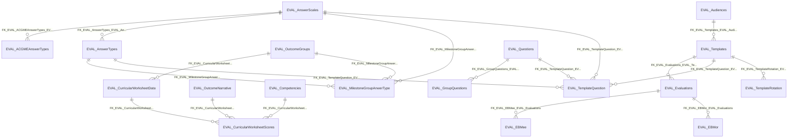

import TableDetail from '@site/src/components/TableDetail';

# Evaluations Database Tables

**331 tables** · **229 with PK** (69.2%) · **245 FKs** · **649 indexes**

## Entity Relationships

## Table Reference

<TableDetail
  tables={[{"name":"Eval_20250422","schema":"dbo","fullName":"dbo.Eval_20250422","hasPrimaryKey":false,"primaryKeyColumns":[],"foreignKeys":[],"indexes":[],"checkConstraints":[],"defaultConstraints":0,"triggers":[]},{"name":"EVAL_ACGMEAnswers","schema":"dbo","fullName":"dbo.EVAL_ACGMEAnswers","hasPrimaryKey":true,"primaryKeyColumns":["AnswerID"],"foreignKeys":[{"constraintName":"FK_EVAL_ACGMEAnswers_EVAL_ACGMEAnswerTypes","referencedTable":"EVAL_ACGMEAnswerTypes"}],"indexes":[{"name":"PK_EVAL_ACGMEAnswers","type":"CLUSTERED","isPrimaryKey":true,"isUnique":true,"isDisabled":false,"keyColumns":["AnswerID"],"includedColumns":[]}],"checkConstraints":[],"defaultConstraints":0,"triggers":[]},{"name":"EVAL_ACGMEAnswerTypes","schema":"dbo","fullName":"dbo.EVAL_ACGMEAnswerTypes","hasPrimaryKey":true,"primaryKeyColumns":["AnswerTypeID"],"foreignKeys":[{"constraintName":"FK_EVAL_ACGMEAnswerTypes_EVAL_AnswerScales","referencedTable":"EVAL_AnswerScales"}],"indexes":[{"name":"PK_EVAL_ACGMEAnswerTypes","type":"CLUSTERED","isPrimaryKey":true,"isUnique":true,"isDisabled":false,"keyColumns":["AnswerTypeID"],"includedColumns":[]}],"checkConstraints":[],"defaultConstraints":0,"triggers":[]},{"name":"EVAL_ACGMEQuestionInfo","schema":"dbo","fullName":"dbo.EVAL_ACGMEQuestionInfo","hasPrimaryKey":true,"primaryKeyColumns":["QuestionInfoID"],"foreignKeys":[],"indexes":[{"name":"PK_EVAL_ACGMEQuestionInfo","type":"CLUSTERED","isPrimaryKey":true,"isUnique":true,"isDisabled":false,"keyColumns":["QuestionInfoID"],"includedColumns":[]}],"checkConstraints":[],"defaultConstraints":2,"triggers":[]},{"name":"EVAL_ACGMEQuestionMapping","schema":"dbo","fullName":"dbo.EVAL_ACGMEQuestionMapping","hasPrimaryKey":false,"primaryKeyColumns":[],"foreignKeys":[{"constraintName":"FK_EVAL_ACGMEQuestionMapping_EVAL_ACGMETypes","referencedTable":"EVAL_ACGMETypes"},{"constraintName":"FK_EVAL_ACGMEQuestionMapping_EVAL_ACGMEAnswerTypes","referencedTable":"EVAL_ACGMEAnswerTypes"}],"indexes":[],"checkConstraints":[],"defaultConstraints":0,"triggers":[]},{"name":"EVAL_ACGMETemplateLink","schema":"dbo","fullName":"dbo.EVAL_ACGMETemplateLink","hasPrimaryKey":false,"primaryKeyColumns":[],"foreignKeys":[{"constraintName":"FK_EVAL_ACGMETemplateLink_EVAL_Templates","referencedTable":"EVAL_Templates"},{"constraintName":"FK_EVAL_ACGMETemplateLink_EVAL_ACGMETypes","referencedTable":"EVAL_ACGMETypes"}],"indexes":[{"name":"IX_EVAL_ACGMETemplateLink_TemplateID","type":"NONCLUSTERED","isPrimaryKey":false,"isUnique":false,"isDisabled":false,"keyColumns":["TemplateID"],"includedColumns":[]}],"checkConstraints":[],"defaultConstraints":0,"triggers":[]},{"name":"EVAL_ACGMETypes","schema":"dbo","fullName":"dbo.EVAL_ACGMETypes","hasPrimaryKey":true,"primaryKeyColumns":["ACGMETypeID"],"foreignKeys":[],"indexes":[{"name":"PK_EVAL_ACGMETypes","type":"CLUSTERED","isPrimaryKey":true,"isUnique":true,"isDisabled":false,"keyColumns":["ACGMETypeID"],"includedColumns":[]}],"checkConstraints":[],"defaultConstraints":0,"triggers":[]},{"name":"EVAL_AINPVScores","schema":"dbo","fullName":"dbo.EVAL_AINPVScores","hasPrimaryKey":true,"primaryKeyColumns":["ID"],"foreignKeys":[{"constraintName":"FK__EVAL_AINP__Outco__67D6CDF1","referencedTable":"(system-named)"},{"constraintName":"FK__EVAL_AINP__AINPV__1EC4AE23","referencedTable":"(system-named)"},{"constraintName":"FK__EVAL_AINP__Modif__1CDC65B1","referencedTable":"(system-named)"},{"constraintName":"FK__EVAL_AINP__Depar__4F75FFD2","referencedTable":"(system-named)"},{"constraintName":"FK__EVAL_AINP__Outco__4E81DB99","referencedTable":"(system-named)"}],"indexes":[{"name":"IDX_EVAL_AINPVScores1","type":"NONCLUSTERED","isPrimaryKey":false,"isUnique":false,"isDisabled":false,"keyColumns":["AINPVResponseID"],"includedColumns":[]},{"name":"IX_EVAL_AINPVScores1","type":"NONCLUSTERED","isPrimaryKey":false,"isUnique":false,"isDisabled":false,"keyColumns":["UserID"],"includedColumns":[]},{"name":"IX_EVAL_AINPVScores2","type":"NONCLUSTERED","isPrimaryKey":false,"isUnique":false,"isDisabled":false,"keyColumns":["CompetencyID"],"includedColumns":[]},{"name":"IX_EVAL_AINPVScores3","type":"NONCLUSTERED","isPrimaryKey":false,"isUnique":false,"isDisabled":false,"keyColumns":["OutcomeGroupID"],"includedColumns":[]},{"name":"IX_EVAL_AINPVScores4","type":"NONCLUSTERED","isPrimaryKey":false,"isUnique":false,"isDisabled":false,"keyColumns":["OutcomeNarrativeID"],"includedColumns":[]},{"name":"IX_EVAL_AINPVScores5","type":"NONCLUSTERED","isPrimaryKey":false,"isUnique":false,"isDisabled":false,"keyColumns":["DepartmentID"],"includedColumns":[]},{"name":"IX_EVAL_AINPVScores6","type":"NONCLUSTERED","isPrimaryKey":false,"isUnique":false,"isDisabled":false,"keyColumns":["DepartmentID"],"includedColumns":["UserID","PredictedScore","OutcomeNarrativeID","StartDate","EndDate","OutcomeGroupID"]},{"name":"IX_EVAL_AINPVScores7","type":"NONCLUSTERED","isPrimaryKey":false,"isUnique":false,"isDisabled":false,"keyColumns":["OutcomeGroupID","DepartmentID"],"includedColumns":["UserID","PredictedScore","OutcomeNarrativeID","StartDate","EndDate"]},{"name":"IX_EVAL_AINPVScores8","type":"NONCLUSTERED","isPrimaryKey":false,"isUnique":false,"isDisabled":false,"keyColumns":["StartDate"],"includedColumns":["UserID","PredictedScore","CompetencyID","EndDate","DepartmentID"]},{"name":"PK__EVAL_AIN__3214EC27823DE4F8","type":"CLUSTERED","isPrimaryKey":true,"isUnique":true,"isDisabled":false,"keyColumns":["ID"],"includedColumns":[]}],"checkConstraints":[],"defaultConstraints":0,"triggers":[]},{"name":"EVAL_AmionSchedule","schema":"dbo","fullName":"dbo.EVAL_AmionSchedule","hasPrimaryKey":true,"primaryKeyColumns":["AmionScheduleID"],"foreignKeys":[],"indexes":[{"name":"IX_EVAL_AmionSchedule","type":"NONCLUSTERED","isPrimaryKey":false,"isUnique":false,"isDisabled":false,"keyColumns":["DepartmentID","AcademicYear"],"includedColumns":[]},{"name":"IX_EVAL_AmionSchedule_1","type":"NONCLUSTERED","isPrimaryKey":false,"isUnique":false,"isDisabled":false,"keyColumns":["DepartmentID","AcademicYear","LastUpdatedDate","AmionScheduleID"],"includedColumns":[]},{"name":"PK_EVAL_AmionSchedule","type":"CLUSTERED","isPrimaryKey":true,"isUnique":true,"isDisabled":false,"keyColumns":["AmionScheduleID"],"includedColumns":[]}],"checkConstraints":[],"defaultConstraints":2,"triggers":[]},{"name":"EVAL_Answers","schema":"dbo","fullName":"dbo.EVAL_Answers","hasPrimaryKey":true,"primaryKeyColumns":["AnswerID"],"foreignKeys":[{"constraintName":"FK_EVAL_Answers_EVAL_AnswerTypes","referencedTable":"EVAL_AnswerTypes"}],"indexes":[{"name":"EVAL_Answers_IX1","type":"NONCLUSTERED","isPrimaryKey":false,"isUnique":false,"isDisabled":false,"keyColumns":["IsExclude","Score"],"includedColumns":["AnswerTypeID","SortOrder"]},{"name":"EVAL_Answers_IX2","type":"NONCLUSTERED","isPrimaryKey":false,"isUnique":false,"isDisabled":false,"keyColumns":["AnswerTypeID","IsExclude","Score"],"includedColumns":["SortOrder"]},{"name":"Eval_UniqueAnswer","type":"NONCLUSTERED","isPrimaryKey":false,"isUnique":true,"isDisabled":false,"keyColumns":["AnswerID","AnswerTypeID"],"includedColumns":[]},{"name":"IDX_EVAL_Answers1","type":"NONCLUSTERED","isPrimaryKey":false,"isUnique":false,"isDisabled":false,"keyColumns":["Score"],"includedColumns":["AnswerTypeID"]},{"name":"IDX_MissingOn_EVAL_Answers_AE3DADD5FE8648AA9C639B209719A0D3","type":"NONCLUSTERED","isPrimaryKey":false,"isUnique":false,"isDisabled":false,"keyColumns":["AnswerTypeID","IsExclude"],"includedColumns":["Score","Name"]},{"name":"IX_EVAL_Answers_AnswerID","type":"NONCLUSTERED","isPrimaryKey":false,"isUnique":false,"isDisabled":false,"keyColumns":["AnswerID"],"includedColumns":["Score","AnswerTypeID"]},{"name":"PK_EVAL_Answers","type":"CLUSTERED","isPrimaryKey":true,"isUnique":true,"isDisabled":false,"keyColumns":["AnswerID"],"includedColumns":[]}],"checkConstraints":[],"defaultConstraints":1,"triggers":[]},{"name":"EVAL_AnswerScales","schema":"dbo","fullName":"dbo.EVAL_AnswerScales","hasPrimaryKey":true,"primaryKeyColumns":["AnswerScaleID"],"foreignKeys":[],"indexes":[{"name":"IX_EVAL_AnswerScales_1","type":"NONCLUSTERED","isPrimaryKey":false,"isUnique":false,"isDisabled":false,"keyColumns":["Code"],"includedColumns":[]},{"name":"IX_EVAL_AnswerScales_AnswerScaleID","type":"NONCLUSTERED","isPrimaryKey":false,"isUnique":false,"isDisabled":false,"keyColumns":["AnswerScaleID","Code"],"includedColumns":[]},{"name":"PK_EVAL_AnswerScale","type":"CLUSTERED","isPrimaryKey":true,"isUnique":true,"isDisabled":false,"keyColumns":["AnswerScaleID"],"includedColumns":[]}],"checkConstraints":[],"defaultConstraints":2,"triggers":[]},{"name":"EVAL_AnswerTypes","schema":"dbo","fullName":"dbo.EVAL_AnswerTypes","hasPrimaryKey":true,"primaryKeyColumns":["AnswerTypeID"],"foreignKeys":[{"constraintName":"FK_EVAL_AnswerTypes_EVAL_AnswerScales","referencedTable":"EVAL_AnswerScales"}],"indexes":[{"name":"EvalUniqueAnswerTypes","type":"NONCLUSTERED","isPrimaryKey":false,"isUnique":true,"isDisabled":false,"keyColumns":["AnswerTypeID","AnswerScaleID"],"includedColumns":[]},{"name":"IDX_EVAL_AnswerTypes1","type":"NONCLUSTERED","isPrimaryKey":false,"isUnique":false,"isDisabled":false,"keyColumns":["Name","DepartmentID"],"includedColumns":[]},{"name":"IDX_MissingOn_EVAL_AnswerTypes_15588B233DC048799598CDAE0ABEDF09","type":"NONCLUSTERED","isPrimaryKey":false,"isUnique":false,"isDisabled":false,"keyColumns":["DepartmentID","IsDeleted"],"includedColumns":["Code","Name","AnswerScaleID","IsDisplayNumbers","EarlyWarningIndex","IsSliding","MarginalValue","Order"]},{"name":"IDX_MissingOn_EVAL_AnswerTypes_6002B74383684E98B842D5055D4E7437","type":"NONCLUSTERED","isPrimaryKey":false,"isUnique":false,"isDisabled":false,"keyColumns":["Code"],"includedColumns":[]},{"name":"IX1_EVAL_AnswerTypes","type":"NONCLUSTERED","isPrimaryKey":false,"isUnique":false,"isDisabled":false,"keyColumns":["DepartmentID"],"includedColumns":[]},{"name":"IX2_EVAL_AnswerTypes","type":"NONCLUSTERED","isPrimaryKey":false,"isUnique":false,"isDisabled":false,"keyColumns":["AnswerScaleID"],"includedColumns":["AnswerTypeID"]},{"name":"IX3_EVAL_AnswerTypes","type":"NONCLUSTERED","isPrimaryKey":false,"isUnique":false,"isDisabled":false,"keyColumns":["DepartmentID"],"includedColumns":["Name"]},{"name":"IX4_EVAL_AnswerTypes","type":"NONCLUSTERED","isPrimaryKey":false,"isUnique":false,"isDisabled":false,"keyColumns":["AnswerScaleID","DepartmentID"],"includedColumns":[]},{"name":"PK_EVAL_AnswerTypes","type":"CLUSTERED","isPrimaryKey":true,"isUnique":true,"isDisabled":false,"keyColumns":["AnswerTypeID"],"includedColumns":[]}],"checkConstraints":[],"defaultConstraints":11,"triggers":[]},{"name":"EVAL_Appointments","schema":"dbo","fullName":"dbo.EVAL_Appointments","hasPrimaryKey":true,"primaryKeyColumns":["ID"],"foreignKeys":[{"constraintName":"FK__EVAL_Appo__Locat__4101226F","referencedTable":"(system-named)"},{"constraintName":"FK__EVAL_Appo__Modif__400CFE36","referencedTable":"(system-named)"}],"indexes":[{"name":"PK__EVAL_App__3214EC278ED52192","type":"CLUSTERED","isPrimaryKey":true,"isUnique":true,"isDisabled":false,"keyColumns":["ID"],"includedColumns":[]}],"checkConstraints":[],"defaultConstraints":0,"triggers":[]},{"name":"EVAL_AppointmentsHistory","schema":"dbo","fullName":"dbo.EVAL_AppointmentsHistory","hasPrimaryKey":true,"primaryKeyColumns":["ID"],"foreignKeys":[],"indexes":[{"name":"PK__EVAL_App__3214EC271BA43F78","type":"CLUSTERED","isPrimaryKey":true,"isUnique":true,"isDisabled":false,"keyColumns":["ID"],"includedColumns":[]}],"checkConstraints":[],"defaultConstraints":1,"triggers":[]},{"name":"EVAL_AssignVoluntaryUsers","schema":"dbo","fullName":"dbo.EVAL_AssignVoluntaryUsers","hasPrimaryKey":true,"primaryKeyColumns":["EvaluationID","SubjectUserID"],"foreignKeys":[{"constraintName":"FK_EVAL_evaluations_EVAL_AssignVoluntaryUsers","referencedTable":"FK_EVAL_evaluations_EVAL_AssignVoluntaryUsers"}],"indexes":[{"name":"IDX_EVAL_AssignVoluntaryUsers1","type":"NONCLUSTERED","isPrimaryKey":false,"isUnique":false,"isDisabled":false,"keyColumns":["SubjectUserID"],"includedColumns":[]},{"name":"PK_EVAL_AssignVoluntaryUsers","type":"CLUSTERED","isPrimaryKey":true,"isUnique":true,"isDisabled":false,"keyColumns":["EvaluationID","SubjectUserID"],"includedColumns":[]}],"checkConstraints":[],"defaultConstraints":0,"triggers":[]},{"name":"Eval_AudienceRotations","schema":"dbo","fullName":"dbo.Eval_AudienceRotations","hasPrimaryKey":true,"primaryKeyColumns":["AudienceRotationID"],"foreignKeys":[],"indexes":[{"name":"PK_Eval_AudienceRotations","type":"CLUSTERED","isPrimaryKey":true,"isUnique":true,"isDisabled":false,"keyColumns":["AudienceRotationID"],"includedColumns":[]}],"checkConstraints":[],"defaultConstraints":0,"triggers":[]},{"name":"EVAL_Audiences","schema":"dbo","fullName":"dbo.EVAL_Audiences","hasPrimaryKey":true,"primaryKeyColumns":["AudienceID"],"foreignKeys":[],"indexes":[{"name":"IX_EVAL_Audiences","type":"NONCLUSTERED","isPrimaryKey":false,"isUnique":false,"isDisabled":false,"keyColumns":["SubjectID"],"includedColumns":[]},{"name":"IX_EVAL_Audiences_1","type":"NONCLUSTERED","isPrimaryKey":false,"isUnique":false,"isDisabled":false,"keyColumns":["TargetID"],"includedColumns":[]},{"name":"SYS_Audience_PK","type":"CLUSTERED","isPrimaryKey":true,"isUnique":true,"isDisabled":false,"keyColumns":["AudienceID"],"includedColumns":[]}],"checkConstraints":[],"defaultConstraints":2,"triggers":[]},{"name":"EVAL_AudienceUserTypeMapping","schema":"dbo","fullName":"dbo.EVAL_AudienceUserTypeMapping","hasPrimaryKey":false,"primaryKeyColumns":[],"foreignKeys":[{"constraintName":"FK_EVAL_AudienceUserTypeMapping_EVAL_Audiences","referencedTable":"EVAL_Audiences"},{"constraintName":"FK_EVAL_AudienceUserTypeMapping_SEC_UserTypes","referencedTable":"SEC_UserTypes"}],"indexes":[{"name":"NONCI_UserTypeID","type":"NONCLUSTERED","isPrimaryKey":false,"isUnique":false,"isDisabled":false,"keyColumns":["UserTypeID"],"includedColumns":[]}],"checkConstraints":[],"defaultConstraints":0,"triggers":[]},{"name":"EVAL_AutoEvalReminderLog","schema":"dbo","fullName":"dbo.EVAL_AutoEvalReminderLog","hasPrimaryKey":false,"primaryKeyColumns":[],"foreignKeys":[],"indexes":[{"name":"IDX_MissingOn_EVAL_AutoEvalReminderLog_7B88A34D42E3475EBEFD8F2B81617742","type":"NONCLUSTERED","isPrimaryKey":false,"isUnique":false,"isDisabled":false,"keyColumns":["Status"],"includedColumns":["DepartmentID","ScheduledDate"]}],"checkConstraints":[],"defaultConstraints":1,"triggers":[]},{"name":"Eval_AutoEvalRemindersQueue","schema":"dbo","fullName":"dbo.Eval_AutoEvalRemindersQueue","hasPrimaryKey":true,"primaryKeyColumns":["AutoEvalRemindersQueueID"],"foreignKeys":[],"indexes":[{"name":"IDX_MissingOn_Eval_AutoEvalRemindersQueue_2C22CA7F3CDE45888ACBBEDFC19E2A2D","type":"NONCLUSTERED","isPrimaryKey":false,"isUnique":false,"isDisabled":false,"keyColumns":["Status","UpdatedDate"],"includedColumns":["DepartmentID"]},{"name":"IDX_MissingOn_Eval_AutoEvalRemindersQueue_4FF73C86A3E14ABE9820759AA2417E77","type":"NONCLUSTERED","isPrimaryKey":false,"isUnique":false,"isDisabled":false,"keyColumns":["Status","DepartmentID","CreatedDate"],"includedColumns":[]},{"name":"PK_Eval_AutoEvalRemindersQueue","type":"CLUSTERED","isPrimaryKey":true,"isUnique":true,"isDisabled":false,"keyColumns":["AutoEvalRemindersQueueID"],"includedColumns":[]}],"checkConstraints":[],"defaultConstraints":0,"triggers":[]},{"name":"EVAL_BaseAnswers","schema":"dbo","fullName":"dbo.EVAL_BaseAnswers","hasPrimaryKey":true,"primaryKeyColumns":["BaseAnswerID"],"foreignKeys":[{"constraintName":"FK_EVAL_BaseAnswers_EVAL_BaseAnswerTypes","referencedTable":"EVAL_BaseAnswerTypes"}],"indexes":[{"name":"PK_EVAL_BaseAnswers","type":"CLUSTERED","isPrimaryKey":true,"isUnique":true,"isDisabled":false,"keyColumns":["BaseAnswerID"],"includedColumns":[]}],"checkConstraints":[],"defaultConstraints":1,"triggers":[]},{"name":"EVAL_BaseAnswerTypes","schema":"dbo","fullName":"dbo.EVAL_BaseAnswerTypes","hasPrimaryKey":true,"primaryKeyColumns":["BaseAnswerTypeID"],"foreignKeys":[{"constraintName":"FK_EVAL_BaseAnswerTypes_EVAL_AnswerScales","referencedTable":"EVAL_AnswerScales"}],"indexes":[{"name":"PK_EVAL_BaseAnswerTypes","type":"CLUSTERED","isPrimaryKey":true,"isUnique":true,"isDisabled":false,"keyColumns":["BaseAnswerTypeID"],"includedColumns":[]}],"checkConstraints":[],"defaultConstraints":4,"triggers":[]},{"name":"Eval_BaseAudience","schema":"dbo","fullName":"dbo.Eval_BaseAudience","hasPrimaryKey":true,"primaryKeyColumns":["BaseAudienceID"],"foreignKeys":[],"indexes":[{"name":"PK_Eval_BaseAudience","type":"CLUSTERED","isPrimaryKey":true,"isUnique":true,"isDisabled":false,"keyColumns":["BaseAudienceID"],"includedColumns":[]}],"checkConstraints":[],"defaultConstraints":0,"triggers":[]},{"name":"EVAL_BaseCriteria","schema":"dbo","fullName":"dbo.EVAL_BaseCriteria","hasPrimaryKey":false,"primaryKeyColumns":[],"foreignKeys":[],"indexes":[],"checkConstraints":[],"defaultConstraints":0,"triggers":[]},{"name":"EVAL_BaseMilestoneRoundingRules","schema":"dbo","fullName":"dbo.EVAL_BaseMilestoneRoundingRules","hasPrimaryKey":true,"primaryKeyColumns":["BaseMilestoneRoundingRuleID"],"foreignKeys":[{"constraintName":"FK_EVAL_BaseMilestoneRoundingRules_EVAL_AnswerScales","referencedTable":"EVAL_AnswerScales"}],"indexes":[{"name":"PK__EVAL_Bas__9D708C0F64FBCFBB","type":"CLUSTERED","isPrimaryKey":true,"isUnique":true,"isDisabled":false,"keyColumns":["BaseMilestoneRoundingRuleID"],"includedColumns":[]}],"checkConstraints":[],"defaultConstraints":0,"triggers":[]},{"name":"EVAL_BaseOutcomeNarratives","schema":"dbo","fullName":"dbo.EVAL_BaseOutcomeNarratives","hasPrimaryKey":true,"primaryKeyColumns":["OutcomeNarrativeID"],"foreignKeys":[{"constraintName":"FK_EVAL_BaseOutcomeNarratives_EVAL_OutcomeGroups","referencedTable":"EVAL_OutcomeGroups"},{"constraintName":"FK_EVAL_BaseOutcomeNarratives_EVAL_Competencies","referencedTable":"EVAL_Competencies"}],"indexes":[{"name":"PK_EVAL_BaseOutcomeNarratives_OutcomeNarrativeID","type":"CLUSTERED","isPrimaryKey":true,"isUnique":true,"isDisabled":false,"keyColumns":["OutcomeNarrativeID"],"includedColumns":[]}],"checkConstraints":[],"defaultConstraints":0,"triggers":[]},{"name":"EVAL_BaseQuestions","schema":"dbo","fullName":"dbo.EVAL_BaseQuestions","hasPrimaryKey":true,"primaryKeyColumns":["QuestionID"],"foreignKeys":[{"constraintName":"EVAL_BaseQuestions_EVAL_QuestionsCategories_FK1","referencedTable":"EVAL_QuestionsCategories_FK1"}],"indexes":[{"name":"PK_EVAL_BaseQuestions","type":"CLUSTERED","isPrimaryKey":true,"isUnique":true,"isDisabled":false,"keyColumns":["QuestionID"],"includedColumns":[]}],"checkConstraints":[],"defaultConstraints":1,"triggers":[]},{"name":"Eval_BaseTemplateOptions","schema":"dbo","fullName":"dbo.Eval_BaseTemplateOptions","hasPrimaryKey":true,"primaryKeyColumns":["BaseTemplateOptionID"],"foreignKeys":[],"indexes":[{"name":"PK_Eval_BaseTemplateOptions","type":"CLUSTERED","isPrimaryKey":true,"isUnique":true,"isDisabled":false,"keyColumns":["BaseTemplateOptionID"],"includedColumns":[]}],"checkConstraints":[],"defaultConstraints":1,"triggers":[]},{"name":"EVAL_BehaviorSettings","schema":"dbo","fullName":"dbo.EVAL_BehaviorSettings","hasPrimaryKey":true,"primaryKeyColumns":["BehaviorSettingID"],"foreignKeys":[],"indexes":[{"name":"PK__EVAL_Beh__C1D559B0A1EA7291","type":"CLUSTERED","isPrimaryKey":true,"isUnique":true,"isDisabled":false,"keyColumns":["BehaviorSettingID"],"includedColumns":[]}],"checkConstraints":[],"defaultConstraints":0,"triggers":[]},{"name":"Eval_Behaviour","schema":"dbo","fullName":"dbo.Eval_Behaviour","hasPrimaryKey":true,"primaryKeyColumns":["BehaviorID"],"foreignKeys":[{"constraintName":"FK__Eval_Beha__Behav__504A3C1C","referencedTable":"(system-named)"}],"indexes":[{"name":"PK__Eval_Beh__361B218777B25BB7","type":"CLUSTERED","isPrimaryKey":true,"isUnique":true,"isDisabled":false,"keyColumns":["BehaviorID"],"includedColumns":[]}],"checkConstraints":[],"defaultConstraints":0,"triggers":[]},{"name":"Eval_BehaviourActions","schema":"dbo","fullName":"dbo.Eval_BehaviourActions","hasPrimaryKey":true,"primaryKeyColumns":["BehaviourActionID"],"foreignKeys":[{"constraintName":"FK_Eval_Behaviour_Eval_BehaviourActionss","referencedTable":"FK_Eval_Behaviour_Eval_BehaviourActionss"}],"indexes":[{"name":"PK__Eval_Beh__1477FFB42E42FF13","type":"CLUSTERED","isPrimaryKey":true,"isUnique":true,"isDisabled":false,"keyColumns":["BehaviourActionID"],"includedColumns":[]}],"checkConstraints":[],"defaultConstraints":0,"triggers":[]},{"name":"Eval_BehaviourComments","schema":"dbo","fullName":"dbo.Eval_BehaviourComments","hasPrimaryKey":true,"primaryKeyColumns":["BehaviourCommentID"],"foreignKeys":[{"constraintName":"FK_Eval_Behaviour_Eval_BehaviourComments","referencedTable":"FK_Eval_Behaviour_Eval_BehaviourComments"}],"indexes":[{"name":"PK__Eval_Beh__6C244506AC3663DB","type":"CLUSTERED","isPrimaryKey":true,"isUnique":true,"isDisabled":false,"keyColumns":["BehaviourCommentID"],"includedColumns":[]}],"checkConstraints":[],"defaultConstraints":0,"triggers":[]},{"name":"EVAL_CallServiceDetails","schema":"dbo","fullName":"dbo.EVAL_CallServiceDetails","hasPrimaryKey":false,"primaryKeyColumns":[],"foreignKeys":[],"indexes":[],"checkConstraints":[],"defaultConstraints":0,"triggers":[]},{"name":"EVAL_CallServiceDetailsAuto","schema":"dbo","fullName":"dbo.EVAL_CallServiceDetailsAuto","hasPrimaryKey":false,"primaryKeyColumns":[],"foreignKeys":[],"indexes":[],"checkConstraints":[],"defaultConstraints":0,"triggers":[]},{"name":"EVAL_CallServiceMaster","schema":"dbo","fullName":"dbo.EVAL_CallServiceMaster","hasPrimaryKey":false,"primaryKeyColumns":[],"foreignKeys":[],"indexes":[],"checkConstraints":[],"defaultConstraints":0,"triggers":[]},{"name":"EVAL_CallServiceMasterAuto","schema":"dbo","fullName":"dbo.EVAL_CallServiceMasterAuto","hasPrimaryKey":false,"primaryKeyColumns":[],"foreignKeys":[],"indexes":[],"checkConstraints":[],"defaultConstraints":0,"triggers":[]},{"name":"Eval_Capstone","schema":"dbo","fullName":"dbo.Eval_Capstone","hasPrimaryKey":true,"primaryKeyColumns":["CapstoneID"],"foreignKeys":[],"indexes":[{"name":"PK_Eval_Capstone","type":"CLUSTERED","isPrimaryKey":true,"isUnique":true,"isDisabled":false,"keyColumns":["CapstoneID"],"includedColumns":[]}],"checkConstraints":[],"defaultConstraints":0,"triggers":[]},{"name":"EVAL_ClinicalTasks","schema":"dbo","fullName":"dbo.EVAL_ClinicalTasks","hasPrimaryKey":true,"primaryKeyColumns":["ClinicalTaskId"],"foreignKeys":[],"indexes":[{"name":"PK_EVAL_ClinicalTasks","type":"CLUSTERED","isPrimaryKey":true,"isUnique":true,"isDisabled":false,"keyColumns":["ClinicalTaskId"],"includedColumns":[]}],"checkConstraints":[],"defaultConstraints":0,"triggers":[]},{"name":"EVAL_ClinicDetails","schema":"dbo","fullName":"dbo.EVAL_ClinicDetails","hasPrimaryKey":false,"primaryKeyColumns":[],"foreignKeys":[],"indexes":[],"checkConstraints":[],"defaultConstraints":0,"triggers":[]},{"name":"EVAL_ClinicDetailsAuto","schema":"dbo","fullName":"dbo.EVAL_ClinicDetailsAuto","hasPrimaryKey":false,"primaryKeyColumns":[],"foreignKeys":[],"indexes":[],"checkConstraints":[],"defaultConstraints":0,"triggers":[]},{"name":"EVAL_ClinicMaster","schema":"dbo","fullName":"dbo.EVAL_ClinicMaster","hasPrimaryKey":false,"primaryKeyColumns":[],"foreignKeys":[],"indexes":[],"checkConstraints":[],"defaultConstraints":0,"triggers":[]},{"name":"EVAL_ClinicMasterAuto","schema":"dbo","fullName":"dbo.EVAL_ClinicMasterAuto","hasPrimaryKey":false,"primaryKeyColumns":[],"foreignKeys":[],"indexes":[],"checkConstraints":[],"defaultConstraints":0,"triggers":[]},{"name":"EVAL_Competencies","schema":"dbo","fullName":"dbo.EVAL_Competencies","hasPrimaryKey":true,"primaryKeyColumns":["CompetencyID"],"foreignKeys":[],"indexes":[{"name":"CompetencyName_IDX","type":"NONCLUSTERED","isPrimaryKey":false,"isUnique":false,"isDisabled":false,"keyColumns":["CompetencyCategoryName"],"includedColumns":["CompetencyID"]},{"name":"PK_EVAL_Competencies","type":"CLUSTERED","isPrimaryKey":true,"isUnique":true,"isDisabled":false,"keyColumns":["CompetencyID"],"includedColumns":[]}],"checkConstraints":[],"defaultConstraints":2,"triggers":[]},{"name":"EVAL_CompetencyAliasNames","schema":"dbo","fullName":"dbo.EVAL_CompetencyAliasNames","hasPrimaryKey":true,"primaryKeyColumns":["CompetencyAliasNameID"],"foreignKeys":[],"indexes":[{"name":"PK__EVAL_Com__A7705D1F76A60FEA","type":"CLUSTERED","isPrimaryKey":true,"isUnique":true,"isDisabled":false,"keyColumns":["CompetencyAliasNameID"],"includedColumns":[]}],"checkConstraints":[],"defaultConstraints":0,"triggers":[]},{"name":"Eval_CompetencyGuidance","schema":"dbo","fullName":"dbo.Eval_CompetencyGuidance","hasPrimaryKey":true,"primaryKeyColumns":["GuidanceId"],"foreignKeys":[{"constraintName":"FK__Eval_Comp__Summa__39ED5AC7","referencedTable":"(system-named)"},{"constraintName":"FK__Eval_Comp__Summa__5A0DAF91","referencedTable":"(system-named)"}],"indexes":[{"name":"Eval_CompetencyGuidance_SummaryId","type":"NONCLUSTERED","isPrimaryKey":false,"isUnique":false,"isDisabled":false,"keyColumns":["SummaryId"],"includedColumns":[]},{"name":"IX_Eval_CompetencyGuidance_SummaryCompetencyId","type":"NONCLUSTERED","isPrimaryKey":false,"isUnique":false,"isDisabled":false,"keyColumns":["SummaryCompetencyId"],"includedColumns":[]},{"name":"PK__Eval_Com__FBED6CE66AE7A6A9","type":"CLUSTERED","isPrimaryKey":true,"isUnique":true,"isDisabled":false,"keyColumns":["GuidanceId"],"includedColumns":[]}],"checkConstraints":[],"defaultConstraints":0,"triggers":[]},{"name":"EVAL_CompetencyMyInsightComments","schema":"dbo","fullName":"dbo.EVAL_CompetencyMyInsightComments","hasPrimaryKey":true,"primaryKeyColumns":["CompetencyMyInsightCommentID"],"foreignKeys":[{"constraintName":"FK__EVAL_Comp__Modif__423F0864","referencedTable":"(system-named)"}],"indexes":[{"name":"IDX_EVAL_CompetencyMyInsightComments1","type":"NONCLUSTERED","isPrimaryKey":false,"isUnique":false,"isDisabled":false,"keyColumns":["AIResponseID","CompetencyID"],"includedColumns":[]},{"name":"IX_EVAL_CompetencyMyInsightComments_AIResponseID","type":"NONCLUSTERED","isPrimaryKey":false,"isUnique":false,"isDisabled":false,"keyColumns":["AIResponseID"],"includedColumns":[]},{"name":"IX_EVAL_CompetencyMyInsightComments_CompetencyID","type":"NONCLUSTERED","isPrimaryKey":false,"isUnique":false,"isDisabled":false,"keyColumns":["CompetencyID"],"includedColumns":[]},{"name":"PK__EVAL_Com__E5E3D80DCE639E2D","type":"CLUSTERED","isPrimaryKey":true,"isUnique":true,"isDisabled":false,"keyColumns":["CompetencyMyInsightCommentID"],"includedColumns":[]}],"checkConstraints":[],"defaultConstraints":0,"triggers":[]},{"name":"EVAL_CompetencyMyInsightComments1","schema":"dbo","fullName":"dbo.EVAL_CompetencyMyInsightComments1","hasPrimaryKey":false,"primaryKeyColumns":[],"foreignKeys":[],"indexes":[],"checkConstraints":[],"defaultConstraints":0,"triggers":[]},{"name":"Eval_CompetencyProgression","schema":"dbo","fullName":"dbo.Eval_CompetencyProgression","hasPrimaryKey":true,"primaryKeyColumns":["ProgressionId"],"foreignKeys":[{"constraintName":"FK__Eval_Comp__Summa__38F9368E","referencedTable":"(system-named)"},{"constraintName":"FK__Eval_Comp__Summa__573142E6","referencedTable":"(system-named)"}],"indexes":[{"name":"Eval_CompetencyProgression_SummaryId","type":"NONCLUSTERED","isPrimaryKey":false,"isUnique":false,"isDisabled":false,"keyColumns":["SummaryId"],"includedColumns":[]},{"name":"IX_Eval_CompetencyProgression_SummaryCompetencyId","type":"NONCLUSTERED","isPrimaryKey":false,"isUnique":false,"isDisabled":false,"keyColumns":["SummaryCompetencyId"],"includedColumns":[]},{"name":"PK__Eval_Com__963FDE6AD3EB2876","type":"CLUSTERED","isPrimaryKey":true,"isUnique":true,"isDisabled":false,"keyColumns":["ProgressionId"],"includedColumns":[]}],"checkConstraints":[],"defaultConstraints":0,"triggers":[]},{"name":"EVAL_CompetencySecondaryAliasNames","schema":"dbo","fullName":"dbo.EVAL_CompetencySecondaryAliasNames","hasPrimaryKey":true,"primaryKeyColumns":["CompetencySecondaryAliasNameID"],"foreignKeys":[],"indexes":[{"name":"PK__EVAL_Com__C2C577FE92F490A3","type":"CLUSTERED","isPrimaryKey":true,"isUnique":true,"isDisabled":false,"keyColumns":["CompetencySecondaryAliasNameID"],"includedColumns":[]}],"checkConstraints":[],"defaultConstraints":0,"triggers":[]},{"name":"EVAL_CopiedEvaluations","schema":"dbo","fullName":"dbo.EVAL_CopiedEvaluations","hasPrimaryKey":true,"primaryKeyColumns":["ID"],"foreignKeys":[],"indexes":[{"name":"PK__EVAL_Cop__3214EC27B8772E42","type":"CLUSTERED","isPrimaryKey":true,"isUnique":true,"isDisabled":false,"keyColumns":["ID"],"includedColumns":[]}],"checkConstraints":[],"defaultConstraints":1,"triggers":[]},{"name":"EVAL_Criteria","schema":"dbo","fullName":"dbo.EVAL_Criteria","hasPrimaryKey":true,"primaryKeyColumns":["CriterionID"],"foreignKeys":[{"constraintName":"FK_EVAL_Criteria_SEC_Users","referencedTable":"SEC_Users"}],"indexes":[{"name":"IDX_EVAL_Criteria_UserID","type":"NONCLUSTERED","isPrimaryKey":false,"isUnique":false,"isDisabled":false,"keyColumns":["UserID"],"includedColumns":[]},{"name":"IX_EVAL_Criteria_DepartmentID","type":"NONCLUSTERED","isPrimaryKey":false,"isUnique":false,"isDisabled":false,"keyColumns":["DepartmentID","DeletedDate"],"includedColumns":[]},{"name":"PK_EVAL_Criteria","type":"CLUSTERED","isPrimaryKey":true,"isUnique":true,"isDisabled":false,"keyColumns":["CriterionID"],"includedColumns":[]}],"checkConstraints":[],"defaultConstraints":0,"triggers":[]},{"name":"EVAL_CriteriaDeptDelete","schema":"dbo","fullName":"dbo.EVAL_CriteriaDeptDelete","hasPrimaryKey":false,"primaryKeyColumns":[],"foreignKeys":[],"indexes":[],"checkConstraints":[],"defaultConstraints":1,"triggers":[]},{"name":"EVAL_CurriculaAssignmentsDetailAuto","schema":"dbo","fullName":"dbo.EVAL_CurriculaAssignmentsDetailAuto","hasPrimaryKey":false,"primaryKeyColumns":[],"foreignKeys":[],"indexes":[{"name":"IDX_MissingOn_EVAL_CurriculaAssignmentsDetailAuto_0650DC9472214D9CBD05462FD159BAFE","type":"NONCLUSTERED","isPrimaryKey":false,"isUnique":false,"isDisabled":false,"keyColumns":["AmionRotationID"],"includedColumns":["AmionUserID","FromDate","ToDate","AmionUserName"]},{"name":"IDX_MissingOn_EVAL_CurriculaAssignmentsDetailAuto_458800965A5A426C97F6EAB25CDA60EF","type":"NONCLUSTERED","isPrimaryKey":false,"isUnique":false,"isDisabled":false,"keyColumns":["AmionRotationID"],"includedColumns":["AmionUserID"]},{"name":"IDX_MissingOn_EVAL_CurriculaAssignmentsDetailAuto_9BCE0842B97A4AEAB9239B5C2DA095B1","type":"NONCLUSTERED","isPrimaryKey":false,"isUnique":false,"isDisabled":false,"keyColumns":["AmionUserID","AmionRotationID"],"includedColumns":[]},{"name":"IDX_MissingOn_EVAL_CurriculaAssignmentsDetailAuto_A646EB88272E41F7BD582EED2CEAD1EC","type":"NONCLUSTERED","isPrimaryKey":false,"isUnique":false,"isDisabled":false,"keyColumns":["AmionUserID","AmionRotationID"],"includedColumns":["FromDate","ToDate","AmionUserName"]},{"name":"IDX_MissingOn_EVAL_CurriculaAssignmentsDetailAuto_F2E906C328B445B5BE866C318573BE2A","type":"NONCLUSTERED","isPrimaryKey":false,"isUnique":false,"isDisabled":false,"keyColumns":["AmionRotationID"],"includedColumns":[]}],"checkConstraints":[],"defaultConstraints":0,"triggers":[]},{"name":"EVAL_CurricularWorksheetComments","schema":"dbo","fullName":"dbo.EVAL_CurricularWorksheetComments","hasPrimaryKey":true,"primaryKeyColumns":["CurricularWorksheetDataID"],"foreignKeys":[{"constraintName":"FK_EVAL_CurricularWorksheetComments_EVAL_CurricularWorksheetData","referencedTable":"EVAL_CurricularWorksheetData"}],"indexes":[{"name":"PK_EVAL_CurricularWorksheetComments","type":"CLUSTERED","isPrimaryKey":true,"isUnique":true,"isDisabled":false,"keyColumns":["CurricularWorksheetDataID"],"includedColumns":[]}],"checkConstraints":[],"defaultConstraints":0,"triggers":[]},{"name":"EVAL_CurricularWorksheetCommentsHistory","schema":"dbo","fullName":"dbo.EVAL_CurricularWorksheetCommentsHistory","hasPrimaryKey":true,"primaryKeyColumns":["CurricularWorksheetCommentsHistoryID"],"foreignKeys":[{"constraintName":"FK_EVAL_CurricularWorksheetCommentsHistory_EVAL_CurricularWorksheetData","referencedTable":"EVAL_CurricularWorksheetData"}],"indexes":[{"name":"PK_EVAL_CurricularWorksheetCommentsHistory","type":"CLUSTERED","isPrimaryKey":true,"isUnique":true,"isDisabled":false,"keyColumns":["CurricularWorksheetCommentsHistoryID"],"includedColumns":[]}],"checkConstraints":[],"defaultConstraints":0,"triggers":[]},{"name":"EVAL_CurricularWorksheetCompetencyRediness","schema":"dbo","fullName":"dbo.EVAL_CurricularWorksheetCompetencyRediness","hasPrimaryKey":true,"primaryKeyColumns":["CurricularWorksheetCompetencyRedinessID"],"foreignKeys":[{"constraintName":"FK_EVAL_CurricularWorksheetCompetencyRedinessa_EVAL_Competencies","referencedTable":"FK_EVAL_CurricularWorksheetCompetencyRedinessa_EVAL_Competencies"},{"constraintName":"FK_EVAL_CurricularWorksheetCompetencyRediness_EVAL_CurricularWorksheetData","referencedTable":"EVAL_CurricularWorksheetData"}],"indexes":[{"name":"IX_EVAL_CurricularWorksheetCompetencyRediness_1","type":"NONCLUSTERED","isPrimaryKey":false,"isUnique":false,"isDisabled":false,"keyColumns":["CurricularWorksheetDataID"],"includedColumns":["CurricularWorksheetCompetencyRedinessID","CompetencyID","Rediness"]},{"name":"PK__EVAL_Cur__053B8E38588A4087","type":"CLUSTERED","isPrimaryKey":true,"isUnique":true,"isDisabled":false,"keyColumns":["CurricularWorksheetCompetencyRedinessID"],"includedColumns":[]}],"checkConstraints":[],"defaultConstraints":0,"triggers":[]},{"name":"EVAL_CurricularWorksheetCompetencyRediness12192025","schema":"dbo","fullName":"dbo.EVAL_CurricularWorksheetCompetencyRediness12192025","hasPrimaryKey":false,"primaryKeyColumns":[],"foreignKeys":[],"indexes":[],"checkConstraints":[],"defaultConstraints":0,"triggers":[]},{"name":"EVAL_CurricularWorksheetCompetencyRedinessHistory","schema":"dbo","fullName":"dbo.EVAL_CurricularWorksheetCompetencyRedinessHistory","hasPrimaryKey":false,"primaryKeyColumns":[],"foreignKeys":[],"indexes":[{"name":"IX_EVAL_CurricularWorksheetCompetencyRedinessHistory_1","type":"NONCLUSTERED","isPrimaryKey":false,"isUnique":false,"isDisabled":false,"keyColumns":["CompetencyID"],"includedColumns":["CurricularWorksheetDataID","Rediness","CreatedBy","CreatedDate"]},{"name":"IX_EVAL_CurricularWorksheetCompetencyRedinessHistory_2","type":"NONCLUSTERED","isPrimaryKey":false,"isUnique":false,"isDisabled":false,"keyColumns":["CurricularWorksheetDataID","CompetencyID"],"includedColumns":["Rediness","CreatedBy","CreatedDate"]}],"checkConstraints":[],"defaultConstraints":0,"triggers":[]},{"name":"EVAL_CurricularWorksheetCompetencyRedinessHistory12192025","schema":"dbo","fullName":"dbo.EVAL_CurricularWorksheetCompetencyRedinessHistory12192025","hasPrimaryKey":false,"primaryKeyColumns":[],"foreignKeys":[],"indexes":[],"checkConstraints":[],"defaultConstraints":0,"triggers":[]},{"name":"EVAL_CurricularWorksheetData","schema":"dbo","fullName":"dbo.EVAL_CurricularWorksheetData","hasPrimaryKey":true,"primaryKeyColumns":["CurricularWorksheetDataID"],"foreignKeys":[{"constraintName":"FK_EVAL_CurricularWorksheetData_Sec_Departments1","referencedTable":"Sec_Departments1"},{"constraintName":"FK_EVAL_CurricularWorksheetData_SEC_Departments","referencedTable":"SEC_Departments"},{"constraintName":"FK_EVAL_CurricularWorksheetData_EVAL_OutcomeGroups","referencedTable":"EVAL_OutcomeGroups"},{"constraintName":"FK_EVAL_CurricularWorksheetData_EVAL_MilestonePeriod","referencedTable":"EVAL_MilestonePeriod"}],"indexes":[{"name":"EVAL_CurricularWorksheetData_DepartmentOutcomeGroupInAcademicYear_with_MilestonePeriodID_IDX","type":"NONCLUSTERED","isPrimaryKey":false,"isUnique":false,"isDisabled":false,"keyColumns":["DepartmentID","OutcomeGroupID","GroupID","AcademicYear"],"includedColumns":["MilestonePeriodID"]},{"name":"IDX_EVAL_CurricularWorksheetData_AcknowledgedBy","type":"NONCLUSTERED","isPrimaryKey":false,"isUnique":false,"isDisabled":false,"keyColumns":["AcknowledgedBy"],"includedColumns":["DepartmentID","OutcomeGroupID","AcademicYear","GroupID","MilestonePeriodID","UserID","IsSaveFinishLater","CreatedBy","AcknowledgedDate","UserDepartmentID","IsUnDo"]},{"name":"IDX_EVAL_CurricularWorksheetData14","type":"NONCLUSTERED","isPrimaryKey":false,"isUnique":false,"isDisabled":false,"keyColumns":["DepartmentID","AcknowledgedBy"],"includedColumns":["OutcomeGroupID","AcademicYear","GroupID","MilestonePeriodID","UserID","IsSaveFinishLater","CreatedBy","AcknowledgedDate","IsUnDo"]},{"name":"IDX_EVAL_CurricularWorksheetData15","type":"NONCLUSTERED","isPrimaryKey":false,"isUnique":false,"isDisabled":false,"keyColumns":["GroupID"],"includedColumns":[]},{"name":"IDX_EVAL_CurricularWorksheetData16","type":"NONCLUSTERED","isPrimaryKey":false,"isUnique":false,"isDisabled":false,"keyColumns":["DepartmentID"],"includedColumns":[]},{"name":"IDX_EVAL_CurricularWorksheetData17","type":"NONCLUSTERED","isPrimaryKey":false,"isUnique":false,"isDisabled":false,"keyColumns":["UserDepartmentID"],"includedColumns":["OutcomeGroupID","AcademicYear","MilestonePeriodID","UserID"]},{"name":"IDX_MissingOn_EVAL_CurricularWorksheetData_6A1DC636FC5C465DBFAC0C0851D565FD","type":"NONCLUSTERED","isPrimaryKey":false,"isUnique":false,"isDisabled":false,"keyColumns":["PeriodUpdatedDate"],"includedColumns":["UserID"]},{"name":"IX_EVAL_CurricularWorksheetData_1","type":"NONCLUSTERED","isPrimaryKey":false,"isUnique":false,"isDisabled":false,"keyColumns":["DepartmentID","OutcomeGroupID","AcademicYear","GroupID","UserID"],"includedColumns":[]},{"name":"IX_EVAL_CurricularWorksheetData_11","type":"NONCLUSTERED","isPrimaryKey":false,"isUnique":false,"isDisabled":false,"keyColumns":["UserDepartmentID"],"includedColumns":["MilestonePeriodID","UserID"]},{"name":"IX_EVAL_CurricularWorksheetData_12","type":"NONCLUSTERED","isPrimaryKey":false,"isUnique":false,"isDisabled":false,"keyColumns":["UserID","AcknowledgedBy"],"includedColumns":[]},{"name":"IX_EVAL_CurricularWorksheetData_13","type":"NONCLUSTERED","isPrimaryKey":false,"isUnique":false,"isDisabled":false,"keyColumns":["DepartmentID","OutcomeGroupID","GroupID"],"includedColumns":["AcademicYear","MilestonePeriodID","UserID","IsSaveFinishLater"]},{"name":"IX_EVAL_CurricularWorksheetData_2","type":"NONCLUSTERED","isPrimaryKey":false,"isUnique":false,"isDisabled":false,"keyColumns":["AcademicYear"],"includedColumns":["CurricularWorksheetDataID","OutcomeGroupID","MilestonePeriodID","UserID","IsSaveFinishLater","CreatedBy","ModifiedBy","CreatedDate","ModifiedDate","AcknowledgedDate","IsAcknowledgedFeedback","IsReviewFeedback"]},{"name":"IX_EVAL_CurricularWorksheetData_3","type":"NONCLUSTERED","isPrimaryKey":false,"isUnique":false,"isDisabled":false,"keyColumns":["UserDepartmentID"],"includedColumns":["AcademicYear","MilestonePeriodID"]},{"name":"IX_EVAL_CurricularWorksheetData_4","type":"NONCLUSTERED","isPrimaryKey":false,"isUnique":false,"isDisabled":false,"keyColumns":["OutcomeGroupID"],"includedColumns":["CurricularWorksheetDataID","AcademicYear","MilestonePeriodID","UserID"]},{"name":"IX_EVAL_CurricularWorksheetData_5","type":"NONCLUSTERED","isPrimaryKey":false,"isUnique":false,"isDisabled":false,"keyColumns":["AcademicYear","UserID"],"includedColumns":["CurricularWorksheetDataID","MilestonePeriodID"]},{"name":"IX_EVAL_CurricularWorksheetData_6","type":"NONCLUSTERED","isPrimaryKey":false,"isUnique":false,"isDisabled":false,"keyColumns":["DepartmentID","OutcomeGroupID","GroupID"],"includedColumns":["CurricularWorksheetDataID","AcademicYear","MilestonePeriodID","UserID","CreatedDate","ModifiedDate"]},{"name":"IX_EVAL_EVAL_MilestonePeriod_10","type":"NONCLUSTERED","isPrimaryKey":false,"isUnique":false,"isDisabled":false,"keyColumns":["MilestonePeriodID","SelfAssessmentDate"],"includedColumns":["UserID"]},{"name":"IX_EVAL_EVAL_MilestonePeriod_9","type":"NONCLUSTERED","isPrimaryKey":false,"isUnique":false,"isDisabled":false,"keyColumns":["SelfAssessmentDate"],"includedColumns":["MilestonePeriodID","UserID"]},{"name":"PK__EVAL_Cur__16E2A8BB50E91EBF","type":"CLUSTERED","isPrimaryKey":true,"isUnique":true,"isDisabled":false,"keyColumns":["CurricularWorksheetDataID"],"includedColumns":[]}],"checkConstraints":[],"defaultConstraints":0,"triggers":[]},{"name":"EVAL_CurricularWorksheetData12192025","schema":"dbo","fullName":"dbo.EVAL_CurricularWorksheetData12192025","hasPrimaryKey":false,"primaryKeyColumns":[],"foreignKeys":[],"indexes":[],"checkConstraints":[],"defaultConstraints":0,"triggers":[]},{"name":"EVAL_CurricularWorkSheetHistory","schema":"dbo","fullName":"dbo.EVAL_CurricularWorkSheetHistory","hasPrimaryKey":true,"primaryKeyColumns":["CurricularWorkSheetHistoryID"],"foreignKeys":[{"constraintName":"FK_EVAL_CurricularWorkSheetHistory_EVAL_OutcomeNarrative","referencedTable":"EVAL_OutcomeNarrative"},{"constraintName":"FK_EVAL_CurricularWorkSheetHistory_EVAL_CurricularWorksheetData","referencedTable":"EVAL_CurricularWorksheetData"}],"indexes":[{"name":"IX_EVAL_CurricularWorksheetHistory_1","type":"NONCLUSTERED","isPrimaryKey":false,"isUnique":false,"isDisabled":false,"keyColumns":["CurricularWorksheetDataID"],"includedColumns":[]},{"name":"PK__EVAL_Cur__4CED07B1350BFA20","type":"CLUSTERED","isPrimaryKey":true,"isUnique":true,"isDisabled":false,"keyColumns":["CurricularWorkSheetHistoryID"],"includedColumns":[]}],"checkConstraints":[],"defaultConstraints":2,"triggers":[]},{"name":"EVAL_CurricularWorkSheetHistory12192025","schema":"dbo","fullName":"dbo.EVAL_CurricularWorkSheetHistory12192025","hasPrimaryKey":false,"primaryKeyColumns":[],"foreignKeys":[],"indexes":[],"checkConstraints":[],"defaultConstraints":0,"triggers":[]},{"name":"EVAL_CurricularWorksheetMyInsights","schema":"dbo","fullName":"dbo.EVAL_CurricularWorksheetMyInsights","hasPrimaryKey":true,"primaryKeyColumns":["CurricularWorksheetMyInsightID"],"foreignKeys":[{"constraintName":"FK_CompetencyID","referencedTable":"FK_CompetencyID"},{"constraintName":"FK_CurricularWorksheetDataID","referencedTable":"FK_CurricularWorksheetDataID"}],"indexes":[{"name":"IX_EVAL_CurricularWorksheetMyInsights_CompetencyID","type":"NONCLUSTERED","isPrimaryKey":false,"isUnique":false,"isDisabled":false,"keyColumns":["CompetencyID"],"includedColumns":[]},{"name":"IX_EVAL_CurricularWorksheetMyInsights_CurricularWorksheetDataID","type":"NONCLUSTERED","isPrimaryKey":false,"isUnique":false,"isDisabled":false,"keyColumns":["CurricularWorksheetDataID"],"includedColumns":[]},{"name":"PK__EVAL_Cur__14FB99361410D754","type":"CLUSTERED","isPrimaryKey":true,"isUnique":true,"isDisabled":false,"keyColumns":["CurricularWorksheetMyInsightID"],"includedColumns":[]}],"checkConstraints":[],"defaultConstraints":0,"triggers":[]},{"name":"EVAL_CurricularWorksheetMyInsightsBackup11202025","schema":"dbo","fullName":"dbo.EVAL_CurricularWorksheetMyInsightsBackup11202025","hasPrimaryKey":false,"primaryKeyColumns":[],"foreignKeys":[],"indexes":[],"checkConstraints":[],"defaultConstraints":0,"triggers":[]},{"name":"EVAL_CurricularWorksheetMyInsightsHistory","schema":"dbo","fullName":"dbo.EVAL_CurricularWorksheetMyInsightsHistory","hasPrimaryKey":true,"primaryKeyColumns":["ID"],"foreignKeys":[],"indexes":[{"name":"PK__EVAL_Cur__3214EC2709B6B73E","type":"CLUSTERED","isPrimaryKey":true,"isUnique":true,"isDisabled":false,"keyColumns":["ID"],"includedColumns":[]}],"checkConstraints":[],"defaultConstraints":1,"triggers":[]},{"name":"EVAL_CurricularWorksheetMyInsightsV2","schema":"dbo","fullName":"dbo.EVAL_CurricularWorksheetMyInsightsV2","hasPrimaryKey":true,"primaryKeyColumns":["ID"],"foreignKeys":[{"constraintName":"FK_EVAL_CurricularWorksheetMyInsightsV2_SEC_Departments","referencedTable":"SEC_Departments"},{"constraintName":"FK_EVAL_CurricularWorksheetMyInsightsV2_EVAL_CurricularWorksheetData","referencedTable":"EVAL_CurricularWorksheetData"},{"constraintName":"FK_EVAL_CurricularWorksheetMyInsightsV2_EVAL_Competencies","referencedTable":"EVAL_Competencies"},{"constraintName":"FK_EVAL_CurricularWorksheetMyInsightsV2_SEC_Users","referencedTable":"SEC_Users"}],"indexes":[{"name":"IX_EVAL_CurricularWorksheetMyInsightsV2_Department_User_Competency","type":"NONCLUSTERED","isPrimaryKey":false,"isUnique":false,"isDisabled":false,"keyColumns":["DepartmentID","UserID","CompetencyID"],"includedColumns":[]},{"name":"PK__EVAL_Cur__3214EC270A9DDE7A","type":"CLUSTERED","isPrimaryKey":true,"isUnique":true,"isDisabled":false,"keyColumns":["ID"],"includedColumns":[]}],"checkConstraints":[],"defaultConstraints":4,"triggers":[]},{"name":"EVAL_CurricularWorksheetMyInsightsV2History","schema":"dbo","fullName":"dbo.EVAL_CurricularWorksheetMyInsightsV2History","hasPrimaryKey":true,"primaryKeyColumns":["ID"],"foreignKeys":[{"constraintName":"FK_EVAL_CurricularWorksheetMyInsightsV2History_EVAL_Competencies","referencedTable":"EVAL_Competencies"},{"constraintName":"FK_EVAL_CurricularWorksheetMyInsightsV2History_SEC_Users","referencedTable":"SEC_Users"},{"constraintName":"FK_EVAL_CurricularWorksheetMyInsightsV2History_SEC_Departments","referencedTable":"SEC_Departments"}],"indexes":[{"name":"IX_EVAL_EVAL_CurricularWorksheetMyInsightsV2History_Department_User_Competency","type":"NONCLUSTERED","isPrimaryKey":false,"isUnique":false,"isDisabled":false,"keyColumns":["DepartmentID","UserID","CompetencyID"],"includedColumns":[]},{"name":"PK__EVAL_Cur__3214EC278E8E735C","type":"CLUSTERED","isPrimaryKey":true,"isUnique":true,"isDisabled":false,"keyColumns":["ID"],"includedColumns":[]}],"checkConstraints":[],"defaultConstraints":3,"triggers":[]},{"name":"EVAL_CurricularWorksheetScores","schema":"dbo","fullName":"dbo.EVAL_CurricularWorksheetScores","hasPrimaryKey":true,"primaryKeyColumns":["CurricularWorksheetScoresID"],"foreignKeys":[{"constraintName":"FK_EVAL_CurricularWorksheetScores_EVAL_OutcomeNarrative","referencedTable":"EVAL_OutcomeNarrative"},{"constraintName":"FK_EVAL_CurricularWorksheetScores_EVAL_CurricularWorksheetData","referencedTable":"EVAL_CurricularWorksheetData"},{"constraintName":"FK_EVAL_CurricularWorksheetScores_EVAL_Competencies","referencedTable":"EVAL_Competencies"}],"indexes":[{"name":"IX_EVAL_CurricularWorksheetScores_1","type":"NONCLUSTERED","isPrimaryKey":false,"isUnique":false,"isDisabled":false,"keyColumns":["CurricularWorksheetDataID"],"includedColumns":["OutcomeNarrativeID","FinalScore"]},{"name":"IX_EVAL_CurricularWorksheetScores_2","type":"NONCLUSTERED","isPrimaryKey":false,"isUnique":false,"isDisabled":false,"keyColumns":["CurricularWorksheetDataID"],"includedColumns":["OutcomeNarrativeID","ProvisionalAnswerID","ProvisionalScore","FinalAnswerID","FinalScore","OptionalComments","IsNoInteraction","CompetencyID","OptionalUserComments","SelfScore","SelfAnswerID"]},{"name":"PK__EVAL_Cur__AD280A065E4319DD","type":"CLUSTERED","isPrimaryKey":true,"isUnique":true,"isDisabled":false,"keyColumns":["CurricularWorksheetScoresID"],"includedColumns":[]}],"checkConstraints":[],"defaultConstraints":1,"triggers":[]},{"name":"EVAL_CurricularWorkSheetScores12192025","schema":"dbo","fullName":"dbo.EVAL_CurricularWorkSheetScores12192025","hasPrimaryKey":false,"primaryKeyColumns":[],"foreignKeys":[],"indexes":[],"checkConstraints":[],"defaultConstraints":0,"triggers":[]},{"name":"EVAL_CurricularWorkSheetTimeHistory","schema":"dbo","fullName":"dbo.EVAL_CurricularWorkSheetTimeHistory","hasPrimaryKey":true,"primaryKeyColumns":["CurricularWorkSheetTimeHistoryID"],"foreignKeys":[{"constraintName":"FK_EVAL_CurricularWorkSheetTimeHistory_EVAL_CurricularWorksheetData","referencedTable":"EVAL_CurricularWorksheetData"}],"indexes":[{"name":"IX_EVAL_CurricularWorkSheetTimeHistory_1","type":"NONCLUSTERED","isPrimaryKey":false,"isUnique":false,"isDisabled":false,"keyColumns":["CurricularWorksheetDataID"],"includedColumns":["Hours","Minutes"]},{"name":"PK__EVAL_Cur__05E315E9659AEE39","type":"CLUSTERED","isPrimaryKey":true,"isUnique":true,"isDisabled":false,"keyColumns":["CurricularWorkSheetTimeHistoryID"],"includedColumns":[]}],"checkConstraints":[],"defaultConstraints":1,"triggers":[]},{"name":"EVAL_CurricularWorkSheetTimeHistory12192025","schema":"dbo","fullName":"dbo.EVAL_CurricularWorkSheetTimeHistory12192025","hasPrimaryKey":false,"primaryKeyColumns":[],"foreignKeys":[],"indexes":[],"checkConstraints":[],"defaultConstraints":0,"triggers":[]},{"name":"Eval_CurricularWorksheetUndoHistory","schema":"dbo","fullName":"dbo.Eval_CurricularWorksheetUndoHistory","hasPrimaryKey":true,"primaryKeyColumns":["CurricularWorksheetUndoHistoryID"],"foreignKeys":[],"indexes":[{"name":"PK__Eval_Cur__46D2A460FC88B8EA","type":"CLUSTERED","isPrimaryKey":true,"isUnique":true,"isDisabled":false,"keyColumns":["CurricularWorksheetUndoHistoryID"],"includedColumns":[]}],"checkConstraints":[],"defaultConstraints":0,"triggers":[]},{"name":"Eval_CurricularWorksheetUserInbox","schema":"dbo","fullName":"dbo.Eval_CurricularWorksheetUserInbox","hasPrimaryKey":true,"primaryKeyColumns":["CurricularWorksheetUserInboxID"],"foreignKeys":[],"indexes":[{"name":"Eval_CurricularWorksheetUserInbox_IX1","type":"NONCLUSTERED","isPrimaryKey":false,"isUnique":false,"isDisabled":false,"keyColumns":["CurricularWorksheetDataID","UserRoleID"],"includedColumns":[]},{"name":"PK__Eval_Cur__EFD39889665C917F","type":"CLUSTERED","isPrimaryKey":true,"isUnique":true,"isDisabled":false,"keyColumns":["CurricularWorksheetUserInboxID"],"includedColumns":[]}],"checkConstraints":[],"defaultConstraints":1,"triggers":[]},{"name":"EVAL_CustCEX","schema":"dbo","fullName":"dbo.EVAL_CustCEX","hasPrimaryKey":true,"primaryKeyColumns":["CID"],"foreignKeys":[],"indexes":[{"name":"PK_EVAL_CustCEX","type":"CLUSTERED","isPrimaryKey":true,"isUnique":true,"isDisabled":false,"keyColumns":["CID"],"includedColumns":[]}],"checkConstraints":[],"defaultConstraints":1,"triggers":[]},{"name":"EVAL_CustDML","schema":"dbo","fullName":"dbo.EVAL_CustDML","hasPrimaryKey":true,"primaryKeyColumns":["CustDMLID"],"foreignKeys":[],"indexes":[{"name":"PK_EVAL_CustDML","type":"CLUSTERED","isPrimaryKey":true,"isUnique":true,"isDisabled":false,"keyColumns":["CustDMLID"],"includedColumns":[]}],"checkConstraints":[],"defaultConstraints":0,"triggers":[]},{"name":"EVAL_CustDMLcategory","schema":"dbo","fullName":"dbo.EVAL_CustDMLcategory","hasPrimaryKey":true,"primaryKeyColumns":["CustDMLcategoryID"],"foreignKeys":[],"indexes":[{"name":"PK_EVAL_CustDMLcategory","type":"CLUSTERED","isPrimaryKey":true,"isUnique":true,"isDisabled":false,"keyColumns":["CustDMLcategoryID"],"includedColumns":[]}],"checkConstraints":[],"defaultConstraints":0,"triggers":[]},{"name":"EVAL_CustDMLquestion","schema":"dbo","fullName":"dbo.EVAL_CustDMLquestion","hasPrimaryKey":true,"primaryKeyColumns":["CustDMLquestionID"],"foreignKeys":[],"indexes":[{"name":"PK_EVAL_CustDMLquestion","type":"CLUSTERED","isPrimaryKey":true,"isUnique":true,"isDisabled":false,"keyColumns":["CustDMLquestionID"],"includedColumns":[]}],"checkConstraints":[],"defaultConstraints":6,"triggers":[]},{"name":"EVAL_CustEvalType","schema":"dbo","fullName":"dbo.EVAL_CustEvalType","hasPrimaryKey":true,"primaryKeyColumns":["CustEvalTypeID"],"foreignKeys":[],"indexes":[{"name":"PK_EVAL_CustEvalType","type":"CLUSTERED","isPrimaryKey":true,"isUnique":true,"isDisabled":false,"keyColumns":["CustEvalTypeID"],"includedColumns":[]}],"checkConstraints":[],"defaultConstraints":0,"triggers":[]},{"name":"EVAL_CustSrvAnswer","schema":"dbo","fullName":"dbo.EVAL_CustSrvAnswer","hasPrimaryKey":true,"primaryKeyColumns":["EvaluationID","QuestionID"],"foreignKeys":[],"indexes":[{"name":"PK_EVAL_CustSrvAnswer","type":"CLUSTERED","isPrimaryKey":true,"isUnique":true,"isDisabled":false,"keyColumns":["EvaluationID","QuestionID"],"includedColumns":[]}],"checkConstraints":[],"defaultConstraints":0,"triggers":[]},{"name":"Eval_DepartmentalSummary","schema":"dbo","fullName":"dbo.Eval_DepartmentalSummary","hasPrimaryKey":true,"primaryKeyColumns":["SummaryId"],"foreignKeys":[],"indexes":[{"name":"IX_DepartmentalSummary_DepartmentID","type":"NONCLUSTERED","isPrimaryKey":false,"isUnique":false,"isDisabled":false,"keyColumns":["DepartmentID"],"includedColumns":[]},{"name":"IX_DepartmentalSummary_Year","type":"NONCLUSTERED","isPrimaryKey":false,"isUnique":false,"isDisabled":false,"keyColumns":["AcademicYear"],"includedColumns":[]},{"name":"PK__Eval_Dep__DAB10E2F90E7B9FB","type":"CLUSTERED","isPrimaryKey":true,"isUnique":true,"isDisabled":false,"keyColumns":["SummaryId"],"includedColumns":[]}],"checkConstraints":[],"defaultConstraints":2,"triggers":[]},{"name":"EVAL_DepartmentAnswerTypeOrder","schema":"dbo","fullName":"dbo.EVAL_DepartmentAnswerTypeOrder","hasPrimaryKey":true,"primaryKeyColumns":["DepartmentAnswerTypeOrderId"],"foreignKeys":[{"constraintName":"FK_EVAL_DepartmentAnswerTypeOrder_EVAL_AnswerTypes","referencedTable":"EVAL_AnswerTypes"}],"indexes":[{"name":"PK_EVAL_DepartmentAnswerTypeOrder","type":"CLUSTERED","isPrimaryKey":true,"isUnique":true,"isDisabled":false,"keyColumns":["DepartmentAnswerTypeOrderId"],"includedColumns":[]}],"checkConstraints":[],"defaultConstraints":0,"triggers":[]},{"name":"Eval_DepartmentDeficiency","schema":"dbo","fullName":"dbo.Eval_DepartmentDeficiency","hasPrimaryKey":true,"primaryKeyColumns":["DeficiencyId"],"foreignKeys":[{"constraintName":"FK__Eval_Depa__Summa__4BBF903A","referencedTable":"(system-named)"}],"indexes":[{"name":"IX_DepartmentDeficiency_SummaryId","type":"NONCLUSTERED","isPrimaryKey":false,"isUnique":false,"isDisabled":false,"keyColumns":["SummaryId"],"includedColumns":[]},{"name":"PK__Eval_Dep__43B63A62EC6BD1DD","type":"CLUSTERED","isPrimaryKey":true,"isUnique":true,"isDisabled":false,"keyColumns":["DeficiencyId"],"includedColumns":[]}],"checkConstraints":[],"defaultConstraints":0,"triggers":[]},{"name":"Eval_DepartmentEPANormilizedScore","schema":"dbo","fullName":"dbo.Eval_DepartmentEPANormilizedScore","hasPrimaryKey":true,"primaryKeyColumns":["DepartmentEPAScoreID"],"foreignKeys":[{"constraintName":"FK_Eval_DepartmentEPANormilizedScoreDepartmentID","referencedTable":"FK_Eval_DepartmentEPANormilizedScoreDepartmentID"}],"indexes":[{"name":"PK_DepartmentEPAScoreID","type":"CLUSTERED","isPrimaryKey":true,"isUnique":true,"isDisabled":false,"keyColumns":["DepartmentEPAScoreID"],"includedColumns":[]}],"checkConstraints":[],"defaultConstraints":3,"triggers":[]},{"name":"Eval_DepartmentStrength","schema":"dbo","fullName":"dbo.Eval_DepartmentStrength","hasPrimaryKey":true,"primaryKeyColumns":["StrengthId"],"foreignKeys":[{"constraintName":"FK__Eval_Depa__Summa__48E3238F","referencedTable":"(system-named)"}],"indexes":[{"name":"IX_DepartmentStrength_SummaryId","type":"NONCLUSTERED","isPrimaryKey":false,"isUnique":false,"isDisabled":false,"keyColumns":["SummaryId"],"includedColumns":[]},{"name":"PK__Eval_Dep__BD0FE8BF5D3C83CC","type":"CLUSTERED","isPrimaryKey":true,"isUnique":true,"isDisabled":false,"keyColumns":["StrengthId"],"includedColumns":[]}],"checkConstraints":[],"defaultConstraints":0,"triggers":[]},{"name":"Eval_DepartmentTemplateOptions","schema":"dbo","fullName":"dbo.Eval_DepartmentTemplateOptions","hasPrimaryKey":false,"primaryKeyColumns":[],"foreignKeys":[{"constraintName":"FK_EVAL_DepartmentTemplateOptions_Eval_BaseTemplateOptions","referencedTable":"FK_EVAL_DepartmentTemplateOptions_Eval_BaseTemplateOptions"},{"constraintName":"FK_EVAL_DepartmentTemplateOptions_SEC_Departments","referencedTable":"FK_EVAL_DepartmentTemplateOptions_SEC_Departments"}],"indexes":[],"checkConstraints":[],"defaultConstraints":0,"triggers":[]},{"name":"Eval_DepressionLevel","schema":"dbo","fullName":"dbo.Eval_DepressionLevel","hasPrimaryKey":true,"primaryKeyColumns":["DepressionLevelID"],"foreignKeys":[],"indexes":[{"name":"PK__Eval_Dep__2D797B5D0CCA3ADE","type":"CLUSTERED","isPrimaryKey":true,"isUnique":true,"isDisabled":false,"keyColumns":["DepressionLevelID"],"includedColumns":[]}],"checkConstraints":[],"defaultConstraints":0,"triggers":[]},{"name":"EVAL_EBMee","schema":"dbo","fullName":"dbo.EVAL_EBMee","hasPrimaryKey":true,"primaryKeyColumns":["EBMeeId"],"foreignKeys":[{"constraintName":"FK_EVAL_EBMee_EVAL_InformationSource","referencedTable":"EVAL_InformationSource"},{"constraintName":"FK_EVAL_EBMee_EVAL_Evaluations","referencedTable":"EVAL_Evaluations"},{"constraintName":"FK_EVAL_EBMee_EVAL_ClinicalTasks","referencedTable":"EVAL_ClinicalTasks"},{"constraintName":"FK_EVAL_EBMee_EVAL_MainTeachingPoints","referencedTable":"EVAL_MainTeachingPoints"}],"indexes":[{"name":"IX_EVAL_EBMee","type":"NONCLUSTERED","isPrimaryKey":false,"isUnique":false,"isDisabled":false,"keyColumns":["EvaluationID","Pend"],"includedColumns":[]},{"name":"PK_EVAL_EBMee","type":"CLUSTERED","isPrimaryKey":true,"isUnique":true,"isDisabled":false,"keyColumns":["EBMeeId"],"includedColumns":[]}],"checkConstraints":[],"defaultConstraints":2,"triggers":[]},{"name":"EVAL_EBMor","schema":"dbo","fullName":"dbo.EVAL_EBMor","hasPrimaryKey":true,"primaryKeyColumns":["EBMorId"],"foreignKeys":[{"constraintName":"FK_EVAL_EBMor_EVAL_MainTeachingPoints","referencedTable":"EVAL_MainTeachingPoints"},{"constraintName":"FK_EVAL_EBMor_EVAL_Evaluations","referencedTable":"EVAL_Evaluations"},{"constraintName":"FK_EVAL_EBMor_EVAL_ClinicalTasks","referencedTable":"EVAL_ClinicalTasks"},{"constraintName":"FK_EVAL_EBMor_EVAL_InformationSource","referencedTable":"EVAL_InformationSource"}],"indexes":[{"name":"IDX_MissingOn_EVAL_EBMor_CD577F95B8614B748BAB3E37C01D5514","type":"NONCLUSTERED","isPrimaryKey":false,"isUnique":false,"isDisabled":false,"keyColumns":["EvaluationID"],"includedColumns":[]},{"name":"PK_EVAL_EBMor","type":"CLUSTERED","isPrimaryKey":true,"isUnique":true,"isDisabled":false,"keyColumns":["EBMorId"],"includedColumns":[]}],"checkConstraints":[],"defaultConstraints":1,"triggers":[]},{"name":"EVAL_EmailTemplate","schema":"dbo","fullName":"dbo.EVAL_EmailTemplate","hasPrimaryKey":true,"primaryKeyColumns":["EmailTemplateID"],"foreignKeys":[],"indexes":[{"name":"PK_EVAL_EmailTemplate","type":"CLUSTERED","isPrimaryKey":true,"isUnique":true,"isDisabled":false,"keyColumns":["EmailTemplateID"],"includedColumns":[]}],"checkConstraints":[],"defaultConstraints":0,"triggers":[]},{"name":"EVAL_EmailTemplate28082020","schema":"dbo","fullName":"dbo.EVAL_EmailTemplate28082020","hasPrimaryKey":false,"primaryKeyColumns":[],"foreignKeys":[],"indexes":[],"checkConstraints":[],"defaultConstraints":0,"triggers":[]},{"name":"Eval_EPAGroups","schema":"dbo","fullName":"dbo.Eval_EPAGroups","hasPrimaryKey":true,"primaryKeyColumns":["EPAGroupID"],"foreignKeys":[],"indexes":[{"name":"PK__Eval_EPA__49EC12B564BE9230","type":"CLUSTERED","isPrimaryKey":true,"isUnique":true,"isDisabled":false,"keyColumns":["EPAGroupID"],"includedColumns":[]}],"checkConstraints":[],"defaultConstraints":0,"triggers":[]},{"name":"EVAL_ErrorAnswers","schema":"dbo","fullName":"dbo.EVAL_ErrorAnswers","hasPrimaryKey":false,"primaryKeyColumns":[],"foreignKeys":[],"indexes":[],"checkConstraints":[],"defaultConstraints":0,"triggers":[]},{"name":"EVAL_ErrorQuestions","schema":"dbo","fullName":"dbo.EVAL_ErrorQuestions","hasPrimaryKey":false,"primaryKeyColumns":[],"foreignKeys":[],"indexes":[],"checkConstraints":[],"defaultConstraints":0,"triggers":[]},{"name":"EVAL_EvaluaionStatusAuditTrail","schema":"dbo","fullName":"dbo.EVAL_EvaluaionStatusAuditTrail","hasPrimaryKey":true,"primaryKeyColumns":["EvaluaionStatusAuditTrailID"],"foreignKeys":[],"indexes":[{"name":"PK__EVAL_Eva__7CE9D268CBCF1289","type":"CLUSTERED","isPrimaryKey":true,"isUnique":true,"isDisabled":false,"keyColumns":["EvaluaionStatusAuditTrailID"],"includedColumns":[]}],"checkConstraints":[],"defaultConstraints":1,"triggers":[]},{"name":"EVAL_EvaluateEvaluation","schema":"dbo","fullName":"dbo.EVAL_EvaluateEvaluation","hasPrimaryKey":true,"primaryKeyColumns":["ID"],"foreignKeys":[],"indexes":[{"name":"IX_EVAL_CreatedDate","type":"NONCLUSTERED","isPrimaryKey":false,"isUnique":false,"isDisabled":false,"keyColumns":["CreatedDate"],"includedColumns":[]},{"name":"IX_EVAL_ProcedureName_CreatedDate","type":"NONCLUSTERED","isPrimaryKey":false,"isUnique":false,"isDisabled":false,"keyColumns":["ProcedureName","CreatedDate"],"includedColumns":["ExecutionTimeinMilliSeconds"]},{"name":"PK__EVAL_Eva__3214EC2774CDC2E3","type":"CLUSTERED","isPrimaryKey":true,"isUnique":true,"isDisabled":false,"keyColumns":["ID"],"includedColumns":[]}],"checkConstraints":[],"defaultConstraints":0,"triggers":[]},{"name":"EVAL_EvaluationAnswer","schema":"dbo","fullName":"dbo.EVAL_EvaluationAnswer","hasPrimaryKey":true,"primaryKeyColumns":["EvaluationAnswerID"],"foreignKeys":[{"constraintName":"FK_EVAL_EvaluationAnswer_QuestionID1","referencedTable":"QuestionID1"},{"constraintName":"FK_EVAL_EvaluationAnswer_AnswerID1","referencedTable":"AnswerID1"}],"indexes":[{"name":"IDX_EVAL_EvaluationAnswer_EvaluationSubCompetencyWithQuestionAnswer","type":"NONCLUSTERED","isPrimaryKey":false,"isUnique":false,"isDisabled":false,"keyColumns":["EvaluationID","SubCompetencyID"],"includedColumns":["QuestionID","AnswerID"]},{"name":"IDX_EVAL_EvaluationAnswer_SubCompetencyID","type":"NONCLUSTERED","isPrimaryKey":false,"isUnique":false,"isDisabled":false,"keyColumns":["SubCompetencyID"],"includedColumns":[]},{"name":"IDX_EVAL_EvaluationAnswerEvaluationID","type":"NONCLUSTERED","isPrimaryKey":false,"isUnique":false,"isDisabled":false,"keyColumns":["EvaluationID"],"includedColumns":["EWComments","EPAEWComments","EPAEEComments"]},{"name":"IDX_EVAL_EvaluationAnswerEvaluationIDAnswerIDIsEvaluationDeleted","type":"NONCLUSTERED","isPrimaryKey":false,"isUnique":false,"isDisabled":false,"keyColumns":["EvaluationID"],"includedColumns":["AnswerID","IsEvaluationDeleted"]},{"name":"IDX_MissingOn_EVAL_EvaluationAnswer_E58C25245D194694ABCA182DFDAC4885","type":"NONCLUSTERED","isPrimaryKey":false,"isUnique":false,"isDisabled":false,"keyColumns":["QuestionID"],"includedColumns":[]},{"name":"IX_EVAL_EvaluationAnswer","type":"NONCLUSTERED","isPrimaryKey":false,"isUnique":false,"isDisabled":false,"keyColumns":["EvaluationID"],"includedColumns":[]},{"name":"IX_EVAL_EvaluationAnswer_Eval_Question","type":"NONCLUSTERED","isPrimaryKey":false,"isUnique":false,"isDisabled":false,"keyColumns":["EvaluationID","QuestionID"],"includedColumns":["AnswerID"]},{"name":"IX1_EVAL_EvaluationAnswer","type":"NONCLUSTERED","isPrimaryKey":false,"isUnique":false,"isDisabled":false,"keyColumns":["AnswerID"],"includedColumns":[]},{"name":"PK_EvaluationAnswerID","type":"CLUSTERED","isPrimaryKey":true,"isUnique":true,"isDisabled":false,"keyColumns":["EvaluationAnswerID"],"includedColumns":[]}],"checkConstraints":[],"defaultConstraints":2,"triggers":[{"name":"MDT_EVALEvaluationAnswer","isDisabled":false,"isInsteadOf":false}]},{"name":"EVAL_EvaluationAnswer_Log_Event","schema":"dbo","fullName":"dbo.EVAL_EvaluationAnswer_Log_Event","hasPrimaryKey":false,"primaryKeyColumns":[],"foreignKeys":[],"indexes":[],"checkConstraints":[],"defaultConstraints":0,"triggers":[]},{"name":"EVAL_EvaluationAnswer20252303","schema":"dbo","fullName":"dbo.EVAL_EvaluationAnswer20252303","hasPrimaryKey":false,"primaryKeyColumns":[],"foreignKeys":[],"indexes":[],"checkConstraints":[],"defaultConstraints":0,"triggers":[]},{"name":"EVAL_EvaluationBadges","schema":"dbo","fullName":"dbo.EVAL_EvaluationBadges","hasPrimaryKey":true,"primaryKeyColumns":["BadgeID"],"foreignKeys":[],"indexes":[{"name":"PK_EVAL_EvaluationBadges","type":"CLUSTERED","isPrimaryKey":true,"isUnique":true,"isDisabled":false,"keyColumns":["BadgeID"],"includedColumns":[]}],"checkConstraints":[],"defaultConstraints":0,"triggers":[]},{"name":"EVAL_EvaluationCapstoneMain","schema":"dbo","fullName":"dbo.EVAL_EvaluationCapstoneMain","hasPrimaryKey":true,"primaryKeyColumns":["CapstoneMainID"],"foreignKeys":[{"constraintName":"FK_EVAL_EvaluationCapstoneMain_Eval_Capstone","referencedTable":"Eval_Capstone"}],"indexes":[{"name":"PK_EVAL_EvaluationCapstoneMain","type":"CLUSTERED","isPrimaryKey":true,"isUnique":true,"isDisabled":false,"keyColumns":["CapstoneMainID"],"includedColumns":[]}],"checkConstraints":[],"defaultConstraints":1,"triggers":[]},{"name":"EVAL_EvaluationCapstoneSub","schema":"dbo","fullName":"dbo.EVAL_EvaluationCapstoneSub","hasPrimaryKey":true,"primaryKeyColumns":["CapstoneSubID"],"foreignKeys":[{"constraintName":"FK_Eval_EvaluationCapstoneSub_Eval_Capstone","referencedTable":"FK_Eval_EvaluationCapstoneSub_Eval_Capstone"}],"indexes":[{"name":"PK_EVAL_EvaluationCapstoneSub","type":"CLUSTERED","isPrimaryKey":true,"isUnique":true,"isDisabled":false,"keyColumns":["CapstoneSubID"],"includedColumns":[]}],"checkConstraints":[],"defaultConstraints":1,"triggers":[]},{"name":"EVAL_EvaluationComments","schema":"dbo","fullName":"dbo.EVAL_EvaluationComments","hasPrimaryKey":true,"primaryKeyColumns":["EvaluationID"],"foreignKeys":[{"constraintName":"FK_EVAL_EvaluationComments_EVAL_Evaluations","referencedTable":"EVAL_Evaluations"}],"indexes":[{"name":"IX_EVAL_EvaluationComments","type":"NONCLUSTERED","isPrimaryKey":false,"isUnique":false,"isDisabled":false,"keyColumns":["EvaluationID"],"includedColumns":[]},{"name":"PK_EVAL_EvaluationComments","type":"CLUSTERED","isPrimaryKey":true,"isUnique":true,"isDisabled":false,"keyColumns":["EvaluationID"],"includedColumns":[]}],"checkConstraints":[],"defaultConstraints":1,"triggers":[]},{"name":"EVAL_EvaluationComments20252303","schema":"dbo","fullName":"dbo.EVAL_EvaluationComments20252303","hasPrimaryKey":false,"primaryKeyColumns":[],"foreignKeys":[],"indexes":[],"checkConstraints":[],"defaultConstraints":0,"triggers":[]},{"name":"EVAL_EvaluationCommentsStatus","schema":"dbo","fullName":"dbo.EVAL_EvaluationCommentsStatus","hasPrimaryKey":true,"primaryKeyColumns":["EvaluationAnswerCommentStatusID"],"foreignKeys":[{"constraintName":"EVAL_EvaluationAnswerStatus_EvaluationID_FK","referencedTable":"EVAL_EvaluationAnswerStatus_EvaluationID_FK"}],"indexes":[{"name":"IDX_EVAL_EvaluationAnswerCommentsStatus_EvaluationID","type":"NONCLUSTERED","isPrimaryKey":false,"isUnique":false,"isDisabled":false,"keyColumns":["EvaluationID"],"includedColumns":["IsCommentsExists","IsEWCommentsExists","IsEECommentsExist","IsEPAEWCommentsExists","IsEPAEECommentsExists","IsEPACommentsExists"]},{"name":"PK__EVAL_Eva__82086D7AC70265D3","type":"CLUSTERED","isPrimaryKey":true,"isUnique":true,"isDisabled":false,"keyColumns":["EvaluationAnswerCommentStatusID"],"includedColumns":[]}],"checkConstraints":[],"defaultConstraints":17,"triggers":[]},{"name":"EVAL_EvaluationCriterion","schema":"dbo","fullName":"dbo.EVAL_EvaluationCriterion","hasPrimaryKey":true,"primaryKeyColumns":["EvaluationID","CriterionID"],"foreignKeys":[{"constraintName":"FK_EVAL_EvaluationCriterion_EVAL_Evaluations","referencedTable":"EVAL_Evaluations"}],"indexes":[{"name":"PK_EVAL_EvaluationCriterion","type":"CLUSTERED","isPrimaryKey":true,"isUnique":true,"isDisabled":false,"keyColumns":["EvaluationID","CriterionID"],"includedColumns":[]}],"checkConstraints":[],"defaultConstraints":0,"triggers":[]},{"name":"EVAL_EvaluationGrade","schema":"dbo","fullName":"dbo.EVAL_EvaluationGrade","hasPrimaryKey":true,"primaryKeyColumns":["EvaluationID"],"foreignKeys":[{"constraintName":"FK_EVAL_EvaluationGrade_EVAL_Evaluations","referencedTable":"EVAL_Evaluations"}],"indexes":[{"name":"PK_EVAL_EvaluationGrade","type":"CLUSTERED","isPrimaryKey":true,"isUnique":true,"isDisabled":false,"keyColumns":["EvaluationID"],"includedColumns":[]}],"checkConstraints":[],"defaultConstraints":0,"triggers":[]},{"name":"Eval_EvaluationMPASReport","schema":"dbo","fullName":"dbo.Eval_EvaluationMPASReport","hasPrimaryKey":true,"primaryKeyColumns":["MPASReportID"],"foreignKeys":[{"constraintName":"FK_Eval_EvaluationMPASReport_EvaluationID","referencedTable":"EvaluationID"}],"indexes":[{"name":"PK_Eval_EvaluationMPASReport_1","type":"CLUSTERED","isPrimaryKey":true,"isUnique":true,"isDisabled":false,"keyColumns":["MPASReportID"],"includedColumns":[]}],"checkConstraints":[],"defaultConstraints":1,"triggers":[]},{"name":"EVAL_EvaluationPeriods","schema":"dbo","fullName":"dbo.EVAL_EvaluationPeriods","hasPrimaryKey":true,"primaryKeyColumns":["EvaluationPeriodID"],"foreignKeys":[],"indexes":[{"name":"PK_EVAL_EvaluationPeriods","type":"CLUSTERED","isPrimaryKey":true,"isUnique":true,"isDisabled":false,"keyColumns":["EvaluationPeriodID"],"includedColumns":[]}],"checkConstraints":[],"defaultConstraints":0,"triggers":[]},{"name":"EVAL_EvaluationQuestionComments","schema":"dbo","fullName":"dbo.EVAL_EvaluationQuestionComments","hasPrimaryKey":true,"primaryKeyColumns":["EvaluationID","QuestionID"],"foreignKeys":[{"constraintName":"FK_EVAL_EvaluationQuestionComments_EVAL_Questions","referencedTable":"EVAL_Questions"},{"constraintName":"FK_EVAL_EvaluationQuestionComments_EVAL_Evaluations","referencedTable":"EVAL_Evaluations"}],"indexes":[{"name":"IX_EVAL_EvaluationQuestionComments_25","type":"NONCLUSTERED","isPrimaryKey":false,"isUnique":false,"isDisabled":false,"keyColumns":["QuestionID"],"includedColumns":[]},{"name":"PK_EVAL_EvaluationQuestionComments","type":"CLUSTERED","isPrimaryKey":true,"isUnique":true,"isDisabled":false,"keyColumns":["EvaluationID","QuestionID"],"includedColumns":[]}],"checkConstraints":[],"defaultConstraints":0,"triggers":[]},{"name":"EVAL_EvaluationQuestionComments20252303","schema":"dbo","fullName":"dbo.EVAL_EvaluationQuestionComments20252303","hasPrimaryKey":false,"primaryKeyColumns":[],"foreignKeys":[],"indexes":[],"checkConstraints":[],"defaultConstraints":0,"triggers":[]},{"name":"EVAL_Evaluations","schema":"dbo","fullName":"dbo.EVAL_Evaluations","hasPrimaryKey":true,"primaryKeyColumns":["EvaluationID"],"foreignKeys":[{"constraintName":"FK_EVAL_Evaluations_EVAL_Templates","referencedTable":"EVAL_Templates"},{"constraintName":"FK_EVAL_Evaluations_EVAL_EvaluationTypes","referencedTable":"EVAL_EvaluationTypes"},{"constraintName":"FK_EVAL_Evaluations_EVAL_EvaluationPeriods","referencedTable":"EVAL_EvaluationPeriods"}],"indexes":[{"name":"EVAL_Evaluations_CalculateUserArithmeticMeanEpaScores_IX","type":"NONCLUSTERED","isPrimaryKey":false,"isUnique":false,"isDisabled":false,"keyColumns":["SubjectUserID","IsPartialCompleted","IsExempted","IsDeleted","ClosedDate","CreatedDepartmentID","CompletedDate"],"includedColumns":["TemplateID","TargetUserID","StartDate","ExpirationDate","OverlapStartDate","OverLapEndDate"]},{"name":"EVAL_Evaluations_Index6","type":"NONCLUSTERED","isPrimaryKey":false,"isUnique":false,"isDisabled":false,"keyColumns":["TemplateID","IsPartialCompleted","IsExempted","PartialCompletedDate"],"includedColumns":["EvaluationID","DepartmentRotationID","TargetUserID","SubjectUserID","StartDate","ExpirationDate","CompletedDate","IsVoluntary","OverlapStartDate","OverLapEndDate","IsDeleted"]},{"name":"EVAL_Evaluations_IX1","type":"NONCLUSTERED","isPrimaryKey":false,"isUnique":true,"isDisabled":false,"keyColumns":["CreatedBy","EvaluationID"],"includedColumns":[]},{"name":"EVAL_Evaluations_RP01","type":"NONCLUSTERED","isPrimaryKey":false,"isUnique":false,"isDisabled":false,"keyColumns":["TemplateID","IsExempted","StartDate","ExpirationDate"],"includedColumns":["SubjectUserID","IsVoluntary","TargetUserID","EvaluationID"]},{"name":"EVAL_Evaluations_RP02","type":"NONCLUSTERED","isPrimaryKey":false,"isUnique":false,"isDisabled":false,"keyColumns":["SubjectUserID","IsExempted","StartDate","ExpirationDate","CompletedDate"],"includedColumns":["IsVoluntary","TemplateID"]},{"name":"EVAL_Evaluations_RP03","type":"NONCLUSTERED","isPrimaryKey":false,"isUnique":false,"isDisabled":false,"keyColumns":["TargetUserID","IsExempted","StartDate","ExpirationDate","CompletedDate"],"includedColumns":["SubjectUserID","IsDiscussEvaluation"]},{"name":"IDX_CompletedDate44","type":"NONCLUSTERED","isPrimaryKey":false,"isUnique":false,"isDisabled":false,"keyColumns":["StartDate"],"includedColumns":[]},{"name":"IDX_CompletedDate45","type":"NONCLUSTERED","isPrimaryKey":false,"isUnique":false,"isDisabled":false,"keyColumns":["ExpirationDate"],"includedColumns":[]},{"name":"IDX_CompletedDate46","type":"NONCLUSTERED","isPrimaryKey":false,"isUnique":false,"isDisabled":false,"keyColumns":["OverlapStartDate"],"includedColumns":[]},{"name":"IDX_CompletedDate47","type":"NONCLUSTERED","isPrimaryKey":false,"isUnique":false,"isDisabled":false,"keyColumns":["OverLapEndDate"],"includedColumns":[]},{"name":"IDX_EVAL_Evaluations_20241011","type":"NONCLUSTERED","isPrimaryKey":false,"isUnique":false,"isDisabled":false,"keyColumns":["TemplateID","IsPartialCompleted","IsExempted","IsDeleted","ClosedDate","PartialCompletedDate","IsTemplateDepartmentClosed"],"includedColumns":["TemplateDepartmentID","DepartmentRotationID","TargetUserID","SubjectUserID","StartDate","ExpirationDate","CompletedDate","AcknowledgedDate","AcknowledgedBy","OverlapStartDate","OverLapEndDate"]},{"name":"IDX_EVAL_Evaluations_IsTemplateDepartmentClosed","type":"NONCLUSTERED","isPrimaryKey":false,"isUnique":false,"isDisabled":false,"keyColumns":["IsTemplateDepartmentClosed"],"includedColumns":[]},{"name":"IDX_EVAL_Evaluations43","type":"NONCLUSTERED","isPrimaryKey":false,"isUnique":false,"isDisabled":false,"keyColumns":["RefEvaluationID"],"includedColumns":[]},{"name":"IDX_MissingOn_EVAL_Evaluations_04377190FAD343C097DEDAB47FB7597D","type":"NONCLUSTERED","isPrimaryKey":false,"isUnique":false,"isDisabled":false,"keyColumns":["TargetUserID","CompletedDate"],"includedColumns":["TemplateID","DepartmentRotationID","SubjectUserID","StartDate","ExpirationDate","OverlapStartDate","OverLapEndDate"]},{"name":"IDX_MissingOn_EVAL_Evaluations_16A144B3064945F7A247CDC3B00C76EA","type":"NONCLUSTERED","isPrimaryKey":false,"isUnique":false,"isDisabled":false,"keyColumns":["TargetUserID","SubjectUserID","CompletedDate"],"includedColumns":["TemplateID","StartDate","ExpirationDate","IsDeleted","IsMidtermEvaluation"]},{"name":"IDX_MissingOn_EVAL_Evaluations_187E77A25BB6459B8D59367BF2F25899","type":"NONCLUSTERED","isPrimaryKey":false,"isUnique":false,"isDisabled":false,"keyColumns":["CompletedDate","StartDate"],"includedColumns":["TemplateID","DepartmentRotationID","TargetUserID","SubjectUserID","ExpirationDate","DeclinedDate","CreatedDate","IsVoluntary","IsPartialCompleted"]},{"name":"IDX_MissingOn_EVAL_Evaluations_1A9AF694D33A41F9B20FFF73E441B80F","type":"NONCLUSTERED","isPrimaryKey":false,"isUnique":false,"isDisabled":false,"keyColumns":["TemplateID","CompletedDate","DeclinedDate"],"includedColumns":["DepartmentRotationID","TargetUserID","SubjectUserID","StartDate","ExpirationDate","CreatedDate","CreatedBy","IsEmailSent","IsVoluntary","IsPartialCompleted","OverlapStartDate","OverLapEndDate","IsAuto","IsDeleted","IsAutoEvalReAssigned"]},{"name":"IDX_MissingOn_EVAL_Evaluations_1C86DB2F802145EA9E1EF4FA8DC3EB8D","type":"NONCLUSTERED","isPrimaryKey":false,"isUnique":false,"isDisabled":false,"keyColumns":["TemplateID","IsPartialCompleted","IsExempted","IsDeleted","ClosedDate","CompletedDate"],"includedColumns":["SubjectUserID"]},{"name":"IDX_MissingOn_EVAL_Evaluations_25B6CFBC5BD54176A1FF1C9342EDE616","type":"NONCLUSTERED","isPrimaryKey":false,"isUnique":false,"isDisabled":false,"keyColumns":["IsPartialCompleted","IsExempted","IsDeleted","ClosedDate","PartialCompletedDate"],"includedColumns":["TemplateID","TargetUserID","SubjectUserID","StartDate","CompletedDate"]},{"name":"IDX_MissingOn_EVAL_Evaluations_3C551023D189430C9E728B8B2232A798","type":"NONCLUSTERED","isPrimaryKey":false,"isUnique":false,"isDisabled":false,"keyColumns":["TemplateID","TargetUserID","CompletedDate"],"includedColumns":["DepartmentRotationID","SubjectUserID","ExpirationDate","DeclinedDate","IsExempted","OverLapEndDate","PartialCompletedDate","IsDeleted","ClosedDate"]},{"name":"IDX_MissingOn_EVAL_Evaluations_46161191D1664C2FB1B50B1F784D5A87","type":"NONCLUSTERED","isPrimaryKey":false,"isUnique":false,"isDisabled":false,"keyColumns":["TemplateID","TargetUserID","CompletedDate"],"includedColumns":["DepartmentRotationID","SubjectUserID","StartDate","DeclinedDate","IsExempted","OverlapStartDate","PartialCompletedDate","IsDeleted","ClosedDate"]},{"name":"IDX_MissingOn_EVAL_Evaluations_6F73BEFE026641AA8FC93E3052A2DBD5","type":"NONCLUSTERED","isPrimaryKey":false,"isUnique":false,"isDisabled":false,"keyColumns":["SubjectUserID","IsExempted","ClosedDate","StartDate","ExpirationDate","CompletedDate","PartialCompletedDate"],"includedColumns":["TemplateID","DepartmentRotationID","IsDeleted"]},{"name":"IDX_MissingOn_EVAL_Evaluations_7189F37E1A644C9EB62E247E008D45C0","type":"NONCLUSTERED","isPrimaryKey":false,"isUnique":false,"isDisabled":false,"keyColumns":["TemplateID","SubjectUserID","IsExempted","ClosedDate","StartDate","ExpirationDate","CompletedDate","PartialCompletedDate"],"includedColumns":[]},{"name":"IDX_MissingOn_EVAL_Evaluations_7E70320B323946968833D82702F9B7FA","type":"NONCLUSTERED","isPrimaryKey":false,"isUnique":false,"isDisabled":false,"keyColumns":["TargetUserID","IsPartialCompleted","IsExempted","ClosedDate","CompletedDate"],"includedColumns":["TemplateID","SubjectUserID"]},{"name":"IDX_MissingOn_EVAL_Evaluations_85087E83D86E4A6D9E5E4D443EA78E49","type":"NONCLUSTERED","isPrimaryKey":false,"isUnique":false,"isDisabled":false,"keyColumns":["SubjectUserID","CompletedDate","ClosedDate"],"includedColumns":["IsDeleted"]},{"name":"IDX_MissingOn_EVAL_Evaluations_890C3A34D0BF479BB51C6E3B540E2C7E","type":"NONCLUSTERED","isPrimaryKey":false,"isUnique":false,"isDisabled":false,"keyColumns":["TargetUserID","CompletedDate"],"includedColumns":["TemplateID","DepartmentRotationID","SubjectUserID","StartDate","ExpirationDate","DeclinedDate","IsExempted","OverlapStartDate","OverLapEndDate","PartialCompletedDate","IsDeleted","ClosedDate"]},{"name":"IDX_MissingOn_EVAL_Evaluations_8B558E7735C64C1AAF777B1F8AA8609A","type":"NONCLUSTERED","isPrimaryKey":false,"isUnique":false,"isDisabled":false,"keyColumns":["TemplateID","SubjectUserID","IsExempted","ClosedDate","StartDate","ExpirationDate","CompletedDate","PartialCompletedDate"],"includedColumns":["IsDeleted"]},{"name":"IDX_MissingOn_EVAL_Evaluations_9F668C67CC2A4A3AB3F5A70DD28B5407","type":"NONCLUSTERED","isPrimaryKey":false,"isUnique":false,"isDisabled":false,"keyColumns":["CompletedDate","DeclinedDate"],"includedColumns":["TemplateID","DepartmentRotationID","TargetUserID","SubjectUserID","StartDate","ExpirationDate","CreatedDate","CreatedBy","IsEmailSent","IsVoluntary","IsPartialCompleted","OverlapStartDate","OverLapEndDate","IsAuto","IsDeleted","IsAutoEvalReAssigned"]},{"name":"IDX_MissingOn_EVAL_Evaluations_A0EE36DC36A643BFA01BE8D268F5AF7E","type":"NONCLUSTERED","isPrimaryKey":false,"isUnique":false,"isDisabled":false,"keyColumns":["TemplateID","TargetUserID"],"includedColumns":["DepartmentRotationID","SubjectUserID","StartDate","ExpirationDate","CompletedDate","OverlapStartDate","OverLapEndDate","PartialCompletedDate","IsDeleted"]},{"name":"IDX_MissingOn_EVAL_Evaluations_A7936DB640A54C46BBC135CFED506821","type":"NONCLUSTERED","isPrimaryKey":false,"isUnique":false,"isDisabled":false,"keyColumns":["TemplateID","SubjectUserID","IsExempted","ClosedDate","StartDate","ExpirationDate","CompletedDate","PartialCompletedDate"],"includedColumns":["DepartmentRotationID","IsDeleted"]},{"name":"IDX_MissingOn_EVAL_Evaluations_ACEC8DCFBE3A46B8BC5BD10DDD313C4E","type":"NONCLUSTERED","isPrimaryKey":false,"isUnique":false,"isDisabled":false,"keyColumns":["TemplateID","SubjectUserID","DeclinedDate","IsExempted","ClosedDate","AnonymousReviewedDate","CompletedDate"],"includedColumns":["StartDate","ExpirationDate","IsDeleted"]},{"name":"IDX_MissingOn_EVAL_Evaluations_AD36874287E84092A3ADB912C1CDF897","type":"NONCLUSTERED","isPrimaryKey":false,"isUnique":false,"isDisabled":false,"keyColumns":["TemplateID","IsPartialCompleted","IsExempted","IsDeleted","ClosedDate","PartialCompletedDate"],"includedColumns":["TargetUserID","SubjectUserID","StartDate","CompletedDate"]},{"name":"IDX_MissingOn_EVAL_Evaluations_B3DC13180214453FB55E02192A566F5F","type":"NONCLUSTERED","isPrimaryKey":false,"isUnique":false,"isDisabled":false,"keyColumns":["TemplateID"],"includedColumns":["StartDate","ExpirationDate","CompletedDate","DeclinedDate","IsExempted","IsDeleted","ClosedDate"]},{"name":"IDX_MissingOn_EVAL_Evaluations_CC4245CB094247E39669B1049CFDE33C","type":"NONCLUSTERED","isPrimaryKey":false,"isUnique":false,"isDisabled":false,"keyColumns":["CompletedDate","IsExempted","IsManuallyUpdated"],"includedColumns":["EvaluationTypeID","TemplateID","EvaluationPeriodID","DepartmentRotationID","TargetUserID","SubjectUserID","StartDate","ExpirationDate","DeclinedDate","AcknowledgedDate","AcknowledgedBy","CreatedDate","CreatedBy","ReviewedDate","ReviewedBy","IsEmailSent","IsDiscussEvaluation","IsFace2Face","RotationInteractionTypeID","IsVoluntary","Is360Evaluation","FeedbackDate","FeedbackReviewedDate","IsPartialCompleted","OverlapStartDate","OverLapEndDate","IsAuto","AssignmentID","PartialCompletedDate","IsDeleted","IsSendImmediatePDNotice","ClosedDate","ClosedBy","DeletedDate","DeletedBy","ModifiedBy","ModifiedDate","IsArchivedAssignment","IsCompletedByProxy","Proxy","IsUndo","AnonymousReviewedBy","AnonymousReviewedDate","IsAutoEvalReAssigned","BadgeID","IsManual","IsFNPEvaluations","IsMidtermEvaluation","ActSessionID","ActCourseRegistrationID","ClinicalSite","Dropped","IsManualRestore","CreatedDepartmentID","CourseInstructorID","FacultyReviewedBy","FacultyReviewedDate","IsUnsyncRotation","RefEvaluationID","IsFromVoluntaryPage","IsSubmitedByEvalutee","SessionStartDate","SessionEndDate","IsMoved","ClinicalUnitID","CampusCodeID","IsReciprocal"]},{"name":"IDX_MissingOn_EVAL_Evaluations_D55C5E8F5C164A1EBB1A838246AB459D","type":"NONCLUSTERED","isPrimaryKey":false,"isUnique":false,"isDisabled":false,"keyColumns":["TemplateID","SubjectUserID","IsDeleted","ClosedDate","StartDate","ExpirationDate"],"includedColumns":["CompletedDate"]},{"name":"IDX_MissingOn_EVAL_Evaluations_DC364C7A49CB40F4A5496DCE1B79E52A","type":"NONCLUSTERED","isPrimaryKey":false,"isUnique":false,"isDisabled":false,"keyColumns":["TemplateID","IsPartialCompleted","ClosedDate","CompletedDate"],"includedColumns":["DepartmentRotationID","TargetUserID","SubjectUserID","StartDate","ExpirationDate","AcknowledgedDate","CreatedDate","CreatedBy","ReviewedDate","OverlapStartDate","OverLapEndDate","IsDeleted"]},{"name":"IDX_MissingOn_EVAL_Evaluations_F5A733B99366489CA69CF8372C158846","type":"NONCLUSTERED","isPrimaryKey":false,"isUnique":false,"isDisabled":false,"keyColumns":["SubjectUserID"],"includedColumns":["TargetUserID","CompletedDate","ReviewedDate","IsDeleted","FacultyReviewedDate"]},{"name":"IDX_TemplateDepartmentID_IsTemplateDepartmentClosed","type":"NONCLUSTERED","isPrimaryKey":false,"isUnique":false,"isDisabled":false,"keyColumns":["TemplateDepartmentID","IsTemplateDepartmentClosed","TargetUserID"],"includedColumns":["TemplateID","DepartmentRotationID","SubjectUserID","StartDate","ExpirationDate","CreatedDate","CreatedBy","IsDeleted","IsManual"]},{"name":"IX_EVAL_Evaluations_1","type":"NONCLUSTERED","isPrimaryKey":false,"isUnique":false,"isDisabled":false,"keyColumns":["TargetUserID","OverlapStartDate"],"includedColumns":[]},{"name":"IX_EVAL_Evaluations_10","type":"NONCLUSTERED","isPrimaryKey":false,"isUnique":false,"isDisabled":false,"keyColumns":["TemplateID","DeclinedDate","IsExempted"],"includedColumns":["StartDate","OverlapStartDate","IsDeleted"]},{"name":"IX_EVAL_Evaluations_11","type":"NONCLUSTERED","isPrimaryKey":false,"isUnique":false,"isDisabled":false,"keyColumns":["DeclinedDate","IsExempted","ClosedDate","CompletedDate"],"includedColumns":["TemplateID","StartDate","OverlapStartDate","IsDeleted"]},{"name":"IX_EVAL_Evaluations_12","type":"NONCLUSTERED","isPrimaryKey":false,"isUnique":false,"isDisabled":false,"keyColumns":["TemplateID","DeclinedDate","IsExempted","ClosedDate","CompletedDate"],"includedColumns":["StartDate","OverlapStartDate","IsDeleted"]},{"name":"IX_EVAL_Evaluations_13","type":"NONCLUSTERED","isPrimaryKey":false,"isUnique":false,"isDisabled":false,"keyColumns":["TargetUserID","DeclinedDate","IsExempted"],"includedColumns":["EvaluationID","TemplateID","StartDate","ExpirationDate","CompletedDate","OverlapStartDate","OverLapEndDate","IsDeleted","ClosedDate"]},{"name":"IX_EVAL_Evaluations_14","type":"NONCLUSTERED","isPrimaryKey":false,"isUnique":false,"isDisabled":false,"keyColumns":["IsExempted","ClosedDate","StartDate","ExpirationDate","CompletedDate"],"includedColumns":["TargetUserID","SubjectUserID","IsDiscussEvaluation","IsDeleted"]},{"name":"IX_EVAL_Evaluations_15","type":"NONCLUSTERED","isPrimaryKey":false,"isUnique":false,"isDisabled":false,"keyColumns":["CompletedDate","IsExempted","StartDate"],"includedColumns":[]},{"name":"IX_EVAL_Evaluations_17","type":"NONCLUSTERED","isPrimaryKey":false,"isUnique":false,"isDisabled":false,"keyColumns":["TargetUserID","CompletedDate","IsExempted","ClosedDate","StartDate","OverlapStartDate"],"includedColumns":[]},{"name":"IX_EVAL_Evaluations_18","type":"NONCLUSTERED","isPrimaryKey":false,"isUnique":false,"isDisabled":false,"keyColumns":["IsExempted"],"includedColumns":["EvaluationID","TemplateID","TargetUserID","SubjectUserID","StartDate","CompletedDate","IsDeleted"]},{"name":"IX_EVAL_Evaluations_21","type":"NONCLUSTERED","isPrimaryKey":false,"isUnique":false,"isDisabled":false,"keyColumns":["CompletedDate"],"includedColumns":[]},{"name":"IX_EVAL_Evaluations_22","type":"NONCLUSTERED","isPrimaryKey":false,"isUnique":false,"isDisabled":false,"keyColumns":["ClosedDate"],"includedColumns":["EvaluationID","TemplateID","DepartmentRotationID","TargetUserID","SubjectUserID","StartDate","ExpirationDate","DeclinedDate","OverlapStartDate","OverLapEndDate","IsDeleted","ClosedBy","IsCompletedByProxy","Proxy"]},{"name":"IX_EVAL_Evaluations_23","type":"NONCLUSTERED","isPrimaryKey":false,"isUnique":false,"isDisabled":false,"keyColumns":["TemplateID","TargetUserID","StartDate"],"includedColumns":["DepartmentRotationID","CreatedDate","CreatedBy","IsDeleted"]},{"name":"IX_EVAL_Evaluations_24","type":"NONCLUSTERED","isPrimaryKey":false,"isUnique":false,"isDisabled":false,"keyColumns":["IsPartialCompleted","IsDeleted","ClosedDate","PartialCompletedDate"],"includedColumns":["EvaluationID","TemplateID","SubjectUserID","StartDate","CompletedDate"]},{"name":"IX_EVAL_Evaluations_25","type":"NONCLUSTERED","isPrimaryKey":false,"isUnique":false,"isDisabled":false,"keyColumns":["IsPartialCompleted","IsExempted","IsDeleted","ClosedDate","PartialCompletedDate"],"includedColumns":["EvaluationID","TemplateID","SubjectUserID","StartDate","CompletedDate"]},{"name":"IX_EVAL_Evaluations_26","type":"NONCLUSTERED","isPrimaryKey":false,"isUnique":false,"isDisabled":false,"keyColumns":["TemplateID","IsPartialCompleted","IsExempted","IsDeleted","ClosedDate","PartialCompletedDate"],"includedColumns":["EvaluationID","SubjectUserID","StartDate","CompletedDate"]},{"name":"IX_EVAL_Evaluations_27","type":"NONCLUSTERED","isPrimaryKey":false,"isUnique":false,"isDisabled":false,"keyColumns":["SubjectUserID","IsPartialCompleted","IsExempted","IsDeleted","ClosedDate","CompletedDate"],"includedColumns":["EvaluationID","TemplateID","TargetUserID","StartDate","ExpirationDate","OverlapStartDate","OverLapEndDate"]},{"name":"IX_EVAL_Evaluations_28","type":"NONCLUSTERED","isPrimaryKey":false,"isUnique":false,"isDisabled":false,"keyColumns":["TargetUserID","CompletedDate","StartDate","OverlapStartDate"],"includedColumns":["EvaluationID","TemplateID","DepartmentRotationID","SubjectUserID","ExpirationDate","DeclinedDate","CreatedDate","IsVoluntary","IsPartialCompleted","IsDeleted"]},{"name":"IX_EVAL_Evaluations_29","type":"NONCLUSTERED","isPrimaryKey":false,"isUnique":false,"isDisabled":false,"keyColumns":["TemplateID","DepartmentRotationID","TargetUserID","SubjectUserID"],"includedColumns":["EvaluationID","OverlapStartDate","OverLapEndDate"]},{"name":"IX_EVAL_Evaluations_3","type":"NONCLUSTERED","isPrimaryKey":false,"isUnique":false,"isDisabled":false,"keyColumns":["IsExempted","StartDate","ExpirationDate","CompletedDate"],"includedColumns":["TargetUserID","SubjectUserID","IsDiscussEvaluation"]},{"name":"IX_EVAL_Evaluations_30","type":"NONCLUSTERED","isPrimaryKey":false,"isUnique":false,"isDisabled":false,"keyColumns":["DepartmentRotationID","CompletedDate","IsExempted","PartialCompletedDate","IsDeleted","IsAuto","IsManualRestore"],"includedColumns":["EvaluationID","StartDate","ExpirationDate","OverlapStartDate","OverLapEndDate"]},{"name":"IX_EVAL_Evaluations_32","type":"NONCLUSTERED","isPrimaryKey":false,"isUnique":false,"isDisabled":false,"keyColumns":["SubjectUserID","CompletedDate","DeclinedDate","IsExempted","StartDate","ExpirationDate"],"includedColumns":["TemplateID"]},{"name":"IX_EVAL_Evaluations_33","type":"NONCLUSTERED","isPrimaryKey":false,"isUnique":false,"isDisabled":false,"keyColumns":["SubjectUserID","DeclinedDate","IsExempted","ClosedDate","AnonymousReviewedDate","CompletedDate"],"includedColumns":["TemplateID","StartDate","ExpirationDate","IsDeleted"]},{"name":"IX_EVAL_Evaluations_34","type":"NONCLUSTERED","isPrimaryKey":false,"isUnique":false,"isDisabled":false,"keyColumns":["IsDiscussEvaluation","IsExempted","ClosedDate","StartDate","ExpirationDate","CompletedDate"],"includedColumns":["SubjectUserID","IsDeleted"]},{"name":"IX_EVAL_Evaluations_35","type":"NONCLUSTERED","isPrimaryKey":false,"isUnique":false,"isDisabled":false,"keyColumns":["SubjectUserID","IsPartialCompleted","IsExempted","ClosedDate","StartDate","ExpirationDate","CompletedDate"],"includedColumns":["TemplateID","DepartmentRotationID","TargetUserID","AcknowledgedDate","ReviewedDate","IsDiscussEvaluation","IsFace2Face","RotationInteractionTypeID"]},{"name":"IX_EVAL_Evaluations_36","type":"NONCLUSTERED","isPrimaryKey":false,"isUnique":false,"isDisabled":false,"keyColumns":["IsDiscussEvaluation","IsExempted","ClosedDate","StartDate","ExpirationDate","CompletedDate"],"includedColumns":["TargetUserID","IsDeleted"]},{"name":"IX_EVAL_Evaluations_37","type":"NONCLUSTERED","isPrimaryKey":false,"isUnique":false,"isDisabled":false,"keyColumns":["ReviewedBy"],"includedColumns":[]},{"name":"IX_EVAL_Evaluations_38","type":"NONCLUSTERED","isPrimaryKey":false,"isUnique":false,"isDisabled":false,"keyColumns":["AcknowledgedBy"],"includedColumns":[]},{"name":"IX_EVAL_Evaluations_39","type":"NONCLUSTERED","isPrimaryKey":false,"isUnique":false,"isDisabled":false,"keyColumns":["SubjectUserID","ActSessionID","ActCourseRegistrationID","ClinicalSite"],"includedColumns":["TargetUserID","StartDate","ExpirationDate","ClinicalUnitID"]},{"name":"IX_EVAL_Evaluations_4","type":"NONCLUSTERED","isPrimaryKey":false,"isUnique":false,"isDisabled":false,"keyColumns":["CompletedDate","IsExempted"],"includedColumns":[]},{"name":"IX_EVAL_Evaluations_40","type":"NONCLUSTERED","isPrimaryKey":false,"isUnique":false,"isDisabled":false,"keyColumns":["IsPartialCompleted","IsExempted","IsDeleted","ClosedDate","CompletedDate"],"includedColumns":["TemplateID","SubjectUserID"]},{"name":"IX_EVAL_Evaluations_41","type":"NONCLUSTERED","isPrimaryKey":false,"isUnique":false,"isDisabled":false,"keyColumns":["SubjectUserID","IsPartialCompleted","ClosedDate","PartialCompletedDate"],"includedColumns":["TemplateID","StartDate","ExpirationDate","AcknowledgedDate","AcknowledgedBy","IsFace2Face","RotationInteractionTypeID","IsDeleted"]},{"name":"IX_EVAL_Evaluations_42","type":"NONCLUSTERED","isPrimaryKey":false,"isUnique":false,"isDisabled":false,"keyColumns":["IsPartialCompleted","IsDeleted","ClosedDate","CreatedDepartmentID","StartDate","ExpirationDate","CompletedDate"],"includedColumns":["SubjectUserID"]},{"name":"IX_EVAL_Evaluations_43","type":"NONCLUSTERED","isPrimaryKey":false,"isUnique":false,"isDisabled":false,"keyColumns":["TemplateID","DepartmentRotationID","SubjectUserID"],"includedColumns":["TargetUserID","StartDate","ExpirationDate","OverlapStartDate","OverLapEndDate"]},{"name":"IX_EVAL_Evaluations_44","type":"NONCLUSTERED","isPrimaryKey":false,"isUnique":false,"isDisabled":false,"keyColumns":["IsPartialCompleted","PartialCompletedDate"],"includedColumns":["TemplateID","StartDate","ExpirationDate","OverlapStartDate","OverLapEndDate"]},{"name":"IX_EVAL_Evaluations_45","type":"NONCLUSTERED","isPrimaryKey":false,"isUnique":false,"isDisabled":false,"keyColumns":["IsPartialCompleted","PartialCompletedDate"],"includedColumns":["TemplateID","DepartmentRotationID","StartDate","ExpirationDate","OverlapStartDate","OverLapEndDate"]},{"name":"IX_EVAL_Evaluations_46","type":"NONCLUSTERED","isPrimaryKey":false,"isUnique":false,"isDisabled":false,"keyColumns":["TemplateDepartmentID","CompletedDate"],"includedColumns":["TemplateID"]},{"name":"IX_EVAL_Evaluations_5","type":"NONCLUSTERED","isPrimaryKey":false,"isUnique":false,"isDisabled":false,"keyColumns":["TemplateID","IsExempted","CompletedDate"],"includedColumns":["EvaluationID","TargetUserID","SubjectUserID","StartDate","ExpirationDate","IsVoluntary","OverlapStartDate","OverLapEndDate","IsDeleted"]},{"name":"IX_Eval_Evaluations_7","type":"NONCLUSTERED","isPrimaryKey":false,"isUnique":false,"isDisabled":false,"keyColumns":["IsExempted","CompletedDate"],"includedColumns":["EvaluationID","TemplateID","SubjectUserID","TargetUserID","StartDate","ExpirationDate","OverlapStartDate","OverLapEndDate"]},{"name":"IX_EVAL_Evaluations_8","type":"NONCLUSTERED","isPrimaryKey":false,"isUnique":false,"isDisabled":false,"keyColumns":["TemplateID","CreatedDate","CreatedBy","TargetUserID"],"includedColumns":["DepartmentRotationID","CompletedDate","DeclinedDate","IsPartialCompleted","IsDeleted","ClosedDate"]},{"name":"IX_EVAL_Evaluations_9","type":"NONCLUSTERED","isPrimaryKey":false,"isUnique":false,"isDisabled":false,"keyColumns":["DeclinedDate","IsExempted"],"includedColumns":["TemplateID","StartDate","OverlapStartDate","IsDeleted"]},{"name":"IX_EVAL_Evaluations_Composite","type":"NONCLUSTERED","isPrimaryKey":false,"isUnique":false,"isDisabled":false,"keyColumns":["IsPartialCompleted","IsExempted","IsDeleted","ClosedDate","CreatedDepartmentID","CompletedDate"],"includedColumns":["TemplateID","TargetUserID","SubjectUserID","StartDate","ExpirationDate","OverlapStartDate","OverLapEndDate"]},{"name":"IX_EVAL_Evaluations_Department_IsDeleted","type":"NONCLUSTERED","isPrimaryKey":false,"isUnique":false,"isDisabled":false,"keyColumns":["CreatedDepartmentID","IsDeleted"],"includedColumns":[]},{"name":"PK_EVAL_Evaluations","type":"CLUSTERED","isPrimaryKey":true,"isUnique":true,"isDisabled":false,"keyColumns":["EvaluationID"],"includedColumns":[]}],"checkConstraints":[],"defaultConstraints":15,"triggers":[{"name":"MDT_EvalEvaluations_Insert","isDisabled":false,"isInsteadOf":false}]},{"name":"Eval_Evaluations_DuplicateLog","schema":"dbo","fullName":"dbo.Eval_Evaluations_DuplicateLog","hasPrimaryKey":true,"primaryKeyColumns":["LogId"],"foreignKeys":[],"indexes":[{"name":"PK__Eval_Eva__5E5486485319B89F","type":"CLUSTERED","isPrimaryKey":true,"isUnique":true,"isDisabled":false,"keyColumns":["LogId"],"includedColumns":[]}],"checkConstraints":[],"defaultConstraints":0,"triggers":[]},{"name":"eval_evaluations10012025","schema":"dbo","fullName":"dbo.eval_evaluations10012025","hasPrimaryKey":false,"primaryKeyColumns":[],"foreignKeys":[],"indexes":[],"checkConstraints":[],"defaultConstraints":0,"triggers":[]},{"name":"EVAL_EvaluationSageAIResponse","schema":"dbo","fullName":"dbo.EVAL_EvaluationSageAIResponse","hasPrimaryKey":true,"primaryKeyColumns":["ID"],"foreignKeys":[{"constraintName":"FK__EVAL_Eval__LastU__472DC5C8","referencedTable":"(system-named)"}],"indexes":[{"name":"IX_EVAL_EvaluationSageAIResponse_EvaluationID","type":"NONCLUSTERED","isPrimaryKey":false,"isUnique":false,"isDisabled":false,"keyColumns":["EvaluationID"],"includedColumns":["ResponseJSON"]},{"name":"PK__EVAL_Eva__3214EC27FB40AB07","type":"CLUSTERED","isPrimaryKey":true,"isUnique":true,"isDisabled":false,"keyColumns":["ID"],"includedColumns":[]}],"checkConstraints":[],"defaultConstraints":0,"triggers":[]},{"name":"EVAL_EvaluationSageAIResponse01282026","schema":"dbo","fullName":"dbo.EVAL_EvaluationSageAIResponse01282026","hasPrimaryKey":false,"primaryKeyColumns":[],"foreignKeys":[],"indexes":[],"checkConstraints":[],"defaultConstraints":0,"triggers":[]},{"name":"EVAL_EvaluationSageAIResponse01302026","schema":"dbo","fullName":"dbo.EVAL_EvaluationSageAIResponse01302026","hasPrimaryKey":false,"primaryKeyColumns":[],"foreignKeys":[],"indexes":[],"checkConstraints":[],"defaultConstraints":0,"triggers":[]},{"name":"EVAL_EvaluationSageAIResponse11132025","schema":"dbo","fullName":"dbo.EVAL_EvaluationSageAIResponse11132025","hasPrimaryKey":false,"primaryKeyColumns":[],"foreignKeys":[],"indexes":[],"checkConstraints":[],"defaultConstraints":0,"triggers":[]},{"name":"EVAL_EvaluationSageAIResponse11152025","schema":"dbo","fullName":"dbo.EVAL_EvaluationSageAIResponse11152025","hasPrimaryKey":false,"primaryKeyColumns":[],"foreignKeys":[],"indexes":[],"checkConstraints":[],"defaultConstraints":0,"triggers":[]},{"name":"EVAL_EvaluationSageAIResponse11262025","schema":"dbo","fullName":"dbo.EVAL_EvaluationSageAIResponse11262025","hasPrimaryKey":false,"primaryKeyColumns":[],"foreignKeys":[],"indexes":[],"checkConstraints":[],"defaultConstraints":0,"triggers":[]},{"name":"EVAL_EvaluationSageAIResponseHistory","schema":"dbo","fullName":"dbo.EVAL_EvaluationSageAIResponseHistory","hasPrimaryKey":true,"primaryKeyColumns":["ID"],"foreignKeys":[{"constraintName":"FK__EVAL_Eval__LastU__4AFE56AC","referencedTable":"(system-named)"}],"indexes":[{"name":"IX_EVAL_EvaluationSageAIResponseHistory_EvaluationID","type":"NONCLUSTERED","isPrimaryKey":false,"isUnique":false,"isDisabled":false,"keyColumns":["EvaluationID"],"includedColumns":[]},{"name":"PK__EVAL_Eva__3214EC27310A5672","type":"CLUSTERED","isPrimaryKey":true,"isUnique":true,"isDisabled":false,"keyColumns":["ID"],"includedColumns":[]}],"checkConstraints":[],"defaultConstraints":1,"triggers":[]},{"name":"EVAL_EvaluationSageQuestions","schema":"dbo","fullName":"dbo.EVAL_EvaluationSageQuestions","hasPrimaryKey":true,"primaryKeyColumns":["ID"],"foreignKeys":[{"constraintName":"FK__EVAL_Eval__Secti__2B09B5C2","referencedTable":"(system-named)"},{"constraintName":"FK__EVAL_Eval__Evalu__478E83D2","referencedTable":"(system-named)"},{"constraintName":"FK__EVAL_Eval__LastU__469A5F99","referencedTable":"(system-named)"}],"indexes":[{"name":"IDX_EVAL_EvaluationSageQuestions1","type":"NONCLUSTERED","isPrimaryKey":false,"isUnique":false,"isDisabled":false,"keyColumns":["EvaluationID"],"includedColumns":[]},{"name":"IX_EQ_Evaluation_Section_Question","type":"NONCLUSTERED","isPrimaryKey":false,"isUnique":false,"isDisabled":false,"keyColumns":["EvaluationID","SectionID","QuestionID"],"includedColumns":[]},{"name":"IX_EVAL_EvaluationSageQuestions_MainQuestionID","type":"NONCLUSTERED","isPrimaryKey":false,"isUnique":false,"isDisabled":false,"keyColumns":["MainQuestionID"],"includedColumns":[]},{"name":"IX_EVAL_EvaluationSageQuestions_QuestionID","type":"NONCLUSTERED","isPrimaryKey":false,"isUnique":false,"isDisabled":false,"keyColumns":["QuestionID"],"includedColumns":[]},{"name":"IX_EVAL_EvaluationSageQuestions_SectionID","type":"NONCLUSTERED","isPrimaryKey":false,"isUnique":false,"isDisabled":false,"keyColumns":["SectionID"],"includedColumns":[]},{"name":"PK__EVAL_Eva__3214EC2751BE89B1","type":"CLUSTERED","isPrimaryKey":true,"isUnique":true,"isDisabled":false,"keyColumns":["ID"],"includedColumns":[]}],"checkConstraints":[],"defaultConstraints":0,"triggers":[]},{"name":"EVAL_EvaluationSageQuestions01282026","schema":"dbo","fullName":"dbo.EVAL_EvaluationSageQuestions01282026","hasPrimaryKey":false,"primaryKeyColumns":[],"foreignKeys":[],"indexes":[],"checkConstraints":[],"defaultConstraints":0,"triggers":[]},{"name":"EVAL_EvaluationSageQuestions01302026","schema":"dbo","fullName":"dbo.EVAL_EvaluationSageQuestions01302026","hasPrimaryKey":false,"primaryKeyColumns":[],"foreignKeys":[],"indexes":[],"checkConstraints":[],"defaultConstraints":0,"triggers":[]},{"name":"EVAL_EvaluationSageQuestions11132025","schema":"dbo","fullName":"dbo.EVAL_EvaluationSageQuestions11132025","hasPrimaryKey":false,"primaryKeyColumns":[],"foreignKeys":[],"indexes":[],"checkConstraints":[],"defaultConstraints":0,"triggers":[]},{"name":"EVAL_EvaluationSageQuestions11262025","schema":"dbo","fullName":"dbo.EVAL_EvaluationSageQuestions11262025","hasPrimaryKey":false,"primaryKeyColumns":[],"foreignKeys":[],"indexes":[],"checkConstraints":[],"defaultConstraints":0,"triggers":[]},{"name":"EVAL_EvaluationSageSections","schema":"dbo","fullName":"dbo.EVAL_EvaluationSageSections","hasPrimaryKey":true,"primaryKeyColumns":["ID"],"foreignKeys":[{"constraintName":"FK__EVAL_Eval__Secti__086A84FB","referencedTable":"(system-named)"},{"constraintName":"FK__EVAL_Eval__LastU__077660C2","referencedTable":"(system-named)"}],"indexes":[{"name":"IX_EES_Evaluation_Section","type":"NONCLUSTERED","isPrimaryKey":false,"isUnique":false,"isDisabled":false,"keyColumns":["EvaluationID","SectionID"],"includedColumns":[]},{"name":"PK__EVAL_Eva__3214EC27E2D84B06","type":"CLUSTERED","isPrimaryKey":true,"isUnique":true,"isDisabled":false,"keyColumns":["ID"],"includedColumns":[]}],"checkConstraints":[],"defaultConstraints":0,"triggers":[]},{"name":"EVAL_EvaluationSageSections01282026","schema":"dbo","fullName":"dbo.EVAL_EvaluationSageSections01282026","hasPrimaryKey":false,"primaryKeyColumns":[],"foreignKeys":[],"indexes":[],"checkConstraints":[],"defaultConstraints":0,"triggers":[]},{"name":"EVAL_EvaluationSageSections11132025","schema":"dbo","fullName":"dbo.EVAL_EvaluationSageSections11132025","hasPrimaryKey":false,"primaryKeyColumns":[],"foreignKeys":[],"indexes":[],"checkConstraints":[],"defaultConstraints":0,"triggers":[]},{"name":"EVAL_EvaluationSageSections11262025","schema":"dbo","fullName":"dbo.EVAL_EvaluationSageSections11262025","hasPrimaryKey":false,"primaryKeyColumns":[],"foreignKeys":[],"indexes":[],"checkConstraints":[],"defaultConstraints":0,"triggers":[]},{"name":"EVAL_EvaluationScheduleEvaluation","schema":"dbo","fullName":"dbo.EVAL_EvaluationScheduleEvaluation","hasPrimaryKey":true,"primaryKeyColumns":["EvaluationID"],"foreignKeys":[{"constraintName":"FK_EVAL_EvaluationScheduleEvaluation_EVAL_EvaluationSchedules","referencedTable":"EVAL_EvaluationSchedules"},{"constraintName":"FK_EVAL_EvaluationScheduleEvaluation_EVAL_Evaluations","referencedTable":"EVAL_Evaluations"}],"indexes":[{"name":"IX_EVAL_EvaluationScheduleEvaluation_1","type":"NONCLUSTERED","isPrimaryKey":false,"isUnique":false,"isDisabled":false,"keyColumns":["EvaluationScheduleID"],"includedColumns":[]},{"name":"PK_EVAL_EvaluationScheduleEvaluation","type":"CLUSTERED","isPrimaryKey":true,"isUnique":true,"isDisabled":false,"keyColumns":["EvaluationID"],"includedColumns":[]}],"checkConstraints":[],"defaultConstraints":0,"triggers":[]},{"name":"EVAL_EvaluationSchedules","schema":"dbo","fullName":"dbo.EVAL_EvaluationSchedules","hasPrimaryKey":true,"primaryKeyColumns":["EvaluationScheduleID"],"foreignKeys":[{"constraintName":"FK_EVAL_EvaluationSchedules_EVAL_SpInfoTypes","referencedTable":"EVAL_SpInfoTypes"},{"constraintName":"FK_EVAL_EvaluationSchedules_EVAL_EvaluationScheduleStatus","referencedTable":"EVAL_EvaluationScheduleStatus"}],"indexes":[{"name":"<Name of Missing Index, sysname,>","type":"NONCLUSTERED","isPrimaryKey":false,"isUnique":false,"isDisabled":false,"keyColumns":["DepartmentID","CreatedDate"],"includedColumns":["EvaluationScheduleID"]},{"name":"IDX_EVAL_EvaluationSchedules1","type":"NONCLUSTERED","isPrimaryKey":false,"isUnique":false,"isDisabled":false,"keyColumns":["Status"],"includedColumns":["DepartmentID"]},{"name":"IDX_MissingOn_EVAL_EvaluationSchedules_E976729A3DF742D6B42810EEDAC6FF6D","type":"NONCLUSTERED","isPrimaryKey":false,"isUnique":false,"isDisabled":false,"keyColumns":["DepartmentID","CreatedDate"],"includedColumns":["RotationID","TemplateID","StartDate","EndDate","OverlapDays","Status","CreateBy","CompletedDate","IsExcluded"]},{"name":"IX_EVAL_EvaluationSchedules_1","type":"NONCLUSTERED","isPrimaryKey":false,"isUnique":false,"isDisabled":false,"keyColumns":["DepartmentID","Status"],"includedColumns":["EvaluationScheduleID","RotationID","TemplateID","StartDate","EndDate","OverlapDays","CreateBy","SpInfoTypeID","IsAuto","IsExcluded"]},{"name":"IX_EVAL_EvaluationSchedules_2","type":"NONCLUSTERED","isPrimaryKey":false,"isUnique":false,"isDisabled":false,"keyColumns":["DepartmentID","CreatedDate"],"includedColumns":["EvaluationScheduleID","RotationID","TemplateID","StartDate","EndDate","OverlapDays"]},{"name":"IX_EVAL_EvaluationSchedules_3","type":"NONCLUSTERED","isPrimaryKey":false,"isUnique":false,"isDisabled":false,"keyColumns":["DepartmentID","RotationID","Status"],"includedColumns":[]},{"name":"IX_EVAL_EvaluationSchedules_4","type":"NONCLUSTERED","isPrimaryKey":false,"isUnique":false,"isDisabled":false,"keyColumns":["DepartmentID","StartDate","EndDate"],"includedColumns":["RotationID","OverlapDays","CreateBy","IsExcluded","IsSpecificRotation"]},{"name":"PK_EVAL_EvaluationSchedules","type":"CLUSTERED","isPrimaryKey":true,"isUnique":true,"isDisabled":false,"keyColumns":["EvaluationScheduleID"],"includedColumns":[]}],"checkConstraints":[],"defaultConstraints":4,"triggers":[]},{"name":"eval_evaluationschedules_compare","schema":"dbo","fullName":"dbo.eval_evaluationschedules_compare","hasPrimaryKey":false,"primaryKeyColumns":[],"foreignKeys":[],"indexes":[],"checkConstraints":[],"defaultConstraints":0,"triggers":[]},{"name":"EVAL_EvaluationScheduleStatus","schema":"dbo","fullName":"dbo.EVAL_EvaluationScheduleStatus","hasPrimaryKey":true,"primaryKeyColumns":["EvaluationScheduleStatusID"],"foreignKeys":[],"indexes":[{"name":"PK_EVAL_EvaluationScheduleStatus","type":"CLUSTERED","isPrimaryKey":true,"isUnique":true,"isDisabled":false,"keyColumns":["EvaluationScheduleStatusID"],"includedColumns":[]}],"checkConstraints":[],"defaultConstraints":0,"triggers":[]},{"name":"Eval_EvaluationsCount","schema":"dbo","fullName":"dbo.Eval_EvaluationsCount","hasPrimaryKey":true,"primaryKeyColumns":["DepartmentID"],"foreignKeys":[],"indexes":[{"name":"IX_Eval_EvaluationsCount_DepartmentID","type":"NONCLUSTERED","isPrimaryKey":false,"isUnique":false,"isDisabled":false,"keyColumns":["DepartmentID"],"includedColumns":["EvaluationID","LastDate"]},{"name":"PK_EvaluationsCount","type":"CLUSTERED","isPrimaryKey":true,"isUnique":true,"isDisabled":false,"keyColumns":["DepartmentID"],"includedColumns":[]}],"checkConstraints":[],"defaultConstraints":1,"triggers":[]},{"name":"EVAL_EvaluationSettings","schema":"dbo","fullName":"dbo.EVAL_EvaluationSettings","hasPrimaryKey":true,"primaryKeyColumns":["EvaluationSettingsID"],"foreignKeys":[],"indexes":[{"name":"PK__EVAL_Eva__F9A31275A3E72529","type":"CLUSTERED","isPrimaryKey":true,"isUnique":true,"isDisabled":false,"keyColumns":["EvaluationSettingsID"],"includedColumns":[]}],"checkConstraints":[],"defaultConstraints":0,"triggers":[]},{"name":"EVAL_EvaluationsExt","schema":"dbo","fullName":"dbo.EVAL_EvaluationsExt","hasPrimaryKey":true,"primaryKeyColumns":["EvaluationsExtID"],"foreignKeys":[{"constraintName":"FK__EVAL_Eval__Templ__1A5A265F","referencedTable":"(system-named)"},{"constraintName":"FK__EVAL_Eval__Submi__0F971169","referencedTable":"(system-named)"},{"constraintName":"FK__EVAL_Eval__Submi__0EA2ED30","referencedTable":"(system-named)"}],"indexes":[{"name":"PK__EVAL_Eva__B82AEA2E58C0DD65","type":"CLUSTERED","isPrimaryKey":true,"isUnique":true,"isDisabled":false,"keyColumns":["EvaluationsExtID"],"includedColumns":[]}],"checkConstraints":[],"defaultConstraints":0,"triggers":[]},{"name":"EVAL_EvaluationsOnCallAssignmentHistory","schema":"dbo","fullName":"dbo.EVAL_EvaluationsOnCallAssignmentHistory","hasPrimaryKey":false,"primaryKeyColumns":[],"foreignKeys":[],"indexes":[],"checkConstraints":[],"defaultConstraints":0,"triggers":[]},{"name":"EVAL_EvaluationsOnCallHistory","schema":"dbo","fullName":"dbo.EVAL_EvaluationsOnCallHistory","hasPrimaryKey":false,"primaryKeyColumns":[],"foreignKeys":[],"indexes":[],"checkConstraints":[],"defaultConstraints":0,"triggers":[]},{"name":"EVAL_EvaluationTemplateOptionValues","schema":"dbo","fullName":"dbo.EVAL_EvaluationTemplateOptionValues","hasPrimaryKey":true,"primaryKeyColumns":["EvaluationTemplateOptionValueID"],"foreignKeys":[{"constraintName":"EVAL_EvaluationTemplateOptionValuesTemplateID_FK","referencedTable":"EVAL_EvaluationTemplateOptionValuesTemplateID_FK"}],"indexes":[{"name":"IDX_EVAL_EvaluationTemplateOptionValues_TemplateID","type":"NONCLUSTERED","isPrimaryKey":false,"isUnique":false,"isDisabled":false,"keyColumns":["TemplateID"],"includedColumns":["BaseTemplateOptionID"]},{"name":"IX_EVAL_EvaluationTemplateOptionValuesTemplateIDBaseTemplateOptionID","type":"NONCLUSTERED","isPrimaryKey":false,"isUnique":false,"isDisabled":false,"keyColumns":["TemplateID","BaseTemplateOptionID"],"includedColumns":["OptionValue"]},{"name":"IX_EvalTemplateOptions_TemplateID_BaseTemplateOptionID","type":"NONCLUSTERED","isPrimaryKey":false,"isUnique":false,"isDisabled":false,"keyColumns":["TemplateID","BaseTemplateOptionID"],"includedColumns":["OptionValue"]},{"name":"PK__EVAL_Eva__87C5B3E692ECE760","type":"CLUSTERED","isPrimaryKey":true,"isUnique":true,"isDisabled":false,"keyColumns":["EvaluationTemplateOptionValueID"],"includedColumns":[]}],"checkConstraints":[],"defaultConstraints":1,"triggers":[]},{"name":"EVAL_EvaluationTestGrades","schema":"dbo","fullName":"dbo.EVAL_EvaluationTestGrades","hasPrimaryKey":true,"primaryKeyColumns":["EvaluationTestGradeID"],"foreignKeys":[{"constraintName":"FK_EVAL_EvaluationTestGrades_EVAL_Evaluations","referencedTable":"EVAL_Evaluations"}],"indexes":[{"name":"IX_EVAL_EvaluationTestGrades_001","type":"NONCLUSTERED","isPrimaryKey":false,"isUnique":false,"isDisabled":false,"keyColumns":["EvaluationID"],"includedColumns":["TestGrade"]},{"name":"PK_EVAL_EvaluationTestGrades","type":"CLUSTERED","isPrimaryKey":true,"isUnique":true,"isDisabled":false,"keyColumns":["EvaluationTestGradeID"],"includedColumns":[]}],"checkConstraints":[],"defaultConstraints":1,"triggers":[]},{"name":"EVAL_EvaluationTypes","schema":"dbo","fullName":"dbo.EVAL_EvaluationTypes","hasPrimaryKey":true,"primaryKeyColumns":["EvaluationTypeID"],"foreignKeys":[{"constraintName":"FK_EVAL_EvaluationTypes_EVAL_Audiences1","referencedTable":"EVAL_Audiences1"},{"constraintName":"FK_EVAL_EvaluationTypes_EVAL_Audiences","referencedTable":"EVAL_Audiences"}],"indexes":[{"name":"IX_EVAL_AssignmentTypes","type":"NONCLUSTERED","isPrimaryKey":false,"isUnique":true,"isDisabled":false,"keyColumns":["EvaluationTypeCode"],"includedColumns":[]},{"name":"PK_EVAL_EvaluationTypes","type":"CLUSTERED","isPrimaryKey":true,"isUnique":true,"isDisabled":false,"keyColumns":["EvaluationTypeID"],"includedColumns":[]}],"checkConstraints":[],"defaultConstraints":0,"triggers":[]},{"name":"EVAL_EvaluatorRank","schema":"dbo","fullName":"dbo.EVAL_EvaluatorRank","hasPrimaryKey":false,"primaryKeyColumns":[],"foreignKeys":[],"indexes":[{"name":"IDX_MissingOn_EVAL_EvaluatorRank_1BCCE1D4A4E14C0EAD04A400298747AE","type":"NONCLUSTERED","isPrimaryKey":false,"isUnique":false,"isDisabled":false,"keyColumns":["UserID","DepartmentID","AcademicYear"],"includedColumns":[]},{"name":"IDX_MissingOn_EVAL_EvaluatorRank_53C97B7A6AB7440F99D2ECBC1D36C43D","type":"NONCLUSTERED","isPrimaryKey":false,"isUnique":false,"isDisabled":false,"keyColumns":["UserID","AcademicYear"],"includedColumns":[]},{"name":"IDX_MissingOn_EVAL_EvaluatorRank_C9039EDD42C84F748869CEC1558AECF0","type":"NONCLUSTERED","isPrimaryKey":false,"isUnique":false,"isDisabled":false,"keyColumns":["DepartmentID","AcademicYear"],"includedColumns":["UserID"]},{"name":"IDX_MissingOn_EVAL_EvaluatorRank_DF974E288432472FB0165EF3EADAD544","type":"NONCLUSTERED","isPrimaryKey":false,"isUnique":false,"isDisabled":false,"keyColumns":["UserID","AcademicYear"],"includedColumns":["RankID"]}],"checkConstraints":[],"defaultConstraints":0,"triggers":[]},{"name":"EVAL_EvaluatorRankQueue","schema":"dbo","fullName":"dbo.EVAL_EvaluatorRankQueue","hasPrimaryKey":false,"primaryKeyColumns":[],"foreignKeys":[],"indexes":[{"name":"IX_EVAL_EvaluatorRankQueue_Status","type":"NONCLUSTERED","isPrimaryKey":false,"isUnique":false,"isDisabled":false,"keyColumns":["DepartmentID","Status"],"includedColumns":[]}],"checkConstraints":[],"defaultConstraints":0,"triggers":[]},{"name":"EVAL_ExamComplexity","schema":"dbo","fullName":"dbo.EVAL_ExamComplexity","hasPrimaryKey":true,"primaryKeyColumns":["ExamComplexityId"],"foreignKeys":[],"indexes":[{"name":"PK_EVAL_ExamComplexity","type":"CLUSTERED","isPrimaryKey":true,"isUnique":true,"isDisabled":false,"keyColumns":["ExamComplexityId"],"includedColumns":[]}],"checkConstraints":[],"defaultConstraints":0,"triggers":[]},{"name":"EVAL_ExcludeAnonymous","schema":"dbo","fullName":"dbo.EVAL_ExcludeAnonymous","hasPrimaryKey":true,"primaryKeyColumns":["ExcludeAnonymousID"],"foreignKeys":[],"indexes":[{"name":"PK_EVAL_ExcludeAnonymous","type":"CLUSTERED","isPrimaryKey":true,"isUnique":true,"isDisabled":false,"keyColumns":["ExcludeAnonymousID"],"includedColumns":[]}],"checkConstraints":[],"defaultConstraints":1,"triggers":[]},{"name":"EVAL_ExportQA","schema":"dbo","fullName":"dbo.EVAL_ExportQA","hasPrimaryKey":false,"primaryKeyColumns":[],"foreignKeys":[],"indexes":[],"checkConstraints":[],"defaultConstraints":0,"triggers":[]},{"name":"EVAL_ExportQueue","schema":"dbo","fullName":"dbo.EVAL_ExportQueue","hasPrimaryKey":true,"primaryKeyColumns":["ExportQueueID"],"foreignKeys":[],"indexes":[{"name":"PK_EVAL_ExportQueue","type":"CLUSTERED","isPrimaryKey":true,"isUnique":true,"isDisabled":false,"keyColumns":["ExportQueueID"],"includedColumns":[]}],"checkConstraints":[],"defaultConstraints":3,"triggers":[]},{"name":"Eval_FileEvaluationsQueue","schema":"dbo","fullName":"dbo.Eval_FileEvaluationsQueue","hasPrimaryKey":false,"primaryKeyColumns":[],"foreignKeys":[],"indexes":[],"checkConstraints":[],"defaultConstraints":0,"triggers":[]},{"name":"EVAL_GAChanges","schema":"dbo","fullName":"dbo.EVAL_GAChanges","hasPrimaryKey":false,"primaryKeyColumns":[],"foreignKeys":[],"indexes":[],"checkConstraints":[],"defaultConstraints":1,"triggers":[]},{"name":"EVAL_GAInbox","schema":"dbo","fullName":"dbo.EVAL_GAInbox","hasPrimaryKey":true,"primaryKeyColumns":["EvaluationID"],"foreignKeys":[],"indexes":[{"name":"PK_EVAL_GAInbox","type":"CLUSTERED","isPrimaryKey":true,"isUnique":true,"isDisabled":false,"keyColumns":["EvaluationID"],"includedColumns":[]}],"checkConstraints":[],"defaultConstraints":1,"triggers":[]},{"name":"EVAL_GroupQuestions","schema":"dbo","fullName":"dbo.EVAL_GroupQuestions","hasPrimaryKey":true,"primaryKeyColumns":["GroupQuestionID"],"foreignKeys":[{"constraintName":"FK_EVAL_GroupQuestions_EVAL_Questions","referencedTable":"EVAL_Questions"},{"constraintName":"FK_EVAL_GroupQuestions_EVAL_QuestionGroups","referencedTable":"EVAL_QuestionGroups"},{"constraintName":"FK_EVAL_GroupQuestions_Eval_BaseAudience","referencedTable":"Eval_BaseAudience"}],"indexes":[{"name":"PK_EVAL_GroupQuestions","type":"CLUSTERED","isPrimaryKey":true,"isUnique":true,"isDisabled":false,"keyColumns":["GroupQuestionID"],"includedColumns":[]}],"checkConstraints":[],"defaultConstraints":0,"triggers":[]},{"name":"EVAL_IncludeVoluntary","schema":"dbo","fullName":"dbo.EVAL_IncludeVoluntary","hasPrimaryKey":false,"primaryKeyColumns":[],"foreignKeys":[],"indexes":[],"checkConstraints":[],"defaultConstraints":0,"triggers":[]},{"name":"EVAL_InformationSource","schema":"dbo","fullName":"dbo.EVAL_InformationSource","hasPrimaryKey":true,"primaryKeyColumns":["InformationSourceId"],"foreignKeys":[],"indexes":[{"name":"PK_EVAL_InformationSource","type":"CLUSTERED","isPrimaryKey":true,"isUnique":true,"isDisabled":false,"keyColumns":["InformationSourceId"],"includedColumns":[]}],"checkConstraints":[],"defaultConstraints":0,"triggers":[]},{"name":"EVAL_Insurances","schema":"dbo","fullName":"dbo.EVAL_Insurances","hasPrimaryKey":true,"primaryKeyColumns":["ID"],"foreignKeys":[],"indexes":[{"name":"PK__EVAL_Ins__3214EC274E66DA20","type":"CLUSTERED","isPrimaryKey":true,"isUnique":true,"isDisabled":false,"keyColumns":["ID"],"includedColumns":[]}],"checkConstraints":[],"defaultConstraints":0,"triggers":[]},{"name":"EVAL_InsurancesHistory","schema":"dbo","fullName":"dbo.EVAL_InsurancesHistory","hasPrimaryKey":true,"primaryKeyColumns":["ID"],"foreignKeys":[],"indexes":[{"name":"PK__EVAL_Ins__3214EC27A4BA378F","type":"CLUSTERED","isPrimaryKey":true,"isUnique":true,"isDisabled":false,"keyColumns":["ID"],"includedColumns":[]}],"checkConstraints":[],"defaultConstraints":1,"triggers":[]},{"name":"EVAL_Locations","schema":"dbo","fullName":"dbo.EVAL_Locations","hasPrimaryKey":true,"primaryKeyColumns":["ID"],"foreignKeys":[],"indexes":[{"name":"PK__EVAL_Loc__3214EC279B85E68B","type":"CLUSTERED","isPrimaryKey":true,"isUnique":true,"isDisabled":false,"keyColumns":["ID"],"includedColumns":[]}],"checkConstraints":[],"defaultConstraints":0,"triggers":[]},{"name":"EVAL_LocationsHistory","schema":"dbo","fullName":"dbo.EVAL_LocationsHistory","hasPrimaryKey":true,"primaryKeyColumns":["ID"],"foreignKeys":[],"indexes":[{"name":"PK__EVAL_Loc__3214EC27F8307319","type":"CLUSTERED","isPrimaryKey":true,"isUnique":true,"isDisabled":false,"keyColumns":["ID"],"includedColumns":[]}],"checkConstraints":[],"defaultConstraints":1,"triggers":[]},{"name":"EVAL_LogOfEvaluationAssignments","schema":"dbo","fullName":"dbo.EVAL_LogOfEvaluationAssignments","hasPrimaryKey":true,"primaryKeyColumns":["LogOfEvaluationAssignmentID"],"foreignKeys":[],"indexes":[{"name":"IDX_EVAL_LogOfEvaluationAssignments1","type":"NONCLUSTERED","isPrimaryKey":false,"isUnique":false,"isDisabled":false,"keyColumns":["DepartmentID","AcademicYear"],"includedColumns":[]},{"name":"PK__EVAL_Log__5E2FCAD38CB55C8F","type":"CLUSTERED","isPrimaryKey":true,"isUnique":true,"isDisabled":false,"keyColumns":["LogOfEvaluationAssignmentID"],"includedColumns":[]}],"checkConstraints":[],"defaultConstraints":1,"triggers":[]},{"name":"EVAL_MainTeachingPoints","schema":"dbo","fullName":"dbo.EVAL_MainTeachingPoints","hasPrimaryKey":true,"primaryKeyColumns":["MainTeachingPointsId"],"foreignKeys":[],"indexes":[{"name":"PK_EVAL_MainTeachingPoints","type":"CLUSTERED","isPrimaryKey":true,"isUnique":true,"isDisabled":false,"keyColumns":["MainTeachingPointsId"],"includedColumns":[]}],"checkConstraints":[],"defaultConstraints":0,"triggers":[]},{"name":"EVAL_MCXInfo","schema":"dbo","fullName":"dbo.EVAL_MCXInfo","hasPrimaryKey":true,"primaryKeyColumns":["MCXInfoId"],"foreignKeys":[{"constraintName":"FK_EVAL_MCXInfo_EVAL_Evaluations","referencedTable":"EVAL_Evaluations"}],"indexes":[{"name":"IDX_MissingOn_EVAL_MCXInfo_54565737DC2441AB835AFF28F629D427","type":"NONCLUSTERED","isPrimaryKey":false,"isUnique":false,"isDisabled":false,"keyColumns":["EvaluationId"],"includedColumns":[]},{"name":"PK_EVAL_MCXInfo","type":"CLUSTERED","isPrimaryKey":true,"isUnique":true,"isDisabled":false,"keyColumns":["MCXInfoId"],"includedColumns":[]}],"checkConstraints":[],"defaultConstraints":0,"triggers":[]},{"name":"EVAL_MECNACacheScores","schema":"dbo","fullName":"dbo.EVAL_MECNACacheScores","hasPrimaryKey":true,"primaryKeyColumns":["MECNACacheScoreID"],"foreignKeys":[],"indexes":[{"name":"IDX_EVAL_MECNACacheScores1","type":"NONCLUSTERED","isPrimaryKey":false,"isUnique":false,"isDisabled":false,"keyColumns":["DepartmentID","OutcomeGroupID","PeriodID","GroupID"],"includedColumns":["OutcomeNarrativeID","AcademicYear","LevelID"]},{"name":"IDX_EVAL_MECNACacheScores2","type":"NONCLUSTERED","isPrimaryKey":false,"isUnique":false,"isDisabled":false,"keyColumns":["DepartmentID","OutcomeGroupID","AcademicYear","PeriodID","LevelID","GroupID"],"includedColumns":["LastUpdatedDate"]},{"name":"PK__EVAL_MEC__F056EC49DD80B3FE","type":"CLUSTERED","isPrimaryKey":true,"isUnique":true,"isDisabled":false,"keyColumns":["MECNACacheScoreID"],"includedColumns":[]}],"checkConstraints":[],"defaultConstraints":0,"triggers":[]},{"name":"EVAL_MECNationalAverage","schema":"dbo","fullName":"dbo.EVAL_MECNationalAverage","hasPrimaryKey":true,"primaryKeyColumns":["MECNationalAverageID"],"foreignKeys":[],"indexes":[{"name":"IX_SEVAL_MECNationalAverage1","type":"NONCLUSTERED","isPrimaryKey":false,"isUnique":false,"isDisabled":false,"keyColumns":["GroupID"],"includedColumns":["MECNationalAverageID","DepartmentID","OutcomeGroupID","AcademicYear","MilestonePeriodID","UserID","LevelID"]},{"name":"IX_SEVAL_MECNationalAverage2","type":"NONCLUSTERED","isPrimaryKey":false,"isUnique":false,"isDisabled":false,"keyColumns":["DepartmentID","OutcomeGroupID","GroupID"],"includedColumns":["MECNationalAverageID","AcademicYear","MilestonePeriodID","UserID","LevelID"]},{"name":"PK__EVAL_MEC__2315F3921E43605D","type":"CLUSTERED","isPrimaryKey":true,"isUnique":true,"isDisabled":false,"keyColumns":["MECNationalAverageID"],"includedColumns":[]}],"checkConstraints":[],"defaultConstraints":0,"triggers":[]},{"name":"EVAL_MECNationalAverageScores","schema":"dbo","fullName":"dbo.EVAL_MECNationalAverageScores","hasPrimaryKey":false,"primaryKeyColumns":[],"foreignKeys":[{"constraintName":"FK_EVAL_MECNationalAverageScores_EVAL_MECNationalAverage","referencedTable":"EVAL_MECNationalAverage"}],"indexes":[{"name":"IX_EVAL_MECNationalAverageScores_1","type":"NONCLUSTERED","isPrimaryKey":false,"isUnique":false,"isDisabled":false,"keyColumns":["MECNationalAverageID"],"includedColumns":["OutcomeNarrativeID","ProvisionalScore","FinalScore"]},{"name":"IX_EVAL_MECNationalAverageScores_2","type":"NONCLUSTERED","isPrimaryKey":false,"isUnique":false,"isDisabled":false,"keyColumns":["OutcomeNarrativeID"],"includedColumns":["MECNationalAverageID","ProvisionalScore","FinalScore","ProvisionalUserCount"]}],"checkConstraints":[],"defaultConstraints":0,"triggers":[]},{"name":"Eval_MilesoneRotationQuestionData","schema":"dbo","fullName":"dbo.Eval_MilesoneRotationQuestionData","hasPrimaryKey":true,"primaryKeyColumns":["MilesoneRotationQuestionDataID"],"foreignKeys":[{"constraintName":"FK_Eval_MilesoneRotationQuestionData_Eval_MilesoneRotationQuestion","referencedTable":"Eval_MilesoneRotationQuestion"}],"indexes":[{"name":"PK__Eval_Mil__5CC4C21642DAF68A","type":"CLUSTERED","isPrimaryKey":true,"isUnique":true,"isDisabled":false,"keyColumns":["MilesoneRotationQuestionDataID"],"includedColumns":[]}],"checkConstraints":[],"defaultConstraints":0,"triggers":[]},{"name":"EVAL_MilestoneCommitteeMembers","schema":"dbo","fullName":"dbo.EVAL_MilestoneCommitteeMembers","hasPrimaryKey":true,"primaryKeyColumns":["MilestoneCommitteeMemberID"],"foreignKeys":[{"constraintName":"FK_EVAL_MilestoneCommitteeMembers_SEC_Users","referencedTable":"SEC_Users"},{"constraintName":"FK_EVAL_MilestoneCommitteeMembers_SEC_Departments","referencedTable":"SEC_Departments"}],"indexes":[{"name":"IX_EVAL_MilestoneCommitteeMembers_1","type":"NONCLUSTERED","isPrimaryKey":false,"isUnique":false,"isDisabled":false,"keyColumns":["DepartmentID","UserID"],"includedColumns":[]},{"name":"IX_EVAL_MilestoneCommitteeMembers_2","type":"NONCLUSTERED","isPrimaryKey":false,"isUnique":false,"isDisabled":false,"keyColumns":["UserID"],"includedColumns":[]},{"name":"PK__EVAL_Mil__84BB54C818F9CB57","type":"CLUSTERED","isPrimaryKey":true,"isUnique":true,"isDisabled":false,"keyColumns":["MilestoneCommitteeMemberID"],"includedColumns":[]}],"checkConstraints":[],"defaultConstraints":2,"triggers":[]},{"name":"Eval_MilestoneCompetency","schema":"dbo","fullName":"dbo.Eval_MilestoneCompetency","hasPrimaryKey":true,"primaryKeyColumns":["MilestoneCompetencyID"],"foreignKeys":[{"constraintName":"FK_EVAL_MilestoneCompetency_EVAL_MilestoneSettings","referencedTable":"FK_EVAL_MilestoneCompetency_EVAL_MilestoneSettings"}],"indexes":[{"name":"IX_Eval_MilestoneCompetency_1","type":"NONCLUSTERED","isPrimaryKey":false,"isUnique":false,"isDisabled":false,"keyColumns":["Eval_MilestoneSettingsID"],"includedColumns":[]},{"name":"PK_Eval_MilestoneCompetency","type":"CLUSTERED","isPrimaryKey":true,"isUnique":true,"isDisabled":false,"keyColumns":["MilestoneCompetencyID"],"includedColumns":[]}],"checkConstraints":[],"defaultConstraints":1,"triggers":[]},{"name":"Eval_MilestoneCriteria","schema":"dbo","fullName":"dbo.Eval_MilestoneCriteria","hasPrimaryKey":true,"primaryKeyColumns":["MilestoneID"],"foreignKeys":[{"constraintName":"FK_EVAL_MilestoneCriteria_EVAL_MilestoneSubCompetency","referencedTable":"FK_EVAL_MilestoneCriteria_EVAL_MilestoneSubCompetency"},{"constraintName":"FK__Eval_MilestoneCriteria_Eval_Questions","referencedTable":"FK__Eval_MilestoneCriteria_Eval_Questions"}],"indexes":[{"name":"IX_Eval_MilestoneCriteria_1","type":"NONCLUSTERED","isPrimaryKey":false,"isUnique":false,"isDisabled":false,"keyColumns":["IsDeleted"],"includedColumns":["MilestoneSubCompetencyID","QuestionID"]},{"name":"IX_Eval_MilestoneCriteria_2","type":"NONCLUSTERED","isPrimaryKey":false,"isUnique":false,"isDisabled":false,"keyColumns":["MilestoneSubCompetencyID","IsDeleted"],"includedColumns":["QuestionID"]},{"name":"IX_Eval_MilestoneCriteria_25","type":"NONCLUSTERED","isPrimaryKey":false,"isUnique":false,"isDisabled":false,"keyColumns":["QuestionID"],"includedColumns":[]},{"name":"IX_Eval_MilestoneCriteria_3","type":"NONCLUSTERED","isPrimaryKey":false,"isUnique":false,"isDisabled":false,"keyColumns":["IsDeleted"],"includedColumns":["MilestoneID","MilestoneSubCompetencyID","SortOrder"]},{"name":"IX_Eval_MilestoneCriteria_4","type":"NONCLUSTERED","isPrimaryKey":false,"isUnique":false,"isDisabled":false,"keyColumns":["IsDeleted"],"includedColumns":["MilestoneID","MilestoneSubCompetencyID","QuestionID","IsEnabled","SortOrder"]},{"name":"IX_Eval_MilestoneCriteriaMilestoneSubCompetencyID","type":"NONCLUSTERED","isPrimaryKey":false,"isUnique":false,"isDisabled":false,"keyColumns":["MilestoneSubCompetencyID"],"includedColumns":["MilestoneID","IsEnabled","IsDeleted","SortOrder"]},{"name":"PK_Eval_MilestoneCriteria","type":"CLUSTERED","isPrimaryKey":true,"isUnique":true,"isDisabled":false,"keyColumns":["MilestoneID"],"includedColumns":[]}],"checkConstraints":[],"defaultConstraints":0,"triggers":[]},{"name":"EVAL_MilestoneCurriculaEvaluationMeasures","schema":"dbo","fullName":"dbo.EVAL_MilestoneCurriculaEvaluationMeasures","hasPrimaryKey":true,"primaryKeyColumns":["MilestoneCurriculaEvaluationMeasuresID"],"foreignKeys":[{"constraintName":"FK_EVAL_MilestoneCurriculaEvaluationMeasures_EVAL_MilestoneRotationSettings","referencedTable":"EVAL_MilestoneRotationSettings"}],"indexes":[{"name":"PK__EVAL_Mil__050B1C830E1D1588","type":"CLUSTERED","isPrimaryKey":true,"isUnique":true,"isDisabled":false,"keyColumns":["MilestoneCurriculaEvaluationMeasuresID"],"includedColumns":[]}],"checkConstraints":[],"defaultConstraints":1,"triggers":[]},{"name":"Eval_MilestoneData","schema":"dbo","fullName":"dbo.Eval_MilestoneData","hasPrimaryKey":true,"primaryKeyColumns":["MilestoneDataID"],"foreignKeys":[],"indexes":[{"name":"IDX_Eval_MilestoneData1","type":"NONCLUSTERED","isPrimaryKey":false,"isUnique":false,"isDisabled":false,"keyColumns":["MilestoneID","LevelID"],"includedColumns":["Month"]},{"name":"PK_Eval_MilestoneData1","type":"CLUSTERED","isPrimaryKey":true,"isUnique":true,"isDisabled":false,"keyColumns":["MilestoneDataID"],"includedColumns":[]}],"checkConstraints":[],"defaultConstraints":0,"triggers":[]},{"name":"EVAL_MilestoneEvaluationSchedulerHistory","schema":"dbo","fullName":"dbo.EVAL_MilestoneEvaluationSchedulerHistory","hasPrimaryKey":false,"primaryKeyColumns":[],"foreignKeys":[],"indexes":[{"name":"IDX_EVAL_MilestoneEvaluationSchedulerHistory1","type":"NONCLUSTERED","isPrimaryKey":false,"isUnique":false,"isDisabled":false,"keyColumns":["EvaluationType","ScheduledDate"],"includedColumns":["EvaluationID"]},{"name":"IDX_MissingOn_EVAL_MilestoneEvaluationSchedulerHistory_57C4B44AEA1546F6A00726061C3A55F0","type":"NONCLUSTERED","isPrimaryKey":false,"isUnique":false,"isDisabled":false,"keyColumns":["UserID"],"includedColumns":[]}],"checkConstraints":[],"defaultConstraints":0,"triggers":[]},{"name":"EVAL_MilestoneGroupAnwer","schema":"dbo","fullName":"dbo.EVAL_MilestoneGroupAnwer","hasPrimaryKey":true,"primaryKeyColumns":["MilestoneGroupAnwerID"],"foreignKeys":[{"constraintName":"FK_EVAL_MilestoneGroupAnwer_EVAL_MilestoneGroupAnwerType","referencedTable":"EVAL_MilestoneGroupAnwerType"}],"indexes":[{"name":"IDX_EVAL_MilestoneGroupAnwer_1","type":"NONCLUSTERED","isPrimaryKey":false,"isUnique":false,"isDisabled":false,"keyColumns":["MilestoneGroupAnwerTypeID"],"includedColumns":[]},{"name":"PK__EVAL_Mil__F5FEFCAE475FB485","type":"CLUSTERED","isPrimaryKey":true,"isUnique":true,"isDisabled":false,"keyColumns":["MilestoneGroupAnwerID"],"includedColumns":[]}],"checkConstraints":[],"defaultConstraints":1,"triggers":[]},{"name":"EVAL_MilestoneGroupAnwerType","schema":"dbo","fullName":"dbo.EVAL_MilestoneGroupAnwerType","hasPrimaryKey":true,"primaryKeyColumns":["MilestoneGroupAnwerTypeID"],"foreignKeys":[{"constraintName":"FK_EVAL_MilestoneGroupAnwerType_EVAL_AnswerScales","referencedTable":"EVAL_AnswerScales"},{"constraintName":"FK_EVAL_MilestoneGroupAnwerType_SEC_Departments","referencedTable":"SEC_Departments"},{"constraintName":"FK_EVAL_MilestoneGroupAnwerType_EVAL_OutcomeGroups","referencedTable":"EVAL_OutcomeGroups"},{"constraintName":"FK_EVAL_MilestoneGroupAnwerType_EVAL_AnswerTypes","referencedTable":"EVAL_AnswerTypes"}],"indexes":[{"name":"IX_EVAL_MilestoneGroupAnwerType_1","type":"NONCLUSTERED","isPrimaryKey":false,"isUnique":false,"isDisabled":false,"keyColumns":["OutcomeGroupID"],"includedColumns":[]},{"name":"PK__EVAL_Mil__20F4BC8D3FBE92BD","type":"CLUSTERED","isPrimaryKey":true,"isUnique":true,"isDisabled":false,"keyColumns":["MilestoneGroupAnwerTypeID"],"includedColumns":[]}],"checkConstraints":[],"defaultConstraints":0,"triggers":[]},{"name":"Eval_MilestoneNarrativeConferenceScore","schema":"dbo","fullName":"dbo.Eval_MilestoneNarrativeConferenceScore","hasPrimaryKey":false,"primaryKeyColumns":[],"foreignKeys":[],"indexes":[{"name":"IX_Eval_MilestoneNarrativeConferenceScore_1","type":"NONCLUSTERED","isPrimaryKey":false,"isUnique":false,"isDisabled":false,"keyColumns":["OutcomeGroupID","DepartmentID","GroupID","AcademicYear","SubjectUserID","MilestonePeriodID"],"includedColumns":[]},{"name":"IX_Eval_MilestoneNarrativeConferenceScore_2","type":"NONCLUSTERED","isPrimaryKey":false,"isUnique":false,"isDisabled":false,"keyColumns":["SubjectUserID","MilestonePeriodID"],"includedColumns":[]}],"checkConstraints":[],"defaultConstraints":0,"triggers":[]},{"name":"Eval_MilestoneNarrativeProcedureScore","schema":"dbo","fullName":"dbo.Eval_MilestoneNarrativeProcedureScore","hasPrimaryKey":false,"primaryKeyColumns":[],"foreignKeys":[],"indexes":[{"name":"IX_Eval_MilestoneNarrativeProcedureScore_1","type":"NONCLUSTERED","isPrimaryKey":false,"isUnique":false,"isDisabled":false,"keyColumns":["OutcomeGroupID","DepartmentID","GroupID","AcademicYear","SubjectUserID","MilestonePeriodID"],"includedColumns":[]}],"checkConstraints":[],"defaultConstraints":0,"triggers":[]},{"name":"Eval_MilestoneNarrativeQuestionScore","schema":"dbo","fullName":"dbo.Eval_MilestoneNarrativeQuestionScore","hasPrimaryKey":false,"primaryKeyColumns":[],"foreignKeys":[],"indexes":[{"name":"IX_Eval_MilestoneNarrativeQuestionScore_1","type":"NONCLUSTERED","isPrimaryKey":false,"isUnique":false,"isDisabled":false,"keyColumns":["OutcomeGroupID","GroupID","AcademicYear","SubjectUserID","MilestonePeriodID"],"includedColumns":["OutcomeNarrativeID","QuestionID","AnswerTypeID","UserAverage","UserCount","GroupAverage","GroupCount","TotalAverage","TotalCount","DirectScore","MOVScore","TemplateID","TemplateName","Median","Range"]},{"name":"IX_Eval_MilestoneNarrativeQuestionScore_2","type":"NONCLUSTERED","isPrimaryKey":false,"isUnique":false,"isDisabled":false,"keyColumns":["AcademicYear","LevelID","SubjectUserID","MilestonePeriodID"],"includedColumns":["OutcomeNarrativeID","QuestionID"]},{"name":"IX_Eval_MilestoneNarrativeQuestionScore_3","type":"NONCLUSTERED","isPrimaryKey":false,"isUnique":false,"isDisabled":false,"keyColumns":["OutcomeGroupID","DepartmentID","GroupID","AcademicYear","SubjectUserID","MilestonePeriodID"],"includedColumns":["OutcomeNarrativeID","QuestionID","AnswerTypeID","UserAverage","UserCount","GroupAverage","GroupCount","TotalAverage","TotalCount","LevelID","DirectScore","MOVScore","TemplateID","TemplateName","Median","Range"]},{"name":"IX_Eval_MilestoneNarrativeQuestionScore_4","type":"NONCLUSTERED","isPrimaryKey":false,"isUnique":false,"isDisabled":false,"keyColumns":["AcademicYear","OutcomeNarrativeID","QuestionID","LevelID","SubjectUserID","MilestonePeriodID"],"includedColumns":[]},{"name":"IX_Eval_MilestoneNarrativeQuestionScore_5","type":"NONCLUSTERED","isPrimaryKey":false,"isUnique":false,"isDisabled":false,"keyColumns":["SubjectUserID"],"includedColumns":["DepartmentID"]}],"checkConstraints":[],"defaultConstraints":0,"triggers":[]},{"name":"Eval_MilestoneNarrativeQuizQuestionScore","schema":"dbo","fullName":"dbo.Eval_MilestoneNarrativeQuizQuestionScore","hasPrimaryKey":false,"primaryKeyColumns":[],"foreignKeys":[],"indexes":[],"checkConstraints":[],"defaultConstraints":0,"triggers":[]},{"name":"Eval_MilestoneNarrativeScore","schema":"dbo","fullName":"dbo.Eval_MilestoneNarrativeScore","hasPrimaryKey":false,"primaryKeyColumns":[],"foreignKeys":[],"indexes":[{"name":"IDX_MissingOn_Eval_MilestoneNarrativeScore_33ABA934B46645D9BB3E7E0E373FBF01","type":"NONCLUSTERED","isPrimaryKey":false,"isUnique":false,"isDisabled":false,"keyColumns":["OutcomeGroupID","DepartmentID","GroupID","AcademicYear","LevelID","MilestonePeriodID","SubjectUserID"],"includedColumns":["OutcomeNarrativeID","GroupAverage","GroupCount","TotalAverage","TotalCount","GroupStandardDeviation","TotalStandardDeviation"]},{"name":"IDX_MissingOn_Eval_MilestoneNarrativeScore_6D13E42D06F54FABA4B88EE5230CF318","type":"NONCLUSTERED","isPrimaryKey":false,"isUnique":false,"isDisabled":false,"keyColumns":["AcademicYear","OutcomeNarrativeID","LevelID","SubjectUserID","MilestonePeriodID"],"includedColumns":[]},{"name":"IDX_MissingOn_Eval_MilestoneNarrativeScore_DD90A959571649E7A8AC14576795C399","type":"NONCLUSTERED","isPrimaryKey":false,"isUnique":false,"isDisabled":false,"keyColumns":["OutcomeGroupID","DepartmentID","GroupID","AcademicYear","OutcomeNarrativeID","LevelID","MilestonePeriodID"],"includedColumns":["GroupAverage","GroupCount","TotalAverage","TotalCount","SubjectUserID","GroupStandardDeviation","TotalStandardDeviation"]},{"name":"IX_Eval_MilestoneNarrativeScore_2","type":"NONCLUSTERED","isPrimaryKey":false,"isUnique":false,"isDisabled":false,"keyColumns":["OutcomeGroupID","GroupID","AcademicYear","SubjectUserID","MilestonePeriodID"],"includedColumns":["OutcomeNarrativeID","AnswerTypeID","UserAverage","UserCount","GroupAverage","GroupCount","TotalAverage","TotalCount","RoundedUserAverage","Median","Range","UserStandardDeviation","GroupStandardDeviation","TotalStandardDeviation"]},{"name":"IX_Eval_MilestoneNarrativeScore1","type":"NONCLUSTERED","isPrimaryKey":false,"isUnique":false,"isDisabled":false,"keyColumns":["OutcomeGroupID","DepartmentID","GroupID","AcademicYear","SubjectUserID","MilestonePeriodID"],"includedColumns":["OutcomeNarrativeID","GroupAverage","GroupCount","TotalAverage","TotalCount","GroupStandardDeviation","TotalStandardDeviation"]},{"name":"IX_Eval_MilestoneNarrativeScore3","type":"NONCLUSTERED","isPrimaryKey":false,"isUnique":false,"isDisabled":false,"keyColumns":["OutcomeGroupID","DepartmentID","GroupID","AcademicYear","SubjectUserID","MilestonePeriodID"],"includedColumns":["OutcomeNarrativeID","AnswerTypeID","UserAverage","UserCount","GroupAverage","GroupCount","TotalAverage","TotalCount","LevelID","RoundedUserAverage","Median","Range","UserStandardDeviation","GroupStandardDeviation","TotalStandardDeviation","IsFinal"]},{"name":"IX_Eval_MilestoneNarrativeScore4","type":"NONCLUSTERED","isPrimaryKey":false,"isUnique":false,"isDisabled":false,"keyColumns":["AcademicYear","LevelID","SubjectUserID","MilestonePeriodID"],"includedColumns":["OutcomeNarrativeID"]},{"name":"IX_Eval_MilestoneNarrativeScore5","type":"NONCLUSTERED","isPrimaryKey":false,"isUnique":false,"isDisabled":false,"keyColumns":["SubjectUserID"],"includedColumns":["DepartmentID"]}],"checkConstraints":[],"defaultConstraints":0,"triggers":[]},{"name":"EVAL_MilestoneNarrativeSortOrder","schema":"dbo","fullName":"dbo.EVAL_MilestoneNarrativeSortOrder","hasPrimaryKey":true,"primaryKeyColumns":["MilestoneNarrativeSortOrderID"],"foreignKeys":[{"constraintName":"FK_EVAL_MilestoneNarrativeSortOrder_EVAL_OutcomeNarrative","referencedTable":"EVAL_OutcomeNarrative"},{"constraintName":"FK_EVAL_MilestoneNarrativeSortOrder_SEC_Programs","referencedTable":"SEC_Programs"},{"constraintName":"FK_EVAL_MilestoneNarrativeSortOrder_SEC_Departments","referencedTable":"SEC_Departments"}],"indexes":[{"name":"IX_EVAL_MilestoneNarrativeSortOrder_1","type":"NONCLUSTERED","isPrimaryKey":false,"isUnique":false,"isDisabled":false,"keyColumns":["OutcomeNarrativeID"],"includedColumns":["SortOrder"]},{"name":"IX_EVAL_MilestoneNarrativeSortOrder_2","type":"NONCLUSTERED","isPrimaryKey":false,"isUnique":false,"isDisabled":false,"keyColumns":["ProgramID"],"includedColumns":["OutcomeNarrativeID","SortOrder"]},{"name":"IX_EVAL_MilestoneNarrativeSortOrder_3","type":"NONCLUSTERED","isPrimaryKey":false,"isUnique":false,"isDisabled":false,"keyColumns":["DepartmentID","GroupID"],"includedColumns":[]},{"name":"PK__EVAL_Mil__D24FB86E74BC6AE1","type":"CLUSTERED","isPrimaryKey":true,"isUnique":true,"isDisabled":false,"keyColumns":["MilestoneNarrativeSortOrderID"],"includedColumns":[]}],"checkConstraints":[],"defaultConstraints":0,"triggers":[]},{"name":"EVAL_MilestonePeriod","schema":"dbo","fullName":"dbo.EVAL_MilestonePeriod","hasPrimaryKey":true,"primaryKeyColumns":["MilestonePeriodID"],"foreignKeys":[{"constraintName":"FK_EVAL_MilestonePeriod_EVAL_OutcomeGroups","referencedTable":"EVAL_OutcomeGroups"},{"constraintName":"FK_EVAL_MilestonePeriod_SEC_Departments","referencedTable":"SEC_Departments"}],"indexes":[{"name":"IDX_EVAL_MilestonePeriod11","type":"NONCLUSTERED","isPrimaryKey":false,"isUnique":false,"isDisabled":false,"keyColumns":["PeriodNum"],"includedColumns":["DepartmentID","PeriodStartDate","PeriodEnddate","OutcomeGroupID"]},{"name":"IDX_EVAL_MilestonePeriod12","type":"NONCLUSTERED","isPrimaryKey":false,"isUnique":false,"isDisabled":false,"keyColumns":["DepartmentID","DepartmentOutcomeGroupID"],"includedColumns":["PeriodNum","PeriodStartDate","PeriodEnddate","PGY","AcademicStartYear","IsDeleted"]},{"name":"IDX_EVAL_MilestonePeriod13","type":"NONCLUSTERED","isPrimaryKey":false,"isUnique":false,"isDisabled":false,"keyColumns":["PeriodStartDate"],"includedColumns":[]},{"name":"IDX_EVAL_MilestonePeriod14","type":"NONCLUSTERED","isPrimaryKey":false,"isUnique":false,"isDisabled":false,"keyColumns":["PeriodEnddate"],"includedColumns":[]},{"name":"IDX_EVAL_MilestonePeriod15","type":"NONCLUSTERED","isPrimaryKey":false,"isUnique":false,"isDisabled":false,"keyColumns":["PGY","AcademicStartYear"],"includedColumns":["OutcomeGroupID","IsDeleted"]},{"name":"IDX_EVAL_MilestonePeriod16","type":"NONCLUSTERED","isPrimaryKey":false,"isUnique":false,"isDisabled":false,"keyColumns":["DepartmentID","PGY","AcademicStartYear","DepartmentOutcomeGroupID"],"includedColumns":["IsDeleted"]},{"name":"IDX_EVAL_MilestonePeriod17","type":"NONCLUSTERED","isPrimaryKey":false,"isUnique":false,"isDisabled":false,"keyColumns":["PeriodNum","PGY","AcademicStartYear"],"includedColumns":["DepartmentID","PeriodStartDate","PeriodEnddate","CreatedBy","OutcomeGroupID"]},{"name":"IDX_EVAL_MilestonePeriod18","type":"NONCLUSTERED","isPrimaryKey":false,"isUnique":false,"isDisabled":false,"keyColumns":["PGY"],"includedColumns":["DepartmentID","PeriodNum","PeriodStartDate","PeriodEnddate","AcademicStartYear","OutcomeGroupID"]},{"name":"IDX_EVAL_MilestonePeriod19","type":"NONCLUSTERED","isPrimaryKey":false,"isUnique":false,"isDisabled":false,"keyColumns":["PGY","AcademicStartYear","DepartmentOutcomeGroupID"],"includedColumns":["DepartmentID","PeriodNum","PeriodStartDate","PeriodEnddate","OutcomeGroupID","IsDeleted"]},{"name":"IDX_EVAL_MilestonePeriod20","type":"NONCLUSTERED","isPrimaryKey":false,"isUnique":false,"isDisabled":false,"keyColumns":["DepartmentID","AcademicStartYear"],"includedColumns":["PeriodNum","PeriodStartDate","PeriodEnddate","PGY","OutcomeGroupID","IsDeleted","DepartmentOutcomeGroupID"]},{"name":"IDX_EVAL_MilestonePeriod21","type":"NONCLUSTERED","isPrimaryKey":false,"isUnique":false,"isDisabled":false,"keyColumns":["PGY"],"includedColumns":["DepartmentID","PeriodNum","PeriodStartDate","PeriodEnddate","AcademicStartYear","OutcomeGroupID","IsDeleted","DepartmentOutcomeGroupID","SelfAssessmentDueDate"]},{"name":"IDX_EVAL_MilestonePeriod22","type":"NONCLUSTERED","isPrimaryKey":false,"isUnique":false,"isDisabled":false,"keyColumns":["PeriodNum","PGY","AcademicStartYear"],"includedColumns":["DepartmentID","OutcomeGroupID","DepartmentOutcomeGroupID"]},{"name":"IDX_EVAL_MilestonePeriod23","type":"NONCLUSTERED","isPrimaryKey":false,"isUnique":false,"isDisabled":false,"keyColumns":["DepartmentID","PGY","AcademicStartYear","DepartmentOutcomeGroupID"],"includedColumns":["PeriodNum","IsDeleted"]},{"name":"IDX_EVAL_MilestonePeriodPeriodNum","type":"NONCLUSTERED","isPrimaryKey":false,"isUnique":false,"isDisabled":false,"keyColumns":["PeriodNum"],"includedColumns":["DepartmentID","PeriodStartDate","PeriodEnddate","OutcomeGroupID","IsDeleted"]},{"name":"IDX_MissingOn_EVAL_MilestonePeriod_995B9E7300AB40B8B2A376D08C7E49AC","type":"NONCLUSTERED","isPrimaryKey":false,"isUnique":false,"isDisabled":false,"keyColumns":["PeriodStartDate","PeriodEnddate"],"includedColumns":[]},{"name":"IX_EVAL_EVAL_MilestonePeriod_1","type":"NONCLUSTERED","isPrimaryKey":false,"isUnique":false,"isDisabled":false,"keyColumns":["DepartmentID","AcademicStartYear"],"includedColumns":[]},{"name":"IX_EVAL_EVAL_MilestonePeriod_10","type":"NONCLUSTERED","isPrimaryKey":false,"isUnique":false,"isDisabled":false,"keyColumns":["DepartmentID","AcademicStartYear","PGY"],"includedColumns":["PeriodNum","IsDeleted"]},{"name":"IX_EVAL_EVAL_MilestonePeriod_11","type":"NONCLUSTERED","isPrimaryKey":false,"isUnique":false,"isDisabled":false,"keyColumns":["PGY","AcademicStartYear"],"includedColumns":["PeriodNum","PeriodStartDate","PeriodEnddate","DepartmentOutcomeGroupID"]},{"name":"IX_EVAL_EVAL_MilestonePeriod_12","type":"NONCLUSTERED","isPrimaryKey":false,"isUnique":false,"isDisabled":false,"keyColumns":["DepartmentID","PeriodNum","IsDeleted"],"includedColumns":["PeriodStartDate","PeriodEnddate"]},{"name":"IX_EVAL_EVAL_MilestonePeriod_2","type":"NONCLUSTERED","isPrimaryKey":false,"isUnique":false,"isDisabled":false,"keyColumns":["PGY","AcademicStartYear","OutcomeGroupID"],"includedColumns":[]},{"name":"IX_EVAL_EVAL_MilestonePeriod_3","type":"NONCLUSTERED","isPrimaryKey":false,"isUnique":false,"isDisabled":false,"keyColumns":["PGY","AcademicStartYear","OutcomeGroupID"],"includedColumns":[]},{"name":"IX_EVAL_EVAL_MilestonePeriod_4","type":"NONCLUSTERED","isPrimaryKey":false,"isUnique":false,"isDisabled":false,"keyColumns":["AcademicStartYear"],"includedColumns":["DepartmentID","PeriodStartDate","PeriodEnddate","OutcomeGroupID"]},{"name":"IX_EVAL_EVAL_MilestonePeriod_5","type":"NONCLUSTERED","isPrimaryKey":false,"isUnique":false,"isDisabled":false,"keyColumns":["OutcomeGroupID"],"includedColumns":["MilestonePeriodID","PeriodNum","PeriodStartDate","PeriodEnddate","PGY","AcademicStartYear","IsDeleted","DepartmentOutcomeGroupID"]},{"name":"IX_EVAL_EVAL_MilestonePeriod_6","type":"NONCLUSTERED","isPrimaryKey":false,"isUnique":false,"isDisabled":false,"keyColumns":["PeriodNum"],"includedColumns":["MilestonePeriodID"]},{"name":"IX_EVAL_EVAL_MilestonePeriod_7","type":"NONCLUSTERED","isPrimaryKey":false,"isUnique":false,"isDisabled":false,"keyColumns":["SelfAssessmentDueDate"],"includedColumns":["MilestonePeriodID","DepartmentID"]},{"name":"IX_EVAL_EVAL_MilestonePeriod_8","type":"NONCLUSTERED","isPrimaryKey":false,"isUnique":false,"isDisabled":false,"keyColumns":["DepartmentID","SelfAssessmentDueDate"],"includedColumns":["MilestonePeriodID"]},{"name":"IX_EVAL_EVAL_MilestonePeriod_9","type":"NONCLUSTERED","isPrimaryKey":false,"isUnique":false,"isDisabled":false,"keyColumns":["PGY"],"includedColumns":["DepartmentID","OutcomeGroupID"]},{"name":"IX_EVAL_MilestonePeriod_Optimized","type":"NONCLUSTERED","isPrimaryKey":false,"isUnique":false,"isDisabled":false,"keyColumns":["DepartmentID","OutcomeGroupID","PeriodNum","IsDeleted"],"includedColumns":["PeriodStartDate","PeriodEnddate"]},{"name":"PK__EVAL_Mil__5C6BC0FF4C2469A2","type":"CLUSTERED","isPrimaryKey":true,"isUnique":true,"isDisabled":false,"keyColumns":["MilestonePeriodID"],"includedColumns":[]}],"checkConstraints":[],"defaultConstraints":2,"triggers":[]},{"name":"EVAL_MilestonePeriod05152025","schema":"dbo","fullName":"dbo.EVAL_MilestonePeriod05152025","hasPrimaryKey":false,"primaryKeyColumns":[],"foreignKeys":[],"indexes":[],"checkConstraints":[],"defaultConstraints":0,"triggers":[]},{"name":"EVAL_MilestonePeriod051520251","schema":"dbo","fullName":"dbo.EVAL_MilestonePeriod051520251","hasPrimaryKey":false,"primaryKeyColumns":[],"foreignKeys":[],"indexes":[],"checkConstraints":[],"defaultConstraints":0,"triggers":[]},{"name":"EVAL_MilestonePeriod11032025","schema":"dbo","fullName":"dbo.EVAL_MilestonePeriod11032025","hasPrimaryKey":false,"primaryKeyColumns":[],"foreignKeys":[],"indexes":[],"checkConstraints":[],"defaultConstraints":0,"triggers":[]},{"name":"EVAL_MilestoneReviewDetails","schema":"dbo","fullName":"dbo.EVAL_MilestoneReviewDetails","hasPrimaryKey":true,"primaryKeyColumns":["MilestoneReviewDetailsID"],"foreignKeys":[{"constraintName":"FK_EVAL_MilestoneReviewDetails_SEC_Departments","referencedTable":"SEC_Departments"}],"indexes":[{"name":"IX_EVAL_MilestoneReviewDetails_1","type":"NONCLUSTERED","isPrimaryKey":false,"isUnique":false,"isDisabled":false,"keyColumns":["DepartmentID"],"includedColumns":[]},{"name":"PK__EVAL_Mil__EBBEA77D5054ED39","type":"CLUSTERED","isPrimaryKey":true,"isUnique":true,"isDisabled":false,"keyColumns":["MilestoneReviewDetailsID"],"includedColumns":[]}],"checkConstraints":[],"defaultConstraints":6,"triggers":[]},{"name":"Eval_MilestoneRotation","schema":"dbo","fullName":"dbo.Eval_MilestoneRotation","hasPrimaryKey":true,"primaryKeyColumns":["MilestoneRotationID"],"foreignKeys":[{"constraintName":"FK_Eval_MilesoneRotation_DH_DepartmentRotations","referencedTable":"FK_Eval_MilesoneRotation_DH_DepartmentRotations"},{"constraintName":"FK_Eval_MilesoneRotation_SEC_Programs","referencedTable":"FK_Eval_MilesoneRotation_SEC_Programs"},{"constraintName":"FK_Eval_MilesoneRotation_SEC_Departments","referencedTable":"FK_Eval_MilesoneRotation_SEC_Departments"},{"constraintName":"FK_Eval_MilesoneRotation_Eval_MilestoneSubCompetency","referencedTable":"FK_Eval_MilesoneRotation_Eval_MilestoneSubCompetency"}],"indexes":[{"name":"PK__Eval_Mil__B8E33FCB348CD733","type":"CLUSTERED","isPrimaryKey":true,"isUnique":true,"isDisabled":false,"keyColumns":["MilestoneRotationID"],"includedColumns":[]}],"checkConstraints":[],"defaultConstraints":0,"triggers":[]},{"name":"EVAL_MilestoneRotationCurriculaMeasures","schema":"dbo","fullName":"dbo.EVAL_MilestoneRotationCurriculaMeasures","hasPrimaryKey":true,"primaryKeyColumns":["MilestoneRotationCurriculaMeasuresID"],"foreignKeys":[{"constraintName":"FK_EVAL_MilestoneRotationCurriculaMeasures_EVAL_MilestoneRotationSettings","referencedTable":"EVAL_MilestoneRotationSettings"}],"indexes":[{"name":"IDX_EVAL_MilestoneRotationCurriculaMeasures1","type":"NONCLUSTERED","isPrimaryKey":false,"isUnique":false,"isDisabled":false,"keyColumns":["MilestoneRotationSettingsID"],"includedColumns":[]},{"name":"PK__EVAL_Mil__2E1561DB15BE3750","type":"CLUSTERED","isPrimaryKey":true,"isUnique":true,"isDisabled":false,"keyColumns":["MilestoneRotationCurriculaMeasuresID"],"includedColumns":[]}],"checkConstraints":[],"defaultConstraints":1,"triggers":[]},{"name":"Eval_MilestoneRotationData","schema":"dbo","fullName":"dbo.Eval_MilestoneRotationData","hasPrimaryKey":true,"primaryKeyColumns":["MilesoneRotationDataID"],"foreignKeys":[{"constraintName":"FK_Eval_MilesoneRotationData_Eval_MilesoneRotationSettings","referencedTable":"FK_Eval_MilesoneRotationData_Eval_MilesoneRotationSettings"}],"indexes":[{"name":"IDX_Eval_MilestoneRotationData1","type":"NONCLUSTERED","isPrimaryKey":false,"isUnique":false,"isDisabled":false,"keyColumns":["MilestoneRotationSettingsID"],"includedColumns":["AnswerTypeID","LevelID"]},{"name":"PK__Eval_Mil__700289D632057043","type":"CLUSTERED","isPrimaryKey":true,"isUnique":true,"isDisabled":false,"keyColumns":["MilesoneRotationDataID"],"includedColumns":[]}],"checkConstraints":[],"defaultConstraints":0,"triggers":[]},{"name":"EVAL_MilestoneRotationEPAData","schema":"dbo","fullName":"dbo.EVAL_MilestoneRotationEPAData","hasPrimaryKey":true,"primaryKeyColumns":["MilestoneRotationEPADataID"],"foreignKeys":[{"constraintName":"FK_EVAL_MilestoneRotationEPAData_Eval_MilesoneRotation","referencedTable":"Eval_MilesoneRotation"},{"constraintName":"FK_EVAL_MilestoneRotationEPAData_MilestoneSubCompetencyID","referencedTable":"MilestoneSubCompetencyID"}],"indexes":[{"name":"IDX_EVAL_MilestoneRotationEPAData1","type":"NONCLUSTERED","isPrimaryKey":false,"isUnique":false,"isDisabled":false,"keyColumns":["MilestoneRotationID","LevelID"],"includedColumns":["Score"]},{"name":"PK__EVAL_Mil__F1648B6C40538F9A","type":"CLUSTERED","isPrimaryKey":true,"isUnique":true,"isDisabled":false,"keyColumns":["MilestoneRotationEPADataID"],"includedColumns":[]}],"checkConstraints":[],"defaultConstraints":0,"triggers":[]},{"name":"EVAL_MilestoneRotationLearningModuleData","schema":"dbo","fullName":"dbo.EVAL_MilestoneRotationLearningModuleData","hasPrimaryKey":true,"primaryKeyColumns":["MilestoneRotationLearningModuleDataID"],"foreignKeys":[{"constraintName":"FK__EVAL_Mile__Miles__2E3D67D6","referencedTable":"(system-named)"}],"indexes":[{"name":"PK__EVAL_Mil__AC752531EC770889","type":"CLUSTERED","isPrimaryKey":true,"isUnique":true,"isDisabled":false,"keyColumns":["MilestoneRotationLearningModuleDataID"],"includedColumns":[]}],"checkConstraints":[],"defaultConstraints":0,"triggers":[]},{"name":"EVAL_MilestoneRotationLearningModules","schema":"dbo","fullName":"dbo.EVAL_MilestoneRotationLearningModules","hasPrimaryKey":true,"primaryKeyColumns":["MilestoneRotationLearningModuleID"],"foreignKeys":[{"constraintName":"FK__EVAL_Mile__QuizI__2A6CD6F2","referencedTable":"(system-named)"},{"constraintName":"FK__EVAL_Mile__Liter__2978B2B9","referencedTable":"(system-named)"},{"constraintName":"FK__EVAL_Mile__Miles__28848E80","referencedTable":"(system-named)"}],"indexes":[{"name":"PK__EVAL_Mil__8979D86FEBBE84FE","type":"CLUSTERED","isPrimaryKey":true,"isUnique":true,"isDisabled":false,"keyColumns":["MilestoneRotationLearningModuleID"],"includedColumns":[]}],"checkConstraints":[],"defaultConstraints":0,"triggers":[]},{"name":"EVAL_MilestoneRotationPatientLogs","schema":"dbo","fullName":"dbo.EVAL_MilestoneRotationPatientLogs","hasPrimaryKey":true,"primaryKeyColumns":["MilestoneRotationPatientLogsID"],"foreignKeys":[{"constraintName":"FK_EVAL_MilestoneRotationPatientLogs_PTL_DiagnosisClassifications","referencedTable":"PTL_DiagnosisClassifications"},{"constraintName":"FK_EVAL_MilestoneRotationPatientLogs_EVAL_MilestoneRotationSettings","referencedTable":"EVAL_MilestoneRotationSettings"}],"indexes":[{"name":"PK__EVAL_Mil__5283C6AB782DD469","type":"CLUSTERED","isPrimaryKey":true,"isUnique":true,"isDisabled":false,"keyColumns":["MilestoneRotationPatientLogsID"],"includedColumns":[]}],"checkConstraints":[],"defaultConstraints":1,"triggers":[]},{"name":"EVAL_MilestoneRotationPatientLogsData","schema":"dbo","fullName":"dbo.EVAL_MilestoneRotationPatientLogsData","hasPrimaryKey":true,"primaryKeyColumns":["MilestoneRotationPatientLogsDataID"],"foreignKeys":[{"constraintName":"FK_EVAL_MilestoneRotationPatientLogsData_EVAL_MilestoneRotationPatientLogs","referencedTable":"EVAL_MilestoneRotationPatientLogs"}],"indexes":[{"name":"PK__EVAL_Mil__F87BF1EA7EDAD1F8","type":"CLUSTERED","isPrimaryKey":true,"isUnique":true,"isDisabled":false,"keyColumns":["MilestoneRotationPatientLogsDataID"],"includedColumns":[]}],"checkConstraints":[],"defaultConstraints":1,"triggers":[]},{"name":"EVAL_MilestoneRotationProcedureData","schema":"dbo","fullName":"dbo.EVAL_MilestoneRotationProcedureData","hasPrimaryKey":true,"primaryKeyColumns":["MilestoneRotationProcedureDataID"],"foreignKeys":[{"constraintName":"FK_EVAL_MilestoneRotationProcedureData_EVAL_MilestoneRotationProcedures","referencedTable":"EVAL_MilestoneRotationProcedures"}],"indexes":[{"name":"PK__EVAL_Mil__FB0820B919F8DC88","type":"CLUSTERED","isPrimaryKey":true,"isUnique":true,"isDisabled":false,"keyColumns":["MilestoneRotationProcedureDataID"],"includedColumns":[]}],"checkConstraints":[],"defaultConstraints":1,"triggers":[]},{"name":"EVAL_MilestoneRotationProcedures","schema":"dbo","fullName":"dbo.EVAL_MilestoneRotationProcedures","hasPrimaryKey":true,"primaryKeyColumns":["MilestoneRotationProceduresID"],"foreignKeys":[{"constraintName":"FK_EVAL_MilestoneRotationProcedures_PRC_Procedures","referencedTable":"PRC_Procedures"},{"constraintName":"FK_EVAL_MilestoneRotationProcedures_Eval_MilestoneRotationSettings","referencedTable":"Eval_MilestoneRotationSettings"}],"indexes":[{"name":"IX_EVAL_MilestoneRotationProcedures_ProcedureID","type":"NONCLUSTERED","isPrimaryKey":false,"isUnique":false,"isDisabled":false,"keyColumns":["ProcedureID"],"includedColumns":[]},{"name":"PK__EVAL_Mil__CE26D6BD134BDEF9","type":"CLUSTERED","isPrimaryKey":true,"isUnique":true,"isDisabled":false,"keyColumns":["MilestoneRotationProceduresID"],"includedColumns":[]}],"checkConstraints":[],"defaultConstraints":1,"triggers":[]},{"name":"EVAL_MilestoneRotationProcedures_170404","schema":"dbo","fullName":"dbo.EVAL_MilestoneRotationProcedures_170404","hasPrimaryKey":false,"primaryKeyColumns":[],"foreignKeys":[],"indexes":[],"checkConstraints":[],"defaultConstraints":0,"triggers":[]},{"name":"EVAL_MilestoneRotationProcedures_170407","schema":"dbo","fullName":"dbo.EVAL_MilestoneRotationProcedures_170407","hasPrimaryKey":false,"primaryKeyColumns":[],"foreignKeys":[],"indexes":[],"checkConstraints":[],"defaultConstraints":0,"triggers":[]},{"name":"EVAL_MilestoneRotationProcedures_170417","schema":"dbo","fullName":"dbo.EVAL_MilestoneRotationProcedures_170417","hasPrimaryKey":false,"primaryKeyColumns":[],"foreignKeys":[],"indexes":[],"checkConstraints":[],"defaultConstraints":0,"triggers":[]},{"name":"Eval_MilestoneRotationQuestion","schema":"dbo","fullName":"dbo.Eval_MilestoneRotationQuestion","hasPrimaryKey":true,"primaryKeyColumns":["MilestoneRotationQuestionID"],"foreignKeys":[{"constraintName":"FK_Eval_MilesoneRotationQuestion_MilestoneCriteria","referencedTable":"FK_Eval_MilesoneRotationQuestion_MilestoneCriteria"},{"constraintName":"FK_Eval_MilesoneRotationQuestion_Eval_MilesoneRotation","referencedTable":"FK_Eval_MilesoneRotationQuestion_Eval_MilesoneRotation"}],"indexes":[{"name":"IX_Eval_MilestoneRotationQuestion_1","type":"NONCLUSTERED","isPrimaryKey":false,"isUnique":false,"isDisabled":false,"keyColumns":["MilestoneRotationID"],"includedColumns":["IsDeleted","MilestoneID"]},{"name":"PK__Eval_Mil__0F3675EB3E16416D","type":"CLUSTERED","isPrimaryKey":true,"isUnique":true,"isDisabled":false,"keyColumns":["MilestoneRotationQuestionID"],"includedColumns":[]}],"checkConstraints":[],"defaultConstraints":0,"triggers":[]},{"name":"EVAL_MilestoneRotationQuizes","schema":"dbo","fullName":"dbo.EVAL_MilestoneRotationQuizes","hasPrimaryKey":true,"primaryKeyColumns":["MilestoneRotationQuizesID"],"foreignKeys":[{"constraintName":"FK_EVAL_MilestoneRotationQuizes_EVAL_MilestoneRotationSettings","referencedTable":"EVAL_MilestoneRotationSettings"},{"constraintName":"FK_EVAL_MilestoneRotationQuizes_QUIZ_Template","referencedTable":"QUIZ_Template"}],"indexes":[{"name":"PK__EVAL_Mil__B349723E60564AD8","type":"CLUSTERED","isPrimaryKey":true,"isUnique":true,"isDisabled":false,"keyColumns":["MilestoneRotationQuizesID"],"includedColumns":[]}],"checkConstraints":[],"defaultConstraints":2,"triggers":[]},{"name":"EVAL_MilestoneRotationQuizesData","schema":"dbo","fullName":"dbo.EVAL_MilestoneRotationQuizesData","hasPrimaryKey":true,"primaryKeyColumns":["EVAL_MilestoneRotationQuizesDataID"],"foreignKeys":[{"constraintName":"FK_EVAL_MilestoneRotationQuizesData_EVAL_MilestoneRotationQuizes","referencedTable":"EVAL_MilestoneRotationQuizes"}],"indexes":[{"name":"PK__EVAL_Mil__BD5D3F6567F76CA0","type":"CLUSTERED","isPrimaryKey":true,"isUnique":true,"isDisabled":false,"keyColumns":["EVAL_MilestoneRotationQuizesDataID"],"includedColumns":[]}],"checkConstraints":[],"defaultConstraints":1,"triggers":[]},{"name":"Eval_MilestoneRotationSettings","schema":"dbo","fullName":"dbo.Eval_MilestoneRotationSettings","hasPrimaryKey":true,"primaryKeyColumns":["MilestoneRotationSettingsID"],"foreignKeys":[{"constraintName":"FK_Eval_MilesoneRotationSettings_SEC_Departments","referencedTable":"FK_Eval_MilesoneRotationSettings_SEC_Departments"},{"constraintName":"FK_Eval_MilesoneRotationSettings_SEC_Programs","referencedTable":"FK_Eval_MilesoneRotationSettings_SEC_Programs"},{"constraintName":"FK_Eval_MilesoneRotationSettings_DH_DepartmentRotations","referencedTable":"FK_Eval_MilesoneRotationSettings_DH_DepartmentRotations"}],"indexes":[{"name":"IDX_Eval_MilestoneRotationSettings1","type":"NONCLUSTERED","isPrimaryKey":false,"isUnique":false,"isDisabled":false,"keyColumns":["ProgramID","DepartmentRotationID","GroupID"],"includedColumns":[]},{"name":"IDX_Eval_MilestoneRotationSettings2","type":"NONCLUSTERED","isPrimaryKey":false,"isUnique":false,"isDisabled":false,"keyColumns":["DepartmentID","DepartmentRotationID","GroupID"],"includedColumns":[]},{"name":"IDX_MissingOn_Eval_MilestoneRotationSettings_CC7A1268263F4E5C87D33E0B804CCBC5","type":"NONCLUSTERED","isPrimaryKey":false,"isUnique":false,"isDisabled":false,"keyColumns":["DepartmentRotationID","GroupID"],"includedColumns":[]},{"name":"IDX_MissingOn_Eval_MilestoneRotationSettings_DB96C2A38B5940C9A92A01B388CAFD48","type":"NONCLUSTERED","isPrimaryKey":false,"isUnique":false,"isDisabled":false,"keyColumns":["GroupID"],"includedColumns":["DepartmentRotationID"]},{"name":"PK__Eval_Mil__0F795D8A2B5872B4","type":"CLUSTERED","isPrimaryKey":true,"isUnique":true,"isDisabled":false,"keyColumns":["MilestoneRotationSettingsID"],"includedColumns":[]}],"checkConstraints":[],"defaultConstraints":0,"triggers":[]},{"name":"EVAL_MilestoneRotationsUserScheduleData","schema":"dbo","fullName":"dbo.EVAL_MilestoneRotationsUserScheduleData","hasPrimaryKey":true,"primaryKeyColumns":["MilestoneRotationsUserScheduleDataID"],"foreignKeys":[],"indexes":[{"name":"PK__EVAL_Mil__E48D70D459475CAB","type":"CLUSTERED","isPrimaryKey":true,"isUnique":true,"isDisabled":false,"keyColumns":["MilestoneRotationsUserScheduleDataID"],"includedColumns":[]}],"checkConstraints":[],"defaultConstraints":0,"triggers":[]},{"name":"EVAL_MilestoneRoundingRules","schema":"dbo","fullName":"dbo.EVAL_MilestoneRoundingRules","hasPrimaryKey":true,"primaryKeyColumns":["MilestoneRoundingRuleID"],"foreignKeys":[{"constraintName":"FK_EVAL_MilestoneRoundingRules_EVAL_MilestoneSetup","referencedTable":"EVAL_MilestoneSetup"},{"constraintName":"FK_MilestoneRoundingRules_EVAl_OutcomeGroups","referencedTable":"FK_MilestoneRoundingRules_EVAl_OutcomeGroups"}],"indexes":[{"name":"IDX_EVAL_MilestoneRoundingRules1","type":"NONCLUSTERED","isPrimaryKey":false,"isUnique":false,"isDisabled":false,"keyColumns":["MilestoneSetupID","OutcomeGroupID"],"includedColumns":[]},{"name":"PK__EVAL_Mil__2A699C135F42F665","type":"CLUSTERED","isPrimaryKey":true,"isUnique":true,"isDisabled":false,"keyColumns":["MilestoneRoundingRuleID"],"includedColumns":[]}],"checkConstraints":[],"defaultConstraints":0,"triggers":[]},{"name":"Eval_MilestoneSettings","schema":"dbo","fullName":"dbo.Eval_MilestoneSettings","hasPrimaryKey":true,"primaryKeyColumns":["Eval_MilestoneSettingsID"],"foreignKeys":[{"constraintName":"FK_Eval_MilestoneSettings_SEC_Programs","referencedTable":"SEC_Programs"},{"constraintName":"FK_Eval_MilestoneSettings_EVAL_Competencies","referencedTable":"EVAL_Competencies"}],"indexes":[{"name":"IX_EVAL_MilestoneSettings_1","type":"NONCLUSTERED","isPrimaryKey":false,"isUnique":false,"isDisabled":false,"keyColumns":["DepartmentID","GroupID","CompetencyID"],"includedColumns":[]},{"name":"IX_EVAL_MilestoneSettings_2","type":"NONCLUSTERED","isPrimaryKey":false,"isUnique":false,"isDisabled":false,"keyColumns":["GroupID","CompetencyID"],"includedColumns":["Eval_MilestoneSettingsID","ProgramTypeID","DepartmentID","UserID"]},{"name":"IX_EVAL_MilestoneSettings_3","type":"NONCLUSTERED","isPrimaryKey":false,"isUnique":false,"isDisabled":false,"keyColumns":["Eval_MilestoneSettingsID"],"includedColumns":[]},{"name":"PK_Eval_MilestoneSettings","type":"CLUSTERED","isPrimaryKey":true,"isUnique":true,"isDisabled":false,"keyColumns":["Eval_MilestoneSettingsID"],"includedColumns":[]}],"checkConstraints":[],"defaultConstraints":0,"triggers":[]},{"name":"EVAL_MilestoneSetup","schema":"dbo","fullName":"dbo.EVAL_MilestoneSetup","hasPrimaryKey":true,"primaryKeyColumns":["MilestoneSetupID"],"foreignKeys":[{"constraintName":"FK_EVAL_MilestoneSetup_SEC_Departments","referencedTable":"SEC_Departments"}],"indexes":[{"name":"IX_EVAL_MilestoneSetup_1","type":"NONCLUSTERED","isPrimaryKey":false,"isUnique":false,"isDisabled":false,"keyColumns":["DepartmentID"],"includedColumns":[]},{"name":"PK__EVAL_Mil__56DFCEA05A7E4148","type":"CLUSTERED","isPrimaryKey":true,"isUnique":true,"isDisabled":false,"keyColumns":["MilestoneSetupID"],"includedColumns":[]}],"checkConstraints":[],"defaultConstraints":16,"triggers":[]},{"name":"Eval_MilestoneSubCompetency","schema":"dbo","fullName":"dbo.Eval_MilestoneSubCompetency","hasPrimaryKey":true,"primaryKeyColumns":["MilestoneSubCompetencyID"],"foreignKeys":[{"constraintName":"FK_EVAL_MilestoneSubCompetency_EVAL_MilestoneCompetency","referencedTable":"FK_EVAL_MilestoneSubCompetency_EVAL_MilestoneCompetency"},{"constraintName":"FK_SourceMilestoneSubCompetencyID","referencedTable":"FK_SourceMilestoneSubCompetencyID"}],"indexes":[{"name":"Eval_MilestoneSubCompetency_SourceMilestoneSubCompetencyID_index","type":"NONCLUSTERED","isPrimaryKey":false,"isUnique":false,"isDisabled":false,"keyColumns":["SourceMilestoneSubCompetencyID"],"includedColumns":["MilestoneCompetencyID","IsDeleted"]},{"name":"IX_Eval_MilestoneSubCompetency_1","type":"NONCLUSTERED","isPrimaryKey":false,"isUnique":false,"isDisabled":false,"keyColumns":["MilestoneCompetencyID"],"includedColumns":["MilestoneSubCompetencyID"]},{"name":"PK_Eval_MilestoneSubCompetency","type":"CLUSTERED","isPrimaryKey":true,"isUnique":true,"isDisabled":false,"keyColumns":["MilestoneSubCompetencyID"],"includedColumns":[]}],"checkConstraints":[],"defaultConstraints":0,"triggers":[]},{"name":"Eval_MilestoneSubCompetencyData","schema":"dbo","fullName":"dbo.Eval_MilestoneSubCompetencyData","hasPrimaryKey":false,"primaryKeyColumns":[],"foreignKeys":[{"constraintName":"FK_Eval_MilestoneSubCompetencyData_Eval_MilestoneSubCompetency","referencedTable":"Eval_MilestoneSubCompetency"}],"indexes":[{"name":"IX_Eval_MilestoneSubCompetencyData_1","type":"NONCLUSTERED","isPrimaryKey":false,"isUnique":false,"isDisabled":false,"keyColumns":["MilestoneSubCompetencyID"],"includedColumns":["AnswerTypeID","Score","LevelID","AnswerID"]},{"name":"IX_Eval_MilestoneSubCompetencyData_2","type":"NONCLUSTERED","isPrimaryKey":false,"isUnique":false,"isDisabled":false,"keyColumns":["MilestoneSubCompetencyID","LevelID"],"includedColumns":["AnswerTypeID"]}],"checkConstraints":[],"defaultConstraints":0,"triggers":[]},{"name":"EVAL_MilestoneTrainee","schema":"dbo","fullName":"dbo.EVAL_MilestoneTrainee","hasPrimaryKey":true,"primaryKeyColumns":["MilestoneTraineeID"],"foreignKeys":[{"constraintName":"FK_EVAL_MilestoneTrainee_EVAL_MilestoneCommitteeMembers","referencedTable":"EVAL_MilestoneCommitteeMembers"}],"indexes":[{"name":"IX_EVAL_MilestoneTrainee_1","type":"NONCLUSTERED","isPrimaryKey":false,"isUnique":false,"isDisabled":false,"keyColumns":["MilestoneCommitteeMemberID"],"includedColumns":["UserID"]},{"name":"PK__EVAL_Mil__8C71CD822653C675","type":"CLUSTERED","isPrimaryKey":true,"isUnique":true,"isDisabled":false,"keyColumns":["MilestoneTraineeID"],"includedColumns":[]}],"checkConstraints":[],"defaultConstraints":1,"triggers":[]},{"name":"EVAL_Minutes","schema":"dbo","fullName":"dbo.EVAL_Minutes","hasPrimaryKey":true,"primaryKeyColumns":["MinuteId"],"foreignKeys":[],"indexes":[{"name":"PK_EVAL_Minutes","type":"CLUSTERED","isPrimaryKey":true,"isUnique":true,"isDisabled":false,"keyColumns":["MinuteId"],"includedColumns":[]}],"checkConstraints":[],"defaultConstraints":0,"triggers":[]},{"name":"Eval_MissingReminders","schema":"dbo","fullName":"dbo.Eval_MissingReminders","hasPrimaryKey":true,"primaryKeyColumns":["MissingReminderID"],"foreignKeys":[],"indexes":[{"name":"IDX_Eval_MissingReminders1","type":"NONCLUSTERED","isPrimaryKey":false,"isUnique":false,"isDisabled":false,"keyColumns":["AcademicYear"],"includedColumns":["UserID"]},{"name":"PK__Eval_Mis__662D1E838753A433","type":"CLUSTERED","isPrimaryKey":true,"isUnique":true,"isDisabled":false,"keyColumns":["MissingReminderID"],"includedColumns":[]}],"checkConstraints":[],"defaultConstraints":1,"triggers":[]},{"name":"EVAL_NarrativeAveragesLog","schema":"dbo","fullName":"dbo.EVAL_NarrativeAveragesLog","hasPrimaryKey":false,"primaryKeyColumns":[],"foreignKeys":[],"indexes":[],"checkConstraints":[],"defaultConstraints":0,"triggers":[]},{"name":"EVAL_NotExistedTargetUserIDs","schema":"dbo","fullName":"dbo.EVAL_NotExistedTargetUserIDs","hasPrimaryKey":false,"primaryKeyColumns":[],"foreignKeys":[],"indexes":[],"checkConstraints":[],"defaultConstraints":0,"triggers":[]},{"name":"EVAL_OutcomeCompetency","schema":"dbo","fullName":"dbo.EVAL_OutcomeCompetency","hasPrimaryKey":true,"primaryKeyColumns":["OutcomeCompetencyID"],"foreignKeys":[{"constraintName":"FK_EVAL_OutcomeCompetency_EVAL_OutcomeSettings_OutcomeSettingsID","referencedTable":"EVAL_OutcomeSettings_OutcomeSettingsID"}],"indexes":[{"name":"IX_Eval_OutcomeCompetency_1","type":"NONCLUSTERED","isPrimaryKey":false,"isUnique":false,"isDisabled":false,"keyColumns":["OutcomeSettingsID"],"includedColumns":[]},{"name":"PK_EVAL_OutcomeCompetency_OutcomeCompetencyID","type":"CLUSTERED","isPrimaryKey":true,"isUnique":true,"isDisabled":false,"keyColumns":["OutcomeCompetencyID"],"includedColumns":[]}],"checkConstraints":[],"defaultConstraints":0,"triggers":[]},{"name":"EVAL_OutcomeConference","schema":"dbo","fullName":"dbo.EVAL_OutcomeConference","hasPrimaryKey":true,"primaryKeyColumns":["OutcomeConferenceID"],"foreignKeys":[{"constraintName":"FK_EVAL_COutcomeConference_EVAL_OutcomeNarrative","referencedTable":"FK_EVAL_COutcomeConference_EVAL_OutcomeNarrative"},{"constraintName":"FK_EVAL_OutcomeConference_DH_DepartmentConferences","referencedTable":"DH_DepartmentConferences"}],"indexes":[{"name":"PK__EVAL_Out__FB84FCDF0FF443E5","type":"CLUSTERED","isPrimaryKey":true,"isUnique":true,"isDisabled":false,"keyColumns":["OutcomeConferenceID"],"includedColumns":[]}],"checkConstraints":[],"defaultConstraints":0,"triggers":[]},{"name":"EVAL_OutcomeCriteria","schema":"dbo","fullName":"dbo.EVAL_OutcomeCriteria","hasPrimaryKey":true,"primaryKeyColumns":["OutcomeID"],"foreignKeys":[{"constraintName":"FK_EVAL_OutcomeCriteria_EVAL_OutcomeSubCompetency_OutcomeSubCompetencyID","referencedTable":"EVAL_OutcomeSubCompetency_OutcomeSubCompetencyID"},{"constraintName":"FK_EVAL_OutcomeCriteria_EVAL_Questions","referencedTable":"EVAL_Questions"}],"indexes":[{"name":"IDX_EVAL_OutcomeCriteria_IsEnabled_IsDeleted","type":"NONCLUSTERED","isPrimaryKey":false,"isUnique":false,"isDisabled":false,"keyColumns":["IsEnabled","IsDeleted"],"includedColumns":["OutcomeSubCompetencyID","QuestionID"]},{"name":"IX_EVAL_OutcomeCriteria_1","type":"NONCLUSTERED","isPrimaryKey":false,"isUnique":false,"isDisabled":false,"keyColumns":["OutcomeSubCompetencyID"],"includedColumns":["QuestionID"]},{"name":"IX_Eval_OutcomeCriteria_2","type":"NONCLUSTERED","isPrimaryKey":false,"isUnique":false,"isDisabled":false,"keyColumns":["QuestionID"],"includedColumns":[]},{"name":"PK_EVAL_OutcomeCriteria_OutcomeID","type":"CLUSTERED","isPrimaryKey":true,"isUnique":true,"isDisabled":false,"keyColumns":["OutcomeID"],"includedColumns":[]}],"checkConstraints":[],"defaultConstraints":0,"triggers":[]},{"name":"EVAL_OutcomeData","schema":"dbo","fullName":"dbo.EVAL_OutcomeData","hasPrimaryKey":true,"primaryKeyColumns":["OutcomeDataID"],"foreignKeys":[{"constraintName":"FK_EVAL_OutcomeData_EVAL_OutcomeCriteria","referencedTable":"EVAL_OutcomeCriteria"}],"indexes":[{"name":"PK_EVAL_OutcomeData_OutcomeDataID","type":"CLUSTERED","isPrimaryKey":true,"isUnique":true,"isDisabled":false,"keyColumns":["OutcomeDataID"],"includedColumns":[]}],"checkConstraints":[],"defaultConstraints":0,"triggers":[]},{"name":"EVAL_OutcomeGroupCompetenceOnCAW","schema":"dbo","fullName":"dbo.EVAL_OutcomeGroupCompetenceOnCAW","hasPrimaryKey":true,"primaryKeyColumns":["OutcomeGroupCAWID"],"foreignKeys":[{"constraintName":"FK_EVAL_OutcomeGroupCompetenceOnCAW_AnswerScaleID","referencedTable":"AnswerScaleID"},{"constraintName":"FK_EVAL_OutcomeGroupCompetenceOnCAW_AnswerTypeID","referencedTable":"AnswerTypeID"},{"constraintName":"FK_EVAL_OutcomeGroupCompetenceOnCAWOutcomeGroupID","referencedTable":"FK_EVAL_OutcomeGroupCompetenceOnCAWOutcomeGroupID"}],"indexes":[{"name":"PK_OutcomeGroupCAWID","type":"CLUSTERED","isPrimaryKey":true,"isUnique":true,"isDisabled":false,"keyColumns":["OutcomeGroupCAWID"],"includedColumns":[]}],"checkConstraints":[],"defaultConstraints":1,"triggers":[]},{"name":"EVAL_OutcomeGroups","schema":"dbo","fullName":"dbo.EVAL_OutcomeGroups","hasPrimaryKey":true,"primaryKeyColumns":["OutcomeGroupID"],"foreignKeys":[{"constraintName":"FK_EVAL_OutcomeGroups_SEC_Departments","referencedTable":"SEC_Departments"},{"constraintName":"FK_EVAL_OutcomeGroups_SEC_Programs","referencedTable":"SEC_Programs"}],"indexes":[{"name":"IDX_EVAL_OutcomeGroups1","type":"NONCLUSTERED","isPrimaryKey":false,"isUnique":false,"isDisabled":false,"keyColumns":["OutcomeGroupName","DepartmentID"],"includedColumns":[]},{"name":"IDX_EVAL_OutcomeGroups2","type":"NONCLUSTERED","isPrimaryKey":false,"isUnique":false,"isDisabled":false,"keyColumns":["ReferenceOutcomeGroupID"],"includedColumns":["IsDelete","DepartmentID","ProgramID"]},{"name":"IDX_EVAL_OutcomeGroups3","type":"NONCLUSTERED","isPrimaryKey":false,"isUnique":false,"isDisabled":false,"keyColumns":["DepartmentID"],"includedColumns":["OutcomeGroupName","IsDelete"]},{"name":"IDX_EVAL_OutcomeGroups4","type":"NONCLUSTERED","isPrimaryKey":false,"isUnique":false,"isDisabled":false,"keyColumns":["ProgramID"],"includedColumns":["OutcomeGroupName","IsDelete","DepartmentID"]},{"name":"IDX_EVAL_OutcomeGroups5","type":"NONCLUSTERED","isPrimaryKey":false,"isUnique":false,"isDisabled":false,"keyColumns":["ProgramID","EffectiveDate","ExpirationDate"],"includedColumns":["OutcomeGroupName","IsDelete","DepartmentID","ReferenceOutcomeGroupID","GroupIds"]},{"name":"PK_EVAL_OutcomeGroups_OutcomeGroupID","type":"CLUSTERED","isPrimaryKey":true,"isUnique":true,"isDisabled":false,"keyColumns":["OutcomeGroupID"],"includedColumns":[]}],"checkConstraints":[],"defaultConstraints":8,"triggers":[]},{"name":"EVAL_OutcomeNarrative","schema":"dbo","fullName":"dbo.EVAL_OutcomeNarrative","hasPrimaryKey":true,"primaryKeyColumns":["OutcomeNarrativeID"],"foreignKeys":[{"constraintName":"FK_EVAL_OutcomeNarrative_EVAL_OutcomeCompetency_OutcomeCompetencyID","referencedTable":"EVAL_OutcomeCompetency_OutcomeCompetencyID"}],"indexes":[{"name":"EVAL_OutcomeNarrative_OutcomeCompetencyID_IsDeleted_with_OutcomeNarrativeID_IDX","type":"NONCLUSTERED","isPrimaryKey":false,"isUnique":false,"isDisabled":false,"keyColumns":["OutcomeCompetencyID","IsDeleted"],"includedColumns":["OutcomeNarrativeID"]},{"name":"IX_Eval_OutcomeNarrative_1","type":"NONCLUSTERED","isPrimaryKey":false,"isUnique":false,"isDisabled":false,"keyColumns":["OutcomeCompetencyID"],"includedColumns":[]},{"name":"IX_EVAL_OutcomeNarrative_2","type":"NONCLUSTERED","isPrimaryKey":false,"isUnique":false,"isDisabled":false,"keyColumns":["IsDeleted"],"includedColumns":[]},{"name":"PK_EVAL_OutcomeNarrative_OutcomeNarrativeID","type":"CLUSTERED","isPrimaryKey":true,"isUnique":true,"isDisabled":false,"keyColumns":["OutcomeNarrativeID"],"includedColumns":[]}],"checkConstraints":[],"defaultConstraints":0,"triggers":[]},{"name":"EVAL_OutcomeNarrativeData","schema":"dbo","fullName":"dbo.EVAL_OutcomeNarrativeData","hasPrimaryKey":false,"primaryKeyColumns":[],"foreignKeys":[{"constraintName":"FK_EVAL_OutcomeNarrativeData_EVAL_OutcomeNarrative_OutcomeNarrativeID","referencedTable":"EVAL_OutcomeNarrative_OutcomeNarrativeID"}],"indexes":[{"name":"IDX_EVAL_OutcomeNarrativeData1","type":"NONCLUSTERED","isPrimaryKey":false,"isUnique":false,"isDisabled":false,"keyColumns":["OutcomeNarrativeID"],"includedColumns":[]}],"checkConstraints":[],"defaultConstraints":0,"triggers":[]},{"name":"EVAL_OutcomeNarrativeDescriptorData","schema":"dbo","fullName":"dbo.EVAL_OutcomeNarrativeDescriptorData","hasPrimaryKey":true,"primaryKeyColumns":["OutcomeNarrativeDescriptorDataID"],"foreignKeys":[{"constraintName":"FK_EVAL_MilestonePeriod_EVAL_OutcomeNarrative","referencedTable":"FK_EVAL_MilestonePeriod_EVAL_OutcomeNarrative"}],"indexes":[{"name":"IX_EVAL_OutcomeNarrativeDescriptorData_1","type":"NONCLUSTERED","isPrimaryKey":false,"isUnique":false,"isDisabled":false,"keyColumns":["OutcomeNarrativeID"],"includedColumns":[]},{"name":"PK__EVAL_Out__B614AA8E7FA40DA8","type":"CLUSTERED","isPrimaryKey":true,"isUnique":true,"isDisabled":false,"keyColumns":["OutcomeNarrativeDescriptorDataID"],"includedColumns":[]}],"checkConstraints":[],"defaultConstraints":0,"triggers":[]},{"name":"EVAL_OutcomeNarrativeDescriptorDataHistory","schema":"dbo","fullName":"dbo.EVAL_OutcomeNarrativeDescriptorDataHistory","hasPrimaryKey":true,"primaryKeyColumns":["ID"],"foreignKeys":[],"indexes":[{"name":"PK__EVAL_Out__3214EC27FE344E64","type":"CLUSTERED","isPrimaryKey":true,"isUnique":true,"isDisabled":false,"keyColumns":["ID"],"includedColumns":[]}],"checkConstraints":[],"defaultConstraints":1,"triggers":[]},{"name":"EVAL_OutcomeNarrativeImportingMyEvalsFields","schema":"dbo","fullName":"dbo.EVAL_OutcomeNarrativeImportingMyEvalsFields","hasPrimaryKey":true,"primaryKeyColumns":["MyEvalsFieldsID"],"foreignKeys":[],"indexes":[{"name":"PK_EVAL_OutcomeNarrativeImportingMyEvalsFields","type":"CLUSTERED","isPrimaryKey":true,"isUnique":true,"isDisabled":false,"keyColumns":["MyEvalsFieldsID"],"includedColumns":[]}],"checkConstraints":[],"defaultConstraints":0,"triggers":[]},{"name":"EVAL_OutcomeNarrativeNationalScores","schema":"dbo","fullName":"dbo.EVAL_OutcomeNarrativeNationalScores","hasPrimaryKey":true,"primaryKeyColumns":["OutcomeNarrativeNationalScoreID"],"foreignKeys":[{"constraintName":"FK_EVAL_OutcomeNarrativeNationalScores_EVAL_OutcomeNarrative","referencedTable":"EVAL_OutcomeNarrative"}],"indexes":[{"name":"PK__EVAL_Out__D429ABB8106550AD","type":"CLUSTERED","isPrimaryKey":true,"isUnique":true,"isDisabled":false,"keyColumns":["OutcomeNarrativeNationalScoreID"],"includedColumns":[]}],"checkConstraints":[],"defaultConstraints":1,"triggers":[]},{"name":"EVAL_OutcomeNarrativeNationalScoresAliasNames","schema":"dbo","fullName":"dbo.EVAL_OutcomeNarrativeNationalScoresAliasNames","hasPrimaryKey":false,"primaryKeyColumns":[],"foreignKeys":[],"indexes":[],"checkConstraints":[],"defaultConstraints":0,"triggers":[]},{"name":"EVAL_OutcomeNarrativeNationalScoresData","schema":"dbo","fullName":"dbo.EVAL_OutcomeNarrativeNationalScoresData","hasPrimaryKey":true,"primaryKeyColumns":["OOutcomeNarrativeNationalScoresDataID"],"foreignKeys":[{"constraintName":"FK_EVAL_OutcomeNarrativeNationalScoresData_EVAL_OutcomeNarrativeNationalScores","referencedTable":"EVAL_OutcomeNarrativeNationalScores"}],"indexes":[{"name":"PK__EVAL_Out__9869BD8418067275","type":"CLUSTERED","isPrimaryKey":true,"isUnique":true,"isDisabled":false,"keyColumns":["OOutcomeNarrativeNationalScoresDataID"],"includedColumns":[]}],"checkConstraints":[],"defaultConstraints":0,"triggers":[]},{"name":"EVAL_OutcomeProcedure","schema":"dbo","fullName":"dbo.EVAL_OutcomeProcedure","hasPrimaryKey":true,"primaryKeyColumns":["OutcomeProcedureID"],"foreignKeys":[{"constraintName":"FK_EVAL_OutcomeProcedure_PRC_Procedures","referencedTable":"PRC_Procedures"},{"constraintName":"FK_EVAL_OutcomeProcedure_EVAL_OutcomeNarrative","referencedTable":"EVAL_OutcomeNarrative"}],"indexes":[{"name":"IX_EVAL_OutcomeProcedure_ProcedureID","type":"NONCLUSTERED","isPrimaryKey":false,"isUnique":false,"isDisabled":false,"keyColumns":["ProcedureID"],"includedColumns":[]},{"name":"PK__EVAL_Out__AA46FA327101B3ED","type":"CLUSTERED","isPrimaryKey":true,"isUnique":true,"isDisabled":false,"keyColumns":["OutcomeProcedureID"],"includedColumns":[]}],"checkConstraints":[],"defaultConstraints":0,"triggers":[]},{"name":"EVAL_OutcomeProcedure_170404","schema":"dbo","fullName":"dbo.EVAL_OutcomeProcedure_170404","hasPrimaryKey":false,"primaryKeyColumns":[],"foreignKeys":[],"indexes":[],"checkConstraints":[],"defaultConstraints":0,"triggers":[]},{"name":"EVAL_OutcomeProcedure_170407","schema":"dbo","fullName":"dbo.EVAL_OutcomeProcedure_170407","hasPrimaryKey":false,"primaryKeyColumns":[],"foreignKeys":[],"indexes":[],"checkConstraints":[],"defaultConstraints":0,"triggers":[]},{"name":"EVAL_OutcomeProcedure_170417","schema":"dbo","fullName":"dbo.EVAL_OutcomeProcedure_170417","hasPrimaryKey":false,"primaryKeyColumns":[],"foreignKeys":[],"indexes":[],"checkConstraints":[],"defaultConstraints":0,"triggers":[]},{"name":"EVAL_OutcomeQuizQuestion","schema":"dbo","fullName":"dbo.EVAL_OutcomeQuizQuestion","hasPrimaryKey":true,"primaryKeyColumns":["OutcomeQuizQuestionID"],"foreignKeys":[{"constraintName":"FK_EVAL_OutcomeQuizQuestion_QUIZ_Questions","referencedTable":"QUIZ_Questions"},{"constraintName":"FK_EVAL_OutcomeQuizQuestion_EVAL_OutcomeNarrative","referencedTable":"EVAL_OutcomeNarrative"}],"indexes":[{"name":"IDX_MissingOn_EVAL_OutcomeQuizQuestion_BC41536FB3BB492FA9EE9FBD22130175","type":"NONCLUSTERED","isPrimaryKey":false,"isUnique":false,"isDisabled":false,"keyColumns":["OutcomeNarrativeID"],"includedColumns":["QuestionID","AnswerID","IsDeleted"]},{"name":"IDX_MissingOn_EVAL_OutcomeQuizQuestion_F92DF6B016954F3C8B21A6E124A0293D","type":"NONCLUSTERED","isPrimaryKey":false,"isUnique":false,"isDisabled":false,"keyColumns":["QuestionID"],"includedColumns":["OutcomeNarrativeID","AnswerID","DirectScore","IsEnabled","IsDeleted"]},{"name":"PK__EVAL_Out__21EB683276BA8D43","type":"CLUSTERED","isPrimaryKey":true,"isUnique":true,"isDisabled":false,"keyColumns":["OutcomeQuizQuestionID"],"includedColumns":[]}],"checkConstraints":[],"defaultConstraints":0,"triggers":[]},{"name":"EVAL_OutcomeSettings","schema":"dbo","fullName":"dbo.EVAL_OutcomeSettings","hasPrimaryKey":true,"primaryKeyColumns":["OutcomeSettingsID"],"foreignKeys":[{"constraintName":"FK_EVAL_OutcomeSettings_SEC_Programs","referencedTable":"SEC_Programs"},{"constraintName":"FK_EVAL_OutcomeSettings_EVAL_OutcomeGroups_OutcomeGroupID","referencedTable":"EVAL_OutcomeGroups_OutcomeGroupID"},{"constraintName":"FK_EVAL_OutcomeSettings_EVAL_Competencies","referencedTable":"EVAL_Competencies"}],"indexes":[{"name":"EVAL_OutcomeSettings_DepartmentOutcomeGroup_IDX","type":"NONCLUSTERED","isPrimaryKey":false,"isUnique":false,"isDisabled":false,"keyColumns":["GroupID","OutcomeGroupID","DepartmentID"],"includedColumns":["OutcomeSettingsID","CompetencyID"]},{"name":"EVAL_OutcomeSettings_GroupID_index","type":"NONCLUSTERED","isPrimaryKey":false,"isUnique":false,"isDisabled":false,"keyColumns":["GroupID"],"includedColumns":[]},{"name":"EVAL_OutcomeSettings_ProgramOutcomeGroup_IDX","type":"NONCLUSTERED","isPrimaryKey":false,"isUnique":false,"isDisabled":false,"keyColumns":["GroupID","OutcomeGroupID","ProgramTypeID"],"includedColumns":["OutcomeSettingsID","CompetencyID"]},{"name":"IX_EVAL_OutcomeSettings_1","type":"NONCLUSTERED","isPrimaryKey":false,"isUnique":false,"isDisabled":false,"keyColumns":["ProgramTypeID","GroupID","OutcomeGroupID"],"includedColumns":[]},{"name":"IX_EVAL_OutcomeSettings_2","type":"NONCLUSTERED","isPrimaryKey":false,"isUnique":false,"isDisabled":false,"keyColumns":["DepartmentID","GroupID","CompetencyID","OutcomeGroupID"],"includedColumns":[]},{"name":"IX_EVAL_OutcomeSettings_3","type":"NONCLUSTERED","isPrimaryKey":false,"isUnique":false,"isDisabled":false,"keyColumns":["GroupID","OutcomeGroupID"],"includedColumns":[]},{"name":"PK_EVAL_OutcomeSettings_OutcomeSettingsID","type":"CLUSTERED","isPrimaryKey":true,"isUnique":true,"isDisabled":false,"keyColumns":["OutcomeSettingsID"],"includedColumns":[]}],"checkConstraints":[],"defaultConstraints":0,"triggers":[]},{"name":"EVAL_OutcomeSubCompetency","schema":"dbo","fullName":"dbo.EVAL_OutcomeSubCompetency","hasPrimaryKey":true,"primaryKeyColumns":["OutcomeSubCompetencyID"],"foreignKeys":[{"constraintName":"FK_EVAL_OutcomeSubCompetency_EVAL_OutcomeNarrative_OutcomeNarrativeID","referencedTable":"EVAL_OutcomeNarrative_OutcomeNarrativeID"},{"constraintName":"FK_EVAL_OutcomeSubCompetency_Eval_MilestoneSubCompetency","referencedTable":"Eval_MilestoneSubCompetency"},{"constraintName":"FK_EVAL_OutcomeSubCompetency_EVAL_Questions","referencedTable":"EVAL_Questions"}],"indexes":[{"name":"EVAL_OutcomeSubCompetency_OutcomeSubCompetencySettings_IDX","type":"NONCLUSTERED","isPrimaryKey":false,"isUnique":false,"isDisabled":false,"keyColumns":["OutcomeNarrativeID","QuestionID","IsDeleted","IsEnabled"],"includedColumns":["AnswerID","DirectScore"]},{"name":"IX_EVAL_OutcomeSettings_3","type":"NONCLUSTERED","isPrimaryKey":false,"isUnique":false,"isDisabled":false,"keyColumns":["QuestionID"],"includedColumns":["OutcomeNarrativeID","IsDeleted","AnswerID","DirectScore"]},{"name":"IX_EVAL_OutcomeSettings_4","type":"NONCLUSTERED","isPrimaryKey":false,"isUnique":false,"isDisabled":false,"keyColumns":["OutcomeNarrativeID","QuestionID"],"includedColumns":[]},{"name":"IX_EVAL_OutcomeSettings_5","type":"NONCLUSTERED","isPrimaryKey":false,"isUnique":false,"isDisabled":false,"keyColumns":["OutcomeNarrativeID"],"includedColumns":[]},{"name":"IX_EVAL_OutcomeSettings_6","type":"NONCLUSTERED","isPrimaryKey":false,"isUnique":false,"isDisabled":false,"keyColumns":["MilestoneSubCompetencyID","QuestionID"],"includedColumns":["OutcomeNarrativeID","IsDeleted"]},{"name":"PK_EVAL_OutcomeSubCompetency_OutcomeSubCompetencyID","type":"CLUSTERED","isPrimaryKey":true,"isUnique":true,"isDisabled":false,"keyColumns":["OutcomeSubCompetencyID"],"includedColumns":[]}],"checkConstraints":[],"defaultConstraints":0,"triggers":[]},{"name":"EVAL_OutcomeSubCompetencyData","schema":"dbo","fullName":"dbo.EVAL_OutcomeSubCompetencyData","hasPrimaryKey":false,"primaryKeyColumns":[],"foreignKeys":[{"constraintName":"FK_EVAL_OutcomeSubCompetencyData_EVAL_OutcomeSubCompetency_OutcomeSubCompetencyID","referencedTable":"EVAL_OutcomeSubCompetency_OutcomeSubCompetencyID"}],"indexes":[],"checkConstraints":[],"defaultConstraints":0,"triggers":[]},{"name":"EVAL_OutdatedTemplates","schema":"dbo","fullName":"dbo.EVAL_OutdatedTemplates","hasPrimaryKey":false,"primaryKeyColumns":[],"foreignKeys":[],"indexes":[],"checkConstraints":[],"defaultConstraints":0,"triggers":[]},{"name":"EVAL_PatientAge","schema":"dbo","fullName":"dbo.EVAL_PatientAge","hasPrimaryKey":true,"primaryKeyColumns":["PatientAgeId"],"foreignKeys":[],"indexes":[{"name":"PK_EVAL_PatientAge","type":"CLUSTERED","isPrimaryKey":true,"isUnique":true,"isDisabled":false,"keyColumns":["PatientAgeId"],"includedColumns":[]}],"checkConstraints":[],"defaultConstraints":0,"triggers":[]},{"name":"EVAL_PatientDemographicSettings","schema":"dbo","fullName":"dbo.EVAL_PatientDemographicSettings","hasPrimaryKey":true,"primaryKeyColumns":["PatientDemographicSettingId"],"foreignKeys":[],"indexes":[{"name":"PK_EVAL_PatientDemographicSettings","type":"CLUSTERED","isPrimaryKey":true,"isUnique":true,"isDisabled":false,"keyColumns":["PatientDemographicSettingId"],"includedColumns":[]}],"checkConstraints":[],"defaultConstraints":0,"triggers":[]},{"name":"EVAL_PatientDemographicTypes","schema":"dbo","fullName":"dbo.EVAL_PatientDemographicTypes","hasPrimaryKey":true,"primaryKeyColumns":["PatientDemographicTypeId"],"foreignKeys":[],"indexes":[{"name":"PK_EVAL_PatientDemographicTypes","type":"CLUSTERED","isPrimaryKey":true,"isUnique":true,"isDisabled":false,"keyColumns":["PatientDemographicTypeId"],"includedColumns":[]}],"checkConstraints":[],"defaultConstraints":0,"triggers":[]},{"name":"EVAL_PatientProblemFocus","schema":"dbo","fullName":"dbo.EVAL_PatientProblemFocus","hasPrimaryKey":true,"primaryKeyColumns":["PatientProblemFocusId"],"foreignKeys":[],"indexes":[{"name":"PK_EVAL_PatientProblemFocus","type":"CLUSTERED","isPrimaryKey":true,"isUnique":true,"isDisabled":false,"keyColumns":["PatientProblemFocusId"],"includedColumns":[]}],"checkConstraints":[],"defaultConstraints":0,"triggers":[]},{"name":"EVAL_PatientPulseAnswers","schema":"dbo","fullName":"dbo.EVAL_PatientPulseAnswers","hasPrimaryKey":true,"primaryKeyColumns":["ID"],"foreignKeys":[],"indexes":[{"name":"PK__EVAL_Pat__3214EC279EE9211C","type":"CLUSTERED","isPrimaryKey":true,"isUnique":true,"isDisabled":false,"keyColumns":["ID"],"includedColumns":[]}],"checkConstraints":[],"defaultConstraints":0,"triggers":[]},{"name":"EVAL_PatientPulseQuestionAnswers","schema":"dbo","fullName":"dbo.EVAL_PatientPulseQuestionAnswers","hasPrimaryKey":true,"primaryKeyColumns":["ID"],"foreignKeys":[{"constraintName":"FK__EVAL_Pati__Quest__79264B58","referencedTable":"(system-named)"},{"constraintName":"FK__EVAL_Pati__Modif__7832271F","referencedTable":"(system-named)"}],"indexes":[{"name":"PK__EVAL_Pat__3214EC270A8A04B2","type":"CLUSTERED","isPrimaryKey":true,"isUnique":true,"isDisabled":false,"keyColumns":["ID"],"includedColumns":[]}],"checkConstraints":[],"defaultConstraints":0,"triggers":[]},{"name":"EVAL_PatientPulseQuestionAnswersHistory","schema":"dbo","fullName":"dbo.EVAL_PatientPulseQuestionAnswersHistory","hasPrimaryKey":true,"primaryKeyColumns":["ID"],"foreignKeys":[],"indexes":[{"name":"PK__EVAL_Pat__3214EC27A1773059","type":"CLUSTERED","isPrimaryKey":true,"isUnique":true,"isDisabled":false,"keyColumns":["ID"],"includedColumns":[]}],"checkConstraints":[],"defaultConstraints":1,"triggers":[]},{"name":"EVAL_PatientPulseQuestions","schema":"dbo","fullName":"dbo.EVAL_PatientPulseQuestions","hasPrimaryKey":true,"primaryKeyColumns":["ID"],"foreignKeys":[],"indexes":[{"name":"PK__EVAL_Pat__3214EC2711672E61","type":"CLUSTERED","isPrimaryKey":true,"isUnique":true,"isDisabled":false,"keyColumns":["ID"],"includedColumns":[]}],"checkConstraints":[],"defaultConstraints":0,"triggers":[]},{"name":"EVAL_PatientPulseQuestionSettings","schema":"dbo","fullName":"dbo.EVAL_PatientPulseQuestionSettings","hasPrimaryKey":false,"primaryKeyColumns":[],"foreignKeys":[],"indexes":[],"checkConstraints":[],"defaultConstraints":0,"triggers":[]},{"name":"EVAL_PatientPulseQuestionsHistory","schema":"dbo","fullName":"dbo.EVAL_PatientPulseQuestionsHistory","hasPrimaryKey":true,"primaryKeyColumns":["ID"],"foreignKeys":[],"indexes":[{"name":"PK__EVAL_Pat__3214EC27F3B319E2","type":"CLUSTERED","isPrimaryKey":true,"isUnique":true,"isDisabled":false,"keyColumns":["ID"],"includedColumns":[]}],"checkConstraints":[],"defaultConstraints":1,"triggers":[]},{"name":"EVAL_Patients","schema":"dbo","fullName":"dbo.EVAL_Patients","hasPrimaryKey":true,"primaryKeyColumns":["ID"],"foreignKeys":[],"indexes":[{"name":"PK__EVAL_Pat__3214EC27347CC50E","type":"CLUSTERED","isPrimaryKey":true,"isUnique":true,"isDisabled":false,"keyColumns":["ID"],"includedColumns":[]}],"checkConstraints":[],"defaultConstraints":0,"triggers":[]},{"name":"EVAL_PatientsHistory","schema":"dbo","fullName":"dbo.EVAL_PatientsHistory","hasPrimaryKey":true,"primaryKeyColumns":["ID"],"foreignKeys":[],"indexes":[{"name":"PK__EVAL_Pat__3214EC2778D1958B","type":"CLUSTERED","isPrimaryKey":true,"isUnique":true,"isDisabled":false,"keyColumns":["ID"],"includedColumns":[]}],"checkConstraints":[],"defaultConstraints":1,"triggers":[]},{"name":"Eval_PECPriorityAction","schema":"dbo","fullName":"dbo.Eval_PECPriorityAction","hasPrimaryKey":true,"primaryKeyColumns":["ActionId"],"foreignKeys":[{"constraintName":"FK__Eval_PECP__Summa__4E9BFCE5","referencedTable":"(system-named)"}],"indexes":[{"name":"IX_PECPriorityAction_SummaryId","type":"NONCLUSTERED","isPrimaryKey":false,"isUnique":false,"isDisabled":false,"keyColumns":["SummaryId"],"includedColumns":[]},{"name":"PK__Eval_PEC__FFE3F4D9D91B39B0","type":"CLUSTERED","isPrimaryKey":true,"isUnique":true,"isDisabled":false,"keyColumns":["ActionId"],"includedColumns":[]}],"checkConstraints":[],"defaultConstraints":0,"triggers":[]},{"name":"Eval_PECStrategicSummary","schema":"dbo","fullName":"dbo.Eval_PECStrategicSummary","hasPrimaryKey":true,"primaryKeyColumns":["StrategicSummaryId"],"foreignKeys":[{"constraintName":"FK__Eval_PECS__Strat__315814C6","referencedTable":"(system-named)"},{"constraintName":"FK__Eval_PECS__Summa__51786990","referencedTable":"(system-named)"}],"indexes":[{"name":"IX_Eval_PECStrategicSummary_SummaryId","type":"NONCLUSTERED","isPrimaryKey":false,"isUnique":false,"isDisabled":false,"keyColumns":["SummaryId"],"includedColumns":[]},{"name":"PK__Eval_PEC__2F9CAC2B743B5576","type":"CLUSTERED","isPrimaryKey":true,"isUnique":true,"isDisabled":false,"keyColumns":["StrategicSummaryId"],"includedColumns":[]}],"checkConstraints":[],"defaultConstraints":0,"triggers":[]},{"name":"Eval_PIPAssignment","schema":"dbo","fullName":"dbo.Eval_PIPAssignment","hasPrimaryKey":true,"primaryKeyColumns":["PIPAssignmentID"],"foreignKeys":[],"indexes":[{"name":"PK__Eval_PIP__8DB0630373459F10","type":"CLUSTERED","isPrimaryKey":true,"isUnique":true,"isDisabled":false,"keyColumns":["PIPAssignmentID"],"includedColumns":[]}],"checkConstraints":[],"defaultConstraints":0,"triggers":[]},{"name":"Eval_PIPAssignmentUser","schema":"dbo","fullName":"dbo.Eval_PIPAssignmentUser","hasPrimaryKey":true,"primaryKeyColumns":["PIPAssignmentUserID"],"foreignKeys":[{"constraintName":"FK__Eval_PIPA__PIPAs__3AF7010A","referencedTable":"(system-named)"}],"indexes":[{"name":"PK__Eval_PIP__6B1758D4471B0210","type":"CLUSTERED","isPrimaryKey":true,"isUnique":true,"isDisabled":false,"keyColumns":["PIPAssignmentUserID"],"includedColumns":[]}],"checkConstraints":[],"defaultConstraints":0,"triggers":[]},{"name":"EVAL_PIPPerformance","schema":"dbo","fullName":"dbo.EVAL_PIPPerformance","hasPrimaryKey":true,"primaryKeyColumns":["PIPPerformanceID"],"foreignKeys":[{"constraintName":"FK__EVAL_PIPP__Behav__5CB37A85","referencedTable":"(system-named)"},{"constraintName":"FK__EVAL_PIPP__Behav__5BBF564C","referencedTable":"(system-named)"},{"constraintName":"FK__EVAL_PIPP__Behav__5ACB3213","referencedTable":"(system-named)"},{"constraintName":"FK__EVAL_PIPP__PIPSu__59D70DDA","referencedTable":"(system-named)"}],"indexes":[{"name":"PK__EVAL_PIP__6907B6A03F84CE2E","type":"CLUSTERED","isPrimaryKey":true,"isUnique":true,"isDisabled":false,"keyColumns":["PIPPerformanceID"],"includedColumns":[]}],"checkConstraints":[],"defaultConstraints":0,"triggers":[]},{"name":"EVAL_PIPPerformanceNotes","schema":"dbo","fullName":"dbo.EVAL_PIPPerformanceNotes","hasPrimaryKey":true,"primaryKeyColumns":["PIPPerformanceNoteID"],"foreignKeys":[],"indexes":[{"name":"PK__EVAL_PIP__7F74FAB65C0674D6","type":"CLUSTERED","isPrimaryKey":true,"isUnique":true,"isDisabled":false,"keyColumns":["PIPPerformanceNoteID"],"includedColumns":[]}],"checkConstraints":[],"defaultConstraints":0,"triggers":[]},{"name":"EVAL_PIPSubCompetency","schema":"dbo","fullName":"dbo.EVAL_PIPSubCompetency","hasPrimaryKey":true,"primaryKeyColumns":["PIPSubCompetencyID"],"foreignKeys":[{"constraintName":"FK__EVAL_PIPS__PIPAs__551258BD","referencedTable":"(system-named)"}],"indexes":[{"name":"PK__EVAL_PIP__A9877ADAAFBE1DB4","type":"CLUSTERED","isPrimaryKey":true,"isUnique":true,"isDisabled":false,"keyColumns":["PIPSubCompetencyID"],"includedColumns":[]}],"checkConstraints":[],"defaultConstraints":0,"triggers":[]},{"name":"EVAL_PPVReportURLs","schema":"dbo","fullName":"dbo.EVAL_PPVReportURLs","hasPrimaryKey":true,"primaryKeyColumns":["PPVReportURLID"],"foreignKeys":[],"indexes":[{"name":"PK__EVAL_PPV__D02CF5D80C6481BA","type":"CLUSTERED","isPrimaryKey":true,"isUnique":true,"isDisabled":false,"keyColumns":["PPVReportURLID"],"includedColumns":[]},{"name":"UQ_EVAL_PPVReportURLs_AcademicYear","type":"NONCLUSTERED","isPrimaryKey":false,"isUnique":true,"isDisabled":false,"keyColumns":["AcademicYear"],"includedColumns":[]}],"checkConstraints":[],"defaultConstraints":0,"triggers":[]},{"name":"EVAL_PPVSettings","schema":"dbo","fullName":"dbo.EVAL_PPVSettings","hasPrimaryKey":true,"primaryKeyColumns":["PPVSettingID"],"foreignKeys":[{"constraintName":"FK__EVAL_PPVS__Outco__2A944879","referencedTable":"(system-named)"},{"constraintName":"FK__EVAL_PPVS__Modif__29A02440","referencedTable":"(system-named)"}],"indexes":[{"name":"PK__EVAL_PPV__63925EE0B913B59C","type":"CLUSTERED","isPrimaryKey":true,"isUnique":true,"isDisabled":false,"keyColumns":["PPVSettingID"],"includedColumns":[]}],"checkConstraints":[],"defaultConstraints":0,"triggers":[]},{"name":"EVAL_PPVTrainingLevelData","schema":"dbo","fullName":"dbo.EVAL_PPVTrainingLevelData","hasPrimaryKey":true,"primaryKeyColumns":["PPVTrainingLevelDataID"],"foreignKeys":[{"constraintName":"FK__EVAL_PPVT__Modif__32356A41","referencedTable":"(system-named)"}],"indexes":[{"name":"IDX_EVAL_PPVTrainingLevelData1","type":"NONCLUSTERED","isPrimaryKey":false,"isUnique":false,"isDisabled":false,"keyColumns":["PPVTrainingLevelID","Score"],"includedColumns":["AnswerID","PPVPercentage","AnswerName"]},{"name":"PK__EVAL_PPV__0B87BEEAEA70906F","type":"CLUSTERED","isPrimaryKey":true,"isUnique":true,"isDisabled":false,"keyColumns":["PPVTrainingLevelDataID"],"includedColumns":[]}],"checkConstraints":[],"defaultConstraints":2,"triggers":[]},{"name":"EVAL_PPVTrainingLevels","schema":"dbo","fullName":"dbo.EVAL_PPVTrainingLevels","hasPrimaryKey":true,"primaryKeyColumns":["PPVTrainingLevelID"],"foreignKeys":[{"constraintName":"FK__EVAL_PPVT__Modif__2D70B524","referencedTable":"(system-named)"},{"constraintName":"FK__EVAL_PPVT__PPVSe__2E64D95D","referencedTable":"(system-named)"},{"constraintName":"FK__EVAL_PPVT__Outco__2F58FD96","referencedTable":"(system-named)"}],"indexes":[{"name":"IDX_EVAL_PPVTrainingLevels_1","type":"NONCLUSTERED","isPrimaryKey":false,"isUnique":false,"isDisabled":false,"keyColumns":["PPVSettingID"],"includedColumns":["OutcomeNarrativeID","TrainingLevelID","PeriodNum"]},{"name":"PK__EVAL_PPV__15C50567C82B70E1","type":"CLUSTERED","isPrimaryKey":true,"isUnique":true,"isDisabled":false,"keyColumns":["PPVTrainingLevelID"],"includedColumns":[]}],"checkConstraints":[],"defaultConstraints":0,"triggers":[]},{"name":"EVAL_Providers","schema":"dbo","fullName":"dbo.EVAL_Providers","hasPrimaryKey":true,"primaryKeyColumns":["ID"],"foreignKeys":[],"indexes":[{"name":"PK__EVAL_Pro__3214EC271EFDE15E","type":"CLUSTERED","isPrimaryKey":true,"isUnique":true,"isDisabled":false,"keyColumns":["ID"],"includedColumns":[]}],"checkConstraints":[],"defaultConstraints":0,"triggers":[]},{"name":"EVAL_ProvidersHistory","schema":"dbo","fullName":"dbo.EVAL_ProvidersHistory","hasPrimaryKey":true,"primaryKeyColumns":["ID"],"foreignKeys":[],"indexes":[{"name":"PK__EVAL_Pro__3214EC276E608557","type":"CLUSTERED","isPrimaryKey":true,"isUnique":true,"isDisabled":false,"keyColumns":["ID"],"includedColumns":[]}],"checkConstraints":[],"defaultConstraints":1,"triggers":[]},{"name":"Eval_ProxyDeparmentEvaluatees","schema":"dbo","fullName":"dbo.Eval_ProxyDeparmentEvaluatees","hasPrimaryKey":true,"primaryKeyColumns":["ProxyEvaluateeID"],"foreignKeys":[{"constraintName":"FK_Eval_ProxyDeparmentEvaluatees_Eval_ProxyDeparmentPartialEvalaution","referencedTable":"Eval_ProxyDeparmentPartialEvalaution"}],"indexes":[{"name":"IX_Eval_ProxyDeparmentEvaluatees","type":"NONCLUSTERED","isPrimaryKey":false,"isUnique":false,"isDisabled":false,"keyColumns":["ProxyPartialID"],"includedColumns":[]},{"name":"PK_Eval_ProxyDeparmentEvaluatees","type":"CLUSTERED","isPrimaryKey":true,"isUnique":true,"isDisabled":false,"keyColumns":["ProxyEvaluateeID"],"includedColumns":[]}],"checkConstraints":[],"defaultConstraints":0,"triggers":[]},{"name":"Eval_ProxyDeparmentEvaluateeTypes","schema":"dbo","fullName":"dbo.Eval_ProxyDeparmentEvaluateeTypes","hasPrimaryKey":true,"primaryKeyColumns":["ProxyEvaluateeTypeID"],"foreignKeys":[{"constraintName":"FK_Eval_ProxyDeparmentEvaluateeTypes_Eval_ProxyDeparmentPartialEvalaution","referencedTable":"Eval_ProxyDeparmentPartialEvalaution"}],"indexes":[{"name":"IX_Eval_ProxyDeparmentEvaluateeTypes","type":"NONCLUSTERED","isPrimaryKey":false,"isUnique":false,"isDisabled":false,"keyColumns":["ProxyPartialID"],"includedColumns":[]},{"name":"PK_Eval_ProxyDeparmentEvaluateeTypes","type":"CLUSTERED","isPrimaryKey":true,"isUnique":true,"isDisabled":false,"keyColumns":["ProxyEvaluateeTypeID"],"includedColumns":[]}],"checkConstraints":[],"defaultConstraints":0,"triggers":[]},{"name":"Eval_ProxyDeparmentEvaluations","schema":"dbo","fullName":"dbo.Eval_ProxyDeparmentEvaluations","hasPrimaryKey":true,"primaryKeyColumns":["ProxyEvaluationID"],"foreignKeys":[{"constraintName":"FK_Eval_ProxyDeparmentEvaluations_Eval_ProxyDeparmentPartialEvalaution","referencedTable":"Eval_ProxyDeparmentPartialEvalaution"}],"indexes":[{"name":"IX_Eval_ProxyDeparmentEvaluations","type":"NONCLUSTERED","isPrimaryKey":false,"isUnique":false,"isDisabled":false,"keyColumns":["ProxyPartialID"],"includedColumns":[]},{"name":"PK_Eval_ProxyDeparmentEvaluations","type":"CLUSTERED","isPrimaryKey":true,"isUnique":true,"isDisabled":false,"keyColumns":["ProxyEvaluationID"],"includedColumns":[]}],"checkConstraints":[],"defaultConstraints":0,"triggers":[]},{"name":"Eval_ProxyDeparmentEvaluators","schema":"dbo","fullName":"dbo.Eval_ProxyDeparmentEvaluators","hasPrimaryKey":true,"primaryKeyColumns":["ProxyEvaluatorID"],"foreignKeys":[{"constraintName":"FK_Eval_ProxyDeparmentEvaluators_Eval_ProxyDeparmentPartialEvalaution","referencedTable":"Eval_ProxyDeparmentPartialEvalaution"}],"indexes":[{"name":"IX_Eval_ProxyDeparmentEvaluators","type":"NONCLUSTERED","isPrimaryKey":false,"isUnique":false,"isDisabled":false,"keyColumns":["ProxyPartialID"],"includedColumns":[]},{"name":"PK_Eval_ProxyDeparmentEvaluators","type":"CLUSTERED","isPrimaryKey":true,"isUnique":true,"isDisabled":false,"keyColumns":["ProxyEvaluatorID"],"includedColumns":[]}],"checkConstraints":[],"defaultConstraints":0,"triggers":[]},{"name":"Eval_ProxyDeparmentEvaluatorTypes","schema":"dbo","fullName":"dbo.Eval_ProxyDeparmentEvaluatorTypes","hasPrimaryKey":true,"primaryKeyColumns":["ProxyEvaluatorTypeID"],"foreignKeys":[{"constraintName":"FK_Eval_ProxyDeparmentEvaluatorTypes_Eval_ProxyDeparmentPartialEvalaution","referencedTable":"Eval_ProxyDeparmentPartialEvalaution"}],"indexes":[{"name":"IX_Eval_ProxyDeparmentEvaluatorTypes","type":"NONCLUSTERED","isPrimaryKey":false,"isUnique":false,"isDisabled":false,"keyColumns":["ProxyPartialID"],"includedColumns":[]},{"name":"PK_Eval_ProxyDeparmentEvaluatorTypes","type":"CLUSTERED","isPrimaryKey":true,"isUnique":true,"isDisabled":false,"keyColumns":["ProxyEvaluatorTypeID"],"includedColumns":[]}],"checkConstraints":[],"defaultConstraints":0,"triggers":[]},{"name":"Eval_ProxyDeparmentPartialEvalaution","schema":"dbo","fullName":"dbo.Eval_ProxyDeparmentPartialEvalaution","hasPrimaryKey":true,"primaryKeyColumns":["ProxyPartialID"],"foreignKeys":[],"indexes":[{"name":"IX_Eval_ProxyDeparmentPartialEvalaution","type":"NONCLUSTERED","isPrimaryKey":false,"isUnique":false,"isDisabled":false,"keyColumns":["UserID","DepartmentID"],"includedColumns":[]},{"name":"PK_Eval_ProxyDeparmentPartialEvalaution","type":"CLUSTERED","isPrimaryKey":true,"isUnique":true,"isDisabled":false,"keyColumns":["ProxyPartialID"],"includedColumns":[]}],"checkConstraints":[],"defaultConstraints":0,"triggers":[]},{"name":"Eval_ProxyDepartments","schema":"dbo","fullName":"dbo.Eval_ProxyDepartments","hasPrimaryKey":true,"primaryKeyColumns":["ProxyID"],"foreignKeys":[],"indexes":[{"name":"IX_Eval_ProxyDepartments","type":"NONCLUSTERED","isPrimaryKey":false,"isUnique":false,"isDisabled":false,"keyColumns":["UserID"],"includedColumns":[]},{"name":"PK_Eval_ProxyDepartments","type":"CLUSTERED","isPrimaryKey":true,"isUnique":true,"isDisabled":false,"keyColumns":["ProxyID"],"includedColumns":[]}],"checkConstraints":[],"defaultConstraints":0,"triggers":[]},{"name":"EVAL_QuestionGroups","schema":"dbo","fullName":"dbo.EVAL_QuestionGroups","hasPrimaryKey":true,"primaryKeyColumns":["QuestionGroupID"],"foreignKeys":[{"constraintName":"FK_EVAL_QuestionGroups_EVAL_BaseAudience","referencedTable":"EVAL_BaseAudience"}],"indexes":[{"name":"PK_EVAL_QuestionGroups","type":"CLUSTERED","isPrimaryKey":true,"isUnique":true,"isDisabled":false,"keyColumns":["QuestionGroupID"],"includedColumns":[]}],"checkConstraints":[],"defaultConstraints":0,"triggers":[]},{"name":"EVAL_Questions","schema":"dbo","fullName":"dbo.EVAL_Questions","hasPrimaryKey":true,"primaryKeyColumns":["QuestionID"],"foreignKeys":[{"constraintName":"EVAL_Questions_EVAL_QuestionsCategories_FK1","referencedTable":"EVAL_QuestionsCategories_FK1"},{"constraintName":"FK__EVAL_Ques__Pulse__690F13C9","referencedTable":"(system-named)"}],"indexes":[{"name":"EVALQuestionCategoryID","type":"NONCLUSTERED","isPrimaryKey":false,"isUnique":true,"isDisabled":false,"keyColumns":["QuestionsCategoryID","QuestionID","DepartmentID"],"includedColumns":[]},{"name":"IDX_EVAL_Questions1","type":"NONCLUSTERED","isPrimaryKey":false,"isUnique":false,"isDisabled":false,"keyColumns":["DepartmentID","IsRetireEnabled","IsDeleted"],"includedColumns":["QuestionID","QuestionCode","QuestionsCategoryID","QuestionDescription","IsCommentBoxRequired","IsSlidingScale"]},{"name":"IDX_EVAL_Questions2","type":"NONCLUSTERED","isPrimaryKey":false,"isUnique":false,"isDisabled":false,"keyColumns":["DepartmentID"],"includedColumns":["PulseQuestionID"]},{"name":"IX1_EVAL_Questions","type":"NONCLUSTERED","isPrimaryKey":false,"isUnique":false,"isDisabled":false,"keyColumns":["DepartmentID"],"includedColumns":["QuestionID"]},{"name":"IX2_EVAL_Questions","type":"NONCLUSTERED","isPrimaryKey":false,"isUnique":false,"isDisabled":false,"keyColumns":["IsRetireEnabled","IsDeleted"],"includedColumns":["QuestionsCategoryID"]},{"name":"PRC_Questions_PK","type":"CLUSTERED","isPrimaryKey":true,"isUnique":true,"isDisabled":false,"keyColumns":["QuestionID"],"includedColumns":[]}],"checkConstraints":[],"defaultConstraints":10,"triggers":[]},{"name":"eval_questions12162025","schema":"dbo","fullName":"dbo.eval_questions12162025","hasPrimaryKey":false,"primaryKeyColumns":[],"foreignKeys":[],"indexes":[{"name":"UQ_eval_questions12162025_questionid","type":"NONCLUSTERED","isPrimaryKey":false,"isUnique":true,"isDisabled":false,"keyColumns":["QuestionID"],"includedColumns":[]}],"checkConstraints":[],"defaultConstraints":0,"triggers":[]},{"name":"EVAL_QuestionsCategories","schema":"dbo","fullName":"dbo.EVAL_QuestionsCategories","hasPrimaryKey":true,"primaryKeyColumns":["QuestionsCategoryID"],"foreignKeys":[],"indexes":[{"name":"Evals_QuestionsCategories_PK","type":"CLUSTERED","isPrimaryKey":true,"isUnique":true,"isDisabled":false,"keyColumns":["QuestionsCategoryID"],"includedColumns":[]},{"name":"IDX_MissingOn_EVAL_QuestionsCategories_A7BE162E0EE243D8851B7714054E61BB","type":"NONCLUSTERED","isPrimaryKey":false,"isUnique":false,"isDisabled":false,"keyColumns":["SortOrder"],"includedColumns":["QuestionsCategoryName","AudienceID"]},{"name":"IDX_MissingOn_EVAL_QuestionsCategories_D409F8B0657E4C32A28BE43F93ACA9DF","type":"NONCLUSTERED","isPrimaryKey":false,"isUnique":false,"isDisabled":false,"keyColumns":["AudienceID","SortOrder"],"includedColumns":["QuestionsCategoryName"]},{"name":"IX_EVAL_QuestionsCategories_1","type":"NONCLUSTERED","isPrimaryKey":false,"isUnique":false,"isDisabled":false,"keyColumns":["QuestionsCategoryName"],"includedColumns":["Abbreviation"]},{"name":"IX_EVAL_QuestionsCategories_2","type":"NONCLUSTERED","isPrimaryKey":false,"isUnique":false,"isDisabled":false,"keyColumns":["AudienceID"],"includedColumns":["QuestionsCategoryID","QuestionsCategoryName"]},{"name":"IX_EVAL_QuestionsCategories_QuestionsCategoryName_QuestionsCategoryID","type":"NONCLUSTERED","isPrimaryKey":false,"isUnique":false,"isDisabled":false,"keyColumns":["QuestionsCategoryName","QuestionsCategoryID"],"includedColumns":[]}],"checkConstraints":[],"defaultConstraints":1,"triggers":[]},{"name":"EVAL_QuickEvaluation","schema":"dbo","fullName":"dbo.EVAL_QuickEvaluation","hasPrimaryKey":true,"primaryKeyColumns":["QuickEvaluationConfigID"],"foreignKeys":[{"constraintName":"FK_EVAL_QuickEvaluation_TemplateID","referencedTable":"TemplateID"},{"constraintName":"FK_EVAL_QuickEvaluation_DepartmentID","referencedTable":"DepartmentID"}],"indexes":[{"name":"PK_QuickEvaluationConfigID","type":"CLUSTERED","isPrimaryKey":true,"isUnique":true,"isDisabled":false,"keyColumns":["QuickEvaluationConfigID"],"includedColumns":[]}],"checkConstraints":[],"defaultConstraints":0,"triggers":[]},{"name":"EVAL_ReciprocalVoluntaryEvaluations","schema":"dbo","fullName":"dbo.EVAL_ReciprocalVoluntaryEvaluations","hasPrimaryKey":false,"primaryKeyColumns":[],"foreignKeys":[],"indexes":[],"checkConstraints":[],"defaultConstraints":0,"triggers":[]},{"name":"EVAL_ReportPrivileges","schema":"dbo","fullName":"dbo.EVAL_ReportPrivileges","hasPrimaryKey":true,"primaryKeyColumns":["ReportPrivilegeID"],"foreignKeys":[{"constraintName":"FK__EVAL_Repo__IsDel__69A178A8","referencedTable":"(system-named)"}],"indexes":[{"name":"PK__EVAL_Rep__B895E20E9CCD7E5C","type":"CLUSTERED","isPrimaryKey":true,"isUnique":true,"isDisabled":false,"keyColumns":["ReportPrivilegeID"],"includedColumns":[]}],"checkConstraints":[],"defaultConstraints":0,"triggers":[]},{"name":"EVAL_Reports","schema":"dbo","fullName":"dbo.EVAL_Reports","hasPrimaryKey":true,"primaryKeyColumns":["ReportID"],"foreignKeys":[],"indexes":[{"name":"PK_EVAL_Reports_ReportID","type":"CLUSTERED","isPrimaryKey":true,"isUnique":true,"isDisabled":false,"keyColumns":["ReportID"],"includedColumns":[]}],"checkConstraints":[],"defaultConstraints":0,"triggers":[]},{"name":"EVAL_ReportSettings","schema":"dbo","fullName":"dbo.EVAL_ReportSettings","hasPrimaryKey":true,"primaryKeyColumns":["ReportSettingID"],"foreignKeys":[{"constraintName":"FK_EVAL_ReportSettings_ReportID","referencedTable":"ReportID"}],"indexes":[{"name":"IDX_MissingOn_EVAL_ReportSettings_4D110FAE93E243F6978C1ECB4A4B9B15","type":"NONCLUSTERED","isPrimaryKey":false,"isUnique":false,"isDisabled":false,"keyColumns":["ReportSettingName","DepartmentID"],"includedColumns":[]},{"name":"IDX_MissingOn_EVAL_ReportSettings_70388C3FE2A74D6987799E6E7C73F465","type":"NONCLUSTERED","isPrimaryKey":false,"isUnique":false,"isDisabled":false,"keyColumns":["DepartmentID","IsInstitutionalReport","IsSystemReport"],"includedColumns":[]},{"name":"IDX_MissingOn_EVAL_ReportSettings_FF7AAA3241C84412857C6BBE7595237E","type":"NONCLUSTERED","isPrimaryKey":false,"isUnique":false,"isDisabled":false,"keyColumns":["DepartmentID","IsInstitutionalReport"],"includedColumns":[]},{"name":"PK_EVAL_ReportSettings_ReportSettingID","type":"CLUSTERED","isPrimaryKey":true,"isUnique":true,"isDisabled":false,"keyColumns":["ReportSettingID"],"includedColumns":[]}],"checkConstraints":[],"defaultConstraints":1,"triggers":[]},{"name":"EVAL_RotateMeds","schema":"dbo","fullName":"dbo.EVAL_RotateMeds","hasPrimaryKey":true,"primaryKeyColumns":["RotateMedID"],"foreignKeys":[],"indexes":[{"name":"PK_RotateMeds","type":"CLUSTERED","isPrimaryKey":true,"isUnique":true,"isDisabled":false,"keyColumns":["RotateMedID"],"includedColumns":[]}],"checkConstraints":[],"defaultConstraints":0,"triggers":[]},{"name":"EVAL_RotationAssignmentDetail","schema":"dbo","fullName":"dbo.EVAL_RotationAssignmentDetail","hasPrimaryKey":false,"primaryKeyColumns":[],"foreignKeys":[],"indexes":[],"checkConstraints":[],"defaultConstraints":0,"triggers":[]},{"name":"EVAL_RotationAssignmentDetailAuto","schema":"dbo","fullName":"dbo.EVAL_RotationAssignmentDetailAuto","hasPrimaryKey":false,"primaryKeyColumns":[],"foreignKeys":[],"indexes":[{"name":"IDX_EVAL_RotationAssignmentDetailAuto1","type":"NONCLUSTERED","isPrimaryKey":false,"isUnique":false,"isDisabled":false,"keyColumns":["IsShiftSchedule"],"includedColumns":["AmionUniqueID","DepartmentRotationID","StartDate","EndDate","NoofDays"]},{"name":"RD_AmionUniqueID","type":"NONCLUSTERED","isPrimaryKey":false,"isUnique":false,"isDisabled":false,"keyColumns":["AmionUniqueID"],"includedColumns":[]},{"name":"RD_DepartmentRotationID","type":"NONCLUSTERED","isPrimaryKey":false,"isUnique":false,"isDisabled":false,"keyColumns":["DepartmentRotationID"],"includedColumns":[]},{"name":"RD_EndDate","type":"NONCLUSTERED","isPrimaryKey":false,"isUnique":false,"isDisabled":false,"keyColumns":["EndDate"],"includedColumns":[]},{"name":"RD_StartDate","type":"NONCLUSTERED","isPrimaryKey":false,"isUnique":false,"isDisabled":false,"keyColumns":["StartDate"],"includedColumns":[]}],"checkConstraints":[],"defaultConstraints":1,"triggers":[]},{"name":"EVAL_RotationAssignmentDetailAutoWithOutGaps","schema":"dbo","fullName":"dbo.EVAL_RotationAssignmentDetailAutoWithOutGaps","hasPrimaryKey":true,"primaryKeyColumns":["RotationAssignmentDetailAutoWithOutGapID"],"foreignKeys":[],"indexes":[{"name":"PK__EVAL_Rot__D4C2238B39593FB7","type":"CLUSTERED","isPrimaryKey":true,"isUnique":true,"isDisabled":false,"keyColumns":["RotationAssignmentDetailAutoWithOutGapID"],"includedColumns":[]}],"checkConstraints":[],"defaultConstraints":1,"triggers":[]},{"name":"EVAL_RotationAssignmentMaster","schema":"dbo","fullName":"dbo.EVAL_RotationAssignmentMaster","hasPrimaryKey":false,"primaryKeyColumns":[],"foreignKeys":[],"indexes":[],"checkConstraints":[],"defaultConstraints":0,"triggers":[]},{"name":"EVAL_RotationAssignmentMasterAuto","schema":"dbo","fullName":"dbo.EVAL_RotationAssignmentMasterAuto","hasPrimaryKey":false,"primaryKeyColumns":[],"foreignKeys":[],"indexes":[{"name":"RM_AmionUniqueID","type":"NONCLUSTERED","isPrimaryKey":false,"isUnique":false,"isDisabled":false,"keyColumns":["AmionUniqueID"],"includedColumns":[]}],"checkConstraints":[],"defaultConstraints":0,"triggers":[]},{"name":"EVAL_RotationEmailHistory","schema":"dbo","fullName":"dbo.EVAL_RotationEmailHistory","hasPrimaryKey":false,"primaryKeyColumns":[],"foreignKeys":[],"indexes":[{"name":"IDX_MissingOn_EVAL_RotationEmailHistory_E147C24D90064CA69A9D40277D335654","type":"NONCLUSTERED","isPrimaryKey":false,"isUnique":false,"isDisabled":false,"keyColumns":["UserID","UserTypeID","DepartmentID","RotationID","FromDate","ToDate"],"includedColumns":[]}],"checkConstraints":[],"defaultConstraints":1,"triggers":[]},{"name":"EVAL_RotationInteractionTypes","schema":"dbo","fullName":"dbo.EVAL_RotationInteractionTypes","hasPrimaryKey":true,"primaryKeyColumns":["RotationInteractionTypeID"],"foreignKeys":[],"indexes":[{"name":"PK_EVAL_RotationInteractionTypes","type":"CLUSTERED","isPrimaryKey":true,"isUnique":true,"isDisabled":false,"keyColumns":["RotationInteractionTypeID"],"includedColumns":[]}],"checkConstraints":[],"defaultConstraints":0,"triggers":[]},{"name":"EVAL_RotationPrimaryActivityTypes","schema":"dbo","fullName":"dbo.EVAL_RotationPrimaryActivityTypes","hasPrimaryKey":true,"primaryKeyColumns":["RotationPrimaryActivityTypeID"],"foreignKeys":[],"indexes":[{"name":"PK_EVAL_RotationOverlapTypes","type":"CLUSTERED","isPrimaryKey":true,"isUnique":true,"isDisabled":false,"keyColumns":["RotationPrimaryActivityTypeID"],"includedColumns":[]}],"checkConstraints":[],"defaultConstraints":0,"triggers":[]},{"name":"EVAL_SageEvalautionCacheComments","schema":"dbo","fullName":"dbo.EVAL_SageEvalautionCacheComments","hasPrimaryKey":true,"primaryKeyColumns":["ID"],"foreignKeys":[],"indexes":[{"name":"IDX_EVAL_SageEvalautionCacheComments1","type":"NONCLUSTERED","isPrimaryKey":false,"isUnique":false,"isDisabled":false,"keyColumns":["CompletedDate","StartDate","EndDate"],"includedColumns":["UserID","TargetUserID"]},{"name":"IX_EVAL_SageEvalautionCacheComments_DepartmentID","type":"NONCLUSTERED","isPrimaryKey":false,"isUnique":false,"isDisabled":false,"keyColumns":["DepartmentID"],"includedColumns":[]},{"name":"IX_EVAL_SageEvalautionCacheComments_EvaluationID","type":"NONCLUSTERED","isPrimaryKey":false,"isUnique":false,"isDisabled":false,"keyColumns":["EvaluationID"],"includedColumns":[]},{"name":"IX_EVAL_SageEvalautionCacheComments_TargetUserID","type":"NONCLUSTERED","isPrimaryKey":false,"isUnique":false,"isDisabled":false,"keyColumns":["TargetUserID"],"includedColumns":[]},{"name":"IX_EVAL_SageEvalautionCacheComments_UserID","type":"NONCLUSTERED","isPrimaryKey":false,"isUnique":false,"isDisabled":false,"keyColumns":["UserID"],"includedColumns":[]},{"name":"PK__EVAL_Sag__3214EC272BC18810","type":"CLUSTERED","isPrimaryKey":true,"isUnique":true,"isDisabled":false,"keyColumns":["ID"],"includedColumns":[]}],"checkConstraints":[],"defaultConstraints":0,"triggers":[]},{"name":"EVAL_SageHeaderTypes","schema":"dbo","fullName":"dbo.EVAL_SageHeaderTypes","hasPrimaryKey":true,"primaryKeyColumns":["HeaderTypeID"],"foreignKeys":[],"indexes":[{"name":"IX_EVAL_SageHeaderTypes_HeaderType","type":"NONCLUSTERED","isPrimaryKey":false,"isUnique":false,"isDisabled":false,"keyColumns":["HeaderType"],"includedColumns":["HeaderTypeID"]},{"name":"PK__EVAL_Sag__65DA0210AC7D24E5","type":"CLUSTERED","isPrimaryKey":true,"isUnique":true,"isDisabled":false,"keyColumns":["HeaderTypeID"],"includedColumns":[]}],"checkConstraints":[],"defaultConstraints":0,"triggers":[]},{"name":"EVAL_SageQuestions","schema":"dbo","fullName":"dbo.EVAL_SageQuestions","hasPrimaryKey":true,"primaryKeyColumns":["QuestionID"],"foreignKeys":[{"constraintName":"FK__EVAL_Sage__Secti__43BDF2EE","referencedTable":"(system-named)"},{"constraintName":"FK__EVAL_Sage__LastU__42C9CEB5","referencedTable":"(system-named)"}],"indexes":[{"name":"IX_SageQuestions_Question_HeaderType","type":"NONCLUSTERED","isPrimaryKey":false,"isUnique":false,"isDisabled":false,"keyColumns":["QuestionID","HeaderTypeID"],"includedColumns":[]},{"name":"PK__EVAL_Sag__0DC06F8CA876454D","type":"CLUSTERED","isPrimaryKey":true,"isUnique":true,"isDisabled":false,"keyColumns":["QuestionID"],"includedColumns":[]}],"checkConstraints":[],"defaultConstraints":0,"triggers":[]},{"name":"EVAL_SageQuestions01302026","schema":"dbo","fullName":"dbo.EVAL_SageQuestions01302026","hasPrimaryKey":false,"primaryKeyColumns":[],"foreignKeys":[],"indexes":[],"checkConstraints":[],"defaultConstraints":0,"triggers":[]},{"name":"EVAL_SageSections","schema":"dbo","fullName":"dbo.EVAL_SageSections","hasPrimaryKey":true,"primaryKeyColumns":["SectionID"],"foreignKeys":[],"indexes":[{"name":"PK__EVAL_Sag__80EF0892B51DEC15","type":"CLUSTERED","isPrimaryKey":true,"isUnique":true,"isDisabled":false,"keyColumns":["SectionID"],"includedColumns":[]}],"checkConstraints":[],"defaultConstraints":0,"triggers":[]},{"name":"Eval_SAGESettings","schema":"dbo","fullName":"dbo.Eval_SAGESettings","hasPrimaryKey":true,"primaryKeyColumns":["SAGESettingId"],"foreignKeys":[],"indexes":[{"name":"IX_Eval_SAGESettings_DepartmentID_AudienceId","type":"NONCLUSTERED","isPrimaryKey":false,"isUnique":false,"isDisabled":false,"keyColumns":["DepartmentId","AudienceId"],"includedColumns":["FileContent"]},{"name":"PK__Eval_SAG__7E739193AC15489F","type":"CLUSTERED","isPrimaryKey":true,"isUnique":true,"isDisabled":false,"keyColumns":["SAGESettingId"],"includedColumns":[]}],"checkConstraints":[],"defaultConstraints":4,"triggers":[]},{"name":"EVAL_SageSettings12222025","schema":"dbo","fullName":"dbo.EVAL_SageSettings12222025","hasPrimaryKey":false,"primaryKeyColumns":[],"foreignKeys":[],"indexes":[],"checkConstraints":[],"defaultConstraints":0,"triggers":[]},{"name":"EVAL_SageTemplates","schema":"dbo","fullName":"dbo.EVAL_SageTemplates","hasPrimaryKey":true,"primaryKeyColumns":["ID"],"foreignKeys":[],"indexes":[{"name":"IX_EVAL_SageTemplates_DepartmentID","type":"NONCLUSTERED","isPrimaryKey":false,"isUnique":false,"isDisabled":false,"keyColumns":["DepartmentID"],"includedColumns":[]},{"name":"PK__EVAL_Sag__3214EC2729DAA2D5","type":"CLUSTERED","isPrimaryKey":true,"isUnique":true,"isDisabled":false,"keyColumns":["ID"],"includedColumns":[]}],"checkConstraints":[],"defaultConstraints":0,"triggers":[]},{"name":"Eval_ScaleIssue_EvaluationAnswer","schema":"dbo","fullName":"dbo.Eval_ScaleIssue_EvaluationAnswer","hasPrimaryKey":false,"primaryKeyColumns":[],"foreignKeys":[],"indexes":[],"checkConstraints":[],"defaultConstraints":0,"triggers":[]},{"name":"EVAL_ScaleRoundedScores","schema":"dbo","fullName":"dbo.EVAL_ScaleRoundedScores","hasPrimaryKey":true,"primaryKeyColumns":["ScaleRoundedScoreID"],"foreignKeys":[{"constraintName":"FK_EVAL_ScaleRoundedScores_SEC_Departments","referencedTable":"SEC_Departments"}],"indexes":[{"name":"PK__EVAL_Sca__E44B251658E01199","type":"CLUSTERED","isPrimaryKey":true,"isUnique":true,"isDisabled":false,"keyColumns":["ScaleRoundedScoreID"],"includedColumns":[]}],"checkConstraints":[],"defaultConstraints":0,"triggers":[]},{"name":"Eval_ScheduleFileEvaluations","schema":"dbo","fullName":"dbo.Eval_ScheduleFileEvaluations","hasPrimaryKey":true,"primaryKeyColumns":["SchedulerID"],"foreignKeys":[{"constraintName":"FK__Eval_Sche__UserI__65A939ED","referencedTable":"(system-named)"}],"indexes":[{"name":"PK__Eval_Sch__8922A22902DDE57F","type":"CLUSTERED","isPrimaryKey":true,"isUnique":true,"isDisabled":false,"keyColumns":["SchedulerID"],"includedColumns":[]}],"checkConstraints":[],"defaultConstraints":4,"triggers":[]},{"name":"EVAL_SpInfoTypes","schema":"dbo","fullName":"dbo.EVAL_SpInfoTypes","hasPrimaryKey":true,"primaryKeyColumns":["SpInfoTypeID"],"foreignKeys":[],"indexes":[{"name":"IX_EVAL_SpInfoTypes","type":"NONCLUSTERED","isPrimaryKey":false,"isUnique":true,"isDisabled":false,"keyColumns":["Name"],"includedColumns":[]},{"name":"PK_EVAL_SpInfoTypes","type":"CLUSTERED","isPrimaryKey":true,"isUnique":true,"isDisabled":false,"keyColumns":["SpInfoTypeID"],"includedColumns":[]}],"checkConstraints":[],"defaultConstraints":0,"triggers":[]},{"name":"EVAL_spInfotypesPGYSpecific","schema":"dbo","fullName":"dbo.EVAL_spInfotypesPGYSpecific","hasPrimaryKey":false,"primaryKeyColumns":[],"foreignKeys":[],"indexes":[],"checkConstraints":[],"defaultConstraints":4,"triggers":[]},{"name":"Eval_StrategicType","schema":"dbo","fullName":"dbo.Eval_StrategicType","hasPrimaryKey":true,"primaryKeyColumns":["StrategicTypeId"],"foreignKeys":[],"indexes":[{"name":"PK__Eval_Str__A96FE9449CDA9015","type":"CLUSTERED","isPrimaryKey":true,"isUnique":true,"isDisabled":false,"keyColumns":["StrategicTypeId"],"includedColumns":[]}],"checkConstraints":[],"defaultConstraints":0,"triggers":[]},{"name":"Eval_SummaryCompetency","schema":"dbo","fullName":"dbo.Eval_SummaryCompetency","hasPrimaryKey":true,"primaryKeyColumns":["SummaryCompetencyId"],"foreignKeys":[{"constraintName":"FK__Eval_Summ__Summa__5454D63B","referencedTable":"(system-named)"}],"indexes":[{"name":"IX_Competency_Name","type":"NONCLUSTERED","isPrimaryKey":false,"isUnique":false,"isDisabled":false,"keyColumns":["CompetencyName"],"includedColumns":[]},{"name":"IX_Eval_SummaryCompetency_SummaryId","type":"NONCLUSTERED","isPrimaryKey":false,"isUnique":false,"isDisabled":false,"keyColumns":["SummaryId"],"includedColumns":[]},{"name":"PK__Eval_Sum__257E2E680FFD7AEE","type":"CLUSTERED","isPrimaryKey":true,"isUnique":true,"isDisabled":false,"keyColumns":["SummaryCompetencyId"],"includedColumns":[]}],"checkConstraints":[],"defaultConstraints":0,"triggers":[]},{"name":"EVAL_SurveySubmissionResponses","schema":"dbo","fullName":"dbo.EVAL_SurveySubmissionResponses","hasPrimaryKey":true,"primaryKeyColumns":["ID"],"foreignKeys":[{"constraintName":"FK__EVAL_Surv__Surve__00C76D20","referencedTable":"(system-named)"},{"constraintName":"FK__EVAL_Surv__Answe__7FD348E7","referencedTable":"(system-named)"},{"constraintName":"FK__EVAL_Surv__Modif__7EDF24AE","referencedTable":"(system-named)"}],"indexes":[{"name":"PK__EVAL_Sur__3214EC2789EF98EF","type":"CLUSTERED","isPrimaryKey":true,"isUnique":true,"isDisabled":false,"keyColumns":["ID"],"includedColumns":[]}],"checkConstraints":[],"defaultConstraints":0,"triggers":[]},{"name":"EVAL_SurveySubmissionResponsesHistory","schema":"dbo","fullName":"dbo.EVAL_SurveySubmissionResponsesHistory","hasPrimaryKey":true,"primaryKeyColumns":["ID"],"foreignKeys":[],"indexes":[{"name":"PK__EVAL_Sur__3214EC27991EF04F","type":"CLUSTERED","isPrimaryKey":true,"isUnique":true,"isDisabled":false,"keyColumns":["ID"],"includedColumns":[]}],"checkConstraints":[],"defaultConstraints":1,"triggers":[]},{"name":"EVAL_SurveySubmissions","schema":"dbo","fullName":"dbo.EVAL_SurveySubmissions","hasPrimaryKey":true,"primaryKeyColumns":["ID"],"foreignKeys":[{"constraintName":"FK__EVAL_Surv__Appoi__44D1B353","referencedTable":"(system-named)"},{"constraintName":"FK__EVAL_Surv__Modif__43DD8F1A","referencedTable":"(system-named)"}],"indexes":[{"name":"PK__EVAL_Sur__3214EC27178C2013","type":"CLUSTERED","isPrimaryKey":true,"isUnique":true,"isDisabled":false,"keyColumns":["ID"],"includedColumns":[]}],"checkConstraints":[],"defaultConstraints":1,"triggers":[]},{"name":"EVAL_SurveySubmissionsHistory","schema":"dbo","fullName":"dbo.EVAL_SurveySubmissionsHistory","hasPrimaryKey":true,"primaryKeyColumns":["ID"],"foreignKeys":[],"indexes":[{"name":"PK__EVAL_Sur__3214EC27E9DF0FE9","type":"CLUSTERED","isPrimaryKey":true,"isUnique":true,"isDisabled":false,"keyColumns":["ID"],"includedColumns":[]}],"checkConstraints":[],"defaultConstraints":1,"triggers":[]},{"name":"EVAL_TempBaseList","schema":"dbo","fullName":"dbo.EVAL_TempBaseList","hasPrimaryKey":true,"primaryKeyColumns":["TemplateBaseID","TemplateID"],"foreignKeys":[{"constraintName":"FK_TempBaseList_TemplateBase","referencedTable":"FK_TempBaseList_TemplateBase"}],"indexes":[{"name":"PK_EVAL_TempBaseList","type":"CLUSTERED","isPrimaryKey":true,"isUnique":true,"isDisabled":false,"keyColumns":["TemplateBaseID","TemplateID"],"includedColumns":[]}],"checkConstraints":[],"defaultConstraints":0,"triggers":[]},{"name":"Eval_TemplateACGMEEvaluationTypes","schema":"dbo","fullName":"dbo.Eval_TemplateACGMEEvaluationTypes","hasPrimaryKey":true,"primaryKeyColumns":["TemplateACGMEEvaluationTypeID"],"foreignKeys":[{"constraintName":"FK_Eval_TemplateACGMEEvaluationTypes_EVAL_Templates","referencedTable":"EVAL_Templates"}],"indexes":[{"name":"IDX_MissingOn_Eval_TemplateACGMEEvaluationTypes_3DA4C8CCF7E0460AA2954758BD70D412","type":"NONCLUSTERED","isPrimaryKey":false,"isUnique":false,"isDisabled":false,"keyColumns":["TemplateID"],"includedColumns":["IsActivated"]},{"name":"PK_Eval_TemplateACGMEEvaluationTypes","type":"CLUSTERED","isPrimaryKey":true,"isUnique":true,"isDisabled":false,"keyColumns":["TemplateACGMEEvaluationTypeID"],"includedColumns":[]}],"checkConstraints":[],"defaultConstraints":1,"triggers":[]},{"name":"EVAL_TemplateAnswerType","schema":"dbo","fullName":"dbo.EVAL_TemplateAnswerType","hasPrimaryKey":false,"primaryKeyColumns":[],"foreignKeys":[],"indexes":[],"checkConstraints":[],"defaultConstraints":2,"triggers":[]},{"name":"Eval_TemplateAudianceOptionslist","schema":"dbo","fullName":"dbo.Eval_TemplateAudianceOptionslist","hasPrimaryKey":true,"primaryKeyColumns":["TemplateOptionID"],"foreignKeys":[{"constraintName":"FK_Eval_TemplateAudianceOptionslist_EVAL_BaseTemplateOptions","referencedTable":"EVAL_BaseTemplateOptions"}],"indexes":[{"name":"IX_Eval_TemplateAudianceOptionslist","type":"NONCLUSTERED","isPrimaryKey":false,"isUnique":false,"isDisabled":false,"keyColumns":["BaseTemplateOptionID"],"includedColumns":[]},{"name":"IX_Eval_TemplateAudianceOptionslist_TemplateOptionIDWithBaseTemplateOptionID","type":"NONCLUSTERED","isPrimaryKey":false,"isUnique":false,"isDisabled":false,"keyColumns":["TemplateOptionID"],"includedColumns":["BaseTemplateOptionID"]},{"name":"PK_Eval_TemplateAudianceOptionslist","type":"CLUSTERED","isPrimaryKey":true,"isUnique":true,"isDisabled":false,"keyColumns":["TemplateOptionID"],"includedColumns":[]}],"checkConstraints":[],"defaultConstraints":1,"triggers":[]},{"name":"EVAL_TemplateBase","schema":"dbo","fullName":"dbo.EVAL_TemplateBase","hasPrimaryKey":true,"primaryKeyColumns":["TemplateBaseID"],"foreignKeys":[],"indexes":[{"name":"PK_EVAL_TemplateBase","type":"CLUSTERED","isPrimaryKey":true,"isUnique":true,"isDisabled":false,"keyColumns":["TemplateBaseID"],"includedColumns":[]}],"checkConstraints":[],"defaultConstraints":20,"triggers":[]},{"name":"EVAL_TemplateBBGrade","schema":"dbo","fullName":"dbo.EVAL_TemplateBBGrade","hasPrimaryKey":true,"primaryKeyColumns":["TemplateID"],"foreignKeys":[{"constraintName":"FK_EVAL_TemplateBBGrade_EVAL_Templates","referencedTable":"EVAL_Templates"}],"indexes":[{"name":"PK_EVAL_TemplateBBGrade","type":"CLUSTERED","isPrimaryKey":true,"isUnique":true,"isDisabled":false,"keyColumns":["TemplateID"],"includedColumns":[]}],"checkConstraints":[],"defaultConstraints":2,"triggers":[]},{"name":"Eval_TemplateCapstone","schema":"dbo","fullName":"dbo.Eval_TemplateCapstone","hasPrimaryKey":true,"primaryKeyColumns":["TemplateID","CapstoneID"],"foreignKeys":[],"indexes":[{"name":"PK_EVAL_TemplateCapstone","type":"CLUSTERED","isPrimaryKey":true,"isUnique":true,"isDisabled":false,"keyColumns":["TemplateID","CapstoneID"],"includedColumns":[]}],"checkConstraints":[],"defaultConstraints":0,"triggers":[]},{"name":"EVAL_TemplateCriteria","schema":"dbo","fullName":"dbo.EVAL_TemplateCriteria","hasPrimaryKey":false,"primaryKeyColumns":[],"foreignKeys":[],"indexes":[],"checkConstraints":[],"defaultConstraints":2,"triggers":[]},{"name":"EVAL_TemplateHistoryEntities","schema":"dbo","fullName":"dbo.EVAL_TemplateHistoryEntities","hasPrimaryKey":true,"primaryKeyColumns":["EntityID"],"foreignKeys":[{"constraintName":"FK__EVAL_Temp__Event__4FC8F872","referencedTable":"(system-named)"}],"indexes":[{"name":"PK__EVAL_Tem__9C892FFD25F92085","type":"CLUSTERED","isPrimaryKey":true,"isUnique":true,"isDisabled":false,"keyColumns":["EntityID"],"includedColumns":[]}],"checkConstraints":[],"defaultConstraints":0,"triggers":[]},{"name":"Eval_TemplateHistoryEventTypes","schema":"dbo","fullName":"dbo.Eval_TemplateHistoryEventTypes","hasPrimaryKey":true,"primaryKeyColumns":["EventTypeID"],"foreignKeys":[],"indexes":[{"name":"PK__Eval_Tem__A9216B1FE2AB4358","type":"CLUSTERED","isPrimaryKey":true,"isUnique":true,"isDisabled":false,"keyColumns":["EventTypeID"],"includedColumns":[]}],"checkConstraints":[],"defaultConstraints":0,"triggers":[]},{"name":"Eval_TemplateOptionValues","schema":"dbo","fullName":"dbo.Eval_TemplateOptionValues","hasPrimaryKey":true,"primaryKeyColumns":["TemplateOptionValueID"],"foreignKeys":[{"constraintName":"FK_EVAL_TemplateOptionValues_EVAL_Templates","referencedTable":"FK_EVAL_TemplateOptionValues_EVAL_Templates"},{"constraintName":"FK_EVAL_TemplateOptionValues_EVAL_TemplateAudianceOptionslist","referencedTable":"FK_EVAL_TemplateOptionValues_EVAL_TemplateAudianceOptionslist"}],"indexes":[{"name":"EVAL_TemplateOptionValues_RP01","type":"NONCLUSTERED","isPrimaryKey":false,"isUnique":false,"isDisabled":false,"keyColumns":["TemplateID"],"includedColumns":["TemplateOptionID","Value"]},{"name":"IDX_MissingOn_Eval_TemplateOptionValues_30ED46CFC5AF493E9F766C821F524630","type":"NONCLUSTERED","isPrimaryKey":false,"isUnique":false,"isDisabled":false,"keyColumns":["TemplateOptionID","Value"],"includedColumns":["TemplateID"]},{"name":"IDX_MissingOn_Eval_TemplateOptionValues_699D0DD41C734E569FBCD52304F9E784","type":"NONCLUSTERED","isPrimaryKey":false,"isUnique":false,"isDisabled":false,"keyColumns":["Value"],"includedColumns":["TemplateID","TemplateOptionID"]},{"name":"IX_Eval_TemplateOptionValues","type":"NONCLUSTERED","isPrimaryKey":false,"isUnique":false,"isDisabled":false,"keyColumns":["TemplateOptionValueID","TemplateID"],"includedColumns":[]},{"name":"IX_Eval_TemplateOptionValues1","type":"NONCLUSTERED","isPrimaryKey":false,"isUnique":false,"isDisabled":false,"keyColumns":["TemplateOptionID"],"includedColumns":["TemplateID","Value"]},{"name":"PK_Eval_TemplateOptionValues","type":"CLUSTERED","isPrimaryKey":true,"isUnique":true,"isDisabled":false,"keyColumns":["TemplateOptionValueID"],"includedColumns":[]}],"checkConstraints":[],"defaultConstraints":0,"triggers":[]},{"name":"Eval_TemplateOverallGrade","schema":"dbo","fullName":"dbo.Eval_TemplateOverallGrade","hasPrimaryKey":true,"primaryKeyColumns":["TemplateID"],"foreignKeys":[{"constraintName":"FK_Eval_TemplateOverallGrade_EVAL_Templates","referencedTable":"EVAL_Templates"}],"indexes":[{"name":"PK_Eval_TemplateOverallGrade","type":"CLUSTERED","isPrimaryKey":true,"isUnique":true,"isDisabled":false,"keyColumns":["TemplateID"],"includedColumns":[]}],"checkConstraints":[],"defaultConstraints":0,"triggers":[]},{"name":"EVAL_TemplateQuestion","schema":"dbo","fullName":"dbo.EVAL_TemplateQuestion","hasPrimaryKey":true,"primaryKeyColumns":["TemplateID","QuestionID","SubCompetencyID"],"foreignKeys":[{"constraintName":"FK_EVAL_TemplateQuestion_EVAL_AnswerTypes","referencedTable":"EVAL_AnswerTypes"},{"constraintName":"FK_EVAL_TemplateQuestion_EVAL_AnswerScales","referencedTable":"EVAL_AnswerScales"},{"constraintName":"FK_EVAL_TemplateQuestion_EVAL_Questions","referencedTable":"EVAL_Questions"},{"constraintName":"FK_EVAL_TemplateQuestion_EVAL_Templates","referencedTable":"EVAL_Templates"}],"indexes":[{"name":"EVAL_TemplateQuestion_RP01","type":"NONCLUSTERED","isPrimaryKey":false,"isUnique":false,"isDisabled":false,"keyColumns":["TemplateID"],"includedColumns":["QuestionID","AnswerScaleID"]},{"name":"EVAL_TemplateQuestion_RP02","type":"NONCLUSTERED","isPrimaryKey":false,"isUnique":false,"isDisabled":false,"keyColumns":["QuestionID"],"includedColumns":["AnswerScaleID"]},{"name":"IDX_EVAL_TemplateQuestion1","type":"NONCLUSTERED","isPrimaryKey":false,"isUnique":false,"isDisabled":false,"keyColumns":["AnswerScaleID"],"includedColumns":[]},{"name":"IDX_MissingOn_EVAL_TemplateQuestion_19DFAD8E8D05447AAEC7EDF66FE6E238","type":"NONCLUSTERED","isPrimaryKey":false,"isUnique":false,"isDisabled":false,"keyColumns":["AnswerScaleID"],"includedColumns":["DisplayOrder"]},{"name":"IDX_MissingOn_EVAL_TemplateQuestion_501DD839AC414CCDA0DD2D6B8A447B27","type":"NONCLUSTERED","isPrimaryKey":false,"isUnique":false,"isDisabled":false,"keyColumns":["AnswerScaleID"],"includedColumns":["DisplayOrder","IsDeleted"]},{"name":"IDX_MissingOn_EVAL_TemplateQuestion_530043BE745E4800837617B402E2F604","type":"NONCLUSTERED","isPrimaryKey":false,"isUnique":false,"isDisabled":false,"keyColumns":["AnswerScaleID"],"includedColumns":["DisplayOrder","AnswerTypeID"]},{"name":"IDX_MissingOn_EVAL_TemplateQuestion_AC006ECB807940DFB3BAA156CE1A27D8","type":"NONCLUSTERED","isPrimaryKey":false,"isUnique":false,"isDisabled":false,"keyColumns":["AnswerScaleID"],"includedColumns":["DisplayOrder","MilestoneID","IsDeleted"]},{"name":"IDX_MissingOn_EVAL_TemplateQuestion_F3A983D6162E49F486718F22DA97D642","type":"NONCLUSTERED","isPrimaryKey":false,"isUnique":false,"isDisabled":false,"keyColumns":["AnswerScaleID"],"includedColumns":["DisplayOrder","MilestoneID"]},{"name":"IX_EVAL_TemplateQuestion_Template_Question","type":"NONCLUSTERED","isPrimaryKey":false,"isUnique":false,"isDisabled":false,"keyColumns":["TemplateID","QuestionID"],"includedColumns":["AnswerScaleID"]},{"name":"IX1_EVAL_TemplateQuestion","type":"NONCLUSTERED","isPrimaryKey":false,"isUnique":false,"isDisabled":false,"keyColumns":["AnswerTypeID"],"includedColumns":[]},{"name":"PK_EVAL_TemplateQuestion","type":"CLUSTERED","isPrimaryKey":true,"isUnique":true,"isDisabled":false,"keyColumns":["TemplateID","QuestionID","SubCompetencyID"],"includedColumns":[]}],"checkConstraints":[],"defaultConstraints":4,"triggers":[]},{"name":"EVAL_TemplateQuestion_LogDetail","schema":"dbo","fullName":"dbo.EVAL_TemplateQuestion_LogDetail","hasPrimaryKey":false,"primaryKeyColumns":[],"foreignKeys":[],"indexes":[],"checkConstraints":[],"defaultConstraints":0,"triggers":[]},{"name":"EVAL_TemplateQuestionBase","schema":"dbo","fullName":"dbo.EVAL_TemplateQuestionBase","hasPrimaryKey":true,"primaryKeyColumns":["TemplateQuestionBaseID","QuestionID"],"foreignKeys":[{"constraintName":"FK_EVAL_TemplateQuestionBase_EVAL_TemplateBase","referencedTable":"EVAL_TemplateBase"}],"indexes":[{"name":"PK_TemplateQuestionBase","type":"NONCLUSTERED","isPrimaryKey":true,"isUnique":true,"isDisabled":false,"keyColumns":["TemplateQuestionBaseID","QuestionID"],"includedColumns":[]}],"checkConstraints":[],"defaultConstraints":1,"triggers":[]},{"name":"EVAL_TemplateRotation","schema":"dbo","fullName":"dbo.EVAL_TemplateRotation","hasPrimaryKey":false,"primaryKeyColumns":[],"foreignKeys":[{"constraintName":"FK_EVAL_TemplateRotation_SEC_UserTypes","referencedTable":"SEC_UserTypes"},{"constraintName":"FK_EVAL_TemplateRotation_EVAL_Templates","referencedTable":"EVAL_Templates"},{"constraintName":"FK_EVAL_TemplateRotation_EVAL_SpInfoTypes","referencedTable":"EVAL_SpInfoTypes"},{"constraintName":"FK_EVAL_TemplateRotation_EVAL_RotationPrimaryActivityTypes","referencedTable":"EVAL_RotationPrimaryActivityTypes"},{"constraintName":"FK_EVAL_TemplateRotation_DH_DepartmentRotations","referencedTable":"DH_DepartmentRotations"}],"indexes":[{"name":"IDX_EVAL_TemplateRotation1","type":"NONCLUSTERED","isPrimaryKey":false,"isUnique":false,"isDisabled":false,"keyColumns":["TemplateID","RotationID","SpInfoTypeID"],"includedColumns":[]},{"name":"IDX_EVAL_TemplateRotation2","type":"NONCLUSTERED","isPrimaryKey":false,"isUnique":false,"isDisabled":false,"keyColumns":["RotationID"],"includedColumns":[]},{"name":"IDX_EVAL_TemplateRotation3","type":"NONCLUSTERED","isPrimaryKey":false,"isUnique":false,"isDisabled":false,"keyColumns":["DepartmentID"],"includedColumns":["TemplateID","RotationID"]},{"name":"IDX_EVAL_TemplateRotation4","type":"NONCLUSTERED","isPrimaryKey":false,"isUnique":false,"isDisabled":false,"keyColumns":["CallId"],"includedColumns":[]},{"name":"IDX_EVAL_TemplateRotation5","type":"NONCLUSTERED","isPrimaryKey":false,"isUnique":false,"isDisabled":false,"keyColumns":["ClinicId"],"includedColumns":[]},{"name":"NONCI_SpInfoTypeIDD_TR","type":"NONCLUSTERED","isPrimaryKey":false,"isUnique":false,"isDisabled":false,"keyColumns":["SpInfoTypeID"],"includedColumns":[]},{"name":"NONCI_TemplateRotation","type":"NONCLUSTERED","isPrimaryKey":false,"isUnique":false,"isDisabled":false,"keyColumns":["DepartmentID","RotationID","SpInfoTypeID"],"includedColumns":[]}],"checkConstraints":[],"defaultConstraints":9,"triggers":[{"name":"trgUpdateEvalAmionScheduleByTemplateRotationDelete","isDisabled":false,"isInsteadOf":false},{"name":"trgUpdateEvalAmionScheduleByTemplateRotation","isDisabled":false,"isInsteadOf":false}]},{"name":"EVAL_TemplateRotation_DefaultSettings","schema":"dbo","fullName":"dbo.EVAL_TemplateRotation_DefaultSettings","hasPrimaryKey":false,"primaryKeyColumns":[],"foreignKeys":[],"indexes":[],"checkConstraints":[],"defaultConstraints":4,"triggers":[]},{"name":"EVAL_TemplateRotation_History","schema":"dbo","fullName":"dbo.EVAL_TemplateRotation_History","hasPrimaryKey":false,"primaryKeyColumns":[],"foreignKeys":[],"indexes":[],"checkConstraints":[],"defaultConstraints":3,"triggers":[]},{"name":"EVAL_Templates","schema":"dbo","fullName":"dbo.EVAL_Templates","hasPrimaryKey":true,"primaryKeyColumns":["TemplateID"],"foreignKeys":[{"constraintName":"FK_EVAL_Templates_EVAL_Audiences","referencedTable":"EVAL_Audiences"}],"indexes":[{"name":"EVAL_Templates_IX1","type":"NONCLUSTERED","isPrimaryKey":false,"isUnique":false,"isDisabled":false,"keyColumns":["ArchivedDate"],"includedColumns":["TemplateID","DepartmentID","AudienceID"]},{"name":"EVAL_Templates_IX2","type":"NONCLUSTERED","isPrimaryKey":false,"isUnique":false,"isDisabled":false,"keyColumns":["DepartmentID","ArchivedDate"],"includedColumns":["TemplateID","AudienceID"]},{"name":"IDX_MissingOn_EVAL_Templates_A2AAA5641131496CB15569AA2F76239F","type":"NONCLUSTERED","isPrimaryKey":false,"isUnique":false,"isDisabled":false,"keyColumns":["DeletedDate","PublishedDate"],"includedColumns":[]},{"name":"IDX_MissingOn_EVAL_Templates_F10ABD9545C044F38E9F45091E429B92","type":"NONCLUSTERED","isPrimaryKey":false,"isUnique":false,"isDisabled":false,"keyColumns":["DepartmentID","DeletedDate","ArchivedDate","PublishedDate"],"includedColumns":[]},{"name":"IX_EVAL_Templates_1","type":"NONCLUSTERED","isPrimaryKey":false,"isUnique":false,"isDisabled":false,"keyColumns":["DeletedDate","AudienceID"],"includedColumns":["TemplateID","DepartmentID","Name"]},{"name":"IX_EVAL_Templates_10","type":"NONCLUSTERED","isPrimaryKey":false,"isUnique":false,"isDisabled":false,"keyColumns":["DepartmentID","PublishedDate"],"includedColumns":["IsSageTemplate"]},{"name":"IX_EVAL_Templates_2","type":"NONCLUSTERED","isPrimaryKey":false,"isUnique":false,"isDisabled":false,"keyColumns":["AudienceID"],"includedColumns":["TemplateID","DepartmentID","Name"]},{"name":"IX_EVAL_Templates_3","type":"NONCLUSTERED","isPrimaryKey":false,"isUnique":false,"isDisabled":false,"keyColumns":["AudienceID"],"includedColumns":["TemplateID","DepartmentID","IsCompetencyBasedQuestions"]},{"name":"IX_EVAL_Templates_4","type":"NONCLUSTERED","isPrimaryKey":false,"isUnique":false,"isDisabled":false,"keyColumns":["PublishedDate"],"includedColumns":["TemplateID","DepartmentID","Name","AudienceID","ArchivedDate"]},{"name":"IX_EVAL_Templates_5","type":"NONCLUSTERED","isPrimaryKey":false,"isUnique":false,"isDisabled":false,"keyColumns":["Name"],"includedColumns":["DepartmentID"]},{"name":"IX_EVAL_Templates_6","type":"NONCLUSTERED","isPrimaryKey":false,"isUnique":false,"isDisabled":false,"keyColumns":["ArchivedDate","PublishedDate"],"includedColumns":["DepartmentID","Name"]},{"name":"IX_EVAL_Templates_7","type":"NONCLUSTERED","isPrimaryKey":false,"isUnique":false,"isDisabled":false,"keyColumns":["AudienceID","PublishedDate"],"includedColumns":["DepartmentID","Name","ArchivedDate"]},{"name":"IX_EVAL_Templates_8","type":"NONCLUSTERED","isPrimaryKey":false,"isUnique":false,"isDisabled":false,"keyColumns":["DepartmentID","DeletedDate","PublishedDate"],"includedColumns":[]},{"name":"IX_EVAL_Templates_9","type":"NONCLUSTERED","isPrimaryKey":false,"isUnique":false,"isDisabled":false,"keyColumns":["DepartmentID","DeletedDate","AudienceID","PublishedDate"],"includedColumns":[]},{"name":"NONCI_DepartmentID","type":"NONCLUSTERED","isPrimaryKey":false,"isUnique":false,"isDisabled":false,"keyColumns":["DepartmentID"],"includedColumns":[]},{"name":"PK_EVAL_Templates","type":"CLUSTERED","isPrimaryKey":true,"isUnique":true,"isDisabled":false,"keyColumns":["TemplateID"],"includedColumns":[]}],"checkConstraints":[],"defaultConstraints":16,"triggers":[]},{"name":"EVAL_TemplatesHistory","schema":"dbo","fullName":"dbo.EVAL_TemplatesHistory","hasPrimaryKey":true,"primaryKeyColumns":["AuditID"],"foreignKeys":[],"indexes":[{"name":"PK__EVAL_Tem__A17F23B828725FC1","type":"CLUSTERED","isPrimaryKey":true,"isUnique":true,"isDisabled":false,"keyColumns":["AuditID"],"includedColumns":[]}],"checkConstraints":[],"defaultConstraints":0,"triggers":[]},{"name":"EVAL_ThingsToDoTrace","schema":"dbo","fullName":"dbo.EVAL_ThingsToDoTrace","hasPrimaryKey":false,"primaryKeyColumns":[],"foreignKeys":[],"indexes":[],"checkConstraints":[],"defaultConstraints":0,"triggers":[]},{"name":"EVAL_TrackWringRotations","schema":"dbo","fullName":"dbo.EVAL_TrackWringRotations","hasPrimaryKey":false,"primaryKeyColumns":[],"foreignKeys":[],"indexes":[],"checkConstraints":[],"defaultConstraints":0,"triggers":[]},{"name":"EVAL_UserBadgesCount","schema":"dbo","fullName":"dbo.EVAL_UserBadgesCount","hasPrimaryKey":false,"primaryKeyColumns":[],"foreignKeys":[],"indexes":[{"name":"IDX_MissingOn_EVAL_UserBadgesCount_EE4A6857D0314903A0E7B77E1CC1998E","type":"NONCLUSTERED","isPrimaryKey":false,"isUnique":false,"isDisabled":false,"keyColumns":["DepartmentID","AcademicYear"],"includedColumns":["UserID","GoldCount","SilverCount","BronzeCount","NoBadgeCount"]},{"name":"IX_EVAL_UserBadgesCount_UserID","type":"NONCLUSTERED","isPrimaryKey":false,"isUnique":false,"isDisabled":false,"keyColumns":["UserID"],"includedColumns":[]}],"checkConstraints":[],"defaultConstraints":0,"triggers":[]},{"name":"EVAL_UserDateRanges","schema":"dbo","fullName":"dbo.EVAL_UserDateRanges","hasPrimaryKey":false,"primaryKeyColumns":[],"foreignKeys":[],"indexes":[{"name":"IX_EVAL_UserDateRanges_1","type":"NONCLUSTERED","isPrimaryKey":false,"isUnique":false,"isDisabled":false,"keyColumns":["DepartmentID"],"includedColumns":[]}],"checkConstraints":[],"defaultConstraints":0,"triggers":[]},{"name":"Eval_UserInbox","schema":"dbo","fullName":"dbo.Eval_UserInbox","hasPrimaryKey":false,"primaryKeyColumns":[],"foreignKeys":[],"indexes":[{"name":"Eval_UserInbox_IDX1","type":"NONCLUSTERED","isPrimaryKey":false,"isUnique":false,"isDisabled":false,"keyColumns":["EvaluationID","UserRoleID"],"includedColumns":[]},{"name":"IDX_MissingOn_Eval_UserInbox_6DD215F141D3401E9C4215E6AC3C2F94","type":"NONCLUSTERED","isPrimaryKey":false,"isUnique":false,"isDisabled":false,"keyColumns":["UserID"],"includedColumns":["UserRoleID"]},{"name":"IX_Eval_UserInbox_1","type":"NONCLUSTERED","isPrimaryKey":false,"isUnique":false,"isDisabled":false,"keyColumns":["RoleStatusID"],"includedColumns":["EvaluationID"]},{"name":"IX_Eval_UserInbox_2","type":"NONCLUSTERED","isPrimaryKey":false,"isUnique":false,"isDisabled":false,"keyColumns":["RoleStatusID","FileDate"],"includedColumns":["EvaluationID"]},{"name":"IX_Eval_UserInbox_3","type":"NONCLUSTERED","isPrimaryKey":false,"isUnique":false,"isDisabled":false,"keyColumns":["FileDate"],"includedColumns":["EvaluationID","RoleStatusID"]},{"name":"IX_Eval_UserInbox_UserID","type":"NONCLUSTERED","isPrimaryKey":false,"isUnique":false,"isDisabled":false,"keyColumns":["UserID"],"includedColumns":["EvaluationID"]},{"name":"IX_EvalUserInbox_UserID_Cover","type":"NONCLUSTERED","isPrimaryKey":false,"isUnique":false,"isDisabled":false,"keyColumns":["UserID","EvaluationID"],"includedColumns":["UserRoleID","FileDate","IsArchived","RoleStatusID","AddedDate","UnFiledDate","Comments"]},{"name":"IX_EvalUserInbox_UserID_EvalID","type":"NONCLUSTERED","isPrimaryKey":false,"isUnique":false,"isDisabled":false,"keyColumns":["UserID","EvaluationID"],"includedColumns":["RoleStatusID","UserRoleID"]}],"checkConstraints":[],"defaultConstraints":1,"triggers":[]},{"name":"Eval_UserInbox_20252303","schema":"dbo","fullName":"dbo.Eval_UserInbox_20252303","hasPrimaryKey":false,"primaryKeyColumns":[],"foreignKeys":[],"indexes":[],"checkConstraints":[],"defaultConstraints":0,"triggers":[]},{"name":"EVAL_WebServicesLog","schema":"dbo","fullName":"dbo.EVAL_WebServicesLog","hasPrimaryKey":true,"primaryKeyColumns":["ServiceLogID"],"foreignKeys":[],"indexes":[{"name":"PK_EVAL_WebServicesLog_ServiceLogID","type":"CLUSTERED","isPrimaryKey":true,"isUnique":true,"isDisabled":false,"keyColumns":["ServiceLogID"],"includedColumns":[]}],"checkConstraints":[],"defaultConstraints":0,"triggers":[]}]}
  generatedAt="2026-02-26T17:19:19.959Z"
/>
