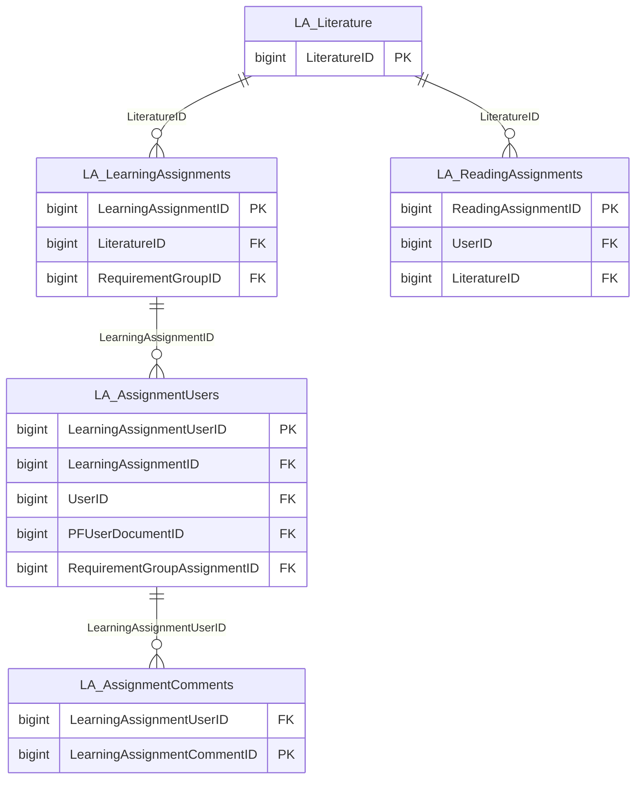

import TableDetail from '@site/src/components/TableDetail';

# Learning Activities Database Tables

**12 tables** · **12 with PK** (100.0%) · **12 FKs** · **37 indexes**

## Entity Relationships

## Table Reference

<TableDetail
  dataUrl="/table-detail-data/learning-activities.json"
  generatedAt="2026-02-28T06:03:57.118Z"
/>

## Stored Procedures

See the [Learning Activities Stored Procedures](./sprocs/learning-activities-sprocs) reference page for detailed documentation of all stored procedures in this module, including parameters, anti-pattern analysis, and optimization recommendations.

## Related Code Documentation

- [Learning Assignment (.NET Business Module)](/docs/dotnet-backend/business/learning-assignment)
