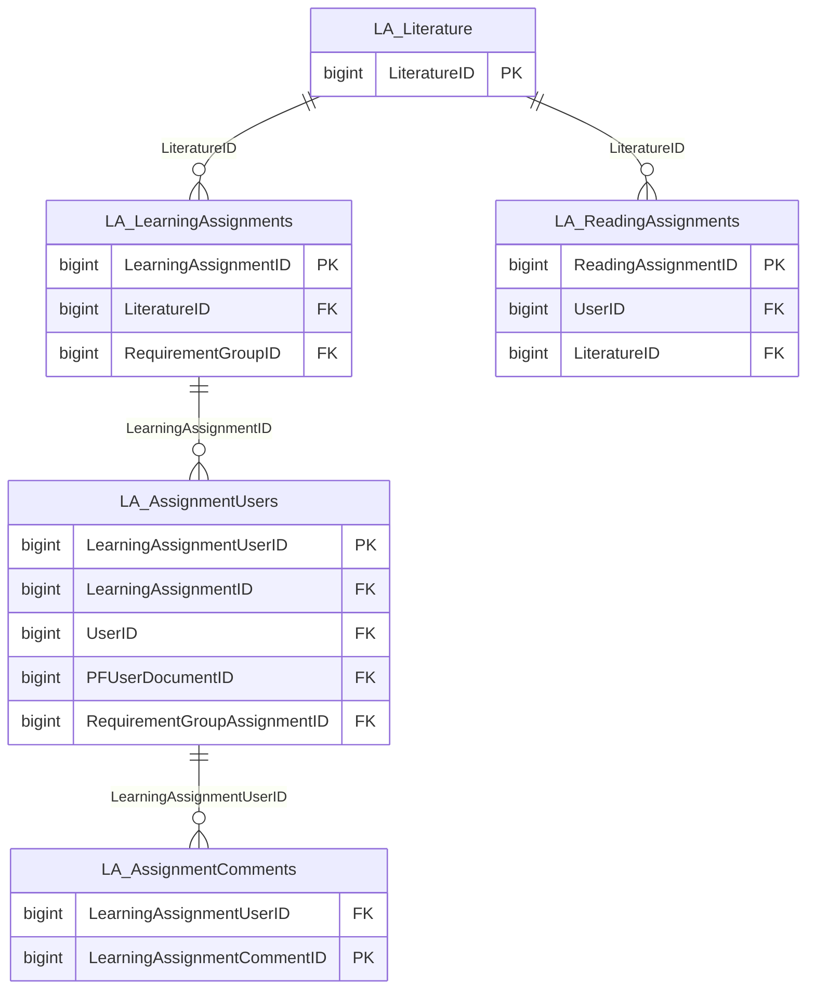

import TableDetail from '@site/src/components/TableDetail';

# Learning Activities Database Tables

**12 tables** · **12 with PK** (100.0%) · **12 FKs** · **37 indexes**

## Entity Relationships

## Table Reference

<TableDetail
  tables={[{"name":"LA_Admins","schema":"dbo","fullName":"dbo.LA_Admins","hasPrimaryKey":true,"primaryKeyColumns":["LAAdminID"],"columns":[{"name":"LAAdminID","dataType":"bigint","rawType":"CounterNumber","maxLength":null,"isNullable":false,"isIdentity":true,"isPrimaryKey":true,"defaultValue":null,"ordinalPosition":1},{"name":"DepartmentID","dataType":"bigint","rawType":"LargeNumber","maxLength":null,"isNullable":false,"isIdentity":false,"isPrimaryKey":false,"defaultValue":null,"ordinalPosition":2},{"name":"UserID","dataType":"bigint","rawType":"LargeNumber","maxLength":null,"isNullable":false,"isIdentity":false,"isPrimaryKey":false,"defaultValue":null,"ordinalPosition":3},{"name":"IsDeleted","dataType":"tinyint","rawType":"VerySmallNumber","maxLength":null,"isNullable":false,"isIdentity":false,"isPrimaryKey":false,"defaultValue":"(0)","ordinalPosition":4}],"foreignKeys":[{"constraintName":"FK_LA_Admins_SEC_Users","columns":["UserID"],"referencedTable":"dbo.SEC_Users","referencedColumns":["UserID"]}],"indexes":[{"name":"PK_LA_Admins","type":"CLUSTERED","isPrimaryKey":true,"isUnique":true,"isDisabled":false,"keyColumns":["LAAdminID"],"includedColumns":[]}],"checkConstraints":[],"defaultConstraints":1,"triggers":[]},{"name":"LA_AssignmentComments","schema":"dbo","fullName":"dbo.LA_AssignmentComments","hasPrimaryKey":true,"primaryKeyColumns":["LearningAssignmentCommentID"],"columns":[{"name":"LearningAssignmentUserID","dataType":"bigint","rawType":"LargeNumber","maxLength":null,"isNullable":false,"isIdentity":false,"isPrimaryKey":false,"defaultValue":null,"ordinalPosition":1},{"name":"CommentedBy","dataType":"bigint","rawType":"LargeNumber","maxLength":null,"isNullable":false,"isIdentity":false,"isPrimaryKey":false,"defaultValue":null,"ordinalPosition":2},{"name":"Comments","dataType":"varchar","rawType":"FreeText","maxLength":"max","isNullable":false,"isIdentity":false,"isPrimaryKey":false,"defaultValue":null,"ordinalPosition":3},{"name":"CommentDate","dataType":"datetime","rawType":"LargeDate","maxLength":null,"isNullable":false,"isIdentity":false,"isPrimaryKey":false,"defaultValue":null,"ordinalPosition":4},{"name":"IsCommentedByLearner","dataType":"tinyint","rawType":"VerySmallNumber","maxLength":null,"isNullable":false,"isIdentity":false,"isPrimaryKey":false,"defaultValue":"(1)","ordinalPosition":5},{"name":"LearningAssignmentCommentID","dataType":"bigint","rawType":"LargeNumber","maxLength":null,"isNullable":false,"isIdentity":true,"isPrimaryKey":true,"defaultValue":null,"ordinalPosition":6},{"name":"DocumentName","dataType":"varchar","rawType":"LongText","maxLength":"250","isNullable":true,"isIdentity":false,"isPrimaryKey":false,"defaultValue":null,"ordinalPosition":7}],"foreignKeys":[{"constraintName":"FK_LA_AssignmentComments_LA_AssignmentUsers","columns":["LearningAssignmentUserID"],"referencedTable":"dbo.LA_AssignmentUsers","referencedColumns":["LearningAssignmentUserID"]}],"indexes":[{"name":"PK_LA_AssignmentComments","type":"CLUSTERED","isPrimaryKey":true,"isUnique":true,"isDisabled":false,"keyColumns":["LearningAssignmentCommentID"],"includedColumns":[]},{"name":"IX_AssignmentComments_LearningAssignmentUserID","type":"NONCLUSTERED","isPrimaryKey":false,"isUnique":false,"isDisabled":false,"keyColumns":["LearningAssignmentUserID"],"includedColumns":[]}],"checkConstraints":[],"defaultConstraints":1,"triggers":[]},{"name":"LA_AssignmentUsers","schema":"dbo","fullName":"dbo.LA_AssignmentUsers","hasPrimaryKey":true,"primaryKeyColumns":["LearningAssignmentUserID"],"columns":[{"name":"LearningAssignmentUserID","dataType":"bigint","rawType":"CounterNumber","maxLength":null,"isNullable":false,"isIdentity":true,"isPrimaryKey":true,"defaultValue":null,"ordinalPosition":1},{"name":"LearningAssignmentID","dataType":"bigint","rawType":"LargeNumber","maxLength":null,"isNullable":true,"isIdentity":false,"isPrimaryKey":false,"defaultValue":null,"ordinalPosition":2},{"name":"UserID","dataType":"bigint","rawType":"LargeNumber","maxLength":null,"isNullable":false,"isIdentity":false,"isPrimaryKey":false,"defaultValue":null,"ordinalPosition":3},{"name":"AccessedDateTime","dataType":"datetime","rawType":"LargeDate","maxLength":null,"isNullable":true,"isIdentity":false,"isPrimaryKey":false,"defaultValue":null,"ordinalPosition":4},{"name":"TopicSubject","dataType":"varchar","rawType":"LargeText","maxLength":"8000","isNullable":true,"isIdentity":false,"isPrimaryKey":false,"defaultValue":null,"ordinalPosition":5},{"name":"SummaryNotes","dataType":"varchar","rawType":"LargeText","maxLength":"8000","isNullable":true,"isIdentity":false,"isPrimaryKey":false,"defaultValue":null,"ordinalPosition":6},{"name":"SubmittedBy","dataType":"bigint","rawType":"LargeNumber","maxLength":null,"isNullable":true,"isIdentity":false,"isPrimaryKey":false,"defaultValue":null,"ordinalPosition":7},{"name":"SubmittedDateTime","dataType":"datetime","rawType":"LargeDate","maxLength":null,"isNullable":true,"isIdentity":false,"isPrimaryKey":false,"defaultValue":null,"ordinalPosition":8},{"name":"ReviewedBy","dataType":"bigint","rawType":"LargeNumber","maxLength":null,"isNullable":true,"isIdentity":false,"isPrimaryKey":false,"defaultValue":null,"ordinalPosition":9},{"name":"ReviewedDateTime","dataType":"datetime","rawType":"LargeDate","maxLength":null,"isNullable":true,"isIdentity":false,"isPrimaryKey":false,"defaultValue":null,"ordinalPosition":10},{"name":"CompletedBy","dataType":"bigint","rawType":"LargeNumber","maxLength":null,"isNullable":true,"isIdentity":false,"isPrimaryKey":false,"defaultValue":null,"ordinalPosition":11},{"name":"CompletedDateTime","dataType":"datetime","rawType":"LargeDate","maxLength":null,"isNullable":true,"isIdentity":false,"isPrimaryKey":false,"defaultValue":null,"ordinalPosition":12},{"name":"PFUserDocumentID","dataType":"bigint","rawType":"LargeNumber","maxLength":null,"isNullable":true,"isIdentity":false,"isPrimaryKey":false,"defaultValue":null,"ordinalPosition":13},{"name":"DocumentName","dataType":"varchar","rawType":"LargeText","maxLength":"8000","isNullable":true,"isIdentity":false,"isPrimaryKey":false,"defaultValue":null,"ordinalPosition":14},{"name":"DocumentFilePath","dataType":"varchar","rawType":"LargeText","maxLength":"8000","isNullable":true,"isIdentity":false,"isPrimaryKey":false,"defaultValue":null,"ordinalPosition":15},{"name":"IsDeleted","dataType":"tinyint","rawType":"VerySmallNumber","maxLength":null,"isNullable":false,"isIdentity":false,"isPrimaryKey":false,"defaultValue":null,"ordinalPosition":16},{"name":"RequirementGroupAssignmentID","dataType":"bigint","rawType":"LargeNumber","maxLength":null,"isNullable":true,"isIdentity":false,"isPrimaryKey":false,"defaultValue":null,"ordinalPosition":17},{"name":"OBCBatchID","dataType":"bigint","rawType":"LargeNumber","maxLength":null,"isNullable":true,"isIdentity":false,"isPrimaryKey":false,"defaultValue":null,"ordinalPosition":18},{"name":"ClosedDate","dataType":"datetime","rawType":"LargeDate","maxLength":null,"isNullable":true,"isIdentity":false,"isPrimaryKey":false,"defaultValue":null,"ordinalPosition":19},{"name":"ClosedBy","dataType":"bigint","rawType":"LargeNumber","maxLength":null,"isNullable":true,"isIdentity":false,"isPrimaryKey":false,"defaultValue":null,"ordinalPosition":20},{"name":"DeletedBy","dataType":"bigint","rawType":"LargeNumber","maxLength":null,"isNullable":true,"isIdentity":false,"isPrimaryKey":false,"defaultValue":null,"ordinalPosition":21},{"name":"DeletedDate","dataType":"datetime","rawType":"LargeDate","maxLength":null,"isNullable":true,"isIdentity":false,"isPrimaryKey":false,"defaultValue":null,"ordinalPosition":22},{"name":"IsDocumentUploaded","dataType":"tinyint","rawType":"VerySmallNumber","maxLength":null,"isNullable":true,"isIdentity":false,"isPrimaryKey":false,"defaultValue":null,"ordinalPosition":23},{"name":"IsDeletedByScheduler","dataType":"tinyint","rawType":"VerySmallNumber","maxLength":null,"isNullable":true,"isIdentity":false,"isPrimaryKey":false,"defaultValue":null,"ordinalPosition":24},{"name":"SchedulerDeletedDate","dataType":"datetime","rawType":"LargeDate","maxLength":null,"isNullable":true,"isIdentity":false,"isPrimaryKey":false,"defaultValue":null,"ordinalPosition":25},{"name":"IsVoluntary","dataType":"smallint","rawType":"SmallNumber","maxLength":null,"isNullable":true,"isIdentity":false,"isPrimaryKey":false,"defaultValue":null,"ordinalPosition":26}],"foreignKeys":[{"constraintName":"FK_LA_AssignmentUsers_PF_UserDocuments","columns":["PFUserDocumentID"],"referencedTable":"dbo.PF_UserDocuments","referencedColumns":["DocumentID"]},{"constraintName":"FK_LA_AssignmentUsers_SEC_Users","columns":["UserID"],"referencedTable":"dbo.SEC_Users","referencedColumns":["UserID"]},{"constraintName":"FK_OBC_RequirementGroupAssignment_LA_AssignmentUsers_RequirementGroupAssignmentID","columns":["RequirementGroupAssignmentID"],"referencedTable":"dbo.OBC_RequirementGroupAssignment","referencedColumns":["RequirementGroupAssignmentID"]},{"constraintName":"LEARN_LearningAssignmentUsers_LA_LearningAssignments_FK1","columns":["LearningAssignmentID"],"referencedTable":"dbo.LA_LearningAssignments","referencedColumns":["LearningAssignmentID"]}],"indexes":[{"name":"PK_LA_AssignmentUsers","type":"CLUSTERED","isPrimaryKey":true,"isUnique":true,"isDisabled":false,"keyColumns":["LearningAssignmentUserID"],"includedColumns":[]},{"name":"IDX_LA_AssignmentUsers_1","type":"NONCLUSTERED","isPrimaryKey":false,"isUnique":false,"isDisabled":false,"keyColumns":["OBCBatchID"],"includedColumns":[]},{"name":"IDX_MissingOn_LA_AssignmentUsers_063EBCED806846B7A9BC497AD768103E","type":"NONCLUSTERED","isPrimaryKey":false,"isUnique":false,"isDisabled":false,"keyColumns":["IsDeleted"],"includedColumns":["LearningAssignmentID","UserID","SubmittedDateTime","ReviewedDateTime","CompletedDateTime"]},{"name":"IDX_MissingOn_LA_AssignmentUsers_9EFD8660C5EF423C945BA4AF740597FF","type":"NONCLUSTERED","isPrimaryKey":false,"isUnique":false,"isDisabled":false,"keyColumns":["PFUserDocumentID"],"includedColumns":[]},{"name":"IDX_MissingOn_LA_AssignmentUsers_A59DCAECFB6E49D5A12DC93BB69A1153","type":"NONCLUSTERED","isPrimaryKey":false,"isUnique":false,"isDisabled":false,"keyColumns":["SubmittedDateTime","ReviewedDateTime","CompletedDateTime","IsDeleted","ClosedDate"],"includedColumns":[]},{"name":"IX_LA_AssignmentUsers_1","type":"NONCLUSTERED","isPrimaryKey":false,"isUnique":false,"isDisabled":false,"keyColumns":["UserID","AccessedDateTime"],"includedColumns":[]},{"name":"IX_LA_AssignmentUsers_3","type":"NONCLUSTERED","isPrimaryKey":false,"isUnique":false,"isDisabled":false,"keyColumns":["ReviewedDateTime","CompletedDateTime","IsDeleted","SubmittedDateTime"],"includedColumns":[]},{"name":"IX_LA_AssignmentUsers_4","type":"NONCLUSTERED","isPrimaryKey":false,"isUnique":false,"isDisabled":false,"keyColumns":["RequirementGroupAssignmentID"],"includedColumns":[]},{"name":"IX_LA_AssignmentUsers_5","type":"NONCLUSTERED","isPrimaryKey":false,"isUnique":false,"isDisabled":false,"keyColumns":["CompletedDateTime"],"includedColumns":["LearningAssignmentID","UserID"]},{"name":"IX_LA_AssignmentUsers_OBCBatchID1","type":"NONCLUSTERED","isPrimaryKey":false,"isUnique":false,"isDisabled":false,"keyColumns":["LearningAssignmentID"],"includedColumns":["OBCBatchID"]}],"checkConstraints":[],"defaultConstraints":0,"triggers":[]},{"name":"LA_LearningAssignments","schema":"dbo","fullName":"dbo.LA_LearningAssignments","hasPrimaryKey":true,"primaryKeyColumns":["LearningAssignmentID"],"columns":[{"name":"LearningAssignmentID","dataType":"bigint","rawType":"CounterNumber","maxLength":null,"isNullable":false,"isIdentity":true,"isPrimaryKey":true,"defaultValue":null,"ordinalPosition":1},{"name":"LiteratureID","dataType":"bigint","rawType":"LargeNumber","maxLength":null,"isNullable":true,"isIdentity":false,"isPrimaryKey":false,"defaultValue":null,"ordinalPosition":2},{"name":"AssignmentDetails","dataType":"varchar","rawType":"LargeText","maxLength":"8000","isNullable":true,"isIdentity":false,"isPrimaryKey":false,"defaultValue":null,"ordinalPosition":3},{"name":"StartDate","dataType":"datetime","rawType":"LargeDate","maxLength":null,"isNullable":true,"isIdentity":false,"isPrimaryKey":false,"defaultValue":null,"ordinalPosition":4},{"name":"ExpiryDate","dataType":"datetime","rawType":"LargeDate","maxLength":null,"isNullable":true,"isIdentity":false,"isPrimaryKey":false,"defaultValue":null,"ordinalPosition":5},{"name":"CreatedBy","dataType":"bigint","rawType":"LargeNumber","maxLength":null,"isNullable":false,"isIdentity":false,"isPrimaryKey":false,"defaultValue":null,"ordinalPosition":6},{"name":"CreatedDateTime","dataType":"datetime","rawType":"LargeDate","maxLength":null,"isNullable":false,"isIdentity":false,"isPrimaryKey":false,"defaultValue":null,"ordinalPosition":7},{"name":"ModifiedBy","dataType":"bigint","rawType":"LargeNumber","maxLength":null,"isNullable":true,"isIdentity":false,"isPrimaryKey":false,"defaultValue":null,"ordinalPosition":8},{"name":"DateModified","dataType":"datetime","rawType":"LargeDate","maxLength":null,"isNullable":true,"isIdentity":false,"isPrimaryKey":false,"defaultValue":null,"ordinalPosition":9},{"name":"VideoID","dataType":"bigint","rawType":"LargeNumber","maxLength":null,"isNullable":true,"isIdentity":false,"isPrimaryKey":false,"defaultValue":null,"ordinalPosition":10},{"name":"IsReviewRequired","dataType":"tinyint","rawType":"VerySmallNumber","maxLength":null,"isNullable":false,"isIdentity":false,"isPrimaryKey":false,"defaultValue":null,"ordinalPosition":11},{"name":"IsDeletedLearningAssignment","dataType":"tinyint","rawType":"VerySmallNumber","maxLength":null,"isNullable":false,"isIdentity":false,"isPrimaryKey":false,"defaultValue":null,"ordinalPosition":12},{"name":"RequirementGroupID","dataType":"bigint","rawType":"LargeNumber","maxLength":null,"isNullable":true,"isIdentity":false,"isPrimaryKey":false,"defaultValue":null,"ordinalPosition":13},{"name":"IsAutoAssignment","dataType":"tinyint","rawType":"VerySmallNumber","maxLength":null,"isNullable":true,"isIdentity":false,"isPrimaryKey":false,"defaultValue":null,"ordinalPosition":14},{"name":"DepartmentRotationID","dataType":"bigint","rawType":"LargeNumber","maxLength":null,"isNullable":true,"isIdentity":false,"isPrimaryKey":false,"defaultValue":null,"ordinalPosition":15}],"foreignKeys":[{"constraintName":"FK_OBC_RequirementGroup_LA_LearningAssignments_RequirementGroupID","columns":["RequirementGroupID"],"referencedTable":"dbo.OBC_RequirementGroup","referencedColumns":["RequirementGroupID"]},{"constraintName":"LA_LearningAssignments_LA_Literatures_FK1","columns":["LiteratureID"],"referencedTable":"dbo.LA_Literature","referencedColumns":["LiteratureID"]}],"indexes":[{"name":"PK_LA_LearningAssignments","type":"CLUSTERED","isPrimaryKey":true,"isUnique":true,"isDisabled":false,"keyColumns":["LearningAssignmentID"],"includedColumns":[]},{"name":"IX_LA_LearningAssignments_1","type":"NONCLUSTERED","isPrimaryKey":false,"isUnique":false,"isDisabled":false,"keyColumns":["IsDeletedLearningAssignment"],"includedColumns":["LearningAssignmentID","LiteratureID","RequirementGroupID"]},{"name":"IX_LA_LearningAssignments_2","type":"NONCLUSTERED","isPrimaryKey":false,"isUnique":false,"isDisabled":false,"keyColumns":["LiteratureID","IsDeletedLearningAssignment","RequirementGroupID"],"includedColumns":["LearningAssignmentID"]},{"name":"IX_LA_LearningAssignments_IsDeletedLearningAssignment","type":"NONCLUSTERED","isPrimaryKey":false,"isUnique":false,"isDisabled":false,"keyColumns":["IsDeletedLearningAssignment"],"includedColumns":["LearningAssignmentID","LiteratureID","RequirementGroupID"]},{"name":"IX_LA_LearningAssignments_RequirementGroupID1","type":"NONCLUSTERED","isPrimaryKey":false,"isUnique":false,"isDisabled":false,"keyColumns":["RequirementGroupID"],"includedColumns":["LearningAssignmentID"]},{"name":"IX_LA_LearningAssignments_StarDate_ExpiryDate","type":"NONCLUSTERED","isPrimaryKey":false,"isUnique":false,"isDisabled":false,"keyColumns":["IsDeletedLearningAssignment"],"includedColumns":["LearningAssignmentID","LiteratureID","StartDate","ExpiryDate","RequirementGroupID"]}],"checkConstraints":[],"defaultConstraints":0,"triggers":[]},{"name":"LA_Literature","schema":"dbo","fullName":"dbo.LA_Literature","hasPrimaryKey":true,"primaryKeyColumns":["LiteratureID"],"columns":[{"name":"LiteratureID","dataType":"bigint","rawType":"CounterNumber","maxLength":null,"isNullable":false,"isIdentity":true,"isPrimaryKey":true,"defaultValue":null,"ordinalPosition":1},{"name":"DepartmentID","dataType":"bigint","rawType":"LargeNumber","maxLength":null,"isNullable":false,"isIdentity":false,"isPrimaryKey":false,"defaultValue":null,"ordinalPosition":2},{"name":"Name","dataType":"varchar","rawType":"LongText","maxLength":"250","isNullable":false,"isIdentity":false,"isPrimaryKey":false,"defaultValue":null,"ordinalPosition":3},{"name":"IsDeleted","dataType":"tinyint","rawType":"VerySmallNumber","maxLength":null,"isNullable":false,"isIdentity":false,"isPrimaryKey":false,"defaultValue":"(0)","ordinalPosition":4},{"name":"DateModified","dataType":"datetime","rawType":"LargeDate","maxLength":null,"isNullable":false,"isIdentity":false,"isPrimaryKey":false,"defaultValue":"getdate()","ordinalPosition":5},{"name":"Description","dataType":"varchar","rawType":"LargeText","maxLength":"8000","isNullable":true,"isIdentity":false,"isPrimaryKey":false,"defaultValue":null,"ordinalPosition":6},{"name":"AssignmentDetails","dataType":"varchar","rawType":"LargeText","maxLength":"8000","isNullable":true,"isIdentity":false,"isPrimaryKey":false,"defaultValue":null,"ordinalPosition":7},{"name":"IsVoluntary","dataType":"tinyint","rawType":"VerySmallNumber","maxLength":null,"isNullable":false,"isIdentity":false,"isPrimaryKey":false,"defaultValue":null,"ordinalPosition":8}],"foreignKeys":[],"indexes":[{"name":"PK_LA_Literature","type":"CLUSTERED","isPrimaryKey":true,"isUnique":true,"isDisabled":false,"keyColumns":["LiteratureID"],"includedColumns":[]},{"name":"IX_LA_Literature_LiteratureID","type":"NONCLUSTERED","isPrimaryKey":false,"isUnique":false,"isDisabled":false,"keyColumns":["DepartmentID"],"includedColumns":["LiteratureID"]}],"checkConstraints":[],"defaultConstraints":2,"triggers":[]},{"name":"LA_LiteratureData","schema":"dbo","fullName":"dbo.LA_LiteratureData","hasPrimaryKey":true,"primaryKeyColumns":["LiteratureDataID"],"columns":[{"name":"LiteratureDataID","dataType":"bigint","rawType":"LargeNumber","maxLength":null,"isNullable":false,"isIdentity":true,"isPrimaryKey":true,"defaultValue":null,"ordinalPosition":1},{"name":"LiteratureID","dataType":"bigint","rawType":"LargeNumber","maxLength":null,"isNullable":true,"isIdentity":false,"isPrimaryKey":false,"defaultValue":null,"ordinalPosition":2},{"name":"QuizID","dataType":"bigint","rawType":"LargeNumber","maxLength":null,"isNullable":true,"isIdentity":false,"isPrimaryKey":false,"defaultValue":null,"ordinalPosition":3},{"name":"PassPercentage","dataType":"decimal","rawType":"ScoreNumber","maxLength":"10, 2","isNullable":true,"isIdentity":false,"isPrimaryKey":false,"defaultValue":null,"ordinalPosition":4},{"name":"NumberOfTimesRetakeAllowed","dataType":"smallint","rawType":"SmallNumber","maxLength":null,"isNullable":true,"isIdentity":false,"isPrimaryKey":false,"defaultValue":null,"ordinalPosition":5},{"name":"CompletionTime","dataType":"int","rawType":"BigNumber","maxLength":null,"isNullable":true,"isIdentity":false,"isPrimaryKey":false,"defaultValue":null,"ordinalPosition":6},{"name":"CompletionPath","dataType":"tinyint","rawType":"VerySmallNumber","maxLength":null,"isNullable":true,"isIdentity":false,"isPrimaryKey":false,"defaultValue":null,"ordinalPosition":7},{"name":"DocumentName","dataType":"varchar","rawType":"LargeText","maxLength":"8000","isNullable":true,"isIdentity":false,"isPrimaryKey":false,"defaultValue":null,"ordinalPosition":8},{"name":"DocumentSize","dataType":"decimal","rawType":"ScoreNumber","maxLength":"10, 2","isNullable":true,"isIdentity":false,"isPrimaryKey":false,"defaultValue":null,"ordinalPosition":9},{"name":"DocumentFilePath","dataType":"varchar","rawType":"LargeText","maxLength":"8000","isNullable":true,"isIdentity":false,"isPrimaryKey":false,"defaultValue":null,"ordinalPosition":10},{"name":"VideoID","dataType":"bigint","rawType":"LargeNumber","maxLength":null,"isNullable":true,"isIdentity":false,"isPrimaryKey":false,"defaultValue":null,"ordinalPosition":11},{"name":"IsReviewRequired","dataType":"tinyint","rawType":"VerySmallNumber","maxLength":null,"isNullable":true,"isIdentity":false,"isPrimaryKey":false,"defaultValue":null,"ordinalPosition":12},{"name":"CreatedBy","dataType":"bigint","rawType":"LargeNumber","maxLength":null,"isNullable":true,"isIdentity":false,"isPrimaryKey":false,"defaultValue":null,"ordinalPosition":13},{"name":"CreatedDate","dataType":"datetime","rawType":"LargeDate","maxLength":null,"isNullable":true,"isIdentity":false,"isPrimaryKey":false,"defaultValue":null,"ordinalPosition":14},{"name":"ModifiedBy","dataType":"bigint","rawType":"LargeNumber","maxLength":null,"isNullable":true,"isIdentity":false,"isPrimaryKey":false,"defaultValue":null,"ordinalPosition":15},{"name":"ModifiedDate","dataType":"datetime","rawType":"LargeDate","maxLength":null,"isNullable":true,"isIdentity":false,"isPrimaryKey":false,"defaultValue":null,"ordinalPosition":16},{"name":"QuestionDisplay","dataType":"tinyint","rawType":"VerySmallNumber","maxLength":null,"isNullable":false,"isIdentity":false,"isPrimaryKey":false,"defaultValue":null,"ordinalPosition":17}],"foreignKeys":[],"indexes":[{"name":"PK_LA_LiteratureData","type":"CLUSTERED","isPrimaryKey":true,"isUnique":true,"isDisabled":false,"keyColumns":["LiteratureDataID"],"includedColumns":[]}],"checkConstraints":[],"defaultConstraints":0,"triggers":[]},{"name":"LA_LiteratureDocumentHistory","schema":"dbo","fullName":"dbo.LA_LiteratureDocumentHistory","hasPrimaryKey":true,"primaryKeyColumns":["LiteratureDocumentHistoryID"],"columns":[{"name":"LiteratureDocumentHistoryID","dataType":"bigint","rawType":"LargeNumber","maxLength":null,"isNullable":false,"isIdentity":true,"isPrimaryKey":true,"defaultValue":null,"ordinalPosition":1},{"name":"LiteratureID","dataType":"bigint","rawType":"LargeNumber","maxLength":null,"isNullable":true,"isIdentity":false,"isPrimaryKey":false,"defaultValue":null,"ordinalPosition":2},{"name":"DocumentName","dataType":"varchar","rawType":"LargeText","maxLength":"8000","isNullable":true,"isIdentity":false,"isPrimaryKey":false,"defaultValue":null,"ordinalPosition":3},{"name":"DocumentSize","dataType":"decimal","rawType":"ScoreNumber","maxLength":"10, 2","isNullable":true,"isIdentity":false,"isPrimaryKey":false,"defaultValue":null,"ordinalPosition":4},{"name":"DocumentFilePath","dataType":"varchar","rawType":"LargeText","maxLength":"8000","isNullable":true,"isIdentity":false,"isPrimaryKey":false,"defaultValue":null,"ordinalPosition":5},{"name":"DeletedBy","dataType":"bigint","rawType":"LargeNumber","maxLength":null,"isNullable":true,"isIdentity":false,"isPrimaryKey":false,"defaultValue":null,"ordinalPosition":6},{"name":"DeletedDate","dataType":"datetime","rawType":"LargeDate","maxLength":null,"isNullable":true,"isIdentity":false,"isPrimaryKey":false,"defaultValue":null,"ordinalPosition":7}],"foreignKeys":[],"indexes":[{"name":"PK_LA_LiteratureDocumentHistory","type":"CLUSTERED","isPrimaryKey":true,"isUnique":true,"isDisabled":false,"keyColumns":["LiteratureDocumentHistoryID"],"includedColumns":[]}],"checkConstraints":[],"defaultConstraints":0,"triggers":[]},{"name":"LA_PreceptorGroups","schema":"dbo","fullName":"dbo.LA_PreceptorGroups","hasPrimaryKey":true,"primaryKeyColumns":["PreceptorGroupID"],"columns":[{"name":"PreceptorGroupID","dataType":"bigint","rawType":"LargeNumber","maxLength":null,"isNullable":false,"isIdentity":true,"isPrimaryKey":true,"defaultValue":null,"ordinalPosition":1},{"name":"PreceptorGroupName","dataType":"varchar","rawType":"LargeText","maxLength":"8000","isNullable":true,"isIdentity":false,"isPrimaryKey":false,"defaultValue":null,"ordinalPosition":2},{"name":"DepartmentID","dataType":"bigint","rawType":"LargeNumber","maxLength":null,"isNullable":true,"isIdentity":false,"isPrimaryKey":false,"defaultValue":null,"ordinalPosition":3},{"name":"CreatedDate","dataType":"datetime","rawType":"LargeDate","maxLength":null,"isNullable":true,"isIdentity":false,"isPrimaryKey":false,"defaultValue":null,"ordinalPosition":4},{"name":"DateModified","dataType":"datetime","rawType":"LargeDate","maxLength":null,"isNullable":true,"isIdentity":false,"isPrimaryKey":false,"defaultValue":null,"ordinalPosition":5},{"name":"CreatedBy","dataType":"bigint","rawType":"LargeNumber","maxLength":null,"isNullable":true,"isIdentity":false,"isPrimaryKey":false,"defaultValue":null,"ordinalPosition":6},{"name":"ModifiedBy","dataType":"bigint","rawType":"LargeNumber","maxLength":null,"isNullable":true,"isIdentity":false,"isPrimaryKey":false,"defaultValue":null,"ordinalPosition":7}],"foreignKeys":[],"indexes":[{"name":"PK_LA_PreceptorGroups","type":"CLUSTERED","isPrimaryKey":true,"isUnique":true,"isDisabled":false,"keyColumns":["PreceptorGroupID"],"includedColumns":[]}],"checkConstraints":[],"defaultConstraints":0,"triggers":[]},{"name":"LA_Preceptors","schema":"dbo","fullName":"dbo.LA_Preceptors","hasPrimaryKey":true,"primaryKeyColumns":["PreceptorID"],"columns":[{"name":"PreceptorID","dataType":"bigint","rawType":"CounterNumber","maxLength":null,"isNullable":false,"isIdentity":true,"isPrimaryKey":true,"defaultValue":null,"ordinalPosition":1},{"name":"DepartmentID","dataType":"bigint","rawType":"LargeNumber","maxLength":null,"isNullable":true,"isIdentity":false,"isPrimaryKey":false,"defaultValue":null,"ordinalPosition":2},{"name":"UserID","dataType":"bigint","rawType":"LargeNumber","maxLength":null,"isNullable":false,"isIdentity":false,"isPrimaryKey":false,"defaultValue":null,"ordinalPosition":3},{"name":"DateModified","dataType":"datetime","rawType":"LargeDate","maxLength":null,"isNullable":true,"isIdentity":false,"isPrimaryKey":false,"defaultValue":null,"ordinalPosition":4},{"name":"IsDeleted","dataType":"tinyint","rawType":"VerySmallNumber","maxLength":null,"isNullable":false,"isIdentity":false,"isPrimaryKey":false,"defaultValue":"(0)","ordinalPosition":5},{"name":"CreatedInDepartmentID","dataType":"bigint","rawType":"LargeNumber","maxLength":null,"isNullable":true,"isIdentity":false,"isPrimaryKey":false,"defaultValue":null,"ordinalPosition":6},{"name":"PreceptorGroupID","dataType":"bigint","rawType":"LargeNumber","maxLength":null,"isNullable":true,"isIdentity":false,"isPrimaryKey":false,"defaultValue":null,"ordinalPosition":7},{"name":"PreviousPreceptorGroupID","dataType":"bigint","rawType":"LargeNumber","maxLength":null,"isNullable":true,"isIdentity":false,"isPrimaryKey":false,"defaultValue":"(0)","ordinalPosition":8},{"name":"IsFromBanner","dataType":"tinyint","rawType":"VerySmallNumber","maxLength":null,"isNullable":true,"isIdentity":false,"isPrimaryKey":false,"defaultValue":"(0)","ordinalPosition":9},{"name":"ActivityDate","dataType":"datetime","rawType":"LargeDate","maxLength":null,"isNullable":true,"isIdentity":false,"isPrimaryKey":false,"defaultValue":null,"ordinalPosition":10},{"name":"PreceptorUniqueID","dataType":"varchar","rawType":"LongText","maxLength":"250","isNullable":true,"isIdentity":false,"isPrimaryKey":false,"defaultValue":null,"ordinalPosition":11},{"name":"BatchID","dataType":"bigint","rawType":"LargeNumber","maxLength":null,"isNullable":true,"isIdentity":false,"isPrimaryKey":false,"defaultValue":null,"ordinalPosition":12},{"name":"DeletedDate","dataType":"datetime","rawType":"LargeDate","maxLength":null,"isNullable":true,"isIdentity":false,"isPrimaryKey":false,"defaultValue":null,"ordinalPosition":13},{"name":"DeletedBy","dataType":"bigint","rawType":"LargeNumber","maxLength":null,"isNullable":true,"isIdentity":false,"isPrimaryKey":false,"defaultValue":null,"ordinalPosition":14},{"name":"IsApproved","dataType":"tinyint","rawType":"VerySmallNumber","maxLength":null,"isNullable":true,"isIdentity":false,"isPrimaryKey":false,"defaultValue":null,"ordinalPosition":15},{"name":"ApprovedDate","dataType":"datetime","rawType":"LargeDate","maxLength":null,"isNullable":true,"isIdentity":false,"isPrimaryKey":false,"defaultValue":null,"ordinalPosition":16},{"name":"ApprovedBy","dataType":"bigint","rawType":"LargeNumber","maxLength":null,"isNullable":true,"isIdentity":false,"isPrimaryKey":false,"defaultValue":null,"ordinalPosition":17},{"name":"IsHold","dataType":"tinyint","rawType":"VerySmallNumber","maxLength":null,"isNullable":true,"isIdentity":false,"isPrimaryKey":false,"defaultValue":null,"ordinalPosition":18},{"name":"HoldDate","dataType":"datetime","rawType":"LargeDate","maxLength":null,"isNullable":true,"isIdentity":false,"isPrimaryKey":false,"defaultValue":null,"ordinalPosition":19},{"name":"HoldBy","dataType":"bigint","rawType":"LargeNumber","maxLength":null,"isNullable":true,"isIdentity":false,"isPrimaryKey":false,"defaultValue":null,"ordinalPosition":20}],"foreignKeys":[{"constraintName":"FK_LA_Preceptors_SEC_Users","columns":["UserID"],"referencedTable":"dbo.SEC_Users","referencedColumns":["UserID"]}],"indexes":[{"name":"PK_LA_Preceptors","type":"CLUSTERED","isPrimaryKey":true,"isUnique":true,"isDisabled":false,"keyColumns":["PreceptorID"],"includedColumns":[]},{"name":"IDX_LA_Preceptors1","type":"NONCLUSTERED","isPrimaryKey":false,"isUnique":false,"isDisabled":false,"keyColumns":["DepartmentID","UserID"],"includedColumns":[]},{"name":"IDX_LA_Preceptors2","type":"NONCLUSTERED","isPrimaryKey":false,"isUnique":false,"isDisabled":false,"keyColumns":["UserID"],"includedColumns":[]},{"name":"IDX_LA_Preceptors3","type":"NONCLUSTERED","isPrimaryKey":false,"isUnique":false,"isDisabled":false,"keyColumns":["PreceptorUniqueID"],"includedColumns":[]},{"name":"IDX_LA_Preceptors4","type":"NONCLUSTERED","isPrimaryKey":false,"isUnique":false,"isDisabled":false,"keyColumns":["UserID"],"includedColumns":["PreceptorUniqueID"]},{"name":"IDX_MissingOn_LA_Preceptors_CD01D74EA4424DA2A5CAEA777FF80691","type":"NONCLUSTERED","isPrimaryKey":false,"isUnique":false,"isDisabled":false,"keyColumns":["PreceptorGroupID"],"includedColumns":[]},{"name":"ix_LA_Preceptors_DepartmentID","type":"NONCLUSTERED","isPrimaryKey":false,"isUnique":false,"isDisabled":false,"keyColumns":["DepartmentID"],"includedColumns":[]},{"name":"IX_LA_Preceptors_UserDept","type":"NONCLUSTERED","isPrimaryKey":false,"isUnique":false,"isDisabled":false,"keyColumns":["UserID","DepartmentID"],"includedColumns":[]}],"checkConstraints":[],"defaultConstraints":3,"triggers":[]},{"name":"LA_ReadingAssignments","schema":"dbo","fullName":"dbo.LA_ReadingAssignments","hasPrimaryKey":true,"primaryKeyColumns":["ReadingAssignmentID"],"columns":[{"name":"ReadingAssignmentID","dataType":"bigint","rawType":"CounterNumber","maxLength":null,"isNullable":false,"isIdentity":true,"isPrimaryKey":true,"defaultValue":null,"ordinalPosition":1},{"name":"UserID","dataType":"bigint","rawType":"LargeNumber","maxLength":null,"isNullable":false,"isIdentity":false,"isPrimaryKey":false,"defaultValue":null,"ordinalPosition":2},{"name":"AccessedDateTime","dataType":"datetime","rawType":"LargeDate","maxLength":null,"isNullable":false,"isIdentity":false,"isPrimaryKey":false,"defaultValue":null,"ordinalPosition":3},{"name":"LiteratureID","dataType":"bigint","rawType":"LargeNumber","maxLength":null,"isNullable":false,"isIdentity":false,"isPrimaryKey":false,"defaultValue":null,"ordinalPosition":4},{"name":"OtherDetails","dataType":"varchar","rawType":"LargeText","maxLength":"8000","isNullable":true,"isIdentity":false,"isPrimaryKey":false,"defaultValue":null,"ordinalPosition":5},{"name":"TopicSubject","dataType":"varchar","rawType":"LargeText","maxLength":"8000","isNullable":false,"isIdentity":false,"isPrimaryKey":false,"defaultValue":null,"ordinalPosition":6},{"name":"SummaryNotes","dataType":"varchar","rawType":"LargeText","maxLength":"8000","isNullable":true,"isIdentity":false,"isPrimaryKey":false,"defaultValue":null,"ordinalPosition":7},{"name":"AddedBy","dataType":"bigint","rawType":"LargeNumber","maxLength":null,"isNullable":false,"isIdentity":false,"isPrimaryKey":false,"defaultValue":null,"ordinalPosition":8},{"name":"DateAdded","dataType":"datetime","rawType":"LargeDate","maxLength":null,"isNullable":false,"isIdentity":false,"isPrimaryKey":false,"defaultValue":null,"ordinalPosition":9},{"name":"ModifiedBy","dataType":"bigint","rawType":"LargeNumber","maxLength":null,"isNullable":true,"isIdentity":false,"isPrimaryKey":false,"defaultValue":null,"ordinalPosition":10},{"name":"DateModified","dataType":"datetime","rawType":"LargeDate","maxLength":null,"isNullable":true,"isIdentity":false,"isPrimaryKey":false,"defaultValue":null,"ordinalPosition":11}],"foreignKeys":[{"constraintName":"FK_LA_ReadingAssignments_SEC_Users","columns":["UserID"],"referencedTable":"dbo.SEC_Users","referencedColumns":["UserID"]},{"constraintName":"LA_ReadingAssignments_LA_Literatures_FK1","columns":["LiteratureID"],"referencedTable":"dbo.LA_Literature","referencedColumns":["LiteratureID"]}],"indexes":[{"name":"PK_LA_ReadingAssignments","type":"CLUSTERED","isPrimaryKey":true,"isUnique":true,"isDisabled":false,"keyColumns":["ReadingAssignmentID"],"includedColumns":[]}],"checkConstraints":[],"defaultConstraints":0,"triggers":[]},{"name":"LA_Trainee","schema":"dbo","fullName":"dbo.LA_Trainee","hasPrimaryKey":true,"primaryKeyColumns":["TraineeID"],"columns":[{"name":"TraineeID","dataType":"bigint","rawType":"CounterNumber","maxLength":null,"isNullable":false,"isIdentity":true,"isPrimaryKey":true,"defaultValue":null,"ordinalPosition":1},{"name":"PreceptorID","dataType":"bigint","rawType":"LargeNumber","maxLength":null,"isNullable":false,"isIdentity":false,"isPrimaryKey":false,"defaultValue":null,"ordinalPosition":2},{"name":"UserID","dataType":"bigint","rawType":"LargeNumber","maxLength":null,"isNullable":true,"isIdentity":false,"isPrimaryKey":false,"defaultValue":null,"ordinalPosition":3},{"name":"PreceptorGroupID","dataType":"bigint","rawType":"LargeNumber","maxLength":null,"isNullable":true,"isIdentity":false,"isPrimaryKey":false,"defaultValue":null,"ordinalPosition":4},{"name":"ActivityDate","dataType":"datetime","rawType":"LargeDate","maxLength":null,"isNullable":true,"isIdentity":false,"isPrimaryKey":false,"defaultValue":null,"ordinalPosition":5}],"foreignKeys":[{"constraintName":"FK_LA_Trainee_SEC_Users","columns":["UserID"],"referencedTable":"dbo.SEC_Users","referencedColumns":["UserID"]}],"indexes":[{"name":"PK_LA_Trainee","type":"CLUSTERED","isPrimaryKey":true,"isUnique":true,"isDisabled":false,"keyColumns":["TraineeID"],"includedColumns":[]},{"name":"IX_LA_Trainee_PreceptorID_UserID","type":"NONCLUSTERED","isPrimaryKey":false,"isUnique":false,"isDisabled":false,"keyColumns":["PreceptorID"],"includedColumns":["UserID"]},{"name":"IX_LA_Trainee_UserID","type":"NONCLUSTERED","isPrimaryKey":false,"isUnique":false,"isDisabled":false,"keyColumns":["UserID"],"includedColumns":[]}],"checkConstraints":[],"defaultConstraints":0,"triggers":[]},{"name":"LA_UserDocuments","schema":"dbo","fullName":"dbo.LA_UserDocuments","hasPrimaryKey":true,"primaryKeyColumns":["LearningAssignmentDocumentID"],"columns":[{"name":"LearningAssignmentDocumentID","dataType":"bigint","rawType":"LargeNumber","maxLength":null,"isNullable":false,"isIdentity":true,"isPrimaryKey":true,"defaultValue":null,"ordinalPosition":1},{"name":"DocumentName","dataType":"varchar","rawType":"LargeText","maxLength":"8000","isNullable":true,"isIdentity":false,"isPrimaryKey":false,"defaultValue":null,"ordinalPosition":2},{"name":"DocumentFilePath","dataType":"varchar","rawType":"LargeText","maxLength":"8000","isNullable":true,"isIdentity":false,"isPrimaryKey":false,"defaultValue":null,"ordinalPosition":3},{"name":"LearningAssignmentCommentID","dataType":"bigint","rawType":"LargeNumber","maxLength":null,"isNullable":true,"isIdentity":false,"isPrimaryKey":false,"defaultValue":null,"ordinalPosition":4},{"name":"DocumentUserID","dataType":"bigint","rawType":"LargeNumber","maxLength":null,"isNullable":true,"isIdentity":false,"isPrimaryKey":false,"defaultValue":null,"ordinalPosition":5},{"name":"DocumentFileSize","dataType":"decimal","rawType":"ScoreNumber","maxLength":"10, 2","isNullable":true,"isIdentity":false,"isPrimaryKey":false,"defaultValue":null,"ordinalPosition":6},{"name":"CreatedBy","dataType":"bigint","rawType":"LargeNumber","maxLength":null,"isNullable":true,"isIdentity":false,"isPrimaryKey":false,"defaultValue":null,"ordinalPosition":7},{"name":"CreatedDate","dataType":"datetime","rawType":"LargeDate","maxLength":null,"isNullable":true,"isIdentity":false,"isPrimaryKey":false,"defaultValue":null,"ordinalPosition":8},{"name":"DocumentDepartmentID","dataType":"bigint","rawType":"LargeNumber","maxLength":null,"isNullable":true,"isIdentity":false,"isPrimaryKey":false,"defaultValue":null,"ordinalPosition":9}],"foreignKeys":[],"indexes":[{"name":"PK_LA_UserDocuments","type":"CLUSTERED","isPrimaryKey":true,"isUnique":true,"isDisabled":false,"keyColumns":["LearningAssignmentDocumentID"],"includedColumns":[]}],"checkConstraints":[],"defaultConstraints":0,"triggers":[]}]}
  generatedAt="2026-02-27T13:41:46.788Z"
/>

## Stored Procedures

See the [Learning Activities Stored Procedures](./sprocs/learning-activities-sprocs) reference page for detailed documentation of all stored procedures in this module, including parameters, anti-pattern analysis, and optimization recommendations.
