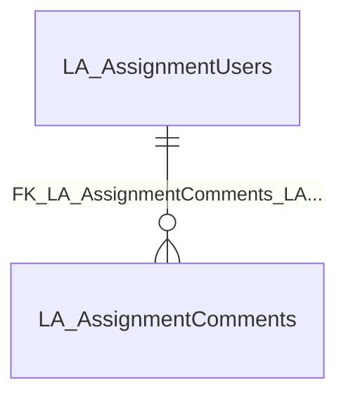

import TableDetail from '@site/src/components/TableDetail';

# Learning Activities Database Tables

**12 tables** · **12 with PK** (100.0%) · **13 FKs** · **37 indexes**

## Entity Relationships

## Table Reference

<TableDetail
  tables={[{"name":"LA_Admins","schema":"dbo","fullName":"dbo.LA_Admins","hasPrimaryKey":true,"primaryKeyColumns":["LAAdminID"],"foreignKeys":[{"constraintName":"FK_LA_Admins_SEC_Users","referencedTable":"SEC_Users"}],"indexes":[{"name":"LEARN_LAAdmin_PK","type":"CLUSTERED","isPrimaryKey":true,"isUnique":true,"isDisabled":false,"keyColumns":["LAAdminID"],"includedColumns":[]}],"checkConstraints":[],"defaultConstraints":1,"triggers":[]},{"name":"LA_AssignmentComments","schema":"dbo","fullName":"dbo.LA_AssignmentComments","hasPrimaryKey":true,"primaryKeyColumns":["LearningAssignmentCommentID"],"foreignKeys":[{"constraintName":"FK_LA_AssignmentComments_LA_AssignmentUsers","referencedTable":"LA_AssignmentUsers"}],"indexes":[{"name":"IX_AssignmentComments_LearningAssignmentUserID","type":"NONCLUSTERED","isPrimaryKey":false,"isUnique":false,"isDisabled":false,"keyColumns":["LearningAssignmentUserID"],"includedColumns":[]},{"name":"PK_LA_AssignmentComments","type":"CLUSTERED","isPrimaryKey":true,"isUnique":true,"isDisabled":false,"keyColumns":["LearningAssignmentCommentID"],"includedColumns":[]}],"checkConstraints":[],"defaultConstraints":1,"triggers":[]},{"name":"LA_AssignmentUsers","schema":"dbo","fullName":"dbo.LA_AssignmentUsers","hasPrimaryKey":true,"primaryKeyColumns":["LearningAssignmentUserID"],"foreignKeys":[{"constraintName":"FK_OBC_RequirementGroupAssignment_LA_AssignmentUsers_RequirementGroupAssignmentID","referencedTable":"FK_OBC_RequirementGroupAssignment_LA_AssignmentUsers_RequirementGroupAssignmentID"},{"constraintName":"LEARN_LearningAssignmentUsers_LA_LearningAssignments_FK1","referencedTable":"LEARN_LearningAssignmentUsers_LA_LearningAssignments"},{"constraintName":"FK_LA_AssignmentUsers_SEC_Users","referencedTable":"SEC_Users"},{"constraintName":"FK_LA_AssignmentUsers_PF_UserDocuments","referencedTable":"PF_UserDocuments"}],"indexes":[{"name":"IDX_LA_AssignmentUsers_1","type":"NONCLUSTERED","isPrimaryKey":false,"isUnique":false,"isDisabled":false,"keyColumns":["OBCBatchID"],"includedColumns":[]},{"name":"IDX_MissingOn_LA_AssignmentUsers_063EBCED806846B7A9BC497AD768103E","type":"NONCLUSTERED","isPrimaryKey":false,"isUnique":false,"isDisabled":false,"keyColumns":["IsDeleted"],"includedColumns":["LearningAssignmentID","UserID","SubmittedDateTime","ReviewedDateTime","CompletedDateTime"]},{"name":"IDX_MissingOn_LA_AssignmentUsers_9EFD8660C5EF423C945BA4AF740597FF","type":"NONCLUSTERED","isPrimaryKey":false,"isUnique":false,"isDisabled":false,"keyColumns":["PFUserDocumentID"],"includedColumns":[]},{"name":"IDX_MissingOn_LA_AssignmentUsers_A59DCAECFB6E49D5A12DC93BB69A1153","type":"NONCLUSTERED","isPrimaryKey":false,"isUnique":false,"isDisabled":false,"keyColumns":["SubmittedDateTime","ReviewedDateTime","CompletedDateTime","IsDeleted","ClosedDate"],"includedColumns":[]},{"name":"IX_LA_AssignmentUsers_1","type":"NONCLUSTERED","isPrimaryKey":false,"isUnique":false,"isDisabled":false,"keyColumns":["UserID","AccessedDateTime"],"includedColumns":[]},{"name":"IX_LA_AssignmentUsers_3","type":"NONCLUSTERED","isPrimaryKey":false,"isUnique":false,"isDisabled":false,"keyColumns":["ReviewedDateTime","CompletedDateTime","IsDeleted","SubmittedDateTime"],"includedColumns":[]},{"name":"IX_LA_AssignmentUsers_4","type":"NONCLUSTERED","isPrimaryKey":false,"isUnique":false,"isDisabled":false,"keyColumns":["RequirementGroupAssignmentID"],"includedColumns":[]},{"name":"IX_LA_AssignmentUsers_5","type":"NONCLUSTERED","isPrimaryKey":false,"isUnique":false,"isDisabled":false,"keyColumns":["CompletedDateTime"],"includedColumns":["LearningAssignmentID","UserID"]},{"name":"IX_LA_AssignmentUsers_OBCBatchID1","type":"NONCLUSTERED","isPrimaryKey":false,"isUnique":false,"isDisabled":false,"keyColumns":["LearningAssignmentID"],"includedColumns":["OBCBatchID"]},{"name":"LEARN_LearningAssignmentUsers_PK","type":"CLUSTERED","isPrimaryKey":true,"isUnique":true,"isDisabled":false,"keyColumns":["LearningAssignmentUserID"],"includedColumns":[]}],"checkConstraints":[],"defaultConstraints":1,"triggers":[]},{"name":"LA_LearningAssignments","schema":"dbo","fullName":"dbo.LA_LearningAssignments","hasPrimaryKey":true,"primaryKeyColumns":["LearningAssignmentID"],"foreignKeys":[{"constraintName":"LA_LearningAssignments_LA_Literatures_FK1","referencedTable":"LA_Literatures_FK1"},{"constraintName":"FK_OBC_RequirementGroup_LA_LearningAssignments_RequirementGroupID","referencedTable":"FK_OBC_RequirementGroup_LA_LearningAssignments_RequirementGroupID"}],"indexes":[{"name":"IX_LA_LearningAssignments_1","type":"NONCLUSTERED","isPrimaryKey":false,"isUnique":false,"isDisabled":false,"keyColumns":["IsDeletedLearningAssignment"],"includedColumns":["LearningAssignmentID","LiteratureID","RequirementGroupID"]},{"name":"IX_LA_LearningAssignments_2","type":"NONCLUSTERED","isPrimaryKey":false,"isUnique":false,"isDisabled":false,"keyColumns":["LiteratureID","IsDeletedLearningAssignment","RequirementGroupID"],"includedColumns":["LearningAssignmentID"]},{"name":"IX_LA_LearningAssignments_IsDeletedLearningAssignment","type":"NONCLUSTERED","isPrimaryKey":false,"isUnique":false,"isDisabled":false,"keyColumns":["IsDeletedLearningAssignment"],"includedColumns":["LearningAssignmentID","LiteratureID","RequirementGroupID"]},{"name":"IX_LA_LearningAssignments_RequirementGroupID1","type":"NONCLUSTERED","isPrimaryKey":false,"isUnique":false,"isDisabled":false,"keyColumns":["RequirementGroupID"],"includedColumns":["LearningAssignmentID"]},{"name":"IX_LA_LearningAssignments_StarDate_ExpiryDate","type":"NONCLUSTERED","isPrimaryKey":false,"isUnique":false,"isDisabled":false,"keyColumns":["IsDeletedLearningAssignment"],"includedColumns":["LearningAssignmentID","LiteratureID","StartDate","ExpiryDate","RequirementGroupID"]},{"name":"LEARN_LearningAssignment_PK","type":"CLUSTERED","isPrimaryKey":true,"isUnique":true,"isDisabled":false,"keyColumns":["LearningAssignmentID"],"includedColumns":[]}],"checkConstraints":[],"defaultConstraints":3,"triggers":[]},{"name":"LA_Literature","schema":"dbo","fullName":"dbo.LA_Literature","hasPrimaryKey":true,"primaryKeyColumns":["LiteratureID"],"foreignKeys":[],"indexes":[{"name":"IX_LA_Literature_LiteratureID","type":"NONCLUSTERED","isPrimaryKey":false,"isUnique":false,"isDisabled":false,"keyColumns":["DepartmentID"],"includedColumns":["LiteratureID"]},{"name":"PK_LEARN_Literature","type":"CLUSTERED","isPrimaryKey":true,"isUnique":true,"isDisabled":false,"keyColumns":["LiteratureID"],"includedColumns":[]}],"checkConstraints":[],"defaultConstraints":3,"triggers":[]},{"name":"LA_LiteratureData","schema":"dbo","fullName":"dbo.LA_LiteratureData","hasPrimaryKey":true,"primaryKeyColumns":["LiteratureDataID"],"foreignKeys":[{"constraintName":"FK__LA_Litera__Modif__25A821D5","referencedTable":"(system-named)"}],"indexes":[{"name":"PK__LA_Liter__8B0718E3F7159D78","type":"CLUSTERED","isPrimaryKey":true,"isUnique":true,"isDisabled":false,"keyColumns":["LiteratureDataID"],"includedColumns":[]}],"checkConstraints":[],"defaultConstraints":1,"triggers":[]},{"name":"LA_LiteratureDocumentHistory","schema":"dbo","fullName":"dbo.LA_LiteratureDocumentHistory","hasPrimaryKey":true,"primaryKeyColumns":["LiteratureDocumentHistoryID"],"foreignKeys":[],"indexes":[{"name":"PK__LA_Liter__F8FC2159E1ABA0FD","type":"CLUSTERED","isPrimaryKey":true,"isUnique":true,"isDisabled":false,"keyColumns":["LiteratureDocumentHistoryID"],"includedColumns":[]}],"checkConstraints":[],"defaultConstraints":0,"triggers":[]},{"name":"LA_PreceptorGroups","schema":"dbo","fullName":"dbo.LA_PreceptorGroups","hasPrimaryKey":true,"primaryKeyColumns":["PreceptorGroupID"],"foreignKeys":[],"indexes":[{"name":"PK__LA_Prece__47B159D11FEBDF48","type":"CLUSTERED","isPrimaryKey":true,"isUnique":true,"isDisabled":false,"keyColumns":["PreceptorGroupID"],"includedColumns":[]}],"checkConstraints":[],"defaultConstraints":0,"triggers":[]},{"name":"LA_Preceptors","schema":"dbo","fullName":"dbo.LA_Preceptors","hasPrimaryKey":true,"primaryKeyColumns":["PreceptorID"],"foreignKeys":[{"constraintName":"FK_LA_Preceptors_SEC_Users","referencedTable":"SEC_Users"}],"indexes":[{"name":"IDX_LA_Preceptors1","type":"NONCLUSTERED","isPrimaryKey":false,"isUnique":false,"isDisabled":false,"keyColumns":["DepartmentID","UserID"],"includedColumns":[]},{"name":"IDX_LA_Preceptors2","type":"NONCLUSTERED","isPrimaryKey":false,"isUnique":false,"isDisabled":false,"keyColumns":["UserID"],"includedColumns":[]},{"name":"IDX_LA_Preceptors3","type":"NONCLUSTERED","isPrimaryKey":false,"isUnique":false,"isDisabled":false,"keyColumns":["PreceptorUniqueID"],"includedColumns":[]},{"name":"IDX_LA_Preceptors4","type":"NONCLUSTERED","isPrimaryKey":false,"isUnique":false,"isDisabled":false,"keyColumns":["UserID"],"includedColumns":["PreceptorUniqueID"]},{"name":"IDX_MissingOn_LA_Preceptors_CD01D74EA4424DA2A5CAEA777FF80691","type":"NONCLUSTERED","isPrimaryKey":false,"isUnique":false,"isDisabled":false,"keyColumns":["PreceptorGroupID"],"includedColumns":[]},{"name":"ix_LA_Preceptors_DepartmentID","type":"NONCLUSTERED","isPrimaryKey":false,"isUnique":false,"isDisabled":false,"keyColumns":["DepartmentID"],"includedColumns":[]},{"name":"IX_LA_Preceptors_UserDept","type":"NONCLUSTERED","isPrimaryKey":false,"isUnique":false,"isDisabled":false,"keyColumns":["UserID","DepartmentID"],"includedColumns":[]},{"name":"LEARN_Preceptor_PK","type":"CLUSTERED","isPrimaryKey":true,"isUnique":true,"isDisabled":false,"keyColumns":["PreceptorID"],"includedColumns":[]}],"checkConstraints":[],"defaultConstraints":3,"triggers":[]},{"name":"LA_ReadingAssignments","schema":"dbo","fullName":"dbo.LA_ReadingAssignments","hasPrimaryKey":true,"primaryKeyColumns":["ReadingAssignmentID"],"foreignKeys":[{"constraintName":"LA_ReadingAssignments_LA_Literatures_FK1","referencedTable":"LA_Literatures_FK1"},{"constraintName":"FK_LA_ReadingAssignments_SEC_Users","referencedTable":"SEC_Users"}],"indexes":[{"name":"LEARN_ReadingAssignment_PK","type":"CLUSTERED","isPrimaryKey":true,"isUnique":true,"isDisabled":false,"keyColumns":["ReadingAssignmentID"],"includedColumns":[]}],"checkConstraints":[],"defaultConstraints":0,"triggers":[]},{"name":"LA_Trainee","schema":"dbo","fullName":"dbo.LA_Trainee","hasPrimaryKey":true,"primaryKeyColumns":["TraineeID"],"foreignKeys":[{"constraintName":"FK_LA_Trainee_SEC_Users","referencedTable":"SEC_Users"}],"indexes":[{"name":"IX_LA_Trainee_PreceptorID_UserID","type":"NONCLUSTERED","isPrimaryKey":false,"isUnique":false,"isDisabled":false,"keyColumns":["PreceptorID"],"includedColumns":["UserID"]},{"name":"IX_LA_Trainee_UserID","type":"NONCLUSTERED","isPrimaryKey":false,"isUnique":false,"isDisabled":false,"keyColumns":["UserID"],"includedColumns":[]},{"name":"PK_LA_Trainee_TraineeID","type":"CLUSTERED","isPrimaryKey":true,"isUnique":true,"isDisabled":false,"keyColumns":["TraineeID"],"includedColumns":[]}],"checkConstraints":[],"defaultConstraints":0,"triggers":[]},{"name":"LA_UserDocuments","schema":"dbo","fullName":"dbo.LA_UserDocuments","hasPrimaryKey":true,"primaryKeyColumns":["LearningAssignmentDocumentID"],"foreignKeys":[],"indexes":[{"name":"PK__LA_UserD__793C5B0972B4F235","type":"CLUSTERED","isPrimaryKey":true,"isUnique":true,"isDisabled":false,"keyColumns":["LearningAssignmentDocumentID"],"includedColumns":[]}],"checkConstraints":[],"defaultConstraints":0,"triggers":[]}]}
  generatedAt="2026-02-27T00:56:56.204Z"
/>
