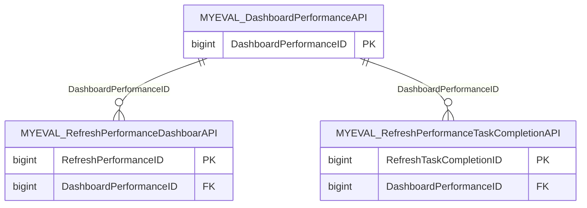

import TableDetail from '@site/src/components/TableDetail';

# MyEval Platform Database Tables

**46 tables** · **44 with PK** (95.7%) · **13 FKs** · **114 indexes**

## Entity Relationships

## Table Reference

<TableDetail
  dataUrl="/table-detail-data/myeval-platform.json"
  generatedAt="2026-02-28T06:03:57.118Z"
/>

## Stored Procedures

See the [MyEval Platform Stored Procedures](./sprocs/myeval-platform-sprocs) reference page for detailed documentation of all stored procedures in this module, including parameters, anti-pattern analysis, and optimization recommendations.

## Related Code Documentation

- [Common (.NET Business Module)](/docs/dotnet-backend/business/common)
- [Evaluations (.NET Business Module)](/docs/dotnet-backend/business/evaluations)
