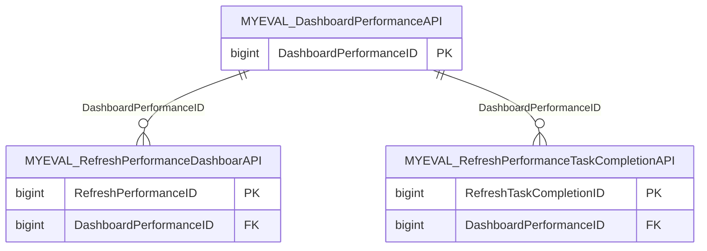

import TableDetail from '@site/src/components/TableDetail';

# MyEval Platform Database Tables

**46 tables** · **44 with PK** (95.7%) · **13 FKs** · **114 indexes**

## Entity Relationships

## Table Reference

<TableDetail
  tables={[{"name":"MYEVAL_CHReviewalRateData","schema":"dbo","fullName":"dbo.MYEVAL_CHReviewalRateData","hasPrimaryKey":true,"primaryKeyColumns":["CHReviewalRateID"],"columns":[{"name":"CHReviewalRateID","dataType":"int","rawType":"int","maxLength":null,"isNullable":false,"isIdentity":true,"isPrimaryKey":true,"defaultValue":null,"ordinalPosition":1},{"name":"DepartmentID","dataType":"bigint","rawType":"bigint","maxLength":null,"isNullable":false,"isIdentity":false,"isPrimaryKey":false,"defaultValue":null,"ordinalPosition":2},{"name":"UserID","dataType":"bigint","rawType":"bigint","maxLength":null,"isNullable":false,"isIdentity":false,"isPrimaryKey":false,"defaultValue":null,"ordinalPosition":3},{"name":"AcadamicYear","dataType":"int","rawType":"int","maxLength":null,"isNullable":false,"isIdentity":false,"isPrimaryKey":false,"defaultValue":null,"ordinalPosition":4},{"name":"AcadamicStartDate","dataType":"datetime","rawType":"datetime","maxLength":null,"isNullable":false,"isIdentity":false,"isPrimaryKey":false,"defaultValue":null,"ordinalPosition":5},{"name":"AcadamicEndDate","dataType":"datetime","rawType":"datetime","maxLength":null,"isNullable":false,"isIdentity":false,"isPrimaryKey":false,"defaultValue":null,"ordinalPosition":6},{"name":"TotalConfirmShift","dataType":"int","rawType":"int","maxLength":null,"isNullable":false,"isIdentity":false,"isPrimaryKey":false,"defaultValue":null,"ordinalPosition":7},{"name":"TotalConfirmMoon","dataType":"int","rawType":"int","maxLength":null,"isNullable":false,"isIdentity":false,"isPrimaryKey":false,"defaultValue":null,"ordinalPosition":8},{"name":"TotalScheduleShift","dataType":"int","rawType":"int","maxLength":null,"isNullable":false,"isIdentity":false,"isPrimaryKey":false,"defaultValue":null,"ordinalPosition":9},{"name":"TotalScheduleMoon","dataType":"int","rawType":"int","maxLength":null,"isNullable":false,"isIdentity":false,"isPrimaryKey":false,"defaultValue":null,"ordinalPosition":10},{"name":"TotalConfirmCount","dataType":"int","rawType":"int","maxLength":null,"isNullable":false,"isIdentity":false,"isPrimaryKey":false,"defaultValue":null,"ordinalPosition":11},{"name":"TotalScheduleCount","dataType":"int","rawType":"int","maxLength":null,"isNullable":false,"isIdentity":false,"isPrimaryKey":false,"defaultValue":null,"ordinalPosition":12},{"name":"PercentReview","dataType":"decimal","rawType":"decimal","maxLength":"10, 2","isNullable":false,"isIdentity":false,"isPrimaryKey":false,"defaultValue":null,"ordinalPosition":13},{"name":"LastReviewDate","dataType":"datetime","rawType":"datetime","maxLength":null,"isNullable":true,"isIdentity":false,"isPrimaryKey":false,"defaultValue":null,"ordinalPosition":14},{"name":"LastAccessDate","dataType":"datetime","rawType":"datetime","maxLength":null,"isNullable":true,"isIdentity":false,"isPrimaryKey":false,"defaultValue":null,"ordinalPosition":15},{"name":"CreatedBy","dataType":"bigint","rawType":"bigint","maxLength":null,"isNullable":false,"isIdentity":false,"isPrimaryKey":false,"defaultValue":null,"ordinalPosition":16},{"name":"CreatedDate","dataType":"datetime","rawType":"datetime","maxLength":null,"isNullable":false,"isIdentity":false,"isPrimaryKey":false,"defaultValue":null,"ordinalPosition":17},{"name":"ModifiedBy","dataType":"bigint","rawType":"bigint","maxLength":null,"isNullable":true,"isIdentity":false,"isPrimaryKey":false,"defaultValue":null,"ordinalPosition":18},{"name":"ModifiedDate","dataType":"datetime","rawType":"datetime","maxLength":null,"isNullable":true,"isIdentity":false,"isPrimaryKey":false,"defaultValue":null,"ordinalPosition":19}],"foreignKeys":[],"indexes":[{"name":"PK_MYEVAL_CHReviewalRateData","type":"CLUSTERED","isPrimaryKey":true,"isUnique":true,"isDisabled":false,"keyColumns":["CHReviewalRateID"],"includedColumns":[]},{"name":"IDX_001MYEVAL_CHReviewalRateData_DepartmentID","type":"NONCLUSTERED","isPrimaryKey":false,"isUnique":false,"isDisabled":false,"keyColumns":["DepartmentID"],"includedColumns":[]},{"name":"IDX_002MYEVAL_CHReviewalRateData_UserID","type":"NONCLUSTERED","isPrimaryKey":false,"isUnique":false,"isDisabled":false,"keyColumns":["UserID"],"includedColumns":[]}],"checkConstraints":[],"defaultConstraints":0,"triggers":[]},{"name":"MYEVAL_CHReviewalRateDataTrace","schema":"dbo","fullName":"dbo.MYEVAL_CHReviewalRateDataTrace","hasPrimaryKey":true,"primaryKeyColumns":["CHReviewalRateTraceID"],"columns":[{"name":"CHReviewalRateTraceID","dataType":"int","rawType":"int","maxLength":null,"isNullable":false,"isIdentity":true,"isPrimaryKey":true,"defaultValue":null,"ordinalPosition":1},{"name":"DepartmentID","dataType":"bigint","rawType":"bigint","maxLength":null,"isNullable":false,"isIdentity":false,"isPrimaryKey":false,"defaultValue":null,"ordinalPosition":2},{"name":"UserID","dataType":"bigint","rawType":"bigint","maxLength":null,"isNullable":false,"isIdentity":false,"isPrimaryKey":false,"defaultValue":null,"ordinalPosition":3},{"name":"AcadamicYear","dataType":"int","rawType":"int","maxLength":null,"isNullable":false,"isIdentity":false,"isPrimaryKey":false,"defaultValue":null,"ordinalPosition":4},{"name":"IsDataRefreshed","dataType":"tinyint","rawType":"tinyint","maxLength":null,"isNullable":false,"isIdentity":false,"isPrimaryKey":false,"defaultValue":null,"ordinalPosition":5},{"name":"CreatedBy","dataType":"bigint","rawType":"bigint","maxLength":null,"isNullable":false,"isIdentity":false,"isPrimaryKey":false,"defaultValue":null,"ordinalPosition":6},{"name":"CreatedDate","dataType":"datetime","rawType":"datetime","maxLength":null,"isNullable":false,"isIdentity":false,"isPrimaryKey":false,"defaultValue":null,"ordinalPosition":7},{"name":"ModifiedBy","dataType":"bigint","rawType":"bigint","maxLength":null,"isNullable":true,"isIdentity":false,"isPrimaryKey":false,"defaultValue":null,"ordinalPosition":8},{"name":"ModifiedDate","dataType":"datetime","rawType":"datetime","maxLength":null,"isNullable":true,"isIdentity":false,"isPrimaryKey":false,"defaultValue":null,"ordinalPosition":9}],"foreignKeys":[],"indexes":[{"name":"PK_MYEVAL_CHReviewalRateDataTrace","type":"CLUSTERED","isPrimaryKey":true,"isUnique":true,"isDisabled":false,"keyColumns":["CHReviewalRateTraceID"],"includedColumns":[]},{"name":"IDX_003MYEVAL_CHReviewalRateDataTrace_DepartmentID","type":"NONCLUSTERED","isPrimaryKey":false,"isUnique":false,"isDisabled":false,"keyColumns":["DepartmentID"],"includedColumns":[]},{"name":"IDX_004MYEVAL_CHReviewalRateDataTrace_UserID","type":"NONCLUSTERED","isPrimaryKey":false,"isUnique":false,"isDisabled":false,"keyColumns":["UserID"],"includedColumns":[]}],"checkConstraints":[],"defaultConstraints":0,"triggers":[]},{"name":"MyEval_CMELedgerCreditData","schema":"dbo","fullName":"dbo.MyEval_CMELedgerCreditData","hasPrimaryKey":false,"primaryKeyColumns":[],"columns":[{"name":"CMELedgerCreditDataID","dataType":"bigint","rawType":"bigint","maxLength":null,"isNullable":false,"isIdentity":true,"isPrimaryKey":false,"defaultValue":null,"ordinalPosition":1},{"name":"DepartmentID","dataType":"bigint","rawType":"bigint","maxLength":null,"isNullable":true,"isIdentity":false,"isPrimaryKey":false,"defaultValue":null,"ordinalPosition":2},{"name":"DepartmentName","dataType":"varchar","rawType":"varchar","maxLength":"max","isNullable":true,"isIdentity":false,"isPrimaryKey":false,"defaultValue":null,"ordinalPosition":3},{"name":"ReportFromDate","dataType":"datetime","rawType":"datetime","maxLength":null,"isNullable":true,"isIdentity":false,"isPrimaryKey":false,"defaultValue":null,"ordinalPosition":4},{"name":"ReportEndDate","dataType":"datetime","rawType":"datetime","maxLength":null,"isNullable":true,"isIdentity":false,"isPrimaryKey":false,"defaultValue":null,"ordinalPosition":5},{"name":"UserIDs","dataType":"varchar","rawType":"varchar","maxLength":"max","isNullable":true,"isIdentity":false,"isPrimaryKey":false,"defaultValue":null,"ordinalPosition":6},{"name":"UserID","dataType":"bigint","rawType":"bigint","maxLength":null,"isNullable":true,"isIdentity":false,"isPrimaryKey":false,"defaultValue":null,"ordinalPosition":7},{"name":"FullName","dataType":"varchar","rawType":"varchar","maxLength":"max","isNullable":true,"isIdentity":false,"isPrimaryKey":false,"defaultValue":null,"ordinalPosition":8},{"name":"EventName","dataType":"varchar","rawType":"varchar","maxLength":"max","isNullable":true,"isIdentity":false,"isPrimaryKey":false,"defaultValue":null,"ordinalPosition":9},{"name":"StartDate","dataType":"datetime","rawType":"datetime","maxLength":null,"isNullable":true,"isIdentity":false,"isPrimaryKey":false,"defaultValue":null,"ordinalPosition":10},{"name":"EndDate","dataType":"datetime","rawType":"datetime","maxLength":null,"isNullable":true,"isIdentity":false,"isPrimaryKey":false,"defaultValue":null,"ordinalPosition":11},{"name":"Topic","dataType":"varchar","rawType":"varchar","maxLength":"max","isNullable":true,"isIdentity":false,"isPrimaryKey":false,"defaultValue":null,"ordinalPosition":12},{"name":"EventCredits","dataType":"decimal","rawType":"decimal","maxLength":"10, 2","isNullable":true,"isIdentity":false,"isPrimaryKey":false,"defaultValue":null,"ordinalPosition":13},{"name":"TotalCredits","dataType":"decimal","rawType":"decimal","maxLength":"10, 2","isNullable":true,"isIdentity":false,"isPrimaryKey":false,"defaultValue":null,"ordinalPosition":14},{"name":"EventID","dataType":"bigint","rawType":"bigint","maxLength":null,"isNullable":true,"isIdentity":false,"isPrimaryKey":false,"defaultValue":null,"ordinalPosition":15},{"name":"ScheduleID","dataType":"bigint","rawType":"bigint","maxLength":null,"isNullable":true,"isIdentity":false,"isPrimaryKey":false,"defaultValue":null,"ordinalPosition":16},{"name":"QuizName","dataType":"varchar","rawType":"varchar","maxLength":"max","isNullable":true,"isIdentity":false,"isPrimaryKey":false,"defaultValue":null,"ordinalPosition":17},{"name":"QuizResults","dataType":"varchar","rawType":"varchar","maxLength":"max","isNullable":true,"isIdentity":false,"isPrimaryKey":false,"defaultValue":null,"ordinalPosition":18},{"name":"FirstName","dataType":"varchar","rawType":"varchar","maxLength":"max","isNullable":true,"isIdentity":false,"isPrimaryKey":false,"defaultValue":null,"ordinalPosition":19},{"name":"LastName","dataType":"varchar","rawType":"varchar","maxLength":"max","isNullable":true,"isIdentity":false,"isPrimaryKey":false,"defaultValue":null,"ordinalPosition":20},{"name":"EmployeeID","dataType":"varchar","rawType":"varchar","maxLength":"max","isNullable":true,"isIdentity":false,"isPrimaryKey":false,"defaultValue":null,"ordinalPosition":21},{"name":"PIN","dataType":"varchar","rawType":"varchar","maxLength":"max","isNullable":true,"isIdentity":false,"isPrimaryKey":false,"defaultValue":null,"ordinalPosition":22},{"name":"DisplayType","dataType":"varchar","rawType":"varchar","maxLength":"max","isNullable":true,"isIdentity":false,"isPrimaryKey":false,"defaultValue":null,"ordinalPosition":23},{"name":"CompletedDate","dataType":"datetime","rawType":"datetime","maxLength":null,"isNullable":true,"isIdentity":false,"isPrimaryKey":false,"defaultValue":null,"ordinalPosition":24},{"name":"Attendance","dataType":"varchar","rawType":"varchar","maxLength":"max","isNullable":true,"isIdentity":false,"isPrimaryKey":false,"defaultValue":null,"ordinalPosition":25},{"name":"MOCStatus","dataType":"varchar","rawType":"varchar","maxLength":"max","isNullable":true,"isIdentity":false,"isPrimaryKey":false,"defaultValue":null,"ordinalPosition":26}],"foreignKeys":[],"indexes":[],"checkConstraints":[],"defaultConstraints":0,"triggers":[]},{"name":"MyEval_CMELedgerData","schema":"dbo","fullName":"dbo.MyEval_CMELedgerData","hasPrimaryKey":false,"primaryKeyColumns":[],"columns":[{"name":"CMELedgerDataID","dataType":"bigint","rawType":"bigint","maxLength":null,"isNullable":false,"isIdentity":true,"isPrimaryKey":false,"defaultValue":null,"ordinalPosition":1},{"name":"DepartmentID","dataType":"bigint","rawType":"bigint","maxLength":null,"isNullable":true,"isIdentity":false,"isPrimaryKey":false,"defaultValue":null,"ordinalPosition":2},{"name":"DepartmentName","dataType":"varchar","rawType":"varchar","maxLength":"max","isNullable":true,"isIdentity":false,"isPrimaryKey":false,"defaultValue":null,"ordinalPosition":3},{"name":"ReportFromDate","dataType":"datetime","rawType":"datetime","maxLength":null,"isNullable":true,"isIdentity":false,"isPrimaryKey":false,"defaultValue":null,"ordinalPosition":4},{"name":"ReportEndDate","dataType":"datetime","rawType":"datetime","maxLength":null,"isNullable":true,"isIdentity":false,"isPrimaryKey":false,"defaultValue":null,"ordinalPosition":5},{"name":"UserIDs","dataType":"varchar","rawType":"varchar","maxLength":"max","isNullable":true,"isIdentity":false,"isPrimaryKey":false,"defaultValue":null,"ordinalPosition":6},{"name":"CreatedDate","dataType":"datetime","rawType":"datetime","maxLength":null,"isNullable":true,"isIdentity":false,"isPrimaryKey":false,"defaultValue":null,"ordinalPosition":7},{"name":"EventName","dataType":"varchar","rawType":"varchar","maxLength":"max","isNullable":true,"isIdentity":false,"isPrimaryKey":false,"defaultValue":null,"ordinalPosition":8},{"name":"EventCredits","dataType":"varchar","rawType":"varchar","maxLength":"max","isNullable":true,"isIdentity":false,"isPrimaryKey":false,"defaultValue":null,"ordinalPosition":9},{"name":"ClaimedCredits","dataType":"varchar","rawType":"varchar","maxLength":"max","isNullable":true,"isIdentity":false,"isPrimaryKey":false,"defaultValue":null,"ordinalPosition":10},{"name":"StartDate","dataType":"datetime","rawType":"datetime","maxLength":null,"isNullable":true,"isIdentity":false,"isPrimaryKey":false,"defaultValue":null,"ordinalPosition":11},{"name":"EndDate","dataType":"datetime","rawType":"datetime","maxLength":null,"isNullable":true,"isIdentity":false,"isPrimaryKey":false,"defaultValue":null,"ordinalPosition":12},{"name":"ExpirationDate","dataType":"datetime","rawType":"datetime","maxLength":null,"isNullable":true,"isIdentity":false,"isPrimaryKey":false,"defaultValue":null,"ordinalPosition":13},{"name":"TemplateName","dataType":"varchar","rawType":"varchar","maxLength":"max","isNullable":true,"isIdentity":false,"isPrimaryKey":false,"defaultValue":null,"ordinalPosition":14},{"name":"PresentersName","dataType":"varchar","rawType":"varchar","maxLength":"max","isNullable":true,"isIdentity":false,"isPrimaryKey":false,"defaultValue":null,"ordinalPosition":15},{"name":"Topic","dataType":"varchar","rawType":"varchar","maxLength":"max","isNullable":true,"isIdentity":false,"isPrimaryKey":false,"defaultValue":null,"ordinalPosition":16},{"name":"Location","dataType":"varchar","rawType":"varchar","maxLength":"max","isNullable":true,"isIdentity":false,"isPrimaryKey":false,"defaultValue":null,"ordinalPosition":17},{"name":"Evaluator","dataType":"varchar","rawType":"varchar","maxLength":"max","isNullable":true,"isIdentity":false,"isPrimaryKey":false,"defaultValue":null,"ordinalPosition":18},{"name":"AssignedBy","dataType":"varchar","rawType":"varchar","maxLength":"max","isNullable":true,"isIdentity":false,"isPrimaryKey":false,"defaultValue":null,"ordinalPosition":19},{"name":"VerifiedDate","dataType":"datetime","rawType":"datetime","maxLength":null,"isNullable":true,"isIdentity":false,"isPrimaryKey":false,"defaultValue":null,"ordinalPosition":20},{"name":"CompletedDate","dataType":"datetime","rawType":"datetime","maxLength":null,"isNullable":true,"isIdentity":false,"isPrimaryKey":false,"defaultValue":null,"ordinalPosition":21},{"name":"EvaluationID","dataType":"bigint","rawType":"bigint","maxLength":null,"isNullable":true,"isIdentity":false,"isPrimaryKey":false,"defaultValue":null,"ordinalPosition":22},{"name":"ScheduleID","dataType":"bigint","rawType":"bigint","maxLength":null,"isNullable":true,"isIdentity":false,"isPrimaryKey":false,"defaultValue":null,"ordinalPosition":23},{"name":"UserID","dataType":"bigint","rawType":"bigint","maxLength":null,"isNullable":true,"isIdentity":false,"isPrimaryKey":false,"defaultValue":null,"ordinalPosition":24},{"name":"SubjectUserName","dataType":"varchar","rawType":"varchar","maxLength":"max","isNullable":true,"isIdentity":false,"isPrimaryKey":false,"defaultValue":null,"ordinalPosition":25},{"name":"IsPartialScheduled","dataType":"tinyint","rawType":"tinyint","maxLength":null,"isNullable":true,"isIdentity":false,"isPrimaryKey":false,"defaultValue":null,"ordinalPosition":26},{"name":"PartialCompletedDate","dataType":"datetime","rawType":"datetime","maxLength":null,"isNullable":true,"isIdentity":false,"isPrimaryKey":false,"defaultValue":null,"ordinalPosition":27},{"name":"DeclinedDate","dataType":"datetime","rawType":"datetime","maxLength":null,"isNullable":true,"isIdentity":false,"isPrimaryKey":false,"defaultValue":null,"ordinalPosition":28},{"name":"IsAuto","dataType":"tinyint","rawType":"tinyint","maxLength":null,"isNullable":true,"isIdentity":false,"isPrimaryKey":false,"defaultValue":null,"ordinalPosition":29},{"name":"IsExempted","dataType":"tinyint","rawType":"tinyint","maxLength":null,"isNullable":true,"isIdentity":false,"isPrimaryKey":false,"defaultValue":null,"ordinalPosition":30},{"name":"IsVoluntary","dataType":"tinyint","rawType":"tinyint","maxLength":null,"isNullable":true,"isIdentity":false,"isPrimaryKey":false,"defaultValue":null,"ordinalPosition":31},{"name":"MailSent","dataType":"tinyint","rawType":"tinyint","maxLength":null,"isNullable":true,"isIdentity":false,"isPrimaryKey":false,"defaultValue":null,"ordinalPosition":32}],"foreignKeys":[],"indexes":[],"checkConstraints":[],"defaultConstraints":0,"triggers":[]},{"name":"MYEVAL_DashboardPerformanceAPI","schema":"dbo","fullName":"dbo.MYEVAL_DashboardPerformanceAPI","hasPrimaryKey":true,"primaryKeyColumns":["DashboardPerformanceID"],"columns":[{"name":"DashboardPerformanceID","dataType":"bigint","rawType":"bigint","maxLength":null,"isNullable":false,"isIdentity":true,"isPrimaryKey":true,"defaultValue":null,"ordinalPosition":1},{"name":"APIName","dataType":"varchar","rawType":"varchar","maxLength":"1000","isNullable":false,"isIdentity":false,"isPrimaryKey":false,"defaultValue":null,"ordinalPosition":2},{"name":"APIDescription","dataType":"varchar","rawType":"varchar","maxLength":"max","isNullable":false,"isIdentity":false,"isPrimaryKey":false,"defaultValue":null,"ordinalPosition":3},{"name":"SortOrder","dataType":"int","rawType":"int","maxLength":null,"isNullable":false,"isIdentity":false,"isPrimaryKey":false,"defaultValue":null,"ordinalPosition":4},{"name":"IsEnabled","dataType":"tinyint","rawType":"tinyint","maxLength":null,"isNullable":false,"isIdentity":false,"isPrimaryKey":false,"defaultValue":null,"ordinalPosition":5},{"name":"IsActive","dataType":"tinyint","rawType":"tinyint","maxLength":null,"isNullable":false,"isIdentity":false,"isPrimaryKey":false,"defaultValue":null,"ordinalPosition":6},{"name":"CreatedBy","dataType":"bigint","rawType":"bigint","maxLength":null,"isNullable":false,"isIdentity":false,"isPrimaryKey":false,"defaultValue":null,"ordinalPosition":7},{"name":"CreatedDate","dataType":"datetime","rawType":"datetime","maxLength":null,"isNullable":false,"isIdentity":false,"isPrimaryKey":false,"defaultValue":null,"ordinalPosition":8},{"name":"ModifiedBy","dataType":"bigint","rawType":"bigint","maxLength":null,"isNullable":true,"isIdentity":false,"isPrimaryKey":false,"defaultValue":null,"ordinalPosition":9},{"name":"ModifiedDate","dataType":"datetime","rawType":"datetime","maxLength":null,"isNullable":true,"isIdentity":false,"isPrimaryKey":false,"defaultValue":null,"ordinalPosition":10}],"foreignKeys":[],"indexes":[{"name":"PK_MYEVAL_DashboardPerformanceAPI","type":"CLUSTERED","isPrimaryKey":true,"isUnique":true,"isDisabled":false,"keyColumns":["DashboardPerformanceID"],"includedColumns":[]}],"checkConstraints":[],"defaultConstraints":0,"triggers":[]},{"name":"MYEval_DepartmentDateChangeTracker","schema":"dbo","fullName":"dbo.MYEval_DepartmentDateChangeTracker","hasPrimaryKey":true,"primaryKeyColumns":["DateChangeTrackerID"],"columns":[{"name":"DateChangeTrackerID","dataType":"bigint","rawType":"bigint","maxLength":null,"isNullable":false,"isIdentity":true,"isPrimaryKey":true,"defaultValue":null,"ordinalPosition":1},{"name":"DepartmentID","dataType":"bigint","rawType":"bigint","maxLength":null,"isNullable":false,"isIdentity":false,"isPrimaryKey":false,"defaultValue":null,"ordinalPosition":2},{"name":"IsDateChanged","dataType":"tinyint","rawType":"tinyint","maxLength":null,"isNullable":false,"isIdentity":false,"isPrimaryKey":false,"defaultValue":null,"ordinalPosition":3},{"name":"CreatedBy","dataType":"bigint","rawType":"bigint","maxLength":null,"isNullable":false,"isIdentity":false,"isPrimaryKey":false,"defaultValue":null,"ordinalPosition":4},{"name":"CreatedDate","dataType":"datetime","rawType":"datetime","maxLength":null,"isNullable":false,"isIdentity":false,"isPrimaryKey":false,"defaultValue":null,"ordinalPosition":5},{"name":"ModifiedBy","dataType":"bigint","rawType":"bigint","maxLength":null,"isNullable":true,"isIdentity":false,"isPrimaryKey":false,"defaultValue":null,"ordinalPosition":6},{"name":"ModifiedDate","dataType":"datetime","rawType":"datetime","maxLength":null,"isNullable":true,"isIdentity":false,"isPrimaryKey":false,"defaultValue":null,"ordinalPosition":7}],"foreignKeys":[],"indexes":[{"name":"PK_MYEval_DepartmentDateChangeTracker","type":"CLUSTERED","isPrimaryKey":true,"isUnique":true,"isDisabled":false,"keyColumns":["DateChangeTrackerID"],"includedColumns":[]}],"checkConstraints":[],"defaultConstraints":0,"triggers":[]},{"name":"MYEval_DepartmentUserPRPAndPPDetails","schema":"dbo","fullName":"dbo.MYEval_DepartmentUserPRPAndPPDetails","hasPrimaryKey":true,"primaryKeyColumns":["DeptUserPrpPpID"],"columns":[{"name":"DeptUserPrpPpID","dataType":"int","rawType":"int","maxLength":null,"isNullable":false,"isIdentity":true,"isPrimaryKey":true,"defaultValue":null,"ordinalPosition":1},{"name":"DepartmentID","dataType":"bigint","rawType":"bigint","maxLength":null,"isNullable":false,"isIdentity":false,"isPrimaryKey":false,"defaultValue":null,"ordinalPosition":2},{"name":"UserID","dataType":"bigint","rawType":"bigint","maxLength":null,"isNullable":false,"isIdentity":false,"isPrimaryKey":false,"defaultValue":null,"ordinalPosition":3},{"name":"AcadamicYear","dataType":"int","rawType":"int","maxLength":null,"isNullable":false,"isIdentity":false,"isPrimaryKey":false,"defaultValue":null,"ordinalPosition":4},{"name":"TypeCode","dataType":"varchar","rawType":"varchar","maxLength":"100","isNullable":false,"isIdentity":false,"isPrimaryKey":false,"defaultValue":null,"ordinalPosition":5},{"name":"CompletionAverage","dataType":"decimal","rawType":"decimal","maxLength":"10, 2","isNullable":false,"isIdentity":false,"isPrimaryKey":false,"defaultValue":null,"ordinalPosition":6},{"name":"CreatedBy","dataType":"bigint","rawType":"bigint","maxLength":null,"isNullable":false,"isIdentity":false,"isPrimaryKey":false,"defaultValue":null,"ordinalPosition":7},{"name":"CreatedDate","dataType":"datetime","rawType":"datetime","maxLength":null,"isNullable":false,"isIdentity":false,"isPrimaryKey":false,"defaultValue":null,"ordinalPosition":8},{"name":"ModifiedBy","dataType":"bigint","rawType":"bigint","maxLength":null,"isNullable":true,"isIdentity":false,"isPrimaryKey":false,"defaultValue":null,"ordinalPosition":9},{"name":"ModifiedDate","dataType":"datetime","rawType":"datetime","maxLength":null,"isNullable":true,"isIdentity":false,"isPrimaryKey":false,"defaultValue":null,"ordinalPosition":10}],"foreignKeys":[],"indexes":[{"name":"PK_MYEval_DepartmentUserPRPAndPPDetails","type":"CLUSTERED","isPrimaryKey":true,"isUnique":true,"isDisabled":false,"keyColumns":["DeptUserPrpPpID"],"includedColumns":[]},{"name":"IDX_005MYEval_DepartmentUserPRPAndPPDetails_DepartmentID","type":"NONCLUSTERED","isPrimaryKey":false,"isUnique":false,"isDisabled":false,"keyColumns":["DepartmentID"],"includedColumns":[]},{"name":"IDX_006MYEval_DepartmentUserPRPAndPPDetails_UserID","type":"NONCLUSTERED","isPrimaryKey":false,"isUnique":false,"isDisabled":false,"keyColumns":["UserID"],"includedColumns":[]}],"checkConstraints":[],"defaultConstraints":0,"triggers":[]},{"name":"MYEval_DepartmentUserPRPAndPPDetailsTrace","schema":"dbo","fullName":"dbo.MYEval_DepartmentUserPRPAndPPDetailsTrace","hasPrimaryKey":true,"primaryKeyColumns":["DeptUserPrpPpTraceID"],"columns":[{"name":"DeptUserPrpPpTraceID","dataType":"int","rawType":"int","maxLength":null,"isNullable":false,"isIdentity":true,"isPrimaryKey":true,"defaultValue":null,"ordinalPosition":1},{"name":"DepartmentID","dataType":"bigint","rawType":"bigint","maxLength":null,"isNullable":false,"isIdentity":false,"isPrimaryKey":false,"defaultValue":null,"ordinalPosition":2},{"name":"AcadamicYear","dataType":"int","rawType":"int","maxLength":null,"isNullable":false,"isIdentity":false,"isPrimaryKey":false,"defaultValue":null,"ordinalPosition":3},{"name":"RefreshData","dataType":"tinyint","rawType":"tinyint","maxLength":null,"isNullable":false,"isIdentity":false,"isPrimaryKey":false,"defaultValue":null,"ordinalPosition":4},{"name":"CreatedBy","dataType":"bigint","rawType":"bigint","maxLength":null,"isNullable":false,"isIdentity":false,"isPrimaryKey":false,"defaultValue":null,"ordinalPosition":5},{"name":"CreatedDate","dataType":"datetime","rawType":"datetime","maxLength":null,"isNullable":false,"isIdentity":false,"isPrimaryKey":false,"defaultValue":null,"ordinalPosition":6},{"name":"ModifiedBy","dataType":"bigint","rawType":"bigint","maxLength":null,"isNullable":true,"isIdentity":false,"isPrimaryKey":false,"defaultValue":null,"ordinalPosition":7},{"name":"ModifiedDate","dataType":"datetime","rawType":"datetime","maxLength":null,"isNullable":true,"isIdentity":false,"isPrimaryKey":false,"defaultValue":null,"ordinalPosition":8}],"foreignKeys":[],"indexes":[{"name":"PK_MYEval_DepartmentUserPRPAndPPDetailsTrace","type":"CLUSTERED","isPrimaryKey":true,"isUnique":true,"isDisabled":false,"keyColumns":["DeptUserPrpPpTraceID"],"includedColumns":[]},{"name":"IDX_007MYEval_DepartmentUserPRPAndPPDetailsTrace_DepartmentID","type":"NONCLUSTERED","isPrimaryKey":false,"isUnique":false,"isDisabled":false,"keyColumns":["DepartmentID"],"includedColumns":[]}],"checkConstraints":[],"defaultConstraints":0,"triggers":[]},{"name":"MyEval_ErrorLog","schema":"dbo","fullName":"dbo.MyEval_ErrorLog","hasPrimaryKey":true,"primaryKeyColumns":["ErrorLogID"],"columns":[{"name":"ErrorLogID","dataType":"int","rawType":"int","maxLength":null,"isNullable":false,"isIdentity":true,"isPrimaryKey":true,"defaultValue":null,"ordinalPosition":1},{"name":"ObjectName","dataType":"varchar","rawType":"varchar","maxLength":"250","isNullable":true,"isIdentity":false,"isPrimaryKey":false,"defaultValue":null,"ordinalPosition":2},{"name":"InPutParams","dataType":"varchar","rawType":"varchar","maxLength":"max","isNullable":true,"isIdentity":false,"isPrimaryKey":false,"defaultValue":null,"ordinalPosition":3},{"name":"ErrorMessage","dataType":"varchar","rawType":"varchar","maxLength":"max","isNullable":true,"isIdentity":false,"isPrimaryKey":false,"defaultValue":null,"ordinalPosition":4},{"name":"ExceptionMessage","dataType":"varchar","rawType":"varchar","maxLength":"max","isNullable":true,"isIdentity":false,"isPrimaryKey":false,"defaultValue":null,"ordinalPosition":5},{"name":"ErrorFromWebORMobile","dataType":"varchar","rawType":"varchar","maxLength":"100","isNullable":true,"isIdentity":false,"isPrimaryKey":false,"defaultValue":null,"ordinalPosition":6},{"name":"ScreenName","dataType":"varchar","rawType":"varchar","maxLength":"max","isNullable":true,"isIdentity":false,"isPrimaryKey":false,"defaultValue":null,"ordinalPosition":7},{"name":"URL","dataType":"varchar","rawType":"varchar","maxLength":"max","isNullable":true,"isIdentity":false,"isPrimaryKey":false,"defaultValue":null,"ordinalPosition":8},{"name":"UserID","dataType":"bigint","rawType":"bigint","maxLength":null,"isNullable":true,"isIdentity":false,"isPrimaryKey":false,"defaultValue":null,"ordinalPosition":9},{"name":"CreatedBy","dataType":"varchar","rawType":"varchar","maxLength":"250","isNullable":true,"isIdentity":false,"isPrimaryKey":false,"defaultValue":null,"ordinalPosition":10},{"name":"CreatedDate","dataType":"datetime","rawType":"datetime","maxLength":null,"isNullable":false,"isIdentity":false,"isPrimaryKey":false,"defaultValue":null,"ordinalPosition":11},{"name":"IsErrorResolved","dataType":"bit","rawType":"bit","maxLength":null,"isNullable":false,"isIdentity":false,"isPrimaryKey":false,"defaultValue":null,"ordinalPosition":12},{"name":"ResolvedBy","dataType":"varchar","rawType":"varchar","maxLength":"250","isNullable":true,"isIdentity":false,"isPrimaryKey":false,"defaultValue":null,"ordinalPosition":13},{"name":"ResolvedDate","dataType":"datetime","rawType":"datetime","maxLength":null,"isNullable":true,"isIdentity":false,"isPrimaryKey":false,"defaultValue":null,"ordinalPosition":14},{"name":"RootCause","dataType":"varchar","rawType":"varchar","maxLength":"max","isNullable":true,"isIdentity":false,"isPrimaryKey":false,"defaultValue":null,"ordinalPosition":15}],"foreignKeys":[],"indexes":[{"name":"PK_MyEval_ErrorLog","type":"CLUSTERED","isPrimaryKey":true,"isUnique":true,"isDisabled":false,"keyColumns":["ErrorLogID"],"includedColumns":[]}],"checkConstraints":[],"defaultConstraints":0,"triggers":[]},{"name":"MYEval_PerformanceProcedureDetails","schema":"dbo","fullName":"dbo.MYEval_PerformanceProcedureDetails","hasPrimaryKey":true,"primaryKeyColumns":["PerProcDetailID"],"columns":[{"name":"PerProcDetailID","dataType":"int","rawType":"int","maxLength":null,"isNullable":false,"isIdentity":true,"isPrimaryKey":true,"defaultValue":null,"ordinalPosition":1},{"name":"UserID","dataType":"bigint","rawType":"bigint","maxLength":null,"isNullable":false,"isIdentity":false,"isPrimaryKey":false,"defaultValue":null,"ordinalPosition":2},{"name":"PGYLevel","dataType":"int","rawType":"int","maxLength":null,"isNullable":false,"isIdentity":false,"isPrimaryKey":false,"defaultValue":null,"ordinalPosition":3},{"name":"StartDate","dataType":"datetime","rawType":"datetime","maxLength":null,"isNullable":false,"isIdentity":false,"isPrimaryKey":false,"defaultValue":null,"ordinalPosition":4},{"name":"EndDate","dataType":"datetime","rawType":"datetime","maxLength":null,"isNullable":false,"isIdentity":false,"isPrimaryKey":false,"defaultValue":null,"ordinalPosition":5},{"name":"ProcedureID","dataType":"bigint","rawType":"bigint","maxLength":null,"isNullable":false,"isIdentity":false,"isPrimaryKey":false,"defaultValue":null,"ordinalPosition":6},{"name":"ProcedureName","dataType":"varchar","rawType":"varchar","maxLength":"max","isNullable":false,"isIdentity":false,"isPrimaryKey":false,"defaultValue":null,"ordinalPosition":7},{"name":"IsExlcludedFromCert","dataType":"tinyint","rawType":"tinyint","maxLength":null,"isNullable":false,"isIdentity":false,"isPrimaryKey":false,"defaultValue":null,"ordinalPosition":8},{"name":"GraduationRequired","dataType":"int","rawType":"int","maxLength":null,"isNullable":false,"isIdentity":false,"isPrimaryKey":false,"defaultValue":null,"ordinalPosition":9},{"name":"CertificationRequired","dataType":"int","rawType":"int","maxLength":null,"isNullable":false,"isIdentity":false,"isPrimaryKey":false,"defaultValue":null,"ordinalPosition":10},{"name":"CertificaitonSubmitted","dataType":"int","rawType":"int","maxLength":null,"isNullable":false,"isIdentity":false,"isPrimaryKey":false,"defaultValue":null,"ordinalPosition":11},{"name":"GraduationSubmitted","dataType":"int","rawType":"int","maxLength":null,"isNullable":false,"isIdentity":false,"isPrimaryKey":false,"defaultValue":null,"ordinalPosition":12},{"name":"CertificaitonAccepted","dataType":"int","rawType":"int","maxLength":null,"isNullable":false,"isIdentity":false,"isPrimaryKey":false,"defaultValue":null,"ordinalPosition":13},{"name":"GraduationAccepted","dataType":"int","rawType":"int","maxLength":null,"isNullable":false,"isIdentity":false,"isPrimaryKey":false,"defaultValue":null,"ordinalPosition":14},{"name":"CertificaitonPending","dataType":"int","rawType":"int","maxLength":null,"isNullable":false,"isIdentity":false,"isPrimaryKey":false,"defaultValue":null,"ordinalPosition":15},{"name":"GraduationPending","dataType":"int","rawType":"int","maxLength":null,"isNullable":false,"isIdentity":false,"isPrimaryKey":false,"defaultValue":null,"ordinalPosition":16},{"name":"CertificaitonRejected","dataType":"int","rawType":"int","maxLength":null,"isNullable":false,"isIdentity":false,"isPrimaryKey":false,"defaultValue":null,"ordinalPosition":17},{"name":"GraduationRejected","dataType":"int","rawType":"int","maxLength":null,"isNullable":false,"isIdentity":false,"isPrimaryKey":false,"defaultValue":null,"ordinalPosition":18},{"name":"UserCertAcceptedScore","dataType":"decimal","rawType":"decimal","maxLength":"10, 2","isNullable":false,"isIdentity":false,"isPrimaryKey":false,"defaultValue":null,"ordinalPosition":19},{"name":"UserGraduationAcceptedScore","dataType":"decimal","rawType":"decimal","maxLength":"10, 2","isNullable":false,"isIdentity":false,"isPrimaryKey":false,"defaultValue":null,"ordinalPosition":20},{"name":"CreatedBy","dataType":"bigint","rawType":"bigint","maxLength":null,"isNullable":false,"isIdentity":false,"isPrimaryKey":false,"defaultValue":null,"ordinalPosition":21},{"name":"CretedDate","dataType":"datetime","rawType":"datetime","maxLength":null,"isNullable":false,"isIdentity":false,"isPrimaryKey":false,"defaultValue":null,"ordinalPosition":22},{"name":"ModifiedBy","dataType":"bigint","rawType":"bigint","maxLength":null,"isNullable":true,"isIdentity":false,"isPrimaryKey":false,"defaultValue":null,"ordinalPosition":23},{"name":"ModifiedDate","dataType":"datetime","rawType":"datetime","maxLength":null,"isNullable":true,"isIdentity":false,"isPrimaryKey":false,"defaultValue":null,"ordinalPosition":24}],"foreignKeys":[],"indexes":[{"name":"PK_MYEval_PerformanceProcedureDetails","type":"CLUSTERED","isPrimaryKey":true,"isUnique":true,"isDisabled":false,"keyColumns":["PerProcDetailID"],"includedColumns":[]},{"name":"IDX_008MYEval_PerformanceProcedureDetails_UserID","type":"NONCLUSTERED","isPrimaryKey":false,"isUnique":false,"isDisabled":false,"keyColumns":["UserID"],"includedColumns":[]},{"name":"IDX_009MYEval_PerformanceProcedureDetails_ProcedureID","type":"NONCLUSTERED","isPrimaryKey":false,"isUnique":false,"isDisabled":false,"keyColumns":["ProcedureID"],"includedColumns":[]}],"checkConstraints":[],"defaultConstraints":0,"triggers":[]},{"name":"MYEval_PerformanceProcedureRefreshTrace","schema":"dbo","fullName":"dbo.MYEval_PerformanceProcedureRefreshTrace","hasPrimaryKey":true,"primaryKeyColumns":["PerProcRefreshTraceID"],"columns":[{"name":"PerProcRefreshTraceID","dataType":"int","rawType":"int","maxLength":null,"isNullable":false,"isIdentity":true,"isPrimaryKey":true,"defaultValue":null,"ordinalPosition":1},{"name":"DepartmentID","dataType":"bigint","rawType":"bigint","maxLength":null,"isNullable":false,"isIdentity":false,"isPrimaryKey":false,"defaultValue":null,"ordinalPosition":2},{"name":"UserID","dataType":"bigint","rawType":"bigint","maxLength":null,"isNullable":false,"isIdentity":false,"isPrimaryKey":false,"defaultValue":null,"ordinalPosition":3},{"name":"IsRefreshed","dataType":"tinyint","rawType":"tinyint","maxLength":null,"isNullable":false,"isIdentity":false,"isPrimaryKey":false,"defaultValue":null,"ordinalPosition":4},{"name":"CreatedBy","dataType":"bigint","rawType":"bigint","maxLength":null,"isNullable":false,"isIdentity":false,"isPrimaryKey":false,"defaultValue":null,"ordinalPosition":5},{"name":"CreatedDate","dataType":"datetime","rawType":"datetime","maxLength":null,"isNullable":false,"isIdentity":false,"isPrimaryKey":false,"defaultValue":null,"ordinalPosition":6},{"name":"ModifiedBy","dataType":"bigint","rawType":"bigint","maxLength":null,"isNullable":true,"isIdentity":false,"isPrimaryKey":false,"defaultValue":null,"ordinalPosition":7},{"name":"ModifiedDate","dataType":"datetime","rawType":"datetime","maxLength":null,"isNullable":true,"isIdentity":false,"isPrimaryKey":false,"defaultValue":null,"ordinalPosition":8}],"foreignKeys":[],"indexes":[{"name":"PK_MYEval_PerformanceProcedureRefreshTrace","type":"CLUSTERED","isPrimaryKey":true,"isUnique":true,"isDisabled":false,"keyColumns":["PerProcRefreshTraceID"],"includedColumns":[]},{"name":"IDX_0010MYEval_PerformanceProcedureRefreshTrace_DepartmentID","type":"NONCLUSTERED","isPrimaryKey":false,"isUnique":false,"isDisabled":false,"keyColumns":["DepartmentID"],"includedColumns":[]},{"name":"IDX_0011MYEval_PerformanceProcedureRefreshTrace_UserID","type":"NONCLUSTERED","isPrimaryKey":false,"isUnique":false,"isDisabled":false,"keyColumns":["UserID"],"includedColumns":[]}],"checkConstraints":[],"defaultConstraints":0,"triggers":[]},{"name":"MYEVAL_PerformanceQIPProjects","schema":"dbo","fullName":"dbo.MYEVAL_PerformanceQIPProjects","hasPrimaryKey":true,"primaryKeyColumns":["PerQIPProjectID"],"columns":[{"name":"PerQIPProjectID","dataType":"uniqueidentifier","rawType":"uniqueidentifier","maxLength":null,"isNullable":false,"isIdentity":false,"isPrimaryKey":true,"defaultValue":null,"ordinalPosition":1},{"name":"DepartmentID","dataType":"bigint","rawType":"bigint","maxLength":null,"isNullable":false,"isIdentity":false,"isPrimaryKey":false,"defaultValue":null,"ordinalPosition":2},{"name":"UserID","dataType":"bigint","rawType":"bigint","maxLength":null,"isNullable":false,"isIdentity":false,"isPrimaryKey":false,"defaultValue":null,"ordinalPosition":3},{"name":"AcademicYear","dataType":"int","rawType":"int","maxLength":null,"isNullable":false,"isIdentity":false,"isPrimaryKey":false,"defaultValue":null,"ordinalPosition":4},{"name":"PGYLevel","dataType":"int","rawType":"int","maxLength":null,"isNullable":false,"isIdentity":false,"isPrimaryKey":false,"defaultValue":null,"ordinalPosition":5},{"name":"PGYStartDate","dataType":"datetime","rawType":"datetime","maxLength":null,"isNullable":false,"isIdentity":false,"isPrimaryKey":false,"defaultValue":null,"ordinalPosition":6},{"name":"PGYEndDate","dataType":"datetime","rawType":"datetime","maxLength":null,"isNullable":false,"isIdentity":false,"isPrimaryKey":false,"defaultValue":null,"ordinalPosition":7},{"name":"PeriodStartDate","dataType":"datetime","rawType":"datetime","maxLength":null,"isNullable":false,"isIdentity":false,"isPrimaryKey":false,"defaultValue":null,"ordinalPosition":8},{"name":"PeriodEndDate","dataType":"datetime","rawType":"datetime","maxLength":null,"isNullable":false,"isIdentity":false,"isPrimaryKey":false,"defaultValue":null,"ordinalPosition":9},{"name":"PeriodNo","dataType":"int","rawType":"int","maxLength":null,"isNullable":false,"isIdentity":false,"isPrimaryKey":false,"defaultValue":null,"ordinalPosition":10},{"name":"Submitted","dataType":"int","rawType":"int","maxLength":null,"isNullable":false,"isIdentity":false,"isPrimaryKey":false,"defaultValue":null,"ordinalPosition":11},{"name":"Reviewed","dataType":"int","rawType":"int","maxLength":null,"isNullable":false,"isIdentity":false,"isPrimaryKey":false,"defaultValue":null,"ordinalPosition":12},{"name":"Implemented","dataType":"int","rawType":"int","maxLength":null,"isNullable":false,"isIdentity":false,"isPrimaryKey":false,"defaultValue":null,"ordinalPosition":13},{"name":"CreatedBy","dataType":"bigint","rawType":"bigint","maxLength":null,"isNullable":false,"isIdentity":false,"isPrimaryKey":false,"defaultValue":null,"ordinalPosition":14},{"name":"CreatedDate","dataType":"datetime","rawType":"datetime","maxLength":null,"isNullable":false,"isIdentity":false,"isPrimaryKey":false,"defaultValue":null,"ordinalPosition":15},{"name":"ModifiedBy","dataType":"bigint","rawType":"bigint","maxLength":null,"isNullable":true,"isIdentity":false,"isPrimaryKey":false,"defaultValue":null,"ordinalPosition":16},{"name":"ModifiedDate","dataType":"datetime","rawType":"datetime","maxLength":null,"isNullable":true,"isIdentity":false,"isPrimaryKey":false,"defaultValue":null,"ordinalPosition":17}],"foreignKeys":[{"constraintName":"FK_MYEVAL_PerformanceQIPProjectsUserID","columns":["UserID"],"referencedTable":"dbo.SEC_Users","referencedColumns":["UserID"]}],"indexes":[{"name":"PK_MYEVAL_PerformanceQIPProjects","type":"CLUSTERED","isPrimaryKey":true,"isUnique":true,"isDisabled":false,"keyColumns":["PerQIPProjectID"],"includedColumns":[]},{"name":"IDX_MYEVAL_PerformanceQIPProjects_DepartmentIDUserID","type":"NONCLUSTERED","isPrimaryKey":false,"isUnique":false,"isDisabled":false,"keyColumns":["DepartmentID","UserID"],"includedColumns":[]}],"checkConstraints":[],"defaultConstraints":0,"triggers":[]},{"name":"MYEval_PerformanceQIProjectsDetails","schema":"dbo","fullName":"dbo.MYEval_PerformanceQIProjectsDetails","hasPrimaryKey":true,"primaryKeyColumns":["QIPPrjRefreshDetailID"],"columns":[{"name":"QIPPrjRefreshDetailID","dataType":"int","rawType":"int","maxLength":null,"isNullable":false,"isIdentity":true,"isPrimaryKey":true,"defaultValue":null,"ordinalPosition":1},{"name":"UserID","dataType":"bigint","rawType":"bigint","maxLength":null,"isNullable":false,"isIdentity":false,"isPrimaryKey":false,"defaultValue":null,"ordinalPosition":2},{"name":"DepartmentID","dataType":"bigint","rawType":"bigint","maxLength":null,"isNullable":false,"isIdentity":false,"isPrimaryKey":false,"defaultValue":null,"ordinalPosition":3},{"name":"ProjectID","dataType":"bigint","rawType":"bigint","maxLength":null,"isNullable":true,"isIdentity":false,"isPrimaryKey":false,"defaultValue":null,"ordinalPosition":4},{"name":"APEID","dataType":"bigint","rawType":"bigint","maxLength":null,"isNullable":true,"isIdentity":false,"isPrimaryKey":false,"defaultValue":null,"ordinalPosition":5},{"name":"StatusID","dataType":"int","rawType":"int","maxLength":null,"isNullable":true,"isIdentity":false,"isPrimaryKey":false,"defaultValue":null,"ordinalPosition":6},{"name":"DateSubmitted","dataType":"datetime","rawType":"datetime","maxLength":null,"isNullable":true,"isIdentity":false,"isPrimaryKey":false,"defaultValue":null,"ordinalPosition":7},{"name":"DueDate","dataType":"datetime","rawType":"datetime","maxLength":null,"isNullable":true,"isIdentity":false,"isPrimaryKey":false,"defaultValue":null,"ordinalPosition":8},{"name":"CreatedBy","dataType":"bigint","rawType":"bigint","maxLength":null,"isNullable":false,"isIdentity":false,"isPrimaryKey":false,"defaultValue":null,"ordinalPosition":9},{"name":"CretedDate","dataType":"datetime","rawType":"datetime","maxLength":null,"isNullable":false,"isIdentity":false,"isPrimaryKey":false,"defaultValue":null,"ordinalPosition":10},{"name":"ModifiedBy","dataType":"bigint","rawType":"bigint","maxLength":null,"isNullable":true,"isIdentity":false,"isPrimaryKey":false,"defaultValue":null,"ordinalPosition":11},{"name":"ModifiedDate","dataType":"datetime","rawType":"datetime","maxLength":null,"isNullable":true,"isIdentity":false,"isPrimaryKey":false,"defaultValue":null,"ordinalPosition":12}],"foreignKeys":[],"indexes":[{"name":"PK_MYEval_PerformanceQIProjectsDetails","type":"CLUSTERED","isPrimaryKey":true,"isUnique":true,"isDisabled":false,"keyColumns":["QIPPrjRefreshDetailID"],"includedColumns":[]},{"name":"IDX_0012MYEval_PerformanceQIProjectsDetails_UserID","type":"NONCLUSTERED","isPrimaryKey":false,"isUnique":false,"isDisabled":false,"keyColumns":["UserID"],"includedColumns":[]},{"name":"IDX_0013MYEval_PerformanceQIProjectsDetails_DepartmentID","type":"NONCLUSTERED","isPrimaryKey":false,"isUnique":false,"isDisabled":false,"keyColumns":["DepartmentID"],"includedColumns":[]},{"name":"IDX_0014MYEval_PerformanceQIProjectsDetails_ProjectID","type":"NONCLUSTERED","isPrimaryKey":false,"isUnique":false,"isDisabled":false,"keyColumns":["ProjectID"],"includedColumns":[]},{"name":"IDX_0015MYEval_PerformanceQIProjectsDetails_APEID","type":"NONCLUSTERED","isPrimaryKey":false,"isUnique":false,"isDisabled":false,"keyColumns":["APEID"],"includedColumns":[]},{"name":"IDX_0016MYEval_PerformanceQIProjectsDetails_StatusID","type":"NONCLUSTERED","isPrimaryKey":false,"isUnique":false,"isDisabled":false,"keyColumns":["StatusID"],"includedColumns":[]}],"checkConstraints":[],"defaultConstraints":0,"triggers":[]},{"name":"MYEval_PerformanceQIProjectsTrace","schema":"dbo","fullName":"dbo.MYEval_PerformanceQIProjectsTrace","hasPrimaryKey":true,"primaryKeyColumns":["QIPPrjRefreshTraceID"],"columns":[{"name":"QIPPrjRefreshTraceID","dataType":"int","rawType":"int","maxLength":null,"isNullable":false,"isIdentity":true,"isPrimaryKey":true,"defaultValue":null,"ordinalPosition":1},{"name":"DepartmentID","dataType":"bigint","rawType":"bigint","maxLength":null,"isNullable":false,"isIdentity":false,"isPrimaryKey":false,"defaultValue":null,"ordinalPosition":2},{"name":"UserID","dataType":"bigint","rawType":"bigint","maxLength":null,"isNullable":false,"isIdentity":false,"isPrimaryKey":false,"defaultValue":null,"ordinalPosition":3},{"name":"IsRefreshed","dataType":"tinyint","rawType":"tinyint","maxLength":null,"isNullable":false,"isIdentity":false,"isPrimaryKey":false,"defaultValue":null,"ordinalPosition":4},{"name":"CreatedBy","dataType":"bigint","rawType":"bigint","maxLength":null,"isNullable":false,"isIdentity":false,"isPrimaryKey":false,"defaultValue":null,"ordinalPosition":5},{"name":"CreatedDate","dataType":"datetime","rawType":"datetime","maxLength":null,"isNullable":false,"isIdentity":false,"isPrimaryKey":false,"defaultValue":null,"ordinalPosition":6},{"name":"ModifiedBy","dataType":"bigint","rawType":"bigint","maxLength":null,"isNullable":true,"isIdentity":false,"isPrimaryKey":false,"defaultValue":null,"ordinalPosition":7},{"name":"ModifiedDate","dataType":"datetime","rawType":"datetime","maxLength":null,"isNullable":true,"isIdentity":false,"isPrimaryKey":false,"defaultValue":null,"ordinalPosition":8}],"foreignKeys":[],"indexes":[{"name":"PK_MYEval_PerformanceQIProjectsTrace","type":"CLUSTERED","isPrimaryKey":true,"isUnique":true,"isDisabled":false,"keyColumns":["QIPPrjRefreshTraceID"],"includedColumns":[]},{"name":"IDX_0017MYEval_PerformanceQIProjectsTrace_DepartmentID","type":"NONCLUSTERED","isPrimaryKey":false,"isUnique":false,"isDisabled":false,"keyColumns":["DepartmentID"],"includedColumns":[]},{"name":"IDX_0018MYEval_PerformanceQIProjectsTrace_UserID","type":"NONCLUSTERED","isPrimaryKey":false,"isUnique":false,"isDisabled":false,"keyColumns":["UserID"],"includedColumns":[]}],"checkConstraints":[],"defaultConstraints":0,"triggers":[]},{"name":"MYEval_PerformanceQuizDetails","schema":"dbo","fullName":"dbo.MYEval_PerformanceQuizDetails","hasPrimaryKey":true,"primaryKeyColumns":["PerQuizDetailID"],"columns":[{"name":"PerQuizDetailID","dataType":"bigint","rawType":"bigint","maxLength":null,"isNullable":false,"isIdentity":true,"isPrimaryKey":true,"defaultValue":null,"ordinalPosition":1},{"name":"DepartmentID","dataType":"bigint","rawType":"bigint","maxLength":null,"isNullable":false,"isIdentity":false,"isPrimaryKey":false,"defaultValue":null,"ordinalPosition":2},{"name":"UserID","dataType":"bigint","rawType":"bigint","maxLength":null,"isNullable":false,"isIdentity":false,"isPrimaryKey":false,"defaultValue":null,"ordinalPosition":3},{"name":"UserAssignmentID","dataType":"bigint","rawType":"bigint","maxLength":null,"isNullable":false,"isIdentity":false,"isPrimaryKey":false,"defaultValue":null,"ordinalPosition":4},{"name":"AssignmentID","dataType":"bigint","rawType":"bigint","maxLength":null,"isNullable":false,"isIdentity":false,"isPrimaryKey":false,"defaultValue":null,"ordinalPosition":5},{"name":"AssignedDate","dataType":"datetime","rawType":"datetime","maxLength":null,"isNullable":true,"isIdentity":false,"isPrimaryKey":false,"defaultValue":null,"ordinalPosition":6},{"name":"DueDate","dataType":"datetime","rawType":"datetime","maxLength":null,"isNullable":true,"isIdentity":false,"isPrimaryKey":false,"defaultValue":null,"ordinalPosition":7},{"name":"QuizID","dataType":"bigint","rawType":"bigint","maxLength":null,"isNullable":true,"isIdentity":false,"isPrimaryKey":false,"defaultValue":null,"ordinalPosition":8},{"name":"QuizName","dataType":"varchar","rawType":"varchar","maxLength":"max","isNullable":true,"isIdentity":false,"isPrimaryKey":false,"defaultValue":null,"ordinalPosition":9},{"name":"CompletedDate","dataType":"datetime","rawType":"datetime","maxLength":null,"isNullable":true,"isIdentity":false,"isPrimaryKey":false,"defaultValue":null,"ordinalPosition":10},{"name":"ReviewDate","dataType":"datetime","rawType":"datetime","maxLength":null,"isNullable":true,"isIdentity":false,"isPrimaryKey":false,"defaultValue":null,"ordinalPosition":11},{"name":"IsCompleted","dataType":"tinyint","rawType":"tinyint","maxLength":null,"isNullable":false,"isIdentity":false,"isPrimaryKey":false,"defaultValue":null,"ordinalPosition":12},{"name":"IsExpired","dataType":"tinyint","rawType":"tinyint","maxLength":null,"isNullable":false,"isIdentity":false,"isPrimaryKey":false,"defaultValue":null,"ordinalPosition":13},{"name":"QuestionID","dataType":"bigint","rawType":"bigint","maxLength":null,"isNullable":false,"isIdentity":false,"isPrimaryKey":false,"defaultValue":null,"ordinalPosition":14},{"name":"AnswerIDs","dataType":"varchar","rawType":"varchar","maxLength":"max","isNullable":true,"isIdentity":false,"isPrimaryKey":false,"defaultValue":null,"ordinalPosition":15},{"name":"CorrectAnswerID","dataType":"bigint","rawType":"bigint","maxLength":null,"isNullable":true,"isIdentity":false,"isPrimaryKey":false,"defaultValue":null,"ordinalPosition":16},{"name":"UserAnsweredID","dataType":"bigint","rawType":"bigint","maxLength":null,"isNullable":true,"isIdentity":false,"isPrimaryKey":false,"defaultValue":null,"ordinalPosition":17},{"name":"IsCorrectAnswer","dataType":"tinyint","rawType":"tinyint","maxLength":null,"isNullable":true,"isIdentity":false,"isPrimaryKey":false,"defaultValue":null,"ordinalPosition":18},{"name":"QuestionDisplay","dataType":"tinyint","rawType":"tinyint","maxLength":null,"isNullable":true,"isIdentity":false,"isPrimaryKey":false,"defaultValue":null,"ordinalPosition":19},{"name":"QuestionOrder","dataType":"varchar","rawType":"varchar","maxLength":"max","isNullable":true,"isIdentity":false,"isPrimaryKey":false,"defaultValue":null,"ordinalPosition":20},{"name":"CreatedBy","dataType":"bigint","rawType":"bigint","maxLength":null,"isNullable":false,"isIdentity":false,"isPrimaryKey":false,"defaultValue":null,"ordinalPosition":21},{"name":"CretedDate","dataType":"datetime","rawType":"datetime","maxLength":null,"isNullable":false,"isIdentity":false,"isPrimaryKey":false,"defaultValue":null,"ordinalPosition":22},{"name":"ModifiedBy","dataType":"bigint","rawType":"bigint","maxLength":null,"isNullable":true,"isIdentity":false,"isPrimaryKey":false,"defaultValue":null,"ordinalPosition":23},{"name":"ModifiedDate","dataType":"datetime","rawType":"datetime","maxLength":null,"isNullable":true,"isIdentity":false,"isPrimaryKey":false,"defaultValue":null,"ordinalPosition":24},{"name":"PassPercentage","dataType":"decimal","rawType":"decimal","maxLength":"10, 2","isNullable":true,"isIdentity":false,"isPrimaryKey":false,"defaultValue":null,"ordinalPosition":25}],"foreignKeys":[],"indexes":[{"name":"PK_MYEval_PerformanceQuizDetails","type":"CLUSTERED","isPrimaryKey":true,"isUnique":true,"isDisabled":false,"keyColumns":["PerQuizDetailID"],"includedColumns":[]},{"name":"IDX_0019MYEval_PerformanceQuizDetails_DepartmentID","type":"NONCLUSTERED","isPrimaryKey":false,"isUnique":false,"isDisabled":false,"keyColumns":["DepartmentID"],"includedColumns":[]},{"name":"IDX_0020MYEval_PerformanceQuizDetails_UserID","type":"NONCLUSTERED","isPrimaryKey":false,"isUnique":false,"isDisabled":false,"keyColumns":["UserID"],"includedColumns":[]},{"name":"IDX_0021MYEval_PerformanceQuizDetails_UserAssignmentID","type":"NONCLUSTERED","isPrimaryKey":false,"isUnique":false,"isDisabled":false,"keyColumns":["UserAssignmentID"],"includedColumns":[]},{"name":"IDX_0022MYEval_PerformanceQuizDetails_AssignmentID","type":"NONCLUSTERED","isPrimaryKey":false,"isUnique":false,"isDisabled":false,"keyColumns":["AssignmentID"],"includedColumns":[]},{"name":"IDX_0023MYEval_PerformanceQuizDetails_QuizID","type":"NONCLUSTERED","isPrimaryKey":false,"isUnique":false,"isDisabled":false,"keyColumns":["QuizID"],"includedColumns":[]},{"name":"IDX_0024MYEval_PerformanceQuizDetails_QuestionID","type":"NONCLUSTERED","isPrimaryKey":false,"isUnique":false,"isDisabled":false,"keyColumns":["QuestionID"],"includedColumns":[]},{"name":"IDX_0025MYEval_PerformanceQuizDetails_CorrectAnswerID","type":"NONCLUSTERED","isPrimaryKey":false,"isUnique":false,"isDisabled":false,"keyColumns":["CorrectAnswerID"],"includedColumns":[]},{"name":"IDX_0026MYEval_PerformanceQuizDetails_UserAnsweredID","type":"NONCLUSTERED","isPrimaryKey":false,"isUnique":false,"isDisabled":false,"keyColumns":["UserAnsweredID"],"includedColumns":[]}],"checkConstraints":[],"defaultConstraints":0,"triggers":[]},{"name":"MYEval_PerformanceQuizRefreshTrace","schema":"dbo","fullName":"dbo.MYEval_PerformanceQuizRefreshTrace","hasPrimaryKey":true,"primaryKeyColumns":["PerQuizRefreshTraceID"],"columns":[{"name":"PerQuizRefreshTraceID","dataType":"int","rawType":"int","maxLength":null,"isNullable":false,"isIdentity":true,"isPrimaryKey":true,"defaultValue":null,"ordinalPosition":1},{"name":"DepartmentID","dataType":"bigint","rawType":"bigint","maxLength":null,"isNullable":false,"isIdentity":false,"isPrimaryKey":false,"defaultValue":null,"ordinalPosition":2},{"name":"UserID","dataType":"bigint","rawType":"bigint","maxLength":null,"isNullable":false,"isIdentity":false,"isPrimaryKey":false,"defaultValue":null,"ordinalPosition":3},{"name":"IsRefreshed","dataType":"tinyint","rawType":"tinyint","maxLength":null,"isNullable":false,"isIdentity":false,"isPrimaryKey":false,"defaultValue":null,"ordinalPosition":4},{"name":"CreatedBy","dataType":"bigint","rawType":"bigint","maxLength":null,"isNullable":false,"isIdentity":false,"isPrimaryKey":false,"defaultValue":null,"ordinalPosition":5},{"name":"CreatedDate","dataType":"datetime","rawType":"datetime","maxLength":null,"isNullable":false,"isIdentity":false,"isPrimaryKey":false,"defaultValue":null,"ordinalPosition":6},{"name":"ModifiedBy","dataType":"bigint","rawType":"bigint","maxLength":null,"isNullable":true,"isIdentity":false,"isPrimaryKey":false,"defaultValue":null,"ordinalPosition":7},{"name":"ModifiedDate","dataType":"datetime","rawType":"datetime","maxLength":null,"isNullable":true,"isIdentity":false,"isPrimaryKey":false,"defaultValue":null,"ordinalPosition":8}],"foreignKeys":[],"indexes":[{"name":"PK_MYEval_PerformanceQuizRefreshTrace","type":"CLUSTERED","isPrimaryKey":true,"isUnique":true,"isDisabled":false,"keyColumns":["PerQuizRefreshTraceID"],"includedColumns":[]},{"name":"IDX_0027MYEval_PerformanceQuizRefreshTrace_DepartmentID","type":"NONCLUSTERED","isPrimaryKey":false,"isUnique":false,"isDisabled":false,"keyColumns":["DepartmentID"],"includedColumns":[]},{"name":"IDX_0028MYEval_PerformanceQuizRefreshTrace_UserID","type":"NONCLUSTERED","isPrimaryKey":false,"isUnique":false,"isDisabled":false,"keyColumns":["UserID"],"includedColumns":[]}],"checkConstraints":[],"defaultConstraints":0,"triggers":[]},{"name":"MYEval_PerformanceTaskCompletion","schema":"dbo","fullName":"dbo.MYEval_PerformanceTaskCompletion","hasPrimaryKey":true,"primaryKeyColumns":["TaskCompletionID"],"columns":[{"name":"TaskCompletionID","dataType":"uniqueidentifier","rawType":"uniqueidentifier","maxLength":null,"isNullable":false,"isIdentity":false,"isPrimaryKey":true,"defaultValue":null,"ordinalPosition":1},{"name":"DepartmentID","dataType":"bigint","rawType":"bigint","maxLength":null,"isNullable":false,"isIdentity":false,"isPrimaryKey":false,"defaultValue":null,"ordinalPosition":2},{"name":"UserID","dataType":"bigint","rawType":"bigint","maxLength":null,"isNullable":false,"isIdentity":false,"isPrimaryKey":false,"defaultValue":null,"ordinalPosition":3},{"name":"ImplementedBy","dataType":"varchar","rawType":"varchar","maxLength":"100","isNullable":false,"isIdentity":false,"isPrimaryKey":false,"defaultValue":null,"ordinalPosition":4},{"name":"TaskName","dataType":"varchar","rawType":"varchar","maxLength":"250","isNullable":false,"isIdentity":false,"isPrimaryKey":false,"defaultValue":null,"ordinalPosition":5},{"name":"StartDate","dataType":"datetime","rawType":"datetime","maxLength":null,"isNullable":false,"isIdentity":false,"isPrimaryKey":false,"defaultValue":null,"ordinalPosition":6},{"name":"EndDate","dataType":"datetime","rawType":"datetime","maxLength":null,"isNullable":false,"isIdentity":false,"isPrimaryKey":false,"defaultValue":null,"ordinalPosition":7},{"name":"PGYLevel","dataType":"int","rawType":"int","maxLength":null,"isNullable":false,"isIdentity":false,"isPrimaryKey":false,"defaultValue":null,"ordinalPosition":8},{"name":"PeriodStartDate","dataType":"datetime","rawType":"datetime","maxLength":null,"isNullable":false,"isIdentity":false,"isPrimaryKey":false,"defaultValue":null,"ordinalPosition":9},{"name":"PeriodEndDate","dataType":"datetime","rawType":"datetime","maxLength":null,"isNullable":false,"isIdentity":false,"isPrimaryKey":false,"defaultValue":null,"ordinalPosition":10},{"name":"PeriodNo","dataType":"int","rawType":"int","maxLength":null,"isNullable":false,"isIdentity":false,"isPrimaryKey":false,"defaultValue":null,"ordinalPosition":11},{"name":"UserCompletionPercentage","dataType":"decimal","rawType":"decimal","maxLength":"10, 2","isNullable":false,"isIdentity":false,"isPrimaryKey":false,"defaultValue":null,"ordinalPosition":12},{"name":"CreatedBy","dataType":"bigint","rawType":"bigint","maxLength":null,"isNullable":false,"isIdentity":false,"isPrimaryKey":false,"defaultValue":null,"ordinalPosition":13},{"name":"CreatedDate","dataType":"datetime","rawType":"datetime","maxLength":null,"isNullable":false,"isIdentity":false,"isPrimaryKey":false,"defaultValue":null,"ordinalPosition":14},{"name":"ModifiedBy","dataType":"bigint","rawType":"bigint","maxLength":null,"isNullable":true,"isIdentity":false,"isPrimaryKey":false,"defaultValue":null,"ordinalPosition":15},{"name":"ModifiedDate","dataType":"datetime","rawType":"datetime","maxLength":null,"isNullable":true,"isIdentity":false,"isPrimaryKey":false,"defaultValue":null,"ordinalPosition":16}],"foreignKeys":[{"constraintName":"FK_MYEval_PerformanceTaskCompletionUserID","columns":["UserID"],"referencedTable":"dbo.SEC_Users","referencedColumns":["UserID"]}],"indexes":[{"name":"PK_MYEval_PerformanceTaskCompletion","type":"CLUSTERED","isPrimaryKey":true,"isUnique":true,"isDisabled":false,"keyColumns":["TaskCompletionID"],"includedColumns":[]},{"name":"IDX_MYEval_PerformanceTaskCompletion_DepartmentIDUserID","type":"NONCLUSTERED","isPrimaryKey":false,"isUnique":false,"isDisabled":false,"keyColumns":["DepartmentID","UserID"],"includedColumns":[]}],"checkConstraints":[],"defaultConstraints":0,"triggers":[]},{"name":"MYEVAL_PerformanceUserPatientLog","schema":"dbo","fullName":"dbo.MYEVAL_PerformanceUserPatientLog","hasPrimaryKey":true,"primaryKeyColumns":["PerUserPatientID"],"columns":[{"name":"PerUserPatientID","dataType":"uniqueidentifier","rawType":"uniqueidentifier","maxLength":null,"isNullable":false,"isIdentity":false,"isPrimaryKey":true,"defaultValue":null,"ordinalPosition":1},{"name":"DepartmentID","dataType":"bigint","rawType":"bigint","maxLength":null,"isNullable":false,"isIdentity":false,"isPrimaryKey":false,"defaultValue":null,"ordinalPosition":2},{"name":"UserID","dataType":"bigint","rawType":"bigint","maxLength":null,"isNullable":false,"isIdentity":false,"isPrimaryKey":false,"defaultValue":null,"ordinalPosition":3},{"name":"AcademicYear","dataType":"int","rawType":"int","maxLength":null,"isNullable":false,"isIdentity":false,"isPrimaryKey":false,"defaultValue":null,"ordinalPosition":4},{"name":"PGYLevel","dataType":"int","rawType":"int","maxLength":null,"isNullable":false,"isIdentity":false,"isPrimaryKey":false,"defaultValue":null,"ordinalPosition":5},{"name":"PGYStartDate","dataType":"datetime","rawType":"datetime","maxLength":null,"isNullable":false,"isIdentity":false,"isPrimaryKey":false,"defaultValue":null,"ordinalPosition":6},{"name":"PGYEndDate","dataType":"datetime","rawType":"datetime","maxLength":null,"isNullable":false,"isIdentity":false,"isPrimaryKey":false,"defaultValue":null,"ordinalPosition":7},{"name":"UserOutPatientHours","dataType":"decimal","rawType":"decimal","maxLength":"10, 2","isNullable":false,"isIdentity":false,"isPrimaryKey":false,"defaultValue":null,"ordinalPosition":8},{"name":"CreatedBy","dataType":"bigint","rawType":"bigint","maxLength":null,"isNullable":false,"isIdentity":false,"isPrimaryKey":false,"defaultValue":null,"ordinalPosition":9},{"name":"CreatedDate","dataType":"datetime","rawType":"datetime","maxLength":null,"isNullable":false,"isIdentity":false,"isPrimaryKey":false,"defaultValue":null,"ordinalPosition":10},{"name":"ModifiedBy","dataType":"bigint","rawType":"bigint","maxLength":null,"isNullable":true,"isIdentity":false,"isPrimaryKey":false,"defaultValue":null,"ordinalPosition":11},{"name":"ModifiedDate","dataType":"datetime","rawType":"datetime","maxLength":null,"isNullable":true,"isIdentity":false,"isPrimaryKey":false,"defaultValue":null,"ordinalPosition":12}],"foreignKeys":[{"constraintName":"FK_MYEVAL_PerformanceUserPatientLogUserID","columns":["UserID"],"referencedTable":"dbo.SEC_Users","referencedColumns":["UserID"]}],"indexes":[{"name":"PK_MYEVAL_PerformanceUserPatientLog","type":"CLUSTERED","isPrimaryKey":true,"isUnique":true,"isDisabled":false,"keyColumns":["PerUserPatientID"],"includedColumns":[]},{"name":"IDX_MYEVAL_PerformanceUserPatientLog_DepartmentIDUserID","type":"NONCLUSTERED","isPrimaryKey":false,"isUnique":false,"isDisabled":false,"keyColumns":["DepartmentID","UserID"],"includedColumns":[]}],"checkConstraints":[],"defaultConstraints":0,"triggers":[]},{"name":"MYEVAL_PerformanceUserPatientTypeDetails","schema":"dbo","fullName":"dbo.MYEVAL_PerformanceUserPatientTypeDetails","hasPrimaryKey":true,"primaryKeyColumns":["PerUserPatientTypeDetailID"],"columns":[{"name":"PerUserPatientTypeDetailID","dataType":"uniqueidentifier","rawType":"uniqueidentifier","maxLength":null,"isNullable":false,"isIdentity":false,"isPrimaryKey":true,"defaultValue":null,"ordinalPosition":1},{"name":"DepartmentID","dataType":"bigint","rawType":"bigint","maxLength":null,"isNullable":false,"isIdentity":false,"isPrimaryKey":false,"defaultValue":null,"ordinalPosition":2},{"name":"UserID","dataType":"bigint","rawType":"bigint","maxLength":null,"isNullable":false,"isIdentity":false,"isPrimaryKey":false,"defaultValue":null,"ordinalPosition":3},{"name":"AcademicYear","dataType":"int","rawType":"int","maxLength":null,"isNullable":false,"isIdentity":false,"isPrimaryKey":false,"defaultValue":null,"ordinalPosition":4},{"name":"PGYLevel","dataType":"int","rawType":"int","maxLength":null,"isNullable":false,"isIdentity":false,"isPrimaryKey":false,"defaultValue":null,"ordinalPosition":5},{"name":"PGYStartDate","dataType":"datetime","rawType":"datetime","maxLength":null,"isNullable":false,"isIdentity":false,"isPrimaryKey":false,"defaultValue":null,"ordinalPosition":6},{"name":"PGYEndDate","dataType":"datetime","rawType":"datetime","maxLength":null,"isNullable":false,"isIdentity":false,"isPrimaryKey":false,"defaultValue":null,"ordinalPosition":7},{"name":"DiagnosisClassificationID","dataType":"int","rawType":"int","maxLength":null,"isNullable":false,"isIdentity":false,"isPrimaryKey":false,"defaultValue":null,"ordinalPosition":8},{"name":"DiagnosisClassificationName","dataType":"varchar","rawType":"varchar","maxLength":"max","isNullable":false,"isIdentity":false,"isPrimaryKey":false,"defaultValue":null,"ordinalPosition":9},{"name":"DiagnosisClassificationReq","dataType":"int","rawType":"int","maxLength":null,"isNullable":false,"isIdentity":false,"isPrimaryKey":false,"defaultValue":null,"ordinalPosition":10},{"name":"PGYLevelMinRequired","dataType":"int","rawType":"int","maxLength":null,"isNullable":false,"isIdentity":false,"isPrimaryKey":false,"defaultValue":null,"ordinalPosition":11},{"name":"NoOfPatientLogSubmitted","dataType":"int","rawType":"int","maxLength":null,"isNullable":false,"isIdentity":false,"isPrimaryKey":false,"defaultValue":null,"ordinalPosition":12},{"name":"CreatedBy","dataType":"bigint","rawType":"bigint","maxLength":null,"isNullable":false,"isIdentity":false,"isPrimaryKey":false,"defaultValue":null,"ordinalPosition":13},{"name":"CreatedDate","dataType":"datetime","rawType":"datetime","maxLength":null,"isNullable":false,"isIdentity":false,"isPrimaryKey":false,"defaultValue":null,"ordinalPosition":14},{"name":"ModifiedBy","dataType":"bigint","rawType":"bigint","maxLength":null,"isNullable":true,"isIdentity":false,"isPrimaryKey":false,"defaultValue":null,"ordinalPosition":15},{"name":"ModifiedDate","dataType":"datetime","rawType":"datetime","maxLength":null,"isNullable":true,"isIdentity":false,"isPrimaryKey":false,"defaultValue":null,"ordinalPosition":16}],"foreignKeys":[{"constraintName":"FK_MYEVAL_PerformanceUserPatientTypeDetailsUserID","columns":["UserID"],"referencedTable":"dbo.SEC_Users","referencedColumns":["UserID"]}],"indexes":[{"name":"PK_MYEVAL_PerformanceUserPatientTypeDetails","type":"CLUSTERED","isPrimaryKey":true,"isUnique":true,"isDisabled":false,"keyColumns":["PerUserPatientTypeDetailID"],"includedColumns":[]},{"name":"IDX_MYEVAL_PerformanceUserPatientTypeDetails_DepartmentIDUserID","type":"NONCLUSTERED","isPrimaryKey":false,"isUnique":false,"isDisabled":false,"keyColumns":["DepartmentID","UserID"],"includedColumns":[]}],"checkConstraints":[],"defaultConstraints":0,"triggers":[]},{"name":"MYEVAL_PerformanceUserProcedureSubmitted","schema":"dbo","fullName":"dbo.MYEVAL_PerformanceUserProcedureSubmitted","hasPrimaryKey":true,"primaryKeyColumns":["PerUserProcSubmittedID"],"columns":[{"name":"PerUserProcSubmittedID","dataType":"uniqueidentifier","rawType":"uniqueidentifier","maxLength":null,"isNullable":false,"isIdentity":false,"isPrimaryKey":true,"defaultValue":null,"ordinalPosition":1},{"name":"DepartmentID","dataType":"bigint","rawType":"bigint","maxLength":null,"isNullable":false,"isIdentity":false,"isPrimaryKey":false,"defaultValue":null,"ordinalPosition":2},{"name":"UserID","dataType":"bigint","rawType":"bigint","maxLength":null,"isNullable":false,"isIdentity":false,"isPrimaryKey":false,"defaultValue":null,"ordinalPosition":3},{"name":"AcademicYear","dataType":"int","rawType":"int","maxLength":null,"isNullable":false,"isIdentity":false,"isPrimaryKey":false,"defaultValue":null,"ordinalPosition":4},{"name":"AcademicYearStartDate","dataType":"datetime","rawType":"datetime","maxLength":null,"isNullable":false,"isIdentity":false,"isPrimaryKey":false,"defaultValue":null,"ordinalPosition":5},{"name":"AcademicYearEndDate","dataType":"datetime","rawType":"datetime","maxLength":null,"isNullable":false,"isIdentity":false,"isPrimaryKey":false,"defaultValue":null,"ordinalPosition":6},{"name":"PGYLevel","dataType":"int","rawType":"int","maxLength":null,"isNullable":false,"isIdentity":false,"isPrimaryKey":false,"defaultValue":null,"ordinalPosition":7},{"name":"ProcedureID","dataType":"bigint","rawType":"bigint","maxLength":null,"isNullable":false,"isIdentity":false,"isPrimaryKey":false,"defaultValue":null,"ordinalPosition":8},{"name":"GraduationRequired","dataType":"int","rawType":"int","maxLength":null,"isNullable":false,"isIdentity":false,"isPrimaryKey":false,"defaultValue":null,"ordinalPosition":9},{"name":"CertificationRequired","dataType":"int","rawType":"int","maxLength":null,"isNullable":false,"isIdentity":false,"isPrimaryKey":false,"defaultValue":null,"ordinalPosition":10},{"name":"NoOfProcedureSubmitted","dataType":"int","rawType":"int","maxLength":null,"isNullable":false,"isIdentity":false,"isPrimaryKey":false,"defaultValue":null,"ordinalPosition":11},{"name":"PendingReview","dataType":"int","rawType":"int","maxLength":null,"isNullable":false,"isIdentity":false,"isPrimaryKey":false,"defaultValue":null,"ordinalPosition":12},{"name":"AcceptedCompleted","dataType":"int","rawType":"int","maxLength":null,"isNullable":false,"isIdentity":false,"isPrimaryKey":false,"defaultValue":null,"ordinalPosition":13},{"name":"AcceptedNotCompleted","dataType":"int","rawType":"int","maxLength":null,"isNullable":false,"isIdentity":false,"isPrimaryKey":false,"defaultValue":null,"ordinalPosition":14},{"name":"Rejected","dataType":"int","rawType":"int","maxLength":null,"isNullable":false,"isIdentity":false,"isPrimaryKey":false,"defaultValue":null,"ordinalPosition":15},{"name":"CertificationAccepted","dataType":"int","rawType":"int","maxLength":null,"isNullable":false,"isIdentity":false,"isPrimaryKey":false,"defaultValue":null,"ordinalPosition":16},{"name":"GraduationAccepted","dataType":"int","rawType":"int","maxLength":null,"isNullable":false,"isIdentity":false,"isPrimaryKey":false,"defaultValue":null,"ordinalPosition":17},{"name":"CreatedBy","dataType":"bigint","rawType":"bigint","maxLength":null,"isNullable":false,"isIdentity":false,"isPrimaryKey":false,"defaultValue":null,"ordinalPosition":18},{"name":"CreatedDate","dataType":"datetime","rawType":"datetime","maxLength":null,"isNullable":false,"isIdentity":false,"isPrimaryKey":false,"defaultValue":null,"ordinalPosition":19},{"name":"ModifiedBy","dataType":"bigint","rawType":"bigint","maxLength":null,"isNullable":true,"isIdentity":false,"isPrimaryKey":false,"defaultValue":null,"ordinalPosition":20},{"name":"ModifiedDate","dataType":"datetime","rawType":"datetime","maxLength":null,"isNullable":true,"isIdentity":false,"isPrimaryKey":false,"defaultValue":null,"ordinalPosition":21}],"foreignKeys":[{"constraintName":"FK_MYEVAL_PerformanceUserProcedureSubmittedUserID","columns":["UserID"],"referencedTable":"dbo.SEC_Users","referencedColumns":["UserID"]},{"constraintName":"FK_ProcedureID","columns":["ProcedureID"],"referencedTable":"dbo.PRC_Procedures","referencedColumns":["ProcedureID"]}],"indexes":[{"name":"PK_MYEVAL_PerformanceUserProcedureSubmitted","type":"CLUSTERED","isPrimaryKey":true,"isUnique":true,"isDisabled":false,"keyColumns":["PerUserProcSubmittedID"],"includedColumns":[]},{"name":"IDX_MYEVAL_PerformanceUserProcedureSubmitted_DepartmentIDUserID","type":"NONCLUSTERED","isPrimaryKey":false,"isUnique":false,"isDisabled":false,"keyColumns":["DepartmentID","UserID"],"includedColumns":[]},{"name":"IX_MYEVAL_PerformanceUserProcedureSubmitted_ProcedureID","type":"NONCLUSTERED","isPrimaryKey":false,"isUnique":false,"isDisabled":false,"keyColumns":["ProcedureID"],"includedColumns":[]}],"checkConstraints":[],"defaultConstraints":0,"triggers":[]},{"name":"MYEVAL_PerformanceUserQuizzScore","schema":"dbo","fullName":"dbo.MYEVAL_PerformanceUserQuizzScore","hasPrimaryKey":true,"primaryKeyColumns":["PerUserQuizScoreID"],"columns":[{"name":"PerUserQuizScoreID","dataType":"uniqueidentifier","rawType":"uniqueidentifier","maxLength":null,"isNullable":false,"isIdentity":false,"isPrimaryKey":true,"defaultValue":null,"ordinalPosition":1},{"name":"DepartmentID","dataType":"bigint","rawType":"bigint","maxLength":null,"isNullable":false,"isIdentity":false,"isPrimaryKey":false,"defaultValue":null,"ordinalPosition":2},{"name":"UserID","dataType":"bigint","rawType":"bigint","maxLength":null,"isNullable":false,"isIdentity":false,"isPrimaryKey":false,"defaultValue":null,"ordinalPosition":3},{"name":"AcademicYear","dataType":"int","rawType":"int","maxLength":null,"isNullable":false,"isIdentity":false,"isPrimaryKey":false,"defaultValue":null,"ordinalPosition":4},{"name":"PGYLevel","dataType":"int","rawType":"int","maxLength":null,"isNullable":false,"isIdentity":false,"isPrimaryKey":false,"defaultValue":null,"ordinalPosition":5},{"name":"PGYStartDate","dataType":"datetime","rawType":"datetime","maxLength":null,"isNullable":false,"isIdentity":false,"isPrimaryKey":false,"defaultValue":null,"ordinalPosition":6},{"name":"PGYEndDate","dataType":"datetime","rawType":"datetime","maxLength":null,"isNullable":false,"isIdentity":false,"isPrimaryKey":false,"defaultValue":null,"ordinalPosition":7},{"name":"PeriodStartDate","dataType":"datetime","rawType":"datetime","maxLength":null,"isNullable":false,"isIdentity":false,"isPrimaryKey":false,"defaultValue":null,"ordinalPosition":8},{"name":"PeriodEndDate","dataType":"datetime","rawType":"datetime","maxLength":null,"isNullable":false,"isIdentity":false,"isPrimaryKey":false,"defaultValue":null,"ordinalPosition":9},{"name":"PeriodNo","dataType":"int","rawType":"int","maxLength":null,"isNullable":false,"isIdentity":false,"isPrimaryKey":false,"defaultValue":null,"ordinalPosition":10},{"name":"UserQuizScore","dataType":"decimal","rawType":"decimal","maxLength":"10, 2","isNullable":false,"isIdentity":false,"isPrimaryKey":false,"defaultValue":null,"ordinalPosition":11},{"name":"NoOfExpiredQuizzes","dataType":"int","rawType":"int","maxLength":null,"isNullable":false,"isIdentity":false,"isPrimaryKey":false,"defaultValue":null,"ordinalPosition":12},{"name":"CreatedBy","dataType":"bigint","rawType":"bigint","maxLength":null,"isNullable":false,"isIdentity":false,"isPrimaryKey":false,"defaultValue":null,"ordinalPosition":13},{"name":"CreatedDate","dataType":"datetime","rawType":"datetime","maxLength":null,"isNullable":false,"isIdentity":false,"isPrimaryKey":false,"defaultValue":null,"ordinalPosition":14},{"name":"ModifiedBy","dataType":"bigint","rawType":"bigint","maxLength":null,"isNullable":true,"isIdentity":false,"isPrimaryKey":false,"defaultValue":null,"ordinalPosition":15},{"name":"ModifiedDate","dataType":"datetime","rawType":"datetime","maxLength":null,"isNullable":true,"isIdentity":false,"isPrimaryKey":false,"defaultValue":null,"ordinalPosition":16}],"foreignKeys":[{"constraintName":"FK_MYEVAL_PerformanceUserQuizzScoreUserID","columns":["UserID"],"referencedTable":"dbo.SEC_Users","referencedColumns":["UserID"]}],"indexes":[{"name":"PK_MYEVAL_PerformanceUserQuizzScore","type":"CLUSTERED","isPrimaryKey":true,"isUnique":true,"isDisabled":false,"keyColumns":["PerUserQuizScoreID"],"includedColumns":[]},{"name":"IDX_MYEVAL_PerformanceUserQuizzScore_DepartmentIDUserID","type":"NONCLUSTERED","isPrimaryKey":false,"isUnique":false,"isDisabled":false,"keyColumns":["DepartmentID","UserID"],"includedColumns":[]}],"checkConstraints":[],"defaultConstraints":0,"triggers":[]},{"name":"MYEVAL_RefreshClinicalHours","schema":"dbo","fullName":"dbo.MYEVAL_RefreshClinicalHours","hasPrimaryKey":true,"primaryKeyColumns":["RefreshclinicalHourID"],"columns":[{"name":"RefreshclinicalHourID","dataType":"bigint","rawType":"bigint","maxLength":null,"isNullable":false,"isIdentity":true,"isPrimaryKey":true,"defaultValue":null,"ordinalPosition":1},{"name":"DepartmentID","dataType":"bigint","rawType":"bigint","maxLength":null,"isNullable":false,"isIdentity":false,"isPrimaryKey":false,"defaultValue":null,"ordinalPosition":2},{"name":"UserID","dataType":"bigint","rawType":"bigint","maxLength":null,"isNullable":false,"isIdentity":false,"isPrimaryKey":false,"defaultValue":null,"ordinalPosition":3},{"name":"IsDataRefreshed","dataType":"tinyint","rawType":"tinyint","maxLength":null,"isNullable":false,"isIdentity":false,"isPrimaryKey":false,"defaultValue":null,"ordinalPosition":4},{"name":"RefreshedDate","dataType":"datetime","rawType":"datetime","maxLength":null,"isNullable":true,"isIdentity":false,"isPrimaryKey":false,"defaultValue":null,"ordinalPosition":5},{"name":"CreatedBy","dataType":"bigint","rawType":"bigint","maxLength":null,"isNullable":false,"isIdentity":false,"isPrimaryKey":false,"defaultValue":null,"ordinalPosition":6},{"name":"CreatedDate","dataType":"datetime","rawType":"datetime","maxLength":null,"isNullable":false,"isIdentity":false,"isPrimaryKey":false,"defaultValue":null,"ordinalPosition":7},{"name":"ModifiedBy","dataType":"bigint","rawType":"bigint","maxLength":null,"isNullable":true,"isIdentity":false,"isPrimaryKey":false,"defaultValue":null,"ordinalPosition":8},{"name":"ModifiedDate","dataType":"datetime","rawType":"datetime","maxLength":null,"isNullable":true,"isIdentity":false,"isPrimaryKey":false,"defaultValue":null,"ordinalPosition":9}],"foreignKeys":[],"indexes":[{"name":"PK_MYEVAL_RefreshClinicalHours","type":"CLUSTERED","isPrimaryKey":true,"isUnique":true,"isDisabled":false,"keyColumns":["RefreshclinicalHourID"],"includedColumns":[]},{"name":"IDX_0029MYEVAL_RefreshClinicalHours_DepartmentID","type":"NONCLUSTERED","isPrimaryKey":false,"isUnique":false,"isDisabled":false,"keyColumns":["DepartmentID"],"includedColumns":[]},{"name":"IDX_0030MYEVAL_RefreshClinicalHours_UserID","type":"NONCLUSTERED","isPrimaryKey":false,"isUnique":false,"isDisabled":false,"keyColumns":["UserID"],"includedColumns":[]}],"checkConstraints":[],"defaultConstraints":0,"triggers":[]},{"name":"MYEVAL_RefreshPerformanceDashboarAPI","schema":"dbo","fullName":"dbo.MYEVAL_RefreshPerformanceDashboarAPI","hasPrimaryKey":true,"primaryKeyColumns":["RefreshPerformanceID"],"columns":[{"name":"RefreshPerformanceID","dataType":"bigint","rawType":"bigint","maxLength":null,"isNullable":false,"isIdentity":true,"isPrimaryKey":true,"defaultValue":null,"ordinalPosition":1},{"name":"DashboardPerformanceID","dataType":"bigint","rawType":"bigint","maxLength":null,"isNullable":false,"isIdentity":false,"isPrimaryKey":false,"defaultValue":null,"ordinalPosition":2},{"name":"DepartmentID","dataType":"bigint","rawType":"bigint","maxLength":null,"isNullable":false,"isIdentity":false,"isPrimaryKey":false,"defaultValue":null,"ordinalPosition":3},{"name":"UserID","dataType":"bigint","rawType":"bigint","maxLength":null,"isNullable":false,"isIdentity":false,"isPrimaryKey":false,"defaultValue":null,"ordinalPosition":4},{"name":"AcademicYear","dataType":"int","rawType":"int","maxLength":null,"isNullable":true,"isIdentity":false,"isPrimaryKey":false,"defaultValue":null,"ordinalPosition":5},{"name":"RefreshAPI","dataType":"tinyint","rawType":"tinyint","maxLength":null,"isNullable":false,"isIdentity":false,"isPrimaryKey":false,"defaultValue":null,"ordinalPosition":6},{"name":"ErrorMessage","dataType":"nvarchar","rawType":"nvarchar","maxLength":"max","isNullable":true,"isIdentity":false,"isPrimaryKey":false,"defaultValue":null,"ordinalPosition":7},{"name":"CreatedBy","dataType":"bigint","rawType":"bigint","maxLength":null,"isNullable":false,"isIdentity":false,"isPrimaryKey":false,"defaultValue":null,"ordinalPosition":8},{"name":"CreatedDate","dataType":"datetime","rawType":"datetime","maxLength":null,"isNullable":false,"isIdentity":false,"isPrimaryKey":false,"defaultValue":null,"ordinalPosition":9},{"name":"ModifiedBy","dataType":"bigint","rawType":"bigint","maxLength":null,"isNullable":true,"isIdentity":false,"isPrimaryKey":false,"defaultValue":null,"ordinalPosition":10},{"name":"ModifiedDate","dataType":"datetime","rawType":"datetime","maxLength":null,"isNullable":true,"isIdentity":false,"isPrimaryKey":false,"defaultValue":null,"ordinalPosition":11}],"foreignKeys":[{"constraintName":"FK_MYEVAL_RefreshPerformanceDashboarAPIDashboardPerformanceID","columns":["DashboardPerformanceID"],"referencedTable":"dbo.MYEVAL_DashboardPerformanceAPI","referencedColumns":["DashboardPerformanceID"]}],"indexes":[{"name":"PK_MYEVAL_RefreshPerformanceDashboarAPI","type":"CLUSTERED","isPrimaryKey":true,"isUnique":true,"isDisabled":false,"keyColumns":["RefreshPerformanceID"],"includedColumns":[]},{"name":"IDX_MYEVAL_RefreshPerformanceDashboarAPI_DepartmentIDUserID","type":"NONCLUSTERED","isPrimaryKey":false,"isUnique":false,"isDisabled":false,"keyColumns":["DashboardPerformanceID","DepartmentID","UserID"],"includedColumns":[]}],"checkConstraints":[],"defaultConstraints":0,"triggers":[]},{"name":"MYEVAL_RefreshPerformanceTaskCompletionAPI","schema":"dbo","fullName":"dbo.MYEVAL_RefreshPerformanceTaskCompletionAPI","hasPrimaryKey":true,"primaryKeyColumns":["RefreshTaskCompletionID"],"columns":[{"name":"RefreshTaskCompletionID","dataType":"bigint","rawType":"bigint","maxLength":null,"isNullable":false,"isIdentity":true,"isPrimaryKey":true,"defaultValue":null,"ordinalPosition":1},{"name":"DashboardPerformanceID","dataType":"bigint","rawType":"bigint","maxLength":null,"isNullable":false,"isIdentity":false,"isPrimaryKey":false,"defaultValue":null,"ordinalPosition":2},{"name":"DepartmentID","dataType":"bigint","rawType":"bigint","maxLength":null,"isNullable":false,"isIdentity":false,"isPrimaryKey":false,"defaultValue":null,"ordinalPosition":3},{"name":"UserID","dataType":"bigint","rawType":"bigint","maxLength":null,"isNullable":false,"isIdentity":false,"isPrimaryKey":false,"defaultValue":null,"ordinalPosition":4},{"name":"AcademicYear","dataType":"int","rawType":"int","maxLength":null,"isNullable":true,"isIdentity":false,"isPrimaryKey":false,"defaultValue":null,"ordinalPosition":5},{"name":"RefreshAPI","dataType":"tinyint","rawType":"tinyint","maxLength":null,"isNullable":false,"isIdentity":false,"isPrimaryKey":false,"defaultValue":null,"ordinalPosition":6},{"name":"ErrorMessage","dataType":"nvarchar","rawType":"nvarchar","maxLength":"max","isNullable":true,"isIdentity":false,"isPrimaryKey":false,"defaultValue":null,"ordinalPosition":7},{"name":"CreatedBy","dataType":"bigint","rawType":"bigint","maxLength":null,"isNullable":false,"isIdentity":false,"isPrimaryKey":false,"defaultValue":null,"ordinalPosition":8},{"name":"CreatedDate","dataType":"datetime","rawType":"datetime","maxLength":null,"isNullable":false,"isIdentity":false,"isPrimaryKey":false,"defaultValue":null,"ordinalPosition":9},{"name":"ModifiedBy","dataType":"bigint","rawType":"bigint","maxLength":null,"isNullable":true,"isIdentity":false,"isPrimaryKey":false,"defaultValue":null,"ordinalPosition":10},{"name":"ModifiedDate","dataType":"datetime","rawType":"datetime","maxLength":null,"isNullable":true,"isIdentity":false,"isPrimaryKey":false,"defaultValue":null,"ordinalPosition":11}],"foreignKeys":[{"constraintName":"FK_MYEVAL_RefreshPerformanceTaskCompletionAPIRefreshTaskCompletionID","columns":["DashboardPerformanceID"],"referencedTable":"dbo.MYEVAL_DashboardPerformanceAPI","referencedColumns":["DashboardPerformanceID"]}],"indexes":[{"name":"PK_MYEVAL_RefreshPerformanceTaskCompletionAPI","type":"CLUSTERED","isPrimaryKey":true,"isUnique":true,"isDisabled":false,"keyColumns":["RefreshTaskCompletionID"],"includedColumns":[]}],"checkConstraints":[],"defaultConstraints":0,"triggers":[]},{"name":"MyEval_RefreshSystemImplDashboard","schema":"dbo","fullName":"dbo.MyEval_RefreshSystemImplDashboard","hasPrimaryKey":true,"primaryKeyColumns":["RefreshSystemImplID"],"columns":[{"name":"RefreshSystemImplID","dataType":"bigint","rawType":"bigint","maxLength":null,"isNullable":false,"isIdentity":true,"isPrimaryKey":true,"defaultValue":null,"ordinalPosition":1},{"name":"UserID","dataType":"bigint","rawType":"bigint","maxLength":null,"isNullable":false,"isIdentity":false,"isPrimaryKey":false,"defaultValue":null,"ordinalPosition":2},{"name":"DepartmentID","dataType":"bigint","rawType":"bigint","maxLength":null,"isNullable":true,"isIdentity":false,"isPrimaryKey":false,"defaultValue":null,"ordinalPosition":3},{"name":"AcademicYear","dataType":"int","rawType":"int","maxLength":null,"isNullable":false,"isIdentity":false,"isPrimaryKey":false,"defaultValue":null,"ordinalPosition":4},{"name":"IsDataRefreshed","dataType":"tinyint","rawType":"tinyint","maxLength":null,"isNullable":false,"isIdentity":false,"isPrimaryKey":false,"defaultValue":null,"ordinalPosition":5},{"name":"RefreshedDate","dataType":"datetime","rawType":"datetime","maxLength":null,"isNullable":true,"isIdentity":false,"isPrimaryKey":false,"defaultValue":null,"ordinalPosition":6},{"name":"CreatedBy","dataType":"bigint","rawType":"bigint","maxLength":null,"isNullable":false,"isIdentity":false,"isPrimaryKey":false,"defaultValue":null,"ordinalPosition":7},{"name":"CreatedDate","dataType":"datetime","rawType":"datetime","maxLength":null,"isNullable":false,"isIdentity":false,"isPrimaryKey":false,"defaultValue":null,"ordinalPosition":8},{"name":"ModifiedBy","dataType":"bigint","rawType":"bigint","maxLength":null,"isNullable":true,"isIdentity":false,"isPrimaryKey":false,"defaultValue":null,"ordinalPosition":9},{"name":"ModifiedDate","dataType":"datetime","rawType":"datetime","maxLength":null,"isNullable":true,"isIdentity":false,"isPrimaryKey":false,"defaultValue":null,"ordinalPosition":10}],"foreignKeys":[],"indexes":[{"name":"PK_MyEval_RefreshSystemImplDashboard","type":"CLUSTERED","isPrimaryKey":true,"isUnique":true,"isDisabled":false,"keyColumns":["RefreshSystemImplID"],"includedColumns":[]},{"name":"IDX_0031MyEval_RefreshSystemImplDashboard_UserID","type":"NONCLUSTERED","isPrimaryKey":false,"isUnique":false,"isDisabled":false,"keyColumns":["UserID"],"includedColumns":[]},{"name":"IDX_0032MyEval_RefreshSystemImplDashboard_DepartmentID","type":"NONCLUSTERED","isPrimaryKey":false,"isUnique":false,"isDisabled":false,"keyColumns":["DepartmentID"],"includedColumns":[]}],"checkConstraints":[],"defaultConstraints":0,"triggers":[]},{"name":"MYEVAL_TableDependency","schema":"dbo","fullName":"dbo.MYEVAL_TableDependency","hasPrimaryKey":true,"primaryKeyColumns":["TableDependencyID"],"columns":[{"name":"TableDependencyID","dataType":"int","rawType":"int","maxLength":null,"isNullable":false,"isIdentity":true,"isPrimaryKey":true,"defaultValue":null,"ordinalPosition":1},{"name":"ParentTableFullName","dataType":"nvarchar","rawType":"nvarchar","maxLength":"max","isNullable":false,"isIdentity":false,"isPrimaryKey":false,"defaultValue":null,"ordinalPosition":2},{"name":"ChildTableFullName","dataType":"nvarchar","rawType":"nvarchar","maxLength":"max","isNullable":false,"isIdentity":false,"isPrimaryKey":false,"defaultValue":null,"ordinalPosition":3},{"name":"ParentColumn","dataType":"nvarchar","rawType":"nvarchar","maxLength":"max","isNullable":false,"isIdentity":false,"isPrimaryKey":false,"defaultValue":null,"ordinalPosition":4},{"name":"ChildColumn","dataType":"nvarchar","rawType":"nvarchar","maxLength":"max","isNullable":false,"isIdentity":false,"isPrimaryKey":false,"defaultValue":null,"ordinalPosition":5},{"name":"FK_Name","dataType":"nvarchar","rawType":"nvarchar","maxLength":"max","isNullable":false,"isIdentity":false,"isPrimaryKey":false,"defaultValue":null,"ordinalPosition":6},{"name":"Level","dataType":"int","rawType":"int","maxLength":null,"isNullable":false,"isIdentity":false,"isPrimaryKey":false,"defaultValue":null,"ordinalPosition":7},{"name":"CreatedBy","dataType":"bigint","rawType":"bigint","maxLength":null,"isNullable":false,"isIdentity":false,"isPrimaryKey":false,"defaultValue":null,"ordinalPosition":8},{"name":"CreatedDate","dataType":"datetime","rawType":"datetime","maxLength":null,"isNullable":false,"isIdentity":false,"isPrimaryKey":false,"defaultValue":null,"ordinalPosition":9},{"name":"ModifiedBy","dataType":"bigint","rawType":"bigint","maxLength":null,"isNullable":true,"isIdentity":false,"isPrimaryKey":false,"defaultValue":null,"ordinalPosition":10},{"name":"ModifiedDate","dataType":"datetime","rawType":"datetime","maxLength":null,"isNullable":true,"isIdentity":false,"isPrimaryKey":false,"defaultValue":null,"ordinalPosition":11}],"foreignKeys":[],"indexes":[{"name":"PK_MYEVAL_TableDependency","type":"CLUSTERED","isPrimaryKey":true,"isUnique":true,"isDisabled":false,"keyColumns":["TableDependencyID"],"includedColumns":[]}],"checkConstraints":[],"defaultConstraints":0,"triggers":[]},{"name":"MYEVAL_TableDependencyCountSript","schema":"dbo","fullName":"dbo.MYEVAL_TableDependencyCountSript","hasPrimaryKey":true,"primaryKeyColumns":["TableDependencySriptID"],"columns":[{"name":"TableDependencySriptID","dataType":"int","rawType":"int","maxLength":null,"isNullable":false,"isIdentity":true,"isPrimaryKey":true,"defaultValue":null,"ordinalPosition":1},{"name":"DepartmentID","dataType":"bigint","rawType":"bigint","maxLength":null,"isNullable":false,"isIdentity":false,"isPrimaryKey":false,"defaultValue":null,"ordinalPosition":2},{"name":"TableName","dataType":"nvarchar","rawType":"nvarchar","maxLength":"max","isNullable":false,"isIdentity":false,"isPrimaryKey":false,"defaultValue":null,"ordinalPosition":3},{"name":"DynamiSQL","dataType":"nvarchar","rawType":"nvarchar","maxLength":"max","isNullable":false,"isIdentity":false,"isPrimaryKey":false,"defaultValue":null,"ordinalPosition":4},{"name":"Level","dataType":"int","rawType":"int","maxLength":null,"isNullable":false,"isIdentity":false,"isPrimaryKey":false,"defaultValue":null,"ordinalPosition":5},{"name":"IsCountCalculated","dataType":"tinyint","rawType":"tinyint","maxLength":null,"isNullable":false,"isIdentity":false,"isPrimaryKey":false,"defaultValue":null,"ordinalPosition":6},{"name":"NumberOfReords","dataType":"int","rawType":"int","maxLength":null,"isNullable":false,"isIdentity":false,"isPrimaryKey":false,"defaultValue":null,"ordinalPosition":7},{"name":"CreatedBy","dataType":"bigint","rawType":"bigint","maxLength":null,"isNullable":false,"isIdentity":false,"isPrimaryKey":false,"defaultValue":null,"ordinalPosition":8},{"name":"CreatedDate","dataType":"datetime","rawType":"datetime","maxLength":null,"isNullable":false,"isIdentity":false,"isPrimaryKey":false,"defaultValue":null,"ordinalPosition":9},{"name":"ModifiedBy","dataType":"bigint","rawType":"bigint","maxLength":null,"isNullable":true,"isIdentity":false,"isPrimaryKey":false,"defaultValue":null,"ordinalPosition":10},{"name":"ModifiedDate","dataType":"datetime","rawType":"datetime","maxLength":null,"isNullable":true,"isIdentity":false,"isPrimaryKey":false,"defaultValue":null,"ordinalPosition":11},{"name":"ErrorMessage","dataType":"nvarchar","rawType":"nvarchar","maxLength":"max","isNullable":true,"isIdentity":false,"isPrimaryKey":false,"defaultValue":null,"ordinalPosition":12}],"foreignKeys":[],"indexes":[{"name":"PK_MYEVAL_TableDependencyCountSript","type":"CLUSTERED","isPrimaryKey":true,"isUnique":true,"isDisabled":false,"keyColumns":["TableDependencySriptID"],"includedColumns":[]}],"checkConstraints":[],"defaultConstraints":0,"triggers":[]},{"name":"MYEval_ThingsToDoEnabledUsers","schema":"dbo","fullName":"dbo.MYEval_ThingsToDoEnabledUsers","hasPrimaryKey":true,"primaryKeyColumns":["ToDoEnabledUserID"],"columns":[{"name":"ToDoEnabledUserID","dataType":"bigint","rawType":"bigint","maxLength":null,"isNullable":false,"isIdentity":true,"isPrimaryKey":true,"defaultValue":null,"ordinalPosition":1},{"name":"UserID","dataType":"bigint","rawType":"bigint","maxLength":null,"isNullable":false,"isIdentity":false,"isPrimaryKey":false,"defaultValue":null,"ordinalPosition":2},{"name":"DepartmentID","dataType":"bigint","rawType":"bigint","maxLength":null,"isNullable":false,"isIdentity":false,"isPrimaryKey":false,"defaultValue":null,"ordinalPosition":3},{"name":"IsToDoEnabled","dataType":"tinyint","rawType":"tinyint","maxLength":null,"isNullable":false,"isIdentity":false,"isPrimaryKey":false,"defaultValue":null,"ordinalPosition":4},{"name":"RefreshCounts","dataType":"tinyint","rawType":"tinyint","maxLength":null,"isNullable":false,"isIdentity":false,"isPrimaryKey":false,"defaultValue":null,"ordinalPosition":5},{"name":"CreatedBy","dataType":"bigint","rawType":"bigint","maxLength":null,"isNullable":false,"isIdentity":false,"isPrimaryKey":false,"defaultValue":null,"ordinalPosition":6},{"name":"CreatedDate","dataType":"datetime","rawType":"datetime","maxLength":null,"isNullable":false,"isIdentity":false,"isPrimaryKey":false,"defaultValue":null,"ordinalPosition":7},{"name":"ModifiedBy","dataType":"bigint","rawType":"bigint","maxLength":null,"isNullable":true,"isIdentity":false,"isPrimaryKey":false,"defaultValue":null,"ordinalPosition":8},{"name":"ModifiedDate","dataType":"datetime","rawType":"datetime","maxLength":null,"isNullable":true,"isIdentity":false,"isPrimaryKey":false,"defaultValue":null,"ordinalPosition":9}],"foreignKeys":[],"indexes":[{"name":"PK_MYEval_ThingsToDoEnabledUsers","type":"CLUSTERED","isPrimaryKey":true,"isUnique":true,"isDisabled":false,"keyColumns":["ToDoEnabledUserID"],"includedColumns":[]},{"name":"IDX_0033MYEval_ThingsToDoEnabledUsers_UserID","type":"NONCLUSTERED","isPrimaryKey":false,"isUnique":false,"isDisabled":false,"keyColumns":["UserID"],"includedColumns":[]},{"name":"IDX_0034MYEval_ThingsToDoEnabledUsers_DepartmentID","type":"NONCLUSTERED","isPrimaryKey":false,"isUnique":false,"isDisabled":false,"keyColumns":["DepartmentID"],"includedColumns":[]}],"checkConstraints":[],"defaultConstraints":0,"triggers":[]},{"name":"MYEval_ThingsToDoEnabledUserSections","schema":"dbo","fullName":"dbo.MYEval_ThingsToDoEnabledUserSections","hasPrimaryKey":true,"primaryKeyColumns":["EnabledUserSectionID"],"columns":[{"name":"EnabledUserSectionID","dataType":"bigint","rawType":"bigint","maxLength":null,"isNullable":false,"isIdentity":true,"isPrimaryKey":true,"defaultValue":null,"ordinalPosition":1},{"name":"UserID","dataType":"bigint","rawType":"bigint","maxLength":null,"isNullable":false,"isIdentity":false,"isPrimaryKey":false,"defaultValue":null,"ordinalPosition":2},{"name":"DepartmentID","dataType":"bigint","rawType":"bigint","maxLength":null,"isNullable":false,"isIdentity":false,"isPrimaryKey":false,"defaultValue":null,"ordinalPosition":3},{"name":"MainPageLinkID","dataType":"int","rawType":"int","maxLength":null,"isNullable":false,"isIdentity":false,"isPrimaryKey":false,"defaultValue":null,"ordinalPosition":4},{"name":"IsEnabled","dataType":"tinyint","rawType":"tinyint","maxLength":null,"isNullable":false,"isIdentity":false,"isPrimaryKey":false,"defaultValue":null,"ordinalPosition":5},{"name":"CreatedBy","dataType":"bigint","rawType":"bigint","maxLength":null,"isNullable":false,"isIdentity":false,"isPrimaryKey":false,"defaultValue":null,"ordinalPosition":6},{"name":"CreatedDate","dataType":"datetime","rawType":"datetime","maxLength":null,"isNullable":false,"isIdentity":false,"isPrimaryKey":false,"defaultValue":null,"ordinalPosition":7},{"name":"ModifiedBy","dataType":"bigint","rawType":"bigint","maxLength":null,"isNullable":true,"isIdentity":false,"isPrimaryKey":false,"defaultValue":null,"ordinalPosition":8},{"name":"ModifiedDate","dataType":"datetime","rawType":"datetime","maxLength":null,"isNullable":true,"isIdentity":false,"isPrimaryKey":false,"defaultValue":null,"ordinalPosition":9}],"foreignKeys":[],"indexes":[{"name":"PK_MYEval_ThingsToDoEnabledUserSections","type":"CLUSTERED","isPrimaryKey":true,"isUnique":true,"isDisabled":false,"keyColumns":["EnabledUserSectionID"],"includedColumns":[]},{"name":"IDX_0035MYEval_ThingsToDoEnabledUserSections_UserID","type":"NONCLUSTERED","isPrimaryKey":false,"isUnique":false,"isDisabled":false,"keyColumns":["UserID"],"includedColumns":[]},{"name":"IDX_0036MYEval_ThingsToDoEnabledUserSections_DepartmentID","type":"NONCLUSTERED","isPrimaryKey":false,"isUnique":false,"isDisabled":false,"keyColumns":["DepartmentID"],"includedColumns":[]},{"name":"IDX_0037MYEval_ThingsToDoEnabledUserSections_MainPageLinkID","type":"NONCLUSTERED","isPrimaryKey":false,"isUnique":false,"isDisabled":false,"keyColumns":["MainPageLinkID"],"includedColumns":[]}],"checkConstraints":[],"defaultConstraints":0,"triggers":[]},{"name":"MYEval_ThingsToDoRefreshUserCount","schema":"dbo","fullName":"dbo.MYEval_ThingsToDoRefreshUserCount","hasPrimaryKey":true,"primaryKeyColumns":["RefreshUserCountID"],"columns":[{"name":"RefreshUserCountID","dataType":"bigint","rawType":"bigint","maxLength":null,"isNullable":false,"isIdentity":true,"isPrimaryKey":true,"defaultValue":null,"ordinalPosition":1},{"name":"ProcessID","dataType":"varchar","rawType":"varchar","maxLength":"max","isNullable":false,"isIdentity":false,"isPrimaryKey":false,"defaultValue":null,"ordinalPosition":2},{"name":"MainPageLinkID","dataType":"int","rawType":"int","maxLength":null,"isNullable":false,"isIdentity":false,"isPrimaryKey":false,"defaultValue":null,"ordinalPosition":3},{"name":"UserID","dataType":"bigint","rawType":"bigint","maxLength":null,"isNullable":false,"isIdentity":false,"isPrimaryKey":false,"defaultValue":null,"ordinalPosition":4},{"name":"DepartmentID","dataType":"bigint","rawType":"bigint","maxLength":null,"isNullable":false,"isIdentity":false,"isPrimaryKey":false,"defaultValue":null,"ordinalPosition":5},{"name":"IsCountRefreshed","dataType":"tinyint","rawType":"tinyint","maxLength":null,"isNullable":false,"isIdentity":false,"isPrimaryKey":false,"defaultValue":null,"ordinalPosition":6},{"name":"RefreshedStatus","dataType":"varchar","rawType":"varchar","maxLength":"100","isNullable":false,"isIdentity":false,"isPrimaryKey":false,"defaultValue":null,"ordinalPosition":7},{"name":"RefreshedDate","dataType":"datetime","rawType":"datetime","maxLength":null,"isNullable":false,"isIdentity":false,"isPrimaryKey":false,"defaultValue":null,"ordinalPosition":8},{"name":"Message","dataType":"varchar","rawType":"varchar","maxLength":"max","isNullable":true,"isIdentity":false,"isPrimaryKey":false,"defaultValue":null,"ordinalPosition":9},{"name":"CreatedBy","dataType":"bigint","rawType":"bigint","maxLength":null,"isNullable":false,"isIdentity":false,"isPrimaryKey":false,"defaultValue":null,"ordinalPosition":10},{"name":"CreatedDate","dataType":"datetime","rawType":"datetime","maxLength":null,"isNullable":false,"isIdentity":false,"isPrimaryKey":false,"defaultValue":null,"ordinalPosition":11},{"name":"ModifiedBy","dataType":"bigint","rawType":"bigint","maxLength":null,"isNullable":true,"isIdentity":false,"isPrimaryKey":false,"defaultValue":null,"ordinalPosition":12},{"name":"ModifiedDate","dataType":"datetime","rawType":"datetime","maxLength":null,"isNullable":true,"isIdentity":false,"isPrimaryKey":false,"defaultValue":null,"ordinalPosition":13}],"foreignKeys":[],"indexes":[{"name":"PK_MYEval_ThingsToDoRefreshUserCount","type":"CLUSTERED","isPrimaryKey":true,"isUnique":true,"isDisabled":false,"keyColumns":["RefreshUserCountID"],"includedColumns":[]},{"name":"IDX_0038MYEval_ThingsToDoRefreshUserCount_MainPageLinkID","type":"NONCLUSTERED","isPrimaryKey":false,"isUnique":false,"isDisabled":false,"keyColumns":["MainPageLinkID"],"includedColumns":[]},{"name":"IDX_0039MYEval_ThingsToDoRefreshUserCount_UserID","type":"NONCLUSTERED","isPrimaryKey":false,"isUnique":false,"isDisabled":false,"keyColumns":["UserID"],"includedColumns":[]},{"name":"IDX_0040MYEval_ThingsToDoRefreshUserCount_DepartmentID","type":"NONCLUSTERED","isPrimaryKey":false,"isUnique":false,"isDisabled":false,"keyColumns":["DepartmentID"],"includedColumns":[]}],"checkConstraints":[],"defaultConstraints":0,"triggers":[]},{"name":"MYEVAL_UserClinicalHourDetails","schema":"dbo","fullName":"dbo.MYEVAL_UserClinicalHourDetails","hasPrimaryKey":true,"primaryKeyColumns":["UserClinicalHourID"],"columns":[{"name":"UserClinicalHourID","dataType":"uniqueidentifier","rawType":"uniqueidentifier","maxLength":null,"isNullable":false,"isIdentity":false,"isPrimaryKey":true,"defaultValue":null,"ordinalPosition":1},{"name":"DepartmentID","dataType":"bigint","rawType":"bigint","maxLength":null,"isNullable":false,"isIdentity":false,"isPrimaryKey":false,"defaultValue":null,"ordinalPosition":2},{"name":"UserID","dataType":"bigint","rawType":"bigint","maxLength":null,"isNullable":false,"isIdentity":false,"isPrimaryKey":false,"defaultValue":null,"ordinalPosition":3},{"name":"AcademicYear","dataType":"int","rawType":"int","maxLength":null,"isNullable":false,"isIdentity":false,"isPrimaryKey":false,"defaultValue":null,"ordinalPosition":4},{"name":"PGYLevel","dataType":"int","rawType":"int","maxLength":null,"isNullable":false,"isIdentity":false,"isPrimaryKey":false,"defaultValue":null,"ordinalPosition":5},{"name":"PGYStartDate","dataType":"datetime","rawType":"datetime","maxLength":null,"isNullable":false,"isIdentity":false,"isPrimaryKey":false,"defaultValue":null,"ordinalPosition":6},{"name":"PGYEndDate","dataType":"datetime","rawType":"datetime","maxLength":null,"isNullable":false,"isIdentity":false,"isPrimaryKey":false,"defaultValue":null,"ordinalPosition":7},{"name":"TotalConfirmShift","dataType":"int","rawType":"int","maxLength":null,"isNullable":true,"isIdentity":false,"isPrimaryKey":false,"defaultValue":null,"ordinalPosition":8},{"name":"TotalConfirmMoon","dataType":"int","rawType":"int","maxLength":null,"isNullable":true,"isIdentity":false,"isPrimaryKey":false,"defaultValue":null,"ordinalPosition":9},{"name":"TotalScheduleShift","dataType":"int","rawType":"int","maxLength":null,"isNullable":true,"isIdentity":false,"isPrimaryKey":false,"defaultValue":null,"ordinalPosition":10},{"name":"TotalScheduleMoon","dataType":"int","rawType":"int","maxLength":null,"isNullable":true,"isIdentity":false,"isPrimaryKey":false,"defaultValue":null,"ordinalPosition":11},{"name":"TotalConfirmCount","dataType":"int","rawType":"int","maxLength":null,"isNullable":true,"isIdentity":false,"isPrimaryKey":false,"defaultValue":null,"ordinalPosition":12},{"name":"TotalScheduleCount","dataType":"int","rawType":"int","maxLength":null,"isNullable":true,"isIdentity":false,"isPrimaryKey":false,"defaultValue":null,"ordinalPosition":13},{"name":"PercentReview","dataType":"decimal","rawType":"decimal","maxLength":"10, 2","isNullable":true,"isIdentity":false,"isPrimaryKey":false,"defaultValue":null,"ordinalPosition":14},{"name":"LastReviewDate","dataType":"datetime","rawType":"datetime","maxLength":null,"isNullable":true,"isIdentity":false,"isPrimaryKey":false,"defaultValue":null,"ordinalPosition":15},{"name":"LastAccessDate","dataType":"datetime","rawType":"datetime","maxLength":null,"isNullable":true,"isIdentity":false,"isPrimaryKey":false,"defaultValue":null,"ordinalPosition":16},{"name":"CreatedBy","dataType":"bigint","rawType":"bigint","maxLength":null,"isNullable":false,"isIdentity":false,"isPrimaryKey":false,"defaultValue":null,"ordinalPosition":17},{"name":"CreatedDate","dataType":"datetime","rawType":"datetime","maxLength":null,"isNullable":false,"isIdentity":false,"isPrimaryKey":false,"defaultValue":null,"ordinalPosition":18},{"name":"ModifiedBy","dataType":"bigint","rawType":"bigint","maxLength":null,"isNullable":true,"isIdentity":false,"isPrimaryKey":false,"defaultValue":null,"ordinalPosition":19},{"name":"ModifiedDate","dataType":"datetime","rawType":"datetime","maxLength":null,"isNullable":true,"isIdentity":false,"isPrimaryKey":false,"defaultValue":null,"ordinalPosition":20}],"foreignKeys":[{"constraintName":"FK_MYEVAL_UserClinicalHourDetailsUserID","columns":["UserID"],"referencedTable":"dbo.SEC_Users","referencedColumns":["UserID"]}],"indexes":[{"name":"PK_MYEVAL_UserClinicalHourDetails","type":"CLUSTERED","isPrimaryKey":true,"isUnique":true,"isDisabled":false,"keyColumns":["UserClinicalHourID"],"includedColumns":[]},{"name":"IDX_MYEVAL_UserClinicalHourDetails_DepartmentIDUserID","type":"NONCLUSTERED","isPrimaryKey":false,"isUnique":false,"isDisabled":false,"keyColumns":["DepartmentID","UserID"],"includedColumns":[]}],"checkConstraints":[],"defaultConstraints":0,"triggers":[]},{"name":"MYEVAL_UserClinicalHourViolationDetails","schema":"dbo","fullName":"dbo.MYEVAL_UserClinicalHourViolationDetails","hasPrimaryKey":true,"primaryKeyColumns":["UserClinicalHourViolaitonID"],"columns":[{"name":"UserClinicalHourViolaitonID","dataType":"uniqueidentifier","rawType":"uniqueidentifier","maxLength":null,"isNullable":false,"isIdentity":false,"isPrimaryKey":true,"defaultValue":null,"ordinalPosition":1},{"name":"DepartmentID","dataType":"bigint","rawType":"bigint","maxLength":null,"isNullable":false,"isIdentity":false,"isPrimaryKey":false,"defaultValue":null,"ordinalPosition":2},{"name":"UserID","dataType":"bigint","rawType":"bigint","maxLength":null,"isNullable":false,"isIdentity":false,"isPrimaryKey":false,"defaultValue":null,"ordinalPosition":3},{"name":"AcademicYear","dataType":"int","rawType":"int","maxLength":null,"isNullable":false,"isIdentity":false,"isPrimaryKey":false,"defaultValue":null,"ordinalPosition":4},{"name":"PGYLevel","dataType":"int","rawType":"int","maxLength":null,"isNullable":false,"isIdentity":false,"isPrimaryKey":false,"defaultValue":null,"ordinalPosition":5},{"name":"PGYStartDate","dataType":"datetime","rawType":"datetime","maxLength":null,"isNullable":false,"isIdentity":false,"isPrimaryKey":false,"defaultValue":null,"ordinalPosition":6},{"name":"PGYEndDate","dataType":"datetime","rawType":"datetime","maxLength":null,"isNullable":false,"isIdentity":false,"isPrimaryKey":false,"defaultValue":null,"ordinalPosition":7},{"name":"PeriodNo","dataType":"int","rawType":"int","maxLength":null,"isNullable":false,"isIdentity":false,"isPrimaryKey":false,"defaultValue":null,"ordinalPosition":8},{"name":"PeriodStartDate","dataType":"datetime","rawType":"datetime","maxLength":null,"isNullable":false,"isIdentity":false,"isPrimaryKey":false,"defaultValue":null,"ordinalPosition":9},{"name":"PeriodEndDate","dataType":"datetime","rawType":"datetime","maxLength":null,"isNullable":false,"isIdentity":false,"isPrimaryKey":false,"defaultValue":null,"ordinalPosition":10},{"name":"ViolationType","dataType":"varchar","rawType":"varchar","maxLength":"max","isNullable":false,"isIdentity":false,"isPrimaryKey":false,"defaultValue":null,"ordinalPosition":11},{"name":"NumberOfViolations","dataType":"int","rawType":"int","maxLength":null,"isNullable":false,"isIdentity":false,"isPrimaryKey":false,"defaultValue":null,"ordinalPosition":12},{"name":"CreatedBy","dataType":"bigint","rawType":"bigint","maxLength":null,"isNullable":false,"isIdentity":false,"isPrimaryKey":false,"defaultValue":null,"ordinalPosition":13},{"name":"CreatedDate","dataType":"datetime","rawType":"datetime","maxLength":null,"isNullable":false,"isIdentity":false,"isPrimaryKey":false,"defaultValue":null,"ordinalPosition":14},{"name":"ModifiedBy","dataType":"bigint","rawType":"bigint","maxLength":null,"isNullable":true,"isIdentity":false,"isPrimaryKey":false,"defaultValue":null,"ordinalPosition":15},{"name":"ModifiedDate","dataType":"datetime","rawType":"datetime","maxLength":null,"isNullable":true,"isIdentity":false,"isPrimaryKey":false,"defaultValue":null,"ordinalPosition":16}],"foreignKeys":[{"constraintName":"FK_MYEVAL_UserClinicalHourViolationDetailsUserID","columns":["UserID"],"referencedTable":"dbo.SEC_Users","referencedColumns":["UserID"]}],"indexes":[{"name":"PK_MYEVAL_UserClinicalHourViolationDetails","type":"CLUSTERED","isPrimaryKey":true,"isUnique":true,"isDisabled":false,"keyColumns":["UserClinicalHourViolaitonID"],"includedColumns":[]},{"name":"IDX_MYEVAL_UserClinicalHourViolationDetails_DepartmentIDUserID","type":"NONCLUSTERED","isPrimaryKey":false,"isUnique":false,"isDisabled":false,"keyColumns":["DepartmentID","UserID"],"includedColumns":[]}],"checkConstraints":[],"defaultConstraints":0,"triggers":[]},{"name":"MyEval_UserCompletedEvaluations","schema":"dbo","fullName":"dbo.MyEval_UserCompletedEvaluations","hasPrimaryKey":true,"primaryKeyColumns":["UserCompletedEvaluationID"],"columns":[{"name":"UserCompletedEvaluationID","dataType":"bigint","rawType":"bigint","maxLength":null,"isNullable":false,"isIdentity":true,"isPrimaryKey":true,"defaultValue":null,"ordinalPosition":1},{"name":"UserID","dataType":"bigint","rawType":"bigint","maxLength":null,"isNullable":false,"isIdentity":false,"isPrimaryKey":false,"defaultValue":null,"ordinalPosition":2},{"name":"DepartmentID","dataType":"bigint","rawType":"bigint","maxLength":null,"isNullable":false,"isIdentity":false,"isPrimaryKey":false,"defaultValue":null,"ordinalPosition":3},{"name":"TemplateID","dataType":"bigint","rawType":"bigint","maxLength":null,"isNullable":false,"isIdentity":false,"isPrimaryKey":false,"defaultValue":null,"ordinalPosition":4},{"name":"EvaluationID","dataType":"bigint","rawType":"bigint","maxLength":null,"isNullable":false,"isIdentity":false,"isPrimaryKey":false,"defaultValue":null,"ordinalPosition":5},{"name":"StartDate","dataType":"datetime","rawType":"datetime","maxLength":null,"isNullable":true,"isIdentity":false,"isPrimaryKey":false,"defaultValue":null,"ordinalPosition":6},{"name":"ExpirationDate","dataType":"datetime","rawType":"datetime","maxLength":null,"isNullable":true,"isIdentity":false,"isPrimaryKey":false,"defaultValue":null,"ordinalPosition":7},{"name":"CompletedDate","dataType":"datetime","rawType":"datetime","maxLength":null,"isNullable":true,"isIdentity":false,"isPrimaryKey":false,"defaultValue":null,"ordinalPosition":8},{"name":"IsPartialCompleted","dataType":"tinyint","rawType":"tinyint","maxLength":null,"isNullable":true,"isIdentity":false,"isPrimaryKey":false,"defaultValue":null,"ordinalPosition":9},{"name":"NoOfDaysforComplete","dataType":"int","rawType":"int","maxLength":null,"isNullable":true,"isIdentity":false,"isPrimaryKey":false,"defaultValue":null,"ordinalPosition":10},{"name":"CreatedBy","dataType":"bigint","rawType":"bigint","maxLength":null,"isNullable":false,"isIdentity":false,"isPrimaryKey":false,"defaultValue":null,"ordinalPosition":11},{"name":"CreatedDate","dataType":"datetime","rawType":"datetime","maxLength":null,"isNullable":false,"isIdentity":false,"isPrimaryKey":false,"defaultValue":null,"ordinalPosition":12},{"name":"ModifiedBy","dataType":"bigint","rawType":"bigint","maxLength":null,"isNullable":true,"isIdentity":false,"isPrimaryKey":false,"defaultValue":null,"ordinalPosition":13},{"name":"ModifiedDate","dataType":"datetime","rawType":"datetime","maxLength":null,"isNullable":true,"isIdentity":false,"isPrimaryKey":false,"defaultValue":null,"ordinalPosition":14}],"foreignKeys":[],"indexes":[{"name":"PK_MyEval_UserCompletedEvaluations","type":"CLUSTERED","isPrimaryKey":true,"isUnique":true,"isDisabled":false,"keyColumns":["UserCompletedEvaluationID"],"includedColumns":[]}],"checkConstraints":[],"defaultConstraints":0,"triggers":[]},{"name":"MyEval_UserDeptSystemImplDashboard","schema":"dbo","fullName":"dbo.MyEval_UserDeptSystemImplDashboard","hasPrimaryKey":true,"primaryKeyColumns":["UserDeptSystemImplID"],"columns":[{"name":"UserDeptSystemImplID","dataType":"bigint","rawType":"bigint","maxLength":null,"isNullable":false,"isIdentity":true,"isPrimaryKey":true,"defaultValue":null,"ordinalPosition":1},{"name":"UserID","dataType":"bigint","rawType":"bigint","maxLength":null,"isNullable":false,"isIdentity":false,"isPrimaryKey":false,"defaultValue":null,"ordinalPosition":2},{"name":"DepartmentID","dataType":"bigint","rawType":"bigint","maxLength":null,"isNullable":true,"isIdentity":false,"isPrimaryKey":false,"defaultValue":null,"ordinalPosition":3},{"name":"DepartmentName","dataType":"varchar","rawType":"varchar","maxLength":"max","isNullable":true,"isIdentity":false,"isPrimaryKey":false,"defaultValue":null,"ordinalPosition":4},{"name":"AcademicYear","dataType":"int","rawType":"int","maxLength":null,"isNullable":false,"isIdentity":false,"isPrimaryKey":false,"defaultValue":null,"ordinalPosition":5},{"name":"Score","dataType":"decimal","rawType":"decimal","maxLength":"18, 2","isNullable":false,"isIdentity":false,"isPrimaryKey":false,"defaultValue":null,"ordinalPosition":6},{"name":"CreatedBy","dataType":"bigint","rawType":"bigint","maxLength":null,"isNullable":false,"isIdentity":false,"isPrimaryKey":false,"defaultValue":null,"ordinalPosition":7},{"name":"CreatedDate","dataType":"datetime","rawType":"datetime","maxLength":null,"isNullable":false,"isIdentity":false,"isPrimaryKey":false,"defaultValue":null,"ordinalPosition":8},{"name":"ModifiedBy","dataType":"bigint","rawType":"bigint","maxLength":null,"isNullable":true,"isIdentity":false,"isPrimaryKey":false,"defaultValue":null,"ordinalPosition":9},{"name":"ModifiedDaate","dataType":"datetime","rawType":"datetime","maxLength":null,"isNullable":true,"isIdentity":false,"isPrimaryKey":false,"defaultValue":null,"ordinalPosition":10}],"foreignKeys":[],"indexes":[{"name":"PK_MyEval_UserDeptSystemImplDashboard","type":"CLUSTERED","isPrimaryKey":true,"isUnique":true,"isDisabled":false,"keyColumns":["UserDeptSystemImplID"],"includedColumns":[]},{"name":"IDX_0041MyEval_UserDeptSystemImplDashboard_UserID","type":"NONCLUSTERED","isPrimaryKey":false,"isUnique":false,"isDisabled":false,"keyColumns":["UserID"],"includedColumns":[]},{"name":"IDX_0042MyEval_UserDeptSystemImplDashboard_DepartmentID","type":"NONCLUSTERED","isPrimaryKey":false,"isUnique":false,"isDisabled":false,"keyColumns":["DepartmentID"],"includedColumns":[]}],"checkConstraints":[],"defaultConstraints":0,"triggers":[]},{"name":"MYEVAL_UserEvaluationDetails","schema":"dbo","fullName":"dbo.MYEVAL_UserEvaluationDetails","hasPrimaryKey":true,"primaryKeyColumns":["UserEvaluationID"],"columns":[{"name":"UserEvaluationID","dataType":"uniqueidentifier","rawType":"uniqueidentifier","maxLength":null,"isNullable":false,"isIdentity":false,"isPrimaryKey":true,"defaultValue":null,"ordinalPosition":1},{"name":"DepartmentID","dataType":"bigint","rawType":"bigint","maxLength":null,"isNullable":false,"isIdentity":false,"isPrimaryKey":false,"defaultValue":null,"ordinalPosition":2},{"name":"UserID","dataType":"bigint","rawType":"bigint","maxLength":null,"isNullable":false,"isIdentity":false,"isPrimaryKey":false,"defaultValue":null,"ordinalPosition":3},{"name":"AcademicYear","dataType":"int","rawType":"int","maxLength":null,"isNullable":false,"isIdentity":false,"isPrimaryKey":false,"defaultValue":null,"ordinalPosition":4},{"name":"PGYLevel","dataType":"int","rawType":"int","maxLength":null,"isNullable":false,"isIdentity":false,"isPrimaryKey":false,"defaultValue":null,"ordinalPosition":5},{"name":"PGYStartDate","dataType":"datetime","rawType":"datetime","maxLength":null,"isNullable":false,"isIdentity":false,"isPrimaryKey":false,"defaultValue":null,"ordinalPosition":6},{"name":"PGYEndDate","dataType":"datetime","rawType":"datetime","maxLength":null,"isNullable":false,"isIdentity":false,"isPrimaryKey":false,"defaultValue":null,"ordinalPosition":7},{"name":"PeriodStartDate","dataType":"datetime","rawType":"datetime","maxLength":null,"isNullable":false,"isIdentity":false,"isPrimaryKey":false,"defaultValue":null,"ordinalPosition":8},{"name":"PeriodEndDate","dataType":"datetime","rawType":"datetime","maxLength":null,"isNullable":false,"isIdentity":false,"isPrimaryKey":false,"defaultValue":null,"ordinalPosition":9},{"name":"PeriodNo","dataType":"int","rawType":"int","maxLength":null,"isNullable":false,"isIdentity":false,"isPrimaryKey":false,"defaultValue":null,"ordinalPosition":10},{"name":"TotalNoOfEvaluations","dataType":"int","rawType":"int","maxLength":null,"isNullable":false,"isIdentity":false,"isPrimaryKey":false,"defaultValue":null,"ordinalPosition":11},{"name":"NoOfCompleted","dataType":"int","rawType":"int","maxLength":null,"isNullable":false,"isIdentity":false,"isPrimaryKey":false,"defaultValue":null,"ordinalPosition":12},{"name":"TotalNoOfCompletedDays","dataType":"int","rawType":"int","maxLength":null,"isNullable":false,"isIdentity":false,"isPrimaryKey":false,"defaultValue":null,"ordinalPosition":13},{"name":"NoOfPending","dataType":"int","rawType":"int","maxLength":null,"isNullable":false,"isIdentity":false,"isPrimaryKey":false,"defaultValue":null,"ordinalPosition":14},{"name":"NoOfOverDue","dataType":"int","rawType":"int","maxLength":null,"isNullable":false,"isIdentity":false,"isPrimaryKey":false,"defaultValue":null,"ordinalPosition":15},{"name":"CreatedBy","dataType":"bigint","rawType":"bigint","maxLength":null,"isNullable":false,"isIdentity":false,"isPrimaryKey":false,"defaultValue":null,"ordinalPosition":16},{"name":"CreatedDate","dataType":"datetime","rawType":"datetime","maxLength":null,"isNullable":false,"isIdentity":false,"isPrimaryKey":false,"defaultValue":null,"ordinalPosition":17},{"name":"ModifiedBy","dataType":"bigint","rawType":"bigint","maxLength":null,"isNullable":true,"isIdentity":false,"isPrimaryKey":false,"defaultValue":null,"ordinalPosition":18},{"name":"ModifiedDate","dataType":"datetime","rawType":"datetime","maxLength":null,"isNullable":true,"isIdentity":false,"isPrimaryKey":false,"defaultValue":null,"ordinalPosition":19}],"foreignKeys":[{"constraintName":"FK_MYEVAL_UserEvaluationDetailsUserID","columns":["UserID"],"referencedTable":"dbo.SEC_Users","referencedColumns":["UserID"]}],"indexes":[{"name":"PK_MYEVAL_UserEvaluationDetails","type":"CLUSTERED","isPrimaryKey":true,"isUnique":true,"isDisabled":false,"keyColumns":["UserEvaluationID"],"includedColumns":[]},{"name":"IDX_MYEVAL_UserEvaluationDetails_DepartmentIDUserID","type":"NONCLUSTERED","isPrimaryKey":false,"isUnique":false,"isDisabled":false,"keyColumns":["DepartmentID","UserID"],"includedColumns":[]}],"checkConstraints":[],"defaultConstraints":0,"triggers":[]},{"name":"MYEVAL_UserPatientLogDetails","schema":"dbo","fullName":"dbo.MYEVAL_UserPatientLogDetails","hasPrimaryKey":true,"primaryKeyColumns":["UserPatientLogID"],"columns":[{"name":"UserPatientLogID","dataType":"int","rawType":"int","maxLength":null,"isNullable":false,"isIdentity":true,"isPrimaryKey":true,"defaultValue":null,"ordinalPosition":1},{"name":"DepartmentID","dataType":"bigint","rawType":"bigint","maxLength":null,"isNullable":false,"isIdentity":false,"isPrimaryKey":false,"defaultValue":null,"ordinalPosition":2},{"name":"UserID","dataType":"bigint","rawType":"bigint","maxLength":null,"isNullable":false,"isIdentity":false,"isPrimaryKey":false,"defaultValue":null,"ordinalPosition":3},{"name":"AcadamicYear","dataType":"int","rawType":"int","maxLength":null,"isNullable":false,"isIdentity":false,"isPrimaryKey":false,"defaultValue":null,"ordinalPosition":4},{"name":"AcadamicStartDate","dataType":"datetime","rawType":"datetime","maxLength":null,"isNullable":false,"isIdentity":false,"isPrimaryKey":false,"defaultValue":null,"ordinalPosition":5},{"name":"AcadamicEndDate","dataType":"datetime","rawType":"datetime","maxLength":null,"isNullable":false,"isIdentity":false,"isPrimaryKey":false,"defaultValue":null,"ordinalPosition":6},{"name":"TotalHours","dataType":"decimal","rawType":"decimal","maxLength":"10, 2","isNullable":false,"isIdentity":false,"isPrimaryKey":false,"defaultValue":null,"ordinalPosition":7},{"name":"CreatedBy","dataType":"bigint","rawType":"bigint","maxLength":null,"isNullable":false,"isIdentity":false,"isPrimaryKey":false,"defaultValue":null,"ordinalPosition":8},{"name":"CreatedDate","dataType":"datetime","rawType":"datetime","maxLength":null,"isNullable":false,"isIdentity":false,"isPrimaryKey":false,"defaultValue":null,"ordinalPosition":9},{"name":"ModifiedBy","dataType":"bigint","rawType":"bigint","maxLength":null,"isNullable":true,"isIdentity":false,"isPrimaryKey":false,"defaultValue":null,"ordinalPosition":10},{"name":"ModifiedDate","dataType":"datetime","rawType":"datetime","maxLength":null,"isNullable":true,"isIdentity":false,"isPrimaryKey":false,"defaultValue":null,"ordinalPosition":11}],"foreignKeys":[],"indexes":[{"name":"PK_MYEVAL_UserPatientLogDetails","type":"CLUSTERED","isPrimaryKey":true,"isUnique":true,"isDisabled":false,"keyColumns":["UserPatientLogID"],"includedColumns":[]},{"name":"IDX_0043MYEVAL_UserPatientLogDetails_DepartmentID","type":"NONCLUSTERED","isPrimaryKey":false,"isUnique":false,"isDisabled":false,"keyColumns":["DepartmentID"],"includedColumns":[]},{"name":"IDX_0044MYEVAL_UserPatientLogDetails_UserID","type":"NONCLUSTERED","isPrimaryKey":false,"isUnique":false,"isDisabled":false,"keyColumns":["UserID"],"includedColumns":[]}],"checkConstraints":[],"defaultConstraints":0,"triggers":[]},{"name":"MYEVAL_UserPatientLogTrace","schema":"dbo","fullName":"dbo.MYEVAL_UserPatientLogTrace","hasPrimaryKey":true,"primaryKeyColumns":["UserPatientLogTraceID"],"columns":[{"name":"UserPatientLogTraceID","dataType":"int","rawType":"int","maxLength":null,"isNullable":false,"isIdentity":true,"isPrimaryKey":true,"defaultValue":null,"ordinalPosition":1},{"name":"DepartmentID","dataType":"bigint","rawType":"bigint","maxLength":null,"isNullable":false,"isIdentity":false,"isPrimaryKey":false,"defaultValue":null,"ordinalPosition":2},{"name":"UserID","dataType":"bigint","rawType":"bigint","maxLength":null,"isNullable":false,"isIdentity":false,"isPrimaryKey":false,"defaultValue":null,"ordinalPosition":3},{"name":"AcadamicYear","dataType":"int","rawType":"int","maxLength":null,"isNullable":false,"isIdentity":false,"isPrimaryKey":false,"defaultValue":null,"ordinalPosition":4},{"name":"IsDataRefreshed","dataType":"tinyint","rawType":"tinyint","maxLength":null,"isNullable":false,"isIdentity":false,"isPrimaryKey":false,"defaultValue":null,"ordinalPosition":5},{"name":"CreatedBy","dataType":"bigint","rawType":"bigint","maxLength":null,"isNullable":false,"isIdentity":false,"isPrimaryKey":false,"defaultValue":null,"ordinalPosition":6},{"name":"CreatedDate","dataType":"datetime","rawType":"datetime","maxLength":null,"isNullable":false,"isIdentity":false,"isPrimaryKey":false,"defaultValue":null,"ordinalPosition":7},{"name":"ModifiedBy","dataType":"bigint","rawType":"bigint","maxLength":null,"isNullable":true,"isIdentity":false,"isPrimaryKey":false,"defaultValue":null,"ordinalPosition":8},{"name":"ModifiedDate","dataType":"datetime","rawType":"datetime","maxLength":null,"isNullable":true,"isIdentity":false,"isPrimaryKey":false,"defaultValue":null,"ordinalPosition":9}],"foreignKeys":[],"indexes":[{"name":"PK_MYEVAL_UserPatientLogTrace","type":"CLUSTERED","isPrimaryKey":true,"isUnique":true,"isDisabled":false,"keyColumns":["UserPatientLogTraceID"],"includedColumns":[]},{"name":"IDX_0045MYEVAL_UserPatientLogTrace_DepartmentID","type":"NONCLUSTERED","isPrimaryKey":false,"isUnique":false,"isDisabled":false,"keyColumns":["DepartmentID"],"includedColumns":[]},{"name":"IDX_0046MYEVAL_UserPatientLogTrace_UserID","type":"NONCLUSTERED","isPrimaryKey":false,"isUnique":false,"isDisabled":false,"keyColumns":["UserID"],"includedColumns":[]}],"checkConstraints":[],"defaultConstraints":0,"triggers":[]},{"name":"MyEval_UserPendingEvaluations","schema":"dbo","fullName":"dbo.MyEval_UserPendingEvaluations","hasPrimaryKey":true,"primaryKeyColumns":["UserPendingEvaluationID"],"columns":[{"name":"UserPendingEvaluationID","dataType":"bigint","rawType":"bigint","maxLength":null,"isNullable":false,"isIdentity":true,"isPrimaryKey":true,"defaultValue":null,"ordinalPosition":1},{"name":"UserID","dataType":"bigint","rawType":"bigint","maxLength":null,"isNullable":false,"isIdentity":false,"isPrimaryKey":false,"defaultValue":null,"ordinalPosition":2},{"name":"DepartmentID","dataType":"bigint","rawType":"bigint","maxLength":null,"isNullable":false,"isIdentity":false,"isPrimaryKey":false,"defaultValue":null,"ordinalPosition":3},{"name":"TemplateID","dataType":"bigint","rawType":"bigint","maxLength":null,"isNullable":false,"isIdentity":false,"isPrimaryKey":false,"defaultValue":null,"ordinalPosition":4},{"name":"EvaluationID","dataType":"bigint","rawType":"bigint","maxLength":null,"isNullable":false,"isIdentity":false,"isPrimaryKey":false,"defaultValue":null,"ordinalPosition":5},{"name":"StartDate","dataType":"datetime","rawType":"datetime","maxLength":null,"isNullable":true,"isIdentity":false,"isPrimaryKey":false,"defaultValue":null,"ordinalPosition":6},{"name":"ExpirationDate","dataType":"datetime","rawType":"datetime","maxLength":null,"isNullable":true,"isIdentity":false,"isPrimaryKey":false,"defaultValue":null,"ordinalPosition":7},{"name":"IsPartialCompleted","dataType":"tinyint","rawType":"tinyint","maxLength":null,"isNullable":true,"isIdentity":false,"isPrimaryKey":false,"defaultValue":null,"ordinalPosition":8},{"name":"DaysRemain","dataType":"int","rawType":"int","maxLength":null,"isNullable":true,"isIdentity":false,"isPrimaryKey":false,"defaultValue":null,"ordinalPosition":9},{"name":"CreatedBy","dataType":"bigint","rawType":"bigint","maxLength":null,"isNullable":false,"isIdentity":false,"isPrimaryKey":false,"defaultValue":null,"ordinalPosition":10},{"name":"CreatedDate","dataType":"datetime","rawType":"datetime","maxLength":null,"isNullable":false,"isIdentity":false,"isPrimaryKey":false,"defaultValue":null,"ordinalPosition":11},{"name":"ModifiedBy","dataType":"bigint","rawType":"bigint","maxLength":null,"isNullable":true,"isIdentity":false,"isPrimaryKey":false,"defaultValue":null,"ordinalPosition":12},{"name":"ModifiedDate","dataType":"datetime","rawType":"datetime","maxLength":null,"isNullable":true,"isIdentity":false,"isPrimaryKey":false,"defaultValue":null,"ordinalPosition":13}],"foreignKeys":[],"indexes":[{"name":"PK_MyEval_UserPendingEvaluations","type":"CLUSTERED","isPrimaryKey":true,"isUnique":true,"isDisabled":false,"keyColumns":["UserPendingEvaluationID"],"includedColumns":[]},{"name":"IDX_0047MyEval_UserPendingEvaluations_UserID","type":"NONCLUSTERED","isPrimaryKey":false,"isUnique":false,"isDisabled":false,"keyColumns":["UserID"],"includedColumns":[]},{"name":"IDX_0048MyEval_UserPendingEvaluations_DepartmentID","type":"NONCLUSTERED","isPrimaryKey":false,"isUnique":false,"isDisabled":false,"keyColumns":["DepartmentID"],"includedColumns":[]},{"name":"IDX_0049MyEval_UserPendingEvaluations_TemplateID","type":"NONCLUSTERED","isPrimaryKey":false,"isUnique":false,"isDisabled":false,"keyColumns":["TemplateID"],"includedColumns":[]},{"name":"IDX_0050MyEval_UserPendingEvaluations_EvaluationID","type":"NONCLUSTERED","isPrimaryKey":false,"isUnique":false,"isDisabled":false,"keyColumns":["EvaluationID"],"includedColumns":[]}],"checkConstraints":[],"defaultConstraints":0,"triggers":[]},{"name":"MyEval_UserPendingEvaluationsTrace","schema":"dbo","fullName":"dbo.MyEval_UserPendingEvaluationsTrace","hasPrimaryKey":true,"primaryKeyColumns":["UserPendingEvaluationTraceID"],"columns":[{"name":"UserPendingEvaluationTraceID","dataType":"bigint","rawType":"bigint","maxLength":null,"isNullable":false,"isIdentity":true,"isPrimaryKey":true,"defaultValue":null,"ordinalPosition":1},{"name":"UserID","dataType":"bigint","rawType":"bigint","maxLength":null,"isNullable":false,"isIdentity":false,"isPrimaryKey":false,"defaultValue":null,"ordinalPosition":2},{"name":"DepartmentID","dataType":"bigint","rawType":"bigint","maxLength":null,"isNullable":false,"isIdentity":false,"isPrimaryKey":false,"defaultValue":null,"ordinalPosition":3},{"name":"RefreshData","dataType":"tinyint","rawType":"tinyint","maxLength":null,"isNullable":false,"isIdentity":false,"isPrimaryKey":false,"defaultValue":null,"ordinalPosition":4},{"name":"CreatedBy","dataType":"bigint","rawType":"bigint","maxLength":null,"isNullable":false,"isIdentity":false,"isPrimaryKey":false,"defaultValue":null,"ordinalPosition":5},{"name":"CreatedDate","dataType":"datetime","rawType":"datetime","maxLength":null,"isNullable":false,"isIdentity":false,"isPrimaryKey":false,"defaultValue":null,"ordinalPosition":6},{"name":"ModifiedBy","dataType":"bigint","rawType":"bigint","maxLength":null,"isNullable":true,"isIdentity":false,"isPrimaryKey":false,"defaultValue":null,"ordinalPosition":7},{"name":"ModifiedDate","dataType":"datetime","rawType":"datetime","maxLength":null,"isNullable":true,"isIdentity":false,"isPrimaryKey":false,"defaultValue":null,"ordinalPosition":8}],"foreignKeys":[],"indexes":[{"name":"PK_MyEval_UserPendingEvaluationsTrace","type":"CLUSTERED","isPrimaryKey":true,"isUnique":true,"isDisabled":false,"keyColumns":["UserPendingEvaluationTraceID"],"includedColumns":[]},{"name":"IDX_0051MyEval_UserPendingEvaluationsTrace_UserID","type":"NONCLUSTERED","isPrimaryKey":false,"isUnique":false,"isDisabled":false,"keyColumns":["UserID"],"includedColumns":[]},{"name":"IDX_0052MyEval_UserPendingEvaluationsTrace_DepartmentID","type":"NONCLUSTERED","isPrimaryKey":false,"isUnique":false,"isDisabled":false,"keyColumns":["DepartmentID"],"includedColumns":[]}],"checkConstraints":[],"defaultConstraints":0,"triggers":[]},{"name":"MYEVAL_UserQuizAssignmentDetails","schema":"dbo","fullName":"dbo.MYEVAL_UserQuizAssignmentDetails","hasPrimaryKey":true,"primaryKeyColumns":["UserQuizAssignmentID"],"columns":[{"name":"UserQuizAssignmentID","dataType":"uniqueidentifier","rawType":"uniqueidentifier","maxLength":null,"isNullable":false,"isIdentity":false,"isPrimaryKey":true,"defaultValue":null,"ordinalPosition":1},{"name":"PerUserQuizScoreID","dataType":"uniqueidentifier","rawType":"uniqueidentifier","maxLength":null,"isNullable":false,"isIdentity":false,"isPrimaryKey":false,"defaultValue":null,"ordinalPosition":2},{"name":"DepartmentID","dataType":"bigint","rawType":"bigint","maxLength":null,"isNullable":false,"isIdentity":false,"isPrimaryKey":false,"defaultValue":null,"ordinalPosition":3},{"name":"UserID","dataType":"bigint","rawType":"bigint","maxLength":null,"isNullable":false,"isIdentity":false,"isPrimaryKey":false,"defaultValue":null,"ordinalPosition":4},{"name":"AcademicYear","dataType":"int","rawType":"int","maxLength":null,"isNullable":false,"isIdentity":false,"isPrimaryKey":false,"defaultValue":null,"ordinalPosition":5},{"name":"PGYLevel","dataType":"int","rawType":"int","maxLength":null,"isNullable":false,"isIdentity":false,"isPrimaryKey":false,"defaultValue":null,"ordinalPosition":6},{"name":"PGYStartDate","dataType":"datetime","rawType":"datetime","maxLength":null,"isNullable":false,"isIdentity":false,"isPrimaryKey":false,"defaultValue":null,"ordinalPosition":7},{"name":"PGYEndDate","dataType":"datetime","rawType":"datetime","maxLength":null,"isNullable":false,"isIdentity":false,"isPrimaryKey":false,"defaultValue":null,"ordinalPosition":8},{"name":"PeriodStartDate","dataType":"datetime","rawType":"datetime","maxLength":null,"isNullable":false,"isIdentity":false,"isPrimaryKey":false,"defaultValue":null,"ordinalPosition":9},{"name":"PeriodEndDate","dataType":"datetime","rawType":"datetime","maxLength":null,"isNullable":false,"isIdentity":false,"isPrimaryKey":false,"defaultValue":null,"ordinalPosition":10},{"name":"PeriodNo","dataType":"int","rawType":"int","maxLength":null,"isNullable":false,"isIdentity":false,"isPrimaryKey":false,"defaultValue":null,"ordinalPosition":11},{"name":"QuizID","dataType":"bigint","rawType":"bigint","maxLength":null,"isNullable":false,"isIdentity":false,"isPrimaryKey":false,"defaultValue":null,"ordinalPosition":12},{"name":"UserAssignmentID","dataType":"bigint","rawType":"bigint","maxLength":null,"isNullable":false,"isIdentity":false,"isPrimaryKey":false,"defaultValue":null,"ordinalPosition":13},{"name":"RetakeID","dataType":"int","rawType":"int","maxLength":null,"isNullable":true,"isIdentity":false,"isPrimaryKey":false,"defaultValue":null,"ordinalPosition":14},{"name":"QuestionDisplay","dataType":"tinyint","rawType":"tinyint","maxLength":null,"isNullable":true,"isIdentity":false,"isPrimaryKey":false,"defaultValue":null,"ordinalPosition":15},{"name":"QuestionOrder","dataType":"varchar","rawType":"varchar","maxLength":"max","isNullable":true,"isIdentity":false,"isPrimaryKey":false,"defaultValue":null,"ordinalPosition":16},{"name":"PassPercentage","dataType":"decimal","rawType":"decimal","maxLength":"10, 2","isNullable":true,"isIdentity":false,"isPrimaryKey":false,"defaultValue":null,"ordinalPosition":17},{"name":"UserQuizAssignmentScore","dataType":"decimal","rawType":"decimal","maxLength":"10, 2","isNullable":false,"isIdentity":false,"isPrimaryKey":false,"defaultValue":null,"ordinalPosition":18},{"name":"CreatedBy","dataType":"bigint","rawType":"bigint","maxLength":null,"isNullable":false,"isIdentity":false,"isPrimaryKey":false,"defaultValue":null,"ordinalPosition":19},{"name":"CreatedDate","dataType":"datetime","rawType":"datetime","maxLength":null,"isNullable":false,"isIdentity":false,"isPrimaryKey":false,"defaultValue":null,"ordinalPosition":20},{"name":"ModifiedBy","dataType":"bigint","rawType":"bigint","maxLength":null,"isNullable":true,"isIdentity":false,"isPrimaryKey":false,"defaultValue":null,"ordinalPosition":21},{"name":"ModifiedDate","dataType":"datetime","rawType":"datetime","maxLength":null,"isNullable":true,"isIdentity":false,"isPrimaryKey":false,"defaultValue":null,"ordinalPosition":22}],"foreignKeys":[{"constraintName":"FK_MYEVAL_UserQuizAssignmentDetailsUserID","columns":["UserID"],"referencedTable":"dbo.SEC_Users","referencedColumns":["UserID"]}],"indexes":[{"name":"PK_MYEVAL_UserQuizAssignmentDetails","type":"CLUSTERED","isPrimaryKey":true,"isUnique":true,"isDisabled":false,"keyColumns":["UserQuizAssignmentID"],"includedColumns":[]},{"name":"IDX_MYEVAL_UserQuizAssignmentDetails_DepartmentIDUserID","type":"NONCLUSTERED","isPrimaryKey":false,"isUnique":false,"isDisabled":false,"keyColumns":["DepartmentID","UserID"],"includedColumns":[]}],"checkConstraints":[],"defaultConstraints":0,"triggers":[]},{"name":"MyEvals_CPUSpikeLog","schema":"dbo","fullName":"dbo.MyEvals_CPUSpikeLog","hasPrimaryKey":true,"primaryKeyColumns":["SpikeID"],"columns":[{"name":"SpikeID","dataType":"int","rawType":"int","maxLength":null,"isNullable":false,"isIdentity":true,"isPrimaryKey":true,"defaultValue":null,"ordinalPosition":1},{"name":"CaptureTime","dataType":"datetime","rawType":"datetime","maxLength":null,"isNullable":false,"isIdentity":false,"isPrimaryKey":false,"defaultValue":null,"ordinalPosition":2},{"name":"SQLCPUPercent","dataType":"int","rawType":"int","maxLength":null,"isNullable":false,"isIdentity":false,"isPrimaryKey":false,"defaultValue":null,"ordinalPosition":3},{"name":"TotalRunnableTasks","dataType":"int","rawType":"int","maxLength":null,"isNullable":false,"isIdentity":false,"isPrimaryKey":false,"defaultValue":null,"ordinalPosition":4},{"name":"DatabaseName","dataType":"varchar","rawType":"varchar","maxLength":"max","isNullable":true,"isIdentity":false,"isPrimaryKey":false,"defaultValue":null,"ordinalPosition":5},{"name":"ObjectName","dataType":"nvarchar","rawType":"sysname","maxLength":"128","isNullable":true,"isIdentity":false,"isPrimaryKey":false,"defaultValue":null,"ordinalPosition":6},{"name":"QueryHash","dataType":"varbinary","rawType":"varbinary","maxLength":"8","isNullable":true,"isIdentity":false,"isPrimaryKey":false,"defaultValue":null,"ordinalPosition":7},{"name":"TotalCPU_ms","dataType":"bigint","rawType":"bigint","maxLength":null,"isNullable":true,"isIdentity":false,"isPrimaryKey":false,"defaultValue":null,"ordinalPosition":8},{"name":"ExecutionCount","dataType":"int","rawType":"int","maxLength":null,"isNullable":true,"isIdentity":false,"isPrimaryKey":false,"defaultValue":null,"ordinalPosition":9},{"name":"AvgCPU_ms","dataType":"int","rawType":"int","maxLength":null,"isNullable":true,"isIdentity":false,"isPrimaryKey":false,"defaultValue":null,"ordinalPosition":10},{"name":"QueryText","dataType":"nvarchar","rawType":"nvarchar","maxLength":"max","isNullable":true,"isIdentity":false,"isPrimaryKey":false,"defaultValue":null,"ordinalPosition":11},{"name":"LoginName","dataType":"nvarchar","rawType":"nvarchar","maxLength":"256","isNullable":true,"isIdentity":false,"isPrimaryKey":false,"defaultValue":null,"ordinalPosition":12},{"name":"HostName","dataType":"nvarchar","rawType":"nvarchar","maxLength":"256","isNullable":true,"isIdentity":false,"isPrimaryKey":false,"defaultValue":null,"ordinalPosition":13},{"name":"ProgramName","dataType":"nvarchar","rawType":"nvarchar","maxLength":"256","isNullable":true,"isIdentity":false,"isPrimaryKey":false,"defaultValue":null,"ordinalPosition":14}],"foreignKeys":[],"indexes":[{"name":"PK_MyEvals_CPUSpikeLog","type":"CLUSTERED","isPrimaryKey":true,"isUnique":true,"isDisabled":false,"keyColumns":["SpikeID"],"includedColumns":[]}],"checkConstraints":[],"defaultConstraints":0,"triggers":[]},{"name":"MyEvals_DatabaseDetails","schema":"dbo","fullName":"dbo.MyEvals_DatabaseDetails","hasPrimaryKey":true,"primaryKeyColumns":["DatabaseDetailID"],"columns":[{"name":"DatabaseDetailID","dataType":"int","rawType":"int","maxLength":null,"isNullable":false,"isIdentity":true,"isPrimaryKey":true,"defaultValue":null,"ordinalPosition":1},{"name":"ServerName","dataType":"nvarchar","rawType":"nvarchar","maxLength":"max","isNullable":false,"isIdentity":false,"isPrimaryKey":false,"defaultValue":null,"ordinalPosition":2},{"name":"DbName","dataType":"nvarchar","rawType":"nvarchar","maxLength":"max","isNullable":false,"isIdentity":false,"isPrimaryKey":false,"defaultValue":null,"ordinalPosition":3},{"name":"Date","dataType":"datetime","rawType":"datetime","maxLength":null,"isNullable":false,"isIdentity":false,"isPrimaryKey":false,"defaultValue":null,"ordinalPosition":4},{"name":"SizeInMB","dataType":"decimal","rawType":"decimal","maxLength":"20, 2","isNullable":false,"isIdentity":false,"isPrimaryKey":false,"defaultValue":null,"ordinalPosition":5},{"name":"CreatedBy","dataType":"varchar","rawType":"varchar","maxLength":"max","isNullable":false,"isIdentity":false,"isPrimaryKey":false,"defaultValue":null,"ordinalPosition":6},{"name":"CreatedDate","dataType":"datetime","rawType":"datetime","maxLength":null,"isNullable":false,"isIdentity":false,"isPrimaryKey":false,"defaultValue":null,"ordinalPosition":7},{"name":"ModifiedBy","dataType":"varchar","rawType":"varchar","maxLength":"max","isNullable":true,"isIdentity":false,"isPrimaryKey":false,"defaultValue":null,"ordinalPosition":8},{"name":"ModifiedDate","dataType":"datetime","rawType":"datetime","maxLength":null,"isNullable":true,"isIdentity":false,"isPrimaryKey":false,"defaultValue":null,"ordinalPosition":9}],"foreignKeys":[],"indexes":[{"name":"PK_MyEvals_DatabaseDetails","type":"CLUSTERED","isPrimaryKey":true,"isUnique":true,"isDisabled":false,"keyColumns":["DatabaseDetailID"],"includedColumns":[]}],"checkConstraints":[],"defaultConstraints":0,"triggers":[]},{"name":"MyEvals_ScheduleAssignmentHistory","schema":"dbo","fullName":"dbo.MyEvals_ScheduleAssignmentHistory","hasPrimaryKey":true,"primaryKeyColumns":["ScheduleAssignmentHistoryID"],"columns":[{"name":"ScheduleAssignmentHistoryID","dataType":"bigint","rawType":"bigint","maxLength":null,"isNullable":false,"isIdentity":true,"isPrimaryKey":true,"defaultValue":null,"ordinalPosition":1},{"name":"ScheduleAssignmentID","dataType":"bigint","rawType":"bigint","maxLength":null,"isNullable":false,"isIdentity":false,"isPrimaryKey":false,"defaultValue":null,"ordinalPosition":2},{"name":"DepartmentID","dataType":"bigint","rawType":"bigint","maxLength":null,"isNullable":false,"isIdentity":false,"isPrimaryKey":false,"defaultValue":null,"ordinalPosition":3},{"name":"AcademicYear","dataType":"int","rawType":"int","maxLength":null,"isNullable":false,"isIdentity":false,"isPrimaryKey":false,"defaultValue":null,"ordinalPosition":4},{"name":"DepartmentServiceID","dataType":"bigint","rawType":"bigint","maxLength":null,"isNullable":true,"isIdentity":false,"isPrimaryKey":false,"defaultValue":null,"ordinalPosition":5},{"name":"ServiceType","dataType":"varchar","rawType":"varchar","maxLength":"50","isNullable":true,"isIdentity":false,"isPrimaryKey":false,"defaultValue":null,"ordinalPosition":6},{"name":"UserID","dataType":"bigint","rawType":"bigint","maxLength":null,"isNullable":true,"isIdentity":false,"isPrimaryKey":false,"defaultValue":null,"ordinalPosition":7},{"name":"UserTypeID","dataType":"int","rawType":"int","maxLength":null,"isNullable":true,"isIdentity":false,"isPrimaryKey":false,"defaultValue":null,"ordinalPosition":8},{"name":"StartDate","dataType":"datetime","rawType":"datetime","maxLength":null,"isNullable":true,"isIdentity":false,"isPrimaryKey":false,"defaultValue":null,"ordinalPosition":9},{"name":"EndDate","dataType":"datetime","rawType":"datetime","maxLength":null,"isNullable":true,"isIdentity":false,"isPrimaryKey":false,"defaultValue":null,"ordinalPosition":10},{"name":"IsShiftSchedule","dataType":"int","rawType":"int","maxLength":null,"isNullable":true,"isIdentity":false,"isPrimaryKey":false,"defaultValue":null,"ordinalPosition":11},{"name":"ScheduleType","dataType":"varchar","rawType":"varchar","maxLength":"50","isNullable":true,"isIdentity":false,"isPrimaryKey":false,"defaultValue":null,"ordinalPosition":12},{"name":"ScheduleID","dataType":"bigint","rawType":"bigint","maxLength":null,"isNullable":true,"isIdentity":false,"isPrimaryKey":false,"defaultValue":null,"ordinalPosition":13},{"name":"ActivityName","dataType":"varchar","rawType":"varchar","maxLength":"max","isNullable":true,"isIdentity":false,"isPrimaryKey":false,"defaultValue":null,"ordinalPosition":14},{"name":"GraduationDate","dataType":"datetime","rawType":"datetime","maxLength":null,"isNullable":true,"isIdentity":false,"isPrimaryKey":false,"defaultValue":null,"ordinalPosition":15},{"name":"UserDepartmentID","dataType":"bigint","rawType":"bigint","maxLength":null,"isNullable":true,"isIdentity":false,"isPrimaryKey":false,"defaultValue":null,"ordinalPosition":16},{"name":"SiteName","dataType":"varchar","rawType":"varchar","maxLength":"max","isNullable":true,"isIdentity":false,"isPrimaryKey":false,"defaultValue":null,"ordinalPosition":17},{"name":"InstitutionID","dataType":"bigint","rawType":"bigint","maxLength":null,"isNullable":true,"isIdentity":false,"isPrimaryKey":false,"defaultValue":null,"ordinalPosition":18},{"name":"InstitutionName","dataType":"varchar","rawType":"varchar","maxLength":"max","isNullable":true,"isIdentity":false,"isPrimaryKey":false,"defaultValue":null,"ordinalPosition":19},{"name":"DepartmentName","dataType":"varchar","rawType":"varchar","maxLength":"max","isNullable":true,"isIdentity":false,"isPrimaryKey":false,"defaultValue":null,"ordinalPosition":20},{"name":"FirstName","dataType":"varchar","rawType":"varchar","maxLength":"max","isNullable":true,"isIdentity":false,"isPrimaryKey":false,"defaultValue":null,"ordinalPosition":21},{"name":"LastName","dataType":"varchar","rawType":"varchar","maxLength":"max","isNullable":true,"isIdentity":false,"isPrimaryKey":false,"defaultValue":null,"ordinalPosition":22},{"name":"DateOfFirstYear","dataType":"varchar","rawType":"varchar","maxLength":"25","isNullable":true,"isIdentity":false,"isPrimaryKey":false,"defaultValue":null,"ordinalPosition":23},{"name":"ResidencyStartDate","dataType":"varchar","rawType":"varchar","maxLength":"25","isNullable":true,"isIdentity":false,"isPrimaryKey":false,"defaultValue":null,"ordinalPosition":24},{"name":"FellowshipStartDate","dataType":"varchar","rawType":"varchar","maxLength":"25","isNullable":true,"isIdentity":false,"isPrimaryKey":false,"defaultValue":null,"ordinalPosition":25},{"name":"DateResidencyCompletion","dataType":"varchar","rawType":"varchar","maxLength":"25","isNullable":true,"isIdentity":false,"isPrimaryKey":false,"defaultValue":null,"ordinalPosition":26},{"name":"CalculateDate","dataType":"varchar","rawType":"varchar","maxLength":"25","isNullable":true,"isIdentity":false,"isPrimaryKey":false,"defaultValue":null,"ordinalPosition":27},{"name":"IRISValue","dataType":"int","rawType":"int","maxLength":null,"isNullable":true,"isIdentity":false,"isPrimaryKey":false,"defaultValue":null,"ordinalPosition":28},{"name":"SeduleLastUpdatedDate","dataType":"datetime","rawType":"datetime","maxLength":null,"isNullable":true,"isIdentity":false,"isPrimaryKey":false,"defaultValue":null,"ordinalPosition":29},{"name":"NewColumn1","dataType":"int","rawType":"int","maxLength":null,"isNullable":true,"isIdentity":false,"isPrimaryKey":false,"defaultValue":null,"ordinalPosition":30},{"name":"NewColumn2","dataType":"int","rawType":"int","maxLength":null,"isNullable":true,"isIdentity":false,"isPrimaryKey":false,"defaultValue":null,"ordinalPosition":31},{"name":"NewColumn3","dataType":"int","rawType":"int","maxLength":null,"isNullable":true,"isIdentity":false,"isPrimaryKey":false,"defaultValue":null,"ordinalPosition":32},{"name":"NewColumn4","dataType":"int","rawType":"int","maxLength":null,"isNullable":true,"isIdentity":false,"isPrimaryKey":false,"defaultValue":null,"ordinalPosition":33},{"name":"NewColumn5","dataType":"int","rawType":"int","maxLength":null,"isNullable":true,"isIdentity":false,"isPrimaryKey":false,"defaultValue":null,"ordinalPosition":34},{"name":"NewColumn6","dataType":"int","rawType":"int","maxLength":null,"isNullable":true,"isIdentity":false,"isPrimaryKey":false,"defaultValue":null,"ordinalPosition":35},{"name":"NewColumn7","dataType":"int","rawType":"int","maxLength":null,"isNullable":true,"isIdentity":false,"isPrimaryKey":false,"defaultValue":null,"ordinalPosition":36},{"name":"NewColumn8","dataType":"int","rawType":"int","maxLength":null,"isNullable":true,"isIdentity":false,"isPrimaryKey":false,"defaultValue":null,"ordinalPosition":37},{"name":"NewColumn9","dataType":"int","rawType":"int","maxLength":null,"isNullable":true,"isIdentity":false,"isPrimaryKey":false,"defaultValue":null,"ordinalPosition":38},{"name":"NewColumn10","dataType":"int","rawType":"int","maxLength":null,"isNullable":true,"isIdentity":false,"isPrimaryKey":false,"defaultValue":null,"ordinalPosition":39},{"name":"IsActive","dataType":"tinyint","rawType":"tinyint","maxLength":null,"isNullable":false,"isIdentity":false,"isPrimaryKey":false,"defaultValue":null,"ordinalPosition":40},{"name":"CreatedBy","dataType":"bigint","rawType":"bigint","maxLength":null,"isNullable":false,"isIdentity":false,"isPrimaryKey":false,"defaultValue":null,"ordinalPosition":41},{"name":"CreatedDate","dataType":"datetime","rawType":"datetime","maxLength":null,"isNullable":false,"isIdentity":false,"isPrimaryKey":false,"defaultValue":null,"ordinalPosition":42},{"name":"ModifiedBy","dataType":"bigint","rawType":"bigint","maxLength":null,"isNullable":true,"isIdentity":false,"isPrimaryKey":false,"defaultValue":null,"ordinalPosition":43},{"name":"ModifiedDate","dataType":"datetime","rawType":"datetime","maxLength":null,"isNullable":true,"isIdentity":false,"isPrimaryKey":false,"defaultValue":null,"ordinalPosition":44},{"name":"IsDeleted","dataType":"tinyint","rawType":"tinyint","maxLength":null,"isNullable":true,"isIdentity":false,"isPrimaryKey":false,"defaultValue":null,"ordinalPosition":45},{"name":"DeletedBy","dataType":"bigint","rawType":"bigint","maxLength":null,"isNullable":true,"isIdentity":false,"isPrimaryKey":false,"defaultValue":null,"ordinalPosition":46},{"name":"DeletetedDate","dataType":"datetime","rawType":"datetime","maxLength":null,"isNullable":true,"isIdentity":false,"isPrimaryKey":false,"defaultValue":null,"ordinalPosition":47}],"foreignKeys":[],"indexes":[{"name":"PK_MyEvals_ScheduleAssignmentHistory","type":"CLUSTERED","isPrimaryKey":true,"isUnique":true,"isDisabled":false,"keyColumns":["ScheduleAssignmentHistoryID"],"includedColumns":[]}],"checkConstraints":[],"defaultConstraints":0,"triggers":[]},{"name":"MyEvals_ScheduleAssignments","schema":"dbo","fullName":"dbo.MyEvals_ScheduleAssignments","hasPrimaryKey":true,"primaryKeyColumns":["ScheduleAssignmentID"],"columns":[{"name":"ScheduleAssignmentID","dataType":"bigint","rawType":"bigint","maxLength":null,"isNullable":false,"isIdentity":true,"isPrimaryKey":true,"defaultValue":null,"ordinalPosition":1},{"name":"DepartmentID","dataType":"bigint","rawType":"bigint","maxLength":null,"isNullable":false,"isIdentity":false,"isPrimaryKey":false,"defaultValue":null,"ordinalPosition":2},{"name":"AcademicYear","dataType":"int","rawType":"int","maxLength":null,"isNullable":false,"isIdentity":false,"isPrimaryKey":false,"defaultValue":null,"ordinalPosition":3},{"name":"DepartmentServiceID","dataType":"bigint","rawType":"bigint","maxLength":null,"isNullable":true,"isIdentity":false,"isPrimaryKey":false,"defaultValue":null,"ordinalPosition":4},{"name":"ServiceType","dataType":"varchar","rawType":"varchar","maxLength":"50","isNullable":true,"isIdentity":false,"isPrimaryKey":false,"defaultValue":null,"ordinalPosition":5},{"name":"UserID","dataType":"bigint","rawType":"bigint","maxLength":null,"isNullable":true,"isIdentity":false,"isPrimaryKey":false,"defaultValue":null,"ordinalPosition":6},{"name":"UserTypeID","dataType":"int","rawType":"int","maxLength":null,"isNullable":true,"isIdentity":false,"isPrimaryKey":false,"defaultValue":null,"ordinalPosition":7},{"name":"StartDate","dataType":"datetime","rawType":"datetime","maxLength":null,"isNullable":true,"isIdentity":false,"isPrimaryKey":false,"defaultValue":null,"ordinalPosition":8},{"name":"EndDate","dataType":"datetime","rawType":"datetime","maxLength":null,"isNullable":true,"isIdentity":false,"isPrimaryKey":false,"defaultValue":null,"ordinalPosition":9},{"name":"IsShiftSchedule","dataType":"int","rawType":"int","maxLength":null,"isNullable":true,"isIdentity":false,"isPrimaryKey":false,"defaultValue":null,"ordinalPosition":10},{"name":"ScheduleType","dataType":"varchar","rawType":"varchar","maxLength":"50","isNullable":true,"isIdentity":false,"isPrimaryKey":false,"defaultValue":null,"ordinalPosition":11},{"name":"ScheduleID","dataType":"bigint","rawType":"bigint","maxLength":null,"isNullable":true,"isIdentity":false,"isPrimaryKey":false,"defaultValue":null,"ordinalPosition":12},{"name":"ActivityName","dataType":"varchar","rawType":"varchar","maxLength":"max","isNullable":true,"isIdentity":false,"isPrimaryKey":false,"defaultValue":null,"ordinalPosition":13},{"name":"GraduationDate","dataType":"datetime","rawType":"datetime","maxLength":null,"isNullable":true,"isIdentity":false,"isPrimaryKey":false,"defaultValue":null,"ordinalPosition":14},{"name":"UserDepartmentID","dataType":"bigint","rawType":"bigint","maxLength":null,"isNullable":true,"isIdentity":false,"isPrimaryKey":false,"defaultValue":null,"ordinalPosition":15},{"name":"SiteName","dataType":"varchar","rawType":"varchar","maxLength":"max","isNullable":true,"isIdentity":false,"isPrimaryKey":false,"defaultValue":null,"ordinalPosition":16},{"name":"InstitutionID","dataType":"bigint","rawType":"bigint","maxLength":null,"isNullable":true,"isIdentity":false,"isPrimaryKey":false,"defaultValue":null,"ordinalPosition":17},{"name":"InstitutionName","dataType":"varchar","rawType":"varchar","maxLength":"max","isNullable":true,"isIdentity":false,"isPrimaryKey":false,"defaultValue":null,"ordinalPosition":18},{"name":"DepartmentName","dataType":"varchar","rawType":"varchar","maxLength":"max","isNullable":true,"isIdentity":false,"isPrimaryKey":false,"defaultValue":null,"ordinalPosition":19},{"name":"FirstName","dataType":"varchar","rawType":"varchar","maxLength":"max","isNullable":true,"isIdentity":false,"isPrimaryKey":false,"defaultValue":null,"ordinalPosition":20},{"name":"LastName","dataType":"varchar","rawType":"varchar","maxLength":"max","isNullable":true,"isIdentity":false,"isPrimaryKey":false,"defaultValue":null,"ordinalPosition":21},{"name":"DateOfFirstYear","dataType":"varchar","rawType":"varchar","maxLength":"25","isNullable":true,"isIdentity":false,"isPrimaryKey":false,"defaultValue":null,"ordinalPosition":22},{"name":"ResidencyStartDate","dataType":"varchar","rawType":"varchar","maxLength":"25","isNullable":true,"isIdentity":false,"isPrimaryKey":false,"defaultValue":null,"ordinalPosition":23},{"name":"FellowshipStartDate","dataType":"varchar","rawType":"varchar","maxLength":"25","isNullable":true,"isIdentity":false,"isPrimaryKey":false,"defaultValue":null,"ordinalPosition":24},{"name":"DateResidencyCompletion","dataType":"varchar","rawType":"varchar","maxLength":"25","isNullable":true,"isIdentity":false,"isPrimaryKey":false,"defaultValue":null,"ordinalPosition":25},{"name":"CalculateDate","dataType":"varchar","rawType":"varchar","maxLength":"25","isNullable":true,"isIdentity":false,"isPrimaryKey":false,"defaultValue":null,"ordinalPosition":26},{"name":"IRISValue","dataType":"int","rawType":"int","maxLength":null,"isNullable":true,"isIdentity":false,"isPrimaryKey":false,"defaultValue":null,"ordinalPosition":27},{"name":"SeduleLastUpdatedDate","dataType":"datetime","rawType":"datetime","maxLength":null,"isNullable":true,"isIdentity":false,"isPrimaryKey":false,"defaultValue":null,"ordinalPosition":28},{"name":"NewColumn1","dataType":"int","rawType":"int","maxLength":null,"isNullable":true,"isIdentity":false,"isPrimaryKey":false,"defaultValue":null,"ordinalPosition":29},{"name":"NewColumn2","dataType":"int","rawType":"int","maxLength":null,"isNullable":true,"isIdentity":false,"isPrimaryKey":false,"defaultValue":null,"ordinalPosition":30},{"name":"NewColumn3","dataType":"int","rawType":"int","maxLength":null,"isNullable":true,"isIdentity":false,"isPrimaryKey":false,"defaultValue":null,"ordinalPosition":31},{"name":"NewColumn4","dataType":"int","rawType":"int","maxLength":null,"isNullable":true,"isIdentity":false,"isPrimaryKey":false,"defaultValue":null,"ordinalPosition":32},{"name":"NewColumn5","dataType":"int","rawType":"int","maxLength":null,"isNullable":true,"isIdentity":false,"isPrimaryKey":false,"defaultValue":null,"ordinalPosition":33},{"name":"NewColumn6","dataType":"int","rawType":"int","maxLength":null,"isNullable":true,"isIdentity":false,"isPrimaryKey":false,"defaultValue":null,"ordinalPosition":34},{"name":"NewColumn7","dataType":"int","rawType":"int","maxLength":null,"isNullable":true,"isIdentity":false,"isPrimaryKey":false,"defaultValue":null,"ordinalPosition":35},{"name":"NewColumn8","dataType":"int","rawType":"int","maxLength":null,"isNullable":true,"isIdentity":false,"isPrimaryKey":false,"defaultValue":null,"ordinalPosition":36},{"name":"NewColumn9","dataType":"int","rawType":"int","maxLength":null,"isNullable":true,"isIdentity":false,"isPrimaryKey":false,"defaultValue":null,"ordinalPosition":37},{"name":"NewColumn10","dataType":"int","rawType":"int","maxLength":null,"isNullable":true,"isIdentity":false,"isPrimaryKey":false,"defaultValue":null,"ordinalPosition":38},{"name":"IsActive","dataType":"tinyint","rawType":"tinyint","maxLength":null,"isNullable":false,"isIdentity":false,"isPrimaryKey":false,"defaultValue":null,"ordinalPosition":39},{"name":"CreatedBy","dataType":"bigint","rawType":"bigint","maxLength":null,"isNullable":false,"isIdentity":false,"isPrimaryKey":false,"defaultValue":null,"ordinalPosition":40},{"name":"CreatedDate","dataType":"datetime","rawType":"datetime","maxLength":null,"isNullable":false,"isIdentity":false,"isPrimaryKey":false,"defaultValue":null,"ordinalPosition":41},{"name":"ModifiedBy","dataType":"bigint","rawType":"bigint","maxLength":null,"isNullable":true,"isIdentity":false,"isPrimaryKey":false,"defaultValue":null,"ordinalPosition":42},{"name":"ModifiedDate","dataType":"datetime","rawType":"datetime","maxLength":null,"isNullable":true,"isIdentity":false,"isPrimaryKey":false,"defaultValue":null,"ordinalPosition":43},{"name":"IsDeleted","dataType":"tinyint","rawType":"tinyint","maxLength":null,"isNullable":true,"isIdentity":false,"isPrimaryKey":false,"defaultValue":null,"ordinalPosition":44},{"name":"DeletedBy","dataType":"bigint","rawType":"bigint","maxLength":null,"isNullable":true,"isIdentity":false,"isPrimaryKey":false,"defaultValue":null,"ordinalPosition":45},{"name":"DeletetedDate","dataType":"datetime","rawType":"datetime","maxLength":null,"isNullable":true,"isIdentity":false,"isPrimaryKey":false,"defaultValue":null,"ordinalPosition":46}],"foreignKeys":[],"indexes":[{"name":"PK_MyEvals_ScheduleAssignments","type":"CLUSTERED","isPrimaryKey":true,"isUnique":true,"isDisabled":false,"keyColumns":["ScheduleAssignmentID"],"includedColumns":[]},{"name":"IX_Assignments_DateRange","type":"NONCLUSTERED","isPrimaryKey":false,"isUnique":false,"isDisabled":false,"keyColumns":["StartDate","EndDate"],"includedColumns":["DepartmentID","AcademicYear","UserID"]},{"name":"IX_Assignments_Dept_Year_User","type":"NONCLUSTERED","isPrimaryKey":false,"isUnique":false,"isDisabled":false,"keyColumns":["DepartmentID","AcademicYear","UserID"],"includedColumns":[]},{"name":"IX_Assignments_User","type":"NONCLUSTERED","isPrimaryKey":false,"isUnique":false,"isDisabled":false,"keyColumns":["UserID"],"includedColumns":["DepartmentID","AcademicYear","StartDate","EndDate"]}],"checkConstraints":[],"defaultConstraints":0,"triggers":[]},{"name":"MyEvals_ScheduleAssignmentValidation","schema":"dbo","fullName":"dbo.MyEvals_ScheduleAssignmentValidation","hasPrimaryKey":true,"primaryKeyColumns":["ScheduleValidationID"],"columns":[{"name":"ScheduleValidationID","dataType":"int","rawType":"int","maxLength":null,"isNullable":false,"isIdentity":true,"isPrimaryKey":true,"defaultValue":null,"ordinalPosition":1},{"name":"DepartmentID","dataType":"bigint","rawType":"bigint","maxLength":null,"isNullable":false,"isIdentity":false,"isPrimaryKey":false,"defaultValue":null,"ordinalPosition":2},{"name":"AcademicYear","dataType":"int","rawType":"int","maxLength":null,"isNullable":false,"isIdentity":false,"isPrimaryKey":false,"defaultValue":null,"ordinalPosition":3},{"name":"IsRequiredToValidate","dataType":"tinyint","rawType":"tinyint","maxLength":null,"isNullable":false,"isIdentity":false,"isPrimaryKey":false,"defaultValue":null,"ordinalPosition":4},{"name":"ValidationDate","dataType":"datetime","rawType":"datetime","maxLength":null,"isNullable":true,"isIdentity":false,"isPrimaryKey":false,"defaultValue":null,"ordinalPosition":5},{"name":"vScheduleAssignments6Count","dataType":"int","rawType":"int","maxLength":null,"isNullable":true,"isIdentity":false,"isPrimaryKey":false,"defaultValue":null,"ordinalPosition":6},{"name":"MDV_ScheduleAssignments6Count","dataType":"int","rawType":"int","maxLength":null,"isNullable":true,"isIdentity":false,"isPrimaryKey":false,"defaultValue":null,"ordinalPosition":7},{"name":"ufn_ScheduleAssignments6Count","dataType":"int","rawType":"int","maxLength":null,"isNullable":true,"isIdentity":false,"isPrimaryKey":false,"defaultValue":null,"ordinalPosition":8},{"name":"MyEvals_ScheduleAssignmentsCount","dataType":"int","rawType":"int","maxLength":null,"isNullable":true,"isIdentity":false,"isPrimaryKey":false,"defaultValue":null,"ordinalPosition":9},{"name":"NewColumn1","dataType":"int","rawType":"int","maxLength":null,"isNullable":true,"isIdentity":false,"isPrimaryKey":false,"defaultValue":null,"ordinalPosition":10},{"name":"NewColumn2","dataType":"int","rawType":"int","maxLength":null,"isNullable":true,"isIdentity":false,"isPrimaryKey":false,"defaultValue":null,"ordinalPosition":11},{"name":"NewColumn3","dataType":"int","rawType":"int","maxLength":null,"isNullable":true,"isIdentity":false,"isPrimaryKey":false,"defaultValue":null,"ordinalPosition":12},{"name":"NewColumn4","dataType":"int","rawType":"int","maxLength":null,"isNullable":true,"isIdentity":false,"isPrimaryKey":false,"defaultValue":null,"ordinalPosition":13},{"name":"NewColumn5","dataType":"int","rawType":"int","maxLength":null,"isNullable":true,"isIdentity":false,"isPrimaryKey":false,"defaultValue":null,"ordinalPosition":14},{"name":"NewColumn6","dataType":"int","rawType":"int","maxLength":null,"isNullable":true,"isIdentity":false,"isPrimaryKey":false,"defaultValue":null,"ordinalPosition":15},{"name":"NewColumn7","dataType":"int","rawType":"int","maxLength":null,"isNullable":true,"isIdentity":false,"isPrimaryKey":false,"defaultValue":null,"ordinalPosition":16},{"name":"NewColumn8","dataType":"int","rawType":"int","maxLength":null,"isNullable":true,"isIdentity":false,"isPrimaryKey":false,"defaultValue":null,"ordinalPosition":17},{"name":"NewColumn9","dataType":"int","rawType":"int","maxLength":null,"isNullable":true,"isIdentity":false,"isPrimaryKey":false,"defaultValue":null,"ordinalPosition":18},{"name":"NewColumn10","dataType":"int","rawType":"int","maxLength":null,"isNullable":true,"isIdentity":false,"isPrimaryKey":false,"defaultValue":null,"ordinalPosition":19},{"name":"IsActive","dataType":"tinyint","rawType":"tinyint","maxLength":null,"isNullable":false,"isIdentity":false,"isPrimaryKey":false,"defaultValue":null,"ordinalPosition":20},{"name":"CreatedBy","dataType":"bigint","rawType":"bigint","maxLength":null,"isNullable":false,"isIdentity":false,"isPrimaryKey":false,"defaultValue":null,"ordinalPosition":21},{"name":"CreatedDate","dataType":"datetime","rawType":"datetime","maxLength":null,"isNullable":false,"isIdentity":false,"isPrimaryKey":false,"defaultValue":null,"ordinalPosition":22},{"name":"ModifiedBy","dataType":"bigint","rawType":"bigint","maxLength":null,"isNullable":true,"isIdentity":false,"isPrimaryKey":false,"defaultValue":null,"ordinalPosition":23},{"name":"ModifiedDate","dataType":"datetime","rawType":"datetime","maxLength":null,"isNullable":true,"isIdentity":false,"isPrimaryKey":false,"defaultValue":null,"ordinalPosition":24}],"foreignKeys":[],"indexes":[{"name":"PK_MyEvals_ScheduleAssignmentValidation","type":"CLUSTERED","isPrimaryKey":true,"isUnique":true,"isDisabled":false,"keyColumns":["ScheduleValidationID"],"includedColumns":[]},{"name":"IX_AssignmentsValidation_Dept_Year","type":"NONCLUSTERED","isPrimaryKey":false,"isUnique":false,"isDisabled":false,"keyColumns":["DepartmentID","AcademicYear"],"includedColumns":[]}],"checkConstraints":[],"defaultConstraints":0,"triggers":[]},{"name":"MyEvals_ScheduleDetails","schema":"dbo","fullName":"dbo.MyEvals_ScheduleDetails","hasPrimaryKey":true,"primaryKeyColumns":["ScheduleDetailID"],"columns":[{"name":"ScheduleDetailID","dataType":"int","rawType":"int","maxLength":null,"isNullable":false,"isIdentity":true,"isPrimaryKey":true,"defaultValue":null,"ordinalPosition":1},{"name":"DepartmentID","dataType":"bigint","rawType":"bigint","maxLength":null,"isNullable":false,"isIdentity":false,"isPrimaryKey":false,"defaultValue":null,"ordinalPosition":2},{"name":"AcademicYear","dataType":"int","rawType":"int","maxLength":null,"isNullable":false,"isIdentity":false,"isPrimaryKey":false,"defaultValue":null,"ordinalPosition":3},{"name":"LastUpdatedDateTime","dataType":"datetime","rawType":"datetime","maxLength":null,"isNullable":true,"isIdentity":false,"isPrimaryKey":false,"defaultValue":null,"ordinalPosition":4},{"name":"IsActive","dataType":"tinyint","rawType":"tinyint","maxLength":null,"isNullable":false,"isIdentity":false,"isPrimaryKey":false,"defaultValue":null,"ordinalPosition":5},{"name":"CreatedBy","dataType":"bigint","rawType":"bigint","maxLength":null,"isNullable":false,"isIdentity":false,"isPrimaryKey":false,"defaultValue":null,"ordinalPosition":6},{"name":"CreatedDate","dataType":"datetime","rawType":"datetime","maxLength":null,"isNullable":false,"isIdentity":false,"isPrimaryKey":false,"defaultValue":null,"ordinalPosition":7},{"name":"ModifiedBy","dataType":"bigint","rawType":"bigint","maxLength":null,"isNullable":true,"isIdentity":false,"isPrimaryKey":false,"defaultValue":null,"ordinalPosition":8},{"name":"ModifiedDate","dataType":"datetime","rawType":"datetime","maxLength":null,"isNullable":true,"isIdentity":false,"isPrimaryKey":false,"defaultValue":null,"ordinalPosition":9},{"name":"IsDeleted","dataType":"tinyint","rawType":"tinyint","maxLength":null,"isNullable":true,"isIdentity":false,"isPrimaryKey":false,"defaultValue":null,"ordinalPosition":10},{"name":"DeletedBy","dataType":"bigint","rawType":"bigint","maxLength":null,"isNullable":true,"isIdentity":false,"isPrimaryKey":false,"defaultValue":null,"ordinalPosition":11},{"name":"DeletetedDate","dataType":"datetime","rawType":"datetime","maxLength":null,"isNullable":true,"isIdentity":false,"isPrimaryKey":false,"defaultValue":null,"ordinalPosition":12}],"foreignKeys":[],"indexes":[{"name":"PK_MyEvals_ScheduleDetails","type":"CLUSTERED","isPrimaryKey":true,"isUnique":true,"isDisabled":false,"keyColumns":["ScheduleDetailID"],"includedColumns":[]},{"name":"IX_ScheduleDetails_Dept_Year","type":"NONCLUSTERED","isPrimaryKey":false,"isUnique":false,"isDisabled":false,"keyColumns":["DepartmentID","AcademicYear"],"includedColumns":[]},{"name":"IX_ScheduleDetails_LastUpdated","type":"NONCLUSTERED","isPrimaryKey":false,"isUnique":false,"isDisabled":false,"keyColumns":["LastUpdatedDateTime"],"includedColumns":[]}],"checkConstraints":[],"defaultConstraints":0,"triggers":[]}]}
  generatedAt="2026-02-27T13:41:46.788Z"
/>

## Stored Procedures

See the [MyEval Platform Stored Procedures](./sprocs/myeval-platform-sprocs) reference page for detailed documentation of all stored procedures in this module, including parameters, anti-pattern analysis, and optimization recommendations.
