import TableDetail from '@site/src/components/TableDetail';

# Patient Logs Database Tables

**38 tables** · **32 with PK** (84.2%) · **39 FKs** · **81 indexes**

## Entity Relationships

```mermaid
erDiagram
    PTL_CustomDiagnosisTabInfo {
        bigint CustomDiagnosisTabInfoID PK
        bigint CustomDiagnosisTabID FK
        bigint DiagnosisListID FK
    }
    PTL_CustomDiagnosisTabs {
        bigint CustomDiagnosisTabID PK
    }
    PTL_DepartmentFieldGroupOrder {
        bigint DepartmentFieldGroupOrderID PK
        bigint FieldGroupID FK
    }
    PTL_DepartmentFieldOrder {
        bigint DepartmentFieldOrderID PK
        bigint FieldID FK
    }
    PTL_DiagnosisClassificationsSettings {
        bigint DiagnosisClassificationSettingID PK
        bigint DiagnosisClassificationID FK
    }
    PTL_FieldGroups {
        bigint FieldGroupID PK
    }
    PTL_Fields {
        bigint FieldID PK
        bigint DepartmentID FK
        int VisibilityTypeID FK
        int FieldTypeInfoID FK
    }
    PTL_FieldsBase {
        bigint FieldBaseID PK
        int VisibilityTypeID FK
        int FieldTypeInfoID FK
        bigint LookupID FK
    }
    PTL_FieldsGroupsInfo {
        bigint FieldsGroupsInfoID PK
        bigint FieldID FK
        bigint FieldGroupID FK
    }
    PTL_FieldTypeInfo {
        int FieldTypeInfoID PK
        tinyint FieldTypeID FK
    }
    PTL_FreeTextFieldValues {
        bigint FreeTextFieldValueID PK
        bigint FieldID FK
        bigint PatientLogSubmittedID FK
    }
    PTL_LargeDateFieldValues {
        bigint LargeDateFieldValueID PK
        bigint FieldID FK
        bigint PatientLogSubmittedID FK
    }
    PTL_LargeNumberFieldValues {
        bigint LargeNumberFieldValueID PK
        bigint FieldID FK
        bigint PatientLogSubmittedID FK
    }
    PTL_LongTextFieldValues {
        bigint LongTextFieldValueID PK
        bigint FieldID FK
        bigint PatientLogSubmittedID FK
    }
    PTL_LookupFieldValues {
        bigint LookupFieldValueID PK
        bigint FieldID FK
        bigint PatientLogSubmittedID FK
        bigint LookupItemID FK
    }
    PTL_LookupItems {
        bigint LookupItemID PK
        bigint LookupID FK
    }
    PTL_Lookups {
        bigint LookupID PK
        bigint DepartmentID FK
    }
    PTL_NumberFieldValues {
        bigint NumberFieldValueID PK
        bigint FieldID FK
        bigint PatientLogSubmittedID FK
    }
    PTL_PatientLogSubmitted {
        bigint PatientLogSubmittedID PK
        int SupervisorReviewStatusID FK
    }
    PTL_ShortTextValues {
        bigint ShortTextValueID PK
        bigint FieldID FK
        bigint PatientLogSubmittedID FK
    }
    PTL_CustomDiagnosisTabs ||--o{ PTL_CustomDiagnosisTabInfo : "CustomDiagnosisTabID"
    PTL_FieldGroups ||--o{ PTL_DepartmentFieldGroupOrder : "FieldGroupID"
    PTL_Fields ||--o{ PTL_DepartmentFieldOrder : "FieldID"
    PTL_FieldTypeInfo ||--o{ PTL_Fields : "FieldTypeInfoID"
    PTL_FieldTypeInfo ||--o{ PTL_FieldsBase : "FieldTypeInfoID"
    PTL_Lookups ||--o{ PTL_FieldsBase : "LookupID"
    PTL_FieldGroups ||--o{ PTL_FieldsGroupsInfo : "FieldGroupID"
    PTL_Fields ||--o{ PTL_FieldsGroupsInfo : "FieldID"
    PTL_Fields ||--o{ PTL_FreeTextFieldValues : "FieldID"
    PTL_PatientLogSubmitted ||--o{ PTL_FreeTextFieldValues : "PatientLogSubmittedID"
    PTL_Fields ||--o{ PTL_LargeDateFieldValues : "FieldID"
    PTL_PatientLogSubmitted ||--o{ PTL_LargeDateFieldValues : "PatientLogSubmittedID"
    PTL_Fields ||--o{ PTL_LargeNumberFieldValues : "FieldID"
    PTL_PatientLogSubmitted ||--o{ PTL_LargeNumberFieldValues : "PatientLogSubmittedID"
    PTL_Fields ||--o{ PTL_LongTextFieldValues : "FieldID"
    PTL_PatientLogSubmitted ||--o{ PTL_LongTextFieldValues : "PatientLogSubmittedID"
    PTL_Fields ||--o{ PTL_LookupFieldValues : "FieldID"
    PTL_LookupItems ||--o{ PTL_LookupFieldValues : "LookupItemID"
    PTL_PatientLogSubmitted ||--o{ PTL_LookupFieldValues : "PatientLogSubmittedID"
    PTL_Lookups ||--o{ PTL_LookupItems : "LookupID"
    PTL_Fields ||--o{ PTL_NumberFieldValues : "FieldID"
    PTL_PatientLogSubmitted ||--o{ PTL_NumberFieldValues : "PatientLogSubmittedID"
    PTL_Fields ||--o{ PTL_ShortTextValues : "FieldID"
    PTL_PatientLogSubmitted ||--o{ PTL_ShortTextValues : "PatientLogSubmittedID"
```

## Table Reference

<TableDetail
  dataUrl="/table-detail-data/patient-logs.json"
  generatedAt="2026-02-28T06:03:57.118Z"
/>

## Stored Procedures

See the [Patient Logs Stored Procedures](./sprocs/patient-logs-sprocs) reference page for detailed documentation of all stored procedures in this module, including parameters, anti-pattern analysis, and optimization recommendations.

## Related Code Documentation

- [Patient Log (.NET Business Module)](/docs/dotnet-backend/business/patient-log)
