import TableDetail from '@site/src/components/TableDetail';

# Patient Logs Database Tables

**38 tables** · **32 with PK** (84.2%) · **39 FKs** · **81 indexes**

## Entity Relationships

```mermaid
erDiagram
    PTL_CustomDiagnosisTabs ||--o{ PTL_CustomDiagnosisTabInfo : "FK_PTL_CustomDiagnosisTabIn..."
    PTL_FieldGroups ||--o{ PTL_DepartmentFieldGroupOrder : "FK_PTL_DepartmentFieldGroup..."
    PTL_Fields ||--o{ PTL_DepartmentFieldOrder : "FK_PTL_DepartmentFieldOrder..."
    PTL_DiagnosisClassifications ||--o{ PTL_DiagnosisClassificationsSettings : "FK_PTL_DiagnosisClassificat..."
    PTL_FieldTypeInfo ||--o{ PTL_Fields : "FK_PTL_Fields_PTL_FieldType..."
    PTL_Lookups ||--o{ PTL_FieldsBase : "FK_PTL_FieldsBase_PTL_Lookups"
    PTL_FieldTypeInfo ||--o{ PTL_FieldsBase : "FK_PTL_FieldsBase_PTL_Field..."
    PTL_Fields ||--o{ PTL_FieldsGroupsInfo : "FK_PTL_FieldsGroupsInfo_PTL..."
    PTL_FieldGroups ||--o{ PTL_FieldsGroupsInfo : "FK_PTL_FieldsGroupsInfo_PTL..."
    PTL_Fields ||--o{ PTL_FreeTextFieldValues : "FK_PTL_FreeTextFieldValues_..."
    PTL_PatientLogSubmitted ||--o{ PTL_LargeDateFieldValues : "FK_PTL_LargeDateFieldValues..."
    PTL_Fields ||--o{ PTL_LargeDateFieldValues : "FK_PTL_LargeDateFieldValues..."
    PTL_PatientLogSubmitted ||--o{ PTL_LargeNumberFieldValues : "FK_PTL_LargeNumberFieldValu..."
    PTL_Fields ||--o{ PTL_LargeNumberFieldValues : "FK_PTL_LargeNumberFieldValu..."
    PTL_PatientLogSubmitted ||--o{ PTL_LongTextFieldValues : "FK_PTL_LongTextFieldValues_..."
    PTL_Fields ||--o{ PTL_LongTextFieldValues : "FK_PTL_LongTextFieldValues_..."
    PTL_Fields ||--o{ PTL_LookupFieldValues : "FK_PTL_LookupFieldValues_PT..."
    PTL_LookupItems ||--o{ PTL_LookupFieldValues : "FK_PTL_LookupFieldValues_PT..."
    PTL_Lookups ||--o{ PTL_LookupItems : "FK_PTL_LookupItems_PTL_Lookups"
    PTL_Fields ||--o{ PTL_NumberFieldValues : "FK_PTL_NumberFieldValues_PT..."
```

## Table Reference

<TableDetail
  tables={[{"name":"PTL_CompetenceLevels","schema":"dbo","fullName":"dbo.PTL_CompetenceLevels","hasPrimaryKey":true,"primaryKeyColumns":["CompetenceLevelID"],"foreignKeys":[],"indexes":[{"name":"IDX_MissingOn_PTL_CompetenceLevels_44B0141B3EA1488D867E64D3214FE667","type":"NONCLUSTERED","isPrimaryKey":false,"isUnique":false,"isDisabled":false,"keyColumns":["DepartmentID","CompetenceLevelName"],"includedColumns":[]},{"name":"IDX_MissingOn_PTL_CompetenceLevels_D74F0D719ED0496388AB34062869BF83","type":"NONCLUSTERED","isPrimaryKey":false,"isUnique":false,"isDisabled":false,"keyColumns":["DepartmentID","IsDeleted"],"includedColumns":[]},{"name":"PTL_CompetenceType_PK","type":"CLUSTERED","isPrimaryKey":true,"isUnique":true,"isDisabled":false,"keyColumns":["CompetenceLevelID"],"includedColumns":[]}],"checkConstraints":[],"defaultConstraints":3,"triggers":[]},{"name":"PTL_CustomDiagnosisTabInfo","schema":"dbo","fullName":"dbo.PTL_CustomDiagnosisTabInfo","hasPrimaryKey":true,"primaryKeyColumns":["CustomDiagnosisTabInfoID"],"foreignKeys":[{"constraintName":"FK_PTL_CustomDiagnosisTabInfo_PTL_DiagnosisList","referencedTable":"PTL_DiagnosisList"},{"constraintName":"FK_PTL_CustomDiagnosisTabInfo_PTL_CustomDiagnosisTabs","referencedTable":"PTL_CustomDiagnosisTabs"}],"indexes":[{"name":"IX_CustomDiagnosisTabInfo_CustomDiagnosisTabID","type":"NONCLUSTERED","isPrimaryKey":false,"isUnique":false,"isDisabled":false,"keyColumns":["CustomDiagnosisTabID"],"includedColumns":[]},{"name":"PK_PTL_CustomDiagnosisTabInfo","type":"CLUSTERED","isPrimaryKey":true,"isUnique":true,"isDisabled":false,"keyColumns":["CustomDiagnosisTabInfoID"],"includedColumns":[]}],"checkConstraints":[],"defaultConstraints":0,"triggers":[]},{"name":"PTL_CustomDiagnosisTabs","schema":"dbo","fullName":"dbo.PTL_CustomDiagnosisTabs","hasPrimaryKey":true,"primaryKeyColumns":["CustomDiagnosisTabID"],"foreignKeys":[],"indexes":[{"name":"IX_CustomDiagnosisTabName_1","type":"NONCLUSTERED","isPrimaryKey":false,"isUnique":false,"isDisabled":false,"keyColumns":["CustomDiagnosisTabName","UserID","DepartmentID","PatientID"],"includedColumns":[]},{"name":"IX_CustomDiagnosisTabName_2","type":"NONCLUSTERED","isPrimaryKey":false,"isUnique":false,"isDisabled":false,"keyColumns":["UserID","DepartmentID","CustomDiagnosisTabName"],"includedColumns":["CustomDiagnosisTabID"]},{"name":"PK_PTL_CustomDiagnosisTabs","type":"CLUSTERED","isPrimaryKey":true,"isUnique":true,"isDisabled":false,"keyColumns":["CustomDiagnosisTabID"],"includedColumns":[]}],"checkConstraints":[],"defaultConstraints":0,"triggers":[]},{"name":"PTL_DepartmentFieldGroupOrder","schema":"dbo","fullName":"dbo.PTL_DepartmentFieldGroupOrder","hasPrimaryKey":true,"primaryKeyColumns":["DepartmentFieldGroupOrderID"],"foreignKeys":[{"constraintName":"FK_PTL_DepartmentFieldGroupOrder_PTL_FieldGroups","referencedTable":"PTL_FieldGroups"}],"indexes":[{"name":"PK_PTL_DepartmentFieldGroupOrder","type":"CLUSTERED","isPrimaryKey":true,"isUnique":true,"isDisabled":false,"keyColumns":["DepartmentFieldGroupOrderID"],"includedColumns":[]},{"name":"UQ_PTL_DepartmentFieldGroupOrder","type":"NONCLUSTERED","isPrimaryKey":false,"isUnique":true,"isDisabled":false,"keyColumns":["DepartmentID","FieldGroupID"],"includedColumns":[]}],"checkConstraints":[],"defaultConstraints":0,"triggers":[]},{"name":"PTL_DepartmentFieldOrder","schema":"dbo","fullName":"dbo.PTL_DepartmentFieldOrder","hasPrimaryKey":true,"primaryKeyColumns":["DepartmentFieldOrderID"],"foreignKeys":[{"constraintName":"FK_PTL_DepartmentFieldOrder_PTL_Fields","referencedTable":"PTL_Fields"}],"indexes":[{"name":"PK_PTL_DepartmentFieldOrder","type":"CLUSTERED","isPrimaryKey":true,"isUnique":true,"isDisabled":false,"keyColumns":["DepartmentFieldOrderID"],"includedColumns":[]},{"name":"UQ_PTL_DepartmentFieldOrder","type":"NONCLUSTERED","isPrimaryKey":false,"isUnique":true,"isDisabled":false,"keyColumns":["DepartmentID","FieldID"],"includedColumns":[]}],"checkConstraints":[],"defaultConstraints":0,"triggers":[]},{"name":"PTL_DiagnosisClassifications","schema":"dbo","fullName":"dbo.PTL_DiagnosisClassifications","hasPrimaryKey":true,"primaryKeyColumns":["DiagnosisClassificationID"],"foreignKeys":[],"indexes":[{"name":"IDX_PTL_DiagnosisClassifications1","type":"NONCLUSTERED","isPrimaryKey":false,"isUnique":false,"isDisabled":false,"keyColumns":["DepartmentID"],"includedColumns":[]},{"name":"PTL_DiagnosisClassification_PK","type":"CLUSTERED","isPrimaryKey":true,"isUnique":true,"isDisabled":false,"keyColumns":["DiagnosisClassificationID"],"includedColumns":[]}],"checkConstraints":[],"defaultConstraints":4,"triggers":[]},{"name":"PTL_DiagnosisClassificationsSettings","schema":"dbo","fullName":"dbo.PTL_DiagnosisClassificationsSettings","hasPrimaryKey":true,"primaryKeyColumns":["DiagnosisClassificationSettingID"],"foreignKeys":[{"constraintName":"FK_PTL_DiagnosisClassificationsSettings_PTL_DiagnosisClassifications","referencedTable":"PTL_DiagnosisClassifications"}],"indexes":[{"name":"IX_PTL_DiagnosisClassificationsSettings_DiagnosisClassificationID","type":"NONCLUSTERED","isPrimaryKey":false,"isUnique":false,"isDisabled":false,"keyColumns":["DiagnosisClassificationID"],"includedColumns":["RequiredCount"]},{"name":"IX_PTL_DiagnosisClassificationsSettings_PGYValue","type":"NONCLUSTERED","isPrimaryKey":false,"isUnique":false,"isDisabled":false,"keyColumns":["PGYValue"],"includedColumns":["DiagnosisClassificationID","RequiredCount"]},{"name":"PTL_DiagnosisClassificationsSettings_PK","type":"CLUSTERED","isPrimaryKey":true,"isUnique":true,"isDisabled":false,"keyColumns":["DiagnosisClassificationSettingID"],"includedColumns":[]}],"checkConstraints":[],"defaultConstraints":2,"triggers":[]},{"name":"PTL_FieldGroups","schema":"dbo","fullName":"dbo.PTL_FieldGroups","hasPrimaryKey":true,"primaryKeyColumns":["FieldGroupID"],"foreignKeys":[],"indexes":[{"name":"IDX_MissingOn_PTL_FieldGroups_260C82EEC90A42F981C6CF2ED703922C","type":"NONCLUSTERED","isPrimaryKey":false,"isUnique":false,"isDisabled":false,"keyColumns":["Name","DepartmentID"],"includedColumns":[]},{"name":"IDX_MissingOn_PTL_FieldGroups_417AE4154DF14C61B382A5EDB1B418CD","type":"NONCLUSTERED","isPrimaryKey":false,"isUnique":false,"isDisabled":false,"keyColumns":["DepartmentID"],"includedColumns":[]},{"name":"IDX_MissingOn_PTL_FieldGroups_F66986EFE86A4E76920B38383070E6C2","type":"NONCLUSTERED","isPrimaryKey":false,"isUnique":false,"isDisabled":false,"keyColumns":["DepartmentID","Name"],"includedColumns":[]},{"name":"PK_PTL_FieldGroups","type":"CLUSTERED","isPrimaryKey":true,"isUnique":true,"isDisabled":false,"keyColumns":["FieldGroupID"],"includedColumns":[]}],"checkConstraints":[],"defaultConstraints":0,"triggers":[]},{"name":"PTL_FieldGroupsBase","schema":"dbo","fullName":"dbo.PTL_FieldGroupsBase","hasPrimaryKey":false,"primaryKeyColumns":[],"foreignKeys":[],"indexes":[],"checkConstraints":[],"defaultConstraints":0,"triggers":[]},{"name":"PTL_Fields","schema":"dbo","fullName":"dbo.PTL_Fields","hasPrimaryKey":true,"primaryKeyColumns":["FieldID"],"foreignKeys":[{"constraintName":"FK_PTL_Fields_SEC_Departments","referencedTable":"SEC_Departments"},{"constraintName":"FK_PTL_Fields_PTL_FieldTypeInfo","referencedTable":"PTL_FieldTypeInfo"},{"constraintName":"FK_PTL_Fields_MGMT_VisibilityTypes","referencedTable":"MGMT_VisibilityTypes"}],"indexes":[{"name":"IDX_PTL_Fields_1","type":"NONCLUSTERED","isPrimaryKey":false,"isUnique":false,"isDisabled":false,"keyColumns":["DepartmentID","IsSystem"],"includedColumns":[]},{"name":"IDX_PTL_Fields_2","type":"NONCLUSTERED","isPrimaryKey":false,"isUnique":false,"isDisabled":false,"keyColumns":["DepartmentID","Name"],"includedColumns":[]},{"name":"IDX_PTL_Fields_3","type":"NONCLUSTERED","isPrimaryKey":false,"isUnique":false,"isDisabled":false,"keyColumns":["DepartmentID"],"includedColumns":[]},{"name":"PK_PTL_Fields","type":"CLUSTERED","isPrimaryKey":true,"isUnique":true,"isDisabled":false,"keyColumns":["FieldID"],"includedColumns":[]}],"checkConstraints":[],"defaultConstraints":0,"triggers":[]},{"name":"PTL_FieldsBase","schema":"dbo","fullName":"dbo.PTL_FieldsBase","hasPrimaryKey":true,"primaryKeyColumns":["FieldBaseID"],"foreignKeys":[{"constraintName":"FK_PTL_FieldsBase_PTL_Lookups","referencedTable":"PTL_Lookups"},{"constraintName":"FK_PTL_FieldsBase_PTL_FieldTypeInfo","referencedTable":"PTL_FieldTypeInfo"},{"constraintName":"FK_PTL_FieldsBase_MGMT_VisibilityTypes","referencedTable":"MGMT_VisibilityTypes"}],"indexes":[{"name":"PK_PTL_FieldsBase","type":"CLUSTERED","isPrimaryKey":true,"isUnique":true,"isDisabled":false,"keyColumns":["FieldBaseID"],"includedColumns":[]}],"checkConstraints":[],"defaultConstraints":0,"triggers":[]},{"name":"PTL_FieldsGroupsInfo","schema":"dbo","fullName":"dbo.PTL_FieldsGroupsInfo","hasPrimaryKey":true,"primaryKeyColumns":["FieldsGroupsInfoID"],"foreignKeys":[{"constraintName":"FK_PTL_FieldsGroupsInfo_PTL_Fields","referencedTable":"PTL_Fields"},{"constraintName":"FK_PTL_FieldsGroupsInfo_PTL_FieldGroups","referencedTable":"PTL_FieldGroups"}],"indexes":[{"name":"PK_PTL_FieldsGroupsInfo","type":"CLUSTERED","isPrimaryKey":true,"isUnique":true,"isDisabled":false,"keyColumns":["FieldsGroupsInfoID"],"includedColumns":[]}],"checkConstraints":[],"defaultConstraints":0,"triggers":[]},{"name":"PTL_FieldTypeInfo","schema":"dbo","fullName":"dbo.PTL_FieldTypeInfo","hasPrimaryKey":true,"primaryKeyColumns":["FieldTypeInfoID"],"foreignKeys":[{"constraintName":"FK_PTL_FieldTypeInfo_MGMT_FieldTypes","referencedTable":"MGMT_FieldTypes"}],"indexes":[{"name":"PK_PTL_FieldTypeInfo","type":"CLUSTERED","isPrimaryKey":true,"isUnique":true,"isDisabled":false,"keyColumns":["FieldTypeInfoID"],"includedColumns":[]}],"checkConstraints":[],"defaultConstraints":0,"triggers":[]},{"name":"PTL_FreeTextFieldValues","schema":"dbo","fullName":"dbo.PTL_FreeTextFieldValues","hasPrimaryKey":true,"primaryKeyColumns":["FreeTextFieldValueID"],"foreignKeys":[{"constraintName":"FK_PTL_FreeTextFieldValues_PTL_ProceduresSubmitted","referencedTable":"PTL_ProceduresSubmitted"},{"constraintName":"FK_PTL_FreeTextFieldValues_PTL_Fields","referencedTable":"PTL_Fields"}],"indexes":[{"name":"IX_ptlog_export","type":"NONCLUSTERED","isPrimaryKey":false,"isUnique":false,"isDisabled":false,"keyColumns":["PatientLogSubmittedID"],"includedColumns":["FieldID","Value"]},{"name":"PK_PTL_FreeTextFieldValues","type":"CLUSTERED","isPrimaryKey":true,"isUnique":true,"isDisabled":false,"keyColumns":["FreeTextFieldValueID"],"includedColumns":[]}],"checkConstraints":[],"defaultConstraints":0,"triggers":[]},{"name":"PTL_Gender","schema":"dbo","fullName":"dbo.PTL_Gender","hasPrimaryKey":true,"primaryKeyColumns":["GenderID"],"foreignKeys":[],"indexes":[{"name":"PTL_Gender_PK","type":"CLUSTERED","isPrimaryKey":true,"isUnique":true,"isDisabled":false,"keyColumns":["GenderID"],"includedColumns":[]}],"checkConstraints":[],"defaultConstraints":0,"triggers":[]},{"name":"PTL_LargeDateFieldValues","schema":"dbo","fullName":"dbo.PTL_LargeDateFieldValues","hasPrimaryKey":true,"primaryKeyColumns":["LargeDateFieldValueID"],"foreignKeys":[{"constraintName":"FK_PTL_LargeDateFieldValues_PTL_PatientLogSubmitted","referencedTable":"PTL_PatientLogSubmitted"},{"constraintName":"FK_PTL_LargeDateFieldValues_PTL_Fields","referencedTable":"PTL_Fields"}],"indexes":[{"name":"IX_ptlog_export","type":"NONCLUSTERED","isPrimaryKey":false,"isUnique":false,"isDisabled":false,"keyColumns":["PatientLogSubmittedID"],"includedColumns":["FieldID","Value"]},{"name":"PK_PTL_LargeDateFieldValues","type":"CLUSTERED","isPrimaryKey":true,"isUnique":true,"isDisabled":false,"keyColumns":["LargeDateFieldValueID"],"includedColumns":[]}],"checkConstraints":[],"defaultConstraints":0,"triggers":[]},{"name":"PTL_LargeNumberFieldValues","schema":"dbo","fullName":"dbo.PTL_LargeNumberFieldValues","hasPrimaryKey":true,"primaryKeyColumns":["LargeNumberFieldValueID"],"foreignKeys":[{"constraintName":"FK_PTL_LargeNumberFieldValues_PTL_PatientLogSubmitted","referencedTable":"PTL_PatientLogSubmitted"},{"constraintName":"FK_PTL_LargeNumberFieldValues_PTL_Fields","referencedTable":"PTL_Fields"}],"indexes":[{"name":"IX_ptlog_export","type":"NONCLUSTERED","isPrimaryKey":false,"isUnique":false,"isDisabled":false,"keyColumns":["PatientLogSubmittedID"],"includedColumns":["FieldID","Value"]},{"name":"PK_PTL_LargeNumberFieldValues","type":"CLUSTERED","isPrimaryKey":true,"isUnique":true,"isDisabled":false,"keyColumns":["LargeNumberFieldValueID"],"includedColumns":[]}],"checkConstraints":[],"defaultConstraints":0,"triggers":[]},{"name":"PTL_Locations","schema":"dbo","fullName":"dbo.PTL_Locations","hasPrimaryKey":true,"primaryKeyColumns":["LocationID"],"foreignKeys":[{"constraintName":"FK_PTL_Locations_SEC_Departments","referencedTable":"SEC_Departments"}],"indexes":[{"name":"IDX_MissingOn_PTL_Locations_A3EA8D676E1742FBA9FA11BB14BE09ED","type":"NONCLUSTERED","isPrimaryKey":false,"isUnique":false,"isDisabled":false,"keyColumns":["DepartmentID","IsDeleted"],"includedColumns":[]},{"name":"PTL_ComplicationType_PK","type":"CLUSTERED","isPrimaryKey":true,"isUnique":true,"isDisabled":false,"keyColumns":["LocationID"],"includedColumns":[]}],"checkConstraints":[],"defaultConstraints":3,"triggers":[]},{"name":"PTL_LongTextFieldValues","schema":"dbo","fullName":"dbo.PTL_LongTextFieldValues","hasPrimaryKey":true,"primaryKeyColumns":["LongTextFieldValueID"],"foreignKeys":[{"constraintName":"FK_PTL_LongTextFieldValues_PTL_PatientLogSubmitted","referencedTable":"PTL_PatientLogSubmitted"},{"constraintName":"FK_PTL_LongTextFieldValues_PTL_Fields","referencedTable":"PTL_Fields"}],"indexes":[{"name":"IX_ptlog_export","type":"NONCLUSTERED","isPrimaryKey":false,"isUnique":false,"isDisabled":false,"keyColumns":["PatientLogSubmittedID"],"includedColumns":["FieldID","Value"]},{"name":"PK_PTL_LongTextFieldValues","type":"CLUSTERED","isPrimaryKey":true,"isUnique":true,"isDisabled":false,"keyColumns":["LongTextFieldValueID"],"includedColumns":[]}],"checkConstraints":[],"defaultConstraints":0,"triggers":[]},{"name":"PTL_LookupFieldValues","schema":"dbo","fullName":"dbo.PTL_LookupFieldValues","hasPrimaryKey":true,"primaryKeyColumns":["LookupFieldValueID"],"foreignKeys":[{"constraintName":"FK_PTL_LookupFieldValues_PTL_ProceduresSubmitted","referencedTable":"PTL_ProceduresSubmitted"},{"constraintName":"FK_PTL_LookupFieldValues_PTL_Fields","referencedTable":"PTL_Fields"},{"constraintName":"FK_PTL_LookupFieldValues_PTL_LookupItems","referencedTable":"PTL_LookupItems"}],"indexes":[{"name":"IX_ptlog_export","type":"NONCLUSTERED","isPrimaryKey":false,"isUnique":false,"isDisabled":false,"keyColumns":["PatientLogSubmittedID"],"includedColumns":["FieldID","LookupItemID"]},{"name":"PK_PTL_LookupFieldValues","type":"CLUSTERED","isPrimaryKey":true,"isUnique":true,"isDisabled":false,"keyColumns":["LookupFieldValueID"],"includedColumns":[]}],"checkConstraints":[],"defaultConstraints":0,"triggers":[]},{"name":"PTL_LookupItems","schema":"dbo","fullName":"dbo.PTL_LookupItems","hasPrimaryKey":true,"primaryKeyColumns":["LookupItemID"],"foreignKeys":[{"constraintName":"FK_PTL_LookupItems_PTL_Lookups","referencedTable":"PTL_Lookups"}],"indexes":[{"name":"PK_PTL_LookupItems","type":"CLUSTERED","isPrimaryKey":true,"isUnique":true,"isDisabled":false,"keyColumns":["LookupItemID"],"includedColumns":[]}],"checkConstraints":[],"defaultConstraints":0,"triggers":[]},{"name":"PTL_Lookups","schema":"dbo","fullName":"dbo.PTL_Lookups","hasPrimaryKey":true,"primaryKeyColumns":["LookupID"],"foreignKeys":[{"constraintName":"FK_PTL_Lookups_SEC_Departments","referencedTable":"SEC_Departments"}],"indexes":[{"name":"PK_PTL_Lookups","type":"CLUSTERED","isPrimaryKey":true,"isUnique":true,"isDisabled":false,"keyColumns":["LookupID"],"includedColumns":[]}],"checkConstraints":[],"defaultConstraints":0,"triggers":[]},{"name":"PTL_NiImportLog","schema":"dbo","fullName":"dbo.PTL_NiImportLog","hasPrimaryKey":true,"primaryKeyColumns":["NiImportLogID"],"foreignKeys":[],"indexes":[{"name":"PK_PTL_NiImportLog","type":"CLUSTERED","isPrimaryKey":true,"isUnique":true,"isDisabled":false,"keyColumns":["NiImportLogID"],"includedColumns":[]}],"checkConstraints":[],"defaultConstraints":0,"triggers":[]},{"name":"PTL_NiImportProceduresSubmitted","schema":"dbo","fullName":"dbo.PTL_NiImportProceduresSubmitted","hasPrimaryKey":true,"primaryKeyColumns":["NiImportProceduresSubmittedID"],"foreignKeys":[],"indexes":[{"name":"PK_PTL_NiImportProceduresSubmitted","type":"CLUSTERED","isPrimaryKey":true,"isUnique":true,"isDisabled":false,"keyColumns":["NiImportProceduresSubmittedID"],"includedColumns":[]}],"checkConstraints":[],"defaultConstraints":0,"triggers":[]},{"name":"PTL_NumberFieldValues","schema":"dbo","fullName":"dbo.PTL_NumberFieldValues","hasPrimaryKey":true,"primaryKeyColumns":["NumberFieldValueID"],"foreignKeys":[{"constraintName":"FK_PTL_NumberFieldValues_PTL_ProceduresSubmitted","referencedTable":"PTL_ProceduresSubmitted"},{"constraintName":"FK_PTL_NumberFieldValues_PTL_Fields","referencedTable":"PTL_Fields"}],"indexes":[{"name":"IX_ptlog_export","type":"NONCLUSTERED","isPrimaryKey":false,"isUnique":false,"isDisabled":false,"keyColumns":["PatientLogSubmittedID"],"includedColumns":["FieldID","Value"]},{"name":"PK_PTL_NumberFieldValues","type":"CLUSTERED","isPrimaryKey":true,"isUnique":true,"isDisabled":false,"keyColumns":["NumberFieldValueID"],"includedColumns":[]}],"checkConstraints":[],"defaultConstraints":0,"triggers":[]},{"name":"PTL_PatientLogImportingMyEvalsFields","schema":"dbo","fullName":"dbo.PTL_PatientLogImportingMyEvalsFields","hasPrimaryKey":false,"primaryKeyColumns":[],"foreignKeys":[],"indexes":[],"checkConstraints":[],"defaultConstraints":0,"triggers":[]},{"name":"PTL_PatientLogSubmitted","schema":"dbo","fullName":"dbo.PTL_PatientLogSubmitted","hasPrimaryKey":true,"primaryKeyColumns":["PatientLogSubmittedID"],"foreignKeys":[{"constraintName":"FK_PTL_PatientLogSubmittedSupervisorReviewStatusID","referencedTable":"FK_PTL_PatientLogSubmittedSupervisorReviewStatusID"}],"indexes":[{"name":"IDX_MissingOn_PTL_PatientLogSubmitted_32C171BF029B4C4FAAC6663E42E574D6","type":"NONCLUSTERED","isPrimaryKey":false,"isUnique":false,"isDisabled":false,"keyColumns":["DepartmentID","IsDeleted"],"includedColumns":["SubmittedDate"]},{"name":"IDX_MissingOn_PTL_PatientLogSubmitted_3F9515138A3E45D190B178C283F9E8C7","type":"NONCLUSTERED","isPrimaryKey":false,"isUnique":false,"isDisabled":false,"keyColumns":["SupervisorID"],"includedColumns":[]},{"name":"IDX_MissingOn_PTL_PatientLogSubmitted_551614C938BD4A67A37311A38D9C4730","type":"NONCLUSTERED","isPrimaryKey":false,"isUnique":false,"isDisabled":false,"keyColumns":["SupervisorID","IsDeleted","CompletedDate"],"includedColumns":["DepartmentID","UserID","PatientID"]},{"name":"IDX_MissingOn_PTL_PatientLogSubmitted_6AE1775BE85A4457805C67DF124F4EC0","type":"NONCLUSTERED","isPrimaryKey":false,"isUnique":false,"isDisabled":false,"keyColumns":["DepartmentID","IsDeleted","FirstLogDate"],"includedColumns":["UserID"]},{"name":"IDX_MissingOn_PTL_PatientLogSubmitted_CDEA3528C3354D48BE781BA8FC55B6DE","type":"NONCLUSTERED","isPrimaryKey":false,"isUnique":false,"isDisabled":false,"keyColumns":["SupervisorID"],"includedColumns":["DepartmentID"]},{"name":"IDX_MissingOn_PTL_PatientLogSubmitted_EB335983CE974658A84A86A6B8C773BC","type":"NONCLUSTERED","isPrimaryKey":false,"isUnique":false,"isDisabled":false,"keyColumns":["IsDeleted"],"includedColumns":["DepartmentID","UserID","FirstLogDate","LastLogDate","SubmittedDate","IsDischarged"]},{"name":"IDX_PTL_PatientLogSubmitted1","type":"NONCLUSTERED","isPrimaryKey":false,"isUnique":false,"isDisabled":false,"keyColumns":["IsDeleted"],"includedColumns":["DepartmentID","UserID","PatientID","FirstLogDate","LastLogDate","SubmittedDate","IsDischarged"]},{"name":"IDX_PTL_PatientLogSubmitted2","type":"NONCLUSTERED","isPrimaryKey":false,"isUnique":false,"isDisabled":false,"keyColumns":["DepartmentID","IsDeleted"],"includedColumns":["UserID","PatientID","FirstLogDate","LastLogDate","SubmittedDate","IsDischarged"]},{"name":"IX_GetPatientLogPatients_1","type":"NONCLUSTERED","isPrimaryKey":false,"isUnique":false,"isDisabled":false,"keyColumns":["PatientID","IsDischarged"],"includedColumns":[]},{"name":"IX_PTL_PatientLogSubmitted_1","type":"NONCLUSTERED","isPrimaryKey":false,"isUnique":false,"isDisabled":false,"keyColumns":["DepartmentID","UserID","IsDeleted"],"includedColumns":["PatientLogSubmittedID","SupervisorID","SubmittedDate"]},{"name":"IX_PTL_PatientLogSubmitted_11","type":"NONCLUSTERED","isPrimaryKey":false,"isUnique":false,"isDisabled":false,"keyColumns":["DepartmentID","CaseID"],"includedColumns":[]},{"name":"IX_PTL_PatientLogSubmitted_2","type":"NONCLUSTERED","isPrimaryKey":false,"isUnique":false,"isDisabled":false,"keyColumns":["SupervisorID","IsDeleted","CompletedDate"],"includedColumns":["PatientLogSubmittedID","SubmittedBy"]},{"name":"IX_ptlog_export","type":"NONCLUSTERED","isPrimaryKey":false,"isUnique":false,"isDisabled":false,"keyColumns":["UserID","IsDeleted","FirstLogDate"],"includedColumns":["DepartmentID","SupervisorID","SubmittedBy","PatientID","LastLogDate","LocationID","CompetenceLevelID","DiagnosisClassificationID","SubmittedDate","Comments","IsDischarged","DateModified","ModifiedBy","CompletedDate","ReminderSentDate","CaseID","PatientAge"]},{"name":"PTL_PatientLogSubmitted_Date","type":"NONCLUSTERED","isPrimaryKey":false,"isUnique":false,"isDisabled":false,"keyColumns":["FirstLogDate","IsDeleted"],"includedColumns":["DepartmentID","PatientLogSubmittedID","UserID","SupervisorID","PatientID","LocationID","CompetenceLevelID","DiagnosisClassificationID"]},{"name":"PTL_PatientLogSubmitted_DCID","type":"NONCLUSTERED","isPrimaryKey":false,"isUnique":false,"isDisabled":false,"keyColumns":["DiagnosisClassificationID","DepartmentID","FirstLogDate","IsDeleted"],"includedColumns":["UserID","PatientID"]},{"name":"PTL_PatientLogSubmitted_DepartmentID_SupervisorID","type":"NONCLUSTERED","isPrimaryKey":false,"isUnique":false,"isDisabled":false,"keyColumns":["DepartmentID","SupervisorID"],"includedColumns":["UserID"]},{"name":"PTL_ProcedureSubmitted_PK","type":"CLUSTERED","isPrimaryKey":true,"isUnique":true,"isDisabled":false,"keyColumns":["PatientLogSubmittedID"],"includedColumns":[]}],"checkConstraints":[],"defaultConstraints":9,"triggers":[]},{"name":"ptl_patientlogsubmitted_190924","schema":"dbo","fullName":"dbo.ptl_patientlogsubmitted_190924","hasPrimaryKey":false,"primaryKeyColumns":[],"foreignKeys":[],"indexes":[],"checkConstraints":[],"defaultConstraints":0,"triggers":[]},{"name":"PTL_PatientLogSubmitted_917_2237_190703","schema":"dbo","fullName":"dbo.PTL_PatientLogSubmitted_917_2237_190703","hasPrimaryKey":false,"primaryKeyColumns":[],"foreignKeys":[],"indexes":[],"checkConstraints":[],"defaultConstraints":0,"triggers":[]},{"name":"PTL_PatientLogSubmittedDiagnosisList","schema":"dbo","fullName":"dbo.PTL_PatientLogSubmittedDiagnosisList","hasPrimaryKey":true,"primaryKeyColumns":["ProceduresSubmittedDiagnosisListID"],"foreignKeys":[{"constraintName":"PTL_ProceduresSubmittedDiagnosis_PTL_ProcedureSubmitted_FK1","referencedTable":"PTL_ProceduresSubmittedDiagnosis_PTL_ProcedureSubmitted"}],"indexes":[{"name":"PTL_PLSDL_IDX1","type":"NONCLUSTERED","isPrimaryKey":false,"isUnique":false,"isDisabled":false,"keyColumns":["PatientLogSubmittedID"],"includedColumns":["DiagnosisID"]},{"name":"PTL_ProceduresSubmittedDiagnosis_PK","type":"CLUSTERED","isPrimaryKey":true,"isUnique":true,"isDisabled":false,"keyColumns":["ProceduresSubmittedDiagnosisListID"],"includedColumns":[]}],"checkConstraints":[],"defaultConstraints":1,"triggers":[]},{"name":"PTL_PatientLogSubmittedForReview","schema":"dbo","fullName":"dbo.PTL_PatientLogSubmittedForReview","hasPrimaryKey":true,"primaryKeyColumns":["PatientLogSubmittedForReviewID"],"foreignKeys":[{"constraintName":"FK_PTL_PatientLogSubmittedForReview_PTL_PatientLogSubmitted","referencedTable":"PTL_PatientLogSubmitted"}],"indexes":[{"name":"IX_PTL_PatientLogSubmittedForReview_1","type":"NONCLUSTERED","isPrimaryKey":false,"isUnique":false,"isDisabled":false,"keyColumns":["PatientLogSubmittedID"],"includedColumns":[]},{"name":"IX_PTL_PatientLogSubmittedForReview_2","type":"NONCLUSTERED","isPrimaryKey":false,"isUnique":false,"isDisabled":false,"keyColumns":["ClosedBy","ClosedDate"],"includedColumns":["PatientLogSubmittedID"]},{"name":"PK_PTL_PatientLogSubmittedForReview","type":"CLUSTERED","isPrimaryKey":true,"isUnique":true,"isDisabled":false,"keyColumns":["PatientLogSubmittedForReviewID"],"includedColumns":[]}],"checkConstraints":[],"defaultConstraints":2,"triggers":[]},{"name":"PTL_PatientLogSubmittedForReview_917_2237_190703","schema":"dbo","fullName":"dbo.PTL_PatientLogSubmittedForReview_917_2237_190703","hasPrimaryKey":false,"primaryKeyColumns":[],"foreignKeys":[],"indexes":[],"checkConstraints":[],"defaultConstraints":0,"triggers":[]},{"name":"PTL_PatientLogSubmittedLearnerReview","schema":"dbo","fullName":"dbo.PTL_PatientLogSubmittedLearnerReview","hasPrimaryKey":true,"primaryKeyColumns":["PatientLogSubmittedLearnerReviewID"],"foreignKeys":[{"constraintName":"FK_PatientLogSubmittedLearnerReview_PTL_PatientLogSubmitted","referencedTable":"FK_PatientLogSubmittedLearnerReview_PTL_PatientLogSubmitted"}],"indexes":[{"name":"PK_PatientLogSubmittedLearnerReview","type":"CLUSTERED","isPrimaryKey":true,"isUnique":true,"isDisabled":false,"keyColumns":["PatientLogSubmittedLearnerReviewID"],"includedColumns":[]}],"checkConstraints":[],"defaultConstraints":2,"triggers":[]},{"name":"PTL_PatientLogSubmittedProcedures","schema":"dbo","fullName":"dbo.PTL_PatientLogSubmittedProcedures","hasPrimaryKey":true,"primaryKeyColumns":["PatientLogSubmittedProcedureID"],"foreignKeys":[{"constraintName":"FK_PTL_PatientLogSubmittedProcedures_PTL_PatientLogSubmitted1","referencedTable":"PTL_PatientLogSubmitted1"},{"constraintName":"FK_PTL_PatientLogSubmittedProcedures_PRC_ProceduresSubmitted","referencedTable":"PRC_ProceduresSubmitted"}],"indexes":[{"name":"IX_GetUsersPatientList","type":"NONCLUSTERED","isPrimaryKey":false,"isUnique":false,"isDisabled":false,"keyColumns":["ProceduresSubmittedID"],"includedColumns":[]},{"name":"IX_ptlog_export","type":"NONCLUSTERED","isPrimaryKey":false,"isUnique":false,"isDisabled":false,"keyColumns":["PatientLogSubmittedID"],"includedColumns":["ProceduresSubmittedID"]},{"name":"PK_PTL_PatientLogSubmittedProcedures","type":"CLUSTERED","isPrimaryKey":true,"isUnique":true,"isDisabled":false,"keyColumns":["PatientLogSubmittedProcedureID"],"includedColumns":[]}],"checkConstraints":[],"defaultConstraints":0,"triggers":[]},{"name":"PTL_PatientLogSubmittedProcedures_917_2237_190703","schema":"dbo","fullName":"dbo.PTL_PatientLogSubmittedProcedures_917_2237_190703","hasPrimaryKey":false,"primaryKeyColumns":[],"foreignKeys":[],"indexes":[],"checkConstraints":[],"defaultConstraints":0,"triggers":[]},{"name":"PTL_PatientLogSupervisors","schema":"dbo","fullName":"dbo.PTL_PatientLogSupervisors","hasPrimaryKey":true,"primaryKeyColumns":["PatientLogSupervisorID"],"foreignKeys":[{"constraintName":"FK_PTL_PatientLogSupervisors_SEC_Users","referencedTable":"SEC_Users"}],"indexes":[{"name":"IDX_MissingOn_PTL_PatientLogSupervisors_AB1195DD9C564C2691A5A4D92356D3B4","type":"NONCLUSTERED","isPrimaryKey":false,"isUnique":false,"isDisabled":false,"keyColumns":["DepartmentID","IsDeleted"],"includedColumns":["UserID"]},{"name":"IX_PTL_PatientLogSupervisors_DepartmentID_IsDeleted_UserID","type":"NONCLUSTERED","isPrimaryKey":false,"isUnique":false,"isDisabled":false,"keyColumns":["DepartmentID","IsDeleted","UserID"],"includedColumns":[]},{"name":"PTL_PatientLogSupervisors_IsDeleted","type":"NONCLUSTERED","isPrimaryKey":false,"isUnique":false,"isDisabled":false,"keyColumns":["IsDeleted"],"includedColumns":["DepartmentID","UserID"]},{"name":"PTL_ProcedureSupervisors_PK","type":"CLUSTERED","isPrimaryKey":true,"isUnique":true,"isDisabled":false,"keyColumns":["PatientLogSupervisorID"],"includedColumns":[]}],"checkConstraints":[],"defaultConstraints":2,"triggers":[]},{"name":"PTL_Patients","schema":"dbo","fullName":"dbo.PTL_Patients","hasPrimaryKey":true,"primaryKeyColumns":["PatientID"],"foreignKeys":[],"indexes":[{"name":"IX_PTL_Patients","type":"NONCLUSTERED","isPrimaryKey":false,"isUnique":false,"isDisabled":false,"keyColumns":["PatientName","MRNumber"],"includedColumns":[]},{"name":"PTL_Patients_PK","type":"CLUSTERED","isPrimaryKey":true,"isUnique":true,"isDisabled":false,"keyColumns":["PatientID"],"includedColumns":[]}],"checkConstraints":[],"defaultConstraints":0,"triggers":[]},{"name":"PTL_ShortTextValues","schema":"dbo","fullName":"dbo.PTL_ShortTextValues","hasPrimaryKey":true,"primaryKeyColumns":["ShortTextValueID"],"foreignKeys":[{"constraintName":"FK_PTL_ShortTextValues_PTL_ProceduresSubmitted","referencedTable":"PTL_ProceduresSubmitted"},{"constraintName":"FK_PTL_ShortTextValues_PTL_Fields","referencedTable":"PTL_Fields"}],"indexes":[{"name":"IX_ptlog_export","type":"NONCLUSTERED","isPrimaryKey":false,"isUnique":false,"isDisabled":false,"keyColumns":["PatientLogSubmittedID"],"includedColumns":["FieldID","Value"]},{"name":"PK_PTL_ShortTextValues","type":"CLUSTERED","isPrimaryKey":true,"isUnique":true,"isDisabled":false,"keyColumns":["ShortTextValueID"],"includedColumns":[]}],"checkConstraints":[],"defaultConstraints":0,"triggers":[]}]}
  generatedAt="2026-02-26T17:19:19.959Z"
/>
