import TableDetail from '@site/src/components/TableDetail';

# Performance Schema Database Tables

**139 tables** · **115 with PK** (82.7%) · **175 FKs** · **292 indexes**

## Entity Relationships

```mermaid
erDiagram
    EVAL_Answers {
        bigint ID PK
        bigint CreatedByID FK
        bigint UpdatedByID FK
        bigint AnswerTypeID FK
    }
    EVAL_AnswerTypes {
        bigint ID PK
        bigint CreatedByID FK
        bigint UpdatedByID FK
        bigint AnswerScaleID FK
    }
    EVAL_Questions {
        bigint ID PK
        bigint CreatedByID FK
        bigint UpdatedByID FK
        bigint QuestionsCategoryID FK
    }
    PRC_CustomDiagnosisTabInfo {
        bigint ID PK
        bigint CreatedByID FK
        bigint UpdatedByID FK
        bigint CustomDiagnosisTabID FK
        bigint DiagnosisID FK
    }
    PRC_CustomDiagnosisTabs {
        bigint ID PK
        bigint CreatedByID FK
        bigint UpdatedByID FK
        bigint UserID FK
    }
    PRC_CustomFieldsGroupProcedures {
        bigint ID PK
        bigint CreatedByID FK
        bigint UpdatedByID FK
        bigint FieldGroupId FK
        bigint ProcedureId FK
    }
    PRC_Diagnosis {
        bigint ID PK
        bigint CreatedByID FK
        bigint UpdatedByID FK
        bigint DiagnosisCategoryID FK
    }
    PRC_FieldGroups {
        bigint ID PK
        bigint CreatedByID FK
        bigint UpdatedByID FK
        bigint DepartmentID FK
    }
    PRC_Fields {
        bigint ID PK
        bigint CreatedByID FK
        bigint UpdatedByID FK
        bigint FieldGroupID FK
        bigint FieldTypeInfoID FK
    }
    PRC_FieldValues {
        bigint ID PK
        bigint CreatedByID FK
        bigint UpdatedByID FK
        bigint FieldID FK
        bigint ProceduresSubmittedID FK
    }
    PRC_LookupItems {
        bigint ID PK
        bigint CreatedByID FK
        bigint UpdatedByID FK
        bigint LookupID FK
    }
    PRC_Patients {
        bigint ID PK
        bigint CreatedByID FK
        bigint UpdatedByID FK
        bigint GenderID FK
    }
    PRC_Procedures {
        bigint ID PK
        bigint CreatedByID FK
        bigint UpdatedByID FK
        bigint ProceduresBaseID FK
        bigint ProcedureCategoriesID FK
    }
    PRC_ProceduresCertification {
        bigint ID PK
        bigint CreatedByID FK
        bigint UpdatedByID FK
        bigint DepartmentID FK
        bigint ProcedureID FK
    }
    PRC_ProceduresQuestions {
        bigint ID PK
        bigint CreatedByID FK
        bigint UpdatedByID FK
        bigint ProcedureID FK
        bigint QuestionID FK
    }
    PRC_ProceduresSubmitted {
        bigint ID PK
        bigint CreatedByID FK
        bigint UpdatedByID FK
        bigint MasterDepartmentID FK
        bigint UserID FK
    }
    PRC_ProceduresSubmittedAnswers {
        bigint ID PK
        bigint CreatedByID FK
        bigint UpdatedByID FK
        bigint ProceduresSubmittedID FK
        bigint AnswerID FK
    }
    PRC_SupervisionRequirements {
        bigint ID PK
        bigint CreatedByID FK
        bigint UpdatedByID FK
        bigint ProcedureID FK
        bigint UserID FK
    }
    PTL_PatientLogSubmitted {
        bigint ID PK
        bigint CreatedByID FK
        bigint UpdatedByID FK
        bigint DepartmentID FK
        bigint MasterDepartmentID FK
    }
    SEC_Users {
        bigint ID PK
    }
    EVAL_AnswerTypes ||--o{ EVAL_Answers : "AnswerTypeID"
    SEC_Users ||--o{ EVAL_Answers : "CreatedByID"
    SEC_Users ||--o{ EVAL_Answers : "UpdatedByID"
    SEC_Users ||--o{ EVAL_AnswerTypes : "CreatedByID"
    SEC_Users ||--o{ EVAL_AnswerTypes : "UpdatedByID"
    SEC_Users ||--o{ EVAL_Questions : "CreatedByID"
    SEC_Users ||--o{ EVAL_Questions : "UpdatedByID"
    SEC_Users ||--o{ PRC_CustomDiagnosisTabInfo : "CreatedByID"
    PRC_CustomDiagnosisTabs ||--o{ PRC_CustomDiagnosisTabInfo : "CustomDiagnosisTabID"
    PRC_Diagnosis ||--o{ PRC_CustomDiagnosisTabInfo : "DiagnosisID"
    SEC_Users ||--o{ PRC_CustomDiagnosisTabInfo : "UpdatedByID"
    SEC_Users ||--o{ PRC_CustomDiagnosisTabs : "CreatedByID"
    SEC_Users ||--o{ PRC_CustomDiagnosisTabs : "UserID"
    SEC_Users ||--o{ PRC_CustomDiagnosisTabs : "UpdatedByID"
    SEC_Users ||--o{ PRC_CustomFieldsGroupProcedures : "CreatedByID"
    PRC_FieldGroups ||--o{ PRC_CustomFieldsGroupProcedures : "FieldGroupId"
    PRC_Procedures ||--o{ PRC_CustomFieldsGroupProcedures : "ProcedureId"
    SEC_Users ||--o{ PRC_CustomFieldsGroupProcedures : "UpdatedByID"
    SEC_Users ||--o{ PRC_Diagnosis : "CreatedByID"
    SEC_Users ||--o{ PRC_Diagnosis : "UpdatedByID"
    SEC_Users ||--o{ PRC_FieldGroups : "CreatedByID"
    SEC_Users ||--o{ PRC_FieldGroups : "UpdatedByID"
    SEC_Users ||--o{ PRC_Fields : "CreatedByID"
    PRC_FieldGroups ||--o{ PRC_Fields : "FieldGroupID"
    SEC_Users ||--o{ PRC_Fields : "UpdatedByID"
    SEC_Users ||--o{ PRC_FieldValues : "CreatedByID"
    PRC_Fields ||--o{ PRC_FieldValues : "FieldID"
    PRC_LookupItems ||--o{ PRC_FieldValues : "LookupItemID"
    PRC_ProceduresSubmitted ||--o{ PRC_FieldValues : "ProceduresSubmittedID"
    SEC_Users ||--o{ PRC_FieldValues : "UpdatedByID"
    SEC_Users ||--o{ PRC_LookupItems : "CreatedByID"
    SEC_Users ||--o{ PRC_LookupItems : "UpdatedByID"
    SEC_Users ||--o{ PRC_Patients : "CreatedByID"
    SEC_Users ||--o{ PRC_Patients : "UpdatedByID"
    SEC_Users ||--o{ PRC_Procedures : "CreatedByID"
    SEC_Users ||--o{ PRC_Procedures : "UpdatedByID"
    SEC_Users ||--o{ PRC_ProceduresCertification : "CreatedByID"
    PRC_Procedures ||--o{ PRC_ProceduresCertification : "ProcedureID"
    SEC_Users ||--o{ PRC_ProceduresCertification : "UpdatedByID"
    SEC_Users ||--o{ PRC_ProceduresCertification : "UserID"
    SEC_Users ||--o{ PRC_ProceduresQuestions : "CreatedByID"
    PRC_Procedures ||--o{ PRC_ProceduresQuestions : "ProcedureID"
    EVAL_Questions ||--o{ PRC_ProceduresQuestions : "QuestionID"
    SEC_Users ||--o{ PRC_ProceduresQuestions : "UpdatedByID"
    SEC_Users ||--o{ PRC_ProceduresSubmitted : "CreatedByID"
    SEC_Users ||--o{ PRC_ProceduresSubmitted : "UpdatedByID"
    SEC_Users ||--o{ PRC_ProceduresSubmitted : "UserID"
    EVAL_Answers ||--o{ PRC_ProceduresSubmittedAnswers : "AnswerID"
    SEC_Users ||--o{ PRC_ProceduresSubmittedAnswers : "CreatedByID"
    PRC_ProceduresSubmitted ||--o{ PRC_ProceduresSubmittedAnswers : "ProceduresSubmittedID"
    SEC_Users ||--o{ PRC_ProceduresSubmittedAnswers : "UpdatedByID"
    SEC_Users ||--o{ PRC_SupervisionRequirements : "CreatedByID"
    PRC_Procedures ||--o{ PRC_SupervisionRequirements : "ProcedureID"
    SEC_Users ||--o{ PRC_SupervisionRequirements : "UpdatedByID"
    SEC_Users ||--o{ PRC_SupervisionRequirements : "UserID"
    SEC_Users ||--o{ PTL_PatientLogSubmitted : "CreatedByID"
    PRC_Patients ||--o{ PTL_PatientLogSubmitted : "PatientID"
    SEC_Users ||--o{ PTL_PatientLogSubmitted : "SupervisorID"
    SEC_Users ||--o{ PTL_PatientLogSubmitted : "UpdatedByID"
    SEC_Users ||--o{ PTL_PatientLogSubmitted : "UserID"
```

## Table Reference

<TableDetail
  tables={[{"name":"DH_DepartmentCMEGroup","schema":"perf","fullName":"perf.DH_DepartmentCMEGroup","hasPrimaryKey":true,"primaryKeyColumns":["ID"],"columns":[{"name":"ID","dataType":"bigint","rawType":"bigint","maxLength":null,"isNullable":false,"isIdentity":true,"isPrimaryKey":true,"defaultValue":null,"ordinalPosition":1},{"name":"IsDel","dataType":"smallint","rawType":"smallint","maxLength":null,"isNullable":false,"isIdentity":false,"isPrimaryKey":false,"defaultValue":null,"ordinalPosition":2},{"name":"CreateDate","dataType":"datetime","rawType":"datetime","maxLength":null,"isNullable":false,"isIdentity":false,"isPrimaryKey":false,"defaultValue":null,"ordinalPosition":3},{"name":"UpdateDate","dataType":"datetime","rawType":"datetime","maxLength":null,"isNullable":true,"isIdentity":false,"isPrimaryKey":false,"defaultValue":null,"ordinalPosition":4},{"name":"CreatedByID","dataType":"bigint","rawType":"bigint","maxLength":null,"isNullable":false,"isIdentity":false,"isPrimaryKey":false,"defaultValue":null,"ordinalPosition":5},{"name":"UpdatedByID","dataType":"bigint","rawType":"bigint","maxLength":null,"isNullable":true,"isIdentity":false,"isPrimaryKey":false,"defaultValue":null,"ordinalPosition":6},{"name":"DepartmentID","dataType":"bigint","rawType":"bigint","maxLength":null,"isNullable":false,"isIdentity":false,"isPrimaryKey":false,"defaultValue":null,"ordinalPosition":7},{"name":"Name","dataType":"varchar","rawType":"varchar","maxLength":"250","isNullable":false,"isIdentity":false,"isPrimaryKey":false,"defaultValue":null,"ordinalPosition":8},{"name":"IsAdminSpecialGroup","dataType":"tinyint","rawType":"tinyint","maxLength":null,"isNullable":true,"isIdentity":false,"isPrimaryKey":false,"defaultValue":"(0)","ordinalPosition":9}],"foreignKeys":[{"constraintName":"FK_DH_DepartmentCMEGroup_CreatedByID","columns":["CreatedByID"],"referencedTable":"perf.SEC_Users","referencedColumns":["ID"]},{"constraintName":"FK_DH_DepartmentCMEGroup_UpdatedByID","columns":["UpdatedByID"],"referencedTable":"perf.SEC_Users","referencedColumns":["ID"]}],"indexes":[{"name":"PK_DH_DepartmentCMEGroup","type":"CLUSTERED","isPrimaryKey":true,"isUnique":true,"isDisabled":false,"keyColumns":["ID"],"includedColumns":[]}],"checkConstraints":[],"defaultConstraints":1,"triggers":[]},{"name":"DH_DepartmentCMEGroupUsers","schema":"perf","fullName":"perf.DH_DepartmentCMEGroupUsers","hasPrimaryKey":true,"primaryKeyColumns":["ID"],"columns":[{"name":"ID","dataType":"bigint","rawType":"bigint","maxLength":null,"isNullable":false,"isIdentity":true,"isPrimaryKey":true,"defaultValue":null,"ordinalPosition":1},{"name":"IsDel","dataType":"smallint","rawType":"smallint","maxLength":null,"isNullable":false,"isIdentity":false,"isPrimaryKey":false,"defaultValue":null,"ordinalPosition":2},{"name":"CreateDate","dataType":"datetime","rawType":"datetime","maxLength":null,"isNullable":false,"isIdentity":false,"isPrimaryKey":false,"defaultValue":null,"ordinalPosition":3},{"name":"UpdateDate","dataType":"datetime","rawType":"datetime","maxLength":null,"isNullable":true,"isIdentity":false,"isPrimaryKey":false,"defaultValue":null,"ordinalPosition":4},{"name":"CreatedByID","dataType":"bigint","rawType":"bigint","maxLength":null,"isNullable":true,"isIdentity":false,"isPrimaryKey":false,"defaultValue":null,"ordinalPosition":5},{"name":"UpdatedByID","dataType":"bigint","rawType":"bigint","maxLength":null,"isNullable":true,"isIdentity":false,"isPrimaryKey":false,"defaultValue":null,"ordinalPosition":6},{"name":"DepartmentGroupID","dataType":"bigint","rawType":"bigint","maxLength":null,"isNullable":true,"isIdentity":false,"isPrimaryKey":false,"defaultValue":null,"ordinalPosition":7},{"name":"UserID","dataType":"bigint","rawType":"bigint","maxLength":null,"isNullable":true,"isIdentity":false,"isPrimaryKey":false,"defaultValue":null,"ordinalPosition":8}],"foreignKeys":[{"constraintName":"FK_DH_DepartmentCMEGroupUsers_CreatedByID","columns":["CreatedByID"],"referencedTable":"perf.SEC_Users","referencedColumns":["ID"]},{"constraintName":"FK_DH_DepartmentCMEGroupUsers_UpdatedByID","columns":["UpdatedByID"],"referencedTable":"perf.SEC_Users","referencedColumns":["ID"]}],"indexes":[{"name":"PK_DH_DepartmentCMEGroupUsers","type":"CLUSTERED","isPrimaryKey":true,"isUnique":true,"isDisabled":false,"keyColumns":["ID"],"includedColumns":[]}],"checkConstraints":[],"defaultConstraints":0,"triggers":[]},{"name":"EVAL_Answers","schema":"perf","fullName":"perf.EVAL_Answers","hasPrimaryKey":true,"primaryKeyColumns":["ID"],"columns":[{"name":"ID","dataType":"bigint","rawType":"bigint","maxLength":null,"isNullable":false,"isIdentity":true,"isPrimaryKey":true,"defaultValue":null,"ordinalPosition":1},{"name":"IsDel","dataType":"smallint","rawType":"smallint","maxLength":null,"isNullable":false,"isIdentity":false,"isPrimaryKey":false,"defaultValue":null,"ordinalPosition":2},{"name":"CreateDate","dataType":"datetime","rawType":"datetime","maxLength":null,"isNullable":false,"isIdentity":false,"isPrimaryKey":false,"defaultValue":null,"ordinalPosition":3},{"name":"UpdateDate","dataType":"datetime","rawType":"datetime","maxLength":null,"isNullable":true,"isIdentity":false,"isPrimaryKey":false,"defaultValue":null,"ordinalPosition":4},{"name":"CreatedByID","dataType":"bigint","rawType":"bigint","maxLength":null,"isNullable":true,"isIdentity":false,"isPrimaryKey":false,"defaultValue":null,"ordinalPosition":5},{"name":"UpdatedByID","dataType":"bigint","rawType":"bigint","maxLength":null,"isNullable":true,"isIdentity":false,"isPrimaryKey":false,"defaultValue":null,"ordinalPosition":6},{"name":"AnswerTypeID","dataType":"bigint","rawType":"bigint","maxLength":null,"isNullable":true,"isIdentity":false,"isPrimaryKey":false,"defaultValue":null,"ordinalPosition":7},{"name":"Score","dataType":"numeric","rawType":"numeric","maxLength":"18, 2","isNullable":true,"isIdentity":false,"isPrimaryKey":false,"defaultValue":null,"ordinalPosition":8},{"name":"Name","dataType":"varchar","rawType":"varchar","maxLength":"250","isNullable":true,"isIdentity":false,"isPrimaryKey":false,"defaultValue":null,"ordinalPosition":9},{"name":"SortOrder","dataType":"int","rawType":"int","maxLength":null,"isNullable":true,"isIdentity":false,"isPrimaryKey":false,"defaultValue":null,"ordinalPosition":10},{"name":"IsExclude","dataType":"bit","rawType":"bit","maxLength":null,"isNullable":true,"isIdentity":false,"isPrimaryKey":false,"defaultValue":null,"ordinalPosition":11}],"foreignKeys":[{"constraintName":"FK_EVAL_Answers_AnswerTypeID","columns":["AnswerTypeID"],"referencedTable":"perf.EVAL_AnswerTypes","referencedColumns":["ID"]},{"constraintName":"FK_EVAL_Answers_CreatedByID","columns":["CreatedByID"],"referencedTable":"dbo.SEC_Users","referencedColumns":["UserID"]},{"constraintName":"FK_EVAL_Answers_UpdatedByID","columns":["UpdatedByID"],"referencedTable":"dbo.SEC_Users","referencedColumns":["UserID"]}],"indexes":[{"name":"PK_EVAL_Answers","type":"CLUSTERED","isPrimaryKey":true,"isUnique":true,"isDisabled":false,"keyColumns":["ID"],"includedColumns":[]}],"checkConstraints":[],"defaultConstraints":0,"triggers":[]},{"name":"EVAL_AnswerScales","schema":"perf","fullName":"perf.EVAL_AnswerScales","hasPrimaryKey":true,"primaryKeyColumns":["ID"],"columns":[{"name":"ID","dataType":"bigint","rawType":"bigint","maxLength":null,"isNullable":false,"isIdentity":true,"isPrimaryKey":true,"defaultValue":null,"ordinalPosition":1},{"name":"IsDel","dataType":"smallint","rawType":"smallint","maxLength":null,"isNullable":false,"isIdentity":false,"isPrimaryKey":false,"defaultValue":null,"ordinalPosition":2},{"name":"CreateDate","dataType":"datetime","rawType":"datetime","maxLength":null,"isNullable":false,"isIdentity":false,"isPrimaryKey":false,"defaultValue":null,"ordinalPosition":3},{"name":"UpdateDate","dataType":"datetime","rawType":"datetime","maxLength":null,"isNullable":true,"isIdentity":false,"isPrimaryKey":false,"defaultValue":null,"ordinalPosition":4},{"name":"CreatedByID","dataType":"bigint","rawType":"bigint","maxLength":null,"isNullable":true,"isIdentity":false,"isPrimaryKey":false,"defaultValue":null,"ordinalPosition":5},{"name":"UpdatedByID","dataType":"bigint","rawType":"bigint","maxLength":null,"isNullable":true,"isIdentity":false,"isPrimaryKey":false,"defaultValue":null,"ordinalPosition":6},{"name":"Code","dataType":"varchar","rawType":"varchar","maxLength":"30","isNullable":true,"isIdentity":false,"isPrimaryKey":false,"defaultValue":null,"ordinalPosition":7},{"name":"Name","dataType":"varchar","rawType":"varchar","maxLength":"250","isNullable":true,"isIdentity":false,"isPrimaryKey":false,"defaultValue":null,"ordinalPosition":8},{"name":"Description","dataType":"varchar","rawType":"varchar","maxLength":"250","isNullable":true,"isIdentity":false,"isPrimaryKey":false,"defaultValue":null,"ordinalPosition":9},{"name":"SortOrder","dataType":"int","rawType":"int","maxLength":null,"isNullable":true,"isIdentity":false,"isPrimaryKey":false,"defaultValue":null,"ordinalPosition":10},{"name":"AnswerCount","dataType":"smallint","rawType":"smallint","maxLength":null,"isNullable":true,"isIdentity":false,"isPrimaryKey":false,"defaultValue":null,"ordinalPosition":11},{"name":"MaxScore","dataType":"smallint","rawType":"smallint","maxLength":null,"isNullable":true,"isIdentity":false,"isPrimaryKey":false,"defaultValue":null,"ordinalPosition":12}],"foreignKeys":[{"constraintName":"FK_EVAL_AnswerScales_CreatedByID","columns":["CreatedByID"],"referencedTable":"dbo.SEC_Users","referencedColumns":["UserID"]},{"constraintName":"FK_EVAL_AnswerScales_UpdatedByID","columns":["UpdatedByID"],"referencedTable":"dbo.SEC_Users","referencedColumns":["UserID"]}],"indexes":[{"name":"PK_EVAL_AnswerScales","type":"CLUSTERED","isPrimaryKey":true,"isUnique":true,"isDisabled":false,"keyColumns":["ID"],"includedColumns":[]}],"checkConstraints":[],"defaultConstraints":0,"triggers":[]},{"name":"EVAL_AnswerTypes","schema":"perf","fullName":"perf.EVAL_AnswerTypes","hasPrimaryKey":true,"primaryKeyColumns":["ID"],"columns":[{"name":"ID","dataType":"bigint","rawType":"bigint","maxLength":null,"isNullable":false,"isIdentity":true,"isPrimaryKey":true,"defaultValue":null,"ordinalPosition":1},{"name":"IsDel","dataType":"smallint","rawType":"smallint","maxLength":null,"isNullable":false,"isIdentity":false,"isPrimaryKey":false,"defaultValue":null,"ordinalPosition":2},{"name":"CreateDate","dataType":"datetime","rawType":"datetime","maxLength":null,"isNullable":false,"isIdentity":false,"isPrimaryKey":false,"defaultValue":null,"ordinalPosition":3},{"name":"UpdateDate","dataType":"datetime","rawType":"datetime","maxLength":null,"isNullable":true,"isIdentity":false,"isPrimaryKey":false,"defaultValue":null,"ordinalPosition":4},{"name":"CreatedByID","dataType":"bigint","rawType":"bigint","maxLength":null,"isNullable":true,"isIdentity":false,"isPrimaryKey":false,"defaultValue":null,"ordinalPosition":5},{"name":"UpdatedByID","dataType":"bigint","rawType":"bigint","maxLength":null,"isNullable":true,"isIdentity":false,"isPrimaryKey":false,"defaultValue":null,"ordinalPosition":6},{"name":"Code","dataType":"varchar","rawType":"varchar","maxLength":"100","isNullable":true,"isIdentity":false,"isPrimaryKey":false,"defaultValue":null,"ordinalPosition":7},{"name":"Name","dataType":"varchar","rawType":"varchar","maxLength":"100","isNullable":true,"isIdentity":false,"isPrimaryKey":false,"defaultValue":null,"ordinalPosition":8},{"name":"AnswerScaleID","dataType":"bigint","rawType":"bigint","maxLength":null,"isNullable":true,"isIdentity":false,"isPrimaryKey":false,"defaultValue":null,"ordinalPosition":9},{"name":"IsDisplayNumbers","dataType":"bit","rawType":"bit","maxLength":null,"isNullable":true,"isIdentity":false,"isPrimaryKey":false,"defaultValue":null,"ordinalPosition":10},{"name":"EarlyWarningIndex","dataType":"smallint","rawType":"smallint","maxLength":null,"isNullable":true,"isIdentity":false,"isPrimaryKey":false,"defaultValue":null,"ordinalPosition":11},{"name":"IsSliding","dataType":"bit","rawType":"bit","maxLength":null,"isNullable":true,"isIdentity":false,"isPrimaryKey":false,"defaultValue":null,"ordinalPosition":12},{"name":"DepartmentID","dataType":"bigint","rawType":"bigint","maxLength":null,"isNullable":true,"isIdentity":false,"isPrimaryKey":false,"defaultValue":null,"ordinalPosition":13},{"name":"VisibilityTypeId","dataType":"bigint","rawType":"bigint","maxLength":null,"isNullable":true,"isIdentity":false,"isPrimaryKey":false,"defaultValue":null,"ordinalPosition":14},{"name":"IsCustom","dataType":"bit","rawType":"bit","maxLength":null,"isNullable":true,"isIdentity":false,"isPrimaryKey":false,"defaultValue":null,"ordinalPosition":15},{"name":"MarginalValue","dataType":"int","rawType":"int","maxLength":null,"isNullable":true,"isIdentity":false,"isPrimaryKey":false,"defaultValue":null,"ordinalPosition":16},{"name":"IsExceedExpectation","dataType":"bit","rawType":"bit","maxLength":null,"isNullable":true,"isIdentity":false,"isPrimaryKey":false,"defaultValue":null,"ordinalPosition":17},{"name":"EEMarginalValue","dataType":"int","rawType":"int","maxLength":null,"isNullable":true,"isIdentity":false,"isPrimaryKey":false,"defaultValue":null,"ordinalPosition":18},{"name":"IsGrouping","dataType":"varchar","rawType":"varchar","maxLength":"100","isNullable":true,"isIdentity":false,"isPrimaryKey":false,"defaultValue":null,"ordinalPosition":19},{"name":"IsHideEmptyScores","dataType":"bit","rawType":"bit","maxLength":null,"isNullable":true,"isIdentity":false,"isPrimaryKey":false,"defaultValue":null,"ordinalPosition":20},{"name":"Order","dataType":"int","rawType":"int","maxLength":null,"isNullable":true,"isIdentity":false,"isPrimaryKey":false,"defaultValue":null,"ordinalPosition":21},{"name":"NumberOfCounts","dataType":"int","rawType":"int","maxLength":null,"isNullable":true,"isIdentity":false,"isPrimaryKey":false,"defaultValue":null,"ordinalPosition":22},{"name":"CountInterval","dataType":"numeric","rawType":"numeric","maxLength":"18, 2","isNullable":true,"isIdentity":false,"isPrimaryKey":false,"defaultValue":null,"ordinalPosition":23},{"name":"DecimalPosition","dataType":"int","rawType":"int","maxLength":null,"isNullable":true,"isIdentity":false,"isPrimaryKey":false,"defaultValue":null,"ordinalPosition":24},{"name":"IsCopied","dataType":"bit","rawType":"bit","maxLength":null,"isNullable":true,"isIdentity":false,"isPrimaryKey":false,"defaultValue":null,"ordinalPosition":25}],"foreignKeys":[{"constraintName":"FK_EVAL_AnswerTypes_AnswerScaleID","columns":["AnswerScaleID"],"referencedTable":"perf.EVAL_AnswerScales","referencedColumns":["ID"]},{"constraintName":"FK_EVAL_AnswerTypes_CreatedByID","columns":["CreatedByID"],"referencedTable":"dbo.SEC_Users","referencedColumns":["UserID"]},{"constraintName":"FK_EVAL_AnswerTypes_UpdatedByID","columns":["UpdatedByID"],"referencedTable":"dbo.SEC_Users","referencedColumns":["UserID"]}],"indexes":[{"name":"PK_EVAL_AnswerTypes","type":"CLUSTERED","isPrimaryKey":true,"isUnique":true,"isDisabled":false,"keyColumns":["ID"],"includedColumns":[]}],"checkConstraints":[],"defaultConstraints":0,"triggers":[]},{"name":"EVAL_Questions","schema":"perf","fullName":"perf.EVAL_Questions","hasPrimaryKey":true,"primaryKeyColumns":["ID"],"columns":[{"name":"ID","dataType":"bigint","rawType":"bigint","maxLength":null,"isNullable":false,"isIdentity":true,"isPrimaryKey":true,"defaultValue":null,"ordinalPosition":1},{"name":"IsDel","dataType":"smallint","rawType":"smallint","maxLength":null,"isNullable":false,"isIdentity":false,"isPrimaryKey":false,"defaultValue":null,"ordinalPosition":2},{"name":"CreateDate","dataType":"datetime","rawType":"datetime","maxLength":null,"isNullable":false,"isIdentity":false,"isPrimaryKey":false,"defaultValue":null,"ordinalPosition":3},{"name":"UpdateDate","dataType":"datetime","rawType":"datetime","maxLength":null,"isNullable":true,"isIdentity":false,"isPrimaryKey":false,"defaultValue":null,"ordinalPosition":4},{"name":"CreatedByID","dataType":"bigint","rawType":"bigint","maxLength":null,"isNullable":true,"isIdentity":false,"isPrimaryKey":false,"defaultValue":null,"ordinalPosition":5},{"name":"UpdatedByID","dataType":"bigint","rawType":"bigint","maxLength":null,"isNullable":true,"isIdentity":false,"isPrimaryKey":false,"defaultValue":null,"ordinalPosition":6},{"name":"DepartmentID","dataType":"bigint","rawType":"bigint","maxLength":null,"isNullable":true,"isIdentity":false,"isPrimaryKey":false,"defaultValue":null,"ordinalPosition":7},{"name":"QuestionCode","dataType":"varchar","rawType":"varchar","maxLength":"100","isNullable":true,"isIdentity":false,"isPrimaryKey":false,"defaultValue":null,"ordinalPosition":8},{"name":"QuestionsCategoryID","dataType":"bigint","rawType":"bigint","maxLength":null,"isNullable":true,"isIdentity":false,"isPrimaryKey":false,"defaultValue":null,"ordinalPosition":9},{"name":"QuestionDescription","dataType":"varchar","rawType":"varchar","maxLength":"max","isNullable":true,"isIdentity":false,"isPrimaryKey":false,"defaultValue":null,"ordinalPosition":10},{"name":"IsRetireEnabled","dataType":"bit","rawType":"bit","maxLength":null,"isNullable":true,"isIdentity":false,"isPrimaryKey":false,"defaultValue":null,"ordinalPosition":11},{"name":"IsCommentBoxRequired","dataType":"bit","rawType":"bit","maxLength":null,"isNullable":true,"isIdentity":false,"isPrimaryKey":false,"defaultValue":null,"ordinalPosition":12},{"name":"IsSlidingScale","dataType":"bit","rawType":"bit","maxLength":null,"isNullable":true,"isIdentity":false,"isPrimaryKey":false,"defaultValue":null,"ordinalPosition":13},{"name":"IsDirectorEditable","dataType":"bit","rawType":"bit","maxLength":null,"isNullable":true,"isIdentity":false,"isPrimaryKey":false,"defaultValue":null,"ordinalPosition":14},{"name":"IsAdministratorEditable","dataType":"bit","rawType":"bit","maxLength":null,"isNullable":true,"isIdentity":false,"isPrimaryKey":false,"defaultValue":null,"ordinalPosition":15},{"name":"IsGlobalAdminEditable","dataType":"bit","rawType":"bit","maxLength":null,"isNullable":true,"isIdentity":false,"isPrimaryKey":false,"defaultValue":null,"ordinalPosition":16},{"name":"IsReservedQuestionCode","dataType":"bit","rawType":"bit","maxLength":null,"isNullable":true,"isIdentity":false,"isPrimaryKey":false,"defaultValue":null,"ordinalPosition":17},{"name":"IsCopied","dataType":"tinyint","rawType":"tinyint","maxLength":null,"isNullable":true,"isIdentity":false,"isPrimaryKey":false,"defaultValue":null,"ordinalPosition":18},{"name":"IsConfidentialToEvaluatee","dataType":"bit","rawType":"bit","maxLength":null,"isNullable":true,"isIdentity":false,"isPrimaryKey":false,"defaultValue":null,"ordinalPosition":19},{"name":"AnswerTypeID","dataType":"bigint","rawType":"bigint","maxLength":null,"isNullable":true,"isIdentity":false,"isPrimaryKey":false,"defaultValue":null,"ordinalPosition":20}],"foreignKeys":[{"constraintName":"FK_EVAL_Questions_CreatedByID","columns":["CreatedByID"],"referencedTable":"dbo.SEC_Users","referencedColumns":["UserID"]},{"constraintName":"FK_EVAL_Questions_QuestionsCategoryID","columns":["QuestionsCategoryID"],"referencedTable":"perf.EVAL_QuestionsCategories","referencedColumns":["ID"]},{"constraintName":"FK_EVAL_Questions_UpdatedByID","columns":["UpdatedByID"],"referencedTable":"dbo.SEC_Users","referencedColumns":["UserID"]}],"indexes":[{"name":"PK_EVAL_Questions","type":"CLUSTERED","isPrimaryKey":true,"isUnique":true,"isDisabled":false,"keyColumns":["ID"],"includedColumns":[]}],"checkConstraints":[],"defaultConstraints":0,"triggers":[]},{"name":"EVAL_QuestionsCategories","schema":"perf","fullName":"perf.EVAL_QuestionsCategories","hasPrimaryKey":true,"primaryKeyColumns":["ID"],"columns":[{"name":"ID","dataType":"bigint","rawType":"bigint","maxLength":null,"isNullable":false,"isIdentity":true,"isPrimaryKey":true,"defaultValue":null,"ordinalPosition":1},{"name":"IsDel","dataType":"smallint","rawType":"smallint","maxLength":null,"isNullable":false,"isIdentity":false,"isPrimaryKey":false,"defaultValue":null,"ordinalPosition":2},{"name":"CreateDate","dataType":"datetime","rawType":"datetime","maxLength":null,"isNullable":false,"isIdentity":false,"isPrimaryKey":false,"defaultValue":null,"ordinalPosition":3},{"name":"UpdateDate","dataType":"datetime","rawType":"datetime","maxLength":null,"isNullable":true,"isIdentity":false,"isPrimaryKey":false,"defaultValue":null,"ordinalPosition":4},{"name":"CreatedByID","dataType":"bigint","rawType":"bigint","maxLength":null,"isNullable":true,"isIdentity":false,"isPrimaryKey":false,"defaultValue":null,"ordinalPosition":5},{"name":"UpdatedByID","dataType":"bigint","rawType":"bigint","maxLength":null,"isNullable":true,"isIdentity":false,"isPrimaryKey":false,"defaultValue":null,"ordinalPosition":6},{"name":"Code","dataType":"varchar","rawType":"varchar","maxLength":"100","isNullable":true,"isIdentity":false,"isPrimaryKey":false,"defaultValue":null,"ordinalPosition":7},{"name":"Name","dataType":"varchar","rawType":"varchar","maxLength":"250","isNullable":false,"isIdentity":false,"isPrimaryKey":false,"defaultValue":null,"ordinalPosition":8},{"name":"AudienceID","dataType":"bigint","rawType":"bigint","maxLength":null,"isNullable":true,"isIdentity":false,"isPrimaryKey":false,"defaultValue":null,"ordinalPosition":9},{"name":"SortOrder","dataType":"int","rawType":"int","maxLength":null,"isNullable":true,"isIdentity":false,"isPrimaryKey":false,"defaultValue":null,"ordinalPosition":10},{"name":"Abbreviation","dataType":"varchar","rawType":"varchar","maxLength":"100","isNullable":true,"isIdentity":false,"isPrimaryKey":false,"defaultValue":null,"ordinalPosition":11},{"name":"CategoryOrder","dataType":"int","rawType":"int","maxLength":null,"isNullable":true,"isIdentity":false,"isPrimaryKey":false,"defaultValue":null,"ordinalPosition":12}],"foreignKeys":[{"constraintName":"FK_EVAL_QuestionsCategories_CreatedByID","columns":["CreatedByID"],"referencedTable":"dbo.SEC_Users","referencedColumns":["UserID"]},{"constraintName":"FK_EVAL_QuestionsCategories_UpdatedByID","columns":["UpdatedByID"],"referencedTable":"dbo.SEC_Users","referencedColumns":["UserID"]}],"indexes":[{"name":"PK_EVAL_QuestionsCategories","type":"CLUSTERED","isPrimaryKey":true,"isUnique":true,"isDisabled":false,"keyColumns":["ID"],"includedColumns":[]}],"checkConstraints":[],"defaultConstraints":0,"triggers":[]},{"name":"GetDepartmentProcedurePGYReportResult","schema":"perf","fullName":"perf.GetDepartmentProcedurePGYReportResult","hasPrimaryKey":true,"primaryKeyColumns":["ID"],"columns":[{"name":"ProcedureName","dataType":"varchar","rawType":"varchar","maxLength":"8000","isNullable":true,"isIdentity":false,"isPrimaryKey":false,"defaultValue":null,"ordinalPosition":1},{"name":"Supervised","dataType":"int","rawType":"int","maxLength":null,"isNullable":true,"isIdentity":false,"isPrimaryKey":false,"defaultValue":null,"ordinalPosition":2},{"name":"Approved","dataType":"int","rawType":"int","maxLength":null,"isNullable":true,"isIdentity":false,"isPrimaryKey":false,"defaultValue":null,"ordinalPosition":3},{"name":"UnSuccessful","dataType":"int","rawType":"int","maxLength":null,"isNullable":true,"isIdentity":false,"isPrimaryKey":false,"defaultValue":null,"ordinalPosition":4},{"name":"Complications","dataType":"int","rawType":"int","maxLength":null,"isNullable":true,"isIdentity":false,"isPrimaryKey":false,"defaultValue":null,"ordinalPosition":5},{"name":"Rejected","dataType":"int","rawType":"int","maxLength":null,"isNullable":true,"isIdentity":false,"isPrimaryKey":false,"defaultValue":null,"ordinalPosition":6},{"name":"Pending","dataType":"int","rawType":"int","maxLength":null,"isNullable":true,"isIdentity":false,"isPrimaryKey":false,"defaultValue":null,"ordinalPosition":7},{"name":"Performed","dataType":"int","rawType":"int","maxLength":null,"isNullable":true,"isIdentity":false,"isPrimaryKey":false,"defaultValue":null,"ordinalPosition":8},{"name":"Participated","dataType":"int","rawType":"int","maxLength":null,"isNullable":true,"isIdentity":false,"isPrimaryKey":false,"defaultValue":null,"ordinalPosition":9},{"name":"Present","dataType":"int","rawType":"int","maxLength":null,"isNullable":true,"isIdentity":false,"isPrimaryKey":false,"defaultValue":null,"ordinalPosition":10},{"name":"ID","dataType":"bigint","rawType":"bigint","maxLength":null,"isNullable":false,"isIdentity":true,"isPrimaryKey":true,"defaultValue":null,"ordinalPosition":11}],"foreignKeys":[],"indexes":[{"name":"PK_GetDepartmentProcedurePGYReportResult","type":"CLUSTERED","isPrimaryKey":true,"isUnique":true,"isDisabled":false,"keyColumns":["ID"],"includedColumns":[]}],"checkConstraints":[],"defaultConstraints":0,"triggers":[]},{"name":"GetPendingAuthorizationReportData_Data","schema":"perf","fullName":"perf.GetPendingAuthorizationReportData_Data","hasPrimaryKey":true,"primaryKeyColumns":["ID"],"columns":[{"name":"UserID","dataType":"bigint","rawType":"bigint","maxLength":null,"isNullable":false,"isIdentity":false,"isPrimaryKey":false,"defaultValue":null,"ordinalPosition":1},{"name":"DepartmentID","dataType":"bigint","rawType":"bigint","maxLength":null,"isNullable":false,"isIdentity":false,"isPrimaryKey":false,"defaultValue":null,"ordinalPosition":2},{"name":"SubmittedDate","dataType":"datetime","rawType":"datetime","maxLength":null,"isNullable":false,"isIdentity":false,"isPrimaryKey":false,"defaultValue":null,"ordinalPosition":3},{"name":"CompletedDate","dataType":"datetime","rawType":"datetime","maxLength":null,"isNullable":false,"isIdentity":false,"isPrimaryKey":false,"defaultValue":null,"ordinalPosition":4},{"name":"SupervisorID","dataType":"bigint","rawType":"bigint","maxLength":null,"isNullable":true,"isIdentity":false,"isPrimaryKey":false,"defaultValue":null,"ordinalPosition":5},{"name":"ProcedureName","dataType":"varchar","rawType":"varchar","maxLength":"8000","isNullable":true,"isIdentity":false,"isPrimaryKey":false,"defaultValue":null,"ordinalPosition":6},{"name":"SupervisorName","dataType":"varchar","rawType":"varchar","maxLength":"202","isNullable":true,"isIdentity":false,"isPrimaryKey":false,"defaultValue":null,"ordinalPosition":7},{"name":"UserName","dataType":"varchar","rawType":"varchar","maxLength":"202","isNullable":true,"isIdentity":false,"isPrimaryKey":false,"defaultValue":null,"ordinalPosition":8},{"name":"ID","dataType":"bigint","rawType":"bigint","maxLength":null,"isNullable":false,"isIdentity":true,"isPrimaryKey":true,"defaultValue":null,"ordinalPosition":9}],"foreignKeys":[],"indexes":[{"name":"PK_GetPendingAuthorizationReportData_Data","type":"CLUSTERED","isPrimaryKey":true,"isUnique":true,"isDisabled":false,"keyColumns":["ID"],"includedColumns":[]}],"checkConstraints":[],"defaultConstraints":0,"triggers":[]},{"name":"GetPendingAuthorizationReportData_Users","schema":"perf","fullName":"perf.GetPendingAuthorizationReportData_Users","hasPrimaryKey":true,"primaryKeyColumns":["ID"],"columns":[{"name":"UserID","dataType":"bigint","rawType":"bigint","maxLength":null,"isNullable":true,"isIdentity":false,"isPrimaryKey":false,"defaultValue":null,"ordinalPosition":1},{"name":"UserName","dataType":"varchar","rawType":"varchar","maxLength":"202","isNullable":false,"isIdentity":false,"isPrimaryKey":false,"defaultValue":null,"ordinalPosition":2},{"name":"Phone","dataType":"varchar","rawType":"varchar","maxLength":"100","isNullable":false,"isIdentity":false,"isPrimaryKey":false,"defaultValue":null,"ordinalPosition":3},{"name":"ID","dataType":"bigint","rawType":"bigint","maxLength":null,"isNullable":false,"isIdentity":true,"isPrimaryKey":true,"defaultValue":null,"ordinalPosition":4}],"foreignKeys":[],"indexes":[{"name":"PK_GetPendingAuthorizationReportData_Users","type":"CLUSTERED","isPrimaryKey":true,"isUnique":true,"isDisabled":false,"keyColumns":["ID"],"includedColumns":[]}],"checkConstraints":[],"defaultConstraints":0,"triggers":[]},{"name":"GetPendingProcedureRequiredData","schema":"perf","fullName":"perf.GetPendingProcedureRequiredData","hasPrimaryKey":true,"primaryKeyColumns":["ID"],"columns":[{"name":"FullName","dataType":"varchar","rawType":"varchar","maxLength":"8000","isNullable":true,"isIdentity":false,"isPrimaryKey":false,"defaultValue":null,"ordinalPosition":1},{"name":"Completed","dataType":"bigint","rawType":"bigint","maxLength":null,"isNullable":true,"isIdentity":false,"isPrimaryKey":false,"defaultValue":null,"ordinalPosition":2},{"name":"Certified","dataType":"varchar","rawType":"varchar","maxLength":"8000","isNullable":true,"isIdentity":false,"isPrimaryKey":false,"defaultValue":null,"ordinalPosition":3},{"name":"ID","dataType":"bigint","rawType":"bigint","maxLength":null,"isNullable":false,"isIdentity":true,"isPrimaryKey":true,"defaultValue":null,"ordinalPosition":4}],"foreignKeys":[],"indexes":[{"name":"PK_GetPendingProcedureRequiredData","type":"CLUSTERED","isPrimaryKey":true,"isUnique":true,"isDisabled":false,"keyColumns":["ID"],"includedColumns":[]}],"checkConstraints":[],"defaultConstraints":0,"triggers":[]},{"name":"GetSupervisorDepartmentReportResult_Data","schema":"perf","fullName":"perf.GetSupervisorDepartmentReportResult_Data","hasPrimaryKey":true,"primaryKeyColumns":["ID"],"columns":[{"name":"SupervisorID","dataType":"bigint","rawType":"bigint","maxLength":null,"isNullable":true,"isIdentity":false,"isPrimaryKey":false,"defaultValue":null,"ordinalPosition":1},{"name":"ProcedureID","dataType":"bigint","rawType":"bigint","maxLength":null,"isNullable":true,"isIdentity":false,"isPrimaryKey":false,"defaultValue":null,"ordinalPosition":2},{"name":"ProcedureName","dataType":"varchar","rawType":"varchar","maxLength":"8000","isNullable":true,"isIdentity":false,"isPrimaryKey":false,"defaultValue":null,"ordinalPosition":3},{"name":"DepartmentID","dataType":"bigint","rawType":"bigint","maxLength":null,"isNullable":true,"isIdentity":false,"isPrimaryKey":false,"defaultValue":null,"ordinalPosition":4},{"name":"TotalSupervised","dataType":"bigint","rawType":"bigint","maxLength":null,"isNullable":true,"isIdentity":false,"isPrimaryKey":false,"defaultValue":null,"ordinalPosition":5},{"name":"TotalApproved","dataType":"bigint","rawType":"bigint","maxLength":null,"isNullable":true,"isIdentity":false,"isPrimaryKey":false,"defaultValue":null,"ordinalPosition":6},{"name":"TotalUnsuccessful","dataType":"bigint","rawType":"bigint","maxLength":null,"isNullable":true,"isIdentity":false,"isPrimaryKey":false,"defaultValue":null,"ordinalPosition":7},{"name":"TotalComplications","dataType":"bigint","rawType":"bigint","maxLength":null,"isNullable":true,"isIdentity":false,"isPrimaryKey":false,"defaultValue":null,"ordinalPosition":8},{"name":"TotalRejected","dataType":"bigint","rawType":"bigint","maxLength":null,"isNullable":true,"isIdentity":false,"isPrimaryKey":false,"defaultValue":null,"ordinalPosition":9},{"name":"TotalPending","dataType":"bigint","rawType":"bigint","maxLength":null,"isNullable":true,"isIdentity":false,"isPrimaryKey":false,"defaultValue":null,"ordinalPosition":10},{"name":"ID","dataType":"bigint","rawType":"bigint","maxLength":null,"isNullable":false,"isIdentity":true,"isPrimaryKey":true,"defaultValue":null,"ordinalPosition":11}],"foreignKeys":[],"indexes":[{"name":"PK_GetSupervisorDepartmentReportResult_Data","type":"CLUSTERED","isPrimaryKey":true,"isUnique":true,"isDisabled":false,"keyColumns":["ID"],"includedColumns":[]}],"checkConstraints":[],"defaultConstraints":0,"triggers":[]},{"name":"GetSupervisorDepartmentReportResult_Supervisors","schema":"perf","fullName":"perf.GetSupervisorDepartmentReportResult_Supervisors","hasPrimaryKey":true,"primaryKeyColumns":["ID"],"columns":[{"name":"SupervisorID","dataType":"bigint","rawType":"bigint","maxLength":null,"isNullable":true,"isIdentity":false,"isPrimaryKey":false,"defaultValue":null,"ordinalPosition":1},{"name":"SupervisorName","dataType":"varchar","rawType":"varchar","maxLength":"250","isNullable":true,"isIdentity":false,"isPrimaryKey":false,"defaultValue":null,"ordinalPosition":2},{"name":"ID","dataType":"bigint","rawType":"bigint","maxLength":null,"isNullable":false,"isIdentity":true,"isPrimaryKey":true,"defaultValue":null,"ordinalPosition":3},{"name":"ReportID","dataType":"bigint","rawType":"bigint","maxLength":null,"isNullable":true,"isIdentity":false,"isPrimaryKey":false,"defaultValue":null,"ordinalPosition":4}],"foreignKeys":[],"indexes":[{"name":"PK_GetSupervisorDepartmentReportResult_Supervisors","type":"CLUSTERED","isPrimaryKey":true,"isUnique":true,"isDisabled":false,"keyColumns":["ID"],"includedColumns":[]}],"checkConstraints":[],"defaultConstraints":0,"triggers":[]},{"name":"GetSupervisorDepartmentSummaryReportResult","schema":"perf","fullName":"perf.GetSupervisorDepartmentSummaryReportResult","hasPrimaryKey":true,"primaryKeyColumns":["ID"],"columns":[{"name":"SupervisorID","dataType":"bigint","rawType":"bigint","maxLength":null,"isNullable":true,"isIdentity":false,"isPrimaryKey":false,"defaultValue":null,"ordinalPosition":1},{"name":"DepartmentID","dataType":"bigint","rawType":"bigint","maxLength":null,"isNullable":true,"isIdentity":false,"isPrimaryKey":false,"defaultValue":null,"ordinalPosition":2},{"name":"SupervisorName","dataType":"varchar","rawType":"varchar","maxLength":"8000","isNullable":true,"isIdentity":false,"isPrimaryKey":false,"defaultValue":null,"ordinalPosition":3},{"name":"TotalApproved","dataType":"int","rawType":"int","maxLength":null,"isNullable":true,"isIdentity":false,"isPrimaryKey":false,"defaultValue":null,"ordinalPosition":4},{"name":"TotalUnsuccessful","dataType":"int","rawType":"int","maxLength":null,"isNullable":true,"isIdentity":false,"isPrimaryKey":false,"defaultValue":null,"ordinalPosition":5},{"name":"TotalComplications","dataType":"int","rawType":"int","maxLength":null,"isNullable":true,"isIdentity":false,"isPrimaryKey":false,"defaultValue":null,"ordinalPosition":6},{"name":"TotalRejected","dataType":"int","rawType":"int","maxLength":null,"isNullable":true,"isIdentity":false,"isPrimaryKey":false,"defaultValue":null,"ordinalPosition":7},{"name":"TotalPending","dataType":"int","rawType":"int","maxLength":null,"isNullable":true,"isIdentity":false,"isPrimaryKey":false,"defaultValue":null,"ordinalPosition":8},{"name":"TotalSupervised","dataType":"int","rawType":"int","maxLength":null,"isNullable":true,"isIdentity":false,"isPrimaryKey":false,"defaultValue":null,"ordinalPosition":9},{"name":"PendingDate","dataType":"datetime","rawType":"datetime","maxLength":null,"isNullable":true,"isIdentity":false,"isPrimaryKey":false,"defaultValue":null,"ordinalPosition":10},{"name":"LoginDate","dataType":"datetime","rawType":"datetime","maxLength":null,"isNullable":true,"isIdentity":false,"isPrimaryKey":false,"defaultValue":null,"ordinalPosition":11},{"name":"ID","dataType":"bigint","rawType":"bigint","maxLength":null,"isNullable":false,"isIdentity":true,"isPrimaryKey":true,"defaultValue":null,"ordinalPosition":12}],"foreignKeys":[],"indexes":[{"name":"PK_GetSupervisorDepartmentSummaryReportResult","type":"CLUSTERED","isPrimaryKey":true,"isUnique":true,"isDisabled":false,"keyColumns":["ID"],"includedColumns":[]}],"checkConstraints":[],"defaultConstraints":0,"triggers":[]},{"name":"MGMT_FieldTypes","schema":"perf","fullName":"perf.MGMT_FieldTypes","hasPrimaryKey":true,"primaryKeyColumns":["ID"],"columns":[{"name":"ID","dataType":"bigint","rawType":"bigint","maxLength":null,"isNullable":false,"isIdentity":true,"isPrimaryKey":true,"defaultValue":null,"ordinalPosition":1},{"name":"Name","dataType":"varchar","rawType":"varchar","maxLength":"100","isNullable":false,"isIdentity":false,"isPrimaryKey":false,"defaultValue":null,"ordinalPosition":2}],"foreignKeys":[],"indexes":[{"name":"PK_MGMT_FieldTypes","type":"CLUSTERED","isPrimaryKey":true,"isUnique":true,"isDisabled":false,"keyColumns":["ID"],"includedColumns":[]}],"checkConstraints":[],"defaultConstraints":0,"triggers":[]},{"name":"MGMT_VisibilityTypes","schema":"perf","fullName":"perf.MGMT_VisibilityTypes","hasPrimaryKey":true,"primaryKeyColumns":["ID"],"columns":[{"name":"ID","dataType":"bigint","rawType":"bigint","maxLength":null,"isNullable":false,"isIdentity":true,"isPrimaryKey":true,"defaultValue":null,"ordinalPosition":1},{"name":"Name","dataType":"varchar","rawType":"varchar","maxLength":"100","isNullable":false,"isIdentity":false,"isPrimaryKey":false,"defaultValue":null,"ordinalPosition":2}],"foreignKeys":[],"indexes":[{"name":"PK_MGMT_VisibilityTypes","type":"CLUSTERED","isPrimaryKey":true,"isUnique":true,"isDisabled":false,"keyColumns":["ID"],"includedColumns":[]},{"name":"UQ_MGMT_VisibilityTypes_Name","type":"NONCLUSTERED","isPrimaryKey":false,"isUnique":true,"isDisabled":false,"keyColumns":[],"includedColumns":[]}],"checkConstraints":[],"defaultConstraints":0,"triggers":[]},{"name":"NewMyEvals_log","schema":"perf","fullName":"perf.NewMyEvals_log","hasPrimaryKey":true,"primaryKeyColumns":["ID"],"columns":[{"name":"ID","dataType":"bigint","rawType":"bigint","maxLength":null,"isNullable":false,"isIdentity":true,"isPrimaryKey":true,"defaultValue":null,"ordinalPosition":1},{"name":"Message","dataType":"nvarchar","rawType":"nvarchar","maxLength":"max","isNullable":true,"isIdentity":false,"isPrimaryKey":false,"defaultValue":null,"ordinalPosition":2},{"name":"Path","dataType":"nvarchar","rawType":"nvarchar","maxLength":"max","isNullable":true,"isIdentity":false,"isPrimaryKey":false,"defaultValue":null,"ordinalPosition":3},{"name":"ExceptionType","dataType":"nvarchar","rawType":"nvarchar","maxLength":"max","isNullable":true,"isIdentity":false,"isPrimaryKey":false,"defaultValue":null,"ordinalPosition":4},{"name":"StackTrace","dataType":"nvarchar","rawType":"nvarchar","maxLength":"max","isNullable":false,"isIdentity":false,"isPrimaryKey":false,"defaultValue":null,"ordinalPosition":5},{"name":"ExceptionDate","dataType":"datetime","rawType":"datetime","maxLength":null,"isNullable":true,"isIdentity":false,"isPrimaryKey":false,"defaultValue":null,"ordinalPosition":6}],"foreignKeys":[],"indexes":[{"name":"PK_NewMyEvals_log","type":"CLUSTERED","isPrimaryKey":true,"isUnique":true,"isDisabled":false,"keyColumns":["ID"],"includedColumns":[]}],"checkConstraints":[],"defaultConstraints":0,"triggers":[]},{"name":"PRC_ComplicationTypes","schema":"perf","fullName":"perf.PRC_ComplicationTypes","hasPrimaryKey":true,"primaryKeyColumns":["ID"],"columns":[{"name":"ID","dataType":"bigint","rawType":"bigint","maxLength":null,"isNullable":false,"isIdentity":true,"isPrimaryKey":true,"defaultValue":null,"ordinalPosition":1},{"name":"IsDel","dataType":"smallint","rawType":"smallint","maxLength":null,"isNullable":false,"isIdentity":false,"isPrimaryKey":false,"defaultValue":null,"ordinalPosition":2},{"name":"CreateDate","dataType":"datetime","rawType":"datetime","maxLength":null,"isNullable":false,"isIdentity":false,"isPrimaryKey":false,"defaultValue":null,"ordinalPosition":3},{"name":"UpdateDate","dataType":"datetime","rawType":"datetime","maxLength":null,"isNullable":true,"isIdentity":false,"isPrimaryKey":false,"defaultValue":null,"ordinalPosition":4},{"name":"CreatedByID","dataType":"bigint","rawType":"bigint","maxLength":null,"isNullable":true,"isIdentity":false,"isPrimaryKey":false,"defaultValue":null,"ordinalPosition":5},{"name":"UpdatedByID","dataType":"bigint","rawType":"bigint","maxLength":null,"isNullable":true,"isIdentity":false,"isPrimaryKey":false,"defaultValue":null,"ordinalPosition":6},{"name":"SortOrder","dataType":"tinyint","rawType":"tinyint","maxLength":null,"isNullable":true,"isIdentity":false,"isPrimaryKey":false,"defaultValue":null,"ordinalPosition":7},{"name":"Name","dataType":"varchar","rawType":"varchar","maxLength":"250","isNullable":false,"isIdentity":false,"isPrimaryKey":false,"defaultValue":null,"ordinalPosition":8}],"foreignKeys":[{"constraintName":"FK_PRC_ComplicationTypes_CreatedByID","columns":["CreatedByID"],"referencedTable":"dbo.SEC_Users","referencedColumns":["UserID"]},{"constraintName":"FK_PRC_ComplicationTypes_UpdatedByID","columns":["UpdatedByID"],"referencedTable":"dbo.SEC_Users","referencedColumns":["UserID"]}],"indexes":[{"name":"PK_PRC_ComplicationTypes","type":"CLUSTERED","isPrimaryKey":true,"isUnique":true,"isDisabled":false,"keyColumns":["ID"],"includedColumns":[]}],"checkConstraints":[],"defaultConstraints":0,"triggers":[]},{"name":"PRC_ConsentTypes","schema":"perf","fullName":"perf.PRC_ConsentTypes","hasPrimaryKey":true,"primaryKeyColumns":["ID"],"columns":[{"name":"ID","dataType":"bigint","rawType":"bigint","maxLength":null,"isNullable":false,"isIdentity":true,"isPrimaryKey":true,"defaultValue":null,"ordinalPosition":1},{"name":"IsDel","dataType":"smallint","rawType":"smallint","maxLength":null,"isNullable":false,"isIdentity":false,"isPrimaryKey":false,"defaultValue":null,"ordinalPosition":2},{"name":"CreateDate","dataType":"datetime","rawType":"datetime","maxLength":null,"isNullable":false,"isIdentity":false,"isPrimaryKey":false,"defaultValue":null,"ordinalPosition":3},{"name":"UpdateDate","dataType":"datetime","rawType":"datetime","maxLength":null,"isNullable":true,"isIdentity":false,"isPrimaryKey":false,"defaultValue":null,"ordinalPosition":4},{"name":"CreatedByID","dataType":"bigint","rawType":"bigint","maxLength":null,"isNullable":true,"isIdentity":false,"isPrimaryKey":false,"defaultValue":null,"ordinalPosition":5},{"name":"UpdatedByID","dataType":"bigint","rawType":"bigint","maxLength":null,"isNullable":true,"isIdentity":false,"isPrimaryKey":false,"defaultValue":null,"ordinalPosition":6},{"name":"SortOrder","dataType":"tinyint","rawType":"tinyint","maxLength":null,"isNullable":true,"isIdentity":false,"isPrimaryKey":false,"defaultValue":null,"ordinalPosition":7},{"name":"Name","dataType":"varchar","rawType":"varchar","maxLength":"250","isNullable":false,"isIdentity":false,"isPrimaryKey":false,"defaultValue":null,"ordinalPosition":8}],"foreignKeys":[{"constraintName":"FK_PRC_ConsentTypes_CreatedByID","columns":["CreatedByID"],"referencedTable":"dbo.SEC_Users","referencedColumns":["UserID"]},{"constraintName":"FK_PRC_ConsentTypes_UpdatedByID","columns":["UpdatedByID"],"referencedTable":"dbo.SEC_Users","referencedColumns":["UserID"]}],"indexes":[{"name":"PK_PRC_ConsentTypes","type":"CLUSTERED","isPrimaryKey":true,"isUnique":true,"isDisabled":false,"keyColumns":["ID"],"includedColumns":[]}],"checkConstraints":[],"defaultConstraints":0,"triggers":[]},{"name":"PRC_CustomDiagnosisTabInfo","schema":"perf","fullName":"perf.PRC_CustomDiagnosisTabInfo","hasPrimaryKey":true,"primaryKeyColumns":["ID"],"columns":[{"name":"ID","dataType":"bigint","rawType":"bigint","maxLength":null,"isNullable":false,"isIdentity":true,"isPrimaryKey":true,"defaultValue":null,"ordinalPosition":1},{"name":"IsDel","dataType":"smallint","rawType":"smallint","maxLength":null,"isNullable":false,"isIdentity":false,"isPrimaryKey":false,"defaultValue":null,"ordinalPosition":2},{"name":"CreateDate","dataType":"datetime","rawType":"datetime","maxLength":null,"isNullable":false,"isIdentity":false,"isPrimaryKey":false,"defaultValue":null,"ordinalPosition":3},{"name":"UpdateDate","dataType":"datetime","rawType":"datetime","maxLength":null,"isNullable":true,"isIdentity":false,"isPrimaryKey":false,"defaultValue":null,"ordinalPosition":4},{"name":"CreatedByID","dataType":"bigint","rawType":"bigint","maxLength":null,"isNullable":true,"isIdentity":false,"isPrimaryKey":false,"defaultValue":null,"ordinalPosition":5},{"name":"UpdatedByID","dataType":"bigint","rawType":"bigint","maxLength":null,"isNullable":true,"isIdentity":false,"isPrimaryKey":false,"defaultValue":null,"ordinalPosition":6},{"name":"CustomDiagnosisTabID","dataType":"bigint","rawType":"bigint","maxLength":null,"isNullable":false,"isIdentity":false,"isPrimaryKey":false,"defaultValue":null,"ordinalPosition":7},{"name":"DiagnosisID","dataType":"bigint","rawType":"bigint","maxLength":null,"isNullable":false,"isIdentity":false,"isPrimaryKey":false,"defaultValue":null,"ordinalPosition":8},{"name":"oldid","dataType":"bigint","rawType":"bigint","maxLength":null,"isNullable":true,"isIdentity":false,"isPrimaryKey":false,"defaultValue":null,"ordinalPosition":9}],"foreignKeys":[{"constraintName":"FK_PRC_CustomDiagnosisTabInfo_CreatedByID","columns":["CreatedByID"],"referencedTable":"dbo.SEC_Users","referencedColumns":["UserID"]},{"constraintName":"FK_PRC_CustomDiagnosisTabInfo_PRC_CustomDiagnosisTabs","columns":["CustomDiagnosisTabID"],"referencedTable":"perf.PRC_CustomDiagnosisTabs","referencedColumns":["ID"]},{"constraintName":"FK_PRC_CustomDiagnosisTabInfo_PRC_Diagnosis","columns":["DiagnosisID"],"referencedTable":"perf.PRC_Diagnosis","referencedColumns":["ID"]},{"constraintName":"FK_PRC_CustomDiagnosisTabInfo_UpdatedByID","columns":["UpdatedByID"],"referencedTable":"dbo.SEC_Users","referencedColumns":["UserID"]}],"indexes":[{"name":"PK_PRC_CustomDiagnosisTabInfo","type":"CLUSTERED","isPrimaryKey":true,"isUnique":true,"isDisabled":false,"keyColumns":["ID"],"includedColumns":[]}],"checkConstraints":[],"defaultConstraints":0,"triggers":[]},{"name":"PRC_CustomDiagnosisTabs","schema":"perf","fullName":"perf.PRC_CustomDiagnosisTabs","hasPrimaryKey":true,"primaryKeyColumns":["ID"],"columns":[{"name":"ID","dataType":"bigint","rawType":"bigint","maxLength":null,"isNullable":false,"isIdentity":true,"isPrimaryKey":true,"defaultValue":null,"ordinalPosition":1},{"name":"IsDel","dataType":"smallint","rawType":"smallint","maxLength":null,"isNullable":false,"isIdentity":false,"isPrimaryKey":false,"defaultValue":null,"ordinalPosition":2},{"name":"CreateDate","dataType":"datetime","rawType":"datetime","maxLength":null,"isNullable":false,"isIdentity":false,"isPrimaryKey":false,"defaultValue":null,"ordinalPosition":3},{"name":"UpdateDate","dataType":"datetime","rawType":"datetime","maxLength":null,"isNullable":true,"isIdentity":false,"isPrimaryKey":false,"defaultValue":null,"ordinalPosition":4},{"name":"CreatedByID","dataType":"bigint","rawType":"bigint","maxLength":null,"isNullable":true,"isIdentity":false,"isPrimaryKey":false,"defaultValue":null,"ordinalPosition":5},{"name":"UpdatedByID","dataType":"bigint","rawType":"bigint","maxLength":null,"isNullable":true,"isIdentity":false,"isPrimaryKey":false,"defaultValue":null,"ordinalPosition":6},{"name":"CustomDiagnosisTabName","dataType":"varchar","rawType":"varchar","maxLength":"100","isNullable":false,"isIdentity":false,"isPrimaryKey":false,"defaultValue":null,"ordinalPosition":7},{"name":"UserID","dataType":"bigint","rawType":"bigint","maxLength":null,"isNullable":true,"isIdentity":false,"isPrimaryKey":false,"defaultValue":null,"ordinalPosition":8},{"name":"DepartmentID","dataType":"bigint","rawType":"bigint","maxLength":null,"isNullable":false,"isIdentity":false,"isPrimaryKey":false,"defaultValue":null,"ordinalPosition":9},{"name":"oldid","dataType":"bigint","rawType":"bigint","maxLength":null,"isNullable":true,"isIdentity":false,"isPrimaryKey":false,"defaultValue":null,"ordinalPosition":10},{"name":"VisiblityTypeID","dataType":"bigint","rawType":"bigint","maxLength":null,"isNullable":true,"isIdentity":false,"isPrimaryKey":false,"defaultValue":null,"ordinalPosition":11},{"name":"IsPTL","dataType":"int","rawType":"int","maxLength":null,"isNullable":true,"isIdentity":false,"isPrimaryKey":false,"defaultValue":null,"ordinalPosition":12}],"foreignKeys":[{"constraintName":"FK_PRC_CustomDiagnosisTabs_CreatedByID","columns":["CreatedByID"],"referencedTable":"dbo.SEC_Users","referencedColumns":["UserID"]},{"constraintName":"FK_PRC_CustomDiagnosisTabs_SEC_Users","columns":["UserID"],"referencedTable":"dbo.SEC_Users","referencedColumns":["UserID"]},{"constraintName":"FK_PRC_CustomDiagnosisTabs_UpdatedByID","columns":["UpdatedByID"],"referencedTable":"dbo.SEC_Users","referencedColumns":["UserID"]}],"indexes":[{"name":"PK_PRC_CustomDiagnosisTabs","type":"CLUSTERED","isPrimaryKey":true,"isUnique":true,"isDisabled":false,"keyColumns":["ID"],"includedColumns":[]}],"checkConstraints":[],"defaultConstraints":0,"triggers":[]},{"name":"PRC_CustomFieldsGroupProcedures","schema":"perf","fullName":"perf.PRC_CustomFieldsGroupProcedures","hasPrimaryKey":true,"primaryKeyColumns":["ID"],"columns":[{"name":"ID","dataType":"bigint","rawType":"bigint","maxLength":null,"isNullable":false,"isIdentity":true,"isPrimaryKey":true,"defaultValue":null,"ordinalPosition":1},{"name":"IsDel","dataType":"smallint","rawType":"smallint","maxLength":null,"isNullable":false,"isIdentity":false,"isPrimaryKey":false,"defaultValue":null,"ordinalPosition":2},{"name":"CreateDate","dataType":"datetime","rawType":"datetime","maxLength":null,"isNullable":false,"isIdentity":false,"isPrimaryKey":false,"defaultValue":null,"ordinalPosition":3},{"name":"UpdateDate","dataType":"datetime","rawType":"datetime","maxLength":null,"isNullable":true,"isIdentity":false,"isPrimaryKey":false,"defaultValue":null,"ordinalPosition":4},{"name":"CreatedByID","dataType":"bigint","rawType":"bigint","maxLength":null,"isNullable":false,"isIdentity":false,"isPrimaryKey":false,"defaultValue":null,"ordinalPosition":5},{"name":"UpdatedByID","dataType":"bigint","rawType":"bigint","maxLength":null,"isNullable":true,"isIdentity":false,"isPrimaryKey":false,"defaultValue":null,"ordinalPosition":6},{"name":"FieldGroupId","dataType":"bigint","rawType":"bigint","maxLength":null,"isNullable":false,"isIdentity":false,"isPrimaryKey":false,"defaultValue":null,"ordinalPosition":7},{"name":"ProcedureId","dataType":"bigint","rawType":"bigint","maxLength":null,"isNullable":false,"isIdentity":false,"isPrimaryKey":false,"defaultValue":null,"ordinalPosition":8}],"foreignKeys":[{"constraintName":"FK_PRC_CustomFieldsGroupProcedures_CreatedByID","columns":["CreatedByID"],"referencedTable":"dbo.SEC_Users","referencedColumns":["UserID"]},{"constraintName":"FK_PRC_CustomFieldsGroupProcedures_PRC_FieldsGroup","columns":["FieldGroupId"],"referencedTable":"perf.PRC_FieldGroups","referencedColumns":["ID"]},{"constraintName":"FK_PRC_CustomFieldsGroupProcedures_PRC_Procedures","columns":["ProcedureId"],"referencedTable":"perf.PRC_Procedures","referencedColumns":["ID"]},{"constraintName":"FK_PRC_CustomFieldsGroupProcedures_UpdatedByID","columns":["UpdatedByID"],"referencedTable":"dbo.SEC_Users","referencedColumns":["UserID"]}],"indexes":[{"name":"PK_PRC_CustomFieldsGroupProcedures","type":"CLUSTERED","isPrimaryKey":true,"isUnique":true,"isDisabled":false,"keyColumns":["ID"],"includedColumns":[]}],"checkConstraints":[],"defaultConstraints":0,"triggers":[]},{"name":"PRC_Diagnosis","schema":"perf","fullName":"perf.PRC_Diagnosis","hasPrimaryKey":true,"primaryKeyColumns":["ID"],"columns":[{"name":"ID","dataType":"bigint","rawType":"bigint","maxLength":null,"isNullable":false,"isIdentity":true,"isPrimaryKey":true,"defaultValue":null,"ordinalPosition":1},{"name":"IsDel","dataType":"smallint","rawType":"smallint","maxLength":null,"isNullable":false,"isIdentity":false,"isPrimaryKey":false,"defaultValue":null,"ordinalPosition":2},{"name":"CreateDate","dataType":"datetime","rawType":"datetime","maxLength":null,"isNullable":false,"isIdentity":false,"isPrimaryKey":false,"defaultValue":null,"ordinalPosition":3},{"name":"UpdateDate","dataType":"datetime","rawType":"datetime","maxLength":null,"isNullable":true,"isIdentity":false,"isPrimaryKey":false,"defaultValue":null,"ordinalPosition":4},{"name":"CreatedByID","dataType":"bigint","rawType":"bigint","maxLength":null,"isNullable":true,"isIdentity":false,"isPrimaryKey":false,"defaultValue":null,"ordinalPosition":5},{"name":"UpdatedByID","dataType":"bigint","rawType":"bigint","maxLength":null,"isNullable":true,"isIdentity":false,"isPrimaryKey":false,"defaultValue":null,"ordinalPosition":6},{"name":"SortOrder","dataType":"tinyint","rawType":"tinyint","maxLength":null,"isNullable":true,"isIdentity":false,"isPrimaryKey":false,"defaultValue":null,"ordinalPosition":7},{"name":"Name","dataType":"varchar","rawType":"varchar","maxLength":"250","isNullable":false,"isIdentity":false,"isPrimaryKey":false,"defaultValue":null,"ordinalPosition":8},{"name":"Code","dataType":"varchar","rawType":"varchar","maxLength":"250","isNullable":false,"isIdentity":false,"isPrimaryKey":false,"defaultValue":null,"ordinalPosition":9},{"name":"DiagnosisCode","dataType":"varchar","rawType":"varchar","maxLength":"250","isNullable":false,"isIdentity":false,"isPrimaryKey":false,"defaultValue":null,"ordinalPosition":10},{"name":"DiagnosisCategoryID","dataType":"bigint","rawType":"bigint","maxLength":null,"isNullable":false,"isIdentity":false,"isPrimaryKey":false,"defaultValue":null,"ordinalPosition":11},{"name":"Alias","dataType":"varchar","rawType":"varchar","maxLength":"250","isNullable":true,"isIdentity":false,"isPrimaryKey":false,"defaultValue":null,"ordinalPosition":12},{"name":"IsICD10","dataType":"bit","rawType":"bit","maxLength":null,"isNullable":true,"isIdentity":false,"isPrimaryKey":false,"defaultValue":null,"ordinalPosition":13}],"foreignKeys":[{"constraintName":"FK_PRC_Diagnosis_CreatedByID","columns":["CreatedByID"],"referencedTable":"dbo.SEC_Users","referencedColumns":["UserID"]},{"constraintName":"FK_PRC_Diagnosis_DiagnosisCategoryID","columns":["DiagnosisCategoryID"],"referencedTable":"perf.PRC_DiagnosisCategories","referencedColumns":["ID"]},{"constraintName":"FK_PRC_Diagnosis_UpdatedByID","columns":["UpdatedByID"],"referencedTable":"dbo.SEC_Users","referencedColumns":["UserID"]}],"indexes":[{"name":"PK_PRC_Diagnosis","type":"CLUSTERED","isPrimaryKey":true,"isUnique":true,"isDisabled":false,"keyColumns":["ID"],"includedColumns":[]},{"name":"perf_perf_ix_tst","type":"NONCLUSTERED","isPrimaryKey":false,"isUnique":false,"isDisabled":false,"keyColumns":["ID"],"includedColumns":["Name"]}],"checkConstraints":[],"defaultConstraints":0,"triggers":[]},{"name":"PRC_DiagnosisCategories","schema":"perf","fullName":"perf.PRC_DiagnosisCategories","hasPrimaryKey":true,"primaryKeyColumns":["ID"],"columns":[{"name":"ID","dataType":"bigint","rawType":"bigint","maxLength":null,"isNullable":false,"isIdentity":true,"isPrimaryKey":true,"defaultValue":null,"ordinalPosition":1},{"name":"IsDel","dataType":"smallint","rawType":"smallint","maxLength":null,"isNullable":false,"isIdentity":false,"isPrimaryKey":false,"defaultValue":null,"ordinalPosition":2},{"name":"CreateDate","dataType":"datetime","rawType":"datetime","maxLength":null,"isNullable":false,"isIdentity":false,"isPrimaryKey":false,"defaultValue":null,"ordinalPosition":3},{"name":"UpdateDate","dataType":"datetime","rawType":"datetime","maxLength":null,"isNullable":true,"isIdentity":false,"isPrimaryKey":false,"defaultValue":null,"ordinalPosition":4},{"name":"CreatedByID","dataType":"bigint","rawType":"bigint","maxLength":null,"isNullable":true,"isIdentity":false,"isPrimaryKey":false,"defaultValue":null,"ordinalPosition":5},{"name":"UpdatedByID","dataType":"bigint","rawType":"bigint","maxLength":null,"isNullable":true,"isIdentity":false,"isPrimaryKey":false,"defaultValue":null,"ordinalPosition":6},{"name":"SortOrder","dataType":"tinyint","rawType":"tinyint","maxLength":null,"isNullable":true,"isIdentity":false,"isPrimaryKey":false,"defaultValue":null,"ordinalPosition":7},{"name":"Name","dataType":"varchar","rawType":"varchar","maxLength":"250","isNullable":false,"isIdentity":false,"isPrimaryKey":false,"defaultValue":null,"ordinalPosition":8},{"name":"ParentID","dataType":"bigint","rawType":"bigint","maxLength":null,"isNullable":true,"isIdentity":false,"isPrimaryKey":false,"defaultValue":null,"ordinalPosition":9},{"name":"IsICD10","dataType":"bit","rawType":"bit","maxLength":null,"isNullable":true,"isIdentity":false,"isPrimaryKey":false,"defaultValue":null,"ordinalPosition":10}],"foreignKeys":[{"constraintName":"FK_PRC_DiagnosisCategories_CreatedByID","columns":["CreatedByID"],"referencedTable":"dbo.SEC_Users","referencedColumns":["UserID"]},{"constraintName":"FK_PRC_DiagnosisCategories_UpdatedByID","columns":["UpdatedByID"],"referencedTable":"dbo.SEC_Users","referencedColumns":["UserID"]}],"indexes":[{"name":"PK_PRC_DiagnosisCategories","type":"CLUSTERED","isPrimaryKey":true,"isUnique":true,"isDisabled":false,"keyColumns":["ID"],"includedColumns":[]}],"checkConstraints":[],"defaultConstraints":0,"triggers":[]},{"name":"PRC_ErrorCategories","schema":"perf","fullName":"perf.PRC_ErrorCategories","hasPrimaryKey":true,"primaryKeyColumns":["ID"],"columns":[{"name":"ID","dataType":"bigint","rawType":"bigint","maxLength":null,"isNullable":false,"isIdentity":true,"isPrimaryKey":true,"defaultValue":null,"ordinalPosition":1},{"name":"IsDel","dataType":"smallint","rawType":"smallint","maxLength":null,"isNullable":false,"isIdentity":false,"isPrimaryKey":false,"defaultValue":null,"ordinalPosition":2},{"name":"CreateDate","dataType":"datetime","rawType":"datetime","maxLength":null,"isNullable":false,"isIdentity":false,"isPrimaryKey":false,"defaultValue":null,"ordinalPosition":3},{"name":"UpdateDate","dataType":"datetime","rawType":"datetime","maxLength":null,"isNullable":true,"isIdentity":false,"isPrimaryKey":false,"defaultValue":null,"ordinalPosition":4},{"name":"CreatedByID","dataType":"bigint","rawType":"bigint","maxLength":null,"isNullable":true,"isIdentity":false,"isPrimaryKey":false,"defaultValue":null,"ordinalPosition":5},{"name":"UpdatedByID","dataType":"bigint","rawType":"bigint","maxLength":null,"isNullable":true,"isIdentity":false,"isPrimaryKey":false,"defaultValue":null,"ordinalPosition":6},{"name":"DepartmentID","dataType":"bigint","rawType":"bigint","maxLength":null,"isNullable":false,"isIdentity":false,"isPrimaryKey":false,"defaultValue":null,"ordinalPosition":7},{"name":"ErrorCategoryName","dataType":"varchar","rawType":"varchar","maxLength":"250","isNullable":false,"isIdentity":false,"isPrimaryKey":false,"defaultValue":null,"ordinalPosition":8},{"name":"ErrorCategoryDescription","dataType":"varchar","rawType":"varchar","maxLength":"250","isNullable":true,"isIdentity":false,"isPrimaryKey":false,"defaultValue":null,"ordinalPosition":9},{"name":"SortOrder","dataType":"tinyint","rawType":"tinyint","maxLength":null,"isNullable":true,"isIdentity":false,"isPrimaryKey":false,"defaultValue":null,"ordinalPosition":10}],"foreignKeys":[{"constraintName":"FK_PRC_ErrorCategories_CreatedByID","columns":["CreatedByID"],"referencedTable":"dbo.SEC_Users","referencedColumns":["UserID"]},{"constraintName":"FK_PRC_ErrorCategories_UpdatedByID","columns":["UpdatedByID"],"referencedTable":"dbo.SEC_Users","referencedColumns":["UserID"]}],"indexes":[{"name":"PK_PRC_ErrorCategories","type":"CLUSTERED","isPrimaryKey":true,"isUnique":true,"isDisabled":false,"keyColumns":["ID"],"includedColumns":[]}],"checkConstraints":[],"defaultConstraints":0,"triggers":[]},{"name":"PRC_Errors","schema":"perf","fullName":"perf.PRC_Errors","hasPrimaryKey":true,"primaryKeyColumns":["ID"],"columns":[{"name":"ID","dataType":"bigint","rawType":"bigint","maxLength":null,"isNullable":false,"isIdentity":true,"isPrimaryKey":true,"defaultValue":null,"ordinalPosition":1},{"name":"IsDel","dataType":"smallint","rawType":"smallint","maxLength":null,"isNullable":false,"isIdentity":false,"isPrimaryKey":false,"defaultValue":null,"ordinalPosition":2},{"name":"CreateDate","dataType":"datetime","rawType":"datetime","maxLength":null,"isNullable":false,"isIdentity":false,"isPrimaryKey":false,"defaultValue":null,"ordinalPosition":3},{"name":"UpdateDate","dataType":"datetime","rawType":"datetime","maxLength":null,"isNullable":true,"isIdentity":false,"isPrimaryKey":false,"defaultValue":null,"ordinalPosition":4},{"name":"CreatedByID","dataType":"bigint","rawType":"bigint","maxLength":null,"isNullable":true,"isIdentity":false,"isPrimaryKey":false,"defaultValue":null,"ordinalPosition":5},{"name":"UpdatedByID","dataType":"bigint","rawType":"bigint","maxLength":null,"isNullable":true,"isIdentity":false,"isPrimaryKey":false,"defaultValue":null,"ordinalPosition":6},{"name":"ErrorName","dataType":"varchar","rawType":"varchar","maxLength":"max","isNullable":false,"isIdentity":false,"isPrimaryKey":false,"defaultValue":null,"ordinalPosition":7},{"name":"ErrorDescription","dataType":"varchar","rawType":"varchar","maxLength":"max","isNullable":true,"isIdentity":false,"isPrimaryKey":false,"defaultValue":null,"ordinalPosition":8},{"name":"ErrorCategoryID","dataType":"bigint","rawType":"bigint","maxLength":null,"isNullable":false,"isIdentity":false,"isPrimaryKey":false,"defaultValue":null,"ordinalPosition":9},{"name":"SortOrder","dataType":"tinyint","rawType":"tinyint","maxLength":null,"isNullable":true,"isIdentity":false,"isPrimaryKey":false,"defaultValue":null,"ordinalPosition":10}],"foreignKeys":[{"constraintName":"FK_PRC_Errors_CreatedByID","columns":["CreatedByID"],"referencedTable":"dbo.SEC_Users","referencedColumns":["UserID"]},{"constraintName":"FK_PRC_Errors_PRC_ErrorCategories","columns":["ErrorCategoryID"],"referencedTable":"perf.PRC_ErrorCategories","referencedColumns":["ID"]},{"constraintName":"FK_PRC_Errors_UpdatedByID","columns":["UpdatedByID"],"referencedTable":"dbo.SEC_Users","referencedColumns":["UserID"]}],"indexes":[{"name":"PK_PRC_Errors","type":"CLUSTERED","isPrimaryKey":true,"isUnique":true,"isDisabled":false,"keyColumns":["ID"],"includedColumns":[]}],"checkConstraints":[],"defaultConstraints":0,"triggers":[]},{"name":"PRC_ExternalSupervisors","schema":"perf","fullName":"perf.PRC_ExternalSupervisors","hasPrimaryKey":true,"primaryKeyColumns":["ID"],"columns":[{"name":"ID","dataType":"bigint","rawType":"bigint","maxLength":null,"isNullable":false,"isIdentity":true,"isPrimaryKey":true,"defaultValue":null,"ordinalPosition":1},{"name":"IsDel","dataType":"smallint","rawType":"smallint","maxLength":null,"isNullable":false,"isIdentity":false,"isPrimaryKey":false,"defaultValue":null,"ordinalPosition":2},{"name":"CreateDate","dataType":"datetime","rawType":"datetime","maxLength":null,"isNullable":false,"isIdentity":false,"isPrimaryKey":false,"defaultValue":null,"ordinalPosition":3},{"name":"UpdateDate","dataType":"datetime","rawType":"datetime","maxLength":null,"isNullable":true,"isIdentity":false,"isPrimaryKey":false,"defaultValue":null,"ordinalPosition":4},{"name":"CreatedByID","dataType":"bigint","rawType":"bigint","maxLength":null,"isNullable":true,"isIdentity":false,"isPrimaryKey":false,"defaultValue":null,"ordinalPosition":5},{"name":"UpdatedByID","dataType":"bigint","rawType":"bigint","maxLength":null,"isNullable":true,"isIdentity":false,"isPrimaryKey":false,"defaultValue":null,"ordinalPosition":6},{"name":"AssignedUserID","dataType":"bigint","rawType":"bigint","maxLength":null,"isNullable":true,"isIdentity":false,"isPrimaryKey":false,"defaultValue":null,"ordinalPosition":7},{"name":"DepartmentID","dataType":"bigint","rawType":"bigint","maxLength":null,"isNullable":true,"isIdentity":false,"isPrimaryKey":false,"defaultValue":null,"ordinalPosition":8},{"name":"AcceptedByUserID","dataType":"bigint","rawType":"bigint","maxLength":null,"isNullable":true,"isIdentity":false,"isPrimaryKey":false,"defaultValue":null,"ordinalPosition":9},{"name":"Name","dataType":"varchar","rawType":"varchar","maxLength":"1000","isNullable":false,"isIdentity":false,"isPrimaryKey":false,"defaultValue":null,"ordinalPosition":10},{"name":"Email","dataType":"varchar","rawType":"varchar","maxLength":"200","isNullable":true,"isIdentity":false,"isPrimaryKey":false,"defaultValue":null,"ordinalPosition":11},{"name":"TimeZone","dataType":"varchar","rawType":"varchar","maxLength":"2000","isNullable":true,"isIdentity":false,"isPrimaryKey":false,"defaultValue":null,"ordinalPosition":12},{"name":"LastUpdatedDateOffSet","dataType":"datetimeoffset","rawType":"datetimeoffset","maxLength":"7","isNullable":true,"isIdentity":false,"isPrimaryKey":false,"defaultValue":null,"ordinalPosition":13},{"name":"DeletedDate","dataType":"datetime","rawType":"datetime","maxLength":null,"isNullable":true,"isIdentity":false,"isPrimaryKey":false,"defaultValue":null,"ordinalPosition":14},{"name":"LastUpdatedDateTime","dataType":"datetime","rawType":"datetime","maxLength":null,"isNullable":true,"isIdentity":false,"isPrimaryKey":false,"defaultValue":null,"ordinalPosition":15}],"foreignKeys":[],"indexes":[{"name":"PK_PRC_ExternalSupervisors","type":"CLUSTERED","isPrimaryKey":true,"isUnique":true,"isDisabled":false,"keyColumns":["ID"],"includedColumns":[]}],"checkConstraints":[],"defaultConstraints":0,"triggers":[]},{"name":"PRC_FieldGroups","schema":"perf","fullName":"perf.PRC_FieldGroups","hasPrimaryKey":true,"primaryKeyColumns":["ID"],"columns":[{"name":"ID","dataType":"bigint","rawType":"bigint","maxLength":null,"isNullable":false,"isIdentity":true,"isPrimaryKey":true,"defaultValue":null,"ordinalPosition":1},{"name":"IsDel","dataType":"smallint","rawType":"smallint","maxLength":null,"isNullable":false,"isIdentity":false,"isPrimaryKey":false,"defaultValue":null,"ordinalPosition":2},{"name":"CreateDate","dataType":"datetime","rawType":"datetime","maxLength":null,"isNullable":false,"isIdentity":false,"isPrimaryKey":false,"defaultValue":null,"ordinalPosition":3},{"name":"UpdateDate","dataType":"datetime","rawType":"datetime","maxLength":null,"isNullable":true,"isIdentity":false,"isPrimaryKey":false,"defaultValue":null,"ordinalPosition":4},{"name":"CreatedByID","dataType":"bigint","rawType":"bigint","maxLength":null,"isNullable":true,"isIdentity":false,"isPrimaryKey":false,"defaultValue":null,"ordinalPosition":5},{"name":"UpdatedByID","dataType":"bigint","rawType":"bigint","maxLength":null,"isNullable":true,"isIdentity":false,"isPrimaryKey":false,"defaultValue":null,"ordinalPosition":6},{"name":"Name","dataType":"varchar","rawType":"varchar","maxLength":"100","isNullable":false,"isIdentity":false,"isPrimaryKey":false,"defaultValue":null,"ordinalPosition":7},{"name":"DepartmentID","dataType":"bigint","rawType":"bigint","maxLength":null,"isNullable":true,"isIdentity":false,"isPrimaryKey":false,"defaultValue":null,"ordinalPosition":8},{"name":"Comment","dataType":"varchar","rawType":"varchar","maxLength":"max","isNullable":true,"isIdentity":false,"isPrimaryKey":false,"defaultValue":null,"ordinalPosition":9},{"name":"isPTL","dataType":"bit","rawType":"bit","maxLength":null,"isNullable":false,"isIdentity":false,"isPrimaryKey":false,"defaultValue":null,"ordinalPosition":10},{"name":"OldID","dataType":"bigint","rawType":"bigint","maxLength":null,"isNullable":true,"isIdentity":false,"isPrimaryKey":false,"defaultValue":null,"ordinalPosition":11},{"name":"Order","dataType":"tinyint","rawType":"tinyint","maxLength":null,"isNullable":true,"isIdentity":false,"isPrimaryKey":false,"defaultValue":null,"ordinalPosition":12},{"name":"IsSystem","dataType":"int","rawType":"int","maxLength":null,"isNullable":true,"isIdentity":false,"isPrimaryKey":false,"defaultValue":null,"ordinalPosition":13},{"name":"ProcedureGroupID","dataType":"bigint","rawType":"bigint","maxLength":null,"isNullable":true,"isIdentity":false,"isPrimaryKey":false,"defaultValue":null,"ordinalPosition":14}],"foreignKeys":[{"constraintName":"FK_PRC_FieldGroups_CreatedByID","columns":["CreatedByID"],"referencedTable":"dbo.SEC_Users","referencedColumns":["UserID"]},{"constraintName":"FK_PRC_FieldGroups_SEC_Departments","columns":["DepartmentID"],"referencedTable":"dbo.SEC_Departments","referencedColumns":["DepartmentID"]},{"constraintName":"FK_PRC_FieldGroups_UpdatedByID","columns":["UpdatedByID"],"referencedTable":"dbo.SEC_Users","referencedColumns":["UserID"]}],"indexes":[{"name":"PK_PRC_FieldGroups","type":"CLUSTERED","isPrimaryKey":true,"isUnique":true,"isDisabled":false,"keyColumns":["ID"],"includedColumns":[]},{"name":"IDX_PRC_FieldGroups1","type":"NONCLUSTERED","isPrimaryKey":false,"isUnique":false,"isDisabled":false,"keyColumns":["IsDel"],"includedColumns":["ProcedureGroupID"]},{"name":"IDX_PRC_FieldGroups2","type":"NONCLUSTERED","isPrimaryKey":false,"isUnique":false,"isDisabled":false,"keyColumns":["IsDel","ProcedureGroupID"],"includedColumns":[]},{"name":"perf_perf_IX_DepartmentID","type":"NONCLUSTERED","isPrimaryKey":false,"isUnique":false,"isDisabled":false,"keyColumns":["DepartmentID"],"includedColumns":[]}],"checkConstraints":[],"defaultConstraints":0,"triggers":[]},{"name":"PRC_Fields","schema":"perf","fullName":"perf.PRC_Fields","hasPrimaryKey":true,"primaryKeyColumns":["ID"],"columns":[{"name":"ID","dataType":"bigint","rawType":"bigint","maxLength":null,"isNullable":false,"isIdentity":true,"isPrimaryKey":true,"defaultValue":null,"ordinalPosition":1},{"name":"IsDel","dataType":"smallint","rawType":"smallint","maxLength":null,"isNullable":false,"isIdentity":false,"isPrimaryKey":false,"defaultValue":null,"ordinalPosition":2},{"name":"CreateDate","dataType":"datetime","rawType":"datetime","maxLength":null,"isNullable":false,"isIdentity":false,"isPrimaryKey":false,"defaultValue":null,"ordinalPosition":3},{"name":"UpdateDate","dataType":"datetime","rawType":"datetime","maxLength":null,"isNullable":true,"isIdentity":false,"isPrimaryKey":false,"defaultValue":null,"ordinalPosition":4},{"name":"CreatedByID","dataType":"bigint","rawType":"bigint","maxLength":null,"isNullable":true,"isIdentity":false,"isPrimaryKey":false,"defaultValue":null,"ordinalPosition":5},{"name":"UpdatedByID","dataType":"bigint","rawType":"bigint","maxLength":null,"isNullable":true,"isIdentity":false,"isPrimaryKey":false,"defaultValue":null,"ordinalPosition":6},{"name":"Name","dataType":"varchar","rawType":"varchar","maxLength":"100","isNullable":false,"isIdentity":false,"isPrimaryKey":false,"defaultValue":null,"ordinalPosition":7},{"name":"DisplayName","dataType":"varchar","rawType":"varchar","maxLength":"100","isNullable":false,"isIdentity":false,"isPrimaryKey":false,"defaultValue":null,"ordinalPosition":8},{"name":"FieldGroupID","dataType":"bigint","rawType":"bigint","maxLength":null,"isNullable":false,"isIdentity":false,"isPrimaryKey":false,"defaultValue":null,"ordinalPosition":9},{"name":"VisibilityTypeID","dataType":"bigint","rawType":"bigint","maxLength":null,"isNullable":false,"isIdentity":false,"isPrimaryKey":false,"defaultValue":null,"ordinalPosition":10},{"name":"FieldTypeInfoID","dataType":"bigint","rawType":"bigint","maxLength":null,"isNullable":false,"isIdentity":false,"isPrimaryKey":false,"defaultValue":null,"ordinalPosition":11},{"name":"IsSystem","dataType":"bit","rawType":"bit","maxLength":null,"isNullable":false,"isIdentity":false,"isPrimaryKey":false,"defaultValue":null,"ordinalPosition":12},{"name":"IsRequired","dataType":"bit","rawType":"bit","maxLength":null,"isNullable":false,"isIdentity":false,"isPrimaryKey":false,"defaultValue":null,"ordinalPosition":13},{"name":"IsHidden","dataType":"bit","rawType":"bit","maxLength":null,"isNullable":false,"isIdentity":false,"isPrimaryKey":false,"defaultValue":null,"ordinalPosition":14},{"name":"DefaultValue","dataType":"varchar","rawType":"varchar","maxLength":"100","isNullable":true,"isIdentity":false,"isPrimaryKey":false,"defaultValue":null,"ordinalPosition":15},{"name":"LookupID","dataType":"bigint","rawType":"bigint","maxLength":null,"isNullable":true,"isIdentity":false,"isPrimaryKey":false,"defaultValue":null,"ordinalPosition":16},{"name":"Order","dataType":"bigint","rawType":"bigint","maxLength":null,"isNullable":false,"isIdentity":false,"isPrimaryKey":false,"defaultValue":null,"ordinalPosition":17},{"name":"oldid","dataType":"bigint","rawType":"bigint","maxLength":null,"isNullable":true,"isIdentity":false,"isPrimaryKey":false,"defaultValue":null,"ordinalPosition":18},{"name":"IsLocked","dataType":"bit","rawType":"bit","maxLength":null,"isNullable":true,"isIdentity":false,"isPrimaryKey":false,"defaultValue":null,"ordinalPosition":19},{"name":"IsTaskSetField","dataType":"smallint","rawType":"smallint","maxLength":null,"isNullable":true,"isIdentity":false,"isPrimaryKey":false,"defaultValue":null,"ordinalPosition":20},{"name":"IsGeneral","dataType":"int","rawType":"int","maxLength":null,"isNullable":true,"isIdentity":false,"isPrimaryKey":false,"defaultValue":null,"ordinalPosition":21},{"name":"TimeZone","dataType":"varchar","rawType":"varchar","maxLength":"2000","isNullable":true,"isIdentity":false,"isPrimaryKey":false,"defaultValue":null,"ordinalPosition":22},{"name":"LastUpdatedDateOffSet","dataType":"datetimeoffset","rawType":"datetimeoffset","maxLength":"7","isNullable":true,"isIdentity":false,"isPrimaryKey":false,"defaultValue":null,"ordinalPosition":23},{"name":"LastUpdatedDateTime","dataType":"datetime","rawType":"datetime","maxLength":null,"isNullable":true,"isIdentity":false,"isPrimaryKey":false,"defaultValue":null,"ordinalPosition":24}],"foreignKeys":[{"constraintName":"FK_PRC_Fields_CreatedByID","columns":["CreatedByID"],"referencedTable":"dbo.SEC_Users","referencedColumns":["UserID"]},{"constraintName":"FK_PRC_Fields_PRC_FieldGroup","columns":["FieldGroupID"],"referencedTable":"perf.PRC_FieldGroups","referencedColumns":["ID"]},{"constraintName":"FK_PRC_Fields_PRC_FieldTypeInfo","columns":["FieldTypeInfoID"],"referencedTable":"perf.PRC_FieldTypeInfo","referencedColumns":["ID"]},{"constraintName":"FK_PRC_Fields_UpdatedByID","columns":["UpdatedByID"],"referencedTable":"dbo.SEC_Users","referencedColumns":["UserID"]}],"indexes":[{"name":"PK_PRC_Fields","type":"CLUSTERED","isPrimaryKey":true,"isUnique":true,"isDisabled":false,"keyColumns":["ID"],"includedColumns":[]},{"name":"IX_PRC_Fields_ID_IsDel","type":"NONCLUSTERED","isPrimaryKey":false,"isUnique":false,"isDisabled":false,"keyColumns":["ID","IsDel"],"includedColumns":["Name","FieldTypeInfoID"]},{"name":"IX_PRC_Fields_Lookup","type":"NONCLUSTERED","isPrimaryKey":false,"isUnique":false,"isDisabled":false,"keyColumns":["ID","LookupID","Order"],"includedColumns":[]},{"name":"IX_PRC_FieldValues1","type":"NONCLUSTERED","isPrimaryKey":false,"isUnique":false,"isDisabled":false,"keyColumns":["LookupID"],"includedColumns":[]},{"name":"perf_perf_IX_GetProceduresFieldsToDraw","type":"NONCLUSTERED","isPrimaryKey":false,"isUnique":false,"isDisabled":false,"keyColumns":["IsDel"],"includedColumns":["DefaultValue","DisplayName","FieldGroupID","FieldTypeInfoID","IsHidden","IsRequired","IsSystem","LookupID","Name","Order","VisibilityTypeID"]},{"name":"perf_perf_IX_GetProceduresFieldsToDraw_1","type":"NONCLUSTERED","isPrimaryKey":false,"isUnique":false,"isDisabled":false,"keyColumns":["IsDel","FieldGroupID"],"includedColumns":["DefaultValue","DisplayName","FieldTypeInfoID","IsHidden","IsRequired","IsSystem","LookupID","Name","Order","VisibilityTypeID"]}],"checkConstraints":[],"defaultConstraints":0,"triggers":[]},{"name":"PRC_FieldTypeInfo","schema":"perf","fullName":"perf.PRC_FieldTypeInfo","hasPrimaryKey":true,"primaryKeyColumns":["ID"],"columns":[{"name":"ID","dataType":"bigint","rawType":"bigint","maxLength":null,"isNullable":false,"isIdentity":true,"isPrimaryKey":true,"defaultValue":null,"ordinalPosition":1},{"name":"IsDel","dataType":"smallint","rawType":"smallint","maxLength":null,"isNullable":false,"isIdentity":false,"isPrimaryKey":false,"defaultValue":null,"ordinalPosition":2},{"name":"CreateDate","dataType":"datetime","rawType":"datetime","maxLength":null,"isNullable":false,"isIdentity":false,"isPrimaryKey":false,"defaultValue":null,"ordinalPosition":3},{"name":"UpdateDate","dataType":"datetime","rawType":"datetime","maxLength":null,"isNullable":true,"isIdentity":false,"isPrimaryKey":false,"defaultValue":null,"ordinalPosition":4},{"name":"CreatedByID","dataType":"bigint","rawType":"bigint","maxLength":null,"isNullable":false,"isIdentity":false,"isPrimaryKey":false,"defaultValue":null,"ordinalPosition":5},{"name":"UpdatedByID","dataType":"bigint","rawType":"bigint","maxLength":null,"isNullable":true,"isIdentity":false,"isPrimaryKey":false,"defaultValue":null,"ordinalPosition":6},{"name":"FieldTypeID","dataType":"smallint","rawType":"smallint","maxLength":null,"isNullable":false,"isIdentity":false,"isPrimaryKey":false,"defaultValue":null,"ordinalPosition":7},{"name":"TableName","dataType":"varchar","rawType":"varchar","maxLength":"100","isNullable":false,"isIdentity":false,"isPrimaryKey":false,"defaultValue":null,"ordinalPosition":8}],"foreignKeys":[{"constraintName":"FK_PRC_FieldTypeInfo_CreatedByID","columns":["CreatedByID"],"referencedTable":"dbo.SEC_Users","referencedColumns":["UserID"]},{"constraintName":"FK_PRC_FieldTypeInfo_UpdatedByID","columns":["UpdatedByID"],"referencedTable":"dbo.SEC_Users","referencedColumns":["UserID"]}],"indexes":[{"name":"PK_PRC_FieldTypeInfo","type":"CLUSTERED","isPrimaryKey":true,"isUnique":true,"isDisabled":false,"keyColumns":["ID"],"includedColumns":[]}],"checkConstraints":[],"defaultConstraints":0,"triggers":[]},{"name":"PRC_FieldValues","schema":"perf","fullName":"perf.PRC_FieldValues","hasPrimaryKey":true,"primaryKeyColumns":["ID"],"columns":[{"name":"ID","dataType":"bigint","rawType":"bigint","maxLength":null,"isNullable":false,"isIdentity":true,"isPrimaryKey":true,"defaultValue":null,"ordinalPosition":1},{"name":"IsDel","dataType":"smallint","rawType":"smallint","maxLength":null,"isNullable":false,"isIdentity":false,"isPrimaryKey":false,"defaultValue":null,"ordinalPosition":2},{"name":"CreateDate","dataType":"datetime","rawType":"datetime","maxLength":null,"isNullable":false,"isIdentity":false,"isPrimaryKey":false,"defaultValue":null,"ordinalPosition":3},{"name":"UpdateDate","dataType":"datetime","rawType":"datetime","maxLength":null,"isNullable":true,"isIdentity":false,"isPrimaryKey":false,"defaultValue":null,"ordinalPosition":4},{"name":"CreatedByID","dataType":"bigint","rawType":"bigint","maxLength":null,"isNullable":true,"isIdentity":false,"isPrimaryKey":false,"defaultValue":null,"ordinalPosition":5},{"name":"UpdatedByID","dataType":"bigint","rawType":"bigint","maxLength":null,"isNullable":true,"isIdentity":false,"isPrimaryKey":false,"defaultValue":null,"ordinalPosition":6},{"name":"FieldID","dataType":"bigint","rawType":"bigint","maxLength":null,"isNullable":false,"isIdentity":false,"isPrimaryKey":false,"defaultValue":null,"ordinalPosition":7},{"name":"ProceduresSubmittedID","dataType":"bigint","rawType":"bigint","maxLength":null,"isNullable":true,"isIdentity":false,"isPrimaryKey":false,"defaultValue":null,"ordinalPosition":8},{"name":"PatientLogSubmittedID","dataType":"bigint","rawType":"bigint","maxLength":null,"isNullable":true,"isIdentity":false,"isPrimaryKey":false,"defaultValue":null,"ordinalPosition":9},{"name":"LookupItemID","dataType":"bigint","rawType":"bigint","maxLength":null,"isNullable":true,"isIdentity":false,"isPrimaryKey":false,"defaultValue":null,"ordinalPosition":10},{"name":"TextValue","dataType":"varchar","rawType":"varchar","maxLength":"max","isNullable":true,"isIdentity":false,"isPrimaryKey":false,"defaultValue":null,"ordinalPosition":11},{"name":"LargeDateFieldValue","dataType":"datetime","rawType":"datetime","maxLength":null,"isNullable":true,"isIdentity":false,"isPrimaryKey":false,"defaultValue":null,"ordinalPosition":12},{"name":"FreeTextFieldValue","dataType":"varchar","rawType":"varchar","maxLength":"max","isNullable":true,"isIdentity":false,"isPrimaryKey":false,"defaultValue":null,"ordinalPosition":13},{"name":"LongTextFieldValue","dataType":"varchar","rawType":"varchar","maxLength":"250","isNullable":true,"isIdentity":false,"isPrimaryKey":false,"defaultValue":null,"ordinalPosition":14},{"name":"LargeNumberFieldValue","dataType":"bigint","rawType":"bigint","maxLength":null,"isNullable":true,"isIdentity":false,"isPrimaryKey":false,"defaultValue":null,"ordinalPosition":15},{"name":"NumberFieldValue","dataType":"int","rawType":"int","maxLength":null,"isNullable":true,"isIdentity":false,"isPrimaryKey":false,"defaultValue":null,"ordinalPosition":16},{"name":"ShortTextFieldValue","dataType":"varchar","rawType":"varchar","maxLength":"250","isNullable":true,"isIdentity":false,"isPrimaryKey":false,"defaultValue":null,"ordinalPosition":17},{"name":"TimeZone","dataType":"varchar","rawType":"varchar","maxLength":"2000","isNullable":true,"isIdentity":false,"isPrimaryKey":false,"defaultValue":null,"ordinalPosition":18},{"name":"LastUpdatedDateOffSet","dataType":"datetimeoffset","rawType":"datetimeoffset","maxLength":"7","isNullable":true,"isIdentity":false,"isPrimaryKey":false,"defaultValue":null,"ordinalPosition":19},{"name":"LastUpdatedDateTime","dataType":"datetime","rawType":"datetime","maxLength":null,"isNullable":true,"isIdentity":false,"isPrimaryKey":false,"defaultValue":null,"ordinalPosition":20}],"foreignKeys":[{"constraintName":"FK_PRC_FieldValues_CreatedByID","columns":["CreatedByID"],"referencedTable":"dbo.SEC_Users","referencedColumns":["UserID"]},{"constraintName":"FK_PRC_FieldValues_PRC_Fields","columns":["FieldID"],"referencedTable":"perf.PRC_Fields","referencedColumns":["ID"]},{"constraintName":"FK_PRC_FieldValues_PRC_LookupItems","columns":["LookupItemID"],"referencedTable":"perf.PRC_LookupItems","referencedColumns":["ID"]},{"constraintName":"FK_PRC_FieldValues_PRC_ProceduresSubmitted","columns":["ProceduresSubmittedID"],"referencedTable":"perf.PRC_ProceduresSubmitted","referencedColumns":["ID"]},{"constraintName":"FK_PRC_FieldValues_UpdatedByID","columns":["UpdatedByID"],"referencedTable":"dbo.SEC_Users","referencedColumns":["UserID"]}],"indexes":[{"name":"PK_PRC_FieldValues","type":"CLUSTERED","isPrimaryKey":true,"isUnique":true,"isDisabled":false,"keyColumns":["ID"],"includedColumns":[]},{"name":"IX_FieldValues_SubmissionID","type":"NONCLUSTERED","isPrimaryKey":false,"isUnique":false,"isDisabled":false,"keyColumns":["ProceduresSubmittedID","FieldID","LookupItemID"],"includedColumns":[]},{"name":"IX_PRC_FieldValues_Submitted_Field","type":"NONCLUSTERED","isPrimaryKey":false,"isUnique":false,"isDisabled":false,"keyColumns":["ProceduresSubmittedID","FieldID"],"includedColumns":["LargeNumberFieldValue","ShortTextFieldValue","LongTextFieldValue","FreeTextFieldValue","LargeDateFieldValue","LookupItemID"]},{"name":"IX_PRC_FieldValues1","type":"NONCLUSTERED","isPrimaryKey":false,"isUnique":false,"isDisabled":false,"keyColumns":["FieldID"],"includedColumns":[]},{"name":"IX_PRC_FieldValues2","type":"NONCLUSTERED","isPrimaryKey":false,"isUnique":false,"isDisabled":false,"keyColumns":["LookupItemID"],"includedColumns":[]},{"name":"IX_PRC_FieldValues3","type":"NONCLUSTERED","isPrimaryKey":false,"isUnique":false,"isDisabled":false,"keyColumns":["FieldID","ProceduresSubmittedID"],"includedColumns":[]},{"name":"perf_perf_IX_PatientLogSubmittedID","type":"NONCLUSTERED","isPrimaryKey":false,"isUnique":false,"isDisabled":false,"keyColumns":["PatientLogSubmittedID"],"includedColumns":["CreateDate","CreatedByID","FieldID","FreeTextFieldValue","IsDel","LargeDateFieldValue","LargeNumberFieldValue","LongTextFieldValue","LookupItemID","NumberFieldValue","ProceduresSubmittedID","TextValue","UpdateDate","UpdatedByID"]},{"name":"perf_perf_IX_ProceduresSubmittedID","type":"NONCLUSTERED","isPrimaryKey":false,"isUnique":false,"isDisabled":false,"keyColumns":["ProceduresSubmittedID"],"includedColumns":[]}],"checkConstraints":[],"defaultConstraints":0,"triggers":[]},{"name":"PRC_FieldValues_2","schema":"perf","fullName":"perf.PRC_FieldValues_2","hasPrimaryKey":true,"primaryKeyColumns":["ID"],"columns":[{"name":"ID","dataType":"bigint","rawType":"bigint","maxLength":null,"isNullable":false,"isIdentity":true,"isPrimaryKey":true,"defaultValue":null,"ordinalPosition":1},{"name":"IsDel","dataType":"smallint","rawType":"smallint","maxLength":null,"isNullable":false,"isIdentity":false,"isPrimaryKey":false,"defaultValue":null,"ordinalPosition":2},{"name":"CreateDate","dataType":"datetime","rawType":"datetime","maxLength":null,"isNullable":false,"isIdentity":false,"isPrimaryKey":false,"defaultValue":null,"ordinalPosition":3},{"name":"UpdateDate","dataType":"datetime","rawType":"datetime","maxLength":null,"isNullable":true,"isIdentity":false,"isPrimaryKey":false,"defaultValue":null,"ordinalPosition":4},{"name":"CreatedByID","dataType":"bigint","rawType":"bigint","maxLength":null,"isNullable":false,"isIdentity":false,"isPrimaryKey":false,"defaultValue":null,"ordinalPosition":5},{"name":"UpdatedByID","dataType":"bigint","rawType":"bigint","maxLength":null,"isNullable":true,"isIdentity":false,"isPrimaryKey":false,"defaultValue":null,"ordinalPosition":6},{"name":"FieldID","dataType":"bigint","rawType":"bigint","maxLength":null,"isNullable":false,"isIdentity":false,"isPrimaryKey":false,"defaultValue":null,"ordinalPosition":7},{"name":"ProceduresSubmittedID","dataType":"bigint","rawType":"bigint","maxLength":null,"isNullable":true,"isIdentity":false,"isPrimaryKey":false,"defaultValue":null,"ordinalPosition":8},{"name":"PatientLogSubmittedID","dataType":"bigint","rawType":"bigint","maxLength":null,"isNullable":true,"isIdentity":false,"isPrimaryKey":false,"defaultValue":null,"ordinalPosition":9},{"name":"LookupItemID","dataType":"bigint","rawType":"bigint","maxLength":null,"isNullable":true,"isIdentity":false,"isPrimaryKey":false,"defaultValue":null,"ordinalPosition":10},{"name":"TextValue","dataType":"varchar","rawType":"varchar","maxLength":"max","isNullable":true,"isIdentity":false,"isPrimaryKey":false,"defaultValue":null,"ordinalPosition":11},{"name":"LargeDateFieldValue","dataType":"datetime","rawType":"datetime","maxLength":null,"isNullable":true,"isIdentity":false,"isPrimaryKey":false,"defaultValue":null,"ordinalPosition":12},{"name":"FreeTextFieldValue","dataType":"varchar","rawType":"varchar","maxLength":"max","isNullable":true,"isIdentity":false,"isPrimaryKey":false,"defaultValue":null,"ordinalPosition":13},{"name":"LongTextFieldValue","dataType":"varchar","rawType":"varchar","maxLength":"250","isNullable":true,"isIdentity":false,"isPrimaryKey":false,"defaultValue":null,"ordinalPosition":14},{"name":"LargeNumberFieldValue","dataType":"bigint","rawType":"bigint","maxLength":null,"isNullable":true,"isIdentity":false,"isPrimaryKey":false,"defaultValue":null,"ordinalPosition":15},{"name":"NumberFieldValue","dataType":"int","rawType":"int","maxLength":null,"isNullable":true,"isIdentity":false,"isPrimaryKey":false,"defaultValue":null,"ordinalPosition":16}],"foreignKeys":[],"indexes":[{"name":"PK_PRC_FieldValues_2","type":"CLUSTERED","isPrimaryKey":true,"isUnique":true,"isDisabled":false,"keyColumns":["ID"],"includedColumns":[]}],"checkConstraints":[],"defaultConstraints":0,"triggers":[]},{"name":"PRC_Gender","schema":"perf","fullName":"perf.PRC_Gender","hasPrimaryKey":true,"primaryKeyColumns":["ID"],"columns":[{"name":"ID","dataType":"bigint","rawType":"bigint","maxLength":null,"isNullable":false,"isIdentity":true,"isPrimaryKey":true,"defaultValue":null,"ordinalPosition":1},{"name":"IsDel","dataType":"smallint","rawType":"smallint","maxLength":null,"isNullable":false,"isIdentity":false,"isPrimaryKey":false,"defaultValue":null,"ordinalPosition":2},{"name":"CreateDate","dataType":"datetime","rawType":"datetime","maxLength":null,"isNullable":false,"isIdentity":false,"isPrimaryKey":false,"defaultValue":null,"ordinalPosition":3},{"name":"UpdateDate","dataType":"datetime","rawType":"datetime","maxLength":null,"isNullable":true,"isIdentity":false,"isPrimaryKey":false,"defaultValue":null,"ordinalPosition":4},{"name":"CreatedByID","dataType":"bigint","rawType":"bigint","maxLength":null,"isNullable":true,"isIdentity":false,"isPrimaryKey":false,"defaultValue":null,"ordinalPosition":5},{"name":"UpdatedByID","dataType":"bigint","rawType":"bigint","maxLength":null,"isNullable":true,"isIdentity":false,"isPrimaryKey":false,"defaultValue":null,"ordinalPosition":6},{"name":"SortOrder","dataType":"tinyint","rawType":"tinyint","maxLength":null,"isNullable":true,"isIdentity":false,"isPrimaryKey":false,"defaultValue":null,"ordinalPosition":7},{"name":"Name","dataType":"varchar","rawType":"varchar","maxLength":"250","isNullable":false,"isIdentity":false,"isPrimaryKey":false,"defaultValue":null,"ordinalPosition":8}],"foreignKeys":[{"constraintName":"FK_PRC_Gender_CreatedByID","columns":["CreatedByID"],"referencedTable":"dbo.SEC_Users","referencedColumns":["UserID"]},{"constraintName":"FK_PRC_Gender_UpdatedByID","columns":["UpdatedByID"],"referencedTable":"dbo.SEC_Users","referencedColumns":["UserID"]}],"indexes":[{"name":"PK_PRC_Gender","type":"CLUSTERED","isPrimaryKey":true,"isUnique":true,"isDisabled":false,"keyColumns":["ID"],"includedColumns":[]}],"checkConstraints":[],"defaultConstraints":0,"triggers":[]},{"name":"PRC_LevelsOfSupervision","schema":"perf","fullName":"perf.PRC_LevelsOfSupervision","hasPrimaryKey":true,"primaryKeyColumns":["ID"],"columns":[{"name":"ID","dataType":"bigint","rawType":"bigint","maxLength":null,"isNullable":false,"isIdentity":true,"isPrimaryKey":true,"defaultValue":null,"ordinalPosition":1},{"name":"IsDel","dataType":"smallint","rawType":"smallint","maxLength":null,"isNullable":false,"isIdentity":false,"isPrimaryKey":false,"defaultValue":null,"ordinalPosition":2},{"name":"CreateDate","dataType":"datetime","rawType":"datetime","maxLength":null,"isNullable":false,"isIdentity":false,"isPrimaryKey":false,"defaultValue":null,"ordinalPosition":3},{"name":"UpdateDate","dataType":"datetime","rawType":"datetime","maxLength":null,"isNullable":true,"isIdentity":false,"isPrimaryKey":false,"defaultValue":null,"ordinalPosition":4},{"name":"CreatedByID","dataType":"bigint","rawType":"bigint","maxLength":null,"isNullable":true,"isIdentity":false,"isPrimaryKey":false,"defaultValue":null,"ordinalPosition":5},{"name":"UpdatedByID","dataType":"bigint","rawType":"bigint","maxLength":null,"isNullable":true,"isIdentity":false,"isPrimaryKey":false,"defaultValue":null,"ordinalPosition":6},{"name":"SortOrder","dataType":"tinyint","rawType":"tinyint","maxLength":null,"isNullable":true,"isIdentity":false,"isPrimaryKey":false,"defaultValue":null,"ordinalPosition":7},{"name":"Heading","dataType":"varchar","rawType":"varchar","maxLength":"100","isNullable":false,"isIdentity":false,"isPrimaryKey":false,"defaultValue":null,"ordinalPosition":8},{"name":"Abbreviation","dataType":"varchar","rawType":"varchar","maxLength":"10","isNullable":false,"isIdentity":false,"isPrimaryKey":false,"defaultValue":null,"ordinalPosition":9},{"name":"Description","dataType":"varchar","rawType":"varchar","maxLength":"8000","isNullable":true,"isIdentity":false,"isPrimaryKey":false,"defaultValue":null,"ordinalPosition":10},{"name":"IsDefault","dataType":"bit","rawType":"bit","maxLength":null,"isNullable":false,"isIdentity":false,"isPrimaryKey":false,"defaultValue":null,"ordinalPosition":11},{"name":"DefaultID","dataType":"bigint","rawType":"bigint","maxLength":null,"isNullable":true,"isIdentity":false,"isPrimaryKey":false,"defaultValue":null,"ordinalPosition":12},{"name":"DepartmentID","dataType":"bigint","rawType":"bigint","maxLength":null,"isNullable":true,"isIdentity":false,"isPrimaryKey":false,"defaultValue":null,"ordinalPosition":13}],"foreignKeys":[{"constraintName":"FK_PRC_LevelsOfSupervision_CreatedByID","columns":["CreatedByID"],"referencedTable":"dbo.SEC_Users","referencedColumns":["UserID"]},{"constraintName":"FK_PRC_LevelsOfSupervision_DepartmentID","columns":["DepartmentID"],"referencedTable":"dbo.SEC_Departments","referencedColumns":["DepartmentID"]},{"constraintName":"FK_PRC_LevelsOfSupervision_UpdatedByID","columns":["UpdatedByID"],"referencedTable":"dbo.SEC_Users","referencedColumns":["UserID"]}],"indexes":[{"name":"PK_PRC_LevelsOfSupervision","type":"CLUSTERED","isPrimaryKey":true,"isUnique":true,"isDisabled":false,"keyColumns":["ID"],"includedColumns":[]}],"checkConstraints":[],"defaultConstraints":0,"triggers":[]},{"name":"PRC_LookupItems","schema":"perf","fullName":"perf.PRC_LookupItems","hasPrimaryKey":true,"primaryKeyColumns":["ID"],"columns":[{"name":"ID","dataType":"bigint","rawType":"bigint","maxLength":null,"isNullable":false,"isIdentity":true,"isPrimaryKey":true,"defaultValue":null,"ordinalPosition":1},{"name":"IsDel","dataType":"smallint","rawType":"smallint","maxLength":null,"isNullable":false,"isIdentity":false,"isPrimaryKey":false,"defaultValue":null,"ordinalPosition":2},{"name":"CreateDate","dataType":"datetime","rawType":"datetime","maxLength":null,"isNullable":false,"isIdentity":false,"isPrimaryKey":false,"defaultValue":null,"ordinalPosition":3},{"name":"UpdateDate","dataType":"datetime","rawType":"datetime","maxLength":null,"isNullable":true,"isIdentity":false,"isPrimaryKey":false,"defaultValue":null,"ordinalPosition":4},{"name":"CreatedByID","dataType":"bigint","rawType":"bigint","maxLength":null,"isNullable":true,"isIdentity":false,"isPrimaryKey":false,"defaultValue":null,"ordinalPosition":5},{"name":"UpdatedByID","dataType":"bigint","rawType":"bigint","maxLength":null,"isNullable":true,"isIdentity":false,"isPrimaryKey":false,"defaultValue":null,"ordinalPosition":6},{"name":"LookupID","dataType":"bigint","rawType":"bigint","maxLength":null,"isNullable":false,"isIdentity":false,"isPrimaryKey":false,"defaultValue":null,"ordinalPosition":7},{"name":"Value","dataType":"varchar","rawType":"varchar","maxLength":"100","isNullable":false,"isIdentity":false,"isPrimaryKey":false,"defaultValue":null,"ordinalPosition":8},{"name":"SortOrder","dataType":"bigint","rawType":"bigint","maxLength":null,"isNullable":false,"isIdentity":false,"isPrimaryKey":false,"defaultValue":null,"ordinalPosition":9},{"name":"oldid","dataType":"bigint","rawType":"bigint","maxLength":null,"isNullable":true,"isIdentity":false,"isPrimaryKey":false,"defaultValue":null,"ordinalPosition":10},{"name":"oldptl","dataType":"bit","rawType":"bit","maxLength":null,"isNullable":true,"isIdentity":false,"isPrimaryKey":false,"defaultValue":null,"ordinalPosition":11},{"name":"DeletedDate","dataType":"datetime","rawType":"datetime","maxLength":null,"isNullable":true,"isIdentity":false,"isPrimaryKey":false,"defaultValue":null,"ordinalPosition":12},{"name":"TimeZone","dataType":"varchar","rawType":"varchar","maxLength":"2000","isNullable":true,"isIdentity":false,"isPrimaryKey":false,"defaultValue":null,"ordinalPosition":13},{"name":"LastUpdatedDateOffSet","dataType":"datetimeoffset","rawType":"datetimeoffset","maxLength":"7","isNullable":true,"isIdentity":false,"isPrimaryKey":false,"defaultValue":null,"ordinalPosition":14},{"name":"LastUpdatedDateTime","dataType":"datetime","rawType":"datetime","maxLength":null,"isNullable":true,"isIdentity":false,"isPrimaryKey":false,"defaultValue":null,"ordinalPosition":15},{"name":"IsOnboarding","dataType":"tinyint","rawType":"tinyint","maxLength":null,"isNullable":true,"isIdentity":false,"isPrimaryKey":false,"defaultValue":null,"ordinalPosition":16}],"foreignKeys":[{"constraintName":"FK_PRC_LookupItems_CreatedByID","columns":["CreatedByID"],"referencedTable":"dbo.SEC_Users","referencedColumns":["UserID"]},{"constraintName":"FK_PRC_LookupItems_PRC_Lookups","columns":["LookupID"],"referencedTable":"perf.PRC_Lookups","referencedColumns":["ID"]},{"constraintName":"FK_PRC_LookupItems_UpdatedByID","columns":["UpdatedByID"],"referencedTable":"dbo.SEC_Users","referencedColumns":["UserID"]}],"indexes":[{"name":"PK_PRC_LookupItems","type":"CLUSTERED","isPrimaryKey":true,"isUnique":true,"isDisabled":false,"keyColumns":["ID"],"includedColumns":[]},{"name":"IX_LookupItems_ID_Value","type":"NONCLUSTERED","isPrimaryKey":false,"isUnique":false,"isDisabled":false,"keyColumns":["ID","Value"],"includedColumns":[]},{"name":"perf_perf_IX_LookupID","type":"NONCLUSTERED","isPrimaryKey":false,"isUnique":false,"isDisabled":false,"keyColumns":["LookupID"],"includedColumns":[]}],"checkConstraints":[],"defaultConstraints":0,"triggers":[]},{"name":"PRC_Lookups","schema":"perf","fullName":"perf.PRC_Lookups","hasPrimaryKey":true,"primaryKeyColumns":["ID"],"columns":[{"name":"ID","dataType":"bigint","rawType":"bigint","maxLength":null,"isNullable":false,"isIdentity":true,"isPrimaryKey":true,"defaultValue":null,"ordinalPosition":1},{"name":"IsDel","dataType":"smallint","rawType":"smallint","maxLength":null,"isNullable":false,"isIdentity":false,"isPrimaryKey":false,"defaultValue":null,"ordinalPosition":2},{"name":"CreateDate","dataType":"datetime","rawType":"datetime","maxLength":null,"isNullable":false,"isIdentity":false,"isPrimaryKey":false,"defaultValue":null,"ordinalPosition":3},{"name":"UpdateDate","dataType":"datetime","rawType":"datetime","maxLength":null,"isNullable":true,"isIdentity":false,"isPrimaryKey":false,"defaultValue":null,"ordinalPosition":4},{"name":"CreatedByID","dataType":"bigint","rawType":"bigint","maxLength":null,"isNullable":true,"isIdentity":false,"isPrimaryKey":false,"defaultValue":null,"ordinalPosition":5},{"name":"UpdatedByID","dataType":"bigint","rawType":"bigint","maxLength":null,"isNullable":true,"isIdentity":false,"isPrimaryKey":false,"defaultValue":null,"ordinalPosition":6},{"name":"DepartmentID","dataType":"bigint","rawType":"bigint","maxLength":null,"isNullable":false,"isIdentity":false,"isPrimaryKey":false,"defaultValue":null,"ordinalPosition":7},{"name":"Name","dataType":"varchar","rawType":"varchar","maxLength":"100","isNullable":false,"isIdentity":false,"isPrimaryKey":false,"defaultValue":null,"ordinalPosition":8},{"name":"oldid","dataType":"bigint","rawType":"bigint","maxLength":null,"isNullable":true,"isIdentity":false,"isPrimaryKey":false,"defaultValue":null,"ordinalPosition":9},{"name":"oldptl","dataType":"bit","rawType":"bit","maxLength":null,"isNullable":true,"isIdentity":false,"isPrimaryKey":false,"defaultValue":null,"ordinalPosition":10},{"name":"LastUpdatedDateOffSet","dataType":"datetimeoffset","rawType":"datetimeoffset","maxLength":"7","isNullable":true,"isIdentity":false,"isPrimaryKey":false,"defaultValue":null,"ordinalPosition":11},{"name":"LastUpdatedDateTime","dataType":"datetime","rawType":"datetime","maxLength":null,"isNullable":true,"isIdentity":false,"isPrimaryKey":false,"defaultValue":null,"ordinalPosition":12}],"foreignKeys":[{"constraintName":"FK_PRC_Lookups_CreatedByID","columns":["CreatedByID"],"referencedTable":"dbo.SEC_Users","referencedColumns":["UserID"]},{"constraintName":"FK_PRC_Lookups_UpdatedByID","columns":["UpdatedByID"],"referencedTable":"dbo.SEC_Users","referencedColumns":["UserID"]}],"indexes":[{"name":"PK_PRC_Lookups","type":"CLUSTERED","isPrimaryKey":true,"isUnique":true,"isDisabled":false,"keyColumns":["ID"],"includedColumns":[]},{"name":"IX_PRC_FieldValues1","type":"NONCLUSTERED","isPrimaryKey":false,"isUnique":false,"isDisabled":false,"keyColumns":["DepartmentID"],"includedColumns":[]},{"name":"IX_PRC_FieldValues2","type":"NONCLUSTERED","isPrimaryKey":false,"isUnique":false,"isDisabled":false,"keyColumns":["IsDel"],"includedColumns":[]},{"name":"IX_PRC_Lookups","type":"NONCLUSTERED","isPrimaryKey":false,"isUnique":false,"isDisabled":false,"keyColumns":["ID","Name"],"includedColumns":[]}],"checkConstraints":[],"defaultConstraints":0,"triggers":[]},{"name":"PRC_ParticipationCertificationTypes","schema":"perf","fullName":"perf.PRC_ParticipationCertificationTypes","hasPrimaryKey":true,"primaryKeyColumns":["ID"],"columns":[{"name":"ID","dataType":"bigint","rawType":"bigint","maxLength":null,"isNullable":false,"isIdentity":true,"isPrimaryKey":true,"defaultValue":null,"ordinalPosition":1},{"name":"CertificationName","dataType":"varchar","rawType":"varchar","maxLength":"1000","isNullable":true,"isIdentity":false,"isPrimaryKey":false,"defaultValue":null,"ordinalPosition":2},{"name":"IsDel","dataType":"tinyint","rawType":"tinyint","maxLength":null,"isNullable":true,"isIdentity":false,"isPrimaryKey":false,"defaultValue":null,"ordinalPosition":3}],"foreignKeys":[],"indexes":[{"name":"PK_PRC_ParticipationCertificationTypes","type":"CLUSTERED","isPrimaryKey":true,"isUnique":true,"isDisabled":false,"keyColumns":["ID"],"includedColumns":[]}],"checkConstraints":[],"defaultConstraints":0,"triggers":[]},{"name":"PRC_ParticipationTypeCategories","schema":"perf","fullName":"perf.PRC_ParticipationTypeCategories","hasPrimaryKey":true,"primaryKeyColumns":["ID"],"columns":[{"name":"ID","dataType":"bigint","rawType":"bigint","maxLength":null,"isNullable":false,"isIdentity":true,"isPrimaryKey":true,"defaultValue":null,"ordinalPosition":1},{"name":"IsDel","dataType":"smallint","rawType":"smallint","maxLength":null,"isNullable":false,"isIdentity":false,"isPrimaryKey":false,"defaultValue":null,"ordinalPosition":2},{"name":"CreateDate","dataType":"datetime","rawType":"datetime","maxLength":null,"isNullable":false,"isIdentity":false,"isPrimaryKey":false,"defaultValue":null,"ordinalPosition":3},{"name":"UpdateDate","dataType":"datetime","rawType":"datetime","maxLength":null,"isNullable":true,"isIdentity":false,"isPrimaryKey":false,"defaultValue":null,"ordinalPosition":4},{"name":"CreatedByID","dataType":"bigint","rawType":"bigint","maxLength":null,"isNullable":true,"isIdentity":false,"isPrimaryKey":false,"defaultValue":null,"ordinalPosition":5},{"name":"UpdatedByID","dataType":"bigint","rawType":"bigint","maxLength":null,"isNullable":true,"isIdentity":false,"isPrimaryKey":false,"defaultValue":null,"ordinalPosition":6},{"name":"SortOrder","dataType":"tinyint","rawType":"tinyint","maxLength":null,"isNullable":true,"isIdentity":false,"isPrimaryKey":false,"defaultValue":null,"ordinalPosition":7},{"name":"Name","dataType":"varchar","rawType":"varchar","maxLength":"250","isNullable":false,"isIdentity":false,"isPrimaryKey":false,"defaultValue":null,"ordinalPosition":8},{"name":"Description","dataType":"varchar","rawType":"varchar","maxLength":"250","isNullable":true,"isIdentity":false,"isPrimaryKey":false,"defaultValue":null,"ordinalPosition":9}],"foreignKeys":[{"constraintName":"FK_PRC_ParticipationTypeCategories_CreatedByID","columns":["CreatedByID"],"referencedTable":"dbo.SEC_Users","referencedColumns":["UserID"]},{"constraintName":"FK_PRC_ParticipationTypeCategories_UpdatedByID","columns":["UpdatedByID"],"referencedTable":"dbo.SEC_Users","referencedColumns":["UserID"]}],"indexes":[{"name":"PK_PRC_ParticipationTypeCategories","type":"CLUSTERED","isPrimaryKey":true,"isUnique":true,"isDisabled":false,"keyColumns":["ID"],"includedColumns":[]}],"checkConstraints":[],"defaultConstraints":0,"triggers":[]},{"name":"PRC_ParticipationTypes","schema":"perf","fullName":"perf.PRC_ParticipationTypes","hasPrimaryKey":true,"primaryKeyColumns":["ID"],"columns":[{"name":"ID","dataType":"bigint","rawType":"bigint","maxLength":null,"isNullable":false,"isIdentity":true,"isPrimaryKey":true,"defaultValue":null,"ordinalPosition":1},{"name":"IsDel","dataType":"smallint","rawType":"smallint","maxLength":null,"isNullable":false,"isIdentity":false,"isPrimaryKey":false,"defaultValue":null,"ordinalPosition":2},{"name":"CreateDate","dataType":"datetime","rawType":"datetime","maxLength":null,"isNullable":false,"isIdentity":false,"isPrimaryKey":false,"defaultValue":null,"ordinalPosition":3},{"name":"UpdateDate","dataType":"datetime","rawType":"datetime","maxLength":null,"isNullable":true,"isIdentity":false,"isPrimaryKey":false,"defaultValue":null,"ordinalPosition":4},{"name":"CreatedByID","dataType":"bigint","rawType":"bigint","maxLength":null,"isNullable":true,"isIdentity":false,"isPrimaryKey":false,"defaultValue":null,"ordinalPosition":5},{"name":"UpdatedByID","dataType":"bigint","rawType":"bigint","maxLength":null,"isNullable":true,"isIdentity":false,"isPrimaryKey":false,"defaultValue":null,"ordinalPosition":6},{"name":"SortOrder","dataType":"int","rawType":"int","maxLength":null,"isNullable":true,"isIdentity":false,"isPrimaryKey":false,"defaultValue":null,"ordinalPosition":7},{"name":"Description","dataType":"varchar","rawType":"varchar","maxLength":"250","isNullable":false,"isIdentity":false,"isPrimaryKey":false,"defaultValue":null,"ordinalPosition":8},{"name":"APEParticipationTypeID","dataType":"bigint","rawType":"bigint","maxLength":null,"isNullable":true,"isIdentity":false,"isPrimaryKey":false,"defaultValue":null,"ordinalPosition":9},{"name":"ParticipationTypeCategoryID","dataType":"bigint","rawType":"bigint","maxLength":null,"isNullable":true,"isIdentity":false,"isPrimaryKey":false,"defaultValue":null,"ordinalPosition":10},{"name":"TimeZone","dataType":"varchar","rawType":"varchar","maxLength":"2000","isNullable":true,"isIdentity":false,"isPrimaryKey":false,"defaultValue":null,"ordinalPosition":11},{"name":"DeletedDate","dataType":"datetime","rawType":"datetime","maxLength":null,"isNullable":true,"isIdentity":false,"isPrimaryKey":false,"defaultValue":null,"ordinalPosition":12},{"name":"LastUpdatedDateOffSet","dataType":"datetimeoffset","rawType":"datetimeoffset","maxLength":"7","isNullable":true,"isIdentity":false,"isPrimaryKey":false,"defaultValue":null,"ordinalPosition":13},{"name":"LastUpdatedDateTime","dataType":"datetime","rawType":"datetime","maxLength":null,"isNullable":true,"isIdentity":false,"isPrimaryKey":false,"defaultValue":null,"ordinalPosition":14}],"foreignKeys":[{"constraintName":"FK_PRC_ParticipationTypes_CreatedByID","columns":["CreatedByID"],"referencedTable":"dbo.SEC_Users","referencedColumns":["UserID"]},{"constraintName":"FK_PRC_ParticipationTypes_UpdatedByID","columns":["UpdatedByID"],"referencedTable":"dbo.SEC_Users","referencedColumns":["UserID"]}],"indexes":[{"name":"PK_PRC_ParticipationTypes","type":"CLUSTERED","isPrimaryKey":true,"isUnique":true,"isDisabled":false,"keyColumns":["ID"],"includedColumns":[]}],"checkConstraints":[],"defaultConstraints":0,"triggers":[]},{"name":"PRC_ParticipationTypesCustom","schema":"perf","fullName":"perf.PRC_ParticipationTypesCustom","hasPrimaryKey":true,"primaryKeyColumns":["ID"],"columns":[{"name":"ID","dataType":"bigint","rawType":"bigint","maxLength":null,"isNullable":false,"isIdentity":true,"isPrimaryKey":true,"defaultValue":null,"ordinalPosition":1},{"name":"IsDel","dataType":"smallint","rawType":"smallint","maxLength":null,"isNullable":false,"isIdentity":false,"isPrimaryKey":false,"defaultValue":null,"ordinalPosition":2},{"name":"CreateDate","dataType":"datetime","rawType":"datetime","maxLength":null,"isNullable":false,"isIdentity":false,"isPrimaryKey":false,"defaultValue":null,"ordinalPosition":3},{"name":"UpdateDate","dataType":"datetime","rawType":"datetime","maxLength":null,"isNullable":true,"isIdentity":false,"isPrimaryKey":false,"defaultValue":null,"ordinalPosition":4},{"name":"CreatedByID","dataType":"bigint","rawType":"bigint","maxLength":null,"isNullable":false,"isIdentity":false,"isPrimaryKey":false,"defaultValue":null,"ordinalPosition":5},{"name":"UpdatedByID","dataType":"bigint","rawType":"bigint","maxLength":null,"isNullable":true,"isIdentity":false,"isPrimaryKey":false,"defaultValue":null,"ordinalPosition":6},{"name":"SortOrder","dataType":"int","rawType":"int","maxLength":null,"isNullable":true,"isIdentity":false,"isPrimaryKey":false,"defaultValue":null,"ordinalPosition":7},{"name":"DepartmentID","dataType":"bigint","rawType":"bigint","maxLength":null,"isNullable":false,"isIdentity":false,"isPrimaryKey":false,"defaultValue":null,"ordinalPosition":8},{"name":"ParticipationTypeID","dataType":"bigint","rawType":"bigint","maxLength":null,"isNullable":true,"isIdentity":false,"isPrimaryKey":false,"defaultValue":null,"ordinalPosition":9},{"name":"IsActive","dataType":"bit","rawType":"bit","maxLength":null,"isNullable":true,"isIdentity":false,"isPrimaryKey":false,"defaultValue":null,"ordinalPosition":10},{"name":"Alias","dataType":"varchar","rawType":"varchar","maxLength":"1000","isNullable":true,"isIdentity":false,"isPrimaryKey":false,"defaultValue":null,"ordinalPosition":11},{"name":"APEParticipationTypeID","dataType":"bigint","rawType":"LargeNumber","maxLength":null,"isNullable":true,"isIdentity":false,"isPrimaryKey":false,"defaultValue":null,"ordinalPosition":12},{"name":"TimeZone","dataType":"varchar","rawType":"varchar","maxLength":"2000","isNullable":true,"isIdentity":false,"isPrimaryKey":false,"defaultValue":null,"ordinalPosition":13},{"name":"DeletedDate","dataType":"datetime","rawType":"datetime","maxLength":null,"isNullable":true,"isIdentity":false,"isPrimaryKey":false,"defaultValue":null,"ordinalPosition":14},{"name":"LastUpdatedDateOffSet","dataType":"datetimeoffset","rawType":"datetimeoffset","maxLength":"7","isNullable":true,"isIdentity":false,"isPrimaryKey":false,"defaultValue":null,"ordinalPosition":15},{"name":"LastUpdatedDateTime","dataType":"datetime","rawType":"datetime","maxLength":null,"isNullable":true,"isIdentity":false,"isPrimaryKey":false,"defaultValue":null,"ordinalPosition":16},{"name":"Abbreviation","dataType":"varchar","rawType":"varchar","maxLength":"100","isNullable":true,"isIdentity":false,"isPrimaryKey":false,"defaultValue":null,"ordinalPosition":17},{"name":"Notes","dataType":"varchar","rawType":"varchar","maxLength":"max","isNullable":true,"isIdentity":false,"isPrimaryKey":false,"defaultValue":null,"ordinalPosition":18},{"name":"InfoText","dataType":"varchar","rawType":"varchar","maxLength":"max","isNullable":true,"isIdentity":false,"isPrimaryKey":false,"defaultValue":null,"ordinalPosition":19},{"name":"Color","dataType":"nvarchar","rawType":"nvarchar","maxLength":"20","isNullable":true,"isIdentity":false,"isPrimaryKey":false,"defaultValue":null,"ordinalPosition":20},{"name":"ShortName","dataType":"varchar","rawType":"varchar","maxLength":"100","isNullable":true,"isIdentity":false,"isPrimaryKey":false,"defaultValue":null,"ordinalPosition":21},{"name":"MobileShortOrder","dataType":"int","rawType":"int","maxLength":null,"isNullable":true,"isIdentity":false,"isPrimaryKey":false,"defaultValue":null,"ordinalPosition":22},{"name":"ParticipationCertificationTypeID","dataType":"bigint","rawType":"bigint","maxLength":null,"isNullable":true,"isIdentity":false,"isPrimaryKey":false,"defaultValue":null,"ordinalPosition":23},{"name":"IsSelfSupervisor","dataType":"tinyint","rawType":"tinyint","maxLength":null,"isNullable":true,"isIdentity":false,"isPrimaryKey":false,"defaultValue":null,"ordinalPosition":24}],"foreignKeys":[{"constraintName":"FK_PRC_ParticipationTypesCustom_CreatedByID","columns":["CreatedByID"],"referencedTable":"dbo.SEC_Users","referencedColumns":["UserID"]},{"constraintName":"FK_PRC_ParticipationTypesCustom_DepartmentID","columns":["DepartmentID"],"referencedTable":"dbo.SEC_Departments","referencedColumns":["DepartmentID"]},{"constraintName":"FK_PRC_ParticipationTypesCustom_ParticipationTypeID","columns":["ParticipationTypeID"],"referencedTable":"perf.PRC_ParticipationTypes","referencedColumns":["ID"]},{"constraintName":"FK_PRC_ParticipationTypesCustom_UpdatedByID","columns":["UpdatedByID"],"referencedTable":"dbo.SEC_Users","referencedColumns":["UserID"]}],"indexes":[{"name":"PK_PRC_ParticipationTypesCustom","type":"CLUSTERED","isPrimaryKey":true,"isUnique":true,"isDisabled":false,"keyColumns":["ID"],"includedColumns":[]},{"name":"IDX_PRC_ParticipationTypesCustom1","type":"NONCLUSTERED","isPrimaryKey":false,"isUnique":false,"isDisabled":false,"keyColumns":["DepartmentID"],"includedColumns":[]},{"name":"IDX_PRC_ParticipationTypesCustom2","type":"NONCLUSTERED","isPrimaryKey":false,"isUnique":false,"isDisabled":false,"keyColumns":["IsDel"],"includedColumns":["ParticipationTypeID","IsSelfSupervisor"]},{"name":"IDX_PRC_ParticipationTypesCustom3","type":"NONCLUSTERED","isPrimaryKey":false,"isUnique":false,"isDisabled":false,"keyColumns":["ParticipationTypeID"],"includedColumns":["IsSelfSupervisor"]}],"checkConstraints":[],"defaultConstraints":0,"triggers":[]},{"name":"PRC_Patients","schema":"perf","fullName":"perf.PRC_Patients","hasPrimaryKey":true,"primaryKeyColumns":["ID"],"columns":[{"name":"ID","dataType":"bigint","rawType":"bigint","maxLength":null,"isNullable":false,"isIdentity":true,"isPrimaryKey":true,"defaultValue":null,"ordinalPosition":1},{"name":"IsDel","dataType":"smallint","rawType":"smallint","maxLength":null,"isNullable":false,"isIdentity":false,"isPrimaryKey":false,"defaultValue":null,"ordinalPosition":2},{"name":"CreateDate","dataType":"datetime","rawType":"datetime","maxLength":null,"isNullable":false,"isIdentity":false,"isPrimaryKey":false,"defaultValue":null,"ordinalPosition":3},{"name":"UpdateDate","dataType":"datetime","rawType":"datetime","maxLength":null,"isNullable":true,"isIdentity":false,"isPrimaryKey":false,"defaultValue":null,"ordinalPosition":4},{"name":"CreatedByID","dataType":"bigint","rawType":"bigint","maxLength":null,"isNullable":true,"isIdentity":false,"isPrimaryKey":false,"defaultValue":null,"ordinalPosition":5},{"name":"UpdatedByID","dataType":"bigint","rawType":"bigint","maxLength":null,"isNullable":true,"isIdentity":false,"isPrimaryKey":false,"defaultValue":null,"ordinalPosition":6},{"name":"PatientName","dataType":"varchar","rawType":"varchar","maxLength":"8000","isNullable":true,"isIdentity":false,"isPrimaryKey":false,"defaultValue":null,"ordinalPosition":7},{"name":"MRNumber","dataType":"varchar","rawType":"varchar","maxLength":"8000","isNullable":true,"isIdentity":false,"isPrimaryKey":false,"defaultValue":null,"ordinalPosition":8},{"name":"DateOfBirth","dataType":"varchar","rawType":"varchar","maxLength":"8000","isNullable":true,"isIdentity":false,"isPrimaryKey":false,"defaultValue":null,"ordinalPosition":9},{"name":"GenderID","dataType":"bigint","rawType":"bigint","maxLength":null,"isNullable":true,"isIdentity":false,"isPrimaryKey":false,"defaultValue":null,"ordinalPosition":10},{"name":"UpdateEncrypt","dataType":"int","rawType":"int","maxLength":null,"isNullable":true,"isIdentity":false,"isPrimaryKey":false,"defaultValue":null,"ordinalPosition":11},{"name":"isLPT","dataType":"bit","rawType":"bit","maxLength":null,"isNullable":true,"isIdentity":false,"isPrimaryKey":false,"defaultValue":null,"ordinalPosition":12},{"name":"oldid","dataType":"bigint","rawType":"bigint","maxLength":null,"isNullable":true,"isIdentity":false,"isPrimaryKey":false,"defaultValue":null,"ordinalPosition":13},{"name":"isPTL","dataType":"bit","rawType":"bit","maxLength":null,"isNullable":true,"isIdentity":false,"isPrimaryKey":false,"defaultValue":null,"ordinalPosition":14},{"name":"UpdatedDateOfBirth","dataType":"varchar","rawType":"LargeText","maxLength":"8000","isNullable":true,"isIdentity":false,"isPrimaryKey":false,"defaultValue":null,"ordinalPosition":15}],"foreignKeys":[{"constraintName":"FK_PRC_Patients_CreatedByID","columns":["CreatedByID"],"referencedTable":"dbo.SEC_Users","referencedColumns":["UserID"]},{"constraintName":"FK_PRC_Patients_GenderID","columns":["GenderID"],"referencedTable":"perf.PRC_Gender","referencedColumns":["ID"]},{"constraintName":"FK_PRC_Patients_UpdatedByID","columns":["UpdatedByID"],"referencedTable":"dbo.SEC_Users","referencedColumns":["UserID"]}],"indexes":[{"name":"PK_PRC_Patients","type":"CLUSTERED","isPrimaryKey":true,"isUnique":true,"isDisabled":false,"keyColumns":["ID"],"includedColumns":[]},{"name":"IX_PRC_Patients1","type":"NONCLUSTERED","isPrimaryKey":false,"isUnique":false,"isDisabled":false,"keyColumns":["CreatedByID"],"includedColumns":[]},{"name":"perf_IDX_PRC_Patients1","type":"NONCLUSTERED","isPrimaryKey":false,"isUnique":false,"isDisabled":false,"keyColumns":["UpdatedByID"],"includedColumns":[]}],"checkConstraints":[],"defaultConstraints":0,"triggers":[]},{"name":"PRC_ProcedureCategories","schema":"perf","fullName":"perf.PRC_ProcedureCategories","hasPrimaryKey":true,"primaryKeyColumns":["ID"],"columns":[{"name":"ID","dataType":"bigint","rawType":"bigint","maxLength":null,"isNullable":false,"isIdentity":true,"isPrimaryKey":true,"defaultValue":null,"ordinalPosition":1},{"name":"IsDel","dataType":"smallint","rawType":"smallint","maxLength":null,"isNullable":false,"isIdentity":false,"isPrimaryKey":false,"defaultValue":null,"ordinalPosition":2},{"name":"CreateDate","dataType":"datetime","rawType":"datetime","maxLength":null,"isNullable":false,"isIdentity":false,"isPrimaryKey":false,"defaultValue":null,"ordinalPosition":3},{"name":"UpdateDate","dataType":"datetime","rawType":"datetime","maxLength":null,"isNullable":true,"isIdentity":false,"isPrimaryKey":false,"defaultValue":null,"ordinalPosition":4},{"name":"CreatedByID","dataType":"bigint","rawType":"bigint","maxLength":null,"isNullable":true,"isIdentity":false,"isPrimaryKey":false,"defaultValue":null,"ordinalPosition":5},{"name":"UpdatedByID","dataType":"bigint","rawType":"bigint","maxLength":null,"isNullable":true,"isIdentity":false,"isPrimaryKey":false,"defaultValue":null,"ordinalPosition":6},{"name":"SortOrder","dataType":"tinyint","rawType":"tinyint","maxLength":null,"isNullable":true,"isIdentity":false,"isPrimaryKey":false,"defaultValue":null,"ordinalPosition":7},{"name":"DepartmentID","dataType":"bigint","rawType":"bigint","maxLength":null,"isNullable":true,"isIdentity":false,"isPrimaryKey":false,"defaultValue":null,"ordinalPosition":8},{"name":"CategoryName","dataType":"varchar","rawType":"varchar","maxLength":"255","isNullable":true,"isIdentity":false,"isPrimaryKey":false,"defaultValue":null,"ordinalPosition":9},{"name":"IsExlcludedFromVerificationReport","dataType":"tinyint","rawType":"tinyint","maxLength":null,"isNullable":false,"isIdentity":false,"isPrimaryKey":false,"defaultValue":null,"ordinalPosition":10},{"name":"IsExlcludedFromCertificationReport","dataType":"tinyint","rawType":"tinyint","maxLength":null,"isNullable":false,"isIdentity":false,"isPrimaryKey":false,"defaultValue":null,"ordinalPosition":11},{"name":"IsDefault","dataType":"tinyint","rawType":"tinyint","maxLength":null,"isNullable":false,"isIdentity":false,"isPrimaryKey":false,"defaultValue":null,"ordinalPosition":12},{"name":"IsSystem","dataType":"tinyint","rawType":"tinyint","maxLength":null,"isNullable":false,"isIdentity":false,"isPrimaryKey":false,"defaultValue":null,"ordinalPosition":13},{"name":"TimeZone","dataType":"varchar","rawType":"varchar","maxLength":"2000","isNullable":true,"isIdentity":false,"isPrimaryKey":false,"defaultValue":null,"ordinalPosition":14},{"name":"DeletedByID","dataType":"bigint","rawType":"bigint","maxLength":null,"isNullable":true,"isIdentity":false,"isPrimaryKey":false,"defaultValue":null,"ordinalPosition":15},{"name":"DeletedDate","dataType":"datetime","rawType":"datetime","maxLength":null,"isNullable":true,"isIdentity":false,"isPrimaryKey":false,"defaultValue":null,"ordinalPosition":16},{"name":"LastUpdatedDateOffSet","dataType":"datetimeoffset","rawType":"datetimeoffset","maxLength":"7","isNullable":true,"isIdentity":false,"isPrimaryKey":false,"defaultValue":null,"ordinalPosition":17},{"name":"LastUpdatedDateTime","dataType":"datetime","rawType":"datetime","maxLength":null,"isNullable":true,"isIdentity":false,"isPrimaryKey":false,"defaultValue":null,"ordinalPosition":18}],"foreignKeys":[{"constraintName":"FK_PRC_ProcedureCategories_CreatedByID","columns":["CreatedByID"],"referencedTable":"dbo.SEC_Users","referencedColumns":["UserID"]},{"constraintName":"FK_PRC_ProcedureCategories_UpdatedByID","columns":["UpdatedByID"],"referencedTable":"dbo.SEC_Users","referencedColumns":["UserID"]}],"indexes":[{"name":"PK_PRC_ProcedureCategories","type":"CLUSTERED","isPrimaryKey":true,"isUnique":true,"isDisabled":false,"keyColumns":["ID"],"includedColumns":[]},{"name":"IDX_PRC_ProcedureCategories1","type":"NONCLUSTERED","isPrimaryKey":false,"isUnique":false,"isDisabled":false,"keyColumns":["DepartmentID"],"includedColumns":["IsDel","CreateDate","UpdateDate","CreatedByID","UpdatedByID","SortOrder","CategoryName","IsExlcludedFromVerificationReport","IsExlcludedFromCertificationReport","IsDefault","IsSystem"]}],"checkConstraints":[],"defaultConstraints":0,"triggers":[]},{"name":"PRC_ProcedureGroupProcedures","schema":"perf","fullName":"perf.PRC_ProcedureGroupProcedures","hasPrimaryKey":true,"primaryKeyColumns":["ID"],"columns":[{"name":"ID","dataType":"bigint","rawType":"bigint","maxLength":null,"isNullable":false,"isIdentity":true,"isPrimaryKey":true,"defaultValue":null,"ordinalPosition":1},{"name":"ProcedureGroupID","dataType":"bigint","rawType":"bigint","maxLength":null,"isNullable":true,"isIdentity":false,"isPrimaryKey":false,"defaultValue":null,"ordinalPosition":2},{"name":"ProcedureID","dataType":"bigint","rawType":"bigint","maxLength":null,"isNullable":true,"isIdentity":false,"isPrimaryKey":false,"defaultValue":null,"ordinalPosition":3},{"name":"IsDel","dataType":"smallint","rawType":"smallint","maxLength":null,"isNullable":true,"isIdentity":false,"isPrimaryKey":false,"defaultValue":null,"ordinalPosition":4},{"name":"CreateDate","dataType":"datetime","rawType":"datetime","maxLength":null,"isNullable":true,"isIdentity":false,"isPrimaryKey":false,"defaultValue":null,"ordinalPosition":5},{"name":"UpdateDate","dataType":"datetime","rawType":"datetime","maxLength":null,"isNullable":true,"isIdentity":false,"isPrimaryKey":false,"defaultValue":null,"ordinalPosition":6},{"name":"CreatedByID","dataType":"bigint","rawType":"bigint","maxLength":null,"isNullable":true,"isIdentity":false,"isPrimaryKey":false,"defaultValue":null,"ordinalPosition":7},{"name":"UpdatedByID","dataType":"bigint","rawType":"bigint","maxLength":null,"isNullable":true,"isIdentity":false,"isPrimaryKey":false,"defaultValue":null,"ordinalPosition":8}],"foreignKeys":[],"indexes":[{"name":"PK_PRC_ProcedureGroupProcedures","type":"CLUSTERED","isPrimaryKey":true,"isUnique":true,"isDisabled":false,"keyColumns":["ID"],"includedColumns":[]}],"checkConstraints":[],"defaultConstraints":0,"triggers":[]},{"name":"PRC_ProcedureGroups","schema":"perf","fullName":"perf.PRC_ProcedureGroups","hasPrimaryKey":true,"primaryKeyColumns":["ID"],"columns":[{"name":"ID","dataType":"bigint","rawType":"bigint","maxLength":null,"isNullable":false,"isIdentity":true,"isPrimaryKey":true,"defaultValue":null,"ordinalPosition":1},{"name":"IsDel","dataType":"smallint","rawType":"smallint","maxLength":null,"isNullable":false,"isIdentity":false,"isPrimaryKey":false,"defaultValue":null,"ordinalPosition":2},{"name":"CreateDate","dataType":"datetime","rawType":"datetime","maxLength":null,"isNullable":false,"isIdentity":false,"isPrimaryKey":false,"defaultValue":null,"ordinalPosition":3},{"name":"UpdateDate","dataType":"datetime","rawType":"datetime","maxLength":null,"isNullable":true,"isIdentity":false,"isPrimaryKey":false,"defaultValue":null,"ordinalPosition":4},{"name":"CreatedByID","dataType":"bigint","rawType":"bigint","maxLength":null,"isNullable":true,"isIdentity":false,"isPrimaryKey":false,"defaultValue":null,"ordinalPosition":5},{"name":"UpdatedByID","dataType":"bigint","rawType":"bigint","maxLength":null,"isNullable":true,"isIdentity":false,"isPrimaryKey":false,"defaultValue":null,"ordinalPosition":6},{"name":"DepartmentID","dataType":"bigint","rawType":"bigint","maxLength":null,"isNullable":true,"isIdentity":false,"isPrimaryKey":false,"defaultValue":null,"ordinalPosition":7},{"name":"Name","dataType":"varchar","rawType":"varchar","maxLength":"250","isNullable":true,"isIdentity":false,"isPrimaryKey":false,"defaultValue":null,"ordinalPosition":8},{"name":"IsDefault","dataType":"bit","rawType":"bit","maxLength":null,"isNullable":false,"isIdentity":false,"isPrimaryKey":false,"defaultValue":null,"ordinalPosition":9},{"name":"IsSystem","dataType":"bit","rawType":"bit","maxLength":null,"isNullable":false,"isIdentity":false,"isPrimaryKey":false,"defaultValue":null,"ordinalPosition":10},{"name":"oldid","dataType":"bigint","rawType":"bigint","maxLength":null,"isNullable":true,"isIdentity":false,"isPrimaryKey":false,"defaultValue":null,"ordinalPosition":11}],"foreignKeys":[{"constraintName":"FK_PRC_ProcedureGroups_CreatedByID","columns":["CreatedByID"],"referencedTable":"dbo.SEC_Users","referencedColumns":["UserID"]},{"constraintName":"FK_PRC_ProcedureGroups_UpdatedByID","columns":["UpdatedByID"],"referencedTable":"dbo.SEC_Users","referencedColumns":["UserID"]}],"indexes":[{"name":"PK_PRC_ProcedureGroups","type":"CLUSTERED","isPrimaryKey":true,"isUnique":true,"isDisabled":false,"keyColumns":["ID"],"includedColumns":[]}],"checkConstraints":[],"defaultConstraints":0,"triggers":[]},{"name":"PRC_ProcedureImportSession","schema":"perf","fullName":"perf.PRC_ProcedureImportSession","hasPrimaryKey":true,"primaryKeyColumns":["ProcedureImportSessionID"],"columns":[{"name":"ProcedureImportSessionID","dataType":"bigint","rawType":"bigint","maxLength":null,"isNullable":false,"isIdentity":true,"isPrimaryKey":true,"defaultValue":null,"ordinalPosition":1},{"name":"CreateDate","dataType":"datetime","rawType":"datetime","maxLength":null,"isNullable":true,"isIdentity":false,"isPrimaryKey":false,"defaultValue":null,"ordinalPosition":2},{"name":"UserID","dataType":"bigint","rawType":"bigint","maxLength":null,"isNullable":true,"isIdentity":false,"isPrimaryKey":false,"defaultValue":null,"ordinalPosition":3},{"name":"DepartmentID","dataType":"bigint","rawType":"bigint","maxLength":null,"isNullable":true,"isIdentity":false,"isPrimaryKey":false,"defaultValue":null,"ordinalPosition":4},{"name":"SelectedUserID","dataType":"bigint","rawType":"bigint","maxLength":null,"isNullable":true,"isIdentity":false,"isPrimaryKey":false,"defaultValue":null,"ordinalPosition":5},{"name":"OldID","dataType":"bigint","rawType":"LargeNumber","maxLength":null,"isNullable":true,"isIdentity":false,"isPrimaryKey":false,"defaultValue":null,"ordinalPosition":6}],"foreignKeys":[],"indexes":[{"name":"PK_PRC_ProcedureImportSession","type":"CLUSTERED","isPrimaryKey":true,"isUnique":true,"isDisabled":false,"keyColumns":["ProcedureImportSessionID"],"includedColumns":[]}],"checkConstraints":[],"defaultConstraints":0,"triggers":[]},{"name":"PRC_ProcedureImportSessionProcedure","schema":"perf","fullName":"perf.PRC_ProcedureImportSessionProcedure","hasPrimaryKey":true,"primaryKeyColumns":["ProcedureImportSessionProcedureID"],"columns":[{"name":"ProcedureImportSessionProcedureID","dataType":"bigint","rawType":"bigint","maxLength":null,"isNullable":false,"isIdentity":true,"isPrimaryKey":true,"defaultValue":null,"ordinalPosition":1},{"name":"ProcedureImportSessionID","dataType":"bigint","rawType":"bigint","maxLength":null,"isNullable":true,"isIdentity":false,"isPrimaryKey":false,"defaultValue":null,"ordinalPosition":2},{"name":"ProcedureID","dataType":"bigint","rawType":"bigint","maxLength":null,"isNullable":true,"isIdentity":false,"isPrimaryKey":false,"defaultValue":null,"ordinalPosition":3},{"name":"ProceduresCertificationStatusTypeID","dataType":"bigint","rawType":"bigint","maxLength":null,"isNullable":true,"isIdentity":false,"isPrimaryKey":false,"defaultValue":null,"ordinalPosition":4},{"name":"NoOfProceduresToSubmit","dataType":"bigint","rawType":"bigint","maxLength":null,"isNullable":true,"isIdentity":false,"isPrimaryKey":false,"defaultValue":null,"ordinalPosition":5},{"name":"LevelOfSupervisionID","dataType":"bigint","rawType":"bigint","maxLength":null,"isNullable":true,"isIdentity":false,"isPrimaryKey":false,"defaultValue":null,"ordinalPosition":6}],"foreignKeys":[],"indexes":[{"name":"PK_PRC_ProcedureImportSessionProcedure","type":"CLUSTERED","isPrimaryKey":true,"isUnique":true,"isDisabled":false,"keyColumns":["ProcedureImportSessionProcedureID"],"includedColumns":[]}],"checkConstraints":[],"defaultConstraints":0,"triggers":[]},{"name":"PRC_Procedures","schema":"perf","fullName":"perf.PRC_Procedures","hasPrimaryKey":true,"primaryKeyColumns":["ID"],"columns":[{"name":"ID","dataType":"bigint","rawType":"bigint","maxLength":null,"isNullable":false,"isIdentity":true,"isPrimaryKey":true,"defaultValue":null,"ordinalPosition":1},{"name":"IsDel","dataType":"smallint","rawType":"smallint","maxLength":null,"isNullable":false,"isIdentity":false,"isPrimaryKey":false,"defaultValue":null,"ordinalPosition":2},{"name":"CreateDate","dataType":"datetime","rawType":"datetime","maxLength":null,"isNullable":false,"isIdentity":false,"isPrimaryKey":false,"defaultValue":null,"ordinalPosition":3},{"name":"UpdateDate","dataType":"datetime","rawType":"datetime","maxLength":null,"isNullable":true,"isIdentity":false,"isPrimaryKey":false,"defaultValue":null,"ordinalPosition":4},{"name":"CreatedByID","dataType":"bigint","rawType":"bigint","maxLength":null,"isNullable":true,"isIdentity":false,"isPrimaryKey":false,"defaultValue":null,"ordinalPosition":5},{"name":"UpdatedByID","dataType":"bigint","rawType":"bigint","maxLength":null,"isNullable":true,"isIdentity":false,"isPrimaryKey":false,"defaultValue":null,"ordinalPosition":6},{"name":"DepartmentID","dataType":"bigint","rawType":"bigint","maxLength":null,"isNullable":false,"isIdentity":false,"isPrimaryKey":false,"defaultValue":null,"ordinalPosition":7},{"name":"AudienceID","dataType":"bigint","rawType":"bigint","maxLength":null,"isNullable":false,"isIdentity":false,"isPrimaryKey":false,"defaultValue":null,"ordinalPosition":8},{"name":"ProceduresBaseID","dataType":"bigint","rawType":"bigint","maxLength":null,"isNullable":true,"isIdentity":false,"isPrimaryKey":false,"defaultValue":null,"ordinalPosition":9},{"name":"ProcedureCategoriesID","dataType":"bigint","rawType":"bigint","maxLength":null,"isNullable":true,"isIdentity":false,"isPrimaryKey":false,"defaultValue":null,"ordinalPosition":10},{"name":"ProcedureNameAlias","dataType":"varchar","rawType":"varchar","maxLength":"8000","isNullable":true,"isIdentity":false,"isPrimaryKey":false,"defaultValue":null,"ordinalPosition":11},{"name":"GraduationMinimumCount","dataType":"smallint","rawType":"smallint","maxLength":null,"isNullable":false,"isIdentity":false,"isPrimaryKey":false,"defaultValue":null,"ordinalPosition":12},{"name":"CertificationNumber","dataType":"smallint","rawType":"smallint","maxLength":null,"isNullable":false,"isIdentity":false,"isPrimaryKey":false,"defaultValue":null,"ordinalPosition":13},{"name":"IsRequired","dataType":"tinyint","rawType":"tinyint","maxLength":null,"isNullable":false,"isIdentity":false,"isPrimaryKey":false,"defaultValue":null,"ordinalPosition":14},{"name":"IsQuestionAvailable","dataType":"tinyint","rawType":"tinyint","maxLength":null,"isNullable":false,"isIdentity":false,"isPrimaryKey":false,"defaultValue":null,"ordinalPosition":15},{"name":"HowTo","dataType":"varchar","rawType":"varchar","maxLength":"max","isNullable":true,"isIdentity":false,"isPrimaryKey":false,"defaultValue":null,"ordinalPosition":16},{"name":"ConsultRefNumber","dataType":"varchar","rawType":"varchar","maxLength":"100","isNullable":true,"isIdentity":false,"isPrimaryKey":false,"defaultValue":null,"ordinalPosition":17},{"name":"IsDisabled","dataType":"tinyint","rawType":"tinyint","maxLength":null,"isNullable":false,"isIdentity":false,"isPrimaryKey":false,"defaultValue":null,"ordinalPosition":18},{"name":"ELogProcedureName","dataType":"varchar","rawType":"varchar","maxLength":"8000","isNullable":true,"isIdentity":false,"isPrimaryKey":false,"defaultValue":null,"ordinalPosition":19},{"name":"ProcedureGroupID","dataType":"bigint","rawType":"bigint","maxLength":null,"isNullable":true,"isIdentity":false,"isPrimaryKey":false,"defaultValue":null,"ordinalPosition":20},{"name":"IsCertificationVerificationRequired","dataType":"bit","rawType":"bit","maxLength":null,"isNullable":true,"isIdentity":false,"isPrimaryKey":false,"defaultValue":null,"ordinalPosition":21},{"name":"CertificationVerificationQuestion","dataType":"varchar","rawType":"varchar","maxLength":"1000","isNullable":true,"isIdentity":false,"isPrimaryKey":false,"defaultValue":null,"ordinalPosition":22},{"name":"TaskNumber","dataType":"varchar","rawType":"ShortText","maxLength":"100","isNullable":true,"isIdentity":false,"isPrimaryKey":false,"defaultValue":null,"ordinalPosition":23},{"name":"DeletedDate","dataType":"datetime","rawType":"datetime","maxLength":null,"isNullable":true,"isIdentity":false,"isPrimaryKey":false,"defaultValue":null,"ordinalPosition":24},{"name":"TimeZone","dataType":"varchar","rawType":"varchar","maxLength":"2000","isNullable":true,"isIdentity":false,"isPrimaryKey":false,"defaultValue":null,"ordinalPosition":25},{"name":"LastUpdatedDateOffSet","dataType":"datetimeoffset","rawType":"datetimeoffset","maxLength":"7","isNullable":true,"isIdentity":false,"isPrimaryKey":false,"defaultValue":null,"ordinalPosition":26},{"name":"LastUpdatedDateTime","dataType":"datetime","rawType":"datetime","maxLength":null,"isNullable":true,"isIdentity":false,"isPrimaryKey":false,"defaultValue":null,"ordinalPosition":27},{"name":"IsExcludeFromSystem","dataType":"tinyint","rawType":"tinyint","maxLength":null,"isNullable":true,"isIdentity":false,"isPrimaryKey":false,"defaultValue":null,"ordinalPosition":28}],"foreignKeys":[{"constraintName":"FK_PRC_Procedures_CreatedByID","columns":["CreatedByID"],"referencedTable":"dbo.SEC_Users","referencedColumns":["UserID"]},{"constraintName":"FK_PRC_Procedures_ProcedureBaseID","columns":["ProceduresBaseID"],"referencedTable":"perf.PRC_ProceduresBase","referencedColumns":["ID"]},{"constraintName":"FK_PRC_Procedures_ProcedureCategoriesID","columns":["ProcedureCategoriesID"],"referencedTable":"perf.PRC_ProcedureCategories","referencedColumns":["ID"]},{"constraintName":"FK_PRC_Procedures_UpdatedByID","columns":["UpdatedByID"],"referencedTable":"dbo.SEC_Users","referencedColumns":["UserID"]}],"indexes":[{"name":"PK_PRC_Procedures","type":"CLUSTERED","isPrimaryKey":true,"isUnique":true,"isDisabled":false,"keyColumns":["ID"],"includedColumns":[]},{"name":"IDX_PRC_Procedures1","type":"NONCLUSTERED","isPrimaryKey":false,"isUnique":false,"isDisabled":false,"keyColumns":["DepartmentID"],"includedColumns":["IsDel","CreateDate","UpdateDate","CreatedByID","UpdatedByID","AudienceID","ProceduresBaseID","ProcedureCategoriesID","ProcedureNameAlias","GraduationMinimumCount","CertificationNumber","IsRequired","IsQuestionAvailable","HowTo","ConsultRefNumber","IsDisabled","ELogProcedureName","ProcedureGroupID","IsCertificationVerificationRequired","CertificationVerificationQuestion","TaskNumber"]},{"name":"IDX_PRC_Procedures2","type":"NONCLUSTERED","isPrimaryKey":false,"isUnique":false,"isDisabled":false,"keyColumns":["DepartmentID"],"includedColumns":["IsDel","CreateDate","UpdateDate","CreatedByID","UpdatedByID","AudienceID","ProceduresBaseID","ProcedureCategoriesID","ProcedureNameAlias","GraduationMinimumCount","CertificationNumber","IsRequired","IsQuestionAvailable","HowTo","ConsultRefNumber","IsDisabled","ELogProcedureName","ProcedureGroupID","IsCertificationVerificationRequired","CertificationVerificationQuestion","TaskNumber","DeletedDate","TimeZone","LastUpdatedDateOffSet","LastUpdatedDateTime"]},{"name":"IDX_PRC_Procedures3","type":"NONCLUSTERED","isPrimaryKey":false,"isUnique":false,"isDisabled":false,"keyColumns":["IsDel","DepartmentID"],"includedColumns":["TaskNumber"]},{"name":"IDX_PRC_Procedures4","type":"NONCLUSTERED","isPrimaryKey":false,"isUnique":false,"isDisabled":false,"keyColumns":["IsDel","DepartmentID","TaskNumber"],"includedColumns":[]},{"name":"IDX_Test_001","type":"NONCLUSTERED","isPrimaryKey":false,"isUnique":false,"isDisabled":false,"keyColumns":["DepartmentID"],"includedColumns":["IsDel","ProceduresBaseID","ProcedureCategoriesID","GraduationMinimumCount","CertificationNumber","IsRequired"]},{"name":"IX_PRC_Procedures_Dept_IsDel","type":"NONCLUSTERED","isPrimaryKey":false,"isUnique":false,"isDisabled":false,"keyColumns":["DepartmentID","IsDel","ID"],"includedColumns":[]},{"name":"perf_IX_Fill_PRC_SummaryReport","type":"NONCLUSTERED","isPrimaryKey":false,"isUnique":false,"isDisabled":false,"keyColumns":["IsDel"],"includedColumns":["DepartmentID","ProceduresBaseID"]},{"name":"perf_NCI_PRC_Procedures_ProceduresBaseID","type":"NONCLUSTERED","isPrimaryKey":false,"isUnique":false,"isDisabled":false,"keyColumns":["ProceduresBaseID"],"includedColumns":[]},{"name":"perf_perf_IX_DepartmentID_ProceduresBaseID","type":"NONCLUSTERED","isPrimaryKey":false,"isUnique":false,"isDisabled":false,"keyColumns":["DepartmentID"],"includedColumns":["ProceduresBaseID"]},{"name":"perf_perf_IX_SubmitProcedures_GetList","type":"NONCLUSTERED","isPrimaryKey":false,"isUnique":false,"isDisabled":false,"keyColumns":["ProcedureCategoriesID"],"includedColumns":["DepartmentID","ProcedureGroupID","ProceduresBaseID"]},{"name":"perf_perf_PRC_ProceduresSubmitted_ProceduresBaseID","type":"NONCLUSTERED","isPrimaryKey":false,"isUnique":false,"isDisabled":false,"keyColumns":["ProceduresBaseID"],"includedColumns":[]}],"checkConstraints":[],"defaultConstraints":0,"triggers":[]},{"name":"PRC_Procedures05202025","schema":"perf","fullName":"perf.PRC_Procedures05202025","hasPrimaryKey":false,"primaryKeyColumns":[],"columns":[{"name":"ID","dataType":"bigint","rawType":"bigint","maxLength":null,"isNullable":false,"isIdentity":true,"isPrimaryKey":false,"defaultValue":null,"ordinalPosition":1},{"name":"IsDel","dataType":"smallint","rawType":"smallint","maxLength":null,"isNullable":false,"isIdentity":false,"isPrimaryKey":false,"defaultValue":null,"ordinalPosition":2},{"name":"CreateDate","dataType":"datetime","rawType":"datetime","maxLength":null,"isNullable":false,"isIdentity":false,"isPrimaryKey":false,"defaultValue":null,"ordinalPosition":3},{"name":"UpdateDate","dataType":"datetime","rawType":"datetime","maxLength":null,"isNullable":true,"isIdentity":false,"isPrimaryKey":false,"defaultValue":null,"ordinalPosition":4},{"name":"CreatedByID","dataType":"bigint","rawType":"bigint","maxLength":null,"isNullable":true,"isIdentity":false,"isPrimaryKey":false,"defaultValue":null,"ordinalPosition":5},{"name":"UpdatedByID","dataType":"bigint","rawType":"bigint","maxLength":null,"isNullable":true,"isIdentity":false,"isPrimaryKey":false,"defaultValue":null,"ordinalPosition":6},{"name":"DepartmentID","dataType":"bigint","rawType":"bigint","maxLength":null,"isNullable":false,"isIdentity":false,"isPrimaryKey":false,"defaultValue":null,"ordinalPosition":7},{"name":"AudienceID","dataType":"bigint","rawType":"bigint","maxLength":null,"isNullable":false,"isIdentity":false,"isPrimaryKey":false,"defaultValue":null,"ordinalPosition":8},{"name":"ProceduresBaseID","dataType":"bigint","rawType":"bigint","maxLength":null,"isNullable":true,"isIdentity":false,"isPrimaryKey":false,"defaultValue":null,"ordinalPosition":9},{"name":"ProcedureCategoriesID","dataType":"bigint","rawType":"bigint","maxLength":null,"isNullable":true,"isIdentity":false,"isPrimaryKey":false,"defaultValue":null,"ordinalPosition":10},{"name":"ProcedureNameAlias","dataType":"varchar","rawType":"varchar","maxLength":"8000","isNullable":true,"isIdentity":false,"isPrimaryKey":false,"defaultValue":null,"ordinalPosition":11},{"name":"GraduationMinimumCount","dataType":"smallint","rawType":"smallint","maxLength":null,"isNullable":false,"isIdentity":false,"isPrimaryKey":false,"defaultValue":null,"ordinalPosition":12},{"name":"CertificationNumber","dataType":"smallint","rawType":"smallint","maxLength":null,"isNullable":false,"isIdentity":false,"isPrimaryKey":false,"defaultValue":null,"ordinalPosition":13},{"name":"IsRequired","dataType":"tinyint","rawType":"tinyint","maxLength":null,"isNullable":false,"isIdentity":false,"isPrimaryKey":false,"defaultValue":null,"ordinalPosition":14},{"name":"IsQuestionAvailable","dataType":"tinyint","rawType":"tinyint","maxLength":null,"isNullable":false,"isIdentity":false,"isPrimaryKey":false,"defaultValue":null,"ordinalPosition":15},{"name":"HowTo","dataType":"varchar","rawType":"varchar","maxLength":"max","isNullable":true,"isIdentity":false,"isPrimaryKey":false,"defaultValue":null,"ordinalPosition":16},{"name":"ConsultRefNumber","dataType":"varchar","rawType":"varchar","maxLength":"100","isNullable":true,"isIdentity":false,"isPrimaryKey":false,"defaultValue":null,"ordinalPosition":17},{"name":"IsDisabled","dataType":"tinyint","rawType":"tinyint","maxLength":null,"isNullable":false,"isIdentity":false,"isPrimaryKey":false,"defaultValue":null,"ordinalPosition":18},{"name":"ELogProcedureName","dataType":"varchar","rawType":"varchar","maxLength":"8000","isNullable":true,"isIdentity":false,"isPrimaryKey":false,"defaultValue":null,"ordinalPosition":19},{"name":"ProcedureGroupID","dataType":"bigint","rawType":"bigint","maxLength":null,"isNullable":true,"isIdentity":false,"isPrimaryKey":false,"defaultValue":null,"ordinalPosition":20},{"name":"IsCertificationVerificationRequired","dataType":"bit","rawType":"bit","maxLength":null,"isNullable":true,"isIdentity":false,"isPrimaryKey":false,"defaultValue":null,"ordinalPosition":21},{"name":"CertificationVerificationQuestion","dataType":"varchar","rawType":"varchar","maxLength":"1000","isNullable":true,"isIdentity":false,"isPrimaryKey":false,"defaultValue":null,"ordinalPosition":22},{"name":"TaskNumber","dataType":"varchar","rawType":"ShortText","maxLength":"100","isNullable":true,"isIdentity":false,"isPrimaryKey":false,"defaultValue":null,"ordinalPosition":23},{"name":"DeletedDate","dataType":"datetime","rawType":"datetime","maxLength":null,"isNullable":true,"isIdentity":false,"isPrimaryKey":false,"defaultValue":null,"ordinalPosition":24},{"name":"TimeZone","dataType":"varchar","rawType":"varchar","maxLength":"2000","isNullable":true,"isIdentity":false,"isPrimaryKey":false,"defaultValue":null,"ordinalPosition":25},{"name":"LastUpdatedDateOffSet","dataType":"datetimeoffset","rawType":"datetimeoffset","maxLength":"7","isNullable":true,"isIdentity":false,"isPrimaryKey":false,"defaultValue":null,"ordinalPosition":26},{"name":"LastUpdatedDateTime","dataType":"datetime","rawType":"datetime","maxLength":null,"isNullable":true,"isIdentity":false,"isPrimaryKey":false,"defaultValue":null,"ordinalPosition":27}],"foreignKeys":[],"indexes":[],"checkConstraints":[],"defaultConstraints":0,"triggers":[]},{"name":"PRC_Procedures06032025","schema":"perf","fullName":"perf.PRC_Procedures06032025","hasPrimaryKey":false,"primaryKeyColumns":[],"columns":[{"name":"ID","dataType":"bigint","rawType":"bigint","maxLength":null,"isNullable":false,"isIdentity":true,"isPrimaryKey":false,"defaultValue":null,"ordinalPosition":1},{"name":"IsDel","dataType":"smallint","rawType":"smallint","maxLength":null,"isNullable":false,"isIdentity":false,"isPrimaryKey":false,"defaultValue":null,"ordinalPosition":2},{"name":"CreateDate","dataType":"datetime","rawType":"datetime","maxLength":null,"isNullable":false,"isIdentity":false,"isPrimaryKey":false,"defaultValue":null,"ordinalPosition":3},{"name":"UpdateDate","dataType":"datetime","rawType":"datetime","maxLength":null,"isNullable":true,"isIdentity":false,"isPrimaryKey":false,"defaultValue":null,"ordinalPosition":4},{"name":"CreatedByID","dataType":"bigint","rawType":"bigint","maxLength":null,"isNullable":true,"isIdentity":false,"isPrimaryKey":false,"defaultValue":null,"ordinalPosition":5},{"name":"UpdatedByID","dataType":"bigint","rawType":"bigint","maxLength":null,"isNullable":true,"isIdentity":false,"isPrimaryKey":false,"defaultValue":null,"ordinalPosition":6},{"name":"DepartmentID","dataType":"bigint","rawType":"bigint","maxLength":null,"isNullable":false,"isIdentity":false,"isPrimaryKey":false,"defaultValue":null,"ordinalPosition":7},{"name":"AudienceID","dataType":"bigint","rawType":"bigint","maxLength":null,"isNullable":false,"isIdentity":false,"isPrimaryKey":false,"defaultValue":null,"ordinalPosition":8},{"name":"ProceduresBaseID","dataType":"bigint","rawType":"bigint","maxLength":null,"isNullable":true,"isIdentity":false,"isPrimaryKey":false,"defaultValue":null,"ordinalPosition":9},{"name":"ProcedureCategoriesID","dataType":"bigint","rawType":"bigint","maxLength":null,"isNullable":true,"isIdentity":false,"isPrimaryKey":false,"defaultValue":null,"ordinalPosition":10},{"name":"ProcedureNameAlias","dataType":"varchar","rawType":"varchar","maxLength":"8000","isNullable":true,"isIdentity":false,"isPrimaryKey":false,"defaultValue":null,"ordinalPosition":11},{"name":"GraduationMinimumCount","dataType":"smallint","rawType":"smallint","maxLength":null,"isNullable":false,"isIdentity":false,"isPrimaryKey":false,"defaultValue":null,"ordinalPosition":12},{"name":"CertificationNumber","dataType":"smallint","rawType":"smallint","maxLength":null,"isNullable":false,"isIdentity":false,"isPrimaryKey":false,"defaultValue":null,"ordinalPosition":13},{"name":"IsRequired","dataType":"tinyint","rawType":"tinyint","maxLength":null,"isNullable":false,"isIdentity":false,"isPrimaryKey":false,"defaultValue":null,"ordinalPosition":14},{"name":"IsQuestionAvailable","dataType":"tinyint","rawType":"tinyint","maxLength":null,"isNullable":false,"isIdentity":false,"isPrimaryKey":false,"defaultValue":null,"ordinalPosition":15},{"name":"HowTo","dataType":"varchar","rawType":"varchar","maxLength":"max","isNullable":true,"isIdentity":false,"isPrimaryKey":false,"defaultValue":null,"ordinalPosition":16},{"name":"ConsultRefNumber","dataType":"varchar","rawType":"varchar","maxLength":"100","isNullable":true,"isIdentity":false,"isPrimaryKey":false,"defaultValue":null,"ordinalPosition":17},{"name":"IsDisabled","dataType":"tinyint","rawType":"tinyint","maxLength":null,"isNullable":false,"isIdentity":false,"isPrimaryKey":false,"defaultValue":null,"ordinalPosition":18},{"name":"ELogProcedureName","dataType":"varchar","rawType":"varchar","maxLength":"8000","isNullable":true,"isIdentity":false,"isPrimaryKey":false,"defaultValue":null,"ordinalPosition":19},{"name":"ProcedureGroupID","dataType":"bigint","rawType":"bigint","maxLength":null,"isNullable":true,"isIdentity":false,"isPrimaryKey":false,"defaultValue":null,"ordinalPosition":20},{"name":"IsCertificationVerificationRequired","dataType":"bit","rawType":"bit","maxLength":null,"isNullable":true,"isIdentity":false,"isPrimaryKey":false,"defaultValue":null,"ordinalPosition":21},{"name":"CertificationVerificationQuestion","dataType":"varchar","rawType":"varchar","maxLength":"1000","isNullable":true,"isIdentity":false,"isPrimaryKey":false,"defaultValue":null,"ordinalPosition":22},{"name":"TaskNumber","dataType":"varchar","rawType":"ShortText","maxLength":"100","isNullable":true,"isIdentity":false,"isPrimaryKey":false,"defaultValue":null,"ordinalPosition":23},{"name":"DeletedDate","dataType":"datetime","rawType":"datetime","maxLength":null,"isNullable":true,"isIdentity":false,"isPrimaryKey":false,"defaultValue":null,"ordinalPosition":24},{"name":"TimeZone","dataType":"varchar","rawType":"varchar","maxLength":"2000","isNullable":true,"isIdentity":false,"isPrimaryKey":false,"defaultValue":null,"ordinalPosition":25},{"name":"LastUpdatedDateOffSet","dataType":"datetimeoffset","rawType":"datetimeoffset","maxLength":"7","isNullable":true,"isIdentity":false,"isPrimaryKey":false,"defaultValue":null,"ordinalPosition":26},{"name":"LastUpdatedDateTime","dataType":"datetime","rawType":"datetime","maxLength":null,"isNullable":true,"isIdentity":false,"isPrimaryKey":false,"defaultValue":null,"ordinalPosition":27}],"foreignKeys":[],"indexes":[],"checkConstraints":[],"defaultConstraints":0,"triggers":[]},{"name":"PRC_Procedures06072024","schema":"perf","fullName":"perf.PRC_Procedures06072024","hasPrimaryKey":false,"primaryKeyColumns":[],"columns":[{"name":"ID","dataType":"bigint","rawType":"bigint","maxLength":null,"isNullable":false,"isIdentity":true,"isPrimaryKey":false,"defaultValue":null,"ordinalPosition":1},{"name":"IsDel","dataType":"smallint","rawType":"smallint","maxLength":null,"isNullable":false,"isIdentity":false,"isPrimaryKey":false,"defaultValue":null,"ordinalPosition":2},{"name":"CreateDate","dataType":"datetime","rawType":"datetime","maxLength":null,"isNullable":false,"isIdentity":false,"isPrimaryKey":false,"defaultValue":null,"ordinalPosition":3},{"name":"UpdateDate","dataType":"datetime","rawType":"datetime","maxLength":null,"isNullable":true,"isIdentity":false,"isPrimaryKey":false,"defaultValue":null,"ordinalPosition":4},{"name":"CreatedByID","dataType":"bigint","rawType":"bigint","maxLength":null,"isNullable":true,"isIdentity":false,"isPrimaryKey":false,"defaultValue":null,"ordinalPosition":5},{"name":"UpdatedByID","dataType":"bigint","rawType":"bigint","maxLength":null,"isNullable":true,"isIdentity":false,"isPrimaryKey":false,"defaultValue":null,"ordinalPosition":6},{"name":"DepartmentID","dataType":"bigint","rawType":"bigint","maxLength":null,"isNullable":false,"isIdentity":false,"isPrimaryKey":false,"defaultValue":null,"ordinalPosition":7},{"name":"AudienceID","dataType":"bigint","rawType":"bigint","maxLength":null,"isNullable":false,"isIdentity":false,"isPrimaryKey":false,"defaultValue":null,"ordinalPosition":8},{"name":"ProceduresBaseID","dataType":"bigint","rawType":"bigint","maxLength":null,"isNullable":true,"isIdentity":false,"isPrimaryKey":false,"defaultValue":null,"ordinalPosition":9},{"name":"ProcedureCategoriesID","dataType":"bigint","rawType":"bigint","maxLength":null,"isNullable":true,"isIdentity":false,"isPrimaryKey":false,"defaultValue":null,"ordinalPosition":10},{"name":"ProcedureNameAlias","dataType":"varchar","rawType":"varchar","maxLength":"8000","isNullable":true,"isIdentity":false,"isPrimaryKey":false,"defaultValue":null,"ordinalPosition":11},{"name":"GraduationMinimumCount","dataType":"smallint","rawType":"smallint","maxLength":null,"isNullable":false,"isIdentity":false,"isPrimaryKey":false,"defaultValue":null,"ordinalPosition":12},{"name":"CertificationNumber","dataType":"smallint","rawType":"smallint","maxLength":null,"isNullable":false,"isIdentity":false,"isPrimaryKey":false,"defaultValue":null,"ordinalPosition":13},{"name":"IsRequired","dataType":"tinyint","rawType":"tinyint","maxLength":null,"isNullable":false,"isIdentity":false,"isPrimaryKey":false,"defaultValue":null,"ordinalPosition":14},{"name":"IsQuestionAvailable","dataType":"tinyint","rawType":"tinyint","maxLength":null,"isNullable":false,"isIdentity":false,"isPrimaryKey":false,"defaultValue":null,"ordinalPosition":15},{"name":"HowTo","dataType":"varchar","rawType":"varchar","maxLength":"max","isNullable":true,"isIdentity":false,"isPrimaryKey":false,"defaultValue":null,"ordinalPosition":16},{"name":"ConsultRefNumber","dataType":"varchar","rawType":"varchar","maxLength":"100","isNullable":true,"isIdentity":false,"isPrimaryKey":false,"defaultValue":null,"ordinalPosition":17},{"name":"IsDisabled","dataType":"tinyint","rawType":"tinyint","maxLength":null,"isNullable":false,"isIdentity":false,"isPrimaryKey":false,"defaultValue":null,"ordinalPosition":18},{"name":"ELogProcedureName","dataType":"varchar","rawType":"varchar","maxLength":"8000","isNullable":true,"isIdentity":false,"isPrimaryKey":false,"defaultValue":null,"ordinalPosition":19},{"name":"ProcedureGroupID","dataType":"bigint","rawType":"bigint","maxLength":null,"isNullable":true,"isIdentity":false,"isPrimaryKey":false,"defaultValue":null,"ordinalPosition":20},{"name":"IsCertificationVerificationRequired","dataType":"bit","rawType":"bit","maxLength":null,"isNullable":true,"isIdentity":false,"isPrimaryKey":false,"defaultValue":null,"ordinalPosition":21},{"name":"CertificationVerificationQuestion","dataType":"varchar","rawType":"varchar","maxLength":"1000","isNullable":true,"isIdentity":false,"isPrimaryKey":false,"defaultValue":null,"ordinalPosition":22},{"name":"TaskNumber","dataType":"varchar","rawType":"ShortText","maxLength":"100","isNullable":true,"isIdentity":false,"isPrimaryKey":false,"defaultValue":null,"ordinalPosition":23}],"foreignKeys":[],"indexes":[],"checkConstraints":[],"defaultConstraints":0,"triggers":[]},{"name":"PRC_Procedures06112025","schema":"perf","fullName":"perf.PRC_Procedures06112025","hasPrimaryKey":false,"primaryKeyColumns":[],"columns":[{"name":"ID","dataType":"bigint","rawType":"bigint","maxLength":null,"isNullable":false,"isIdentity":true,"isPrimaryKey":false,"defaultValue":null,"ordinalPosition":1},{"name":"IsDel","dataType":"smallint","rawType":"smallint","maxLength":null,"isNullable":false,"isIdentity":false,"isPrimaryKey":false,"defaultValue":null,"ordinalPosition":2},{"name":"CreateDate","dataType":"datetime","rawType":"datetime","maxLength":null,"isNullable":false,"isIdentity":false,"isPrimaryKey":false,"defaultValue":null,"ordinalPosition":3},{"name":"UpdateDate","dataType":"datetime","rawType":"datetime","maxLength":null,"isNullable":true,"isIdentity":false,"isPrimaryKey":false,"defaultValue":null,"ordinalPosition":4},{"name":"CreatedByID","dataType":"bigint","rawType":"bigint","maxLength":null,"isNullable":true,"isIdentity":false,"isPrimaryKey":false,"defaultValue":null,"ordinalPosition":5},{"name":"UpdatedByID","dataType":"bigint","rawType":"bigint","maxLength":null,"isNullable":true,"isIdentity":false,"isPrimaryKey":false,"defaultValue":null,"ordinalPosition":6},{"name":"DepartmentID","dataType":"bigint","rawType":"bigint","maxLength":null,"isNullable":false,"isIdentity":false,"isPrimaryKey":false,"defaultValue":null,"ordinalPosition":7},{"name":"AudienceID","dataType":"bigint","rawType":"bigint","maxLength":null,"isNullable":false,"isIdentity":false,"isPrimaryKey":false,"defaultValue":null,"ordinalPosition":8},{"name":"ProceduresBaseID","dataType":"bigint","rawType":"bigint","maxLength":null,"isNullable":true,"isIdentity":false,"isPrimaryKey":false,"defaultValue":null,"ordinalPosition":9},{"name":"ProcedureCategoriesID","dataType":"bigint","rawType":"bigint","maxLength":null,"isNullable":true,"isIdentity":false,"isPrimaryKey":false,"defaultValue":null,"ordinalPosition":10},{"name":"ProcedureNameAlias","dataType":"varchar","rawType":"varchar","maxLength":"8000","isNullable":true,"isIdentity":false,"isPrimaryKey":false,"defaultValue":null,"ordinalPosition":11},{"name":"GraduationMinimumCount","dataType":"smallint","rawType":"smallint","maxLength":null,"isNullable":false,"isIdentity":false,"isPrimaryKey":false,"defaultValue":null,"ordinalPosition":12},{"name":"CertificationNumber","dataType":"smallint","rawType":"smallint","maxLength":null,"isNullable":false,"isIdentity":false,"isPrimaryKey":false,"defaultValue":null,"ordinalPosition":13},{"name":"IsRequired","dataType":"tinyint","rawType":"tinyint","maxLength":null,"isNullable":false,"isIdentity":false,"isPrimaryKey":false,"defaultValue":null,"ordinalPosition":14},{"name":"IsQuestionAvailable","dataType":"tinyint","rawType":"tinyint","maxLength":null,"isNullable":false,"isIdentity":false,"isPrimaryKey":false,"defaultValue":null,"ordinalPosition":15},{"name":"HowTo","dataType":"varchar","rawType":"varchar","maxLength":"max","isNullable":true,"isIdentity":false,"isPrimaryKey":false,"defaultValue":null,"ordinalPosition":16},{"name":"ConsultRefNumber","dataType":"varchar","rawType":"varchar","maxLength":"100","isNullable":true,"isIdentity":false,"isPrimaryKey":false,"defaultValue":null,"ordinalPosition":17},{"name":"IsDisabled","dataType":"tinyint","rawType":"tinyint","maxLength":null,"isNullable":false,"isIdentity":false,"isPrimaryKey":false,"defaultValue":null,"ordinalPosition":18},{"name":"ELogProcedureName","dataType":"varchar","rawType":"varchar","maxLength":"8000","isNullable":true,"isIdentity":false,"isPrimaryKey":false,"defaultValue":null,"ordinalPosition":19},{"name":"ProcedureGroupID","dataType":"bigint","rawType":"bigint","maxLength":null,"isNullable":true,"isIdentity":false,"isPrimaryKey":false,"defaultValue":null,"ordinalPosition":20},{"name":"IsCertificationVerificationRequired","dataType":"bit","rawType":"bit","maxLength":null,"isNullable":true,"isIdentity":false,"isPrimaryKey":false,"defaultValue":null,"ordinalPosition":21},{"name":"CertificationVerificationQuestion","dataType":"varchar","rawType":"varchar","maxLength":"1000","isNullable":true,"isIdentity":false,"isPrimaryKey":false,"defaultValue":null,"ordinalPosition":22},{"name":"TaskNumber","dataType":"varchar","rawType":"ShortText","maxLength":"100","isNullable":true,"isIdentity":false,"isPrimaryKey":false,"defaultValue":null,"ordinalPosition":23},{"name":"DeletedDate","dataType":"datetime","rawType":"datetime","maxLength":null,"isNullable":true,"isIdentity":false,"isPrimaryKey":false,"defaultValue":null,"ordinalPosition":24},{"name":"TimeZone","dataType":"varchar","rawType":"varchar","maxLength":"2000","isNullable":true,"isIdentity":false,"isPrimaryKey":false,"defaultValue":null,"ordinalPosition":25},{"name":"LastUpdatedDateOffSet","dataType":"datetimeoffset","rawType":"datetimeoffset","maxLength":"7","isNullable":true,"isIdentity":false,"isPrimaryKey":false,"defaultValue":null,"ordinalPosition":26},{"name":"LastUpdatedDateTime","dataType":"datetime","rawType":"datetime","maxLength":null,"isNullable":true,"isIdentity":false,"isPrimaryKey":false,"defaultValue":null,"ordinalPosition":27}],"foreignKeys":[],"indexes":[],"checkConstraints":[],"defaultConstraints":0,"triggers":[]},{"name":"PRC_Procedures06272024","schema":"perf","fullName":"perf.PRC_Procedures06272024","hasPrimaryKey":false,"primaryKeyColumns":[],"columns":[{"name":"ID","dataType":"bigint","rawType":"bigint","maxLength":null,"isNullable":false,"isIdentity":true,"isPrimaryKey":false,"defaultValue":null,"ordinalPosition":1},{"name":"IsDel","dataType":"smallint","rawType":"smallint","maxLength":null,"isNullable":false,"isIdentity":false,"isPrimaryKey":false,"defaultValue":null,"ordinalPosition":2},{"name":"CreateDate","dataType":"datetime","rawType":"datetime","maxLength":null,"isNullable":false,"isIdentity":false,"isPrimaryKey":false,"defaultValue":null,"ordinalPosition":3},{"name":"UpdateDate","dataType":"datetime","rawType":"datetime","maxLength":null,"isNullable":true,"isIdentity":false,"isPrimaryKey":false,"defaultValue":null,"ordinalPosition":4},{"name":"CreatedByID","dataType":"bigint","rawType":"bigint","maxLength":null,"isNullable":true,"isIdentity":false,"isPrimaryKey":false,"defaultValue":null,"ordinalPosition":5},{"name":"UpdatedByID","dataType":"bigint","rawType":"bigint","maxLength":null,"isNullable":true,"isIdentity":false,"isPrimaryKey":false,"defaultValue":null,"ordinalPosition":6},{"name":"DepartmentID","dataType":"bigint","rawType":"bigint","maxLength":null,"isNullable":false,"isIdentity":false,"isPrimaryKey":false,"defaultValue":null,"ordinalPosition":7},{"name":"AudienceID","dataType":"bigint","rawType":"bigint","maxLength":null,"isNullable":false,"isIdentity":false,"isPrimaryKey":false,"defaultValue":null,"ordinalPosition":8},{"name":"ProceduresBaseID","dataType":"bigint","rawType":"bigint","maxLength":null,"isNullable":true,"isIdentity":false,"isPrimaryKey":false,"defaultValue":null,"ordinalPosition":9},{"name":"ProcedureCategoriesID","dataType":"bigint","rawType":"bigint","maxLength":null,"isNullable":true,"isIdentity":false,"isPrimaryKey":false,"defaultValue":null,"ordinalPosition":10},{"name":"ProcedureNameAlias","dataType":"varchar","rawType":"varchar","maxLength":"8000","isNullable":true,"isIdentity":false,"isPrimaryKey":false,"defaultValue":null,"ordinalPosition":11},{"name":"GraduationMinimumCount","dataType":"smallint","rawType":"smallint","maxLength":null,"isNullable":false,"isIdentity":false,"isPrimaryKey":false,"defaultValue":null,"ordinalPosition":12},{"name":"CertificationNumber","dataType":"smallint","rawType":"smallint","maxLength":null,"isNullable":false,"isIdentity":false,"isPrimaryKey":false,"defaultValue":null,"ordinalPosition":13},{"name":"IsRequired","dataType":"tinyint","rawType":"tinyint","maxLength":null,"isNullable":false,"isIdentity":false,"isPrimaryKey":false,"defaultValue":null,"ordinalPosition":14},{"name":"IsQuestionAvailable","dataType":"tinyint","rawType":"tinyint","maxLength":null,"isNullable":false,"isIdentity":false,"isPrimaryKey":false,"defaultValue":null,"ordinalPosition":15},{"name":"HowTo","dataType":"varchar","rawType":"varchar","maxLength":"max","isNullable":true,"isIdentity":false,"isPrimaryKey":false,"defaultValue":null,"ordinalPosition":16},{"name":"ConsultRefNumber","dataType":"varchar","rawType":"varchar","maxLength":"100","isNullable":true,"isIdentity":false,"isPrimaryKey":false,"defaultValue":null,"ordinalPosition":17},{"name":"IsDisabled","dataType":"tinyint","rawType":"tinyint","maxLength":null,"isNullable":false,"isIdentity":false,"isPrimaryKey":false,"defaultValue":null,"ordinalPosition":18},{"name":"ELogProcedureName","dataType":"varchar","rawType":"varchar","maxLength":"8000","isNullable":true,"isIdentity":false,"isPrimaryKey":false,"defaultValue":null,"ordinalPosition":19},{"name":"ProcedureGroupID","dataType":"bigint","rawType":"bigint","maxLength":null,"isNullable":true,"isIdentity":false,"isPrimaryKey":false,"defaultValue":null,"ordinalPosition":20},{"name":"IsCertificationVerificationRequired","dataType":"bit","rawType":"bit","maxLength":null,"isNullable":true,"isIdentity":false,"isPrimaryKey":false,"defaultValue":null,"ordinalPosition":21},{"name":"CertificationVerificationQuestion","dataType":"varchar","rawType":"varchar","maxLength":"1000","isNullable":true,"isIdentity":false,"isPrimaryKey":false,"defaultValue":null,"ordinalPosition":22},{"name":"TaskNumber","dataType":"varchar","rawType":"ShortText","maxLength":"100","isNullable":true,"isIdentity":false,"isPrimaryKey":false,"defaultValue":null,"ordinalPosition":23},{"name":"DeletedDate","dataType":"datetime","rawType":"datetime","maxLength":null,"isNullable":true,"isIdentity":false,"isPrimaryKey":false,"defaultValue":null,"ordinalPosition":24}],"foreignKeys":[],"indexes":[],"checkConstraints":[],"defaultConstraints":0,"triggers":[]},{"name":"PRC_Procedures08132025","schema":"perf","fullName":"perf.PRC_Procedures08132025","hasPrimaryKey":false,"primaryKeyColumns":[],"columns":[{"name":"ID","dataType":"bigint","rawType":"bigint","maxLength":null,"isNullable":false,"isIdentity":true,"isPrimaryKey":false,"defaultValue":null,"ordinalPosition":1},{"name":"IsDel","dataType":"smallint","rawType":"smallint","maxLength":null,"isNullable":false,"isIdentity":false,"isPrimaryKey":false,"defaultValue":null,"ordinalPosition":2},{"name":"CreateDate","dataType":"datetime","rawType":"datetime","maxLength":null,"isNullable":false,"isIdentity":false,"isPrimaryKey":false,"defaultValue":null,"ordinalPosition":3},{"name":"UpdateDate","dataType":"datetime","rawType":"datetime","maxLength":null,"isNullable":true,"isIdentity":false,"isPrimaryKey":false,"defaultValue":null,"ordinalPosition":4},{"name":"CreatedByID","dataType":"bigint","rawType":"bigint","maxLength":null,"isNullable":true,"isIdentity":false,"isPrimaryKey":false,"defaultValue":null,"ordinalPosition":5},{"name":"UpdatedByID","dataType":"bigint","rawType":"bigint","maxLength":null,"isNullable":true,"isIdentity":false,"isPrimaryKey":false,"defaultValue":null,"ordinalPosition":6},{"name":"DepartmentID","dataType":"bigint","rawType":"bigint","maxLength":null,"isNullable":false,"isIdentity":false,"isPrimaryKey":false,"defaultValue":null,"ordinalPosition":7},{"name":"AudienceID","dataType":"bigint","rawType":"bigint","maxLength":null,"isNullable":false,"isIdentity":false,"isPrimaryKey":false,"defaultValue":null,"ordinalPosition":8},{"name":"ProceduresBaseID","dataType":"bigint","rawType":"bigint","maxLength":null,"isNullable":true,"isIdentity":false,"isPrimaryKey":false,"defaultValue":null,"ordinalPosition":9},{"name":"ProcedureCategoriesID","dataType":"bigint","rawType":"bigint","maxLength":null,"isNullable":true,"isIdentity":false,"isPrimaryKey":false,"defaultValue":null,"ordinalPosition":10},{"name":"ProcedureNameAlias","dataType":"varchar","rawType":"varchar","maxLength":"8000","isNullable":true,"isIdentity":false,"isPrimaryKey":false,"defaultValue":null,"ordinalPosition":11},{"name":"GraduationMinimumCount","dataType":"smallint","rawType":"smallint","maxLength":null,"isNullable":false,"isIdentity":false,"isPrimaryKey":false,"defaultValue":null,"ordinalPosition":12},{"name":"CertificationNumber","dataType":"smallint","rawType":"smallint","maxLength":null,"isNullable":false,"isIdentity":false,"isPrimaryKey":false,"defaultValue":null,"ordinalPosition":13},{"name":"IsRequired","dataType":"tinyint","rawType":"tinyint","maxLength":null,"isNullable":false,"isIdentity":false,"isPrimaryKey":false,"defaultValue":null,"ordinalPosition":14},{"name":"IsQuestionAvailable","dataType":"tinyint","rawType":"tinyint","maxLength":null,"isNullable":false,"isIdentity":false,"isPrimaryKey":false,"defaultValue":null,"ordinalPosition":15},{"name":"HowTo","dataType":"varchar","rawType":"varchar","maxLength":"max","isNullable":true,"isIdentity":false,"isPrimaryKey":false,"defaultValue":null,"ordinalPosition":16},{"name":"ConsultRefNumber","dataType":"varchar","rawType":"varchar","maxLength":"100","isNullable":true,"isIdentity":false,"isPrimaryKey":false,"defaultValue":null,"ordinalPosition":17},{"name":"IsDisabled","dataType":"tinyint","rawType":"tinyint","maxLength":null,"isNullable":false,"isIdentity":false,"isPrimaryKey":false,"defaultValue":null,"ordinalPosition":18},{"name":"ELogProcedureName","dataType":"varchar","rawType":"varchar","maxLength":"8000","isNullable":true,"isIdentity":false,"isPrimaryKey":false,"defaultValue":null,"ordinalPosition":19},{"name":"ProcedureGroupID","dataType":"bigint","rawType":"bigint","maxLength":null,"isNullable":true,"isIdentity":false,"isPrimaryKey":false,"defaultValue":null,"ordinalPosition":20},{"name":"IsCertificationVerificationRequired","dataType":"bit","rawType":"bit","maxLength":null,"isNullable":true,"isIdentity":false,"isPrimaryKey":false,"defaultValue":null,"ordinalPosition":21},{"name":"CertificationVerificationQuestion","dataType":"varchar","rawType":"varchar","maxLength":"1000","isNullable":true,"isIdentity":false,"isPrimaryKey":false,"defaultValue":null,"ordinalPosition":22},{"name":"TaskNumber","dataType":"varchar","rawType":"ShortText","maxLength":"100","isNullable":true,"isIdentity":false,"isPrimaryKey":false,"defaultValue":null,"ordinalPosition":23},{"name":"DeletedDate","dataType":"datetime","rawType":"datetime","maxLength":null,"isNullable":true,"isIdentity":false,"isPrimaryKey":false,"defaultValue":null,"ordinalPosition":24},{"name":"TimeZone","dataType":"varchar","rawType":"varchar","maxLength":"2000","isNullable":true,"isIdentity":false,"isPrimaryKey":false,"defaultValue":null,"ordinalPosition":25},{"name":"LastUpdatedDateOffSet","dataType":"datetimeoffset","rawType":"datetimeoffset","maxLength":"7","isNullable":true,"isIdentity":false,"isPrimaryKey":false,"defaultValue":null,"ordinalPosition":26},{"name":"LastUpdatedDateTime","dataType":"datetime","rawType":"datetime","maxLength":null,"isNullable":true,"isIdentity":false,"isPrimaryKey":false,"defaultValue":null,"ordinalPosition":27},{"name":"IsExcludeFromSystem","dataType":"tinyint","rawType":"tinyint","maxLength":null,"isNullable":true,"isIdentity":false,"isPrimaryKey":false,"defaultValue":null,"ordinalPosition":28}],"foreignKeys":[],"indexes":[],"checkConstraints":[],"defaultConstraints":0,"triggers":[]},{"name":"PRC_ProceduresAvailability","schema":"perf","fullName":"perf.PRC_ProceduresAvailability","hasPrimaryKey":true,"primaryKeyColumns":["ID"],"columns":[{"name":"ID","dataType":"bigint","rawType":"bigint","maxLength":null,"isNullable":false,"isIdentity":true,"isPrimaryKey":true,"defaultValue":null,"ordinalPosition":1},{"name":"IsDel","dataType":"smallint","rawType":"smallint","maxLength":null,"isNullable":false,"isIdentity":false,"isPrimaryKey":false,"defaultValue":null,"ordinalPosition":2},{"name":"CreateDate","dataType":"datetime","rawType":"datetime","maxLength":null,"isNullable":false,"isIdentity":false,"isPrimaryKey":false,"defaultValue":null,"ordinalPosition":3},{"name":"UpdateDate","dataType":"datetime","rawType":"datetime","maxLength":null,"isNullable":true,"isIdentity":false,"isPrimaryKey":false,"defaultValue":null,"ordinalPosition":4},{"name":"CreatedByID","dataType":"bigint","rawType":"bigint","maxLength":null,"isNullable":false,"isIdentity":false,"isPrimaryKey":false,"defaultValue":null,"ordinalPosition":5},{"name":"UpdatedByID","dataType":"bigint","rawType":"bigint","maxLength":null,"isNullable":true,"isIdentity":false,"isPrimaryKey":false,"defaultValue":null,"ordinalPosition":6},{"name":"ProcedureID","dataType":"bigint","rawType":"bigint","maxLength":null,"isNullable":false,"isIdentity":false,"isPrimaryKey":false,"defaultValue":null,"ordinalPosition":7},{"name":"UserTypesLevelID","dataType":"bigint","rawType":"bigint","maxLength":null,"isNullable":true,"isIdentity":false,"isPrimaryKey":false,"defaultValue":null,"ordinalPosition":8},{"name":"UserTypeID","dataType":"bigint","rawType":"bigint","maxLength":null,"isNullable":true,"isIdentity":false,"isPrimaryKey":false,"defaultValue":null,"ordinalPosition":9}],"foreignKeys":[{"constraintName":"FK_PRC_ProceduresAvailability_CreatedByID","columns":["CreatedByID"],"referencedTable":"dbo.SEC_Users","referencedColumns":["UserID"]},{"constraintName":"FK_PRC_ProceduresAvailability_UpdatedByID","columns":["UpdatedByID"],"referencedTable":"dbo.SEC_Users","referencedColumns":["UserID"]},{"constraintName":"FK_PRC_ProceduresAvailability_UserTypesLevelID","columns":["UserTypesLevelID"],"referencedTable":"perf.SEC_UserTypesLevel","referencedColumns":["ID"]}],"indexes":[{"name":"PK_PRC_ProceduresAvailability","type":"CLUSTERED","isPrimaryKey":true,"isUnique":true,"isDisabled":false,"keyColumns":["ID"],"includedColumns":[]},{"name":"perf_perf_NCI_PRC_ProcedureAvailability_ProcedureID","type":"NONCLUSTERED","isPrimaryKey":false,"isUnique":false,"isDisabled":false,"keyColumns":["ProcedureID"],"includedColumns":["UserTypeID"]}],"checkConstraints":[],"defaultConstraints":0,"triggers":[]},{"name":"PRC_ProceduresBase","schema":"perf","fullName":"perf.PRC_ProceduresBase","hasPrimaryKey":true,"primaryKeyColumns":["ID"],"columns":[{"name":"ID","dataType":"bigint","rawType":"bigint","maxLength":null,"isNullable":false,"isIdentity":true,"isPrimaryKey":true,"defaultValue":null,"ordinalPosition":1},{"name":"IsDel","dataType":"smallint","rawType":"smallint","maxLength":null,"isNullable":false,"isIdentity":false,"isPrimaryKey":false,"defaultValue":null,"ordinalPosition":2},{"name":"CreateDate","dataType":"datetime","rawType":"datetime","maxLength":null,"isNullable":false,"isIdentity":false,"isPrimaryKey":false,"defaultValue":null,"ordinalPosition":3},{"name":"UpdateDate","dataType":"datetime","rawType":"datetime","maxLength":null,"isNullable":true,"isIdentity":false,"isPrimaryKey":false,"defaultValue":null,"ordinalPosition":4},{"name":"CreatedByID","dataType":"bigint","rawType":"bigint","maxLength":null,"isNullable":true,"isIdentity":false,"isPrimaryKey":false,"defaultValue":null,"ordinalPosition":5},{"name":"UpdatedByID","dataType":"bigint","rawType":"bigint","maxLength":null,"isNullable":true,"isIdentity":false,"isPrimaryKey":false,"defaultValue":null,"ordinalPosition":6},{"name":"ProcedureName","dataType":"varchar","rawType":"varchar","maxLength":"8000","isNullable":true,"isIdentity":false,"isPrimaryKey":false,"defaultValue":null,"ordinalPosition":7},{"name":"DefaultGraduationMinimumCount","dataType":"smallint","rawType":"smallint","maxLength":null,"isNullable":false,"isIdentity":false,"isPrimaryKey":false,"defaultValue":null,"ordinalPosition":8},{"name":"DefaultCertificationNumber","dataType":"smallint","rawType":"smallint","maxLength":null,"isNullable":false,"isIdentity":false,"isPrimaryKey":false,"defaultValue":null,"ordinalPosition":9},{"name":"DefaultIsRequired","dataType":"tinyint","rawType":"tinyint","maxLength":null,"isNullable":false,"isIdentity":false,"isPrimaryKey":false,"defaultValue":null,"ordinalPosition":10},{"name":"DefaultIsQuestionAvailable","dataType":"tinyint","rawType":"tinyint","maxLength":null,"isNullable":false,"isIdentity":false,"isPrimaryKey":false,"defaultValue":null,"ordinalPosition":11},{"name":"DefaultHowTo","dataType":"varchar","rawType":"varchar","maxLength":"max","isNullable":true,"isIdentity":false,"isPrimaryKey":false,"defaultValue":null,"ordinalPosition":12},{"name":"IsDefault","dataType":"bit","rawType":"bit","maxLength":null,"isNullable":false,"isIdentity":false,"isPrimaryKey":false,"defaultValue":null,"ordinalPosition":13}],"foreignKeys":[],"indexes":[{"name":"PK_PRC_ProceduresBase","type":"CLUSTERED","isPrimaryKey":true,"isUnique":true,"isDisabled":false,"keyColumns":["ID"],"includedColumns":[]}],"checkConstraints":[],"defaultConstraints":0,"triggers":[]},{"name":"PRC_ProceduresCertification","schema":"perf","fullName":"perf.PRC_ProceduresCertification","hasPrimaryKey":true,"primaryKeyColumns":["ID"],"columns":[{"name":"ID","dataType":"bigint","rawType":"bigint","maxLength":null,"isNullable":false,"isIdentity":true,"isPrimaryKey":true,"defaultValue":null,"ordinalPosition":1},{"name":"IsDel","dataType":"smallint","rawType":"smallint","maxLength":null,"isNullable":false,"isIdentity":false,"isPrimaryKey":false,"defaultValue":null,"ordinalPosition":2},{"name":"CreateDate","dataType":"datetime","rawType":"datetime","maxLength":null,"isNullable":false,"isIdentity":false,"isPrimaryKey":false,"defaultValue":null,"ordinalPosition":3},{"name":"UpdateDate","dataType":"datetime","rawType":"datetime","maxLength":null,"isNullable":true,"isIdentity":false,"isPrimaryKey":false,"defaultValue":null,"ordinalPosition":4},{"name":"CreatedByID","dataType":"bigint","rawType":"bigint","maxLength":null,"isNullable":true,"isIdentity":false,"isPrimaryKey":false,"defaultValue":null,"ordinalPosition":5},{"name":"UpdatedByID","dataType":"bigint","rawType":"bigint","maxLength":null,"isNullable":true,"isIdentity":false,"isPrimaryKey":false,"defaultValue":null,"ordinalPosition":6},{"name":"DepartmentID","dataType":"bigint","rawType":"bigint","maxLength":null,"isNullable":false,"isIdentity":false,"isPrimaryKey":false,"defaultValue":null,"ordinalPosition":7},{"name":"ProcedureID","dataType":"bigint","rawType":"bigint","maxLength":null,"isNullable":false,"isIdentity":false,"isPrimaryKey":false,"defaultValue":null,"ordinalPosition":8},{"name":"UserID","dataType":"bigint","rawType":"bigint","maxLength":null,"isNullable":false,"isIdentity":false,"isPrimaryKey":false,"defaultValue":null,"ordinalPosition":9},{"name":"ProceduresCertificationStatusID","dataType":"bigint","rawType":"bigint","maxLength":null,"isNullable":false,"isIdentity":false,"isPrimaryKey":false,"defaultValue":null,"ordinalPosition":10},{"name":"AchievementDate","dataType":"datetime","rawType":"datetime","maxLength":null,"isNullable":true,"isIdentity":false,"isPrimaryKey":false,"defaultValue":null,"ordinalPosition":11}],"foreignKeys":[{"constraintName":"FK_PRC_ProceduresCertification_CreatedByID","columns":["CreatedByID"],"referencedTable":"dbo.SEC_Users","referencedColumns":["UserID"]},{"constraintName":"FK_PRC_ProceduresCertification_DepartmentID","columns":["DepartmentID"],"referencedTable":"dbo.SEC_Departments","referencedColumns":["DepartmentID"]},{"constraintName":"FK_PRC_ProceduresCertification_ProcedureID","columns":["ProcedureID"],"referencedTable":"perf.PRC_Procedures","referencedColumns":["ID"]},{"constraintName":"FK_PRC_ProceduresCertification_ProceduresCertificationStatusID","columns":["ProceduresCertificationStatusID"],"referencedTable":"perf.PRC_ProceduresCertificationStatus","referencedColumns":["ID"]},{"constraintName":"FK_PRC_ProceduresCertification_UpdatedByID","columns":["UpdatedByID"],"referencedTable":"dbo.SEC_Users","referencedColumns":["UserID"]},{"constraintName":"FK_PRC_ProceduresCertification_UserID","columns":["UserID"],"referencedTable":"dbo.SEC_Users","referencedColumns":["UserID"]}],"indexes":[{"name":"PK_PRC_ProceduresCertification","type":"CLUSTERED","isPrimaryKey":true,"isUnique":true,"isDisabled":false,"keyColumns":["ID"],"includedColumns":[]},{"name":"IDX_PRC_ProceduresCertification1","type":"NONCLUSTERED","isPrimaryKey":false,"isUnique":false,"isDisabled":false,"keyColumns":["CreatedByID"],"includedColumns":[]},{"name":"IDX_PRC_ProceduresCertification2","type":"NONCLUSTERED","isPrimaryKey":false,"isUnique":false,"isDisabled":false,"keyColumns":["AchievementDate"],"includedColumns":["DepartmentID","ProcedureID","UserID","ProceduresCertificationStatusID"]},{"name":"IDX_PRC_ProceduresCertification3","type":"NONCLUSTERED","isPrimaryKey":false,"isUnique":false,"isDisabled":false,"keyColumns":["DepartmentID","AchievementDate"],"includedColumns":["ProcedureID","UserID","ProceduresCertificationStatusID"]},{"name":"IDX_PRC_ProceduresCertification4","type":"NONCLUSTERED","isPrimaryKey":false,"isUnique":false,"isDisabled":false,"keyColumns":["IsDel","DepartmentID","ProceduresCertificationStatusID"],"includedColumns":["UserID"]},{"name":"IDX_Test_002","type":"NONCLUSTERED","isPrimaryKey":false,"isUnique":false,"isDisabled":false,"keyColumns":["AchievementDate"],"includedColumns":["ProcedureID","UserID","ProceduresCertificationStatusID"]},{"name":"perf_IX_Fill_PRC_PendingProcedureRequiredDataReport","type":"NONCLUSTERED","isPrimaryKey":false,"isUnique":false,"isDisabled":false,"keyColumns":["UserID","ProceduresCertificationStatusID"],"includedColumns":["ProcedureID"]},{"name":"perf_perf_IX_vProceduresSupervisorsByDepartments","type":"NONCLUSTERED","isPrimaryKey":false,"isUnique":false,"isDisabled":false,"keyColumns":["IsDel","ProcedureID","ProceduresCertificationStatusID"],"includedColumns":[]}],"checkConstraints":[],"defaultConstraints":0,"triggers":[]},{"name":"PRC_ProceduresCertification06112025","schema":"perf","fullName":"perf.PRC_ProceduresCertification06112025","hasPrimaryKey":false,"primaryKeyColumns":[],"columns":[{"name":"ID","dataType":"bigint","rawType":"bigint","maxLength":null,"isNullable":false,"isIdentity":true,"isPrimaryKey":false,"defaultValue":null,"ordinalPosition":1},{"name":"IsDel","dataType":"smallint","rawType":"smallint","maxLength":null,"isNullable":false,"isIdentity":false,"isPrimaryKey":false,"defaultValue":null,"ordinalPosition":2},{"name":"CreateDate","dataType":"datetime","rawType":"datetime","maxLength":null,"isNullable":false,"isIdentity":false,"isPrimaryKey":false,"defaultValue":null,"ordinalPosition":3},{"name":"UpdateDate","dataType":"datetime","rawType":"datetime","maxLength":null,"isNullable":true,"isIdentity":false,"isPrimaryKey":false,"defaultValue":null,"ordinalPosition":4},{"name":"CreatedByID","dataType":"bigint","rawType":"bigint","maxLength":null,"isNullable":true,"isIdentity":false,"isPrimaryKey":false,"defaultValue":null,"ordinalPosition":5},{"name":"UpdatedByID","dataType":"bigint","rawType":"bigint","maxLength":null,"isNullable":true,"isIdentity":false,"isPrimaryKey":false,"defaultValue":null,"ordinalPosition":6},{"name":"DepartmentID","dataType":"bigint","rawType":"bigint","maxLength":null,"isNullable":false,"isIdentity":false,"isPrimaryKey":false,"defaultValue":null,"ordinalPosition":7},{"name":"ProcedureID","dataType":"bigint","rawType":"bigint","maxLength":null,"isNullable":false,"isIdentity":false,"isPrimaryKey":false,"defaultValue":null,"ordinalPosition":8},{"name":"UserID","dataType":"bigint","rawType":"bigint","maxLength":null,"isNullable":false,"isIdentity":false,"isPrimaryKey":false,"defaultValue":null,"ordinalPosition":9},{"name":"ProceduresCertificationStatusID","dataType":"bigint","rawType":"bigint","maxLength":null,"isNullable":false,"isIdentity":false,"isPrimaryKey":false,"defaultValue":null,"ordinalPosition":10},{"name":"AchievementDate","dataType":"datetime","rawType":"datetime","maxLength":null,"isNullable":true,"isIdentity":false,"isPrimaryKey":false,"defaultValue":null,"ordinalPosition":11}],"foreignKeys":[],"indexes":[],"checkConstraints":[],"defaultConstraints":0,"triggers":[]},{"name":"PRC_ProceduresCertificationStatus","schema":"perf","fullName":"perf.PRC_ProceduresCertificationStatus","hasPrimaryKey":true,"primaryKeyColumns":["ID"],"columns":[{"name":"ID","dataType":"bigint","rawType":"bigint","maxLength":null,"isNullable":false,"isIdentity":true,"isPrimaryKey":true,"defaultValue":null,"ordinalPosition":1},{"name":"IsDel","dataType":"smallint","rawType":"smallint","maxLength":null,"isNullable":false,"isIdentity":false,"isPrimaryKey":false,"defaultValue":null,"ordinalPosition":2},{"name":"CreateDate","dataType":"datetime","rawType":"datetime","maxLength":null,"isNullable":false,"isIdentity":false,"isPrimaryKey":false,"defaultValue":null,"ordinalPosition":3},{"name":"UpdateDate","dataType":"datetime","rawType":"datetime","maxLength":null,"isNullable":true,"isIdentity":false,"isPrimaryKey":false,"defaultValue":null,"ordinalPosition":4},{"name":"CreatedByID","dataType":"bigint","rawType":"bigint","maxLength":null,"isNullable":true,"isIdentity":false,"isPrimaryKey":false,"defaultValue":null,"ordinalPosition":5},{"name":"UpdatedByID","dataType":"bigint","rawType":"bigint","maxLength":null,"isNullable":true,"isIdentity":false,"isPrimaryKey":false,"defaultValue":null,"ordinalPosition":6},{"name":"Name","dataType":"varchar","rawType":"varchar","maxLength":"250","isNullable":false,"isIdentity":false,"isPrimaryKey":false,"defaultValue":null,"ordinalPosition":7}],"foreignKeys":[{"constraintName":"FK_PRC_ProceduresCertificationStatus_CreatedByID","columns":["CreatedByID"],"referencedTable":"dbo.SEC_Users","referencedColumns":["UserID"]},{"constraintName":"FK_PRC_ProceduresCertificationStatus_UpdatedByID","columns":["UpdatedByID"],"referencedTable":"dbo.SEC_Users","referencedColumns":["UserID"]}],"indexes":[{"name":"PK_PRC_ProceduresCertificationStatus","type":"CLUSTERED","isPrimaryKey":true,"isUnique":true,"isDisabled":false,"keyColumns":["ID"],"includedColumns":[]}],"checkConstraints":[],"defaultConstraints":0,"triggers":[]},{"name":"PRC_ProceduresCertificationStatusAlias","schema":"perf","fullName":"perf.PRC_ProceduresCertificationStatusAlias","hasPrimaryKey":true,"primaryKeyColumns":["ID"],"columns":[{"name":"ID","dataType":"bigint","rawType":"bigint","maxLength":null,"isNullable":false,"isIdentity":true,"isPrimaryKey":true,"defaultValue":null,"ordinalPosition":1},{"name":"IsDel","dataType":"smallint","rawType":"smallint","maxLength":null,"isNullable":false,"isIdentity":false,"isPrimaryKey":false,"defaultValue":null,"ordinalPosition":2},{"name":"CreateDate","dataType":"datetime","rawType":"datetime","maxLength":null,"isNullable":false,"isIdentity":false,"isPrimaryKey":false,"defaultValue":null,"ordinalPosition":3},{"name":"UpdateDate","dataType":"datetime","rawType":"datetime","maxLength":null,"isNullable":true,"isIdentity":false,"isPrimaryKey":false,"defaultValue":null,"ordinalPosition":4},{"name":"CreatedByID","dataType":"bigint","rawType":"bigint","maxLength":null,"isNullable":false,"isIdentity":false,"isPrimaryKey":false,"defaultValue":null,"ordinalPosition":5},{"name":"UpdatedByID","dataType":"bigint","rawType":"bigint","maxLength":null,"isNullable":true,"isIdentity":false,"isPrimaryKey":false,"defaultValue":null,"ordinalPosition":6},{"name":"ProceduresCertificationStatusID","dataType":"bigint","rawType":"bigint","maxLength":null,"isNullable":false,"isIdentity":false,"isPrimaryKey":false,"defaultValue":null,"ordinalPosition":7},{"name":"DepartmentID","dataType":"bigint","rawType":"bigint","maxLength":null,"isNullable":false,"isIdentity":false,"isPrimaryKey":false,"defaultValue":null,"ordinalPosition":8},{"name":"Alias","dataType":"varchar","rawType":"varchar","maxLength":"8000","isNullable":true,"isIdentity":false,"isPrimaryKey":false,"defaultValue":null,"ordinalPosition":9}],"foreignKeys":[{"constraintName":"FK_PRC_ProceduresCertificationStatusAlias_CreatedByID","columns":["CreatedByID"],"referencedTable":"dbo.SEC_Users","referencedColumns":["UserID"]},{"constraintName":"FK_PRC_ProceduresCertificationStatusAlias_DepartmentID","columns":["DepartmentID"],"referencedTable":"dbo.SEC_Departments","referencedColumns":["DepartmentID"]},{"constraintName":"FK_PRC_ProceduresCertificationStatusAlias_ProceduresCertificationStatusID","columns":["ProceduresCertificationStatusID"],"referencedTable":"perf.PRC_ProceduresCertificationStatus","referencedColumns":["ID"]},{"constraintName":"FK_PRC_ProceduresCertificationStatusAlias_UpdatedByID","columns":["UpdatedByID"],"referencedTable":"dbo.SEC_Users","referencedColumns":["UserID"]}],"indexes":[{"name":"PK_PRC_ProceduresCertificationStatusAlias","type":"CLUSTERED","isPrimaryKey":true,"isUnique":true,"isDisabled":false,"keyColumns":["ID"],"includedColumns":[]}],"checkConstraints":[],"defaultConstraints":0,"triggers":[]},{"name":"PRC_ProcedureSpeciality","schema":"perf","fullName":"perf.PRC_ProcedureSpeciality","hasPrimaryKey":true,"primaryKeyColumns":["ID"],"columns":[{"name":"ID","dataType":"bigint","rawType":"bigint","maxLength":null,"isNullable":false,"isIdentity":true,"isPrimaryKey":true,"defaultValue":null,"ordinalPosition":1},{"name":"ProcedureID","dataType":"bigint","rawType":"bigint","maxLength":null,"isNullable":true,"isIdentity":false,"isPrimaryKey":false,"defaultValue":null,"ordinalPosition":2},{"name":"UserCategoryCodeID","dataType":"bigint","rawType":"bigint","maxLength":null,"isNullable":true,"isIdentity":false,"isPrimaryKey":false,"defaultValue":null,"ordinalPosition":3},{"name":"CategoryCode","dataType":"varchar","rawType":"varchar","maxLength":"100","isNullable":true,"isIdentity":false,"isPrimaryKey":false,"defaultValue":null,"ordinalPosition":4},{"name":"UserTypesExtID","dataType":"bigint","rawType":"bigint","maxLength":null,"isNullable":true,"isIdentity":false,"isPrimaryKey":false,"defaultValue":null,"ordinalPosition":5},{"name":"IsDel","dataType":"smallint","rawType":"smallint","maxLength":null,"isNullable":true,"isIdentity":false,"isPrimaryKey":false,"defaultValue":null,"ordinalPosition":6},{"name":"TrainingSkillLevelID","dataType":"bigint","rawType":"bigint","maxLength":null,"isNullable":true,"isIdentity":false,"isPrimaryKey":false,"defaultValue":null,"ordinalPosition":7},{"name":"TrainingFrequencyID","dataType":"bigint","rawType":"bigint","maxLength":null,"isNullable":true,"isIdentity":false,"isPrimaryKey":false,"defaultValue":null,"ordinalPosition":8}],"foreignKeys":[],"indexes":[{"name":"PK_PRC_ProcedureSpeciality","type":"CLUSTERED","isPrimaryKey":true,"isUnique":true,"isDisabled":false,"keyColumns":["ID"],"includedColumns":[]},{"name":"IDX_PRC_ProcedureSpeciality1","type":"NONCLUSTERED","isPrimaryKey":false,"isUnique":false,"isDisabled":false,"keyColumns":["UserCategoryCodeID"],"includedColumns":["ProcedureID","IsDel"]},{"name":"IDX_PRC_ProcedureSpeciality2","type":"NONCLUSTERED","isPrimaryKey":false,"isUnique":false,"isDisabled":false,"keyColumns":["ProcedureID"],"includedColumns":["UserCategoryCodeID"]},{"name":"IDX_PRC_ProcedureSpeciality3","type":"NONCLUSTERED","isPrimaryKey":false,"isUnique":false,"isDisabled":false,"keyColumns":["ProcedureID"],"includedColumns":[]},{"name":"IDX_PRC_ProcedureSpeciality4","type":"NONCLUSTERED","isPrimaryKey":false,"isUnique":false,"isDisabled":false,"keyColumns":["TrainingSkillLevelID"],"includedColumns":["ProcedureID","UserCategoryCodeID","IsDel","TrainingFrequencyID"]}],"checkConstraints":[],"defaultConstraints":0,"triggers":[]},{"name":"PRC_ProcedureSpeciality06032025","schema":"perf","fullName":"perf.PRC_ProcedureSpeciality06032025","hasPrimaryKey":false,"primaryKeyColumns":[],"columns":[{"name":"ID","dataType":"bigint","rawType":"bigint","maxLength":null,"isNullable":false,"isIdentity":true,"isPrimaryKey":false,"defaultValue":null,"ordinalPosition":1},{"name":"ProcedureID","dataType":"bigint","rawType":"bigint","maxLength":null,"isNullable":true,"isIdentity":false,"isPrimaryKey":false,"defaultValue":null,"ordinalPosition":2},{"name":"UserCategoryCodeID","dataType":"bigint","rawType":"bigint","maxLength":null,"isNullable":true,"isIdentity":false,"isPrimaryKey":false,"defaultValue":null,"ordinalPosition":3},{"name":"CategoryCode","dataType":"varchar","rawType":"varchar","maxLength":"100","isNullable":true,"isIdentity":false,"isPrimaryKey":false,"defaultValue":null,"ordinalPosition":4},{"name":"UserTypesExtID","dataType":"bigint","rawType":"bigint","maxLength":null,"isNullable":true,"isIdentity":false,"isPrimaryKey":false,"defaultValue":null,"ordinalPosition":5},{"name":"IsDel","dataType":"smallint","rawType":"smallint","maxLength":null,"isNullable":true,"isIdentity":false,"isPrimaryKey":false,"defaultValue":null,"ordinalPosition":6}],"foreignKeys":[],"indexes":[],"checkConstraints":[],"defaultConstraints":0,"triggers":[]},{"name":"PRC_ProcedureSpeciality06272024","schema":"perf","fullName":"perf.PRC_ProcedureSpeciality06272024","hasPrimaryKey":false,"primaryKeyColumns":[],"columns":[{"name":"ID","dataType":"bigint","rawType":"bigint","maxLength":null,"isNullable":false,"isIdentity":true,"isPrimaryKey":false,"defaultValue":null,"ordinalPosition":1},{"name":"ProcedureID","dataType":"bigint","rawType":"bigint","maxLength":null,"isNullable":true,"isIdentity":false,"isPrimaryKey":false,"defaultValue":null,"ordinalPosition":2},{"name":"UserCategoryCodeID","dataType":"bigint","rawType":"bigint","maxLength":null,"isNullable":true,"isIdentity":false,"isPrimaryKey":false,"defaultValue":null,"ordinalPosition":3},{"name":"CategoryCode","dataType":"varchar","rawType":"varchar","maxLength":"100","isNullable":true,"isIdentity":false,"isPrimaryKey":false,"defaultValue":null,"ordinalPosition":4},{"name":"UserTypesExtID","dataType":"bigint","rawType":"bigint","maxLength":null,"isNullable":true,"isIdentity":false,"isPrimaryKey":false,"defaultValue":null,"ordinalPosition":5},{"name":"IsDel","dataType":"smallint","rawType":"smallint","maxLength":null,"isNullable":true,"isIdentity":false,"isPrimaryKey":false,"defaultValue":null,"ordinalPosition":6}],"foreignKeys":[],"indexes":[],"checkConstraints":[],"defaultConstraints":0,"triggers":[]},{"name":"PRC_ProceduresQuestions","schema":"perf","fullName":"perf.PRC_ProceduresQuestions","hasPrimaryKey":true,"primaryKeyColumns":["ID"],"columns":[{"name":"ID","dataType":"bigint","rawType":"bigint","maxLength":null,"isNullable":false,"isIdentity":true,"isPrimaryKey":true,"defaultValue":null,"ordinalPosition":1},{"name":"IsDel","dataType":"smallint","rawType":"smallint","maxLength":null,"isNullable":false,"isIdentity":false,"isPrimaryKey":false,"defaultValue":null,"ordinalPosition":2},{"name":"CreateDate","dataType":"datetime","rawType":"datetime","maxLength":null,"isNullable":false,"isIdentity":false,"isPrimaryKey":false,"defaultValue":null,"ordinalPosition":3},{"name":"UpdateDate","dataType":"datetime","rawType":"datetime","maxLength":null,"isNullable":true,"isIdentity":false,"isPrimaryKey":false,"defaultValue":null,"ordinalPosition":4},{"name":"CreatedByID","dataType":"bigint","rawType":"bigint","maxLength":null,"isNullable":true,"isIdentity":false,"isPrimaryKey":false,"defaultValue":null,"ordinalPosition":5},{"name":"UpdatedByID","dataType":"bigint","rawType":"bigint","maxLength":null,"isNullable":true,"isIdentity":false,"isPrimaryKey":false,"defaultValue":null,"ordinalPosition":6},{"name":"ProcedureID","dataType":"bigint","rawType":"bigint","maxLength":null,"isNullable":true,"isIdentity":false,"isPrimaryKey":false,"defaultValue":null,"ordinalPosition":7},{"name":"QuestionID","dataType":"bigint","rawType":"bigint","maxLength":null,"isNullable":true,"isIdentity":false,"isPrimaryKey":false,"defaultValue":null,"ordinalPosition":8},{"name":"AnswerTypeID","dataType":"bigint","rawType":"bigint","maxLength":null,"isNullable":true,"isIdentity":false,"isPrimaryKey":false,"defaultValue":null,"ordinalPosition":9},{"name":"AnswerScaleID","dataType":"bigint","rawType":"bigint","maxLength":null,"isNullable":true,"isIdentity":false,"isPrimaryKey":false,"defaultValue":null,"ordinalPosition":10}],"foreignKeys":[{"constraintName":"FK_PRC_ProceduresQuestions_CreatedByID","columns":["CreatedByID"],"referencedTable":"dbo.SEC_Users","referencedColumns":["UserID"]},{"constraintName":"FK_PRC_ProceduresQuestions_ProcedureID","columns":["ProcedureID"],"referencedTable":"perf.PRC_Procedures","referencedColumns":["ID"]},{"constraintName":"FK_PRC_ProceduresQuestions_QuestionID","columns":["QuestionID"],"referencedTable":"dbo.EVAL_Questions","referencedColumns":["QuestionID"]},{"constraintName":"FK_PRC_ProceduresQuestions_UpdatedByID","columns":["UpdatedByID"],"referencedTable":"dbo.SEC_Users","referencedColumns":["UserID"]},{"constraintName":"FK_PRC_ProceduresQuestions_CreatedByID","columns":["CreatedByID"],"referencedTable":"dbo.SEC_Users","referencedColumns":["UserID"]},{"constraintName":"FK_PRC_ProceduresQuestions_ProcedureID","columns":["ProcedureID"],"referencedTable":"perf.PRC_Procedures","referencedColumns":["ID"]},{"constraintName":"FK_PRC_ProceduresQuestions_QuestionID","columns":["QuestionID"],"referencedTable":"dbo.EVAL_Questions","referencedColumns":["QuestionID"]},{"constraintName":"FK_PRC_ProceduresQuestions_UpdatedByID","columns":["UpdatedByID"],"referencedTable":"dbo.SEC_Users","referencedColumns":["UserID"]}],"indexes":[{"name":"PK_PRC_ProceduresQuestions","type":"CLUSTERED","isPrimaryKey":true,"isUnique":true,"isDisabled":false,"keyColumns":["ID"],"includedColumns":[]},{"name":"IDX_PRC_ProceduresQuestions1","type":"NONCLUSTERED","isPrimaryKey":false,"isUnique":false,"isDisabled":false,"keyColumns":["QuestionID"],"includedColumns":["ProcedureID"]},{"name":"perf_perf_IX_vPRC_Procedures","type":"NONCLUSTERED","isPrimaryKey":false,"isUnique":false,"isDisabled":false,"keyColumns":["ProcedureID"],"includedColumns":[]}],"checkConstraints":[],"defaultConstraints":0,"triggers":[]},{"name":"PRC_ProceduresSubmitTaskType","schema":"perf","fullName":"perf.PRC_ProceduresSubmitTaskType","hasPrimaryKey":false,"primaryKeyColumns":[],"columns":[{"name":"TaskTypeID","dataType":"bigint","rawType":"bigint","maxLength":null,"isNullable":false,"isIdentity":true,"isPrimaryKey":false,"defaultValue":null,"ordinalPosition":1},{"name":"TaskTypeName","dataType":"varchar","rawType":"varchar","maxLength":"500","isNullable":true,"isIdentity":false,"isPrimaryKey":false,"defaultValue":null,"ordinalPosition":2},{"name":"IsDel","dataType":"smallint","rawType":"smallint","maxLength":null,"isNullable":false,"isIdentity":false,"isPrimaryKey":false,"defaultValue":null,"ordinalPosition":3},{"name":"CreateDate","dataType":"datetime","rawType":"datetime","maxLength":null,"isNullable":false,"isIdentity":false,"isPrimaryKey":false,"defaultValue":null,"ordinalPosition":4},{"name":"UpdatedDate","dataType":"datetime","rawType":"datetime","maxLength":null,"isNullable":true,"isIdentity":false,"isPrimaryKey":false,"defaultValue":null,"ordinalPosition":5},{"name":"LastUpdatedDateTime","dataType":"datetime","rawType":"datetime","maxLength":null,"isNullable":true,"isIdentity":false,"isPrimaryKey":false,"defaultValue":null,"ordinalPosition":6}],"foreignKeys":[],"indexes":[],"checkConstraints":[],"defaultConstraints":0,"triggers":[]},{"name":"PRC_ProceduresSubmitted","schema":"perf","fullName":"perf.PRC_ProceduresSubmitted","hasPrimaryKey":true,"primaryKeyColumns":["ID"],"columns":[{"name":"ID","dataType":"bigint","rawType":"bigint","maxLength":null,"isNullable":false,"isIdentity":true,"isPrimaryKey":true,"defaultValue":null,"ordinalPosition":1},{"name":"IsDel","dataType":"smallint","rawType":"smallint","maxLength":null,"isNullable":false,"isIdentity":false,"isPrimaryKey":false,"defaultValue":null,"ordinalPosition":2},{"name":"CreateDate","dataType":"datetime","rawType":"datetime","maxLength":null,"isNullable":false,"isIdentity":false,"isPrimaryKey":false,"defaultValue":null,"ordinalPosition":3},{"name":"UpdateDate","dataType":"datetime","rawType":"datetime","maxLength":null,"isNullable":true,"isIdentity":false,"isPrimaryKey":false,"defaultValue":null,"ordinalPosition":4},{"name":"CreatedByID","dataType":"bigint","rawType":"bigint","maxLength":null,"isNullable":true,"isIdentity":false,"isPrimaryKey":false,"defaultValue":null,"ordinalPosition":5},{"name":"UpdatedByID","dataType":"bigint","rawType":"bigint","maxLength":null,"isNullable":true,"isIdentity":false,"isPrimaryKey":false,"defaultValue":null,"ordinalPosition":6},{"name":"DepartmentID","dataType":"bigint","rawType":"bigint","maxLength":null,"isNullable":true,"isIdentity":false,"isPrimaryKey":false,"defaultValue":null,"ordinalPosition":7},{"name":"MasterDepartmentID","dataType":"bigint","rawType":"bigint","maxLength":null,"isNullable":true,"isIdentity":false,"isPrimaryKey":false,"defaultValue":null,"ordinalPosition":8},{"name":"PatientLogSubmittedID","dataType":"bigint","rawType":"bigint","maxLength":null,"isNullable":true,"isIdentity":false,"isPrimaryKey":false,"defaultValue":null,"ordinalPosition":9},{"name":"UserID","dataType":"bigint","rawType":"bigint","maxLength":null,"isNullable":true,"isIdentity":false,"isPrimaryKey":false,"defaultValue":null,"ordinalPosition":10},{"name":"UserTypesLevelID","dataType":"bigint","rawType":"bigint","maxLength":null,"isNullable":true,"isIdentity":false,"isPrimaryKey":false,"defaultValue":null,"ordinalPosition":11},{"name":"ProceduresStatusID","dataType":"bigint","rawType":"bigint","maxLength":null,"isNullable":true,"isIdentity":false,"isPrimaryKey":false,"defaultValue":null,"ordinalPosition":12},{"name":"SupervisorID","dataType":"bigint","rawType":"bigint","maxLength":null,"isNullable":true,"isIdentity":false,"isPrimaryKey":false,"defaultValue":null,"ordinalPosition":13},{"name":"ProcedureID","dataType":"bigint","rawType":"bigint","maxLength":null,"isNullable":true,"isIdentity":false,"isPrimaryKey":false,"defaultValue":null,"ordinalPosition":14},{"name":"PatientID","dataType":"bigint","rawType":"bigint","maxLength":null,"isNullable":true,"isIdentity":false,"isPrimaryKey":false,"defaultValue":null,"ordinalPosition":15},{"name":"ConsentTypeID","dataType":"bigint","rawType":"bigint","maxLength":null,"isNullable":true,"isIdentity":false,"isPrimaryKey":false,"defaultValue":null,"ordinalPosition":16},{"name":"ParticipationTypeID","dataType":"bigint","rawType":"bigint","maxLength":null,"isNullable":true,"isIdentity":false,"isPrimaryKey":false,"defaultValue":null,"ordinalPosition":17},{"name":"ComplicationTypeID","dataType":"bigint","rawType":"bigint","maxLength":null,"isNullable":true,"isIdentity":false,"isPrimaryKey":false,"defaultValue":null,"ordinalPosition":18},{"name":"CompletedDate","dataType":"datetime","rawType":"datetime","maxLength":null,"isNullable":true,"isIdentity":false,"isPrimaryKey":false,"defaultValue":null,"ordinalPosition":19},{"name":"Indications","dataType":"varchar","rawType":"varchar","maxLength":"max","isNullable":true,"isIdentity":false,"isPrimaryKey":false,"defaultValue":null,"ordinalPosition":20},{"name":"Complications","dataType":"varchar","rawType":"varchar","maxLength":"max","isNullable":true,"isIdentity":false,"isPrimaryKey":false,"defaultValue":null,"ordinalPosition":21},{"name":"Comments","dataType":"varchar","rawType":"varchar","maxLength":"max","isNullable":true,"isIdentity":false,"isPrimaryKey":false,"defaultValue":null,"ordinalPosition":22},{"name":"SupervisorComments","dataType":"varchar","rawType":"varchar","maxLength":"max","isNullable":true,"isIdentity":false,"isPrimaryKey":false,"defaultValue":null,"ordinalPosition":23},{"name":"IsGrandFathered","dataType":"tinyint","rawType":"tinyint","maxLength":null,"isNullable":true,"isIdentity":false,"isPrimaryKey":false,"defaultValue":null,"ordinalPosition":24},{"name":"ReminderSentDate","dataType":"datetime","rawType":"datetime","maxLength":null,"isNullable":true,"isIdentity":false,"isPrimaryKey":false,"defaultValue":null,"ordinalPosition":25},{"name":"DateConfirmed","dataType":"datetime","rawType":"datetime","maxLength":null,"isNullable":true,"isIdentity":false,"isPrimaryKey":false,"defaultValue":null,"ordinalPosition":26},{"name":"IsACGMEImported","dataType":"tinyint","rawType":"tinyint","maxLength":null,"isNullable":true,"isIdentity":false,"isPrimaryKey":false,"defaultValue":null,"ordinalPosition":27},{"name":"SubmittedDate","dataType":"datetime","rawType":"datetime","maxLength":null,"isNullable":true,"isIdentity":false,"isPrimaryKey":false,"defaultValue":null,"ordinalPosition":28},{"name":"IsApprovedForCertification","dataType":"bit","rawType":"bit","maxLength":null,"isNullable":true,"isIdentity":false,"isPrimaryKey":false,"defaultValue":null,"ordinalPosition":29},{"name":"ExternalSupervisorID","dataType":"bigint","rawType":"bigint","maxLength":null,"isNullable":true,"isIdentity":false,"isPrimaryKey":false,"defaultValue":null,"ordinalPosition":30},{"name":"ProceduresImportSessionID","dataType":"bigint","rawType":"bigint","maxLength":null,"isNullable":true,"isIdentity":false,"isPrimaryKey":false,"defaultValue":null,"ordinalPosition":31},{"name":"AcceptedDate","dataType":"datetime","rawType":"LargeDate","maxLength":null,"isNullable":true,"isIdentity":false,"isPrimaryKey":false,"defaultValue":null,"ordinalPosition":32},{"name":"ParentID","dataType":"bigint","rawType":"bigint","maxLength":null,"isNullable":true,"isIdentity":false,"isPrimaryKey":false,"defaultValue":null,"ordinalPosition":33},{"name":"OldID","dataType":"bigint","rawType":"LargeNumber","maxLength":null,"isNullable":true,"isIdentity":false,"isPrimaryKey":false,"defaultValue":null,"ordinalPosition":34},{"name":"IsProxy","dataType":"smallint","rawType":"smallint","maxLength":null,"isNullable":true,"isIdentity":false,"isPrimaryKey":false,"defaultValue":null,"ordinalPosition":35},{"name":"TaskSetID","dataType":"bigint","rawType":"bigint","maxLength":null,"isNullable":true,"isIdentity":false,"isPrimaryKey":false,"defaultValue":null,"ordinalPosition":36},{"name":"GroupID","dataType":"varchar","rawType":"varchar","maxLength":"100","isNullable":true,"isIdentity":false,"isPrimaryKey":false,"defaultValue":null,"ordinalPosition":37},{"name":"DeletedBy","dataType":"bigint","rawType":"bigint","maxLength":null,"isNullable":true,"isIdentity":false,"isPrimaryKey":false,"defaultValue":null,"ordinalPosition":38},{"name":"DeletedDate","dataType":"datetime","rawType":"datetime","maxLength":null,"isNullable":true,"isIdentity":false,"isPrimaryKey":false,"defaultValue":null,"ordinalPosition":39},{"name":"TimeZone","dataType":"varchar","rawType":"varchar","maxLength":"2000","isNullable":true,"isIdentity":false,"isPrimaryKey":false,"defaultValue":null,"ordinalPosition":40},{"name":"LastUpdatedDateOffSet","dataType":"datetimeoffset","rawType":"datetimeoffset","maxLength":"7","isNullable":true,"isIdentity":false,"isPrimaryKey":false,"defaultValue":null,"ordinalPosition":41},{"name":"LastUpdatedDateTime","dataType":"datetime","rawType":"datetime","maxLength":null,"isNullable":true,"isIdentity":false,"isPrimaryKey":false,"defaultValue":null,"ordinalPosition":42},{"name":"IsEmailSent","dataType":"tinyint","rawType":"tinyint","maxLength":null,"isNullable":true,"isIdentity":false,"isPrimaryKey":false,"defaultValue":null,"ordinalPosition":43},{"name":"EmailSendDate","dataType":"datetime","rawType":"datetime","maxLength":null,"isNullable":true,"isIdentity":false,"isPrimaryKey":false,"defaultValue":null,"ordinalPosition":44},{"name":"AOCCode","dataType":"nvarchar","rawType":"nvarchar","maxLength":"50","isNullable":true,"isIdentity":false,"isPrimaryKey":false,"defaultValue":null,"ordinalPosition":45},{"name":"MOSCode","dataType":"nvarchar","rawType":"nvarchar","maxLength":"50","isNullable":true,"isIdentity":false,"isPrimaryKey":false,"defaultValue":null,"ordinalPosition":46},{"name":"IsMobile","dataType":"tinyint","rawType":"tinyint","maxLength":null,"isNullable":true,"isIdentity":false,"isPrimaryKey":false,"defaultValue":null,"ordinalPosition":47}],"foreignKeys":[{"constraintName":"FK_PRC_ProceduresSubmitted_ComplicationTypeID","columns":["ComplicationTypeID"],"referencedTable":"perf.PRC_ComplicationTypes","referencedColumns":["ID"]},{"constraintName":"FK_PRC_ProceduresSubmitted_CreatedByID","columns":["CreatedByID"],"referencedTable":"dbo.SEC_Users","referencedColumns":["UserID"]},{"constraintName":"FK_PRC_ProceduresSubmitted_MasterDepartmentID","columns":["MasterDepartmentID"],"referencedTable":"dbo.SEC_Departments","referencedColumns":["DepartmentID"]},{"constraintName":"FK_PRC_ProceduresSubmitted_UpdatedByID","columns":["UpdatedByID"],"referencedTable":"dbo.SEC_Users","referencedColumns":["UserID"]},{"constraintName":"FK_PRC_ProceduresSubmitted_UserID","columns":["UserID"],"referencedTable":"dbo.SEC_Users","referencedColumns":["UserID"]},{"constraintName":"FK_PRC_ProceduresSubmitted_UserTypesLevelID","columns":["UserTypesLevelID"],"referencedTable":"perf.SEC_UserTypesLevel","referencedColumns":["ID"]},{"constraintName":"FK_PRC_ProceduresSubmitted_PRC_ProcedureGroups_inline","columns":["ProcedureGroupID"],"referencedTable":"Perf.PRC_ProcedureGroups","referencedColumns":["ID"]}],"indexes":[{"name":"PK_PRC_ProceduresSubmitted","type":"CLUSTERED","isPrimaryKey":true,"isUnique":true,"isDisabled":false,"keyColumns":["ID"],"includedColumns":[]},{"name":"IDX_Perf_PRC_ProceduresSubmitted10","type":"NONCLUSTERED","isPrimaryKey":false,"isUnique":false,"isDisabled":false,"keyColumns":["UserID"],"includedColumns":[]},{"name":"IDX_Perf_PRC_ProceduresSubmitted11","type":"NONCLUSTERED","isPrimaryKey":false,"isUnique":false,"isDisabled":false,"keyColumns":["DepartmentID"],"includedColumns":["IsDel","CreateDate","UpdateDate","CreatedByID","UserID","ProceduresStatusID","SupervisorID","ProcedureID","ParticipationTypeID","CompletedDate","SupervisorComments","ExternalSupervisorID","AcceptedDate","TaskSetID","DeletedDate","TimeZone","LastUpdatedDateOffSet"]},{"name":"IDX_Perf_PRC_ProceduresSubmitted12","type":"NONCLUSTERED","isPrimaryKey":false,"isUnique":false,"isDisabled":false,"keyColumns":["IsDel","DepartmentID"],"includedColumns":["UserID","ProceduresStatusID","ProcedureID","ParticipationTypeID","GroupID"]},{"name":"IDX_Perf_PRC_ProceduresSubmitted13","type":"NONCLUSTERED","isPrimaryKey":false,"isUnique":false,"isDisabled":false,"keyColumns":["DepartmentID","ProcedureID","TaskSetID"],"includedColumns":[]},{"name":"IDX_Perf_PRC_ProceduresSubmitted14","type":"NONCLUSTERED","isPrimaryKey":false,"isUnique":false,"isDisabled":false,"keyColumns":["ProcedureID","TaskSetID"],"includedColumns":["UserID"]},{"name":"IDX_Perf_PRC_ProceduresSubmitted15","type":"NONCLUSTERED","isPrimaryKey":false,"isUnique":false,"isDisabled":false,"keyColumns":["IsDel"],"includedColumns":["DepartmentID","UserID","SupervisorID","SubmittedDate"]},{"name":"IDX_Perf_PRC_ProceduresSubmitted16","type":"NONCLUSTERED","isPrimaryKey":false,"isUnique":false,"isDisabled":false,"keyColumns":["IsDel","DepartmentID"],"includedColumns":["UserID","SupervisorID","SubmittedDate"]},{"name":"IDX_Perf_PRC_ProceduresSubmitted5","type":"NONCLUSTERED","isPrimaryKey":false,"isUnique":false,"isDisabled":false,"keyColumns":["TaskSetID"],"includedColumns":[]},{"name":"IDX_Perf_PRC_ProceduresSubmitted6","type":"NONCLUSTERED","isPrimaryKey":false,"isUnique":false,"isDisabled":false,"keyColumns":["ComplicationTypeID"],"includedColumns":[]},{"name":"IDX_Perf_PRC_ProceduresSubmitted7","type":"NONCLUSTERED","isPrimaryKey":false,"isUnique":false,"isDisabled":false,"keyColumns":["CreatedByID"],"includedColumns":[]},{"name":"IDX_Perf_PRC_ProceduresSubmitted8","type":"NONCLUSTERED","isPrimaryKey":false,"isUnique":false,"isDisabled":false,"keyColumns":["MasterDepartmentID"],"includedColumns":[]},{"name":"IDX_PRC_ProceduresSubmitted1","type":"NONCLUSTERED","isPrimaryKey":false,"isUnique":false,"isDisabled":false,"keyColumns":["DepartmentID","ProceduresStatusID"],"includedColumns":["IsDel","UserID","SupervisorID","SubmittedDate"]},{"name":"IDX_PRC_ProceduresSubmittedIsDelCompletedDate","type":"NONCLUSTERED","isPrimaryKey":false,"isUnique":false,"isDisabled":false,"keyColumns":["IsDel","CompletedDate"],"includedColumns":["DepartmentID","UserID","ProcedureID"]},{"name":"IDX_Test_004","type":"NONCLUSTERED","isPrimaryKey":false,"isUnique":false,"isDisabled":false,"keyColumns":["IsDel","ProceduresStatusID","ParticipationTypeID","CompletedDate"],"includedColumns":["UserID","ProcedureID"]},{"name":"IX_PRC_ProceduresSubmitted_Export","type":"NONCLUSTERED","isPrimaryKey":false,"isUnique":false,"isDisabled":false,"keyColumns":["DepartmentID","SubmittedDate","UserID","ProceduresStatusID"],"includedColumns":["ID","ProcedureID","CompletedDate","AcceptedDate","SupervisorID","ExternalSupervisorID","ParticipationTypeID","ConsentTypeID","ComplicationTypeID","Indications","Complications","Comments","SupervisorComments","IsDel"]},{"name":"IX_PRC_ProceduresSubmitted_Main","type":"NONCLUSTERED","isPrimaryKey":false,"isUnique":false,"isDisabled":false,"keyColumns":["DepartmentID","UserID","SupervisorID","CreatedByID","ProceduresStatusID"],"includedColumns":["SubmittedDate","IsDel"]},{"name":"perf_IDX_PRC_ProceduresSubmitted","type":"NONCLUSTERED","isPrimaryKey":false,"isUnique":false,"isDisabled":false,"keyColumns":["CreatedByID"],"includedColumns":["DepartmentID"]},{"name":"perf_IDX_PRC_ProceduresSubmitted2","type":"NONCLUSTERED","isPrimaryKey":false,"isUnique":false,"isDisabled":false,"keyColumns":["UpdatedByID"],"includedColumns":[]},{"name":"perf_IDX_PRC_ProceduresSubmitted3","type":"NONCLUSTERED","isPrimaryKey":false,"isUnique":false,"isDisabled":false,"keyColumns":["IsDel","ExternalSupervisorID"],"includedColumns":["UserID","ProceduresStatusID","ProcedureID","CompletedDate"]},{"name":"perf_IDX_PRC_ProceduresSubmitted4","type":"NONCLUSTERED","isPrimaryKey":false,"isUnique":false,"isDisabled":false,"keyColumns":["IsDel","DepartmentID"],"includedColumns":["CreateDate","UpdateDate","CreatedByID","UserID","ProceduresStatusID","SupervisorID","ProcedureID","ParticipationTypeID","CompletedDate","SupervisorComments","ExternalSupervisorID","AcceptedDate","TaskSetID","DeletedDate"]},{"name":"perf_IX_Fill_PRC_DepartmentProcedurePGYReport","type":"NONCLUSTERED","isPrimaryKey":false,"isUnique":false,"isDisabled":false,"keyColumns":["DepartmentID"],"includedColumns":["SupervisorID"]},{"name":"perf_IX_Fill_PRC_SupervisorDepartmentReport","type":"NONCLUSTERED","isPrimaryKey":false,"isUnique":false,"isDisabled":false,"keyColumns":["IsDel","CompletedDate"],"includedColumns":["ComplicationTypeID","DepartmentID","ProcedureID","ProceduresStatusID","SupervisorID"]},{"name":"perf_IX_Fill_PRC_SupervisorDepartmentReport_1","type":"NONCLUSTERED","isPrimaryKey":false,"isUnique":false,"isDisabled":false,"keyColumns":["ProceduresStatusID"],"includedColumns":["SubmittedDate","SupervisorID"]},{"name":"perf_NCI_PRC_ProceduresSubmitted_PatientID","type":"NONCLUSTERED","isPrimaryKey":false,"isUnique":false,"isDisabled":false,"keyColumns":["PatientID"],"includedColumns":[]},{"name":"perf_NCl_ProcedureID_for_groupavg","type":"NONCLUSTERED","isPrimaryKey":false,"isUnique":false,"isDisabled":false,"keyColumns":["ProcedureID","UserID","UserTypesLevelID"],"includedColumns":["CompletedDate","IsDel","ParticipationTypeID","ProceduresStatusID","SupervisorID"]},{"name":"perf_NonClusteredIndex_20210219_200626","type":"NONCLUSTERED","isPrimaryKey":false,"isUnique":false,"isDisabled":false,"keyColumns":["ParticipationTypeID","ProceduresStatusID","CompletedDate","IsDel"],"includedColumns":["ProcedureID","UserID","UserTypesLevelID"]},{"name":"perf_perf_IX_PatientsSelect","type":"NONCLUSTERED","isPrimaryKey":false,"isUnique":false,"isDisabled":false,"keyColumns":["ProcedureID"],"includedColumns":["UserID"]},{"name":"perf_perf_IX_ProceduresToReview","type":"NONCLUSTERED","isPrimaryKey":false,"isUnique":false,"isDisabled":false,"keyColumns":["IsDel","UserID","ProceduresStatusID"],"includedColumns":["CompletedDate","DepartmentID","PatientID","ProcedureID"]},{"name":"perf_perf_IX_ProceduresToReview_1","type":"NONCLUSTERED","isPrimaryKey":false,"isUnique":false,"isDisabled":false,"keyColumns":["IsDel","ProceduresStatusID","SupervisorID"],"includedColumns":["CompletedDate","DepartmentID","PatientID","ProcedureID","UserID"]},{"name":"perf_perf_IX_SelectPatients","type":"NONCLUSTERED","isPrimaryKey":false,"isUnique":false,"isDisabled":false,"keyColumns":["UserID"],"includedColumns":["PatientID"]},{"name":"perf_perf_IX_vSubmittedProcedures","type":"NONCLUSTERED","isPrimaryKey":false,"isUnique":false,"isDisabled":false,"keyColumns":["IsDel","PatientLogSubmittedID"],"includedColumns":[]},{"name":"perf_perf_IX_vSubmittedProcedures_5","type":"NONCLUSTERED","isPrimaryKey":false,"isUnique":false,"isDisabled":false,"keyColumns":["IsDel","DepartmentID","ProceduresStatusID"],"includedColumns":["CompletedDate","ProcedureID"]},{"name":"perf_perf_NCI_SupervisorID","type":"NONCLUSTERED","isPrimaryKey":false,"isUnique":false,"isDisabled":false,"keyColumns":["SupervisorID","IsDel"],"includedColumns":["CompletedDate"]},{"name":"perf_perf_PRC_ProceduresSubmitted_IsDel","type":"NONCLUSTERED","isPrimaryKey":false,"isUnique":false,"isDisabled":false,"keyColumns":["IsDel","UserID","ProcedureID"],"includedColumns":["ComplicationTypeID","ParticipationTypeID","ProceduresStatusID","SupervisorID"]},{"name":"perf_perf_PRC_ProceduresSubmitted_PAtientLogSubmittedID","type":"NONCLUSTERED","isPrimaryKey":false,"isUnique":false,"isDisabled":false,"keyColumns":["PatientLogSubmittedID"],"includedColumns":[]},{"name":"perf_perf_PRC_ProceduresSubmitted_ProcedureID","type":"NONCLUSTERED","isPrimaryKey":false,"isUnique":false,"isDisabled":false,"keyColumns":["IsDel","SupervisorID","CompletedDate"],"includedColumns":["ProcedureID"]},{"name":"perf_perf_vSubmittedProcedures","type":"NONCLUSTERED","isPrimaryKey":false,"isUnique":false,"isDisabled":false,"keyColumns":["IsDel","PatientLogSubmittedID"],"includedColumns":["Comments","CompletedDate","Complications","ComplicationTypeID","ConsentTypeID","CreateDate","DepartmentID","ID","Indications","ParticipationTypeID","PatientID","ProcedureID","ProceduresStatusID","SupervisorComments","SupervisorID","UpdateDate","UserID"]},{"name":"PRC_ProceduresSubmitted_IsDel_DepartmentID","type":"NONCLUSTERED","isPrimaryKey":false,"isUnique":false,"isDisabled":false,"keyColumns":["IsDel","DepartmentID"],"includedColumns":["CreateDate","UserID","ProceduresStatusID","SupervisorID","ProcedureID","CompletedDate","SubmittedDate","GroupID"]}],"checkConstraints":[],"defaultConstraints":0,"triggers":[]},{"name":"prc_proceduressubmitted01232026","schema":"perf","fullName":"perf.prc_proceduressubmitted01232026","hasPrimaryKey":false,"primaryKeyColumns":[],"columns":[{"name":"ID","dataType":"bigint","rawType":"bigint","maxLength":null,"isNullable":false,"isIdentity":true,"isPrimaryKey":false,"defaultValue":null,"ordinalPosition":1},{"name":"IsDel","dataType":"smallint","rawType":"smallint","maxLength":null,"isNullable":false,"isIdentity":false,"isPrimaryKey":false,"defaultValue":null,"ordinalPosition":2},{"name":"CreateDate","dataType":"datetime","rawType":"datetime","maxLength":null,"isNullable":false,"isIdentity":false,"isPrimaryKey":false,"defaultValue":null,"ordinalPosition":3},{"name":"UpdateDate","dataType":"datetime","rawType":"datetime","maxLength":null,"isNullable":true,"isIdentity":false,"isPrimaryKey":false,"defaultValue":null,"ordinalPosition":4},{"name":"CreatedByID","dataType":"bigint","rawType":"bigint","maxLength":null,"isNullable":true,"isIdentity":false,"isPrimaryKey":false,"defaultValue":null,"ordinalPosition":5},{"name":"UpdatedByID","dataType":"bigint","rawType":"bigint","maxLength":null,"isNullable":true,"isIdentity":false,"isPrimaryKey":false,"defaultValue":null,"ordinalPosition":6},{"name":"DepartmentID","dataType":"bigint","rawType":"bigint","maxLength":null,"isNullable":true,"isIdentity":false,"isPrimaryKey":false,"defaultValue":null,"ordinalPosition":7},{"name":"MasterDepartmentID","dataType":"bigint","rawType":"bigint","maxLength":null,"isNullable":true,"isIdentity":false,"isPrimaryKey":false,"defaultValue":null,"ordinalPosition":8},{"name":"PatientLogSubmittedID","dataType":"bigint","rawType":"bigint","maxLength":null,"isNullable":true,"isIdentity":false,"isPrimaryKey":false,"defaultValue":null,"ordinalPosition":9},{"name":"UserID","dataType":"bigint","rawType":"bigint","maxLength":null,"isNullable":true,"isIdentity":false,"isPrimaryKey":false,"defaultValue":null,"ordinalPosition":10},{"name":"UserTypesLevelID","dataType":"bigint","rawType":"bigint","maxLength":null,"isNullable":true,"isIdentity":false,"isPrimaryKey":false,"defaultValue":null,"ordinalPosition":11},{"name":"ProceduresStatusID","dataType":"bigint","rawType":"bigint","maxLength":null,"isNullable":true,"isIdentity":false,"isPrimaryKey":false,"defaultValue":null,"ordinalPosition":12},{"name":"SupervisorID","dataType":"bigint","rawType":"bigint","maxLength":null,"isNullable":true,"isIdentity":false,"isPrimaryKey":false,"defaultValue":null,"ordinalPosition":13},{"name":"ProcedureID","dataType":"bigint","rawType":"bigint","maxLength":null,"isNullable":true,"isIdentity":false,"isPrimaryKey":false,"defaultValue":null,"ordinalPosition":14},{"name":"PatientID","dataType":"bigint","rawType":"bigint","maxLength":null,"isNullable":true,"isIdentity":false,"isPrimaryKey":false,"defaultValue":null,"ordinalPosition":15},{"name":"ConsentTypeID","dataType":"bigint","rawType":"bigint","maxLength":null,"isNullable":true,"isIdentity":false,"isPrimaryKey":false,"defaultValue":null,"ordinalPosition":16},{"name":"ParticipationTypeID","dataType":"bigint","rawType":"bigint","maxLength":null,"isNullable":true,"isIdentity":false,"isPrimaryKey":false,"defaultValue":null,"ordinalPosition":17},{"name":"ComplicationTypeID","dataType":"bigint","rawType":"bigint","maxLength":null,"isNullable":true,"isIdentity":false,"isPrimaryKey":false,"defaultValue":null,"ordinalPosition":18},{"name":"CompletedDate","dataType":"datetime","rawType":"datetime","maxLength":null,"isNullable":true,"isIdentity":false,"isPrimaryKey":false,"defaultValue":null,"ordinalPosition":19},{"name":"Indications","dataType":"varchar","rawType":"varchar","maxLength":"max","isNullable":true,"isIdentity":false,"isPrimaryKey":false,"defaultValue":null,"ordinalPosition":20},{"name":"Complications","dataType":"varchar","rawType":"varchar","maxLength":"max","isNullable":true,"isIdentity":false,"isPrimaryKey":false,"defaultValue":null,"ordinalPosition":21},{"name":"Comments","dataType":"varchar","rawType":"varchar","maxLength":"max","isNullable":true,"isIdentity":false,"isPrimaryKey":false,"defaultValue":null,"ordinalPosition":22},{"name":"SupervisorComments","dataType":"varchar","rawType":"varchar","maxLength":"max","isNullable":true,"isIdentity":false,"isPrimaryKey":false,"defaultValue":null,"ordinalPosition":23},{"name":"IsGrandFathered","dataType":"tinyint","rawType":"tinyint","maxLength":null,"isNullable":true,"isIdentity":false,"isPrimaryKey":false,"defaultValue":null,"ordinalPosition":24},{"name":"ReminderSentDate","dataType":"datetime","rawType":"datetime","maxLength":null,"isNullable":true,"isIdentity":false,"isPrimaryKey":false,"defaultValue":null,"ordinalPosition":25},{"name":"DateConfirmed","dataType":"datetime","rawType":"datetime","maxLength":null,"isNullable":true,"isIdentity":false,"isPrimaryKey":false,"defaultValue":null,"ordinalPosition":26},{"name":"IsACGMEImported","dataType":"tinyint","rawType":"tinyint","maxLength":null,"isNullable":true,"isIdentity":false,"isPrimaryKey":false,"defaultValue":null,"ordinalPosition":27},{"name":"SubmittedDate","dataType":"datetime","rawType":"datetime","maxLength":null,"isNullable":true,"isIdentity":false,"isPrimaryKey":false,"defaultValue":null,"ordinalPosition":28},{"name":"IsApprovedForCertification","dataType":"bit","rawType":"bit","maxLength":null,"isNullable":true,"isIdentity":false,"isPrimaryKey":false,"defaultValue":null,"ordinalPosition":29},{"name":"ExternalSupervisorID","dataType":"bigint","rawType":"bigint","maxLength":null,"isNullable":true,"isIdentity":false,"isPrimaryKey":false,"defaultValue":null,"ordinalPosition":30},{"name":"ProceduresImportSessionID","dataType":"bigint","rawType":"bigint","maxLength":null,"isNullable":true,"isIdentity":false,"isPrimaryKey":false,"defaultValue":null,"ordinalPosition":31},{"name":"AcceptedDate","dataType":"datetime","rawType":"LargeDate","maxLength":null,"isNullable":true,"isIdentity":false,"isPrimaryKey":false,"defaultValue":null,"ordinalPosition":32},{"name":"ParentID","dataType":"bigint","rawType":"bigint","maxLength":null,"isNullable":true,"isIdentity":false,"isPrimaryKey":false,"defaultValue":null,"ordinalPosition":33},{"name":"OldID","dataType":"bigint","rawType":"LargeNumber","maxLength":null,"isNullable":true,"isIdentity":false,"isPrimaryKey":false,"defaultValue":null,"ordinalPosition":34},{"name":"IsProxy","dataType":"smallint","rawType":"smallint","maxLength":null,"isNullable":true,"isIdentity":false,"isPrimaryKey":false,"defaultValue":null,"ordinalPosition":35},{"name":"TaskSetID","dataType":"bigint","rawType":"bigint","maxLength":null,"isNullable":true,"isIdentity":false,"isPrimaryKey":false,"defaultValue":null,"ordinalPosition":36},{"name":"GroupID","dataType":"varchar","rawType":"varchar","maxLength":"100","isNullable":true,"isIdentity":false,"isPrimaryKey":false,"defaultValue":null,"ordinalPosition":37},{"name":"DeletedBy","dataType":"bigint","rawType":"bigint","maxLength":null,"isNullable":true,"isIdentity":false,"isPrimaryKey":false,"defaultValue":null,"ordinalPosition":38},{"name":"DeletedDate","dataType":"datetime","rawType":"datetime","maxLength":null,"isNullable":true,"isIdentity":false,"isPrimaryKey":false,"defaultValue":null,"ordinalPosition":39},{"name":"TimeZone","dataType":"varchar","rawType":"varchar","maxLength":"2000","isNullable":true,"isIdentity":false,"isPrimaryKey":false,"defaultValue":null,"ordinalPosition":40},{"name":"LastUpdatedDateOffSet","dataType":"datetimeoffset","rawType":"datetimeoffset","maxLength":"7","isNullable":true,"isIdentity":false,"isPrimaryKey":false,"defaultValue":null,"ordinalPosition":41},{"name":"LastUpdatedDateTime","dataType":"datetime","rawType":"datetime","maxLength":null,"isNullable":true,"isIdentity":false,"isPrimaryKey":false,"defaultValue":null,"ordinalPosition":42},{"name":"IsEmailSent","dataType":"tinyint","rawType":"tinyint","maxLength":null,"isNullable":true,"isIdentity":false,"isPrimaryKey":false,"defaultValue":null,"ordinalPosition":43},{"name":"EmailSendDate","dataType":"datetime","rawType":"datetime","maxLength":null,"isNullable":true,"isIdentity":false,"isPrimaryKey":false,"defaultValue":null,"ordinalPosition":44},{"name":"AOCCode","dataType":"nvarchar","rawType":"nvarchar","maxLength":"50","isNullable":true,"isIdentity":false,"isPrimaryKey":false,"defaultValue":null,"ordinalPosition":45},{"name":"MOSCode","dataType":"nvarchar","rawType":"nvarchar","maxLength":"50","isNullable":true,"isIdentity":false,"isPrimaryKey":false,"defaultValue":null,"ordinalPosition":46},{"name":"IsMobile","dataType":"tinyint","rawType":"tinyint","maxLength":null,"isNullable":true,"isIdentity":false,"isPrimaryKey":false,"defaultValue":null,"ordinalPosition":47}],"foreignKeys":[],"indexes":[],"checkConstraints":[],"defaultConstraints":0,"triggers":[]},{"name":"PRC_ProceduresSubmitted04302024","schema":"perf","fullName":"perf.PRC_ProceduresSubmitted04302024","hasPrimaryKey":false,"primaryKeyColumns":[],"columns":[{"name":"ID","dataType":"bigint","rawType":"bigint","maxLength":null,"isNullable":false,"isIdentity":true,"isPrimaryKey":false,"defaultValue":null,"ordinalPosition":1},{"name":"IsDel","dataType":"smallint","rawType":"smallint","maxLength":null,"isNullable":false,"isIdentity":false,"isPrimaryKey":false,"defaultValue":null,"ordinalPosition":2},{"name":"CreateDate","dataType":"datetime","rawType":"datetime","maxLength":null,"isNullable":false,"isIdentity":false,"isPrimaryKey":false,"defaultValue":null,"ordinalPosition":3},{"name":"UpdateDate","dataType":"datetime","rawType":"datetime","maxLength":null,"isNullable":true,"isIdentity":false,"isPrimaryKey":false,"defaultValue":null,"ordinalPosition":4},{"name":"CreatedByID","dataType":"bigint","rawType":"bigint","maxLength":null,"isNullable":true,"isIdentity":false,"isPrimaryKey":false,"defaultValue":null,"ordinalPosition":5},{"name":"UpdatedByID","dataType":"bigint","rawType":"bigint","maxLength":null,"isNullable":true,"isIdentity":false,"isPrimaryKey":false,"defaultValue":null,"ordinalPosition":6},{"name":"DepartmentID","dataType":"bigint","rawType":"bigint","maxLength":null,"isNullable":true,"isIdentity":false,"isPrimaryKey":false,"defaultValue":null,"ordinalPosition":7},{"name":"MasterDepartmentID","dataType":"bigint","rawType":"bigint","maxLength":null,"isNullable":true,"isIdentity":false,"isPrimaryKey":false,"defaultValue":null,"ordinalPosition":8},{"name":"PatientLogSubmittedID","dataType":"bigint","rawType":"bigint","maxLength":null,"isNullable":true,"isIdentity":false,"isPrimaryKey":false,"defaultValue":null,"ordinalPosition":9},{"name":"UserID","dataType":"bigint","rawType":"bigint","maxLength":null,"isNullable":true,"isIdentity":false,"isPrimaryKey":false,"defaultValue":null,"ordinalPosition":10},{"name":"UserTypesLevelID","dataType":"bigint","rawType":"bigint","maxLength":null,"isNullable":true,"isIdentity":false,"isPrimaryKey":false,"defaultValue":null,"ordinalPosition":11},{"name":"ProceduresStatusID","dataType":"bigint","rawType":"bigint","maxLength":null,"isNullable":true,"isIdentity":false,"isPrimaryKey":false,"defaultValue":null,"ordinalPosition":12},{"name":"SupervisorID","dataType":"bigint","rawType":"bigint","maxLength":null,"isNullable":true,"isIdentity":false,"isPrimaryKey":false,"defaultValue":null,"ordinalPosition":13},{"name":"ProcedureID","dataType":"bigint","rawType":"bigint","maxLength":null,"isNullable":true,"isIdentity":false,"isPrimaryKey":false,"defaultValue":null,"ordinalPosition":14},{"name":"PatientID","dataType":"bigint","rawType":"bigint","maxLength":null,"isNullable":true,"isIdentity":false,"isPrimaryKey":false,"defaultValue":null,"ordinalPosition":15},{"name":"ConsentTypeID","dataType":"bigint","rawType":"bigint","maxLength":null,"isNullable":true,"isIdentity":false,"isPrimaryKey":false,"defaultValue":null,"ordinalPosition":16},{"name":"ParticipationTypeID","dataType":"bigint","rawType":"bigint","maxLength":null,"isNullable":true,"isIdentity":false,"isPrimaryKey":false,"defaultValue":null,"ordinalPosition":17},{"name":"ComplicationTypeID","dataType":"bigint","rawType":"bigint","maxLength":null,"isNullable":true,"isIdentity":false,"isPrimaryKey":false,"defaultValue":null,"ordinalPosition":18},{"name":"CompletedDate","dataType":"datetime","rawType":"datetime","maxLength":null,"isNullable":true,"isIdentity":false,"isPrimaryKey":false,"defaultValue":null,"ordinalPosition":19},{"name":"Indications","dataType":"varchar","rawType":"varchar","maxLength":"max","isNullable":true,"isIdentity":false,"isPrimaryKey":false,"defaultValue":null,"ordinalPosition":20},{"name":"Complications","dataType":"varchar","rawType":"varchar","maxLength":"max","isNullable":true,"isIdentity":false,"isPrimaryKey":false,"defaultValue":null,"ordinalPosition":21},{"name":"Comments","dataType":"varchar","rawType":"varchar","maxLength":"max","isNullable":true,"isIdentity":false,"isPrimaryKey":false,"defaultValue":null,"ordinalPosition":22},{"name":"SupervisorComments","dataType":"varchar","rawType":"varchar","maxLength":"max","isNullable":true,"isIdentity":false,"isPrimaryKey":false,"defaultValue":null,"ordinalPosition":23},{"name":"IsGrandFathered","dataType":"tinyint","rawType":"tinyint","maxLength":null,"isNullable":true,"isIdentity":false,"isPrimaryKey":false,"defaultValue":null,"ordinalPosition":24},{"name":"ReminderSentDate","dataType":"datetime","rawType":"datetime","maxLength":null,"isNullable":true,"isIdentity":false,"isPrimaryKey":false,"defaultValue":null,"ordinalPosition":25},{"name":"DateConfirmed","dataType":"datetime","rawType":"datetime","maxLength":null,"isNullable":true,"isIdentity":false,"isPrimaryKey":false,"defaultValue":null,"ordinalPosition":26},{"name":"IsACGMEImported","dataType":"tinyint","rawType":"tinyint","maxLength":null,"isNullable":true,"isIdentity":false,"isPrimaryKey":false,"defaultValue":null,"ordinalPosition":27},{"name":"SubmittedDate","dataType":"datetime","rawType":"datetime","maxLength":null,"isNullable":true,"isIdentity":false,"isPrimaryKey":false,"defaultValue":null,"ordinalPosition":28},{"name":"IsApprovedForCertification","dataType":"bit","rawType":"bit","maxLength":null,"isNullable":true,"isIdentity":false,"isPrimaryKey":false,"defaultValue":null,"ordinalPosition":29},{"name":"ExternalSupervisorID","dataType":"bigint","rawType":"bigint","maxLength":null,"isNullable":true,"isIdentity":false,"isPrimaryKey":false,"defaultValue":null,"ordinalPosition":30},{"name":"ProceduresImportSessionID","dataType":"bigint","rawType":"bigint","maxLength":null,"isNullable":true,"isIdentity":false,"isPrimaryKey":false,"defaultValue":null,"ordinalPosition":31},{"name":"AcceptedDate","dataType":"datetime","rawType":"LargeDate","maxLength":null,"isNullable":true,"isIdentity":false,"isPrimaryKey":false,"defaultValue":null,"ordinalPosition":32},{"name":"ParentID","dataType":"bigint","rawType":"bigint","maxLength":null,"isNullable":true,"isIdentity":false,"isPrimaryKey":false,"defaultValue":null,"ordinalPosition":33},{"name":"OldID","dataType":"bigint","rawType":"LargeNumber","maxLength":null,"isNullable":true,"isIdentity":false,"isPrimaryKey":false,"defaultValue":null,"ordinalPosition":34},{"name":"IsProxy","dataType":"smallint","rawType":"smallint","maxLength":null,"isNullable":true,"isIdentity":false,"isPrimaryKey":false,"defaultValue":null,"ordinalPosition":35},{"name":"TaskSetID","dataType":"bigint","rawType":"bigint","maxLength":null,"isNullable":true,"isIdentity":false,"isPrimaryKey":false,"defaultValue":null,"ordinalPosition":36},{"name":"GroupID","dataType":"varchar","rawType":"varchar","maxLength":"100","isNullable":true,"isIdentity":false,"isPrimaryKey":false,"defaultValue":null,"ordinalPosition":37},{"name":"DeletedBy","dataType":"bigint","rawType":"bigint","maxLength":null,"isNullable":true,"isIdentity":false,"isPrimaryKey":false,"defaultValue":null,"ordinalPosition":38},{"name":"DeletedDate","dataType":"datetime","rawType":"datetime","maxLength":null,"isNullable":true,"isIdentity":false,"isPrimaryKey":false,"defaultValue":null,"ordinalPosition":39}],"foreignKeys":[],"indexes":[],"checkConstraints":[],"defaultConstraints":0,"triggers":[]},{"name":"PRC_ProceduresSubmitted06072024","schema":"perf","fullName":"perf.PRC_ProceduresSubmitted06072024","hasPrimaryKey":false,"primaryKeyColumns":[],"columns":[{"name":"ID","dataType":"bigint","rawType":"bigint","maxLength":null,"isNullable":false,"isIdentity":true,"isPrimaryKey":false,"defaultValue":null,"ordinalPosition":1},{"name":"IsDel","dataType":"smallint","rawType":"smallint","maxLength":null,"isNullable":false,"isIdentity":false,"isPrimaryKey":false,"defaultValue":null,"ordinalPosition":2},{"name":"CreateDate","dataType":"datetime","rawType":"datetime","maxLength":null,"isNullable":false,"isIdentity":false,"isPrimaryKey":false,"defaultValue":null,"ordinalPosition":3},{"name":"UpdateDate","dataType":"datetime","rawType":"datetime","maxLength":null,"isNullable":true,"isIdentity":false,"isPrimaryKey":false,"defaultValue":null,"ordinalPosition":4},{"name":"CreatedByID","dataType":"bigint","rawType":"bigint","maxLength":null,"isNullable":true,"isIdentity":false,"isPrimaryKey":false,"defaultValue":null,"ordinalPosition":5},{"name":"UpdatedByID","dataType":"bigint","rawType":"bigint","maxLength":null,"isNullable":true,"isIdentity":false,"isPrimaryKey":false,"defaultValue":null,"ordinalPosition":6},{"name":"DepartmentID","dataType":"bigint","rawType":"bigint","maxLength":null,"isNullable":true,"isIdentity":false,"isPrimaryKey":false,"defaultValue":null,"ordinalPosition":7},{"name":"MasterDepartmentID","dataType":"bigint","rawType":"bigint","maxLength":null,"isNullable":true,"isIdentity":false,"isPrimaryKey":false,"defaultValue":null,"ordinalPosition":8},{"name":"PatientLogSubmittedID","dataType":"bigint","rawType":"bigint","maxLength":null,"isNullable":true,"isIdentity":false,"isPrimaryKey":false,"defaultValue":null,"ordinalPosition":9},{"name":"UserID","dataType":"bigint","rawType":"bigint","maxLength":null,"isNullable":true,"isIdentity":false,"isPrimaryKey":false,"defaultValue":null,"ordinalPosition":10},{"name":"UserTypesLevelID","dataType":"bigint","rawType":"bigint","maxLength":null,"isNullable":true,"isIdentity":false,"isPrimaryKey":false,"defaultValue":null,"ordinalPosition":11},{"name":"ProceduresStatusID","dataType":"bigint","rawType":"bigint","maxLength":null,"isNullable":true,"isIdentity":false,"isPrimaryKey":false,"defaultValue":null,"ordinalPosition":12},{"name":"SupervisorID","dataType":"bigint","rawType":"bigint","maxLength":null,"isNullable":true,"isIdentity":false,"isPrimaryKey":false,"defaultValue":null,"ordinalPosition":13},{"name":"ProcedureID","dataType":"bigint","rawType":"bigint","maxLength":null,"isNullable":true,"isIdentity":false,"isPrimaryKey":false,"defaultValue":null,"ordinalPosition":14},{"name":"PatientID","dataType":"bigint","rawType":"bigint","maxLength":null,"isNullable":true,"isIdentity":false,"isPrimaryKey":false,"defaultValue":null,"ordinalPosition":15},{"name":"ConsentTypeID","dataType":"bigint","rawType":"bigint","maxLength":null,"isNullable":true,"isIdentity":false,"isPrimaryKey":false,"defaultValue":null,"ordinalPosition":16},{"name":"ParticipationTypeID","dataType":"bigint","rawType":"bigint","maxLength":null,"isNullable":true,"isIdentity":false,"isPrimaryKey":false,"defaultValue":null,"ordinalPosition":17},{"name":"ComplicationTypeID","dataType":"bigint","rawType":"bigint","maxLength":null,"isNullable":true,"isIdentity":false,"isPrimaryKey":false,"defaultValue":null,"ordinalPosition":18},{"name":"CompletedDate","dataType":"datetime","rawType":"datetime","maxLength":null,"isNullable":true,"isIdentity":false,"isPrimaryKey":false,"defaultValue":null,"ordinalPosition":19},{"name":"Indications","dataType":"varchar","rawType":"varchar","maxLength":"max","isNullable":true,"isIdentity":false,"isPrimaryKey":false,"defaultValue":null,"ordinalPosition":20},{"name":"Complications","dataType":"varchar","rawType":"varchar","maxLength":"max","isNullable":true,"isIdentity":false,"isPrimaryKey":false,"defaultValue":null,"ordinalPosition":21},{"name":"Comments","dataType":"varchar","rawType":"varchar","maxLength":"max","isNullable":true,"isIdentity":false,"isPrimaryKey":false,"defaultValue":null,"ordinalPosition":22},{"name":"SupervisorComments","dataType":"varchar","rawType":"varchar","maxLength":"max","isNullable":true,"isIdentity":false,"isPrimaryKey":false,"defaultValue":null,"ordinalPosition":23},{"name":"IsGrandFathered","dataType":"tinyint","rawType":"tinyint","maxLength":null,"isNullable":true,"isIdentity":false,"isPrimaryKey":false,"defaultValue":null,"ordinalPosition":24},{"name":"ReminderSentDate","dataType":"datetime","rawType":"datetime","maxLength":null,"isNullable":true,"isIdentity":false,"isPrimaryKey":false,"defaultValue":null,"ordinalPosition":25},{"name":"DateConfirmed","dataType":"datetime","rawType":"datetime","maxLength":null,"isNullable":true,"isIdentity":false,"isPrimaryKey":false,"defaultValue":null,"ordinalPosition":26},{"name":"IsACGMEImported","dataType":"tinyint","rawType":"tinyint","maxLength":null,"isNullable":true,"isIdentity":false,"isPrimaryKey":false,"defaultValue":null,"ordinalPosition":27},{"name":"SubmittedDate","dataType":"datetime","rawType":"datetime","maxLength":null,"isNullable":true,"isIdentity":false,"isPrimaryKey":false,"defaultValue":null,"ordinalPosition":28},{"name":"IsApprovedForCertification","dataType":"bit","rawType":"bit","maxLength":null,"isNullable":true,"isIdentity":false,"isPrimaryKey":false,"defaultValue":null,"ordinalPosition":29},{"name":"ExternalSupervisorID","dataType":"bigint","rawType":"bigint","maxLength":null,"isNullable":true,"isIdentity":false,"isPrimaryKey":false,"defaultValue":null,"ordinalPosition":30},{"name":"ProceduresImportSessionID","dataType":"bigint","rawType":"bigint","maxLength":null,"isNullable":true,"isIdentity":false,"isPrimaryKey":false,"defaultValue":null,"ordinalPosition":31},{"name":"AcceptedDate","dataType":"datetime","rawType":"LargeDate","maxLength":null,"isNullable":true,"isIdentity":false,"isPrimaryKey":false,"defaultValue":null,"ordinalPosition":32},{"name":"ParentID","dataType":"bigint","rawType":"bigint","maxLength":null,"isNullable":true,"isIdentity":false,"isPrimaryKey":false,"defaultValue":null,"ordinalPosition":33},{"name":"OldID","dataType":"bigint","rawType":"LargeNumber","maxLength":null,"isNullable":true,"isIdentity":false,"isPrimaryKey":false,"defaultValue":null,"ordinalPosition":34},{"name":"IsProxy","dataType":"smallint","rawType":"smallint","maxLength":null,"isNullable":true,"isIdentity":false,"isPrimaryKey":false,"defaultValue":null,"ordinalPosition":35},{"name":"TaskSetID","dataType":"bigint","rawType":"bigint","maxLength":null,"isNullable":true,"isIdentity":false,"isPrimaryKey":false,"defaultValue":null,"ordinalPosition":36},{"name":"GroupID","dataType":"varchar","rawType":"varchar","maxLength":"100","isNullable":true,"isIdentity":false,"isPrimaryKey":false,"defaultValue":null,"ordinalPosition":37},{"name":"DeletedBy","dataType":"bigint","rawType":"bigint","maxLength":null,"isNullable":true,"isIdentity":false,"isPrimaryKey":false,"defaultValue":null,"ordinalPosition":38},{"name":"DeletedDate","dataType":"datetime","rawType":"datetime","maxLength":null,"isNullable":true,"isIdentity":false,"isPrimaryKey":false,"defaultValue":null,"ordinalPosition":39}],"foreignKeys":[],"indexes":[],"checkConstraints":[],"defaultConstraints":0,"triggers":[]},{"name":"PRC_ProceduresSubmitted06112025","schema":"perf","fullName":"perf.PRC_ProceduresSubmitted06112025","hasPrimaryKey":false,"primaryKeyColumns":[],"columns":[{"name":"ID","dataType":"bigint","rawType":"bigint","maxLength":null,"isNullable":false,"isIdentity":true,"isPrimaryKey":false,"defaultValue":null,"ordinalPosition":1},{"name":"IsDel","dataType":"smallint","rawType":"smallint","maxLength":null,"isNullable":false,"isIdentity":false,"isPrimaryKey":false,"defaultValue":null,"ordinalPosition":2},{"name":"CreateDate","dataType":"datetime","rawType":"datetime","maxLength":null,"isNullable":false,"isIdentity":false,"isPrimaryKey":false,"defaultValue":null,"ordinalPosition":3},{"name":"UpdateDate","dataType":"datetime","rawType":"datetime","maxLength":null,"isNullable":true,"isIdentity":false,"isPrimaryKey":false,"defaultValue":null,"ordinalPosition":4},{"name":"CreatedByID","dataType":"bigint","rawType":"bigint","maxLength":null,"isNullable":true,"isIdentity":false,"isPrimaryKey":false,"defaultValue":null,"ordinalPosition":5},{"name":"UpdatedByID","dataType":"bigint","rawType":"bigint","maxLength":null,"isNullable":true,"isIdentity":false,"isPrimaryKey":false,"defaultValue":null,"ordinalPosition":6},{"name":"DepartmentID","dataType":"bigint","rawType":"bigint","maxLength":null,"isNullable":true,"isIdentity":false,"isPrimaryKey":false,"defaultValue":null,"ordinalPosition":7},{"name":"MasterDepartmentID","dataType":"bigint","rawType":"bigint","maxLength":null,"isNullable":true,"isIdentity":false,"isPrimaryKey":false,"defaultValue":null,"ordinalPosition":8},{"name":"PatientLogSubmittedID","dataType":"bigint","rawType":"bigint","maxLength":null,"isNullable":true,"isIdentity":false,"isPrimaryKey":false,"defaultValue":null,"ordinalPosition":9},{"name":"UserID","dataType":"bigint","rawType":"bigint","maxLength":null,"isNullable":true,"isIdentity":false,"isPrimaryKey":false,"defaultValue":null,"ordinalPosition":10},{"name":"UserTypesLevelID","dataType":"bigint","rawType":"bigint","maxLength":null,"isNullable":true,"isIdentity":false,"isPrimaryKey":false,"defaultValue":null,"ordinalPosition":11},{"name":"ProceduresStatusID","dataType":"bigint","rawType":"bigint","maxLength":null,"isNullable":true,"isIdentity":false,"isPrimaryKey":false,"defaultValue":null,"ordinalPosition":12},{"name":"SupervisorID","dataType":"bigint","rawType":"bigint","maxLength":null,"isNullable":true,"isIdentity":false,"isPrimaryKey":false,"defaultValue":null,"ordinalPosition":13},{"name":"ProcedureID","dataType":"bigint","rawType":"bigint","maxLength":null,"isNullable":true,"isIdentity":false,"isPrimaryKey":false,"defaultValue":null,"ordinalPosition":14},{"name":"PatientID","dataType":"bigint","rawType":"bigint","maxLength":null,"isNullable":true,"isIdentity":false,"isPrimaryKey":false,"defaultValue":null,"ordinalPosition":15},{"name":"ConsentTypeID","dataType":"bigint","rawType":"bigint","maxLength":null,"isNullable":true,"isIdentity":false,"isPrimaryKey":false,"defaultValue":null,"ordinalPosition":16},{"name":"ParticipationTypeID","dataType":"bigint","rawType":"bigint","maxLength":null,"isNullable":true,"isIdentity":false,"isPrimaryKey":false,"defaultValue":null,"ordinalPosition":17},{"name":"ComplicationTypeID","dataType":"bigint","rawType":"bigint","maxLength":null,"isNullable":true,"isIdentity":false,"isPrimaryKey":false,"defaultValue":null,"ordinalPosition":18},{"name":"CompletedDate","dataType":"datetime","rawType":"datetime","maxLength":null,"isNullable":true,"isIdentity":false,"isPrimaryKey":false,"defaultValue":null,"ordinalPosition":19},{"name":"Indications","dataType":"varchar","rawType":"varchar","maxLength":"max","isNullable":true,"isIdentity":false,"isPrimaryKey":false,"defaultValue":null,"ordinalPosition":20},{"name":"Complications","dataType":"varchar","rawType":"varchar","maxLength":"max","isNullable":true,"isIdentity":false,"isPrimaryKey":false,"defaultValue":null,"ordinalPosition":21},{"name":"Comments","dataType":"varchar","rawType":"varchar","maxLength":"max","isNullable":true,"isIdentity":false,"isPrimaryKey":false,"defaultValue":null,"ordinalPosition":22},{"name":"SupervisorComments","dataType":"varchar","rawType":"varchar","maxLength":"max","isNullable":true,"isIdentity":false,"isPrimaryKey":false,"defaultValue":null,"ordinalPosition":23},{"name":"IsGrandFathered","dataType":"tinyint","rawType":"tinyint","maxLength":null,"isNullable":true,"isIdentity":false,"isPrimaryKey":false,"defaultValue":null,"ordinalPosition":24},{"name":"ReminderSentDate","dataType":"datetime","rawType":"datetime","maxLength":null,"isNullable":true,"isIdentity":false,"isPrimaryKey":false,"defaultValue":null,"ordinalPosition":25},{"name":"DateConfirmed","dataType":"datetime","rawType":"datetime","maxLength":null,"isNullable":true,"isIdentity":false,"isPrimaryKey":false,"defaultValue":null,"ordinalPosition":26},{"name":"IsACGMEImported","dataType":"tinyint","rawType":"tinyint","maxLength":null,"isNullable":true,"isIdentity":false,"isPrimaryKey":false,"defaultValue":null,"ordinalPosition":27},{"name":"SubmittedDate","dataType":"datetime","rawType":"datetime","maxLength":null,"isNullable":true,"isIdentity":false,"isPrimaryKey":false,"defaultValue":null,"ordinalPosition":28},{"name":"IsApprovedForCertification","dataType":"bit","rawType":"bit","maxLength":null,"isNullable":true,"isIdentity":false,"isPrimaryKey":false,"defaultValue":null,"ordinalPosition":29},{"name":"ExternalSupervisorID","dataType":"bigint","rawType":"bigint","maxLength":null,"isNullable":true,"isIdentity":false,"isPrimaryKey":false,"defaultValue":null,"ordinalPosition":30},{"name":"ProceduresImportSessionID","dataType":"bigint","rawType":"bigint","maxLength":null,"isNullable":true,"isIdentity":false,"isPrimaryKey":false,"defaultValue":null,"ordinalPosition":31},{"name":"AcceptedDate","dataType":"datetime","rawType":"LargeDate","maxLength":null,"isNullable":true,"isIdentity":false,"isPrimaryKey":false,"defaultValue":null,"ordinalPosition":32},{"name":"ParentID","dataType":"bigint","rawType":"bigint","maxLength":null,"isNullable":true,"isIdentity":false,"isPrimaryKey":false,"defaultValue":null,"ordinalPosition":33},{"name":"OldID","dataType":"bigint","rawType":"LargeNumber","maxLength":null,"isNullable":true,"isIdentity":false,"isPrimaryKey":false,"defaultValue":null,"ordinalPosition":34},{"name":"IsProxy","dataType":"smallint","rawType":"smallint","maxLength":null,"isNullable":true,"isIdentity":false,"isPrimaryKey":false,"defaultValue":null,"ordinalPosition":35},{"name":"TaskSetID","dataType":"bigint","rawType":"bigint","maxLength":null,"isNullable":true,"isIdentity":false,"isPrimaryKey":false,"defaultValue":null,"ordinalPosition":36},{"name":"GroupID","dataType":"varchar","rawType":"varchar","maxLength":"100","isNullable":true,"isIdentity":false,"isPrimaryKey":false,"defaultValue":null,"ordinalPosition":37},{"name":"DeletedBy","dataType":"bigint","rawType":"bigint","maxLength":null,"isNullable":true,"isIdentity":false,"isPrimaryKey":false,"defaultValue":null,"ordinalPosition":38},{"name":"DeletedDate","dataType":"datetime","rawType":"datetime","maxLength":null,"isNullable":true,"isIdentity":false,"isPrimaryKey":false,"defaultValue":null,"ordinalPosition":39},{"name":"TimeZone","dataType":"varchar","rawType":"varchar","maxLength":"2000","isNullable":true,"isIdentity":false,"isPrimaryKey":false,"defaultValue":null,"ordinalPosition":40},{"name":"LastUpdatedDateOffSet","dataType":"datetimeoffset","rawType":"datetimeoffset","maxLength":"7","isNullable":true,"isIdentity":false,"isPrimaryKey":false,"defaultValue":null,"ordinalPosition":41},{"name":"LastUpdatedDateTime","dataType":"datetime","rawType":"datetime","maxLength":null,"isNullable":true,"isIdentity":false,"isPrimaryKey":false,"defaultValue":null,"ordinalPosition":42},{"name":"IsEmailSent","dataType":"tinyint","rawType":"tinyint","maxLength":null,"isNullable":true,"isIdentity":false,"isPrimaryKey":false,"defaultValue":null,"ordinalPosition":43},{"name":"EmailSendDate","dataType":"datetime","rawType":"datetime","maxLength":null,"isNullable":true,"isIdentity":false,"isPrimaryKey":false,"defaultValue":null,"ordinalPosition":44}],"foreignKeys":[],"indexes":[],"checkConstraints":[],"defaultConstraints":0,"triggers":[]},{"name":"PRC_ProceduresSubmitted07112025","schema":"perf","fullName":"perf.PRC_ProceduresSubmitted07112025","hasPrimaryKey":false,"primaryKeyColumns":[],"columns":[{"name":"ID","dataType":"bigint","rawType":"bigint","maxLength":null,"isNullable":false,"isIdentity":true,"isPrimaryKey":false,"defaultValue":null,"ordinalPosition":1},{"name":"IsDel","dataType":"smallint","rawType":"smallint","maxLength":null,"isNullable":false,"isIdentity":false,"isPrimaryKey":false,"defaultValue":null,"ordinalPosition":2},{"name":"CreateDate","dataType":"datetime","rawType":"datetime","maxLength":null,"isNullable":false,"isIdentity":false,"isPrimaryKey":false,"defaultValue":null,"ordinalPosition":3},{"name":"UpdateDate","dataType":"datetime","rawType":"datetime","maxLength":null,"isNullable":true,"isIdentity":false,"isPrimaryKey":false,"defaultValue":null,"ordinalPosition":4},{"name":"CreatedByID","dataType":"bigint","rawType":"bigint","maxLength":null,"isNullable":true,"isIdentity":false,"isPrimaryKey":false,"defaultValue":null,"ordinalPosition":5},{"name":"UpdatedByID","dataType":"bigint","rawType":"bigint","maxLength":null,"isNullable":true,"isIdentity":false,"isPrimaryKey":false,"defaultValue":null,"ordinalPosition":6},{"name":"DepartmentID","dataType":"bigint","rawType":"bigint","maxLength":null,"isNullable":true,"isIdentity":false,"isPrimaryKey":false,"defaultValue":null,"ordinalPosition":7},{"name":"MasterDepartmentID","dataType":"bigint","rawType":"bigint","maxLength":null,"isNullable":true,"isIdentity":false,"isPrimaryKey":false,"defaultValue":null,"ordinalPosition":8},{"name":"PatientLogSubmittedID","dataType":"bigint","rawType":"bigint","maxLength":null,"isNullable":true,"isIdentity":false,"isPrimaryKey":false,"defaultValue":null,"ordinalPosition":9},{"name":"UserID","dataType":"bigint","rawType":"bigint","maxLength":null,"isNullable":true,"isIdentity":false,"isPrimaryKey":false,"defaultValue":null,"ordinalPosition":10},{"name":"UserTypesLevelID","dataType":"bigint","rawType":"bigint","maxLength":null,"isNullable":true,"isIdentity":false,"isPrimaryKey":false,"defaultValue":null,"ordinalPosition":11},{"name":"ProceduresStatusID","dataType":"bigint","rawType":"bigint","maxLength":null,"isNullable":true,"isIdentity":false,"isPrimaryKey":false,"defaultValue":null,"ordinalPosition":12},{"name":"SupervisorID","dataType":"bigint","rawType":"bigint","maxLength":null,"isNullable":true,"isIdentity":false,"isPrimaryKey":false,"defaultValue":null,"ordinalPosition":13},{"name":"ProcedureID","dataType":"bigint","rawType":"bigint","maxLength":null,"isNullable":true,"isIdentity":false,"isPrimaryKey":false,"defaultValue":null,"ordinalPosition":14},{"name":"PatientID","dataType":"bigint","rawType":"bigint","maxLength":null,"isNullable":true,"isIdentity":false,"isPrimaryKey":false,"defaultValue":null,"ordinalPosition":15},{"name":"ConsentTypeID","dataType":"bigint","rawType":"bigint","maxLength":null,"isNullable":true,"isIdentity":false,"isPrimaryKey":false,"defaultValue":null,"ordinalPosition":16},{"name":"ParticipationTypeID","dataType":"bigint","rawType":"bigint","maxLength":null,"isNullable":true,"isIdentity":false,"isPrimaryKey":false,"defaultValue":null,"ordinalPosition":17},{"name":"ComplicationTypeID","dataType":"bigint","rawType":"bigint","maxLength":null,"isNullable":true,"isIdentity":false,"isPrimaryKey":false,"defaultValue":null,"ordinalPosition":18},{"name":"CompletedDate","dataType":"datetime","rawType":"datetime","maxLength":null,"isNullable":true,"isIdentity":false,"isPrimaryKey":false,"defaultValue":null,"ordinalPosition":19},{"name":"Indications","dataType":"varchar","rawType":"varchar","maxLength":"max","isNullable":true,"isIdentity":false,"isPrimaryKey":false,"defaultValue":null,"ordinalPosition":20},{"name":"Complications","dataType":"varchar","rawType":"varchar","maxLength":"max","isNullable":true,"isIdentity":false,"isPrimaryKey":false,"defaultValue":null,"ordinalPosition":21},{"name":"Comments","dataType":"varchar","rawType":"varchar","maxLength":"max","isNullable":true,"isIdentity":false,"isPrimaryKey":false,"defaultValue":null,"ordinalPosition":22},{"name":"SupervisorComments","dataType":"varchar","rawType":"varchar","maxLength":"max","isNullable":true,"isIdentity":false,"isPrimaryKey":false,"defaultValue":null,"ordinalPosition":23},{"name":"IsGrandFathered","dataType":"tinyint","rawType":"tinyint","maxLength":null,"isNullable":true,"isIdentity":false,"isPrimaryKey":false,"defaultValue":null,"ordinalPosition":24},{"name":"ReminderSentDate","dataType":"datetime","rawType":"datetime","maxLength":null,"isNullable":true,"isIdentity":false,"isPrimaryKey":false,"defaultValue":null,"ordinalPosition":25},{"name":"DateConfirmed","dataType":"datetime","rawType":"datetime","maxLength":null,"isNullable":true,"isIdentity":false,"isPrimaryKey":false,"defaultValue":null,"ordinalPosition":26},{"name":"IsACGMEImported","dataType":"tinyint","rawType":"tinyint","maxLength":null,"isNullable":true,"isIdentity":false,"isPrimaryKey":false,"defaultValue":null,"ordinalPosition":27},{"name":"SubmittedDate","dataType":"datetime","rawType":"datetime","maxLength":null,"isNullable":true,"isIdentity":false,"isPrimaryKey":false,"defaultValue":null,"ordinalPosition":28},{"name":"IsApprovedForCertification","dataType":"bit","rawType":"bit","maxLength":null,"isNullable":true,"isIdentity":false,"isPrimaryKey":false,"defaultValue":null,"ordinalPosition":29},{"name":"ExternalSupervisorID","dataType":"bigint","rawType":"bigint","maxLength":null,"isNullable":true,"isIdentity":false,"isPrimaryKey":false,"defaultValue":null,"ordinalPosition":30},{"name":"ProceduresImportSessionID","dataType":"bigint","rawType":"bigint","maxLength":null,"isNullable":true,"isIdentity":false,"isPrimaryKey":false,"defaultValue":null,"ordinalPosition":31},{"name":"AcceptedDate","dataType":"datetime","rawType":"LargeDate","maxLength":null,"isNullable":true,"isIdentity":false,"isPrimaryKey":false,"defaultValue":null,"ordinalPosition":32},{"name":"ParentID","dataType":"bigint","rawType":"bigint","maxLength":null,"isNullable":true,"isIdentity":false,"isPrimaryKey":false,"defaultValue":null,"ordinalPosition":33},{"name":"OldID","dataType":"bigint","rawType":"LargeNumber","maxLength":null,"isNullable":true,"isIdentity":false,"isPrimaryKey":false,"defaultValue":null,"ordinalPosition":34},{"name":"IsProxy","dataType":"smallint","rawType":"smallint","maxLength":null,"isNullable":true,"isIdentity":false,"isPrimaryKey":false,"defaultValue":null,"ordinalPosition":35},{"name":"TaskSetID","dataType":"bigint","rawType":"bigint","maxLength":null,"isNullable":true,"isIdentity":false,"isPrimaryKey":false,"defaultValue":null,"ordinalPosition":36},{"name":"GroupID","dataType":"varchar","rawType":"varchar","maxLength":"100","isNullable":true,"isIdentity":false,"isPrimaryKey":false,"defaultValue":null,"ordinalPosition":37},{"name":"DeletedBy","dataType":"bigint","rawType":"bigint","maxLength":null,"isNullable":true,"isIdentity":false,"isPrimaryKey":false,"defaultValue":null,"ordinalPosition":38},{"name":"DeletedDate","dataType":"datetime","rawType":"datetime","maxLength":null,"isNullable":true,"isIdentity":false,"isPrimaryKey":false,"defaultValue":null,"ordinalPosition":39},{"name":"TimeZone","dataType":"varchar","rawType":"varchar","maxLength":"2000","isNullable":true,"isIdentity":false,"isPrimaryKey":false,"defaultValue":null,"ordinalPosition":40},{"name":"LastUpdatedDateOffSet","dataType":"datetimeoffset","rawType":"datetimeoffset","maxLength":"7","isNullable":true,"isIdentity":false,"isPrimaryKey":false,"defaultValue":null,"ordinalPosition":41},{"name":"LastUpdatedDateTime","dataType":"datetime","rawType":"datetime","maxLength":null,"isNullable":true,"isIdentity":false,"isPrimaryKey":false,"defaultValue":null,"ordinalPosition":42},{"name":"IsEmailSent","dataType":"tinyint","rawType":"tinyint","maxLength":null,"isNullable":true,"isIdentity":false,"isPrimaryKey":false,"defaultValue":null,"ordinalPosition":43},{"name":"EmailSendDate","dataType":"datetime","rawType":"datetime","maxLength":null,"isNullable":true,"isIdentity":false,"isPrimaryKey":false,"defaultValue":null,"ordinalPosition":44}],"foreignKeys":[],"indexes":[],"checkConstraints":[],"defaultConstraints":0,"triggers":[]},{"name":"PRC_ProceduresSubmitted08142024","schema":"perf","fullName":"perf.PRC_ProceduresSubmitted08142024","hasPrimaryKey":false,"primaryKeyColumns":[],"columns":[{"name":"ID","dataType":"bigint","rawType":"bigint","maxLength":null,"isNullable":false,"isIdentity":false,"isPrimaryKey":false,"defaultValue":null,"ordinalPosition":1},{"name":"IsDel","dataType":"smallint","rawType":"smallint","maxLength":null,"isNullable":false,"isIdentity":false,"isPrimaryKey":false,"defaultValue":null,"ordinalPosition":2},{"name":"CreateDate","dataType":"datetime","rawType":"datetime","maxLength":null,"isNullable":false,"isIdentity":false,"isPrimaryKey":false,"defaultValue":null,"ordinalPosition":3},{"name":"UpdateDate","dataType":"datetime","rawType":"datetime","maxLength":null,"isNullable":true,"isIdentity":false,"isPrimaryKey":false,"defaultValue":null,"ordinalPosition":4},{"name":"CreatedByID","dataType":"bigint","rawType":"bigint","maxLength":null,"isNullable":true,"isIdentity":false,"isPrimaryKey":false,"defaultValue":null,"ordinalPosition":5},{"name":"UpdatedByID","dataType":"bigint","rawType":"bigint","maxLength":null,"isNullable":true,"isIdentity":false,"isPrimaryKey":false,"defaultValue":null,"ordinalPosition":6},{"name":"DepartmentID","dataType":"bigint","rawType":"bigint","maxLength":null,"isNullable":true,"isIdentity":false,"isPrimaryKey":false,"defaultValue":null,"ordinalPosition":7},{"name":"MasterDepartmentID","dataType":"bigint","rawType":"bigint","maxLength":null,"isNullable":true,"isIdentity":false,"isPrimaryKey":false,"defaultValue":null,"ordinalPosition":8},{"name":"PatientLogSubmittedID","dataType":"bigint","rawType":"bigint","maxLength":null,"isNullable":true,"isIdentity":false,"isPrimaryKey":false,"defaultValue":null,"ordinalPosition":9},{"name":"UserID","dataType":"bigint","rawType":"bigint","maxLength":null,"isNullable":true,"isIdentity":false,"isPrimaryKey":false,"defaultValue":null,"ordinalPosition":10},{"name":"UserTypesLevelID","dataType":"bigint","rawType":"bigint","maxLength":null,"isNullable":true,"isIdentity":false,"isPrimaryKey":false,"defaultValue":null,"ordinalPosition":11},{"name":"ProceduresStatusID","dataType":"bigint","rawType":"bigint","maxLength":null,"isNullable":true,"isIdentity":false,"isPrimaryKey":false,"defaultValue":null,"ordinalPosition":12},{"name":"SupervisorID","dataType":"bigint","rawType":"bigint","maxLength":null,"isNullable":true,"isIdentity":false,"isPrimaryKey":false,"defaultValue":null,"ordinalPosition":13},{"name":"ProcedureID","dataType":"bigint","rawType":"bigint","maxLength":null,"isNullable":true,"isIdentity":false,"isPrimaryKey":false,"defaultValue":null,"ordinalPosition":14},{"name":"PatientID","dataType":"bigint","rawType":"bigint","maxLength":null,"isNullable":true,"isIdentity":false,"isPrimaryKey":false,"defaultValue":null,"ordinalPosition":15},{"name":"ConsentTypeID","dataType":"bigint","rawType":"bigint","maxLength":null,"isNullable":true,"isIdentity":false,"isPrimaryKey":false,"defaultValue":null,"ordinalPosition":16},{"name":"ParticipationTypeID","dataType":"bigint","rawType":"bigint","maxLength":null,"isNullable":true,"isIdentity":false,"isPrimaryKey":false,"defaultValue":null,"ordinalPosition":17},{"name":"ComplicationTypeID","dataType":"bigint","rawType":"bigint","maxLength":null,"isNullable":true,"isIdentity":false,"isPrimaryKey":false,"defaultValue":null,"ordinalPosition":18},{"name":"CompletedDate","dataType":"datetime","rawType":"datetime","maxLength":null,"isNullable":true,"isIdentity":false,"isPrimaryKey":false,"defaultValue":null,"ordinalPosition":19},{"name":"Indications","dataType":"varchar","rawType":"varchar","maxLength":"max","isNullable":true,"isIdentity":false,"isPrimaryKey":false,"defaultValue":null,"ordinalPosition":20},{"name":"Complications","dataType":"varchar","rawType":"varchar","maxLength":"max","isNullable":true,"isIdentity":false,"isPrimaryKey":false,"defaultValue":null,"ordinalPosition":21},{"name":"Comments","dataType":"varchar","rawType":"varchar","maxLength":"max","isNullable":true,"isIdentity":false,"isPrimaryKey":false,"defaultValue":null,"ordinalPosition":22},{"name":"SupervisorComments","dataType":"varchar","rawType":"varchar","maxLength":"max","isNullable":true,"isIdentity":false,"isPrimaryKey":false,"defaultValue":null,"ordinalPosition":23},{"name":"IsGrandFathered","dataType":"tinyint","rawType":"tinyint","maxLength":null,"isNullable":true,"isIdentity":false,"isPrimaryKey":false,"defaultValue":null,"ordinalPosition":24},{"name":"ReminderSentDate","dataType":"datetime","rawType":"datetime","maxLength":null,"isNullable":true,"isIdentity":false,"isPrimaryKey":false,"defaultValue":null,"ordinalPosition":25},{"name":"DateConfirmed","dataType":"datetime","rawType":"datetime","maxLength":null,"isNullable":true,"isIdentity":false,"isPrimaryKey":false,"defaultValue":null,"ordinalPosition":26},{"name":"IsACGMEImported","dataType":"tinyint","rawType":"tinyint","maxLength":null,"isNullable":true,"isIdentity":false,"isPrimaryKey":false,"defaultValue":null,"ordinalPosition":27},{"name":"SubmittedDate","dataType":"datetime","rawType":"datetime","maxLength":null,"isNullable":true,"isIdentity":false,"isPrimaryKey":false,"defaultValue":null,"ordinalPosition":28},{"name":"IsApprovedForCertification","dataType":"bit","rawType":"bit","maxLength":null,"isNullable":true,"isIdentity":false,"isPrimaryKey":false,"defaultValue":null,"ordinalPosition":29},{"name":"ExternalSupervisorID","dataType":"bigint","rawType":"bigint","maxLength":null,"isNullable":true,"isIdentity":false,"isPrimaryKey":false,"defaultValue":null,"ordinalPosition":30},{"name":"ProceduresImportSessionID","dataType":"bigint","rawType":"bigint","maxLength":null,"isNullable":true,"isIdentity":false,"isPrimaryKey":false,"defaultValue":null,"ordinalPosition":31},{"name":"AcceptedDate","dataType":"datetime","rawType":"LargeDate","maxLength":null,"isNullable":true,"isIdentity":false,"isPrimaryKey":false,"defaultValue":null,"ordinalPosition":32},{"name":"ParentID","dataType":"bigint","rawType":"bigint","maxLength":null,"isNullable":true,"isIdentity":false,"isPrimaryKey":false,"defaultValue":null,"ordinalPosition":33},{"name":"OldID","dataType":"bigint","rawType":"LargeNumber","maxLength":null,"isNullable":true,"isIdentity":false,"isPrimaryKey":false,"defaultValue":null,"ordinalPosition":34},{"name":"IsProxy","dataType":"smallint","rawType":"smallint","maxLength":null,"isNullable":true,"isIdentity":false,"isPrimaryKey":false,"defaultValue":null,"ordinalPosition":35},{"name":"TaskSetID","dataType":"bigint","rawType":"bigint","maxLength":null,"isNullable":true,"isIdentity":false,"isPrimaryKey":false,"defaultValue":null,"ordinalPosition":36},{"name":"GroupID","dataType":"varchar","rawType":"varchar","maxLength":"100","isNullable":true,"isIdentity":false,"isPrimaryKey":false,"defaultValue":null,"ordinalPosition":37},{"name":"DeletedBy","dataType":"bigint","rawType":"bigint","maxLength":null,"isNullable":true,"isIdentity":false,"isPrimaryKey":false,"defaultValue":null,"ordinalPosition":38},{"name":"DeletedDate","dataType":"datetime","rawType":"datetime","maxLength":null,"isNullable":true,"isIdentity":false,"isPrimaryKey":false,"defaultValue":null,"ordinalPosition":39},{"name":"TimeZone","dataType":"varchar","rawType":"varchar","maxLength":"100","isNullable":true,"isIdentity":false,"isPrimaryKey":false,"defaultValue":null,"ordinalPosition":40},{"name":"LastUpdatedDateOffSet","dataType":"datetimeoffset","rawType":"datetimeoffset","maxLength":"7","isNullable":true,"isIdentity":false,"isPrimaryKey":false,"defaultValue":null,"ordinalPosition":41}],"foreignKeys":[],"indexes":[],"checkConstraints":[],"defaultConstraints":0,"triggers":[]},{"name":"PRC_ProceduresSubmitted29062024","schema":"perf","fullName":"perf.PRC_ProceduresSubmitted29062024","hasPrimaryKey":false,"primaryKeyColumns":[],"columns":[{"name":"ID","dataType":"bigint","rawType":"bigint","maxLength":null,"isNullable":false,"isIdentity":true,"isPrimaryKey":false,"defaultValue":null,"ordinalPosition":1},{"name":"IsDel","dataType":"smallint","rawType":"smallint","maxLength":null,"isNullable":false,"isIdentity":false,"isPrimaryKey":false,"defaultValue":null,"ordinalPosition":2},{"name":"CreateDate","dataType":"datetime","rawType":"datetime","maxLength":null,"isNullable":false,"isIdentity":false,"isPrimaryKey":false,"defaultValue":null,"ordinalPosition":3},{"name":"UpdateDate","dataType":"datetime","rawType":"datetime","maxLength":null,"isNullable":true,"isIdentity":false,"isPrimaryKey":false,"defaultValue":null,"ordinalPosition":4},{"name":"CreatedByID","dataType":"bigint","rawType":"bigint","maxLength":null,"isNullable":true,"isIdentity":false,"isPrimaryKey":false,"defaultValue":null,"ordinalPosition":5},{"name":"UpdatedByID","dataType":"bigint","rawType":"bigint","maxLength":null,"isNullable":true,"isIdentity":false,"isPrimaryKey":false,"defaultValue":null,"ordinalPosition":6},{"name":"DepartmentID","dataType":"bigint","rawType":"bigint","maxLength":null,"isNullable":true,"isIdentity":false,"isPrimaryKey":false,"defaultValue":null,"ordinalPosition":7},{"name":"MasterDepartmentID","dataType":"bigint","rawType":"bigint","maxLength":null,"isNullable":true,"isIdentity":false,"isPrimaryKey":false,"defaultValue":null,"ordinalPosition":8},{"name":"PatientLogSubmittedID","dataType":"bigint","rawType":"bigint","maxLength":null,"isNullable":true,"isIdentity":false,"isPrimaryKey":false,"defaultValue":null,"ordinalPosition":9},{"name":"UserID","dataType":"bigint","rawType":"bigint","maxLength":null,"isNullable":true,"isIdentity":false,"isPrimaryKey":false,"defaultValue":null,"ordinalPosition":10},{"name":"UserTypesLevelID","dataType":"bigint","rawType":"bigint","maxLength":null,"isNullable":true,"isIdentity":false,"isPrimaryKey":false,"defaultValue":null,"ordinalPosition":11},{"name":"ProceduresStatusID","dataType":"bigint","rawType":"bigint","maxLength":null,"isNullable":true,"isIdentity":false,"isPrimaryKey":false,"defaultValue":null,"ordinalPosition":12},{"name":"SupervisorID","dataType":"bigint","rawType":"bigint","maxLength":null,"isNullable":true,"isIdentity":false,"isPrimaryKey":false,"defaultValue":null,"ordinalPosition":13},{"name":"ProcedureID","dataType":"bigint","rawType":"bigint","maxLength":null,"isNullable":true,"isIdentity":false,"isPrimaryKey":false,"defaultValue":null,"ordinalPosition":14},{"name":"PatientID","dataType":"bigint","rawType":"bigint","maxLength":null,"isNullable":true,"isIdentity":false,"isPrimaryKey":false,"defaultValue":null,"ordinalPosition":15},{"name":"ConsentTypeID","dataType":"bigint","rawType":"bigint","maxLength":null,"isNullable":true,"isIdentity":false,"isPrimaryKey":false,"defaultValue":null,"ordinalPosition":16},{"name":"ParticipationTypeID","dataType":"bigint","rawType":"bigint","maxLength":null,"isNullable":true,"isIdentity":false,"isPrimaryKey":false,"defaultValue":null,"ordinalPosition":17},{"name":"ComplicationTypeID","dataType":"bigint","rawType":"bigint","maxLength":null,"isNullable":true,"isIdentity":false,"isPrimaryKey":false,"defaultValue":null,"ordinalPosition":18},{"name":"CompletedDate","dataType":"datetime","rawType":"datetime","maxLength":null,"isNullable":true,"isIdentity":false,"isPrimaryKey":false,"defaultValue":null,"ordinalPosition":19},{"name":"Indications","dataType":"varchar","rawType":"varchar","maxLength":"max","isNullable":true,"isIdentity":false,"isPrimaryKey":false,"defaultValue":null,"ordinalPosition":20},{"name":"Complications","dataType":"varchar","rawType":"varchar","maxLength":"max","isNullable":true,"isIdentity":false,"isPrimaryKey":false,"defaultValue":null,"ordinalPosition":21},{"name":"Comments","dataType":"varchar","rawType":"varchar","maxLength":"max","isNullable":true,"isIdentity":false,"isPrimaryKey":false,"defaultValue":null,"ordinalPosition":22},{"name":"SupervisorComments","dataType":"varchar","rawType":"varchar","maxLength":"max","isNullable":true,"isIdentity":false,"isPrimaryKey":false,"defaultValue":null,"ordinalPosition":23},{"name":"IsGrandFathered","dataType":"tinyint","rawType":"tinyint","maxLength":null,"isNullable":true,"isIdentity":false,"isPrimaryKey":false,"defaultValue":null,"ordinalPosition":24},{"name":"ReminderSentDate","dataType":"datetime","rawType":"datetime","maxLength":null,"isNullable":true,"isIdentity":false,"isPrimaryKey":false,"defaultValue":null,"ordinalPosition":25},{"name":"DateConfirmed","dataType":"datetime","rawType":"datetime","maxLength":null,"isNullable":true,"isIdentity":false,"isPrimaryKey":false,"defaultValue":null,"ordinalPosition":26},{"name":"IsACGMEImported","dataType":"tinyint","rawType":"tinyint","maxLength":null,"isNullable":true,"isIdentity":false,"isPrimaryKey":false,"defaultValue":null,"ordinalPosition":27},{"name":"SubmittedDate","dataType":"datetime","rawType":"datetime","maxLength":null,"isNullable":true,"isIdentity":false,"isPrimaryKey":false,"defaultValue":null,"ordinalPosition":28},{"name":"IsApprovedForCertification","dataType":"bit","rawType":"bit","maxLength":null,"isNullable":true,"isIdentity":false,"isPrimaryKey":false,"defaultValue":null,"ordinalPosition":29},{"name":"ExternalSupervisorID","dataType":"bigint","rawType":"bigint","maxLength":null,"isNullable":true,"isIdentity":false,"isPrimaryKey":false,"defaultValue":null,"ordinalPosition":30},{"name":"ProceduresImportSessionID","dataType":"bigint","rawType":"bigint","maxLength":null,"isNullable":true,"isIdentity":false,"isPrimaryKey":false,"defaultValue":null,"ordinalPosition":31},{"name":"AcceptedDate","dataType":"datetime","rawType":"LargeDate","maxLength":null,"isNullable":true,"isIdentity":false,"isPrimaryKey":false,"defaultValue":null,"ordinalPosition":32},{"name":"ParentID","dataType":"bigint","rawType":"bigint","maxLength":null,"isNullable":true,"isIdentity":false,"isPrimaryKey":false,"defaultValue":null,"ordinalPosition":33},{"name":"OldID","dataType":"bigint","rawType":"LargeNumber","maxLength":null,"isNullable":true,"isIdentity":false,"isPrimaryKey":false,"defaultValue":null,"ordinalPosition":34},{"name":"IsProxy","dataType":"smallint","rawType":"smallint","maxLength":null,"isNullable":true,"isIdentity":false,"isPrimaryKey":false,"defaultValue":null,"ordinalPosition":35},{"name":"TaskSetID","dataType":"bigint","rawType":"bigint","maxLength":null,"isNullable":true,"isIdentity":false,"isPrimaryKey":false,"defaultValue":null,"ordinalPosition":36},{"name":"GroupID","dataType":"varchar","rawType":"varchar","maxLength":"100","isNullable":true,"isIdentity":false,"isPrimaryKey":false,"defaultValue":null,"ordinalPosition":37},{"name":"DeletedBy","dataType":"bigint","rawType":"bigint","maxLength":null,"isNullable":true,"isIdentity":false,"isPrimaryKey":false,"defaultValue":null,"ordinalPosition":38},{"name":"DeletedDate","dataType":"datetime","rawType":"datetime","maxLength":null,"isNullable":true,"isIdentity":false,"isPrimaryKey":false,"defaultValue":null,"ordinalPosition":39}],"foreignKeys":[],"indexes":[],"checkConstraints":[],"defaultConstraints":0,"triggers":[]},{"name":"PRC_ProceduresSubmittedAnswers","schema":"perf","fullName":"perf.PRC_ProceduresSubmittedAnswers","hasPrimaryKey":true,"primaryKeyColumns":["ID"],"columns":[{"name":"ID","dataType":"bigint","rawType":"bigint","maxLength":null,"isNullable":false,"isIdentity":true,"isPrimaryKey":true,"defaultValue":null,"ordinalPosition":1},{"name":"IsDel","dataType":"smallint","rawType":"smallint","maxLength":null,"isNullable":false,"isIdentity":false,"isPrimaryKey":false,"defaultValue":null,"ordinalPosition":2},{"name":"CreateDate","dataType":"datetime","rawType":"datetime","maxLength":null,"isNullable":false,"isIdentity":false,"isPrimaryKey":false,"defaultValue":null,"ordinalPosition":3},{"name":"UpdateDate","dataType":"datetime","rawType":"datetime","maxLength":null,"isNullable":true,"isIdentity":false,"isPrimaryKey":false,"defaultValue":null,"ordinalPosition":4},{"name":"CreatedByID","dataType":"bigint","rawType":"bigint","maxLength":null,"isNullable":false,"isIdentity":false,"isPrimaryKey":false,"defaultValue":null,"ordinalPosition":5},{"name":"UpdatedByID","dataType":"bigint","rawType":"bigint","maxLength":null,"isNullable":true,"isIdentity":false,"isPrimaryKey":false,"defaultValue":null,"ordinalPosition":6},{"name":"ProceduresSubmittedID","dataType":"bigint","rawType":"bigint","maxLength":null,"isNullable":true,"isIdentity":false,"isPrimaryKey":false,"defaultValue":null,"ordinalPosition":7},{"name":"ProceduresQuestionID","dataType":"bigint","rawType":"bigint","maxLength":null,"isNullable":true,"isIdentity":false,"isPrimaryKey":false,"defaultValue":null,"ordinalPosition":8},{"name":"AnswerID","dataType":"bigint","rawType":"bigint","maxLength":null,"isNullable":true,"isIdentity":false,"isPrimaryKey":false,"defaultValue":null,"ordinalPosition":9},{"name":"Comments","dataType":"varchar","rawType":"varchar","maxLength":"max","isNullable":true,"isIdentity":false,"isPrimaryKey":false,"defaultValue":null,"ordinalPosition":10},{"name":"AnswerIndex","dataType":"decimal","rawType":"decimal","maxLength":"14, 2","isNullable":true,"isIdentity":false,"isPrimaryKey":false,"defaultValue":null,"ordinalPosition":11}],"foreignKeys":[{"constraintName":"FK_PRC_ProceduresSubmittedAnswers_AnswerID","columns":["AnswerID"],"referencedTable":"dbo.EVAL_Answers","referencedColumns":["AnswerID"]},{"constraintName":"FK_PRC_ProceduresSubmittedAnswers_CreatedByID","columns":["CreatedByID"],"referencedTable":"dbo.SEC_Users","referencedColumns":["UserID"]},{"constraintName":"FK_PRC_ProceduresSubmittedAnswers_ProceduresSubmittedID","columns":["ProceduresSubmittedID"],"referencedTable":"perf.PRC_ProceduresSubmitted","referencedColumns":["ID"]},{"constraintName":"FK_PRC_ProceduresSubmittedAnswers_UpdatedByID","columns":["UpdatedByID"],"referencedTable":"dbo.SEC_Users","referencedColumns":["UserID"]},{"constraintName":"FK_PRC_ProceduresSubmittedAnswers_AnswerID","columns":["AnswerID"],"referencedTable":"dbo.EVAL_Answers","referencedColumns":["AnswerID"]},{"constraintName":"FK_PRC_ProceduresSubmittedAnswers_CreatedByID","columns":["CreatedByID"],"referencedTable":"dbo.SEC_Users","referencedColumns":["UserID"]},{"constraintName":"FK_PRC_ProceduresSubmittedAnswers_ProceduresSubmittedID","columns":["ProceduresSubmittedID"],"referencedTable":"perf.PRC_ProceduresSubmitted","referencedColumns":["ID"]},{"constraintName":"FK_PRC_ProceduresSubmittedAnswers_UpdatedByID","columns":["UpdatedByID"],"referencedTable":"dbo.SEC_Users","referencedColumns":["UserID"]}],"indexes":[{"name":"PK_PRC_ProceduresSubmittedAnswers","type":"CLUSTERED","isPrimaryKey":true,"isUnique":true,"isDisabled":false,"keyColumns":["ID"],"includedColumns":[]},{"name":"IDX_PRC_ProceduresSubmittedAnswers1","type":"NONCLUSTERED","isPrimaryKey":false,"isUnique":false,"isDisabled":false,"keyColumns":["ProceduresQuestionID"],"includedColumns":["ProceduresSubmittedID","AnswerID"]},{"name":"perf_perf_777","type":"NONCLUSTERED","isPrimaryKey":false,"isUnique":false,"isDisabled":false,"keyColumns":["ProceduresSubmittedID","ProceduresQuestionID"],"includedColumns":["AnswerID","Comments"]}],"checkConstraints":[],"defaultConstraints":0,"triggers":[]},{"name":"PRC_ProceduresSubmittedDiagnosis","schema":"perf","fullName":"perf.PRC_ProceduresSubmittedDiagnosis","hasPrimaryKey":true,"primaryKeyColumns":["ID"],"columns":[{"name":"ID","dataType":"bigint","rawType":"bigint","maxLength":null,"isNullable":false,"isIdentity":true,"isPrimaryKey":true,"defaultValue":null,"ordinalPosition":1},{"name":"IsDel","dataType":"smallint","rawType":"smallint","maxLength":null,"isNullable":false,"isIdentity":false,"isPrimaryKey":false,"defaultValue":null,"ordinalPosition":2},{"name":"CreateDate","dataType":"datetime","rawType":"datetime","maxLength":null,"isNullable":false,"isIdentity":false,"isPrimaryKey":false,"defaultValue":null,"ordinalPosition":3},{"name":"UpdateDate","dataType":"datetime","rawType":"datetime","maxLength":null,"isNullable":true,"isIdentity":false,"isPrimaryKey":false,"defaultValue":null,"ordinalPosition":4},{"name":"CreatedByID","dataType":"bigint","rawType":"bigint","maxLength":null,"isNullable":true,"isIdentity":false,"isPrimaryKey":false,"defaultValue":null,"ordinalPosition":5},{"name":"UpdatedByID","dataType":"bigint","rawType":"bigint","maxLength":null,"isNullable":true,"isIdentity":false,"isPrimaryKey":false,"defaultValue":null,"ordinalPosition":6},{"name":"ProceduresSubmittedID","dataType":"bigint","rawType":"bigint","maxLength":null,"isNullable":false,"isIdentity":false,"isPrimaryKey":false,"defaultValue":null,"ordinalPosition":7},{"name":"DiagnosisID","dataType":"bigint","rawType":"bigint","maxLength":null,"isNullable":false,"isIdentity":false,"isPrimaryKey":false,"defaultValue":null,"ordinalPosition":8},{"name":"TimeZone","dataType":"varchar","rawType":"varchar","maxLength":"2000","isNullable":true,"isIdentity":false,"isPrimaryKey":false,"defaultValue":null,"ordinalPosition":9},{"name":"LastUpdatedDateOffSet","dataType":"datetimeoffset","rawType":"datetimeoffset","maxLength":"7","isNullable":true,"isIdentity":false,"isPrimaryKey":false,"defaultValue":null,"ordinalPosition":10},{"name":"LastUpdatedDateTime","dataType":"datetime","rawType":"datetime","maxLength":null,"isNullable":true,"isIdentity":false,"isPrimaryKey":false,"defaultValue":null,"ordinalPosition":11}],"foreignKeys":[{"constraintName":"FK_PRC_ProceduresSubmittedDiagnosis_CreatedByID","columns":["CreatedByID"],"referencedTable":"dbo.SEC_Users","referencedColumns":["UserID"]},{"constraintName":"FK_PRC_ProceduresSubmittedDiagnosis_DiagnosisID","columns":["DiagnosisID"],"referencedTable":"perf.PRC_Diagnosis","referencedColumns":["ID"]},{"constraintName":"FK_PRC_ProceduresSubmittedDiagnosis_ProceduresSubmittedID","columns":["ProceduresSubmittedID"],"referencedTable":"perf.PRC_ProceduresSubmitted","referencedColumns":["ID"]},{"constraintName":"FK_PRC_ProceduresSubmittedDiagnosis_UpdatedByID","columns":["UpdatedByID"],"referencedTable":"dbo.SEC_Users","referencedColumns":["UserID"]}],"indexes":[{"name":"PK_PRC_ProceduresSubmittedDiagnosis","type":"CLUSTERED","isPrimaryKey":true,"isUnique":true,"isDisabled":false,"keyColumns":["ID"],"includedColumns":[]},{"name":"perf_NCI_PRC_ProceduresSubmittedDiagnosis_Diagnosisid","type":"NONCLUSTERED","isPrimaryKey":false,"isUnique":false,"isDisabled":false,"keyColumns":["DiagnosisID"],"includedColumns":["ProceduresSubmittedID"]},{"name":"perf_perf_NCI_ProceduresSubmittedID","type":"NONCLUSTERED","isPrimaryKey":false,"isUnique":false,"isDisabled":false,"keyColumns":["ProceduresSubmittedID"],"includedColumns":["DiagnosisID"]}],"checkConstraints":[],"defaultConstraints":0,"triggers":[]},{"name":"PRC_ProceduresSubmittedErrors","schema":"perf","fullName":"perf.PRC_ProceduresSubmittedErrors","hasPrimaryKey":true,"primaryKeyColumns":["ID"],"columns":[{"name":"ID","dataType":"bigint","rawType":"bigint","maxLength":null,"isNullable":false,"isIdentity":true,"isPrimaryKey":true,"defaultValue":null,"ordinalPosition":1},{"name":"IsDel","dataType":"smallint","rawType":"smallint","maxLength":null,"isNullable":false,"isIdentity":false,"isPrimaryKey":false,"defaultValue":null,"ordinalPosition":2},{"name":"CreateDate","dataType":"datetime","rawType":"datetime","maxLength":null,"isNullable":false,"isIdentity":false,"isPrimaryKey":false,"defaultValue":null,"ordinalPosition":3},{"name":"UpdateDate","dataType":"datetime","rawType":"datetime","maxLength":null,"isNullable":true,"isIdentity":false,"isPrimaryKey":false,"defaultValue":null,"ordinalPosition":4},{"name":"CreatedByID","dataType":"bigint","rawType":"bigint","maxLength":null,"isNullable":true,"isIdentity":false,"isPrimaryKey":false,"defaultValue":null,"ordinalPosition":5},{"name":"UpdatedByID","dataType":"bigint","rawType":"bigint","maxLength":null,"isNullable":true,"isIdentity":false,"isPrimaryKey":false,"defaultValue":null,"ordinalPosition":6},{"name":"ProceduresSubmittedID","dataType":"bigint","rawType":"bigint","maxLength":null,"isNullable":true,"isIdentity":false,"isPrimaryKey":false,"defaultValue":null,"ordinalPosition":7},{"name":"ErrorID","dataType":"bigint","rawType":"bigint","maxLength":null,"isNullable":false,"isIdentity":false,"isPrimaryKey":false,"defaultValue":null,"ordinalPosition":8},{"name":"UserID","dataType":"bigint","rawType":"bigint","maxLength":null,"isNullable":true,"isIdentity":false,"isPrimaryKey":false,"defaultValue":null,"ordinalPosition":9},{"name":"TimeZone","dataType":"varchar","rawType":"varchar","maxLength":"2000","isNullable":true,"isIdentity":false,"isPrimaryKey":false,"defaultValue":null,"ordinalPosition":10},{"name":"LastUpdatedDateOffSet","dataType":"datetimeoffset","rawType":"datetimeoffset","maxLength":"7","isNullable":true,"isIdentity":false,"isPrimaryKey":false,"defaultValue":null,"ordinalPosition":11},{"name":"LastUpdatedDateTime","dataType":"datetime","rawType":"datetime","maxLength":null,"isNullable":true,"isIdentity":false,"isPrimaryKey":false,"defaultValue":null,"ordinalPosition":12}],"foreignKeys":[{"constraintName":"FK_PRC_ProceduresSubmittedErrors_CreatedByID","columns":["CreatedByID"],"referencedTable":"dbo.SEC_Users","referencedColumns":["UserID"]},{"constraintName":"FK_PRC_ProceduresSubmittedErrors_UpdatedByID","columns":["UpdatedByID"],"referencedTable":"dbo.SEC_Users","referencedColumns":["UserID"]},{"constraintName":"PRC_ProceduresSubmittedErrors_PRC_ProcedureSubmitted_FK1","columns":["ProceduresSubmittedID"],"referencedTable":"perf.PRC_ProceduresSubmitted","referencedColumns":["ID"]}],"indexes":[{"name":"PK_PRC_ProceduresSubmittedErrors","type":"CLUSTERED","isPrimaryKey":true,"isUnique":true,"isDisabled":false,"keyColumns":["ID"],"includedColumns":[]}],"checkConstraints":[],"defaultConstraints":0,"triggers":[]},{"name":"PRC_ProceduresSubmittedQRCodes","schema":"perf","fullName":"perf.PRC_ProceduresSubmittedQRCodes","hasPrimaryKey":true,"primaryKeyColumns":["ID"],"columns":[{"name":"ID","dataType":"bigint","rawType":"bigint","maxLength":null,"isNullable":false,"isIdentity":true,"isPrimaryKey":true,"defaultValue":null,"ordinalPosition":1},{"name":"CreateDate","dataType":"datetime","rawType":"datetime","maxLength":null,"isNullable":true,"isIdentity":false,"isPrimaryKey":false,"defaultValue":null,"ordinalPosition":2},{"name":"CreatedByID","dataType":"bigint","rawType":"bigint","maxLength":null,"isNullable":true,"isIdentity":false,"isPrimaryKey":false,"defaultValue":null,"ordinalPosition":3},{"name":"DepartmentID","dataType":"bigint","rawType":"bigint","maxLength":null,"isNullable":true,"isIdentity":false,"isPrimaryKey":false,"defaultValue":null,"ordinalPosition":4},{"name":"QRCode","dataType":"varchar","rawType":"varchar","maxLength":"max","isNullable":true,"isIdentity":false,"isPrimaryKey":false,"defaultValue":null,"ordinalPosition":5},{"name":"InputJSON","dataType":"varchar","rawType":"FreeText","maxLength":"max","isNullable":true,"isIdentity":false,"isPrimaryKey":false,"defaultValue":null,"ordinalPosition":6},{"name":"TaskSetID","dataType":"bigint","rawType":"bigint","maxLength":null,"isNullable":true,"isIdentity":false,"isPrimaryKey":false,"defaultValue":null,"ordinalPosition":7},{"name":"QRValidityDate","dataType":"datetime","rawType":"datetime","maxLength":null,"isNullable":true,"isIdentity":false,"isPrimaryKey":false,"defaultValue":null,"ordinalPosition":8},{"name":"TasksCount","dataType":"bigint","rawType":"bigint","maxLength":null,"isNullable":true,"isIdentity":false,"isPrimaryKey":false,"defaultValue":null,"ordinalPosition":9},{"name":"IsCustomized","dataType":"int","rawType":"int","maxLength":null,"isNullable":true,"isIdentity":false,"isPrimaryKey":false,"defaultValue":null,"ordinalPosition":10},{"name":"DeletedBy","dataType":"bigint","rawType":"bigint","maxLength":null,"isNullable":true,"isIdentity":false,"isPrimaryKey":false,"defaultValue":null,"ordinalPosition":11},{"name":"DeletedDate","dataType":"datetime","rawType":"datetime","maxLength":null,"isNullable":true,"isIdentity":false,"isPrimaryKey":false,"defaultValue":null,"ordinalPosition":12},{"name":"IsDel","dataType":"int","rawType":"int","maxLength":null,"isNullable":true,"isIdentity":false,"isPrimaryKey":false,"defaultValue":null,"ordinalPosition":13},{"name":"UpdatedBy","dataType":"bigint","rawType":"bigint","maxLength":null,"isNullable":true,"isIdentity":false,"isPrimaryKey":false,"defaultValue":null,"ordinalPosition":14},{"name":"UpdatedDate","dataType":"datetime","rawType":"datetime","maxLength":null,"isNullable":true,"isIdentity":false,"isPrimaryKey":false,"defaultValue":null,"ordinalPosition":15},{"name":"SupervisorID","dataType":"bigint","rawType":"bigint","maxLength":null,"isNullable":true,"isIdentity":false,"isPrimaryKey":false,"defaultValue":null,"ordinalPosition":16},{"name":"MobileQRCodeValue","dataType":"nvarchar","rawType":"nvarchar","maxLength":"max","isNullable":true,"isIdentity":false,"isPrimaryKey":false,"defaultValue":null,"ordinalPosition":17},{"name":"TimeZone","dataType":"varchar","rawType":"varchar","maxLength":"2000","isNullable":true,"isIdentity":false,"isPrimaryKey":false,"defaultValue":null,"ordinalPosition":18},{"name":"LastUpdatedDateOffSet","dataType":"datetimeoffset","rawType":"datetimeoffset","maxLength":"7","isNullable":true,"isIdentity":false,"isPrimaryKey":false,"defaultValue":null,"ordinalPosition":19},{"name":"LastUpdatedDateTime","dataType":"datetime","rawType":"datetime","maxLength":null,"isNullable":true,"isIdentity":false,"isPrimaryKey":false,"defaultValue":null,"ordinalPosition":20}],"foreignKeys":[],"indexes":[{"name":"PK_PRC_ProceduresSubmittedQRCodes","type":"CLUSTERED","isPrimaryKey":true,"isUnique":true,"isDisabled":false,"keyColumns":["ID"],"includedColumns":[]},{"name":"IX_PRC_ProceduresSubmitted_QRValidity","type":"NONCLUSTERED","isPrimaryKey":false,"isUnique":false,"isDisabled":false,"keyColumns":["DepartmentID","QRValidityDate","CreatedByID"],"includedColumns":["IsDel"]},{"name":"IX_PRC_ProceduresSubmittedQRCodes1","type":"NONCLUSTERED","isPrimaryKey":false,"isUnique":false,"isDisabled":false,"keyColumns":["DepartmentID"],"includedColumns":[]},{"name":"IX_PRC_ProceduresSubmittedQRCodes2","type":"NONCLUSTERED","isPrimaryKey":false,"isUnique":false,"isDisabled":false,"keyColumns":["TaskSetID"],"includedColumns":[]},{"name":"IX_PRC_ProceduresSubmittedQRCodes3","type":"NONCLUSTERED","isPrimaryKey":false,"isUnique":false,"isDisabled":false,"keyColumns":["IsDel"],"includedColumns":[]},{"name":"IX_PRC_ProceduresSubmittedQRCodes4","type":"NONCLUSTERED","isPrimaryKey":false,"isUnique":false,"isDisabled":false,"keyColumns":["SupervisorID"],"includedColumns":[]}],"checkConstraints":[],"defaultConstraints":0,"triggers":[]},{"name":"PRC_ProceduresSubmittedQRCodeTasks","schema":"perf","fullName":"perf.PRC_ProceduresSubmittedQRCodeTasks","hasPrimaryKey":true,"primaryKeyColumns":["ID"],"columns":[{"name":"ID","dataType":"bigint","rawType":"bigint","maxLength":null,"isNullable":false,"isIdentity":true,"isPrimaryKey":true,"defaultValue":null,"ordinalPosition":1},{"name":"ProceduresSubmittedQRCodeID","dataType":"bigint","rawType":"bigint","maxLength":null,"isNullable":true,"isIdentity":false,"isPrimaryKey":false,"defaultValue":null,"ordinalPosition":2},{"name":"ProcedureID","dataType":"bigint","rawType":"bigint","maxLength":null,"isNullable":true,"isIdentity":false,"isPrimaryKey":false,"defaultValue":null,"ordinalPosition":3},{"name":"IsDel","dataType":"int","rawType":"int","maxLength":null,"isNullable":true,"isIdentity":false,"isPrimaryKey":false,"defaultValue":null,"ordinalPosition":4},{"name":"CreatedByID","dataType":"bigint","rawType":"bigint","maxLength":null,"isNullable":true,"isIdentity":false,"isPrimaryKey":false,"defaultValue":null,"ordinalPosition":5},{"name":"CreatedDate","dataType":"datetime","rawType":"datetime","maxLength":null,"isNullable":true,"isIdentity":false,"isPrimaryKey":false,"defaultValue":null,"ordinalPosition":6},{"name":"UpdatedByID","dataType":"bigint","rawType":"bigint","maxLength":null,"isNullable":true,"isIdentity":false,"isPrimaryKey":false,"defaultValue":null,"ordinalPosition":7},{"name":"UpdatedDate","dataType":"datetime","rawType":"datetime","maxLength":null,"isNullable":true,"isIdentity":false,"isPrimaryKey":false,"defaultValue":null,"ordinalPosition":8},{"name":"DeletedByID","dataType":"bigint","rawType":"bigint","maxLength":null,"isNullable":true,"isIdentity":false,"isPrimaryKey":false,"defaultValue":null,"ordinalPosition":9},{"name":"DeletedDate","dataType":"datetime","rawType":"datetime","maxLength":null,"isNullable":true,"isIdentity":false,"isPrimaryKey":false,"defaultValue":null,"ordinalPosition":10},{"name":"TimeZone","dataType":"varchar","rawType":"varchar","maxLength":"2000","isNullable":true,"isIdentity":false,"isPrimaryKey":false,"defaultValue":null,"ordinalPosition":11},{"name":"LastUpdatedDateOffSet","dataType":"datetimeoffset","rawType":"datetimeoffset","maxLength":"7","isNullable":true,"isIdentity":false,"isPrimaryKey":false,"defaultValue":null,"ordinalPosition":12},{"name":"LastUpdatedDateTime","dataType":"datetime","rawType":"datetime","maxLength":null,"isNullable":true,"isIdentity":false,"isPrimaryKey":false,"defaultValue":null,"ordinalPosition":13}],"foreignKeys":[],"indexes":[{"name":"PK_PRC_ProceduresSubmittedQRCodeTasks","type":"CLUSTERED","isPrimaryKey":true,"isUnique":true,"isDisabled":false,"keyColumns":["ID"],"includedColumns":[]},{"name":"IDX_PRC_ProceduresSubmittedQRCodeTasks1","type":"NONCLUSTERED","isPrimaryKey":false,"isUnique":false,"isDisabled":false,"keyColumns":["ProceduresSubmittedQRCodeID"],"includedColumns":["ProcedureID"]},{"name":"IDX_PRC_ProceduresSubmittedQRCodeTasks2","type":"NONCLUSTERED","isPrimaryKey":false,"isUnique":false,"isDisabled":false,"keyColumns":["ProceduresSubmittedQRCodeID"],"includedColumns":[]},{"name":"IDX_PRC_ProceduresSubmittedQRCodeTasks3","type":"NONCLUSTERED","isPrimaryKey":false,"isUnique":false,"isDisabled":false,"keyColumns":["IsDel"],"includedColumns":["ProceduresSubmittedQRCodeID","ProcedureID"]}],"checkConstraints":[],"defaultConstraints":0,"triggers":[]},{"name":"PRC_ProceduresSubmittedQRCodeTasks06072024","schema":"perf","fullName":"perf.PRC_ProceduresSubmittedQRCodeTasks06072024","hasPrimaryKey":false,"primaryKeyColumns":[],"columns":[{"name":"ID","dataType":"bigint","rawType":"bigint","maxLength":null,"isNullable":false,"isIdentity":true,"isPrimaryKey":false,"defaultValue":null,"ordinalPosition":1},{"name":"ProceduresSubmittedQRCodeID","dataType":"bigint","rawType":"bigint","maxLength":null,"isNullable":true,"isIdentity":false,"isPrimaryKey":false,"defaultValue":null,"ordinalPosition":2},{"name":"ProcedureID","dataType":"bigint","rawType":"bigint","maxLength":null,"isNullable":true,"isIdentity":false,"isPrimaryKey":false,"defaultValue":null,"ordinalPosition":3},{"name":"IsDel","dataType":"int","rawType":"int","maxLength":null,"isNullable":true,"isIdentity":false,"isPrimaryKey":false,"defaultValue":null,"ordinalPosition":4},{"name":"CreatedByID","dataType":"bigint","rawType":"bigint","maxLength":null,"isNullable":true,"isIdentity":false,"isPrimaryKey":false,"defaultValue":null,"ordinalPosition":5},{"name":"CreatedDate","dataType":"datetime","rawType":"datetime","maxLength":null,"isNullable":true,"isIdentity":false,"isPrimaryKey":false,"defaultValue":null,"ordinalPosition":6},{"name":"UpdatedByID","dataType":"bigint","rawType":"bigint","maxLength":null,"isNullable":true,"isIdentity":false,"isPrimaryKey":false,"defaultValue":null,"ordinalPosition":7},{"name":"UpdatedDate","dataType":"datetime","rawType":"datetime","maxLength":null,"isNullable":true,"isIdentity":false,"isPrimaryKey":false,"defaultValue":null,"ordinalPosition":8},{"name":"DeletedByID","dataType":"bigint","rawType":"bigint","maxLength":null,"isNullable":true,"isIdentity":false,"isPrimaryKey":false,"defaultValue":null,"ordinalPosition":9},{"name":"DeletedDate","dataType":"datetime","rawType":"datetime","maxLength":null,"isNullable":true,"isIdentity":false,"isPrimaryKey":false,"defaultValue":null,"ordinalPosition":10}],"foreignKeys":[],"indexes":[],"checkConstraints":[],"defaultConstraints":0,"triggers":[]},{"name":"PRC_ProceduresSubmittedQRCodeTasks06102025","schema":"perf","fullName":"perf.PRC_ProceduresSubmittedQRCodeTasks06102025","hasPrimaryKey":false,"primaryKeyColumns":[],"columns":[{"name":"ID","dataType":"bigint","rawType":"bigint","maxLength":null,"isNullable":false,"isIdentity":true,"isPrimaryKey":false,"defaultValue":null,"ordinalPosition":1},{"name":"ProceduresSubmittedQRCodeID","dataType":"bigint","rawType":"bigint","maxLength":null,"isNullable":true,"isIdentity":false,"isPrimaryKey":false,"defaultValue":null,"ordinalPosition":2},{"name":"ProcedureID","dataType":"bigint","rawType":"bigint","maxLength":null,"isNullable":true,"isIdentity":false,"isPrimaryKey":false,"defaultValue":null,"ordinalPosition":3},{"name":"IsDel","dataType":"int","rawType":"int","maxLength":null,"isNullable":true,"isIdentity":false,"isPrimaryKey":false,"defaultValue":null,"ordinalPosition":4},{"name":"CreatedByID","dataType":"bigint","rawType":"bigint","maxLength":null,"isNullable":true,"isIdentity":false,"isPrimaryKey":false,"defaultValue":null,"ordinalPosition":5},{"name":"CreatedDate","dataType":"datetime","rawType":"datetime","maxLength":null,"isNullable":true,"isIdentity":false,"isPrimaryKey":false,"defaultValue":null,"ordinalPosition":6},{"name":"UpdatedByID","dataType":"bigint","rawType":"bigint","maxLength":null,"isNullable":true,"isIdentity":false,"isPrimaryKey":false,"defaultValue":null,"ordinalPosition":7},{"name":"UpdatedDate","dataType":"datetime","rawType":"datetime","maxLength":null,"isNullable":true,"isIdentity":false,"isPrimaryKey":false,"defaultValue":null,"ordinalPosition":8},{"name":"DeletedByID","dataType":"bigint","rawType":"bigint","maxLength":null,"isNullable":true,"isIdentity":false,"isPrimaryKey":false,"defaultValue":null,"ordinalPosition":9},{"name":"DeletedDate","dataType":"datetime","rawType":"datetime","maxLength":null,"isNullable":true,"isIdentity":false,"isPrimaryKey":false,"defaultValue":null,"ordinalPosition":10},{"name":"TimeZone","dataType":"varchar","rawType":"varchar","maxLength":"2000","isNullable":true,"isIdentity":false,"isPrimaryKey":false,"defaultValue":null,"ordinalPosition":11},{"name":"LastUpdatedDateOffSet","dataType":"datetimeoffset","rawType":"datetimeoffset","maxLength":"7","isNullable":true,"isIdentity":false,"isPrimaryKey":false,"defaultValue":null,"ordinalPosition":12},{"name":"LastUpdatedDateTime","dataType":"datetime","rawType":"datetime","maxLength":null,"isNullable":true,"isIdentity":false,"isPrimaryKey":false,"defaultValue":null,"ordinalPosition":13}],"foreignKeys":[],"indexes":[],"checkConstraints":[],"defaultConstraints":0,"triggers":[]},{"name":"PRC_ProceduresSubmittedStatus","schema":"perf","fullName":"perf.PRC_ProceduresSubmittedStatus","hasPrimaryKey":true,"primaryKeyColumns":["ID"],"columns":[{"name":"ID","dataType":"bigint","rawType":"bigint","maxLength":null,"isNullable":false,"isIdentity":true,"isPrimaryKey":true,"defaultValue":null,"ordinalPosition":1},{"name":"IsDel","dataType":"smallint","rawType":"smallint","maxLength":null,"isNullable":false,"isIdentity":false,"isPrimaryKey":false,"defaultValue":null,"ordinalPosition":2},{"name":"CreateDate","dataType":"datetime","rawType":"datetime","maxLength":null,"isNullable":false,"isIdentity":false,"isPrimaryKey":false,"defaultValue":null,"ordinalPosition":3},{"name":"UpdateDate","dataType":"datetime","rawType":"datetime","maxLength":null,"isNullable":true,"isIdentity":false,"isPrimaryKey":false,"defaultValue":null,"ordinalPosition":4},{"name":"CreatedByID","dataType":"bigint","rawType":"bigint","maxLength":null,"isNullable":true,"isIdentity":false,"isPrimaryKey":false,"defaultValue":null,"ordinalPosition":5},{"name":"UpdatedByID","dataType":"bigint","rawType":"bigint","maxLength":null,"isNullable":true,"isIdentity":false,"isPrimaryKey":false,"defaultValue":null,"ordinalPosition":6},{"name":"SortOrder","dataType":"tinyint","rawType":"tinyint","maxLength":null,"isNullable":true,"isIdentity":false,"isPrimaryKey":false,"defaultValue":null,"ordinalPosition":7},{"name":"Name","dataType":"varchar","rawType":"varchar","maxLength":"250","isNullable":false,"isIdentity":false,"isPrimaryKey":false,"defaultValue":null,"ordinalPosition":8}],"foreignKeys":[{"constraintName":"FK_PRC_ProceduresSubmittedStatus_CreatedByID","columns":["CreatedByID"],"referencedTable":"dbo.SEC_Users","referencedColumns":["UserID"]},{"constraintName":"FK_PRC_ProceduresSubmittedStatus_UpdatedByID","columns":["UpdatedByID"],"referencedTable":"dbo.SEC_Users","referencedColumns":["UserID"]}],"indexes":[{"name":"PK_PRC_ProceduresSubmittedStatus","type":"CLUSTERED","isPrimaryKey":true,"isUnique":true,"isDisabled":false,"keyColumns":["ID"],"includedColumns":[]}],"checkConstraints":[],"defaultConstraints":0,"triggers":[]},{"name":"PRC_ProceduresSupervisors","schema":"perf","fullName":"perf.PRC_ProceduresSupervisors","hasPrimaryKey":true,"primaryKeyColumns":["ID"],"columns":[{"name":"ID","dataType":"bigint","rawType":"bigint","maxLength":null,"isNullable":false,"isIdentity":true,"isPrimaryKey":true,"defaultValue":null,"ordinalPosition":1},{"name":"IsDel","dataType":"smallint","rawType":"smallint","maxLength":null,"isNullable":false,"isIdentity":false,"isPrimaryKey":false,"defaultValue":null,"ordinalPosition":2},{"name":"CreateDate","dataType":"datetime","rawType":"datetime","maxLength":null,"isNullable":false,"isIdentity":false,"isPrimaryKey":false,"defaultValue":null,"ordinalPosition":3},{"name":"UpdateDate","dataType":"datetime","rawType":"datetime","maxLength":null,"isNullable":true,"isIdentity":false,"isPrimaryKey":false,"defaultValue":null,"ordinalPosition":4},{"name":"CreatedByID","dataType":"bigint","rawType":"bigint","maxLength":null,"isNullable":false,"isIdentity":false,"isPrimaryKey":false,"defaultValue":null,"ordinalPosition":5},{"name":"UpdatedByID","dataType":"bigint","rawType":"bigint","maxLength":null,"isNullable":true,"isIdentity":false,"isPrimaryKey":false,"defaultValue":null,"ordinalPosition":6},{"name":"DepartmentID","dataType":"bigint","rawType":"bigint","maxLength":null,"isNullable":false,"isIdentity":false,"isPrimaryKey":false,"defaultValue":null,"ordinalPosition":7},{"name":"UserID","dataType":"bigint","rawType":"bigint","maxLength":null,"isNullable":false,"isIdentity":false,"isPrimaryKey":false,"defaultValue":null,"ordinalPosition":8},{"name":"ProcedureID","dataType":"bigint","rawType":"bigint","maxLength":null,"isNullable":true,"isIdentity":false,"isPrimaryKey":false,"defaultValue":null,"ordinalPosition":9},{"name":"DeletedByID","dataType":"bigint","rawType":"bigint","maxLength":null,"isNullable":true,"isIdentity":false,"isPrimaryKey":false,"defaultValue":null,"ordinalPosition":10},{"name":"DeletedDate","dataType":"datetime","rawType":"datetime","maxLength":null,"isNullable":true,"isIdentity":false,"isPrimaryKey":false,"defaultValue":null,"ordinalPosition":11}],"foreignKeys":[{"constraintName":"FK_PRC_ProceduresSupervisors_CreatedByID","columns":["CreatedByID"],"referencedTable":"dbo.SEC_Users","referencedColumns":["UserID"]},{"constraintName":"FK_PRC_ProceduresSupervisors_DepartmentID","columns":["DepartmentID"],"referencedTable":"dbo.SEC_Departments","referencedColumns":["DepartmentID"]},{"constraintName":"FK_PRC_ProceduresSupervisors_ProcedureID","columns":["ProcedureID"],"referencedTable":"perf.PRC_Procedures","referencedColumns":["ID"]},{"constraintName":"FK_PRC_ProceduresSupervisors_UpdatedByID","columns":["UpdatedByID"],"referencedTable":"dbo.SEC_Users","referencedColumns":["UserID"]},{"constraintName":"FK_PRC_ProceduresSupervisors_UserID","columns":["UserID"],"referencedTable":"dbo.SEC_Users","referencedColumns":["UserID"]}],"indexes":[{"name":"PK_PRC_ProceduresSupervisors","type":"CLUSTERED","isPrimaryKey":true,"isUnique":true,"isDisabled":false,"keyColumns":["ID"],"includedColumns":[]},{"name":"IDX_Perf_PRC_ProceduresSupervisors2","type":"NONCLUSTERED","isPrimaryKey":false,"isUnique":false,"isDisabled":false,"keyColumns":["UserID"],"includedColumns":[]},{"name":"IDX_Perf_PRC_ProceduresSupervisors3","type":"NONCLUSTERED","isPrimaryKey":false,"isUnique":false,"isDisabled":false,"keyColumns":["CreatedByID"],"includedColumns":[]},{"name":"IDX_Perf_PRC_ProceduresSupervisors4","type":"NONCLUSTERED","isPrimaryKey":false,"isUnique":false,"isDisabled":false,"keyColumns":["UpdatedByID"],"includedColumns":[]},{"name":"IDX_PRC_ProceduresSupervisors1","type":"NONCLUSTERED","isPrimaryKey":false,"isUnique":false,"isDisabled":false,"keyColumns":["IsDel","UserID"],"includedColumns":[]},{"name":"perf_IX_PRC_ProceduresSupervisors","type":"NONCLUSTERED","isPrimaryKey":false,"isUnique":false,"isDisabled":false,"keyColumns":["DepartmentID"],"includedColumns":["CreateDate","CreatedByID","IsDel","ProcedureID","UpdateDate","UpdatedByID","UserID"]},{"name":"perf_perf_IX_vProceduresSupervisors_1","type":"NONCLUSTERED","isPrimaryKey":false,"isUnique":false,"isDisabled":false,"keyColumns":["IsDel","DepartmentID"],"includedColumns":["UserID"]}],"checkConstraints":[],"defaultConstraints":0,"triggers":[]},{"name":"PRC_ProceduresSupervisors06072024","schema":"perf","fullName":"perf.PRC_ProceduresSupervisors06072024","hasPrimaryKey":false,"primaryKeyColumns":[],"columns":[{"name":"ID","dataType":"bigint","rawType":"bigint","maxLength":null,"isNullable":false,"isIdentity":true,"isPrimaryKey":false,"defaultValue":null,"ordinalPosition":1},{"name":"IsDel","dataType":"smallint","rawType":"smallint","maxLength":null,"isNullable":false,"isIdentity":false,"isPrimaryKey":false,"defaultValue":null,"ordinalPosition":2},{"name":"CreateDate","dataType":"datetime","rawType":"datetime","maxLength":null,"isNullable":false,"isIdentity":false,"isPrimaryKey":false,"defaultValue":null,"ordinalPosition":3},{"name":"UpdateDate","dataType":"datetime","rawType":"datetime","maxLength":null,"isNullable":true,"isIdentity":false,"isPrimaryKey":false,"defaultValue":null,"ordinalPosition":4},{"name":"CreatedByID","dataType":"bigint","rawType":"bigint","maxLength":null,"isNullable":false,"isIdentity":false,"isPrimaryKey":false,"defaultValue":null,"ordinalPosition":5},{"name":"UpdatedByID","dataType":"bigint","rawType":"bigint","maxLength":null,"isNullable":true,"isIdentity":false,"isPrimaryKey":false,"defaultValue":null,"ordinalPosition":6},{"name":"DepartmentID","dataType":"bigint","rawType":"bigint","maxLength":null,"isNullable":false,"isIdentity":false,"isPrimaryKey":false,"defaultValue":null,"ordinalPosition":7},{"name":"UserID","dataType":"bigint","rawType":"bigint","maxLength":null,"isNullable":false,"isIdentity":false,"isPrimaryKey":false,"defaultValue":null,"ordinalPosition":8},{"name":"ProcedureID","dataType":"bigint","rawType":"bigint","maxLength":null,"isNullable":true,"isIdentity":false,"isPrimaryKey":false,"defaultValue":null,"ordinalPosition":9},{"name":"DeletedByID","dataType":"bigint","rawType":"bigint","maxLength":null,"isNullable":true,"isIdentity":false,"isPrimaryKey":false,"defaultValue":null,"ordinalPosition":10},{"name":"DeletedDate","dataType":"datetime","rawType":"datetime","maxLength":null,"isNullable":true,"isIdentity":false,"isPrimaryKey":false,"defaultValue":null,"ordinalPosition":11}],"foreignKeys":[],"indexes":[],"checkConstraints":[],"defaultConstraints":0,"triggers":[]},{"name":"PRC_SupervisionRequirements","schema":"perf","fullName":"perf.PRC_SupervisionRequirements","hasPrimaryKey":true,"primaryKeyColumns":["ID"],"columns":[{"name":"ID","dataType":"bigint","rawType":"bigint","maxLength":null,"isNullable":false,"isIdentity":true,"isPrimaryKey":true,"defaultValue":null,"ordinalPosition":1},{"name":"IsDel","dataType":"smallint","rawType":"smallint","maxLength":null,"isNullable":false,"isIdentity":false,"isPrimaryKey":false,"defaultValue":null,"ordinalPosition":2},{"name":"CreateDate","dataType":"datetime","rawType":"datetime","maxLength":null,"isNullable":false,"isIdentity":false,"isPrimaryKey":false,"defaultValue":null,"ordinalPosition":3},{"name":"UpdateDate","dataType":"datetime","rawType":"datetime","maxLength":null,"isNullable":true,"isIdentity":false,"isPrimaryKey":false,"defaultValue":null,"ordinalPosition":4},{"name":"CreatedByID","dataType":"bigint","rawType":"bigint","maxLength":null,"isNullable":true,"isIdentity":false,"isPrimaryKey":false,"defaultValue":null,"ordinalPosition":5},{"name":"UpdatedByID","dataType":"bigint","rawType":"bigint","maxLength":null,"isNullable":true,"isIdentity":false,"isPrimaryKey":false,"defaultValue":null,"ordinalPosition":6},{"name":"ProcedureID","dataType":"bigint","rawType":"bigint","maxLength":null,"isNullable":false,"isIdentity":false,"isPrimaryKey":false,"defaultValue":null,"ordinalPosition":7},{"name":"UserID","dataType":"bigint","rawType":"bigint","maxLength":null,"isNullable":false,"isIdentity":false,"isPrimaryKey":false,"defaultValue":null,"ordinalPosition":8},{"name":"LevelOfSupervisionID","dataType":"bigint","rawType":"bigint","maxLength":null,"isNullable":false,"isIdentity":false,"isPrimaryKey":false,"defaultValue":null,"ordinalPosition":9}],"foreignKeys":[{"constraintName":"FK_PRC_SupervisionRequirements_CreatedByID","columns":["CreatedByID"],"referencedTable":"dbo.SEC_Users","referencedColumns":["UserID"]},{"constraintName":"FK_PRC_SupervisionRequirements_LevelOfSupervisionID","columns":["LevelOfSupervisionID"],"referencedTable":"perf.PRC_LevelsOfSupervision","referencedColumns":["ID"]},{"constraintName":"FK_PRC_SupervisionRequirements_ProcedureID","columns":["ProcedureID"],"referencedTable":"perf.PRC_Procedures","referencedColumns":["ID"]},{"constraintName":"FK_PRC_SupervisionRequirements_UpdatedByID","columns":["UpdatedByID"],"referencedTable":"dbo.SEC_Users","referencedColumns":["UserID"]},{"constraintName":"FK_PRC_SupervisionRequirements_UserID","columns":["UserID"],"referencedTable":"dbo.SEC_Users","referencedColumns":["UserID"]}],"indexes":[{"name":"PK_PRC_SupervisionRequirements","type":"CLUSTERED","isPrimaryKey":true,"isUnique":true,"isDisabled":false,"keyColumns":["ID"],"includedColumns":[]},{"name":"perf_IX_Fill_PRC_SummaryReport","type":"NONCLUSTERED","isPrimaryKey":false,"isUnique":false,"isDisabled":false,"keyColumns":["ProcedureID","UserID"],"includedColumns":["LevelOfSupervisionID"]},{"name":"perf_IX_Fill_PRC_SummaryReport_2","type":"NONCLUSTERED","isPrimaryKey":false,"isUnique":false,"isDisabled":false,"keyColumns":["UserID"],"includedColumns":["ProcedureID"]}],"checkConstraints":[],"defaultConstraints":0,"triggers":[]},{"name":"PRC_TaskReadiness","schema":"perf","fullName":"perf.PRC_TaskReadiness","hasPrimaryKey":true,"primaryKeyColumns":["ID"],"columns":[{"name":"ID","dataType":"bigint","rawType":"bigint","maxLength":null,"isNullable":false,"isIdentity":true,"isPrimaryKey":true,"defaultValue":null,"ordinalPosition":1},{"name":"UserID","dataType":"bigint","rawType":"bigint","maxLength":null,"isNullable":true,"isIdentity":false,"isPrimaryKey":false,"defaultValue":null,"ordinalPosition":2},{"name":"ProcedureID","dataType":"bigint","rawType":"bigint","maxLength":null,"isNullable":true,"isIdentity":false,"isPrimaryKey":false,"defaultValue":null,"ordinalPosition":3},{"name":"FrequencyCertificationDate","dataType":"datetime","rawType":"datetime","maxLength":null,"isNullable":true,"isIdentity":false,"isPrimaryKey":false,"defaultValue":null,"ordinalPosition":4},{"name":"CreatedDate","dataType":"datetime","rawType":"datetime","maxLength":null,"isNullable":true,"isIdentity":false,"isPrimaryKey":false,"defaultValue":null,"ordinalPosition":5},{"name":"ModifiedDate","dataType":"datetime","rawType":"datetime","maxLength":null,"isNullable":true,"isIdentity":false,"isPrimaryKey":false,"defaultValue":null,"ordinalPosition":6},{"name":"DeletedDate","dataType":"datetime","rawType":"datetime","maxLength":null,"isNullable":true,"isIdentity":false,"isPrimaryKey":false,"defaultValue":null,"ordinalPosition":7},{"name":"IsDel","dataType":"tinyint","rawType":"tinyint","maxLength":null,"isNullable":true,"isIdentity":false,"isPrimaryKey":false,"defaultValue":null,"ordinalPosition":8},{"name":"CreatedBy","dataType":"bigint","rawType":"bigint","maxLength":null,"isNullable":true,"isIdentity":false,"isPrimaryKey":false,"defaultValue":null,"ordinalPosition":9},{"name":"ModifiedBy","dataType":"bigint","rawType":"bigint","maxLength":null,"isNullable":true,"isIdentity":false,"isPrimaryKey":false,"defaultValue":null,"ordinalPosition":10},{"name":"DepartmentID","dataType":"bigint","rawType":"bigint","maxLength":null,"isNullable":true,"isIdentity":false,"isPrimaryKey":false,"defaultValue":null,"ordinalPosition":11},{"name":"TrainingSkillLevelID","dataType":"bigint","rawType":"bigint","maxLength":null,"isNullable":true,"isIdentity":false,"isPrimaryKey":false,"defaultValue":null,"ordinalPosition":12},{"name":"TrainingFrequencyID","dataType":"bigint","rawType":"bigint","maxLength":null,"isNullable":true,"isIdentity":false,"isPrimaryKey":false,"defaultValue":null,"ordinalPosition":13},{"name":"UserCategoryCodeID","dataType":"bigint","rawType":"bigint","maxLength":null,"isNullable":true,"isIdentity":false,"isPrimaryKey":false,"defaultValue":null,"ordinalPosition":14},{"name":"CategoryCode","dataType":"varchar","rawType":"varchar","maxLength":"50","isNullable":true,"isIdentity":false,"isPrimaryKey":false,"defaultValue":null,"ordinalPosition":15},{"name":"IsReview","dataType":"tinyint","rawType":"tinyint","maxLength":null,"isNullable":true,"isIdentity":false,"isPrimaryKey":false,"defaultValue":null,"ordinalPosition":16},{"name":"ProceduresSubmittedID","dataType":"bigint","rawType":"bigint","maxLength":null,"isNullable":true,"isIdentity":false,"isPrimaryKey":false,"defaultValue":null,"ordinalPosition":17},{"name":"LastUpdatedDateOffSet","dataType":"datetimeoffset","rawType":"datetimeoffset","maxLength":"7","isNullable":true,"isIdentity":false,"isPrimaryKey":false,"defaultValue":null,"ordinalPosition":18},{"name":"LastUpdatedDateTime","dataType":"datetime","rawType":"datetime","maxLength":null,"isNullable":true,"isIdentity":false,"isPrimaryKey":false,"defaultValue":null,"ordinalPosition":19},{"name":"AOCCategoryCode","dataType":"nvarchar","rawType":"nvarchar","maxLength":"100","isNullable":true,"isIdentity":false,"isPrimaryKey":false,"defaultValue":null,"ordinalPosition":20},{"name":"AssociatedCode","dataType":"nvarchar","rawType":"nvarchar","maxLength":"100","isNullable":true,"isIdentity":false,"isPrimaryKey":false,"defaultValue":null,"ordinalPosition":21},{"name":"AOCCategoryID","dataType":"bigint","rawType":"bigint","maxLength":null,"isNullable":true,"isIdentity":false,"isPrimaryKey":false,"defaultValue":null,"ordinalPosition":22},{"name":"Reason","dataType":"nvarchar","rawType":"nvarchar","maxLength":"500","isNullable":true,"isIdentity":false,"isPrimaryKey":false,"defaultValue":null,"ordinalPosition":23}],"foreignKeys":[],"indexes":[{"name":"PK_PRC_TaskReadiness","type":"CLUSTERED","isPrimaryKey":true,"isUnique":true,"isDisabled":false,"keyColumns":["ID"],"includedColumns":[]},{"name":"IDX_PRC_TaskReadiness1","type":"NONCLUSTERED","isPrimaryKey":false,"isUnique":false,"isDisabled":false,"keyColumns":["UserID","ProcedureID"],"includedColumns":[]},{"name":"IDX_PRC_TaskReadiness10","type":"NONCLUSTERED","isPrimaryKey":false,"isUnique":false,"isDisabled":false,"keyColumns":["ProcedureID","DepartmentID"],"includedColumns":["IsDel"]},{"name":"IDX_PRC_TaskReadiness11","type":"NONCLUSTERED","isPrimaryKey":false,"isUnique":false,"isDisabled":false,"keyColumns":["DepartmentID","TrainingFrequencyID","FrequencyCertificationDate"],"includedColumns":["UserID","ProcedureID","IsDel"]},{"name":"IDX_PRC_TaskReadiness2","type":"NONCLUSTERED","isPrimaryKey":false,"isUnique":false,"isDisabled":false,"keyColumns":["TrainingFrequencyID"],"includedColumns":["UserID","FrequencyCertificationDate","CreatedDate","ModifiedDate","IsDel","IsReview"]},{"name":"IDX_PRC_TaskReadiness3","type":"NONCLUSTERED","isPrimaryKey":false,"isUnique":false,"isDisabled":false,"keyColumns":["ProcedureID"],"includedColumns":["UserID","FrequencyCertificationDate","IsDel","TrainingSkillLevelID","TrainingFrequencyID","CategoryCode","IsReview"]},{"name":"IDX_PRC_TaskReadiness4","type":"NONCLUSTERED","isPrimaryKey":false,"isUnique":false,"isDisabled":false,"keyColumns":["DepartmentID"],"includedColumns":["UserID","ProcedureID","IsDel"]},{"name":"IDX_PRC_TaskReadiness5","type":"NONCLUSTERED","isPrimaryKey":false,"isUnique":false,"isDisabled":false,"keyColumns":["DepartmentID"],"includedColumns":["UserID","ProcedureID","FrequencyCertificationDate","CreatedDate","ModifiedDate","IsDel","TrainingSkillLevelID","TrainingFrequencyID","UserCategoryCodeID","CategoryCode","IsReview","ProceduresSubmittedID"]},{"name":"IDX_PRC_TaskReadiness6","type":"NONCLUSTERED","isPrimaryKey":false,"isUnique":false,"isDisabled":false,"keyColumns":["DepartmentID","TrainingFrequencyID"],"includedColumns":["UserID","FrequencyCertificationDate","CreatedDate","ModifiedDate","IsDel","IsReview"]},{"name":"IDX_PRC_TaskReadiness7","type":"NONCLUSTERED","isPrimaryKey":false,"isUnique":false,"isDisabled":false,"keyColumns":["DepartmentID","IsReview"],"includedColumns":["UserID","ProcedureID","FrequencyCertificationDate","IsDel","TrainingFrequencyID"]},{"name":"IDX_PRC_TaskReadiness8","type":"NONCLUSTERED","isPrimaryKey":false,"isUnique":false,"isDisabled":false,"keyColumns":["DepartmentID","TrainingFrequencyID","IsReview"],"includedColumns":["UserID","ProcedureID","FrequencyCertificationDate","IsDel"]},{"name":"IDX_PRC_TaskReadiness9","type":"NONCLUSTERED","isPrimaryKey":false,"isUnique":false,"isDisabled":false,"keyColumns":["AssociatedCode"],"includedColumns":["IsDel","UserCategoryCodeID","CategoryCode","AOCCategoryCode"]},{"name":"IX_PRC_TaskReadiness_ProcedureID","type":"NONCLUSTERED","isPrimaryKey":false,"isUnique":false,"isDisabled":false,"keyColumns":["ProcedureID"],"includedColumns":["IsDel"]},{"name":"IX_TaskReadiness_Dept_Active","type":"NONCLUSTERED","isPrimaryKey":false,"isUnique":false,"isDisabled":false,"keyColumns":["DepartmentID"],"includedColumns":["UserID","ProcedureID","FrequencyCertificationDate","TrainingSkillLevelID","TrainingFrequencyID","UserCategoryCodeID","CategoryCode","AssociatedCode","IsReview","ModifiedDate","CreatedDate","ProceduresSubmittedID","AOCCategoryCode"]},{"name":"IX_TaskReadiness_ReadinessQuery","type":"NONCLUSTERED","isPrimaryKey":false,"isUnique":false,"isDisabled":false,"keyColumns":["DepartmentID","IsDel","ProcedureID","UserID"],"includedColumns":["TrainingFrequencyID","TrainingSkillLevelID","AOCCategoryCode","CategoryCode","ModifiedDate","CreatedDate"]},{"name":"IX_TaskReadiness_Update","type":"NONCLUSTERED","isPrimaryKey":false,"isUnique":false,"isDisabled":false,"keyColumns":["ProcedureID","UserID"],"includedColumns":["IsDel"]}],"checkConstraints":[],"defaultConstraints":0,"triggers":[]},{"name":"PRC_TaskReadinessHistory","schema":"perf","fullName":"perf.PRC_TaskReadinessHistory","hasPrimaryKey":true,"primaryKeyColumns":["ID"],"columns":[{"name":"ID","dataType":"uniqueidentifier","rawType":"uniqueidentifier","maxLength":null,"isNullable":false,"isIdentity":false,"isPrimaryKey":true,"defaultValue":null,"ordinalPosition":1},{"name":"UserID","dataType":"bigint","rawType":"bigint","maxLength":null,"isNullable":true,"isIdentity":false,"isPrimaryKey":false,"defaultValue":null,"ordinalPosition":2},{"name":"ProcedureID","dataType":"bigint","rawType":"bigint","maxLength":null,"isNullable":true,"isIdentity":false,"isPrimaryKey":false,"defaultValue":null,"ordinalPosition":3},{"name":"FrequencyCertificationDate","dataType":"datetime","rawType":"datetime","maxLength":null,"isNullable":true,"isIdentity":false,"isPrimaryKey":false,"defaultValue":null,"ordinalPosition":4},{"name":"CreatedDate","dataType":"datetime","rawType":"datetime","maxLength":null,"isNullable":true,"isIdentity":false,"isPrimaryKey":false,"defaultValue":null,"ordinalPosition":5},{"name":"DeletedDate","dataType":"datetime","rawType":"datetime","maxLength":null,"isNullable":true,"isIdentity":false,"isPrimaryKey":false,"defaultValue":null,"ordinalPosition":6},{"name":"IsDel","dataType":"tinyint","rawType":"tinyint","maxLength":null,"isNullable":true,"isIdentity":false,"isPrimaryKey":false,"defaultValue":null,"ordinalPosition":7},{"name":"CreatedBy","dataType":"bigint","rawType":"bigint","maxLength":null,"isNullable":true,"isIdentity":false,"isPrimaryKey":false,"defaultValue":null,"ordinalPosition":8},{"name":"DepartmentID","dataType":"bigint","rawType":"bigint","maxLength":null,"isNullable":true,"isIdentity":false,"isPrimaryKey":false,"defaultValue":null,"ordinalPosition":9},{"name":"TrainingSkillLevelID","dataType":"bigint","rawType":"bigint","maxLength":null,"isNullable":true,"isIdentity":false,"isPrimaryKey":false,"defaultValue":null,"ordinalPosition":10},{"name":"TrainingFrequencyID","dataType":"bigint","rawType":"bigint","maxLength":null,"isNullable":true,"isIdentity":false,"isPrimaryKey":false,"defaultValue":null,"ordinalPosition":11},{"name":"TaskReadinessID","dataType":"bigint","rawType":"bigint","maxLength":null,"isNullable":true,"isIdentity":false,"isPrimaryKey":false,"defaultValue":null,"ordinalPosition":12}],"foreignKeys":[],"indexes":[{"name":"PK_PRC_TaskReadinessHistory","type":"CLUSTERED","isPrimaryKey":true,"isUnique":true,"isDisabled":false,"keyColumns":["ID"],"includedColumns":[]},{"name":"IDX_PRC_TaskReadinessHistory1","type":"NONCLUSTERED","isPrimaryKey":false,"isUnique":false,"isDisabled":false,"keyColumns":["UserID","ProcedureID"],"includedColumns":[]},{"name":"IDX_PRC_TaskReadinessHistory2","type":"NONCLUSTERED","isPrimaryKey":false,"isUnique":false,"isDisabled":false,"keyColumns":["FrequencyCertificationDate"],"includedColumns":["UserID","ProcedureID","TrainingFrequencyID"]},{"name":"IDX_PRC_TaskReadinessHistory3","type":"NONCLUSTERED","isPrimaryKey":false,"isUnique":false,"isDisabled":false,"keyColumns":["TaskReadinessID"],"includedColumns":[]}],"checkConstraints":[],"defaultConstraints":0,"triggers":[]},{"name":"PRC_TaskSet","schema":"perf","fullName":"perf.PRC_TaskSet","hasPrimaryKey":true,"primaryKeyColumns":["ID"],"columns":[{"name":"ID","dataType":"bigint","rawType":"bigint","maxLength":null,"isNullable":false,"isIdentity":true,"isPrimaryKey":true,"defaultValue":null,"ordinalPosition":1},{"name":"TaskName","dataType":"varchar","rawType":"varchar","maxLength":"max","isNullable":true,"isIdentity":false,"isPrimaryKey":false,"defaultValue":null,"ordinalPosition":2},{"name":"DepartmentID","dataType":"bigint","rawType":"bigint","maxLength":null,"isNullable":true,"isIdentity":false,"isPrimaryKey":false,"defaultValue":null,"ordinalPosition":3},{"name":"IsDel","dataType":"smallint","rawType":"smallint","maxLength":null,"isNullable":true,"isIdentity":false,"isPrimaryKey":false,"defaultValue":null,"ordinalPosition":4},{"name":"CreateDate","dataType":"datetime","rawType":"datetime","maxLength":null,"isNullable":true,"isIdentity":false,"isPrimaryKey":false,"defaultValue":null,"ordinalPosition":5},{"name":"UpdateDate","dataType":"datetime","rawType":"datetime","maxLength":null,"isNullable":true,"isIdentity":false,"isPrimaryKey":false,"defaultValue":null,"ordinalPosition":6},{"name":"CreatedByID","dataType":"bigint","rawType":"bigint","maxLength":null,"isNullable":true,"isIdentity":false,"isPrimaryKey":false,"defaultValue":null,"ordinalPosition":7},{"name":"UpdatedByID","dataType":"bigint","rawType":"bigint","maxLength":null,"isNullable":true,"isIdentity":false,"isPrimaryKey":false,"defaultValue":null,"ordinalPosition":8},{"name":"IsAllUsers","dataType":"smallint","rawType":"smallint","maxLength":null,"isNullable":true,"isIdentity":false,"isPrimaryKey":false,"defaultValue":null,"ordinalPosition":9},{"name":"DeletedDate","dataType":"datetime","rawType":"datetime","maxLength":null,"isNullable":true,"isIdentity":false,"isPrimaryKey":false,"defaultValue":null,"ordinalPosition":10},{"name":"DeletedByID","dataType":"bigint","rawType":"bigint","maxLength":null,"isNullable":true,"isIdentity":false,"isPrimaryKey":false,"defaultValue":null,"ordinalPosition":11},{"name":"TimeZone","dataType":"varchar","rawType":"varchar","maxLength":"2000","isNullable":true,"isIdentity":false,"isPrimaryKey":false,"defaultValue":null,"ordinalPosition":12},{"name":"LastUpdatedDateOffSet","dataType":"datetimeoffset","rawType":"datetimeoffset","maxLength":"7","isNullable":true,"isIdentity":false,"isPrimaryKey":false,"defaultValue":null,"ordinalPosition":13},{"name":"LastUpdatedDateTime","dataType":"datetime","rawType":"datetime","maxLength":null,"isNullable":true,"isIdentity":false,"isPrimaryKey":false,"defaultValue":null,"ordinalPosition":14}],"foreignKeys":[],"indexes":[{"name":"PK_PRC_TaskSet","type":"CLUSTERED","isPrimaryKey":true,"isUnique":true,"isDisabled":false,"keyColumns":["ID"],"includedColumns":[]}],"checkConstraints":[],"defaultConstraints":0,"triggers":[]},{"name":"PRC_TaskSetProcedures","schema":"perf","fullName":"perf.PRC_TaskSetProcedures","hasPrimaryKey":true,"primaryKeyColumns":["ID"],"columns":[{"name":"ID","dataType":"bigint","rawType":"bigint","maxLength":null,"isNullable":false,"isIdentity":true,"isPrimaryKey":true,"defaultValue":null,"ordinalPosition":1},{"name":"TaskSetID","dataType":"bigint","rawType":"bigint","maxLength":null,"isNullable":true,"isIdentity":false,"isPrimaryKey":false,"defaultValue":null,"ordinalPosition":2},{"name":"ProcedureID","dataType":"bigint","rawType":"bigint","maxLength":null,"isNullable":true,"isIdentity":false,"isPrimaryKey":false,"defaultValue":null,"ordinalPosition":3},{"name":"IsDel","dataType":"smallint","rawType":"smallint","maxLength":null,"isNullable":true,"isIdentity":false,"isPrimaryKey":false,"defaultValue":null,"ordinalPosition":4},{"name":"CreateDate","dataType":"datetime","rawType":"datetime","maxLength":null,"isNullable":true,"isIdentity":false,"isPrimaryKey":false,"defaultValue":null,"ordinalPosition":5},{"name":"UpdateDate","dataType":"datetime","rawType":"datetime","maxLength":null,"isNullable":true,"isIdentity":false,"isPrimaryKey":false,"defaultValue":null,"ordinalPosition":6},{"name":"CreatedByID","dataType":"bigint","rawType":"bigint","maxLength":null,"isNullable":true,"isIdentity":false,"isPrimaryKey":false,"defaultValue":null,"ordinalPosition":7},{"name":"UpdatedByID","dataType":"bigint","rawType":"bigint","maxLength":null,"isNullable":true,"isIdentity":false,"isPrimaryKey":false,"defaultValue":null,"ordinalPosition":8},{"name":"DeletedDate","dataType":"datetime","rawType":"datetime","maxLength":null,"isNullable":true,"isIdentity":false,"isPrimaryKey":false,"defaultValue":null,"ordinalPosition":9},{"name":"DeletedByID","dataType":"bigint","rawType":"bigint","maxLength":null,"isNullable":true,"isIdentity":false,"isPrimaryKey":false,"defaultValue":null,"ordinalPosition":10},{"name":"ProcedureCount","dataType":"int","rawType":"int","maxLength":null,"isNullable":true,"isIdentity":false,"isPrimaryKey":false,"defaultValue":null,"ordinalPosition":11},{"name":"TimeZone","dataType":"varchar","rawType":"varchar","maxLength":"2000","isNullable":true,"isIdentity":false,"isPrimaryKey":false,"defaultValue":null,"ordinalPosition":12},{"name":"LastUpdatedDateOffSet","dataType":"datetimeoffset","rawType":"datetimeoffset","maxLength":"7","isNullable":true,"isIdentity":false,"isPrimaryKey":false,"defaultValue":null,"ordinalPosition":13},{"name":"LastUpdatedDateTime","dataType":"datetime","rawType":"datetime","maxLength":null,"isNullable":true,"isIdentity":false,"isPrimaryKey":false,"defaultValue":null,"ordinalPosition":14}],"foreignKeys":[],"indexes":[{"name":"PK_PRC_TaskSetProcedures","type":"CLUSTERED","isPrimaryKey":true,"isUnique":true,"isDisabled":false,"keyColumns":["ID"],"includedColumns":[]}],"checkConstraints":[],"defaultConstraints":0,"triggers":[]},{"name":"PRC_TaskSetProcedures06072024","schema":"perf","fullName":"perf.PRC_TaskSetProcedures06072024","hasPrimaryKey":false,"primaryKeyColumns":[],"columns":[{"name":"ID","dataType":"bigint","rawType":"bigint","maxLength":null,"isNullable":false,"isIdentity":true,"isPrimaryKey":false,"defaultValue":null,"ordinalPosition":1},{"name":"TaskSetID","dataType":"bigint","rawType":"bigint","maxLength":null,"isNullable":true,"isIdentity":false,"isPrimaryKey":false,"defaultValue":null,"ordinalPosition":2},{"name":"ProcedureID","dataType":"bigint","rawType":"bigint","maxLength":null,"isNullable":true,"isIdentity":false,"isPrimaryKey":false,"defaultValue":null,"ordinalPosition":3},{"name":"IsDel","dataType":"smallint","rawType":"smallint","maxLength":null,"isNullable":true,"isIdentity":false,"isPrimaryKey":false,"defaultValue":null,"ordinalPosition":4},{"name":"CreateDate","dataType":"datetime","rawType":"datetime","maxLength":null,"isNullable":true,"isIdentity":false,"isPrimaryKey":false,"defaultValue":null,"ordinalPosition":5},{"name":"UpdateDate","dataType":"datetime","rawType":"datetime","maxLength":null,"isNullable":true,"isIdentity":false,"isPrimaryKey":false,"defaultValue":null,"ordinalPosition":6},{"name":"CreatedByID","dataType":"bigint","rawType":"bigint","maxLength":null,"isNullable":true,"isIdentity":false,"isPrimaryKey":false,"defaultValue":null,"ordinalPosition":7},{"name":"UpdatedByID","dataType":"bigint","rawType":"bigint","maxLength":null,"isNullable":true,"isIdentity":false,"isPrimaryKey":false,"defaultValue":null,"ordinalPosition":8},{"name":"DeletedDate","dataType":"datetime","rawType":"datetime","maxLength":null,"isNullable":true,"isIdentity":false,"isPrimaryKey":false,"defaultValue":null,"ordinalPosition":9},{"name":"DeletedByID","dataType":"bigint","rawType":"bigint","maxLength":null,"isNullable":true,"isIdentity":false,"isPrimaryKey":false,"defaultValue":null,"ordinalPosition":10},{"name":"ProcedureCount","dataType":"int","rawType":"int","maxLength":null,"isNullable":true,"isIdentity":false,"isPrimaryKey":false,"defaultValue":null,"ordinalPosition":11}],"foreignKeys":[],"indexes":[],"checkConstraints":[],"defaultConstraints":0,"triggers":[]},{"name":"PRC_TaskSetProcedures06102025","schema":"perf","fullName":"perf.PRC_TaskSetProcedures06102025","hasPrimaryKey":false,"primaryKeyColumns":[],"columns":[{"name":"ID","dataType":"bigint","rawType":"bigint","maxLength":null,"isNullable":false,"isIdentity":true,"isPrimaryKey":false,"defaultValue":null,"ordinalPosition":1},{"name":"TaskSetID","dataType":"bigint","rawType":"bigint","maxLength":null,"isNullable":true,"isIdentity":false,"isPrimaryKey":false,"defaultValue":null,"ordinalPosition":2},{"name":"ProcedureID","dataType":"bigint","rawType":"bigint","maxLength":null,"isNullable":true,"isIdentity":false,"isPrimaryKey":false,"defaultValue":null,"ordinalPosition":3},{"name":"IsDel","dataType":"smallint","rawType":"smallint","maxLength":null,"isNullable":true,"isIdentity":false,"isPrimaryKey":false,"defaultValue":null,"ordinalPosition":4},{"name":"CreateDate","dataType":"datetime","rawType":"datetime","maxLength":null,"isNullable":true,"isIdentity":false,"isPrimaryKey":false,"defaultValue":null,"ordinalPosition":5},{"name":"UpdateDate","dataType":"datetime","rawType":"datetime","maxLength":null,"isNullable":true,"isIdentity":false,"isPrimaryKey":false,"defaultValue":null,"ordinalPosition":6},{"name":"CreatedByID","dataType":"bigint","rawType":"bigint","maxLength":null,"isNullable":true,"isIdentity":false,"isPrimaryKey":false,"defaultValue":null,"ordinalPosition":7},{"name":"UpdatedByID","dataType":"bigint","rawType":"bigint","maxLength":null,"isNullable":true,"isIdentity":false,"isPrimaryKey":false,"defaultValue":null,"ordinalPosition":8},{"name":"DeletedDate","dataType":"datetime","rawType":"datetime","maxLength":null,"isNullable":true,"isIdentity":false,"isPrimaryKey":false,"defaultValue":null,"ordinalPosition":9},{"name":"DeletedByID","dataType":"bigint","rawType":"bigint","maxLength":null,"isNullable":true,"isIdentity":false,"isPrimaryKey":false,"defaultValue":null,"ordinalPosition":10},{"name":"ProcedureCount","dataType":"int","rawType":"int","maxLength":null,"isNullable":true,"isIdentity":false,"isPrimaryKey":false,"defaultValue":null,"ordinalPosition":11},{"name":"TimeZone","dataType":"varchar","rawType":"varchar","maxLength":"2000","isNullable":true,"isIdentity":false,"isPrimaryKey":false,"defaultValue":null,"ordinalPosition":12},{"name":"LastUpdatedDateOffSet","dataType":"datetimeoffset","rawType":"datetimeoffset","maxLength":"7","isNullable":true,"isIdentity":false,"isPrimaryKey":false,"defaultValue":null,"ordinalPosition":13},{"name":"LastUpdatedDateTime","dataType":"datetime","rawType":"datetime","maxLength":null,"isNullable":true,"isIdentity":false,"isPrimaryKey":false,"defaultValue":null,"ordinalPosition":14}],"foreignKeys":[],"indexes":[],"checkConstraints":[],"defaultConstraints":0,"triggers":[]},{"name":"PRC_TaskSetProceduresCustomFields","schema":"perf","fullName":"perf.PRC_TaskSetProceduresCustomFields","hasPrimaryKey":true,"primaryKeyColumns":["ID"],"columns":[{"name":"ID","dataType":"bigint","rawType":"bigint","maxLength":null,"isNullable":false,"isIdentity":true,"isPrimaryKey":true,"defaultValue":null,"ordinalPosition":1},{"name":"TaskSetProcedureID","dataType":"bigint","rawType":"bigint","maxLength":null,"isNullable":true,"isIdentity":false,"isPrimaryKey":false,"defaultValue":null,"ordinalPosition":2},{"name":"FieldID","dataType":"bigint","rawType":"bigint","maxLength":null,"isNullable":true,"isIdentity":false,"isPrimaryKey":false,"defaultValue":null,"ordinalPosition":3},{"name":"LookupID","dataType":"bigint","rawType":"bigint","maxLength":null,"isNullable":true,"isIdentity":false,"isPrimaryKey":false,"defaultValue":null,"ordinalPosition":4},{"name":"LookupItemID","dataType":"bigint","rawType":"bigint","maxLength":null,"isNullable":true,"isIdentity":false,"isPrimaryKey":false,"defaultValue":null,"ordinalPosition":5},{"name":"FieldValue","dataType":"varchar","rawType":"varchar","maxLength":"max","isNullable":true,"isIdentity":false,"isPrimaryKey":false,"defaultValue":null,"ordinalPosition":6},{"name":"CreateDate","dataType":"datetime","rawType":"datetime","maxLength":null,"isNullable":true,"isIdentity":false,"isPrimaryKey":false,"defaultValue":null,"ordinalPosition":7},{"name":"UpdateDate","dataType":"datetime","rawType":"datetime","maxLength":null,"isNullable":true,"isIdentity":false,"isPrimaryKey":false,"defaultValue":null,"ordinalPosition":8},{"name":"CreatedByID","dataType":"bigint","rawType":"bigint","maxLength":null,"isNullable":true,"isIdentity":false,"isPrimaryKey":false,"defaultValue":null,"ordinalPosition":9},{"name":"UpdatedByID","dataType":"bigint","rawType":"bigint","maxLength":null,"isNullable":true,"isIdentity":false,"isPrimaryKey":false,"defaultValue":null,"ordinalPosition":10},{"name":"DeletedDate","dataType":"datetime","rawType":"datetime","maxLength":null,"isNullable":true,"isIdentity":false,"isPrimaryKey":false,"defaultValue":null,"ordinalPosition":11},{"name":"DeletedByID","dataType":"bigint","rawType":"bigint","maxLength":null,"isNullable":true,"isIdentity":false,"isPrimaryKey":false,"defaultValue":null,"ordinalPosition":12},{"name":"IsDel","dataType":"smallint","rawType":"smallint","maxLength":null,"isNullable":true,"isIdentity":false,"isPrimaryKey":false,"defaultValue":null,"ordinalPosition":13},{"name":"TimeZone","dataType":"varchar","rawType":"varchar","maxLength":"2000","isNullable":true,"isIdentity":false,"isPrimaryKey":false,"defaultValue":null,"ordinalPosition":14},{"name":"LastUpdatedDateOffSet","dataType":"datetimeoffset","rawType":"datetimeoffset","maxLength":"7","isNullable":true,"isIdentity":false,"isPrimaryKey":false,"defaultValue":null,"ordinalPosition":15},{"name":"LastUpdatedDateTime","dataType":"datetime","rawType":"datetime","maxLength":null,"isNullable":true,"isIdentity":false,"isPrimaryKey":false,"defaultValue":null,"ordinalPosition":16}],"foreignKeys":[],"indexes":[{"name":"PK_PRC_TaskSetProceduresCustomFields","type":"CLUSTERED","isPrimaryKey":true,"isUnique":true,"isDisabled":false,"keyColumns":["ID"],"includedColumns":[]},{"name":"IX_PRC_TaskSetProceduresCustomFields1","type":"NONCLUSTERED","isPrimaryKey":false,"isUnique":false,"isDisabled":false,"keyColumns":["TaskSetProcedureID"],"includedColumns":[]},{"name":"IX_PRC_TaskSetProceduresCustomFields2","type":"NONCLUSTERED","isPrimaryKey":false,"isUnique":false,"isDisabled":false,"keyColumns":["FieldID"],"includedColumns":[]},{"name":"IX_PRC_TaskSetProceduresCustomFields3","type":"NONCLUSTERED","isPrimaryKey":false,"isUnique":false,"isDisabled":false,"keyColumns":["LookupID"],"includedColumns":[]},{"name":"IX_PRC_TaskSetProceduresCustomFields4","type":"NONCLUSTERED","isPrimaryKey":false,"isUnique":false,"isDisabled":false,"keyColumns":["LookupItemID"],"includedColumns":[]}],"checkConstraints":[],"defaultConstraints":0,"triggers":[]},{"name":"PTL_CompetenceLevels","schema":"perf","fullName":"perf.PTL_CompetenceLevels","hasPrimaryKey":true,"primaryKeyColumns":["ID"],"columns":[{"name":"ID","dataType":"bigint","rawType":"bigint","maxLength":null,"isNullable":false,"isIdentity":true,"isPrimaryKey":true,"defaultValue":null,"ordinalPosition":1},{"name":"IsDel","dataType":"smallint","rawType":"smallint","maxLength":null,"isNullable":false,"isIdentity":false,"isPrimaryKey":false,"defaultValue":null,"ordinalPosition":2},{"name":"CreateDate","dataType":"datetime","rawType":"datetime","maxLength":null,"isNullable":false,"isIdentity":false,"isPrimaryKey":false,"defaultValue":null,"ordinalPosition":3},{"name":"UpdateDate","dataType":"datetime","rawType":"datetime","maxLength":null,"isNullable":true,"isIdentity":false,"isPrimaryKey":false,"defaultValue":null,"ordinalPosition":4},{"name":"CreatedByID","dataType":"bigint","rawType":"bigint","maxLength":null,"isNullable":true,"isIdentity":false,"isPrimaryKey":false,"defaultValue":null,"ordinalPosition":5},{"name":"UpdatedByID","dataType":"bigint","rawType":"bigint","maxLength":null,"isNullable":true,"isIdentity":false,"isPrimaryKey":false,"defaultValue":null,"ordinalPosition":6},{"name":"SortOrder","dataType":"tinyint","rawType":"tinyint","maxLength":null,"isNullable":true,"isIdentity":false,"isPrimaryKey":false,"defaultValue":null,"ordinalPosition":7},{"name":"Name","dataType":"varchar","rawType":"varchar","maxLength":"250","isNullable":false,"isIdentity":false,"isPrimaryKey":false,"defaultValue":null,"ordinalPosition":8},{"name":"Description","dataType":"varchar","rawType":"varchar","maxLength":"8000","isNullable":true,"isIdentity":false,"isPrimaryKey":false,"defaultValue":null,"ordinalPosition":9},{"name":"DepartmentID","dataType":"bigint","rawType":"bigint","maxLength":null,"isNullable":true,"isIdentity":false,"isPrimaryKey":false,"defaultValue":null,"ordinalPosition":10}],"foreignKeys":[{"constraintName":"FK_PTL_CompetenceLevels_CreatedByID","columns":["CreatedByID"],"referencedTable":"dbo.SEC_Users","referencedColumns":["UserID"]},{"constraintName":"FK_PTL_CompetenceLevels_DepartmentID","columns":["DepartmentID"],"referencedTable":"dbo.SEC_Departments","referencedColumns":["DepartmentID"]},{"constraintName":"FK_PTL_CompetenceLevels_UpdatedByID","columns":["UpdatedByID"],"referencedTable":"dbo.SEC_Users","referencedColumns":["UserID"]}],"indexes":[{"name":"PK_PTL_CompetenceLevels","type":"CLUSTERED","isPrimaryKey":true,"isUnique":true,"isDisabled":false,"keyColumns":["ID"],"includedColumns":[]}],"checkConstraints":[],"defaultConstraints":0,"triggers":[]},{"name":"PTL_DiagnosisClassifications","schema":"perf","fullName":"perf.PTL_DiagnosisClassifications","hasPrimaryKey":true,"primaryKeyColumns":["ID"],"columns":[{"name":"ID","dataType":"bigint","rawType":"bigint","maxLength":null,"isNullable":false,"isIdentity":true,"isPrimaryKey":true,"defaultValue":null,"ordinalPosition":1},{"name":"IsDel","dataType":"smallint","rawType":"smallint","maxLength":null,"isNullable":false,"isIdentity":false,"isPrimaryKey":false,"defaultValue":null,"ordinalPosition":2},{"name":"CreateDate","dataType":"datetime","rawType":"datetime","maxLength":null,"isNullable":false,"isIdentity":false,"isPrimaryKey":false,"defaultValue":null,"ordinalPosition":3},{"name":"UpdateDate","dataType":"datetime","rawType":"datetime","maxLength":null,"isNullable":true,"isIdentity":false,"isPrimaryKey":false,"defaultValue":null,"ordinalPosition":4},{"name":"CreatedByID","dataType":"bigint","rawType":"bigint","maxLength":null,"isNullable":true,"isIdentity":false,"isPrimaryKey":false,"defaultValue":null,"ordinalPosition":5},{"name":"UpdatedByID","dataType":"bigint","rawType":"bigint","maxLength":null,"isNullable":true,"isIdentity":false,"isPrimaryKey":false,"defaultValue":null,"ordinalPosition":6},{"name":"SortOrder","dataType":"tinyint","rawType":"tinyint","maxLength":null,"isNullable":true,"isIdentity":false,"isPrimaryKey":false,"defaultValue":null,"ordinalPosition":7},{"name":"Name","dataType":"varchar","rawType":"varchar","maxLength":"250","isNullable":false,"isIdentity":false,"isPrimaryKey":false,"defaultValue":null,"ordinalPosition":8},{"name":"DepartmentID","dataType":"bigint","rawType":"bigint","maxLength":null,"isNullable":false,"isIdentity":false,"isPrimaryKey":false,"defaultValue":null,"ordinalPosition":9},{"name":"MinimumRequired","dataType":"bigint","rawType":"bigint","maxLength":null,"isNullable":false,"isIdentity":false,"isPrimaryKey":false,"defaultValue":null,"ordinalPosition":10}],"foreignKeys":[{"constraintName":"FK_PTL_DiagnosisClassifications_CreatedByID","columns":["CreatedByID"],"referencedTable":"dbo.SEC_Users","referencedColumns":["UserID"]},{"constraintName":"FK_PTL_DiagnosisClassifications_DepartmentID","columns":["DepartmentID"],"referencedTable":"dbo.SEC_Departments","referencedColumns":["DepartmentID"]},{"constraintName":"FK_PTL_DiagnosisClassifications_UpdatedByID","columns":["UpdatedByID"],"referencedTable":"dbo.SEC_Users","referencedColumns":["UserID"]}],"indexes":[{"name":"PK_PTL_DiagnosisClassifications","type":"CLUSTERED","isPrimaryKey":true,"isUnique":true,"isDisabled":false,"keyColumns":["ID"],"includedColumns":[]},{"name":"perf_NonClusteredIndex_20210407_233637","type":"NONCLUSTERED","isPrimaryKey":false,"isUnique":false,"isDisabled":false,"keyColumns":["DepartmentID"],"includedColumns":["MinimumRequired"]}],"checkConstraints":[],"defaultConstraints":0,"triggers":[]},{"name":"PTL_DiagnosisClassificationsSettings","schema":"perf","fullName":"perf.PTL_DiagnosisClassificationsSettings","hasPrimaryKey":true,"primaryKeyColumns":["ID"],"columns":[{"name":"ID","dataType":"bigint","rawType":"bigint","maxLength":null,"isNullable":false,"isIdentity":true,"isPrimaryKey":true,"defaultValue":null,"ordinalPosition":1},{"name":"IsDel","dataType":"smallint","rawType":"smallint","maxLength":null,"isNullable":false,"isIdentity":false,"isPrimaryKey":false,"defaultValue":null,"ordinalPosition":2},{"name":"CreateDate","dataType":"datetime","rawType":"datetime","maxLength":null,"isNullable":false,"isIdentity":false,"isPrimaryKey":false,"defaultValue":null,"ordinalPosition":3},{"name":"UpdateDate","dataType":"datetime","rawType":"datetime","maxLength":null,"isNullable":true,"isIdentity":false,"isPrimaryKey":false,"defaultValue":null,"ordinalPosition":4},{"name":"CreatedByID","dataType":"bigint","rawType":"bigint","maxLength":null,"isNullable":true,"isIdentity":false,"isPrimaryKey":false,"defaultValue":null,"ordinalPosition":5},{"name":"UpdatedByID","dataType":"bigint","rawType":"bigint","maxLength":null,"isNullable":true,"isIdentity":false,"isPrimaryKey":false,"defaultValue":null,"ordinalPosition":6},{"name":"SortOrder","dataType":"tinyint","rawType":"tinyint","maxLength":null,"isNullable":true,"isIdentity":false,"isPrimaryKey":false,"defaultValue":null,"ordinalPosition":7},{"name":"Name","dataType":"varchar","rawType":"varchar","maxLength":"250","isNullable":false,"isIdentity":false,"isPrimaryKey":false,"defaultValue":null,"ordinalPosition":8},{"name":"DiagnosisClassificationID","dataType":"bigint","rawType":"bigint","maxLength":null,"isNullable":false,"isIdentity":false,"isPrimaryKey":false,"defaultValue":null,"ordinalPosition":9},{"name":"UserTypesLevelID","dataType":"bigint","rawType":"bigint","maxLength":null,"isNullable":false,"isIdentity":false,"isPrimaryKey":false,"defaultValue":null,"ordinalPosition":10},{"name":"RequiredCount","dataType":"smallint","rawType":"smallint","maxLength":null,"isNullable":false,"isIdentity":false,"isPrimaryKey":false,"defaultValue":null,"ordinalPosition":11}],"foreignKeys":[{"constraintName":"FK_PTL_DiagnosisClassificationsSettings_CreatedByID","columns":["CreatedByID"],"referencedTable":"dbo.SEC_Users","referencedColumns":["UserID"]},{"constraintName":"FK_PTL_DiagnosisClassificationsSettings_DiagnosisClassificationID","columns":["DiagnosisClassificationID"],"referencedTable":"perf.PTL_DiagnosisClassifications","referencedColumns":["ID"]},{"constraintName":"FK_PTL_DiagnosisClassificationsSettings_UpdatedByID","columns":["UpdatedByID"],"referencedTable":"dbo.SEC_Users","referencedColumns":["UserID"]}],"indexes":[{"name":"PK_PTL_DiagnosisClassificationsSettings","type":"CLUSTERED","isPrimaryKey":true,"isUnique":true,"isDisabled":false,"keyColumns":["ID"],"includedColumns":[]},{"name":"perf_NonClusteredIndex_20210407_232432","type":"NONCLUSTERED","isPrimaryKey":false,"isUnique":false,"isDisabled":false,"keyColumns":["UserTypesLevelID"],"includedColumns":["DiagnosisClassificationID","RequiredCount"]}],"checkConstraints":[],"defaultConstraints":0,"triggers":[]},{"name":"PTL_Locations","schema":"perf","fullName":"perf.PTL_Locations","hasPrimaryKey":true,"primaryKeyColumns":["ID"],"columns":[{"name":"ID","dataType":"bigint","rawType":"bigint","maxLength":null,"isNullable":false,"isIdentity":true,"isPrimaryKey":true,"defaultValue":null,"ordinalPosition":1},{"name":"IsDel","dataType":"smallint","rawType":"smallint","maxLength":null,"isNullable":false,"isIdentity":false,"isPrimaryKey":false,"defaultValue":null,"ordinalPosition":2},{"name":"CreateDate","dataType":"datetime","rawType":"datetime","maxLength":null,"isNullable":false,"isIdentity":false,"isPrimaryKey":false,"defaultValue":null,"ordinalPosition":3},{"name":"UpdateDate","dataType":"datetime","rawType":"datetime","maxLength":null,"isNullable":true,"isIdentity":false,"isPrimaryKey":false,"defaultValue":null,"ordinalPosition":4},{"name":"CreatedByID","dataType":"bigint","rawType":"bigint","maxLength":null,"isNullable":true,"isIdentity":false,"isPrimaryKey":false,"defaultValue":null,"ordinalPosition":5},{"name":"UpdatedByID","dataType":"bigint","rawType":"bigint","maxLength":null,"isNullable":true,"isIdentity":false,"isPrimaryKey":false,"defaultValue":null,"ordinalPosition":6},{"name":"SortOrder","dataType":"tinyint","rawType":"tinyint","maxLength":null,"isNullable":true,"isIdentity":false,"isPrimaryKey":false,"defaultValue":null,"ordinalPosition":7},{"name":"Name","dataType":"varchar","rawType":"varchar","maxLength":"250","isNullable":false,"isIdentity":false,"isPrimaryKey":false,"defaultValue":null,"ordinalPosition":8},{"name":"DepartmentID","dataType":"bigint","rawType":"bigint","maxLength":null,"isNullable":false,"isIdentity":false,"isPrimaryKey":false,"defaultValue":null,"ordinalPosition":9},{"name":"OldID","dataType":"bigint","rawType":"bigint","maxLength":null,"isNullable":true,"isIdentity":false,"isPrimaryKey":false,"defaultValue":null,"ordinalPosition":10}],"foreignKeys":[{"constraintName":"FK_PTL_Locations_CreatedByID","columns":["CreatedByID"],"referencedTable":"dbo.SEC_Users","referencedColumns":["UserID"]},{"constraintName":"FK_PTL_Locations_DepartmentID","columns":["DepartmentID"],"referencedTable":"dbo.SEC_Departments","referencedColumns":["DepartmentID"]},{"constraintName":"FK_PTL_Locations_UpdatedByID","columns":["UpdatedByID"],"referencedTable":"dbo.SEC_Users","referencedColumns":["UserID"]}],"indexes":[{"name":"PK_PTL_Locations","type":"CLUSTERED","isPrimaryKey":true,"isUnique":true,"isDisabled":false,"keyColumns":["ID"],"includedColumns":[]}],"checkConstraints":[],"defaultConstraints":0,"triggers":[]},{"name":"PTL_PatientLogSubmitted","schema":"perf","fullName":"perf.PTL_PatientLogSubmitted","hasPrimaryKey":true,"primaryKeyColumns":["ID"],"columns":[{"name":"ID","dataType":"bigint","rawType":"bigint","maxLength":null,"isNullable":false,"isIdentity":true,"isPrimaryKey":true,"defaultValue":null,"ordinalPosition":1},{"name":"IsDel","dataType":"smallint","rawType":"smallint","maxLength":null,"isNullable":false,"isIdentity":false,"isPrimaryKey":false,"defaultValue":null,"ordinalPosition":2},{"name":"CreateDate","dataType":"datetime","rawType":"datetime","maxLength":null,"isNullable":false,"isIdentity":false,"isPrimaryKey":false,"defaultValue":null,"ordinalPosition":3},{"name":"UpdateDate","dataType":"datetime","rawType":"datetime","maxLength":null,"isNullable":true,"isIdentity":false,"isPrimaryKey":false,"defaultValue":null,"ordinalPosition":4},{"name":"CreatedByID","dataType":"bigint","rawType":"bigint","maxLength":null,"isNullable":true,"isIdentity":false,"isPrimaryKey":false,"defaultValue":null,"ordinalPosition":5},{"name":"UpdatedByID","dataType":"bigint","rawType":"bigint","maxLength":null,"isNullable":true,"isIdentity":false,"isPrimaryKey":false,"defaultValue":null,"ordinalPosition":6},{"name":"DepartmentID","dataType":"bigint","rawType":"bigint","maxLength":null,"isNullable":true,"isIdentity":false,"isPrimaryKey":false,"defaultValue":null,"ordinalPosition":7},{"name":"MasterDepartmentID","dataType":"bigint","rawType":"bigint","maxLength":null,"isNullable":true,"isIdentity":false,"isPrimaryKey":false,"defaultValue":null,"ordinalPosition":8},{"name":"UserID","dataType":"bigint","rawType":"bigint","maxLength":null,"isNullable":true,"isIdentity":false,"isPrimaryKey":false,"defaultValue":null,"ordinalPosition":9},{"name":"SupervisorID","dataType":"bigint","rawType":"bigint","maxLength":null,"isNullable":true,"isIdentity":false,"isPrimaryKey":false,"defaultValue":null,"ordinalPosition":10},{"name":"PatientID","dataType":"bigint","rawType":"bigint","maxLength":null,"isNullable":true,"isIdentity":false,"isPrimaryKey":false,"defaultValue":null,"ordinalPosition":11},{"name":"FirstLogDate","dataType":"datetime","rawType":"datetime","maxLength":null,"isNullable":true,"isIdentity":false,"isPrimaryKey":false,"defaultValue":null,"ordinalPosition":12},{"name":"LastLogDate","dataType":"datetime","rawType":"datetime","maxLength":null,"isNullable":true,"isIdentity":false,"isPrimaryKey":false,"defaultValue":null,"ordinalPosition":13},{"name":"LocationID","dataType":"bigint","rawType":"bigint","maxLength":null,"isNullable":true,"isIdentity":false,"isPrimaryKey":false,"defaultValue":null,"ordinalPosition":14},{"name":"CompetenceLevelID","dataType":"bigint","rawType":"bigint","maxLength":null,"isNullable":true,"isIdentity":false,"isPrimaryKey":false,"defaultValue":null,"ordinalPosition":15},{"name":"DiagnosisClassificationID","dataType":"bigint","rawType":"bigint","maxLength":null,"isNullable":true,"isIdentity":false,"isPrimaryKey":false,"defaultValue":null,"ordinalPosition":16},{"name":"Comments","dataType":"varchar","rawType":"varchar","maxLength":"max","isNullable":true,"isIdentity":false,"isPrimaryKey":false,"defaultValue":null,"ordinalPosition":17},{"name":"IsDischarged","dataType":"tinyint","rawType":"tinyint","maxLength":null,"isNullable":true,"isIdentity":false,"isPrimaryKey":false,"defaultValue":null,"ordinalPosition":18},{"name":"CompletedDate","dataType":"datetime","rawType":"datetime","maxLength":null,"isNullable":true,"isIdentity":false,"isPrimaryKey":false,"defaultValue":null,"ordinalPosition":19},{"name":"ReminderSentDate","dataType":"datetime","rawType":"datetime","maxLength":null,"isNullable":true,"isIdentity":false,"isPrimaryKey":false,"defaultValue":null,"ordinalPosition":20},{"name":"PatientAge","dataType":"smallint","rawType":"smallint","maxLength":null,"isNullable":true,"isIdentity":false,"isPrimaryKey":false,"defaultValue":null,"ordinalPosition":21},{"name":"SubmittedDate","dataType":"datetime","rawType":"datetime","maxLength":null,"isNullable":true,"isIdentity":false,"isPrimaryKey":false,"defaultValue":null,"ordinalPosition":22},{"name":"ReviewedByID","dataType":"bigint","rawType":"bigint","maxLength":null,"isNullable":true,"isIdentity":false,"isPrimaryKey":false,"defaultValue":null,"ordinalPosition":23},{"name":"ReviewedDate","dataType":"datetime","rawType":"datetime","maxLength":null,"isNullable":true,"isIdentity":false,"isPrimaryKey":false,"defaultValue":null,"ordinalPosition":24},{"name":"ReviewComments","dataType":"varchar","rawType":"varchar","maxLength":"max","isNullable":true,"isIdentity":false,"isPrimaryKey":false,"defaultValue":null,"ordinalPosition":25},{"name":"SummaryCourseDescription","dataType":"varchar","rawType":"varchar","maxLength":"max","isNullable":true,"isIdentity":false,"isPrimaryKey":false,"defaultValue":null,"ordinalPosition":26},{"name":"FollowUpMethod","dataType":"varchar","rawType":"varchar","maxLength":"max","isNullable":true,"isIdentity":false,"isPrimaryKey":false,"defaultValue":null,"ordinalPosition":27},{"name":"CourseOutcome","dataType":"varchar","rawType":"varchar","maxLength":"max","isNullable":true,"isIdentity":false,"isPrimaryKey":false,"defaultValue":null,"ordinalPosition":28},{"name":"IsDifferenceInAnticipation","dataType":"tinyint","rawType":"tinyint","maxLength":null,"isNullable":true,"isIdentity":false,"isPrimaryKey":false,"defaultValue":null,"ordinalPosition":29},{"name":"DifferenceDescription","dataType":"varchar","rawType":"varchar","maxLength":"max","isNullable":true,"isIdentity":false,"isPrimaryKey":false,"defaultValue":null,"ordinalPosition":30},{"name":"ChangesInInitialAssessment","dataType":"varchar","rawType":"varchar","maxLength":"max","isNullable":true,"isIdentity":false,"isPrimaryKey":false,"defaultValue":null,"ordinalPosition":31},{"name":"ReviewClosedByID","dataType":"bigint","rawType":"bigint","maxLength":null,"isNullable":true,"isIdentity":false,"isPrimaryKey":false,"defaultValue":null,"ordinalPosition":32},{"name":"ReviewClosedDate","dataType":"datetime","rawType":"datetime","maxLength":null,"isNullable":true,"isIdentity":false,"isPrimaryKey":false,"defaultValue":null,"ordinalPosition":33},{"name":"UserTypesLevelID","dataType":"bigint","rawType":"bigint","maxLength":null,"isNullable":true,"isIdentity":false,"isPrimaryKey":false,"defaultValue":null,"ordinalPosition":34},{"name":"CaseID","dataType":"bigint","rawType":"bigint","maxLength":null,"isNullable":true,"isIdentity":false,"isPrimaryKey":false,"defaultValue":null,"ordinalPosition":35},{"name":"PatientDateOfBirth","dataType":"varchar","rawType":"LargeText","maxLength":"8000","isNullable":true,"isIdentity":false,"isPrimaryKey":false,"defaultValue":null,"ordinalPosition":36}],"foreignKeys":[{"constraintName":"FK_PTL_PatientLogSubmitted_CompetenceLevelID","columns":["CompetenceLevelID"],"referencedTable":"perf.PTL_CompetenceLevels","referencedColumns":["ID"]},{"constraintName":"FK_PTL_PatientLogSubmitted_CreatedByID","columns":["CreatedByID"],"referencedTable":"dbo.SEC_Users","referencedColumns":["UserID"]},{"constraintName":"FK_PTL_PatientLogSubmitted_DepartmentID","columns":["DepartmentID"],"referencedTable":"dbo.SEC_Departments","referencedColumns":["DepartmentID"]},{"constraintName":"FK_PTL_PatientLogSubmitted_DiagnosisClassificationID","columns":["DiagnosisClassificationID"],"referencedTable":"perf.PTL_DiagnosisClassifications","referencedColumns":["ID"]},{"constraintName":"FK_PTL_PatientLogSubmitted_LocationID","columns":["LocationID"],"referencedTable":"perf.PTL_Locations","referencedColumns":["ID"]},{"constraintName":"FK_PTL_PatientLogSubmitted_MasterDepartmentID","columns":["MasterDepartmentID"],"referencedTable":"dbo.SEC_Departments","referencedColumns":["DepartmentID"]},{"constraintName":"FK_PTL_PatientLogSubmitted_PatientID","columns":["PatientID"],"referencedTable":"perf.PRC_Patients","referencedColumns":["ID"]},{"constraintName":"FK_PTL_PatientLogSubmitted_SupervisorID","columns":["SupervisorID"],"referencedTable":"dbo.SEC_Users","referencedColumns":["UserID"]},{"constraintName":"FK_PTL_PatientLogSubmitted_UpdatedByID","columns":["UpdatedByID"],"referencedTable":"dbo.SEC_Users","referencedColumns":["UserID"]},{"constraintName":"FK_PTL_PatientLogSubmitted_UserID","columns":["UserID"],"referencedTable":"dbo.SEC_Users","referencedColumns":["UserID"]}],"indexes":[{"name":"PK_PTL_PatientLogSubmitted","type":"CLUSTERED","isPrimaryKey":true,"isUnique":true,"isDisabled":false,"keyColumns":["ID"],"includedColumns":[]},{"name":"IX_PTL_PatientLogSubmitted_3","type":"NONCLUSTERED","isPrimaryKey":false,"isUnique":false,"isDisabled":false,"keyColumns":["CreatedByID"],"includedColumns":["DepartmentID"]},{"name":"perf_perf_IX_DepartmentID","type":"NONCLUSTERED","isPrimaryKey":false,"isUnique":false,"isDisabled":false,"keyColumns":["DepartmentID"],"includedColumns":[]},{"name":"perf_perf_IX_GetPatientsByUserID","type":"NONCLUSTERED","isPrimaryKey":false,"isUnique":false,"isDisabled":false,"keyColumns":["PatientID","IsDischarged"],"includedColumns":["PatientAge"]},{"name":"perf_perf_IX_SelectPatients","type":"NONCLUSTERED","isPrimaryKey":false,"isUnique":false,"isDisabled":false,"keyColumns":["UserID"],"includedColumns":["PatientID"]},{"name":"perf_perf_IX_UserID","type":"NONCLUSTERED","isPrimaryKey":false,"isUnique":false,"isDisabled":false,"keyColumns":["UserID"],"includedColumns":["CompetenceLevelID","DepartmentID","DiagnosisClassificationID","LocationID","PatientAge","PatientID","SupervisorID"]},{"name":"perf_perf_IX_vPatientLogsTobeReviewedByUser","type":"NONCLUSTERED","isPrimaryKey":false,"isUnique":false,"isDisabled":false,"keyColumns":["ReviewedByID","SupervisorID"],"includedColumns":["CompletedDate","DepartmentID","IsDel","PatientID","ReviewClosedByID","ReviewClosedDate","ReviewedDate","UserID"]},{"name":"perf_perf_IX_vSubmittedPatientLogs_1","type":"NONCLUSTERED","isPrimaryKey":false,"isUnique":false,"isDisabled":false,"keyColumns":["IsDel","DepartmentID"],"includedColumns":["UserID"]},{"name":"perf_perf_IX_vSubmittedPatientLogs_2","type":"NONCLUSTERED","isPrimaryKey":false,"isUnique":false,"isDisabled":false,"keyColumns":["IsDel","UserID"],"includedColumns":["DepartmentID","IsDischarged","SubmittedDate"]},{"name":"perf_PTL_PatientLogSubmitted3","type":"NONCLUSTERED","isPrimaryKey":false,"isUnique":false,"isDisabled":false,"keyColumns":["UpdatedByID"],"includedColumns":[]}],"checkConstraints":[],"defaultConstraints":0,"triggers":[]},{"name":"PTL_PatientLogSubmittedDiagnosis","schema":"perf","fullName":"perf.PTL_PatientLogSubmittedDiagnosis","hasPrimaryKey":true,"primaryKeyColumns":["ID"],"columns":[{"name":"ID","dataType":"bigint","rawType":"bigint","maxLength":null,"isNullable":false,"isIdentity":true,"isPrimaryKey":true,"defaultValue":null,"ordinalPosition":1},{"name":"IsDel","dataType":"smallint","rawType":"smallint","maxLength":null,"isNullable":false,"isIdentity":false,"isPrimaryKey":false,"defaultValue":null,"ordinalPosition":2},{"name":"CreateDate","dataType":"datetime","rawType":"datetime","maxLength":null,"isNullable":false,"isIdentity":false,"isPrimaryKey":false,"defaultValue":null,"ordinalPosition":3},{"name":"UpdateDate","dataType":"datetime","rawType":"datetime","maxLength":null,"isNullable":true,"isIdentity":false,"isPrimaryKey":false,"defaultValue":null,"ordinalPosition":4},{"name":"CreatedByID","dataType":"bigint","rawType":"bigint","maxLength":null,"isNullable":true,"isIdentity":false,"isPrimaryKey":false,"defaultValue":null,"ordinalPosition":5},{"name":"UpdatedByID","dataType":"bigint","rawType":"bigint","maxLength":null,"isNullable":true,"isIdentity":false,"isPrimaryKey":false,"defaultValue":null,"ordinalPosition":6},{"name":"PatientLogSubmittedID","dataType":"bigint","rawType":"bigint","maxLength":null,"isNullable":false,"isIdentity":false,"isPrimaryKey":false,"defaultValue":null,"ordinalPosition":7},{"name":"DiagnosisID","dataType":"bigint","rawType":"bigint","maxLength":null,"isNullable":false,"isIdentity":false,"isPrimaryKey":false,"defaultValue":null,"ordinalPosition":8},{"name":"IsPrimary","dataType":"tinyint","rawType":"tinyint","maxLength":null,"isNullable":false,"isIdentity":false,"isPrimaryKey":false,"defaultValue":null,"ordinalPosition":9}],"foreignKeys":[{"constraintName":"FK_PTL_PatientLogSubmittedDiagnosis_CreatedByID","columns":["CreatedByID"],"referencedTable":"dbo.SEC_Users","referencedColumns":["UserID"]},{"constraintName":"FK_PTL_PatientLogSubmittedDiagnosis_DiagnosisID","columns":["DiagnosisID"],"referencedTable":"perf.PRC_Diagnosis","referencedColumns":["ID"]},{"constraintName":"FK_PTL_PatientLogSubmittedDiagnosis_PatientLogSubmittedID","columns":["PatientLogSubmittedID"],"referencedTable":"perf.PTL_PatientLogSubmitted","referencedColumns":["ID"]},{"constraintName":"FK_PTL_PatientLogSubmittedDiagnosis_UpdatedByID","columns":["UpdatedByID"],"referencedTable":"dbo.SEC_Users","referencedColumns":["UserID"]}],"indexes":[{"name":"PK_PTL_PatientLogSubmittedDiagnosis","type":"CLUSTERED","isPrimaryKey":true,"isUnique":true,"isDisabled":false,"keyColumns":["ID"],"includedColumns":[]},{"name":"IDX_PTL_PatientLogSubmittedDiagnosis1","type":"NONCLUSTERED","isPrimaryKey":false,"isUnique":false,"isDisabled":false,"keyColumns":["CreatedByID"],"includedColumns":[]},{"name":"perf_perf_IX_Diagnosis","type":"NONCLUSTERED","isPrimaryKey":false,"isUnique":false,"isDisabled":false,"keyColumns":["PatientLogSubmittedID"],"includedColumns":["DiagnosisID","IsPrimary"]}],"checkConstraints":[],"defaultConstraints":0,"triggers":[]},{"name":"PTL_PatientLogSubmittedLearnerReview","schema":"perf","fullName":"perf.PTL_PatientLogSubmittedLearnerReview","hasPrimaryKey":true,"primaryKeyColumns":["ID"],"columns":[{"name":"ID","dataType":"bigint","rawType":"bigint","maxLength":null,"isNullable":false,"isIdentity":true,"isPrimaryKey":true,"defaultValue":null,"ordinalPosition":1},{"name":"IsDel","dataType":"smallint","rawType":"smallint","maxLength":null,"isNullable":false,"isIdentity":false,"isPrimaryKey":false,"defaultValue":null,"ordinalPosition":2},{"name":"CreateDate","dataType":"datetime","rawType":"datetime","maxLength":null,"isNullable":false,"isIdentity":false,"isPrimaryKey":false,"defaultValue":null,"ordinalPosition":3},{"name":"UpdateDate","dataType":"datetime","rawType":"datetime","maxLength":null,"isNullable":true,"isIdentity":false,"isPrimaryKey":false,"defaultValue":null,"ordinalPosition":4},{"name":"CreatedByID","dataType":"bigint","rawType":"bigint","maxLength":null,"isNullable":true,"isIdentity":false,"isPrimaryKey":false,"defaultValue":null,"ordinalPosition":5},{"name":"UpdatedByID","dataType":"bigint","rawType":"bigint","maxLength":null,"isNullable":true,"isIdentity":false,"isPrimaryKey":false,"defaultValue":null,"ordinalPosition":6},{"name":"PatientLogSubmittedID","dataType":"bigint","rawType":"bigint","maxLength":null,"isNullable":false,"isIdentity":false,"isPrimaryKey":false,"defaultValue":null,"ordinalPosition":7},{"name":"Comments","dataType":"varchar","rawType":"varchar","maxLength":"max","isNullable":false,"isIdentity":false,"isPrimaryKey":false,"defaultValue":null,"ordinalPosition":8},{"name":"IsLearnerReviewed","dataType":"tinyint","rawType":"tinyint","maxLength":null,"isNullable":true,"isIdentity":false,"isPrimaryKey":false,"defaultValue":null,"ordinalPosition":9}],"foreignKeys":[{"constraintName":"FK_PTL_PatientLogSubmittedLearnerReview_CreatedByID","columns":["CreatedByID"],"referencedTable":"dbo.SEC_Users","referencedColumns":["UserID"]},{"constraintName":"FK_PTL_PatientLogSubmittedLearnerReview_UpdatedByID","columns":["UpdatedByID"],"referencedTable":"dbo.SEC_Users","referencedColumns":["UserID"]}],"indexes":[{"name":"PK_PTL_PatientLogSubmittedLearnerReview","type":"CLUSTERED","isPrimaryKey":true,"isUnique":true,"isDisabled":false,"keyColumns":["ID"],"includedColumns":[]}],"checkConstraints":[],"defaultConstraints":0,"triggers":[]},{"name":"PTL_PatientLogSupervisors","schema":"perf","fullName":"perf.PTL_PatientLogSupervisors","hasPrimaryKey":true,"primaryKeyColumns":["ID"],"columns":[{"name":"ID","dataType":"bigint","rawType":"bigint","maxLength":null,"isNullable":false,"isIdentity":true,"isPrimaryKey":true,"defaultValue":null,"ordinalPosition":1},{"name":"IsDel","dataType":"smallint","rawType":"smallint","maxLength":null,"isNullable":false,"isIdentity":false,"isPrimaryKey":false,"defaultValue":null,"ordinalPosition":2},{"name":"CreateDate","dataType":"datetime","rawType":"datetime","maxLength":null,"isNullable":false,"isIdentity":false,"isPrimaryKey":false,"defaultValue":null,"ordinalPosition":3},{"name":"UpdateDate","dataType":"datetime","rawType":"datetime","maxLength":null,"isNullable":true,"isIdentity":false,"isPrimaryKey":false,"defaultValue":null,"ordinalPosition":4},{"name":"CreatedByID","dataType":"bigint","rawType":"bigint","maxLength":null,"isNullable":true,"isIdentity":false,"isPrimaryKey":false,"defaultValue":null,"ordinalPosition":5},{"name":"UpdatedByID","dataType":"bigint","rawType":"bigint","maxLength":null,"isNullable":true,"isIdentity":false,"isPrimaryKey":false,"defaultValue":null,"ordinalPosition":6},{"name":"DepartmentID","dataType":"bigint","rawType":"bigint","maxLength":null,"isNullable":false,"isIdentity":false,"isPrimaryKey":false,"defaultValue":null,"ordinalPosition":7},{"name":"UserID","dataType":"bigint","rawType":"bigint","maxLength":null,"isNullable":false,"isIdentity":false,"isPrimaryKey":false,"defaultValue":null,"ordinalPosition":8}],"foreignKeys":[{"constraintName":"FK_PTL_PatientLogSupervisors_CreatedByID","columns":["CreatedByID"],"referencedTable":"dbo.SEC_Users","referencedColumns":["UserID"]},{"constraintName":"FK_PTL_PatientLogSupervisors_DepartmentID","columns":["DepartmentID"],"referencedTable":"dbo.SEC_Departments","referencedColumns":["DepartmentID"]},{"constraintName":"FK_PTL_PatientLogSupervisors_UpdatedByID","columns":["UpdatedByID"],"referencedTable":"dbo.SEC_Users","referencedColumns":["UserID"]},{"constraintName":"FK_PTL_PatientLogSupervisors_UserID","columns":["UserID"],"referencedTable":"dbo.SEC_Users","referencedColumns":["UserID"]}],"indexes":[{"name":"PK_PTL_PatientLogSupervisors","type":"CLUSTERED","isPrimaryKey":true,"isUnique":true,"isDisabled":false,"keyColumns":["ID"],"includedColumns":[]},{"name":"perf_perf_IX_DepartmentID","type":"NONCLUSTERED","isPrimaryKey":false,"isUnique":false,"isDisabled":false,"keyColumns":["DepartmentID"],"includedColumns":["UserID"]}],"checkConstraints":[],"defaultConstraints":0,"triggers":[]},{"name":"RPT_Reports","schema":"perf","fullName":"perf.RPT_Reports","hasPrimaryKey":true,"primaryKeyColumns":["ID"],"columns":[{"name":"ID","dataType":"bigint","rawType":"bigint","maxLength":null,"isNullable":false,"isIdentity":true,"isPrimaryKey":true,"defaultValue":null,"ordinalPosition":1},{"name":"IsDel","dataType":"smallint","rawType":"smallint","maxLength":null,"isNullable":false,"isIdentity":false,"isPrimaryKey":false,"defaultValue":null,"ordinalPosition":2},{"name":"CreateDate","dataType":"datetime","rawType":"datetime","maxLength":null,"isNullable":false,"isIdentity":false,"isPrimaryKey":false,"defaultValue":null,"ordinalPosition":3},{"name":"UpdateDate","dataType":"datetime","rawType":"datetime","maxLength":null,"isNullable":true,"isIdentity":false,"isPrimaryKey":false,"defaultValue":null,"ordinalPosition":4},{"name":"CreatedByID","dataType":"bigint","rawType":"bigint","maxLength":null,"isNullable":false,"isIdentity":false,"isPrimaryKey":false,"defaultValue":null,"ordinalPosition":5},{"name":"UpdatedByID","dataType":"bigint","rawType":"bigint","maxLength":null,"isNullable":true,"isIdentity":false,"isPrimaryKey":false,"defaultValue":null,"ordinalPosition":6},{"name":"Code","dataType":"varchar","rawType":"varchar","maxLength":"50","isNullable":false,"isIdentity":false,"isPrimaryKey":false,"defaultValue":null,"ordinalPosition":7},{"name":"Name","dataType":"varchar","rawType":"varchar","maxLength":"250","isNullable":false,"isIdentity":false,"isPrimaryKey":false,"defaultValue":null,"ordinalPosition":8},{"name":"Description","dataType":"varchar","rawType":"varchar","maxLength":"512","isNullable":false,"isIdentity":false,"isPrimaryKey":false,"defaultValue":null,"ordinalPosition":9},{"name":"ReportParams","dataType":"varchar","rawType":"varchar","maxLength":"max","isNullable":true,"isIdentity":false,"isPrimaryKey":false,"defaultValue":null,"ordinalPosition":10},{"name":"ReportParamsDisplay","dataType":"varchar","rawType":"varchar","maxLength":"max","isNullable":true,"isIdentity":false,"isPrimaryKey":false,"defaultValue":null,"ordinalPosition":11},{"name":"IsShared","dataType":"bit","rawType":"bit","maxLength":null,"isNullable":true,"isIdentity":false,"isPrimaryKey":false,"defaultValue":null,"ordinalPosition":12},{"name":"IsSavedReport","dataType":"bit","rawType":"bit","maxLength":null,"isNullable":true,"isIdentity":false,"isPrimaryKey":false,"defaultValue":null,"ordinalPosition":13}],"foreignKeys":[],"indexes":[{"name":"PK_RPT_Reports","type":"CLUSTERED","isPrimaryKey":true,"isUnique":true,"isDisabled":false,"keyColumns":["ID"],"includedColumns":[]},{"name":"IX_RPT_Reports","type":"NONCLUSTERED","isPrimaryKey":false,"isUnique":false,"isDisabled":false,"keyColumns":["CreatedByID","Code"],"includedColumns":[]},{"name":"perf_IX_RPT_Reports","type":"NONCLUSTERED","isPrimaryKey":false,"isUnique":false,"isDisabled":false,"keyColumns":["CreatedByID","Code"],"includedColumns":[]}],"checkConstraints":[],"defaultConstraints":0,"triggers":[]},{"name":"RPT_Res_PRC_AbilityReport","schema":"perf","fullName":"perf.RPT_Res_PRC_AbilityReport","hasPrimaryKey":true,"primaryKeyColumns":["ID"],"columns":[{"name":"ID","dataType":"bigint","rawType":"bigint","maxLength":null,"isNullable":false,"isIdentity":true,"isPrimaryKey":true,"defaultValue":null,"ordinalPosition":1},{"name":"ReportID","dataType":"bigint","rawType":"bigint","maxLength":null,"isNullable":false,"isIdentity":false,"isPrimaryKey":false,"defaultValue":null,"ordinalPosition":2},{"name":"ProcedureName","dataType":"varchar","rawType":"varchar","maxLength":"8000","isNullable":true,"isIdentity":false,"isPrimaryKey":false,"defaultValue":null,"ordinalPosition":3},{"name":"CertificationNumber","dataType":"smallint","rawType":"smallint","maxLength":null,"isNullable":false,"isIdentity":false,"isPrimaryKey":false,"defaultValue":null,"ordinalPosition":4},{"name":"CertifiedStatus","dataType":"varchar","rawType":"varchar","maxLength":"255","isNullable":true,"isIdentity":false,"isPrimaryKey":false,"defaultValue":null,"ordinalPosition":5},{"name":"LoSAbbreviation","dataType":"varchar","rawType":"varchar","maxLength":"255","isNullable":true,"isIdentity":false,"isPrimaryKey":false,"defaultValue":null,"ordinalPosition":6},{"name":"CategoryName","dataType":"varchar","rawType":"varchar","maxLength":"255","isNullable":true,"isIdentity":false,"isPrimaryKey":false,"defaultValue":null,"ordinalPosition":7}],"foreignKeys":[],"indexes":[{"name":"PK_RPT_Res_PRC_AbilityReport","type":"CLUSTERED","isPrimaryKey":true,"isUnique":true,"isDisabled":false,"keyColumns":["ID"],"includedColumns":[]}],"checkConstraints":[],"defaultConstraints":0,"triggers":[]},{"name":"RPT_Res_PRC_AbilityReport_CategoryName","schema":"perf","fullName":"perf.RPT_Res_PRC_AbilityReport_CategoryName","hasPrimaryKey":true,"primaryKeyColumns":["ID"],"columns":[{"name":"ID","dataType":"bigint","rawType":"bigint","maxLength":null,"isNullable":false,"isIdentity":true,"isPrimaryKey":true,"defaultValue":null,"ordinalPosition":1},{"name":"ReportID","dataType":"bigint","rawType":"bigint","maxLength":null,"isNullable":false,"isIdentity":false,"isPrimaryKey":false,"defaultValue":null,"ordinalPosition":2},{"name":"CategoryName","dataType":"varchar","rawType":"varchar","maxLength":"255","isNullable":true,"isIdentity":false,"isPrimaryKey":false,"defaultValue":null,"ordinalPosition":3}],"foreignKeys":[],"indexes":[{"name":"PK_RPT_Res_PRC_AbilityReport_CategoryName","type":"CLUSTERED","isPrimaryKey":true,"isUnique":true,"isDisabled":false,"keyColumns":["ID"],"includedColumns":[]}],"checkConstraints":[],"defaultConstraints":0,"triggers":[]},{"name":"RPT_Res_PRC_AbilityReport_Certifications","schema":"perf","fullName":"perf.RPT_Res_PRC_AbilityReport_Certifications","hasPrimaryKey":true,"primaryKeyColumns":["ID"],"columns":[{"name":"ID","dataType":"bigint","rawType":"bigint","maxLength":null,"isNullable":false,"isIdentity":true,"isPrimaryKey":true,"defaultValue":null,"ordinalPosition":1},{"name":"ReportID","dataType":"bigint","rawType":"bigint","maxLength":null,"isNullable":false,"isIdentity":false,"isPrimaryKey":false,"defaultValue":null,"ordinalPosition":2},{"name":"CertificateName","dataType":"varchar","rawType":"varchar","maxLength":"8000","isNullable":true,"isIdentity":false,"isPrimaryKey":false,"defaultValue":null,"ordinalPosition":3},{"name":"CertificateID","dataType":"bigint","rawType":"bigint","maxLength":null,"isNullable":false,"isIdentity":false,"isPrimaryKey":false,"defaultValue":null,"ordinalPosition":4},{"name":"ExpiryDate","dataType":"datetime","rawType":"datetime","maxLength":null,"isNullable":true,"isIdentity":false,"isPrimaryKey":false,"defaultValue":null,"ordinalPosition":5},{"name":"SortOrder","dataType":"int","rawType":"int","maxLength":null,"isNullable":true,"isIdentity":false,"isPrimaryKey":false,"defaultValue":null,"ordinalPosition":6}],"foreignKeys":[],"indexes":[{"name":"PK_RPT_Res_PRC_AbilityReport_Certifications","type":"CLUSTERED","isPrimaryKey":true,"isUnique":true,"isDisabled":false,"keyColumns":["ID"],"includedColumns":[]}],"checkConstraints":[],"defaultConstraints":0,"triggers":[]},{"name":"RPT_Res_PRC_DepartmentProcedurePGYReport","schema":"perf","fullName":"perf.RPT_Res_PRC_DepartmentProcedurePGYReport","hasPrimaryKey":true,"primaryKeyColumns":["ID"],"columns":[{"name":"ID","dataType":"bigint","rawType":"bigint","maxLength":null,"isNullable":false,"isIdentity":true,"isPrimaryKey":true,"defaultValue":null,"ordinalPosition":1},{"name":"ProcedureName","dataType":"varchar","rawType":"varchar","maxLength":"250","isNullable":true,"isIdentity":false,"isPrimaryKey":false,"defaultValue":null,"ordinalPosition":2},{"name":"Supervised","dataType":"int","rawType":"int","maxLength":null,"isNullable":true,"isIdentity":false,"isPrimaryKey":false,"defaultValue":null,"ordinalPosition":3},{"name":"Approved","dataType":"int","rawType":"int","maxLength":null,"isNullable":true,"isIdentity":false,"isPrimaryKey":false,"defaultValue":null,"ordinalPosition":4},{"name":"UnSuccessful","dataType":"int","rawType":"int","maxLength":null,"isNullable":true,"isIdentity":false,"isPrimaryKey":false,"defaultValue":null,"ordinalPosition":5},{"name":"Complications","dataType":"int","rawType":"int","maxLength":null,"isNullable":true,"isIdentity":false,"isPrimaryKey":false,"defaultValue":null,"ordinalPosition":6},{"name":"Rejected","dataType":"int","rawType":"int","maxLength":null,"isNullable":true,"isIdentity":false,"isPrimaryKey":false,"defaultValue":null,"ordinalPosition":7},{"name":"Pending","dataType":"int","rawType":"int","maxLength":null,"isNullable":true,"isIdentity":false,"isPrimaryKey":false,"defaultValue":null,"ordinalPosition":8},{"name":"Performed","dataType":"int","rawType":"int","maxLength":null,"isNullable":true,"isIdentity":false,"isPrimaryKey":false,"defaultValue":null,"ordinalPosition":9},{"name":"Participated","dataType":"int","rawType":"int","maxLength":null,"isNullable":true,"isIdentity":false,"isPrimaryKey":false,"defaultValue":null,"ordinalPosition":10},{"name":"Present","dataType":"bigint","rawType":"bigint","maxLength":null,"isNullable":true,"isIdentity":false,"isPrimaryKey":false,"defaultValue":null,"ordinalPosition":11},{"name":"ReportID","dataType":"bigint","rawType":"bigint","maxLength":null,"isNullable":true,"isIdentity":false,"isPrimaryKey":false,"defaultValue":null,"ordinalPosition":12},{"name":"lvl","dataType":"int","rawType":"int","maxLength":null,"isNullable":true,"isIdentity":false,"isPrimaryKey":false,"defaultValue":null,"ordinalPosition":13}],"foreignKeys":[],"indexes":[{"name":"PK_RPT_Res_PRC_DepartmentProcedurePGYReport","type":"CLUSTERED","isPrimaryKey":true,"isUnique":true,"isDisabled":false,"keyColumns":["ID"],"includedColumns":[]}],"checkConstraints":[],"defaultConstraints":0,"triggers":[]},{"name":"RPT_Res_PRC_DepartmentProcedurePGYReport_Departments","schema":"perf","fullName":"perf.RPT_Res_PRC_DepartmentProcedurePGYReport_Departments","hasPrimaryKey":true,"primaryKeyColumns":["ID"],"columns":[{"name":"ID","dataType":"bigint","rawType":"bigint","maxLength":null,"isNullable":false,"isIdentity":true,"isPrimaryKey":true,"defaultValue":null,"ordinalPosition":1},{"name":"ReportID","dataType":"bigint","rawType":"bigint","maxLength":null,"isNullable":true,"isIdentity":false,"isPrimaryKey":false,"defaultValue":null,"ordinalPosition":2},{"name":"DepartmentID","dataType":"bigint","rawType":"bigint","maxLength":null,"isNullable":true,"isIdentity":false,"isPrimaryKey":false,"defaultValue":null,"ordinalPosition":3},{"name":"Name","dataType":"varchar","rawType":"varchar","maxLength":"1000","isNullable":true,"isIdentity":false,"isPrimaryKey":false,"defaultValue":null,"ordinalPosition":4}],"foreignKeys":[],"indexes":[{"name":"PK_RPT_Res_PRC_DepartmentProcedurePGYReport_Departments","type":"CLUSTERED","isPrimaryKey":true,"isUnique":true,"isDisabled":false,"keyColumns":["ID"],"includedColumns":[]}],"checkConstraints":[],"defaultConstraints":0,"triggers":[]},{"name":"RPT_Res_PRC_ErrorReport","schema":"perf","fullName":"perf.RPT_Res_PRC_ErrorReport","hasPrimaryKey":true,"primaryKeyColumns":["ID"],"columns":[{"name":"ID","dataType":"bigint","rawType":"bigint","maxLength":null,"isNullable":false,"isIdentity":true,"isPrimaryKey":true,"defaultValue":null,"ordinalPosition":1},{"name":"DepartmentID","dataType":"bigint","rawType":"bigint","maxLength":null,"isNullable":true,"isIdentity":false,"isPrimaryKey":false,"defaultValue":null,"ordinalPosition":2},{"name":"ErrorCategoryName","dataType":"varchar","rawType":"varchar","maxLength":"250","isNullable":true,"isIdentity":false,"isPrimaryKey":false,"defaultValue":null,"ordinalPosition":3},{"name":"ErrorName","dataType":"varchar","rawType":"varchar","maxLength":"250","isNullable":true,"isIdentity":false,"isPrimaryKey":false,"defaultValue":null,"ordinalPosition":4},{"name":"UserName","dataType":"varchar","rawType":"varchar","maxLength":"250","isNullable":true,"isIdentity":false,"isPrimaryKey":false,"defaultValue":null,"ordinalPosition":5},{"name":"CountError","dataType":"int","rawType":"int","maxLength":null,"isNullable":true,"isIdentity":false,"isPrimaryKey":false,"defaultValue":null,"ordinalPosition":6},{"name":"ReportID","dataType":"bigint","rawType":"bigint","maxLength":null,"isNullable":true,"isIdentity":false,"isPrimaryKey":false,"defaultValue":null,"ordinalPosition":7}],"foreignKeys":[],"indexes":[{"name":"PK_RPT_Res_PRC_ErrorReport","type":"CLUSTERED","isPrimaryKey":true,"isUnique":true,"isDisabled":false,"keyColumns":["ID"],"includedColumns":[]}],"checkConstraints":[],"defaultConstraints":0,"triggers":[]},{"name":"RPT_RES_PRC_IndividualReport","schema":"perf","fullName":"perf.RPT_RES_PRC_IndividualReport","hasPrimaryKey":true,"primaryKeyColumns":["ID"],"columns":[{"name":"ID","dataType":"bigint","rawType":"bigint","maxLength":null,"isNullable":false,"isIdentity":true,"isPrimaryKey":true,"defaultValue":null,"ordinalPosition":1},{"name":"ProceduresSubmittedID","dataType":"bigint","rawType":"bigint","maxLength":null,"isNullable":true,"isIdentity":false,"isPrimaryKey":false,"defaultValue":null,"ordinalPosition":2},{"name":"ParamName","dataType":"varchar","rawType":"varchar","maxLength":"max","isNullable":true,"isIdentity":false,"isPrimaryKey":false,"defaultValue":null,"ordinalPosition":3},{"name":"ParamValue","dataType":"varchar","rawType":"varchar","maxLength":"max","isNullable":true,"isIdentity":false,"isPrimaryKey":false,"defaultValue":null,"ordinalPosition":4},{"name":"ReportID","dataType":"bigint","rawType":"bigint","maxLength":null,"isNullable":true,"isIdentity":false,"isPrimaryKey":false,"defaultValue":null,"ordinalPosition":5},{"name":"UserID","dataType":"bigint","rawType":"bigint","maxLength":null,"isNullable":true,"isIdentity":false,"isPrimaryKey":false,"defaultValue":null,"ordinalPosition":6}],"foreignKeys":[],"indexes":[{"name":"PK_RPT_RES_PRC_IndividualReport","type":"CLUSTERED","isPrimaryKey":true,"isUnique":true,"isDisabled":false,"keyColumns":["ID"],"includedColumns":[]},{"name":"IDX_RPT_RES_PRC_IndividualReport1","type":"NONCLUSTERED","isPrimaryKey":false,"isUnique":false,"isDisabled":false,"keyColumns":["ReportID"],"includedColumns":["ProceduresSubmittedID","ParamName","UserID"]},{"name":"IDX_RPT_RES_PRC_IndividualReport2","type":"NONCLUSTERED","isPrimaryKey":false,"isUnique":false,"isDisabled":false,"keyColumns":["ProceduresSubmittedID","ReportID","UserID"],"includedColumns":["ParamName"]}],"checkConstraints":[],"defaultConstraints":0,"triggers":[]},{"name":"RPT_RES_PRC_IndividualReport_Questions","schema":"perf","fullName":"perf.RPT_RES_PRC_IndividualReport_Questions","hasPrimaryKey":true,"primaryKeyColumns":["ID"],"columns":[{"name":"ID","dataType":"bigint","rawType":"bigint","maxLength":null,"isNullable":false,"isIdentity":true,"isPrimaryKey":true,"defaultValue":null,"ordinalPosition":1},{"name":"ReportID","dataType":"bigint","rawType":"bigint","maxLength":null,"isNullable":true,"isIdentity":false,"isPrimaryKey":false,"defaultValue":null,"ordinalPosition":2},{"name":"UserID","dataType":"bigint","rawType":"bigint","maxLength":null,"isNullable":true,"isIdentity":false,"isPrimaryKey":false,"defaultValue":null,"ordinalPosition":3},{"name":"ProceduresSubmittedID","dataType":"bigint","rawType":"bigint","maxLength":null,"isNullable":false,"isIdentity":false,"isPrimaryKey":false,"defaultValue":null,"ordinalPosition":4},{"name":"QuestionsCategoryCode","dataType":"varchar","rawType":"varchar","maxLength":"100","isNullable":true,"isIdentity":false,"isPrimaryKey":false,"defaultValue":null,"ordinalPosition":5},{"name":"QuestionsCategoryName","dataType":"varchar","rawType":"varchar","maxLength":"max","isNullable":true,"isIdentity":false,"isPrimaryKey":false,"defaultValue":null,"ordinalPosition":6},{"name":"AnswerScaleID","dataType":"bigint","rawType":"bigint","maxLength":null,"isNullable":true,"isIdentity":false,"isPrimaryKey":false,"defaultValue":null,"ordinalPosition":7},{"name":"QuestionDescription","dataType":"varchar","rawType":"varchar","maxLength":"max","isNullable":true,"isIdentity":false,"isPrimaryKey":false,"defaultValue":null,"ordinalPosition":8},{"name":"IsSliding","dataType":"bit","rawType":"bit","maxLength":null,"isNullable":true,"isIdentity":false,"isPrimaryKey":false,"defaultValue":null,"ordinalPosition":9},{"name":"UserAnswer","dataType":"varchar","rawType":"varchar","maxLength":"100","isNullable":true,"isIdentity":false,"isPrimaryKey":false,"defaultValue":null,"ordinalPosition":10},{"name":"SuperAnswer","dataType":"varchar","rawType":"varchar","maxLength":"100","isNullable":false,"isIdentity":false,"isPrimaryKey":false,"defaultValue":null,"ordinalPosition":11},{"name":"GroupAnswer","dataType":"varchar","rawType":"varchar","maxLength":"100","isNullable":true,"isIdentity":false,"isPrimaryKey":false,"defaultValue":null,"ordinalPosition":12},{"name":"TotalAnswer","dataType":"varchar","rawType":"varchar","maxLength":"100","isNullable":true,"isIdentity":false,"isPrimaryKey":false,"defaultValue":null,"ordinalPosition":13},{"name":"UserAnswerPrnt","dataType":"numeric","rawType":"numeric","maxLength":"17, 1","isNullable":true,"isIdentity":false,"isPrimaryKey":false,"defaultValue":null,"ordinalPosition":14},{"name":"SuperAnswerPrcnt","dataType":"numeric","rawType":"numeric","maxLength":"17, 1","isNullable":true,"isIdentity":false,"isPrimaryKey":false,"defaultValue":null,"ordinalPosition":15},{"name":"GroupAnswerPrcnt","dataType":"numeric","rawType":"numeric","maxLength":"17, 1","isNullable":true,"isIdentity":false,"isPrimaryKey":false,"defaultValue":null,"ordinalPosition":16},{"name":"TotalAnswerPrcnt","dataType":"numeric","rawType":"numeric","maxLength":"17, 1","isNullable":true,"isIdentity":false,"isPrimaryKey":false,"defaultValue":null,"ordinalPosition":17},{"name":"SuperAnswerCnt","dataType":"bigint","rawType":"bigint","maxLength":null,"isNullable":true,"isIdentity":false,"isPrimaryKey":false,"defaultValue":null,"ordinalPosition":18},{"name":"GroupAnswerCnt","dataType":"bigint","rawType":"bigint","maxLength":null,"isNullable":true,"isIdentity":false,"isPrimaryKey":false,"defaultValue":null,"ordinalPosition":19},{"name":"TotalAnswerCnt","dataType":"bigint","rawType":"bigint","maxLength":null,"isNullable":true,"isIdentity":false,"isPrimaryKey":false,"defaultValue":null,"ordinalPosition":20},{"name":"UserAnswerName","dataType":"varchar","rawType":"varchar","maxLength":"max","isNullable":true,"isIdentity":false,"isPrimaryKey":false,"defaultValue":null,"ordinalPosition":21},{"name":"Comment","dataType":"varchar","rawType":"varchar","maxLength":"max","isNullable":true,"isIdentity":false,"isPrimaryKey":false,"defaultValue":null,"ordinalPosition":22},{"name":"QuestionID","dataType":"bigint","rawType":"bigint","maxLength":null,"isNullable":true,"isIdentity":false,"isPrimaryKey":false,"defaultValue":null,"ordinalPosition":23}],"foreignKeys":[],"indexes":[{"name":"PK_RPT_RES_PRC_IndividualReport_Questions","type":"CLUSTERED","isPrimaryKey":true,"isUnique":true,"isDisabled":false,"keyColumns":["ID"],"includedColumns":[]},{"name":"IX_RPT_Questions","type":"NONCLUSTERED","isPrimaryKey":false,"isUnique":false,"isDisabled":false,"keyColumns":["ReportID","UserID","ProceduresSubmittedID","QuestionID"],"includedColumns":[]}],"checkConstraints":[],"defaultConstraints":0,"triggers":[]},{"name":"RPT_Res_PRC_InstitutionalProcedureComplianceReportTable0","schema":"perf","fullName":"perf.RPT_Res_PRC_InstitutionalProcedureComplianceReportTable0","hasPrimaryKey":true,"primaryKeyColumns":["ID"],"columns":[{"name":"ID","dataType":"bigint","rawType":"bigint","maxLength":null,"isNullable":false,"isIdentity":true,"isPrimaryKey":true,"defaultValue":null,"ordinalPosition":1},{"name":"DepartmentID","dataType":"bigint","rawType":"bigint","maxLength":null,"isNullable":true,"isIdentity":false,"isPrimaryKey":false,"defaultValue":null,"ordinalPosition":2},{"name":"Name","dataType":"varchar","rawType":"varchar","maxLength":"max","isNullable":true,"isIdentity":false,"isPrimaryKey":false,"defaultValue":null,"ordinalPosition":3},{"name":"ReportID","dataType":"bigint","rawType":"bigint","maxLength":null,"isNullable":true,"isIdentity":false,"isPrimaryKey":false,"defaultValue":null,"ordinalPosition":4}],"foreignKeys":[],"indexes":[{"name":"PK_RPT_Res_PRC_InstitutionalProcedureComplianceReportTable0","type":"CLUSTERED","isPrimaryKey":true,"isUnique":true,"isDisabled":false,"keyColumns":["ID"],"includedColumns":[]}],"checkConstraints":[],"defaultConstraints":0,"triggers":[]},{"name":"RPT_Res_PRC_InstitutionalProcedureComplianceReportTable1","schema":"perf","fullName":"perf.RPT_Res_PRC_InstitutionalProcedureComplianceReportTable1","hasPrimaryKey":true,"primaryKeyColumns":["ID"],"columns":[{"name":"ID","dataType":"bigint","rawType":"bigint","maxLength":null,"isNullable":false,"isIdentity":true,"isPrimaryKey":true,"defaultValue":null,"ordinalPosition":1},{"name":"DepartmentID","dataType":"bigint","rawType":"bigint","maxLength":null,"isNullable":true,"isIdentity":false,"isPrimaryKey":false,"defaultValue":null,"ordinalPosition":2},{"name":"ProcedureID","dataType":"bigint","rawType":"bigint","maxLength":null,"isNullable":true,"isIdentity":false,"isPrimaryKey":false,"defaultValue":null,"ordinalPosition":3},{"name":"ProcedureName","dataType":"varchar","rawType":"varchar","maxLength":"max","isNullable":true,"isIdentity":false,"isPrimaryKey":false,"defaultValue":null,"ordinalPosition":4},{"name":"Minimum","dataType":"bigint","rawType":"bigint","maxLength":null,"isNullable":true,"isIdentity":false,"isPrimaryKey":false,"defaultValue":null,"ordinalPosition":5},{"name":"CertificationNumber","dataType":"bigint","rawType":"bigint","maxLength":null,"isNullable":true,"isIdentity":false,"isPrimaryKey":false,"defaultValue":null,"ordinalPosition":6},{"name":"IsRequired","dataType":"bigint","rawType":"bigint","maxLength":null,"isNullable":true,"isIdentity":false,"isPrimaryKey":false,"defaultValue":null,"ordinalPosition":7},{"name":"Deleted","dataType":"bigint","rawType":"bigint","maxLength":null,"isNullable":true,"isIdentity":false,"isPrimaryKey":false,"defaultValue":null,"ordinalPosition":8},{"name":"DateDeleted","dataType":"datetime","rawType":"datetime","maxLength":null,"isNullable":true,"isIdentity":false,"isPrimaryKey":false,"defaultValue":null,"ordinalPosition":9},{"name":"FCertCount","dataType":"bigint","rawType":"bigint","maxLength":null,"isNullable":true,"isIdentity":false,"isPrimaryKey":false,"defaultValue":null,"ordinalPosition":10},{"name":"FUnCertCount","dataType":"bigint","rawType":"bigint","maxLength":null,"isNullable":true,"isIdentity":false,"isPrimaryKey":false,"defaultValue":null,"ordinalPosition":11},{"name":"ReportID","dataType":"bigint","rawType":"bigint","maxLength":null,"isNullable":true,"isIdentity":false,"isPrimaryKey":false,"defaultValue":null,"ordinalPosition":12}],"foreignKeys":[],"indexes":[{"name":"PK_RPT_Res_PRC_InstitutionalProcedureComplianceReportTable1","type":"CLUSTERED","isPrimaryKey":true,"isUnique":true,"isDisabled":false,"keyColumns":["ID"],"includedColumns":[]}],"checkConstraints":[],"defaultConstraints":0,"triggers":[]},{"name":"RPT_Res_PRC_InstitutionalProcedureComplianceReportTable2","schema":"perf","fullName":"perf.RPT_Res_PRC_InstitutionalProcedureComplianceReportTable2","hasPrimaryKey":true,"primaryKeyColumns":["ID"],"columns":[{"name":"ID","dataType":"bigint","rawType":"bigint","maxLength":null,"isNullable":false,"isIdentity":true,"isPrimaryKey":true,"defaultValue":null,"ordinalPosition":1},{"name":"DepartmentID","dataType":"bigint","rawType":"bigint","maxLength":null,"isNullable":true,"isIdentity":false,"isPrimaryKey":false,"defaultValue":null,"ordinalPosition":2},{"name":"ProcedureID","dataType":"bigint","rawType":"bigint","maxLength":null,"isNullable":true,"isIdentity":false,"isPrimaryKey":false,"defaultValue":null,"ordinalPosition":3},{"name":"ProceduresStatusID","dataType":"bigint","rawType":"bigint","maxLength":null,"isNullable":true,"isIdentity":false,"isPrimaryKey":false,"defaultValue":null,"ordinalPosition":4},{"name":"ParticipationTypeID","dataType":"bigint","rawType":"bigint","maxLength":null,"isNullable":true,"isIdentity":false,"isPrimaryKey":false,"defaultValue":null,"ordinalPosition":5},{"name":"UserID","dataType":"bigint","rawType":"bigint","maxLength":null,"isNullable":true,"isIdentity":false,"isPrimaryKey":false,"defaultValue":null,"ordinalPosition":6},{"name":"ReportID","dataType":"bigint","rawType":"bigint","maxLength":null,"isNullable":true,"isIdentity":false,"isPrimaryKey":false,"defaultValue":null,"ordinalPosition":7}],"foreignKeys":[],"indexes":[{"name":"PK_RPT_Res_PRC_InstitutionalProcedureComplianceReportTable2","type":"CLUSTERED","isPrimaryKey":true,"isUnique":true,"isDisabled":false,"keyColumns":["ID"],"includedColumns":[]}],"checkConstraints":[],"defaultConstraints":0,"triggers":[]},{"name":"RPT_Res_PRC_InstitutionalProcedureComplianceReportTable3","schema":"perf","fullName":"perf.RPT_Res_PRC_InstitutionalProcedureComplianceReportTable3","hasPrimaryKey":true,"primaryKeyColumns":["ID"],"columns":[{"name":"ID","dataType":"bigint","rawType":"bigint","maxLength":null,"isNullable":false,"isIdentity":true,"isPrimaryKey":true,"defaultValue":null,"ordinalPosition":1},{"name":"CertifiedProcedureIn","dataType":"bigint","rawType":"bigint","maxLength":null,"isNullable":true,"isIdentity":false,"isPrimaryKey":false,"defaultValue":null,"ordinalPosition":2},{"name":"Certification","dataType":"varchar","rawType":"varchar","maxLength":"max","isNullable":true,"isIdentity":false,"isPrimaryKey":false,"defaultValue":null,"ordinalPosition":3},{"name":"DepartmentID","dataType":"bigint","rawType":"bigint","maxLength":null,"isNullable":true,"isIdentity":false,"isPrimaryKey":false,"defaultValue":null,"ordinalPosition":4},{"name":"UserID","dataType":"bigint","rawType":"bigint","maxLength":null,"isNullable":true,"isIdentity":false,"isPrimaryKey":false,"defaultValue":null,"ordinalPosition":5},{"name":"ProceduresCertificationStatusTypeID","dataType":"bigint","rawType":"bigint","maxLength":null,"isNullable":true,"isIdentity":false,"isPrimaryKey":false,"defaultValue":null,"ordinalPosition":6},{"name":"ReportID","dataType":"bigint","rawType":"bigint","maxLength":null,"isNullable":true,"isIdentity":false,"isPrimaryKey":false,"defaultValue":null,"ordinalPosition":7}],"foreignKeys":[],"indexes":[{"name":"PK_RPT_Res_PRC_InstitutionalProcedureComplianceReportTable3","type":"CLUSTERED","isPrimaryKey":true,"isUnique":true,"isDisabled":false,"keyColumns":["ID"],"includedColumns":[]}],"checkConstraints":[],"defaultConstraints":0,"triggers":[]},{"name":"RPT_Res_PRC_PendingAuthorizationReport","schema":"perf","fullName":"perf.RPT_Res_PRC_PendingAuthorizationReport","hasPrimaryKey":true,"primaryKeyColumns":["ID"],"columns":[{"name":"ID","dataType":"bigint","rawType":"bigint","maxLength":null,"isNullable":false,"isIdentity":true,"isPrimaryKey":true,"defaultValue":null,"ordinalPosition":1},{"name":"UserID","dataType":"bigint","rawType":"bigint","maxLength":null,"isNullable":true,"isIdentity":false,"isPrimaryKey":false,"defaultValue":null,"ordinalPosition":2},{"name":"UserName","dataType":"varchar","rawType":"varchar","maxLength":"250","isNullable":true,"isIdentity":false,"isPrimaryKey":false,"defaultValue":null,"ordinalPosition":3},{"name":"Phone","dataType":"varchar","rawType":"varchar","maxLength":"250","isNullable":true,"isIdentity":false,"isPrimaryKey":false,"defaultValue":null,"ordinalPosition":4},{"name":"DepartmentID","dataType":"bigint","rawType":"bigint","maxLength":null,"isNullable":true,"isIdentity":false,"isPrimaryKey":false,"defaultValue":null,"ordinalPosition":5},{"name":"SubmittedDate","dataType":"datetime","rawType":"datetime","maxLength":null,"isNullable":true,"isIdentity":false,"isPrimaryKey":false,"defaultValue":null,"ordinalPosition":6},{"name":"CompletedDate","dataType":"datetime","rawType":"datetime","maxLength":null,"isNullable":true,"isIdentity":false,"isPrimaryKey":false,"defaultValue":null,"ordinalPosition":7},{"name":"SupervisorID","dataType":"bigint","rawType":"bigint","maxLength":null,"isNullable":true,"isIdentity":false,"isPrimaryKey":false,"defaultValue":null,"ordinalPosition":8},{"name":"ProcedureName","dataType":"varchar","rawType":"varchar","maxLength":"250","isNullable":true,"isIdentity":false,"isPrimaryKey":false,"defaultValue":null,"ordinalPosition":9},{"name":"SupervisorName","dataType":"varchar","rawType":"varchar","maxLength":"250","isNullable":true,"isIdentity":false,"isPrimaryKey":false,"defaultValue":null,"ordinalPosition":10},{"name":"ReportID","dataType":"bigint","rawType":"bigint","maxLength":null,"isNullable":true,"isIdentity":false,"isPrimaryKey":false,"defaultValue":null,"ordinalPosition":11}],"foreignKeys":[],"indexes":[{"name":"PK_RPT_Res_PRC_PendingAuthorizationReport","type":"CLUSTERED","isPrimaryKey":true,"isUnique":true,"isDisabled":false,"keyColumns":["ID"],"includedColumns":[]}],"checkConstraints":[],"defaultConstraints":0,"triggers":[]},{"name":"RPT_Res_PRC_PendingProcedureRequiredDataReport","schema":"perf","fullName":"perf.RPT_Res_PRC_PendingProcedureRequiredDataReport","hasPrimaryKey":true,"primaryKeyColumns":["ID"],"columns":[{"name":"ReportID","dataType":"bigint","rawType":"bigint","maxLength":null,"isNullable":true,"isIdentity":false,"isPrimaryKey":false,"defaultValue":null,"ordinalPosition":1},{"name":"FullName","dataType":"varchar","rawType":"varchar","maxLength":"8000","isNullable":true,"isIdentity":false,"isPrimaryKey":false,"defaultValue":null,"ordinalPosition":2},{"name":"Completed","dataType":"bigint","rawType":"bigint","maxLength":null,"isNullable":true,"isIdentity":false,"isPrimaryKey":false,"defaultValue":null,"ordinalPosition":3},{"name":"Certified","dataType":"varchar","rawType":"varchar","maxLength":"8000","isNullable":true,"isIdentity":false,"isPrimaryKey":false,"defaultValue":null,"ordinalPosition":4},{"name":"ID","dataType":"bigint","rawType":"bigint","maxLength":null,"isNullable":false,"isIdentity":true,"isPrimaryKey":true,"defaultValue":null,"ordinalPosition":5}],"foreignKeys":[],"indexes":[{"name":"PK_RPT_Res_PRC_PendingProcedureRequiredDataReport","type":"CLUSTERED","isPrimaryKey":true,"isUnique":true,"isDisabled":false,"keyColumns":["ID"],"includedColumns":[]}],"checkConstraints":[],"defaultConstraints":0,"triggers":[]},{"name":"RPT_Res_PRC_SummaryReport","schema":"perf","fullName":"perf.RPT_Res_PRC_SummaryReport","hasPrimaryKey":true,"primaryKeyColumns":["ID"],"columns":[{"name":"ID","dataType":"bigint","rawType":"bigint","maxLength":null,"isNullable":false,"isIdentity":true,"isPrimaryKey":true,"defaultValue":null,"ordinalPosition":1},{"name":"UserID","dataType":"bigint","rawType":"bigint","maxLength":null,"isNullable":true,"isIdentity":false,"isPrimaryKey":false,"defaultValue":null,"ordinalPosition":2},{"name":"ProcedureName","dataType":"varchar","rawType":"varchar","maxLength":"250","isNullable":true,"isIdentity":false,"isPrimaryKey":false,"defaultValue":null,"ordinalPosition":3},{"name":"CertifiedStatus","dataType":"varchar","rawType":"varchar","maxLength":"250","isNullable":true,"isIdentity":false,"isPrimaryKey":false,"defaultValue":null,"ordinalPosition":4},{"name":"TotalPerformed","dataType":"int","rawType":"int","maxLength":null,"isNullable":true,"isIdentity":false,"isPrimaryKey":false,"defaultValue":null,"ordinalPosition":5},{"name":"TotalParticipated","dataType":"int","rawType":"int","maxLength":null,"isNullable":true,"isIdentity":false,"isPrimaryKey":false,"defaultValue":null,"ordinalPosition":6},{"name":"TotalPresent","dataType":"int","rawType":"int","maxLength":null,"isNullable":true,"isIdentity":false,"isPrimaryKey":false,"defaultValue":null,"ordinalPosition":7},{"name":"TotalUnsucessful","dataType":"int","rawType":"int","maxLength":null,"isNullable":true,"isIdentity":false,"isPrimaryKey":false,"defaultValue":null,"ordinalPosition":8},{"name":"TotalSupervisor","dataType":"int","rawType":"int","maxLength":null,"isNullable":true,"isIdentity":false,"isPrimaryKey":false,"defaultValue":null,"ordinalPosition":9},{"name":"MinCompleCount","dataType":"int","rawType":"int","maxLength":null,"isNullable":true,"isIdentity":false,"isPrimaryKey":false,"defaultValue":null,"ordinalPosition":10},{"name":"CertificationCount","dataType":"int","rawType":"int","maxLength":null,"isNullable":true,"isIdentity":false,"isPrimaryKey":false,"defaultValue":null,"ordinalPosition":11},{"name":"TotalPending","dataType":"int","rawType":"int","maxLength":null,"isNullable":true,"isIdentity":false,"isPrimaryKey":false,"defaultValue":null,"ordinalPosition":12},{"name":"TotalRejected","dataType":"int","rawType":"int","maxLength":null,"isNullable":true,"isIdentity":false,"isPrimaryKey":false,"defaultValue":null,"ordinalPosition":13},{"name":"IsRequired","dataType":"int","rawType":"int","maxLength":null,"isNullable":true,"isIdentity":false,"isPrimaryKey":false,"defaultValue":null,"ordinalPosition":14},{"name":"IsDeleted","dataType":"int","rawType":"int","maxLength":null,"isNullable":true,"isIdentity":false,"isPrimaryKey":false,"defaultValue":null,"ordinalPosition":15},{"name":"IsLinkDepartment","dataType":"int","rawType":"int","maxLength":null,"isNullable":true,"isIdentity":false,"isPrimaryKey":false,"defaultValue":null,"ordinalPosition":16},{"name":"IsRequiredText","dataType":"varchar","rawType":"varchar","maxLength":"250","isNullable":true,"isIdentity":false,"isPrimaryKey":false,"defaultValue":null,"ordinalPosition":17},{"name":"IsMilestoenText","dataType":"varchar","rawType":"varchar","maxLength":"250","isNullable":true,"isIdentity":false,"isPrimaryKey":false,"defaultValue":null,"ordinalPosition":18},{"name":"Complications","dataType":"varchar","rawType":"varchar","maxLength":"250","isNullable":true,"isIdentity":false,"isPrimaryKey":false,"defaultValue":null,"ordinalPosition":19},{"name":"LoSAbbreviation","dataType":"varchar","rawType":"varchar","maxLength":"250","isNullable":true,"isIdentity":false,"isPrimaryKey":false,"defaultValue":null,"ordinalPosition":20},{"name":"LoSDescription","dataType":"varchar","rawType":"varchar","maxLength":"250","isNullable":true,"isIdentity":false,"isPrimaryKey":false,"defaultValue":null,"ordinalPosition":21},{"name":"LoSHeading","dataType":"varchar","rawType":"varchar","maxLength":"250","isNullable":true,"isIdentity":false,"isPrimaryKey":false,"defaultValue":null,"ordinalPosition":22},{"name":"LoSOrder","dataType":"int","rawType":"int","maxLength":null,"isNullable":true,"isIdentity":false,"isPrimaryKey":false,"defaultValue":null,"ordinalPosition":23},{"name":"Surgical","dataType":"int","rawType":"int","maxLength":null,"isNullable":true,"isIdentity":false,"isPrimaryKey":false,"defaultValue":null,"ordinalPosition":24},{"name":"groupavg","dataType":"int","rawType":"int","maxLength":null,"isNullable":true,"isIdentity":false,"isPrimaryKey":false,"defaultValue":null,"ordinalPosition":25},{"name":"ReportID","dataType":"bigint","rawType":"bigint","maxLength":null,"isNullable":true,"isIdentity":false,"isPrimaryKey":false,"defaultValue":null,"ordinalPosition":26},{"name":"CategoryName","dataType":"varchar","rawType":"varchar","maxLength":"255","isNullable":true,"isIdentity":false,"isPrimaryKey":false,"defaultValue":null,"ordinalPosition":27},{"name":"ProceduresBaseID","dataType":"bigint","rawType":"bigint","maxLength":null,"isNullable":true,"isIdentity":false,"isPrimaryKey":false,"defaultValue":null,"ordinalPosition":28},{"name":"IsCertificationVerificationRequired","dataType":"varchar","rawType":"varchar","maxLength":"20","isNullable":true,"isIdentity":false,"isPrimaryKey":false,"defaultValue":null,"ordinalPosition":29},{"name":"TaskNumber","dataType":"varchar","rawType":"varchar","maxLength":"100","isNullable":true,"isIdentity":false,"isPrimaryKey":false,"defaultValue":null,"ordinalPosition":30},{"name":"TotalInstructed","dataType":"int","rawType":"int","maxLength":null,"isNullable":true,"isIdentity":false,"isPrimaryKey":false,"defaultValue":null,"ordinalPosition":31}],"foreignKeys":[],"indexes":[{"name":"PK_RPT_Res_PRC_SummaryReport","type":"CLUSTERED","isPrimaryKey":true,"isUnique":true,"isDisabled":false,"keyColumns":["ID"],"includedColumns":[]},{"name":"IDX_Test_003","type":"NONCLUSTERED","isPrimaryKey":false,"isUnique":false,"isDisabled":false,"keyColumns":["ReportID"],"includedColumns":[]}],"checkConstraints":[],"defaultConstraints":0,"triggers":[]},{"name":"RPT_Res_PRC_SummaryReport_Certifications","schema":"perf","fullName":"perf.RPT_Res_PRC_SummaryReport_Certifications","hasPrimaryKey":true,"primaryKeyColumns":["ID"],"columns":[{"name":"ID","dataType":"bigint","rawType":"bigint","maxLength":null,"isNullable":false,"isIdentity":true,"isPrimaryKey":true,"defaultValue":null,"ordinalPosition":1},{"name":"ReportID","dataType":"bigint","rawType":"bigint","maxLength":null,"isNullable":false,"isIdentity":false,"isPrimaryKey":false,"defaultValue":null,"ordinalPosition":2},{"name":"CertificateName","dataType":"varchar","rawType":"varchar","maxLength":"8000","isNullable":true,"isIdentity":false,"isPrimaryKey":false,"defaultValue":null,"ordinalPosition":3},{"name":"CertificateID","dataType":"bigint","rawType":"bigint","maxLength":null,"isNullable":false,"isIdentity":false,"isPrimaryKey":false,"defaultValue":null,"ordinalPosition":4},{"name":"ExpiryDate","dataType":"datetime","rawType":"datetime","maxLength":null,"isNullable":true,"isIdentity":false,"isPrimaryKey":false,"defaultValue":null,"ordinalPosition":5},{"name":"UserID","dataType":"bigint","rawType":"bigint","maxLength":null,"isNullable":true,"isIdentity":false,"isPrimaryKey":false,"defaultValue":null,"ordinalPosition":6}],"foreignKeys":[],"indexes":[{"name":"PK_RPT_Res_PRC_SummaryReport_Certifications","type":"CLUSTERED","isPrimaryKey":true,"isUnique":true,"isDisabled":false,"keyColumns":["ID"],"includedColumns":[]}],"checkConstraints":[],"defaultConstraints":0,"triggers":[]},{"name":"RPT_Res_PRC_SummaryReport_Mobile","schema":"perf","fullName":"perf.RPT_Res_PRC_SummaryReport_Mobile","hasPrimaryKey":true,"primaryKeyColumns":["ID"],"columns":[{"name":"ID","dataType":"bigint","rawType":"bigint","maxLength":null,"isNullable":false,"isIdentity":true,"isPrimaryKey":true,"defaultValue":null,"ordinalPosition":1},{"name":"UserID","dataType":"bigint","rawType":"bigint","maxLength":null,"isNullable":true,"isIdentity":false,"isPrimaryKey":false,"defaultValue":null,"ordinalPosition":2},{"name":"ProcedureName","dataType":"varchar","rawType":"varchar","maxLength":"250","isNullable":true,"isIdentity":false,"isPrimaryKey":false,"defaultValue":null,"ordinalPosition":3},{"name":"CertifiedStatus","dataType":"varchar","rawType":"varchar","maxLength":"250","isNullable":true,"isIdentity":false,"isPrimaryKey":false,"defaultValue":null,"ordinalPosition":4},{"name":"ParticipationTypeID","dataType":"bigint","rawType":"bigint","maxLength":null,"isNullable":true,"isIdentity":false,"isPrimaryKey":false,"defaultValue":null,"ordinalPosition":5},{"name":"ParticipationTypeName","dataType":"varchar","rawType":"varchar","maxLength":"250","isNullable":true,"isIdentity":false,"isPrimaryKey":false,"defaultValue":null,"ordinalPosition":6},{"name":"TotalPerformed","dataType":"int","rawType":"int","maxLength":null,"isNullable":true,"isIdentity":false,"isPrimaryKey":false,"defaultValue":null,"ordinalPosition":7},{"name":"TotalParticipated","dataType":"int","rawType":"int","maxLength":null,"isNullable":true,"isIdentity":false,"isPrimaryKey":false,"defaultValue":null,"ordinalPosition":8},{"name":"TotalPresent","dataType":"int","rawType":"int","maxLength":null,"isNullable":true,"isIdentity":false,"isPrimaryKey":false,"defaultValue":null,"ordinalPosition":9},{"name":"TotalUnsucessful","dataType":"int","rawType":"int","maxLength":null,"isNullable":true,"isIdentity":false,"isPrimaryKey":false,"defaultValue":null,"ordinalPosition":10},{"name":"TotalSupervisor","dataType":"int","rawType":"int","maxLength":null,"isNullable":true,"isIdentity":false,"isPrimaryKey":false,"defaultValue":null,"ordinalPosition":11},{"name":"MinCompleCount","dataType":"int","rawType":"int","maxLength":null,"isNullable":true,"isIdentity":false,"isPrimaryKey":false,"defaultValue":null,"ordinalPosition":12},{"name":"CertificationCount","dataType":"int","rawType":"int","maxLength":null,"isNullable":true,"isIdentity":false,"isPrimaryKey":false,"defaultValue":null,"ordinalPosition":13},{"name":"TotalPending","dataType":"int","rawType":"int","maxLength":null,"isNullable":true,"isIdentity":false,"isPrimaryKey":false,"defaultValue":null,"ordinalPosition":14},{"name":"TotalRejected","dataType":"int","rawType":"int","maxLength":null,"isNullable":true,"isIdentity":false,"isPrimaryKey":false,"defaultValue":null,"ordinalPosition":15},{"name":"IsRequired","dataType":"int","rawType":"int","maxLength":null,"isNullable":true,"isIdentity":false,"isPrimaryKey":false,"defaultValue":null,"ordinalPosition":16},{"name":"IsDeleted","dataType":"int","rawType":"int","maxLength":null,"isNullable":true,"isIdentity":false,"isPrimaryKey":false,"defaultValue":null,"ordinalPosition":17},{"name":"IsLinkDepartment","dataType":"int","rawType":"int","maxLength":null,"isNullable":true,"isIdentity":false,"isPrimaryKey":false,"defaultValue":null,"ordinalPosition":18},{"name":"IsRequiredText","dataType":"varchar","rawType":"varchar","maxLength":"250","isNullable":true,"isIdentity":false,"isPrimaryKey":false,"defaultValue":null,"ordinalPosition":19},{"name":"IsMilestoenText","dataType":"varchar","rawType":"varchar","maxLength":"250","isNullable":true,"isIdentity":false,"isPrimaryKey":false,"defaultValue":null,"ordinalPosition":20},{"name":"Complications","dataType":"varchar","rawType":"varchar","maxLength":"250","isNullable":true,"isIdentity":false,"isPrimaryKey":false,"defaultValue":null,"ordinalPosition":21},{"name":"LoSAbbreviation","dataType":"varchar","rawType":"varchar","maxLength":"250","isNullable":true,"isIdentity":false,"isPrimaryKey":false,"defaultValue":null,"ordinalPosition":22},{"name":"LoSDescription","dataType":"varchar","rawType":"varchar","maxLength":"250","isNullable":true,"isIdentity":false,"isPrimaryKey":false,"defaultValue":null,"ordinalPosition":23},{"name":"LoSHeading","dataType":"varchar","rawType":"varchar","maxLength":"250","isNullable":true,"isIdentity":false,"isPrimaryKey":false,"defaultValue":null,"ordinalPosition":24},{"name":"LoSOrder","dataType":"int","rawType":"int","maxLength":null,"isNullable":true,"isIdentity":false,"isPrimaryKey":false,"defaultValue":null,"ordinalPosition":25},{"name":"Surgical","dataType":"int","rawType":"int","maxLength":null,"isNullable":true,"isIdentity":false,"isPrimaryKey":false,"defaultValue":null,"ordinalPosition":26},{"name":"groupavg","dataType":"int","rawType":"int","maxLength":null,"isNullable":true,"isIdentity":false,"isPrimaryKey":false,"defaultValue":null,"ordinalPosition":27},{"name":"ReportID","dataType":"bigint","rawType":"bigint","maxLength":null,"isNullable":true,"isIdentity":false,"isPrimaryKey":false,"defaultValue":null,"ordinalPosition":28},{"name":"CategoryID","dataType":"bigint","rawType":"bigint","maxLength":null,"isNullable":true,"isIdentity":false,"isPrimaryKey":false,"defaultValue":null,"ordinalPosition":29},{"name":"CategoryName","dataType":"varchar","rawType":"varchar","maxLength":"255","isNullable":true,"isIdentity":false,"isPrimaryKey":false,"defaultValue":null,"ordinalPosition":30},{"name":"ProceduresBaseID","dataType":"bigint","rawType":"bigint","maxLength":null,"isNullable":true,"isIdentity":false,"isPrimaryKey":false,"defaultValue":null,"ordinalPosition":31},{"name":"IsCertificationVerificationRequired","dataType":"varchar","rawType":"varchar","maxLength":"20","isNullable":true,"isIdentity":false,"isPrimaryKey":false,"defaultValue":null,"ordinalPosition":32},{"name":"TaskNumber","dataType":"varchar","rawType":"varchar","maxLength":"100","isNullable":true,"isIdentity":false,"isPrimaryKey":false,"defaultValue":null,"ordinalPosition":33},{"name":"TotalInstructed","dataType":"int","rawType":"int","maxLength":null,"isNullable":true,"isIdentity":false,"isPrimaryKey":false,"defaultValue":null,"ordinalPosition":34},{"name":"ProceduresStatusID","dataType":"bigint","rawType":"bigint","maxLength":null,"isNullable":true,"isIdentity":false,"isPrimaryKey":false,"defaultValue":null,"ordinalPosition":35},{"name":"ProceduresStatusName","dataType":"varchar","rawType":"varchar","maxLength":"max","isNullable":true,"isIdentity":false,"isPrimaryKey":false,"defaultValue":null,"ordinalPosition":36},{"name":"DateCompleted","dataType":"datetime","rawType":"datetime","maxLength":null,"isNullable":true,"isIdentity":false,"isPrimaryKey":false,"defaultValue":null,"ordinalPosition":37},{"name":"SubmitDate","dataType":"datetime","rawType":"datetime","maxLength":null,"isNullable":true,"isIdentity":false,"isPrimaryKey":false,"defaultValue":null,"ordinalPosition":38},{"name":"TaskTypeID","dataType":"bigint","rawType":"bigint","maxLength":null,"isNullable":true,"isIdentity":false,"isPrimaryKey":false,"defaultValue":null,"ordinalPosition":39},{"name":"TaskTypeName","dataType":"varchar","rawType":"varchar","maxLength":"max","isNullable":true,"isIdentity":false,"isPrimaryKey":false,"defaultValue":null,"ordinalPosition":40},{"name":"ParticipationTypeAliasName","dataType":"nvarchar","rawType":"nvarchar","maxLength":"50","isNullable":true,"isIdentity":false,"isPrimaryKey":false,"defaultValue":null,"ordinalPosition":41},{"name":"Notes","dataType":"varchar","rawType":"varchar","maxLength":"max","isNullable":true,"isIdentity":false,"isPrimaryKey":false,"defaultValue":null,"ordinalPosition":42},{"name":"InfoText","dataType":"varchar","rawType":"varchar","maxLength":"max","isNullable":true,"isIdentity":false,"isPrimaryKey":false,"defaultValue":null,"ordinalPosition":43}],"foreignKeys":[],"indexes":[{"name":"PK_RPT_Res_PRC_SummaryReport_Mobile","type":"CLUSTERED","isPrimaryKey":true,"isUnique":true,"isDisabled":false,"keyColumns":["ID"],"includedColumns":[]}],"checkConstraints":[],"defaultConstraints":0,"triggers":[]},{"name":"RPT_Res_PRC_SummaryReport_ParticipationTypes","schema":"perf","fullName":"perf.RPT_Res_PRC_SummaryReport_ParticipationTypes","hasPrimaryKey":true,"primaryKeyColumns":["ID"],"columns":[{"name":"ID","dataType":"uniqueidentifier","rawType":"uniqueidentifier","maxLength":null,"isNullable":false,"isIdentity":false,"isPrimaryKey":true,"defaultValue":null,"ordinalPosition":1},{"name":"ReportID","dataType":"bigint","rawType":"bigint","maxLength":null,"isNullable":true,"isIdentity":false,"isPrimaryKey":false,"defaultValue":null,"ordinalPosition":2},{"name":"ParticipationTypeID","dataType":"bigint","rawType":"bigint","maxLength":null,"isNullable":true,"isIdentity":false,"isPrimaryKey":false,"defaultValue":null,"ordinalPosition":3},{"name":"TotalCount","dataType":"bigint","rawType":"bigint","maxLength":null,"isNullable":true,"isIdentity":false,"isPrimaryKey":false,"defaultValue":null,"ordinalPosition":4},{"name":"ParticipationTypeName","dataType":"varchar","rawType":"varchar","maxLength":"1000","isNullable":true,"isIdentity":false,"isPrimaryKey":false,"defaultValue":null,"ordinalPosition":5},{"name":"UserID","dataType":"bigint","rawType":"bigint","maxLength":null,"isNullable":true,"isIdentity":false,"isPrimaryKey":false,"defaultValue":null,"ordinalPosition":6},{"name":"ProcedureID","dataType":"bigint","rawType":"bigint","maxLength":null,"isNullable":true,"isIdentity":false,"isPrimaryKey":false,"defaultValue":null,"ordinalPosition":7},{"name":"SortOrder","dataType":"bigint","rawType":"bigint","maxLength":null,"isNullable":true,"isIdentity":false,"isPrimaryKey":false,"defaultValue":null,"ordinalPosition":8}],"foreignKeys":[],"indexes":[{"name":"PK_RPT_Res_PRC_SummaryReport_ParticipationTypes","type":"CLUSTERED","isPrimaryKey":true,"isUnique":true,"isDisabled":false,"keyColumns":["ID"],"includedColumns":[]},{"name":"IDX_RPT_Res_PRC_SummaryReport_ParticipationTypes1","type":"NONCLUSTERED","isPrimaryKey":false,"isUnique":false,"isDisabled":false,"keyColumns":["ReportID"],"includedColumns":["ParticipationTypeID","UserID","ProcedureID"]},{"name":"IDX_RPT_Res_PRC_SummaryReport_ParticipationTypes2","type":"NONCLUSTERED","isPrimaryKey":false,"isUnique":false,"isDisabled":false,"keyColumns":["ReportID","ParticipationTypeID","UserID","ProcedureID"],"includedColumns":[]},{"name":"IDX_RPT_Res_PRC_SummaryReport_ParticipationTypes3","type":"NONCLUSTERED","isPrimaryKey":false,"isUnique":false,"isDisabled":false,"keyColumns":["ReportID"],"includedColumns":["ParticipationTypeID","ParticipationTypeName","UserID","ProcedureID"]},{"name":"IDX_RPT_Res_PRC_SummaryReport_ParticipationTypes4","type":"NONCLUSTERED","isPrimaryKey":false,"isUnique":false,"isDisabled":false,"keyColumns":["ReportID"],"includedColumns":["ParticipationTypeID","ParticipationTypeName","SortOrder"]},{"name":"IDX_RPT_Res_PRC_SummaryReport_ParticipationTypes5","type":"NONCLUSTERED","isPrimaryKey":false,"isUnique":false,"isDisabled":false,"keyColumns":["ReportID"],"includedColumns":["ParticipationTypeID","ParticipationTypeName","UserID","ProcedureID","SortOrder"]}],"checkConstraints":[],"defaultConstraints":0,"triggers":[]},{"name":"RPT_Res_PRC_SummaryReport_Summary","schema":"perf","fullName":"perf.RPT_Res_PRC_SummaryReport_Summary","hasPrimaryKey":true,"primaryKeyColumns":["ID"],"columns":[{"name":"ID","dataType":"bigint","rawType":"bigint","maxLength":null,"isNullable":false,"isIdentity":true,"isPrimaryKey":true,"defaultValue":null,"ordinalPosition":1},{"name":"UserID","dataType":"bigint","rawType":"bigint","maxLength":null,"isNullable":true,"isIdentity":false,"isPrimaryKey":false,"defaultValue":null,"ordinalPosition":2},{"name":"UserName","dataType":"varchar","rawType":"varchar","maxLength":"250","isNullable":true,"isIdentity":false,"isPrimaryKey":false,"defaultValue":null,"ordinalPosition":3},{"name":"ProcedureName","dataType":"varchar","rawType":"varchar","maxLength":"250","isNullable":true,"isIdentity":false,"isPrimaryKey":false,"defaultValue":null,"ordinalPosition":4},{"name":"CertifiedStatus","dataType":"varchar","rawType":"varchar","maxLength":"250","isNullable":true,"isIdentity":false,"isPrimaryKey":false,"defaultValue":null,"ordinalPosition":5},{"name":"LevelOfSupervision","dataType":"varchar","rawType":"varchar","maxLength":"250","isNullable":true,"isIdentity":false,"isPrimaryKey":false,"defaultValue":null,"ordinalPosition":6},{"name":"ReportID","dataType":"bigint","rawType":"bigint","maxLength":null,"isNullable":true,"isIdentity":false,"isPrimaryKey":false,"defaultValue":null,"ordinalPosition":7}],"foreignKeys":[],"indexes":[{"name":"PK_RPT_Res_PRC_SummaryReport_Summary","type":"CLUSTERED","isPrimaryKey":true,"isUnique":true,"isDisabled":false,"keyColumns":["ID"],"includedColumns":[]},{"name":"IX_Draw_PRC_SummaryLOSReport_1","type":"NONCLUSTERED","isPrimaryKey":false,"isUnique":false,"isDisabled":false,"keyColumns":["ReportID"],"includedColumns":["UserName","ProcedureName","LevelOfSupervision"]},{"name":"IX_Fill_PRC_SummaryReport_3","type":"NONCLUSTERED","isPrimaryKey":false,"isUnique":false,"isDisabled":false,"keyColumns":["ReportID"],"includedColumns":["UserName"]},{"name":"perf_IX_Draw_PRC_SummaryLOSReport_1","type":"NONCLUSTERED","isPrimaryKey":false,"isUnique":false,"isDisabled":false,"keyColumns":["ReportID"],"includedColumns":["LevelOfSupervision","ProcedureName","UserName"]},{"name":"perf_IX_Fill_PRC_SummaryReport_3","type":"NONCLUSTERED","isPrimaryKey":false,"isUnique":false,"isDisabled":false,"keyColumns":["ReportID"],"includedColumns":["UserName"]}],"checkConstraints":[],"defaultConstraints":0,"triggers":[]},{"name":"RPT_Res_PRC_SupervisorDepartmentReport","schema":"perf","fullName":"perf.RPT_Res_PRC_SupervisorDepartmentReport","hasPrimaryKey":true,"primaryKeyColumns":["ID"],"columns":[{"name":"ID","dataType":"bigint","rawType":"bigint","maxLength":null,"isNullable":false,"isIdentity":true,"isPrimaryKey":true,"defaultValue":null,"ordinalPosition":1},{"name":"SupervisorID","dataType":"bigint","rawType":"bigint","maxLength":null,"isNullable":true,"isIdentity":false,"isPrimaryKey":false,"defaultValue":null,"ordinalPosition":2},{"name":"SupervisorName","dataType":"varchar","rawType":"varchar","maxLength":"250","isNullable":true,"isIdentity":false,"isPrimaryKey":false,"defaultValue":null,"ordinalPosition":3},{"name":"PocedureID","dataType":"bigint","rawType":"bigint","maxLength":null,"isNullable":true,"isIdentity":false,"isPrimaryKey":false,"defaultValue":null,"ordinalPosition":4},{"name":"ProcedureName","dataType":"varchar","rawType":"varchar","maxLength":"250","isNullable":true,"isIdentity":false,"isPrimaryKey":false,"defaultValue":null,"ordinalPosition":5},{"name":"DepartmentID","dataType":"bigint","rawType":"bigint","maxLength":null,"isNullable":true,"isIdentity":false,"isPrimaryKey":false,"defaultValue":null,"ordinalPosition":6},{"name":"TotalSupervised","dataType":"int","rawType":"int","maxLength":null,"isNullable":true,"isIdentity":false,"isPrimaryKey":false,"defaultValue":null,"ordinalPosition":7},{"name":"TotalApproved","dataType":"int","rawType":"int","maxLength":null,"isNullable":true,"isIdentity":false,"isPrimaryKey":false,"defaultValue":null,"ordinalPosition":8},{"name":"TotalUnsuccessful","dataType":"int","rawType":"int","maxLength":null,"isNullable":true,"isIdentity":false,"isPrimaryKey":false,"defaultValue":null,"ordinalPosition":9},{"name":"TotalComplications","dataType":"int","rawType":"int","maxLength":null,"isNullable":true,"isIdentity":false,"isPrimaryKey":false,"defaultValue":null,"ordinalPosition":10},{"name":"TotalRejected","dataType":"int","rawType":"int","maxLength":null,"isNullable":true,"isIdentity":false,"isPrimaryKey":false,"defaultValue":null,"ordinalPosition":11},{"name":"TotalPending","dataType":"int","rawType":"int","maxLength":null,"isNullable":true,"isIdentity":false,"isPrimaryKey":false,"defaultValue":null,"ordinalPosition":12},{"name":"ReportID","dataType":"bigint","rawType":"bigint","maxLength":null,"isNullable":true,"isIdentity":false,"isPrimaryKey":false,"defaultValue":null,"ordinalPosition":13},{"name":"LastLoginDate","dataType":"datetime","rawType":"datetime","maxLength":null,"isNullable":true,"isIdentity":false,"isPrimaryKey":false,"defaultValue":null,"ordinalPosition":14},{"name":"OldestPendingDate","dataType":"datetime","rawType":"datetime","maxLength":null,"isNullable":true,"isIdentity":false,"isPrimaryKey":false,"defaultValue":null,"ordinalPosition":15}],"foreignKeys":[],"indexes":[{"name":"PK_RPT_Res_PRC_SupervisorDepartmentReport","type":"CLUSTERED","isPrimaryKey":true,"isUnique":true,"isDisabled":false,"keyColumns":["ID"],"includedColumns":[]}],"checkConstraints":[],"defaultConstraints":0,"triggers":[]},{"name":"RPT_Res_PRC_SupervisorDepartmentReport_Summary","schema":"perf","fullName":"perf.RPT_Res_PRC_SupervisorDepartmentReport_Summary","hasPrimaryKey":true,"primaryKeyColumns":["ID"],"columns":[{"name":"ID","dataType":"bigint","rawType":"bigint","maxLength":null,"isNullable":false,"isIdentity":true,"isPrimaryKey":true,"defaultValue":null,"ordinalPosition":1},{"name":"SupervisorID","dataType":"bigint","rawType":"bigint","maxLength":null,"isNullable":true,"isIdentity":false,"isPrimaryKey":false,"defaultValue":null,"ordinalPosition":2},{"name":"SupervisorName","dataType":"varchar","rawType":"varchar","maxLength":"250","isNullable":true,"isIdentity":false,"isPrimaryKey":false,"defaultValue":null,"ordinalPosition":3},{"name":"DepartmentID","dataType":"bigint","rawType":"bigint","maxLength":null,"isNullable":true,"isIdentity":false,"isPrimaryKey":false,"defaultValue":null,"ordinalPosition":4},{"name":"TotalSupervised","dataType":"int","rawType":"int","maxLength":null,"isNullable":true,"isIdentity":false,"isPrimaryKey":false,"defaultValue":null,"ordinalPosition":5},{"name":"TotalApproved","dataType":"int","rawType":"int","maxLength":null,"isNullable":true,"isIdentity":false,"isPrimaryKey":false,"defaultValue":null,"ordinalPosition":6},{"name":"TotalUnsuccessful","dataType":"int","rawType":"int","maxLength":null,"isNullable":true,"isIdentity":false,"isPrimaryKey":false,"defaultValue":null,"ordinalPosition":7},{"name":"TotalComplications","dataType":"int","rawType":"int","maxLength":null,"isNullable":true,"isIdentity":false,"isPrimaryKey":false,"defaultValue":null,"ordinalPosition":8},{"name":"TotalRejected","dataType":"int","rawType":"int","maxLength":null,"isNullable":true,"isIdentity":false,"isPrimaryKey":false,"defaultValue":null,"ordinalPosition":9},{"name":"TotalPending","dataType":"int","rawType":"int","maxLength":null,"isNullable":true,"isIdentity":false,"isPrimaryKey":false,"defaultValue":null,"ordinalPosition":10},{"name":"ReportID","dataType":"bigint","rawType":"bigint","maxLength":null,"isNullable":true,"isIdentity":false,"isPrimaryKey":false,"defaultValue":null,"ordinalPosition":11},{"name":"LastLoginDate","dataType":"datetime","rawType":"datetime","maxLength":null,"isNullable":true,"isIdentity":false,"isPrimaryKey":false,"defaultValue":null,"ordinalPosition":12},{"name":"OldestPendingDate","dataType":"datetime","rawType":"datetime","maxLength":null,"isNullable":true,"isIdentity":false,"isPrimaryKey":false,"defaultValue":null,"ordinalPosition":13}],"foreignKeys":[],"indexes":[{"name":"PK_RPT_Res_PRC_SupervisorDepartmentReport_Summary","type":"CLUSTERED","isPrimaryKey":true,"isUnique":true,"isDisabled":false,"keyColumns":["ID"],"includedColumns":[]}],"checkConstraints":[],"defaultConstraints":0,"triggers":[]},{"name":"RPT_Res_PTL_CategoryReport","schema":"perf","fullName":"perf.RPT_Res_PTL_CategoryReport","hasPrimaryKey":true,"primaryKeyColumns":["ID"],"columns":[{"name":"ID","dataType":"bigint","rawType":"bigint","maxLength":null,"isNullable":false,"isIdentity":true,"isPrimaryKey":true,"defaultValue":null,"ordinalPosition":1},{"name":"DepartmentId","dataType":"bigint","rawType":"bigint","maxLength":null,"isNullable":true,"isIdentity":false,"isPrimaryKey":false,"defaultValue":null,"ordinalPosition":2},{"name":"DepartmentName","dataType":"varchar","rawType":"varchar","maxLength":"250","isNullable":true,"isIdentity":false,"isPrimaryKey":false,"defaultValue":null,"ordinalPosition":3},{"name":"DiagnosisListID","dataType":"bigint","rawType":"bigint","maxLength":null,"isNullable":true,"isIdentity":false,"isPrimaryKey":false,"defaultValue":null,"ordinalPosition":4},{"name":"DxClassification","dataType":"varchar","rawType":"varchar","maxLength":"250","isNullable":true,"isIdentity":false,"isPrimaryKey":false,"defaultValue":null,"ordinalPosition":5},{"name":"DiagnosisClassificationID","dataType":"bigint","rawType":"bigint","maxLength":null,"isNullable":true,"isIdentity":false,"isPrimaryKey":false,"defaultValue":null,"ordinalPosition":6},{"name":"Required","dataType":"bigint","rawType":"bigint","maxLength":null,"isNullable":true,"isIdentity":false,"isPrimaryKey":false,"defaultValue":null,"ordinalPosition":7},{"name":"Completed","dataType":"bigint","rawType":"bigint","maxLength":null,"isNullable":true,"isIdentity":false,"isPrimaryKey":false,"defaultValue":null,"ordinalPosition":8},{"name":"LevelCompleted","dataType":"bigint","rawType":"bigint","maxLength":null,"isNullable":true,"isIdentity":false,"isPrimaryKey":false,"defaultValue":null,"ordinalPosition":9},{"name":"ReportID","dataType":"bigint","rawType":"bigint","maxLength":null,"isNullable":true,"isIdentity":false,"isPrimaryKey":false,"defaultValue":null,"ordinalPosition":10},{"name":"Sort1","dataType":"varchar","rawType":"varchar","maxLength":"250","isNullable":true,"isIdentity":false,"isPrimaryKey":false,"defaultValue":null,"ordinalPosition":11},{"name":"Sort2","dataType":"bigint","rawType":"bigint","maxLength":null,"isNullable":true,"isIdentity":false,"isPrimaryKey":false,"defaultValue":null,"ordinalPosition":12},{"name":"OverallRequired","dataType":"bigint","rawType":"bigint","maxLength":null,"isNullable":true,"isIdentity":false,"isPrimaryKey":false,"defaultValue":null,"ordinalPosition":13},{"name":"UserID","dataType":"bigint","rawType":"bigint","maxLength":null,"isNullable":true,"isIdentity":false,"isPrimaryKey":false,"defaultValue":null,"ordinalPosition":14},{"name":"UserName","dataType":"varchar","rawType":"varchar","maxLength":"100","isNullable":true,"isIdentity":false,"isPrimaryKey":false,"defaultValue":null,"ordinalPosition":15}],"foreignKeys":[],"indexes":[{"name":"PK_RPT_Res_PTL_CategoryReport","type":"CLUSTERED","isPrimaryKey":true,"isUnique":true,"isDisabled":false,"keyColumns":["ID"],"includedColumns":[]}],"checkConstraints":[],"defaultConstraints":0,"triggers":[]},{"name":"RPT_Res_PTL_CategoryReportByEncounters","schema":"perf","fullName":"perf.RPT_Res_PTL_CategoryReportByEncounters","hasPrimaryKey":true,"primaryKeyColumns":["ID"],"columns":[{"name":"ID","dataType":"bigint","rawType":"bigint","maxLength":null,"isNullable":false,"isIdentity":true,"isPrimaryKey":true,"defaultValue":null,"ordinalPosition":1},{"name":"DepartmentId","dataType":"bigint","rawType":"bigint","maxLength":null,"isNullable":true,"isIdentity":false,"isPrimaryKey":false,"defaultValue":null,"ordinalPosition":2},{"name":"DepartmentName","dataType":"varchar","rawType":"varchar","maxLength":"250","isNullable":true,"isIdentity":false,"isPrimaryKey":false,"defaultValue":null,"ordinalPosition":3},{"name":"DiagnosisListID","dataType":"bigint","rawType":"bigint","maxLength":null,"isNullable":true,"isIdentity":false,"isPrimaryKey":false,"defaultValue":null,"ordinalPosition":4},{"name":"EncounterID","dataType":"bigint","rawType":"bigint","maxLength":null,"isNullable":true,"isIdentity":false,"isPrimaryKey":false,"defaultValue":null,"ordinalPosition":5},{"name":"EncounterType","dataType":"varchar","rawType":"varchar","maxLength":"250","isNullable":true,"isIdentity":false,"isPrimaryKey":false,"defaultValue":null,"ordinalPosition":6},{"name":"Required","dataType":"bigint","rawType":"bigint","maxLength":null,"isNullable":true,"isIdentity":false,"isPrimaryKey":false,"defaultValue":null,"ordinalPosition":7},{"name":"Completed","dataType":"bigint","rawType":"bigint","maxLength":null,"isNullable":true,"isIdentity":false,"isPrimaryKey":false,"defaultValue":null,"ordinalPosition":8},{"name":"Sort1","dataType":"varchar","rawType":"varchar","maxLength":"250","isNullable":true,"isIdentity":false,"isPrimaryKey":false,"defaultValue":null,"ordinalPosition":9},{"name":"Sort2","dataType":"bigint","rawType":"bigint","maxLength":null,"isNullable":true,"isIdentity":false,"isPrimaryKey":false,"defaultValue":null,"ordinalPosition":10},{"name":"ReportID","dataType":"bigint","rawType":"bigint","maxLength":null,"isNullable":true,"isIdentity":false,"isPrimaryKey":false,"defaultValue":null,"ordinalPosition":11},{"name":"UserID","dataType":"bigint","rawType":"bigint","maxLength":null,"isNullable":true,"isIdentity":false,"isPrimaryKey":false,"defaultValue":null,"ordinalPosition":12},{"name":"UserName","dataType":"varchar","rawType":"varchar","maxLength":"100","isNullable":true,"isIdentity":false,"isPrimaryKey":false,"defaultValue":null,"ordinalPosition":13}],"foreignKeys":[],"indexes":[{"name":"PK_RPT_Res_PTL_CategoryReportByEncounters","type":"CLUSTERED","isPrimaryKey":true,"isUnique":true,"isDisabled":false,"keyColumns":["ID"],"includedColumns":[]}],"checkConstraints":[],"defaultConstraints":0,"triggers":[]},{"name":"RPT_Res_PTL_CategoryReportByLocation","schema":"perf","fullName":"perf.RPT_Res_PTL_CategoryReportByLocation","hasPrimaryKey":true,"primaryKeyColumns":["ID"],"columns":[{"name":"ID","dataType":"bigint","rawType":"bigint","maxLength":null,"isNullable":false,"isIdentity":true,"isPrimaryKey":true,"defaultValue":null,"ordinalPosition":1},{"name":"DepartmentId","dataType":"bigint","rawType":"bigint","maxLength":null,"isNullable":true,"isIdentity":false,"isPrimaryKey":false,"defaultValue":null,"ordinalPosition":2},{"name":"DepartmentName","dataType":"varchar","rawType":"varchar","maxLength":"250","isNullable":true,"isIdentity":false,"isPrimaryKey":false,"defaultValue":null,"ordinalPosition":3},{"name":"DiagnosisListID","dataType":"bigint","rawType":"bigint","maxLength":null,"isNullable":true,"isIdentity":false,"isPrimaryKey":false,"defaultValue":null,"ordinalPosition":4},{"name":"LocationID","dataType":"bigint","rawType":"bigint","maxLength":null,"isNullable":true,"isIdentity":false,"isPrimaryKey":false,"defaultValue":null,"ordinalPosition":5},{"name":"Location","dataType":"varchar","rawType":"varchar","maxLength":"250","isNullable":true,"isIdentity":false,"isPrimaryKey":false,"defaultValue":null,"ordinalPosition":6},{"name":"Required","dataType":"bigint","rawType":"bigint","maxLength":null,"isNullable":true,"isIdentity":false,"isPrimaryKey":false,"defaultValue":null,"ordinalPosition":7},{"name":"Completed","dataType":"bigint","rawType":"bigint","maxLength":null,"isNullable":true,"isIdentity":false,"isPrimaryKey":false,"defaultValue":null,"ordinalPosition":8},{"name":"Sort1","dataType":"varchar","rawType":"varchar","maxLength":"250","isNullable":true,"isIdentity":false,"isPrimaryKey":false,"defaultValue":null,"ordinalPosition":9},{"name":"Sort2","dataType":"bigint","rawType":"bigint","maxLength":null,"isNullable":true,"isIdentity":false,"isPrimaryKey":false,"defaultValue":null,"ordinalPosition":10},{"name":"ReportID","dataType":"bigint","rawType":"bigint","maxLength":null,"isNullable":true,"isIdentity":false,"isPrimaryKey":false,"defaultValue":null,"ordinalPosition":11},{"name":"UserID","dataType":"bigint","rawType":"bigint","maxLength":null,"isNullable":true,"isIdentity":false,"isPrimaryKey":false,"defaultValue":null,"ordinalPosition":12},{"name":"UserName","dataType":"varchar","rawType":"varchar","maxLength":"100","isNullable":true,"isIdentity":false,"isPrimaryKey":false,"defaultValue":null,"ordinalPosition":13}],"foreignKeys":[],"indexes":[{"name":"PK_RPT_Res_PTL_CategoryReportByLocation","type":"CLUSTERED","isPrimaryKey":true,"isUnique":true,"isDisabled":false,"keyColumns":["ID"],"includedColumns":[]}],"checkConstraints":[],"defaultConstraints":0,"triggers":[]},{"name":"RPT_Res_PTL_DepartmentReport","schema":"perf","fullName":"perf.RPT_Res_PTL_DepartmentReport","hasPrimaryKey":true,"primaryKeyColumns":["ID"],"columns":[{"name":"ID","dataType":"bigint","rawType":"bigint","maxLength":null,"isNullable":false,"isIdentity":true,"isPrimaryKey":true,"defaultValue":null,"ordinalPosition":1},{"name":"ReportID","dataType":"bigint","rawType":"bigint","maxLength":null,"isNullable":false,"isIdentity":false,"isPrimaryKey":false,"defaultValue":null,"ordinalPosition":2},{"name":"DepartmentID","dataType":"bigint","rawType":"bigint","maxLength":null,"isNullable":false,"isIdentity":false,"isPrimaryKey":false,"defaultValue":null,"ordinalPosition":3},{"name":"DepartmentName","dataType":"varchar","rawType":"varchar","maxLength":"250","isNullable":false,"isIdentity":false,"isPrimaryKey":false,"defaultValue":null,"ordinalPosition":4},{"name":"DiagnosisID","dataType":"bigint","rawType":"bigint","maxLength":null,"isNullable":true,"isIdentity":false,"isPrimaryKey":false,"defaultValue":null,"ordinalPosition":5},{"name":"DiagnosisName","dataType":"varchar","rawType":"varchar","maxLength":"250","isNullable":true,"isIdentity":false,"isPrimaryKey":false,"defaultValue":null,"ordinalPosition":6},{"name":"PGYText","dataType":"varchar","rawType":"varchar","maxLength":"250","isNullable":true,"isIdentity":false,"isPrimaryKey":false,"defaultValue":null,"ordinalPosition":7},{"name":"cnt","dataType":"int","rawType":"int","maxLength":null,"isNullable":true,"isIdentity":false,"isPrimaryKey":false,"defaultValue":null,"ordinalPosition":8}],"foreignKeys":[],"indexes":[{"name":"PK_RPT_Res_PTL_DepartmentReport","type":"CLUSTERED","isPrimaryKey":true,"isUnique":true,"isDisabled":false,"keyColumns":["ID"],"includedColumns":[]}],"checkConstraints":[],"defaultConstraints":0,"triggers":[]},{"name":"RPT_Res_PTL_DetailReport","schema":"perf","fullName":"perf.RPT_Res_PTL_DetailReport","hasPrimaryKey":true,"primaryKeyColumns":["ID"],"columns":[{"name":"ID","dataType":"bigint","rawType":"bigint","maxLength":null,"isNullable":false,"isIdentity":true,"isPrimaryKey":true,"defaultValue":null,"ordinalPosition":1},{"name":"PatientLogSubmittedID","dataType":"bigint","rawType":"bigint","maxLength":null,"isNullable":false,"isIdentity":false,"isPrimaryKey":false,"defaultValue":null,"ordinalPosition":2},{"name":"DepartmentID","dataType":"bigint","rawType":"bigint","maxLength":null,"isNullable":true,"isIdentity":false,"isPrimaryKey":false,"defaultValue":null,"ordinalPosition":3},{"name":"UserID","dataType":"bigint","rawType":"bigint","maxLength":null,"isNullable":true,"isIdentity":false,"isPrimaryKey":false,"defaultValue":null,"ordinalPosition":4},{"name":"SupervisorID","dataType":"bigint","rawType":"bigint","maxLength":null,"isNullable":true,"isIdentity":false,"isPrimaryKey":false,"defaultValue":null,"ordinalPosition":5},{"name":"PatientID","dataType":"bigint","rawType":"bigint","maxLength":null,"isNullable":true,"isIdentity":false,"isPrimaryKey":false,"defaultValue":null,"ordinalPosition":6},{"name":"SubmittedDate","dataType":"datetime","rawType":"datetime","maxLength":null,"isNullable":true,"isIdentity":false,"isPrimaryKey":false,"defaultValue":null,"ordinalPosition":7},{"name":"FirstLogDate","dataType":"datetime","rawType":"datetime","maxLength":null,"isNullable":true,"isIdentity":false,"isPrimaryKey":false,"defaultValue":null,"ordinalPosition":8},{"name":"LastLogDate","dataType":"datetime","rawType":"datetime","maxLength":null,"isNullable":true,"isIdentity":false,"isPrimaryKey":false,"defaultValue":null,"ordinalPosition":9},{"name":"LocationID","dataType":"bigint","rawType":"bigint","maxLength":null,"isNullable":true,"isIdentity":false,"isPrimaryKey":false,"defaultValue":null,"ordinalPosition":10},{"name":"LocationName","dataType":"varchar","rawType":"varchar","maxLength":"250","isNullable":false,"isIdentity":false,"isPrimaryKey":false,"defaultValue":null,"ordinalPosition":11},{"name":"CompetenceLevelID","dataType":"bigint","rawType":"bigint","maxLength":null,"isNullable":true,"isIdentity":false,"isPrimaryKey":false,"defaultValue":null,"ordinalPosition":12},{"name":"CompetenceLevelName","dataType":"varchar","rawType":"varchar","maxLength":"250","isNullable":true,"isIdentity":false,"isPrimaryKey":false,"defaultValue":null,"ordinalPosition":13},{"name":"DiagnosisClassificationID","dataType":"bigint","rawType":"bigint","maxLength":null,"isNullable":true,"isIdentity":false,"isPrimaryKey":false,"defaultValue":null,"ordinalPosition":14},{"name":"DiagnosisClassificationName","dataType":"varchar","rawType":"varchar","maxLength":"250","isNullable":false,"isIdentity":false,"isPrimaryKey":false,"defaultValue":null,"ordinalPosition":15},{"name":"IsDischarged","dataType":"tinyint","rawType":"tinyint","maxLength":null,"isNullable":true,"isIdentity":false,"isPrimaryKey":false,"defaultValue":null,"ordinalPosition":16},{"name":"DepartmentName","dataType":"varchar","rawType":"varchar","maxLength":"250","isNullable":false,"isIdentity":false,"isPrimaryKey":false,"defaultValue":null,"ordinalPosition":17},{"name":"Supervisor","dataType":"varchar","rawType":"varchar","maxLength":"202","isNullable":true,"isIdentity":false,"isPrimaryKey":false,"defaultValue":null,"ordinalPosition":18},{"name":"PatientName","dataType":"varchar","rawType":"varchar","maxLength":"8000","isNullable":true,"isIdentity":false,"isPrimaryKey":false,"defaultValue":null,"ordinalPosition":19},{"name":"MRNumber","dataType":"varchar","rawType":"varchar","maxLength":"8000","isNullable":true,"isIdentity":false,"isPrimaryKey":false,"defaultValue":null,"ordinalPosition":20},{"name":"DateOfBirth","dataType":"varchar","rawType":"varchar","maxLength":"8000","isNullable":true,"isIdentity":false,"isPrimaryKey":false,"defaultValue":null,"ordinalPosition":21},{"name":"GenderID","dataType":"bigint","rawType":"bigint","maxLength":null,"isNullable":true,"isIdentity":false,"isPrimaryKey":false,"defaultValue":null,"ordinalPosition":22},{"name":"Diagnosis","dataType":"nvarchar","rawType":"nvarchar","maxLength":"max","isNullable":false,"isIdentity":false,"isPrimaryKey":false,"defaultValue":null,"ordinalPosition":23},{"name":"DiagnosisIDs","dataType":"nvarchar","rawType":"nvarchar","maxLength":"max","isNullable":true,"isIdentity":false,"isPrimaryKey":false,"defaultValue":null,"ordinalPosition":24},{"name":"Comments_","dataType":"varchar","rawType":"varchar","maxLength":"max","isNullable":true,"isIdentity":false,"isPrimaryKey":false,"defaultValue":null,"ordinalPosition":25},{"name":"ReportID","dataType":"bigint","rawType":"bigint","maxLength":null,"isNullable":true,"isIdentity":false,"isPrimaryKey":false,"defaultValue":null,"ordinalPosition":26},{"name":"GenderName","dataType":"varchar","rawType":"varchar","maxLength":"250","isNullable":true,"isIdentity":false,"isPrimaryKey":false,"defaultValue":null,"ordinalPosition":27},{"name":"ReviewingPhysician","dataType":"varchar","rawType":"varchar","maxLength":"max","isNullable":true,"isIdentity":false,"isPrimaryKey":false,"defaultValue":null,"ordinalPosition":28},{"name":"DescribeSummaryCourseAfterDischarge","dataType":"varchar","rawType":"varchar","maxLength":"max","isNullable":true,"isIdentity":false,"isPrimaryKey":false,"defaultValue":null,"ordinalPosition":29},{"name":"FollowUpMethod","dataType":"varchar","rawType":"varchar","maxLength":"max","isNullable":true,"isIdentity":false,"isPrimaryKey":false,"defaultValue":null,"ordinalPosition":30},{"name":"DescribeMedicalCourseOroutcome","dataType":"varchar","rawType":"varchar","maxLength":"max","isNullable":true,"isIdentity":false,"isPrimaryKey":false,"defaultValue":null,"ordinalPosition":31},{"name":"DidTheMedicalCourseOrOutcomeDifferFromWhatYouAnticipated","dataType":"varchar","rawType":"varchar","maxLength":"250","isNullable":true,"isIdentity":false,"isPrimaryKey":false,"defaultValue":null,"ordinalPosition":32},{"name":"WhatChangesWouldYouHaveMadeInYourInitialAssessmentAndPlan","dataType":"varchar","rawType":"varchar","maxLength":"max","isNullable":true,"isIdentity":false,"isPrimaryKey":false,"defaultValue":null,"ordinalPosition":33}],"foreignKeys":[],"indexes":[{"name":"PK_RPT_Res_PTL_DetailReport","type":"CLUSTERED","isPrimaryKey":true,"isUnique":true,"isDisabled":false,"keyColumns":["ID"],"includedColumns":[]}],"checkConstraints":[],"defaultConstraints":0,"triggers":[]},{"name":"RPT_Res_PTL_DetailReport_Procedures","schema":"perf","fullName":"perf.RPT_Res_PTL_DetailReport_Procedures","hasPrimaryKey":true,"primaryKeyColumns":["ID"],"columns":[{"name":"ID","dataType":"bigint","rawType":"bigint","maxLength":null,"isNullable":false,"isIdentity":true,"isPrimaryKey":true,"defaultValue":null,"ordinalPosition":1},{"name":"ReportID","dataType":"bigint","rawType":"bigint","maxLength":null,"isNullable":true,"isIdentity":false,"isPrimaryKey":false,"defaultValue":null,"ordinalPosition":2},{"name":"PatientLogSubmittedID","dataType":"bigint","rawType":"bigint","maxLength":null,"isNullable":true,"isIdentity":false,"isPrimaryKey":false,"defaultValue":null,"ordinalPosition":3},{"name":"ProceduresSubmittedID","dataType":"bigint","rawType":"bigint","maxLength":null,"isNullable":true,"isIdentity":false,"isPrimaryKey":false,"defaultValue":null,"ordinalPosition":4},{"name":"ProcedureName","dataType":"varchar","rawType":"varchar","maxLength":"1000","isNullable":true,"isIdentity":false,"isPrimaryKey":false,"defaultValue":null,"ordinalPosition":5},{"name":"Supervisor","dataType":"varchar","rawType":"varchar","maxLength":"250","isNullable":true,"isIdentity":false,"isPrimaryKey":false,"defaultValue":null,"ordinalPosition":6},{"name":"LevelOfParticipation","dataType":"varchar","rawType":"varchar","maxLength":"250","isNullable":true,"isIdentity":false,"isPrimaryKey":false,"defaultValue":null,"ordinalPosition":7},{"name":"Indications","dataType":"varchar","rawType":"varchar","maxLength":"100","isNullable":true,"isIdentity":false,"isPrimaryKey":false,"defaultValue":null,"ordinalPosition":8},{"name":"ComplicationTypeName","dataType":"varchar","rawType":"varchar","maxLength":"1000","isNullable":true,"isIdentity":false,"isPrimaryKey":false,"defaultValue":null,"ordinalPosition":9},{"name":"ConsentTypeName","dataType":"varchar","rawType":"varchar","maxLength":"1000","isNullable":true,"isIdentity":false,"isPrimaryKey":false,"defaultValue":null,"ordinalPosition":10}],"foreignKeys":[],"indexes":[{"name":"PK_RPT_Res_PTL_DetailReport_Procedures","type":"CLUSTERED","isPrimaryKey":true,"isUnique":true,"isDisabled":false,"keyColumns":["ID"],"includedColumns":[]}],"checkConstraints":[],"defaultConstraints":0,"triggers":[]},{"name":"RPT_Res_PTL_DxClassificationReport","schema":"perf","fullName":"perf.RPT_Res_PTL_DxClassificationReport","hasPrimaryKey":true,"primaryKeyColumns":["ID"],"columns":[{"name":"ID","dataType":"bigint","rawType":"bigint","maxLength":null,"isNullable":false,"isIdentity":true,"isPrimaryKey":true,"defaultValue":null,"ordinalPosition":1},{"name":"ReportID","dataType":"bigint","rawType":"bigint","maxLength":null,"isNullable":false,"isIdentity":false,"isPrimaryKey":false,"defaultValue":null,"ordinalPosition":2},{"name":"DepartmentId","dataType":"bigint","rawType":"bigint","maxLength":null,"isNullable":true,"isIdentity":false,"isPrimaryKey":false,"defaultValue":null,"ordinalPosition":3},{"name":"DepartmentName","dataType":"varchar","rawType":"varchar","maxLength":"250","isNullable":true,"isIdentity":false,"isPrimaryKey":false,"defaultValue":null,"ordinalPosition":4},{"name":"DiagnosisClassificationID","dataType":"bigint","rawType":"bigint","maxLength":null,"isNullable":true,"isIdentity":false,"isPrimaryKey":false,"defaultValue":null,"ordinalPosition":5},{"name":"DiagnosisListID","dataType":"int","rawType":"int","maxLength":null,"isNullable":true,"isIdentity":false,"isPrimaryKey":false,"defaultValue":null,"ordinalPosition":6},{"name":"DiagnosisClassification","dataType":"varchar","rawType":"varchar","maxLength":"250","isNullable":true,"isIdentity":false,"isPrimaryKey":false,"defaultValue":null,"ordinalPosition":7},{"name":"Required","dataType":"int","rawType":"int","maxLength":null,"isNullable":true,"isIdentity":false,"isPrimaryKey":false,"defaultValue":null,"ordinalPosition":8},{"name":"IsDeleted","dataType":"tinyint","rawType":"tinyint","maxLength":null,"isNullable":true,"isIdentity":false,"isPrimaryKey":false,"defaultValue":null,"ordinalPosition":9},{"name":"Completed","dataType":"int","rawType":"int","maxLength":null,"isNullable":true,"isIdentity":false,"isPrimaryKey":false,"defaultValue":null,"ordinalPosition":10},{"name":"Sessions1","dataType":"int","rawType":"int","maxLength":null,"isNullable":true,"isIdentity":false,"isPrimaryKey":false,"defaultValue":null,"ordinalPosition":11},{"name":"Sessions1and5","dataType":"int","rawType":"int","maxLength":null,"isNullable":true,"isIdentity":false,"isPrimaryKey":false,"defaultValue":null,"ordinalPosition":12},{"name":"Sessions6and11","dataType":"int","rawType":"int","maxLength":null,"isNullable":true,"isIdentity":false,"isPrimaryKey":false,"defaultValue":null,"ordinalPosition":13},{"name":"Sessions12and21","dataType":"int","rawType":"int","maxLength":null,"isNullable":true,"isIdentity":false,"isPrimaryKey":false,"defaultValue":null,"ordinalPosition":14},{"name":"Sessions21","dataType":"int","rawType":"int","maxLength":null,"isNullable":true,"isIdentity":false,"isPrimaryKey":false,"defaultValue":null,"ordinalPosition":15},{"name":"Sessions18","dataType":"int","rawType":"int","maxLength":null,"isNullable":true,"isIdentity":false,"isPrimaryKey":false,"defaultValue":null,"ordinalPosition":16},{"name":"Sessions19and21","dataType":"int","rawType":"int","maxLength":null,"isNullable":true,"isIdentity":false,"isPrimaryKey":false,"defaultValue":null,"ordinalPosition":17},{"name":"Sessions22and30","dataType":"int","rawType":"int","maxLength":null,"isNullable":true,"isIdentity":false,"isPrimaryKey":false,"defaultValue":null,"ordinalPosition":18},{"name":"Sessions31and45","dataType":"int","rawType":"int","maxLength":null,"isNullable":true,"isIdentity":false,"isPrimaryKey":false,"defaultValue":null,"ordinalPosition":19},{"name":"Sessions46and59","dataType":"int","rawType":"int","maxLength":null,"isNullable":true,"isIdentity":false,"isPrimaryKey":false,"defaultValue":null,"ordinalPosition":20},{"name":"Sessions60and69","dataType":"int","rawType":"int","maxLength":null,"isNullable":true,"isIdentity":false,"isPrimaryKey":false,"defaultValue":null,"ordinalPosition":21},{"name":"Sessions70","dataType":"int","rawType":"int","maxLength":null,"isNullable":true,"isIdentity":false,"isPrimaryKey":false,"defaultValue":null,"ordinalPosition":22},{"name":"Sessions","dataType":"int","rawType":"int","maxLength":null,"isNullable":true,"isIdentity":false,"isPrimaryKey":false,"defaultValue":null,"ordinalPosition":23},{"name":"TotalSessions","dataType":"int","rawType":"int","maxLength":null,"isNullable":true,"isIdentity":false,"isPrimaryKey":false,"defaultValue":null,"ordinalPosition":24},{"name":"Patients1","dataType":"int","rawType":"int","maxLength":null,"isNullable":true,"isIdentity":false,"isPrimaryKey":false,"defaultValue":null,"ordinalPosition":25},{"name":"Patients1and5","dataType":"int","rawType":"int","maxLength":null,"isNullable":true,"isIdentity":false,"isPrimaryKey":false,"defaultValue":null,"ordinalPosition":26},{"name":"Patients6and11","dataType":"int","rawType":"int","maxLength":null,"isNullable":true,"isIdentity":false,"isPrimaryKey":false,"defaultValue":null,"ordinalPosition":27},{"name":"Patients12and21","dataType":"int","rawType":"int","maxLength":null,"isNullable":true,"isIdentity":false,"isPrimaryKey":false,"defaultValue":null,"ordinalPosition":28},{"name":"Patients21","dataType":"int","rawType":"int","maxLength":null,"isNullable":true,"isIdentity":false,"isPrimaryKey":false,"defaultValue":null,"ordinalPosition":29},{"name":"Patients18","dataType":"int","rawType":"int","maxLength":null,"isNullable":true,"isIdentity":false,"isPrimaryKey":false,"defaultValue":null,"ordinalPosition":30},{"name":"Patients19and21","dataType":"int","rawType":"int","maxLength":null,"isNullable":true,"isIdentity":false,"isPrimaryKey":false,"defaultValue":null,"ordinalPosition":31},{"name":"Patients22and30","dataType":"int","rawType":"int","maxLength":null,"isNullable":true,"isIdentity":false,"isPrimaryKey":false,"defaultValue":null,"ordinalPosition":32},{"name":"Patients31and45","dataType":"int","rawType":"int","maxLength":null,"isNullable":true,"isIdentity":false,"isPrimaryKey":false,"defaultValue":null,"ordinalPosition":33},{"name":"Patients46and59","dataType":"int","rawType":"int","maxLength":null,"isNullable":true,"isIdentity":false,"isPrimaryKey":false,"defaultValue":null,"ordinalPosition":34},{"name":"Patients60and69","dataType":"int","rawType":"int","maxLength":null,"isNullable":true,"isIdentity":false,"isPrimaryKey":false,"defaultValue":null,"ordinalPosition":35},{"name":"Patients70","dataType":"int","rawType":"int","maxLength":null,"isNullable":true,"isIdentity":false,"isPrimaryKey":false,"defaultValue":null,"ordinalPosition":36},{"name":"Patients","dataType":"int","rawType":"int","maxLength":null,"isNullable":true,"isIdentity":false,"isPrimaryKey":false,"defaultValue":null,"ordinalPosition":37},{"name":"DiagnosisListIDs","dataType":"varchar","rawType":"varchar","maxLength":"max","isNullable":true,"isIdentity":false,"isPrimaryKey":false,"defaultValue":null,"ordinalPosition":38},{"name":"OverallRequired","dataType":"int","rawType":"int","maxLength":null,"isNullable":true,"isIdentity":false,"isPrimaryKey":false,"defaultValue":null,"ordinalPosition":39},{"name":"LevelCompleted","dataType":"int","rawType":"int","maxLength":null,"isNullable":true,"isIdentity":false,"isPrimaryKey":false,"defaultValue":null,"ordinalPosition":40},{"name":"UserID","dataType":"bigint","rawType":"bigint","maxLength":null,"isNullable":true,"isIdentity":false,"isPrimaryKey":false,"defaultValue":null,"ordinalPosition":41},{"name":"UserName","dataType":"varchar","rawType":"varchar","maxLength":"100","isNullable":true,"isIdentity":false,"isPrimaryKey":false,"defaultValue":null,"ordinalPosition":42},{"name":"Sort1","dataType":"varchar","rawType":"varchar","maxLength":"255","isNullable":true,"isIdentity":false,"isPrimaryKey":false,"defaultValue":null,"ordinalPosition":43}],"foreignKeys":[],"indexes":[{"name":"PK_RPT_Res_PTL_DxClassificationReport","type":"CLUSTERED","isPrimaryKey":true,"isUnique":true,"isDisabled":false,"keyColumns":["ID"],"includedColumns":[]}],"checkConstraints":[],"defaultConstraints":0,"triggers":[]},{"name":"RPT_Res_PTL_DxDepartmentReport","schema":"perf","fullName":"perf.RPT_Res_PTL_DxDepartmentReport","hasPrimaryKey":true,"primaryKeyColumns":["ID"],"columns":[{"name":"ID","dataType":"bigint","rawType":"bigint","maxLength":null,"isNullable":false,"isIdentity":true,"isPrimaryKey":true,"defaultValue":null,"ordinalPosition":1},{"name":"ReportID","dataType":"bigint","rawType":"bigint","maxLength":null,"isNullable":false,"isIdentity":false,"isPrimaryKey":false,"defaultValue":null,"ordinalPosition":2},{"name":"DepartmentID","dataType":"bigint","rawType":"bigint","maxLength":null,"isNullable":true,"isIdentity":false,"isPrimaryKey":false,"defaultValue":null,"ordinalPosition":3},{"name":"DepartmentName","dataType":"varchar","rawType":"varchar","maxLength":"250","isNullable":true,"isIdentity":false,"isPrimaryKey":false,"defaultValue":null,"ordinalPosition":4},{"name":"DiagnosisClassificationID","dataType":"bigint","rawType":"bigint","maxLength":null,"isNullable":true,"isIdentity":false,"isPrimaryKey":false,"defaultValue":null,"ordinalPosition":5},{"name":"DiagnosisListID","dataType":"bigint","rawType":"bigint","maxLength":null,"isNullable":true,"isIdentity":false,"isPrimaryKey":false,"defaultValue":null,"ordinalPosition":6},{"name":"DiagnosisClassification","dataType":"varchar","rawType":"varchar","maxLength":"250","isNullable":true,"isIdentity":false,"isPrimaryKey":false,"defaultValue":null,"ordinalPosition":7},{"name":"UserTypeLevelCode","dataType":"varchar","rawType":"varchar","maxLength":"250","isNullable":true,"isIdentity":false,"isPrimaryKey":false,"defaultValue":null,"ordinalPosition":8},{"name":"CntPtls","dataType":"int","rawType":"int","maxLength":null,"isNullable":true,"isIdentity":false,"isPrimaryKey":false,"defaultValue":null,"ordinalPosition":9}],"foreignKeys":[],"indexes":[{"name":"PK_RPT_Res_PTL_DxDepartmentReport","type":"CLUSTERED","isPrimaryKey":true,"isUnique":true,"isDisabled":false,"keyColumns":["ID"],"includedColumns":[]}],"checkConstraints":[],"defaultConstraints":0,"triggers":[]},{"name":"RPT_Res_PTL_LookupReport","schema":"perf","fullName":"perf.RPT_Res_PTL_LookupReport","hasPrimaryKey":true,"primaryKeyColumns":["ID"],"columns":[{"name":"ID","dataType":"bigint","rawType":"bigint","maxLength":null,"isNullable":false,"isIdentity":true,"isPrimaryKey":true,"defaultValue":null,"ordinalPosition":1},{"name":"ReportID","dataType":"bigint","rawType":"bigint","maxLength":null,"isNullable":false,"isIdentity":false,"isPrimaryKey":false,"defaultValue":null,"ordinalPosition":2},{"name":"DepartmentID","dataType":"bigint","rawType":"bigint","maxLength":null,"isNullable":false,"isIdentity":false,"isPrimaryKey":false,"defaultValue":null,"ordinalPosition":3},{"name":"DepartmentName","dataType":"varchar","rawType":"varchar","maxLength":"250","isNullable":false,"isIdentity":false,"isPrimaryKey":false,"defaultValue":null,"ordinalPosition":4},{"name":"LookupValue","dataType":"varchar","rawType":"varchar","maxLength":"max","isNullable":true,"isIdentity":false,"isPrimaryKey":false,"defaultValue":null,"ordinalPosition":5},{"name":"LookupName","dataType":"varchar","rawType":"varchar","maxLength":"250","isNullable":true,"isIdentity":false,"isPrimaryKey":false,"defaultValue":null,"ordinalPosition":6},{"name":"cnt","dataType":"int","rawType":"int","maxLength":null,"isNullable":true,"isIdentity":false,"isPrimaryKey":false,"defaultValue":null,"ordinalPosition":7},{"name":"LookupID","dataType":"bigint","rawType":"bigint","maxLength":null,"isNullable":true,"isIdentity":false,"isPrimaryKey":false,"defaultValue":null,"ordinalPosition":8}],"foreignKeys":[],"indexes":[{"name":"PK_RPT_Res_PTL_LookupReport","type":"CLUSTERED","isPrimaryKey":true,"isUnique":true,"isDisabled":false,"keyColumns":["ID"],"includedColumns":[]}],"checkConstraints":[],"defaultConstraints":0,"triggers":[]},{"name":"RPT_Res_PTL_SummaryReport","schema":"perf","fullName":"perf.RPT_Res_PTL_SummaryReport","hasPrimaryKey":true,"primaryKeyColumns":["ID"],"columns":[{"name":"ID","dataType":"bigint","rawType":"bigint","maxLength":null,"isNullable":false,"isIdentity":true,"isPrimaryKey":true,"defaultValue":null,"ordinalPosition":1},{"name":"ReportID","dataType":"bigint","rawType":"bigint","maxLength":null,"isNullable":false,"isIdentity":false,"isPrimaryKey":false,"defaultValue":null,"ordinalPosition":2},{"name":"DepartmentID","dataType":"bigint","rawType":"bigint","maxLength":null,"isNullable":false,"isIdentity":false,"isPrimaryKey":false,"defaultValue":null,"ordinalPosition":3},{"name":"DepartmentName","dataType":"varchar","rawType":"varchar","maxLength":"250","isNullable":false,"isIdentity":false,"isPrimaryKey":false,"defaultValue":null,"ordinalPosition":4},{"name":"UserID","dataType":"bigint","rawType":"bigint","maxLength":null,"isNullable":false,"isIdentity":false,"isPrimaryKey":false,"defaultValue":null,"ordinalPosition":5},{"name":"UserName","dataType":"varchar","rawType":"varchar","maxLength":"250","isNullable":false,"isIdentity":false,"isPrimaryKey":false,"defaultValue":null,"ordinalPosition":6},{"name":"DiagnosisID","dataType":"bigint","rawType":"bigint","maxLength":null,"isNullable":true,"isIdentity":false,"isPrimaryKey":false,"defaultValue":null,"ordinalPosition":7},{"name":"DiagnosisName","dataType":"varchar","rawType":"varchar","maxLength":"250","isNullable":true,"isIdentity":false,"isPrimaryKey":false,"defaultValue":null,"ordinalPosition":8},{"name":"PGYText","dataType":"varchar","rawType":"varchar","maxLength":"250","isNullable":true,"isIdentity":false,"isPrimaryKey":false,"defaultValue":null,"ordinalPosition":9},{"name":"cnt","dataType":"int","rawType":"int","maxLength":null,"isNullable":true,"isIdentity":false,"isPrimaryKey":false,"defaultValue":null,"ordinalPosition":10},{"name":"total_cnt","dataType":"int","rawType":"int","maxLength":null,"isNullable":true,"isIdentity":false,"isPrimaryKey":false,"defaultValue":null,"ordinalPosition":11}],"foreignKeys":[],"indexes":[{"name":"PK_RPT_Res_PTL_SummaryReport","type":"CLUSTERED","isPrimaryKey":true,"isUnique":true,"isDisabled":false,"keyColumns":["ID"],"includedColumns":[]}],"checkConstraints":[],"defaultConstraints":0,"triggers":[]},{"name":"SEC_MedcomUsersCacheLog","schema":"perf","fullName":"perf.SEC_MedcomUsersCacheLog","hasPrimaryKey":true,"primaryKeyColumns":["ID"],"columns":[{"name":"ID","dataType":"bigint","rawType":"bigint","maxLength":null,"isNullable":false,"isIdentity":true,"isPrimaryKey":true,"defaultValue":null,"ordinalPosition":1},{"name":"UserID","dataType":"bigint","rawType":"bigint","maxLength":null,"isNullable":true,"isIdentity":false,"isPrimaryKey":false,"defaultValue":null,"ordinalPosition":2},{"name":"DepartmentGroupID","dataType":"bigint","rawType":"bigint","maxLength":null,"isNullable":true,"isIdentity":false,"isPrimaryKey":false,"defaultValue":null,"ordinalPosition":3},{"name":"CreatedDate","dataType":"datetime","rawType":"datetime","maxLength":null,"isNullable":true,"isIdentity":false,"isPrimaryKey":false,"defaultValue":null,"ordinalPosition":4}],"foreignKeys":[],"indexes":[{"name":"PK_SEC_MedcomUsersCacheLog","type":"CLUSTERED","isPrimaryKey":true,"isUnique":true,"isDisabled":false,"keyColumns":["ID"],"includedColumns":[]}],"checkConstraints":[],"defaultConstraints":0,"triggers":[]},{"name":"SEC_Users","schema":"perf","fullName":"perf.SEC_Users","hasPrimaryKey":true,"primaryKeyColumns":["ID"],"columns":[{"name":"ID","dataType":"bigint","rawType":"bigint","maxLength":null,"isNullable":false,"isIdentity":true,"isPrimaryKey":true,"defaultValue":null,"ordinalPosition":1},{"name":"IsDel","dataType":"smallint","rawType":"smallint","maxLength":null,"isNullable":false,"isIdentity":false,"isPrimaryKey":false,"defaultValue":null,"ordinalPosition":2},{"name":"CreateDate","dataType":"datetime","rawType":"datetime","maxLength":null,"isNullable":false,"isIdentity":false,"isPrimaryKey":false,"defaultValue":null,"ordinalPosition":3},{"name":"UpdateDate","dataType":"datetime","rawType":"datetime","maxLength":null,"isNullable":true,"isIdentity":false,"isPrimaryKey":false,"defaultValue":null,"ordinalPosition":4},{"name":"CreatedByID","dataType":"bigint","rawType":"bigint","maxLength":null,"isNullable":true,"isIdentity":false,"isPrimaryKey":false,"defaultValue":null,"ordinalPosition":5},{"name":"UpdatedByID","dataType":"bigint","rawType":"bigint","maxLength":null,"isNullable":true,"isIdentity":false,"isPrimaryKey":false,"defaultValue":null,"ordinalPosition":6},{"name":"Name","dataType":"varchar","rawType":"varchar","maxLength":"250","isNullable":false,"isIdentity":false,"isPrimaryKey":false,"defaultValue":null,"ordinalPosition":7},{"name":"UserTypesLevelID","dataType":"bigint","rawType":"bigint","maxLength":null,"isNullable":true,"isIdentity":false,"isPrimaryKey":false,"defaultValue":null,"ordinalPosition":8},{"name":"Password","dataType":"varchar","rawType":"varchar","maxLength":"100","isNullable":false,"isIdentity":false,"isPrimaryKey":false,"defaultValue":null,"ordinalPosition":9},{"name":"FirstName","dataType":"varchar","rawType":"varchar","maxLength":"100","isNullable":false,"isIdentity":false,"isPrimaryKey":false,"defaultValue":null,"ordinalPosition":10},{"name":"LastName","dataType":"varchar","rawType":"varchar","maxLength":"100","isNullable":false,"isIdentity":false,"isPrimaryKey":false,"defaultValue":null,"ordinalPosition":11},{"name":"MiddleName","dataType":"varchar","rawType":"varchar","maxLength":"100","isNullable":true,"isIdentity":false,"isPrimaryKey":false,"defaultValue":null,"ordinalPosition":12},{"name":"FormerName","dataType":"varchar","rawType":"varchar","maxLength":"100","isNullable":true,"isIdentity":false,"isPrimaryKey":false,"defaultValue":null,"ordinalPosition":13},{"name":"PreferredName","dataType":"varchar","rawType":"varchar","maxLength":"100","isNullable":true,"isIdentity":false,"isPrimaryKey":false,"defaultValue":null,"ordinalPosition":14},{"name":"Pager","dataType":"varchar","rawType":"varchar","maxLength":"100","isNullable":true,"isIdentity":false,"isPrimaryKey":false,"defaultValue":null,"ordinalPosition":15},{"name":"CellPhone","dataType":"varchar","rawType":"varchar","maxLength":"100","isNullable":true,"isIdentity":false,"isPrimaryKey":false,"defaultValue":null,"ordinalPosition":16},{"name":"Phone","dataType":"varchar","rawType":"varchar","maxLength":"100","isNullable":true,"isIdentity":false,"isPrimaryKey":false,"defaultValue":null,"ordinalPosition":17},{"name":"AlternatePhone","dataType":"varchar","rawType":"varchar","maxLength":"100","isNullable":true,"isIdentity":false,"isPrimaryKey":false,"defaultValue":null,"ordinalPosition":18},{"name":"MainEmail","dataType":"varchar","rawType":"varchar","maxLength":"8000","isNullable":true,"isIdentity":false,"isPrimaryKey":false,"defaultValue":null,"ordinalPosition":19},{"name":"PermanentEmail","dataType":"varchar","rawType":"varchar","maxLength":"8000","isNullable":true,"isIdentity":false,"isPrimaryKey":false,"defaultValue":null,"ordinalPosition":20},{"name":"DefaultEmail","dataType":"varchar","rawType":"varchar","maxLength":"100","isNullable":true,"isIdentity":false,"isPrimaryKey":false,"defaultValue":null,"ordinalPosition":21},{"name":"PictureLocation","dataType":"varchar","rawType":"varchar","maxLength":"100","isNullable":true,"isIdentity":false,"isPrimaryKey":false,"defaultValue":null,"ordinalPosition":22},{"name":"IsActive","dataType":"tinyint","rawType":"tinyint","maxLength":null,"isNullable":true,"isIdentity":false,"isPrimaryKey":false,"defaultValue":null,"ordinalPosition":23},{"name":"DepartmentID","dataType":"bigint","rawType":"bigint","maxLength":null,"isNullable":true,"isIdentity":false,"isPrimaryKey":false,"defaultValue":null,"ordinalPosition":24},{"name":"IsAccountLocked","dataType":"tinyint","rawType":"tinyint","maxLength":null,"isNullable":true,"isIdentity":false,"isPrimaryKey":false,"defaultValue":null,"ordinalPosition":25},{"name":"AccountLockedDateTime","dataType":"datetime","rawType":"datetime","maxLength":null,"isNullable":true,"isIdentity":false,"isPrimaryKey":false,"defaultValue":null,"ordinalPosition":26},{"name":"UserTypeID","dataType":"bigint","rawType":"bigint","maxLength":null,"isNullable":true,"isIdentity":false,"isPrimaryKey":false,"defaultValue":null,"ordinalPosition":27},{"name":"SpecialtyID","dataType":"bigint","rawType":"bigint","maxLength":null,"isNullable":true,"isIdentity":false,"isPrimaryKey":false,"defaultValue":null,"ordinalPosition":28},{"name":"IsShared","dataType":"bit","rawType":"bit","maxLength":null,"isNullable":true,"isIdentity":false,"isPrimaryKey":false,"defaultValue":null,"ordinalPosition":29}],"foreignKeys":[],"indexes":[{"name":"PK_SEC_Users","type":"CLUSTERED","isPrimaryKey":true,"isUnique":true,"isDisabled":false,"keyColumns":["ID"],"includedColumns":[]},{"name":"IX_Fill_PRC_PendingProcedureRequiredDataReport","type":"NONCLUSTERED","isPrimaryKey":false,"isUnique":false,"isDisabled":false,"keyColumns":["DepartmentID","UserTypeID"],"includedColumns":["UserTypesLevelID"]},{"name":"IX_vSec_users","type":"NONCLUSTERED","isPrimaryKey":false,"isUnique":false,"isDisabled":false,"keyColumns":["DepartmentID"],"includedColumns":["FirstName","LastName","IsActive"]},{"name":"perf_IX_DepartmentID","type":"NONCLUSTERED","isPrimaryKey":false,"isUnique":false,"isDisabled":false,"keyColumns":["DepartmentID"],"includedColumns":["FirstName","LastName","SpecialtyID","UserTypeID","UserTypesLevelID"]},{"name":"perf_IX_Fill_PRC_PendingProcedureRequiredDataReport","type":"NONCLUSTERED","isPrimaryKey":false,"isUnique":false,"isDisabled":false,"keyColumns":["DepartmentID","UserTypeID"],"includedColumns":["UserTypesLevelID"]},{"name":"perf_IX_SpecialtyID","type":"NONCLUSTERED","isPrimaryKey":false,"isUnique":false,"isDisabled":false,"keyColumns":["SpecialtyID"],"includedColumns":["DepartmentID","FirstName","LastName","UserTypeID","UserTypesLevelID"]},{"name":"perf_IX_vSec_users","type":"NONCLUSTERED","isPrimaryKey":false,"isUnique":false,"isDisabled":false,"keyColumns":["DepartmentID"],"includedColumns":["FirstName","IsActive","LastName"]},{"name":"perf_perf_IX_DepartmentID","type":"NONCLUSTERED","isPrimaryKey":false,"isUnique":false,"isDisabled":false,"keyColumns":["DepartmentID"],"includedColumns":["FirstName","LastName","SpecialtyID","UserTypeID","UserTypesLevelID"]},{"name":"perf_perf_IX_SpecialtyID","type":"NONCLUSTERED","isPrimaryKey":false,"isUnique":false,"isDisabled":false,"keyColumns":["SpecialtyID"],"includedColumns":["DepartmentID","FirstName","LastName","UserTypeID","UserTypesLevelID"]}],"checkConstraints":[],"defaultConstraints":0,"triggers":[]},{"name":"SEC_UserTypesLevel","schema":"perf","fullName":"perf.SEC_UserTypesLevel","hasPrimaryKey":true,"primaryKeyColumns":["ID"],"columns":[{"name":"ID","dataType":"bigint","rawType":"bigint","maxLength":null,"isNullable":false,"isIdentity":true,"isPrimaryKey":true,"defaultValue":null,"ordinalPosition":1},{"name":"IsDel","dataType":"smallint","rawType":"smallint","maxLength":null,"isNullable":false,"isIdentity":false,"isPrimaryKey":false,"defaultValue":null,"ordinalPosition":2},{"name":"CreateDate","dataType":"datetime","rawType":"datetime","maxLength":null,"isNullable":false,"isIdentity":false,"isPrimaryKey":false,"defaultValue":null,"ordinalPosition":3},{"name":"UpdateDate","dataType":"datetime","rawType":"datetime","maxLength":null,"isNullable":true,"isIdentity":false,"isPrimaryKey":false,"defaultValue":null,"ordinalPosition":4},{"name":"CreatedByID","dataType":"bigint","rawType":"bigint","maxLength":null,"isNullable":true,"isIdentity":false,"isPrimaryKey":false,"defaultValue":null,"ordinalPosition":5},{"name":"UpdatedByID","dataType":"bigint","rawType":"bigint","maxLength":null,"isNullable":true,"isIdentity":false,"isPrimaryKey":false,"defaultValue":null,"ordinalPosition":6},{"name":"UserTypeID","dataType":"bigint","rawType":"bigint","maxLength":null,"isNullable":false,"isIdentity":false,"isPrimaryKey":false,"defaultValue":null,"ordinalPosition":7},{"name":"Name","dataType":"varchar","rawType":"varchar","maxLength":"250","isNullable":false,"isIdentity":false,"isPrimaryKey":false,"defaultValue":null,"ordinalPosition":8},{"name":"Level","dataType":"int","rawType":"int","maxLength":null,"isNullable":false,"isIdentity":false,"isPrimaryKey":false,"defaultValue":null,"ordinalPosition":9}],"foreignKeys":[{"constraintName":"FK_SEC_UserTypesLevel_UpdatedByID","columns":["UpdatedByID"],"referencedTable":"dbo.SEC_Users","referencedColumns":["UserID"]}],"indexes":[{"name":"PK_SEC_UserTypesLevel","type":"CLUSTERED","isPrimaryKey":true,"isUnique":true,"isDisabled":false,"keyColumns":["ID"],"includedColumns":[]}],"checkConstraints":[],"defaultConstraints":0,"triggers":[]},{"name":"SYS_GridLayouts","schema":"perf","fullName":"perf.SYS_GridLayouts","hasPrimaryKey":true,"primaryKeyColumns":["ID"],"columns":[{"name":"ID","dataType":"bigint","rawType":"bigint","maxLength":null,"isNullable":false,"isIdentity":true,"isPrimaryKey":true,"defaultValue":null,"ordinalPosition":1},{"name":"IsDel","dataType":"smallint","rawType":"smallint","maxLength":null,"isNullable":false,"isIdentity":false,"isPrimaryKey":false,"defaultValue":null,"ordinalPosition":2},{"name":"CreateDate","dataType":"datetime","rawType":"datetime","maxLength":null,"isNullable":false,"isIdentity":false,"isPrimaryKey":false,"defaultValue":null,"ordinalPosition":3},{"name":"UpdateDate","dataType":"datetime","rawType":"datetime","maxLength":null,"isNullable":true,"isIdentity":false,"isPrimaryKey":false,"defaultValue":null,"ordinalPosition":4},{"name":"CreatedByID","dataType":"bigint","rawType":"bigint","maxLength":null,"isNullable":false,"isIdentity":false,"isPrimaryKey":false,"defaultValue":null,"ordinalPosition":5},{"name":"UpdatedByID","dataType":"bigint","rawType":"bigint","maxLength":null,"isNullable":true,"isIdentity":false,"isPrimaryKey":false,"defaultValue":null,"ordinalPosition":6},{"name":"SortOrder","dataType":"int","rawType":"int","maxLength":null,"isNullable":true,"isIdentity":false,"isPrimaryKey":false,"defaultValue":null,"ordinalPosition":7},{"name":"Name","dataType":"varchar","rawType":"varchar","maxLength":"250","isNullable":false,"isIdentity":false,"isPrimaryKey":false,"defaultValue":null,"ordinalPosition":8},{"name":"Code","dataType":"varchar","rawType":"varchar","maxLength":"10","isNullable":true,"isIdentity":false,"isPrimaryKey":false,"defaultValue":null,"ordinalPosition":9},{"name":"IsSystem","dataType":"bit","rawType":"bit","maxLength":null,"isNullable":true,"isIdentity":false,"isPrimaryKey":false,"defaultValue":null,"ordinalPosition":10},{"name":"IsDirectory","dataType":"bit","rawType":"bit","maxLength":null,"isNullable":true,"isIdentity":false,"isPrimaryKey":false,"defaultValue":null,"ordinalPosition":11},{"name":"ParentID","dataType":"bigint","rawType":"bigint","maxLength":null,"isNullable":true,"isIdentity":false,"isPrimaryKey":false,"defaultValue":null,"ordinalPosition":12},{"name":"DepartmentID","dataType":"bigint","rawType":"bigint","maxLength":null,"isNullable":true,"isIdentity":false,"isPrimaryKey":false,"defaultValue":null,"ordinalPosition":13},{"name":"LayoutData","dataType":"varchar","rawType":"varchar","maxLength":"max","isNullable":true,"isIdentity":false,"isPrimaryKey":false,"defaultValue":null,"ordinalPosition":14},{"name":"FilterData","dataType":"varchar","rawType":"varchar","maxLength":"max","isNullable":true,"isIdentity":false,"isPrimaryKey":false,"defaultValue":null,"ordinalPosition":15},{"name":"Description","dataType":"varchar","rawType":"varchar","maxLength":"1000","isNullable":true,"isIdentity":false,"isPrimaryKey":false,"defaultValue":null,"ordinalPosition":16}],"foreignKeys":[],"indexes":[{"name":"PK_SYS_GridLayouts","type":"CLUSTERED","isPrimaryKey":true,"isUnique":true,"isDisabled":false,"keyColumns":["ID"],"includedColumns":[]}],"checkConstraints":[],"defaultConstraints":0,"triggers":[]},{"name":"TaskReadinessDashBoard","schema":"perf","fullName":"perf.TaskReadinessDashBoard","hasPrimaryKey":true,"primaryKeyColumns":["ID"],"columns":[{"name":"ID","dataType":"bigint","rawType":"bigint","maxLength":null,"isNullable":false,"isIdentity":true,"isPrimaryKey":true,"defaultValue":null,"ordinalPosition":1},{"name":"UserID","dataType":"bigint","rawType":"bigint","maxLength":null,"isNullable":true,"isIdentity":false,"isPrimaryKey":false,"defaultValue":null,"ordinalPosition":2},{"name":"TaskCount","dataType":"int","rawType":"int","maxLength":null,"isNullable":true,"isIdentity":false,"isPrimaryKey":false,"defaultValue":null,"ordinalPosition":3},{"name":"ReadyCount","dataType":"int","rawType":"int","maxLength":null,"isNullable":true,"isIdentity":false,"isPrimaryKey":false,"defaultValue":null,"ordinalPosition":4},{"name":"UpcomingCount","dataType":"int","rawType":"int","maxLength":null,"isNullable":true,"isIdentity":false,"isPrimaryKey":false,"defaultValue":null,"ordinalPosition":5},{"name":"PendingCount","dataType":"int","rawType":"int","maxLength":null,"isNullable":true,"isIdentity":false,"isPrimaryKey":false,"defaultValue":null,"ordinalPosition":6},{"name":"OverdueCount","dataType":"int","rawType":"int","maxLength":null,"isNullable":true,"isIdentity":false,"isPrimaryKey":false,"defaultValue":null,"ordinalPosition":7},{"name":"NoStatusCount","dataType":"int","rawType":"int","maxLength":null,"isNullable":true,"isIdentity":false,"isPrimaryKey":false,"defaultValue":null,"ordinalPosition":8},{"name":"CreatedDate","dataType":"datetime","rawType":"datetime","maxLength":null,"isNullable":true,"isIdentity":false,"isPrimaryKey":false,"defaultValue":null,"ordinalPosition":9},{"name":"CreatedBy","dataType":"bigint","rawType":"bigint","maxLength":null,"isNullable":true,"isIdentity":false,"isPrimaryKey":false,"defaultValue":null,"ordinalPosition":10},{"name":"ModifiedDate","dataType":"datetime","rawType":"datetime","maxLength":null,"isNullable":true,"isIdentity":false,"isPrimaryKey":false,"defaultValue":null,"ordinalPosition":11},{"name":"ModifiedBy","dataType":"bigint","rawType":"bigint","maxLength":null,"isNullable":true,"isIdentity":false,"isPrimaryKey":false,"defaultValue":null,"ordinalPosition":12},{"name":"DepartmentID","dataType":"bigint","rawType":"bigint","maxLength":null,"isNullable":true,"isIdentity":false,"isPrimaryKey":false,"defaultValue":null,"ordinalPosition":13},{"name":"OverallTaskReadiness","dataType":"decimal","rawType":"decimal","maxLength":"14, 2","isNullable":true,"isIdentity":false,"isPrimaryKey":false,"defaultValue":null,"ordinalPosition":14},{"name":"OverallUserReadiness","dataType":"decimal","rawType":"decimal","maxLength":"14, 2","isNullable":true,"isIdentity":false,"isPrimaryKey":false,"defaultValue":null,"ordinalPosition":15},{"name":"OverdueTaskReadiness","dataType":"decimal","rawType":"decimal","maxLength":"14, 2","isNullable":true,"isIdentity":false,"isPrimaryKey":false,"defaultValue":null,"ordinalPosition":16},{"name":"NoStatusCountWithReview","dataType":"int","rawType":"int","maxLength":null,"isNullable":true,"isIdentity":false,"isPrimaryKey":false,"defaultValue":null,"ordinalPosition":17},{"name":"NoStatusCountWithOutReview","dataType":"int","rawType":"int","maxLength":null,"isNullable":true,"isIdentity":false,"isPrimaryKey":false,"defaultValue":null,"ordinalPosition":18},{"name":"IsDel","dataType":"tinyint","rawType":"tinyint","maxLength":null,"isNullable":true,"isIdentity":false,"isPrimaryKey":false,"defaultValue":null,"ordinalPosition":19}],"foreignKeys":[],"indexes":[{"name":"PK_TaskReadinessDashBoard","type":"CLUSTERED","isPrimaryKey":true,"isUnique":true,"isDisabled":false,"keyColumns":["ID"],"includedColumns":[]},{"name":"IDX_TaskReadinessDashBoard1","type":"NONCLUSTERED","isPrimaryKey":false,"isUnique":false,"isDisabled":false,"keyColumns":["UserID"],"includedColumns":[]}],"checkConstraints":[],"defaultConstraints":0,"triggers":[]},{"name":"TaskReadinessDashBoardYOY","schema":"perf","fullName":"perf.TaskReadinessDashBoardYOY","hasPrimaryKey":true,"primaryKeyColumns":["ID"],"columns":[{"name":"ID","dataType":"bigint","rawType":"bigint","maxLength":null,"isNullable":false,"isIdentity":true,"isPrimaryKey":true,"defaultValue":null,"ordinalPosition":1},{"name":"TaskReadinessDashBoardID","dataType":"bigint","rawType":"bigint","maxLength":null,"isNullable":true,"isIdentity":false,"isPrimaryKey":false,"defaultValue":null,"ordinalPosition":2},{"name":"UserID","dataType":"bigint","rawType":"bigint","maxLength":null,"isNullable":true,"isIdentity":false,"isPrimaryKey":false,"defaultValue":null,"ordinalPosition":3},{"name":"AcademicYear","dataType":"int","rawType":"int","maxLength":null,"isNullable":true,"isIdentity":false,"isPrimaryKey":false,"defaultValue":null,"ordinalPosition":4},{"name":"OverallUserReadiness","dataType":"decimal","rawType":"decimal","maxLength":"14, 2","isNullable":true,"isIdentity":false,"isPrimaryKey":false,"defaultValue":null,"ordinalPosition":5},{"name":"OverdueTaskRate","dataType":"decimal","rawType":"decimal","maxLength":"14, 2","isNullable":true,"isIdentity":false,"isPrimaryKey":false,"defaultValue":null,"ordinalPosition":6},{"name":"CreatedDate","dataType":"datetime","rawType":"datetime","maxLength":null,"isNullable":true,"isIdentity":false,"isPrimaryKey":false,"defaultValue":null,"ordinalPosition":7},{"name":"CreatedBy","dataType":"bigint","rawType":"bigint","maxLength":null,"isNullable":true,"isIdentity":false,"isPrimaryKey":false,"defaultValue":null,"ordinalPosition":8},{"name":"ModifiedDate","dataType":"datetime","rawType":"datetime","maxLength":null,"isNullable":true,"isIdentity":false,"isPrimaryKey":false,"defaultValue":null,"ordinalPosition":9},{"name":"ModifiedBy","dataType":"bigint","rawType":"bigint","maxLength":null,"isNullable":true,"isIdentity":false,"isPrimaryKey":false,"defaultValue":null,"ordinalPosition":10},{"name":"OverallTaskReadiness","dataType":"decimal","rawType":"decimal","maxLength":"14, 2","isNullable":true,"isIdentity":false,"isPrimaryKey":false,"defaultValue":null,"ordinalPosition":11},{"name":"IsDel","dataType":"tinyint","rawType":"tinyint","maxLength":null,"isNullable":true,"isIdentity":false,"isPrimaryKey":false,"defaultValue":null,"ordinalPosition":12}],"foreignKeys":[],"indexes":[{"name":"PK_TaskReadinessDashBoardYOY","type":"CLUSTERED","isPrimaryKey":true,"isUnique":true,"isDisabled":false,"keyColumns":["ID"],"includedColumns":[]},{"name":"IDX_TaskReadinessDashBoardYOY1","type":"NONCLUSTERED","isPrimaryKey":false,"isUnique":false,"isDisabled":false,"keyColumns":["UserID"],"includedColumns":[]},{"name":"IDX_TaskReadinessDashBoardYOY2","type":"NONCLUSTERED","isPrimaryKey":false,"isUnique":false,"isDisabled":false,"keyColumns":["AcademicYear"],"includedColumns":["UserID","OverdueTaskRate","OverallTaskReadiness","IsDel"]}],"checkConstraints":[],"defaultConstraints":0,"triggers":[]},{"name":"temp1","schema":"perf","fullName":"perf.temp1","hasPrimaryKey":false,"primaryKeyColumns":[],"columns":[{"name":"UserID","dataType":"bigint","rawType":"bigint","maxLength":null,"isNullable":true,"isIdentity":false,"isPrimaryKey":false,"defaultValue":null,"ordinalPosition":1},{"name":"ProcedureName","dataType":"varchar","rawType":"varchar","maxLength":"8000","isNullable":true,"isIdentity":false,"isPrimaryKey":false,"defaultValue":null,"ordinalPosition":2},{"name":"CertifiedStatus","dataType":"varchar","rawType":"varchar","maxLength":"2","isNullable":true,"isIdentity":false,"isPrimaryKey":false,"defaultValue":null,"ordinalPosition":3},{"name":"TotalPerformed","dataType":"int","rawType":"int","maxLength":null,"isNullable":true,"isIdentity":false,"isPrimaryKey":false,"defaultValue":null,"ordinalPosition":4},{"name":"TotalParticipated","dataType":"int","rawType":"int","maxLength":null,"isNullable":true,"isIdentity":false,"isPrimaryKey":false,"defaultValue":null,"ordinalPosition":5},{"name":"TotalPresent","dataType":"int","rawType":"int","maxLength":null,"isNullable":true,"isIdentity":false,"isPrimaryKey":false,"defaultValue":null,"ordinalPosition":6},{"name":"TotalUnsucessful","dataType":"int","rawType":"int","maxLength":null,"isNullable":true,"isIdentity":false,"isPrimaryKey":false,"defaultValue":null,"ordinalPosition":7},{"name":"TotalSupervisor","dataType":"int","rawType":"int","maxLength":null,"isNullable":true,"isIdentity":false,"isPrimaryKey":false,"defaultValue":null,"ordinalPosition":8},{"name":"MinCompleCount","dataType":"smallint","rawType":"smallint","maxLength":null,"isNullable":true,"isIdentity":false,"isPrimaryKey":false,"defaultValue":null,"ordinalPosition":9},{"name":"CertificationCount","dataType":"smallint","rawType":"smallint","maxLength":null,"isNullable":true,"isIdentity":false,"isPrimaryKey":false,"defaultValue":null,"ordinalPosition":10},{"name":"TotalPending","dataType":"int","rawType":"int","maxLength":null,"isNullable":true,"isIdentity":false,"isPrimaryKey":false,"defaultValue":null,"ordinalPosition":11},{"name":"TotalRejected","dataType":"int","rawType":"int","maxLength":null,"isNullable":true,"isIdentity":false,"isPrimaryKey":false,"defaultValue":null,"ordinalPosition":12},{"name":"IsRequired","dataType":"int","rawType":"int","maxLength":null,"isNullable":true,"isIdentity":false,"isPrimaryKey":false,"defaultValue":null,"ordinalPosition":13},{"name":"IsDeleted","dataType":"smallint","rawType":"smallint","maxLength":null,"isNullable":true,"isIdentity":false,"isPrimaryKey":false,"defaultValue":null,"ordinalPosition":14},{"name":"IsLinkDepartment","dataType":"int","rawType":"int","maxLength":null,"isNullable":true,"isIdentity":false,"isPrimaryKey":false,"defaultValue":null,"ordinalPosition":15},{"name":"IsRequiredText","dataType":"varchar","rawType":"varchar","maxLength":"3","isNullable":false,"isIdentity":false,"isPrimaryKey":false,"defaultValue":null,"ordinalPosition":16},{"name":"IsMilestoenText","dataType":"varchar","rawType":"varchar","maxLength":"3","isNullable":false,"isIdentity":false,"isPrimaryKey":false,"defaultValue":null,"ordinalPosition":17},{"name":"Complications","dataType":"varchar","rawType":"varchar","maxLength":"21","isNullable":true,"isIdentity":false,"isPrimaryKey":false,"defaultValue":null,"ordinalPosition":18},{"name":"LoSAbbreviation","dataType":"varchar","rawType":"varchar","maxLength":"10","isNullable":false,"isIdentity":false,"isPrimaryKey":false,"defaultValue":null,"ordinalPosition":19},{"name":"LoSDescription","dataType":"varchar","rawType":"varchar","maxLength":"8000","isNullable":false,"isIdentity":false,"isPrimaryKey":false,"defaultValue":null,"ordinalPosition":20},{"name":"LoSHeading","dataType":"varchar","rawType":"varchar","maxLength":"100","isNullable":false,"isIdentity":false,"isPrimaryKey":false,"defaultValue":null,"ordinalPosition":21},{"name":"LoSOrder","dataType":"int","rawType":"int","maxLength":null,"isNullable":false,"isIdentity":false,"isPrimaryKey":false,"defaultValue":null,"ordinalPosition":22},{"name":"Surgical","dataType":"int","rawType":"int","maxLength":null,"isNullable":true,"isIdentity":false,"isPrimaryKey":false,"defaultValue":null,"ordinalPosition":23},{"name":"groupavg","dataType":"bigint","rawType":"bigint","maxLength":null,"isNullable":false,"isIdentity":false,"isPrimaryKey":false,"defaultValue":null,"ordinalPosition":24}],"foreignKeys":[],"indexes":[],"checkConstraints":[],"defaultConstraints":0,"triggers":[]},{"name":"temp5","schema":"perf","fullName":"perf.temp5","hasPrimaryKey":false,"primaryKeyColumns":[],"columns":[{"name":"ReportID","dataType":"bigint","rawType":"bigint","maxLength":null,"isNullable":true,"isIdentity":false,"isPrimaryKey":false,"defaultValue":null,"ordinalPosition":1},{"name":"DepartmentId","dataType":"bigint","rawType":"bigint","maxLength":null,"isNullable":false,"isIdentity":false,"isPrimaryKey":false,"defaultValue":null,"ordinalPosition":2},{"name":"DepartmentName","dataType":"varchar","rawType":"varchar","maxLength":"250","isNullable":false,"isIdentity":false,"isPrimaryKey":false,"defaultValue":null,"ordinalPosition":3},{"name":"DiagnosisID","dataType":"bigint","rawType":"bigint","maxLength":null,"isNullable":true,"isIdentity":false,"isPrimaryKey":false,"defaultValue":null,"ordinalPosition":4},{"name":"DiagnosisName","dataType":"varchar","rawType":"varchar","maxLength":"250","isNullable":true,"isIdentity":false,"isPrimaryKey":false,"defaultValue":null,"ordinalPosition":5},{"name":"PGYText","dataType":"varchar","rawType":"varchar","maxLength":"250","isNullable":true,"isIdentity":false,"isPrimaryKey":false,"defaultValue":null,"ordinalPosition":6},{"name":"cnt","dataType":"int","rawType":"int","maxLength":null,"isNullable":true,"isIdentity":false,"isPrimaryKey":false,"defaultValue":null,"ordinalPosition":7}],"foreignKeys":[],"indexes":[],"checkConstraints":[],"defaultConstraints":0,"triggers":[]},{"name":"UserListForFilterCache","schema":"perf","fullName":"perf.UserListForFilterCache","hasPrimaryKey":true,"primaryKeyColumns":["ID"],"columns":[{"name":"UserID","dataType":"bigint","rawType":"bigint","maxLength":null,"isNullable":false,"isIdentity":false,"isPrimaryKey":false,"defaultValue":null,"ordinalPosition":1},{"name":"UserName","dataType":"nvarchar","rawType":"nvarchar","maxLength":"2000","isNullable":true,"isIdentity":false,"isPrimaryKey":false,"defaultValue":null,"ordinalPosition":2},{"name":"UserTypeID","dataType":"bigint","rawType":"bigint","maxLength":null,"isNullable":true,"isIdentity":false,"isPrimaryKey":false,"defaultValue":null,"ordinalPosition":3},{"name":"UserType","dataType":"nvarchar","rawType":"nvarchar","maxLength":"100","isNullable":false,"isIdentity":false,"isPrimaryKey":false,"defaultValue":null,"ordinalPosition":4},{"name":"DepartmentID","dataType":"bigint","rawType":"bigint","maxLength":null,"isNullable":true,"isIdentity":false,"isPrimaryKey":false,"defaultValue":null,"ordinalPosition":5},{"name":"pgy","dataType":"nvarchar","rawType":"nvarchar","maxLength":"100","isNullable":true,"isIdentity":false,"isPrimaryKey":false,"defaultValue":null,"ordinalPosition":6},{"name":"IsArchived","dataType":"bit","rawType":"bit","maxLength":null,"isNullable":true,"isIdentity":false,"isPrimaryKey":false,"defaultValue":null,"ordinalPosition":7},{"name":"DepartmentName","dataType":"nvarchar","rawType":"nvarchar","maxLength":"4000","isNullable":true,"isIdentity":false,"isPrimaryKey":false,"defaultValue":null,"ordinalPosition":8},{"name":"SpecialtyID","dataType":"bigint","rawType":"bigint","maxLength":null,"isNullable":true,"isIdentity":false,"isPrimaryKey":false,"defaultValue":null,"ordinalPosition":9},{"name":"IsLocal","dataType":"int","rawType":"int","maxLength":null,"isNullable":true,"isIdentity":false,"isPrimaryKey":false,"defaultValue":null,"ordinalPosition":10},{"name":"IDsFiltering","dataType":"varchar","rawType":"varchar","maxLength":"2","isNullable":false,"isIdentity":false,"isPrimaryKey":false,"defaultValue":null,"ordinalPosition":11},{"name":"GroupID","dataType":"bigint","rawType":"bigint","maxLength":null,"isNullable":true,"isIdentity":false,"isPrimaryKey":false,"defaultValue":null,"ordinalPosition":12},{"name":"UserTypesExtID","dataType":"bigint","rawType":"bigint","maxLength":null,"isNullable":false,"isIdentity":false,"isPrimaryKey":false,"defaultValue":null,"ordinalPosition":13},{"name":"PrimaryAOC","dataType":"bigint","rawType":"bigint","maxLength":null,"isNullable":false,"isIdentity":false,"isPrimaryKey":false,"defaultValue":null,"ordinalPosition":14},{"name":"UICValue","dataType":"nvarchar","rawType":"nvarchar","maxLength":"100","isNullable":false,"isIdentity":false,"isPrimaryKey":false,"defaultValue":null,"ordinalPosition":15},{"name":"RoleID","dataType":"int","rawType":"int","maxLength":null,"isNullable":true,"isIdentity":false,"isPrimaryKey":false,"defaultValue":null,"ordinalPosition":16},{"name":"GraduationYear","dataType":"int","rawType":"int","maxLength":null,"isNullable":true,"isIdentity":false,"isPrimaryKey":false,"defaultValue":null,"ordinalPosition":17},{"name":"PrimaryAOCCode","dataType":"nvarchar","rawType":"nvarchar","maxLength":"100","isNullable":false,"isIdentity":false,"isPrimaryKey":false,"defaultValue":null,"ordinalPosition":18},{"name":"DeploymentAOCCode","dataType":"nvarchar","rawType":"nvarchar","maxLength":"100","isNullable":false,"isIdentity":false,"isPrimaryKey":false,"defaultValue":null,"ordinalPosition":19},{"name":"IsShared","dataType":"tinyint","rawType":"tinyint","maxLength":null,"isNullable":false,"isIdentity":false,"isPrimaryKey":false,"defaultValue":null,"ordinalPosition":20},{"name":"EDIPI","dataType":"nvarchar","rawType":"nvarchar","maxLength":"100","isNullable":false,"isIdentity":false,"isPrimaryKey":false,"defaultValue":null,"ordinalPosition":21},{"name":"GroupIDs","dataType":"nvarchar","rawType":"nvarchar","maxLength":"4000","isNullable":true,"isIdentity":false,"isPrimaryKey":false,"defaultValue":null,"ordinalPosition":22},{"name":"ID","dataType":"bigint","rawType":"bigint","maxLength":null,"isNullable":false,"isIdentity":true,"isPrimaryKey":true,"defaultValue":null,"ordinalPosition":23}],"foreignKeys":[],"indexes":[{"name":"PK_UserListForFilterCache","type":"CLUSTERED","isPrimaryKey":true,"isUnique":true,"isDisabled":false,"keyColumns":["ID"],"includedColumns":[]},{"name":"IX_UserListForFilterCache_Covering","type":"NONCLUSTERED","isPrimaryKey":false,"isUnique":false,"isDisabled":false,"keyColumns":["DepartmentID","EDIPI"],"includedColumns":["UserID","UserName","UserTypeID","UserType","pgy","IsArchived","DepartmentName","SpecialtyID","IsLocal","IDsFiltering","GroupID","UserTypesExtID","PrimaryAOC","UICValue","RoleID","GraduationYear","PrimaryAOCCode","DeploymentAOCCode","IsShared","GroupIDs"]},{"name":"IX_UserListForFilterCache_DepartmentID","type":"NONCLUSTERED","isPrimaryKey":false,"isUnique":false,"isDisabled":false,"keyColumns":["DepartmentID"],"includedColumns":["UserID","UserTypeID"]},{"name":"IX_UserListForFilterCache_DepartmentID_Group","type":"NONCLUSTERED","isPrimaryKey":false,"isUnique":false,"isDisabled":false,"keyColumns":["DepartmentID"],"includedColumns":["UserID","UserName","UserTypeID","UserType","pgy","IsArchived","DepartmentName","SpecialtyID","IsLocal","IDsFiltering","GroupID","UserTypesExtID","PrimaryAOC","UICValue","RoleID","GraduationYear","PrimaryAOCCode","DeploymentAOCCode","IsShared","EDIPI","GroupIDs"]},{"name":"IX_UserListForFilterCache_UserID","type":"NONCLUSTERED","isPrimaryKey":false,"isUnique":false,"isDisabled":false,"keyColumns":["UserID"],"includedColumns":[]}],"checkConstraints":[],"defaultConstraints":0,"triggers":[]}]}
  generatedAt="2026-02-27T08:16:31.045Z"
/>
