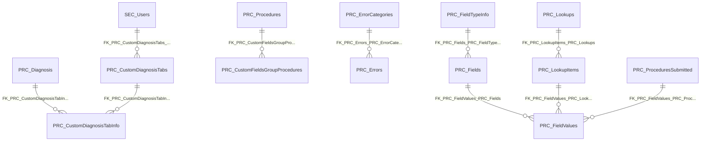

import TableDetail from '@site/src/components/TableDetail';

# Performance Schema Database Tables

**139 tables** · **115 with PK** (82.7%) · **194 FKs** · **292 indexes**

## Entity Relationships

## Table Reference

<TableDetail
  tables={[{"name":"DH_DepartmentCMEGroup","schema":"perf","fullName":"perf.DH_DepartmentCMEGroup","hasPrimaryKey":true,"primaryKeyColumns":["ID"],"foreignKeys":[{"constraintName":"FK_DH_DepartmentCMEGroup_UpdatedByID","referencedTable":"UpdatedByID"},{"constraintName":"FK_DH_DepartmentCMEGroup_CreatedByID","referencedTable":"CreatedByID"}],"indexes":[{"name":"DH_DepartmentCMEGroup_PK","type":"CLUSTERED","isPrimaryKey":true,"isUnique":true,"isDisabled":false,"keyColumns":["ID"],"includedColumns":[]}],"checkConstraints":[],"defaultConstraints":3,"triggers":[]},{"name":"DH_DepartmentCMEGroupUsers","schema":"perf","fullName":"perf.DH_DepartmentCMEGroupUsers","hasPrimaryKey":true,"primaryKeyColumns":["ID"],"foreignKeys":[{"constraintName":"FK_DH_DepartmentCMEGroupUsers_UpdatedByID","referencedTable":"UpdatedByID"},{"constraintName":"FK_DH_DepartmentCMEGroupUsers_CreatedByID","referencedTable":"CreatedByID"}],"indexes":[{"name":"DH_DepartmentCMEGroupUsers_PK","type":"CLUSTERED","isPrimaryKey":true,"isUnique":true,"isDisabled":false,"keyColumns":["ID"],"includedColumns":[]}],"checkConstraints":[],"defaultConstraints":2,"triggers":[]},{"name":"EVAL_Answers","schema":"perf","fullName":"perf.EVAL_Answers","hasPrimaryKey":true,"primaryKeyColumns":["ID"],"foreignKeys":[{"constraintName":"FK_EVAL_Answers_UpdatedByID","referencedTable":"UpdatedByID"},{"constraintName":"FK_EVAL_Answers_CreatedByID","referencedTable":"CreatedByID"},{"constraintName":"FK_EVAL_Answers_AnswerTypeID","referencedTable":"AnswerTypeID"}],"indexes":[{"name":"EVAL_Answers_PK","type":"CLUSTERED","isPrimaryKey":true,"isUnique":true,"isDisabled":false,"keyColumns":["ID"],"includedColumns":[]}],"checkConstraints":[],"defaultConstraints":2,"triggers":[]},{"name":"EVAL_AnswerScales","schema":"perf","fullName":"perf.EVAL_AnswerScales","hasPrimaryKey":true,"primaryKeyColumns":["ID"],"foreignKeys":[{"constraintName":"FK_EVAL_AnswerScales_UpdatedByID","referencedTable":"UpdatedByID"},{"constraintName":"FK_EVAL_AnswerScales_CreatedByID","referencedTable":"CreatedByID"}],"indexes":[{"name":"EVAL_AnswerScales_PK","type":"CLUSTERED","isPrimaryKey":true,"isUnique":true,"isDisabled":false,"keyColumns":["ID"],"includedColumns":[]}],"checkConstraints":[],"defaultConstraints":2,"triggers":[]},{"name":"EVAL_AnswerTypes","schema":"perf","fullName":"perf.EVAL_AnswerTypes","hasPrimaryKey":true,"primaryKeyColumns":["ID"],"foreignKeys":[{"constraintName":"FK_EVAL_AnswerTypes_UpdatedByID","referencedTable":"UpdatedByID"},{"constraintName":"FK_EVAL_AnswerTypes_CreatedByID","referencedTable":"CreatedByID"},{"constraintName":"FK_EVAL_AnswerTypes_AnswerScaleID","referencedTable":"AnswerScaleID"}],"indexes":[{"name":"EVAL_AnswerTypes_PK","type":"CLUSTERED","isPrimaryKey":true,"isUnique":true,"isDisabled":false,"keyColumns":["ID"],"includedColumns":[]}],"checkConstraints":[],"defaultConstraints":2,"triggers":[]},{"name":"EVAL_Questions","schema":"perf","fullName":"perf.EVAL_Questions","hasPrimaryKey":true,"primaryKeyColumns":["ID"],"foreignKeys":[{"constraintName":"FK_EVAL_Questions_UpdatedByID","referencedTable":"UpdatedByID"},{"constraintName":"FK_EVAL_Questions_QuestionsCategoryID","referencedTable":"QuestionsCategoryID"},{"constraintName":"FK_EVAL_Questions_CreatedByID","referencedTable":"CreatedByID"}],"indexes":[{"name":"EVAL_Questions_PK","type":"CLUSTERED","isPrimaryKey":true,"isUnique":true,"isDisabled":false,"keyColumns":["ID"],"includedColumns":[]}],"checkConstraints":[],"defaultConstraints":2,"triggers":[]},{"name":"EVAL_QuestionsCategories","schema":"perf","fullName":"perf.EVAL_QuestionsCategories","hasPrimaryKey":true,"primaryKeyColumns":["ID"],"foreignKeys":[{"constraintName":"FK_EVAL_QuestionsCategories_UpdatedByID","referencedTable":"UpdatedByID"},{"constraintName":"FK_EVAL_QuestionsCategories_CreatedByID","referencedTable":"CreatedByID"}],"indexes":[{"name":"EVAL_QuestionsCategories_PK","type":"CLUSTERED","isPrimaryKey":true,"isUnique":true,"isDisabled":false,"keyColumns":["ID"],"includedColumns":[]}],"checkConstraints":[],"defaultConstraints":2,"triggers":[]},{"name":"GetDepartmentProcedurePGYReportResult","schema":"perf","fullName":"perf.GetDepartmentProcedurePGYReportResult","hasPrimaryKey":true,"primaryKeyColumns":["ID"],"foreignKeys":[],"indexes":[{"name":"PK_GetDepartmentProcedurePGYReportResult","type":"CLUSTERED","isPrimaryKey":true,"isUnique":true,"isDisabled":false,"keyColumns":["ID"],"includedColumns":[]}],"checkConstraints":[],"defaultConstraints":0,"triggers":[]},{"name":"GetPendingAuthorizationReportData_Data","schema":"perf","fullName":"perf.GetPendingAuthorizationReportData_Data","hasPrimaryKey":true,"primaryKeyColumns":["ID"],"foreignKeys":[],"indexes":[{"name":"PK_GetPendingAuthorizationReportData_Data","type":"CLUSTERED","isPrimaryKey":true,"isUnique":true,"isDisabled":false,"keyColumns":["ID"],"includedColumns":[]}],"checkConstraints":[],"defaultConstraints":0,"triggers":[]},{"name":"GetPendingAuthorizationReportData_Users","schema":"perf","fullName":"perf.GetPendingAuthorizationReportData_Users","hasPrimaryKey":true,"primaryKeyColumns":["ID"],"foreignKeys":[],"indexes":[{"name":"PK_GetPendingAuthorizationReportData_Users","type":"CLUSTERED","isPrimaryKey":true,"isUnique":true,"isDisabled":false,"keyColumns":["ID"],"includedColumns":[]}],"checkConstraints":[],"defaultConstraints":0,"triggers":[]},{"name":"GetPendingProcedureRequiredData","schema":"perf","fullName":"perf.GetPendingProcedureRequiredData","hasPrimaryKey":true,"primaryKeyColumns":["ID"],"foreignKeys":[],"indexes":[{"name":"PK_GetPendingProcedureRequiredData","type":"CLUSTERED","isPrimaryKey":true,"isUnique":true,"isDisabled":false,"keyColumns":["ID"],"includedColumns":[]}],"checkConstraints":[],"defaultConstraints":0,"triggers":[]},{"name":"GetSupervisorDepartmentReportResult_Data","schema":"perf","fullName":"perf.GetSupervisorDepartmentReportResult_Data","hasPrimaryKey":true,"primaryKeyColumns":["ID"],"foreignKeys":[],"indexes":[{"name":"PK_GetSupervisorDepartmentReportResult_Data","type":"CLUSTERED","isPrimaryKey":true,"isUnique":true,"isDisabled":false,"keyColumns":["ID"],"includedColumns":[]}],"checkConstraints":[],"defaultConstraints":0,"triggers":[]},{"name":"GetSupervisorDepartmentReportResult_Supervisors","schema":"perf","fullName":"perf.GetSupervisorDepartmentReportResult_Supervisors","hasPrimaryKey":true,"primaryKeyColumns":["ID"],"foreignKeys":[],"indexes":[{"name":"PK_GetSupervisorDepartmentReportResult_Supervisors","type":"CLUSTERED","isPrimaryKey":true,"isUnique":true,"isDisabled":false,"keyColumns":["ID"],"includedColumns":[]}],"checkConstraints":[],"defaultConstraints":0,"triggers":[]},{"name":"GetSupervisorDepartmentSummaryReportResult","schema":"perf","fullName":"perf.GetSupervisorDepartmentSummaryReportResult","hasPrimaryKey":true,"primaryKeyColumns":["ID"],"foreignKeys":[],"indexes":[{"name":"PK_GetSupervisorDepartmentSummaryReportResult","type":"CLUSTERED","isPrimaryKey":true,"isUnique":true,"isDisabled":false,"keyColumns":["ID"],"includedColumns":[]}],"checkConstraints":[],"defaultConstraints":0,"triggers":[]},{"name":"MGMT_FieldTypes","schema":"perf","fullName":"perf.MGMT_FieldTypes","hasPrimaryKey":true,"primaryKeyColumns":["ID"],"foreignKeys":[],"indexes":[{"name":"PK_MGMT_FieldTypes","type":"CLUSTERED","isPrimaryKey":true,"isUnique":true,"isDisabled":false,"keyColumns":["ID"],"includedColumns":[]}],"checkConstraints":[],"defaultConstraints":0,"triggers":[]},{"name":"MGMT_VisibilityTypes","schema":"perf","fullName":"perf.MGMT_VisibilityTypes","hasPrimaryKey":true,"primaryKeyColumns":["ID"],"foreignKeys":[],"indexes":[{"name":"PK_MGMT_VisibilityTypes","type":"CLUSTERED","isPrimaryKey":true,"isUnique":true,"isDisabled":false,"keyColumns":["ID"],"includedColumns":[]},{"name":"UQ_MGMT_VisibilityTypes_Name","type":"NONCLUSTERED","isPrimaryKey":false,"isUnique":true,"isDisabled":false,"keyColumns":["Name"],"includedColumns":[]}],"checkConstraints":[],"defaultConstraints":0,"triggers":[]},{"name":"NewMyEvals_log","schema":"perf","fullName":"perf.NewMyEvals_log","hasPrimaryKey":true,"primaryKeyColumns":["ID"],"foreignKeys":[],"indexes":[{"name":"PK_NewMyEvals_log","type":"CLUSTERED","isPrimaryKey":true,"isUnique":true,"isDisabled":false,"keyColumns":["ID"],"includedColumns":[]}],"checkConstraints":[],"defaultConstraints":0,"triggers":[]},{"name":"PRC_ComplicationTypes","schema":"perf","fullName":"perf.PRC_ComplicationTypes","hasPrimaryKey":true,"primaryKeyColumns":["ID"],"foreignKeys":[{"constraintName":"FK_PRC_ComplicationTypes_UpdatedByID","referencedTable":"UpdatedByID"},{"constraintName":"FK_PRC_ComplicationTypes_CreatedByID","referencedTable":"CreatedByID"}],"indexes":[{"name":"PRC_ComplicationType_PK","type":"CLUSTERED","isPrimaryKey":true,"isUnique":true,"isDisabled":false,"keyColumns":["ID"],"includedColumns":[]}],"checkConstraints":[],"defaultConstraints":3,"triggers":[]},{"name":"PRC_ConsentTypes","schema":"perf","fullName":"perf.PRC_ConsentTypes","hasPrimaryKey":true,"primaryKeyColumns":["ID"],"foreignKeys":[{"constraintName":"FK_PRC_ConsentTypes_UpdatedByID","referencedTable":"UpdatedByID"},{"constraintName":"FK_PRC_ConsentTypes_CreatedByID","referencedTable":"CreatedByID"}],"indexes":[{"name":"PK_PRC_ConsentTypes","type":"CLUSTERED","isPrimaryKey":true,"isUnique":true,"isDisabled":false,"keyColumns":["ID"],"includedColumns":[]}],"checkConstraints":[],"defaultConstraints":3,"triggers":[]},{"name":"PRC_CustomDiagnosisTabInfo","schema":"perf","fullName":"perf.PRC_CustomDiagnosisTabInfo","hasPrimaryKey":true,"primaryKeyColumns":["ID"],"foreignKeys":[{"constraintName":"FK_PRC_CustomDiagnosisTabInfo_CreatedByID","referencedTable":"CreatedByID"},{"constraintName":"FK_PRC_CustomDiagnosisTabInfo_UpdatedByID","referencedTable":"UpdatedByID"},{"constraintName":"FK_PRC_CustomDiagnosisTabInfo_PRC_Diagnosis","referencedTable":"PRC_Diagnosis"},{"constraintName":"FK_PRC_CustomDiagnosisTabInfo_PRC_CustomDiagnosisTabs","referencedTable":"PRC_CustomDiagnosisTabs"}],"indexes":[{"name":"PK_PRC_CustomDiagnosisTabInfo","type":"CLUSTERED","isPrimaryKey":true,"isUnique":true,"isDisabled":false,"keyColumns":["ID"],"includedColumns":[]}],"checkConstraints":[],"defaultConstraints":2,"triggers":[]},{"name":"PRC_CustomDiagnosisTabs","schema":"perf","fullName":"perf.PRC_CustomDiagnosisTabs","hasPrimaryKey":true,"primaryKeyColumns":["ID"],"foreignKeys":[{"constraintName":"FK_PRC_CustomDiagnosisTabs_UpdatedByID","referencedTable":"UpdatedByID"},{"constraintName":"FK_PRC_CustomDiagnosisTabs_SEC_Users","referencedTable":"SEC_Users"},{"constraintName":"FK_PRC_CustomDiagnosisTabs_CreatedByID","referencedTable":"CreatedByID"}],"indexes":[{"name":"PK_PRC_CustomDiagnosisTabs","type":"CLUSTERED","isPrimaryKey":true,"isUnique":true,"isDisabled":false,"keyColumns":["ID"],"includedColumns":[]}],"checkConstraints":[],"defaultConstraints":2,"triggers":[]},{"name":"PRC_CustomFieldsGroupProcedures","schema":"perf","fullName":"perf.PRC_CustomFieldsGroupProcedures","hasPrimaryKey":true,"primaryKeyColumns":["ID"],"foreignKeys":[{"constraintName":"FK_PRC_CustomFieldsGroupProcedures_UpdatedByID","referencedTable":"UpdatedByID"},{"constraintName":"FK_PRC_CustomFieldsGroupProcedures_CreatedByID","referencedTable":"CreatedByID"},{"constraintName":"FK_PRC_CustomFieldsGroupProcedures_PRC_Procedures","referencedTable":"PRC_Procedures"},{"constraintName":"FK_PRC_CustomFieldsGroupProcedures_PRC_FieldsGroup","referencedTable":"PRC_FieldsGroup"}],"indexes":[{"name":"PK_PRC_CustomFieldsGroupProcedures","type":"CLUSTERED","isPrimaryKey":true,"isUnique":true,"isDisabled":false,"keyColumns":["ID"],"includedColumns":[]}],"checkConstraints":[],"defaultConstraints":2,"triggers":[]},{"name":"PRC_Diagnosis","schema":"perf","fullName":"perf.PRC_Diagnosis","hasPrimaryKey":true,"primaryKeyColumns":["ID"],"foreignKeys":[{"constraintName":"FK_PRC_Diagnosis_UpdatedByID","referencedTable":"UpdatedByID"},{"constraintName":"FK_PRC_Diagnosis_DiagnosisCategoryID","referencedTable":"DiagnosisCategoryID"},{"constraintName":"FK_PRC_Diagnosis_CreatedByID","referencedTable":"CreatedByID"}],"indexes":[{"name":"perf_perf_ix_tst","type":"NONCLUSTERED","isPrimaryKey":false,"isUnique":false,"isDisabled":false,"keyColumns":["ID"],"includedColumns":["Name"]},{"name":"PRC_DiagnosisList_PK","type":"CLUSTERED","isPrimaryKey":true,"isUnique":true,"isDisabled":false,"keyColumns":["ID"],"includedColumns":[]}],"checkConstraints":[],"defaultConstraints":3,"triggers":[]},{"name":"PRC_DiagnosisCategories","schema":"perf","fullName":"perf.PRC_DiagnosisCategories","hasPrimaryKey":true,"primaryKeyColumns":["ID"],"foreignKeys":[{"constraintName":"FK_PRC_DiagnosisCategories_UpdatedByID","referencedTable":"UpdatedByID"},{"constraintName":"FK_PRC_DiagnosisCategories_CreatedByID","referencedTable":"CreatedByID"}],"indexes":[{"name":"PRC_DiagnosesCategories_PK","type":"CLUSTERED","isPrimaryKey":true,"isUnique":true,"isDisabled":false,"keyColumns":["ID"],"includedColumns":[]}],"checkConstraints":[],"defaultConstraints":3,"triggers":[]},{"name":"PRC_ErrorCategories","schema":"perf","fullName":"perf.PRC_ErrorCategories","hasPrimaryKey":true,"primaryKeyColumns":["ID"],"foreignKeys":[{"constraintName":"FK_PRC_ErrorCategories_UpdatedByID","referencedTable":"UpdatedByID"},{"constraintName":"FK_PRC_ErrorCategories_CreatedByID","referencedTable":"CreatedByID"}],"indexes":[{"name":"PRC_ErrorCategories_PK","type":"CLUSTERED","isPrimaryKey":true,"isUnique":true,"isDisabled":false,"keyColumns":["ID"],"includedColumns":[]}],"checkConstraints":[],"defaultConstraints":3,"triggers":[]},{"name":"PRC_Errors","schema":"perf","fullName":"perf.PRC_Errors","hasPrimaryKey":true,"primaryKeyColumns":["ID"],"foreignKeys":[{"constraintName":"FK_PRC_Errors_UpdatedByID","referencedTable":"UpdatedByID"},{"constraintName":"FK_PRC_Errors_PRC_ErrorCategories","referencedTable":"PRC_ErrorCategories"},{"constraintName":"FK_PRC_Errors_CreatedByID","referencedTable":"CreatedByID"}],"indexes":[{"name":"PRC_Errors_PK","type":"CLUSTERED","isPrimaryKey":true,"isUnique":true,"isDisabled":false,"keyColumns":["ID"],"includedColumns":[]}],"checkConstraints":[],"defaultConstraints":3,"triggers":[]},{"name":"PRC_ExternalSupervisors","schema":"perf","fullName":"perf.PRC_ExternalSupervisors","hasPrimaryKey":true,"primaryKeyColumns":["ID"],"foreignKeys":[],"indexes":[{"name":"PRC_ExternalSupervisors_PK","type":"CLUSTERED","isPrimaryKey":true,"isUnique":true,"isDisabled":false,"keyColumns":["ID"],"includedColumns":[]}],"checkConstraints":[],"defaultConstraints":0,"triggers":[]},{"name":"PRC_FieldGroups","schema":"perf","fullName":"perf.PRC_FieldGroups","hasPrimaryKey":true,"primaryKeyColumns":["ID"],"foreignKeys":[{"constraintName":"FK_PRC_FieldGroups_UpdatedByID","referencedTable":"UpdatedByID"},{"constraintName":"FK_PRC_FieldGroups_SEC_Departments","referencedTable":"SEC_Departments"},{"constraintName":"FK_PRC_FieldGroups_CreatedByID","referencedTable":"CreatedByID"}],"indexes":[{"name":"IDX_PRC_FieldGroups1","type":"NONCLUSTERED","isPrimaryKey":false,"isUnique":false,"isDisabled":false,"keyColumns":["IsDel"],"includedColumns":["ProcedureGroupID"]},{"name":"IDX_PRC_FieldGroups2","type":"NONCLUSTERED","isPrimaryKey":false,"isUnique":false,"isDisabled":false,"keyColumns":["IsDel","ProcedureGroupID"],"includedColumns":[]},{"name":"perf_perf_IX_DepartmentID","type":"NONCLUSTERED","isPrimaryKey":false,"isUnique":false,"isDisabled":false,"keyColumns":["DepartmentID"],"includedColumns":[]},{"name":"PK_PRC_FieldGroups","type":"CLUSTERED","isPrimaryKey":true,"isUnique":true,"isDisabled":false,"keyColumns":["ID"],"includedColumns":[]}],"checkConstraints":[],"defaultConstraints":3,"triggers":[]},{"name":"PRC_Fields","schema":"perf","fullName":"perf.PRC_Fields","hasPrimaryKey":true,"primaryKeyColumns":["ID"],"foreignKeys":[{"constraintName":"FK_PRC_Fields_CreatedByID","referencedTable":"CreatedByID"},{"constraintName":"FK_PRC_Fields_PRC_FieldTypeInfo","referencedTable":"PRC_FieldTypeInfo"},{"constraintName":"FK_PRC_Fields_PRC_FieldGroup","referencedTable":"PRC_FieldGroup"},{"constraintName":"FK_PRC_Fields_UpdatedByID","referencedTable":"UpdatedByID"}],"indexes":[{"name":"IX_PRC_Fields_ID_IsDel","type":"NONCLUSTERED","isPrimaryKey":false,"isUnique":false,"isDisabled":false,"keyColumns":["ID","IsDel"],"includedColumns":["Name","FieldTypeInfoID"]},{"name":"IX_PRC_Fields_Lookup","type":"NONCLUSTERED","isPrimaryKey":false,"isUnique":false,"isDisabled":false,"keyColumns":["ID","LookupID","Order"],"includedColumns":[]},{"name":"IX_PRC_FieldValues1","type":"NONCLUSTERED","isPrimaryKey":false,"isUnique":false,"isDisabled":false,"keyColumns":["LookupID"],"includedColumns":[]},{"name":"perf_perf_IX_GetProceduresFieldsToDraw","type":"NONCLUSTERED","isPrimaryKey":false,"isUnique":false,"isDisabled":false,"keyColumns":["IsDel"],"includedColumns":["DefaultValue","DisplayName","FieldGroupID","FieldTypeInfoID","IsHidden","IsRequired","IsSystem","LookupID","Name","Order","VisibilityTypeID"]},{"name":"perf_perf_IX_GetProceduresFieldsToDraw_1","type":"NONCLUSTERED","isPrimaryKey":false,"isUnique":false,"isDisabled":false,"keyColumns":["IsDel","FieldGroupID"],"includedColumns":["DefaultValue","DisplayName","FieldTypeInfoID","IsHidden","IsRequired","IsSystem","LookupID","Name","Order","VisibilityTypeID"]},{"name":"PK_PRC_Fields","type":"CLUSTERED","isPrimaryKey":true,"isUnique":true,"isDisabled":false,"keyColumns":["ID"],"includedColumns":[]}],"checkConstraints":[],"defaultConstraints":5,"triggers":[]},{"name":"PRC_FieldTypeInfo","schema":"perf","fullName":"perf.PRC_FieldTypeInfo","hasPrimaryKey":true,"primaryKeyColumns":["ID"],"foreignKeys":[{"constraintName":"FK_PRC_FieldTypeInfo_CreatedByID","referencedTable":"CreatedByID"},{"constraintName":"FK_PRC_FieldTypeInfo_UpdatedByID","referencedTable":"UpdatedByID"}],"indexes":[{"name":"PK_PRC_FieldTypeInfo","type":"CLUSTERED","isPrimaryKey":true,"isUnique":true,"isDisabled":false,"keyColumns":["ID"],"includedColumns":[]}],"checkConstraints":[],"defaultConstraints":2,"triggers":[]},{"name":"PRC_FieldValues","schema":"perf","fullName":"perf.PRC_FieldValues","hasPrimaryKey":true,"primaryKeyColumns":["ID"],"foreignKeys":[{"constraintName":"FK_PRC_FieldValues_CreatedByID","referencedTable":"CreatedByID"},{"constraintName":"FK_PRC_FieldValues_PRC_Fields","referencedTable":"PRC_Fields"},{"constraintName":"FK_PRC_FieldValues_PRC_LookupItems","referencedTable":"PRC_LookupItems"},{"constraintName":"FK_PRC_FieldValues_PRC_ProceduresSubmitted","referencedTable":"PRC_ProceduresSubmitted"},{"constraintName":"FK_PRC_FieldValues_UpdatedByID","referencedTable":"UpdatedByID"}],"indexes":[{"name":"IX_FieldValues_SubmissionID","type":"NONCLUSTERED","isPrimaryKey":false,"isUnique":false,"isDisabled":false,"keyColumns":["ProceduresSubmittedID","FieldID","LookupItemID"],"includedColumns":[]},{"name":"IX_PRC_FieldValues_Submitted_Field","type":"NONCLUSTERED","isPrimaryKey":false,"isUnique":false,"isDisabled":false,"keyColumns":["ProceduresSubmittedID","FieldID"],"includedColumns":["LargeNumberFieldValue","ShortTextFieldValue","LongTextFieldValue","FreeTextFieldValue","LargeDateFieldValue","LookupItemID"]},{"name":"IX_PRC_FieldValues1","type":"NONCLUSTERED","isPrimaryKey":false,"isUnique":false,"isDisabled":false,"keyColumns":["FieldID"],"includedColumns":[]},{"name":"IX_PRC_FieldValues2","type":"NONCLUSTERED","isPrimaryKey":false,"isUnique":false,"isDisabled":false,"keyColumns":["LookupItemID"],"includedColumns":[]},{"name":"IX_PRC_FieldValues3","type":"NONCLUSTERED","isPrimaryKey":false,"isUnique":false,"isDisabled":false,"keyColumns":["FieldID","ProceduresSubmittedID"],"includedColumns":[]},{"name":"perf_perf_IX_PatientLogSubmittedID","type":"NONCLUSTERED","isPrimaryKey":false,"isUnique":false,"isDisabled":false,"keyColumns":["PatientLogSubmittedID"],"includedColumns":["CreateDate","CreatedByID","FieldID","FreeTextFieldValue","IsDel","LargeDateFieldValue","LargeNumberFieldValue","LongTextFieldValue","LookupItemID","NumberFieldValue","ProceduresSubmittedID","TextValue","UpdateDate","UpdatedByID"]},{"name":"perf_perf_IX_ProceduresSubmittedID","type":"NONCLUSTERED","isPrimaryKey":false,"isUnique":false,"isDisabled":false,"keyColumns":["ProceduresSubmittedID"],"includedColumns":[]},{"name":"PK_PRC_FieldValues","type":"CLUSTERED","isPrimaryKey":true,"isUnique":true,"isDisabled":false,"keyColumns":["ID"],"includedColumns":[]}],"checkConstraints":[],"defaultConstraints":2,"triggers":[]},{"name":"PRC_FieldValues_2","schema":"perf","fullName":"perf.PRC_FieldValues_2","hasPrimaryKey":true,"primaryKeyColumns":["ID"],"foreignKeys":[],"indexes":[{"name":"PK_PRC_FieldValues_2","type":"CLUSTERED","isPrimaryKey":true,"isUnique":true,"isDisabled":false,"keyColumns":["ID"],"includedColumns":[]}],"checkConstraints":[],"defaultConstraints":2,"triggers":[]},{"name":"PRC_Gender","schema":"perf","fullName":"perf.PRC_Gender","hasPrimaryKey":true,"primaryKeyColumns":["ID"],"foreignKeys":[{"constraintName":"FK_PRC_Gender_UpdatedByID","referencedTable":"UpdatedByID"},{"constraintName":"FK_PRC_Gender_CreatedByID","referencedTable":"CreatedByID"}],"indexes":[{"name":"PTL_Gender_PK","type":"CLUSTERED","isPrimaryKey":true,"isUnique":true,"isDisabled":false,"keyColumns":["ID"],"includedColumns":[]}],"checkConstraints":[],"defaultConstraints":3,"triggers":[]},{"name":"PRC_LevelsOfSupervision","schema":"perf","fullName":"perf.PRC_LevelsOfSupervision","hasPrimaryKey":true,"primaryKeyColumns":["ID"],"foreignKeys":[{"constraintName":"FK_PRC_LevelsOfSupervision_UpdatedByID","referencedTable":"UpdatedByID"},{"constraintName":"FK_PRC_LevelsOfSupervision_DepartmentID","referencedTable":"DepartmentID"},{"constraintName":"FK_PRC_LevelsOfSupervision_CreatedByID","referencedTable":"CreatedByID"}],"indexes":[{"name":"PK_PRC_LevelsOfSupervision","type":"CLUSTERED","isPrimaryKey":true,"isUnique":true,"isDisabled":false,"keyColumns":["ID"],"includedColumns":[]}],"checkConstraints":[],"defaultConstraints":3,"triggers":[]},{"name":"PRC_LookupItems","schema":"perf","fullName":"perf.PRC_LookupItems","hasPrimaryKey":true,"primaryKeyColumns":["ID"],"foreignKeys":[{"constraintName":"FK_PRC_LookupItems_UpdatedByID","referencedTable":"UpdatedByID"},{"constraintName":"FK_PRC_LookupItems_PRC_Lookups","referencedTable":"PRC_Lookups"},{"constraintName":"FK_PRC_LookupItems_CreatedByID","referencedTable":"CreatedByID"}],"indexes":[{"name":"IX_LookupItems_ID_Value","type":"NONCLUSTERED","isPrimaryKey":false,"isUnique":false,"isDisabled":false,"keyColumns":["ID","Value"],"includedColumns":[]},{"name":"perf_perf_IX_LookupID","type":"NONCLUSTERED","isPrimaryKey":false,"isUnique":false,"isDisabled":false,"keyColumns":["LookupID"],"includedColumns":[]},{"name":"PK_PRC_LookupItems","type":"CLUSTERED","isPrimaryKey":true,"isUnique":true,"isDisabled":false,"keyColumns":["ID"],"includedColumns":[]}],"checkConstraints":[],"defaultConstraints":4,"triggers":[]},{"name":"PRC_Lookups","schema":"perf","fullName":"perf.PRC_Lookups","hasPrimaryKey":true,"primaryKeyColumns":["ID"],"foreignKeys":[{"constraintName":"FK_PRC_Lookups_UpdatedByID","referencedTable":"UpdatedByID"},{"constraintName":"FK_PRC_Lookups_CreatedByID","referencedTable":"CreatedByID"}],"indexes":[{"name":"IX_PRC_FieldValues1","type":"NONCLUSTERED","isPrimaryKey":false,"isUnique":false,"isDisabled":false,"keyColumns":["DepartmentID"],"includedColumns":[]},{"name":"IX_PRC_FieldValues2","type":"NONCLUSTERED","isPrimaryKey":false,"isUnique":false,"isDisabled":false,"keyColumns":["IsDel"],"includedColumns":[]},{"name":"IX_PRC_Lookups","type":"NONCLUSTERED","isPrimaryKey":false,"isUnique":false,"isDisabled":false,"keyColumns":["ID","Name"],"includedColumns":[]},{"name":"PK_PRC_Lookups","type":"CLUSTERED","isPrimaryKey":true,"isUnique":true,"isDisabled":false,"keyColumns":["ID"],"includedColumns":[]}],"checkConstraints":[],"defaultConstraints":2,"triggers":[]},{"name":"PRC_ParticipationCertificationTypes","schema":"perf","fullName":"perf.PRC_ParticipationCertificationTypes","hasPrimaryKey":true,"primaryKeyColumns":["ID"],"foreignKeys":[],"indexes":[{"name":"PK__PRC_Part__3214EC272AFD4C8C","type":"CLUSTERED","isPrimaryKey":true,"isUnique":true,"isDisabled":false,"keyColumns":["ID"],"includedColumns":[]}],"checkConstraints":[],"defaultConstraints":0,"triggers":[]},{"name":"PRC_ParticipationTypeCategories","schema":"perf","fullName":"perf.PRC_ParticipationTypeCategories","hasPrimaryKey":true,"primaryKeyColumns":["ID"],"foreignKeys":[{"constraintName":"FK_PRC_ParticipationTypeCategories_UpdatedByID","referencedTable":"UpdatedByID"},{"constraintName":"FK_PRC_ParticipationTypeCategories_CreatedByID","referencedTable":"CreatedByID"}],"indexes":[{"name":"PK_PRC_ParticipationTypeCategories","type":"CLUSTERED","isPrimaryKey":true,"isUnique":true,"isDisabled":false,"keyColumns":["ID"],"includedColumns":[]}],"checkConstraints":[],"defaultConstraints":3,"triggers":[]},{"name":"PRC_ParticipationTypes","schema":"perf","fullName":"perf.PRC_ParticipationTypes","hasPrimaryKey":true,"primaryKeyColumns":["ID"],"foreignKeys":[{"constraintName":"FK_PRC_ParticipationTypes_UpdatedByID","referencedTable":"UpdatedByID"},{"constraintName":"FK_PRC_ParticipationTypes_CreatedByID","referencedTable":"CreatedByID"}],"indexes":[{"name":"PK_PRC_ParticipationTypes","type":"CLUSTERED","isPrimaryKey":true,"isUnique":true,"isDisabled":false,"keyColumns":["ID"],"includedColumns":[]}],"checkConstraints":[],"defaultConstraints":3,"triggers":[]},{"name":"PRC_ParticipationTypesCustom","schema":"perf","fullName":"perf.PRC_ParticipationTypesCustom","hasPrimaryKey":true,"primaryKeyColumns":["ID"],"foreignKeys":[{"constraintName":"FK__PRC_Parti__Parti__0A758E97","referencedTable":"(system-named)"},{"constraintName":"FK_PRC_ParticipationTypesCustom_DepartmentID","referencedTable":"DepartmentID"},{"constraintName":"FK_PRC_ParticipationTypesCustom_CreatedByID","referencedTable":"CreatedByID"},{"constraintName":"FK_PRC_ParticipationTypesCustom_UpdatedByID","referencedTable":"UpdatedByID"},{"constraintName":"FK_PRC_ParticipationTypesCustom_ParticipationTypeID","referencedTable":"ParticipationTypeID"}],"indexes":[{"name":"IDX_PRC_ParticipationTypesCustom1","type":"NONCLUSTERED","isPrimaryKey":false,"isUnique":false,"isDisabled":false,"keyColumns":["DepartmentID"],"includedColumns":[]},{"name":"IDX_PRC_ParticipationTypesCustom2","type":"NONCLUSTERED","isPrimaryKey":false,"isUnique":false,"isDisabled":false,"keyColumns":["IsDel"],"includedColumns":["ParticipationTypeID","IsSelfSupervisor"]},{"name":"IDX_PRC_ParticipationTypesCustom3","type":"NONCLUSTERED","isPrimaryKey":false,"isUnique":false,"isDisabled":false,"keyColumns":["ParticipationTypeID"],"includedColumns":["IsSelfSupervisor"]},{"name":"PK_PRC_PParticipationTypeCustom","type":"CLUSTERED","isPrimaryKey":true,"isUnique":true,"isDisabled":false,"keyColumns":["ID"],"includedColumns":[]}],"checkConstraints":[],"defaultConstraints":3,"triggers":[]},{"name":"PRC_Patients","schema":"perf","fullName":"perf.PRC_Patients","hasPrimaryKey":true,"primaryKeyColumns":["ID"],"foreignKeys":[{"constraintName":"FK_PRC_Patients_UpdatedByID","referencedTable":"UpdatedByID"},{"constraintName":"FK_PRC_Patients_GenderID","referencedTable":"GenderID"},{"constraintName":"FK_PRC_Patients_CreatedByID","referencedTable":"CreatedByID"}],"indexes":[{"name":"IX_PRC_Patients1","type":"NONCLUSTERED","isPrimaryKey":false,"isUnique":false,"isDisabled":false,"keyColumns":["CreatedByID"],"includedColumns":[]},{"name":"perf_IDX_PRC_Patients1","type":"NONCLUSTERED","isPrimaryKey":false,"isUnique":false,"isDisabled":false,"keyColumns":["UpdatedByID"],"includedColumns":[]},{"name":"PRC_Patients_PK","type":"CLUSTERED","isPrimaryKey":true,"isUnique":true,"isDisabled":false,"keyColumns":["ID"],"includedColumns":[]}],"checkConstraints":[],"defaultConstraints":2,"triggers":[]},{"name":"PRC_ProcedureCategories","schema":"perf","fullName":"perf.PRC_ProcedureCategories","hasPrimaryKey":true,"primaryKeyColumns":["ID"],"foreignKeys":[{"constraintName":"FK_PRC_ProcedureCategories_UpdatedByID","referencedTable":"UpdatedByID"},{"constraintName":"FK_PRC_ProcedureCategories_CreatedByID","referencedTable":"CreatedByID"}],"indexes":[{"name":"IDX_PRC_ProcedureCategories1","type":"NONCLUSTERED","isPrimaryKey":false,"isUnique":false,"isDisabled":false,"keyColumns":["DepartmentID"],"includedColumns":["IsDel","CreateDate","UpdateDate","CreatedByID","UpdatedByID","SortOrder","CategoryName","IsExlcludedFromVerificationReport","IsExlcludedFromCertificationReport","IsDefault","IsSystem"]},{"name":"PK_PRC_ProcedureCategories","type":"CLUSTERED","isPrimaryKey":true,"isUnique":true,"isDisabled":false,"keyColumns":["ID"],"includedColumns":[]}],"checkConstraints":[],"defaultConstraints":3,"triggers":[]},{"name":"PRC_ProcedureGroupProcedures","schema":"perf","fullName":"perf.PRC_ProcedureGroupProcedures","hasPrimaryKey":true,"primaryKeyColumns":["ID"],"foreignKeys":[{"constraintName":"FK__PRC_Proce__Proce__5EA317EA","referencedTable":"(system-named)"},{"constraintName":"FK__PRC_Proce__Updat__5DAEF3B1","referencedTable":"(system-named)"}],"indexes":[{"name":"PK__PRC_Proc__3214EC270F4F8A23","type":"CLUSTERED","isPrimaryKey":true,"isUnique":true,"isDisabled":false,"keyColumns":["ID"],"includedColumns":[]}],"checkConstraints":[],"defaultConstraints":0,"triggers":[]},{"name":"PRC_ProcedureGroups","schema":"perf","fullName":"perf.PRC_ProcedureGroups","hasPrimaryKey":true,"primaryKeyColumns":["ID"],"foreignKeys":[{"constraintName":"FK_PRC_ProcedureGroups_CreatedByID","referencedTable":"CreatedByID"},{"constraintName":"FK_PRC_ProcedureGroups_UpdatedByID","referencedTable":"UpdatedByID"}],"indexes":[{"name":"PK_PRC_ProcedureGroups","type":"CLUSTERED","isPrimaryKey":true,"isUnique":true,"isDisabled":false,"keyColumns":["ID"],"includedColumns":[]}],"checkConstraints":[],"defaultConstraints":4,"triggers":[]},{"name":"PRC_ProcedureImportSession","schema":"perf","fullName":"perf.PRC_ProcedureImportSession","hasPrimaryKey":true,"primaryKeyColumns":["ProcedureImportSessionID"],"foreignKeys":[],"indexes":[{"name":"PRC_ProcedureImportSession_PK","type":"CLUSTERED","isPrimaryKey":true,"isUnique":true,"isDisabled":false,"keyColumns":["ProcedureImportSessionID"],"includedColumns":[]}],"checkConstraints":[],"defaultConstraints":0,"triggers":[]},{"name":"PRC_ProcedureImportSessionProcedure","schema":"perf","fullName":"perf.PRC_ProcedureImportSessionProcedure","hasPrimaryKey":true,"primaryKeyColumns":["ProcedureImportSessionProcedureID"],"foreignKeys":[],"indexes":[{"name":"PRC_ProcedureImportSessionProcedure_PK","type":"CLUSTERED","isPrimaryKey":true,"isUnique":true,"isDisabled":false,"keyColumns":["ProcedureImportSessionProcedureID"],"includedColumns":[]}],"checkConstraints":[],"defaultConstraints":0,"triggers":[]},{"name":"PRC_Procedures","schema":"perf","fullName":"perf.PRC_Procedures","hasPrimaryKey":true,"primaryKeyColumns":["ID"],"foreignKeys":[{"constraintName":"FK_PRC_Procedures_UpdatedByID","referencedTable":"UpdatedByID"},{"constraintName":"FK_PRC_Procedures_CreatedByID","referencedTable":"CreatedByID"},{"constraintName":"FK_PRC_Procedures_ProcedureBaseID","referencedTable":"ProcedureBaseID"},{"constraintName":"FK_PRC_Procedures_ProcedureCategoriesID","referencedTable":"ProcedureCategoriesID"}],"indexes":[{"name":"IDX_PRC_Procedures1","type":"NONCLUSTERED","isPrimaryKey":false,"isUnique":false,"isDisabled":false,"keyColumns":["DepartmentID"],"includedColumns":["IsDel","CreateDate","UpdateDate","CreatedByID","UpdatedByID","AudienceID","ProceduresBaseID","ProcedureCategoriesID","ProcedureNameAlias","GraduationMinimumCount","CertificationNumber","IsRequired","IsQuestionAvailable","HowTo","ConsultRefNumber","IsDisabled","ELogProcedureName","ProcedureGroupID","IsCertificationVerificationRequired","CertificationVerificationQuestion","TaskNumber"]},{"name":"IDX_PRC_Procedures2","type":"NONCLUSTERED","isPrimaryKey":false,"isUnique":false,"isDisabled":false,"keyColumns":["DepartmentID"],"includedColumns":["IsDel","CreateDate","UpdateDate","CreatedByID","UpdatedByID","AudienceID","ProceduresBaseID","ProcedureCategoriesID","ProcedureNameAlias","GraduationMinimumCount","CertificationNumber","IsRequired","IsQuestionAvailable","HowTo","ConsultRefNumber","IsDisabled","ELogProcedureName","ProcedureGroupID","IsCertificationVerificationRequired","CertificationVerificationQuestion","TaskNumber","DeletedDate","TimeZone","LastUpdatedDateOffSet","LastUpdatedDateTime"]},{"name":"IDX_PRC_Procedures3","type":"NONCLUSTERED","isPrimaryKey":false,"isUnique":false,"isDisabled":false,"keyColumns":["IsDel","DepartmentID"],"includedColumns":["TaskNumber"]},{"name":"IDX_PRC_Procedures4","type":"NONCLUSTERED","isPrimaryKey":false,"isUnique":false,"isDisabled":false,"keyColumns":["IsDel","DepartmentID","TaskNumber"],"includedColumns":[]},{"name":"IDX_Test_001","type":"NONCLUSTERED","isPrimaryKey":false,"isUnique":false,"isDisabled":false,"keyColumns":["DepartmentID"],"includedColumns":["IsDel","ProceduresBaseID","ProcedureCategoriesID","GraduationMinimumCount","CertificationNumber","IsRequired"]},{"name":"IX_PRC_Procedures_Dept_IsDel","type":"NONCLUSTERED","isPrimaryKey":false,"isUnique":false,"isDisabled":false,"keyColumns":["DepartmentID","IsDel","ID"],"includedColumns":[]},{"name":"perf_IX_Fill_PRC_SummaryReport","type":"NONCLUSTERED","isPrimaryKey":false,"isUnique":false,"isDisabled":false,"keyColumns":["IsDel"],"includedColumns":["DepartmentID","ProceduresBaseID"]},{"name":"perf_NCI_PRC_Procedures_ProceduresBaseID","type":"NONCLUSTERED","isPrimaryKey":false,"isUnique":false,"isDisabled":false,"keyColumns":["ProceduresBaseID"],"includedColumns":[]},{"name":"perf_perf_IX_DepartmentID_ProceduresBaseID","type":"NONCLUSTERED","isPrimaryKey":false,"isUnique":false,"isDisabled":false,"keyColumns":["DepartmentID"],"includedColumns":["ProceduresBaseID"]},{"name":"perf_perf_IX_SubmitProcedures_GetList","type":"NONCLUSTERED","isPrimaryKey":false,"isUnique":false,"isDisabled":false,"keyColumns":["ProcedureCategoriesID"],"includedColumns":["DepartmentID","ProcedureGroupID","ProceduresBaseID"]},{"name":"perf_perf_PRC_ProceduresSubmitted_ProceduresBaseID","type":"NONCLUSTERED","isPrimaryKey":false,"isUnique":false,"isDisabled":false,"keyColumns":["ProceduresBaseID"],"includedColumns":[]},{"name":"PRC_ProceduresCustom_PK","type":"CLUSTERED","isPrimaryKey":true,"isUnique":true,"isDisabled":false,"keyColumns":["ID"],"includedColumns":[]}],"checkConstraints":[],"defaultConstraints":3,"triggers":[]},{"name":"PRC_Procedures05202025","schema":"perf","fullName":"perf.PRC_Procedures05202025","hasPrimaryKey":false,"primaryKeyColumns":[],"foreignKeys":[],"indexes":[],"checkConstraints":[],"defaultConstraints":0,"triggers":[]},{"name":"PRC_Procedures06032025","schema":"perf","fullName":"perf.PRC_Procedures06032025","hasPrimaryKey":false,"primaryKeyColumns":[],"foreignKeys":[],"indexes":[],"checkConstraints":[],"defaultConstraints":0,"triggers":[]},{"name":"PRC_Procedures06072024","schema":"perf","fullName":"perf.PRC_Procedures06072024","hasPrimaryKey":false,"primaryKeyColumns":[],"foreignKeys":[],"indexes":[],"checkConstraints":[],"defaultConstraints":0,"triggers":[]},{"name":"PRC_Procedures06112025","schema":"perf","fullName":"perf.PRC_Procedures06112025","hasPrimaryKey":false,"primaryKeyColumns":[],"foreignKeys":[],"indexes":[],"checkConstraints":[],"defaultConstraints":0,"triggers":[]},{"name":"PRC_Procedures06272024","schema":"perf","fullName":"perf.PRC_Procedures06272024","hasPrimaryKey":false,"primaryKeyColumns":[],"foreignKeys":[],"indexes":[],"checkConstraints":[],"defaultConstraints":0,"triggers":[]},{"name":"PRC_Procedures08132025","schema":"perf","fullName":"perf.PRC_Procedures08132025","hasPrimaryKey":false,"primaryKeyColumns":[],"foreignKeys":[],"indexes":[],"checkConstraints":[],"defaultConstraints":0,"triggers":[]},{"name":"PRC_ProceduresAvailability","schema":"perf","fullName":"perf.PRC_ProceduresAvailability","hasPrimaryKey":true,"primaryKeyColumns":["ID"],"foreignKeys":[{"constraintName":"FK_PRC_ProceduresAvailability_UserTypesLevelID","referencedTable":"UserTypesLevelID"},{"constraintName":"FK_PRC_ProceduresAvailability_UpdatedByID","referencedTable":"UpdatedByID"},{"constraintName":"FK_PRC_ProceduresAvailability_CreatedByID","referencedTable":"CreatedByID"}],"indexes":[{"name":"perf_perf_NCI_PRC_ProcedureAvailability_ProcedureID","type":"NONCLUSTERED","isPrimaryKey":false,"isUnique":false,"isDisabled":false,"keyColumns":["ProcedureID"],"includedColumns":["UserTypeID"]},{"name":"PRC_ProceduresAvailability_PK","type":"CLUSTERED","isPrimaryKey":true,"isUnique":true,"isDisabled":false,"keyColumns":["ID"],"includedColumns":[]}],"checkConstraints":[],"defaultConstraints":2,"triggers":[]},{"name":"PRC_ProceduresBase","schema":"perf","fullName":"perf.PRC_ProceduresBase","hasPrimaryKey":true,"primaryKeyColumns":["ID"],"foreignKeys":[],"indexes":[{"name":"PRC_Procedures_PK","type":"CLUSTERED","isPrimaryKey":true,"isUnique":true,"isDisabled":false,"keyColumns":["ID"],"includedColumns":[]}],"checkConstraints":[],"defaultConstraints":3,"triggers":[]},{"name":"PRC_ProceduresCertification","schema":"perf","fullName":"perf.PRC_ProceduresCertification","hasPrimaryKey":true,"primaryKeyColumns":["ID"],"foreignKeys":[{"constraintName":"FK_PRC_ProceduresCertification_UserID","referencedTable":"UserID"},{"constraintName":"FK_PRC_ProceduresCertification_UpdatedByID","referencedTable":"UpdatedByID"},{"constraintName":"FK_PRC_ProceduresCertification_ProceduresCertificationStatusID","referencedTable":"ProceduresCertificationStatusID"},{"constraintName":"FK_PRC_ProceduresCertification_ProcedureID","referencedTable":"ProcedureID"},{"constraintName":"FK_PRC_ProceduresCertification_DepartmentID","referencedTable":"DepartmentID"},{"constraintName":"FK_PRC_ProceduresCertification_CreatedByID","referencedTable":"CreatedByID"}],"indexes":[{"name":"IDX_PRC_ProceduresCertification1","type":"NONCLUSTERED","isPrimaryKey":false,"isUnique":false,"isDisabled":false,"keyColumns":["CreatedByID"],"includedColumns":[]},{"name":"IDX_PRC_ProceduresCertification2","type":"NONCLUSTERED","isPrimaryKey":false,"isUnique":false,"isDisabled":false,"keyColumns":["AchievementDate"],"includedColumns":["DepartmentID","ProcedureID","UserID","ProceduresCertificationStatusID"]},{"name":"IDX_PRC_ProceduresCertification3","type":"NONCLUSTERED","isPrimaryKey":false,"isUnique":false,"isDisabled":false,"keyColumns":["DepartmentID","AchievementDate"],"includedColumns":["ProcedureID","UserID","ProceduresCertificationStatusID"]},{"name":"IDX_PRC_ProceduresCertification4","type":"NONCLUSTERED","isPrimaryKey":false,"isUnique":false,"isDisabled":false,"keyColumns":["IsDel","DepartmentID","ProceduresCertificationStatusID"],"includedColumns":["UserID"]},{"name":"IDX_Test_002","type":"NONCLUSTERED","isPrimaryKey":false,"isUnique":false,"isDisabled":false,"keyColumns":["AchievementDate"],"includedColumns":["ProcedureID","UserID","ProceduresCertificationStatusID"]},{"name":"perf_IX_Fill_PRC_PendingProcedureRequiredDataReport","type":"NONCLUSTERED","isPrimaryKey":false,"isUnique":false,"isDisabled":false,"keyColumns":["UserID","ProceduresCertificationStatusID"],"includedColumns":["ProcedureID"]},{"name":"perf_perf_IX_vProceduresSupervisorsByDepartments","type":"NONCLUSTERED","isPrimaryKey":false,"isUnique":false,"isDisabled":false,"keyColumns":["IsDel","ProcedureID","ProceduresCertificationStatusID"],"includedColumns":[]},{"name":"PK_PRC_ProceduresCertificationStatus","type":"CLUSTERED","isPrimaryKey":true,"isUnique":true,"isDisabled":false,"keyColumns":["ID"],"includedColumns":[]}],"checkConstraints":[],"defaultConstraints":2,"triggers":[]},{"name":"PRC_ProceduresCertification06112025","schema":"perf","fullName":"perf.PRC_ProceduresCertification06112025","hasPrimaryKey":false,"primaryKeyColumns":[],"foreignKeys":[],"indexes":[],"checkConstraints":[],"defaultConstraints":0,"triggers":[]},{"name":"PRC_ProceduresCertificationStatus","schema":"perf","fullName":"perf.PRC_ProceduresCertificationStatus","hasPrimaryKey":true,"primaryKeyColumns":["ID"],"foreignKeys":[{"constraintName":"FK_PRC_ProceduresCertificationStatus_UpdatedByID","referencedTable":"UpdatedByID"},{"constraintName":"FK_PRC_ProceduresCertificationStatus_CreatedByID","referencedTable":"CreatedByID"}],"indexes":[{"name":"PK_PRC_ProceduresCertificationStatusTypes","type":"CLUSTERED","isPrimaryKey":true,"isUnique":true,"isDisabled":false,"keyColumns":["ID"],"includedColumns":[]}],"checkConstraints":[],"defaultConstraints":2,"triggers":[]},{"name":"PRC_ProceduresCertificationStatusAlias","schema":"perf","fullName":"perf.PRC_ProceduresCertificationStatusAlias","hasPrimaryKey":true,"primaryKeyColumns":["ID"],"foreignKeys":[{"constraintName":"FK_PRC_ProceduresCertificationStatusAlias_UpdatedByID","referencedTable":"UpdatedByID"},{"constraintName":"FK_PRC_ProceduresCertificationStatusAlias_ProceduresCertificationStatusID","referencedTable":"ProceduresCertificationStatusID"},{"constraintName":"FK_PRC_ProceduresCertificationStatusAlias_DepartmentID","referencedTable":"DepartmentID"},{"constraintName":"FK_PRC_ProceduresCertificationStatusAlias_CreatedByID","referencedTable":"CreatedByID"}],"indexes":[{"name":"PK_PRC_ProceduresCertificationStatusAlias","type":"CLUSTERED","isPrimaryKey":true,"isUnique":true,"isDisabled":false,"keyColumns":["ID"],"includedColumns":[]}],"checkConstraints":[],"defaultConstraints":2,"triggers":[]},{"name":"PRC_ProcedureSpeciality","schema":"perf","fullName":"perf.PRC_ProcedureSpeciality","hasPrimaryKey":true,"primaryKeyColumns":["ID"],"foreignKeys":[{"constraintName":"FK__PRC_Proce__Train__745AC733","referencedTable":"(system-named)"},{"constraintName":"FK__PRC_Proce__Train__754EEB6C","referencedTable":"(system-named)"},{"constraintName":"FK__PRC_Proce__UserC__56B9740D","referencedTable":"(system-named)"},{"constraintName":"FK__PRC_Proce__UserT__55C54FD4","referencedTable":"(system-named)"}],"indexes":[{"name":"IDX_PRC_ProcedureSpeciality1","type":"NONCLUSTERED","isPrimaryKey":false,"isUnique":false,"isDisabled":false,"keyColumns":["UserCategoryCodeID"],"includedColumns":["ProcedureID","IsDel"]},{"name":"IDX_PRC_ProcedureSpeciality2","type":"NONCLUSTERED","isPrimaryKey":false,"isUnique":false,"isDisabled":false,"keyColumns":["ProcedureID"],"includedColumns":["UserCategoryCodeID"]},{"name":"IDX_PRC_ProcedureSpeciality3","type":"NONCLUSTERED","isPrimaryKey":false,"isUnique":false,"isDisabled":false,"keyColumns":["ProcedureID"],"includedColumns":[]},{"name":"IDX_PRC_ProcedureSpeciality4","type":"NONCLUSTERED","isPrimaryKey":false,"isUnique":false,"isDisabled":false,"keyColumns":["TrainingSkillLevelID"],"includedColumns":["ProcedureID","UserCategoryCodeID","IsDel","TrainingFrequencyID"]},{"name":"PK__PRC_Proc__3214EC278FD03DB5","type":"CLUSTERED","isPrimaryKey":true,"isUnique":true,"isDisabled":false,"keyColumns":["ID"],"includedColumns":[]}],"checkConstraints":[],"defaultConstraints":0,"triggers":[]},{"name":"PRC_ProcedureSpeciality06032025","schema":"perf","fullName":"perf.PRC_ProcedureSpeciality06032025","hasPrimaryKey":false,"primaryKeyColumns":[],"foreignKeys":[],"indexes":[],"checkConstraints":[],"defaultConstraints":0,"triggers":[]},{"name":"PRC_ProcedureSpeciality06272024","schema":"perf","fullName":"perf.PRC_ProcedureSpeciality06272024","hasPrimaryKey":false,"primaryKeyColumns":[],"foreignKeys":[],"indexes":[],"checkConstraints":[],"defaultConstraints":0,"triggers":[]},{"name":"PRC_ProceduresQuestions","schema":"perf","fullName":"perf.PRC_ProceduresQuestions","hasPrimaryKey":true,"primaryKeyColumns":["ID"],"foreignKeys":[{"constraintName":"FK_PRC_ProceduresQuestions_CreatedByID","referencedTable":"CreatedByID"},{"constraintName":"FK_PRC_ProceduresQuestions_UpdatedByID","referencedTable":"UpdatedByID"},{"constraintName":"FK_PRC_ProceduresQuestions_QuestionID","referencedTable":"QuestionID"},{"constraintName":"FK_PRC_ProceduresQuestions_ProcedureID","referencedTable":"ProcedureID"}],"indexes":[{"name":"IDX_PRC_ProceduresQuestions1","type":"NONCLUSTERED","isPrimaryKey":false,"isUnique":false,"isDisabled":false,"keyColumns":["QuestionID"],"includedColumns":["ProcedureID"]},{"name":"perf_perf_IX_vPRC_Procedures","type":"NONCLUSTERED","isPrimaryKey":false,"isUnique":false,"isDisabled":false,"keyColumns":["ProcedureID"],"includedColumns":[]},{"name":"PRC_ProceduresQuestions_PK","type":"CLUSTERED","isPrimaryKey":true,"isUnique":true,"isDisabled":false,"keyColumns":["ID"],"includedColumns":[]}],"checkConstraints":[],"defaultConstraints":2,"triggers":[]},{"name":"PRC_ProceduresSubmitTaskType","schema":"perf","fullName":"perf.PRC_ProceduresSubmitTaskType","hasPrimaryKey":false,"primaryKeyColumns":[],"foreignKeys":[],"indexes":[],"checkConstraints":[],"defaultConstraints":0,"triggers":[]},{"name":"PRC_ProceduresSubmitted","schema":"perf","fullName":"perf.PRC_ProceduresSubmitted","hasPrimaryKey":true,"primaryKeyColumns":["ID"],"foreignKeys":[{"constraintName":"FK__PRC_Proce__Group__32328C03","referencedTable":"(system-named)"},{"constraintName":"FK_PRC_ProceduresSubmitted_UserTypesLevelID","referencedTable":"UserTypesLevelID"},{"constraintName":"FK_PRC_ProceduresSubmitted_UserID","referencedTable":"UserID"},{"constraintName":"FK_PRC_ProceduresSubmitted_UpdatedByID","referencedTable":"UpdatedByID"},{"constraintName":"FK_PRC_ProceduresSubmitted_MasterDepartmentID","referencedTable":"MasterDepartmentID"},{"constraintName":"FK_PRC_ProceduresSubmitted_CreatedByID","referencedTable":"CreatedByID"},{"constraintName":"FK_PRC_ProceduresSubmitted_ComplicationTypeID","referencedTable":"ComplicationTypeID"}],"indexes":[{"name":"IDX_Perf_PRC_ProceduresSubmitted10","type":"NONCLUSTERED","isPrimaryKey":false,"isUnique":false,"isDisabled":false,"keyColumns":["UserID"],"includedColumns":[]},{"name":"IDX_Perf_PRC_ProceduresSubmitted11","type":"NONCLUSTERED","isPrimaryKey":false,"isUnique":false,"isDisabled":false,"keyColumns":["DepartmentID"],"includedColumns":["IsDel","CreateDate","UpdateDate","CreatedByID","UserID","ProceduresStatusID","SupervisorID","ProcedureID","ParticipationTypeID","CompletedDate","SupervisorComments","ExternalSupervisorID","AcceptedDate","TaskSetID","DeletedDate","TimeZone","LastUpdatedDateOffSet"]},{"name":"IDX_Perf_PRC_ProceduresSubmitted12","type":"NONCLUSTERED","isPrimaryKey":false,"isUnique":false,"isDisabled":false,"keyColumns":["IsDel","DepartmentID"],"includedColumns":["UserID","ProceduresStatusID","ProcedureID","ParticipationTypeID","GroupID"]},{"name":"IDX_Perf_PRC_ProceduresSubmitted13","type":"NONCLUSTERED","isPrimaryKey":false,"isUnique":false,"isDisabled":false,"keyColumns":["DepartmentID","ProcedureID","TaskSetID"],"includedColumns":[]},{"name":"IDX_Perf_PRC_ProceduresSubmitted14","type":"NONCLUSTERED","isPrimaryKey":false,"isUnique":false,"isDisabled":false,"keyColumns":["ProcedureID","TaskSetID"],"includedColumns":["UserID"]},{"name":"IDX_Perf_PRC_ProceduresSubmitted15","type":"NONCLUSTERED","isPrimaryKey":false,"isUnique":false,"isDisabled":false,"keyColumns":["IsDel"],"includedColumns":["DepartmentID","UserID","SupervisorID","SubmittedDate"]},{"name":"IDX_Perf_PRC_ProceduresSubmitted16","type":"NONCLUSTERED","isPrimaryKey":false,"isUnique":false,"isDisabled":false,"keyColumns":["IsDel","DepartmentID"],"includedColumns":["UserID","SupervisorID","SubmittedDate"]},{"name":"IDX_Perf_PRC_ProceduresSubmitted5","type":"NONCLUSTERED","isPrimaryKey":false,"isUnique":false,"isDisabled":false,"keyColumns":["TaskSetID"],"includedColumns":[]},{"name":"IDX_Perf_PRC_ProceduresSubmitted6","type":"NONCLUSTERED","isPrimaryKey":false,"isUnique":false,"isDisabled":false,"keyColumns":["ComplicationTypeID"],"includedColumns":[]},{"name":"IDX_Perf_PRC_ProceduresSubmitted7","type":"NONCLUSTERED","isPrimaryKey":false,"isUnique":false,"isDisabled":false,"keyColumns":["CreatedByID"],"includedColumns":[]},{"name":"IDX_Perf_PRC_ProceduresSubmitted8","type":"NONCLUSTERED","isPrimaryKey":false,"isUnique":false,"isDisabled":false,"keyColumns":["MasterDepartmentID"],"includedColumns":[]},{"name":"IDX_PRC_ProceduresSubmitted1","type":"NONCLUSTERED","isPrimaryKey":false,"isUnique":false,"isDisabled":false,"keyColumns":["DepartmentID","ProceduresStatusID"],"includedColumns":["IsDel","UserID","SupervisorID","SubmittedDate"]},{"name":"IDX_PRC_ProceduresSubmittedIsDelCompletedDate","type":"NONCLUSTERED","isPrimaryKey":false,"isUnique":false,"isDisabled":false,"keyColumns":["IsDel","CompletedDate"],"includedColumns":["DepartmentID","UserID","ProcedureID"]},{"name":"IDX_Test_004","type":"NONCLUSTERED","isPrimaryKey":false,"isUnique":false,"isDisabled":false,"keyColumns":["IsDel","ProceduresStatusID","ParticipationTypeID","CompletedDate"],"includedColumns":["UserID","ProcedureID"]},{"name":"IX_PRC_ProceduresSubmitted_Export","type":"NONCLUSTERED","isPrimaryKey":false,"isUnique":false,"isDisabled":false,"keyColumns":["DepartmentID","SubmittedDate","UserID","ProceduresStatusID"],"includedColumns":["ID","ProcedureID","CompletedDate","AcceptedDate","SupervisorID","ExternalSupervisorID","ParticipationTypeID","ConsentTypeID","ComplicationTypeID","Indications","Complications","Comments","SupervisorComments","IsDel"]},{"name":"IX_PRC_ProceduresSubmitted_Main","type":"NONCLUSTERED","isPrimaryKey":false,"isUnique":false,"isDisabled":false,"keyColumns":["DepartmentID","UserID","SupervisorID","CreatedByID","ProceduresStatusID"],"includedColumns":["SubmittedDate","IsDel"]},{"name":"perf_IDX_PRC_ProceduresSubmitted","type":"NONCLUSTERED","isPrimaryKey":false,"isUnique":false,"isDisabled":false,"keyColumns":["CreatedByID"],"includedColumns":["DepartmentID"]},{"name":"perf_IDX_PRC_ProceduresSubmitted2","type":"NONCLUSTERED","isPrimaryKey":false,"isUnique":false,"isDisabled":false,"keyColumns":["UpdatedByID"],"includedColumns":[]},{"name":"perf_IDX_PRC_ProceduresSubmitted3","type":"NONCLUSTERED","isPrimaryKey":false,"isUnique":false,"isDisabled":false,"keyColumns":["IsDel","ExternalSupervisorID"],"includedColumns":["UserID","ProceduresStatusID","ProcedureID","CompletedDate"]},{"name":"perf_IDX_PRC_ProceduresSubmitted4","type":"NONCLUSTERED","isPrimaryKey":false,"isUnique":false,"isDisabled":false,"keyColumns":["IsDel","DepartmentID"],"includedColumns":["CreateDate","UpdateDate","CreatedByID","UserID","ProceduresStatusID","SupervisorID","ProcedureID","ParticipationTypeID","CompletedDate","SupervisorComments","ExternalSupervisorID","AcceptedDate","TaskSetID","DeletedDate"]},{"name":"perf_IX_Fill_PRC_DepartmentProcedurePGYReport","type":"NONCLUSTERED","isPrimaryKey":false,"isUnique":false,"isDisabled":false,"keyColumns":["DepartmentID"],"includedColumns":["SupervisorID"]},{"name":"perf_IX_Fill_PRC_SupervisorDepartmentReport","type":"NONCLUSTERED","isPrimaryKey":false,"isUnique":false,"isDisabled":false,"keyColumns":["IsDel","CompletedDate"],"includedColumns":["ComplicationTypeID","DepartmentID","ProcedureID","ProceduresStatusID","SupervisorID"]},{"name":"perf_IX_Fill_PRC_SupervisorDepartmentReport_1","type":"NONCLUSTERED","isPrimaryKey":false,"isUnique":false,"isDisabled":false,"keyColumns":["ProceduresStatusID"],"includedColumns":["SubmittedDate","SupervisorID"]},{"name":"perf_NCI_PRC_ProceduresSubmitted_PatientID","type":"NONCLUSTERED","isPrimaryKey":false,"isUnique":false,"isDisabled":false,"keyColumns":["PatientID"],"includedColumns":[]},{"name":"perf_NCl_ProcedureID_for_groupavg","type":"NONCLUSTERED","isPrimaryKey":false,"isUnique":false,"isDisabled":false,"keyColumns":["ProcedureID","UserID","UserTypesLevelID"],"includedColumns":["CompletedDate","IsDel","ParticipationTypeID","ProceduresStatusID","SupervisorID"]},{"name":"perf_NonClusteredIndex_20210219_200626","type":"NONCLUSTERED","isPrimaryKey":false,"isUnique":false,"isDisabled":false,"keyColumns":["ParticipationTypeID","ProceduresStatusID","CompletedDate","IsDel"],"includedColumns":["ProcedureID","UserID","UserTypesLevelID"]},{"name":"perf_perf_IX_PatientsSelect","type":"NONCLUSTERED","isPrimaryKey":false,"isUnique":false,"isDisabled":false,"keyColumns":["ProcedureID"],"includedColumns":["UserID"]},{"name":"perf_perf_IX_ProceduresToReview","type":"NONCLUSTERED","isPrimaryKey":false,"isUnique":false,"isDisabled":false,"keyColumns":["IsDel","UserID","ProceduresStatusID"],"includedColumns":["CompletedDate","DepartmentID","PatientID","ProcedureID"]},{"name":"perf_perf_IX_ProceduresToReview_1","type":"NONCLUSTERED","isPrimaryKey":false,"isUnique":false,"isDisabled":false,"keyColumns":["IsDel","ProceduresStatusID","SupervisorID"],"includedColumns":["CompletedDate","DepartmentID","PatientID","ProcedureID","UserID"]},{"name":"perf_perf_IX_SelectPatients","type":"NONCLUSTERED","isPrimaryKey":false,"isUnique":false,"isDisabled":false,"keyColumns":["UserID"],"includedColumns":["PatientID"]},{"name":"perf_perf_IX_vSubmittedProcedures","type":"NONCLUSTERED","isPrimaryKey":false,"isUnique":false,"isDisabled":false,"keyColumns":["IsDel","PatientLogSubmittedID"],"includedColumns":[]},{"name":"perf_perf_IX_vSubmittedProcedures_5","type":"NONCLUSTERED","isPrimaryKey":false,"isUnique":false,"isDisabled":false,"keyColumns":["IsDel","DepartmentID","ProceduresStatusID"],"includedColumns":["CompletedDate","ProcedureID"]},{"name":"perf_perf_NCI_SupervisorID","type":"NONCLUSTERED","isPrimaryKey":false,"isUnique":false,"isDisabled":false,"keyColumns":["SupervisorID","IsDel"],"includedColumns":["CompletedDate"]},{"name":"perf_perf_PRC_ProceduresSubmitted_IsDel","type":"NONCLUSTERED","isPrimaryKey":false,"isUnique":false,"isDisabled":false,"keyColumns":["IsDel","UserID","ProcedureID"],"includedColumns":["ComplicationTypeID","ParticipationTypeID","ProceduresStatusID","SupervisorID"]},{"name":"perf_perf_PRC_ProceduresSubmitted_PAtientLogSubmittedID","type":"NONCLUSTERED","isPrimaryKey":false,"isUnique":false,"isDisabled":false,"keyColumns":["PatientLogSubmittedID"],"includedColumns":[]},{"name":"perf_perf_PRC_ProceduresSubmitted_ProcedureID","type":"NONCLUSTERED","isPrimaryKey":false,"isUnique":false,"isDisabled":false,"keyColumns":["IsDel","SupervisorID","CompletedDate"],"includedColumns":["ProcedureID"]},{"name":"perf_perf_vSubmittedProcedures","type":"NONCLUSTERED","isPrimaryKey":false,"isUnique":false,"isDisabled":false,"keyColumns":["IsDel","PatientLogSubmittedID"],"includedColumns":["Comments","CompletedDate","Complications","ComplicationTypeID","ConsentTypeID","CreateDate","DepartmentID","ID","Indications","ParticipationTypeID","PatientID","ProcedureID","ProceduresStatusID","SupervisorComments","SupervisorID","UpdateDate","UserID"]},{"name":"PRC_ProceduresSubmitted_IsDel_DepartmentID","type":"NONCLUSTERED","isPrimaryKey":false,"isUnique":false,"isDisabled":false,"keyColumns":["IsDel","DepartmentID"],"includedColumns":["CreateDate","UserID","ProceduresStatusID","SupervisorID","ProcedureID","CompletedDate","SubmittedDate","GroupID"]},{"name":"PRC_ProcedureSubmitted_PK","type":"CLUSTERED","isPrimaryKey":true,"isUnique":true,"isDisabled":false,"keyColumns":["ID"],"includedColumns":[]}],"checkConstraints":[],"defaultConstraints":4,"triggers":[]},{"name":"prc_proceduressubmitted01232026","schema":"perf","fullName":"perf.prc_proceduressubmitted01232026","hasPrimaryKey":false,"primaryKeyColumns":[],"foreignKeys":[],"indexes":[],"checkConstraints":[],"defaultConstraints":0,"triggers":[]},{"name":"PRC_ProceduresSubmitted04302024","schema":"perf","fullName":"perf.PRC_ProceduresSubmitted04302024","hasPrimaryKey":false,"primaryKeyColumns":[],"foreignKeys":[],"indexes":[],"checkConstraints":[],"defaultConstraints":0,"triggers":[]},{"name":"PRC_ProceduresSubmitted06072024","schema":"perf","fullName":"perf.PRC_ProceduresSubmitted06072024","hasPrimaryKey":false,"primaryKeyColumns":[],"foreignKeys":[],"indexes":[],"checkConstraints":[],"defaultConstraints":0,"triggers":[]},{"name":"PRC_ProceduresSubmitted06112025","schema":"perf","fullName":"perf.PRC_ProceduresSubmitted06112025","hasPrimaryKey":false,"primaryKeyColumns":[],"foreignKeys":[],"indexes":[],"checkConstraints":[],"defaultConstraints":0,"triggers":[]},{"name":"PRC_ProceduresSubmitted07112025","schema":"perf","fullName":"perf.PRC_ProceduresSubmitted07112025","hasPrimaryKey":false,"primaryKeyColumns":[],"foreignKeys":[],"indexes":[],"checkConstraints":[],"defaultConstraints":0,"triggers":[]},{"name":"PRC_ProceduresSubmitted08142024","schema":"perf","fullName":"perf.PRC_ProceduresSubmitted08142024","hasPrimaryKey":false,"primaryKeyColumns":[],"foreignKeys":[],"indexes":[],"checkConstraints":[],"defaultConstraints":0,"triggers":[]},{"name":"PRC_ProceduresSubmitted29062024","schema":"perf","fullName":"perf.PRC_ProceduresSubmitted29062024","hasPrimaryKey":false,"primaryKeyColumns":[],"foreignKeys":[],"indexes":[],"checkConstraints":[],"defaultConstraints":0,"triggers":[]},{"name":"PRC_ProceduresSubmittedAnswers","schema":"perf","fullName":"perf.PRC_ProceduresSubmittedAnswers","hasPrimaryKey":true,"primaryKeyColumns":["ID"],"foreignKeys":[{"constraintName":"FK_PRC_ProceduresSubmittedAnswers_AnswerID","referencedTable":"AnswerID"},{"constraintName":"FK_PRC_ProceduresSubmittedAnswers_UpdatedByID","referencedTable":"UpdatedByID"},{"constraintName":"FK_PRC_ProceduresSubmittedAnswers_ProceduresSubmittedID","referencedTable":"ProceduresSubmittedID"},{"constraintName":"FK_PRC_ProceduresSubmittedAnswers_CreatedByID","referencedTable":"CreatedByID"}],"indexes":[{"name":"IDX_PRC_ProceduresSubmittedAnswers1","type":"NONCLUSTERED","isPrimaryKey":false,"isUnique":false,"isDisabled":false,"keyColumns":["ProceduresQuestionID"],"includedColumns":["ProceduresSubmittedID","AnswerID"]},{"name":"perf_perf_777","type":"NONCLUSTERED","isPrimaryKey":false,"isUnique":false,"isDisabled":false,"keyColumns":["ProceduresSubmittedID","ProceduresQuestionID"],"includedColumns":["AnswerID","Comments"]},{"name":"PRC_ProceduresSubmittedAnswers_PK","type":"CLUSTERED","isPrimaryKey":true,"isUnique":true,"isDisabled":false,"keyColumns":["ID"],"includedColumns":[]}],"checkConstraints":[],"defaultConstraints":2,"triggers":[]},{"name":"PRC_ProceduresSubmittedDiagnosis","schema":"perf","fullName":"perf.PRC_ProceduresSubmittedDiagnosis","hasPrimaryKey":true,"primaryKeyColumns":["ID"],"foreignKeys":[{"constraintName":"FK_PRC_ProceduresSubmittedDiagnosis_UpdatedByID","referencedTable":"UpdatedByID"},{"constraintName":"FK_PRC_ProceduresSubmittedDiagnosis_ProceduresSubmittedID","referencedTable":"ProceduresSubmittedID"},{"constraintName":"FK_PRC_ProceduresSubmittedDiagnosis_DiagnosisID","referencedTable":"DiagnosisID"},{"constraintName":"FK_PRC_ProceduresSubmittedDiagnosis_CreatedByID","referencedTable":"CreatedByID"}],"indexes":[{"name":"perf_NCI_PRC_ProceduresSubmittedDiagnosis_Diagnosisid","type":"NONCLUSTERED","isPrimaryKey":false,"isUnique":false,"isDisabled":false,"keyColumns":["DiagnosisID"],"includedColumns":["ProceduresSubmittedID"]},{"name":"perf_perf_NCI_ProceduresSubmittedID","type":"NONCLUSTERED","isPrimaryKey":false,"isUnique":false,"isDisabled":false,"keyColumns":["ProceduresSubmittedID"],"includedColumns":["DiagnosisID"]},{"name":"PK_PRC_ProceduresSubmittedDiagnosisList","type":"CLUSTERED","isPrimaryKey":true,"isUnique":true,"isDisabled":false,"keyColumns":["ID"],"includedColumns":[]}],"checkConstraints":[],"defaultConstraints":2,"triggers":[]},{"name":"PRC_ProceduresSubmittedErrors","schema":"perf","fullName":"perf.PRC_ProceduresSubmittedErrors","hasPrimaryKey":true,"primaryKeyColumns":["ID"],"foreignKeys":[{"constraintName":"FK_PRC_ProceduresSubmittedErrors_CreatedByID","referencedTable":"CreatedByID"},{"constraintName":"FK_PRC_ProceduresSubmittedErrors_UpdatedByID","referencedTable":"UpdatedByID"},{"constraintName":"PRC_ProceduresSubmittedErrors_PRC_ProcedureSubmitted_FK1","referencedTable":"PRC_ProcedureSubmitted_FK1"}],"indexes":[{"name":"PRC_ProceduresSubmittedErrors_PK","type":"CLUSTERED","isPrimaryKey":true,"isUnique":true,"isDisabled":false,"keyColumns":["ID"],"includedColumns":[]}],"checkConstraints":[],"defaultConstraints":2,"triggers":[]},{"name":"PRC_ProceduresSubmittedQRCodes","schema":"perf","fullName":"perf.PRC_ProceduresSubmittedQRCodes","hasPrimaryKey":true,"primaryKeyColumns":["ID"],"foreignKeys":[{"constraintName":"FK__PRC_Proce__TaskS__18E22BEB","referencedTable":"(system-named)"}],"indexes":[{"name":"IX_PRC_ProceduresSubmitted_QRValidity","type":"NONCLUSTERED","isPrimaryKey":false,"isUnique":false,"isDisabled":false,"keyColumns":["DepartmentID","QRValidityDate","CreatedByID"],"includedColumns":["IsDel"]},{"name":"IX_PRC_ProceduresSubmittedQRCodes1","type":"NONCLUSTERED","isPrimaryKey":false,"isUnique":false,"isDisabled":false,"keyColumns":["DepartmentID"],"includedColumns":[]},{"name":"IX_PRC_ProceduresSubmittedQRCodes2","type":"NONCLUSTERED","isPrimaryKey":false,"isUnique":false,"isDisabled":false,"keyColumns":["TaskSetID"],"includedColumns":[]},{"name":"IX_PRC_ProceduresSubmittedQRCodes3","type":"NONCLUSTERED","isPrimaryKey":false,"isUnique":false,"isDisabled":false,"keyColumns":["IsDel"],"includedColumns":[]},{"name":"IX_PRC_ProceduresSubmittedQRCodes4","type":"NONCLUSTERED","isPrimaryKey":false,"isUnique":false,"isDisabled":false,"keyColumns":["SupervisorID"],"includedColumns":[]},{"name":"PK__PRC_Proc__3214EC276C1F5BF4","type":"CLUSTERED","isPrimaryKey":true,"isUnique":true,"isDisabled":false,"keyColumns":["ID"],"includedColumns":[]}],"checkConstraints":[],"defaultConstraints":0,"triggers":[]},{"name":"PRC_ProceduresSubmittedQRCodeTasks","schema":"perf","fullName":"perf.PRC_ProceduresSubmittedQRCodeTasks","hasPrimaryKey":true,"primaryKeyColumns":["ID"],"foreignKeys":[{"constraintName":"FK__PRC_Proce__Proce__6E647609","referencedTable":"(system-named)"},{"constraintName":"FK__PRC_Proce__Delet__6D7051D0","referencedTable":"(system-named)"}],"indexes":[{"name":"IDX_PRC_ProceduresSubmittedQRCodeTasks1","type":"NONCLUSTERED","isPrimaryKey":false,"isUnique":false,"isDisabled":false,"keyColumns":["ProceduresSubmittedQRCodeID"],"includedColumns":["ProcedureID"]},{"name":"IDX_PRC_ProceduresSubmittedQRCodeTasks2","type":"NONCLUSTERED","isPrimaryKey":false,"isUnique":false,"isDisabled":false,"keyColumns":["ProceduresSubmittedQRCodeID"],"includedColumns":[]},{"name":"IDX_PRC_ProceduresSubmittedQRCodeTasks3","type":"NONCLUSTERED","isPrimaryKey":false,"isUnique":false,"isDisabled":false,"keyColumns":["IsDel"],"includedColumns":["ProceduresSubmittedQRCodeID","ProcedureID"]},{"name":"PK__PRC_Proc__3214EC275188702C","type":"CLUSTERED","isPrimaryKey":true,"isUnique":true,"isDisabled":false,"keyColumns":["ID"],"includedColumns":[]}],"checkConstraints":[],"defaultConstraints":0,"triggers":[]},{"name":"PRC_ProceduresSubmittedQRCodeTasks06072024","schema":"perf","fullName":"perf.PRC_ProceduresSubmittedQRCodeTasks06072024","hasPrimaryKey":false,"primaryKeyColumns":[],"foreignKeys":[],"indexes":[],"checkConstraints":[],"defaultConstraints":0,"triggers":[]},{"name":"PRC_ProceduresSubmittedQRCodeTasks06102025","schema":"perf","fullName":"perf.PRC_ProceduresSubmittedQRCodeTasks06102025","hasPrimaryKey":false,"primaryKeyColumns":[],"foreignKeys":[],"indexes":[],"checkConstraints":[],"defaultConstraints":0,"triggers":[]},{"name":"PRC_ProceduresSubmittedStatus","schema":"perf","fullName":"perf.PRC_ProceduresSubmittedStatus","hasPrimaryKey":true,"primaryKeyColumns":["ID"],"foreignKeys":[{"constraintName":"FK_PRC_ProceduresSubmittedStatus_CreatedByID","referencedTable":"CreatedByID"},{"constraintName":"FK_PRC_ProceduresSubmittedStatus_UpdatedByID","referencedTable":"UpdatedByID"}],"indexes":[{"name":"PK_PRC_ProceduresSubmittedStatusTypes","type":"CLUSTERED","isPrimaryKey":true,"isUnique":true,"isDisabled":false,"keyColumns":["ID"],"includedColumns":[]}],"checkConstraints":[],"defaultConstraints":3,"triggers":[]},{"name":"PRC_ProceduresSupervisors","schema":"perf","fullName":"perf.PRC_ProceduresSupervisors","hasPrimaryKey":true,"primaryKeyColumns":["ID"],"foreignKeys":[{"constraintName":"FK_PRC_ProceduresSupervisors_UserID","referencedTable":"UserID"},{"constraintName":"FK_PRC_ProceduresSupervisors_UpdatedByID","referencedTable":"UpdatedByID"},{"constraintName":"FK_PRC_ProceduresSupervisors_ProcedureID","referencedTable":"ProcedureID"},{"constraintName":"FK_PRC_ProceduresSupervisors_DepartmentID","referencedTable":"DepartmentID"},{"constraintName":"FK_PRC_ProceduresSupervisors_CreatedByID","referencedTable":"CreatedByID"}],"indexes":[{"name":"IDX_Perf_PRC_ProceduresSupervisors2","type":"NONCLUSTERED","isPrimaryKey":false,"isUnique":false,"isDisabled":false,"keyColumns":["UserID"],"includedColumns":[]},{"name":"IDX_Perf_PRC_ProceduresSupervisors3","type":"NONCLUSTERED","isPrimaryKey":false,"isUnique":false,"isDisabled":false,"keyColumns":["CreatedByID"],"includedColumns":[]},{"name":"IDX_Perf_PRC_ProceduresSupervisors4","type":"NONCLUSTERED","isPrimaryKey":false,"isUnique":false,"isDisabled":false,"keyColumns":["UpdatedByID"],"includedColumns":[]},{"name":"IDX_PRC_ProceduresSupervisors1","type":"NONCLUSTERED","isPrimaryKey":false,"isUnique":false,"isDisabled":false,"keyColumns":["IsDel","UserID"],"includedColumns":[]},{"name":"perf_IX_PRC_ProceduresSupervisors","type":"NONCLUSTERED","isPrimaryKey":false,"isUnique":false,"isDisabled":false,"keyColumns":["DepartmentID"],"includedColumns":["CreateDate","CreatedByID","IsDel","ProcedureID","UpdateDate","UpdatedByID","UserID"]},{"name":"perf_perf_IX_vProceduresSupervisors_1","type":"NONCLUSTERED","isPrimaryKey":false,"isUnique":false,"isDisabled":false,"keyColumns":["IsDel","DepartmentID"],"includedColumns":["UserID"]},{"name":"PRC_ProcedureSupervisors_PK","type":"CLUSTERED","isPrimaryKey":true,"isUnique":true,"isDisabled":false,"keyColumns":["ID"],"includedColumns":[]}],"checkConstraints":[],"defaultConstraints":2,"triggers":[]},{"name":"PRC_ProceduresSupervisors06072024","schema":"perf","fullName":"perf.PRC_ProceduresSupervisors06072024","hasPrimaryKey":false,"primaryKeyColumns":[],"foreignKeys":[],"indexes":[],"checkConstraints":[],"defaultConstraints":0,"triggers":[]},{"name":"PRC_SupervisionRequirements","schema":"perf","fullName":"perf.PRC_SupervisionRequirements","hasPrimaryKey":true,"primaryKeyColumns":["ID"],"foreignKeys":[{"constraintName":"FK_PRC_SupervisionRequirements_UserID","referencedTable":"UserID"},{"constraintName":"FK_PRC_SupervisionRequirements_UpdatedByID","referencedTable":"UpdatedByID"},{"constraintName":"FK_PRC_SupervisionRequirements_ProcedureID","referencedTable":"ProcedureID"},{"constraintName":"FK_PRC_SupervisionRequirements_LevelOfSupervisionID","referencedTable":"LevelOfSupervisionID"},{"constraintName":"FK_PRC_SupervisionRequirements_CreatedByID","referencedTable":"CreatedByID"}],"indexes":[{"name":"perf_IX_Fill_PRC_SummaryReport","type":"NONCLUSTERED","isPrimaryKey":false,"isUnique":false,"isDisabled":false,"keyColumns":["ProcedureID","UserID"],"includedColumns":["LevelOfSupervisionID"]},{"name":"perf_IX_Fill_PRC_SummaryReport_2","type":"NONCLUSTERED","isPrimaryKey":false,"isUnique":false,"isDisabled":false,"keyColumns":["UserID"],"includedColumns":["ProcedureID"]},{"name":"PK_PRC_SupervisionRequirements","type":"CLUSTERED","isPrimaryKey":true,"isUnique":true,"isDisabled":false,"keyColumns":["ID"],"includedColumns":[]}],"checkConstraints":[],"defaultConstraints":2,"triggers":[]},{"name":"PRC_TaskReadiness","schema":"perf","fullName":"perf.PRC_TaskReadiness","hasPrimaryKey":true,"primaryKeyColumns":["ID"],"foreignKeys":[{"constraintName":"FK__PRC_TaskR__Train__6F830A4C","referencedTable":"(system-named)"},{"constraintName":"FK__PRC_TaskR__Train__6E8EE613","referencedTable":"(system-named)"},{"constraintName":"FK__PRC_TaskR__Proce__34204EEB","referencedTable":"(system-named)"},{"constraintName":"FK__PRC_TaskR__Categ__25618EBE","referencedTable":"(system-named)"},{"constraintName":"FK__PRC_TaskR__Proce__5595EDBB","referencedTable":"(system-named)"},{"constraintName":"FK__PRC_TaskR__Creat__54A1C982","referencedTable":"(system-named)"}],"indexes":[{"name":"IDX_PRC_TaskReadiness1","type":"NONCLUSTERED","isPrimaryKey":false,"isUnique":false,"isDisabled":false,"keyColumns":["UserID","ProcedureID"],"includedColumns":[]},{"name":"IDX_PRC_TaskReadiness10","type":"NONCLUSTERED","isPrimaryKey":false,"isUnique":false,"isDisabled":false,"keyColumns":["ProcedureID","DepartmentID"],"includedColumns":["IsDel"]},{"name":"IDX_PRC_TaskReadiness11","type":"NONCLUSTERED","isPrimaryKey":false,"isUnique":false,"isDisabled":false,"keyColumns":["DepartmentID","TrainingFrequencyID","FrequencyCertificationDate"],"includedColumns":["UserID","ProcedureID","IsDel"]},{"name":"IDX_PRC_TaskReadiness2","type":"NONCLUSTERED","isPrimaryKey":false,"isUnique":false,"isDisabled":false,"keyColumns":["TrainingFrequencyID"],"includedColumns":["UserID","FrequencyCertificationDate","CreatedDate","ModifiedDate","IsDel","IsReview"]},{"name":"IDX_PRC_TaskReadiness3","type":"NONCLUSTERED","isPrimaryKey":false,"isUnique":false,"isDisabled":false,"keyColumns":["ProcedureID"],"includedColumns":["TrainingFrequencyID","CategoryCode","IsReview","UserID","FrequencyCertificationDate","IsDel","TrainingSkillLevelID"]},{"name":"IDX_PRC_TaskReadiness4","type":"NONCLUSTERED","isPrimaryKey":false,"isUnique":false,"isDisabled":false,"keyColumns":["DepartmentID"],"includedColumns":["UserID","ProcedureID","IsDel"]},{"name":"IDX_PRC_TaskReadiness5","type":"NONCLUSTERED","isPrimaryKey":false,"isUnique":false,"isDisabled":false,"keyColumns":["DepartmentID"],"includedColumns":["UserID","ProcedureID","FrequencyCertificationDate","CreatedDate","ModifiedDate","IsDel","TrainingSkillLevelID","TrainingFrequencyID","UserCategoryCodeID","CategoryCode","IsReview","ProceduresSubmittedID"]},{"name":"IDX_PRC_TaskReadiness6","type":"NONCLUSTERED","isPrimaryKey":false,"isUnique":false,"isDisabled":false,"keyColumns":["DepartmentID","TrainingFrequencyID"],"includedColumns":["UserID","FrequencyCertificationDate","CreatedDate","ModifiedDate","IsDel","IsReview"]},{"name":"IDX_PRC_TaskReadiness7","type":"NONCLUSTERED","isPrimaryKey":false,"isUnique":false,"isDisabled":false,"keyColumns":["DepartmentID","IsReview"],"includedColumns":["UserID","ProcedureID","FrequencyCertificationDate","IsDel","TrainingFrequencyID"]},{"name":"IDX_PRC_TaskReadiness8","type":"NONCLUSTERED","isPrimaryKey":false,"isUnique":false,"isDisabled":false,"keyColumns":["DepartmentID","TrainingFrequencyID","IsReview"],"includedColumns":["UserID","ProcedureID","FrequencyCertificationDate","IsDel"]},{"name":"IDX_PRC_TaskReadiness9","type":"NONCLUSTERED","isPrimaryKey":false,"isUnique":false,"isDisabled":false,"keyColumns":["AssociatedCode"],"includedColumns":["IsDel","UserCategoryCodeID","CategoryCode","AOCCategoryCode"]},{"name":"IX_PRC_TaskReadiness_ProcedureID","type":"NONCLUSTERED","isPrimaryKey":false,"isUnique":false,"isDisabled":false,"keyColumns":["ProcedureID"],"includedColumns":["IsDel"]},{"name":"IX_TaskReadiness_Dept_Active","type":"NONCLUSTERED","isPrimaryKey":false,"isUnique":false,"isDisabled":false,"keyColumns":["DepartmentID"],"includedColumns":["UserID","ProcedureID","FrequencyCertificationDate","TrainingSkillLevelID","TrainingFrequencyID","UserCategoryCodeID","CategoryCode","AssociatedCode","IsReview","ModifiedDate","CreatedDate","ProceduresSubmittedID","AOCCategoryCode"]},{"name":"IX_TaskReadiness_ReadinessQuery","type":"NONCLUSTERED","isPrimaryKey":false,"isUnique":false,"isDisabled":false,"keyColumns":["DepartmentID","IsDel","ProcedureID","UserID"],"includedColumns":["TrainingFrequencyID","TrainingSkillLevelID","AOCCategoryCode","CategoryCode","ModifiedDate","CreatedDate"]},{"name":"IX_TaskReadiness_Update","type":"NONCLUSTERED","isPrimaryKey":false,"isUnique":false,"isDisabled":false,"keyColumns":["ProcedureID","UserID"],"includedColumns":["IsDel"]},{"name":"PK__PRC_Task__3214EC27D73D7DBA","type":"CLUSTERED","isPrimaryKey":true,"isUnique":true,"isDisabled":false,"keyColumns":["ID"],"includedColumns":[]}],"checkConstraints":[],"defaultConstraints":2,"triggers":[]},{"name":"PRC_TaskReadinessHistory","schema":"perf","fullName":"perf.PRC_TaskReadinessHistory","hasPrimaryKey":true,"primaryKeyColumns":["ID"],"foreignKeys":[{"constraintName":"FK__PRC_TaskR__Train__6D9AC1DA","referencedTable":"(system-named)"},{"constraintName":"FK__PRC_TaskR__Train__6CA69DA1","referencedTable":"(system-named)"},{"constraintName":"FK__PRC_TaskR__TaskR__42EA3209","referencedTable":"(system-named)"},{"constraintName":"FK__PRC_TaskR__Proce__5A5AA2D8","referencedTable":"(system-named)"},{"constraintName":"FK__PRC_TaskR__Creat__59667E9F","referencedTable":"(system-named)"}],"indexes":[{"name":"IDX_PRC_TaskReadinessHistory1","type":"NONCLUSTERED","isPrimaryKey":false,"isUnique":false,"isDisabled":false,"keyColumns":["UserID","ProcedureID"],"includedColumns":[]},{"name":"IDX_PRC_TaskReadinessHistory2","type":"NONCLUSTERED","isPrimaryKey":false,"isUnique":false,"isDisabled":false,"keyColumns":["FrequencyCertificationDate"],"includedColumns":["UserID","ProcedureID","TrainingFrequencyID"]},{"name":"IDX_PRC_TaskReadinessHistory3","type":"NONCLUSTERED","isPrimaryKey":false,"isUnique":false,"isDisabled":false,"keyColumns":["TaskReadinessID"],"includedColumns":[]},{"name":"PK__PRC_Task__3214EC27C56503CA","type":"CLUSTERED","isPrimaryKey":true,"isUnique":true,"isDisabled":false,"keyColumns":["ID"],"includedColumns":[]}],"checkConstraints":[],"defaultConstraints":2,"triggers":[]},{"name":"PRC_TaskSet","schema":"perf","fullName":"perf.PRC_TaskSet","hasPrimaryKey":true,"primaryKeyColumns":["ID"],"foreignKeys":[],"indexes":[{"name":"PK__PRC_Task__3214EC27601ABFC3","type":"CLUSTERED","isPrimaryKey":true,"isUnique":true,"isDisabled":false,"keyColumns":["ID"],"includedColumns":[]}],"checkConstraints":[],"defaultConstraints":0,"triggers":[]},{"name":"PRC_TaskSetProcedures","schema":"perf","fullName":"perf.PRC_TaskSetProcedures","hasPrimaryKey":true,"primaryKeyColumns":["ID"],"foreignKeys":[{"constraintName":"FK__PRC_TaskS__Proce__088CC9E1","referencedTable":"(system-named)"},{"constraintName":"FK__PRC_TaskS__Delet__0798A5A8","referencedTable":"(system-named)"}],"indexes":[{"name":"PK__PRC_Task__3214EC27C61781BD","type":"CLUSTERED","isPrimaryKey":true,"isUnique":true,"isDisabled":false,"keyColumns":["ID"],"includedColumns":[]}],"checkConstraints":[],"defaultConstraints":0,"triggers":[]},{"name":"PRC_TaskSetProcedures06072024","schema":"perf","fullName":"perf.PRC_TaskSetProcedures06072024","hasPrimaryKey":false,"primaryKeyColumns":[],"foreignKeys":[],"indexes":[],"checkConstraints":[],"defaultConstraints":0,"triggers":[]},{"name":"PRC_TaskSetProcedures06102025","schema":"perf","fullName":"perf.PRC_TaskSetProcedures06102025","hasPrimaryKey":false,"primaryKeyColumns":[],"foreignKeys":[],"indexes":[],"checkConstraints":[],"defaultConstraints":0,"triggers":[]},{"name":"PRC_TaskSetProceduresCustomFields","schema":"perf","fullName":"perf.PRC_TaskSetProceduresCustomFields","hasPrimaryKey":true,"primaryKeyColumns":["ID"],"foreignKeys":[{"constraintName":"FK__PRC_TaskS__Looku__3854E44F","referencedTable":"(system-named)"},{"constraintName":"FK__PRC_TaskS__Field__3760C016","referencedTable":"(system-named)"},{"constraintName":"FK__PRC_TaskS__Delet__366C9BDD","referencedTable":"(system-named)"}],"indexes":[{"name":"IX_PRC_TaskSetProceduresCustomFields1","type":"NONCLUSTERED","isPrimaryKey":false,"isUnique":false,"isDisabled":false,"keyColumns":["TaskSetProcedureID"],"includedColumns":[]},{"name":"IX_PRC_TaskSetProceduresCustomFields2","type":"NONCLUSTERED","isPrimaryKey":false,"isUnique":false,"isDisabled":false,"keyColumns":["FieldID"],"includedColumns":[]},{"name":"IX_PRC_TaskSetProceduresCustomFields3","type":"NONCLUSTERED","isPrimaryKey":false,"isUnique":false,"isDisabled":false,"keyColumns":["LookupID"],"includedColumns":[]},{"name":"IX_PRC_TaskSetProceduresCustomFields4","type":"NONCLUSTERED","isPrimaryKey":false,"isUnique":false,"isDisabled":false,"keyColumns":["LookupItemID"],"includedColumns":[]},{"name":"PK__PRC_Task__3214EC27CFBF0908","type":"CLUSTERED","isPrimaryKey":true,"isUnique":true,"isDisabled":false,"keyColumns":["ID"],"includedColumns":[]}],"checkConstraints":[],"defaultConstraints":1,"triggers":[]},{"name":"PTL_CompetenceLevels","schema":"perf","fullName":"perf.PTL_CompetenceLevels","hasPrimaryKey":true,"primaryKeyColumns":["ID"],"foreignKeys":[{"constraintName":"FK_PTL_CompetenceLevels_UpdatedByID","referencedTable":"UpdatedByID"},{"constraintName":"FK_PTL_CompetenceLevels_DepartmentID","referencedTable":"DepartmentID"},{"constraintName":"FK_PTL_CompetenceLevels_CreatedByID","referencedTable":"CreatedByID"}],"indexes":[{"name":"PTL_CompetenceType_PK","type":"CLUSTERED","isPrimaryKey":true,"isUnique":true,"isDisabled":false,"keyColumns":["ID"],"includedColumns":[]}],"checkConstraints":[],"defaultConstraints":3,"triggers":[]},{"name":"PTL_DiagnosisClassifications","schema":"perf","fullName":"perf.PTL_DiagnosisClassifications","hasPrimaryKey":true,"primaryKeyColumns":["ID"],"foreignKeys":[{"constraintName":"FK_PTL_DiagnosisClassifications_DepartmentID","referencedTable":"DepartmentID"},{"constraintName":"FK_PTL_DiagnosisClassifications_CreatedByID","referencedTable":"CreatedByID"},{"constraintName":"FK_PTL_DiagnosisClassifications_UpdatedByID","referencedTable":"UpdatedByID"}],"indexes":[{"name":"perf_NonClusteredIndex_20210407_233637","type":"NONCLUSTERED","isPrimaryKey":false,"isUnique":false,"isDisabled":false,"keyColumns":["DepartmentID"],"includedColumns":["MinimumRequired"]},{"name":"PTL_DiagnosisClassification_PK","type":"CLUSTERED","isPrimaryKey":true,"isUnique":true,"isDisabled":false,"keyColumns":["ID"],"includedColumns":[]}],"checkConstraints":[],"defaultConstraints":3,"triggers":[]},{"name":"PTL_DiagnosisClassificationsSettings","schema":"perf","fullName":"perf.PTL_DiagnosisClassificationsSettings","hasPrimaryKey":true,"primaryKeyColumns":["ID"],"foreignKeys":[{"constraintName":"FK_PTL_DiagnosisClassificationsSettings_UpdatedByID","referencedTable":"UpdatedByID"},{"constraintName":"FK_PTL_DiagnosisClassificationsSettings_DiagnosisClassificationID","referencedTable":"DiagnosisClassificationID"},{"constraintName":"FK_PTL_DiagnosisClassificationsSettings_CreatedByID","referencedTable":"CreatedByID"}],"indexes":[{"name":"perf_NonClusteredIndex_20210407_232432","type":"NONCLUSTERED","isPrimaryKey":false,"isUnique":false,"isDisabled":false,"keyColumns":["UserTypesLevelID"],"includedColumns":["DiagnosisClassificationID","RequiredCount"]},{"name":"PTL_DiagnosisClassificationsSettings_PK","type":"CLUSTERED","isPrimaryKey":true,"isUnique":true,"isDisabled":false,"keyColumns":["ID"],"includedColumns":[]}],"checkConstraints":[],"defaultConstraints":3,"triggers":[]},{"name":"PTL_Locations","schema":"perf","fullName":"perf.PTL_Locations","hasPrimaryKey":true,"primaryKeyColumns":["ID"],"foreignKeys":[{"constraintName":"FK_PTL_Locations_UpdatedByID","referencedTable":"UpdatedByID"},{"constraintName":"FK_PTL_Locations_DepartmentID","referencedTable":"DepartmentID"},{"constraintName":"FK_PTL_Locations_CreatedByID","referencedTable":"CreatedByID"}],"indexes":[{"name":"PTL_Locations_PK","type":"CLUSTERED","isPrimaryKey":true,"isUnique":true,"isDisabled":false,"keyColumns":["ID"],"includedColumns":[]}],"checkConstraints":[],"defaultConstraints":3,"triggers":[]},{"name":"PTL_PatientLogSubmitted","schema":"perf","fullName":"perf.PTL_PatientLogSubmitted","hasPrimaryKey":true,"primaryKeyColumns":["ID"],"foreignKeys":[{"constraintName":"FK_PTL_PatientLogSubmitted_UserID","referencedTable":"UserID"},{"constraintName":"FK_PTL_PatientLogSubmitted_UpdatedByID","referencedTable":"UpdatedByID"},{"constraintName":"FK_PTL_PatientLogSubmitted_SupervisorID","referencedTable":"SupervisorID"},{"constraintName":"FK_PTL_PatientLogSubmitted_PatientID","referencedTable":"PatientID"},{"constraintName":"FK_PTL_PatientLogSubmitted_MasterDepartmentID","referencedTable":"MasterDepartmentID"},{"constraintName":"FK_PTL_PatientLogSubmitted_LocationID","referencedTable":"LocationID"},{"constraintName":"FK_PTL_PatientLogSubmitted_DiagnosisClassificationID","referencedTable":"DiagnosisClassificationID"},{"constraintName":"FK_PTL_PatientLogSubmitted_DepartmentID","referencedTable":"DepartmentID"},{"constraintName":"FK_PTL_PatientLogSubmitted_CreatedByID","referencedTable":"CreatedByID"},{"constraintName":"FK_PTL_PatientLogSubmitted_CompetenceLevelID","referencedTable":"CompetenceLevelID"}],"indexes":[{"name":"IX_PTL_PatientLogSubmitted_3","type":"NONCLUSTERED","isPrimaryKey":false,"isUnique":false,"isDisabled":false,"keyColumns":["CreatedByID"],"includedColumns":["DepartmentID"]},{"name":"perf_perf_IX_DepartmentID","type":"NONCLUSTERED","isPrimaryKey":false,"isUnique":false,"isDisabled":false,"keyColumns":["DepartmentID"],"includedColumns":[]},{"name":"perf_perf_IX_GetPatientsByUserID","type":"NONCLUSTERED","isPrimaryKey":false,"isUnique":false,"isDisabled":false,"keyColumns":["PatientID","IsDischarged"],"includedColumns":["PatientAge"]},{"name":"perf_perf_IX_SelectPatients","type":"NONCLUSTERED","isPrimaryKey":false,"isUnique":false,"isDisabled":false,"keyColumns":["UserID"],"includedColumns":["PatientID"]},{"name":"perf_perf_IX_UserID","type":"NONCLUSTERED","isPrimaryKey":false,"isUnique":false,"isDisabled":false,"keyColumns":["UserID"],"includedColumns":["CompetenceLevelID","DepartmentID","DiagnosisClassificationID","LocationID","PatientAge","PatientID","SupervisorID"]},{"name":"perf_perf_IX_vPatientLogsTobeReviewedByUser","type":"NONCLUSTERED","isPrimaryKey":false,"isUnique":false,"isDisabled":false,"keyColumns":["ReviewedByID","SupervisorID"],"includedColumns":["CompletedDate","DepartmentID","IsDel","PatientID","ReviewClosedByID","ReviewClosedDate","ReviewedDate","UserID"]},{"name":"perf_perf_IX_vSubmittedPatientLogs_1","type":"NONCLUSTERED","isPrimaryKey":false,"isUnique":false,"isDisabled":false,"keyColumns":["IsDel","DepartmentID"],"includedColumns":["UserID"]},{"name":"perf_perf_IX_vSubmittedPatientLogs_2","type":"NONCLUSTERED","isPrimaryKey":false,"isUnique":false,"isDisabled":false,"keyColumns":["IsDel","UserID"],"includedColumns":["DepartmentID","IsDischarged","SubmittedDate"]},{"name":"perf_PTL_PatientLogSubmitted3","type":"NONCLUSTERED","isPrimaryKey":false,"isUnique":false,"isDisabled":false,"keyColumns":["UpdatedByID"],"includedColumns":[]},{"name":"PTL_ProcedureSubmitted_PK","type":"CLUSTERED","isPrimaryKey":true,"isUnique":true,"isDisabled":false,"keyColumns":["ID"],"includedColumns":[]}],"checkConstraints":[],"defaultConstraints":2,"triggers":[]},{"name":"PTL_PatientLogSubmittedDiagnosis","schema":"perf","fullName":"perf.PTL_PatientLogSubmittedDiagnosis","hasPrimaryKey":true,"primaryKeyColumns":["ID"],"foreignKeys":[{"constraintName":"FK_PTL_PatientLogSubmittedDiagnosis_CreatedByID","referencedTable":"CreatedByID"},{"constraintName":"FK_PTL_PatientLogSubmittedDiagnosis_UpdatedByID","referencedTable":"UpdatedByID"},{"constraintName":"FK_PTL_PatientLogSubmittedDiagnosis_PatientLogSubmittedID","referencedTable":"PatientLogSubmittedID"},{"constraintName":"FK_PTL_PatientLogSubmittedDiagnosis_DiagnosisID","referencedTable":"DiagnosisID"}],"indexes":[{"name":"IDX_PTL_PatientLogSubmittedDiagnosis1","type":"NONCLUSTERED","isPrimaryKey":false,"isUnique":false,"isDisabled":false,"keyColumns":["CreatedByID"],"includedColumns":[]},{"name":"perf_perf_IX_Diagnosis","type":"NONCLUSTERED","isPrimaryKey":false,"isUnique":false,"isDisabled":false,"keyColumns":["PatientLogSubmittedID"],"includedColumns":["DiagnosisID","IsPrimary"]},{"name":"PTL_ProceduresSubmittedDiagnosis_PK","type":"CLUSTERED","isPrimaryKey":true,"isUnique":true,"isDisabled":false,"keyColumns":["ID"],"includedColumns":[]}],"checkConstraints":[],"defaultConstraints":2,"triggers":[]},{"name":"PTL_PatientLogSubmittedLearnerReview","schema":"perf","fullName":"perf.PTL_PatientLogSubmittedLearnerReview","hasPrimaryKey":true,"primaryKeyColumns":["ID"],"foreignKeys":[{"constraintName":"FK_PTL_PatientLogSubmittedLearnerReview_UpdatedByID","referencedTable":"UpdatedByID"},{"constraintName":"FK_PTL_PatientLogSubmittedLearnerReview_CreatedByID","referencedTable":"CreatedByID"}],"indexes":[{"name":"PTL_PatientLogSubmittedLearnerReview_PK","type":"CLUSTERED","isPrimaryKey":true,"isUnique":true,"isDisabled":false,"keyColumns":["ID"],"includedColumns":[]}],"checkConstraints":[],"defaultConstraints":2,"triggers":[]},{"name":"PTL_PatientLogSupervisors","schema":"perf","fullName":"perf.PTL_PatientLogSupervisors","hasPrimaryKey":true,"primaryKeyColumns":["ID"],"foreignKeys":[{"constraintName":"FK_PTL_PatientLogSupervisors_UpdatedByID","referencedTable":"UpdatedByID"},{"constraintName":"FK_PTL_PatientLogSupervisors_DepartmentID","referencedTable":"DepartmentID"},{"constraintName":"FK_PTL_PatientLogSupervisors_CreatedByID","referencedTable":"CreatedByID"},{"constraintName":"FK_PTL_PatientLogSupervisors_UserID","referencedTable":"UserID"}],"indexes":[{"name":"perf_perf_IX_DepartmentID","type":"NONCLUSTERED","isPrimaryKey":false,"isUnique":false,"isDisabled":false,"keyColumns":["DepartmentID"],"includedColumns":["UserID"]},{"name":"PTL_ProcedureSupervisors_PK","type":"CLUSTERED","isPrimaryKey":true,"isUnique":true,"isDisabled":false,"keyColumns":["ID"],"includedColumns":[]}],"checkConstraints":[],"defaultConstraints":2,"triggers":[]},{"name":"RPT_Reports","schema":"perf","fullName":"perf.RPT_Reports","hasPrimaryKey":true,"primaryKeyColumns":["ID"],"foreignKeys":[],"indexes":[{"name":"IX_RPT_Reports","type":"NONCLUSTERED","isPrimaryKey":false,"isUnique":false,"isDisabled":false,"keyColumns":["CreatedByID","Code"],"includedColumns":[]},{"name":"perf_IX_RPT_Reports","type":"NONCLUSTERED","isPrimaryKey":false,"isUnique":false,"isDisabled":false,"keyColumns":["CreatedByID","Code"],"includedColumns":[]},{"name":"RPT_Reports_PK","type":"CLUSTERED","isPrimaryKey":true,"isUnique":true,"isDisabled":false,"keyColumns":["ID"],"includedColumns":[]}],"checkConstraints":[],"defaultConstraints":2,"triggers":[]},{"name":"RPT_Res_PRC_AbilityReport","schema":"perf","fullName":"perf.RPT_Res_PRC_AbilityReport","hasPrimaryKey":true,"primaryKeyColumns":["ID"],"foreignKeys":[],"indexes":[{"name":"RPT_Res_PRC_Ability_Report","type":"CLUSTERED","isPrimaryKey":true,"isUnique":true,"isDisabled":false,"keyColumns":["ID"],"includedColumns":[]}],"checkConstraints":[],"defaultConstraints":0,"triggers":[]},{"name":"RPT_Res_PRC_AbilityReport_CategoryName","schema":"perf","fullName":"perf.RPT_Res_PRC_AbilityReport_CategoryName","hasPrimaryKey":true,"primaryKeyColumns":["ID"],"foreignKeys":[],"indexes":[{"name":"RPT_Res_PRC_Ability_Report_CategoryName","type":"CLUSTERED","isPrimaryKey":true,"isUnique":true,"isDisabled":false,"keyColumns":["ID"],"includedColumns":[]}],"checkConstraints":[],"defaultConstraints":0,"triggers":[]},{"name":"RPT_Res_PRC_AbilityReport_Certifications","schema":"perf","fullName":"perf.RPT_Res_PRC_AbilityReport_Certifications","hasPrimaryKey":true,"primaryKeyColumns":["ID"],"foreignKeys":[],"indexes":[{"name":"RPT_Res_PRC_Ability_Report_Certifications","type":"CLUSTERED","isPrimaryKey":true,"isUnique":true,"isDisabled":false,"keyColumns":["ID"],"includedColumns":[]}],"checkConstraints":[],"defaultConstraints":0,"triggers":[]},{"name":"RPT_Res_PRC_DepartmentProcedurePGYReport","schema":"perf","fullName":"perf.RPT_Res_PRC_DepartmentProcedurePGYReport","hasPrimaryKey":true,"primaryKeyColumns":["ID"],"foreignKeys":[],"indexes":[{"name":"RPT_Res_PRC_DepartmentProcedurePGY_Report","type":"CLUSTERED","isPrimaryKey":true,"isUnique":true,"isDisabled":false,"keyColumns":["ID"],"includedColumns":[]}],"checkConstraints":[],"defaultConstraints":0,"triggers":[]},{"name":"RPT_Res_PRC_DepartmentProcedurePGYReport_Departments","schema":"perf","fullName":"perf.RPT_Res_PRC_DepartmentProcedurePGYReport_Departments","hasPrimaryKey":true,"primaryKeyColumns":["ID"],"foreignKeys":[],"indexes":[{"name":"RPT_Res_PRC_DepartmentProcedurePGY_Report_Departments","type":"CLUSTERED","isPrimaryKey":true,"isUnique":true,"isDisabled":false,"keyColumns":["ID"],"includedColumns":[]}],"checkConstraints":[],"defaultConstraints":0,"triggers":[]},{"name":"RPT_Res_PRC_ErrorReport","schema":"perf","fullName":"perf.RPT_Res_PRC_ErrorReport","hasPrimaryKey":true,"primaryKeyColumns":["ID"],"foreignKeys":[],"indexes":[{"name":"RPT_Res_PRC_Error_Report","type":"CLUSTERED","isPrimaryKey":true,"isUnique":true,"isDisabled":false,"keyColumns":["ID"],"includedColumns":[]}],"checkConstraints":[],"defaultConstraints":0,"triggers":[]},{"name":"RPT_RES_PRC_IndividualReport","schema":"perf","fullName":"perf.RPT_RES_PRC_IndividualReport","hasPrimaryKey":true,"primaryKeyColumns":["ID"],"foreignKeys":[],"indexes":[{"name":"IDX_RPT_RES_PRC_IndividualReport1","type":"NONCLUSTERED","isPrimaryKey":false,"isUnique":false,"isDisabled":false,"keyColumns":["ReportID"],"includedColumns":["ProceduresSubmittedID","ParamName","UserID"]},{"name":"IDX_RPT_RES_PRC_IndividualReport2","type":"NONCLUSTERED","isPrimaryKey":false,"isUnique":false,"isDisabled":false,"keyColumns":["ProceduresSubmittedID","ReportID","UserID"],"includedColumns":["ParamName"]},{"name":"RPT_RES_PRC_Individual_Report","type":"CLUSTERED","isPrimaryKey":true,"isUnique":true,"isDisabled":false,"keyColumns":["ID"],"includedColumns":[]}],"checkConstraints":[],"defaultConstraints":0,"triggers":[]},{"name":"RPT_RES_PRC_IndividualReport_Questions","schema":"perf","fullName":"perf.RPT_RES_PRC_IndividualReport_Questions","hasPrimaryKey":true,"primaryKeyColumns":["ID"],"foreignKeys":[],"indexes":[{"name":"IX_RPT_Questions","type":"NONCLUSTERED","isPrimaryKey":false,"isUnique":false,"isDisabled":false,"keyColumns":["ReportID","UserID","ProceduresSubmittedID","QuestionID"],"includedColumns":[]},{"name":"RPT_RES_PRC_Individual_Report_Questions","type":"CLUSTERED","isPrimaryKey":true,"isUnique":true,"isDisabled":false,"keyColumns":["ID"],"includedColumns":[]}],"checkConstraints":[],"defaultConstraints":0,"triggers":[]},{"name":"RPT_Res_PRC_InstitutionalProcedureComplianceReportTable0","schema":"perf","fullName":"perf.RPT_Res_PRC_InstitutionalProcedureComplianceReportTable0","hasPrimaryKey":true,"primaryKeyColumns":["ID"],"foreignKeys":[],"indexes":[{"name":"RPT_Res_PRC_InstitutionalProcedureCompliance_ReportTable0","type":"CLUSTERED","isPrimaryKey":true,"isUnique":true,"isDisabled":false,"keyColumns":["ID"],"includedColumns":[]}],"checkConstraints":[],"defaultConstraints":0,"triggers":[]},{"name":"RPT_Res_PRC_InstitutionalProcedureComplianceReportTable1","schema":"perf","fullName":"perf.RPT_Res_PRC_InstitutionalProcedureComplianceReportTable1","hasPrimaryKey":true,"primaryKeyColumns":["ID"],"foreignKeys":[],"indexes":[{"name":"RPT_Res_PRC_InstitutionalProcedureCompliance_ReportTable1","type":"CLUSTERED","isPrimaryKey":true,"isUnique":true,"isDisabled":false,"keyColumns":["ID"],"includedColumns":[]}],"checkConstraints":[],"defaultConstraints":0,"triggers":[]},{"name":"RPT_Res_PRC_InstitutionalProcedureComplianceReportTable2","schema":"perf","fullName":"perf.RPT_Res_PRC_InstitutionalProcedureComplianceReportTable2","hasPrimaryKey":true,"primaryKeyColumns":["ID"],"foreignKeys":[],"indexes":[{"name":"RPT_Res_PRC_InstitutionalProcedureCompliance_ReportTable2","type":"CLUSTERED","isPrimaryKey":true,"isUnique":true,"isDisabled":false,"keyColumns":["ID"],"includedColumns":[]}],"checkConstraints":[],"defaultConstraints":0,"triggers":[]},{"name":"RPT_Res_PRC_InstitutionalProcedureComplianceReportTable3","schema":"perf","fullName":"perf.RPT_Res_PRC_InstitutionalProcedureComplianceReportTable3","hasPrimaryKey":true,"primaryKeyColumns":["ID"],"foreignKeys":[],"indexes":[{"name":"RPT_Res_PRC_InstitutionalProcedureCompliance_ReportTable3","type":"CLUSTERED","isPrimaryKey":true,"isUnique":true,"isDisabled":false,"keyColumns":["ID"],"includedColumns":[]}],"checkConstraints":[],"defaultConstraints":0,"triggers":[]},{"name":"RPT_Res_PRC_PendingAuthorizationReport","schema":"perf","fullName":"perf.RPT_Res_PRC_PendingAuthorizationReport","hasPrimaryKey":true,"primaryKeyColumns":["ID"],"foreignKeys":[],"indexes":[{"name":"RPT_Res_PRC_PendingAuthorization_Report","type":"CLUSTERED","isPrimaryKey":true,"isUnique":true,"isDisabled":false,"keyColumns":["ID"],"includedColumns":[]}],"checkConstraints":[],"defaultConstraints":0,"triggers":[]},{"name":"RPT_Res_PRC_PendingProcedureRequiredDataReport","schema":"perf","fullName":"perf.RPT_Res_PRC_PendingProcedureRequiredDataReport","hasPrimaryKey":true,"primaryKeyColumns":["ID"],"foreignKeys":[],"indexes":[{"name":"PK_PendingProcedureRequiredData_Report","type":"CLUSTERED","isPrimaryKey":true,"isUnique":true,"isDisabled":false,"keyColumns":["ID"],"includedColumns":[]}],"checkConstraints":[],"defaultConstraints":0,"triggers":[]},{"name":"RPT_Res_PRC_SummaryReport","schema":"perf","fullName":"perf.RPT_Res_PRC_SummaryReport","hasPrimaryKey":true,"primaryKeyColumns":["ID"],"foreignKeys":[],"indexes":[{"name":"IDX_Test_003","type":"NONCLUSTERED","isPrimaryKey":false,"isUnique":false,"isDisabled":false,"keyColumns":["ReportID"],"includedColumns":[]},{"name":"RPT_Res_PRC_Summary_Report","type":"CLUSTERED","isPrimaryKey":true,"isUnique":true,"isDisabled":false,"keyColumns":["ID"],"includedColumns":[]}],"checkConstraints":[],"defaultConstraints":0,"triggers":[]},{"name":"RPT_Res_PRC_SummaryReport_Certifications","schema":"perf","fullName":"perf.RPT_Res_PRC_SummaryReport_Certifications","hasPrimaryKey":true,"primaryKeyColumns":["ID"],"foreignKeys":[],"indexes":[{"name":"RPT_Res_PRC_Summary_Report_Certifications","type":"CLUSTERED","isPrimaryKey":true,"isUnique":true,"isDisabled":false,"keyColumns":["ID"],"includedColumns":[]}],"checkConstraints":[],"defaultConstraints":0,"triggers":[]},{"name":"RPT_Res_PRC_SummaryReport_Mobile","schema":"perf","fullName":"perf.RPT_Res_PRC_SummaryReport_Mobile","hasPrimaryKey":true,"primaryKeyColumns":["ID"],"foreignKeys":[],"indexes":[{"name":"PK_RPT_Res_PRC_SummaryReport_Mobile_ID","type":"CLUSTERED","isPrimaryKey":true,"isUnique":true,"isDisabled":false,"keyColumns":["ID"],"includedColumns":[]}],"checkConstraints":[],"defaultConstraints":0,"triggers":[]},{"name":"RPT_Res_PRC_SummaryReport_ParticipationTypes","schema":"perf","fullName":"perf.RPT_Res_PRC_SummaryReport_ParticipationTypes","hasPrimaryKey":true,"primaryKeyColumns":["ID"],"foreignKeys":[],"indexes":[{"name":"IDX_RPT_Res_PRC_SummaryReport_ParticipationTypes1","type":"NONCLUSTERED","isPrimaryKey":false,"isUnique":false,"isDisabled":false,"keyColumns":["ReportID"],"includedColumns":["ParticipationTypeID","UserID","ProcedureID"]},{"name":"IDX_RPT_Res_PRC_SummaryReport_ParticipationTypes2","type":"NONCLUSTERED","isPrimaryKey":false,"isUnique":false,"isDisabled":false,"keyColumns":["ReportID","ParticipationTypeID","UserID","ProcedureID"],"includedColumns":[]},{"name":"IDX_RPT_Res_PRC_SummaryReport_ParticipationTypes3","type":"NONCLUSTERED","isPrimaryKey":false,"isUnique":false,"isDisabled":false,"keyColumns":["ReportID"],"includedColumns":["ParticipationTypeID","ParticipationTypeName","UserID","ProcedureID"]},{"name":"IDX_RPT_Res_PRC_SummaryReport_ParticipationTypes4","type":"NONCLUSTERED","isPrimaryKey":false,"isUnique":false,"isDisabled":false,"keyColumns":["ReportID"],"includedColumns":["ParticipationTypeID","ParticipationTypeName","SortOrder"]},{"name":"IDX_RPT_Res_PRC_SummaryReport_ParticipationTypes5","type":"NONCLUSTERED","isPrimaryKey":false,"isUnique":false,"isDisabled":false,"keyColumns":["ReportID"],"includedColumns":["ParticipationTypeID","ParticipationTypeName","UserID","ProcedureID","SortOrder"]},{"name":"PK__RPT_Res___3214EC27EDA20592","type":"CLUSTERED","isPrimaryKey":true,"isUnique":true,"isDisabled":false,"keyColumns":["ID"],"includedColumns":[]}],"checkConstraints":[],"defaultConstraints":1,"triggers":[]},{"name":"RPT_Res_PRC_SummaryReport_Summary","schema":"perf","fullName":"perf.RPT_Res_PRC_SummaryReport_Summary","hasPrimaryKey":true,"primaryKeyColumns":["ID"],"foreignKeys":[],"indexes":[{"name":"IX_Draw_PRC_SummaryLOSReport_1","type":"NONCLUSTERED","isPrimaryKey":false,"isUnique":false,"isDisabled":false,"keyColumns":["ReportID"],"includedColumns":["UserName","ProcedureName","LevelOfSupervision"]},{"name":"IX_Fill_PRC_SummaryReport_3","type":"NONCLUSTERED","isPrimaryKey":false,"isUnique":false,"isDisabled":false,"keyColumns":["ReportID"],"includedColumns":["UserName"]},{"name":"perf_IX_Draw_PRC_SummaryLOSReport_1","type":"NONCLUSTERED","isPrimaryKey":false,"isUnique":false,"isDisabled":false,"keyColumns":["ReportID"],"includedColumns":["LevelOfSupervision","ProcedureName","UserName"]},{"name":"perf_IX_Fill_PRC_SummaryReport_3","type":"NONCLUSTERED","isPrimaryKey":false,"isUnique":false,"isDisabled":false,"keyColumns":["ReportID"],"includedColumns":["UserName"]},{"name":"RPT_Res_PRC_Summary_Report_Summary","type":"CLUSTERED","isPrimaryKey":true,"isUnique":true,"isDisabled":false,"keyColumns":["ID"],"includedColumns":[]}],"checkConstraints":[],"defaultConstraints":0,"triggers":[]},{"name":"RPT_Res_PRC_SupervisorDepartmentReport","schema":"perf","fullName":"perf.RPT_Res_PRC_SupervisorDepartmentReport","hasPrimaryKey":true,"primaryKeyColumns":["ID"],"foreignKeys":[],"indexes":[{"name":"RPT_Res_PRC_SupervisorDepartment_Report","type":"CLUSTERED","isPrimaryKey":true,"isUnique":true,"isDisabled":false,"keyColumns":["ID"],"includedColumns":[]}],"checkConstraints":[],"defaultConstraints":0,"triggers":[]},{"name":"RPT_Res_PRC_SupervisorDepartmentReport_Summary","schema":"perf","fullName":"perf.RPT_Res_PRC_SupervisorDepartmentReport_Summary","hasPrimaryKey":true,"primaryKeyColumns":["ID"],"foreignKeys":[],"indexes":[{"name":"RPT_Res_PRC_SupervisorDepartment_Report_Summary","type":"CLUSTERED","isPrimaryKey":true,"isUnique":true,"isDisabled":false,"keyColumns":["ID"],"includedColumns":[]}],"checkConstraints":[],"defaultConstraints":0,"triggers":[]},{"name":"RPT_Res_PTL_CategoryReport","schema":"perf","fullName":"perf.RPT_Res_PTL_CategoryReport","hasPrimaryKey":true,"primaryKeyColumns":["ID"],"foreignKeys":[],"indexes":[{"name":"RPT_Res_PTL_Category_Report","type":"CLUSTERED","isPrimaryKey":true,"isUnique":true,"isDisabled":false,"keyColumns":["ID"],"includedColumns":[]}],"checkConstraints":[],"defaultConstraints":0,"triggers":[]},{"name":"RPT_Res_PTL_CategoryReportByEncounters","schema":"perf","fullName":"perf.RPT_Res_PTL_CategoryReportByEncounters","hasPrimaryKey":true,"primaryKeyColumns":["ID"],"foreignKeys":[],"indexes":[{"name":"RPT_Res_PTL_Category_ReportByEncounters","type":"CLUSTERED","isPrimaryKey":true,"isUnique":true,"isDisabled":false,"keyColumns":["ID"],"includedColumns":[]}],"checkConstraints":[],"defaultConstraints":0,"triggers":[]},{"name":"RPT_Res_PTL_CategoryReportByLocation","schema":"perf","fullName":"perf.RPT_Res_PTL_CategoryReportByLocation","hasPrimaryKey":true,"primaryKeyColumns":["ID"],"foreignKeys":[],"indexes":[{"name":"RPT_Res_PTL_Category_ReportByLocation","type":"CLUSTERED","isPrimaryKey":true,"isUnique":true,"isDisabled":false,"keyColumns":["ID"],"includedColumns":[]}],"checkConstraints":[],"defaultConstraints":0,"triggers":[]},{"name":"RPT_Res_PTL_DepartmentReport","schema":"perf","fullName":"perf.RPT_Res_PTL_DepartmentReport","hasPrimaryKey":true,"primaryKeyColumns":["ID"],"foreignKeys":[],"indexes":[{"name":"RPT_Res_PTL_DepartmentReportC","type":"CLUSTERED","isPrimaryKey":true,"isUnique":true,"isDisabled":false,"keyColumns":["ID"],"includedColumns":[]}],"checkConstraints":[],"defaultConstraints":0,"triggers":[]},{"name":"RPT_Res_PTL_DetailReport","schema":"perf","fullName":"perf.RPT_Res_PTL_DetailReport","hasPrimaryKey":true,"primaryKeyColumns":["ID"],"foreignKeys":[],"indexes":[{"name":"RPT_Res_PTL_Detail_Report","type":"CLUSTERED","isPrimaryKey":true,"isUnique":true,"isDisabled":false,"keyColumns":["ID"],"includedColumns":[]}],"checkConstraints":[],"defaultConstraints":0,"triggers":[]},{"name":"RPT_Res_PTL_DetailReport_Procedures","schema":"perf","fullName":"perf.RPT_Res_PTL_DetailReport_Procedures","hasPrimaryKey":true,"primaryKeyColumns":["ID"],"foreignKeys":[],"indexes":[{"name":"RPT_Res_PTL_DetailReport__Procedures","type":"CLUSTERED","isPrimaryKey":true,"isUnique":true,"isDisabled":false,"keyColumns":["ID"],"includedColumns":[]}],"checkConstraints":[],"defaultConstraints":0,"triggers":[]},{"name":"RPT_Res_PTL_DxClassificationReport","schema":"perf","fullName":"perf.RPT_Res_PTL_DxClassificationReport","hasPrimaryKey":true,"primaryKeyColumns":["ID"],"foreignKeys":[],"indexes":[{"name":"RPT_Res_PTL_DxClassification_Report","type":"CLUSTERED","isPrimaryKey":true,"isUnique":true,"isDisabled":false,"keyColumns":["ID"],"includedColumns":[]}],"checkConstraints":[],"defaultConstraints":0,"triggers":[]},{"name":"RPT_Res_PTL_DxDepartmentReport","schema":"perf","fullName":"perf.RPT_Res_PTL_DxDepartmentReport","hasPrimaryKey":true,"primaryKeyColumns":["ID"],"foreignKeys":[],"indexes":[{"name":"RPT_Res_PTL_DxDepartment_Report","type":"CLUSTERED","isPrimaryKey":true,"isUnique":true,"isDisabled":false,"keyColumns":["ID"],"includedColumns":[]}],"checkConstraints":[],"defaultConstraints":0,"triggers":[]},{"name":"RPT_Res_PTL_LookupReport","schema":"perf","fullName":"perf.RPT_Res_PTL_LookupReport","hasPrimaryKey":true,"primaryKeyColumns":["ID"],"foreignKeys":[],"indexes":[{"name":"RPT_Res_PTL_LookupReport_","type":"CLUSTERED","isPrimaryKey":true,"isUnique":true,"isDisabled":false,"keyColumns":["ID"],"includedColumns":[]}],"checkConstraints":[],"defaultConstraints":0,"triggers":[]},{"name":"RPT_Res_PTL_SummaryReport","schema":"perf","fullName":"perf.RPT_Res_PTL_SummaryReport","hasPrimaryKey":true,"primaryKeyColumns":["ID"],"foreignKeys":[],"indexes":[{"name":"RPT_Res_PTL_SummaryReportC","type":"CLUSTERED","isPrimaryKey":true,"isUnique":true,"isDisabled":false,"keyColumns":["ID"],"includedColumns":[]}],"checkConstraints":[],"defaultConstraints":0,"triggers":[]},{"name":"SEC_MedcomUsersCacheLog","schema":"perf","fullName":"perf.SEC_MedcomUsersCacheLog","hasPrimaryKey":true,"primaryKeyColumns":["ID"],"foreignKeys":[],"indexes":[{"name":"PK__SEC_Medc__3214EC2752A0DC62","type":"CLUSTERED","isPrimaryKey":true,"isUnique":true,"isDisabled":false,"keyColumns":["ID"],"includedColumns":[]}],"checkConstraints":[],"defaultConstraints":0,"triggers":[]},{"name":"SEC_Users","schema":"perf","fullName":"perf.SEC_Users","hasPrimaryKey":true,"primaryKeyColumns":["ID"],"foreignKeys":[],"indexes":[{"name":"IX_Fill_PRC_PendingProcedureRequiredDataReport","type":"NONCLUSTERED","isPrimaryKey":false,"isUnique":false,"isDisabled":false,"keyColumns":["DepartmentID","UserTypeID"],"includedColumns":["UserTypesLevelID"]},{"name":"IX_vSec_users","type":"NONCLUSTERED","isPrimaryKey":false,"isUnique":false,"isDisabled":false,"keyColumns":["DepartmentID"],"includedColumns":["FirstName","LastName","IsActive"]},{"name":"perf_IX_DepartmentID","type":"NONCLUSTERED","isPrimaryKey":false,"isUnique":false,"isDisabled":false,"keyColumns":["DepartmentID"],"includedColumns":["FirstName","LastName","SpecialtyID","UserTypeID","UserTypesLevelID"]},{"name":"perf_IX_Fill_PRC_PendingProcedureRequiredDataReport","type":"NONCLUSTERED","isPrimaryKey":false,"isUnique":false,"isDisabled":false,"keyColumns":["DepartmentID","UserTypeID"],"includedColumns":["UserTypesLevelID"]},{"name":"perf_IX_SpecialtyID","type":"NONCLUSTERED","isPrimaryKey":false,"isUnique":false,"isDisabled":false,"keyColumns":["SpecialtyID"],"includedColumns":["DepartmentID","FirstName","LastName","UserTypeID","UserTypesLevelID"]},{"name":"perf_IX_vSec_users","type":"NONCLUSTERED","isPrimaryKey":false,"isUnique":false,"isDisabled":false,"keyColumns":["DepartmentID"],"includedColumns":["FirstName","IsActive","LastName"]},{"name":"perf_perf_IX_DepartmentID","type":"NONCLUSTERED","isPrimaryKey":false,"isUnique":false,"isDisabled":false,"keyColumns":["DepartmentID"],"includedColumns":["FirstName","LastName","SpecialtyID","UserTypeID","UserTypesLevelID"]},{"name":"perf_perf_IX_SpecialtyID","type":"NONCLUSTERED","isPrimaryKey":false,"isUnique":false,"isDisabled":false,"keyColumns":["SpecialtyID"],"includedColumns":["DepartmentID","FirstName","LastName","UserTypeID","UserTypesLevelID"]},{"name":"SEC_Users_PK","type":"CLUSTERED","isPrimaryKey":true,"isUnique":true,"isDisabled":false,"keyColumns":["ID"],"includedColumns":[]}],"checkConstraints":[],"defaultConstraints":2,"triggers":[]},{"name":"SEC_UserTypesLevel","schema":"perf","fullName":"perf.SEC_UserTypesLevel","hasPrimaryKey":true,"primaryKeyColumns":["ID"],"foreignKeys":[{"constraintName":"FK_SEC_UserTypesLevel_UpdatedByID","referencedTable":"UpdatedByID"}],"indexes":[{"name":"SEC_UserTypesLevel_PK","type":"CLUSTERED","isPrimaryKey":true,"isUnique":true,"isDisabled":false,"keyColumns":["ID"],"includedColumns":[]}],"checkConstraints":[],"defaultConstraints":3,"triggers":[]},{"name":"SYS_GridLayouts","schema":"perf","fullName":"perf.SYS_GridLayouts","hasPrimaryKey":true,"primaryKeyColumns":["ID"],"foreignKeys":[],"indexes":[{"name":"SYS_GridLayouts_PK","type":"CLUSTERED","isPrimaryKey":true,"isUnique":true,"isDisabled":false,"keyColumns":["ID"],"includedColumns":[]}],"checkConstraints":[],"defaultConstraints":0,"triggers":[]},{"name":"TaskReadinessDashBoard","schema":"perf","fullName":"perf.TaskReadinessDashBoard","hasPrimaryKey":true,"primaryKeyColumns":["ID"],"foreignKeys":[],"indexes":[{"name":"IDX_TaskReadinessDashBoard1","type":"NONCLUSTERED","isPrimaryKey":false,"isUnique":false,"isDisabled":false,"keyColumns":["UserID"],"includedColumns":[]},{"name":"PK__TaskRead__3214EC271B57FCB7","type":"CLUSTERED","isPrimaryKey":true,"isUnique":true,"isDisabled":false,"keyColumns":["ID"],"includedColumns":[]}],"checkConstraints":[],"defaultConstraints":0,"triggers":[]},{"name":"TaskReadinessDashBoardYOY","schema":"perf","fullName":"perf.TaskReadinessDashBoardYOY","hasPrimaryKey":true,"primaryKeyColumns":["ID"],"foreignKeys":[{"constraintName":"FK__TaskReadi__Modif__41F60DD0","referencedTable":"(system-named)"}],"indexes":[{"name":"IDX_TaskReadinessDashBoardYOY1","type":"NONCLUSTERED","isPrimaryKey":false,"isUnique":false,"isDisabled":false,"keyColumns":["UserID"],"includedColumns":[]},{"name":"IDX_TaskReadinessDashBoardYOY2","type":"NONCLUSTERED","isPrimaryKey":false,"isUnique":false,"isDisabled":false,"keyColumns":["AcademicYear"],"includedColumns":["UserID","OverdueTaskRate","OverallTaskReadiness","IsDel"]},{"name":"PK__TaskRead__3214EC275EC5F5F2","type":"CLUSTERED","isPrimaryKey":true,"isUnique":true,"isDisabled":false,"keyColumns":["ID"],"includedColumns":[]}],"checkConstraints":[],"defaultConstraints":0,"triggers":[]},{"name":"temp1","schema":"perf","fullName":"perf.temp1","hasPrimaryKey":false,"primaryKeyColumns":[],"foreignKeys":[],"indexes":[],"checkConstraints":[],"defaultConstraints":0,"triggers":[]},{"name":"temp5","schema":"perf","fullName":"perf.temp5","hasPrimaryKey":false,"primaryKeyColumns":[],"foreignKeys":[],"indexes":[],"checkConstraints":[],"defaultConstraints":0,"triggers":[]},{"name":"UserListForFilterCache","schema":"perf","fullName":"perf.UserListForFilterCache","hasPrimaryKey":true,"primaryKeyColumns":["ID"],"foreignKeys":[],"indexes":[{"name":"IX_UserListForFilterCache_Covering","type":"NONCLUSTERED","isPrimaryKey":false,"isUnique":false,"isDisabled":false,"keyColumns":["DepartmentID","EDIPI"],"includedColumns":["UserID","UserName","UserTypeID","UserType","pgy","IsArchived","DepartmentName","SpecialtyID","IsLocal","IDsFiltering","GroupID","UserTypesExtID","PrimaryAOC","UICValue","RoleID","GraduationYear","PrimaryAOCCode","DeploymentAOCCode","IsShared","GroupIDs"]},{"name":"IX_UserListForFilterCache_DepartmentID","type":"NONCLUSTERED","isPrimaryKey":false,"isUnique":false,"isDisabled":false,"keyColumns":["DepartmentID"],"includedColumns":["UserID","UserTypeID"]},{"name":"IX_UserListForFilterCache_DepartmentID_Group","type":"NONCLUSTERED","isPrimaryKey":false,"isUnique":false,"isDisabled":false,"keyColumns":["DepartmentID"],"includedColumns":["UserID","UserName","UserTypeID","UserType","pgy","IsArchived","DepartmentName","SpecialtyID","IsLocal","IDsFiltering","GroupID","UserTypesExtID","PrimaryAOC","UICValue","RoleID","GraduationYear","PrimaryAOCCode","DeploymentAOCCode","IsShared","EDIPI","GroupIDs"]},{"name":"IX_UserListForFilterCache_UserID","type":"NONCLUSTERED","isPrimaryKey":false,"isUnique":false,"isDisabled":false,"keyColumns":["UserID"],"includedColumns":[]},{"name":"PK_UserListForFilterCache","type":"CLUSTERED","isPrimaryKey":true,"isUnique":true,"isDisabled":false,"keyColumns":["ID"],"includedColumns":[]}],"checkConstraints":[],"defaultConstraints":0,"triggers":[]}]}
  generatedAt="2026-02-27T00:56:56.204Z"
/>
