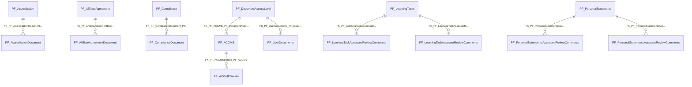

import TableDetail from '@site/src/components/TableDetail';

# Portfolio Database Tables

**67 tables** · **54 with PK** (80.6%) · **19 FKs** · **113 indexes**

## Entity Relationships

## Table Reference

<TableDetail
  tables={[{"name":"PF_AccrediataionEmailAdmin","schema":"dbo","fullName":"dbo.PF_AccrediataionEmailAdmin","hasPrimaryKey":true,"primaryKeyColumns":["AccrediationEmailAdminID"],"foreignKeys":[],"indexes":[{"name":"PK_PF_AccrediataionEmailAdmin","type":"CLUSTERED","isPrimaryKey":true,"isUnique":true,"isDisabled":false,"keyColumns":["AccrediationEmailAdminID"],"includedColumns":[]}],"checkConstraints":[],"defaultConstraints":0,"triggers":[]},{"name":"PF_Accreditation","schema":"dbo","fullName":"dbo.PF_Accreditation","hasPrimaryKey":true,"primaryKeyColumns":["AccreditationID"],"foreignKeys":[],"indexes":[{"name":"PK_PF_Accreditation_AccreditationID","type":"CLUSTERED","isPrimaryKey":true,"isUnique":true,"isDisabled":false,"keyColumns":["AccreditationID"],"includedColumns":[]}],"checkConstraints":[],"defaultConstraints":1,"triggers":[]},{"name":"PF_AccreditationCitations","schema":"dbo","fullName":"dbo.PF_AccreditationCitations","hasPrimaryKey":true,"primaryKeyColumns":["AccreditationCitationID"],"foreignKeys":[],"indexes":[{"name":"PK__PF_Accre__6D2A7D9D7E46A072","type":"CLUSTERED","isPrimaryKey":true,"isUnique":true,"isDisabled":false,"keyColumns":["AccreditationCitationID"],"includedColumns":[]}],"checkConstraints":[],"defaultConstraints":1,"triggers":[]},{"name":"PF_AccreditationCitationsHistory","schema":"dbo","fullName":"dbo.PF_AccreditationCitationsHistory","hasPrimaryKey":false,"primaryKeyColumns":[],"foreignKeys":[{"constraintName":"FK__PF_Accred__Accre__3D02ECFA","referencedTable":"(system-named)"}],"indexes":[],"checkConstraints":[],"defaultConstraints":1,"triggers":[]},{"name":"PF_AccreditationDocument","schema":"dbo","fullName":"dbo.PF_AccreditationDocument","hasPrimaryKey":true,"primaryKeyColumns":["AccreditationDocumentID"],"foreignKeys":[{"constraintName":"FK_PF_AccreditationDocument_PF_Accreditation","referencedTable":"PF_Accreditation"}],"indexes":[{"name":"PK_PF_AccreditationDocument_AccreditationDocumentID","type":"CLUSTERED","isPrimaryKey":true,"isUnique":true,"isDisabled":false,"keyColumns":["AccreditationDocumentID"],"includedColumns":[]}],"checkConstraints":[],"defaultConstraints":1,"triggers":[]},{"name":"PF_AccreditationReviewDetails","schema":"dbo","fullName":"dbo.PF_AccreditationReviewDetails","hasPrimaryKey":true,"primaryKeyColumns":["AccreditationReviewDetailID"],"foreignKeys":[],"indexes":[{"name":"PK__PF_Accre__610D259769B597E0","type":"CLUSTERED","isPrimaryKey":true,"isUnique":true,"isDisabled":false,"keyColumns":["AccreditationReviewDetailID"],"includedColumns":[]}],"checkConstraints":[],"defaultConstraints":0,"triggers":[]},{"name":"PF_ACGME","schema":"dbo","fullName":"dbo.PF_ACGME","hasPrimaryKey":true,"primaryKeyColumns":["ACGMECoreID"],"foreignKeys":[{"constraintName":"FK_PF_ACGME_SEC_Departments","referencedTable":"SEC_Departments"},{"constraintName":"FK_PF_ACGME_SEC_Users","referencedTable":"SEC_Users"},{"constraintName":"FK_PF_ACGME_PF_DocumentAccessLevel","referencedTable":"PF_DocumentAccessLevel"}],"indexes":[{"name":"PK_PF_ACGME_ACGMECoreID","type":"CLUSTERED","isPrimaryKey":true,"isUnique":true,"isDisabled":false,"keyColumns":["ACGMECoreID"],"includedColumns":[]}],"checkConstraints":[],"defaultConstraints":1,"triggers":[]},{"name":"PF_ACGMEDetails","schema":"dbo","fullName":"dbo.PF_ACGMEDetails","hasPrimaryKey":true,"primaryKeyColumns":["ACGMEDetailsID"],"foreignKeys":[{"constraintName":"FK_PF_ACGMEDetails_SEC_Departments","referencedTable":"SEC_Departments"},{"constraintName":"FK_PF_ACGMEDetails_SEC_Users","referencedTable":"SEC_Users"},{"constraintName":"FK_PF_ACGMEDetails_PF_ACGME","referencedTable":"PF_ACGME"}],"indexes":[{"name":"PK_PF_ACGMEDetails_ACGMEDetailsID","type":"CLUSTERED","isPrimaryKey":true,"isUnique":true,"isDisabled":false,"keyColumns":["ACGMEDetailsID"],"includedColumns":[]}],"checkConstraints":[],"defaultConstraints":1,"triggers":[]},{"name":"PF_ACGMEDocumentSubjectCategories","schema":"dbo","fullName":"dbo.PF_ACGMEDocumentSubjectCategories","hasPrimaryKey":true,"primaryKeyColumns":["CategoryID"],"foreignKeys":[],"indexes":[{"name":"PK_PF_ACGMEDocumentSubjectCategories_CategoryID","type":"CLUSTERED","isPrimaryKey":true,"isUnique":true,"isDisabled":false,"keyColumns":["CategoryID"],"includedColumns":[]}],"checkConstraints":[],"defaultConstraints":0,"triggers":[]},{"name":"PF_ACGMEImportFailureDocuments","schema":"dbo","fullName":"dbo.PF_ACGMEImportFailureDocuments","hasPrimaryKey":true,"primaryKeyColumns":["ID"],"foreignKeys":[],"indexes":[{"name":"PK__PF_ACGME__3214EC271D8456A0","type":"CLUSTERED","isPrimaryKey":true,"isUnique":true,"isDisabled":false,"keyColumns":["ID"],"includedColumns":[]}],"checkConstraints":[],"defaultConstraints":0,"triggers":[]},{"name":"PF_ACGMEImportingMyEvalsAliasNameFields","schema":"dbo","fullName":"dbo.PF_ACGMEImportingMyEvalsAliasNameFields","hasPrimaryKey":false,"primaryKeyColumns":[],"foreignKeys":[],"indexes":[],"checkConstraints":[],"defaultConstraints":0,"triggers":[]},{"name":"PF_ACGMEImportingMyEvalsFields","schema":"dbo","fullName":"dbo.PF_ACGMEImportingMyEvalsFields","hasPrimaryKey":true,"primaryKeyColumns":["MyEvalsFieldsID"],"foreignKeys":[],"indexes":[{"name":"PK__PF_ACGME__B6E3A7F52154E784","type":"CLUSTERED","isPrimaryKey":true,"isUnique":true,"isDisabled":false,"keyColumns":["MyEvalsFieldsID"],"includedColumns":[]}],"checkConstraints":[],"defaultConstraints":0,"triggers":[]},{"name":"PF_AffiliateAgreement","schema":"dbo","fullName":"dbo.PF_AffiliateAgreement","hasPrimaryKey":true,"primaryKeyColumns":["AffiliateAgreementID"],"foreignKeys":[],"indexes":[{"name":"IDX_MissingOn_PF_AffiliateAgreement_1A9A939157B24D169748EEBC58CF07BE","type":"NONCLUSTERED","isPrimaryKey":false,"isUnique":false,"isDisabled":false,"keyColumns":["DocumentSectionCode","DocumentDepartmentID","IsDeleted","IsInActive"],"includedColumns":["AffiliateName","ProgramName","RotationID","Trainee","EffectiveDate","TerminationDate","DocumentUserID","CreatedDate","Term","AgreementType","SponsoringName","ProgramDirectorName","ProgramDirectorModifiedDate","SponsorID"]},{"name":"IDX_MissingOn_PF_AffiliateAgreement_27265B6BCE9A437693C2A5A3F156E843","type":"NONCLUSTERED","isPrimaryKey":false,"isUnique":false,"isDisabled":false,"keyColumns":["DocumentDepartmentID"],"includedColumns":["ProgramDirectorUserID"]},{"name":"IDX_MissingOn_PF_AffiliateAgreement_55D3EA04BED94BB296AF1BB6F30DF1E3","type":"NONCLUSTERED","isPrimaryKey":false,"isUnique":false,"isDisabled":false,"keyColumns":["DocumentSectionCode","DocumentDepartmentID","IsDeleted","IsInActive"],"includedColumns":[]},{"name":"IDX_MissingOn_PF_AffiliateAgreement_6C237755A0834D5AA2029CE353CEA0A0","type":"NONCLUSTERED","isPrimaryKey":false,"isUnique":false,"isDisabled":false,"keyColumns":["DocumentDepartmentID","IsDeleted"],"includedColumns":[]},{"name":"IDX_MissingOn_PF_AffiliateAgreement_F5DB451141674F9BA1075E884A0C23BC","type":"NONCLUSTERED","isPrimaryKey":false,"isUnique":false,"isDisabled":false,"keyColumns":["DocumentSectionCode","DocumentDepartmentID","IsDeleted","IsInActive"],"includedColumns":["ProgramName","RotationID","Trainee","EffectiveDate","TerminationDate","DocumentUserID","CreatedDate","Term","AgreementType","ProgramDirectorName","ProgramDirectorModifiedDate","SponsorID","AffiliateID"]},{"name":"IDX_PF_AffiliateAgreement1","type":"NONCLUSTERED","isPrimaryKey":false,"isUnique":false,"isDisabled":false,"keyColumns":["SponsorID"],"includedColumns":[]},{"name":"IDX_PF_AffiliateAgreement2","type":"NONCLUSTERED","isPrimaryKey":false,"isUnique":false,"isDisabled":false,"keyColumns":["AffiliateID"],"includedColumns":["IsDeleted"]},{"name":"IDX_PF_DocumentDepartmentID","type":"NONCLUSTERED","isPrimaryKey":false,"isUnique":false,"isDisabled":false,"keyColumns":["DocumentDepartmentID"],"includedColumns":[]},{"name":"IDX_PF_IsDeleted_AffiliateID","type":"NONCLUSTERED","isPrimaryKey":false,"isUnique":false,"isDisabled":false,"keyColumns":["IsDeleted","AffiliateID"],"includedColumns":[]},{"name":"PK_PF_AffiliateAgreement_AffiliateAgreementID","type":"CLUSTERED","isPrimaryKey":true,"isUnique":true,"isDisabled":false,"keyColumns":["AffiliateAgreementID"],"includedColumns":[]}],"checkConstraints":[],"defaultConstraints":5,"triggers":[]},{"name":"PF_AffiliateAgreement_20250627","schema":"dbo","fullName":"dbo.PF_AffiliateAgreement_20250627","hasPrimaryKey":false,"primaryKeyColumns":[],"foreignKeys":[],"indexes":[],"checkConstraints":[],"defaultConstraints":0,"triggers":[]},{"name":"PF_AffiliateAgreement_Backup","schema":"dbo","fullName":"dbo.PF_AffiliateAgreement_Backup","hasPrimaryKey":false,"primaryKeyColumns":[],"foreignKeys":[],"indexes":[],"checkConstraints":[],"defaultConstraints":0,"triggers":[]},{"name":"PF_AffiliateAgreement_CleanupTable","schema":"dbo","fullName":"dbo.PF_AffiliateAgreement_CleanupTable","hasPrimaryKey":true,"primaryKeyColumns":["PFAffiliateAgreementCleanupID"],"foreignKeys":[],"indexes":[{"name":"PK__PF_Affil__96C30B6215EB1CA9","type":"CLUSTERED","isPrimaryKey":true,"isUnique":true,"isDisabled":false,"keyColumns":["PFAffiliateAgreementCleanupID"],"includedColumns":[]}],"checkConstraints":[],"defaultConstraints":1,"triggers":[]},{"name":"PF_AffiliateAgreement12252025","schema":"dbo","fullName":"dbo.PF_AffiliateAgreement12252025","hasPrimaryKey":false,"primaryKeyColumns":[],"foreignKeys":[],"indexes":[],"checkConstraints":[],"defaultConstraints":0,"triggers":[]},{"name":"PF_AffiliateAgreementDocument","schema":"dbo","fullName":"dbo.PF_AffiliateAgreementDocument","hasPrimaryKey":true,"primaryKeyColumns":["AffiliateAgreementDocumentID"],"foreignKeys":[{"constraintName":"FK_PF_AffiliateAgreementDocument_PF_AffiliateAgreement","referencedTable":"PF_AffiliateAgreement"}],"indexes":[{"name":"IDX_AffiliateAgreementDocument1","type":"NONCLUSTERED","isPrimaryKey":false,"isUnique":false,"isDisabled":false,"keyColumns":["AffiliateAgreementID"],"includedColumns":["DocumentName","DocumentFilePath"]},{"name":"PK_PF_AffiliateAgreementDocument_AffiliateAgreementDocumentID","type":"CLUSTERED","isPrimaryKey":true,"isUnique":true,"isDisabled":false,"keyColumns":["AffiliateAgreementDocumentID"],"includedColumns":[]}],"checkConstraints":[],"defaultConstraints":0,"triggers":[]},{"name":"PF_AffiliateEmailAdmin","schema":"dbo","fullName":"dbo.PF_AffiliateEmailAdmin","hasPrimaryKey":true,"primaryKeyColumns":["AffiliateEmailAdminID"],"foreignKeys":[],"indexes":[{"name":"PK__PF_AffiliateEmailAdmin","type":"CLUSTERED","isPrimaryKey":true,"isUnique":true,"isDisabled":false,"keyColumns":["AffiliateEmailAdminID"],"includedColumns":[]}],"checkConstraints":[],"defaultConstraints":0,"triggers":[]},{"name":"PF_AffiliateName","schema":"dbo","fullName":"dbo.PF_AffiliateName","hasPrimaryKey":true,"primaryKeyColumns":["AffiliateID"],"foreignKeys":[],"indexes":[{"name":"PK__PF_Affil__0B4087EC26732129","type":"CLUSTERED","isPrimaryKey":true,"isUnique":true,"isDisabled":false,"keyColumns":["AffiliateID"],"includedColumns":[]}],"checkConstraints":[],"defaultConstraints":0,"triggers":[]},{"name":"PF_AFFSponsorsName","schema":"dbo","fullName":"dbo.PF_AFFSponsorsName","hasPrimaryKey":true,"primaryKeyColumns":["SponsorID"],"foreignKeys":[],"indexes":[{"name":"PK__PF_AFFSp__3B609EF5FFF6B859","type":"CLUSTERED","isPrimaryKey":true,"isUnique":true,"isDisabled":false,"keyColumns":["SponsorID"],"includedColumns":[]}],"checkConstraints":[],"defaultConstraints":0,"triggers":[]},{"name":"PF_CitationCategories","schema":"dbo","fullName":"dbo.PF_CitationCategories","hasPrimaryKey":true,"primaryKeyColumns":["CitationCategoryID"],"foreignKeys":[],"indexes":[{"name":"PK__PF_Citat__FF90FECA6E1038A9","type":"CLUSTERED","isPrimaryKey":true,"isUnique":true,"isDisabled":false,"keyColumns":["CitationCategoryID"],"includedColumns":[]}],"checkConstraints":[],"defaultConstraints":1,"triggers":[]},{"name":"PF_CitationCategoriesBase","schema":"dbo","fullName":"dbo.PF_CitationCategoriesBase","hasPrimaryKey":true,"primaryKeyColumns":["CitationCategoryID"],"foreignKeys":[],"indexes":[{"name":"PK__PF_Citat__FF90FECAA57693AB","type":"CLUSTERED","isPrimaryKey":true,"isUnique":true,"isDisabled":false,"keyColumns":["CitationCategoryID"],"includedColumns":[]}],"checkConstraints":[],"defaultConstraints":0,"triggers":[]},{"name":"PF_Citations","schema":"dbo","fullName":"dbo.PF_Citations","hasPrimaryKey":true,"primaryKeyColumns":["CitationID"],"foreignKeys":[],"indexes":[{"name":"PK__PF_Citat__EAD2AD1B6A3FA7C5","type":"CLUSTERED","isPrimaryKey":true,"isUnique":true,"isDisabled":false,"keyColumns":["CitationID"],"includedColumns":[]}],"checkConstraints":[],"defaultConstraints":0,"triggers":[]},{"name":"PF_Compliance","schema":"dbo","fullName":"dbo.PF_Compliance","hasPrimaryKey":true,"primaryKeyColumns":["ComplianceID"],"foreignKeys":[],"indexes":[{"name":"PK_PF_Compliance_ComplianceID","type":"CLUSTERED","isPrimaryKey":true,"isUnique":true,"isDisabled":false,"keyColumns":["ComplianceID"],"includedColumns":[]}],"checkConstraints":[],"defaultConstraints":0,"triggers":[]},{"name":"PF_ComplianceDocument","schema":"dbo","fullName":"dbo.PF_ComplianceDocument","hasPrimaryKey":true,"primaryKeyColumns":["ComplianceDocumentID"],"foreignKeys":[{"constraintName":"FK_PF_ComplianceDocument_PF_Compliance","referencedTable":"PF_Compliance"}],"indexes":[{"name":"PK_PF_ComplianceDocument_ComplianceDocumentID","type":"CLUSTERED","isPrimaryKey":true,"isUnique":true,"isDisabled":false,"keyColumns":["ComplianceDocumentID"],"includedColumns":[]}],"checkConstraints":[],"defaultConstraints":0,"triggers":[]},{"name":"PF_Concern","schema":"dbo","fullName":"dbo.PF_Concern","hasPrimaryKey":true,"primaryKeyColumns":["ConcernID"],"foreignKeys":[],"indexes":[{"name":"PK__PF_Conce__00289B7D44AE9A21","type":"CLUSTERED","isPrimaryKey":true,"isUnique":true,"isDisabled":false,"keyColumns":["ConcernID"],"includedColumns":[]}],"checkConstraints":[],"defaultConstraints":0,"triggers":[]},{"name":"PF_ConcernNumber","schema":"dbo","fullName":"dbo.PF_ConcernNumber","hasPrimaryKey":true,"primaryKeyColumns":["ConcernNumberID"],"foreignKeys":[],"indexes":[{"name":"PK__PF_Conce__3D3187988B15E4AF","type":"CLUSTERED","isPrimaryKey":true,"isUnique":true,"isDisabled":false,"keyColumns":["ConcernNumberID"],"includedColumns":[]}],"checkConstraints":[],"defaultConstraints":0,"triggers":[]},{"name":"PF_DocumentAccessLevel","schema":"dbo","fullName":"dbo.PF_DocumentAccessLevel","hasPrimaryKey":true,"primaryKeyColumns":["DocumentAccessLevelID"],"foreignKeys":[],"indexes":[{"name":"PK_PF_DocumentAccessLevel","type":"CLUSTERED","isPrimaryKey":true,"isUnique":true,"isDisabled":false,"keyColumns":["DocumentAccessLevelID"],"includedColumns":[]}],"checkConstraints":[],"defaultConstraints":0,"triggers":[]},{"name":"PF_DocumentCreditSubject","schema":"dbo","fullName":"dbo.PF_DocumentCreditSubject","hasPrimaryKey":true,"primaryKeyColumns":["DocumentCreditSubjectID"],"foreignKeys":[],"indexes":[{"name":"IDX_PF_DocumentCreditSubject_DepartmentID","type":"NONCLUSTERED","isPrimaryKey":false,"isUnique":false,"isDisabled":false,"keyColumns":["DepartmentID"],"includedColumns":[]},{"name":"IDX_PF_DocumentCreditSubject_DepartmentID_DocumentSectionCode_IsDeleted","type":"NONCLUSTERED","isPrimaryKey":false,"isUnique":false,"isDisabled":false,"keyColumns":["DepartmentID","DocumentSectionCode","IsDeleted"],"includedColumns":[]},{"name":"IDX_PF_DocumentCreditSubject_DocumentSectionCode","type":"NONCLUSTERED","isPrimaryKey":false,"isUnique":false,"isDisabled":false,"keyColumns":["DocumentSectionCode"],"includedColumns":[]},{"name":"PK_PF_DocumentCreditSubject_DocumentCreditSubjectID","type":"CLUSTERED","isPrimaryKey":true,"isUnique":true,"isDisabled":false,"keyColumns":["DocumentCreditSubjectID"],"includedColumns":[]}],"checkConstraints":[],"defaultConstraints":1,"triggers":[]},{"name":"PF_DocumentCreditSubjectBase","schema":"dbo","fullName":"dbo.PF_DocumentCreditSubjectBase","hasPrimaryKey":true,"primaryKeyColumns":["DocumentCreditSubjectBaseID"],"foreignKeys":[],"indexes":[{"name":"PK_PF_DocumentCreditSubject_DocumentCreditSubjectBaseID","type":"CLUSTERED","isPrimaryKey":true,"isUnique":true,"isDisabled":false,"keyColumns":["DocumentCreditSubjectBaseID"],"includedColumns":[]}],"checkConstraints":[],"defaultConstraints":1,"triggers":[]},{"name":"PF_DocumentCreditSubjectSettings","schema":"dbo","fullName":"dbo.PF_DocumentCreditSubjectSettings","hasPrimaryKey":true,"primaryKeyColumns":["DocumentCreditSubjectSettingsID"],"foreignKeys":[],"indexes":[{"name":"IDX_PF_DocumentCreditSubjectSettings_Level","type":"NONCLUSTERED","isPrimaryKey":false,"isUnique":false,"isDisabled":false,"keyColumns":["Level"],"includedColumns":[]},{"name":"IDX_PF_DocumentCreditSubjectSettings_SubjectID","type":"NONCLUSTERED","isPrimaryKey":false,"isUnique":false,"isDisabled":false,"keyColumns":["SubjectID"],"includedColumns":[]},{"name":"IX_PDCS_Level_Subject","type":"NONCLUSTERED","isPrimaryKey":false,"isUnique":false,"isDisabled":false,"keyColumns":["Level","SubjectID"],"includedColumns":["Optional","Required"]},{"name":"PK_PF_DocumentCreditSubjectSettings_DocumentCreditSubjectSettingsID","type":"CLUSTERED","isPrimaryKey":true,"isUnique":true,"isDisabled":false,"keyColumns":["DocumentCreditSubjectSettingsID"],"includedColumns":[]}],"checkConstraints":[],"defaultConstraints":2,"triggers":[]},{"name":"PF_DocumentCurricula","schema":"dbo","fullName":"dbo.PF_DocumentCurricula","hasPrimaryKey":true,"primaryKeyColumns":["CurriculaID"],"foreignKeys":[],"indexes":[{"name":"PK_PF_DocumentCurricula_CurriculaID","type":"CLUSTERED","isPrimaryKey":true,"isUnique":true,"isDisabled":false,"keyColumns":["CurriculaID"],"includedColumns":[]}],"checkConstraints":[],"defaultConstraints":0,"triggers":[]},{"name":"PF_DocumentFileType","schema":"dbo","fullName":"dbo.PF_DocumentFileType","hasPrimaryKey":true,"primaryKeyColumns":["FileTypeID"],"foreignKeys":[],"indexes":[{"name":"PK_PF_DocumentFileType","type":"CLUSTERED","isPrimaryKey":true,"isUnique":true,"isDisabled":false,"keyColumns":["FileTypeID"],"includedColumns":[]}],"checkConstraints":[],"defaultConstraints":0,"triggers":[]},{"name":"PF_DocumentMappingStructure","schema":"dbo","fullName":"dbo.PF_DocumentMappingStructure","hasPrimaryKey":false,"primaryKeyColumns":[],"foreignKeys":[],"indexes":[],"checkConstraints":[],"defaultConstraints":0,"triggers":[]},{"name":"PF_DomainLegend","schema":"dbo","fullName":"dbo.PF_DomainLegend","hasPrimaryKey":true,"primaryKeyColumns":["DomainLegendID"],"foreignKeys":[],"indexes":[{"name":"PK__PF_Domai__A953902D5080E324","type":"CLUSTERED","isPrimaryKey":true,"isUnique":true,"isDisabled":false,"keyColumns":["DomainLegendID"],"includedColumns":[]}],"checkConstraints":[],"defaultConstraints":0,"triggers":[]},{"name":"PF_EmailTemplate","schema":"dbo","fullName":"dbo.PF_EmailTemplate","hasPrimaryKey":true,"primaryKeyColumns":["EmailTemplateID"],"foreignKeys":[],"indexes":[{"name":"PK_PF_EmailTemplate","type":"CLUSTERED","isPrimaryKey":true,"isUnique":true,"isDisabled":false,"keyColumns":["EmailTemplateID"],"includedColumns":[]}],"checkConstraints":[],"defaultConstraints":0,"triggers":[]},{"name":"PF_InstitutionDEPT","schema":"dbo","fullName":"dbo.PF_InstitutionDEPT","hasPrimaryKey":false,"primaryKeyColumns":[],"foreignKeys":[],"indexes":[],"checkConstraints":[],"defaultConstraints":0,"triggers":[]},{"name":"PF_InstitutionGMEA","schema":"dbo","fullName":"dbo.PF_InstitutionGMEA","hasPrimaryKey":false,"primaryKeyColumns":[],"foreignKeys":[],"indexes":[],"checkConstraints":[],"defaultConstraints":0,"triggers":[]},{"name":"PF_LearningTaskAssesseeReviewComments","schema":"dbo","fullName":"dbo.PF_LearningTaskAssesseeReviewComments","hasPrimaryKey":true,"primaryKeyColumns":["LearningTaskAssesseeReviewCommentID"],"foreignKeys":[{"constraintName":"FK_PF_LearningTaskAssesseeReviewComments_PF_LearningTasks","referencedTable":"PF_LearningTasks"}],"indexes":[{"name":"PK_PF_LearningTaskAssesseeReviewComments","type":"CLUSTERED","isPrimaryKey":true,"isUnique":true,"isDisabled":false,"keyColumns":["LearningTaskAssesseeReviewCommentID"],"includedColumns":[]}],"checkConstraints":[],"defaultConstraints":0,"triggers":[]},{"name":"PF_LearningTaskAssessorReviewComments","schema":"dbo","fullName":"dbo.PF_LearningTaskAssessorReviewComments","hasPrimaryKey":true,"primaryKeyColumns":["LearningTaskAssessorReviewCommentID"],"foreignKeys":[{"constraintName":"FK_PF_LearningTaskAssessorReviewComments_PF_LearningTasks","referencedTable":"PF_LearningTasks"}],"indexes":[{"name":"PK_PF_LearningTaskAssessorReviewComments","type":"CLUSTERED","isPrimaryKey":true,"isUnique":true,"isDisabled":false,"keyColumns":["LearningTaskAssessorReviewCommentID"],"includedColumns":[]}],"checkConstraints":[],"defaultConstraints":0,"triggers":[]},{"name":"PF_LearningTasks","schema":"dbo","fullName":"dbo.PF_LearningTasks","hasPrimaryKey":true,"primaryKeyColumns":["LearningTaskID"],"foreignKeys":[],"indexes":[{"name":"IDX_PF_LearningTasks_SectionID_IsReviewed","type":"NONCLUSTERED","isPrimaryKey":false,"isUnique":false,"isDisabled":false,"keyColumns":["IsReviewed","SectionID"],"includedColumns":[]},{"name":"IDX_PF_LearningTasks_UserID_SectionID_IsRemoved","type":"NONCLUSTERED","isPrimaryKey":false,"isUnique":false,"isDisabled":false,"keyColumns":["UserID","SectionID","IsRemoved"],"includedColumns":[]},{"name":"PK_PF_LearningTasks_LearningTaskID","type":"CLUSTERED","isPrimaryKey":true,"isUnique":true,"isDisabled":false,"keyColumns":["LearningTaskID"],"includedColumns":[]}],"checkConstraints":[],"defaultConstraints":0,"triggers":[]},{"name":"PF_LetterofNotification","schema":"dbo","fullName":"dbo.PF_LetterofNotification","hasPrimaryKey":true,"primaryKeyColumns":["LetterofNotificationID"],"foreignKeys":[],"indexes":[{"name":"PK__PF_Lette__AEB3A5242BE4E49E","type":"CLUSTERED","isPrimaryKey":true,"isUnique":true,"isDisabled":false,"keyColumns":["LetterofNotificationID"],"includedColumns":[]}],"checkConstraints":[],"defaultConstraints":0,"triggers":[]},{"name":"PF_LetterofNotificationBase","schema":"dbo","fullName":"dbo.PF_LetterofNotificationBase","hasPrimaryKey":true,"primaryKeyColumns":["LetterofNotificationBaseID"],"foreignKeys":[],"indexes":[{"name":"PK__PF_Lette__006E410F281453BA","type":"CLUSTERED","isPrimaryKey":true,"isUnique":true,"isDisabled":false,"keyColumns":["LetterofNotificationBaseID"],"includedColumns":[]}],"checkConstraints":[],"defaultConstraints":0,"triggers":[]},{"name":"PF_MaximumAccrediationTrainees","schema":"dbo","fullName":"dbo.PF_MaximumAccrediationTrainees","hasPrimaryKey":true,"primaryKeyColumns":["MaximumTraineesID"],"foreignKeys":[],"indexes":[{"name":"PK__PF_Maxim__9F8123B652681E34","type":"CLUSTERED","isPrimaryKey":true,"isUnique":true,"isDisabled":false,"keyColumns":["MaximumTraineesID"],"includedColumns":[]}],"checkConstraints":[],"defaultConstraints":0,"triggers":[]},{"name":"PF_Operations","schema":"dbo","fullName":"dbo.PF_Operations","hasPrimaryKey":false,"primaryKeyColumns":[],"foreignKeys":[],"indexes":[{"name":"IDX_PF_Operations_SessionID","type":"NONCLUSTERED","isPrimaryKey":false,"isUnique":false,"isDisabled":false,"keyColumns":["SessionID"],"includedColumns":[]},{"name":"IDX_PF_Operations_SIDTQASIDAITAIDQCAIDQCN","type":"NONCLUSTERED","isPrimaryKey":false,"isUnique":false,"isDisabled":false,"keyColumns":["SessionID","TemplateQuestionAnswerScaleID","AnswerIndex","TemplateAudienceID","QCAudienceID","QCName"],"includedColumns":[]}],"checkConstraints":[],"defaultConstraints":0,"triggers":[]},{"name":"PF_PersonalStatements","schema":"dbo","fullName":"dbo.PF_PersonalStatements","hasPrimaryKey":true,"primaryKeyColumns":["PersonalStatementID"],"foreignKeys":[],"indexes":[{"name":"IDX_PF_PersonalStatements_SectionID_IsReviewed","type":"NONCLUSTERED","isPrimaryKey":false,"isUnique":false,"isDisabled":false,"keyColumns":["IsReviewed","SectionID"],"includedColumns":[]},{"name":"IDX_PF_PersonalStatements_UserID_SectionID_IsRemoved","type":"NONCLUSTERED","isPrimaryKey":false,"isUnique":false,"isDisabled":false,"keyColumns":["UserID","SectionID","IsRemoved"],"includedColumns":[]},{"name":"PK_PF_PersonalStatements_PersonalStatementID","type":"CLUSTERED","isPrimaryKey":true,"isUnique":true,"isDisabled":false,"keyColumns":["PersonalStatementID"],"includedColumns":[]}],"checkConstraints":[],"defaultConstraints":0,"triggers":[]},{"name":"PF_PersonalStatementsAssesseeReviewComments","schema":"dbo","fullName":"dbo.PF_PersonalStatementsAssesseeReviewComments","hasPrimaryKey":true,"primaryKeyColumns":["PersonalStatementsAssesseeReviewCommentID"],"foreignKeys":[{"constraintName":"FK_PF_PersonalStatementsAssesseeReviewComments_PF_PersonalStatements","referencedTable":"PF_PersonalStatements"}],"indexes":[{"name":"PK_PF_PersonalStatementsAssesseeReviewComments","type":"CLUSTERED","isPrimaryKey":true,"isUnique":true,"isDisabled":false,"keyColumns":["PersonalStatementsAssesseeReviewCommentID"],"includedColumns":[]}],"checkConstraints":[],"defaultConstraints":0,"triggers":[]},{"name":"PF_PersonalStatementsAssessorReviewComments","schema":"dbo","fullName":"dbo.PF_PersonalStatementsAssessorReviewComments","hasPrimaryKey":true,"primaryKeyColumns":["PersonalStatementsAssessorReviewCommentID"],"foreignKeys":[{"constraintName":"FK_PF_PersonalStatementsAssessorReviewComments_PF_PersonalStatements","referencedTable":"PF_PersonalStatements"}],"indexes":[{"name":"PK_PF_PersonalStatementsAssessorReviewComments","type":"CLUSTERED","isPrimaryKey":true,"isUnique":true,"isDisabled":false,"keyColumns":["PersonalStatementsAssessorReviewCommentID"],"includedColumns":[]}],"checkConstraints":[],"defaultConstraints":0,"triggers":[]},{"name":"PF_ProgramRequirementBase","schema":"dbo","fullName":"dbo.PF_ProgramRequirementBase","hasPrimaryKey":true,"primaryKeyColumns":["ProgramRequirementBaseID"],"foreignKeys":[],"indexes":[{"name":"PK__PF_Progr__BF8D9CB25500C959","type":"CLUSTERED","isPrimaryKey":true,"isUnique":true,"isDisabled":false,"keyColumns":["ProgramRequirementBaseID"],"includedColumns":[]}],"checkConstraints":[],"defaultConstraints":0,"triggers":[]},{"name":"PF_ProgramRequirements","schema":"dbo","fullName":"dbo.PF_ProgramRequirements","hasPrimaryKey":true,"primaryKeyColumns":["ProgramRequirementUniqueID"],"foreignKeys":[],"indexes":[{"name":"PK__PF_Progr__9257A2C753273843","type":"CLUSTERED","isPrimaryKey":true,"isUnique":true,"isDisabled":false,"keyColumns":["ProgramRequirementUniqueID"],"includedColumns":[]}],"checkConstraints":[],"defaultConstraints":0,"triggers":[]},{"name":"PF_QIProjectDocument","schema":"dbo","fullName":"dbo.PF_QIProjectDocument","hasPrimaryKey":true,"primaryKeyColumns":["QIProjectnDocumentID"],"foreignKeys":[],"indexes":[{"name":"PK_PF_QIProjectDocument_QIProjectnDocumentID","type":"CLUSTERED","isPrimaryKey":true,"isUnique":true,"isDisabled":false,"keyColumns":["QIProjectnDocumentID"],"includedColumns":[]}],"checkConstraints":[],"defaultConstraints":1,"triggers":[]},{"name":"PF_Subjects","schema":"dbo","fullName":"dbo.PF_Subjects","hasPrimaryKey":true,"primaryKeyColumns":["SubjectID"],"foreignKeys":[],"indexes":[{"name":"IX_PF_Subjects_DepartmentID","type":"NONCLUSTERED","isPrimaryKey":false,"isUnique":false,"isDisabled":false,"keyColumns":["DepartmentID"],"includedColumns":[]},{"name":"PK_PF_Subjects","type":"CLUSTERED","isPrimaryKey":true,"isUnique":true,"isDisabled":false,"keyColumns":["SubjectID"],"includedColumns":[]}],"checkConstraints":[],"defaultConstraints":0,"triggers":[]},{"name":"PF_SubjectsBase","schema":"dbo","fullName":"dbo.PF_SubjectsBase","hasPrimaryKey":true,"primaryKeyColumns":["BaseSubjectID"],"foreignKeys":[],"indexes":[{"name":"PK_PF_SubjectsBase","type":"CLUSTERED","isPrimaryKey":true,"isUnique":true,"isDisabled":false,"keyColumns":["BaseSubjectID"],"includedColumns":[]}],"checkConstraints":[],"defaultConstraints":0,"triggers":[]},{"name":"PF_SurveyCategory","schema":"dbo","fullName":"dbo.PF_SurveyCategory","hasPrimaryKey":true,"primaryKeyColumns":["SurveyCategoryID"],"foreignKeys":[],"indexes":[{"name":"PK__PF_Surve__46DC5E76E022F2CA","type":"CLUSTERED","isPrimaryKey":true,"isUnique":true,"isDisabled":false,"keyColumns":["SurveyCategoryID"],"includedColumns":[]}],"checkConstraints":[],"defaultConstraints":0,"triggers":[]},{"name":"PF_SurveyPerformance","schema":"dbo","fullName":"dbo.PF_SurveyPerformance","hasPrimaryKey":true,"primaryKeyColumns":["SurveyPerformanceID"],"foreignKeys":[],"indexes":[{"name":"PK__PF_Surve__B280B0871FD42687","type":"CLUSTERED","isPrimaryKey":true,"isUnique":true,"isDisabled":false,"keyColumns":["SurveyPerformanceID"],"includedColumns":[]}],"checkConstraints":[],"defaultConstraints":0,"triggers":[]},{"name":"PF_SurveyPerformanceConcernHistory","schema":"dbo","fullName":"dbo.PF_SurveyPerformanceConcernHistory","hasPrimaryKey":false,"primaryKeyColumns":[],"foreignKeys":[{"constraintName":"FK__PF_Survey__Surve__24252726","referencedTable":"(system-named)"}],"indexes":[],"checkConstraints":[],"defaultConstraints":1,"triggers":[]},{"name":"PF_SurveyPerformanceDocument","schema":"dbo","fullName":"dbo.PF_SurveyPerformanceDocument","hasPrimaryKey":true,"primaryKeyColumns":["SurveyPerformanceDocumentID"],"foreignKeys":[],"indexes":[{"name":"PK_PF_SurveyPerformanceDocument_SurveyPerformanceDocumentID","type":"CLUSTERED","isPrimaryKey":true,"isUnique":true,"isDisabled":false,"keyColumns":["SurveyPerformanceDocumentID"],"includedColumns":[]}],"checkConstraints":[],"defaultConstraints":0,"triggers":[]},{"name":"PF_SurveyPerformanceHistory","schema":"dbo","fullName":"dbo.PF_SurveyPerformanceHistory","hasPrimaryKey":false,"primaryKeyColumns":[],"foreignKeys":[{"constraintName":"FK__PF_Survey__Surve__2148BA7B","referencedTable":"(system-named)"}],"indexes":[],"checkConstraints":[],"defaultConstraints":1,"triggers":[]},{"name":"PF_SurveySource","schema":"dbo","fullName":"dbo.PF_SurveySource","hasPrimaryKey":true,"primaryKeyColumns":["SurveySourceID"],"foreignKeys":[],"indexes":[{"name":"PK__PF_Surve__B1A5530987314607","type":"CLUSTERED","isPrimaryKey":true,"isUnique":true,"isDisabled":false,"keyColumns":["SurveySourceID"],"includedColumns":[]}],"checkConstraints":[],"defaultConstraints":0,"triggers":[]},{"name":"PF_TempCurriculaEmailData","schema":"dbo","fullName":"dbo.PF_TempCurriculaEmailData","hasPrimaryKey":false,"primaryKeyColumns":[],"foreignKeys":[],"indexes":[],"checkConstraints":[],"defaultConstraints":0,"triggers":[]},{"name":"PF_TempExaminationScoresDetails","schema":"dbo","fullName":"dbo.PF_TempExaminationScoresDetails","hasPrimaryKey":false,"primaryKeyColumns":[],"foreignKeys":[],"indexes":[],"checkConstraints":[],"defaultConstraints":0,"triggers":[]},{"name":"PF_UserDocumentNotifications","schema":"dbo","fullName":"dbo.PF_UserDocumentNotifications","hasPrimaryKey":true,"primaryKeyColumns":["CEMDNotificationID"],"foreignKeys":[],"indexes":[{"name":"IDX_PF_UserDocumentNotifications1","type":"NONCLUSTERED","isPrimaryKey":false,"isUnique":false,"isDisabled":false,"keyColumns":["DocumentID"],"includedColumns":["UserID"]},{"name":"PK_PF_UserDocumentNotifications","type":"CLUSTERED","isPrimaryKey":true,"isUnique":true,"isDisabled":false,"keyColumns":["CEMDNotificationID"],"includedColumns":[]}],"checkConstraints":[],"defaultConstraints":0,"triggers":[]},{"name":"PF_UserDocuments","schema":"dbo","fullName":"dbo.PF_UserDocuments","hasPrimaryKey":true,"primaryKeyColumns":["DocumentID"],"foreignKeys":[{"constraintName":"FK_PF_UserDocuments_PF_DocumentAccessLevel","referencedTable":"PF_DocumentAccessLevel"},{"constraintName":"FK_PF_UserDocuments_APE_ScholarlyActivity","referencedTable":"APE_ScholarlyActivity"},{"constraintName":"FK_SPF_UserDocuments_OBC_RGADocumentTypeValues","referencedTable":"FK_SPF_UserDocuments_OBC_RGADocumentTypeValues"}],"indexes":[{"name":"IDX_MissingOn_PF_UserDocuments_28433C3D63C84EBDBBA629B95ABFB5E8","type":"NONCLUSTERED","isPrimaryKey":false,"isUnique":false,"isDisabled":false,"keyColumns":["LearningAssignmentUserID"],"includedColumns":[]},{"name":"IDX_MissingOn_PF_UserDocuments_4D70F5194C154509AD9C0792561D2D30","type":"NONCLUSTERED","isPrimaryKey":false,"isUnique":false,"isDisabled":false,"keyColumns":["DocumentSectionCode","DocumentTypeValueID"],"includedColumns":["DocumentReferenceID"]},{"name":"IDX_MissingOn_PF_UserDocuments_5286ED813DE946D190F9DADB7786730F","type":"NONCLUSTERED","isPrimaryKey":false,"isUnique":false,"isDisabled":false,"keyColumns":["DocumentSectionCode","CurriculaMailStatus"],"includedColumns":["DocumentUserID","DocumentTitle","DocumentDescription","DocumentAccessLevelID","DocumentDepartmentID","RotationID"]},{"name":"IDX_MissingOn_PF_UserDocuments_74A68A96FEBA4BE8AC7CA0E8BA26FBA5","type":"NONCLUSTERED","isPrimaryKey":false,"isUnique":false,"isDisabled":false,"keyColumns":["DocumentSectionCode","DocumentTypeValueID"],"includedColumns":["DocumentName","DocumentFilePath","ModifiedDate","ModifiedBy","DocumentFileSize"]},{"name":"IDX_MissingOn_PF_UserDocuments_7D21D74835FC482CB49588F957417DE2","type":"NONCLUSTERED","isPrimaryKey":false,"isUnique":false,"isDisabled":false,"keyColumns":["DocumentSectionCode","DocumentDepartmentID","DocumentAccessLevelID"],"includedColumns":["DocumentName","DocumentUserID","DocumentTitle","DocumentDescription","DocumentFilePath","DocumentSubjectID","IsDeleted","CreatedDate","ModifiedDate","CreatedBy","ModifiedBy","IsConference","DocumentDate","DocumentPublicationType","DocumentConfidential","DocumentFileSize","ExpiryEndDate","IssueDate","ApplyToLevel","RequiredCredit","OptionalCredit","PMID","FileUploadDocumentID","ImportedDate","SupervisingFaculty"]},{"name":"IDX_MissingOn_PF_UserDocuments_903CCFA0D35143789EBFA53AFA42AA79","type":"NONCLUSTERED","isPrimaryKey":false,"isUnique":false,"isDisabled":false,"keyColumns":["DocumentSectionCode","DocumentTypeValueID"],"includedColumns":[]},{"name":"IDX_MissingOn_PF_UserDocuments_E3991180FEAC475BBF99E8F1018216F1","type":"NONCLUSTERED","isPrimaryKey":false,"isUnique":false,"isDisabled":false,"keyColumns":["DocumentSectionCode","DocumentTypeValueID"],"includedColumns":["DocumentName","DocumentFilePath","ModifiedDate","ModifiedBy","DocumentFileSize","ExpiryEndDate","IssueDate"]},{"name":"IDX_MissingOn_PF_UserDocuments_EF0441C4965A47D88B2A1C5153A5B4F7","type":"NONCLUSTERED","isPrimaryKey":false,"isUnique":false,"isDisabled":false,"keyColumns":["DocumentSectionCode"],"includedColumns":["DocumentName","DocumentUserID","DocumentTitle","DocumentDescription","DocumentFilePath","DocumentAccessLevelID","IsDeleted","CreatedDate","ModifiedDate","CreatedBy","ModifiedBy","DocumentDepartmentID","DocumentDate","DocumentPublicationType","DocumentConfidential","DocumentFileSize","ExpiryEndDate","IssueDate","FileUploadDocumentID","ImportedDate","OriginalDocumentID"]},{"name":"IDX_PF_userDocuments","type":"NONCLUSTERED","isPrimaryKey":false,"isUnique":true,"isDisabled":false,"keyColumns":["DocumentID"],"includedColumns":[]},{"name":"IDX_PF_UserDocuments_getDocument","type":"NONCLUSTERED","isPrimaryKey":false,"isUnique":false,"isDisabled":false,"keyColumns":["DocumentUserID","CreatedBy","DocumentAccessLevelID","DocumentSectionCode","DocumentDepartmentID"],"includedColumns":[]},{"name":"IDX_PF_UserDocuments4","type":"NONCLUSTERED","isPrimaryKey":false,"isUnique":false,"isDisabled":false,"keyColumns":["DocumentSubjectID","DocumentAccessLevelID","DocumentSectionCode","DocumentDepartmentID"],"includedColumns":["DocumentID"]},{"name":"IX_PF_UserDocuments_001","type":"NONCLUSTERED","isPrimaryKey":false,"isUnique":false,"isDisabled":false,"keyColumns":["DocumentAccessLevelID","DocumentSectionCode","DocumentDepartmentID","IsConference"],"includedColumns":["DocumentID","DocumentName","DocumentUserID","DocumentTitle","DocumentDescription","DocumentFilePath","IsDeleted","CreatedDate","ModifiedDate","CreatedBy","ModifiedBy","DocumentDate","DocumentPublicationType","DocumentConfidential","DocumentFileSize","ExpiryEndDate","IssueDate"]},{"name":"IX_PF_UserDocuments_002","type":"NONCLUSTERED","isPrimaryKey":false,"isUnique":false,"isDisabled":false,"keyColumns":["DocumentSectionCode"],"includedColumns":["DocumentID","DocumentName","DocumentUserID","DocumentTitle","DocumentDescription","DocumentFilePath","DocumentAccessLevelID","IsDeleted","CreatedDate","ModifiedDate","CreatedBy","ModifiedBy","DocumentDepartmentID","DocumentDate","DocumentPublicationType","DocumentConfidential","DocumentFileSize","ExpiryEndDate","IssueDate"]},{"name":"IX_PF_UserDocuments_003","type":"NONCLUSTERED","isPrimaryKey":false,"isUnique":false,"isDisabled":false,"keyColumns":["DocumentReferenceID"],"includedColumns":["DocumentID","DocumentName","DocumentUserID","DocumentFilePath","DocumentAccessLevelID","CreatedDate","CreatedBy","DocumentDepartmentID","DocumentFileSize"]},{"name":"IX_PF_UserDocuments_1","type":"NONCLUSTERED","isPrimaryKey":false,"isUnique":false,"isDisabled":false,"keyColumns":["DocumentUserID","DocumentReferenceID"],"includedColumns":[]},{"name":"IX_PF_UserDocuments_10","type":"NONCLUSTERED","isPrimaryKey":false,"isUnique":false,"isDisabled":false,"keyColumns":["DocumentSectionCode"],"includedColumns":["DocumentUserID","DocumentAccessLevelID","IsDeleted","CreatedBy","DocumentDepartmentID","CompetencyID"]},{"name":"IX_PF_UserDocuments_11","type":"NONCLUSTERED","isPrimaryKey":false,"isUnique":false,"isDisabled":false,"keyColumns":["DocumentUserID","DocumentSectionCode"],"includedColumns":["DocumentAccessLevelID","IsDeleted","CreatedBy","CompetencyID"]},{"name":"IX_PF_UserDocuments_12","type":"NONCLUSTERED","isPrimaryKey":false,"isUnique":false,"isDisabled":false,"keyColumns":["DocumentSectionCode"],"includedColumns":["DocumentUserID","DocumentSubjectID","DocumentAccessLevelID","IsDeleted","CreatedBy","DocumentDepartmentID","ApplyToLevel","SupervisingFaculty"]},{"name":"IX_PF_UserDocuments_13","type":"NONCLUSTERED","isPrimaryKey":false,"isUnique":false,"isDisabled":false,"keyColumns":["DocumentUserID","DocumentSectionCode"],"includedColumns":["DocumentSubjectID","DocumentAccessLevelID","IsDeleted","CreatedBy","ApplyToLevel","CompetencyID"]},{"name":"IX_PF_UserDocuments_14","type":"NONCLUSTERED","isPrimaryKey":false,"isUnique":false,"isDisabled":false,"keyColumns":["DocumentSectionCode","DocumentAccessLevelID"],"includedColumns":["DocumentName","DocumentUserID","DocumentSubjectID","IsDeleted","CreatedBy","ModifiedBy","DocumentDate","ApplyToLevel","RequiredCredit","OptionalCredit","ImportedDate","SupervisingFaculty"]},{"name":"IX_PF_UserDocuments_15","type":"NONCLUSTERED","isPrimaryKey":false,"isUnique":false,"isDisabled":false,"keyColumns":["IsDeleted","DocumentDepartmentID","DocumentSubjectID","DocumentSectionCode"],"includedColumns":["DocumentName","DocumentUserID","DocumentTitle","DocumentDescription","CreatedBy","DocumentDate","DocumentPublicationType","ApplyToLevel","RequiredCredit","OptionalCredit","PMID","ImportedDate"]},{"name":"IX_PF_UserDocuments_16","type":"NONCLUSTERED","isPrimaryKey":false,"isUnique":false,"isDisabled":false,"keyColumns":["DocumentSectionCode","DocumentDepartmentID","DocumentDate","ApplyToLevel"],"includedColumns":["DocumentUserID"]},{"name":"IX_PF_UserDocuments_17","type":"NONCLUSTERED","isPrimaryKey":false,"isUnique":false,"isDisabled":false,"keyColumns":["DocumentSectionCode","DocumentDepartmentID","RotationID","DocumentAccessLevelID"],"includedColumns":[]},{"name":"IX_PF_UserDocuments_18","type":"NONCLUSTERED","isPrimaryKey":false,"isUnique":false,"isDisabled":false,"keyColumns":["DocumentSectionCode","DocumentDepartmentID","DocumentDate","ApplyToLevel"],"includedColumns":["DocumentUserID","SupervisingFaculty"]},{"name":"IX_PF_UserDocuments_2","type":"NONCLUSTERED","isPrimaryKey":false,"isUnique":false,"isDisabled":false,"keyColumns":["DocumentUserID","DocumentReferenceID"],"includedColumns":["DocumentName","DocumentFilePath","DocumentAccessLevelID","IsDeleted","CreatedDate","CreatedBy","DocumentDepartmentID","DocumentFileSize"]},{"name":"IX_PF_UserDocuments_5","type":"NONCLUSTERED","isPrimaryKey":false,"isUnique":false,"isDisabled":false,"keyColumns":["DocumentTypeValueID"],"includedColumns":["DocumentName"]},{"name":"IX_PF_UserDocuments_6","type":"NONCLUSTERED","isPrimaryKey":false,"isUnique":false,"isDisabled":false,"keyColumns":["DocumentSectionCode","IsConference"],"includedColumns":["DocumentName","DocumentUserID","DocumentAccessLevelID","IsDeleted","DocumentDepartmentID"]},{"name":"IX_PF_UserDocuments_7","type":"NONCLUSTERED","isPrimaryKey":false,"isUnique":false,"isDisabled":false,"keyColumns":["DocumentSectionCode"],"includedColumns":["DocumentName","DocumentFilePath","IsDeleted","CreatedDate","ModifiedDate","UserCertificateID"]},{"name":"IX_PF_UserDocuments_8","type":"NONCLUSTERED","isPrimaryKey":false,"isUnique":false,"isDisabled":false,"keyColumns":["UserCertificateID"],"includedColumns":["DocumentName","DocumentFilePath","IsDeleted"]},{"name":"IX_PF_UserDocuments_9","type":"NONCLUSTERED","isPrimaryKey":false,"isUnique":false,"isDisabled":false,"keyColumns":["DocumentUserID","DocumentSectionCode"],"includedColumns":["DocumentSubjectID","DocumentAccessLevelID","IsDeleted","CreatedBy"]},{"name":"IX_PF_UserDocuments_DocumentSectionCode","type":"NONCLUSTERED","isPrimaryKey":false,"isUnique":false,"isDisabled":false,"keyColumns":["DocumentSectionCode","DocumentAccessLevelID"],"includedColumns":["DocumentUserID","DocumentSubjectID","IsDeleted","CreatedBy","ApplyToLevel","SupervisingFaculty"]},{"name":"PF_UserDocuments_SupervisingFacultyDocumentSectionCode_index","type":"NONCLUSTERED","isPrimaryKey":false,"isUnique":false,"isDisabled":false,"keyColumns":["SupervisingFaculty","DocumentSectionCode"],"includedColumns":[]},{"name":"PK_PF_userDocuments","type":"CLUSTERED","isPrimaryKey":true,"isUnique":true,"isDisabled":false,"keyColumns":["DocumentID"],"includedColumns":[]}],"checkConstraints":[],"defaultConstraints":3,"triggers":[]},{"name":"PF_UserDocumentView","schema":"dbo","fullName":"dbo.PF_UserDocumentView","hasPrimaryKey":true,"primaryKeyColumns":["DocumentViewID"],"foreignKeys":[],"indexes":[{"name":"PK_PF_UserDocumentView","type":"CLUSTERED","isPrimaryKey":true,"isUnique":true,"isDisabled":false,"keyColumns":["DocumentViewID"],"includedColumns":[]}],"checkConstraints":[],"defaultConstraints":0,"triggers":[]},{"name":"PF_UserReviews","schema":"dbo","fullName":"dbo.PF_UserReviews","hasPrimaryKey":true,"primaryKeyColumns":["UserReviewID"],"foreignKeys":[],"indexes":[{"name":"IDX_PF_UserReviews1","type":"NONCLUSTERED","isPrimaryKey":false,"isUnique":false,"isDisabled":false,"keyColumns":["DefinitionID"],"includedColumns":["UserID"]},{"name":"PK_PF_UserReviews","type":"CLUSTERED","isPrimaryKey":true,"isUnique":true,"isDisabled":false,"keyColumns":["UserReviewID"],"includedColumns":[]}],"checkConstraints":[],"defaultConstraints":0,"triggers":[]},{"name":"PF_UserSpecificSubject","schema":"dbo","fullName":"dbo.PF_UserSpecificSubject","hasPrimaryKey":true,"primaryKeyColumns":["UserSpecificSubjectID"],"foreignKeys":[],"indexes":[{"name":"IDX_PF_UserSpecificSubject_SubjectID","type":"NONCLUSTERED","isPrimaryKey":false,"isUnique":false,"isDisabled":false,"keyColumns":["SubjectID"],"includedColumns":[]},{"name":"IDX_PF_UserSpecificSubject_UserID","type":"NONCLUSTERED","isPrimaryKey":false,"isUnique":false,"isDisabled":false,"keyColumns":["UserID"],"includedColumns":[]},{"name":"PK_PF_UserSpecificSubject","type":"CLUSTERED","isPrimaryKey":true,"isUnique":true,"isDisabled":false,"keyColumns":["UserSpecificSubjectID"],"includedColumns":[]}],"checkConstraints":[],"defaultConstraints":0,"triggers":[]}]}
  generatedAt="2026-02-26T17:19:19.959Z"
/>
