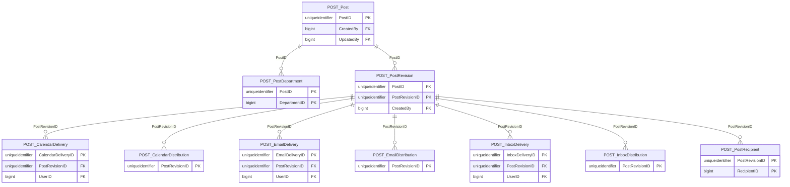

import TableDetail from '@site/src/components/TableDetail';

# Post-Graduation Database Tables

**11 tables** · **11 with PK** (100.0%) · **17 FKs** · **20 indexes**

## Entity Relationships

## Table Reference

<TableDetail
  tables={[{"name":"POST_CalendarDelivery","schema":"dbo","fullName":"dbo.POST_CalendarDelivery","hasPrimaryKey":true,"primaryKeyColumns":["CalendarDeliveryID"],"columns":[{"name":"CalendarDeliveryID","dataType":"uniqueidentifier","rawType":"uniqueidentifier","maxLength":null,"isNullable":false,"isIdentity":false,"isPrimaryKey":true,"defaultValue":null,"ordinalPosition":1},{"name":"PostRevisionID","dataType":"uniqueidentifier","rawType":"uniqueidentifier","maxLength":null,"isNullable":false,"isIdentity":false,"isPrimaryKey":false,"defaultValue":null,"ordinalPosition":2},{"name":"UserID","dataType":"bigint","rawType":"bigint","maxLength":null,"isNullable":false,"isIdentity":false,"isPrimaryKey":false,"defaultValue":null,"ordinalPosition":3},{"name":"Title","dataType":"varchar","rawType":"LargeText","maxLength":"8000","isNullable":false,"isIdentity":false,"isPrimaryKey":false,"defaultValue":null,"ordinalPosition":4},{"name":"StartDate","dataType":"date","rawType":"date","maxLength":null,"isNullable":false,"isIdentity":false,"isPrimaryKey":false,"defaultValue":null,"ordinalPosition":5},{"name":"EndDate","dataType":"date","rawType":"date","maxLength":null,"isNullable":false,"isIdentity":false,"isPrimaryKey":false,"defaultValue":null,"ordinalPosition":6}],"foreignKeys":[{"constraintName":"FK_POST_CalendarDelivery_PostRevisionID","columns":["PostRevisionID"],"referencedTable":"dbo.POST_PostRevision","referencedColumns":["PostRevisionID"]},{"constraintName":"FK_POST_CalendarDelivery_UserID","columns":["UserID"],"referencedTable":"dbo.SEC_Users","referencedColumns":["UserID"]}],"indexes":[{"name":"PK_POST_CalendarDelivery","type":"CLUSTERED","isPrimaryKey":true,"isUnique":true,"isDisabled":false,"keyColumns":["CalendarDeliveryID"],"includedColumns":[]},{"name":"Unique_POST_CalendarDelivery_PostRevisionID_UserID","type":"NONCLUSTERED","isPrimaryKey":false,"isUnique":true,"isDisabled":false,"keyColumns":[],"includedColumns":[]}],"checkConstraints":[],"defaultConstraints":0,"triggers":[]},{"name":"POST_CalendarDistribution","schema":"dbo","fullName":"dbo.POST_CalendarDistribution","hasPrimaryKey":true,"primaryKeyColumns":["PostRevisionID"],"columns":[{"name":"PostRevisionID","dataType":"uniqueidentifier","rawType":"uniqueidentifier","maxLength":null,"isNullable":false,"isIdentity":false,"isPrimaryKey":true,"defaultValue":null,"ordinalPosition":1},{"name":"StartDate","dataType":"date","rawType":"date","maxLength":null,"isNullable":false,"isIdentity":false,"isPrimaryKey":false,"defaultValue":null,"ordinalPosition":2},{"name":"EndDate","dataType":"date","rawType":"date","maxLength":null,"isNullable":false,"isIdentity":false,"isPrimaryKey":false,"defaultValue":null,"ordinalPosition":3}],"foreignKeys":[{"constraintName":"FK_POST_CalendarDistribution_PostRevisionID","columns":["PostRevisionID"],"referencedTable":"dbo.POST_PostRevision","referencedColumns":["PostRevisionID"]}],"indexes":[{"name":"PK_POST_CalendarDistribution","type":"CLUSTERED","isPrimaryKey":true,"isUnique":true,"isDisabled":false,"keyColumns":["PostRevisionID"],"includedColumns":[]}],"checkConstraints":[],"defaultConstraints":0,"triggers":[]},{"name":"POST_EmailDelivery","schema":"dbo","fullName":"dbo.POST_EmailDelivery","hasPrimaryKey":true,"primaryKeyColumns":["EmailDeliveryID"],"columns":[{"name":"EmailDeliveryID","dataType":"uniqueidentifier","rawType":"uniqueidentifier","maxLength":null,"isNullable":false,"isIdentity":false,"isPrimaryKey":true,"defaultValue":null,"ordinalPosition":1},{"name":"PostRevisionID","dataType":"uniqueidentifier","rawType":"uniqueidentifier","maxLength":null,"isNullable":false,"isIdentity":false,"isPrimaryKey":false,"defaultValue":null,"ordinalPosition":2},{"name":"UserID","dataType":"bigint","rawType":"bigint","maxLength":null,"isNullable":false,"isIdentity":false,"isPrimaryKey":false,"defaultValue":null,"ordinalPosition":3},{"name":"DeliveredDate","dataType":"datetime","rawType":"datetime","maxLength":null,"isNullable":false,"isIdentity":false,"isPrimaryKey":false,"defaultValue":null,"ordinalPosition":4},{"name":"WasAlreadySent","dataType":"bit","rawType":"bit","maxLength":null,"isNullable":false,"isIdentity":false,"isPrimaryKey":false,"defaultValue":null,"ordinalPosition":5}],"foreignKeys":[{"constraintName":"FK_POST_EmailDelivery_PostRevisionID","columns":["PostRevisionID"],"referencedTable":"dbo.POST_PostRevision","referencedColumns":["PostRevisionID"]},{"constraintName":"FK_POST_EmailDelivery_UserID","columns":["UserID"],"referencedTable":"dbo.SEC_Users","referencedColumns":["UserID"]}],"indexes":[{"name":"PK_POST_EmailDelivery","type":"CLUSTERED","isPrimaryKey":true,"isUnique":true,"isDisabled":false,"keyColumns":["EmailDeliveryID"],"includedColumns":[]},{"name":"Unique_POST_EmailDelivery_PostRevisionID_UserID","type":"NONCLUSTERED","isPrimaryKey":false,"isUnique":true,"isDisabled":false,"keyColumns":[],"includedColumns":[]}],"checkConstraints":[],"defaultConstraints":0,"triggers":[]},{"name":"POST_EmailDistribution","schema":"dbo","fullName":"dbo.POST_EmailDistribution","hasPrimaryKey":true,"primaryKeyColumns":["PostRevisionID"],"columns":[{"name":"PostRevisionID","dataType":"uniqueidentifier","rawType":"uniqueidentifier","maxLength":null,"isNullable":false,"isIdentity":false,"isPrimaryKey":true,"defaultValue":null,"ordinalPosition":1},{"name":"ScheduledDate","dataType":"date","rawType":"date","maxLength":null,"isNullable":true,"isIdentity":false,"isPrimaryKey":false,"defaultValue":null,"ordinalPosition":2},{"name":"DeliveredDate","dataType":"datetime","rawType":"datetime","maxLength":null,"isNullable":true,"isIdentity":false,"isPrimaryKey":false,"defaultValue":null,"ordinalPosition":3},{"name":"SenderEmail","dataType":"nvarchar","rawType":"nvarchar","maxLength":"255","isNullable":false,"isIdentity":false,"isPrimaryKey":false,"defaultValue":null,"ordinalPosition":4}],"foreignKeys":[{"constraintName":"FK_POST_EmailDistribution_PostRevisionID","columns":["PostRevisionID"],"referencedTable":"dbo.POST_PostRevision","referencedColumns":["PostRevisionID"]}],"indexes":[{"name":"PK_POST_EmailDistribution","type":"CLUSTERED","isPrimaryKey":true,"isUnique":true,"isDisabled":false,"keyColumns":["PostRevisionID"],"includedColumns":[]}],"checkConstraints":[],"defaultConstraints":0,"triggers":[]},{"name":"POST_InboxDelivery","schema":"dbo","fullName":"dbo.POST_InboxDelivery","hasPrimaryKey":true,"primaryKeyColumns":["InboxDeliveryID"],"columns":[{"name":"InboxDeliveryID","dataType":"uniqueidentifier","rawType":"uniqueidentifier","maxLength":null,"isNullable":false,"isIdentity":false,"isPrimaryKey":true,"defaultValue":null,"ordinalPosition":1},{"name":"PostRevisionID","dataType":"uniqueidentifier","rawType":"uniqueidentifier","maxLength":null,"isNullable":false,"isIdentity":false,"isPrimaryKey":false,"defaultValue":null,"ordinalPosition":2},{"name":"UserID","dataType":"bigint","rawType":"bigint","maxLength":null,"isNullable":false,"isIdentity":false,"isPrimaryKey":false,"defaultValue":null,"ordinalPosition":3},{"name":"DeliveredDate","dataType":"datetime","rawType":"datetime","maxLength":null,"isNullable":false,"isIdentity":false,"isPrimaryKey":false,"defaultValue":null,"ordinalPosition":4},{"name":"ReadDate","dataType":"datetime","rawType":"datetime","maxLength":null,"isNullable":true,"isIdentity":false,"isPrimaryKey":false,"defaultValue":null,"ordinalPosition":5},{"name":"DeactivatedDate","dataType":"datetime","rawType":"datetime","maxLength":null,"isNullable":true,"isIdentity":false,"isPrimaryKey":false,"defaultValue":null,"ordinalPosition":6},{"name":"Deleted","dataType":"bit","rawType":"bit","maxLength":null,"isNullable":false,"isIdentity":false,"isPrimaryKey":false,"defaultValue":null,"ordinalPosition":7}],"foreignKeys":[{"constraintName":"FK_POST_InboxDelivery_PostRevisionID","columns":["PostRevisionID"],"referencedTable":"dbo.POST_PostRevision","referencedColumns":["PostRevisionID"]},{"constraintName":"FK_POST_InboxDelivery_UserID","columns":["UserID"],"referencedTable":"dbo.SEC_Users","referencedColumns":["UserID"]}],"indexes":[{"name":"PK_POST_InboxDelivery","type":"CLUSTERED","isPrimaryKey":true,"isUnique":true,"isDisabled":false,"keyColumns":["InboxDeliveryID"],"includedColumns":[]},{"name":"Unique_POST_InboxDelivery_PostRevisionID_UserID","type":"NONCLUSTERED","isPrimaryKey":false,"isUnique":true,"isDisabled":false,"keyColumns":[],"includedColumns":[]},{"name":"POST_InboxDelivery_IS_UserID_DeliveredDate_DeactivatedDate_Deleted","type":"NONCLUSTERED","isPrimaryKey":false,"isUnique":false,"isDisabled":false,"keyColumns":["UserID","DeliveredDate","DeactivatedDate","Deleted"],"includedColumns":[]},{"name":"POST_InboxDelivery_IX_PostRevisionID","type":"NONCLUSTERED","isPrimaryKey":false,"isUnique":false,"isDisabled":false,"keyColumns":["PostRevisionID"],"includedColumns":[]},{"name":"POST_InboxDelivery_IX_UserID","type":"NONCLUSTERED","isPrimaryKey":false,"isUnique":false,"isDisabled":false,"keyColumns":["UserID"],"includedColumns":[]}],"checkConstraints":[],"defaultConstraints":0,"triggers":[]},{"name":"POST_InboxDistribution","schema":"dbo","fullName":"dbo.POST_InboxDistribution","hasPrimaryKey":true,"primaryKeyColumns":["PostRevisionID"],"columns":[{"name":"PostRevisionID","dataType":"uniqueidentifier","rawType":"uniqueidentifier","maxLength":null,"isNullable":false,"isIdentity":false,"isPrimaryKey":true,"defaultValue":null,"ordinalPosition":1},{"name":"StartDate","dataType":"date","rawType":"date","maxLength":null,"isNullable":true,"isIdentity":false,"isPrimaryKey":false,"defaultValue":null,"ordinalPosition":2},{"name":"EndDate","dataType":"date","rawType":"date","maxLength":null,"isNullable":true,"isIdentity":false,"isPrimaryKey":false,"defaultValue":null,"ordinalPosition":3}],"foreignKeys":[{"constraintName":"FK_POST_InboxDistribution_PostRevisionID","columns":["PostRevisionID"],"referencedTable":"dbo.POST_PostRevision","referencedColumns":["PostRevisionID"]}],"indexes":[{"name":"PK_POST_InboxDistribution","type":"CLUSTERED","isPrimaryKey":true,"isUnique":true,"isDisabled":false,"keyColumns":["PostRevisionID"],"includedColumns":[]}],"checkConstraints":[],"defaultConstraints":0,"triggers":[]},{"name":"POST_Post","schema":"dbo","fullName":"dbo.POST_Post","hasPrimaryKey":true,"primaryKeyColumns":["PostID"],"columns":[{"name":"PostID","dataType":"uniqueidentifier","rawType":"uniqueidentifier","maxLength":null,"isNullable":false,"isIdentity":false,"isPrimaryKey":true,"defaultValue":null,"ordinalPosition":1},{"name":"Active","dataType":"bit","rawType":"bit","maxLength":null,"isNullable":false,"isIdentity":false,"isPrimaryKey":false,"defaultValue":null,"ordinalPosition":2},{"name":"Level","dataType":"varchar","rawType":"varchar","maxLength":"32","isNullable":false,"isIdentity":false,"isPrimaryKey":false,"defaultValue":null,"ordinalPosition":3},{"name":"CreatedDate","dataType":"datetime","rawType":"datetime","maxLength":null,"isNullable":false,"isIdentity":false,"isPrimaryKey":false,"defaultValue":null,"ordinalPosition":4},{"name":"CreatedBy","dataType":"bigint","rawType":"bigint","maxLength":null,"isNullable":false,"isIdentity":false,"isPrimaryKey":false,"defaultValue":null,"ordinalPosition":5},{"name":"UpdateDate","dataType":"datetime","rawType":"datetime","maxLength":null,"isNullable":true,"isIdentity":false,"isPrimaryKey":false,"defaultValue":null,"ordinalPosition":6},{"name":"UpdatedBy","dataType":"bigint","rawType":"bigint","maxLength":null,"isNullable":true,"isIdentity":false,"isPrimaryKey":false,"defaultValue":null,"ordinalPosition":7},{"name":"Global","dataType":"bit","rawType":"bit","maxLength":null,"isNullable":false,"isIdentity":false,"isPrimaryKey":false,"defaultValue":null,"ordinalPosition":8}],"foreignKeys":[{"constraintName":"FK_POST_PostCreatedBy","columns":["CreatedBy"],"referencedTable":"dbo.SEC_Users","referencedColumns":["UserID"]},{"constraintName":"FK_POST_PostUpdatedBy","columns":["UpdatedBy"],"referencedTable":"dbo.SEC_Users","referencedColumns":["UserID"]}],"indexes":[{"name":"PK_POST_Post","type":"CLUSTERED","isPrimaryKey":true,"isUnique":true,"isDisabled":false,"keyColumns":["PostID"],"includedColumns":[]},{"name":"IX_POST_Post_Active","type":"NONCLUSTERED","isPrimaryKey":false,"isUnique":false,"isDisabled":false,"keyColumns":["Active"],"includedColumns":[]}],"checkConstraints":[],"defaultConstraints":0,"triggers":[]},{"name":"POST_PostDepartment","schema":"dbo","fullName":"dbo.POST_PostDepartment","hasPrimaryKey":true,"primaryKeyColumns":["PostID","DepartmentID"],"columns":[{"name":"PostID","dataType":"uniqueidentifier","rawType":"uniqueidentifier","maxLength":null,"isNullable":false,"isIdentity":false,"isPrimaryKey":true,"defaultValue":null,"ordinalPosition":1},{"name":"DepartmentID","dataType":"bigint","rawType":"bigint","maxLength":null,"isNullable":false,"isIdentity":false,"isPrimaryKey":true,"defaultValue":null,"ordinalPosition":2}],"foreignKeys":[{"constraintName":"FK_POST_PostDepartment_DepartmentID","columns":["DepartmentID"],"referencedTable":"dbo.SEC_Departments","referencedColumns":["DepartmentID"]},{"constraintName":"FK_POST_PostDepartment_PostID","columns":["PostID"],"referencedTable":"dbo.POST_Post","referencedColumns":["PostID"]}],"indexes":[{"name":"PK_POST_PostDepartment","type":"CLUSTERED","isPrimaryKey":true,"isUnique":true,"isDisabled":false,"keyColumns":["PostID","DepartmentID"],"includedColumns":[]}],"checkConstraints":[],"defaultConstraints":0,"triggers":[]},{"name":"POST_PostFilter","schema":"dbo","fullName":"dbo.POST_PostFilter","hasPrimaryKey":true,"primaryKeyColumns":["PostRevisionID"],"columns":[{"name":"PostRevisionID","dataType":"uniqueidentifier","rawType":"uniqueidentifier","maxLength":null,"isNullable":false,"isIdentity":false,"isPrimaryKey":true,"defaultValue":null,"ordinalPosition":1},{"name":"DepartmentIDs","dataType":"text","rawType":"text","maxLength":null,"isNullable":true,"isIdentity":false,"isPrimaryKey":false,"defaultValue":null,"ordinalPosition":2},{"name":"UserRoleIDs","dataType":"text","rawType":"text","maxLength":null,"isNullable":true,"isIdentity":false,"isPrimaryKey":false,"defaultValue":null,"ordinalPosition":3},{"name":"UserTypeIDs","dataType":"text","rawType":"text","maxLength":null,"isNullable":true,"isIdentity":false,"isPrimaryKey":false,"defaultValue":null,"ordinalPosition":4},{"name":"ProgramIDs","dataType":"text","rawType":"text","maxLength":null,"isNullable":true,"isIdentity":false,"isPrimaryKey":false,"defaultValue":null,"ordinalPosition":5},{"name":"WithGlobal","dataType":"bit","rawType":"bit","maxLength":null,"isNullable":false,"isIdentity":false,"isPrimaryKey":false,"defaultValue":null,"ordinalPosition":6}],"foreignKeys":[],"indexes":[{"name":"PK_POST_PostFilter","type":"CLUSTERED","isPrimaryKey":true,"isUnique":true,"isDisabled":false,"keyColumns":["PostRevisionID"],"includedColumns":[]}],"checkConstraints":[],"defaultConstraints":0,"triggers":[]},{"name":"POST_PostRecipient","schema":"dbo","fullName":"dbo.POST_PostRecipient","hasPrimaryKey":true,"primaryKeyColumns":["PostRevisionID","RecipientID"],"columns":[{"name":"PostRevisionID","dataType":"uniqueidentifier","rawType":"uniqueidentifier","maxLength":null,"isNullable":false,"isIdentity":false,"isPrimaryKey":true,"defaultValue":null,"ordinalPosition":1},{"name":"RecipientID","dataType":"bigint","rawType":"bigint","maxLength":null,"isNullable":false,"isIdentity":false,"isPrimaryKey":true,"defaultValue":null,"ordinalPosition":2}],"foreignKeys":[{"constraintName":"FK_POST_PostRecipient_PostRevisionID","columns":["PostRevisionID"],"referencedTable":"dbo.POST_PostRevision","referencedColumns":["PostRevisionID"]},{"constraintName":"FK_POST_PostRecipient_RecipientID","columns":["RecipientID"],"referencedTable":"dbo.SEC_Users","referencedColumns":["UserID"]}],"indexes":[{"name":"PK_POST_PostRecipient","type":"CLUSTERED","isPrimaryKey":true,"isUnique":true,"isDisabled":false,"keyColumns":["PostRevisionID","RecipientID"],"includedColumns":[]}],"checkConstraints":[],"defaultConstraints":0,"triggers":[]},{"name":"POST_PostRevision","schema":"dbo","fullName":"dbo.POST_PostRevision","hasPrimaryKey":true,"primaryKeyColumns":["PostRevisionID"],"columns":[{"name":"PostID","dataType":"uniqueidentifier","rawType":"uniqueidentifier","maxLength":null,"isNullable":false,"isIdentity":false,"isPrimaryKey":false,"defaultValue":null,"ordinalPosition":1},{"name":"PostRevisionID","dataType":"uniqueidentifier","rawType":"uniqueidentifier","maxLength":null,"isNullable":false,"isIdentity":false,"isPrimaryKey":true,"defaultValue":null,"ordinalPosition":2},{"name":"RevisionNumber","dataType":"int","rawType":"int","maxLength":null,"isNullable":false,"isIdentity":false,"isPrimaryKey":false,"defaultValue":null,"ordinalPosition":3},{"name":"Title","dataType":"text","rawType":"text","maxLength":null,"isNullable":false,"isIdentity":false,"isPrimaryKey":false,"defaultValue":null,"ordinalPosition":4},{"name":"Content","dataType":"text","rawType":"text","maxLength":null,"isNullable":false,"isIdentity":false,"isPrimaryKey":false,"defaultValue":null,"ordinalPosition":5},{"name":"CreatedBy","dataType":"bigint","rawType":"bigint","maxLength":null,"isNullable":false,"isIdentity":false,"isPrimaryKey":false,"defaultValue":null,"ordinalPosition":6},{"name":"CreatedDate","dataType":"datetime","rawType":"datetime","maxLength":null,"isNullable":false,"isIdentity":false,"isPrimaryKey":false,"defaultValue":null,"ordinalPosition":7}],"foreignKeys":[{"constraintName":"FK_POST_PostRevision_CreatedBy","columns":["CreatedBy"],"referencedTable":"dbo.SEC_Users","referencedColumns":["UserID"]},{"constraintName":"FK_POST_PostRevision_PostID","columns":["PostID"],"referencedTable":"dbo.POST_Post","referencedColumns":["PostID"]}],"indexes":[{"name":"PK_POST_PostRevision","type":"CLUSTERED","isPrimaryKey":true,"isUnique":true,"isDisabled":false,"keyColumns":["PostRevisionID"],"includedColumns":[]},{"name":"Unique_POST_PostRevistion_PostID_RevisionNumber","type":"NONCLUSTERED","isPrimaryKey":false,"isUnique":true,"isDisabled":false,"keyColumns":[],"includedColumns":[]},{"name":"IX_POST_PostRevision_Post","type":"NONCLUSTERED","isPrimaryKey":false,"isUnique":false,"isDisabled":false,"keyColumns":["PostID"],"includedColumns":[]}],"checkConstraints":[],"defaultConstraints":0,"triggers":[]}]}
  generatedAt="2026-02-27T13:41:46.788Z"
/>

## Stored Procedures

See the [Post-Graduation Stored Procedures](./sprocs/post-graduation-sprocs) reference page for detailed documentation of all stored procedures in this module, including parameters, anti-pattern analysis, and optimization recommendations.
