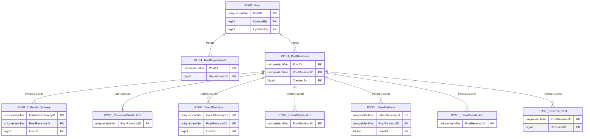

import TableDetail from '@site/src/components/TableDetail';

# Post-Graduation Database Tables

**11 tables** · **11 with PK** (100.0%) · **17 FKs** · **20 indexes**

## Entity Relationships

## Table Reference

<TableDetail
  dataUrl="/table-detail-data/post-graduation.json"
  generatedAt="2026-02-28T06:03:57.118Z"
/>

## Stored Procedures

See the [Post-Graduation Stored Procedures](./sprocs/post-graduation-sprocs) reference page for detailed documentation of all stored procedures in this module, including parameters, anti-pattern analysis, and optimization recommendations.

## Related Code Documentation

- [Common (.NET Business Module)](/docs/dotnet-backend/business/common)
