import TableDetail from '@site/src/components/TableDetail';

# Procedures Database Tables

**107 tables** · **63 with PK** (58.9%) · **63 FKs** · **174 indexes**

## Entity Relationships

```mermaid
erDiagram
    PRC_DiagnosisList ||--o{ PRC_CustomDiagnosisTabInfo : "FK_PRC_CustomDiagnosisTabIn..."
    PRC_CustomDiagnosisTabs ||--o{ PRC_CustomDiagnosisTabInfo : "FK_PRC_CustomDiagnosisTabIn..."
    PRC_Procedures ||--o{ PRC_CustomFieldsGroupProcedures : "FK_PRC_CustomFieldsGroupPro..."
    PRC_CustomFieldsGroup ||--o{ PRC_CustomFieldsGroupProcedures : "FK_PRC_CustomFieldsGroupPro..."
    PRC_CustomFieldsGroup ||--o{ PRC_Fields : "FK_PRC_Fields_PRC_CustomFie..."
    PRC_Fields ||--o{ PRC_FieldsGroupsInfo : "FK_PRC_FieldsGroupsInfo_PRC..."
    PRC_FieldGroups ||--o{ PRC_FieldsGroupsInfo : "FK_PRC_FieldsGroupsInfo_PRC..."
    PRC_Fields ||--o{ PRC_FreeTextFieldValues : "FK_PRC_FreeTextFieldValues_..."
    PRC_ProceduresSubmitted ||--o{ PRC_FreeTextFieldValues : "FK_PRC_FreeTextFieldValues_..."
    PRC_Fields ||--o{ PRC_LargeDateFieldValues : "FK_PRC_LargeDateFieldValues..."
    PRC_ProceduresSubmitted ||--o{ PRC_LargeDateFieldValues : "FK_PRC_LargeDateFieldValues..."
    PRC_Fields ||--o{ PRC_LargeNumberFieldValues : "FK_PRC_LargeNumberFieldValu..."
    PRC_ProceduresSubmitted ||--o{ PRC_LargeNumberFieldValues : "FK_PRC_LargeNumberFieldValu..."
    PRC_Fields ||--o{ PRC_LongTextFieldValues : "FK_PRC_LongTextFieldValues_..."
    PRC_ProceduresSubmitted ||--o{ PRC_LongTextFieldValues : "FK_PRC_LongTextFieldValues_..."
    PRC_LookupItems ||--o{ PRC_LookupFieldValues : "FK_PRC_LookupFieldValues_PR..."
    PRC_Fields ||--o{ PRC_LookupFieldValues : "FK_PRC_LookupFieldValues_PR..."
    PRC_ProceduresSubmitted ||--o{ PRC_LookupFieldValues : "FK_PRC_LookupFieldValues_PR..."
    PRC_Fields ||--o{ PRC_NumberFieldValues : "FK_PRC_NumberFieldValues_PR..."
    PRC_ProceduresSubmitted ||--o{ PRC_NumberFieldValues : "FK_PRC_NumberFieldValues_PR..."
    PRC_Procedures ||--o{ PRC_ProceduresCertificationStatus : "FK_PRC_ProceduresCertificat..."
    PRC_Procedures ||--o{ PRC_ProceduresSubmitted : "FK_PRC_ProceduresSubmitted_..."
```

## Table Reference

<TableDetail
  tables={[{"name":"PRC_AccountRegistration","schema":"dbo","fullName":"dbo.PRC_AccountRegistration","hasPrimaryKey":true,"primaryKeyColumns":["AccountRegistrationID"],"foreignKeys":[],"indexes":[{"name":"PK__PRC_Acco__C37F464AD80E3D0C","type":"CLUSTERED","isPrimaryKey":true,"isUnique":true,"isDisabled":false,"keyColumns":["AccountRegistrationID"],"includedColumns":[]}],"checkConstraints":[],"defaultConstraints":1,"triggers":[]},{"name":"PRC_CaseLogImportingData","schema":"dbo","fullName":"dbo.PRC_CaseLogImportingData","hasPrimaryKey":false,"primaryKeyColumns":[],"foreignKeys":[],"indexes":[{"name":"IDX_PRC_CaseLogImportingData1","type":"NONCLUSTERED","isPrimaryKey":false,"isUnique":false,"isDisabled":false,"keyColumns":["ProceduresSubmittedID"],"includedColumns":["Qty"]}],"checkConstraints":[],"defaultConstraints":0,"triggers":[]},{"name":"PRC_CaseLogImportingFieldAliasNames","schema":"dbo","fullName":"dbo.PRC_CaseLogImportingFieldAliasNames","hasPrimaryKey":true,"primaryKeyColumns":["CaseLogImportingFieldAliasNameID"],"foreignKeys":[{"constraintName":"FK_PRC_CaseLogImportingFieldAliasNames_PRC_CaseLogImportingFields","referencedTable":"PRC_CaseLogImportingFields"}],"indexes":[{"name":"PK__PRC_Case__7924D6FD652295BB","type":"CLUSTERED","isPrimaryKey":true,"isUnique":true,"isDisabled":false,"keyColumns":["CaseLogImportingFieldAliasNameID"],"includedColumns":[]}],"checkConstraints":[],"defaultConstraints":0,"triggers":[]},{"name":"PRC_CaseLogImportingFields","schema":"dbo","fullName":"dbo.PRC_CaseLogImportingFields","hasPrimaryKey":true,"primaryKeyColumns":["CaseLogImportingFieldID"],"foreignKeys":[],"indexes":[{"name":"PK__PRC_Case__DBD349B6615204D7","type":"CLUSTERED","isPrimaryKey":true,"isUnique":true,"isDisabled":false,"keyColumns":["CaseLogImportingFieldID"],"includedColumns":[]}],"checkConstraints":[],"defaultConstraints":0,"triggers":[]},{"name":"PRC_ClinicalHoursImportingFieldAliasNames","schema":"dbo","fullName":"dbo.PRC_ClinicalHoursImportingFieldAliasNames","hasPrimaryKey":true,"primaryKeyColumns":["ClinicalHoursImportingFieldAliasNameID"],"foreignKeys":[],"indexes":[{"name":"PK__PRC_Clin__AF38DD8D62FFBF63","type":"CLUSTERED","isPrimaryKey":true,"isUnique":true,"isDisabled":false,"keyColumns":["ClinicalHoursImportingFieldAliasNameID"],"includedColumns":[]}],"checkConstraints":[],"defaultConstraints":0,"triggers":[]},{"name":"PRC_ClinicalHoursImportingFields","schema":"dbo","fullName":"dbo.PRC_ClinicalHoursImportingFields","hasPrimaryKey":true,"primaryKeyColumns":["ClinicalHoursImportingFieldID"],"foreignKeys":[],"indexes":[{"name":"PK__PRC_Clin__B33FF94F4B5E966D","type":"CLUSTERED","isPrimaryKey":true,"isUnique":true,"isDisabled":false,"keyColumns":["ClinicalHoursImportingFieldID"],"includedColumns":[]}],"checkConstraints":[],"defaultConstraints":0,"triggers":[]},{"name":"PRC_ComplicationTypes","schema":"dbo","fullName":"dbo.PRC_ComplicationTypes","hasPrimaryKey":true,"primaryKeyColumns":["ComplicationTypeID"],"foreignKeys":[],"indexes":[{"name":"PRC_ComplicationType_PK","type":"CLUSTERED","isPrimaryKey":true,"isUnique":true,"isDisabled":false,"keyColumns":["ComplicationTypeID"],"includedColumns":[]}],"checkConstraints":[],"defaultConstraints":1,"triggers":[]},{"name":"PRC_ConsentTypes","schema":"dbo","fullName":"dbo.PRC_ConsentTypes","hasPrimaryKey":true,"primaryKeyColumns":["ConsentTypeID"],"foreignKeys":[],"indexes":[{"name":"PK_PRC_ConsentTypes","type":"CLUSTERED","isPrimaryKey":true,"isUnique":true,"isDisabled":false,"keyColumns":["ConsentTypeID"],"includedColumns":[]}],"checkConstraints":[],"defaultConstraints":1,"triggers":[]},{"name":"prc_Credentials","schema":"dbo","fullName":"dbo.prc_Credentials","hasPrimaryKey":false,"primaryKeyColumns":[],"foreignKeys":[],"indexes":[],"checkConstraints":[],"defaultConstraints":0,"triggers":[]},{"name":"PRC_CustomDiagnosisTabInfo","schema":"dbo","fullName":"dbo.PRC_CustomDiagnosisTabInfo","hasPrimaryKey":true,"primaryKeyColumns":["CustomDiagnosisTabInfoID"],"foreignKeys":[{"constraintName":"FK_PRC_CustomDiagnosisTabInfo_PRC_DiagnosisList","referencedTable":"PRC_DiagnosisList"},{"constraintName":"FK_PRC_CustomDiagnosisTabInfo_PRC_CustomDiagnosisTabs","referencedTable":"PRC_CustomDiagnosisTabs"}],"indexes":[{"name":"PK_PRC_CustomDiagnosisTabInfo","type":"CLUSTERED","isPrimaryKey":true,"isUnique":true,"isDisabled":false,"keyColumns":["CustomDiagnosisTabInfoID"],"includedColumns":[]}],"checkConstraints":[],"defaultConstraints":0,"triggers":[]},{"name":"PRC_CustomDiagnosisTabs","schema":"dbo","fullName":"dbo.PRC_CustomDiagnosisTabs","hasPrimaryKey":true,"primaryKeyColumns":["CustomDiagnosisTabID"],"foreignKeys":[{"constraintName":"FK_PRC_CustomDiagnosisTabs_PRC_Patients","referencedTable":"PRC_Patients"},{"constraintName":"FK_PRC_CustomDiagnosisTabs_SEC_Users","referencedTable":"SEC_Users"}],"indexes":[{"name":"IDX_MissingOn_PRC_CustomDiagnosisTabs_0F6B1CBBC94543AEB1386B0AFC51F8C2","type":"NONCLUSTERED","isPrimaryKey":false,"isUnique":false,"isDisabled":false,"keyColumns":["UserID","DepartmentID","CustomDiagnosisTabName"],"includedColumns":[]},{"name":"IDX_MissingOn_PRC_CustomDiagnosisTabs_5CDD8DFA3F0848809B1AB32DDD6464FF","type":"NONCLUSTERED","isPrimaryKey":false,"isUnique":false,"isDisabled":false,"keyColumns":["CustomDiagnosisTabName","DepartmentID"],"includedColumns":[]},{"name":"IDX_MissingOn_PRC_CustomDiagnosisTabs_92C033FBAA89411BB3D4350B5D816D14","type":"NONCLUSTERED","isPrimaryKey":false,"isUnique":false,"isDisabled":false,"keyColumns":["UserID"],"includedColumns":[]},{"name":"IDX_MissingOn_PRC_CustomDiagnosisTabs_E6E90F6844624FE79966799168218A77","type":"NONCLUSTERED","isPrimaryKey":false,"isUnique":false,"isDisabled":false,"keyColumns":["CustomDiagnosisTabName","UserID","DepartmentID","PatientID"],"includedColumns":[]},{"name":"PK_PRC_CustomDiagnosisTabs","type":"CLUSTERED","isPrimaryKey":true,"isUnique":true,"isDisabled":false,"keyColumns":["CustomDiagnosisTabID"],"includedColumns":[]}],"checkConstraints":[],"defaultConstraints":0,"triggers":[]},{"name":"PRC_CustomFieldsGroup","schema":"dbo","fullName":"dbo.PRC_CustomFieldsGroup","hasPrimaryKey":true,"primaryKeyColumns":["CustomFieldsGroupId"],"foreignKeys":[],"indexes":[{"name":"PK_PRC_CustomFieldsGroup","type":"CLUSTERED","isPrimaryKey":true,"isUnique":true,"isDisabled":false,"keyColumns":["CustomFieldsGroupId"],"includedColumns":[]}],"checkConstraints":[],"defaultConstraints":0,"triggers":[]},{"name":"PRC_CustomFieldsGroupProcedures","schema":"dbo","fullName":"dbo.PRC_CustomFieldsGroupProcedures","hasPrimaryKey":true,"primaryKeyColumns":["CustomFieldsGroupProceduresId"],"foreignKeys":[{"constraintName":"FK_PRC_CustomFieldsGroupProcedures_PRC_Procedures","referencedTable":"PRC_Procedures"},{"constraintName":"FK_PRC_CustomFieldsGroupProcedures_PRC_CustomFieldsGroup","referencedTable":"PRC_CustomFieldsGroup"}],"indexes":[{"name":"IDX_PRC_CustomFieldsGroupProcedures1","type":"NONCLUSTERED","isPrimaryKey":false,"isUnique":false,"isDisabled":false,"keyColumns":["CustomFieldsGroupId","ProcedureId"],"includedColumns":[]},{"name":"IDX_PRC_CustomFieldsGroupProcedures2","type":"NONCLUSTERED","isPrimaryKey":false,"isUnique":false,"isDisabled":false,"keyColumns":["ProcedureId"],"includedColumns":["CustomFieldsGroupId"]},{"name":"PK_PRC_CustomFieldsGroupProcedures","type":"CLUSTERED","isPrimaryKey":true,"isUnique":true,"isDisabled":false,"keyColumns":["CustomFieldsGroupProceduresId"],"includedColumns":[]}],"checkConstraints":[],"defaultConstraints":0,"triggers":[]},{"name":"PRC_CustomFieldsGroupProcedures_170404","schema":"dbo","fullName":"dbo.PRC_CustomFieldsGroupProcedures_170404","hasPrimaryKey":false,"primaryKeyColumns":[],"foreignKeys":[],"indexes":[],"checkConstraints":[],"defaultConstraints":0,"triggers":[]},{"name":"PRC_CustomFieldsGroupProcedures_170407","schema":"dbo","fullName":"dbo.PRC_CustomFieldsGroupProcedures_170407","hasPrimaryKey":false,"primaryKeyColumns":[],"foreignKeys":[],"indexes":[],"checkConstraints":[],"defaultConstraints":0,"triggers":[]},{"name":"PRC_CustomFieldsGroupProcedures_170417","schema":"dbo","fullName":"dbo.PRC_CustomFieldsGroupProcedures_170417","hasPrimaryKey":false,"primaryKeyColumns":[],"foreignKeys":[],"indexes":[],"checkConstraints":[],"defaultConstraints":0,"triggers":[]},{"name":"PRC_DefaultLevelsOfSupervision","schema":"dbo","fullName":"dbo.PRC_DefaultLevelsOfSupervision","hasPrimaryKey":true,"primaryKeyColumns":["id"],"foreignKeys":[],"indexes":[{"name":"PK_PRC_DefaultLevelsOfSupervision","type":"CLUSTERED","isPrimaryKey":true,"isUnique":true,"isDisabled":false,"keyColumns":["id"],"includedColumns":[]}],"checkConstraints":[],"defaultConstraints":0,"triggers":[]},{"name":"PRC_DemoProcedures","schema":"dbo","fullName":"dbo.PRC_DemoProcedures","hasPrimaryKey":false,"primaryKeyColumns":[],"foreignKeys":[],"indexes":[],"checkConstraints":[],"defaultConstraints":0,"triggers":[]},{"name":"PRC_DepartmentFieldGroupOrder","schema":"dbo","fullName":"dbo.PRC_DepartmentFieldGroupOrder","hasPrimaryKey":true,"primaryKeyColumns":["DepartmentFieldGroupOrderID"],"foreignKeys":[{"constraintName":"FK_PRC_DepartmentFieldGroupOrder_PRC_FieldGroups","referencedTable":"PRC_FieldGroups"}],"indexes":[{"name":"PK_PRC_DepartmentFieldGroupOrder","type":"CLUSTERED","isPrimaryKey":true,"isUnique":true,"isDisabled":false,"keyColumns":["DepartmentFieldGroupOrderID"],"includedColumns":[]},{"name":"UQ_PRC_DepartmentFieldGroupOrder","type":"NONCLUSTERED","isPrimaryKey":false,"isUnique":true,"isDisabled":false,"keyColumns":["DepartmentID","FieldGroupID"],"includedColumns":[]}],"checkConstraints":[],"defaultConstraints":0,"triggers":[]},{"name":"PRC_DepartmentFieldOrder","schema":"dbo","fullName":"dbo.PRC_DepartmentFieldOrder","hasPrimaryKey":true,"primaryKeyColumns":["DepartmentFieldOrderID"],"foreignKeys":[{"constraintName":"FK_PRC_DepartmentFieldOrder_PRC_Fields","referencedTable":"PRC_Fields"}],"indexes":[{"name":"PK_PRC_DepartmentFieldOrder","type":"CLUSTERED","isPrimaryKey":true,"isUnique":true,"isDisabled":false,"keyColumns":["DepartmentFieldOrderID"],"includedColumns":[]},{"name":"UQ_PRC_DepartmentFieldOrder","type":"NONCLUSTERED","isPrimaryKey":false,"isUnique":true,"isDisabled":false,"keyColumns":["DepartmentID","FieldID"],"includedColumns":[]}],"checkConstraints":[],"defaultConstraints":0,"triggers":[]},{"name":"PRC_DevryImportData","schema":"dbo","fullName":"dbo.PRC_DevryImportData","hasPrimaryKey":false,"primaryKeyColumns":[],"foreignKeys":[],"indexes":[],"checkConstraints":[],"defaultConstraints":0,"triggers":[]},{"name":"PRC_DiagnosisCategories","schema":"dbo","fullName":"dbo.PRC_DiagnosisCategories","hasPrimaryKey":true,"primaryKeyColumns":["DiagnosisCategoryID"],"foreignKeys":[],"indexes":[{"name":"PRC_DiagnosesCategories_PK","type":"CLUSTERED","isPrimaryKey":true,"isUnique":true,"isDisabled":false,"keyColumns":["DiagnosisCategoryID"],"includedColumns":[]}],"checkConstraints":[],"defaultConstraints":2,"triggers":[]},{"name":"PRC_DiagnosisList","schema":"dbo","fullName":"dbo.PRC_DiagnosisList","hasPrimaryKey":true,"primaryKeyColumns":["DiagnosisListID"],"foreignKeys":[{"constraintName":"FK_PRC_DiagnosisList_PRC_DiagnosisCategories","referencedTable":"PRC_DiagnosisCategories"}],"indexes":[{"name":"IDX_MissingOn_PRC_DiagnosisList_9A8CA5AF0A03472F80758C773D52A7C0","type":"NONCLUSTERED","isPrimaryKey":false,"isUnique":false,"isDisabled":false,"keyColumns":["DiagnosisCategoryID","IsDeleted","IsICD10"],"includedColumns":["DiagnosisCode","Code","Name","DateModified","SortOrder","Alias"]},{"name":"IDX_MissingOn_PRC_DiagnosisList_BEB193322B554E299F5F09AB640AD460","type":"NONCLUSTERED","isPrimaryKey":false,"isUnique":false,"isDisabled":false,"keyColumns":["DiagnosisCategoryID","IsDeleted","IsICD10"],"includedColumns":["DiagnosisCode","Name"]},{"name":"PRC_DiagnosisList_PK","type":"CLUSTERED","isPrimaryKey":true,"isUnique":true,"isDisabled":false,"keyColumns":["DiagnosisListID"],"includedColumns":[]}],"checkConstraints":[],"defaultConstraints":2,"triggers":[]},{"name":"PRC_ErrorCategories","schema":"dbo","fullName":"dbo.PRC_ErrorCategories","hasPrimaryKey":true,"primaryKeyColumns":["ErrorCategoryID"],"foreignKeys":[],"indexes":[{"name":"IDX_PRC_ErrorCategories1","type":"NONCLUSTERED","isPrimaryKey":false,"isUnique":false,"isDisabled":false,"keyColumns":["DepartmentID"],"includedColumns":[]},{"name":"IDX_PRC_ErrorCategories2","type":"NONCLUSTERED","isPrimaryKey":false,"isUnique":false,"isDisabled":false,"keyColumns":["ErrorCategoryName"],"includedColumns":[]},{"name":"PRC_ErrorCategories_PK","type":"CLUSTERED","isPrimaryKey":true,"isUnique":true,"isDisabled":false,"keyColumns":["ErrorCategoryID"],"includedColumns":[]}],"checkConstraints":[],"defaultConstraints":2,"triggers":[]},{"name":"PRC_ErrorCategoriesBase","schema":"dbo","fullName":"dbo.PRC_ErrorCategoriesBase","hasPrimaryKey":true,"primaryKeyColumns":["ErrorCategoriesBaseID"],"foreignKeys":[],"indexes":[{"name":"PRC_ErrorCategoriesBase_PK","type":"CLUSTERED","isPrimaryKey":true,"isUnique":true,"isDisabled":false,"keyColumns":["ErrorCategoriesBaseID"],"includedColumns":[]}],"checkConstraints":[],"defaultConstraints":1,"triggers":[]},{"name":"PRC_Errors","schema":"dbo","fullName":"dbo.PRC_Errors","hasPrimaryKey":true,"primaryKeyColumns":["ErrorID"],"foreignKeys":[{"constraintName":"FK_PRC_Errors_PRC_ErrorCategories","referencedTable":"PRC_ErrorCategories"}],"indexes":[{"name":"IDX_PRC_Errors1","type":"NONCLUSTERED","isPrimaryKey":false,"isUnique":false,"isDisabled":false,"keyColumns":["DepartmentID"],"includedColumns":[]},{"name":"PRC_Errors_PK","type":"CLUSTERED","isPrimaryKey":true,"isUnique":true,"isDisabled":false,"keyColumns":["ErrorID"],"includedColumns":[]}],"checkConstraints":[],"defaultConstraints":2,"triggers":[]},{"name":"PRC_ErrorsBase","schema":"dbo","fullName":"dbo.PRC_ErrorsBase","hasPrimaryKey":true,"primaryKeyColumns":["ErrorsBaseID"],"foreignKeys":[{"constraintName":"FK_PRC_ErrorsBase_PRC_ErrorCategoriesBase","referencedTable":"PRC_ErrorCategoriesBase"}],"indexes":[{"name":"PRC_ErrorsBase_PK","type":"CLUSTERED","isPrimaryKey":true,"isUnique":true,"isDisabled":false,"keyColumns":["ErrorsBaseID"],"includedColumns":[]}],"checkConstraints":[],"defaultConstraints":1,"triggers":[]},{"name":"PRC_ErrorsCategorySubmitted","schema":"dbo","fullName":"dbo.PRC_ErrorsCategorySubmitted","hasPrimaryKey":true,"primaryKeyColumns":["ErrorsCategorySubmittedID"],"foreignKeys":[],"indexes":[{"name":"IDX_MissingOn_PRC_ErrorsCategorySubmitted_55A2EEB03E7C4BD2B0E89522EDF05EAE","type":"NONCLUSTERED","isPrimaryKey":false,"isUnique":false,"isDisabled":false,"keyColumns":["ProceduresSubmittedID"],"includedColumns":["ErrorCategoryID"]},{"name":"IDX_MissingOn_PRC_ErrorsCategorySubmitted_EA073CF26FE04F039E79E60E768CCDF4","type":"NONCLUSTERED","isPrimaryKey":false,"isUnique":false,"isDisabled":false,"keyColumns":["ProceduresSubmittedID"],"includedColumns":[]},{"name":"PRC_ErrorsCategorySubmitted_PK","type":"CLUSTERED","isPrimaryKey":true,"isUnique":true,"isDisabled":false,"keyColumns":["ErrorsCategorySubmittedID"],"includedColumns":[]}],"checkConstraints":[],"defaultConstraints":0,"triggers":[]},{"name":"PRC_ErrorsSubmitted","schema":"dbo","fullName":"dbo.PRC_ErrorsSubmitted","hasPrimaryKey":true,"primaryKeyColumns":["ErrorsSubmittedID"],"foreignKeys":[{"constraintName":"FK_PRC_ErrorsSubmitted_SEC_Departments","referencedTable":"SEC_Departments"},{"constraintName":"FK_PRC_ErrorsSubmitted_SEC_Users","referencedTable":"SEC_Users"},{"constraintName":"FK_PRC_ErrorsSubmitted_PRC_Errors","referencedTable":"PRC_Errors"}],"indexes":[{"name":"PK_PRC_ErrorsSubmitted","type":"CLUSTERED","isPrimaryKey":true,"isUnique":true,"isDisabled":false,"keyColumns":["ErrorsSubmittedID"],"includedColumns":[]}],"checkConstraints":[],"defaultConstraints":0,"triggers":[]},{"name":"PRC_FieldGroups","schema":"dbo","fullName":"dbo.PRC_FieldGroups","hasPrimaryKey":true,"primaryKeyColumns":["FieldGroupID"],"foreignKeys":[{"constraintName":"FK_PRC_FieldGroups_SEC_Departments","referencedTable":"SEC_Departments"}],"indexes":[{"name":"PK_PRC_FieldGroups","type":"CLUSTERED","isPrimaryKey":true,"isUnique":true,"isDisabled":false,"keyColumns":["FieldGroupID"],"includedColumns":[]}],"checkConstraints":[],"defaultConstraints":0,"triggers":[]},{"name":"PRC_FieldGroupsBase","schema":"dbo","fullName":"dbo.PRC_FieldGroupsBase","hasPrimaryKey":false,"primaryKeyColumns":[],"foreignKeys":[],"indexes":[],"checkConstraints":[],"defaultConstraints":0,"triggers":[]},{"name":"PRC_Fields","schema":"dbo","fullName":"dbo.PRC_Fields","hasPrimaryKey":true,"primaryKeyColumns":["FieldID"],"foreignKeys":[{"constraintName":"FK_PRC_Fields_PRC_CustomFieldsGroup","referencedTable":"PRC_CustomFieldsGroup"},{"constraintName":"FK_PRC_Fields_MGMT_VisibilityTypes","referencedTable":"MGMT_VisibilityTypes"},{"constraintName":"FK_PRC_Fields_PRC_FieldTypeInfo","referencedTable":"PRC_FieldTypeInfo"}],"indexes":[{"name":"IX_PRC_Fields_1","type":"NONCLUSTERED","isPrimaryKey":false,"isUnique":false,"isDisabled":false,"keyColumns":["DepartmentID","IsSystem","IsHidden"],"includedColumns":[]},{"name":"IX_PRC_Fields_2","type":"NONCLUSTERED","isPrimaryKey":false,"isUnique":false,"isDisabled":false,"keyColumns":["DepartmentID","Name"],"includedColumns":[]},{"name":"IX_PRC_Fields_3","type":"NONCLUSTERED","isPrimaryKey":false,"isUnique":false,"isDisabled":false,"keyColumns":["IsSystem","IsHidden"],"includedColumns":["DepartmentID","Name","IsDeleted","CustomFieldsGroupID"]},{"name":"PK_PRC_Fields","type":"CLUSTERED","isPrimaryKey":true,"isUnique":true,"isDisabled":false,"keyColumns":["FieldID"],"includedColumns":[]}],"checkConstraints":[],"defaultConstraints":3,"triggers":[]},{"name":"prc_fields_190910","schema":"dbo","fullName":"dbo.prc_fields_190910","hasPrimaryKey":false,"primaryKeyColumns":[],"foreignKeys":[],"indexes":[],"checkConstraints":[],"defaultConstraints":0,"triggers":[]},{"name":"PRC_FieldsBase","schema":"dbo","fullName":"dbo.PRC_FieldsBase","hasPrimaryKey":false,"primaryKeyColumns":[],"foreignKeys":[],"indexes":[],"checkConstraints":[],"defaultConstraints":0,"triggers":[]},{"name":"PRC_FieldsGroupsInfo","schema":"dbo","fullName":"dbo.PRC_FieldsGroupsInfo","hasPrimaryKey":true,"primaryKeyColumns":["FieldsGroupsInfoID"],"foreignKeys":[{"constraintName":"FK_PRC_FieldsGroupsInfo_PRC_Fields","referencedTable":"PRC_Fields"},{"constraintName":"FK_PRC_FieldsGroupsInfo_PRC_FieldGroups","referencedTable":"PRC_FieldGroups"}],"indexes":[{"name":"PK_PRC_FieldsGroupsInfo","type":"CLUSTERED","isPrimaryKey":true,"isUnique":true,"isDisabled":false,"keyColumns":["FieldsGroupsInfoID"],"includedColumns":[]}],"checkConstraints":[],"defaultConstraints":0,"triggers":[]},{"name":"PRC_FieldTypeInfo","schema":"dbo","fullName":"dbo.PRC_FieldTypeInfo","hasPrimaryKey":true,"primaryKeyColumns":["FieldTypeInfoID"],"foreignKeys":[{"constraintName":"FK_PRC_FieldTypeInfo_MGMT_FieldTypes","referencedTable":"MGMT_FieldTypes"}],"indexes":[{"name":"PK_PRC_FieldTypeInfo","type":"CLUSTERED","isPrimaryKey":true,"isUnique":true,"isDisabled":false,"keyColumns":["FieldTypeInfoID"],"includedColumns":[]}],"checkConstraints":[],"defaultConstraints":0,"triggers":[]},{"name":"PRC_FreeTextFieldValues","schema":"dbo","fullName":"dbo.PRC_FreeTextFieldValues","hasPrimaryKey":true,"primaryKeyColumns":["FreeTextFieldValueID"],"foreignKeys":[{"constraintName":"FK_PRC_FreeTextFieldValues_PRC_Fields","referencedTable":"PRC_Fields"},{"constraintName":"FK_PRC_FreeTextFieldValues_PRC_ProceduresSubmitted","referencedTable":"PRC_ProceduresSubmitted"}],"indexes":[{"name":"IX_PRC_FreeTextFieldValues","type":"NONCLUSTERED","isPrimaryKey":false,"isUnique":false,"isDisabled":false,"keyColumns":["ProceduresSubmittedID"],"includedColumns":[]},{"name":"IX_ptlog_export","type":"NONCLUSTERED","isPrimaryKey":false,"isUnique":false,"isDisabled":false,"keyColumns":["ProceduresSubmittedID"],"includedColumns":["FieldID","Value"]},{"name":"PK_PRC_FreeTextFieldValues","type":"CLUSTERED","isPrimaryKey":true,"isUnique":true,"isDisabled":false,"keyColumns":["FreeTextFieldValueID"],"includedColumns":[]}],"checkConstraints":[],"defaultConstraints":0,"triggers":[]},{"name":"PRC_LargeDateFieldValues","schema":"dbo","fullName":"dbo.PRC_LargeDateFieldValues","hasPrimaryKey":true,"primaryKeyColumns":["LargeDateFieldValueID"],"foreignKeys":[{"constraintName":"FK_PRC_LargeDateFieldValues_PRC_Fields","referencedTable":"PRC_Fields"},{"constraintName":"FK_PRC_LargeDateFieldValues_PRC_ProceduresSubmitted","referencedTable":"PRC_ProceduresSubmitted"}],"indexes":[{"name":"IX_PRC_LargeDateFieldValues","type":"NONCLUSTERED","isPrimaryKey":false,"isUnique":false,"isDisabled":false,"keyColumns":["ProceduresSubmittedID"],"includedColumns":[]},{"name":"IX_PRC_LargeDateFieldValues_Value","type":"NONCLUSTERED","isPrimaryKey":false,"isUnique":false,"isDisabled":false,"keyColumns":["Value"],"includedColumns":["FieldID","ProceduresSubmittedID"]},{"name":"IX_ptlog_export","type":"NONCLUSTERED","isPrimaryKey":false,"isUnique":false,"isDisabled":false,"keyColumns":["ProceduresSubmittedID"],"includedColumns":["FieldID","Value"]},{"name":"PK_PRC_LargeDateFieldValues","type":"CLUSTERED","isPrimaryKey":true,"isUnique":true,"isDisabled":false,"keyColumns":["LargeDateFieldValueID"],"includedColumns":[]}],"checkConstraints":[],"defaultConstraints":0,"triggers":[]},{"name":"PRC_LargeNumberFieldValues","schema":"dbo","fullName":"dbo.PRC_LargeNumberFieldValues","hasPrimaryKey":true,"primaryKeyColumns":["LargeNumberFieldValueID"],"foreignKeys":[{"constraintName":"FK_PRC_LargeNumberFieldValues_PRC_Fields","referencedTable":"PRC_Fields"},{"constraintName":"FK_PRC_LargeNumberFieldValues_PRC_ProceduresSubmitted","referencedTable":"PRC_ProceduresSubmitted"}],"indexes":[{"name":"IX_PRC_LargeNumberFieldValues","type":"NONCLUSTERED","isPrimaryKey":false,"isUnique":false,"isDisabled":false,"keyColumns":["ProceduresSubmittedID"],"includedColumns":[]},{"name":"IX_PRC_LargeNumberFieldValues_Value","type":"NONCLUSTERED","isPrimaryKey":false,"isUnique":false,"isDisabled":false,"keyColumns":["Value"],"includedColumns":["FieldID","ProceduresSubmittedID"]},{"name":"IX_ptlog_export","type":"NONCLUSTERED","isPrimaryKey":false,"isUnique":false,"isDisabled":false,"keyColumns":["ProceduresSubmittedID"],"includedColumns":["FieldID","Value"]},{"name":"PK_PRC_LargeNumberFieldValues","type":"CLUSTERED","isPrimaryKey":true,"isUnique":true,"isDisabled":false,"keyColumns":["LargeNumberFieldValueID"],"includedColumns":[]}],"checkConstraints":[],"defaultConstraints":0,"triggers":[]},{"name":"PRC_LevelsOfSupervision","schema":"dbo","fullName":"dbo.PRC_LevelsOfSupervision","hasPrimaryKey":true,"primaryKeyColumns":["id"],"foreignKeys":[{"constraintName":"FK_PRC_LevelsOfSupervision_SEC_Departments","referencedTable":"SEC_Departments"},{"constraintName":"FK_PRC_LevelsOfSupervision_PRC_DefaultLevelsOfSupervision","referencedTable":"PRC_DefaultLevelsOfSupervision"}],"indexes":[{"name":"IX_PRC_LevelsOfSupervision_1","type":"NONCLUSTERED","isPrimaryKey":false,"isUnique":false,"isDisabled":false,"keyColumns":["is_deleted","department_id"],"includedColumns":[]},{"name":"IX_PRC_LevelsOfSupervision_2","type":"NONCLUSTERED","isPrimaryKey":false,"isUnique":false,"isDisabled":false,"keyColumns":["is_default","department_id"],"includedColumns":[]},{"name":"PK_PRC_LevelsOfSupervision","type":"CLUSTERED","isPrimaryKey":true,"isUnique":true,"isDisabled":false,"keyColumns":["id"],"includedColumns":[]}],"checkConstraints":[],"defaultConstraints":0,"triggers":[]},{"name":"PRC_LevelsOfSupervision_190909","schema":"dbo","fullName":"dbo.PRC_LevelsOfSupervision_190909","hasPrimaryKey":false,"primaryKeyColumns":[],"foreignKeys":[],"indexes":[],"checkConstraints":[],"defaultConstraints":0,"triggers":[]},{"name":"PRC_LongTextFieldValues","schema":"dbo","fullName":"dbo.PRC_LongTextFieldValues","hasPrimaryKey":true,"primaryKeyColumns":["LongTextFieldValueID"],"foreignKeys":[{"constraintName":"FK_PRC_LongTextFieldValues_PRC_Fields","referencedTable":"PRC_Fields"},{"constraintName":"FK_PRC_LongTextFieldValues_PRC_ProceduresSubmitted","referencedTable":"PRC_ProceduresSubmitted"}],"indexes":[{"name":"IX_PRC_LongTextFieldValues","type":"NONCLUSTERED","isPrimaryKey":false,"isUnique":false,"isDisabled":false,"keyColumns":["ProceduresSubmittedID"],"includedColumns":[]},{"name":"IX_PRC_LongTextFieldValues_Value","type":"NONCLUSTERED","isPrimaryKey":false,"isUnique":false,"isDisabled":false,"keyColumns":["Value"],"includedColumns":["FieldID","ProceduresSubmittedID"]},{"name":"IX_ptlog_export","type":"NONCLUSTERED","isPrimaryKey":false,"isUnique":false,"isDisabled":false,"keyColumns":["ProceduresSubmittedID"],"includedColumns":["FieldID","Value"]},{"name":"PK_PRC_LongTextFieldValues","type":"CLUSTERED","isPrimaryKey":true,"isUnique":true,"isDisabled":false,"keyColumns":["LongTextFieldValueID"],"includedColumns":[]}],"checkConstraints":[],"defaultConstraints":0,"triggers":[]},{"name":"PRC_LookupFieldValues","schema":"dbo","fullName":"dbo.PRC_LookupFieldValues","hasPrimaryKey":true,"primaryKeyColumns":["LookupFieldValueID"],"foreignKeys":[{"constraintName":"FK_PRC_LookupFieldValues_PRC_LookupItems","referencedTable":"PRC_LookupItems"},{"constraintName":"FK_PRC_LookupFieldValues_PRC_Fields","referencedTable":"PRC_Fields"},{"constraintName":"FK_PRC_LookupFieldValues_PRC_ProceduresSubmitted","referencedTable":"PRC_ProceduresSubmitted"}],"indexes":[{"name":"IX_PRC_LookupFieldValues","type":"NONCLUSTERED","isPrimaryKey":false,"isUnique":false,"isDisabled":false,"keyColumns":["ProceduresSubmittedID"],"includedColumns":[]},{"name":"IX_PRC_LookupFieldValues_LookupItemID","type":"NONCLUSTERED","isPrimaryKey":false,"isUnique":false,"isDisabled":false,"keyColumns":["LookupItemID"],"includedColumns":["FieldID","ProceduresSubmittedID"]},{"name":"IX_ptlog_export","type":"NONCLUSTERED","isPrimaryKey":false,"isUnique":false,"isDisabled":false,"keyColumns":["ProceduresSubmittedID"],"includedColumns":["FieldID","LookupItemID"]},{"name":"PK_PRC_LookupFieldValues","type":"CLUSTERED","isPrimaryKey":true,"isUnique":true,"isDisabled":false,"keyColumns":["LookupFieldValueID"],"includedColumns":[]}],"checkConstraints":[],"defaultConstraints":0,"triggers":[]},{"name":"PRC_LookupItems","schema":"dbo","fullName":"dbo.PRC_LookupItems","hasPrimaryKey":true,"primaryKeyColumns":["LookupItemID"],"foreignKeys":[{"constraintName":"FK_PRC_LookupItems_PRC_Lookups","referencedTable":"PRC_Lookups"}],"indexes":[{"name":"IX_PRC_LookupItems","type":"NONCLUSTERED","isPrimaryKey":false,"isUnique":false,"isDisabled":false,"keyColumns":["LookupID"],"includedColumns":[]},{"name":"IX_PRC_LookupItems_Value","type":"NONCLUSTERED","isPrimaryKey":false,"isUnique":false,"isDisabled":false,"keyColumns":["Value"],"includedColumns":["LookupItemID"]},{"name":"PK_PRC_LookupItems","type":"CLUSTERED","isPrimaryKey":true,"isUnique":true,"isDisabled":false,"keyColumns":["LookupItemID"],"includedColumns":[]}],"checkConstraints":[],"defaultConstraints":0,"triggers":[]},{"name":"PRC_Lookups","schema":"dbo","fullName":"dbo.PRC_Lookups","hasPrimaryKey":true,"primaryKeyColumns":["LookupID"],"foreignKeys":[],"indexes":[{"name":"PK_PRC_Lookups","type":"CLUSTERED","isPrimaryKey":true,"isUnique":true,"isDisabled":false,"keyColumns":["LookupID"],"includedColumns":[]}],"checkConstraints":[],"defaultConstraints":0,"triggers":[]},{"name":"PRC_MergeProcedureLog","schema":"dbo","fullName":"dbo.PRC_MergeProcedureLog","hasPrimaryKey":true,"primaryKeyColumns":["MergeProceduresLogID"],"foreignKeys":[],"indexes":[{"name":"PK_PRC_MergeProcedureLog","type":"CLUSTERED","isPrimaryKey":true,"isUnique":true,"isDisabled":false,"keyColumns":["MergeProceduresLogID"],"includedColumns":[]}],"checkConstraints":[],"defaultConstraints":0,"triggers":[]},{"name":"PRC_MergeProcedureLogDetails","schema":"dbo","fullName":"dbo.PRC_MergeProcedureLogDetails","hasPrimaryKey":true,"primaryKeyColumns":["MergeProcedureLogDetailsID"],"foreignKeys":[],"indexes":[{"name":"PK_PRC_MergeProcedureLogDetails","type":"CLUSTERED","isPrimaryKey":true,"isUnique":true,"isDisabled":false,"keyColumns":["MergeProcedureLogDetailsID"],"includedColumns":[]}],"checkConstraints":[],"defaultConstraints":0,"triggers":[]},{"name":"PRC_NiImport","schema":"dbo","fullName":"dbo.PRC_NiImport","hasPrimaryKey":true,"primaryKeyColumns":["id"],"foreignKeys":[],"indexes":[{"name":"IDX_PRC_NiImport1","type":"NONCLUSTERED","isPrimaryKey":false,"isUnique":false,"isDisabled":false,"keyColumns":["SubmittedUserID"],"includedColumns":[]},{"name":"PK__PRC_NiIm__3213E83F3E5A45D3","type":"CLUSTERED","isPrimaryKey":true,"isUnique":true,"isDisabled":false,"keyColumns":["id"],"includedColumns":[]}],"checkConstraints":[],"defaultConstraints":0,"triggers":[]},{"name":"PRC_NumberFieldValues","schema":"dbo","fullName":"dbo.PRC_NumberFieldValues","hasPrimaryKey":true,"primaryKeyColumns":["NumberFieldValueID"],"foreignKeys":[{"constraintName":"FK_PRC_NumberFieldValues_PRC_Fields","referencedTable":"PRC_Fields"},{"constraintName":"FK_PRC_NumberFieldValues_PRC_ProceduresSubmitted","referencedTable":"PRC_ProceduresSubmitted"}],"indexes":[{"name":"IX_PRC_NumberFieldValues","type":"NONCLUSTERED","isPrimaryKey":false,"isUnique":false,"isDisabled":false,"keyColumns":["ProceduresSubmittedID"],"includedColumns":[]},{"name":"IX_PRC_NumberFieldValues_Value","type":"NONCLUSTERED","isPrimaryKey":false,"isUnique":false,"isDisabled":false,"keyColumns":["Value"],"includedColumns":[]},{"name":"PK_PRC_NumberFieldValues","type":"CLUSTERED","isPrimaryKey":true,"isUnique":true,"isDisabled":false,"keyColumns":["NumberFieldValueID"],"includedColumns":[]}],"checkConstraints":[],"defaultConstraints":0,"triggers":[]},{"name":"PRC_ParticipationSettings","schema":"dbo","fullName":"dbo.PRC_ParticipationSettings","hasPrimaryKey":true,"primaryKeyColumns":["ParticipationSettingID"],"foreignKeys":[],"indexes":[{"name":"PK__PRC_Part__5079136593BB05AE","type":"CLUSTERED","isPrimaryKey":true,"isUnique":true,"isDisabled":false,"keyColumns":["ParticipationSettingID"],"includedColumns":[]}],"checkConstraints":[],"defaultConstraints":0,"triggers":[]},{"name":"PRC_ParticipationTypeCategories","schema":"dbo","fullName":"dbo.PRC_ParticipationTypeCategories","hasPrimaryKey":true,"primaryKeyColumns":["ParticipationTypeCategoryID"],"foreignKeys":[],"indexes":[{"name":"PK_PRC_ParticipationTypeCategories","type":"CLUSTERED","isPrimaryKey":true,"isUnique":true,"isDisabled":false,"keyColumns":["ParticipationTypeCategoryID"],"includedColumns":[]}],"checkConstraints":[],"defaultConstraints":0,"triggers":[]},{"name":"PRC_ParticipationTypes","schema":"dbo","fullName":"dbo.PRC_ParticipationTypes","hasPrimaryKey":true,"primaryKeyColumns":["ParticipationTypeID"],"foreignKeys":[],"indexes":[{"name":"IDX_PRC_ParticipationTypes1","type":"NONCLUSTERED","isPrimaryKey":false,"isUnique":false,"isDisabled":false,"keyColumns":["DepartmentID"],"includedColumns":[]},{"name":"IDX_PRC_ParticipationTypes2","type":"NONCLUSTERED","isPrimaryKey":false,"isUnique":false,"isDisabled":false,"keyColumns":["DepartmentID","Abbreviation"],"includedColumns":["Description","SortOrder","IsDeleted","ParticipationSettingID","IsIncludeCertification"]},{"name":"PK_PRC_ParticipationTypes","type":"CLUSTERED","isPrimaryKey":true,"isUnique":true,"isDisabled":false,"keyColumns":["ParticipationTypeID"],"includedColumns":[]}],"checkConstraints":[],"defaultConstraints":1,"triggers":[]},{"name":"PRC_ParticipationTypeSettings","schema":"dbo","fullName":"dbo.PRC_ParticipationTypeSettings","hasPrimaryKey":true,"primaryKeyColumns":["ParticipationTypeSettingID"],"foreignKeys":[],"indexes":[{"name":"PK_PRC_PParticipationTypeSetting","type":"CLUSTERED","isPrimaryKey":true,"isUnique":true,"isDisabled":false,"keyColumns":["ParticipationTypeSettingID"],"includedColumns":[]}],"checkConstraints":[],"defaultConstraints":0,"triggers":[]},{"name":"PRC_Patients","schema":"dbo","fullName":"dbo.PRC_Patients","hasPrimaryKey":true,"primaryKeyColumns":["PatientID"],"foreignKeys":[],"indexes":[{"name":"IX_PRC_Patients","type":"NONCLUSTERED","isPrimaryKey":false,"isUnique":false,"isDisabled":false,"keyColumns":["PatientName","MRNumber"],"includedColumns":[]},{"name":"PRC_Patients_PK","type":"CLUSTERED","isPrimaryKey":true,"isUnique":true,"isDisabled":false,"keyColumns":["PatientID"],"includedColumns":[]}],"checkConstraints":[],"defaultConstraints":0,"triggers":[]},{"name":"PRC_ProcedureCategories","schema":"dbo","fullName":"dbo.PRC_ProcedureCategories","hasPrimaryKey":true,"primaryKeyColumns":["ProcedureCategoriesID"],"foreignKeys":[],"indexes":[{"name":"IDX_PRC_ProcedureCategories1","type":"NONCLUSTERED","isPrimaryKey":false,"isUnique":false,"isDisabled":false,"keyColumns":["DepartmentID"],"includedColumns":[]},{"name":"IDX_PRC_ProcedureCategories2","type":"NONCLUSTERED","isPrimaryKey":false,"isUnique":false,"isDisabled":false,"keyColumns":["IsExlcludedFromCertificationReport"],"includedColumns":["DepartmentID"]},{"name":"PK_PRC_ProcedureCategories","type":"CLUSTERED","isPrimaryKey":true,"isUnique":true,"isDisabled":false,"keyColumns":["ProcedureCategoriesID"],"includedColumns":[]}],"checkConstraints":[],"defaultConstraints":4,"triggers":[]},{"name":"PRC_ProcedureCount","schema":"dbo","fullName":"dbo.PRC_ProcedureCount","hasPrimaryKey":false,"primaryKeyColumns":[],"foreignKeys":[],"indexes":[],"checkConstraints":[],"defaultConstraints":0,"triggers":[]},{"name":"PRC_ProcedureDetExport","schema":"dbo","fullName":"dbo.PRC_ProcedureDetExport","hasPrimaryKey":false,"primaryKeyColumns":[],"foreignKeys":[],"indexes":[],"checkConstraints":[],"defaultConstraints":0,"triggers":[]},{"name":"PRC_ProcedureDTS","schema":"dbo","fullName":"dbo.PRC_ProcedureDTS","hasPrimaryKey":false,"primaryKeyColumns":[],"foreignKeys":[],"indexes":[],"checkConstraints":[],"defaultConstraints":0,"triggers":[]},{"name":"PRC_ProcedureIDPool","schema":"dbo","fullName":"dbo.PRC_ProcedureIDPool","hasPrimaryKey":true,"primaryKeyColumns":["Pool_ProcedureID"],"foreignKeys":[],"indexes":[{"name":"PK_PRC_ProcedureIDPool","type":"NONCLUSTERED","isPrimaryKey":true,"isUnique":true,"isDisabled":false,"keyColumns":["Pool_ProcedureID"],"includedColumns":[]}],"checkConstraints":[],"defaultConstraints":1,"triggers":[]},{"name":"PRC_ProcedureImportSession","schema":"dbo","fullName":"dbo.PRC_ProcedureImportSession","hasPrimaryKey":true,"primaryKeyColumns":["ProcedureImportSessionID"],"foreignKeys":[],"indexes":[{"name":"PRC_ProcedureImportSession_PK","type":"CLUSTERED","isPrimaryKey":true,"isUnique":true,"isDisabled":false,"keyColumns":["ProcedureImportSessionID"],"includedColumns":[]}],"checkConstraints":[],"defaultConstraints":0,"triggers":[]},{"name":"PRC_ProcedureImportSessionProcedure","schema":"dbo","fullName":"dbo.PRC_ProcedureImportSessionProcedure","hasPrimaryKey":true,"primaryKeyColumns":["ProcedureImportSessionProcedureID"],"foreignKeys":[],"indexes":[{"name":"PRC_ProcedureImportSessionProcedure_PK","type":"CLUSTERED","isPrimaryKey":true,"isUnique":true,"isDisabled":false,"keyColumns":["ProcedureImportSessionProcedureID"],"includedColumns":[]}],"checkConstraints":[],"defaultConstraints":0,"triggers":[]},{"name":"PRC_Procedures","schema":"dbo","fullName":"dbo.PRC_Procedures","hasPrimaryKey":true,"primaryKeyColumns":["ProcedureID"],"foreignKeys":[{"constraintName":"FK_PRC_Procedures_EVAL_Audiences","referencedTable":"EVAL_Audiences"}],"indexes":[{"name":"IDX_MissingOn_PRC_Procedures_081C4927746C40AEA08189DC5DB60824","type":"NONCLUSTERED","isPrimaryKey":false,"isUnique":false,"isDisabled":false,"keyColumns":["DepartmentID"],"includedColumns":["ProcedureCategoriesID"]},{"name":"IDX_MissingOn_PRC_Procedures_1C5F7E97C25B42F6B4DDEEFC250D1B73","type":"NONCLUSTERED","isPrimaryKey":false,"isUnique":false,"isDisabled":false,"keyColumns":["DepartmentID","IsAvailableForStudent","IsDeleted"],"includedColumns":["ProcedureName","GraduationMinimumCount","CertificationNumber","IsRequired","IsAvailableForResident","IsAvailableForFellow","IsQuestionAvailable","ProcedureCategoriesID"]},{"name":"IDX_MissingOn_PRC_Procedures_3A540D7DBB1B4A2180BF25FA234B6A6A","type":"NONCLUSTERED","isPrimaryKey":false,"isUnique":false,"isDisabled":false,"keyColumns":["DepartmentID"],"includedColumns":["ProcedureName","IsDeleted"]},{"name":"IDX_MissingOn_PRC_Procedures_47ED5668219D4209A7188172640BF1E7","type":"NONCLUSTERED","isPrimaryKey":false,"isUnique":false,"isDisabled":false,"keyColumns":["DepartmentID","IsAvailableForFellow","IsDeleted"],"includedColumns":["ProcedureCategoriesID"]},{"name":"IDX_MissingOn_PRC_Procedures_79DB61F8DBCE4B378CB8EAE029415327","type":"NONCLUSTERED","isPrimaryKey":false,"isUnique":false,"isDisabled":false,"keyColumns":["DepartmentID","IsAvailableForFellow","IsDeleted"],"includedColumns":["ProcedureName","GraduationMinimumCount","CertificationNumber","IsRequired","IsAvailableForResident","IsAvailableForStudent","IsQuestionAvailable","ProcedureCategoriesID"]},{"name":"IDX_MissingOn_PRC_Procedures_96F246F0CC1B4642B9ADAAC5F47A1A13","type":"NONCLUSTERED","isPrimaryKey":false,"isUnique":false,"isDisabled":false,"keyColumns":["DepartmentID","IsAvailableForStudent","IsDeleted"],"includedColumns":["ProcedureCategoriesID"]},{"name":"IDX_MissingOn_PRC_Procedures_BEDB28E3CF4E4C6E8C5D0E351D394B55","type":"NONCLUSTERED","isPrimaryKey":false,"isUnique":false,"isDisabled":false,"keyColumns":["DepartmentID","IsDeleted"],"includedColumns":["AudienceID","ProcedureName","GraduationMinimumCount","CertificationNumber","IsRequired","IsAvailableForResident","IsAvailableForStudent","IsAvailableForFellow","IsQuestionAvailable","CreatedDateTime","DateDeleted","HowTo","DateModified","ProceduresConsultReferenceNumber","IsAvailableForOthers","IsAvailableForNurse","ProcedureCategoriesID","IsDisabled","ELogProcedureName","IsCertificationVerificationRequired","CertificationVerificationQuestion"]},{"name":"IDX_MissingOn_PRC_Procedures_D4260DFBA63F44FEB22CC11899BBE956","type":"NONCLUSTERED","isPrimaryKey":false,"isUnique":false,"isDisabled":false,"keyColumns":["DepartmentID","IsDeleted"],"includedColumns":["ProcedureName","ProcedureCategoriesID"]},{"name":"IDX_MissingOn_PRC_Procedures_F9865843F375402C9E2B59EE54C5080E","type":"NONCLUSTERED","isPrimaryKey":false,"isUnique":false,"isDisabled":false,"keyColumns":["DepartmentID","IsAvailableForResident","IsDeleted"],"includedColumns":["ProcedureName","GraduationMinimumCount","CertificationNumber","IsRequired","IsAvailableForStudent","IsAvailableForFellow","IsQuestionAvailable","ProcedureCategoriesID"]},{"name":"IDX_MissingOn_PRC_Procedures_FAE9306D97444F9DBFC55128406D75B1","type":"NONCLUSTERED","isPrimaryKey":false,"isUnique":false,"isDisabled":false,"keyColumns":["DepartmentID","IsDeleted"],"includedColumns":["ProcedureCategoriesID"]},{"name":"IDX_PRC_Procedures1","type":"NONCLUSTERED","isPrimaryKey":false,"isUnique":false,"isDisabled":false,"keyColumns":["DepartmentID"],"includedColumns":["ProcedureName","IsRequired"]},{"name":"IDX_PRC_Procedures2","type":"NONCLUSTERED","isPrimaryKey":false,"isUnique":false,"isDisabled":false,"keyColumns":["ProcedureCategoriesID"],"includedColumns":["ProcedureName"]},{"name":"IX_PRC_Procedures_DepartmentID","type":"NONCLUSTERED","isPrimaryKey":false,"isUnique":false,"isDisabled":false,"keyColumns":["DepartmentID"],"includedColumns":[]},{"name":"IX_PRC_Procedures1","type":"NONCLUSTERED","isPrimaryKey":false,"isUnique":false,"isDisabled":false,"keyColumns":["IsDeleted"],"includedColumns":["DepartmentID","IsAvailableForResident","IsAvailableForStudent","IsAvailableForFellow","IsAvailableForOthers","IsAvailableForNurse"]},{"name":"PRC_Procedures_PK","type":"CLUSTERED","isPrimaryKey":true,"isUnique":true,"isDisabled":false,"keyColumns":["ProcedureID"],"includedColumns":[]}],"checkConstraints":[],"defaultConstraints":10,"triggers":[]},{"name":"PRC_Procedures_170404","schema":"dbo","fullName":"dbo.PRC_Procedures_170404","hasPrimaryKey":false,"primaryKeyColumns":[],"foreignKeys":[],"indexes":[],"checkConstraints":[],"defaultConstraints":0,"triggers":[]},{"name":"PRC_Procedures_170407","schema":"dbo","fullName":"dbo.PRC_Procedures_170407","hasPrimaryKey":false,"primaryKeyColumns":[],"foreignKeys":[],"indexes":[],"checkConstraints":[],"defaultConstraints":0,"triggers":[]},{"name":"PRC_Procedures_170417","schema":"dbo","fullName":"dbo.PRC_Procedures_170417","hasPrimaryKey":false,"primaryKeyColumns":[],"foreignKeys":[],"indexes":[],"checkConstraints":[],"defaultConstraints":0,"triggers":[]},{"name":"PRC_Procedures_190925","schema":"dbo","fullName":"dbo.PRC_Procedures_190925","hasPrimaryKey":false,"primaryKeyColumns":[],"foreignKeys":[],"indexes":[],"checkConstraints":[],"defaultConstraints":0,"triggers":[]},{"name":"prc_procedures_190927","schema":"dbo","fullName":"dbo.prc_procedures_190927","hasPrimaryKey":false,"primaryKeyColumns":[],"foreignKeys":[],"indexes":[],"checkConstraints":[],"defaultConstraints":0,"triggers":[]},{"name":"PRC_Procedures_190927_move","schema":"dbo","fullName":"dbo.PRC_Procedures_190927_move","hasPrimaryKey":false,"primaryKeyColumns":[],"foreignKeys":[],"indexes":[],"checkConstraints":[],"defaultConstraints":0,"triggers":[]},{"name":"PRC_ProceduresBase","schema":"dbo","fullName":"dbo.PRC_ProceduresBase","hasPrimaryKey":true,"primaryKeyColumns":["ProceduresBaseID"],"foreignKeys":[{"constraintName":"FK_PRC_ProceduresBase_EVAL_AnswerTypes","referencedTable":"EVAL_AnswerTypes"},{"constraintName":"FK_PRC_ProceduresBase_EVAL_AnswerScales","referencedTable":"EVAL_AnswerScales"}],"indexes":[{"name":"PRC_ProcedureBase_PK","type":"CLUSTERED","isPrimaryKey":true,"isUnique":true,"isDisabled":false,"keyColumns":["ProceduresBaseID"],"includedColumns":[]}],"checkConstraints":[],"defaultConstraints":7,"triggers":[]},{"name":"PRC_ProceduresCertificationStatus","schema":"dbo","fullName":"dbo.PRC_ProceduresCertificationStatus","hasPrimaryKey":true,"primaryKeyColumns":["ProceduresCertificationStatusID"],"foreignKeys":[{"constraintName":"FK_PRC_ProceduresCertificationStatus_PRC_ProceduresCertificationStatusTypes","referencedTable":"PRC_ProceduresCertificationStatusTypes"},{"constraintName":"FK_PRC_ProceduresCertificationStatus_PRC_Procedures","referencedTable":"PRC_Procedures"},{"constraintName":"FK_PRC_ProceduresCertificationStatus_SEC_Users","referencedTable":"SEC_Users"}],"indexes":[{"name":"IX_PRC_ProceduresCertificationStatus_1","type":"NONCLUSTERED","isPrimaryKey":false,"isUnique":false,"isDisabled":false,"keyColumns":["ProcedureID","ProceduresCertificationStatusTypeID"],"includedColumns":[]},{"name":"IX_PRC_ProceduresCertificationStatus_2","type":"NONCLUSTERED","isPrimaryKey":false,"isUnique":false,"isDisabled":false,"keyColumns":["DepartmentID","UserID","ProceduresCertificationStatusTypeID"],"includedColumns":[]},{"name":"IX_PRC_ProceduresCertificationStatus_3","type":"NONCLUSTERED","isPrimaryKey":false,"isUnique":false,"isDisabled":false,"keyColumns":["UserID"],"includedColumns":[]},{"name":"IX_PRC_ProceduresCertificationStatus_ProcedureID","type":"NONCLUSTERED","isPrimaryKey":false,"isUnique":false,"isDisabled":false,"keyColumns":["ProcedureID"],"includedColumns":[]},{"name":"PK_PRC_ProceduresCertificationStatus","type":"CLUSTERED","isPrimaryKey":true,"isUnique":true,"isDisabled":false,"keyColumns":["ProceduresCertificationStatusID"],"includedColumns":[]}],"checkConstraints":[],"defaultConstraints":1,"triggers":[]},{"name":"PRC_ProceduresCertificationStatus_170404","schema":"dbo","fullName":"dbo.PRC_ProceduresCertificationStatus_170404","hasPrimaryKey":false,"primaryKeyColumns":[],"foreignKeys":[],"indexes":[],"checkConstraints":[],"defaultConstraints":0,"triggers":[]},{"name":"PRC_ProceduresCertificationStatus_170407","schema":"dbo","fullName":"dbo.PRC_ProceduresCertificationStatus_170407","hasPrimaryKey":false,"primaryKeyColumns":[],"foreignKeys":[],"indexes":[],"checkConstraints":[],"defaultConstraints":0,"triggers":[]},{"name":"PRC_ProceduresCertificationStatus_170417","schema":"dbo","fullName":"dbo.PRC_ProceduresCertificationStatus_170417","hasPrimaryKey":false,"primaryKeyColumns":[],"foreignKeys":[],"indexes":[],"checkConstraints":[],"defaultConstraints":0,"triggers":[]},{"name":"PRC_ProceduresCertificationStatusTypes","schema":"dbo","fullName":"dbo.PRC_ProceduresCertificationStatusTypes","hasPrimaryKey":true,"primaryKeyColumns":["ProceduresCertificationStatusTypeID"],"foreignKeys":[],"indexes":[{"name":"PK_PRC_ProceduresCertificationStatusTypes","type":"CLUSTERED","isPrimaryKey":true,"isUnique":true,"isDisabled":false,"keyColumns":["ProceduresCertificationStatusTypeID"],"includedColumns":[]}],"checkConstraints":[],"defaultConstraints":0,"triggers":[]},{"name":"PRC_ProceduresQuestions","schema":"dbo","fullName":"dbo.PRC_ProceduresQuestions","hasPrimaryKey":true,"primaryKeyColumns":["ProceduresQuestionID"],"foreignKeys":[{"constraintName":"PRC_ProcedureQuestions_PRC_Procedures_FK1","referencedTable":"PRC_ProcedureQuestions_PRC_Procedures"},{"constraintName":"FK_PRC_ProceduresQuestions_EVAL_Questions","referencedTable":"EVAL_Questions"},{"constraintName":"FK_PRC_ProceduresQuestions_EVAL_AnswerTypes","referencedTable":"EVAL_AnswerTypes"},{"constraintName":"FK_PRC_ProceduresQuestions_EVAL_AnswerScales","referencedTable":"EVAL_AnswerScales"}],"indexes":[{"name":"IX_PRC_ProceduresQuestions_1","type":"NONCLUSTERED","isPrimaryKey":false,"isUnique":false,"isDisabled":false,"keyColumns":["QuestionID"],"includedColumns":[]},{"name":"IX_PRC_ProceduresQuestions_2","type":"NONCLUSTERED","isPrimaryKey":false,"isUnique":false,"isDisabled":false,"keyColumns":["ProcedureID"],"includedColumns":["QuestionID","AnswerTypeID"]},{"name":"IX1_PRC_ProceduresQuestions","type":"NONCLUSTERED","isPrimaryKey":false,"isUnique":false,"isDisabled":false,"keyColumns":["AnswerTypeID"],"includedColumns":[]},{"name":"PRC_ProcedureQuestions_PK","type":"CLUSTERED","isPrimaryKey":true,"isUnique":true,"isDisabled":false,"keyColumns":["ProceduresQuestionID"],"includedColumns":[]}],"checkConstraints":[],"defaultConstraints":0,"triggers":[]},{"name":"PRC_ProceduresQuestions_170404","schema":"dbo","fullName":"dbo.PRC_ProceduresQuestions_170404","hasPrimaryKey":false,"primaryKeyColumns":[],"foreignKeys":[],"indexes":[],"checkConstraints":[],"defaultConstraints":0,"triggers":[]},{"name":"PRC_ProceduresQuestions_170407","schema":"dbo","fullName":"dbo.PRC_ProceduresQuestions_170407","hasPrimaryKey":false,"primaryKeyColumns":[],"foreignKeys":[],"indexes":[],"checkConstraints":[],"defaultConstraints":0,"triggers":[]},{"name":"PRC_ProceduresQuestions_170417","schema":"dbo","fullName":"dbo.PRC_ProceduresQuestions_170417","hasPrimaryKey":false,"primaryKeyColumns":[],"foreignKeys":[],"indexes":[],"checkConstraints":[],"defaultConstraints":0,"triggers":[]},{"name":"PRC_ProceduresSubmitted","schema":"dbo","fullName":"dbo.PRC_ProceduresSubmitted","hasPrimaryKey":true,"primaryKeyColumns":["ProceduresSubmittedID"],"foreignKeys":[{"constraintName":"FK_PRC_ProceduresSubmitted_PRC_ProceduresSubmittedStatusTypes","referencedTable":"PRC_ProceduresSubmittedStatusTypes"},{"constraintName":"FK_PRC_ProceduresSubmitted_PRC_Procedures","referencedTable":"PRC_Procedures"},{"constraintName":"FK_PRC_ProceduresSubmitted_PRC_ParticipationTypes","referencedTable":"PRC_ParticipationTypes"},{"constraintName":"FK_PRC_ProceduresSubmitted_SEC_Users","referencedTable":"SEC_Users"},{"constraintName":"PRC_ProcedureSubmitted_PRC_ComplicationType_FK1","referencedTable":"PRC_ProcedureSubmitted_PRC_ComplicationType"}],"indexes":[{"name":"<IX_PRC_ProceduresSubmitted_2","type":"NONCLUSTERED","isPrimaryKey":false,"isUnique":false,"isDisabled":false,"keyColumns":["DepartmentID","IsDeleted","CompletedDate"],"includedColumns":["ProceduresSubmittedID","ProcedureID","PatientID"]},{"name":"IDX_MissingOn_PRC_ProceduresSubmitted_177AFF47F95F40A5A4349E9E7518B7CB","type":"NONCLUSTERED","isPrimaryKey":false,"isUnique":false,"isDisabled":false,"keyColumns":["DepartmentID","IsDeleted","CompletedDate"],"includedColumns":["ProcedureID","UserID","SupervisorID","ProceduresStatusID","IsACGMEImported"]},{"name":"IDX_MissingOn_PRC_ProceduresSubmitted_1E4222BE11FD4D87AE63F5C039CB88BB","type":"NONCLUSTERED","isPrimaryKey":false,"isUnique":false,"isDisabled":false,"keyColumns":["UserID","IsDeleted","CompletedDate"],"includedColumns":["ProcedureID","SupervisorID"]},{"name":"IDX_MissingOn_PRC_ProceduresSubmitted_4128B31CFB7B42DEB6072BA5DA48F51A","type":"NONCLUSTERED","isPrimaryKey":false,"isUnique":false,"isDisabled":false,"keyColumns":["IsDeleted","CompletedDate"],"includedColumns":["ProcedureID","UserID","ProceduresStatusID","ParticipationTypeID","ComplicationTypeID"]},{"name":"IDX_MissingOn_PRC_ProceduresSubmitted_5A128E92DC164BEFAB248E85516D0008","type":"NONCLUSTERED","isPrimaryKey":false,"isUnique":false,"isDisabled":false,"keyColumns":["DepartmentID","IsDeleted"],"includedColumns":["SubmittedDate","ProceduresStatusID"]},{"name":"IDX_MissingOn_PRC_ProceduresSubmitted_708F00085FAD43E282742483605E10DB","type":"NONCLUSTERED","isPrimaryKey":false,"isUnique":false,"isDisabled":false,"keyColumns":["UserID"],"includedColumns":[]},{"name":"IDX_MissingOn_PRC_ProceduresSubmitted_9B6D825537504851B8BB7ED96C01211D","type":"NONCLUSTERED","isPrimaryKey":false,"isUnique":false,"isDisabled":false,"keyColumns":["AcceptedUserID"],"includedColumns":[]},{"name":"IDX_MissingOn_PRC_ProceduresSubmitted_EC4F4EF4A902410D91E1151A22772769","type":"NONCLUSTERED","isPrimaryKey":false,"isUnique":false,"isDisabled":false,"keyColumns":["AcceptedUserID"],"includedColumns":["DepartmentID"]},{"name":"IX_ACT_ActivityLog_ParticipationTypeID","type":"NONCLUSTERED","isPrimaryKey":false,"isUnique":false,"isDisabled":false,"keyColumns":["ParticipationTypeID"],"includedColumns":[]},{"name":"IX_ACT_ActivityLog_PatientID","type":"NONCLUSTERED","isPrimaryKey":false,"isUnique":false,"isDisabled":false,"keyColumns":["PatientID"],"includedColumns":[]},{"name":"IX_AVG_Calc","type":"NONCLUSTERED","isPrimaryKey":false,"isUnique":false,"isDisabled":false,"keyColumns":["ProcedureID","DepartmentID","ProceduresStatusID","ParticipationTypeID","IsDeleted"],"includedColumns":["UserID"]},{"name":"IX_GetSubmittedProcedureList","type":"NONCLUSTERED","isPrimaryKey":false,"isUnique":false,"isDisabled":false,"keyColumns":["IsDeleted","CompletedDate"],"includedColumns":["ProceduresSubmittedID","ProcedureID","DepartmentID","UserID","SupervisorID","SubmittedDate","ProceduresStatusID","DateModified"]},{"name":"IX_GetSummaryProcedureReportResult_2","type":"NONCLUSTERED","isPrimaryKey":false,"isUnique":false,"isDisabled":false,"keyColumns":["ProcedureID","IsDeleted","ProceduresStatusID","ParticipationTypeID","CompletedDate"],"includedColumns":[]},{"name":"IX_GetUsersPatientList_1","type":"NONCLUSTERED","isPrimaryKey":false,"isUnique":false,"isDisabled":false,"keyColumns":["PatientID"],"includedColumns":[]},{"name":"IX_PRC_ProceduresSubmitted","type":"NONCLUSTERED","isPrimaryKey":false,"isUnique":false,"isDisabled":false,"keyColumns":["DepartmentID","ComplicationTypeID","ParticipationTypeID","ProcedureID","ProceduresStatusID","UserID"],"includedColumns":[]},{"name":"IX_PRC_ProceduresSubmitted_1","type":"NONCLUSTERED","isPrimaryKey":false,"isUnique":false,"isDisabled":false,"keyColumns":["IsDeleted","CompletedDate","ProcedureID","UserID"],"includedColumns":[]},{"name":"IX_PRC_ProceduresSubmitted_10","type":"NONCLUSTERED","isPrimaryKey":false,"isUnique":false,"isDisabled":false,"keyColumns":["SupervisorID","ProceduresStatusID","IsDeleted"],"includedColumns":[]},{"name":"IX_PRC_ProceduresSubmitted_11","type":"NONCLUSTERED","isPrimaryKey":false,"isUnique":false,"isDisabled":false,"keyColumns":["DepartmentID","ProceduresStatusID"],"includedColumns":["ProcedureID","UserID","SupervisorID","SubmittedDate","CompletedDate"]},{"name":"IX_PRC_ProceduresSubmitted_12","type":"NONCLUSTERED","isPrimaryKey":false,"isUnique":false,"isDisabled":false,"keyColumns":["ProcedureID","UserID","ProceduresStatusID","ParticipationTypeID","IsDeleted","CompletedDate"],"includedColumns":[]},{"name":"IX_PRC_ProceduresSubmitted_13","type":"NONCLUSTERED","isPrimaryKey":false,"isUnique":false,"isDisabled":false,"keyColumns":["DepartmentID","UserID","ProceduresStatusID","ParticipationTypeID","IsDeleted"],"includedColumns":["ProcedureID"]},{"name":"IX_PRC_ProceduresSubmitted_14","type":"NONCLUSTERED","isPrimaryKey":false,"isUnique":false,"isDisabled":false,"keyColumns":["DepartmentID","SupervisorID"],"includedColumns":[]},{"name":"IX_PRC_ProceduresSubmitted_2","type":"NONCLUSTERED","isPrimaryKey":false,"isUnique":false,"isDisabled":false,"keyColumns":["ProcedureID","ProceduresStatusID"],"includedColumns":["ProceduresSubmittedID","UserID"]},{"name":"IX_PRC_ProceduresSubmitted_3","type":"NONCLUSTERED","isPrimaryKey":false,"isUnique":false,"isDisabled":false,"keyColumns":["SupervisorID","ProceduresStatusID","IsDeleted"],"includedColumns":["ProcedureID","UserID"]},{"name":"IX_PRC_ProceduresSubmitted_4","type":"NONCLUSTERED","isPrimaryKey":false,"isUnique":false,"isDisabled":false,"keyColumns":["DepartmentID","ProceduresStatusID","IsDeleted"],"includedColumns":["ProceduresSubmittedID","UserID","SupervisorID","CompletedDate","ReminderSentDate"]},{"name":"IX_PRC_ProceduresSubmitted_5","type":"NONCLUSTERED","isPrimaryKey":false,"isUnique":false,"isDisabled":false,"keyColumns":["UserID","IsDeleted","CompletedDate","ProcedureID"],"includedColumns":[]},{"name":"IX_PRC_ProceduresSubmitted_6","type":"NONCLUSTERED","isPrimaryKey":false,"isUnique":false,"isDisabled":false,"keyColumns":["ProcedureID","SupervisorID","IsDeleted","CompletedDate"],"includedColumns":[]},{"name":"IX_PRC_ProceduresSubmitted_7","type":"NONCLUSTERED","isPrimaryKey":false,"isUnique":false,"isDisabled":false,"keyColumns":["ProceduresStatusID","ParticipationTypeID","IsDeleted","CompletedDate"],"includedColumns":["ProcedureID","UserID"]},{"name":"IX_PRC_ProceduresSubmitted_8","type":"NONCLUSTERED","isPrimaryKey":false,"isUnique":false,"isDisabled":false,"keyColumns":["ProcedureID","ProceduresStatusID","ParticipationTypeID","IsDeleted","CompletedDate"],"includedColumns":["UserID"]},{"name":"IX_PRC_ProceduresSubmitted_9","type":"NONCLUSTERED","isPrimaryKey":false,"isUnique":false,"isDisabled":false,"keyColumns":["UserID","IsDeleted","CompletedDate"],"includedColumns":["ProcedureID","DepartmentID"]},{"name":"IX_PRC_ProceduresSubmitted_ProcedureID","type":"NONCLUSTERED","isPrimaryKey":false,"isUnique":false,"isDisabled":false,"keyColumns":["ProcedureID"],"includedColumns":[]},{"name":"PRC_ProceduresSubmitted_BasicProcedureInfo_IDX","type":"NONCLUSTERED","isPrimaryKey":false,"isUnique":false,"isDisabled":false,"keyColumns":["ProceduresStatusID","UserID","IsDeleted","CompletedDate"],"includedColumns":["ProcedureID"]},{"name":"PRC_ProcedureSubmitted_PK","type":"CLUSTERED","isPrimaryKey":true,"isUnique":true,"isDisabled":false,"keyColumns":["ProceduresSubmittedID"],"includedColumns":[]}],"checkConstraints":[],"defaultConstraints":9,"triggers":[]},{"name":"PRC_ProceduresSubmitted_170404","schema":"dbo","fullName":"dbo.PRC_ProceduresSubmitted_170404","hasPrimaryKey":false,"primaryKeyColumns":[],"foreignKeys":[],"indexes":[],"checkConstraints":[],"defaultConstraints":0,"triggers":[]},{"name":"PRC_ProceduresSubmitted_170407","schema":"dbo","fullName":"dbo.PRC_ProceduresSubmitted_170407","hasPrimaryKey":false,"primaryKeyColumns":[],"foreignKeys":[],"indexes":[],"checkConstraints":[],"defaultConstraints":0,"triggers":[]},{"name":"PRC_ProceduresSubmitted_170417","schema":"dbo","fullName":"dbo.PRC_ProceduresSubmitted_170417","hasPrimaryKey":false,"primaryKeyColumns":[],"foreignKeys":[],"indexes":[],"checkConstraints":[],"defaultConstraints":0,"triggers":[]},{"name":"prc_proceduressubmitted_190521","schema":"dbo","fullName":"dbo.prc_proceduressubmitted_190521","hasPrimaryKey":false,"primaryKeyColumns":[],"foreignKeys":[],"indexes":[],"checkConstraints":[],"defaultConstraints":0,"triggers":[]},{"name":"PRC_ProceduresSubmitted_190711_2282","schema":"dbo","fullName":"dbo.PRC_ProceduresSubmitted_190711_2282","hasPrimaryKey":false,"primaryKeyColumns":[],"foreignKeys":[],"indexes":[],"checkConstraints":[],"defaultConstraints":0,"triggers":[]},{"name":"PRC_ProceduresSubmitted_190927_move","schema":"dbo","fullName":"dbo.PRC_ProceduresSubmitted_190927_move","hasPrimaryKey":false,"primaryKeyColumns":[],"foreignKeys":[],"indexes":[],"checkConstraints":[],"defaultConstraints":0,"triggers":[]},{"name":"prc_proceduressubmitted_210225_DBernardez_BONeal","schema":"dbo","fullName":"dbo.prc_proceduressubmitted_210225_DBernardez_BONeal","hasPrimaryKey":false,"primaryKeyColumns":[],"foreignKeys":[],"indexes":[],"checkConstraints":[],"defaultConstraints":0,"triggers":[]},{"name":"prc_proceduressubmitted_917_2237_190703","schema":"dbo","fullName":"dbo.prc_proceduressubmitted_917_2237_190703","hasPrimaryKey":false,"primaryKeyColumns":[],"foreignKeys":[],"indexes":[],"checkConstraints":[],"defaultConstraints":0,"triggers":[]},{"name":"prc_proceduressubmitted_MTeleb2","schema":"dbo","fullName":"dbo.prc_proceduressubmitted_MTeleb2","hasPrimaryKey":false,"primaryKeyColumns":[],"foreignKeys":[],"indexes":[],"checkConstraints":[],"defaultConstraints":0,"triggers":[]},{"name":"PRC_ProceduresSubmittedAnswers","schema":"dbo","fullName":"dbo.PRC_ProceduresSubmittedAnswers","hasPrimaryKey":true,"primaryKeyColumns":["ProceduresSubmittedAnswerID"],"foreignKeys":[{"constraintName":"FK_PRC_ProceduresSubmittedAnswers_PRC_ProceduresSubmitted","referencedTable":"PRC_ProceduresSubmitted"}],"indexes":[{"name":"PRC_ProceduresSubmittedAnswers_IX1","type":"NONCLUSTERED","isPrimaryKey":false,"isUnique":false,"isDisabled":false,"keyColumns":["ProceduresSubmittedID","ProceduresQuestionID"],"includedColumns":["AnswerIndex"]},{"name":"PRC_ProceduresSubmittedAnswers_IX2","type":"NONCLUSTERED","isPrimaryKey":false,"isUnique":false,"isDisabled":false,"keyColumns":["ProceduresQuestionID","AnswerIndex"],"includedColumns":["ProceduresSubmittedID"]},{"name":"PRC_ProceduresSubmittedAnswers_PK","type":"CLUSTERED","isPrimaryKey":true,"isUnique":true,"isDisabled":false,"keyColumns":["ProceduresSubmittedAnswerID"],"includedColumns":[]}],"checkConstraints":[],"defaultConstraints":1,"triggers":[]},{"name":"PRC_ProceduresSubmittedDiagnosisList","schema":"dbo","fullName":"dbo.PRC_ProceduresSubmittedDiagnosisList","hasPrimaryKey":true,"primaryKeyColumns":["ProceduresSubmittedDiagnosisListID"],"foreignKeys":[{"constraintName":"FK_PRC_ProceduresSubmittedDiagnosisList_PRC_ProceduresSubmitted","referencedTable":"PRC_ProceduresSubmitted"}],"indexes":[{"name":"IX_PRC_ProceduresSubmittedDiagnosisList_1","type":"NONCLUSTERED","isPrimaryKey":false,"isUnique":false,"isDisabled":false,"keyColumns":["ProceduresSubmittedID"],"includedColumns":[]},{"name":"PK_PRC_ProceduresSubmittedDiagnosisList","type":"CLUSTERED","isPrimaryKey":true,"isUnique":true,"isDisabled":false,"keyColumns":["ProceduresSubmittedDiagnosisListID"],"includedColumns":[]}],"checkConstraints":[],"defaultConstraints":0,"triggers":[]},{"name":"PRC_ProceduresSubmittedErrors","schema":"dbo","fullName":"dbo.PRC_ProceduresSubmittedErrors","hasPrimaryKey":true,"primaryKeyColumns":["ProceduresSubmittedErrorID"],"foreignKeys":[{"constraintName":"PRC_ProceduresSubmittedErrors_PRC_ProcedureSubmitted_FK1","referencedTable":"PRC_ProcedureSubmitted_FK1"}],"indexes":[{"name":"PRC_ProceduresSubmittedErrors_PK","type":"CLUSTERED","isPrimaryKey":true,"isUnique":true,"isDisabled":false,"keyColumns":["ProceduresSubmittedErrorID"],"includedColumns":[]}],"checkConstraints":[],"defaultConstraints":0,"triggers":[]},{"name":"PRC_ProceduresSubmittedQuesBoxComments","schema":"dbo","fullName":"dbo.PRC_ProceduresSubmittedQuesBoxComments","hasPrimaryKey":true,"primaryKeyColumns":["ProceduresSubmittedQuesBoxCommentID"],"foreignKeys":[{"constraintName":"FK_PRC_ProceduresSubmittedQuesBoxComments_PRC_ProceduresSubmitted","referencedTable":"PRC_ProceduresSubmitted"}],"indexes":[{"name":"IX_PRC_ProceduresSubmittedQuesBoxComments_1","type":"NONCLUSTERED","isPrimaryKey":false,"isUnique":false,"isDisabled":false,"keyColumns":["ProceduresSubmittedID","ProceduresQuestionID"],"includedColumns":[]},{"name":"PRC_ProcedureSubmittedCBComment_PK","type":"CLUSTERED","isPrimaryKey":true,"isUnique":true,"isDisabled":false,"keyColumns":["ProceduresSubmittedQuesBoxCommentID"],"includedColumns":[]}],"checkConstraints":[],"defaultConstraints":0,"triggers":[]},{"name":"PRC_ProceduresSubmittedStatusTypes","schema":"dbo","fullName":"dbo.PRC_ProceduresSubmittedStatusTypes","hasPrimaryKey":true,"primaryKeyColumns":["ProceduresSubmittedStatusTypeID"],"foreignKeys":[],"indexes":[{"name":"PK_PRC_ProceduresSubmittedStatusTypes","type":"CLUSTERED","isPrimaryKey":true,"isUnique":true,"isDisabled":false,"keyColumns":["ProceduresSubmittedStatusTypeID"],"includedColumns":[]}],"checkConstraints":[],"defaultConstraints":1,"triggers":[]},{"name":"PRC_ProceduresSupervisors","schema":"dbo","fullName":"dbo.PRC_ProceduresSupervisors","hasPrimaryKey":true,"primaryKeyColumns":["ProceduresSupervisorID"],"foreignKeys":[{"constraintName":"FK_PRC_ProceduresSupervisors_SEC_Users","referencedTable":"SEC_Users"},{"constraintName":"FK_PRC_ProceduresSupervisors_PRC_Procedures","referencedTable":"PRC_Procedures"}],"indexes":[{"name":"IX_PRC_ProceduresSupervisors_1","type":"NONCLUSTERED","isPrimaryKey":false,"isUnique":false,"isDisabled":false,"keyColumns":["DepartmentID"],"includedColumns":["UserID","IsDeleted"]},{"name":"IX_PRC_ProceduresSupervisors_2","type":"NONCLUSTERED","isPrimaryKey":false,"isUnique":false,"isDisabled":false,"keyColumns":["IsDeleted"],"includedColumns":["UserID"]},{"name":"IX_PRC_ProceduresSupervisors_3","type":"NONCLUSTERED","isPrimaryKey":false,"isUnique":false,"isDisabled":false,"keyColumns":["UserID"],"includedColumns":[]},{"name":"IX_PRC_ProceduresSupervisors_CertifiedProcedureIn","type":"NONCLUSTERED","isPrimaryKey":false,"isUnique":false,"isDisabled":false,"keyColumns":["CertifiedProcedureIn"],"includedColumns":[]},{"name":"IX_PRC_ProceduresSupervisors_ProcSup_Department","type":"NONCLUSTERED","isPrimaryKey":false,"isUnique":false,"isDisabled":false,"keyColumns":["ProceduresSupervisorID","DepartmentID"],"includedColumns":[]},{"name":"IX_PRC_ProceduresSupervisors_User_Department_Active","type":"NONCLUSTERED","isPrimaryKey":false,"isUnique":false,"isDisabled":false,"keyColumns":["UserID","DepartmentID","IsDeleted"],"includedColumns":["ProceduresSupervisorID"]},{"name":"PRC_ProcedureSupervisors_PK","type":"CLUSTERED","isPrimaryKey":true,"isUnique":true,"isDisabled":false,"keyColumns":["ProceduresSupervisorID"],"includedColumns":[]}],"checkConstraints":[],"defaultConstraints":1,"triggers":[]},{"name":"PRC_ProceduresSupervisors_170404","schema":"dbo","fullName":"dbo.PRC_ProceduresSupervisors_170404","hasPrimaryKey":false,"primaryKeyColumns":[],"foreignKeys":[],"indexes":[],"checkConstraints":[],"defaultConstraints":0,"triggers":[]},{"name":"PRC_ProceduresSupervisors_170407","schema":"dbo","fullName":"dbo.PRC_ProceduresSupervisors_170407","hasPrimaryKey":false,"primaryKeyColumns":[],"foreignKeys":[],"indexes":[],"checkConstraints":[],"defaultConstraints":0,"triggers":[]},{"name":"PRC_ProceduresSupervisors_170417","schema":"dbo","fullName":"dbo.PRC_ProceduresSupervisors_170417","hasPrimaryKey":false,"primaryKeyColumns":[],"foreignKeys":[],"indexes":[],"checkConstraints":[],"defaultConstraints":0,"triggers":[]},{"name":"PRC_ProcedureSubmittedUserLog","schema":"dbo","fullName":"dbo.PRC_ProcedureSubmittedUserLog","hasPrimaryKey":false,"primaryKeyColumns":[],"foreignKeys":[],"indexes":[],"checkConstraints":[],"defaultConstraints":0,"triggers":[]},{"name":"PRC_ReportLanguages","schema":"dbo","fullName":"dbo.PRC_ReportLanguages","hasPrimaryKey":true,"primaryKeyColumns":["ReportLanguageId"],"foreignKeys":[],"indexes":[{"name":"ReportLanguageIdPK","type":"CLUSTERED","isPrimaryKey":true,"isUnique":true,"isDisabled":false,"keyColumns":["ReportLanguageId"],"includedColumns":[]}],"checkConstraints":[],"defaultConstraints":0,"triggers":[]},{"name":"PRC_RotationSettings","schema":"dbo","fullName":"dbo.PRC_RotationSettings","hasPrimaryKey":false,"primaryKeyColumns":[],"foreignKeys":[],"indexes":[],"checkConstraints":[],"defaultConstraints":0,"triggers":[]},{"name":"Prc_RotationTopics","schema":"dbo","fullName":"dbo.Prc_RotationTopics","hasPrimaryKey":false,"primaryKeyColumns":[],"foreignKeys":[],"indexes":[],"checkConstraints":[],"defaultConstraints":0,"triggers":[]},{"name":"PRC_ShortTextValues","schema":"dbo","fullName":"dbo.PRC_ShortTextValues","hasPrimaryKey":true,"primaryKeyColumns":["ShortTextValueID"],"foreignKeys":[{"constraintName":"FK_PRC_ShortTextValues_PRC_ProceduresSubmitted","referencedTable":"PRC_ProceduresSubmitted"},{"constraintName":"FK_PRC_ShortTextValues_PRC_Fields","referencedTable":"PRC_Fields"}],"indexes":[{"name":"IX_PRC_ShortTextValues","type":"NONCLUSTERED","isPrimaryKey":false,"isUnique":false,"isDisabled":false,"keyColumns":["ProceduresSubmittedID"],"includedColumns":[]},{"name":"IX_PRC_ShortTextValues_Value","type":"NONCLUSTERED","isPrimaryKey":false,"isUnique":false,"isDisabled":false,"keyColumns":["Value"],"includedColumns":["FieldID","ProceduresSubmittedID"]},{"name":"PK_PRC_ShortTextValues","type":"CLUSTERED","isPrimaryKey":true,"isUnique":true,"isDisabled":false,"keyColumns":["ShortTextValueID"],"includedColumns":[]}],"checkConstraints":[],"defaultConstraints":0,"triggers":[]},{"name":"PRC_Specialty","schema":"dbo","fullName":"dbo.PRC_Specialty","hasPrimaryKey":true,"primaryKeyColumns":["ProcedureSpecialtyID"],"foreignKeys":[],"indexes":[{"name":"PK__PRC_Spec__339AF2E82B54C0A7","type":"CLUSTERED","isPrimaryKey":true,"isUnique":true,"isDisabled":false,"keyColumns":["ProcedureSpecialtyID"],"includedColumns":[]}],"checkConstraints":[],"defaultConstraints":0,"triggers":[]},{"name":"PRC_SupervisionRequirements","schema":"dbo","fullName":"dbo.PRC_SupervisionRequirements","hasPrimaryKey":true,"primaryKeyColumns":["id"],"foreignKeys":[{"constraintName":"FK_PRC_SupervisionRequirements_PRC_LevelsOfSupervision","referencedTable":"PRC_LevelsOfSupervision"},{"constraintName":"FK_PRC_SupervisionRequirements_PRC_Procedures","referencedTable":"PRC_Procedures"}],"indexes":[{"name":"IX_GetSummaryProcedureReportResult_1","type":"NONCLUSTERED","isPrimaryKey":false,"isUnique":false,"isDisabled":false,"keyColumns":["procedure_id","user_id"],"includedColumns":[]},{"name":"IX_PRC_SupervisionRequirements_procedure_id","type":"NONCLUSTERED","isPrimaryKey":false,"isUnique":false,"isDisabled":false,"keyColumns":["procedure_id"],"includedColumns":[]},{"name":"PK_PRC_SupervisionRequirements","type":"CLUSTERED","isPrimaryKey":true,"isUnique":true,"isDisabled":false,"keyColumns":["id"],"includedColumns":[]}],"checkConstraints":[],"defaultConstraints":0,"triggers":[]},{"name":"PRC_SupervisionRequirements_170404","schema":"dbo","fullName":"dbo.PRC_SupervisionRequirements_170404","hasPrimaryKey":false,"primaryKeyColumns":[],"foreignKeys":[],"indexes":[],"checkConstraints":[],"defaultConstraints":0,"triggers":[]},{"name":"PRC_SupervisionRequirements_170407","schema":"dbo","fullName":"dbo.PRC_SupervisionRequirements_170407","hasPrimaryKey":false,"primaryKeyColumns":[],"foreignKeys":[],"indexes":[],"checkConstraints":[],"defaultConstraints":0,"triggers":[]},{"name":"PRC_SupervisionRequirements_170417","schema":"dbo","fullName":"dbo.PRC_SupervisionRequirements_170417","hasPrimaryKey":false,"primaryKeyColumns":[],"foreignKeys":[],"indexes":[],"checkConstraints":[],"defaultConstraints":0,"triggers":[]}]}
  generatedAt="2026-02-27T02:35:03.344Z"
/>
