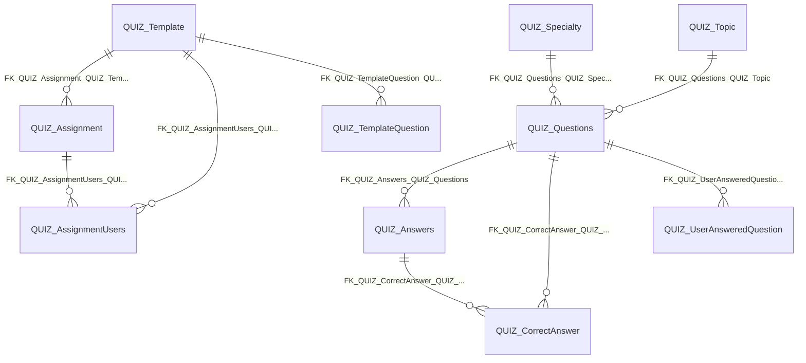

import TableDetail from '@site/src/components/TableDetail';

# Quizzes Database Tables

**25 tables** · **14 with PK** (56.0%) · **16 FKs** · **49 indexes**

## Entity Relationships

## Table Reference

<TableDetail
  tables={[{"name":"QUIZ_Answers","schema":"dbo","fullName":"dbo.QUIZ_Answers","hasPrimaryKey":true,"primaryKeyColumns":["AnswerID"],"foreignKeys":[{"constraintName":"FK_QUIZ_Answers_QUIZ_Questions","referencedTable":"QUIZ_Questions"}],"indexes":[{"name":"PK_QUIZ_Answers","type":"CLUSTERED","isPrimaryKey":true,"isUnique":true,"isDisabled":false,"keyColumns":["AnswerID"],"includedColumns":[]},{"name":"QUIZ_Answers_AnswerID","type":"NONCLUSTERED","isPrimaryKey":false,"isUnique":false,"isDisabled":false,"keyColumns":["AnswerID"],"includedColumns":[]},{"name":"QUIZ_Answers_QuestionID","type":"NONCLUSTERED","isPrimaryKey":false,"isUnique":false,"isDisabled":false,"keyColumns":["QuestionID"],"includedColumns":[]}],"checkConstraints":[],"defaultConstraints":2,"triggers":[]},{"name":"QUIZ_Assignment","schema":"dbo","fullName":"dbo.QUIZ_Assignment","hasPrimaryKey":true,"primaryKeyColumns":["AssignmentID"],"foreignKeys":[{"constraintName":"FK_QUIZ_Assignment_SEC_UserTypes","referencedTable":"SEC_UserTypes"},{"constraintName":"FK_QUIZ_Assignment_QUIZ_Template","referencedTable":"QUIZ_Template"},{"constraintName":"FK_QUIZ_Assignment_LA_LearningAssignments","referencedTable":"LA_LearningAssignments"},{"constraintName":"FK_QUIZ_Assignment_DH_DepartmentRotations","referencedTable":"DH_DepartmentRotations"},{"constraintName":"FK_QUIZ_Assignment_DH_ConferenceSchedules","referencedTable":"DH_ConferenceSchedules"}],"indexes":[{"name":"IDX_MissingOn_QUIZ_Assignment_92F56BC204ED47D38FB37B5C498F6EEF","type":"NONCLUSTERED","isPrimaryKey":false,"isUnique":false,"isDisabled":false,"keyColumns":["IsDeleted"],"includedColumns":["QuizID","NumberOfTimesRetakeAllowed","MaxTimeLimit"]},{"name":"IDX_Quiz_Assignment_Dates","type":"NONCLUSTERED","isPrimaryKey":false,"isUnique":false,"isDisabled":false,"keyColumns":["DueDate","AccessDate"],"includedColumns":[]},{"name":"idx_Quiz_Assignment_RAU","type":"NONCLUSTERED","isPrimaryKey":false,"isUnique":false,"isDisabled":false,"keyColumns":["DepartmentRotationID","AssignedBy","UserTypeID"],"includedColumns":[]},{"name":"IDX_Quiz_Assignment1","type":"NONCLUSTERED","isPrimaryKey":false,"isUnique":false,"isDisabled":false,"keyColumns":["QuizID"],"includedColumns":["AssignmentID","AccessDate","DueDate"]},{"name":"IX_QUIZ_Assignment_DepartmentConferenceScheduleID_AssignmentID","type":"NONCLUSTERED","isPrimaryKey":false,"isUnique":false,"isDisabled":false,"keyColumns":["DepartmentConferenceScheduleID"],"includedColumns":["AssignmentID"]},{"name":"IX_QUIZ_Assignment_LearningAssignmentID12","type":"NONCLUSTERED","isPrimaryKey":false,"isUnique":false,"isDisabled":false,"keyColumns":["LearningAssignmentID"],"includedColumns":["AssignmentID","QuizID"]},{"name":"IX_QUIZ_Assignment_NumberOfTimesRetakeAllowed","type":"NONCLUSTERED","isPrimaryKey":false,"isUnique":false,"isDisabled":false,"keyColumns":["NumberOfTimesRetakeAllowed"],"includedColumns":["AssignmentID"]},{"name":"NC_AssignedBy_DueDate","type":"NONCLUSTERED","isPrimaryKey":false,"isUnique":false,"isDisabled":false,"keyColumns":["AssignedBy","DueDate"],"includedColumns":[]},{"name":"PK_QUIZ_Assignment","type":"CLUSTERED","isPrimaryKey":true,"isUnique":true,"isDisabled":false,"keyColumns":["AssignmentID"],"includedColumns":[]}],"checkConstraints":[],"defaultConstraints":3,"triggers":[]},{"name":"QUIZ_AssignmentAccessUsersLog","schema":"dbo","fullName":"dbo.QUIZ_AssignmentAccessUsersLog","hasPrimaryKey":true,"primaryKeyColumns":["UserQuizAssignmentLogID"],"foreignKeys":[],"indexes":[{"name":"PK__QUIZ_Ass__72CB9B0B71E27237","type":"CLUSTERED","isPrimaryKey":true,"isUnique":true,"isDisabled":false,"keyColumns":["UserQuizAssignmentLogID"],"includedColumns":[]}],"checkConstraints":[],"defaultConstraints":0,"triggers":[]},{"name":"QUIZ_AssignmentUsers","schema":"dbo","fullName":"dbo.QUIZ_AssignmentUsers","hasPrimaryKey":true,"primaryKeyColumns":["UserAssignmentID"],"foreignKeys":[{"constraintName":"FK_QUIZ_AssignmentUsers_QUIZ_Assignment","referencedTable":"QUIZ_Assignment"},{"constraintName":"FK_QUIZ_AssignmentUsers_QUIZ_Template","referencedTable":"QUIZ_Template"}],"indexes":[{"name":"<Name of Missing Index, sysname,>","type":"NONCLUSTERED","isPrimaryKey":false,"isUnique":false,"isDisabled":false,"keyColumns":["UserID","CompletedDate","IsDeletedUserAssignment"],"includedColumns":[]},{"name":"IDX_MissingOn_QUIZ_AssignmentUsers_0D794FC073044C3A992E199F715B6E41","type":"NONCLUSTERED","isPrimaryKey":false,"isUnique":false,"isDisabled":false,"keyColumns":["IsDeletedUserAssignment"],"includedColumns":["AssignmentID","QuizID","UserID","CompletedDate","LastMailSentDate"]},{"name":"IDX_MissingOn_QUIZ_AssignmentUsers_71B0B6A080F94959A3B871E8E6DA2819","type":"NONCLUSTERED","isPrimaryKey":false,"isUnique":false,"isDisabled":false,"keyColumns":["CompletedDate"],"includedColumns":["AssignmentID","QuizID","UserID"]},{"name":"IDX_MissingOn_QUIZ_AssignmentUsers_A70EB6E8CDC14523B27BF99D20CCF672","type":"NONCLUSTERED","isPrimaryKey":false,"isUnique":false,"isDisabled":false,"keyColumns":["CompletedDate","IsDeletedUserAssignment","PartialCompletedDate"],"includedColumns":[]},{"name":"idx_Quiz_AssignmentUsers_As","type":"NONCLUSTERED","isPrimaryKey":false,"isUnique":false,"isDisabled":false,"keyColumns":["AssignmentID"],"includedColumns":[]},{"name":"IX_IsDeletedUserAssignment","type":"NONCLUSTERED","isPrimaryKey":false,"isUnique":false,"isDisabled":false,"keyColumns":["IsDeletedUserAssignment"],"includedColumns":["AssignmentID","UserID","CompletedDate","IsVoluntary","ReviewDate","DeletedBy","DeletedDate"]},{"name":"IX_QUIZ_AssignmentUsers_1","type":"NONCLUSTERED","isPrimaryKey":false,"isUnique":false,"isDisabled":false,"keyColumns":["IsDeletedUserAssignment","CompletedDate"],"includedColumns":["UserAssignmentID","AssignmentID","QuizID","UserID"]},{"name":"PK_QUIZ_AssignmentUsers","type":"CLUSTERED","isPrimaryKey":true,"isUnique":true,"isDisabled":false,"keyColumns":["UserAssignmentID"],"includedColumns":[]},{"name":"QUIZ_AssignmentUsers_CompletedDate_Include_QuizID_UserID","type":"NONCLUSTERED","isPrimaryKey":false,"isUnique":false,"isDisabled":false,"keyColumns":["CompletedDate"],"includedColumns":["QuizID","UserID"]},{"name":"QUIZ_AssignmentUsers_QuizID_CompletedDate_Include_UserAssignmentID_UserID","type":"NONCLUSTERED","isPrimaryKey":false,"isUnique":false,"isDisabled":false,"keyColumns":["QuizID","CompletedDate"],"includedColumns":["UserAssignmentID","UserID"]},{"name":"QUIZ_AssignmentUsers_UserID_IsDeleted_with_Assignment_Data_IDX","type":"NONCLUSTERED","isPrimaryKey":false,"isUnique":false,"isDisabled":false,"keyColumns":["UserID","IsDeletedUserAssignment"],"includedColumns":["AssignmentID","UserAssignmentID","QuizID"]}],"checkConstraints":[],"defaultConstraints":1,"triggers":[]},{"name":"Quiz_AssignmentUsersLog","schema":"dbo","fullName":"dbo.Quiz_AssignmentUsersLog","hasPrimaryKey":true,"primaryKeyColumns":["UserAssignmentLogID"],"foreignKeys":[],"indexes":[{"name":"PK_UserAssignmentLogID","type":"CLUSTERED","isPrimaryKey":true,"isUnique":true,"isDisabled":false,"keyColumns":["UserAssignmentLogID"],"includedColumns":[]}],"checkConstraints":[],"defaultConstraints":0,"triggers":[]},{"name":"QUIZ_AttemptedUserAnsweredQuestion","schema":"dbo","fullName":"dbo.QUIZ_AttemptedUserAnsweredQuestion","hasPrimaryKey":false,"primaryKeyColumns":[],"foreignKeys":[],"indexes":[{"name":"IX_QUIZ_AttemptedUserAnsweredQuestion_1","type":"NONCLUSTERED","isPrimaryKey":false,"isUnique":false,"isDisabled":false,"keyColumns":["UserAssignmentID"],"includedColumns":[]}],"checkConstraints":[],"defaultConstraints":2,"triggers":[]},{"name":"QUIZ_CorrectAnswer","schema":"dbo","fullName":"dbo.QUIZ_CorrectAnswer","hasPrimaryKey":true,"primaryKeyColumns":["QuestionID","AnswerID"],"foreignKeys":[{"constraintName":"FK_QUIZ_CorrectAnswer_QUIZ_Questions","referencedTable":"QUIZ_Questions"},{"constraintName":"FK_QUIZ_CorrectAnswer_QUIZ_Answers","referencedTable":"QUIZ_Answers"}],"indexes":[{"name":"PK_QUIZ_CorrectAnswer","type":"CLUSTERED","isPrimaryKey":true,"isUnique":true,"isDisabled":false,"keyColumns":["QuestionID","AnswerID"],"includedColumns":[]},{"name":"QUIZ_CorrectAnswer_QuestionID_Include_AnswerID","type":"NONCLUSTERED","isPrimaryKey":false,"isUnique":false,"isDisabled":false,"keyColumns":["QuestionID"],"includedColumns":["AnswerID"]}],"checkConstraints":[],"defaultConstraints":0,"triggers":[]},{"name":"QUIZ_EmailTemplate","schema":"dbo","fullName":"dbo.QUIZ_EmailTemplate","hasPrimaryKey":true,"primaryKeyColumns":["EmailTemplateID"],"foreignKeys":[],"indexes":[{"name":"PK_QUIZ_EmailTemplate","type":"CLUSTERED","isPrimaryKey":true,"isUnique":true,"isDisabled":false,"keyColumns":["EmailTemplateID"],"includedColumns":[]}],"checkConstraints":[],"defaultConstraints":0,"triggers":[]},{"name":"QUIZ_QuestionAnswersBase","schema":"dbo","fullName":"dbo.QUIZ_QuestionAnswersBase","hasPrimaryKey":false,"primaryKeyColumns":[],"foreignKeys":[],"indexes":[],"checkConstraints":[],"defaultConstraints":0,"triggers":[]},{"name":"QUIZ_QuestionRotationFrequency","schema":"dbo","fullName":"dbo.QUIZ_QuestionRotationFrequency","hasPrimaryKey":true,"primaryKeyColumns":["FrequencySysID"],"foreignKeys":[],"indexes":[{"name":"PK_QUIZ_QuestionRotationFrequency","type":"CLUSTERED","isPrimaryKey":true,"isUnique":true,"isDisabled":false,"keyColumns":["FrequencySysID"],"includedColumns":[]}],"checkConstraints":[],"defaultConstraints":3,"triggers":[]},{"name":"QUIZ_Questions","schema":"dbo","fullName":"dbo.QUIZ_Questions","hasPrimaryKey":true,"primaryKeyColumns":["QuestionID"],"foreignKeys":[{"constraintName":"FK_QUIZ_Questions_QUIZ_Specialty","referencedTable":"QUIZ_Specialty"},{"constraintName":"FK_QUIZ_Questions_QUIZ_Topic","referencedTable":"QUIZ_Topic"}],"indexes":[{"name":"IDX_MissingOn_QUIZ_Questions_A675697CFAAF44BE998E9D292AFF7602","type":"NONCLUSTERED","isPrimaryKey":false,"isUnique":false,"isDisabled":false,"keyColumns":["IsDeleted"],"includedColumns":["SpecialtyID"]},{"name":"IDX_QUIZ_Questions1","type":"NONCLUSTERED","isPrimaryKey":false,"isUnique":false,"isDisabled":false,"keyColumns":["DepartmentID"],"includedColumns":[]},{"name":"PK_Quiz_Questions","type":"CLUSTERED","isPrimaryKey":true,"isUnique":true,"isDisabled":false,"keyColumns":["QuestionID"],"includedColumns":[]}],"checkConstraints":[],"defaultConstraints":4,"triggers":[]},{"name":"QUIZ_QuestionsBase","schema":"dbo","fullName":"dbo.QUIZ_QuestionsBase","hasPrimaryKey":false,"primaryKeyColumns":[],"foreignKeys":[],"indexes":[],"checkConstraints":[],"defaultConstraints":3,"triggers":[]},{"name":"QUIZ_ReviewQuizDatabase","schema":"dbo","fullName":"dbo.QUIZ_ReviewQuizDatabase","hasPrimaryKey":false,"primaryKeyColumns":[],"foreignKeys":[],"indexes":[],"checkConstraints":[],"defaultConstraints":2,"triggers":[]},{"name":"QUIZ_Specialty","schema":"dbo","fullName":"dbo.QUIZ_Specialty","hasPrimaryKey":true,"primaryKeyColumns":["QuizSpecialtyID"],"foreignKeys":[],"indexes":[{"name":"PK_Quiz_Specialty","type":"CLUSTERED","isPrimaryKey":true,"isUnique":true,"isDisabled":false,"keyColumns":["QuizSpecialtyID"],"includedColumns":[]}],"checkConstraints":[],"defaultConstraints":1,"triggers":[]},{"name":"QUIZ_SpecialtyBase","schema":"dbo","fullName":"dbo.QUIZ_SpecialtyBase","hasPrimaryKey":false,"primaryKeyColumns":[],"foreignKeys":[],"indexes":[],"checkConstraints":[],"defaultConstraints":0,"triggers":[]},{"name":"QUIZ_TempGenerateSpecialtyID","schema":"dbo","fullName":"dbo.QUIZ_TempGenerateSpecialtyID","hasPrimaryKey":false,"primaryKeyColumns":[],"foreignKeys":[],"indexes":[],"checkConstraints":[],"defaultConstraints":0,"triggers":[]},{"name":"QUIZ_Template","schema":"dbo","fullName":"dbo.QUIZ_Template","hasPrimaryKey":true,"primaryKeyColumns":["QuizID"],"foreignKeys":[],"indexes":[{"name":"idx_Quiz_Template_QDI","type":"NONCLUSTERED","isPrimaryKey":false,"isUnique":false,"isDisabled":false,"keyColumns":["IsDeleted","QuizID","DepartmentID"],"includedColumns":[]},{"name":"IDX_QUIZ_Template1","type":"NONCLUSTERED","isPrimaryKey":false,"isUnique":false,"isDisabled":false,"keyColumns":["DepartmentID","PublishedDate"],"includedColumns":[]},{"name":"PK_QUIZ_Template","type":"CLUSTERED","isPrimaryKey":true,"isUnique":true,"isDisabled":false,"keyColumns":["QuizID"],"includedColumns":[]}],"checkConstraints":[],"defaultConstraints":3,"triggers":[]},{"name":"QUIZ_TemplateQuestion","schema":"dbo","fullName":"dbo.QUIZ_TemplateQuestion","hasPrimaryKey":true,"primaryKeyColumns":["QuestionOrderID"],"foreignKeys":[{"constraintName":"FK_QUIZ_TemplateQuestion_QUIZ_Template","referencedTable":"QUIZ_Template"}],"indexes":[{"name":"IX_QUIZ_TemplateQuestion_1","type":"NONCLUSTERED","isPrimaryKey":false,"isUnique":false,"isDisabled":false,"keyColumns":["QuestionID"],"includedColumns":["QuizID"]},{"name":"IX_QUIZ_TemplateQuestion_2","type":"NONCLUSTERED","isPrimaryKey":false,"isUnique":false,"isDisabled":false,"keyColumns":["QuizID"],"includedColumns":["QuestionID"]},{"name":"PK_QUIZ_TemplateQuestion","type":"CLUSTERED","isPrimaryKey":true,"isUnique":true,"isDisabled":false,"keyColumns":["QuestionOrderID"],"includedColumns":[]}],"checkConstraints":[],"defaultConstraints":0,"triggers":[]},{"name":"Quiz_TempSummaryQuizReport","schema":"dbo","fullName":"dbo.Quiz_TempSummaryQuizReport","hasPrimaryKey":false,"primaryKeyColumns":[],"foreignKeys":[],"indexes":[{"name":"IDX_Quiz_TempSummaryQuizReport_SRUC","type":"NONCLUSTERED","isPrimaryKey":false,"isUnique":false,"isDisabled":false,"keyColumns":["SessionId","DepartmentRotationID","UserId","CompletedDate"],"includedColumns":[]}],"checkConstraints":[],"defaultConstraints":0,"triggers":[]},{"name":"QUIZ_TestQuestions","schema":"dbo","fullName":"dbo.QUIZ_TestQuestions","hasPrimaryKey":false,"primaryKeyColumns":[],"foreignKeys":[],"indexes":[],"checkConstraints":[],"defaultConstraints":0,"triggers":[]},{"name":"Quiz_TimeLimit","schema":"dbo","fullName":"dbo.Quiz_TimeLimit","hasPrimaryKey":true,"primaryKeyColumns":["TimeLimitID"],"foreignKeys":[],"indexes":[{"name":"PK__Quiz_Tim__9052245D2C378854","type":"CLUSTERED","isPrimaryKey":true,"isUnique":true,"isDisabled":false,"keyColumns":["TimeLimitID"],"includedColumns":[]}],"checkConstraints":[],"defaultConstraints":0,"triggers":[]},{"name":"QUIZ_Topic","schema":"dbo","fullName":"dbo.QUIZ_Topic","hasPrimaryKey":true,"primaryKeyColumns":["TopicID"],"foreignKeys":[{"constraintName":"FK_QUIZ_Topic_SEC_Departments","referencedTable":"SEC_Departments"}],"indexes":[{"name":"PK_Quiz_Topic","type":"CLUSTERED","isPrimaryKey":true,"isUnique":true,"isDisabled":false,"keyColumns":["TopicID"],"includedColumns":[]}],"checkConstraints":[],"defaultConstraints":1,"triggers":[]},{"name":"QUIZ_TopicBase","schema":"dbo","fullName":"dbo.QUIZ_TopicBase","hasPrimaryKey":false,"primaryKeyColumns":[],"foreignKeys":[],"indexes":[],"checkConstraints":[],"defaultConstraints":0,"triggers":[]},{"name":"QUIZ_UserAnsweredQuestion","schema":"dbo","fullName":"dbo.QUIZ_UserAnsweredQuestion","hasPrimaryKey":false,"primaryKeyColumns":[],"foreignKeys":[{"constraintName":"FK_QUIZ_UserAnsweredQuestion_SEC_Users","referencedTable":"SEC_Users"},{"constraintName":"FK_QUIZ_UserAnsweredQuestion_QUIZ_Questions","referencedTable":"QUIZ_Questions"}],"indexes":[{"name":"IDX_MissingOn_QUIZ_UserAnsweredQuestion_25F7C126A1F74AB7A47CFEA22459C3DF","type":"NONCLUSTERED","isPrimaryKey":false,"isUnique":false,"isDisabled":false,"keyColumns":["UserID","UserAssignmentID"],"includedColumns":[]},{"name":"IDX_MissingOn_QUIZ_UserAnsweredQuestion_890FC1E9C16143E9B1EA116B4D2F7F93","type":"NONCLUSTERED","isPrimaryKey":false,"isUnique":false,"isDisabled":false,"keyColumns":["UserAssignmentID"],"includedColumns":["QuestionID","AnswerID","AnswerOrder"]},{"name":"IDX_MissingOn_QUIZ_UserAnsweredQuestion_C91358DA149A45B8B9283249E8FE26F9","type":"NONCLUSTERED","isPrimaryKey":false,"isUnique":false,"isDisabled":false,"keyColumns":["UserID"],"includedColumns":[]},{"name":"IX_QUIZ_UserAnsweredQuestion_1","type":"NONCLUSTERED","isPrimaryKey":false,"isUnique":false,"isDisabled":false,"keyColumns":["QuestionID"],"includedColumns":[]},{"name":"Quiz_UserAnsweredQuestion_UserAssignmentID","type":"NONCLUSTERED","isPrimaryKey":false,"isUnique":false,"isDisabled":false,"keyColumns":["UserAssignmentID"],"includedColumns":["QuestionID","AnswerID"]}],"checkConstraints":[],"defaultConstraints":2,"triggers":[]},{"name":"QUIZ_UserAnsweredQuestionsLOG","schema":"dbo","fullName":"dbo.QUIZ_UserAnsweredQuestionsLOG","hasPrimaryKey":false,"primaryKeyColumns":[],"foreignKeys":[],"indexes":[{"name":"IDX_QUIZ_UserAnsweredQuestionsLOG1","type":"NONCLUSTERED","isPrimaryKey":false,"isUnique":false,"isDisabled":false,"keyColumns":["UserAssignmentID"],"includedColumns":[]}],"checkConstraints":[],"defaultConstraints":0,"triggers":[]}]}
  generatedAt="2026-02-27T00:56:56.204Z"
/>
