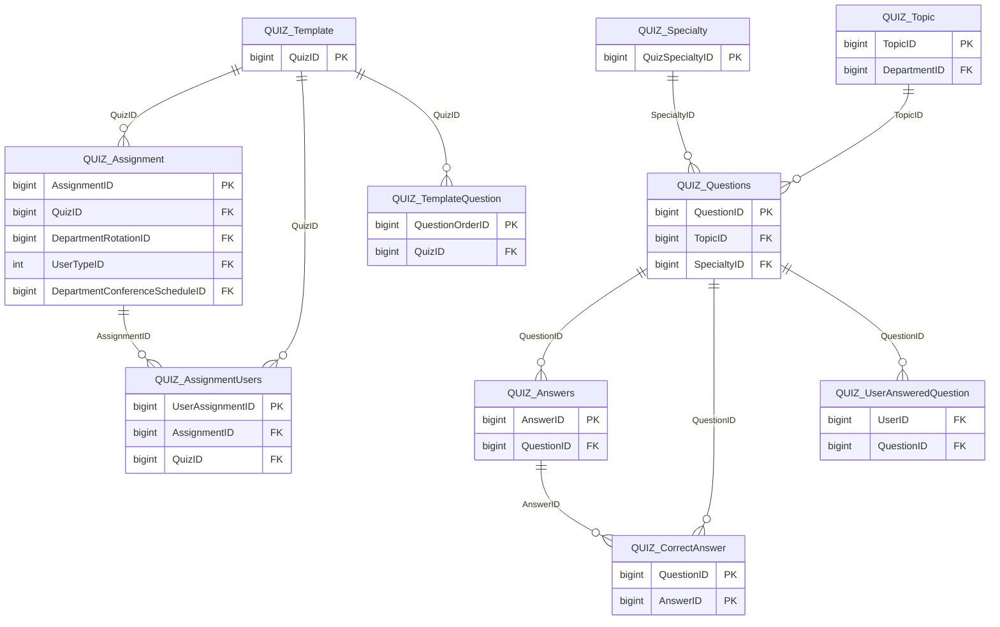

import TableDetail from '@site/src/components/TableDetail';

# Quizzes Database Tables

**25 tables** · **14 with PK** (56.0%) · **16 FKs** · **49 indexes**

## Entity Relationships

## Table Reference

<TableDetail
  dataUrl="/table-detail-data/quizzes.json"
  generatedAt="2026-02-28T06:03:57.118Z"
/>

## Stored Procedures

See the [Quizzes Stored Procedures](./sprocs/quizzes-sprocs) reference page for detailed documentation of all stored procedures in this module, including parameters, anti-pattern analysis, and optimization recommendations.

## Related Code Documentation

- [Quiz (.NET Business Module)](/docs/dotnet-backend/business/quiz)
