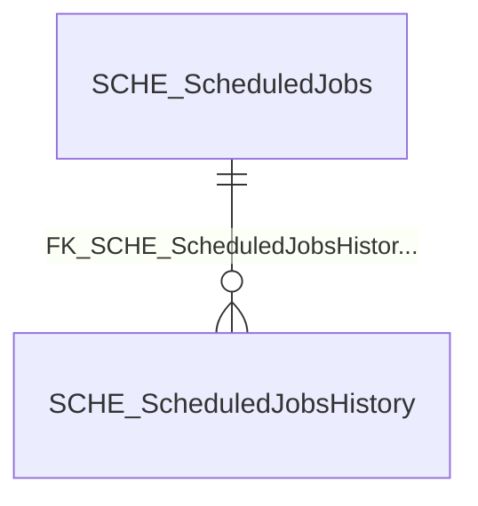

import TableDetail from '@site/src/components/TableDetail';

# Scheduling Database Tables

**19 tables** · **8 with PK** (42.1%) · **6 FKs** · **25 indexes**

## Entity Relationships

## Table Reference

<TableDetail
  tables={[{"name":"SCHE_ApplicationEmailSchedules","schema":"dbo","fullName":"dbo.SCHE_ApplicationEmailSchedules","hasPrimaryKey":true,"primaryKeyColumns":["ApplicationEmailScheduleID"],"foreignKeys":[{"constraintName":"FK_SCHE_ApplicationEmailSchedules_SEC_Departments","referencedTable":"SEC_Departments"}],"indexes":[{"name":"IDX_SCHE_ApplicationEmailSchedules1","type":"NONCLUSTERED","isPrimaryKey":false,"isUnique":false,"isDisabled":false,"keyColumns":["UserID"],"includedColumns":[]},{"name":"IDX_SCHE_ApplicationEmailSchedules2","type":"NONCLUSTERED","isPrimaryKey":false,"isUnique":false,"isDisabled":false,"keyColumns":["IsMailSent"],"includedColumns":["CreatedDateTime"]},{"name":"PK_SCHE_ApplicationEmailSchedules","type":"CLUSTERED","isPrimaryKey":true,"isUnique":true,"isDisabled":false,"keyColumns":["ApplicationEmailScheduleID"],"includedColumns":[]},{"name":"SCHE_ApplicationEmailSchedules_IsMailSent","type":"NONCLUSTERED","isPrimaryKey":false,"isUnique":false,"isDisabled":false,"keyColumns":["IsMailSent"],"includedColumns":[]}],"checkConstraints":[],"defaultConstraints":1,"triggers":[]},{"name":"SCHE_ApplicationEmailSchedules_TempInsertData","schema":"dbo","fullName":"dbo.SCHE_ApplicationEmailSchedules_TempInsertData","hasPrimaryKey":false,"primaryKeyColumns":[],"foreignKeys":[],"indexes":[],"checkConstraints":[],"defaultConstraints":1,"triggers":[]},{"name":"SCHE_ApplicationEmailSchedules20251024","schema":"dbo","fullName":"dbo.SCHE_ApplicationEmailSchedules20251024","hasPrimaryKey":false,"primaryKeyColumns":[],"foreignKeys":[],"indexes":[],"checkConstraints":[],"defaultConstraints":0,"triggers":[]},{"name":"SCHE_ApplicationEmailSchedulesTemp","schema":"dbo","fullName":"dbo.SCHE_ApplicationEmailSchedulesTemp","hasPrimaryKey":false,"primaryKeyColumns":[],"foreignKeys":[],"indexes":[],"checkConstraints":[],"defaultConstraints":0,"triggers":[]},{"name":"SCHE_ArchivedUserMailQueue","schema":"dbo","fullName":"dbo.SCHE_ArchivedUserMailQueue","hasPrimaryKey":false,"primaryKeyColumns":[],"foreignKeys":[],"indexes":[{"name":"IDX_MissingOn_SCHE_ArchivedUserMailQueue_84BAC06979554ABB9FA9A25FE24114ED","type":"NONCLUSTERED","isPrimaryKey":false,"isUnique":false,"isDisabled":false,"keyColumns":["ArchivedUserID","ArchiveQueueID"],"includedColumns":[]}],"checkConstraints":[],"defaultConstraints":0,"triggers":[]},{"name":"SCHE_ArchivePromotionEventLog","schema":"dbo","fullName":"dbo.SCHE_ArchivePromotionEventLog","hasPrimaryKey":false,"primaryKeyColumns":[],"foreignKeys":[],"indexes":[],"checkConstraints":[],"defaultConstraints":0,"triggers":[]},{"name":"SCHE_ArchiveQueueUsers","schema":"dbo","fullName":"dbo.SCHE_ArchiveQueueUsers","hasPrimaryKey":false,"primaryKeyColumns":[],"foreignKeys":[],"indexes":[{"name":"IDX_MissingOn_SCHE_ArchiveQueueUsers_A15921A1554245B4ABFBBB2A5D1F8C36","type":"NONCLUSTERED","isPrimaryKey":false,"isUnique":false,"isDisabled":false,"keyColumns":["Status","IsArchived"],"includedColumns":["ArchiveQueueID","UserID"]},{"name":"IX1_SCHE_ArchiveQueueUsers","type":"NONCLUSTERED","isPrimaryKey":false,"isUnique":true,"isDisabled":false,"keyColumns":["UserID","ArchiveQueueID","LastUpdatedDateTime"],"includedColumns":[]}],"checkConstraints":[],"defaultConstraints":3,"triggers":[]},{"name":"SCHE_ArchiveScheduleQueue","schema":"dbo","fullName":"dbo.SCHE_ArchiveScheduleQueue","hasPrimaryKey":false,"primaryKeyColumns":[],"foreignKeys":[],"indexes":[{"name":"IDX_MissingOn_SCHE_ArchiveScheduleQueue_4381CB8A9DB3498EB9C4D87EDB96D5DD","type":"NONCLUSTERED","isPrimaryKey":false,"isUnique":false,"isDisabled":false,"keyColumns":["ArchiveQueueID"],"includedColumns":[]},{"name":"IDX_MissingOn_SCHE_ArchiveScheduleQueue_75AF9C9B49C44990918C959D477EEC22","type":"NONCLUSTERED","isPrimaryKey":false,"isUnique":false,"isDisabled":false,"keyColumns":["ArchiveQueueID","ArchivedByUserID"],"includedColumns":[]},{"name":"IDX_MissingOn_SCHE_ArchiveScheduleQueue_9735DCB6749143389EBEA873A957C45C","type":"NONCLUSTERED","isPrimaryKey":false,"isUnique":false,"isDisabled":false,"keyColumns":["ArchiveQueueID"],"includedColumns":["ArchivedByUserID"]},{"name":"IDX_MissingOn_SCHE_ArchiveScheduleQueue_B2B2C5D98D754CF59CBAE21B21A2C115","type":"NONCLUSTERED","isPrimaryKey":false,"isUnique":false,"isDisabled":false,"keyColumns":["ArchiveQueueID"],"includedColumns":["ArchivedByUserID","DepartmentID","LoggedInUserID"]}],"checkConstraints":[],"defaultConstraints":2,"triggers":[]},{"name":"SCHE_ManualAssignments","schema":"dbo","fullName":"dbo.SCHE_ManualAssignments","hasPrimaryKey":true,"primaryKeyColumns":["ManualAssignmentID"],"foreignKeys":[],"indexes":[{"name":"PK__SCHE_Man__C8A8FA4C116DB828","type":"CLUSTERED","isPrimaryKey":true,"isUnique":true,"isDisabled":false,"keyColumns":["ManualAssignmentID"],"includedColumns":[]}],"checkConstraints":[],"defaultConstraints":0,"triggers":[]},{"name":"SCHE_ManualAssignmentsHistory","schema":"dbo","fullName":"dbo.SCHE_ManualAssignmentsHistory","hasPrimaryKey":true,"primaryKeyColumns":["ManualAssignmentHistoryID"],"foreignKeys":[{"constraintName":"SCHE_ManualAssignments_SCHE_ManualAssignmentsHistory_FK1","referencedTable":"SCHE_ManualAssignments_SCHE_ManualAssignmentsHistory"}],"indexes":[{"name":"PK__SCHE_Man__5056EFA516326D45","type":"CLUSTERED","isPrimaryKey":true,"isUnique":true,"isDisabled":false,"keyColumns":["ManualAssignmentHistoryID"],"includedColumns":[]}],"checkConstraints":[],"defaultConstraints":0,"triggers":[]},{"name":"SCHE_MilestoneJobsHistory","schema":"dbo","fullName":"dbo.SCHE_MilestoneJobsHistory","hasPrimaryKey":false,"primaryKeyColumns":[],"foreignKeys":[{"constraintName":"FK__SCHE_Mile__LogIn__21EFF8CE","referencedTable":"(system-named)"}],"indexes":[{"name":"IDX_SCHE_MilestoneJobsHistory1","type":"NONCLUSTERED","isPrimaryKey":false,"isUnique":false,"isDisabled":false,"keyColumns":["ScheduledJobsHistoryID"],"includedColumns":["LogInfo"]}],"checkConstraints":[],"defaultConstraints":0,"triggers":[]},{"name":"SCHE_PromotedUserMailQueue","schema":"dbo","fullName":"dbo.SCHE_PromotedUserMailQueue","hasPrimaryKey":false,"primaryKeyColumns":[],"foreignKeys":[],"indexes":[{"name":"IDX_SCHE_PromotedUserMailQueue_PromotedUserID","type":"NONCLUSTERED","isPrimaryKey":false,"isUnique":false,"isDisabled":false,"keyColumns":["PromotedUserID"],"includedColumns":[]}],"checkConstraints":[],"defaultConstraints":0,"triggers":[]},{"name":"SCHE_PromotionQueueUsers","schema":"dbo","fullName":"dbo.SCHE_PromotionQueueUsers","hasPrimaryKey":false,"primaryKeyColumns":[],"foreignKeys":[{"constraintName":"SCHE_PromotionQueueUsers_SEC_UserTypes_FK1","referencedTable":"SEC_UserTypes_FK1"},{"constraintName":"SCHE_PromotionQueueUsers_SEC_Specialty_FK1","referencedTable":"SEC_Specialty_FK1"}],"indexes":[{"name":"IDX_MissingOn_SCHE_PromotionQueueUsers_5A3B925B14554428BD918168AB770C2A","type":"NONCLUSTERED","isPrimaryKey":false,"isUnique":false,"isDisabled":false,"keyColumns":["QueueID","UserID"],"includedColumns":["TargetDepartmentID"]},{"name":"IDX_MissingOn_SCHE_PromotionQueueUsers_DA2879B2F110492CB45AC434CB198CAD","type":"NONCLUSTERED","isPrimaryKey":false,"isUnique":false,"isDisabled":false,"keyColumns":["QueueID","UserID"],"includedColumns":[]},{"name":"IDX_MissingOn_SCHE_PromotionQueueUsers_E1D7B40307484C14AF8A2F49E550651A","type":"NONCLUSTERED","isPrimaryKey":false,"isUnique":false,"isDisabled":false,"keyColumns":["QueueID","UserID"],"includedColumns":["SourceRoleID"]}],"checkConstraints":[],"defaultConstraints":3,"triggers":[]},{"name":"SCHE_PromotionScheduleQueue","schema":"dbo","fullName":"dbo.SCHE_PromotionScheduleQueue","hasPrimaryKey":false,"primaryKeyColumns":[],"foreignKeys":[],"indexes":[{"name":"IDX_MissingOn_SCHE_PromotionScheduleQueue_750D02D7D9674EC78C0F94DA4DF163CA","type":"NONCLUSTERED","isPrimaryKey":false,"isUnique":false,"isDisabled":false,"keyColumns":["QueueID"],"includedColumns":[]}],"checkConstraints":[],"defaultConstraints":1,"triggers":[]},{"name":"SCHE_ScheduledJobs","schema":"dbo","fullName":"dbo.SCHE_ScheduledJobs","hasPrimaryKey":true,"primaryKeyColumns":["ScheduledJobID"],"foreignKeys":[],"indexes":[{"name":"PK_SCHE_ScheduledJobs","type":"CLUSTERED","isPrimaryKey":true,"isUnique":true,"isDisabled":false,"keyColumns":["ScheduledJobID"],"includedColumns":[]}],"checkConstraints":[],"defaultConstraints":0,"triggers":[]},{"name":"SCHE_ScheduledJobsHistory","schema":"dbo","fullName":"dbo.SCHE_ScheduledJobsHistory","hasPrimaryKey":true,"primaryKeyColumns":["ScheduledJobsHistoryID"],"foreignKeys":[{"constraintName":"FK_SCHE_ScheduledJobsHistory_SCHE_ScheduledJobs","referencedTable":"SCHE_ScheduledJobs"}],"indexes":[{"name":"IX_SCHE_ScheduledJobsHistory1","type":"NONCLUSTERED","isPrimaryKey":false,"isUnique":false,"isDisabled":false,"keyColumns":["ScheduledJobID"],"includedColumns":["ScheduledJobsHistoryID","StartDate","EndDate"]},{"name":"PK_SCHE_ScheduledJobsHistory","type":"CLUSTERED","isPrimaryKey":true,"isUnique":true,"isDisabled":false,"keyColumns":["ScheduledJobsHistoryID"],"includedColumns":[]}],"checkConstraints":[],"defaultConstraints":0,"triggers":[]},{"name":"SCHE_TranformationTableColumns","schema":"dbo","fullName":"dbo.SCHE_TranformationTableColumns","hasPrimaryKey":true,"primaryKeyColumns":["TableColumnID"],"foreignKeys":[],"indexes":[{"name":"PK_SCHE_TranformationTableColumns","type":"CLUSTERED","isPrimaryKey":true,"isUnique":true,"isDisabled":false,"keyColumns":["TableColumnID"],"includedColumns":[]}],"checkConstraints":[],"defaultConstraints":3,"triggers":[]},{"name":"SCHE_TranformationTableMapping","schema":"dbo","fullName":"dbo.SCHE_TranformationTableMapping","hasPrimaryKey":true,"primaryKeyColumns":["MappingId"],"foreignKeys":[],"indexes":[{"name":"PK_SCHE_TranformationTableMapping","type":"CLUSTERED","isPrimaryKey":true,"isUnique":true,"isDisabled":false,"keyColumns":["MappingId"],"includedColumns":[]}],"checkConstraints":[],"defaultConstraints":4,"triggers":[]},{"name":"SCHE_UserArchiveSchedule","schema":"dbo","fullName":"dbo.SCHE_UserArchiveSchedule","hasPrimaryKey":true,"primaryKeyColumns":["UserArchiveScheduleID"],"foreignKeys":[],"indexes":[{"name":"PK_UserArchiveScheduleID","type":"CLUSTERED","isPrimaryKey":true,"isUnique":true,"isDisabled":false,"keyColumns":["UserArchiveScheduleID"],"includedColumns":[]}],"checkConstraints":[],"defaultConstraints":1,"triggers":[]}]}
  generatedAt="2026-02-27T00:56:56.204Z"
/>
