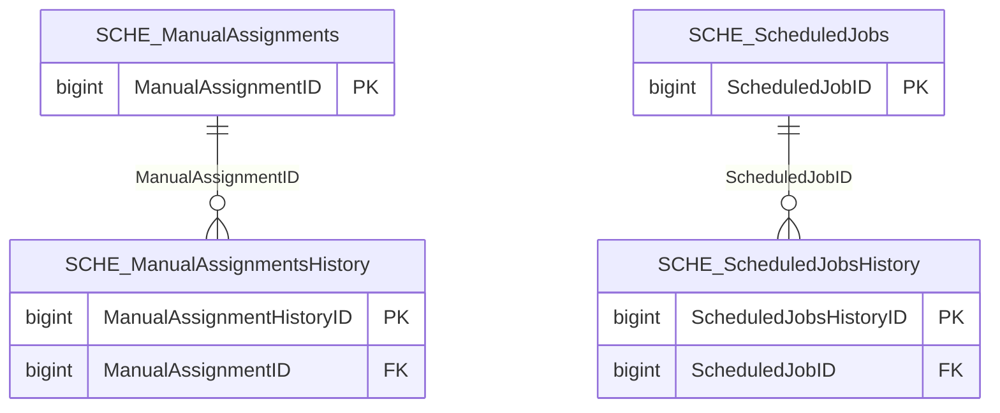

import TableDetail from '@site/src/components/TableDetail';

# Scheduling Database Tables

**19 tables** · **8 with PK** (42.1%) · **5 FKs** · **25 indexes**

## Entity Relationships

## Table Reference

<TableDetail
  dataUrl="/table-detail-data/scheduling.json"
  generatedAt="2026-02-28T06:03:57.118Z"
/>

## Stored Procedures

See the [Scheduling Stored Procedures](./sprocs/scheduling-sprocs) reference page for detailed documentation of all stored procedures in this module, including parameters, anti-pattern analysis, and optimization recommendations.

## Related Code Documentation

- [Common (.NET Business Module)](/docs/dotnet-backend/business/common)
