import TableDetail from '@site/src/components/TableDetail';

# Security Database Tables

**346 tables** · **264 with PK** (76.3%) · **169 FKs** · **726 indexes**

## Entity Relationships

```mermaid
erDiagram
    SEC_Source ||--o{ SEC_DepartmentInstitution : "FK_SEC_DepartmentInstitutio..."
    SEC_Departments ||--o{ SEC_DepartmentInstitution : "FK_SEC_DepartmentInstitutio..."
    SEC_MedSchools ||--o{ SEC_Departments : "FK_SEC_Departments_SEC_MedS..."
    SEC_Countries ||--o{ SEC_Departments : "FK_SEC_Departments_SEC_Coun..."
    SEC_ImportTemplate ||--o{ SEC_ImportAliasNames : "FK_SEC_ImportAliasNames_SEC..."
    SEC_ImportFields ||--o{ SEC_ImportAliasNames : "FK_SEC_ImportAliasNames_SEC..."
    SEC_ImportTemplate ||--o{ SEC_ImportFields : "FK_SEC_ImportFields_SEC_Imp..."
    SEC_Institutions ||--o{ SEC_ManageFieldsDetails : "FK_SEC_ManageFieldsDetails_..."
    SEC_Institutions ||--o{ SEC_Source : "FK_SEC_Source_SEC_Institutions"
    SEC_Users ||--o{ SEC_SupportQuery : "FK_SEC_SupportQuery_SEC_Users"
    SEC_Users ||--o{ SEC_UserCertificateReqStatus : "FK_SEC_UserCertificateReqSt..."
    SEC_Users ||--o{ SEC_UserDependent : "FK_SEC_UserDependent_SEC_Users"
    SEC_Users ||--o{ SEC_UserTrainingAgreement : "FK_SEC_UserTrainingAgreemen..."
    SEC_Users ||--o{ SEC_UserTrainingGapHistory : "FK_SEC_UserTrainingGapHisto..."
    SEC_Users ||--o{ SEC_UserTrainingHistory : "FK_SEC_UserTrainingHistory_..."
    SEC_Institutions ||--o{ SEC_UserTrainingHistory : "FK_SEC_UserTrainingHistory_..."
    SEC_Users ||--o{ SEC_UserUniformInventory : "FK_SEC_UserUniformInventory..."
```

## Table Reference

<TableDetail
  tables={[{"name":"SEC_AccessHistory","schema":"dbo","fullName":"dbo.SEC_AccessHistory","hasPrimaryKey":true,"primaryKeyColumns":["AccessHistoryID"],"foreignKeys":[],"indexes":[{"name":"PK__SEC_Acce__0FB4C3135553BF33","type":"CLUSTERED","isPrimaryKey":true,"isUnique":true,"isDisabled":false,"keyColumns":["AccessHistoryID"],"includedColumns":[]}],"checkConstraints":[],"defaultConstraints":1,"triggers":[]},{"name":"SEC_AccessHistoryEntities","schema":"dbo","fullName":"dbo.SEC_AccessHistoryEntities","hasPrimaryKey":true,"primaryKeyColumns":["EntityID"],"foreignKeys":[{"constraintName":"FK__SEC_Acces__Event__5EDD296D","referencedTable":"(system-named)"}],"indexes":[{"name":"PK__SEC_Acce__9C892FFD5CF4E0FB","type":"CLUSTERED","isPrimaryKey":true,"isUnique":true,"isDisabled":false,"keyColumns":["EntityID"],"includedColumns":[]}],"checkConstraints":[],"defaultConstraints":0,"triggers":[]},{"name":"SEC_AccessHistoryEventTypes","schema":"dbo","fullName":"dbo.SEC_AccessHistoryEventTypes","hasPrimaryKey":true,"primaryKeyColumns":["EventTypeID"],"foreignKeys":[],"indexes":[{"name":"PK__SEC_Acce__A9216B1F59245017","type":"CLUSTERED","isPrimaryKey":true,"isUnique":true,"isDisabled":false,"keyColumns":["EventTypeID"],"includedColumns":[]}],"checkConstraints":[],"defaultConstraints":0,"triggers":[]},{"name":"SEC_AccessHistoryForMultipleAUD","schema":"dbo","fullName":"dbo.SEC_AccessHistoryForMultipleAUD","hasPrimaryKey":false,"primaryKeyColumns":[],"foreignKeys":[],"indexes":[],"checkConstraints":[],"defaultConstraints":0,"triggers":[]},{"name":"SEC_AccessHistoryTemp","schema":"dbo","fullName":"dbo.SEC_AccessHistoryTemp","hasPrimaryKey":true,"primaryKeyColumns":["AccessHistoryTempID"],"foreignKeys":[],"indexes":[{"name":"PK__SEC_Acce__934525EF62ADBA51","type":"CLUSTERED","isPrimaryKey":true,"isUnique":true,"isDisabled":false,"keyColumns":["AccessHistoryTempID"],"includedColumns":[]}],"checkConstraints":[],"defaultConstraints":1,"triggers":[]},{"name":"SEC_AccountLockoutDetails","schema":"dbo","fullName":"dbo.SEC_AccountLockoutDetails","hasPrimaryKey":true,"primaryKeyColumns":["AccountLockDetailsID"],"foreignKeys":[],"indexes":[{"name":"IDX_MissingOn_SEC_AccountLockoutDetails_52D21C1523F645D18746470A05EA0E1D","type":"NONCLUSTERED","isPrimaryKey":false,"isUnique":false,"isDisabled":false,"keyColumns":["UserID","UserHostAddress","IsLockedRelease"],"includedColumns":[]},{"name":"PK_SEC_AccountLockoutDetails","type":"CLUSTERED","isPrimaryKey":true,"isUnique":true,"isDisabled":false,"keyColumns":["AccountLockDetailsID"],"includedColumns":[]}],"checkConstraints":[],"defaultConstraints":1,"triggers":[]},{"name":"SEC_AdminAccountLockoutDetails","schema":"dbo","fullName":"dbo.SEC_AdminAccountLockoutDetails","hasPrimaryKey":true,"primaryKeyColumns":["AccountLockDetailsID"],"foreignKeys":[],"indexes":[{"name":"PK_SEC_AdminAccountLockoutDetails","type":"CLUSTERED","isPrimaryKey":true,"isUnique":true,"isDisabled":false,"keyColumns":["AccountLockDetailsID"],"includedColumns":[]}],"checkConstraints":[],"defaultConstraints":1,"triggers":[]},{"name":"SEC_AINPVResponses","schema":"dbo","fullName":"dbo.SEC_AINPVResponses","hasPrimaryKey":true,"primaryKeyColumns":["ID"],"foreignKeys":[{"constraintName":"FK__SEC_AINPV__NPVSc__202778F0","referencedTable":"(system-named)"}],"indexes":[{"name":"IX_SEC_AINPVResponses1","type":"NONCLUSTERED","isPrimaryKey":false,"isUnique":false,"isDisabled":false,"keyColumns":["NPVScheduleHistoryID"],"includedColumns":[]},{"name":"IX_SEC_AINPVResponses2","type":"NONCLUSTERED","isPrimaryKey":false,"isUnique":false,"isDisabled":false,"keyColumns":["DepartmentID"],"includedColumns":[]},{"name":"PK__SEC_AINP__3214EC272B81AEF3","type":"CLUSTERED","isPrimaryKey":true,"isUnique":true,"isDisabled":false,"keyColumns":["ID"],"includedColumns":[]}],"checkConstraints":[],"defaultConstraints":1,"triggers":[]},{"name":"SEC_AIResponses","schema":"dbo","fullName":"dbo.SEC_AIResponses","hasPrimaryKey":true,"primaryKeyColumns":["AIResponseID"],"foreignKeys":[],"indexes":[{"name":"IDX_SEC_AIResponses_User_Department","type":"NONCLUSTERED","isPrimaryKey":false,"isUnique":false,"isDisabled":false,"keyColumns":["UserID","DepartmentID"],"includedColumns":[]},{"name":"IDX_SEC_AIResponses1","type":"NONCLUSTERED","isPrimaryKey":false,"isUnique":false,"isDisabled":false,"keyColumns":["DepartmentID"],"includedColumns":[]},{"name":"IDX_SEC_AIResponses2","type":"NONCLUSTERED","isPrimaryKey":false,"isUnique":false,"isDisabled":false,"keyColumns":["UserID"],"includedColumns":[]},{"name":"IDX_SEC_AIResponses3","type":"NONCLUSTERED","isPrimaryKey":false,"isUnique":false,"isDisabled":false,"keyColumns":["DepartmentID"],"includedColumns":["AIComments","StartDate"]},{"name":"IDX_SEC_AIResponses4","type":"NONCLUSTERED","isPrimaryKey":false,"isUnique":false,"isDisabled":false,"keyColumns":["StartDate"],"includedColumns":["DateRange"]},{"name":"IDX_SEC_AIResponses5","type":"NONCLUSTERED","isPrimaryKey":false,"isUnique":false,"isDisabled":false,"keyColumns":["DepartmentID"],"includedColumns":["CreatedDate","AIComments","UserID","DateRange","StartDate"]},{"name":"IDX_SEC_AIResponses6","type":"NONCLUSTERED","isPrimaryKey":false,"isUnique":false,"isDisabled":false,"keyColumns":["DepartmentID","StartDate"],"includedColumns":["AIComments","UserID","EndDate"]},{"name":"IDX_SEC_AIResponses7","type":"NONCLUSTERED","isPrimaryKey":false,"isUnique":false,"isDisabled":false,"keyColumns":["DepartmentID"],"includedColumns":["CreatedDate","UserID","StartDate","EndDate"]},{"name":"PK__SEC_AIRe__52E062147F785DB3","type":"CLUSTERED","isPrimaryKey":true,"isUnique":true,"isDisabled":false,"keyColumns":["AIResponseID"],"includedColumns":[]}],"checkConstraints":[],"defaultConstraints":1,"triggers":[]},{"name":"SEC_AIResponses1","schema":"dbo","fullName":"dbo.SEC_AIResponses1","hasPrimaryKey":false,"primaryKeyColumns":[],"foreignKeys":[],"indexes":[],"checkConstraints":[],"defaultConstraints":0,"triggers":[]},{"name":"SEC_AliasDegrees","schema":"dbo","fullName":"dbo.SEC_AliasDegrees","hasPrimaryKey":false,"primaryKeyColumns":[],"foreignKeys":[],"indexes":[],"checkConstraints":[],"defaultConstraints":0,"triggers":[]},{"name":"SEC_AmionScheduleType","schema":"dbo","fullName":"dbo.SEC_AmionScheduleType","hasPrimaryKey":false,"primaryKeyColumns":[],"foreignKeys":[],"indexes":[],"checkConstraints":[],"defaultConstraints":0,"triggers":[]},{"name":"SEC_APEMyInsights","schema":"dbo","fullName":"dbo.SEC_APEMyInsights","hasPrimaryKey":true,"primaryKeyColumns":["ID"],"foreignKeys":[{"constraintName":"FK__SEC_APEMy__Modif__0D17BCED","referencedTable":"(system-named)"}],"indexes":[{"name":"IX_SEC_APEMyInsights_AcademicYear","type":"NONCLUSTERED","isPrimaryKey":false,"isUnique":false,"isDisabled":false,"keyColumns":["AcademicYear"],"includedColumns":[]},{"name":"IX_SEC_APEMyInsights_APEScheduleHistoryID","type":"NONCLUSTERED","isPrimaryKey":false,"isUnique":false,"isDisabled":false,"keyColumns":["APEScheduleHistoryID"],"includedColumns":[]},{"name":"IX_SEC_APEMyInsights_CreatedDate","type":"NONCLUSTERED","isPrimaryKey":false,"isUnique":false,"isDisabled":false,"keyColumns":["CreatedDate"],"includedColumns":[]},{"name":"IX_SEC_APEMyInsights_DepartmentID_StartDate_EndDate","type":"NONCLUSTERED","isPrimaryKey":false,"isUnique":false,"isDisabled":false,"keyColumns":["DepartmentID","StartDate","EndDate"],"includedColumns":[]},{"name":"IX_SEC_APEMyInsights_Dept_Year","type":"NONCLUSTERED","isPrimaryKey":false,"isUnique":false,"isDisabled":false,"keyColumns":["DepartmentID","AcademicYear"],"includedColumns":["StartDate","EndDate","CreatedDate"]},{"name":"PK__SEC_APEM__3214EC2760646422","type":"CLUSTERED","isPrimaryKey":true,"isUnique":true,"isDisabled":false,"keyColumns":["ID"],"includedColumns":[]}],"checkConstraints":[],"defaultConstraints":1,"triggers":[]},{"name":"SEC_APEMyInsightsHistory","schema":"dbo","fullName":"dbo.SEC_APEMyInsightsHistory","hasPrimaryKey":true,"primaryKeyColumns":["ID"],"foreignKeys":[{"constraintName":"FK__SEC_APEMy__Creat__10E84DD1","referencedTable":"(system-named)"}],"indexes":[{"name":"IX_APEMyInsightsHistory_AcademicYear","type":"NONCLUSTERED","isPrimaryKey":false,"isUnique":false,"isDisabled":false,"keyColumns":["AcademicYear"],"includedColumns":[]},{"name":"IX_APEMyInsightsHistory_APEScheduleHistoryID","type":"NONCLUSTERED","isPrimaryKey":false,"isUnique":false,"isDisabled":false,"keyColumns":["APEScheduleHistoryID"],"includedColumns":[]},{"name":"IX_APEMyInsightsHistory_CreatedDate","type":"NONCLUSTERED","isPrimaryKey":false,"isUnique":false,"isDisabled":false,"keyColumns":["CreatedDate"],"includedColumns":[]},{"name":"IX_APEMyInsightsHistory_DepartmentID_StartDate_EndDate","type":"NONCLUSTERED","isPrimaryKey":false,"isUnique":false,"isDisabled":false,"keyColumns":["DepartmentID","StartDate","EndDate"],"includedColumns":[]},{"name":"IX_APEMyInsightsHistory_Dept_Year","type":"NONCLUSTERED","isPrimaryKey":false,"isUnique":false,"isDisabled":false,"keyColumns":["DepartmentID","AcademicYear"],"includedColumns":["StartDate","EndDate","CreatedDate"]},{"name":"PK__SEC_APEM__3214EC27DE50166E","type":"CLUSTERED","isPrimaryKey":true,"isUnique":true,"isDisabled":false,"keyColumns":["ID"],"includedColumns":[]}],"checkConstraints":[],"defaultConstraints":1,"triggers":[]},{"name":"SEC_APEMyInsightsRotationHistory","schema":"dbo","fullName":"dbo.SEC_APEMyInsightsRotationHistory","hasPrimaryKey":true,"primaryKeyColumns":["ID"],"foreignKeys":[],"indexes":[{"name":"PK__SEC_APEM__3214EC27F01184CC","type":"CLUSTERED","isPrimaryKey":true,"isUnique":true,"isDisabled":false,"keyColumns":["ID"],"includedColumns":[]}],"checkConstraints":[],"defaultConstraints":0,"triggers":[]},{"name":"SEC_APEScheduleHistory","schema":"dbo","fullName":"dbo.SEC_APEScheduleHistory","hasPrimaryKey":true,"primaryKeyColumns":["ID"],"foreignKeys":[],"indexes":[{"name":"IX_SEC_APEScheduleHistory_AcademicYear","type":"NONCLUSTERED","isPrimaryKey":false,"isUnique":false,"isDisabled":false,"keyColumns":["AcademicYear"],"includedColumns":[]},{"name":"IX_SEC_APEScheduleHistory_CreatedDate","type":"NONCLUSTERED","isPrimaryKey":false,"isUnique":false,"isDisabled":false,"keyColumns":["CreatedDate"],"includedColumns":[]},{"name":"IX_SEC_APEScheduleHistory_DepartmentID_StartDate_EndDate","type":"NONCLUSTERED","isPrimaryKey":false,"isUnique":false,"isDisabled":false,"keyColumns":["DepartmentID","StartDate","EndDate"],"includedColumns":[]},{"name":"IX_SEC_APEScheduleHistory_IsScheduled","type":"NONCLUSTERED","isPrimaryKey":false,"isUnique":false,"isDisabled":false,"keyColumns":["IsScheduled"],"includedColumns":[]},{"name":"IX_SEC_APEScheduleHistory_ScheduleStatus","type":"NONCLUSTERED","isPrimaryKey":false,"isUnique":false,"isDisabled":false,"keyColumns":["ScheduleStatus"],"includedColumns":[]},{"name":"PK__SEC_APES__3214EC27B1BA0CD0","type":"CLUSTERED","isPrimaryKey":true,"isUnique":true,"isDisabled":false,"keyColumns":["ID"],"includedColumns":[]}],"checkConstraints":[],"defaultConstraints":1,"triggers":[]},{"name":"SEC_ArmedForcesBranch","schema":"dbo","fullName":"dbo.SEC_ArmedForcesBranch","hasPrimaryKey":true,"primaryKeyColumns":["ArmedForcesBranchID"],"foreignKeys":[],"indexes":[{"name":"SEC_ArmedForcesBranch_PK","type":"CLUSTERED","isPrimaryKey":true,"isUnique":true,"isDisabled":false,"keyColumns":["ArmedForcesBranchID"],"includedColumns":[]}],"checkConstraints":[],"defaultConstraints":0,"triggers":[]},{"name":"SEC_AsynchronousCalls","schema":"dbo","fullName":"dbo.SEC_AsynchronousCalls","hasPrimaryKey":true,"primaryKeyColumns":["ID"],"foreignKeys":[],"indexes":[{"name":"PK__SEC_Asyn__3214EC27E700E5F4","type":"CLUSTERED","isPrimaryKey":true,"isUnique":true,"isDisabled":false,"keyColumns":["ID"],"includedColumns":[]}],"checkConstraints":[],"defaultConstraints":0,"triggers":[]},{"name":"SEC_AuthCodes","schema":"dbo","fullName":"dbo.SEC_AuthCodes","hasPrimaryKey":true,"primaryKeyColumns":["CodeID"],"foreignKeys":[{"constraintName":"SEC_AuthCodes_fkey_UserID","referencedTable":"fkey_UserID"}],"indexes":[{"name":"SEC_AuthCodes_index_UserID","type":"NONCLUSTERED","isPrimaryKey":false,"isUnique":false,"isDisabled":false,"keyColumns":["UserID"],"includedColumns":[]},{"name":"SEC_AuthCodes_pkey","type":"CLUSTERED","isPrimaryKey":true,"isUnique":true,"isDisabled":false,"keyColumns":["CodeID"],"includedColumns":[]}],"checkConstraints":[],"defaultConstraints":1,"triggers":[]},{"name":"SEC_Authorisedtowork","schema":"dbo","fullName":"dbo.SEC_Authorisedtowork","hasPrimaryKey":false,"primaryKeyColumns":[],"foreignKeys":[],"indexes":[],"checkConstraints":[],"defaultConstraints":0,"triggers":[]},{"name":"SEC_BankAccType","schema":"dbo","fullName":"dbo.SEC_BankAccType","hasPrimaryKey":true,"primaryKeyColumns":["BankAccTypeID"],"foreignKeys":[],"indexes":[{"name":"PK_SEC_BankAccType","type":"CLUSTERED","isPrimaryKey":true,"isUnique":true,"isDisabled":false,"keyColumns":["BankAccTypeID"],"includedColumns":[]}],"checkConstraints":[],"defaultConstraints":0,"triggers":[]},{"name":"Sec_BoardCertifications","schema":"dbo","fullName":"dbo.Sec_BoardCertifications","hasPrimaryKey":true,"primaryKeyColumns":["CertificateId"],"foreignKeys":[],"indexes":[{"name":"PK_Sec_BoardCertificationsCertificateId","type":"CLUSTERED","isPrimaryKey":true,"isUnique":true,"isDisabled":false,"keyColumns":["CertificateId"],"includedColumns":[]}],"checkConstraints":[],"defaultConstraints":0,"triggers":[]},{"name":"SEC_CertificateTemplateAssignments","schema":"dbo","fullName":"dbo.SEC_CertificateTemplateAssignments","hasPrimaryKey":true,"primaryKeyColumns":["CertificateTemplateAssignmentID"],"foreignKeys":[],"indexes":[{"name":"PK__SEC_Cert__ED7ED936B564FB6B","type":"CLUSTERED","isPrimaryKey":true,"isUnique":true,"isDisabled":false,"keyColumns":["CertificateTemplateAssignmentID"],"includedColumns":[]}],"checkConstraints":[],"defaultConstraints":0,"triggers":[]},{"name":"SEC_CertificateTemplateAssignmentUsers","schema":"dbo","fullName":"dbo.SEC_CertificateTemplateAssignmentUsers","hasPrimaryKey":true,"primaryKeyColumns":["CertificateTemplateAssignmentUserID"],"foreignKeys":[],"indexes":[{"name":"PK__SEC_Cert__7A4DF6C605D52859","type":"CLUSTERED","isPrimaryKey":true,"isUnique":true,"isDisabled":false,"keyColumns":["CertificateTemplateAssignmentUserID"],"includedColumns":[]}],"checkConstraints":[],"defaultConstraints":0,"triggers":[]},{"name":"SEC_CertificateTemplates","schema":"dbo","fullName":"dbo.SEC_CertificateTemplates","hasPrimaryKey":true,"primaryKeyColumns":["CertificateTemplateID"],"foreignKeys":[],"indexes":[{"name":"PK__SEC_Cert__E97CF54BA7AC7D36","type":"CLUSTERED","isPrimaryKey":true,"isUnique":true,"isDisabled":false,"keyColumns":["CertificateTemplateID"],"includedColumns":[]}],"checkConstraints":[],"defaultConstraints":0,"triggers":[]},{"name":"SEC_Certifications","schema":"dbo","fullName":"dbo.SEC_Certifications","hasPrimaryKey":true,"primaryKeyColumns":["CertificateID"],"foreignKeys":[],"indexes":[{"name":"SEC_Certifications_PK","type":"CLUSTERED","isPrimaryKey":true,"isUnique":true,"isDisabled":false,"keyColumns":["CertificateID"],"includedColumns":[]}],"checkConstraints":[],"defaultConstraints":1,"triggers":[]},{"name":"SEC_CertificationStatus","schema":"dbo","fullName":"dbo.SEC_CertificationStatus","hasPrimaryKey":true,"primaryKeyColumns":["CertificationStatusID"],"foreignKeys":[],"indexes":[{"name":"PK_SEC_CertificationStatus","type":"CLUSTERED","isPrimaryKey":true,"isUnique":true,"isDisabled":false,"keyColumns":["CertificationStatusID"],"includedColumns":[]}],"checkConstraints":[],"defaultConstraints":0,"triggers":[]},{"name":"SEC_ChangePasswordRequiredUsers","schema":"dbo","fullName":"dbo.SEC_ChangePasswordRequiredUsers","hasPrimaryKey":false,"primaryKeyColumns":[],"foreignKeys":[],"indexes":[],"checkConstraints":[],"defaultConstraints":0,"triggers":[]},{"name":"SEC_CitizenShipStatus","schema":"dbo","fullName":"dbo.SEC_CitizenShipStatus","hasPrimaryKey":true,"primaryKeyColumns":["CitizenShipStatusID"],"foreignKeys":[],"indexes":[{"name":"PK_SEC_CitizenShipStatus","type":"CLUSTERED","isPrimaryKey":true,"isUnique":true,"isDisabled":false,"keyColumns":["CitizenShipStatusID"],"includedColumns":[]}],"checkConstraints":[],"defaultConstraints":0,"triggers":[]},{"name":"SEC_City","schema":"dbo","fullName":"dbo.SEC_City","hasPrimaryKey":true,"primaryKeyColumns":["CityID"],"foreignKeys":[{"constraintName":"SEC_City_SEC_States_FK1","referencedTable":"SEC_States_FK1"}],"indexes":[{"name":"SEC_City_PK","type":"CLUSTERED","isPrimaryKey":true,"isUnique":true,"isDisabled":false,"keyColumns":["CityID"],"includedColumns":[]}],"checkConstraints":[],"defaultConstraints":0,"triggers":[]},{"name":"SEC_ClosedDepartments","schema":"dbo","fullName":"dbo.SEC_ClosedDepartments","hasPrimaryKey":true,"primaryKeyColumns":["ClosedDepartmentID"],"foreignKeys":[],"indexes":[{"name":"PK__SEC_Clos__6A8D416DA4A5EB11","type":"CLUSTERED","isPrimaryKey":true,"isUnique":true,"isDisabled":false,"keyColumns":["ClosedDepartmentID"],"includedColumns":[]}],"checkConstraints":[],"defaultConstraints":3,"triggers":[]},{"name":"SEC_ClosedDepartmentsRecordsSummary","schema":"dbo","fullName":"dbo.SEC_ClosedDepartmentsRecordsSummary","hasPrimaryKey":true,"primaryKeyColumns":["ClosedDeptSummaryID"],"foreignKeys":[],"indexes":[{"name":"PK__SEC_Clos__196AEB6FAB7E4F46","type":"CLUSTERED","isPrimaryKey":true,"isUnique":true,"isDisabled":false,"keyColumns":["ClosedDeptSummaryID"],"includedColumns":[]}],"checkConstraints":[],"defaultConstraints":0,"triggers":[]},{"name":"SEC_CMEEventUserDetails","schema":"dbo","fullName":"dbo.SEC_CMEEventUserDetails","hasPrimaryKey":false,"primaryKeyColumns":[],"foreignKeys":[],"indexes":[],"checkConstraints":[],"defaultConstraints":2,"triggers":[]},{"name":"Sec_Competency","schema":"dbo","fullName":"dbo.Sec_Competency","hasPrimaryKey":true,"primaryKeyColumns":["CompetencyID"],"foreignKeys":[],"indexes":[{"name":"PK__Sec_Comp__71F41161617FBF86","type":"CLUSTERED","isPrimaryKey":true,"isUnique":true,"isDisabled":false,"keyColumns":["CompetencyID"],"includedColumns":[]}],"checkConstraints":[],"defaultConstraints":0,"triggers":[]},{"name":"SEC_CompetencyDashBoard","schema":"dbo","fullName":"dbo.SEC_CompetencyDashBoard","hasPrimaryKey":false,"primaryKeyColumns":[],"foreignKeys":[],"indexes":[{"name":"IDX_MissingOn_SEC_CompetencyDashBoard_36287D189E634D8281D53E77598D7362","type":"NONCLUSTERED","isPrimaryKey":false,"isUnique":false,"isDisabled":false,"keyColumns":["UserID","DepartmentID","AcadamicYear"],"includedColumns":["CompetencyName","UserAverage","GroupAverage","TotalAverage"]},{"name":"IDX_SEC_CompetencyDashBoard1","type":"NONCLUSTERED","isPrimaryKey":false,"isUnique":false,"isDisabled":false,"keyColumns":["UserID","DepartmentID","AcadamicYear"],"includedColumns":[]}],"checkConstraints":[],"defaultConstraints":0,"triggers":[]},{"name":"SEC_CopyEvaluations","schema":"dbo","fullName":"dbo.SEC_CopyEvaluations","hasPrimaryKey":true,"primaryKeyColumns":["ID"],"foreignKeys":[],"indexes":[{"name":"PK__SEC_Copy__3214EC27FFC6B216","type":"CLUSTERED","isPrimaryKey":true,"isUnique":true,"isDisabled":false,"keyColumns":["ID"],"includedColumns":[]}],"checkConstraints":[],"defaultConstraints":0,"triggers":[]},{"name":"SEC_CopyTargetUsers","schema":"dbo","fullName":"dbo.SEC_CopyTargetUsers","hasPrimaryKey":true,"primaryKeyColumns":["ID"],"foreignKeys":[],"indexes":[{"name":"PK__SEC_Copy__3214EC2714057185","type":"CLUSTERED","isPrimaryKey":true,"isUnique":true,"isDisabled":false,"keyColumns":["ID"],"includedColumns":[]}],"checkConstraints":[],"defaultConstraints":0,"triggers":[]},{"name":"SEC_CopyUsers","schema":"dbo","fullName":"dbo.SEC_CopyUsers","hasPrimaryKey":true,"primaryKeyColumns":["ID"],"foreignKeys":[],"indexes":[{"name":"PK__SEC_Copy__3214EC27AE24AC81","type":"CLUSTERED","isPrimaryKey":true,"isUnique":true,"isDisabled":false,"keyColumns":["ID"],"includedColumns":[]}],"checkConstraints":[],"defaultConstraints":0,"triggers":[]},{"name":"SEC_CopyUsersTrainingLevels","schema":"dbo","fullName":"dbo.SEC_CopyUsersTrainingLevels","hasPrimaryKey":true,"primaryKeyColumns":["ID"],"foreignKeys":[],"indexes":[{"name":"PK__SEC_Copy__3214EC270BE811C4","type":"CLUSTERED","isPrimaryKey":true,"isUnique":true,"isDisabled":false,"keyColumns":["ID"],"includedColumns":[]}],"checkConstraints":[],"defaultConstraints":0,"triggers":[]},{"name":"SEC_Countries","schema":"dbo","fullName":"dbo.SEC_Countries","hasPrimaryKey":true,"primaryKeyColumns":["CountryID"],"foreignKeys":[],"indexes":[{"name":"SEC_Countries_PK","type":"CLUSTERED","isPrimaryKey":true,"isUnique":true,"isDisabled":false,"keyColumns":["CountryID"],"includedColumns":[]}],"checkConstraints":[],"defaultConstraints":0,"triggers":[]},{"name":"Sec_CustomerSupportInfromation","schema":"dbo","fullName":"dbo.Sec_CustomerSupportInfromation","hasPrimaryKey":false,"primaryKeyColumns":[],"foreignKeys":[],"indexes":[],"checkConstraints":[],"defaultConstraints":0,"triggers":[]},{"name":"SEC_DashBoard","schema":"dbo","fullName":"dbo.SEC_DashBoard","hasPrimaryKey":false,"primaryKeyColumns":[],"foreignKeys":[],"indexes":[{"name":"IX_SEC_DashBoard_1","type":"NONCLUSTERED","isPrimaryKey":false,"isUnique":false,"isDisabled":false,"keyColumns":["UserID","AcadamicYear"],"includedColumns":[]}],"checkConstraints":[],"defaultConstraints":48,"triggers":[]},{"name":"SEC_DashBoard_Refresh","schema":"dbo","fullName":"dbo.SEC_DashBoard_Refresh","hasPrimaryKey":true,"primaryKeyColumns":["DashboardRefreshID"],"foreignKeys":[],"indexes":[{"name":"IDX_0053SEC_DashBoard_Refresh_UserID","type":"NONCLUSTERED","isPrimaryKey":false,"isUnique":false,"isDisabled":false,"keyColumns":["UserID"],"includedColumns":[]},{"name":"IDX_0054SEC_DashBoard_Refresh_DepartmentID","type":"NONCLUSTERED","isPrimaryKey":false,"isUnique":false,"isDisabled":false,"keyColumns":["DepartmentID"],"includedColumns":[]},{"name":"PK_DashboardRefreshID","type":"CLUSTERED","isPrimaryKey":true,"isUnique":true,"isDisabled":false,"keyColumns":["DashboardRefreshID"],"includedColumns":[]}],"checkConstraints":[],"defaultConstraints":0,"triggers":[]},{"name":"SEC_DataAccess","schema":"dbo","fullName":"dbo.SEC_DataAccess","hasPrimaryKey":true,"primaryKeyColumns":["DataAccessID"],"foreignKeys":[{"constraintName":"SEC_SubModules_SEC_DataAccess_FK1","referencedTable":"SEC_SubModules_SEC_DataAccess"},{"constraintName":"SEC_Roles_SEC_DataAccess_FK1","referencedTable":"SEC_Roles_SEC_DataAccess"}],"indexes":[{"name":"SEC_DataAccess_PK","type":"CLUSTERED","isPrimaryKey":true,"isUnique":true,"isDisabled":false,"keyColumns":["DataAccessID"],"includedColumns":[]}],"checkConstraints":[],"defaultConstraints":2,"triggers":[]},{"name":"sec_DateRange","schema":"dbo","fullName":"dbo.sec_DateRange","hasPrimaryKey":false,"primaryKeyColumns":[],"foreignKeys":[],"indexes":[],"checkConstraints":[],"defaultConstraints":0,"triggers":[]},{"name":"SEC_DCFICA","schema":"dbo","fullName":"dbo.SEC_DCFICA","hasPrimaryKey":true,"primaryKeyColumns":["DCFICAID"],"foreignKeys":[],"indexes":[{"name":"PK_SEC_DCFICA","type":"CLUSTERED","isPrimaryKey":true,"isUnique":true,"isDisabled":false,"keyColumns":["DCFICAID"],"includedColumns":[]}],"checkConstraints":[],"defaultConstraints":0,"triggers":[]},{"name":"SEC_DefaultCopyEvaluations02022026","schema":"dbo","fullName":"dbo.SEC_DefaultCopyEvaluations02022026","hasPrimaryKey":false,"primaryKeyColumns":[],"foreignKeys":[],"indexes":[],"checkConstraints":[],"defaultConstraints":0,"triggers":[]},{"name":"SEC_Degrees","schema":"dbo","fullName":"dbo.SEC_Degrees","hasPrimaryKey":true,"primaryKeyColumns":["DegreeID"],"foreignKeys":[],"indexes":[{"name":"SEC_Degrees_PK","type":"CLUSTERED","isPrimaryKey":true,"isUnique":true,"isDisabled":false,"keyColumns":["DegreeID"],"includedColumns":[]}],"checkConstraints":[],"defaultConstraints":0,"triggers":[]},{"name":"SEC_DepartmentDefaultDataQueue","schema":"dbo","fullName":"dbo.SEC_DepartmentDefaultDataQueue","hasPrimaryKey":false,"primaryKeyColumns":[],"foreignKeys":[],"indexes":[],"checkConstraints":[],"defaultConstraints":1,"triggers":[]},{"name":"SEC_DepartmentFeatures","schema":"dbo","fullName":"dbo.SEC_DepartmentFeatures","hasPrimaryKey":true,"primaryKeyColumns":["DepartmentFeatureID"],"foreignKeys":[],"indexes":[{"name":"PK_SEC_DepartmentFeatures","type":"CLUSTERED","isPrimaryKey":true,"isUnique":true,"isDisabled":false,"keyColumns":["DepartmentFeatureID"],"includedColumns":[]},{"name":"SEC_DepartmentFeatures_pk","type":"NONCLUSTERED","isPrimaryKey":false,"isUnique":true,"isDisabled":false,"keyColumns":["DepartmentID","FeatureID"],"includedColumns":[]}],"checkConstraints":[],"defaultConstraints":3,"triggers":[]},{"name":"SEC_DepartmentInstitution","schema":"dbo","fullName":"dbo.SEC_DepartmentInstitution","hasPrimaryKey":true,"primaryKeyColumns":["DepartmentInstitutionID"],"foreignKeys":[{"constraintName":"SEC_Institutions_SEC_DepartmentInstitution_FK1","referencedTable":"SEC_Institutions_SEC_DepartmentInstitution"},{"constraintName":"FK_SEC_DepartmentInstitution_SEC_Source","referencedTable":"SEC_Source"},{"constraintName":"FK_SEC_DepartmentInstitution_SEC_Departments","referencedTable":"SEC_Departments"}],"indexes":[{"name":"IX_SEC_DepartmentInstitution","type":"NONCLUSTERED","isPrimaryKey":false,"isUnique":false,"isDisabled":false,"keyColumns":["DepartmentID","InstitutionID"],"includedColumns":[]},{"name":"IX_SEC_DepartmentInstitution_1","type":"NONCLUSTERED","isPrimaryKey":false,"isUnique":false,"isDisabled":false,"keyColumns":["InstitutionID"],"includedColumns":[]},{"name":"SEC_DepartmentInstitution_PK","type":"CLUSTERED","isPrimaryKey":true,"isUnique":true,"isDisabled":false,"keyColumns":["DepartmentInstitutionID"],"includedColumns":[]}],"checkConstraints":[],"defaultConstraints":2,"triggers":[]},{"name":"SEC_DepartmentLinks","schema":"dbo","fullName":"dbo.SEC_DepartmentLinks","hasPrimaryKey":true,"primaryKeyColumns":["DepartementLinkID"],"foreignKeys":[{"constraintName":"SEC_DepartmentLinks_DepartmentID_FK","referencedTable":"DepartmentID_FK"},{"constraintName":"SEC_DepartmentLinksMain_SEC_DepartmentLinks_FK1","referencedTable":"SEC_DepartmentLinksMain_SEC_DepartmentLinks"}],"indexes":[{"name":"idx_Sec_DepartmentLinks_GroupID","type":"NONCLUSTERED","isPrimaryKey":false,"isUnique":false,"isDisabled":false,"keyColumns":["GroupID"],"includedColumns":[]},{"name":"IX_SEC_DepartmentLinks","type":"NONCLUSTERED","isPrimaryKey":false,"isUnique":false,"isDisabled":false,"keyColumns":["DepartmentID","GroupID"],"includedColumns":[]},{"name":"SEC_DepartmentLinks_PK","type":"CLUSTERED","isPrimaryKey":true,"isUnique":true,"isDisabled":false,"keyColumns":["DepartementLinkID"],"includedColumns":[]}],"checkConstraints":[],"defaultConstraints":1,"triggers":[]},{"name":"SEC_DepartmentLinksMain","schema":"dbo","fullName":"dbo.SEC_DepartmentLinksMain","hasPrimaryKey":true,"primaryKeyColumns":["GroupID"],"foreignKeys":[{"constraintName":"SEC_Departments_SEC_DepartmentLinksMain_FK1","referencedTable":"SEC_Departments_SEC_DepartmentLinksMain"}],"indexes":[{"name":"SEC_DepartmentLinksMain_PK","type":"CLUSTERED","isPrimaryKey":true,"isUnique":true,"isDisabled":false,"keyColumns":["GroupID"],"includedColumns":[]}],"checkConstraints":[],"defaultConstraints":0,"triggers":[]},{"name":"SEC_DepartmentPointOfContact","schema":"dbo","fullName":"dbo.SEC_DepartmentPointOfContact","hasPrimaryKey":false,"primaryKeyColumns":[],"foreignKeys":[],"indexes":[],"checkConstraints":[],"defaultConstraints":1,"triggers":[]},{"name":"SEC_DepartmentPulseCredentials","schema":"dbo","fullName":"dbo.SEC_DepartmentPulseCredentials","hasPrimaryKey":false,"primaryKeyColumns":[],"foreignKeys":[{"constraintName":"FK__SEC_Depar__Modif__6377FE7C","referencedTable":"(system-named)"}],"indexes":[],"checkConstraints":[],"defaultConstraints":0,"triggers":[]},{"name":"Sec_DepartmentQuizScore","schema":"dbo","fullName":"dbo.Sec_DepartmentQuizScore","hasPrimaryKey":true,"primaryKeyColumns":["ScoreID"],"foreignKeys":[{"constraintName":"FK_DepartmentID","referencedTable":"FK_DepartmentID"}],"indexes":[{"name":"NC_Sec_DepartmentQuizScore_DepartmentID","type":"NONCLUSTERED","isPrimaryKey":false,"isUnique":false,"isDisabled":false,"keyColumns":["DepartmentID"],"includedColumns":[]},{"name":"Sec_DepartmentQuizScore_PK","type":"CLUSTERED","isPrimaryKey":true,"isUnique":true,"isDisabled":false,"keyColumns":["ScoreID"],"includedColumns":[]}],"checkConstraints":[],"defaultConstraints":0,"triggers":[]},{"name":"SEC_DepartmentRoles","schema":"dbo","fullName":"dbo.SEC_DepartmentRoles","hasPrimaryKey":true,"primaryKeyColumns":["DepartmentRoleID"],"foreignKeys":[{"constraintName":"SEC_Departments_SEC_DepartmentRoles_FK1","referencedTable":"SEC_Departments_SEC_DepartmentRoles"},{"constraintName":"SEC_UserTypes_SEC_DepartmentRoles_FK1","referencedTable":"SEC_UserTypes_SEC_DepartmentRoles"},{"constraintName":"SEC_Roles_SEC_DepartmentRoles_FK1","referencedTable":"SEC_Roles_SEC_DepartmentRoles"}],"indexes":[{"name":"SEC_DepartmentRoles_PK","type":"CLUSTERED","isPrimaryKey":true,"isUnique":true,"isDisabled":false,"keyColumns":["DepartmentRoleID"],"includedColumns":[]}],"checkConstraints":[],"defaultConstraints":1,"triggers":[]},{"name":"SEC_Departments","schema":"dbo","fullName":"dbo.SEC_Departments","hasPrimaryKey":true,"primaryKeyColumns":["DepartmentID"],"foreignKeys":[{"constraintName":"SEC_States_SEC_Departments_FK1","referencedTable":"SEC_States_SEC_Departments"},{"constraintName":"SEC_Programs_SEC_Departments_FK1","referencedTable":"SEC_Programs_SEC_Departments"},{"constraintName":"SEC_ArmedForcesBranch_SEC_Departments_FK1","referencedTable":"SEC_ArmedForcesBranch_SEC_Departments"},{"constraintName":"FK_SEC_Departments_SEC_MedSchools","referencedTable":"SEC_MedSchools"},{"constraintName":"SEC_Departments_ReportLanguageIdFK","referencedTable":"ReportLanguageIdFK"},{"constraintName":"FK_SEC_Departments_SEC_Countries","referencedTable":"SEC_Countries"}],"indexes":[{"name":"IDX_MissingOn_SEC_Departments_037319A8F4974147AE2EAD618F56D417","type":"NONCLUSTERED","isPrimaryKey":false,"isUnique":false,"isDisabled":false,"keyColumns":["IsDisabled"],"includedColumns":[]},{"name":"IDX_MissingOn_SEC_Departments_0BA19127D49B4DED876912FD307875DD","type":"NONCLUSTERED","isPrimaryKey":false,"isUnique":false,"isDisabled":false,"keyColumns":["IsDisabled","EnableDHVerification"],"includedColumns":["Name"]},{"name":"IDX_MissingOn_SEC_Departments_48E59166CCCB4E979098E28703A06D3E","type":"NONCLUSTERED","isPrimaryKey":false,"isUnique":false,"isDisabled":false,"keyColumns":["EnableDHEmailReminders","IsDisabled"],"includedColumns":["Name","EnablePasswordsInEmails","EnableLoginLinkInEmails","RepeatDHSubRemindersFrequencyDays"]},{"name":"IDX_MissingOn_SEC_Departments_90A0933C17E340249FD5193CB5808E32","type":"NONCLUSTERED","isPrimaryKey":false,"isUnique":false,"isDisabled":false,"keyColumns":["EnableEvalsEmailReminders","IsDisabled"],"includedColumns":["Name","EnablePasswordsInEmails","EnableLoginLinkInEmails"]},{"name":"IDX_MissingOn_SEC_Departments_F45A2370665547D99917ACDB5771ED97","type":"NONCLUSTERED","isPrimaryKey":false,"isUnique":false,"isDisabled":false,"keyColumns":["IsDisabled","OnCallServiceID"],"includedColumns":["Name","SiteID"]},{"name":"IX_SEC_Departments","type":"NONCLUSTERED","isPrimaryKey":false,"isUnique":false,"isDisabled":false,"keyColumns":["Name","DepartmentID"],"includedColumns":[]},{"name":"IX_SEC_Departments_2","type":"NONCLUSTERED","isPrimaryKey":false,"isUnique":false,"isDisabled":false,"keyColumns":["ProgramID","IsDisabled"],"includedColumns":[]},{"name":"IX_SEC_Departments_3","type":"NONCLUSTERED","isPrimaryKey":false,"isUnique":false,"isDisabled":false,"keyColumns":["IsDisabled"],"includedColumns":["DepartmentID","Name"]},{"name":"IX_SEC_Departments_4","type":"NONCLUSTERED","isPrimaryKey":false,"isUnique":false,"isDisabled":false,"keyColumns":["IsDisabled"],"includedColumns":["ProgramID","Name","IsAutoOnCallEvaluationEnabled","IsAutoQGendaEvaluationEnabled","IsEnableMomentumAutoAssignments"]},{"name":"IX_SEC_Departments_5","type":"NONCLUSTERED","isPrimaryKey":false,"isUnique":false,"isDisabled":false,"keyColumns":["EnableMyGME"],"includedColumns":[]},{"name":"SEC_Departments_PK","type":"CLUSTERED","isPrimaryKey":true,"isUnique":true,"isDisabled":false,"keyColumns":["DepartmentID"],"includedColumns":[]}],"checkConstraints":[],"defaultConstraints":126,"triggers":[{"name":"MDT_SECDepartments","isDisabled":false,"isInsteadOf":false}]},{"name":"SEC_DepartmentsAmionCredentials","schema":"dbo","fullName":"dbo.SEC_DepartmentsAmionCredentials","hasPrimaryKey":true,"primaryKeyColumns":["DepartmentsAmionCredentialID"],"foreignKeys":[],"indexes":[{"name":"IDX_departmentid","type":"NONCLUSTERED","isPrimaryKey":false,"isUnique":false,"isDisabled":false,"keyColumns":["DepartmentId"],"includedColumns":[]},{"name":"PK_SEC_DepartmentsAmionCredentials","type":"CLUSTERED","isPrimaryKey":true,"isUnique":true,"isDisabled":false,"keyColumns":["DepartmentsAmionCredentialID"],"includedColumns":[]}],"checkConstraints":[],"defaultConstraints":0,"triggers":[]},{"name":"SEC_DepartmentSetupAccess","schema":"dbo","fullName":"dbo.SEC_DepartmentSetupAccess","hasPrimaryKey":true,"primaryKeyColumns":["DepartmentID","RoleID"],"foreignKeys":[{"constraintName":"FK_SEC_DepartmentSetupAccess_RoleID","referencedTable":"RoleID"},{"constraintName":"FK_SEC_DepartmentSetupAccess_DepartmentID","referencedTable":"DepartmentID"}],"indexes":[{"name":"PK_SEC_DepartmentSetupAccess_DepartmentID_RoleID","type":"CLUSTERED","isPrimaryKey":true,"isUnique":true,"isDisabled":false,"keyColumns":["DepartmentID","RoleID"],"includedColumns":[]}],"checkConstraints":[],"defaultConstraints":0,"triggers":[]},{"name":"SEC_DepartmentsExt","schema":"dbo","fullName":"dbo.SEC_DepartmentsExt","hasPrimaryKey":true,"primaryKeyColumns":["DepartmentExtID"],"foreignKeys":[{"constraintName":"FK_SEC_Departments_DepartmentID","referencedTable":"FK_SEC_Departments_DepartmentID"}],"indexes":[{"name":"IX_SEC_DepartmentsExt_DepartmentID","type":"NONCLUSTERED","isPrimaryKey":false,"isUnique":false,"isDisabled":false,"keyColumns":["DepartmentID"],"includedColumns":[]},{"name":"PK__SEC_Depa__DB95A19C483CB39F","type":"CLUSTERED","isPrimaryKey":true,"isUnique":true,"isDisabled":false,"keyColumns":["DepartmentExtID"],"includedColumns":[]}],"checkConstraints":[],"defaultConstraints":0,"triggers":[]},{"name":"SEC_DepartmentsLightningBoltCredentials","schema":"dbo","fullName":"dbo.SEC_DepartmentsLightningBoltCredentials","hasPrimaryKey":true,"primaryKeyColumns":["LightningBoltCredentialID"],"foreignKeys":[],"indexes":[{"name":"PK__SEC_Depa__9BE99A235A026AF1","type":"CLUSTERED","isPrimaryKey":true,"isUnique":true,"isDisabled":false,"keyColumns":["LightningBoltCredentialID"],"includedColumns":[]}],"checkConstraints":[],"defaultConstraints":0,"triggers":[]},{"name":"SEC_DepartmentsMECServiceCredentials","schema":"dbo","fullName":"dbo.SEC_DepartmentsMECServiceCredentials","hasPrimaryKey":true,"primaryKeyColumns":["DepartmentsMECServiceCredentialID"],"foreignKeys":[],"indexes":[{"name":"IX_SEC_DepartmentsMECServiceCredentials_DepartmentID","type":"NONCLUSTERED","isPrimaryKey":false,"isUnique":false,"isDisabled":false,"keyColumns":["DepartmentID"],"includedColumns":[]},{"name":"PK__SEC_Depa__0E5EE640D2742AAA","type":"CLUSTERED","isPrimaryKey":true,"isUnique":true,"isDisabled":false,"keyColumns":["DepartmentsMECServiceCredentialID"],"includedColumns":[]}],"checkConstraints":[],"defaultConstraints":1,"triggers":[]},{"name":"SEC_DepartmentsMomentumCredentials","schema":"dbo","fullName":"dbo.SEC_DepartmentsMomentumCredentials","hasPrimaryKey":true,"primaryKeyColumns":["MomentumCredentialID"],"foreignKeys":[],"indexes":[{"name":"PK__SEC_Depa__0A5CD9F7C12F2325","type":"CLUSTERED","isPrimaryKey":true,"isUnique":true,"isDisabled":false,"keyColumns":["MomentumCredentialID"],"includedColumns":[]}],"checkConstraints":[],"defaultConstraints":0,"triggers":[]},{"name":"SEC_DepartmentsQGendaCredentials","schema":"dbo","fullName":"dbo.SEC_DepartmentsQGendaCredentials","hasPrimaryKey":false,"primaryKeyColumns":[],"foreignKeys":[],"indexes":[],"checkConstraints":[],"defaultConstraints":0,"triggers":[]},{"name":"SEC_DepartmentsTangierCredentials","schema":"dbo","fullName":"dbo.SEC_DepartmentsTangierCredentials","hasPrimaryKey":true,"primaryKeyColumns":["DepartmentsTangierCredentialID"],"foreignKeys":[{"constraintName":"FK_SEC_DepartmentsTangierCredentials_SEC_Departments","referencedTable":"SEC_Departments"},{"constraintName":"FK_SEC_DepartmentsTangierCredentials_DH_TangierLocationSites","referencedTable":"DH_TangierLocationSites"}],"indexes":[{"name":"[SEC_DepartmentsTangierCredentials_PK","type":"CLUSTERED","isPrimaryKey":true,"isUnique":true,"isDisabled":false,"keyColumns":["DepartmentsTangierCredentialID"],"includedColumns":[]},{"name":"IDX_SEC_DepartmentsTangierCredentials1","type":"NONCLUSTERED","isPrimaryKey":false,"isUnique":false,"isDisabled":false,"keyColumns":["DepartmentID","ALogin","APassword"],"includedColumns":[]}],"checkConstraints":[],"defaultConstraints":0,"triggers":[]},{"name":"SEC_DepartmentTrainingComplement","schema":"dbo","fullName":"dbo.SEC_DepartmentTrainingComplement","hasPrimaryKey":true,"primaryKeyColumns":["DepartmentTrainingComplementID"],"foreignKeys":[{"constraintName":"SEC_TrainingTypes_SEC_DepartmentTrainingComplement_FK1","referencedTable":"SEC_TrainingTypes_SEC_DepartmentTrainingComplement"}],"indexes":[{"name":"IDX_DepartmentTrainingComplement1","type":"NONCLUSTERED","isPrimaryKey":false,"isUnique":false,"isDisabled":false,"keyColumns":["DepartmentID","TrainingTypeID"],"includedColumns":[]},{"name":"PK_dbo.SEC_DepartmentTrainingComplement","type":"CLUSTERED","isPrimaryKey":true,"isUnique":true,"isDisabled":false,"keyColumns":["DepartmentTrainingComplementID"],"includedColumns":[]}],"checkConstraints":[],"defaultConstraints":7,"triggers":[]},{"name":"SEC_DepartmentTrainingTypes","schema":"dbo","fullName":"dbo.SEC_DepartmentTrainingTypes","hasPrimaryKey":true,"primaryKeyColumns":["DepartmentTrainingTypeID"],"foreignKeys":[{"constraintName":"SEC_TrainingTypes_SEC_DepartmentTrainingTypes_FK1","referencedTable":"SEC_TrainingTypes_SEC_DepartmentTrainingTypes"},{"constraintName":"FK_SEC_DepartmentTrainingTypes_DepartmentID","referencedTable":"DepartmentID"}],"indexes":[{"name":"SEC_DepartmentTrainingTypes_IDX","type":"NONCLUSTERED","isPrimaryKey":false,"isUnique":false,"isDisabled":false,"keyColumns":["DepartmentID","TrainingTypeID"],"includedColumns":["MaxPGY","DepartmentLengthOfTraining","DepartmentLevelFrequency"]},{"name":"SEC_DepartmentTrainingTypes_PK","type":"CLUSTERED","isPrimaryKey":true,"isUnique":true,"isDisabled":false,"keyColumns":["DepartmentTrainingTypeID"],"includedColumns":[]}],"checkConstraints":[],"defaultConstraints":0,"triggers":[]},{"name":"SEC_DepartmentUserClinicalHours","schema":"dbo","fullName":"dbo.SEC_DepartmentUserClinicalHours","hasPrimaryKey":true,"primaryKeyColumns":["DepartmentUserClinicalHourID"],"foreignKeys":[],"indexes":[{"name":"IDX_0055SEC_DepartmentUserClinicalHours_DepartmentID","type":"NONCLUSTERED","isPrimaryKey":false,"isUnique":false,"isDisabled":false,"keyColumns":["DepartmentID"],"includedColumns":[]},{"name":"IDX_0056SEC_DepartmentUserClinicalHours_UserID","type":"NONCLUSTERED","isPrimaryKey":false,"isUnique":false,"isDisabled":false,"keyColumns":["UserID"],"includedColumns":[]},{"name":"PK_DepartmentUserClinicalHourID","type":"CLUSTERED","isPrimaryKey":true,"isUnique":true,"isDisabled":false,"keyColumns":["DepartmentUserClinicalHourID"],"includedColumns":[]}],"checkConstraints":[],"defaultConstraints":0,"triggers":[]},{"name":"SEC_DependentType","schema":"dbo","fullName":"dbo.SEC_DependentType","hasPrimaryKey":true,"primaryKeyColumns":["DependentTypeID"],"foreignKeys":[],"indexes":[{"name":"PK_SEC_DependantType_DependantTypeID","type":"CLUSTERED","isPrimaryKey":true,"isUnique":true,"isDisabled":false,"keyColumns":["DependentTypeID"],"includedColumns":[]}],"checkConstraints":[],"defaultConstraints":0,"triggers":[]},{"name":"SEC_DeptSpecificTopMenuItems","schema":"dbo","fullName":"dbo.SEC_DeptSpecificTopMenuItems","hasPrimaryKey":false,"primaryKeyColumns":[],"foreignKeys":[{"constraintName":"FK_SEC_Departments_SEC_DeptSpecificTopMenuItems_DepartmentID","referencedTable":"FK_SEC_Departments_SEC_DeptSpecificTopMenuItems_DepartmentID"}],"indexes":[],"checkConstraints":[],"defaultConstraints":0,"triggers":[]},{"name":"SEC_DeptType","schema":"dbo","fullName":"dbo.SEC_DeptType","hasPrimaryKey":true,"primaryKeyColumns":["TypeID"],"foreignKeys":[],"indexes":[{"name":"PK_SEC_DeptType","type":"CLUSTERED","isPrimaryKey":true,"isUnique":true,"isDisabled":false,"keyColumns":["TypeID"],"includedColumns":[]}],"checkConstraints":[],"defaultConstraints":0,"triggers":[]},{"name":"Sec_DocumentDomainForACGME","schema":"dbo","fullName":"dbo.Sec_DocumentDomainForACGME","hasPrimaryKey":false,"primaryKeyColumns":[],"foreignKeys":[],"indexes":[],"checkConstraints":[],"defaultConstraints":0,"triggers":[]},{"name":"SEC_EducationCategory","schema":"dbo","fullName":"dbo.SEC_EducationCategory","hasPrimaryKey":true,"primaryKeyColumns":["EducationCategoryID"],"foreignKeys":[],"indexes":[{"name":"PK_SEC_EducationCategory","type":"CLUSTERED","isPrimaryKey":true,"isUnique":true,"isDisabled":false,"keyColumns":["EducationCategoryID"],"includedColumns":[]}],"checkConstraints":[],"defaultConstraints":0,"triggers":[]},{"name":"SEC_EducationCertification","schema":"dbo","fullName":"dbo.SEC_EducationCertification","hasPrimaryKey":true,"primaryKeyColumns":["EducationCertificationID"],"foreignKeys":[],"indexes":[{"name":"PK_SEC_EducationCertification","type":"CLUSTERED","isPrimaryKey":true,"isUnique":true,"isDisabled":false,"keyColumns":["EducationCertificationID"],"includedColumns":[]}],"checkConstraints":[],"defaultConstraints":0,"triggers":[]},{"name":"SEC_EmailChangeHistory","schema":"dbo","fullName":"dbo.SEC_EmailChangeHistory","hasPrimaryKey":true,"primaryKeyColumns":["ID"],"foreignKeys":[],"indexes":[{"name":"PK__SEC_Emai__3214EC27768D1618","type":"CLUSTERED","isPrimaryKey":true,"isUnique":true,"isDisabled":false,"keyColumns":["ID"],"includedColumns":[]}],"checkConstraints":[],"defaultConstraints":0,"triggers":[]},{"name":"Sec_EmailSubject","schema":"dbo","fullName":"dbo.Sec_EmailSubject","hasPrimaryKey":false,"primaryKeyColumns":[],"foreignKeys":[],"indexes":[],"checkConstraints":[],"defaultConstraints":0,"triggers":[]},{"name":"Sec_EmployerNames","schema":"dbo","fullName":"dbo.Sec_EmployerNames","hasPrimaryKey":true,"primaryKeyColumns":["EmployerID"],"foreignKeys":[],"indexes":[{"name":"PK_Sec_EmployerNames","type":"CLUSTERED","isPrimaryKey":true,"isUnique":true,"isDisabled":false,"keyColumns":["EmployerID"],"includedColumns":[]}],"checkConstraints":[],"defaultConstraints":0,"triggers":[]},{"name":"SEC_Enrolled","schema":"dbo","fullName":"dbo.SEC_Enrolled","hasPrimaryKey":true,"primaryKeyColumns":["EnrollStatusID"],"foreignKeys":[],"indexes":[{"name":"PK_SEC_Enrolled","type":"CLUSTERED","isPrimaryKey":true,"isUnique":true,"isDisabled":false,"keyColumns":["EnrollStatusID"],"includedColumns":[]}],"checkConstraints":[],"defaultConstraints":0,"triggers":[]},{"name":"SEC_Entities","schema":"dbo","fullName":"dbo.SEC_Entities","hasPrimaryKey":true,"primaryKeyColumns":["EntityID"],"foreignKeys":[],"indexes":[{"name":"PK_SEC_Entities","type":"CLUSTERED","isPrimaryKey":true,"isUnique":true,"isDisabled":false,"keyColumns":["EntityID"],"includedColumns":[]}],"checkConstraints":[],"defaultConstraints":0,"triggers":[]},{"name":"SEC_EPADashBoard","schema":"dbo","fullName":"dbo.SEC_EPADashBoard","hasPrimaryKey":false,"primaryKeyColumns":[],"foreignKeys":[],"indexes":[{"name":"IDX_SEC_EPADashBoard1","type":"NONCLUSTERED","isPrimaryKey":false,"isUnique":false,"isDisabled":false,"keyColumns":["UserID","DepartmentID","AcadamicYear"],"includedColumns":["MilestoneSubCompetencyID","EPAUserAverage","EPAGroupAverage","EPATotalAverage"]}],"checkConstraints":[],"defaultConstraints":1,"triggers":[]},{"name":"SEC_ERAS","schema":"dbo","fullName":"dbo.SEC_ERAS","hasPrimaryKey":true,"primaryKeyColumns":["ERASMatchID"],"foreignKeys":[],"indexes":[{"name":"PK_SEC_ERAS","type":"CLUSTERED","isPrimaryKey":true,"isUnique":true,"isDisabled":false,"keyColumns":["ERASMatchID"],"includedColumns":[]}],"checkConstraints":[],"defaultConstraints":0,"triggers":[]},{"name":"SEC_ERASData","schema":"dbo","fullName":"dbo.SEC_ERASData","hasPrimaryKey":false,"primaryKeyColumns":[],"foreignKeys":[],"indexes":[],"checkConstraints":[],"defaultConstraints":0,"triggers":[]},{"name":"SEC_ERASErrorCodes","schema":"dbo","fullName":"dbo.SEC_ERASErrorCodes","hasPrimaryKey":false,"primaryKeyColumns":[],"foreignKeys":[],"indexes":[],"checkConstraints":[],"defaultConstraints":0,"triggers":[]},{"name":"SEC_ERASErrorResponse","schema":"dbo","fullName":"dbo.SEC_ERASErrorResponse","hasPrimaryKey":false,"primaryKeyColumns":[],"foreignKeys":[],"indexes":[],"checkConstraints":[],"defaultConstraints":0,"triggers":[]},{"name":"SEC_ERASFields","schema":"dbo","fullName":"dbo.SEC_ERASFields","hasPrimaryKey":false,"primaryKeyColumns":[],"foreignKeys":[],"indexes":[],"checkConstraints":[],"defaultConstraints":0,"triggers":[]},{"name":"SEC_ERASProgramDivision","schema":"dbo","fullName":"dbo.SEC_ERASProgramDivision","hasPrimaryKey":false,"primaryKeyColumns":[],"foreignKeys":[],"indexes":[],"checkConstraints":[],"defaultConstraints":0,"triggers":[]},{"name":"SEC_Ethnicity","schema":"dbo","fullName":"dbo.SEC_Ethnicity","hasPrimaryKey":true,"primaryKeyColumns":["EthnicityID"],"foreignKeys":[],"indexes":[{"name":"PK_SEC_Ethnicity","type":"CLUSTERED","isPrimaryKey":true,"isUnique":true,"isDisabled":false,"keyColumns":["EthnicityID"],"includedColumns":[]}],"checkConstraints":[],"defaultConstraints":0,"triggers":[]},{"name":"SEC_EventDetail","schema":"dbo","fullName":"dbo.SEC_EventDetail","hasPrimaryKey":true,"primaryKeyColumns":["EventID","Identifier"],"foreignKeys":[],"indexes":[{"name":"IX_SEC_EventDetail_Identifier1","type":"NONCLUSTERED","isPrimaryKey":false,"isUnique":false,"isDisabled":false,"keyColumns":["Identifier"],"includedColumns":["EventID"]},{"name":"IX_SEC_EventDetail_Identifier2","type":"NONCLUSTERED","isPrimaryKey":false,"isUnique":false,"isDisabled":false,"keyColumns":["EventUserID"],"includedColumns":[]},{"name":"SEC_EventDetail_PK","type":"CLUSTERED","isPrimaryKey":true,"isUnique":true,"isDisabled":false,"keyColumns":["EventID","Identifier"],"includedColumns":[]}],"checkConstraints":[],"defaultConstraints":0,"triggers":[]},{"name":"SEC_Events","schema":"dbo","fullName":"dbo.SEC_Events","hasPrimaryKey":true,"primaryKeyColumns":["EventID"],"foreignKeys":[{"constraintName":"FK_SEC_Events_SEC_EventTypes","referencedTable":"SEC_EventTypes"}],"indexes":[{"name":"IDX_SEC_Events_EventTypeId","type":"NONCLUSTERED","isPrimaryKey":false,"isUnique":false,"isDisabled":false,"keyColumns":["EventTypeID"],"includedColumns":[]},{"name":"IX_SEC_Events","type":"NONCLUSTERED","isPrimaryKey":false,"isUnique":false,"isDisabled":false,"keyColumns":["LoggedInUserID"],"includedColumns":["EventID","EventTypeID","EntityID","LoggedInDepartmentID","EventTime"]},{"name":"IX_SEC_Events_EntityID_EventTime","type":"NONCLUSTERED","isPrimaryKey":false,"isUnique":false,"isDisabled":false,"keyColumns":["EntityID","EventTime"],"includedColumns":["EventID"]},{"name":"IX_SEC_Events_LoggedInDepartmentID1","type":"NONCLUSTERED","isPrimaryKey":false,"isUnique":false,"isDisabled":false,"keyColumns":["LoggedInDepartmentID"],"includedColumns":["EventID","EventTypeID","EntityID","LoggedInUserID","EventTime","ReportName"]},{"name":"PK_SEC_Events","type":"CLUSTERED","isPrimaryKey":true,"isUnique":true,"isDisabled":false,"keyColumns":["EventID"],"includedColumns":[]}],"checkConstraints":[],"defaultConstraints":1,"triggers":[]},{"name":"SEC_Events_190927","schema":"dbo","fullName":"dbo.SEC_Events_190927","hasPrimaryKey":false,"primaryKeyColumns":[],"foreignKeys":[],"indexes":[],"checkConstraints":[],"defaultConstraints":0,"triggers":[]},{"name":"SEC_EventTypes","schema":"dbo","fullName":"dbo.SEC_EventTypes","hasPrimaryKey":true,"primaryKeyColumns":["EventTypeID"],"foreignKeys":[],"indexes":[{"name":"SEC_EventTypes_PK","type":"CLUSTERED","isPrimaryKey":true,"isUnique":true,"isDisabled":false,"keyColumns":["EventTypeID"],"includedColumns":[]}],"checkConstraints":[],"defaultConstraints":0,"triggers":[]},{"name":"SEC_ExamPassFailStatus","schema":"dbo","fullName":"dbo.SEC_ExamPassFailStatus","hasPrimaryKey":true,"primaryKeyColumns":["PassFailStatusID"],"foreignKeys":[],"indexes":[{"name":"SEC_ExamPassFailStatus_PK","type":"CLUSTERED","isPrimaryKey":true,"isUnique":true,"isDisabled":false,"keyColumns":["PassFailStatusID"],"includedColumns":[]}],"checkConstraints":[],"defaultConstraints":0,"triggers":[]},{"name":"SEC_Exams","schema":"dbo","fullName":"dbo.SEC_Exams","hasPrimaryKey":true,"primaryKeyColumns":["ExamID"],"foreignKeys":[],"indexes":[{"name":"SEC_Exams_PK","type":"CLUSTERED","isPrimaryKey":true,"isUnique":true,"isDisabled":false,"keyColumns":["ExamID"],"includedColumns":[]}],"checkConstraints":[],"defaultConstraints":1,"triggers":[]},{"name":"sec_ExcludeEmails","schema":"dbo","fullName":"dbo.sec_ExcludeEmails","hasPrimaryKey":false,"primaryKeyColumns":[],"foreignKeys":[],"indexes":[],"checkConstraints":[],"defaultConstraints":0,"triggers":[]},{"name":"Sec_Favorite","schema":"dbo","fullName":"dbo.Sec_Favorite","hasPrimaryKey":false,"primaryKeyColumns":[],"foreignKeys":[],"indexes":[],"checkConstraints":[],"defaultConstraints":0,"triggers":[]},{"name":"SEC_Features","schema":"dbo","fullName":"dbo.SEC_Features","hasPrimaryKey":true,"primaryKeyColumns":["FeatureID"],"foreignKeys":[],"indexes":[{"name":"PK_SEC_Features","type":"CLUSTERED","isPrimaryKey":true,"isUnique":true,"isDisabled":false,"keyColumns":["FeatureID"],"includedColumns":[]}],"checkConstraints":[],"defaultConstraints":1,"triggers":[]},{"name":"SEC_FeaturesUserAccessibility","schema":"dbo","fullName":"dbo.SEC_FeaturesUserAccessibility","hasPrimaryKey":true,"primaryKeyColumns":["UserFeatureID"],"foreignKeys":[],"indexes":[{"name":"PK_SEC_FeaturesUserAccessibility","type":"CLUSTERED","isPrimaryKey":true,"isUnique":true,"isDisabled":false,"keyColumns":["UserFeatureID"],"includedColumns":[]}],"checkConstraints":[],"defaultConstraints":1,"triggers":[]},{"name":"SEC_FederalTaxMaritalStatus","schema":"dbo","fullName":"dbo.SEC_FederalTaxMaritalStatus","hasPrimaryKey":true,"primaryKeyColumns":["FederalTaxMaritalStatusID"],"foreignKeys":[],"indexes":[{"name":"PK_SEC_FederalTaxMaritalStatus","type":"CLUSTERED","isPrimaryKey":true,"isUnique":true,"isDisabled":false,"keyColumns":["FederalTaxMaritalStatusID"],"includedColumns":[]}],"checkConstraints":[],"defaultConstraints":0,"triggers":[]},{"name":"SEC_Gender","schema":"dbo","fullName":"dbo.SEC_Gender","hasPrimaryKey":true,"primaryKeyColumns":["GenderID"],"foreignKeys":[],"indexes":[{"name":"SEC_Gender_PK","type":"CLUSTERED","isPrimaryKey":true,"isUnique":true,"isDisabled":false,"keyColumns":["GenderID"],"includedColumns":[]}],"checkConstraints":[],"defaultConstraints":0,"triggers":[]},{"name":"SEC_GoodStanding","schema":"dbo","fullName":"dbo.SEC_GoodStanding","hasPrimaryKey":true,"primaryKeyColumns":["GoodStandingID"],"foreignKeys":[],"indexes":[{"name":"PK_SEC_GoodStanding","type":"CLUSTERED","isPrimaryKey":true,"isUnique":true,"isDisabled":false,"keyColumns":["GoodStandingID"],"includedColumns":[]}],"checkConstraints":[],"defaultConstraints":0,"triggers":[]},{"name":"SEC_Greetings","schema":"dbo","fullName":"dbo.SEC_Greetings","hasPrimaryKey":false,"primaryKeyColumns":[],"foreignKeys":[],"indexes":[],"checkConstraints":[],"defaultConstraints":0,"triggers":[]},{"name":"SEC_HappyFoxUsers","schema":"dbo","fullName":"dbo.SEC_HappyFoxUsers","hasPrimaryKey":true,"primaryKeyColumns":["HappyFoxUserID"],"foreignKeys":[],"indexes":[{"name":"PK__SEC_Happ__5EF93E578068570D","type":"CLUSTERED","isPrimaryKey":true,"isUnique":true,"isDisabled":false,"keyColumns":["HappyFoxUserID"],"includedColumns":[]}],"checkConstraints":[],"defaultConstraints":0,"triggers":[]},{"name":"SEC_ImportAliasNames","schema":"dbo","fullName":"dbo.SEC_ImportAliasNames","hasPrimaryKey":true,"primaryKeyColumns":["ImportAliasID"],"foreignKeys":[{"constraintName":"FK_SEC_ImportAliasNames_SEC_ImportTemplate","referencedTable":"SEC_ImportTemplate"},{"constraintName":"FK_SEC_ImportAliasNames_SEC_ImportFields","referencedTable":"SEC_ImportFields"}],"indexes":[{"name":"PK_SEC_ImportAliasNames","type":"CLUSTERED","isPrimaryKey":true,"isUnique":true,"isDisabled":false,"keyColumns":["ImportAliasID"],"includedColumns":[]}],"checkConstraints":[],"defaultConstraints":0,"triggers":[]},{"name":"SEC_ImportFields","schema":"dbo","fullName":"dbo.SEC_ImportFields","hasPrimaryKey":true,"primaryKeyColumns":["ImportFieldID"],"foreignKeys":[{"constraintName":"FK_SEC_ImportFields_SEC_ImportTemplate","referencedTable":"SEC_ImportTemplate"}],"indexes":[{"name":"PK_SEC_ImportFields","type":"CLUSTERED","isPrimaryKey":true,"isUnique":true,"isDisabled":false,"keyColumns":["ImportFieldID"],"includedColumns":[]}],"checkConstraints":[],"defaultConstraints":0,"triggers":[]},{"name":"SEC_ImportTemplate","schema":"dbo","fullName":"dbo.SEC_ImportTemplate","hasPrimaryKey":true,"primaryKeyColumns":["ImportTemplateID"],"foreignKeys":[],"indexes":[{"name":"PK_SEC_ImportTemplate","type":"CLUSTERED","isPrimaryKey":true,"isUnique":true,"isDisabled":false,"keyColumns":["ImportTemplateID"],"includedColumns":[]}],"checkConstraints":[],"defaultConstraints":0,"triggers":[]},{"name":"SEC_InstitutionCertificates","schema":"dbo","fullName":"dbo.SEC_InstitutionCertificates","hasPrimaryKey":true,"primaryKeyColumns":["InstitutionCertificatesID"],"foreignKeys":[{"constraintName":"FK_SEC_InstitutionCertificates_SEC_Institutions","referencedTable":"SEC_Institutions"}],"indexes":[{"name":"PK_SEC_InstitutionCertificates","type":"CLUSTERED","isPrimaryKey":true,"isUnique":true,"isDisabled":false,"keyColumns":["InstitutionCertificatesID"],"includedColumns":[]}],"checkConstraints":[],"defaultConstraints":0,"triggers":[]},{"name":"SEC_Institutions","schema":"dbo","fullName":"dbo.SEC_Institutions","hasPrimaryKey":true,"primaryKeyColumns":["InstitutionID"],"foreignKeys":[],"indexes":[{"name":"SEC_Institutions_PK","type":"CLUSTERED","isPrimaryKey":true,"isUnique":true,"isDisabled":false,"keyColumns":["InstitutionID"],"includedColumns":[]}],"checkConstraints":[],"defaultConstraints":4,"triggers":[]},{"name":"SEC_InstitutionSubSpecialty","schema":"dbo","fullName":"dbo.SEC_InstitutionSubSpecialty","hasPrimaryKey":true,"primaryKeyColumns":["InstitutionSubSpecialtyID"],"foreignKeys":[],"indexes":[{"name":"PK_SEC_InstitutionSubSpecialty","type":"CLUSTERED","isPrimaryKey":true,"isUnique":true,"isDisabled":false,"keyColumns":["InstitutionSubSpecialtyID"],"includedColumns":[]}],"checkConstraints":[],"defaultConstraints":0,"triggers":[]},{"name":"SEC_InstitutionUsers","schema":"dbo","fullName":"dbo.SEC_InstitutionUsers","hasPrimaryKey":true,"primaryKeyColumns":["InstitutionUserID"],"foreignKeys":[{"constraintName":"FK_SEC_InstitutionUsers_UserID","referencedTable":"UserID"},{"constraintName":"SEC_Titles_SEC_InstitutionUsers_FK1","referencedTable":"SEC_Titles_SEC_InstitutionUsers"},{"constraintName":"SEC_Institutions_SEC_InstitutionUsers_FK1","referencedTable":"SEC_Institutions_SEC_InstitutionUsers"}],"indexes":[{"name":"idx_SEC_InstitutionUsers_InstitutionID","type":"NONCLUSTERED","isPrimaryKey":false,"isUnique":false,"isDisabled":false,"keyColumns":["InstitutionID"],"includedColumns":[]},{"name":"idx_SEC_InstitutionUsers_TitleID","type":"NONCLUSTERED","isPrimaryKey":false,"isUnique":false,"isDisabled":false,"keyColumns":["TitleID"],"includedColumns":[]},{"name":"IDX_SEC_InstitutionUsers1","type":"NONCLUSTERED","isPrimaryKey":false,"isUnique":false,"isDisabled":false,"keyColumns":["IsActive"],"includedColumns":["InstitutionID","UserID"]},{"name":"IDX_SEC_InstitutionUsers2","type":"NONCLUSTERED","isPrimaryKey":false,"isUnique":false,"isDisabled":false,"keyColumns":["UserID","IsActive"],"includedColumns":["InstitutionID"]},{"name":"IX_InstitutionUsers_UserID_Cover","type":"NONCLUSTERED","isPrimaryKey":false,"isUnique":false,"isDisabled":false,"keyColumns":["UserID"],"includedColumns":["InstitutionID","TitleID"]},{"name":"SEC_InstitutionUsers_PK","type":"CLUSTERED","isPrimaryKey":true,"isUnique":true,"isDisabled":false,"keyColumns":["InstitutionUserID"],"includedColumns":[]}],"checkConstraints":[],"defaultConstraints":4,"triggers":[]},{"name":"SEC_KeyTxtInfo","schema":"dbo","fullName":"dbo.SEC_KeyTxtInfo","hasPrimaryKey":false,"primaryKeyColumns":[],"foreignKeys":[],"indexes":[],"checkConstraints":[],"defaultConstraints":0,"triggers":[]},{"name":"SEC_Language","schema":"dbo","fullName":"dbo.SEC_Language","hasPrimaryKey":true,"primaryKeyColumns":["LanguageID"],"foreignKeys":[],"indexes":[{"name":"PK_SEC_Language","type":"CLUSTERED","isPrimaryKey":true,"isUnique":true,"isDisabled":false,"keyColumns":["LanguageID"],"includedColumns":[]}],"checkConstraints":[],"defaultConstraints":0,"triggers":[]},{"name":"SEC_Languages","schema":"dbo","fullName":"dbo.SEC_Languages","hasPrimaryKey":true,"primaryKeyColumns":["LanguageID"],"foreignKeys":[],"indexes":[{"name":"PK__SEC_Lang__B938558BB26D4925","type":"CLUSTERED","isPrimaryKey":true,"isUnique":true,"isDisabled":false,"keyColumns":["LanguageID"],"includedColumns":[]}],"checkConstraints":[],"defaultConstraints":0,"triggers":[]},{"name":"SEC_LayoutFields","schema":"dbo","fullName":"dbo.SEC_LayoutFields","hasPrimaryKey":true,"primaryKeyColumns":["LayoutFieldsID"],"foreignKeys":[{"constraintName":"FK_SEC_LayoutFields_OBC_FieldTypeInfo_FieldTypeInfoID","referencedTable":"OBC_FieldTypeInfo_FieldTypeInfoID"}],"indexes":[{"name":"PK_SEC_LayoutFields","type":"CLUSTERED","isPrimaryKey":true,"isUnique":true,"isDisabled":false,"keyColumns":["LayoutFieldsID"],"includedColumns":[]}],"checkConstraints":[],"defaultConstraints":0,"triggers":[]},{"name":"SEC_Layouts","schema":"dbo","fullName":"dbo.SEC_Layouts","hasPrimaryKey":true,"primaryKeyColumns":["LayoutID"],"foreignKeys":[],"indexes":[{"name":"PK_SEC_Layouts_LayoutID","type":"CLUSTERED","isPrimaryKey":true,"isUnique":true,"isDisabled":false,"keyColumns":["LayoutID"],"includedColumns":[]}],"checkConstraints":[],"defaultConstraints":1,"triggers":[]},{"name":"SEC_LayoutSpecificFields","schema":"dbo","fullName":"dbo.SEC_LayoutSpecificFields","hasPrimaryKey":true,"primaryKeyColumns":["LayoutSpecificFieldsID"],"foreignKeys":[],"indexes":[{"name":"PK_SEC_LayoutSpecificFields","type":"CLUSTERED","isPrimaryKey":true,"isUnique":true,"isDisabled":false,"keyColumns":["LayoutSpecificFieldsID"],"includedColumns":[]}],"checkConstraints":[],"defaultConstraints":0,"triggers":[]},{"name":"SEC_MailBounceData","schema":"dbo","fullName":"dbo.SEC_MailBounceData","hasPrimaryKey":false,"primaryKeyColumns":[],"foreignKeys":[],"indexes":[],"checkConstraints":[],"defaultConstraints":0,"triggers":[]},{"name":"SEC_MailBounceEvents","schema":"dbo","fullName":"dbo.SEC_MailBounceEvents","hasPrimaryKey":false,"primaryKeyColumns":[],"foreignKeys":[],"indexes":[],"checkConstraints":[],"defaultConstraints":1,"triggers":[]},{"name":"SEC_MailBounceLog","schema":"dbo","fullName":"dbo.SEC_MailBounceLog","hasPrimaryKey":false,"primaryKeyColumns":[],"foreignKeys":[],"indexes":[{"name":"IDX_SEC_MailBounceLog_To_Hap_CreatedAt","type":"NONCLUSTERED","isPrimaryKey":false,"isUnique":false,"isDisabled":false,"keyColumns":["To","Hap","CreatedAt"],"includedColumns":[]},{"name":"IDX_SEC_MailBounceLog3","type":"NONCLUSTERED","isPrimaryKey":false,"isUnique":false,"isDisabled":false,"keyColumns":["CreatedAt"],"includedColumns":["Subject"]},{"name":"IX_SEC_MailBounceLog_1","type":"NONCLUSTERED","isPrimaryKey":false,"isUnique":false,"isDisabled":false,"keyColumns":["MessageId"],"includedColumns":[]}],"checkConstraints":[],"defaultConstraints":1,"triggers":[]},{"name":"SEC_MailBounceLog_new","schema":"dbo","fullName":"dbo.SEC_MailBounceLog_new","hasPrimaryKey":false,"primaryKeyColumns":[],"foreignKeys":[],"indexes":[],"checkConstraints":[],"defaultConstraints":0,"triggers":[]},{"name":"SEC_MailBounceLogForMissingDates","schema":"dbo","fullName":"dbo.SEC_MailBounceLogForMissingDates","hasPrimaryKey":false,"primaryKeyColumns":[],"foreignKeys":[],"indexes":[],"checkConstraints":[],"defaultConstraints":0,"triggers":[]},{"name":"SEC_MailDistributionInfo","schema":"dbo","fullName":"dbo.SEC_MailDistributionInfo","hasPrimaryKey":true,"primaryKeyColumns":["MailDistributionID"],"foreignKeys":[{"constraintName":"FK_SEC_MailDistributionInfo_SEC_Departments","referencedTable":"SEC_Departments"}],"indexes":[{"name":"IDX_MissingOn_SEC_MailDistributionInfo_B2D289223F844D0E859A5E01A87FE91C","type":"NONCLUSTERED","isPrimaryKey":false,"isUnique":false,"isDisabled":false,"keyColumns":["IsSchedule","MailSendedDate"],"includedColumns":[]},{"name":"PK_SEC_MailDistributionInfo_MailDistributionID","type":"CLUSTERED","isPrimaryKey":true,"isUnique":true,"isDisabled":false,"keyColumns":["MailDistributionID"],"includedColumns":[]}],"checkConstraints":[],"defaultConstraints":0,"triggers":[]},{"name":"SEC_MailDistributionTemplateSection","schema":"dbo","fullName":"dbo.SEC_MailDistributionTemplateSection","hasPrimaryKey":true,"primaryKeyColumns":["TemplateID"],"foreignKeys":[],"indexes":[{"name":"PK_SEC_MailDistributionTemplateSection","type":"CLUSTERED","isPrimaryKey":true,"isUnique":true,"isDisabled":false,"keyColumns":["TemplateID"],"includedColumns":[]}],"checkConstraints":[],"defaultConstraints":0,"triggers":[]},{"name":"SEC_MailMergeCustomFieldTemplateInfo","schema":"dbo","fullName":"dbo.SEC_MailMergeCustomFieldTemplateInfo","hasPrimaryKey":true,"primaryKeyColumns":["TemplateID"],"foreignKeys":[],"indexes":[{"name":"PK_SEC_MailMergeCustomFieldTemplateInfo","type":"CLUSTERED","isPrimaryKey":true,"isUnique":true,"isDisabled":false,"keyColumns":["TemplateID"],"includedColumns":[]}],"checkConstraints":[],"defaultConstraints":2,"triggers":[]},{"name":"SEC_MailMergeFields","schema":"dbo","fullName":"dbo.SEC_MailMergeFields","hasPrimaryKey":true,"primaryKeyColumns":["MailMergeFieldID"],"foreignKeys":[{"constraintName":"FK_SEC_MailMergeFields_SEC_MailMergeSections","referencedTable":"SEC_MailMergeSections"}],"indexes":[{"name":"PK_SEC_MailMergeFields","type":"CLUSTERED","isPrimaryKey":true,"isUnique":true,"isDisabled":false,"keyColumns":["MailMergeFieldID"],"includedColumns":[]}],"checkConstraints":[],"defaultConstraints":0,"triggers":[]},{"name":"SEC_MailMergeSections","schema":"dbo","fullName":"dbo.SEC_MailMergeSections","hasPrimaryKey":true,"primaryKeyColumns":["MailMergeSectionID"],"foreignKeys":[],"indexes":[{"name":"PK__SEC_Mail__2A9D1BA87ED24B34","type":"CLUSTERED","isPrimaryKey":true,"isUnique":true,"isDisabled":false,"keyColumns":["MailMergeSectionID"],"includedColumns":[]}],"checkConstraints":[],"defaultConstraints":0,"triggers":[]},{"name":"SEC_MailMergeTemplateInfo","schema":"dbo","fullName":"dbo.SEC_MailMergeTemplateInfo","hasPrimaryKey":true,"primaryKeyColumns":["MailMergeTemplateID"],"foreignKeys":[],"indexes":[{"name":"PK_SEC_MailMergeTemplateInfo","type":"CLUSTERED","isPrimaryKey":true,"isUnique":true,"isDisabled":false,"keyColumns":["MailMergeTemplateID"],"includedColumns":[]}],"checkConstraints":[],"defaultConstraints":1,"triggers":[]},{"name":"SEC_MailMessage","schema":"dbo","fullName":"dbo.SEC_MailMessage","hasPrimaryKey":true,"primaryKeyColumns":["MailMessageID"],"foreignKeys":[{"constraintName":"FK_MailMessage_CreatedBy","referencedTable":"FK_MailMessage_CreatedBy"},{"constraintName":"FK_MailMessage_Department","referencedTable":"FK_MailMessage_Department"}],"indexes":[{"name":"PK__SEC_Mail__9E208A862B6E4CA4","type":"CLUSTERED","isPrimaryKey":true,"isUnique":true,"isDisabled":false,"keyColumns":["MailMessageID"],"includedColumns":[]}],"checkConstraints":[],"defaultConstraints":1,"triggers":[]},{"name":"SEC_MailTemplateInfo","schema":"dbo","fullName":"dbo.SEC_MailTemplateInfo","hasPrimaryKey":true,"primaryKeyColumns":["TemplateID"],"foreignKeys":[],"indexes":[{"name":"PK_SEC_MailTemplateInfo_Templateid","type":"CLUSTERED","isPrimaryKey":true,"isUnique":true,"isDisabled":false,"keyColumns":["TemplateID"],"includedColumns":[]}],"checkConstraints":[],"defaultConstraints":0,"triggers":[]},{"name":"SEC_MainEmailTrace","schema":"dbo","fullName":"dbo.SEC_MainEmailTrace","hasPrimaryKey":false,"primaryKeyColumns":[],"foreignKeys":[],"indexes":[],"checkConstraints":[],"defaultConstraints":0,"triggers":[]},{"name":"SEC_ManageFieldsDataType","schema":"dbo","fullName":"dbo.SEC_ManageFieldsDataType","hasPrimaryKey":false,"primaryKeyColumns":[],"foreignKeys":[],"indexes":[],"checkConstraints":[],"defaultConstraints":0,"triggers":[]},{"name":"SEC_ManageFieldsDetails","schema":"dbo","fullName":"dbo.SEC_ManageFieldsDetails","hasPrimaryKey":true,"primaryKeyColumns":["ManageFieldsDetailsID"],"foreignKeys":[{"constraintName":"FK_SEC_ManageFieldsDetails_SEC_Institutions","referencedTable":"SEC_Institutions"},{"constraintName":"FK_SEC_ManageFieldsDetails_SEC_ManageFieldsMaster","referencedTable":"SEC_ManageFieldsMaster"}],"indexes":[{"name":"IX_SEC_ManageFieldsDetails_InstitutionID","type":"NONCLUSTERED","isPrimaryKey":false,"isUnique":false,"isDisabled":false,"keyColumns":["InstitutionID","IsVisible"],"includedColumns":["ManageFieldsID"]},{"name":"PK_SEC_ManageFieldsDetails","type":"CLUSTERED","isPrimaryKey":true,"isUnique":true,"isDisabled":false,"keyColumns":["ManageFieldsDetailsID"],"includedColumns":[]}],"checkConstraints":[],"defaultConstraints":0,"triggers":[]},{"name":"SEC_ManageFieldsMaster","schema":"dbo","fullName":"dbo.SEC_ManageFieldsMaster","hasPrimaryKey":true,"primaryKeyColumns":["ManageFieldsID"],"foreignKeys":[],"indexes":[{"name":"PK_SEC_ManageFieldsMaster","type":"CLUSTERED","isPrimaryKey":true,"isUnique":true,"isDisabled":false,"keyColumns":["ManageFieldsID"],"includedColumns":[]}],"checkConstraints":[],"defaultConstraints":0,"triggers":[]},{"name":"SEC_MaritalStatus","schema":"dbo","fullName":"dbo.SEC_MaritalStatus","hasPrimaryKey":true,"primaryKeyColumns":["MaritalStatusID"],"foreignKeys":[],"indexes":[{"name":"SEC_MaritalStatus_PK","type":"CLUSTERED","isPrimaryKey":true,"isUnique":true,"isDisabled":false,"keyColumns":["MaritalStatusID"],"includedColumns":[]}],"checkConstraints":[],"defaultConstraints":0,"triggers":[]},{"name":"SEC_MedicalEducationLogs","schema":"dbo","fullName":"dbo.SEC_MedicalEducationLogs","hasPrimaryKey":true,"primaryKeyColumns":["LogID"],"foreignKeys":[],"indexes":[{"name":"IX_SEC_MedicalEducationLogs_CreatedBy","type":"NONCLUSTERED","isPrimaryKey":false,"isUnique":false,"isDisabled":false,"keyColumns":["CreatedBy"],"includedColumns":["SchoolID","SchoolDegree","GraduationDate","CreatedDate"]},{"name":"IX_SEC_MedicalEducationLogs_CreatedBy_CreatedDate","type":"NONCLUSTERED","isPrimaryKey":false,"isUnique":false,"isDisabled":false,"keyColumns":["CreatedBy","CreatedDate"],"includedColumns":[]},{"name":"PK__SEC_Medi__5E5499A88196D185","type":"CLUSTERED","isPrimaryKey":true,"isUnique":true,"isDisabled":false,"keyColumns":["LogID"],"includedColumns":[]}],"checkConstraints":[],"defaultConstraints":0,"triggers":[]},{"name":"SEC_MedSchools","schema":"dbo","fullName":"dbo.SEC_MedSchools","hasPrimaryKey":true,"primaryKeyColumns":["MedSchoolID"],"foreignKeys":[{"constraintName":"SEC_States_SEC_MedSchools_FK1","referencedTable":"SEC_States_SEC_MedSchools"},{"constraintName":"FK_SEC_Country_SEC_MedSchools","referencedTable":"FK_SEC_Country_SEC_MedSchools"}],"indexes":[{"name":"SEC_MedSchools_PK","type":"CLUSTERED","isPrimaryKey":true,"isUnique":true,"isDisabled":false,"keyColumns":["MedSchoolID"],"includedColumns":[]}],"checkConstraints":[],"defaultConstraints":2,"triggers":[]},{"name":"SEC_MenuDisableForDepartment","schema":"dbo","fullName":"dbo.SEC_MenuDisableForDepartment","hasPrimaryKey":false,"primaryKeyColumns":[],"foreignKeys":[],"indexes":[{"name":"IX_SEC_MenuDisableForDepartment_1","type":"NONCLUSTERED","isPrimaryKey":false,"isUnique":false,"isDisabled":false,"keyColumns":["DepartmentID"],"includedColumns":[]}],"checkConstraints":[],"defaultConstraints":0,"triggers":[]},{"name":"SEC_MenuItems","schema":"dbo","fullName":"dbo.SEC_MenuItems","hasPrimaryKey":true,"primaryKeyColumns":["MenuID"],"foreignKeys":[{"constraintName":"SEC_MenuItems_SEC_MenuItems_FK1","referencedTable":"SEC_MenuItems_FK1"}],"indexes":[{"name":"PK_SEC_MenuItems","type":"CLUSTERED","isPrimaryKey":true,"isUnique":true,"isDisabled":false,"keyColumns":["MenuID"],"includedColumns":[]}],"checkConstraints":[],"defaultConstraints":0,"triggers":[]},{"name":"SEC_MenuRequiredPrivileges","schema":"dbo","fullName":"dbo.SEC_MenuRequiredPrivileges","hasPrimaryKey":true,"primaryKeyColumns":["MenuPrivilegeID"],"foreignKeys":[{"constraintName":"SEC_SubModules_SEC_MenuRequiredPrivileges_FK1","referencedTable":"SEC_SubModules_SEC_MenuRequiredPrivileges"},{"constraintName":"FK_SEC_MenuRequiredPrivileges_SEC_MenuItems","referencedTable":"SEC_MenuItems"}],"indexes":[{"name":"IX_SEC_MenuRequiredPrivileges_1","type":"NONCLUSTERED","isPrimaryKey":false,"isUnique":false,"isDisabled":false,"keyColumns":["SubModuleID"],"includedColumns":[]},{"name":"SEC_MenuRequiredPrivileges_PK","type":"CLUSTERED","isPrimaryKey":true,"isUnique":true,"isDisabled":false,"keyColumns":["MenuPrivilegeID"],"includedColumns":[]}],"checkConstraints":["SEC_MenuRequiredPrivilegesRequiredPrivilege_Chk"],"defaultConstraints":0,"triggers":[]},{"name":"SEC_MergeInstitutionHistory","schema":"dbo","fullName":"dbo.SEC_MergeInstitutionHistory","hasPrimaryKey":true,"primaryKeyColumns":["MergeInstitutionHistoryID"],"foreignKeys":[],"indexes":[{"name":"PK__SEC_Merg__CE10FEF65A73697A","type":"CLUSTERED","isPrimaryKey":true,"isUnique":true,"isDisabled":false,"keyColumns":["MergeInstitutionHistoryID"],"includedColumns":[]}],"checkConstraints":[],"defaultConstraints":1,"triggers":[]},{"name":"SEC_MergeInstitutionHistoryLogs","schema":"dbo","fullName":"dbo.SEC_MergeInstitutionHistoryLogs","hasPrimaryKey":true,"primaryKeyColumns":["MergeInstitutionHistoryLogID"],"foreignKeys":[{"constraintName":"FK__SEC_Merge__Creat__5A2CA60D","referencedTable":"(system-named)"}],"indexes":[{"name":"PK__SEC_Merg__181A536A0951ABA1","type":"CLUSTERED","isPrimaryKey":true,"isUnique":true,"isDisabled":false,"keyColumns":["MergeInstitutionHistoryLogID"],"includedColumns":[]}],"checkConstraints":[],"defaultConstraints":1,"triggers":[]},{"name":"SEC_Message","schema":"dbo","fullName":"dbo.SEC_Message","hasPrimaryKey":true,"primaryKeyColumns":["MessageID"],"foreignKeys":[],"indexes":[{"name":"PK__SEC_Mess__C87C037C5255DE82","type":"CLUSTERED","isPrimaryKey":true,"isUnique":true,"isDisabled":false,"keyColumns":["MessageID"],"includedColumns":[]}],"checkConstraints":[],"defaultConstraints":0,"triggers":[]},{"name":"SEC_Military","schema":"dbo","fullName":"dbo.SEC_Military","hasPrimaryKey":true,"primaryKeyColumns":["MilitaryID"],"foreignKeys":[],"indexes":[{"name":"PK_SEC_Military","type":"CLUSTERED","isPrimaryKey":true,"isUnique":true,"isDisabled":false,"keyColumns":["MilitaryID"],"includedColumns":[]}],"checkConstraints":[],"defaultConstraints":0,"triggers":[]},{"name":"SEC_MilitaryCampaign","schema":"dbo","fullName":"dbo.SEC_MilitaryCampaign","hasPrimaryKey":true,"primaryKeyColumns":["MilitaryCampaignStatusID"],"foreignKeys":[],"indexes":[{"name":"PK_SEC_MilitaryCampaign","type":"CLUSTERED","isPrimaryKey":true,"isUnique":true,"isDisabled":false,"keyColumns":["MilitaryCampaignStatusID"],"includedColumns":[]}],"checkConstraints":[],"defaultConstraints":0,"triggers":[]},{"name":"SEC_MilitaryRank","schema":"dbo","fullName":"dbo.SEC_MilitaryRank","hasPrimaryKey":true,"primaryKeyColumns":["MilitaryRankID"],"foreignKeys":[{"constraintName":"SEC_ArmedForcesBranch_SEC_MilitaryRank_FK1","referencedTable":"SEC_ArmedForcesBranch_SEC_MilitaryRank"}],"indexes":[{"name":"SEC_MilitaryRank_PK","type":"CLUSTERED","isPrimaryKey":true,"isUnique":true,"isDisabled":false,"keyColumns":["MilitaryRankID"],"includedColumns":[]}],"checkConstraints":[],"defaultConstraints":0,"triggers":[]},{"name":"SEC_MilitaryServiceMedal","schema":"dbo","fullName":"dbo.SEC_MilitaryServiceMedal","hasPrimaryKey":true,"primaryKeyColumns":["MilitaryServiceMedalID"],"foreignKeys":[],"indexes":[{"name":"PK_SEC_MilitaryServiceMedal","type":"CLUSTERED","isPrimaryKey":true,"isUnique":true,"isDisabled":false,"keyColumns":["MilitaryServiceMedalID"],"includedColumns":[]}],"checkConstraints":[],"defaultConstraints":0,"triggers":[]},{"name":"SEC_MilitaryStatusDisability","schema":"dbo","fullName":"dbo.SEC_MilitaryStatusDisability","hasPrimaryKey":true,"primaryKeyColumns":["MilitaryStatusDisabilityID"],"foreignKeys":[],"indexes":[{"name":"PK_SEC_MilitaryStatusDisability","type":"CLUSTERED","isPrimaryKey":true,"isUnique":true,"isDisabled":false,"keyColumns":["MilitaryStatusDisabilityID"],"includedColumns":[]}],"checkConstraints":[],"defaultConstraints":0,"triggers":[]},{"name":"SEC_MilitaryVitenamStatus","schema":"dbo","fullName":"dbo.SEC_MilitaryVitenamStatus","hasPrimaryKey":true,"primaryKeyColumns":["MilitaryVitenamStatusID"],"foreignKeys":[],"indexes":[{"name":"PK_SEC_MilitaryVitenamStatus","type":"CLUSTERED","isPrimaryKey":true,"isUnique":true,"isDisabled":false,"keyColumns":["MilitaryVitenamStatusID"],"includedColumns":[]}],"checkConstraints":[],"defaultConstraints":0,"triggers":[]},{"name":"SEC_MissingMyGMEDemoGraphics","schema":"dbo","fullName":"dbo.SEC_MissingMyGMEDemoGraphics","hasPrimaryKey":true,"primaryKeyColumns":["MissingMyGMEDemoGraphicID"],"foreignKeys":[],"indexes":[{"name":"PK__SEC_Miss__159629DF72AC95C4","type":"CLUSTERED","isPrimaryKey":true,"isUnique":true,"isDisabled":false,"keyColumns":["MissingMyGMEDemoGraphicID"],"includedColumns":[]}],"checkConstraints":[],"defaultConstraints":5,"triggers":[]},{"name":"SEC_ml_connection_script","schema":"dbo","fullName":"dbo.SEC_ml_connection_script","hasPrimaryKey":true,"primaryKeyColumns":["VersionID","Event"],"foreignKeys":[{"constraintName":"FK__SEC_ml_co__Versi__0E885CF6","referencedTable":"(system-named)"},{"constraintName":"FK__SEC_ml_co__Scrip__0D9438BD","referencedTable":"(system-named)"}],"indexes":[{"name":"PK__SEC_ml_c__7B24770902228611","type":"CLUSTERED","isPrimaryKey":true,"isUnique":true,"isDisabled":false,"keyColumns":["VersionID","Event"],"includedColumns":[]}],"checkConstraints":[],"defaultConstraints":0,"triggers":[]},{"name":"SEC_ml_script","schema":"dbo","fullName":"dbo.SEC_ml_script","hasPrimaryKey":true,"primaryKeyColumns":["ScriptID"],"foreignKeys":[],"indexes":[{"name":"PK__SEC_ml_s__206EDD7A0AB7CC12","type":"CLUSTERED","isPrimaryKey":true,"isUnique":true,"isDisabled":false,"keyColumns":["ScriptID"],"includedColumns":[]}],"checkConstraints":[],"defaultConstraints":1,"triggers":[]},{"name":"SEC_ml_script_version","schema":"dbo","fullName":"dbo.SEC_ml_script_version","hasPrimaryKey":true,"primaryKeyColumns":["VersionID"],"foreignKeys":[],"indexes":[{"name":"PK__SEC_ml_s__16C6402F6F0FB19D","type":"CLUSTERED","isPrimaryKey":true,"isUnique":true,"isDisabled":false,"keyColumns":["VersionID"],"includedColumns":[]},{"name":"UQ__SEC_ml_s__737584F671EC1E48","type":"NONCLUSTERED","isPrimaryKey":false,"isUnique":true,"isDisabled":false,"keyColumns":["Name"],"includedColumns":[]}],"checkConstraints":[],"defaultConstraints":0,"triggers":[]},{"name":"SEC_ml_scripts_modified","schema":"dbo","fullName":"dbo.SEC_ml_scripts_modified","hasPrimaryKey":true,"primaryKeyColumns":["Last_Modified"],"foreignKeys":[],"indexes":[{"name":"PK__SEC_ml_s__43BDF01F527372EF","type":"CLUSTERED","isPrimaryKey":true,"isUnique":true,"isDisabled":false,"keyColumns":["Last_Modified"],"includedColumns":[]}],"checkConstraints":[],"defaultConstraints":0,"triggers":[]},{"name":"SEC_ml_table","schema":"dbo","fullName":"dbo.SEC_ml_table","hasPrimaryKey":true,"primaryKeyColumns":["TableID"],"foreignKeys":[],"indexes":[{"name":"PK__SEC_ml_t__7D5F018E6862B40E","type":"CLUSTERED","isPrimaryKey":true,"isUnique":true,"isDisabled":false,"keyColumns":["TableID"],"includedColumns":[]},{"name":"UQ__SEC_ml_t__737584F66B3F20B9","type":"NONCLUSTERED","isPrimaryKey":false,"isUnique":true,"isDisabled":false,"keyColumns":["Name"],"includedColumns":[]}],"checkConstraints":[],"defaultConstraints":0,"triggers":[]},{"name":"SEC_ml_table_script","schema":"dbo","fullName":"dbo.SEC_ml_table_script","hasPrimaryKey":true,"primaryKeyColumns":["VersionID","TableID","Event"],"foreignKeys":[{"constraintName":"FK__SEC_ml_ta__Versi__1164C9A1","referencedTable":"(system-named)"},{"constraintName":"FK__SEC_ml_ta__Table__1070A568","referencedTable":"(system-named)"},{"constraintName":"FK__SEC_ml_ta__Scrip__0F7C812F","referencedTable":"(system-named)"}],"indexes":[{"name":"PK__SEC_ml_t__87CD93457E51F52D","type":"CLUSTERED","isPrimaryKey":true,"isUnique":true,"isDisabled":false,"keyColumns":["VersionID","TableID","Event"],"includedColumns":[]}],"checkConstraints":[],"defaultConstraints":0,"triggers":[]},{"name":"SEC_ml_user","schema":"dbo","fullName":"dbo.SEC_ml_user","hasPrimaryKey":true,"primaryKeyColumns":["UserID"],"foreignKeys":[],"indexes":[{"name":"PK__SEC_ml_u__1788CCAC74FD951D","type":"CLUSTERED","isPrimaryKey":true,"isUnique":true,"isDisabled":false,"keyColumns":["UserID"],"includedColumns":[]},{"name":"UQ__SEC_ml_u__737584F677DA01C8","type":"NONCLUSTERED","isPrimaryKey":false,"isUnique":true,"isDisabled":false,"keyColumns":["Name"],"includedColumns":[]}],"checkConstraints":[],"defaultConstraints":1,"triggers":[]},{"name":"SEC_Mobile_MenuItems","schema":"dbo","fullName":"dbo.SEC_Mobile_MenuItems","hasPrimaryKey":true,"primaryKeyColumns":["ID"],"foreignKeys":[],"indexes":[{"name":"PK__SEC_Mobi__3214EC27B223AF0E","type":"CLUSTERED","isPrimaryKey":true,"isUnique":true,"isDisabled":false,"keyColumns":["ID"],"includedColumns":[]}],"checkConstraints":[],"defaultConstraints":0,"triggers":[]},{"name":"Sec_MobileAppVersions","schema":"dbo","fullName":"dbo.Sec_MobileAppVersions","hasPrimaryKey":false,"primaryKeyColumns":[],"foreignKeys":[],"indexes":[],"checkConstraints":[],"defaultConstraints":0,"triggers":[]},{"name":"SEC_MobileLoginDetails","schema":"dbo","fullName":"dbo.SEC_MobileLoginDetails","hasPrimaryKey":false,"primaryKeyColumns":[],"foreignKeys":[],"indexes":[{"name":"IX_SEC_MobileLoginDetails_EventId","type":"NONCLUSTERED","isPrimaryKey":false,"isUnique":false,"isDisabled":false,"keyColumns":["EventId"],"includedColumns":["EventDetails"]}],"checkConstraints":[],"defaultConstraints":0,"triggers":[]},{"name":"SEC_MobileUserLoginStats","schema":"dbo","fullName":"dbo.SEC_MobileUserLoginStats","hasPrimaryKey":true,"primaryKeyColumns":["ID"],"foreignKeys":[],"indexes":[{"name":"PK__SEC_Mobi__3214EC2771CE4229","type":"CLUSTERED","isPrimaryKey":true,"isUnique":true,"isDisabled":false,"keyColumns":["ID"],"includedColumns":[]}],"checkConstraints":[],"defaultConstraints":2,"triggers":[]},{"name":"SEC_Modules","schema":"dbo","fullName":"dbo.SEC_Modules","hasPrimaryKey":true,"primaryKeyColumns":["ModuleID"],"foreignKeys":[],"indexes":[{"name":"SEC_Modules_PK","type":"CLUSTERED","isPrimaryKey":true,"isUnique":true,"isDisabled":false,"keyColumns":["ModuleID"],"includedColumns":[]}],"checkConstraints":[],"defaultConstraints":0,"triggers":[]},{"name":"SEC_MyEvalMainPageLinks","schema":"dbo","fullName":"dbo.SEC_MyEvalMainPageLinks","hasPrimaryKey":true,"primaryKeyColumns":["MainPageLinkID"],"foreignKeys":[],"indexes":[{"name":"IX_SEC_MyEvalMainPageLinks_Search","type":"NONCLUSTERED","isPrimaryKey":false,"isUnique":false,"isDisabled":false,"keyColumns":["IsActive","ParentCategoryName","CategoryName","SubCategory"],"includedColumns":["MainPageLinkID"]},{"name":"PK_MainPageLinkID","type":"CLUSTERED","isPrimaryKey":true,"isUnique":true,"isDisabled":false,"keyColumns":["MainPageLinkID"],"includedColumns":[]}],"checkConstraints":[],"defaultConstraints":5,"triggers":[]},{"name":"SEC_MyEvalMainPageLinksByRole","schema":"dbo","fullName":"dbo.SEC_MyEvalMainPageLinksByRole","hasPrimaryKey":true,"primaryKeyColumns":["MainPageLinkRoleID"],"foreignKeys":[],"indexes":[{"name":"PK_MainPageLinkRoleID","type":"CLUSTERED","isPrimaryKey":true,"isUnique":true,"isDisabled":false,"keyColumns":["MainPageLinkRoleID"],"includedColumns":[]}],"checkConstraints":[],"defaultConstraints":3,"triggers":[]},{"name":"SEC_MyEvalMainPageUserCount","schema":"dbo","fullName":"dbo.SEC_MyEvalMainPageUserCount","hasPrimaryKey":true,"primaryKeyColumns":["MainPageUserCountID"],"foreignKeys":[],"indexes":[{"name":"IDX_0057SEC_MyEvalMainPageUserCount_MainPageLinkID","type":"NONCLUSTERED","isPrimaryKey":false,"isUnique":false,"isDisabled":false,"keyColumns":["MainPageLinkID"],"includedColumns":[]},{"name":"IDX_0058SEC_MyEvalMainPageUserCount_UserID","type":"NONCLUSTERED","isPrimaryKey":false,"isUnique":false,"isDisabled":false,"keyColumns":["UserID"],"includedColumns":[]},{"name":"IDX_0059SEC_MyEvalMainPageUserCount_DepartmentID","type":"NONCLUSTERED","isPrimaryKey":false,"isUnique":false,"isDisabled":false,"keyColumns":["DepartmentID"],"includedColumns":[]},{"name":"PK_MainPageUserCountID","type":"CLUSTERED","isPrimaryKey":true,"isUnique":true,"isDisabled":false,"keyColumns":["MainPageUserCountID"],"includedColumns":[]}],"checkConstraints":[],"defaultConstraints":7,"triggers":[]},{"name":"SEC_MyEvalMainPageUserCountRefresh","schema":"dbo","fullName":"dbo.SEC_MyEvalMainPageUserCountRefresh","hasPrimaryKey":true,"primaryKeyColumns":["UserCountRefreshID"],"foreignKeys":[],"indexes":[{"name":"PK_UserCountRefreshID","type":"CLUSTERED","isPrimaryKey":true,"isUnique":true,"isDisabled":false,"keyColumns":["UserCountRefreshID"],"includedColumns":[]}],"checkConstraints":[],"defaultConstraints":1,"triggers":[]},{"name":"SEC_MyEvalShortcutSubmitLinks","schema":"dbo","fullName":"dbo.SEC_MyEvalShortcutSubmitLinks","hasPrimaryKey":true,"primaryKeyColumns":["ShortcutSubmitLinkID"],"foreignKeys":[],"indexes":[{"name":"PK_ShortcutSubmitLinkID","type":"CLUSTERED","isPrimaryKey":true,"isUnique":true,"isDisabled":false,"keyColumns":["ShortcutSubmitLinkID"],"includedColumns":[]}],"checkConstraints":[],"defaultConstraints":2,"triggers":[]},{"name":"SEC_MyGMEUserMap","schema":"dbo","fullName":"dbo.SEC_MyGMEUserMap","hasPrimaryKey":false,"primaryKeyColumns":[],"foreignKeys":[{"constraintName":"SEC_Users_SEC_MyGMEUserMap_FK1","referencedTable":"SEC_Users_SEC_MyGMEUserMap"}],"indexes":[],"checkConstraints":[],"defaultConstraints":0,"triggers":[]},{"name":"SEC_MyInsightsFailedUsers","schema":"dbo","fullName":"dbo.SEC_MyInsightsFailedUsers","hasPrimaryKey":true,"primaryKeyColumns":["ID"],"foreignKeys":[],"indexes":[{"name":"IX_SEC_MyInsightsFailedUsers_DepartmentID","type":"NONCLUSTERED","isPrimaryKey":false,"isUnique":false,"isDisabled":false,"keyColumns":["DepartmentID"],"includedColumns":[]},{"name":"IX_SEC_MyInsightsFailedUsers_IsNPV_FailedType","type":"NONCLUSTERED","isPrimaryKey":false,"isUnique":false,"isDisabled":false,"keyColumns":["IsNPV","FailedType"],"includedColumns":[]},{"name":"IX_SEC_MyInsightsFailedUsers_OutcomeGroupID","type":"NONCLUSTERED","isPrimaryKey":false,"isUnique":false,"isDisabled":false,"keyColumns":["OutcomeGroupID"],"includedColumns":[]},{"name":"IX_SEC_MyInsightsFailedUsers_ScheduleID","type":"NONCLUSTERED","isPrimaryKey":false,"isUnique":false,"isDisabled":false,"keyColumns":["ScheduleID"],"includedColumns":[]},{"name":"IX_SEC_MyInsightsFailedUsers_StartDate","type":"NONCLUSTERED","isPrimaryKey":false,"isUnique":false,"isDisabled":false,"keyColumns":["StartDate"],"includedColumns":[]},{"name":"IX_SEC_MyInsightsFailedUsers_UserID","type":"NONCLUSTERED","isPrimaryKey":false,"isUnique":false,"isDisabled":false,"keyColumns":["UserID"],"includedColumns":[]},{"name":"PK__SEC_MyIn__3214EC27995BD47E","type":"CLUSTERED","isPrimaryKey":true,"isUnique":true,"isDisabled":false,"keyColumns":["ID"],"includedColumns":[]}],"checkConstraints":[],"defaultConstraints":1,"triggers":[]},{"name":"SEC_MyInsightsSummaryHistory","schema":"dbo","fullName":"dbo.SEC_MyInsightsSummaryHistory","hasPrimaryKey":true,"primaryKeyColumns":["ID"],"foreignKeys":[],"indexes":[{"name":"IX_MyInsights_CompletedDate","type":"NONCLUSTERED","isPrimaryKey":false,"isUnique":false,"isDisabled":false,"keyColumns":["CompletedDate"],"includedColumns":[]},{"name":"IX_MyInsights_CreatedDate","type":"NONCLUSTERED","isPrimaryKey":false,"isUnique":false,"isDisabled":false,"keyColumns":["CreatedDate"],"includedColumns":[]},{"name":"IX_MyInsights_Department_Year","type":"NONCLUSTERED","isPrimaryKey":false,"isUnique":false,"isDisabled":false,"keyColumns":["DepartmentID","AcademicYear"],"includedColumns":[]},{"name":"IX_MyInsights_ScheduleStatus_IsScheduled","type":"NONCLUSTERED","isPrimaryKey":false,"isUnique":false,"isDisabled":false,"keyColumns":["ScheduleStatus","IsScheduled"],"includedColumns":[]},{"name":"PK__SEC_MyIn__3214EC27F61F7A6C","type":"CLUSTERED","isPrimaryKey":true,"isUnique":true,"isDisabled":false,"keyColumns":["ID"],"includedColumns":[]}],"checkConstraints":[],"defaultConstraints":1,"triggers":[]},{"name":"SEC_MyInsightsSummaryResponseHistory","schema":"dbo","fullName":"dbo.SEC_MyInsightsSummaryResponseHistory","hasPrimaryKey":true,"primaryKeyColumns":["ID"],"foreignKeys":[{"constraintName":"FK__SEC_MyIns__Respo__38051255","referencedTable":"(system-named)"}],"indexes":[{"name":"PK__SEC_MyIn__3214EC27ECA67AFD","type":"CLUSTERED","isPrimaryKey":true,"isUnique":true,"isDisabled":false,"keyColumns":["ID"],"includedColumns":[]}],"checkConstraints":[],"defaultConstraints":1,"triggers":[]},{"name":"SEC_MypDepartments","schema":"dbo","fullName":"dbo.SEC_MypDepartments","hasPrimaryKey":true,"primaryKeyColumns":["MypDepartmentID"],"foreignKeys":[],"indexes":[{"name":"PK_MypDepartments","type":"CLUSTERED","isPrimaryKey":true,"isUnique":true,"isDisabled":false,"keyColumns":["MypDepartmentID"],"includedColumns":[]}],"checkConstraints":[],"defaultConstraints":0,"triggers":[]},{"name":"Sec_NewsAndEvents","schema":"dbo","fullName":"dbo.Sec_NewsAndEvents","hasPrimaryKey":true,"primaryKeyColumns":["NewsID"],"foreignKeys":[],"indexes":[{"name":"IX_Sec_NewsAndEvents_1","type":"NONCLUSTERED","isPrimaryKey":false,"isUnique":false,"isDisabled":false,"keyColumns":["IsActive"],"includedColumns":[]},{"name":"PK_NewsID","type":"CLUSTERED","isPrimaryKey":true,"isUnique":true,"isDisabled":false,"keyColumns":["NewsID"],"includedColumns":[]}],"checkConstraints":[],"defaultConstraints":0,"triggers":[]},{"name":"SEC_NPVScheduleHistory","schema":"dbo","fullName":"dbo.SEC_NPVScheduleHistory","hasPrimaryKey":true,"primaryKeyColumns":["ID"],"foreignKeys":[],"indexes":[{"name":"IDX_SEC_NPVScheduleHistory_2","type":"NONCLUSTERED","isPrimaryKey":false,"isUnique":false,"isDisabled":false,"keyColumns":["CompletedDate","UserTypeID"],"includedColumns":[]},{"name":"IDX_SEC_NPVScheduleHistory1","type":"NONCLUSTERED","isPrimaryKey":false,"isUnique":false,"isDisabled":false,"keyColumns":["DepartmentID","StartDate","EndDate"],"includedColumns":["PeriodNum","AcademicYear"]},{"name":"IDX_SEC_NPVScheduleHistory3","type":"NONCLUSTERED","isPrimaryKey":false,"isUnique":false,"isDisabled":false,"keyColumns":["CompletedDate","StartDate","DepartmentID"],"includedColumns":[]},{"name":"IDX_SEC_NPVScheduleHistory4","type":"NONCLUSTERED","isPrimaryKey":false,"isUnique":false,"isDisabled":false,"keyColumns":["DepartmentID"],"includedColumns":["StartDate","EndDate","PrevUserIDs"]},{"name":"IX_NPVScheduleHistory_Lookup","type":"NONCLUSTERED","isPrimaryKey":false,"isUnique":false,"isDisabled":false,"keyColumns":["DepartmentID","OutcomeGroupID","PeriodNum","StartDate","EndDate"],"includedColumns":["UserIDs","ID"]},{"name":"IX_NPVScheduleHistory_Lookup_Active","type":"NONCLUSTERED","isPrimaryKey":false,"isUnique":false,"isDisabled":false,"keyColumns":["DepartmentID","OutcomeGroupID","PeriodNum","StartDate","EndDate"],"includedColumns":["UserIDs","ID"]},{"name":"PK__SEC_NPVS__3214EC27F2FCDFF5","type":"CLUSTERED","isPrimaryKey":true,"isUnique":true,"isDisabled":false,"keyColumns":["ID"],"includedColumns":[]}],"checkConstraints":[],"defaultConstraints":3,"triggers":[]},{"name":"SEC_OperatingSystemSupport","schema":"dbo","fullName":"dbo.SEC_OperatingSystemSupport","hasPrimaryKey":true,"primaryKeyColumns":["OS_ID"],"foreignKeys":[],"indexes":[{"name":"PK_SEC_OperatingSystemSupport_OS_ID","type":"CLUSTERED","isPrimaryKey":true,"isUnique":true,"isDisabled":false,"keyColumns":["OS_ID"],"includedColumns":[]}],"checkConstraints":[],"defaultConstraints":0,"triggers":[]},{"name":"SEC_PasswordHistory","schema":"dbo","fullName":"dbo.SEC_PasswordHistory","hasPrimaryKey":true,"primaryKeyColumns":["PasswordHistoryID"],"foreignKeys":[],"indexes":[{"name":"PK_SEC_PasswordHistory","type":"CLUSTERED","isPrimaryKey":true,"isUnique":true,"isDisabled":false,"keyColumns":["PasswordHistoryID"],"includedColumns":[]}],"checkConstraints":[],"defaultConstraints":0,"triggers":[]},{"name":"SEC_PDDeparmentEvaluatees","schema":"dbo","fullName":"dbo.SEC_PDDeparmentEvaluatees","hasPrimaryKey":true,"primaryKeyColumns":["PDEvaluateeID"],"foreignKeys":[{"constraintName":"FK_SEC_PDDeparmentEvaluatees_SEC_PDDeparmentPartialEvalaution","referencedTable":"SEC_PDDeparmentPartialEvalaution"}],"indexes":[{"name":"IDX_MissingOn_SEC_PDDeparmentEvaluatees_7C487083372940E19E052CE9444997AA","type":"NONCLUSTERED","isPrimaryKey":false,"isUnique":false,"isDisabled":false,"keyColumns":["PDPartialID"],"includedColumns":["EvaluateeID"]},{"name":"IX_SEC_PDDeparmentEvaluatees_1","type":"NONCLUSTERED","isPrimaryKey":false,"isUnique":false,"isDisabled":false,"keyColumns":["PDPartialID"],"includedColumns":[]},{"name":"IX_SEC_PDDeparmentEvaluatees_2","type":"NONCLUSTERED","isPrimaryKey":false,"isUnique":false,"isDisabled":false,"keyColumns":["EvaluateeID"],"includedColumns":[]},{"name":"PK_SEC_PDDeparmentEvaluatees","type":"CLUSTERED","isPrimaryKey":true,"isUnique":true,"isDisabled":false,"keyColumns":["PDEvaluateeID"],"includedColumns":[]}],"checkConstraints":[],"defaultConstraints":0,"triggers":[]},{"name":"SEC_PDDeparmentEvaluateeTypes","schema":"dbo","fullName":"dbo.SEC_PDDeparmentEvaluateeTypes","hasPrimaryKey":true,"primaryKeyColumns":["PDEvaluateeTypeID"],"foreignKeys":[{"constraintName":"FK_SEC_PDDeparmentEvaluateeTypes_SEC_PDDeparmentPartialEvalaution","referencedTable":"SEC_PDDeparmentPartialEvalaution"}],"indexes":[{"name":"IX_SEC_PDDeparmentEvaluateeTypes","type":"NONCLUSTERED","isPrimaryKey":false,"isUnique":false,"isDisabled":false,"keyColumns":["PDPartialID"],"includedColumns":[]},{"name":"PK_SEC_PDDeparmentEvaluateeTypes","type":"CLUSTERED","isPrimaryKey":true,"isUnique":true,"isDisabled":false,"keyColumns":["PDEvaluateeTypeID"],"includedColumns":[]}],"checkConstraints":[],"defaultConstraints":0,"triggers":[]},{"name":"SEC_PDDeparmentEvaluations","schema":"dbo","fullName":"dbo.SEC_PDDeparmentEvaluations","hasPrimaryKey":true,"primaryKeyColumns":["PDEvaluationID"],"foreignKeys":[{"constraintName":"FK_SEC_PDDeparmentEvaluations_SEC_PDDeparmentPartialEvalaution","referencedTable":"SEC_PDDeparmentPartialEvalaution"}],"indexes":[{"name":"IX_SEC_PDDeparmentEvaluations_1","type":"NONCLUSTERED","isPrimaryKey":false,"isUnique":false,"isDisabled":false,"keyColumns":["PDPartialID"],"includedColumns":[]},{"name":"IXSEC_PDDeparmentEvaluations_EvaluationID1","type":"NONCLUSTERED","isPrimaryKey":false,"isUnique":false,"isDisabled":false,"keyColumns":["EvaluationID"],"includedColumns":["PDPartialID"]},{"name":"PK_SEC_PDDeparmentEvaluations","type":"CLUSTERED","isPrimaryKey":true,"isUnique":true,"isDisabled":false,"keyColumns":["PDEvaluationID"],"includedColumns":[]}],"checkConstraints":[],"defaultConstraints":0,"triggers":[]},{"name":"SEC_PDDeparmentEvaluators","schema":"dbo","fullName":"dbo.SEC_PDDeparmentEvaluators","hasPrimaryKey":true,"primaryKeyColumns":["PDEvaluatorID"],"foreignKeys":[{"constraintName":"FK_SEC_PDDeparmentEvaluators_SEC_PDDeparmentPartialEvalaution","referencedTable":"SEC_PDDeparmentPartialEvalaution"}],"indexes":[{"name":"IX_SEC_PDDeparmentEvaluators_1","type":"NONCLUSTERED","isPrimaryKey":false,"isUnique":false,"isDisabled":false,"keyColumns":["PDPartialID"],"includedColumns":[]},{"name":"PK_SEC_PDDeparmentEvaluators","type":"CLUSTERED","isPrimaryKey":true,"isUnique":true,"isDisabled":false,"keyColumns":["PDEvaluatorID"],"includedColumns":[]}],"checkConstraints":[],"defaultConstraints":0,"triggers":[]},{"name":"SEC_PDDeparmentEvaluatorTypes","schema":"dbo","fullName":"dbo.SEC_PDDeparmentEvaluatorTypes","hasPrimaryKey":true,"primaryKeyColumns":["PDEvaluatorTypeID"],"foreignKeys":[{"constraintName":"FK_SEC_PDDeparmentEvaluatorTypes_SEC_PDDeparmentPartialEvalaution","referencedTable":"SEC_PDDeparmentPartialEvalaution"}],"indexes":[{"name":"IX_SEC_PDDeparmentEvaluatorTypes","type":"NONCLUSTERED","isPrimaryKey":false,"isUnique":false,"isDisabled":false,"keyColumns":["PDPartialID"],"includedColumns":[]},{"name":"PK_SEC_PDDeparmentEvaluatorTypes","type":"CLUSTERED","isPrimaryKey":true,"isUnique":true,"isDisabled":false,"keyColumns":["PDEvaluatorTypeID"],"includedColumns":[]}],"checkConstraints":[],"defaultConstraints":0,"triggers":[]},{"name":"SEC_PDDeparmentPartialEvalaution","schema":"dbo","fullName":"dbo.SEC_PDDeparmentPartialEvalaution","hasPrimaryKey":true,"primaryKeyColumns":["PDPartialID"],"foreignKeys":[],"indexes":[{"name":"IDX_SEC_PDDeparmentPartialEvalaution","type":"NONCLUSTERED","isPrimaryKey":false,"isUnique":false,"isDisabled":false,"keyColumns":["DepartmentID","UserID"],"includedColumns":[]},{"name":"IX_PDPartialEval_User_Department","type":"NONCLUSTERED","isPrimaryKey":false,"isUnique":false,"isDisabled":false,"keyColumns":["UserID","DepartmentID"],"includedColumns":[]},{"name":"PK_SEC_PDDeparmentPartialEvalaution","type":"CLUSTERED","isPrimaryKey":true,"isUnique":true,"isDisabled":false,"keyColumns":["PDPartialID"],"includedColumns":[]}],"checkConstraints":[],"defaultConstraints":2,"triggers":[]},{"name":"SEC_PDDepartmentCAWReviews","schema":"dbo","fullName":"dbo.SEC_PDDepartmentCAWReviews","hasPrimaryKey":true,"primaryKeyColumns":["PDDepartmentCAWReviewID"],"foreignKeys":[],"indexes":[{"name":"PK_SEC_PDDepartmentCAWReviews","type":"CLUSTERED","isPrimaryKey":true,"isUnique":true,"isDisabled":false,"keyColumns":["PDDepartmentCAWReviewID"],"includedColumns":[]},{"name":"SEC_PDDepartmentCAWReviews_IX1","type":"NONCLUSTERED","isPrimaryKey":false,"isUnique":false,"isDisabled":false,"keyColumns":["UserID","IsPDInboxCAWReview"],"includedColumns":[]}],"checkConstraints":[],"defaultConstraints":0,"triggers":[]},{"name":"SEC_PDDepartments","schema":"dbo","fullName":"dbo.SEC_PDDepartments","hasPrimaryKey":true,"primaryKeyColumns":["PID"],"foreignKeys":[],"indexes":[{"name":"IX_PDDepartments_User_Department","type":"NONCLUSTERED","isPrimaryKey":false,"isUnique":false,"isDisabled":false,"keyColumns":["UserID","DepartmentID"],"includedColumns":[]},{"name":"PK_SEC_PDDepartments","type":"CLUSTERED","isPrimaryKey":true,"isUnique":true,"isDisabled":false,"keyColumns":["PID"],"includedColumns":[]}],"checkConstraints":[],"defaultConstraints":0,"triggers":[]},{"name":"SEC_PostGraduatePosition","schema":"dbo","fullName":"dbo.SEC_PostGraduatePosition","hasPrimaryKey":true,"primaryKeyColumns":["PostGraduatePositionID"],"foreignKeys":[],"indexes":[{"name":"PK__SEC_Post__572D4F066E773C80","type":"CLUSTERED","isPrimaryKey":true,"isUnique":true,"isDisabled":false,"keyColumns":["PostGraduatePositionID"],"includedColumns":[]}],"checkConstraints":[],"defaultConstraints":0,"triggers":[]},{"name":"SEC_PostGraduation","schema":"dbo","fullName":"dbo.SEC_PostGraduation","hasPrimaryKey":false,"primaryKeyColumns":[],"foreignKeys":[{"constraintName":"FK__SEC_PostG__Milit__6C6D0A5E","referencedTable":"(system-named)"},{"constraintName":"FK__SEC_PostG__WorkP__6B78E625","referencedTable":"(system-named)"},{"constraintName":"FK__SEC_PostG__Educa__63D7C45D","referencedTable":"(system-named)"},{"constraintName":"FK__SEC_PostG__WorkP__6A84C1EC","referencedTable":"(system-named)"},{"constraintName":"FK__SEC_PostG__WorkP__69909DB3","referencedTable":"(system-named)"},{"constraintName":"FK__SEC_PostG__WorkP__689C797A","referencedTable":"(system-named)"},{"constraintName":"FK__SEC_PostG__UserI__67A85541","referencedTable":"(system-named)"},{"constraintName":"FK__SEC_PostG__Educa__66B43108","referencedTable":"(system-named)"},{"constraintName":"FK__SEC_PostG__Educa__65C00CCF","referencedTable":"(system-named)"},{"constraintName":"FK__SEC_PostG__Educa__64CBE896","referencedTable":"(system-named)"}],"indexes":[{"name":"IX_SEC_PostGraduation_1","type":"NONCLUSTERED","isPrimaryKey":false,"isUnique":false,"isDisabled":false,"keyColumns":["UserID"],"includedColumns":[]}],"checkConstraints":[],"defaultConstraints":0,"triggers":[]},{"name":"SEC_PreceptorTopics","schema":"dbo","fullName":"dbo.SEC_PreceptorTopics","hasPrimaryKey":false,"primaryKeyColumns":[],"foreignKeys":[],"indexes":[],"checkConstraints":[],"defaultConstraints":0,"triggers":[]},{"name":"SEC_Privileges","schema":"dbo","fullName":"dbo.SEC_Privileges","hasPrimaryKey":true,"primaryKeyColumns":["PrivilegeID"],"foreignKeys":[{"constraintName":"SEC_SubModules_SEC_Privileges_FK1","referencedTable":"SEC_SubModules_SEC_Privileges"},{"constraintName":"SEC_Roles_SEC_Privileges_FK1","referencedTable":"SEC_Roles_SEC_Privileges"}],"indexes":[{"name":"idx_SEC_Privileges_SubModuleID_RoleID_UserTypeID","type":"NONCLUSTERED","isPrimaryKey":false,"isUnique":false,"isDisabled":false,"keyColumns":["SubModuleID","RoleID","UserTypeID"],"includedColumns":[]},{"name":"IX_SEC_Privileges_1","type":"NONCLUSTERED","isPrimaryKey":false,"isUnique":false,"isDisabled":false,"keyColumns":["EnableView","UserTypeID"],"includedColumns":["SubModuleID","RoleID"]},{"name":"IX_SEC_Privileges_2","type":"NONCLUSTERED","isPrimaryKey":false,"isUnique":false,"isDisabled":false,"keyColumns":["RoleID","UserTypeID"],"includedColumns":["PrivilegeID","SubModuleID","EnableCreate","EnableView","EnableDelete","EnableUpdate"]},{"name":"IX_SEC_Privileges_3","type":"NONCLUSTERED","isPrimaryKey":false,"isUnique":false,"isDisabled":false,"keyColumns":["DateModified"],"includedColumns":[]},{"name":"IX_SEC_Privileges_4","type":"NONCLUSTERED","isPrimaryKey":false,"isUnique":false,"isDisabled":false,"keyColumns":["RoleID","EnableView"],"includedColumns":["SubModuleID"]},{"name":"IX_SEC_Privileges_5","type":"NONCLUSTERED","isPrimaryKey":false,"isUnique":false,"isDisabled":false,"keyColumns":["SubModuleID"],"includedColumns":["RoleID","EnableCreate","EnableView","EnableDelete","EnableUpdate","UserTypeID"]},{"name":"SEC_Privileges_PK","type":"CLUSTERED","isPrimaryKey":true,"isUnique":true,"isDisabled":false,"keyColumns":["PrivilegeID"],"includedColumns":[]}],"checkConstraints":["CK_SEC_Privileges_UserTypeID"],"defaultConstraints":4,"triggers":[]},{"name":"SEC_Privileges18","schema":"dbo","fullName":"dbo.SEC_Privileges18","hasPrimaryKey":false,"primaryKeyColumns":[],"foreignKeys":[],"indexes":[],"checkConstraints":[],"defaultConstraints":0,"triggers":[]},{"name":"SEC_ProgramCategories","schema":"dbo","fullName":"dbo.SEC_ProgramCategories","hasPrimaryKey":true,"primaryKeyColumns":["ProgramCateogyID"],"foreignKeys":[],"indexes":[{"name":"PK__SEC_Prog__2C6D83103DA3A655","type":"CLUSTERED","isPrimaryKey":true,"isUnique":true,"isDisabled":false,"keyColumns":["ProgramCateogyID"],"includedColumns":[]}],"checkConstraints":[],"defaultConstraints":0,"triggers":[]},{"name":"SEC_ProgramHistoryLog","schema":"dbo","fullName":"dbo.SEC_ProgramHistoryLog","hasPrimaryKey":false,"primaryKeyColumns":[],"foreignKeys":[],"indexes":[],"checkConstraints":[],"defaultConstraints":0,"triggers":[]},{"name":"SEC_Programs","schema":"dbo","fullName":"dbo.SEC_Programs","hasPrimaryKey":true,"primaryKeyColumns":["ProgramID"],"foreignKeys":[{"constraintName":"FK_SEC_Programs_SEC_ProgramCategories","referencedTable":"SEC_ProgramCategories"}],"indexes":[{"name":"SEC_Programs_PK","type":"CLUSTERED","isPrimaryKey":true,"isUnique":true,"isDisabled":false,"keyColumns":["ProgramID"],"includedColumns":[]}],"checkConstraints":[],"defaultConstraints":0,"triggers":[]},{"name":"SEC_ProgramTypesIncluded","schema":"dbo","fullName":"dbo.SEC_ProgramTypesIncluded","hasPrimaryKey":false,"primaryKeyColumns":[],"foreignKeys":[],"indexes":[],"checkConstraints":[],"defaultConstraints":2,"triggers":[]},{"name":"SEC_Race","schema":"dbo","fullName":"dbo.SEC_Race","hasPrimaryKey":true,"primaryKeyColumns":["RaceID"],"foreignKeys":[],"indexes":[{"name":"SEC_Race_PK","type":"CLUSTERED","isPrimaryKey":true,"isUnique":true,"isDisabled":false,"keyColumns":["RaceID"],"includedColumns":[]}],"checkConstraints":[],"defaultConstraints":0,"triggers":[]},{"name":"SEC_Ranks","schema":"dbo","fullName":"dbo.SEC_Ranks","hasPrimaryKey":true,"primaryKeyColumns":["RankID"],"foreignKeys":[{"constraintName":"FK__SEC_Ranks__Train__3CFF4A1B","referencedTable":"(system-named)"}],"indexes":[{"name":"PK__SEC_Rank__B37AFB9664772A76","type":"CLUSTERED","isPrimaryKey":true,"isUnique":true,"isDisabled":false,"keyColumns":["RankID"],"includedColumns":[]}],"checkConstraints":[],"defaultConstraints":0,"triggers":[]},{"name":"SEC_ReportCategories","schema":"dbo","fullName":"dbo.SEC_ReportCategories","hasPrimaryKey":true,"primaryKeyColumns":["ReportCateogyID"],"foreignKeys":[],"indexes":[{"name":"PK_SEC_ReportCategories_ReportCateogyID","type":"CLUSTERED","isPrimaryKey":true,"isUnique":true,"isDisabled":false,"keyColumns":["ReportCateogyID"],"includedColumns":[]}],"checkConstraints":[],"defaultConstraints":0,"triggers":[]},{"name":"SEC_ReserveWord","schema":"dbo","fullName":"dbo.SEC_ReserveWord","hasPrimaryKey":true,"primaryKeyColumns":["ReserverWordID"],"foreignKeys":[],"indexes":[{"name":"PK_SEC_ReserveWord","type":"CLUSTERED","isPrimaryKey":true,"isUnique":true,"isDisabled":false,"keyColumns":["ReserverWordID"],"includedColumns":[]}],"checkConstraints":[],"defaultConstraints":0,"triggers":[]},{"name":"SEC_ResidencyTypes","schema":"dbo","fullName":"dbo.SEC_ResidencyTypes","hasPrimaryKey":true,"primaryKeyColumns":["ResidencyTypeID"],"foreignKeys":[],"indexes":[{"name":"PK_Sec_ResidencyTypes","type":"CLUSTERED","isPrimaryKey":true,"isUnique":true,"isDisabled":false,"keyColumns":["ResidencyTypeID"],"includedColumns":[]}],"checkConstraints":[],"defaultConstraints":0,"triggers":[]},{"name":"SEC_Roles","schema":"dbo","fullName":"dbo.SEC_Roles","hasPrimaryKey":true,"primaryKeyColumns":["RoleID"],"foreignKeys":[],"indexes":[{"name":"SEC_Roles_PK","type":"CLUSTERED","isPrimaryKey":true,"isUnique":true,"isDisabled":false,"keyColumns":["RoleID"],"includedColumns":[]}],"checkConstraints":[],"defaultConstraints":1,"triggers":[]},{"name":"Sec_SeminarDisplaySetting","schema":"dbo","fullName":"dbo.Sec_SeminarDisplaySetting","hasPrimaryKey":false,"primaryKeyColumns":[],"foreignKeys":[],"indexes":[],"checkConstraints":[],"defaultConstraints":0,"triggers":[]},{"name":"SEC_ServiceMessage","schema":"dbo","fullName":"dbo.SEC_ServiceMessage","hasPrimaryKey":true,"primaryKeyColumns":["ServiceMessageID"],"foreignKeys":[],"indexes":[{"name":"PK_SEC_ServiceMessage","type":"CLUSTERED","isPrimaryKey":true,"isUnique":true,"isDisabled":false,"keyColumns":["ServiceMessageID"],"includedColumns":[]}],"checkConstraints":[],"defaultConstraints":1,"triggers":[]},{"name":"SEC_Settings","schema":"dbo","fullName":"dbo.SEC_Settings","hasPrimaryKey":false,"primaryKeyColumns":[],"foreignKeys":[],"indexes":[{"name":"idx_SEC_settings_Name","type":"NONCLUSTERED","isPrimaryKey":false,"isUnique":false,"isDisabled":false,"keyColumns":["Name"],"includedColumns":[]}],"checkConstraints":[],"defaultConstraints":0,"triggers":[]},{"name":"SEC_SingleSignOnSettings","schema":"dbo","fullName":"dbo.SEC_SingleSignOnSettings","hasPrimaryKey":true,"primaryKeyColumns":["SingleSignOnSettings"],"foreignKeys":[],"indexes":[{"name":"PK__SEC_Sing__D9391630124AFE57","type":"CLUSTERED","isPrimaryKey":true,"isUnique":true,"isDisabled":false,"keyColumns":["SingleSignOnSettings"],"includedColumns":[]}],"checkConstraints":[],"defaultConstraints":0,"triggers":[]},{"name":"SEC_SingleSignOnUsers","schema":"dbo","fullName":"dbo.SEC_SingleSignOnUsers","hasPrimaryKey":false,"primaryKeyColumns":[],"foreignKeys":[],"indexes":[],"checkConstraints":[],"defaultConstraints":0,"triggers":[]},{"name":"SEC_Source","schema":"dbo","fullName":"dbo.SEC_Source","hasPrimaryKey":true,"primaryKeyColumns":["SourceID"],"foreignKeys":[{"constraintName":"FK_SEC_Source_SEC_Institutions","referencedTable":"SEC_Institutions"}],"indexes":[{"name":"PK_SEC_Source","type":"CLUSTERED","isPrimaryKey":true,"isUnique":true,"isDisabled":false,"keyColumns":["SourceID"],"includedColumns":[]}],"checkConstraints":[],"defaultConstraints":0,"triggers":[]},{"name":"SEC_Specialty","schema":"dbo","fullName":"dbo.SEC_Specialty","hasPrimaryKey":true,"primaryKeyColumns":["SpecialtyID"],"foreignKeys":[],"indexes":[{"name":"SEC_Specialty_PK","type":"CLUSTERED","isPrimaryKey":true,"isUnique":true,"isDisabled":false,"keyColumns":["SpecialtyID"],"includedColumns":[]}],"checkConstraints":[],"defaultConstraints":1,"triggers":[]},{"name":"SEC_SpecialtySettings","schema":"dbo","fullName":"dbo.SEC_SpecialtySettings","hasPrimaryKey":true,"primaryKeyColumns":["SpecialtySettingID"],"foreignKeys":[],"indexes":[{"name":"PK__SEC_Spec__92B7788D3295777C","type":"CLUSTERED","isPrimaryKey":true,"isUnique":true,"isDisabled":false,"keyColumns":["SpecialtySettingID"],"includedColumns":[]}],"checkConstraints":[],"defaultConstraints":0,"triggers":[]},{"name":"SEC_SSOUsers","schema":"dbo","fullName":"dbo.SEC_SSOUsers","hasPrimaryKey":true,"primaryKeyColumns":["SSOUserID"],"foreignKeys":[],"indexes":[{"name":"IDX_MissingOn_SEC_SSOUsers_A4053126220245559B55C6164D231BD0","type":"NONCLUSTERED","isPrimaryKey":false,"isUnique":false,"isDisabled":false,"keyColumns":["UserEmail"],"includedColumns":[]},{"name":"IDX_SEC_SSOUsers1","type":"NONCLUSTERED","isPrimaryKey":false,"isUnique":false,"isDisabled":false,"keyColumns":["UserID"],"includedColumns":[]},{"name":"PK__SEC_SSOU__AA676EE670C2EB72","type":"CLUSTERED","isPrimaryKey":true,"isUnique":true,"isDisabled":false,"keyColumns":["SSOUserID"],"includedColumns":[]}],"checkConstraints":[],"defaultConstraints":0,"triggers":[]},{"name":"SEC_States","schema":"dbo","fullName":"dbo.SEC_States","hasPrimaryKey":true,"primaryKeyColumns":["StateID"],"foreignKeys":[{"constraintName":"SEC_Countries_SEC_States_FK1","referencedTable":"SEC_Countries_SEC_States"}],"indexes":[{"name":"SEC_States_PK","type":"CLUSTERED","isPrimaryKey":true,"isUnique":true,"isDisabled":false,"keyColumns":["StateID"],"includedColumns":[]}],"checkConstraints":[],"defaultConstraints":1,"triggers":[]},{"name":"SEC_StateTaxMaritalStatus","schema":"dbo","fullName":"dbo.SEC_StateTaxMaritalStatus","hasPrimaryKey":true,"primaryKeyColumns":["StateTaxMaritalStatusID"],"foreignKeys":[],"indexes":[{"name":"PK_SEC_StateTaxMaritalStatus","type":"CLUSTERED","isPrimaryKey":true,"isUnique":true,"isDisabled":false,"keyColumns":["StateTaxMaritalStatusID"],"includedColumns":[]}],"checkConstraints":[],"defaultConstraints":0,"triggers":[]},{"name":"SEC_Status","schema":"dbo","fullName":"dbo.SEC_Status","hasPrimaryKey":true,"primaryKeyColumns":["StatusID"],"foreignKeys":[],"indexes":[{"name":"SEC_Status_PK","type":"CLUSTERED","isPrimaryKey":true,"isUnique":true,"isDisabled":false,"keyColumns":["StatusID"],"includedColumns":[]}],"checkConstraints":[],"defaultConstraints":0,"triggers":[]},{"name":"SEC_SubModules","schema":"dbo","fullName":"dbo.SEC_SubModules","hasPrimaryKey":true,"primaryKeyColumns":["SubModuleID"],"foreignKeys":[{"constraintName":"FK_SEC_SubModules_SEC_Modules","referencedTable":"SEC_Modules"}],"indexes":[{"name":"SEC_SubModules_PK","type":"CLUSTERED","isPrimaryKey":true,"isUnique":true,"isDisabled":false,"keyColumns":["SubModuleID"],"includedColumns":[]}],"checkConstraints":[],"defaultConstraints":0,"triggers":[]},{"name":"SEC_SubSpecialty","schema":"dbo","fullName":"dbo.SEC_SubSpecialty","hasPrimaryKey":true,"primaryKeyColumns":["SubSpecialtyID"],"foreignKeys":[],"indexes":[{"name":"PK_SEC_SubSpecialty","type":"CLUSTERED","isPrimaryKey":true,"isUnique":true,"isDisabled":false,"keyColumns":["SubSpecialtyID"],"includedColumns":[]}],"checkConstraints":[],"defaultConstraints":0,"triggers":[]},{"name":"SEC_SummaryDemographicsLayouts","schema":"dbo","fullName":"dbo.SEC_SummaryDemographicsLayouts","hasPrimaryKey":true,"primaryKeyColumns":["SummaryDemographicsLayoutID"],"foreignKeys":[],"indexes":[{"name":"PK_SEC_SummaryDemographicsLayouts","type":"CLUSTERED","isPrimaryKey":true,"isUnique":true,"isDisabled":false,"keyColumns":["SummaryDemographicsLayoutID"],"includedColumns":[]}],"checkConstraints":[],"defaultConstraints":0,"triggers":[]},{"name":"SEC_SummaryDemographicsSections","schema":"dbo","fullName":"dbo.SEC_SummaryDemographicsSections","hasPrimaryKey":true,"primaryKeyColumns":["SummaryDemographicsSectionID"],"foreignKeys":[],"indexes":[{"name":"PK_SEC_SummaryDemographicsSections","type":"CLUSTERED","isPrimaryKey":true,"isUnique":true,"isDisabled":false,"keyColumns":["SummaryDemographicsSectionID"],"includedColumns":[]}],"checkConstraints":[],"defaultConstraints":0,"triggers":[]},{"name":"SEC_SupportQuery","schema":"dbo","fullName":"dbo.SEC_SupportQuery","hasPrimaryKey":true,"primaryKeyColumns":["SupportID"],"foreignKeys":[{"constraintName":"FK_SEC_SupportQuery_SEC_Users","referencedTable":"SEC_Users"},{"constraintName":"FK_SEC_SupportQuery_SEC_SystemCategory","referencedTable":"SEC_SystemCategory"}],"indexes":[{"name":"PK_SEC_SupportQuery_SupportID","type":"CLUSTERED","isPrimaryKey":true,"isUnique":true,"isDisabled":false,"keyColumns":["SupportID"],"includedColumns":[]}],"checkConstraints":[],"defaultConstraints":2,"triggers":[]},{"name":"SEC_SystemCategory","schema":"dbo","fullName":"dbo.SEC_SystemCategory","hasPrimaryKey":true,"primaryKeyColumns":["CategoryID"],"foreignKeys":[],"indexes":[{"name":"PK_SEC_SystemCategory_CategoryID","type":"CLUSTERED","isPrimaryKey":true,"isUnique":true,"isDisabled":false,"keyColumns":["CategoryID"],"includedColumns":[]}],"checkConstraints":[],"defaultConstraints":1,"triggers":[]},{"name":"SEC_SystemCommentsHistory","schema":"dbo","fullName":"dbo.SEC_SystemCommentsHistory","hasPrimaryKey":true,"primaryKeyColumns":["SystemCommentsHistoryID"],"foreignKeys":[],"indexes":[{"name":"PK__SEC_Syst__4330B2B1932E0B8A","type":"CLUSTERED","isPrimaryKey":true,"isUnique":true,"isDisabled":false,"keyColumns":["SystemCommentsHistoryID"],"includedColumns":[]}],"checkConstraints":[],"defaultConstraints":0,"triggers":[]},{"name":"SEC_SystemCommentsScheduleHistory","schema":"dbo","fullName":"dbo.SEC_SystemCommentsScheduleHistory","hasPrimaryKey":true,"primaryKeyColumns":["SystemCommentsScheduleHistoryID"],"foreignKeys":[],"indexes":[{"name":"IDX_SEC_SystemCommentsScheduleHistory1","type":"NONCLUSTERED","isPrimaryKey":false,"isUnique":false,"isDisabled":false,"keyColumns":["DepartmentID"],"includedColumns":[]},{"name":"IDX_SEC_SystemCommentsScheduleHistory2","type":"NONCLUSTERED","isPrimaryKey":false,"isUnique":false,"isDisabled":false,"keyColumns":["CompletedDate"],"includedColumns":[]},{"name":"PK__SEC_Syst__4C7C4FF99D5E6DA9","type":"CLUSTERED","isPrimaryKey":true,"isUnique":true,"isDisabled":false,"keyColumns":["SystemCommentsScheduleHistoryID"],"includedColumns":[]}],"checkConstraints":[],"defaultConstraints":3,"triggers":[]},{"name":"Sec_TempUsers","schema":"dbo","fullName":"dbo.Sec_TempUsers","hasPrimaryKey":false,"primaryKeyColumns":[],"foreignKeys":[],"indexes":[],"checkConstraints":[],"defaultConstraints":0,"triggers":[]},{"name":"SEC_TempWorkSheetUserLevels","schema":"dbo","fullName":"dbo.SEC_TempWorkSheetUserLevels","hasPrimaryKey":false,"primaryKeyColumns":[],"foreignKeys":[],"indexes":[{"name":"IX_SEC_TempWorkSheetUserLevels_Dep_Group_Year","type":"NONCLUSTERED","isPrimaryKey":false,"isUnique":false,"isDisabled":false,"keyColumns":["DepartmentID","GroupID","AcademicYear"],"includedColumns":["ResidentID","ProgramStartDate","ProgramEndDate","PGY","yr"]}],"checkConstraints":[],"defaultConstraints":0,"triggers":[]},{"name":"SEC_TempWorksheetUsers","schema":"dbo","fullName":"dbo.SEC_TempWorksheetUsers","hasPrimaryKey":false,"primaryKeyColumns":[],"foreignKeys":[],"indexes":[{"name":"IX_SEC_TempWorksheetUsers_Dep_Group_Year","type":"NONCLUSTERED","isPrimaryKey":false,"isUnique":false,"isDisabled":false,"keyColumns":["DepartmentID","GroupID","AcademicYear"],"includedColumns":["TempUserID","UserFullName","UserName","LastName","FirstName","UserID","PGYLevel","UserProgramEndDate"]},{"name":"IX_TempWorksheetUsers_AcademicYear","type":"NONCLUSTERED","isPrimaryKey":false,"isUnique":false,"isDisabled":false,"keyColumns":["AcademicYear"],"includedColumns":[]},{"name":"IX_TempWorksheetUsers_DepartmentID","type":"NONCLUSTERED","isPrimaryKey":false,"isUnique":false,"isDisabled":false,"keyColumns":["DepartmentID"],"includedColumns":[]},{"name":"IX_TempWorksheetUsers_TempUserID","type":"NONCLUSTERED","isPrimaryKey":false,"isUnique":false,"isDisabled":false,"keyColumns":["TempUserID"],"includedColumns":[]},{"name":"IX_TempWorksheetUsers_UserID","type":"NONCLUSTERED","isPrimaryKey":false,"isUnique":false,"isDisabled":false,"keyColumns":["UserID"],"includedColumns":[]}],"checkConstraints":[],"defaultConstraints":0,"triggers":[]},{"name":"Sec_Testimonials","schema":"dbo","fullName":"dbo.Sec_Testimonials","hasPrimaryKey":false,"primaryKeyColumns":[],"foreignKeys":[],"indexes":[{"name":"IX_Sec_Testimonials_1","type":"NONCLUSTERED","isPrimaryKey":false,"isUnique":false,"isDisabled":false,"keyColumns":["IsActive"],"includedColumns":[]}],"checkConstraints":[],"defaultConstraints":0,"triggers":[]},{"name":"SEC_TimeZoneIanaAliases","schema":"dbo","fullName":"dbo.SEC_TimeZoneIanaAliases","hasPrimaryKey":false,"primaryKeyColumns":[],"foreignKeys":[],"indexes":[],"checkConstraints":[],"defaultConstraints":0,"triggers":[]},{"name":"SEC_TimeZones","schema":"dbo","fullName":"dbo.SEC_TimeZones","hasPrimaryKey":true,"primaryKeyColumns":["TimeZoneID"],"foreignKeys":[],"indexes":[{"name":"SEC_TimeZones_pk","type":"CLUSTERED","isPrimaryKey":true,"isUnique":true,"isDisabled":false,"keyColumns":["TimeZoneID"],"includedColumns":[]}],"checkConstraints":[],"defaultConstraints":0,"triggers":[]},{"name":"SEC_TimeZoneWinToIanaMapping","schema":"dbo","fullName":"dbo.SEC_TimeZoneWinToIanaMapping","hasPrimaryKey":false,"primaryKeyColumns":[],"foreignKeys":[],"indexes":[],"checkConstraints":[],"defaultConstraints":0,"triggers":[]},{"name":"SEC_Titles","schema":"dbo","fullName":"dbo.SEC_Titles","hasPrimaryKey":true,"primaryKeyColumns":["TitleID"],"foreignKeys":[],"indexes":[{"name":"SEC_Titles_PK","type":"CLUSTERED","isPrimaryKey":true,"isUnique":true,"isDisabled":false,"keyColumns":["TitleID"],"includedColumns":[]}],"checkConstraints":[],"defaultConstraints":0,"triggers":[]},{"name":"SEC_ToDoAdmEvalToComplete","schema":"dbo","fullName":"dbo.SEC_ToDoAdmEvalToComplete","hasPrimaryKey":true,"primaryKeyColumns":["UserVisitedID"],"foreignKeys":[],"indexes":[{"name":"IDX_0060SEC_ToDoAdmEvalToComplete_MainPageLinkID","type":"NONCLUSTERED","isPrimaryKey":false,"isUnique":false,"isDisabled":false,"keyColumns":["MainPageLinkID"],"includedColumns":[]},{"name":"IDX_0061SEC_ToDoAdmEvalToComplete_UserID","type":"NONCLUSTERED","isPrimaryKey":false,"isUnique":false,"isDisabled":false,"keyColumns":["UserID"],"includedColumns":[]},{"name":"IDX_0062SEC_ToDoAdmEvalToComplete_DepartmentID","type":"NONCLUSTERED","isPrimaryKey":false,"isUnique":false,"isDisabled":false,"keyColumns":["DepartmentID"],"includedColumns":[]},{"name":"IDX_0063SEC_ToDoAdmEvalToComplete_EvaluationID","type":"NONCLUSTERED","isPrimaryKey":false,"isUnique":false,"isDisabled":false,"keyColumns":["EvaluationID"],"includedColumns":[]},{"name":"PK_UserVisitedID6","type":"CLUSTERED","isPrimaryKey":true,"isUnique":true,"isDisabled":false,"keyColumns":["UserVisitedID"],"includedColumns":[]}],"checkConstraints":[],"defaultConstraints":1,"triggers":[]},{"name":"SEC_ToDoAdmEvalToSign","schema":"dbo","fullName":"dbo.SEC_ToDoAdmEvalToSign","hasPrimaryKey":true,"primaryKeyColumns":["UserVisitedID"],"foreignKeys":[],"indexes":[{"name":"IDX_0064SEC_ToDoAdmEvalToSign_MainPageLinkID","type":"NONCLUSTERED","isPrimaryKey":false,"isUnique":false,"isDisabled":false,"keyColumns":["MainPageLinkID"],"includedColumns":[]},{"name":"IDX_0065SEC_ToDoAdmEvalToSign_UserID","type":"NONCLUSTERED","isPrimaryKey":false,"isUnique":false,"isDisabled":false,"keyColumns":["UserID"],"includedColumns":[]},{"name":"IDX_0066SEC_ToDoAdmEvalToSign_DepartmentID","type":"NONCLUSTERED","isPrimaryKey":false,"isUnique":false,"isDisabled":false,"keyColumns":["DepartmentID"],"includedColumns":[]},{"name":"IDX_0067SEC_ToDoAdmEvalToSign_EvaluationID","type":"NONCLUSTERED","isPrimaryKey":false,"isUnique":false,"isDisabled":false,"keyColumns":["EvaluationID"],"includedColumns":[]},{"name":"PK_UserVisitedID7","type":"CLUSTERED","isPrimaryKey":true,"isUnique":true,"isDisabled":false,"keyColumns":["UserVisitedID"],"includedColumns":[]}],"checkConstraints":[],"defaultConstraints":1,"triggers":[]},{"name":"SEC_ToDoAdmInbox","schema":"dbo","fullName":"dbo.SEC_ToDoAdmInbox","hasPrimaryKey":true,"primaryKeyColumns":["UserVisitedID"],"foreignKeys":[],"indexes":[{"name":"IDX_0068SEC_ToDoAdmInbox_MainPageLinkID","type":"NONCLUSTERED","isPrimaryKey":false,"isUnique":false,"isDisabled":false,"keyColumns":["MainPageLinkID"],"includedColumns":[]},{"name":"IDX_0069SEC_ToDoAdmInbox_UserID","type":"NONCLUSTERED","isPrimaryKey":false,"isUnique":false,"isDisabled":false,"keyColumns":["UserID"],"includedColumns":[]},{"name":"IDX_0070SEC_ToDoAdmInbox_DepartmentID","type":"NONCLUSTERED","isPrimaryKey":false,"isUnique":false,"isDisabled":false,"keyColumns":["DepartmentID"],"includedColumns":[]},{"name":"IDX_0071SEC_ToDoAdmInbox_EvaluationID","type":"NONCLUSTERED","isPrimaryKey":false,"isUnique":false,"isDisabled":false,"keyColumns":["EvaluationID"],"includedColumns":[]},{"name":"PK_UserVisitedID1","type":"CLUSTERED","isPrimaryKey":true,"isUnique":true,"isDisabled":false,"keyColumns":["UserVisitedID"],"includedColumns":[]}],"checkConstraints":[],"defaultConstraints":1,"triggers":[]},{"name":"SEC_ToDoAdmLrnAssignment","schema":"dbo","fullName":"dbo.SEC_ToDoAdmLrnAssignment","hasPrimaryKey":true,"primaryKeyColumns":["UserVisitedID"],"foreignKeys":[],"indexes":[{"name":"IDX_0072SEC_ToDoAdmLrnAssignment_MainPageLinkID","type":"NONCLUSTERED","isPrimaryKey":false,"isUnique":false,"isDisabled":false,"keyColumns":["MainPageLinkID"],"includedColumns":[]},{"name":"IDX_0073SEC_ToDoAdmLrnAssignment_UserID","type":"NONCLUSTERED","isPrimaryKey":false,"isUnique":false,"isDisabled":false,"keyColumns":["UserID"],"includedColumns":[]},{"name":"IDX_0074SEC_ToDoAdmLrnAssignment_DepartmentID","type":"NONCLUSTERED","isPrimaryKey":false,"isUnique":false,"isDisabled":false,"keyColumns":["DepartmentID"],"includedColumns":[]},{"name":"PK_UserVisitedID11","type":"CLUSTERED","isPrimaryKey":true,"isUnique":true,"isDisabled":false,"keyColumns":["UserVisitedID"],"includedColumns":[]}],"checkConstraints":[],"defaultConstraints":1,"triggers":[]},{"name":"SEC_ToDoAdmMyGMEDemo","schema":"dbo","fullName":"dbo.SEC_ToDoAdmMyGMEDemo","hasPrimaryKey":true,"primaryKeyColumns":["UserVisitedID"],"foreignKeys":[],"indexes":[{"name":"IDX_0075SEC_ToDoAdmMyGMEDemo_MainPageLinkID","type":"NONCLUSTERED","isPrimaryKey":false,"isUnique":false,"isDisabled":false,"keyColumns":["MainPageLinkID"],"includedColumns":[]},{"name":"IDX_0076SEC_ToDoAdmMyGMEDemo_UserID","type":"NONCLUSTERED","isPrimaryKey":false,"isUnique":false,"isDisabled":false,"keyColumns":["UserID"],"includedColumns":[]},{"name":"IDX_0077SEC_ToDoAdmMyGMEDemo_DepartmentID","type":"NONCLUSTERED","isPrimaryKey":false,"isUnique":false,"isDisabled":false,"keyColumns":["DepartmentID"],"includedColumns":[]},{"name":"PK_UserVisitedID2","type":"CLUSTERED","isPrimaryKey":true,"isUnique":true,"isDisabled":false,"keyColumns":["UserVisitedID"],"includedColumns":[]}],"checkConstraints":[],"defaultConstraints":1,"triggers":[]},{"name":"SEC_ToDoAdmPIPInbox","schema":"dbo","fullName":"dbo.SEC_ToDoAdmPIPInbox","hasPrimaryKey":true,"primaryKeyColumns":["UserVisitedID"],"foreignKeys":[],"indexes":[{"name":"IDX_0078SEC_ToDoAdmPIPInbox_MainPageLinkID","type":"NONCLUSTERED","isPrimaryKey":false,"isUnique":false,"isDisabled":false,"keyColumns":["MainPageLinkID"],"includedColumns":[]},{"name":"IDX_0079SEC_ToDoAdmPIPInbox_UserID","type":"NONCLUSTERED","isPrimaryKey":false,"isUnique":false,"isDisabled":false,"keyColumns":["UserID"],"includedColumns":[]},{"name":"IDX_0080SEC_ToDoAdmPIPInbox_DepartmentID","type":"NONCLUSTERED","isPrimaryKey":false,"isUnique":false,"isDisabled":false,"keyColumns":["DepartmentID"],"includedColumns":[]},{"name":"PK_UserVisitedID13","type":"CLUSTERED","isPrimaryKey":true,"isUnique":true,"isDisabled":false,"keyColumns":["UserVisitedID"],"includedColumns":[]}],"checkConstraints":[],"defaultConstraints":1,"triggers":[]},{"name":"SEC_ToDoAdmProcedurePending","schema":"dbo","fullName":"dbo.SEC_ToDoAdmProcedurePending","hasPrimaryKey":true,"primaryKeyColumns":["UserVisitedID"],"foreignKeys":[],"indexes":[{"name":"IDX_0081SEC_ToDoAdmProcedurePending_MainPageLinkID","type":"NONCLUSTERED","isPrimaryKey":false,"isUnique":false,"isDisabled":false,"keyColumns":["MainPageLinkID"],"includedColumns":[]},{"name":"IDX_0082SEC_ToDoAdmProcedurePending_UserID","type":"NONCLUSTERED","isPrimaryKey":false,"isUnique":false,"isDisabled":false,"keyColumns":["UserID"],"includedColumns":[]},{"name":"IDX_0083SEC_ToDoAdmProcedurePending_DepartmentID","type":"NONCLUSTERED","isPrimaryKey":false,"isUnique":false,"isDisabled":false,"keyColumns":["DepartmentID"],"includedColumns":[]},{"name":"PK_UserVisitedID16","type":"CLUSTERED","isPrimaryKey":true,"isUnique":true,"isDisabled":false,"keyColumns":["UserVisitedID"],"includedColumns":[]}],"checkConstraints":[],"defaultConstraints":1,"triggers":[]},{"name":"SEC_ToDoAdmQuizTocomplete","schema":"dbo","fullName":"dbo.SEC_ToDoAdmQuizTocomplete","hasPrimaryKey":true,"primaryKeyColumns":["UserVisitedID"],"foreignKeys":[],"indexes":[{"name":"IDX_0084SEC_ToDoAdmQuizTocomplete_MainPageLinkID","type":"NONCLUSTERED","isPrimaryKey":false,"isUnique":false,"isDisabled":false,"keyColumns":["MainPageLinkID"],"includedColumns":[]},{"name":"IDX_0085SEC_ToDoAdmQuizTocomplete_UserID","type":"NONCLUSTERED","isPrimaryKey":false,"isUnique":false,"isDisabled":false,"keyColumns":["UserID"],"includedColumns":[]},{"name":"IDX_0086SEC_ToDoAdmQuizTocomplete_DepartmentID","type":"NONCLUSTERED","isPrimaryKey":false,"isUnique":false,"isDisabled":false,"keyColumns":["DepartmentID"],"includedColumns":[]},{"name":"IDX_0087SEC_ToDoAdmQuizTocomplete_AssignmentID","type":"NONCLUSTERED","isPrimaryKey":false,"isUnique":false,"isDisabled":false,"keyColumns":["AssignmentID"],"includedColumns":[]},{"name":"PK_UserVisitedID10","type":"CLUSTERED","isPrimaryKey":true,"isUnique":true,"isDisabled":false,"keyColumns":["UserVisitedID"],"includedColumns":[]}],"checkConstraints":[],"defaultConstraints":1,"triggers":[]},{"name":"SEC_ToDoAdmRevLrnAssignments","schema":"dbo","fullName":"dbo.SEC_ToDoAdmRevLrnAssignments","hasPrimaryKey":true,"primaryKeyColumns":["UserVisitedID"],"foreignKeys":[],"indexes":[{"name":"IDX_0088SEC_ToDoAdmRevLrnAssignments_MainPageLinkID","type":"NONCLUSTERED","isPrimaryKey":false,"isUnique":false,"isDisabled":false,"keyColumns":["MainPageLinkID"],"includedColumns":[]},{"name":"IDX_0089SEC_ToDoAdmRevLrnAssignments_UserID","type":"NONCLUSTERED","isPrimaryKey":false,"isUnique":false,"isDisabled":false,"keyColumns":["UserID"],"includedColumns":[]},{"name":"IDX_0090SEC_ToDoAdmRevLrnAssignments_DepartmentID","type":"NONCLUSTERED","isPrimaryKey":false,"isUnique":false,"isDisabled":false,"keyColumns":["DepartmentID"],"includedColumns":[]},{"name":"PK_UserVisitedID12","type":"CLUSTERED","isPrimaryKey":true,"isUnique":true,"isDisabled":false,"keyColumns":["UserVisitedID"],"includedColumns":[]}],"checkConstraints":[],"defaultConstraints":1,"triggers":[]},{"name":"SEC_ToDoAdmRevPatientCases","schema":"dbo","fullName":"dbo.SEC_ToDoAdmRevPatientCases","hasPrimaryKey":true,"primaryKeyColumns":["UserVisitedID"],"foreignKeys":[],"indexes":[{"name":"IDX_0091SEC_ToDoAdmRevPatientCases_MainPageLinkID","type":"NONCLUSTERED","isPrimaryKey":false,"isUnique":false,"isDisabled":false,"keyColumns":["MainPageLinkID"],"includedColumns":[]},{"name":"IDX_0092SEC_ToDoAdmRevPatientCases_UserID","type":"NONCLUSTERED","isPrimaryKey":false,"isUnique":false,"isDisabled":false,"keyColumns":["UserID"],"includedColumns":[]},{"name":"IDX_0093SEC_ToDoAdmRevPatientCases_DepartmentID","type":"NONCLUSTERED","isPrimaryKey":false,"isUnique":false,"isDisabled":false,"keyColumns":["DepartmentID"],"includedColumns":[]},{"name":"PK_UserVisitedID15","type":"CLUSTERED","isPrimaryKey":true,"isUnique":true,"isDisabled":false,"keyColumns":["UserVisitedID"],"includedColumns":[]}],"checkConstraints":[],"defaultConstraints":1,"triggers":[]},{"name":"SEC_ToDoAdmRevProcedures","schema":"dbo","fullName":"dbo.SEC_ToDoAdmRevProcedures","hasPrimaryKey":true,"primaryKeyColumns":["UserVisitedID"],"foreignKeys":[],"indexes":[{"name":"IDX_0094SEC_ToDoAdmRevProcedures_MainPageLinkID","type":"NONCLUSTERED","isPrimaryKey":false,"isUnique":false,"isDisabled":false,"keyColumns":["MainPageLinkID"],"includedColumns":[]},{"name":"IDX_0095SEC_ToDoAdmRevProcedures_UserID","type":"NONCLUSTERED","isPrimaryKey":false,"isUnique":false,"isDisabled":false,"keyColumns":["UserID"],"includedColumns":[]},{"name":"IDX_0096SEC_ToDoAdmRevProcedures_DepartmentID","type":"NONCLUSTERED","isPrimaryKey":false,"isUnique":false,"isDisabled":false,"keyColumns":["DepartmentID"],"includedColumns":[]},{"name":"PK_UserVisitedID14","type":"CLUSTERED","isPrimaryKey":true,"isUnique":true,"isDisabled":false,"keyColumns":["UserVisitedID"],"includedColumns":[]}],"checkConstraints":[],"defaultConstraints":1,"triggers":[]},{"name":"SEC_ToDoAdmRevwEvaluations","schema":"dbo","fullName":"dbo.SEC_ToDoAdmRevwEvaluations","hasPrimaryKey":true,"primaryKeyColumns":["UserVisitedID"],"foreignKeys":[],"indexes":[{"name":"IDX_00100SEC_ToDoAdmRevwEvaluations_EvaluationID","type":"NONCLUSTERED","isPrimaryKey":false,"isUnique":false,"isDisabled":false,"keyColumns":["EvaluationID"],"includedColumns":[]},{"name":"IDX_0097SEC_ToDoAdmRevwEvaluations_MainPageLinkID","type":"NONCLUSTERED","isPrimaryKey":false,"isUnique":false,"isDisabled":false,"keyColumns":["MainPageLinkID"],"includedColumns":[]},{"name":"IDX_0098SEC_ToDoAdmRevwEvaluations_UserID","type":"NONCLUSTERED","isPrimaryKey":false,"isUnique":false,"isDisabled":false,"keyColumns":["UserID"],"includedColumns":[]},{"name":"IDX_0099SEC_ToDoAdmRevwEvaluations_DepartmentID","type":"NONCLUSTERED","isPrimaryKey":false,"isUnique":false,"isDisabled":false,"keyColumns":["DepartmentID"],"includedColumns":[]},{"name":"PK_UserVisitedID8","type":"CLUSTERED","isPrimaryKey":true,"isUnique":true,"isDisabled":false,"keyColumns":["UserVisitedID"],"includedColumns":[]}],"checkConstraints":[],"defaultConstraints":1,"triggers":[]},{"name":"SEC_ToDoAdmRvwClnHoursViolations","schema":"dbo","fullName":"dbo.SEC_ToDoAdmRvwClnHoursViolations","hasPrimaryKey":true,"primaryKeyColumns":["UserVisitedID"],"foreignKeys":[],"indexes":[{"name":"IDX_00101SEC_ToDoAdmRvwClnHoursViolations_MainPageLinkID","type":"NONCLUSTERED","isPrimaryKey":false,"isUnique":false,"isDisabled":false,"keyColumns":["MainPageLinkID"],"includedColumns":[]},{"name":"IDX_00102SEC_ToDoAdmRvwClnHoursViolations_UserID","type":"NONCLUSTERED","isPrimaryKey":false,"isUnique":false,"isDisabled":false,"keyColumns":["UserID"],"includedColumns":[]},{"name":"IDX_00103SEC_ToDoAdmRvwClnHoursViolations_DepartmentID","type":"NONCLUSTERED","isPrimaryKey":false,"isUnique":false,"isDisabled":false,"keyColumns":["DepartmentID"],"includedColumns":[]},{"name":"PK_UserVisitedID5","type":"CLUSTERED","isPrimaryKey":true,"isUnique":true,"isDisabled":false,"keyColumns":["UserVisitedID"],"includedColumns":[]}],"checkConstraints":[],"defaultConstraints":1,"triggers":[]},{"name":"SEC_ToDoAdmSubConAttendance","schema":"dbo","fullName":"dbo.SEC_ToDoAdmSubConAttendance","hasPrimaryKey":true,"primaryKeyColumns":["UserVisitedID"],"foreignKeys":[],"indexes":[{"name":"IDX_00104SEC_ToDoAdmSubConAttendance_MainPageLinkID","type":"NONCLUSTERED","isPrimaryKey":false,"isUnique":false,"isDisabled":false,"keyColumns":["MainPageLinkID"],"includedColumns":[]},{"name":"IDX_00105SEC_ToDoAdmSubConAttendance_UserID","type":"NONCLUSTERED","isPrimaryKey":false,"isUnique":false,"isDisabled":false,"keyColumns":["UserID"],"includedColumns":[]},{"name":"IDX_00106SEC_ToDoAdmSubConAttendance_DepartmentID","type":"NONCLUSTERED","isPrimaryKey":false,"isUnique":false,"isDisabled":false,"keyColumns":["DepartmentID"],"includedColumns":[]},{"name":"PK_UserVisitedID17","type":"CLUSTERED","isPrimaryKey":true,"isUnique":true,"isDisabled":false,"keyColumns":["UserVisitedID"],"includedColumns":[]}],"checkConstraints":[],"defaultConstraints":1,"triggers":[]},{"name":"SEC_ToDoAdmVrfClnHours","schema":"dbo","fullName":"dbo.SEC_ToDoAdmVrfClnHours","hasPrimaryKey":true,"primaryKeyColumns":["UserVisitedID"],"foreignKeys":[],"indexes":[{"name":"IDX_00107SEC_ToDoAdmVrfClnHours_MainPageLinkID","type":"NONCLUSTERED","isPrimaryKey":false,"isUnique":false,"isDisabled":false,"keyColumns":["MainPageLinkID"],"includedColumns":[]},{"name":"IDX_00108SEC_ToDoAdmVrfClnHours_UserID","type":"NONCLUSTERED","isPrimaryKey":false,"isUnique":false,"isDisabled":false,"keyColumns":["UserID"],"includedColumns":[]},{"name":"IDX_00109SEC_ToDoAdmVrfClnHours_DepartmentID","type":"NONCLUSTERED","isPrimaryKey":false,"isUnique":false,"isDisabled":false,"keyColumns":["DepartmentID"],"includedColumns":[]},{"name":"PK_UserVisitedID4","type":"CLUSTERED","isPrimaryKey":true,"isUnique":true,"isDisabled":false,"keyColumns":["UserVisitedID"],"includedColumns":[]}],"checkConstraints":[],"defaultConstraints":1,"triggers":[]},{"name":"SEC_ToDoCMEEvalToComplete","schema":"dbo","fullName":"dbo.SEC_ToDoCMEEvalToComplete","hasPrimaryKey":true,"primaryKeyColumns":["UserVisitedID"],"foreignKeys":[],"indexes":[{"name":"IDX_00110SEC_ToDoCMEEvalToComplete_MainPageLinkID","type":"NONCLUSTERED","isPrimaryKey":false,"isUnique":false,"isDisabled":false,"keyColumns":["MainPageLinkID"],"includedColumns":[]},{"name":"IDX_00111SEC_ToDoCMEEvalToComplete_UserID","type":"NONCLUSTERED","isPrimaryKey":false,"isUnique":false,"isDisabled":false,"keyColumns":["UserID"],"includedColumns":[]},{"name":"IDX_00112SEC_ToDoCMEEvalToComplete_DepartmentID","type":"NONCLUSTERED","isPrimaryKey":false,"isUnique":false,"isDisabled":false,"keyColumns":["DepartmentID"],"includedColumns":[]},{"name":"IDX_00113SEC_ToDoCMEEvalToComplete_EvaluationID","type":"NONCLUSTERED","isPrimaryKey":false,"isUnique":false,"isDisabled":false,"keyColumns":["EvaluationID"],"includedColumns":[]},{"name":"PK_UserVisitedID9","type":"CLUSTERED","isPrimaryKey":true,"isUnique":true,"isDisabled":false,"keyColumns":["UserVisitedID"],"includedColumns":[]}],"checkConstraints":[],"defaultConstraints":1,"triggers":[]},{"name":"SEC_ToDoCmpEvalByPrxy","schema":"dbo","fullName":"dbo.SEC_ToDoCmpEvalByPrxy","hasPrimaryKey":true,"primaryKeyColumns":["UserVisitedID"],"foreignKeys":[],"indexes":[{"name":"IDX_00114SEC_ToDoCmpEvalByPrxy_MainPageLinkID","type":"NONCLUSTERED","isPrimaryKey":false,"isUnique":false,"isDisabled":false,"keyColumns":["MainPageLinkID"],"includedColumns":[]},{"name":"IDX_00115SEC_ToDoCmpEvalByPrxy_UserID","type":"NONCLUSTERED","isPrimaryKey":false,"isUnique":false,"isDisabled":false,"keyColumns":["UserID"],"includedColumns":[]},{"name":"IDX_00116SEC_ToDoCmpEvalByPrxy_DepartmentID","type":"NONCLUSTERED","isPrimaryKey":false,"isUnique":false,"isDisabled":false,"keyColumns":["DepartmentID"],"includedColumns":[]},{"name":"IDX_00117SEC_ToDoCmpEvalByPrxy_EvaluationID","type":"NONCLUSTERED","isPrimaryKey":false,"isUnique":false,"isDisabled":false,"keyColumns":["EvaluationID"],"includedColumns":[]},{"name":"PK_UserVisitedID3","type":"CLUSTERED","isPrimaryKey":true,"isUnique":true,"isDisabled":false,"keyColumns":["UserVisitedID"],"includedColumns":[]}],"checkConstraints":[],"defaultConstraints":1,"triggers":[]},{"name":"SEC_ToDoMessageToReview","schema":"dbo","fullName":"dbo.SEC_ToDoMessageToReview","hasPrimaryKey":true,"primaryKeyColumns":["UserVisitedID"],"foreignKeys":[],"indexes":[{"name":"PK_UserVisitedID18","type":"CLUSTERED","isPrimaryKey":true,"isUnique":true,"isDisabled":false,"keyColumns":["UserVisitedID"],"includedColumns":[]}],"checkConstraints":[],"defaultConstraints":1,"triggers":[]},{"name":"SEC_ToDoOnBoardingCredentialing","schema":"dbo","fullName":"dbo.SEC_ToDoOnBoardingCredentialing","hasPrimaryKey":true,"primaryKeyColumns":["UserVisitedID"],"foreignKeys":[],"indexes":[{"name":"PK_UserVisitedID19","type":"CLUSTERED","isPrimaryKey":true,"isUnique":true,"isDisabled":false,"keyColumns":["UserVisitedID"],"includedColumns":[]}],"checkConstraints":[],"defaultConstraints":1,"triggers":[]},{"name":"SEC_ToDoSubMitSchedulePreference","schema":"dbo","fullName":"dbo.SEC_ToDoSubMitSchedulePreference","hasPrimaryKey":true,"primaryKeyColumns":["UserVisitedID"],"foreignKeys":[],"indexes":[{"name":"IDX_00118SEC_ToDoSubMitSchedulePreference_MainPageLinkID","type":"NONCLUSTERED","isPrimaryKey":false,"isUnique":false,"isDisabled":false,"keyColumns":["MainPageLinkID"],"includedColumns":[]},{"name":"IDX_00119SEC_ToDoSubMitSchedulePreference_UserID","type":"NONCLUSTERED","isPrimaryKey":false,"isUnique":false,"isDisabled":false,"keyColumns":["UserID"],"includedColumns":[]},{"name":"IDX_00120SEC_ToDoSubMitSchedulePreference_DepartmentID","type":"NONCLUSTERED","isPrimaryKey":false,"isUnique":false,"isDisabled":false,"keyColumns":["DepartmentID"],"includedColumns":[]},{"name":"PK_UserVisitedID20","type":"CLUSTERED","isPrimaryKey":true,"isUnique":true,"isDisabled":false,"keyColumns":["UserVisitedID"],"includedColumns":[]}],"checkConstraints":[],"defaultConstraints":1,"triggers":[]},{"name":"SEC_TrainingEvents","schema":"dbo","fullName":"dbo.SEC_TrainingEvents","hasPrimaryKey":true,"primaryKeyColumns":["EventID"],"foreignKeys":[],"indexes":[{"name":"PK_SEC_TrainingEvents_EventID","type":"CLUSTERED","isPrimaryKey":true,"isUnique":true,"isDisabled":false,"keyColumns":["EventID"],"includedColumns":[]}],"checkConstraints":[],"defaultConstraints":6,"triggers":[]},{"name":"SEC_TrainingFrequency","schema":"dbo","fullName":"dbo.SEC_TrainingFrequency","hasPrimaryKey":true,"primaryKeyColumns":["ID"],"foreignKeys":[],"indexes":[{"name":"PK__SEC_Trai__3214EC27CF3BE639","type":"CLUSTERED","isPrimaryKey":true,"isUnique":true,"isDisabled":false,"keyColumns":["ID"],"includedColumns":[]}],"checkConstraints":[],"defaultConstraints":0,"triggers":[]},{"name":"SEC_TrainingGapType","schema":"dbo","fullName":"dbo.SEC_TrainingGapType","hasPrimaryKey":true,"primaryKeyColumns":["TrainingGapTypeID"],"foreignKeys":[],"indexes":[{"name":"PK_SEC_TrainingGapType","type":"CLUSTERED","isPrimaryKey":true,"isUnique":true,"isDisabled":false,"keyColumns":["TrainingGapTypeID"],"includedColumns":[]}],"checkConstraints":[],"defaultConstraints":0,"triggers":[]},{"name":"SEC_TrainingMeals","schema":"dbo","fullName":"dbo.SEC_TrainingMeals","hasPrimaryKey":true,"primaryKeyColumns":["MealID"],"foreignKeys":[],"indexes":[{"name":"PK_SEC_TrainingMeals","type":"CLUSTERED","isPrimaryKey":true,"isUnique":true,"isDisabled":false,"keyColumns":["MealID"],"includedColumns":[]}],"checkConstraints":[],"defaultConstraints":0,"triggers":[]},{"name":"SEC_TrainingSeminar","schema":"dbo","fullName":"dbo.SEC_TrainingSeminar","hasPrimaryKey":true,"primaryKeyColumns":["TrainingID"],"foreignKeys":[{"constraintName":"FK_SEC_TrainingSeminar_SEC_TrainingEvents","referencedTable":"SEC_TrainingEvents"}],"indexes":[{"name":"IX_SEC_TrainingSeminar_1","type":"NONCLUSTERED","isPrimaryKey":false,"isUnique":false,"isDisabled":false,"keyColumns":["EventID"],"includedColumns":[]},{"name":"PK_SEC_TrainingSeminar","type":"CLUSTERED","isPrimaryKey":true,"isUnique":true,"isDisabled":false,"keyColumns":["TrainingID"],"includedColumns":[]}],"checkConstraints":[],"defaultConstraints":4,"triggers":[]},{"name":"SEC_TrainingSkillLevel","schema":"dbo","fullName":"dbo.SEC_TrainingSkillLevel","hasPrimaryKey":true,"primaryKeyColumns":["ID"],"foreignKeys":[],"indexes":[{"name":"PK__SEC_Trai__3214EC270317F40F","type":"CLUSTERED","isPrimaryKey":true,"isUnique":true,"isDisabled":false,"keyColumns":["ID"],"includedColumns":[]}],"checkConstraints":[],"defaultConstraints":0,"triggers":[]},{"name":"SEC_TrainingTypes","schema":"dbo","fullName":"dbo.SEC_TrainingTypes","hasPrimaryKey":true,"primaryKeyColumns":["TrainingTypeID"],"foreignKeys":[],"indexes":[{"name":"SEC_TrainingTypes_PK","type":"CLUSTERED","isPrimaryKey":true,"isUnique":true,"isDisabled":false,"keyColumns":["TrainingTypeID"],"includedColumns":[]}],"checkConstraints":[],"defaultConstraints":0,"triggers":[]},{"name":"SEC_UIC","schema":"dbo","fullName":"dbo.SEC_UIC","hasPrimaryKey":true,"primaryKeyColumns":["UICID"],"foreignKeys":[],"indexes":[{"name":"PK__SEC_UIC__D0AAA1ACFA3A47E1","type":"CLUSTERED","isPrimaryKey":true,"isUnique":true,"isDisabled":false,"keyColumns":["UICID"],"includedColumns":[]}],"checkConstraints":[],"defaultConstraints":1,"triggers":[]},{"name":"SEC_UniformType","schema":"dbo","fullName":"dbo.SEC_UniformType","hasPrimaryKey":true,"primaryKeyColumns":["UniformTypeID"],"foreignKeys":[],"indexes":[{"name":"PK_SEC_UniformType_UniformTypeID","type":"CLUSTERED","isPrimaryKey":true,"isUnique":true,"isDisabled":false,"keyColumns":["UniformTypeID"],"includedColumns":[]}],"checkConstraints":[],"defaultConstraints":0,"triggers":[]},{"name":"SEC_UserAddress","schema":"dbo","fullName":"dbo.SEC_UserAddress","hasPrimaryKey":true,"primaryKeyColumns":["UserAddressID"],"foreignKeys":[{"constraintName":"SEC_Users_SEC_UserAddress_FK1","referencedTable":"SEC_Users_SEC_UserAddress"},{"constraintName":"SEC_States_SEC_UserAddress_FK1","referencedTable":"SEC_States_SEC_UserAddress"},{"constraintName":"FK_SEC_UserAddress_SEC_Countries","referencedTable":"SEC_Countries"}],"indexes":[{"name":"idx_SEC_UserAddress_UserID","type":"NONCLUSTERED","isPrimaryKey":false,"isUnique":false,"isDisabled":false,"keyColumns":["UserID"],"includedColumns":[]},{"name":"SEC_UserAddress_PK","type":"CLUSTERED","isPrimaryKey":true,"isUnique":true,"isDisabled":false,"keyColumns":["UserAddressID"],"includedColumns":[]}],"checkConstraints":[],"defaultConstraints":0,"triggers":[{"name":"MDT_SecUserAddress","isDisabled":false,"isInsteadOf":false}]},{"name":"SEC_UserCategoryCodes","schema":"dbo","fullName":"dbo.SEC_UserCategoryCodes","hasPrimaryKey":true,"primaryKeyColumns":["UserCategoryCodeID"],"foreignKeys":[{"constraintName":"FK__SEC_UserC__Train__63B39528","referencedTable":"(system-named)"},{"constraintName":"FK__SEC_UserC__Train__62BF70EF","referencedTable":"(system-named)"}],"indexes":[{"name":"PK__SEC_User__35393DB468F4A0E5","type":"CLUSTERED","isPrimaryKey":true,"isUnique":true,"isDisabled":false,"keyColumns":["UserCategoryCodeID"],"includedColumns":[]}],"checkConstraints":[],"defaultConstraints":0,"triggers":[]},{"name":"SEC_UserCategorySpecialties","schema":"dbo","fullName":"dbo.SEC_UserCategorySpecialties","hasPrimaryKey":true,"primaryKeyColumns":["UserCategorySpecialtyID"],"foreignKeys":[{"constraintName":"FK__SEC_UserC__Modif__4E122BC1","referencedTable":"(system-named)"}],"indexes":[{"name":"PK__SEC_User__884E9CA69CD30CC9","type":"CLUSTERED","isPrimaryKey":true,"isUnique":true,"isDisabled":false,"keyColumns":["UserCategorySpecialtyID"],"includedColumns":[]}],"checkConstraints":[],"defaultConstraints":0,"triggers":[]},{"name":"SEC_UserCertificateReqStatus","schema":"dbo","fullName":"dbo.SEC_UserCertificateReqStatus","hasPrimaryKey":true,"primaryKeyColumns":["UserCertificateReqStatusID"],"foreignKeys":[{"constraintName":"FK_SEC_UserCertificateReqStatus_SEC_Users","referencedTable":"SEC_Users"},{"constraintName":"FK_SEC_UserCertificateReqStatus_SEC_CertificationStatus","referencedTable":"SEC_CertificationStatus"}],"indexes":[{"name":"IDX_MissingOn_SEC_UserCertificateReqStatus_9CDB78DEB68F4EBA997DC27997847CD9","type":"NONCLUSTERED","isPrimaryKey":false,"isUnique":false,"isDisabled":false,"keyColumns":["UserID"],"includedColumns":[]},{"name":"PK_SEC_UserCertificateReqStatus","type":"CLUSTERED","isPrimaryKey":true,"isUnique":true,"isDisabled":false,"keyColumns":["UserCertificateReqStatusID"],"includedColumns":[]}],"checkConstraints":[],"defaultConstraints":0,"triggers":[]},{"name":"SEC_UserCertifications","schema":"dbo","fullName":"dbo.SEC_UserCertifications","hasPrimaryKey":true,"primaryKeyColumns":["UserCertificateID"],"foreignKeys":[{"constraintName":"SEC_Users_SEC_UserCertifications_FK1","referencedTable":"SEC_Users_SEC_UserCertifications"},{"constraintName":"SEC_Certifications_SEC_UserCertifications_FK1","referencedTable":"SEC_Certifications_SEC_UserCertifications"},{"constraintName":"FK_SEC_UserCertifications_OBC_RGADocumentTypeValues","referencedTable":"OBC_RGADocumentTypeValues"}],"indexes":[{"name":"idx_SEC_UserCertifications_CertificateID","type":"NONCLUSTERED","isPrimaryKey":false,"isUnique":false,"isDisabled":false,"keyColumns":["CertificateID"],"includedColumns":["ExpiryDate","UserID"]},{"name":"idx_SEC_UserCertifications_UserID_CertificateID","type":"NONCLUSTERED","isPrimaryKey":false,"isUnique":false,"isDisabled":false,"keyColumns":["UserID","CertificateID"],"includedColumns":[]},{"name":"SEC_UserCertifications_PK","type":"CLUSTERED","isPrimaryKey":true,"isUnique":true,"isDisabled":false,"keyColumns":["UserCertificateID"],"includedColumns":[]}],"checkConstraints":[],"defaultConstraints":5,"triggers":[]},{"name":"SEC_UserContract","schema":"dbo","fullName":"dbo.SEC_UserContract","hasPrimaryKey":true,"primaryKeyColumns":["UserContractID"],"foreignKeys":[],"indexes":[{"name":"IDX_SEC_UserContract1","type":"NONCLUSTERED","isPrimaryKey":false,"isUnique":false,"isDisabled":false,"keyColumns":["UserID"],"includedColumns":[]},{"name":"PK__SEC_User__222505BD311B6DAB","type":"CLUSTERED","isPrimaryKey":true,"isUnique":true,"isDisabled":false,"keyColumns":["UserContractID"],"includedColumns":[]}],"checkConstraints":[],"defaultConstraints":0,"triggers":[]},{"name":"SEC_UserDemographicsHistory","schema":"dbo","fullName":"dbo.SEC_UserDemographicsHistory","hasPrimaryKey":true,"primaryKeyColumns":["UserDemographicsHistoryID"],"foreignKeys":[],"indexes":[{"name":"PK__SEC_User__C965DAF943250245","type":"CLUSTERED","isPrimaryKey":true,"isUnique":true,"isDisabled":false,"keyColumns":["UserDemographicsHistoryID"],"includedColumns":[]}],"checkConstraints":[],"defaultConstraints":0,"triggers":[]},{"name":"SEC_UserDepartmentTransfers","schema":"dbo","fullName":"dbo.SEC_UserDepartmentTransfers","hasPrimaryKey":true,"primaryKeyColumns":["UserID"],"foreignKeys":[{"constraintName":"SEC_Users_SEC_UserDepartmentTransfers_FK1","referencedTable":"SEC_Users_SEC_UserDepartmentTransfers"}],"indexes":[{"name":"SEC_UserDepartmentTransfers_PK","type":"CLUSTERED","isPrimaryKey":true,"isUnique":true,"isDisabled":false,"keyColumns":["UserID"],"includedColumns":[]}],"checkConstraints":[],"defaultConstraints":0,"triggers":[]},{"name":"SEC_UserDependent","schema":"dbo","fullName":"dbo.SEC_UserDependent","hasPrimaryKey":true,"primaryKeyColumns":["UserDependentID"],"foreignKeys":[{"constraintName":"FK_SEC_UserDependent_SEC_Users","referencedTable":"SEC_Users"},{"constraintName":"FK_SEC_UserDependent_SEC_DependentType","referencedTable":"SEC_DependentType"}],"indexes":[{"name":"IDX_SEC_UserDependent1","type":"NONCLUSTERED","isPrimaryKey":false,"isUnique":false,"isDisabled":false,"keyColumns":["UserID"],"includedColumns":[]},{"name":"PK_SEC_UserDependent","type":"CLUSTERED","isPrimaryKey":true,"isUnique":true,"isDisabled":false,"keyColumns":["UserDependentID"],"includedColumns":[]}],"checkConstraints":[],"defaultConstraints":0,"triggers":[]},{"name":"SEC_UserDetails","schema":"dbo","fullName":"dbo.SEC_UserDetails","hasPrimaryKey":true,"primaryKeyColumns":["UserDetailsID"],"foreignKeys":[{"constraintName":"FK_SEC_UserDetails_UserID","referencedTable":"UserID"}],"indexes":[{"name":"IDX_SEC_UserDetails_Password1","type":"NONCLUSTERED","isPrimaryKey":false,"isUnique":false,"isDisabled":false,"keyColumns":["Password"],"includedColumns":["UserID","Username","FirstName","LastName","MainEmail","IsArchived","IsEmailBounced","DSINumber","DepartmentID"]},{"name":"IDX_SEC_UserDetails_Password2","type":"NONCLUSTERED","isPrimaryKey":false,"isUnique":false,"isDisabled":false,"keyColumns":["Password"],"includedColumns":["Username","MainEmail","IsArchived","DSINumber"]},{"name":"IDX_SEC_UserDetails_UserTypeID","type":"NONCLUSTERED","isPrimaryKey":false,"isUnique":false,"isDisabled":false,"keyColumns":["UserTypeID"],"includedColumns":["UserID","DepartmentID"]},{"name":"IDX_SEC_UserDetails1","type":"NONCLUSTERED","isPrimaryKey":false,"isUnique":false,"isDisabled":false,"keyColumns":["UserID"],"includedColumns":[]},{"name":"IDX_SEC_UserDetails3","type":"NONCLUSTERED","isPrimaryKey":false,"isUnique":false,"isDisabled":false,"keyColumns":["DSINumber"],"includedColumns":[]},{"name":"IDX_SEC_UserDetails4","type":"NONCLUSTERED","isPrimaryKey":false,"isUnique":false,"isDisabled":false,"keyColumns":["Username"],"includedColumns":[]},{"name":"PK_UserDetailsID","type":"CLUSTERED","isPrimaryKey":true,"isUnique":true,"isDisabled":false,"keyColumns":["UserDetailsID"],"includedColumns":[]}],"checkConstraints":[],"defaultConstraints":2,"triggers":[]},{"name":"SEC_UserDetailsUpdatedTracker","schema":"dbo","fullName":"dbo.SEC_UserDetailsUpdatedTracker","hasPrimaryKey":true,"primaryKeyColumns":["UserUpdateTrackerID"],"foreignKeys":[{"constraintName":"FK_SEC_UserDetailsUpdatedTracker_UserID","referencedTable":"UserID"},{"constraintName":"SEC_SEC_UserDetailsUpdatedTracker_UserID_FK","referencedTable":"SEC_SEC_UserDetailsUpdatedTracker_UserID_FK"}],"indexes":[{"name":"IDX_SEC_UserDetailsUpdatedTracker_ModifiedBy","type":"NONCLUSTERED","isPrimaryKey":false,"isUnique":false,"isDisabled":false,"keyColumns":["ModifiedBy"],"includedColumns":["UserID","UpdateUserGraduationDate","ReComputeUserPGYLevel","ReComputeUserMissingProgramHistory","DepartmentChangedReComputeProgramHistory"]},{"name":"IDX_SEC_UserDetailsUpdatedTrackerUserID","type":"NONCLUSTERED","isPrimaryKey":false,"isUnique":false,"isDisabled":false,"keyColumns":["UserID"],"includedColumns":[]},{"name":"PK_UserUpdateTrackerID","type":"CLUSTERED","isPrimaryKey":true,"isUnique":true,"isDisabled":false,"keyColumns":["UserUpdateTrackerID"],"includedColumns":[]}],"checkConstraints":[],"defaultConstraints":12,"triggers":[]},{"name":"SEC_UserDisable","schema":"dbo","fullName":"dbo.SEC_UserDisable","hasPrimaryKey":true,"primaryKeyColumns":["DisableID"],"foreignKeys":[],"indexes":[{"name":"PK_SEC_UserDisable","type":"CLUSTERED","isPrimaryKey":true,"isUnique":true,"isDisabled":false,"keyColumns":["DisableID"],"includedColumns":[]}],"checkConstraints":[],"defaultConstraints":0,"triggers":[]},{"name":"SEC_UserDocumentHistory","schema":"dbo","fullName":"dbo.SEC_UserDocumentHistory","hasPrimaryKey":true,"primaryKeyColumns":["UserDocumentHistoryID"],"foreignKeys":[],"indexes":[{"name":"PK__SEC_User__F8EEA3F3B31769FD","type":"CLUSTERED","isPrimaryKey":true,"isUnique":true,"isDisabled":false,"keyColumns":["UserDocumentHistoryID"],"includedColumns":[]}],"checkConstraints":[],"defaultConstraints":1,"triggers":[]},{"name":"SEC_UserDocuments","schema":"dbo","fullName":"dbo.SEC_UserDocuments","hasPrimaryKey":true,"primaryKeyColumns":["UserDocumentID"],"foreignKeys":[],"indexes":[{"name":"PK__SEC_User__657F4B6B0C862F00","type":"CLUSTERED","isPrimaryKey":true,"isUnique":true,"isDisabled":false,"keyColumns":["UserDocumentID"],"includedColumns":[]}],"checkConstraints":[],"defaultConstraints":0,"triggers":[]},{"name":"SEC_UserEvaluationCompletionDetails","schema":"dbo","fullName":"dbo.SEC_UserEvaluationCompletionDetails","hasPrimaryKey":false,"primaryKeyColumns":[],"foreignKeys":[],"indexes":[],"checkConstraints":[],"defaultConstraints":1,"triggers":[]},{"name":"SEC_UserExams","schema":"dbo","fullName":"dbo.SEC_UserExams","hasPrimaryKey":true,"primaryKeyColumns":["UserExamID"],"foreignKeys":[{"constraintName":"SEC_Modules_SEC_UserExams_FK1","referencedTable":"SEC_Modules_SEC_UserExams"},{"constraintName":"SEC_Users_SEC_UserExams_FK1","referencedTable":"SEC_Users_SEC_UserExams"},{"constraintName":"SEC_Exams_SEC_UserExams_FK1","referencedTable":"SEC_Exams_SEC_UserExams"},{"constraintName":"SEC_ExamPassFailStatus_SEC_UserExams_FK1","referencedTable":"SEC_ExamPassFailStatus_SEC_UserExams"}],"indexes":[{"name":"IX_SEC_UserExams_1","type":"NONCLUSTERED","isPrimaryKey":false,"isUnique":false,"isDisabled":false,"keyColumns":["UserID"],"includedColumns":[]},{"name":"SEC_UserExams_PK","type":"CLUSTERED","isPrimaryKey":true,"isUnique":true,"isDisabled":false,"keyColumns":["UserExamID"],"includedColumns":[]}],"checkConstraints":[],"defaultConstraints":0,"triggers":[]},{"name":"SEC_UserExams_tmp","schema":"dbo","fullName":"dbo.SEC_UserExams_tmp","hasPrimaryKey":false,"primaryKeyColumns":[],"foreignKeys":[],"indexes":[],"checkConstraints":[],"defaultConstraints":0,"triggers":[]},{"name":"SEC_UserExamTests","schema":"dbo","fullName":"dbo.SEC_UserExamTests","hasPrimaryKey":true,"primaryKeyColumns":["UserExamTestID"],"foreignKeys":[{"constraintName":"FK_SEC_UserExamTests_SEC_Users","referencedTable":"SEC_Users"}],"indexes":[{"name":"IDX_SEC_UserExamTests_UserID","type":"NONCLUSTERED","isPrimaryKey":false,"isUnique":false,"isDisabled":false,"keyColumns":["UserID"],"includedColumns":[]},{"name":"PK_SEC_UserExamTests_UserExamTestID","type":"CLUSTERED","isPrimaryKey":true,"isUnique":true,"isDisabled":false,"keyColumns":["UserExamTestID"],"includedColumns":[]}],"checkConstraints":[],"defaultConstraints":0,"triggers":[]},{"name":"SEC_UserGapListTmp","schema":"dbo","fullName":"dbo.SEC_UserGapListTmp","hasPrimaryKey":true,"primaryKeyColumns":["ID"],"foreignKeys":[],"indexes":[{"name":"IX_OnDate_FlagType","type":"NONCLUSTERED","isPrimaryKey":false,"isUnique":false,"isDisabled":false,"keyColumns":["OnDate","FlagType"],"includedColumns":["ResidentID","ProgramStartDate","ProgramEndDate","PGY","DepartmentID","mn","yr"]},{"name":"IX_OnDate_FlagType_ResidentID","type":"NONCLUSTERED","isPrimaryKey":false,"isUnique":false,"isDisabled":false,"keyColumns":["ResidentID","OnDate","FlagType"],"includedColumns":["ProgramStartDate","ProgramEndDate","PGY","DepartmentID","mn","yr"]},{"name":"PK_SEC_SEC_UserGapListTmp","type":"CLUSTERED","isPrimaryKey":true,"isUnique":true,"isDisabled":false,"keyColumns":["ID"],"includedColumns":[]}],"checkConstraints":[],"defaultConstraints":0,"triggers":[]},{"name":"SEC_UserGoodStanding","schema":"dbo","fullName":"dbo.SEC_UserGoodStanding","hasPrimaryKey":true,"primaryKeyColumns":["UserGoodStandingID"],"foreignKeys":[{"constraintName":"FK_SEC_UserCertificateReqStatus_SEC_GoodStanding","referencedTable":"FK_SEC_UserCertificateReqStatus_SEC_GoodStanding"}],"indexes":[{"name":"PK_SEC_UserGoodStanding","type":"CLUSTERED","isPrimaryKey":true,"isUnique":true,"isDisabled":false,"keyColumns":["UserGoodStandingID"],"includedColumns":[]}],"checkConstraints":[],"defaultConstraints":0,"triggers":[]},{"name":"SEC_UserImportingMyEvalsAliasNameFields","schema":"dbo","fullName":"dbo.SEC_UserImportingMyEvalsAliasNameFields","hasPrimaryKey":true,"primaryKeyColumns":["MyEvalsAliasNameID"],"foreignKeys":[{"constraintName":"FK_SEC_UserImportingMyEvalsAliasNameFields_MyEvalsFieldsID","referencedTable":"MyEvalsFieldsID"}],"indexes":[{"name":"PK_SEC_UserImportingMyEvalsAliasNameFields","type":"CLUSTERED","isPrimaryKey":true,"isUnique":true,"isDisabled":false,"keyColumns":["MyEvalsAliasNameID"],"includedColumns":[]}],"checkConstraints":[],"defaultConstraints":0,"triggers":[]},{"name":"SEC_UserImportingMyEvalsFields","schema":"dbo","fullName":"dbo.SEC_UserImportingMyEvalsFields","hasPrimaryKey":true,"primaryKeyColumns":["MyEvalsFieldsID"],"foreignKeys":[],"indexes":[{"name":"PK_SEC_UserImportingMyEvalsFields","type":"CLUSTERED","isPrimaryKey":true,"isUnique":true,"isDisabled":false,"keyColumns":["MyEvalsFieldsID"],"includedColumns":[]}],"checkConstraints":[],"defaultConstraints":0,"triggers":[]},{"name":"SEC_UserMailMessage","schema":"dbo","fullName":"dbo.SEC_UserMailMessage","hasPrimaryKey":true,"primaryKeyColumns":["UserMailMessageID"],"foreignKeys":[{"constraintName":"FK_UserMailMessage_UserID","referencedTable":"FK_UserMailMessage_UserID"},{"constraintName":"FK_UserMailMessage_CreatedBy","referencedTable":"FK_UserMailMessage_CreatedBy"},{"constraintName":"FK_UserMailMessage_MailMessage","referencedTable":"FK_UserMailMessage_MailMessage"}],"indexes":[{"name":"IDX_SEC_UserMailMessage_1","type":"NONCLUSTERED","isPrimaryKey":false,"isUnique":false,"isDisabled":false,"keyColumns":["UserID"],"includedColumns":[]},{"name":"PK__SEC_User__160933194DB15555","type":"CLUSTERED","isPrimaryKey":true,"isUnique":true,"isDisabled":false,"keyColumns":["UserMailMessageID"],"includedColumns":[]}],"checkConstraints":[],"defaultConstraints":2,"triggers":[]},{"name":"SEC_UserMessage","schema":"dbo","fullName":"dbo.SEC_UserMessage","hasPrimaryKey":false,"primaryKeyColumns":[],"foreignKeys":[],"indexes":[],"checkConstraints":[],"defaultConstraints":1,"triggers":[]},{"name":"SEC_UserMilitary","schema":"dbo","fullName":"dbo.SEC_UserMilitary","hasPrimaryKey":false,"primaryKeyColumns":[],"foreignKeys":[{"constraintName":"FK_SEC_UserMilitary_SEC_Users","referencedTable":"SEC_Users"}],"indexes":[{"name":"IDX_MissingOn_SEC_UserMilitary_BFE212BC9F0641F8ADF0E515E353F86F","type":"NONCLUSTERED","isPrimaryKey":false,"isUnique":false,"isDisabled":false,"keyColumns":["UserID"],"includedColumns":[]},{"name":"IDX_MissingOn_SEC_UserMilitary_F3FE0EAF2A45423F9FB9C6641FA4B7A1","type":"NONCLUSTERED","isPrimaryKey":false,"isUnique":false,"isDisabled":false,"keyColumns":["UserID"],"includedColumns":["MilitaryServiceObligation","MilitaryVitenamStatusID","MilitaryCampaignStatusID","MilitaryStatusDisabilityID","MilitaryServiceMedalID","VetSeparatedDate"]}],"checkConstraints":[],"defaultConstraints":0,"triggers":[]},{"name":"SEC_UserMoonLightingHistory","schema":"dbo","fullName":"dbo.SEC_UserMoonLightingHistory","hasPrimaryKey":true,"primaryKeyColumns":["UserMoonLightingHistoryID"],"foreignKeys":[{"constraintName":"FK_SEC_UserMoonLightingHistory_SEC_Users","referencedTable":"SEC_Users"}],"indexes":[{"name":"PK_SEC_UserMoonLightingHistory","type":"CLUSTERED","isPrimaryKey":true,"isUnique":true,"isDisabled":false,"keyColumns":["UserMoonLightingHistoryID"],"includedColumns":[]}],"checkConstraints":[],"defaultConstraints":0,"triggers":[]},{"name":"SEC_UserMyGME","schema":"dbo","fullName":"dbo.SEC_UserMyGME","hasPrimaryKey":true,"primaryKeyColumns":["UserID"],"foreignKeys":[{"constraintName":"SEC_Users_SEC_UserMyGME_FK1","referencedTable":"SEC_Users_SEC_UserMyGME"}],"indexes":[{"name":"SEC_UserMyGME_PK","type":"CLUSTERED","isPrimaryKey":true,"isUnique":true,"isDisabled":false,"keyColumns":["UserID"],"includedColumns":[]}],"checkConstraints":[],"defaultConstraints":2,"triggers":[{"name":"MDT_SecUserMyGME","isDisabled":false,"isInsteadOf":false}]},{"name":"SEC_UserPgyPeriodsListMilestonesTmp","schema":"dbo","fullName":"dbo.SEC_UserPgyPeriodsListMilestonesTmp","hasPrimaryKey":true,"primaryKeyColumns":["ID"],"foreignKeys":[],"indexes":[{"name":"IDX_MissingOn_SEC_UserPgyPeriodsListMilestonesTmp_E43A1CB96E6B4442AA0A54DBA31A2C4D","type":"NONCLUSTERED","isPrimaryKey":false,"isUnique":false,"isDisabled":false,"keyColumns":["DepartmentID"],"includedColumns":[]},{"name":"IDX_SEC_UserPgyPeriodsListMilestonesTmp_UserID","type":"NONCLUSTERED","isPrimaryKey":false,"isUnique":false,"isDisabled":false,"keyColumns":["UserID"],"includedColumns":[]},{"name":"IX_SEC_UserPgyPeriodsListMilestonesTmp","type":"NONCLUSTERED","isPrimaryKey":false,"isUnique":false,"isDisabled":false,"keyColumns":["UserID","StartDate","EndDate"],"includedColumns":["PGY"]},{"name":"PK_SEC_UserPgyPeriodsListMilestonesTmp","type":"CLUSTERED","isPrimaryKey":true,"isUnique":true,"isDisabled":false,"keyColumns":["ID"],"includedColumns":[]}],"checkConstraints":[],"defaultConstraints":0,"triggers":[]},{"name":"SEC_UserPgyPeriodsListTmp","schema":"dbo","fullName":"dbo.SEC_UserPgyPeriodsListTmp","hasPrimaryKey":true,"primaryKeyColumns":["ID"],"foreignKeys":[{"constraintName":"SEC_UserPgyPeriodsListTmp_UserID_FK","referencedTable":"UserID_FK"}],"indexes":[{"name":"IDX_MissingOn_SEC_UserPgyPeriodsListTmp_FAE9DE070F28499C98CC1828E9CF0551","type":"NONCLUSTERED","isPrimaryKey":false,"isUnique":false,"isDisabled":false,"keyColumns":["DepartmentID"],"includedColumns":[]},{"name":"IX_SEC_UserPgyPeriodsListTmp","type":"NONCLUSTERED","isPrimaryKey":false,"isUnique":false,"isDisabled":false,"keyColumns":["UserID","StartDate","EndDate"],"includedColumns":["PGY"]},{"name":"IX_SEC_UserPgyPeriodsListTmp1","type":"NONCLUSTERED","isPrimaryKey":false,"isUnique":false,"isDisabled":false,"keyColumns":["PGY","StartDate","EndDate"],"includedColumns":["UserID"]},{"name":"IX_SEC_UserPgyPeriodsListTmp2","type":"NONCLUSTERED","isPrimaryKey":false,"isUnique":false,"isDisabled":false,"keyColumns":["UserID","StartDate","EndDate"],"includedColumns":["PGY","IsActive","DepartmentID"]},{"name":"PK_SEC_UserPgyPeriodsListTmp","type":"CLUSTERED","isPrimaryKey":true,"isUnique":true,"isDisabled":false,"keyColumns":["ID"],"includedColumns":[]},{"name":"SEC_UserPgyPeriodsListTmp_UserID_IsActive_index","type":"NONCLUSTERED","isPrimaryKey":false,"isUnique":false,"isDisabled":false,"keyColumns":["UserID","IsActive"],"includedColumns":["StartDate"]}],"checkConstraints":[],"defaultConstraints":0,"triggers":[]},{"name":"SEC_UserPreCalculatedDetails","schema":"dbo","fullName":"dbo.SEC_UserPreCalculatedDetails","hasPrimaryKey":true,"primaryKeyColumns":["UserPreCalDetailID"],"foreignKeys":[{"constraintName":"FK_SEC_UserPreCalculatedDetails_UserID","referencedTable":"UserID"}],"indexes":[{"name":"IDX_SEC_UserPreCalculatedDetailsDepartmentID","type":"NONCLUSTERED","isPrimaryKey":false,"isUnique":false,"isDisabled":false,"keyColumns":["DepartmentID"],"includedColumns":[]},{"name":"IDX_SEC_UserPreCalculatedDetailsUserID","type":"NONCLUSTERED","isPrimaryKey":false,"isUnique":false,"isDisabled":false,"keyColumns":["UserID"],"includedColumns":["UserTypeID","RoleID"]},{"name":"PK_UserPreCalDetailID","type":"CLUSTERED","isPrimaryKey":true,"isUnique":true,"isDisabled":false,"keyColumns":["UserPreCalDetailID"],"includedColumns":[]}],"checkConstraints":[],"defaultConstraints":0,"triggers":[]},{"name":"SEC_UserPrivileges","schema":"dbo","fullName":"dbo.SEC_UserPrivileges","hasPrimaryKey":true,"primaryKeyColumns":["PrivilegeID"],"foreignKeys":[{"constraintName":"FK_SEC_SubModules_SEC_UserPrivileges_SubModuleID","referencedTable":"FK_SEC_SubModules_SEC_UserPrivileges_SubModuleID"},{"constraintName":"FK_SEC_Roles_SEC_UserPrivileges_RoleID","referencedTable":"FK_SEC_Roles_SEC_UserPrivileges_RoleID"}],"indexes":[{"name":"PK_SEC_UserPrivileges_PrivilegeID","type":"CLUSTERED","isPrimaryKey":true,"isUnique":true,"isDisabled":false,"keyColumns":["PrivilegeID"],"includedColumns":[]}],"checkConstraints":["CK_SEC_UserPrivileges_UserTypeID"],"defaultConstraints":0,"triggers":[]},{"name":"SEC_UserProfileTransactionStatus","schema":"dbo","fullName":"dbo.SEC_UserProfileTransactionStatus","hasPrimaryKey":true,"primaryKeyColumns":["UserProfileTransactionID"],"foreignKeys":[{"constraintName":"SEC_UserProfileTransactionStatus_UserID_FK","referencedTable":"UserID_FK"}],"indexes":[{"name":"PK__SEC_User__BC33BCF80BC42F43","type":"CLUSTERED","isPrimaryKey":true,"isUnique":true,"isDisabled":false,"keyColumns":["UserProfileTransactionID"],"includedColumns":[]}],"checkConstraints":[],"defaultConstraints":2,"triggers":[]},{"name":"SEC_UserProgram","schema":"dbo","fullName":"dbo.SEC_UserProgram","hasPrimaryKey":true,"primaryKeyColumns":["UserID"],"foreignKeys":[],"indexes":[{"name":"PK_SEC_UserProgram","type":"CLUSTERED","isPrimaryKey":true,"isUnique":true,"isDisabled":false,"keyColumns":["UserID"],"includedColumns":[]}],"checkConstraints":[],"defaultConstraints":3,"triggers":[]},{"name":"SEC_UserProgramHistory","schema":"dbo","fullName":"dbo.SEC_UserProgramHistory","hasPrimaryKey":true,"primaryKeyColumns":["UserProgramHistoryID"],"foreignKeys":[{"constraintName":"FK_SEC_UserProgramHistory_SEC_Institutions","referencedTable":"SEC_Institutions"}],"indexes":[{"name":"PK_SEC_UserProgramHistory","type":"CLUSTERED","isPrimaryKey":true,"isUnique":true,"isDisabled":false,"keyColumns":["UserProgramHistoryID"],"includedColumns":[]}],"checkConstraints":[],"defaultConstraints":0,"triggers":[]},{"name":"SEC_UserProgramHistorySettings","schema":"dbo","fullName":"dbo.SEC_UserProgramHistorySettings","hasPrimaryKey":true,"primaryKeyColumns":["UserProgramHistorySettingID"],"foreignKeys":[{"constraintName":"SEC_SEC_UserProgramHistorySettings_UserID_FK","referencedTable":"SEC_SEC_UserProgramHistorySettings_UserID_FK"}],"indexes":[{"name":"IDX_SEC_UserProgramHistorySettings1","type":"NONCLUSTERED","isPrimaryKey":false,"isUnique":false,"isDisabled":false,"keyColumns":["ProgramHistoryVersion"],"includedColumns":["UserID"]},{"name":"IDX_SEC_UserProgramHistorySettings2","type":"NONCLUSTERED","isPrimaryKey":false,"isUnique":false,"isDisabled":false,"keyColumns":["UserID","ProgramHistoryVersion"],"includedColumns":[]},{"name":"PK__SEC_User__634133F5942328AE","type":"CLUSTERED","isPrimaryKey":true,"isUnique":true,"isDisabled":false,"keyColumns":["UserProgramHistorySettingID"],"includedColumns":[]}],"checkConstraints":[],"defaultConstraints":1,"triggers":[]},{"name":"SEC_UserProgramHistorySetupTransaction","schema":"dbo","fullName":"dbo.SEC_UserProgramHistorySetupTransaction","hasPrimaryKey":true,"primaryKeyColumns":["UserProgramHistorySetupTransactionID"],"foreignKeys":[],"indexes":[{"name":"PK__SEC_User__37854E29B4C0F494","type":"CLUSTERED","isPrimaryKey":true,"isUnique":true,"isDisabled":false,"keyColumns":["UserProgramHistorySetupTransactionID"],"includedColumns":[]}],"checkConstraints":[],"defaultConstraints":0,"triggers":[]},{"name":"SEC_UserProgramIRISLog","schema":"dbo","fullName":"dbo.SEC_UserProgramIRISLog","hasPrimaryKey":true,"primaryKeyColumns":["UserProgramIRISLogID"],"foreignKeys":[],"indexes":[{"name":"IDX_SEC_UserProgramIRISLog_UserID_IsActive","type":"NONCLUSTERED","isPrimaryKey":false,"isUnique":false,"isDisabled":false,"keyColumns":["UserID","IsActive"],"includedColumns":["IRISValue"]},{"name":"IX_IRIS_User_Date","type":"NONCLUSTERED","isPrimaryKey":false,"isUnique":false,"isDisabled":false,"keyColumns":["UserID","IsActive","StartDate","EndDate"],"includedColumns":["IRISValue"]},{"name":"PK__SEC_User__FDAA7DD34462F0BE","type":"CLUSTERED","isPrimaryKey":true,"isUnique":true,"isDisabled":false,"keyColumns":["UserProgramIRISLogID"],"includedColumns":[]}],"checkConstraints":[],"defaultConstraints":2,"triggers":[]},{"name":"SEC_UserProgramIRISLogDeleted","schema":"dbo","fullName":"dbo.SEC_UserProgramIRISLogDeleted","hasPrimaryKey":true,"primaryKeyColumns":["UserProgramIRISLogDeletedID"],"foreignKeys":[],"indexes":[{"name":"PK__SEC_User__CFB6D85FB0C06EBE","type":"CLUSTERED","isPrimaryKey":true,"isUnique":true,"isDisabled":false,"keyColumns":["UserProgramIRISLogDeletedID"],"includedColumns":[]}],"checkConstraints":[],"defaultConstraints":2,"triggers":[]},{"name":"SEC_UserProgramIRISLogHistory","schema":"dbo","fullName":"dbo.SEC_UserProgramIRISLogHistory","hasPrimaryKey":true,"primaryKeyColumns":["UserProgramLogIRISHistoryID"],"foreignKeys":[],"indexes":[{"name":"IDX_SEC_UserProgramIRISLogHistory_UserID","type":"NONCLUSTERED","isPrimaryKey":false,"isUnique":false,"isDisabled":false,"keyColumns":["UserID"],"includedColumns":[]},{"name":"PK__SEC_User__AE2496BFA529846D","type":"CLUSTERED","isPrimaryKey":true,"isUnique":true,"isDisabled":false,"keyColumns":["UserProgramLogIRISHistoryID"],"includedColumns":[]}],"checkConstraints":[],"defaultConstraints":1,"triggers":[]},{"name":"SEC_UserProgramLog","schema":"dbo","fullName":"dbo.SEC_UserProgramLog","hasPrimaryKey":true,"primaryKeyColumns":["UserProgramLogID"],"foreignKeys":[{"constraintName":"SEC_UserProgramLog_UserID_FK","referencedTable":"UserID_FK"},{"constraintName":"SEC_UserProgramLog_UserTypeID_FK","referencedTable":"UserTypeID_FK"}],"indexes":[{"name":"IDX_SEC_UserProgramLog_DepartmentID","type":"NONCLUSTERED","isPrimaryKey":false,"isUnique":false,"isDisabled":false,"keyColumns":["DepartmentID"],"includedColumns":[]},{"name":"IDX_SEC_UserProgramLog_UserID","type":"NONCLUSTERED","isPrimaryKey":false,"isUnique":false,"isDisabled":false,"keyColumns":["UserID"],"includedColumns":[]},{"name":"IDX_SEC_UserProgramLog_UserTypeID","type":"NONCLUSTERED","isPrimaryKey":false,"isUnique":false,"isDisabled":false,"keyColumns":["UserTypeID"],"includedColumns":[]},{"name":"IDX_SEC_UserProgramLog1","type":"NONCLUSTERED","isPrimaryKey":false,"isUnique":false,"isDisabled":false,"keyColumns":["IsActive","StartDate","EndDate"],"includedColumns":["DepartmentID","UserID","UserLevel"]},{"name":"PK__SEC_User__A98D763CBA57C117","type":"CLUSTERED","isPrimaryKey":true,"isUnique":true,"isDisabled":false,"keyColumns":["UserProgramLogID"],"includedColumns":[]}],"checkConstraints":[],"defaultConstraints":6,"triggers":[]},{"name":"SEC_UserProgramLogBackup_20250416","schema":"dbo","fullName":"dbo.SEC_UserProgramLogBackup_20250416","hasPrimaryKey":false,"primaryKeyColumns":[],"foreignKeys":[],"indexes":[],"checkConstraints":[],"defaultConstraints":0,"triggers":[]},{"name":"SEC_UserProgramLogDeleted","schema":"dbo","fullName":"dbo.SEC_UserProgramLogDeleted","hasPrimaryKey":true,"primaryKeyColumns":["UserProgramLogDeletedID"],"foreignKeys":[{"constraintName":"SEC_UserProgramLogDeleted_UserID_FK","referencedTable":"UserID_FK"}],"indexes":[{"name":"PK__SEC_User__452377A1CF66F849","type":"CLUSTERED","isPrimaryKey":true,"isUnique":true,"isDisabled":false,"keyColumns":["UserProgramLogDeletedID"],"includedColumns":[]}],"checkConstraints":[],"defaultConstraints":0,"triggers":[]},{"name":"SEC_UserProgramLogHistory","schema":"dbo","fullName":"dbo.SEC_UserProgramLogHistory","hasPrimaryKey":true,"primaryKeyColumns":["UserProgramLogHistoryID"],"foreignKeys":[],"indexes":[{"name":"IDX_SEC_UserProgramLogHistory_UserID","type":"NONCLUSTERED","isPrimaryKey":false,"isUnique":false,"isDisabled":false,"keyColumns":["UserID"],"includedColumns":[]},{"name":"PK__SEC_User__EB0DE553D7C8AC1F","type":"CLUSTERED","isPrimaryKey":true,"isUnique":true,"isDisabled":false,"keyColumns":["UserProgramLogHistoryID"],"includedColumns":[]}],"checkConstraints":[],"defaultConstraints":1,"triggers":[]},{"name":"SEC_UserProgramLogStage","schema":"dbo","fullName":"dbo.SEC_UserProgramLogStage","hasPrimaryKey":true,"primaryKeyColumns":["UserProgramLogStageID"],"foreignKeys":[],"indexes":[{"name":"IX_SEC_UserProgramLogStage_UserID_IsActive","type":"NONCLUSTERED","isPrimaryKey":false,"isUnique":false,"isDisabled":false,"keyColumns":["UserID","IsActive"],"includedColumns":[]},{"name":"PK__SEC_User__832E877B56F5AFDC","type":"CLUSTERED","isPrimaryKey":true,"isUnique":true,"isDisabled":false,"keyColumns":["UserProgramLogStageID"],"includedColumns":[]}],"checkConstraints":[],"defaultConstraints":1,"triggers":[]},{"name":"SEC_UserProgramLogStageDeleted","schema":"dbo","fullName":"dbo.SEC_UserProgramLogStageDeleted","hasPrimaryKey":true,"primaryKeyColumns":["UserProgramLogStageDeletedID"],"foreignKeys":[],"indexes":[{"name":"PK__SEC_User__A2731E1F7E4E196D","type":"CLUSTERED","isPrimaryKey":true,"isUnique":true,"isDisabled":false,"keyColumns":["UserProgramLogStageDeletedID"],"includedColumns":[]}],"checkConstraints":[],"defaultConstraints":0,"triggers":[]},{"name":"SEC_UserProgramLogTransaction","schema":"dbo","fullName":"dbo.SEC_UserProgramLogTransaction","hasPrimaryKey":false,"primaryKeyColumns":[],"foreignKeys":[{"constraintName":"FK_SEC_UserProgramLogTransaction_UserID","referencedTable":"UserID"}],"indexes":[],"checkConstraints":[],"defaultConstraints":0,"triggers":[]},{"name":"SEC_UserRegistrationDetails","schema":"dbo","fullName":"dbo.SEC_UserRegistrationDetails","hasPrimaryKey":true,"primaryKeyColumns":["UserRegistrationDetailsID"],"foreignKeys":[],"indexes":[{"name":"PK__SEC_User__AD0CA2D0E82CE6D2","type":"CLUSTERED","isPrimaryKey":true,"isUnique":true,"isDisabled":false,"keyColumns":["UserRegistrationDetailsID"],"includedColumns":[]}],"checkConstraints":[],"defaultConstraints":1,"triggers":[]},{"name":"SEC_UserReportUsertypes","schema":"dbo","fullName":"dbo.SEC_UserReportUsertypes","hasPrimaryKey":false,"primaryKeyColumns":[],"foreignKeys":[{"constraintName":"FK__SEC_UserR__UserI__2E69E989","referencedTable":"(system-named)"},{"constraintName":"FK__SEC_UserR__Repor__2F5E0DC2","referencedTable":"(system-named)"}],"indexes":[],"checkConstraints":[],"defaultConstraints":0,"triggers":[]},{"name":"SEC_UserRoles","schema":"dbo","fullName":"dbo.SEC_UserRoles","hasPrimaryKey":true,"primaryKeyColumns":["UserRoleID"],"foreignKeys":[{"constraintName":"SEC_UserRoles_UserID_FK","referencedTable":"UserID_FK"},{"constraintName":"SEC_Roles_SEC_UserRoles_FK1","referencedTable":"SEC_Roles_SEC_UserRoles"}],"indexes":[{"name":"idx_SEC_UserRoles_UserID","type":"NONCLUSTERED","isPrimaryKey":false,"isUnique":false,"isDisabled":false,"keyColumns":["UserID"],"includedColumns":["RoleID"]},{"name":"IX_SEC_UserRoles","type":"NONCLUSTERED","isPrimaryKey":false,"isUnique":false,"isDisabled":false,"keyColumns":["RoleID","UserID"],"includedColumns":[]},{"name":"SEC_UserRoles_PK","type":"CLUSTERED","isPrimaryKey":true,"isUnique":true,"isDisabled":false,"keyColumns":["UserRoleID"],"includedColumns":[]}],"checkConstraints":[],"defaultConstraints":0,"triggers":[]},{"name":"SEC_UserRoles_03012106","schema":"dbo","fullName":"dbo.SEC_UserRoles_03012106","hasPrimaryKey":false,"primaryKeyColumns":[],"foreignKeys":[],"indexes":[],"checkConstraints":[],"defaultConstraints":0,"triggers":[]},{"name":"SEC_Users","schema":"dbo","fullName":"dbo.SEC_Users","hasPrimaryKey":true,"primaryKeyColumns":["UserID"],"foreignKeys":[{"constraintName":"SEC_UserTypes_SEC_Users_FK1","referencedTable":"SEC_UserTypes_SEC_Users"},{"constraintName":"SEC_Specialty_SEC_Users_FK1","referencedTable":"SEC_Specialty_SEC_Users"},{"constraintName":"FK_SEC_Users_DepartmentID","referencedTable":"DepartmentID"}],"indexes":[{"name":"IDX_Missing_DepartmentID","type":"NONCLUSTERED","isPrimaryKey":false,"isUnique":false,"isDisabled":false,"keyColumns":["DepartmentID"],"includedColumns":["UserTypeID","SpecialtyID"]},{"name":"IDX_MissingOn_SEC_Users_0024A8D17E1941998FE05B509FBB7164","type":"NONCLUSTERED","isPrimaryKey":false,"isUnique":false,"isDisabled":true,"keyColumns":["DepartmentID","DSINumber"],"includedColumns":[]},{"name":"IDX_MissingOn_SEC_Users_01EFADA7CE1C4206B4CD116D0B45381A","type":"NONCLUSTERED","isPrimaryKey":false,"isUnique":false,"isDisabled":true,"keyColumns":["DepartmentID"],"includedColumns":["IsArchived","IsUserDeleted"]},{"name":"IDX_MissingOn_SEC_Users_028DAAB756334D5F892540640999B642","type":"NONCLUSTERED","isPrimaryKey":false,"isUnique":false,"isDisabled":true,"keyColumns":["DepartmentID"],"includedColumns":["Username","IsArchived","DSINumber"]},{"name":"IDX_MissingOn_SEC_Users_04DE78E89A0C4D54BE0CF610913E8B52","type":"NONCLUSTERED","isPrimaryKey":false,"isUnique":false,"isDisabled":true,"keyColumns":["IsArchived"],"includedColumns":["UserTypeID","FirstName","LastName","DepartmentID","IsUserDeleted"]},{"name":"IDX_MissingOn_SEC_Users_059791C2B18640B2B1E4CD3225B6EDEF","type":"NONCLUSTERED","isPrimaryKey":false,"isUnique":false,"isDisabled":true,"keyColumns":["IsArchived"],"includedColumns":["FirstName","LastName","IsUserDeleted"]},{"name":"IDX_MissingOn_SEC_Users_08299C0AE3A3402AAA5776B7F4F7932A","type":"NONCLUSTERED","isPrimaryKey":false,"isUnique":false,"isDisabled":true,"keyColumns":["IsArchived"],"includedColumns":["UserTypeID","FirstName","LastName","MainEmail","PermanentEmail","DefaultEmail","DepartmentID","IsUserDeleted"]},{"name":"IDX_MissingOn_SEC_Users_0C931375E8D8456FA5A9E8B095C1C1DA","type":"NONCLUSTERED","isPrimaryKey":false,"isUnique":false,"isDisabled":true,"keyColumns":["DepartmentID","IsArchived"],"includedColumns":[]},{"name":"IDX_MissingOn_SEC_Users_0E0AA60BA6DE4574B777D240AF9CC948","type":"NONCLUSTERED","isPrimaryKey":false,"isUnique":false,"isDisabled":true,"keyColumns":["UserTypeID","DepartmentID","IsArchived"],"includedColumns":["Username","Password","FirstName","LastName","MainEmail","DSINumber","IsArchivedFromScheduler"]},{"name":"IDX_MissingOn_SEC_Users_16521824436744CB9C8D7EA0BE76D1B9","type":"NONCLUSTERED","isPrimaryKey":false,"isUnique":false,"isDisabled":true,"keyColumns":["DepartmentID","IsArchived"],"includedColumns":["UserTypeID","Username","FirstName","LastName"]},{"name":"IDX_MissingOn_SEC_Users_169D1AD071D7462A9B5BEED89C400D30","type":"NONCLUSTERED","isPrimaryKey":false,"isUnique":false,"isDisabled":true,"keyColumns":["IsArchived"],"includedColumns":["UserTypeID","Username","IsShared","FirstName","LastName","DepartmentID"]},{"name":"IDX_MissingOn_SEC_Users_19ED1CE067A84D86B01C3F71EE377CBD","type":"NONCLUSTERED","isPrimaryKey":false,"isUnique":false,"isDisabled":true,"keyColumns":["Username","FirstLogonDate","IsArchived"],"includedColumns":[]},{"name":"IDX_MissingOn_SEC_Users_261F30B70CCA4E16B06C8A160784E8DB","type":"NONCLUSTERED","isPrimaryKey":false,"isUnique":false,"isDisabled":true,"keyColumns":["UserTypeID","DepartmentID","IsArchived"],"includedColumns":["Username","FirstName","LastName"]},{"name":"IDX_MissingOn_SEC_Users_2889C2B2593D473C855450BDFC9094A3","type":"NONCLUSTERED","isPrimaryKey":false,"isUnique":false,"isDisabled":true,"keyColumns":["DepartmentID"],"includedColumns":["IsArchived"]},{"name":"IDX_MissingOn_SEC_Users_303C4664F78F4196918CA2B343CC9F39","type":"NONCLUSTERED","isPrimaryKey":false,"isUnique":false,"isDisabled":true,"keyColumns":["UserTypeID"],"includedColumns":["DepartmentID"]},{"name":"IDX_MissingOn_SEC_Users_361272FD0B36426680FD696B34A3399C","type":"NONCLUSTERED","isPrimaryKey":false,"isUnique":false,"isDisabled":true,"keyColumns":["DepartmentID","UserTypeID","IsShared","IsArchived"],"includedColumns":["SpecialtyID","Username","Password","FirstName","LastName","Phone","MainEmail","FirstTrainingStartDate","IsAccountLocked","UserImageFileName","IsLockEmployeeHealth","IsUserDeleted"]},{"name":"IDX_MissingOn_SEC_Users_376A2AC2572B4F7AB0E904046A2B6E55","type":"NONCLUSTERED","isPrimaryKey":false,"isUnique":false,"isDisabled":true,"keyColumns":["DepartmentID"],"includedColumns":["UserTypeID","FirstName","LastName","MainEmail","PermanentEmail","DefaultEmail","IsArchived","IsUserDeleted"]},{"name":"IDX_MissingOn_SEC_Users_469C83D5F5064ABE886264CF90AB033D","type":"NONCLUSTERED","isPrimaryKey":false,"isUnique":false,"isDisabled":true,"keyColumns":["UserTypeID","DepartmentID","IsArchived"],"includedColumns":["DefaultEmail","IsUserDeleted"]},{"name":"IDX_MissingOn_SEC_Users_491B58D3FE484752B200379380600F3D","type":"NONCLUSTERED","isPrimaryKey":false,"isUnique":false,"isDisabled":true,"keyColumns":["IsArchived"],"includedColumns":["DepartmentID","IsUserDeleted"]},{"name":"IDX_MissingOn_SEC_Users_4DD9E7232F954A37BB2F57B6EE227DCF","type":"NONCLUSTERED","isPrimaryKey":false,"isUnique":false,"isDisabled":true,"keyColumns":["UserTypeID","DepartmentID"],"includedColumns":["DefaultEmail"]},{"name":"IDX_MissingOn_SEC_Users_4EF928C01FDB45FF91117FD347906743","type":"NONCLUSTERED","isPrimaryKey":false,"isUnique":false,"isDisabled":true,"keyColumns":["DepartmentID"],"includedColumns":["UserTypeID","FirstName","LastName","IsArchived","IsUserDeleted"]},{"name":"IDX_MissingOn_SEC_Users_4F3969CFF89E4FD5B8DDE1611200C4F6","type":"NONCLUSTERED","isPrimaryKey":false,"isUnique":false,"isDisabled":true,"keyColumns":["DepartmentID","IsArchived","UserTypeID"],"includedColumns":["FirstTrainingStartDate","ProgramStartDate","FellowProgramStartDate"]},{"name":"IDX_MissingOn_SEC_Users_5121D92226894E869A0A2BD84F170F36","type":"NONCLUSTERED","isPrimaryKey":false,"isUnique":false,"isDisabled":true,"keyColumns":["DepartmentID","IsArchived"],"includedColumns":["UserTypeID","IsUserDeleted"]},{"name":"IDX_MissingOn_SEC_Users_593A957EF74043E28D5E53AF0C4CB15C","type":"NONCLUSTERED","isPrimaryKey":false,"isUnique":false,"isDisabled":true,"keyColumns":["Username","IsArchived"],"includedColumns":[]},{"name":"IDX_MissingOn_SEC_Users_594EECE1A56847F1B5561C8C945D3296","type":"NONCLUSTERED","isPrimaryKey":false,"isUnique":false,"isDisabled":true,"keyColumns":["UserTypeID"],"includedColumns":["Username","IsShared","FirstName","LastName","FirstTrainingStartDate","ProgramStartDate","DepartmentID","FellowProgramStartDate","IsArchived"]},{"name":"IDX_MissingOn_SEC_Users_5AA1C64C78CE413CBB89C617E6601515","type":"NONCLUSTERED","isPrimaryKey":false,"isUnique":false,"isDisabled":true,"keyColumns":["DepartmentID"],"includedColumns":["UserTypeID","Username","FirstName","LastName"]},{"name":"IDX_MissingOn_SEC_Users_5B5C053C8B4D4F34859FBA6E3C3158A3","type":"NONCLUSTERED","isPrimaryKey":false,"isUnique":false,"isDisabled":true,"keyColumns":["IsArchived"],"includedColumns":["UserTypeID","Username","IsShared","FirstName","LastName","FirstTrainingStartDate","DepartmentID","IsUserDeleted"]},{"name":"IDX_MissingOn_SEC_Users_5D9929E03B25442E82397C711983D3F4","type":"NONCLUSTERED","isPrimaryKey":false,"isUnique":false,"isDisabled":true,"keyColumns":["IsArchived"],"includedColumns":[]},{"name":"IDX_MissingOn_SEC_Users_5E4FFB5EF82B44868B5D2BC10A9422A4","type":"NONCLUSTERED","isPrimaryKey":false,"isUnique":false,"isDisabled":true,"keyColumns":["UserTypeID"],"includedColumns":["IsShared","FirstName","LastName","DepartmentID","IsArchived"]},{"name":"IDX_MissingOn_SEC_Users_5F916EECAB8B453B9E4696A8EF8D7DDB","type":"NONCLUSTERED","isPrimaryKey":false,"isUnique":false,"isDisabled":true,"keyColumns":["IsArchived"],"includedColumns":["DepartmentID"]},{"name":"IDX_MissingOn_SEC_Users_6604057474974D72BBDBFC9565D596DC","type":"NONCLUSTERED","isPrimaryKey":false,"isUnique":false,"isDisabled":true,"keyColumns":["UserTypeID","FirstName","LastName","IsArchived"],"includedColumns":[]},{"name":"IDX_MissingOn_SEC_Users_66C852AB5D724219B4503B9D53C5C95C","type":"NONCLUSTERED","isPrimaryKey":false,"isUnique":false,"isDisabled":true,"keyColumns":["UserTypeID"],"includedColumns":["Username","IsShared","FirstName","LastName","DepartmentID","IsArchived"]},{"name":"IDX_MissingOn_SEC_Users_6A306E6E1CA445AFAC07CB0ACAFC4AC5","type":"NONCLUSTERED","isPrimaryKey":false,"isUnique":false,"isDisabled":true,"keyColumns":["LastName","DepartmentID","IsShared","IsArchived"],"includedColumns":[]},{"name":"IDX_MissingOn_SEC_Users_708FE0AB6A7B46C5B34B4A2A949DDD39","type":"NONCLUSTERED","isPrimaryKey":false,"isUnique":false,"isDisabled":true,"keyColumns":["IsArchived"],"includedColumns":["UserTypeID","IsShared","FirstName","LastName","DepartmentID"]},{"name":"IDX_MissingOn_SEC_Users_74DE444343F84375A425CFDE1A0D8FD1","type":"NONCLUSTERED","isPrimaryKey":false,"isUnique":false,"isDisabled":true,"keyColumns":["IsArchived"],"includedColumns":["UserTypeID","Username","IsShared","FirstName","LastName","FirstTrainingStartDate","DepartmentID"]},{"name":"IDX_MissingOn_SEC_Users_76D9130C31F549E28812436118ED8FEB","type":"NONCLUSTERED","isPrimaryKey":false,"isUnique":false,"isDisabled":true,"keyColumns":["DepartmentID","IsShared","FirstName","IsArchived"],"includedColumns":["UserTypeID","SpecialtyID","Username","Password","LastName","Phone","MainEmail","FirstTrainingStartDate","IsAccountLocked","UserImageFileName","IsLockEmployeeHealth","IsUserDeleted"]},{"name":"IDX_MissingOn_SEC_Users_76FA29302E204AB1AA993B68C0EBA02B","type":"NONCLUSTERED","isPrimaryKey":false,"isUnique":false,"isDisabled":true,"keyColumns":["IsArchived"],"includedColumns":["UserTypeID","IsUserDeleted"]},{"name":"IDX_MissingOn_SEC_Users_838CE486422541A1B703571ED62A780F","type":"NONCLUSTERED","isPrimaryKey":false,"isUnique":false,"isDisabled":true,"keyColumns":["DepartmentID","IsArchived"],"includedColumns":["IsUserDeleted"]},{"name":"IDX_MissingOn_SEC_Users_90F8592930DA44E9BDD83AA9F4A88A0C","type":"NONCLUSTERED","isPrimaryKey":false,"isUnique":false,"isDisabled":true,"keyColumns":["DepartmentID"],"includedColumns":["UserTypeID","Username","IsShared","FirstName","LastName","FirstTrainingStartDate","ProgramStartDate","FellowProgramStartDate","IsArchived"]},{"name":"IDX_MissingOn_SEC_Users_971E109BE7B649E8AD43E0C6B903FA81","type":"NONCLUSTERED","isPrimaryKey":false,"isUnique":false,"isDisabled":true,"keyColumns":["UserTypeID","IsArchived"],"includedColumns":["Username","IsShared","FirstName","LastName","DepartmentID"]},{"name":"IDX_MissingOn_SEC_Users_9902507BF75F4A26AFBCDD6765EF3D88","type":"NONCLUSTERED","isPrimaryKey":false,"isUnique":false,"isDisabled":true,"keyColumns":["UserTypeID","DepartmentID","DSINumber"],"includedColumns":[]},{"name":"IDX_MissingOn_SEC_Users_9BEAD9FB2EDA4826A5747F0671F752A9","type":"NONCLUSTERED","isPrimaryKey":false,"isUnique":false,"isDisabled":true,"keyColumns":["UserTypeID","IsArchived"],"includedColumns":["IsShared","FirstName","LastName","DepartmentID"]},{"name":"IDX_MissingOn_SEC_Users_AA3AF357DCA04B25A88C2029E0EFC820","type":"NONCLUSTERED","isPrimaryKey":false,"isUnique":false,"isDisabled":true,"keyColumns":["DepartmentID","IsArchived"],"includedColumns":["UserTypeID","Username","FirstName","LastName","IsUserDeleted"]},{"name":"IDX_MissingOn_SEC_Users_AE94AB82D2D04AA5A1056B861173AC62","type":"NONCLUSTERED","isPrimaryKey":false,"isUnique":false,"isDisabled":true,"keyColumns":["IsArchived"],"includedColumns":["IsShared","FirstName","LastName","DepartmentID"]},{"name":"IDX_MissingOn_SEC_Users_AEB3A6E545D04D1E9AE1F75119FCF903","type":"NONCLUSTERED","isPrimaryKey":false,"isUnique":false,"isDisabled":true,"keyColumns":["DepartmentID","IsArchived"],"includedColumns":["UserTypeID","FirstName","LastName","IsUserDeleted"]},{"name":"IDX_MissingOn_SEC_Users_AF4EFF00DFB74D3BA900DD8D5DAB6B6B","type":"NONCLUSTERED","isPrimaryKey":false,"isUnique":false,"isDisabled":true,"keyColumns":["Username"],"includedColumns":["DepartmentID"]},{"name":"IDX_MissingOn_SEC_Users_B05FFDEA12FB466890F3B286EE84F13F","type":"NONCLUSTERED","isPrimaryKey":false,"isUnique":false,"isDisabled":true,"keyColumns":["DepartmentID"],"includedColumns":["UserTypeID"]},{"name":"IDX_MissingOn_SEC_Users_B505097E4B6A4D868300C54854D08173","type":"NONCLUSTERED","isPrimaryKey":false,"isUnique":false,"isDisabled":true,"keyColumns":["UserTypeID","IsArchived"],"includedColumns":["FirstName","LastName"]},{"name":"IDX_MissingOn_SEC_Users_B897BA02435B4F5BAC8CDC3D3C1F9C40","type":"NONCLUSTERED","isPrimaryKey":false,"isUnique":false,"isDisabled":true,"keyColumns":["DepartmentID","IsShared","LastName","IsArchived"],"includedColumns":["UserTypeID","SpecialtyID","Username","Password","FirstName","Phone","MainEmail","FirstTrainingStartDate","IsAccountLocked","UserImageFileName","IsLockEmployeeHealth","IsUserDeleted"]},{"name":"IDX_MissingOn_SEC_Users_BA5BCEBFAEA3486A9787111BE0797705","type":"NONCLUSTERED","isPrimaryKey":false,"isUnique":false,"isDisabled":true,"keyColumns":["Username","FirstLogonDate"],"includedColumns":[]},{"name":"IDX_MissingOn_SEC_Users_BBC866491F72495FBD154F825F204416","type":"NONCLUSTERED","isPrimaryKey":false,"isUnique":false,"isDisabled":true,"keyColumns":["DepartmentID","IsArchived","UserTypeID"],"includedColumns":[]},{"name":"IDX_MissingOn_SEC_Users_BECC95120A37400D9E80B42A52D32048","type":"NONCLUSTERED","isPrimaryKey":false,"isUnique":false,"isDisabled":true,"keyColumns":["IsShared","IsArchived"],"includedColumns":["DepartmentID","IsUserDeleted"]},{"name":"IDX_MissingOn_SEC_Users_C01AEF08AFD442FA966566D5D2B95D68","type":"NONCLUSTERED","isPrimaryKey":false,"isUnique":false,"isDisabled":true,"keyColumns":["Username"],"includedColumns":[]},{"name":"IDX_MissingOn_SEC_Users_C0AE9754ED30442DA6BA7272F2E49F32","type":"NONCLUSTERED","isPrimaryKey":false,"isUnique":false,"isDisabled":true,"keyColumns":["UserTypeID","DepartmentID","IsArchived"],"includedColumns":["IsUserDeleted"]},{"name":"IDX_MissingOn_SEC_Users_C17DECAF6C1F4342A5EE3B92AEC523CA","type":"NONCLUSTERED","isPrimaryKey":false,"isUnique":false,"isDisabled":true,"keyColumns":["DepartmentID","IsArchived"],"includedColumns":["UserTypeID","IsShared","FirstName","LastName"]},{"name":"IDX_MissingOn_SEC_Users_C1E8B531A7B34FD5ABFD17481897CCB2","type":"NONCLUSTERED","isPrimaryKey":false,"isUnique":false,"isDisabled":true,"keyColumns":["Username","DepartmentID"],"includedColumns":[]},{"name":"IDX_MissingOn_SEC_Users_C29FCA8F2D0640A19756065CEE50C918","type":"NONCLUSTERED","isPrimaryKey":false,"isUnique":false,"isDisabled":true,"keyColumns":["FirstName","LastName","IsArchived"],"includedColumns":[]},{"name":"IDX_MissingOn_SEC_Users_C59452D16031444688E2986227738D20","type":"NONCLUSTERED","isPrimaryKey":false,"isUnique":false,"isDisabled":true,"keyColumns":["IsArchived","UserTypeID"],"includedColumns":["Username","IsShared","FirstName","LastName","DepartmentID"]},{"name":"IDX_MissingOn_SEC_Users_C5D32BC7CB2B474F97B2FE6EB1487B29","type":"NONCLUSTERED","isPrimaryKey":false,"isUnique":false,"isDisabled":true,"keyColumns":["DepartmentID","UserTypeID"],"includedColumns":[]},{"name":"IDX_MissingOn_SEC_Users_C7703377BF9C4C1A9EE2823A8ABA05CD","type":"NONCLUSTERED","isPrimaryKey":false,"isUnique":false,"isDisabled":true,"keyColumns":["IsArchived"],"includedColumns":["UserTypeID","Username","FirstName","LastName","DepartmentID","IsUserDeleted"]},{"name":"IDX_MissingOn_SEC_Users_D43A01BD44B54540B382F1B5917AC0BA","type":"NONCLUSTERED","isPrimaryKey":false,"isUnique":false,"isDisabled":true,"keyColumns":["DepartmentID","IsArchived"],"includedColumns":["Username","Password","FirstName","LastName","MainEmail","IsUserDeleted"]},{"name":"IDX_MissingOn_SEC_Users_D518A1CAAE594157B60933A2575BCD1F","type":"NONCLUSTERED","isPrimaryKey":false,"isUnique":false,"isDisabled":true,"keyColumns":["DepartmentID","IsArchived"],"includedColumns":["FirstName","LastName","IsUserDeleted"]},{"name":"IDX_MissingOn_SEC_Users_D6F3D99611C04FB98A17785FA5761305","type":"NONCLUSTERED","isPrimaryKey":false,"isUnique":false,"isDisabled":true,"keyColumns":["DepartmentID","IsArchived"],"includedColumns":["IsUserDeleted"]},{"name":"IDX_MissingOn_SEC_Users_D7E8C98002AD4811A5999ED9CCDDA410","type":"NONCLUSTERED","isPrimaryKey":false,"isUnique":false,"isDisabled":true,"keyColumns":["FirstName","DepartmentID","IsShared","IsArchived"],"includedColumns":[]},{"name":"IDX_MissingOn_SEC_Users_D8CB7DA6927B47B099994C7313D98C65","type":"NONCLUSTERED","isPrimaryKey":false,"isUnique":false,"isDisabled":true,"keyColumns":["DepartmentID","IsArchived"],"includedColumns":["UserTypeID","FirstName","LastName"]},{"name":"IDX_MissingOn_SEC_Users_D9B85E5A6CFC41A28A2A71A7B0890485","type":"NONCLUSTERED","isPrimaryKey":false,"isUnique":false,"isDisabled":true,"keyColumns":["DepartmentID","UserTypeID","IsArchived"],"includedColumns":["IsUserDeleted"]},{"name":"IDX_MissingOn_SEC_Users_E22671E436AF4525A7FB6F04B45B7C19","type":"NONCLUSTERED","isPrimaryKey":false,"isUnique":false,"isDisabled":true,"keyColumns":["DepartmentID","IsShared","IsArchived"],"includedColumns":["UserTypeID","SpecialtyID","Username","Password","FirstName","LastName","Phone","MainEmail","FirstTrainingStartDate","IsAccountLocked","UserImageFileName","IsLockEmployeeHealth","IsUserDeleted"]},{"name":"IDX_MissingOn_SEC_Users_E66F3C9301D747878EF0771F67F98583","type":"NONCLUSTERED","isPrimaryKey":false,"isUnique":false,"isDisabled":true,"keyColumns":["DepartmentID"],"includedColumns":[]},{"name":"IDX_MissingOn_SEC_Users_E80AB55C799A491E83A4691F3109A97E","type":"NONCLUSTERED","isPrimaryKey":false,"isUnique":false,"isDisabled":true,"keyColumns":["UserTypeID","DepartmentID","IsArchived"],"includedColumns":["FirstName","LastName"]},{"name":"IDX_MissingOn_SEC_Users_EE1E4D662A754121890ABC3131A3E9E4","type":"NONCLUSTERED","isPrimaryKey":false,"isUnique":false,"isDisabled":true,"keyColumns":["DepartmentID"],"includedColumns":["UserTypeID","SpecialtyID"]},{"name":"IDX_MissingOn_SEC_Users_F3527D086E304E61AC4B0597CD8D8901","type":"NONCLUSTERED","isPrimaryKey":false,"isUnique":false,"isDisabled":true,"keyColumns":["IsArchived"],"includedColumns":["IsUserDeleted"]},{"name":"IDX_SEC_Users_DepartmentID_20240725","type":"NONCLUSTERED","isPrimaryKey":false,"isUnique":false,"isDisabled":false,"keyColumns":["DepartmentID"],"includedColumns":["UserTypeID","FirstName","LastName","ArchivedDateTime","IsActive","CreatedDate","IsArchived","ArchivedDate","IsUserDeleted","DeletedDate","TimeZone","LastUpdatedDateOffSet"]},{"name":"IDX_SEC_Users_DepartmentID_IsArchived_UserTypeID","type":"NONCLUSTERED","isPrimaryKey":false,"isUnique":false,"isDisabled":true,"keyColumns":["DepartmentID","IsArchived","UserTypeID"],"includedColumns":[]},{"name":"IDX_SEC_Users_IsArchived","type":"NONCLUSTERED","isPrimaryKey":false,"isUnique":false,"isDisabled":true,"keyColumns":["IsArchived"],"includedColumns":["UserTypeID","Username","IsShared","FirstName","LastName","DepartmentID"]},{"name":"IDX_SEC_Users100","type":"NONCLUSTERED","isPrimaryKey":false,"isUnique":false,"isDisabled":true,"keyColumns":["IsArchived"],"includedColumns":["UserTypeID","Username","IsShared","FirstName","LastName","DefaultEmail","FirstTrainingStartDate","DepartmentID"]},{"name":"IDX_SEC_Users101","type":"NONCLUSTERED","isPrimaryKey":false,"isUnique":false,"isDisabled":true,"keyColumns":["UserTypeID"],"includedColumns":["Username","IsShared","FirstName","LastName","FirstTrainingStartDate","ProgramStartDate","DepartmentID","FellowProgramStartDate","IsArchived"]},{"name":"IDX_SEC_Users102","type":"NONCLUSTERED","isPrimaryKey":false,"isUnique":false,"isDisabled":true,"keyColumns":["DepartmentID","IsArchived"],"includedColumns":["UserTypeID","Username","IsShared","FirstName","LastName","FirstTrainingStartDate","IsUserDeleted"]},{"name":"IDX_SEC_Users103","type":"NONCLUSTERED","isPrimaryKey":false,"isUnique":false,"isDisabled":true,"keyColumns":["DepartmentID"],"includedColumns":["UserTypesExtID"]},{"name":"IDX_SEC_Users104","type":"NONCLUSTERED","isPrimaryKey":false,"isUnique":false,"isDisabled":true,"keyColumns":["DepartmentID","IsArchived"],"includedColumns":["UserTypeID","Username","Password","IsShared","FirstName","LastName","Phone","MainEmail","FirstTrainingStartDate","IsAccountLocked","UserImageFileName","IsLockEmployeeHealth","IsUserDeleted","UserTypesExtID"]},{"name":"IDX_SEC_Users105","type":"NONCLUSTERED","isPrimaryKey":false,"isUnique":false,"isDisabled":true,"keyColumns":["DepartmentID"],"includedColumns":["UserTypeID","Username","IsShared","FirstName","LastName","FirstTrainingStartDate","ProgramStartDate","FellowProgramStartDate","IsArchived"]},{"name":"IDX_SEC_Users106","type":"NONCLUSTERED","isPrimaryKey":false,"isUnique":false,"isDisabled":true,"keyColumns":["IsArchived","UserTypeID"],"includedColumns":["FirstName","LastName","DepartmentID","UserTypesExtID"]},{"name":"IDX_SEC_Users107","type":"NONCLUSTERED","isPrimaryKey":false,"isUnique":false,"isDisabled":true,"keyColumns":["DepartmentID","IsArchived"],"includedColumns":["UserTypeID","FirstName","LastName","UserTypesExtID"]},{"name":"IDX_SEC_Users108","type":"NONCLUSTERED","isPrimaryKey":false,"isUnique":false,"isDisabled":true,"keyColumns":["UserTypeID","DepartmentID","IsArchived"],"includedColumns":[]},{"name":"IDX_SEC_Users109","type":"NONCLUSTERED","isPrimaryKey":false,"isUnique":false,"isDisabled":true,"keyColumns":["IsArchived"],"includedColumns":["UserTypeID","Username","IsShared","FirstName","LastName","DepartmentID"]},{"name":"IDX_SEC_Users110","type":"NONCLUSTERED","isPrimaryKey":false,"isUnique":false,"isDisabled":true,"keyColumns":["DepartmentID"],"includedColumns":["UserTypeID","Username","FirstName","LastName","IsArchived"]},{"name":"IDX_SEC_Users111","type":"NONCLUSTERED","isPrimaryKey":false,"isUnique":false,"isDisabled":true,"keyColumns":["UserTypeID","DepartmentID"],"includedColumns":["Username","IsShared","FirstName","LastName","IsArchived"]},{"name":"IDX_SEC_Users112","type":"NONCLUSTERED","isPrimaryKey":false,"isUnique":false,"isDisabled":true,"keyColumns":["UserTypeID"],"includedColumns":["FirstName","LastName","MainEmail","PermanentEmail"]},{"name":"IDX_SEC_Users113","type":"NONCLUSTERED","isPrimaryKey":false,"isUnique":false,"isDisabled":true,"keyColumns":["IsArchived"],"includedColumns":["UserTypeID","Username","IsShared","FirstName","LastName","DefaultEmail","FirstTrainingStartDate","DepartmentID"]},{"name":"IDX_SEC_Users114","type":"NONCLUSTERED","isPrimaryKey":false,"isUnique":false,"isDisabled":true,"keyColumns":["DepartmentID","UserTypesExtID"],"includedColumns":[]},{"name":"IDX_SEC_Users115","type":"NONCLUSTERED","isPrimaryKey":false,"isUnique":false,"isDisabled":true,"keyColumns":["IsArchived"],"includedColumns":["UserTypeID","IsShared","DepartmentID","IsUserDeleted"]},{"name":"IDX_SEC_Users116","type":"NONCLUSTERED","isPrimaryKey":false,"isUnique":false,"isDisabled":true,"keyColumns":["DepartmentID"],"includedColumns":["UserTypeID","Username","FirstName","LastName","IsArchived"]},{"name":"IDX_SEC_Users117","type":"NONCLUSTERED","isPrimaryKey":false,"isUnique":false,"isDisabled":true,"keyColumns":["UserTypeID","IsArchived"],"includedColumns":["FirstName","LastName","IsUserDeleted"]},{"name":"IDX_SEC_Users118","type":"NONCLUSTERED","isPrimaryKey":false,"isUnique":false,"isDisabled":true,"keyColumns":["DefaultEmail"],"includedColumns":["UserTypeID","FirstName","LastName","MainEmail","PermanentEmail","DepartmentID","IsArchived","IsUserDeleted"]},{"name":"IDX_SEC_Users36","type":"NONCLUSTERED","isPrimaryKey":false,"isUnique":false,"isDisabled":true,"keyColumns":["DepartmentID"],"includedColumns":["UserTypeID","SpecialtyID","IsShared"]},{"name":"IDX_SEC_Users37","type":"NONCLUSTERED","isPrimaryKey":false,"isUnique":false,"isDisabled":true,"keyColumns":["UserTypeID","DepartmentID"],"includedColumns":["Username","IsShared","FirstName","LastName","IsArchived"]},{"name":"IDX_SEC_Users38","type":"NONCLUSTERED","isPrimaryKey":false,"isUnique":false,"isDisabled":true,"keyColumns":["DepartmentID"],"includedColumns":["Username","DSINumber"]},{"name":"IDX_SEC_Users39","type":"NONCLUSTERED","isPrimaryKey":false,"isUnique":false,"isDisabled":true,"keyColumns":["IsArchived"],"includedColumns":["UserTypeID"]},{"name":"IDX_SEC_Users40","type":"NONCLUSTERED","isPrimaryKey":false,"isUnique":false,"isDisabled":true,"keyColumns":["DSINumber"],"includedColumns":[]},{"name":"IDX_SEC_Users41","type":"NONCLUSTERED","isPrimaryKey":false,"isUnique":false,"isDisabled":true,"keyColumns":["DepartmentID","IsArchived","UserTypeID"],"includedColumns":[]},{"name":"IDX_SEC_Users42","type":"NONCLUSTERED","isPrimaryKey":false,"isUnique":false,"isDisabled":true,"keyColumns":["Password"],"includedColumns":[]},{"name":"IDX_SEC_Users43","type":"NONCLUSTERED","isPrimaryKey":false,"isUnique":false,"isDisabled":true,"keyColumns":["IsArchived"],"includedColumns":["FirstName","LastName"]},{"name":"IDX_SEC_Users44","type":"NONCLUSTERED","isPrimaryKey":false,"isUnique":false,"isDisabled":true,"keyColumns":["IsArchived"],"includedColumns":["UserTypeID","FirstName","LastName","DepartmentID"]},{"name":"IDX_SEC_Users45","type":"NONCLUSTERED","isPrimaryKey":false,"isUnique":false,"isDisabled":true,"keyColumns":["DepartmentID","IsArchived","UserTypeID"],"includedColumns":["FirstTrainingStartDate","ProgramStartDate","FellowProgramStartDate"]},{"name":"IDX_SEC_Users46","type":"NONCLUSTERED","isPrimaryKey":false,"isUnique":false,"isDisabled":true,"keyColumns":["DepartmentID"],"includedColumns":["UserTypeID","SpecialtyID","IsShared"]},{"name":"IDX_SEC_Users47","type":"NONCLUSTERED","isPrimaryKey":false,"isUnique":false,"isDisabled":true,"keyColumns":["UserTypeID","DepartmentID"],"includedColumns":["Username","IsShared","FirstName","LastName","IsArchived"]},{"name":"IDX_SEC_Users48","type":"NONCLUSTERED","isPrimaryKey":false,"isUnique":false,"isDisabled":true,"keyColumns":["Username","DepartmentID"],"includedColumns":[]},{"name":"IDX_SEC_Users49","type":"NONCLUSTERED","isPrimaryKey":false,"isUnique":false,"isDisabled":true,"keyColumns":["DepartmentID","DSINumber"],"includedColumns":[]},{"name":"IDX_SEC_Users50","type":"NONCLUSTERED","isPrimaryKey":false,"isUnique":false,"isDisabled":true,"keyColumns":["DepartmentID"],"includedColumns":["UserTypeID"]},{"name":"IDX_SEC_Users51","type":"NONCLUSTERED","isPrimaryKey":false,"isUnique":false,"isDisabled":true,"keyColumns":["UserTypeID"],"includedColumns":["DepartmentID"]},{"name":"IDX_SEC_Users52","type":"NONCLUSTERED","isPrimaryKey":false,"isUnique":false,"isDisabled":true,"keyColumns":["UserTypeID"],"includedColumns":["Username","IsShared","FirstName","LastName","DepartmentID","IsArchived"]},{"name":"IDX_SEC_Users53","type":"NONCLUSTERED","isPrimaryKey":false,"isUnique":false,"isDisabled":true,"keyColumns":["DepartmentID"],"includedColumns":["UserTypeID"]},{"name":"IDX_SEC_Users54","type":"NONCLUSTERED","isPrimaryKey":false,"isUnique":false,"isDisabled":true,"keyColumns":["DepartmentID","DSINumber"],"includedColumns":[]},{"name":"IDX_SEC_Users55","type":"NONCLUSTERED","isPrimaryKey":false,"isUnique":false,"isDisabled":true,"keyColumns":["DepartmentID","IsArchived"],"includedColumns":["UserTypeID","Username","FirstName","LastName"]},{"name":"IDX_SEC_Users56","type":"NONCLUSTERED","isPrimaryKey":false,"isUnique":false,"isDisabled":true,"keyColumns":["DepartmentID","DSINumber"],"includedColumns":[]},{"name":"IDX_SEC_Users57","type":"NONCLUSTERED","isPrimaryKey":false,"isUnique":false,"isDisabled":true,"keyColumns":["IsShared"],"includedColumns":["DepartmentID"]},{"name":"IDX_SEC_Users58","type":"NONCLUSTERED","isPrimaryKey":false,"isUnique":false,"isDisabled":true,"keyColumns":["IsArchived"],"includedColumns":["IsUserDeleted"]},{"name":"IDX_SEC_Users59","type":"NONCLUSTERED","isPrimaryKey":false,"isUnique":false,"isDisabled":true,"keyColumns":["IsArchived"],"includedColumns":["UserTypeID","IsUserDeleted"]},{"name":"IDX_SEC_Users60","type":"NONCLUSTERED","isPrimaryKey":false,"isUnique":false,"isDisabled":true,"keyColumns":["DepartmentID","Username"],"includedColumns":[]},{"name":"IDX_SEC_Users61","type":"NONCLUSTERED","isPrimaryKey":false,"isUnique":false,"isDisabled":true,"keyColumns":["UserTypeID","DepartmentID","FirstName","LastName"],"includedColumns":["IsArchived"]},{"name":"IDX_SEC_Users62","type":"NONCLUSTERED","isPrimaryKey":false,"isUnique":false,"isDisabled":true,"keyColumns":["DepartmentID","IsArchived"],"includedColumns":["IsUserDeleted"]},{"name":"IDX_SEC_Users63","type":"NONCLUSTERED","isPrimaryKey":false,"isUnique":false,"isDisabled":true,"keyColumns":["UserTypeID"],"includedColumns":[]},{"name":"IDX_SEC_Users64","type":"NONCLUSTERED","isPrimaryKey":false,"isUnique":false,"isDisabled":true,"keyColumns":["IsArchived"],"includedColumns":["UserTypeID","Username","IsShared","FirstName","LastName","FirstTrainingStartDate","ProgramStartDate","DepartmentID","FellowProgramStartDate"]},{"name":"IDX_SEC_Users65","type":"NONCLUSTERED","isPrimaryKey":false,"isUnique":false,"isDisabled":true,"keyColumns":["DepartmentID","IsArchived"],"includedColumns":["UserTypeID","Username","IsShared","FirstName","LastName","FirstTrainingStartDate","ProgramStartDate","FellowProgramStartDate"]},{"name":"IDX_SEC_Users66","type":"NONCLUSTERED","isPrimaryKey":false,"isUnique":false,"isDisabled":true,"keyColumns":["IsArchived"],"includedColumns":["UserTypeID","Username","IsShared","FirstName","LastName","FirstTrainingStartDate","ProgramStartDate","ArchivedDateTime","DepartmentID","FellowProgramStartDate","ArchivedDate"]},{"name":"IDX_SEC_Users67","type":"NONCLUSTERED","isPrimaryKey":false,"isUnique":false,"isDisabled":true,"keyColumns":["DepartmentID","UserTypeID","IsShared","IsArchived"],"includedColumns":["SpecialtyID","Username","Password","FirstName","LastName","Phone","MainEmail","FirstTrainingStartDate","IsAccountLocked","UserImageFileName","IsLockEmployeeHealth","IsUserDeleted"]},{"name":"IDX_SEC_Users68","type":"NONCLUSTERED","isPrimaryKey":false,"isUnique":false,"isDisabled":true,"keyColumns":["DepartmentID"],"includedColumns":[]},{"name":"IDX_SEC_Users69","type":"NONCLUSTERED","isPrimaryKey":false,"isUnique":false,"isDisabled":true,"keyColumns":["IsArchived"],"includedColumns":["UserTypeID","IsUserDeleted"]},{"name":"IDX_SEC_Users70","type":"NONCLUSTERED","isPrimaryKey":false,"isUnique":false,"isDisabled":true,"keyColumns":["DepartmentID","IsShared","IsArchived"],"includedColumns":["UserTypeID","SpecialtyID","Username","Password","FirstName","LastName","Phone","MainEmail","FirstTrainingStartDate","IsAccountLocked","UserImageFileName","IsLockEmployeeHealth","IsUserDeleted"]},{"name":"IDX_SEC_Users71","type":"NONCLUSTERED","isPrimaryKey":false,"isUnique":false,"isDisabled":true,"keyColumns":["UserTypeID"],"includedColumns":["Username","IsShared","FirstName","LastName","FirstTrainingStartDate","ProgramStartDate","DepartmentID","FellowProgramStartDate","IsArchived"]},{"name":"IDX_SEC_Users72","type":"NONCLUSTERED","isPrimaryKey":false,"isUnique":false,"isDisabled":true,"keyColumns":["IsArchived"],"includedColumns":["UserTypeID","Username","IsShared","FirstName","LastName","FirstTrainingStartDate","ProgramStartDate","ArchivedDateTime","DepartmentID","FellowProgramStartDate","ArchivedDate"]},{"name":"IDX_SEC_Users73","type":"NONCLUSTERED","isPrimaryKey":false,"isUnique":false,"isDisabled":true,"keyColumns":["DepartmentID"],"includedColumns":["UserTypeID","Username","IsShared","FirstName","LastName","FirstTrainingStartDate","ProgramStartDate","FellowProgramStartDate","IsArchived"]},{"name":"IDX_SEC_Users74","type":"NONCLUSTERED","isPrimaryKey":false,"isUnique":false,"isDisabled":true,"keyColumns":["DepartmentID","IsArchived"],"includedColumns":["UserTypeID"]},{"name":"IDX_SEC_Users75","type":"NONCLUSTERED","isPrimaryKey":false,"isUnique":false,"isDisabled":true,"keyColumns":["DepartmentID","IsArchived"],"includedColumns":["FirstName","LastName","IsUserDeleted"]},{"name":"IDX_SEC_Users76","type":"NONCLUSTERED","isPrimaryKey":false,"isUnique":false,"isDisabled":true,"keyColumns":["DepartmentID"],"includedColumns":["UserTypeID","Username","IsShared","FirstName","LastName","FirstTrainingStartDate","ProgramStartDate","FellowProgramStartDate","IsArchived"]},{"name":"IDX_SEC_Users78","type":"NONCLUSTERED","isPrimaryKey":false,"isUnique":false,"isDisabled":true,"keyColumns":["LastName","DepartmentID","IsShared","IsArchived"],"includedColumns":[]},{"name":"IDX_SEC_Users79","type":"NONCLUSTERED","isPrimaryKey":false,"isUnique":false,"isDisabled":true,"keyColumns":["DepartmentID","IsShared","LastName","IsArchived"],"includedColumns":["UserTypeID","SpecialtyID","Username","Password","FirstName","Phone","MainEmail","FirstTrainingStartDate","IsAccountLocked","UserImageFileName","IsLockEmployeeHealth","IsUserDeleted"]},{"name":"IDX_SEC_Users80","type":"NONCLUSTERED","isPrimaryKey":false,"isUnique":false,"isDisabled":true,"keyColumns":["IsArchived"],"includedColumns":["UserTypeID","IsShared","FirstName","LastName","DepartmentID"]},{"name":"IDX_SEC_Users81","type":"NONCLUSTERED","isPrimaryKey":false,"isUnique":false,"isDisabled":true,"keyColumns":["DepartmentID"],"includedColumns":["Username","IsArchived","DSINumber"]},{"name":"IDX_SEC_Users82","type":"NONCLUSTERED","isPrimaryKey":false,"isUnique":false,"isDisabled":true,"keyColumns":["UserTypeID","DepartmentID","IsArchived"],"includedColumns":["IsUserDeleted"]},{"name":"IDX_SEC_Users83","type":"NONCLUSTERED","isPrimaryKey":false,"isUnique":false,"isDisabled":true,"keyColumns":["DepartmentID","UserTypeID","IsArchived"],"includedColumns":["IsUserDeleted"]},{"name":"IDX_SEC_Users84","type":"NONCLUSTERED","isPrimaryKey":false,"isUnique":false,"isDisabled":true,"keyColumns":["UserTypeID"],"includedColumns":[]},{"name":"IDX_SEC_Users85","type":"NONCLUSTERED","isPrimaryKey":false,"isUnique":false,"isDisabled":true,"keyColumns":["IsArchived"],"includedColumns":["UserTypeID","Username","IsShared","FirstName","LastName","DepartmentID"]},{"name":"IDX_SEC_Users86","type":"NONCLUSTERED","isPrimaryKey":false,"isUnique":false,"isDisabled":true,"keyColumns":["UserTypeID","IsArchived"],"includedColumns":["Username","IsShared","FirstName","LastName","DepartmentID"]},{"name":"IDX_SEC_Users87>","type":"NONCLUSTERED","isPrimaryKey":false,"isUnique":false,"isDisabled":true,"keyColumns":["DepartmentID","IsArchived"],"includedColumns":["UserTypeID","IsUserDeleted"]},{"name":"IDX_SEC_Users878","type":"NONCLUSTERED","isPrimaryKey":false,"isUnique":false,"isDisabled":true,"keyColumns":["UserTypeID","DepartmentID"],"includedColumns":["IsArchived","IsUserDeleted"]},{"name":"IDX_SEC_Users88","type":"NONCLUSTERED","isPrimaryKey":false,"isUnique":false,"isDisabled":true,"keyColumns":["IsArchived"],"includedColumns":[]},{"name":"IDX_SEC_Users89","type":"NONCLUSTERED","isPrimaryKey":false,"isUnique":false,"isDisabled":true,"keyColumns":["IsArchived"],"includedColumns":["UserTypeID","IsUserDeleted"]},{"name":"IDX_SEC_Users90","type":"NONCLUSTERED","isPrimaryKey":false,"isUnique":false,"isDisabled":true,"keyColumns":["DepartmentID"],"includedColumns":[]},{"name":"IDX_SEC_Users91","type":"NONCLUSTERED","isPrimaryKey":false,"isUnique":false,"isDisabled":true,"keyColumns":["UserTypeID","DepartmentID","IsArchived"],"includedColumns":["IsUserDeleted"]},{"name":"IDX_SEC_Users92","type":"NONCLUSTERED","isPrimaryKey":false,"isUnique":false,"isDisabled":true,"keyColumns":["DepartmentID"],"includedColumns":["UserTypeID","FirstName","LastName"]},{"name":"IDX_SEC_Users93","type":"NONCLUSTERED","isPrimaryKey":false,"isUnique":false,"isDisabled":true,"keyColumns":["UserTypeID"],"includedColumns":["Username","IsShared","FirstName","LastName","FirstTrainingStartDate","ProgramStartDate","DepartmentID","FellowProgramStartDate","IsArchived"]},{"name":"IDX_SEC_Users94","type":"NONCLUSTERED","isPrimaryKey":false,"isUnique":false,"isDisabled":true,"keyColumns":["DepartmentID","IsArchived"],"includedColumns":["IsUserDeleted"]},{"name":"IDX_SEC_Users95","type":"NONCLUSTERED","isPrimaryKey":false,"isUnique":false,"isDisabled":true,"keyColumns":["IsArchived"],"includedColumns":["UserTypeID","Username","IsShared","FirstName","LastName","FirstTrainingStartDate","DepartmentID","IsUserDeleted"]},{"name":"IDX_SEC_Users96","type":"NONCLUSTERED","isPrimaryKey":false,"isUnique":false,"isDisabled":true,"keyColumns":["UserTypeID"],"includedColumns":["Username","IsShared","FirstName","LastName","FirstTrainingStartDate","DepartmentID","IsArchived","IsUserDeleted"]},{"name":"IDX_SEC_Users97","type":"NONCLUSTERED","isPrimaryKey":false,"isUnique":false,"isDisabled":true,"keyColumns":["IsArchived"],"includedColumns":["Username","IsShared","FirstName","LastName","DefaultEmail","FirstTrainingStartDate","DepartmentID"]},{"name":"IDX_SEC_Users98","type":"NONCLUSTERED","isPrimaryKey":false,"isUnique":false,"isDisabled":true,"keyColumns":["UserTypeID"],"includedColumns":["FirstTrainingStartDate","ProgramStartDate","DepartmentID","FellowProgramStartDate"]},{"name":"IDX_SEC_Users99","type":"NONCLUSTERED","isPrimaryKey":false,"isUnique":false,"isDisabled":true,"keyColumns":["UserTypeID"],"includedColumns":["Username","IsShared","FirstName","LastName","FirstTrainingStartDate","ProgramStartDate","DepartmentID","FellowProgramStartDate","IsArchived"]},{"name":"IDX_SEC_UsersIsArchived_UserTypeID_IsUserDeleted","type":"NONCLUSTERED","isPrimaryKey":false,"isUnique":false,"isDisabled":true,"keyColumns":["IsArchived"],"includedColumns":["UserTypeID","IsUserDeleted"]},{"name":"IX_SEC_Users","type":"NONCLUSTERED","isPrimaryKey":false,"isUnique":true,"isDisabled":true,"keyColumns":["UserID","UserTypeID","DepartmentID"],"includedColumns":[]},{"name":"IX_SEC_Users_1","type":"NONCLUSTERED","isPrimaryKey":false,"isUnique":true,"isDisabled":true,"keyColumns":["UserID","DepartmentID"],"includedColumns":[]},{"name":"IX_Sec_Users_10","type":"NONCLUSTERED","isPrimaryKey":false,"isUnique":false,"isDisabled":true,"keyColumns":["DepartmentID","IsShared","IsArchived"],"includedColumns":["UserID","UserTypeID","SpecialtyID","Username","Password","FirstName","LastName","Phone","MainEmail","FirstTrainingStartDate","IsAccountLocked","UserImageFileName","MainEmailStatus"]},{"name":"IX_Sec_Users_11","type":"NONCLUSTERED","isPrimaryKey":false,"isUnique":false,"isDisabled":true,"keyColumns":["DepartmentID","DSINumber"],"includedColumns":[]},{"name":"IX_Sec_Users_13","type":"NONCLUSTERED","isPrimaryKey":false,"isUnique":false,"isDisabled":true,"keyColumns":["DSINumber"],"includedColumns":["UserID","Username","Password"]},{"name":"IX_Sec_Users_15","type":"NONCLUSTERED","isPrimaryKey":false,"isUnique":false,"isDisabled":true,"keyColumns":["DefaultEmail"],"includedColumns":["UserID","FirstName","LastName","MainEmail","PermanentEmail","DepartmentID","IsArchived"]},{"name":"IX_Sec_Users_16","type":"NONCLUSTERED","isPrimaryKey":false,"isUnique":false,"isDisabled":true,"keyColumns":["IsArchived","Password"],"includedColumns":["Username","MainEmail","DSINumber"]},{"name":"IX_Sec_Users_17","type":"NONCLUSTERED","isPrimaryKey":false,"isUnique":false,"isDisabled":true,"keyColumns":["DepartmentID","DSINumber"],"includedColumns":[]},{"name":"IX_Sec_Users_18","type":"NONCLUSTERED","isPrimaryKey":false,"isUnique":false,"isDisabled":true,"keyColumns":["DepartmentID","IsArchived"],"includedColumns":["UserTypeID","Username","IsShared","FirstName","LastName","FirstTrainingStartDate","ProgramStartDate","FellowProgramStartDate"]},{"name":"IX_Sec_Users_19","type":"NONCLUSTERED","isPrimaryKey":false,"isUnique":false,"isDisabled":true,"keyColumns":["UserTypeID","DepartmentID","IsArchived"],"includedColumns":[]},{"name":"IX_SEC_Users_2","type":"NONCLUSTERED","isPrimaryKey":false,"isUnique":false,"isDisabled":true,"keyColumns":["UserTypeID"],"includedColumns":["UserID","SpecialtyID","DepartmentID"]},{"name":"IX_SEC_Users_20","type":"NONCLUSTERED","isPrimaryKey":false,"isUnique":false,"isDisabled":true,"keyColumns":["DepartmentID","DSINumber"],"includedColumns":["IsArchived"]},{"name":"IX_SEC_Users_21","type":"NONCLUSTERED","isPrimaryKey":false,"isUnique":false,"isDisabled":true,"keyColumns":["UserTypeID"],"includedColumns":["Username","IsShared","FirstName","LastName","FirstTrainingStartDate","ProgramStartDate","DepartmentID","FellowProgramStartDate","IsArchived"]},{"name":"IX_SEC_Users_22","type":"NONCLUSTERED","isPrimaryKey":false,"isUnique":false,"isDisabled":true,"keyColumns":["DepartmentID"],"includedColumns":["Username","FirstName","LastName","IsArchived"]},{"name":"IX_SEC_Users_23","type":"NONCLUSTERED","isPrimaryKey":false,"isUnique":false,"isDisabled":true,"keyColumns":["DepartmentID"],"includedColumns":["FirstName","LastName","IsArchived","DSINumber"]},{"name":"IX_SEC_Users_24","type":"NONCLUSTERED","isPrimaryKey":false,"isUnique":false,"isDisabled":true,"keyColumns":["DepartmentID","IsArchived"],"includedColumns":["FirstName","LastName"]},{"name":"IX_SEC_Users_25","type":"NONCLUSTERED","isPrimaryKey":false,"isUnique":false,"isDisabled":true,"keyColumns":["IsArchived"],"includedColumns":["UserTypeID","IsShared","FirstName","LastName","DepartmentID"]},{"name":"IX_SEC_Users_26","type":"NONCLUSTERED","isPrimaryKey":false,"isUnique":false,"isDisabled":true,"keyColumns":["UserTypeID","IsArchived"],"includedColumns":["IsShared","FirstName","LastName","DepartmentID"]},{"name":"IX_SEC_Users_27","type":"NONCLUSTERED","isPrimaryKey":false,"isUnique":false,"isDisabled":true,"keyColumns":["DepartmentID","IsArchived"],"includedColumns":["FirstName","LastName"]},{"name":"IX_SEC_Users_28","type":"NONCLUSTERED","isPrimaryKey":false,"isUnique":false,"isDisabled":true,"keyColumns":["Password"],"includedColumns":[]},{"name":"IX_SEC_Users_29","type":"NONCLUSTERED","isPrimaryKey":false,"isUnique":false,"isDisabled":true,"keyColumns":["DepartmentID"],"includedColumns":["Username","DSINumber"]},{"name":"IX_Sec_Users_3","type":"NONCLUSTERED","isPrimaryKey":false,"isUnique":false,"isDisabled":true,"keyColumns":["DepartmentID","UserTypeID"],"includedColumns":["UserID"]},{"name":"IX_SEC_Users_30","type":"NONCLUSTERED","isPrimaryKey":false,"isUnique":false,"isDisabled":true,"keyColumns":["IsShared"],"includedColumns":["UserTypeID","Username","FirstName","LastName","FirstTrainingStartDate","ProgramStartDate","DepartmentID","FellowProgramStartDate","IsArchived"]},{"name":"IX_SEC_Users_31","type":"NONCLUSTERED","isPrimaryKey":false,"isUnique":false,"isDisabled":true,"keyColumns":["DepartmentID"],"includedColumns":["UserTypeID","Username","IsShared","FirstName","LastName","FirstTrainingStartDate","ProgramStartDate","FellowProgramStartDate","IsArchived"]},{"name":"IX_SEC_Users_32","type":"NONCLUSTERED","isPrimaryKey":false,"isUnique":false,"isDisabled":true,"keyColumns":["UserTypeID","DepartmentID"],"includedColumns":["Username","IsShared","FirstName","LastName","FirstTrainingStartDate","ProgramStartDate","FellowProgramStartDate","IsArchived"]},{"name":"IX_SEC_Users_33","type":"NONCLUSTERED","isPrimaryKey":false,"isUnique":false,"isDisabled":true,"keyColumns":["Password"],"includedColumns":[]},{"name":"IX_SEC_Users_34","type":"NONCLUSTERED","isPrimaryKey":false,"isUnique":false,"isDisabled":true,"keyColumns":["IsArchived"],"includedColumns":["UserTypeID"]},{"name":"IX_SEC_Users_35","type":"NONCLUSTERED","isPrimaryKey":false,"isUnique":false,"isDisabled":true,"keyColumns":["UserTypeID"],"includedColumns":["Username","IsShared","FirstName","LastName","DepartmentID","IsArchived"]},{"name":"IX_Sec_Users_4","type":"NONCLUSTERED","isPrimaryKey":false,"isUnique":false,"isDisabled":true,"keyColumns":["Username"],"includedColumns":[]},{"name":"IX_Sec_Users_5","type":"NONCLUSTERED","isPrimaryKey":false,"isUnique":false,"isDisabled":true,"keyColumns":["Password"],"includedColumns":["UserID","Username","FirstName","LastName","MainEmail","DepartmentID"]},{"name":"IX_Sec_Users_8","type":"NONCLUSTERED","isPrimaryKey":false,"isUnique":false,"isDisabled":true,"keyColumns":["DepartmentID"],"includedColumns":["UserID","UserTypeID","Username","IsShared","FirstName","LastName","FirstTrainingStartDate","ProgramStartDate","FellowProgramStartDate","IsArchived"]},{"name":"IX_Sec_Users_9","type":"NONCLUSTERED","isPrimaryKey":false,"isUnique":false,"isDisabled":true,"keyColumns":["DepartmentID","IsArchived","UserTypeID"],"includedColumns":["UserID"]},{"name":"IX_SEC_Users_DepartmentID_IsArchived","type":"NONCLUSTERED","isPrimaryKey":false,"isUnique":false,"isDisabled":true,"keyColumns":["DepartmentID","IsArchived"],"includedColumns":["UserID","UserTypeID","Username","IsShared","FirstName","LastName","FirstTrainingStartDate"]},{"name":"IX_SEC_Users_DepartmentID_UserTypeID","type":"NONCLUSTERED","isPrimaryKey":false,"isUnique":false,"isDisabled":true,"keyColumns":["DepartmentID","IsArchived","UserTypeID"],"includedColumns":["FirstTrainingStartDate","ProgramStartDate","FellowProgramStartDate","IsUserDeleted"]},{"name":"IX_SEC_Users_Dept_UserType_Deleted","type":"NONCLUSTERED","isPrimaryKey":false,"isUnique":false,"isDisabled":true,"keyColumns":["DepartmentID","UserTypeID","IsUserDeleted"],"includedColumns":["UserID","LastName","FirstName","IsArchived","SpecialtyID","UserTypesExtID"]},{"name":"IX_SEC_Users_IsArchived","type":"NONCLUSTERED","isPrimaryKey":false,"isUnique":false,"isDisabled":true,"keyColumns":["IsArchived"],"includedColumns":["UserID"]},{"name":"IX_SEC_Users_IsArchived1","type":"NONCLUSTERED","isPrimaryKey":false,"isUnique":false,"isDisabled":true,"keyColumns":["IsArchived"],"includedColumns":["UserTypeID","Username","IsShared","FirstName","LastName","FirstTrainingStartDate","ProgramStartDate","DepartmentID","FellowProgramStartDate"]},{"name":"IX_SEC_Users_Name","type":"NONCLUSTERED","isPrimaryKey":false,"isUnique":false,"isDisabled":true,"keyColumns":["FirstName","LastName"],"includedColumns":["DepartmentID","MainEmail","PermanentEmail","DefaultEmail","UserTypeID"]},{"name":"PK_SEC_Users","type":"NONCLUSTERED","isPrimaryKey":false,"isUnique":true,"isDisabled":true,"keyColumns":["UserID"],"includedColumns":[]},{"name":"SEC_Users_IsShared_index","type":"NONCLUSTERED","isPrimaryKey":false,"isUnique":false,"isDisabled":true,"keyColumns":["IsShared"],"includedColumns":["UserTypeID","DepartmentID","IsArchived"]},{"name":"SEC_Users_PK","type":"CLUSTERED","isPrimaryKey":true,"isUnique":true,"isDisabled":false,"keyColumns":["UserID"],"includedColumns":[]}],"checkConstraints":["CK_SEC_Users_UserTypeID"],"defaultConstraints":22,"triggers":[{"name":"MDT_SecUsers","isDisabled":false,"isInsteadOf":false}]},{"name":"sec_users_03012016","schema":"dbo","fullName":"dbo.sec_users_03012016","hasPrimaryKey":false,"primaryKeyColumns":[],"foreignKeys":[],"indexes":[],"checkConstraints":[],"defaultConstraints":0,"triggers":[]},{"name":"sec_users_04282022","schema":"dbo","fullName":"dbo.sec_users_04282022","hasPrimaryKey":false,"primaryKeyColumns":[],"foreignKeys":[],"indexes":[],"checkConstraints":[],"defaultConstraints":0,"triggers":[]},{"name":"sec_users_190906","schema":"dbo","fullName":"dbo.sec_users_190906","hasPrimaryKey":false,"primaryKeyColumns":[],"foreignKeys":[],"indexes":[],"checkConstraints":[],"defaultConstraints":0,"triggers":[]},{"name":"SEC_Users_Backup","schema":"dbo","fullName":"dbo.SEC_Users_Backup","hasPrimaryKey":false,"primaryKeyColumns":[],"foreignKeys":[],"indexes":[],"checkConstraints":[],"defaultConstraints":0,"triggers":[]},{"name":"Sec_users_Backup20170810","schema":"dbo","fullName":"dbo.Sec_users_Backup20170810","hasPrimaryKey":false,"primaryKeyColumns":[],"foreignKeys":[],"indexes":[],"checkConstraints":[],"defaultConstraints":0,"triggers":[]},{"name":"sec_users_staff_20170203","schema":"dbo","fullName":"dbo.sec_users_staff_20170203","hasPrimaryKey":false,"primaryKeyColumns":[],"foreignKeys":[],"indexes":[],"checkConstraints":[],"defaultConstraints":0,"triggers":[]},{"name":"SEC_Users04012023","schema":"dbo","fullName":"dbo.SEC_Users04012023","hasPrimaryKey":false,"primaryKeyColumns":[],"foreignKeys":[],"indexes":[],"checkConstraints":[],"defaultConstraints":0,"triggers":[]},{"name":"SEC_Users04142023","schema":"dbo","fullName":"dbo.SEC_Users04142023","hasPrimaryKey":false,"primaryKeyColumns":[],"foreignKeys":[],"indexes":[],"checkConstraints":[],"defaultConstraints":0,"triggers":[]},{"name":"SEC_Users04202022","schema":"dbo","fullName":"dbo.SEC_Users04202022","hasPrimaryKey":false,"primaryKeyColumns":[],"foreignKeys":[],"indexes":[],"checkConstraints":[],"defaultConstraints":0,"triggers":[]},{"name":"SEC_Users09102024","schema":"dbo","fullName":"dbo.SEC_Users09102024","hasPrimaryKey":false,"primaryKeyColumns":[],"foreignKeys":[],"indexes":[],"checkConstraints":[],"defaultConstraints":0,"triggers":[]},{"name":"SEC_UsersBackUP0625","schema":"dbo","fullName":"dbo.SEC_UsersBackUP0625","hasPrimaryKey":false,"primaryKeyColumns":[],"foreignKeys":[],"indexes":[],"checkConstraints":[],"defaultConstraints":0,"triggers":[]},{"name":"SEC_UsersDemograhics","schema":"dbo","fullName":"dbo.SEC_UsersDemograhics","hasPrimaryKey":true,"primaryKeyColumns":["UsersDemograhicsID"],"foreignKeys":[],"indexes":[{"name":"IDX_SEC_UsersDemograhics1","type":"NONCLUSTERED","isPrimaryKey":false,"isUnique":false,"isDisabled":false,"keyColumns":["AcademicYear","UserTypeID"],"includedColumns":["UserID","DepartmentID"]},{"name":"IDX_SEC_UsersDemograhics2","type":"NONCLUSTERED","isPrimaryKey":false,"isUnique":false,"isDisabled":false,"keyColumns":["DepartmentID","AcademicYear","UserTypeID"],"includedColumns":["UserID"]},{"name":"IDX_SEC_UsersDemograhics3","type":"NONCLUSTERED","isPrimaryKey":false,"isUnique":false,"isDisabled":false,"keyColumns":["UserID","AcademicYear"],"includedColumns":[]},{"name":"IX_SEC_UsersDemograhics_UserID","type":"NONCLUSTERED","isPrimaryKey":false,"isUnique":false,"isDisabled":false,"keyColumns":["UserID"],"includedColumns":[]},{"name":"PK__SEC_User__558AC374F0E5D5D9","type":"CLUSTERED","isPrimaryKey":true,"isUnique":true,"isDisabled":false,"keyColumns":["UsersDemograhicsID"],"includedColumns":[]}],"checkConstraints":[],"defaultConstraints":0,"triggers":[]},{"name":"SEC_UsersDemograhicsExt","schema":"dbo","fullName":"dbo.SEC_UsersDemograhicsExt","hasPrimaryKey":true,"primaryKeyColumns":["UsersDemograhicsExtID"],"foreignKeys":[{"constraintName":"FK__SEC_Users__CRPRe__524C5A22","referencedTable":"(system-named)"}],"indexes":[{"name":"IDX_SEC_UsersDemograhicsExt1","type":"NONCLUSTERED","isPrimaryKey":false,"isUnique":false,"isDisabled":false,"keyColumns":["UserID"],"includedColumns":["SSN","ECFMGNum","ECFMGIssueDate","GraduationDate","MedSchoolID","OtherMedSchool","IsNonAffiliatedTraineeChecked"]},{"name":"IDX_SEC_UsersDemograhicsExt2","type":"NONCLUSTERED","isPrimaryKey":false,"isUnique":false,"isDisabled":false,"keyColumns":["UsersDemograhicsID"],"includedColumns":["SSN","SSNCountryID","ECFMGNum","ECFMGIssueDate","GraduationDate","MedSchoolID","OtherMedSchool","DegreeCountryID","EmployeeID","InitialResidentTypeCode","CurrentResidentTypeCode","DegreeStateID","IRPResidencyTypeCode","CRPResidencyTypeCode"]},{"name":"PK__SEC_User__3889D06142A20BB6","type":"CLUSTERED","isPrimaryKey":true,"isUnique":true,"isDisabled":false,"keyColumns":["UsersDemograhicsExtID"],"includedColumns":[]}],"checkConstraints":[],"defaultConstraints":0,"triggers":[]},{"name":"SEC_UsersExt","schema":"dbo","fullName":"dbo.SEC_UsersExt","hasPrimaryKey":true,"primaryKeyColumns":["UserID"],"foreignKeys":[{"constraintName":"SEC_UsersExt_UserID_FK","referencedTable":"UserID_FK"},{"constraintName":"SEC_MedSchools_SEC_UsersExt_FK1","referencedTable":"SEC_MedSchools_SEC_UsersExt"},{"constraintName":"SEC_MaritalStatus_SEC_UsersExt_FK1","referencedTable":"SEC_MaritalStatus_SEC_UsersExt"},{"constraintName":"SEC_Gender_SEC_UsersExt_FK1","referencedTable":"SEC_Gender_SEC_UsersExt"},{"constraintName":"SEC_Degrees_SEC_UsersExt_FK1","referencedTable":"SEC_Degrees_SEC_UsersExt"},{"constraintName":"SEC_Countries_SEC_UsersExt_FK5","referencedTable":"SEC_Countries_SEC_UsersExt_FK5"},{"constraintName":"SEC_Countries_SEC_UsersExt_FK4","referencedTable":"SEC_Countries_SEC_UsersExt_FK4"},{"constraintName":"SEC_Countries_SEC_UsersExt_FK3","referencedTable":"SEC_Countries_SEC_UsersExt_FK3"},{"constraintName":"SEC_Countries_SEC_UsersExt_FK2","referencedTable":"SEC_Countries_SEC_UsersExt"},{"constraintName":"SEC_Countries_SEC_UsersExt_FK1","referencedTable":"SEC_Countries_SEC_UsersExt"},{"constraintName":"FK_SEC_States_SEC_UsersExt","referencedTable":"FK_SEC_States_SEC_UsersExt"},{"constraintName":"FK_SEC_UsersExt_SEC_EducationCertification","referencedTable":"SEC_EducationCertification"},{"constraintName":"FK_SEC_City_SEC_UsersExt","referencedTable":"FK_SEC_City_SEC_UsersExt"},{"constraintName":"FK_SEC_UsersExt_SEC_UserStatus","referencedTable":"SEC_UserStatus"},{"constraintName":"FK__SEC_Users__Train__4747CE64","referencedTable":"(system-named)"}],"indexes":[{"name":"IDX_SEC_UsersExt_UserID_EDIPI_UICValue","type":"NONCLUSTERED","isPrimaryKey":false,"isUnique":false,"isDisabled":false,"keyColumns":["UserID"],"includedColumns":["EDIPI","UICValue"]},{"name":"IDX_SEC_UsersExt1","type":"NONCLUSTERED","isPrimaryKey":false,"isUnique":false,"isDisabled":false,"keyColumns":["EDIPI"],"includedColumns":[]},{"name":"IDX_SEC_UsersExt2","type":"NONCLUSTERED","isPrimaryKey":false,"isUnique":false,"isDisabled":false,"keyColumns":["TrainingSkillLevelID"],"includedColumns":["PrimaryAOC","DeploymentAOC"]},{"name":"IDX_SEC_UsersExt3","type":"NONCLUSTERED","isPrimaryKey":false,"isUnique":false,"isDisabled":false,"keyColumns":["UICValue"],"includedColumns":[]},{"name":"IDX_SEC_UsersExt4","type":"NONCLUSTERED","isPrimaryKey":false,"isUnique":false,"isDisabled":false,"keyColumns":["TrainingSkillLevelID"],"includedColumns":["PrimaryAOC","DeploymentAOC","UICValue"]},{"name":"IDX_SEC_UsersExtPrimaryAOC","type":"NONCLUSTERED","isPrimaryKey":false,"isUnique":false,"isDisabled":false,"keyColumns":["PrimaryAOC"],"includedColumns":[]},{"name":"IX_SEC_UsersExt_SSN_UserID","type":"NONCLUSTERED","isPrimaryKey":false,"isUnique":false,"isDisabled":false,"keyColumns":["SSN","UserID"],"includedColumns":[]},{"name":"SEC_UsersExt_PK","type":"CLUSTERED","isPrimaryKey":true,"isUnique":true,"isDisabled":false,"keyColumns":["UserID"],"includedColumns":[]}],"checkConstraints":[],"defaultConstraints":4,"triggers":[{"name":"MDT_SecUsersExt","isDisabled":false,"isInsteadOf":false}]},{"name":"SEC_UsersExt_191104","schema":"dbo","fullName":"dbo.SEC_UsersExt_191104","hasPrimaryKey":false,"primaryKeyColumns":[],"foreignKeys":[],"indexes":[],"checkConstraints":[],"defaultConstraints":0,"triggers":[]},{"name":"SEC_UsersExtDetails","schema":"dbo","fullName":"dbo.SEC_UsersExtDetails","hasPrimaryKey":true,"primaryKeyColumns":["UserExtDetailID"],"foreignKeys":[{"constraintName":"SEC_UsersExtDetailsUserIDFK","referencedTable":"SEC_UsersExtDetailsUserIDFK"}],"indexes":[{"name":"IDX_SEC_UsersExtDetails_UserID","type":"NONCLUSTERED","isPrimaryKey":false,"isUnique":false,"isDisabled":false,"keyColumns":["UserID"],"includedColumns":["DepartmentID","IsArchived","IsUserDeleted"]},{"name":"PK__SEC_User__B9BD89AC3244CAEE","type":"CLUSTERED","isPrimaryKey":true,"isUnique":true,"isDisabled":false,"keyColumns":["UserExtDetailID"],"includedColumns":[]}],"checkConstraints":[],"defaultConstraints":3,"triggers":[]},{"name":"SEC_UsersExtHistory","schema":"dbo","fullName":"dbo.SEC_UsersExtHistory","hasPrimaryKey":true,"primaryKeyColumns":["UsersExtHistoryID"],"foreignKeys":[],"indexes":[{"name":"PK__SEC_User__5156FF227D559EFD","type":"CLUSTERED","isPrimaryKey":true,"isUnique":true,"isDisabled":false,"keyColumns":["UsersExtHistoryID"],"includedColumns":[]}],"checkConstraints":[],"defaultConstraints":1,"triggers":[]},{"name":"SEC_UsersList","schema":"dbo","fullName":"dbo.SEC_UsersList","hasPrimaryKey":false,"primaryKeyColumns":[],"foreignKeys":[],"indexes":[],"checkConstraints":[],"defaultConstraints":0,"triggers":[]},{"name":"SEC_UsersMissingSSNS","schema":"dbo","fullName":"dbo.SEC_UsersMissingSSNS","hasPrimaryKey":false,"primaryKeyColumns":[],"foreignKeys":[],"indexes":[],"checkConstraints":[],"defaultConstraints":0,"triggers":[]},{"name":"SEC_UserSpecialMedActivityHistory","schema":"dbo","fullName":"dbo.SEC_UserSpecialMedActivityHistory","hasPrimaryKey":true,"primaryKeyColumns":["UserSpecialMedActivityHistoryID"],"foreignKeys":[{"constraintName":"FK_SEC_UserSpecialMedActivityHistory_SEC_Users","referencedTable":"SEC_Users"}],"indexes":[{"name":"PK_SEC_UserSpecialMedActivityHistory","type":"CLUSTERED","isPrimaryKey":true,"isUnique":true,"isDisabled":false,"keyColumns":["UserSpecialMedActivityHistoryID"],"includedColumns":[]}],"checkConstraints":[],"defaultConstraints":0,"triggers":[]},{"name":"SEC_UsersPGYtmp","schema":"dbo","fullName":"dbo.SEC_UsersPGYtmp","hasPrimaryKey":true,"primaryKeyColumns":["ID"],"foreignKeys":[],"indexes":[{"name":"IDX_MissingOn_SEC_UsersPGYtmp_2D20E50E23C54D5E9EDC519C19FE86AF","type":"NONCLUSTERED","isPrimaryKey":false,"isUnique":false,"isDisabled":false,"keyColumns":["CalcDate"],"includedColumns":[]},{"name":"IX_CalcDate_userID","type":"NONCLUSTERED","isPrimaryKey":false,"isUnique":true,"isDisabled":false,"keyColumns":["UserID","CalcDate"],"includedColumns":["PGY","PGYonProgEnd"]},{"name":"PK_SEC_UsersPGYtmp","type":"CLUSTERED","isPrimaryKey":true,"isUnique":true,"isDisabled":false,"keyColumns":["ID"],"includedColumns":[]}],"checkConstraints":[],"defaultConstraints":0,"triggers":[]},{"name":"SEC_UsersSSNAudit","schema":"dbo","fullName":"dbo.SEC_UsersSSNAudit","hasPrimaryKey":false,"primaryKeyColumns":[],"foreignKeys":[{"constraintName":"SEC_UsersSSNAudit_UserID_FK","referencedTable":"UserID_FK"}],"indexes":[{"name":"IDX_SEC_UsersSSNAudit_UserID","type":"NONCLUSTERED","isPrimaryKey":false,"isUnique":false,"isDisabled":false,"keyColumns":["UserID"],"includedColumns":["CurrentSSN","PreviousSSN"]}],"checkConstraints":[],"defaultConstraints":2,"triggers":[]},{"name":"SEC_UserStatus","schema":"dbo","fullName":"dbo.SEC_UserStatus","hasPrimaryKey":true,"primaryKeyColumns":["UserStatusID"],"foreignKeys":[],"indexes":[{"name":"PK_SEC_UserStatus","type":"CLUSTERED","isPrimaryKey":true,"isUnique":true,"isDisabled":false,"keyColumns":["UserStatusID"],"includedColumns":[]}],"checkConstraints":[],"defaultConstraints":0,"triggers":[]},{"name":"SEC_UsersTax","schema":"dbo","fullName":"dbo.SEC_UsersTax","hasPrimaryKey":false,"primaryKeyColumns":[],"foreignKeys":[{"constraintName":"FK_SEC_UsersTax_SEC_Users","referencedTable":"SEC_Users"}],"indexes":[{"name":"IDX_MissingOn_SEC_UsersTax_DD7CBCBBBC2A40078D8653E15718811C","type":"NONCLUSTERED","isPrimaryKey":false,"isUnique":false,"isDisabled":false,"keyColumns":["UserID"],"includedColumns":[]}],"checkConstraints":[],"defaultConstraints":0,"triggers":[]},{"name":"SEC_UserStipendHistory","schema":"dbo","fullName":"dbo.SEC_UserStipendHistory","hasPrimaryKey":true,"primaryKeyColumns":["UserStipendHistoryID"],"foreignKeys":[{"constraintName":"FK_SEC_UserStipendHistory_SEC_Users","referencedTable":"SEC_Users"}],"indexes":[{"name":"IDX_SEC_UserStipendHistory1","type":"NONCLUSTERED","isPrimaryKey":false,"isUnique":false,"isDisabled":false,"keyColumns":["UserID","StipendLevel"],"includedColumns":[]},{"name":"PK_SEC_UserStipendHistory","type":"CLUSTERED","isPrimaryKey":true,"isUnique":true,"isDisabled":false,"keyColumns":["UserStipendHistoryID"],"includedColumns":[]}],"checkConstraints":[],"defaultConstraints":0,"triggers":[]},{"name":"Sec_UsersUpdateFirstTrainingANDProgramStartDate","schema":"dbo","fullName":"dbo.Sec_UsersUpdateFirstTrainingANDProgramStartDate","hasPrimaryKey":false,"primaryKeyColumns":[],"foreignKeys":[],"indexes":[],"checkConstraints":[],"defaultConstraints":0,"triggers":[]},{"name":"SEC_UserSupplementalPaymentHistory","schema":"dbo","fullName":"dbo.SEC_UserSupplementalPaymentHistory","hasPrimaryKey":true,"primaryKeyColumns":["UserSupplementalPaymentHistoryID"],"foreignKeys":[{"constraintName":"FK_SEC_UserSupplementalPaymentHistory_SEC_Users","referencedTable":"SEC_Users"}],"indexes":[{"name":"PK_SEC_UserSupplementalPaymentHistory","type":"CLUSTERED","isPrimaryKey":true,"isUnique":true,"isDisabled":false,"keyColumns":["UserSupplementalPaymentHistoryID"],"includedColumns":[]}],"checkConstraints":[],"defaultConstraints":0,"triggers":[]},{"name":"SEC_UserTitle","schema":"dbo","fullName":"dbo.SEC_UserTitle","hasPrimaryKey":false,"primaryKeyColumns":[],"foreignKeys":[{"constraintName":"FK_SEC_Users_SEC_UserTitle_UserID","referencedTable":"FK_SEC_Users_SEC_UserTitle_UserID"}],"indexes":[],"checkConstraints":[],"defaultConstraints":0,"triggers":[]},{"name":"SEC_UserTrainingAgreement","schema":"dbo","fullName":"dbo.SEC_UserTrainingAgreement","hasPrimaryKey":true,"primaryKeyColumns":["UserTrainingAgreementID"],"foreignKeys":[{"constraintName":"FK_SEC_UserTrainingAgreement_SEC_Users","referencedTable":"SEC_Users"}],"indexes":[{"name":"ix_UserTrainingAgreement_USERid","type":"NONCLUSTERED","isPrimaryKey":false,"isUnique":false,"isDisabled":false,"keyColumns":["UserID"],"includedColumns":[]},{"name":"PK_SEC_UserTrainingAgreement_UserTrainingAgreementID ","type":"CLUSTERED","isPrimaryKey":true,"isUnique":true,"isDisabled":false,"keyColumns":["UserTrainingAgreementID"],"includedColumns":[]}],"checkConstraints":[],"defaultConstraints":0,"triggers":[]},{"name":"SEC_UserTrainingAgreementDocument","schema":"dbo","fullName":"dbo.SEC_UserTrainingAgreementDocument","hasPrimaryKey":true,"primaryKeyColumns":["DocumentID"],"foreignKeys":[{"constraintName":"FK_SEC_UserTrainingAgreementDocument_SEC_UserTrainingAgreement","referencedTable":"SEC_UserTrainingAgreement"}],"indexes":[{"name":"PK_SEC_UserTrainingAgreementDocument","type":"CLUSTERED","isPrimaryKey":true,"isUnique":true,"isDisabled":false,"keyColumns":["DocumentID"],"includedColumns":[]}],"checkConstraints":[],"defaultConstraints":0,"triggers":[]},{"name":"SEC_UserTrainingCommentHistory","schema":"dbo","fullName":"dbo.SEC_UserTrainingCommentHistory","hasPrimaryKey":true,"primaryKeyColumns":["UserTrainingCommentHistoryID"],"foreignKeys":[{"constraintName":"FK_SEC_UserTrainingCommentHistory_SEC_Users","referencedTable":"SEC_Users"}],"indexes":[{"name":"PK_SEC_UserTrainingCommentHistory","type":"CLUSTERED","isPrimaryKey":true,"isUnique":true,"isDisabled":false,"keyColumns":["UserTrainingCommentHistoryID"],"includedColumns":[]}],"checkConstraints":[],"defaultConstraints":0,"triggers":[]},{"name":"SEC_UserTrainingGapHistory","schema":"dbo","fullName":"dbo.SEC_UserTrainingGapHistory","hasPrimaryKey":true,"primaryKeyColumns":["UserTrainingGapHistoryID"],"foreignKeys":[{"constraintName":"FK_SEC_UserTrainingGapHistory_SEC_TrainingGapType","referencedTable":"SEC_TrainingGapType"},{"constraintName":"FK_SEC_UserTrainingGapHistory_SEC_Users","referencedTable":"SEC_Users"}],"indexes":[{"name":"IDX_SEC_UserTrainingGapHistory1","type":"NONCLUSTERED","isPrimaryKey":false,"isUnique":false,"isDisabled":false,"keyColumns":["Remediate"],"includedColumns":["UserID","StartDate","EndDate","GapTypeID"]},{"name":"IX_UserID_Remediate","type":"NONCLUSTERED","isPrimaryKey":false,"isUnique":false,"isDisabled":false,"keyColumns":["UserID","Remediate"],"includedColumns":["StartDate","EndDate"]},{"name":"PK_SEC_UserTrainingGapHistory","type":"CLUSTERED","isPrimaryKey":true,"isUnique":true,"isDisabled":false,"keyColumns":["UserTrainingGapHistoryID"],"includedColumns":[]}],"checkConstraints":[],"defaultConstraints":1,"triggers":[{"name":"MDT_SecUserTrainingGap","isDisabled":false,"isInsteadOf":false}]},{"name":"SEC_UserTrainingGapHistoryTransaction","schema":"dbo","fullName":"dbo.SEC_UserTrainingGapHistoryTransaction","hasPrimaryKey":false,"primaryKeyColumns":[],"foreignKeys":[{"constraintName":"FK_SEC_UserTrainingGapHistoryTransaction_UserID","referencedTable":"UserID"}],"indexes":[],"checkConstraints":[],"defaultConstraints":0,"triggers":[]},{"name":"SEC_UserTrainingHistory","schema":"dbo","fullName":"dbo.SEC_UserTrainingHistory","hasPrimaryKey":true,"primaryKeyColumns":["UserTrainingHistoryID"],"foreignKeys":[{"constraintName":"FK_SEC_UserTrainingHistory_SEC_Users","referencedTable":"SEC_Users"},{"constraintName":"FK_SEC_UserTrainingHistory_SEC_Institutions","referencedTable":"SEC_Institutions"}],"indexes":[{"name":"IDX_MissingOn_SEC_UserTrainingHistory_4B0106D96FE74C17A8919C2C552C4799","type":"NONCLUSTERED","isPrimaryKey":false,"isUnique":false,"isDisabled":false,"keyColumns":["ContractReferenceID"],"includedColumns":[]},{"name":"IX_SEC_UserTrainingHistory_1","type":"NONCLUSTERED","isPrimaryKey":false,"isUnique":false,"isDisabled":false,"keyColumns":["UserID"],"includedColumns":[]},{"name":"PK_SEC_UserTrainingHistory","type":"CLUSTERED","isPrimaryKey":true,"isUnique":true,"isDisabled":false,"keyColumns":["UserTrainingHistoryID"],"includedColumns":[]}],"checkConstraints":[],"defaultConstraints":2,"triggers":[]},{"name":"SEC_UserTrainingHistoryDeleted","schema":"dbo","fullName":"dbo.SEC_UserTrainingHistoryDeleted","hasPrimaryKey":true,"primaryKeyColumns":["UserTrainingHistoryDeletedID"],"foreignKeys":[],"indexes":[{"name":"PK__SEC_User__C8EC8ED2B4876648","type":"CLUSTERED","isPrimaryKey":true,"isUnique":true,"isDisabled":false,"keyColumns":["UserTrainingHistoryDeletedID"],"includedColumns":[]}],"checkConstraints":[],"defaultConstraints":0,"triggers":[]},{"name":"SEC_UserTypes","schema":"dbo","fullName":"dbo.SEC_UserTypes","hasPrimaryKey":true,"primaryKeyColumns":["UserTypeID"],"foreignKeys":[],"indexes":[{"name":"IX_SEC_UserTypes_1","type":"NONCLUSTERED","isPrimaryKey":false,"isUnique":false,"isDisabled":false,"keyColumns":["Code"],"includedColumns":[]},{"name":"SEC_UserTypes_PK","type":"CLUSTERED","isPrimaryKey":true,"isUnique":true,"isDisabled":false,"keyColumns":["UserTypeID"],"includedColumns":[]}],"checkConstraints":[],"defaultConstraints":0,"triggers":[]},{"name":"SEC_UserTypesExt","schema":"dbo","fullName":"dbo.SEC_UserTypesExt","hasPrimaryKey":true,"primaryKeyColumns":["UserTypesExtID"],"foreignKeys":[],"indexes":[{"name":"PK__SEC_User__52D7D96118701A5B","type":"CLUSTERED","isPrimaryKey":true,"isUnique":true,"isDisabled":false,"keyColumns":["UserTypesExtID"],"includedColumns":[]}],"checkConstraints":[],"defaultConstraints":0,"triggers":[]},{"name":"SEC_UserUniformInventory","schema":"dbo","fullName":"dbo.SEC_UserUniformInventory","hasPrimaryKey":true,"primaryKeyColumns":["UserUniformInventoryID"],"foreignKeys":[{"constraintName":"FK_SEC_UserUniformInventory_SEC_Users","referencedTable":"SEC_Users"},{"constraintName":"FK_SEC_UserUniformInventory_SEC_UniformType","referencedTable":"SEC_UniformType"}],"indexes":[{"name":"PK_SEC_UserUniformInventory","type":"CLUSTERED","isPrimaryKey":true,"isUnique":true,"isDisabled":false,"keyColumns":["UserUniformInventoryID"],"includedColumns":[]}],"checkConstraints":[],"defaultConstraints":0,"triggers":[]},{"name":"SEC_ValidatingUserPGYLevels","schema":"dbo","fullName":"dbo.SEC_ValidatingUserPGYLevels","hasPrimaryKey":true,"primaryKeyColumns":["ValidatingUserID"],"foreignKeys":[],"indexes":[{"name":"PK__SEC_Vali__B12B14529F7F842B","type":"CLUSTERED","isPrimaryKey":true,"isUnique":true,"isDisabled":false,"keyColumns":["ValidatingUserID"],"includedColumns":[]}],"checkConstraints":[],"defaultConstraints":4,"triggers":[]},{"name":"SEC_VisaTypes","schema":"dbo","fullName":"dbo.SEC_VisaTypes","hasPrimaryKey":true,"primaryKeyColumns":["VisaTypeID"],"foreignKeys":[],"indexes":[{"name":"SEC_VisaTypes_PK","type":"CLUSTERED","isPrimaryKey":true,"isUnique":true,"isDisabled":false,"keyColumns":["VisaTypeID"],"includedColumns":[]}],"checkConstraints":[],"defaultConstraints":0,"triggers":[]}]}
  generatedAt="2026-02-27T00:56:56.204Z"
/>
