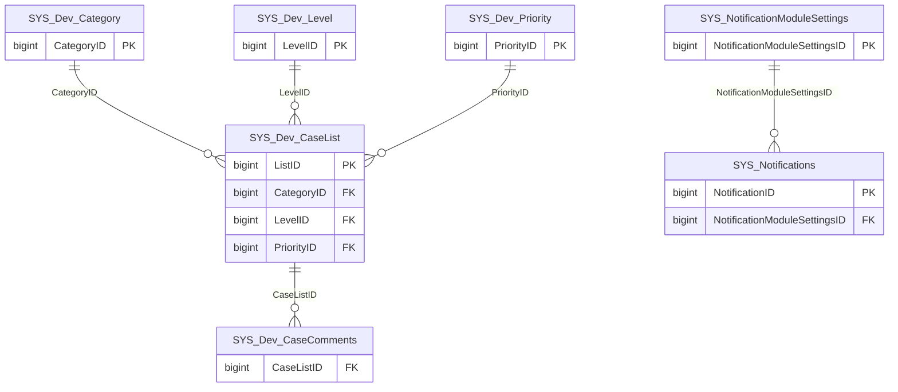

import TableDetail from '@site/src/components/TableDetail';

# System Database Tables

**17 tables** · **14 with PK** (82.4%) · **5 FKs** · **17 indexes**

## Entity Relationships

## Table Reference

<TableDetail
  dataUrl="/table-detail-data/system.json"
  generatedAt="2026-02-28T06:03:57.118Z"
/>

## Stored Procedures

See the [System Stored Procedures](./sprocs/system-sprocs) reference page for detailed documentation of all stored procedures in this module, including parameters, anti-pattern analysis, and optimization recommendations.

## Related Code Documentation

- [Common (.NET Business Module)](/docs/dotnet-backend/business/common)
- [Utilities (.NET Business Module)](/docs/dotnet-backend/business/utilities)
