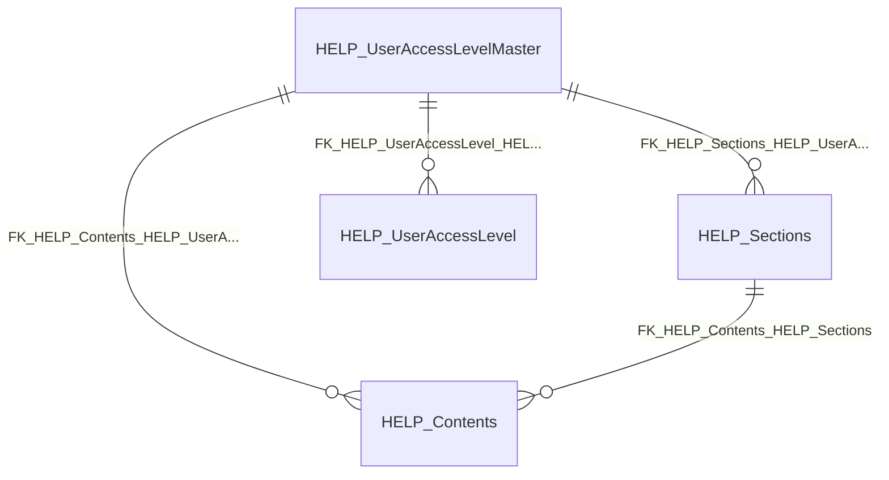

import TableDetail from '@site/src/components/TableDetail';

# Uncategorized Database Tables

**391 tables** · **54 with PK** (13.8%) · **15 FKs** · **118 indexes**

## Entity Relationships

## Table Reference

<TableDetail
  tables={[{"name":"_ICD10","schema":"dbo","fullName":"dbo._ICD10","hasPrimaryKey":true,"primaryKeyColumns":["id"],"foreignKeys":[],"indexes":[{"name":"PK___ICD10__3213E83F2C94CE1E","type":"CLUSTERED","isPrimaryKey":true,"isUnique":true,"isDisabled":false,"keyColumns":["id"],"includedColumns":[]}],"checkConstraints":[],"defaultConstraints":0,"triggers":[]},{"name":"_imp_160119","schema":"dbo","fullName":"dbo._imp_160119","hasPrimaryKey":false,"primaryKeyColumns":[],"foreignKeys":[],"indexes":[],"checkConstraints":[],"defaultConstraints":0,"triggers":[]},{"name":"_imp_160119_phase2","schema":"dbo","fullName":"dbo._imp_160119_phase2","hasPrimaryKey":false,"primaryKeyColumns":[],"foreignKeys":[],"indexes":[],"checkConstraints":[],"defaultConstraints":0,"triggers":[]},{"name":"_imp_160119_procedures","schema":"dbo","fullName":"dbo._imp_160119_procedures","hasPrimaryKey":false,"primaryKeyColumns":[],"foreignKeys":[],"indexes":[],"checkConstraints":[],"defaultConstraints":0,"triggers":[]},{"name":"_imp_160119_users","schema":"dbo","fullName":"dbo._imp_160119_users","hasPrimaryKey":false,"primaryKeyColumns":[],"foreignKeys":[],"indexes":[],"checkConstraints":[],"defaultConstraints":0,"triggers":[]},{"name":"_imp_170510_procedures","schema":"dbo","fullName":"dbo._imp_170510_procedures","hasPrimaryKey":false,"primaryKeyColumns":[],"foreignKeys":[],"indexes":[],"checkConstraints":[],"defaultConstraints":0,"triggers":[]},{"name":"_imp_170621_procedures","schema":"dbo","fullName":"dbo._imp_170621_procedures","hasPrimaryKey":false,"primaryKeyColumns":[],"foreignKeys":[],"indexes":[],"checkConstraints":[],"defaultConstraints":0,"triggers":[]},{"name":"_imp_180508_procedures_full","schema":"dbo","fullName":"dbo._imp_180508_procedures_full","hasPrimaryKey":false,"primaryKeyColumns":[],"foreignKeys":[],"indexes":[],"checkConstraints":[],"defaultConstraints":0,"triggers":[]},{"name":"_imp_180508_procedures_full_dep","schema":"dbo","fullName":"dbo._imp_180508_procedures_full_dep","hasPrimaryKey":false,"primaryKeyColumns":[],"foreignKeys":[],"indexes":[],"checkConstraints":[],"defaultConstraints":0,"triggers":[]},{"name":"_imp_190208_procedures_full","schema":"dbo","fullName":"dbo._imp_190208_procedures_full","hasPrimaryKey":false,"primaryKeyColumns":[],"foreignKeys":[],"indexes":[],"checkConstraints":[],"defaultConstraints":0,"triggers":[]},{"name":"_imp_190208_procedures_full_dep","schema":"dbo","fullName":"dbo._imp_190208_procedures_full_dep","hasPrimaryKey":false,"primaryKeyColumns":[],"foreignKeys":[],"indexes":[],"checkConstraints":[],"defaultConstraints":0,"triggers":[]},{"name":"'68B$'","schema":"dbo","fullName":"dbo.'68B$'","hasPrimaryKey":false,"primaryKeyColumns":[],"foreignKeys":[],"indexes":[],"checkConstraints":[],"defaultConstraints":0,"triggers":[]},{"name":"'68L$'","schema":"dbo","fullName":"dbo.'68L$'","hasPrimaryKey":false,"primaryKeyColumns":[],"foreignKeys":[],"indexes":[],"checkConstraints":[],"defaultConstraints":0,"triggers":[]},{"name":"'68P$'","schema":"dbo","fullName":"dbo.'68P$'","hasPrimaryKey":false,"primaryKeyColumns":[],"foreignKeys":[],"indexes":[],"checkConstraints":[],"defaultConstraints":0,"triggers":[]},{"name":"'68S$'","schema":"dbo","fullName":"dbo.'68S$'","hasPrimaryKey":false,"primaryKeyColumns":[],"foreignKeys":[],"indexes":[],"checkConstraints":[],"defaultConstraints":0,"triggers":[]},{"name":"'Dental Corps$'","schema":"dbo","fullName":"dbo.'Dental Corps$'","hasPrimaryKey":false,"primaryKeyColumns":[],"foreignKeys":[],"indexes":[],"checkConstraints":[],"defaultConstraints":0,"triggers":[]},{"name":"'Medical Corps$'","schema":"dbo","fullName":"dbo.'Medical Corps$'","hasPrimaryKey":false,"primaryKeyColumns":[],"foreignKeys":[],"indexes":[],"checkConstraints":[],"defaultConstraints":0,"triggers":[]},{"name":"'Medical Schools$'","schema":"dbo","fullName":"dbo.'Medical Schools$'","hasPrimaryKey":false,"primaryKeyColumns":[],"foreignKeys":[],"indexes":[],"checkConstraints":[],"defaultConstraints":0,"triggers":[]},{"name":"'Medical Services Corps$'","schema":"dbo","fullName":"dbo.'Medical Services Corps$'","hasPrimaryKey":false,"primaryKeyColumns":[],"foreignKeys":[],"indexes":[],"checkConstraints":[],"defaultConstraints":0,"triggers":[]},{"name":"'Nurse Corps$'","schema":"dbo","fullName":"dbo.'Nurse Corps$'","hasPrimaryKey":false,"primaryKeyColumns":[],"foreignKeys":[],"indexes":[],"checkConstraints":[],"defaultConstraints":0,"triggers":[]},{"name":"'SP Corps$'","schema":"dbo","fullName":"dbo.'SP Corps$'","hasPrimaryKey":false,"primaryKeyColumns":[],"foreignKeys":[],"indexes":[],"checkConstraints":[],"defaultConstraints":0,"triggers":[]},{"name":"'VET Corps$'","schema":"dbo","fullName":"dbo.'VET Corps$'","hasPrimaryKey":false,"primaryKeyColumns":[],"foreignKeys":[],"indexes":[],"checkConstraints":[],"defaultConstraints":0,"triggers":[]},{"name":"ACGME2023_Registration","schema":"dbo","fullName":"dbo.ACGME2023_Registration","hasPrimaryKey":true,"primaryKeyColumns":["RegistrationID"],"foreignKeys":[],"indexes":[{"name":"acgme2023_Registration_PK","type":"CLUSTERED","isPrimaryKey":true,"isUnique":true,"isDisabled":false,"keyColumns":["RegistrationID"],"includedColumns":[]}],"checkConstraints":[],"defaultConstraints":0,"triggers":[]},{"name":"ACGME2024_Registration","schema":"dbo","fullName":"dbo.ACGME2024_Registration","hasPrimaryKey":true,"primaryKeyColumns":["RegistrationID"],"foreignKeys":[],"indexes":[{"name":"PK_ACGME2024_RegistrationRegistrationID","type":"CLUSTERED","isPrimaryKey":true,"isUnique":true,"isDisabled":false,"keyColumns":["RegistrationID"],"includedColumns":[]}],"checkConstraints":[],"defaultConstraints":0,"triggers":[]},{"name":"Add Questions - Pediatrics","schema":"dbo","fullName":"dbo.Add Questions - Pediatrics","hasPrimaryKey":false,"primaryKeyColumns":[],"foreignKeys":[],"indexes":[],"checkConstraints":[],"defaultConstraints":0,"triggers":[]},{"name":"Add1in7UserViolationForAveragedYes_Log","schema":"dbo","fullName":"dbo.Add1in7UserViolationForAveragedYes_Log","hasPrimaryKey":false,"primaryKeyColumns":[],"foreignKeys":[],"indexes":[],"checkConstraints":[],"defaultConstraints":0,"triggers":[]},{"name":"Add80HrViolationForAveragedYes_Log","schema":"dbo","fullName":"dbo.Add80HrViolationForAveragedYes_Log","hasPrimaryKey":false,"primaryKeyColumns":[],"foreignKeys":[],"indexes":[],"checkConstraints":[],"defaultConstraints":0,"triggers":[]},{"name":"AddTemplateRotationIsPGYSpecific_Parameters","schema":"dbo","fullName":"dbo.AddTemplateRotationIsPGYSpecific_Parameters","hasPrimaryKey":false,"primaryKeyColumns":[],"foreignKeys":[],"indexes":[],"checkConstraints":[],"defaultConstraints":0,"triggers":[]},{"name":"AddTemplateRotationIsPGYSpecific_TempTableParameters","schema":"dbo","fullName":"dbo.AddTemplateRotationIsPGYSpecific_TempTableParameters","hasPrimaryKey":false,"primaryKeyColumns":[],"foreignKeys":[],"indexes":[],"checkConstraints":[],"defaultConstraints":4,"triggers":[]},{"name":"AOCMOSFORMyEval","schema":"dbo","fullName":"dbo.AOCMOSFORMyEval","hasPrimaryKey":false,"primaryKeyColumns":[],"foreignKeys":[],"indexes":[],"checkConstraints":[],"defaultConstraints":0,"triggers":[]},{"name":"Api_Response_Audit","schema":"dbo","fullName":"dbo.Api_Response_Audit","hasPrimaryKey":true,"primaryKeyColumns":["ApiResponseID","CreatedOn"],"foreignKeys":[],"indexes":[{"name":"IX_Api_Response_Audit_CorrelationID","type":"NONCLUSTERED","isPrimaryKey":false,"isUnique":false,"isDisabled":false,"keyColumns":["CreatedOn","CorrelationID"],"includedColumns":[]},{"name":"IX_Api_Response_Audit_CreatedOn","type":"NONCLUSTERED","isPrimaryKey":false,"isUnique":false,"isDisabled":false,"keyColumns":["CreatedOn"],"includedColumns":["IsSuccess"]},{"name":"IX_Api_Response_Audit_Department","type":"NONCLUSTERED","isPrimaryKey":false,"isUnique":false,"isDisabled":false,"keyColumns":["DepartmentID","CreatedOn"],"includedColumns":[]},{"name":"PK_Api_Response_Audit","type":"CLUSTERED","isPrimaryKey":true,"isUnique":true,"isDisabled":false,"keyColumns":["ApiResponseID","CreatedOn"],"includedColumns":[]}],"checkConstraints":[],"defaultConstraints":0,"triggers":[]},{"name":"Api_Response_Audit_Archive","schema":"dbo","fullName":"dbo.Api_Response_Audit_Archive","hasPrimaryKey":true,"primaryKeyColumns":["ApiResponseID","CreatedOn"],"foreignKeys":[],"indexes":[{"name":"IX_Api_Response_Audit_Archive_CreatedOn","type":"NONCLUSTERED","isPrimaryKey":false,"isUnique":false,"isDisabled":false,"keyColumns":["CreatedOn"],"includedColumns":[]},{"name":"PK_Api_Response_Audit_Archive","type":"CLUSTERED","isPrimaryKey":true,"isUnique":true,"isDisabled":false,"keyColumns":["ApiResponseID","CreatedOn"],"includedColumns":[]}],"checkConstraints":[],"defaultConstraints":0,"triggers":[]},{"name":"Api_Response_Audit_Config","schema":"dbo","fullName":"dbo.Api_Response_Audit_Config","hasPrimaryKey":true,"primaryKeyColumns":["ConfigKey"],"foreignKeys":[],"indexes":[{"name":"PK__Api_Resp__4A306785C953DB0E","type":"CLUSTERED","isPrimaryKey":true,"isUnique":true,"isDisabled":false,"keyColumns":["ConfigKey"],"includedColumns":[]}],"checkConstraints":[],"defaultConstraints":0,"triggers":[]},{"name":"aspnet_Applications","schema":"dbo","fullName":"dbo.aspnet_Applications","hasPrimaryKey":true,"primaryKeyColumns":["ApplicationId"],"foreignKeys":[],"indexes":[{"name":"aspnet_Applications_Index","type":"CLUSTERED","isPrimaryKey":false,"isUnique":false,"isDisabled":false,"keyColumns":["LoweredApplicationName"],"includedColumns":[]},{"name":"PK__aspnet_A__C93A4C9822B83FBB","type":"NONCLUSTERED","isPrimaryKey":true,"isUnique":true,"isDisabled":false,"keyColumns":["ApplicationId"],"includedColumns":[]},{"name":"UQ__aspnet_A__17477DE42594AC66","type":"NONCLUSTERED","isPrimaryKey":false,"isUnique":true,"isDisabled":false,"keyColumns":["LoweredApplicationName"],"includedColumns":[]},{"name":"UQ__aspnet_A__3091033128711911","type":"NONCLUSTERED","isPrimaryKey":false,"isUnique":true,"isDisabled":false,"keyColumns":["ApplicationName"],"includedColumns":[]}],"checkConstraints":[],"defaultConstraints":1,"triggers":[]},{"name":"aspnet_SchemaVersions","schema":"dbo","fullName":"dbo.aspnet_SchemaVersions","hasPrimaryKey":true,"primaryKeyColumns":["Feature","CompatibleSchemaVersion"],"foreignKeys":[],"indexes":[{"name":"PK__aspnet_S__5A1E6BC134D6EFF6","type":"CLUSTERED","isPrimaryKey":true,"isUnique":true,"isDisabled":false,"keyColumns":["Feature","CompatibleSchemaVersion"],"includedColumns":[]}],"checkConstraints":[],"defaultConstraints":0,"triggers":[]},{"name":"aspnet_Users","schema":"dbo","fullName":"dbo.aspnet_Users","hasPrimaryKey":true,"primaryKeyColumns":["UserId"],"foreignKeys":[{"constraintName":"FK__aspnet_Us__Appli__2F1E16A0","referencedTable":"(system-named)"}],"indexes":[{"name":"aspnet_Users_Index","type":"CLUSTERED","isPrimaryKey":false,"isUnique":true,"isDisabled":false,"keyColumns":["ApplicationId","LoweredUserName"],"includedColumns":[]},{"name":"aspnet_Users_Index2","type":"NONCLUSTERED","isPrimaryKey":false,"isUnique":false,"isDisabled":false,"keyColumns":["ApplicationId","LastActivityDate"],"includedColumns":[]},{"name":"PK__aspnet_U__1788CC4D2D35CE2E","type":"NONCLUSTERED","isPrimaryKey":true,"isUnique":true,"isDisabled":false,"keyColumns":["UserId"],"includedColumns":[]}],"checkConstraints":[],"defaultConstraints":3,"triggers":[]},{"name":"aspnet_WebEvent_Events","schema":"dbo","fullName":"dbo.aspnet_WebEvent_Events","hasPrimaryKey":true,"primaryKeyColumns":["EventId"],"foreignKeys":[],"indexes":[{"name":"aspnet_WebEvent_Events_EventTimeUtc_index","type":"NONCLUSTERED","isPrimaryKey":false,"isUnique":false,"isDisabled":false,"keyColumns":["EventTimeUtc"],"includedColumns":[]},{"name":"PK__aspnet_W__7944C810413CC6DB","type":"CLUSTERED","isPrimaryKey":true,"isUnique":true,"isDisabled":false,"keyColumns":["EventId"],"includedColumns":[]}],"checkConstraints":[],"defaultConstraints":0,"triggers":[]},{"name":"backmedschool","schema":"dbo","fullName":"dbo.backmedschool","hasPrimaryKey":false,"primaryKeyColumns":[],"foreignKeys":[],"indexes":[],"checkConstraints":[],"defaultConstraints":0,"triggers":[]},{"name":"BSNCLCSubmissionFormHistory","schema":"dbo","fullName":"dbo.BSNCLCSubmissionFormHistory","hasPrimaryKey":false,"primaryKeyColumns":[],"foreignKeys":[],"indexes":[],"checkConstraints":[],"defaultConstraints":0,"triggers":[]},{"name":"BuildQueryForAutoAssignmentOnCall_Log","schema":"dbo","fullName":"dbo.BuildQueryForAutoAssignmentOnCall_Log","hasPrimaryKey":false,"primaryKeyColumns":[],"foreignKeys":[],"indexes":[],"checkConstraints":[],"defaultConstraints":0,"triggers":[]},{"name":"CampusCodes$","schema":"dbo","fullName":"dbo.CampusCodes$","hasPrimaryKey":false,"primaryKeyColumns":[],"foreignKeys":[],"indexes":[],"checkConstraints":[],"defaultConstraints":0,"triggers":[]},{"name":"CAW_PVV_Settings_20250213","schema":"dbo","fullName":"dbo.CAW_PVV_Settings_20250213","hasPrimaryKey":false,"primaryKeyColumns":[],"foreignKeys":[],"indexes":[],"checkConstraints":[],"defaultConstraints":0,"triggers":[]},{"name":"CAW_PVV_Settings_20251231","schema":"dbo","fullName":"dbo.CAW_PVV_Settings_20251231","hasPrimaryKey":false,"primaryKeyColumns":[],"foreignKeys":[],"indexes":[],"checkConstraints":[],"defaultConstraints":0,"triggers":[]},{"name":"CAW_PVV_Settings_20260112","schema":"dbo","fullName":"dbo.CAW_PVV_Settings_20260112","hasPrimaryKey":false,"primaryKeyColumns":[],"foreignKeys":[],"indexes":[],"checkConstraints":[],"defaultConstraints":0,"triggers":[]},{"name":"ChatbotAdminData","schema":"dbo","fullName":"dbo.ChatbotAdminData","hasPrimaryKey":true,"primaryKeyColumns":["ChatbotDataId"],"foreignKeys":[],"indexes":[{"name":"PK__ChatbotA__2AED804A30889EC4","type":"CLUSTERED","isPrimaryKey":true,"isUnique":true,"isDisabled":false,"keyColumns":["ChatbotDataId"],"includedColumns":[]}],"checkConstraints":[],"defaultConstraints":0,"triggers":[]},{"name":"CMEEvent_ActivityIDList","schema":"dbo","fullName":"dbo.CMEEvent_ActivityIDList","hasPrimaryKey":true,"primaryKeyColumns":["EventActivityListID"],"foreignKeys":[],"indexes":[{"name":"PK__CMEEvent__C20002D0221D60CB","type":"CLUSTERED","isPrimaryKey":true,"isUnique":true,"isDisabled":false,"keyColumns":["EventActivityListID"],"includedColumns":[]}],"checkConstraints":[],"defaultConstraints":0,"triggers":[]},{"name":"CMEEvent_SubActivityIDList","schema":"dbo","fullName":"dbo.CMEEvent_SubActivityIDList","hasPrimaryKey":true,"primaryKeyColumns":["EventSubActivityListID"],"foreignKeys":[],"indexes":[{"name":"PK__CMEEvent__600A4653755D6D52","type":"CLUSTERED","isPrimaryKey":true,"isUnique":true,"isDisabled":false,"keyColumns":["EventSubActivityListID"],"includedColumns":[]}],"checkConstraints":[],"defaultConstraints":0,"triggers":[]},{"name":"CMESchedule_ActivityIDList","schema":"dbo","fullName":"dbo.CMESchedule_ActivityIDList","hasPrimaryKey":true,"primaryKeyColumns":["ScheduleActivityListID"],"foreignKeys":[],"indexes":[{"name":"PK__CMESched__839EEC50EBAF61C4","type":"CLUSTERED","isPrimaryKey":true,"isUnique":true,"isDisabled":false,"keyColumns":["ScheduleActivityListID"],"includedColumns":[]}],"checkConstraints":[],"defaultConstraints":0,"triggers":[]},{"name":"CMESchedule_SubActivityIDList","schema":"dbo","fullName":"dbo.CMESchedule_SubActivityIDList","hasPrimaryKey":true,"primaryKeyColumns":["ScheduleSubActivityListID"],"foreignKeys":[],"indexes":[{"name":"PK__CMESched__B4E15E2CE0890F41","type":"CLUSTERED","isPrimaryKey":true,"isUnique":true,"isDisabled":false,"keyColumns":["ScheduleSubActivityListID"],"includedColumns":[]}],"checkConstraints":[],"defaultConstraints":0,"triggers":[]},{"name":"copiedEPA","schema":"dbo","fullName":"dbo.copiedEPA","hasPrimaryKey":false,"primaryKeyColumns":[],"foreignKeys":[],"indexes":[],"checkConstraints":[],"defaultConstraints":0,"triggers":[]},{"name":"Crypt_DebugLogTest","schema":"dbo","fullName":"dbo.Crypt_DebugLogTest","hasPrimaryKey":true,"primaryKeyColumns":["DebugId"],"foreignKeys":[],"indexes":[{"name":"PK__Crypt_De__B15E399F7DEDF414","type":"CLUSTERED","isPrimaryKey":true,"isUnique":true,"isDisabled":false,"keyColumns":["DebugId"],"includedColumns":[]}],"checkConstraints":[],"defaultConstraints":1,"triggers":[]},{"name":"Crypt_DetailsTest","schema":"dbo","fullName":"dbo.Crypt_DetailsTest","hasPrimaryKey":true,"primaryKeyColumns":["DetailsId"],"foreignKeys":[],"indexes":[{"name":"PK__Crypt_De__BAC8628C5EAA779E","type":"CLUSTERED","isPrimaryKey":true,"isUnique":true,"isDisabled":false,"keyColumns":["DetailsId"],"includedColumns":[]}],"checkConstraints":[],"defaultConstraints":1,"triggers":[]},{"name":"DataBaseLog","schema":"dbo","fullName":"dbo.DataBaseLog","hasPrimaryKey":true,"primaryKeyColumns":["DataBaseLogID"],"foreignKeys":[],"indexes":[{"name":"DataBaseLogID_PK","type":"CLUSTERED","isPrimaryKey":true,"isUnique":true,"isDisabled":false,"keyColumns":["DataBaseLogID"],"includedColumns":[]},{"name":"IDX_DataBaseLog_SchemaName_ObjectName_ObjectType_DataBaseName","type":"NONCLUSTERED","isPrimaryKey":false,"isUnique":false,"isDisabled":false,"keyColumns":["SchemaName","ObjectName","ObjectType","DataBaseName"],"includedColumns":[]}],"checkConstraints":[],"defaultConstraints":0,"triggers":[{"name":"MDT_DatabaseLog","isDisabled":false,"isInsteadOf":false}]},{"name":"DatabaseLogUpdated","schema":"dbo","fullName":"dbo.DatabaseLogUpdated","hasPrimaryKey":true,"primaryKeyColumns":["DatabaseLogUpdatedID"],"foreignKeys":[],"indexes":[{"name":"PK_DatabaseLogUpdatedID","type":"CLUSTERED","isPrimaryKey":true,"isUnique":true,"isDisabled":false,"keyColumns":["DatabaseLogUpdatedID"],"includedColumns":[]}],"checkConstraints":[],"defaultConstraints":0,"triggers":[]},{"name":"dataimport2531","schema":"dbo","fullName":"dbo.dataimport2531","hasPrimaryKey":false,"primaryKeyColumns":[],"foreignKeys":[],"indexes":[],"checkConstraints":[],"defaultConstraints":0,"triggers":[]},{"name":"DDLLog","schema":"dbo","fullName":"dbo.DDLLog","hasPrimaryKey":true,"primaryKeyColumns":["DDLLogID"],"foreignKeys":[],"indexes":[{"name":"PK_DDL_Changes_Log_ID","type":"NONCLUSTERED","isPrimaryKey":true,"isUnique":true,"isDisabled":false,"keyColumns":["DDLLogID"],"includedColumns":[]}],"checkConstraints":[],"defaultConstraints":0,"triggers":[]},{"name":"deleted_assignments","schema":"dbo","fullName":"dbo.deleted_assignments","hasPrimaryKey":false,"primaryKeyColumns":[],"foreignKeys":[],"indexes":[],"checkConstraints":[],"defaultConstraints":0,"triggers":[]},{"name":"DeletedNarratives0711","schema":"dbo","fullName":"dbo.DeletedNarratives0711","hasPrimaryKey":false,"primaryKeyColumns":[],"foreignKeys":[],"indexes":[],"checkConstraints":[],"defaultConstraints":0,"triggers":[]},{"name":"DeletedTasks$","schema":"dbo","fullName":"dbo.DeletedTasks$","hasPrimaryKey":false,"primaryKeyColumns":[],"foreignKeys":[],"indexes":[],"checkConstraints":[],"defaultConstraints":0,"triggers":[]},{"name":"DeletedUserDetails","schema":"dbo","fullName":"dbo.DeletedUserDetails","hasPrimaryKey":true,"primaryKeyColumns":["DeletedUserDetailID"],"foreignKeys":[],"indexes":[{"name":"PK_DeletedUserDetailID","type":"CLUSTERED","isPrimaryKey":true,"isUnique":true,"isDisabled":false,"keyColumns":["DeletedUserDetailID"],"includedColumns":[]}],"checkConstraints":[],"defaultConstraints":1,"triggers":[]},{"name":"DemoDataUsers","schema":"dbo","fullName":"dbo.DemoDataUsers","hasPrimaryKey":false,"primaryKeyColumns":[],"foreignKeys":[],"indexes":[],"checkConstraints":[],"defaultConstraints":0,"triggers":[]},{"name":"Department","schema":"dbo","fullName":"dbo.Department","hasPrimaryKey":true,"primaryKeyColumns":["DepartmentID"],"foreignKeys":[],"indexes":[{"name":"IX_Department","type":"NONCLUSTERED","isPrimaryKey":false,"isUnique":false,"isDisabled":false,"keyColumns":["Name"],"includedColumns":[]},{"name":"IX_Department_1","type":"NONCLUSTERED","isPrimaryKey":false,"isUnique":false,"isDisabled":false,"keyColumns":["DepartmentID","EMailReminder"],"includedColumns":[]},{"name":"IX_Department_10","type":"NONCLUSTERED","isPrimaryKey":false,"isUnique":false,"isDisabled":false,"keyColumns":["EMailPassword","EMailLogin","FEProc","MinAnonymity","DepartmentID"],"includedColumns":[]},{"name":"IX_Department_11","type":"NONCLUSTERED","isPrimaryKey":false,"isUnique":false,"isDisabled":false,"keyColumns":["MyGME","DepartmentID"],"includedColumns":[]},{"name":"IX_Department_12","type":"NONCLUSTERED","isPrimaryKey":false,"isUnique":false,"isDisabled":false,"keyColumns":["EnPatLog","DepartmentID"],"includedColumns":[]},{"name":"IX_Department_13","type":"NONCLUSTERED","isPrimaryKey":false,"isUnique":false,"isDisabled":false,"keyColumns":["EnProcLog","DepartmentID"],"includedColumns":[]},{"name":"IX_Department_2","type":"NONCLUSTERED","isPrimaryKey":false,"isUnique":false,"isDisabled":false,"keyColumns":["DepartmentID","Name"],"includedColumns":[]},{"name":"IX_Department_3","type":"NONCLUSTERED","isPrimaryKey":false,"isUnique":false,"isDisabled":false,"keyColumns":["DepartmentID","EMailConfReminder"],"includedColumns":[]},{"name":"IX_Department_4","type":"NONCLUSTERED","isPrimaryKey":false,"isUnique":false,"isDisabled":false,"keyColumns":["EMailConfReminder"],"includedColumns":[]},{"name":"IX_Department_5","type":"NONCLUSTERED","isPrimaryKey":false,"isUnique":false,"isDisabled":false,"keyColumns":["ProgramID","DepartmentID"],"includedColumns":[]},{"name":"IX_Department_6","type":"NONCLUSTERED","isPrimaryKey":false,"isUnique":false,"isDisabled":false,"keyColumns":["StartMonth","StartDay","DepartmentID"],"includedColumns":[]},{"name":"IX_Department_7","type":"NONCLUSTERED","isPrimaryKey":false,"isUnique":false,"isDisabled":false,"keyColumns":["DeptLevelFrequency","DeptLengthOfTraining","DepartmentID"],"includedColumns":[]},{"name":"IX_Department_8","type":"NONCLUSTERED","isPrimaryKey":false,"isUnique":false,"isDisabled":false,"keyColumns":["DepartmentID","DHUserViolationAccount"],"includedColumns":[]},{"name":"IX_Department_9","type":"NONCLUSTERED","isPrimaryKey":false,"isUnique":false,"isDisabled":false,"keyColumns":["MinAnonymity","DepartmentID"],"includedColumns":[]},{"name":"PK_Department","type":"NONCLUSTERED","isPrimaryKey":true,"isUnique":true,"isDisabled":false,"keyColumns":["DepartmentID"],"includedColumns":[]}],"checkConstraints":[],"defaultConstraints":44,"triggers":[]},{"name":"DEV_CourseData","schema":"dbo","fullName":"dbo.DEV_CourseData","hasPrimaryKey":true,"primaryKeyColumns":["CourseDataID"],"foreignKeys":[],"indexes":[{"name":"IX_DEV_CourseData_1","type":"NONCLUSTERED","isPrimaryKey":false,"isUnique":false,"isDisabled":false,"keyColumns":["CourseSessionID","CourseRegistrationID"],"includedColumns":["CourseDataID","StudentID","ProgramID","CourseInstructorID"]},{"name":"PK_DEV_CourseData","type":"CLUSTERED","isPrimaryKey":true,"isUnique":true,"isDisabled":false,"keyColumns":["CourseDataID"],"includedColumns":[]}],"checkConstraints":[],"defaultConstraints":0,"triggers":[]},{"name":"DEV_Evaluations","schema":"dbo","fullName":"dbo.DEV_Evaluations","hasPrimaryKey":true,"primaryKeyColumns":["ACTEvaluationID"],"foreignKeys":[],"indexes":[{"name":"IX_DEV_Evaluations_1","type":"NONCLUSTERED","isPrimaryKey":false,"isUnique":false,"isDisabled":false,"keyColumns":["CourseID","FacultyID","Student"],"includedColumns":[]},{"name":"PK_DEV_Evaluations","type":"CLUSTERED","isPrimaryKey":true,"isUnique":true,"isDisabled":false,"keyColumns":["ACTEvaluationID"],"includedColumns":[]}],"checkConstraints":[],"defaultConstraints":1,"triggers":[]},{"name":"DEV_FNPActivity","schema":"dbo","fullName":"dbo.DEV_FNPActivity","hasPrimaryKey":true,"primaryKeyColumns":["FNPActivityID"],"foreignKeys":[],"indexes":[{"name":"PK_DEV_FNPActivity_FNPActivityID","type":"CLUSTERED","isPrimaryKey":true,"isUnique":true,"isDisabled":false,"keyColumns":["FNPActivityID"],"includedColumns":[]}],"checkConstraints":[],"defaultConstraints":0,"triggers":[]},{"name":"DEV_FNPClinicalLog","schema":"dbo","fullName":"dbo.DEV_FNPClinicalLog","hasPrimaryKey":true,"primaryKeyColumns":["FNPClinicalLogID"],"foreignKeys":[{"constraintName":"FK_FNPClinicalLog_DEV_FNPActivity_FNPActivityID","referencedTable":"FK_FNPClinicalLog_DEV_FNPActivity_FNPActivityID"}],"indexes":[{"name":"IX_DEV_FNPClinicalLog_1","type":"NONCLUSTERED","isPrimaryKey":false,"isUnique":false,"isDisabled":false,"keyColumns":["CourseDataID","ApprovedDate","IsDeleted","Status"],"includedColumns":[]},{"name":"IX_DEV_FNPClinicalLog_11","type":"NONCLUSTERED","isPrimaryKey":false,"isUnique":false,"isDisabled":false,"keyColumns":["CourseDataID"],"includedColumns":["TimeSpent"]},{"name":"PK_DEV_FNPClinicalLog_FNPClinicalLogID","type":"CLUSTERED","isPrimaryKey":true,"isUnique":true,"isDisabled":false,"keyColumns":["FNPClinicalLogID"],"includedColumns":[]}],"checkConstraints":[],"defaultConstraints":2,"triggers":[]},{"name":"DEV_FNPClinicalLogForPreceptors","schema":"dbo","fullName":"dbo.DEV_FNPClinicalLogForPreceptors","hasPrimaryKey":true,"primaryKeyColumns":["FNPClinicalLogForPreceptorID"],"foreignKeys":[],"indexes":[{"name":"PK_DEV_FNPClinicalLogForPreceptors_FNPClinicalLogForPreceptorID","type":"CLUSTERED","isPrimaryKey":true,"isUnique":true,"isDisabled":false,"keyColumns":["FNPClinicalLogForPreceptorID"],"includedColumns":[]}],"checkConstraints":[],"defaultConstraints":0,"triggers":[]},{"name":"DEV_StudentCoursePreceptors","schema":"dbo","fullName":"dbo.DEV_StudentCoursePreceptors","hasPrimaryKey":true,"primaryKeyColumns":["StudentCoursePreceptorID"],"foreignKeys":[],"indexes":[{"name":"PK_DEV_StudentCoursePreceptors","type":"CLUSTERED","isPrimaryKey":true,"isUnique":true,"isDisabled":false,"keyColumns":["StudentCoursePreceptorID"],"includedColumns":[]}],"checkConstraints":[],"defaultConstraints":1,"triggers":[]},{"name":"DHVerificationInfo_Log","schema":"dbo","fullName":"dbo.DHVerificationInfo_Log","hasPrimaryKey":false,"primaryKeyColumns":[],"foreignKeys":[],"indexes":[],"checkConstraints":[],"defaultConstraints":0,"triggers":[]},{"name":"DuplicateSchoolCodes$","schema":"dbo","fullName":"dbo.DuplicateSchoolCodes$","hasPrimaryKey":false,"primaryKeyColumns":[],"foreignKeys":[],"indexes":[],"checkConstraints":[],"defaultConstraints":0,"triggers":[]},{"name":"ECFMG","schema":"dbo","fullName":"dbo.ECFMG","hasPrimaryKey":false,"primaryKeyColumns":[],"foreignKeys":[],"indexes":[],"checkConstraints":[],"defaultConstraints":0,"triggers":[]},{"name":"EcfMG$","schema":"dbo","fullName":"dbo.EcfMG$","hasPrimaryKey":false,"primaryKeyColumns":[],"foreignKeys":[],"indexes":[],"checkConstraints":[],"defaultConstraints":0,"triggers":[]},{"name":"EMAIL_AutoTaskQueue","schema":"dbo","fullName":"dbo.EMAIL_AutoTaskQueue","hasPrimaryKey":true,"primaryKeyColumns":["AutoTaskQueueID"],"foreignKeys":[{"constraintName":"FK_Email_EmailProcessQueue_Email_ProcessDetail","referencedTable":"FK_Email_EmailProcessQueue_Email_ProcessDetail"}],"indexes":[{"name":"PK_Email_EmailProcessQueue","type":"CLUSTERED","isPrimaryKey":true,"isUnique":true,"isDisabled":false,"keyColumns":["AutoTaskQueueID"],"includedColumns":[]}],"checkConstraints":[],"defaultConstraints":1,"triggers":[]},{"name":"EMAIL_Delivered","schema":"dbo","fullName":"dbo.EMAIL_Delivered","hasPrimaryKey":true,"primaryKeyColumns":["EmailID"],"foreignKeys":[],"indexes":[{"name":"IDX_EMAIL_Delivered_DeliveredAt_EmailHash","type":"NONCLUSTERED","isPrimaryKey":false,"isUnique":false,"isDisabled":false,"keyColumns":["DeliveredAt","EmailHash"],"includedColumns":[]},{"name":"PK__EMAIL_De__7ED91AEFC2CD4C18","type":"CLUSTERED","isPrimaryKey":true,"isUnique":true,"isDisabled":false,"keyColumns":["EmailID"],"includedColumns":[]}],"checkConstraints":[],"defaultConstraints":1,"triggers":[]},{"name":"EMAIL_ProcessDetail","schema":"dbo","fullName":"dbo.EMAIL_ProcessDetail","hasPrimaryKey":true,"primaryKeyColumns":["ProcessID"],"foreignKeys":[],"indexes":[{"name":"PK_Email_ProcessDetail","type":"CLUSTERED","isPrimaryKey":true,"isUnique":true,"isDisabled":false,"keyColumns":["ProcessID"],"includedColumns":[]}],"checkConstraints":[],"defaultConstraints":0,"triggers":[]},{"name":"EMRIDs$","schema":"dbo","fullName":"dbo.EMRIDs$","hasPrimaryKey":false,"primaryKeyColumns":[],"foreignKeys":[],"indexes":[],"checkConstraints":[],"defaultConstraints":0,"triggers":[]},{"name":"Enlisted$","schema":"dbo","fullName":"dbo.Enlisted$","hasPrimaryKey":false,"primaryKeyColumns":[],"foreignKeys":[],"indexes":[],"checkConstraints":[],"defaultConstraints":0,"triggers":[]},{"name":"ERR_EVAL_MilestoneTrainee","schema":"dbo","fullName":"dbo.ERR_EVAL_MilestoneTrainee","hasPrimaryKey":false,"primaryKeyColumns":[],"foreignKeys":[],"indexes":[],"checkConstraints":[],"defaultConstraints":0,"triggers":[]},{"name":"ERR_LA_AssignmentComments","schema":"dbo","fullName":"dbo.ERR_LA_AssignmentComments","hasPrimaryKey":false,"primaryKeyColumns":[],"foreignKeys":[],"indexes":[],"checkConstraints":[],"defaultConstraints":0,"triggers":[]},{"name":"ERR_PTL_PatientLogSubmittedDiagnosisList","schema":"dbo","fullName":"dbo.ERR_PTL_PatientLogSubmittedDiagnosisList","hasPrimaryKey":false,"primaryKeyColumns":[],"foreignKeys":[],"indexes":[],"checkConstraints":[],"defaultConstraints":0,"triggers":[]},{"name":"EvalQuestionsImport","schema":"dbo","fullName":"dbo.EvalQuestionsImport","hasPrimaryKey":false,"primaryKeyColumns":[],"foreignKeys":[],"indexes":[],"checkConstraints":[],"defaultConstraints":0,"triggers":[]},{"name":"Evaluation_AssignmentUsersLog","schema":"dbo","fullName":"dbo.Evaluation_AssignmentUsersLog","hasPrimaryKey":true,"primaryKeyColumns":["UserEvaluationLogID"],"foreignKeys":[],"indexes":[{"name":"IX_EAL_UserEvaluationID","type":"NONCLUSTERED","isPrimaryKey":false,"isUnique":false,"isDisabled":false,"keyColumns":["UserEvaluationID"],"includedColumns":["AccessDateTime","ExitDateTime","BrowserDetails","Errors","Exemptions","EvaluationStatus"]},{"name":"PK__Evaluati__A547A99D629DBAA6","type":"CLUSTERED","isPrimaryKey":true,"isUnique":true,"isDisabled":false,"keyColumns":["UserEvaluationLogID"],"includedColumns":[]}],"checkConstraints":[],"defaultConstraints":0,"triggers":[]},{"name":"ExcludeEvaluations001","schema":"dbo","fullName":"dbo.ExcludeEvaluations001","hasPrimaryKey":false,"primaryKeyColumns":[],"foreignKeys":[],"indexes":[],"checkConstraints":[],"defaultConstraints":0,"triggers":[]},{"name":"FalseMedSchool","schema":"dbo","fullName":"dbo.FalseMedSchool","hasPrimaryKey":false,"primaryKeyColumns":[],"foreignKeys":[],"indexes":[],"checkConstraints":[],"defaultConstraints":0,"triggers":[]},{"name":"FILE_File","schema":"dbo","fullName":"dbo.FILE_File","hasPrimaryKey":true,"primaryKeyColumns":["FileID"],"foreignKeys":[{"constraintName":"FK__FILE_File__Creat__62679D3D","referencedTable":"(system-named)"}],"indexes":[{"name":"PK__FILE_Fil__6F0F989FB3F50D37","type":"CLUSTERED","isPrimaryKey":true,"isUnique":true,"isDisabled":false,"keyColumns":["FileID"],"includedColumns":[]}],"checkConstraints":[],"defaultConstraints":2,"triggers":[]},{"name":"FinalTempData","schema":"dbo","fullName":"dbo.FinalTempData","hasPrimaryKey":false,"primaryKeyColumns":[],"foreignKeys":[],"indexes":[],"checkConstraints":[],"defaultConstraints":0,"triggers":[]},{"name":"GetEvaluationsLog","schema":"dbo","fullName":"dbo.GetEvaluationsLog","hasPrimaryKey":false,"primaryKeyColumns":[],"foreignKeys":[],"indexes":[],"checkConstraints":[],"defaultConstraints":0,"triggers":[]},{"name":"HELP_Contents","schema":"dbo","fullName":"dbo.HELP_Contents","hasPrimaryKey":true,"primaryKeyColumns":["ContentID"],"foreignKeys":[{"constraintName":"FK_HELP_Contents_HELP_UserAccessLevelMaster","referencedTable":"HELP_UserAccessLevelMaster"},{"constraintName":"FK_HELP_Contents_HELP_Sections","referencedTable":"HELP_Sections"}],"indexes":[{"name":"IDX_HELP_Contents1","type":"NONCLUSTERED","isPrimaryKey":false,"isUnique":false,"isDisabled":false,"keyColumns":["SectionID","IsFolder","IsActive"],"includedColumns":["KeyValue"]},{"name":"IDX_HELP_Contents2","type":"NONCLUSTERED","isPrimaryKey":false,"isUnique":false,"isDisabled":false,"keyColumns":["IsFolder","IsActive","KeyValue"],"includedColumns":["SectionID"]},{"name":"PK_HELP_Contents","type":"CLUSTERED","isPrimaryKey":true,"isUnique":true,"isDisabled":false,"keyColumns":["ContentID"],"includedColumns":[]}],"checkConstraints":[],"defaultConstraints":0,"triggers":[]},{"name":"Help_KeyValues","schema":"dbo","fullName":"dbo.Help_KeyValues","hasPrimaryKey":false,"primaryKeyColumns":[],"foreignKeys":[],"indexes":[],"checkConstraints":[],"defaultConstraints":0,"triggers":[]},{"name":"HELP_PageRelations","schema":"dbo","fullName":"dbo.HELP_PageRelations","hasPrimaryKey":true,"primaryKeyColumns":["PageRelationsID"],"foreignKeys":[],"indexes":[{"name":"PK_HELP_PageRelations","type":"CLUSTERED","isPrimaryKey":true,"isUnique":true,"isDisabled":false,"keyColumns":["PageRelationsID"],"includedColumns":[]}],"checkConstraints":[],"defaultConstraints":0,"triggers":[]},{"name":"HELP_Sections","schema":"dbo","fullName":"dbo.HELP_Sections","hasPrimaryKey":true,"primaryKeyColumns":["SectionID"],"foreignKeys":[{"constraintName":"FK_HELP_Sections_HELP_UserAccessLevelMaster","referencedTable":"HELP_UserAccessLevelMaster"}],"indexes":[{"name":"PK_HELP_Sections","type":"CLUSTERED","isPrimaryKey":true,"isUnique":true,"isDisabled":false,"keyColumns":["SectionID"],"includedColumns":[]}],"checkConstraints":[],"defaultConstraints":0,"triggers":[]},{"name":"HELP_UserAccessLevel","schema":"dbo","fullName":"dbo.HELP_UserAccessLevel","hasPrimaryKey":false,"primaryKeyColumns":[],"foreignKeys":[{"constraintName":"FK_HELP_UserAccessLevel_HELP_UserAccessLevelMaster","referencedTable":"HELP_UserAccessLevelMaster"},{"constraintName":"FK_HELP_UserAccessLevel_SEC_Roles","referencedTable":"SEC_Roles"}],"indexes":[],"checkConstraints":[],"defaultConstraints":0,"triggers":[]},{"name":"HELP_UserAccessLevelMaster","schema":"dbo","fullName":"dbo.HELP_UserAccessLevelMaster","hasPrimaryKey":true,"primaryKeyColumns":["MasterAccessID"],"foreignKeys":[],"indexes":[{"name":"PK_HELP_UserAccessLevelMaster","type":"CLUSTERED","isPrimaryKey":true,"isUnique":true,"isDisabled":false,"keyColumns":["MasterAccessID"],"includedColumns":[]}],"checkConstraints":[],"defaultConstraints":0,"triggers":[]},{"name":"Import$","schema":"dbo","fullName":"dbo.Import$","hasPrimaryKey":false,"primaryKeyColumns":[],"foreignKeys":[],"indexes":[],"checkConstraints":[],"defaultConstraints":0,"triggers":[]},{"name":"ImportElogData","schema":"dbo","fullName":"dbo.ImportElogData","hasPrimaryKey":false,"primaryKeyColumns":[],"foreignKeys":[],"indexes":[],"checkConstraints":[],"defaultConstraints":0,"triggers":[]},{"name":"ImportEvalQuestions$","schema":"dbo","fullName":"dbo.ImportEvalQuestions$","hasPrimaryKey":false,"primaryKeyColumns":[],"foreignKeys":[],"indexes":[],"checkConstraints":[],"defaultConstraints":0,"triggers":[]},{"name":"ImportPPVValuesData","schema":"dbo","fullName":"dbo.ImportPPVValuesData","hasPrimaryKey":false,"primaryKeyColumns":[],"foreignKeys":[],"indexes":[],"checkConstraints":[],"defaultConstraints":0,"triggers":[]},{"name":"InstitutionGMEA","schema":"dbo","fullName":"dbo.InstitutionGMEA","hasPrimaryKey":false,"primaryKeyColumns":[],"foreignKeys":[],"indexes":[{"name":"idx_InstitutionGMEA_User_ID","type":"NONCLUSTERED","isPrimaryKey":false,"isUnique":false,"isDisabled":false,"keyColumns":["User_ID"],"includedColumns":[]},{"name":"IX_InstitutionGMEA","type":"NONCLUSTERED","isPrimaryKey":false,"isUnique":false,"isDisabled":false,"keyColumns":["InstID"],"includedColumns":[]},{"name":"IX_InstitutionGMEA_1","type":"NONCLUSTERED","isPrimaryKey":false,"isUnique":false,"isDisabled":false,"keyColumns":["UserName"],"includedColumns":[]},{"name":"IX_InstitutionGMEA_2","type":"NONCLUSTERED","isPrimaryKey":false,"isUnique":false,"isDisabled":false,"keyColumns":["User_ID"],"includedColumns":[]}],"checkConstraints":[],"defaultConstraints":2,"triggers":[]},{"name":"InternationalMedicalSchools","schema":"dbo","fullName":"dbo.InternationalMedicalSchools","hasPrimaryKey":false,"primaryKeyColumns":[],"foreignKeys":[],"indexes":[],"checkConstraints":[],"defaultConstraints":0,"triggers":[]},{"name":"InvalidECFMGUsers","schema":"dbo","fullName":"dbo.InvalidECFMGUsers","hasPrimaryKey":false,"primaryKeyColumns":[],"foreignKeys":[],"indexes":[],"checkConstraints":[],"defaultConstraints":0,"triggers":[]},{"name":"Languages$","schema":"dbo","fullName":"dbo.Languages$","hasPrimaryKey":false,"primaryKeyColumns":[],"foreignKeys":[],"indexes":[],"checkConstraints":[],"defaultConstraints":0,"triggers":[]},{"name":"LatestUSMedSchools","schema":"dbo","fullName":"dbo.LatestUSMedSchools","hasPrimaryKey":false,"primaryKeyColumns":[],"foreignKeys":[],"indexes":[],"checkConstraints":[],"defaultConstraints":0,"triggers":[]},{"name":"LOG_ConferenceUserAttendance","schema":"dbo","fullName":"dbo.LOG_ConferenceUserAttendance","hasPrimaryKey":false,"primaryKeyColumns":[],"foreignKeys":[],"indexes":[],"checkConstraints":[],"defaultConstraints":0,"triggers":[]},{"name":"LOG_ErrorHandling","schema":"dbo","fullName":"dbo.LOG_ErrorHandling","hasPrimaryKey":true,"primaryKeyColumns":["pkErrorHandlingID"],"foreignKeys":[],"indexes":[{"name":"PK__LOG_Erro__520223CB2AB0CD72","type":"CLUSTERED","isPrimaryKey":true,"isUnique":true,"isDisabled":false,"keyColumns":["pkErrorHandlingID"],"includedColumns":[]}],"checkConstraints":[],"defaultConstraints":4,"triggers":[]},{"name":"LOG_MergeOBCBatchInfo","schema":"dbo","fullName":"dbo.LOG_MergeOBCBatchInfo","hasPrimaryKey":false,"primaryKeyColumns":[],"foreignKeys":[],"indexes":[],"checkConstraints":[],"defaultConstraints":0,"triggers":[]},{"name":"login_timeout_log","schema":"dbo","fullName":"dbo.login_timeout_log","hasPrimaryKey":true,"primaryKeyColumns":["RowNumber"],"foreignKeys":[],"indexes":[{"name":"PK__login_ti__AAAC09D817B60D2B","type":"CLUSTERED","isPrimaryKey":true,"isUnique":true,"isDisabled":false,"keyColumns":["RowNumber"],"includedColumns":[]}],"checkConstraints":[],"defaultConstraints":0,"triggers":[]},{"name":"MailGunSchedulerExecutionTime","schema":"dbo","fullName":"dbo.MailGunSchedulerExecutionTime","hasPrimaryKey":false,"primaryKeyColumns":[],"foreignKeys":[],"indexes":[],"checkConstraints":[],"defaultConstraints":0,"triggers":[]},{"name":"MappedPrograms","schema":"dbo","fullName":"dbo.MappedPrograms","hasPrimaryKey":false,"primaryKeyColumns":[],"foreignKeys":[],"indexes":[],"checkConstraints":[],"defaultConstraints":0,"triggers":[]},{"name":"MECfile$","schema":"dbo","fullName":"dbo.MECfile$","hasPrimaryKey":false,"primaryKeyColumns":[],"foreignKeys":[],"indexes":[],"checkConstraints":[],"defaultConstraints":0,"triggers":[]},{"name":"MECUpdatedFile$","schema":"dbo","fullName":"dbo.MECUpdatedFile$","hasPrimaryKey":false,"primaryKeyColumns":[],"foreignKeys":[],"indexes":[],"checkConstraints":[],"defaultConstraints":0,"triggers":[]},{"name":"MedcomRanks$","schema":"dbo","fullName":"dbo.MedcomRanks$","hasPrimaryKey":false,"primaryKeyColumns":[],"foreignKeys":[],"indexes":[],"checkConstraints":[],"defaultConstraints":0,"triggers":[]},{"name":"MedcomTasks","schema":"dbo","fullName":"dbo.MedcomTasks","hasPrimaryKey":false,"primaryKeyColumns":[],"foreignKeys":[],"indexes":[],"checkConstraints":[],"defaultConstraints":0,"triggers":[]},{"name":"MedcomTasks$","schema":"dbo","fullName":"dbo.MedcomTasks$","hasPrimaryKey":false,"primaryKeyColumns":[],"foreignKeys":[],"indexes":[],"checkConstraints":[],"defaultConstraints":0,"triggers":[]},{"name":"medcomtasks07182025","schema":"dbo","fullName":"dbo.medcomtasks07182025","hasPrimaryKey":false,"primaryKeyColumns":[],"foreignKeys":[],"indexes":[],"checkConstraints":[],"defaultConstraints":0,"triggers":[]},{"name":"MedcomUsers$","schema":"dbo","fullName":"dbo.MedcomUsers$","hasPrimaryKey":false,"primaryKeyColumns":[],"foreignKeys":[],"indexes":[],"checkConstraints":[],"defaultConstraints":0,"triggers":[]},{"name":"MedicalSchools$","schema":"dbo","fullName":"dbo.MedicalSchools$","hasPrimaryKey":false,"primaryKeyColumns":[],"foreignKeys":[],"indexes":[],"checkConstraints":[],"defaultConstraints":0,"triggers":[]},{"name":"medschl$","schema":"dbo","fullName":"dbo.medschl$","hasPrimaryKey":false,"primaryKeyColumns":[],"foreignKeys":[],"indexes":[],"checkConstraints":[],"defaultConstraints":0,"triggers":[]},{"name":"medschl2$","schema":"dbo","fullName":"dbo.medschl2$","hasPrimaryKey":false,"primaryKeyColumns":[],"foreignKeys":[],"indexes":[],"checkConstraints":[],"defaultConstraints":0,"triggers":[]},{"name":"MGMT_FieldTypes","schema":"dbo","fullName":"dbo.MGMT_FieldTypes","hasPrimaryKey":true,"primaryKeyColumns":["FieldTypeID"],"foreignKeys":[],"indexes":[{"name":"PK_MGMT_FieldTypes","type":"CLUSTERED","isPrimaryKey":true,"isUnique":true,"isDisabled":false,"keyColumns":["FieldTypeID"],"includedColumns":[]}],"checkConstraints":[],"defaultConstraints":0,"triggers":[]},{"name":"MGMT_VisibilityTypes","schema":"dbo","fullName":"dbo.MGMT_VisibilityTypes","hasPrimaryKey":true,"primaryKeyColumns":["VisibilityTypeID"],"foreignKeys":[],"indexes":[{"name":"PK_MGMT_VisibilityTypes","type":"CLUSTERED","isPrimaryKey":true,"isUnique":true,"isDisabled":false,"keyColumns":["VisibilityTypeID"],"includedColumns":[]},{"name":"UQ_MGMT_VisibilityTypes_Name","type":"NONCLUSTERED","isPrimaryKey":false,"isUnique":true,"isDisabled":false,"keyColumns":["Name"],"includedColumns":[]}],"checkConstraints":[],"defaultConstraints":0,"triggers":[]},{"name":"mikro_orm_migrations","schema":"dbo","fullName":"dbo.mikro_orm_migrations","hasPrimaryKey":true,"primaryKeyColumns":["id"],"foreignKeys":[],"indexes":[{"name":"PK__mikro_or__3213E83FDEF2AE23","type":"CLUSTERED","isPrimaryKey":true,"isUnique":true,"isDisabled":false,"keyColumns":["id"],"includedColumns":[]}],"checkConstraints":[],"defaultConstraints":1,"triggers":[]},{"name":"Milestones_RMS_csv","schema":"dbo","fullName":"dbo.Milestones_RMS_csv","hasPrimaryKey":false,"primaryKeyColumns":[],"foreignKeys":[],"indexes":[],"checkConstraints":[],"defaultConstraints":0,"triggers":[]},{"name":"MisMatchResidencyCodes","schema":"dbo","fullName":"dbo.MisMatchResidencyCodes","hasPrimaryKey":false,"primaryKeyColumns":[],"foreignKeys":[],"indexes":[],"checkConstraints":[],"defaultConstraints":0,"triggers":[]},{"name":"mobile_app_error","schema":"dbo","fullName":"dbo.mobile_app_error","hasPrimaryKey":false,"primaryKeyColumns":[],"foreignKeys":[],"indexes":[{"name":"IDX_mobile_app_error1","type":"NONCLUSTERED","isPrimaryKey":false,"isUnique":false,"isDisabled":false,"keyColumns":["user_id"],"includedColumns":[]}],"checkConstraints":[],"defaultConstraints":0,"triggers":[]},{"name":"Momentum_Assignments","schema":"dbo","fullName":"dbo.Momentum_Assignments","hasPrimaryKey":true,"primaryKeyColumns":["MomentumAssignmentID"],"foreignKeys":[],"indexes":[{"name":"IDX_MissingOn_Momentum_Assignments_211323653EFD471A91F35932B99E2816","type":"NONCLUSTERED","isPrimaryKey":false,"isUnique":false,"isDisabled":false,"keyColumns":["RoleHashkey"],"includedColumns":["StartDateTime","StaffHashKey","EndDateTime","MomentumScheduleID"]},{"name":"IDX_MissingOn_Momentum_Assignments_D74E573A27F84BD68DFD4D02E69DF236","type":"NONCLUSTERED","isPrimaryKey":false,"isUnique":false,"isDisabled":false,"keyColumns":["MomentumScheduleID"],"includedColumns":["StartDateTime","StaffHashKey","EndDateTime","DepartmentID","IsDeleted","RoleHashkey"]},{"name":"IDX_Momentum_Assignments1","type":"NONCLUSTERED","isPrimaryKey":false,"isUnique":false,"isDisabled":false,"keyColumns":["DepartmentID","MomentumScheduleID"],"includedColumns":["StartDateTime","StaffHashKey","EndDateTime","IsDeleted","RoleHashkey"]},{"name":"IDX_Momentum_Assignments2","type":"NONCLUSTERED","isPrimaryKey":false,"isUnique":false,"isDisabled":false,"keyColumns":["StaffHashKey"],"includedColumns":["StartDateTime","EndDateTime","MomentumScheduleID","RoleHashkey"]},{"name":"IX_Momentum_Assignments_Schedule_RoleHashKey","type":"NONCLUSTERED","isPrimaryKey":false,"isUnique":false,"isDisabled":false,"keyColumns":["MomentumScheduleID","RoleHashkey","StaffHashKey"],"includedColumns":["StartDateTime","EndDateTime"]},{"name":"PK__Momentum__B6B06C72CE02918D","type":"CLUSTERED","isPrimaryKey":true,"isUnique":true,"isDisabled":false,"keyColumns":["MomentumAssignmentID"],"includedColumns":[]}],"checkConstraints":[],"defaultConstraints":1,"triggers":[]},{"name":"Momentum_Assignments_History","schema":"dbo","fullName":"dbo.Momentum_Assignments_History","hasPrimaryKey":false,"primaryKeyColumns":[],"foreignKeys":[],"indexes":[],"checkConstraints":[],"defaultConstraints":1,"triggers":[]},{"name":"Momentum_Roles","schema":"dbo","fullName":"dbo.Momentum_Roles","hasPrimaryKey":true,"primaryKeyColumns":["MomentumRoleID"],"foreignKeys":[],"indexes":[{"name":"PK__Momentum__EB5B1D4DFB43C5B0","type":"CLUSTERED","isPrimaryKey":true,"isUnique":true,"isDisabled":false,"keyColumns":["MomentumRoleID"],"includedColumns":[]}],"checkConstraints":[],"defaultConstraints":1,"triggers":[]},{"name":"Momentum_Roles_History","schema":"dbo","fullName":"dbo.Momentum_Roles_History","hasPrimaryKey":false,"primaryKeyColumns":[],"foreignKeys":[],"indexes":[],"checkConstraints":[],"defaultConstraints":1,"triggers":[]},{"name":"Momentum_Staff","schema":"dbo","fullName":"dbo.Momentum_Staff","hasPrimaryKey":true,"primaryKeyColumns":["MomentumStaffID"],"foreignKeys":[],"indexes":[{"name":"PK__Momentum__D050B0DBB2F6736C","type":"CLUSTERED","isPrimaryKey":true,"isUnique":true,"isDisabled":false,"keyColumns":["MomentumStaffID"],"includedColumns":[]}],"checkConstraints":[],"defaultConstraints":1,"triggers":[]},{"name":"Momentum_Staff_History","schema":"dbo","fullName":"dbo.Momentum_Staff_History","hasPrimaryKey":false,"primaryKeyColumns":[],"foreignKeys":[],"indexes":[],"checkConstraints":[],"defaultConstraints":1,"triggers":[]},{"name":"MyGMEViewValidation","schema":"dbo","fullName":"dbo.MyGMEViewValidation","hasPrimaryKey":false,"primaryKeyColumns":[],"foreignKeys":[],"indexes":[],"checkConstraints":[],"defaultConstraints":1,"triggers":[]},{"name":"NewOverallGradeAnswerScale","schema":"dbo","fullName":"dbo.NewOverallGradeAnswerScale","hasPrimaryKey":false,"primaryKeyColumns":[],"foreignKeys":[],"indexes":[],"checkConstraints":[],"defaultConstraints":0,"triggers":[]},{"name":"NewProcedures$","schema":"dbo","fullName":"dbo.NewProcedures$","hasPrimaryKey":false,"primaryKeyColumns":[],"foreignKeys":[],"indexes":[],"checkConstraints":[],"defaultConstraints":0,"triggers":[]},{"name":"newProjects","schema":"dbo","fullName":"dbo.newProjects","hasPrimaryKey":false,"primaryKeyColumns":[],"foreignKeys":[],"indexes":[],"checkConstraints":[],"defaultConstraints":0,"triggers":[]},{"name":"NonUsMedSchools","schema":"dbo","fullName":"dbo.NonUsMedSchools","hasPrimaryKey":false,"primaryKeyColumns":[],"foreignKeys":[],"indexes":[],"checkConstraints":[],"defaultConstraints":0,"triggers":[]},{"name":"Numbers","schema":"dbo","fullName":"dbo.Numbers","hasPrimaryKey":false,"primaryKeyColumns":[],"foreignKeys":[],"indexes":[{"name":"IDX_Numbers_Number","type":"NONCLUSTERED","isPrimaryKey":false,"isUnique":false,"isDisabled":false,"keyColumns":["Number"],"includedColumns":[]}],"checkConstraints":[],"defaultConstraints":0,"triggers":[]},{"name":"OCD_HelloSignLogs","schema":"dbo","fullName":"dbo.OCD_HelloSignLogs","hasPrimaryKey":false,"primaryKeyColumns":[],"foreignKeys":[],"indexes":[],"checkConstraints":[],"defaultConstraints":0,"triggers":[]},{"name":"OCD_HelloSignRequest","schema":"dbo","fullName":"dbo.OCD_HelloSignRequest","hasPrimaryKey":false,"primaryKeyColumns":[],"foreignKeys":[],"indexes":[{"name":"IDX_OCD_HelloSignRequest1","type":"NONCLUSTERED","isPrimaryKey":false,"isUnique":false,"isDisabled":false,"keyColumns":["CreatedDate"],"includedColumns":["Response"]}],"checkConstraints":[],"defaultConstraints":1,"triggers":[]},{"name":"OnCallClinicDetail_History","schema":"dbo","fullName":"dbo.OnCallClinicDetail_History","hasPrimaryKey":false,"primaryKeyColumns":[],"foreignKeys":[],"indexes":[{"name":"IDX_MissingOn_OnCallClinicDetail_History_D845D0582E22408D912C2E93D69A4F0D","type":"NONCLUSTERED","isPrimaryKey":false,"isUnique":false,"isDisabled":false,"keyColumns":["AmionScheduleID"],"includedColumns":[]}],"checkConstraints":[],"defaultConstraints":0,"triggers":[]},{"name":"OnCallDetail_History","schema":"dbo","fullName":"dbo.OnCallDetail_History","hasPrimaryKey":false,"primaryKeyColumns":[],"foreignKeys":[],"indexes":[{"name":"IDX_MissingOn_OnCallDetail_History_72EA61CD4B6D44FC9C156266BAB73D79","type":"NONCLUSTERED","isPrimaryKey":false,"isUnique":false,"isDisabled":false,"keyColumns":["AmionScheduleID"],"includedColumns":[]}],"checkConstraints":[],"defaultConstraints":0,"triggers":[]},{"name":"OnCallRotationDetail_History","schema":"dbo","fullName":"dbo.OnCallRotationDetail_History","hasPrimaryKey":false,"primaryKeyColumns":[],"foreignKeys":[],"indexes":[{"name":"IDX_MissingOn_OnCallRotationDetail_History_2E81A132DCFE40ACAD7E2A1109092D93","type":"NONCLUSTERED","isPrimaryKey":false,"isUnique":false,"isDisabled":false,"keyColumns":["AmionScheduleID"],"includedColumns":[]}],"checkConstraints":[],"defaultConstraints":0,"triggers":[]},{"name":"OnCallUserDetail_History","schema":"dbo","fullName":"dbo.OnCallUserDetail_History","hasPrimaryKey":false,"primaryKeyColumns":[],"foreignKeys":[],"indexes":[{"name":"IDX_OnCallUserDetail_History1","type":"NONCLUSTERED","isPrimaryKey":false,"isUnique":false,"isDisabled":false,"keyColumns":["AmionScheduleID"],"includedColumns":["UserUniqueID","AmionPasswordType"]},{"name":"IDX_OnCallUserDetail_History2","type":"NONCLUSTERED","isPrimaryKey":false,"isUnique":false,"isDisabled":false,"keyColumns":["AmionPasswordType","AmionScheduleID"],"includedColumns":["UserUniqueID"]}],"checkConstraints":[],"defaultConstraints":0,"triggers":[]},{"name":"PayTypestomap$","schema":"dbo","fullName":"dbo.PayTypestomap$","hasPrimaryKey":false,"primaryKeyColumns":[],"foreignKeys":[],"indexes":[],"checkConstraints":[],"defaultConstraints":0,"triggers":[]},{"name":"PediatricEPAs","schema":"dbo","fullName":"dbo.PediatricEPAs","hasPrimaryKey":false,"primaryKeyColumns":[],"foreignKeys":[],"indexes":[],"checkConstraints":[],"defaultConstraints":0,"triggers":[]},{"name":"PendingMedschools","schema":"dbo","fullName":"dbo.PendingMedschools","hasPrimaryKey":false,"primaryKeyColumns":[],"foreignKeys":[],"indexes":[],"checkConstraints":[],"defaultConstraints":0,"triggers":[]},{"name":"PendingSchools","schema":"dbo","fullName":"dbo.PendingSchools","hasPrimaryKey":false,"primaryKeyColumns":[],"foreignKeys":[],"indexes":[],"checkConstraints":[],"defaultConstraints":0,"triggers":[]},{"name":"PERF_DeleteDataTracker","schema":"dbo","fullName":"dbo.PERF_DeleteDataTracker","hasPrimaryKey":false,"primaryKeyColumns":[],"foreignKeys":[],"indexes":[],"checkConstraints":[],"defaultConstraints":0,"triggers":[]},{"name":"PERF_InsertDataTracker","schema":"dbo","fullName":"dbo.PERF_InsertDataTracker","hasPrimaryKey":false,"primaryKeyColumns":[],"foreignKeys":[],"indexes":[],"checkConstraints":[],"defaultConstraints":0,"triggers":[]},{"name":"PgyUsedProcedures","schema":"dbo","fullName":"dbo.PgyUsedProcedures","hasPrimaryKey":false,"primaryKeyColumns":[],"foreignKeys":[],"indexes":[],"checkConstraints":[],"defaultConstraints":0,"triggers":[]},{"name":"PPV_2025_20260112","schema":"dbo","fullName":"dbo.PPV_2025_20260112","hasPrimaryKey":false,"primaryKeyColumns":[],"foreignKeys":[],"indexes":[],"checkConstraints":[],"defaultConstraints":0,"triggers":[]},{"name":"PreceptorEvaluationofStudentA","schema":"dbo","fullName":"dbo.PreceptorEvaluationofStudentA","hasPrimaryKey":false,"primaryKeyColumns":[],"foreignKeys":[],"indexes":[],"checkConstraints":[],"defaultConstraints":0,"triggers":[]},{"name":"PreceptorEvaluationofStudentB","schema":"dbo","fullName":"dbo.PreceptorEvaluationofStudentB","hasPrimaryKey":false,"primaryKeyColumns":[],"foreignKeys":[],"indexes":[],"checkConstraints":[],"defaultConstraints":0,"triggers":[]},{"name":"PreceptorLogs","schema":"dbo","fullName":"dbo.PreceptorLogs","hasPrimaryKey":false,"primaryKeyColumns":[],"foreignKeys":[],"indexes":[],"checkConstraints":[],"defaultConstraints":0,"triggers":[]},{"name":"PRERESULT20250422","schema":"dbo","fullName":"dbo.PRERESULT20250422","hasPrimaryKey":false,"primaryKeyColumns":[],"foreignKeys":[],"indexes":[],"checkConstraints":[],"defaultConstraints":0,"triggers":[]},{"name":"proc_stat","schema":"dbo","fullName":"dbo.proc_stat","hasPrimaryKey":false,"primaryKeyColumns":[],"foreignKeys":[],"indexes":[],"checkConstraints":[],"defaultConstraints":0,"triggers":[]},{"name":"ProcedureExcel","schema":"dbo","fullName":"dbo.ProcedureExcel","hasPrimaryKey":false,"primaryKeyColumns":[],"foreignKeys":[],"indexes":[],"checkConstraints":[],"defaultConstraints":0,"triggers":[]},{"name":"ProcedureList$","schema":"dbo","fullName":"dbo.ProcedureList$","hasPrimaryKey":false,"primaryKeyColumns":[],"foreignKeys":[],"indexes":[],"checkConstraints":[],"defaultConstraints":0,"triggers":[]},{"name":"Procedures$","schema":"dbo","fullName":"dbo.Procedures$","hasPrimaryKey":false,"primaryKeyColumns":[],"foreignKeys":[],"indexes":[],"checkConstraints":[],"defaultConstraints":0,"triggers":[]},{"name":"ProceduresImport2474","schema":"dbo","fullName":"dbo.ProceduresImport2474","hasPrimaryKey":false,"primaryKeyColumns":[],"foreignKeys":[],"indexes":[],"checkConstraints":[],"defaultConstraints":0,"triggers":[]},{"name":"ProcExecutionLog","schema":"dbo","fullName":"dbo.ProcExecutionLog","hasPrimaryKey":true,"primaryKeyColumns":["ID"],"foreignKeys":[],"indexes":[{"name":"PK__ProcExec__3214EC27B455C398","type":"CLUSTERED","isPrimaryKey":true,"isUnique":true,"isDisabled":false,"keyColumns":["ID"],"includedColumns":[]}],"checkConstraints":[],"defaultConstraints":0,"triggers":[]},{"name":"PRODresidency$","schema":"dbo","fullName":"dbo.PRODresidency$","hasPrimaryKey":false,"primaryKeyColumns":[],"foreignKeys":[],"indexes":[],"checkConstraints":[],"defaultConstraints":0,"triggers":[]},{"name":"Program","schema":"dbo","fullName":"dbo.Program","hasPrimaryKey":true,"primaryKeyColumns":["ProgramID"],"foreignKeys":[],"indexes":[{"name":"idx_Program_getProgram","type":"NONCLUSTERED","isPrimaryKey":false,"isUnique":false,"isDisabled":false,"keyColumns":["ProgramID","Name"],"includedColumns":[]},{"name":"IX_Program","type":"NONCLUSTERED","isPrimaryKey":false,"isUnique":false,"isDisabled":false,"keyColumns":["Name"],"includedColumns":[]},{"name":"IX_Program_1","type":"NONCLUSTERED","isPrimaryKey":false,"isUnique":false,"isDisabled":false,"keyColumns":["Category"],"includedColumns":[]},{"name":"IX_Program_2","type":"NONCLUSTERED","isPrimaryKey":false,"isUnique":false,"isDisabled":false,"keyColumns":["Category","ProgramID"],"includedColumns":[]},{"name":"IX_Program_3","type":"NONCLUSTERED","isPrimaryKey":false,"isUnique":false,"isDisabled":false,"keyColumns":["MaxPGY","ProgramID"],"includedColumns":[]},{"name":"PK_Program","type":"NONCLUSTERED","isPrimaryKey":true,"isUnique":true,"isDisabled":false,"keyColumns":["ProgramID"],"includedColumns":[]}],"checkConstraints":[],"defaultConstraints":0,"triggers":[]},{"name":"ProgramCodes$","schema":"dbo","fullName":"dbo.ProgramCodes$","hasPrimaryKey":false,"primaryKeyColumns":[],"foreignKeys":[],"indexes":[],"checkConstraints":[],"defaultConstraints":0,"triggers":[]},{"name":"QIPSubSections","schema":"dbo","fullName":"dbo.QIPSubSections","hasPrimaryKey":false,"primaryKeyColumns":[],"foreignKeys":[],"indexes":[],"checkConstraints":[],"defaultConstraints":0,"triggers":[]},{"name":"QuestionImporting","schema":"dbo","fullName":"dbo.QuestionImporting","hasPrimaryKey":false,"primaryKeyColumns":[],"foreignKeys":[],"indexes":[],"checkConstraints":[],"defaultConstraints":0,"triggers":[]},{"name":"RankListArmy$","schema":"dbo","fullName":"dbo.RankListArmy$","hasPrimaryKey":false,"primaryKeyColumns":[],"foreignKeys":[],"indexes":[],"checkConstraints":[],"defaultConstraints":0,"triggers":[]},{"name":"ResidencyCodes1","schema":"dbo","fullName":"dbo.ResidencyCodes1","hasPrimaryKey":false,"primaryKeyColumns":[],"foreignKeys":[],"indexes":[],"checkConstraints":[],"defaultConstraints":0,"triggers":[]},{"name":"ResidencyCodes2","schema":"dbo","fullName":"dbo.ResidencyCodes2","hasPrimaryKey":false,"primaryKeyColumns":[],"foreignKeys":[],"indexes":[],"checkConstraints":[],"defaultConstraints":0,"triggers":[]},{"name":"REVIEWEVALAUTONS","schema":"dbo","fullName":"dbo.REVIEWEVALAUTONS","hasPrimaryKey":false,"primaryKeyColumns":[],"foreignKeys":[],"indexes":[],"checkConstraints":[],"defaultConstraints":0,"triggers":[]},{"name":"SaveConferenceDutyHours_Log","schema":"dbo","fullName":"dbo.SaveConferenceDutyHours_Log","hasPrimaryKey":false,"primaryKeyColumns":[],"foreignKeys":[],"indexes":[],"checkConstraints":[],"defaultConstraints":0,"triggers":[]},{"name":"SEYHDemos","schema":"dbo","fullName":"dbo.SEYHDemos","hasPrimaryKey":false,"primaryKeyColumns":[],"foreignKeys":[],"indexes":[],"checkConstraints":[],"defaultConstraints":0,"triggers":[]},{"name":"Sheet1","schema":"dbo","fullName":"dbo.Sheet1","hasPrimaryKey":false,"primaryKeyColumns":[],"foreignKeys":[],"indexes":[],"checkConstraints":[],"defaultConstraints":0,"triggers":[]},{"name":"Sheet1$","schema":"dbo","fullName":"dbo.Sheet1$","hasPrimaryKey":false,"primaryKeyColumns":[],"foreignKeys":[],"indexes":[],"checkConstraints":[],"defaultConstraints":0,"triggers":[]},{"name":"SheetImporting","schema":"dbo","fullName":"dbo.SheetImporting","hasPrimaryKey":false,"primaryKeyColumns":[],"foreignKeys":[],"indexes":[],"checkConstraints":[],"defaultConstraints":0,"triggers":[]},{"name":"SI_DepartmentModules","schema":"dbo","fullName":"dbo.SI_DepartmentModules","hasPrimaryKey":false,"primaryKeyColumns":[],"foreignKeys":[],"indexes":[],"checkConstraints":[],"defaultConstraints":0,"triggers":[]},{"name":"SI_Modules","schema":"dbo","fullName":"dbo.SI_Modules","hasPrimaryKey":true,"primaryKeyColumns":["SIModuleID"],"foreignKeys":[],"indexes":[{"name":"PK__SI_Modul__56617AF48FFE45BA","type":"CLUSTERED","isPrimaryKey":true,"isUnique":true,"isDisabled":false,"keyColumns":["SIModuleID"],"includedColumns":[]}],"checkConstraints":[],"defaultConstraints":0,"triggers":[]},{"name":"SI_SubModules","schema":"dbo","fullName":"dbo.SI_SubModules","hasPrimaryKey":true,"primaryKeyColumns":["SubModuleID"],"foreignKeys":[{"constraintName":"FK__SI_SubMod__SIMod__7780F5F9","referencedTable":"(system-named)"},{"constraintName":"FK__SI_SubMod__SIMod__0D8545B1","referencedTable":"(system-named)"}],"indexes":[{"name":"PK__SI_SubMo__79BB065218D1480F","type":"CLUSTERED","isPrimaryKey":true,"isUnique":true,"isDisabled":false,"keyColumns":["SubModuleID"],"includedColumns":[]}],"checkConstraints":[],"defaultConstraints":0,"triggers":[]},{"name":"SIMPL_ImportSummary","schema":"dbo","fullName":"dbo.SIMPL_ImportSummary","hasPrimaryKey":true,"primaryKeyColumns":["ImportID"],"foreignKeys":[{"constraintName":"FK__SIMPL_Imp__Depar__69027709","referencedTable":"(system-named)"},{"constraintName":"FK__SIMPL_Imp__Impor__680E52D0","referencedTable":"(system-named)"}],"indexes":[{"name":"PK__SIMPL_Im__8697678A12CD2499","type":"CLUSTERED","isPrimaryKey":true,"isUnique":true,"isDisabled":false,"keyColumns":["ImportID"],"includedColumns":[]}],"checkConstraints":[],"defaultConstraints":3,"triggers":[]},{"name":"SIMPLEPAEvaluationImprortData","schema":"dbo","fullName":"dbo.SIMPLEPAEvaluationImprortData","hasPrimaryKey":false,"primaryKeyColumns":[],"foreignKeys":[],"indexes":[],"checkConstraints":[],"defaultConstraints":0,"triggers":[]},{"name":"SortColumnValues","schema":"dbo","fullName":"dbo.SortColumnValues","hasPrimaryKey":false,"primaryKeyColumns":[],"foreignKeys":[],"indexes":[],"checkConstraints":[],"defaultConstraints":0,"triggers":[]},{"name":"SpecialityCodes$","schema":"dbo","fullName":"dbo.SpecialityCodes$","hasPrimaryKey":false,"primaryKeyColumns":[],"foreignKeys":[],"indexes":[],"checkConstraints":[],"defaultConstraints":0,"triggers":[]},{"name":"SpecialityList$","schema":"dbo","fullName":"dbo.SpecialityList$","hasPrimaryKey":false,"primaryKeyColumns":[],"foreignKeys":[],"indexes":[],"checkConstraints":[],"defaultConstraints":0,"triggers":[]},{"name":"SSNIRP123","schema":"dbo","fullName":"dbo.SSNIRP123","hasPrimaryKey":false,"primaryKeyColumns":[],"foreignKeys":[],"indexes":[],"checkConstraints":[],"defaultConstraints":0,"triggers":[]},{"name":"StageUsers$","schema":"dbo","fullName":"dbo.StageUsers$","hasPrimaryKey":false,"primaryKeyColumns":[],"foreignKeys":[],"indexes":[],"checkConstraints":[],"defaultConstraints":0,"triggers":[]},{"name":"Staging_UserTimesheetImport","schema":"dbo","fullName":"dbo.Staging_UserTimesheetImport","hasPrimaryKey":false,"primaryKeyColumns":[],"foreignKeys":[],"indexes":[],"checkConstraints":[],"defaultConstraints":0,"triggers":[]},{"name":"StudentEvaluationofPreceptorA","schema":"dbo","fullName":"dbo.StudentEvaluationofPreceptorA","hasPrimaryKey":false,"primaryKeyColumns":[],"foreignKeys":[],"indexes":[],"checkConstraints":[],"defaultConstraints":0,"triggers":[]},{"name":"StudentEvaluationofPreceptorB","schema":"dbo","fullName":"dbo.StudentEvaluationofPreceptorB","hasPrimaryKey":false,"primaryKeyColumns":[],"foreignKeys":[],"indexes":[],"checkConstraints":[],"defaultConstraints":0,"triggers":[]},{"name":"SubMenuItems","schema":"dbo","fullName":"dbo.SubMenuItems","hasPrimaryKey":true,"primaryKeyColumns":["SubMenuID"],"foreignKeys":[],"indexes":[{"name":"PK__SubMenuI__EA065C1950B45552","type":"CLUSTERED","isPrimaryKey":true,"isUnique":true,"isDisabled":false,"keyColumns":["SubMenuID"],"includedColumns":[]}],"checkConstraints":[],"defaultConstraints":1,"triggers":[]},{"name":"SyncUsers$","schema":"dbo","fullName":"dbo.SyncUsers$","hasPrimaryKey":false,"primaryKeyColumns":[],"foreignKeys":[],"indexes":[],"checkConstraints":[],"defaultConstraints":0,"triggers":[]},{"name":"sys_manual_event_log","schema":"dbo","fullName":"dbo.sys_manual_event_log","hasPrimaryKey":false,"primaryKeyColumns":[],"foreignKeys":[],"indexes":[],"checkConstraints":[],"defaultConstraints":0,"triggers":[]},{"name":"sys_merged_users","schema":"dbo","fullName":"dbo.sys_merged_users","hasPrimaryKey":false,"primaryKeyColumns":[],"foreignKeys":[],"indexes":[],"checkConstraints":[],"defaultConstraints":1,"triggers":[]},{"name":"sysdiagrams","schema":"dbo","fullName":"dbo.sysdiagrams","hasPrimaryKey":true,"primaryKeyColumns":["diagram_id"],"foreignKeys":[],"indexes":[{"name":"PK__sysdiagrams__16EE5E27","type":"CLUSTERED","isPrimaryKey":true,"isUnique":true,"isDisabled":false,"keyColumns":["diagram_id"],"includedColumns":[]},{"name":"UK_principal_name","type":"NONCLUSTERED","isPrimaryKey":false,"isUnique":true,"isDisabled":false,"keyColumns":["principal_id","name"],"includedColumns":[]}],"checkConstraints":[],"defaultConstraints":0,"triggers":[]},{"name":"sysjobhistory","schema":"dbo","fullName":"dbo.sysjobhistory","hasPrimaryKey":false,"primaryKeyColumns":[],"foreignKeys":[],"indexes":[{"name":"clust","type":"CLUSTERED","isPrimaryKey":false,"isUnique":true,"isDisabled":false,"keyColumns":["instance_id"],"includedColumns":[]},{"name":"nc1","type":"NONCLUSTERED","isPrimaryKey":false,"isUnique":false,"isDisabled":false,"keyColumns":["job_id"],"includedColumns":[]}],"checkConstraints":[],"defaultConstraints":0,"triggers":[]},{"name":"sysjobs","schema":"dbo","fullName":"dbo.sysjobs","hasPrimaryKey":false,"primaryKeyColumns":[],"foreignKeys":[],"indexes":[{"name":"clust","type":"CLUSTERED","isPrimaryKey":false,"isUnique":true,"isDisabled":false,"keyColumns":["job_id"],"includedColumns":[]},{"name":"nc1","type":"NONCLUSTERED","isPrimaryKey":false,"isUnique":false,"isDisabled":false,"keyColumns":["name"],"includedColumns":[]},{"name":"nc3","type":"NONCLUSTERED","isPrimaryKey":false,"isUnique":false,"isDisabled":false,"keyColumns":["category_id"],"includedColumns":[]},{"name":"nc4","type":"NONCLUSTERED","isPrimaryKey":false,"isUnique":false,"isDisabled":false,"keyColumns":["owner_sid"],"includedColumns":[]}],"checkConstraints":[],"defaultConstraints":0,"triggers":[]},{"name":"TBL_ErrorLog","schema":"dbo","fullName":"dbo.TBL_ErrorLog","hasPrimaryKey":false,"primaryKeyColumns":[],"foreignKeys":[],"indexes":[],"checkConstraints":[],"defaultConstraints":0,"triggers":[]},{"name":"tblConferenceUserAttendance","schema":"dbo","fullName":"dbo.tblConferenceUserAttendance","hasPrimaryKey":false,"primaryKeyColumns":[],"foreignKeys":[],"indexes":[],"checkConstraints":[],"defaultConstraints":0,"triggers":[]},{"name":"tblCourseWithdrawnandDropped","schema":"dbo","fullName":"dbo.tblCourseWithdrawnandDropped","hasPrimaryKey":false,"primaryKeyColumns":[],"foreignKeys":[],"indexes":[],"checkConstraints":[],"defaultConstraints":0,"triggers":[]},{"name":"tblDocumentAccess","schema":"dbo","fullName":"dbo.tblDocumentAccess","hasPrimaryKey":false,"primaryKeyColumns":[],"foreignKeys":[],"indexes":[],"checkConstraints":[],"defaultConstraints":0,"triggers":[]},{"name":"tblevaluatiionbyInstitution","schema":"dbo","fullName":"dbo.tblevaluatiionbyInstitution","hasPrimaryKey":false,"primaryKeyColumns":[],"foreignKeys":[],"indexes":[],"checkConstraints":[],"defaultConstraints":0,"triggers":[]},{"name":"tblevaluatiionbyRotation","schema":"dbo","fullName":"dbo.tblevaluatiionbyRotation","hasPrimaryKey":false,"primaryKeyColumns":[],"foreignKeys":[],"indexes":[],"checkConstraints":[],"defaultConstraints":0,"triggers":[]},{"name":"tblTemplateEPASQuestions","schema":"dbo","fullName":"dbo.tblTemplateEPASQuestions","hasPrimaryKey":false,"primaryKeyColumns":[],"foreignKeys":[],"indexes":[],"checkConstraints":[],"defaultConstraints":0,"triggers":[]},{"name":"tblToGetMissingDate","schema":"dbo","fullName":"dbo.tblToGetMissingDate","hasPrimaryKey":false,"primaryKeyColumns":[],"foreignKeys":[],"indexes":[],"checkConstraints":[],"defaultConstraints":0,"triggers":[]},{"name":"Temp100CallDetail36750838F5DD4FA0877AFB9FB6F58C06","schema":"dbo","fullName":"dbo.Temp100CallDetail36750838F5DD4FA0877AFB9FB6F58C06","hasPrimaryKey":false,"primaryKeyColumns":[],"foreignKeys":[],"indexes":[],"checkConstraints":[],"defaultConstraints":0,"triggers":[]},{"name":"Temp100CallDetail47171C6C734A4D87A10A4000376DDE48","schema":"dbo","fullName":"dbo.Temp100CallDetail47171C6C734A4D87A10A4000376DDE48","hasPrimaryKey":false,"primaryKeyColumns":[],"foreignKeys":[],"indexes":[],"checkConstraints":[],"defaultConstraints":0,"triggers":[]},{"name":"Temp100ClinicDetail36750838F5DD4FA0877AFB9FB6F58C06","schema":"dbo","fullName":"dbo.Temp100ClinicDetail36750838F5DD4FA0877AFB9FB6F58C06","hasPrimaryKey":false,"primaryKeyColumns":[],"foreignKeys":[],"indexes":[],"checkConstraints":[],"defaultConstraints":0,"triggers":[]},{"name":"Temp100ClinicDetail47171C6C734A4D87A10A4000376DDE48","schema":"dbo","fullName":"dbo.Temp100ClinicDetail47171C6C734A4D87A10A4000376DDE48","hasPrimaryKey":false,"primaryKeyColumns":[],"foreignKeys":[],"indexes":[],"checkConstraints":[],"defaultConstraints":0,"triggers":[]},{"name":"Temp100RotationDetail36750838F5DD4FA0877AFB9FB6F58C06","schema":"dbo","fullName":"dbo.Temp100RotationDetail36750838F5DD4FA0877AFB9FB6F58C06","hasPrimaryKey":false,"primaryKeyColumns":[],"foreignKeys":[],"indexes":[],"checkConstraints":[],"defaultConstraints":0,"triggers":[]},{"name":"Temp100RotationDetail47171C6C734A4D87A10A4000376DDE48","schema":"dbo","fullName":"dbo.Temp100RotationDetail47171C6C734A4D87A10A4000376DDE48","hasPrimaryKey":false,"primaryKeyColumns":[],"foreignKeys":[],"indexes":[],"checkConstraints":[],"defaultConstraints":0,"triggers":[]},{"name":"Temp100ScheduleCall36750838F5DD4FA0877AFB9FB6F58C06","schema":"dbo","fullName":"dbo.Temp100ScheduleCall36750838F5DD4FA0877AFB9FB6F58C06","hasPrimaryKey":false,"primaryKeyColumns":[],"foreignKeys":[],"indexes":[],"checkConstraints":[],"defaultConstraints":0,"triggers":[]},{"name":"Temp100ScheduleCall47171C6C734A4D87A10A4000376DDE48","schema":"dbo","fullName":"dbo.Temp100ScheduleCall47171C6C734A4D87A10A4000376DDE48","hasPrimaryKey":false,"primaryKeyColumns":[],"foreignKeys":[],"indexes":[],"checkConstraints":[],"defaultConstraints":0,"triggers":[]},{"name":"Temp100ScheduleClinic36750838F5DD4FA0877AFB9FB6F58C06","schema":"dbo","fullName":"dbo.Temp100ScheduleClinic36750838F5DD4FA0877AFB9FB6F58C06","hasPrimaryKey":false,"primaryKeyColumns":[],"foreignKeys":[],"indexes":[],"checkConstraints":[],"defaultConstraints":0,"triggers":[]},{"name":"Temp100ScheduleClinic47171C6C734A4D87A10A4000376DDE48","schema":"dbo","fullName":"dbo.Temp100ScheduleClinic47171C6C734A4D87A10A4000376DDE48","hasPrimaryKey":false,"primaryKeyColumns":[],"foreignKeys":[],"indexes":[],"checkConstraints":[],"defaultConstraints":0,"triggers":[]},{"name":"Temp100ScheduleCrossCover36750838F5DD4FA0877AFB9FB6F58C06","schema":"dbo","fullName":"dbo.Temp100ScheduleCrossCover36750838F5DD4FA0877AFB9FB6F58C06","hasPrimaryKey":false,"primaryKeyColumns":[],"foreignKeys":[],"indexes":[],"checkConstraints":[],"defaultConstraints":0,"triggers":[]},{"name":"Temp100ScheduleCrossCover47171C6C734A4D87A10A4000376DDE48","schema":"dbo","fullName":"dbo.Temp100ScheduleCrossCover47171C6C734A4D87A10A4000376DDE48","hasPrimaryKey":false,"primaryKeyColumns":[],"foreignKeys":[],"indexes":[],"checkConstraints":[],"defaultConstraints":0,"triggers":[]},{"name":"Temp100ScheduleRotation36750838F5DD4FA0877AFB9FB6F58C06","schema":"dbo","fullName":"dbo.Temp100ScheduleRotation36750838F5DD4FA0877AFB9FB6F58C06","hasPrimaryKey":false,"primaryKeyColumns":[],"foreignKeys":[],"indexes":[],"checkConstraints":[],"defaultConstraints":0,"triggers":[]},{"name":"Temp100ScheduleRotation47171C6C734A4D87A10A4000376DDE48","schema":"dbo","fullName":"dbo.Temp100ScheduleRotation47171C6C734A4D87A10A4000376DDE48","hasPrimaryKey":false,"primaryKeyColumns":[],"foreignKeys":[],"indexes":[],"checkConstraints":[],"defaultConstraints":0,"triggers":[]},{"name":"Temp100ShiftDetail36750838F5DD4FA0877AFB9FB6F58C06","schema":"dbo","fullName":"dbo.Temp100ShiftDetail36750838F5DD4FA0877AFB9FB6F58C06","hasPrimaryKey":false,"primaryKeyColumns":[],"foreignKeys":[],"indexes":[],"checkConstraints":[],"defaultConstraints":0,"triggers":[]},{"name":"Temp100ShiftDetail47171C6C734A4D87A10A4000376DDE48","schema":"dbo","fullName":"dbo.Temp100ShiftDetail47171C6C734A4D87A10A4000376DDE48","hasPrimaryKey":false,"primaryKeyColumns":[],"foreignKeys":[],"indexes":[],"checkConstraints":[],"defaultConstraints":0,"triggers":[]},{"name":"Temp100UserDetail36750838F5DD4FA0877AFB9FB6F58C06","schema":"dbo","fullName":"dbo.Temp100UserDetail36750838F5DD4FA0877AFB9FB6F58C06","hasPrimaryKey":false,"primaryKeyColumns":[],"foreignKeys":[],"indexes":[],"checkConstraints":[],"defaultConstraints":0,"triggers":[]},{"name":"Temp100UserDetail47171C6C734A4D87A10A4000376DDE48","schema":"dbo","fullName":"dbo.Temp100UserDetail47171C6C734A4D87A10A4000376DDE48","hasPrimaryKey":false,"primaryKeyColumns":[],"foreignKeys":[],"indexes":[],"checkConstraints":[],"defaultConstraints":0,"triggers":[]},{"name":"Temp1048AutoEvalRemainderDetail5f580c55c33a4e9ba1053fb8a239d44c","schema":"dbo","fullName":"dbo.Temp1048AutoEvalRemainderDetail5f580c55c33a4e9ba1053fb8a239d44c","hasPrimaryKey":false,"primaryKeyColumns":[],"foreignKeys":[],"indexes":[],"checkConstraints":[],"defaultConstraints":0,"triggers":[]},{"name":"Temp1212CallDetail0A2C95CB4C8F4D15B759FFD822E153B7","schema":"dbo","fullName":"dbo.Temp1212CallDetail0A2C95CB4C8F4D15B759FFD822E153B7","hasPrimaryKey":false,"primaryKeyColumns":[],"foreignKeys":[],"indexes":[],"checkConstraints":[],"defaultConstraints":0,"triggers":[]},{"name":"Temp1212ClinicDetail0A2C95CB4C8F4D15B759FFD822E153B7","schema":"dbo","fullName":"dbo.Temp1212ClinicDetail0A2C95CB4C8F4D15B759FFD822E153B7","hasPrimaryKey":false,"primaryKeyColumns":[],"foreignKeys":[],"indexes":[],"checkConstraints":[],"defaultConstraints":0,"triggers":[]},{"name":"Temp1212RotationDetail0A2C95CB4C8F4D15B759FFD822E153B7","schema":"dbo","fullName":"dbo.Temp1212RotationDetail0A2C95CB4C8F4D15B759FFD822E153B7","hasPrimaryKey":false,"primaryKeyColumns":[],"foreignKeys":[],"indexes":[],"checkConstraints":[],"defaultConstraints":0,"triggers":[]},{"name":"Temp1212ScheduleCall0A2C95CB4C8F4D15B759FFD822E153B7","schema":"dbo","fullName":"dbo.Temp1212ScheduleCall0A2C95CB4C8F4D15B759FFD822E153B7","hasPrimaryKey":false,"primaryKeyColumns":[],"foreignKeys":[],"indexes":[],"checkConstraints":[],"defaultConstraints":0,"triggers":[]},{"name":"Temp1212ScheduleClinic0A2C95CB4C8F4D15B759FFD822E153B7","schema":"dbo","fullName":"dbo.Temp1212ScheduleClinic0A2C95CB4C8F4D15B759FFD822E153B7","hasPrimaryKey":false,"primaryKeyColumns":[],"foreignKeys":[],"indexes":[],"checkConstraints":[],"defaultConstraints":0,"triggers":[]},{"name":"Temp1212ScheduleCrossCover0A2C95CB4C8F4D15B759FFD822E153B7","schema":"dbo","fullName":"dbo.Temp1212ScheduleCrossCover0A2C95CB4C8F4D15B759FFD822E153B7","hasPrimaryKey":false,"primaryKeyColumns":[],"foreignKeys":[],"indexes":[],"checkConstraints":[],"defaultConstraints":0,"triggers":[]},{"name":"Temp1212ScheduleRotation0A2C95CB4C8F4D15B759FFD822E153B7","schema":"dbo","fullName":"dbo.Temp1212ScheduleRotation0A2C95CB4C8F4D15B759FFD822E153B7","hasPrimaryKey":false,"primaryKeyColumns":[],"foreignKeys":[],"indexes":[],"checkConstraints":[],"defaultConstraints":0,"triggers":[]},{"name":"Temp1212ShiftDetail0A2C95CB4C8F4D15B759FFD822E153B7","schema":"dbo","fullName":"dbo.Temp1212ShiftDetail0A2C95CB4C8F4D15B759FFD822E153B7","hasPrimaryKey":false,"primaryKeyColumns":[],"foreignKeys":[],"indexes":[],"checkConstraints":[],"defaultConstraints":0,"triggers":[]},{"name":"Temp1212UserDetail0A2C95CB4C8F4D15B759FFD822E153B7","schema":"dbo","fullName":"dbo.Temp1212UserDetail0A2C95CB4C8F4D15B759FFD822E153B7","hasPrimaryKey":false,"primaryKeyColumns":[],"foreignKeys":[],"indexes":[],"checkConstraints":[],"defaultConstraints":0,"triggers":[]},{"name":"Temp1301CallDetail74C3374A38F241D2AE4A03A7922C3DE6","schema":"dbo","fullName":"dbo.Temp1301CallDetail74C3374A38F241D2AE4A03A7922C3DE6","hasPrimaryKey":false,"primaryKeyColumns":[],"foreignKeys":[],"indexes":[],"checkConstraints":[],"defaultConstraints":0,"triggers":[]},{"name":"Temp1301ClinicDetail74C3374A38F241D2AE4A03A7922C3DE6","schema":"dbo","fullName":"dbo.Temp1301ClinicDetail74C3374A38F241D2AE4A03A7922C3DE6","hasPrimaryKey":false,"primaryKeyColumns":[],"foreignKeys":[],"indexes":[],"checkConstraints":[],"defaultConstraints":0,"triggers":[]},{"name":"Temp1301RotationDetail74C3374A38F241D2AE4A03A7922C3DE6","schema":"dbo","fullName":"dbo.Temp1301RotationDetail74C3374A38F241D2AE4A03A7922C3DE6","hasPrimaryKey":false,"primaryKeyColumns":[],"foreignKeys":[],"indexes":[],"checkConstraints":[],"defaultConstraints":0,"triggers":[]},{"name":"Temp1301ScheduleCall74C3374A38F241D2AE4A03A7922C3DE6","schema":"dbo","fullName":"dbo.Temp1301ScheduleCall74C3374A38F241D2AE4A03A7922C3DE6","hasPrimaryKey":false,"primaryKeyColumns":[],"foreignKeys":[],"indexes":[],"checkConstraints":[],"defaultConstraints":0,"triggers":[]},{"name":"Temp1301ScheduleClinic74C3374A38F241D2AE4A03A7922C3DE6","schema":"dbo","fullName":"dbo.Temp1301ScheduleClinic74C3374A38F241D2AE4A03A7922C3DE6","hasPrimaryKey":false,"primaryKeyColumns":[],"foreignKeys":[],"indexes":[],"checkConstraints":[],"defaultConstraints":0,"triggers":[]},{"name":"Temp1301ScheduleCrossCover74C3374A38F241D2AE4A03A7922C3DE6","schema":"dbo","fullName":"dbo.Temp1301ScheduleCrossCover74C3374A38F241D2AE4A03A7922C3DE6","hasPrimaryKey":false,"primaryKeyColumns":[],"foreignKeys":[],"indexes":[],"checkConstraints":[],"defaultConstraints":0,"triggers":[]},{"name":"Temp1301ScheduleRotation74C3374A38F241D2AE4A03A7922C3DE6","schema":"dbo","fullName":"dbo.Temp1301ScheduleRotation74C3374A38F241D2AE4A03A7922C3DE6","hasPrimaryKey":false,"primaryKeyColumns":[],"foreignKeys":[],"indexes":[],"checkConstraints":[],"defaultConstraints":0,"triggers":[]},{"name":"Temp1301ShiftDetail74C3374A38F241D2AE4A03A7922C3DE6","schema":"dbo","fullName":"dbo.Temp1301ShiftDetail74C3374A38F241D2AE4A03A7922C3DE6","hasPrimaryKey":false,"primaryKeyColumns":[],"foreignKeys":[],"indexes":[],"checkConstraints":[],"defaultConstraints":0,"triggers":[]},{"name":"Temp1301UserDetail74C3374A38F241D2AE4A03A7922C3DE6","schema":"dbo","fullName":"dbo.Temp1301UserDetail74C3374A38F241D2AE4A03A7922C3DE6","hasPrimaryKey":false,"primaryKeyColumns":[],"foreignKeys":[],"indexes":[],"checkConstraints":[],"defaultConstraints":0,"triggers":[]},{"name":"Temp136CallDetail1BB131E212074C2FA1FD38BB40A0D544","schema":"dbo","fullName":"dbo.Temp136CallDetail1BB131E212074C2FA1FD38BB40A0D544","hasPrimaryKey":false,"primaryKeyColumns":[],"foreignKeys":[],"indexes":[],"checkConstraints":[],"defaultConstraints":0,"triggers":[]},{"name":"Temp136CallDetail7DE57940FE684BE2B9E9E9FB5405569E","schema":"dbo","fullName":"dbo.Temp136CallDetail7DE57940FE684BE2B9E9E9FB5405569E","hasPrimaryKey":false,"primaryKeyColumns":[],"foreignKeys":[],"indexes":[],"checkConstraints":[],"defaultConstraints":0,"triggers":[]},{"name":"Temp136ClinicDetail1BB131E212074C2FA1FD38BB40A0D544","schema":"dbo","fullName":"dbo.Temp136ClinicDetail1BB131E212074C2FA1FD38BB40A0D544","hasPrimaryKey":false,"primaryKeyColumns":[],"foreignKeys":[],"indexes":[],"checkConstraints":[],"defaultConstraints":0,"triggers":[]},{"name":"Temp136ClinicDetail7DE57940FE684BE2B9E9E9FB5405569E","schema":"dbo","fullName":"dbo.Temp136ClinicDetail7DE57940FE684BE2B9E9E9FB5405569E","hasPrimaryKey":false,"primaryKeyColumns":[],"foreignKeys":[],"indexes":[],"checkConstraints":[],"defaultConstraints":0,"triggers":[]},{"name":"Temp136RotationDetail1BB131E212074C2FA1FD38BB40A0D544","schema":"dbo","fullName":"dbo.Temp136RotationDetail1BB131E212074C2FA1FD38BB40A0D544","hasPrimaryKey":false,"primaryKeyColumns":[],"foreignKeys":[],"indexes":[],"checkConstraints":[],"defaultConstraints":0,"triggers":[]},{"name":"Temp136RotationDetail7DE57940FE684BE2B9E9E9FB5405569E","schema":"dbo","fullName":"dbo.Temp136RotationDetail7DE57940FE684BE2B9E9E9FB5405569E","hasPrimaryKey":false,"primaryKeyColumns":[],"foreignKeys":[],"indexes":[],"checkConstraints":[],"defaultConstraints":0,"triggers":[]},{"name":"Temp136ScheduleCall1BB131E212074C2FA1FD38BB40A0D544","schema":"dbo","fullName":"dbo.Temp136ScheduleCall1BB131E212074C2FA1FD38BB40A0D544","hasPrimaryKey":false,"primaryKeyColumns":[],"foreignKeys":[],"indexes":[],"checkConstraints":[],"defaultConstraints":0,"triggers":[]},{"name":"Temp136ScheduleCall7DE57940FE684BE2B9E9E9FB5405569E","schema":"dbo","fullName":"dbo.Temp136ScheduleCall7DE57940FE684BE2B9E9E9FB5405569E","hasPrimaryKey":false,"primaryKeyColumns":[],"foreignKeys":[],"indexes":[],"checkConstraints":[],"defaultConstraints":0,"triggers":[]},{"name":"Temp136ScheduleClinic1BB131E212074C2FA1FD38BB40A0D544","schema":"dbo","fullName":"dbo.Temp136ScheduleClinic1BB131E212074C2FA1FD38BB40A0D544","hasPrimaryKey":false,"primaryKeyColumns":[],"foreignKeys":[],"indexes":[],"checkConstraints":[],"defaultConstraints":0,"triggers":[]},{"name":"Temp136ScheduleClinic7DE57940FE684BE2B9E9E9FB5405569E","schema":"dbo","fullName":"dbo.Temp136ScheduleClinic7DE57940FE684BE2B9E9E9FB5405569E","hasPrimaryKey":false,"primaryKeyColumns":[],"foreignKeys":[],"indexes":[],"checkConstraints":[],"defaultConstraints":0,"triggers":[]},{"name":"Temp136ScheduleCrossCover1BB131E212074C2FA1FD38BB40A0D544","schema":"dbo","fullName":"dbo.Temp136ScheduleCrossCover1BB131E212074C2FA1FD38BB40A0D544","hasPrimaryKey":false,"primaryKeyColumns":[],"foreignKeys":[],"indexes":[],"checkConstraints":[],"defaultConstraints":0,"triggers":[]},{"name":"Temp136ScheduleCrossCover7DE57940FE684BE2B9E9E9FB5405569E","schema":"dbo","fullName":"dbo.Temp136ScheduleCrossCover7DE57940FE684BE2B9E9E9FB5405569E","hasPrimaryKey":false,"primaryKeyColumns":[],"foreignKeys":[],"indexes":[],"checkConstraints":[],"defaultConstraints":0,"triggers":[]},{"name":"Temp136ScheduleRotation1BB131E212074C2FA1FD38BB40A0D544","schema":"dbo","fullName":"dbo.Temp136ScheduleRotation1BB131E212074C2FA1FD38BB40A0D544","hasPrimaryKey":false,"primaryKeyColumns":[],"foreignKeys":[],"indexes":[],"checkConstraints":[],"defaultConstraints":0,"triggers":[]},{"name":"Temp136ScheduleRotation7DE57940FE684BE2B9E9E9FB5405569E","schema":"dbo","fullName":"dbo.Temp136ScheduleRotation7DE57940FE684BE2B9E9E9FB5405569E","hasPrimaryKey":false,"primaryKeyColumns":[],"foreignKeys":[],"indexes":[],"checkConstraints":[],"defaultConstraints":0,"triggers":[]},{"name":"Temp136ShiftDetail1BB131E212074C2FA1FD38BB40A0D544","schema":"dbo","fullName":"dbo.Temp136ShiftDetail1BB131E212074C2FA1FD38BB40A0D544","hasPrimaryKey":false,"primaryKeyColumns":[],"foreignKeys":[],"indexes":[],"checkConstraints":[],"defaultConstraints":0,"triggers":[]},{"name":"Temp136ShiftDetail7DE57940FE684BE2B9E9E9FB5405569E","schema":"dbo","fullName":"dbo.Temp136ShiftDetail7DE57940FE684BE2B9E9E9FB5405569E","hasPrimaryKey":false,"primaryKeyColumns":[],"foreignKeys":[],"indexes":[],"checkConstraints":[],"defaultConstraints":0,"triggers":[]},{"name":"Temp136UserDetail1BB131E212074C2FA1FD38BB40A0D544","schema":"dbo","fullName":"dbo.Temp136UserDetail1BB131E212074C2FA1FD38BB40A0D544","hasPrimaryKey":false,"primaryKeyColumns":[],"foreignKeys":[],"indexes":[],"checkConstraints":[],"defaultConstraints":0,"triggers":[]},{"name":"Temp136UserDetail7DE57940FE684BE2B9E9E9FB5405569E","schema":"dbo","fullName":"dbo.Temp136UserDetail7DE57940FE684BE2B9E9E9FB5405569E","hasPrimaryKey":false,"primaryKeyColumns":[],"foreignKeys":[],"indexes":[],"checkConstraints":[],"defaultConstraints":0,"triggers":[]},{"name":"Temp1621CallDetail3aac250f933e45baaffa54929ed29d76","schema":"dbo","fullName":"dbo.Temp1621CallDetail3aac250f933e45baaffa54929ed29d76","hasPrimaryKey":false,"primaryKeyColumns":[],"foreignKeys":[],"indexes":[],"checkConstraints":[],"defaultConstraints":0,"triggers":[]},{"name":"Temp1621ClinicDetail3aac250f933e45baaffa54929ed29d76","schema":"dbo","fullName":"dbo.Temp1621ClinicDetail3aac250f933e45baaffa54929ed29d76","hasPrimaryKey":false,"primaryKeyColumns":[],"foreignKeys":[],"indexes":[],"checkConstraints":[],"defaultConstraints":0,"triggers":[]},{"name":"Temp1621RotationDetail3aac250f933e45baaffa54929ed29d76","schema":"dbo","fullName":"dbo.Temp1621RotationDetail3aac250f933e45baaffa54929ed29d76","hasPrimaryKey":false,"primaryKeyColumns":[],"foreignKeys":[],"indexes":[],"checkConstraints":[],"defaultConstraints":0,"triggers":[]},{"name":"Temp1621ScheduleCall3aac250f933e45baaffa54929ed29d76","schema":"dbo","fullName":"dbo.Temp1621ScheduleCall3aac250f933e45baaffa54929ed29d76","hasPrimaryKey":false,"primaryKeyColumns":[],"foreignKeys":[],"indexes":[],"checkConstraints":[],"defaultConstraints":0,"triggers":[]},{"name":"Temp1621ScheduleClinic3aac250f933e45baaffa54929ed29d76","schema":"dbo","fullName":"dbo.Temp1621ScheduleClinic3aac250f933e45baaffa54929ed29d76","hasPrimaryKey":false,"primaryKeyColumns":[],"foreignKeys":[],"indexes":[],"checkConstraints":[],"defaultConstraints":0,"triggers":[]},{"name":"Temp1621ScheduleCrossCover3aac250f933e45baaffa54929ed29d76","schema":"dbo","fullName":"dbo.Temp1621ScheduleCrossCover3aac250f933e45baaffa54929ed29d76","hasPrimaryKey":false,"primaryKeyColumns":[],"foreignKeys":[],"indexes":[],"checkConstraints":[],"defaultConstraints":0,"triggers":[]},{"name":"Temp1621ScheduleRotation3aac250f933e45baaffa54929ed29d76","schema":"dbo","fullName":"dbo.Temp1621ScheduleRotation3aac250f933e45baaffa54929ed29d76","hasPrimaryKey":false,"primaryKeyColumns":[],"foreignKeys":[],"indexes":[],"checkConstraints":[],"defaultConstraints":0,"triggers":[]},{"name":"Temp1621ShiftDetail3aac250f933e45baaffa54929ed29d76","schema":"dbo","fullName":"dbo.Temp1621ShiftDetail3aac250f933e45baaffa54929ed29d76","hasPrimaryKey":false,"primaryKeyColumns":[],"foreignKeys":[],"indexes":[],"checkConstraints":[],"defaultConstraints":0,"triggers":[]},{"name":"Temp1621UserDetail3aac250f933e45baaffa54929ed29d76","schema":"dbo","fullName":"dbo.Temp1621UserDetail3aac250f933e45baaffa54929ed29d76","hasPrimaryKey":false,"primaryKeyColumns":[],"foreignKeys":[],"indexes":[],"checkConstraints":[],"defaultConstraints":0,"triggers":[]},{"name":"Temp1622CallDetail21C944CDE4134B139C727D1FDD159DA5","schema":"dbo","fullName":"dbo.Temp1622CallDetail21C944CDE4134B139C727D1FDD159DA5","hasPrimaryKey":false,"primaryKeyColumns":[],"foreignKeys":[],"indexes":[],"checkConstraints":[],"defaultConstraints":0,"triggers":[]},{"name":"Temp1622CallDetail6f509e9045694fe2b0bd6fcacbe602bc","schema":"dbo","fullName":"dbo.Temp1622CallDetail6f509e9045694fe2b0bd6fcacbe602bc","hasPrimaryKey":false,"primaryKeyColumns":[],"foreignKeys":[],"indexes":[],"checkConstraints":[],"defaultConstraints":0,"triggers":[]},{"name":"Temp1622ClinicDetail21C944CDE4134B139C727D1FDD159DA5","schema":"dbo","fullName":"dbo.Temp1622ClinicDetail21C944CDE4134B139C727D1FDD159DA5","hasPrimaryKey":false,"primaryKeyColumns":[],"foreignKeys":[],"indexes":[],"checkConstraints":[],"defaultConstraints":0,"triggers":[]},{"name":"Temp1622ClinicDetail6f509e9045694fe2b0bd6fcacbe602bc","schema":"dbo","fullName":"dbo.Temp1622ClinicDetail6f509e9045694fe2b0bd6fcacbe602bc","hasPrimaryKey":false,"primaryKeyColumns":[],"foreignKeys":[],"indexes":[],"checkConstraints":[],"defaultConstraints":0,"triggers":[]},{"name":"Temp1622RotationDetail21C944CDE4134B139C727D1FDD159DA5","schema":"dbo","fullName":"dbo.Temp1622RotationDetail21C944CDE4134B139C727D1FDD159DA5","hasPrimaryKey":false,"primaryKeyColumns":[],"foreignKeys":[],"indexes":[],"checkConstraints":[],"defaultConstraints":0,"triggers":[]},{"name":"Temp1622RotationDetail6f509e9045694fe2b0bd6fcacbe602bc","schema":"dbo","fullName":"dbo.Temp1622RotationDetail6f509e9045694fe2b0bd6fcacbe602bc","hasPrimaryKey":false,"primaryKeyColumns":[],"foreignKeys":[],"indexes":[],"checkConstraints":[],"defaultConstraints":0,"triggers":[]},{"name":"Temp1622ScheduleCall21C944CDE4134B139C727D1FDD159DA5","schema":"dbo","fullName":"dbo.Temp1622ScheduleCall21C944CDE4134B139C727D1FDD159DA5","hasPrimaryKey":false,"primaryKeyColumns":[],"foreignKeys":[],"indexes":[],"checkConstraints":[],"defaultConstraints":0,"triggers":[]},{"name":"Temp1622ScheduleCall6f509e9045694fe2b0bd6fcacbe602bc","schema":"dbo","fullName":"dbo.Temp1622ScheduleCall6f509e9045694fe2b0bd6fcacbe602bc","hasPrimaryKey":false,"primaryKeyColumns":[],"foreignKeys":[],"indexes":[],"checkConstraints":[],"defaultConstraints":0,"triggers":[]},{"name":"Temp1622ScheduleClinic21C944CDE4134B139C727D1FDD159DA5","schema":"dbo","fullName":"dbo.Temp1622ScheduleClinic21C944CDE4134B139C727D1FDD159DA5","hasPrimaryKey":false,"primaryKeyColumns":[],"foreignKeys":[],"indexes":[],"checkConstraints":[],"defaultConstraints":0,"triggers":[]},{"name":"Temp1622ScheduleClinic6f509e9045694fe2b0bd6fcacbe602bc","schema":"dbo","fullName":"dbo.Temp1622ScheduleClinic6f509e9045694fe2b0bd6fcacbe602bc","hasPrimaryKey":false,"primaryKeyColumns":[],"foreignKeys":[],"indexes":[],"checkConstraints":[],"defaultConstraints":0,"triggers":[]},{"name":"Temp1622ScheduleCrossCover21C944CDE4134B139C727D1FDD159DA5","schema":"dbo","fullName":"dbo.Temp1622ScheduleCrossCover21C944CDE4134B139C727D1FDD159DA5","hasPrimaryKey":false,"primaryKeyColumns":[],"foreignKeys":[],"indexes":[],"checkConstraints":[],"defaultConstraints":0,"triggers":[]},{"name":"Temp1622ScheduleCrossCover6f509e9045694fe2b0bd6fcacbe602bc","schema":"dbo","fullName":"dbo.Temp1622ScheduleCrossCover6f509e9045694fe2b0bd6fcacbe602bc","hasPrimaryKey":false,"primaryKeyColumns":[],"foreignKeys":[],"indexes":[],"checkConstraints":[],"defaultConstraints":0,"triggers":[]},{"name":"Temp1622ScheduleRotation21C944CDE4134B139C727D1FDD159DA5","schema":"dbo","fullName":"dbo.Temp1622ScheduleRotation21C944CDE4134B139C727D1FDD159DA5","hasPrimaryKey":false,"primaryKeyColumns":[],"foreignKeys":[],"indexes":[],"checkConstraints":[],"defaultConstraints":0,"triggers":[]},{"name":"Temp1622ScheduleRotation6f509e9045694fe2b0bd6fcacbe602bc","schema":"dbo","fullName":"dbo.Temp1622ScheduleRotation6f509e9045694fe2b0bd6fcacbe602bc","hasPrimaryKey":false,"primaryKeyColumns":[],"foreignKeys":[],"indexes":[],"checkConstraints":[],"defaultConstraints":0,"triggers":[]},{"name":"Temp1622ShiftDetail21C944CDE4134B139C727D1FDD159DA5","schema":"dbo","fullName":"dbo.Temp1622ShiftDetail21C944CDE4134B139C727D1FDD159DA5","hasPrimaryKey":false,"primaryKeyColumns":[],"foreignKeys":[],"indexes":[],"checkConstraints":[],"defaultConstraints":0,"triggers":[]},{"name":"Temp1622ShiftDetail6f509e9045694fe2b0bd6fcacbe602bc","schema":"dbo","fullName":"dbo.Temp1622ShiftDetail6f509e9045694fe2b0bd6fcacbe602bc","hasPrimaryKey":false,"primaryKeyColumns":[],"foreignKeys":[],"indexes":[],"checkConstraints":[],"defaultConstraints":0,"triggers":[]},{"name":"Temp1622UserDetail21C944CDE4134B139C727D1FDD159DA5","schema":"dbo","fullName":"dbo.Temp1622UserDetail21C944CDE4134B139C727D1FDD159DA5","hasPrimaryKey":false,"primaryKeyColumns":[],"foreignKeys":[],"indexes":[],"checkConstraints":[],"defaultConstraints":0,"triggers":[]},{"name":"Temp1622UserDetail6f509e9045694fe2b0bd6fcacbe602bc","schema":"dbo","fullName":"dbo.Temp1622UserDetail6f509e9045694fe2b0bd6fcacbe602bc","hasPrimaryKey":false,"primaryKeyColumns":[],"foreignKeys":[],"indexes":[],"checkConstraints":[],"defaultConstraints":0,"triggers":[]},{"name":"Temp1677CallDetail700628d8b7554f6e8cca6081ba2fce4e","schema":"dbo","fullName":"dbo.Temp1677CallDetail700628d8b7554f6e8cca6081ba2fce4e","hasPrimaryKey":false,"primaryKeyColumns":[],"foreignKeys":[],"indexes":[],"checkConstraints":[],"defaultConstraints":0,"triggers":[]},{"name":"Temp1677CallDetailA80EA99F5E43463EA3ED4ACD086CEB53","schema":"dbo","fullName":"dbo.Temp1677CallDetailA80EA99F5E43463EA3ED4ACD086CEB53","hasPrimaryKey":false,"primaryKeyColumns":[],"foreignKeys":[],"indexes":[],"checkConstraints":[],"defaultConstraints":0,"triggers":[]},{"name":"Temp1677CallDetailbbce96dc0b1d408a85f1bce278a127fb","schema":"dbo","fullName":"dbo.Temp1677CallDetailbbce96dc0b1d408a85f1bce278a127fb","hasPrimaryKey":false,"primaryKeyColumns":[],"foreignKeys":[],"indexes":[],"checkConstraints":[],"defaultConstraints":0,"triggers":[]},{"name":"Temp1677CallDetaile401020b1e7442ff8ab1ce78187cb3ad","schema":"dbo","fullName":"dbo.Temp1677CallDetaile401020b1e7442ff8ab1ce78187cb3ad","hasPrimaryKey":false,"primaryKeyColumns":[],"foreignKeys":[],"indexes":[],"checkConstraints":[],"defaultConstraints":0,"triggers":[]},{"name":"Temp1677ClinicDetail700628d8b7554f6e8cca6081ba2fce4e","schema":"dbo","fullName":"dbo.Temp1677ClinicDetail700628d8b7554f6e8cca6081ba2fce4e","hasPrimaryKey":false,"primaryKeyColumns":[],"foreignKeys":[],"indexes":[],"checkConstraints":[],"defaultConstraints":0,"triggers":[]},{"name":"Temp1677ClinicDetailA80EA99F5E43463EA3ED4ACD086CEB53","schema":"dbo","fullName":"dbo.Temp1677ClinicDetailA80EA99F5E43463EA3ED4ACD086CEB53","hasPrimaryKey":false,"primaryKeyColumns":[],"foreignKeys":[],"indexes":[],"checkConstraints":[],"defaultConstraints":0,"triggers":[]},{"name":"Temp1677ClinicDetailbbce96dc0b1d408a85f1bce278a127fb","schema":"dbo","fullName":"dbo.Temp1677ClinicDetailbbce96dc0b1d408a85f1bce278a127fb","hasPrimaryKey":false,"primaryKeyColumns":[],"foreignKeys":[],"indexes":[],"checkConstraints":[],"defaultConstraints":0,"triggers":[]},{"name":"Temp1677ClinicDetaile401020b1e7442ff8ab1ce78187cb3ad","schema":"dbo","fullName":"dbo.Temp1677ClinicDetaile401020b1e7442ff8ab1ce78187cb3ad","hasPrimaryKey":false,"primaryKeyColumns":[],"foreignKeys":[],"indexes":[],"checkConstraints":[],"defaultConstraints":0,"triggers":[]},{"name":"Temp1677RotationDetail700628d8b7554f6e8cca6081ba2fce4e","schema":"dbo","fullName":"dbo.Temp1677RotationDetail700628d8b7554f6e8cca6081ba2fce4e","hasPrimaryKey":false,"primaryKeyColumns":[],"foreignKeys":[],"indexes":[],"checkConstraints":[],"defaultConstraints":0,"triggers":[]},{"name":"Temp1677RotationDetailA80EA99F5E43463EA3ED4ACD086CEB53","schema":"dbo","fullName":"dbo.Temp1677RotationDetailA80EA99F5E43463EA3ED4ACD086CEB53","hasPrimaryKey":false,"primaryKeyColumns":[],"foreignKeys":[],"indexes":[],"checkConstraints":[],"defaultConstraints":0,"triggers":[]},{"name":"Temp1677RotationDetailbbce96dc0b1d408a85f1bce278a127fb","schema":"dbo","fullName":"dbo.Temp1677RotationDetailbbce96dc0b1d408a85f1bce278a127fb","hasPrimaryKey":false,"primaryKeyColumns":[],"foreignKeys":[],"indexes":[],"checkConstraints":[],"defaultConstraints":0,"triggers":[]},{"name":"Temp1677RotationDetaile401020b1e7442ff8ab1ce78187cb3ad","schema":"dbo","fullName":"dbo.Temp1677RotationDetaile401020b1e7442ff8ab1ce78187cb3ad","hasPrimaryKey":false,"primaryKeyColumns":[],"foreignKeys":[],"indexes":[],"checkConstraints":[],"defaultConstraints":0,"triggers":[]},{"name":"Temp1677ScheduleCall700628d8b7554f6e8cca6081ba2fce4e","schema":"dbo","fullName":"dbo.Temp1677ScheduleCall700628d8b7554f6e8cca6081ba2fce4e","hasPrimaryKey":false,"primaryKeyColumns":[],"foreignKeys":[],"indexes":[],"checkConstraints":[],"defaultConstraints":0,"triggers":[]},{"name":"Temp1677ScheduleCallA80EA99F5E43463EA3ED4ACD086CEB53","schema":"dbo","fullName":"dbo.Temp1677ScheduleCallA80EA99F5E43463EA3ED4ACD086CEB53","hasPrimaryKey":false,"primaryKeyColumns":[],"foreignKeys":[],"indexes":[],"checkConstraints":[],"defaultConstraints":0,"triggers":[]},{"name":"Temp1677ScheduleCallbbce96dc0b1d408a85f1bce278a127fb","schema":"dbo","fullName":"dbo.Temp1677ScheduleCallbbce96dc0b1d408a85f1bce278a127fb","hasPrimaryKey":false,"primaryKeyColumns":[],"foreignKeys":[],"indexes":[],"checkConstraints":[],"defaultConstraints":0,"triggers":[]},{"name":"Temp1677ScheduleCalle401020b1e7442ff8ab1ce78187cb3ad","schema":"dbo","fullName":"dbo.Temp1677ScheduleCalle401020b1e7442ff8ab1ce78187cb3ad","hasPrimaryKey":false,"primaryKeyColumns":[],"foreignKeys":[],"indexes":[],"checkConstraints":[],"defaultConstraints":0,"triggers":[]},{"name":"Temp1677ScheduleClinic700628d8b7554f6e8cca6081ba2fce4e","schema":"dbo","fullName":"dbo.Temp1677ScheduleClinic700628d8b7554f6e8cca6081ba2fce4e","hasPrimaryKey":false,"primaryKeyColumns":[],"foreignKeys":[],"indexes":[],"checkConstraints":[],"defaultConstraints":0,"triggers":[]},{"name":"Temp1677ScheduleClinicA80EA99F5E43463EA3ED4ACD086CEB53","schema":"dbo","fullName":"dbo.Temp1677ScheduleClinicA80EA99F5E43463EA3ED4ACD086CEB53","hasPrimaryKey":false,"primaryKeyColumns":[],"foreignKeys":[],"indexes":[],"checkConstraints":[],"defaultConstraints":0,"triggers":[]},{"name":"Temp1677ScheduleClinicbbce96dc0b1d408a85f1bce278a127fb","schema":"dbo","fullName":"dbo.Temp1677ScheduleClinicbbce96dc0b1d408a85f1bce278a127fb","hasPrimaryKey":false,"primaryKeyColumns":[],"foreignKeys":[],"indexes":[],"checkConstraints":[],"defaultConstraints":0,"triggers":[]},{"name":"Temp1677ScheduleClinice401020b1e7442ff8ab1ce78187cb3ad","schema":"dbo","fullName":"dbo.Temp1677ScheduleClinice401020b1e7442ff8ab1ce78187cb3ad","hasPrimaryKey":false,"primaryKeyColumns":[],"foreignKeys":[],"indexes":[],"checkConstraints":[],"defaultConstraints":0,"triggers":[]},{"name":"Temp1677ScheduleCrossCover700628d8b7554f6e8cca6081ba2fce4e","schema":"dbo","fullName":"dbo.Temp1677ScheduleCrossCover700628d8b7554f6e8cca6081ba2fce4e","hasPrimaryKey":false,"primaryKeyColumns":[],"foreignKeys":[],"indexes":[],"checkConstraints":[],"defaultConstraints":0,"triggers":[]},{"name":"Temp1677ScheduleCrossCoverA80EA99F5E43463EA3ED4ACD086CEB53","schema":"dbo","fullName":"dbo.Temp1677ScheduleCrossCoverA80EA99F5E43463EA3ED4ACD086CEB53","hasPrimaryKey":false,"primaryKeyColumns":[],"foreignKeys":[],"indexes":[],"checkConstraints":[],"defaultConstraints":0,"triggers":[]},{"name":"Temp1677ScheduleCrossCoverbbce96dc0b1d408a85f1bce278a127fb","schema":"dbo","fullName":"dbo.Temp1677ScheduleCrossCoverbbce96dc0b1d408a85f1bce278a127fb","hasPrimaryKey":false,"primaryKeyColumns":[],"foreignKeys":[],"indexes":[],"checkConstraints":[],"defaultConstraints":0,"triggers":[]},{"name":"Temp1677ScheduleCrossCovere401020b1e7442ff8ab1ce78187cb3ad","schema":"dbo","fullName":"dbo.Temp1677ScheduleCrossCovere401020b1e7442ff8ab1ce78187cb3ad","hasPrimaryKey":false,"primaryKeyColumns":[],"foreignKeys":[],"indexes":[],"checkConstraints":[],"defaultConstraints":0,"triggers":[]},{"name":"Temp1677ScheduleRotation700628d8b7554f6e8cca6081ba2fce4e","schema":"dbo","fullName":"dbo.Temp1677ScheduleRotation700628d8b7554f6e8cca6081ba2fce4e","hasPrimaryKey":false,"primaryKeyColumns":[],"foreignKeys":[],"indexes":[],"checkConstraints":[],"defaultConstraints":0,"triggers":[]},{"name":"Temp1677ScheduleRotationA80EA99F5E43463EA3ED4ACD086CEB53","schema":"dbo","fullName":"dbo.Temp1677ScheduleRotationA80EA99F5E43463EA3ED4ACD086CEB53","hasPrimaryKey":false,"primaryKeyColumns":[],"foreignKeys":[],"indexes":[],"checkConstraints":[],"defaultConstraints":0,"triggers":[]},{"name":"Temp1677ScheduleRotationbbce96dc0b1d408a85f1bce278a127fb","schema":"dbo","fullName":"dbo.Temp1677ScheduleRotationbbce96dc0b1d408a85f1bce278a127fb","hasPrimaryKey":false,"primaryKeyColumns":[],"foreignKeys":[],"indexes":[],"checkConstraints":[],"defaultConstraints":0,"triggers":[]},{"name":"Temp1677ScheduleRotatione401020b1e7442ff8ab1ce78187cb3ad","schema":"dbo","fullName":"dbo.Temp1677ScheduleRotatione401020b1e7442ff8ab1ce78187cb3ad","hasPrimaryKey":false,"primaryKeyColumns":[],"foreignKeys":[],"indexes":[],"checkConstraints":[],"defaultConstraints":0,"triggers":[]},{"name":"Temp1677ShiftDetail700628d8b7554f6e8cca6081ba2fce4e","schema":"dbo","fullName":"dbo.Temp1677ShiftDetail700628d8b7554f6e8cca6081ba2fce4e","hasPrimaryKey":false,"primaryKeyColumns":[],"foreignKeys":[],"indexes":[],"checkConstraints":[],"defaultConstraints":0,"triggers":[]},{"name":"Temp1677ShiftDetailA80EA99F5E43463EA3ED4ACD086CEB53","schema":"dbo","fullName":"dbo.Temp1677ShiftDetailA80EA99F5E43463EA3ED4ACD086CEB53","hasPrimaryKey":false,"primaryKeyColumns":[],"foreignKeys":[],"indexes":[],"checkConstraints":[],"defaultConstraints":0,"triggers":[]},{"name":"Temp1677ShiftDetailbbce96dc0b1d408a85f1bce278a127fb","schema":"dbo","fullName":"dbo.Temp1677ShiftDetailbbce96dc0b1d408a85f1bce278a127fb","hasPrimaryKey":false,"primaryKeyColumns":[],"foreignKeys":[],"indexes":[],"checkConstraints":[],"defaultConstraints":0,"triggers":[]},{"name":"Temp1677ShiftDetaile401020b1e7442ff8ab1ce78187cb3ad","schema":"dbo","fullName":"dbo.Temp1677ShiftDetaile401020b1e7442ff8ab1ce78187cb3ad","hasPrimaryKey":false,"primaryKeyColumns":[],"foreignKeys":[],"indexes":[],"checkConstraints":[],"defaultConstraints":0,"triggers":[]},{"name":"Temp1677UserDetail700628d8b7554f6e8cca6081ba2fce4e","schema":"dbo","fullName":"dbo.Temp1677UserDetail700628d8b7554f6e8cca6081ba2fce4e","hasPrimaryKey":false,"primaryKeyColumns":[],"foreignKeys":[],"indexes":[],"checkConstraints":[],"defaultConstraints":0,"triggers":[]},{"name":"Temp1677UserDetailA80EA99F5E43463EA3ED4ACD086CEB53","schema":"dbo","fullName":"dbo.Temp1677UserDetailA80EA99F5E43463EA3ED4ACD086CEB53","hasPrimaryKey":false,"primaryKeyColumns":[],"foreignKeys":[],"indexes":[],"checkConstraints":[],"defaultConstraints":0,"triggers":[]},{"name":"Temp1677UserDetailbbce96dc0b1d408a85f1bce278a127fb","schema":"dbo","fullName":"dbo.Temp1677UserDetailbbce96dc0b1d408a85f1bce278a127fb","hasPrimaryKey":false,"primaryKeyColumns":[],"foreignKeys":[],"indexes":[],"checkConstraints":[],"defaultConstraints":0,"triggers":[]},{"name":"Temp1677UserDetaile401020b1e7442ff8ab1ce78187cb3ad","schema":"dbo","fullName":"dbo.Temp1677UserDetaile401020b1e7442ff8ab1ce78187cb3ad","hasPrimaryKey":false,"primaryKeyColumns":[],"foreignKeys":[],"indexes":[],"checkConstraints":[],"defaultConstraints":0,"triggers":[]},{"name":"Temp1679CallDetail60BB217D633F4CD2BB1F48962BD6FD7F","schema":"dbo","fullName":"dbo.Temp1679CallDetail60BB217D633F4CD2BB1F48962BD6FD7F","hasPrimaryKey":false,"primaryKeyColumns":[],"foreignKeys":[],"indexes":[],"checkConstraints":[],"defaultConstraints":0,"triggers":[]},{"name":"Temp1679ClinicDetail60BB217D633F4CD2BB1F48962BD6FD7F","schema":"dbo","fullName":"dbo.Temp1679ClinicDetail60BB217D633F4CD2BB1F48962BD6FD7F","hasPrimaryKey":false,"primaryKeyColumns":[],"foreignKeys":[],"indexes":[],"checkConstraints":[],"defaultConstraints":0,"triggers":[]},{"name":"Temp1679RotationDetail60BB217D633F4CD2BB1F48962BD6FD7F","schema":"dbo","fullName":"dbo.Temp1679RotationDetail60BB217D633F4CD2BB1F48962BD6FD7F","hasPrimaryKey":false,"primaryKeyColumns":[],"foreignKeys":[],"indexes":[],"checkConstraints":[],"defaultConstraints":0,"triggers":[]},{"name":"Temp1679ScheduleCall60BB217D633F4CD2BB1F48962BD6FD7F","schema":"dbo","fullName":"dbo.Temp1679ScheduleCall60BB217D633F4CD2BB1F48962BD6FD7F","hasPrimaryKey":false,"primaryKeyColumns":[],"foreignKeys":[],"indexes":[],"checkConstraints":[],"defaultConstraints":0,"triggers":[]},{"name":"Temp1679ScheduleClinic60BB217D633F4CD2BB1F48962BD6FD7F","schema":"dbo","fullName":"dbo.Temp1679ScheduleClinic60BB217D633F4CD2BB1F48962BD6FD7F","hasPrimaryKey":false,"primaryKeyColumns":[],"foreignKeys":[],"indexes":[],"checkConstraints":[],"defaultConstraints":0,"triggers":[]},{"name":"Temp1679ScheduleCrossCover60BB217D633F4CD2BB1F48962BD6FD7F","schema":"dbo","fullName":"dbo.Temp1679ScheduleCrossCover60BB217D633F4CD2BB1F48962BD6FD7F","hasPrimaryKey":false,"primaryKeyColumns":[],"foreignKeys":[],"indexes":[],"checkConstraints":[],"defaultConstraints":0,"triggers":[]},{"name":"Temp1679ScheduleRotation60BB217D633F4CD2BB1F48962BD6FD7F","schema":"dbo","fullName":"dbo.Temp1679ScheduleRotation60BB217D633F4CD2BB1F48962BD6FD7F","hasPrimaryKey":false,"primaryKeyColumns":[],"foreignKeys":[],"indexes":[],"checkConstraints":[],"defaultConstraints":0,"triggers":[]},{"name":"Temp1679ShiftDetail60BB217D633F4CD2BB1F48962BD6FD7F","schema":"dbo","fullName":"dbo.Temp1679ShiftDetail60BB217D633F4CD2BB1F48962BD6FD7F","hasPrimaryKey":false,"primaryKeyColumns":[],"foreignKeys":[],"indexes":[],"checkConstraints":[],"defaultConstraints":0,"triggers":[]},{"name":"Temp1679UserDetail60BB217D633F4CD2BB1F48962BD6FD7F","schema":"dbo","fullName":"dbo.Temp1679UserDetail60BB217D633F4CD2BB1F48962BD6FD7F","hasPrimaryKey":false,"primaryKeyColumns":[],"foreignKeys":[],"indexes":[],"checkConstraints":[],"defaultConstraints":0,"triggers":[]},{"name":"Temp1762CallDetailB1AF2664DCA44FC4AE9A0F881313ECB5","schema":"dbo","fullName":"dbo.Temp1762CallDetailB1AF2664DCA44FC4AE9A0F881313ECB5","hasPrimaryKey":false,"primaryKeyColumns":[],"foreignKeys":[],"indexes":[],"checkConstraints":[],"defaultConstraints":0,"triggers":[]},{"name":"Temp1762ClinicDetailB1AF2664DCA44FC4AE9A0F881313ECB5","schema":"dbo","fullName":"dbo.Temp1762ClinicDetailB1AF2664DCA44FC4AE9A0F881313ECB5","hasPrimaryKey":false,"primaryKeyColumns":[],"foreignKeys":[],"indexes":[],"checkConstraints":[],"defaultConstraints":0,"triggers":[]},{"name":"Temp1762RotationDetailB1AF2664DCA44FC4AE9A0F881313ECB5","schema":"dbo","fullName":"dbo.Temp1762RotationDetailB1AF2664DCA44FC4AE9A0F881313ECB5","hasPrimaryKey":false,"primaryKeyColumns":[],"foreignKeys":[],"indexes":[],"checkConstraints":[],"defaultConstraints":0,"triggers":[]},{"name":"Temp1762ScheduleCallB1AF2664DCA44FC4AE9A0F881313ECB5","schema":"dbo","fullName":"dbo.Temp1762ScheduleCallB1AF2664DCA44FC4AE9A0F881313ECB5","hasPrimaryKey":false,"primaryKeyColumns":[],"foreignKeys":[],"indexes":[],"checkConstraints":[],"defaultConstraints":0,"triggers":[]},{"name":"Temp1762ScheduleClinicB1AF2664DCA44FC4AE9A0F881313ECB5","schema":"dbo","fullName":"dbo.Temp1762ScheduleClinicB1AF2664DCA44FC4AE9A0F881313ECB5","hasPrimaryKey":false,"primaryKeyColumns":[],"foreignKeys":[],"indexes":[],"checkConstraints":[],"defaultConstraints":0,"triggers":[]},{"name":"Temp1762ScheduleCrossCoverB1AF2664DCA44FC4AE9A0F881313ECB5","schema":"dbo","fullName":"dbo.Temp1762ScheduleCrossCoverB1AF2664DCA44FC4AE9A0F881313ECB5","hasPrimaryKey":false,"primaryKeyColumns":[],"foreignKeys":[],"indexes":[],"checkConstraints":[],"defaultConstraints":0,"triggers":[]},{"name":"Temp1762ScheduleRotationB1AF2664DCA44FC4AE9A0F881313ECB5","schema":"dbo","fullName":"dbo.Temp1762ScheduleRotationB1AF2664DCA44FC4AE9A0F881313ECB5","hasPrimaryKey":false,"primaryKeyColumns":[],"foreignKeys":[],"indexes":[],"checkConstraints":[],"defaultConstraints":0,"triggers":[]},{"name":"Temp1762ShiftDetailB1AF2664DCA44FC4AE9A0F881313ECB5","schema":"dbo","fullName":"dbo.Temp1762ShiftDetailB1AF2664DCA44FC4AE9A0F881313ECB5","hasPrimaryKey":false,"primaryKeyColumns":[],"foreignKeys":[],"indexes":[],"checkConstraints":[],"defaultConstraints":0,"triggers":[]},{"name":"Temp1762UserDetailB1AF2664DCA44FC4AE9A0F881313ECB5","schema":"dbo","fullName":"dbo.Temp1762UserDetailB1AF2664DCA44FC4AE9A0F881313ECB5","hasPrimaryKey":false,"primaryKeyColumns":[],"foreignKeys":[],"indexes":[],"checkConstraints":[],"defaultConstraints":0,"triggers":[]},{"name":"Temp1838CallDetaild9e7286b810e4952b3b03a47de08330e","schema":"dbo","fullName":"dbo.Temp1838CallDetaild9e7286b810e4952b3b03a47de08330e","hasPrimaryKey":false,"primaryKeyColumns":[],"foreignKeys":[],"indexes":[],"checkConstraints":[],"defaultConstraints":0,"triggers":[]},{"name":"Temp1838ClinicDetaild9e7286b810e4952b3b03a47de08330e","schema":"dbo","fullName":"dbo.Temp1838ClinicDetaild9e7286b810e4952b3b03a47de08330e","hasPrimaryKey":false,"primaryKeyColumns":[],"foreignKeys":[],"indexes":[],"checkConstraints":[],"defaultConstraints":0,"triggers":[]},{"name":"Temp1838RotationDetaild9e7286b810e4952b3b03a47de08330e","schema":"dbo","fullName":"dbo.Temp1838RotationDetaild9e7286b810e4952b3b03a47de08330e","hasPrimaryKey":false,"primaryKeyColumns":[],"foreignKeys":[],"indexes":[],"checkConstraints":[],"defaultConstraints":0,"triggers":[]},{"name":"Temp1838ScheduleCalld9e7286b810e4952b3b03a47de08330e","schema":"dbo","fullName":"dbo.Temp1838ScheduleCalld9e7286b810e4952b3b03a47de08330e","hasPrimaryKey":false,"primaryKeyColumns":[],"foreignKeys":[],"indexes":[],"checkConstraints":[],"defaultConstraints":0,"triggers":[]},{"name":"Temp1838ScheduleClinicd9e7286b810e4952b3b03a47de08330e","schema":"dbo","fullName":"dbo.Temp1838ScheduleClinicd9e7286b810e4952b3b03a47de08330e","hasPrimaryKey":false,"primaryKeyColumns":[],"foreignKeys":[],"indexes":[],"checkConstraints":[],"defaultConstraints":0,"triggers":[]},{"name":"Temp1838ScheduleCrossCoverd9e7286b810e4952b3b03a47de08330e","schema":"dbo","fullName":"dbo.Temp1838ScheduleCrossCoverd9e7286b810e4952b3b03a47de08330e","hasPrimaryKey":false,"primaryKeyColumns":[],"foreignKeys":[],"indexes":[],"checkConstraints":[],"defaultConstraints":0,"triggers":[]},{"name":"Temp1838ScheduleRotationd9e7286b810e4952b3b03a47de08330e","schema":"dbo","fullName":"dbo.Temp1838ScheduleRotationd9e7286b810e4952b3b03a47de08330e","hasPrimaryKey":false,"primaryKeyColumns":[],"foreignKeys":[],"indexes":[],"checkConstraints":[],"defaultConstraints":0,"triggers":[]},{"name":"Temp1838ShiftDetaild9e7286b810e4952b3b03a47de08330e","schema":"dbo","fullName":"dbo.Temp1838ShiftDetaild9e7286b810e4952b3b03a47de08330e","hasPrimaryKey":false,"primaryKeyColumns":[],"foreignKeys":[],"indexes":[],"checkConstraints":[],"defaultConstraints":0,"triggers":[]},{"name":"Temp1838UserDetaild9e7286b810e4952b3b03a47de08330e","schema":"dbo","fullName":"dbo.Temp1838UserDetaild9e7286b810e4952b3b03a47de08330e","hasPrimaryKey":false,"primaryKeyColumns":[],"foreignKeys":[],"indexes":[],"checkConstraints":[],"defaultConstraints":0,"triggers":[]},{"name":"Temp637CallDetail8FF2B046DBAE46EF9899B6531C94E88A","schema":"dbo","fullName":"dbo.Temp637CallDetail8FF2B046DBAE46EF9899B6531C94E88A","hasPrimaryKey":false,"primaryKeyColumns":[],"foreignKeys":[],"indexes":[],"checkConstraints":[],"defaultConstraints":0,"triggers":[]},{"name":"Temp637ClinicDetail8FF2B046DBAE46EF9899B6531C94E88A","schema":"dbo","fullName":"dbo.Temp637ClinicDetail8FF2B046DBAE46EF9899B6531C94E88A","hasPrimaryKey":false,"primaryKeyColumns":[],"foreignKeys":[],"indexes":[],"checkConstraints":[],"defaultConstraints":0,"triggers":[]},{"name":"Temp637RotationDetail8FF2B046DBAE46EF9899B6531C94E88A","schema":"dbo","fullName":"dbo.Temp637RotationDetail8FF2B046DBAE46EF9899B6531C94E88A","hasPrimaryKey":false,"primaryKeyColumns":[],"foreignKeys":[],"indexes":[],"checkConstraints":[],"defaultConstraints":0,"triggers":[]},{"name":"Temp637ScheduleCall8FF2B046DBAE46EF9899B6531C94E88A","schema":"dbo","fullName":"dbo.Temp637ScheduleCall8FF2B046DBAE46EF9899B6531C94E88A","hasPrimaryKey":false,"primaryKeyColumns":[],"foreignKeys":[],"indexes":[],"checkConstraints":[],"defaultConstraints":0,"triggers":[]},{"name":"Temp637ScheduleClinic8FF2B046DBAE46EF9899B6531C94E88A","schema":"dbo","fullName":"dbo.Temp637ScheduleClinic8FF2B046DBAE46EF9899B6531C94E88A","hasPrimaryKey":false,"primaryKeyColumns":[],"foreignKeys":[],"indexes":[],"checkConstraints":[],"defaultConstraints":0,"triggers":[]},{"name":"Temp637ScheduleCrossCover8FF2B046DBAE46EF9899B6531C94E88A","schema":"dbo","fullName":"dbo.Temp637ScheduleCrossCover8FF2B046DBAE46EF9899B6531C94E88A","hasPrimaryKey":false,"primaryKeyColumns":[],"foreignKeys":[],"indexes":[],"checkConstraints":[],"defaultConstraints":0,"triggers":[]},{"name":"Temp637ScheduleRotation8FF2B046DBAE46EF9899B6531C94E88A","schema":"dbo","fullName":"dbo.Temp637ScheduleRotation8FF2B046DBAE46EF9899B6531C94E88A","hasPrimaryKey":false,"primaryKeyColumns":[],"foreignKeys":[],"indexes":[],"checkConstraints":[],"defaultConstraints":0,"triggers":[]},{"name":"Temp637ShiftDetail8FF2B046DBAE46EF9899B6531C94E88A","schema":"dbo","fullName":"dbo.Temp637ShiftDetail8FF2B046DBAE46EF9899B6531C94E88A","hasPrimaryKey":false,"primaryKeyColumns":[],"foreignKeys":[],"indexes":[],"checkConstraints":[],"defaultConstraints":0,"triggers":[]},{"name":"Temp637UserDetail8FF2B046DBAE46EF9899B6531C94E88A","schema":"dbo","fullName":"dbo.Temp637UserDetail8FF2B046DBAE46EF9899B6531C94E88A","hasPrimaryKey":false,"primaryKeyColumns":[],"foreignKeys":[],"indexes":[],"checkConstraints":[],"defaultConstraints":0,"triggers":[]},{"name":"Temp894CallDetail80D8F4E5E8B94505899B88BC7BE118F8","schema":"dbo","fullName":"dbo.Temp894CallDetail80D8F4E5E8B94505899B88BC7BE118F8","hasPrimaryKey":false,"primaryKeyColumns":[],"foreignKeys":[],"indexes":[],"checkConstraints":[],"defaultConstraints":0,"triggers":[]},{"name":"Temp894CallDetailc7170d1042244044a1fc3640e7c1be22","schema":"dbo","fullName":"dbo.Temp894CallDetailc7170d1042244044a1fc3640e7c1be22","hasPrimaryKey":false,"primaryKeyColumns":[],"foreignKeys":[],"indexes":[],"checkConstraints":[],"defaultConstraints":0,"triggers":[]},{"name":"Temp894ClinicDetail80D8F4E5E8B94505899B88BC7BE118F8","schema":"dbo","fullName":"dbo.Temp894ClinicDetail80D8F4E5E8B94505899B88BC7BE118F8","hasPrimaryKey":false,"primaryKeyColumns":[],"foreignKeys":[],"indexes":[],"checkConstraints":[],"defaultConstraints":0,"triggers":[]},{"name":"Temp894ClinicDetailc7170d1042244044a1fc3640e7c1be22","schema":"dbo","fullName":"dbo.Temp894ClinicDetailc7170d1042244044a1fc3640e7c1be22","hasPrimaryKey":false,"primaryKeyColumns":[],"foreignKeys":[],"indexes":[],"checkConstraints":[],"defaultConstraints":0,"triggers":[]},{"name":"Temp894RotationDetail80D8F4E5E8B94505899B88BC7BE118F8","schema":"dbo","fullName":"dbo.Temp894RotationDetail80D8F4E5E8B94505899B88BC7BE118F8","hasPrimaryKey":false,"primaryKeyColumns":[],"foreignKeys":[],"indexes":[],"checkConstraints":[],"defaultConstraints":0,"triggers":[]},{"name":"Temp894RotationDetailc7170d1042244044a1fc3640e7c1be22","schema":"dbo","fullName":"dbo.Temp894RotationDetailc7170d1042244044a1fc3640e7c1be22","hasPrimaryKey":false,"primaryKeyColumns":[],"foreignKeys":[],"indexes":[],"checkConstraints":[],"defaultConstraints":0,"triggers":[]},{"name":"Temp894ScheduleCall80D8F4E5E8B94505899B88BC7BE118F8","schema":"dbo","fullName":"dbo.Temp894ScheduleCall80D8F4E5E8B94505899B88BC7BE118F8","hasPrimaryKey":false,"primaryKeyColumns":[],"foreignKeys":[],"indexes":[],"checkConstraints":[],"defaultConstraints":0,"triggers":[]},{"name":"Temp894ScheduleCallc7170d1042244044a1fc3640e7c1be22","schema":"dbo","fullName":"dbo.Temp894ScheduleCallc7170d1042244044a1fc3640e7c1be22","hasPrimaryKey":false,"primaryKeyColumns":[],"foreignKeys":[],"indexes":[],"checkConstraints":[],"defaultConstraints":0,"triggers":[]},{"name":"Temp894ScheduleClinic80D8F4E5E8B94505899B88BC7BE118F8","schema":"dbo","fullName":"dbo.Temp894ScheduleClinic80D8F4E5E8B94505899B88BC7BE118F8","hasPrimaryKey":false,"primaryKeyColumns":[],"foreignKeys":[],"indexes":[],"checkConstraints":[],"defaultConstraints":0,"triggers":[]},{"name":"Temp894ScheduleClinicc7170d1042244044a1fc3640e7c1be22","schema":"dbo","fullName":"dbo.Temp894ScheduleClinicc7170d1042244044a1fc3640e7c1be22","hasPrimaryKey":false,"primaryKeyColumns":[],"foreignKeys":[],"indexes":[],"checkConstraints":[],"defaultConstraints":0,"triggers":[]},{"name":"Temp894ScheduleCrossCover80D8F4E5E8B94505899B88BC7BE118F8","schema":"dbo","fullName":"dbo.Temp894ScheduleCrossCover80D8F4E5E8B94505899B88BC7BE118F8","hasPrimaryKey":false,"primaryKeyColumns":[],"foreignKeys":[],"indexes":[],"checkConstraints":[],"defaultConstraints":0,"triggers":[]},{"name":"Temp894ScheduleCrossCoverc7170d1042244044a1fc3640e7c1be22","schema":"dbo","fullName":"dbo.Temp894ScheduleCrossCoverc7170d1042244044a1fc3640e7c1be22","hasPrimaryKey":false,"primaryKeyColumns":[],"foreignKeys":[],"indexes":[],"checkConstraints":[],"defaultConstraints":0,"triggers":[]},{"name":"Temp894ScheduleRotation80D8F4E5E8B94505899B88BC7BE118F8","schema":"dbo","fullName":"dbo.Temp894ScheduleRotation80D8F4E5E8B94505899B88BC7BE118F8","hasPrimaryKey":false,"primaryKeyColumns":[],"foreignKeys":[],"indexes":[],"checkConstraints":[],"defaultConstraints":0,"triggers":[]},{"name":"Temp894ScheduleRotationc7170d1042244044a1fc3640e7c1be22","schema":"dbo","fullName":"dbo.Temp894ScheduleRotationc7170d1042244044a1fc3640e7c1be22","hasPrimaryKey":false,"primaryKeyColumns":[],"foreignKeys":[],"indexes":[],"checkConstraints":[],"defaultConstraints":0,"triggers":[]},{"name":"Temp894ShiftDetail80D8F4E5E8B94505899B88BC7BE118F8","schema":"dbo","fullName":"dbo.Temp894ShiftDetail80D8F4E5E8B94505899B88BC7BE118F8","hasPrimaryKey":false,"primaryKeyColumns":[],"foreignKeys":[],"indexes":[],"checkConstraints":[],"defaultConstraints":0,"triggers":[]},{"name":"Temp894ShiftDetailc7170d1042244044a1fc3640e7c1be22","schema":"dbo","fullName":"dbo.Temp894ShiftDetailc7170d1042244044a1fc3640e7c1be22","hasPrimaryKey":false,"primaryKeyColumns":[],"foreignKeys":[],"indexes":[],"checkConstraints":[],"defaultConstraints":0,"triggers":[]},{"name":"Temp894UserDetail80D8F4E5E8B94505899B88BC7BE118F8","schema":"dbo","fullName":"dbo.Temp894UserDetail80D8F4E5E8B94505899B88BC7BE118F8","hasPrimaryKey":false,"primaryKeyColumns":[],"foreignKeys":[],"indexes":[],"checkConstraints":[],"defaultConstraints":0,"triggers":[]},{"name":"Temp894UserDetailc7170d1042244044a1fc3640e7c1be22","schema":"dbo","fullName":"dbo.Temp894UserDetailc7170d1042244044a1fc3640e7c1be22","hasPrimaryKey":false,"primaryKeyColumns":[],"foreignKeys":[],"indexes":[],"checkConstraints":[],"defaultConstraints":0,"triggers":[]},{"name":"TempAutoAssignmentRemainderDetail42c890be20ea42809b3e1b65d463b622","schema":"dbo","fullName":"dbo.TempAutoAssignmentRemainderDetail42c890be20ea42809b3e1b65d463b622","hasPrimaryKey":false,"primaryKeyColumns":[],"foreignKeys":[],"indexes":[],"checkConstraints":[],"defaultConstraints":0,"triggers":[]},{"name":"TempAutoAssignmentRemainderDetailafdc96add9f14d0fb0d3a6eed2c1ec7e","schema":"dbo","fullName":"dbo.TempAutoAssignmentRemainderDetailafdc96add9f14d0fb0d3a6eed2c1ec7e","hasPrimaryKey":false,"primaryKeyColumns":[],"foreignKeys":[],"indexes":[],"checkConstraints":[],"defaultConstraints":0,"triggers":[]},{"name":"TempEvaluationsToReview","schema":"dbo","fullName":"dbo.TempEvaluationsToReview","hasPrimaryKey":false,"primaryKeyColumns":[],"foreignKeys":[],"indexes":[],"checkConstraints":[],"defaultConstraints":0,"triggers":[]},{"name":"TempGroupCompetencyList","schema":"dbo","fullName":"dbo.TempGroupCompetencyList","hasPrimaryKey":false,"primaryKeyColumns":[],"foreignKeys":[],"indexes":[],"checkConstraints":[],"defaultConstraints":0,"triggers":[]},{"name":"TempInsertOnCallTempTablesParameters","schema":"dbo","fullName":"dbo.TempInsertOnCallTempTablesParameters","hasPrimaryKey":false,"primaryKeyColumns":[],"foreignKeys":[],"indexes":[{"name":"IDX_MissingOn_TempInsertOnCallTempTablesParameters_DF5CE180D706426B89FE06FAEC1B5287","type":"NONCLUSTERED","isPrimaryKey":false,"isUnique":false,"isDisabled":false,"keyColumns":["ID"],"includedColumns":[]}],"checkConstraints":[],"defaultConstraints":0,"triggers":[]},{"name":"TEMPLATE_UserFilter","schema":"dbo","fullName":"dbo.TEMPLATE_UserFilter","hasPrimaryKey":true,"primaryKeyColumns":["TemplateID"],"foreignKeys":[{"constraintName":"FK__TEMPLATE___Updat__4FE2CD32","referencedTable":"(system-named)"},{"constraintName":"FK__TEMPLATE___Creat__4DFA84C0","referencedTable":"(system-named)"}],"indexes":[{"name":"PK__TEMPLATE__F87ADD077312CBFA","type":"CLUSTERED","isPrimaryKey":true,"isUnique":true,"isDisabled":false,"keyColumns":["TemplateID"],"includedColumns":[]}],"checkConstraints":[],"defaultConstraints":3,"triggers":[]},{"name":"tempMilestoneSubCompetencyID","schema":"dbo","fullName":"dbo.tempMilestoneSubCompetencyID","hasPrimaryKey":false,"primaryKeyColumns":[],"foreignKeys":[],"indexes":[],"checkConstraints":[],"defaultConstraints":0,"triggers":[]},{"name":"TempPGYLevelList","schema":"dbo","fullName":"dbo.TempPGYLevelList","hasPrimaryKey":false,"primaryKeyColumns":[],"foreignKeys":[],"indexes":[],"checkConstraints":[],"defaultConstraints":0,"triggers":[]},{"name":"UCONNActivitySettings","schema":"dbo","fullName":"dbo.UCONNActivitySettings","hasPrimaryKey":true,"primaryKeyColumns":["ID"],"foreignKeys":[],"indexes":[{"name":"PK__UCONNAct__3214EC2772FE0502","type":"CLUSTERED","isPrimaryKey":true,"isUnique":true,"isDisabled":false,"keyColumns":["ID"],"includedColumns":[]}],"checkConstraints":[],"defaultConstraints":0,"triggers":[]},{"name":"UMedSchools","schema":"dbo","fullName":"dbo.UMedSchools","hasPrimaryKey":false,"primaryKeyColumns":[],"foreignKeys":[],"indexes":[],"checkConstraints":[],"defaultConstraints":0,"triggers":[]},{"name":"UpdateEmailVerificationStatusLog","schema":"dbo","fullName":"dbo.UpdateEmailVerificationStatusLog","hasPrimaryKey":false,"primaryKeyColumns":[],"foreignKeys":[],"indexes":[],"checkConstraints":[],"defaultConstraints":0,"triggers":[]},{"name":"UpdateIRP","schema":"dbo","fullName":"dbo.UpdateIRP","hasPrimaryKey":false,"primaryKeyColumns":[],"foreignKeys":[],"indexes":[],"checkConstraints":[],"defaultConstraints":0,"triggers":[]},{"name":"updatequeries","schema":"dbo","fullName":"dbo.updatequeries","hasPrimaryKey":false,"primaryKeyColumns":[],"foreignKeys":[],"indexes":[],"checkConstraints":[],"defaultConstraints":0,"triggers":[]},{"name":"USchools","schema":"dbo","fullName":"dbo.USchools","hasPrimaryKey":false,"primaryKeyColumns":[],"foreignKeys":[],"indexes":[],"checkConstraints":[],"defaultConstraints":0,"triggers":[]},{"name":"UserIRPCRPValues","schema":"dbo","fullName":"dbo.UserIRPCRPValues","hasPrimaryKey":false,"primaryKeyColumns":[],"foreignKeys":[],"indexes":[],"checkConstraints":[],"defaultConstraints":0,"triggers":[]},{"name":"Users_DecryptData","schema":"dbo","fullName":"dbo.Users_DecryptData","hasPrimaryKey":false,"primaryKeyColumns":[],"foreignKeys":[],"indexes":[],"checkConstraints":[],"defaultConstraints":0,"triggers":[]},{"name":"vSec_DepartmentUserPasswordDisable","schema":"dbo","fullName":"dbo.vSec_DepartmentUserPasswordDisable","hasPrimaryKey":false,"primaryKeyColumns":[],"foreignKeys":[],"indexes":[],"checkConstraints":[],"defaultConstraints":0,"triggers":[]}]}
  generatedAt="2026-02-27T00:56:56.204Z"
/>
