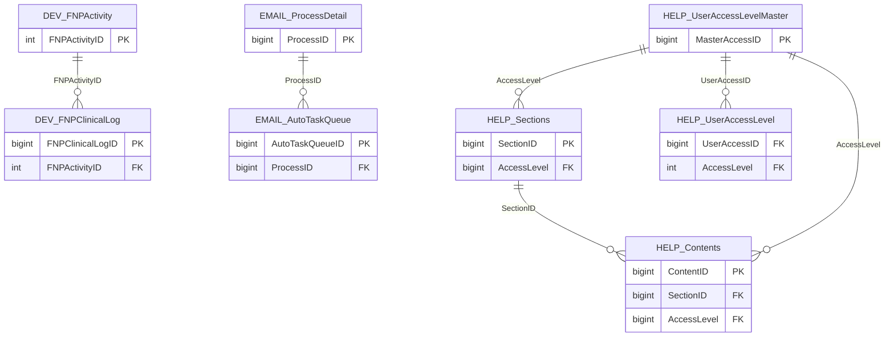

import TableDetail from '@site/src/components/TableDetail';

# Uncategorized Database Tables

**349 tables** · **53 with PK** (15.2%) · **7 FKs** · **116 indexes**

## Entity Relationships

## Table Reference

<TableDetail
  dataUrl="/table-detail-data/uncategorized.json"
  generatedAt="2026-02-28T06:03:57.118Z"
/>

## Stored Procedures

See the [Uncategorized Stored Procedures](./sprocs/uncategorized-sprocs) reference page for detailed documentation of all stored procedures in this module, including parameters, anti-pattern analysis, and optimization recommendations.
