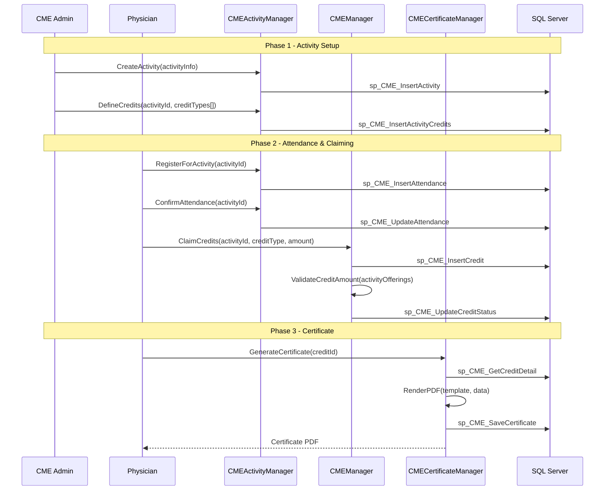
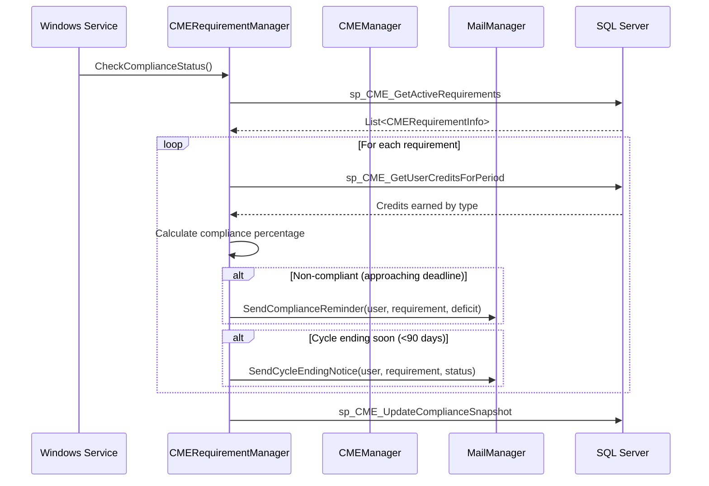
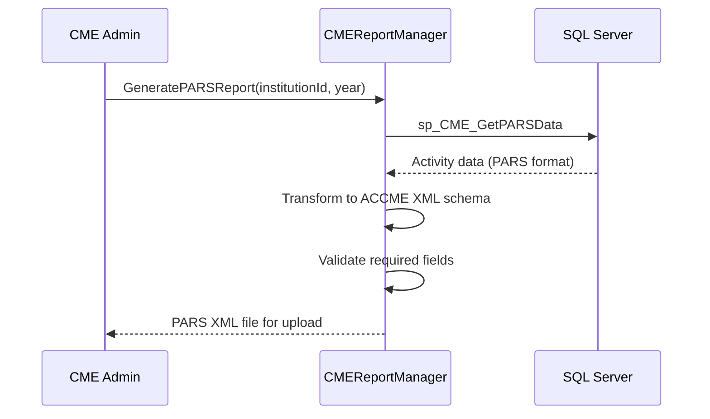
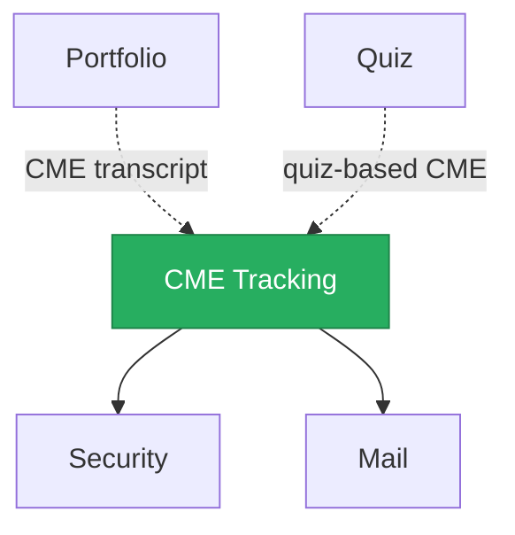

import DependentsPanel from '@site/src/components/DependentsPanel';

# CME Tracking

<!-- Content will be enriched by AI parsing scripts -->

## Overview

The CME Tracking module manages Continuing Medical Education credits for physicians and other healthcare professionals. CME is a requirement for maintaining medical licensure and board certification. This module tracks credit accumulation across multiple credit types, logs educational activities, generates certificates of completion, and produces reports that satisfy ACCME (Accreditation Council for Continuing Medical Education) requirements.

With 25+ classes, the module supports the full CME lifecycle from activity registration through credit claiming, verification, certificate generation, and reporting to licensing boards and specialty boards.

### Key Responsibilities

- **Credit Type Management**: Track multiple credit categories (AMA PRA Category 1, Category 2, MOC, AAFP Prescribed, state-specific credits)
- **Activity Logging**: Record educational activities (conferences, online courses, journal articles, teaching, research)
- **Certificate Generation**: Produce PDF certificates of completion for individual activities and cumulative transcripts
- **ACCME Reporting**: Generate data exports in ACCME-required formats (PARS reporting)
- **Compliance Tracking**: Monitor credit accumulation against licensure renewal requirements and board certification cycles
- **Verification**: Track external credit verification and attestation workflows

## Key Classes

### Manager Classes

| Class | Namespace | Purpose |
|-------|-----------|---------|
| `CMEManager` | `MyEvaluations.Business.CME` | Core CME operations: credit entry, retrieval, summary calculations, and transcript generation. |
| `CMEActivityManager` | `MyEvaluations.Business.CME` | Educational activity management: creation, categorization, attendance tracking. |
| `CMECertificateManager` | `MyEvaluations.Business.CME` | Certificate generation: individual activity certificates and cumulative transcripts (PDF). |
| `CMEReportManager` | `MyEvaluations.Business.CME` | Reporting: ACCME PARS exports, institutional summaries, individual compliance reports. |
| `CMERequirementManager` | `MyEvaluations.Business.CME` | Requirement definition and tracking: licensure cycles, board certification requirements, custom institutional requirements. |
| `CMEVerificationManager` | `MyEvaluations.Business.CME` | External credit verification and attestation workflows. |

### Info (DTO) Classes

| Class | Purpose |
|-------|---------|
| `CMECreditInfo` | Individual credit record: activity, credit type, amount, date earned, verification status. |
| `CMEActivityInfo` | Educational activity: title, type, provider, date, location, credit offerings, attendance list. |
| `CMECertificateInfo` | Certificate record: user, activity, credits, issue date, certificate number, PDF path. |
| `CMERequirementInfo` | Requirement definition: credit type, amount required, cycle dates, applicable users/roles. |
| `CMEComplianceInfo` | Compliance status: user, requirement, credits earned, credits needed, percentage complete. |
| `CMETranscriptInfo` | Cumulative transcript: user, date range, credits by type, activities list, total hours. |
| `CMEProviderInfo` | Accredited provider details: name, ACCME ID, accreditation status, credit types authorized. |

## Business Workflows

### Activity Registration and Credit Claiming

### Compliance Monitoring

### ACCME PARS Reporting

## Stored Procedure References

| Stored Procedure | Purpose |
|-----------------|---------|
| `sp_CME_InsertActivity` | Create new educational activity |
| `sp_CME_InsertActivityCredits` | Define credit offerings for an activity |
| `sp_CME_InsertAttendance` | Record attendance registration |
| `sp_CME_UpdateAttendance` | Confirm or update attendance status |
| `sp_CME_InsertCredit` | Record a claimed credit |
| `sp_CME_UpdateCreditStatus` | Update credit verification status |
| `sp_CME_GetCreditDetail` | Retrieve credit details for certificate generation |
| `sp_CME_SaveCertificate` | Store generated certificate metadata |
| `sp_CME_GetActiveRequirements` | Retrieve active CME requirements |
| `sp_CME_GetUserCreditsForPeriod` | Retrieve credits earned in a date range |
| `sp_CME_UpdateComplianceSnapshot` | Update compliance status cache |
| `sp_CME_GetPARSData` | Retrieve data in ACCME PARS format |
| `sp_CME_GetTranscript` | Generate cumulative transcript data |

## Cross-Module Dependencies

### Dependency Details

| Direction | Module | Relationship |
|-----------|--------|-------------|
| Depends on | Security | Permission checks for credit entry, activity management, and reporting |
| Depends on | Mail | Compliance reminders, certificate delivery, cycle notifications |
| Depended on by | Portfolio | CME transcripts included in physician portfolios |
| Related to | Quiz | Some CME activities include quiz-based assessments for credit |

{/* DEPENDENTS-PANEL:START */}
<DependentsPanel module="CMETracking" />
{/* DEPENDENTS-PANEL:END */}

## File Reference

Browse per-file implementation documentation for every class in this module:

- [**CME Tracking Implementation Files**](./files/cmetracking) — 42 classes with summaries, key methods, stored procedures, and migration notes
