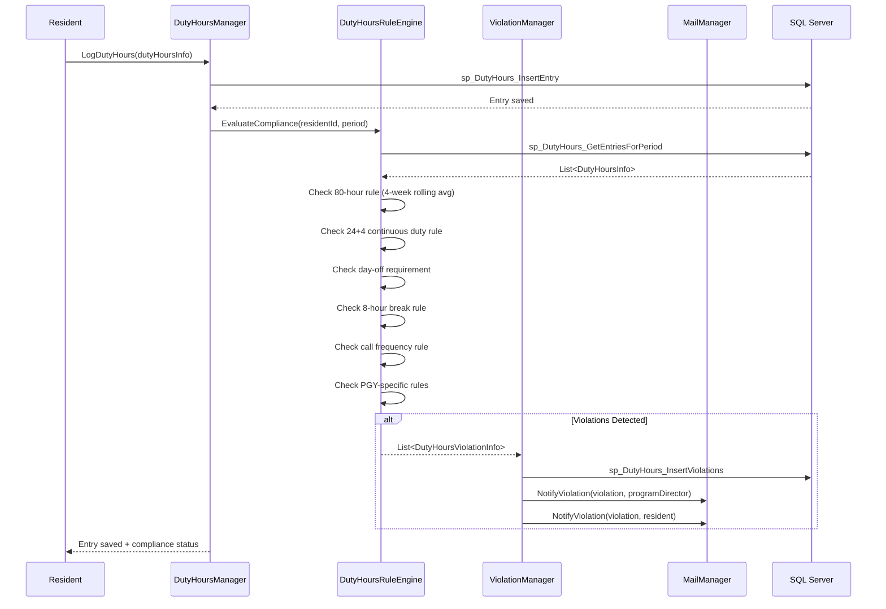
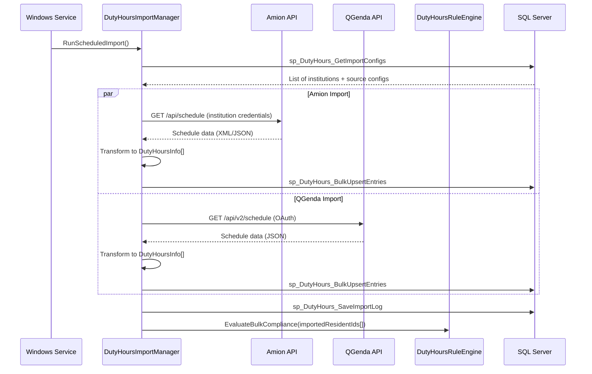
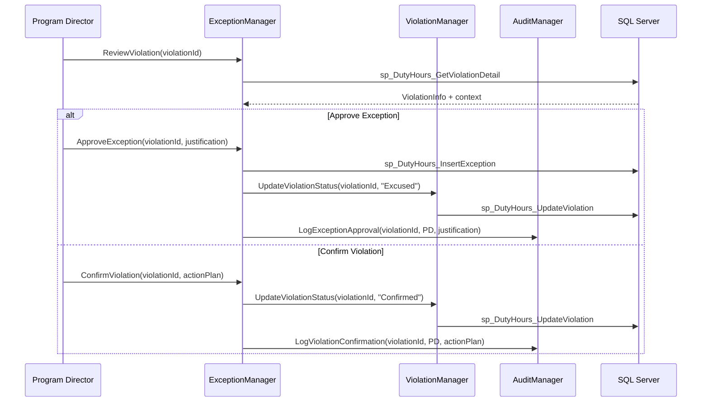
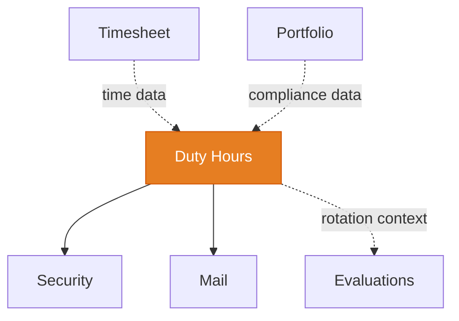

import DependentsPanel from '@site/src/components/DependentsPanel';

# Duty Hours

<!-- Content will be enriched by AI parsing scripts -->

## Overview

The Duty Hours module is the most complex module in the MyEvaluations system with 55+ classes. It tracks resident work hours for compliance with ACGME (Accreditation Council for Graduate Medical Education) requirements, which mandate strict limits on trainee working hours to ensure patient safety and resident well-being.

This module handles time entry (manual and imported from scheduling systems), real-time violation detection against ACGME rules, exception/override workflows for program directors, and comprehensive reporting for ACGME site visits and institutional compliance reviews.

### Key Responsibilities

- **Time Logging**: Manual hour entry, clock-in/clock-out, and import from external scheduling systems (Amion, QGenda, MedHub)
- **ACGME Rule Engine**: Real-time evaluation of logged hours against the full set of ACGME common program requirements
- **Violation Detection**: Automatic identification of violations with severity classification and notification
- **Exception Management**: Program director review and override of flagged violations with documented justification
- **Reporting**: Individual resident reports, program-level dashboards, and ACGME-formatted compliance reports
- **Scheduling Integration**: Two-way sync with Amion, QGenda, and other scheduling platforms

### ACGME Common Program Requirements

The rule engine enforces these key requirements (2024 standards):

| Rule | Requirement | Measurement |
|------|-------------|-------------|
| 80-Hour Week | Maximum 80 hours averaged over 4 weeks | Rolling 4-week average |
| 24+4 Rule | Maximum 24 hours of continuous duty + 4 hours for transitions | Continuous clock tracking |
| Day Off | Minimum 1 day free from duty per 7-day period (averaged over 4 weeks) | Weekly period analysis |
| 8-Hour Break | Minimum 8 hours between duty periods | Gap analysis |
| 14-Hour Limit | Maximum 14 hours for PGY-1 (first-year) residents on certain schedules | PGY-level-specific rule |
| In-House Call | No more frequent than every 3rd night (averaged over 4 weeks) | Call frequency analysis |
| Moonlighting | Hours must be counted toward 80-hour limit | Total hour aggregation |

## Key Classes

### Manager Classes

| Class | Namespace | Purpose |
|-------|-----------|---------|
| `DutyHoursManager` | `MyEvaluations.Business.DutyHours` | Core time entry CRUD, retrieval, and summary calculations. |
| `DutyHoursRuleEngine` | `MyEvaluations.Business.DutyHours` | ACGME rule evaluation. Checks all logged hours against configurable rule sets. |
| `DutyHoursViolationManager` | `MyEvaluations.Business.DutyHours` | Violation detection, notification, and resolution tracking. |
| `DutyHoursImportManager` | `MyEvaluations.Business.DutyHours` | Import from external scheduling systems (Amion, QGenda). |
| `DutyHoursExceptionManager` | `MyEvaluations.Business.DutyHours` | Exception/override workflow for program directors. |
| `DutyHoursReportManager` | `MyEvaluations.Business.DutyHours` | Report generation: individual, program, ACGME format. |
| `DutyHoursScheduleManager` | `MyEvaluations.Business.DutyHours` | Manages rotation/call schedules and their mapping to duty hour periods. |
| `DutyHoursApprovalManager` | `MyEvaluations.Business.DutyHours` | Timesheet-style approval workflow for logged hours. |
| `AmionIntegrationManager` | `MyEvaluations.Business.DutyHours` | Amion-specific import/sync logic. |
| `QGendaIntegrationManager` | `MyEvaluations.Business.DutyHours` | QGenda-specific import/sync logic. |

### Info (DTO) Classes

| Class | Purpose |
|-------|---------|
| `DutyHoursInfo` | Single duty period: start time, end time, type (clinical, educational, call, moonlighting), location. |
| `DutyHoursRuleInfo` | Rule definition: rule code, description, threshold, measurement window, severity. |
| `DutyHoursViolationInfo` | Detected violation: rule, resident, period, actual value, threshold, severity, status. |
| `DutyHoursSummaryInfo` | Summary for a period: total hours, average weekly, violations count, compliance percentage. |
| `DutyHoursExceptionInfo` | Exception record: violation, justification, approver, approval date, expiration. |
| `DutyHoursImportInfo` | Import batch record: source system, import date, record count, error count, status. |
| `DutyHoursScheduleInfo` | Schedule entry: resident, rotation, call type, start/end, source system. |
| `DutyHoursCallInfo` | On-call period details: type (in-house, home call), start, end, activated flag. |

## Business Workflows

### Time Entry and Violation Detection

### Scheduling System Import Flow

### Exception/Override Workflow

## Stored Procedure References

| Stored Procedure | Purpose |
|-----------------|---------|
| `sp_DutyHours_InsertEntry` | Insert a single duty hour entry |
| `sp_DutyHours_UpdateEntry` | Update an existing duty hour entry |
| `sp_DutyHours_GetEntriesForPeriod` | Retrieve all entries for a resident in a date range |
| `sp_DutyHours_BulkUpsertEntries` | Bulk insert/update from scheduling system imports |
| `sp_DutyHours_InsertViolations` | Insert detected violations |
| `sp_DutyHours_UpdateViolation` | Update violation status (excused, confirmed, etc.) |
| `sp_DutyHours_GetViolationDetail` | Retrieve violation with full context |
| `sp_DutyHours_InsertException` | Record an approved exception |
| `sp_DutyHours_GetImportConfigs` | Retrieve scheduling system integration configs |
| `sp_DutyHours_SaveImportLog` | Log import batch results |
| `sp_DutyHours_GetSummary` | Calculate summary statistics for a period |
| `sp_DutyHours_GetACGMEReport` | Generate ACGME-formatted compliance report data |
| `sp_DutyHours_GetComplianceRate` | Calculate compliance percentage for program/institution |
| `sp_DutyHours_GetCallSchedule` | Retrieve on-call schedule entries |

## Cross-Module Dependencies

### Dependency Details

| Direction | Module | Relationship |
|-----------|--------|-------------|
| Depends on | Security | Permission checks for entry submission, violation review, report access |
| Depends on | Mail | Violation notifications to residents and program directors |
| Related to | Evaluations | Rotation schedule context shared for evaluation assignment |
| Related to | Timesheet | Time data may overlap; different compliance contexts |
| Related to | Portfolio | Duty hour compliance summaries included in resident portfolios |

{/* DEPENDENTS-PANEL:START */}
<DependentsPanel
  module="DutyHours"
  webDependents={[
  {
    "fileName": "BasePage.cs",
    "filePath": "Web/App_Code/BasePage.cs",
    "directory": "Web/App_Code",
    "module": "Infrastructure"
  },
  {
    "fileName": "BasePage_Ajax.cs",
    "filePath": "Web/App_Code/BasePage_Ajax.cs",
    "directory": "Web/App_Code",
    "module": "Infrastructure"
  },
  {
    "fileName": "BSNDashboard.aspx.cs",
    "filePath": "Web/BSNProgram/BSNDashboard.aspx.cs",
    "directory": "Web/BSNProgram",
    "module": "BSNProgram"
  },
  {
    "fileName": "CoursePerformanceDashboard.aspx.cs",
    "filePath": "Web/BSNProgram/CoursePerformanceDashboard.aspx.cs",
    "directory": "Web/BSNProgram",
    "module": "BSNProgram"
  },
  {
    "fileName": "StudentCountReport.aspx.cs",
    "filePath": "Web/BSNProgram/StudentCountReport.aspx.cs",
    "directory": "Web/BSNProgram",
    "module": "BSNProgram"
  },
  {
    "fileName": "ViewPastDueClinicalSiteEvaluations.aspx.cs",
    "filePath": "Web/BSNProgram/ViewPastDueClinicalSiteEvaluations.aspx.cs",
    "directory": "Web/BSNProgram",
    "module": "BSNProgram"
  },
  {
    "fileName": "CreateGuest.aspx.cs",
    "filePath": "Web/CMETracking/CreateGuest.aspx.cs",
    "directory": "Web/CMETracking",
    "module": "CMETracking"
  },
  {
    "fileName": "CreateGuestLecturer.aspx.cs",
    "filePath": "Web/CMETracking/CreateGuestLecturer.aspx.cs",
    "directory": "Web/CMETracking",
    "module": "CMETracking"
  },
  {
    "fileName": "GroupParticipants.aspx.cs",
    "filePath": "Web/CMETracking/GroupParticipants.aspx.cs",
    "directory": "Web/CMETracking",
    "module": "CMETracking"
  },
  {
    "fileName": "ManageCMEAssignmentAddUsers.aspx.cs",
    "filePath": "Web/CMETracking/ManageCMEAssignmentAddUsers.aspx.cs",
    "directory": "Web/CMETracking",
    "module": "CMETracking"
  },
  {
    "fileName": "ManageCMEAssignments.aspx.cs",
    "filePath": "Web/CMETracking/ManageCMEAssignments.aspx.cs",
    "directory": "Web/CMETracking",
    "module": "CMETracking"
  },
  {
    "fileName": "ManageCMEDeletedAssignments.aspx.cs",
    "filePath": "Web/CMETracking/ManageCMEDeletedAssignments.aspx.cs",
    "directory": "Web/CMETracking",
    "module": "CMETracking"
  },
  {
    "fileName": "ManageCMEGroupsParticipants.aspx.cs",
    "filePath": "Web/CMETracking/ManageCMEGroupsParticipants.aspx.cs",
    "directory": "Web/CMETracking",
    "module": "CMETracking"
  },
  {
    "fileName": "MonthlyPopupCMEInfo.aspx.cs",
    "filePath": "Web/CMETracking/MonthlyPopupCMEInfo.aspx.cs",
    "directory": "Web/CMETracking",
    "module": "CMETracking"
  },
  {
    "fileName": "MultipleScheduleAssignment.aspx.cs",
    "filePath": "Web/CMETracking/MultipleScheduleAssignment.aspx.cs",
    "directory": "Web/CMETracking",
    "module": "CMETracking"
  },
  {
    "fileName": "PrintGroupsParticipants.aspx.cs",
    "filePath": "Web/CMETracking/PrintGroupsParticipants.aspx.cs",
    "directory": "Web/CMETracking",
    "module": "CMETracking"
  },
  {
    "fileName": "ManageDefaultCredentialingInfo.aspx.cs",
    "filePath": "Web/CMETracking/Setup/ManageDefaultCredentialingInfo.aspx.cs",
    "directory": "Web/CMETracking",
    "module": "CMETracking"
  },
  {
    "fileName": "AddClinic.aspx.cs",
    "filePath": "Web/DutyHours/ConferencesAndClinics/AddClinic.aspx.cs",
    "directory": "Web/DutyHours",
    "module": "DutyHours"
  },
  {
    "fileName": "AddConference.aspx.cs",
    "filePath": "Web/DutyHours/ConferencesAndClinics/AddConference.aspx.cs",
    "directory": "Web/DutyHours",
    "module": "DutyHours"
  },
  {
    "fileName": "AddGroupParticipants.aspx.cs",
    "filePath": "Web/DutyHours/ConferencesAndClinics/AddGroupParticipants.aspx.cs",
    "directory": "Web/DutyHours",
    "module": "DutyHours"
  },
  {
    "fileName": "AttendanceConferenceSchedule.aspx.cs",
    "filePath": "Web/DutyHours/ConferencesAndClinics/AttendanceConferenceSchedule.aspx.cs",
    "directory": "Web/DutyHours",
    "module": "DutyHours"
  },
  {
    "fileName": "ConferenceAttendanceImporting.aspx.cs",
    "filePath": "Web/DutyHours/ConferencesAndClinics/ConferenceAttendanceImporting.aspx.cs",
    "directory": "Web/DutyHours",
    "module": "DutyHours"
  },
  {
    "fileName": "ConferenceImporting.aspx.cs",
    "filePath": "Web/DutyHours/ConferencesAndClinics/ConferenceImporting.aspx.cs",
    "directory": "Web/DutyHours",
    "module": "DutyHours"
  },
  {
    "fileName": "CreateGuest.aspx.cs",
    "filePath": "Web/DutyHours/ConferencesAndClinics/CreateGuest.aspx.cs",
    "directory": "Web/DutyHours",
    "module": "DutyHours"
  },
  {
    "fileName": "DHScheduleJobHistory.aspx.cs",
    "filePath": "Web/DutyHours/ConferencesAndClinics/DHScheduleJobHistory.aspx.cs",
    "directory": "Web/DutyHours",
    "module": "DutyHours"
  },
  {
    "fileName": "DeclineConferenceEvaluation.aspx.cs",
    "filePath": "Web/DutyHours/ConferencesAndClinics/DeclineConferenceEvaluation.aspx.cs",
    "directory": "Web/DutyHours",
    "module": "DutyHours"
  },
  {
    "fileName": "EvaluateConferenceEvaluation.aspx.cs",
    "filePath": "Web/DutyHours/ConferencesAndClinics/EvaluateConferenceEvaluation.aspx.cs",
    "directory": "Web/DutyHours",
    "module": "DutyHours"
  },
  {
    "fileName": "ManageClinics.aspx.cs",
    "filePath": "Web/DutyHours/ConferencesAndClinics/ManageClinics.aspx.cs",
    "directory": "Web/DutyHours",
    "module": "DutyHours"
  },
  {
    "fileName": "ManageConferenceEvaluations.aspx.cs",
    "filePath": "Web/DutyHours/ConferencesAndClinics/ManageConferenceEvaluations.aspx.cs",
    "directory": "Web/DutyHours",
    "module": "DutyHours"
  },
  {
    "fileName": "ManageConferenceQuestionDatabase.aspx.cs",
    "filePath": "Web/DutyHours/ConferencesAndClinics/ManageConferenceQuestionDatabase.aspx.cs",
    "directory": "Web/DutyHours",
    "module": "DutyHours"
  },
  {
    "fileName": "ManageConferenceSchedules.aspx.cs",
    "filePath": "Web/DutyHours/ConferencesAndClinics/ManageConferenceSchedules.aspx.cs",
    "directory": "Web/DutyHours",
    "module": "DutyHours"
  },
  {
    "fileName": "ManageConferences.aspx.cs",
    "filePath": "Web/DutyHours/ConferencesAndClinics/ManageConferences.aspx.cs",
    "directory": "Web/DutyHours",
    "module": "DutyHours"
  },
  {
    "fileName": "ManageGroupsParticipants.aspx.cs",
    "filePath": "Web/DutyHours/ConferencesAndClinics/ManageGroupsParticipants.aspx.cs",
    "directory": "Web/DutyHours",
    "module": "DutyHours"
  },
  {
    "fileName": "MarkConferenceAttendance.aspx.cs",
    "filePath": "Web/DutyHours/ConferencesAndClinics/MarkConferenceAttendance.aspx.cs",
    "directory": "Web/DutyHours",
    "module": "DutyHours"
  },
  {
    "fileName": "PrintAttendanceConferenceSchedule.aspx.cs",
    "filePath": "Web/DutyHours/ConferencesAndClinics/PrintAttendanceConferenceSchedule.aspx.cs",
    "directory": "Web/DutyHours",
    "module": "DutyHours"
  },
  {
    "fileName": "PrintGroupsParticipants.aspx.cs",
    "filePath": "Web/DutyHours/ConferencesAndClinics/PrintGroupsParticipants.aspx.cs",
    "directory": "Web/DutyHours",
    "module": "DutyHours"
  },
  {
    "fileName": "RePrintAttendanceConferenceSchedule.aspx.cs",
    "filePath": "Web/DutyHours/ConferencesAndClinics/RePrintAttendanceConferenceSchedule.aspx.cs",
    "directory": "Web/DutyHours",
    "module": "DutyHours"
  },
  {
    "fileName": "DetailedConferenceScheduleResults.aspx.cs",
    "filePath": "Web/DutyHours/ConferencesAndClinics/Reports/DetailedConferenceScheduleResults.aspx.cs",
    "directory": "Web/DutyHours",
    "module": "DutyHours"
  },
  {
    "fileName": "DetailedConferenceTracking.aspx.cs",
    "filePath": "Web/DutyHours/ConferencesAndClinics/Reports/DetailedConferenceTracking.aspx.cs",
    "directory": "Web/DutyHours",
    "module": "DutyHours"
  },
  {
    "fileName": "IndividualConferenceEvaluation.aspx.cs",
    "filePath": "Web/DutyHours/ConferencesAndClinics/Reports/IndividualConferenceEvaluation.aspx.cs",
    "directory": "Web/DutyHours",
    "module": "DutyHours"
  },
  {
    "fileName": "IndividualConferenceEvaluationResults.aspx.cs",
    "filePath": "Web/DutyHours/ConferencesAndClinics/Reports/IndividualConferenceEvaluationResults.aspx.cs",
    "directory": "Web/DutyHours",
    "module": "DutyHours"
  },
  {
    "fileName": "MonthlyCalendarResults.aspx.cs",
    "filePath": "Web/DutyHours/ConferencesAndClinics/Reports/MonthlyCalendarResults.aspx.cs",
    "directory": "Web/DutyHours",
    "module": "DutyHours"
  },
  {
    "fileName": "MonthlyCalenderResultsNew.aspx.cs",
    "filePath": "Web/DutyHours/ConferencesAndClinics/Reports/MonthlyCalenderResultsNew.aspx.cs",
    "directory": "Web/DutyHours",
    "module": "DutyHours"
  },
  {
    "fileName": "MonthlyConferenceSchedule.aspx.cs",
    "filePath": "Web/DutyHours/ConferencesAndClinics/Reports/MonthlyConferenceSchedule.aspx.cs",
    "directory": "Web/DutyHours",
    "module": "DutyHours"
  },
  {
    "fileName": "MonthlyPopupInfo.aspx.cs",
    "filePath": "Web/DutyHours/ConferencesAndClinics/Reports/MonthlyPopupInfo.aspx.cs",
    "directory": "Web/DutyHours",
    "module": "DutyHours"
  },
  {
    "fileName": "SummaryConferenceEvaluation.aspx.cs",
    "filePath": "Web/DutyHours/ConferencesAndClinics/Reports/SummaryConferenceEvaluation.aspx.cs",
    "directory": "Web/DutyHours",
    "module": "DutyHours"
  },
  {
    "fileName": "SummaryConferenceEvaluationResults.aspx.cs",
    "filePath": "Web/DutyHours/ConferencesAndClinics/Reports/SummaryConferenceEvaluationResults.aspx.cs",
    "directory": "Web/DutyHours",
    "module": "DutyHours"
  },
  {
    "fileName": "SummaryConferencePresentersTrackingResults.aspx.cs",
    "filePath": "Web/DutyHours/ConferencesAndClinics/Reports/SummaryConferencePresentersTrackingResults.aspx.cs",
    "directory": "Web/DutyHours",
    "module": "DutyHours"
  },
  {
    "fileName": "SummaryConferenceTracking.aspx.cs",
    "filePath": "Web/DutyHours/ConferencesAndClinics/Reports/SummaryConferenceTracking.aspx.cs",
    "directory": "Web/DutyHours",
    "module": "DutyHours"
  },
  {
    "fileName": "SummaryConferenceTrackingResults.aspx.cs",
    "filePath": "Web/DutyHours/ConferencesAndClinics/Reports/SummaryConferenceTrackingResults.aspx.cs",
    "directory": "Web/DutyHours",
    "module": "DutyHours"
  },
  {
    "fileName": "RestoreManageGroupsParticipants.aspx.cs",
    "filePath": "Web/DutyHours/ConferencesAndClinics/RestoreManageGroupsParticipants.aspx.cs",
    "directory": "Web/DutyHours",
    "module": "DutyHours"
  },
  {
    "fileName": "ScheduleConference.aspx.cs",
    "filePath": "Web/DutyHours/ConferencesAndClinics/ScheduleConference.aspx.cs",
    "directory": "Web/DutyHours",
    "module": "DutyHours"
  },
  {
    "fileName": "UpdateScheduleConference.aspx.cs",
    "filePath": "Web/DutyHours/ConferencesAndClinics/UpdateScheduleConference.aspx.cs",
    "directory": "Web/DutyHours",
    "module": "DutyHours"
  },
  {
    "fileName": "UpdateSummaryScheduleConferences.aspx.cs",
    "filePath": "Web/DutyHours/ConferencesAndClinics/UpdateSummaryScheduleConferences.aspx.cs",
    "directory": "Web/DutyHours",
    "module": "DutyHours"
  },
  {
    "fileName": "DHUserVerification.aspx.cs",
    "filePath": "Web/DutyHours/DHUserVerification.aspx.cs",
    "directory": "Web/DutyHours",
    "module": "DutyHours"
  },
  {
    "fileName": "DHUserVerificationAuto.aspx.cs",
    "filePath": "Web/DutyHours/DHUserVerificationAuto.aspx.cs",
    "directory": "Web/DutyHours",
    "module": "DutyHours"
  },
  {
    "fileName": "DHUserVerificationDetails.aspx.cs",
    "filePath": "Web/DutyHours/DHUserVerificationDetails.aspx.cs",
    "directory": "Web/DutyHours",
    "module": "DutyHours"
  },
  {
    "fileName": "DHUserVerificationForUndo.aspx.cs",
    "filePath": "Web/DutyHours/DHUserVerificationForUndo.aspx.cs",
    "directory": "Web/DutyHours",
    "module": "DutyHours"
  },
  {
    "fileName": "DHUserVerificationWithDateRange.aspx.cs",
    "filePath": "Web/DutyHours/DHUserVerificationWithDateRange.aspx.cs",
    "directory": "Web/DutyHours",
    "module": "DutyHours"
  },
  {
    "fileName": "DHViolationReview.aspx.cs",
    "filePath": "Web/DutyHours/DHViolationReview.aspx.cs",
    "directory": "Web/DutyHours",
    "module": "DutyHours"
  },
  {
    "fileName": "DHViolationReviewList.aspx.cs",
    "filePath": "Web/DutyHours/DHViolationReviewList.aspx.cs",
    "directory": "Web/DutyHours",
    "module": "DutyHours"
  },
  {
    "fileName": "DutyHoursExport.aspx.cs",
    "filePath": "Web/DutyHours/DutyHoursExport.aspx.cs",
    "directory": "Web/DutyHours",
    "module": "DutyHours"
  },
  {
    "fileName": "DutyHoursMain.aspx.cs",
    "filePath": "Web/DutyHours/DutyHoursMain.aspx.cs",
    "directory": "Web/DutyHours",
    "module": "DutyHours"
  },
  {
    "fileName": "GeofenceLocations.aspx.cs",
    "filePath": "Web/DutyHours/GeofenceLocations.aspx.cs",
    "directory": "Web/DutyHours",
    "module": "DutyHours"
  },
  {
    "fileName": "ImportDataSettings.aspx.cs",
    "filePath": "Web/DutyHours/ImportDataSettings.aspx.cs",
    "directory": "Web/DutyHours",
    "module": "DutyHours"
  },
  {
    "fileName": "LockCHModifications.aspx.cs",
    "filePath": "Web/DutyHours/LockCHModifications.aspx.cs",
    "directory": "Web/DutyHours",
    "module": "DutyHours"
  },
  {
    "fileName": "ManageDHVerification.aspx.cs",
    "filePath": "Web/DutyHours/ManageDHVerification.aspx.cs",
    "directory": "Web/DutyHours",
    "module": "DutyHours"
  },
  {
    "fileName": "DailyBSNDutyHoursReport.aspx.cs",
    "filePath": "Web/DutyHours/Reports/DailyBSNDutyHoursReport.aspx.cs",
    "directory": "Web/DutyHours",
    "module": "DutyHours"
  },
  {
    "fileName": "DailyBSNDutyHoursReportResults.aspx.cs",
    "filePath": "Web/DutyHours/Reports/DailyBSNDutyHoursReportResults.aspx.cs",
    "directory": "Web/DutyHours",
    "module": "DutyHours"
  },
  {
    "fileName": "DailySummaryDutyHours.aspx.cs",
    "filePath": "Web/DutyHours/Reports/DailySummaryDutyHours.aspx.cs",
    "directory": "Web/DutyHours",
    "module": "DutyHours"
  },
  {
    "fileName": "DailySummaryDutyHoursResults.aspx.cs",
    "filePath": "Web/DutyHours/Reports/DailySummaryDutyHoursResults.aspx.cs",
    "directory": "Web/DutyHours",
    "module": "DutyHours"
  },
  {
    "fileName": "DetailedBSNDutyHours.aspx.cs",
    "filePath": "Web/DutyHours/Reports/DetailedBSNDutyHours.aspx.cs",
    "directory": "Web/DutyHours",
    "module": "DutyHours"
  },
  {
    "fileName": "DetailedBSNDutyHoursReportResult.aspx.cs",
    "filePath": "Web/DutyHours/Reports/DetailedBSNDutyHoursReportResult.aspx.cs",
    "directory": "Web/DutyHours",
    "module": "DutyHours"
  },
  {
    "fileName": "DetailedDutyHours.aspx.cs",
    "filePath": "Web/DutyHours/Reports/DetailedDutyHours.aspx.cs",
    "directory": "Web/DutyHours",
    "module": "DutyHours"
  },
  {
    "fileName": "DetailedDutyHoursResults.aspx.cs",
    "filePath": "Web/DutyHours/Reports/DetailedDutyHoursResults.aspx.cs",
    "directory": "Web/DutyHours",
    "module": "DutyHours"
  },
  {
    "fileName": "DutyHourCompletionStatus.aspx.cs",
    "filePath": "Web/DutyHours/Reports/DutyHourCompletionStatus.aspx.cs",
    "directory": "Web/DutyHours",
    "module": "DutyHours"
  },
  {
    "fileName": "DutyHourCompletionStatusBeta.aspx.cs",
    "filePath": "Web/DutyHours/Reports/DutyHourCompletionStatusBeta.aspx.cs",
    "directory": "Web/DutyHours",
    "module": "DutyHours"
  },
  {
    "fileName": "DutyHourCompletionStatusResult.aspx.cs",
    "filePath": "Web/DutyHours/Reports/DutyHourCompletionStatusResult.aspx.cs",
    "directory": "Web/DutyHours",
    "module": "DutyHours"
  },
  {
    "fileName": "DutyHourCompletionStatusResultBeta.aspx.cs",
    "filePath": "Web/DutyHours/Reports/DutyHourCompletionStatusResultBeta.aspx.cs",
    "directory": "Web/DutyHours",
    "module": "DutyHours"
  },
  {
    "fileName": "DutyHourCompliance.aspx.cs",
    "filePath": "Web/DutyHours/Reports/DutyHourCompliance.aspx.cs",
    "directory": "Web/DutyHours",
    "module": "DutyHours"
  },
  {
    "fileName": "DutyHourComplianceResults.aspx.cs",
    "filePath": "Web/DutyHours/Reports/DutyHourComplianceResults.aspx.cs",
    "directory": "Web/DutyHours",
    "module": "DutyHours"
  },
  {
    "fileName": "DutyHourInstCompletionStatus.aspx.cs",
    "filePath": "Web/DutyHours/Reports/DutyHourInstCompletionStatus.aspx.cs",
    "directory": "Web/DutyHours",
    "module": "DutyHours"
  },
  {
    "fileName": "DutyHourInstCompletionStatusResult.aspx.cs",
    "filePath": "Web/DutyHours/Reports/DutyHourInstCompletionStatusResult.aspx.cs",
    "directory": "Web/DutyHours",
    "module": "DutyHours"
  },
  {
    "fileName": "DutyHourInstScheduleDiscrepancy.aspx.cs",
    "filePath": "Web/DutyHours/Reports/DutyHourInstScheduleDiscrepancy.aspx.cs",
    "directory": "Web/DutyHours",
    "module": "DutyHours"
  },
  {
    "fileName": "DutyHourInstScheduleDiscrepancyResults.aspx.cs",
    "filePath": "Web/DutyHours/Reports/DutyHourInstScheduleDiscrepancyResults.aspx.cs",
    "directory": "Web/DutyHours",
    "module": "DutyHours"
  },
  {
    "fileName": "DutyHourScheduleDiscrepancy.aspx.cs",
    "filePath": "Web/DutyHours/Reports/DutyHourScheduleDiscrepancy.aspx.cs",
    "directory": "Web/DutyHours",
    "module": "DutyHours"
  },
  {
    "fileName": "DutyHourScheduleDiscrepancyResults.aspx.cs",
    "filePath": "Web/DutyHours/Reports/DutyHourScheduleDiscrepancyResults.aspx.cs",
    "directory": "Web/DutyHours",
    "module": "DutyHours"
  },
  {
    "fileName": "DutyHourSummaryCompliance.aspx.cs",
    "filePath": "Web/DutyHours/Reports/DutyHourSummaryCompliance.aspx.cs",
    "directory": "Web/DutyHours",
    "module": "DutyHours"
  },
  {
    "fileName": "DutyHourSummaryComplianceResults.aspx.cs",
    "filePath": "Web/DutyHours/Reports/DutyHourSummaryComplianceResults.aspx.cs",
    "directory": "Web/DutyHours",
    "module": "DutyHours"
  },
  {
    "fileName": "InstitutionScheduleImplementationStatusResults.aspx.cs",
    "filePath": "Web/DutyHours/Reports/InstitutionScheduleImplementationStatusResults.aspx.cs",
    "directory": "Web/DutyHours",
    "module": "DutyHours"
  },
  {
    "fileName": "InstitutionSystemImplementationStatusResults.aspx.cs",
    "filePath": "Web/DutyHours/Reports/InstitutionSystemImplementationStatusResults.aspx.cs",
    "directory": "Web/DutyHours",
    "module": "DutyHours"
  },
  {
    "fileName": "InstitutionalDHCompliance.aspx.cs",
    "filePath": "Web/DutyHours/Reports/InstitutionalDHCompliance.aspx.cs",
    "directory": "Web/DutyHours",
    "module": "DutyHours"
  },
  {
    "fileName": "InstitutionalDHComplianceResults.aspx.cs",
    "filePath": "Web/DutyHours/Reports/InstitutionalDHComplianceResults.aspx.cs",
    "directory": "Web/DutyHours",
    "module": "DutyHours"
  },
  {
    "fileName": "InstitutionalDetailedDutyHoursResults.aspx.cs",
    "filePath": "Web/DutyHours/Reports/InstitutionalDetailedDutyHoursResults.aspx.cs",
    "directory": "Web/DutyHours",
    "module": "DutyHours"
  },
  {
    "fileName": "RecordOfRotationResults.aspx.cs",
    "filePath": "Web/DutyHours/Reports/RecordOfRotationResults.aspx.cs",
    "directory": "Web/DutyHours",
    "module": "DutyHours"
  },
  {
    "fileName": "RecordOfRotations.aspx.cs",
    "filePath": "Web/DutyHours/Reports/RecordOfRotations.aspx.cs",
    "directory": "Web/DutyHours",
    "module": "DutyHours"
  },
  {
    "fileName": "SynchedDataDetails.aspx.cs",
    "filePath": "Web/DutyHours/Reports/SynchedDataDetails.aspx.cs",
    "directory": "Web/DutyHours",
    "module": "DutyHours"
  },
  {
    "fileName": "WeeklyBSNDutyHoursReport.aspx.cs",
    "filePath": "Web/DutyHours/Reports/WeeklyBSNDutyHoursReport.aspx.cs",
    "directory": "Web/DutyHours",
    "module": "DutyHours"
  },
  {
    "fileName": "WeeklyBSNDutyHoursReportResults.aspx.cs",
    "filePath": "Web/DutyHours/Reports/WeeklyBSNDutyHoursReportResults.aspx.cs",
    "directory": "Web/DutyHours",
    "module": "DutyHours"
  },
  {
    "fileName": "WeeklySummaryDutyHours.aspx.cs",
    "filePath": "Web/DutyHours/Reports/WeeklySummaryDutyHours.aspx.cs",
    "directory": "Web/DutyHours",
    "module": "DutyHours"
  },
  {
    "fileName": "WeeklySummaryDutyHoursResults.aspx.cs",
    "filePath": "Web/DutyHours/Reports/WeeklySummaryDutyHoursResults.aspx.cs",
    "directory": "Web/DutyHours",
    "module": "DutyHours"
  },
  {
    "fileName": "RotationVerificationSettings.aspx.cs",
    "filePath": "Web/DutyHours/RotationVerificationSettings.aspx.cs",
    "directory": "Web/DutyHours",
    "module": "DutyHours"
  },
  {
    "fileName": "Activity.aspx.cs",
    "filePath": "Web/DutyHours/Setup/Activity.aspx.cs",
    "directory": "Web/DutyHours",
    "module": "DutyHours"
  },
  {
    "fileName": "ActivityTypeQRCodes.aspx.cs",
    "filePath": "Web/DutyHours/Setup/ActivityTypeQRCodes.aspx.cs",
    "directory": "Web/DutyHours",
    "module": "DutyHours"
  },
  {
    "fileName": "DutyHoursSettings.aspx.cs",
    "filePath": "Web/DutyHours/Setup/DutyHoursSettings.aspx.cs",
    "directory": "Web/DutyHours",
    "module": "DutyHours"
  },
  {
    "fileName": "DutyHoursSetup.aspx.cs",
    "filePath": "Web/DutyHours/Setup/DutyHoursSetup.aspx.cs",
    "directory": "Web/DutyHours",
    "module": "DutyHours"
  },
  {
    "fileName": "GeofenceLocations.aspx.cs",
    "filePath": "Web/DutyHours/Setup/GeofenceLocations.aspx.cs",
    "directory": "Web/DutyHours",
    "module": "DutyHours"
  },
  {
    "fileName": "GeofenceNames.aspx.cs",
    "filePath": "Web/DutyHours/Setup/GeofenceNames.aspx.cs",
    "directory": "Web/DutyHours",
    "module": "DutyHours"
  },
  {
    "fileName": "LinkRotationsDutyHours.aspx.cs",
    "filePath": "Web/DutyHours/Setup/LinkRotationsDutyHours.aspx.cs",
    "directory": "Web/DutyHours",
    "module": "DutyHours"
  },
  {
    "fileName": "SyncQGendaRotations.aspx.cs",
    "filePath": "Web/DutyHours/Setup/SyncQGendaRotations.aspx.cs",
    "directory": "Web/DutyHours",
    "module": "DutyHours"
  },
  {
    "fileName": "SyncRotations.aspx.cs",
    "filePath": "Web/DutyHours/Setup/SyncRotations.aspx.cs",
    "directory": "Web/DutyHours",
    "module": "DutyHours"
  },
  {
    "fileName": "SyncRotationsDiscrepancy.aspx.cs",
    "filePath": "Web/DutyHours/Setup/SyncRotationsDiscrepancy.aspx.cs",
    "directory": "Web/DutyHours",
    "module": "DutyHours"
  },
  {
    "fileName": "ViewCurrentTaskRoles.aspx.cs",
    "filePath": "Web/DutyHours/Setup/ViewCurrentTaskRoles.aspx.cs",
    "directory": "Web/DutyHours",
    "module": "DutyHours"
  },
  {
    "fileName": "AddEditManageSessionNames.aspx.cs",
    "filePath": "Web/EssentialActivities/AddEditManageSessionNames.aspx.cs",
    "directory": "Web/EssentialActivities",
    "module": "EssentialActivities"
  },
  {
    "fileName": "ClinicalLogReviews.aspx.cs",
    "filePath": "Web/EssentialActivities/ClinicalLogReviews.aspx.cs",
    "directory": "Web/EssentialActivities",
    "module": "EssentialActivities"
  },
  {
    "fileName": "DNPReport.aspx.cs",
    "filePath": "Web/EssentialActivities/DNPReport.aspx.cs",
    "directory": "Web/EssentialActivities",
    "module": "EssentialActivities"
  },
  {
    "fileName": "PreceptorHoursReport.aspx.cs",
    "filePath": "Web/EssentialActivities/FNPReports/PreceptorHoursReport.aspx.cs",
    "directory": "Web/EssentialActivities",
    "module": "EssentialActivities"
  },
  {
    "fileName": "ManageCoursesNames.aspx.cs",
    "filePath": "Web/EssentialActivities/ManageCoursesNames.aspx.cs",
    "directory": "Web/EssentialActivities",
    "module": "EssentialActivities"
  },
  {
    "fileName": "ManageFNPEvaluationAssignments.aspx.cs",
    "filePath": "Web/EssentialActivities/ManageFNPEvaluationAssignments.aspx.cs",
    "directory": "Web/EssentialActivities",
    "module": "EssentialActivities"
  },
  {
    "fileName": "ManageGroupSessions.aspx.cs",
    "filePath": "Web/EssentialActivities/ManageGroupSessions.aspx.cs",
    "directory": "Web/EssentialActivities",
    "module": "EssentialActivities"
  },
  {
    "fileName": "ManageLogActivitiesandRoster.aspx.cs",
    "filePath": "Web/EssentialActivities/ManageLogActivitiesandRoster.aspx.cs",
    "directory": "Web/EssentialActivities",
    "module": "EssentialActivities"
  },
  {
    "fileName": "ManageSessionNames.aspx.cs",
    "filePath": "Web/EssentialActivities/ManageSessionNames.aspx.cs",
    "directory": "Web/EssentialActivities",
    "module": "EssentialActivities"
  },
  {
    "fileName": "Assign360Evaluations.aspx.cs",
    "filePath": "Web/Evaluations/Assign360Evaluations.aspx.cs",
    "directory": "Web/Evaluations",
    "module": "Evaluations"
  },
  {
    "fileName": "AssignEvaluations.aspx.cs",
    "filePath": "Web/Evaluations/AssignEvaluations.aspx.cs",
    "directory": "Web/Evaluations",
    "module": "Evaluations"
  },
  {
    "fileName": "AssignVoluntaryEvaluations.aspx.cs",
    "filePath": "Web/Evaluations/AssignVoluntaryEvaluations.aspx.cs",
    "directory": "Web/Evaluations",
    "module": "Evaluations"
  },
  {
    "fileName": "AssignmentsMenu.aspx.cs",
    "filePath": "Web/Evaluations/AssignmentsMenu.aspx.cs",
    "directory": "Web/Evaluations",
    "module": "Evaluations"
  },
  {
    "fileName": "DuplicateAssignments.aspx.cs",
    "filePath": "Web/Evaluations/DuplicateAssignments.aspx.cs",
    "directory": "Web/Evaluations",
    "module": "Evaluations"
  },
  {
    "fileName": "EditCompleteEvaluations.aspx.cs",
    "filePath": "Web/Evaluations/EditCompleteEvaluations.aspx.cs",
    "directory": "Web/Evaluations",
    "module": "Evaluations"
  },
  {
    "fileName": "EvaluationQrCode.aspx.cs",
    "filePath": "Web/Evaluations/EvaluationQrCode.aspx.cs",
    "directory": "Web/Evaluations",
    "module": "Evaluations"
  },
  {
    "fileName": "ExportData.aspx.cs",
    "filePath": "Web/Evaluations/ExportData.aspx.cs",
    "directory": "Web/Evaluations",
    "module": "Evaluations"
  },
  {
    "fileName": "GenerateEvaluationAssignments.aspx.cs",
    "filePath": "Web/Evaluations/GenerateEvaluationAssignments.aspx.cs",
    "directory": "Web/Evaluations",
    "module": "Evaluations"
  },
  {
    "fileName": "IntegratedOnCallAssignmentMenu.aspx.cs",
    "filePath": "Web/Evaluations/IntegratedOnCallAssignmentMenu.aspx.cs",
    "directory": "Web/Evaluations",
    "module": "Evaluations"
  },
  {
    "fileName": "LinkEvaluationsRotations.aspx.cs",
    "filePath": "Web/Evaluations/LinkEvaluationsRotations.aspx.cs",
    "directory": "Web/Evaluations",
    "module": "Evaluations"
  },
  {
    "fileName": "LogOfEvaluationAssignments.aspx.cs",
    "filePath": "Web/Evaluations/LogOfEvaluationAssignments.aspx.cs",
    "directory": "Web/Evaluations",
    "module": "Evaluations"
  },
  {
    "fileName": "ManageAllEvaluationAssignments.aspx.cs",
    "filePath": "Web/Evaluations/ManageAllEvaluationAssignments.aspx.cs",
    "directory": "Web/Evaluations",
    "module": "Evaluations"
  },
  {
    "fileName": "ManageEvaluationAssignments.aspx.cs",
    "filePath": "Web/Evaluations/ManageEvaluationAssignments.aspx.cs",
    "directory": "Web/Evaluations",
    "module": "Evaluations"
  },
  {
    "fileName": "ManageLogOfEvaluationAssignments.aspx.cs",
    "filePath": "Web/Evaluations/ManageLogOfEvaluationAssignments.aspx.cs",
    "directory": "Web/Evaluations",
    "module": "Evaluations"
  },
  {
    "fileName": "ManagePIPAssignments.aspx.cs",
    "filePath": "Web/Evaluations/ManagePIPAssignments.aspx.cs",
    "directory": "Web/Evaluations",
    "module": "Evaluations"
  },
  {
    "fileName": "MilestonePIPAssignments.aspx.cs",
    "filePath": "Web/Evaluations/MilestonePIPAssignments.aspx.cs",
    "directory": "Web/Evaluations",
    "module": "Evaluations"
  },
  {
    "fileName": "NonComplianceAdminEmails.aspx.cs",
    "filePath": "Web/LearningAssignment/NonComplianceAdminEmails.aspx.cs",
    "directory": "Web/LearningAssignment",
    "module": "LearningAssignment"
  },
  {
    "fileName": "MyPortfolioMain.aspx.cs",
    "filePath": "Web/MyPortfolio/MyPortfolioMain.aspx.cs",
    "directory": "Web/MyPortfolio",
    "module": "MyPortfolio"
  },
  {
    "fileName": "EditSettings.aspx.cs",
    "filePath": "Web/MySchedule/EditSettings.aspx.cs",
    "directory": "Web/MySchedule",
    "module": "MySchedule"
  },
  {
    "fileName": "EducationDX.aspx.cs",
    "filePath": "Web/PatientLog/EducationDX.aspx.cs",
    "directory": "Web/PatientLog",
    "module": "PatientLog"
  },
  {
    "fileName": "ManagePatientLogs.aspx.cs",
    "filePath": "Web/PatientLog/ManagePatientLogs.aspx.cs",
    "directory": "Web/PatientLog",
    "module": "PatientLog"
  },
  {
    "fileName": "RestoreDeletedSubmittedPatientLog.aspx.cs",
    "filePath": "Web/PatientLog/RestoreDeletedSubmittedPatientLog.aspx.cs",
    "directory": "Web/PatientLog",
    "module": "PatientLog"
  },
  {
    "fileName": "SelectPatientLogSupervisors.aspx.cs",
    "filePath": "Web/PatientLog/SelectPatientLogSupervisors.aspx.cs",
    "directory": "Web/PatientLog",
    "module": "PatientLog"
  },
  {
    "fileName": "AddCalls.aspx.cs",
    "filePath": "Web/Preceptor/AddCalls.aspx.cs",
    "directory": "Web/Preceptor",
    "module": "Preceptor"
  },
  {
    "fileName": "AddClinics.aspx.cs",
    "filePath": "Web/Preceptor/AddClinics.aspx.cs",
    "directory": "Web/Preceptor",
    "module": "Preceptor"
  },
  {
    "fileName": "AddPreceptorRegistration.aspx.cs",
    "filePath": "Web/Preceptor/AddPreceptorRegistration.aspx.cs",
    "directory": "Web/Preceptor",
    "module": "Preceptor"
  },
  {
    "fileName": "AddShifts.aspx.cs",
    "filePath": "Web/Preceptor/AddShifts.aspx.cs",
    "directory": "Web/Preceptor",
    "module": "Preceptor"
  },
  {
    "fileName": "BuildSchedules.aspx.cs",
    "filePath": "Web/Preceptor/BuildSchedules.aspx.cs",
    "directory": "Web/Preceptor",
    "module": "Preceptor"
  },
  {
    "fileName": "CompletePreceptorRegistration.aspx.cs",
    "filePath": "Web/Preceptor/CompletePreceptorRegistration.aspx.cs",
    "directory": "Web/Preceptor",
    "module": "Preceptor"
  },
  {
    "fileName": "CreateSchedule.aspx.cs",
    "filePath": "Web/Preceptor/CreateSchedule.aspx.cs",
    "directory": "Web/Preceptor",
    "module": "Preceptor"
  },
  {
    "fileName": "DefineRotationRequirements.aspx.cs",
    "filePath": "Web/Preceptor/DefineRotationRequirements.aspx.cs",
    "directory": "Web/Preceptor",
    "module": "Preceptor"
  },
  {
    "fileName": "DefineSiteAllocation.aspx.cs",
    "filePath": "Web/Preceptor/DefineSiteAllocation.aspx.cs",
    "directory": "Web/Preceptor",
    "module": "Preceptor"
  },
  {
    "fileName": "ImportSchedule.aspx.cs",
    "filePath": "Web/Preceptor/ImportSchedule.aspx.cs",
    "directory": "Web/Preceptor",
    "module": "Preceptor"
  },
  {
    "fileName": "LinkSitesandRotations.aspx.cs",
    "filePath": "Web/Preceptor/LinkSitesandRotations.aspx.cs",
    "directory": "Web/Preceptor",
    "module": "Preceptor"
  },
  {
    "fileName": "LinkTopicsandRotations.aspx.cs",
    "filePath": "Web/Preceptor/LinkTopicsandRotations.aspx.cs",
    "directory": "Web/Preceptor",
    "module": "Preceptor"
  },
  {
    "fileName": "LinkTraineestoCampusCluster.aspx.cs",
    "filePath": "Web/Preceptor/LinkTraineestoCampusCluster.aspx.cs",
    "directory": "Web/Preceptor",
    "module": "Preceptor"
  },
  {
    "fileName": "ManageBuildSchedule.aspx.cs",
    "filePath": "Web/Preceptor/ManageBuildSchedule.aspx.cs",
    "directory": "Web/Preceptor",
    "module": "Preceptor"
  },
  {
    "fileName": "ManageIndividualSchedule.aspx.cs",
    "filePath": "Web/Preceptor/ManageIndividualSchedule.aspx.cs",
    "directory": "Web/Preceptor",
    "module": "Preceptor"
  },
  {
    "fileName": "ManagePreceptor.aspx.cs",
    "filePath": "Web/Preceptor/ManagePreceptor.aspx.cs",
    "directory": "Web/Preceptor",
    "module": "Preceptor"
  },
  {
    "fileName": "ManageSchedules.aspx.cs",
    "filePath": "Web/Preceptor/ManageSchedules.aspx.cs",
    "directory": "Web/Preceptor",
    "module": "Preceptor"
  },
  {
    "fileName": "ManageSpecialtyNames.aspx.cs",
    "filePath": "Web/Preceptor/ManageSpecialtyNames.aspx.cs",
    "directory": "Web/Preceptor",
    "module": "Preceptor"
  },
  {
    "fileName": "PreceptorAvailabilityReport.aspx.cs",
    "filePath": "Web/Preceptor/PreceptorAvailabilityReport.aspx.cs",
    "directory": "Web/Preceptor",
    "module": "Preceptor"
  },
  {
    "fileName": "PreceptorRegistrationbyTrainee.aspx.cs",
    "filePath": "Web/Preceptor/PreceptorRegistrationbyTrainee.aspx.cs",
    "directory": "Web/Preceptor",
    "module": "Preceptor"
  },
  {
    "fileName": "RankOrderCompletionStatusReport.aspx.cs",
    "filePath": "Web/Preceptor/RankOrderCompletionStatusReport.aspx.cs",
    "directory": "Web/Preceptor",
    "module": "Preceptor"
  },
  {
    "fileName": "RecordOfRotations.aspx.cs",
    "filePath": "Web/Preceptor/RecordOfRotations.aspx.cs",
    "directory": "Web/Preceptor",
    "module": "Preceptor"
  },
  {
    "fileName": "ScheduleImporting.aspx.cs",
    "filePath": "Web/Preceptor/ScheduleImporting.aspx.cs",
    "directory": "Web/Preceptor",
    "module": "Preceptor"
  },
  {
    "fileName": "ScheduleRankOrderSubmission.aspx.cs",
    "filePath": "Web/Preceptor/ScheduleRankOrderSubmission.aspx.cs",
    "directory": "Web/Preceptor",
    "module": "Preceptor"
  },
  {
    "fileName": "ScheduleReports.aspx.cs",
    "filePath": "Web/Preceptor/ScheduleReports.aspx.cs",
    "directory": "Web/Preceptor",
    "module": "Preceptor"
  },
  {
    "fileName": "ScheduleRequirementsReport.aspx.cs",
    "filePath": "Web/Preceptor/ScheduleRequirementsReport.aspx.cs",
    "directory": "Web/Preceptor",
    "module": "Preceptor"
  },
  {
    "fileName": "UpdateSchedulePreferences.aspx.cs",
    "filePath": "Web/Preceptor/UpdateSchedulePreferences.aspx.cs",
    "directory": "Web/Preceptor",
    "module": "Preceptor"
  },
  {
    "fileName": "ViewSchedule.aspx.cs",
    "filePath": "Web/Preceptor/ViewSchedule.aspx.cs",
    "directory": "Web/Preceptor",
    "module": "Preceptor"
  },
  {
    "fileName": "ManageSubmittedProcedures.aspx.cs",
    "filePath": "Web/Procedures/ManageSubmittedProcedures.aspx.cs",
    "directory": "Web/Procedures",
    "module": "Procedures"
  },
  {
    "fileName": "Step3.aspx.cs",
    "filePath": "Web/Procedures/NiImport/Step3.aspx.cs",
    "directory": "Web/Procedures",
    "module": "Procedures"
  },
  {
    "fileName": "DepartmentProcedures.aspx.cs",
    "filePath": "Web/Procedures/Reports/DepartmentProcedures.aspx.cs",
    "directory": "Web/Procedures",
    "module": "Procedures"
  },
  {
    "fileName": "DepartmentProceduresResults.aspx.cs",
    "filePath": "Web/Procedures/Reports/DepartmentProceduresResults.aspx.cs",
    "directory": "Web/Procedures",
    "module": "Procedures"
  },
  {
    "fileName": "Errors.aspx.cs",
    "filePath": "Web/Procedures/Reports/Errors.aspx.cs",
    "directory": "Web/Procedures",
    "module": "Procedures"
  },
  {
    "fileName": "ErrorsResults.aspx.cs",
    "filePath": "Web/Procedures/Reports/ErrorsResults.aspx.cs",
    "directory": "Web/Procedures",
    "module": "Procedures"
  },
  {
    "fileName": "IndividualProcedures.aspx.cs",
    "filePath": "Web/Procedures/Reports/IndividualProcedures.aspx.cs",
    "directory": "Web/Procedures",
    "module": "Procedures"
  },
  {
    "fileName": "IndividualProceduresResults.aspx.cs",
    "filePath": "Web/Procedures/Reports/IndividualProceduresResults.aspx.cs",
    "directory": "Web/Procedures",
    "module": "Procedures"
  },
  {
    "fileName": "PendingAuthorizationsResults.aspx.cs",
    "filePath": "Web/Procedures/Reports/PendingAuthorizationsResults.aspx.cs",
    "directory": "Web/Procedures",
    "module": "Procedures"
  },
  {
    "fileName": "PendingProceduresRequiredResults.aspx.cs",
    "filePath": "Web/Procedures/Reports/PendingProceduresRequiredResults.aspx.cs",
    "directory": "Web/Procedures",
    "module": "Procedures"
  },
  {
    "fileName": "ProcedureTestingPerformanceResults.aspx.cs",
    "filePath": "Web/Procedures/Reports/ProcedureTestingPerformanceResults.aspx.cs",
    "directory": "Web/Procedures",
    "module": "Procedures"
  },
  {
    "fileName": "SummaryProcedures.aspx.cs",
    "filePath": "Web/Procedures/Reports/SummaryProcedures.aspx.cs",
    "directory": "Web/Procedures",
    "module": "Procedures"
  },
  {
    "fileName": "SummaryProceduresResults.aspx.cs",
    "filePath": "Web/Procedures/Reports/SummaryProceduresResults.aspx.cs",
    "directory": "Web/Procedures",
    "module": "Procedures"
  },
  {
    "fileName": "SupervisedProcedures.aspx.cs",
    "filePath": "Web/Procedures/Reports/SupervisedProcedures.aspx.cs",
    "directory": "Web/Procedures",
    "module": "Procedures"
  },
  {
    "fileName": "SupervisedProceduresResults.aspx.cs",
    "filePath": "Web/Procedures/Reports/SupervisedProceduresResults.aspx.cs",
    "directory": "Web/Procedures",
    "module": "Procedures"
  },
  {
    "fileName": "RestoreDeletedSubmittedProcedures.aspx.cs",
    "filePath": "Web/Procedures/RestoreDeletedSubmittedProcedures.aspx.cs",
    "directory": "Web/Procedures",
    "module": "Procedures"
  },
  {
    "fileName": "SelectSupervisors.aspx.cs",
    "filePath": "Web/Procedures/SelectSupervisors.aspx.cs",
    "directory": "Web/Procedures",
    "module": "Procedures"
  },
  {
    "fileName": "SubmitError.aspx.cs",
    "filePath": "Web/Procedures/SubmitError.aspx.cs",
    "directory": "Web/Procedures",
    "module": "Procedures"
  },
  {
    "fileName": "ManageQuizAssignments.aspx.cs",
    "filePath": "Web/Quiz/ManageQuizAssignments.aspx.cs",
    "directory": "Web/Quiz",
    "module": "Quiz"
  },
  {
    "fileName": "QuizAnalysis.aspx.cs",
    "filePath": "Web/Quiz/Pages/QuizAnalysis.aspx.cs",
    "directory": "Web/Quiz",
    "module": "Quiz"
  },
  {
    "fileName": "ReviewCompletedQuizzes.aspx.cs",
    "filePath": "Web/Quiz/ReviewCompletedQuizzes.aspx.cs",
    "directory": "Web/Quiz",
    "module": "Quiz"
  },
  {
    "fileName": "AttendingScoringProfileResult.aspx.cs",
    "filePath": "Web/Reports/AttendingScoringProfileResult.aspx.cs",
    "directory": "Web/Reports",
    "module": "Reports"
  },
  {
    "fileName": "ClosedEvaluationsResult.aspx.cs",
    "filePath": "Web/Reports/ClosedEvaluationsResult.aspx.cs",
    "directory": "Web/Reports",
    "module": "Reports"
  },
  {
    "fileName": "CompletionStatusResult.aspx.cs",
    "filePath": "Web/Reports/CompletionStatusResult.aspx.cs",
    "directory": "Web/Reports",
    "module": "Reports"
  },
  {
    "fileName": "DeclinedEvaluationsResult.aspx.cs",
    "filePath": "Web/Reports/DeclinedEvaluationsResult.aspx.cs",
    "directory": "Web/Reports",
    "module": "Reports"
  },
  {
    "fileName": "DetailedProgramEvaluationResult.aspx.cs",
    "filePath": "Web/Reports/DetailedProgramEvaluationResult.aspx.cs",
    "directory": "Web/Reports",
    "module": "Reports"
  },
  {
    "fileName": "DetailedandSummaryProgramEvaluationResult.aspx.cs",
    "filePath": "Web/Reports/DetailedandSummaryProgramEvaluationResult.aspx.cs",
    "directory": "Web/Reports",
    "module": "Reports"
  },
  {
    "fileName": "IndividualEvaluationResult.aspx.cs",
    "filePath": "Web/Reports/IndividualEvaluationResult.aspx.cs",
    "directory": "Web/Reports",
    "module": "Reports"
  },
  {
    "fileName": "ConferenceCompliance.aspx.cs",
    "filePath": "Web/Reports/Institution/ConferenceCompliance.aspx.cs",
    "directory": "Web/Reports",
    "module": "Reports"
  },
  {
    "fileName": "ConferenceComplianceResults.aspx.cs",
    "filePath": "Web/Reports/Institution/ConferenceComplianceResults.aspx.cs",
    "directory": "Web/Reports",
    "module": "Reports"
  },
  {
    "fileName": "EvaluationCompliance.aspx.cs",
    "filePath": "Web/Reports/Institution/EvaluationCompliance.aspx.cs",
    "directory": "Web/Reports",
    "module": "Reports"
  },
  {
    "fileName": "InstitutionalClinicalHoursDetailedReport.aspx.cs",
    "filePath": "Web/Reports/Institution/InstitutionalClinicalHoursDetailedReport.aspx.cs",
    "directory": "Web/Reports",
    "module": "Reports"
  },
  {
    "fileName": "InstitutionalClinicalHoursDetailedResults.aspx.cs",
    "filePath": "Web/Reports/Institution/InstitutionalClinicalHoursDetailedResults.aspx.cs",
    "directory": "Web/Reports",
    "module": "Reports"
  },
  {
    "fileName": "ProcedureCompliance.aspx.cs",
    "filePath": "Web/Reports/Institution/ProcedureCompliance.aspx.cs",
    "directory": "Web/Reports",
    "module": "Reports"
  },
  {
    "fileName": "MoodleGrade.aspx.cs",
    "filePath": "Web/Reports/MoodleGrade.aspx.cs",
    "directory": "Web/Reports",
    "module": "Reports"
  },
  {
    "fileName": "MyInsightsNarrativeReport.aspx.cs",
    "filePath": "Web/Reports/MyInsightsNarrativeReport.aspx.cs",
    "directory": "Web/Reports",
    "module": "Reports"
  },
  {
    "fileName": "NPVReport.aspx.cs",
    "filePath": "Web/Reports/NPVReport.aspx.cs",
    "directory": "Web/Reports",
    "module": "Reports"
  },
  {
    "fileName": "OverDueEvaluationsResult.aspx.cs",
    "filePath": "Web/Reports/OverDueEvaluationsResult.aspx.cs",
    "directory": "Web/Reports",
    "module": "Reports"
  },
  {
    "fileName": "SummaryEvaluationFiltersResults.aspx.cs",
    "filePath": "Web/Reports/SummaryEvaluationFiltersResults.aspx.cs",
    "directory": "Web/Reports",
    "module": "Reports"
  },
  {
    "fileName": "SummaryEvaluationResult.aspx.cs",
    "filePath": "Web/Reports/SummaryEvaluationResult.aspx.cs",
    "directory": "Web/Reports",
    "module": "Reports"
  },
  {
    "fileName": "SummaryProgramEvaluationResult.aspx.cs",
    "filePath": "Web/Reports/SummaryProgramEvaluationResult.aspx.cs",
    "directory": "Web/Reports",
    "module": "Reports"
  },
  {
    "fileName": "SummaryProgramEvaluationResultBeta.aspx.cs",
    "filePath": "Web/Reports/SummaryProgramEvaluationResultBeta.aspx.cs",
    "directory": "Web/Reports",
    "module": "Reports"
  },
  {
    "fileName": "SystemComments.aspx.cs",
    "filePath": "Web/Reports/SystemComments.aspx.cs",
    "directory": "Web/Reports",
    "module": "Reports"
  },
  {
    "fileName": "UserExportingtoOnCall.aspx.cs",
    "filePath": "Web/Security/UserExportingtoOnCall.aspx.cs",
    "directory": "Web/Security",
    "module": "Security"
  },
  {
    "fileName": "AcademicYears.ascx.cs",
    "filePath": "Web/UserControls/Common/AcademicYears.ascx.cs",
    "directory": "Web/UserControls",
    "module": "UserControls/Common"
  },
  {
    "fileName": "ArchiveUserSelectFilter.ascx.cs",
    "filePath": "Web/UserControls/Common/ArchiveUserSelectFilter.ascx.cs",
    "directory": "Web/UserControls",
    "module": "UserControls/Common"
  },
  {
    "fileName": "AttendingScoringProfileUserSelectFilter.ascx.cs",
    "filePath": "Web/UserControls/Common/AttendingScoringProfileUserSelectFilter.ascx.cs",
    "directory": "Web/UserControls",
    "module": "UserControls/Common"
  },
  {
    "fileName": "AvailableUsers.ascx.cs",
    "filePath": "Web/UserControls/Common/AvailableUsers.ascx.cs",
    "directory": "Web/UserControls",
    "module": "UserControls/Common"
  },
  {
    "fileName": "AvailableUsersPostBack.ascx.cs",
    "filePath": "Web/UserControls/Common/AvailableUsersPostBack.ascx.cs",
    "directory": "Web/UserControls",
    "module": "UserControls/Common"
  },
  {
    "fileName": "CommitteeUserSelectFilter.ascx.cs",
    "filePath": "Web/UserControls/Common/CommitteeUserSelectFilter.ascx.cs",
    "directory": "Web/UserControls",
    "module": "UserControls/Common"
  },
  {
    "fileName": "DateRangeFilter.ascx.cs",
    "filePath": "Web/UserControls/Common/DateRangeFilter.ascx.cs",
    "directory": "Web/UserControls",
    "module": "UserControls/Common"
  },
  {
    "fileName": "DateRangeFilterNew.ascx.cs",
    "filePath": "Web/UserControls/Common/DateRangeFilterNew.ascx.cs",
    "directory": "Web/UserControls",
    "module": "UserControls/Common"
  },
  {
    "fileName": "MultiDepartmentSelectFilter.ascx.cs",
    "filePath": "Web/UserControls/Common/MultiDepartmentSelectFilter.ascx.cs",
    "directory": "Web/UserControls",
    "module": "UserControls/Common"
  },
  {
    "fileName": "MultiDepartmentUserSelection.ascx.cs",
    "filePath": "Web/UserControls/Common/MultiDepartmentUserSelection.ascx.cs",
    "directory": "Web/UserControls",
    "module": "UserControls/Common"
  },
  {
    "fileName": "SecurityCommitteeUserSelectFilter.ascx.cs",
    "filePath": "Web/UserControls/Common/SecurityCommitteeUserSelectFilter.ascx.cs",
    "directory": "Web/UserControls",
    "module": "UserControls/Common"
  },
  {
    "fileName": "UserFilterDeptSelection.ascx.cs",
    "filePath": "Web/UserControls/Common/UserFilterDeptSelection.ascx.cs",
    "directory": "Web/UserControls",
    "module": "UserControls/Common"
  },
  {
    "fileName": "UserFilterPreceptorControl.ascx.cs",
    "filePath": "Web/UserControls/Common/UserFilterPreceptorControl.ascx.cs",
    "directory": "Web/UserControls",
    "module": "UserControls/Common"
  },
  {
    "fileName": "UserFilterSelection.ascx.cs",
    "filePath": "Web/UserControls/Common/UserFilterSelection.ascx.cs",
    "directory": "Web/UserControls",
    "module": "UserControls/Common"
  },
  {
    "fileName": "UserSelect.ascx.cs",
    "filePath": "Web/UserControls/Common/UserSelect.ascx.cs",
    "directory": "Web/UserControls",
    "module": "UserControls/Common"
  },
  {
    "fileName": "UserSelectFilter.ascx.cs",
    "filePath": "Web/UserControls/Common/UserSelectFilter.ascx.cs",
    "directory": "Web/UserControls",
    "module": "UserControls/Common"
  },
  {
    "fileName": "UserSelectFilterForCMEReports.ascx.cs",
    "filePath": "Web/UserControls/Common/UserSelectFilterForCMEReports.ascx.cs",
    "directory": "Web/UserControls",
    "module": "UserControls/Common"
  },
  {
    "fileName": "UserSelectFilterNew.ascx.cs",
    "filePath": "Web/UserControls/Common/UserSelectFilterNew.ascx.cs",
    "directory": "Web/UserControls",
    "module": "UserControls/Common"
  },
  {
    "fileName": "UserSelection.ascx.cs",
    "filePath": "Web/UserControls/Common/UserSelection.ascx.cs",
    "directory": "Web/UserControls",
    "module": "UserControls/Common"
  },
  {
    "fileName": "UserSelectionWithAcademicYear.ascx.cs",
    "filePath": "Web/UserControls/Common/UserSelectionWithAcademicYear.ascx.cs",
    "directory": "Web/UserControls",
    "module": "UserControls/Common"
  },
  {
    "fileName": "UserTypeMailUserSelectFilter.ascx.cs",
    "filePath": "Web/UserControls/Common/UserTypeMailUserSelectFilter.ascx.cs",
    "directory": "Web/UserControls",
    "module": "UserControls/Common"
  },
  {
    "fileName": "UserTypeSelection.ascx.cs",
    "filePath": "Web/UserControls/Common/UserTypeSelection.ascx.cs",
    "directory": "Web/UserControls",
    "module": "UserControls/Common"
  },
  {
    "fileName": "ActivityList.ascx.cs",
    "filePath": "Web/UserControls/DutyHours/ActivityList.ascx.cs",
    "directory": "Web/UserControls",
    "module": "UserControls/DutyHours"
  },
  {
    "fileName": "AvailablePGYs.ascx.cs",
    "filePath": "Web/UserControls/DutyHours/AvailablePGYs.ascx.cs",
    "directory": "Web/UserControls",
    "module": "UserControls/DutyHours"
  },
  {
    "fileName": "RotationBlocks.ascx.cs",
    "filePath": "Web/UserControls/DutyHours/RotationBlocks.ascx.cs",
    "directory": "Web/UserControls",
    "module": "UserControls/DutyHours"
  },
  {
    "fileName": "SelectConferences.ascx.cs",
    "filePath": "Web/UserControls/DutyHours/SelectConferences.ascx.cs",
    "directory": "Web/UserControls",
    "module": "UserControls/DutyHours"
  },
  {
    "fileName": "SelectRotation.ascx.cs",
    "filePath": "Web/UserControls/DutyHours/SelectRotation.ascx.cs",
    "directory": "Web/UserControls",
    "module": "UserControls/DutyHours"
  },
  {
    "fileName": "EvaluationSelectLinked.ascx.cs",
    "filePath": "Web/UserControls/Evaluations/EvaluationSelectLinked.ascx.cs",
    "directory": "Web/UserControls",
    "module": "UserControls/Evaluations"
  },
  {
    "fileName": "SelectRotation.ascx.cs",
    "filePath": "Web/UserControls/Evaluations/SelectRotation.ascx.cs",
    "directory": "Web/UserControls",
    "module": "UserControls/Evaluations"
  },
  {
    "fileName": "SelectRotationHandler.ascx.cs",
    "filePath": "Web/UserControls/Evaluations/SelectRotationHandler.ascx.cs",
    "directory": "Web/UserControls",
    "module": "UserControls/Evaluations"
  },
  {
    "fileName": "UserSelectFilter.ascx.cs",
    "filePath": "Web/UserControls/Evaluations/UserSelectFilter.ascx.cs",
    "directory": "Web/UserControls",
    "module": "UserControls/Evaluations"
  },
  {
    "fileName": "MailMergeUserFilter.ascx.cs",
    "filePath": "Web/UserControls/Mail/MailMergeUserFilter.ascx.cs",
    "directory": "Web/UserControls",
    "module": "UserControls/Mail"
  },
  {
    "fileName": "MyScheduleDetails.ascx.cs",
    "filePath": "Web/UserControls/MyScheduleDetails.ascx.cs",
    "directory": "Web/UserControls",
    "module": "UserControls"
  },
  {
    "fileName": "TopMenu.ascx.cs",
    "filePath": "Web/UserControls/PrivateControls/TopMenu.ascx.cs",
    "directory": "Web/UserControls",
    "module": "UserControls/PrivateControls"
  },
  {
    "fileName": "UserTypeDepartmentSelection.ascx.cs",
    "filePath": "Web/UserControls/Quiz/UserTypeDepartmentSelection.ascx.cs",
    "directory": "Web/UserControls",
    "module": "UserControls/Quiz"
  },
  {
    "fileName": "UserTypeSelection.ascx.cs",
    "filePath": "Web/UserControls/Quiz/UserTypeSelection.ascx.cs",
    "directory": "Web/UserControls",
    "module": "UserControls/Quiz"
  },
  {
    "fileName": "TangierCredentials.ascx.cs",
    "filePath": "Web/UserControls/Security/TangierCredentials.ascx.cs",
    "directory": "Web/UserControls",
    "module": "UserControls/Security"
  },
  {
    "fileName": "UserFilterAJAX.ascx.cs",
    "filePath": "Web/UserControls/UserFilterAJAX.ascx.cs",
    "directory": "Web/UserControls",
    "module": "UserControls"
  },
  {
    "fileName": "SaveFavoriteSettings.aspx.cs",
    "filePath": "Web/SaveFavoriteSettings.aspx.cs",
    "directory": "Web",
    "module": "Reporting"
  },
  {
    "fileName": "TestWebService.aspx.cs",
    "filePath": "Web/TestWebService.aspx.cs",
    "directory": "Web",
    "module": "Developer Tools"
  }
]}
  schedulerDependents={[
  {
    "fileName": "Program.cs",
    "filePath": "MyEvaluations.AmionScheduleUpdater/Program.cs",
    "directory": "Schedulers"
  }
]}
/>
{/* DEPENDENTS-PANEL:END */}

## File Reference

Browse per-file implementation documentation for every class in this module:

- [**Duty Hours Implementation Files**](./files/dutyhours) — 76 classes with summaries, key methods, stored procedures, and migration notes
