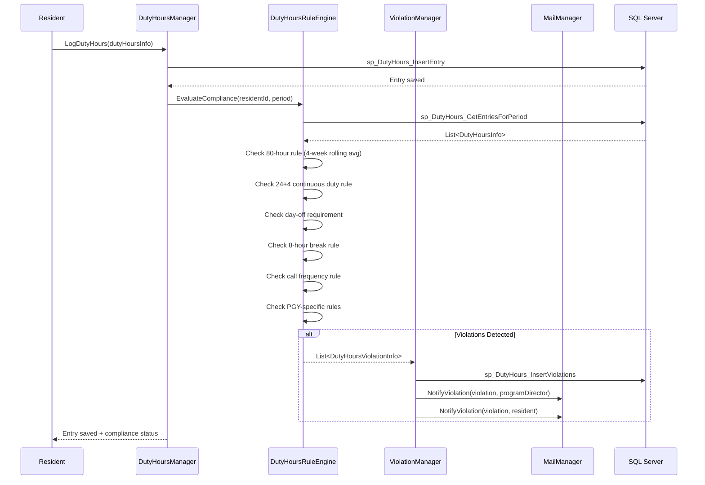
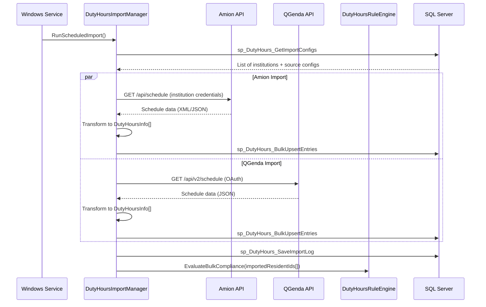
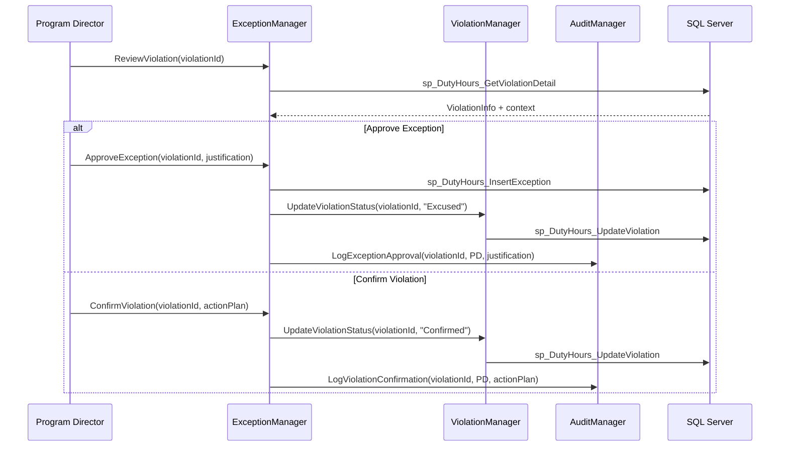
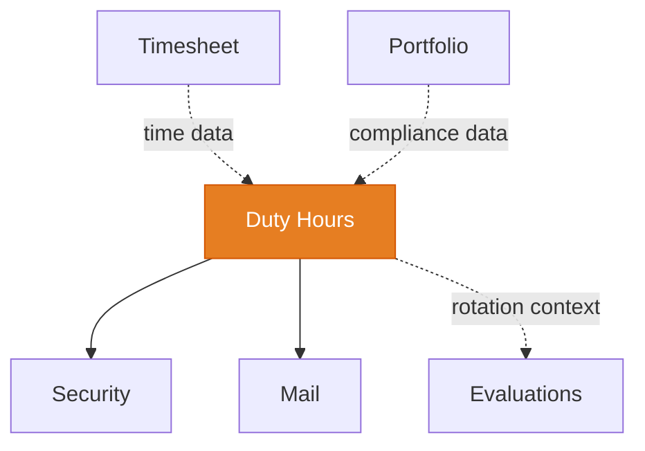

# Duty Hours

<!-- Content will be enriched by AI parsing scripts -->

## Overview

The Duty Hours module is the most complex module in the MyEvaluations system with 55+ classes. It tracks resident work hours for compliance with ACGME (Accreditation Council for Graduate Medical Education) requirements, which mandate strict limits on trainee working hours to ensure patient safety and resident well-being.

This module handles time entry (manual and imported from scheduling systems), real-time violation detection against ACGME rules, exception/override workflows for program directors, and comprehensive reporting for ACGME site visits and institutional compliance reviews.

### Key Responsibilities

- **Time Logging**: Manual hour entry, clock-in/clock-out, and import from external scheduling systems (Amion, QGenda, MedHub)
- **ACGME Rule Engine**: Real-time evaluation of logged hours against the full set of ACGME common program requirements
- **Violation Detection**: Automatic identification of violations with severity classification and notification
- **Exception Management**: Program director review and override of flagged violations with documented justification
- **Reporting**: Individual resident reports, program-level dashboards, and ACGME-formatted compliance reports
- **Scheduling Integration**: Two-way sync with Amion, QGenda, and other scheduling platforms

### ACGME Common Program Requirements

The rule engine enforces these key requirements (2024 standards):

| Rule | Requirement | Measurement |
|------|-------------|-------------|
| 80-Hour Week | Maximum 80 hours averaged over 4 weeks | Rolling 4-week average |
| 24+4 Rule | Maximum 24 hours of continuous duty + 4 hours for transitions | Continuous clock tracking |
| Day Off | Minimum 1 day free from duty per 7-day period (averaged over 4 weeks) | Weekly period analysis |
| 8-Hour Break | Minimum 8 hours between duty periods | Gap analysis |
| 14-Hour Limit | Maximum 14 hours for PGY-1 (first-year) residents on certain schedules | PGY-level-specific rule |
| In-House Call | No more frequent than every 3rd night (averaged over 4 weeks) | Call frequency analysis |
| Moonlighting | Hours must be counted toward 80-hour limit | Total hour aggregation |

## Key Classes

### Manager Classes

| Class | Namespace | Purpose |
|-------|-----------|---------|
| `DutyHoursManager` | `MyEvaluations.Business.DutyHours` | Core time entry CRUD, retrieval, and summary calculations. |
| `DutyHoursRuleEngine` | `MyEvaluations.Business.DutyHours` | ACGME rule evaluation. Checks all logged hours against configurable rule sets. |
| `DutyHoursViolationManager` | `MyEvaluations.Business.DutyHours` | Violation detection, notification, and resolution tracking. |
| `DutyHoursImportManager` | `MyEvaluations.Business.DutyHours` | Import from external scheduling systems (Amion, QGenda). |
| `DutyHoursExceptionManager` | `MyEvaluations.Business.DutyHours` | Exception/override workflow for program directors. |
| `DutyHoursReportManager` | `MyEvaluations.Business.DutyHours` | Report generation: individual, program, ACGME format. |
| `DutyHoursScheduleManager` | `MyEvaluations.Business.DutyHours` | Manages rotation/call schedules and their mapping to duty hour periods. |
| `DutyHoursApprovalManager` | `MyEvaluations.Business.DutyHours` | Timesheet-style approval workflow for logged hours. |
| `AmionIntegrationManager` | `MyEvaluations.Business.DutyHours` | Amion-specific import/sync logic. |
| `QGendaIntegrationManager` | `MyEvaluations.Business.DutyHours` | QGenda-specific import/sync logic. |

### Info (DTO) Classes

| Class | Purpose |
|-------|---------|
| `DutyHoursInfo` | Single duty period: start time, end time, type (clinical, educational, call, moonlighting), location. |
| `DutyHoursRuleInfo` | Rule definition: rule code, description, threshold, measurement window, severity. |
| `DutyHoursViolationInfo` | Detected violation: rule, resident, period, actual value, threshold, severity, status. |
| `DutyHoursSummaryInfo` | Summary for a period: total hours, average weekly, violations count, compliance percentage. |
| `DutyHoursExceptionInfo` | Exception record: violation, justification, approver, approval date, expiration. |
| `DutyHoursImportInfo` | Import batch record: source system, import date, record count, error count, status. |
| `DutyHoursScheduleInfo` | Schedule entry: resident, rotation, call type, start/end, source system. |
| `DutyHoursCallInfo` | On-call period details: type (in-house, home call), start, end, activated flag. |

## Business Workflows

### Time Entry and Violation Detection

### Scheduling System Import Flow

### Exception/Override Workflow

## Stored Procedure References

| Stored Procedure | Purpose |
|-----------------|---------|
| `sp_DutyHours_InsertEntry` | Insert a single duty hour entry |
| `sp_DutyHours_UpdateEntry` | Update an existing duty hour entry |
| `sp_DutyHours_GetEntriesForPeriod` | Retrieve all entries for a resident in a date range |
| `sp_DutyHours_BulkUpsertEntries` | Bulk insert/update from scheduling system imports |
| `sp_DutyHours_InsertViolations` | Insert detected violations |
| `sp_DutyHours_UpdateViolation` | Update violation status (excused, confirmed, etc.) |
| `sp_DutyHours_GetViolationDetail` | Retrieve violation with full context |
| `sp_DutyHours_InsertException` | Record an approved exception |
| `sp_DutyHours_GetImportConfigs` | Retrieve scheduling system integration configs |
| `sp_DutyHours_SaveImportLog` | Log import batch results |
| `sp_DutyHours_GetSummary` | Calculate summary statistics for a period |
| `sp_DutyHours_GetACGMEReport` | Generate ACGME-formatted compliance report data |
| `sp_DutyHours_GetComplianceRate` | Calculate compliance percentage for program/institution |
| `sp_DutyHours_GetCallSchedule` | Retrieve on-call schedule entries |

## Cross-Module Dependencies

### Dependency Details

| Direction | Module | Relationship |
|-----------|--------|-------------|
| Depends on | Security | Permission checks for entry submission, violation review, report access |
| Depends on | Mail | Violation notifications to residents and program directors |
| Related to | Evaluations | Rotation schedule context shared for evaluation assignment |
| Related to | Timesheet | Time data may overlap; different compliance contexts |
| Related to | Portfolio | Duty hour compliance summaries included in resident portfolios |

## File Reference

Browse per-file implementation documentation for every class in this module:

- [**Duty Hours Implementation Files**](./files/dutyhours) — 76 classes with summaries, key methods, stored procedures, and migration notes
