# ERAS Integration

<!-- Content will be enriched by AI parsing scripts -->

## Overview

The ERAS (Electronic Residency Application Service) module integrates MyEvaluations with the AAMC's ERAS system, which is the primary application platform for residency and fellowship programs in the United States. This module handles the import of applicant data from ERAS, processing of Match results from the NRMP (National Resident Matching Program), and management of the recruitment workflow.

Programs use this module during the annual recruitment cycle to import applicant profiles, track interview invitations and evaluations, process match results, and transition matched applicants into the trainee management system.

### Key Responsibilities

- **Application Import**: Import applicant data from ERAS (demographics, medical school, scores, letters of recommendation)
- **Applicant Management**: Track applicants through the recruitment workflow (review, interview, rank, match)
- **Interview Scheduling**: Coordinate interview logistics and track interview evaluations
- **Match Processing**: Import and process NRMP Match results
- **Onboarding**: Transition matched applicants into MyEvaluations as incoming trainees
- **Reporting**: Recruitment statistics, diversity reports, and program yield analysis

## Key Classes

### Manager Classes

| Class | Namespace | Purpose |
|-------|-----------|---------|
| `ERASManager` | `MyEvaluations.Business.ERAS` | Core ERAS operations: import configuration, data synchronization, and workflow management. |
| `ERASImportManager` | `MyEvaluations.Business.ERAS` | ERAS data import: file parsing, field mapping, and applicant record creation. |
| `ERASApplicantManager` | `MyEvaluations.Business.ERAS` | Applicant management: status tracking, interview scheduling, and rank list building. |
| `ERASMatchManager` | `MyEvaluations.Business.ERAS` | NRMP Match result processing and applicant-to-trainee transition. |
| `ERASReportManager` | `MyEvaluations.Business.ERAS` | Recruitment reporting and analytics. |

### Info (DTO) Classes

| Class | Purpose |
|-------|---------|
| `ERASApplicationInfo` | Application data: ERAS ID, demographics, medical school, graduation date, scores (USMLE/COMLEX), personal statement. |
| `ERASApplicantInfo` | Applicant record: application, program, status (new/reviewed/invited/interviewed/ranked/matched), notes. |
| `ERASInterviewInfo` | Interview record: applicant, date, format (in-person/virtual), evaluators, scores, comments. |
| `ERASMatchResultInfo` | Match result: applicant, program, match status (matched/unmatched/withdrawn), position offered. |
| `ERASImportBatchInfo` | Import batch: source file, record count, import date, errors, status. |
| `ERASRankListInfo` | Rank list: program, ranked applicants (ordered), submission status, certification. |

## Business Workflows

### ERAS Application Import

### Recruitment Workflow

```mermaid
sequenceDiagram
    participant PD as Program Director
    participant EAM as ERASApplicantManager
    participant MAIL as MailManager
    participant DB as SQL Server

    Note over PD,DB: Phase 1 - Application Review
    PD->>EAM: GetApplicants(programId, filters)
    EAM->>DB: sp_ERAS_GetApplicants
    DB-->>EAM: List<ERASApplicantInfo>

    PD->>EAM: UpdateStatus(applicantId, "Reviewed")
    EAM->>DB: sp_ERAS_UpdateApplicantStatus

    Note over PD,DB: Phase 2 - Interview Invitation
    PD->>EAM: InviteToInterview(applicantIds[], interviewDates[])
    EAM->>DB: sp_ERAS_InsertInterviewInvitations
    EAM->>MAIL: SendInterviewInvitation(applicants[], details)

    Note over PD,DB: Phase 3 - Interview Evaluation
    PD->>EAM: RecordInterviewEvaluation(interviewInfo)
    EAM->>DB: sp_ERAS_InsertInterviewEvaluation

    Note over PD,DB: Phase 4 - Rank List
    PD->>EAM: BuildRankList(programId, rankedApplicantIds[])
    EAM->>DB: sp_ERAS_SaveRankList
    PD->>EAM: CertifyRankList(programId)
    EAM->>DB: sp_ERAS_CertifyRankList
```

### Match Result Processing

## Stored Procedure References

| Stored Procedure | Purpose |
|-----------------|---------|
| `sp_ERAS_InsertImportBatch` | Create import batch record |
| `sp_ERAS_UpsertApplication` | Insert or update application data |
| `sp_ERAS_InsertApplicant` | Create applicant tracking record |
| `sp_ERAS_UpdateImportBatchStatus` | Update import batch status |
| `sp_ERAS_GetApplicants` | Retrieve applicants with filters |
| `sp_ERAS_UpdateApplicantStatus` | Update applicant workflow status |
| `sp_ERAS_InsertInterviewInvitations` | Create interview invitation records |
| `sp_ERAS_InsertInterviewEvaluation` | Save interview evaluation |
| `sp_ERAS_SaveRankList` | Save program rank list |
| `sp_ERAS_CertifyRankList` | Mark rank list as certified |
| `sp_ERAS_InsertMatchResults` | Import NRMP match results |
| `sp_ERAS_GetMatchedApplicants` | Retrieve matched applicants |
| `sp_ERAS_CreateTraineeRecord` | Create trainee user from applicant data |

## Cross-Module Dependencies

### Dependency Details

| Direction | Module | Relationship |
|-----------|--------|-------------|
| Depends on | Security | Admin-only access controls for application data and match results |
| Depends on | Mail | Interview invitations, match notifications, and onboarding communications |
| Related to | Evaluations | Matched applicants become trainees who will be evaluated in the system |
| Related to | Security | Trainee onboarding creates user accounts and role assignments |

## File Reference

Browse per-file implementation documentation for every class in this module:

- [**ERAS Implementation Files**](./files/eras) — 3 classes with summaries, key methods, stored procedures, and migration notes
