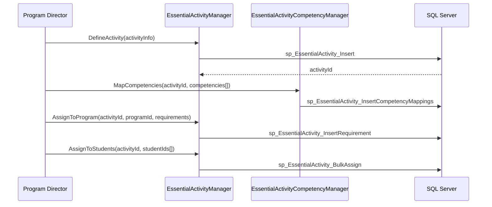
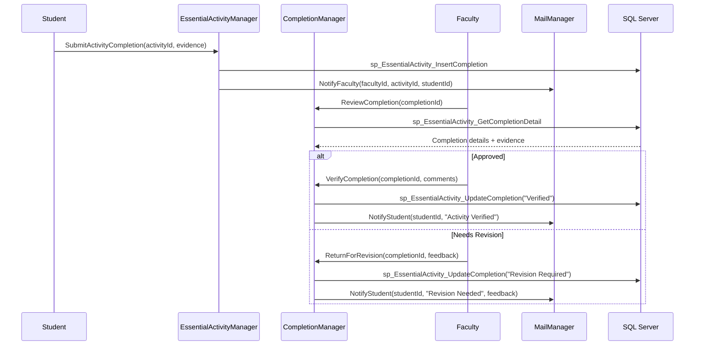
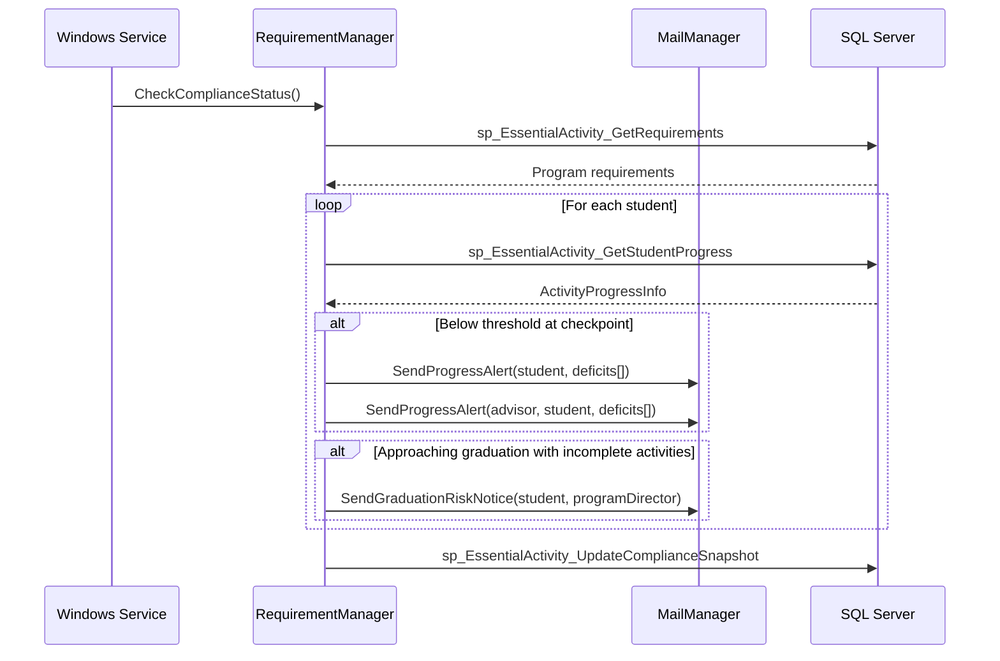
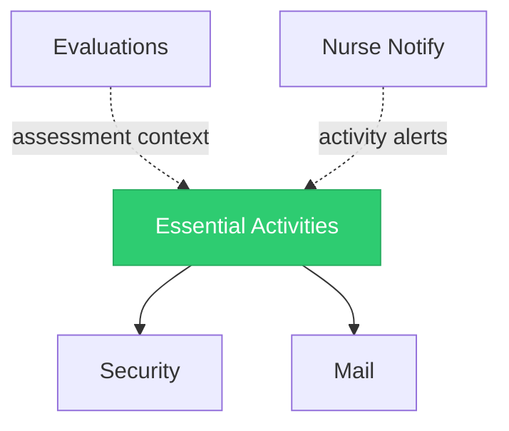

import DependentsPanel from '@site/src/components/DependentsPanel';

# Essential Activities

<!-- Content will be enriched by AI parsing scripts -->

## Overview

The Essential Activities module tracks required clinical and educational activities for nursing and physician assistant (PA) programs. Unlike the ACGME-focused procedures and milestones modules used by GME programs, essential activities are tailored to the competency frameworks and accreditation requirements of nursing (AACN/CCNE standards) and PA (ARC-PA standards) education programs.

Essential activities encompass clinical skills demonstrations, simulation lab completions, community health activities, interprofessional education experiences, and program-specific requirements that students must complete before graduation or clinical placement.

### Key Responsibilities

- **Activity Definition**: Define program-specific essential activities with competency mappings and completion criteria
- **Progress Tracking**: Monitor student progress toward completing all required activities
- **Competency Mapping**: Map activities to nursing/PA competency frameworks (AACN Essentials, ARC-PA competencies)
- **Verification Workflows**: Faculty verification and sign-off on activity completion
- **Requirements Compliance**: Track completion against program graduation requirements
- **Reporting**: Program-level compliance reports and individual student progress dashboards

## Key Classes

### Manager Classes

| Class | Namespace | Purpose |
|-------|-----------|---------|
| `EssentialActivityManager` | `MyEvaluations.Business.EssentialActivities` | Core activity definition, assignment, and tracking operations. |
| `EssentialActivityCompletionManager` | `MyEvaluations.Business.EssentialActivities` | Completion recording, verification, and sign-off workflows. |
| `EssentialActivityCompetencyManager` | `MyEvaluations.Business.EssentialActivities` | Competency framework management and activity-to-competency mapping. |
| `EssentialActivityRequirementManager` | `MyEvaluations.Business.EssentialActivities` | Program requirement definitions and compliance tracking. |
| `EssentialActivityReportManager` | `MyEvaluations.Business.EssentialActivities` | Progress reports, compliance dashboards, and accreditation exports. |

### Info (DTO) Classes

| Class | Purpose |
|-------|---------|
| `EssentialActivityInfo` | Activity definition: name, description, category, competency mappings, verification requirements. |
| `ActivityCompletionInfo` | Completion record: student, activity, completion date, evidence, verifier, sign-off status. |
| `ActivityCompetencyInfo` | Competency mapping: competency framework, domain, sub-domain, activity linkage. |
| `ActivityRequirementInfo` | Requirement: program, activity set, minimum completions, deadline, graduation prerequisite flag. |
| `ActivityProgressInfo` | Progress summary: student, total required, completed, pending verification, percentage complete. |

## Business Workflows

### Activity Definition and Assignment

### Activity Completion and Verification

### Requirements Compliance Monitoring

## Stored Procedure References

| Stored Procedure | Purpose |
|-----------------|---------|
| `sp_EssentialActivity_Insert` | Create activity definition |
| `sp_EssentialActivity_InsertCompetencyMappings` | Map activities to competencies |
| `sp_EssentialActivity_InsertRequirement` | Define program requirement |
| `sp_EssentialActivity_BulkAssign` | Assign activities to student group |
| `sp_EssentialActivity_InsertCompletion` | Record activity completion submission |
| `sp_EssentialActivity_GetCompletionDetail` | Retrieve completion for review |
| `sp_EssentialActivity_UpdateCompletion` | Update completion status |
| `sp_EssentialActivity_GetRequirements` | Retrieve program requirements |
| `sp_EssentialActivity_GetStudentProgress` | Retrieve student progress summary |
| `sp_EssentialActivity_UpdateComplianceSnapshot` | Update compliance tracking data |

## Cross-Module Dependencies

### Dependency Details

| Direction | Module | Relationship |
|-----------|--------|-------------|
| Depends on | Security | Permission checks for activity definition, verification, and reporting |
| Depends on | Mail | Progress notifications, verification alerts, and compliance warnings |
| Related to | Evaluations | Clinical evaluations may reference essential activity completion as evidence |
| Related to | Nurse Notify | Nursing-specific notifications may include essential activity reminders |

{/* DEPENDENTS-PANEL:START */}
<DependentsPanel module="EssentialActivities" />
{/* DEPENDENTS-PANEL:END */}

## File Reference

Browse per-file implementation documentation for every class in this module:

- [**Essential Activities Implementation Files**](./files/essentialactivities) — 13 classes with summaries, key methods, stored procedures, and migration notes

## Database Tables

This module maps to the **ACT\_** table prefix with **80 database tables**.

| Metric | Value |
|--------|-------|
| Tables | 80 |
| With Primary Key | 53 (66%) |

Browse the full table reference with expandable details, FK relationships, and Mermaid ER diagrams:

- [**Activity Logs Database Tables**](/docs/database/modules/activity-logs) — 80 tables with schema detail and migration notes
