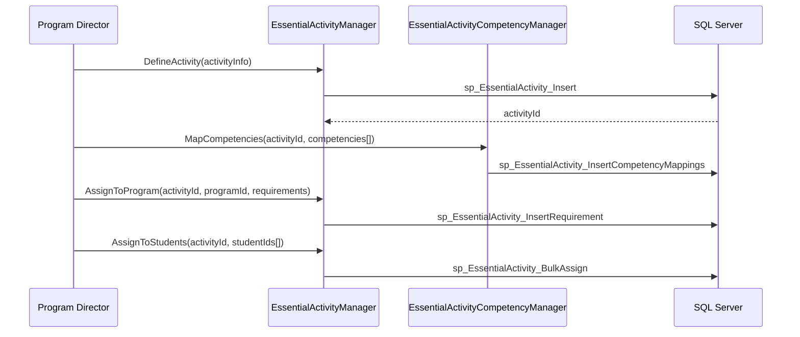
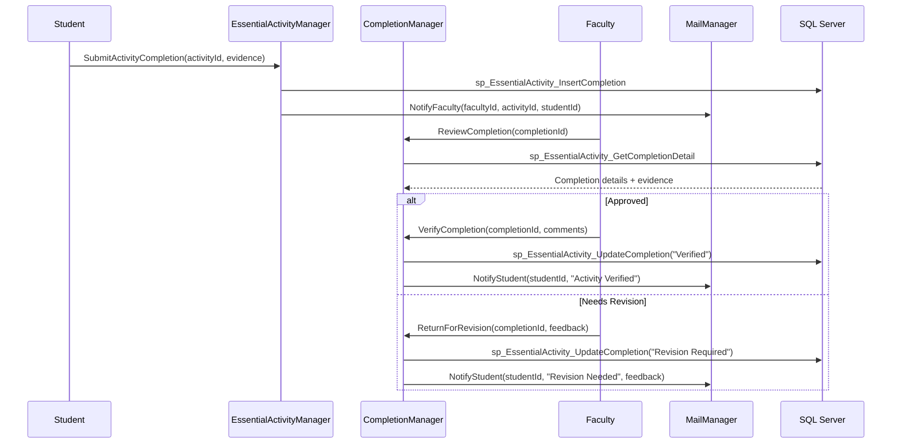
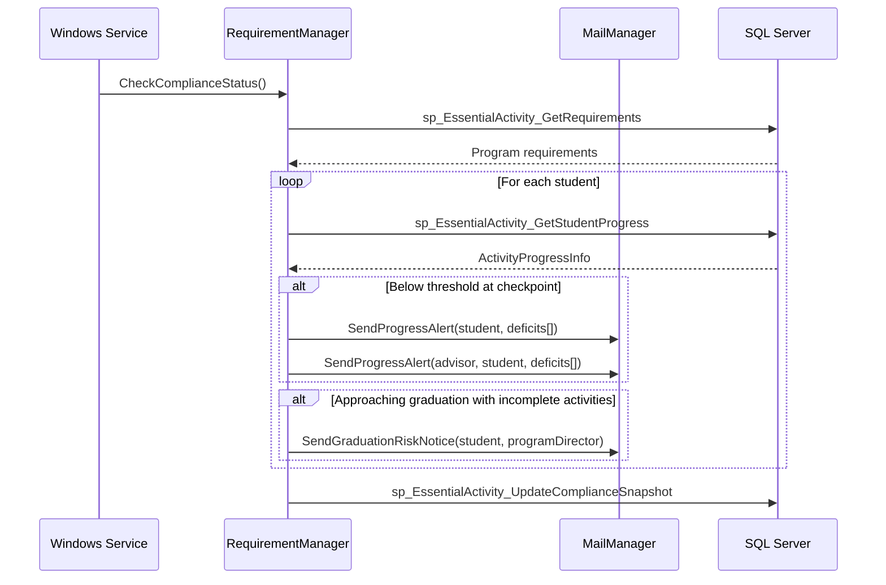
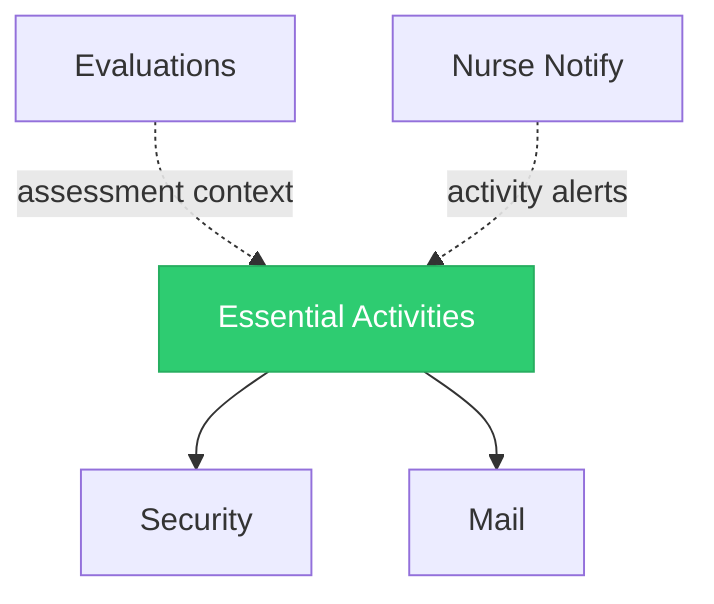

import DependentsPanel from '@site/src/components/DependentsPanel';

# Essential Activities

<!-- Content will be enriched by AI parsing scripts -->

## Overview

The Essential Activities module tracks required clinical and educational activities for nursing and physician assistant (PA) programs. Unlike the ACGME-focused procedures and milestones modules used by GME programs, essential activities are tailored to the competency frameworks and accreditation requirements of nursing (AACN/CCNE standards) and PA (ARC-PA standards) education programs.

Essential activities encompass clinical skills demonstrations, simulation lab completions, community health activities, interprofessional education experiences, and program-specific requirements that students must complete before graduation or clinical placement.

### Key Responsibilities

- **Activity Definition**: Define program-specific essential activities with competency mappings and completion criteria
- **Progress Tracking**: Monitor student progress toward completing all required activities
- **Competency Mapping**: Map activities to nursing/PA competency frameworks (AACN Essentials, ARC-PA competencies)
- **Verification Workflows**: Faculty verification and sign-off on activity completion
- **Requirements Compliance**: Track completion against program graduation requirements
- **Reporting**: Program-level compliance reports and individual student progress dashboards

## Key Classes

### Manager Classes

| Class | Namespace | Purpose |
|-------|-----------|---------|
| `EssentialActivityManager` | `MyEvaluations.Business.EssentialActivities` | Core activity definition, assignment, and tracking operations. |
| `EssentialActivityCompletionManager` | `MyEvaluations.Business.EssentialActivities` | Completion recording, verification, and sign-off workflows. |
| `EssentialActivityCompetencyManager` | `MyEvaluations.Business.EssentialActivities` | Competency framework management and activity-to-competency mapping. |
| `EssentialActivityRequirementManager` | `MyEvaluations.Business.EssentialActivities` | Program requirement definitions and compliance tracking. |
| `EssentialActivityReportManager` | `MyEvaluations.Business.EssentialActivities` | Progress reports, compliance dashboards, and accreditation exports. |

### Info (DTO) Classes

| Class | Purpose |
|-------|---------|
| `EssentialActivityInfo` | Activity definition: name, description, category, competency mappings, verification requirements. |
| `ActivityCompletionInfo` | Completion record: student, activity, completion date, evidence, verifier, sign-off status. |
| `ActivityCompetencyInfo` | Competency mapping: competency framework, domain, sub-domain, activity linkage. |
| `ActivityRequirementInfo` | Requirement: program, activity set, minimum completions, deadline, graduation prerequisite flag. |
| `ActivityProgressInfo` | Progress summary: student, total required, completed, pending verification, percentage complete. |

## Business Workflows

### Activity Definition and Assignment

### Activity Completion and Verification

### Requirements Compliance Monitoring

## Stored Procedure References

| Stored Procedure | Purpose |
|-----------------|---------|
| `sp_EssentialActivity_Insert` | Create activity definition |
| `sp_EssentialActivity_InsertCompetencyMappings` | Map activities to competencies |
| `sp_EssentialActivity_InsertRequirement` | Define program requirement |
| `sp_EssentialActivity_BulkAssign` | Assign activities to student group |
| `sp_EssentialActivity_InsertCompletion` | Record activity completion submission |
| `sp_EssentialActivity_GetCompletionDetail` | Retrieve completion for review |
| `sp_EssentialActivity_UpdateCompletion` | Update completion status |
| `sp_EssentialActivity_GetRequirements` | Retrieve program requirements |
| `sp_EssentialActivity_GetStudentProgress` | Retrieve student progress summary |
| `sp_EssentialActivity_UpdateComplianceSnapshot` | Update compliance tracking data |

## Cross-Module Dependencies

### Dependency Details

| Direction | Module | Relationship |
|-----------|--------|-------------|
| Depends on | Security | Permission checks for activity definition, verification, and reporting |
| Depends on | Mail | Progress notifications, verification alerts, and compliance warnings |
| Related to | Evaluations | Clinical evaluations may reference essential activity completion as evidence |
| Related to | Nurse Notify | Nursing-specific notifications may include essential activity reminders |

{/* DEPENDENTS-PANEL:START */}
<DependentsPanel
  module="EssentialActivities"
  webDependents={[
  {
    "fileName": "AddCourseCampusMembers.aspx.cs",
    "filePath": "Web/BSNProgram/AddCourseCampusMembers.aspx.cs",
    "directory": "Web/BSNProgram",
    "module": "BSNProgram"
  },
  {
    "fileName": "AssignBSNEvaluations.aspx.cs",
    "filePath": "Web/BSNProgram/AssignBSNEvaluations.aspx.cs",
    "directory": "Web/BSNProgram",
    "module": "BSNProgram"
  },
  {
    "fileName": "AssignBSNManualCLCAssignment.aspx.cs",
    "filePath": "Web/BSNProgram/AssignBSNManualCLCAssignment.aspx.cs",
    "directory": "Web/BSNProgram",
    "module": "BSNProgram"
  },
  {
    "fileName": "AssignEvaluations.aspx.cs",
    "filePath": "Web/BSNProgram/AssignEvaluations.aspx.cs",
    "directory": "Web/BSNProgram",
    "module": "BSNProgram"
  },
  {
    "fileName": "BSNProgramActivities.aspx.cs",
    "filePath": "Web/BSNProgram/BSNProgramActivities.aspx.cs",
    "directory": "Web/BSNProgram",
    "module": "BSNProgram"
  },
  {
    "fileName": "BSNRoasterPage.aspx.cs",
    "filePath": "Web/BSNProgram/BSNRoasterPage.aspx.cs",
    "directory": "Web/BSNProgram",
    "module": "BSNProgram"
  },
  {
    "fileName": "CLCSubmissionForm.aspx.cs",
    "filePath": "Web/BSNProgram/CLCSubmissionForm.aspx.cs",
    "directory": "Web/BSNProgram",
    "module": "BSNProgram"
  },
  {
    "fileName": "ClinicalSiteEvaluationReport.aspx.cs",
    "filePath": "Web/BSNProgram/ClinicalSiteEvaluationReport.aspx.cs",
    "directory": "Web/BSNProgram",
    "module": "BSNProgram"
  },
  {
    "fileName": "ClinicalSiteEvaluationReportResults.aspx.cs",
    "filePath": "Web/BSNProgram/ClinicalSiteEvaluationReportResults.aspx.cs",
    "directory": "Web/BSNProgram",
    "module": "BSNProgram"
  },
  {
    "fileName": "ExportBSNSalesforceData.aspx.cs",
    "filePath": "Web/BSNProgram/ExportBSNSalesforceData.aspx.cs",
    "directory": "Web/BSNProgram",
    "module": "BSNProgram"
  },
  {
    "fileName": "ImportBSNPreceptorData.aspx.cs",
    "filePath": "Web/BSNProgram/ImportBSNPreceptorData.aspx.cs",
    "directory": "Web/BSNProgram",
    "module": "BSNProgram"
  },
  {
    "fileName": "ImportBSNStudentData.aspx.cs",
    "filePath": "Web/BSNProgram/ImportBSNStudentData.aspx.cs",
    "directory": "Web/BSNProgram",
    "module": "BSNProgram"
  },
  {
    "fileName": "LinkCoursetoReturnDemonstration.aspx.cs",
    "filePath": "Web/BSNProgram/LinkCoursetoReturnDemonstration.aspx.cs",
    "directory": "Web/BSNProgram",
    "module": "BSNProgram"
  },
  {
    "fileName": "LinkEvaluationstoClinicalSite.aspx.cs",
    "filePath": "Web/BSNProgram/LinkEvaluationstoClinicalSite.aspx.cs",
    "directory": "Web/BSNProgram",
    "module": "BSNProgram"
  },
  {
    "fileName": "ManageBSNPreceptors.aspx.cs",
    "filePath": "Web/BSNProgram/ManageBSNPreceptors.aspx.cs",
    "directory": "Web/BSNProgram",
    "module": "BSNProgram"
  },
  {
    "fileName": "ManageCLCAssignments.aspx.cs",
    "filePath": "Web/BSNProgram/ManageCLCAssignments.aspx.cs",
    "directory": "Web/BSNProgram",
    "module": "BSNProgram"
  },
  {
    "fileName": "ManageEvaluationAssignments.aspx.cs",
    "filePath": "Web/BSNProgram/ManageEvaluationAssignments.aspx.cs",
    "directory": "Web/BSNProgram",
    "module": "BSNProgram"
  },
  {
    "fileName": "ManagePreceptorCommitmentAssignments.aspx.cs",
    "filePath": "Web/BSNProgram/ManagePreceptorCommitmentAssignments.aspx.cs",
    "directory": "Web/BSNProgram",
    "module": "BSNProgram"
  },
  {
    "fileName": "ManagePreceptorQualificationRequirements.aspx.cs",
    "filePath": "Web/BSNProgram/ManagePreceptorQualificationRequirements.aspx.cs",
    "directory": "Web/BSNProgram",
    "module": "BSNProgram"
  },
  {
    "fileName": "ManageReturnDemonstrationAssignments.aspx.cs",
    "filePath": "Web/BSNProgram/ManageReturnDemonstrationAssignments.aspx.cs",
    "directory": "Web/BSNProgram",
    "module": "BSNProgram"
  },
  {
    "fileName": "ManualCSEEvaluationAssignment.aspx.cs",
    "filePath": "Web/BSNProgram/ManualCSEEvaluationAssignment.aspx.cs",
    "directory": "Web/BSNProgram",
    "module": "BSNProgram"
  },
  {
    "fileName": "ReturnDemonstrationForm.aspx.cs",
    "filePath": "Web/BSNProgram/ReturnDemonstrationForm.aspx.cs",
    "directory": "Web/BSNProgram",
    "module": "BSNProgram"
  },
  {
    "fileName": "ReturnDemonstrationFormBuilder.aspx.cs",
    "filePath": "Web/BSNProgram/ReturnDemonstrationFormBuilder.aspx.cs",
    "directory": "Web/BSNProgram",
    "module": "BSNProgram"
  },
  {
    "fileName": "ReturnDemonstrationReportResults.aspx.cs",
    "filePath": "Web/BSNProgram/ReturnDemonstrationReportResults.aspx.cs",
    "directory": "Web/BSNProgram",
    "module": "BSNProgram"
  },
  {
    "fileName": "ReturnDemonstrationSubmissionForm.aspx.cs",
    "filePath": "Web/BSNProgram/ReturnDemonstrationSubmissionForm.aspx.cs",
    "directory": "Web/BSNProgram",
    "module": "BSNProgram"
  },
  {
    "fileName": "ReturnDemonstrationVoluntaryAssignments.aspx.cs",
    "filePath": "Web/BSNProgram/ReturnDemonstrationVoluntaryAssignments.aspx.cs",
    "directory": "Web/BSNProgram",
    "module": "BSNProgram"
  },
  {
    "fileName": "SeeCurrentEvaluationLinks.aspx.cs",
    "filePath": "Web/BSNProgram/SeeCurrentEvaluationLinks.aspx.cs",
    "directory": "Web/BSNProgram",
    "module": "BSNProgram"
  },
  {
    "fileName": "SubmitPreceptorCommitmentAssignment.aspx.cs",
    "filePath": "Web/BSNProgram/SubmitPreceptorCommitmentAssignment.aspx.cs",
    "directory": "Web/BSNProgram",
    "module": "BSNProgram"
  },
  {
    "fileName": "ViewClinicalSitesandClinicalUnits.aspx.cs",
    "filePath": "Web/BSNProgram/ViewClinicalSitesandClinicalUnits.aspx.cs",
    "directory": "Web/BSNProgram",
    "module": "BSNProgram"
  },
  {
    "fileName": "ViewSalesforceData.aspx.cs",
    "filePath": "Web/BSNProgram/ViewSalesforceData.aspx.cs",
    "directory": "Web/BSNProgram",
    "module": "BSNProgram"
  },
  {
    "fileName": "VoluntarySelfAssessment.aspx.cs",
    "filePath": "Web/BSNProgram/VoluntarySelfAssessment.aspx.cs",
    "directory": "Web/BSNProgram",
    "module": "BSNProgram"
  },
  {
    "fileName": "AddCourse.aspx.cs",
    "filePath": "Web/EssentialActivities/AddCourse.aspx.cs",
    "directory": "Web/EssentialActivities",
    "module": "EssentialActivities"
  },
  {
    "fileName": "AddCourseObjective.aspx.cs",
    "filePath": "Web/EssentialActivities/AddCourseObjective.aspx.cs",
    "directory": "Web/EssentialActivities",
    "module": "EssentialActivities"
  },
  {
    "fileName": "AssignCourses.aspx.cs",
    "filePath": "Web/EssentialActivities/AssignCourses.aspx.cs",
    "directory": "Web/EssentialActivities",
    "module": "EssentialActivities"
  },
  {
    "fileName": "AssignFNPEvaluations.aspx.cs",
    "filePath": "Web/EssentialActivities/AssignFNPEvaluations.aspx.cs",
    "directory": "Web/EssentialActivities",
    "module": "EssentialActivities"
  },
  {
    "fileName": "AssignFNPVoluntaryEvaluations.aspx.cs",
    "filePath": "Web/EssentialActivities/AssignFNPVoluntaryEvaluations.aspx.cs",
    "directory": "Web/EssentialActivities",
    "module": "EssentialActivities"
  },
  {
    "fileName": "AssignSessionCourses.aspx.cs",
    "filePath": "Web/EssentialActivities/AssignSessionCourses.aspx.cs",
    "directory": "Web/EssentialActivities",
    "module": "EssentialActivities"
  },
  {
    "fileName": "ClincalAlternativeLogs.aspx.cs",
    "filePath": "Web/EssentialActivities/ClincalAlternativeLogs.aspx.cs",
    "directory": "Web/EssentialActivities",
    "module": "EssentialActivities"
  },
  {
    "fileName": "ClinicalLogDataExport.aspx.cs",
    "filePath": "Web/EssentialActivities/ClinicalLogDataExport.aspx.cs",
    "directory": "Web/EssentialActivities",
    "module": "EssentialActivities"
  },
  {
    "fileName": "ClinicalLogDataExportResults.aspx.cs",
    "filePath": "Web/EssentialActivities/ClinicalLogDataExportResults.aspx.cs",
    "directory": "Web/EssentialActivities",
    "module": "EssentialActivities"
  },
  {
    "fileName": "ClinicalLogReviews.aspx.cs",
    "filePath": "Web/EssentialActivities/ClinicalLogReviews.aspx.cs",
    "directory": "Web/EssentialActivities",
    "module": "EssentialActivities"
  },
  {
    "fileName": "ClinicalPerformanceImprovementPlan.aspx.cs",
    "filePath": "Web/EssentialActivities/ClinicalPerformanceImprovementPlan.aspx.cs",
    "directory": "Web/EssentialActivities",
    "module": "EssentialActivities"
  },
  {
    "fileName": "CourseObjectiveReport.aspx.cs",
    "filePath": "Web/EssentialActivities/CourseObjectiveReport.aspx.cs",
    "directory": "Web/EssentialActivities",
    "module": "EssentialActivities"
  },
  {
    "fileName": "CourseObjectiveReportResults.aspx.cs",
    "filePath": "Web/EssentialActivities/CourseObjectiveReportResults.aspx.cs",
    "directory": "Web/EssentialActivities",
    "module": "EssentialActivities"
  },
  {
    "fileName": "CourseStudentMapping.aspx.cs",
    "filePath": "Web/EssentialActivities/CourseStudentMapping.aspx.cs",
    "directory": "Web/EssentialActivities",
    "module": "EssentialActivities"
  },
  {
    "fileName": "DevClinicalLogReviews.aspx.cs",
    "filePath": "Web/EssentialActivities/DevClinicalLogReviews.aspx.cs",
    "directory": "Web/EssentialActivities",
    "module": "EssentialActivities"
  },
  {
    "fileName": "DevFNPRecords.aspx.cs",
    "filePath": "Web/EssentialActivities/DevFNPRecords.aspx.cs",
    "directory": "Web/EssentialActivities",
    "module": "EssentialActivities"
  },
  {
    "fileName": "EssentialActivitiesMain.aspx.cs",
    "filePath": "Web/EssentialActivities/EssentialActivitiesMain.aspx.cs",
    "directory": "Web/EssentialActivities",
    "module": "EssentialActivities"
  },
  {
    "fileName": "EvaluationsAssignments.aspx.cs",
    "filePath": "Web/EssentialActivities/EvaluationsAssignments.aspx.cs",
    "directory": "Web/EssentialActivities",
    "module": "EssentialActivities"
  },
  {
    "fileName": "ExportFNPSalesForceData.aspx.cs",
    "filePath": "Web/EssentialActivities/ExportFNPSalesForceData.aspx.cs",
    "directory": "Web/EssentialActivities",
    "module": "EssentialActivities"
  },
  {
    "fileName": "FNPClinicalLogForm.aspx.cs",
    "filePath": "Web/EssentialActivities/FNPClinicalLogForm.aspx.cs",
    "directory": "Web/EssentialActivities",
    "module": "EssentialActivities"
  },
  {
    "fileName": "FNPRecords.aspx.cs",
    "filePath": "Web/EssentialActivities/FNPRecords.aspx.cs",
    "directory": "Web/EssentialActivities",
    "module": "EssentialActivities"
  },
  {
    "fileName": "FNPReport.aspx.cs",
    "filePath": "Web/EssentialActivities/FNPReport.aspx.cs",
    "directory": "Web/EssentialActivities",
    "module": "EssentialActivities"
  },
  {
    "fileName": "FNPReportResults.aspx.cs",
    "filePath": "Web/EssentialActivities/FNPReportResults.aspx.cs",
    "directory": "Web/EssentialActivities",
    "module": "EssentialActivities"
  },
  {
    "fileName": "PreceptorHoursMarketingReport.aspx.cs",
    "filePath": "Web/EssentialActivities/FNPReports/PreceptorHoursMarketingReport.aspx.cs",
    "directory": "Web/EssentialActivities",
    "module": "EssentialActivities"
  },
  {
    "fileName": "PreceptorHoursMarketingReportResults.aspx.cs",
    "filePath": "Web/EssentialActivities/FNPReports/PreceptorHoursMarketingReportResults.aspx.cs",
    "directory": "Web/EssentialActivities",
    "module": "EssentialActivities"
  },
  {
    "fileName": "PreceptorHoursReport.aspx.cs",
    "filePath": "Web/EssentialActivities/FNPReports/PreceptorHoursReport.aspx.cs",
    "directory": "Web/EssentialActivities",
    "module": "EssentialActivities"
  },
  {
    "fileName": "PreceptorHoursReportResult.aspx.cs",
    "filePath": "Web/EssentialActivities/FNPReports/PreceptorHoursReportResult.aspx.cs",
    "directory": "Web/EssentialActivities",
    "module": "EssentialActivities"
  },
  {
    "fileName": "StudentTallyReport.aspx.cs",
    "filePath": "Web/EssentialActivities/FNPReports/StudentTallyReport.aspx.cs",
    "directory": "Web/EssentialActivities",
    "module": "EssentialActivities"
  },
  {
    "fileName": "StudentTallyReportResults.aspx.cs",
    "filePath": "Web/EssentialActivities/FNPReports/StudentTallyReportResults.aspx.cs",
    "directory": "Web/EssentialActivities",
    "module": "EssentialActivities"
  },
  {
    "fileName": "FNPStudentLogCombinedReport.aspx.cs",
    "filePath": "Web/EssentialActivities/FNPStudentLogCombinedReport.aspx.cs",
    "directory": "Web/EssentialActivities",
    "module": "EssentialActivities"
  },
  {
    "fileName": "FNPStudentLogReportResults.aspx.cs",
    "filePath": "Web/EssentialActivities/FNPStudentLogReportResults.aspx.cs",
    "directory": "Web/EssentialActivities",
    "module": "EssentialActivities"
  },
  {
    "fileName": "FacultyEvaluationAndPreceptorReport.aspx.cs",
    "filePath": "Web/EssentialActivities/FacultyEvaluationAndPreceptorReport.aspx.cs",
    "directory": "Web/EssentialActivities",
    "module": "EssentialActivities"
  },
  {
    "fileName": "FacultyEvaluationAndPreceptorReportResult.aspx.cs",
    "filePath": "Web/EssentialActivities/FacultyEvaluationAndPreceptorReportResult.aspx.cs",
    "directory": "Web/EssentialActivities",
    "module": "EssentialActivities"
  },
  {
    "fileName": "FacultyEvaluationReport.aspx.cs",
    "filePath": "Web/EssentialActivities/FacultyEvaluationReport.aspx.cs",
    "directory": "Web/EssentialActivities",
    "module": "EssentialActivities"
  },
  {
    "fileName": "FacultyEvaluationReportResults.aspx.cs",
    "filePath": "Web/EssentialActivities/FacultyEvaluationReportResults.aspx.cs",
    "directory": "Web/EssentialActivities",
    "module": "EssentialActivities"
  },
  {
    "fileName": "FnpManualImport.aspx.cs",
    "filePath": "Web/EssentialActivities/FnpManualImport.aspx.cs",
    "directory": "Web/EssentialActivities",
    "module": "EssentialActivities"
  },
  {
    "fileName": "GeneratePIPAssignments.aspx.cs",
    "filePath": "Web/EssentialActivities/GeneratePIPAssignments.aspx.cs",
    "directory": "Web/EssentialActivities",
    "module": "EssentialActivities"
  },
  {
    "fileName": "ImportCaselogData.aspx.cs",
    "filePath": "Web/EssentialActivities/ImportCaselogData.aspx.cs",
    "directory": "Web/EssentialActivities",
    "module": "EssentialActivities"
  },
  {
    "fileName": "ImportFNPStudentFailedData.aspx.cs",
    "filePath": "Web/EssentialActivities/ImportFNPStudentFailedData.aspx.cs",
    "directory": "Web/EssentialActivities",
    "module": "EssentialActivities"
  },
  {
    "fileName": "ImportPreceptorData.aspx.cs",
    "filePath": "Web/EssentialActivities/ImportPreceptorData.aspx.cs",
    "directory": "Web/EssentialActivities",
    "module": "EssentialActivities"
  },
  {
    "fileName": "ImportPreceptorUniqueID.aspx.cs",
    "filePath": "Web/EssentialActivities/ImportPreceptorUniqueID.aspx.cs",
    "directory": "Web/EssentialActivities",
    "module": "EssentialActivities"
  },
  {
    "fileName": "LedgerofEvaluations.aspx.cs",
    "filePath": "Web/EssentialActivities/LedgerofEvaluations.aspx.cs",
    "directory": "Web/EssentialActivities",
    "module": "EssentialActivities"
  },
  {
    "fileName": "LinkEvaluationtoCourses.aspx.cs",
    "filePath": "Web/EssentialActivities/LinkEvaluationtoCourses.aspx.cs",
    "directory": "Web/EssentialActivities",
    "module": "EssentialActivities"
  },
  {
    "fileName": "ManageClinicalPerformanceImprovementPlan.aspx.cs",
    "filePath": "Web/EssentialActivities/ManageClinicalPerformanceImprovementPlan.aspx.cs",
    "directory": "Web/EssentialActivities",
    "module": "EssentialActivities"
  },
  {
    "fileName": "ManageCourseMappings.aspx.cs",
    "filePath": "Web/EssentialActivities/ManageCourseMappings.aspx.cs",
    "directory": "Web/EssentialActivities",
    "module": "EssentialActivities"
  },
  {
    "fileName": "ManageCourseObjectives.aspx.cs",
    "filePath": "Web/EssentialActivities/ManageCourseObjectives.aspx.cs",
    "directory": "Web/EssentialActivities",
    "module": "EssentialActivities"
  },
  {
    "fileName": "ManageCourses.aspx.cs",
    "filePath": "Web/EssentialActivities/ManageCourses.aspx.cs",
    "directory": "Web/EssentialActivities",
    "module": "EssentialActivities"
  },
  {
    "fileName": "ManageFNPEvaluationAssignments.aspx.cs",
    "filePath": "Web/EssentialActivities/ManageFNPEvaluationAssignments.aspx.cs",
    "directory": "Web/EssentialActivities",
    "module": "EssentialActivities"
  },
  {
    "fileName": "ManageLogActivitiesandRoster.aspx.cs",
    "filePath": "Web/EssentialActivities/ManageLogActivitiesandRoster.aspx.cs",
    "directory": "Web/EssentialActivities",
    "module": "EssentialActivities"
  },
  {
    "fileName": "ManagePIPAssignmentUsers.aspx.cs",
    "filePath": "Web/EssentialActivities/ManagePIPAssignmentUsers.aspx.cs",
    "directory": "Web/EssentialActivities",
    "module": "EssentialActivities"
  },
  {
    "fileName": "ManagePIPEvaluationAssignments.aspx.cs",
    "filePath": "Web/EssentialActivities/ManagePIPEvaluationAssignments.aspx.cs",
    "directory": "Web/EssentialActivities",
    "module": "EssentialActivities"
  },
  {
    "fileName": "ManagePIPFields.aspx.cs",
    "filePath": "Web/EssentialActivities/ManagePIPFields.aspx.cs",
    "directory": "Web/EssentialActivities",
    "module": "EssentialActivities"
  },
  {
    "fileName": "ManageSessionCourses.aspx.cs",
    "filePath": "Web/EssentialActivities/ManageSessionCourses.aspx.cs",
    "directory": "Web/EssentialActivities",
    "module": "EssentialActivities"
  },
  {
    "fileName": "PIPReport.aspx.cs",
    "filePath": "Web/EssentialActivities/PIPReport.aspx.cs",
    "directory": "Web/EssentialActivities",
    "module": "EssentialActivities"
  },
  {
    "fileName": "PIPReportResults.aspx.cs",
    "filePath": "Web/EssentialActivities/PIPReportResults.aspx.cs",
    "directory": "Web/EssentialActivities",
    "module": "EssentialActivities"
  },
  {
    "fileName": "SchedulePIPAssignments.aspx.cs",
    "filePath": "Web/EssentialActivities/SchedulePIPAssignments.aspx.cs",
    "directory": "Web/EssentialActivities",
    "module": "EssentialActivities"
  },
  {
    "fileName": "StudentEvaluationReport.aspx.cs",
    "filePath": "Web/EssentialActivities/StudentEvaluationReport.aspx.cs",
    "directory": "Web/EssentialActivities",
    "module": "EssentialActivities"
  },
  {
    "fileName": "StudentEvaluationReportResults.aspx.cs",
    "filePath": "Web/EssentialActivities/StudentEvaluationReportResults.aspx.cs",
    "directory": "Web/EssentialActivities",
    "module": "EssentialActivities"
  },
  {
    "fileName": "ViewPerformanceImprovementPlan.aspx.cs",
    "filePath": "Web/EssentialActivities/ViewPerformanceImprovementPlan.aspx.cs",
    "directory": "Web/EssentialActivities",
    "module": "EssentialActivities"
  },
  {
    "fileName": "OnboardingDashboard.aspx.cs",
    "filePath": "Web/Onboarding/OnboardingDashboard.aspx.cs",
    "directory": "Web/Onboarding",
    "module": "Onboarding"
  },
  {
    "fileName": "IndividualProceduresResults.aspx.cs",
    "filePath": "Web/Procedures/Reports/IndividualProceduresResults.aspx.cs",
    "directory": "Web/Procedures",
    "module": "Procedures"
  },
  {
    "fileName": "SummaryProceduresResults.aspx.cs",
    "filePath": "Web/Procedures/Reports/SummaryProceduresResults.aspx.cs",
    "directory": "Web/Procedures",
    "module": "Procedures"
  },
  {
    "fileName": "UserMerger.aspx.cs",
    "filePath": "Web/Security/UserMerger.aspx.cs",
    "directory": "Web/Security",
    "module": "Security"
  },
  {
    "fileName": "ImportElogData.aspx.cs",
    "filePath": "Web/ImportElogData.aspx.cs",
    "directory": "Web",
    "module": "Data Import"
  }
]}
  schedulerDependents={[
  {
    "fileName": "SalesForceExport.cs",
    "filePath": "Schedulers/FNPSalesForceIntegration/FNPSalesForceIntegration/SalesForceExport.cs",
    "directory": "Schedulers"
  },
  {
    "fileName": "ImportData.cs",
    "filePath": "Schedulers/ImportFNPBannerLogs/ImportFNPBannerLogs/ImportData.cs",
    "directory": "Schedulers"
  }
]}
/>
{/* DEPENDENTS-PANEL:END */}

## File Reference

Browse per-file implementation documentation for every class in this module:

- [**Essential Activities Implementation Files**](./files/essentialactivities) — 13 classes with summaries, key methods, stored procedures, and migration notes
