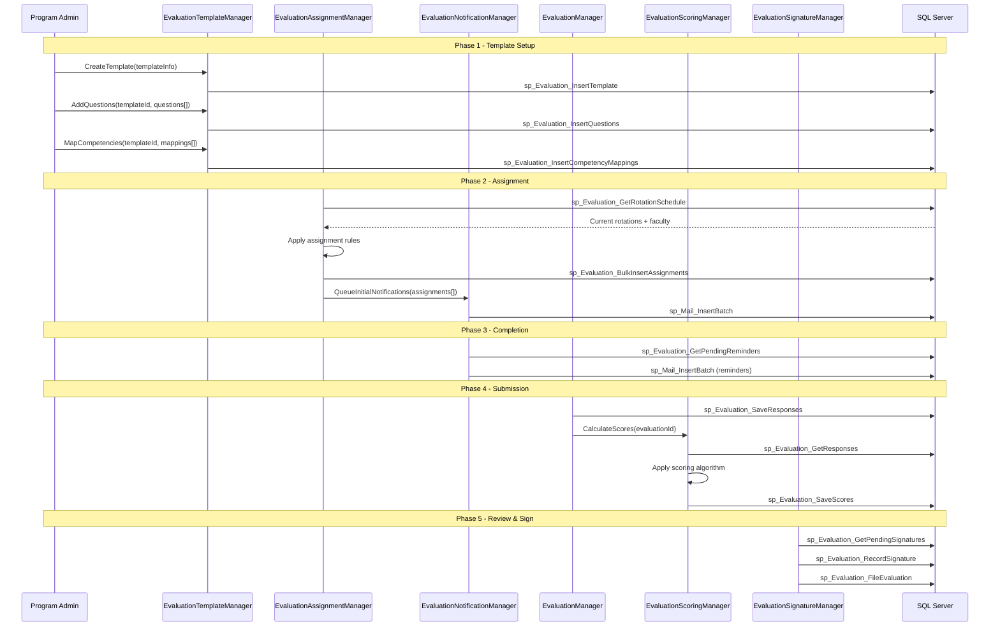
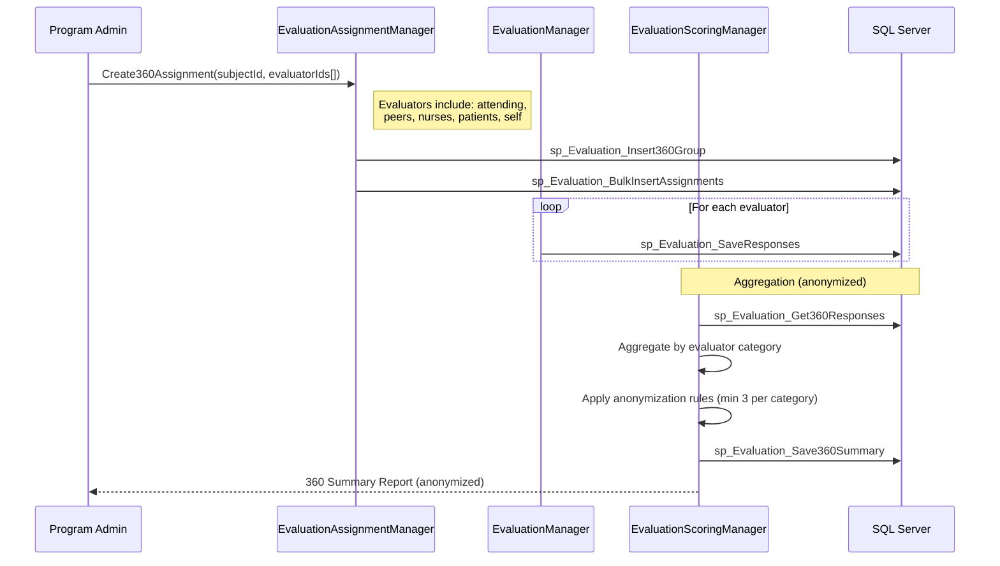
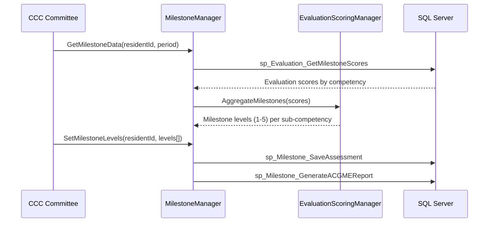
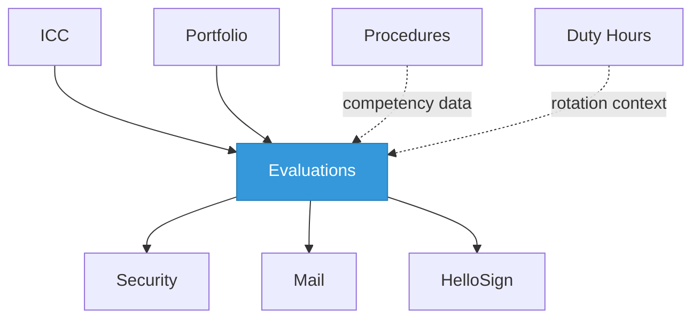

import DependentsPanel from '@site/src/components/DependentsPanel';

# Evaluations

<!-- Content will be enriched by AI parsing scripts -->

## Overview

The Evaluations module is the primary product feature of MyEvaluations and the most heavily used component of the platform. It manages the complete lifecycle of trainee evaluations across GME residency programs, CME activities, nursing programs, and PA programs. With 35+ classes, this module handles everything from evaluation template design and assignment through notification, submission, review, signing, and permanent filing.

Evaluation types include attending-of-resident, resident-of-attending, resident-of-rotation, 360-degree (multi-source), self-evaluations, milestone evaluations, and custom institutional forms. The module supports configurable question types, competency mapping to ACGME core competencies and milestones, automated distribution scheduling, and multi-level approval workflows.

### Key Responsibilities

- **Template Management**: Design evaluation forms with configurable question types, scoring scales, and competency mappings
- **Assignment Engine**: Automatically assign evaluations based on rotation schedules, faculty assignments, and program rules
- **Notification Lifecycle**: Send reminders at configurable intervals until evaluation completion or expiration
- **Submission & Review**: Collect responses, calculate scores, route for review and co-signatures
- **Signing & Filing**: Electronic signature capture, final review, and permanent filing to trainee record
- **Reporting**: Aggregate scores, trend analysis, competency dashboards, and ACGME milestone reporting

## Key Classes

### Manager Classes

| Class | Namespace | Purpose |
|-------|-----------|---------|
| `EvaluationManager` | `MyEvaluations.Business.Evaluations` | Core evaluation CRUD, assignment, submission, and retrieval logic. |
| `EvaluationTemplateManager` | `MyEvaluations.Business.Evaluations` | Template creation, versioning, question management, and competency mapping. |
| `EvaluationAssignmentManager` | `MyEvaluations.Business.Evaluations` | Automated and manual evaluation assignment based on rotation schedules and rules. |
| `EvaluationNotificationManager` | `MyEvaluations.Business.Evaluations` | Reminder scheduling, escalation logic, and notification tracking. |
| `EvaluationScoringManager` | `MyEvaluations.Business.Evaluations` | Score calculation, competency aggregation, and statistical analysis. |
| `EvaluationSignatureManager` | `MyEvaluations.Business.Evaluations` | Electronic signature workflow for evaluation sign-off. |
| `EvaluationReportManager` | `MyEvaluations.Business.Evaluations` | Report generation: individual, aggregate, trend, and ACGME milestone reports. |
| `MilestoneManager` | `MyEvaluations.Business.Evaluations` | ACGME milestone mapping, level assessment, and CCC reporting integration. |

### Info (DTO) Classes

| Class | Purpose |
|-------|---------|
| `EvaluationInfo` | Complete evaluation record: ID, template, evaluator, subject, status, scores, dates, comments. |
| `EvaluationTemplateInfo` | Template definition: ID, name, version, institution, program, question list, competency mappings. |
| `EvaluationQuestionInfo` | Individual question: ID, text, type (Likert, free-text, checkbox, ranking), required flag, competency link. |
| `EvaluationAssignmentInfo` | Assignment record: evaluator, subject, template, due date, rotation, status. |
| `EvaluationResponseInfo` | Individual question response: question ID, answer value, comment, timestamp. |
| `EvaluationScoreInfo` | Calculated score: overall, per-competency, percentile, comparison to program average. |
| `CompetencyMappingInfo` | Maps questions to ACGME competencies (Patient Care, Medical Knowledge, etc.). |
| `MilestoneInfo` | ACGME milestone definition: competency, sub-competency, level descriptors. |

## Business Workflows

### Evaluation Lifecycle

### 360-Degree Evaluation Flow

### Milestone Assessment Flow

## Stored Procedure References

| Stored Procedure | Purpose |
|-----------------|---------|
| `sp_Evaluation_InsertTemplate` | Create new evaluation template |
| `sp_Evaluation_InsertQuestions` | Add questions to a template |
| `sp_Evaluation_InsertCompetencyMappings` | Map questions to ACGME competencies |
| `sp_Evaluation_GetRotationSchedule` | Retrieve current rotation schedule for assignment |
| `sp_Evaluation_BulkInsertAssignments` | Create evaluation assignments in bulk |
| `sp_Evaluation_GetPendingReminders` | Retrieve evaluations needing reminder notifications |
| `sp_Evaluation_SaveResponses` | Save evaluator responses |
| `sp_Evaluation_GetResponses` | Retrieve responses for scoring |
| `sp_Evaluation_SaveScores` | Store calculated scores |
| `sp_Evaluation_RecordSignature` | Record electronic signature on evaluation |
| `sp_Evaluation_FileEvaluation` | Mark evaluation as permanently filed |
| `sp_Evaluation_Insert360Group` | Create a 360-degree evaluation group |
| `sp_Evaluation_Get360Responses` | Retrieve anonymized 360 responses |
| `sp_Evaluation_Save360Summary` | Store aggregated 360 summary |
| `sp_Evaluation_GetMilestoneScores` | Retrieve scores for milestone assessment |
| `sp_Milestone_SaveAssessment` | Save CCC milestone level assignments |
| `sp_Milestone_GenerateACGMEReport` | Generate ACGME milestone reporting data |

## Cross-Module Dependencies

### Dependency Details

| Direction | Module | Relationship |
|-----------|--------|-------------|
| Depends on | Security | Permission checks for who can evaluate whom, role-based routing |
| Depends on | Mail | Notification delivery for assignment, reminders, and completion alerts |
| Depends on | HelloSign | E-signature integration for evaluation sign-off (when configured) |
| Depended on by | ICC | CCC committees consume evaluation data for milestone reviews |
| Depended on by | Portfolio | Portfolio includes evaluation summaries and scores |
| Related to | Procedures | Competency data shared between procedure tracking and evaluations |
| Related to | Duty Hours | Rotation schedule context used for evaluation assignment |

{/* DEPENDENTS-PANEL:START */}
<DependentsPanel module="Evaluations" />
{/* DEPENDENTS-PANEL:END */}

## File Reference

Browse per-file implementation documentation for every class in this module:

- [**Evaluations Implementation Files**](./files/evaluations) — 47 classes with summaries, key methods, stored procedures, and migration notes

## Database Tables

This module maps to the **EVAL\_** table prefix with **331 database tables**.

| Metric | Value |
|--------|-------|
| Tables | 331 |
| With Primary Key | 229 (69%) |

Browse the full table reference with expandable details, FK relationships, and Mermaid ER diagrams:

- [**Evaluations Database Tables**](/docs/database/modules/evaluations) — 331 tables with schema detail and migration notes
